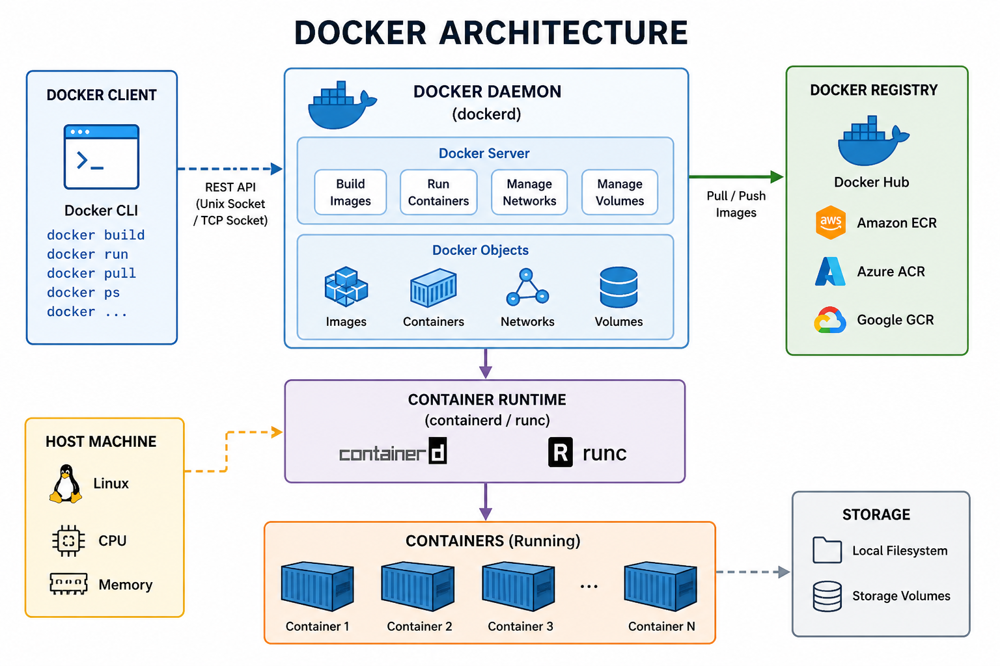

# Day 1 — Docker Fundamentals + Installation

# 1. What is Docker?

Docker is a:

```text id="c4m8px"
Containerization platform
```

used to package applications along with:

* Dependencies
* Libraries
* Runtime
* Configurations

into isolated units called:

```text id="t7q2vw"
Containers
```

Docker solves:

```text id="p1v9mz"
"It works on my machine but not on server"
```

problem.

---

# 2. Problems Before Docker

Before Docker:

* Applications installed directly on server
* Dependency conflicts occurred
* Different environments caused failures
* Scaling was difficult

Example:

Developer Machine:

```text id="m3q7vx"
Java 21
MySQL 8
```

Production Server:

```text id="w6t1qy"
Java 17
MySQL 5.7
```

Application may fail in production.

---

# 3. Virtual Machine vs Container

---

# 3.1 Virtual Machine (VM)

A VM contains:

* Full operating system
* Separate kernel
* Application

Architecture:

```text id="x8m4qz"
Hardware
   ↓
Hypervisor
   ↓
VM
   ↓
Guest OS
   ↓
Application
```

---

# 3.2 Problems with VMs

* Heavyweight
* Slow startup
* High RAM usage
* Poor scalability

---

# 3.3 Containers

Containers package:

* Application
* Dependencies

BUT share:

```text id="k2v7tw"
Host OS kernel
```

Architecture:

```text id="u5m1qx"
Hardware
   ↓
Host OS
   ↓
Docker Engine
   ↓
Containers
```

---

# 3.4 VM vs Container

| Feature        | VM      | Container |
|----------------|---------|-----------|
| OS Included    | Yes     | No        |
| Size           | GBs     | MBs       |
| Startup Time   | Minutes | Seconds   |
| Performance    | Slower  | Faster    |
| Resource Usage | High    | Low       |

---

# 4. Why Containers are Lightweight

Containers are lightweight because:

* No full OS inside each container
* Shared host kernel
* Process-level isolation

Linux features used:

* Namespaces
* Cgroups

---

# 4.1 Namespaces

Provide isolation:

* Process isolation
* Network isolation
* Filesystem isolation

---

# 4.2 Cgroups

Control:

* CPU usage
* Memory usage

for containers.

---

# 5. [Docker Architecture](https://www.geeksforgeeks.org/devops/architecture-of-docker/)

* Docker is based on a client–server model.
* The Docker client sends requests to the Docker Daemon.
* The Docker Daemon handles container lifecycle tasks.
* Communication happens over a REST API using sockets or networks.

Docker follows:

```text id="n7q3vx"
Client-Server architecture
```

Flow:

```text id="r5m8qy"
Client → Daemon → Runtime → Container
```



```text
+--------------------------------------------------+
|                  Docker User                     |
|        (Developer / DevOps Engineer)             |
+--------------------------------------------------+
                     |
                     |  docker commands
                     |  (docker run, build, ps)
                     ↓
+--------------------------------------------------+
|                  Docker Client                   |
|                    (CLI/API)                     |
+--------------------------------------------------+
                     |
                     | REST API / Unix Socket
                     ↓
+--------------------------------------------------+
|                 Docker Daemon                    |
|                    (dockerd)                     |
|                                                  |
|  Responsibilities:                               |
|  - Build images                                  |
|  - Run containers                                |
|  - Manage networks                               |
|  - Manage volumes                                |
|  - Pull/push images                              |
+--------------------------------------------------+
                     |
                     |
        +------------+-------------+
        |                          |
        ↓                          ↓
+------------------+     +------------------------+
| Docker Registry  |     |   Container Runtime    |
| (Docker Hub/ECR) |     |  (containerd / runc)   |
+------------------+     +------------------------+
        |                          |
        | Pull Images              | Create Containers
        ↓                          ↓
+--------------------------------------------------+
|                 Docker Images                    |
|                                                  |
|  Read-only templates containing:                 |
|  - App code                                      |
|  - Runtime                                       |
|  - Dependencies                                  |
+--------------------------------------------------+
                     |
                     | Create running instance
                     ↓
+--------------------------------------------------+
|                Docker Containers                 |
|                                                  |
|  Running isolated applications                   |
|                                                  |
|  Examples:                                       |
|  - nginx                                         |
|  - mysql                                         |
|  - springboot-app                                |
+--------------------------------------------------+
                     |
                     ↓
+--------------------------------------------------+
|                Host Operating System             |
|                  Linux Kernel                    |
|                                                  |
|  Docker uses:                                    |
|  - Namespaces                                    |
|  - Cgroups                                       |
|  - Union Filesystem                              |
+--------------------------------------------------+
```

1. **Docker Client**: It is the primary interface for users. When you execute commands such as docker run or docker build, the client translates them into REST API requests and sends them to the Docker Daemon.
2. **Docker Host**: This is the machine where the magic happens. It runs the Docker Daemon (dockerd) and provides the environment to execute and run containers.
3. **Docker Registry**: This is a remote repository for storing and distributing your Docker images.

---

# 5.1 Docker Client

The Docker Client is the primary interface through which users interact with Docker. This is most commonly the Command Line Interface (CLI) used by developers.

* It translates user commands like docker ps into REST API requests.
* These requests are sent to the Docker Daemon for processing.
* A single client can communicate with multiple daemons.

Example:

```bash id="w1v4pz"
docker run nginx
```

---

# 5.2 Docker Daemon

The Docker Daemon is the persistent background process that acts as the brain of your Docker installation.

* It runs on the Docker Host.
* It listens for API requests from the Docker Client.
* It manages all Docker objects: images, containers, networks, and volumes.
* It can communicate with other daemons to manage Docker services in a multi-host environment (like a Docker Swarm cluster).

Linux service:

```bash id="m9q2tw"
dockerd
```

---

# 5.3 Container Runtime

Actually runs containers.

Examples:

* containerd
* runc

---

# 6. Install Docker on Windows

Recommended setup:

```text id="t4v7qx"
Docker Desktop + WSL2
```

---

# 6.1 What is WSL2?

WSL2:

```text id="p8m1qz"
Windows Subsystem for Linux 2
```

Provides:

* Real Linux kernel inside Windows

Docker requires Linux kernel features.

---

# 6.2 Install WSL2

Open PowerShell as Administrator:

```powershell id="x3q6vw"
wsl --install
```

Restart system after installation.

---

# 6.3 Install Ubuntu

Install from:

* Microsoft Store

Recommended:

```text id="k5v9tw"
Ubuntu 22.04 LTS
```

---

# 6.4 Install Docker Desktop

Download:

[Docker Desktop Official Website](https://www.docker.com/products/docker-desktop/?utm_source=chatgpt.com)

Enable:

```text id="m2q8vx"
Use WSL2 based engine
```

---

# 6.5 Enable Ubuntu Integration

Docker Desktop:

```text id="w7m4qy"
Settings → Resources → WSL Integration
```

Enable Ubuntu.

---

# 6.6 Verify Installation

Run:

```bash id="u1v5pz"
docker version
docker info
```

---

# 7. Core Docker Concepts

---

# 7.1 Docker Image

A Docker image is:

```text id="q9m2vx"
Read-only blueprint/template
```

used to create containers.

Example:

```bash id="t3q7wy"
nginx
```

---

# 7.2 Docker Container

A container is:

```text id="x6v1qz"
Running instance of image
```

---

# 7.3 Docker Layers

Each Dockerfile instruction creates:

```text id="m4q8tw"
Layer
```

Benefits:

* Faster builds
* Reusability
* Efficient caching

---

# 7.4 Docker Registry

Registry stores Docker images.

Examples:

* Docker Hub
* AWS ECR
* Azure ACR

---

# 7.5 Docker Hub

Official public Docker registry.

Website:

[Docker Hub](https://hub.docker.com?utm_source=chatgpt.com)

Stores:

* nginx
* mysql
* redis
* ubuntu images

---

# 8. Important Docker Commands

---

# 8.1 Pull Image

```bash id="v5m9qx"
docker pull nginx
```

Downloads image.

---

# 8.2 List Images

```bash id="p1q4vz"
docker images
```

---

# 8.3 List Running Containers

```bash id="t8m2qw"
docker ps
```

---

# 8.4 List All Containers

```bash id="w3v7qx"
docker ps -a
```

---

# 8.5 Stop Container

```bash id="u6m1qz"
docker stop <container-id>
```

---

# 8.6 Remove Container

```bash id="x2q9vw"
docker rm <container-id>
```

---

# 9. Run Your First Containers

---

# 9.1 Hello World Container

```bash id="m7v4qx"
docker run hello-world
```

Verifies:

* Docker engine
* Image pulling
* Container execution

---

# 9.2 Run Nginx in Background

```bash id="q5m8tw"
docker run -d nginx
```

`-d` means:

```text id="t1v3qz"
Detached mode
```

Container runs in background.

---

# 9.3 Interactive Ubuntu Container

```bash id="w9q2vx"
docker run -it ubuntu bash
```

Flags:

* `-i` → interactive
* `-t` → terminal

Used for:

* Shell access
* Debugging

---

# 10. Detached Mode

Runs container:

```text id="u4m7qw"
In background
```

Example:

```bash id="x8v1pz"
docker run -d nginx
```

Useful for:

* Web servers
* Databases
* APIs

---

# 11. Interactive Mode

Allows terminal interaction.

Example:

```bash id="m3q6vx"
docker run -it ubuntu bash
```

Useful for:

* Debugging
* Manual commands
* Exploring container

---

# 12. Port Mapping

Containers run in isolated network.

Without port mapping:

```text id="q7m2tw"
Application not accessible externally
```

---

# 12.1 Port Mapping Syntax

```bash id="v1q5wy"
docker run -p 8080:80 nginx
```

Meaning:

```text id="u8m4qx"
HostPort:ContainerPort
```

---

# 12.2 Example Flow

```text id="x5v9qz"
Browser
   ↓
localhost:8080
   ↓
Docker Mapping
   ↓
Container Port 80
   ↓
Nginx
```

---

# 12.3 Access Application

Open browser:

```text id="m2q7vw"
http://localhost:8080
```

You should see:

```text id="t6m1qx"
Welcome to nginx!
```

---

# 13. Enter Running Container

Command:

```bash id="w4v8pz"
docker exec -it <container-id> bash
```

Used for:

* Debugging
* Checking files
* Running Linux commands

---

# 14. Hands-On Tasks

---

# Task 1 — Run nginx

```bash id="u9q3vx"
docker run -d -p 8080:80 nginx
```

---

# Task 2 — Run Redis

```bash id="x1m6qw"
docker run -d redis
```

---

# Task 3 — Run MySQL

```bash id="m5v2qz"
docker run -d \
-e MYSQL_ROOT_PASSWORD=root \
-p 3306:3306 \
mysql:8
```

---

# Task 4 — Access nginx in Browser

Open:

```text id="q8m4tw"
http://localhost:8080
```

---

# Task 5 — Enter Inside Container

```bash id="v3q7wy"
docker exec -it <container-id> bash
```

---

# 15. Common Problems

---

# 15.1 Docker Engine Not Starting

Possible causes:

* WSL issue
* Virtualization disabled

Fix:

```powershell id="u7m1qx"
wsl --shutdown
```

Restart Docker Desktop.

---

# 15.2 Port Already in Use

Error:

```text id="x9v5qz"
Bind for 0.0.0.0 failed
```

Use different host port:

```bash id="m4q8vw"
docker run -p 9090:80 nginx
```

---

# 15.3 Container Exits Immediately

Check logs:

```bash id="t2m6qx"
docker logs <container-id>
```

---

# 16. Summary

Today you learned:

✅ What Docker is
✅ VM vs Containers
✅ Why containers are lightweight
✅ Docker architecture
✅ Docker installation using WSL2
✅ Images and containers
✅ Docker Hub and registry
✅ Detached mode
✅ Interactive mode
✅ Port mapping
✅ Running real containers

These concepts are the foundation for:

* Docker Compose
* Kubernetes
* CI/CD
* Cloud-native applications
