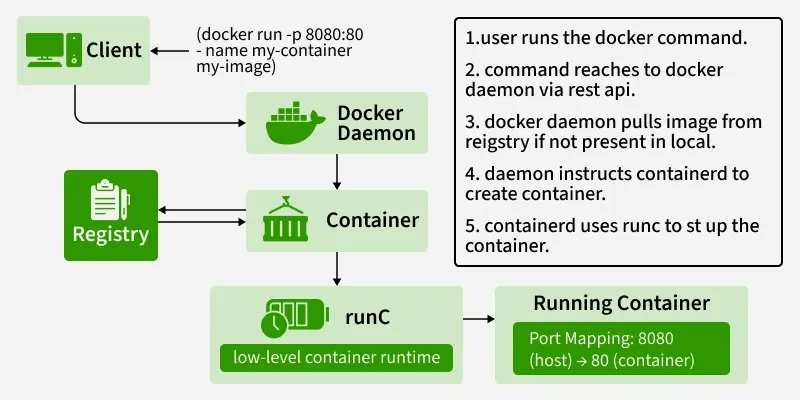

# Day 3 — Docker Compose + Networking + Volumes

# 1. Introduction

Day 3 focuses on:

* Container networking
* Persistent storage
* Multi-container applications
* Docker Compose

Goal:

```text id="p4m8vx"
Run complete Spring Boot + MySQL + Redis stack using Docker Compose
```

---

# 2. [Docker Networking](https://www.geeksforgeeks.org/devops/basics-of-docker-networking/)

Containers communicate using Docker networks.

Without networking:

```text id="u7q2tw"
Containers cannot communicate properly
```

Docker provides isolated virtual networks.

---

# 3. Types of Docker Networks

| Network Type | Purpose                   |
|--------------|---------------------------|
| bridge       | Default container network |
| host         | Shares host network       |
| none         | No networking             |
| overlay      | Multi-host networking     |

Most commonly used:

```text id="x1m5qz"
Bridge network
```

---

# 4. Bridge Network

Default Docker network.

Containers connected to same bridge network can:

* Communicate
* Resolve each other using DNS

---

# 4.1 View Networks

```bash id="m9q3vx"
docker network ls
```

Example:

```text id="w4m7qy"
NETWORK ID     NAME      DRIVER
abc123         bridge    bridge
```

---

# 4.2 Create Custom Network

```bash id="u2v8qx"
docker network create mynet
```

---

# 4.3 Verify Network

```bash id="x6m1qw"
docker network inspect mynet
```

Shows:

* Connected containers
* IP addresses
* Network details

---

# 5. Connect Containers to Network

Example:

```bash id="p5q9vz"
docker run -d --network mynet --name mysql mysql
```

Another container:

```bash id="t8m2qx"
docker run -it --network mynet ubuntu bash
```

Now containers can communicate.

---

# 6. Container DNS

Docker provides:

```text id="w3v7qy"
Automatic DNS resolution
```

Containers communicate using:

```text id="u9m4qx"
Container names
```

instead of IP addresses.

Example:

```text id="x2q8vw"
mysql
redis
app
```

---

# 7. Inter-Container Communication

Suppose:

* Spring Boot container
* MySQL container

Spring Boot connects using:

```properties id="m6v1qz"
spring.datasource.url=jdbc:mysql://mysql:3306/mydb
```

Here:

```text id="p7m5qx"
mysql
```

is container name.

No hardcoded IP needed.

---

# 8. Why Custom Networks are Important

Benefits:

* Better isolation
* Automatic DNS
* Easier communication
* Cleaner architecture

---

# 9. Docker Volumes

Containers are:

```text id="u1q7vx"
Ephemeral
```

Meaning:

```text id="m4v2qw"
Data disappears when container is removed
```

Volumes provide:

```text id="x8m9qz"
Persistent storage
```

---

# 10. Types of Docker Storage

| Type         | Purpose              |
|--------------|----------------------|
| Named Volume | Managed by Docker    |
| Bind Mount   | Uses host filesystem |
| tmpfs        | Memory-only storage  |

---

# 11. Named Volumes

Docker-managed persistent storage.

---

# 11.1 Create Volume

```bash id="p3q6vw"
docker volume create mysql-data
```

---

# 11.2 List Volumes

```bash id="t7m1qx"
docker volume ls
```

---

# 11.3 Use Volume

Example:

```bash id="w5v8qz"
docker run -d \
-v mysql-data:/var/lib/mysql \
mysql
```

Meaning:

```text id="u2m4qx"
mysql-data
→
/var/lib/mysql
```

inside container.

---

# 12. Why Volumes are Important

Without volume:

```text id="x9q3vw"
MySQL data lost when container removed
```

With volume:

```text id="m1v7qx"
Data persists permanently
```

---

# 13. Bind Mounts

Maps:

```text id="p6m2qz"
Host directory → Container directory
```

Example:

```bash id="t4q8vw"
docker run -v /home/app/logs:/logs nginx
```

---

# 14. Named Volume vs Bind Mount

| Named Volume            | Bind Mount                |
|-------------------------|---------------------------|
| Managed by Docker       | Managed by user           |
| Better portability      | Direct host access        |
| Preferred for databases | Preferred for development |

---

# 15. Docker Compose

Docker Compose is used for:

```text id="w8m5qx"
Running multi-container applications
```

using:

```text id="u3q1vz"
Single YAML file
```

---

# 16. Why Docker Compose?

Without Compose:

Need multiple commands:

* Run MySQL
* Run Redis
* Run Spring Boot
* Create networks
* Create volumes

Complex and error-prone.

Compose simplifies everything.

---

# 17. Compose File

Default filename:

```text id="x7m4qw"
compose.yaml
```

OR

```text id="p2v9qx"
docker-compose.yml
```

---

# 18. Basic Compose Structure

```yaml id="m5q7vw"
services:
  app:
  mysql:
```

---

# 19. Full Stack Compose Example

```yaml id="u8m2qx"
services:

  mysql:
    image: mysql:8
    container_name: mysql
    environment:
      MYSQL_ROOT_PASSWORD: root
      MYSQL_DATABASE: mydb
    ports:
      - "3306:3306"
    volumes:
      - mysql-data:/var/lib/mysql

  redis:
    image: redis
    container_name: redis
    ports:
      - "6379:6379"

  app:
    build: .
    container_name: springboot-app
    ports:
      - "8080:8080"
    depends_on:
      - mysql
      - redis
    environment:
      DB_HOST: mysql

volumes:
  mysql-data:
```

---

# 20. Important Compose Concepts

---

# 20.1. Services

A service = one container definition.

Example:

```yaml id="jlwm05"
services:
  app:
  mysql:
  redis:
```

Each service:

* creates container(s)
* has network identity
* can communicate internally

---

# 20.2. Networks

Compose automatically creates network.

Example:

```text id="jlwm06"
app ↔ mysql
```

Containers communicate using service name.

Example:

```properties id="’wini07"
spring.datasource.url=jdbc:mysql://mysql:3306/testdb
```

Notice:

```text id="’wini08"
mysql
```

is service name, NOT localhost.

---

# 20.3. Volumes

Volumes persist data.

Without volumes:

```text id="’wini09"
Container deleted = data lost
```

With volumes:

```text id="’wini10"
Data survives restart
```

---

# 20.4. Environment Variables

Used for configuration.

Example:

```yaml id="’wini11"
environment:
  MYSQL_ROOT_PASSWORD: root
```

---

# 20.5. Depends On

Controls startup order.

Example:

```yaml id="’wini12"
depends_on:
  - mysql
```

Means:

```text id="’wini13"
Start mysql before app
```

Important:

* does NOT guarantee DB ready
* only container started

---

# Basic docker-compose.yml

# Spring Boot + MySQL

```yaml id="’wini14"
services:

  mysql:
    image: mysql:8.0

    container_name: mysql-container

    environment:
      MYSQL_ROOT_PASSWORD: root
      MYSQL_DATABASE: testdb

    ports:
      - "3307:3306"

    volumes:
      - mysql-data:/var/lib/mysql

  app:
    build: .

    container_name: springboot-app

    ports:
      - "8080:8080"

    depends_on:
      - mysql

    environment:
      SPRING_DATASOURCE_URL: jdbc:mysql://mysql:3306/testdb
      SPRING_DATASOURCE_USERNAME: root
      SPRING_DATASOURCE_PASSWORD: root

volumes:
  mysql-data:
```

---

# Important Compose Sections

# 20.1.1. version

Old style:

```yaml id="’wini15"
version: '3.8'
```

Modern Compose:

* optional

---

# 20.1.2. services

Main section.

```yaml id="’wini16"
services:
```

Defines containers.

---

# 20.1.3. image

Use existing image.

```yaml id="’wini17"
image: mysql:8.0
```

---

# 20.1.4. build

Build from Dockerfile.

```yaml id="’wini18"
build: .
```

OR:

```yaml id="’wini19"
build:
  context: .
  dockerfile: Dockerfile.dev
```

---

# 20.1.5. container_name

Explicit container name.

```yaml id="’wini20"
container_name: myapp
```

---

# 20.1.6. ports

Port mapping.

```yaml id="’wini21"
ports:
  - "8080:8080"
```

Format:

```text id="’wini22"
HOST:CONTAINER
```

---

# 20.1.7. environment

Environment variables.

```yaml id="’wini23"
environment:
  MYSQL_ROOT_PASSWORD: root
```

---

# 20.1.8. env_file

Load variables from file.

```yaml id="’wini24"
env_file:
  - .env
```

---

# 20.1.9. volumes

Persistent storage.

```yaml id="’wini25"
volumes:
  - mysql-data:/var/lib/mysql
```

---

# 20.1.10. depends_on

Service dependency.

```yaml id="’wini26"
depends_on:
  - mysql
```

---

# 20.1.11. networks

Custom networks.

```yaml id="’wini27"
networks:
  backend:
```

---

# 20.1.12. restart

Restart policy.

```yaml id="’wini28"
restart: always
```

Options:

* no
* always
* on-failure
* unless-stopped

---

---

# 21. Docker Compose Commands

---

# 21.1 Start Application

```bash id="m7q4vz"
docker compose up
```

---

# 21.2 Start in Background

```bash id="u1m8qx"
docker compose up -d
```

---

# 21.3 Stop Application

```bash id="p5q2vw"
docker compose down
```

---

# 21.4 View Logs

```bash id="t9m6qx"
docker compose logs
```

---

# 21.5 Rebuild Images

```bash id="w3q7vz"
docker compose up --build
```

---

# 22. Compose Networking Internally

Docker Compose automatically creates:

```text id="x8m4qw"
Dedicated bridge network
```

All services communicate using:

```text id="p2q1vx"
Service names
```

Example:

```text id="u6m9qz"
mysql
redis
app
```

---

# 23. Full Stack Setup

Application stack:

| Service     | Purpose     |
|-------------|-------------|
| Spring Boot | Backend API |
| MySQL       | Database    |
| Redis       | Cache       |

---

# 24. Spring Boot Database Connection

application.properties:

```properties id="m4q7vw"
spring.datasource.url=jdbc:mysql://mysql:3306/mydb
spring.datasource.username=root
spring.datasource.password=root
```

`mysql` works because:

```text id="t1m5qx"
Docker DNS resolves service names
```

---

# 25. Verify Container Communication

Enter Spring Boot container:

```bash id="w7q2vz"
docker exec -it springboot-app bash
```

Ping MySQL:

```bash id="u9m6qx"
ping mysql
```

Successful ping confirms networking works.

---

# 26. Verify Persistent Storage

Stop containers:

```bash id="p3q8vw"
docker compose down
```

Restart:

```bash id="x5m1qz"
docker compose up
```

MySQL data should remain.

Because:

```text id="m7v4qx"
Volume persists data
```

---

# 27. Common Problems

---

# 27.1 MySQL Connection Failed

Possible causes:

* Wrong hostname
* Container startup timing
* Incorrect credentials

Check:

```bash id="t2q7vw"
docker compose logs
```

---

# 27.2 Port Already in Use

Change host port:

```yaml id="u6m3qx"
ports:
  - "3307:3306"
```

---

# 27.3 Volume Permission Issues

Sometimes Linux permissions block DB startup.

Fix:

* Remove volume
* Recreate container

---

# 28. Best Practices

---

# 28.1 Use Named Volumes for Databases

Recommended for:

* MySQL
* PostgreSQL
* MongoDB

---

# 28.2 Use Service Names Instead of IPs

GOOD:

```text id="p8m1qz"
mysql
```

BAD:

```text id="w4q6vx"
172.18.0.5
```

---

# 28.3 Keep Secrets Outside Compose File

Avoid hardcoding:

* Passwords
* API keys

Use:

* .env
* Docker secrets

---

# 28.4 Use depends_on Carefully

`depends_on`:

```text id="x1m9qw"
Does NOT guarantee application readiness
```

Only startup order.

---

# 29. Hands-On Tasks

---

# Task 1 — Create Network

```bash id="m5q2vz"
docker network create mynet
```

---

# Task 2 — Create Volume

```bash id="u8m7qx"
docker volume create mysql-data
```

---

# Task 3 — Run MySQL with Volume

Persist database data.

---

# Task 4 — Create compose.yaml

Include:

* Spring Boot
* MySQL
* Redis

---

# Task 5 — Verify Communication

Inside container:

```bash id="p2q4vw"
ping mysql
```

---

# 30.  Step-by-Step Execution of a Docker Command

Let’s trace a common command to understand how all components work together:



**You run the command: docker run -d -p 80:80 nginx**

**Client**: The Docker Client sends a REST API request to the Docker Daemon to create and run a container from the nginx image.

**Daemon**: The Daemon receives the request. It first checks if the nginx image exists locally on the Host.

**Registry (Pull)**: If the image is not found locally, the Daemon contacts the configured Registry (Docker Hub by default) and pulls the nginx image.

**Runtime (containerd)**: The Daemon passes the image and run-configuration over to containerd.

**Runtime (runc)**: containerd uses runc to create a new container. runc interfaces with the Linux kernel to create isolated namespaces and limit resources with cgroups.

**Execution**: The container is started. Docker maps port 80 of the host to port 80 of the nginx container, as requested by the -p 80:80 flag. The Nginx process runs as PID 1 inside the container's isolated PID namespace.

# 31. Production vs Development Compose

Usually:

* docker-compose.dev.yml
* docker-compose.prod.yml

---

# Override Files

```bash id="’wini47"
docker compose -f docker-compose.yml -f docker-compose.prod.yml up
```

---

# 32. Mapping Concepts

| Compose     | Kubernetes          |
|-------------|---------------------|
| service     | Pod/Deployment      |
| volumes     | PersistentVolume    |
| environment | ConfigMap/Secret    |
| networks    | Service/Networking  |
| restart     | ReplicaSet behavior |

---

# 33. Most Important Compose Commands Cheat Sheet

```bash id="’wini52"
docker compose up -d
docker compose down
docker compose ps
docker compose logs -f
docker compose exec app bash
docker compose restart app
docker compose up --build
docker compose down -v
```
