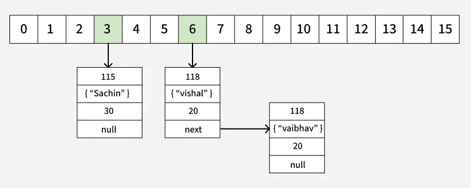

# Table of Content

1. [Round 1 — Java Internals](#round-1-—-java-internals)
2. [Round 2 — Multithreading & Concurrency](#round-2--multithreading--concurrency)
3. [Round 3 — JVM & Memory Management](#round-3--jvm--memory-management)
4. [Round 4 — Spring Boot & Microservices](#round-4--spring-boot--microservices)
5. [Round 5 — Database, SQL & Transaction Management](#round-5--database-sql--transaction-management)
6. [Round 6 — Java 8+, Streams, Functional Programming & Advanced Concurrency](#round-6--java-8-streams-functional-programming--advanced-concurrency)
7. [Round 7 — System Design, Production Issues & Real-Time Scenarios](#round-7--system-design-production-issues--real-time-scenarios)
8. [Round 8 — Advanced Java, JVM Internals & Tough Scenario-Based Questions](#round-8--advanced-java-jvm-internals--tough-scenario-based-questions)
9. [Round 9 — Coding, Problem Solving & Debugging Scenarios (Senior Backend Engineer Level)](#round-9--coding-problem-solving--debugging-scenarios-senior-backend-engineer-level)
10. [Round 10 — Spring Boot Internal Deep Dive & Advanced Microservices (Architect/Senior Engineer Level)](#round-10--spring-boot-internal-deep-dive--advanced-microservices-architectsenior-engineer-level)
11. [Round 11 — Ultra Advanced Senior/Lead Engineer Round (Real Product Company Level)](#round-11--ultra-advanced-seniorlead-engineer-round-real-product-company-level)
12. [Round 12 — HR + Managerial + Behavioral + Project Deep Dive (5+ Years Experience)](#round-12--hr--managerial--behavioral--project-deep-dive-5-years-experience)
13. [Round 13 — Final Round with CTO/CEO](#round-13--final-round-with-ctoceo)
14. [Round 14 — Offer Discussion](#round-14--offer-discussion)
15. [Round 15 — Negotiation](#round-15--negotiation)

---

---

# Cross Question 2 — Kafka Deep Dive

You mentioned Kafka is used between ESM and SNA.

Suppose:

* ESM publishes a request
* SNA consumes it
* But SNA crashes after processing the message and before sending acknowledgment

Questions:

1. Will the message be lost?
2. How does Kafka ensure reliability here?
3. What offset strategy are you using?
4. What happens in auto-commit vs manual commit?
5. How do you avoid duplicate processing?
6. What if the same Kafka message is consumed twice?
7. How do you ensure idempotency?

Answer like a backend engineer handling production systems.

---

# Expected Strong Answer

## 1. Will the message be lost?

Not necessarily.

Kafka stores messages durably in partitions on disk.
If SNA crashes after processing but before offset commit, Kafka will re-deliver the message when consumer restarts.

So:

* Message is usually NOT lost
* But duplicate processing can happen

---

# 2. How does Kafka ensure reliability?

Kafka ensures reliability using:

* Persistent storage on disk
* Replication across brokers
* Consumer offsets
* Acknowledgment mechanisms (acks)
* Retry support

Example:

* Producer sends message
* Kafka leader broker stores it
* Replicas copy it
* Only then acknowledgment is sent

If broker crashes, replica becomes leader.

---

# 3. What is Offset?

Offset is the unique position of a message inside a partition.

Example:

| Partition | Message | Offset |
|-----------|---------|--------|
| P0        | Order1  | 0      |
| P0        | Order2  | 1      |
| P0        | Order3  | 2      |

Consumer stores:
“I already processed till offset 2.”

After restart, consumer resumes from next offset.

---

# 4. Auto Commit vs Manual Commit

## Auto Commit

Kafka automatically commits offsets periodically.

Problem:
If processing fails after offset commit:

* Kafka thinks message processed
* Message can be lost logically

---

## Manual Commit

Offset committed only after successful processing.

Safer for production systems.

Typical flow:

1. Consume message
2. Process business logic
3. Save DB transaction
4. Commit offset

---

# 5. Duplicate Processing Problem

Scenario:

* Process completed
* Application crashes before offset commit

After restart:

* Kafka re-sends same message

This causes duplicate processing.

---

# 6. How to Handle Duplicate Messages?

Use Idempotency.

Meaning:
Processing same message multiple times should produce same result.

Techniques:

* Unique transaction IDs
* Deduplication table
* Upsert instead of insert
* Redis cache check
* Business keys

---

---

# Round 1 — Java Internals

Question:

Explain:

1. HashMap internal working
2. Why hashCode() and equals() both are needed
3. What happens during collision
4. Difference between HashMap and ConcurrentHashMap
5. Why HashMap is not thread-safe
6. What problems happen if multiple threads modify HashMap simultaneously

Answer in depth like a 5+ year Java engineer.

---

# 1. [HashMap Internal Working](https://www.geeksforgeeks.org/java/internal-working-of-hashmap-java/)

HashMap internally uses an array of buckets where each bucket stores nodes containing:

* hash
* key
* value
* next reference

When we insert a key-value pair:

1. HashMap calculates the hashCode of the key.
2. Using the hash, it calculates the bucket index.
3. It checks that bucket:

    * If empty → insert directly.
    * If already data exists → collision handling starts.
4. If same key already exists (`hashCode + equals` both match), value gets replaced.
5. Otherwise new node is added in the same bucket.

From Java 8 onwards:

* If collisions become too many, LinkedList converts into Red-Black Tree for better performance.



---

# 2. Why hashCode() and equals() Both Are Needed

`hashCode()` is used to find the bucket location quickly.

`equals()` is used to verify whether two keys are actually equal or not.

Because:

* Different objects can have same hashCode.
* So HashMap first checks hashCode.
* Then checks equals() for exact matching.

If both match:

* value gets replaced.

If hashCode same but equals false:

* treated as different keys.

---

# 3. What Happens During Collision

Collision happens when multiple keys map to same bucket index.

Example:

```java
key1 -> bucket 5
key2 -> bucket 5
```

HashMap then:

1. Checks hashCode and equals().
2. If key already exists → replace value.
3. Otherwise store new node in same bucket.

Before Java 8:

* stored using LinkedList.

After Java 8:

* if collisions exceed threshold, LinkedList converts into Red-Black Tree.

---

# 4. Difference Between HashMap and ConcurrentHashMap

| HashMap                                     | ConcurrentHashMap             |
|---------------------------------------------|-------------------------------|
| Not thread-safe                             | Thread-safe                   |
| Allows one null key                         | Does not allow null key/value |
| Faster in single thread                     | Better for multithreading     |
| No synchronization                          | Uses fine-grained locking/CAS |
| Can cause data corruption in multithreading | Safe for concurrent access    |

---

# 5. Why HashMap is Not Thread-Safe

HashMap is not thread-safe because:

* it has no synchronization
* multiple threads can modify internal structure simultaneously

Operations like:

* put()
* resize()
* rehashing()

are not protected.

So multiple threads can:

* overwrite data
* corrupt bucket structure
* create inconsistent state

---

# 6. What Problems Happen if Multiple Threads Modify HashMap Simultaneously

If multiple threads modify HashMap simultaneously:

* data may get lost
* values may be overwritten
* inconsistent reads can happen
* bucket chain can get corrupted

In older Java versions during resize:

* infinite loop could happen due to corrupted linked list structure
* CPU usage could become 100%

That is why for multithreading we use:

* ConcurrentHashMap
* synchronizedMap
* or proper synchronization mechanisms.

---

---

# Round 2 — Multithreading & Concurrency

Suppose we have:

```java
int count = 0;

Thread t1 = new Thread(() -> {
    for(int i = 0; i < 10000; i++) {
        count++;
    }
});

Thread t2 = new Thread(() -> {
    for(int i = 0; i < 10000; i++) {
        count++;
    }
});
```

After both threads complete:

1. Will `count` always become `20000`?
2. Why or why not?
3. What exactly happens internally during `count++`?
4. What is race condition?
5. How can you fix this issue?
6. Difference between:

    * `synchronized`
    * `volatile`
    * `AtomicInteger`
7. What is CAS (Compare And Swap)?
8. Why is `volatile` not enough for `count++`?
9. Difference between process and thread.
10. Difference between runnable state and blocked/waiting state.

Answer one by one like a real interview.

---

# 1. Will count always become 20000?

No.

Because `count++` is not thread-safe.

Both threads are modifying the same shared variable simultaneously, so some updates can be lost due to race condition.

---

# 2. Why does this happen?

Because multiple threads access and modify shared memory concurrently without synchronization.

Two threads may:

* read same value
* increment separately
* overwrite each other’s update

This causes lost updates.

---

# 3. What Happens Internally During `count++`?

Very important interview question.

`count++` is NOT a single operation.

Internally it performs 3 steps:

```java id="2mqfr5"
count++;
```

Actually becomes:

```java id="h46szn"
1. Read count value
2. Increment value
3. Write updated value back
```

Example:

Initial:

```java id="g6rbia"
count = 5
```

Thread-1 reads:

```java id="dhkzt6"
5
```

Thread-2 also reads:

```java id="97f5wi"
5
```

Both increment:

```java id="8fzyap"
6
```

Both write back:

```java id="72p9xq"
6
```

Expected:

```java id="75h63q"
7
```

Actual:

```java id="8lgw71"
6
```

This is race condition.

---

# 4. What is Race Condition?

Race condition occurs when:

* multiple threads access shared data simultaneously
* and final result depends on thread execution order.

This leads to:

* inconsistent data
* unpredictable output
* lost updates

---

# 5. How to Fix This Issue?

Using synchronization mechanisms like:

* synchronized
* AtomicInteger
* Lock APIs

Example using synchronized:

```java id="ujjlwm"
synchronized(this) {
    count++;
}
```

Better approach:

```java id="r8ngql"
AtomicInteger count = new AtomicInteger();

count.incrementAndGet();
```

---

# 6. Difference Between synchronized, volatile, AtomicInteger

| synchronized                             | volatile                        | AtomicInteger                        |
|------------------------------------------|---------------------------------|--------------------------------------|
| Provides mutual exclusion                | Only visibility guarantee       | Atomic operations                    |
| Only one thread executes block at a time | Threads see latest value        | Uses CAS internally                  |
| Prevents race condition                  | Does NOT prevent race condition | Thread-safe increment                |
| Slower due to locking                    | Lightweight                     | Better performance than synchronized |
| Used for critical sections               | Used for flags/status           | Used for counters                    |

---

# 7. What is CAS (Compare And Swap)?

CAS is a low-level atomic operation used internally by `AtomicInteger`.

Working:

1. Read current value
2. Compare with expected value
3. If same → update
4. Else retry

Example:

```text
Expected = 5
Current = 5
Update to 6
```

If another thread already changed value:

* update fails
* retry happens

CAS avoids heavy locking.

---

# 8. Why volatile is NOT Enough for count++?

`volatile` only guarantees:

* visibility

Meaning:

* latest value visible across threads.

But:
`count++` is still 3 operations:

* read
* modify
* write

These operations are NOT atomic.

So race condition still happens.

Example:

```java id="c4q6eo"
volatile int count;
```

Still NOT thread-safe for increment.

---

# 9. Difference Between Process and Thread

| Process                       | Thread                                 |
|-------------------------------|----------------------------------------|
| Independent program execution | Smallest execution unit inside process |
| Has separate memory           | Shares process memory                  |
| Heavyweight                   | Lightweight                            |
| Communication costly          | Communication easier                   |
| More resource usage           | Less resource usage                    |

Example:

* Chrome browser = process
* Each browser tab = thread

---

# 10. Runnable vs Blocked/Waiting State

## Runnable State

Thread is:

* ready to run
* waiting for CPU scheduling

Example:

```java id="t2qvh5"
thread.start();
```

---

## Blocked State

Thread waiting to acquire lock.

Example:

```java id="4gh70p"
synchronized(obj) {
}
```

Another thread already holding lock.

---

## Waiting State

Thread waiting indefinitely for another thread signal.

Example:

```java id="f8fx67"
wait();
join();
```

Needs notification to continue.

---

# Interview Tip

For 5+ years:

* interviewers heavily focus on multithreading
* especially:

    * race condition
    * synchronization
    * CAS
    * volatile
    * ConcurrentHashMap
    * thread pools
    * deadlock

These are extremely important topics.

---

---

# Round 3 — JVM & Memory Management

Question Set:

1. Explain JVM architecture.
2. What are Heap and Stack memory?
3. Difference between StackOverflowError and OutOfMemoryError.
4. What happens internally when we create an object using `new` keyword?
5. What is Garbage Collection?
6. Difference between Minor GC, Major GC, and Full GC.
7. What are strong, weak, and soft references?
8. Why String is immutable in Java?
9. What is String Constant Pool?
10. Difference between `==` and `.equals()` for String.

Answer one by one like a real interview.

---

# 1. Explain JVM Architecture

JVM is responsible for executing Java bytecode and providing platform independence.

Main components:

## Class Loader

Loads `.class` files into memory.

Types:

* Bootstrap ClassLoader
* Platform/Extension ClassLoader
* Application ClassLoader

---

## Runtime Memory Areas

### Heap

* Stores objects
* Shared among threads
* GC happens here

### Stack

* Stores method calls, local variables
* Each thread has separate stack

### Method Area / Metaspace

Stores:

* class metadata
* static variables
* constant pool

### PC Register

Stores current executing instruction.

### Native Method Stack

Used for native methods.

---

## Execution Engine

### Interpreter

Executes bytecode line-by-line.

### JIT Compiler

Converts frequent bytecode into native machine code for performance.

---

## Garbage Collector

Removes unused objects automatically.

---

# 2. What are Heap and Stack Memory?

| Heap Memory          | Stack Memory                                 |
|----------------------|----------------------------------------------|
| Stores objects       | Stores local variables and method calls      |
| Shared among threads | Each thread has separate stack               |
| GC managed           | Automatically removed after method execution |
| Larger memory        | Smaller memory                               |
| Slower access        | Faster access                                |

Example:

```java id="jlwmml"
Employee e = new Employee();
```

* Object → Heap
* Reference `e` → Stack

---

# 3. Difference Between StackOverflowError and OutOfMemoryError

| StackOverflowError                | OutOfMemoryError                |
|-----------------------------------|---------------------------------|
| Stack memory full                 | Heap/native memory exhausted    |
| Usually due to infinite recursion | Too many objects or memory leak |
| Thread-specific                   | JVM-wide memory issue           |

Example StackOverflow:

```java id="3b4dwb"
void test() {
   test();
}
```

Example OOM:

```java id="8l5g7t"
while(true) {
   list.add(new Object());
}
```

---

# 4. What Happens Internally When Object is Created?

```java id="uicvh3"
Employee e = new Employee();
```

Steps:

1. JVM checks whether `Employee` class already loaded.
2. If not loaded → ClassLoader loads class.
3. Memory allocated in Heap.
4. Instance variables initialized with default values.
5. Constructor called.
6. Object reference stored in Stack memory.
7. Object becomes accessible using reference `e`.

If reference removed:

* object becomes eligible for GC.

---

# 5. What is Garbage Collection?

Garbage Collection is the automatic memory cleanup mechanism in JVM.

GC removes objects that are no longer referenced.

Example:

```java id="5d0u1g"
Employee e = new Employee();
e = null;
```

Object becomes eligible for GC.

Advantages:

* automatic memory management
* reduces memory leaks
* avoids manual deallocation

---

# 6. Difference Between Minor GC, Major GC, and Full GC

| Type     | Area Cleaned     | Description                    |
|----------|------------------|--------------------------------|
| Minor GC | Young Generation | Removes short-lived objects    |
| Major GC | Old Generation   | Cleans old objects             |
| Full GC  | Entire Heap      | Cleans young + old + metaspace |

Minor GC is faster.

Full GC is expensive and can pause application.

---

# 7. What are Strong, Weak, and Soft References?

## Strong Reference

Normal object reference.

```java id="4q7n4g"
Employee e = new Employee();
```

Object not garbage collected while reference exists.

---

## Weak Reference

Object can be GC’d anytime if no strong reference exists.

Used in:

* WeakHashMap
* caches

---

## Soft Reference

Object removed only when JVM memory is low.

Used for:

* memory-sensitive caching

---

# 8. Why String is Immutable in Java?

String is immutable because:

* security
* thread safety
* caching
* performance

Example:

* database URLs
* class loading
* file paths

If mutable:

* values could change unexpectedly.

Also enables:

* String Constant Pool optimization.

---

# 9. What is String Constant Pool?

String literals are stored in a special memory area called String Constant Pool.

Example:

```java id="jlq3b9"
String s1 = "Java";
String s2 = "Java";
```

Both references point to same object.

This saves memory by reusing objects.

---

# 10. Difference Between `==` and `.equals()` for String

| `==`                       | `.equals()`             |
|----------------------------|-------------------------|
| Compares reference/address | Compares actual content |
| Checks memory location     | Checks value equality   |

Example:

```java id="lyw4u5"
String s1 = new String("Java");
String s2 = new String("Java");
```

```java id="7gjgvr"
s1 == s2        // false
s1.equals(s2)  // true
```

Because:

* different objects
* same content

---

---

# Round 4 — Spring Boot & Microservices

1. What happens internally when a Spring Boot application starts?
2. Explain IOC and Dependency Injection.
3. Difference between `@Component`, `@Service`, `@Repository`, and `@Controller`.
4. What is Bean Scope? Explain singleton vs prototype.
5. What happens if Spring singleton bean is used by multiple threads?
6. Explain Spring Boot auto-configuration internally.
7. Difference between `@Autowired` and constructor injection.
8. What is circular dependency in Spring?
9. Explain filters vs interceptors.
10. Difference between `@RestControllerAdvice` and `@ExceptionHandler`.
11. How does Spring Security authentication flow work internally?
12. Difference between authentication and authorization.
13. What is JWT? Explain complete JWT flow.
14. How do microservices communicate?
15. What problems happen in microservices architecture?
16. What is API Gateway?
17. What is service discovery?
18. How do you handle distributed transactions in microservices?
19. Explain circuit breaker pattern.
20. What happens when one microservice goes down?

Answer one by one like a real interview candidate.

---

# 1. What Happens Internally When a Spring Boot Application Starts?

When we run:

```java id="1yo81n"
SpringApplication.run(Application.class, args);
```

Spring Boot performs these steps internally:

1. JVM starts the main method.
2. SpringApplication object gets created.
3. ApplicationContext is initialized.
4. Spring scans classes using component scanning.
5. Beans are created and dependencies injected.
6. Auto-configuration starts based on dependencies in classpath.
7. Embedded server (Tomcat/Jetty) starts.
8. DispatcherServlet gets initialized.
9. Application becomes ready to accept requests.

---

# 2. Explain IOC and Dependency Injection

## IOC (Inversion of Control)

IOC means:

* object creation and lifecycle are managed by Spring container instead of programmer.

Instead of:

```java id="ksm5uv"
Service s = new Service();
```

Spring creates and manages objects automatically.

---

## Dependency Injection

DI means:

* dependencies are injected by Spring container.

Example:

```java id="zq0v8c"
@Service
class A {
   @Autowired
   B b;
}
```

Spring automatically injects object of `B` into `A`.

Types:

* Constructor Injection
* Setter Injection
* Field Injection

---

# 3. Difference Between @Component, @Service, @Repository, @Controller

All are stereotype annotations.

| Annotation        | Purpose              |
|-------------------|----------------------|
| `@Component`      | Generic Spring bean  |
| `@Service`        | Business logic layer |
| `@Repository`     | DAO/database layer   |
| `@Controller`     | MVC controller       |
| `@RestController` | REST API controller  |

`@Repository` additionally provides exception translation.

---

# 4. What is Bean Scope? Singleton vs Prototype

Bean scope defines bean lifecycle and visibility.

## Singleton (Default)

* Only one bean instance per Spring container.
* Shared across application.

```java id="6ixw5m"
@Scope("singleton")
```

---

## Prototype

* New object created every time requested.

```java id="pqfefw"
@Scope("prototype")
```

---

# 5. What Happens if Spring Singleton Bean is Used by Multiple Threads?

Singleton beans are shared among multiple threads.

If bean contains mutable shared state:

* race condition can happen
* thread safety issues may occur

Spring singleton beans should ideally be:

* stateless

Bad example:

```java id="s0my0y"
@Service
class Test {
   int count = 0;
}
```

Multiple requests can corrupt count value.

---

# 6. Explain Spring Boot Auto-Configuration Internally

Spring Boot automatically configures beans based on:

* classpath dependencies
* properties
* conditions

Example:
If `spring-boot-starter-web` exists:

* DispatcherServlet
* Tomcat
* MVC configuration
  are auto-configured.

Internally uses:

```java id="h9a6n7"
@EnableAutoConfiguration
```

And reads:

```text id="o5l9w4"
META-INF/spring.factories
```

Conditional annotations:

* `@ConditionalOnClass`
* `@ConditionalOnMissingBean`
* `@ConditionalOnProperty`

---

# 7. Difference Between @Autowired and Constructor Injection

| @Autowired Field Injection  | Constructor Injection       |
|-----------------------------|-----------------------------|
| Injects directly into field | Injects through constructor |
| Harder to test              | Easier to test              |
| Reflection based            | Immutable dependency        |
| Not recommended             | Recommended approach        |

Preferred:

```java id="2j6i4d"
@Service
class A {
   private final B b;

   public A(B b) {
      this.b = b;
   }
}
```

---

# 8. What is Circular Dependency in Spring?

Occurs when:

* Bean A depends on Bean B
* Bean B depends on Bean A

Example:

```java id="cdkjlwm"
A -> B
B -> A
```

Spring cannot decide which bean to create first.

Results:

```text id="d3azov"
BeanCurrentlyInCreationException
```

Resolved using:

* `@Lazy`
* redesign
* setter injection

---

# 9. Explain Filters vs Interceptors

| Filter                          | Interceptor                     |
|---------------------------------|---------------------------------|
| Servlet-level                   | Spring-level                    |
| Works before DispatcherServlet  | Works after DispatcherServlet   |
| Used for logging/auth/CORS      | Used for business preprocessing |
| Configured in servlet container | Configured in Spring MVC        |

---

# 10. Difference Between @RestControllerAdvice and @ExceptionHandler

## @ExceptionHandler

Handles exceptions for a specific controller.

Example:

```java id="x5e7f4"
@ExceptionHandler(Exception.class)
```

---

## @RestControllerAdvice

Global exception handler across entire application.

Centralized error handling.

---

# 11. How Does Spring Security Authentication Flow Work Internally?

Flow:

1. Request enters filter chain.
2. Authentication filter intercepts request.
3. Credentials extracted.
4. AuthenticationManager validates user.
5. UserDetailsService loads user details.
6. Password compared using PasswordEncoder.
7. Authentication object created.
8. SecurityContext stores authenticated user.
9. Request proceeds.

---

# 12. Difference Between Authentication and Authorization

| Authentication        | Authorization        |
|-----------------------|----------------------|
| Who are you?          | What can you access? |
| Identity verification | Permission checking  |
| Login process         | Role/access control  |

Example:

* Authentication → username/password validation
* Authorization → ADMIN access check

---

# 13. What is JWT? Explain Complete JWT Flow

JWT = JSON Web Token.

Used for stateless authentication.

Flow:

1. User logs in.
2. Server validates credentials.
3. JWT token generated.
4. Token sent to client.
5. Client sends token in Authorization header.
6. Server validates token signature.
7. User authenticated without session storage.

JWT contains:

* Header
* Payload
* Signature

---

# 14. How Do Microservices Communicate?

Two ways:

## Synchronous

* REST APIs
* Feign Client
* gRPC

## Asynchronous

* Kafka
* RabbitMQ

---

# 15. What Problems Happen in Microservices Architecture?

Common problems:

* Distributed transactions
* Network latency
* Service discovery
* Monitoring complexity
* Data consistency
* Fault tolerance
* Deployment complexity

---

# 16. What is API Gateway?

API Gateway acts as single entry point for clients.

Responsibilities:

* routing
* authentication
* rate limiting
* logging
* load balancing

Examples:

* Spring Cloud Gateway
* Kong
* Zuul

---

# 17. What is Service Discovery?

Microservices dynamically register themselves.

Other services discover using registry.

Example:

* Eureka Server

Flow:

```text id="vsj2oc"
Service registers → Eureka
Client asks Eureka → gets service instance
```

---

# 18. How Do You Handle Distributed Transactions in Microservices?

Traditional DB transaction does not work across services.

Approaches:

* Saga Pattern
* Event-driven architecture
* Compensation transactions

Avoid using distributed locks if possible.

---

# 19. Explain Circuit Breaker Pattern

Circuit breaker prevents repeated calls to failing service.

States:

* Closed
* Open
* Half-Open

Benefits:

* fault tolerance
* avoids cascading failures

Common tool:

* Resilience4j

---

# 20. What Happens When One Microservice Goes Down?

Possible issues:

* request failures
* timeout
* cascading failures

Solutions:

* retries
* circuit breaker
* fallback methods
* load balancing
* health checks
* Kubernetes auto-restart

---

# Round 5 — Database, SQL & Transaction Management 

1. Difference between SQL and NoSQL databases.
2. Explain ACID properties.
3. What is normalization? Explain different normal forms.
4. Difference between `DELETE`, `TRUNCATE`, and `DROP`.
5. Difference between clustered and non-clustered index.
6. What is indexing and why is it needed?
7. What is composite index?
8. What is query optimization?
9. Explain JOIN types in SQL.
10. Difference between `WHERE` and `HAVING`.
11. Difference between `UNION` and `UNION ALL`.
12. What is deadlock in database?
13. What are database locks?
14. Explain transaction isolation levels.
15. What is dirty read, non-repeatable read, and phantom read?
16. What is optimistic locking vs pessimistic locking?
17. Explain `@Transactional` internally in Spring.
18. What happens if exception occurs inside transaction?
19. Difference between checked and unchecked exception in transaction rollback.
20. What is propagation in Spring transactions?
21. Difference between `REQUIRED`, `REQUIRES_NEW`, and `NESTED`.
22. What are N+1 query problems in Hibernate?
23. Difference between lazy loading and eager loading.
24. What is Hibernate first-level cache and second-level cache?
25. What causes memory leak in Hibernate/JPA applications?

Answer one by one like a real interview candidate.

---

# 1. Difference Between SQL and NoSQL Databases

| SQL                      | NoSQL                                                |
|--------------------------|------------------------------------------------------|
| Relational database      | Non-relational database                              |
| Uses tables and rows     | Uses document/key-value/graph/column models          |
| Fixed schema             | Flexible schema                                      |
| Supports ACID strongly   | Often BASE/eventual consistency                      |
| Better for complex joins | Better for scalability and large distributed systems |

Examples:

* SQL → MySQL, PostgreSQL, Oracle
* NoSQL → MongoDB, Cassandra, Redis

---

# 2. Explain ACID Properties

ACID ensures reliable database transactions.

| Property    | Meaning                                         |
|-------------|-------------------------------------------------|
| Atomicity   | Transaction fully completes or fully rolls back |
| Consistency | Database remains valid after transaction        |
| Isolation   | Concurrent transactions do not interfere        |
| Durability  | Committed data survives system crash            |

---

# 3. What is Normalization?

Normalization is the process of organizing database tables to reduce redundancy and improve consistency.

## 1NF

* Atomic values
* No repeating groups

## 2NF

* Must satisfy 1NF
* No partial dependency

## 3NF

* Must satisfy 2NF
* No transitive dependency

Benefits:

* reduces duplication
* improves consistency

---

# 4. Difference Between DELETE, TRUNCATE, and DROP

| DELETE            | TRUNCATE                               | DROP                   |
|-------------------|----------------------------------------|------------------------|
| Removes rows      | Removes all rows                       | Removes entire table   |
| Can use WHERE     | No WHERE                               | Deletes structure also |
| Logged row-by-row | Minimal logging                        | Removes metadata       |
| Can rollback      | Usually rollback possible DB-dependent | Cannot recover easily  |

---

# 5. Difference Between Clustered and Non-Clustered Index

| Clustered Index                  | Non-Clustered Index      |
|----------------------------------|--------------------------|
| Physically rearranges table data | Separate index structure |
| Only one per table               | Multiple allowed         |
| Faster range queries             | Faster lookup queries    |

Primary key usually creates clustered index.

---

# 6. What is Indexing and Why is it Needed?

Index is a data structure that improves query performance.

Without index:

* full table scan happens

With index:

* DB quickly locates rows

Internally often uses:

* B-Tree

Improves:

* SELECT performance

But:

* INSERT/UPDATE slightly slower due to index maintenance.

---

# 7. What is Composite Index?

Composite index is an index on multiple columns.

Example:

```sql
CREATE INDEX idx_emp
ON employee(first_name, last_name);
```

Useful when queries use multiple columns together.

---

# 8. What is Query Optimization?

Query optimization is improving query performance.

Techniques:

* proper indexing
* avoiding unnecessary joins
* selecting required columns only
* query rewriting
* pagination
* analyzing execution plans

---

# 9. Explain JOIN Types in SQL

## INNER JOIN

Returns matching records from both tables.

## LEFT JOIN

Returns all left table rows + matching right rows.

## RIGHT JOIN

Returns all right table rows + matching left rows.

## FULL OUTER JOIN

Returns all matching and non-matching rows.

## SELF JOIN

Table joined with itself.

---

# 10. Difference Between WHERE and HAVING

| WHERE                         | HAVING                 |
|-------------------------------|------------------------|
| Filters rows before grouping  | Filters after grouping |
| Cannot use aggregate directly | Used with aggregates   |

Example:

```sql
SELECT dept, COUNT(*)
FROM emp
GROUP BY dept
HAVING COUNT(*) > 5;
```

---

# 11. Difference Between UNION and UNION ALL

| UNION              | UNION ALL        |
|--------------------|------------------|
| Removes duplicates | Keeps duplicates |
| Slower             | Faster           |

---

# 12. What is Deadlock in Database?

Deadlock occurs when:

* two transactions wait for each other’s lock indefinitely.

Example:

* Tx1 locks Row A, waits for Row B
* Tx2 locks Row B, waits for Row A

DB detects and kills one transaction.

---

# 13. What are Database Locks?

Locks maintain data consistency during concurrent transactions.

Types:

* Shared Lock (read)
* Exclusive Lock (write)

---

# 14. Explain Transaction Isolation Levels

| Isolation Level  | Prevents             |
|------------------|----------------------|
| Read Uncommitted | Lowest isolation     |
| Read Committed   | Dirty reads          |
| Repeatable Read  | Non-repeatable reads |
| Serializable     | Phantom reads        |

Higher isolation:

* better consistency
* lower concurrency

---

# 15. Dirty Read, Non-Repeatable Read, Phantom Read

## Dirty Read

Reading uncommitted data.

## Non-Repeatable Read

Same row gives different values within same transaction.

## Phantom Read

New rows appear during same query execution.

---

# 16. Optimistic Locking vs Pessimistic Locking

| Optimistic            | Pessimistic           |
|-----------------------|-----------------------|
| Assumes low conflict  | Assumes high conflict |
| Uses version checking | Uses DB locks         |
| Better performance    | Safer but slower      |

Hibernate optimistic locking:

```java
@Version
```

---

# 17. Explain @Transactional Internally

`@Transactional` works using:

* AOP proxies

Flow:

1. Proxy intercepts method.
2. Transaction starts.
3. Business logic executes.
4. Commit if success.
5. Rollback if exception occurs.

---

# 18. What Happens if Exception Occurs Inside Transaction?

If runtime exception occurs:

* transaction rolls back automatically.

If checked exception occurs:

* by default transaction does NOT rollback.

---

# 19. Checked vs Unchecked Exception in Rollback

| Exception Type    | Rollback?    |
|-------------------|--------------|
| RuntimeException  | Yes          |
| Checked Exception | No (default) |

To rollback checked exception:

```java
@Transactional(rollbackFor = Exception.class)
```

---

# 20. What is Propagation in Spring Transactions?

Propagation defines:

* how transaction behaves when one transactional method calls another.

---

# 21. REQUIRED vs REQUIRES_NEW vs NESTED

| Type         | Behavior                               |
|--------------|----------------------------------------|
| REQUIRED     | Use existing transaction or create new |
| REQUIRES_NEW | Always create new transaction          |
| NESTED       | Create nested transaction/savepoint    |

---

# 22. What is N+1 Query Problem in Hibernate?

Occurs when:

* one query loads parent entities
* additional queries load child entities repeatedly

Example:
1 query for employees
+
N queries for departments

Causes performance issue.

Solved using:

* fetch join
* entity graph
* batch fetching

---

# 23. Lazy Loading vs Eager Loading

| Lazy                         | Eager                     |
|------------------------------|---------------------------|
| Loads when needed            | Loads immediately         |
| Better performance initially | More data fetched         |
| Default for collections      | Can cause memory overhead |

---

# 24. First-Level Cache vs Second-Level Cache

| First-Level Cache            | Second-Level Cache     |
|------------------------------|------------------------|
| Session-level                | Application-level      |
| Default enabled              | Needs configuration    |
| Exists per Hibernate session | Shared across sessions |

---

# 25. What Causes Memory Leak in Hibernate/JPA?

Common reasons:

* huge persistence context
* unclosed sessions
* eager fetching large objects
* caching too much data
* retaining references unnecessarily

Solutions:

* clear session periodically
* pagination
* lazy loading
* proper cache management

---

---

# Round 6 — Java 8+, Streams, Functional Programming & Advanced Concurrency

1. What are functional interfaces?
2. Difference between `Predicate`, `Function`, `Consumer`, and `Supplier`.
3. What are lambda expressions and why were they introduced?
4. What is method reference?
5. Difference between anonymous class and lambda.
6. Explain Stream API internally.
7. Difference between intermediate and terminal operations.
8. What is lazy evaluation in streams?
9. Difference between `map()` and `flatMap()`.
10. Difference between `findFirst()` and `findAny()`.
11. What happens internally in parallel streams?
12. Why parallel streams can become slower sometimes?
13. Difference between `forEach()` and `peek()`.
14. What is Spliterator?
15. Difference between `Comparable` and `Comparator`.
16. How does sorting work internally in Java?
17. Explain `Optional` and why it was introduced.
18. Difference between `orElse()` and `orElseGet()`.
19. What are CompletableFuture and asynchronous programming?
20. Difference between `submit()` and `execute()` in ExecutorService.
21. What is thread pool and why is it needed?
22. Difference between fixed thread pool and cached thread pool.
23. What is deadlock?
24. What is starvation?
25. What is livelock?

Answer one by one like a real interview candidate.

---

# 1. What are Functional Interfaces?

A functional interface is an interface that contains exactly one abstract method.

It can have:

* default methods
* static methods

but only one abstract method.

Used mainly for:

* lambda expressions
* functional programming

Example:

```java id="s7x8k3"
@FunctionalInterface
interface Test {
    void display();
}
```

Common functional interfaces:

* Predicate
* Function
* Consumer
* Supplier

---

# 2. Difference Between Predicate, Function, Consumer, and Supplier

| Interface     | Input       | Output        | Purpose            | Method   |
|---------------|-------------|---------------|--------------------|----------|
| Predicate<T>  | Takes input | boolean       | Condition checking | test()   |
| Function<T,R> | Takes input | Returns value | Transformation     | apply()  |
| Consumer<T>   | Takes input | No return     | Consumes data      | accept() |
| Supplier<T>   | No input    | Returns value | Supplies data      | get()    |

Examples:

```java id="5vhm6d"
Predicate<Integer> p = x -> x > 10;
```

```java id="y0xjlwm"
Function<String,Integer> f = s -> s.length();
```

```java id="2pqy0e"
Consumer<String> c = s -> System.out.println(s);
```

```java id="wnf8ev"
Supplier<Double> s = () -> Math.random();
```

---

# 3. What are Lambda Expressions and Why Were They Introduced?

Lambda expressions provide a concise way to implement functional interfaces.

Before Java 8:

* anonymous classes were verbose.

Example:

```java id="jprxew"
Runnable r = () -> System.out.println("Hello");
```

Introduced for:

* functional programming
* cleaner code
* Stream API support
* easier parallel processing

---

# 4. What is Method Reference?

Method reference is a shorthand form of lambda expression.

Syntax:

```java id="e6p6vv"
ClassName::methodName
```

Example:

```java id="wjlwm6"
list.forEach(System.out::println);
```

Types:

* static method reference
* instance method reference
* constructor reference

---

# 5. Difference Between Anonymous Class and Lambda

| Anonymous Class           | Lambda                    |
|---------------------------|---------------------------|
| Creates separate class    | No separate class         |
| More verbose              | Cleaner syntax            |
| Has own `this` reference  | Uses enclosing `this`     |
| Can have multiple methods | Functional interface only |

---

# 6. Explain Stream API Internally

Stream API processes collections declaratively.

Flow:

1. Source created
2. Intermediate operations applied
3. Terminal operation triggers execution

Example:

```java id="0kwgaj"
list.stream()
    .filter(x -> x > 10)
    .map(x -> x * 2)
    .collect(Collectors.toList());
```

Internally:

* Streams use pipelines
* Operations processed lazily
* Uses Spliterator for traversal
* Parallel streams use ForkJoinPool

---

# 7. Difference Between Intermediate and Terminal Operations

| Intermediate       | Terminal                       |
|--------------------|--------------------------------|
| Returns Stream     | Produces result                |
| Lazy               | Triggers execution             |
| Can chain multiple | Usually one terminal operation |

Examples:

Intermediate:

* filter
* map
* sorted

Terminal:

* collect
* count
* reduce
* forEach

---

# 8. What is Lazy Evaluation in Streams?

Intermediate operations are not executed immediately.

Execution starts only when terminal operation is called.

Example:

```java id="yy2ho7"
stream.filter(x -> x > 5);
```

No execution yet.

Only after:

```java id="a4r9av"
collect()
```

Benefits:

* performance optimization
* avoids unnecessary computation

---

# 9. Difference Between map() and flatMap()

## map()

Transforms one element into one element.

```java id="otz9ny"
.map(String::length)
```

---

## flatMap()

Transforms one element into multiple elements and flattens result.

Example:

```java id="v41p2d"
List<List<String>>
```

to

```java id="mxfdza"
List<String>
```

---

# 10. Difference Between findFirst() and findAny()

| findFirst()                 | findAny()                      |
|-----------------------------|--------------------------------|
| Returns first element       | Returns any element            |
| Maintains encounter order   | Optimized for parallel streams |
| Slightly slower in parallel | Better performance in parallel |

---

# 11. What Happens Internally in Parallel Streams?

Parallel streams split tasks into multiple subtasks.

Internally uses:

* ForkJoinPool
* Spliterator

Flow:

1. Data split
2. Multiple threads process chunks
3. Results merged

Example:

```java id="0jrgnt"
list.parallelStream()
```

---

# 12. Why Parallel Streams Can Become Slower Sometimes?

Parallel streams may become slower due to:

* thread creation overhead
* context switching
* small datasets
* synchronization cost
* shared resource contention

Best for:

* CPU-intensive large datasets

---

# 13. Difference Between forEach() and peek()

| forEach()                | peek()                 |
|--------------------------|------------------------|
| Terminal operation       | Intermediate operation |
| Consumes stream          | Mainly for debugging   |
| Cannot continue pipeline | Pipeline continues     |

Example:

```java id="jlwmur"
.peek(System.out::println)
```

---

# 14. What is Spliterator?

Spliterator is an advanced iterator introduced in Java 8.

Features:

* traversal
* partitioning data for parallel processing

Used internally by:

* Stream API
* Parallel Streams

Supports:

* tryAdvance()
* trySplit()

---

# 15. Difference Between Comparable and Comparator

| Comparable      | Comparator            |
|-----------------|-----------------------|
| Natural sorting | Custom sorting        |
| compareTo()     | compare()             |
| Inside class    | Separate class/lambda |

---

# 16. How Does Sorting Work Internally in Java?

For objects:

* Java uses TimSort internally.

TimSort is combination of:

* Merge Sort
* Insertion Sort

Complexity:

```text id="ksw7we"
O(n log n)
```

For primitive arrays:

* Dual Pivot QuickSort used.

---

# 17. Explain Optional and Why It Was Introduced

Optional is a container object that may or may not contain value.

Introduced to:

* avoid NullPointerException
* force explicit null handling

Example:

```java id="jlwm3i"
Optional<String> name = Optional.of("Java");
```

---

# 18. Difference Between orElse() and orElseGet()

| orElse()                       | orElseGet()            |
|--------------------------------|------------------------|
| Value created eagerly          | Value created lazily   |
| Executes even if value present | Executes only if empty |

Example:

```java id="h8oh9w"
orElse(expensiveMethod())
```

expensiveMethod executes always.

---

# 19. What are CompletableFuture and Asynchronous Programming?

CompletableFuture supports:

* non-blocking asynchronous programming.

Allows:

* chaining tasks
* combining futures
* parallel execution

Example:

```java id="p2iqc4"
CompletableFuture.supplyAsync(() -> fetchData());
```

---

# 20. Difference Between submit() and execute()

| execute()           | submit()                    |
|---------------------|-----------------------------|
| No return value     | Returns Future              |
| Cannot track result | Can track completion/result |
| Runnable only       | Runnable & Callable         |

---

# 21. What is Thread Pool and Why Needed?

Thread pool is collection of reusable threads.

Benefits:

* avoids repeated thread creation
* improves performance
* better resource management

Managed using:

```java id="jlwm0e"
ExecutorService
```

---

# 22. Difference Between Fixed Thread Pool and Cached Thread Pool

| Fixed Thread Pool          | Cached Thread Pool           |
|----------------------------|------------------------------|
| Fixed number of threads    | Creates threads dynamically  |
| Better control             | Better for short-lived tasks |
| Prevents excessive threads | Risk of too many threads     |

---

# 23. What is Deadlock?

Deadlock occurs when:

* two or more threads wait forever for each other’s locks.

Example:

* Thread1 holds LockA waits LockB
* Thread2 holds LockB waits LockA

---

# 24. What is Starvation?

Starvation occurs when:

* a thread never gets CPU/resources because higher-priority threads continuously execute.

---

# 25. What is Livelock?

Livelock occurs when:

* threads are active
* but continuously reacting to each other
* without making progress

Unlike deadlock:

* threads are not blocked
* but work never completes.

---

---

# Round 7 — System Design, Production Issues & Real-Time Scenarios 

1. How would you design a URL shortening service like Bitly?
2. How would you design a notification system handling millions of events?
3. How would you design a rate limiter?
4. How would you scale a Spring Boot application for high traffic?
5. What are horizontal scaling and vertical scaling?
6. How does load balancing work?
7. Difference between stateless and stateful microservices.
8. How do you handle distributed caching?
9. What is Redis and where have you used it?
10. What happens if Redis goes down?
11. How do you prevent duplicate API requests?
12. How do you achieve idempotency in distributed systems?
13. What are common production issues in microservices?
14. How do you debug high CPU usage in Java applications?
15. How do you debug memory leaks in Java?
16. What is thread dump and heap dump?
17. What tools have you used for monitoring/logging?
18. How do you trace a request across microservices?
19. What happens during Kubernetes pod restart?
20. Difference between Docker image and container.
21. What is blue-green deployment?
22. What is canary deployment?
23. How do you handle zero-downtime deployment?
24. Explain CI/CD pipeline.
25. What steps would you take if production is down?

Answer one by one like a real interview candidate.

---

# 1. How Would You Design a URL Shortening Service Like Bitly?

Components:

* API Gateway
* URL Service
* Database
* Cache
* Analytics service

Flow:

1. User submits long URL.
2. Unique short ID generated using:

    * Base62 encoding
    * sequence/UUID/hash
3. Mapping stored in DB.
4. Short URL returned.

Redirection flow:

1. User hits short URL.
2. Service checks Redis cache.
3. If not found → DB lookup.
4. Redirect using HTTP 301/302.

Scalability:

* Redis caching
* DB sharding
* CDN
* async analytics using Kafka

---

# 2. How Would You Design a Notification System Handling Millions of Events?

Architecture:

* Event producers
* Kafka/RabbitMQ
* Notification service
* Retry mechanism
* Email/SMS/Push providers

Flow:

1. Services publish events.
2. Kafka buffers events.
3. Notification consumers process asynchronously.
4. Retry failed notifications.
5. Dead Letter Queue for failed messages.

Important considerations:

* idempotency
* retry handling
* rate limiting
* batching

---

# 3. How Would You Design a Rate Limiter?

Common algorithms:

* Token Bucket
* Leaky Bucket
* Fixed Window
* Sliding Window

Implementation:

* Redis counter with expiry

Example:
Allow:

```text id="zjlwm"
100 requests/minute
```

If exceeded:

```text id="jlwmu1"
HTTP 429 Too Many Requests
```

---

# 4. How Would You Scale a Spring Boot Application for High Traffic?

Approaches:

* horizontal scaling
* load balancer
* stateless services
* Redis caching
* DB indexing
* async processing
* Kafka
* connection pooling

Deployment:

* Kubernetes auto-scaling

---

# 5. Horizontal Scaling vs Vertical Scaling

| Horizontal Scaling         | Vertical Scaling          |
|----------------------------|---------------------------|
| Add more servers           | Increase server resources |
| Better scalability         | Limited by hardware       |
| Preferred in microservices | Easier initially          |

---

# 6. How Does Load Balancing Work?

Load balancer distributes requests across multiple servers.

Algorithms:

* Round Robin
* Least Connections
* IP Hash

Benefits:

* high availability
* scalability
* fault tolerance

Examples:

* NGINX
* AWS ELB

---

# 7. Stateless vs Stateful Microservices

| Stateless                    | Stateful             |
|------------------------------|----------------------|
| No session stored in service | Stores session/state |
| Easier scaling               | Harder scaling       |
| Preferred in microservices   | Less scalable        |

JWT-based auth supports stateless systems.

---

# 8. How Do You Handle Distributed Caching?

Using Redis/Memcached.

Strategies:

* Cache Aside
* Write Through
* Write Back

Challenges:

* cache invalidation
* stale data
* consistency

---

# 9. What is Redis and Where Have You Used It?

Redis is an in-memory key-value store.

Used for:

* caching
* rate limiting
* distributed locks
* session storage

Advantages:

* very fast
* supports expiry
* pub/sub support

---

# 10. What Happens if Redis Goes Down?

Possible issues:

* cache miss surge
* DB overload
* performance degradation

Solutions:

* Redis replication
* Redis Sentinel
* fallback mechanisms
* graceful degradation

---

# 11. How Do You Prevent Duplicate API Requests?

Techniques:

* idempotency keys
* unique request IDs
* distributed locking
* DB unique constraints

Example:
Payment APIs commonly use idempotency keys.

---

# 12. How Do You Achieve Idempotency in Distributed Systems?

Ensure repeated requests produce same result.

Approaches:

* unique transaction IDs
* deduplication table
* idempotency token
* UPSERT operations

---

# 13. Common Production Issues in Microservices

Common issues:

* service downtime
* timeout
* memory leak
* thread exhaustion
* DB connection pool exhaustion
* Kafka lag
* network latency
* cascading failures

---

# 14. How Do You Debug High CPU Usage in Java Applications?

Steps:

1. Check CPU using:

   ```bash
   top
   ```
2. Get Java thread dump:

   ```bash
   jstack
   ```
3. Identify high CPU threads.
4. Analyze blocked/infinite loops.
5. Check GC activity.

Tools:

* VisualVM
* JConsole
* Grafana
* Prometheus

---

# 15. How Do You Debug Memory Leaks in Java?

Steps:

1. Monitor heap usage.
2. Generate heap dump:

   ```bash
   jmap
   ```
3. Analyze using:

    * MAT
    * VisualVM

Common causes:

* static collections
* unclosed resources
* cache misuse
* large object retention

---

# 16. What is Thread Dump and Heap Dump?

## Thread Dump

Snapshot of all running threads.

Used for:

* deadlock analysis
* blocked threads
* CPU debugging

Generated using:

```bash
jstack
```

---

## Heap Dump

Snapshot of heap memory.

Used for:

* memory leak analysis

Generated using:

```bash
jmap
```

---

# 17. What Tools Have You Used for Monitoring/Logging?

Monitoring:

* Prometheus
* Grafana
* ELK Stack
* Splunk

Logging:

* Logback
* Log4j2

Tracing:

* Zipkin
* Jaeger

---

# 18. How Do You Trace a Request Across Microservices?

Using:

* distributed tracing
* correlation IDs

Tools:

* Sleuth
* Zipkin
* Jaeger

Each request carries trace ID across services.

---

# 19. What Happens During Kubernetes Pod Restart?

Flow:

1. Pod crashes or health check fails.
2. Kubernetes detects failure.
3. Old pod terminated.
4. New pod scheduled.
5. Container recreated.
6. Traffic redirected after readiness check passes.

---

# 20. Difference Between Docker Image and Container

| Docker Image             | Docker Container   |
|--------------------------|--------------------|
| Blueprint/template       | Running instance   |
| Immutable                | Executable runtime |
| Created using Dockerfile | Created from image |

---

# 21. What is Blue-Green Deployment?

Two environments:

* Blue (current)
* Green (new)

Traffic switches to green after validation.

Benefits:

* quick rollback
* minimal downtime

---

# 22. What is Canary Deployment?

New version released to small percentage of users first.

Example:

```text id="jlwmn1"
5% users → new version
95% users → old version
```

If stable:

* rollout gradually increases.

---

# 23. How Do You Handle Zero-Downtime Deployment?

Techniques:

* rolling deployment
* blue-green deployment
* readiness/liveness probes
* graceful shutdown
* backward-compatible DB changes

---

# 24. Explain CI/CD Pipeline

CI/CD automates:

* build
* testing
* deployment

Flow:

1. Code commit
2. Build triggered
3. Unit tests run
4. Docker image built
5. Deploy to staging
6. Production deployment

Tools:

* Jenkins
* GitHub Actions
* GitLab CI

---

# 25. What Steps Would You Take if Production is Down?

Approach:

1. Check alerts/logs.
2. Identify affected services.
3. Check CPU/memory/DB/Kafka.
4. Analyze thread dumps/logs.
5. Rollback recent deployment if needed.
6. Communicate with stakeholders.
7. Apply fix or restart service.
8. Perform RCA after resolution.

---

---

# Round 8 — Advanced Java, JVM Internals & Tough Scenario-Based Questions

1. Difference between fail-fast and fail-safe iterators.
2. What is ConcurrentModificationException?
3. Difference between ArrayList and LinkedList internally.
4. Why random access is faster in ArrayList?
5. Difference between HashSet and TreeSet.
6. Difference between HashMap and Hashtable.
7. What is immutable class? How do you create one?
8. Why are wrapper classes immutable?
9. Explain Java Memory Model (JMM).
10. What is happens-before relationship?
11. Difference between synchronized block and synchronized method.
12. What is reentrant lock?
13. Difference between wait(), notify(), and sleep().
14. Why wait() and notify() must be inside synchronized block?
15. What is ThreadLocal?
16. Explain ExecutorService lifecycle.
17. Difference between Callable and Runnable.
18. What is Future and CompletableFuture?
19. Difference between synchronized collection and concurrent collection.
20. What is CopyOnWriteArrayList?
21. What is BlockingQueue?
22. Explain producer-consumer problem.
23. What is backpressure in distributed systems?
24. What causes GC pauses?
25. How do you reduce GC overhead in production systems?
26. Difference between Serial GC, Parallel GC, CMS, and G1GC.
27. What is Stop-The-World pause?
28. What are memory leaks even though Java has GC?
29. What is classloader memory leak?
30. How do you analyze JVM performance in production?

Answer one by one like a real interview candidate.

---

# 1. Difference Between Fail-Fast and Fail-Safe Iterators

| Fail-Fast                                                | Fail-Safe            |
|----------------------------------------------------------|----------------------|
| Throws exception if collection modified during iteration | Works on cloned copy |
| Uses original collection                                 | Uses snapshot/copy   |
| Faster                                                   | More memory usage    |

Examples:

* Fail-Fast → ArrayList, HashMap
* Fail-Safe → CopyOnWriteArrayList, ConcurrentHashMap iterator

---

# 2. What is ConcurrentModificationException?

Occurs when:

* collection modified structurally during iteration by another thread or same thread improperly.

Example:

```java id="avlbqa"
for(String s : list) {
    list.remove(s);
}
```

Internally iterator checks:

```text id="jlwmf1"
modCount
```

If modified:

* exception thrown.

---

# 3. Difference Between ArrayList and LinkedList Internally

| ArrayList            | LinkedList                          |
|----------------------|-------------------------------------|
| Dynamic array        | Doubly linked list                  |
| Faster random access | Faster insertion/deletion in middle |
| More cache-friendly  | More memory usage                   |
| O(1) get by index    | O(n) get by index                   |

---

# 4. Why Random Access is Faster in ArrayList?

Because ArrayList uses contiguous array memory.

Direct index calculation:

```text id="jlwmz1"
address = base + index * size
```

So:

```text id="jlwmz2"
O(1)
```

LinkedList requires traversal:

```text id="jlwmz3"
O(n)
```

---

# 5. Difference Between HashSet and TreeSet

| HashSet                 | TreeSet           |
|-------------------------|-------------------|
| Uses HashMap internally | Uses RedBlackTree |
| No ordering             | Sorted order      |
| O(1) average            | O(log n)          |
| Allows one null         | Usually no nulls  |

---

# 6. Difference Between HashMap and Hashtable

| HashMap                 | Hashtable       |
|-------------------------|-----------------|
| Not thread-safe         | Thread-safe     |
| Faster                  | Slower          |
| Allows null key/value   | No null allowed |
| Modern preferred choice | Legacy class    |

---

# 7. What is Immutable Class? How Do You Create One?

Immutable object state cannot change after creation.

Steps:

1. Make class final.
2. Make fields private final.
3. No setters.
4. Defensive copy for mutable objects.

Example:

```java id="jlwmh2"
final class Employee {
   private final int id;
}
```

---

# 8. Why Wrapper Classes Are Immutable?

Reasons:

* thread safety
* caching
* security
* performance optimization

Example:

```java id="jlwmh3"
Integer a = 10;
```

Can safely reuse cached objects.

---

# 9. Explain Java Memory Model (JMM)

JMM defines:

* how threads interact through memory
* visibility rules
* ordering guarantees

It ensures:

* synchronization behavior
* happens-before relationships
* volatile guarantees

---

# 10. What is Happens-Before Relationship?

Defines memory visibility guarantee between operations.

Example:

* Unlock happens-before subsequent lock.
* Write to volatile happens-before subsequent read.

Ensures:

* one thread’s changes visible to another.

---

# 11. Difference Between synchronized Block and synchronized Method

| synchronized Method      | synchronized Block    |
|--------------------------|-----------------------|
| Locks entire method      | Locks specific block  |
| Simpler                  | More granular control |
| More contention possible | Better performance    |

---

# 12. What is ReentrantLock?

Advanced locking mechanism from:

```java id="xq8l8g"
java.util.concurrent.locks
```

Features:

* tryLock()
* fairness policy
* interruptible locking

Called reentrant because:

* same thread can acquire same lock multiple times.

---

# 13. Difference Between wait(), notify(), and sleep()

| wait()                              | sleep()               | notify()                |
|-------------------------------------|-----------------------|-------------------------|
| Releases lock                       | Does not release lock | Wakes waiting thread    |
| Object class                        | Thread class          | Object class            |
| Used for inter-thread communication | Used for pause        | Communication mechanism |

---

# 14. Why wait() and notify() Must Be Inside synchronized Block?

Because:

* they operate on object monitor/lock.

Without synchronization:

* thread does not own monitor
* IllegalMonitorStateException occurs.

---

# 15. What is ThreadLocal?

ThreadLocal provides separate copy of variable for each thread.

Example:

* user session
* transaction context

Each thread accesses independent value.

---

# 16. Explain ExecutorService Lifecycle

Lifecycle:

1. Created
2. Tasks submitted
3. Running
4. Shutdown initiated
5. Terminated

Methods:

```java id="jlwmh5"
shutdown()
shutdownNow()
```

---

# 17. Difference Between Callable and Runnable

| Runnable                       | Callable            |
|--------------------------------|---------------------|
| No return value                | Returns value       |
| Cannot throw checked exception | Can throw exception |
| run()                          | call()              |

---

# 18. What is Future and CompletableFuture?

## Future

Represents async result.

Limitations:

* blocking
* difficult chaining

---

## CompletableFuture

Advanced async programming.

Supports:

* chaining
* combining tasks
* non-blocking workflows

---

# 19. Difference Between Synchronized Collection and Concurrent Collection

| Synchronized Collection  | Concurrent Collection      |
|--------------------------|----------------------------|
| Entire collection locked | Fine-grained locking/CAS   |
| Lower scalability        | Better concurrency         |
| Example: Vector          | Example: ConcurrentHashMap |

---

# 20. What is CopyOnWriteArrayList?

Thread-safe list where:

* every write creates new copy of array.

Best for:

* read-heavy systems

Poor for:

* write-heavy operations

---

# 21. What is BlockingQueue?

Thread-safe queue supporting producer-consumer pattern.

If queue full:

* producer waits

If empty:

* consumer waits

Examples:

* ArrayBlockingQueue
* LinkedBlockingQueue

---

# 22. Explain Producer-Consumer Problem

Producer creates data.
Consumer processes data.

Challenge:

* synchronization between them.

Solved using:

* wait/notify
* BlockingQueue

---

# 23. What is Backpressure in Distributed Systems?

Backpressure occurs when:

* producer generates data faster than consumer processes.

Can cause:

* memory overflow
* queue buildup
* system slowdown

Handled using:

* throttling
* buffering
* rate limiting

---

# 24. What Causes GC Pauses?

Causes:

* large heap
* too many objects
* frequent allocations
* Full GC
* memory fragmentation

During GC:

* application threads may pause.

---

# 25. How Do You Reduce GC Overhead?

Techniques:

* reduce object creation
* optimize heap size
* object pooling carefully
* choose proper GC
* avoid memory leaks
* use caching properly

---

# 26. Difference Between Serial GC, Parallel GC, CMS, and G1GC

| GC          | Characteristics                      |
|-------------|--------------------------------------|
| Serial GC   | Single-threaded                      |
| Parallel GC | Multiple threads, throughput focused |
| CMS         | Low pause collector                  |
| G1GC        | Region-based modern GC               |

G1GC is default in modern JVMs.

---

# 27. What is Stop-The-World Pause?

During some GC phases:

* all application threads pause.

Application temporarily stops execution.

Large STW pauses affect latency.

---

# 28. What are Memory Leaks Even Though Java Has GC?

GC removes only unreachable objects.

Memory leak occurs when:

* object still referenced unintentionally.

Examples:

* static collections
* listener leaks
* cache misuse

---

# 29. What is ClassLoader Memory Leak?

Occurs when:

* classes/classloaders cannot be garbage collected.

Common in:

* application servers
* hot deployments

Usually due to:

* static references
* ThreadLocal leaks

---

# 30. How Do You Analyze JVM Performance in Production?

Steps:

1. Monitor CPU/memory/GC.
2. Analyze GC logs.
3. Capture thread dump.
4. Capture heap dump.
5. Identify bottlenecks.

Tools:

* VisualVM
* JConsole
* MAT
* Prometheus
* Grafana
* JProfiler
* YourKit

---

---

# Round 9 — Coding, Problem Solving & Debugging Scenarios (Senior Backend Engineer Level)

## Java Coding & Logic

1. Reverse a string without using built-in reverse methods.
2. Find duplicate elements in an array.
3. Find first non-repeated character in a string.
4. Check whether two strings are anagrams.
5. Find missing number in an array from 1 to N.
6. Difference between `String`, `StringBuilder`, and `StringBuffer`.
7. Write thread-safe singleton class.
8. How do you make singleton reflection-safe and serialization-safe?
9. Explain `volatile` with real example.
10. Write code to detect deadlock in Java.
11. Find second highest salary using streams.
12. Group employees by department using streams.
13. Find duplicate elements using streams.
14. Sort map by value using streams.
15. Difference between `collect()` and `reduce()`.
16. Find top 3 highest numbers from list using streams.
17. Convert List<List<String>> to List<String>.
18. Partition even and odd numbers using streams.
19. Remove null values from list using streams.
20. Convert list to map using streams.
21. Production CPU suddenly becomes 100%. How will you debug?
22. Memory keeps increasing continuously. How will you investigate?
23. Kafka consumers are lagging heavily. What could be reasons?
24. Database suddenly becomes slow. What checks will you do?
25. One API suddenly starts responding in 20 seconds instead of 200ms.
26. Kubernetes pods are restarting continuously. How do you debug?
27. Users report duplicate payment processing issue.
28. One microservice is timing out intermittently.
29. Logs show deadlock detected in DB. What will you do?
30. After deployment application starts throwing OutOfMemoryError.

Answer one by one like a real interview candidate.

---

# 1. Reverse a String Without Using Built-In Reverse Methods

```java id="c2t34u"
String str = "Java";
char[] arr = str.toCharArray();

int left = 0;
int right = arr.length - 1;

while(left < right) {
    char temp = arr[left];
    arr[left] = arr[right];
    arr[right] = temp;

    left++;
    right--;
}

System.out.println(new String(arr));
```

Complexity:

```text id="q4a2jv"
O(n)
```

---

# 2. Find Duplicate Elements in an Array

Using HashSet:

```java id="jlwmk9"
int[] arr = {1,2,3,2,4,1};

Set<Integer> set = new HashSet<>();

for(int num : arr) {
    if(!set.add(num)) {
        System.out.println(num);
    }
}
```

---

# 3. Find First Non-Repeated Character in a String

```java id="jlwmk1"
String str = "swiss";

Map<Character,Integer> map = new LinkedHashMap<>();

for(char c : str.toCharArray()) {
    map.put(c, map.getOrDefault(c,0)+1);
}

for(Map.Entry<Character,Integer> e : map.entrySet()) {
    if(e.getValue() == 1) {
        System.out.println(e.getKey());
        break;
    }
}
```

---

# 4. Check Whether Two Strings Are Anagrams

```java id="8r6w9b"
String s1 = "listen";
String s2 = "silent";

char[] a = s1.toCharArray();
char[] b = s2.toCharArray();

Arrays.sort(a);
Arrays.sort(b);

System.out.println(Arrays.equals(a,b));
```

---

# 5. Find Missing Number in Array from 1 to N

```java id="5sz1ju"
int[] arr = {1,2,4,5};

int n = 5;

int expected = n * (n + 1) / 2;

int actual = Arrays.stream(arr).sum();

System.out.println(expected - actual);
```

---

# 6. Difference Between String, StringBuilder, and StringBuffer

| String                          | StringBuilder   | StringBuffer              |
|---------------------------------|-----------------|---------------------------|
| Immutable                       | Mutable         | Mutable                   |
| Thread-safe due to immutability | Not thread-safe | Thread-safe               |
| Slower for modifications        | Faster          | Slower than StringBuilder |

Use:

* String → constant data
* StringBuilder → single-thread modifications
* StringBuffer → multithreaded modifications

---

# 7. Write Thread-Safe Singleton Class

```java id="jlwmk2"
public class Singleton {

    private static volatile Singleton instance;

    private Singleton() {}

    public static Singleton getInstance() {

        if(instance == null) {

            synchronized(Singleton.class) {

                if(instance == null) {
                    instance = new Singleton();
                }
            }
        }

        return instance;
    }
}
```

Uses:

* Double Checked Locking
* volatile

---

# 8. How to Make Singleton Reflection-Safe and Serialization-Safe

Best approach:

```java id="jlwmk3"
enum Singleton {
    INSTANCE;
}
```

Benefits:

* reflection-safe
* serialization-safe
* thread-safe

---

# 9. Explain volatile with Real Example

`volatile` ensures:

* visibility of latest value across threads.

Example:

```java id="jlwmk4"
volatile boolean running = true;
```

One thread updates:

```java id="jlwmk5"
running = false;
```

Other threads immediately see updated value.

Used for:

* flags
* shutdown signals

Does NOT provide atomicity.

---

# 10. Write Code to Detect Deadlock in Java

Using ThreadMXBean:

```java id="jlwmk6"
ThreadMXBean bean =
ManagementFactory.getThreadMXBean();

long[] ids = bean.findDeadlockedThreads();

if(ids != null) {
    System.out.println("Deadlock detected");
}
```

---

# 11. Find Second Highest Salary Using Streams

```java id="jlwmk7"
employees.stream()
    .map(Employee::getSalary)
    .distinct()
    .sorted(Comparator.reverseOrder())
    .skip(1)
    .findFirst();
```

---

# 12. Group Employees by Department Using Streams

```java id="jlwmk8"
Map<String,List<Employee>> map =
employees.stream()
.collect(Collectors.groupingBy(Employee::getDepartment));
```

---

# 13. Find Duplicate Elements Using Streams

```java id="jlwmk0"
Set<Integer> set = new HashSet<>();

list.stream()
    .filter(n -> !set.add(n))
    .forEach(System.out::println);
```

---

# 14. Sort Map by Value Using Streams

```java id="jlwmka"
map.entrySet()
   .stream()
   .sorted(Map.Entry.comparingByValue())
   .forEach(System.out::println);
```

---

# 15. Difference Between collect() and reduce()

| collect()                 | reduce()               |
|---------------------------|------------------------|
| Mutable reduction         | Immutable reduction    |
| Used for collections/maps | Used for single result |
| More flexible             | Aggregation operations |

---

# 16. Find Top 3 Highest Numbers Using Streams

```java id="jlwmkb"
list.stream()
    .sorted(Comparator.reverseOrder())
    .limit(3)
    .forEach(System.out::println);
```

---

# 17. Convert List<List<String>> to List<String>

```java id="jlwmkc"
list.stream()
    .flatMap(Collection::stream)
    .collect(Collectors.toList());
```

---

# 18. Partition Even and Odd Numbers Using Streams

```java id="jlwmkd"
Map<Boolean,List<Integer>> map =
list.stream()
.collect(Collectors.partitioningBy(n -> n % 2 == 0));
```

---

# 19. Remove Null Values from List Using Streams

```java id="jlwmke"
list.stream()
    .filter(Objects::nonNull)
    .collect(Collectors.toList());
```

---

# 20. Convert List to Map Using Streams

```java id="jlwmkf"
employees.stream()
.collect(Collectors.toMap(
    Employee::getId,
    Employee::getName
));
```

---

# 21. Production CPU Suddenly Becomes 100%. How Will You Debug?

Steps:

1. Check system CPU:

   ```bash
   top
   ```
2. Identify Java process:

   ```bash
   top -H -p <pid>
   ```
3. Capture thread dump:

   ```bash
   jstack
   ```
4. Analyze:

    * infinite loops
    * deadlocks
    * GC activity
    * blocking threads

Tools:

* VisualVM
* Grafana
* Prometheus

---

# 22. Memory Keeps Increasing Continuously. How Will You Investigate?

Steps:

1. Monitor heap usage.
2. Generate heap dump:

   ```bash
   jmap
   ```
3. Analyze using MAT/VisualVM.
4. Check:

    * static collections
    * cache leaks
    * unclosed resources
    * ThreadLocal leaks

---

# 23. Kafka Consumers Lagging Heavily. Possible Reasons?

Reasons:

* slow consumer processing
* insufficient partitions
* CPU bottleneck
* network latency
* DB slowness
* consumer rebalance
* large messages

Solutions:

* increase partitions
* optimize processing
* scale consumers

---

# 24. Database Suddenly Becomes Slow. What Checks Will You Do?

Checks:

* slow queries
* missing indexes
* deadlocks
* connection pool exhaustion
* locks/blocking
* high CPU/IO
* execution plans

Commands:

```sql id="jlwmkg"
EXPLAIN ANALYZE
```

---

# 25. One API Suddenly Responds in 20 Seconds Instead of 200ms

Investigation:

* check logs/tracing
* DB query latency
* downstream service latency
* thread pool exhaustion
* GC pauses
* network issues

Tools:

* Zipkin
* Grafana
* APM tools

---

# 26. Kubernetes Pods Restarting Continuously. How Do You Debug?

Commands:

```bash id="jlwmkh"
kubectl describe pod
kubectl logs
```

Check:

* OOMKilled
* liveness/readiness probe failure
* config issues
* crash loops

---

# 27. Users Report Duplicate Payment Processing Issue

Possible reasons:

* retries
* duplicate Kafka messages
* timeout retry from client

Solutions:

* idempotency key
* unique transaction ID
* distributed locking

---

# 28. One Microservice Timing Out Intermittently

Checks:

* network latency
* downstream dependency
* thread pool exhaustion
* DB slowness
* GC pauses

Solutions:

* circuit breaker
* retry
* timeout tuning

---

# 29. Logs Show Deadlock Detected in DB. What Will You Do?

Steps:

1. Identify conflicting queries.
2. Check lock order.
3. Reduce transaction scope.
4. Ensure consistent lock ordering.
5. Add indexes if needed.

---

# 30. After Deployment Application Throws OutOfMemoryError

Possible causes:

* memory leak
* wrong heap config
* cache explosion
* large object loading

Actions:

1. Rollback if critical.
2. Capture heap dump.
3. Analyze memory usage.
4. Check recent changes.
5. Tune JVM heap settings.


---

---

# Round 10 — Spring Boot Internal Deep Dive & Advanced Microservices (Architect/Senior Engineer Level)

1. Explain Spring Bean lifecycle internally.
2. What happens internally when `@Autowired` is used?
3. How does component scanning work internally?
4. What is ApplicationContext internally?
5. Difference between BeanFactory and ApplicationContext.
6. Explain DispatcherServlet flow internally.
7. How does Spring MVC process an HTTP request?
8. Explain Spring AOP internally.
9. What are JDK dynamic proxies and CGLIB proxies?
10. Difference between `@ComponentScan` and `@EnableAutoConfiguration`.
11. How does Spring Boot auto-configuration work internally?
12. What is starter dependency in Spring Boot?
13. Explain embedded Tomcat working internally.
14. How does `@Transactional` work using proxies?
15. Why does `@Transactional` fail in self-invocation?
16. Explain Spring Security filter chain internally.
17. How JWT authentication works internally in Spring Security?
18. What is OncePerRequestFilter?
19. Difference between authentication filter and authorization filter.
20. Explain OAuth2 flow.
21. What happens during service discovery in Eureka?
22. How does Feign Client work internally?
23. Difference between synchronous and asynchronous communication.
24. How does Kafka work internally?
25. What are Kafka partitions and consumer groups?
26. What happens during Kafka rebalance?
27. How does Kafka ensure ordering?
28. Difference between at-most-once, at-least-once, exactly-once delivery.
29. How does Docker work internally?
30. Explain Kubernetes architecture internally.

Answer one by one like a real interview candidate.

---

# 1. Explain Spring Bean Lifecycle Internally

Bean lifecycle steps:

1. Spring container starts.
2. Bean definition loaded.
3. Bean instantiated.
4. Dependencies injected.
5. BeanNameAware / ApplicationContextAware callbacks executed.
6. `@PostConstruct` executes.
7. `InitializingBean.afterPropertiesSet()` executes.
8. Bean ready for use.
9. On shutdown:

    * `@PreDestroy`
    * destroy methods executed.

---

# 2. What Happens Internally When @Autowired is Used?

Internally Spring:

1. Scans beans during startup.
2. Creates bean definitions.
3. During bean creation:

    * dependency lookup happens.
4. Matching bean injected by:

    * type
    * qualifier
    * name

Handled internally using:

* BeanPostProcessor
* AutowiredAnnotationBeanPostProcessor

---

# 3. How Does Component Scanning Work Internally?

Spring scans packages specified in:

```java id="6u2p1v"
@ComponentScan
```

Internally:

1. Classpath scanning happens.
2. Spring identifies stereotype annotations:

    * `@Component`
    * `@Service`
    * `@Repository`
    * `@Controller`
3. BeanDefinition objects created.
4. Beans registered in IOC container.

---

# 4. What is ApplicationContext Internally?

ApplicationContext is advanced IOC container.

Responsibilities:

* bean management
* dependency injection
* event handling
* AOP integration
* resource loading
* internationalization

Internally stores:

* BeanFactory
* bean definitions
* singleton cache

---

# 5. Difference Between BeanFactory and ApplicationContext

| BeanFactory          | ApplicationContext             |
|----------------------|--------------------------------|
| Basic IOC container  | Advanced container             |
| Lazy initialization  | Eager singleton initialization |
| No AOP/event support | Full enterprise features       |
| Lightweight          | Feature-rich                   |

ApplicationContext internally extends BeanFactory.

---

# 6. Explain DispatcherServlet Flow Internally

DispatcherServlet is front controller in Spring MVC.

Flow:

1. Request reaches DispatcherServlet.
2. HandlerMapping identifies controller.
3. HandlerAdapter invokes controller.
4. Controller processes request.
5. ModelAndView returned.
6. ViewResolver resolves view.
7. Response returned to client.

For REST:

* response converted using HttpMessageConverters.

---

# 7. How Does Spring MVC Process HTTP Request?

Flow:

```text id="1p4a7s"
Client
→ DispatcherServlet
→ HandlerMapping
→ Controller
→ Service
→ Repository
→ Response
```

Additional components:

* interceptors
* exception resolvers
* message converters

---

# 8. Explain Spring AOP Internally

Spring AOP works using:

* proxy-based mechanism

Flow:

1. Proxy object created.
2. Method interception happens.
3. Advice executes:

    * before
    * after
    * around
4. Actual method invoked.

Used in:

* transactions
* logging
* security

---

# 9. What are JDK Dynamic Proxies and CGLIB Proxies?

| JDK Proxy                    | CGLIB                 |
|------------------------------|-----------------------|
| Interface-based              | Class-based           |
| Requires interface           | No interface required |
| Uses java.lang.reflect.Proxy | Generates subclass    |

Spring chooses:

* JDK proxy if interface exists
* otherwise CGLIB

---

# 10. Difference Between @ComponentScan and @EnableAutoConfiguration

| @ComponentScan      | @EnableAutoConfiguration                 |
|---------------------|------------------------------------------|
| Scans project beans | Configures framework beans automatically |
| Application classes | Spring Boot internal configs             |

---

# 11. How Does Spring Boot Auto-Configuration Work Internally?

Internally:

1. Reads:

```text id="c0k9hl"
META-INF/spring.factories
```

2. Loads auto-config classes.
3. Applies conditions:

* `@ConditionalOnClass`
* `@ConditionalOnMissingBean`
* `@ConditionalOnProperty`

Automatically creates required beans.

---

# 12. What is Starter Dependency in Spring Boot?

Starter dependencies are preconfigured dependency bundles.

Example:

```xml id="gns2yy"
spring-boot-starter-web
```

Includes:

* Spring MVC
* Tomcat
* Jackson
* validation libraries

Benefits:

* simplified dependency management

---

# 13. Explain Embedded Tomcat Working Internally

Spring Boot embeds Tomcat internally.

Startup:

1. Embedded server initialized.
2. DispatcherServlet registered.
3. Connectors opened on configured port.
4. Request processing begins.

No external application server needed.

---

# 14. How Does @Transactional Work Using Proxies?

Spring creates proxy around bean.

Flow:

1. Method intercepted.
2. Transaction manager starts transaction.
3. Business logic executes.
4. Commit on success.
5. Rollback on exception.

Implemented using:

* AOP proxies

---

# 15. Why Does @Transactional Fail in Self-Invocation?

Because:

* internal method calls bypass proxy.

Example:

```java id="jlwm01"
this.methodB();
```

Call directly hits object, not proxy.

Therefore transaction advice not applied.

---

# 16. Explain Spring Security Filter Chain Internally

Every request passes through filter chain.

Common filters:

* UsernamePasswordAuthenticationFilter
* JWT filter
* Authorization filters

Flow:

1. Request intercepted.
2. Authentication performed.
3. SecurityContext populated.
4. Authorization checked.
5. Request proceeds.

---

# 17. How JWT Authentication Works Internally in Spring Security?

Flow:

1. User logs in.
2. Credentials validated.
3. JWT generated.
4. Client sends token in header.
5. JWT filter intercepts request.
6. Token validated.
7. Authentication object stored in SecurityContext.

---

# 18. What is OncePerRequestFilter?

Special Spring Security filter.

Guarantees:

* filter executes only once per request.

Useful for:

* JWT validation
* logging
* correlation IDs

---

# 19. Difference Between Authentication Filter and Authorization Filter

| Authentication                | Authorization           |
|-------------------------------|-------------------------|
| Verifies identity             | Verifies permissions    |
| Login validation              | Access control          |
| Creates Authentication object | Checks roles/privileges |

---

# 20. Explain OAuth2 Flow

Actors:

* Client
* Authorization Server
* Resource Server
* User

Flow:

1. User logs in.
2. Authorization server issues token.
3. Client uses token.
4. Resource server validates token.

Common grant types:

* Authorization Code
* Client Credentials

---

# 21. What Happens During Service Discovery in Eureka?

Flow:

1. Service registers with Eureka.
2. Eureka stores instance metadata.
3. Client queries Eureka.
4. Eureka returns available instances.
5. Client communicates dynamically.

Supports:

* dynamic scaling
* failover

---

# 22. How Does Feign Client Work Internally?

Feign creates dynamic REST client proxy.

Internally:

1. Proxy generated.
2. HTTP request built from annotations.
3. Request executed using HTTP client.
4. Response deserialized.

Integrates with:

* Eureka
* Ribbon/load balancing

---

# 23. Difference Between Synchronous and Asynchronous Communication

| Synchronous    | Asynchronous     |
|----------------|------------------|
| Caller waits   | Caller continues |
| REST APIs      | Kafka/RabbitMQ   |
| Tight coupling | Loose coupling   |

---

# 24. How Does Kafka Work Internally?

Kafka stores messages in:

* partitions inside topics

Flow:

1. Producer sends message.
2. Broker stores sequentially.
3. Consumers read using offsets.

Kafka uses:

* append-only logs
* replication
* partitioning

---

# 25. What are Kafka Partitions and Consumer Groups?

## Partition

Topic divided into partitions for scalability.

## Consumer Group

Multiple consumers share workload.

Each partition consumed by:

* only one consumer in same group.

---

# 26. What Happens During Kafka Rebalance?

Occurs when:

* consumer joins/leaves
* partitions change

Kafka redistributes partitions among consumers.

Impact:

* temporary pause in consumption

---

# 27. How Does Kafka Ensure Ordering?

Ordering guaranteed:

* only within same partition.

Messages with same key:

* go to same partition.

---

# 28. Difference Between At-Most-Once, At-Least-Once, Exactly-Once

| Type          | Guarantee                    |
|---------------|------------------------------|
| At-Most-Once  | No duplicates, possible loss |
| At-Least-Once | No loss, duplicates possible |
| Exactly-Once  | No loss, no duplicates       |

Kafka supports exactly-once using:

* idempotent producer
* transactions

---

# 29. How Does Docker Work Internally?

Docker uses:

* namespaces
* cgroups
* layered filesystem

Flow:

1. Image built from Dockerfile.
2. Container created from image.
3. Docker engine manages isolation/resources.

Containers share host OS kernel.

---

# 30. Explain Kubernetes Architecture Internally

Kubernetes has:

* Master Plane
* Worker Nodes

## Control Plane Components

### API Server

Entry point for all requests.

### etcd

Stores cluster state.

### Scheduler

Assigns pods to nodes.

### Controller Manager

Maintains desired state.

---

## Worker Node Components

### Kubelet

Communicates with master.

### Container Runtime

Runs containers.

### Kube Proxy

Handles networking.

Flow:

1. User submits deployment.
2. API server stores in etcd.
3. Scheduler assigns node.
4. Kubelet creates pods.
5. Service exposes application.

---

# Round 11 — Ultra Advanced Senior/Lead Engineer Round (Real Product Company Level)

This round focuses on:

* deep internals
* architecture decisions
* scalability
* distributed systems
* JVM tuning
* real production thinking

---

# Question Set

## JVM & Performance

1. How does G1GC work internally?
2. When would you tune JVM heap size?
3. What JVM metrics do you monitor in production?
4. How do you analyze GC logs?
5. What causes frequent Full GC?
6. Difference between memory leak and memory bloat.
7. What is object promotion in JVM?
8. What is survivor space?
9. What is safepoint in JVM?
10. What is escape analysis?

---

## Advanced Concurrency

11. Explain CAS (Compare-And-Swap).
12. What are atomic classes internally?
13. Difference between optimistic locking and CAS.
14. What is ForkJoinPool internally?
15. How does work stealing work?
16. Difference between blocking and non-blocking algorithms.
17. What are lock-free data structures?
18. Explain semaphore vs latch vs barrier.
19. What is false sharing?
20. What is contention?

---

## Distributed Systems

21. What is CAP theorem?
22. Difference between consistency and availability.
23. What is eventual consistency?
24. What is split-brain problem?
25. What is distributed locking?
26. How Redis distributed lock works?
27. What is quorum?
28. What is leader election?
29. Explain Saga pattern.
30. Choreography vs Orchestration Saga.

---

## Kafka Advanced

31. What happens if Kafka broker crashes?
32. How replication works in Kafka?
33. What is ISR in Kafka?
34. What is leader and follower partition?
35. What causes consumer rebalance frequently?
36. How to optimize Kafka throughput?
37. How to handle poison messages?
38. What is Dead Letter Queue?
39. Explain Kafka exactly-once semantics internally.
40. What happens if offset commit fails?

---

## Kubernetes & Cloud

41. Difference between Deployment and StatefulSet.
42. What are liveness and readiness probes?
43. What happens during rolling deployment?
44. What is HPA in Kubernetes?
45. How does Kubernetes networking work?
46. What is service mesh?
47. What is ingress controller?
48. What is sidecar pattern?
49. What is ConfigMap and Secret?
50. What happens if node crashes in Kubernetes?

Answer one by one like a real interview candidate.

---

---

# 1. How Does G1GC Work Internally?

G1GC (Garbage First Garbage Collector) divides heap into multiple equal-sized regions instead of fixed generations.

Heap contains:

* Eden regions
* Survivor regions
* Old regions

Working:

1. Objects allocated in Eden.
2. Live objects moved between survivor regions.
3. Long-lived objects promoted to old regions.
4. G1 tracks regions with most garbage.
5. Collects high-garbage regions first.

Benefits:

* predictable pause times
* better large heap management
* reduced Full GC frequency

---

# 2. When Would You Tune JVM Heap Size?

Heap tuning required when:

* frequent GC pauses
* OutOfMemoryError
* high allocation rate
* low throughput
* latency issues

Important parameters:

```text id="n7u6a5"
-Xms
-Xmx
```

Goal:

* balance memory usage and GC pauses.

---

# 3. What JVM Metrics Do You Monitor in Production?

Important metrics:

* heap usage
* GC frequency
* GC pause time
* CPU usage
* thread count
* thread states
* class loading count
* metaspace usage
* allocation rate

Tools:

* Prometheus
* Grafana
* JMX

---

# 4. How Do You Analyze GC Logs?

Checks:

* GC frequency
* pause duration
* Full GC occurrences
* heap occupancy
* allocation rate

Tools:

* GCViewer
* GCeasy

Look for:

* long pauses
* memory growth
* promotion failures

---

# 5. What Causes Frequent Full GC?

Common causes:

* insufficient heap
* memory leak
* large object allocation
* metaspace exhaustion
* poor GC tuning

Impact:

* Stop-The-World pauses
* application slowdown

---

# 6. Difference Between Memory Leak and Memory Bloat

| Memory Leak             | Memory Bloat                     |
|-------------------------|----------------------------------|
| Unused objects retained | Excessive but valid memory usage |
| Bug/problem             | Often design issue               |
| Memory never released   | Memory still useful              |

---

# 7. What is Object Promotion in JVM?

Objects surviving multiple minor GCs get promoted:

```text id="2m2i4n"
Young Generation → Old Generation
```

Called promotion.

Long-lived objects eventually move to old generation.

---

# 8. What is Survivor Space?

Young generation contains:

* Eden
* Survivor S0
* Survivor S1

Objects surviving minor GC move between survivor spaces before old generation promotion.

---

# 9. What is Safepoint in JVM?

Safepoint is a state where:

* all application threads pause safely.

Used for:

* GC
* thread dump
* deoptimization

Long safepoint pauses affect latency.

---

# 10. What is Escape Analysis?

JVM optimization technique.

Checks whether object escapes method/thread scope.

If object does not escape:

* stack allocation possible
* synchronization elimination possible

Improves performance.

---

# 11. Explain CAS (Compare-And-Swap)

CAS is lock-free atomic operation.

Flow:

1. Compare current value.
2. If matches expected value:

    * update succeeds
3. Else retry.

Used internally in:

* AtomicInteger
* ConcurrentHashMap

---

# 12. What are Atomic Classes Internally?

Atomic classes use:

* CAS operations
* CPU-level atomic instructions

Examples:

* AtomicInteger
* AtomicLong

Avoid heavy synchronization.

---

# 13. Difference Between Optimistic Locking and CAS

| Optimistic Locking      | CAS                            |
|-------------------------|--------------------------------|
| DB/application-level    | CPU/JVM-level                  |
| Version checking        | Atomic hardware instruction    |
| Used in DB transactions | Used in concurrent programming |

---

# 14. What is ForkJoinPool Internally?

Thread pool designed for:

* recursive parallel tasks.

Uses:

* worker threads
* work stealing algorithm

Used internally in:

* parallel streams

---

# 15. How Does Work Stealing Work?

Each worker thread maintains deque.

If thread becomes idle:

* steals tasks from other threads.

Improves CPU utilization.

---

# 16. Difference Between Blocking and Non-Blocking Algorithms

| Blocking                    | Non-Blocking       |
|-----------------------------|--------------------|
| Threads wait for locks      | No thread waiting  |
| Context switching overhead  | Better scalability |
| Traditional synchronization | CAS-based systems  |

---

# 17. What are Lock-Free Data Structures?

Data structures using:

* atomic operations
* CAS

without traditional locks.

Examples:

* ConcurrentLinkedQueue
* Atomic classes

Benefits:

* higher concurrency
* reduced contention

---

# 18. Semaphore vs Latch vs Barrier

| Semaphore        | CountDownLatch  | CyclicBarrier        |
|------------------|-----------------|----------------------|
| Controls permits | Waits for tasks | Synchronizes threads |
| Reusable         | One-time use    | Reusable             |

---

# 19. What is False Sharing?

Occurs when:

* multiple threads modify variables located in same CPU cache line.

Causes:

* cache invalidation
* performance degradation

---

# 20. What is Contention?

Contention occurs when:

* multiple threads compete for same resource/lock.

High contention reduces throughput.

---

# 21. What is CAP Theorem?

Distributed system can guarantee only two of:

* Consistency
* Availability
* Partition Tolerance

During network partition:

* choose consistency or availability.

---

# 22. Difference Between Consistency and Availability

| Consistency          | Availability           |
|----------------------|------------------------|
| Same data everywhere | System always responds |
| May sacrifice uptime | May return stale data  |

---

# 23. What is Eventual Consistency?

System becomes consistent eventually after some time.

Common in:

* distributed databases
* NoSQL systems

---

# 24. What is Split-Brain Problem?

Occurs when:

* distributed nodes lose communication
* both think they are leader.

Can cause:

* inconsistent data
* duplicate processing

---

# 25. What is Distributed Locking?

Lock mechanism across distributed systems.

Ensures:

* only one service executes critical operation.

Used for:

* payment processing
* scheduler coordination

---

# 26. How Redis Distributed Lock Works?

Using:

```text id="w4n8zt"
SETNX
```

Flow:

1. Acquire lock with expiration.
2. Only one client succeeds.
3. Expiry prevents deadlock.

Advanced implementation:

* RedLock algorithm

---

# 27. What is Quorum?

Minimum number of nodes required for operation success.

Used in:

* distributed consensus
* Kafka
* databases

---

# 28. What is Leader Election?

Process of selecting one node as leader.

Leader handles:

* coordination
* writes
* partition management

---

# 29. Explain Saga Pattern

Saga manages distributed transactions using:

* sequence of local transactions
* compensation actions

Used in microservices.

---

# 30. Choreography vs Orchestration Saga

| Choreography     | Orchestration       |
|------------------|---------------------|
| Event-driven     | Central coordinator |
| Loose coupling   | Easier monitoring   |
| Harder debugging | Centralized control |

---

# 31. What Happens if Kafka Broker Crashes?

If replication enabled:

* leader election happens
* follower becomes new leader

Consumers/producers reconnect automatically.

---

# 32. How Replication Works in Kafka?

Each partition has:

* leader replica
* follower replicas

Leader handles reads/writes.
Followers replicate data continuously.

---

# 33. What is ISR in Kafka?

ISR = In-Sync Replicas.

Replicas fully caught up with leader.

Kafka prefers ISR for leader election.

---

# 34. What is Leader and Follower Partition?

Leader:

* handles client requests

Follower:

* replicates leader data

---

# 35. What Causes Consumer Rebalance Frequently?

Causes:

* consumer crashes
* heartbeat timeout
* scaling consumers
* long processing time

Frequent rebalance reduces throughput.

---

# 36. How to Optimize Kafka Throughput?

Techniques:

* batching
* compression
* larger partitions
* async producers
* tuning linger.ms/batch.size

---

# 37. How to Handle Poison Messages?

Poison message:

* repeatedly fails processing.

Solutions:

* retries
* DLQ
* validation
* manual inspection

---

# 38. What is Dead Letter Queue?

Failed messages moved to separate queue/topic.

Prevents blocking normal processing.

---

# 39. Explain Kafka Exactly-Once Semantics Internally

Uses:

* idempotent producer
* transactions
* offset transaction commit

Ensures:

* no duplicate processing

---

# 40. What Happens if Offset Commit Fails?

Message may get reprocessed.

Can cause duplicates.

Therefore consumers should be:

* idempotent

---

# 41. Difference Between Deployment and StatefulSet

| Deployment              | StatefulSet                  |
|-------------------------|------------------------------|
| Stateless apps          | Stateful apps                |
| Random pod names        | Stable identity              |
| Shared storage optional | Persistent storage important |

---

# 42. What are Liveness and Readiness Probes?

## Liveness Probe

Checks if container alive.

## Readiness Probe

Checks if ready to receive traffic.

---

# 43. What Happens During Rolling Deployment?

Kubernetes gradually:

* creates new pods
* removes old pods

Ensures:

* minimal downtime

---

# 44. What is HPA in Kubernetes?

HPA = Horizontal Pod Autoscaler.

Automatically scales pods based on:

* CPU
* memory
* custom metrics

---

# 45. How Does Kubernetes Networking Work?

Each pod gets:

* unique IP

Kube-proxy manages routing.

Services provide stable access abstraction.

---

# 46. What is Service Mesh?

Dedicated infrastructure layer for:

* traffic management
* observability
* security

Examples:

* Istio
* Linkerd

---

# 47. What is Ingress Controller?

Manages external HTTP/HTTPS traffic into cluster.

Features:

* routing
* SSL termination
* load balancing

---

# 48. What is Sidecar Pattern?

Additional helper container inside same pod.

Examples:

* logging agent
* proxy
* monitoring agent

---

# 49. What is ConfigMap and Secret?

| ConfigMap            | Secret         |
|----------------------|----------------|
| Non-sensitive config | Sensitive data |
| Plain text           | Base64 encoded |

---

# 50. What Happens if Node Crashes in Kubernetes?

Flow:

1. Node becomes NotReady.
2. Pods marked unavailable.
3. Scheduler creates replacement pods on healthy nodes.
4. Traffic redirected automatically.

---

---

# Round 12 — HR + Managerial + Behavioral + Project Deep Dive (5+ Years Experience)

This round is extremely important for experienced candidates.
Most rejections happen here, not in coding.

---

# Question Set

## Project & Ownership

1. Explain your project architecture end-to-end.
2. What exactly is your contribution in the project?
3. Describe one challenging production issue you solved.
4. Tell me about a critical bug you fixed in production.
5. How do you handle production pressure?
6. Explain one feature you developed completely end-to-end.
7. How do you estimate tasks?
8. What will you do if requirement is unclear?
9. Have you handled client communication directly?
10. How do you handle priority changes from business?
11. Have you mentored juniors?
12. How do you handle conflicts in team?
13. What if your teammate is not delivering properly?
14. Have you done code reviews?
15. What things do you check during code review?
16. Have you led any release activity?
17. How do you ensure code quality?
18. How do you handle knowledge transfer sessions?
19. What will you do if production issue happens at midnight?
20. How do you balance speed vs quality?

21. Your release caused production outage. What will you do?
22. Customer says issue is intermittent and not reproducible. How will you debug?
23. Your manager gives impossible deadline. What will you do?
24. You disagree with your architect’s design. What will you do?
25. One microservice suddenly starts consuming huge memory after release.
26. Kafka messages are being duplicated in production.
27. DB is fine in lower environment but slow in production. Why?
28. One API works locally but fails in Kubernetes.
29. A junior developer pushed bad code to production. What will you do?
30. Why should we hire you?

Answer one by one like a real interview candidate.

---

# 1. Explain Your Project Architecture End-to-End

Currently I am working in TCS for the client Nokia in a telecom domain project called WSNOC (Web Suite Network Operations Center).

Under WSNOC, I mainly worked on ESM (Ethernet Service Manager), which handles L2 network services like:

* ERP
* LAG
* MC-LAG
* tunnels

Architecture flow:

1. User sends request from UI.
2. Request reaches ESM microservice.
3. ESM validates request and executes business logic.
4. Data gets stored in DB.
5. ESM publishes Kafka event.
6. SNA microservice consumes event.
7. SNA converts business commands into SNMP commands.
8. ANI layer communicates with actual network devices.
9. Response comes back through same flow.
10. Final response stored and sent to client.

Deployment:

* Docker containers
* Kubernetes environment
* Kafka-based async communication

---

# 2. What Exactly Was Your Contribution?

My responsibilities included:

* requirement analysis
* backend feature development
* REST API implementation
* Kafka integration
* bug fixing
* production issue debugging
* DB query optimization
* code reviews
* deployment support

I also worked closely with QA and support teams during releases and production issues.

---

# 3. Describe One Challenging Production Issue You Solved

One major issue was:

* Kafka consumer lag suddenly increased heavily in production.

Impact:

* device provisioning delayed significantly.

Investigation:

* checked Kafka lag metrics
* analyzed logs
* identified slow DB queries inside consumer processing

Root cause:

* one unoptimized query causing lock contention.

Fix:

* added indexing
* optimized query
* reduced transaction scope

Result:

* lag reduced significantly
* processing became stable again.

---

# 4. Tell Me About a Critical Bug You Fixed in Production

There was a duplicate device provisioning issue.

Root cause:

* retry mechanism was reprocessing same Kafka message.

Fix:

* introduced idempotency validation using unique transaction IDs
* added duplicate request checks in DB

After fix:

* duplicate provisioning stopped completely.

---

# 5. How Do You Handle Production Pressure?

My approach:

1. Stay calm and avoid panic.
2. Identify business impact first.
3. Prioritize critical services.
4. Analyze logs/metrics quickly.
5. Communicate status regularly to stakeholders.
6. Apply temporary mitigation if required.
7. Perform RCA after resolution.

---

# 6. Explain One Feature You Developed End-to-End

I developed a network provisioning workflow enhancement.

Responsibilities:

* requirement understanding
* DB schema updates
* REST API implementation
* Kafka producer/consumer integration
* validation logic
* testing support
* deployment support

I handled complete backend implementation and coordinated with dependent teams.

---

# 7. How Do You Estimate Tasks?

I break tasks into:

* requirement analysis
* development
* unit testing
* integration testing
* deployment activities
* buffer for risks

I also consider:

* dependencies
* complexity
* unknowns

Usually I discuss estimations with team before finalizing.

---

# 8. What Will You Do if Requirement is Unclear?

I:

1. Discuss with BA/product owner.
2. Clarify edge cases.
3. Create flow diagrams if needed.
4. Confirm expected behavior.
5. Document assumptions.

I avoid starting development with ambiguous requirements.

---

# 9. Have You Handled Client Communication Directly?

Yes.

I participated in:

* requirement discussions
* defect clarification calls
* production issue discussions
* release coordination meetings

Mainly with client technical teams and support stakeholders.

---

# 10. How Do You Handle Priority Changes From Business?

In agile projects priorities can change frequently.

My approach:

* understand business urgency
* evaluate impact on current tasks
* discuss dependencies with manager/team
* re-prioritize accordingly
* communicate realistic timelines

---

# 11. Have You Mentored Juniors?

Yes.

I helped juniors with:

* code understanding
* debugging
* Spring Boot concepts
* Git workflow
* Kafka basics
* production support process

---

# 12. How Do You Handle Conflicts in Team?

I focus on:

* technical discussion
* data-driven decisions
* respectful communication

I avoid personal arguments and align discussion toward project goals.

---

# 13. What if Your Teammate is Not Delivering Properly?

I first try to understand:

* technical blockers
* requirement confusion
* workload issues

Then:

* help them if needed
* escalate only if necessary

Goal is team delivery, not blame.

---

# 14. Have You Done Code Reviews?

Yes.

I regularly reviewed:

* coding standards
* performance
* null handling
* exception handling
* security issues
* transaction handling
* logging quality

---

# 15. What Things Do You Check During Code Review?

Main checks:

* readability
* scalability
* thread safety
* exception handling
* SQL optimization
* proper logging
* API contract correctness
* security vulnerabilities
* test coverage

---

# 16. Have You Led Any Release Activity?

Yes.

I supported:

* deployment validation
* smoke testing
* rollback verification
* release coordination
* monitoring after deployment

---

# 17. How Do You Ensure Code Quality?

Practices:

* clean coding standards
* code reviews
* unit testing
* integration testing
* static analysis
* proper logging
* Sonar checks

---

# 18. How Do You Handle Knowledge Transfer Sessions?

I:

* explain architecture first
* use diagrams/examples
* provide real use cases
* encourage questions
* document important points

---

# 19. What Will You Do if Production Issue Happens at Midnight?

Approach:

1. Acknowledge issue quickly.
2. Check severity/business impact.
3. Analyze logs/monitoring.
4. Coordinate with relevant teams.
5. Apply fix/rollback.
6. Monitor system stability.

Production support requires ownership mindset.

---

# 20. How Do You Balance Speed vs Quality?

I believe:

* fast delivery without quality creates future production issues.

So I focus on:

* clean design
* proper testing
* realistic timelines
* prioritizing critical validations

---

# 21. Your Release Caused Production Outage. What Will You Do?

Steps:

1. Accept ownership.
2. Mitigate impact quickly.
3. Rollback if required.
4. Communicate transparently.
5. Analyze root cause.
6. Add preventive measures.

---

# 22. Customer Says Issue is Intermittent and Not Reproducible. How Will You Debug?

Approach:

* add detailed logging
* analyze timestamps/correlation IDs
* monitor thread dumps/metrics
* check concurrency/network timing issues
* reproduce under load testing

Intermittent issues are often:

* race conditions
* timeout/network issues
* async processing problems

---

# 23. Manager Gives Impossible Deadline. What Will You Do?

I would:

* explain risks transparently
* break down priorities
* suggest phased delivery
* negotiate realistic scope

I avoid unrealistic commitments that compromise quality.

---

# 24. You Disagree With Architect’s Design. What Will You Do?

I would:

* discuss respectfully
* provide technical reasoning
* compare tradeoffs
* align on best solution collaboratively

Final goal is project success.

---

# 25. One Microservice Suddenly Starts Consuming Huge Memory After Release

Checks:

* heap dump analysis
* recent code changes
* cache growth
* object retention
* thread leaks
* large payload processing

Likely causes:

* memory leak
* improper caching
* large collections

---

# 26. Kafka Messages Are Being Duplicated in Production

Possible causes:

* retries
* consumer rebalance
* offset commit failure

Solutions:

* idempotent processing
* deduplication logic
* transactional Kafka usage

---

# 27. DB is Fine in Lower Environment but Slow in Production. Why?

Possible reasons:

* huge production data volume
* missing indexes
* execution plan differences
* concurrent load
* lock contention
* hardware/network differences

---

# 28. One API Works Locally but Fails in Kubernetes

Checks:

* environment variables
* service discovery
* ingress/network policy
* DNS resolution
* config maps/secrets
* readiness probes

---

# 29. Junior Developer Pushed Bad Code to Production. What Will You Do?

Approach:

1. Fix production issue first.
2. Avoid blame culture.
3. Help identify root cause.
4. Improve review/testing process.
5. Mentor junior developer.

---

# 30. Why Should We Hire You?

I have:

* strong backend development experience
* real production support exposure
* microservices and Kafka experience
* debugging and ownership mindset
* ability to work under pressure
* willingness to learn continuously

Apart from development, I also understand:

* production systems
* deployment challenges
* scalability
* support responsibilities

I can contribute both technically and operationally to the team.

---

---

# Round 13 — Final Round with CTO/CEO

This round evaluates:

* ownership
* leadership mindset
* architecture thinking
* business understanding
* decision making
* communication maturity
* growth potential

Technical knowledge alone is not enough here.

---

# Question Set

## Career & Vision

1. Tell me about yourself beyond your resume.
2. Why are you looking for a change?
3. Why do you want to join our company?
4. Where do you see yourself in next 5 years?
5. What motivates you professionally?
6. What kind of work excites you most?
7. Why should we hire you over other candidates?
8. What is your biggest strength?
9. What is one weakness you are actively improving?
10. What kind of team environment do you prefer?

---

## Ownership & Leadership

11. Describe a situation where you took ownership beyond your responsibility.
12. Have you ever handled a production crisis independently?
13. Tell me about a mistake you made and what you learned.
14. How do you handle pressure during critical releases?
15. How do you influence team decisions without authority?
16. Have you ever disagreed strongly with management?
17. How do you mentor junior engineers?
18. What defines a good software engineer according to you?
19. What defines a good technical leader?
20. What would your manager say about you?

---

## Architecture & Product Thinking

21. How do you balance scalability vs delivery timelines?
22. When would you choose monolith over microservices?
23. What is one bad architectural decision you have seen?
24. How do you evaluate new technologies?
25. How do you ensure systems remain maintainable long-term?
26. What are the biggest challenges in distributed systems?
27. How would you reduce cloud/infrastructure cost?
28. What is more important: speed or reliability?
29. How do you design systems for failure?
30. What engineering practices do you strongly believe in?

---

## Business & Strategic Thinking

31. How does your current project create business value?
32. If you were CTO, what would you improve first in engineering?
33. How do you prioritize technical debt vs feature delivery?
34. What risks do you usually look for before releases?
35. How do you measure engineering success?
36. How would you improve customer experience technically?
37. What is the cost of poor engineering practices?
38. How do you handle ambiguity?
39. What makes software projects fail?
40. What differentiates average engineers from exceptional engineers?

---

## Final Leadership & Culture Fit

41. Describe your ideal engineering culture.
42. What kind of manager helps you perform best?
43. How do you react to tough feedback?
44. Have you worked with cross-functional teams?
45. How do you build trust within team?
46. What do you do when team morale is low?
47. What would you do in first 90 days if hired?
48. Do you have any questions for us?
49. Why should we trust you with critical systems?
50. What legacy do you want to leave as an engineer?

Answer one by one like a real senior engineer candidate.

---

# 1. Tell Me About Yourself Beyond Your Resume

I am a backend engineer with 5+ years of experience primarily working in Java, Spring Boot, Kafka, and microservices. Beyond technical skills, I enjoy solving complex production problems and understanding how systems behave at scale.

In my current telecom project with Nokia through Tata Consultancy Services, I’ve worked extensively on backend services, Kafka communication, production support, and debugging real-world issues.

I enjoy learning deeply — not only coding, but also JVM internals, distributed systems, Kubernetes, and architecture patterns. My long-term goal is to become a strong backend architect and technical leader.

---

# 2. Why Are You Looking for a Change?

I am looking for:

* larger technical challenges
* stronger engineering culture
* opportunities to work on highly scalable systems
* more ownership and architectural exposure

My current role gave me solid backend and production experience, but now I want to grow further in system design, distributed systems, and product-scale engineering.

---

# 3. Why Do You Want to Join Our Company?

Your company works on large-scale engineering problems and values strong technical ownership, which aligns with my interests.

I am particularly interested in:

* scalable backend systems
* distributed architecture
* engineering-driven culture
* opportunities to learn from experienced engineers

I believe this environment will help me grow technically while also contributing meaningfully.

---

# 4. Where Do You See Yourself in Next 5 Years?

In the next 5 years, I see myself:

* leading backend architecture discussions
* mentoring engineers
* handling large-scale distributed systems
* contributing to technical strategy decisions

I want to grow from strong developer to strong technical leader.

---

# 5. What Motivates You Professionally?

I feel most motivated when:

* solving difficult production problems
* designing scalable systems
* improving performance/reliability
* learning complex technologies deeply
* seeing my work create real business impact

---

# 6. What Kind of Work Excites You Most?

I enjoy:

* backend architecture
* distributed systems
* performance optimization
* debugging challenging production issues
* scalability engineering

I especially like situations where deep technical analysis is required.

---

# 7. Why Should We Hire You Over Other Candidates?

I bring:

* strong backend fundamentals
* real production support experience
* microservices and Kafka exposure
* ownership mindset
* debugging capability under pressure

Apart from coding, I also understand:

* operational challenges
* deployment issues
* production stability
* scalability concerns

I can contribute both as a developer and as someone who can handle production-critical systems responsibly.

---

# 8. What Is Your Biggest Strength?

One of my biggest strengths is:

* problem-solving under pressure.

I stay calm during production issues and focus on systematic debugging instead of panic. I also learn quickly and go deep into internals to understand systems properly.

---

# 9. What Is One Weakness You Are Actively Improving?

Earlier I sometimes spent too much time trying to perfect technical solutions. Over time, I learned the importance of balancing engineering perfection with business timelines and practical delivery.

Now I focus more on:

* prioritization
* incremental improvements
* pragmatic engineering decisions

---

# 10. What Kind of Team Environment Do You Prefer?

I prefer teams that value:

* open communication
* collaboration
* technical learning
* ownership
* healthy feedback culture

I perform best in environments where engineers can openly discuss ideas and improve together.

---

# 11. Describe a Situation Where You Took Ownership Beyond Your Responsibility

During one production issue involving delayed Kafka processing, although it was partially related to DB performance, I proactively coordinated with DB teams, analyzed logs, identified bottlenecks, and helped optimize queries.

Even though it was outside my direct module ownership, I focused on resolving the business issue quickly.

---

# 12. Have You Ever Handled a Production Crisis Independently?

Yes.

I have handled production incidents involving:

* Kafka lag
* API failures
* DB performance issues
* deployment issues

My approach:

* identify impact
* isolate issue
* analyze logs/metrics
* communicate status
* mitigate quickly
* perform RCA afterward

---

# 13. Tell Me About a Mistake You Made and What You Learned

Early in my career, I underestimated the importance of detailed logging in one feature. During production debugging, it became difficult to trace the issue.

From that experience, I learned:

* observability is critical
* good logging saves huge debugging time
* production readiness is as important as functionality

---

# 14. How Do You Handle Pressure During Critical Releases?

I focus on:

* preparation
* checklist-based execution
* communication
* monitoring after deployment

I avoid rushing blindly and instead follow structured validation steps.

---

# 15. How Do You Influence Team Decisions Without Authority?

I focus on:

* technical reasoning
* data
* tradeoff analysis
* respectful discussion

People usually align when decisions are backed by clarity and logic rather than authority.

---

# 16. Have You Ever Disagreed Strongly With Management?

Yes, but professionally.

In one case I raised concerns about release risk due to insufficient testing. Instead of just opposing, I explained:

* potential impact
* mitigation options
* alternative rollout approach

The discussion remained constructive.

---

# 17. How Do You Mentor Junior Engineers?

I try to:

* explain fundamentals clearly
* encourage debugging independently
* review code patiently
* share production learnings
* guide rather than micromanage

I believe strong fundamentals create long-term growth.

---

# 18. What Defines a Good Software Engineer According to You?

A good engineer:

* writes maintainable code
* understands system behavior
* takes ownership
* communicates well
* learns continuously
* thinks beyond just implementation

---

# 19. What Defines a Good Technical Leader?

A good technical leader:

* enables team success
* makes balanced decisions
* handles ambiguity calmly
* mentors engineers
* aligns technology with business goals
* leads by example

---

# 20. What Would Your Manager Say About You?

I believe my manager would describe me as:

* dependable
* calm during production issues
* responsible
* technically curious
* someone who takes ownership

---

# 21. How Do You Balance Scalability vs Delivery Timelines?

I prioritize:

1. solving immediate business need
2. keeping architecture extensible

I avoid overengineering initially but ensure the design can evolve later.

---

# 22. When Would You Choose Monolith Over Microservices?

I would choose monolith when:

* product is early stage
* team size is small
* domain complexity is limited
* operational overhead should remain low

Microservices are beneficial only when complexity and scale justify them.

---

# 23. What Is One Bad Architectural Decision You Have Seen?

One common mistake is:

* introducing too many microservices too early.

This increases:

* operational complexity
* debugging difficulty
* deployment overhead

without real scalability benefit.

---

# 24. How Do You Evaluate New Technologies?

I evaluate:

* business value
* scalability benefit
* operational complexity
* learning curve
* ecosystem maturity
* long-term maintainability

I avoid adopting technology only because it is trending.

---

# 25. How Do You Ensure Systems Remain Maintainable Long-Term?

Practices:

* clean architecture
* proper documentation
* coding standards
* observability
* automated testing
* modular design
* regular refactoring

---

# 26. What Are the Biggest Challenges in Distributed Systems?

Major challenges:

* consistency
* network failures
* retries
* duplicate processing
* observability
* latency
* distributed transactions

Distributed systems fail in complex ways.

---

# 27. How Would You Reduce Cloud/Infrastructure Cost?

Approaches:

* autoscaling
* resource optimization
* reducing overprovisioning
* efficient caching
* optimizing DB queries
* removing unused infrastructure

---

# 28. What Is More Important: Speed or Reliability?

Both matter, but reliability becomes critical for customer trust.

Fast systems that fail frequently damage business significantly.

Goal should be:

* reliable systems with acceptable performance

---

# 29. How Do You Design Systems for Failure?

I assume failures will happen.

Design principles:

* retries
* circuit breakers
* graceful degradation
* monitoring
* redundancy
* idempotency
* fallback mechanisms

---

# 30. What Engineering Practices Do You Strongly Believe In?

I strongly believe in:

* code reviews
* observability
* automated testing
* incremental delivery
* production readiness
* RCA culture
* continuous learning

---

# 31. How Does Your Current Project Create Business Value?

Our telecom platform helps manage and monitor L2 network services efficiently.

Business value:

* improved operational visibility
* faster provisioning
* better network reliability
* reduced manual intervention

---

# 32. If You Were CTO, What Would You Improve First in Engineering?

I would focus on:

* observability
* deployment reliability
* engineering standards
* developer productivity
* reducing operational toil

Strong engineering foundations improve long-term velocity.

---

# 33. How Do You Prioritize Technical Debt vs Feature Delivery?

I balance both.

Critical technical debt affecting:

* reliability
* scalability
* productivity

should not be ignored indefinitely.

I prefer incremental debt reduction alongside feature delivery.

---

# 34. What Risks Do You Usually Look for Before Releases?

Checks:

* rollback readiness
* DB migration impact
* backward compatibility
* load impact
* configuration correctness
* monitoring readiness

---

# 35. How Do You Measure Engineering Success?

Metrics:

* system reliability
* deployment stability
* customer impact
* incident reduction
* delivery predictability
* maintainability

---

# 36. How Would You Improve Customer Experience Technically?

By improving:

* system reliability
* response time
* observability
* failure recovery
* usability
* faster issue resolution

---

# 37. What Is the Cost of Poor Engineering Practices?

Consequences:

* production instability
* slow delivery
* technical debt
* developer burnout
* customer dissatisfaction
* high maintenance cost

---

# 38. How Do You Handle Ambiguity?

I:

* clarify assumptions
* break problems into smaller parts
* validate incrementally
* communicate frequently

Ambiguity is common in real projects.

---

# 39. What Makes Software Projects Fail?

Common reasons:

* unclear requirements
* poor communication
* lack of ownership
* weak architecture
* unrealistic timelines
* ignoring technical debt

---

# 40. What Differentiates Average Engineers From Exceptional Engineers?

Exceptional engineers:

* think system-wide
* take ownership
* understand tradeoffs
* solve root causes
* communicate effectively
* continuously improve

---

# 41. Describe Your Ideal Engineering Culture

A culture with:

* ownership
* learning
* transparency
* healthy feedback
* collaboration
* strong technical standards

---

# 42. What Kind of Manager Helps You Perform Best?

Managers who:

* trust engineers
* provide clarity
* encourage growth
* support ownership
* remove blockers

---

# 43. How Do You React to Tough Feedback?

I treat feedback as learning opportunity.

I try to:

* understand context
* improve genuinely
* avoid defensive reactions

---

# 44. Have You Worked With Cross-Functional Teams?

Yes.

I have worked with:

* QA
* DevOps
* DB teams
* support teams
* client stakeholders
* business analysts

---

# 45. How Do You Build Trust Within Team?

By:

* being reliable
* communicating clearly
* helping others
* taking ownership
* admitting mistakes honestly

---

# 46. What Do You Do When Team Morale Is Low?

I try to:

* encourage open discussion
* identify root causes
* support teammates
* celebrate small wins
* reduce unnecessary pressure where possible

---

# 47. What Would You Do in First 90 Days if Hired?

First 90 days:

1. Understand system architecture.
2. Learn business domain.
3. Understand deployment/monitoring flow.
4. Build relationships with team.
5. Contribute gradually to production systems.

---

# 48. Do You Have Any Questions for Us?

Yes, I would like to know:

* how engineering decisions are made here
* biggest technical challenges currently
* expectations from this role in first 6 months
* growth opportunities for engineers

---

# 49. Why Should We Trust You With Critical Systems?

Because I understand:

* production responsibility
* impact of failures
* importance of reliability

I approach critical systems with:

* ownership
* careful analysis
* disciplined engineering practices

---

# 50. What Legacy Do You Want to Leave as an Engineer?

I want to be remembered as someone who:

* built reliable systems
* helped engineers grow
* solved difficult problems responsibly
* contributed positively to engineering culture and business success.

---

---

# Round 14 — Offer Discussion
# Round 14 — Offer Discussion / HR Negotiation Round

This round evaluates:

* communication maturity
* confidence
* salary negotiation
* stability
* professionalism
* joining commitment

---

# Question Set

## Current Role & Compensation

1. What is your current CTC?
2. What are your salary expectations?
3. Why do you think you deserve this hike?
4. What is your current notice period?
5. Can your notice period be negotiated?
6. Do you have any offers currently?
7. Are you interviewing with other companies?
8. Which companies are you targeting?
9. What will be your deciding factors while choosing offer?
10. Are you comfortable relocating?

---

## Stability & Career

11. Why did you stay in same company for this long?
12. Why should we trust your long-term commitment?
13. What are you looking for beyond salary?
14. What kind of role are you expecting?
15. Are you comfortable with production support responsibilities?
16. Are you willing to work in high-pressure situations?
17. Have you handled on-call support?
18. What are your expectations from manager/team?
19. What if we cannot meet your expected salary?
20. How soon can you join?

---

## Behavioral & Negotiation Scenarios

21. If another company gives higher salary, what will you do?
22. Why are you leaving current project?
23. Your manager gives counteroffer. What will you do?
24. Would you join startup or product company?
25. What motivates you more: money, learning, or title?
26. Are you open to hybrid/remote/work from office?
27. What if role is slightly different from expectation?
28. Are you comfortable mentoring juniors?
29. How do you handle work-life balance?
30. Is there anything that may affect your joining?

---

# Reverse Questions You Can Ask HR/Manager

31. What are the biggest technical challenges in the team currently?
32. How is engineering growth evaluated?
33. What does success look like in first 6 months?
34. How are production responsibilities handled?
35. How large is the engineering team?
36. What technologies are heavily used here?
37. How are architecture decisions made?
38. How frequently are releases done?
39. What learning opportunities are available internally?
40. How does the company support technical growth?

---

# Senior-Level Final Discussion Questions

41. Why should we invest in you?
42. What makes you different from other 5-year candidates?
43. How do you handle uncertainty in fast-moving projects?
44. What type of work environment helps you succeed?
45. How important is engineering culture for you?
46. What are your long-term technical goals?
47. What risks do you consider before accepting an offer?
48. What would make you reject an offer?
49. What are your expectations from leadership?
50. Do you have any final questions for us?

---

# 1. What Is Your Current CTC?

Currently my compensation is competitive for my experience level, and I am primarily looking for a role that provides strong technical growth, ownership, and long-term opportunities along with fair compensation.

(You can mention exact numbers confidently during real interview.)

---

# 2. What Are Your Salary Expectations?

Based on my:

* 5+ years of backend experience
* microservices and Kafka exposure
* production support experience
* distributed systems knowledge

I am expecting compensation aligned with market standards for similar backend engineering roles.

I am also open to discussing based on role responsibilities and growth opportunities.

---

# 3. Why Do You Think You Deserve This Hike?

I believe my experience goes beyond feature development.

I bring:

* real production troubleshooting experience
* ownership mindset
* backend scalability knowledge
* microservices and Kafka expertise
* ability to handle critical systems under pressure

I can contribute both technically and operationally.

---

# 4. What Is Your Current Notice Period?

Currently my official notice period is based on company policy.

However, I will try my best to coordinate for an early release if required.

---

# 5. Can Your Notice Period Be Negotiated?

Yes, I can discuss with my manager and HR for possible early release depending on project status and transition planning.

---

# 6. Do You Have Any Offers Currently?

I am actively interviewing and exploring opportunities, but my focus is on finding the right technical and growth-oriented role rather than rushing for offers.

---

# 7. Are You Interviewing With Other Companies?

Yes, I am exploring opportunities where I can work on scalable backend systems and grow technically.

---

# 8. Which Companies Are You Targeting?

I am primarily looking at companies with:

* strong engineering culture
* scalable backend systems
* product-focused development
* distributed systems exposure

---

# 9. What Will Be Your Deciding Factors While Choosing Offer?

My key factors are:

* technical growth
* engineering culture
* ownership opportunities
* learning potential
* team quality
* long-term career growth

Compensation is important, but not the only factor.

---

# 10. Are You Comfortable Relocating?

Yes, I am open to relocation depending on role and opportunity.

---

# 11. Why Did You Stay in Same Company for This Long?

My current role gave me valuable exposure to:

* telecom domain
* microservices
* Kafka
* production systems
* client interactions

I focused on building strong technical foundations before looking for next challenge.

---

# 12. Why Should We Trust Your Long-Term Commitment?

I value stability and meaningful contribution.

I usually commit strongly to roles where:

* learning exists
* engineering culture is good
* impactful work is available

I am looking for long-term technical growth rather than frequent switches.

---

# 13. What Are You Looking for Beyond Salary?

Beyond compensation, I value:

* technical learning
* ownership
* challenging problems
* strong mentorship
* healthy engineering culture

---

# 14. What Kind of Role Are You Expecting?

I am looking for a backend engineering role where I can contribute in:

* scalable systems
* microservices
* architecture discussions
* production reliability
* mentoring gradually

---

# 15. Are You Comfortable With Production Support Responsibilities?

Yes.

I already have experience handling:

* production incidents
* Kafka lag
* deployment issues
* API failures
* debugging live systems

---

# 16. Are You Willing to Work in High-Pressure Situations?

Yes.

Production environments naturally involve critical situations sometimes. I stay calm, prioritize correctly, and focus on systematic problem solving.

---

# 17. Have You Handled On-Call Support?

Yes.

I have supported:

* production monitoring
* incident debugging
* deployment verification
* issue resolution coordination

---

# 18. What Are Your Expectations From Manager/Team?

I value:

* clear communication
* collaborative environment
* technical guidance
* ownership opportunities
* healthy feedback culture

---

# 19. What if We Cannot Meet Your Expected Salary?

Compensation is important, but I also evaluate:

* learning opportunities
* engineering quality
* role responsibilities
* long-term growth

I am open to reasonable discussion.

---

# 20. How Soon Can You Join?

I will try my best to join as early as possible while ensuring proper knowledge transition in current project.

---

# 21. If Another Company Gives Higher Salary, What Will You Do?

I evaluate opportunities holistically.

I consider:

* role quality
* engineering culture
* growth opportunities
* learning potential
* long-term career impact

Not only salary.

---

# 22. Why Are You Leaving Current Project?

I learned a lot in my current project, especially around:

* backend systems
* Kafka
* production handling

Now I am looking for:

* broader technical challenges
* larger-scale systems
* stronger engineering exposure

---

# 23. Your Manager Gives Counteroffer. What Will You Do?

I respect my current organization, but my decision is primarily based on:

* long-term growth
* technical opportunities
* career direction

not only compensation.

---

# 24. Would You Join Startup or Product Company?

I am open to both if:

* engineering culture is strong
* learning opportunities are good
* technical ownership exists

---

# 25. What Motivates You More: Money, Learning, or Title?

Learning and meaningful technical growth motivate me the most.

Strong learning eventually leads to better long-term career growth and compensation as well.

---

# 26. Are You Open to Hybrid/Remote/Work From Office?

Yes, I am flexible depending on company policies and role requirements.

---

# 27. What if Role Is Slightly Different From Expectation?

If the role still provides:

* technical growth
* learning
* meaningful contribution opportunities

I am open to adapting.

---

# 28. Are You Comfortable Mentoring Juniors?

Yes.

I enjoy helping juniors understand:

* backend fundamentals
* debugging
* clean coding
* production thinking

---

# 29. How Do You Handle Work-Life Balance?

I believe consistency is important.

During critical situations I fully support the team, but overall I try to maintain sustainable productivity and proper prioritization.

---

# 30. Is There Anything That May Affect Your Joining?

No major concerns currently.

I will ensure proper transition and joining commitment professionally.

---

# 31. What Are the Biggest Technical Challenges in the Team Currently?

This is a strong question to ask interviewer because it helps understand:

* scale
* engineering maturity
* expectations

---

# 32. How Is Engineering Growth Evaluated?

Helps understand:

* promotion process
* learning culture
* technical expectations

---

# 33. What Does Success Look Like in First 6 Months?

Good question to understand:

* priorities
* expectations
* onboarding success metrics

---

# 34. How Are Production Responsibilities Handled?

Helps understand:

* on-call expectations
* ownership culture
* operational maturity

---

# 35. How Large Is the Engineering Team?

Useful to understand:

* collaboration scale
* engineering structure
* communication dynamics

---

# 36. What Technologies Are Heavily Used Here?

Helps align your learning goals with company stack.

---

# 37. How Are Architecture Decisions Made?

Good to understand:

* technical autonomy
* leadership involvement
* engineering culture

---

# 38. How Frequently Are Releases Done?

Provides insight into:

* DevOps maturity
* deployment practices
* engineering agility

---

# 39. What Learning Opportunities Are Available Internally?

Shows your learning mindset positively.

---

# 40. How Does the Company Support Technical Growth?

Helps understand:

* mentorship
* training
* internal mobility
* conferences/certifications

---

# 41. Why Should We Invest in You?

Because I bring:

* strong backend fundamentals
* production ownership
* continuous learning mindset
* reliability under pressure
* long-term growth potential

---

# 42. What Makes You Different From Other 5-Year Candidates?

I have focused not only on coding but also:

* production systems
* debugging
* JVM internals
* distributed systems
* operational reliability

I try to understand systems deeply rather than only completing tasks.

---

# 43. How Do You Handle Uncertainty in Fast-Moving Projects?

I:

* break problems into smaller parts
* communicate frequently
* validate assumptions early
* adapt quickly when priorities change

---

# 44. What Type of Work Environment Helps You Succeed?

Environment with:

* ownership
* technical collaboration
* learning culture
* healthy feedback
* challenging engineering problems

---

# 45. How Important Is Engineering Culture for You?

Very important.

Strong engineering culture directly impacts:

* code quality
* learning
* productivity
* long-term career growth

---

# 46. What Are Your Long-Term Technical Goals?

Long-term I want to become:

* strong backend architect
* distributed systems expert
* technical leader who can guide engineering decisions

---

# 47. What Risks Do You Consider Before Accepting an Offer?

I evaluate:

* engineering culture
* role clarity
* technical growth
* work stability
* ownership expectations
* long-term opportunities

---

# 48. What Would Make You Reject an Offer?

Possible reasons:

* unclear role expectations
* poor engineering culture
* lack of growth opportunities
* unhealthy work environment

---

# 49. What Are Your Expectations From Leadership?

I value leadership that:

* provides clarity
* supports engineers
* encourages ownership
* promotes learning
* builds transparent culture

---

# 50. Do You Have Any Final Questions for Us?

Yes, I would like to understand:

* biggest engineering priorities currently
* expectations from this role
* team structure
* growth opportunities
* technical roadmap for upcoming systems

---

---

# Round 15 — Negotiation

# Round 15 — Salary Negotiation & Final HR Discussion

This round evaluates:

* confidence
* negotiation maturity
* professionalism
* market awareness
* decision-making clarity

---

# Question Set

## Compensation Negotiation

1. What is the minimum salary you would accept?
2. Why are you expecting this compensation?
3. How did you calculate your expected salary?
4. If we offer slightly lower than expected, will you still join?
5. What matters more to you: compensation or learning?
6. How important are bonuses/ESOPs for you?
7. Are you comfortable with performance-linked compensation?
8. Would you negotiate if we give our best offer?
9. If another company gives 20% more, what will you do?
10. How flexible are you on compensation?

---

## Offer Comparison & Decision Making

11. How do you compare multiple offers?
12. What factors matter besides salary?
13. What would make you accept immediately?
14. What concerns would you have before accepting?
15. What type of company culture do you avoid?
16. What is your ideal role in next 2 years?
17. Would you prioritize title or learning?
18. How important is work-life balance for you?
19. Are you okay with occasional extended work during releases?
20. What are your non-negotiables while switching?

---

## Leadership & Maturity

21. If project becomes stressful after joining, what will you do?
22. What if work is outside your comfort zone?
23. How do you react if expectations are very high?
24. What if promotion takes longer than expected?
25. How important is recognition for you?
26. What motivates you to stay long-term in a company?
27. What kind of engineering leaders inspire you?
28. How do you handle organizational changes?
29. What if your role evolves after joining?
30. What makes you confident you’ll succeed here?

---

## Final Closing Questions

31. Why are you serious about this opportunity?
32. What excites you most about this role?
33. What do you expect in first 6 months?
34. What support helps you ramp up faster?
35. What would your current team miss about you?
36. How would you describe your work ethic?
37. What are your long-term financial/career goals?
38. How do you define professional success?
39. Is there anything else we should know about you?
40. When can we expect your final decision after offer?

---

# Tough HR Negotiation Scenarios

41. “Your expectation is above our budget.”
42. “Another candidate is asking for lower compensation.”
43. “Why should we pay you more than your peers?”
44. “Can you join early if we increase compensation?”
45. “Would you accept lower fixed pay with higher bonus?”
46. “Can we close the offer today?”
47. “Why should we take risk on you?”
48. “You are switching mainly for money?”
49. “Your current company is offering retention bonus.”
50. “What if we cannot provide promotion quickly?”

---

# 1. What Is the Minimum Salary You Would Accept?

I am looking for compensation that is aligned with:

* my 5+ years of backend experience
* production support exposure
* microservices and Kafka expertise
* market standards for similar roles

More importantly, I am looking for a strong long-term opportunity with technical growth and ownership.

---

# 2. Why Are You Expecting This Compensation?

Because my experience includes not only development, but also:

* production troubleshooting
* distributed systems exposure
* Kafka and microservices
* deployment support
* handling critical incidents

I believe my skill set and ownership mindset justify the expectation.

---

# 3. How Did You Calculate Your Expected Salary?

I considered:

* current market trends
* my technical experience
* backend engineering demand
* production support responsibilities
* role expectations

I also evaluated the long-term value I can contribute.

---

# 4. If We Offer Slightly Lower Than Expected, Will You Still Join?

If the role provides:

* strong technical growth
* good engineering culture
* meaningful ownership
* long-term opportunities

then compensation flexibility can definitely be discussed reasonably.

---

# 5. What Matters More to You: Compensation or Learning?

Both are important.

However, at this stage of my career, strong learning opportunities and technical growth are extremely important because they create long-term career value.

---

# 6. How Important Are Bonuses/ESOPs for You?

They are definitely valuable, especially in long-term growth-oriented companies.

But my primary focus is:

* role quality
* engineering culture
* learning opportunities
* stability

---

# 7. Are You Comfortable With Performance-Linked Compensation?

Yes.

I am comfortable if:

* expectations are transparent
* goals are measurable
* evaluation process is fair

---

# 8. Would You Negotiate if We Give Our Best Offer?

I believe negotiations should remain professional and balanced.

If the offer aligns reasonably with:

* market standards
* role expectations
* growth opportunities

then I would seriously consider it positively.

---

# 9. If Another Company Gives 20% More, What Will You Do?

I evaluate opportunities holistically.

Factors include:

* engineering culture
* technical challenges
* growth opportunities
* role responsibilities
* stability
* learning

Not compensation alone.

---

# 10. How Flexible Are You on Compensation?

I am open to discussion within a reasonable range if the role strongly aligns with my long-term technical goals.

---

# 11. How Do You Compare Multiple Offers?

I compare based on:

* technical growth
* ownership
* engineering quality
* team culture
* learning opportunities
* compensation
* long-term career impact

---

# 12. What Factors Matter Besides Salary?

Important factors:

* engineering culture
* mentorship
* scalability challenges
* work quality
* technical leadership
* stability
* growth opportunities

---

# 13. What Would Make You Accept Immediately?

A role where:

* technical expectations are clear
* engineering culture is strong
* backend scalability work exists
* long-term growth opportunity is visible

---

# 14. What Concerns Would You Have Before Accepting?

I usually evaluate:

* role clarity
* engineering maturity
* ownership expectations
* stability
* growth opportunities
* work culture

---

# 15. What Type of Company Culture Do You Avoid?

I avoid cultures with:

* blame mentality
* poor communication
* unhealthy work pressure without planning
* lack of ownership
* no learning environment

---

# 16. What Is Your Ideal Role in Next 2 Years?

I want to evolve into:

* strong backend engineer
* distributed systems specialist
* engineer contributing to architecture discussions and reliability improvements

---

# 17. Would You Prioritize Title or Learning?

Learning.

Strong technical growth naturally leads to better titles and responsibilities over time.

---

# 18. How Important Is Work-Life Balance for You?

I believe sustainable productivity is important.

I fully support critical situations and releases, but overall balance helps maintain long-term efficiency and learning.

---

# 19. Are You Okay With Occasional Extended Work During Releases?

Yes.

Production systems sometimes require extra effort during:

* releases
* outages
* critical incidents

I understand and accept that responsibility.

---

# 20. What Are Your Non-Negotiables While Switching?

Important factors for me:

* healthy engineering culture
* learning opportunities
* respectful environment
* meaningful technical work
* reasonable transparency

---

# 21. If Project Becomes Stressful After Joining, What Will You Do?

I focus on:

* understanding priorities
* systematic execution
* communication
* collaboration

Stress is manageable when handled with structure and teamwork.

---

# 22. What if Work Is Outside Your Comfort Zone?

I actually see that as an opportunity to grow.

Most learning happens when working on unfamiliar challenges.

---

# 23. How Do You React if Expectations Are Very High?

I prefer clear expectations because they help prioritize correctly.

I focus on:

* learning quickly
* delivering consistently
* improving continuously

---

# 24. What if Promotion Takes Longer Than Expected?

I understand promotions depend on:

* business needs
* impact
* consistency

My primary focus is continuous growth and meaningful contribution.

---

# 25. How Important Is Recognition for You?

Recognition is motivating, but I value:

* learning
* ownership
* impact
* trust

more than immediate visibility.

---

# 26. What Motivates You to Stay Long-Term in a Company?

I stay long-term where:

* learning continues
* engineering culture is strong
* growth opportunities exist
* work remains meaningful

---

# 27. What Kind of Engineering Leaders Inspire You?

Leaders who:

* stay technically strong
* support teams
* encourage ownership
* remain calm under pressure
* make balanced decisions

---

# 28. How Do You Handle Organizational Changes?

I try to:

* adapt quickly
* understand new priorities
* stay collaborative
* focus on problem solving instead of resistance

---

# 29. What if Your Role Evolves After Joining?

I am open to evolving responsibilities if they contribute to:

* learning
* ownership
* technical growth

---

# 30. What Makes You Confident You’ll Succeed Here?

Because I bring:

* strong backend fundamentals
* production ownership
* debugging capability
* learning mindset
* adaptability
* commitment toward continuous improvement

---

# 31. Why Are You Serious About This Opportunity?

Because the role aligns strongly with:

* my backend engineering interests
* distributed systems learning goals
* long-term technical growth plans

---

# 32. What Excites You Most About This Role?

What excites me most is:

* scalable backend systems
* architecture exposure
* solving production-scale problems
* working with strong engineering teams

---

# 33. What Do You Expect in First 6 Months?

I aim to:

* understand architecture deeply
* contribute independently
* learn domain quickly
* become productive in production systems
* build trust within team

---

# 34. What Support Helps You Ramp Up Faster?

Helpful things include:

* architecture walkthroughs
* documentation
* mentorship
* access to production flow understanding
* collaborative onboarding

---

# 35. What Would Your Current Team Miss About You?

Probably:

* ownership during production issues
* debugging support
* reliability
* collaborative attitude

---

# 36. How Would You Describe Your Work Ethic?

I would describe myself as:

* responsible
* consistent
* curious
* dependable
* calm under pressure

---

# 37. What Are Your Long-Term Financial/Career Goals?

Career-wise:

* become strong backend architect/technical leader

Financially:

* achieve long-term stability through continuous skill growth and impactful work.

---

# 38. How Do You Define Professional Success?

For me, success means:

* continuous growth
* solving meaningful problems
* building reliable systems
* earning trust and responsibility

---

# 39. Is There Anything Else We Should Know About You?

I genuinely enjoy learning deeply and understanding systems internally. I try to go beyond surface-level implementation and focus on long-term engineering quality and reliability.

---

# 40. When Can We Expect Your Final Decision After Offer?

I usually make decisions quickly after evaluating:

* role alignment
* growth opportunities
* compensation
* long-term fit

I respect timelines and communicate transparently.

---

# 41. “Your Expectation Is Above Our Budget.”

I understand budget constraints.

At the same time, I believe my experience and production exposure bring strong value. If the overall opportunity aligns well technically and professionally, I am open to reasonable discussion.

---

# 42. “Another Candidate Is Asking for Lower Compensation.”

I respect that every candidate brings different strengths.

I believe my value comes from:

* backend expertise
* production ownership
* debugging capability
* distributed systems understanding
* long-term growth potential

---

# 43. “Why Should We Pay You More Than Your Peers?”

Because I contribute beyond implementation.

I bring:

* production problem-solving
* ownership mindset
* system-level understanding
* reliability focus
* ability to handle pressure situations

---

# 44. “Can You Join Early if We Increase Compensation?”

I will definitely try my best to optimize transition timelines professionally while ensuring proper knowledge transfer in current project.

---

# 45. “Would You Accept Lower Fixed Pay With Higher Bonus?”

I am open to understanding the compensation structure as long as:

* evaluation criteria are transparent
* overall compensation remains competitive

---

# 46. “Can We Close the Offer Today?”

If major aspects are aligned:

* role
* expectations
* compensation
* growth opportunities

then I would be happy to proceed quickly.

---

# 47. “Why Should We Take Risk on You?”

I believe my track record demonstrates:

* ownership
* adaptability
* learning mindset
* production reliability
* commitment to growth

I am someone who continuously improves and contributes responsibly.

# 48. “You Are Switching Mainly for Money?”

Compensation is important, but my primary motivation is:

* stronger technical growth
* challenging systems
* engineering culture
* long-term career development

# 49. “Your Current Company Is Offering Retention Bonus.”

I respect my current organization, but my decision is based mainly on:

* long-term technical opportunities
* role alignment
* future growth

rather than short-term compensation alone.

# 50. “What if We Cannot Provide Promotion Quickly?”

I understand promotions take time and depend on impact and business context.

My focus initially is:

* learning
* contribution
* ownership
* building long-term value consistently.
