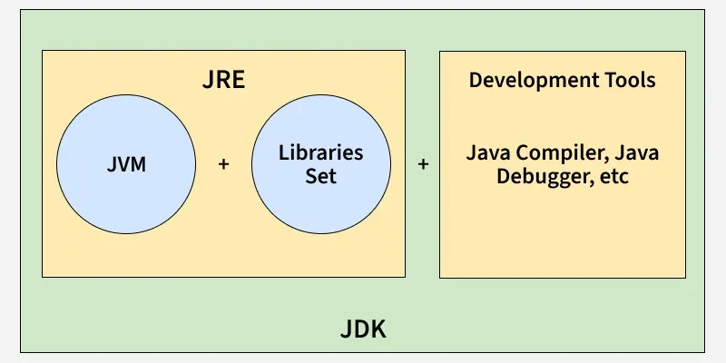
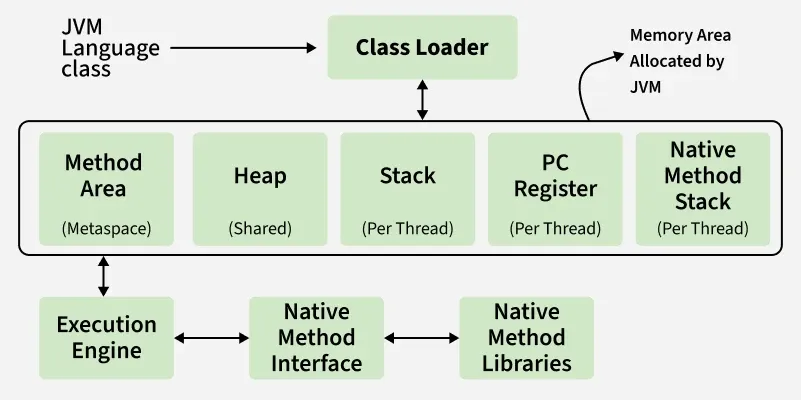

# 1. What Happens When a Java Program Starts?

<details>
<summary>Show Answer</summary>

### Example

```java
public class Test {

    public static void main(String[] args) {
        System.out.println("Hello Java");
    }
}
```

### Steps

```text
1. JVM Starts
2. Class Loader loads Test.class
3. Bytecode Verification
4. Memory Allocation
5. Static Initialization
6. main() method execution
7. Execution Engine executes bytecode
8. Program terminates
```

### Internal Flow

```text
Test.java
    ↓
javac
    ↓
Test.class (Bytecode)
    ↓
Class Loader
    ↓
JVM Memory
    ↓
Execution Engine
    ↓
Machine Code
```

### Interview Answer

> When a Java program starts, JVM loads the required classes, verifies bytecode, initializes classes, allocates memory, and executes the `main()` method through the Execution Engine.

</details>

---

# 2. Explain JVM Architecture

<details>
<summary>Show Answer</summary>

### High-Level Diagram

```text
                JVM
------------------------------------------------

Class Loader Subsystem
        ↓
Runtime Data Areas
(Heap, Stack, Metaspace...)

        ↓
Execution Engine
(JIT + Interpreter)

        ↓
Native Method Interface (JNI)

        ↓
Native Libraries

------------------------------------------------
```

### Major Components

| Component          | Responsibility        |
|--------------------|-----------------------|
| Class Loader       | Loads classes         |
| Runtime Data Areas | Memory management     |
| Execution Engine   | Executes bytecode     |
| JNI                | Calls native code     |
| Native Libraries   | OS-specific libraries |

### Interview Answer

> JVM architecture consists of Class Loader, Runtime Memory Areas, Execution Engine, JNI, and Native Libraries. Together they load, manage, and execute Java applications.

</details>

---

# 3. What are JVM Memory Areas?

<details>
<summary>Show Answer</summary>

### Runtime Data Areas

```text
JVM Memory

1. Heap
2. Stack
3. Method Area / Metaspace
4. Program Counter Register
5. Native Method Stack
```

[JVM_Architecture.png](Images/JVM_Architecture.png)

### Memory Diagram

```text
                JVM
--------------------------------

Heap

Stack

Metaspace

PC Register

Native Method Stack

--------------------------------
```

### Interview Point

> Heap and Metaspace are shared among threads, while Stack, PC Register, and Native Method Stack are thread-specific.

</details>

---

# 4. Heap vs Stack

<details>
<summary>Show Answer</summary>

| Heap           | Stack                  |
|----------------|------------------------|
| Stores Objects | Stores Method Frames   |
| Shared Memory  | Thread Specific        |
| Managed by GC  | Automatically released |
| Larger Memory  | Smaller Memory         |
| Slower Access  | Faster Access          |

### Example

```java
Employee emp = new Employee();
```

### Memory

```text
Stack                    Heap
------                   --------
emp -------------------> Employee Object
```

### Interview Point

> Objects live in Heap, references (local variables) live in Stack.

</details>

---

# 5. What is Method Area?

<details>
<summary>Show Answer</summary>

### Purpose

Stores class-level information.

### Contains

```text
Class Metadata
Method Metadata
Static Variables
Runtime Constant Pool
```

### Example

```java
class Employee {

    static String company = "ABC";
}
```

Stored in Method Area/Metaspace.

### Interview Point

> Method Area contains class-related metadata and static members.

</details>

---

# 6. What is Metaspace?

<details>
<summary>Show Answer</summary>

### Java 8+

Before Java 8:

```text
PermGen
```

After Java 8:

```text
Metaspace
```

### Why Introduced?

PermGen had fixed size issues.

```text
OutOfMemoryError:
PermGen Space
```

Metaspace uses native memory and can grow dynamically.

### Interview Point

> Metaspace replaced PermGen in Java 8 and stores class metadata outside the Heap.

</details>

---

# 7. What is Program Counter (PC) Register?

<details>
<summary>Show Answer</summary>

### Purpose

Stores the address of the current instruction being executed.

### Example

```java
System.out.println("A");
System.out.println("B");
System.out.println("C");
```

PC Register tracks:

```text
Instruction 1
Instruction 2
Instruction 3
```

### Important

Each thread has its own PC Register.

### Interview Point

> PC Register helps JVM know which instruction should execute next.

</details>

---

# 8. What is Native Method Stack?

<details>
<summary>Show Answer</summary>

### Purpose

Supports execution of native methods written in:

```text
C
C++
Assembly
```

### Example

```java
public native void display();
```

When native code executes:

```text
Java Stack
     ↓
Native Method Stack
```

### Interview Point

> Native Method Stack is used when JVM invokes platform-specific native code.

</details>

---

# 9. What is Class Loader Subsystem?

<details>
<summary>Show Answer</summary>

### Responsibility

Loads `.class` files into JVM memory.

### Example

```java
Employee emp = new Employee();
```

If Employee class is not loaded:

```text
Employee.class
       ↓
Class Loader
       ↓
JVM Memory
```

### Phases

```text
1. Loading
2. Linking
3. Initialization
```

### Class Loader Hierarchy

```text
Bootstrap ClassLoader
       ↓
Platform/Extension ClassLoader
       ↓
Application ClassLoader
```

### Interview Point

> Class Loader dynamically loads classes only when required.

</details>

---

# 10. What is Execution Engine?

<details>
<summary>Show Answer</summary>

### Responsibility

Executes bytecode.

### Components

```text
1. Interpreter
2. JIT Compiler
3. Garbage Collector
```

### Interpreter

Reads bytecode line by line.

```text
Bytecode
   ↓
Execute
```

Slow for repetitive code.

---

### JIT Compiler

Converts frequently executed code into native machine code.

```text
Bytecode
    ↓
JIT
    ↓
Machine Code
```

Faster execution.

---

### Garbage Collector

Reclaims unused memory.

```java
obj = null;
```

Unused object becomes eligible for GC.

### Interview Point

> Execution Engine executes bytecode using Interpreter and JIT Compiler, while GC handles memory cleanup.

</details>

---

# 11. What is Runtime Constant Pool?

<details>
<summary>Show Answer</summary>

### Example

```java
String s = "Java";
```

Class file contains constants.

```text
"Java"
100
3.14
Method References
Field References
```

These are loaded into Runtime Constant Pool.

### Interview Point

> Runtime Constant Pool is part of Method Area/Metaspace and stores constants used by the class.

</details>

---

# 12. Which JVM Memory Areas are Shared and Which are Thread-Specific?

<details>
<summary>Show Answer</summary>

| Memory Area         | Shared/Thread Specific |
|---------------------|------------------------|
| Heap                | Shared                 |
| Metaspace           | Shared                 |
| Method Area         | Shared                 |
| Stack               | Thread Specific        |
| PC Register         | Thread Specific        |
| Native Method Stack | Thread Specific        |

### Interview Point

A very common question:

> **Shared:** Heap, Metaspace(Method Area)
> **Thread Specific:** Stack, PC Register, Native Method Stack

</details>

---

# 13. Typical Interview Diagram of JVM Architecture

<details>
<summary>Show Answer</summary>

```text
                    JVM
------------------------------------------------

          Class Loader Subsystem
                     |
                     v

      ----------------------------
      | Runtime Data Areas       |
      |--------------------------|
      | Heap                     |
      | Java Stack               |
      | Metaspace(Method Area)   |
      | PC Register              |
      | Native Method Stack      |
      ----------------------------

                     |
                     v

            Execution Engine
        ----------------------
        | Interpreter        |
        | JIT Compiler       |
        | Garbage Collector  |
        ----------------------

                     |
                     v

         JNI (Native Interface)

                     |
                     v

            Native Libraries

------------------------------------------------
```

### 5–8 Year Interview Summary

Remember this one-liner:

> **Class Loader loads classes → Runtime Data Areas store data → Execution Engine executes bytecode → GC cleans memory → JNI interacts with native code.**

</details>

# 11. What is Parent Delegation Model?

<details>
<summary>Show Answer</summary>

**Answer:**

Parent Delegation Model means a ClassLoader first asks its parent to load a class before trying to load it itself.

### Flow

```text
Application ClassLoader
          ↑
Platform/Extension ClassLoader
          ↑
Bootstrap ClassLoader
```

### Example

```java
String str = "Java";
```

When JVM needs `String.class`:

```text
Application CL
      ↓
Extension CL
      ↓
Bootstrap CL
      ↓
Loads String.class
```

### Why?

* Avoid duplicate class loading
* Security
* Prevent core Java classes from being overridden

### Interview Point

> Parent Delegation follows "parent-first" loading. Child ClassLoader loads the class only if parent cannot.

</details>

---

# 12. Types of Class Loaders

<details>
<summary>Show Answer</summary>

Java provides three built-in ClassLoaders:

```text
1. Bootstrap ClassLoader
2. Platform (Extension) ClassLoader
3. Application ClassLoader
```

### Hierarchy

```text
Bootstrap CL
      ↓
Platform CL
      ↓
Application CL
```

### Interview Point

> Most application classes are loaded by the Application ClassLoader.

</details>

---

# 13. What is Bootstrap ClassLoader?

<details>
<summary>Show Answer</summary>

### Responsibility

Loads core Java classes.

### Examples

```java
java.lang.String
java.lang.Object
java.lang.Integer
java.util.ArrayList
```

### Location

```text
<JAVA_HOME>/lib
```

(or runtime modules in modern JDKs)

### Example

```java
System.out.println(String.class.getClassLoader());
```

**Output**

```text
null
```

### Why Null?

Bootstrap ClassLoader is implemented in native code (C/C++), not Java.

### Interview Point

> Bootstrap ClassLoader loads JDK core classes and is represented as null in Java code.

</details>

---

# 14. What is Platform (Extension) ClassLoader?

<details>
<summary>Show Answer</summary>

### Responsibility

Loads Java platform libraries.

### Examples

```text
java.sql.*
javax.*
jdk.*
```

### Example

```java
System.out.println(
    java.sql.Driver.class.getClassLoader()
);
```

Output varies by JDK but typically shows Platform ClassLoader.

### Interview Point

> Java 9 replaced Extension ClassLoader with Platform ClassLoader.

### Common Follow-up

**Before Java 9**

```text
Extension ClassLoader
```

**Java 9+**

```text
Platform ClassLoader
```

</details>

---

# 15. What is Application ClassLoader?

<details>
<summary>Show Answer</summary>

### Responsibility

Loads application classes from:

```text
classpath
target/classes
jar files
```

### Example

```java
public class Employee {
}
```

```java
System.out.println(
    Employee.class.getClassLoader()
);
```

**Output**

```text
jdk.internal.loader.ClassLoaders$AppClassLoader
```

### Interview Point

> User-defined classes are generally loaded by the Application ClassLoader.

</details>

---

# 16. Explain Complete Class Loading Lifecycle

<details>
<summary>Show Answer</summary>

### Lifecycle

```text
1. Loading
2. Linking
   ├── Verification
   ├── Preparation
   └── Resolution
3. Initialization
```

### Flow

```text
Employee.class
       ↓
Loading
       ↓
Linking
       ↓
Initialization
       ↓
Ready for Use
```

### Interview Shortcut

```text
Loading
   ↓
Linking
   ↓
Initialization
```

</details>

---

# 17. Loading vs Linking vs Initialization

<details>
<summary>Show Answer</summary>

| Phase          | Purpose                                    |
|----------------|--------------------------------------------|
| Loading        | Load .class file into JVM                  |
| Linking        | Verify and prepare class                   |
| Initialization | Execute static variables and static blocks |

---

### Example

```java
class Employee {

    static int count = 10;

    static {
        System.out.println("Static Block");
    }
}
```

### Loading

```text
Employee.class loaded
```

### Linking

```text
Verify bytecode
Allocate memory for static fields
Resolve references
```

### Initialization

```text
count = 10
Static Block Executes
```

### Interview Point

> Static blocks execute only during Initialization, not Loading.

</details>

---

# 18. What is Verification Phase?

<details>
<summary>Show Answer</summary>

### Purpose

Checks whether bytecode is safe and valid.

### Checks

```text
Illegal bytecode?
Stack corruption?
Invalid memory access?
Type safety violations?
```

### Example

```text
.class file
     ↓
Bytecode Verifier
     ↓
Valid / Rejected
```

### Why Important?

Java Security Model depends on verification.

### Interview Point

> Verification prevents malicious or corrupted bytecode from crashing JVM.

</details>

---

# 19. What is Resolution Phase?

<details>
<summary>Show Answer</summary>

### Purpose

Converts symbolic references into actual memory references.

### Example

Source Code

```java
Employee emp = new Employee();
```

Class file stores:

```text
Symbolic Reference
"Employee"
```

During Resolution:

```text
"Employee"
      ↓
Actual Memory Address
```

### Interview Point

> Resolution replaces symbolic references from the constant pool with actual runtime references.

</details>

---

# 20. Explain JVM Execution Flow

<details>
<summary>Show Answer</summary>

### Example

```java
public class Test {

    public static void main(String[] args) {

        Employee emp =
                new Employee();

        emp.show();
    }
}
```

### Complete JVM Flow

```text
Test.java
    ↓
javac
    ↓
Test.class (Bytecode)
    ↓
Class Loader
    ↓
Loading
    ↓
Linking
    ↓
Initialization
    ↓
Runtime Data Areas
(Heap, Stack, Metaspace)
    ↓
Execution Engine
    ↓
Interpreter/JIT
    ↓
Machine Code
    ↓
CPU Execution
```

### During Execution

```text
main() Frame → Stack

Employee Object → Heap

Employee Metadata → Metaspace
```

### Final Step

```text
Object becomes unreachable
          ↓
Garbage Collector reclaims memory
```

</details>

---

# 21. [Differences Between JDK, JRE and JVM](https://www.geeksforgeeks.org/java/differences-jdk-jre-jvm/)



### **JDK (Java Development Kit)**

JDK is a software development kit used to build Java applications. It contains the JRE and a set of development tools.

* Includes compiler (javac), debugger, and utilities like jar and javadoc.
* Provides the JRE, so it also allows running Java programs.
* Required by developers to write, compile, and debug code.

#### **Components of JDK:**

* JRE (JVM + libraries)
* Development tools (compiler, jar, javadoc, debugger)

#### **Working of JDK**

* Source Code (.java): Developer writes a Java program.
* Compilation: The JDK’s compiler (javac) converts the code into bytecode stored in .class files.
* Execution: The JVM executes the bytecode, translating it into native instructions.

### JRE (Java Runtime Environment)
JRE provides an environment to run Java programs but does not include development tools. It is intended for end-users who only need to execute applications.

* Contains the JVM and standard class libraries.
* Provides all runtime requirements for Java applications.
* Does not support compilation or debugging.
* JRE is only for running applications, not for developing them.
* It is platform-dependent (different builds for different OS).

#### **Working of JRE:**
* Class Loading: Loads compiled .class files into memory.
* Bytecode Verification: Ensures security and validity of bytecode.
* Execution: Uses the JVM (interpreter + JIT compiler) to execute instructions and make system calls.

### **JVM (Java Virtual Machine)**
JVM is the core execution engine of Java. It is responsible for converting bytecode into machine-specific instructions.

* Part of both JDK and JRE.
* Performs memory management and garbage collection.
* Provides portability by executing the same bytecode on different platforms.
* JVM implementations are platform-dependent.
* Bytecode is platform-independent and can run on any JVM.
* Modern JVMs rely heavily on Just-In-Time (JIT) compilation for performance.



#### **Working of JVM:**
* Loading: Class loader loads bytecode into memory.
* Linking: Performs verification, preparation, and resolution.
* Initialization: Executes class constructors and static initializers.
* Execution: Interprets or compiles bytecode into native code.

> JVM is the virtual machine that executes Java bytecode and manages memory, class loading, and garbage collection. JRE is the runtime environment that contains JVM and the required libraries to run Java applications. JDK is the complete development kit that contains JRE, JVM, and development tools such as javac, jar, and jdb. In short: JDK is used to develop Java applications, JRE is used to run them, and JVM is the engine that actually executes the bytecode.

| Feature                       | JVM | JRE | JDK |
|-------------------------------|-----|-----|-----|
| Executes Java Program         | ✅   | ✅   | ✅   |
| Contains JVM                  | ❌   | ✅   | ✅   |
| Contains Compiler (javac)     | ❌   | ❌   | ✅   |
| Used for Development          | ❌   | ❌   | ✅   |
| Used for Running Applications | ✅   | ✅   | ✅   |
| Contains Development Tools    | ❌   | ❌   | ✅   |
| Contains Runtime Libraries    | ❌   | ✅   | ✅   |

---

# 5–8 Year Interview Rapid-Fire Questions

### Q: Which ClassLoader loads String class?

<details>
<summary>Show Answer</summary>

**Answer:** Bootstrap ClassLoader

</details>

---

### Q: Why is Bootstrap ClassLoader shown as null?

<details>
<summary>Show Answer</summary>

**Answer:** Because it is implemented in native code, not Java.

</details>

---

### Q: Which phase allocates memory for static variables?

<details>
<summary>Show Answer</summary>

**Answer:** Preparation phase (part of Linking)

</details>

---

### Q: Which phase executes static blocks?

<details>
<summary>Show Answer</summary>

**Answer:** Initialization phase

</details>

---

### Q: Which phase converts symbolic references to actual references?

<details>
<summary>Show Answer</summary>

**Answer:** Resolution phase

</details>

---

### Q: What is the order of class loading lifecycle?

<details>
<summary>Show Answer</summary>

```text
Loading
   ↓
Linking
   ↓
Initialization
```

</details>

---

### Q: Why is Parent Delegation important?

<details>
<summary>Show Answer</summary>

**Answer:** Prevents duplicate loading and protects core Java classes from being replaced by malicious classes.

</details>

---
