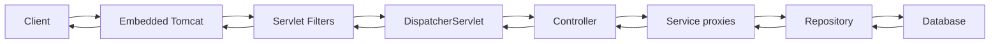

# 01. Spring Boot Architecture

## Start here (simple English)

**In one sentence:** Spring Boot is a **shortcut on top of Spring**. You write a `main` method, add a few libraries, and Boot starts a web server and wires common objects for you.

**Everyday picture:** Spring Framework is a full **toolbox**. Spring Boot is the same toolbox, already arranged, with a **quick-start button**.

Without Boot you would:

- pick library versions by hand
- write a lot of XML / Java config
- install Tomcat yourself and drop a WAR file into it

With Boot you:

```java
@SpringBootApplication
public class PaymentsApplication {
    public static void main(String[] args) {
        SpringApplication.run(PaymentsApplication.class, args);
    }
}
```

Then `mvn spring-boot:run` (or `java -jar app.jar`). Tomcat is **inside** the JAR. That is the **embedded server**.

**Boot does not replace Spring.** Every Boot bean is still a Spring bean. Boot only **starts and configures** Spring.

**Words:**

| Word | Meaning |
|------|---------|
| Starter | One Maven dependency that pulls a whole feature (web, JPA, security) |
| Auto-configuration | “If this library is present, create the usual beans” |
| Embedded server | Tomcat/Jetty running **in the same process** as your app |
| Fat JAR | Your code + libraries + server in one file |

The sections below explain **what happens when `run()` is called**. Interview Q&A at the end is **5–8 year standard**.

---

Spring Boot is Spring Framework plus **opinions**: auto-configuration, starter POMs, an embedded server, and an executable JAR.

---

## 1. Spring Framework vs Spring Boot

| | Spring Framework | Spring Boot |
|--|------------------|-------------|
| What it is | IoC, DI, AOP, MVC, TX, Test | Opinionated runtime on top of Spring |
| Configuration | You write a lot of it | Auto-config + `application.yml` |
| Dependencies | You pick versions | BOM / parent |
| Server | You deploy a WAR | Embedded Tomcat/Jetty/Undertow |
| Monitoring | You add it | Actuator |
| Relationship | Core | **Uses** Spring; never a fork |

```text
Your code
  → Spring Boot (starters, auto-config, embedded server, actuator)
    → Spring Framework (IoC, MVC, TX, AOP)
      → Servlet container / JDBC / Jackson / …
```

**Interview line:** Boot is an accelerator, not a different programming model. Every Boot bean is a Spring bean.

---

## 2. Why Boot won

Plain Spring (circa 2010) needed: `web.xml`, `dispatcher-servlet.xml`, component-scan XML, DataSource XML, transaction manager XML, matching library versions by hand, and an external Tomcat.

Boot’s answers:

1. **Starters** — one coordinate pulls a tested stack
2. **Auto-configuration** — if Jackson is on the classpath, you get an `ObjectMapper`
3. **Embedded server** — `java -jar app.jar`
4. **Actuator** — health and metrics without a custom admin module
5. **Opinionated defaults** — you override only what you must

---

## 3. `@SpringBootApplication`

```java
@SpringBootApplication
public class PaymentsApplication {
    public static void main(String[] args) {
        SpringApplication.run(PaymentsApplication.class, args);
    }
}
```

It is a composed annotation:

| Meta-annotation | Role |
|-----------------|------|
| `@SpringBootConfiguration` (`@Configuration`) | This class may declare `@Bean` methods |
| `@EnableAutoConfiguration` | Load Boot auto-config classes from `META-INF/spring/org.springframework.boot.autoconfigure.AutoConfiguration.imports` |
| `@ComponentScan` | Scan the **package of this class and below** for `@Component` / `@Service` / … |

Optional attributes you will use:

```java
@SpringBootApplication(
    scanBasePackages = "com.acme.payments",
    exclude = { DataSourceAutoConfiguration.class }
)
```

### Default-package trap

If the main class sits in the **default package** (no `package` statement), `@ComponentScan` scans **everything**. Startup becomes slow and you pick up foreign components. Always put the main class in a **root package** (`com.acme.payments`) and keep controllers/services under it.

If a library of yours lives in `com.acme.common`, either:

- put the main class in `com.acme`, or
- set `scanBasePackages = { "com.acme.payments", "com.acme.common" }`, or
- use `@Import` / auto-configuration for the library (cleaner for shared jars).

---

## 4. Starters

A starter is a POM that only depends on other JARs (and sometimes auto-config). You do not write code named “starter” unless you are publishing a custom one (chapter 05).

| Starter | What lands on the classpath |
|---------|-----------------------------|
| `spring-boot-starter-web` | Spring MVC, Jackson, embedded Tomcat, validation API |
| `spring-boot-starter-webflux` | WebFlux, Reactor, Netty (not Tomcat) |
| `spring-boot-starter-data-jpa` | Spring Data JPA, Hibernate, TX |
| `spring-boot-starter-security` | Spring Security |
| `spring-boot-starter-actuator` | Actuator + Micrometer core |
| `spring-boot-starter-validation` | Hibernate Validator |
| `spring-boot-starter-test` | JUnit 5, Mockito, AssertJ, MockMvc, slice test annotations |
| `spring-boot-starter-json` | Jackson (already inside web) |
| `spring-boot-starter` | Core + logging + YAML (pulled by every other starter) |

**Web vs WebFlux:** do not mix `starter-web` and `starter-webflux` unless you know you want both stacks. Boot can run a **reactive server** or a **servlet server**; mixing surprises people.

---

## 5. Embedded server

Boot packages a servlet container **inside the JAR**.

| Server | Starter | Typical use |
|--------|---------|-------------|
| Tomcat (default) | `spring-boot-starter-tomcat` | Servlet MVC |
| Jetty | `spring-boot-starter-jetty` | Same, different container |
| Undertow | `spring-boot-starter-undertow` | Same |
| Netty | via WebFlux | Reactive |

Swap Tomcat → Jetty: exclude Tomcat from `starter-web`, add `starter-jetty` (see Maven chapter).

Useful properties:

```yaml
server:
  port: 8080
  shutdown: graceful
  tomcat:
    threads:
      max: 200
      min-spare: 10
    accept-count: 100
    max-connections: 8192
    connection-timeout: 20s
```

**WAR on external Tomcat:** extend `SpringBootServletInitializer`, set packaging `war`, mark Tomcat `provided`. Rare for new services.

---

## 6. `SpringApplication.run()` — what actually happens

This is the senior question. Memorize the phases, not the class names of every listener.

```text
1. Create SpringApplication
   - infer web type: SERVLET / REACTIVE / NONE (from classpath)
   - load ApplicationContextInitializers and ApplicationListeners
     from spring.factories / EnvironmentPostProcessor

2. Run
   a. StopWatch starts
   b. configureHeadless / banner
   c. create Environment (default + profiles + property sources)
      EnvironmentPostProcessor runs (config data API, decrypt, …)
   d. print banner
   e. create ApplicationContext
        Servlet  → AnnotationConfigServletWebServerApplicationContext
        Reactive → AnnotationConfigReactiveWebServerApplicationContext
        None     → AnnotationConfigApplicationContext
   f. prepareContext
        - register shutdown hook
        - apply initializers
        - load sources (@SpringBootApplication class)
   g. refreshContext  → AbstractApplicationContext.refresh()
        - bean factory post processors (including ConfigurationClassPostProcessor)
        - auto-configuration import
        - bean definitions registered
        - singleton beans created (eager)
        - embedded WebServer starts here (WebServerStartStopLifecycle)
   h. afterRefresh / runners
        - ApplicationRunner / CommandLineRunner
   i. publish ApplicationReadyEvent
```

If refresh fails, Boot:

1. Publishes `ApplicationFailedEvent`
2. Runs **FailureAnalyzers** (human message: “port 8080 already in use”)
3. Closes the context
4. Rethrows

**Events worth knowing:**

| Event | When |
|-------|------|
| `ApplicationStartingEvent` | Very early, no Environment yet |
| `ApplicationEnvironmentPreparedEvent` | Environment exists |
| `ApplicationContextInitializedEvent` | Context created, not refreshed |
| `ApplicationPreparedEvent` | Bean defs loaded, not refreshed |
| `ContextRefreshedEvent` | Refresh done |
| `WebServerInitializedEvent` | Server has a port (may still be starting) |
| `ApplicationReadyEvent` | Runners done — **app is up** |
| `ApplicationFailedEvent` | Startup failed |

Use `ApplicationReadyEvent` for “warm cache”, not `@PostConstruct` of a random component (the server may not be listening yet).

---

## 7. ApplicationContext type in a web Boot app

```text
AnnotationConfigServletWebServerApplicationContext
  extends ServletWebServerApplicationContext
    extends GenericWebApplicationContext
      … ApplicationContext
```

It:

- is an `ApplicationContext` (so IoC, events, AOP all work)
- creates a `WebServer` from a `ServletWebServerFactory` bean (`TomcatServletWebServerFactory`)
- registers `DispatcherServlet` as a servlet

You almost never instantiate this yourself. Tests use `@SpringBootTest` which does the same `run()` path (chapter 12).

---

## 8. Executable JAR layout

Boot 3.2+ launcher package is `org.springframework.boot.loader.launch`.

```text
my-app.jar
  META-INF/MANIFEST.MF
    Main-Class: org.springframework.boot.loader.launch.JarLauncher
    Start-Class: com.acme.payments.PaymentsApplication
  BOOT-INF/classes/          your classes + application.yml
  BOOT-INF/lib/*.jar         dependencies
  org/springframework/boot/loader/...
```

`java -jar my-app.jar` starts `JarLauncher`, which builds a classloader that understands **nested JARs** (the JDK does not, by itself). Then it invokes `Start-Class`.

That is why unzipping a fat JAR and putting `BOOT-INF/lib` on a normal classpath can work, but **double-nested** classloading quirks (SPI, JDBC drivers, signed JARs) are why you should run it the Boot way.

Layered JAR (Docker) splits `BOOT-INF/lib` vs your classes so Docker can cache dependencies. Details in chapter 15.

---

## 9. Request flow (servlet Boot)



Security filters sit **before** `DispatcherServlet`. `@ControllerAdvice` does **not** catch exceptions thrown in a filter (chapter 07).

Layering inside your code:

| Layer | Annotation | Allowed to do |
|-------|------------|---------------|
| Controller | `@RestController` | HTTP mapping, validation trigger, status codes |
| Service | `@Service` | Business rules, `@Transactional` boundary |
| Persistence | `@Repository` / Spring Data | Queries, no business orchestration |
| Entity | `@Entity` | State, not HTTP DTOs |

Do not return entities from controllers. Map to DTOs. Entities leak lazy proxies and internals.

---

## 10. Disabling or replacing auto-config (preview)

Full mechanics in chapter 05. The two knobs you must know now:

```java
@SpringBootApplication(exclude = DataSourceAutoConfiguration.class)
```

```yaml
spring:
  autoconfigure:
    exclude:
      - org.springframework.boot.autoconfigure.jdbc.DataSourceAutoConfiguration
```

Defining your **own** `@Bean DataSource` is usually enough because auto-config uses `@ConditionalOnMissingBean`. Exclude when the auto-config class does **more** than that one bean and still fires.

---

## 11. FailureAnalyzer and DevTools (startup UX)

- **FailureAnalyzer:** maps a startup exception to a short “ACTION” paragraph. You can write your own for company config mistakes.
- **DevTools:** restart classloader on classpath change, live reload, disables caching. **Must not** be on the production classpath (`optional` / `runtime` in a way CI excludes, or `provided` + not packaged). Boot packages it only if you let the plugin include it — default is exclude from the fat JAR. Still do not depend on it in prod code.

---

## 12. Production pitfalls

1. Main class in the wrong package → half your beans never scanned.
2. Two `SpringBootApplication` classes in tests → wrong context.
3. `server.port=0` in prod by mistake (random port — fine for tests, disaster for K8s Service).
4. Doing blocking work in `main` before `run()` returns — you delay readiness.
5. Using `CommandLineRunner` for request-scoped logic — runners run **once** at startup.
6. Treating Boot as “no Spring knowledge needed”. Auto-config still creates Spring beans with the same lifecycle rules (chapter 02).

---

# Interview Q&A (5–8 year bar)

A fresher can say “Boot starts Tomcat for me.” A 5–8 year answer walks `SpringApplication.run()`, context type, and `Start-Class` vs `Main-Class`.

### Q1. What is Spring Boot?

**Answer:** An opinionated layer on Spring Framework: starters, auto-configuration, embedded server, actuator, and executable JARs so you can ship production apps with little XML/Java config.

**Counter:** Does Boot replace Spring MVC / IoC?  
**Answer:** No. It **enables and configures** them.

**Trap:** “Spring Boot is a different language / a microservice framework only.”

---

### Q2. Spring vs Spring Boot?

**Answer:** Spring = container + modules. Boot = defaults + packaging + auto-config on top.

**Counter:** Can you use Spring without Boot?  
**Answer:** Yes. You will wire `DispatcherServlet`, DataSource, and versions yourself. Rare for new services.

---

### Q3. What does `@SpringBootApplication` do?

**Answer:** `@SpringBootConfiguration` + `@EnableAutoConfiguration` + `@ComponentScan` of the class package and below.

**Counter:** Why is my `@Service` in `com.acme.other` not created?  
**Answer:** It is outside the scan base. Move it, or set `scanBasePackages`, or import a config class.

**Counter:** Can I put `@Bean` methods on the application class?  
**Answer:** Yes — it is a `@Configuration`. Keep it thin; move beans to dedicated config classes.

---

### Q4. What is a starter?

**Answer:** A dependency descriptor that brings a feature’s libraries (and usually auto-config on the classpath). Example: `spring-boot-starter-data-jpa`.

**Counter:** Does a starter contain Java code?  
**Answer:** Official starters are mostly POM-only. Auto-config lives in `spring-boot-autoconfigure`. Custom starters often ship both.

---

### Q5. What is an embedded server?

**Answer:** Tomcat/Jetty/Undertow running **in-process**, started from `ServletWebServerFactory` during context refresh. No external `webapps` deploy.

**Counter:** How do you change the port?  
**Answer:** `server.port`, env `SERVER_PORT`, or `--server.port=8081`.

**Counter:** How do you replace Tomcat with Jetty?  
**Answer:** Exclude `spring-boot-starter-tomcat`, add `spring-boot-starter-jetty`.

---

### Q6. Walk through `SpringApplication.run()`.

**Answer:** Create `SpringApplication` → prepare Environment (profiles, config files) → create web-aware `ApplicationContext` → load sources → `refresh()` (bean definitions, auto-config, singleton creation, **start web server**) → run `ApplicationRunner`/`CommandLineRunner` → `ApplicationReadyEvent`.

**Counter:** When is Tomcat actually listening?  
**Answer:** During context refresh, when the web server lifecycle starts — **before** runners. Readiness for K8s is a separate Actuator concern (chapter 13).

**Counter:** Where do FailureAnalyzers run?  
**Answer:** If `refresh` throws, before the exception bubbles to `main`.

---

### Q7. What context type does a servlet Boot app use?

**Answer:** `AnnotationConfigServletWebServerApplicationContext`.

**Counter:** What if there is no web starter?  
**Answer:** `AnnotationConfigApplicationContext` (web type NONE) — a batch/CLI app.

---

### Q8. What is auto-configuration? (short; full chapter 05)

**Answer:** Boot loads configuration classes from `AutoConfiguration.imports` and applies `@ConditionalOnClass` / `@ConditionalOnMissingBean` / `@ConditionalOnProperty` so beans appear only when the classpath and user beans allow it.

**Counter:** How do you turn one off?  
**Answer:** `exclude` on `@SpringBootApplication`, or `spring.autoconfigure.exclude`, or define your own bean so `@ConditionalOnMissingBean` fails.

---

### Q9. What happens internally when you run a Boot app? (one-minute version)

**Answer:** JVM starts `JarLauncher` → `main` → `SpringApplication.run` → Environment → context refresh → component scan + auto-config → singletons created → embedded server start → runners → ready.

**Counter:** Who is `Main-Class` in the fat JAR?  
**Answer:** Boot’s `JarLauncher`, not your application class. Your class is `Start-Class`.

---

### Q10. Fat JAR — what is inside?

**Answer:** Loader classes, `BOOT-INF/classes` (your code), `BOOT-INF/lib` (dependencies). Nested JARs are not visible to a vanilla `java -cp`.

**Counter:** Why not just shade everything into one flat JAR?  
**Answer:** You can (`maven-shade-plugin`), but you lose nested-JAR isolation and Boot’s layering. Shade also merges `META-INF/spring.factories` badly if you are not careful.

---

### Q11. `CommandLineRunner` vs `ApplicationRunner` vs `ApplicationReadyEvent`?

**Answer:** Both runners run after refresh, before `ApplicationReadyEvent`. `ApplicationRunner` gets parsed `ApplicationArguments`. Listen to `ApplicationReadyEvent` when you need “server is up and runners finished”.

**Counter:** Is `@PostConstruct` on a `@Service` the same?  
**Answer:** No. `@PostConstruct` runs when **that bean** is created — possibly before the web server is up, and before other singletons exist.

---

### Q12. How does Boot reduce boilerplate?

**Answer:** Starters (no version jungle), auto-config (no DataSource XML), embedded server (no WAR ceremony), annotations instead of XML, actuator instead of a custom admin.

**Trap:** “Boot is faster at runtime.” It is faster to **write**. Runtime is Spring + Tomcat — tune it like any JVM app.

---

### Q13. Can you disable auto-configuration completely?

**Answer:** Yes — do not use `@SpringBootApplication`; use `@Configuration` + `@ComponentScan` only. You lose Boot’s value. Practically, exclude specific classes.

---

### Q14. Why did component scan miss my library beans?

**Answer:** Different root package. Fix with `scanBasePackages`, `@Import`, or a proper auto-configuration in the library JAR.

**Counter:** Is `@ComponentScan` on a `@TestConfiguration` enough in tests?  
**Answer:** Slice tests (`@WebMvcTest`) **do not** scan everything. See chapter 12.

---

### Q15. Servlet Boot vs WebFlux Boot?

**Answer:** Servlet = thread-per-request Tomcat + MVC. WebFlux = event-loop Netty + reactive types. Different starters, different context, different threading. Pick one per app unless you have a documented hybrid.

**Counter:** Can `@RestController` be used in both?  
**Answer:** Yes. Return types differ (`Mono`/`Flux` vs plain objects / `CompletableFuture`).
