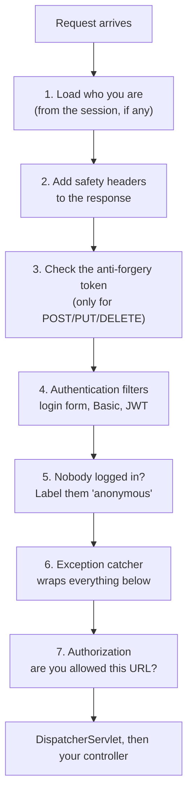
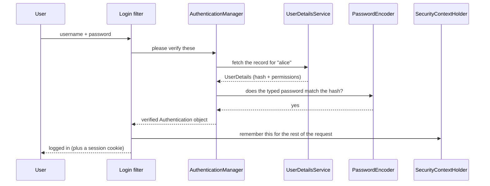

# Start Here — Spring Security in Plain English

> **Read this first if you are new to Spring Security.**
> No prior security knowledge assumed. No code until the very end.
> Once this makes sense, the numbered module files will be readable.

---

## What Problem Are We Even Solving?

You have written a web application. It works. Now someone asks: *"Can anyone on the internet
delete our customer records?"*

Right now, yes. Your controller method does not know who is calling it. It does not know if
the caller is a logged-in admin, a random stranger, or an automated script. Every request
looks identical to your code.

Security is the layer that answers two questions **before** your code runs:

1. **Who is this?** — called **authentication**
2. **Are they allowed to do this?** — called **authorization**

That is genuinely the whole subject. Everything else — filters, tokens, sessions, OAuth2,
CSRF — is machinery built to answer those two questions reliably, at scale, against people
actively trying to cheat.

---

## The One Fact That Explains Everything

Here it is, and it is the root cause of about 80% of the complexity you are about to meet:

> **HTTP has no memory.**

When your browser asks a server for a page, the server answers and immediately forgets you
existed. The next request you send is, as far as the server is concerned, from a total
stranger. There is no connection between request one and request two.

Think of it like a shop assistant with total amnesia. You walk in, say "I'm Alice, here's my
ID", they verify it, you walk to the next aisle, and they have already forgotten. You have to
prove who you are *again*. And again. On every single interaction.

So every solution to "stay logged in" is some version of: **give the customer something to
carry that proves who they are, and make them show it every time.**

The two families of solution:

| | You carry | The server keeps |
|---|---|---|
| **Sessions** | A meaningless ticket number (a cookie) | Your actual details, filed under that number |
| **Tokens** | A sealed, signed card with your details written on it | Nothing |

That single table is the origin of most architectural arguments in this entire subject. We
come back to it constantly.

---

## The Cloakroom and the Wristband

Two analogies you should keep in your head for the rest of these notes.

**Sessions are a cloakroom ticket.** You hand over your coat, they give you stub number 47.
The stub says nothing about you — it is just a number. All the real information (whose coat,
which peg) is on a card behind the counter. If you lose the stub, someone else can claim your
coat. If the cloakroom burns down, your stub is worthless. But if you misbehave, they can
tear up your card instantly and your stub stops working.

**Tokens are a festival wristband.** The wristband itself says "Alice, VIP area, valid until
Sunday", and it has a hologram that is hard to fake. Security at each stage door just looks at
the wristband — they never phone the box office. That is fast, and it works even if the box
office is closed. But here is the catch: **once it is on your wrist, they cannot take it back**.
If they decide on Saturday that you should be banned, every gate will still let you in until
Sunday, because every gate is just reading the wristband.

That trade-off — **sessions can be revoked instantly, tokens cannot** — is the single most
important trade-off in the subject, and interviewers ask about it constantly.

---

## How Spring Security Actually Fits Into Your Application

Here is the thing that surprises most people: **Spring Security is not really part of Spring
MVC.** It does not live next to your controllers. It sits in front of them.

Imagine your application as an office building:

```
Street  →  Security desk in the lobby  →  Lifts  →  Your office  →  Your desk
```

- The **street** is the internet.
- The **security desk** is Spring Security. Badge check, bag check, are-you-on-the-list check.
- The **lifts** are Spring MVC's `DispatcherServlet`, working out which floor you need.
- **Your office** is your controller.
- **Your desk** is your service and database code.

Spring Security is a **servlet filter** — a standard Java web mechanism for intercepting
requests before they reach the application. Technically it is *one* filter registered with
the web server (Tomcat), and inside itself it runs a whole chain of smaller filters, each
doing one job.

This one structural fact explains several things that otherwise look like bugs:

- Your `@ControllerAdvice` exception handler cannot catch a security rejection, because the
  rejection happened in the lobby and the request never reached your floor.
- Security applies to static files, error pages, and every other servlet — not just your
  controllers.
- A rejected request never gets its JSON body parsed, which is deliberate and good.

---

## The Security Desk, Checkpoint by Checkpoint

Inside that one security filter there is a fixed queue of about fifteen smaller checkpoints.
You do not need to memorise them yet, but you should know the shape, because almost every
"why is this happening" question is answered by knowing which checkpoint did it.



Read that order carefully, because the order is the logic:

- You cannot check **what someone is allowed to do** (step 7) until you know **who they are**
  (step 4). So authentication always comes before authorization.
- Step 6, the exception catcher, comes *before* step 7 in the list, which looks backwards.
  It is not. The chain works like nested boxes, not a conveyor belt: step 6 opens a `try`
  block and everything after it runs *inside* that block. So being earlier in the list means
  being *outside*, which is exactly what you need to catch something thrown later.

That nesting idea trips up almost everyone. Hold onto it.

---

## The Six Objects You Will See Everywhere

Spring Security has a lot of class names, but six of them account for most of the code you
will read. Here they are in plain words, in the order they come into play during a login.

**1. `UserDetailsService` — the record fetcher.**
Its only job is: given a username, go and find that one user and hand back their record. That
is it. It does *not* check the password. It does not decide anything. It fetches. Usually you
write this yourself so it reads from your own database table.

**2. `UserDetails` — the user record.**
The standard shape Spring expects a user to be in: a username, a stored password hash, a list
of permissions, and four yes/no flags (is the account enabled, locked, expired, are the
credentials expired). Note it is a *shape*, not your database entity — you convert your entity
into this.

**3. `PasswordEncoder` — the password checker.**
Takes the password the user just typed and the scrambled version stored in your database, and
says yes or no. It can scramble a password one way but never unscramble it — more on that
below.

**4. `AuthenticationManager` — the bouncer.**
Takes "here is a username and password" and returns either "verified, and here is who they
are" or throws an exception. Internally it just delegates to one or more
`AuthenticationProvider`s, each of which knows how to verify one *kind* of credential.

**5. `Authentication` — the verified identity.**
The object that represents "who is currently making this request". It holds the principal
(who you are), the credentials (usually wiped after login, for safety), and the authorities
(what you are allowed to do).

**6. `SecurityContextHolder` — where that identity is kept.**
A holder that any code, anywhere in your application, can ask: "who is making the current
request?" It works per-request, and it is emptied when the request finishes.

Here is the whole login in one picture:



---

## Passwords: The Meat Grinder

This one comes up in every interview, so get it right early.

You never store a password. You store a **hash** of it.

A hash is a **one-way** transformation. Think of a meat grinder: you can always turn a cow
into mince, but there is no machine that turns mince back into a cow. When Alice logs in, you
do not unscramble the stored value — you put her typed password through the same grinder and
check whether the mince matches.

Three things people get wrong:

**"Why not just encrypt it?"** Encryption is reversible — it has a key. If someone steals your
database, they will very likely also get the key (same server, same config), and now they have
every user's real password in plain text. And since people reuse passwords, you have just
leaked their email and banking logins too. Hashing means there is no key to steal.

The give-away test: **if a website can email you your password, it is doing this wrong.**

**"Why not SHA-256? That's a hash."** Because SHA-256 is *fast*, and fast is the enemy here.
It is designed so you can checksum a huge file quickly — a graphics card can do billions per
second. Given your stolen database, short passwords fall in minutes.

Password hashing needs a deliberately **slow** algorithm: **bcrypt** or **Argon2**. You tune
them so one check takes a few hundred milliseconds. A user logging in never notices. An
attacker guessing billions of times absolutely does.

**"What's a salt?"** A random value added to each password before hashing, stored right next to
the hash. It is **not secret**. Its job is to make every hash unique, so that (a) attackers
cannot use a precomputed lookup table, and (b) two users with the same password do not end up
with the same stored value, which would otherwise reveal who shares a password.

bcrypt tucks the salt inside its own output, which is why a stored value looks like this:

```
$2a$10$N9qo8uLOickgx2ZMRZoMye.IjZAgcfl7p92ldGxad68LJZdL17lhWy
 │   │  └──────────────────┴────────────────────────────────┘
 │   │         salt (22 chars)      the actual hash
 │   └─ cost: how slow to be
 └───── which algorithm
```

Everything needed to re-check the password is in that one string.

---

## Roles and Permissions: Badges and Doors

Spring Security has **one** concept for "what you are allowed to do": a `GrantedAuthority`,
which is literally just a piece of text.

Everything else is convention on top of that text:

- A **role** is a job title. By convention its text starts with `ROLE_`, as in `ROLE_ADMIN`.
- An **authority** (or permission) is one specific capability, like `invoice:approve`.

Think of a staff badge. The badge says "Facilities Manager" — that is the role. What actually
matters is the list of doors it opens — those are the authorities.

The practical catch that bites every beginner:

```java
hasRole("ADMIN")        // secretly looks for the text "ROLE_ADMIN"
hasAuthority("ADMIN")   // looks for exactly "ADMIN"
```

`hasRole` silently adds the `ROLE_` prefix for you. So if your database stores `ADMIN` without
the prefix and your rule says `hasRole("ADMIN")`, it will look for `ROLE_ADMIN`, not find it,
and deny access — while everything *looks* correct. This is probably the single most common
"why am I getting 403" in Spring Security.

Pick one convention and stick to it.

---

## 401 Versus 403: "Who Are You?" Versus "No."

Two numbers, constantly confused, and interviewers use them as a quick competence check.

- **401 Unauthorized** actually means **unauthenticated**. The name in the specification is
  simply a historical mistake. It means: *"I don't know who you are. Log in and try again."*
- **403 Forbidden** means: *"I know exactly who you are, and the answer is still no. Logging in
  again will not help."*

A useful way to hold it: 401 is the doorman not recognising you. 403 is the doorman recognising
you perfectly well and telling you the VIP room is not for you.

One quirk worth knowing now, because it confuses everyone: if a **not-logged-in** user hits a
protected page, Spring does **not** send 403. It reasons "they haven't actually tried to log in
yet" and sends them to the login page instead. That is why an unauthenticated API call often
returns a redirect to `/login` when you expected a clean 401.

---

## CSRF and CORS: Different Problems, Constantly Confused

These two get mixed up more than any other pair. They are not related.

**CSRF (Cross-Site Request Forgery)** is about someone making *your browser* do something
without your intent.

The reason it works: your browser attaches cookies based on **where the request is going**,
never on **who triggered it**. So if you are logged into your bank in one tab, and a malicious
page in another tab submits a hidden form to your bank, your browser helpfully attaches your
bank session cookie. The bank sees a perfectly valid request from you.

It is like someone slipping a pre-written cheque into your outbox — it goes out with your
signature already on it, because the postal system does not care who put it there.

The defence is a **CSRF token**: a secret value your application puts in its own pages, which
the attacker's site cannot read (browser rules prevent it). No token, no action.

The rule for when you can turn CSRF off: **only when your credentials are not sent
automatically by the browser.** A cookie is sent automatically, so cookies need CSRF
protection. An `Authorization: Bearer <token>` header is *not* sent automatically — the
attacker's page cannot make your browser add it — so a header-based token API does not need
CSRF. Note the trap: if you put your token *in a cookie*, it becomes automatic again and CSRF
is back.

**CORS (Cross-Origin Resource Sharing)** is a completely different thing. It is the browser
asking your server: *"this page from site A wants to read a response from site B — are you OK
with that?"*

The critical framing: **CORS is not a security control.** It is a browser rule that *relaxes*
a restriction. It protects your users' browsers; it does nothing to protect your API. `curl`,
Postman, and any server-side script ignore CORS entirely. If your API is unprotected, adding
CORS rules does not help at all.

| | CSRF | CORS |
|---|---|---|
| Protects | Your server from forged requests | The browser from leaking cross-site responses |
| Enforced by | Your server | The browser |
| Turning it off | Makes you *less* safe | Makes things *more* permissive |
| Stops `curl`? | Yes | No — irrelevant to `curl` |

---

## Your First Configuration, Explained Line By Line

Everything above, in code. This is a complete, working setup.

```java
package com.example.security;

import org.springframework.context.annotation.Bean;
import org.springframework.context.annotation.Configuration;
import org.springframework.security.config.Customizer;
import org.springframework.security.config.annotation.web.builders.HttpSecurity;
import org.springframework.security.config.annotation.web.configuration.EnableWebSecurity;
import org.springframework.security.core.userdetails.User;
import org.springframework.security.core.userdetails.UserDetailsService;
import org.springframework.security.crypto.bcrypt.BCryptPasswordEncoder;
import org.springframework.security.crypto.password.PasswordEncoder;
import org.springframework.security.provisioning.InMemoryUserDetailsManager;
import org.springframework.security.web.SecurityFilterChain;

@Configuration
@EnableWebSecurity
public class MyFirstSecurityConfig {

    // 1. THE RULES. You hand Spring one object describing who can reach what.
    @Bean
    SecurityFilterChain filterChain(HttpSecurity http) throws Exception {
        http
            .authorizeHttpRequests(rules -> rules
                // Order matters! The FIRST matching rule wins, so specific ones go first.
                .requestMatchers("/", "/public/**").permitAll()   // anyone, even logged out
                .requestMatchers("/admin/**").hasRole("ADMIN")    // needs the ROLE_ADMIN text
                .anyRequest().authenticated()                     // everything else: log in first
            )
            // 2. HOW PEOPLE LOG IN. withDefaults() gives you a login page for free.
            .formLogin(Customizer.withDefaults())
            .logout(Customizer.withDefaults());

        return http.build();
    }

    // 3. WHERE USERS COME FROM. In-memory is for learning only - see file 09 for why.
    @Bean
    UserDetailsService users(PasswordEncoder encoder) {
        return new InMemoryUserDetailsManager(
            User.withUsername("alice")
                .password(encoder.encode("password"))   // NEVER store the raw text
                .roles("USER")                          // .roles() adds ROLE_ for you
                .build(),
            User.withUsername("admin")
                .password(encoder.encode("password"))
                .roles("ADMIN")
                .build()
        );
    }

    // 4. HOW PASSWORDS ARE SCRAMBLED. Required - without it, login always fails.
    @Bean
    PasswordEncoder passwordEncoder() {
        return new BCryptPasswordEncoder();
    }
}
```

Four beans, four jobs: **the rules**, **how to log in**, **where users live**, **how passwords
are checked**. Almost every Spring Security configuration you will ever read is a more
elaborate version of exactly this.

---

## Glossary

Every term you will meet repeatedly, in plain words. Come back here whenever a module file
uses something unfamiliar.

### The two big questions

| Term | In plain words |
|---|---|
| **Authentication** (authn) | Working out *who* someone is. Checking the password. |
| **Authorization** (authz) | Working out *what* they may do. Checking permissions. |
| **Principal** | The identity being claimed — usually "the logged-in user". |
| **Credential** | The proof offered. A password, a token, a certificate. |
| **Authority** | One permission, stored as a plain piece of text. |
| **Role** | A coarse job title. By convention its text starts with `ROLE_`. |
| **Anonymous** | Spring's label for "nobody is logged in". A real object, not `null`. |

### The machinery

| Term | In plain words |
|---|---|
| **Filter** | Code that runs before your controller and can block the request. |
| **Filter chain** | The fixed queue of those checks, in a defined order. |
| **`SecurityFilterChain`** | Your rules, as a Spring bean. "These URLs public, those need admin." |
| **`HttpSecurity`** | The builder you configure those rules on. |
| **`DispatcherServlet`** | Spring MVC's router. Runs *after* all security. |
| **`SecurityContextHolder`** | Ask it "who is making this request?" from anywhere. |
| **`Authentication`** | The object holding the answer to that question. |
| **`UserDetails`** | The standard shape a user record must be in. |
| **`UserDetailsService`** | Fetches one user by name. Does not check the password. |
| **`AuthenticationManager`** | Verifies credentials. Says yes, or throws. |
| **`AuthenticationProvider`** | Knows how to verify one *kind* of credential. |
| **`PasswordEncoder`** | Scrambles a password and checks a typed one against the stored scramble. |

### Staying logged in

| Term | In plain words |
|---|---|
| **Stateless** | The server stores nothing between requests. |
| **Session** | Server-side memory of you, found via a cookie. |
| **Cookie** | A small value the browser stores and re-sends automatically. |
| **`JSESSIONID`** | The default name of the cookie holding your session number. |
| **`HttpOnly`** | Cookie flag: JavaScript cannot read it. Blocks theft via injected scripts. |
| **`Secure`** | Cookie flag: only send over HTTPS. |
| **`SameSite`** | Cookie flag controlling whether it is sent on cross-site requests. |
| **Token** | A self-contained credential the client carries and presents. |
| **Bearer token** | "Whoever holds this gets in." No further proof of identity required. |

### Tokens and standards

| Term | In plain words |
|---|---|
| **JWT** | A token format: three base64 chunks, dot-separated, with a signature. |
| **Signature** | Proves the token was not altered and came from the right issuer. |
| **Signed, not encrypted** | A JWT's contents are **readable by anyone**. Put nothing secret in it. |
| **Access token** | Short-lived. Sent on every API call. |
| **Refresh token** | Long-lived. Only used to get a new access token. |
| **OAuth2** | A protocol for granting an app limited access *on your behalf*. |
| **OIDC** | A login layer built on top of OAuth2. OAuth2 alone is not login. |
| **Scope** | What the *application* was allowed to do. Not the same as a user's role. |
| **Resource server** | An API that accepts and validates tokens. |
| **Authorization server** | The service that issues tokens. Keycloak, Auth0, Okta. |
| **JWKS** | The public keys an API downloads to verify token signatures. |

### Attacks and defences

| Term | In plain words |
|---|---|
| **CSRF** | Tricking a user's browser into sending a real request they did not intend. |
| **CORS** | Browser rules about reading responses across sites. **Not** a server defence. |
| **XSS** | Injecting JavaScript into your page. It then acts as the logged-in user. |
| **Session fixation** | Attacker plants a session ID, waits for you to log in with it. |
| **Brute force** | Guessing passwords repeatedly. |
| **Credential stuffing** | Replaying username/password pairs leaked from other breaches. |
| **IDOR / BOLA** | Changing an ID in a URL to read someone else's data. |
| **Hash** | One-way scramble. Cannot be reversed. |
| **Salt** | Random per-password value making every hash unique. Not secret. |
| **bcrypt / Argon2** | Deliberately slow hashing algorithms, correct for passwords. |

### HTTP status codes

| Code | In plain words |
|---|---|
| **200** | Fine. |
| **302** | Go somewhere else — usually a redirect to the login page. |
| **401** | "I don't know who you are." Not logged in. |
| **403** | "I know who you are, and no." Logged in, not permitted. |
| **404** | Not found — sometimes used deliberately to hide that something exists. |
| **429** | Too many requests. You are being rate limited. |

---

## How To Read These Notes

The module files each have the same layout. Read them in this order depending on your goal.

**If you are learning the subject:**

1. **In Plain English** — the analogy and walkthrough. Start here, always.
2. **Core Concepts** — each subsection opens with an "In simple terms" line; read those first,
   then go back for the detail.
3. **Working Code** — type it out, run it, break it on purpose.
4. **Debugging Playbook** — the symptom-to-cause table. This is where the learning sticks.
5. Skip Version Matrix, Internals, and Interview Q&A on your first pass.

**If you are preparing for an interview:**

1. **Quick Recall** — see how much you can already reconstruct.
2. **Interview Q&A** — answer out loud *before* expanding each block. The counter-questions
   are the real test; a confident first answer means nothing if the follow-up collapses it.
3. **Internals** and **Version Matrix** — the details that separate someone who has configured
   Spring Security from someone who understands it.
4. **File 44** — the capstone, which tests joining topics together.

**A warning about the Q&A:** it is pitched at five to eight years of experience and it does
not get easier for beginners. That is deliberate. Use it as a target, not a starting point. If
an answer is impenetrable today, read the rest of the module and come back — it will not stay
impenetrable for long.

---

## Suggested Learning Path

Do not read 47 files in order. Follow this instead.

**Week 1 — Foundations.** Files 01–04 (HTTP, authentication versus authorization, hashing,
filters), then 05–07 (what Spring Security is, its core objects, the filter chain). Build the
configuration from this primer and get a login page working.

**Week 2 — Real authentication.** Files 09–12 (in-memory, database, custom, password
encoding), then 13–16 (URL rules, method annotations, expressions, roles versus authorities).
Move your users into a database table with a custom `UserDetailsService`.

**Week 3 — The web hazards.** Files 17–19 (modern configuration), then 20–22 (sessions, CSRF,
CORS). Deliberately break CSRF and watch what happens. Add a JavaScript front end and fight
CORS until you understand it.

**Week 4 — Tokens.** Files 23–25 (JWT), 26–28 (filters and error handling). Build a stateless
API. Then add refresh tokens and try to explain out loud why logout is hard.

**Week 5 — Going distributed.** Files 29–31 (OAuth2 and OIDC), 39–41 (gateway, service to
service, testing). Add Google login. Run Keycloak in Docker.

**Week 6 onwards — Depth and interview prep.** Files 32–38 and 42–47, then work through file
44 repeatedly until the ten whiteboard answers are automatic.

---

**Next:** [`00_Spring_Security_Planning.md`](00_Spring_Security_Planning.md) for the full
module index, or jump straight to
[`01_M1_T1_HTTP_Web_Basics.md`](01_M1_T1_HTTP_Web_Basics.md) to begin.
