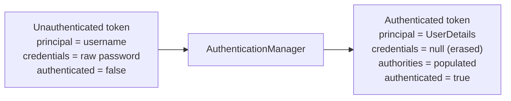
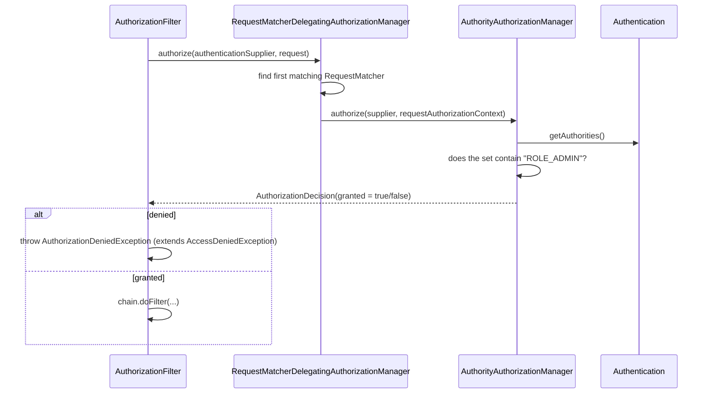

# 1.2 — Authentication & Authorization Concepts

> **Module 1 · Topic 2** · Prerequisites
> Baseline: Spring Security 6.x on Boot 3.x
> New to this? Read **In Plain English** below first, then come back to the Version Matrix.

---

## Version Matrix

| Concern | Spring Security 5.x | **Spring Security 6.x (baseline)** | Spring Security 7.x |
|---|---|---|---|
| Authorization engine | `AccessDecisionManager` + `AccessDecisionVoter` | **`AuthorizationManager`** (voters deprecated) | `AccessDecisionManager` **removed** to `spring-security-access` module |
| Decision method | `AccessDecisionManager.decide()` (throws on deny) | `AuthorizationManager.check()` → `AuthorizationDecision` | **`AuthorizationManager.authorize()`** (`check()` removed) |
| Authorities holder | `Authentication.getAuthorities()` | same | same, plus `Authentication.Builder` for mutation/merging |
| Composition | voter consensus strategies (`AffirmativeBased`, `UnanimousBased`, `ConsensusBased`) | `AuthorizationManagers.allOf()` / `anyOf()` / `not()` | adds `AllAuthoritiesAuthorizationManager`, `AuthorizationManagerFactory` |

---

## Why This Exists

Two words that sound alike, get abbreviated to the confusing `authn` and `authz`, and are
enforced by completely different parts of the framework at completely different times.

> **Authentication** answers *"Who are you?"* — it establishes identity.
> **Authorization** answers *"What are you allowed to do?"* — it enforces policy.

Authentication happens **once per request** (or once per session) and produces an
`Authentication` object. Authorization happens **many times** — once at the URL layer, again
at the method layer, potentially again at the object layer — and consumes that object.

The ordering is not negotiable: you cannot decide what someone may do until you know who they
are. This is why `AuthorizationFilter` is the **last** filter in Spring Security's chain, and
every authentication filter comes before it.

---

## In Plain English

**The one-line version:** Two separate questions get asked about every request — first "who is
this?" and then "is this person allowed to do the thing they are asking for?" — and the whole of
this topic is about keeping those two questions apart.

**An analogy.** Think about arriving for the first day of a new job in an office building. At the
front desk you hand over your passport and the receptionist checks your face against the photo and
your name against the list of expected arrivals. That is authentication: establishing *who you
are*. You walk away with a plastic badge.

Now you try to get into the server room. Nobody at that door looks at your face or asks for your
passport again — the reader on the wall simply checks whether your badge has the "data centre"
permission written into it. That is authorization: deciding *what you may do*. The two checks are
performed by different people, at different moments, using different information, and they can fail
independently.

The distinction becomes obvious when you consider the failures. Turning up with a fake passport is
an authentication failure; the receptionist does not know who you are and cannot let you past the
lobby at all. Turning up with a perfectly valid badge that simply does not open the server room is
an authorization failure; the building knows exactly who you are, and the answer is still no, and
showing the passport again will not change anything. In HTTP those two answers are `401` and `403`.

One more detail the analogy captures well: your badge does not decide anything by itself. It is
just a piece of plastic with some permissions recorded on it. All the deciding happens at each
door. This is why revoking someone's access means changing what the readers accept, not chasing
down the badge.

**How it actually works, step by step.**

When a request arrives with credentials — a username and password, a token, a certificate — one of
Spring's filters picks them up and builds a small object that effectively says "somebody is
claiming to be `alice`, and here is their proof". That object is an `Authentication`, and at this
stage it is only a claim.

That claim is handed to the `AuthenticationManager`. Its entire job is to answer one question: is
this claim genuine? It does not care about permissions. If the claim checks out, it hands back a
*new* `Authentication` object — the same Java type, but now marked as verified, with the raw
password wiped out and with the user's permissions attached. If the claim does not check out, it
throws an exception, and that eventually becomes a `401` or a login page.

Those attached permissions are called *authorities*, and here is the single most useful fact in
this file: an authority is nothing but a string. There is no `Role` class in Spring Security, no
`Permission` class. There is `GrantedAuthority`, which wraps one piece of text. A "role" is simply
an authority whose text starts with `ROLE_`. So `hasRole("ADMIN")` quietly adds that prefix and
then compares strings, which means it is looking for the exact text `ROLE_ADMIN`. If your database
stores the plain text `ADMIN`, the comparison fails and you get a mysterious `403` for a user who
obviously is an admin. This one mismatch causes more confusion than anything else in the framework.

The verified `Authentication` is then parked somewhere the rest of the request can find it, and the
last filter in the chain, `AuthorizationFilter`, consults your rules. Those rules are the lines you
write such as `.requestMatchers("/admin/**").hasRole("ADMIN")`. Underneath, the rule is evaluated
by an `AuthorizationManager`, which returns a plain allow or deny. Authorization can also be
checked again deeper in the application, on individual methods, using annotations such as
`@PreAuthorize`.

There is one category of check that URL rules and role checks can never perform, and it is worth
understanding early. A rule like "only admins may reach `/invoices/**`" says nothing about *which*
invoice. If user Mallory requests `/invoices/4711` and that invoice belongs to Alice, every check
above passes: Mallory is authenticated, Mallory has the right role, and the URL matches. The only
thing that catches it is a check that compares the specific record against the specific caller.
The sections below call this instance-level authorization, and its absence is the most common
serious flaw in real APIs.

**Why should a beginner care?** Getting these two mixed up produces both of the classic failures.
Mix them up in one direction and you build an application where any logged-in user can read any
other user's data just by changing a number in the URL. Mix them up in the other direction and you
spend a day debugging why a user with the admin role keeps getting refused, when the real answer is
that you stored `ADMIN` and Spring was looking for `ROLE_ADMIN`. You will also write far better
error handling once you know that `401` and `403` mean genuinely different things.

**Words you will meet in this file**

| Term | In plain words |
|---|---|
| Authentication (authn) | Proving who you are. The passport check at the front desk. |
| Authorization (authz) | Deciding what you may do. The badge reader on each door. |
| `Authentication` (the object) | Spring's record of who is making this request and what they may do. |
| Principal | The identity being claimed — usually the user, though the exact Java type varies by login method. |
| Credential | The proof offered, such as a password or a token. Wiped out once it has been checked. |
| `GrantedAuthority` | A single permission, stored as nothing more than a string. |
| Role | An authority whose text begins with `ROLE_`, used for broad job functions such as `ROLE_ADMIN`. |
| Authority / permission | An authority used for a specific capability, such as `invoice:approve`. |
| Scope | In OAuth2, what a *client application* was allowed to do on the user's behalf — not what the user is. |
| `AuthenticationManager` | The component that takes a claim of identity and answers only "is this genuine?". |
| `AuthorizationManager` | The component that takes a rule and an identity and answers only "allow or deny?". |
| `AuthorizationFilter` | The last security filter, which applies your URL rules before the request reaches your code. |
| `@PreAuthorize` | An annotation that checks a rule just before a specific method runs. |
| Anonymous authentication | A placeholder identity meaning "nobody logged in", so code never has to handle `null`. |
| Remember-me | A long-lived cookie that lets a returning visitor skip the login form. Convenient, and weaker proof. |
| `fullyAuthenticated()` | A rule meaning "logged in properly just now", excluding anonymous and remember-me visitors. |
| BOLA / IDOR | The flaw where changing an identifier in a URL lets you read somebody else's record. |
| Confused deputy | A trusted component tricked into using its own high privileges for a low-privileged caller. |

**If you remember only one thing:** Authentication and authorization are different questions
answered by different components at different times, and a permission in Spring Security is just a
string that has to match exactly.

---

## Core Concepts

### 1. The Three A's

**In simple terms:** A complete security story answers three questions — who you are, what you were
allowed to do, and a permanent record of what you actually did.

| | Question | Spring Security component | Failure produces |
|---|---|---|---|
| **Authentication** | Who are you? | `AuthenticationManager` → `AuthenticationProvider` | `AuthenticationException` → 401 |
| **Authorization** | What may you do? | `AuthorizationManager` | `AccessDeniedException` → 403 |
| **Accounting / Audit** | What did you actually do? | `AuthenticationEventPublisher`, Spring Data auditing | nothing — it is observation |

The third A is the one candidates forget and interviewers care about, because in a regulated
environment an unauditable system is an unusable system.

### 2. Identity vs Principal vs Subject vs Credential

**In simple terms:** These four words all sound like "the user", but they mean the real person, the
name being claimed, and the proof offered for that claim, and mixing them up leads to real bugs.

These are used loosely in conversation and precisely in code. Getting them right signals
seniority.

| Term | Meaning | In Spring Security |
|---|---|---|
| **Identity** | The real-world entity — a person, a service, a device | Not modelled directly |
| **Subject** | The security-domain representation of that entity (JAAS term) | Roughly `Authentication` |
| **Principal** | The *asserted* identity within one authentication — a name, a `UserDetails`, a `Jwt` | `Authentication.getPrincipal()` |
| **Credential** | The proof offered for the assertion — password, token, certificate | `Authentication.getCredentials()` |
| **Authority** | A granted permission attached to the principal | `Authentication.getAuthorities()` |

One identity can have several principals. The same human might be `alice@corp.com` via SSO,
`alice` via LDAP, and `svc-alice-cli` via an API key — three principals, one identity. Systems
that conflate them end up unable to answer "did Alice do this?" across channels.

The type of `getPrincipal()` **changes depending on how you authenticated**, which is a
frequent source of `ClassCastException`:

```java
Object principal = authentication.getPrincipal();
// after form login / UserDetailsService  -> UserDetails
// after JWT resource server              -> org.springframework.security.oauth2.jwt.Jwt
// after oauth2Login (OIDC)               -> OidcUser
// after oauth2Login (plain OAuth2)       -> OAuth2User
// when anonymous                         -> String "anonymousUser"
// in some custom providers               -> String username
```

Never write `((UserDetails) auth.getPrincipal())` without knowing which mechanism produced it.

### 3. The `Authentication` Contract

**In simple terms:** One Java type does two jobs — it carries the unverified claim going in, and
the verified result coming out, which is why it has a flag saying whether it has been checked yet.

```java
package org.springframework.security.core;

public interface Authentication extends Principal, Serializable {

    Collection<? extends GrantedAuthority> getAuthorities();

    Object getCredentials();

    Object getDetails();

    Object getPrincipal();

    boolean isAuthenticated();

    void setAuthenticated(boolean isAuthenticated) throws IllegalArgumentException;
}
```

The same interface serves **two different roles**, which is the subtlety:



The filter builds the left-hand object as a *request*. The manager returns the right-hand
object as a *result*. They are the same Java type, which is why `isAuthenticated()` exists at
all — it is the flag that distinguishes request from result.

**`setAuthenticated(true)` is deliberately hard to abuse.** In
`UsernamePasswordAuthenticationToken` it throws:

```java
@Override
public void setAuthenticated(boolean isAuthenticated) {
    Assert.isTrue(!isAuthenticated,
        "Cannot set this token to trusted - use constructor which takes a GrantedAuthority list instead");
    super.setAuthenticated(false);
}
```

You can only produce a trusted token through the constructor that takes authorities — the
constructor that `AuthenticationProvider` implementations use. This is an intentional
guardrail against a developer "just setting the flag".

### 4. Roles vs Authorities vs Permissions vs Scopes

**In simple terms:** All four are the same thing under the hood — a single string — and the only
real difference is the naming convention your team agreed to follow.

This distinction is asked in almost every Spring Security interview.

**There is only one type in the framework: `GrantedAuthority`.** It is a string wrapper:

```java
public interface GrantedAuthority extends Serializable {
    String getAuthority();
}
```

Everything else is convention layered on top of that string.

| Concept | Conventional string | Granularity | Spring API |
|---|---|---|---|
| **Role** | `ROLE_ADMIN` | Coarse — a job function | `hasRole("ADMIN")` (adds the prefix) |
| **Authority / Permission** | `document:delete` | Fine — a single capability | `hasAuthority("document:delete")` (literal) |
| **Scope** (OAuth2) | `SCOPE_read` | What the *client app* was delegated | `hasAuthority("SCOPE_read")` or `hasRole` with a custom prefix |

The `ROLE_` prefix is **not** a framework requirement — it is the default value of a
configurable field:

```java
// org.springframework.security.core.authority.AuthorityAuthorizationManager
public static <T> AuthorityAuthorizationManager<T> hasRole(String role) {
    return hasAnyRole(new String[] { role });
}
public static <T> AuthorityAuthorizationManager<T> hasAnyRole(String... roles) {
    return hasAnyRole(ROLE_PREFIX, roles);   // ROLE_PREFIX = "ROLE_"
}
```

So `hasRole("ADMIN")` literally compiles down to `hasAuthority("ROLE_ADMIN")`. There is no
role concept in the engine at all — only string comparison against the authority set.

**Why the convention exists:** it namespaces coarse job functions away from fine-grained
permissions so a single flat `Collection<GrantedAuthority>` can hold both without collision.

**The classic bug:**

```java
// Stored authority: "ADMIN"   (no prefix)
.requestMatchers("/admin/**").hasRole("ADMIN")   // looks for "ROLE_ADMIN" -> DENIED
.requestMatchers("/admin/**").hasAuthority("ADMIN")  // looks for "ADMIN"  -> allowed
```

Pick one convention and enforce it at the single place authorities are constructed — the
`UserDetailsService` or the `JwtAuthenticationConverter`.

### 5. Scope is Not Role — The Delegation Distinction

**In simple terms:** A role says what the person may do; a scope says what a particular app was
permitted to do for them, so you must satisfy both rather than accepting either one alone.

This is where most candidates are shallow. In OAuth2:

- A **role** describes what the *user* is permitted to do.
- A **scope** describes what the *client application* has been delegated to do *on the user's
  behalf*.

They intersect. A user who is `ROLE_ADMIN` using a third-party app granted only
`SCOPE_profile:read` must **not** get admin powers through that app. The effective permission
is the **intersection**, never the union:

```java
.requestMatchers("/admin/users").access(
    AuthorizationManagers.allOf(
        AuthorityAuthorizationManager.hasRole("ADMIN"),        // the human is an admin
        AuthorityAuthorizationManager.hasAuthority("SCOPE_users:write")  // the app was allowed to
    )
)
```

Treating scope as if it were a role is a real, exploitable authorization flaw, and saying so
unprompted is a strong signal in an interview.

### 6. The Confused Deputy Problem

**In simple terms:** Your service has permission to touch every record in the database, so if it
acts on whichever record the caller names without checking ownership, the caller can reach anything.

A *confused deputy* is a privileged component tricked into misusing its authority on behalf
of a less-privileged caller.

```java
// VULNERABLE: the service is the deputy. It has DB-wide authority and is being
// told which row to act on by the caller, with no ownership check.
@PostMapping("/orders/{id}/cancel")
public void cancel(@PathVariable Long id) {
    orderService.cancel(id);   // cancels ANY order, not just the caller's
}
```

An authenticated, low-privilege user simply changes the ID. This is OWASP's **Broken Object
Level Authorization (BOLA / IDOR)** — consistently the number-one API vulnerability. Note
that authentication worked perfectly; only authorization was missing.

The fix must bind the *object* to the *subject*:

```java
@PreAuthorize("@orderSecurity.isOwner(#id, authentication)")
@PostMapping("/orders/{id}/cancel")
public void cancel(@PathVariable Long id) { ... }
```

or, better, make ownership part of the query so the row cannot be loaded at all:

```java
// The database enforces it; there is no window where the wrong row exists in memory.
Optional<Order> findByIdAndOwnerUsername(Long id, String username);
```

**URL-level and role-level authorization can never solve this**, because every caller is
hitting the same URL with the same role. It requires instance-level (object) authorization.

### 7. Authentication Strength and Step-Up

**In simple terms:** Being "logged in" comes in degrees, and for dangerous actions such as changing
a password you should demand the strongest kind rather than accepting a remembered visitor.

Not all authentications are equal. Spring models this with `AuthenticationTrustResolver`:

| Level | Token type | `isAuthenticated()` | Trusted for sensitive ops |
|---|---|---|---|
| Anonymous | `AnonymousAuthenticationToken` | `true` (!) | No |
| Remember-me | `RememberMeAuthenticationToken` | `true` | No |
| Fully authenticated | `UsernamePasswordAuthenticationToken` etc. | `true` | Yes |

**`isAuthenticated()` returns `true` for anonymous users.** This surprises people. An
`AnonymousAuthenticationToken` is a real, "authenticated" token — it just asserts the identity
"nobody". That is why `authenticated()` in the DSL does *not* mean "not anonymous":

```java
.requestMatchers("/account/**").authenticated()      // excludes anonymous, allows remember-me
.requestMatchers("/account/password").fullyAuthenticated()  // excludes anonymous AND remember-me
```

`fullyAuthenticated()` is the correct choice for password changes, payment confirmation, and
any destructive action — this is **step-up authentication** in its simplest form.

---

## Working Code

```java
package com.example.security;

import org.springframework.context.annotation.Bean;
import org.springframework.context.annotation.Configuration;
import org.springframework.security.authorization.AuthorizationManagers;
import org.springframework.security.authorization.AuthorityAuthorizationManager;
import org.springframework.security.config.Customizer;
import org.springframework.security.config.annotation.web.builders.HttpSecurity;
import org.springframework.security.config.annotation.web.configuration.EnableWebSecurity;
import org.springframework.security.web.SecurityFilterChain;

@Configuration
@EnableWebSecurity
public class AuthzConceptsConfig {

    @Bean
    SecurityFilterChain filterChain(HttpSecurity http) throws Exception {
        http
            .authorizeHttpRequests(auth -> auth
                // No identity required at all.
                .requestMatchers("/", "/public/**", "/login").permitAll()

                // Identity required, remember-me acceptable.
                .requestMatchers("/dashboard/**").authenticated()

                // Identity required, remember-me NOT acceptable (step-up).
                .requestMatchers("/account/password", "/account/delete").fullyAuthenticated()

                // Coarse role check.
                .requestMatchers("/admin/**").hasRole("ADMIN")

                // Fine-grained permission check (no prefix added).
                .requestMatchers("/reports/export").hasAuthority("report:export")

                // Role AND delegated scope: the intersection, not the union.
                .requestMatchers("/api/admin/**").access(
                    AuthorizationManagers.allOf(
                        AuthorityAuthorizationManager.hasRole("ADMIN"),
                        AuthorityAuthorizationManager.hasAuthority("SCOPE_admin:write")
                    )
                )

                // Nothing is public by accident.
                .anyRequest().denyAll()
            )
            .formLogin(Customizer.withDefaults())
            .rememberMe(Customizer.withDefaults());

        return http.build();
    }
}
```

Instance-level authorization — the fix for the confused deputy:

```java
package com.example.security;

import org.springframework.security.core.Authentication;
import org.springframework.stereotype.Component;

@Component("orderSecurity")
public class OrderSecurity {

    private final OrderRepository orders;

    public OrderSecurity(OrderRepository orders) {
        this.orders = orders;
    }

    /** Referenced from SpEL as @orderSecurity.isOwner(#id, authentication). */
    public boolean isOwner(Long orderId, Authentication authentication) {
        if (authentication == null || !authentication.isAuthenticated()) {
            return false;
        }
        return orders.findById(orderId)
                     .map(order -> order.getOwnerUsername().equals(authentication.getName()))
                     .orElse(false);   // unknown order -> deny, do not leak existence
    }
}
```

```java
package com.example.web;

import org.springframework.security.access.prepost.PreAuthorize;

@RestController
@RequestMapping("/orders")
public class OrderController {

    @PostMapping("/{id}/cancel")
    @PreAuthorize("hasRole('ADMIN') or @orderSecurity.isOwner(#id, authentication)")
    public void cancel(@PathVariable Long id) {
        orderService.cancel(id);
    }
}
```

Tests that pin the distinction between the two failure modes:

```java
@SpringBootTest
@AutoConfigureMockMvc
class AuthzConceptsTests {

    @Autowired MockMvc mvc;

    @Test
    void noIdentity_isChallenged_not403() throws Exception {
        mvc.perform(get("/dashboard/home"))
           .andExpect(status().is3xxRedirection());   // authn failure path
    }

    @Test
    @WithMockUser(roles = "USER")
    void identityButWrongRole_is403() throws Exception {
        mvc.perform(get("/admin/panel"))
           .andExpect(status().isForbidden());        // authz failure path
    }

    @Test
    @WithMockUser(username = "alice", roles = "USER")
    void ownerCanCancelOwnOrder() throws Exception {
        mvc.perform(post("/orders/1/cancel").with(csrf()))
           .andExpect(status().isOk());
    }

    @Test
    @WithMockUser(username = "mallory", roles = "USER")
    void nonOwnerCannotCancelSomeoneElsesOrder() throws Exception {
        // Same URL, same role, different object -> only instance-level authz catches this.
        mvc.perform(post("/orders/1/cancel").with(csrf()))
           .andExpect(status().isForbidden());
    }
}
```

---

## Internals

### How an authority string becomes an allow/deny



The actual comparison is unglamorous — a string containment check:

```java
// AuthorityAuthorizationManager (simplified)
private boolean isAuthorized(Authentication authentication) {
    for (GrantedAuthority grantedAuthority : getAuthorities(authentication)) {
        if (this.authorities.contains(grantedAuthority.getAuthority())) {
            return true;
        }
    }
    return false;
}
```

Two consequences worth stating in an interview:

1. **Authority matching is exact and case-sensitive.** `"ROLE_Admin"` will never match
   `"ROLE_ADMIN"`. There is no normalisation anywhere.
2. **It is a linear scan of the authority collection.** A user with 5,000 fine-grained
   authorities makes every authorization check a 5,000-element scan, repeated for every rule
   and every method annotation. This is the practical ceiling that pushes large systems toward
   role hierarchies or externalised policy engines.

### The 5.x → 6.x authorization rewrite

Spring Security 5 used a voter model: several `AccessDecisionVoter`s each returned
`ACCESS_GRANTED`, `ACCESS_DENIED`, or `ACCESS_ABSTAIN`, and an `AccessDecisionManager`
aggregated them with a strategy (affirmative, unanimous, or consensus).

Spring Security 6 replaced this with a single functional interface:

```java
@FunctionalInterface
public interface AuthorizationManager<T> {
    // 6.x
    AuthorizationDecision check(Supplier<Authentication> authentication, T object);
    // 7.x renames this to authorize(...) and removes check(...)
}
```

Three things improved:

1. **`Supplier<Authentication>` instead of `Authentication`.** The authentication is resolved
   lazily. For a `permitAll()` rule the supplier is never invoked, so no session read happens
   — a measurable win on public endpoints.
2. **Composition instead of voting.** `AuthorizationManagers.allOf(...)`, `anyOf(...)`, and
   `not(...)` express the same logic as voter strategies but are explicit and locally
   readable.
3. **No abstain.** Every manager returns a definite decision or `null` (meaning "no opinion,
   fall through"), which removes an entire class of "everyone abstained, what now?" confusion.

The migration trap: SpEL-only features of the old model have no direct replacement.
`hasIpAddress('10.0.0.0/16')` existed as a SpEL function under `authorizeRequests()` and has
no shorthand under `authorizeHttpRequests()` — you write a small `AuthorizationManager`
instead. Inventory every `.access("...")` string before migrating.

---

## Configuration Reference

| DSL method | Meaning | Anonymous allowed | Remember-me allowed |
|---|---|---|---|
| `permitAll()` | Always allow; authentication never resolved | Yes | Yes |
| `denyAll()` | Always deny | No | No |
| `authenticated()` | Any non-anonymous authentication | No | **Yes** |
| `fullyAuthenticated()` | Non-anonymous and non-remember-me | No | **No** |
| `anonymous()` | *Only* anonymous users | Yes | No |
| `rememberMe()` | *Only* remember-me authentications | No | Yes |
| `hasRole("X")` | Authority `ROLE_X` present | No | Yes |
| `hasAnyRole("X","Y")` | Any of `ROLE_X`, `ROLE_Y` | No | Yes |
| `hasAuthority("x")` | Authority `x` present, literal | No | Yes |
| `hasAnyAuthority("x","y")` | Any listed authority, literal | No | Yes |
| `access(AuthorizationManager)` | Arbitrary programmatic decision | depends | depends |

---

## Production Concerns & Anti-Patterns

**Mixing `hasRole` and `hasAuthority` conventions in one codebase.** Half the rules look for
`ROLE_ADMIN`, half for `ADMIN`, and the behaviour depends on which file you are reading. Fix
the convention at the point of construction — one `UserDetailsService`, one
`JwtAuthenticationConverter` — and never add the prefix anywhere else.

**Using `anyRequest().permitAll()` as a catch-all.** Every new endpoint a developer adds is
public by default. Use `anyRequest().authenticated()` or `denyAll()` so new endpoints fail
closed. Secure-by-default costs one bug report; insecure-by-default costs a breach.

**Authorizing only at the URL layer.** URL rules cannot express "this row belongs to you".
Anything with a resource identifier in the path needs instance-level checks too. This is BOLA,
the most common API vulnerability in production.

**Storing effective permissions in a JWT and never re-deriving them.** If an admin revokes a
permission, the user keeps it until the token expires. Either keep tokens very short, or
carry only identity in the token and resolve authorities server-side.

**Treating OAuth2 scope as role.** `SCOPE_admin` means "the client app may request admin
operations", not "this human is an admin". Check both.

**Role explosion.** `ROLE_ADMIN_REGION_EU_READONLY` is a symptom of encoding attributes into
role names. Once you see combinatorial role names, you have outgrown RBAC and need ABAC —
attributes evaluated at decision time.

**Relying on `isAuthenticated()` for sensitive gates.** It is `true` for anonymous. Use
`fullyAuthenticated()` or check `AuthenticationTrustResolver` explicitly.

---

## Debugging Playbook

| Symptom | Likely root cause | Fix |
|---|---|---|
| 403 for a user who clearly has the role | Prefix mismatch: stored `ADMIN`, rule says `hasRole("ADMIN")` → looks for `ROLE_ADMIN` | Log `authentication.getAuthorities()` and align the convention |
| 403 only for some users with the same role | Authority casing differs, or authority set built from a nullable DB column | Normalise at construction; add a DB constraint |
| Everything returns 403 after adding a JWT | Authorities not extracted from the token; default converter only maps the `scope`/`scp` claim to `SCOPE_*` | Provide a `JwtAuthenticationConverter` with a `JwtGrantedAuthoritiesConverter` |
| Anonymous user gets a redirect, authenticated user gets 403, same URL | Working as designed — `ExceptionTranslationFilter` upgrades anonymous denials to a challenge | Set an explicit `AuthenticationEntryPoint` if you want a flat 401 |
| `@PreAuthorize` is silently ignored | `@EnableMethodSecurity` missing, or the call is self-invocation within the same bean so the proxy is bypassed | Add the annotation; split the method into another bean |
| `ClassCastException` on `getPrincipal()` | Principal type depends on the authentication mechanism | Pattern-match on the type, or use `authentication.getName()` |
| Permission change has no effect until re-login | Authorities were snapshotted into the session or the token | Shorten token lifetime, or re-resolve authorities per request |

---

## Interview Q&A

### Q1. Define authentication and authorization, then tell me where each one is enforced in a Spring Boot app.

<details>
<summary>Show answer</summary>

Authentication establishes *who the caller is* and produces an `Authentication` object.
Authorization decides *what that caller may do* and consumes it.

Enforcement points in a Boot 3 app, in execution order:

1. **Authentication** — in the filter chain, by whichever authentication filter matches the
   request: `UsernamePasswordAuthenticationFilter` for a form POST,
   `BasicAuthenticationFilter` for the `Authorization: Basic` header,
   `BearerTokenAuthenticationFilter` for a resource server. Each delegates to
   `AuthenticationManager`, and on success writes the result into the `SecurityContext`.
2. **URL authorization** — `AuthorizationFilter`, the last filter in the chain, evaluating
   `authorizeHttpRequests` rules through `AuthorizationManager`.
3. **Method authorization** — AOP interceptors created by `@EnableMethodSecurity`, evaluating
   `@PreAuthorize` before the method body and `@PostAuthorize` after it. These run *inside*
   the MVC dispatch, not in the filter chain.
4. **Object/instance authorization** — your own ownership checks, a `PermissionEvaluator`, or
   an ACL. Not enforced by any default.

The layering matters: URL rules are coarse and cheap, method rules protect the service layer
even when called from a scheduler or a message listener, and instance checks are the only
ones that can say "this row is yours".

**Counter-question: why bother with method security if I already have URL rules?**

Three reasons. First, URL rules only protect HTTP entry points — a `@Scheduled` job, a Kafka
listener, or a GraphQL resolver reaching the same service bypasses them entirely. Method
security travels with the code. Second, URL rules and controllers drift; someone adds
`@GetMapping("/v2/admin/users")` and forgets the matcher, and the endpoint is silently open.
Third, defence in depth — a matcher-ordering mistake in one place should not be a complete
bypass.

The counter-argument I would also raise: method security is invisible at the configuration
level, so you cannot audit your whole policy in one file, and it is easy to accidentally
bypass via self-invocation. In practice I use URL rules for the broad shape and method
security on the service layer for anything sensitive.

**Counter-question: you said `@PreAuthorize` runs inside the MVC dispatch. What practical difference does that make?**

Two. First, exceptions from method security *are* catchable by `@ControllerAdvice`, whereas
exceptions from `AuthorizationFilter` are not — so the same logical "access denied" can
produce two entirely different response bodies in one application unless you deliberately
align them. Second, by the time `@PreAuthorize` runs, request parsing, deserialisation, and
argument binding have already happened. For a denied request you have paid the cost of
deserialising the body, and if your deserialiser is vulnerable, you have exposed it to an
unauthorised caller. That is an argument for keeping a coarse URL-level gate in front even
when method security exists.
</details>

### Q2. Explain roles versus authorities. Is a role a different type in Spring Security?

<details>
<summary>Show answer</summary>

No — and that is the whole answer. There is exactly one type, `GrantedAuthority`, which wraps
a single `String`. A "role" is just an authority whose string happens to begin with `ROLE_`.

The prefix is a convention encoded as a default:
`AuthorityAuthorizationManager.hasRole("ADMIN")` delegates to
`hasAnyRole("ROLE_", new String[]{"ADMIN"})`, which concatenates and then performs the same
literal `hasAuthority("ROLE_ADMIN")` comparison. Nothing in the engine knows what a role is.

The convention exists so that coarse job functions (`ROLE_ADMIN`) and fine-grained
permissions (`document:delete`) can share one flat collection without colliding.

**Counter-question: so if the prefix is just a default, can I change it?**

Yes, by publishing a `GrantedAuthorityDefaults` bean:

```java
@Bean
static GrantedAuthorityDefaults grantedAuthorityDefaults() {
    return new GrantedAuthorityDefaults("PERM_");
}
```

Two important details. It must be `static`, because it has to be created before the
`BeanPostProcessor`-driven method-security infrastructure that consumes it — a non-static
`@Bean` method on a `@Configuration` class forces early instantiation of the whole
configuration class and you get subtle ordering failures. And it only affects the
*expression* side; it does not retroactively change authorities you construct yourself. I
would generally leave the default alone — a non-standard prefix surprises every new joiner
and every library that assumes `ROLE_`.

**Counter-question: when would you model something as a role versus an authority?**

Roles for things that describe *who someone is* in the organisation and change rarely —
`ROLE_ADMIN`, `ROLE_SUPPORT`, `ROLE_AUDITOR`. Authorities for things that describe *what may
be done* and change with the product — `invoice:approve`, `user:impersonate`.

The practical test: if adding a feature forces you to invent a new role, your roles are
actually permissions. And if your role names start acquiring qualifiers —
`ROLE_ADMIN_EU_READONLY` — you have encoded attributes into a string and should move to
attribute-based checks before the combinatorics explode.

**Counter-question: a user has 4,000 fine-grained authorities. Any concerns?**

Several. `AuthorityAuthorizationManager` does a linear scan of the collection per check, and
there are many checks per request — one URL rule plus every method annotation on the call
path. That is measurable. If those authorities live in a JWT, the token becomes multiple
kilobytes and is sent on every request, which can exceed proxy header limits (nginx defaults
to 8 KB) and inflate bandwidth badly. And if they live in a session, you are storing 4,000
strings per active user in Redis.

The fix is to stop enumerating. Either introduce a role hierarchy so a handful of roles imply
the rest, or move to a policy engine where the question "may Alice delete document 5?" is
answered on demand instead of by pre-computing every answer.
</details>

### Q3. What is the confused deputy problem, and how does it show up in a Spring Boot REST API?

<details>
<summary>Show answer</summary>

A confused deputy is a privileged component that is tricked into misusing its authority on
behalf of a less-privileged caller. The deputy is not compromised — it is *confused* about
whose authority it is acting under.

In a REST API it appears as **Broken Object Level Authorization (BOLA / IDOR)**:

```java
@GetMapping("/invoices/{id}")
public Invoice get(@PathVariable Long id) {
    return invoiceRepository.findById(id).orElseThrow();
}
```

The service holds database-wide authority. The caller supplies the ID. Authentication
succeeded, the URL rule `authenticated()` passed, the role check passed — and user Mallory
reads Alice's invoice by changing one number. This is consistently OWASP's number-one API
risk, precisely because it survives every coarse-grained control.

**Counter-question: can't I just fix it with `@PreAuthorize`?**

You can, and `@PreAuthorize("@invoiceSecurity.isOwner(#id, authentication)")` is a legitimate
fix. But it has a cost: it loads the invoice to check ownership, and then the service loads it
again — a duplicate query on every request unless you cache within the transaction.

I prefer pushing ownership into the query itself:

```java
Optional<Invoice> findByIdAndOwnerUsername(Long id, String username);
```

Now there is no window in which the wrong row exists in memory, no duplicate query, and the
check cannot be forgotten because there is no code path that retrieves without it. The
trade-off is that ownership logic is scattered across repository methods rather than centralised,
so for complex sharing rules (owner, plus delegates, plus admins) I would go back to an
explicit `PermissionEvaluator` or an ACL.

**Counter-question: should a non-owner get 403 or 404?**

404, in most cases. A 403 confirms that invoice 4711 exists, which lets an attacker enumerate
your ID space and learn how many customers you have and when they signed up. Returning 404
makes "does not exist" and "not yours" indistinguishable.

The exception is when the resource's existence is already public — a shared document where
requesting access is a real workflow. There, 403 is more useful because it tells the user to
ask for permission rather than believe the link is broken.

Either way, log the real distinction server-side with a correlation ID so support can still
diagnose it.

**Counter-question: where else does confused deputy show up, beyond IDOR?**

Server-Side Request Forgery is the same pattern at the network layer: your service can reach
the internal network and the cloud metadata endpoint, the caller supplies a URL, and your
service fetches it for them. Mass assignment is the same pattern at the binding layer: you
bind the whole request body onto an entity and the caller sets `role=ADMIN` on a field you
never intended to expose. And a `@Scheduled` job that processes "whatever is in this queue"
without re-checking who enqueued it is the same pattern again.

The common shape is always: privileged component, caller-supplied target, no binding between
the caller's authority and the target.
</details>

### Q4. `authentication.isAuthenticated()` returns true for an anonymous user. Explain, and tell me what you use instead.

<details>
<summary>Show answer</summary>

`AnonymousAuthenticationFilter` installs an `AnonymousAuthenticationToken` when no other
filter has authenticated the request. It is a fully-formed `Authentication` with principal
`"anonymousUser"` and authority `ROLE_ANONYMOUS`, and its `isAuthenticated()` is `true`.

The reason is null-safety by design. If unauthenticated requests left `getAuthentication()`
returning `null`, every downstream component — every `AuthorizationManager`, every SpEL
expression, every piece of application code — would need a null check, and the one place
someone forgot would be an NPE or, worse, an accidental grant. The null object pattern makes
"nobody" a first-class identity that behaves like any other.

So `isAuthenticated()` means "this token has been through the authentication process", not
"a real user is present". For gates, use:

- `authenticated()` in the DSL — excludes anonymous, allows remember-me.
- `fullyAuthenticated()` — excludes both anonymous and remember-me.
- `AuthenticationTrustResolver.isAnonymous(auth)` when you need it programmatically.

**Counter-question: why does `authenticated()` allow remember-me? That sounds sloppy.**

It is a deliberate usability trade-off. Remember-me exists so a returning user is not forced
to log in to browse their dashboard. If `authenticated()` rejected it, remember-me would have
almost no value.

The design assumption is that you will use `fullyAuthenticated()` for the subset of actions
where a stolen remember-me cookie would actually be damaging — changing the password,
changing the email, deleting the account, confirming a payment. That is step-up
authentication, and Spring gives you the primitive but will not decide the boundary for you.

**Counter-question: where exactly is the danger with remember-me?**

The cookie is a long-lived bearer credential sitting on disk, surviving browser restarts. On
a shared or stolen machine, or via an XSS leak if it is not `HttpOnly`, an attacker gets a
session without ever knowing the password. That is acceptable for read access and
unacceptable for account takeover primitives.

Also worth knowing: Spring's default `TokenBasedRememberMeServices` derives the cookie value
from `username:expiry:password-hash:key` — so changing the password automatically invalidates
every remember-me cookie, which is a nice property. `PersistentTokenBasedRememberMeServices`
stores series/token pairs in a database instead, rotates the token on every use, and can
detect cookie theft when an old token is replayed. The persistent variant is the better choice
if you enable remember-me at all.

**Counter-question: if anonymous is authenticated, how does `ExceptionTranslationFilter` know to send a login challenge instead of a 403?**

It asks `AuthenticationTrustResolver`. On catching an `AccessDeniedException` it checks
`isAnonymous(authentication) || isRememberMe(authentication)`. If either is true, it treats
the denial as "you have not properly identified yourself yet" and invokes the
`AuthenticationEntryPoint` — a redirect to the login page, or a 401. Only for a fully
authenticated principal does it call the `AccessDeniedHandler` and produce a 403.

This is precisely why an unauthenticated call to a protected REST endpoint returns a 302 to
`/login` rather than the 401 you expected.
</details>

### Q5. In OAuth2, is `SCOPE_read` a role? How do scopes and roles interact?

<details>
<summary>Show answer</summary>

Mechanically it is just another `GrantedAuthority` string — Spring's
`JwtGrantedAuthoritiesConverter` reads the `scope` or `scp` claim and prefixes each value with
`SCOPE_`. So `hasAuthority("SCOPE_read")` works exactly like any other authority check.

Conceptually they are different things and conflating them is an authorization flaw:

- A **role** is what the *resource owner* (the human) is permitted to do.
- A **scope** is what the *client application* has been **delegated** to do on that human's
  behalf.

The user consented to a specific, limited delegation. A third-party analytics app that the
user granted `SCOPE_profile:read` must not be able to perform admin actions merely because
the underlying user happens to be `ROLE_ADMIN`. The effective permission is the
**intersection**:

```java
.requestMatchers("/api/admin/**").access(AuthorizationManagers.allOf(
    AuthorityAuthorizationManager.hasRole("ADMIN"),
    AuthorityAuthorizationManager.hasAuthority("SCOPE_admin:write")
))
```

**Counter-question: in the client credentials grant there is no user at all. What do roles mean then?**

Nothing — and that is the point. In client credentials the client *is* the resource owner;
there is no delegation and no human. The token's `sub` is the client ID, and the only
meaningful authorities are scopes representing what that service account may do.

The failure mode to watch for: a service-to-service token arriving at an endpoint whose
`@PreAuthorize` reads `#username == authentication.name`. There is no user, so `getName()`
returns the client ID and the comparison silently fails, or worse, accidentally matches.
Machine endpoints should have their own rules — and ideally their own `SecurityFilterChain` —
rather than sharing rules written for humans.

**Counter-question: how would you actually distinguish a user token from a machine token at runtime?**

Several signals, best first. Check for the absence of a `sub` that maps to a real user, or
better, have the authorization server issue a distinguishing claim or a dedicated scope like
`SCOPE_internal:service`. In Spring you can inspect `Jwt.getClaimAsString("azp")` or check
whether the granted authorities contain any user-derived role at all.

The cleanest architecture is not to detect it at all but to separate it: machine traffic uses
a different audience (`aud`) value, and you run a separate `SecurityFilterChain` with
`securityMatcher("/internal/**")` that validates that audience. Then the two populations never
share a rule set and there is nothing to confuse.

**Counter-question: the default converter only maps the `scope` claim. My authorization server puts roles in a `realm_access.roles` claim. What do you do?**

Supply a custom converter. With Keycloak this is routine:

```java
@Bean
JwtAuthenticationConverter jwtAuthenticationConverter() {
    JwtGrantedAuthoritiesConverter scopes = new JwtGrantedAuthoritiesConverter();  // SCOPE_*
    JwtAuthenticationConverter converter = new JwtAuthenticationConverter();
    converter.setJwtGrantedAuthoritiesConverter(jwt -> {
        Collection<GrantedAuthority> authorities = new ArrayList<>(scopes.convert(jwt));
        Map<String, Object> realmAccess = jwt.getClaimAsMap("realm_access");
        if (realmAccess != null && realmAccess.get("roles") instanceof Collection<?> roles) {
            roles.stream()
                 .map(String::valueOf)
                 .map(r -> new SimpleGrantedAuthority("ROLE_" + r))
                 .forEach(authorities::add);
        }
        return authorities;
    });
    return converter;
}
```

Note that I keep the scopes *and* add the roles, so the intersection check above remains
possible. Replacing scopes with roles is the mistake that reintroduces the delegation flaw.
</details>

### Q6. Design question — model the permission system for a multi-tenant SaaS where users can belong to several organisations with different roles in each.

<details>
<summary>Show answer</summary>

The requirement that breaks naive RBAC is that a role is no longer a property of the user —
it is a property of the **(user, organisation)** pair. Alice is an admin of Acme and a
read-only viewer of Globex. A flat `Collection<GrantedAuthority>` cannot express that
without either losing the tenant or exploding into `ROLE_ADMIN_ACME`, `ROLE_VIEWER_GLOBEX`,
which does not scale and cannot be queried.

My design:

**1. Resolve the active tenant per request.** Subdomain (`acme.app.com`), a path prefix
(`/orgs/{orgId}/...`), or an explicit header. Resolve it in a filter placed early and store
it in a request-scoped holder. One request operates in exactly one tenant context — this
single constraint removes most of the complexity.

**2. Make the authentication tenant-aware.** After the tenant is known, populate authorities
for *that tenant only*. I would use a custom `Authentication` implementation or the `details`
object carrying `organisationId`, and load authorities from a `memberships` table keyed on
`(user_id, org_id)`. Now `hasRole("ADMIN")` means "admin of the currently active tenant",
which is what every rule naturally wants to say.

**3. Enforce tenancy at the data layer, not just the policy layer.** Every tenant-scoped table
carries `org_id`, and either a Hibernate filter, a `@Where` clause, or — best —
PostgreSQL row-level security enforces it. Authorization rules will eventually be forgotten
on some new endpoint; a database constraint will not be.

**4. Separate platform roles from tenant roles.** Support staff need cross-tenant access, and
that must be a distinct, loudly-audited authority (`ROLE_PLATFORM_SUPPORT`), never a tenant
role that happens to be broad.

**5. Model permissions, not roles, at the enforcement point.** Store role→permission mappings
in configuration, expand a role into permissions at authentication time, and write rules
against permissions (`hasAuthority("invoice:approve")`). Adding a permission to a role then
becomes a configuration change rather than a code change across dozens of matchers.

**Counter-question: the user switches organisation in the UI. What happens to their session?**

The active tenant must not be a mutable field on a shared session that other in-flight
requests can observe — that is a race condition with a security consequence. Two safe options:

The cleaner one is to put the tenant in the URL (`/orgs/{orgId}/...`) so it is derived
per-request from the request itself and there is no stored state to race on. Switching
organisations is just navigation.

If the tenant must be session state, then switching organisations should **re-authenticate**
— build a fresh `Authentication` with the new tenant's authorities, and call
`SecurityContextRepository.saveContext` explicitly. I would also rotate the session ID at that
point, for the same reason you rotate on login: it prevents a fixation-style attack where a
stale reference retains the old tenant's privileges.

**Counter-question: how do you stop a developer forgetting the tenant filter on a new query?**

Do not rely on them remembering. Layer three defences:

1. **Database-level row security.** PostgreSQL RLS with a session variable set from the
   request's tenant. A query that forgets the filter returns zero rows rather than another
   tenant's data. This is the only defence that is actually reliable.
2. **A base repository or Hibernate filter** applied globally, so the default is filtered and
   opting out is explicit and greppable.
3. **An integration test harness** that seeds two tenants and asserts that every endpoint,
   called with tenant A's identity against tenant B's resources, returns 404. Make it a
   parameterised test that enumerates controller mappings by reflection so new endpoints are
   covered automatically.

**Counter-question: an auditor asks "who had access to Acme's invoices on March 3rd?" Can your design answer that?**

Not without deliberate effort, and this is the requirement people discover too late. A live
permission table answers "who has access now"; the auditor asked a historical question.

I would make the `memberships` table bi-temporal — `valid_from` / `valid_to` rather than
mutable rows, with every grant and revocation appended rather than updated. Combined with an
audit log of actual access events (who, what, when, from where, correlation ID), you can
answer both "who *could* have" and "who *did*". Spring's `AuthenticationEventPublisher` gives
you the authentication half for free; the authorization half you publish yourself from the
`PermissionEvaluator` or an aspect.

I would raise this at design time, because retrofitting history onto a table that has been
mutated in place for two years is not possible.
</details>

---

## Quick Recall

```
THE THREE A'S
  AuthN  who are you        AuthenticationManager    fail -> 401
  AuthZ  what may you do    AuthorizationManager     fail -> 403
  Audit  what did you do    event publisher

VOCABULARY
  identity  = the real entity
  principal = the asserted identity      auth.getPrincipal()  TYPE VARIES
  credential= the proof                  auth.getCredentials() erased after authn
  authority = a granted permission string

ONE TYPE ONLY
  GrantedAuthority wraps a String. That is all there is.
  hasRole("ADMIN")      -> hasAuthority("ROLE_ADMIN")   prefix added
  hasAuthority("ADMIN") -> literal, no prefix
  matching is exact + case sensitive + linear scan

ROLE vs SCOPE
  role  = what the USER may do
  scope = what the CLIENT APP was delegated
  effective permission = INTERSECTION, never union

TRUST LEVELS
  anonymous      isAuthenticated() == TRUE  (null object pattern)
  remember-me    passes authenticated(), fails fullyAuthenticated()
  full           passes both
  => use fullyAuthenticated() for password change / payment / delete

CONFUSED DEPUTY (BOLA / IDOR)
  privileged service + caller-supplied id + no ownership binding
  URL rules and role rules CANNOT fix it
  fix: findByIdAndOwner(...) or @PreAuthorize with an ownership bean
  return 404 not 403 when existence is sensitive

5.x -> 6.x
  AccessDecisionManager + voters  ->  AuthorizationManager
  Supplier<Authentication> = lazy, permitAll never reads the session
  allOf / anyOf / not replaces voter consensus
  7.x: check() -> authorize(), AccessDecisionManager removed entirely
```

---

**Previous:** [`01_M1_T1_HTTP_Web_Basics.md`](01_M1_T1_HTTP_Web_Basics.md) ·
**Next:** [`03_M1_T3_Cryptography.md`](03_M1_T3_Cryptography.md)
