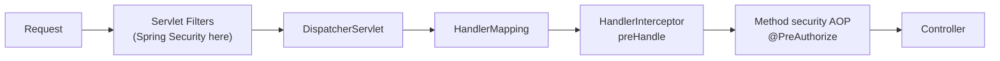
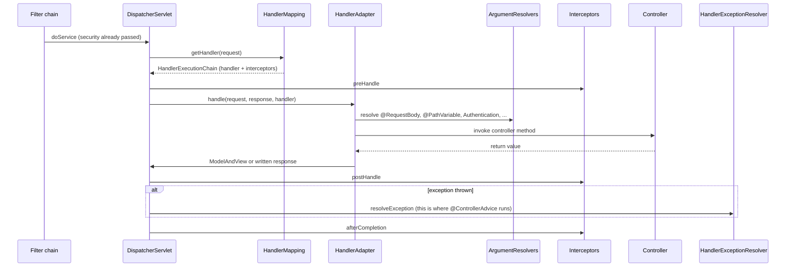
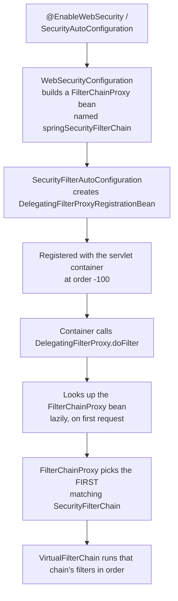

# 1.4 — Servlet Basics: Filters, Interceptors, and DispatcherServlet

> **Module 1 · Topic 4** · Prerequisites
> Baseline: Jakarta Servlet 6.0, Spring Boot 3.x, Spring Security 6.x
> New to this? Read **In Plain English** below first, then come back to the Version Matrix.

---

## Version Matrix

| Concern | Spring Boot 2.7 / Security 5.x | **Spring Boot 3.x / Security 6.x (baseline)** | Spring Security 7.x |
|---|---|---|---|
| Servlet namespace | `javax.servlet.*` (Servlet 4.0) | **`jakarta.servlet.*` (Servlet 6.0)** | `jakarta.servlet.*` |
| Security filter registration | `DelegatingFilterProxyRegistrationBean`, order `-100` | **same** | same |
| Dispatcher types secured | `REQUEST`, `ERROR`, `ASYNC` | **same** (`spring.security.filter.dispatcher-types`) | same |
| `ERROR` dispatch authorization | filter re-runs; `/error` usually needs `permitAll` | **same**, but `AuthorizationFilter` has `shouldFilterAllDispatcherTypes = true` by default | same |
| Threading | platform threads, pooled | **virtual threads opt-in** (`spring.threads.virtual.enabled`) | virtual threads |

---

## Why This Exists

Spring Security is not magic and it is not part of Spring MVC. It is **a single servlet
filter** registered with the container, which internally runs a chain of other filters.
Everything else — the DSL, the annotations, the `SecurityContext` — is built on that one fact.

If you understand the servlet layer, three things that confuse most developers become obvious:

1. Why `@ControllerAdvice` cannot catch an `AccessDeniedException` from `AuthorizationFilter`.
2. Why a `HandlerInterceptor` is the wrong place for authentication.
3. Why `SecurityContextHolder` must be cleared in a `finally` block.

---

## In Plain English

**The one-line version:** Spring Security is not woven into your application at all — it is one
piece of code that the web server runs before your code, and it can simply refuse to pass the
request along.

**An analogy.** Picture the entrance to a stadium. Between the street and your seat there is a line
of checkpoints: a bag search, then a ticket scanner, then a steward who checks you are in the right
block. Each one either waves you through to the next or turns you away. Your seat — the controller
method you wrote — does not know or care that any of this happened. It only ever sees people who
made it all the way through.

Two properties of that line matter, and they are the ones people get wrong. First, the checkpoints
run in a fixed order, and any single one of them can end your journey. If the ticket scanner rejects
you, the steward further along never even learns you existed. Second — and this is the surprising
one — each checkpoint is not really a station you leave behind. It is more like a person who escorts
you to the next checkpoint and waits for you to come back. The bag searcher hands you to the ticket
scanner, the scanner hands you to the steward, the steward takes you to your seat, and then on your
way out you pass back through all of them in reverse order. That is why the first checkpoint in the
line is in a position to notice something that goes wrong at the last one.

The word for such a checkpoint in the Java web world is a *filter*. Spring Security registers
exactly one filter with the web server, and that single filter internally runs the whole line of its
own checkpoints.

**How it actually works, step by step.**

A *servlet* is the original Java building block for handling a web request. It has one method that
the server calls for each incoming request. Spring MVC has a single, very clever servlet called
`DispatcherServlet` that looks at the URL, works out which of your controller methods should handle
it, converts the JSON body into Java objects, and calls your method. Everything Spring MVC does
happens inside that one servlet.

A *filter* sits in front of servlets. The server builds a list of them and calls the first one,
which does whatever it wants and then calls `chain.doFilter(...)` to pass control onward. That call
is the key to the whole model, because it does not return until everything after it has finished —
all the remaining filters, the `DispatcherServlet`, and your controller. So the code you write
before `chain.doFilter(...)` runs on the way in, and the code after it runs on the way out. And if
you simply never call it, the request stops dead right there. That is exactly how a security filter
rejects somebody: write a `401` to the response and decline to continue.

Spring Security plugs into this with two objects. `DelegatingFilterProxy` is a plain filter the web
server knows about; its only purpose is to look up a Spring bean and hand the request to it, because
the web server knows nothing about Spring. That bean is the `FilterChainProxy`, which holds the
actual list of security filters and runs them one after another. This is why Spring Security is
sometimes described as "one filter that contains a chain of filters".

There is a separate mechanism that looks similar and is not. A `HandlerInterceptor` also wraps
requests, but it lives *inside* `DispatcherServlet`, so it only runs after Spring MVC has already
chosen which controller method to call and read the request body. That makes it a poor place for
authentication — you would have already deserialised an attacker's payload before deciding to
reject them — and it misses everything that does not go through Spring MVC, such as static files.
It is, however, the right tool when you need to know *which* controller method was selected, for
example to record a metric per endpoint.

Now the detail with the sharpest consequences: threading. The web server creates exactly **one**
instance of each servlet, filter, and Spring `@Component`, and calls it from many threads at the
same time. So a field on one of those objects is shared by every user currently on your site. A
field named `currentUser` is not a small bug; under load it means one customer sees another
customer's data. Per-request information must live in local variables, in the request object, or in
a `ThreadLocal` — a special container that gives each thread its own private copy.

`ThreadLocal` has its own trap, and it is the reason for a rule you will see repeated everywhere.
Web servers reuse threads: a thread finishes one request, returns to a pool, and picks up an
entirely different request from an entirely different person. If the first request left something
behind in the `ThreadLocal`, the second request starts life with it. Since `SecurityContextHolder`
— the place Spring keeps "who is logged in" — is backed by a `ThreadLocal`, leaving it behind would
mean the next visitor arrives already authenticated as the previous one. That is why Spring clears
it in a `finally` block, which is code guaranteed to run no matter how the request ends.

The last idea is that a single browser request can pass through the filters more than once. The
server calls these passes *dispatches*: the original one, plus extra ones if the application
forwards internally or if an error occurs and the server renders an error page. A naive filter runs
on every pass, so a token gets parsed and verified three times. Extending `OncePerRequestFilter`
fixes that by leaving a marker on the request. The same fact explains one of the most common
beginner frustrations: because the error page is a fresh pass through security, forgetting to allow
`/error` publicly makes every error render as a blank refusal instead of your real message.

**Why should a beginner care?** This layer is where the two most confusing Spring Security symptoms
come from. If you place a custom token filter after the authorization filter, every request will be
refused even though your filter clearly ran and clearly found a valid token — because the decision
was already made before your filter spoke. And if you store per-request data in a field on a filter
or service, your application will work perfectly on your laptop and leak data between customers in
production, which is the kind of bug that only appears under real traffic.

**Words you will meet in this file**

| Term | In plain words |
|---|---|
| Servlet | The original Java object that handles a web request. There is one instance, used by many threads. |
| Servlet container | The web server running your code, such as Tomcat. It creates the servlets and calls them. |
| Filter | A checkpoint that runs before and after your code and can refuse to pass the request along. |
| `chain.doFilter(...)` | The call that hands the request to the next checkpoint. Skip it and the request stops here. |
| `DispatcherServlet` | Spring MVC's single servlet, which picks your controller method and calls it. |
| `HandlerInterceptor` | A Spring MVC checkpoint that runs inside the dispatcher, after the controller has been chosen. |
| `DelegatingFilterProxy` | The one filter the web server knows about, whose job is to hand off to a Spring bean. |
| `FilterChainProxy` | The Spring bean holding the real list of security filters and running them in order. |
| `SecurityFilterChain` | One configured list of security filters, paired with a rule about which URLs it handles. |
| `OncePerRequestFilter` | A base class ensuring your filter body runs only once per browser request. |
| Dispatcher type | Which kind of pass this is — the original request, an internal forward, or an error page. |
| `ThreadLocal` | A variable where each thread gets its own private copy. Must be cleared, because threads are reused. |
| `SecurityContextHolder` | The `ThreadLocal` where Spring stores who is logged in for the current request. |
| `SecurityContextRepository` | The component that decides where the logged-in identity is kept between requests. |
| `AuthorizationFilter` | The last security checkpoint, which applies your URL rules and refuses the request if they fail. |
| `ExceptionTranslationFilter` | An outer checkpoint that catches security failures thrown later and turns them into a response. |
| `StrictHttpFirewall` | A guard that rejects suspicious-looking URLs with a `400` before any chain is even chosen. |
| Async dispatch | When a request is handed to a different thread to finish, which is why the identity has to be copied. |

**If you remember only one thing:** Spring Security is a list of checkpoints that run before your
code, in a fixed order, and any of them can stop the request — so where your filter sits in that
list decides whether it works at all.

---

## Core Concepts

### 1. The Servlet Contract

**In simple terms:** There is only one copy of the object handling your web requests, and many
threads call it at once, so anything you store on it is shared by every user on the site.

```java
package jakarta.servlet;

public interface Servlet {
    void init(ServletConfig config) throws ServletException;   // once, at startup
    void service(ServletRequest req, ServletResponse res);     // per request
    void destroy();                                            // once, at shutdown
}
```

`HttpServlet.service()` inspects the method and dispatches to `doGet`, `doPost`, `doPut`,
`doDelete`, `doHead`, `doOptions`, or `doTrace`.

**The threading model is the part that matters for security:**

> There is **one servlet instance** for the whole application, and the container invokes
> `service()` concurrently from **many threads**.

Consequences:

- Instance fields on a servlet, a filter, or a singleton `@Component` are **shared across all
  users**. A field holding "the current user" is a cross-user data leak, not a bug you can
  fix with synchronisation.
- Per-request state must live in the request (`request.setAttribute`), in a `ThreadLocal`, or
  in a request-scoped bean.
- `ThreadLocal` state **must** be cleaned up, because containers pool threads. A leftover
  value is visible to the next, unrelated request that lands on the same thread.

That last point is exactly why Spring Security's `FilterChainProxy` does this:

```java
// FilterChainProxy.doFilterInternal (simplified)
try {
    this.securityContextHolderStrategy.clearContext();   // start clean
    doFilterInternal(request, response, chain);
}
finally {
    this.securityContextHolderStrategy.clearContext();   // NEVER leave it behind
    request.removeAttribute(FILTER_APPLIED);
}
```

### 2. Filters — Where Spring Security Lives

**In simple terms:** A filter is a checkpoint that wraps everything after it, so the code you write
after the hand-off call runs on the way back out, and refusing to hand off ends the request.

```java
package jakarta.servlet;

public interface Filter {
    default void init(FilterConfig filterConfig) {}
    void doFilter(ServletRequest request, ServletResponse response, FilterChain chain)
            throws IOException, ServletException;
    default void destroy() {}
}
```

The essential mental model: **a filter chain is a call stack, not a pipeline.**

```java
public void doFilter(ServletRequest req, ServletResponse res, FilterChain chain) {
    // 1. BEFORE - runs on the way in
    chain.doFilter(req, res);            // 2. everything downstream executes HERE, nested
    // 3. AFTER - runs on the way out, response may already be committed
}
```

```
Filter1.before
  Filter2.before
    Filter3.before
      Servlet / DispatcherServlet
    Filter3.after
  Filter2.after
Filter1.after
```

Two consequences people get wrong:

- **Not calling `chain.doFilter()` terminates the request.** This is how security filters
  reject — they write a 401 and simply do not continue.
- **A filter earlier in the list is *outside* the ones after it on the stack.** That is why
  `ExceptionTranslationFilter`, which appears *before* `AuthorizationFilter` in the ordered
  list, can catch exceptions that `AuthorizationFilter` throws: the `try` block wraps the
  nested call.

### 3. `OncePerRequestFilter` — Almost Always What You Want

**In simple terms:** One browser request can travel through the filters several times, so this base
class makes sure your expensive work, such as verifying a token, happens only once.

A plain `Filter` can execute more than once per HTTP request, because a single request can be
dispatched several times: `REQUEST`, then `FORWARD` (a JSP or error page), then `INCLUDE`,
then `ASYNC`, then `ERROR`. If your JWT filter runs on each dispatch, you re-parse and
re-validate the token three or four times.

```java
package org.springframework.web.filter;

public abstract class OncePerRequestFilter extends GenericFilterBean {

    @Override
    public final void doFilter(ServletRequest req, ServletResponse res, FilterChain chain) {
        HttpServletRequest request = (HttpServletRequest) req;
        String alreadyFilteredAttributeName = getAlreadyFilteredAttributeName();
        boolean hasAlreadyFilteredAttribute = request.getAttribute(alreadyFilteredAttributeName) != null;

        if (skipDispatch(request) || shouldNotFilter(request)) {
            chain.doFilter(request, response);
        }
        else if (hasAlreadyFilteredAttribute) {
            if (DispatcherType.ERROR.equals(request.getDispatcherType())) {
                doFilterNestedErrorDispatch(request, response, chain);
                return;
            }
            chain.doFilter(request, response);
        }
        else {
            request.setAttribute(alreadyFilteredAttributeName, Boolean.TRUE);
            try {
                doFilterInternal(request, response, chain);
            }
            finally {
                request.removeAttribute(alreadyFilteredAttributeName);
            }
        }
    }

    protected abstract void doFilterInternal(HttpServletRequest request,
                                             HttpServletResponse response,
                                             FilterChain filterChain);
}
```

It guards with a request attribute named after the class, so subclassing it gives you
idempotence for free. Note it has useful hooks: `shouldNotFilter(request)` to skip cheaply,
and `shouldNotFilterAsyncDispatch()` / `shouldNotFilterErrorDispatch()` to control dispatch
participation.

### 4. `HandlerInterceptor` — Spring MVC, Not Servlet

**In simple terms:** This looks like a filter but runs later and deeper, inside Spring MVC, which is
why it can tell you which controller method was picked and why it is the wrong place to log people in.

```java
package org.springframework.web.servlet;

public interface HandlerInterceptor {
    default boolean preHandle(HttpServletRequest req, HttpServletResponse res, Object handler) {
        return true;   // false = stop, do not invoke the controller
    }
    default void postHandle(HttpServletRequest req, HttpServletResponse res,
                            Object handler, ModelAndView mav) {}
    default void afterCompletion(HttpServletRequest req, HttpServletResponse res,
                                 Object handler, Exception ex) {}
}
```

The crucial difference is **position**:



### 5. Filter vs Interceptor vs AOP — The Comparison That Gets Asked

**In simple terms:** Three tools can intercept work at three different depths, and choosing the
wrong one leaves gaps — a filter sees every request, while the other two only see some of them.

| | Servlet Filter | HandlerInterceptor | Spring AOP (`@PreAuthorize`) |
|---|---|---|---|
| Defined by | Jakarta Servlet API | Spring MVC | Spring AOP / AspectJ |
| Runs | Before + after `DispatcherServlet` | Inside dispatch, around the handler | Around any proxied bean method |
| Knows the target | No — only URL, headers, body | **Yes** — the `HandlerMethod` | **Yes** — the method + arguments |
| Can modify request/response objects | **Yes** (wrapping) | No (too late to wrap) | No |
| Works for non-MVC traffic (static files, other servlets) | **Yes** | No | No |
| Works for non-HTTP calls (`@Scheduled`, Kafka listener) | No | No | **Yes** |
| Exceptions catchable by `@ControllerAdvice` | **No** | `preHandle` yes, others partly | **Yes** |
| DI support | Yes when registered as a bean | Yes | Yes |
| Spring Security uses it for | **Authentication + URL authorization** | nothing | **Method security** |

**Why Spring Security uses filters and not interceptors** — the definitive answer:

1. **Filters run before any Spring MVC code exists.** A request that should be rejected is
   rejected before handler mapping, argument resolution, and body deserialisation. An
   interceptor runs *after* `HandlerMapping` and after the dispatcher has begun work, so an
   unauthenticated attacker has already caused your `HttpMessageConverter` to deserialise
   their payload — a real attack surface.
2. **Filters cover everything, interceptors cover only `DispatcherServlet`.** Static
   resources, a separate servlet, an errors dispatch, another framework mounted on a
   different path — all bypass interceptors and none bypass filters.
3. **Filters can wrap the request and response.** `HttpServletRequestWrapper` is how CSRF,
   header writing, and caching behaviour are implemented. By interceptor time the response is
   already being written to.
4. **Filters are framework-neutral.** The same mechanism secures Spring MVC, JAX-RS, a raw
   servlet, or a WebSocket handshake.

### 6. `DispatcherServlet` — The Front Controller

**In simple terms:** This is the single piece of Spring MVC that works out which of your methods
should handle a URL and calls it, and by the time it runs, security has already decided the answer.



Its responsibilities: find the handler, resolve arguments, invoke, convert the return value,
resolve views, and handle exceptions. **It does no security.** By the time it runs, the
decision has already been made.

One argument resolver is security-relevant:
`AuthenticationPrincipalArgumentResolver` is what makes this work:

```java
@GetMapping("/me")
public String me(@AuthenticationPrincipal UserDetails user) { ... }
```

It reads `SecurityContextHolder`, extracts `getPrincipal()`, and injects it — which is why
the parameter type must match whatever your authentication mechanism produces.

### 7. Dispatcher Types — The `/error` Trap

**In simple terms:** Rendering an error page is a fresh trip through the security checkpoints, so if
you have not made `/error` public, your real error message gets replaced by a blank refusal.

A single HTTP request can produce several dispatches:

| Dispatcher type | When | Security filter runs? |
|---|---|---|
| `REQUEST` | The initial dispatch | Yes |
| `FORWARD` | `RequestDispatcher.forward()` | No (by default) |
| `INCLUDE` | `RequestDispatcher.include()` | No (by default) |
| `ASYNC` | Async processing resumes on another thread | **Yes** |
| `ERROR` | Container forwards to the error page | **Yes** |

Spring Boot's default is `spring.security.filter.dispatcher-types=ASYNC,ERROR,REQUEST`.

**The `ERROR` dispatch is why `/error` needs `permitAll()`.** When an unauthenticated request
produces an error, Boot forwards to `/error` as a new `ERROR` dispatch, and the security
filter chain runs again. If `/error` is not permitted, the error page itself is denied,
producing a confusing loop or a blank 403 in place of your real error.

```java
.authorizeHttpRequests(auth -> auth
    .requestMatchers("/error").permitAll()      // not optional in practice
    .anyRequest().authenticated()
)
```

Since Spring Security 6, `AuthorizationFilter` has `shouldFilterAllDispatcherTypes = true`,
meaning authorization is evaluated on `ERROR` and `ASYNC` dispatches too — more secure, and
the source of this particular surprise when upgrading from 5.x.

### 8. Async and the `SecurityContext`

**In simple terms:** The logged-in identity is stored per thread, so the moment you move work to
another thread it vanishes unless you deliberately carry it across.

`SecurityContextHolder` uses a `ThreadLocal` by default. Async processing moves work to a
different thread, and the context does not follow.

```java
@GetMapping("/slow")
public CompletableFuture<String> slow() {
    return CompletableFuture.supplyAsync(() -> {
        // Different thread. SecurityContextHolder.getContext().getAuthentication() is NULL.
        return doWork();
    });
}
```

Three fixes, in order of preference:

```java
// 1. Make the executor propagate the context (best - one place, applies everywhere).
@Bean
Executor taskExecutor() {
    ThreadPoolTaskExecutor delegate = new ThreadPoolTaskExecutor();
    delegate.initialize();
    return new DelegatingSecurityContextExecutor(delegate);
}

// 2. Switch the holder strategy so child threads inherit (blunt, and wrong with pools -
//    a pooled thread inherits from whichever thread happened to create it).
SecurityContextHolder.setStrategyName(SecurityContextHolder.MODE_INHERITABLETHREADLOCAL);

// 3. Capture and restore manually (fine for one-off cases).
SecurityContext context = SecurityContextHolder.getContext();
CompletableFuture.supplyAsync(new DelegatingSecurityContextSupplier<>(() -> doWork(), context));
```

For servlet async specifically, Spring Security registers
`WebAsyncManagerIntegrationFilter`, which installs a `SecurityContextCallableProcessingInterceptor`
so that `Callable` return values from controllers *do* keep the context. That covers
`Callable`/`WebAsyncTask` but **not** your own `CompletableFuture.supplyAsync` on an arbitrary
executor.

---

## Working Code

A correctly written security filter:

```java
package com.example.security;

import jakarta.servlet.FilterChain;
import jakarta.servlet.ServletException;
import jakarta.servlet.http.HttpServletRequest;
import jakarta.servlet.http.HttpServletResponse;
import org.springframework.security.core.context.SecurityContext;
import org.springframework.security.core.context.SecurityContextHolder;
import org.springframework.security.core.context.SecurityContextHolderStrategy;
import org.springframework.security.web.context.RequestAttributeSecurityContextRepository;
import org.springframework.security.web.context.SecurityContextRepository;
import org.springframework.web.filter.OncePerRequestFilter;

import java.io.IOException;

public class ApiKeyAuthenticationFilter extends OncePerRequestFilter {

    private static final String HEADER = "X-API-Key";

    private final ApiKeyService apiKeyService;

    // 6.x: take the strategy rather than calling the static holder, so it is testable
    // and works with non-default strategies.
    private final SecurityContextHolderStrategy contextHolderStrategy =
            SecurityContextHolder.getContextHolderStrategy();

    // Stateless: keep the context for this request only, do not touch the session.
    private final SecurityContextRepository contextRepository =
            new RequestAttributeSecurityContextRepository();

    public ApiKeyAuthenticationFilter(ApiKeyService apiKeyService) {
        this.apiKeyService = apiKeyService;
    }

    /** Cheap opt-out: never pay the cost on paths this filter cannot serve. */
    @Override
    protected boolean shouldNotFilter(HttpServletRequest request) {
        return !request.getRequestURI().startsWith("/api/");
    }

    @Override
    protected void doFilterInternal(HttpServletRequest request,
                                    HttpServletResponse response,
                                    FilterChain chain) throws ServletException, IOException {

        String apiKey = request.getHeader(HEADER);

        // No credential presented: do NOT reject here. Continue the chain and let
        // AuthorizationFilter decide - some endpoints may be public.
        if (apiKey == null || apiKey.isBlank()) {
            chain.doFilter(request, response);
            return;
        }

        // A credential WAS presented and is invalid: reject immediately.
        // Do not call chain.doFilter - that is what terminates the request.
        var authentication = apiKeyService.authenticate(apiKey);
        if (authentication == null) {
            response.setStatus(HttpServletResponse.SC_UNAUTHORIZED);
            response.setContentType("application/problem+json");
            response.getWriter().write("""
                {"type":"about:blank","title":"Unauthorized","status":401}""");
            return;
        }

        SecurityContext context = this.contextHolderStrategy.createEmptyContext();
        context.setAuthentication(authentication);
        this.contextHolderStrategy.setContext(context);
        this.contextRepository.saveContext(context, request, response);

        // No try/finally clearing here: FilterChainProxy already clears in its own finally,
        // and it sits outside us on the stack.
        chain.doFilter(request, response);
    }
}
```

Registering it — and the double-registration trap:

```java
package com.example.security;

import org.springframework.boot.web.servlet.FilterRegistrationBean;
import org.springframework.context.annotation.Bean;
import org.springframework.context.annotation.Configuration;
import org.springframework.security.config.annotation.web.builders.HttpSecurity;
import org.springframework.security.config.annotation.web.configuration.EnableWebSecurity;
import org.springframework.security.web.SecurityFilterChain;
import org.springframework.security.web.authentication.UsernamePasswordAuthenticationFilter;

@Configuration
@EnableWebSecurity
public class FilterConfig {

    @Bean
    SecurityFilterChain filterChain(HttpSecurity http, ApiKeyService apiKeyService) throws Exception {
        http
            .securityMatcher("/api/**")
            .authorizeHttpRequests(auth -> auth
                .requestMatchers("/error").permitAll()
                .requestMatchers("/api/public/**").permitAll()
                .anyRequest().authenticated()
            )
            .addFilterBefore(new ApiKeyAuthenticationFilter(apiKeyService),
                             UsernamePasswordAuthenticationFilter.class);
        return http.build();
    }

    /**
     * THE TRAP: if ApiKeyAuthenticationFilter were declared as an @Component or @Bean,
     * Boot's ServletComponentRegisteringPostProcessor would ALSO register it directly with
     * the container - so it would run twice, once outside the Spring Security chain
     * (where securityMatcher does not apply) and once inside it.
     *
     * If you must have it as a bean (for @Autowired, @Value, etc.), disable the
     * container-level registration explicitly:
     */
    @Bean
    FilterRegistrationBean<ApiKeyAuthenticationFilter> disableAutoRegistration(
            ApiKeyAuthenticationFilter filter) {
        FilterRegistrationBean<ApiKeyAuthenticationFilter> registration =
                new FilterRegistrationBean<>(filter);
        registration.setEnabled(false);
        return registration;
    }
}
```

An interceptor doing what interceptors are actually good for:

```java
package com.example.web;

import jakarta.servlet.http.HttpServletRequest;
import jakarta.servlet.http.HttpServletResponse;
import org.springframework.web.method.HandlerMethod;
import org.springframework.web.servlet.HandlerInterceptor;

/**
 * Correct use of an interceptor: it needs to know WHICH controller method was selected,
 * which a filter cannot know. This is observability, not security.
 */
public class EndpointMetricsInterceptor implements HandlerInterceptor {

    @Override
    public boolean preHandle(HttpServletRequest request, HttpServletResponse response, Object handler) {
        if (handler instanceof HandlerMethod method) {
            request.setAttribute("endpoint",
                method.getBeanType().getSimpleName() + "#" + method.getMethod().getName());
        }
        request.setAttribute("startNanos", System.nanoTime());
        return true;
    }

    @Override
    public void afterCompletion(HttpServletRequest request, HttpServletResponse response,
                                Object handler, Exception ex) {
        long start = (long) request.getAttribute("startNanos");
        Metrics.timer("endpoint.latency", "endpoint", String.valueOf(request.getAttribute("endpoint")))
               .record(System.nanoTime() - start, TimeUnit.NANOSECONDS);
    }
}
```

Tests:

```java
class ApiKeyAuthenticationFilterTests {

    @Test
    void missingKeyContinuesTheChain() throws Exception {
        var request = new MockHttpServletRequest("GET", "/api/orders");
        var response = new MockHttpServletResponse();
        var chain = new MockFilterChain();

        new ApiKeyAuthenticationFilter(service).doFilter(request, response, chain);

        // Chain continued -> AuthorizationFilter gets to decide. Not a 401 from us.
        assertThat(chain.getRequest()).isNotNull();
    }

    @Test
    void invalidKeyTerminatesWith401() throws Exception {
        var request = new MockHttpServletRequest("GET", "/api/orders");
        request.addHeader("X-API-Key", "bogus");
        var response = new MockHttpServletResponse();
        var chain = new MockFilterChain();

        new ApiKeyAuthenticationFilter(service).doFilter(request, response, chain);

        assertThat(response.getStatus()).isEqualTo(401);
        assertThat(chain.getRequest()).isNull();   // chain NOT continued
    }

    @Test
    void doesNotRunTwiceOnForwardDispatch() throws Exception {
        // OncePerRequestFilter guards with a request attribute.
        var request = new MockHttpServletRequest("GET", "/api/orders");
        request.setAttribute(
            ApiKeyAuthenticationFilter.class.getName() + ".FILTERED", Boolean.TRUE);
        request.addHeader("X-API-Key", "bogus");
        var response = new MockHttpServletResponse();
        var chain = new MockFilterChain();

        new ApiKeyAuthenticationFilter(service).doFilter(request, response, chain);

        assertThat(response.getStatus()).isEqualTo(200);   // skipped, not re-evaluated
    }
}
```

---

## Internals

### How `springSecurityFilterChain` gets into the container



`DelegatingFilterProxy` exists to solve a lifecycle problem: the servlet container creates
filters and knows nothing about the Spring context, but Spring Security's filters need
dependency injection, AOP, and the application context. `DelegatingFilterProxy` is a thin
container-managed filter that looks up a Spring bean by name on first use and forwards to it.

`FilterChainProxy` then does the work:

```java
// FilterChainProxy.doFilterInternal (simplified)
List<Filter> filters = getFilters(firewallRequest);   // first matching chain, or null
if (filters == null || filters.isEmpty()) {
    // No chain matched -> Spring Security does nothing, request continues to the app.
    firewallRequest.reset();
    chain.doFilter(firewallRequest, firewallResponse);
    return;
}
VirtualFilterChain vfc = new VirtualFilterChain(firewallRequest, chain, filters);
vfc.doFilter(firewallRequest, firewallResponse);
```

Two details worth knowing:

- **`getFilters` returns the first match only.** Chains do not accumulate. An `@Order(1)`
  catch-all makes every later chain unreachable.
- **`HttpFirewall`.** `StrictHttpFirewall` runs before any chain selection and rejects
  requests with URL-encoded path traversal, semicolons (path parameters, used to smuggle past
  matchers), double slashes, and non-printable ASCII. It throws `RequestRejectedException`
  and returns 400. This is the source of "my URL with a `;` in it returns 400 and never
  reaches my controller".

### `VirtualFilterChain` — how the chain is driven

```java
private static final class VirtualFilterChain implements FilterChain {
    private final FilterChain originalChain;
    private final List<Filter> additionalFilters;
    private int currentPosition = 0;

    @Override
    public void doFilter(ServletRequest request, ServletResponse response) {
        if (this.currentPosition == this.additionalFilters.size()) {
            // Security chain exhausted -> hand back to the container's chain (-> DispatcherServlet)
            this.originalChain.doFilter(request, response);
            return;
        }
        this.currentPosition++;
        Filter nextFilter = this.additionalFilters.get(this.currentPosition - 1);
        nextFilter.doFilter(request, response, this);   // passes ITSELF as the chain
    }
}
```

The chain passes itself as the `FilterChain` argument, incrementing a cursor. That is the
whole mechanism — it is a hand-rolled iterator implemented as recursion, which is why the
stack depth in a Spring Security stack trace is so large.

### Why the security filter sits at order `-100`

```java
// SecurityProperties
public static final int DEFAULT_FILTER_ORDER = OrderedFilter.REQUEST_WRAPPER_FILTER_MAX_ORDER - 100;
```

It runs *after* request-wrapping filters (`OrderedCharacterEncodingFilter`,
`OrderedFormContentFilter`, `OrderedHiddenHttpMethodFilter`) so that the request is fully
decoded before security reads parameters — otherwise `request.getParameter("username")` on a
form-encoded `PUT` would be `null` — but *before* every application-level filter.

---

## Configuration Reference

| Setting / API | Effect | Default |
|---|---|---|
| `spring.security.filter.order` | Position of `springSecurityFilterChain` in the container chain | `-100` |
| `spring.security.filter.dispatcher-types` | Dispatch types the security chain runs on | `ASYNC, ERROR, REQUEST` |
| `spring.threads.virtual.enabled` | Serve requests on virtual threads | `false` |
| `server.tomcat.threads.max` | Container worker thread pool size | `200` |
| `http.addFilterBefore(f, X.class)` | Insert immediately before filter type `X` | — |
| `http.addFilterAfter(f, X.class)` | Insert immediately after filter type `X` | — |
| `http.addFilterAt(f, X.class)` | Insert at `X`'s position — does **not** replace `X` | — |
| `FilterRegistrationBean.setEnabled(false)` | Stop Boot auto-registering a `Filter` bean with the container | enabled |
| `OncePerRequestFilter.shouldNotFilter()` | Cheap per-request opt-out | `false` |
| `HttpSecurity.securityMatcher(...)` | Which requests this whole chain handles | all |
| `WebSecurityCustomizer.ignoring()` | Bypass the security chain **entirely** | none |

---

## Production Concerns & Anti-Patterns

**Mutable state in a filter or servlet.** A field like `private String currentUser` on a
singleton filter is shared across all concurrent requests. Under load, users see each other's
data. This is not theoretical; it is one of the most damaging bugs that reaches production
because it only manifests under concurrency.

**Forgetting `finally` around `ThreadLocal` state.** A leftover `SecurityContext` on a pooled
thread authenticates the next unrelated request as the previous user.

**Double filter registration.** Declaring your filter as `@Component` *and* adding it with
`addFilterBefore` runs it twice — once outside the security chain where `securityMatcher` does
not apply. Disable the container registration with a disabled `FilterRegistrationBean`.

**Rejecting in the filter when no credential is present.** If your JWT filter returns 401
whenever the header is missing, every public endpoint breaks. The filter's job is "if a
credential is present, authenticate it"; the decision about whether authentication is
*required* belongs to `AuthorizationFilter`.

**Using `WebSecurityCustomizer.ignoring()` for anything dynamic.** It removes the request from
the security chain entirely — no headers written, no CSRF, no context, and crucially no
authorization if you later add a rule. Use `permitAll()` instead; reserve `ignoring()` for
genuinely static assets, and even then prefer a dedicated chain.

**Authentication in a `HandlerInterceptor`.** It runs after handler mapping and after the body
has been read; it does not cover static resources or other servlets; and it silently does
nothing for any non-MVC path.

**Reading the request body in a filter.** `getInputStream()` can only be consumed once. Doing
it in a filter leaves the controller with an empty body. Use
`ContentCachingRequestWrapper` if you genuinely need it, and be aware of the memory cost on
large uploads.

**Forgetting `/error` in `permitAll()`.** Errors on unauthenticated requests produce a second
`ERROR` dispatch through the security chain, and a denied error page hides the real problem.

**Blocking calls on the request thread with a 200-thread pool.** A slow downstream call
holds a Tomcat worker. 200 concurrent slow requests and the server stops accepting anything,
including health checks. This is why virtual threads (`spring.threads.virtual.enabled=true`)
matter in Boot 3.2+.

---

## Debugging Playbook

| Symptom | Likely root cause | Fix |
|---|---|---|
| Custom filter never runs | Not added to the chain, or added to a chain whose `securityMatcher` does not match the URL | Set `logging.level.org.springframework.security=DEBUG` and read the printed filter list at startup |
| Custom filter runs twice | Registered as a bean *and* via `addFilterBefore` | Add a disabled `FilterRegistrationBean` |
| Filter runs but the `SecurityContext` is empty downstream | Context set on the holder but never saved to the repository, or set after `AuthorizationFilter` | Call `SecurityContextRepository.saveContext`; move the filter earlier |
| 403 with a valid token | Authentication filter placed after `AuthorizationFilter` | `addFilterBefore(f, UsernamePasswordAuthenticationFilter.class)` |
| Controller receives an empty `@RequestBody` | A filter consumed the input stream | Use `ContentCachingRequestWrapper`, or do not read the body |
| Blank page / redirect loop on any error | `/error` is not permitted, and the `ERROR` dispatch is being denied | `.requestMatchers("/error").permitAll()` |
| `RequestRejectedException` → 400 on a legitimate URL | `StrictHttpFirewall` blocking `;`, `//`, encoded `%2F`, or non-printable characters | Fix the URL; only relax the firewall with a specific, justified exception |
| `getAuthentication()` is null inside `@Async` | `ThreadLocal` does not cross threads | Wrap the executor in `DelegatingSecurityContextExecutor` |
| Works locally, users see each other's data in production | Mutable instance state on a singleton filter/servlet/bean | Move state into the request or a `ThreadLocal` with cleanup |
| Interceptor not invoked for some URLs | The path is handled by a different servlet or by the static resource handler | Use a filter instead |

---

## Interview Q&A

### Q1. Why is Spring Security implemented as a servlet filter rather than a Spring MVC interceptor?

<details>
<summary>Show answer</summary>

Four reasons, and the first is the one that actually matters.

**1. Position.** A filter runs before `DispatcherServlet` exists in the call stack. An
interceptor runs *inside* the dispatch, after `HandlerMapping` has selected the handler. That
means by interceptor time, an unauthenticated attacker has already caused your application to
resolve a handler, and depending on ordering, to deserialise their request body through a
`HttpMessageConverter`. If there is a deserialisation vulnerability, you have exposed it to
someone you were about to reject. Security should reject as early as possible.

**2. Coverage.** Interceptors only apply to requests routed through `DispatcherServlet`.
Static resources served by the default servlet, a second servlet mounted on another path, a
JAX-RS application, the H2 console — all bypass interceptors entirely. Filters see everything
the container sees.

**3. Capability.** Filters can wrap the request and response objects with
`HttpServletRequestWrapper`. That is how CSRF token injection, header writing, and content
caching are implemented. By the time an interceptor runs, the response is already the real
one and it is too late to wrap.

**4. Neutrality.** The filter mechanism is Jakarta Servlet, not Spring MVC. The same Spring
Security configuration secures MVC, WebSocket handshakes, and any other servlet-based
framework.

**Counter-question: but `@PreAuthorize` is AOP, not a filter. Isn't that a contradiction?**

No, they solve different problems and the framework uses both deliberately.

Filters handle *request-level* authorization: "may this caller reach this URL?" They are
coarse, cheap, and configured in one auditable place.

Method security handles *invocation-level* authorization: "may this caller invoke this
method, with these arguments, and may they see this return value?" A filter fundamentally
cannot do that — it has no idea which method will be chosen, what the arguments will
deserialise to, or what will be returned. `@PostAuthorize` in particular is impossible at the
filter layer because it inspects the return value.

The trade-off is that method security is invisible in your configuration (you cannot audit
the whole policy in one file) and is bypassable by self-invocation within the same bean.

**Counter-question: so when is a `HandlerInterceptor` the right tool?**

When you need to know *which handler method* was selected, and it is not a security concern.
Per-endpoint metrics and tracing tags, populating a `ModelAndView` for server-rendered pages,
request logging that includes the controller name, or setting up a request-scoped context
keyed on handler metadata.

The test I apply: if the logic must be correct for *every* request including static resources
and error dispatches, it belongs in a filter. If it needs handler metadata and a missed
request is merely a gap in observability, an interceptor is fine.
</details>

### Q2. Explain the filter chain execution model. Why can `ExceptionTranslationFilter`, which comes *before* `AuthorizationFilter`, catch exceptions thrown by it?

<details>
<summary>Show answer</summary>

Because the filter chain is a **call stack, not a pipeline**. This is the single most useful
mental correction for reasoning about Spring Security.

Each filter calls `chain.doFilter(request, response)`, and that call does not return until
*everything downstream* — all later filters, the `DispatcherServlet`, and your controller —
has finished. So the code after `chain.doFilter(...)` in filter 1 runs after the controller
has returned.

```
ExceptionTranslationFilter.doFilter
    try {
        chain.doFilter(...)              <-- AuthorizationFilter, DispatcherServlet,
                                             controller ALL execute inside this call
    } catch (AccessDeniedException | AuthenticationException e) {
        handleSpringSecurityException(e)
    }
```

"Before in the list" means "outside on the stack". `ExceptionTranslationFilter` wraps
everything after it in a `try` block, so it catches anything they throw. If it were placed
after `AuthorizationFilter`, it would already have returned by the time the exception was
thrown and would never see it.

**Counter-question: so does it catch exceptions from my controller too?**

It catches `AuthenticationException` and `AccessDeniedException` from anywhere downstream,
including your controller — and including method security, since `@PreAuthorize` throws
`AccessDeniedException` inside the dispatch.

But there is an ordering subtlety that trips people up. `DispatcherServlet` has its own
`HandlerExceptionResolver` chain, and `@ControllerAdvice` runs there. If your
`@RestControllerAdvice` has a handler for `AccessDeniedException`, it catches it *first*,
inside the dispatch, and `ExceptionTranslationFilter` never sees it — so your
`AccessDeniedHandler` is bypassed and you get a different response shape for the same logical
failure depending on whether the denial came from `AuthorizationFilter` or from
`@PreAuthorize`.

The fix is to either not handle `AccessDeniedException` in `@ControllerAdvice` and let it
propagate, or to deliberately handle it in both places with identical output. I prefer the
former — one code path, one response format.

**Counter-question: what happens if a filter throws a plain `RuntimeException`?**

It propagates up through every enclosing filter. `ExceptionTranslationFilter` ignores it
(it only handles the two security types), `FilterChainProxy`'s `finally` still clears the
`SecurityContext`, and the exception reaches the container. Tomcat then forwards to the error
page, which is a new `ERROR` dispatch — and since Spring Security runs on `ERROR` dispatches
by default, the whole chain executes again for `/error`.

This is why an unhandled exception in a filter can produce a confusing 403 on the error page
instead of your 500, if `/error` is not in `permitAll()`.

**Counter-question: if a filter doesn't call `chain.doFilter`, what happens?**

The request stops there. Nothing downstream runs — no further filters, no `DispatcherServlet`,
no controller. Whatever the filter wrote to the response is what the client gets, and the
already-executed `before` sections of enclosing filters still get their `after` sections run
as the stack unwinds.

This is precisely how security filters reject: `BasicAuthenticationFilter` on a bad password
calls the `AuthenticationEntryPoint` and returns without continuing. It is also the most
common bug in hand-written filters — forgetting `chain.doFilter` on the success path makes
every request return an empty 200.
</details>

### Q3. What is `OncePerRequestFilter` and why would a plain `Filter` run more than once?

<details>
<summary>Show answer</summary>

One HTTP request can produce multiple *dispatches* through the filter chain. The servlet spec
defines five dispatcher types: `REQUEST`, `FORWARD`, `INCLUDE`, `ASYNC`, and `ERROR`. A single
request that starts as `REQUEST`, does async processing, then errors, will pass through the
container's filter chain three times.

A plain `Filter` registered for multiple dispatcher types runs on each one. For a JWT filter
that means parsing and cryptographically verifying the token three times — wasted CPU, and
potentially inconsistent behaviour if the second pass sees a partially-written response.

`OncePerRequestFilter` guards with a request attribute named after the concrete class. On
first execution it sets the attribute and runs `doFilterInternal`; on subsequent dispatches it
sees the attribute and passes straight through.

It also gives you useful hooks: `shouldNotFilter(request)` for a cheap per-request opt-out,
and `shouldNotFilterAsyncDispatch()` / `shouldNotFilterErrorDispatch()` to control dispatch
participation explicitly.

**Counter-question: Spring Security runs on `ERROR` dispatches by default. Isn't that
wasteful, or is there a reason?**

There is a very good reason, and it changed in 6.x specifically to close a hole.

When an error occurs, Boot forwards to `/error`, which renders a response. If security did not
run on that dispatch, `/error` would be completely unprotected — and error responses can leak
information: stack traces, the requested path, sometimes exception messages containing data.
An attacker could deliberately trigger errors to read content they should not see.

In Spring Security 6, `AuthorizationFilter` has `shouldFilterAllDispatcherTypes = true`, so
authorization is evaluated on `ERROR` and `ASYNC` too. That is strictly more secure, and it is
the source of a common upgrade surprise: apps that worked on 5.x start returning blank 403s on
errors because `/error` was never added to `permitAll()`.

**Counter-question: I have a `@Component` filter that also needs `addFilterBefore`. What goes wrong?**

It gets registered twice and runs twice, in two different places.

Boot auto-registers any `Filter` bean with the servlet container. So the container chain
contains your filter, and the Spring Security chain *also* contains it via `addFilterBefore`.
The container-level copy runs **outside** the security chain, which means `securityMatcher`
does not apply to it and it executes for every URL in the application, including ones you
deliberately scoped it away from.

`OncePerRequestFilter` does **not** save you here — its guard is per dispatch, and these are
two distinct registrations in the same dispatch, so the attribute logic in the second
invocation sees it already set and skips... which in this case means your security-chain copy
is the one that gets skipped, because the container-level one ran first. Now your filter has
effectively escaped its `securityMatcher`.

The fix is to disable the container registration:

```java
@Bean
FilterRegistrationBean<MyFilter> disable(MyFilter filter) {
    FilterRegistrationBean<MyFilter> reg = new FilterRegistrationBean<>(filter);
    reg.setEnabled(false);
    return reg;
}
```

Or simply do not make it a bean — construct it directly in the `SecurityFilterChain` method
and pass dependencies as constructor arguments, which is what I usually prefer because it
makes the single registration obvious.
</details>

### Q4. Where would you place a custom JWT filter, and what is the actual constraint?

<details>
<summary>Show answer</summary>

The conventional placement is:

```java
http.addFilterBefore(jwtFilter, UsernamePasswordAuthenticationFilter.class);
```

But `UsernamePasswordAuthenticationFilter` is just a convenient landmark. The real constraints
are a window with two edges:

- **After `SecurityContextHolderFilter`**, so the `SecurityContext` has been initialised and,
  critically, so it will be cleared on the way out. If you set a context before that filter
  runs, it gets overwritten by the (empty) persisted context.
- **Before `AuthorizationFilter`**, so that when authorization rules are evaluated, your
  authentication is already in the context.

Anywhere in that window works. `UsernamePasswordAuthenticationFilter` sits comfortably inside
it and is the position everyone recognises, which is worth something for maintainability.

**Counter-question: what specifically breaks if you put it after `AuthorizationFilter`?**

Every request is evaluated as anonymous. `AuthorizationFilter` runs, finds an
`AnonymousAuthenticationToken`, denies anything requiring authentication, and throws
`AccessDeniedException`. `ExceptionTranslationFilter` catches it, sees the authentication is
anonymous, and sends a login challenge.

The symptom is maddening because your filter *does* run afterwards and *does* set a perfectly
valid authentication — it is just too late, and the response was already decided. Developers
add logging inside the filter, see it executing with a valid token, and conclude Spring
Security is broken.

The diagnostic is to turn on `logging.level.org.springframework.security=DEBUG`, which prints
the ordered filter list at startup. Read where your filter actually landed.

**Counter-question: should the JWT filter reject a request that has no `Authorization` header?**

No, and this is a design mistake I see constantly.

The filter's responsibility is narrow: *if a credential is presented, authenticate it*. Whether
authentication is **required** is a separate question, owned by `AuthorizationFilter` and your
`authorizeHttpRequests` rules.

If the filter returns 401 on a missing header, every `permitAll()` endpoint breaks — your
health check, your login endpoint, your public documentation. And the rejection happens in a
place your configuration cannot see, so someone reading the security config will have no idea
why `/actuator/health` returns 401.

The correct behaviour:
- No header → call `chain.doFilter` and move on. `AnonymousAuthenticationFilter` will populate
  an anonymous token, and the authorization rules decide.
- Header present but invalid (bad signature, expired, malformed) → *that* is worth rejecting
  immediately with 401, because the caller clearly intended to authenticate and failed.

**Counter-question: your filter sets the context. Do you need a try/finally to clear it?**

No, and adding one can cause a subtle bug.

`FilterChainProxy` already clears the context in its own `finally`, and it sits outside every
security filter on the call stack, so cleanup is guaranteed regardless of how your filter
exits. Adding your own `finally { SecurityContextHolder.clearContext(); }` clears it *before*
the rest of the chain has unwound — which is fine for filters, but if you place the clear in
the wrong spot relative to `chain.doFilter`, you wipe the context before
`AuthorizationFilter` reads it.

What you *do* need, if the context should survive the request (session-based), is
`SecurityContextRepository.saveContext(...)`. In 6.x the authentication mechanism owns saving,
not the context filter. For a stateless JWT filter you either skip saving or use
`RequestAttributeSecurityContextRepository`, which keeps it for the current request only —
important so that async dispatches within the same request still see the authentication.
</details>

### Q5. A single servlet instance serves thousands of concurrent requests. What does that mean for how you write filters and controllers?

<details>
<summary>Show answer</summary>

It means **every instance field is shared state across all users**, and the container gives
you no protection.

```java
@Component
public class BrokenFilter extends OncePerRequestFilter {
    private String currentUser;      // SHARED. This is a data breach waiting to happen.

    protected void doFilterInternal(...) {
        this.currentUser = extractUser(request);   // thread A writes
        chain.doFilter(request, response);         // thread B overwrites, thread A reads B's value
    }
}
```

Under low load this appears to work perfectly, which is why it reaches production. Under
concurrency, users see each other's data.

The same applies to `@Service` and `@Controller` beans, which are singletons by default, and
to `@RestController` fields.

Where per-request state belongs, in order of preference:

1. **Method parameters and local variables.** Stack-confined, impossible to share.
2. **`request.setAttribute(...)`.** Explicitly scoped to the request, travels with it across
   dispatches, and disappears when the request ends.
3. **`ThreadLocal` with guaranteed cleanup in `finally`.** What `SecurityContextHolder` does.
   Only when the value must be reachable from code that cannot receive it as a parameter.
4. **Request-scoped beans** (`@Scope(value = "request", proxyMode = TARGET_CLASS)`). Clean,
   but the proxy indirection surprises people and it does not cross threads.

**Counter-question: `ThreadLocal` is per-thread, and threads are pooled. Isn't that also a leak?**

Yes, and it is exactly the leak that makes `SecurityContextHolder`'s `finally` non-negotiable.

Tomcat's default pool is 200 threads serving unbounded requests. A thread finishes request A,
goes back to the pool, and picks up request B. If request A left a `SecurityContext` in the
`ThreadLocal`, request B begins already authenticated as A's user — before any authentication
filter runs.

`FilterChainProxy` clears the context in a `finally` block precisely for this. The rule for
your own code: any `ThreadLocal` you set, you clear in `finally`, no exceptions. And prefer
not to introduce one at all — use request attributes, which the container discards for you.

There is a second, quieter leak: a `ThreadLocal` holding a reference to something large or to
a classloader keeps it alive for the life of the pooled thread, which in a redeployed
application means a classloader leak and eventually `OutOfMemoryError: Metaspace`.

**Counter-question: does any of this change with virtual threads in Boot 3.2+?**

The pooling-reuse risk goes away, because a virtual thread is created per task and discarded
— it is never reused for a second request, so a leftover `ThreadLocal` cannot be observed by
anyone else. The clearing logic remains correct and harmless.

Two things do change. First, `ThreadLocal` memory cost matters more: with hundreds of
thousands of concurrent virtual threads, per-thread copies add up. That is part of the
motivation for Spring Security 6's pluggable `SecurityContextHolderStrategy` rather than
hard-coded static access, and for Java's ongoing work on scoped values as a lighter
alternative.

Second — and this is the operationally important one — `synchronized` blocks pin a virtual
thread to its carrier thread. A blocking call inside `synchronized`, which is common in older
JDBC drivers and connection pools, defeats the benefit entirely and can deadlock the small
carrier pool. Before enabling virtual threads I would check the driver and pool versions.

What does *not* change is the instance-field problem. A singleton bean with mutable fields is
just as broken with virtual threads as with platform threads.
</details>

### Q6. Design question — you need request/response audit logging for a regulated system: every API call, who made it, what they sent, what came back. Where do you implement it and why?

<details>
<summary>Show answer</summary>

I would implement it as a **servlet filter placed inside the Spring Security chain, after
authentication and after `AuthorizationFilter`**, and I would push back on parts of the
requirement before writing any code.

**Why a filter and not an interceptor or an aspect:** the requirement says *every* API call,
which includes calls that never reach a controller — 404s, requests rejected by the firewall,
requests denied by authorization. An interceptor misses all of those, and an aspect misses
everything that is not a method invocation. Only a filter sees the complete population.

**Why after authentication:** the log is useless without identity. Placing it before the
authentication filters means every entry says "anonymous".

**Why after `AuthorizationFilter` — with a caveat:** if I place it after, I log only permitted
requests and miss the denied ones, which are the most interesting for an audit. So actually I
would place it *before* `AuthorizationFilter` but *after* the authentication filters, and
record the final status code on the way out as the stack unwinds. That gives me identity and
outcome for both permitted and denied calls.

**Reading bodies is the hard part.** `getInputStream()` is single-consumption; reading it in a
filter leaves the controller with nothing. `ContentCachingRequestWrapper` and
`ContentCachingResponseWrapper` solve it by buffering, but that means holding the entire body
in memory. For a 100 MB file upload that is an outage. So: cap the captured size (log the
first 8 KB and a truncation marker), and exclude known binary and multipart endpoints by
content type.

**What I would push back on:**

*Logging full request bodies in a regulated system is usually the wrong requirement.* Bodies
contain passwords, card numbers, health data, national identifiers. An audit log is typically
retained for years, replicated, and readable by more people than the production database —
so logging bodies moves your most sensitive data into your least-protected store. I would
propose logging a *redacted* body with a field allowlist, or logging only a hash plus the
field names touched, and confirm with the compliance owner what they actually need to prove.

**What I would definitely capture:** timestamp, correlation ID, authenticated principal,
authentication method, source IP (from a trusted `X-Forwarded-For`), HTTP method and path,
final status code, duration, and the outcome of the authorization decision.

**Where it goes:** a dedicated append-only sink, not the application log. Application logs get
rotated, sampled, and grepped by anyone with cluster access. An audit trail needs write-once
semantics, its own retention policy, and its own access control.

**Counter-question: the filter writes to a database synchronously. What is the problem?**

Three problems, and they compound.

*Latency:* every request now waits on a database write. At 1000 requests per second that is
1000 extra round trips, and your p99 is now bounded by the audit database's worst behaviour.

*Coupling availability:* if the audit database is slow or down, your API is slow or down. You
have made a non-critical concern into a critical-path dependency.

*Connection pool contention:* the audit write competes for the same pool as business queries,
so a slow audit sink starves real work.

The fix is to decouple: write to a bounded in-memory queue and drain it with a dedicated
executor, or publish to Kafka. But then I have to answer the question the compliance owner
will ask — *what happens to an audit record if the process dies with entries still in the
queue?*

That is a genuine trade-off and I would state it explicitly rather than hide it. If losing a
handful of audit records during an ungraceful shutdown is acceptable, async with a bounded
queue and a drop-metric is right. If it is not acceptable — and in finance it often is not —
then the audit write must be synchronous and durable *before* the action is performed, which
makes it part of the transaction and means I should be doing it at the service layer inside
the business transaction, not in a filter at all.

So the honest answer is that the requirement determines the layer: "log what happened" is a
filter, "prove this action was authorised before it occurred" is a transactional concern.

**Counter-question: how do you make sure a new endpoint is automatically covered?**

By construction, which is the main argument for the filter. A filter with a broad
`securityMatcher` covers every path including ones that do not exist yet. There is no
annotation to forget and no registration to add.

I would still add a guard: an architecture test (ArchUnit) asserting that no controller
carries an opt-out annotation without a documented justification, and a periodic
reconciliation job that compares the set of paths seen in access logs against the set seen in
the audit sink and alerts on divergence. The reconciliation is what actually catches gaps,
because it tests the running system rather than the source.
</details>

---

## Quick Recall

```
SPRING SECURITY IS ONE SERVLET FILTER
  DelegatingFilterProxy (container, order -100)
    -> FilterChainProxy (Spring bean "springSecurityFilterChain")
      -> first MATCHING SecurityFilterChain only (chains do NOT accumulate)
        -> VirtualFilterChain drives the filters

CHAIN = CALL STACK, NOT PIPELINE
  before code -> chain.doFilter(...) -> after code
  "earlier in the list" == "OUTSIDE on the stack"
  => ExceptionTranslationFilter (before) CAN catch AuthorizationFilter (after)
  no chain.doFilter() == request terminated

THREADING
  ONE servlet/filter/singleton instance, MANY threads
  instance fields = shared across users = data leak
  ThreadLocal MUST be cleared in finally (pooled threads reuse)
  FilterChainProxy clears SecurityContext in finally - that is why

ONCE PER REQUEST
  dispatch types: REQUEST FORWARD INCLUDE ASYNC ERROR
  a plain Filter can run on several of them
  OncePerRequestFilter guards with a request attribute
  Spring Security default dispatcher-types = ASYNC, ERROR, REQUEST
  => /error MUST be permitAll() or errors render as 403

FILTER vs INTERCEPTOR vs AOP
  filter      before DispatcherServlet, sees ALL traffic, can wrap req/res -> SECURITY
  interceptor inside dispatch, knows the HandlerMethod           -> metrics, view model
  AOP         any bean method, sees args + return value          -> @PreAuthorize/@PostAuthorize
  exceptions: filter -> NOT catchable by @ControllerAdvice; AOP -> catchable

JWT FILTER PLACEMENT
  constraint: AFTER SecurityContextHolderFilter, BEFORE AuthorizationFilter
  convention: addFilterBefore(jwt, UsernamePasswordAuthenticationFilter.class)
  after AuthorizationFilter => always 403 with a valid token
  NO header -> continue the chain (do NOT 401; permitAll endpoints exist)
  BAD header -> 401 immediately

DOUBLE REGISTRATION TRAP
  @Component Filter + addFilterBefore = registered twice
  the container copy runs OUTSIDE the chain, ignoring securityMatcher
  fix: FilterRegistrationBean.setEnabled(false), or do not make it a bean

ASYNC
  ThreadLocal does not cross threads -> context is null in CompletableFuture
  fix: DelegatingSecurityContextExecutor (best)
  WebAsyncManagerIntegrationFilter covers Callable/WebAsyncTask only

HttpFirewall
  StrictHttpFirewall rejects ; // %2F and non-printable chars with 400
  runs BEFORE chain selection
```

---

**Previous:** [`03_M1_T3_Cryptography.md`](03_M1_T3_Cryptography.md) ·
**Next:** [`05_M2_T1_Spring_Security_Introduction.md`](05_M2_T1_Spring_Security_Introduction.md)
