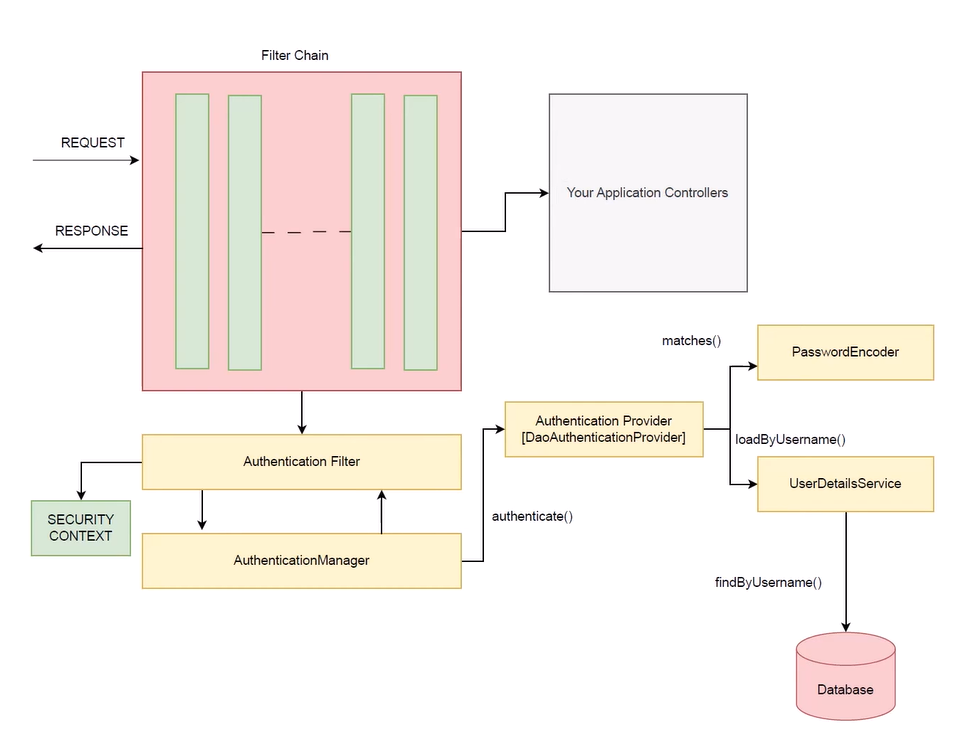

# 🔐 MODULE 2: Spring Security Fundamentals (Clean Deep Dive)

## What is Spring Security?

Spring Security is a framework that handles:

* **Authentication** (who you are)
* **Authorization** (what you can access)
* Protection against common attacks (CSRF, session hijacking, etc.)

👉 Key idea:
It **intercepts every request before it reaches your controller** using filters.

Flow:

```
Request → Security Filters → Controller
```




---

## Features & Capabilities

### Authentication

Verifies user identity using:

* Username/password
* JWT
* OAuth2
* LDAP

Internally uses:

* `AuthenticationManager`
* `AuthenticationProvider`

---

### Authorization

Controls access based on:

* Roles (`ROLE_ADMIN`)
* Authorities
* Method-level annotations (`@PreAuthorize`)

👉 Happens **after authentication**

---

### Security Protections

Built-in defenses:

* CSRF protection
* Session fixation protection
* Security headers (XSS, clickjacking)

---

### Session Management

Supports:

* Stateful (session-based login)
* Stateless (JWT APIs)

Example:

```java
.sessionManagement().sessionCreationPolicy(STATELESS)
```

---

### Password Security

* Uses hashing (BCrypt)
* Supports secure password encoding
* Prevents storing plain passwords

---

### Flexible Configuration

You can control:

* URL-level security
* Method-level security
* Custom filters
* Custom authentication logic

---

### Security Context

Stores current user info:

* Authentication object
* Roles/authorities

Accessed via:

```java
SecurityContextHolder
```

---

## Architecture Overview (Most Important)

### High-level flow

```
Client Request
   ↓
Security Filter Chain
   ↓
Authentication
   ↓
Authorization
   ↓
Controller
```

---

### Core Components

**1. Security Filter Chain**

* Intercepts every request
* Runs multiple filters (auth, authorization, etc.)

---

**2. Authentication**

Main classes:

* `AuthenticationManager` → entry point
* `AuthenticationProvider` → validates user
* `UserDetailsService` → loads user

Flow:

```
Request → Extract credentials → AuthenticationManager
       → AuthenticationProvider → Validate
       → Create Authentication object
```

---

**3. Authorization**

Checks permissions after authentication:

```
Authenticated user → Check roles → Allow/Deny
```

---

**4. SecurityContext**

* Stores Authentication object
* Stored in **ThreadLocal** (per request)

---

**5. Exception Handling**

Handled by:

* `ExceptionTranslationFilter`

Converts:

* Auth failure → 401
* Access denied → 403

---

## End-to-End Flow (Interview Ready)

```
1. Request enters server
2. Security filter chain intercepts
3. Authentication happens
4. Authentication stored in SecurityContext
5. Authorization checks roles
6. If allowed → Controller
7. Else → 401 / 403
```

---

## Final Mental Model

* Spring Security = **Gatekeeper**
* Filters = **Security guards**
* Authentication = **ID check**
* Authorization = **Permission check**

---

## Common Mistakes

* Thinking authentication = authorization
* Not understanding filter chain
* Ignoring SecurityContext
* Wrong role configuration

---

## Interview Gold Line

👉 “Spring Security is a filter-based framework that performs authentication and authorization before the request reaches the controller.”

---

