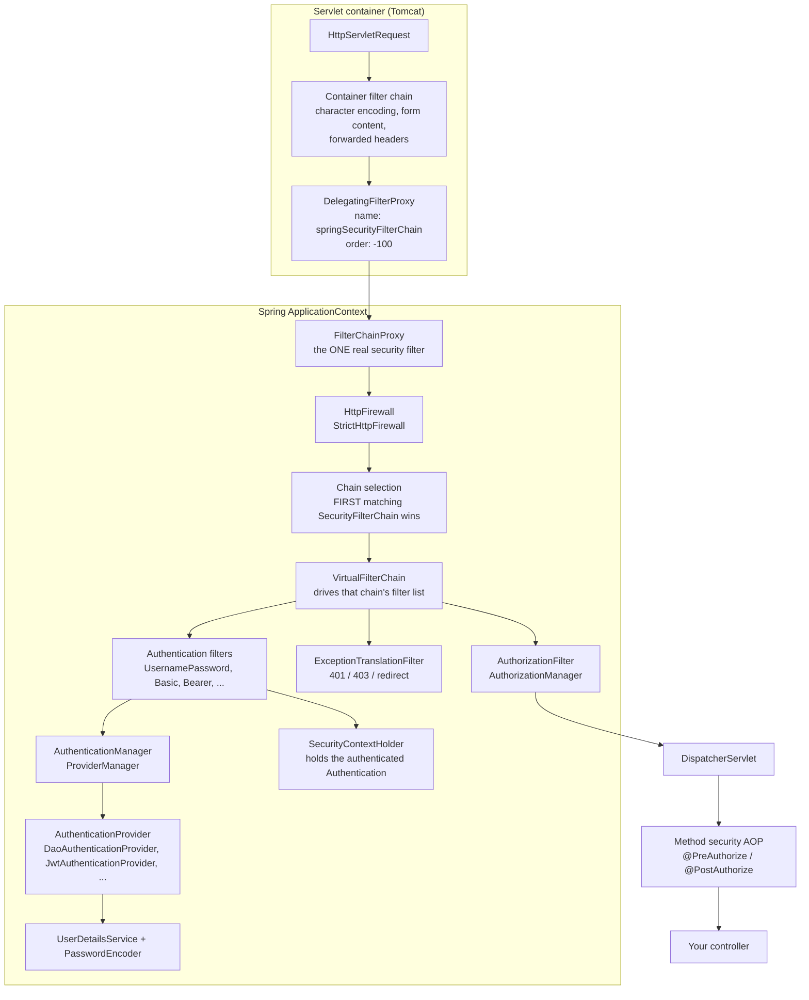
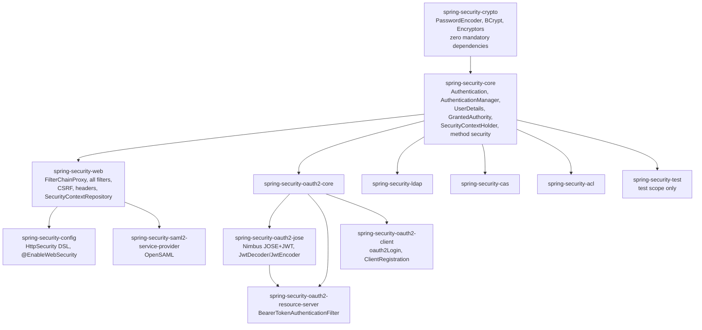
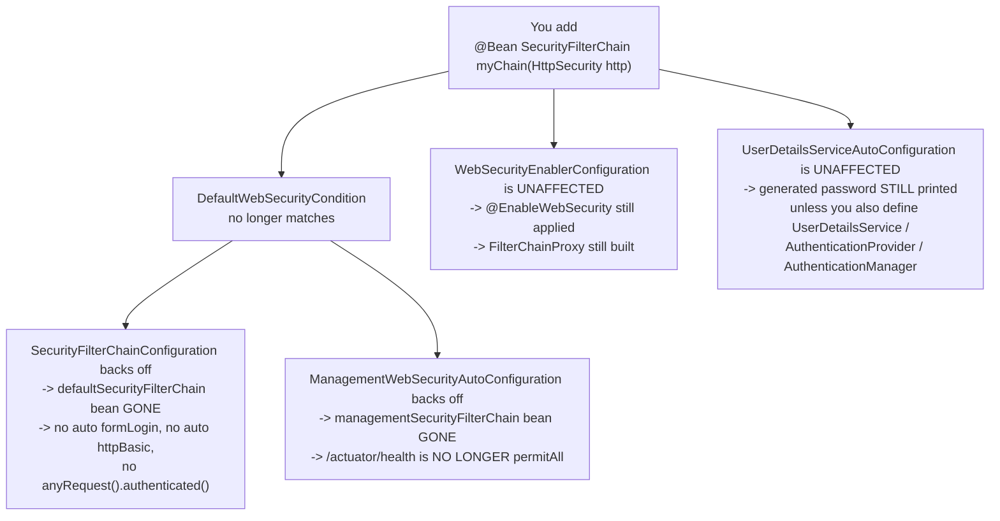
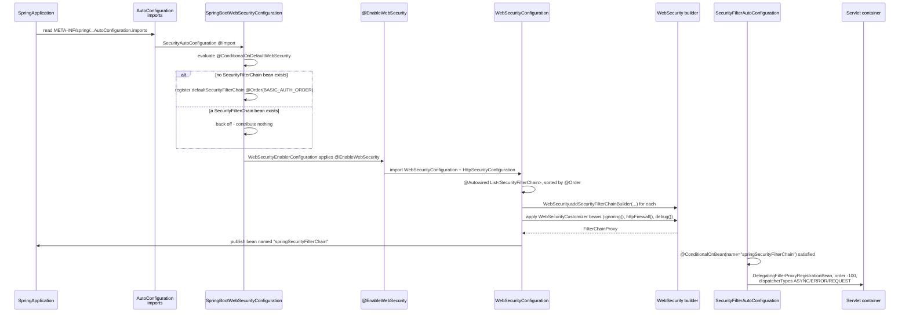

# 2.1 — Spring Security: Introduction & Auto-Configuration

> **Module 2 · Topic 1** · Spring Security Fundamentals
> Baseline: Spring Security 6.x on Boot 3.x
> New to this? Read **In Plain English** below first, then come back to the Version Matrix.

---

## Version Matrix

| Concern | Spring Security 5.x | **Spring Security 6.x (baseline)** | Spring Security 7.x |
|---|---|---|---|
| Namespace | `javax.servlet.*` | **`jakarta.servlet.*`** | `jakarta.servlet.*` |
| Ships with | Boot 2.7 | **Boot 3.x** | Boot 4.x |
| Primary config style | `WebSecurityConfigurerAdapter` (deprecated in 5.7) or `SecurityFilterChain` bean | **`SecurityFilterChain` bean only — the adapter is deleted** | `SecurityFilterChain` bean only |
| Auto-config back-off condition | `@ConditionalOnDefaultWebSecurity` = no `WebSecurityConfigurerAdapter` **and** no `SecurityFilterChain` bean | **`@ConditionalOnDefaultWebSecurity` = no `SecurityFilterChain` bean** | same shape; classes relocated into a dedicated `spring-boot-security` auto-configuration module |
| Default chain bean | `SpringBootWebSecurityConfiguration` → `defaultSecurityFilterChain` | **same, `@Order(SecurityProperties.BASIC_AUTH_ORDER)`** | same |
| URL matching in the DSL | `antMatchers()` / `mvcMatchers()` / `regexMatchers()` | **`requestMatchers()`** (resolves to `MvcRequestMatcher` when Spring MVC is present) | `requestMatchers()` backed by `PathPatternRequestMatcher`; `AntPathRequestMatcher` and `MvcRequestMatcher` removed |
| Authorization API | `authorizeRequests()` + `AccessDecisionManager` / voters | **`authorizeHttpRequests()` + `AuthorizationManager`** | `authorizeHttpRequests()` only; `AccessDecisionManager` moved out to `spring-security-access` |
| DSL chaining | `.and()` chaining is idiomatic | **lambda DSL is idiomatic; `.and()` deprecated** | `.and()` removed |
| Custom DSL entry point | `HttpSecurity.apply(...)` | `apply(...)` deprecated, `with(...)` preferred | `with(...)` only |
| Context persistence | `SecurityContextPersistenceFilter` (loads **and saves** every request) | **`SecurityContextHolderFilter` (loads only) + explicit `SecurityContextRepository.saveContext(...)` owned by the authentication mechanism** | same |
| `AuthorizationManager` method | `check(...)` | `check(...)`, `verify(...)` added | `authorize(...)`; `check(...)` removed |

---

## Why This Exists

Before you reach for a framework, be honest about what you are avoiding. If you hand-roll
security on a servlet stack you have to build, and then keep correct forever, roughly this
list:

credential intake for several transports (form post, `Authorization: Basic`,
`Authorization: Bearer`, client certificate, SAML assertion), password storage with a
deliberately slow salted KDF and a migration path when you change its cost, session creation
plus session-fixation protection on every privilege change, CSRF token generation and
constant-time validation, a consistent story for 401 versus 403 including the
`WWW-Authenticate` header, security response headers, URL authorization that cannot be
bypassed by path-traversal or matrix-parameter tricks, method-level authorization that sees
arguments and return values, and an audit trail of authentication events.

Every one of those has a well-known way to get it subtly wrong, and a subtle mistake in
security code does not fail loudly — it fails silently and stays broken until somebody
exploits it. That is the actual value proposition:

> **Spring Security is a hardened, battle-tested implementation of the boring parts of
> security, arranged so that the parts you genuinely must customise are the only parts you
> write.**

Architecturally it is far less magical than it looks. It is **one servlet filter** registered
with the container. That filter owns an ordered list of other filters, each with one job.
Everything else — the `HttpSecurity` DSL, `@PreAuthorize`, `SecurityContextHolder`, the OAuth2
support — is either configuration that produces that filter list or a thread-scoped variable
those filters populate.

The second reason this topic exists is that Spring Boot hides the wiring. A Boot application
with `spring-boot-starter-security` on the classpath and zero lines of security code is fully
locked down with a generated password. Engineers who have never read the auto-configuration
cannot explain why their `/actuator/health` endpoint became protected the day they added their
first `SecurityFilterChain` bean. That is a standard senior interview probe, and it is
answered entirely by knowing which conditions back off and when.

---

## In Plain English

**The one-line version:** Adding one line to your build file locks your entire application behind a
login page with a randomly generated password, and the moment you write your own security
configuration Spring steps back and lets you take over completely.

**An analogy.** Think of moving into a new flat where the letting agent has already fitted a
standard lock, a standard chain, and a standard door viewer. You did not ask for them and you did
not choose the brand, but the door is secure from your first night, and the agent leaves the key
taped to the inside of the door.

Now suppose you fit your own lock. The agent does not come back and add theirs on top, and does not
try to combine the two. They see that you have provided a lock and they leave the door entirely to
you — including the chain and the viewer they would otherwise have fitted. Most people who fit their
own lock are surprised by that second part. They wanted a different lock and they accidentally gave
up the chain as well.

This is precisely how Spring Boot's security defaults behave. The defaults are all-or-nothing. A
brand-new application is fully protected because Boot supplied its own arrangement, and the first
time you define a single `SecurityFilterChain` bean, Boot's entire arrangement steps aside and
everything is now your responsibility, including the parts you never intended to change.

**How it actually works, step by step.**

Adding the dependency `spring-boot-starter-security` puts a small set of libraries on your
classpath. Spring Boot's *auto-configuration* — code that inspects what is available and configures
sensible defaults on your behalf — notices them and wires up a working security setup.

The result of that wiring is a bean called a `SecurityFilterChain`. A *bean* is simply an object
that Spring creates and manages for you. This particular object is a list of checkpoints, together
with a rule about which URLs it applies to. Boot's default version protects every single URL,
switches on a login form and HTTP Basic authentication, and creates one user named `user` whose
password is generated randomly at startup and printed once into the console log. Because it is
regenerated on every restart, it is genuinely only useful for a first look at the application.

The interesting part is the hand-over. Boot's default is guarded by a condition that means, in
effect, "only do this if the developer has not supplied a `SecurityFilterChain` bean of their own".
The moment you write one, the condition fails and Boot's default disappears. Nothing is merged. This
single rule explains a symptom that catches almost everyone: you write a small configuration to open
up one public page, and suddenly your health-check endpoint is protected, the in-memory `user`
account has gone, and the generated password is no longer printed. Nothing broke — Boot simply
withdrew the whole default because you declared you were handling it.

`@EnableWebSecurity` is the annotation that switches on the machinery which turns your
configuration into the real filter that runs. When you use Spring Boot you almost never need to
write it, because auto-configuration already applies it for you. It matters when you are not using
Boot, or when you have deliberately turned auto-configuration off.

The libraries themselves are deliberately split into separate pieces, and knowing the split saves
you time. The cryptography piece knows nothing about the web and can hash a password in a plain Java
program. The core piece holds the vocabulary — identity, permissions, the manager that verifies
credentials — and knows nothing about HTTP, which is why the same annotations can protect a
scheduled job. The web piece holds the filters. The config piece holds the configuration language
you write. Everything to do with OAuth2, JWT tokens, SAML, or LDAP lives in further separate
artifacts that you add only when you need them, which is why a fresh security starter cannot
validate a JWT until you add the resource-server dependency.

Finally, there are two entirely parallel implementations of all of this. The traditional one is
built on servlets, which is what almost every Spring Boot web application uses. The other is built
for WebFlux, the reactive stack, and uses differently named but conceptually identical types. They
do not mix, and configuring the wrong one produces the confusing outcome that your security
configuration appears to be ignored rather than producing any error.

**Why should a beginner care?** Without this, your first real encounter with Spring Security is
bewildering. You will add the dependency, find every page demanding a password you did not set, and
have no idea where it came from. Then you will write your first configuration and watch unrelated
things stop working, with no error message to explain why. Knowing that the defaults are a single
all-or-nothing package, and that your own bean replaces the whole package, turns both of those from
mysteries into expected behaviour.

**Words you will meet in this file**

| Term | In plain words |
|---|---|
| Starter | A single dependency that pulls in a curated set of libraries so you do not pick them one by one. |
| Auto-configuration | Boot code that inspects your classpath and configures sensible defaults without being asked. |
| Bean | An object that Spring creates, configures, and hands to whatever needs it. |
| `SecurityFilterChain` | One configured list of security checkpoints plus a rule for which URLs it covers. |
| `HttpSecurity` | The builder you use inside a configuration method to describe your security rules. |
| DSL | A fluent, readable configuration style — here, the chained and nested method calls on `HttpSecurity`. |
| `@EnableWebSecurity` | The annotation that switches on the machinery turning your configuration into real filters. |
| `@ConditionalOnMissingBean` | A Boot condition meaning "only apply this default if the developer has not supplied one". |
| `FilterChainProxy` | The single real security filter, which holds your chains and runs the matching one. |
| `DelegatingFilterProxy` | The thin filter the web server registers, which hands the request to the Spring bean. |
| `AuthenticationManager` | The component whose only job is to decide whether presented credentials are genuine. |
| `UserDetailsService` | The component that looks up a user by username and returns their stored details. |
| `PasswordEncoder` | The component that hashes a new password and checks a typed one against the stored hash. |
| `authorizeHttpRequests` | The section of configuration where you say which URLs need which permissions. |
| `requestMatchers` | The way you name the URLs a rule applies to, such as `/admin/**`. |
| `WebSecurityConfigurerAdapter` | The old configuration style from Spring Security 5, deleted in version 6. |
| Servlet stack | The traditional blocking web model, used by Spring MVC. This is what most applications use. |
| Reactive stack | The non-blocking WebFlux model, with parallel but differently named security types. |
| Resource server | An application that receives and validates access tokens rather than issuing them. |

**If you remember only one thing:** Spring Boot's security defaults are a single all-or-nothing
package, and defining your own `SecurityFilterChain` bean replaces the entire package rather than
adjusting part of it.

---

## Core Concepts

### 1. The Architecture In One Picture

**In simple terms:** The whole framework is one filter registered with the web server, which picks
a single list of checkpoints and runs them in order before your code ever sees the request.


```mermaid
flowchart TD
    subgraph Container["Servlet container (Tomcat)"]
        REQ["HttpServletRequest"] --> CFC["Container filter chain<br/>character encoding, form content,<br/>forwarded headers"]
        CFC --> DFP["DelegatingFilterProxy<br/>name: springSecurityFilterChain<br/>order: -100"]
    end

    subgraph Spring["Spring ApplicationContext"]
        DFP --> FCP["FilterChainProxy<br/>the ONE real security filter"]
        FCP --> FW["HttpFirewall<br/>StrictHttpFirewall"]
        FW --> SEL["Chain selection<br/>FIRST matching SecurityFilterChain wins"]
        SEL --> VFC["VirtualFilterChain<br/>drives that chain's filter list"]
        VFC --> AUTHN["Authentication filters<br/>UsernamePassword, Basic, Bearer, ..."]
        AUTHN --> AM["AuthenticationManager<br/>ProviderManager"]
        AM --> AP["AuthenticationProvider<br/>DaoAuthenticationProvider, JwtAuthenticationProvider, ..."]
        AP --> UDS["UserDetailsService + PasswordEncoder"]
        AUTHN --> SCH["SecurityContextHolder<br/>holds the authenticated Authentication"]
        VFC --> ETF["ExceptionTranslationFilter<br/>401 / 403 / redirect"]
        VFC --> AF["AuthorizationFilter<br/>AuthorizationManager"]
    end

    AF --> DS["DispatcherServlet"]
    DS --> MS["Method security AOP<br/>@PreAuthorize / @PostAuthorize"]
    MS --> CTRL["Your controller"]
```

Three sentences that carry most of the weight:

1. **There is exactly one container-level filter.** `DelegatingFilterProxy` exists only because
   the container instantiates filters and knows nothing about Spring; it looks up the
   `FilterChainProxy` bean by name on first use and forwards to it.
2. **`FilterChainProxy` selects one chain and only one chain.** Chains never accumulate.
3. **Authentication and authorization are separate filters with a `try` block between them.**
   `ExceptionTranslationFilter` sits earlier in the list, which means *outside* on the call
   stack, which is why it can catch what `AuthorizationFilter` throws later.

### 2. What The Starter Actually Puts On The Classpath

**In simple terms:** The one dependency you add brings in a surprisingly short list of libraries,
and it deliberately leaves out everything to do with OAuth2, JWT, LDAP, and SAML.

```xml
<dependency>
  <groupId>org.springframework.boot</groupId>
  <artifactId>spring-boot-starter-security</artifactId>
</dependency>
```

That resolves to a very short list:

| Artifact | Why it is there |
|---|---|
| `spring-boot-starter` | core Boot, logging, `spring-core`, `spring-context` |
| `spring-aop` | needed for method security proxies |
| `spring-security-config` | the `HttpSecurity` DSL, `@EnableWebSecurity`, `@EnableMethodSecurity` |
| `spring-security-web` | `FilterChainProxy` and every filter |
| `spring-security-core` (transitive) | `Authentication`, `AuthenticationManager`, `UserDetails`, `GrantedAuthority` |
| `spring-security-crypto` (transitive) | `PasswordEncoder`, `BCryptPasswordEncoder`, `Encryptors` |

Notably **not** included: anything OAuth2, JWT, SAML2, LDAP, CAS, ACL, or test support. Those
are separate artifacts you add deliberately.

### 3. The Module / Artifact Layout

**In simple terms:** The framework is split into small pieces that each know as little as possible
about the others, which is what lets you hash a password or protect a background job without a web
server at all.


```mermaid
flowchart TD
    CRYPTO["spring-security-crypto<br/>PasswordEncoder, BCrypt, Encryptors<br/>zero mandatory dependencies"]
    CORE["spring-security-core<br/>Authentication, AuthenticationManager,<br/>UserDetails, GrantedAuthority,<br/>SecurityContextHolder, method security"]
    WEB["spring-security-web<br/>FilterChainProxy, all filters,<br/>CSRF, headers, SecurityContextRepository"]
    CONFIG["spring-security-config<br/>HttpSecurity DSL, @EnableWebSecurity"]

    CRYPTO --> CORE
    CORE --> WEB
    WEB --> CONFIG

    CORE --> OCORE["spring-security-oauth2-core"]
    OCORE --> JOSE["spring-security-oauth2-jose<br/>Nimbus JOSE+JWT, JwtDecoder/JwtEncoder"]
    OCORE --> RS["spring-security-oauth2-resource-server<br/>BearerTokenAuthenticationFilter"]
    OCORE --> CLIENT["spring-security-oauth2-client<br/>oauth2Login, ClientRegistration"]
    JOSE --> RS
    CORE --> LDAP["spring-security-ldap"]
    CORE --> CAS["spring-security-cas"]
    CORE --> ACL["spring-security-acl"]
    WEB --> SAML["spring-security-saml2-service-provider<br/>OpenSAML"]
    CORE --> TEST["spring-security-test<br/>test scope only"]
```

| Artifact | Contains | Add it when |
|---|---|---|
| `spring-security-crypto` | `PasswordEncoder`, `BCryptPasswordEncoder`, `Argon2PasswordEncoder`, `Pbkdf2PasswordEncoder`, `Encryptors`, `KeyGenerators` | never explicitly — it arrives with core, but it is usable standalone with no Spring context at all |
| `spring-security-core` | `Authentication`, `AuthenticationManager`, `ProviderManager`, `UserDetails(Service)`, `GrantedAuthority`, `SecurityContextHolder`, `@PreAuthorize` infrastructure | always (transitive) |
| `spring-security-web` | `DelegatingFilterProxy` usage, `FilterChainProxy`, every `Filter`, `CsrfFilter`, `HeaderWriterFilter`, `SecurityContextRepository`, `RequestCache`, `HttpFirewall` | any servlet web app |
| `spring-security-config` | `HttpSecurity`, `WebSecurity`, `@EnableWebSecurity`, `@EnableMethodSecurity`, the XML namespace | any app that configures security declaratively |
| `spring-security-oauth2-core` | `OAuth2AccessToken`, `OAuth2Error`, `OAuth2AuthenticationException`, shared grant types | transitively with client/resource-server |
| `spring-security-oauth2-jose` | `NimbusJwtDecoder`, `NimbusJwtEncoder`, `JwtDecoder`, `Jwt`, JWK handling | you validate or mint JWTs |
| `spring-security-oauth2-resource-server` | `BearerTokenAuthenticationFilter`, `JwtAuthenticationProvider`, `OpaqueTokenIntrospector`, `BearerTokenAuthenticationEntryPoint` | your service **consumes** access tokens |
| `spring-security-oauth2-client` | `oauth2Login()`, `ClientRegistrationRepository`, `OAuth2AuthorizedClientManager`, PKCE support | your service **obtains** tokens (login via Google/Okta, or client-credentials to call downstream) |
| `spring-security-saml2-service-provider` | SAML2 SP support on top of OpenSAML: `Saml2WebSsoAuthenticationFilter`, `RelyingPartyRegistration` | enterprise SSO where the IdP speaks SAML, not OIDC |
| `spring-security-ldap` | `LdapAuthenticationProvider`, `BindAuthenticator`, `DefaultLdapAuthoritiesPopulator` | authenticating against Active Directory / OpenLDAP directly |
| `spring-security-cas` | `CasAuthenticationFilter`, `CasAuthenticationProvider` | legacy university / government CAS estates |
| `spring-security-acl` | `AclService`, `MutableAclService`, `AclPermissionEvaluator`, the four ACL tables | per-domain-object permissions ("Alice may edit document 42") that cannot be expressed as roles |
| `spring-security-test` | `@WithMockUser`, `@WithUserDetails`, `SecurityMockMvcRequestPostProcessors.csrf()`, `SecurityMockMvcRequestPostProcessors.jwt()` | always, in `test` scope |
| `spring-security-messaging` | `AbstractSecurityWebSocketMessageBrokerConfigurer`, STOMP message authorization | securing WebSocket/STOMP destinations |
| `spring-security-data` | `SecurityEvaluationContextExtension` so `?#{principal}` works in `@Query` | Spring Data queries that reference the current principal |

The dependency direction is worth internalising: **crypto knows nothing, core knows nothing
about HTTP, web knows nothing about the DSL.** That is why `spring-security-core` alone can
secure a batch job or a Kafka consumer with `@PreAuthorize`, and why `BCryptPasswordEncoder`
can be used in a plain `main` method.

### 4. What Auto-Configuration Registers, Class By Class

**In simple terms:** This is where the password in your console log comes from — four classes that
quietly create a default user, a default login page, and a rule protecting every URL.

Four auto-configuration classes do the work. Read them in this order.

#### `SecurityAutoConfiguration`

```java
// org.springframework.boot.autoconfigure.security.servlet.SecurityAutoConfiguration
@AutoConfiguration(before = UserDetailsServiceAutoConfiguration.class)
@ConditionalOnClass(DefaultAuthenticationEventPublisher.class)
@EnableConfigurationProperties(SecurityProperties.class)
@Import({ SpringBootWebSecurityConfiguration.class, SecurityDataConfiguration.class })
public class SecurityAutoConfiguration {

    @Bean
    @ConditionalOnMissingBean(AuthenticationEventPublisher.class)
    public DefaultAuthenticationEventPublisher authenticationEventPublisher(
            ApplicationEventPublisher publisher) {
        return new DefaultAuthenticationEventPublisher(publisher);
    }
}
```

It contributes almost nothing itself. Its real job is to enable `SecurityProperties`
(`spring.security.*`), to register a `DefaultAuthenticationEventPublisher` so that
`AuthenticationSuccessEvent` / `AbstractAuthenticationFailureEvent` are published as Spring
events, and to `@Import` the two classes that matter.

#### `SpringBootWebSecurityConfiguration` and its nested `SecurityFilterChainConfiguration`

```java
// org.springframework.boot.autoconfigure.security.servlet.SpringBootWebSecurityConfiguration
@Configuration(proxyBeanMethods = false)
@ConditionalOnWebApplication(type = Type.SERVLET)
class SpringBootWebSecurityConfiguration {

    @Configuration(proxyBeanMethods = false)
    @ConditionalOnDefaultWebSecurity
    static class SecurityFilterChainConfiguration {

        @Bean
        @Order(SecurityProperties.BASIC_AUTH_ORDER)     // LOWEST_PRECEDENCE - 5
        SecurityFilterChain defaultSecurityFilterChain(HttpSecurity http) throws Exception {
            http.authorizeHttpRequests((requests) -> requests.anyRequest().authenticated());
            http.formLogin(withDefaults());
            http.httpBasic(withDefaults());
            return http.build();
        }
    }

    @Configuration(proxyBeanMethods = false)
    @ConditionalOnClass(EnableWebSecurity.class)
    @ConditionalOnMissingBean(name = BeanIds.SPRING_SECURITY_FILTER_CHAIN)
    @EnableWebSecurity
    static class WebSecurityEnablerConfiguration {
    }
}
```

This is the class that produces "everything is locked down and there is a login form I did
not write". Three things to notice:

- The default chain is **`anyRequest().authenticated()` plus form login plus HTTP Basic**.
  Both authentication mechanisms are on, which is why the same application answers a browser
  with a redirect to `/login` and answers `curl -u user:pass` with a 200.
- The order is `SecurityProperties.BASIC_AUTH_ORDER`, defined as
  `Ordered.LOWEST_PRECEDENCE - 5`. It is deliberately close to last so that any chain you
  define without an explicit `@Order` still wins.
- `WebSecurityEnablerConfiguration` is the class that actually applies `@EnableWebSecurity`
  for you. **This is the answer to "do I need `@EnableWebSecurity` in Boot?" — no, because
  Boot already applied it.**

#### `UserDetailsServiceAutoConfiguration` and the generated password

```java
// org.springframework.boot.autoconfigure.security.servlet.UserDetailsServiceAutoConfiguration
@AutoConfiguration
@ConditionalOnClass(AuthenticationManager.class)
@ConditionalOnBean(ObjectPostProcessor.class)
@ConditionalOnMissingBean(
        value = { AuthenticationManager.class, AuthenticationProvider.class,
                  UserDetailsService.class, AuthenticationManagerResolver.class },
        type = { "org.springframework.security.oauth2.jwt.JwtDecoder",
                 "org.springframework.security.oauth2.server.resource.introspection.OpaqueTokenIntrospector",
                 "org.springframework.security.oauth2.client.registration.ClientRegistrationRepository",
                 "org.springframework.security.saml2.provider.service.registration.RelyingPartyRegistrationRepository" })
public class UserDetailsServiceAutoConfiguration {

    private static final String NOOP_PASSWORD_PREFIX = "{noop}";

    @Bean
    public InMemoryUserDetailsManager inMemoryUserDetailsManager(
            SecurityProperties properties, ObjectProvider<PasswordEncoder> passwordEncoder) {
        SecurityProperties.User user = properties.getUser();
        List<String> roles = user.getRoles();
        return new InMemoryUserDetailsManager(User.withUsername(user.getName())
                .password(getOrDeducePassword(user, passwordEncoder.getIfAvailable()))
                .roles(StringUtils.toStringArray(roles))
                .build());
    }

    private String getOrDeducePassword(SecurityProperties.User user, PasswordEncoder encoder) {
        String password = user.getPassword();
        if (user.isPasswordGenerated()) {
            logger.warn("Using generated security password: " + password + " ...");
        }
        if (encoder != null || PASSWORD_ALGORITHM_PATTERN.matcher(password).matches()) {
            return password;
        }
        return NOOP_PASSWORD_PREFIX + password;
    }
}
```

The generated password comes from `SecurityProperties.User`:

```java
public static class User {
    private String name = "user";
    private String password = UUID.randomUUID().toString();
    private List<String> roles = new ArrayList<>();
    private boolean passwordGenerated = true;
    // setPassword(...) flips passwordGenerated to false
}
```

So the default principal is `user`, the password is a fresh `UUID` **per JVM start**, and the
`passwordGenerated` flag is what triggers the WARN log. Set `spring.security.user.password`
and the log disappears because the flag flips to `false`.

The `{noop}` logic deserves attention. If you have not defined a `PasswordEncoder` bean and
your configured password has no `{id}` prefix, Boot prefixes it with `{noop}` so
`DelegatingPasswordEncoder` accepts it. The moment you define a `PasswordEncoder` bean, Boot
stops adding the prefix and assumes you provided a password already in that encoder's format.
A plaintext `spring.security.user.password` plus a `BCryptPasswordEncoder` bean therefore
produces a silent authentication failure — one of the most common first-hour confusions.

The `@ConditionalOnMissingBean` list is the other important part. The in-memory user is
withdrawn the moment you define **any** of: `AuthenticationManager`, `AuthenticationProvider`,
`UserDetailsService`, `AuthenticationManagerResolver`, or any of the four named OAuth2/SAML2
types. That last set is why adding `spring.security.oauth2.resourceserver.jwt.issuer-uri`
makes the generated password vanish.

#### `SecurityFilterAutoConfiguration`

```java
// org.springframework.boot.autoconfigure.security.servlet.SecurityFilterAutoConfiguration
@AutoConfiguration(after = SecurityAutoConfiguration.class)
@ConditionalOnWebApplication(type = Type.SERVLET)
@EnableConfigurationProperties(SecurityProperties.class)
@ConditionalOnClass({ AbstractSecurityWebApplicationInitializer.class, SessionCreationPolicy.class })
public class SecurityFilterAutoConfiguration {

    private static final String DEFAULT_FILTER_NAME =
            AbstractSecurityWebApplicationInitializer.DEFAULT_FILTER_NAME;  // "springSecurityFilterChain"

    @Bean
    @ConditionalOnBean(name = DEFAULT_FILTER_NAME)
    public DelegatingFilterProxyRegistrationBean securityFilterChainRegistration(
            SecurityProperties securityProperties) {
        DelegatingFilterProxyRegistrationBean registration =
                new DelegatingFilterProxyRegistrationBean(DEFAULT_FILTER_NAME);
        registration.setOrder(securityProperties.getFilter().getOrder());          // -100
        registration.setDispatcherTypes(getDispatcherTypes(securityProperties));   // ASYNC, ERROR, REQUEST
        return registration;
    }
}
```

This is the bridge to the container. Note `@ConditionalOnBean(name = "springSecurityFilterChain")`
— it registers nothing unless something (usually `@EnableWebSecurity` via
`WebSecurityEnablerConfiguration`) has produced the `FilterChainProxy` bean under that exact
name. Bean *name* matching, not type matching, is the contract here.

The order is:

```java
// SecurityProperties
public static final int DEFAULT_FILTER_ORDER =
        OrderedFilter.REQUEST_WRAPPER_FILTER_MAX_ORDER - 100;   // = HIGHEST_PRECEDENCE + 50 - 100
```

Deliberately **after** request-wrapping filters (character encoding, form content, forwarded
headers) so the request is fully decoded before security reads parameters, and **before**
every application-level filter.

#### One more, if Actuator is present

```java
// org.springframework.boot.actuate.autoconfigure.security.servlet.ManagementWebSecurityAutoConfiguration
@AutoConfiguration(before = SecurityAutoConfiguration.class, after = { HealthEndpointAutoConfiguration.class, ... })
@ConditionalOnClass({ EnableWebSecurity.class, HttpSecurity.class })
@ConditionalOnDefaultWebSecurity
@ConditionalOnWebApplication(type = Type.SERVLET)
public class ManagementWebSecurityAutoConfiguration {

    @Bean
    @Order(SecurityProperties.BASIC_AUTH_ORDER - 5)
    SecurityFilterChain managementSecurityFilterChain(HttpSecurity http) throws Exception {
        http.authorizeHttpRequests((requests) -> {
            requests.requestMatchers(EndpointRequest.to(HealthEndpoint.class)).permitAll();
            requests.anyRequest().authenticated();
        });
        http.formLogin(Customizer.withDefaults());
        http.httpBasic(Customizer.withDefaults());
        return http.build();
    }
}
```

It is **also** `@ConditionalOnDefaultWebSecurity`. Remember that — it is the mechanism behind
one of the best interview questions on this topic.

### 5. What Happens The Moment You Define Your Own `SecurityFilterChain`

**In simple terms:** Writing one configuration bean of your own makes Boot withdraw its entire
default setup at once, including the generated password and the built-in user you were relying on.

```java
// org.springframework.boot.autoconfigure.security.servlet.ConditionalOnDefaultWebSecurity
@Target({ ElementType.TYPE, ElementType.METHOD })
@Retention(RetentionPolicy.RUNTIME)
@Documented
@Conditional(DefaultWebSecurityCondition.class)
public @interface ConditionalOnDefaultWebSecurity {
}

// org.springframework.boot.autoconfigure.security.servlet.DefaultWebSecurityCondition
class DefaultWebSecurityCondition extends AllNestedConditions {

    DefaultWebSecurityCondition() {
        super(ConfigurationPhase.REGISTER_BEAN);
    }

    @ConditionalOnMissingBean(SecurityFilterChain.class)
    static class Beans {
    }

    @ConditionalOnClass({ SecurityFilterChain.class, HttpSecurity.class })
    static class Classes {
    }
}
```

Read that literally: the condition holds only while **no bean of type `SecurityFilterChain`
exists anywhere in the context**. Declare one and three things happen simultaneously:


```mermaid
flowchart TD
    A["You add<br/>@Bean SecurityFilterChain myChain(HttpSecurity http)"] --> B["DefaultWebSecurityCondition<br/>no longer matches"]
    B --> C1["SecurityFilterChainConfiguration backs off<br/>-> defaultSecurityFilterChain bean GONE<br/>-> no auto formLogin, no auto httpBasic,<br/>   no anyRequest().authenticated()"]
    B --> C2["ManagementWebSecurityAutoConfiguration backs off<br/>-> managementSecurityFilterChain bean GONE<br/>-> /actuator/health is NO LONGER permitAll"]
    A --> D["WebSecurityEnablerConfiguration is UNAFFECTED<br/>-> @EnableWebSecurity still applied<br/>-> FilterChainProxy still built"]
    A --> E["UserDetailsServiceAutoConfiguration is UNAFFECTED<br/>-> generated password STILL printed<br/>   unless you also define UserDetailsService /<br/>   AuthenticationProvider / AuthenticationManager"]
```

The two independent back-off axes are the crux, and people conflate them constantly:

| You define | `defaultSecurityFilterChain` | `managementSecurityFilterChain` | `inMemoryUserDetailsManager` + generated password |
|---|---|---|---|
| nothing | present | present | present |
| a `SecurityFilterChain` bean | **gone** | **gone** | present |
| a `UserDetailsService` bean | present | present | **gone** |
| both | **gone** | **gone** | **gone** |
| `spring.security.user.password=...` | present | present | present, but no WARN log |
| `issuer-uri` for a resource server | present | present | **gone** (the `type = {...}` clause) |

Two practical consequences worth committing to memory:

1. **A `UserDetailsService` alone leaves you fully locked down with no way in.** The auto
   chain is still active with `anyRequest().authenticated()`, and the generated password is
   gone because your `UserDetailsService` replaced the in-memory one. If your
   `UserDetailsService` is backed by an empty table, nobody can log in and nothing looks
   broken at startup.
2. **A `SecurityFilterChain` alone leaves you with a random password on every restart.** The
   in-memory `user` is still there. Teams ship this to production, then discover their
   "unused" default account exists with an unknown password on every pod. It is not
   exploitable, but it means the account list in your app is not what your configuration says.

### 6. `@EnableWebSecurity` versus Auto-Configuration

**In simple terms:** This annotation switches on the machinery that turns your configuration into
real running filters, and in a Spring Boot application it has already been switched on for you.

```java
// org.springframework.security.config.annotation.web.configuration.EnableWebSecurity
@Retention(RetentionPolicy.RUNTIME)
@Target(ElementType.TYPE)
@Documented
@Import({ WebSecurityConfiguration.class,
          SpringWebMvcImportSelector.class,
          OAuth2ImportSelector.class,
          HttpSecurityConfiguration.class })
@EnableGlobalAuthentication
@Configuration
public @interface EnableWebSecurity {
    boolean debug() default false;
}
```

| Import | What it contributes |
|---|---|
| `WebSecurityConfiguration` | Collects every `SecurityFilterChain` bean, sorts them with `AnnotationAwareOrderComparator`, feeds them to a `WebSecurity` builder, and publishes the result as the `springSecurityFilterChain` bean — a `FilterChainProxy`. Also applies `WebSecurityCustomizer` beans. |
| `HttpSecurityConfiguration` | Publishes the **prototype-scoped** `HttpSecurity` bean that your `SecurityFilterChain` method receives as a parameter, pre-populated with sane defaults (CSRF on, headers on, the default `SecurityContextRepository`, an `AuthenticationManagerBuilder`). |
| `SpringWebMvcImportSelector` | If `DispatcherServlet` is on the classpath, imports `WebMvcSecurityConfiguration`, which registers `AuthenticationPrincipalArgumentResolver`, `CurrentSecurityContextArgumentResolver`, and `CsrfTokenArgumentResolver`. This is why `@AuthenticationPrincipal` works. |
| `OAuth2ImportSelector` | If `spring-security-oauth2-client` is present, imports `OAuth2ClientConfiguration`, which registers `OAuth2AuthorizedClientArgumentResolver`. |
| `@EnableGlobalAuthentication` | Imports `AuthenticationConfiguration`, which builds the global `AuthenticationManager` from `AuthenticationProvider` / `UserDetailsService` beans and exposes it via `AuthenticationConfiguration.getAuthenticationManager()`. |

**The rule, stated plainly:** in a Spring Boot application you do not need
`@EnableWebSecurity`, because `SpringBootWebSecurityConfiguration.WebSecurityEnablerConfiguration`
applies it for you. Adding it is harmless and idempotent (`@Configuration` classes are
deduplicated and `WebSecurityEnablerConfiguration` is `@ConditionalOnMissingBean(name = "springSecurityFilterChain")`),
and many teams add it for readability so the file announces its purpose. You **do** need it in
a non-Boot Spring application, and you need it if you want `debug = true`.

What `@EnableWebSecurity` does **not** do is disable auto-configuration. Only defining a
`SecurityFilterChain` bean does that. This is a frequent misconception, and it has a real
consequence: an application with `@EnableWebSecurity` on an otherwise empty class still has
the default chain, form login, HTTP Basic, and a generated password.

### 7. Servlet Stack versus Reactive Stack

**In simple terms:** There are two separate versions of the same ideas, one for ordinary Spring MVC
and one for reactive WebFlux, and configuring the wrong one means your rules are silently ignored.

They are two parallel implementations of the same concepts, sharing only
`spring-security-core`'s vocabulary.

| Concern | Servlet (`spring-security-web`) | Reactive (`spring-security-web`, reactive packages) |
|---|---|---|
| Enable | `@EnableWebSecurity` (auto-applied by Boot) | `@EnableWebFluxSecurity` |
| Chain bean type | `SecurityFilterChain` | `SecurityWebFilterChain` |
| DSL type | `HttpSecurity` | `ServerHttpSecurity` |
| Entry component | `DelegatingFilterProxy` → `FilterChainProxy` | `WebFilterChainProxy` (a `WebFilter`) |
| Unit of work | `jakarta.servlet.Filter` | `org.springframework.web.server.WebFilter` |
| Context storage | `ThreadLocal` via `SecurityContextHolder` | Reactor `Context` via `ReactiveSecurityContextHolder` |
| Authentication SPI | `AuthenticationManager` (blocking) | `ReactiveAuthenticationManager` returning `Mono<Authentication>` |
| User lookup | `UserDetailsService` | `ReactiveUserDetailsService` returning `Mono<UserDetails>` |
| Persistence SPI | `SecurityContextRepository` | `ServerSecurityContextRepository` (`WebSessionServerSecurityContextRepository`, `NoOpServerSecurityContextRepository`) |
| Authorization | `AuthorizationFilter` + `AuthorizationManager` | `AuthorizationWebFilter` + `ReactiveAuthorizationManager` |
| Method security | `@EnableMethodSecurity` | `@EnableReactiveMethodSecurity` (`@PreAuthorize` on `Mono`/`Flux` returns only) |
| Boot auto-config | `SecurityAutoConfiguration`, `UserDetailsServiceAutoConfiguration`, `SecurityFilterAutoConfiguration` | `ReactiveSecurityAutoConfiguration`, `ReactiveUserDetailsServiceAutoConfiguration` |

The conceptual break, and the reason this is not just a naming difference: **`ThreadLocal`
reasoning collapses in reactive code.** A reactive pipeline is a sequence of callbacks that
may each run on a different scheduler thread; there is no single thread that owns the request.
Reactor solves it by carrying an immutable `Context` along the subscription, which is why
`ReactiveSecurityContextHolder.getContext()` returns a `Mono<SecurityContext>` rather than a
`SecurityContext`. Anything you learned about `SecurityContextHolder` clearing in a `finally`
block has no analogue there.

A practical note on classpath: if both `spring-webmvc` and `spring-webflux` are present, Boot
resolves the ambiguity in favour of the **servlet** stack unless you force
`spring.main.web-application-type=reactive`. The auto-configuration is gated on
`@ConditionalOnWebApplication(type = Type.SERVLET)` / `Type.REACTIVE`, so a mis-detected
application type manifests as "none of my security configuration is applied", not as an error.

### 8. The 5.x → 6.x → 7.x Configuration-Style Evolution

**In simple terms:** The way you write security configuration has changed twice, so most tutorials
and answers you find online use a style that no longer compiles on the current version.

**5.x, the adapter style (removed in 6.0):**

```java
// DO NOT WRITE THIS. Shown only so you recognise it in an old codebase.
@Configuration
@EnableWebSecurity
public class LegacyConfig extends WebSecurityConfigurerAdapter {

    @Override
    protected void configure(HttpSecurity http) throws Exception {
        http
            .authorizeRequests()
                .antMatchers("/admin/**").hasRole("ADMIN")
                .anyRequest().authenticated()
                .and()
            .formLogin()
                .and()
            .csrf().disable();
    }

    @Override
    protected void configure(AuthenticationManagerBuilder auth) throws Exception {
        auth.userDetailsService(userDetailsService()).passwordEncoder(encoder());
    }
}
```

Why it was removed matters more than the syntax. The adapter made every configuration
decision an override on a base class, which meant: you could have exactly one of them per
"segment" of security, you could not compose them, `configure(AuthenticationManagerBuilder)`
created a *local* `AuthenticationManager` that mysteriously shadowed the global one, and the
`.and()` chaining produced a deeply nested expression where the reader had to track which
configurer they were inside.

**6.x, the bean style (baseline):**

```java
@Configuration
@EnableWebSecurity                         // optional under Boot
public class ModernConfig {

    @Bean
    @Order(1)
    SecurityFilterChain api(HttpSecurity http) throws Exception {
        http
            .securityMatcher("/api/**")
            .csrf(csrf -> csrf.disable())
            .sessionManagement(s -> s.sessionCreationPolicy(SessionCreationPolicy.STATELESS))
            .authorizeHttpRequests(auth -> auth
                .requestMatchers("/api/public/**").permitAll()
                .anyRequest().authenticated())
            .httpBasic(Customizer.withDefaults());
        return http.build();
    }

    @Bean
    @Order(2)
    SecurityFilterChain web(HttpSecurity http) throws Exception {
        http
            .authorizeHttpRequests(auth -> auth
                .requestMatchers("/", "/login", "/error").permitAll()
                .anyRequest().authenticated())
            .formLogin(Customizer.withDefaults());
        return http.build();
    }
}
```

Every configurer gets its own lambda, so scope is lexical instead of positional. Multiple
chains are ordinary beans, so they compose and can live in different modules. The
`AuthenticationManager` is a bean, so there is one of it.

**7.x, the tightening:**

| Removed in 7.0 | Replacement |
|---|---|
| `.and()` chaining | one lambda per configurer |
| `authorizeRequests()` | `authorizeHttpRequests()` |
| `AntPathRequestMatcher`, `MvcRequestMatcher` | `PathPatternRequestMatcher` |
| `AccessDecisionManager`, `AccessDecisionVoter` | `AuthorizationManager`; the old types moved to `spring-security-access` |
| `AuthorizationManager#check` | `AuthorizationManager#authorize` |
| `HttpSecurity.apply(...)` | `HttpSecurity.with(...)` |
| OAuth2 Resource Owner Password Credentials grant | deleted outright; use authorization code + PKCE |

Additions in 7.0 worth knowing about: first-class multi-factor authentication support,
`Authentication.Builder` for deriving a modified authentication from an existing one,
`AuthorizationManagerFactory`, `AllAuthoritiesAuthorizationManager`, and a CSRF configuration
shape designed for single-page applications.

**How to write 6.x code that will compile on 7.x:** use the lambda DSL exclusively,
`authorizeHttpRequests` exclusively, never reference `AntPathRequestMatcher` or
`MvcRequestMatcher` by name, never implement `AccessDecisionVoter`, and use `with(...)` rather
than `apply(...)` for custom DSLs. Do that and the upgrade is a version bump.

---

## Working Code

A configuration that deliberately replaces every piece of auto-configuration, with the
back-off behaviour called out in comments.

```java
package com.example.security;

import org.springframework.context.annotation.Bean;
import org.springframework.context.annotation.Configuration;
import org.springframework.core.annotation.Order;
import org.springframework.http.HttpStatus;
import org.springframework.security.config.Customizer;
import org.springframework.security.config.annotation.web.builders.HttpSecurity;
import org.springframework.security.config.annotation.web.configuration.EnableWebSecurity;
import org.springframework.security.config.http.SessionCreationPolicy;
import org.springframework.security.core.userdetails.User;
import org.springframework.security.core.userdetails.UserDetailsService;
import org.springframework.security.crypto.factory.PasswordEncoderFactories;
import org.springframework.security.crypto.password.PasswordEncoder;
import org.springframework.security.provisioning.InMemoryUserDetailsManager;
import org.springframework.security.web.SecurityFilterChain;
import org.springframework.security.web.authentication.HttpStatusEntryPoint;

/**
 * Defining ANY SecurityFilterChain bean here switches off, via
 * @ConditionalOnDefaultWebSecurity:
 *   - SpringBootWebSecurityConfiguration.SecurityFilterChainConfiguration
 *       (the defaultSecurityFilterChain: anyRequest().authenticated() + formLogin + httpBasic)
 *   - ManagementWebSecurityAutoConfiguration
 *       (which is what made /actuator/health public)
 *
 * Defining the UserDetailsService bean below additionally switches off
 * UserDetailsServiceAutoConfiguration, so the generated password disappears.
 *
 * NOT switched off: WebSecurityEnablerConfiguration (@EnableWebSecurity is still applied)
 * and SecurityFilterAutoConfiguration (the DelegatingFilterProxyRegistrationBean at -100).
 */
@Configuration
@EnableWebSecurity      // redundant under Boot; kept for readability
public class SecurityConfig {

    /**
     * Chain 1: the JSON API. Stateless, no login page, 401 instead of a redirect.
     * MUST come before the catch-all chain: selection is first-match-wins.
     */
    @Bean
    @Order(1)
    SecurityFilterChain apiSecurityFilterChain(HttpSecurity http) throws Exception {
        http
            .securityMatcher("/api/**")
            .csrf(csrf -> csrf.disable())                       // safe: no ambient credentials
            .sessionManagement(session -> session
                .sessionCreationPolicy(SessionCreationPolicy.STATELESS))
            .authorizeHttpRequests(auth -> auth
                .requestMatchers("/api/public/**").permitAll()
                .requestMatchers("/api/admin/**").hasRole("ADMIN")
                .anyRequest().authenticated())
            .httpBasic(Customizer.withDefaults())
            .exceptionHandling(ex -> ex
                // Without this, an anonymous request gets a 302 to /login.
                .authenticationEntryPoint(new HttpStatusEntryPoint(HttpStatus.UNAUTHORIZED)));
        return http.build();
    }

    /**
     * Chain 2: operations endpoints. We must re-state what
     * ManagementWebSecurityAutoConfiguration used to do for us.
     */
    @Bean
    @Order(2)
    SecurityFilterChain actuatorSecurityFilterChain(HttpSecurity http) throws Exception {
        http
            .securityMatcher("/actuator/**")
            .authorizeHttpRequests(auth -> auth
                .requestMatchers("/actuator/health", "/actuator/health/**").permitAll()
                .requestMatchers("/actuator/info").permitAll()
                .anyRequest().hasRole("OPS"))
            .httpBasic(Customizer.withDefaults())
            .csrf(csrf -> csrf.disable());
        return http.build();
    }

    /**
     * Chain 3: the browser-facing application. No securityMatcher, so it matches
     * everything left over. It MUST be last, and it must be the only chain without
     * a securityMatcher - Spring Security 6.2+ fails startup if an "any request"
     * chain is followed by another chain, because the later one is unreachable.
     */
    @Bean
    @Order(3)
    SecurityFilterChain webSecurityFilterChain(HttpSecurity http) throws Exception {
        http
            .authorizeHttpRequests(auth -> auth
                .requestMatchers("/", "/login", "/error", "/css/**", "/js/**").permitAll()
                .anyRequest().authenticated())
            .formLogin(form -> form
                .loginPage("/login")
                .defaultSuccessUrl("/dashboard", true))
            .logout(logout -> logout
                .logoutSuccessUrl("/?loggedOut")
                .deleteCookies("JSESSIONID"));
        return http.build();
    }

    /**
     * Defining this replaces UserDetailsServiceAutoConfiguration's
     * InMemoryUserDetailsManager, which is what removes the generated password.
     * Replace with a JDBC- or JPA-backed implementation in a real system.
     */
    @Bean
    UserDetailsService userDetailsService(PasswordEncoder encoder) {
        return new InMemoryUserDetailsManager(
            User.withUsername("ops")
                .password(encoder.encode("ops-secret"))
                .roles("OPS")
                .build(),
            User.withUsername("admin")
                .password(encoder.encode("admin-secret"))
                .roles("ADMIN", "USER")
                .build());
    }

    /**
     * DelegatingPasswordEncoder: reads the {id} prefix on the stored hash to pick the
     * matching encoder, and encodes new passwords with bcrypt. This is what makes
     * algorithm migration possible without a mass password reset.
     */
    @Bean
    PasswordEncoder passwordEncoder() {
        return PasswordEncoderFactories.createDelegatingPasswordEncoder();
    }
}
```

A startup diagnostic that pays for itself repeatedly — it prints the chains and their filters,
which is the single fastest way to answer "why is my rule not applying".

```java
package com.example.security;

import org.springframework.boot.ApplicationRunner;
import org.springframework.context.annotation.Bean;
import org.springframework.context.annotation.Configuration;
import org.springframework.context.annotation.Profile;
import org.springframework.security.web.DefaultSecurityFilterChain;
import org.springframework.security.web.FilterChainProxy;

@Configuration
@Profile("!prod")   // the filter list is internal detail; do not log it in production
public class SecurityChainReporter {

    @Bean
    ApplicationRunner reportSecurityChains(FilterChainProxy proxy) {
        return args -> {
            var chains = proxy.getFilterChains();
            System.out.printf("%n=== %d SecurityFilterChain(s), evaluated in this order ===%n",
                    chains.size());
            for (int i = 0; i < chains.size(); i++) {
                var chain = chains.get(i);
                String matcher = (chain instanceof DefaultSecurityFilterChain dsfc)
                        ? dsfc.getRequestMatcher().toString()
                        : "<unknown matcher>";
                System.out.printf("[%d] matcher = %s%n", i, matcher);
                chain.getFilters().forEach(f ->
                        System.out.printf("      %s%n", f.getClass().getSimpleName()));
            }
        };
    }
}
```

Tests that pin the auto-configuration behaviour itself. `WebApplicationContextRunner` lets you
assert on conditions without booting a server, which is exactly the right granularity here.

```java
package com.example.security;

import org.junit.jupiter.api.Test;
import org.springframework.boot.autoconfigure.AutoConfigurations;
import org.springframework.boot.autoconfigure.security.servlet.SecurityAutoConfiguration;
import org.springframework.boot.autoconfigure.security.servlet.SecurityFilterAutoConfiguration;
import org.springframework.boot.autoconfigure.security.servlet.UserDetailsServiceAutoConfiguration;
import org.springframework.boot.test.context.runner.WebApplicationContextRunner;
import org.springframework.context.annotation.Bean;
import org.springframework.context.annotation.Configuration;
import org.springframework.security.config.annotation.web.builders.HttpSecurity;
import org.springframework.security.core.userdetails.User;
import org.springframework.security.core.userdetails.UserDetailsService;
import org.springframework.security.provisioning.InMemoryUserDetailsManager;
import org.springframework.security.web.FilterChainProxy;
import org.springframework.security.web.SecurityFilterChain;

import static org.assertj.core.api.Assertions.assertThat;

class SecurityAutoConfigurationBackOffTests {

    private final WebApplicationContextRunner runner = new WebApplicationContextRunner()
            .withConfiguration(AutoConfigurations.of(
                    SecurityAutoConfiguration.class,
                    UserDetailsServiceAutoConfiguration.class,
                    SecurityFilterAutoConfiguration.class));

    @Test
    void withNoUserConfigurationBootProvidesEverything() {
        runner.run(context -> {
            // The default chain from SpringBootWebSecurityConfiguration.
            assertThat(context).hasBean("defaultSecurityFilterChain");
            // The in-memory "user" with the generated UUID password.
            assertThat(context).hasSingleBean(InMemoryUserDetailsManager.class);
            // The FilterChainProxy, registered under the well-known name.
            assertThat(context).hasBean("springSecurityFilterChain");
            assertThat(context.getBean("springSecurityFilterChain"))
                    .isInstanceOf(FilterChainProxy.class);
        });
    }

    @Test
    void definingASecurityFilterChainRemovesTheDefaultChainButNotTheGeneratedUser() {
        runner.withUserConfiguration(CustomChain.class).run(context -> {
            assertThat(context).doesNotHaveBean("defaultSecurityFilterChain");
            assertThat(context).hasBean("customChain");
            // The surprise: the in-memory user survives.
            assertThat(context).hasSingleBean(InMemoryUserDetailsManager.class);
        });
    }

    @Test
    void definingAUserDetailsServiceRemovesTheGeneratedUserButNotTheDefaultChain() {
        runner.withUserConfiguration(CustomUsers.class).run(context -> {
            assertThat(context).doesNotHaveBean(
                    "inMemoryUserDetailsManager");
            // The other surprise: you are still behind anyRequest().authenticated().
            assertThat(context).hasBean("defaultSecurityFilterChain");
        });
    }

    @Test
    void definingBothRemovesBoth() {
        runner.withUserConfiguration(CustomChain.class, CustomUsers.class).run(context -> {
            assertThat(context).doesNotHaveBean("defaultSecurityFilterChain");
            assertThat(context).doesNotHaveBean("inMemoryUserDetailsManager");
        });
    }

    @Configuration(proxyBeanMethods = false)
    static class CustomChain {
        @Bean
        SecurityFilterChain customChain(HttpSecurity http) throws Exception {
            http.authorizeHttpRequests(auth -> auth.anyRequest().permitAll());
            return http.build();
        }
    }

    @Configuration(proxyBeanMethods = false)
    static class CustomUsers {
        @Bean
        UserDetailsService users() {
            return new InMemoryUserDetailsManager(
                    User.withUsername("u").password("{noop}p").roles("USER").build());
        }
    }
}
```

An integration test asserting the resulting behaviour rather than the bean graph:

```java
package com.example.security;

import org.junit.jupiter.api.Test;
import org.springframework.beans.factory.annotation.Autowired;
import org.springframework.boot.test.autoconfigure.web.servlet.AutoConfigureMockMvc;
import org.springframework.boot.test.context.SpringBootTest;
import org.springframework.test.web.servlet.MockMvc;

import static org.springframework.security.test.web.servlet.request.SecurityMockMvcRequestPostProcessors.httpBasic;
import static org.springframework.test.web.servlet.request.MockMvcRequestBuilders.get;
import static org.springframework.test.web.servlet.result.MockMvcResultMatchers.status;

@SpringBootTest
@AutoConfigureMockMvc
class SecurityConfigIntegrationTests {

    @Autowired MockMvc mvc;

    @Test
    void apiChainReturns401NotARedirect() throws Exception {
        mvc.perform(get("/api/orders"))
           .andExpect(status().isUnauthorized());
    }

    @Test
    void webChainRedirectsToTheLoginPage() throws Exception {
        mvc.perform(get("/dashboard"))
           .andExpect(status().is3xxRedirection());
    }

    @Test
    void healthStaysPublicBecauseWeReDeclaredItOurselves() throws Exception {
        mvc.perform(get("/actuator/health"))
           .andExpect(status().isOk());
    }

    @Test
    void otherActuatorEndpointsRequireTheOpsRole() throws Exception {
        mvc.perform(get("/actuator/env"))
           .andExpect(status().isUnauthorized());

        mvc.perform(get("/actuator/env").with(httpBasic("admin", "admin-secret")))
           .andExpect(status().isForbidden());     // authenticated, but ROLE_OPS missing

        mvc.perform(get("/actuator/env").with(httpBasic("ops", "ops-secret")))
           .andExpect(status().isOk());
    }
}
```

---

## Internals

### Startup: from classpath entry to registered container filter


```mermaid
sequenceDiagram
    participant Boot as SpringApplication
    participant AC as AutoConfiguration<br/>imports
    participant SBWS as SpringBootWebSecurityConfiguration
    participant EWS as @EnableWebSecurity
    participant WSC as WebSecurityConfiguration
    participant WS as WebSecurity builder
    participant SFA as SecurityFilterAutoConfiguration
    participant C as Servlet container

    Boot->>AC: read META-INF/spring/...AutoConfiguration.imports
    AC->>SBWS: SecurityAutoConfiguration @Import
    SBWS->>SBWS: evaluate @ConditionalOnDefaultWebSecurity
    alt no SecurityFilterChain bean exists
        SBWS->>SBWS: register defaultSecurityFilterChain @Order(BASIC_AUTH_ORDER)
    else a SecurityFilterChain bean exists
        SBWS->>SBWS: back off - contribute nothing
    end
    SBWS->>EWS: WebSecurityEnablerConfiguration applies @EnableWebSecurity
    EWS->>WSC: import WebSecurityConfiguration + HttpSecurityConfiguration
    WSC->>WSC: @Autowired List<SecurityFilterChain>, sorted by @Order
    WSC->>WS: WebSecurity.addSecurityFilterChainBuilder(...) for each
    WSC->>WS: apply WebSecurityCustomizer beans (ignoring(), httpFirewall(), debug())
    WS-->>WSC: FilterChainProxy
    WSC->>Boot: publish bean named "springSecurityFilterChain"
    SFA->>SFA: @ConditionalOnBean(name="springSecurityFilterChain") satisfied
    SFA->>C: DelegatingFilterProxyRegistrationBean, order -100,<br/>dispatcherTypes ASYNC/ERROR/REQUEST
```

### Why the condition runs at `REGISTER_BEAN` phase, and the hazard it creates

`DefaultWebSecurityCondition` passes `ConfigurationPhase.REGISTER_BEAN` to its
`AllNestedConditions` superclass. That means the condition is evaluated when bean
*definitions* are being registered, not when the configuration class is being parsed.

This is necessary — `@ConditionalOnMissingBean(SecurityFilterChain.class)` cannot be answered
during parsing, because the bean definition for your `SecurityFilterChain` might not have been
registered yet. But it creates a well-known fragility: **`@ConditionalOnMissingBean` is
order-sensitive.** It only sees definitions registered *before* it is evaluated.

Auto-configuration is always processed after user configuration, which is why the
back-off works reliably for a `SecurityFilterChain` declared in your own `@Configuration`
class. It becomes unreliable if your `SecurityFilterChain` is itself contributed by another
auto-configuration without a correct `@AutoConfiguration(before = ...)` declaration, or by a
`BeanDefinitionRegistryPostProcessor` that runs late. If you write a library that contributes
a `SecurityFilterChain`, order it explicitly:

```java
@AutoConfiguration(before = SecurityAutoConfiguration.class)
public class MyLibrarySecurityAutoConfiguration { ... }
```

### How `WebSecurityConfiguration` assembles the `FilterChainProxy`

```java
// org.springframework.security.config.annotation.web.configuration.WebSecurityConfiguration (simplified)
@Bean(name = AbstractSecurityWebApplicationInitializer.DEFAULT_FILTER_NAME)
public Filter springSecurityFilterChain() throws Exception {
    boolean hasFilterChain = !this.securityFilterChains.isEmpty();
    if (!hasFilterChain) {
        // Nothing configured at all: synthesise a default so the app is not wide open.
        this.webSecurity.addSecurityFilterChainBuilder(() -> {
            this.httpSecurity.authorizeHttpRequests(authorize -> authorize.anyRequest().authenticated());
            this.httpSecurity.formLogin(Customizer.withDefaults());
            this.httpSecurity.httpBasic(Customizer.withDefaults());
            return this.httpSecurity.build();
        });
    }
    for (SecurityFilterChain securityFilterChain : this.securityFilterChains) {
        this.webSecurity.addSecurityFilterChainBuilder(() -> securityFilterChain);
    }
    for (WebSecurityCustomizer customizer : this.webSecurityCustomizers) {
        customizer.customize(this.webSecurity);
    }
    return this.webSecurity.build();
}

@Autowired(required = false)
void setFilterChains(List<SecurityFilterChain> securityFilterChains) {
    // AnnotationAwareOrderComparator honours @Order and Ordered on the beans.
    securityFilterChains.sort(AnnotationAwareOrderComparator.INSTANCE);
    this.securityFilterChains = securityFilterChains;
}
```

Two things fall out of this:

- **Spring Security has its own fallback default, independent of Spring Boot.** Even in a
  plain Spring application with `@EnableWebSecurity` and no chains, you get
  `anyRequest().authenticated()` plus form login plus Basic. Boot's
  `defaultSecurityFilterChain` exists so that the chain is a real bean you can see and
  override, not so that the default exists at all.
- **`@Order` on the bean method is the only ordering mechanism.** Beans without `@Order` sort
  as `Ordered.LOWEST_PRECEDENCE`, which means a chain with no `@Order` lands *after* every
  chain that has one, but its position relative to other unordered chains is undefined. If you
  have more than one chain, annotate all of them.

### `WebSecurity.performBuild` and the unreachable-chain check

Since Spring Security 6.2, `WebSecurity` validates the assembled list and fails startup rather
than letting you ship a dead chain:

```java
// WebSecurity.performBuild (behaviour, simplified)
for (RequestMatcher matcher : collectedAnyRequestMatchers) {
    if (anyRequestChainAlreadySeen) {
        throw new IllegalArgumentException(
            "A filter chain that matches any request has already been configured, which means "
          + "that this filter chain [" + current + "] will never get invoked. Please use "
          + "`HttpSecurity#securityMatcher` to ensure that there is only one filter chain "
          + "configured for 'any request' and that the 'any request' filter chain is published last.");
    }
}
```

`WebSecurity` also logs a warning for `WebSecurityCustomizer.ignoring()` usage, telling you to
prefer `permitAll()` — because `ignoring()` removes the request from the security chain
entirely, so no headers are written, no `SecurityContext` is established, and no future
authorization rule can ever apply to it.

### Where the generated password comes from and why it rotates

`SecurityProperties.User.password` is initialised to `UUID.randomUUID().toString()` as a field
default. There is no persistence, no seed file, and no derivation from anything stable, so it
is different on every JVM start and different on every pod in a replica set. That is
deliberate: a stable default password would be a credential, and a credential that ships in a
framework is a vulnerability. Making it useless for anything but a single local development
session is the point.

---

## Configuration Reference

| Option | Effect | Default |
|---|---|---|
| `spring.security.user.name` | Username of the auto-configured in-memory user | `user` |
| `spring.security.user.password` | Its password; setting it suppresses the WARN log | fresh `UUID` per JVM start |
| `spring.security.user.roles` | Roles granted to it (the `ROLE_` prefix is added for you) | empty |
| `spring.security.filter.order` | Position of `springSecurityFilterChain` in the container filter chain | `-100` |
| `spring.security.filter.dispatcher-types` | Dispatch types the security chain participates in | `ASYNC, ERROR, REQUEST` |
| `spring.main.web-application-type` | Forces servlet vs reactive stack detection | auto-detected, servlet wins ties |
| `@EnableWebSecurity` | Imports `WebSecurityConfiguration`, `HttpSecurityConfiguration`, the MVC and OAuth2 selectors, and `@EnableGlobalAuthentication` | applied automatically by Boot |
| `@EnableWebSecurity(debug = true)` | Wraps the chain in `DebugFilter` and logs request details and the matched chain | `false` |
| `@EnableMethodSecurity` | Enables `@PreAuthorize` / `@PostAuthorize` AOP | off |
| `@EnableWebFluxSecurity` | The reactive equivalent | off |
| `SecurityProperties.BASIC_AUTH_ORDER` | `@Order` of `defaultSecurityFilterChain` | `LOWEST_PRECEDENCE - 5` |
| `SecurityProperties.IGNORED_ORDER` | `@Order` of chains created by `WebSecurityCustomizer.ignoring()` | `HIGHEST_PRECEDENCE` |
| `spring.security.strategy` (system property) | `SecurityContextHolder` strategy name | `MODE_THREADLOCAL` |
| `management.endpoints.web.exposure.include` | Which Actuator endpoints exist at all — an authorization decision in disguise | `health` |
| `logging.level.org.springframework.security` | `DEBUG` prints chain assembly and per-filter decisions | `INFO` |
| `spring.autoconfigure.exclude` | Exclude a named auto-configuration class entirely | none |

---

## Production Concerns & Anti-Patterns

**Shipping with the auto-configured in-memory user still present.** Defining a
`SecurityFilterChain` does not remove it. Every pod then has an account named `user` with a
different unknown password, and your user inventory does not match your configuration. Define
a `UserDetailsService` (or an `AuthenticationProvider`, or a resource server) so
`UserDetailsServiceAutoConfiguration` backs off, and add a startup assertion in production
profiles that no `InMemoryUserDetailsManager` bean exists.

**Discovering at 3am that `/actuator/health` is no longer public.** Your first
`SecurityFilterChain` bean silently removed `ManagementWebSecurityAutoConfiguration`, the
Kubernetes liveness probe started getting 401, and the pod entered a crash loop. The fix is to
re-declare the management chain yourself, as in the working code above. The lesson is broader:
**auto-configuration back-off is all-or-nothing, and it takes things with it that you did not
know it owned.**

**Plaintext `spring.security.user.password` together with a `PasswordEncoder` bean.** Boot only
adds the `{noop}` prefix when no `PasswordEncoder` bean exists. With a bcrypt encoder present,
your plaintext property is treated as an already-encoded hash, `matches()` fails, and you get
`BadCredentialsException` with no useful log line. Either drop the encoder bean for local
development or write the property as `{noop}devpassword`.

**`@EnableWebSecurity(debug = true)` left on.** `DebugFilter` logs request URIs, headers, and
the matched chain at INFO. That includes `Authorization` headers and session cookies. It is a
credential leak straight into your log aggregator, and it is retained for as long as your log
retention policy says.

**Adding `spring-security-test` outside `test` scope.** `@WithMockUser` and the mock request
post-processors become available to production code, and someone will eventually use
`SecurityContextHolder` manipulation from that library in a real code path. Keep it in
`test` scope and let the compiler enforce the boundary.

**Assuming `@EnableWebSecurity` disables auto-configuration.** It does not. An application
with only `@EnableWebSecurity` still has the default chain, HTTP Basic, and the generated
password. The only thing that disables the default chain is a `SecurityFilterChain` bean.

**Two chains where one has no `securityMatcher` and is not last.** On 6.2+ this fails startup
with a clear message, which is a gift. On earlier 6.x it silently makes the later chain dead
code, and the symptom is "my `/api/**` rules are being ignored" with no error anywhere.

**Reaching for `spring.autoconfigure.exclude` to fix a security problem.** Excluding
`SecurityAutoConfiguration` removes `SecurityProperties`, the
`DefaultAuthenticationEventPublisher`, and `WebSecurityEnablerConfiguration` — so
`@EnableWebSecurity` is no longer applied, `springSecurityFilterChain` is never created,
`SecurityFilterAutoConfiguration` backs off, and **your application has no security at all**
while still containing a `SecurityFilterChain` bean that looks authoritative. If you exclude
it, you must add `@EnableWebSecurity` yourself.

**Choosing `spring-security-oauth2-client` when you meant resource server.** Client means "I
obtain tokens"; resource server means "I validate tokens presented to me". Adding the wrong
one produces no compile error and no runtime error — just an application that does not
authenticate bearer tokens, or one that has an unused `oauth2Login` flow.

---

## Debugging Playbook

| Symptom | Likely root cause | Fix |
|---|---|---|
| Every request returns 401 or redirects to a login page you did not write | Auto-configured `defaultSecurityFilterChain` is active: `anyRequest().authenticated()` + `formLogin` + `httpBasic` | Define your own `SecurityFilterChain` bean; the auto one backs off via `@ConditionalOnDefaultWebSecurity` |
| `Using generated security password: ...` still logged after you wrote a full security config | You defined a `SecurityFilterChain` but no `UserDetailsService` / `AuthenticationProvider` / `AuthenticationManager` | Define one of those four types, or set `spring.security.user.*` if the in-memory user is intentional |
| `/actuator/health` started returning 401 after adding a security config | `ManagementWebSecurityAutoConfiguration` is also `@ConditionalOnDefaultWebSecurity` and backed off with the default chain | Add an `@Order`ed chain with `securityMatcher("/actuator/**")` and `permitAll()` on health |
| Login fails with `BadCredentialsException` and the password is definitely right | A `PasswordEncoder` bean exists, so Boot stopped prefixing `{noop}`, and your stored/configured password is plaintext | Store `{noop}...` for development, or encode the password with the same encoder |
| Your security configuration appears to be completely ignored | `spring.autoconfigure.exclude` removed `SecurityAutoConfiguration`, so `@EnableWebSecurity` was never applied and no `springSecurityFilterChain` bean exists | Remove the exclusion, or add `@EnableWebSecurity` explicitly and verify the bean exists |
| Startup fails: "A filter chain that matches any request has already been configured" | A chain without `securityMatcher` is ordered before another chain | Give every chain an explicit `@Order`, put the catch-all last, and ensure only one chain omits `securityMatcher` |
| Rules for `/api/**` never apply, no error at startup | An earlier chain matched first; selection is first-match-wins and chains never accumulate | Print the chains with the `FilterChainProxy` reporter above and check matcher order |
| `@AuthenticationPrincipal` parameter is always `null` | `SpringWebMvcImportSelector` did not import `WebMvcSecurityConfiguration` (Spring MVC absent, or the resolver was overridden by a custom `WebMvcConfigurer`), or the principal type does not match the parameter type | Verify `spring-webmvc` is present; check the actual principal type — for anonymous requests it is the `String` `"anonymousUser"` |
| Works under `@SpringBootTest` but not under `@WebMvcTest` | `@WebMvcTest` does not load your `@Configuration` unless imported; a stub chain may be in play | `@Import(SecurityConfig.class)` or use `@SpringBootTest` for chain-level assertions |
| Bearer tokens are silently ignored; every API call is anonymous | `spring-security-oauth2-resource-server` is missing, or `oauth2ResourceServer(...)` was never configured on the chain | Add the artifact and `http.oauth2ResourceServer(rs -> rs.jwt(Customizer.withDefaults()))` |
| Reactive application: no security configuration takes effect | Application type resolved to SERVLET, so `ReactiveSecurityAutoConfiguration` never ran | Set `spring.main.web-application-type=reactive` and remove `spring-webmvc` from the classpath |

---

## Interview Q&A

### Q1. I add `spring-boot-starter-security` to an existing Spring Boot application and change nothing else. Walk me through everything that happens, in order.

<details>
<summary>Show answer</summary>

At build time the starter pulls in `spring-security-config`, `spring-security-web`, and
transitively `spring-security-core` and `spring-security-crypto`, plus `spring-aop`.

At startup, four auto-configuration classes fire.

`SecurityAutoConfiguration` is conditional on `DefaultAuthenticationEventPublisher` being on
the classpath. It enables `SecurityProperties`, registers a `DefaultAuthenticationEventPublisher`
so authentication successes and failures become Spring application events, and imports
`SpringBootWebSecurityConfiguration` and `SecurityDataConfiguration`.

`SpringBootWebSecurityConfiguration` contains two nested classes. `WebSecurityEnablerConfiguration`
carries `@EnableWebSecurity`, which imports `WebSecurityConfiguration` (builds the
`FilterChainProxy` bean named `springSecurityFilterChain`), `HttpSecurityConfiguration`
(publishes the prototype `HttpSecurity` bean), `SpringWebMvcImportSelector` (registers
`AuthenticationPrincipalArgumentResolver` and friends), `OAuth2ImportSelector`, and
`@EnableGlobalAuthentication`. `SecurityFilterChainConfiguration` is `@ConditionalOnDefaultWebSecurity`
and, since no `SecurityFilterChain` bean exists yet, contributes `defaultSecurityFilterChain`
at `@Order(SecurityProperties.BASIC_AUTH_ORDER)` with `anyRequest().authenticated()`,
`formLogin(withDefaults())`, and `httpBasic(withDefaults())`.

`UserDetailsServiceAutoConfiguration` finds no `AuthenticationManager`,
`AuthenticationProvider`, `UserDetailsService`, `AuthenticationManagerResolver`, `JwtDecoder`,
`OpaqueTokenIntrospector`, `ClientRegistrationRepository`, or `RelyingPartyRegistrationRepository`,
so it registers an `InMemoryUserDetailsManager` holding one user named `user` with a
`UUID.randomUUID()` password, and logs that password at WARN.

`SecurityFilterAutoConfiguration` sees the `springSecurityFilterChain` bean exists (it matches
on bean *name*) and registers a `DelegatingFilterProxyRegistrationBean` with the container at
order `-100` for dispatcher types `ASYNC`, `ERROR`, and `REQUEST`.

If Actuator is present, `ManagementWebSecurityAutoConfiguration` — also
`@ConditionalOnDefaultWebSecurity` — adds a chain at `BASIC_AUTH_ORDER - 5` that permits the
health endpoint and authenticates everything else under `/actuator`.

The net observable effect: every URL requires authentication, browsers get a generated login
page at `/login`, `curl` gets a Basic challenge, `/actuator/health` is public, and there is one
usable credential printed in the log.

**Counter-question: why is the generated password a fresh UUID on every restart rather than something stable?**

Because a stable default would be a shipped credential, and shipped credentials are found by
scanners within hours of an application being exposed. Frameworks that shipped fixed defaults
— `admin/admin`, `tomcat/tomcat` — are a recurring source of breaches, because the default
survives into production far more often than anyone expects.

Making it rotate per JVM start does two useful things. It makes the value useless for anything
except the single local development session it was printed in, and it makes the WARN log
unavoidable, because you cannot write the password into a script and forget about it. The
friction is the feature.

There is a second-order benefit in a replica set: three pods have three different passwords,
so even if somebody does harvest one from a log, it works against one pod for one lifetime.

**Counter-question: I define a `@Bean UserDetailsService` backed by my user table. The generated password stops being logged, but now nobody can log in and I see no errors. What happened?**

You crossed one back-off axis but not the other. `UserDetailsServiceAutoConfiguration` backed
off because you supplied a `UserDetailsService`, so the in-memory `user` is gone. But
`SecurityFilterChainConfiguration` is conditional on the absence of a `SecurityFilterChain`
bean, and you did not define one — so the default chain is still active with
`anyRequest().authenticated()`, form login, and Basic.

That means every URL, including your own `/login` page if you wrote one, requires
authentication, and the only authentication source is your table. If the table is empty, or if
the stored hashes are in a format your `PasswordEncoder` does not understand, there is no way
in and nothing logs an error, because "wrong password" is not an error condition.

The diagnostic order I would use: turn on `logging.level.org.springframework.security=DEBUG`
and look for `DaoAuthenticationProvider` messages; check whether the stored password has an
`{id}` prefix; and confirm which chain actually matched by dumping
`FilterChainProxy.getFilterChains()`.

**Counter-question: if I keep `spring-security-core` but remove the starter and `spring-security-config`, what do I still have?**

You keep the vocabulary and the non-web machinery, and you lose all the wiring.

`Authentication`, `AuthenticationManager`, `ProviderManager`, `AuthenticationProvider`,
`UserDetails`, `UserDetailsService`, `GrantedAuthority`, `SecurityContextHolder`,
`PasswordEncoder` and the whole crypto module, and the method-security interceptors are all in
`core` and `crypto`. So you can still hash passwords, still build an `AuthenticationManager`
by hand, and still annotate service methods.

What you lose is `spring-security-web` (every filter, `FilterChainProxy`, CSRF, headers) and
`spring-security-config` (`HttpSecurity`, `@EnableWebSecurity`, `@EnableMethodSecurity`). Boot's
auto-configuration is conditional on classes from those artifacts, so nothing auto-configures
and your web layer is completely unprotected.

That combination is genuinely useful in one case: a non-web module — a batch job, a Kafka
consumer, a library — that needs to encode passwords or evaluate `@PreAuthorize` without
dragging in the servlet stack. Outside that, it is a mistake.
</details>

### Q2. Exactly what mechanism makes Spring Boot's security auto-configuration "back off" when I define my own `SecurityFilterChain`? Be precise.

<details>
<summary>Show answer</summary>

`SpringBootWebSecurityConfiguration.SecurityFilterChainConfiguration` is annotated
`@ConditionalOnDefaultWebSecurity`, which is a meta-annotation for
`@Conditional(DefaultWebSecurityCondition.class)`.

`DefaultWebSecurityCondition` extends `AllNestedConditions` at `ConfigurationPhase.REGISTER_BEAN`
and contains exactly two nested condition classes: one annotated
`@ConditionalOnMissingBean(SecurityFilterChain.class)` and one annotated
`@ConditionalOnClass({ SecurityFilterChain.class, HttpSecurity.class })`. Because it is
`AllNestedConditions`, both must hold.

So the entire mechanism is a single `@ConditionalOnMissingBean` on the `SecurityFilterChain`
*type*. There is no name matching, no annotation scanning, no special interface to implement.
Any bean of that type anywhere in the context — yours, a library's, one contributed by a test
configuration — removes the default chain.

In Spring Security 5.x / Boot 2.x the condition also required the absence of a
`WebSecurityConfigurerAdapter` bean. That clause is gone in Boot 3 because the adapter class no
longer exists.

**Counter-question: `ManagementWebSecurityAutoConfiguration` also carries that annotation. What is the operational consequence, and how have you seen it bite?**

The consequence is that adding your very first `SecurityFilterChain` bean silently removes the
Actuator chain that was making `/actuator/health` public, because both auto-configurations are
gated on the same condition.

The way it bites is a Kubernetes rollout. The liveness and readiness probes hit
`/actuator/health`, which now answers 401. Kubernetes interprets a failed liveness probe as an
unhealthy container, restarts it, the new container also fails, and you get a `CrashLoopBackOff`
on a deployment whose only change was "we added authentication". The application logs look
perfectly healthy because the application *is* healthy; it is answering the probe correctly
according to the new configuration.

What makes it worse is the feedback loop. It usually passes CI, because integration tests
authenticate. It usually passes a local run, because nobody probes `/actuator/health` locally.
It fails in the first environment with real health checks.

My standing practice is to treat the management chain as part of the deliverable whenever a
security configuration is introduced, with its own explicitly `@Order`ed chain, and to have a
test that asserts an unauthenticated `GET /actuator/health` returns 200. That test is cheap and
it encodes an operational contract that is otherwise invisible.

**Counter-question: why does the condition use `ConfigurationPhase.REGISTER_BEAN`, and what fragility does that introduce?**

`@ConditionalOnMissingBean` cannot be evaluated during the `PARSE_CONFIGURATION` phase, because
at that point the bean definitions it needs to inspect may not have been registered yet. Moving
the evaluation to `REGISTER_BEAN` means it runs later, after user configuration classes have
contributed their definitions.

The fragility is that `@ConditionalOnMissingBean` is fundamentally **order-sensitive**: it can
only see what has already been registered. It happens to be reliable for the ordinary case
because Boot always processes auto-configuration after user configuration.

It becomes unreliable in two situations. First, if your `SecurityFilterChain` is contributed by
another auto-configuration — a shared internal starter, for instance — then the two
auto-configurations race unless the library declares
`@AutoConfiguration(before = SecurityAutoConfiguration.class)`. Second, if the definition is
registered by a `BeanDefinitionRegistryPostProcessor` or an `ImportBeanDefinitionRegistrar`
that runs after auto-configuration, the condition will already have matched and you end up with
*two* chains — yours plus the default — with the default at `BASIC_AUTH_ORDER` swallowing
anything your chain does not match.

I would push back on any design that relies on the ordering being implicit. If a library
contributes security configuration, it must declare its ordering, and I would verify it with a
`WebApplicationContextRunner` test asserting `doesNotHaveBean("defaultSecurityFilterChain")`.

**Counter-question: I want to keep the auto-configured default chain and add my own chain alongside it. Can I?**

Not by defining a `SecurityFilterChain` bean — that is precisely what removes it. You have
three options, and I would only recommend one of them.

You can copy the default chain's body into your own `@Order(SecurityProperties.BASIC_AUTH_ORDER)`
bean. This is the option I would take: it is four lines, it is explicit, and it puts the policy
where a reviewer can see it. The default chain is not complicated enough to be worth preserving
by cleverness.

You can register the definition through a mechanism that runs after the condition has been
evaluated, so the condition still matches. That works, and it is a trap — it means you now have
two chains and the interaction depends on `@Order` values that are not obvious from either
file. I would reject this in review.

You can rely on Spring Security's own fallback in `WebSecurityConfiguration`, which synthesises
a default chain when the injected `List<SecurityFilterChain>` is empty. That does not help here,
because your list is not empty.

The broader point is that "keep the default and add to it" is usually the wrong mental model.
The default chain is a development convenience, not a base policy. In a real application you
want the complete policy visible in one place, and that means writing it out.
</details>

### Q3. When do you actually need `@EnableWebSecurity`, and what does it bring that auto-configuration does not?

<details>
<summary>Show answer</summary>

In a Spring Boot application you never need it, because
`SpringBootWebSecurityConfiguration.WebSecurityEnablerConfiguration` carries the annotation
and is conditional only on `EnableWebSecurity` being on the classpath and no bean already
existing under the name `springSecurityFilterChain`. Boot has already applied it before your
configuration class is even considered.

You need it in three cases. A non-Boot Spring application, where nothing applies it for you.
When you want `@EnableWebSecurity(debug = true)`. And when you have deliberately excluded
`SecurityAutoConfiguration`, which removes `WebSecurityEnablerConfiguration` along with it.

What the annotation contributes is four imports plus `@EnableGlobalAuthentication`.
`WebSecurityConfiguration` collects all `SecurityFilterChain` beans, sorts them with
`AnnotationAwareOrderComparator`, applies `WebSecurityCustomizer` beans, and publishes the
resulting `FilterChainProxy` under the well-known name. `HttpSecurityConfiguration` publishes
the prototype-scoped `HttpSecurity` bean that your chain method receives — prototype-scoped
because each chain needs a fresh, independently configurable builder.
`SpringWebMvcImportSelector` conditionally imports `WebMvcSecurityConfiguration`, which
registers `AuthenticationPrincipalArgumentResolver`, `CurrentSecurityContextArgumentResolver`,
and `CsrfTokenArgumentResolver`. `OAuth2ImportSelector` conditionally imports
`OAuth2ClientConfiguration`. `@EnableGlobalAuthentication` imports `AuthenticationConfiguration`,
which builds the global `AuthenticationManager` from your provider and user-service beans.

Most teams add it anyway, and I do not object. It costs nothing, it is idempotent, and it makes
the file self-describing. What I do object to is the belief that adding it *does* something
about auto-configuration.

**Counter-question: so if `@EnableWebSecurity` does not disable auto-configuration, what exactly does an application with only `@EnableWebSecurity` and no chains look like?**

Exactly like an application with nothing at all: `anyRequest().authenticated()`, a generated
login page, HTTP Basic, and a generated password in the log.

`WebSecurityEnablerConfiguration` is `@ConditionalOnMissingBean(name = BeanIds.SPRING_SECURITY_FILTER_CHAIN)`,
so when you apply the annotation yourself, Boot's copy simply backs off — but the *effect* is
identical because the annotation is the same annotation. Meanwhile
`SecurityFilterChainConfiguration` is gated on `SecurityFilterChain` beans, of which there are
still none, so the default chain is contributed as usual.

I have seen this cause a genuine incident. A team added `@EnableWebSecurity` to an empty
`@Configuration` class as part of "hardening", concluded from the annotation's presence that
security was now under their control, and shipped. Production had the default chain and a
random password per pod. Nothing was exploitable, but the audit finding was that the
application's authentication policy was not under configuration management, which is a fair
finding.

**Counter-question: `@EnableWebSecurity(debug = true)` — what does it actually do, and why is your position on it so firm?**

It sets a flag on `WebSecurityConfiguration` that causes `WebSecurity.build()` to wrap the
`FilterChainProxy` in `DebugFilter`. `DebugFilter` logs, per request, the request line, the
headers, the chain that matched, and the filters in that chain, and it also prints a large
banner at startup announcing that debug mode is enabled.

The reason my position is firm is that "the headers" includes `Authorization` and `Cookie`. So
every Basic credential, every bearer token, and every session identifier that passes through
the application is written into your log stream at INFO. From there it goes to your log
aggregator, where it is indexed, replicated, retained according to a policy written for
operational logs rather than secrets, and readable by everyone with observability access —
typically a much larger group than those with production database access.

That converts a bounded credential into a long-lived, widely-readable one. And unlike most
leaks it is completely silent: the application works perfectly.

It is genuinely useful for five minutes on a laptop when you cannot work out which chain is
matching. I would use it there, and I would prefer the alternatives that do not log
credentials: `logging.level.org.springframework.security=DEBUG` for chain assembly,
`logging.level.org.springframework.security.web.FilterChainProxy=TRACE` for the per-filter
`Invoking X (n/m)` trace, or a startup bean that dumps `FilterChainProxy.getFilterChains()`.
If it must be used at all, it should be behind a non-production profile so it cannot be
enabled by a property in the wrong environment.
</details>

### Q4. Walk me through the Spring Security artifact layout, and tell me how you decide what to add.

<details>
<summary>Show answer</summary>

The layout follows a strict dependency direction, and understanding that direction is more
useful than memorising the list.

`spring-security-crypto` sits at the bottom with no mandatory dependencies at all. It holds
`PasswordEncoder` and its implementations, `Encryptors`, and `KeyGenerators`. You can use
`BCryptPasswordEncoder` from a plain `main` method with no Spring context.

`spring-security-core` sits on top of crypto and knows nothing about HTTP. It holds the
vocabulary — `Authentication`, `AuthenticationManager`, `ProviderManager`,
`AuthenticationProvider`, `UserDetails`, `UserDetailsService`, `GrantedAuthority`,
`SecurityContextHolder` — plus the method-security interceptors. Because it is
transport-agnostic, `@PreAuthorize` works on a Kafka listener or a `@Scheduled` method.

`spring-security-web` adds the servlet layer: `FilterChainProxy`, every filter, CSRF, security
headers, `SecurityContextRepository`, `RequestCache`, `HttpFirewall`. It knows nothing about the
`HttpSecurity` DSL — you could configure it entirely by hand.

`spring-security-config` sits on top and is *only* configuration: `HttpSecurity`, `WebSecurity`,
`@EnableWebSecurity`, `@EnableMethodSecurity`, and the XML namespace support.

Everything else hangs off those. `spring-security-oauth2-core` holds shared OAuth2 types;
`-oauth2-jose` wraps Nimbus JOSE+JWT for `JwtDecoder` and `JwtEncoder`;
`-oauth2-resource-server` validates incoming bearer tokens; `-oauth2-client` obtains tokens;
`-saml2-service-provider` wraps OpenSAML; `-ldap`, `-cas`, `-acl` are their respective
integrations; `-messaging` secures STOMP destinations; `-data` supplies
`SecurityEvaluationContextExtension`; `-test` supplies `@WithMockUser` and the MockMvc
post-processors.

My decision procedure is to ask what the service does with credentials. If it validates tokens
presented to it, resource server. If it obtains tokens on behalf of a user or itself, client. If
it issues tokens, that is Spring Authorization Server, a separate project. If it reads a
directory, LDAP. If it needs per-object permissions that cannot be expressed as roles, ACL —
and I would think hard first, because ACL is four tables and a lot of operational weight.

**Counter-question: a service accepts a JWT from the gateway and also needs to call a downstream service with its own token. Which artifacts, and why both?**

Both, because those are two different roles played by the same process.

Accepting and validating the inbound JWT is the resource server role:
`spring-security-oauth2-resource-server` (which brings `-oauth2-jose` for the actual
verification). That gives you `BearerTokenAuthenticationFilter`, `JwtAuthenticationProvider`,
`NimbusJwtDecoder` with JWKS fetching and caching, and issuer and audience validation.

Obtaining a token to call downstream is the client role: `spring-security-oauth2-client`. That
gives you `ClientRegistrationRepository`, `OAuth2AuthorizedClientManager`, and the
client-credentials grant, plus the `ServletOAuth2AuthorizedClientExchangeFilterFunction` to
attach the token to outgoing `WebClient` calls.

The subtlety worth raising in an interview is *which* token to send downstream. Three choices,
and they are a real design decision. Forwarding the inbound user token is simplest and
preserves the user identity end to end, but it means the downstream service must trust the same
issuer and the token's audience must include it — and it means a leaked token from anywhere in
the call graph is usable everywhere. Client credentials gives the service its own identity, but
you lose the user identity unless you propagate it separately, and then downstream authorization
cannot be user-scoped. RFC 8693 token exchange is the correct answer for a mature estate: the
service exchanges the inbound token for a downstream-audience token that retains the user
identity as an `act` claim. It requires an authorization server that implements the grant,
which is the practical blocker.

**Counter-question: why is `spring-security-crypto` a separate artifact rather than part of core?**

Because it has no dependencies, and that is a deliberate design property with a purpose.

`spring-security-crypto` can be used entirely standalone. A password-migration script, a
non-Spring library, a Gradle build task, or a service on a completely different framework can
depend on it to produce hashes compatible with your Spring application, without pulling in
`spring-core`, `spring-context`, or any of the Spring programming model.

That matters in practice more than it sounds. Password hashes are a data format, and data
formats outlive frameworks. If your bcrypt hashes were only producible by something that
required a Spring `ApplicationContext`, then every tool that touches the user table — the
migration script, the admin CLI, the data-fix job — would need to be a Spring application.

There is a second, quieter reason: keeping crypto dependency-free keeps its attack surface and
its upgrade cadence independent. A CVE in `spring-core` does not force a crypto release, and a
crypto fix can be adopted without moving the rest of the framework.

**Counter-question: someone has put `spring-security-test` in compile scope. What is the concrete harm?**

The concrete harm is that test-only mechanisms become reachable from production code, and they
are mechanisms designed to bypass security.

`spring-security-test` contains `@WithMockUser`, `@WithUserDetails`,
`SecurityMockMvcRequestPostProcessors.jwt()`, and `TestSecurityContextHolder`, all of which
exist specifically to install an arbitrary authentication without going through any
authentication mechanism. Any of them called from a production code path is a complete
authentication bypass, and it will look like ordinary framework usage to a reviewer.

The realistic path to that happening is not malice. Somebody is fixing a
`SecurityContextHolder`-is-empty problem in an async code path, autocomplete offers
`TestSecurityContextHolder`, it compiles, the symptom goes away, and it ships. Test scope makes
that impossible at compile time, which is the only reliable enforcement.

The lesser harms are real too: the artifact and its transitive test dependencies are shipped in
your deployable, growing the image and the dependency-scanning surface for no benefit.
</details>

### Q5. Compare the servlet and reactive stacks. What genuinely changes beyond the class names?

<details>
<summary>Show answer</summary>

The class names map almost one to one — `SecurityFilterChain` to `SecurityWebFilterChain`,
`HttpSecurity` to `ServerHttpSecurity`, `AuthenticationManager` to
`ReactiveAuthenticationManager`, `UserDetailsService` to `ReactiveUserDetailsService`,
`AuthorizationFilter` to `AuthorizationWebFilter`. If that were all, the answer would be
boring.

The genuine change is the disappearance of a thread that owns the request. On the servlet
stack, one thread handles a request from start to finish, so `ThreadLocal` is a perfectly good
place to keep "who is calling" and `SecurityContextHolder` can be a static accessor reachable
from anywhere in the call graph. On the reactive stack, a request is a subscription assembled
from callbacks that may each execute on a different scheduler thread, and the thread that
starts the pipeline is usually not the thread that finishes it. `ThreadLocal` is therefore
meaningless.

Reactor's answer is the subscription `Context`: an immutable key-value map that travels with
the subscription rather than the thread. `ReactiveSecurityContextHolder.getContext()` returns
`Mono<SecurityContext>`, not `SecurityContext`, and you compose it into your pipeline with
`flatMap` rather than calling it imperatively. Persistence follows the same shape:
`ServerSecurityContextRepository` returns `Mono<SecurityContext>`.

Everything downstream of that changes character. Blocking is no longer a performance question
but a correctness one — a blocking JDBC call inside a reactive chain occupies one of a very
small number of event-loop threads and can stall the entire application, which is why there is
no reactive `JdbcUserDetailsManager`. Method security is restricted to methods returning
`Mono` or `Flux`, because `@PreAuthorize` must be able to compose the check into the pipeline;
`@EnableReactiveMethodSecurity` will not help a method returning a plain `String`. And all the
`ThreadLocal` propagation machinery — `DelegatingSecurityContextExecutor`,
`MODE_INHERITABLETHREADLOCAL`, `WebAsyncManagerIntegrationFilter` — has no analogue and no
purpose.

**Counter-question: both `spring-webmvc` and `spring-webflux` end up on the classpath through transitive dependencies. What happens to my security configuration?**

Boot resolves the application type in favour of the servlet stack when `DispatcherServlet` is
present, unless you force it with `spring.main.web-application-type`. The security
auto-configurations are gated on `@ConditionalOnWebApplication(type = Type.SERVLET)` and
`Type.REACTIVE` respectively, so exactly one family activates.

The failure mode is not an error, and that is what makes it expensive. If you intended reactive
and got servlet, your `@EnableWebFluxSecurity` class and your `SecurityWebFilterChain` bean are
simply never consulted — there is no `WebFilterChainProxy` to consume them. Meanwhile the
servlet auto-configuration activates and gives you the default chain, so the application
appears secured, just not by your rules. If you intended servlet and got reactive, the mirror
image.

The diagnostic is one line: log the application type, or assert on it in a test. I would go
further and add a startup check that the expected chain bean type exists, because "my security
configuration is silently ignored" is a class of bug worth spending a test on.

The cleaner fix is to not have both on the classpath. A transitive `spring-webmvc` is almost
always accidental — commonly via an old internal library or an Actuator variant — and excluding
it is better than papering over it with a property.

**Counter-question: when would you deliberately choose the reactive stack for a security-heavy service, and when would you refuse?**

I would choose it when the service is genuinely I/O-bound with high concurrency and a small
amount of work per request — an API gateway, a token-validating proxy, a fan-out aggregator. A
gateway performing JWT signature verification and routing is close to the ideal case: the work
per request is small and bounded, and the concurrency is high.

I would refuse when the service is fundamentally backed by blocking I/O it does not control.
If authentication requires a JDBC lookup, an LDAP bind, or a call to a SOAP identity service,
you will end up wrapping blocking calls in `Mono.fromCallable(...).subscribeOn(boundedElastic())`,
which reintroduces a thread pool and gives you a reactive programming model with none of the
reactive benefits — plus a much harder debugging experience, because stack traces no longer
describe the logical call path.

I would also weigh the team honestly. Reactive security code is harder to read and much harder
to debug under incident pressure. `SecurityContextHolder.getContext()` returning a `Mono` that
someone forgot to compose into the chain produces an empty authentication with no exception
anywhere. If the team is not already fluent in Reactor, choosing reactive for a security-critical
service trades a known problem for an unknown one.

Since Boot 3.2, virtual threads have changed this calculus considerably. A blocking servlet
application on virtual threads achieves much of the concurrency benefit while keeping
`ThreadLocal`-based security, readable stack traces, and blocking drivers. For most services
that would have been argued into WebFlux for throughput reasons, I would now reach for virtual
threads first and reserve reactive for genuinely stream-oriented workloads.
</details>

### Q6. Design question — you own a Boot 2.7 / Security 5.7 application with a `WebSecurityConfigurerAdapter`, in production, serving both a web UI and a JSON API. Plan the migration to Boot 3.x / Security 6.x.

<details>
<summary>Show answer</summary>

I would refuse to treat this as one change, because the risk profile of the four constituent
changes is completely different and bundling them makes a rollback impossible to reason about.

**Step 0: establish what "working" means.** Before touching anything I want integration tests
that assert observable behaviour, not configuration: an anonymous `GET` on a protected API path
returns 401 and not a redirect; a valid session reaches the UI; a wrong role yields 403; CSRF
rejection yields 403; `/actuator/health` returns 200 unauthenticated; logout invalidates the
session. These tests are the migration's safety net and they must pass unchanged at the end.
Writing them is the majority of the honest work.

**Step 1: modernise the configuration style while staying on 5.7/5.8.** This is the crucial
sequencing decision. `WebSecurityConfigurerAdapter` is deprecated in 5.7 but still present, and
`SecurityFilterChain` beans, `authorizeHttpRequests`, `requestMatchers`, and the lambda DSL are
all available. So I can do the entire config rewrite on the version I already run in production,
with the existing tests, and ship it as an ordinary change with an ordinary rollback.

Concretely: split the single adapter into two `SecurityFilterChain` beans — `@Order(1)` with
`securityMatcher("/api/**")` for the API, `@Order(2)` as the catch-all for the UI — replace
`authorizeRequests()` with `authorizeHttpRequests()`, replace `antMatchers` with
`requestMatchers`, convert every `.and()` chain to a lambda, and replace
`configure(AuthenticationManagerBuilder)` with an explicit `AuthenticationManager` bean built
from a `DaoAuthenticationProvider`.

The split is worth doing for its own sake, independent of the migration: it is what lets the API
return 401 instead of a redirect to `/login`, which is almost certainly a latent complaint from
whoever consumes it.

**Step 2: the Jakarta namespace change.** This is the mechanically large, conceptually trivial
step: `javax.servlet` becomes `jakarta.servlet` everywhere, and every third-party library that
touches the servlet API needs a Jakarta-compatible version. I would do this as its own commit
on its own branch, because the diff is enormous and mixing it with behavioural change makes
review impossible. This is also where the real schedule risk lives — an old library with no
Jakarta release blocks the whole migration, so I would inventory that on day one rather than
discover it in week three.

**Step 3: bump Boot to 3.x and Security to 6.x.** With steps 1 and 2 done, this bump is mostly
about behavioural changes rather than compilation:

`SecurityContextPersistenceFilter` is replaced by `SecurityContextHolderFilter` and no longer
saves the context automatically. Any code that authenticates by calling
`SecurityContextHolder.getContext().setAuthentication(...)` — typically a custom filter, an
impersonation feature, or a post-registration auto-login — stops persisting across requests. I
would grep for `setAuthentication` and add an explicit `SecurityContextRepository.saveContext(...)`
at each site. This is the single most likely source of a silent production regression.

`AuthorizationFilter` now filters all dispatcher types by default, so `/error` must be
`permitAll()` or error responses render as 403.

`requestMatchers` resolves to `MvcRequestMatcher` when Spring MVC is present, which changes
matching semantics around suffixes and servlet path, and can fail startup with an ambiguity
error when multiple servlets are mapped.

The `ROLE_` handling, `PasswordEncoder` defaults, and `SecurityContextHolder` behaviour are
unchanged, which is worth stating explicitly so nobody goes looking.

**Step 4: verify the auto-configuration back-off.** With the new chains in place, confirm that
`defaultSecurityFilterChain` and `managementSecurityFilterChain` are gone, and that we have
re-declared everything the management chain used to do. I would add a
`WebApplicationContextRunner` test for this, because it is invisible otherwise and it is exactly
the failure that produces a `CrashLoopBackOff`.

**Step 5: deploy behind a flag you can actually use.** Not a feature flag inside the
application — security configuration is not safely togglable at runtime. A canary deployment
with real traffic, watching authentication success rate, 401 rate, 403 rate, and session
creation rate as the primary signals. A migration that breaks authentication shows up in those
four metrics within a minute, long before a support ticket.

**Counter-question: you put the config rewrite before the version bump. Argue against your own choice.**

The honest argument against it is that step 1 produces a commit with no user-visible benefit,
which is hard to justify to a product owner and easy to deprioritise halfway through. There is
a real risk that the team does step 1, gets pulled onto something else, and now runs an
unfamiliar configuration style on an old version with the migration only partly done.

There is also a technical argument. `requestMatchers` on 5.8 and `requestMatchers` on 6.x do not
resolve to the same matcher in all cases, so the rewrite I validate on 5.8 is not bit-for-bit
the configuration I will run on 6.x. I will have to re-validate matching behaviour after the
bump anyway, which weakens the claim that step 1 de-risks step 3.

I still prefer my ordering, for one reason: it separates a change I can reason about from a
change I cannot. If I bundle the rewrite with the bump and authentication breaks in production,
I have hundreds of changed lines across two axes and no way to bisect under pressure. If they
are separate deployments, the failing one tells me which class of problem I have.

The mitigation for the "half-finished" risk is to make step 1 non-optional by shipping it as a
single deployment with the tests, not as a long-lived branch.

**Counter-question: two weeks after the migration, users report being logged out at random. Where do you look first?**

Straight at the `SecurityContextHolderFilter` change, because "intermittent" plus "after a 6.x
migration" plus "session" is almost a signature.

The specific hypothesis: some code path authenticates by setting the authentication on the
holder directly rather than going through an authentication mechanism. On 5.x,
`SecurityContextPersistenceFilter` saved the context to the session in its `finally` block on
every request, so that worked. On 6.x, `SecurityContextHolderFilter` only loads; saving is the
authentication mechanism's job. The context is therefore correct for the remainder of that
request and gone on the next one.

It presents as random because it only affects the paths that authenticate that way. If the
mechanism is, say, a remember-me-style auto-login or a post-2FA step-up, then users who take
the ordinary form-login path are fine and users who take the other path are logged out on their
next request.

My investigation order: grep for `SecurityContextHolder.getContext().setAuthentication` and
`SecurityContextHolder.setContext`; for each hit, check whether a
`SecurityContextRepository.saveContext(...)` follows; enable
`logging.level.org.springframework.security=DEBUG` on one canary instance and look for a
context loaded as anonymous on a request that carries a valid `JSESSIONID`; and register a
`ListeningSecurityContextHolderStrategy` with a `SecurityContextChangedListener` on that
instance, which tells you exactly which code changed the context and when.

If the finding is confirmed, the fix is to inject the chain's `SecurityContextRepository` at
each site and call `saveContext(context, request, response)`. I would deliberately not reach
for the `requireExplicitSave(false)` compatibility switch — it is deprecated, it restores the
old implicit behaviour everywhere including places that do not want it, and it means the same
bug will resurface at the next upgrade.

**Counter-question: the security team asks you to use the migration as an opportunity to "also add OAuth2". How do you respond?**

I would say no, and explain the reasoning rather than just refusing.

The migration's defining property is that the desired end state is *identical observable
behaviour* on a new version. That is what makes it verifiable: I have a test suite that must
pass unchanged, and a set of metrics that must not move. Adding OAuth2 destroys that property.
The end state is now different by design, so when the 401 rate moves I cannot tell whether the
migration broke something or the new authentication is working as intended.

There is also a scope reality. Introducing OAuth2 is not a configuration change; it is a
decision about identity provider, token lifetime, refresh strategy, session-versus-token for
the web UI, how existing local accounts are linked or migrated, and what happens to users
mid-session at cutover. Each of those is a conversation with someone outside the team.

What I would offer instead is sequencing that gets them what they want sooner rather than
later. The chain split in step 1 is genuinely a prerequisite for OAuth2, because the API and
the UI will need different authentication mechanisms and they cannot have them while they share
one chain. So the migration is not a delay; it is the first piece of the OAuth2 work. I would
put the OAuth2 design on the next iteration, with the migration's tests already in place to
tell us what we broke.
</details>

---

## Quick Recall

```
SPRING SECURITY IS ONE SERVLET FILTER
  DelegatingFilterProxy (container, name=springSecurityFilterChain, order -100)
    -> FilterChainProxy (Spring bean)
      -> HttpFirewall -> first MATCHING SecurityFilterChain -> VirtualFilterChain

THE FOUR BOOT AUTO-CONFIG CLASSES
  SecurityAutoConfiguration
      SecurityProperties + DefaultAuthenticationEventPublisher
      @Import SpringBootWebSecurityConfiguration + SecurityDataConfiguration
  SpringBootWebSecurityConfiguration
      .SecurityFilterChainConfiguration  @ConditionalOnDefaultWebSecurity
          defaultSecurityFilterChain @Order(BASIC_AUTH_ORDER = LOWEST-5)
          anyRequest().authenticated() + formLogin + httpBasic
      .WebSecurityEnablerConfiguration   applies @EnableWebSecurity for you
  UserDetailsServiceAutoConfiguration
      InMemoryUserDetailsManager, user="user", password=UUID per JVM start
      WARN "Using generated security password: ..."
      adds {noop} ONLY if no PasswordEncoder bean and no {id} prefix
  SecurityFilterAutoConfiguration
      @ConditionalOnBean(name="springSecurityFilterChain")
      DelegatingFilterProxyRegistrationBean, order -100, ASYNC/ERROR/REQUEST

THE BACK-OFF MECHANISM
  @ConditionalOnDefaultWebSecurity
    = AllNestedConditions(REGISTER_BEAN)
    = @ConditionalOnMissingBean(SecurityFilterChain)
    + @ConditionalOnClass(SecurityFilterChain, HttpSecurity)

TWO INDEPENDENT AXES - DO NOT CONFLATE
  define SecurityFilterChain  -> kills defaultSecurityFilterChain
                              -> ALSO kills ManagementWebSecurityAutoConfiguration
                                 (=> /actuator/health no longer permitAll => CrashLoopBackOff)
                              -> generated password SURVIVES
  define UserDetailsService   -> kills the in-memory user + generated password
  (or AuthenticationProvider / AuthenticationManager / AuthenticationManagerResolver
   or JwtDecoder / OpaqueTokenIntrospector / ClientRegistrationRepository
   / RelyingPartyRegistrationRepository)
                              -> default chain SURVIVES (locked out with an empty user table)

@EnableWebSecurity IMPORTS
  WebSecurityConfiguration   -> collects SecurityFilterChain beans, sorts by @Order,
                                publishes FilterChainProxy as springSecurityFilterChain
  HttpSecurityConfiguration  -> prototype HttpSecurity bean
  SpringWebMvcImportSelector -> AuthenticationPrincipalArgumentResolver etc.
  OAuth2ImportSelector       -> OAuth2AuthorizedClientArgumentResolver
  @EnableGlobalAuthentication -> AuthenticationConfiguration (global AuthenticationManager)
  NOT NEEDED under Boot. Does NOT disable auto-config. debug=true LOGS CREDENTIALS.

ARTIFACTS
  crypto  -> PasswordEncoder, BCrypt, Encryptors      (zero dependencies, standalone)
  core    -> Authentication, AuthenticationManager, UserDetails, SecurityContextHolder
  web     -> FilterChainProxy, all filters, CSRF, headers, SecurityContextRepository
  config  -> HttpSecurity DSL, @EnableWebSecurity
  oauth2-jose            -> JwtDecoder/JwtEncoder (Nimbus)
  oauth2-resource-server -> I VALIDATE tokens presented to me
  oauth2-client          -> I OBTAIN tokens (login / client credentials)
  saml2-service-provider -> SAML SP (OpenSAML)
  ldap / cas / acl / messaging / data / test

SERVLET vs REACTIVE
  SecurityFilterChain / HttpSecurity / FilterChainProxy / ThreadLocal
  SecurityWebFilterChain / ServerHttpSecurity / WebFilterChainProxy / Reactor Context
  ReactiveSecurityContextHolder.getContext() returns Mono<SecurityContext>
  both on classpath -> SERVLET wins; the other family is SILENTLY never applied

CONFIG STYLE EVOLUTION
  5.x  WebSecurityConfigurerAdapter, authorizeRequests, antMatchers, .and()
  6.x  SecurityFilterChain bean, authorizeHttpRequests, requestMatchers, lambda DSL
  7.x  .and() GONE, authorizeRequests GONE, Ant/MvcRequestMatcher -> PathPatternRequestMatcher,
       apply() -> with(), AuthorizationManager#check -> authorize,
       AccessDecisionManager -> spring-security-access, OAuth2 password grant DELETED

THE 6.x CONTEXT CHANGE (asked constantly)
  5.x SecurityContextPersistenceFilter  loads AND saves every request
  6.x SecurityContextHolderFilter       loads ONLY (lazily, Supplier-based)
      the AUTHENTICATION MECHANISM calls SecurityContextRepository.saveContext(...)
  => setAuthentication() on the holder no longer persists. Silent logout regression.
```

---

**Previous:** [`04_M1_T4_Servlet_Basics.md`](04_M1_T4_Servlet_Basics.md) ·
**Next:** [`06_M2_T2_Core_Components.md`](06_M2_T2_Core_Components.md)
