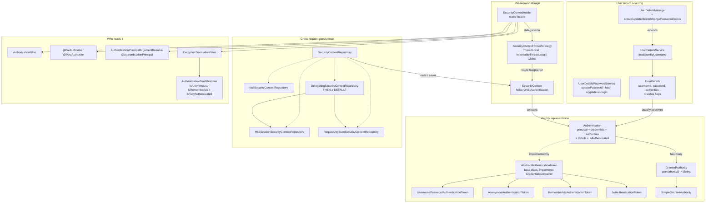
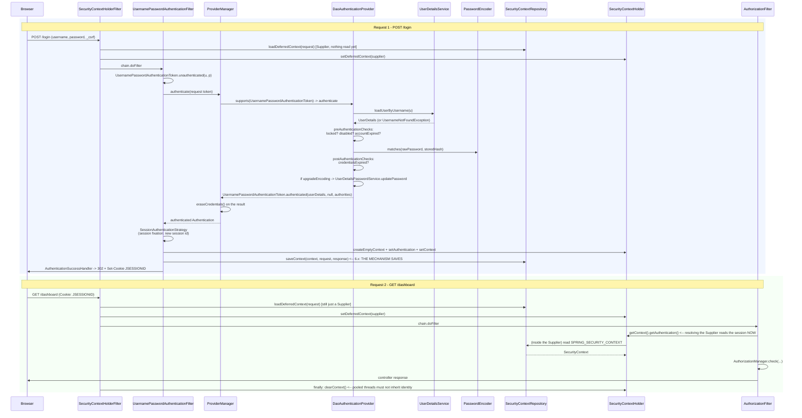

# 2.2 — Core Components: Context, Authentication, Authorities, UserDetails

> **Module 2 · Topic 2** · Spring Security Fundamentals
> Baseline: Spring Security 6.x on Boot 3.x
> New to this? Read **In Plain English** below first, then come back to the Version Matrix.

---

## Version Matrix

| Concern | Spring Security 5.x | **Spring Security 6.x (baseline)** | Spring Security 7.x |
|---|---|---|---|
| Context access | static `SecurityContextHolder.getContext()` is the documented way | **`SecurityContextHolderStrategy` injected as a collaborator; static access discouraged** | same, more strongly discouraged |
| `ThreadLocal` payload | `ThreadLocal<SecurityContext>` | **`ThreadLocal<Supplier<SecurityContext>>`** — enables deferred loading | same |
| Deferred loading | not available | **`getDeferredContext()` / `setDeferredContext()`, `DeferredSecurityContext`** | same |
| Context persistence filter | `SecurityContextPersistenceFilter` — loads **and saves** on every request | **`SecurityContextHolderFilter` — loads only; the authentication mechanism calls `saveContext(...)`** | same |
| Default `SecurityContextRepository` | `HttpSessionSecurityContextRepository` | **`DelegatingSecurityContextRepository(RequestAttributeSecurityContextRepository, HttpSessionSecurityContextRepository)`** | same |
| Compatibility switch | `requireExplicitSave(false)` is the default | `requireExplicitSave(true)` is the default; the `false` path is deprecated | switch removed |
| `UserDetails` status flags | four **abstract** methods you must implement | **four `default` methods returning `true`** (since 6.3) | same |
| Authentication token construction | `new UsernamePasswordAuthenticationToken(...)` | **`UsernamePasswordAuthenticationToken.unauthenticated(...)` / `.authenticated(...)` factories** | same |
| Mutating an `Authentication` | construct a new token by hand | construct a new token by hand | **`Authentication.Builder`** for deriving a modified authentication |
| Context change observability | none | **`ListeningSecurityContextHolderStrategy` + `SecurityContextChangedListener`** | same |

---

## Why This Exists

Spring Security has one central question to answer on every request: *who is calling, and what
are they allowed to do?* The components in this topic exist to answer it, and they divide the
answer into four deliberately separate concerns.

**Storage.** Where does the answer live while the request is being processed, such that any
code anywhere in the call graph can read it without it being threaded through every method
signature? That is `SecurityContextHolder` and `SecurityContext`.

**Representation.** What shape does the answer take, in a way that is uniform across form
login, HTTP Basic, JWT, SAML, and client certificates? That is `Authentication` and
`GrantedAuthority`.

**Sourcing.** Where does the underlying user record come from, and how is it decoupled from the
authentication mechanism that needs it? That is `UserDetails` and `UserDetailsService`.

**Persistence.** How does the answer survive from one stateless HTTP request to the next? That
is `SecurityContextRepository`.

The separation is what makes the framework extensible. A JWT filter and a form-login filter
produce different `Authentication` implementations, but `AuthorizationFilter` and
`@PreAuthorize` read them through the same interface and never know the difference. A
`UserDetailsService` backed by JPA and one backed by LDAP are interchangeable because
`DaoAuthenticationProvider` only knows the interface.

The other reason this topic matters is that it is where the Spring Security 6 upgrade actually
bites. The single most consequential behavioural change in 6.x is that
`SecurityContextPersistenceFilter` — which saved the context to the session on every request —
was replaced by `SecurityContextHolderFilter`, which does not save at all. Code that
authenticated a user by assigning to the holder silently stopped working, with no exception and
no log line. That is covered in detail below, and it is the question I would expect in an
interview about this module.

---

## In Plain English

**The one-line version:** These are the handful of small objects Spring uses to record who is
making the current request, where that record is kept, and how it is carried from one request to
the next.

**An analogy.** Imagine a hospital ward. When a patient is admitted, somebody writes a clipboard
and hangs it on the end of the bed. Any doctor, nurse, or technician who walks up to that bed can
read the clipboard without having to be told anything in advance — the information is simply
*there*, attached to the place where the work is happening.

The clipboard is the `SecurityContext`, and the hook at the end of the bed is the
`SecurityContextHolder`. The hook is not the information; it is the agreed place where the
information is found. What is written on the clipboard is the `Authentication` object: the
patient's name, and the list of things that have been authorised for them.

Two rules about that clipboard are worth carrying into the technical sections. First, the hook is
per-bed, not per-ward. If a nurse carries some work off to another room, the clipboard does not
follow her — she has to take a copy deliberately. That is exactly what happens when your code hands
work to another thread. Second, when the patient is discharged, somebody must take the clipboard
off the hook. If they forget, the next patient wheeled into that bed arrives with somebody else's
notes attached, and everyone treating them reads the wrong name. That is what makes the clearing
step in Spring's code non-negotiable rather than merely tidy.

There is also a filing cabinet at the nurses' station holding the long-term record, because the
clipboard exists only while the patient is in that bed. Carrying information between the bed and
the cabinet is the job of the `SecurityContextRepository`.

**How it actually works, step by step.**

The `SecurityContext` is almost embarrassingly simple: an object with a single slot that holds one
`Authentication`. It exists purely so there is a stable type to pass around.

`SecurityContextHolder` is the agreed global place to find the current one. Any code anywhere in
your application can call `SecurityContextHolder.getContext().getAuthentication()` and learn who
is making this request, without that information being passed down through every method signature.
Underneath, it uses a `ThreadLocal` — a variable where each thread gets its own private copy — which
is why the identity is naturally scoped to one request and why it does not travel to other threads.
Spring Security 6 made the underlying mechanism swappable through a `SecurityContextHolderStrategy`,
so a filter can be handed the strategy rather than reaching for a static method, which makes it far
easier to test.

The `Authentication` object is the record itself. It holds the *principal* (who is being claimed),
the *credentials* (the proof, which is wiped once checked), and a collection of *authorities* (the
permissions). Those authorities are each a `GrantedAuthority`, which wraps nothing more than a
string such as `ROLE_ADMIN`. Most real implementations extend a shared base class called
`AbstractAuthenticationToken`, which supplies the plumbing so that each mechanism only has to hold
what is unique to it.

Where does the user record come from? Spring separates that out on purpose. `UserDetails` is the
interface describing a stored user — the username, the hashed password, the authorities, and four
boolean flags about whether the account is usable. `UserDetailsService` is the interface with a
single method that takes a username and returns one of those records. That separation is why the
same login machinery works whether your users live in a database table, in LDAP, or in an in-memory
list for a test: only the small lookup component changes.

Those four boolean flags are worth introducing in plain words now, because the detailed sections
below discuss them precisely. `isEnabled` means an administrator has switched the account on.
`isAccountNonLocked` means it has not been locked, typically after too many failed attempts.
`isAccountNonExpired` and `isCredentialsNonExpired` cover an account or a password that has passed
its allowed age. Each one produces a different exception, and you should be careful how much of that
detail you report back to the person trying to log in.

Finally there is the question of memory between requests. `SecurityContextRepository` decides where
the identity lives in the gap between one request and the next — in the HTTP session for a
traditional web application, or nowhere at all for a token-based API where every request re-proves
itself.

This is also where the most important recent change lives, and it catches people upgrading from
Spring Security 5. In version 5, a filter automatically saved the identity into the session at the
end of every request, so code that simply assigned a value into the holder happened to work. In
version 6, that automatic saving was removed. Setting the holder now affects the current request
only. If you want the login to persist, the code that authenticated the user must explicitly ask
the repository to save it. The failure is silent — no exception, no log line, just a user who
appears logged in for exactly one request and then is not.

**Why should a beginner care?** Every one of these has a common, confusing failure. Read the holder
from inside a background task and you get `null`, because the identity never left the original
thread. Store per-request data in a field instead of the context and two users see each other's
information under load. Assign to the holder and forget to save it, and your login works once and
then vanishes. Knowing what each of these small objects is responsible for turns all three from
mysteries into one-line fixes.

**Words you will meet in this file**

| Term | In plain words |
|---|---|
| `SecurityContext` | A tiny holder with one slot, containing the record of who is making this request. |
| `SecurityContextHolder` | The agreed place any code can look to find that record, backed by a per-thread variable. |
| `SecurityContextHolderStrategy` | The swappable implementation deciding *how* the record is stored per request. |
| `ThreadLocal` | A variable where each thread has its own private copy, so requests do not see each other's. |
| `MODE_INHERITABLETHREADLOCAL` | A setting where new threads copy the creating thread's identity. Unsafe with thread pools. |
| `Authentication` | The record itself: who is claimed, what proof was given, and what they are permitted to do. |
| Principal | The identity being claimed — often a `UserDetails`, though the exact type depends on the login method. |
| Credentials | The proof offered, such as a password. Deliberately erased once it has been verified. |
| `GrantedAuthority` | One permission, stored as a plain string such as `ROLE_ADMIN`. |
| `SimpleGrantedAuthority` | The ordinary implementation of that — a class wrapping a single string. |
| `AbstractAuthenticationToken` | The shared base class most `Authentication` implementations build on. |
| `UserDetails` | The interface describing a stored user: username, hashed password, authorities, status flags. |
| `UserDetailsService` | The one-method interface that looks a user up by username. Swap it to change your user store. |
| `UserDetailsManager` | An extended version that can also create, update, and delete users. |
| `UserDetailsPasswordService` | The hook Spring calls to rewrite a password hash in a newer format after a successful login. |
| `AuthenticationTrustResolver` | The component that answers whether the current identity is anonymous or merely remembered. |
| `@AuthenticationPrincipal` | An annotation that injects the current user straight into a controller method parameter. |
| `SecurityContextRepository` | The component deciding where the identity is kept between requests, if anywhere. |
| `SecurityContextHolderFilter` | The version 6 filter that loads the identity at the start of a request but never saves it. |
| `SecurityContextPersistenceFilter` | The version 5 filter that both loaded and saved. Removed, and its absence causes silent bugs. |

**If you remember only one thing:** The current user lives in a per-thread slot that Spring clears
at the end of every request, so it never crosses threads by itself and it is never saved for the
next request unless something explicitly saves it.

---

## Core Concepts

### 1. How Everything Connects

**In simple terms:** This is the map of which small object hands what to which other one, from the
credentials arriving to the permissions being checked.



The runtime story in one sentence: **an authentication mechanism turns a credential into an
`Authentication`, puts it in a `SecurityContext`, gives the context to the
`SecurityContextHolder` for this request and to a `SecurityContextRepository` for the next one,
and every consumer reads it back from the holder.**

### 2. `SecurityContext` and `SecurityContextHolder`

**In simple terms:** One is a box holding the record of the current user, and the other is the
agreed place any code in your application can look to find that box.

`SecurityContext` is the thinnest interface in the framework. It is a mutable one-slot holder,
and nothing more:

```java
package org.springframework.security.core.context;

public interface SecurityContext extends Serializable {
    Authentication getAuthentication();
    void setAuthentication(Authentication authentication);
}
```

The obvious question is why it exists at all rather than storing the `Authentication` directly.
Two reasons. It gives the framework a place to add request-scoped security state later without
changing the `Authentication` contract. And more importantly, it is a stable identity for the
`ThreadLocal`: because the `SecurityContext` is mutable, code that captured a reference to it
before authentication happened still sees the authentication afterwards.

`SecurityContextHolder` is a static facade that delegates everything to a strategy:

```java
package org.springframework.security.core.context;

public class SecurityContextHolder {

    public static final String MODE_THREADLOCAL = "MODE_THREADLOCAL";
    public static final String MODE_INHERITABLETHREADLOCAL = "MODE_INHERITABLETHREADLOCAL";
    public static final String MODE_GLOBAL = "MODE_GLOBAL";
    public static final String SYSTEM_PROPERTY = "spring.security.strategy";

    private static String strategyName = System.getProperty(SYSTEM_PROPERTY);
    private static SecurityContextHolderStrategy strategy;

    static { initialize(); }

    public static void clearContext()                        { strategy.clearContext(); }
    public static SecurityContext getContext()               { return strategy.getContext(); }
    public static Supplier<SecurityContext> getDeferredContext() { return strategy.getDeferredContext(); }
    public static void setContext(SecurityContext context)   { strategy.setContext(context); }
    public static void setDeferredContext(Supplier<SecurityContext> c) { strategy.setDeferredContext(c); }
    public static SecurityContext createEmptyContext()       { return strategy.createEmptyContext(); }

    public static void setStrategyName(String strategyName)  { ... initialize(); }
    public static void setContextHolderStrategy(SecurityContextHolderStrategy strategy) { ... }
    public static SecurityContextHolderStrategy getContextHolderStrategy() { return strategy; }
}
```

### 3. `SecurityContextHolderStrategy` — The 6.x Pluggable Strategy

**In simple terms:** Version 6 lets you swap out *how* the current user is stored, and lets your
filters be handed that mechanism instead of reaching for a global method, which makes them testable.

```java
package org.springframework.security.core.context;

public interface SecurityContextHolderStrategy {

    void clearContext();

    SecurityContext getContext();

    default Supplier<SecurityContext> getDeferredContext() {
        return () -> getContext();
    }

    void setContext(SecurityContext context);

    default void setDeferredContext(Supplier<SecurityContext> deferredContext) {
        setContext(deferredContext.get());
    }

    SecurityContext createEmptyContext();
}
```

The 6.x default implementation is worth reading closely, because the `Supplier` indirection is
the whole point:

```java
// org.springframework.security.core.context.ThreadLocalSecurityContextHolderStrategy
final class ThreadLocalSecurityContextHolderStrategy implements SecurityContextHolderStrategy {

    private static final ThreadLocal<Supplier<SecurityContext>> contextHolder = new ThreadLocal<>();

    @Override
    public void clearContext() {
        contextHolder.remove();
    }

    @Override
    public SecurityContext getContext() {
        return getDeferredContext().get();      // resolving the Supplier is what triggers the load
    }

    @Override
    public Supplier<SecurityContext> getDeferredContext() {
        Supplier<SecurityContext> result = contextHolder.get();
        if (result == null) {
            SecurityContext context = createEmptyContext();
            result = () -> context;
            contextHolder.set(result);
        }
        return result;
    }

    @Override
    public void setContext(SecurityContext context) {
        Assert.notNull(context, "Only non-null SecurityContext instances are permitted");
        contextHolder.set(() -> context);
    }

    @Override
    public void setDeferredContext(Supplier<SecurityContext> deferredContext) {
        Assert.notNull(deferredContext, "Only non-null Supplier instances are permitted");
        Supplier<SecurityContext> notNull = () -> {
            SecurityContext result = deferredContext.get();
            Assert.notNull(result, "A Supplier<SecurityContext> returned null and is not allowed.");
            return result;
        };
        contextHolder.set(notNull);
    }

    @Override
    public SecurityContext createEmptyContext() {
        return new SecurityContextImpl();
    }
}
```

Note the `ThreadLocal` holds a `Supplier<SecurityContext>`, not a `SecurityContext`. That is
what allows `SecurityContextHolderFilter` to install a deferred context that only reads the
session **if somebody actually asks for the authentication**. A request to a `permitAll()`
static resource never resolves the supplier, so it never touches the session, which means no
session lookup, no deserialisation, and no session creation.

Also note `getContext()` never returns `null`. If nothing is set it lazily installs an empty
`SecurityContextImpl`. This is a deliberate convenience with a sharp edge: a `null` check on
the context is always false, and the thing that can be `null` is
`getContext().getAuthentication()`.

The four strategies shipped:

| Strategy | Storage | When it is correct |
|---|---|---|
| `ThreadLocalSecurityContextHolderStrategy` | `ThreadLocal<Supplier<SecurityContext>>` | the default; any request-per-thread model |
| `InheritableThreadLocalSecurityContextHolderStrategy` | `InheritableThreadLocal` | never in a web application — see below |
| `GlobalSecurityContextHolderStrategy` | one `static` field for the whole JVM | standalone desktop or single-user CLI applications only |
| `ListeningSecurityContextHolderStrategy` | wraps another strategy | diagnostics: publishes `SecurityContextChangedEvent` on every change |

#### Why static access is discouraged in 6.x

The static methods still work and are not deprecated. But since 6.0 the framework's own
components do **not** call them at runtime. Instead each one holds a field:

```java
// The pattern used by SecurityContextHolderFilter, AuthorizationFilter,
// BasicAuthenticationFilter, AbstractAuthenticationProcessingFilter, ...
private SecurityContextHolderStrategy securityContextHolderStrategy =
        SecurityContextHolder.getContextHolderStrategy();

public void setSecurityContextHolderStrategy(SecurityContextHolderStrategy strategy) {
    Assert.notNull(strategy, "securityContextHolderStrategy cannot be null");
    this.securityContextHolderStrategy = strategy;
}
```

The reasons, in the order I would give them:

1. **Testability.** A component that takes the strategy as a collaborator can be unit-tested
   with a purpose-built strategy. A component that calls `SecurityContextHolder.getContext()`
   forces every test to mutate JVM-global state and clean it up, and a forgotten cleanup makes
   an unrelated test fail later in the run.
2. **Correctness under an alternative strategy.** If you install a custom strategy, static
   callers resolve it through the same static field so they *happen* to work — but only if they
   read it on every call. Components that cached a reference obtained at construction time
   would not. Taking it as a collaborator makes the dependency explicit and consistent.
3. **Multiple strategies in one JVM.** Static access forces exactly one strategy per
   classloader. Library code that needs a different one — a test harness, an embedded tenant
   runtime — cannot have it.
4. **Honesty about coupling.** `SecurityContextHolder.getContext()` buried in a service method
   is a hidden dependency that does not appear in the constructor, does not appear in the
   signature, and makes the method impossible to call from a non-request thread without
   knowing that. Making it a field at least puts it in the class.

The practical guidance for application code: prefer receiving what you need as a parameter
(`@AuthenticationPrincipal`, an `Authentication` method parameter). If you genuinely need the
holder, obtain the strategy once and keep it as a field rather than calling the static method
at each use site.

### 4. The Three Modes and Exactly What Goes Wrong With Each

**In simple terms:** There are three ways to store the current user, and the one that looks most
convenient for background work is the one that can silently run a task as the wrong person.

| Mode | Mechanism | Real danger |
|---|---|---|
| `MODE_THREADLOCAL` (default) | one value per thread | **Does not propagate to child threads.** `CompletableFuture.supplyAsync(...)`, `@Async`, a `parallelStream()`, or any executor you hand work to sees an empty context, and `getAuthentication()` returns `null`. Also: because container threads are pooled, a context left behind is visible to the next unrelated request, which is why `FilterChainProxy` clears it in a `finally` block. |
| `MODE_INHERITABLETHREADLOCAL` | child threads copy the parent's value at creation | **Catastrophic with thread pools, and pools are everywhere.** Inheritance happens when the `Thread` object is *constructed*, not when a task is submitted. A pooled thread inherits from whichever request thread happened to trigger its creation, then keeps that identity for its entire life. So the tenth task submitted by user B, running on a thread created during user A's request, executes as **user A**. It appears to work in testing because the first task on each thread does inherit correctly. This is a cross-user privilege escalation, and it is extremely hard to reproduce. |
| `MODE_GLOBAL` | a single `static` field for the whole JVM | **There is one identity for the entire process.** Any request that authenticates changes who *every* concurrent request is. It is not a subtle bug; it is a total absence of isolation. It exists for standalone single-user applications (a Swing client, a CLI) and must never appear in a server. |

The correct fix for the `MODE_THREADLOCAL` limitation is never to change the mode. It is to
propagate the context deliberately:

```java
// Best: wrap the executor once, and every task submitted through it carries the context.
@Bean
Executor applicationTaskExecutor() {
    ThreadPoolTaskExecutor delegate = new ThreadPoolTaskExecutor();
    delegate.setCorePoolSize(8);
    delegate.initialize();
    return new DelegatingSecurityContextExecutor(delegate);
}

// Or per-call, when you only need it in one place.
SecurityContext context = this.securityContextHolderStrategy.getContext();
CompletableFuture.supplyAsync(
        new DelegatingSecurityContextSupplier<>(this::doWork, context), executor);
```

The `DelegatingSecurityContext*` family (`Executor`, `ExecutorService`,
`ScheduledExecutorService`, `Runnable`, `Callable`, `Supplier`, `TaskExecutor`) all work the
same way: capture the context at submission time, set it on the worker thread, run, and restore
in a `finally`. That is correct with pools, because capture happens per task rather than per
thread creation.

For servlet async specifically, `WebAsyncManagerIntegrationFilter` registers a
`SecurityContextCallableProcessingInterceptor` so that a controller returning `Callable` or
`WebAsyncTask` keeps the context automatically. It does **not** cover a `CompletableFuture` you
built yourself on your own executor.

### 5. `Authentication` — One Interface, Two Jobs

**In simple terms:** The same type is used both for the unverified claim going in and the verified
result coming back out, so a flag on it tells you which of the two you are holding.

```java
package org.springframework.security.core;

public interface Authentication extends Principal, Serializable {

    Collection<? extends GrantedAuthority> getAuthorities();

    Object getCredentials();

    Object getDetails();

    Object getPrincipal();

    boolean isAuthenticated();

    void setAuthenticated(boolean isAuthenticated) throws IllegalArgumentException;
}
```

The design decision that confuses everyone: **the same type is used for the authentication
*request* and the authentication *result*.**

| | As a request (before) | As a result (after) |
|---|---|---|
| Created by | an authentication filter, from the incoming credential | an `AuthenticationProvider` |
| `getPrincipal()` | usually a `String` username, or a raw token string | a `UserDetails`, a `Jwt`, an `OidcUser`, or your own principal type |
| `getCredentials()` | the raw password / token — **populated** | usually `null` after `eraseCredentials()` |
| `getAuthorities()` | empty | the granted authorities |
| `isAuthenticated()` | `false` | `true` |

`ProviderManager.authenticate(Authentication)` takes the request form and returns the result
form. The advantage is a uniform SPI: one method signature covers every mechanism. The cost is
that `Authentication` has a dual meaning and you must know which one you are holding.

Spring Security 6 added static factories that make the intent explicit at the call site, and
they are what you should use:

```java
// Request form: authorities empty, isAuthenticated() == false
var request = UsernamePasswordAuthenticationToken.unauthenticated("alice", "s3cr3t");

// Result form: authorities supplied, isAuthenticated() == true
var result = UsernamePasswordAuthenticationToken.authenticated(userDetails, null, authorities);
```

#### The `setAuthenticated` guardrail

Why does a setter exist for something so security-critical? Because the framework needs to be
able to mark a token as authenticated. But letting *anyone* do it would mean an attacker-visible
code path from "I have a username" to "I am authenticated as that username". So the framework
puts a trap door in the concrete types:

```java
// org.springframework.security.authentication.AbstractAuthenticationToken
@Override
public void setAuthenticated(boolean authenticated) {
    this.authenticated = authenticated;          // the base class permits either value
}

// org.springframework.security.authentication.UsernamePasswordAuthenticationToken
@Override
public void setAuthenticated(boolean authenticated) {
    Assert.isTrue(!authenticated,
            "Cannot set this token to trusted - use constructor which takes a GrantedAuthority list instead");
    super.setAuthenticated(false);
}
```

Read it carefully: on `UsernamePasswordAuthenticationToken` you may set it to `false`, and
setting it to `true` throws `IllegalArgumentException`. The **only** way to obtain a trusted
`UsernamePasswordAuthenticationToken` is the three-argument constructor (or the
`authenticated(...)` factory), which sets the flag via `super.setAuthenticated(true)` internally
after you have supplied authorities.

That is a well-designed guardrail: it makes the unsafe path syntactically unavailable rather
than merely discouraged. It is also only a guardrail, not a security boundary — `getAuthorities()`
on the two-argument token returns an empty collection, so even a hypothetically trusted one
would authorise nothing.

The important corollary for anyone writing a custom token: if you extend
`AbstractAuthenticationToken` and do not override `setAuthenticated`, you inherit the
permissive base implementation. Override it with the same assertion.

### 6. `AbstractAuthenticationToken`

**In simple terms:** This is the shared base class that handles the repetitive parts, so each login
mechanism only has to supply the few things that are genuinely specific to it.

```java
package org.springframework.security.authentication;

public abstract class AbstractAuthenticationToken implements Authentication, CredentialsContainer {

    private final Collection<GrantedAuthority> authorities;
    private Object details;
    private boolean authenticated = false;

    public AbstractAuthenticationToken(Collection<? extends GrantedAuthority> authorities) {
        if (authorities == null) {
            this.authorities = AuthorityUtils.NO_AUTHORITIES;
            return;
        }
        for (GrantedAuthority a : authorities) {
            Assert.notNull(a, "Authorities collection cannot contain any null elements");
        }
        this.authorities = Collections.unmodifiableList(new ArrayList<>(authorities));
    }

    @Override
    public Collection<GrantedAuthority> getAuthorities() {
        return this.authorities;               // defensively copied AND unmodifiable
    }

    @Override
    public String getName() {
        if (this.getPrincipal() instanceof UserDetails userDetails) {
            return userDetails.getUsername();
        }
        if (this.getPrincipal() instanceof AuthenticatedPrincipal principal) {
            return principal.getName();
        }
        if (this.getPrincipal() instanceof Principal principal) {
            return principal.getName();
        }
        return (this.getPrincipal() == null) ? "" : this.getPrincipal().toString();
    }

    @Override
    public void eraseCredentials() {
        eraseSecret(getCredentials());
        eraseSecret(getPrincipal());
        eraseSecret(this.details);
    }
}
```

Three things this base class gives you that matter:

**Authorities are copied and made unmodifiable.** An authenticated token cannot have authorities
added to it after the fact, and the collection you passed in cannot be mutated behind the
framework's back. Privilege escalation via a shared mutable list is a real attack, and this
closes it.

**`getName()` has a documented resolution order.** This is what `Authentication#getName()`,
`Principal#getName()`, and every audit log actually return: `UserDetails.getUsername()`, then
`AuthenticatedPrincipal.getName()`, then `Principal.getName()`, then `toString()`. If your
custom principal is a plain POJO, `getName()` falls through to `toString()` — which is how
audit logs end up full of `com.example.MyUser@1f2a3b`. Implement `AuthenticatedPrincipal`.

**It implements `CredentialsContainer`.** `ProviderManager` calls `eraseCredentials()` on the
result by default (`eraseCredentialsAfterAuthentication = true`), which recursively nulls the
credentials on the token, the principal, and the details. This is why `getCredentials()` returns
`null` on an authentication you read back from the context, and why a `UserDetails` stored in a
session has a `null` password. It is also why re-using a cached `UserDetails` instance across
authentications breaks: the first authentication erased its password field.

### 7. `GrantedAuthority` and `SimpleGrantedAuthority`

**In simple terms:** A permission in Spring Security is a single piece of text, and these are the
interface for it and the ordinary class that wraps one.

```java
package org.springframework.security.core;

public interface GrantedAuthority extends Serializable {
    String getAuthority();
}
```

```java
package org.springframework.security.core.authority;

public final class SimpleGrantedAuthority implements GrantedAuthority {

    private final String role;

    public SimpleGrantedAuthority(String role) {
        Assert.hasText(role, "A granted authority textual representation is required");
        this.role = role;
    }

    @Override
    public String getAuthority() {
        return this.role;
    }

    @Override
    public boolean equals(Object obj) {
        if (obj == this) return true;
        if (obj instanceof SimpleGrantedAuthority sga) {
            return this.role.equals(sga.getAuthority());
        }
        return false;
    }

    @Override
    public int hashCode() {
        return this.role.hashCode();
    }

    @Override
    public String toString() {
        return this.role;
    }
}
```

A single-method interface over a `String` looks like over-engineering until you see the reason:
`getAuthority()` is allowed to return `null` for authorities that cannot be represented as a
string — a complex, non-textual authority evaluated by a custom `AccessDecisionVoter` or
`AuthorizationManager`. In practice almost nothing does this, and returning `null` breaks
`hasAuthority()`, so `SimpleGrantedAuthority` is what you will use.

The `ROLE_` prefix is a convention enforced at exactly two points, and knowing where saves a lot
of confusion:

| Expression | What it compares against | Prefix behaviour |
|---|---|---|
| `hasRole("ADMIN")` | authority string `ROLE_ADMIN` | **adds** `ROLE_` for you |
| `hasAuthority("ROLE_ADMIN")` | authority string `ROLE_ADMIN` | adds nothing — you write it in full |
| `hasAuthority("document:read")` | authority string `document:read` | adds nothing |
| `User.withUsername(...).roles("ADMIN")` | stores `ROLE_ADMIN` | **adds** `ROLE_`, and **rejects** an argument that already starts with `ROLE_` |
| `User.withUsername(...).authorities("ROLE_ADMIN")` | stores `ROLE_ADMIN` | adds nothing |

So `roles("ROLE_ADMIN")` throws `IllegalArgumentException` ("ROLE_ADMIN cannot start with
ROLE_"), and `hasRole("ROLE_ADMIN")` looks for `ROLE_ROLE_ADMIN` and silently denies everything.
Both are common and both are avoidable by picking one convention per codebase.

### 8. `UserDetails` and Its Four Status Flags

**In simple terms:** This describes one stored user, and its four true-or-false flags are the
reasons an account can be refused even when the password typed in was perfectly correct.

```java
package org.springframework.security.core.userdetails;

public interface UserDetails extends Serializable {

    Collection<? extends GrantedAuthority> getAuthorities();

    String getPassword();

    String getUsername();

    default boolean isAccountNonExpired()     { return true; }   // default since 6.3
    default boolean isAccountNonLocked()      { return true; }
    default boolean isCredentialsNonExpired() { return true; }
    default boolean isEnabled()               { return true; }
}
```

Note the naming: three of the four are phrased as `NonX` so that `true` always means "fine".
That is deliberate — a naive implementation returning `false` everywhere fails closed rather
than open. It is also why the flags read awkwardly.

**Exactly which exception each flag produces.** This is the table interviewers ask for:

| Flag returning `false` | Exception thrown | Checked before or after the password comparison |
|---|---|---|
| `isAccountNonLocked()` | `LockedException` | **before** |
| `isEnabled()` | `DisabledException` | **before** |
| `isAccountNonExpired()` | `AccountExpiredException` | **before** |
| `isCredentialsNonExpired()` | `CredentialsExpiredException` | **after** |

All four extend `AccountStatusException`, which extends `AuthenticationException`. The
before/after split comes from `AbstractUserDetailsAuthenticationProvider`, which runs two
separate checkers:

```java
// org.springframework.security.authentication.dao.AbstractUserDetailsAuthenticationProvider
private class DefaultPreAuthenticationChecks implements UserDetailsChecker {
    @Override
    public void check(UserDetails user) {
        if (!user.isAccountNonLocked()) {
            throw new LockedException(messages.getMessage(
                "AbstractUserDetailsAuthenticationProvider.locked", "User account is locked"));
        }
        if (!user.isEnabled()) {
            throw new DisabledException(messages.getMessage(
                "AbstractUserDetailsAuthenticationProvider.disabled", "User is disabled"));
        }
        if (!user.isAccountNonExpired()) {
            throw new AccountExpiredException(messages.getMessage(
                "AbstractUserDetailsAuthenticationProvider.expired", "User account has expired"));
        }
    }
}

private class DefaultPostAuthenticationChecks implements UserDetailsChecker {
    @Override
    public void check(UserDetails user) {
        if (!user.isCredentialsNonExpired()) {
            throw new CredentialsExpiredException(messages.getMessage(
                "AbstractUserDetailsAuthenticationProvider.credentialsExpired",
                "User credentials have expired"));
        }
    }
}
```

The ordering is not arbitrary. `isCredentialsNonExpired()` means "this password is too old and
must be changed". Telling someone their password has expired is only meaningful if they
presented the *correct* password — otherwise you have told an attacker that the account exists
and hinted at its state. Hence: account state checks first, then verify the password, then the
credential-age check.

`AccountStatusUserDetailsChecker` is the standalone, reusable version of all four checks, used
by pre-authenticated and remember-me flows:

```java
// org.springframework.security.authentication.AccountStatusUserDetailsChecker
public void check(UserDetails user) {
    if (!user.isAccountNonLocked())      throw new LockedException(...);
    if (!user.isEnabled())               throw new DisabledException(...);
    if (!user.isAccountNonExpired())     throw new AccountExpiredException(...);
    if (!user.isCredentialsNonExpired()) throw new CredentialsExpiredException(...);
}
```

**The user-enumeration hazard.** `DaoAuthenticationProvider` has
`hideUserNotFoundExceptions = true` by default, which converts `UsernameNotFoundException` into
`BadCredentialsException` so a caller cannot distinguish "no such user" from "wrong password".
But the four `AccountStatusException` subclasses are **not** hidden. So if your login page
surfaces the exception message, a `LockedException` tells an attacker that the account exists,
and `DisabledException` distinguishes a deactivated account from a non-existent one. If user
enumeration matters in your threat model, map all authentication failures to one generic message
in your `AuthenticationFailureHandler` and log the specific reason server-side only.

### 9. `UserDetailsService`, `UserDetailsManager`, `UserDetailsPasswordService`

**In simple terms:** These three interfaces cover looking a user up, changing user records, and
quietly rewriting a password hash into a newer format the next time its owner logs in.

```java
package org.springframework.security.core.userdetails;

public interface UserDetailsService {
    UserDetails loadUserByUsername(String username) throws UsernameNotFoundException;
}
```

```java
package org.springframework.security.provisioning;

public interface UserDetailsManager extends UserDetailsService {
    void createUser(UserDetails user);
    void updateUser(UserDetails user);
    void deleteUser(String username);
    void changePassword(String oldPassword, String newPassword);
    boolean userExists(String username);
}
```

```java
package org.springframework.security.core.userdetails;

public interface UserDetailsPasswordService {
    UserDetails updatePassword(UserDetails user, String newPassword);
}
```

| Interface | Read | Write | Implementations | Use it when |
|---|---|---|---|---|
| `UserDetailsService` | yes | no | `InMemoryUserDetailsManager`, `JdbcDaoImpl`, your own | always — this is the only one the authentication path requires |
| `UserDetailsManager` | yes | yes | `InMemoryUserDetailsManager`, `JdbcUserDetailsManager` | you want Spring Security to own user provisioning. Usually you do not — real systems have registration workflows, email verification, and audit requirements that this five-method interface cannot express |
| `UserDetailsPasswordService` | no | password only | `InMemoryUserDetailsManager`, `JdbcUserDetailsManager` | you want transparent password-hash upgrades on successful login |

`loadUserByUsername` has one contract detail that is violated constantly: **it must throw
`UsernameNotFoundException`, never return `null`.** Returning `null` produces an
`InternalAuthenticationServiceException` wrapping a `NullPointerException` deep inside
`AbstractUserDetailsAuthenticationProvider.retrieveUser`, which is a 500 instead of a 401.

`changePassword(oldPassword, newPassword)` is worth noticing for what it does *not* take: a
username. It operates on the **currently authenticated user**, read from the
`SecurityContextHolder`. That makes it convenient and also makes it unusable from an admin
"reset this user's password" feature, and unusable from a background job.

#### The hash-upgrade mechanism

`UserDetailsPasswordService` is how you migrate password hashes without a mass reset:

```java
// org.springframework.security.authentication.dao.DaoAuthenticationProvider
@Override
protected Authentication createSuccessAuthentication(Object principal,
        Authentication authentication, UserDetails user) {
    boolean upgradeEncoding = this.userDetailsPasswordService != null
            && this.passwordEncoder.upgradeEncoding(user.getPassword());
    if (upgradeEncoding) {
        String presentedPassword = authentication.getCredentials().toString();
        String newPassword = this.passwordEncoder.encode(presentedPassword);
        user = this.userDetailsPasswordService.updatePassword(user, newPassword);
    }
    return super.createSuccessAuthentication(principal, authentication, user);
}
```

Three conditions must all hold: a `UserDetailsPasswordService` is wired in, the encoder's
`upgradeEncoding(oldHash)` returns `true` (for `DelegatingPasswordEncoder` this means the
stored `{id}` is not the current default), and authentication **succeeded** — because the
re-hash needs the plaintext password, which only exists at that moment. The consequence is that
a user who never logs in keeps the old hash forever, so this is a gradual migration and you
still need a long-tail plan.

### 10. `AuthenticationTrustResolver`

**In simple terms:** This answers how much the current identity should be trusted — a real login, a
visitor merely remembered by a cookie, or nobody at all.

```java
package org.springframework.security.authentication;

public interface AuthenticationTrustResolver {

    boolean isAnonymous(Authentication authentication);

    boolean isRememberMe(Authentication authentication);

    // added as default methods in 6.x
    default boolean isAuthenticated(Authentication authentication) { ... }
    default boolean isFullyAuthenticated(Authentication authentication) { ... }
}
```

```java
// org.springframework.security.authentication.AuthenticationTrustResolverImpl
public class AuthenticationTrustResolverImpl implements AuthenticationTrustResolver {

    private Class<? extends Authentication> anonymousClass = AnonymousAuthenticationToken.class;
    private Class<? extends Authentication> rememberMeClass = RememberMeAuthenticationToken.class;

    @Override
    public boolean isAnonymous(Authentication authentication) {
        if ((this.anonymousClass == null) || (authentication == null)) {
            return false;
        }
        return this.anonymousClass.isAssignableFrom(authentication.getClass());
    }

    @Override
    public boolean isRememberMe(Authentication authentication) {
        if ((this.rememberMeClass == null) || (authentication == null)) {
            return false;
        }
        return this.rememberMeClass.isAssignableFrom(authentication.getClass());
    }
}
```

**The determination is by Java class, not by any claim or flag.** That is a design decision with
two consequences. A custom anonymous token that does not extend `AnonymousAuthenticationToken`
will be treated as fully authenticated by `ExceptionTranslationFilter` and by
`isFullyAuthenticated()`. And conversely, you cannot make a token "anonymous" by setting a
property on it.

Why it matters: this is the component that decides whether an `AccessDeniedException` becomes a
403 or an authentication challenge.

```java
// ExceptionTranslationFilter.handleSpringSecurityException (simplified)
if (exception instanceof AuthenticationException) {
    sendStartAuthentication(...);                       // 401 / redirect to login
}
else if (exception instanceof AccessDeniedException) {
    Authentication authentication = this.securityContextHolderStrategy.getContext().getAuthentication();
    boolean isAnonymous = this.authenticationTrustResolver.isAnonymous(authentication);
    if (isAnonymous || this.authenticationTrustResolver.isRememberMe(authentication)) {
        sendStartAuthentication(...);                   // "you have not really logged in yet"
    }
    else {
        this.accessDeniedHandler.handle(...);           // 403
    }
}
```

`isFullyAuthenticated()` also backs the `isFullyAuthenticated()` SpEL expression, which is how
you require a real login rather than a remember-me cookie for sensitive operations — changing a
password, adding a payment method, deleting an account.

### 11. `@AuthenticationPrincipal` and `AuthenticationPrincipalArgumentResolver`

**In simple terms:** This annotation hands the current user straight to your controller method as a
parameter, which spares you from reading the global holder yourself.

```java
package org.springframework.security.core.annotation;

@Target({ ElementType.PARAMETER, ElementType.ANNOTATION_TYPE })
@Retention(RetentionPolicy.RUNTIME)
@Documented
public @interface AuthenticationPrincipal {

    boolean errorOnInvalidType() default false;

    String expression() default "";
}
```

```java
// org.springframework.security.web.method.annotation.AuthenticationPrincipalArgumentResolver
@Override
public Object resolveArgument(MethodParameter parameter, ModelAndViewContainer mavContainer,
        NativeWebRequest webRequest, WebDataBinderFactory binderFactory) {

    Authentication authentication = this.securityContextHolderStrategy.getContext().getAuthentication();
    if (authentication == null) {
        return null;
    }
    Object principal = authentication.getPrincipal();

    AuthenticationPrincipal annotation = findMethodAnnotation(AuthenticationPrincipal.class, parameter);
    String expressionToParse = annotation.expression();
    if (StringUtils.hasLength(expressionToParse)) {
        StandardEvaluationContext context = new StandardEvaluationContext();
        context.setRootObject(principal);
        context.setVariable("this", principal);
        context.setBeanResolver(this.beanResolver);
        principal = this.parser.parseExpression(expressionToParse).getValue(context);
    }

    if (principal != null && !ClassUtils.isAssignable(parameter.getParameterType(), principal.getClass())) {
        if (annotation.errorOnInvalidType()) {
            throw new ClassCastException(principal + " is not assignable to " + parameter.getParameterType());
        }
        return null;                       // <-- SILENTLY NULL. This is the trap.
    }
    return principal;
}
```

The resolver is registered by `WebMvcSecurityConfiguration`, which `@EnableWebSecurity` imports
through `SpringWebMvcImportSelector` when Spring MVC is present.

**Why the parameter is `null` — the three causes, in order of frequency:**

1. **Type mismatch, silently swallowed.** The request is anonymous, so `getPrincipal()` returns
   the `String` `"anonymousUser"`, which is not assignable to `UserDetails`, so the resolver
   returns `null` rather than throwing. The same happens if you declare
   `@AuthenticationPrincipal MyUser` but your authentication mechanism produces a `Jwt` or an
   `OidcUser`. Set `errorOnInvalidType = true` during development and this becomes a loud
   `ClassCastException` instead of a null.
2. **No authentication at all.** `getAuthentication()` returned `null` — the endpoint is
   `permitAll()` and `AnonymousAuthenticationFilter` was not reached, or you are reading it
   from a non-request thread.
3. **The resolver was never registered.** A custom `WebMvcConfigurer` that replaces rather than
   augments the argument resolver list, or Spring MVC not on the classpath.

The `expression` attribute is useful for unwrapping a domain object without leaking the
framework type into your controller signature, and for building your own meta-annotation:

```java
@GetMapping("/me")
public String me(@AuthenticationPrincipal(expression = "customer") Customer customer) { ... }

// A reusable, self-documenting meta-annotation:
@Target(ElementType.PARAMETER)
@Retention(RetentionPolicy.RUNTIME)
@AuthenticationPrincipal(expression = "customer", errorOnInvalidType = true)
public @interface CurrentCustomer {
}
```

The related `@CurrentSecurityContext` annotation does the same for the whole `SecurityContext`
rather than just the principal, which is how you reach `getAuthorities()` or a custom
`details` object.

### 12. `SecurityContextRepository` — Persistence Across Requests

**In simple terms:** This decides where the logged-in identity is kept in the gap between two
requests — usually the session, or nowhere at all for a token-based API.

```java
package org.springframework.security.web.context;

public interface SecurityContextRepository {

    /** @deprecated in favour of loadDeferredContext */
    @Deprecated
    SecurityContext loadContext(HttpRequestResponseHolder requestResponseHolder);

    default DeferredSecurityContext loadDeferredContext(HttpServletRequest request) { ... }

    void saveContext(SecurityContext context, HttpServletRequest request, HttpServletResponse response);

    boolean containsContext(HttpServletRequest request);
}
```

| Implementation | Where the context lives | Survives across requests | Creates a session | Use it for |
|---|---|---|---|---|
| `HttpSessionSecurityContextRepository` | `HttpSession` attribute `SPRING_SECURITY_CONTEXT` | **yes** | yes, on save, unless `allowSessionCreation=false` | stateful web applications |
| `RequestAttributeSecurityContextRepository` | request attribute | **no** — current request only, but survives `FORWARD`/`ERROR`/`ASYNC` dispatches | no | stateless APIs where async and error dispatches must still see the authentication |
| `NullSecurityContextRepository` | nowhere | no | no | truly stateless, where even the error dispatch does not need it |
| `DelegatingSecurityContextRepository` | an ordered list of the above | depends | depends | **the 6.x default** |

The 6.x default configured by `HttpSecurity` is:

```java
new DelegatingSecurityContextRepository(
        new RequestAttributeSecurityContextRepository(),
        new HttpSessionSecurityContextRepository());
```

`loadDeferredContext` returns the first delegate that yields a non-empty context;
`saveContext` writes to **all** delegates. That combination is what makes both stateful and
stateless configurations work out of the box: the request attribute serves the current request
including its async and error dispatches, and the session serves subsequent requests.

`NullSecurityContextRepository` looks like the obvious choice for a stateless JWT API, and it
is usually the wrong one. With it, the authentication set by your filter is not even readable
from a `FORWARD` to `/error`, so your custom error handling loses the identity. Prefer
`RequestAttributeSecurityContextRepository` for stateless APIs.

### 13. The Correction You Must Internalise: `SecurityContextPersistenceFilter` Is Gone

**In simple terms:** Version 6 stopped saving the logged-in identity automatically, so setting it
without also saving it gives you a login that lasts exactly one request and then quietly disappears.

This is the highest-yield item in this file for an interview, and older notes and tutorials get
it wrong.

**Spring Security 5.x — `SecurityContextPersistenceFilter`:**

```java
// org.springframework.security.web.context.SecurityContextPersistenceFilter (5.x, simplified)
public void doFilter(ServletRequest req, ServletResponse res, FilterChain chain) {
    HttpRequestResponseHolder holder = new HttpRequestResponseHolder(request, response);

    // EAGER load: touches the session on every single request
    SecurityContext contextBeforeChainExecution = this.repo.loadContext(holder);
    try {
        SecurityContextHolder.setContext(contextBeforeChainExecution);
        chain.doFilter(holder.getRequest(), holder.getResponse());
    }
    finally {
        SecurityContext contextAfterChainExecution = SecurityContextHolder.getContext();
        SecurityContextHolder.clearContext();
        // IMPLICIT SAVE on every request, whatever happened during it
        this.repo.saveContext(contextAfterChainExecution, holder.getRequest(), holder.getResponse());
        request.removeAttribute(FILTER_APPLIED);
    }
}
```

**Spring Security 6.x — `SecurityContextHolderFilter`:**

```java
// org.springframework.security.web.context.SecurityContextHolderFilter (6.x, simplified)
private void doFilter(HttpServletRequest request, HttpServletResponse response, FilterChain chain) {
    if (request.getAttribute(FILTER_APPLIED) != null) {
        chain.doFilter(request, response);
        return;
    }
    request.setAttribute(FILTER_APPLIED, Boolean.TRUE);

    // LAZY: a Supplier. The session is not touched until somebody asks for the authentication.
    Supplier<SecurityContext> deferredContext = this.securityContextRepository.loadDeferredContext(request);
    try {
        this.securityContextHolderStrategy.setDeferredContext(deferredContext);
        chain.doFilter(request, response);
    }
    finally {
        this.securityContextHolderStrategy.clearContext();      // still clears - thread pools
        request.removeAttribute(FILTER_APPLIED);
    }
    // NOTE: there is NO saveContext call anywhere in this filter.
}
```

| | 5.x `SecurityContextPersistenceFilter` | 6.x `SecurityContextHolderFilter` |
|---|---|---|
| Load | eager, on every request | lazy, via `Supplier` / `DeferredSecurityContext` |
| Save | **implicit, in `finally`, on every request** | **never** |
| Who saves | the filter | **the authentication mechanism** |
| Session touched for an anonymous `permitAll` request | yes | no |
| `SecurityContextHolder.getContext().setAuthentication(a)` persists to the session | **yes** | **no** |
| Response wrapping to save before commit | yes (`SaveToSessionResponseWrapper`) | not needed |

Saving is now the responsibility of whichever component performed the authentication:

```java
// AbstractAuthenticationProcessingFilter.successfulAuthentication (6.x)
protected void successfulAuthentication(HttpServletRequest request, HttpServletResponse response,
        FilterChain chain, Authentication authResult) throws IOException, ServletException {
    SecurityContext context = this.securityContextHolderStrategy.createEmptyContext();
    context.setAuthentication(authResult);
    this.securityContextHolderStrategy.setContext(context);
    this.securityContextRepository.saveContext(context, request, response);   // <-- HERE
    ...
    this.successHandler.onAuthenticationSuccess(request, response, authResult);
}
```

`BasicAuthenticationFilter`, `BearerTokenAuthenticationFilter`, `OAuth2LoginAuthenticationFilter`,
and `RememberMeAuthenticationFilter` all do the equivalent.

**Why the framework made this change:**

*Performance.* Every request no longer deserialises a `SecurityContext` out of the session.
For an API where most traffic is either anonymous or token-authenticated, that is a real saving,
and in a clustered setup with Spring Session on Redis it removes a network round trip per
request.

*No accidental sessions.* The old filter's unconditional `saveContext` meant an anonymous
request could cause a session to be created, filling your session store with empty sessions
from crawlers and health checks. That was mitigated with `allowSessionCreation`, but only
partially.

*Explicitness.* With the old model, "where does my authentication get persisted?" had the
answer "implicitly, somewhere in a `finally` block, for every request". Now there is exactly one
call site per mechanism, and you can find it.

**The migration break, stated precisely.** Any code that authenticated by writing to the holder
and relying on the implicit save now works for the current request and is gone on the next one.
Typical sites: a custom authentication filter, an auto-login after registration, an
impersonation or "log in as" feature, a second factor completing a partial authentication. The
fix is to inject a `SecurityContextRepository` and call `saveContext(context, request, response)`
explicitly. There was a compatibility switch, `securityContext(sc -> sc.requireExplicitSave(false))`,
which restores the old filter; it is deprecated, it restores implicit saving everywhere
including where you do not want it, and using it just defers the same work to the next upgrade.

---

## Working Code

A domain `UserDetails` implementation that gets the details right:

```java
package com.example.security;

import org.springframework.security.core.AuthenticatedPrincipal;
import org.springframework.security.core.GrantedAuthority;
import org.springframework.security.core.authority.SimpleGrantedAuthority;
import org.springframework.security.core.userdetails.UserDetails;

import java.time.Instant;
import java.util.Collection;
import java.util.List;
import java.util.Set;
import java.util.stream.Collectors;

/**
 * Implements AuthenticatedPrincipal so AbstractAuthenticationToken#getName() resolves to
 * something meaningful instead of falling through to toString().
 *
 * Deliberately immutable: the authorities collection is copied and wrapped so that nothing
 * downstream can add an authority to an already-authenticated principal.
 */
public final class AppUser implements UserDetails, AuthenticatedPrincipal {

    private final Long id;
    private final String username;
    private final String passwordHash;
    private final String tenantId;
    private final Collection<GrantedAuthority> authorities;
    private final boolean enabled;
    private final Instant lockedUntil;
    private final Instant accountExpiresAt;
    private final Instant passwordExpiresAt;

    public AppUser(Long id, String username, String passwordHash, String tenantId,
                   Set<String> authorityNames, boolean enabled, Instant lockedUntil,
                   Instant accountExpiresAt, Instant passwordExpiresAt) {
        this.id = id;
        this.username = username;
        this.passwordHash = passwordHash;
        this.tenantId = tenantId;
        this.authorities = List.copyOf(authorityNames.stream()
                .map(SimpleGrantedAuthority::new)
                .collect(Collectors.toUnmodifiableSet()));
        this.enabled = enabled;
        this.lockedUntil = lockedUntil;
        this.accountExpiresAt = accountExpiresAt;
        this.passwordExpiresAt = passwordExpiresAt;
    }

    @Override public Collection<GrantedAuthority> getAuthorities() { return this.authorities; }
    @Override public String getPassword()  { return this.passwordHash; }
    @Override public String getUsername()  { return this.username; }

    /** AuthenticatedPrincipal: what getName() and every audit log will show. */
    @Override public String getName()      { return this.username; }

    /** false -> LockedException, thrown BEFORE the password is compared. */
    @Override
    public boolean isAccountNonLocked() {
        return this.lockedUntil == null || this.lockedUntil.isBefore(Instant.now());
    }

    /** false -> DisabledException, thrown BEFORE the password is compared. */
    @Override
    public boolean isEnabled() {
        return this.enabled;
    }

    /** false -> AccountExpiredException, thrown BEFORE the password is compared. */
    @Override
    public boolean isAccountNonExpired() {
        return this.accountExpiresAt == null || this.accountExpiresAt.isAfter(Instant.now());
    }

    /** false -> CredentialsExpiredException, thrown AFTER a SUCCESSFUL password match. */
    @Override
    public boolean isCredentialsNonExpired() {
        return this.passwordExpiresAt == null || this.passwordExpiresAt.isAfter(Instant.now());
    }

    public Long getId()         { return this.id; }
    public String getTenantId() { return this.tenantId; }

    /** Never let the hash reach a log, a toString, or a JSON response. */
    @Override
    public String toString() {
        return "AppUser[id=" + this.id + ", username=" + this.username + ", tenant=" + this.tenantId + "]";
    }
}
```

A `UserDetailsService` plus `UserDetailsPasswordService` for transparent hash upgrades:

```java
package com.example.security;

import org.springframework.security.core.userdetails.UserDetails;
import org.springframework.security.core.userdetails.UserDetailsPasswordService;
import org.springframework.security.core.userdetails.UserDetailsService;
import org.springframework.security.core.userdetails.UsernameNotFoundException;
import org.springframework.stereotype.Service;
import org.springframework.transaction.annotation.Transactional;

@Service
public class AppUserDetailsService implements UserDetailsService, UserDetailsPasswordService {

    private final UserRepository users;

    public AppUserDetailsService(UserRepository users) {
        this.users = users;
    }

    /**
     * MUST throw UsernameNotFoundException. Returning null produces an
     * InternalAuthenticationServiceException wrapping an NPE - a 500 instead of a 401.
     */
    @Override
    @Transactional(readOnly = true)
    public UserDetails loadUserByUsername(String username) throws UsernameNotFoundException {
        return this.users.findByUsernameWithAuthorities(username)
                .map(this::toAppUser)
                .orElseThrow(() -> new UsernameNotFoundException("User not found: " + username));
    }

    /**
     * Called by DaoAuthenticationProvider only when ALL of these hold:
     *   - this bean is wired into the provider,
     *   - passwordEncoder.upgradeEncoding(storedHash) is true,
     *   - authentication SUCCEEDED (the plaintext is only available at that instant).
     *
     * Must return the updated UserDetails - the caller uses the return value.
     */
    @Override
    @Transactional
    public UserDetails updatePassword(UserDetails user, String newPassword) {
        this.users.updatePasswordHash(user.getUsername(), newPassword);
        AppUser existing = (AppUser) user;
        return new AppUser(existing.getId(), existing.getUsername(), newPassword,
                existing.getTenantId(),
                existing.getAuthorities().stream()
                        .map(a -> a.getAuthority())
                        .collect(java.util.stream.Collectors.toSet()),
                existing.isEnabled(), null, null, null);
    }

    private AppUser toAppUser(UserRecord record) { /* mapping omitted */ return null; }
}
```

A custom authentication token that honours the `setAuthenticated` guardrail:

```java
package com.example.security;

import org.springframework.security.authentication.AbstractAuthenticationToken;
import org.springframework.security.core.GrantedAuthority;
import org.springframework.util.Assert;

import java.util.Collection;

public class ApiKeyAuthenticationToken extends AbstractAuthenticationToken {

    private final Object principal;
    private String apiKey;

    /** Request form: unauthenticated, no authorities, credential present. */
    private ApiKeyAuthenticationToken(String apiKey) {
        super(null);
        this.principal = null;
        this.apiKey = apiKey;
        setAuthenticated(false);
    }

    /** Result form: authenticated, authorities supplied, credential discarded. */
    private ApiKeyAuthenticationToken(Object principal, Collection<? extends GrantedAuthority> authorities) {
        super(authorities);
        this.principal = principal;
        this.apiKey = null;
        super.setAuthenticated(true);      // super, deliberately - see setAuthenticated below
    }

    public static ApiKeyAuthenticationToken unauthenticated(String apiKey) {
        return new ApiKeyAuthenticationToken(apiKey);
    }

    public static ApiKeyAuthenticationToken authenticated(
            Object principal, Collection<? extends GrantedAuthority> authorities) {
        return new ApiKeyAuthenticationToken(principal, authorities);
    }

    @Override public Object getCredentials() { return this.apiKey; }
    @Override public Object getPrincipal()   { return this.principal; }

    /**
     * The guardrail. AbstractAuthenticationToken's implementation permits either value;
     * without this override, anyone holding the token could promote it to trusted.
     */
    @Override
    public void setAuthenticated(boolean authenticated) {
        Assert.isTrue(!authenticated,
                "Cannot set this token to trusted - use ApiKeyAuthenticationToken.authenticated(...)");
        super.setAuthenticated(false);
    }

    /** ProviderManager calls this via CredentialsContainer; do not skip it. */
    @Override
    public void eraseCredentials() {
        super.eraseCredentials();
        this.apiKey = null;
    }
}
```

A stateless authentication filter that saves the context **explicitly** — the 6.x contract:

```java
package com.example.security;

import jakarta.servlet.FilterChain;
import jakarta.servlet.ServletException;
import jakarta.servlet.http.HttpServletRequest;
import jakarta.servlet.http.HttpServletResponse;
import org.springframework.security.authentication.AuthenticationManager;
import org.springframework.security.core.Authentication;
import org.springframework.security.core.AuthenticationException;
import org.springframework.security.core.context.SecurityContext;
import org.springframework.security.core.context.SecurityContextHolder;
import org.springframework.security.core.context.SecurityContextHolderStrategy;
import org.springframework.security.web.context.RequestAttributeSecurityContextRepository;
import org.springframework.security.web.context.SecurityContextRepository;
import org.springframework.web.filter.OncePerRequestFilter;

import java.io.IOException;

public class ApiKeyAuthenticationFilter extends OncePerRequestFilter {

    private static final String HEADER = "X-API-Key";

    private final AuthenticationManager authenticationManager;

    /** Injected collaborator rather than static access: testable, and honours a custom strategy. */
    private SecurityContextHolderStrategy securityContextHolderStrategy =
            SecurityContextHolder.getContextHolderStrategy();

    /**
     * 6.x: SecurityContextHolderFilter does NOT save. We must.
     * RequestAttributeSecurityContextRepository, not Null*, so the authentication is still
     * visible on a FORWARD to /error or on an ASYNC dispatch within this request.
     */
    private SecurityContextRepository securityContextRepository =
            new RequestAttributeSecurityContextRepository();

    public ApiKeyAuthenticationFilter(AuthenticationManager authenticationManager) {
        this.authenticationManager = authenticationManager;
    }

    @Override
    protected void doFilterInternal(HttpServletRequest request, HttpServletResponse response,
                                    FilterChain chain) throws ServletException, IOException {

        String apiKey = request.getHeader(HEADER);

        // No credential presented: NOT our problem. Continue and let AuthorizationFilter
        // decide, because some endpoints are permitAll().
        if (apiKey == null || apiKey.isBlank()) {
            chain.doFilter(request, response);
            return;
        }

        try {
            Authentication result = this.authenticationManager
                    .authenticate(ApiKeyAuthenticationToken.unauthenticated(apiKey));

            SecurityContext context = this.securityContextHolderStrategy.createEmptyContext();
            context.setAuthentication(result);
            this.securityContextHolderStrategy.setContext(context);
            this.securityContextRepository.saveContext(context, request, response);

            chain.doFilter(request, response);
        }
        catch (AuthenticationException ex) {
            // A credential WAS presented and it is invalid: reject now.
            this.securityContextHolderStrategy.clearContext();
            response.setStatus(HttpServletResponse.SC_UNAUTHORIZED);
            response.setContentType("application/problem+json");
            response.getWriter().write("""
                    {"type":"about:blank","title":"Unauthorized","status":401}""");
        }
        // No try/finally clearing the context: FilterChainProxy already clears in its own
        // finally, and it sits outside us on the call stack.
    }

    public void setSecurityContextHolderStrategy(SecurityContextHolderStrategy strategy) {
        this.securityContextHolderStrategy = strategy;
    }

    public void setSecurityContextRepository(SecurityContextRepository repository) {
        this.securityContextRepository = repository;
    }
}
```

The configuration that ties it together:

```java
package com.example.security;

import org.springframework.context.annotation.Bean;
import org.springframework.context.annotation.Configuration;
import org.springframework.core.annotation.Order;
import org.springframework.security.authentication.AuthenticationManager;
import org.springframework.security.authentication.ProviderManager;
import org.springframework.security.authentication.dao.DaoAuthenticationProvider;
import org.springframework.security.config.Customizer;
import org.springframework.security.config.annotation.web.builders.HttpSecurity;
import org.springframework.security.config.annotation.web.configuration.EnableWebSecurity;
import org.springframework.security.config.http.SessionCreationPolicy;
import org.springframework.security.core.context.SecurityContextHolderStrategy;
import org.springframework.security.core.context.ListeningSecurityContextHolderStrategy;
import org.springframework.security.core.context.SecurityContextHolder;
import org.springframework.security.core.userdetails.UserDetailsPasswordService;
import org.springframework.security.core.userdetails.UserDetailsService;
import org.springframework.security.crypto.factory.PasswordEncoderFactories;
import org.springframework.security.crypto.password.PasswordEncoder;
import org.springframework.security.web.SecurityFilterChain;
import org.springframework.security.web.authentication.UsernamePasswordAuthenticationFilter;
import org.springframework.security.web.context.DelegatingSecurityContextRepository;
import org.springframework.security.web.context.HttpSessionSecurityContextRepository;
import org.springframework.security.web.context.RequestAttributeSecurityContextRepository;
import org.springframework.security.web.context.SecurityContextRepository;

@Configuration
@EnableWebSecurity
public class CoreComponentsConfig {

    /** Stateless API chain. */
    @Bean
    @Order(1)
    SecurityFilterChain apiChain(HttpSecurity http, AuthenticationManager manager) throws Exception {
        var apiKeyFilter = new ApiKeyAuthenticationFilter(manager);
        apiKeyFilter.setSecurityContextRepository(new RequestAttributeSecurityContextRepository());

        http
            .securityMatcher("/api/**")
            .csrf(csrf -> csrf.disable())
            .sessionManagement(s -> s.sessionCreationPolicy(SessionCreationPolicy.STATELESS))
            // Explicitly: nothing is persisted between requests on this chain.
            .securityContext(sc -> sc
                .securityContextRepository(new RequestAttributeSecurityContextRepository()))
            .authorizeHttpRequests(auth -> auth
                .requestMatchers("/api/public/**", "/error").permitAll()
                .anyRequest().authenticated())
            .addFilterBefore(apiKeyFilter, UsernamePasswordAuthenticationFilter.class);
        return http.build();
    }

    /** Stateful web chain, with the 6.x default repository spelled out. */
    @Bean
    @Order(2)
    SecurityFilterChain webChain(HttpSecurity http) throws Exception {
        http
            .securityContext(sc -> sc.securityContextRepository(sessionBackedRepository()))
            .authorizeHttpRequests(auth -> auth
                .requestMatchers("/", "/login", "/error").permitAll()
                // isFullyAuthenticated(): a remember-me cookie is not enough here.
                .requestMatchers("/account/password", "/account/payment-methods")
                    .fullyAuthenticated()
                .anyRequest().authenticated())
            .formLogin(Customizer.withDefaults())
            .rememberMe(Customizer.withDefaults());
        return http.build();
    }

    /**
     * Exactly what HttpSecurity configures by default in 6.x, written out so it is visible:
     * load from the first delegate that has a context, save to ALL of them.
     */
    @Bean
    SecurityContextRepository sessionBackedRepository() {
        var session = new HttpSessionSecurityContextRepository();
        session.setAllowSessionCreation(true);
        return new DelegatingSecurityContextRepository(
                new RequestAttributeSecurityContextRepository(),
                session);
    }

    @Bean
    AuthenticationManager authenticationManager(UserDetailsService uds,
                                                UserDetailsPasswordService upds,
                                                PasswordEncoder encoder) {
        var provider = new DaoAuthenticationProvider();
        provider.setUserDetailsService(uds);
        provider.setPasswordEncoder(encoder);
        // Enables transparent hash upgrade on successful login.
        provider.setUserDetailsPasswordService(upds);
        // Default is true: "no such user" is reported as BadCredentials to prevent enumeration.
        provider.setHideUserNotFoundExceptions(true);
        return new ProviderManager(provider);
    }

    @Bean
    PasswordEncoder passwordEncoder() {
        return PasswordEncoderFactories.createDelegatingPasswordEncoder();
    }

    /**
     * Diagnostic only, and never in production: wraps the real strategy and publishes a
     * SecurityContextChangedEvent every time anything mutates the context. This is how you
     * find the code that is overwriting or clearing your authentication.
     */
    @Bean
    @org.springframework.context.annotation.Profile("context-debug")
    SecurityContextHolderStrategy listeningStrategy() {
        var strategy = new ListeningSecurityContextHolderStrategy(
                SecurityContextHolder.getContextHolderStrategy(),
                event -> org.slf4j.LoggerFactory.getLogger("SecurityContextChanges")
                        .info("context changed: {} -> {}",
                                event.getOldContext(), event.getNewContext()));
        SecurityContextHolder.setContextHolderStrategy(strategy);
        return strategy;
    }
}
```

Tests that pin the behaviour that matters:

```java
package com.example.security;

import org.junit.jupiter.api.AfterEach;
import org.junit.jupiter.api.Test;
import org.springframework.mock.web.MockFilterChain;
import org.springframework.mock.web.MockHttpServletRequest;
import org.springframework.mock.web.MockHttpServletResponse;
import org.springframework.security.authentication.AccountExpiredException;
import org.springframework.security.authentication.AccountStatusUserDetailsChecker;
import org.springframework.security.authentication.CredentialsExpiredException;
import org.springframework.security.authentication.DisabledException;
import org.springframework.security.authentication.LockedException;
import org.springframework.security.authentication.UsernamePasswordAuthenticationToken;
import org.springframework.security.authentication.AnonymousAuthenticationToken;
import org.springframework.security.authentication.AuthenticationTrustResolverImpl;
import org.springframework.security.core.authority.AuthorityUtils;
import org.springframework.security.core.context.SecurityContextHolder;
import org.springframework.security.web.context.HttpSessionSecurityContextRepository;
import org.springframework.security.web.context.RequestAttributeSecurityContextRepository;
import org.springframework.security.web.context.SecurityContextHolderFilter;

import java.time.Instant;
import java.util.Set;

import static org.assertj.core.api.Assertions.assertThat;
import static org.assertj.core.api.Assertions.assertThatExceptionOfType;
import static org.assertj.core.api.Assertions.assertThatIllegalArgumentException;

class CoreComponentsTests {

    @AfterEach
    void clearHolder() {
        SecurityContextHolder.clearContext();   // non-negotiable: it is JVM-global state
    }

    @Test
    void unauthenticatedTokenCannotBePromotedToTrusted() {
        var token = UsernamePasswordAuthenticationToken.unauthenticated("alice", "pw");

        assertThat(token.isAuthenticated()).isFalse();
        assertThat(token.getAuthorities()).isEmpty();

        assertThatIllegalArgumentException()
                .isThrownBy(() -> token.setAuthenticated(true))
                .withMessageContaining("Cannot set this token to trusted");

        // Setting it to false is allowed - that is the downgrade direction.
        token.setAuthenticated(false);
        assertThat(token.isAuthenticated()).isFalse();
    }

    @Test
    void authoritiesOnAnAuthenticatedTokenAreUnmodifiable() {
        var token = UsernamePasswordAuthenticationToken.authenticated(
                "alice", null, AuthorityUtils.createAuthorityList("ROLE_USER"));

        assertThatExceptionOfType(UnsupportedOperationException.class)
                .isThrownBy(() -> token.getAuthorities()
                        .add(new org.springframework.security.core.authority
                                .SimpleGrantedAuthority("ROLE_ADMIN")));
    }

    @Test
    void eachStatusFlagProducesItsOwnException() {
        var checker = new AccountStatusUserDetailsChecker();
        Instant past = Instant.now().minusSeconds(60);

        assertThatExceptionOfType(LockedException.class).isThrownBy(() ->
                checker.check(user(true, Instant.now().plusSeconds(600), null, null)));

        assertThatExceptionOfType(DisabledException.class).isThrownBy(() ->
                checker.check(user(false, null, null, null)));

        assertThatExceptionOfType(AccountExpiredException.class).isThrownBy(() ->
                checker.check(user(true, null, past, null)));

        assertThatExceptionOfType(CredentialsExpiredException.class).isThrownBy(() ->
                checker.check(user(true, null, null, past)));
    }

    @Test
    void trustResolverDecidesByClassNotByFlag() {
        var resolver = new AuthenticationTrustResolverImpl();

        var anonymous = new AnonymousAuthenticationToken(
                "key", "anonymousUser", AuthorityUtils.createAuthorityList("ROLE_ANONYMOUS"));
        var real = UsernamePasswordAuthenticationToken.authenticated(
                "alice", null, AuthorityUtils.createAuthorityList("ROLE_USER"));

        assertThat(resolver.isAnonymous(anonymous)).isTrue();
        assertThat(resolver.isAnonymous(real)).isFalse();
        assertThat(resolver.isFullyAuthenticated(real)).isTrue();
        // Both are isAuthenticated() == true; only the class distinguishes them.
        assertThat(anonymous.isAuthenticated()).isTrue();
    }

    @Test
    void holderFilterLoadsLazilyAndNeverSaves() throws Exception {
        var request = new MockHttpServletRequest("GET", "/public");
        var response = new MockHttpServletResponse();
        var sessionRepo = new HttpSessionSecurityContextRepository();
        var filter = new SecurityContextHolderFilter(sessionRepo);

        // The chain deliberately never asks for the authentication.
        filter.doFilter(request, response, new MockFilterChain());

        // Lazy load: the Supplier was never resolved, so no session was created.
        assertThat(request.getSession(false)).isNull();
    }

    @Test
    void holderFilterDoesNotPersistAnAuthenticationSetDuringTheRequest() throws Exception {
        var request = new MockHttpServletRequest("GET", "/whatever");
        var response = new MockHttpServletResponse();
        var sessionRepo = new HttpSessionSecurityContextRepository();
        var filter = new SecurityContextHolderFilter(sessionRepo);

        filter.doFilter(request, response, (req, res) -> {
            // THE 6.x TRAP: this used to persist under SecurityContextPersistenceFilter.
            SecurityContextHolder.getContext().setAuthentication(
                    UsernamePasswordAuthenticationToken.authenticated(
                            "alice", null, AuthorityUtils.createAuthorityList("ROLE_USER")));
        });

        // Nothing was written anywhere. The next request sees nothing.
        assertThat(sessionRepo.containsContext(request)).isFalse();
    }

    @Test
    void savingExplicitlyIsWhatMakesItSurvive() throws Exception {
        var request = new MockHttpServletRequest("GET", "/whatever");
        var response = new MockHttpServletResponse();
        var sessionRepo = new HttpSessionSecurityContextRepository();
        var filter = new SecurityContextHolderFilter(sessionRepo);

        filter.doFilter(request, response, (req, res) -> {
            var context = SecurityContextHolder.createEmptyContext();
            context.setAuthentication(UsernamePasswordAuthenticationToken.authenticated(
                    "alice", null, AuthorityUtils.createAuthorityList("ROLE_USER")));
            SecurityContextHolder.setContext(context);
            sessionRepo.saveContext(context, (jakarta.servlet.http.HttpServletRequest) req,
                    (jakarta.servlet.http.HttpServletResponse) res);
        });

        assertThat(sessionRepo.containsContext(request)).isTrue();
    }

    @Test
    void requestAttributeRepositoryDoesNotSurviveANewRequest() {
        var repo = new RequestAttributeSecurityContextRepository();
        var first = new MockHttpServletRequest();
        var response = new MockHttpServletResponse();

        var context = SecurityContextHolder.createEmptyContext();
        context.setAuthentication(UsernamePasswordAuthenticationToken.authenticated(
                "alice", null, AuthorityUtils.createAuthorityList("ROLE_USER")));
        repo.saveContext(context, first, response);

        assertThat(repo.containsContext(first)).isTrue();
        assertThat(repo.containsContext(new MockHttpServletRequest())).isFalse();
    }

    private AppUser user(boolean enabled, Instant lockedUntil,
                         Instant accountExpiresAt, Instant passwordExpiresAt) {
        return new AppUser(1L, "alice", "{noop}pw", "t1", Set.of("ROLE_USER"),
                enabled, lockedUntil, accountExpiresAt, passwordExpiresAt);
    }
}
```

---

## Internals

### The full flow of one form login, then one subsequent request



### Why `getContext()` never returns `null`, and what that costs you

`ThreadLocalSecurityContextHolderStrategy.getDeferredContext()` installs an empty
`SecurityContextImpl` when the `ThreadLocal` is unset. So:

```java
SecurityContext context = SecurityContextHolder.getContext();   // never null
Authentication auth = context.getAuthentication();              // CAN be null
```

The convenience is that no consumer needs a null check on the context. The cost is twofold.
First, every `getContext()` on a fresh thread has a side effect — it writes to the
`ThreadLocal` — which is why a stray call from a pooled thread can leave a (harmless but
untidy) empty context behind. Second, `AuthorizationFilter` cannot tolerate a `null`
authentication, so it throws rather than treating it as "deny":

```java
// AuthorizationFilter.getAuthentication
private Authentication getAuthentication() {
    Authentication authentication = this.securityContextHolderStrategy.getContext().getAuthentication();
    if (authentication == null) {
        throw new AuthenticationCredentialsNotFoundException(
                "An Authentication object was not found in the SecurityContext");
    }
    return authentication;
}
```

That is why `AnonymousAuthenticationFilter` exists and why it sits before
`AuthorizationFilter`: it guarantees a non-`null` `AnonymousAuthenticationToken` with
`ROLE_ANONYMOUS` so the authorization rules always have something to evaluate. Remove it and
every unauthenticated request throws `AuthenticationCredentialsNotFoundException`, which is an
`AuthenticationException` and therefore becomes a challenge rather than a denial — usually the
same outcome by a different and less controllable path.

### `HttpSessionSecurityContextRepository` details worth knowing

The session attribute key is the constant
`HttpSessionSecurityContextRepository.SPRING_SECURITY_CONTEXT_KEY`, whose value is the string
`"SPRING_SECURITY_CONTEXT"`. Two operational consequences follow from the fact that the
attribute holds a serialised `SecurityContextImpl`:

**Everything reachable from your `Authentication` must be serialisable, and its
`serialVersionUID` matters.** If you keep a JPA entity as the principal and it holds a lazy
collection, you will either serialise the whole graph into the session or hit a
`LazyInitializationException` on load. Keep the principal small, flat, and free of framework
proxies. If you use Spring Session with Java serialisation, changing the principal class in a
rolling deploy makes old sessions undeserialisable, which logs every user out mid-deploy.

**The session is the revocation point.** Deleting the session invalidates the authentication
immediately, which is the property that stateless tokens do not have.

`setAllowSessionCreation(false)` makes `saveContext` a no-op when no session exists, which is
how you prevent an authentication mechanism from creating sessions on an otherwise stateless
chain.

### `DelegatingSecurityContextRepository` semantics

```java
// DelegatingSecurityContextRepository (behaviour, simplified)
@Override
public DeferredSecurityContext loadDeferredContext(HttpServletRequest request) {
    DeferredSecurityContext deferred = null;
    for (SecurityContextRepository delegate : this.delegates) {
        deferred = (deferred == null)
                ? delegate.loadDeferredContext(request)
                : new DelegatingDeferredSecurityContext(deferred, delegate.loadDeferredContext(request));
    }
    return deferred;      // resolves to the FIRST delegate that returns a non-generated context
}

@Override
public void saveContext(SecurityContext context, HttpServletRequest request, HttpServletResponse response) {
    for (SecurityContextRepository delegate : this.delegates) {
        delegate.saveContext(context, request, response);   // writes to ALL of them
    }
}

@Override
public boolean containsContext(HttpServletRequest request) {
    for (SecurityContextRepository delegate : this.delegates) {
        if (delegate.containsContext(request)) {
            return true;
        }
    }
    return false;
}
```

Read-first-wins, write-to-all. That is why the default ordering places
`RequestAttributeSecurityContextRepository` before `HttpSessionSecurityContextRepository`: a
context saved during this request is read back from the request attribute without a session
round trip, while still being durable in the session for the next request.

---

## Configuration Reference

| Option | Effect | Default |
|---|---|---|
| `SecurityContextHolder.setStrategyName(...)` | Selects the storage strategy | `MODE_THREADLOCAL` |
| `-Dspring.security.strategy=...` | Same, as a JVM system property read in the static initialiser | unset |
| `SecurityContextHolder.setContextHolderStrategy(...)` | Installs a strategy instance directly (used for `ListeningSecurityContextHolderStrategy`) | — |
| `http.securityContext(sc -> sc.securityContextRepository(...))` | Which repository this chain loads from and hands to its authentication mechanisms | `DelegatingSecurityContextRepository(RequestAttribute, HttpSession)` |
| `http.securityContext(sc -> sc.requireExplicitSave(false))` | Restores the 5.x `SecurityContextPersistenceFilter` behaviour | `true`; the `false` path is deprecated |
| `HttpSessionSecurityContextRepository.setAllowSessionCreation(...)` | Whether `saveContext` may create a session | `true` |
| `HttpSessionSecurityContextRepository.setDisableUrlRewriting(...)` | Prevents the session id being written into URLs | `true` |
| `ProviderManager.setEraseCredentialsAfterAuthentication(...)` | Calls `eraseCredentials()` on the result token | `true` |
| `DaoAuthenticationProvider.setHideUserNotFoundExceptions(...)` | Converts `UsernameNotFoundException` to `BadCredentialsException` | `true` |
| `DaoAuthenticationProvider.setUserDetailsPasswordService(...)` | Enables transparent hash upgrade on successful login | unset |
| `DaoAuthenticationProvider.setPreAuthenticationChecks(...)` | Replaces the locked/disabled/accountExpired checks | `DefaultPreAuthenticationChecks` |
| `DaoAuthenticationProvider.setPostAuthenticationChecks(...)` | Replaces the credentialsExpired check | `DefaultPostAuthenticationChecks` |
| `AuthenticationTrustResolverImpl.setAnonymousClass(...)` | Which class counts as anonymous | `AnonymousAuthenticationToken` |
| `@AuthenticationPrincipal(errorOnInvalidType = true)` | Throws `ClassCastException` instead of injecting `null` on a type mismatch | `false` |
| `@AuthenticationPrincipal(expression = "...")` | SpEL evaluated against the principal, for unwrapping | `""` |
| `http.anonymous(a -> a.disable())` | Removes `AnonymousAuthenticationFilter` | enabled |
| `http.anonymous(a -> a.principal(...).authorities(...))` | Customises the anonymous identity | `"anonymousUser"`, `ROLE_ANONYMOUS` |

---

## Production Concerns & Anti-Patterns

**Switching to `MODE_INHERITABLETHREADLOCAL` to "fix" async.** This is the most damaging
anti-pattern in this topic because it appears to work. Inheritance happens at `Thread`
construction, not at task submission, so a pooled worker thread permanently inherits the
identity of whichever request happened to cause its creation. Every subsequent task on that
thread — from any user — runs as that original user. It is a cross-user privilege escalation
that is nearly impossible to reproduce deterministically. Use
`DelegatingSecurityContextExecutor` instead, which captures per task.

**`MODE_GLOBAL` anywhere in a server.** One identity for the whole JVM. It exists for
single-user desktop applications. If you find it in a web application's configuration, treat it
as an incident.

**Setting the authentication on the holder and expecting it to persist.** The 6.x change, and
the one that produces "users are randomly logged out" after an upgrade. On 5.x,
`SecurityContextPersistenceFilter` saved in a `finally` block; on 6.x nothing saves unless you
call `SecurityContextRepository.saveContext(...)`. Grep for `setAuthentication` and audit every
site.

**Storing a JPA entity as the principal.** It is serialised into the session, so you carry the
whole object graph (or fail with `LazyInitializationException`), you hold a detached entity
with stale data for the session's lifetime, and `eraseCredentials()` will null its password
field — corrupting the entity if it is still managed. Map to a small immutable principal type.

**Caching `UserDetails` instances and reusing them across authentications.** `ProviderManager`
calls `eraseCredentials()` on the result by default, which recursively nulls the credentials on
the principal. A shared cached instance therefore has its password wiped after the first
successful login, and every subsequent authentication against the cached copy fails with
`BadCredentialsException`. Cache the immutable data and construct a fresh `UserDetails` per
load, or disable credential erasure and accept that the password hash then lives in your
session.

**`loadUserByUsername` returning `null`.** The contract requires
`UsernameNotFoundException`. Returning `null` yields an
`InternalAuthenticationServiceException` wrapping a `NullPointerException` — a 500 that looks
like a framework bug, on what is actually a failed login.

**Surfacing `AccountStatusException` messages to the client.** `hideUserNotFoundExceptions`
protects against enumeration via "user not found", but `LockedException`, `DisabledException`,
`AccountExpiredException`, and `CredentialsExpiredException` are not hidden. Rendering their
messages tells an attacker that an account exists and what state it is in. Map every
authentication failure to one generic message and log the real reason server-side.

**A custom `Authentication` that does not override `setAuthenticated`.** You inherit
`AbstractAuthenticationToken`'s permissive implementation, so any code holding your token can
promote it to trusted. Add the `Assert.isTrue(!authenticated, ...)` guardrail.

**A custom principal that is not an `AuthenticatedPrincipal` and has no `toString`.**
`AbstractAuthenticationToken.getName()` falls through to `toString()`, so your audit trail,
your access logs, and your `Principal#getName()` all report
`com.example.MyUser@4f2a1b`. Implement `AuthenticatedPrincipal`.

**`NullSecurityContextRepository` on a stateless API.** It is more stateless than you want: the
authentication is not visible on a `FORWARD` to `/error` or on an `ASYNC` dispatch, so your
error handler and your async endpoints lose the identity. Use
`RequestAttributeSecurityContextRepository`.

**Calling `SecurityContextHolder.getContext()` from a `@Service` method.** It compiles and
works from a request thread, and silently returns an empty context from a `@Scheduled` method,
a Kafka listener, or a `CompletableFuture`. Worse, it is a hidden dependency invisible in the
signature. Pass the principal in, or accept an `Authentication` parameter and let the framework
resolve it.

**Forgetting `SecurityContextHolder.clearContext()` in tests.** It is JVM-global static state.
A test that sets it and does not clear it leaks an authentication into whichever test runs next
on that thread, producing a failure in an unrelated class. Use `@AfterEach`, or better, the
annotations from `spring-security-test` which clean up for you.

---

## Debugging Playbook

| Symptom | Likely root cause | Fix |
|---|---|---|
| `getAuthentication()` returns `null` inside `@Async`, a `CompletableFuture`, or a `parallelStream()` | `MODE_THREADLOCAL` does not cross threads | Wrap the executor in `DelegatingSecurityContextExecutor`, or use `DelegatingSecurityContextSupplier`/`Callable` per task. Do **not** switch to `MODE_INHERITABLETHREADLOCAL` |
| Users are logged out on the request after login, intermittently, after a 6.x upgrade | Some path sets the authentication on the holder and relies on the removed implicit save from `SecurityContextPersistenceFilter` | Inject the chain's `SecurityContextRepository` and call `saveContext(context, request, response)` at each site |
| `@AuthenticationPrincipal UserDetails user` is always `null` | Type mismatch silently swallowed — the principal is `"anonymousUser"` (a `String`), or a `Jwt`, or an `OidcUser` | Add `errorOnInvalidType = true` to see the real type, then declare the correct parameter type or use `expression` to unwrap |
| `hasRole("ADMIN")` denies a user whose authority is visibly `ADMIN` | `hasRole` prepends `ROLE_` and is looking for `ROLE_ADMIN` | Store `ROLE_ADMIN`, or switch to `hasAuthority("ADMIN")`. Pick one convention per codebase |
| `IllegalArgumentException: ROLE_ADMIN cannot start with ROLE_` at startup | `User.builder().roles("ROLE_ADMIN")` — the builder adds the prefix itself | Use `roles("ADMIN")` or `authorities("ROLE_ADMIN")` |
| `IllegalArgumentException: Cannot set this token to trusted` | Calling `setAuthenticated(true)` on a `UsernamePasswordAuthenticationToken` | Use the three-argument constructor or `UsernamePasswordAuthenticationToken.authenticated(...)` |
| `AuthenticationCredentialsNotFoundException` from `AuthorizationFilter` | The authentication is `null` because `AnonymousAuthenticationFilter` was disabled or a filter cleared the context too early | Re-enable anonymous authentication; check for a stray `clearContext()` before `AuthorizationFilter` |
| Second and subsequent logins fail with `BadCredentialsException`, the first works | A cached `UserDetails` instance had its password nulled by `eraseCredentials()` | Construct a fresh `UserDetails` per load, or set `eraseCredentialsAfterAuthentication(false)` deliberately |
| `500 InternalAuthenticationServiceException` caused by an NPE on a bad username | `loadUserByUsername` returned `null` instead of throwing | Throw `UsernameNotFoundException` |
| Session store filling with thousands of empty sessions | An authentication mechanism or `saveContext` creating sessions for anonymous traffic | `HttpSessionSecurityContextRepository.setAllowSessionCreation(false)` on stateless chains, or `SessionCreationPolicy.STATELESS` |
| `NotSerializableException` or `LazyInitializationException` on session load | A JPA entity or a framework proxy stored as the principal | Use a small immutable principal; never a managed entity |
| Something clears or overwrites the authentication mid-request and you cannot find it | Multiple filters or interceptors writing to the holder | Install `ListeningSecurityContextHolderStrategy` with a logging `SecurityContextChangedListener` on one instance |
| A test in an unrelated class starts failing after you add a security test | Leaked `SecurityContextHolder` state from a previous test | `SecurityContextHolder.clearContext()` in `@AfterEach`, or use `spring-security-test` annotations |

---

## Interview Q&A

### Q1. Explain `SecurityContextHolder`, its strategy abstraction, and why Spring Security 6 discourages the static accessors it has always provided.

<details>
<summary>Show answer</summary>

`SecurityContextHolder` is a static facade over a `SecurityContextHolderStrategy`. The strategy
decides *where* the `SecurityContext` is stored: a `ThreadLocal` by default, an
`InheritableThreadLocal`, or a single static field. `SecurityContext` itself is a one-slot
mutable holder for an `Authentication`.

One detail in the 6.x implementation is load-bearing: the `ThreadLocal` holds a
`Supplier<SecurityContext>`, not a `SecurityContext`. That is what lets
`SecurityContextHolderFilter` install a deferred context which only reads the session if
something actually asks for the authentication. A request to a `permitAll()` static resource
therefore never touches the session at all.

On the static accessors: they are not deprecated and they still work. What changed is that the
framework's own components stopped using them. Every filter in 6.x holds a
`SecurityContextHolderStrategy` field initialised from
`SecurityContextHolder.getContextHolderStrategy()`, with a setter.

The reasons, ordered by how much I actually care about them. Testability first: a component
that takes the strategy as a collaborator can be unit-tested without mutating JVM-global state,
and without the risk that a forgotten cleanup fails an unrelated test later in the run.
Second, honesty about coupling — a `SecurityContextHolder.getContext()` buried in a service
method is a dependency that appears in no signature and no constructor, and it silently returns
an empty context when called from a non-request thread. Third, it permits more than one
strategy per JVM, which static access cannot.

My practical guidance for application code is to not reach for the holder at all where you can
avoid it. Take `@AuthenticationPrincipal` or an `Authentication` parameter on the controller
method and pass what you need down. If you genuinely need the holder in a filter or an
infrastructure component, obtain the strategy once as a field.

**Counter-question: if `ThreadLocal` does not cross threads, why not just switch to `MODE_INHERITABLETHREADLOCAL` and be done with it?**

Because it is a cross-user privilege escalation in any application with a thread pool, and
essentially every application has a thread pool.

The mechanism is the part people miss. `InheritableThreadLocal` copies the parent's value when
the child `Thread` object is **constructed**, not when a task is submitted to it. In a pooled
executor, threads are constructed lazily as load arrives, and then reused for thousands of
subsequent tasks. So thread number seven in your pool was constructed during some request — say
Alice's — and inherited Alice's `SecurityContext` at that instant. It keeps it. Every task
subsequently dispatched to thread seven, from any user, starts life authenticated as Alice.

What makes it genuinely dangerous rather than merely wrong is the failure signature. Under
light load, a new thread is constructed for nearly every task, so inheritance appears to work
perfectly — which is exactly what happens in development and in most test suites. The bug only
manifests once the pool is warm, meaning it appears under production load, intermittently,
affecting a small fraction of requests, with no exception anywhere. I have seen this class of
bug take weeks to find.

The correct fix captures the context **per task**: `DelegatingSecurityContextExecutor` wrapping
your executor, or `DelegatingSecurityContextRunnable`/`Callable`/`Supplier` for one-off cases.
Those set the context on entry and restore it in a `finally`, so pooling is irrelevant.

I would go further and say that if you find yourself needing the context on a worker thread at
all, that is worth questioning. Passing the principal, or the two fields of it you actually
need, as an explicit parameter is simpler, testable, and impossible to get wrong.

**Counter-question: `SecurityContextHolder.getContext()` never returns `null`. Is that a good design?**

It is a defensible trade-off that I would not have made the same way.

The benefit is real: no consumer needs a null check on the context, so
`getContext().getAuthentication()` is always safe to write, and the framework has one fewer
branch in a hundred places.

The costs are three. First, it moves the nullability one level down without removing it —
`getAuthentication()` can still be `null`, and now the null check is on the thing people are
less likely to check, because `getContext()` looks safe. Second, `getContext()` has a side
effect: on a thread with no context it *writes* an empty one into the `ThreadLocal`. So a
read-only-looking call mutates thread state, which is surprising and leaves debris on pooled
threads. Third, it makes "unauthenticated" and "no context established" indistinguishable,
which is precisely the distinction `AuthorizationFilter` needs.

`AuthorizationFilter` handles that last point by throwing
`AuthenticationCredentialsNotFoundException` when the authentication is `null` rather than
treating it as a denial — and the framework then has to compensate with
`AnonymousAuthenticationFilter`, which exists largely to guarantee a non-null token. That is a
fair amount of machinery to work around a convenience, and it is why disabling anonymous
authentication produces surprising results.

An `Optional`-returning accessor, or a sentinel unauthenticated context, would have been
cleaner. But the API is twenty years old and the current shape is the one everything depends
on, so it is not going to change.
</details>

### Q2. Spring Security 6 replaced `SecurityContextPersistenceFilter` with `SecurityContextHolderFilter`. What exactly changed, and what breaks?

<details>
<summary>Show answer</summary>

Two things changed: when the context is loaded, and who saves it.

`SecurityContextPersistenceFilter` on 5.x did both halves. On the way in it called
`repo.loadContext(holder)` **eagerly**, so every request read the session. On the way out, in a
`finally` block, it called `repo.saveContext(...)` **unconditionally**, so whatever ended up in
the holder during that request was persisted, regardless of how it got there. It also wrapped
the response so the save could happen before the response was committed.

`SecurityContextHolderFilter` on 6.x does only the load half, and does it lazily. It calls
`securityContextRepository.loadDeferredContext(request)`, which returns a `Supplier`, and
installs it with `setDeferredContext(...)`. The session is not touched until something resolves
the supplier by calling `getContext()`. And critically, **there is no `saveContext` call
anywhere in the filter.** It still clears the context in a `finally` block, because pooled
threads must not inherit an identity.

Saving moved to the authentication mechanisms. `AbstractAuthenticationProcessingFilter.successfulAuthentication`
creates a context, sets it on the holder, and calls
`securityContextRepository.saveContext(context, request, response)` itself.
`BasicAuthenticationFilter`, `BearerTokenAuthenticationFilter`, and the OAuth2 and remember-me
filters do the same.

The framework's reasons were performance (no session deserialisation on requests that do not
need identity, which in a Spring Session on Redis deployment is a network round trip saved per
request), no accidental session creation from anonymous traffic, and explicitness — there is now
one findable call site per mechanism instead of an implicit save in a `finally` block.

What breaks is any code that authenticated by assigning to the holder. The canonical cases are
a hand-written authentication filter, an auto-login after registration, an impersonation or
"log in as" feature, and a second factor completing a partial authentication. On 5.x those
worked because the filter saved for you. On 6.x the authentication is correct for the remainder
of the current request and gone on the next one.

**Counter-question: describe the exact symptom a user would report, and why it is so hard to diagnose.**

The report is "I get logged out at random", and it is hard precisely because it is neither
random nor total.

The mechanics: the user authenticates through the broken path, the `SecurityContext` is set on
the holder, and everything in *that* request works — the redirect happens, the page renders,
`@AuthenticationPrincipal` resolves. Nothing is logged, because nothing failed. On the next
request, `SecurityContextHolderFilter` loads from the repository, finds nothing, and installs an
empty context. `AnonymousAuthenticationFilter` populates an anonymous token,
`AuthorizationFilter` denies, and the user is redirected to the login page.

Three properties make it expensive to chase. It affects only the code paths that authenticate
that way, so ordinary form-login users are unaffected and the bug looks user-specific or
feature-specific. There is no exception, no ERROR log, and no failed metric — the authentication
genuinely succeeded. And the immediate post-login experience is correct, so the user's mental
model is "I was logged in and then it lost me", which points the investigation at session
timeouts, load balancer stickiness, and cookie attributes — all plausible and all wrong.

My diagnostic order: grep for `SecurityContextHolder.getContext().setAuthentication` and
`SecurityContextHolder.setContext` and check each site for a following `saveContext`. Then
enable `logging.level.org.springframework.security=DEBUG` on a canary and look for a context
loaded as anonymous on a request carrying a valid `JSESSIONID`. Then, if it is still unclear,
install `ListeningSecurityContextHolderStrategy` with a logging listener on that one instance —
it reports exactly which code changed the context and when, which turns a needle-in-a-haystack
into a stack trace.

**Counter-question: there is a `requireExplicitSave(false)` switch that restores the old behaviour. Why not just use it?**

Because it buys you a delay, not a fix, and it buys the delay at a cost.

Mechanically it works: it puts `SecurityContextPersistenceFilter` back and you get implicit
save-on-every-request again. Three objections.

It is deprecated and scheduled for removal, so the same work reappears at the next upgrade —
except then you will have written more code against the implicit behaviour, so the work will be
larger.

It is global. You wanted implicit save on the two or three paths that were broken; you get it on
every request in that chain, including anonymous ones, which reintroduces the accidental session
creation and the per-request session read that the change was made to eliminate. On a
Redis-backed session store that is a measurable latency and load regression.

And it re-hides the thing you have just learned. The explicit `saveContext` call is not
boilerplate — it is the answer to "where does my authentication become durable?", and having it
visible at the call site is genuinely better code. Adding one line per authentication site is
a small price.

I would use the switch in exactly one situation: as a temporary mitigation to stop
user-affecting logouts *today*, with the explicit fix already in flight and a ticket that
cannot be closed without removing the switch. As a destination, no.

**Counter-question: with lazy loading, when is the session actually read? Can you construct a case where the behaviour surprises you?**

The session is read at the moment something resolves the `Supplier` — the first call to
`getContext()` on that thread. In a typical authenticated request that is `AuthorizationFilter`
evaluating a rule; on a `permitAll()` path with no security-aware code, it may never happen at
all.

Two surprises worth knowing.

The first is ordering with response commitment. Because the load is deferred, it can happen
later in the request than you expect. `HttpSessionSecurityContextRepository` reads, so that is
harmless — but if you wrote a custom repository whose `loadDeferredContext` has a side effect on
the response, for example refreshing a cookie, that side effect now happens at an unpredictable
point and may be after the response is committed. Repository loads must be pure reads.

The second is more common in practice: a filter that calls `getContext()` unconditionally
defeats the optimisation. If you add a logging or tracing filter early in the chain that reads
`getAuthentication()` to tag a span, every request — including all your static-resource and
health-check traffic — now resolves the supplier and reads the session. You have silently
restored 5.x behaviour for the whole application, plus session creation if the repository allows
it. The fix is to read the authentication lazily where it is used, or to guard the read so it
only happens on paths where identity is expected.

There is a third, subtler one. Because `getContext()` installs an empty context when nothing is
set, a *premature* `getContext()` call before `SecurityContextHolderFilter` runs — from a
container-level filter registered ahead of the security chain, for instance — puts an empty
context in the `ThreadLocal`, and then `setDeferredContext` overwrites it, so you get the right
answer but you have paid for it twice. Harmless, but it shows up as a puzzling extra allocation
in a profile.
</details>

### Q3. `UserDetails` has four boolean flags. Name them, say exactly which exception each produces, and explain why they are not all checked at the same time.

<details>
<summary>Show answer</summary>

`isAccountNonLocked()` returning `false` throws `LockedException`. `isEnabled()` returning
`false` throws `DisabledException`. `isAccountNonExpired()` returning `false` throws
`AccountExpiredException`. `isCredentialsNonExpired()` returning `false` throws
`CredentialsExpiredException`. All four extend `AccountStatusException`, which extends
`AuthenticationException`.

They are not checked together. `AbstractUserDetailsAuthenticationProvider` runs two separate
`UserDetailsChecker` instances at two different points.
`DefaultPreAuthenticationChecks` runs **before** the password comparison and covers locked,
disabled, and account-expired, in that order. `DefaultPostAuthenticationChecks` runs **after**
a successful password match and covers only credentials-expired.

The reason for the split is information disclosure. `isCredentialsNonExpired()` means "this
password is too old and must be rotated". That is a meaningful message only to somebody who has
just proved they know the password. If it were checked before verification, then anybody
submitting a wrong password against an account with an expired credential would be told "your
password has expired" — which confirms the account exists and reveals its state. Checking it
after a successful match means only the legitimate holder ever sees it.

The other three are genuinely pre-conditions: there is no point spending a deliberately slow
bcrypt comparison on an account that is locked or disabled, and telling a caller "this account
is locked" is arguably useful to the legitimate user. Whether it is *safe* is a separate
question, which is the interesting follow-up.

Note also that since 6.3 all four are `default` methods returning `true`, so a minimal custom
`UserDetails` only has to implement three methods. Before that they were abstract, which is why
older code is full of four boilerplate `return true` implementations.

**Counter-question: `DaoAuthenticationProvider` hides `UsernameNotFoundException` by default to prevent user enumeration. Does that actually work, given what you just described?**

Not completely, and this is a good example of a mitigation that is correct in isolation and
incomplete in context.

`hideUserNotFoundExceptions` is `true` by default, so `DaoAuthenticationProvider` catches
`UsernameNotFoundException` and rethrows it as `BadCredentialsException`. So "no such user" and
"wrong password" become indistinguishable. Good.

But the four `AccountStatusException` subclasses are **not** hidden. So if an attacker submits a
garbage password against a username, they get `BadCredentialsException` for a non-existent user
and `LockedException` for a locked one. The account's existence, and its state, are both
disclosed. `DisabledException` further distinguishes a deactivated account from one that never
existed, which is exactly the information useful for credential stuffing prioritisation.

There is a second leak that no exception mapping fixes: **timing**. A non-existent user returns
after a database miss. An existing user returns after a database hit plus a bcrypt comparison,
which is deliberately around 100 milliseconds. That difference is trivially measurable over a
network. Spring Security mitigates this in `DaoAuthenticationProvider` by running the encoder
against a dummy hash when the user is not found, specifically to equalise the timing — which is
a nice detail to know, and worth mentioning because it shows the framework authors thought
about it.

What I would actually do: map every authentication failure to one generic message and one
generic response in a custom `AuthenticationFailureHandler`, log the specific exception type
server-side with the username for operational use, and rate-limit authentication attempts per
source and per account at the edge. The exception hiding is a backstop, not the control.

I would also push back on the premise in some contexts. For a consumer product where email
addresses are the username, enumeration protection is largely theatre — the attacker can
determine whether an account exists from the registration form, the password-reset form, or
simply by trying to sign up. If you care about it, you have to make *all* of those paths
uniform, and that has a real usability cost that the product owner has to agree to.

**Counter-question: I want a "you must change your password" flow rather than a hard failure on `CredentialsExpiredException`. How do you build that?**

The instinct is to catch `CredentialsExpiredException` in the failure handler and redirect. I
would not do that, and the reason is worth stating: at that point the authentication has
*failed*, so there is no `SecurityContext`, no session-bound identity, and no way to know on
the next request who is changing their password. You would have to smuggle the username through
a request parameter, which is an unauthenticated password-change endpoint keyed on a
user-supplied identifier. That is a vulnerability.

The correct shape is to let authentication **succeed** and then restrict what the resulting
authentication may do. Concretely: keep `isCredentialsNonExpired()` returning `true` in
`UserDetails`, expose the expiry as a property of your principal, and grant a reduced authority
set on login — say `ROLE_PASSWORD_EXPIRED` instead of the user's real roles. Then
`authorizeHttpRequests` permits only `/account/password` and `/logout` for that authority, and
the password-change controller re-issues a full authentication (with an explicit
`saveContext`, and a new session id via `SessionAuthenticationStrategy`) once the change
succeeds.

That gives you a real authenticated session scoped to exactly one action, which is the same
pattern as a partial authentication in a two-factor flow, and it composes with everything else
in the framework.

Two details I would not skip. The reduced-authority token must not be silently upgradeable —
the only path to full authorities is the successful password change, and it must rotate the
session id so a stolen pre-change session identifier is useless. And the "expired" state must
be re-read on the password change, not trusted from the token, so a user cannot sit on a
reduced session indefinitely.

If the requirement is genuinely "block login entirely until an administrator resets the
password", then `isEnabled()` returning `false` plus an out-of-band reset link is the right
model, and `CredentialsExpiredException` is not the mechanism you want at all.
</details>

### Q4. Walk me through `SecurityContextRepository` and its implementations. Which would you choose for a stateless JWT API, and defend it.

<details>
<summary>Show answer</summary>

`SecurityContextRepository` is the abstraction for making a `SecurityContext` survive between
HTTP requests. The interface has `loadDeferredContext(request)` returning a
`DeferredSecurityContext`, `saveContext(context, request, response)`, and
`containsContext(request)`, plus a deprecated eager `loadContext(HttpRequestResponseHolder)`
kept for the old filter.

Four implementations matter. `HttpSessionSecurityContextRepository` stores the context in the
`HttpSession` under the attribute `SPRING_SECURITY_CONTEXT`; it survives across requests and
will create a session on save unless you set `allowSessionCreation=false`.
`RequestAttributeSecurityContextRepository` stores it in a request attribute; it does **not**
survive a new request, but it does survive additional dispatches of the *same* request —
`FORWARD`, `INCLUDE`, `ERROR`, `ASYNC`. `NullSecurityContextRepository` stores nothing and
`containsContext` is always `false`. `DelegatingSecurityContextRepository` wraps an ordered
list: it loads from the first delegate that has a context and saves to all of them.

The 6.x default that `HttpSecurity` installs is
`DelegatingSecurityContextRepository(RequestAttributeSecurityContextRepository, HttpSessionSecurityContextRepository)`.
That combination is why both stateful and stateless configurations work out of the box.

For a stateless JWT API my answer is `RequestAttributeSecurityContextRepository`, not
`NullSecurityContextRepository`, and the reason is the error dispatch. With `Null*`, the
authentication your JWT filter established is not readable from the `FORWARD` to `/error`,
because the request attribute was never written and the session is not in play. So your
`/error` handler, your RFC 7807 problem-details writer, and your access log all see an
anonymous request. Async dispatches have the same problem: a controller returning a
`DeferredResult` resumes on a second dispatch, and without a repository the context is gone.

`Null*` is the right answer only when you genuinely want nothing retained even within the
request — which in practice means a chain with no error handling and no async, and I struggle to
name a real case.

**Counter-question: my JWT filter re-validates the token on every request anyway. Doesn't that make the repository irrelevant?**

It makes it irrelevant for *cross-request* purposes, which is exactly why you do not want the
session repository. It does not make it irrelevant *within* a request, and that is the
distinction.

A single HTTP request can pass through the filter chain more than once. `OncePerRequestFilter`
— which your JWT filter almost certainly extends — guards with a request attribute so that it
runs exactly once per request. So on the `ERROR` dispatch, your filter deliberately does
**not** re-validate; it passes straight through. If the context was never saved anywhere, the
error dispatch is anonymous.

The same applies to servlet async. The initial dispatch returns, the container releases the
thread, `FilterChainProxy` clears the `ThreadLocal` in its `finally`, and when the async result
is ready the request is re-dispatched on a different thread. Your filter skips, and without a
repository there is nothing to reload from.

So the repository is not about re-validation cost. It is about the context surviving from
dispatch one to dispatch two of the same request, which is precisely what
`RequestAttributeSecurityContextRepository` is for and precisely what `Null*` does not do.

**Counter-question: `DelegatingSecurityContextRepository` saves to all delegates. On a stateless chain, is that a problem?**

Yes, and it is the reason you should set the repository explicitly on a stateless chain rather
than relying on the default.

If you leave the default in place and your JWT filter calls `saveContext(...)`, the delegating
repository writes to the request attribute *and* to the session repository — which, with
`allowSessionCreation` at its default of `true`, creates an `HttpSession`. Now every
token-authenticated API call creates a session. You get a `JSESSIONID` cookie on responses to a
supposedly stateless API, your session store fills up in proportion to your request rate, and
in a clustered deployment with Spring Session you have added a Redis write per request to an
architecture chosen specifically to avoid one.

It is quiet, too. Nothing fails. You discover it when the session store runs out of memory, or
when somebody notices the `Set-Cookie` header on an API response and asks why.

Two defences, and I would apply both. `SessionCreationPolicy.STATELESS` on the chain, which
makes `HttpSecurity` install a `NullSecurityContextRepository` and installs a session strategy
that refuses to create sessions. And explicitly setting
`.securityContext(sc -> sc.securityContextRepository(new RequestAttributeSecurityContextRepository()))`
so the intent is visible and does not depend on knowing what `STATELESS` implies. I would also
add a test asserting that an authenticated API response carries no `Set-Cookie` header — it is
one line and it catches the regression permanently.

**Counter-question: you keep a custom principal object in the session. What are the operational risks?**

Three, and the third one causes outages.

Serialisation depth. The context is serialised into the session, so everything reachable from
your `Authentication` goes with it. If the principal is a JPA entity with a lazy collection, you
either drag the object graph into the session or get a `LazyInitializationException` when it is
deserialised outside a transaction. Keep the principal small, flat, and free of proxies.

Staleness. Whatever you put in the principal is a snapshot taken at login. If the user's roles
change, or they are deactivated, the session keeps the old values until it expires. For
authorization data that matters, which is why "revoke a role" often does not take effect until
logout — and why some systems re-load authorities per request, trading a database hit for
freshness.

Rolling deployments, which is the one that bites. With Java serialisation, the class's
`serialVersionUID` is part of the contract. Add a field to your principal, deploy the new
version alongside the old, and sessions written by one version cannot be read by the other.
Every user whose request lands on the wrong instance is logged out. With Spring Session on
Redis this is guaranteed, because the store is shared across versions.

The mitigations are to keep the principal deliberately minimal — an id, a username, a tenant,
the authorities — to declare an explicit `serialVersionUID`, to prefer a JSON serializer over
Java serialisation for the session store so field addition is tolerated, and to treat a
principal class change as requiring a session flush and a communicated re-login rather than a
silent rolling deploy.
</details>

### Q5. `@AuthenticationPrincipal` returns `null` in production but works in your tests. Diagnose it.

<details>
<summary>Show answer</summary>

The overwhelmingly likely cause is a **type mismatch that the resolver swallows silently**.

`AuthenticationPrincipalArgumentResolver` reads the authentication from the strategy, takes
`getPrincipal()`, optionally evaluates the `expression` attribute against it, and then does:

```java
if (principal != null && !ClassUtils.isAssignable(parameter.getParameterType(), principal.getClass())) {
    if (annotation.errorOnInvalidType()) {
        throw new ClassCastException(...);
    }
    return null;
}
```

So if the actual principal is not assignable to your declared parameter type, you get `null`
with no exception and no log line. `errorOnInvalidType` defaults to `false`.

It works in tests because `@WithMockUser` produces a principal that is a
`org.springframework.security.core.userdetails.User`, which *is* a `UserDetails`. In production
the principal is whatever your real mechanism produced: a `Jwt` for a resource server, an
`OidcUser` for `oauth2Login`, your own `AppUser`, or — for an anonymous request — the plain
`String` `"anonymousUser"`. None of those is assignable to `UserDetails` except your own type.

The anonymous case deserves special mention because it explains the "works when logged in,
null otherwise" variant. `AnonymousAuthenticationFilter` sets the principal to the `String`
`"anonymousUser"`, so on any `permitAll()` endpoint a `@AuthenticationPrincipal UserDetails`
parameter is always `null`.

My diagnostic sequence is: set `errorOnInvalidType = true` in a development profile and read the
`ClassCastException`, which names the real type. Or log
`SecurityContextHolder.getContext().getAuthentication().getPrincipal().getClass()` once from the
endpoint. Either takes a minute and removes all guessing.

The two less common causes: the authentication is `null` altogether, which means you are on a
non-request thread or `AnonymousAuthenticationFilter` was disabled; or the resolver was never
registered, because Spring MVC is not on the classpath or a custom `WebMvcConfigurer` replaced
the argument-resolver list instead of adding to it.

**Counter-question: so how do you write a controller signature that is robust to the mechanism changing?**

Two techniques, and I would use both.

Declare the narrowest type you actually control. If your `UserDetailsService` returns `AppUser`,
declare `@AuthenticationPrincipal AppUser user`. That is precise and it fails loudly with
`errorOnInvalidType = true` if the mechanism changes underneath you — which is what you want,
because a silent `null` in a controller that then does `user.getId()` is an NPE at a random
point rather than at the boundary.

Then wrap it in a meta-annotation so the framework type is not spread across every controller:

```java
@Target(ElementType.PARAMETER)
@Retention(RetentionPolicy.RUNTIME)
@AuthenticationPrincipal(errorOnInvalidType = true)
public @interface CurrentUser {
}
```

Now the type appears once. If you later move to a resource server, you change the annotation to
`@AuthenticationPrincipal(expression = "...", errorOnInvalidType = true)` in one place, or you
introduce an adapter that maps `Jwt` to `AppUser`, and no controller changes.

The `expression` attribute is the escape hatch for unwrapping — `expression = "customer"` calls
`getCustomer()` on the principal, so your controller signature can be a domain type with no
Spring Security import at all. That is the version I would aim for in a codebase I expect to
live for years.

What I would avoid is declaring `Object` or `Principal` to "be safe". It never fails, and it
pushes the cast into your business logic where the failure is further from the cause.

**Counter-question: my endpoint is `permitAll()` and the principal is legitimately absent sometimes. How should the controller handle that?**

The parameter will be `null`, and I would make that explicit rather than leave it implicit.

The cleanest form is to accept the framework's nullability at the boundary and normalise
immediately:

```java
@GetMapping("/articles/{id}")
public ArticleView get(@PathVariable Long id, @CurrentUser AppUser user) {
    return this.articles.view(id, Optional.ofNullable(user));
}
```

The service then takes `Optional<AppUser>` and the "anonymous or not" decision is a visible
part of its contract rather than a null check somebody will forget.

I would specifically not use `@AuthenticationPrincipal Optional<AppUser>`. The resolver checks
assignability against the declared parameter type, and `AppUser` is not assignable to
`Optional`, so you get a `null` `Optional` reference — the worst of both worlds.

There is a design point underneath this. If an endpoint behaves substantially differently for
anonymous and authenticated callers, that is often two endpoints, or at least two service
methods. A controller with `if (user == null)` branches covering half the method body is
usually a sign that the authorization decision has leaked into business logic. I would rather
have `/articles/{id}` public and `/articles/{id}/personalised` authenticated, because then the
security configuration describes the actual policy and there is nothing to forget.

**Counter-question: for auditing you need the username in a service method five layers down. `@AuthenticationPrincipal` is not available there. What do you do?**

I would pass it, and I would resist the alternative even though the alternative is one line.

The tempting version is `SecurityContextHolder.getContext().getAuthentication().getName()` in
the service. It works from a request thread. It returns an empty context — and then an NPE on
`getName()` — from a `@Scheduled` method, a Kafka listener, a `CompletableFuture`, or a test
that did not set up a context. And it is invisible: nothing in the method signature says this
code can only run on a request thread, so the constraint is discovered by a production NPE
eighteen months later when somebody reuses the service from a batch job.

So my first choice is an explicit parameter, or a small immutable `AuditContext` value object
carried through the call. It is more typing and it is honest.

When the call depth genuinely makes that impractical — a cross-cutting concern like Spring Data
auditing, or a `@PrePersist` hook — the right tool is a purpose-built abstraction rather than
direct holder access. Spring Data's `AuditorAware<String>` is exactly this: one implementation
reads the security context, everything else depends on the interface, and the batch-job case is
handled by a different `AuditorAware` implementation or by an explicit override. That keeps the
dependency on the request thread in one class that you can see and test.

If it must be the holder, I would at least make it a collaborator — inject
`SecurityContextHolderStrategy` and hold it as a field — so the dependency appears in the
constructor and the class can be unit-tested without global state. That is the 6.x pattern and
it is the difference between a hidden coupling and a declared one.

And I would add the operational guard: whatever reads the identity for auditing should tolerate
its absence explicitly, with a documented fallback like `"system"`, rather than throwing. An
audit write failing because a batch job has no principal is a worse outcome than an audit record
attributed to the system.
</details>

### Q6. Design question — a multi-tenant SaaS application. Design the principal, the authentication, and the context handling so that tenant isolation cannot be bypassed.

<details>
<summary>Show answer</summary>

The first thing I would establish is the threat model, because "cannot be bypassed" has two very
different meanings and they need different designs. Are we defending against a *bug* — a
developer forgetting a tenant predicate in a query — or against an *attacker* who has
authenticated to tenant A and is deliberately trying to reach tenant B's data? Both are real,
but the first is far more likely to cause the incident and it is solved by making the mistake
impossible rather than by adding checks.

**The principal carries the tenant, and it is immutable.** `AppUser` holds `tenantId` as a
final field, populated by the `UserDetailsService` at load time from the user record. It is
never read from a request header, a query parameter, a path variable, or a JWT claim that the
client could influence. That is the single most important decision: **the tenant is a property
of the authenticated identity, not of the request.** The moment tenant resolution reads
anything client-supplied, you have a horizontal privilege escalation waiting for someone to
change a number in a URL.

**The authentication is tenant-scoped at issue time.** If users can belong to multiple tenants,
I would not put a set of tenants in the principal and let the request choose. I would make
tenant selection part of authentication: the user authenticates *into* a tenant, the resulting
`Authentication` is scoped to exactly one, and switching tenants is a re-authentication that
rotates the session id. That turns "which tenant is this request for?" from a per-request
decision into a property of the session, which is auditable and cannot be confused.

**Authorities are tenant-qualified.** `ROLE_ADMIN` is meaningless in a multi-tenant system —
admin of what? I would grant `ROLE_ADMIN` only in the context of the authenticated tenant, and
for the small number of genuinely cross-tenant operations use a distinct, separately-granted
authority like `ROLE_PLATFORM_SUPPORT` that is visible in the audit trail and ideally requires
`isFullyAuthenticated()` plus a step-up.

**Enforcement is at the data layer, not the controller.** This is where the design either holds
or does not. Relying on every query having `AND tenant_id = ?` is relying on perfect developer
discipline forever, and that always fails eventually. The options, best first: row-level
security in the database, so the tenant predicate is applied by Postgres regardless of what the
application sends; a Hibernate `@Filter` or a tenant-aware `CurrentTenantIdentifierResolver`
with schema- or discriminator-based multi-tenancy, which puts it in the persistence layer; or
at minimum a repository base class that no query can bypass, plus an ArchUnit test forbidding
direct `EntityManager` use outside it. Row-level security is the only one that is robust against
a developer writing native SQL.

**The tenant must reach the data layer without being passed through every method.** This is
where the context handling comes in, and where the temptation to do the wrong thing is
strongest. A `ThreadLocal<String> currentTenant` set by a filter is the common solution, and it
has exactly the hazards from this module: it must be cleared in a `finally` block or a pooled
thread leaks tenant A's identity into tenant B's request; and it silently vanishes on any
executor thread, at which point a query runs with no tenant filter — which, depending on your
enforcement, means either an exception or **every tenant's rows**.

So my preference is to derive the tenant from the `SecurityContext` rather than maintain a
second parallel `ThreadLocal`. One source of truth, cleared by `FilterChainProxy` already, and
impossible to get out of sync with the authenticated identity. Where the data layer needs it —
Hibernate's `CurrentTenantIdentifierResolver`, or a `@Bean` that sets the Postgres session
variable that RLS reads — that component reads it from the security context through an injected
`SecurityContextHolderStrategy`.

**Fail closed.** If the tenant cannot be determined, the request must fail, not proceed
unfiltered. `CurrentTenantIdentifierResolver` returning `null` or a default, and RLS policies
that permit when the session variable is unset, are the two ways this goes wrong. I would test
that explicitly: run a query with no security context and assert it throws rather than
returning rows.

**Counter-question: your JWT contains a `tenant_id` claim. Is that client-supplied or not?**

It depends entirely on who signed it, and the answer changes the design, so I would want to be
precise rather than give a general rule.

If the token is signed by an authorization server we control, and we validate the signature, the
issuer, and the audience, then the `tenant_id` claim is not client-supplied — it is
server-asserted and cryptographically bound. Trusting it is correct and is the normal design in
a microservices estate, because it is what lets a downstream service avoid a database lookup to
determine the tenant.

Three conditions I would insist on before trusting it. The signature must be verified against a
key from a pinned JWKS endpoint, with the algorithm constrained — accepting whatever `alg` the
token declares is how you get `alg: none` and HMAC-versus-RSA confusion attacks. The `iss` must
match exactly, because a token from a different tenant's issuer in a per-tenant-issuer setup is
otherwise accepted. And the `aud` must include this service, or a token minted for a different
service is replayable here.

If any of those is missing, the claim is attacker-controlled in practice even though it looks
structural. Unsigned or unverified JWT claims are just request parameters with extra steps, and
I have seen exactly that — a gateway that validated the token and a downstream service that
parsed it without validating, on the assumption that "internal traffic is trusted".

There is a separate question I would raise: even with a trusted claim, should a downstream
service trust it *alone*? For a high-value operation I would want the tenant binding confirmed
against the data being accessed — the record's `tenant_id` must equal the token's — rather than
relying solely on a filter that a future refactor might remove. Defence in depth, and it costs
one predicate.

**Counter-question: a support engineer must be able to view a customer's data. How do you build that without creating a bypass?**

I would build it as an explicit, audited, time-boxed impersonation, and I would not build it as
a flag.

The flag version — a `ROLE_SUPPORT` authority that makes the tenant filter permissive — is the
thing to avoid. It makes the tenant filter conditional, which means the thing you were relying
on to be unconditional now has a code path where it is not, and every future reader has to know
that. It also produces an audit trail that says "support engineer ran a query", which does not
answer the question an auditor will ask: *whose* data, and why.

Instead: a support engineer with a distinct authority calls an explicit endpoint to start an
impersonation session for a named tenant and a stated reason. That produces a **new
`Authentication`** — scoped to that tenant, carrying the support engineer's real identity as
the impersonator, with a reduced authority set (read-only unless the case genuinely requires
otherwise), and with an expiry. Spring Security's `SwitchUserFilter` is a reasonable starting
point, and the `SwitchUserGrantedAuthority` mechanism preserves the original authentication,
which is exactly what you need for the audit record.

The properties that make it safe: the tenant filter stays unconditional, because the
impersonated authentication genuinely *is* scoped to that tenant. Every downstream query,
every RLS policy, every audit record works normally with no special case. The audit record
names both identities. And because it expires, there is no long-lived session with cross-tenant
reach.

What I would add operationally: the customer is notified, or at minimum it appears in a log they
can see; the reason is mandatory and free-text, and it is reviewed; and starting an
impersonation emits a metric and an alert if the rate is unusual. Most support-access abuse is
detected by volume, not by any individual access looking wrong.

I would also push back on the requirement if I could. A very large fraction of "support needs
to see customer data" is actually "support needs to see whether a job ran and what error it
produced", which is satisfied by better operational tooling and does not require reading
customer records at all. Narrowing the requirement is the cheapest security control available.

**Counter-question: your data layer reads the tenant from the `SecurityContext`. Your nightly billing job has no security context. Now what?**

This is the right question to ask, because it is where the elegant design meets reality, and the
wrong answer here undoes everything above.

The wrong answer is to make the tenant resolver fall back to "no filter" when there is no
context. That converts the absence of an identity into unrestricted access, which is the
definition of failing open, and it means any future code path that loses the context — an
executor thread, an async dispatch, a test — silently gains cross-tenant reach.

What I would do is make the batch job establish a context explicitly, per tenant. The job
iterates tenants, and for each one it runs its work inside a deliberately-constructed
`SecurityContext` holding a system principal scoped to that tenant. The data layer then behaves
identically to a web request: one tenant, filter applied, no special case. Spring Security's
`DelegatingSecurityContextExecutor` or a small `runAs(tenant, work)` helper is the mechanism,
and the `finally` restore is mandatory because the scheduler's threads are pooled.

That has a useful side effect: the billing job's queries are subject to exactly the same
isolation as user traffic, so a tenant-isolation bug shows up in the batch job's tests too,
rather than the batch job being the one place that runs unfiltered.

For the genuinely cross-tenant operations — a platform-wide aggregate, a schema migration — I
would not try to express them through the tenant-filtered path at all. A separate, explicitly
privileged data access route, a different database role, a different repository, clearly named
and small enough to review. The important property is that the privileged route is a *different
thing* rather than a flag on the normal thing, so a mistake in ordinary code cannot reach it.

And I would test the failure mode directly: a test that executes a repository method with no
security context and asserts it throws. That single test is what keeps the fail-closed property
true after six months of refactoring.
</details>

---

## Quick Recall

```
THE FOUR CONCERNS
  storage        SecurityContextHolder + SecurityContext
  representation Authentication + GrantedAuthority
  sourcing       UserDetails + UserDetailsService
  persistence    SecurityContextRepository

SecurityContext
  interface: getAuthentication() / setAuthentication(a)   -- that is ALL
  getContext() NEVER returns null; getAuthentication() CAN

SecurityContextHolderStrategy (6.x)
  clearContext / getContext / setContext / createEmptyContext
  + getDeferredContext / setDeferredContext  <- the Supplier, enables lazy load
  ThreadLocal<Supplier<SecurityContext>>, not ThreadLocal<SecurityContext>
  6.x: components INJECT the strategy; static access discouraged
       (testability, alt strategies, honest coupling)
  ListeningSecurityContextHolderStrategy -> SecurityContextChangedEvent (debug only)

THE THREE MODES AND THEIR DANGER
  MODE_THREADLOCAL            default; does NOT cross threads; MUST clear in finally
  MODE_INHERITABLETHREADLOCAL inherits at THREAD CONSTRUCTION, not task submission
                              => pooled thread keeps the FIRST user's identity forever
                              => cross-user privilege escalation; works fine under low load
  MODE_GLOBAL                 ONE identity for the whole JVM; desktop/CLI only
  fix for async: DelegatingSecurityContextExecutor / Runnable / Callable / Supplier
                 (captures PER TASK, so pooling is irrelevant)
  WebAsyncManagerIntegrationFilter covers Callable/WebAsyncTask only

Authentication - ONE type, TWO jobs
  REQUEST : principal=String, credentials=raw, authorities empty, isAuthenticated=false
  RESULT  : principal=UserDetails/Jwt/..., credentials null (erased), authorities set, true
  6.x factories: UsernamePasswordAuthenticationToken.unauthenticated() / .authenticated()
  setAuthenticated GUARDRAIL:
     AbstractAuthenticationToken       -> permits either value
     UsernamePasswordAuthenticationToken -> Assert.isTrue(!authenticated); true THROWS
     => the ONLY way to get a trusted token is the authorities-taking constructor
     => a CUSTOM token MUST override setAuthenticated or it inherits the permissive one

AbstractAuthenticationToken
  authorities: defensively copied AND unmodifiable (blocks escalation via a shared list)
  getName(): UserDetails.getUsername -> AuthenticatedPrincipal -> Principal -> toString()
             => implement AuthenticatedPrincipal or your audit log shows Foo@1a2b
  implements CredentialsContainer -> ProviderManager calls eraseCredentials() by default
             => a CACHED UserDetails has its password nulled after the first login

GrantedAuthority
  one method: getAuthority() -> String (may be null for non-textual authorities)
  ROLE_ is added at exactly two places:
     hasRole("ADMIN")   -> compares ROLE_ADMIN      hasAuthority("ROLE_ADMIN") -> literal
     .roles("ADMIN")    -> stores ROLE_ADMIN        .authorities("ROLE_ADMIN") -> literal
  .roles("ROLE_ADMIN") THROWS. hasRole("ROLE_ADMIN") looks for ROLE_ROLE_ADMIN.

UserDetails - FOUR FLAGS, FOUR EXCEPTIONS
  isAccountNonLocked()      false -> LockedException              (PRE  - before password)
  isEnabled()               false -> DisabledException            (PRE)
  isAccountNonExpired()     false -> AccountExpiredException       (PRE)
  isCredentialsNonExpired() false -> CredentialsExpiredException   (POST - after a MATCH)
  all extend AccountStatusException extends AuthenticationException
  WHY the split: "your password expired" is only meaningful to someone who knew it
  all four are `default` returning true since 6.3
  hideUserNotFoundExceptions=true hides UsernameNotFound -> BadCredentials
      but does NOT hide the four AccountStatusExceptions => enumeration leak

USER SERVICES
  UserDetailsService        loadUserByUsername -> MUST throw UsernameNotFoundException,
                            NEVER return null (null => 500 InternalAuthenticationServiceException)
  UserDetailsManager        + create/update/delete/changePassword/userExists
                            changePassword takes NO username -> acts on the CURRENT user
  UserDetailsPasswordService updatePassword -> transparent hash upgrade, needs ALL of:
                            the bean wired + upgradeEncoding(oldHash) + authentication SUCCEEDED

AuthenticationTrustResolver
  isAnonymous / isRememberMe / isAuthenticated / isFullyAuthenticated
  DECIDES BY JAVA CLASS (AnonymousAuthenticationToken, RememberMeAuthenticationToken)
  used by ExceptionTranslationFilter: anonymous|rememberMe + AccessDenied -> CHALLENGE, not 403
  backs the isFullyAuthenticated() SpEL expression (re-login for sensitive actions)

@AuthenticationPrincipal
  resolved by AuthenticationPrincipalArgumentResolver (from WebMvcSecurityConfiguration,
  imported by SpringWebMvcImportSelector from @EnableWebSecurity)
  TYPE MISMATCH -> returns null SILENTLY unless errorOnInvalidType = true
  anonymous principal is the String "anonymousUser" -> never a UserDetails
  expression = "customer" unwraps via SpEL; wrap in your own meta-annotation

SecurityContextRepository
  HttpSessionSecurityContextRepository   session attr SPRING_SECURITY_CONTEXT; cross-request
  RequestAttributeSecurityContextRepository  this request only, but survives ERROR/ASYNC/FORWARD
  NullSecurityContextRepository          nothing; error dispatch loses the identity
  DelegatingSecurityContextRepository    6.x DEFAULT = (RequestAttribute, HttpSession)
                                         load = FIRST non-empty, save = ALL delegates
  stateless API -> RequestAttribute*, NOT Null*
  default delegating repo on a stateless chain => saveContext CREATES A SESSION

THE 6.x CONTEXT FILTER CHANGE (the interview favourite)
  5.x SecurityContextPersistenceFilter
        load EAGERLY every request
        save IMPLICITLY in finally every request
  6.x SecurityContextHolderFilter
        load LAZILY via Supplier/DeferredSecurityContext
        NEVER saves - no saveContext call exists in the filter
        still clearContext() in finally (thread pools)
  the AUTHENTICATION MECHANISM saves:
        AbstractAuthenticationProcessingFilter.successfulAuthentication
        BasicAuthenticationFilter, BearerTokenAuthenticationFilter, ...
        -> createEmptyContext, setAuthentication, setContext, saveContext(ctx, req, res)
  WHY: no session read on anonymous/permitAll traffic, no accidental sessions, explicit
  WHAT BREAKS: SecurityContextHolder.getContext().setAuthentication(a) no longer persists
               => "users randomly logged out", no exception, no log line
  compat switch requireExplicitSave(false) is DEPRECATED - mitigate, do not adopt
```

---

**Previous:** [`05_M2_T1_Spring_Security_Introduction.md`](05_M2_T1_Spring_Security_Introduction.md) ·
**Next:** [`07_M2_T3_Security_Filter_Chain.md`](07_M2_T3_Security_Filter_Chain.md)
