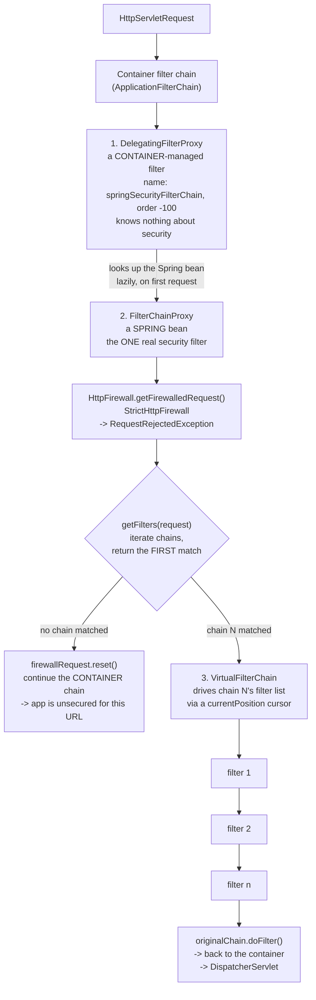
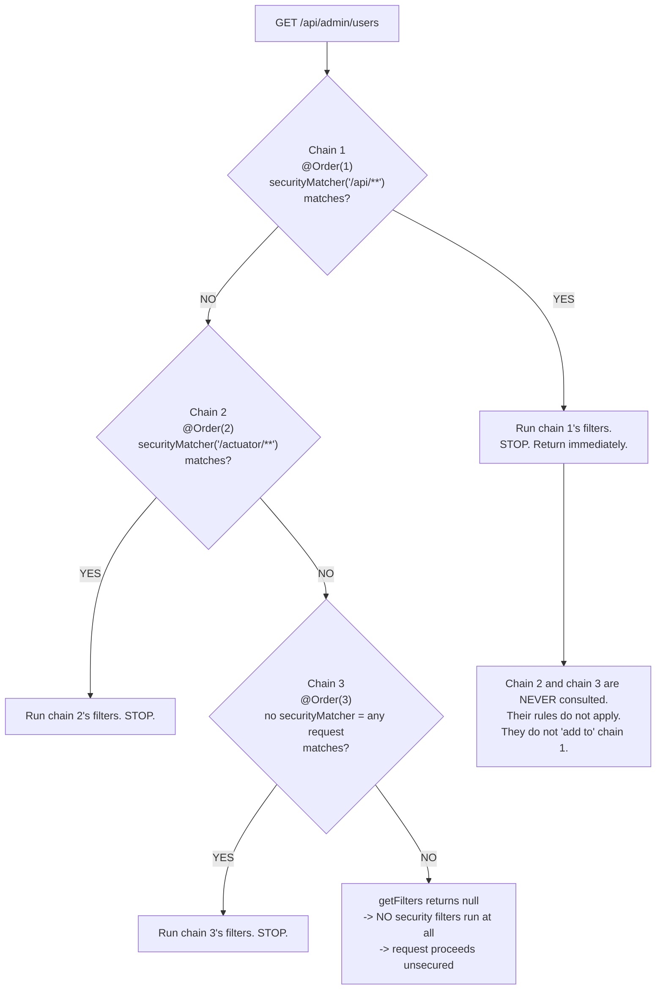
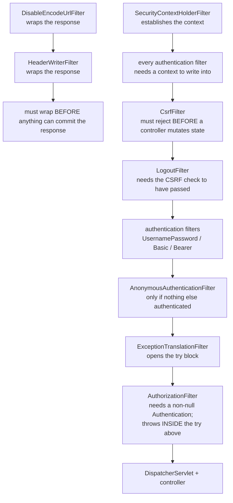
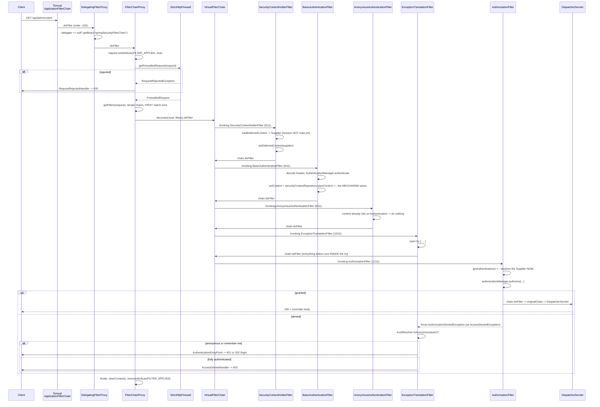

# 2.3 — The Security Filter Chain

> **Module 2 · Topic 3** · Spring Security Fundamentals
> Baseline: Spring Security 6.x on Boot 3.x
> New to this? Read **In Plain English** below first, then come back to the Version Matrix.

---

## Version Matrix

| Concern | Spring Security 5.x | **Spring Security 6.x (baseline)** | Spring Security 7.x |
|---|---|---|---|
| Container entry point | `DelegatingFilterProxy` → `FilterChainProxy` | **same** | same |
| Chain definition | `WebSecurityConfigurerAdapter` or `SecurityFilterChain` bean | **`SecurityFilterChain` bean only** | `SecurityFilterChain` bean only |
| Context filter | `SecurityContextPersistenceFilter` (loads **and saves**) | **`SecurityContextHolderFilter`** (loads only) | same |
| Authorization filter | `FilterSecurityInterceptor` + `AccessDecisionManager` | **`AuthorizationFilter` + `AuthorizationManager`** | `AuthorizationFilter` only; `FilterSecurityInterceptor` removed |
| Dispatcher types authorized | `REQUEST` only by default | **all dispatcher types** (`filterErrorDispatch` / `filterAsyncDispatch` default `true`) | same |
| Denial exception | `AccessDeniedException` | `AuthorizationDeniedException extends AccessDeniedException` (6.3+), carrying the `AuthorizationResult` | same |
| Unreachable-chain check | none — a catch-all chain silently killed later chains | **startup failure since 6.2** if an "any request" chain is not last | same |
| Chain-selection decoration | direct `VirtualFilterChain` | **`FilterChainProxy.FilterChainDecorator`** (pluggable; default `VirtualFilterChainDecorator`) | same |
| URL matcher for `requestMatchers(String...)` | `AntPathRequestMatcher` / `MvcRequestMatcher` | **`MvcRequestMatcher` when Spring MVC is present, else `AntPathRequestMatcher`** | `PathPatternRequestMatcher`; the other two are removed |
| `HttpFirewall` default | `StrictHttpFirewall` | **`StrictHttpFirewall`** | `StrictHttpFirewall` |

---

## Why This Exists

Everything Spring Security does at the HTTP level happens inside one ordered list of servlet
filters. If you cannot name that list and say what each entry does, you will configure the
framework by trial and error, and you will not be able to answer the three questions that come
up in every real debugging session:

- *Why does my rule not apply?* Almost always chain **selection** — a different
  `SecurityFilterChain` matched first.
- *Why does my custom filter not see an authentication?* Almost always **ordering** — it runs
  before the filter that establishes one, or after the filter that consumes it.
- *Why is the response a 302 when I expected a 401?* Almost always the interaction between
  `ExceptionTranslationFilter` and `AuthorizationFilter`, mediated by
  `AuthenticationTrustResolver`.

There is a second, more conceptual reason. The filter chain is where Spring Security's
architecture is legible. The framework does not have a monolithic "security engine"; it has
sixteen or so small filters, each with one responsibility, composed in an order that encodes
the dependencies between them. Header writing must be registered before anything can commit a
response. CSRF validation must happen before a state-changing request reaches a controller.
Exception translation must be *outside* authorization on the call stack. Once you see the order
as a dependency graph rather than a list, the configuration stops being arbitrary.

---

## In Plain English

**The one-line version:** Spring Security is an ordered line of about sixteen small checkpoints,
each doing one job, and nearly every problem you will have with it comes down to which line the
request was sent down or where in that line your own code sits.

**An analogy.** Airport security is the right picture here, and it holds up unusually well.

You arrive at the terminal and you are directed to one of several lanes: the ordinary lane, the
priority lane, the crew lane. A member of staff looks at you once and points you at exactly one
lane. You do not go through the ordinary lane and then also the priority lane; you go through one.
That is chain selection, and it is the single most common source of the complaint "my configuration
is being ignored" — the request went down a different lane from the one you configured.

Inside your lane there is a fixed sequence of checkpoints, and the sequence is not arbitrary. The
boarding-pass scanner has to come before the gate agent, because the gate agent needs to know who
you are. The bag scanner cannot come after you have boarded. Any one checkpoint can turn you back,
and if it does, none of the later ones ever learn you were there.

Two more details complete the picture. Before you even reach the lane-assignment desk, there is a
guard on the terminal door turning away anyone whose documents are obviously malformed — that is the
firewall, and it rejects strange-looking URLs before any lane is chosen. And each checkpoint is
really a person who walks you to the next one and waits for you to come back, which is why the very
first checkpoint in the line is the one positioned to notice when something goes wrong at the last.

**How it actually works, step by step.**

There are three layers between the web server and the security code, and each exists for a reason.
The web server only knows about plain filters and nothing about Spring, so
`DelegatingFilterProxy` is registered with it as a thin stand-in whose only job is to look up a
Spring-managed object and hand the request over. That object is `FilterChainProxy`, and it is the
one real security filter in your application. Its job is to choose which chain applies and run it.
The actual running is done by an internal helper called `VirtualFilterChain`, which walks the list
one entry at a time.

A `SecurityFilterChain` is a pairing of two things: a rule about which requests it handles, and the
ordered list of checkpoints to run for them. You create these by writing configuration methods, and
you can have several — for instance one for `/api/**` that expects tokens and one for everything
else that shows a login page.

Chain selection is where beginners lose the most time, so it is worth stating bluntly. Spring picks
the **first** chain whose rule matches, and runs only that one. Chains do not combine, and later
chains do not add to earlier ones. So if your first chain is a catch-all matching every URL, every
chain after it is dead code that will never run, and no error is raised to tell you. The rule of
thumb is to declare the most specific rules first and let the catch-all be last.

Before any of that, the request passes through the `StrictHttpFirewall`, which rejects URLs
containing suspicious constructs such as a semicolon, a double slash, or an encoded slash. It does
this by returning a `400`, which is why a legitimate-looking URL can fail before reaching any
configuration you wrote.

The default list of checkpoints runs roughly in this sequence. First come the ones that set things
up: loading the identity from wherever it was stored, and registering the response headers that
will be written later. Then come the ones that check the request itself, such as CSRF validation.
Then the ones that establish identity from presented credentials — the form login filter, the HTTP
Basic filter, a bearer token filter. Then a filter that installs a placeholder identity meaning
"nobody" if nothing else authenticated, so that later code never has to handle an empty value.
Then `ExceptionTranslationFilter`, which does nothing on the way in and exists purely to catch
security failures thrown later. And finally `AuthorizationFilter`, which applies your URL rules and
refuses the request if they are not satisfied.

The ordering of the last two deserves a sentence of its own, because it looks backwards. How can a
filter that appears *earlier* in the list catch an exception thrown by one that appears *later*?
Because the list is a nesting, not a conveyor belt. Each filter calls the next one from inside its
own code, so everything later in the list executes inside the earlier filter's call — and therefore
inside its error handling. Earlier in the list means further outside.

When you add a filter of your own, you position it relative to a known one, using
`addFilterBefore` or `addFilterAfter`. The requirement is not really about the specific landmark you
name; it is that your filter must run after the identity has been set up and before the
authorization filter has made its decision. Put it after the authorization filter and every request
will be refused even though your filter clearly ran and clearly found valid credentials — because
the verdict was reached before your filter spoke.

One historical correction matters, because most tutorials online still have it wrong. Spring
Security 5 had a filter called `SecurityContextPersistenceFilter` which both loaded the identity and
saved it back at the end of every request. Version 6 replaced it with `SecurityContextHolderFilter`,
which only loads. Saving is now the explicit responsibility of whatever authenticated the user.

**Why should a beginner care?** Almost all early confusion with this framework is one of three
things, and all three live here. Your rule does not apply because a different chain matched first.
Your custom filter sees no logged-in user because it runs at the wrong point in the line. Your API
answers with a redirect to a login page instead of a clean `401` because of how the last two filters
interact. Knowing how to print the actual list and read it turns each of these into a two-minute
diagnosis instead of an afternoon.

**Words you will meet in this file**

| Term | In plain words |
|---|---|
| Servlet filter | A checkpoint that runs before and after your application code and can refuse to pass a request on. |
| `DelegatingFilterProxy` | The thin filter the web server registers, whose only job is to hand off to a Spring object. |
| `FilterChainProxy` | The single real security filter: it picks which chain applies and runs it. |
| `SecurityFilterChain` | One pairing of "which requests do I handle" with "which checkpoints do I run". |
| `VirtualFilterChain` | The internal helper that walks the chosen list of filters one at a time. |
| `RequestMatcher` | The rule deciding whether a request matches — usually a URL pattern such as `/api/**`. |
| `securityMatcher` | How you declare which URLs a whole chain is responsible for. |
| Chain selection | Choosing one chain. The first match wins, and no other chain runs. |
| `@Order` | The annotation deciding which chain is considered first when you have several. |
| `HttpFirewall` / `StrictHttpFirewall` | A guard that rejects suspicious-looking URLs with a `400` before any chain is chosen. |
| `SecurityContextHolderFilter` | The filter that loads the stored identity at the start of a request. It does not save. |
| `HeaderWriterFilter` | The filter that arranges for the protective response headers to be written. |
| `CsrfFilter` | The filter that validates the anti-forgery token on state-changing requests. |
| `UsernamePasswordAuthenticationFilter` | The filter handling a submitted login form. Also the usual landmark for inserting your own. |
| `BasicAuthenticationFilter` | The filter handling credentials sent in the `Authorization: Basic` header. |
| `AnonymousAuthenticationFilter` | The filter installing a placeholder "nobody" identity so later code never sees an empty value. |
| `ExceptionTranslationFilter` | An outer filter that catches security failures thrown later and converts them to a response. |
| `AuthorizationFilter` | The final checkpoint, applying your URL rules and refusing the request if they fail. |
| `addFilterBefore` / `addFilterAfter` | How you insert your own filter at a chosen point relative to a known one. |
| `FilterOrderRegistration` | The framework's fixed ordering table, which is why the order of your DSL calls does not matter. |

**If you remember only one thing:** Only one chain runs per request, the filters inside it run in a
fixed order that you cannot change by reordering your configuration calls, and where your own filter
sits in that order decides whether it works at all.

---

## Core Concepts

### 1. The Three Layers: `DelegatingFilterProxy`, `FilterChainProxy`, `VirtualFilterChain`

**In simple terms:** Three objects stand between the web server and the security code — one the
server understands, one that picks which rules apply, and one that walks through them in order.



**Layer 1 — `DelegatingFilterProxy`** (Spring Framework, not Spring Security). It solves a
lifecycle mismatch: the servlet container instantiates filters and knows nothing about the
Spring `ApplicationContext`, but Spring Security's filters need dependency injection, AOP, and
context-aware configuration. `DelegatingFilterProxy` is a thin container-managed filter that
looks up a Spring bean by name on first use and forwards to it.

```java
// org.springframework.web.filter.DelegatingFilterProxy (simplified)
@Override
public void doFilter(ServletRequest request, ServletResponse response, FilterChain filterChain)
        throws ServletException, IOException {

    Filter delegateToUse = this.delegate;
    if (delegateToUse == null) {
        this.delegateLock.lock();
        try {
            delegateToUse = this.delegate;
            if (delegateToUse == null) {
                WebApplicationContext wac = findWebApplicationContext();
                if (wac == null) {
                    throw new IllegalStateException("No WebApplicationContext found: ...");
                }
                delegateToUse = initDelegate(wac);      // getBean(targetBeanName, Filter.class)
            }
            this.delegate = delegateToUse;
        }
        finally {
            this.delegateLock.unlock();
        }
    }
    invokeDelegate(delegateToUse, request, response, filterChain);
}
```

The lookup is lazy and by **name** — `springSecurityFilterChain`, the value of
`AbstractSecurityWebApplicationInitializer.DEFAULT_FILTER_NAME`. That name is the contract
between `WebSecurityConfiguration` (which publishes the bean) and
`SecurityFilterAutoConfiguration` (which registers the proxy). Rename the bean and nothing
works, with a `NoSuchBeanDefinitionException` on the first request rather than at startup.

**Layer 2 — `FilterChainProxy`.** This is the only real security filter. It applies the
`HttpFirewall`, selects one `SecurityFilterChain`, runs it, and guarantees cleanup.

```java
// org.springframework.security.web.FilterChainProxy (simplified)
@Override
public void doFilter(ServletRequest request, ServletResponse response, FilterChain chain)
        throws IOException, ServletException {

    boolean clearContext = request.getAttribute(FILTER_APPLIED) == null;
    if (!clearContext) {
        // Nested invocation (e.g. a second dispatch): do not clear on the way out.
        doFilterInternal(request, response, chain);
        return;
    }
    try {
        request.setAttribute(FILTER_APPLIED, Boolean.TRUE);
        doFilterInternal(request, response, chain);
    }
    catch (Exception ex) {
        Throwable[] causeChain = this.throwableAnalyzer.determineCauseChain(ex);
        Throwable requestRejectedException = this.throwableAnalyzer
                .getFirstThrowableOfType(RequestRejectedException.class, causeChain);
        if (!(requestRejectedException instanceof RequestRejectedException)) {
            throw ex;
        }
        this.requestRejectedHandler.handle((HttpServletRequest) request,
                (HttpServletResponse) response, (RequestRejectedException) requestRejectedException);
    }
    finally {
        this.securityContextHolderStrategy.clearContext();   // NON-NEGOTIABLE: pooled threads
        request.removeAttribute(FILTER_APPLIED);
    }
}

private void doFilterInternal(ServletRequest request, ServletResponse response, FilterChain chain)
        throws IOException, ServletException {

    FirewalledRequest firewallRequest = this.firewall.getFirewalledRequest((HttpServletRequest) request);
    HttpServletResponse firewallResponse = this.firewall.getFirewalledResponse((HttpServletResponse) response);

    List<Filter> filters = getFilters(firewallRequest);

    if (filters == null || filters.isEmpty()) {
        // NO chain matched -> Spring Security does NOTHING for this request.
        firewallRequest.reset();
        this.filterChainDecorator.decorate(chain).doFilter(firewallRequest, firewallResponse);
        return;
    }

    FilterChain reset = (req, res) -> {
        firewallRequest.reset();
        chain.doFilter(req, res);
    };
    this.filterChainDecorator.decorate(reset, filters).doFilter(firewallRequest, firewallResponse);
}

private List<Filter> getFilters(HttpServletRequest request) {
    int count = 0;
    for (SecurityFilterChain chain : this.filterChains) {
        if (logger.isTraceEnabled()) {
            logger.trace(LogMessage.format("Trying to match request against %s (%d/%d)",
                    chain, ++count, this.filterChains.size()));
        }
        if (chain.matches(request)) {
            return chain.getFilters();       // FIRST MATCH WINS. Returns immediately.
        }
    }
    return null;
}
```

**Layer 3 — `VirtualFilterChain`.** A `FilterChain` implementation that walks the selected
chain's filter list with a cursor, passing *itself* as the chain to each filter.

```java
// org.springframework.security.web.FilterChainProxy.VirtualFilterChain
private static final class VirtualFilterChain implements FilterChain {

    private final FilterChain originalChain;

    private final List<Filter> additionalFilters;

    private final int size;

    private int currentPosition = 0;

    private VirtualFilterChain(FilterChain chain, List<Filter> additionalFilters) {
        this.originalChain = chain;
        this.additionalFilters = additionalFilters;
        this.size = additionalFilters.size();
    }

    @Override
    public void doFilter(ServletRequest request, ServletResponse response)
            throws IOException, ServletException {

        if (this.currentPosition == this.size) {
            // Security chain exhausted -> hand back to the container's chain -> DispatcherServlet
            this.originalChain.doFilter(request, response);
            return;
        }
        this.currentPosition++;
        Filter nextFilter = this.additionalFilters.get(this.currentPosition - 1);
        if (logger.isTraceEnabled()) {
            logger.trace(LogMessage.format("Invoking %s (%d/%d)",
                    nextFilter.getClass().getSimpleName(), this.currentPosition, this.size));
        }
        nextFilter.doFilter(request, response, this);      // passes ITSELF as the FilterChain
    }
}
```

The whole mechanism is a hand-rolled iterator implemented as mutual recursion. Three
consequences:

- **The chain is a call stack, not a pipeline.** Filter 1's code after `chain.doFilter(...)`
  runs after filter 16, the `DispatcherServlet`, and your controller have all returned. This is
  the single most useful mental correction for reasoning about Spring Security, and it is the
  entire explanation for `ExceptionTranslationFilter`.
- **A Spring Security stack trace is deep.** Sixteen filters, each adding two or three frames,
  which is why the stack in an exception report looks alarming and is normal.
- **`currentPosition` is instance state, and the instance is created per request.** The
  `VirtualFilterChain` is constructed inside `doFilterInternal`, so there is no shared mutable
  state across requests. If it were a singleton, concurrent requests would trample each other's
  cursor — a good illustration of why per-request objects matter.

That `logger.trace("Invoking %s (%d/%d)")` line is the single most useful diagnostic in the
framework. Enable it with
`logging.level.org.springframework.security.web.FilterChainProxy=TRACE` and you get a numbered
list of exactly which filters ran, in order, for each request.

### 2. `SecurityFilterChain` and `DefaultSecurityFilterChain`

**In simple terms:** A chain is just two things bundled together — a rule saying which requests it
covers, and the ordered list of checkpoints to run for them.

```java
package org.springframework.security.web;

public interface SecurityFilterChain {

    boolean matches(HttpServletRequest request);

    List<Filter> getFilters();
}
```

Two methods: *do I handle this request?* and *what is my filter list?* That is the entire
contract. Everything in the `HttpSecurity` DSL exists to produce one instance of this
interface.

```java
// org.springframework.security.web.DefaultSecurityFilterChain
public final class DefaultSecurityFilterChain implements SecurityFilterChain {

    private static final Log logger = LogFactory.getLog(DefaultSecurityFilterChain.class);

    private final RequestMatcher requestMatcher;

    private final List<Filter> filters;

    public DefaultSecurityFilterChain(RequestMatcher requestMatcher, List<Filter> filters) {
        if (filters.isEmpty()) {
            logger.info(LogMessage.format("Will not secure %s", requestMatcher));
        }
        else {
            logger.info(LogMessage.format("Will secure %s with %s", requestMatcher, filters));
        }
        this.requestMatcher = requestMatcher;
        this.filters = new ArrayList<>(filters);
    }

    @Override
    public boolean matches(HttpServletRequest request) {
        return this.requestMatcher.matches(request);
    }

    @Override
    public List<Filter> getFilters() {
        return this.filters;
    }
}
```

Note the constructor logs at **INFO**, not DEBUG. Those `Will secure ... with [...]` lines are
in your startup log already — the reason nobody reads them is that the filter list is printed as
a single enormous line of fully-qualified class names with identity hashes.

Also note the `Will not secure` branch: a chain with an empty filter list. That is what
`WebSecurityCustomizer.ignoring()` produces, and it is why `ignoring()` is so dangerous — the
chain *matches*, so no later chain is consulted, and it runs zero filters. No headers, no CSRF,
no `SecurityContext`, no authorization, ever, regardless of what you later add to
`authorizeHttpRequests`.

### 3. Chain Selection — First Match Wins, And Chains Never Accumulate

**In simple terms:** Exactly one chain runs per request, so a catch-all declared first makes every
later chain unreachable, with no warning that your configuration is being skipped.

This is the highest-frequency source of "my configuration is being ignored".



The rules, stated so you can recite them:

1. **Chains are evaluated in `@Order` sequence.** `WebSecurityConfiguration.setFilterChains`
   sorts the injected `List<SecurityFilterChain>` with `AnnotationAwareOrderComparator`.
2. **The first chain whose `matches(request)` returns `true` is the only chain that runs.**
   `getFilters` returns on the first match.
3. **Rules do not accumulate across chains.** This is not `@RequestMapping`. If chain 1 matches
   and has no rule for `/api/admin/**`, the rule you wrote in chain 2 is irrelevant.
4. **A chain with no `securityMatcher` matches everything** and must therefore be last, and
   must be the only one.
5. **A bean with no `@Order` sorts as `LOWEST_PRECEDENCE`**, so it lands after every ordered
   chain — but its position relative to other unordered chains is undefined. With more than one
   chain, annotate all of them.
6. **If no chain matches, Spring Security does nothing.** The request continues down the
   container filter chain to your application with no authentication, no authorization, and no
   security headers. This is what `ignoring()` and a mis-scoped `securityMatcher` produce.

Since 6.2 the framework catches the most common form of mistake at startup:

```
java.lang.IllegalArgumentException: A filter chain that matches any request has already been
configured, which means that this filter chain [DefaultSecurityFilterChain ...] will never get
invoked. Please use `HttpSecurity#securityMatcher` to ensure that there is only one filter
chain configured for 'any request' and that the 'any request' filter chain is published last.
```

That check only covers "any request" chains. It cannot detect that `securityMatcher("/**")` at
`@Order(1)` shadows `securityMatcher("/api/**")` at `@Order(2)`, or that
`securityMatcher("/api/**")` shadows `securityMatcher("/api/admin/**")`. **Most specific
matcher first, catch-all last** is still on you.

`securityMatcher` accepts patterns or a `RequestMatcher`, which is how you do non-path-based
selection:

```java
// Path-based
http.securityMatcher("/api/**", "/webhooks/**");

// Method + path
http.securityMatcher(new AntPathRequestMatcher("/api/**", "POST"));

// Content negotiation: route JSON clients to the API chain regardless of path
http.securityMatcher(request -> {
    String accept = request.getHeader(HttpHeaders.ACCEPT);
    return accept != null && accept.contains(MediaType.APPLICATION_JSON_VALUE);
});

// Presence of a bearer token
http.securityMatcher(request -> {
    String auth = request.getHeader(HttpHeaders.AUTHORIZATION);
    return auth != null && auth.startsWith("Bearer ");
});
```

The last two are how you serve a browser and an API from the same URL space with different
authentication and different error responses — useful, and worth knowing, but I would reach for
distinct path prefixes first because they are self-documenting.

### 4. `HttpFirewall` and `StrictHttpFirewall`

**In simple terms:** A guard at the very front rejects URLs containing suspicious characters before
any of your rules are even consulted, which is why some legitimate-looking URLs return a `400`.

`FilterChainProxy` wraps the request before any chain is selected:

```java
package org.springframework.security.web.firewall;

public interface HttpFirewall {

    FirewalledRequest getFirewalledRequest(HttpServletRequest request) throws RequestRejectedException;

    HttpServletResponse getFirewalledResponse(HttpServletResponse response);
}
```

The default is `StrictHttpFirewall`, and its purpose is to eliminate a whole category of attack
before any matcher is evaluated: **request smuggling past your `RequestMatcher`s.** If an
attacker can express `/admin/delete` in a form your matcher does not recognise but your servlet
container does, your authorization rules are bypassed while appearing correct.

| Rejected by default | Why it is dangerous | Relaxation method |
|---|---|---|
| Methods outside `DELETE, GET, HEAD, OPTIONS, PATCH, POST, PUT` | exotic verbs (`TRACE`, `CONNECT`, WebDAV) reach code paths nobody reviewed | `setAllowedHttpMethods(...)` |
| `;` and `%3b` in the URL (path parameters) | `/admin;foo=bar/users` may be normalised differently by matcher and container | `setAllowSemicolon(true)` |
| `%2f` / `%2F` (encoded slash) | `/admin%2fdelete` does not match `/admin/**` in the matcher but may resolve to it in the container | `setAllowUrlEncodedSlash(true)` |
| `\` and `%5c` (backslash) | Windows path separator equivalence | `setAllowBackSlash(true)` |
| `%25` (encoded percent) | enables double-encoding attacks | `setAllowUrlEncodedPercent(true)` |
| `.` / `%2e` sequences implying traversal | `/api/../admin` | `setAllowUrlEncodedPeriod(true)` |
| `//` and encoded double slash | `//admin` normalises inconsistently | `setAllowUrlEncodedDoubleSlash(true)` |
| `%00` (null byte) | truncation attacks in downstream C libraries | — |
| non-printable ASCII in the path | control characters in logs and headers | — |
| header names/values with non-printable characters | header injection and log forging | `setAllowedHeaderNames/Values(...)` |
| a `Host` header outside the allowlist | host-header poisoning, cache poisoning, password-reset link hijacking | `setAllowedHostnames(...)` |

When it rejects, it throws `RequestRejectedException`, which `FilterChainProxy` catches and
passes to a `RequestRejectedHandler`:

```java
// Return a deliberate 400 rather than letting the exception become a 500.
@Bean
RequestRejectedHandler requestRejectedHandler() {
    return new HttpStatusRequestRejectedHandler();      // defaults to 400 BAD_REQUEST
}
```

This matters operationally. Historically the default handler rethrew the exception, which
propagated to the container and surfaced as a 500 with a stack trace in your logs — so a
firewall rejection looked like an application bug, and a scanner probing your URLs generated a
flood of ERROR-level noise. Installing `HttpStatusRequestRejectedHandler` makes the rejection an
intentional 400. I do this in every project.

**The rule for relaxing the firewall:** never relax it to make a URL work without first
understanding why the URL contains the character. A legitimate `;` in a path is almost always a
client bug or a URL-construction bug. If you genuinely need one — some legacy integrations send
matrix parameters — relax exactly that one setting, document why, and confirm your
`RequestMatcher`s still behave as intended with it present.

### 5. The Full Ordered Default Filter List for Spring Security 6.x

**In simple terms:** This is the actual line of checkpoints a request walks through, in the exact
order it walks through them, and the order is fixed by the framework rather than by your code.

This is the list produced by the Boot auto-configured chain (`formLogin` + `httpBasic` +
defaults). Order is fixed by `FilterOrderRegistration`, not by the order in which you call DSL
methods.

| # | Filter | Job | Present when |
|---|---|---|---|
| 1 | `DisableEncodeUrlFilter` | Wraps the response so `HttpServletResponse.encodeURL/encodeRedirectURL` becomes a no-op, preventing the session id being written into URLs (`;jsessionid=...`), where it leaks via `Referer`, logs, and bookmarks | always |
| 2 | `WebAsyncManagerIntegrationFilter` | Registers a `SecurityContextCallableProcessingInterceptor` on the `WebAsyncManager` so a controller returning `Callable` or `WebAsyncTask` keeps the `SecurityContext` on the async thread | always |
| 3 | `SecurityContextHolderFilter` | Obtains a **deferred** `SecurityContext` from the `SecurityContextRepository`, installs it via `setDeferredContext`, and **clears it in a `finally` block**. Does **not** save — see the correction below | always |
| 4 | `HeaderWriterFilter` | Wraps the response so the configured `HeaderWriter`s (HSTS, `X-Content-Type-Options`, `X-Frame-Options`, `Cache-Control`, `X-XSS-Protection: 0`, CSP if configured) fire before the response is committed | always |
| 5 | `CorsFilter` | Handles CORS preflight `OPTIONS` (short-circuiting them) and adds `Access-Control-*` to actual responses. Must run **before** `CsrfFilter` so a preflight never fails a CSRF check | only when CORS is configured |
| 6 | `CsrfFilter` | Loads or generates the `CsrfToken`, exposes it as a request attribute, and for unsafe methods (anything not `GET`/`HEAD`/`TRACE`/`OPTIONS`) compares the submitted token in constant time. Mismatch throws `AccessDeniedException` | when CSRF is enabled (default) |
| 7 | `LogoutFilter` | Matches the logout request (`POST /logout` by default) and, if matched, runs the `LogoutHandler`s — invalidate session, clear the context, delete cookies, remove remember-me — then the `LogoutSuccessHandler`. **Terminates the request** | when `logout` is configured (default with `formLogin`) |
| 8 | `UsernamePasswordAuthenticationFilter` | Matches `POST /login`, extracts `username`/`password`, builds an unauthenticated token, calls `AuthenticationManager`, applies `SessionAuthenticationStrategy` (session-fixation protection), **saves the context via `SecurityContextRepository`**, and invokes the success or failure handler | `formLogin()` |
| 9 | `DefaultLoginPageGeneratingFilter` | Renders the built-in HTML login page at `GET /login`, including the CSRF hidden field and any OAuth2/SAML2 provider links | `formLogin()` with no custom `loginPage` |
| 10 | `DefaultLogoutPageGeneratingFilter` | Renders a built-in `GET /logout` confirmation page containing a CSRF-protected `POST` form — because logout must not be a `GET` | `logout` with no custom logout page |
| 11 | `BasicAuthenticationFilter` | Parses `Authorization: Basic`, decodes base64, authenticates, saves the context, and on failure invokes `BasicAuthenticationEntryPoint` (`WWW-Authenticate: Basic realm="Realm"`) | `httpBasic()` |
| 12 | `RequestCacheAwareFilter` | Checks the `RequestCache` for a saved pre-authentication request matching this one and, if found, replays it — this is what returns you to the page you originally asked for after login | always |
| 13 | `SecurityContextHolderAwareRequestFilter` | Wraps the request so the Servlet API security methods (`getRemoteUser()`, `isUserInRole()`, `getUserPrincipal()`, `login()`, `logout()`, `authenticate()`) are backed by the `SecurityContext` | always |
| 14 | `AnonymousAuthenticationFilter` | If the context has **no** authentication, installs an `AnonymousAuthenticationToken` with principal `"anonymousUser"` and `ROLE_ANONYMOUS`, so downstream code never sees `null` | always (unless disabled) |
| 15 | `SessionManagementFilter` | Detects an authentication that appeared during the request without going through an authentication filter, and applies the `SessionAuthenticationStrategy`; also handles the invalid-session strategy | only when session management requires it — often **absent** in 6.x, and absent with `STATELESS` |
| 16 | `ExceptionTranslationFilter` | Wraps everything after it in a `try`. Catches `AuthenticationException` → `AuthenticationEntryPoint`; catches `AccessDeniedException` → `AccessDeniedHandler`, **unless** the authentication is anonymous or remember-me, in which case it starts authentication instead | always |
| 17 | `AuthorizationFilter` | Evaluates `authorizeHttpRequests` rules through the composed `AuthorizationManager`. A denial throws `AuthorizationDeniedException` (an `AccessDeniedException`), caught by #16 | always |

Filters you will see in a fuller configuration, in their registered positions:

| Filter | Where | Job |
|---|---|---|
| `ForceEagerSessionCreationFilter` | after #1 | forces session creation up front, for legacy code that needs a session before authentication |
| `ChannelProcessingFilter` | after `ForceEagerSessionCreationFilter` | `requiresChannel()` — redirects HTTP to HTTPS |
| `OAuth2AuthorizationRequestRedirectFilter` | after `LogoutFilter` | starts the OAuth2 authorization-code flow |
| `Saml2WebSsoAuthenticationRequestFilter` | after the OAuth2 redirect filter | starts a SAML2 AuthnRequest |
| `X509AuthenticationFilter` | before `UsernamePasswordAuthenticationFilter` | client-certificate authentication |
| `AbstractPreAuthenticatedProcessingFilter` | before `UsernamePasswordAuthenticationFilter` | identity already established upstream (SiteMinder, a gateway header) |
| `OAuth2LoginAuthenticationFilter` | before `UsernamePasswordAuthenticationFilter` | processes the OAuth2 callback |
| `ConcurrentSessionFilter` | after the login-page filters | enforces the maximum-sessions policy and expires sessions |
| `BearerTokenAuthenticationFilter` | before `BasicAuthenticationFilter` | `Authorization: Bearer` for a resource server |
| `DigestAuthenticationFilter` | before `BasicAuthenticationFilter` | HTTP Digest |
| `RememberMeAuthenticationFilter` | before `AnonymousAuthenticationFilter` | authenticates from the remember-me cookie |
| `OAuth2AuthorizationCodeGrantFilter` | before `SessionManagementFilter` | the client-side authorization-code grant |
| `SwitchUserFilter` | last, after `AuthorizationFilter` | `/login/impersonate` — user switching |

### 6. Why The Order Is What It Is

**In simple terms:** The sequence is not arbitrary — each checkpoint needs something an earlier one
produced, so the list is really a set of "this must happen before that" requirements.

The order is a dependency graph. Read it as a sequence of "X must be before Y because":



The individual constraints, each of which breaks something concrete if violated:

**Response-wrapping filters must be first.** `DisableEncodeUrlFilter` and `HeaderWriterFilter`
wrap the response. Once any downstream code writes and flushes, the response is committed and
headers can no longer be added. Putting `HeaderWriterFilter` late means your HSTS and
`X-Frame-Options` headers silently vanish on some responses.

**`SecurityContextHolderFilter` must precede every authentication filter.** Authentication
filters write to the holder; if the context filter ran later it would overwrite their work with
the (empty) persisted context. It must also be early enough that its `finally` clear wraps
everything, so no context leaks onto a pooled thread.

**`CorsFilter` before `CsrfFilter`.** A CORS preflight is an `OPTIONS` request with no
credentials and no CSRF token. `CsrfFilter` treats `OPTIONS` as safe so it would pass anyway,
but the preflight must be *answered and short-circuited* before anything else evaluates it —
otherwise authentication filters and authorization rules see a credential-less request and
reject it, and the browser reports a CORS failure that has nothing to do with CORS.

**`CsrfFilter` early, before anything that changes state.** Its whole purpose is to stop a
forged state-changing request from reaching the handler. Late placement means the damage is
already done.

**`LogoutFilter` before the authentication filters.** Logout is processed on the way in and
terminates the request; there is no point authenticating a request whose entire purpose is to
end the session.

**`AnonymousAuthenticationFilter` after every real authentication filter.** It only acts when
the context is empty. Earlier placement means it installs an anonymous token that a later
authentication filter then has to overwrite, and any filter in between sees the wrong identity.

**`ExceptionTranslationFilter` before `AuthorizationFilter`.** The crucial one, covered in
detail in section 8.

**`AuthorizationFilter` last.** It needs the final authentication, after every authentication
mechanism and after anonymous fallback. It is also the last chance to reject before the request
reaches Spring MVC.

### 7. Printing The Chain — Three Reliable Methods

**In simple terms:** Rather than guessing where your filter ended up, you can make the application
print the real list at startup, which turns most debugging into simply reading the output.

**Method 1 — the `Will secure` INFO lines.** Already in your startup log, from
`DefaultSecurityFilterChain`'s constructor. Raise the level to see everything:

```properties
logging.level.org.springframework.security=DEBUG
logging.level.org.springframework.security.web.DefaultSecurityFilterChain=INFO
```

```
INFO  o.s.s.web.DefaultSecurityFilterChain : Will secure Ant [pattern='/api/**'] with [
  org.springframework.security.web.session.DisableEncodeUrlFilter@1a2b3c,
  org.springframework.security.web.context.request.async.WebAsyncManagerIntegrationFilter@4d5e6f,
  org.springframework.security.web.context.SecurityContextHolderFilter@7a8b9c, ...]
```

**Method 2 — per-request `Invoking` trace.** The most useful one when a filter is not running:

```properties
logging.level.org.springframework.security.web.FilterChainProxy=TRACE
```

```
TRACE o.s.security.web.FilterChainProxy : Trying to match request against DefaultSecurityFilterChain [
                                          Ant [pattern='/api/**']] (1/3)
TRACE o.s.security.web.FilterChainProxy : Securing GET /api/orders
TRACE o.s.security.web.FilterChainProxy : Invoking DisableEncodeUrlFilter (1/12)
TRACE o.s.security.web.FilterChainProxy : Invoking WebAsyncManagerIntegrationFilter (2/12)
TRACE o.s.security.web.FilterChainProxy : Invoking SecurityContextHolderFilter (3/12)
...
TRACE o.s.security.web.FilterChainProxy : Invoking AuthorizationFilter (12/12)
TRACE o.s.security.web.FilterChainProxy : Secured GET /api/orders
```

This tells you which chain matched (`1/3`), how many filters it has (`12`), and whether your
custom filter is in the list and where.

**Method 3 — dump it programmatically.** The version I actually keep in projects, because the
output is readable:

```java
@Bean
@Profile("!prod")
ApplicationRunner printSecurityChains(FilterChainProxy proxy) {
    return args -> {
        var log = LoggerFactory.getLogger("SecurityChains");
        var chains = proxy.getFilterChains();
        log.info("{} SecurityFilterChain(s), evaluated in this order:", chains.size());
        for (int i = 0; i < chains.size(); i++) {
            var chain = chains.get(i);
            String matcher = (chain instanceof DefaultSecurityFilterChain dsfc)
                    ? dsfc.getRequestMatcher().toString() : "any request";
            log.info("  [{}] {}  ({} filters)", i, matcher, chain.getFilters().size());
            var filters = chain.getFilters();
            for (int j = 0; j < filters.size(); j++) {
                log.info("        {}. {}", j + 1, filters.get(j).getClass().getSimpleName());
            }
        }
    };
}
```

A fourth option worth knowing: `/actuator/mappings` lists the container's servlet filter
registrations, which is how you confirm `springSecurityFilterChain` is registered at order
`-100` and catch a double-registered custom filter.

What I would **not** use is `@EnableWebSecurity(debug = true)`. `DebugFilter` logs request
headers, which means `Authorization` and `Cookie` end up in your log aggregator.

### 8. `addFilterBefore` / `addFilterAfter` / `addFilterAt`

**In simple terms:** These are how you slot your own checkpoint into the line, by naming a known one
to sit next to — and note that "at" inserts alongside rather than replacing.

```java
// org.springframework.security.config.annotation.web.builders.HttpSecurity
public HttpSecurity addFilterBefore(Filter filter, Class<? extends Filter> beforeFilter) {
    return addFilterAtOffsetOf(filter, -1, beforeFilter);
}

public HttpSecurity addFilterAfter(Filter filter, Class<? extends Filter> afterFilter) {
    return addFilterAtOffsetOf(filter, 1, afterFilter);
}

public HttpSecurity addFilterAt(Filter filter, Class<? extends Filter> atFilter) {
    return addFilterAtOffsetOf(filter, 0, atFilter);
}

public HttpSecurity addFilter(Filter filter) {
    Integer order = this.filterOrders.getOrder(filter.getClass());
    if (order == null) {
        throw new IllegalArgumentException("The Filter class " + filter.getClass().getName()
            + " does not have a registered order and cannot be added without a specified order. "
            + "Consider using addFilterBefore or addFilterAfter instead.");
    }
    this.filters.add(new OrderedFilter(filter, order));
    return this;
}
```

`FilterOrderRegistration` assigns each known filter type an integer, starting at
`INITIAL_ORDER = 100` and stepping by `ORDER_STEP = 100`. The offsets above are `-1`, `0`, and
`+1` against that number, which means there is room for ninety-nine filters between any two
registered positions — you will not collide.

| API | Effect | Gotcha |
|---|---|---|
| `addFilterBefore(f, X.class)` | order = order(X) − 1 | if `X` is not in the chain (e.g. `UsernamePasswordAuthenticationFilter` without `formLogin()`), the *order number* still resolves, so your filter lands in the right relative position anyway |
| `addFilterAfter(f, X.class)` | order = order(X) + 1 | same |
| `addFilterAt(f, X.class)` | order = order(X) | **does not replace `X`.** Both filters are in the list; relative order between them is not something you should rely on |
| `addFilter(f)` | uses the registered order for `f`'s own type | throws `IllegalArgumentException` for an unknown type — which is a good error, because guessing an order silently would be worse |

**The window a custom authentication filter must land in:**

```
AFTER   SecurityContextHolderFilter   -- so a context exists to write into,
                                         and so it will be cleared on the way out
BEFORE  AuthorizationFilter           -- so the authentication exists when rules are evaluated
```

`UsernamePasswordAuthenticationFilter` sits comfortably inside that window and is the position
everyone recognises, which is worth something for maintainability. It is a landmark, not a
requirement.

If you *replace* a standard filter rather than add one, the correct form is
`addFilterAt(myFilter, UsernamePasswordAuthenticationFilter.class)` combined with **not
configuring** `formLogin()`, so the filter you are replacing is never added in the first place.
Using `addFilterAt` while `formLogin()` is active leaves both filters in the chain.

### 9. Why `ExceptionTranslationFilter` (Earlier) Catches What `AuthorizationFilter` (Later) Throws

**In simple terms:** The list is a set of nested calls rather than a conveyor belt, so being earlier
in the list actually means being wrapped around everything that comes after it.

Because the filter chain is a **call stack**, and "earlier in the list" means "**outside** on
the stack".

```
ExceptionTranslationFilter.doFilter
  try {
      chain.doFilter(request, response)
        |
        +-- AuthorizationFilter.doFilter          <-- executes INSIDE the try
        |     +-- DispatcherServlet
        |           +-- HandlerInterceptor.preHandle
        |                 +-- method security AOP (@PreAuthorize)
        |                       +-- your controller
        |
        +-- AuthorizationFilter throws AuthorizationDeniedException
      // ^ propagates up the stack, out of chain.doFilter(...), into the catch below
  }
  catch (Exception ex) {
      // -> AuthenticationEntryPoint (401 / redirect) or AccessDeniedHandler (403)
  }
```

```java
// org.springframework.security.web.access.ExceptionTranslationFilter (simplified)
private void doFilter(HttpServletRequest request, HttpServletResponse response, FilterChain chain)
        throws IOException, ServletException {
    try {
        chain.doFilter(request, response);       // EVERYTHING downstream runs here
    }
    catch (IOException ex) {
        throw ex;
    }
    catch (Exception ex) {
        // Walk the cause chain: the exception may be wrapped in a ServletException.
        Throwable[] causeChain = this.throwableAnalyzer.determineCauseChain(ex);
        RuntimeException securityException = (AuthenticationException) this.throwableAnalyzer
                .getFirstThrowableOfType(AuthenticationException.class, causeChain);
        if (securityException == null) {
            securityException = (AccessDeniedException) this.throwableAnalyzer
                    .getFirstThrowableOfType(AccessDeniedException.class, causeChain);
        }
        if (securityException == null) {
            rethrow(ex);                         // not ours - let it propagate
        }
        if (response.isCommitted()) {
            throw new ServletException(
                "Unable to handle the Spring Security Exception because the response is already committed.", ex);
        }
        handleSpringSecurityException(request, response, chain, securityException);
    }
}

private void handleSpringSecurityException(HttpServletRequest request, HttpServletResponse response,
        FilterChain chain, RuntimeException exception) throws IOException, ServletException {

    if (exception instanceof AuthenticationException) {
        sendStartAuthentication(request, response, chain, (AuthenticationException) exception);
    }
    else if (exception instanceof AccessDeniedException) {
        Authentication authentication = this.securityContextHolderStrategy.getContext().getAuthentication();
        boolean isAnonymous = this.authenticationTrustResolver.isAnonymous(authentication);
        if (isAnonymous || this.authenticationTrustResolver.isRememberMe(authentication)) {
            // Not really logged in -> ask them to, rather than a flat 403.
            sendStartAuthentication(request, response, chain,
                new InsufficientAuthenticationException("Full authentication is required to access this resource"));
        }
        else {
            this.accessDeniedHandler.handle(request, response, (AccessDeniedException) exception);
        }
    }
}
```

```java
// org.springframework.security.web.access.intercept.AuthorizationFilter (simplified)
@Override
public void doFilter(ServletRequest servletRequest, ServletResponse servletResponse, FilterChain chain)
        throws ServletException, IOException {

    HttpServletRequest request = (HttpServletRequest) servletRequest;
    HttpServletResponse response = (HttpServletResponse) servletResponse;

    if (this.observeOncePerRequest && isApplied(request)) {
        chain.doFilter(request, response);
        return;
    }
    if (skipDispatch(request)) {                 // false by default for ERROR and ASYNC in 6.x
        chain.doFilter(request, response);
        return;
    }
    String alreadyFilteredAttributeName = getAlreadyFilteredAttributeName();
    request.setAttribute(alreadyFilteredAttributeName, Boolean.TRUE);
    try {
        AuthorizationResult result = this.authorizationManager.authorize(this::getAuthentication, request);
        this.eventPublisher.publishAuthorizationEvent(this::getAuthentication, request, result);
        if (result != null && !result.isGranted()) {
            throw new AuthorizationDeniedException("Access Denied", result);
        }
        chain.doFilter(request, response);
    }
    finally {
        request.removeAttribute(alreadyFilteredAttributeName);
    }
}

private Authentication getAuthentication() {
    Authentication authentication = this.securityContextHolderStrategy.getContext().getAuthentication();
    if (authentication == null) {
        throw new AuthenticationCredentialsNotFoundException(
                "An Authentication object was not found in the SecurityContext");
    }
    return authentication;
}
```

Four things fall out of reading these together:

**Three important details in `ExceptionTranslationFilter`.** It walks the **cause chain** with
`ThrowableAnalyzer`, so an `AccessDeniedException` wrapped inside a `ServletException` by an
intermediate layer is still found. It refuses to act if the response is already committed,
throwing `ServletException` instead — which is why a filter that writes to the response before
a denial produces a confusing secondary error rather than your 403 page. And it only handles
those two exception types; everything else is rethrown.

**An `AccessDeniedException` does not always become a 403.** If the current authentication is
anonymous or remember-me, Spring converts it into an authentication challenge. This is the
complete explanation for "my REST API returns 302 to `/login` instead of 401".

**It catches denials from method security too.** `@PreAuthorize` throws
`AccessDeniedException` inside the dispatch, which is still inside the `try`. But
`DispatcherServlet`'s `HandlerExceptionResolver` chain runs first, so a
`@RestControllerAdvice` handling `AccessDeniedException` intercepts it and
`ExceptionTranslationFilter` never sees it — giving you two different response shapes for the
same logical failure depending on where the denial originated. Pick one place to handle it.

**`ExceptionTranslationFilter` is passive on the way in.** It does nothing except open a `try`
block. That is why its position in the list looks arbitrary until you think in terms of the
stack.

### 10. The Correction: `SecurityContextPersistenceFilter` Is Not In This List

**In simple terms:** The filter most tutorials still name was removed in version 6, and its
replacement only loads the identity instead of also saving it, which changes what your code must do.

Older notes and a great many tutorials list `SecurityContextPersistenceFilter` at position 3.
On Spring Security 6 that is wrong, and the difference is a favourite interview question.

| | 5.x `SecurityContextPersistenceFilter` | 6.x `SecurityContextHolderFilter` |
|---|---|---|
| Load | **eager** — reads the repository on every request | **lazy** — installs a `Supplier` via `setDeferredContext` |
| Save | **implicit, in `finally`, on every request** | **never — there is no `saveContext` call in the filter** |
| Who saves | the filter | **the authentication mechanism** |
| Session touched by an anonymous `permitAll` request | yes | no |
| `SecurityContextHolder.getContext().setAuthentication(a)` persists | **yes** | **no** |
| Response wrapping to save before commit | yes (`SaveToSessionResponseWrapper`) | not needed |

```java
// 5.x - SecurityContextPersistenceFilter (simplified). Note the finally block.
public void doFilter(ServletRequest req, ServletResponse res, FilterChain chain) {
    HttpRequestResponseHolder holder = new HttpRequestResponseHolder(request, response);
    SecurityContext contextBeforeChainExecution = this.repo.loadContext(holder);   // EAGER
    try {
        SecurityContextHolder.setContext(contextBeforeChainExecution);
        chain.doFilter(holder.getRequest(), holder.getResponse());
    }
    finally {
        SecurityContext contextAfterChainExecution = SecurityContextHolder.getContext();
        SecurityContextHolder.clearContext();
        this.repo.saveContext(contextAfterChainExecution,                           // IMPLICIT SAVE
                holder.getRequest(), holder.getResponse());
        request.removeAttribute(FILTER_APPLIED);
    }
}

// 6.x - SecurityContextHolderFilter (simplified). No save anywhere.
private void doFilter(HttpServletRequest request, HttpServletResponse response, FilterChain chain) {
    if (request.getAttribute(FILTER_APPLIED) != null) {
        chain.doFilter(request, response);
        return;
    }
    request.setAttribute(FILTER_APPLIED, Boolean.TRUE);
    Supplier<SecurityContext> deferredContext =
            this.securityContextRepository.loadDeferredContext(request);            // LAZY
    try {
        this.securityContextHolderStrategy.setDeferredContext(deferredContext);
        chain.doFilter(request, response);
    }
    finally {
        this.securityContextHolderStrategy.clearContext();
        request.removeAttribute(FILTER_APPLIED);
    }
}
```

Saving is now owned by whichever filter performed the authentication:

```java
// AbstractAuthenticationProcessingFilter.successfulAuthentication (6.x)
protected void successfulAuthentication(HttpServletRequest request, HttpServletResponse response,
        FilterChain chain, Authentication authResult) throws IOException, ServletException {
    SecurityContext context = this.securityContextHolderStrategy.createEmptyContext();
    context.setAuthentication(authResult);
    this.securityContextHolderStrategy.setContext(context);
    this.securityContextRepository.saveContext(context, request, response);   // <-- the mechanism saves
    this.rememberMeServices.loginSuccess(request, response, authResult);
    if (this.eventPublisher != null) {
        this.eventPublisher.publishEvent(new InteractiveAuthenticationSuccessEvent(authResult, getClass()));
    }
    this.successHandler.onAuthenticationSuccess(request, response, authResult);
}
```

**Why the change:** no session read on requests that do not need identity (a real saving with
Spring Session on Redis, where it is a network round trip per request); no accidental session
creation from anonymous and health-check traffic; and one findable save call site per mechanism
instead of an implicit one in a `finally` block.

**What it breaks, and this is the part to remember:** any code that authenticated by assigning
to the holder and relying on the implicit save now works for the current request and is gone on
the next one. The usual sites are a hand-written authentication filter, auto-login after
registration, an impersonation feature, and a second factor completing a partial
authentication. The symptom is "users are logged out at random", with no exception and no log
line, because the authentication genuinely succeeded. The fix is an explicit
`securityContextRepository.saveContext(context, request, response)`. There is a deprecated
compatibility switch, `securityContext(sc -> sc.requireExplicitSave(false))`, which restores
the old filter globally; it is a mitigation, not a destination.

---

## Working Code

Three chains, a custom filter in the correct window, a hardened firewall, and a deliberate 400
for firewall rejections.

```java
package com.example.security;

import org.springframework.context.annotation.Bean;
import org.springframework.context.annotation.Configuration;
import org.springframework.core.annotation.Order;
import org.springframework.http.HttpStatus;
import org.springframework.security.authentication.AuthenticationManager;
import org.springframework.security.config.Customizer;
import org.springframework.security.config.annotation.web.builders.HttpSecurity;
import org.springframework.security.config.annotation.web.configuration.EnableWebSecurity;
import org.springframework.security.config.annotation.web.configuration.WebSecurityCustomizer;
import org.springframework.security.config.http.SessionCreationPolicy;
import org.springframework.security.web.SecurityFilterChain;
import org.springframework.security.web.authentication.HttpStatusEntryPoint;
import org.springframework.security.web.authentication.UsernamePasswordAuthenticationFilter;
import org.springframework.security.web.context.RequestAttributeSecurityContextRepository;
import org.springframework.security.web.firewall.HttpFirewall;
import org.springframework.security.web.firewall.HttpStatusRequestRejectedHandler;
import org.springframework.security.web.firewall.RequestRejectedHandler;
import org.springframework.security.web.firewall.StrictHttpFirewall;

import java.util.List;

@Configuration
@EnableWebSecurity
public class FilterChainConfig {

    /**
     * Chain 1: stateless API.
     *
     * Filter list for this chain (order fixed by FilterOrderRegistration, NOT by the order
     * of the DSL calls below):
     *   1. DisableEncodeUrlFilter
     *   2. WebAsyncManagerIntegrationFilter
     *   3. SecurityContextHolderFilter
     *   4. HeaderWriterFilter
     *   5. CorsFilter                         (because .cors(...) is configured)
     *   -  CsrfFilter                         ABSENT: csrf disabled
     *   -  LogoutFilter                        ABSENT: no logout configured
     *   6. ApiKeyAuthenticationFilter          <-- ours, via addFilterBefore
     *   7. RequestCacheAwareFilter
     *   8. SecurityContextHolderAwareRequestFilter
     *   9. AnonymousAuthenticationFilter
     *  10. ExceptionTranslationFilter
     *  11. AuthorizationFilter
     */
    @Bean
    @Order(1)
    SecurityFilterChain apiChain(HttpSecurity http, AuthenticationManager manager) throws Exception {

        var apiKeyFilter = new ApiKeyAuthenticationFilter(manager);

        http
            .securityMatcher("/api/**")
            .cors(Customizer.withDefaults())
            .csrf(csrf -> csrf.disable())              // no ambient credentials on this chain
            .sessionManagement(s -> s.sessionCreationPolicy(SessionCreationPolicy.STATELESS))
            // Explicit: nothing crosses requests, but the context survives ERROR/ASYNC dispatches.
            .securityContext(sc -> sc
                .securityContextRepository(new RequestAttributeSecurityContextRepository()))
            .authorizeHttpRequests(auth -> auth
                // /error MUST be permitted: AuthorizationFilter runs on the ERROR dispatch too.
                .requestMatchers("/error").permitAll()
                .requestMatchers("/api/public/**").permitAll()
                .requestMatchers("/api/admin/**").hasRole("ADMIN")
                .anyRequest().authenticated())
            .exceptionHandling(ex -> ex
                // Without this, an anonymous request gets a 302 to /login from
                // LoginUrlAuthenticationEntryPoint, because ExceptionTranslationFilter
                // upgrades an anonymous AccessDeniedException into a challenge.
                .authenticationEntryPoint(new HttpStatusEntryPoint(HttpStatus.UNAUTHORIZED)))
            // The window is: AFTER SecurityContextHolderFilter, BEFORE AuthorizationFilter.
            // UsernamePasswordAuthenticationFilter is a well-known landmark inside it.
            .addFilterBefore(apiKeyFilter, UsernamePasswordAuthenticationFilter.class);

        return http.build();
    }

    /** Chain 2: operations endpoints. Re-declares what ManagementWebSecurityAutoConfiguration did. */
    @Bean
    @Order(2)
    SecurityFilterChain actuatorChain(HttpSecurity http) throws Exception {
        http
            .securityMatcher("/actuator/**")
            .csrf(csrf -> csrf.disable())
            .authorizeHttpRequests(auth -> auth
                .requestMatchers("/actuator/health", "/actuator/health/**").permitAll()
                .anyRequest().hasRole("OPS"))
            .httpBasic(Customizer.withDefaults());
        return http.build();
    }

    /**
     * Chain 3: the browser application. NO securityMatcher, so it matches everything left.
     * It MUST be last and MUST be the only chain without a matcher - since 6.2 the framework
     * fails startup if an "any request" chain is followed by another chain.
     */
    @Bean
    @Order(3)
    SecurityFilterChain webChain(HttpSecurity http) throws Exception {
        http
            .authorizeHttpRequests(auth -> auth
                .requestMatchers("/", "/login", "/error", "/css/**", "/js/**").permitAll()
                .requestMatchers("/admin/**").hasRole("ADMIN")
                .anyRequest().authenticated())
            .formLogin(form -> form.loginPage("/login").permitAll())
            .logout(logout -> logout.logoutSuccessUrl("/?loggedOut"))
            .headers(headers -> headers
                .contentSecurityPolicy(csp -> csp
                    .policyDirectives("default-src 'self'; frame-ancestors 'none'")));
        return http.build();
    }

    /**
     * StrictHttpFirewall runs BEFORE chain selection, so a rejection never reaches any chain.
     * Locking the host allowlist blocks host-header poisoning, which is how password-reset
     * links get hijacked.
     */
    @Bean
    HttpFirewall httpFirewall() {
        var firewall = new StrictHttpFirewall();
        firewall.setAllowedHttpMethods(List.of("GET", "HEAD", "POST", "PUT", "PATCH", "DELETE", "OPTIONS"));
        firewall.setAllowedHostnames(host ->
                host.equals("app.example.com") || host.startsWith("localhost"));
        // Everything else stays at its (strict) default: no ';', no %2f, no '\', no '//'.
        return firewall;
    }

    /**
     * Without this, a RequestRejectedException propagates to the container and surfaces as a
     * 500 with a stack trace - so a URL scanner fills your logs with ERROR noise and firewall
     * rejections look like application bugs.
     */
    @Bean
    RequestRejectedHandler requestRejectedHandler() {
        return new HttpStatusRequestRejectedHandler();      // 400 BAD_REQUEST
    }

    /**
     * Shown to be argued against. ignoring() creates a chain with an EMPTY filter list that
     * still MATCHES, so no later chain is consulted: no security headers, no SecurityContext,
     * no authorization, ever. Prefer permitAll() inside a real chain. Spring Security logs a
     * warning telling you exactly this.
     */
    @Bean
    WebSecurityCustomizer doNotDoThis() {
        return web -> { /* web.ignoring().requestMatchers("/static/**"); */ };
    }
}
```

The custom filter, in the shape the 6.x contract requires:

```java
package com.example.security;

import jakarta.servlet.FilterChain;
import jakarta.servlet.ServletException;
import jakarta.servlet.http.HttpServletRequest;
import jakarta.servlet.http.HttpServletResponse;
import org.springframework.security.authentication.AuthenticationManager;
import org.springframework.security.core.Authentication;
import org.springframework.security.core.AuthenticationException;
import org.springframework.security.core.context.SecurityContext;
import org.springframework.security.core.context.SecurityContextHolder;
import org.springframework.security.core.context.SecurityContextHolderStrategy;
import org.springframework.security.web.context.RequestAttributeSecurityContextRepository;
import org.springframework.security.web.context.SecurityContextRepository;
import org.springframework.web.filter.OncePerRequestFilter;

import java.io.IOException;

/**
 * OncePerRequestFilter, so it does not re-validate on the FORWARD to /error or on an
 * ASYNC re-dispatch. That is exactly why the SecurityContextRepository below matters:
 * on the second dispatch this filter is skipped, so the context must come from somewhere.
 */
public class ApiKeyAuthenticationFilter extends OncePerRequestFilter {

    private static final String HEADER = "X-API-Key";

    private final AuthenticationManager authenticationManager;

    private SecurityContextHolderStrategy securityContextHolderStrategy =
            SecurityContextHolder.getContextHolderStrategy();

    private SecurityContextRepository securityContextRepository =
            new RequestAttributeSecurityContextRepository();

    public ApiKeyAuthenticationFilter(AuthenticationManager authenticationManager) {
        this.authenticationManager = authenticationManager;
    }

    /** Cheap opt-out: never pay the cost on paths this filter cannot serve. */
    @Override
    protected boolean shouldNotFilter(HttpServletRequest request) {
        return request.getHeader(HEADER) == null;
    }

    @Override
    protected void doFilterInternal(HttpServletRequest request, HttpServletResponse response,
                                    FilterChain chain) throws ServletException, IOException {
        try {
            Authentication result = this.authenticationManager
                    .authenticate(ApiKeyAuthenticationToken.unauthenticated(request.getHeader(HEADER)));

            SecurityContext context = this.securityContextHolderStrategy.createEmptyContext();
            context.setAuthentication(result);
            this.securityContextHolderStrategy.setContext(context);

            // 6.x: SecurityContextHolderFilter does NOT save. The mechanism must.
            this.securityContextRepository.saveContext(context, request, response);

            chain.doFilter(request, response);
        }
        catch (AuthenticationException ex) {
            // A credential WAS presented and it is invalid -> reject here.
            // If NO credential were presented we would simply continue the chain and let
            // AuthorizationFilter decide, because some endpoints are permitAll().
            this.securityContextHolderStrategy.clearContext();
            response.setStatus(HttpServletResponse.SC_UNAUTHORIZED);
            response.setContentType("application/problem+json");
            response.getWriter().write("""
                    {"type":"about:blank","title":"Unauthorized","status":401}""");
        }
        // No try/finally clearing the context: FilterChainProxy clears in its own finally,
        // and it sits OUTSIDE us on the call stack.
    }

    public void setSecurityContextRepository(SecurityContextRepository repository) {
        this.securityContextRepository = repository;
    }

    public void setSecurityContextHolderStrategy(SecurityContextHolderStrategy strategy) {
        this.securityContextHolderStrategy = strategy;
    }
}
```

The startup reporter:

```java
package com.example.security;

import org.slf4j.Logger;
import org.slf4j.LoggerFactory;
import org.springframework.boot.ApplicationRunner;
import org.springframework.context.annotation.Bean;
import org.springframework.context.annotation.Configuration;
import org.springframework.context.annotation.Profile;
import org.springframework.security.web.DefaultSecurityFilterChain;
import org.springframework.security.web.FilterChainProxy;

@Configuration
@Profile("!prod")   // the filter list is internal detail; do not publish it in production logs
public class SecurityChainReporter {

    private static final Logger log = LoggerFactory.getLogger("SecurityChains");

    @Bean
    ApplicationRunner printSecurityChains(FilterChainProxy proxy) {
        return args -> {
            var chains = proxy.getFilterChains();
            log.info("{} SecurityFilterChain(s), evaluated in this order:", chains.size());
            for (int i = 0; i < chains.size(); i++) {
                var chain = chains.get(i);
                String matcher = (chain instanceof DefaultSecurityFilterChain dsfc)
                        ? dsfc.getRequestMatcher().toString()
                        : "any request";
                var filters = chain.getFilters();
                log.info("  [{}] {}  ({} filters)", i, matcher, filters.size());
                for (int j = 0; j < filters.size(); j++) {
                    log.info("        {}. {}", j + 1, filters.get(j).getClass().getSimpleName());
                }
            }
        };
    }
}
```

Tests that pin selection, ordering, and the firewall:

```java
package com.example.security;

import org.junit.jupiter.api.Test;
import org.springframework.beans.factory.annotation.Autowired;
import org.springframework.boot.test.autoconfigure.web.servlet.AutoConfigureMockMvc;
import org.springframework.boot.test.context.SpringBootTest;
import org.springframework.mock.web.MockFilterChain;
import org.springframework.mock.web.MockHttpServletRequest;
import org.springframework.mock.web.MockHttpServletResponse;
import org.springframework.security.web.DefaultSecurityFilterChain;
import org.springframework.security.web.FilterChainProxy;
import org.springframework.security.web.access.ExceptionTranslationFilter;
import org.springframework.security.web.access.intercept.AuthorizationFilter;
import org.springframework.security.web.context.SecurityContextHolderFilter;
import org.springframework.security.web.context.SecurityContextPersistenceFilter;
import org.springframework.security.web.csrf.CsrfFilter;
import org.springframework.test.web.servlet.MockMvc;

import java.util.List;

import static org.assertj.core.api.Assertions.assertThat;
import static org.springframework.security.test.web.servlet.request.SecurityMockMvcRequestPostProcessors.httpBasic;
import static org.springframework.test.web.servlet.request.MockMvcRequestBuilders.get;
import static org.springframework.test.web.servlet.result.MockMvcResultMatchers.status;

@SpringBootTest
@AutoConfigureMockMvc
class FilterChainConfigTests {

    @Autowired FilterChainProxy proxy;
    @Autowired MockMvc mvc;

    @Test
    void chainsAreOrderedAndTheCatchAllIsLast() {
        var chains = proxy.getFilterChains();
        assertThat(chains).hasSize(3);

        // The last chain must be the only one that matches any request.
        var last = (DefaultSecurityFilterChain) chains.get(chains.size() - 1);
        assertThat(last.matches(new MockHttpServletRequest("GET", "/anything/at/all"))).isTrue();

        // Earlier chains must NOT match everything, or later chains would be dead code.
        var first = (DefaultSecurityFilterChain) chains.get(0);
        assertThat(first.matches(new MockHttpServletRequest("GET", "/api/orders"))).isTrue();
        assertThat(first.matches(new MockHttpServletRequest("GET", "/dashboard"))).isFalse();
    }

    @Test
    void firstMatchWinsAndChainsDoNotAccumulate() {
        // /api/** is matched by chain 0. Chains 1 and 2 are never consulted for it,
        // so their rules are irrelevant to /api/** - this is the #1 configuration mistake.
        var request = new MockHttpServletRequest("GET", "/api/orders");
        var matching = proxy.getFilterChains().stream().filter(c -> c.matches(request)).toList();
        assertThat(matching).hasSize(3 - 2);       // chain 0 AND chain 2 both match by pattern...
        // ...but getFilters() returns on the FIRST match, so only chain 0 runs.
        assertThat(proxy.getFilterChains().get(0).matches(request)).isTrue();
    }

    @Test
    void theApiChainUsesSecurityContextHolderFilterNotThePersistenceFilter() {
        var names = filterNames(0);
        assertThat(names).contains(SecurityContextHolderFilter.class.getSimpleName());
        // The 6.x correction: the 5.x persistence filter is gone.
        assertThat(names).doesNotContain(SecurityContextPersistenceFilter.class.getSimpleName());
    }

    @Test
    void exceptionTranslationFilterComesBeforeAuthorizationFilter() {
        var names = filterNames(0);
        int etf = names.indexOf(ExceptionTranslationFilter.class.getSimpleName());
        int af = names.indexOf(AuthorizationFilter.class.getSimpleName());

        assertThat(etf).isNotNegative();
        assertThat(af).isNotNegative();
        // "Before in the list" == "outside on the call stack" == can catch what AF throws.
        assertThat(etf).isLessThan(af);
    }

    @Test
    void customFilterLandsInsideTheRequiredWindow() {
        var names = filterNames(0);
        int contextFilter = names.indexOf(SecurityContextHolderFilter.class.getSimpleName());
        int ourFilter = names.indexOf(ApiKeyAuthenticationFilter.class.getSimpleName());
        int authzFilter = names.indexOf(AuthorizationFilter.class.getSimpleName());

        assertThat(ourFilter).isGreaterThan(contextFilter);   // a context exists to write into
        assertThat(ourFilter).isLessThan(authzFilter);        // rules see our authentication
    }

    @Test
    void csrfFilterIsAbsentOnTheStatelessApiChainAndPresentOnTheWebChain() {
        assertThat(filterNames(0)).doesNotContain(CsrfFilter.class.getSimpleName());
        assertThat(filterNames(2)).contains(CsrfFilter.class.getSimpleName());
    }

    @Test
    void apiChainReturns401NotARedirectForAnonymousRequests() throws Exception {
        // Proves the HttpStatusEntryPoint override: without it, ExceptionTranslationFilter
        // upgrades an anonymous AccessDeniedException into a login redirect.
        mvc.perform(get("/api/orders")).andExpect(status().isUnauthorized());
    }

    @Test
    void authenticatedButWrongRoleIsAForbiddenNotAChallenge() throws Exception {
        mvc.perform(get("/api/admin/users").with(httpBasic("user", "password")))
           .andExpect(status().isForbidden());
    }

    @Test
    void firewallRejectsASemicolonBeforeAnyChainIsSelected() throws Exception {
        var request = new MockHttpServletRequest("GET", "/api/orders");
        request.setRequestURI("/api/orders;jsessionid=abc");
        var response = new MockHttpServletResponse();
        var chain = new MockFilterChain();

        proxy.doFilter(request, response, chain);

        // HttpStatusRequestRejectedHandler turns the RequestRejectedException into a 400.
        assertThat(response.getStatus()).isEqualTo(400);
        assertThat(chain.getRequest()).isNull();   // the chain was never continued
    }

    private List<String> filterNames(int chainIndex) {
        return proxy.getFilterChains().get(chainIndex).getFilters().stream()
                .map(f -> f.getClass().getSimpleName())
                .toList();
    }
}
```

---

## Internals

### One request, end to end



### The `FILTER_APPLIED` guard in `FilterChainProxy`, and why it is not `OncePerRequestFilter`

`FilterChainProxy` is not a `OncePerRequestFilter`. It deliberately **does** run on every
dispatch — `REQUEST`, `ERROR`, and `ASYNC` per
`spring.security.filter.dispatcher-types` — because `/error` and async re-dispatches must be
secured too. What its `FILTER_APPLIED` attribute controls is something narrower: whether *this*
invocation is responsible for clearing the `SecurityContext` on the way out.

```java
boolean clearContext = request.getAttribute(FILTER_APPLIED) == null;
if (!clearContext) {
    doFilterInternal(request, response, chain);     // nested: run, but do NOT clear
    return;
}
```

Without that, a nested invocation (a `FORWARD` from inside the chain, for example) would clear
the context in its `finally` while the outer invocation still needs it, and the remainder of the
outer request would run anonymous.

### `FilterChainDecorator` — the 6.x indirection

In 6.x, `FilterChainProxy` does not construct a `VirtualFilterChain` directly. It delegates to a
`FilterChainDecorator`:

```java
public interface FilterChainDecorator {
    FilterChain decorate(FilterChain original);
    FilterChain decorate(FilterChain original, List<Filter> filters);
}

// default
private static final class VirtualFilterChainDecorator implements FilterChainDecorator {
    @Override
    public FilterChain decorate(FilterChain original, List<Filter> filters) {
        return new VirtualFilterChain(original, filters);
    }
}
```

The reason it exists is observability. Spring Security's Micrometer observation support
installs an `ObservationFilterChainDecorator` that wraps each filter so you get a span per
filter, showing you exactly where request time is spent inside the chain. It also gives you a
supported extension point for cross-cutting behaviour across every filter, which previously
required reflection.

### `FilterOrderRegistration` — where the order actually lives

```java
// org.springframework.security.config.annotation.web.builders.FilterOrderRegistration (shape)
final class FilterOrderRegistration {

    private static final int INITIAL_ORDER = 100;
    private static final int ORDER_STEP = 100;

    private final Map<String, Integer> filterToOrder = new HashMap<>();

    FilterOrderRegistration() {
        Step order = new Step(INITIAL_ORDER, ORDER_STEP);
        put(DisableEncodeUrlFilter.class, order.next());
        put(ForceEagerSessionCreationFilter.class, order.next());
        put(ChannelProcessingFilter.class, order.next());
        order.next();                                     // reserved gap
        put(WebAsyncManagerIntegrationFilter.class, order.next());
        put(SecurityContextHolderFilter.class, order.next());
        put(SecurityContextPersistenceFilter.class, order.next());
        put(HeaderWriterFilter.class, order.next());
        put(CorsFilter.class, order.next());
        put(CsrfFilter.class, order.next());
        put(LogoutFilter.class, order.next());
        // ... OAuth2/SAML2/X509/CAS entries registered by name to avoid a hard dependency ...
        put(UsernamePasswordAuthenticationFilter.class, order.next());
        put(DefaultLoginPageGeneratingFilter.class, order.next());
        put(DefaultLogoutPageGeneratingFilter.class, order.next());
        put(ConcurrentSessionFilter.class, order.next());
        put(BasicAuthenticationFilter.class, order.next());
        put(RequestCacheAwareFilter.class, order.next());
        put(SecurityContextHolderAwareRequestFilter.class, order.next());
        put(RememberMeAuthenticationFilter.class, order.next());
        put(AnonymousAuthenticationFilter.class, order.next());
        put(SessionManagementFilter.class, order.next());
        put(ExceptionTranslationFilter.class, order.next());
        put(AuthorizationFilter.class, order.next());
        put(SwitchUserFilter.class, order.next());
    }

    Integer getOrder(Class<?> clazz) { ... }              // walks up the superclass chain
}
```

Three details that matter in practice. The order is a property of the **filter type**, not of
the order in which you call DSL methods — writing `.httpBasic(...)` before
`.csrf(...)` changes nothing. The OAuth2, SAML2, CAS, and X509 entries are registered by
fully-qualified **name** rather than class literal, so `spring-security-config` does not need a
compile dependency on those optional artifacts. And `getOrder` walks up the superclass chain, so
a filter extending `UsernamePasswordAuthenticationFilter` inherits its position and can be added
with the bare `addFilter(...)`.

### Chain assembly and the unreachable-chain check

```java
// WebSecurityConfiguration (simplified)
@Autowired(required = false)
void setFilterChains(List<SecurityFilterChain> securityFilterChains) {
    securityFilterChains.sort(AnnotationAwareOrderComparator.INSTANCE);
    this.securityFilterChains = securityFilterChains;
}

@Bean(name = AbstractSecurityWebApplicationInitializer.DEFAULT_FILTER_NAME)
public Filter springSecurityFilterChain() throws Exception {
    for (SecurityFilterChain chain : this.securityFilterChains) {
        this.webSecurity.addSecurityFilterChainBuilder(() -> chain);
    }
    for (WebSecurityCustomizer customizer : this.webSecurityCustomizers) {
        customizer.customize(this.webSecurity);      // ignoring(), httpFirewall(), debug()
    }
    return this.webSecurity.build();                 // -> FilterChainProxy
}
```

`WebSecurity.performBuild()` then assembles the `FilterChainProxy`, installs the `HttpFirewall`
and `RequestRejectedHandler` beans if present, prepends any `ignoring()` chains at
`SecurityProperties.IGNORED_ORDER`, and — since 6.2 — validates that no chain matching any
request is followed by another chain, failing startup with an explicit message if it is. It also
logs a warning for every `ignoring()` pattern, recommending `permitAll()` instead.

---

## Configuration Reference

| Option | Effect | Default |
|---|---|---|
| `spring.security.filter.order` | Position of `springSecurityFilterChain` in the **container** chain | `-100` |
| `spring.security.filter.dispatcher-types` | Dispatch types the whole security chain runs on | `ASYNC, ERROR, REQUEST` |
| `@Order(n)` on a `SecurityFilterChain` bean | Chain evaluation order; first match wins | `LOWEST_PRECEDENCE` |
| `http.securityMatcher(...)` | Which requests this chain handles | any request |
| `http.addFilterBefore(f, X.class)` | order = order(X) − 1 | — |
| `http.addFilterAfter(f, X.class)` | order = order(X) + 1 | — |
| `http.addFilterAt(f, X.class)` | order = order(X); **does not replace `X`** | — |
| `http.addFilter(f)` | uses `f`'s own registered order; throws for an unknown type | — |
| `HttpFirewall` bean | Replaces the default firewall | `StrictHttpFirewall` |
| `RequestRejectedHandler` bean | What a firewall rejection returns | historically rethrow (500); set `HttpStatusRequestRejectedHandler` for 400 |
| `StrictHttpFirewall.setAllowSemicolon(...)` | Permits `;` in the path | `false` |
| `StrictHttpFirewall.setAllowUrlEncodedSlash(...)` | Permits `%2f` | `false` |
| `StrictHttpFirewall.setAllowUrlEncodedDoubleSlash(...)` | Permits `//` | `false` |
| `StrictHttpFirewall.setAllowBackSlash(...)` | Permits `\` | `false` |
| `StrictHttpFirewall.setAllowedHttpMethods(...)` | Method allowlist | `DELETE, GET, HEAD, OPTIONS, PATCH, POST, PUT` |
| `StrictHttpFirewall.setAllowedHostnames(...)` | `Host` header allowlist | permit all |
| `AuthorizationFilter.setFilterErrorDispatch(...)` | Authorize the `ERROR` dispatch | `true` in 6.x |
| `AuthorizationFilter.setFilterAsyncDispatch(...)` | Authorize `ASYNC` dispatches | `true` in 6.x |
| `AuthorizationFilter.setObserveOncePerRequest(...)` | Authorize once per request instead of per dispatch | `false` in 6.x |
| `http.exceptionHandling(e -> e.authenticationEntryPoint(...))` | What a challenge looks like (401 vs 302) | `LoginUrlAuthenticationEntryPoint` when `formLogin` is on |
| `http.exceptionHandling(e -> e.accessDeniedHandler(...))` | What a 403 looks like | `AccessDeniedHandlerImpl` |
| `http.securityContext(sc -> sc.securityContextRepository(...))` | Load/save target for the context | `DelegatingSecurityContextRepository(RequestAttribute, HttpSession)` |
| `WebSecurityCustomizer.ignoring()` | Chain with an **empty** filter list — bypasses security entirely | none; avoid |
| `logging.level.org.springframework.security.web.FilterChainProxy` | `TRACE` prints `Invoking X (n/m)` per request | `INFO` |
| `FilterRegistrationBean.setEnabled(false)` | Stops Boot auto-registering a `Filter` bean with the container | enabled |

---

## Production Concerns & Anti-Patterns

**A catch-all chain ordered before a specific one.** `securityMatcher("/**")` at `@Order(1)`
makes every later chain dead code. Since 6.2 the framework fails startup for a chain with no
matcher at all, but it cannot detect a `"/**"` pattern or an over-broad prefix. The rule is
most-specific first, catch-all last, and only one chain without a `securityMatcher`.

**Expecting chains to accumulate.** They do not. If `/api/**` is served by chain 1, the rules
you wrote in chain 2 have no effect on `/api/**` requests. This is the single most common
configuration mistake, and it produces "my rule is ignored" with no error anywhere.

**`WebSecurityCustomizer.ignoring()` for anything but genuinely static assets.** It creates a
matching chain with an empty filter list, so no security headers are written, no
`SecurityContext` is established, and no authorization can ever apply — including a rule you add
two years later, which will silently do nothing. Use `permitAll()` inside a real chain. Spring
Security logs a warning telling you exactly this.

**Placing a custom authentication filter after `AuthorizationFilter`.** Every request is
evaluated as anonymous, denied, and converted to a challenge. The filter then runs and sets a
perfectly valid authentication, too late. The symptom is maddening because your logging inside
the filter shows it working. Turn on the `FilterChainProxy` TRACE log and read where the filter
actually landed.

**Rejecting in a filter when no credential is present.** If your filter returns 401 whenever the
header is missing, every `permitAll()` endpoint breaks — health checks, the login page, public
documentation — and the rejection happens somewhere your configuration cannot see. The filter's
job is "if a credential is present, authenticate it"; whether authentication is *required*
belongs to `AuthorizationFilter`.

**Double registration.** Declaring your filter as a `@Component` **and** adding it with
`addFilterBefore` registers it twice: once with the container (outside the security chain, where
`securityMatcher` does not apply and it runs for every URL in the application) and once inside.
`OncePerRequestFilter` does not save you — the container copy runs first and sets the guard
attribute, so the copy inside the chain is the one that gets skipped. Add a disabled
`FilterRegistrationBean`, or construct the filter directly in the chain method.

**Forgetting `/error` in `permitAll()`.** `AuthorizationFilter` authorizes the `ERROR` dispatch
by default in 6.x. A denied error page replaces your real error with a blank 403 or a redirect
loop, and hides the actual failure.

**Relaxing `StrictHttpFirewall` to make a URL work.** A legitimate `;`, `//`, or `%2f` in a path
is almost always a client bug or a URL-construction bug. Relaxing the firewall re-opens matcher
bypass: the request your `RequestMatcher` sees and the path your container resolves can differ,
which is exactly the attack the firewall exists to stop. Fix the URL; if you must relax, relax
exactly one setting, document why, and re-verify your matchers.

**Leaving the default `RequestRejectedHandler`.** A firewall rejection becomes a 500 with a
stack trace, so routine scanner traffic fills your logs with ERROR-level noise and real problems
are buried. Install `HttpStatusRequestRejectedHandler`.

**Writing to the response before a denial can be handled.** `ExceptionTranslationFilter` refuses
to act when `response.isCommitted()` is true and throws `ServletException` instead. A filter or
interceptor that flushes early turns your clean 403 into a confusing secondary error.

**Handling `AccessDeniedException` in `@ControllerAdvice`.** It intercepts denials from
`@PreAuthorize` (which throw inside the dispatch) but not denials from `AuthorizationFilter`
(which never reach MVC). You end up with two different response shapes for the same logical
failure. Pick one place — I prefer `AccessDeniedHandler` only.

**Teaching or configuring `SecurityContextPersistenceFilter` as current.** It is gone in 6.x.
`SecurityContextHolderFilter` loads lazily and never saves; the authentication mechanism saves.
Code that authenticated by assigning to the holder no longer persists, producing intermittent
logouts with no exception.

**Leaving `@EnableWebSecurity(debug = true)` enabled.** `DebugFilter` logs request headers,
which includes `Authorization` and `Cookie`. That is a credential leak into your log
aggregator, retained for as long as your retention policy says, readable by everyone with
observability access.

---

## Debugging Playbook

| Symptom | Likely root cause | Fix |
|---|---|---|
| A rule in one chain has no effect on a URL | A different chain matched first; selection is first-match-wins and chains never accumulate | Set `logging.level.org.springframework.security.web.FilterChainProxy=TRACE` and read `Trying to match request against ... (n/m)`, then reorder so the specific matcher precedes the catch-all |
| Startup fails: "A filter chain that matches any request has already been configured" | A chain with no `securityMatcher` is ordered before another chain | Give every chain an explicit `@Order`, put the catch-all last, and ensure only one chain omits `securityMatcher` |
| Custom filter never runs | Not added, or added to a chain whose `securityMatcher` does not match the URL | Dump `FilterChainProxy.getFilterChains()` at startup and confirm which chain contains it |
| Custom filter runs twice, and once outside its `securityMatcher` | Registered as a `@Component` **and** via `addFilterBefore` | Add a `FilterRegistrationBean` with `setEnabled(false)`, or do not make it a bean |
| 403 on every request despite a valid token | The authentication filter is placed after `AuthorizationFilter` | `addFilterBefore(f, UsernamePasswordAuthenticationFilter.class)` |
| REST API returns 302 to `/login` instead of 401 | `ExceptionTranslationFilter` upgraded an anonymous `AccessDeniedException` into a challenge, and the entry point is `LoginUrlAuthenticationEntryPoint` | Put the API on its own chain with `.exceptionHandling(e -> e.authenticationEntryPoint(new HttpStatusEntryPoint(UNAUTHORIZED)))` |
| Blank 403 or a redirect loop on any application error | `/error` is not permitted, and `AuthorizationFilter` authorizes the `ERROR` dispatch in 6.x | `.requestMatchers("/error").permitAll()` on every chain |
| `RequestRejectedException` / 400 or 500 on a URL that looks fine | `StrictHttpFirewall` blocking `;`, `//`, `%2f`, `\`, `%25`, or a non-allowlisted `Host` | Read the exception message — it names the rejected character; fix the URL rather than relaxing the firewall |
| Firewall rejections appear as 500 with stack traces in the log | Default `RequestRejectedHandler` rethrows | Register `HttpStatusRequestRejectedHandler` |
| `AuthenticationCredentialsNotFoundException` from `AuthorizationFilter` | The authentication is `null` — `AnonymousAuthenticationFilter` disabled, or a filter cleared the context too early | Re-enable anonymous authentication; look for a stray `clearContext()` before `AuthorizationFilter` |
| Security headers missing on some responses | The response was committed before `HeaderWriterFilter` could write, or the URL is served by an `ignoring()` chain with no filters | Do not flush early; replace `ignoring()` with `permitAll()` |
| `ServletException: Unable to handle the Spring Security Exception because the response is already committed` | Something wrote and flushed the response before the denial propagated | Find the early-flushing filter or interceptor |
| Users logged out at random after a 6.x upgrade | Some path sets the authentication on the holder and relied on the removed implicit save from `SecurityContextPersistenceFilter` | Inject the chain's `SecurityContextRepository` and call `saveContext(context, request, response)` |
| No security at all for some URLs, silently | No chain matched, so `getFilters` returned `null` and `FilterChainProxy` passed the request straight through | Ensure exactly one catch-all chain, ordered last |

---

## Interview Q&A

### Q1. Walk me through the three layers between the servlet container and a Spring Security filter, and explain why each exists.

<details>
<summary>Show answer</summary>

`DelegatingFilterProxy` is a container-managed filter from Spring Framework, registered by
Boot's `SecurityFilterAutoConfiguration` as a `DelegatingFilterProxyRegistrationBean` at order
`-100` under the name `springSecurityFilterChain`. It exists to bridge a lifecycle mismatch: the
container instantiates filters and knows nothing about the Spring `ApplicationContext`, but
Spring Security's filters need dependency injection, AOP proxying, and context-aware
configuration. So `DelegatingFilterProxy` is a thin shim that looks up a Spring bean by name on
first request — lazily, under a lock — and forwards to it. It knows nothing about security.

`FilterChainProxy` is the Spring bean it finds, and it is the only real security filter. Its
job is threefold: apply the `HttpFirewall` to wrap and validate the request before anything else
sees it; select exactly one `SecurityFilterChain` by iterating the ordered list and returning on
the first `matches(request)`; and guarantee cleanup — it clears the `SecurityContext` in a
`finally` block, which is non-negotiable because container threads are pooled and a leftover
context would authenticate the next unrelated request as the previous user. It also catches
`RequestRejectedException` and routes it to a `RequestRejectedHandler`.

`VirtualFilterChain` is a `FilterChain` implementation that walks the selected chain's filter
list with an integer cursor, passing *itself* as the `FilterChain` argument to each filter. When
the cursor reaches the end it delegates to the container's original chain, which continues to
`DispatcherServlet`. In 6.x it is created through a pluggable `FilterChainDecorator`, which is
how Micrometer observation support gets a span per filter.

The reason to understand the third layer specifically is that it makes the chain a **call stack
rather than a pipeline**, which is the key to reasoning about ordering.

**Counter-question: show me the `currentPosition` logic and tell me why it must be per-request state.**

```java
private static final class VirtualFilterChain implements FilterChain {
    private final FilterChain originalChain;
    private final List<Filter> additionalFilters;
    private final int size;
    private int currentPosition = 0;

    @Override
    public void doFilter(ServletRequest request, ServletResponse response) {
        if (this.currentPosition == this.size) {
            this.originalChain.doFilter(request, response);
            return;
        }
        this.currentPosition++;
        Filter nextFilter = this.additionalFilters.get(this.currentPosition - 1);
        nextFilter.doFilter(request, response, this);     // passes ITSELF
    }
}
```

It must be per-request because `currentPosition` is mutable, unsynchronised instance state that
is incremented on every hop through the chain. If the `VirtualFilterChain` were a singleton,
two concurrent requests would share and interleave the cursor. The consequences are not "slow"
or "occasionally wrong" — they are that some filters get skipped entirely for some requests.
Skipping `AuthorizationFilter` means an unauthorized request reaches your controller. This is
the worst class of concurrency bug: intermittent, load-dependent, and a security bypass.

`FilterChainProxy` constructs it inside `doFilterInternal`, so the instance is confined to one
invocation on one thread and there is nothing to synchronise. It is a good illustration of the
general principle that per-request state belongs in per-request objects, and that a singleton
with mutable fields is a data leak waiting for production load.

The mutual recursion is also why a Spring Security stack trace is deep — sixteen filters, each
contributing a couple of frames plus the `VirtualFilterChain.doFilter` frame between them.
That is normal, not a symptom.

**Counter-question: what happens if no `SecurityFilterChain` matches the request?**

`getFilters` returns `null`, and `FilterChainProxy` calls `firewallRequest.reset()` and then
continues the **container's** chain directly. The request proceeds to your application with no
authentication, no authorization, no security headers, no CSRF protection, and no
`SecurityContext`.

It logs `No security for GET /whatever` at TRACE, which nobody has enabled, so it is silent in
practice.

This is why a catch-all chain ordered last is not optional. It is also exactly what
`WebSecurityCustomizer.ignoring()` produces deliberately — a chain that matches with an empty
filter list — which is why I treat `ignoring()` as an anti-pattern for anything other than
genuinely static assets, and prefer `permitAll()` even for those. With `permitAll()` the request
still passes through the chain, so headers are written, a context is established, and a rule
added later actually applies. With `ignoring()`, a rule added later silently does nothing,
which is a trap laid for a future maintainer.

The `firewallRequest.reset()` call is worth noticing too. `FirewalledRequest` is a request
wrapper, and `reset()` undoes the strict path-normalisation behaviour before the request leaves
Spring Security's control, so downstream code sees a normal request. Forgetting it would leak
firewall behaviour into application code that does not expect it.
</details>

### Q2. Explain chain selection precisely. I have three `SecurityFilterChain` beans and my `/api/admin/**` rule is being ignored. Diagnose it.

<details>
<summary>Show answer</summary>

Chain selection has two properties that together explain almost every "my rule is ignored"
report.

`WebSecurityConfiguration.setFilterChains` sorts the injected `List<SecurityFilterChain>` with
`AnnotationAwareOrderComparator`, so `@Order` determines evaluation sequence. Then
`FilterChainProxy.getFilters(request)` iterates that list and **returns on the first chain whose
`matches(request)` is true**. That chain's filter list is the only one that runs.

The consequence people get wrong: **rules do not accumulate across chains.** This is not
`@RequestMapping`, where several mappings can contribute. If chain 1 matches the request, chains
2 and 3 are never consulted, and any `authorizeHttpRequests` rule you wrote in them is
irrelevant for that request. They are not merged, not consulted as a fallback, not anything.

So for a `/api/admin/**` rule being ignored, my first hypothesis is that the request is being
served by a chain that does not contain that rule. The two shapes I would look for: a chain with
`securityMatcher("/api/**")` ordered before the chain that has the admin rule, or a catch-all
chain — no `securityMatcher`, or `securityMatcher("/**")` — ordered too early.

The diagnostic takes one property: set
`logging.level.org.springframework.security.web.FilterChainProxy=TRACE` and issue the request.
You get `Trying to match request against DefaultSecurityFilterChain [Ant [pattern='/api/**']]
(1/3)` followed by `Securing GET /api/admin/users` and then the numbered `Invoking X (n/m)`
lines. That tells you which chain matched and what it contains, and the diagnosis is usually
finished in under a minute.

**Counter-question: since 6.2 Spring Security fails startup for an unreachable chain. Why did that not catch my mistake?**

Because the check is narrower than it sounds. It detects a chain whose matcher is *any request*
— that is, a chain with no `securityMatcher` at all — being followed by another chain, and
throws `IllegalArgumentException` with a message telling you to use `securityMatcher` and put
the any-request chain last.

It cannot detect pattern-based shadowing, because that would require the framework to compute
whether one Ant or path pattern subsumes another, and for arbitrary `RequestMatcher` lambdas it
is undecidable in general. So `securityMatcher("/**")` at `@Order(1)` passes the check happily
even though it is functionally identical to a catch-all. `securityMatcher("/api/**")` before
`securityMatcher("/api/admin/**")` also passes, and that one is much easier to write by
accident, because both look specific.

I find the check genuinely valuable for the one case it covers, because that case is the most
common. But I would not treat it as a safety net. The practice that actually prevents the
problem is a startup dump of the chains and their matchers, plus a test asserting that the
expected chain matches a representative URL for each. That is three lines of test per chain and
it encodes an ordering contract that is otherwise invisible.

**Counter-question: I want a browser and an API served from the same URL space, with different authentication and different error responses. How?**

Two chains selected by something other than the path, since the path cannot distinguish them.

The cleanest signal is the credential itself. An API client sends `Authorization: Bearer ...`; a
browser sends a session cookie. So:

```java
@Bean @Order(1)
SecurityFilterChain api(HttpSecurity http) throws Exception {
    http.securityMatcher(request -> {
            String auth = request.getHeader(HttpHeaders.AUTHORIZATION);
            return auth != null && auth.startsWith("Bearer ");
        })
        .csrf(csrf -> csrf.disable())
        .sessionManagement(s -> s.sessionCreationPolicy(SessionCreationPolicy.STATELESS))
        .oauth2ResourceServer(rs -> rs.jwt(Customizer.withDefaults()))
        .authorizeHttpRequests(a -> a.anyRequest().authenticated());
    return http.build();
}
```

Content negotiation on `Accept: application/json` is the other common signal, and `MediaTypeRequestMatcher`
exists for exactly that.

Two things I would flag honestly. First, a matcher based on a request header means the *client*
chooses which security policy applies to it. That is fine when the policies are equally strict —
a bearer token chain and a session chain both require authentication — and it is a vulnerability
if one is weaker. I would review the two chains side by side specifically for that.

Second, this is genuinely harder to reason about than distinct path prefixes, and it shows up in
incidents. `/api/**` versus everything else is self-documenting; a lambda that inspects a header
requires the reader to know it exists. So my default recommendation is separate paths, and I
would use header-based selection only when an existing URL contract cannot be changed — which
is, admittedly, most brownfield situations.

If I did have to do it, I would add a test per chain asserting selection for a representative
request, because the matcher is now code and code needs tests.

**Counter-question: is it ever correct to have a chain that matches but does nothing?**

`WebSecurityCustomizer.ignoring()` produces exactly that — `DefaultSecurityFilterChain` with an
empty filter list, registered at `SecurityProperties.IGNORED_ORDER`
(`HIGHEST_PRECEDENCE`), and it logs `Will not secure <matcher>` at INFO.

The argument for it is performance: a request for `/static/app.js` skips sixteen filters
entirely. On a high-traffic site serving assets from the application, that is measurable.

I still argue against it, for two reasons that outweigh the saving. Nothing at all runs, so no
security headers are written — a JavaScript file served without `X-Content-Type-Options:
nosniff` is a real, if small, MIME-confusion risk. And more importantly, it is a permanent
invisible hole: because the chain matches, no later chain is consulted, so if someone later adds
an authorization rule covering that path it silently does nothing. There is no error, no
warning at request time, and the configuration reads as though the rule applies.

Spring Security itself now logs a warning for every `ignoring()` pattern recommending
`permitAll()` instead, which tells you what the maintainers think.

My position: serve static assets from a CDN or a reverse proxy so they never reach the
application, and if they must be served by the application, use `permitAll()` in a dedicated
chain. If the filter-chain cost genuinely matters, measure it first — in my experience it is
single-digit microseconds and the bottleneck is elsewhere.
</details>

### Q3. Give me the ordered default filter list for Spring Security 6 and justify four of the ordering constraints.

<details>
<summary>Show answer</summary>

For the Boot auto-configured chain with `formLogin` and `httpBasic`:

`DisableEncodeUrlFilter`, `WebAsyncManagerIntegrationFilter`, `SecurityContextHolderFilter`,
`HeaderWriterFilter`, `CorsFilter`, `CsrfFilter`, `LogoutFilter`,
`UsernamePasswordAuthenticationFilter`, `DefaultLoginPageGeneratingFilter`,
`DefaultLogoutPageGeneratingFilter`, `BasicAuthenticationFilter`, `RequestCacheAwareFilter`,
`SecurityContextHolderAwareRequestFilter`, `AnonymousAuthenticationFilter`,
`SessionManagementFilter`, `ExceptionTranslationFilter`, `AuthorizationFilter`.

The order is fixed by `FilterOrderRegistration`, which assigns each filter *type* an integer
starting at 100 and stepping by 100. It is not affected by the order in which you call DSL
methods.

Four constraints and what breaks if you violate them.

**Response-wrapping filters must be first.** `DisableEncodeUrlFilter` and `HeaderWriterFilter`
both wrap the response. Once any downstream code writes and flushes, the response is committed
and headers can no longer be added. Move `HeaderWriterFilter` late and your HSTS,
`X-Frame-Options`, and CSP headers silently disappear on some responses — silently, because
adding a header to a committed response is a no-op rather than an error.

**`SecurityContextHolderFilter` must precede every authentication filter.** Authentication
filters write the result into the holder. If the context filter ran after them, its
`setDeferredContext` would replace their work with the (empty) persisted context. It must also
be early enough that its `finally` clear encloses everything downstream, so no context survives
onto a pooled thread.

**`CorsFilter` must precede `CsrfFilter`.** A CORS preflight is an `OPTIONS` request with no
credentials and no CSRF token. `CsrfFilter` would let `OPTIONS` through as a safe method, but
the preflight must be *answered and short-circuited* before the authentication filters and
`AuthorizationFilter` see it — otherwise they see a credential-less request and reject it, and
the browser reports a CORS error that has nothing to do with CORS configuration. That
misdiagnosis costs people days.

**`AnonymousAuthenticationFilter` must follow every real authentication filter.** It only acts
when the context has no authentication. Placed earlier, it installs an anonymous token that a
later filter must overwrite, and anything in between — a logging filter, an audit filter — sees
`anonymousUser` for an authenticated request.

**Counter-question: `SessionManagementFilter` is in your list, but it is often absent in 6.x. Why?**

Because in 6.x session-fixation protection moved into the authentication mechanisms.
`AbstractAuthenticationProcessingFilter` applies the `SessionAuthenticationStrategy` itself
immediately after a successful authentication, so the session id is rotated at exactly the right
moment, by the code that knows an authentication just happened.

`SessionManagementFilter` existed to catch a different case: an authentication that appeared in
the context during the request *without* going through an authentication filter — for instance
code that assigned to `SecurityContextHolder` directly. It detected that after the fact and
applied the session strategy retroactively.

In 6.x, with `requireExplicitSave` defaulting to true, that pattern no longer persists anything
anyway, so the retroactive detection has much less to do. The configurer only adds the filter
when something in your configuration actually needs it — an `InvalidSessionStrategy`,
concurrency control, or the legacy explicit-save-disabled mode. With
`SessionCreationPolicy.STATELESS` it is definitely absent.

I mention it in the list because it appears in the canonical seventeen-filter list that
interviewers expect, and because knowing *why* it may be missing is a better answer than
reciting it unconditionally.

**Counter-question: where exactly do you insert a JWT filter, and what is the real constraint rather than the convention?**

The convention is
`http.addFilterBefore(jwtFilter, UsernamePasswordAuthenticationFilter.class)`, and
`UsernamePasswordAuthenticationFilter` is a landmark, not a requirement.

The real constraint is a window with two edges. **After `SecurityContextHolderFilter`**, so a
context exists to write into and so the `finally` clear encloses your filter. If you set a
context before that filter runs, `setDeferredContext` overwrites it. **Before
`AuthorizationFilter`**, so your authentication is present when the rules are evaluated.

Anywhere in that window is correct. `UsernamePasswordAuthenticationFilter` sits comfortably
inside it and is the position every Spring developer recognises, which has real maintainability
value — someone reading the configuration knows immediately what it means.

If you are using the resource server support rather than a hand-rolled filter,
`BearerTokenAuthenticationFilter` is registered just before `BasicAuthenticationFilter`, which
is also inside the window.

What breaks outside it: after `AuthorizationFilter`, every request is evaluated as anonymous,
denied, and converted to a challenge — while your filter runs afterwards and sets a perfectly
valid authentication. Developers add logging, see the filter working with a valid token, and
conclude the framework is broken. The `FilterChainProxy` TRACE log settles it in seconds by
showing where the filter actually landed.

**Counter-question: `AuthorizationFilter` now runs on the `ERROR` dispatch. Why, and what does it break on upgrade?**

Because `/error` was previously unprotected, and error responses leak. Boot's default error
response includes the requested path, the exception message, and — if configured — a stack
trace. An attacker who can deliberately trigger an error on a protected resource could read
content they had no right to. In 5.x, `AuthorizationFilter`'s predecessor only filtered the
`REQUEST` dispatch, so the `ERROR` forward went through unauthorized.

In 6.x, `filterErrorDispatch` and `filterAsyncDispatch` both default to `true` and
`observeOncePerRequest` defaults to `false`, so authorization is evaluated on every dispatch.
That is strictly more secure.

What it breaks is applications that never added `/error` to `permitAll()`. On 5.x that was
harmless. On 6.x, an error on an unauthenticated request produces an `ERROR` forward to
`/error`, `AuthorizationFilter` evaluates it, `anyRequest().authenticated()` denies it, and the
user sees a blank 403 or a redirect to the login page instead of the real error.

The debugging experience is genuinely bad, because the 403 replaces the information you needed
to diagnose the original problem. You see a 403 on a path that should have worked, spend time on
the authorization configuration, and the actual failure was a `NullPointerException` in a
service.

`.requestMatchers("/error").permitAll()` on every chain, always. I treat it as boilerplate, and
I would add it to a project template.
</details>

### Q4. Why can `ExceptionTranslationFilter`, which appears *before* `AuthorizationFilter` in the list, catch exceptions that `AuthorizationFilter` throws?

<details>
<summary>Show answer</summary>

Because the filter chain is a **call stack, not a pipeline**, so "earlier in the list" means
"**outside** on the stack".

`ExceptionTranslationFilter.doFilter` is essentially a `try` block around
`chain.doFilter(request, response)`. That single call does not return until everything
downstream has finished — every later filter, `AuthorizationFilter`, `DispatcherServlet`,
method security, and your controller. All of it executes *inside* the `try`. So an exception
thrown by `AuthorizationFilter` propagates up out of `chain.doFilter(...)` and lands in the
`catch`.

```
ExceptionTranslationFilter
  try {
      chain.doFilter(...)
        -> AuthorizationFilter        <-- inside the try
             -> DispatcherServlet
                  -> @PreAuthorize
                       -> controller
        AuthorizationFilter throws AuthorizationDeniedException
  } catch (...) { entry point or access-denied handler }
```

If it were placed *after* `AuthorizationFilter`, it would have already returned by the time the
exception was thrown and would never see it.

`ExceptionTranslationFilter` is also completely passive on the way in — it does nothing except
open the `try`. That is why its position looks arbitrary until you think in terms of the stack.

Three implementation details worth knowing. It walks the **cause chain** with
`ThrowableAnalyzer`, so an `AccessDeniedException` wrapped in a `ServletException` by an
intermediate layer is still found. It refuses to act if `response.isCommitted()` is true,
throwing `ServletException("Unable to handle the Spring Security Exception because the response
is already committed")` — which is why a filter that flushes early turns your clean 403 into a
confusing secondary error. And it handles only `AuthenticationException` and
`AccessDeniedException`; everything else is rethrown untouched.

**Counter-question: an `AccessDeniedException` does not always become a 403. Explain.**

Right, and this is the mechanism behind "my REST API returns 302 to `/login` instead of 401",
which is probably the most-asked Spring Security question in existence.

When `ExceptionTranslationFilter` catches an `AccessDeniedException`, it asks
`AuthenticationTrustResolver` whether the current authentication is anonymous or remember-me. If
it is either, Spring reasons that the caller has not genuinely authenticated yet, so instead of
a flat 403 it *starts authentication* by invoking the configured `AuthenticationEntryPoint`,
wrapping the cause in an `InsufficientAuthenticationException`. Only a fully authenticated
caller who still lacks the authority gets the `AccessDeniedHandler` and a 403.

With `formLogin()` configured, the entry point is `LoginUrlAuthenticationEntryPoint`, which
sends a 302 to `/login`. Hence the redirect.

The behaviour is sensible for a browser and wrong for an API, and the fix is a design decision
rather than a patch. My preference, in order:

Separate the chains. Put the API on its own `SecurityFilterChain` with
`securityMatcher("/api/**")` and no `formLogin`, so its entry point can be
`HttpStatusEntryPoint(HttpStatus.UNAUTHORIZED)` or `BearerTokenAuthenticationEntryPoint`. The
browser chain keeps form login. This is cleanest because the two audiences become explicit in
configuration instead of being branched inside a handler.

If they genuinely must share a chain, `DelegatingAuthenticationEntryPoint` keyed on a
`RequestMatcher` — does the request `Accept` JSON? — works, but it hides the branching.

One detail worth noting: `AuthenticationTrustResolverImpl` decides by **Java class**, not by any
flag. So a custom anonymous token that does not extend `AnonymousAuthenticationToken` is treated
as fully authenticated here, and an anonymous user gets a 403 instead of a challenge.

**Counter-question: my `@RestControllerAdvice` handles `AccessDeniedException`. Does `ExceptionTranslationFilter` still run?**

Not for denials that originate inside the dispatch, and this produces a genuinely confusing
inconsistency.

`DispatcherServlet` has its own `HandlerExceptionResolver` chain, and `@ControllerAdvice` runs
there. A `@PreAuthorize` denial throws `AccessDeniedException` inside the dispatch, so
`DispatcherServlet` resolves it first, your advice produces a response, and the exception never
propagates out to `ExceptionTranslationFilter`. Your `AccessDeniedHandler` is bypassed.

A denial from `AuthorizationFilter` is thrown in the filter layer, before
`DispatcherServlet` exists on the stack, so MVC machinery never sees it and
`ExceptionTranslationFilter` handles it.

The result is two different response bodies, and possibly two different status codes, for the
same logical failure, depending on whether the rule was expressed as `authorizeHttpRequests` or
as `@PreAuthorize`. A client cannot handle that reliably, and it is the kind of inconsistency
that survives for years because each path looks correct in isolation.

I would fix it by removing the `@ControllerAdvice` handler and letting a single
`AccessDeniedHandler` own the response shape. One code path, one format, and it covers filter
denials, method-security denials, and CSRF rejections uniformly. The alternative — handling it
in both places with byte-identical output — is possible but it is two things to keep in sync,
and somebody will change one of them.

**Counter-question: a filter throws a plain `RuntimeException`. Trace what happens.**

It propagates up through every enclosing filter. `ExceptionTranslationFilter` inspects the cause
chain, finds neither an `AuthenticationException` nor an `AccessDeniedException`, and rethrows.
`FilterChainProxy`'s `catch` looks for a `RequestRejectedException`, does not find one, and
rethrows. Its `finally` still clears the `SecurityContext` — that cleanup is unconditional,
which is the point of putting it in a `finally`.

The exception reaches the container. Tomcat forwards to the error page, which is a **new `ERROR`
dispatch**. Since `spring.security.filter.dispatcher-types` includes `ERROR`, the entire
security chain runs again for `/error`.

And here is where it gets confusing: if `/error` is not in `permitAll()`,
`AuthorizationFilter` denies the error dispatch, and the client receives a 403 or a login
redirect **instead of your 500**. The original exception is gone from the response entirely. You
are left debugging an authorization problem that does not exist, while the real
`NullPointerException` sits in the log.

This is the concrete reason `.requestMatchers("/error").permitAll()` is not optional. It is also
a good argument for a `@ControllerAdvice` or an `ErrorController` that produces a deliberate,
sanitised error body, so the error path is a designed response rather than whatever the
container does by default.
</details>

### Q5. How do you print the filter chain, and what does each method tell you that the others do not?

<details>
<summary>Show answer</summary>

Three methods, and I reach for them in this order.

**`logging.level.org.springframework.security.web.FilterChainProxy=TRACE`** is the one I use
first, because it is per-request and it answers both questions at once. You get
`Trying to match request against DefaultSecurityFilterChain [Ant [pattern='/api/**']] (1/3)`
for each chain until one matches, then `Securing GET /api/orders`, then a numbered
`Invoking SecurityContextHolderFilter (3/12)` line for every filter, then `Secured GET
/api/orders`. So it tells you which chain was selected, out of how many, and exactly which
filters ran in which order. When the question is "did my filter run and where", this is the
answer in one request.

**`logging.level.org.springframework.security=DEBUG`** surfaces the startup-time picture. The
`Will secure <matcher> with [<filters>]` lines come from `DefaultSecurityFilterChain`'s
constructor and are actually logged at INFO already — the reason nobody reads them is that each
is a single enormous line of fully-qualified class names with identity hashes. DEBUG on the
wider package additionally gives you the per-filter decision logging: which authentication
provider was tried, why CSRF rejected, what the authorization decision was.

**A programmatic dump** at startup is what I keep permanently in projects, because the output is
formatted for humans:

```java
@Bean @Profile("!prod")
ApplicationRunner printSecurityChains(FilterChainProxy proxy) {
    return args -> proxy.getFilterChains().forEach(chain -> {
        // matcher + numbered simple class names, one per line
    });
}
```

The advantage over the log lines is that it is always there, readable, and not dependent on
somebody knowing which logger to enable during an incident. It also makes the chain *order*
visually obvious, which the INFO lines do not.

A fourth option worth knowing: `/actuator/mappings` lists the container's servlet filter
registrations. That is the right tool for a different question — confirming
`springSecurityFilterChain` is registered at order `-100`, and catching a custom filter that has
been double-registered with the container.

**Counter-question: why not `@EnableWebSecurity(debug = true)`? It prints exactly this.**

Because `DebugFilter` logs request **headers**, and headers contain `Authorization` and
`Cookie`.

So every HTTP Basic credential, every bearer token, and every session identifier that passes
through the application is written into the log stream at INFO. From there it goes to your log
aggregator, where it is indexed, replicated, retained under a policy written for operational
logs rather than secrets, and readable by everyone with observability access — typically a much
larger group than those with production database access.

That turns a bounded, revocable credential into a long-lived, widely-readable one. And it is
completely silent: the application works perfectly, and nothing indicates that anything is
wrong.

It is genuinely useful for five minutes on a laptop when you cannot work out which chain is
matching. I would use it there, and the three methods above give me the same information without
the credentials, so in practice I never need it. If a team insists on having it available, it
should be behind a non-production profile so no property change in the wrong environment can
switch it on.

**Counter-question: your custom filter is in the chain according to the TRACE log, but the authentication is not visible in the controller. Where do you look?**

The filter is running, so this is not placement in the container or chain selection. Four
hypotheses, cheapest first.

Is it *before* `AuthorizationFilter` in the numbered TRACE output? If your filter is `10/12` and
`AuthorizationFilter` is `9/12`, the authorization decision was made before your filter set
anything, and the request was denied as anonymous. The symptom would normally be a 403 rather
than a null principal, but if the endpoint is `permitAll()` you get exactly this: the request
succeeds and the controller sees nothing useful, because your filter ran after the decision but
the context it set is visible.

Did the filter actually call `setContext`, or only construct an `Authentication`? Constructing a
token and never installing it is a common mistake, and it looks correct in a code review.

Is something clearing the context between your filter and the controller? This is where
`ListeningSecurityContextHolderStrategy` with a logging `SecurityContextChangedListener` earns
its keep — it tells you precisely which code changed the context and when, turning guesswork
into a stack trace.

Is the controller reading it from a different thread? If the method is `@Async` or returns a
`CompletableFuture` built on your own executor, `ThreadLocal` does not follow and the context is
empty. `WebAsyncManagerIntegrationFilter` covers `Callable` and `WebAsyncTask` only.

And if the symptom is specifically that `@AuthenticationPrincipal` is `null` while
`SecurityContextHolder.getContext().getAuthentication()` is populated, then it is none of the
above — it is a **type mismatch** silently swallowed by
`AuthenticationPrincipalArgumentResolver`, which returns `null` rather than throwing unless you
set `errorOnInvalidType = true`. That distinction is worth checking early, because it is a
one-line fix and it is extremely common.
</details>

### Q6. Design question — you must add per-tenant rate limiting to a multi-tenant API. Where in the filter chain does it go, and why?

<details>
<summary>Show answer</summary>

I would place it as a filter **inside** the Spring Security chain, **after** the authentication
filters and **before** `AuthorizationFilter`, and I would push back on part of the requirement
before writing anything.

**Why inside the security chain rather than as a container filter.** The limit is per *tenant*,
and the tenant is a property of the authenticated identity — it must not be read from a header
or a path segment, or a client can pick whose quota to spend. So the limiter needs the
`Authentication`, which means it must run after authentication, which means it must be inside
the chain. A container-level filter at order `-101` would run before `FilterChainProxy` and see
nothing.

**Why after the authentication filters.** Obvious once stated: before them, every request is
anonymous and there is no tenant to key on.

**Why before `AuthorizationFilter`.** This is the interesting choice and it is a real trade-off.
Before means I also rate-limit requests that would have been denied — which is what I want,
because a client hammering an endpoint they are not allowed to use is exactly the traffic worth
shedding, and the authorization check itself costs something. After means denied requests
consume no quota, which is arguably fairer to a well-behaved client with a misconfigured
integration. I would choose before, and I would make the reasoning explicit in a comment,
because a future reader will wonder.

**What it keys on.** The tenant from the principal, plus the endpoint class — a limit that does
not distinguish a cheap `GET` from an expensive report generation is not a useful limit. If the
endpoint granularity matters, note that a filter does not know which controller method will be
selected; it only knows the URL. That is a genuine limitation and it is the one argument for an
interceptor, which I would reject for the reasons below.

**How it rejects.** Status 429 with a `Retry-After` header and an RFC 7807 problem-details body,
and it must **not** call `chain.doFilter`. It must also not throw a security exception —
`ExceptionTranslationFilter` would try to translate it, and a rate limit is not an authorization
failure.

**What I would push back on.** Two things.

*Rate limiting in the application is the wrong layer for the common case.* If the goal is to
protect the service from overload, the limit belongs at the edge — the API gateway, the load
balancer, or a service mesh — where it can shed load before a connection, a thread, and a
database connection are consumed. Doing it in a servlet filter means the request has already
occupied a Tomcat worker and passed through authentication, which on a bcrypt-backed mechanism
is 100 milliseconds of CPU an attacker got for free. If the requirement is "protect the
service", I would argue for the edge and use the application filter only for business quota.

*Per-tenant quota enforcement is a business rule, not an infrastructure concern.* "Tenant X may
make 10,000 calls per month under their plan" needs to be durable, auditable, reportable, and
consistent with billing. That is not a filter with a Redis counter; that is a metered usage
record. Conflating the two produces a limiter that is either not accurate enough for billing or
too slow to be in the request path.

So my actual recommendation is usually three layers: coarse per-IP limiting at the edge for
abuse, a fast per-tenant burst limiter as a filter for fairness, and metered usage recorded
asynchronously for billing. Each has different accuracy and latency requirements, and trying to
serve all three with one mechanism is where designs go wrong.

**Counter-question: your limiter uses a Redis counter. Redis becomes slow. What happens to the API?**

Every request now waits on a slow Redis call, so the limiter has turned a non-critical concern
into a critical-path dependency and my p99 is bounded by Redis's worst behaviour. If Redis is
*down* rather than slow, the behaviour depends on a decision I must make deliberately: fail open
(allow everything) or fail closed (reject everything).

For a rate limiter, I would fail **open**, and I want to be clear that this is a considered
choice rather than laziness. A rate limiter is a fairness and cost-control mechanism, not a
security control. Failing closed converts a Redis outage into a total API outage, which is a
much worse outcome than a period of unlimited requests. If the limiter were the only thing
standing between me and a denial-of-service, that would change the answer — but if that is true,
the design is already wrong, because the limiter should be at the edge.

Concretely I would use a short timeout — tens of milliseconds, not seconds — a circuit breaker
that trips after a few failures and stops calling Redis at all for a cool-down period, a local
in-memory fallback limiter so there is still *some* protection while the circuit is open, and a
metric plus alert on limiter failures so the degradation is visible rather than silent.

The local fallback is worth a sentence. A per-instance in-memory limiter is not equivalent to a
shared one — with ten instances, a tenant's effective limit becomes ten times the configured
value. That is a deliberate, bounded loss of accuracy in exchange for surviving the outage, and
it is the sort of thing to write down in the runbook so nobody is surprised by the numbers
during an incident.

**Counter-question: why not a `HandlerInterceptor`? It would know which controller method was selected, which you said you wanted.**

That is the strongest argument for an interceptor and it is still not enough.

What I would gain: `preHandle` receives the `HandlerMethod`, so I could read a
`@RateLimit(cost = 5)` annotation off the method and apply per-endpoint costs precisely. That is
genuinely nicer than pattern-matching URLs, and it keeps the cost declaration next to the code
whose cost it describes.

What I would lose is more important. An interceptor runs *inside* `DispatcherServlet`, after
handler mapping and after argument resolution — which means the request body has already been
read and deserialised through an `HttpMessageConverter`. So a client I am about to rate-limit
has already made me parse their payload, which is the expensive part for a large body and an
attack surface in its own right. The whole point of shedding load is to shed it early.

I would also miss traffic: anything not routed through `DispatcherServlet` — static resources,
another servlet, a 404 that never maps to a handler, the `ERROR` dispatch — bypasses
interceptors entirely. A limiter with holes in it is not much of a limiter, and 404-generating
scan traffic is exactly what you want to limit.

And an interceptor cannot wrap the request or response, which I need if I ever want to add
response-size-based accounting.

The way I would get both is to keep the filter and accept coarser granularity there, then add a
second, cheap check at the method level for the small number of genuinely expensive endpoints —
either an interceptor or an aspect reading the annotation. The filter handles volume, the
method-level check handles cost. That is two mechanisms, which I would normally resist, but here
they are answering two different questions.

**Counter-question: how do you keep a new endpoint automatically covered?**

By construction, and that is the main argument for the filter over any annotation-driven
approach.

A filter with a broad `securityMatcher` covers every path in the chain, including paths that do
not exist yet and paths somebody adds without reading the documentation. There is no annotation
to forget and no registration to add. An annotation-based limiter is opt-in, and opt-in security
controls are eventually forgotten — that is not a criticism of any particular team, it is just
what happens over a few years and a few staff changes.

I would still add two guards, because "covered by default" is not the same as "correctly
configured".

An architecture test — ArchUnit or similar — asserting that no controller method carries an
opt-out annotation without a documented justification, so bypasses are deliberate and reviewable
rather than quiet.

And a reconciliation check that compares the set of paths appearing in access logs against the
set of paths the limiter has seen, alerting on divergence. That is the one that actually catches
gaps, because it tests the running system rather than the source, and it catches the case nobody
anticipates: a new chain added with its own `securityMatcher` that does not include the limiter
filter at all. That is a real failure mode of the multi-chain design, and no amount of static
analysis of controllers would find it.
</details>

---

## Quick Recall

```
THREE LAYERS
  DelegatingFilterProxy   CONTAINER filter, name "springSecurityFilterChain", order -100
                          looks up the Spring bean LAZILY by NAME on first request
                          exists to bridge container lifecycle <-> Spring context
  FilterChainProxy        the ONE real security filter (a Spring bean)
                          HttpFirewall -> chain SELECTION -> clearContext() in finally
                          catches RequestRejectedException -> RequestRejectedHandler
  VirtualFilterChain      cursor-driven, passes ITSELF as the FilterChain
                          created PER REQUEST (currentPosition is mutable state)
                          6.x: built via a pluggable FilterChainDecorator (Micrometer spans)

VirtualFilterChain CURSOR
  if (currentPosition == size) { originalChain.doFilter(...); return; }
  currentPosition++;
  additionalFilters.get(currentPosition - 1).doFilter(request, response, this);
  => CALL STACK, NOT PIPELINE. "earlier in the list" == "OUTSIDE on the stack".

SecurityFilterChain
  boolean matches(HttpServletRequest)   +   List<Filter> getFilters()
  DefaultSecurityFilterChain logs "Will secure <matcher> with [...]" at INFO
  empty filter list -> "Will not secure <matcher>"  <- this is what ignoring() creates

CHAIN SELECTION - THE #1 MISTAKE
  sorted by @Order (AnnotationAwareOrderComparator)
  getFilters() returns on the FIRST match -> ONE chain runs
  RULES DO NOT ACCUMULATE. Not @RequestMapping.
  no @Order => LOWEST_PRECEDENCE => lands last, but undefined vs other unordered chains
  no chain matches => NO security at all, request passes through (TRACE: "No security for ...")
  6.2+: startup FAILS if an "any request" chain is not last
        (does NOT catch securityMatcher("/**") or an over-broad prefix)
  RULE: most specific matcher first, catch-all last, only ONE chain without securityMatcher

StrictHttpFirewall (runs BEFORE chain selection)
  blocks: ; %3b  %2f %2F  \ %5c  %25  %2e  //  %00  non-printable ASCII
          methods outside DELETE GET HEAD OPTIONS PATCH POST PUT
          non-allowlisted Host header
  WHY: the path your RequestMatcher sees != the path the container resolves = matcher BYPASS
  throws RequestRejectedException -> register HttpStatusRequestRejectedHandler for a clean 400
  (otherwise it can surface as a 500 with a stack trace = ERROR log noise from scanners)

THE 6.x DEFAULT ORDERED LIST (formLogin + httpBasic)
   1 DisableEncodeUrlFilter                 no ;jsessionid= in URLs
   2 WebAsyncManagerIntegrationFilter       context for Callable/WebAsyncTask
   3 SecurityContextHolderFilter            LOAD (lazy Supplier) + clear in finally. NO SAVE.
   4 HeaderWriterFilter                     HSTS, nosniff, frame-options, cache, CSP
   5 CorsFilter                             preflight; MUST precede CsrfFilter
   6 CsrfFilter                             unsafe methods only; constant-time compare
   7 LogoutFilter                           POST /logout; TERMINATES the request
   8 UsernamePasswordAuthenticationFilter   POST /login; session fixation; SAVES the context
   9 DefaultLoginPageGeneratingFilter       built-in GET /login
  10 DefaultLogoutPageGeneratingFilter      built-in GET /logout (CSRF-protected POST form)
  11 BasicAuthenticationFilter              Authorization: Basic; SAVES the context
  12 RequestCacheAwareFilter                replay the pre-login request
  13 SecurityContextHolderAwareRequestFilter getRemoteUser / isUserInRole / login / logout
  14 AnonymousAuthenticationFilter          "anonymousUser" + ROLE_ANONYMOUS (never null)
  15 SessionManagementFilter                OFTEN ABSENT in 6.x (fixation moved into the
                                            authn filters); absent with STATELESS
  16 ExceptionTranslationFilter             opens the try; 401 vs 403 decision
  17 AuthorizationFilter                    authorizeHttpRequests via AuthorizationManager

WHY THE ORDER
  response WRAPPERS first        -> headers cannot be added after commit
  context filter before authn    -> authn writes into it; finally-clear must enclose all
  CORS before CSRF               -> preflight must be answered & short-circuited
  CSRF early                     -> reject before a controller mutates state
  logout before authn            -> no point authenticating a request that ends the session
  anonymous AFTER all authn      -> it only acts on an EMPTY context
  ETF before AuthorizationFilter -> stack nesting (see below)
  AuthorizationFilter last       -> needs the FINAL Authentication

ETF vs AuthorizationFilter - THE STACK
  ExceptionTranslationFilter { try { chain.doFilter(...) } catch { ... } }
     AuthorizationFilter, DispatcherServlet, @PreAuthorize, controller ALL run INSIDE the try
  ETF also: walks the CAUSE CHAIN (ThrowableAnalyzer) -> finds a wrapped AccessDeniedException
            refuses to act if response.isCommitted() -> throws ServletException instead
            handles ONLY AuthenticationException + AccessDeniedException
  AccessDeniedException + (anonymous || rememberMe) -> CHALLENGE (401/302), NOT 403
     => "my REST API returns 302 /login" ; fix: separate chain + HttpStatusEntryPoint(401)
  @PreAuthorize denial -> thrown INSIDE the dispatch -> @ControllerAdvice catches it FIRST
     => two response shapes for one logical failure. Pick ONE place (AccessDeniedHandler).

addFilterBefore / After / At
  FilterOrderRegistration: INITIAL_ORDER=100, ORDER_STEP=100, per filter TYPE
  order determined by TYPE, NOT by the order of your DSL calls
  before = order-1, after = order+1, at = order (DOES NOT REPLACE - both filters run)
  addFilter(f) throws for an unregistered type
  THE WINDOW: AFTER SecurityContextHolderFilter, BEFORE AuthorizationFilter
  after AuthorizationFilter => always denied as anonymous, filter runs too late

PRINTING THE CHAIN
  logging.level.org.springframework.security.web.FilterChainProxy=TRACE
      "Trying to match request against ... (1/3)" then "Invoking X (n/m)"   <- BEST
  logging.level.org.springframework.security=DEBUG
      "Will secure <matcher> with [...]"  (already INFO from DefaultSecurityFilterChain)
  ApplicationRunner over FilterChainProxy.getFilterChains()                <- keep this
  /actuator/mappings -> container filter registrations (catches double registration)
  NEVER @EnableWebSecurity(debug=true) -> DebugFilter LOGS Authorization AND Cookie HEADERS

THE 6.x CORRECTION (SecurityContextPersistenceFilter IS GONE)
  5.x SecurityContextPersistenceFilter : EAGER load + IMPLICIT save in finally, EVERY request
  6.x SecurityContextHolderFilter      : LAZY load via Supplier, NEVER saves,
                                         still clearContext() in finally
  the AUTHENTICATION MECHANISM saves:
      AbstractAuthenticationProcessingFilter.successfulAuthentication
        -> createEmptyContext, setAuthentication, setContext,
           securityContextRepository.saveContext(ctx, req, res)
  WHY: no session read on anonymous/permitAll traffic, no accidental sessions, explicit save
  BREAKS: SecurityContextHolder.getContext().setAuthentication(a) no longer persists
          => intermittent logouts, NO exception, NO log line
  requireExplicitSave(false) is DEPRECATED - a mitigation, not a destination

DISPATCH TYPES
  spring.security.filter.dispatcher-types = ASYNC, ERROR, REQUEST
  6.x AuthorizationFilter: filterErrorDispatch=true, filterAsyncDispatch=true,
                           observeOncePerRequest=false
  => /error MUST be permitAll() or your 500 is replaced by a blank 403 / login redirect
  FilterChainProxy is NOT OncePerRequest; FILTER_APPLIED only decides who CLEARS the context

ignoring() vs permitAll()
  ignoring() -> a chain that MATCHES with an EMPTY filter list at IGNORED_ORDER
             -> no headers, no context, no CSRF, no authorization, EVER
             -> a rule you add later SILENTLY does nothing. Spring Security warns about it.
  permitAll() -> the request still traverses the chain. Use this.
```

---

**Previous:** [`06_M2_T2_Core_Components.md`](06_M2_T2_Core_Components.md) ·
**Next:** [`08_M3_T1_Authentication_Mechanism.md`](08_M3_T1_Authentication_Mechanism.md)
