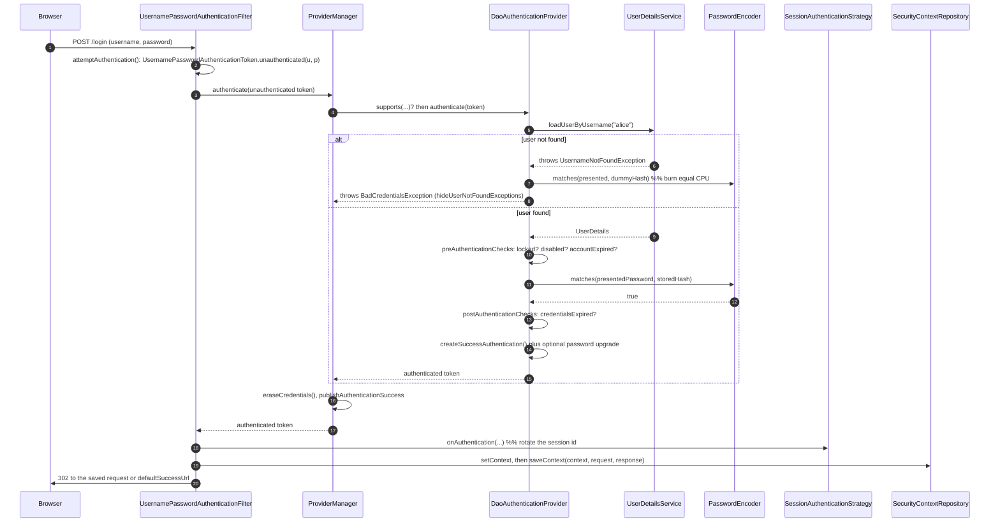

# 3.1 — Authentication Flow & Mechanisms

> **Module 3 · Topic 1** · Authentication
> Baseline: Spring Security 6.x on Boot 3.x, Java 17+
> New to this? Read **In Plain English** below first, then come back to the Version Matrix.

---

## Version Matrix

| Concern | Spring Security 5.x | **Spring Security 6.x (baseline)** | Spring Security 7.x |
|---|---|---|---|
| Exposing an `AuthenticationManager` | `WebSecurityConfigurerAdapter.authenticationManagerBean()` | **`AuthenticationConfiguration.getAuthenticationManager()`, or a `ProviderManager` bean** | same; the adapter is gone |
| Building providers | `configure(AuthenticationManagerBuilder auth)` override | **plain bean wiring, or the `HttpSecurity` shared object** | plain bean wiring |
| Saving the context after login | `SecurityContextPersistenceFilter` saved it implicitly | **the filter must call `SecurityContextRepository.saveContext(...)`** | same |
| A filter's default repository | `NullSecurityContextRepository` | **`RequestAttributeSecurityContextRepository`; `formLogin()` swaps in a `DelegatingSecurityContextRepository`** | same |
| `DaoAuthenticationProvider` wiring | `setUserDetailsService(...)` | **setter; 6.4 added a `UserDetailsService` constructor** | constructor injection preferred |
| `forcePrincipalAsString` | available, default `false` | **available but deprecated** | removed |
| Breached-password check at login | not available | **`CompromisedPasswordChecker` (6.3+), throws `CompromisedPasswordException`** | same |
| Mutating an `Authentication` | build a new token by hand | **build a new token by hand** | `Authentication.Builder` |
| Multi-factor and step-up | hand-rolled partial tokens | **hand-rolled partial tokens** | first-class MFA support |

---

## Why This Exists

Every authentication mechanism the framework ships — form login, HTTP Basic, remember-me, OAuth2
login, bearer tokens, X.509, SAML, one-time tokens, passkeys — reduces to the same three steps. A
**filter** turns raw HTTP material into an *unauthenticated* `Authentication`. An
**`AuthenticationManager`** turns that into an *authenticated* one, or throws. The result is stored
where the rest of the request, and possibly later requests, can see it. Learn the pipeline once and
you have learned eight mechanisms, because only the first step differs.

> **The sentence to remember:** `authenticate` takes an `Authentication` and returns an
> `Authentication`. The input is a *request* to authenticate; the output is *proof*.

An `Authentication` with `isAuthenticated() == false` and a raw password in `getCredentials()` is a
question. One with `isAuthenticated() == true`, a `UserDetails` principal, and populated authorities
is an answer.

---

## In Plain English

**The one-line version:** Logging somebody in is always the same three steps — read the credentials
out of the request, ask a component whether they are genuine, and store the answer — and every login
method Spring supports differs only in the first step.

**An analogy.** Think of applying for a library card in person.

You fill in a form at the counter. The clerk taking the form does not decide anything; their job is
purely to read what you wrote and turn it into a standard internal slip. That slip is unmistakably a
*request*: it says "this person claims to be Alice Kumar, and here is the proof they offered", and
it has a box on it marked "verified" that is still empty. The clerk at the counter is the filter, and
the slip is an `Authentication` object.

The slip goes to a back office. The person there does exactly one thing: they decide whether the
claim holds up. If it does, they produce a *new* slip — the same kind of paper, but now with the box
ticked, the applicant's full record attached, and, importantly, the proof that was offered removed
and shredded so it cannot leak from the filing cabinet. If the claim does not hold up, they refuse
and no slip comes back at all. That back office is the `AuthenticationManager`.

The back office is not one person but a small team, each specialising in a different kind of proof:
one handles passwords, one handles certificates, one handles single-sign-on assertions. The slip is
shown to each in turn until somebody says "this is my kind of proof, and here is my verdict". A
specialist who does not recognise the kind of proof simply passes, without objecting. That team is
`ProviderManager`, and each specialist is an `AuthenticationProvider`.

**How it actually works, step by step.**

The single most important line in this whole topic is the shape of the verification method. It takes
an `Authentication` and it returns an `Authentication` — the same Java type on both sides. This
looks strange until you see that the incoming one is a question and the outgoing one is an answer.
A flag on the object, `isAuthenticated()`, tells you which of the two you are looking at.

There are three possible outcomes, and the third is the one people forget. The verifier can return
a verified object, meaning success. It can throw an exception, meaning "these credentials were
offered and they are wrong". Or it can return nothing at all, which means "this is not the kind of
credential I handle, ask someone else" — and that is emphatically not a failure. `ProviderManager`
depends on that third outcome to walk down its list of specialists.

`ProviderManager` holds that list. It asks each provider whether it supports this kind of token, and
hands the token to the ones that do. If a provider succeeds, it stops there. If every provider
declines, it consults an optional parent manager as a fallback. And if the provider list is
exhausted with nothing but failures, it throws — choosing which failure to report, which the
sections below cover precisely, because the choice has real operational consequences.

`DaoAuthenticationProvider` is the specialist that handles the ordinary username-and-password case,
and it is the one you will meet first. Its work is short. It asks a `UserDetailsService` to look the
username up. It hands the typed password and the stored hash to a `PasswordEncoder` and asks whether
they match. It checks the account status flags — enabled, not locked, not expired. And then it
builds the verified object with the user's permissions attached. It also does something subtle: when
the username does not exist, it still runs the password check against a dummy value, so that a
request for a non-existent account takes the same amount of time as one for a real account with the
wrong password. Without that, the response time alone would tell an attacker which usernames are
real.

On the request side, most login filters extend a shared base class called
`AbstractAuthenticationProcessingFilter`. It handles everything that is the same for every login
method: recognising that this request is a login attempt, calling the verifier, and then on success
storing the result, protecting against session-fixation attacks, and redirecting or responding. All
you supply is the one method that reads the credentials out of the request. This is why writing a
JSON-based login endpoint is a small amount of code rather than a large one.

Two smaller components round out the picture. An `AuthenticationEntryPoint` is what runs when
somebody who is not logged in asks for something protected — it is the component that decides
whether they see a redirect to a login page, a plain `401`, or a JSON error body. And an
`AuthenticationEventPublisher` announces every success and failure as a Spring event, which is how
you build lockout after repeated failures, or an audit trail, without modifying the login path
itself.

Finally, a warning that the detailed sections return to. Since Spring Security 6, putting the
verified result into the holder is not enough to keep somebody logged in. Whatever authenticated
them must also explicitly save it, because the automatic saving that existed in version 5 was
removed. The symptom is a login that appears to succeed and then does not survive to the next
request, with nothing in the logs to explain it.

**Why should a beginner care?** This pipeline is where you will spend your time as soon as your
requirements go beyond the default login form — a JSON login endpoint, a second factor, an API key,
a custom user table. If you do not know which component owns which step, you will put the password
comparison in a filter, or reject requests in a place your configuration cannot see, or write a
login that works exactly once. Knowing that the filter only reads, the manager only verifies, and
something else must save makes each of those a clear decision rather than a guess.

**Words you will meet in this file**

| Term | In plain words |
|---|---|
| `Authentication` | The record of a login. Incoming it is a claim; outgoing it is a verified answer. |
| `isAuthenticated()` | The flag telling you whether you are holding the claim or the verified answer. |
| Principal | Who is being claimed — a username on the way in, usually a full user record on the way out. |
| Credentials | The proof offered, such as a typed password. Deliberately erased after verification. |
| `AuthenticationManager` | The one-method component that takes a claim and answers only "is this genuine?". |
| `ProviderManager` | The usual implementation: a list of specialists, tried in turn until one gives a verdict. |
| `AuthenticationProvider` | One specialist that handles one kind of credential and declines all others. |
| `supports(...)` | How a provider says which kind of credential it handles, so it is not asked about others. |
| `DaoAuthenticationProvider` | The specialist for ordinary username-and-password logins. |
| `UserDetailsService` | The component that looks a user up by username and returns their stored record. |
| `PasswordEncoder` | The component that checks a typed password against the stored hash. |
| `AuthenticationException` | The error thrown when credentials were offered and rejected. |
| `BadCredentialsException` | The specific error for a wrong password, also used to hide "no such user". |
| `UsernameNotFoundException` | The error for a username that does not exist. Usually rewritten to hide which it was. |
| `AccountStatusException` | The family of errors for accounts that are disabled, locked, or expired. |
| `InternalAuthenticationServiceException` | Not a credential failure — the user store itself broke, so this should be loud. |
| `AbstractAuthenticationProcessingFilter` | The base class handling everything common to login filters, so you only read the request. |
| `UsernamePasswordAuthenticationToken` | The standard `Authentication` for password logins, used for both the claim and the answer. |
| `AuthenticationEntryPoint` | What runs for a caller who is not logged in — a login redirect, a `401`, or a JSON error. |
| `AuthenticationSuccessHandler` / `AuthenticationFailureHandler` | The components deciding what the response looks like after a login succeeds or fails. |
| `AuthenticationEventPublisher` | Announces each login success and failure as an event, for lockout and auditing. |
| Session fixation protection | Replacing the session identifier at login, so a pre-planted one cannot be reused. |

**If you remember only one thing:** A filter reads the credentials, the `AuthenticationManager`
decides whether they are genuine, and something else entirely has to store the result — three jobs,
three components, and confusing them is the source of most custom-login bugs.

---

## Core Concepts

### 1. `AuthenticationManager` — the whole contract

**In simple terms:** One method that takes a claim of identity and answers whether it is genuine,
with three possible outcomes — verified, rejected, or "not my kind of credential".

```java
package org.springframework.security.authentication;

public interface AuthenticationManager {
    Authentication authenticate(Authentication authentication) throws AuthenticationException;
}
```

| Outcome | Meaning | Caller's response |
|---|---|---|
| An `Authentication` with `isAuthenticated() == true` | credentials verified | store it, continue |
| Throws `AuthenticationException` | credentials presented and rejected | fail the login |
| Returns `null` | "I cannot decide; not my kind of token" | try something else |

The `null` return is the one people forget: it means "no opinion", not "failed", and
`ProviderManager` relies on it to walk its provider list. `AuthenticationException` is a
`RuntimeException`, so it propagates out of lambdas and needs no `throws` clause.

```
AuthenticationException (abstract, extends RuntimeException)
├── BadCredentialsException              wrong password, or user not found (hidden)
├── UsernameNotFoundException            extends AuthenticationException DIRECTLY
├── AccountStatusException (abstract) -> Disabled | Locked | AccountExpired | CredentialsExpired
├── AuthenticationServiceException  -> InternalAuthenticationServiceException
├── ProviderNotFoundException            no provider supported the token type
├── InsufficientAuthenticationException  authenticated, but not strongly enough
└── CompromisedPasswordException         (6.3+) password found in a breach corpus
```

**`UsernameNotFoundException` is not a subclass of `BadCredentialsException`** —
`AbstractUserDetailsAuthenticationProvider` rewrites it into one when `hideUserNotFoundExceptions`
is true, the default, so it rarely escapes. **`InternalAuthenticationServiceException` is not a
credential failure** — it means the user store blew up, and it is distinguished so that a database
outage produces a 500 and a loud log rather than sending your whole user base to password reset.

### 2. `ProviderManager`

**In simple terms:** The usual implementation holds a list of specialists and offers the credentials
to each in turn until one of them gives a verdict.

A chain of responsibility over a list of `AuthenticationProvider`s, with an optional **parent**
manager as a fallback.

```java
public Authentication authenticate(Authentication authentication) throws AuthenticationException {
    Class<? extends Authentication> toTest = authentication.getClass();
    AuthenticationException lastException = null, parentException = null;
    Authentication result = null, parentResult = null;

    for (AuthenticationProvider provider : getProviders()) {
        if (!provider.supports(toTest)) continue;       // wrong token type, skip silently
        try {
            result = provider.authenticate(authentication);
            if (result != null) {
                copyDetails(authentication, result);    // carry WebAuthenticationDetails across
                break;                                  // FIRST success wins
            }
        }
        catch (AccountStatusException | InternalAuthenticationServiceException ex) {
            prepareException(ex, authentication);
            throw ex;                                   // do NOT keep polling (SEC-546)
        }
        catch (AuthenticationException ex) {
            lastException = ex;                         // remember it, keep going
        }
    }
    if (result == null && this.parent != null) {
        try { result = parentResult = this.parent.authenticate(authentication); }
        catch (ProviderNotFoundException ex) { /* parent had nothing either; report ours */ }
        catch (AuthenticationException ex)   { parentException = lastException = ex; }
    }
    if (result != null) {
        if (this.eraseCredentialsAfterAuthentication && (result instanceof CredentialsContainer c)) {
            c.eraseCredentials();
        }
        if (parentResult == null) this.eventPublisher.publishAuthenticationSuccess(result);
        return result;
    }
    if (lastException == null) lastException = new ProviderNotFoundException(/* no provider for {0} */);
    if (parentException == null) this.eventPublisher.publishAuthenticationFailure(lastException, authentication);
    throw lastException;
}
```

**`supports()` is a type filter, not a "can you handle this user" filter.** It receives the token's
`Class`, not the token, so a provider cannot inspect the username to decide. Per-user routing must
live inside one provider, or use distinct token types.

**The LAST exception is rethrown, not the first.** A misordered provider list produces baffling
messages: a carefully worded `DisabledException` from provider one is discarded and replaced by
provider three's generic `BadCredentialsException`.

**`AccountStatusException` and `InternalAuthenticationServiceException` short-circuit.** Once a
provider has established the account is locked or the store is unreachable, polling further is
pointless and potentially harmful — a second provider might authenticate a locked account against a
store that does not know about the lock.

**`eraseCredentialsAfterAuthentication` defaults to `true`.** `AbstractAuthenticationToken`
implements `CredentialsContainer` and nulls the credentials, the principal's credentials, and the
details. Leave it on, but it is why `getCredentials()` is `null` in your success handler.

**The parent is a real fallback.** Boot builds a global manager, and each `HttpSecurity` builds a
local one whose parent is the global one, which is how a globally registered provider stays reachable
from a chain that declared its own.

### 3. `AuthenticationProvider`

**In simple terms:** One specialist that verifies exactly one kind of credential and politely
declines everything else, which is how you plug in a new login method without touching the rest.

```java
public interface AuthenticationProvider {
    Authentication authenticate(Authentication authentication) throws AuthenticationException;
    boolean supports(Class<?> authentication);
}
```

`authenticate` has the *same signature* as `AuthenticationManager.authenticate`; that symmetry is
what makes the composition work.

| Provider | Token | Verifies against |
|---|---|---|
| `DaoAuthenticationProvider` | `UsernamePasswordAuthenticationToken` | a `UserDetailsService` plus a `PasswordEncoder` |
| `AnonymousAuthenticationProvider` | `AnonymousAuthenticationToken` | a shared key — only that *we* minted it |
| `RememberMeAuthenticationProvider` | `RememberMeAuthenticationToken` | a shared key |
| `JwtAuthenticationProvider` | `BearerTokenAuthenticationToken` | a `JwtDecoder` (signature, `exp`, `iss`, `aud`) |
| `OpaqueTokenAuthenticationProvider` | `BearerTokenAuthenticationToken` | RFC 7662 introspection |
| `LdapAuthenticationProvider` | `UsernamePasswordAuthenticationToken` | an LDAP bind or password comparison |
| `PreAuthenticatedAuthenticationProvider` | `PreAuthenticatedAuthenticationToken` | nothing — an upstream system already did it |

`AnonymousAuthenticationProvider` explains the design: it authenticates nobody, it only checks the
token's key hash against its own. Providers verify **provenance**, and "the user typed the right
password" is one kind of provenance among several.

### 4. `DaoAuthenticationProvider`

**In simple terms:** This is the specialist for ordinary username-and-password logins: look the user
up, compare the password against the stored hash, and check the account is usable.

It extends `AbstractUserDetailsAuthenticationProvider`, a template method class. The parent owns the
orchestration; the child owns two steps.

```java
// AbstractUserDetailsAuthenticationProvider — the template, simplified
public Authentication authenticate(Authentication authentication) throws AuthenticationException {
    String username = determineUsername(authentication);
    boolean cacheWasUsed = true;
    UserDetails user = this.userCache.getUserFromCache(username);
    if (user == null) {
        cacheWasUsed = false;
        try {
            user = retrieveUser(username, (UsernamePasswordAuthenticationToken) authentication);  // abstract
        }
        catch (UsernameNotFoundException ex) {
            if (!this.hideUserNotFoundExceptions) throw ex;
            throw new BadCredentialsException(/* "Bad credentials" */);
        }
        Assert.notNull(user, "retrieveUser returned null - a violation of the interface contract");
    }
    try {
        this.preAuthenticationChecks.check(user);       // locked? disabled? accountExpired?
        additionalAuthenticationChecks(user, (UsernamePasswordAuthenticationToken) authentication); // abstract
    }
    catch (AuthenticationException ex) {
        if (!cacheWasUsed) throw ex;
        cacheWasUsed = false;                           // the cached UserDetails may be stale:
        user = retrieveUser(username, (UsernamePasswordAuthenticationToken) authentication);
        this.preAuthenticationChecks.check(user);       // reload and re-check ONCE before failing
        additionalAuthenticationChecks(user, (UsernamePasswordAuthenticationToken) authentication);
    }
    this.postAuthenticationChecks.check(user);          // credentialsExpired?
    if (!cacheWasUsed) this.userCache.putUserInCache(user);
    Object principalToReturn = this.forcePrincipalAsString ? user.getUsername() : user;
    return createSuccessAuthentication(principalToReturn, authentication, user);
}
```

The two hooks are `UserDetailsChecker` instances, whose single method is
`void check(UserDetails toCheck)`. `DefaultPreAuthenticationChecks` throws `LockedException`,
`DisabledException`, or `AccountExpiredException`; `DefaultPostAuthenticationChecks` throws
`CredentialsExpiredException` and nothing else.

**Pre-checks run before the password is verified**, saving the hashing cost — but that means
`LockedException` is thrown for a locked account *even when the supplied password is wrong*, which
discloses that the account exists. Replace the checker via `setPreAuthenticationChecks` if that
matters. **The post-check is credentials expiry only**, and it runs *after* the password matched,
because "your password is correct but expired" is only meaningful if it really was correct.

The two overridden steps, plus the dummy-hash trick:

```java
// DaoAuthenticationProvider
private static final String USER_NOT_FOUND_PASSWORD = "userNotFoundPassword";
private volatile String userNotFoundEncodedPassword;

@Override
protected final UserDetails retrieveUser(String username, UsernamePasswordAuthenticationToken authentication) {
    prepareTimingAttackProtection();     // lazily encode the constant above, once per JVM
    try {
        UserDetails loadedUser = getUserDetailsService().loadUserByUsername(username);
        if (loadedUser == null) {
            throw new InternalAuthenticationServiceException(
                    "UserDetailsService returned null, which is an interface contract violation");
        }
        return loadedUser;
    }
    catch (UsernameNotFoundException ex) { mitigateAgainstTimingAttack(authentication); throw ex; }
    catch (InternalAuthenticationServiceException ex) { throw ex; }
    catch (Exception ex) { throw new InternalAuthenticationServiceException(ex.getMessage(), ex); }
}

@Override
protected void additionalAuthenticationChecks(UserDetails userDetails,
        UsernamePasswordAuthenticationToken authentication) throws AuthenticationException {
    if (authentication.getCredentials() == null) throw new BadCredentialsException(/* "Bad credentials" */);
    String presentedPassword = authentication.getCredentials().toString();
    if (!this.passwordEncoder.matches(presentedPassword, userDetails.getPassword())) {
        throw new BadCredentialsException(/* "Bad credentials" */);
    }
}

private void mitigateAgainstTimingAttack(UsernamePasswordAuthenticationToken authentication) {
    if (authentication.getCredentials() != null) {
        this.passwordEncoder.matches(authentication.getCredentials().toString(),
                                     this.userNotFoundEncodedPassword);   // result DISCARDED
    }
}
```

`retrieveUser` is `final` — you customise by supplying a different `UserDetailsService`, not by
overriding the lookup. The bottom `catch (Exception ex)` means **any** unexpected exception from your
store becomes `InternalAuthenticationServiceException`, which is what stops a database outage being
reported to every user as "bad credentials".

The dummy hash exists because, without it, a login for an existing username costs a full bcrypt
verification — hundreds of milliseconds by design — while a login for a non-existent username returns
after one indexed miss. An attacker holding a list of email addresses separates "has an account here"
from "does not" purely by response time, triggering no lockout and leaving nothing unusual in the
logs. That is **username enumeration**, the first step of a credential-stuffing campaign, and the fix
burns equal CPU in both branches. Two residual gaps: the hash is computed **lazily**, so the first
not-found request in the JVM's life is slower, and the protection covers only the hashing cost, so a
`UserDetailsService` that is slower for real users puts the oracle back at the data layer.

Finally the result is built, and this is the only place `DaoAuthenticationProvider` overrides the
parent, purely to add the password upgrade:

```java
// AbstractUserDetailsAuthenticationProvider
protected Authentication createSuccessAuthentication(Object principal, Authentication authentication,
        UserDetails user) {
    UsernamePasswordAuthenticationToken result = UsernamePasswordAuthenticationToken.authenticated(
            principal, authentication.getCredentials(),
            this.authoritiesMapper.mapAuthorities(user.getAuthorities()));
    result.setDetails(authentication.getDetails());
    return result;
}

// DaoAuthenticationProvider adds only this
if (this.userDetailsPasswordService != null && this.passwordEncoder.upgradeEncoding(user.getPassword())) {
    String newPassword = this.passwordEncoder.encode(authentication.getCredentials().toString());
    user = this.userDetailsPasswordService.updatePassword(user, newPassword);
}
return super.createSuccessAuthentication(principal, authentication, user);
```

The **new token is a different object**; the input is never mutated. Authorities pass through a
`GrantedAuthoritiesMapper`, default `NullAuthoritiesMapper`, which is where you attach a
`RoleHierarchy` or map LDAP groups onto `ROLE_` authorities. `forcePrincipalAsString` makes the
principal a `String` instead of a `UserDetails`; it defaults to `false`, is **deprecated in 6.x**, and
flipping it breaks every `(UserDetails) authentication.getPrincipal()` cast you have.

### 5. `AbstractAuthenticationProcessingFilter`

**In simple terms:** A base class that already does everything common to logging somebody in, so
writing your own login endpoint means supplying only the part that reads the request.

The base class of `UsernamePasswordAuthenticationFilter`, `OAuth2LoginAuthenticationFilter`,
`Saml2WebSsoAuthenticationFilter`, `OneTimeTokenAuthenticationFilter`, and any JSON-login filter you
write yourself.

```java
private void doFilter(HttpServletRequest request, HttpServletResponse response, FilterChain chain) {
    if (!requiresAuthentication(request, response)) {     // RequestMatcher, e.g. POST /login
        chain.doFilter(request, response);
        return;
    }
    try {
        Authentication authenticationResult = attemptAuthentication(request, response);   // abstract
        if (authenticationResult == null) {
            return;   // subclass is mid-flight and already committed the response — stop here
        }
        this.sessionStrategy.onAuthentication(authenticationResult, request, response);
        if (this.continueChainBeforeSuccessfulAuthentication) chain.doFilter(request, response);
        successfulAuthentication(request, response, chain, authenticationResult);
    }
    catch (InternalAuthenticationServiceException failed) {
        this.logger.error("An internal error occurred while trying to authenticate the user.", failed);
        unsuccessfulAuthentication(request, response, failed);
    }
    catch (AuthenticationException ex) { unsuccessfulAuthentication(request, response, ex); }
}

protected void successfulAuthentication(HttpServletRequest request, HttpServletResponse response,
        FilterChain chain, Authentication authResult) throws IOException, ServletException {
    SecurityContext context = this.securityContextHolderStrategy.createEmptyContext();
    context.setAuthentication(authResult);
    this.securityContextHolderStrategy.setContext(context);
    this.securityContextRepository.saveContext(context, request, response);   // 6.x: EXPLICIT
    this.rememberMeServices.loginSuccess(request, response, authResult);
    if (this.eventPublisher != null) {
        this.eventPublisher.publishEvent(new InteractiveAuthenticationSuccessEvent(authResult, getClass()));
    }
    this.successHandler.onAuthenticationSuccess(request, response, authResult);
}

// unsuccessfulAuthentication: clearContext(), rememberMeServices.loginFail(...), failureHandler
```

| Collaborator | Default on the raw filter | Job |
|---|---|---|
| `RequestMatcher` | subclass-specific (`POST /login`) | is this request a login attempt? |
| `SessionAuthenticationStrategy` | `NullAuthenticatedSessionStrategy` | fixation protection, concurrency limits |
| `SecurityContextRepository` | `RequestAttributeSecurityContextRepository` | persists the context |
| `RememberMeServices` | `NullRememberMeServices` | remember-me cookie lifecycle |
| `AuthenticationSuccessHandler` | `SavedRequestAwareAuthenticationSuccessHandler` | redirect, or write JSON |
| `AuthenticationFailureHandler` | `SimpleUrlAuthenticationFailureHandler` | redirect to `?error` |

**The `saveContext` call is the biggest 5.x-to-6.x behavioural change here.** In 5.x,
`SecurityContextPersistenceFilter` wrapped the request and wrote the holder into the session on the
way out. In 6.x, `SecurityContextHolderFilter` only *reads*, so a custom filter that sets the holder
and forgets `saveContext` authenticates the current request perfectly and loses the login on the next
one.

**The session strategy runs before `successfulAuthentication`, not inside it.**
`ChangeSessionIdAuthenticationStrategy` must rotate the session identifier *before* the context is
written into the session, and `ConcurrentSessionControlAuthenticationStrategy` must be able to
*reject* the login before anything is persisted.

### 6. The token classes

**In simple terms:** The same class is built two different ways — one constructor for the
unverified claim and another for the verified result — and you cannot fake the second.

```java
public class UsernamePasswordAuthenticationToken extends AbstractAuthenticationToken {

    /** UNAUTHENTICATED: principal is a String username, credentials is the raw password. */
    public UsernamePasswordAuthenticationToken(Object principal, Object credentials) {
        super(null);                       // no authorities
        this.principal = principal;
        this.credentials = credentials;
        setAuthenticated(false);
    }

    /** AUTHENTICATED: principal is normally a UserDetails, authorities are populated. */
    public UsernamePasswordAuthenticationToken(Object principal, Object credentials,
            Collection<? extends GrantedAuthority> authorities) {
        super(authorities);
        this.principal = principal;
        this.credentials = credentials;
        super.setAuthenticated(true);      // note: super, bypassing the guard below
    }

    // 5.7+ static factories: unauthenticated(p, c) and authenticated(p, c, authorities)

    @Override
    public void setAuthenticated(boolean isAuthenticated) throws IllegalArgumentException {
        Assert.isTrue(!isAuthenticated,
                "Cannot set this token to trusted - use constructor which takes a GrantedAuthority list instead");
        super.setAuthenticated(false);
    }
}
```

`setAuthenticated(true)` **throws**. The only route to a trusted token is the three-argument
constructor, and the only code that should call it is a provider that just verified something. A bug
elsewhere cannot promote a request token, and the constructor call is a greppable audit point.

`AbstractAuthenticationToken` supplies three behaviours worth knowing. Authorities are null-checked
and stored as an **unmodifiable defensive copy**, so you cannot grant yourself a role by mutating the
collection you were handed. `getName()` walks `UserDetails`, then `AuthenticatedPrincipal`, then
`java.security.Principal`, then falls back to `toString()` — which is how entire user objects end up
in audit tables, so implement `AuthenticatedPrincipal` on custom principal types. And
`eraseCredentials()` recurses into the principal, which is why the `UserDetails` in your
`SecurityContext` has a `null` password.

### 7. `AuthenticationEntryPoint`

**In simple terms:** This decides what a caller who is not logged in actually receives — a redirect
to a login page, a plain `401`, or a JSON error — which is why an API can wrongly answer with HTML.

```java
public interface AuthenticationEntryPoint {
    void commence(HttpServletRequest request, HttpServletResponse response,
            AuthenticationException authException) throws IOException, ServletException;
}
```

The entry point is **not** part of the authentication flow. It is what happens when there was no
authentication and the request needed one: `ExceptionTranslationFilter` invokes it to *start* an
authentication ceremony.

| Implementation | Response |
|---|---|
| `LoginUrlAuthenticationEntryPoint` | `302` to the login page (installed by `formLogin()`) |
| `BasicAuthenticationEntryPoint` | `401` plus `WWW-Authenticate: Basic realm="Realm"` |
| `BearerTokenAuthenticationEntryPoint` | `401` plus `WWW-Authenticate: Bearer` with an error code |
| `HttpStatusEntryPoint` | a bare status code you choose |
| `Http403ForbiddenEntryPoint` | `403`, no body — the default when nothing else is configured |
| `DelegatingAuthenticationEntryPoint` | picks one of the above from a `RequestMatcher` map |

### 8. `AuthenticationEventPublisher`

**In simple terms:** Every login success and failure is announced as an event, which is how you add
account lockout or an audit trail without changing the login code itself.

```java
public interface AuthenticationEventPublisher {
    void publishAuthenticationSuccess(Authentication authentication);
    void publishAuthenticationFailure(AuthenticationException exception, Authentication authentication);
}
```

`DefaultAuthenticationEventPublisher` maps `BadCredentialsException` and `UsernameNotFoundException`
onto `AuthenticationFailureBadCredentialsEvent`, and `DisabledException`, `LockedException`,
`AccountExpiredException`, `CredentialsExpiredException`, `ProviderNotFoundException`, and
`AuthenticationServiceException` onto their matching `AuthenticationFailure*Event`.

Two events fire on a successful interactive login. `AuthenticationSuccessEvent` comes from
`ProviderManager` for **any** success, including the per-request kind — HTTP Basic, bearer tokens,
remember-me. `InteractiveAuthenticationSuccessEvent` comes from the filter, only when a human
completed a ceremony, so use that one for "logins today" or your chart becomes your request rate.
**`ProviderManager`'s default publisher is a no-op `NullEventPublisher`**: Boot wires a real one into
the manager it builds, but a hand-constructed `ProviderManager` publishes nothing, which is the usual
cause of "my `@EventListener` never fires".

---

## The Flow, End to End



---

## Working Code

### Exposing an `AuthenticationManager`, and a custom provider

```java
package com.example.security;

import org.springframework.context.annotation.Bean;
import org.springframework.context.annotation.Configuration;
import org.springframework.security.authentication.*;
import org.springframework.security.authentication.dao.DaoAuthenticationProvider;
import org.springframework.security.config.annotation.authentication.configuration.AuthenticationConfiguration;
import org.springframework.security.core.Authentication;
import org.springframework.security.core.AuthenticationException;
import org.springframework.security.core.authority.SimpleGrantedAuthority;
import org.springframework.security.core.userdetails.UserDetailsService;
import org.springframework.security.crypto.bcrypt.BCryptPasswordEncoder;
import org.springframework.security.crypto.password.PasswordEncoder;
import org.springframework.stereotype.Component;

import java.nio.charset.StandardCharsets;
import java.security.MessageDigest;
import java.util.List;

@Configuration
public class AuthenticationManagerConfig {

    @Bean
    PasswordEncoder passwordEncoder() {
        return new BCryptPasswordEncoder(12);
    }

    /**
     * Option A — reuse whatever Boot and the DSL already assembled. Use this when you have a
     * UserDetailsService bean and only need to call the manager yourself, for example from a
     * /token controller. Never declare this AND option B: two beans is an ambiguity error.
     */
    // @Bean
    AuthenticationManager fromConfiguration(AuthenticationConfiguration configuration) throws Exception {
        return configuration.getAuthenticationManager();
    }

    /** Option B — build it yourself when you need several providers, or a specific order. */
    @Bean
    AuthenticationManager authenticationManager(UserDetailsService userDetailsService,
                                                PasswordEncoder passwordEncoder,
                                                ApiKeyAuthenticationProvider apiKeyProvider,
                                                AuthenticationEventPublisher eventPublisher) {
        DaoAuthenticationProvider dao = new DaoAuthenticationProvider();
        dao.setUserDetailsService(userDetailsService);
        dao.setPasswordEncoder(passwordEncoder);
        dao.setHideUserNotFoundExceptions(true);   // false turns login into an existence oracle

        // Order matters: the LAST exception thrown is the one the caller sees.
        ProviderManager manager = new ProviderManager(List.of(apiKeyProvider, dao));
        // A hand-built ProviderManager has a NullEventPublisher by default.
        manager.setAuthenticationEventPublisher(eventPublisher);
        manager.setEraseCredentialsAfterAuthentication(true);
        return manager;
    }
}

@Component
class ApiKeyAuthenticationProvider implements AuthenticationProvider {

    private final ApiKeyRepository repository;

    ApiKeyAuthenticationProvider(ApiKeyRepository repository) {
        this.repository = repository;
    }

    @Override
    public Authentication authenticate(Authentication authentication) throws AuthenticationException {
        String presented = String.valueOf(authentication.getCredentials());
        ApiKeyRecord record;
        try {
            record = this.repository.findByPrefix(presented.substring(0, Math.min(8, presented.length())));
        }
        catch (RuntimeException ex) {
            // Infrastructure failure is NOT a credential failure. Wrapping it stops a database
            // outage being reported as "bad credentials", and makes ProviderManager abort the
            // loop rather than falling through to other providers.
            throw new InternalAuthenticationServiceException("API key store unavailable", ex);
        }
        if (record == null || !MessageDigest.isEqual(presented.getBytes(StandardCharsets.UTF_8),
                                                     record.secret().getBytes(StandardCharsets.UTF_8))) {
            throw new BadCredentialsException("Invalid API key");
        }
        if (record.revoked()) throw new DisabledException("API key revoked");

        return ApiKeyAuthenticationToken.authenticated(record.clientId(),
                List.of(new SimpleGrantedAuthority("ROLE_SERVICE")));
    }

    /** supports() receives the token CLASS, not the token: it cannot inspect the key value. */
    @Override
    public boolean supports(Class<?> authentication) {
        return ApiKeyAuthenticationToken.class.isAssignableFrom(authentication);
    }
}
```

### A JSON login filter, wired with everything the DSL will not do for you

```java
package com.example.security;

import com.fasterxml.jackson.databind.ObjectMapper;
import jakarta.servlet.http.HttpServletRequest;
import jakarta.servlet.http.HttpServletResponse;
import org.springframework.http.MediaType;
import org.springframework.security.authentication.AuthenticationManager;
import org.springframework.security.authentication.AuthenticationServiceException;
import org.springframework.security.authentication.UsernamePasswordAuthenticationToken;
import org.springframework.security.core.Authentication;
import org.springframework.security.web.authentication.AbstractAuthenticationProcessingFilter;
import org.springframework.security.web.authentication.WebAuthenticationDetailsSource;
import org.springframework.security.web.util.matcher.AntPathRequestMatcher;

import java.io.IOException;

public class JsonLoginFilter extends AbstractAuthenticationProcessingFilter {

    private final ObjectMapper objectMapper;

    public JsonLoginFilter(AuthenticationManager authenticationManager, ObjectMapper objectMapper) {
        super(new AntPathRequestMatcher("/api/login", "POST"), authenticationManager);
        this.objectMapper = objectMapper;
        setAuthenticationDetailsSource(new WebAuthenticationDetailsSource());
    }

    public record LoginRequest(String username, String password) {}

    @Override
    public Authentication attemptAuthentication(HttpServletRequest request, HttpServletResponse response)
            throws IOException {
        if (!MediaType.APPLICATION_JSON_VALUE.equals(request.getContentType())) {
            throw new AuthenticationServiceException("Expected application/json");
        }
        LoginRequest body = this.objectMapper.readValue(request.getInputStream(), LoginRequest.class);

        UsernamePasswordAuthenticationToken authRequest = UsernamePasswordAuthenticationToken.unauthenticated(
                body.username() == null ? "" : body.username().trim(),
                body.password() == null ? "" : body.password());

        // Remote address and session id, which the audit log and the brute-force
        // detector both read off authentication.getDetails().
        authRequest.setDetails(this.authenticationDetailsSource.buildDetails(request));

        return getAuthenticationManager().authenticate(authRequest);
    }
}
```

```java
package com.example.security;

import com.fasterxml.jackson.databind.ObjectMapper;
import org.springframework.context.annotation.Bean;
import org.springframework.context.annotation.Configuration;
import org.springframework.http.HttpStatus;
import org.springframework.http.MediaType;
import org.springframework.security.authentication.AuthenticationManager;
import org.springframework.security.config.annotation.web.builders.HttpSecurity;
import org.springframework.security.config.annotation.web.configuration.EnableWebSecurity;
import org.springframework.security.web.SecurityFilterChain;
import org.springframework.security.web.authentication.HttpStatusEntryPoint;
import org.springframework.security.web.authentication.UsernamePasswordAuthenticationFilter;
import org.springframework.security.web.authentication.session.ChangeSessionIdAuthenticationStrategy;
import org.springframework.security.web.context.*;

@Configuration
@EnableWebSecurity
public class JsonLoginSecurityConfig {

    @Bean
    SecurityContextRepository securityContextRepository() {
        // RequestAttribute... makes the context visible for the rest of THIS request;
        // HttpSession... makes it survive to the NEXT request. You need both.
        return new DelegatingSecurityContextRepository(
                new RequestAttributeSecurityContextRepository(),
                new HttpSessionSecurityContextRepository());
    }

    @Bean
    SecurityFilterChain apiChain(HttpSecurity http,
                                 AuthenticationManager authenticationManager,
                                 SecurityContextRepository securityContextRepository,
                                 ObjectMapper objectMapper) throws Exception {

        JsonLoginFilter loginFilter = new JsonLoginFilter(authenticationManager, objectMapper);
        loginFilter.setSecurityContextRepository(securityContextRepository);   // else the login is lost
        loginFilter.setSessionAuthenticationStrategy(new ChangeSessionIdAuthenticationStrategy());
        loginFilter.setAuthenticationSuccessHandler((request, response, authentication) -> {
            response.setStatus(HttpStatus.OK.value());
            response.setContentType(MediaType.APPLICATION_JSON_VALUE);
            response.getWriter().write("{\"status\":\"ok\"}");
        });
        loginFilter.setAuthenticationFailureHandler((request, response, exception) -> {
            // Never echo exception.getMessage(): DisabledException and LockedException
            // would confirm account existence to an anonymous caller.
            response.setStatus(HttpStatus.UNAUTHORIZED.value());
            response.setContentType(MediaType.APPLICATION_JSON_VALUE);
            response.getWriter().write("{\"error\":\"invalid_credentials\"}");
        });

        http
            .securityMatcher("/api/**")
            .authorizeHttpRequests(auth -> auth
                .requestMatchers("/api/login").permitAll()
                .anyRequest().authenticated()
            )
            .securityContext(context -> context.securityContextRepository(securityContextRepository))
            .exceptionHandling(ex -> ex.authenticationEntryPoint(new HttpStatusEntryPoint(HttpStatus.UNAUTHORIZED)))
            .addFilterBefore(loginFilter, UsernamePasswordAuthenticationFilter.class);

        return http.build();
    }
}
```

### Tests

```java
package com.example.security;

import org.junit.jupiter.api.Test;
import org.springframework.security.authentication.*;
import org.springframework.security.authentication.dao.DaoAuthenticationProvider;
import org.springframework.security.core.Authentication;
import org.springframework.security.core.userdetails.*;
import org.springframework.security.crypto.bcrypt.BCryptPasswordEncoder;
import org.springframework.security.crypto.password.PasswordEncoder;

import java.util.List;

import static org.assertj.core.api.Assertions.assertThat;
import static org.assertj.core.api.Assertions.assertThatThrownBy;

class ProviderManagerBehaviourTests {

    private final PasswordEncoder encoder = new BCryptPasswordEncoder(4);   // low cost: tests only

    private final UserDetails alice = User.withUsername("alice")
            .password(this.encoder.encode("s3cret")).roles("USER").build();

    private final UserDetails lockedBob = User.withUsername("bob")
            .password(this.encoder.encode("s3cret")).roles("USER").accountLocked(true).build();

    private ProviderManager managerFor(UserDetails... users) {
        UserDetailsService store = username -> List.of(users).stream()
                .filter(u -> u.getUsername().equals(username)).findFirst()
                .orElseThrow(() -> new UsernameNotFoundException(username));
        DaoAuthenticationProvider provider = new DaoAuthenticationProvider();
        provider.setUserDetailsService(store);
        provider.setPasswordEncoder(this.encoder);
        return new ProviderManager(List.of(provider));
    }

    @Test
    void successProducesANewAuthenticatedTokenAndErasesCredentials() {
        Authentication result = managerFor(this.alice)
                .authenticate(UsernamePasswordAuthenticationToken.unauthenticated("alice", "s3cret"));

        assertThat(result.isAuthenticated()).isTrue();
        assertThat(result.getAuthorities()).extracting("authority").containsExactly("ROLE_USER");
        assertThat(result.getCredentials()).isNull();                               // erased
        assertThat(((UserDetails) result.getPrincipal()).getPassword()).isNull();   // and recursively
    }

    @Test
    void unknownUsernameIsReportedAsBadCredentialsNotUsernameNotFound() {
        assertThatThrownBy(() -> managerFor(this.alice)
                .authenticate(UsernamePasswordAuthenticationToken.unauthenticated("nobody", "whatever")))
                .isInstanceOf(BadCredentialsException.class).hasMessage("Bad credentials");
    }

    @Test
    void lockedAccountFailsBeforeThePasswordIsEvenChecked() {
        // Note the deliberately WRONG password: the pre-check runs first, so the
        // exception is LockedException rather than BadCredentialsException.
        assertThatThrownBy(() -> managerFor(this.lockedBob)
                .authenticate(UsernamePasswordAuthenticationToken.unauthenticated("bob", "wrong-password")))
                .isInstanceOf(LockedException.class);
    }

    @Test
    void tokensCannotBePromotedAndUnknownTypesYieldProviderNotFound() {
        UsernamePasswordAuthenticationToken token =
                UsernamePasswordAuthenticationToken.unauthenticated("mallory", "guess");

        assertThatThrownBy(() -> token.setAuthenticated(true))
                .isInstanceOf(IllegalArgumentException.class)
                .hasMessageContaining("Cannot set this token to trusted");

        assertThatThrownBy(() -> managerFor(this.alice)
                .authenticate(ApiKeyAuthenticationToken.unauthenticated("abc")))
                .isInstanceOf(ProviderNotFoundException.class);
    }
}
```

---

## Internals

### How the DSL assembles the filter

`AbstractAuthenticationFilterConfigurer.configure` wires the filter from `HttpSecurity` shared
objects:

```java
this.authFilter.setAuthenticationManager(http.getSharedObject(AuthenticationManager.class));
this.authFilter.setAuthenticationSuccessHandler(this.successHandler);
this.authFilter.setAuthenticationFailureHandler(this.failureHandler);

SessionAuthenticationStrategy sessionStrategy = http.getSharedObject(SessionAuthenticationStrategy.class);
if (sessionStrategy != null) this.authFilter.setSessionAuthenticationStrategy(sessionStrategy);

RememberMeServices rememberMeServices = http.getSharedObject(RememberMeServices.class);
if (rememberMeServices != null) this.authFilter.setRememberMeServices(rememberMeServices);

SecurityContextConfigurer configurer = http.getConfigurer(SecurityContextConfigurer.class);
if (configurer != null && configurer.isRequireExplicitSave()) {
    this.authFilter.setSecurityContextRepository(configurer.getSecurityContextRepository());
}
http.addFilter(postProcess(this.authFilter));
```

The consequence: **a filter registered with `addFilterBefore` is configured by nobody.** No session
strategy, no context repository, no remember-me services, and its login URL is not added to
`permitAll`. Everything in `JsonLoginSecurityConfig` above is that list, written out by hand.

### Where the global `AuthenticationManager` comes from

`AuthenticationConfiguration.getAuthenticationManager()` is a lazy, idempotent builder. It pulls an
`AuthenticationManagerBuilder` from the context, applies every
`GlobalAuthenticationConfigurerAdapter`, and builds. If re-entered while already building it returns
an `AuthenticationManagerDelegator`, which resolves a genuine circular dependency: the
`SecurityFilterChain` needs an `AuthenticationManager`, and building the manager may need beans that
depend on the chain.

One of those adapters is `InitializeUserDetailsBeanManagerConfigurer`, which is why a bare
`UserDetailsService` bean is enough for working form login: it finds the single `UserDetailsService`,
a `PasswordEncoder`, and a `UserDetailsPasswordService` if present, and builds a
`DaoAuthenticationProvider`. Declare **two** `UserDetailsService` beans and it backs off silently,
leaving a `ProviderNotFoundException` that names no cause.

### `copyDetails`

```java
private void copyDetails(Authentication source, Authentication dest) {
    if ((dest instanceof AbstractAuthenticationToken token) && (dest.getDetails() == null)) {
        token.setDetails(source.getDetails());
    }
}
```

This carries the `WebAuthenticationDetails` — remote address and session identifier — from the request
token onto the result. Note the `getDetails() == null` guard: a provider that sets its own details
silently drops the request details, and your audit log loses the client IP address.

---

## Configuration Reference

| Component · option | Effect | Default |
|---|---|---|
| `ProviderManager.providers` | ordered list consulted via `supports()` | required unless a parent is set |
| `ProviderManager.parent` | fallback when no provider returned a result | the global manager, under the DSL |
| `ProviderManager.eraseCredentialsAfterAuthentication` | nulls credentials on the result | `true` |
| `ProviderManager.authenticationEventPublisher` | publishes success and failure events | `NullEventPublisher` when hand-built |
| `AbstractUserDetailsAuthenticationProvider.hideUserNotFoundExceptions` | rewrites `UsernameNotFoundException` to `BadCredentialsException` | `true` |
| `…forcePrincipalAsString` | principal becomes the username `String` | `false`, **deprecated** |
| `…preAuthenticationChecks` | locked / disabled / account-expired gate | `DefaultPreAuthenticationChecks` |
| `…postAuthenticationChecks` | credentials-expired gate | `DefaultPostAuthenticationChecks` |
| `…authoritiesMapper` | transforms `UserDetails` authorities onto the token | `NullAuthoritiesMapper` |
| `…userCache` | avoids a store lookup per authentication | `NullUserCache` |
| `DaoAuthenticationProvider.passwordEncoder` | verification algorithm | `createDelegatingPasswordEncoder()` |
| `DaoAuthenticationProvider.userDetailsPasswordService` | enables upgrade-on-login re-hashing | `null` |
| `DaoAuthenticationProvider.compromisedPasswordChecker` (6.3+) | rejects breached passwords at login | `null` |
| `AbstractAuthenticationProcessingFilter.securityContextRepository` | persists the context after login | `RequestAttributeSecurityContextRepository` |
| `…sessionAuthenticationStrategy` | fixation protection, concurrency control | `NullAuthenticatedSessionStrategy` |
| `…rememberMeServices` | remember-me cookie lifecycle | `NullRememberMeServices` |
| `…continueChainBeforeSuccessfulAuthentication` | lets the request proceed after login | `false` |
| `UsernamePasswordAuthenticationFilter.usernameParameter` / `passwordParameter` | form field names | `username` / `password` |
| `UsernamePasswordAuthenticationFilter.postOnly` | rejects non-`POST` login attempts | `true` |

---

## Production Concerns & Anti-Patterns

**Forgetting `saveContext` in a custom authentication filter.** Nothing writes the `SecurityContext`
implicitly in 6.x. The filter authenticates, the request succeeds, and the next request is anonymous.
Always test with two sequential requests rather than one.

**Echoing `AuthenticationException.getMessage()` to the client.** `DisabledException`,
`LockedException`, and `CredentialsExpiredException` all confirm the account exists, and
`LockedException` additionally confirms somebody has been attacking it. Return one indistinguishable
failure body and log the real reason with a correlation identifier.

**Setting `hideUserNotFoundExceptions` to `false` to make debugging easier.** This turns login into a
username-existence oracle, undoing the dummy-hash protection two classes away.

**Doing expensive work in a `UserDetailsService` only for existing users.** The framework equalises
the *hashing* cost between found and not-found. If loading a real user costs three extra queries, the
timing oracle is back at the data layer.

**Disabling `eraseCredentialsAfterAuthentication` because something downstream needs the password.**
That leaves plaintext in the `SecurityContext` for the session lifetime, where it reaches heap dumps,
session replication payloads, and debug logs. Use token exchange instead.

**Provider ordering chosen by accident.** The last exception wins, so a provider that always throws
`BadCredentialsException` placed after one that throws a meaningful `DisabledException` destroys your
error reporting.

**Returning `null` from a custom provider on an infrastructure failure.** `null` means "not my token
type", so the manager moves on and eventually throws `ProviderNotFoundException`, masking the real
fault. Throw `InternalAuthenticationServiceException` and let it short-circuit.

**Logging the `Authentication` object.** The failure event carries the request token, whose
`getCredentials()` is the raw password. Log `getName()` only.

**Assuming `AuthenticationSuccessEvent` means "a user logged in".** On a Basic- or
bearer-authenticated API it fires per request, so your daily-logins chart becomes your request rate.

---

## Debugging Playbook

| Symptom | Likely root cause | Fix |
|---|---|---|
| `ProviderNotFoundException: No AuthenticationProvider found for …Token` | No provider `supports()` that class, or two `UserDetailsService` beans made the auto-configurer back off | Check `supports()`; register the provider explicitly; mark one store `@Primary` |
| Login returns success, the next request is anonymous | The custom filter never called `SecurityContextRepository.saveContext` | Set a `DelegatingSecurityContextRepository` and call `saveContext` |
| `BadCredentialsException` for a password you know is right | Hash written with a different encoder, or no `{id}` prefix | Log the stored prefix; confirm one `PasswordEncoder` bean |
| `IllegalArgumentException: Cannot set this token to trusted` | Code called `setAuthenticated(true)` | Use the three-argument constructor or `authenticated(...)` |
| `getCredentials()` is `null` in the success handler | `eraseCredentialsAfterAuthentication`, as designed | Read what you need inside the provider |
| Every attempt returns `LockedException`, even with a wrong password | Pre-checks run before the password comparison | Expected; replace `preAuthenticationChecks` to hide it |
| A database outage logs users out with "bad credentials" | The `UserDetailsService` threw and was swallowed | Confirm it surfaces as `InternalAuthenticationServiceException`; alert on that event |
| `@EventListener` never fires | Hand-built `ProviderManager` still has `NullEventPublisher` | Call `setAuthenticationEventPublisher(...)` |
| The audit log lost the client IP after adding a provider | The provider set its own `details`, so `copyDetails` skipped | Leave `details` unset on the result |
| Login works but the session identifier never changes | Custom filter has `NullAuthenticatedSessionStrategy` | Set `ChangeSessionIdAuthenticationStrategy` |
| `ClassCastException: String cannot be cast to UserDetails` | `forcePrincipalAsString` was enabled | Remove it; deprecated in 6.x, removed in 7.x |
| The first not-found login is much slower than later ones | The dummy hash is computed lazily on first miss | Expected; warm it at startup if the signal matters |

---

## Interview Q&A

### Q1. `authenticate` takes an `Authentication` and returns an `Authentication`. Why the same type, and what actually differs?

<details>
<summary>Show answer</summary>

The shared type is what makes the pipeline composable. Every stage speaks one interface, so a provider
can be swapped in, a manager can be nested as another manager's parent, and a decorator can wrap the
whole thing without any stage knowing what mechanism produced the token. It is also why
`AuthenticationProvider.authenticate` has the identical signature, which is what lets
`ProviderManager` work as a chain of responsibility.

What differs is state, not type. The request token has `isAuthenticated() == false`, a `String`
principal, the raw password in `getCredentials()`, and no authorities. The result has
`isAuthenticated() == true`, usually a `UserDetails` principal, `null` credentials after erasure, and
authorities from the user store. The result is always a **new object**, and `setAuthenticated(true)`
throws precisely so that in-place promotion is impossible.

**Counter-question: who is allowed to create a trusted token, and how is that enforced?**

Only code calling the three-argument constructor, which uses `super.setAuthenticated(true)` to bypass
the overridden guard — in practice a provider that has just verified something, plus the framework's
own filters minting anonymous and remember-me tokens. The enforcement is a deliberate API asymmetry,
not a JVM boundary: any class on the classpath can call that constructor. What the design buys is
*auditability*, because the three-argument constructor and `.authenticated(` are greppable, so a
reviewer can enumerate every place authentication is asserted. With a mutable `setAuthenticated(true)`
the assertion could hide inside any service method.

**Counter-question: what does returning `null` from a provider mean, and how is it different from throwing?**

`null` means "no opinion", so `ProviderManager` moves to the next provider and then to the parent.
Throwing means "I examined this and it is bad", which is recorded in `lastException` while the loop
continues. The distinction has a real operational consequence: if your provider catches a database
exception and returns `null`, the request ends as `ProviderNotFoundException` — "no provider found" —
and whoever is on call goes looking for a wiring bug instead of a database outage. Infrastructure
failures must be thrown as `InternalAuthenticationServiceException`, which short-circuits the loop
immediately and preserves the real cause all the way to the failure event.
</details>

### Q2. Walk me through exactly what `DaoAuthenticationProvider` does when the username does not exist.

<details>
<summary>Show answer</summary>

`retrieveUser` first calls `prepareTimingAttackProtection()`, which — on the first miss in the JVM's
life — encodes the constant string `"userNotFoundPassword"` and caches the hash in a `volatile` field.
Then `loadUserByUsername` throws `UsernameNotFoundException`. `retrieveUser` catches it, calls
`mitigateAgainstTimingAttack`, which runs
`passwordEncoder.matches(presentedPassword, userNotFoundEncodedPassword)` and **discards the result**,
and rethrows. The template method catches the exception and, because `hideUserNotFoundExceptions` is
`true` by default, converts it into `BadCredentialsException("Bad credentials")` — identical to a
wrong password. `ProviderManager` records it, publishes
`AuthenticationFailureBadCredentialsEvent`, and rethrows. The outcome is indistinguishable from a
wrong password in both content and timing, which is the point.

**Counter-question: what is the concrete attack this prevents?**

Username enumeration as a precursor to credential stuffing. An attacker holds email and password pairs
from some other breach and wants to know which addresses have accounts here before spending
rate-limited login attempts. Without the mitigation, a real user costs a deliberately slow bcrypt
verification, 100 to 500 milliseconds, while a non-existent user costs one indexed lookup — two orders
of magnitude, visible through internet latency without any statistics. What makes it dangerous is that
it is silent: no lockout triggers, no failed-login counter looks unusual. The attacker leaves with a
validated user list and then runs a slow, distributed campaign against only those addresses, which is
far more likely to stay under your rate limits.

**Counter-question: does this fully close the timing channel?**

No, and claiming so would oversell it. The dummy hash is computed lazily, so the first not-found
request after a JVM start is slower by one full `encode()`. More importantly, the framework only
equalises the hashing cost; everything around it is your code. If `loadUserByUsername` for a real user
does a join, hits a warm cache, or triggers a lazy collection while a missing user returns after one
indexed miss, the difference is back — a forty-millisecond gap from exactly this is common. And the
channel is not only timing: a different response body, a different status code, a lockout counter that
only increments for real accounts, or a registration form that says "email already taken" all leak the
same fact through an easier channel. Uniformity has to be an end-to-end property, not one class's
responsibility.
</details>

### Q3. A custom authentication filter returns 200 on login, but the next request is unauthenticated. Diagnose it.

<details>
<summary>Show answer</summary>

Almost certainly the filter set the `SecurityContextHolder` but never called
`SecurityContextRepository.saveContext(...)`. In 5.x, `SecurityContextPersistenceFilter` wrapped the
whole request and copied the holder into the `HttpSession` on the way out, so setting the holder
produced a persistent login for free. Spring Security 6 split reading from writing:
`SecurityContextHolderFilter` only **loads**, and nothing writes implicitly, which is why
`successfulAuthentication` now ends with
`this.securityContextRepository.saveContext(context, request, response)`.

The symptom matches exactly. The holder is populated for the rest of *that* request, so the success
handler runs and the client sees 200. Then the request ends, the holder is cleared in a `finally`
block, nothing was written, and request two starts from nothing.

**Counter-question: why a `DelegatingSecurityContextRepository` with two delegates rather than just the session one?**

Because they solve different halves and 6.x needs both. `HttpSessionSecurityContextRepository` makes
the context survive to the *next* request, but within the *current* request components that ask the
repository rather than the holder would have to hit the session again, so
`RequestAttributeSecurityContextRepository` stores it in a request attribute. The second part matters
specifically in 6.x because the holder is cleared and re-established around async and `ERROR`
dispatches; an error dispatch re-enters the filter chain, and the request attribute survives it.
`DelegatingSecurityContextRepository` writes to both and reads the first that has a value, which is
what `formLogin()` installs — and exactly why this bug only appears in hand-written filters.

**Counter-question: for a stateless JWT API, should the filter call `saveContext` at all?**

No, and this is the other half of the same understanding. A filter validating a bearer token on every
request has nothing to persist. Persisting would create an `HttpSession` on a "stateless" service,
defeating the scaling argument, allocating memory per caller, and giving you a second, divergent
source of identity. Set
`sessionManagement(session -> session.sessionCreationPolicy(SessionCreationPolicy.STATELESS))` and
leave the default request-attribute repository, or use `NullSecurityContextRepository` explicitly. The
rule: call `saveContext` when the credential is presented *once* and must be remembered; do not when it
is presented on *every* request.
</details>

### Q4. `ProviderManager` collects exceptions in a loop and rethrows one. Which one, and why does it matter operationally?

<details>
<summary>Show answer</summary>

The **last** `AuthenticationException` thrown by any provider that supported the token type — not the
first, and not an aggregate, because `lastException` is overwritten on each failure. Two types break
out immediately instead of being collected: `AccountStatusException` (locked, disabled, expired,
credentials expired) and `InternalAuthenticationServiceException`.

Operationally this matters three ways. **Error messages depend on provider order**: with an LDAP
provider and a database provider both supporting `UsernamePasswordAuthenticationToken`, a meaningful
exception from the first is overwritten by a generic one from the second. **The
`AccountStatusException` short-circuit is a security decision, not an optimisation** — this is SEC-546;
if provider one determines the account is locked and you kept polling, provider two might authenticate
the same user against a store that does not know about the lock, so aborting makes a lock in *any*
consulted store authoritative. **`InternalAuthenticationServiceException` short-circuits so an outage
is not masked**: otherwise a fallback provider reports "bad credentials" and your monitoring sees a
credential-failure spike instead of an infrastructure alert.

**Counter-question: I have LDAP users and database users. How do I route cleanly, given `supports()` only sees the class?**

Three options, and I would push toward the third. One provider that routes internally is honest, but
you have reimplemented `ProviderManager` inside a provider, and the routing lookup itself becomes a
username-existence oracle. Distinct token types is the idiomatic answer: a pre-filter inspects the
submitted username — a domain suffix, a realm selector on the form — and mints either an
`LdapAuthenticationToken` or a `DatabaseAuthenticationToken`, so `supports()` does the routing exactly
as designed and errors stay attributable; the cost is that the realm becomes part of the credential,
which is a product decision. Or stop authenticating in two places: put an identity provider in front,
let it own federation to LDAP and to the local database, and make the application an OIDC client with
exactly one provider. Single sign-on and multi-factor authentication come as side effects, and the
effort to build option two well is frequently within a factor of two of adopting option three.

**Counter-question: two providers support the token and the first succeeds. Does the second run?**

No — the loop `break`s on the first non-null result. First-match-wins makes provider order
security-relevant: a permissive provider placed first masks a stricter one behind it. The specific trap
is a development or impersonation provider at the head of the list behind a profile check; if the flag
is ever wrong in production it authenticates everybody and the real provider is never consulted. If you
must have one, put it in a separate `SecurityFilterChain` that only exists in a non-production profile,
so its absence is structural rather than conditional.
</details>

### Q5. Explain `AbstractAuthenticationProcessingFilter` as a template method.

<details>
<summary>Show answer</summary>

The base class owns the invariant sequence; subclasses supply one step. `requiresAuthentication` asks a
`RequestMatcher` whether this is a login attempt at all, and if not passes through, which is why the
filter can sit in the chain for every URL. Then `attemptAuthentication` is the **abstract hook**: parse
the request into an unauthenticated token and call the `AuthenticationManager`. Then
`sessionStrategy.onAuthentication` runs fixation protection and concurrency control *before* anything
is persisted. Then optionally `chain.doFilter` if `continueChainBeforeSuccessfulAuthentication` is
true. Then `successfulAuthentication` builds a fresh context, sets the holder, calls `saveContext`,
notifies `RememberMeServices`, publishes `InteractiveAuthenticationSuccessEvent`, and invokes the
success handler. On failure, `unsuccessfulAuthentication` clears the holder, calls
`RememberMeServices.loginFail`, and invokes the failure handler.

The subclass contract is tiny: implement `attemptAuthentication`, pass a matcher and a manager to the
constructor. That is why form login, the OAuth2 redirect dance, a SAML assertion POST, and a magic link
are all thin subclasses — the differences live entirely in one method.

**Counter-question: why does the session strategy run before `successfulAuthentication` rather than inside it?**

Two reasons, and the second is stronger. Ordering: `ChangeSessionIdAuthenticationStrategy` calls
`request.changeSessionId()`, and saving the context first then rotating means concurrent-session
registration records the wrong identifier. More fundamentally,
`CompositeSessionAuthenticationStrategy` can **reject** the authentication —
`ConcurrentSessionControlAuthenticationStrategy` throws `SessionAuthenticationException` when the user
is at their session limit and `maxSessionsPreventsLogin` is true. That must abort before any context is
persisted or any success handler runs, or you have written a session for a login you then rejected.
Session fixation is why the step exists at all: if an attacker planted a known session identifier before
login and it does not change at login, that identifier is now an authenticated session.

**Counter-question: I registered my filter with `addFilterBefore`. What did the framework not do for me?**

Everything a configurer would have. The `AuthenticationManager` is not injected. The
`SecurityContextRepository` stays `RequestAttributeSecurityContextRepository`, so the login does not
survive. The `SessionAuthenticationStrategy` stays `NullAuthenticatedSessionStrategy`, so there is **no
session fixation protection** — the dangerous one, because nothing in the application's behaviour
reveals it. `RememberMeServices` stays null. Both handlers redirect, which is wrong for a JSON
endpoint. And the login URL is not added to `permitAll`, so with `anyRequest().authenticated()` you get
a redirect loop. One further trap that is not about the configurer: if you declare the filter as an
`@Bean`, Boot's servlet auto-configuration also registers it with the container, so it runs twice, once
inside the security chain and once outside it. Either do not make it a bean, or register a
`FilterRegistrationBean` with `setEnabled(false)`.
</details>

### Q6. Design question — you are adding an OTP second factor to an existing form-login application. Design the flow.

<details>
<summary>Show answer</summary>

Assume the common case: TOTP, required for users who have enrolled, evaluated on every interactive
login.

**The core problem** is that the `SecurityContext` is binary. A user who has proved the password but
not the OTP must be represented so that they cannot satisfy any authorization rule, and getting this
wrong is the entire security risk of the feature. So: **use a distinct token type for the partial
state** — `PreOtpAuthenticationToken extends AbstractAuthenticationToken`, carrying the resolved
`UserDetails` and no authorities, because being a different *class* means no code doing `instanceof
UsernamePasswordAuthenticationToken` or checking for `ROLE_USER` can be fooled. **And do not put it in
the main `SecurityContext`**: keep it in a short-lived session attribute under a dedicated key with a
five-minute expiry, and leave the `SecurityContext` empty until both factors pass.

```
POST /login  (username, password)
  UsernamePasswordAuthenticationFilter -> ProviderManager -> DaoAuthenticationProvider
  custom AuthenticationSuccessHandler:
     no OTP enrolled  -> normal path: saveContext, redirect to the saved request
     OTP enrolled     -> do NOT saveContext
                         store a PendingOtp record (userId, expiry, attemptCount) in the session
                         rotate the session id, redirect to /login/otp

POST /login/otp  (code)
  OtpAuthenticationFilter extends AbstractAuthenticationProcessingFilter
     read the PendingOtp record; absent or expired -> fail back to /login
     build OtpAuthenticationToken(userId, code) and call the AuthenticationManager
     OtpAuthenticationProvider verifies the TOTP against the stored shared secret
       (plus or minus one time step, plus a replay guard on the consumed counter)
     success: build the FULL token with real authorities, drop the PendingOtp record,
              rotate the session id AGAIN, saveContext, redirect to the saved request
     failure: increment attemptCount; after N, discard the record and restart from /login
```

The session identifier rotates **twice**; the second rotation ensures the fully authenticated
identifier was never observable during the partial state. The OTP endpoint is `permitAll` but guarded
by the pending record — it cannot require authentication, so the record *is* the authorization check,
and it must be bound to the session rather than passed as a parameter, or an attacker can submit codes
against an arbitrary user identifier.

**Rate limiting is not optional**: six digits is one in a million, but unbounded attempts against a
thirty-second window is a few hours of automated guessing. **Replay** matters too, so record the
consumed counter per user and reject repeats. **Recovery codes** should be one-time, high-entropy,
hashed with the same `PasswordEncoder` as passwords, and their consumption should email the user;
without them a lost phone becomes a support-driven recovery process, invariably the weakest link. And
publish **distinct events** for factor-one success, OTP success, OTP failure, and OTP lockout, because
"password correct, OTP failed repeatedly" is the highest-signal indicator of a stolen credential and
should page somebody. On Spring Security 7 this is what the first-class multi-factor support targets,
with `Authentication.Builder` for deriving a full token from a partial one.

**Counter-question: why not put the partial token in the `SecurityContext` with reduced authorities? It is simpler.**

It is simpler, and it is the design I would reject most firmly, because it fails *open*. With a partial
token in the context, security depends on every authorization rule excluding it.
`anyRequest().authenticated()` does not exclude it. `isAuthenticated()` in SpEL does not exclude it. A
`permitAll` endpoint that reads `SecurityContextHolder` internally does not exclude it. You are one
forgotten rule away from single-factor access, forever, including rules written by people who join next
year and have never heard of the partial state. Keeping the context empty fails *closed*: every
existing rule already rejects an unauthenticated request, and a new endpoint cannot accidentally be
reachable. The general principle: when you introduce a new state into a security model, make it *less*
privileged than the default rather than defining a privilege level that existing rules have never heard
of.

**Counter-question: how do you handle "remember this device for 30 days"?**

As a separately scoped credential, not as a weakening of the OTP check. On successful OTP verification
with the box ticked, issue a device token: high-entropy from `SecureRandom`, stored **hashed**
server-side with the user identifier, a creation timestamp, an absolute expiry, and a fingerprint for
display. Cookie with `HttpOnly`, `Secure`, `SameSite=Lax`, path-scoped to the login endpoints only so
it never rides on ordinary API calls. At the next login, after factor one succeeds, a valid token skips
factor two and is rotated — single-use rotation makes a stolen cookie detectable when both the
legitimate holder and the thief present the same value. The constraints that make it safe: the device
token is **not** a credential on its own, it only substitutes for factor two and only after factor one
succeeded in the same flow; it must be revocable and visible, with a devices page and a
sign-out-everywhere; and a password change must revoke every device token unconditionally, because the
point of a password change is often that the user suspects compromise.

**Counter-question: the mobile team says this does not work for them because there is no session. What do you tell them?**

That they are right, and that the answer is not to weaken the web flow to accommodate them. For mobile,
replace the session-held pending record with an opaque, single-purpose, short-lived **MFA token**
returned in the first-factor response: the client posts credentials and receives
`{"mfa_required": true, "mfa_token": "...", "expires_in": 300}` instead of an access token, then posts
that plus the OTP to a second endpoint to exchange for real access and refresh tokens. The MFA token is
stored server-side, hashed, with the same expiry and attempt-count semantics — the same state machine,
a different carrier. The better long-term answer is to stop having two hand-rolled authentication
implementations: put an OAuth2 authorization server in front and let it own the MFA flow once, with the
web application and mobile both becoming OIDC clients using authorization code with PKCE. Both get MFA,
device remembering, step-up via `acr_values`, and one audit trail, and neither team writes
authentication code. Adopting an authorization server is a project rather than a sprint, but if MFA is
being added now and mobile is already diverging, this is the moment the investment is easiest to
justify.
</details>

---

## Quick Recall

```
THE CONTRACT
  AuthenticationManager.authenticate(Authentication) -> Authentication
    authenticated token | throws AuthenticationException | null ("not my token type")
  input  = request : isAuthenticated=false, principal=String, credentials=raw password
  output = proof   : isAuthenticated=true,  principal=UserDetails, credentials=null, authorities set
  NEVER mutated in place; setAuthenticated(true) THROWS

PROVIDERMANAGER
  loop providers -> supports(tokenCLASS)? -> authenticate()
  first non-null result WINS, loop breaks
  AccountStatusException / InternalAuthenticationServiceException -> rethrow NOW (SEC-546)
  other AuthenticationException -> remembered as lastException, loop continues
  the LAST exception is rethrown -> provider order changes your error messages
  no result -> try the parent (global manager from AuthenticationConfiguration)
  still nothing -> ProviderNotFoundException = a WIRING bug, never a credentials bug
  eraseCredentialsAfterAuthentication=true -> eraseCredentials() on the result
  a hand-built manager has a NO-OP event publisher

DAOAUTHENTICATIONPROVIDER (template: AbstractUserDetailsAuthenticationProvider)
  retrieveUser (FINAL)            -> UserDetailsService.loadUserByUsername
  preAuthenticationChecks         -> locked? disabled? accountExpired?   BEFORE the password check
  additionalAuthenticationChecks  -> passwordEncoder.matches(presented, stored)
  postAuthenticationChecks        -> credentialsExpired?                 AFTER the password check
  createSuccessAuthentication     -> new token + optional upgradeEncoding re-hash
  hideUserNotFoundExceptions=true -> UsernameNotFoundException becomes BadCredentialsException
  catch(Exception) -> InternalAuthenticationServiceException  (DB outage != bad credentials)
  forcePrincipalAsString -> deprecated, leave false

DUMMY HASH / TIMING
  userNotFoundEncodedPassword = encode("userNotFoundPassword"), lazy, volatile
  on user-not-found: matches(presented, dummy) and DISCARD -> equal CPU in both branches
  defeats username enumeration by response time
  does NOT cover: a slower lookup for real users, different bodies/status, lockout signals

ABSTRACTAUTHENTICATIONPROCESSINGFILTER (template method)
  requiresAuthentication(matcher)? -> no: chain.doFilter and return
  attemptAuthentication()          -> ABSTRACT; null = "mid-flight, response already committed"
  sessionStrategy.onAuthentication -> BEFORE saving: rotates the session id, can REJECT
  successfulAuthentication         -> new context, setContext, saveContext(!), rememberMe,
                                      InteractiveAuthenticationSuccessEvent, successHandler
  unsuccessfulAuthentication       -> clearContext, rememberMe.loginFail, failureHandler

6.x GOTCHA
  SecurityContextPersistenceFilter is GONE; SecurityContextHolderFilter only READS
  a custom filter MUST call securityContextRepository.saveContext(...)
  else: login 200, next request anonymous
  use DelegatingSecurityContextRepository(RequestAttribute..., HttpSession...)
  stateless JWT: do NOT saveContext
  addFilterBefore = NO session strategy, NO context repository, NO permitAll on the login URL

EXPOSING THE MANAGER IN 6.x  (never both)
  A) @Bean AuthenticationManager m(AuthenticationConfiguration c) { return c.getAuthenticationManager(); }
  B) @Bean AuthenticationManager m(...) { return new ProviderManager(List.of(p1, p2)); }

EVENTS
  AuthenticationSuccessEvent            <- ProviderManager, EVERY success (incl. per-request Basic/JWT)
  InteractiveAuthenticationSuccessEvent <- the filter, only a real login ceremony
  BadCredentials / UsernameNotFound -> AuthenticationFailureBadCredentialsEvent
  Disabled / Locked / Expired / CredentialsExpired -> matching AuthenticationFailure*Event
  never log event.getAuthentication() whole: getCredentials() is the raw password

ENTRY POINT (not part of the flow)
  ExceptionTranslationFilter -> AuthenticationEntryPoint.commence()
  LoginUrl(302) | BasicAuthentication(401 + WWW-Authenticate) | BearerToken(401) |
  HttpStatus(chosen) | Http403Forbidden(default) | Delegating(matcher map)
```

---

**Previous:** [`07_M2_T3_Security_Filter_Chain.md`](07_M2_T3_Security_Filter_Chain.md) ·
**Next:** [`09_M3_T2_InMemory_Authentication.md`](09_M3_T2_InMemory_Authentication.md)
