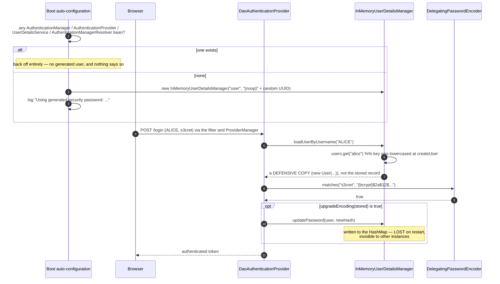

# 3.2 — In-Memory Authentication

> **Module 3 · Topic 2** · Authentication
> Baseline: Spring Security 6.x on Boot 3.x, Java 17+
> New to this? Read **In Plain English** below first, then come back to the Version Matrix.

---

## Version Matrix

| Concern | Spring Security 5.x | **Spring Security 6.x (baseline)** | Spring Security 7.x |
|---|---|---|---|
| Declaring in-memory users | `auth.inMemoryAuthentication()` inside `WebSecurityConfigurerAdapter` | **an `InMemoryUserDetailsManager` `@Bean`** | same; the builder DSL is gone |
| `User.withDefaultPasswordEncoder()` | added 5.0, deprecated almost immediately | **deprecated, `forRemoval` in the Javadoc** | removed |
| Plaintext passwords | `NoOpPasswordEncoder` or `{noop}` | **`{noop}`; `NoOpPasswordEncoder.getInstance()` is deprecated** | `{noop}` still resolves, the class is gone |
| Boot's generated user | backs off on a `UserDetailsService` bean | **also backs off on `AuthenticationManager`, `AuthenticationProvider`, `AuthenticationManagerResolver`** | same |
| Password upgrade on login | `UserDetailsPasswordService` added in 5.1 | **`InMemoryUserDetailsManager` implements it** | same |
| `password(...)` with no encoder | stored raw, fails at `matches` | **same: `IllegalArgumentException: There is no PasswordEncoder mapped for the id "null"`** | same |
| Username case | keys lowercased internally | **keys lowercased internally** | unchanged |

---

## Why This Exists

`InMemoryUserDetailsManager` is a `HashMap` behind the `UserDetailsService` interface. It exists so
that the pipeline from the previous topic — filter, `ProviderManager`, `DaoAuthenticationProvider`,
`UserDetailsService`, `PasswordEncoder` — can be exercised without a database, a schema, a
migration, or a connection pool.

That makes it genuinely valuable in **tests**, where a fixed user set is the fixture; in **getting
started**, where the point is the mechanism rather than the persistence; and in a narrow set of
**operational back doors**, most often credentials for an Actuator endpoint that must keep working
when the user database is unreachable.

It is also the single most common way a production credential ends up in a Git repository. The
interview question is almost never "how do you configure it" — that is four lines — it is **"when is
this the right answer, and what exactly do you lose by choosing it"**. Treat the rest of this file as
a security review rather than a tutorial.

> **The sentence to remember:** in-memory authentication is a *fixture*, not a *user store*. The
> moment a real human's credential lives in it, you have no revocation, no rotation, no audit trail,
> and a secret in source control.

---

## In Plain English

**The one-line version:** In-memory authentication means you list a few usernames and passwords
directly in your application's own startup code, so the application can check logins without a
database anywhere in the picture.

**An analogy.** Picture a small theatre hosting a private screening for one evening. A real cinema
runs a ticketing system: a database that records every customer, lets staff cancel a single ticket,
and keeps a record of who walked in and when. The theatre is not doing any of that for one evening.
Someone writes six names on a sheet of paper and tapes it beside the door. If your name is on the
sheet, you are in. The door staff never has to phone the ticketing system at all.

The sheet of paper is a genuinely good decision for one evening. It costs nothing, it cannot break,
and it works even if the ticketing system is offline. But it has properties you would never accept
for a real cinema. To remove a name, somebody has to physically walk to the door with a pen. There is
no record of who came in. If a copy of the sheet gets photographed and shared, your only response is
to print a new sheet and walk back to the door. And when the theatre closes for the night, the sheet
goes in the bin, so any name added during the evening is gone by morning — which is exactly what
happens to your users when the application restarts.

**How it actually works, step by step.**

When a login arrives, Spring Security needs something to answer one narrow question: "for this
username, what is the stored password, and what is this person allowed to do?" The component that
answers is called a `UserDetailsService`. It is an interface with a single method,
`loadUserByUsername`, and its only job is to fetch one user's record by name and hand it back in a
shape Spring understands. It does not check the password. If the name is unknown it throws
`UsernameNotFoundException`.

`InMemoryUserDetailsManager` is one implementation of that interface, and it is deliberately the
simplest possible one: a `HashMap` (a Java lookup table that maps a key to a value) held in the
running program's memory. You fill it at startup with a fixed handful of users. It stores and looks
up the keys in lowercase, so `Alice` and `alice` are the same account here — a convenience this class
happens to have, which the database-backed implementations do not.

You describe each user with a small builder, for example
`User.withUsername("alice").password("{noop}s3cret").roles("USER").build()`. Two details in that line
matter. The `{noop}` prefix is a marker that means "no hashing algorithm was applied to this
password, so compare it character for character" — it is a label, not any kind of protection.
And `roles("USER")` actually stores the string `ROLE_USER`, because Spring silently puts `ROLE_` on
the front of anything you pass to `roles(...)`.

At login time, a filter collects the submitted username and password and passes them to a
`DaoAuthenticationProvider` — the component that coordinates the check. It asks the
`UserDetailsService` for the stored record, then hands the typed password and the stored password to
a `PasswordEncoder`, whose `matches` method returns true or false. So the comparison happens in the
encoder, never in the user store. If the stored password has no `{...}` prefix at all, the encoder
refuses to guess and throws an error, rather than quietly comparing plaintext.

Spring Boot also hands you one user for free when you have declared no user store of your own:
username `user`, with a random password printed once in the startup log. The moment you declare your
own store, that free user silently disappears.

Finally, remember where all of this lives. It is a map in one running process. Restart the
application and the map is rebuilt from your startup code, so any change made while it was running
is gone. Run two copies of the application behind a load balancer and you have two independent maps
that can drift apart.

**Why should a beginner care?** The two mistakes this topic exists to prevent both cause real damage.
The first is putting a password that actually protects something into a source file: it is then in
the Git history permanently, in every clone, in the build cache, and in the container image, and
deleting the line later removes none of those copies. The second is believing that a change-password
or add-user feature built on this class works, because the code returns successfully and the next
restart silently throws the change away. You also need to know that a login can succeed and every
page still return 403, because the user has no roles — an authorization problem that looks like an
authentication problem.

**Words you will meet in this file**

| Term | In plain words |
|---|---|
| `UserDetailsService` | The one-method lookup that fetches a single user's record by username. It never checks the password. |
| `UserDetails` | The record itself: username, stored password, permissions, and four on/off status flags. |
| `InMemoryUserDetailsManager` | A `UserDetailsService` whose storage is a lookup table in memory, filled at startup. No database. |
| `UserDetailsManager` | An add-on interface that also allows create, update, delete, and change-password on users. |
| `PasswordEncoder` | The component that turns a password into a scrambled form and checks a typed password against a stored one. |
| `DelegatingPasswordEncoder` | The default encoder. It reads the `{...}` label on a stored password and picks the matching algorithm. |
| `{noop}` | The label meaning "no algorithm was used here", so the comparison is a plain character-by-character match. |
| `{bcrypt}` | The label meaning the stored value was scrambled with the bcrypt algorithm, which is a real one-way hash. |
| `DaoAuthenticationProvider` | The component that puts the two halves together: fetch the user, then ask the encoder if the password matches. |
| `GrantedAuthority` | A single permission string attached to a user, such as `ROLE_ADMIN` or `SCOPE_actuator:read`. |
| Role | A permission string that starts with `ROLE_`. `roles("USER")` stores `ROLE_USER` for you. |
| Bean | An object that Spring creates and manages for you, usually declared with a `@Bean` method. |
| `UsernameNotFoundException` | The error thrown when the lookup finds no user with that name. |
| `credentialsExpired` | A status flag meaning "this password is stale", which forces a change before the account can be used. |
| `SecurityContextHolder` | The place Spring keeps the currently logged-in user for the request being handled right now. |

**If you remember only one thing:** in-memory users are a fixture you wire in at startup, so the
moment a real secret or a real person lives in that map you have given up revocation, rotation, and
any audit trail.

---

## Core Concepts

### 1. `InMemoryUserDetailsManager`

**In simple terms:** This is the whole user store: a lookup table of username to user record, kept in
the running program's memory, so a login can be checked with no database involved at all.

```java
package org.springframework.security.provisioning;

public class InMemoryUserDetailsManager implements UserDetailsManager, UserDetailsPasswordService {

    private final Map<String, MutableUserDetails> users = new HashMap<>();
    private AuthenticationManager authenticationManager;

    public InMemoryUserDetailsManager() { }
    public InMemoryUserDetailsManager(Collection<UserDetails> users) { users.forEach(this::createUser); }
    public InMemoryUserDetailsManager(UserDetails... users) { for (UserDetails u : users) createUser(u); }
    public InMemoryUserDetailsManager(Properties users) { /* "password,ROLE_X[,disabled]" per key */ }

    @Override
    public UserDetails loadUserByUsername(String username) throws UsernameNotFoundException {
        UserDetails user = this.users.get(username.toLowerCase());
        if (user == null) throw new UsernameNotFoundException(username);
        // A DEFENSIVE COPY: callers cannot mutate the stored record.
        return new User(user.getUsername(), user.getPassword(), user.isEnabled(),
                user.isAccountNonExpired(), user.isCredentialsNonExpired(),
                user.isAccountNonLocked(), user.getAuthorities());
    }
}
```

**Usernames are stored and looked up lowercased**, so `Alice` and `alice` are one account. That is a
convenience of this class which `JdbcDaoImpl` does *not* share, so migrating to a database can turn
a working login into `UsernameNotFoundException`.

**`loadUserByUsername` returns a defensive copy.** That is necessary because `eraseCredentials()`
nulls the password on whatever object it is handed; without the copy, the first successful login
would blank the stored password and every later login would fail.

**It implements `UserDetailsPasswordService`**, so `DaoAuthenticationProvider` calls `updatePassword`
to re-hash on login when `passwordEncoder.upgradeEncoding(...)` returns true. The re-hash is written
into the map and lost at the next restart, which illustrates the whole problem with this class.

### 2. `User.withUsername()` and the builder

**In simple terms:** This is how you describe one user in a few lines of code, and the two things
that catch everybody out are that the password is stored exactly as you typed it unless you supply an
encoder, and that `roles(...)` adds `ROLE_` for you while `authorities(...)` does not.

```java
UserDetails alice = User.withUsername("alice")
        .password("$2a$12$...")        // must ALREADY be encoded, or use passwordEncoder(...)
        .roles("USER", "AUDITOR")      // becomes ROLE_USER, ROLE_AUDITOR
        .build();

UserDetails svc = User.withUsername("batch-job")
        .password("raw-secret")
        .passwordEncoder(encoder::encode)      // Function<String, String>, applied inside build()
        .authorities("SCOPE_batch:run")        // NO prefix added
        .credentialsExpired(false)
        .build();
```

| Builder method | Effect |
|---|---|
| `password(String)` | stored verbatim unless `passwordEncoder(...)` was supplied |
| `passwordEncoder(Function<String,String>)` | applied to the password inside `build()` |
| `roles(String...)` | prefixes each with `ROLE_`; **asserts** the input is not already prefixed |
| `authorities(String...)` / `authorities(GrantedAuthority...)` | stored exactly as given, no prefix |
| `disabled` / `accountLocked` / `accountExpired` / `credentialsExpired` | the four `UserDetails` status flags |

`roles("ROLE_USER")` throws `IllegalArgumentException: ROLE_USER cannot start with ROLE_ (it is
automatically added)`. `authorities("USER")` compiles and runs, and then `hasRole("USER")` fails
forever because `hasRole` prepends `ROLE_` at check time. Mixing the two is the most common
in-memory bug.

### 3. `User.withDefaultPasswordEncoder()` — why it must never ship

**In simple terms:** This shortcut scrambles the password properly, but you have to type the real
password into your source file to use it, and that plaintext string then lives in your Git history
forever even after you delete the line.

```java
// DEPRECATED and marked for removal. Never in a committed file.
UserDetails user = User.withDefaultPasswordEncoder()
        .username("user")
        .password("password")     // <-- plaintext, right here, in your repository
        .roles("USER")
        .build();
```

It is a builder whose `passwordEncoder` function is
`PasswordEncoderFactories.createDelegatingPasswordEncoder()::encode`, so the *stored* value is a
perfectly good `{bcrypt}` hash. That is exactly what makes it dangerous: the output looks secure
while the **input is a string literal in your source code**.

The literal ends up in the Git history permanently, in the compiled `.class`, in the container image,
in every clone, in the continuous integration cache, and in any artefact the build publishes.
Deleting the line later removes none of those copies. Every deprecation warning added to this method
is the framework trying to keep that string out of your history. Read the password from configuration
and encode it with an injected `PasswordEncoder` instead.

### 4. The `{noop}` prefix

**In simple terms:** The `{...}` label at the start of a stored password tells Spring which scrambling
algorithm was used, and `{noop}` says "none at all", so the password is compared as ordinary text and
is protecting nothing.

`DelegatingPasswordEncoder` reads an `{id}` prefix from the stored value and dispatches to the
matching encoder — `{bcrypt}`, `{argon2}`, `{scrypt}`, `{pbkdf2}`, `{sha256}`, `{noop}`.

```java
.password("{noop}s3cret")   // NoOpPasswordEncoder: matches() is rawPassword.equals(encodedPassword)
```

Two precise statements worth being able to make. First, **`{noop}` is encoding, not encryption, and
not obfuscation** — it is a routing marker that declares "no algorithm", and it defends against
nothing. Second, **its only legitimate use is a password that is not a secret**: a test fixture, a
documented demo credential, or a value generated fresh at startup.

With no prefix and no builder encoder, the stored value has no `{id}` and
`DelegatingPasswordEncoder.matches` throws
`IllegalArgumentException: There is no PasswordEncoder mapped for the id "null"`. That is a
deliberately loud failure rather than a silent fallback to plaintext comparison, because the silent
fallback would be a vulnerability.

### 5. Boot's auto-configured user

**In simple terms:** If you declare no user store of your own, Spring Boot invents a single user for
you with a fresh random password printed in the startup log, and that user vanishes without any
announcement as soon as you declare a store yourself.

`UserDetailsServiceAutoConfiguration` creates an `InMemoryUserDetailsManager` with exactly one user,
but only when **none** of these beans exist: `AuthenticationManager`, `AuthenticationProvider`,
`UserDetailsService`, `AuthenticationManagerResolver`.

```properties
spring.security.user.name=user            # default: "user"
spring.security.user.password=            # default: a random UUID, logged once at startup
spring.security.user.roles=USER,ADMIN     # default: empty (no authorities at all)
```

`getOrDeducePassword` tests the configured value against the pattern `^\{.+}.*$` and prepends
`{noop}` when there is no `{id}` prefix, so a plain property works and an already-hashed one is
respected. With no password configured, a `UUID.randomUUID()` is generated and logged once as
`Using generated security password: …`, followed by a warning that it is for development only.

Three points that come up in interviews. The generated password **changes on every restart**, which
is why it is a safe development default and a useless deployment strategy. Setting
`spring.security.user.password` in a committed properties file puts a credential in source control —
the same mistake as `withDefaultPasswordEncoder()` wearing a configuration hat. And the default
`roles` is **empty**, so the user authenticates successfully and then fails every `hasRole(...)`
rule: an authentication that looks broken but is an authorization problem.

### 6. `UserDetailsManager` — the CRUD surface

**In simple terms:** On top of looking users up, this interface lets you add, change, and delete them
while the application is running, which sounds useful until you remember that here those changes only
ever reach a map that is thrown away on restart.

```java
public interface UserDetailsManager extends UserDetailsService {
    void createUser(UserDetails user);
    void updateUser(UserDetails user);
    void deleteUser(String username);
    void changePassword(String oldPassword, String newPassword);
    boolean userExists(String username);
}
```

`createUser` asserts the user does **not** already exist and throws `IllegalArgumentException` if it
does — it is not an upsert. `changePassword` is the odd one: it takes no username because it operates
on the **currently authenticated user** read from the `SecurityContextHolder`, throwing
`AccessDeniedException` when there is nobody there. If an `AuthenticationManager` was supplied via
`setAuthenticationManager(...)` it re-authenticates with the old password first — correct behaviour,
and off by default. There is also a `GroupManager` interface with `createGroup` and
`addUserToGroup`; `InMemoryUserDetailsManager` does **not** implement it, `JdbcUserDetailsManager`
does.

### 7. Legitimate uses versus liabilities

**In simple terms:** In-memory users are the right answer whenever the password is not really a
secret, such as in tests and demos, and the wrong answer for anyone real, because you cannot switch a
credential off without building and deploying the application again.

| Use | Verdict | Condition |
|---|---|---|
| Test fixtures | **Yes** | in `src/test`; `{noop}` passwords are better than hashes here |
| Local development and demos | **Yes** | a non-default profile, or Boot's generated password |
| Documentation and training | **Yes** | the credential is public by design |
| Actuator or metrics on its own chain | **Defensible** | password from a secret manager, never a literal |
| One bootstrap administrator | **Defensible with an expiry plan** | forced change on first login, then migration |
| Service-to-service credentials | **No** | no rotation without a deployment |
| Any end user | **No** | every liability below applies at once |

**No revocation.** Removing a user means editing configuration, building, and deploying. If a
credential leaks at 02:00, your mitigation is a release.

**No rotation.** Same mechanism, same cost. Any policy measured in days is incompatible with a store
that needs a deployment to change a value.

**Credentials in source or configuration.** Even when read from an environment variable, the user
*set* is in code, so adding an operator is a pull request. Read from a properties file, the secret
itself is in Git.

**No audit trail.** No created-at, no last-login, no failed-attempt counter, no record of who changed
what. For SOC 2, PCI DSS, or an internal access review, "we cannot tell you who holds this credential
or when it was last used" is the finding.

**State lost at restart.** Runtime `createUser` and password upgrades live in a `HashMap`. A pod
restart silently reverts them, which is worse than not supporting them, because the operation appears
to succeed.

**It does not work across instances.** Two replicas are two independent maps, so a password changed
on instance A is unchanged on instance B and the same credential works or fails depending on which
pod the load balancer picked. This one gets diagnosed last, because it is intermittent.



---

## Working Code

### A defensible in-memory configuration

```java
package com.example.security;

import org.springframework.beans.factory.annotation.Value;
import org.springframework.context.annotation.Bean;
import org.springframework.context.annotation.Configuration;
import org.springframework.context.annotation.Profile;
import org.springframework.security.core.userdetails.User;
import org.springframework.security.core.userdetails.UserDetails;
import org.springframework.security.crypto.bcrypt.BCryptPasswordEncoder;
import org.springframework.security.crypto.password.PasswordEncoder;
import org.springframework.security.provisioning.InMemoryUserDetailsManager;

@Configuration
public class InMemoryUsersConfig {

    @Bean
    PasswordEncoder passwordEncoder() {
        return new BCryptPasswordEncoder(12);
    }

    /**
     * A single break-glass operator, guarded three ways:
     *  - the password comes from the environment (a secret manager), never a literal;
     *  - startup FAILS if it is absent, rather than defaulting to something guessable;
     *  - credentialsExpired forces a change on first use, which the change-password flow
     *    must write to the REAL user store, because this map does not survive a restart.
     */
    @Bean
    InMemoryUserDetailsManager breakGlassUser(PasswordEncoder passwordEncoder,
            @Value("${app.breakglass.username}") String username,
            @Value("${app.breakglass.password:}") String password) {

        if (password.isBlank()) {
            throw new IllegalStateException("app.breakglass.password must come from the secret manager");
        }
        UserDetails operator = User.withUsername(username)
                .password(password)
                .passwordEncoder(passwordEncoder::encode)   // encoded inside build()
                .authorities("ROLE_OPERATOR", "SCOPE_actuator:read")
                .credentialsExpired(true)
                .build();

        return new InMemoryUserDetailsManager(operator);
    }

    /** Local development only. Never on the default profile, so it cannot ship by accident. */
    @Bean
    @Profile("local")
    InMemoryUserDetailsManager localUsers() {
        return new InMemoryUserDetailsManager(
                User.withUsername("alice").password("{noop}dev").roles("USER").build(),
                User.withUsername("admin").password("{noop}dev").roles("USER", "ADMIN").build());
    }
}
```

### In-memory credentials for Actuator, a real store for everything else

```java
package com.example.security;

import org.springframework.boot.actuate.autoconfigure.security.servlet.EndpointRequest;
import org.springframework.context.annotation.Bean;
import org.springframework.context.annotation.Configuration;
import org.springframework.core.annotation.Order;
import org.springframework.security.authentication.ProviderManager;
import org.springframework.security.authentication.dao.DaoAuthenticationProvider;
import org.springframework.security.config.Customizer;
import org.springframework.security.config.annotation.web.builders.HttpSecurity;
import org.springframework.security.config.annotation.web.configuration.EnableWebSecurity;
import org.springframework.security.config.http.SessionCreationPolicy;
import org.springframework.security.crypto.password.PasswordEncoder;
import org.springframework.security.provisioning.InMemoryUserDetailsManager;
import org.springframework.security.web.SecurityFilterChain;

import java.util.List;

@Configuration
@EnableWebSecurity
public class ActuatorSecurityConfig {

    /**
     * The whole argument for in-memory here: monitoring must still authenticate when the user
     * database is the thing that is down. Note the explicit ProviderManager — this chain must NOT
     * fall back to the application's UserDetailsService, or the dependency comes straight back.
     * The application's own chain, at @Order(2), uses the real database-backed store.
     */
    @Bean
    @Order(1)
    SecurityFilterChain actuatorChain(HttpSecurity http,
                                      InMemoryUserDetailsManager breakGlassUser,
                                      PasswordEncoder passwordEncoder) throws Exception {

        DaoAuthenticationProvider provider = new DaoAuthenticationProvider();
        provider.setUserDetailsService(breakGlassUser);
        provider.setPasswordEncoder(passwordEncoder);

        http
            .securityMatcher(EndpointRequest.toAnyEndpoint())
            .authorizeHttpRequests(auth -> auth
                .requestMatchers(EndpointRequest.to("health", "info")).permitAll()
                .anyRequest().hasAuthority("SCOPE_actuator:read")
            )
            .httpBasic(Customizer.withDefaults())
            .authenticationManager(new ProviderManager(List.of(provider)))
            .sessionManagement(session -> session.sessionCreationPolicy(SessionCreationPolicy.STATELESS))
            .csrf(csrf -> csrf.disable());   // stateless Basic, no browser-driven state change

        return http.build();
    }
}
```

### Tests

```java
package com.example.security;

import org.junit.jupiter.api.Test;
import org.springframework.security.authentication.*;
import org.springframework.security.authentication.dao.DaoAuthenticationProvider;
import org.springframework.security.core.CredentialsContainer;
import org.springframework.security.core.userdetails.*;
import org.springframework.security.crypto.factory.PasswordEncoderFactories;
import org.springframework.security.crypto.password.PasswordEncoder;
import org.springframework.security.provisioning.InMemoryUserDetailsManager;

import static org.assertj.core.api.Assertions.*;

class InMemoryUserDetailsManagerTests {

    private final PasswordEncoder encoder = PasswordEncoderFactories.createDelegatingPasswordEncoder();

    private final InMemoryUserDetailsManager manager = new InMemoryUserDetailsManager(
            User.withUsername("alice").password("{noop}s3cret").roles("USER").build(),
            User.withUsername("dave").password("{noop}s3cret").roles("USER").disabled(true).build());

    private ProviderManager authenticationManager(UserDetailsService store) {
        DaoAuthenticationProvider provider = new DaoAuthenticationProvider();
        provider.setUserDetailsService(store);
        provider.setPasswordEncoder(this.encoder);
        return new ProviderManager(provider);
    }

    @Test
    void usernameLookupIsCaseInsensitiveBecauseKeysAreLowercased() {
        // InMemoryUserDetailsManager behaviour, NOT a UserDetailsService guarantee. JdbcDaoImpl
        // is case-sensitive, so this passing test can hide a migration bug.
        assertThat(this.manager.loadUserByUsername("ALICE").getUsername()).isEqualTo("alice");
    }

    @Test
    void loadReturnsADefensiveCopySoErasureCannotBlankTheStoredPassword() {
        UserDetails first = this.manager.loadUserByUsername("alice");
        ((CredentialsContainer) first).eraseCredentials();

        assertThat(first.getPassword()).isNull();
        assertThat(this.manager.loadUserByUsername("alice").getPassword()).isEqualTo("{noop}s3cret");
    }

    @Test
    void disabledUserFailsWithDisabledExceptionNotBadCredentials() {
        assertThatThrownBy(() -> authenticationManager(this.manager)
                .authenticate(UsernamePasswordAuthenticationToken.unauthenticated("dave", "s3cret")))
                .isInstanceOf(DisabledException.class);
    }

    @Test
    void unprefixedPasswordsFailLoudlyRatherThanComparingAsPlaintext() {
        UserDetailsService broken = new InMemoryUserDetailsManager(
                User.withUsername("bob").password("s3cret").roles("USER").build());

        assertThatThrownBy(() -> authenticationManager(broken)
                .authenticate(UsernamePasswordAuthenticationToken.unauthenticated("bob", "s3cret")))
                .isInstanceOf(IllegalArgumentException.class)
                .hasMessageContaining("There is no PasswordEncoder mapped for the id \"null\"");
    }

    @Test
    void createUserIsNotAnUpsertAndRuntimeChangesDoNotSurviveARestart() {
        UserDetails carol = User.withUsername("carol").password("{noop}x").roles("USER").build();
        this.manager.createUser(carol);
        assertThat(this.manager.userExists("carol")).isTrue();

        assertThatThrownBy(() -> this.manager.createUser(carol))
                .isInstanceOf(IllegalArgumentException.class);

        // A new manager is a new HashMap: this is exactly what a pod restart does.
        assertThat(new InMemoryUserDetailsManager().userExists("carol")).isFalse();
    }

    @Test
    void rolesAreRejectedWhenAlreadyPrefixed() {
        assertThatThrownBy(() -> User.withUsername("x").password("{noop}x").roles("ROLE_USER").build())
                .isInstanceOf(IllegalArgumentException.class)
                .hasMessageContaining("cannot start with ROLE_");
    }
}
```

---

## Internals

### The stored record is mutable, the returned one is not

The map value is a package-private `MutableUser implements MutableUserDetails`, which adds a
`setPassword(String)` that `UserDetails` does not have. That setter exists solely so `updatePassword`
can re-hash in place, and `createUser` is where the lowercasing and wrapping happen:

```java
@Override
public UserDetails updatePassword(UserDetails user, String newPassword) {
    MutableUserDetails mutableUser = this.users.get(user.getUsername().toLowerCase());
    mutableUser.setPassword(newPassword);
    return mutableUser;
}

@Override
public void createUser(UserDetails user) {
    Assert.isTrue(!userExists(user.getUsername()), "user should not exist");
    this.users.put(user.getUsername().toLowerCase(), new MutableUser(user));
}
```

Note what is absent: no synchronisation. It is a plain `HashMap`, so concurrent `createUser` or
`deleteUser` calls are unsafe. That is fine for a fixture populated once at startup and read
afterwards, and it is another reason not to build on the runtime CRUD surface.

### Why `changePassword` has no username parameter

```java
@Override
public void changePassword(String oldPassword, String newPassword) {
    Authentication currentUser = SecurityContextHolder.getContext().getAuthentication();
    if (currentUser == null) {
        throw new AccessDeniedException(/* no Authentication in context for the current user */);
    }
    String username = currentUser.getName();
    if (this.authenticationManager != null) {
        this.authenticationManager.authenticate(
                UsernamePasswordAuthenticationToken.unauthenticated(username, oldPassword));
    }
    MutableUserDetails user = this.users.get(username);   // NOT lowercased here, unlike elsewhere
    Assert.state(user != null, "Current user doesn't exist in database.");
    user.setPassword(newPassword);
}
```

The old password is only *verified* when an `AuthenticationManager` was injected — without one,
`oldPassword` is accepted and ignored, so a change-password endpoint built on this method with no
manager set performs no re-authentication at all. And this lookup uses `currentUser.getName()`
**unlowercased**, unlike every other method, so a token whose name is not already lowercase hits the
`Assert.state` failure.

---

## Configuration Reference

| Option | Effect | Default |
|---|---|---|
| `spring.security.user.name` | username of the auto-configured user | `user` |
| `spring.security.user.password` | its password; `{noop}` prepended when there is no `{id}` prefix | a random UUID, logged once |
| `spring.security.user.roles` | authorities, each prefixed with `ROLE_` | empty — **no authorities at all** |
| `InMemoryUserDetailsManager(Properties)` | bulk load from `username=password,ROLE_X[,disabled]` | — |
| `InMemoryUserDetailsManager.setAuthenticationManager(...)` | makes `changePassword` verify the old password | `null` — **no verification** |
| `User…passwordEncoder(fn)` | applies `fn` to the password inside `build()` | identity: stored verbatim |
| `User…roles(...)` | prefixes with `ROLE_`; rejects input already prefixed | no authorities |
| `User…authorities(...)` | stores strings exactly as given | no authorities |
| `User.withDefaultPasswordEncoder()` | delegating encoder applied at `build()` | **deprecated, `forRemoval`** |
| `{noop}` prefix | selects `NoOpPasswordEncoder`, `String.equals` comparison | none; unprefixed values throw |
| `HttpSecurity.userDetailsService(...)` | scopes a store to one `SecurityFilterChain` | the global store |

---

## Production Concerns & Anti-Patterns

**`spring.security.user.password` in a committed `application.properties`.** The most common way a
production credential enters a repository. It reads as configuration, so it escapes the scrutiny a
hard-coded Java string would attract, and it is in the Git history permanently. A property carrying a
credential belongs in an environment variable backed by a secret manager, with the application
refusing to start when it is absent rather than defaulting.

**`User.withDefaultPasswordEncoder()` outside a scratch file.** The bcrypt output looks professional;
the plaintext argument beside it is the problem.

**`{noop}` on a credential that is actually secret.** A reviewer seeing `{noop}` should ask whether
the value matters. If it is the operator password, the finding is not the encoding — it is that the
password is in the file at all.

**Relying on runtime `createUser` or `changePassword`.** Both return normally, and both are reverted
by the next restart and invisible to other replicas. An operation that appears to work and silently
does not is worse than an unsupported one.

**In-memory users behind a load balancer with more than one replica.** Each instance has its own map,
so password upgrades from `UserDetailsPasswordService` and any runtime mutation diverge per pod,
producing intermittent failures that correlate with nothing in your traces.

**A bootstrap administrator with no expiry plan.** Defensible on day one, a permanent unaudited
super-user by month six. Set `credentialsExpired(true)`, make the forced change write to the real
store, and add a startup check that alerts once a real administrator exists.

**Mixing `roles(...)` and `authorities(...)`.** `roles("ADMIN")` yields `ROLE_ADMIN` and
`authorities("ADMIN")` yields `ADMIN`; `hasRole("ADMIN")` matches only the first. Pick one convention
and assert it in a test.

**In-memory users in an integration test whose subject is the real store.** The test passes, the
store is never exercised, and the case-sensitivity or schema bug ships.

**Leaving Boot's generated password in place for a deployed service.** It rotates on every restart, so
anything depending on it breaks unpredictably, and it is written in plaintext to the application log,
which usually has much broader access than the secret manager.

---

## Debugging Playbook

| Symptom | Likely root cause | Fix |
|---|---|---|
| `IllegalArgumentException: There is no PasswordEncoder mapped for the id "null"` | Stored password has no `{id}` prefix and the builder had no encoder | Add `{noop}` for fixtures, or `passwordEncoder(encoder::encode)` |
| No generated password in the log, default `user` does not work | A `UserDetailsService`, `AuthenticationManager`, `AuthenticationProvider`, or `AuthenticationManagerResolver` bean made the auto-configuration back off | Expected; declare your own users |
| Login succeeds, then every page returns 403 | `spring.security.user.roles` is empty by default | Set the property, or use `.roles(...)` |
| `IllegalArgumentException: ROLE_USER cannot start with ROLE_` | `roles("ROLE_USER")` | Use `roles("USER")` or `authorities("ROLE_USER")` |
| `hasRole("USER")` never matches | Built with `authorities("USER")`; `hasRole` prepends `ROLE_` | Use `roles("USER")` or check `hasAuthority("USER")` |
| A password change works, then reverts | The map is not persistent | Move to a real `UserDetailsManager`; do not offer the feature |
| Authentication intermittently fails across replicas | Per-instance `HashMap` plus password upgrade or runtime CRUD | Use a shared store |
| Works in-memory, `UsernameNotFoundException` after moving to JDBC | This class lowercases keys; `JdbcDaoImpl` does not | Normalise at the edge, or use a case-insensitive query |
| `AccessDeniedException` from `changePassword` | No `Authentication` in the holder | Call it from an authenticated request, not a bootstrap runner |
| `changePassword` accepts any old password | No `AuthenticationManager` was injected | Call `setAuthenticationManager(...)` |
| `createUser` throws on a retry | It asserts non-existence; it is not an upsert | Check `userExists` first, or call `updateUser` |

---

## Interview Q&A

### Q1. When is in-memory authentication actually the right choice in a production system?

<details>
<summary>Show answer</summary>

My default answer is "for real users, never", and the interesting part is the narrow set of
exceptions.

The one I would genuinely defend is credentials for an operational endpoint that must keep working
when the user database is the thing that is broken. Putting Actuator behind the application's own
user store creates a circular dependency, so when the database fails you lose both the service and
your ability to see why. A separate `SecurityFilterChain` with its own `ProviderManager` and a single
in-memory operator, password from the secret manager, is the correct design — the in-memory part is
not laziness, independence from the database is the requirement.

The second is a first-run bootstrap administrator, and only with an expiry plan:
`credentialsExpired(true)`, a forced change that writes to the real store, and a startup check that
alerts once a genuine administrator exists. Without that you have created a permanent unaudited
super-user. Everything else is tests, local development, and documentation, where the credential is
not a secret at all.

**Counter-question: the password comes from an environment variable. Is that good enough?**

It is the minimum, not the finish line. It solves the worst problem, since the secret is out of Git,
but the remaining properties are unchanged: rotation needs a restart because the bean is built once
at startup, the user *set* is still in code so adding an operator is a pull request, and there is
still no record of who used it.

For a break-glass credential used a few times a year I would accept that and compensate outside the
application — restrict the endpoint by network policy so it is not internet-reachable, alert on
*every* successful authentication against that chain since legitimate use should be rare enough that
each one is worth a look, and record the checkout in the privileged-access system. The
application-level control is deliberately weak, so the controls around it have to be real.

**Counter-question: a colleague says two replicas make this unsafe. Are they right?**

Partly, and it is worth being precise about which half. Read-only in-memory users are perfectly
consistent across replicas: the same configuration produces the same map in every pod, so
authentication is deterministic. Divergence appears only when something *writes* — runtime
`createUser`, `changePassword`, or the `UserDetailsPasswordService` upgrade that
`DaoAuthenticationProvider` triggers when `upgradeEncoding` returns true.

So the rule is not "never use in-memory with replicas", it is "keep it immutable". Do not expose CRUD
on it, and know that the password-upgrade path can mutate it without your involvement. If the bean's
contents never change after startup, the replica count is irrelevant.
</details>

### Q2. `{noop}` — explain exactly what it does, and when its use is defensible.

<details>
<summary>Show answer</summary>

`{noop}` is an identifier read by `DelegatingPasswordEncoder`, which parses the `{id}` prefix from the
stored value and dispatches to the matching `PasswordEncoder` from its map. `{noop}` selects
`NoOpPasswordEncoder`, whose `matches` is `rawPassword.equals(encodedPassword)` and whose `encode`
returns its input. So `{noop}s3cret` means "the password is the literal string `s3cret`, compared with
`String.equals`".

The precise statement is that **`{noop}` is encoding, not encryption, and not obfuscation**. It is
metadata declaring which algorithm applies, and it declares "none". It is defensible exactly when the
password is not a secret: a fixture in `src/test`, a demo credential in documentation, a local profile
that is not the default. It is indefensible anywhere the value actually protects something — and in
that case the problem is not the encoding, it is that the password is in the file.

**Counter-question: why does an unprefixed password throw instead of being compared as plaintext?**

Because a silent fallback would be a vulnerability and a loud failure is a design decision. If a
missing `{id}` meant "compare directly", a migration bug that dropped the prefixes would leave every
account authenticating against its plaintext password with no visible change in behaviour. Instead
you get `IllegalArgumentException: There is no PasswordEncoder mapped for the id "null"` on the first
login attempt, which is impossible to miss and impossible to deploy past. It is the same philosophy
as `setAuthenticated(true)` throwing: the framework refuses to guess where guessing wrong is a
security hole.

**Counter-question: I see `{noop}` in a pull request. What do you ask?**

One question — is this value a secret? If it is a test fixture or a documented demo credential I
approve it, and would actively prefer it over a bcrypt hash, because a hash in a test obscures the
password and costs real time in every run.

If the answer is "it is the operator password", the finding is not the `{noop}`, it is that the
credential is in the repository, and the fix is a secret manager rather than a stronger encoder. That
distinction matters because the tempting response is "change it to `{bcrypt}`", which produces a
committed hash: better than committed plaintext, still a committed credential with no rotation path,
and now looking secure enough that the next reviewer will not question it.
</details>

### Q3. What exactly does Spring Boot auto-configure, and what makes it disappear?

<details>
<summary>Show answer</summary>

`UserDetailsServiceAutoConfiguration` creates an `InMemoryUserDetailsManager` holding one user. The
username comes from `spring.security.user.name`, defaulting to `user`. The password comes from
`spring.security.user.password`; when absent, a `UUID.randomUUID()` is generated and logged once as
"Using generated security password: …" with a warning that it is for development only. Before
storing, `getOrDeducePassword` tests the value against `^\{.+}.*$` and prepends `{noop}` when there is
no `{id}` prefix. Authorities come from `spring.security.user.roles`, each prefixed with `ROLE_`, and
that list is **empty by default**.

It disappears when any bean of type `AuthenticationManager`, `AuthenticationProvider`,
`UserDetailsService`, or `AuthenticationManagerResolver` exists, because of the
`@ConditionalOnMissingBean` on the auto-configuration class.

**Counter-question: a user reports login succeeds but every page returns 403. What is it?**

Almost certainly the empty default `roles`. The account authenticates perfectly —
`DaoAuthenticationProvider` finds the user, the password matches, no status flag blocks it — and the
resulting token carries zero authorities, so every `hasRole` or `hasAuthority` rule denies and
`anyRequest().authenticated()` is the only rule that would have passed.

It is misdiagnosed so often because the symptom is on the authorization side while the mistake is on
the authentication side, so people go looking at the password encoder. The tell is the status code: a
401 means authentication failed, a 403 means it succeeded and authorization denied. Setting
`spring.security.user.roles=USER` fixes it.

**Counter-question: I added a custom `AuthenticationProvider` and my smoke test broke. Why?**

Because that provider is an `AuthenticationProvider` bean, one of the four types the auto-configuration
backs off on. The generated `user` account your smoke test was logging in with no longer exists, and
nothing announced it, because backing off is silent — the missing "Using generated security password"
line is the only evidence.

This is the argument for never depending on the generated user beyond a first manual look at the
application. Declare your test users explicitly in a test configuration so their existence does not
depend on which beans happen to be in the context.
</details>

### Q4. Walk me through migrating from in-memory to JDBC. What breaks?

<details>
<summary>Show answer</summary>

Mechanically it is small: swap the `InMemoryUserDetailsManager` bean for a `JdbcUserDetailsManager`
with a `DataSource`, create the schema, and insert the users with properly encoded passwords. The
`DaoAuthenticationProvider`, the filter, and every authorization rule are untouched, because they
only know `UserDetailsService`. That is the payoff of the interface.

What breaks is what in-memory gave you for free. **Case sensitivity** is the big one: this class
lowercases keys on write and read so `ALICE` works, while `JdbcDaoImpl` issues
`select ... where username = ?` and does not, so the same login becomes `UsernameNotFoundException`.
**Password prefixes** stop being an in-code concern and become a data problem, so every inserted row
needs `{bcrypt}` or the login throws on the null identifier. **`GroupManager`** now exists, which
in-memory never implemented, so authority resolution has a second possible source. And the login now
costs database round trips, which is the subject of the next topic.

**Counter-question: how do you make the migration safe rather than a big-bang cutover?**

I would not treat the store swap as the risky part; I would treat the *credential* as the risky part,
because in-memory passwords are almost always weak or shared and should not survive the move.

The sequence: create the schema and load the accounts with a freshly generated per-user password and
`credentials_expired` set, so nobody inherits the old shared secret. Deploy with the JDBC store behind
a feature flag on a canary instance, in-memory still the configured default, and verify real logins on
the canary. Keep the in-memory break-glass operator on its own chain throughout, so a mistake in the
new store does not lock you out entirely. Then flip the flag, watch the
`AuthenticationFailureBadCredentialsEvent` rate, and delete the in-memory bean a release later. The
rollback plan matters more than the rollout: it has to be "flip the flag", which means the in-memory
bean stays in the build one release longer than it is used.

**Counter-question: migrate to `JdbcUserDetailsManager`, or straight to a custom `UserDetailsService`?**

For most real applications, straight to a custom one over your own user entity, and I would say that
before writing the schema. `JdbcUserDetailsManager` assumes the framework's default schema: a `users`
table of username, password, and enabled, plus an `authorities` table of username and authority. Real
applications need an identifier as the primary key, an email, audit columns, a tenant, a locked-until
timestamp, and a roles table with a foreign key rather than a string column. You can override the
queries, and the next topic covers exactly how, but you end up maintaining hand-written SQL that must
return columns in a fixed positional order to serve a class whose model does not match yours.

A `UserDetailsService` that loads your own entity and maps it to a small immutable `UserDetails` is
roughly thirty lines, uses your existing repository, and imposes no schema constraints. I would use
`JdbcUserDetailsManager` when the default schema genuinely is the whole requirement — an internal
tool, a handful of operators — and reach for the custom implementation the moment a user has
attributes the framework's schema has no column for, which in practice is immediately.
</details>

### Q5. A pull request adds an in-memory user for a scheduled job's credentials. Review it.

<details>
<summary>Show answer</summary>

I would reject it, and the reasoning is about the credential's lifecycle rather than the storage
mechanism.

A scheduled job's credential is a long-lived secret with real privileges, so it needs three things
in-memory cannot provide. **Rotation**: any policy measured in days is incompatible with a store where
changing a value requires a build and a deployment, and a credential that cannot be rotated will not
be. **Revocation on a timescale shorter than a release**: if the value leaks, "we will ship a fix" is
not an incident response. And an **audit trail**, because "which system used this and when" will be
asked and the answer has to exist. There is also a subtler problem: if the job's credential shares an
`InMemoryUserDetailsManager` with interactive users it inherits the same filter chain, encoder, and
session behaviour as a human login, which is rarely what you want for machine traffic.

**Counter-question: they push back — one internal batch job, the API is not internet-facing, a database table is over-engineering.**

I would take that seriously, because "not internet-facing" does change the threat model, and then
separate what is proportionate from what is just cheaper to write. The proportionate objection is not
that a table is mandatory; it is that the credential must not be in the repository and must be
replaceable without a deployment. Both are satisfied by putting the value in the secret manager and
reading it at startup, which is a few lines and no schema. For one internal job I would approve that.

What I would not concede is the value in the source tree, for reasons unrelated to how exposed the API
is. "Internal" is not a boundary — it means anyone who reaches the network *and* anyone with
repository access, and repository access is much broader than production access. And credentials in
code do not stay singular: the next job copies the pattern, and in a year there are nine with no
inventory.

**Counter-question: what would you propose instead, concretely?**

Ideally, stop using a username and password for machine-to-machine traffic. The right shape is the
client credentials grant against whatever authorization server the organisation runs, with the job
holding a client identifier and secret the authorization server can rotate and revoke centrally, and
the API validating a short-lived access token as a resource server. Spring Security provides both
halves, so the application code is configuration.

If that infrastructure does not exist and standing it up is out of scope, the pragmatic middle ground
is a hashed API key in the application's own database — a prefix for identification, an expiry, a
last-used timestamp, a revocation flag — verified by a small custom `AuthenticationProvider` on a
stateless chain of its own. That buys rotation, revocation, and audit for about a day of work, and it
does not pretend a service account is a user. The order matters: the standard mechanism first, the
local one as the fallback, and in-memory not on the list.
</details>

### Q6. Design question — you are asked to keep in-memory authentication in a system that is about to be audited. Make it defensible.

<details>
<summary>Show answer</summary>

I would start by separating the two populations, because they have completely different answers.

**End users must move.** No configuration of `InMemoryUserDetailsManager` produces an audit trail,
per-user revocation, or password rotation, and those are table stakes for SOC 2 or PCI DSS. That part
is a migration plan with a date, not a hardening exercise.

**The operational break-glass account can stay and can be made genuinely defensible**, because the
reason it is in-memory is a real architectural requirement: monitoring must authenticate when the
user database is down. Auditors accept a justified exception with compensating controls far more
readily than an unjustified default.

```
SCOPE     one account on its own SecurityFilterChain with its own ProviderManager
          -> must NOT fall back to the app's UserDetailsService, or the independence is gone
          read-only Actuator authorities, never ROLE_ADMIN; securityMatcher limited; STATELESS
SECRET    from the secret manager via an env var, never a property file
          startup FAILS when absent — no guessable default, ever
          rotation = rotate in the manager + rolling restart; documented AND REHEARSED
NETWORK   not routable from the internet; app-level auth is the second layer, not the only one
DETECTION (this replaces the missing audit trail)
          @EventListener on AuthenticationSuccessEvent for this chain -> an audited record with
            the timestamp and the remote address from WebAuthenticationDetails
          alert on EVERY success (legitimate use is rare) and on any failure burst
          reconcile monthly against the privileged-access checkout log
GOVERNANCE named owner, documented purpose, review date on the risk register, quarterly attestation
```

The argument to the auditor is that the control objective is "privileged access is authorised,
minimal, and accountable", and it is met by network isolation, a managed secret, narrow scope, and
per-use alerting — not by the user store's implementation. What loses that argument is an exception
with no owner, no review date, and no detection, which is how most in-memory credentials exist.

**Counter-question: the auditor says "no shared accounts". You have one account for the whole operations team.**

I would concede the principle immediately, because it is correct: a shared account means an action
cannot be attributed to a person, which defeats accountability however well the secret is managed.

Then I would argue about scope. For day-to-day operations the right answer is individual identities in
the corporate identity provider, with the Actuator chain accepting OIDC from it — attributable,
centrally revocable, covered by joiner-mover-leaver process. The in-memory account then stops being
"the operations team's credential" and becomes strictly the break-glass path for when the identity
provider or the database is unavailable, which is a different control with different expectations.

For that residual account the compensating control is **checkout**: the secret lives in the
privileged-access system, an individual checks it out with a reason and a ticket, the checkout is
logged, and the secret is rotated automatically afterwards, so attribution comes from the checkout
record rather than the authentication. That is the standard accepted break-glass pattern, and what
makes it work is the automatic rotation — if using the credential does not invalidate it, the log
stops being authoritative the first time somebody keeps a copy.

**Counter-question: how do you keep this from silently becoming permanent?**

By making its continued existence cost someone something rather than relying on documentation. Three
mechanisms, in increasing order of how much I trust them: a review date on the risk register with a
named owner, which is the minimum and the most likely to be rubber-stamped; an automated check at
startup that warns loudly once the real user store contains administrator accounts, so the temporary
measure raises its hand when its justification expires; and best, a test asserting the account's scope
has not widened — that its authorities are exactly the read-only Actuator set and that its chain does
not match application endpoints.

That last one prevents the realistic failure mode, which is not that the account lives too long but
that somebody quietly adds `ROLE_ADMIN` because it was convenient. The general principle: a temporary
security exception needs an automated expiry signal, because the manual ones always lapse first.
</details>

---

## Quick Recall

```
WHAT IT IS
  InMemoryUserDetailsManager = a HashMap behind UserDetailsService
  implements UserDetailsManager (CRUD) + UserDetailsPasswordService (upgrade on login)
  does NOT implement GroupManager (JdbcUserDetailsManager does)
  keys LOWERCASED on write and read -> case-insensitive usernames (JdbcDaoImpl is NOT)
  loadUserByUsername returns a DEFENSIVE COPY, so eraseCredentials cannot blank the stored password
  plain HashMap, no synchronisation -> runtime CRUD is not concurrency-safe

BUILDER
  roles("X")       -> ROLE_X   ; roles("ROLE_X") THROWS
  authorities("X") -> X        ; then hasRole("X") never matches (hasRole prepends ROLE_)
  passwordEncoder(fn) applied inside build(); without it the password is stored VERBATIM
  flags: disabled | accountLocked | accountExpired | credentialsExpired

PASSWORDS
  {noop}  -> NoOpPasswordEncoder, matches() is String.equals -> encoding, NOT encryption
  no {id} -> IllegalArgumentException: no PasswordEncoder mapped for the id "null"  (loud by design)
  User.withDefaultPasswordEncoder() -> DEPRECATED, forRemoval
     a good {bcrypt} hash from a PLAINTEXT LITERAL that is now in git history, the .class,
     the image, CI caches and every clone

BOOT AUTO-CONFIGURATION
  spring.security.user.name      default "user"
  spring.security.user.password  default random UUID, logged once, {noop} prepended if unprefixed
  spring.security.user.roles     default EMPTY -> login works, every hasRole() 403s
  backs off on ANY bean of: AuthenticationManager | AuthenticationProvider |
                            UserDetailsService  | AuthenticationManagerResolver
  401 = authentication failed ; 403 = authenticated with no authority

CRUD SURFACE
  createUser -> ASSERTS non-existence, not an upsert
  changePassword(old, new) -> no username: uses the SecurityContextHolder authentication's getName()
                              verifies the old password ONLY if setAuthenticationManager was called
  every mutation lives in the HashMap: LOST on restart, INVISIBLE to other replicas

WHEN IT IS ACCEPTABLE
  yes        tests, local dev, documentation  (the credential is not a secret)
  defensible Actuator/metrics chain (breaks the circular dependency on the user DB);
             one bootstrap admin WITH credentialsExpired and a migration plan
  no         end users, service accounts, anything needing rotation or an audit trail

WHAT YOU LOSE
  revocation (needs a deploy) | rotation (needs a deploy) | audit trail (none)
  secrets in source or config | state lost on restart | divergence across replicas

MIGRATION TO JDBC
  swap the bean; DaoAuthenticationProvider and every authorization rule are untouched
  breaks: case sensitivity, missing {id} prefixes in rows, per-login DB cost
  prefer a CUSTOM UserDetailsService over the default schema once users have real attributes
```

---

**Previous:** [`08_M3_T1_Authentication_Mechanism.md`](08_M3_T1_Authentication_Mechanism.md) ·
**Next:** [`10_M3_T3_JDBC_Authentication.md`](10_M3_T3_JDBC_Authentication.md)
