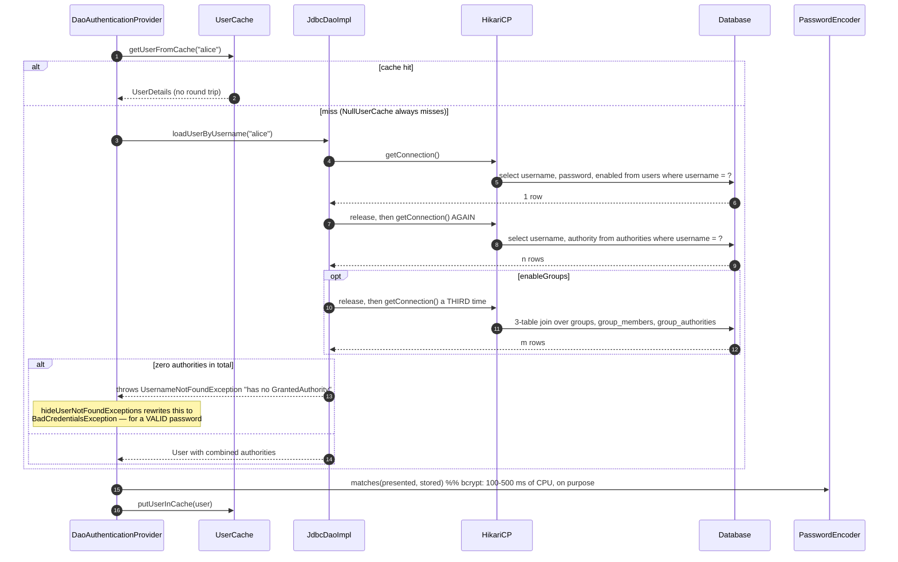

# 3.3 — JDBC Authentication

> **Module 3 · Topic 3** · Authentication
> Baseline: Spring Security 6.x on Boot 3.x, Java 17+

---

## Version Matrix

| Concern | Spring Security 5.x | **Spring Security 6.x (baseline)** | Spring Security 7.x |
|---|---|---|---|
| Declaring the store | `auth.jdbcAuthentication().dataSource(ds)` | **a `JdbcUserDetailsManager` `@Bean` taking a `DataSource`** | same; the builder DSL is gone |
| Status flags beyond `enabled` | 5.x added named-column support in `mapToUser` | **a users query returning more than three columns is read by the column *names* `acc_locked`, `acc_expired`, `creds_expired`** | same |
| `password` column width in `users.ddl` | widened to `varchar_ignorecase(500)` | **`varchar_ignorecase(500)`** | same |
| `UserCache` implementations | `NullUserCache`, `SpringCacheBasedUserCache`, `EhCacheBasedUserCache` | **`NullUserCache`, `SpringCacheBasedUserCache`; the EhCache one was removed** | same |
| Role prefix | `setRolePrefix("")` by default | **`rolePrefix` defaults to the empty string: the `authority` column value is used verbatim** | same |
| Group support | `setEnableGroups(true)` | **`setEnableGroups(true)`, `setEnableAuthorities(false)` to use groups only** | same |
| Password upgrade on login | `JdbcUserDetailsManager` does not implement `UserDetailsPasswordService` | **still does not; re-hashing on login needs your own implementation** | same |
| Schema resource | `org/springframework/security/core/userdetails/jdbc/users.ddl` | **same path, inside `spring-security-core`** | same |

---

## Why This Exists

`JdbcUserDetailsManager` is the framework's answer to "I need my users in a database and I do not
want to write the data access". It is a `UserDetailsService` backed by `JdbcTemplate`, with a fixed
default schema and a set of overridable SQL strings, plus a `UserDetailsManager` and `GroupManager`
implementation for provisioning.

It is genuinely useful in two situations. It is the fastest correct way to get a persistent,
shared-across-instances, revocable user store, which is exactly what in-memory authentication cannot
give you. And its source is the best short worked example of what a `UserDetailsService` actually has
to do: resolve a user, resolve authorities from a second place, combine them, and decide what
"not found" means.

It is also a class most senior engineers end up replacing. The default schema has no identifier, no
email, no audit columns, and authorities as a plain string; and the escape hatch — overriding the SQL
— requires hand-written queries that must return columns in a fixed **positional** order. The
interview value of this topic is being able to say precisely where the line is: what
`JdbcUserDetailsManager` buys you, what it costs per login, and the specific signal that tells you to
write your own `UserDetailsService` instead.

> **The sentence to remember:** the queries are positional, not named. The column *order* is the
> contract, and the column *names* are almost entirely irrelevant — except for the three status flags,
> which are the one exception and are looked up by name.

---

## Core Concepts

### 1. The two classes

```java
// org.springframework.security.core.userdetails.jdbc
public class JdbcDaoImpl extends JdbcDaoSupport implements UserDetailsService, MessageSourceAware {
    // read side: loadUserByUsername, the three queries, enableAuthorities / enableGroups
}

// org.springframework.security.provisioning
public class JdbcUserDetailsManager extends JdbcDaoImpl implements UserDetailsManager, GroupManager {
    // write side: createUser, updateUser, deleteUser, changePassword,
    //             createGroup, addUserToGroup, addGroupAuthority, ...
}
```

`JdbcDaoImpl` is the part `DaoAuthenticationProvider` actually needs. `JdbcUserDetailsManager` adds
provisioning, so use it when the application creates users itself and prefer `JdbcDaoImpl` when
users are loaded by a migration or an external system — a smaller surface with no accidental write
path.

Note what is **not** there: `JdbcUserDetailsManager` does not implement `UserDetailsPasswordService`,
so unlike `InMemoryUserDetailsManager` it will not re-hash a password on login when
`passwordEncoder.upgradeEncoding(...)` returns true. Migrating everyone from an old algorithm to
bcrypt therefore needs your own `UserDetailsPasswordService`, or a forced reset.

### 2. The default schema

The DDL ships inside `spring-security-core` at
`org/springframework/security/core/userdetails/jdbc/users.ddl`:

```sql
create table users(
    username varchar_ignorecase(50) not null primary key,
    password varchar_ignorecase(500) not null,
    enabled boolean not null
);

create table authorities (
    username varchar_ignorecase(50) not null,
    authority varchar_ignorecase(50) not null,
    constraint fk_authorities_users foreign key(username) references users(username)
);

create unique index ix_auth_username on authorities (username, authority);
```

Four things to notice. **`varchar_ignorecase` is HSQLDB-specific** — this file is a test-database
convenience, not portable DDL, and on PostgreSQL, Oracle, or MySQL you write your own. **The password
column is 500 characters** because a `{bcrypt}` value is 60 plus the prefix, an `{argon2}` value is
much longer, and the original 50-character column broke as soon as the delegating encoder arrived.
**The username is the primary key**, so there is no stable surrogate identifier and a username change
cascades. And **`enabled` is the only status column**: locked, expired, and credentials-expired have
no home in the default schema even though `UserDetails` exposes all four.

### 3. The default queries, and why they are positional

```java
public static final String DEF_USERS_BY_USERNAME_QUERY =
        "select username, password, enabled from users where username = ?";

public static final String DEF_AUTHORITIES_BY_USERNAME_QUERY =
        "select username, authority from authorities where username = ?";

public static final String DEF_GROUP_AUTHORITIES_BY_USERNAME_QUERY =
        "select g.id, g.group_name, ga.authority "
      + "from groups g, group_members gm, group_authorities ga "
      + "where gm.username = ? and g.id = ga.group_id and g.id = gm.group_id";
```

The row mappers read by **index**:

```java
private UserDetails mapToUser(ResultSet rs, int rowNum) throws SQLException {
    String userName = rs.getString(1);
    String password = rs.getString(2);
    boolean enabled = rs.getBoolean(3);
    boolean accLocked = false, accExpired = false, credsExpired = false;
    if (rs.getMetaData().getColumnCount() > 3) {
        // THE ONE EXCEPTION: these three are read by NAME, not position.
        accLocked    = rs.getBoolean("acc_locked");
        accExpired   = rs.getBoolean("acc_expired");
        credsExpired = rs.getBoolean("creds_expired");
    }
    return new User(userName, password, enabled, !accExpired, !credsExpired, !accLocked,
            AuthorityUtils.NO_AUTHORITIES);   // authorities come from a SECOND query
}

// loadUserAuthorities: the authority is column 2. Column 1 is read by nobody.
String roleName = getRolePrefix() + rs.getString(2);

// loadGroupAuthorities: the authority is column 3. Columns 1 and 2 are read by nobody.
String roleName = getRolePrefix() + rs.getString(3);
```

| Query | Required columns, in order | Read by the mapper |
|---|---|---|
| `usersByUsernameQuery` | `username`, `password`, `enabled` | 1, 2, 3 — plus `acc_locked`, `acc_expired`, `creds_expired` **by name** if the count exceeds 3 |
| `authoritiesByUsernameQuery` | anything, `authority` | column **2** only |
| `groupAuthoritiesByUsernameQuery` | anything, anything, `authority` | column **3** only |

The consequence: a custom authorities query must have a **filler** first column, and a custom group
query two of them, purely to put the authority at the right index. `getRolePrefix()` defaults to the
empty string, so the `authority` column value is used verbatim and the rows must literally contain
`ROLE_ADMIN` if you intend `hasRole("ADMIN")` to match.

### 4. `loadUserByUsername`, and two surprises

```java
public UserDetails loadUserByUsername(String username) throws UsernameNotFoundException {
    List<UserDetails> users = loadUsersByUsername(username);            // query 1
    if (users.isEmpty()) {
        throw new UsernameNotFoundException(/* "Username {0} not found" */);
    }
    UserDetails user = users.get(0);                                    // FIRST row wins
    Set<GrantedAuthority> dbAuthsSet = new HashSet<>();
    if (this.enableAuthorities) dbAuthsSet.addAll(loadUserAuthorities(user.getUsername()));   // query 2
    if (this.enableGroups)      dbAuthsSet.addAll(loadGroupAuthorities(user.getUsername()));  // query 3
    List<GrantedAuthority> dbAuths = new ArrayList<>(dbAuthsSet);
    addCustomAuthorities(user.getUsername(), dbAuths);                  // protected no-op hook
    if (dbAuths.isEmpty()) {
        // A user with ZERO authorities is reported as NOT FOUND.
        throw new UsernameNotFoundException(/* "User {0} has no GrantedAuthority" */);
    }
    return createUserDetails(username, user, dbAuths);
}
```

**A user with no authorities is reported as `UsernameNotFoundException`.** The row exists, the
password is right, and the message is "User alice has no GrantedAuthority" — which
`hideUserNotFoundExceptions` then rewrites to `BadCredentialsException`, so the operator sees "bad
credentials" for an account whose password is perfectly correct. This is the single most
time-consuming JDBC authentication bug.

**`users.get(0)`: the first row wins, silently.** Two rows for the same username — trivially possible
once you override the query with a join — and one of them is chosen with no error.

`createUserDetails` has one more switch: `usernameBasedPrimaryKey`, default `true`, returns the
username as spelled in the *database row*. Set it to `false` and the username as typed by the user is
returned instead, which matters when your query is case-insensitive.

### 5. Group-based authorities

Three tables, and they are additive rather than alternative:

```sql
create table groups (
    id bigint generated by default as identity(start with 0) primary key,
    group_name varchar_ignorecase(50) not null
);
create table group_authorities (
    group_id bigint not null,
    authority varchar(50) not null,
    constraint fk_group_authorities_group foreign key(group_id) references groups(id)
);
create table group_members (
    id bigint generated by default as identity(start with 0) primary key,
    username varchar(50) not null,
    group_id bigint not null,
    constraint fk_group_members_group foreign key(group_id) references groups(id)
);
```

```java
manager.setEnableGroups(true);       // default false
manager.setEnableAuthorities(false); // default true — leave it on and BOTH sources are unioned
```

| Setting | Effect |
|---|---|
| `enableAuthorities=true`, `enableGroups=false` | the default: direct `authorities` rows only |
| `enableAuthorities=false`, `enableGroups=true` | groups only — usually what you want if you adopt groups |
| both `true` | the union of both sources, deduplicated by a `HashSet` |
| both `false` | every user has no authorities, so **every login fails as "not found"** |

Groups earn their keep when authority assignment is a *role* decision rather than a *user* decision:
"everybody in Support gets these eleven authorities" is one update to `group_authorities` instead of
eleven rows per person. That is a real operational win at a few hundred users with a few dozen
authorities. Below that scale the two extra tables and the extra join are not worth it, and above it
you are usually reaching for a permission model the framework's schema cannot express anyway.

### 6. The cost per login



Two facts worth stating precisely. **There is no transaction around `loadUserByUsername`**, so each
`JdbcTemplate.query` acquires a connection, runs, and returns it — two pool acquisitions per login,
three with groups enabled. Under a login storm the pool, not the queries, is the bottleneck, and
authentication competes with application traffic for the same connections. **The group query is an
implicit three-table join** written in the old comma-and-`where` style, and it returns one row per
group-and-authority pair, so a user in eight groups with ten authorities each fans out to eighty rows
that are then collapsed into a `HashSet`.

For context, the bcrypt verification is deliberately 100 to 500 milliseconds of CPU, so the queries
are rarely the *latency* problem. They are a *connection* and *throughput* problem.

### 7. Caching

```java
public interface UserCache {
    UserDetails getUserFromCache(String username);
    void putUserInCache(UserDetails user);
    void removeUserFromCache(String username);
}
```

`AbstractUserDetailsAuthenticationProvider` consults the cache before `retrieveUser` and populates it
after a successful check, so caching removes the queries but never the password hashing. The default
is `NullUserCache`. `SpringCacheBasedUserCache` wraps any Spring `Cache`, and there is a
`CachingUserDetailsService` decorator that applies the same idea at the `UserDetailsService` level.

The trade is stale authorisation. A cached `UserDetails` means a revoked role, a disabled account, or
a changed password keeps working until the entry expires, so the time-to-live *is* your revocation
window. Set it in seconds to low minutes, evict explicitly whenever the application itself changes a
user, and accept that an out-of-band `update` statement will not be noticed.

There is also a real hazard: the cached instance is the same object handed to
`createSuccessAuthentication`, and `eraseCredentials` nulls the password on it. That is precisely why
`AbstractUserDetailsAuthenticationProvider` re-loads and re-checks **once** when a *cached* user fails
its checks — the retry exists to absorb a stale or blanked cache entry rather than fail a valid login.

---

## Working Code

### Schema

```sql
-- V1__security_default_schema.sql
-- The framework's default shape, written portably (varchar_ignorecase is HSQLDB-only).
create table users (
    username varchar(50)  not null primary key,
    password varchar(500) not null,          -- {bcrypt} is 60 chars; {argon2} is far longer
    enabled  boolean      not null
);
create table authorities (
    username  varchar(50) not null references users (username),
    authority varchar(50) not null
);
create unique index ix_auth_username on authorities (username, authority);

-- V2__security_groups.sql
create table groups (
    id         bigserial   primary key,
    group_name varchar(50) not null unique
);
create table group_authorities (
    group_id  bigint      not null references groups (id),
    authority varchar(50) not null,
    primary key (group_id, authority)
);
create table group_members (
    id       bigserial   primary key,
    username varchar(50) not null references users (username),
    group_id bigint      not null references groups (id),
    constraint uq_group_members unique (username, group_id)
);
-- The framework's own group DDL indexes none of this; the lookup is by username.
create index ix_group_members_username on group_members (username);

-- V3__app_users.sql
-- What a real application's user table actually looks like. Nothing here fits the
-- default queries, which is the whole reason the queries are overridable.
create table app_user (
    id                  bigserial    primary key,
    email               varchar(320) not null unique,
    password_hash       varchar(500) not null,
    display_name        varchar(200) not null,
    is_enabled          boolean      not null default true,
    is_locked           boolean      not null default false,
    password_expires_at timestamptz,
    created_at          timestamptz  not null default now(),
    updated_at          timestamptz  not null default now()
);
create unique index ix_app_user_email_lower on app_user (lower(email));

create table app_user_authority (
    user_id   bigint      not null references app_user (id) on delete cascade,
    authority varchar(64) not null,
    primary key (user_id, authority)
);
```

### Wiring the default schema

```java
package com.example.security;

import com.zaxxer.hikari.HikariDataSource;
import org.springframework.boot.jdbc.DataSourceBuilder;
import org.springframework.context.annotation.Bean;
import org.springframework.context.annotation.Configuration;
import org.springframework.security.crypto.bcrypt.BCryptPasswordEncoder;
import org.springframework.security.crypto.password.PasswordEncoder;
import org.springframework.security.provisioning.JdbcUserDetailsManager;

import javax.sql.DataSource;

@Configuration
public class JdbcUsersConfig {

    @Bean
    PasswordEncoder passwordEncoder() {
        return new BCryptPasswordEncoder(12);
    }

    @Bean
    DataSource dataSource() {
        HikariDataSource ds = DataSourceBuilder.create().type(HikariDataSource.class).build();
        // Authentication takes a connection PER QUERY (two per login, three with groups),
        // so size the pool for the login rate, not just the request rate.
        ds.setMaximumPoolSize(20);
        ds.setConnectionTimeout(3_000);   // fail fast: a hung login is worse than a rejected one
        return ds;
    }

    @Bean
    JdbcUserDetailsManager userDetailsManager(DataSource dataSource) {
        JdbcUserDetailsManager manager = new JdbcUserDetailsManager(dataSource);

        // Groups ONLY. Leaving enableAuthorities true unions both sources, which is rarely
        // intended; setting both to false makes every login fail as "user not found".
        manager.setEnableGroups(true);
        manager.setEnableAuthorities(false);

        // Default is "": the authority column value is used verbatim, so rows must
        // literally contain ROLE_ADMIN for hasRole("ADMIN") to match.
        manager.setRolePrefix("");

        return manager;
    }
}
```

### Overriding the queries for a real schema

```java
package com.example.security;

import org.springframework.context.annotation.Bean;
import org.springframework.context.annotation.Configuration;
import org.springframework.security.core.userdetails.jdbc.JdbcDaoImpl;

import javax.sql.DataSource;

@Configuration
public class CustomQueryJdbcConfig {

    /**
     * JdbcDaoImpl rather than JdbcUserDetailsManager: this store is read-only, because the
     * provisioning SQL in the manager targets the DEFAULT schema and would fail here anyway.
     */
    @Bean
    JdbcDaoImpl appUserDetailsService(DataSource dataSource) {
        JdbcDaoImpl store = new JdbcDaoImpl();
        store.setDataSource(dataSource);

        // Column ORDER is the contract: 1 username, 2 password, 3 enabled.
        // Because there are MORE than three columns, the mapper additionally reads
        // acc_locked, acc_expired and creds_expired BY NAME - so the aliases are mandatory.
        store.setUsersByUsernameQuery("""
                select u.email                                            as username,
                       u.password_hash                                    as password,
                       u.is_enabled                                       as enabled,
                       u.is_locked                                        as acc_locked,
                       false                                              as acc_expired,
                       (u.password_expires_at is not null
                        and u.password_expires_at < now())                as creds_expired
                  from app_user u
                 where lower(u.email) = lower(?)
                """);

        // The mapper reads column 2 ONLY. Column 1 is a mandatory filler - it exists solely
        // to push "authority" into position 2, and nothing ever reads it.
        store.setAuthoritiesByUsernameQuery("""
                select u.email as username, a.authority as authority
                  from app_user u
                  join app_user_authority a on a.user_id = u.id
                 where lower(u.email) = lower(?)
                """);

        store.setEnableAuthorities(true);
        store.setEnableGroups(false);

        // The users query is case-insensitive, so the row's spelling of the email may differ
        // from what was typed. false returns the value AS TYPED; true (the default) returns
        // the database spelling. Pick one deliberately: it is the principal's getName(),
        // which lands in audit rows and in every @PreAuthorize expression.
        store.setUsernameBasedPrimaryKey(true);

        return store;
    }
}
```

### Tests

```java
package com.example.security;

import org.junit.jupiter.api.*;
import org.springframework.jdbc.core.JdbcTemplate;
import org.springframework.jdbc.datasource.embedded.*;
import org.springframework.security.authentication.*;
import org.springframework.security.authentication.dao.DaoAuthenticationProvider;
import org.springframework.security.core.Authentication;
import org.springframework.security.core.userdetails.*;
import org.springframework.security.crypto.factory.PasswordEncoderFactories;
import org.springframework.security.crypto.password.PasswordEncoder;
import org.springframework.security.provisioning.JdbcUserDetailsManager;

import javax.sql.DataSource;

import static org.assertj.core.api.Assertions.*;

class JdbcUserDetailsManagerTests {

    private final PasswordEncoder encoder = PasswordEncoderFactories.createDelegatingPasswordEncoder();

    private DataSource dataSource;
    private JdbcTemplate jdbc;
    private JdbcUserDetailsManager manager;

    @BeforeEach
    void setUp() {
        this.dataSource = new EmbeddedDatabaseBuilder()
                .setType(EmbeddedDatabaseType.HSQL)
                .addScript("classpath:org/springframework/security/core/userdetails/jdbc/users.ddl")
                .build();
        this.jdbc = new JdbcTemplate(this.dataSource);
        this.manager = new JdbcUserDetailsManager(this.dataSource);

        this.jdbc.update("insert into users values (?, ?, ?)",
                "alice", this.encoder.encode("s3cret"), true);
        this.jdbc.update("insert into authorities values (?, ?)", "alice", "ROLE_USER");
        // Deliberately authority-less: the row exists and the password is valid.
        this.jdbc.update("insert into users values (?, ?, ?)",
                "ghost", this.encoder.encode("s3cret"), true);
    }

    @AfterEach
    void tearDown() {
        ((EmbeddedDatabase) this.dataSource).shutdown();
    }

    private ProviderManager authenticationManager() {
        DaoAuthenticationProvider provider = new DaoAuthenticationProvider();
        provider.setUserDetailsService(this.manager);
        provider.setPasswordEncoder(this.encoder);
        return new ProviderManager(provider);
    }

    @Test
    void authoritiesComeFromASecondQueryAndTheColumnValueIsUsedVerbatim() {
        Authentication result = authenticationManager()
                .authenticate(UsernamePasswordAuthenticationToken.unauthenticated("alice", "s3cret"));

        // rolePrefix defaults to "", so the row must literally contain ROLE_USER.
        assertThat(result.getAuthorities()).extracting("authority").containsExactly("ROLE_USER");
    }

    @Test
    void aUserWithNoAuthoritiesIsReportedAsNotFoundDespiteAValidPassword() {
        assertThatThrownBy(() -> this.manager.loadUserByUsername("ghost"))
                .isInstanceOf(UsernameNotFoundException.class)
                .hasMessageContaining("has no GrantedAuthority");

        // And hideUserNotFoundExceptions turns that into the least helpful message possible.
        assertThatThrownBy(() -> authenticationManager()
                .authenticate(UsernamePasswordAuthenticationToken.unauthenticated("ghost", "s3cret")))
                .isInstanceOf(BadCredentialsException.class).hasMessage("Bad credentials");
    }

    @Test
    void groupsAndDirectAuthoritiesAreUnionedWhenBothAreEnabled() {
        this.jdbc.execute("create table groups (id bigint primary key, group_name varchar(50) not null)");
        this.jdbc.execute("create table group_authorities (group_id bigint, authority varchar(50) not null)");
        this.jdbc.execute("create table group_members (id bigint identity, username varchar(50), group_id bigint)");
        this.jdbc.update("insert into groups (id, group_name) values (1, 'SUPPORT')");
        this.jdbc.update("insert into group_authorities values (1, 'ROLE_SUPPORT')");
        this.jdbc.update("insert into group_members (username, group_id) values ('alice', 1)");

        this.manager.setEnableGroups(true);     // enableAuthorities is still true: BOTH sources
        assertThat(this.manager.loadUserByUsername("alice").getAuthorities())
                .extracting("authority").containsExactlyInAnyOrder("ROLE_USER", "ROLE_SUPPORT");

        this.manager.setEnableAuthorities(false);
        assertThat(this.manager.loadUserByUsername("alice").getAuthorities())
                .extracting("authority").containsExactly("ROLE_SUPPORT");
    }

    @Test
    void provisioningWritesBothTablesAndDoesNotEncodeForYou() {
        this.manager.createUser(User.withUsername("bob")
                .password(this.encoder.encode("t0ps3cret"))    // YOU encode; the manager only stores
                .roles("USER")
                .build());

        assertThat(this.manager.userExists("bob")).isTrue();
        assertThat(this.jdbc.queryForObject(
                "select count(*) from authorities where username = ?", Integer.class, "bob")).isEqualTo(1);

        this.manager.deleteUser("bob");
        assertThat(this.jdbc.queryForObject(
                "select count(*) from authorities where username = ?", Integer.class, "bob")).isZero();
    }
}
```

---

## Internals

### `createUserDetails` and `usernameBasedPrimaryKey`

```java
protected UserDetails createUserDetails(String username, UserDetails userFromUserQuery,
        List<GrantedAuthority> combinedAuthorities) {
    String returnUsername = userFromUserQuery.getUsername();
    if (!this.usernameBasedPrimaryKey) {
        returnUsername = username;          // the username AS TYPED, not as stored
    }
    return new User(returnUsername, userFromUserQuery.getPassword(), userFromUserQuery.isEnabled(),
            userFromUserQuery.isAccountNonExpired(), userFromUserQuery.isCredentialsNonExpired(),
            userFromUserQuery.isAccountNonLocked(), combinedAuthorities);
}
```

The flag decides which spelling becomes `Authentication.getName()`, and that value flows into audit
rows, `@PreAuthorize("#username == authentication.name")` expressions, and anything keyed on the
principal. With a case-insensitive users query the two spellings differ, so this is a deliberate
choice rather than a detail — and if it is ever flipped, historical audit rows no longer join to
current ones.

### The provisioning SQL is hard-wired to the default schema

```java
public static final String DEF_CREATE_USER_SQL =
        "insert into users (username, password, enabled) values (?,?,?)";
public static final String DEF_UPDATE_USER_SQL =
        "update users set password = ?, enabled = ? where username = ?";
public static final String DEF_INSERT_AUTHORITY_SQL =
        "insert into authorities (username, authority) values (?,?)";
public static final String DEF_CHANGE_PASSWORD_SQL =
        "update users set password = ? where username = ?";
public static final String DEF_USER_EXISTS_SQL =
        "select username from users where username = ?";
```

Each has a setter, so all of it is overridable — and that is the point at which the cost-benefit
inverts. Overriding three read queries and six write statements to serve a class whose model is
username, password, and enabled is more hand-written SQL than a custom `UserDetailsService` over your
own repository would be, with none of the type safety.

Two behaviours to know. `createUser` inserts the user and then loops the authorities, and there is no
transaction unless you wrap the call yourself, so a failure on the second statement leaves a user
with partial authorities. And `changePassword` stores the value **exactly as given** — no encoding
happens anywhere in `JdbcUserDetailsManager`, so passing a raw password writes plaintext into a
column that the delegating encoder will later reject with "no PasswordEncoder mapped for the id".

### Why the retry on a cached failure exists

`AbstractUserDetailsAuthenticationProvider` re-loads the user and repeats the pre-check and password
check **once** when the first attempt came from the cache. The reason is the interaction described in
concept 7: `eraseCredentials` nulls the password on the principal object, and if that object is also
the cache entry, the next login sees a `null` stored password and fails. The retry converts a
guaranteed failure into a single extra pair of queries. It is a good illustration of why enabling a
`UserCache` is not a free optimisation.

---

## Configuration Reference

| Option | Effect | Default |
|---|---|---|
| `setDataSource(DataSource)` | the `JdbcTemplate` behind everything | required |
| `setUsersByUsernameQuery(String)` | must return `username`, `password`, `enabled` **in that order** | `DEF_USERS_BY_USERNAME_QUERY` |
| `setAuthoritiesByUsernameQuery(String)` | the authority must be **column 2** | `DEF_AUTHORITIES_BY_USERNAME_QUERY` |
| `setGroupAuthoritiesByUsernameQuery(String)` | the authority must be **column 3** | `DEF_GROUP_AUTHORITIES_BY_USERNAME_QUERY` |
| `setEnableAuthorities(boolean)` | query the `authorities` table | `true` |
| `setEnableGroups(boolean)` | query the three group tables as well | `false` |
| `setRolePrefix(String)` | prepended to every authority value read from the database | `""` — verbatim |
| `setUsernameBasedPrimaryKey(boolean)` | `true` returns the stored spelling, `false` the typed one | `true` |
| `setUserCache(UserCache)` on the provider | skips the queries on a cache hit | `NullUserCache` |
| `setCreateUserSql` / `setUpdateUserSql` / `setDeleteUserSql` / `setInsertAuthoritySql` / `setChangePasswordSql` | provisioning statements | the `DEF_*_SQL` constants |
| `setAuthenticationManager(...)` | makes `changePassword` verify the old password | `null` — **no verification** |
| Named columns `acc_locked`, `acc_expired`, `creds_expired` | read when the users query returns more than three columns | absent, so all three are `false` |
| `users.ddl` | reference schema on the classpath, HSQLDB dialect | `org/springframework/security/core/userdetails/jdbc/users.ddl` |

---

## Production Concerns & Anti-Patterns

**Shipping `users.ddl` as your production schema.** It is a test fixture. `varchar_ignorecase` is
HSQLDB-only, the username is the primary key so a username change cascades through every foreign key,
there is no identifier, no email, no audit column, and only one of the four status flags has a home.

**No index supporting the authorities lookup.** The default DDL creates a unique index on
`(username, authority)`, which does cover the lookup, but a hand-written query joining your own tables
frequently has nothing on the join column. It is a per-login query, so a sequential scan there is a
sequential scan on your busiest code path.

**Assuming a `ROLE_` prefix is added.** `rolePrefix` is `""`, so `authority` values are used verbatim.
Rows containing `ADMIN` will never satisfy `hasRole("ADMIN")`, because that check looks for
`ROLE_ADMIN`. Decide whether the prefix lives in the data or in `setRolePrefix` and assert it in a
test.

**A user with no authority rows.** Reported as `UsernameNotFoundException` and then as "bad
credentials". Add a database constraint or an application invariant that every enabled user has at
least one authority, because the framework's diagnosis of this state is actively misleading.

**Calling `changePassword` or `createUser` with a raw password.** Nothing in
`JdbcUserDetailsManager` encodes. The value is stored verbatim and the delegating encoder rejects it
at the next login, or — worse, if somebody "fixes" it by adding `{noop}` — accepts it as plaintext.

**Provisioning without a transaction.** `createUser` issues one insert per authority after the user
insert, with no surrounding transaction. A mid-sequence failure leaves a user with some of their
authorities. Wrap the call in `@Transactional`.

**Enabling a `UserCache` without deciding on the revocation window.** The time-to-live *is* how long
a disabled account keeps working. Anything longer than a minute or two needs an explicit answer to
"how do we force a logout", and the eviction has to reach every instance.

**Turning off both `enableAuthorities` and `enableGroups`.** Every user then has zero authorities, so
every login fails as "user not found" — a total outage whose error message points at the username.

**Overriding all nine SQL statements instead of writing a `UserDetailsService`.** Once you are
maintaining hand-written positional SQL for both reads and writes, the framework class is costing you
more than it provides. Thirty lines over your own repository is simpler and type-checked.

**Sizing the connection pool for request rate and forgetting logins.** Two acquisitions per login,
three with groups, all outside a transaction. A login storm after a deployment or a session-store
flush is exactly when the pool is exhausted and healthy application traffic starts timing out.

---

## Debugging Playbook

| Symptom | Likely root cause | Fix |
|---|---|---|
| `BadCredentialsException` for a password you know is correct | The user has zero authority rows, so `loadUserByUsername` threw "has no GrantedAuthority" and it was hidden | Insert an authority row; add an invariant that enabled users have one |
| `UsernameNotFoundException: User alice has no GrantedAuthority` | Both `enableAuthorities` and `enableGroups` are false, or the authorities query returns nothing | Enable one source; check the query returns rows for that exact username |
| `hasRole("ADMIN")` never matches | The `authority` column holds `ADMIN`, not `ROLE_ADMIN`, and `rolePrefix` is `""` | Store the prefix, or call `setRolePrefix("ROLE_")` |
| `SQLException: Column index out of range` or a wrong value in a field | A custom query returns columns in the wrong order | Fix the order: users is username, password, enabled; authorities puts authority at 2; groups at 3 |
| Status flags are always `false` after adding columns | The mapper reads `acc_locked`, `acc_expired`, `creds_expired` **by name** | Alias the columns to exactly those names |
| Works on HSQLDB, fails on PostgreSQL with a syntax error | `varchar_ignorecase` from `users.ddl` is not portable | Write dialect-appropriate DDL; use `lower(...)` plus a functional index |
| A locked user can still log in | `is_locked` was not exposed as `acc_locked`, so `accountNonLocked` stays true | Add the aliased column; verify the column count exceeds three |
| A password change has no effect on other instances | A `UserCache` is holding the old `UserDetails` | Evict on change, and keep the time-to-live short |
| `Bad credentials` intermittently, only on the first attempt after idle | A cached entry had its password erased, and the provider retried once | Expected behaviour; reconsider whether the cache is worth it |
| `DataIntegrityViolationException` from `createUser` | The username already exists, or the authority insert violates the unique index | Check `userExists` first; make provisioning transactional |
| Login latency fine, but connection-pool timeouts under load | Two or three pool acquisitions per login, outside any transaction | Size the pool for login rate; add caching; shorten the connection timeout |
| Two different users see each other's roles | A custom users query joins and returns several rows; `users.get(0)` picks one | Make the query return exactly one row |

---

## Interview Q&A

### Q1. Walk through `JdbcDaoImpl.loadUserByUsername`. What surprises people?

<details>
<summary>Show answer</summary>

It runs the users query, takes `users.get(0)` if anything came back, and then runs one query for
direct authorities when `enableAuthorities` is true and another for group authorities when
`enableGroups` is true, unioning the results into a `HashSet`. It calls the protected
`addCustomAuthorities` hook, which is a no-op by default, and then builds the final `User` through
`createUserDetails`.

Two things surprise people. First, **a user with zero authorities is thrown as
`UsernameNotFoundException`** with the message "User alice has no GrantedAuthority". The row exists,
the password is valid, and because `hideUserNotFoundExceptions` is on by default the operator sees
"Bad credentials". That combination — a correct password reported as wrong, with the real reason on a
debug log nobody has enabled — is the most time-consuming bug in this class. Second, **`users.get(0)`
silently picks a row**: override the query with a join that can produce duplicates and one of them
wins with no error at all.

**Counter-question: why would the framework treat "no authorities" as "no user"?**

The historical reasoning is that a `UserDetails` with no authorities cannot satisfy any authorization
rule, so an authenticated session for it is useless, and failing early is cleaner than issuing a
token that is guaranteed to get a 403 on the next request.

I think that reasoning is defensible and the *implementation* is wrong, because it collapses two
distinct states into one exception type. "This username does not exist" and "this account is
misconfigured" need different responses: the first is normal and expected, the second is an
operational fault that should page somebody. Reporting the second as the first means a data problem is
indistinguishable from a typo in your metrics.

If I wanted the correct behaviour I would not fight the class — I would write a `UserDetailsService`
that returns the user with an empty authority list and let the authorization layer produce a 403,
which is the honest status code, while logging the misconfiguration at warn level.

**Counter-question: how would you have found this in production without reading the source?**

The discriminator is comparing what the application says with what the database says. The failure
event is an `AuthenticationFailureBadCredentialsEvent`, so the metric says "wrong password", but the
user insists otherwise and a manual `matches()` against the stored hash succeeds. That mismatch tells
you the password was never the problem.

From there, enabling debug logging on `org.springframework.security.core.userdetails.jdbc` prints the
real message. The general lesson I would draw is that `hideUserNotFoundExceptions` improves security
and degrades diagnosability, so you need the real reason logged server-side with a correlation
identifier. A failure event listener that records the original exception type and message — never the
credentials — pays for itself the first time this happens.
</details>

### Q2. I am overriding `setUsersByUsernameQuery` and `setAuthoritiesByUsernameQuery`. What exactly must each return?

<details>
<summary>Show answer</summary>

The users query must return, **in this order**, the username, the password, and the enabled flag,
because `mapToUser` reads `rs.getString(1)`, `rs.getString(2)`, and `rs.getBoolean(3)`. The column
names are irrelevant at those positions.

There is one exception to the positional rule, and it is the detail that catches people. If the users
query returns **more than three columns**, the mapper additionally reads three columns **by name**:
`acc_locked`, `acc_expired`, and `creds_expired`. So exposing the other status flags means aliasing
your columns to exactly those names, and a fourth column with any other name produces a
`SQLException` about an invalid column name rather than a helpful message.

The authorities query is stranger: the mapper reads **column 2 only**. Column 1 must exist and is read
by nobody, so a custom query needs a filler first column purely to push the authority into position
two. The group query is the same idea with the authority at position three and two fillers. And
`rolePrefix` is `""`, so whatever string is in that column becomes the authority verbatim.

**Counter-question: what is the failure mode when you get the order wrong, and why is it dangerous?**

It depends on the types, and the dangerous case is when it does not fail. Swap password and username
and you get a `BadCredentialsException` for everyone, which is loud and quickly diagnosed. Return
`enabled` in position two and you will usually get a `SQLException` or an encoder complaint.

The one that gets deployed is a boolean column in position three that is not the one you meant —
`is_locked` instead of `is_enabled`, say. Both are booleans, so nothing throws. The query runs, the
mapper reads it as `enabled`, and now every locked account is treated as enabled while every enabled
account is treated as disabled. Half your users cannot log in and the other half can log in when they
should not. That is a positional interface with no type checking, which is precisely the argument for
writing a `UserDetailsService` where the mapping is code a compiler and a test can see.

**Counter-question: my query is case-insensitive with `lower(email) = lower(?)`. What else must I decide?**

`usernameBasedPrimaryKey`, and it is not a detail. Default `true` returns the username as spelled in
the database row; `false` returns it as the user typed it. With a case-insensitive query those differ,
and the chosen value becomes `Authentication.getName()` — which lands in audit rows, in
`@PreAuthorize` expressions comparing against `authentication.name`, in cache keys, and in log lines.

I would keep `true`, so the canonical stored spelling is authoritative and identity is stable no matter
how the user typed it. The thing to avoid is changing it later: historical audit rows written under one
convention no longer join to rows written under the other, and that is the kind of inconsistency that
is discovered during an incident.

I would also make sure the functional index `on app_user (lower(email))` exists, because
`lower(email) = lower(?)` on a plain index is a sequential scan on every single login.
</details>

### Q3. Group-based authorities — how do they work, and when are they worth the two extra tables?

<details>
<summary>Show answer</summary>

`setEnableGroups(true)` adds the group query, which joins `groups`, `group_members`, and
`group_authorities` and returns the authority in column three. The result is unioned into the same
`HashSet` as the direct authorities, so with `enableAuthorities` left at its default `true` a user gets
both sources. Turning it off gives you groups only, and turning both off gives every user zero
authorities and therefore a total login outage.

They are worth it when authority assignment is a *role* decision rather than a *user* decision.
"Everybody in Support gets these eleven authorities" becomes eleven rows in `group_authorities` plus
one membership row per person, instead of eleven rows per person — and more importantly, adding a
twelfth authority to Support is one insert rather than a backfill across every member. That is a real
operational win somewhere around a few hundred users with a few dozen authorities.

Below that scale the join is not worth two extra tables. Above it, you usually want something the
framework's schema cannot express anyway.

**Counter-question: what does the group query cost, and what would you change about it?**

It is an implicit three-table join written in the comma-and-`where` style, and it returns one row per
group-and-authority pair, so a user in eight groups with ten authorities each produces eighty rows
that are then collapsed into a `HashSet`. It is also a third connection acquisition, because nothing
here runs in a transaction.

What I would change, if staying with this class: make sure `group_members(username)` is indexed,
because the default group DDL indexes neither that nor the foreign keys, and make
`(group_id, authority)` the primary key of `group_authorities` so the fan-out is at least bounded by
real distinct rows.

What I would change if free to design it: fold the whole thing into one query returning the user and
the authorities together, or cache the group-to-authority mapping in the application, since it changes
far less often than membership does. That is a `UserDetailsService`, not this class.

**Counter-question: the product now wants per-object permissions — "Alice can edit project 42". Do groups help?**

No, and this is the boundary worth naming explicitly. Groups are still a way of granting *global*
authorities; the `authority` column is a flat string with no subject, so "edit project 42" can only be
encoded by minting an authority per object. That leads to authority lists in the thousands, loaded in
full on every login, with the token growing without bound and revocation meaning a rewrite of one
user's rows.

Per-object permissions belong in a different mechanism. Spring Security's own answer is ACLs —
`AclPermissionEvaluator` with an `AclService`, checked at the point of use with
`@PreAuthorize("hasPermission(#id, 'com.example.Project', 'WRITE')")`. In most applications I would go
further and not model it as security at all: the question "may Alice edit project 42" is usually
answered by a row in a `project_member` table, checked by the service that loads the project, which is
one indexed query at the moment it matters instead of a set carried in every session.

The signal to watch for is authorities that contain an identifier. The moment you see
`ROLE_PROJECT_42_EDITOR`, the authority model is being used as a permission store and should be
replaced.
</details>

### Q4. When do you abandon `JdbcUserDetailsManager` for a custom `UserDetailsService`?

<details>
<summary>Show answer</summary>

My trigger is the first requirement the default schema has no column for — which in practice is the
first day, because every real application needs a surrogate identifier, an email distinct from the
login name, and audit timestamps.

`JdbcUserDetailsManager` is the right choice when the default schema genuinely *is* the requirement:
an internal tool with a handful of operators, a migration utility, a proof of concept. It stops being
the right choice once you are overriding the SQL, because at that point you are maintaining
hand-written positional queries — plus five or six provisioning statements if you also write — to
serve a class whose model is username, password, and enabled. That is more SQL than the alternative,
with none of the type safety, no compiler help when a column moves, and provisioning that is not
transactional.

The alternative is small. A `UserDetailsService` that loads your own entity through your existing
repository and maps it to an immutable `UserDetails` is about thirty lines, uses the same
`DaoAuthenticationProvider` and every existing authorization rule unchanged, and lets you express the
four status flags, a custom principal, and a single query with a join instead of two or three round
trips.

**Counter-question: your custom `UserDetailsService` loads a JPA entity. What do you have to be careful about?**

Three things, and the third is the one that bites.

Lazy loading: `loadUserByUsername` is called outside any transaction from the provider's perspective,
so touching a lazy authorities collection throws `LazyInitializationException`. Fetch the authorities
in the same query with a join fetch rather than annotating the method transactional, which papers over
the problem while keeping a transaction open for the whole bcrypt verification.

Do not return the entity as the `UserDetails`. It ends up as the principal in the `SecurityContext`
and therefore serialised into the session, dragging its graph with it, and `eraseCredentials` will null
a field on a managed entity. Map to a small immutable record instead.

And the third: the entity is a snapshot. Authorities are read once at login and then live in the
session, so a revoked role stays effective until the session ends. That is true of every
`UserDetailsService` including the JDBC one, but people assume a JPA-backed store is somehow live.
Anything genuinely sensitive has to be re-checked against the database at the point of use.

**Counter-question: how do you migrate without a flag day?**

The `UserDetailsService` interface is the seam, so the swap itself is one bean. I would keep the schema
migration and the store migration as separate releases.

First, get the data where it needs to be: create the new tables, backfill from `users` and
`authorities`, and keep them in sync with a trigger or dual writes if provisioning is live. Second,
deploy the new `UserDetailsService` behind a flag with the old bean still present, and enable it on a
canary while watching authentication success and failure rates per instance — the failures you care
about are authority differences, which show up as 403s rather than 401s, so watch both. Third, flip
fully, then delete the old bean and its tables in a later release.

The check I would add before flipping, because it is cheap and catches almost everything: a job that
loads every user through both implementations and asserts the username, the status flags, and the
authority set match exactly. Authority-set differences caused by the `ROLE_` prefix convention are the
single most common migration defect, and they fail *open* — the user logs in and quietly has the wrong
access, which no error rate will show you.
</details>

### Q5. Should you put a cache in front of a JDBC user store?

<details>
<summary>Show answer</summary>

Usually not, and the reason is that it optimises the wrong thing.

Authentication cost is dominated by the password hash. Bcrypt at a sensible strength is 100 to 500
milliseconds of deliberate CPU, and the two or three user queries are single-digit milliseconds
against an indexed table. A `UserCache` removes the queries and cannot touch the hashing, so the
latency improvement is a few percent while the cost is stale authorisation.

What caching genuinely helps is **connection pressure**, not latency. Each query is a separate pool
acquisition because nothing here runs in a transaction, so two or three per login, and a login storm
after a deployment or a session-store flush can exhaust the pool and start timing out ordinary
application traffic. If that is the problem you have, caching is a reasonable answer — but so is a
larger pool, a shorter connection timeout, and folding the queries into one.

**Counter-question: you enable `SpringCacheBasedUserCache`. What breaks?**

Revocation, first and most importantly: the time-to-live *is* your revocation window. A disabled
account, a revoked role, and a changed password all keep working until the entry expires, so the
number has to be justified against your incident response expectations, not chosen for a hit rate.
And it has to be evicted on every instance, which means a distributed cache or a short enough
time-to-live that per-instance state does not matter.

There is also a mechanical hazard specific to this design. The cached object is the same instance
handed to `createSuccessAuthentication`, and `eraseCredentials` nulls its password — so the next
lookup finds a cached user whose stored password is `null` and the check fails. That is exactly why
`AbstractUserDetailsAuthenticationProvider` re-loads and re-checks **once** when the failing user came
from the cache. It self-heals, which is why this rarely shows up as an outage, but it means a cache
hit can cost *more* queries than a miss, and the "intermittent bad credentials on the first attempt
after idle" symptom comes straight from it.

**Counter-question: you must support 5,000 logins per second. What actually changes?**

The password hashing becomes the binding constraint, and no amount of caching helps, because the hash
is computed on every attempt by design. At 200 milliseconds per verification, 5,000 per second is
1,000 CPU-seconds per second — a thousand cores doing nothing but bcrypt.

So the answer is not to tune this design, it is to stop verifying a password on every request. Verify
once, issue a short-lived token, and validate the token afterwards: a signature check is microseconds
and needs no database at all. That is the real argument for token-based authentication, and it is
worth being able to state in those terms rather than as a fashion.

If 5,000 genuine *first* logins per second is the requirement, then this is an identity provider's job
rather than the application's — a dedicated authorization server, horizontally scaled, with the
application as a resource server validating tokens. The reflex to resist is lowering the bcrypt cost
factor to make the numbers work, which trades a capacity problem you can solve with machines for a
security property you cannot get back.
</details>

### Q6. Design question — you own a monolith whose 40,000 users live in the default Spring Security schema, and you are splitting it into services. Design the user store.

<details>
<summary>Show answer</summary>

The first thing I would establish is that this is an *identity* decision, not a schema decision, and
the worst outcome is each new service growing its own copy of the users table. So I would design
toward one authority for identity and no password verification anywhere else.

**Target shape.** An identity provider owns users, credentials, and the login ceremony — Keycloak,
Entra ID, or Spring Authorization Server if it must be in-house. Every service becomes an OAuth2
resource server validating a short-lived access token against a JWKS endpoint, which means no service
holds a password, no service queries a user table on the request path, and a signature check replaces
two queries and a bcrypt verification. Authorization data splits in two: coarse, stable authorities
travel in the token, while fine-grained and per-object permissions stay in the owning service, because
putting them in the token makes it unbounded and makes revocation a token-lifetime problem.

**Migration, in the order I would actually do it.**

```
1  Stand up the identity provider. Import the 40,000 users with their EXISTING bcrypt hashes —
   this is why bcrypt matters: the hash is portable, so nobody resets a password. Usernames from
   the default schema become the subject or the preferred_username claim; authorities become
   realm or client roles.
2  Make the monolith an OIDC client while it still owns the database. Both paths live side by
   side behind a flag: the existing formLogin plus JdbcUserDetailsManager, and the new
   oauth2Login. Canary, then move traffic.
3  Only now extract services. They are resource servers from birth, so no service ever gets
   written against the local user table in the first place.
4  Make the monolith's user tables read-only, then delete them. The identity provider is
   authoritative; anything that still needs user attributes reads them from a claim or from a
   profile service, not from a join.
```

**What I would not do.** Not a shared user database across services, which is distributed coupling
with a single point of failure and no schema ownership. Not per-service user tables with
synchronisation, because you will be reconciling divergent password state during an incident. And not
a synchronous "auth service" that every request calls to validate a credential, which is the identity
provider pattern with the scalability deleted — the whole point of a signed token is that validation
is local.

**The parts that are genuinely hard**, and I would surface these early rather than discover them:
session invalidation, because a stateless token cannot be revoked before it expires, so you need short
lifetimes plus refresh-token revocation and a back-channel logout; the authority naming convention,
since the monolith's `ROLE_` values have to map to the identity provider's roles and back to
`hasRole` checks, and getting it wrong fails *open*; and service-to-service calls, which should use the
client credentials grant rather than a forwarded user token, or every service can act as the user
indefinitely.

**Counter-question: 40,000 users and an in-house identity provider is a lot of machinery. Why not keep the shared database?**

Because the coupling is worse than it looks, and I would argue it in concrete terms rather than on
principle.

A shared user table means every service depends on a schema no service owns, so a column change is a
cross-team release and nobody can refuse one. It means every service holds credentials for the
database that holds password hashes, so the blast radius of any one service's compromise is the whole
user base. Each service implements password verification independently, so a bcrypt strength change,
a lockout policy, or adding multi-factor authentication has to be done N times and will be done
inconsistently. And it puts a synchronous dependency on one database on the login path of every
service.

That said, I would not lead with "stand up Keycloak" if the organisation has three services and no
platform team. The honest intermediate position is to keep identity in the monolith, expose it over an
API rather than a shared table, and have other services accept a token the monolith issues. That is
strictly better than a shared schema — one owner, one implementation, no credential sprawl — and it is
the same architecture, so moving to a real identity provider later is swapping the issuer rather than
redesigning.

**Counter-question: how do you handle the users whose passwords are not bcrypt? There are 6,000 on an old SHA-1 scheme.**

They cannot be verified anywhere except where the old algorithm still exists, so I would treat them as
a separate workstream with a deadline rather than a detail of the cutover.

The mechanism is verify-and-upgrade at login: the identity provider — and Spring Security's
`DelegatingPasswordEncoder`, which is exactly what the `{id}` prefix is for — verifies against the old
algorithm, and on success re-hashes the presented plaintext with bcrypt and writes it back. That is
`UserDetailsPasswordService`, which `JdbcUserDetailsManager` notably does *not* implement, so this is
one of the places I would add a custom implementation before migrating. Every login silently converts
one user, and the population drains without anybody noticing.

Then bound it. Track the remaining count as a metric, because it is the only way to know whether the
migration is progressing. After a fixed window — a quarter is typical, matching the natural login
cycle — force a password reset on the remainder rather than carrying the old algorithm indefinitely,
and remove the legacy encoder from the delegating map in the same release so it cannot be
reintroduced. The failure mode to avoid is the one where the legacy encoder is still configured three
years later because nobody ever measured the tail.
</details>

---

## Quick Recall

```
THE TWO CLASSES
  JdbcDaoImpl              extends JdbcDaoSupport implements UserDetailsService   (read side)
  JdbcUserDetailsManager   extends JdbcDaoImpl implements UserDetailsManager, GroupManager
  does NOT implement UserDetailsPasswordService -> no upgrade-on-login re-hash
  nothing in either class ENCODES: createUser and changePassword store the value verbatim

DEFAULT SCHEMA  (org/springframework/security/core/userdetails/jdbc/users.ddl)
  users(username varchar_ignorecase(50) PK, password varchar_ignorecase(500), enabled boolean)
  authorities(username, authority) + unique index on (username, authority)
  varchar_ignorecase is HSQLDB-ONLY -> not portable, it is a test fixture
  no id, no email, no audit columns, username IS the primary key, only 1 of 4 status flags

THE QUERIES ARE POSITIONAL
  usersByUsernameQuery       -> 1 username, 2 password, 3 enabled
      >3 columns? then acc_locked, acc_expired, creds_expired are read BY NAME (the one exception)
  authoritiesByUsernameQuery -> authority must be column 2  (column 1 is a mandatory FILLER)
  groupAuthoritiesByUsername -> authority must be column 3  (columns 1 and 2 are FILLERS)
  rolePrefix defaults to ""  -> the column value is used VERBATIM; rows need literal ROLE_ADMIN
  usernameBasedPrimaryKey=true -> getName() is the STORED spelling; false -> the TYPED one

LOADUSERBYUSERNAME
  query 1 users -> empty? UsernameNotFoundException
                -> users.get(0): the FIRST row wins, SILENTLY
  query 2 authorities  (enableAuthorities, default TRUE)
  query 3 groups       (enableGroups, default FALSE)   both unioned into a HashSet
  addCustomAuthorities(...) protected no-op hook
  ZERO authorities -> UsernameNotFoundException "has no GrantedAuthority"
                   -> hideUserNotFoundExceptions rewrites it to "Bad credentials"
                   -> A CORRECT PASSWORD REPORTED AS WRONG. The classic bug.
  both enable flags false -> every login fails as "not found" = total outage

GROUPS
  groups(id, group_name) | group_authorities(group_id, authority) | group_members(username, group_id)
  setEnableGroups(true) + setEnableAuthorities(false) = groups only
  worth it when authorities are a ROLE decision, not a USER decision
  one row per (group, authority) -> fan-out; index group_members(username) yourself
  authorities containing an ID (ROLE_PROJECT_42_EDITOR) = wrong mechanism, use ACLs or a domain table

COST PER LOGIN
  NO transaction -> 2 pool acquisitions (3 with groups), one per JdbcTemplate.query
  bcrypt is 100-500 ms of CPU, so the queries are a CONNECTION problem, not a latency problem
  size the pool for LOGIN rate, not request rate

CACHING
  UserCache: getUserFromCache | putUserInCache | removeUserFromCache ; default NullUserCache
  SpringCacheBasedUserCache wraps any Spring Cache (EhCacheBasedUserCache was REMOVED in 6.0)
  the TTL *is* your revocation window
  hazard: eraseCredentials nulls the password ON THE CACHED INSTANCE
          -> that is why the provider re-loads and re-checks ONCE on a cached failure

WHEN TO WALK AWAY
  use it when the default schema IS the requirement (internal tool, a few operators)
  leave it the moment you override the SQL: positional queries with no type safety,
    non-transactional provisioning, a model of username/password/enabled
  a custom UserDetailsService over your own entity is ~30 lines and one query
```

---

**Previous:** [`09_M3_T2_InMemory_Authentication.md`](09_M3_T2_InMemory_Authentication.md) ·
**Next:** [`11_M3_T4_Custom_Authentication.md`](11_M3_T4_Custom_Authentication.md)
