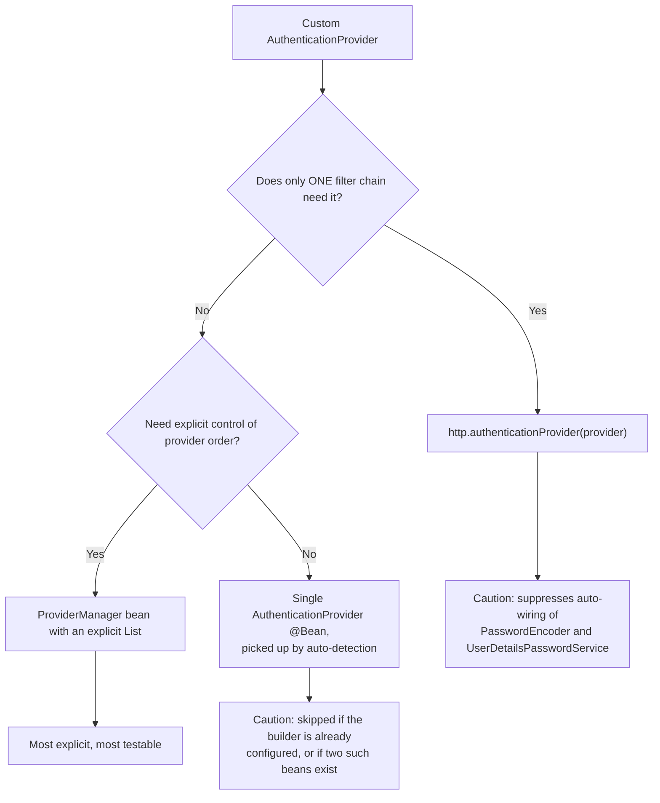
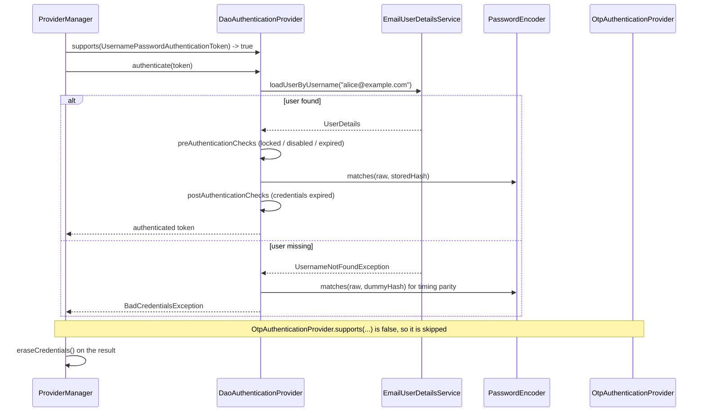

# 3.4 — Custom Authentication

> **Module 3 · Topic 4** · Authentication
> Baseline: Spring Security 6.x on Boot 3.x, Java 17+
> New to this? Read **In Plain English** below first, then come back to the Version Matrix.

---

## Version Matrix

| Concern | Spring Security 5.x | **Spring Security 6.x (baseline)** | Spring Security 7.x |
|---|---|---|---|
| Registering a provider | `WebSecurityConfigurerAdapter.configure(AuthenticationManagerBuilder)` | **`http.authenticationProvider(...)` or an `AuthenticationManager` `@Bean`** — the adapter is gone | same as 6.x |
| Getting the global `AuthenticationManager` | override `authenticationManagerBean()` | **inject `AuthenticationConfiguration`, call `getAuthenticationManager()`** | same; building a `ProviderManager` yourself is encouraged |
| `DaoAuthenticationProvider` wiring | no-arg constructor plus `setUserDetailsService(...)` | **same, still supported** | **constructor injection preferred**; the no-arg form was deprecated late in 6.x |
| Auto-detecting a lone `AuthenticationProvider` bean | `InitializeAuthenticationProviderBeanManagerConfigurer` | **same, but only when the builder is not already configured** | same; explicit registration is the documented path |
| DSL style | `.and()` chaining or lambdas | **lambda DSL only**; `.and()` deprecated from 6.1 | `.and()` **removed** |
| Pre-authentication | `AbstractPreAuthenticatedProcessingFilter`, `javax.servlet` | **same class, `jakarta.servlet`** | same |
| `UserDetailsService` contract | must throw `UsernameNotFoundException` | **same; returning `null` raises `InternalAuthenticationServiceException`** | same |

---

## Why This Exists

`DaoAuthenticationProvider` covers the overwhelming majority of username-and-password systems. It
loads a user through a `UserDetailsService`, verifies a password through a `PasswordEncoder`, runs
account-status checks, erases the credential, and optionally re-hashes the password. Every one of
those is a real security control that took years to get right.

Real systems still deviate. Users live in a table that does not match the default schema. Login is
by email or phone. Credentials are validated by a one-time code, an API key, or a partner identity
provider. An upstream proxy has already authenticated the caller and asserts the identity in a
header.

The framework offers exactly two extension points, and the decision that matters most is **which
one you pick**:

> **Change `UserDetailsService` when you need a different way to *load* the user.
> Change `AuthenticationProvider` when you need a different way to *validate* the credential.**

Getting this backwards is the most common self-inflicted wound in Spring Security. A team needs to
read users from a REST API, writes an `AuthenticationProvider` to do it, and silently discards
timing-attack protection, account-status enforcement, credential erasure, and password upgrade.

---

## In Plain English

**The one-line version:** When the built-in login does not fit your application, you replace one of
exactly two pieces — the part that looks the person up, or the part that checks their credential —
and choosing the wrong one silently throws away several security protections you were getting free.

**An analogy.** Picture the door of a members' club staffed by two people. The first holds the
membership book: you give a name, they find the entry, and they read out "this person exists, here is
their photograph, and here are the wristbands they are entitled to". The second is the checker: they
compare your face to the photograph and decide whether you really are that person.

If the book changes — it moves from paper to a computer, or it is now indexed by email address
instead of surname — only the book-holder needs retraining. The checker's job has not changed at all.
But if the club stops using photographs and starts texting a six-digit code to your phone, the
checker's entire job has changed, and that is a different role with different training.

The expensive mistake is replacing the checker when only the book moved. The trained checker has
years of habits baked in that nobody wrote down. They take exactly the same amount of time whether
the name was in the book or not, so somebody watching the queue cannot work out which names are real.
They look at the "barred" column before they even glance at your face. They tear up the slip of paper
you wrote your code on instead of leaving it lying on the counter. A newly hired checker has none of
those habits, and — this is the important part — none of them look missing. The door still works. The
right people still get in. What changed is invisible until somebody exploits it.

**How it actually works, step by step.**

There are exactly two interfaces you can replace, and they are very different sizes.
`UserDetailsService` has one method, `loadUserByUsername`, and its whole job is to fetch one person's
record by name and return it. `AuthenticationProvider` has two methods, `authenticate` and
`supports`, and it owns an entire login mechanism from end to end. So the first is a helper that one
particular provider happens to use, and the second is the provider itself.

The built-in provider is called `DaoAuthenticationProvider`, and it is the checker from the analogy.
When a username and password arrive, it calls your `UserDetailsService` to get the stored record,
checks the account is not locked or disabled, asks the `PasswordEncoder` whether the typed password
matches the stored one, checks the password has not expired, and returns a successful result with the
raw password wiped out of it. Six separate protections live inside those steps, and the section below
titled "What You Lose" lists each one and what breaks when it is gone.

The `supports` method is pure routing, not validation. Each provider is handed the Java class of the
incoming request — for example `UsernamePasswordAuthenticationToken`, which is just a small object
carrying "who they claim to be" (the principal) and "what they submitted to prove it" (the
credentials) — and answers yes or no to "is this mine?" A provider that says no is skipped entirely
and its `authenticate` method is never called.

Sitting above all the providers is an `AuthenticationManager`, and in practice that is always a
`ProviderManager`, which holds a list of providers and walks down it. The rules it follows are worth
learning early, because several confusing symptoms come straight from them. The first provider to
return a result wins and the rest are never asked. A provider that returns `null` is abstaining, so
the walk continues. A provider that throws an ordinary failure has that failure remembered and the
walk continues, and at the very end the *last* remembered failure is the one the user sees — which is
why a wrong password sometimes produces an error message from a completely unrelated subsystem. But
a provider that throws an account-status failure, meaning locked, disabled, or expired, stops the
whole walk immediately, because being locked is a fact about the person rather than an opinion of one
mechanism.

If your credential is not a password at all, you also need a new token class so `supports` has
something distinct to recognise. You extend `AbstractAuthenticationToken`, give it two constructors —
one for the unverified request coming in, one for the verified result going out — and deliberately
make the "mark this as authenticated" setter throw an error, so that nothing outside your provider
can promote an unverified token into a verified one.

There is one more case with no credential whatsoever. Sometimes something in front of your
application has already done the authenticating — a corporate gateway that performed a Kerberos login,
or a load balancer that checked a client certificate — and it simply tells you who the user is in an
HTTP header. That is called pre-authentication, and you are not validating anything; you are trusting
an assertion. The security of that design lives entirely in the network, because if a request can
reach your application without passing through that gateway, anyone can send the header and claim to
be an administrator.

**Why should a beginner care?** Because the natural instinct is wrong in a way that does not announce
itself. When you need to read users from somewhere unusual, writing your own `AuthenticationProvider`
feels like the powerful, correct thing to do, and it will work on your machine and in your tests. What
you will have removed is timing protection, so unknown usernames fail faster than real ones and an
attacker can harvest valid accounts; the account-status checks, so a disabled employee can still log
in with their old password; and credential wiping, so raw passwords sit in session storage and heap
dumps. None of those produce an error, a warning, or a failing test.

**Words you will meet in this file**

| Term | In plain words |
|---|---|
| `Authentication` | The object representing one login attempt or one logged-in user. It carries the claimed identity, the credential, and the permissions. |
| Token | Everyday name for an `Authentication` object, such as `UsernamePasswordAuthenticationToken`. Nothing to do with JWTs here. |
| Principal | Who the user claims to be, usually the username. |
| Credentials | What they submitted to prove it, usually the password. |
| `AuthenticationProvider` | One complete way of logging somebody in. It either produces a verified result or rejects the attempt. |
| `supports(Class)` | The routing question: "is this kind of login request mine to handle?" It does no validation. |
| `AuthenticationManager` | The single entry point the filters call to authenticate a request. |
| `ProviderManager` | The standard `AuthenticationManager`. It holds a list of providers and tries each one in order. |
| `UserDetailsService` | The one-method lookup that fetches a single user's record by name. It never checks the credential. |
| `DaoAuthenticationProvider` | The built-in provider for username-and-password logins, with all the protections already built in. |
| `AbstractUserDetailsAuthenticationProvider` | The base class to extend when you genuinely need custom checks, so you inherit the protections instead of rewriting them. |
| `eraseCredentials` | The step that nulls out the raw password after a successful login so it is not left lying in memory or in the session. |
| `UsernameNotFoundException` | "There is no such user." Thrown by the lookup, and normally rewritten into a generic failure before the user sees it. |
| `BadCredentialsException` | "The credential was wrong." The deliberately vague error users are meant to see for any login failure. |
| `AccountStatusException` | The family of errors meaning locked, disabled, or expired. These stop the whole provider list immediately. |
| `InternalAuthenticationServiceException` | "Something is broken", such as the database being down, as opposed to "the password was wrong". |
| Timing attack | Working out which usernames exist by measuring how long a failed login takes. |
| Pre-authentication | Trusting an identity that a proxy or gateway in front of you already verified and passed along in a header. |

**If you remember only one thing:** if the only thing that changed is *where the user record comes
from*, write a `UserDetailsService` and keep `DaoAuthenticationProvider`; write your own
`AuthenticationProvider` only when the *credential itself* is different.

---

## Core Concepts

### 1. The Two Extension Points

**In simple terms:** There are only two things you can swap out, and the whole decision is whether
you are changing where the user record is *fetched from* or changing what counts as *proof of
identity*.

```java
// org.springframework.security.core.userdetails.UserDetailsService
public interface UserDetailsService {
    UserDetails loadUserByUsername(String username) throws UsernameNotFoundException;
}

// org.springframework.security.authentication.AuthenticationProvider
public interface AuthenticationProvider {
    Authentication authenticate(Authentication authentication) throws AuthenticationException;
    boolean supports(Class<?> authentication);
}
```

`AuthenticationProvider` is the **strategy for an entire authentication mechanism**.
`UserDetailsService` is a **data-access collaborator** that one particular provider —
`DaoAuthenticationProvider` — happens to use.

| You need to… | Extension point | Why |
|---|---|---|
| Read users from a non-default table or a JPA entity | `UserDetailsService` | Only the lookup changes |
| Log in by email or phone instead of username | `UserDetailsService` | The submitted string is still "the identifier" |
| Load users from an HTTP API or a legacy service | `UserDetailsService` | Still a lookup; wrap it in a timeout and a circuit breaker |
| Merge authorities from a table and an entitlement service | `UserDetailsService` | Authority assembly is part of building `UserDetails` |
| Read user records from LDAP, verify the password locally | `UserDetailsService` (`LdapUserDetailsService`) | The stored hash is still yours |
| Validate a six-digit OTP instead of a password | `AuthenticationProvider` | The credential *type* changed |
| Accept an opaque API key on a header | `AuthenticationProvider` plus a filter | There is no password to compare |
| Have LDAP verify the password with a **bind** | `AuthenticationProvider` (`LdapAuthenticationProvider`) | Verification happens remotely |
| Require password **and** OTP as one decision | `AuthenticationProvider` | Two credentials, one verdict |
| Trust an identity asserted by a proxy or a certificate | Pre-auth filter plus `PreAuthenticatedAuthenticationProvider` | There is no credential at all |

### 2. What You Lose By Writing an `AuthenticationProvider`

**In simple terms:** The built-in provider quietly performs six security controls on every login, and
writing your own from scratch removes all six without any error, warning, or failing test to tell you.

| Behaviour | Implemented by | What breaks if you omit it |
|---|---|---|
| **Timing-attack mitigation** | `DaoAuthenticationProvider.mitigateAgainstTimingAttack` | Unknown usernames fail measurably faster, giving a username-enumeration oracle |
| **Pre-authentication checks** | `DefaultPreAuthenticationChecks` (locked, disabled, account expired) | A locked or disabled account logs in with the right password |
| **Post-authentication check** | `DefaultPostAuthenticationChecks` (credentials expired) | Forced password rotation stops being enforced |
| **Credential erasure** | `ProviderManager` acting on `CredentialsContainer` | The raw password stays in the `Authentication`, so in heap dumps and session stores |
| **Password upgrade on login** | `createSuccessAuthentication` calling `UserDetailsPasswordService` | Your bcrypt-to-Argon2 migration silently stops progressing |
| **Uniform failure message** | `hideUserNotFoundExceptions = true` | The response distinguishes "no such user" from "wrong password" |

The timing mitigation is the one most often reimplemented badly. `DaoAuthenticationProvider` encodes
the constant `"userNotFoundPassword"` once into `userNotFoundEncodedPassword`, and when
`loadUserByUsername` throws, `retrieveUser` still calls
`passwordEncoder.matches(presented, userNotFoundEncodedPassword)` before rethrowing, so both paths
burn the same hundred milliseconds. A hand-written provider that does
`if (user == null) throw new BadCredentialsException(...)` returns in microseconds for unknown
usernames, and that difference is measurable over the internet.

**The rule that follows: if the only thing changing is the data source, extend
`UserDetailsService`.** If you genuinely need a custom provider, extend
`AbstractUserDetailsAuthenticationProvider` rather than the raw interface, so the checks, the cache
handling, and the exception hiding come for free.

### 3. Implementing `UserDetailsService` Correctly

**In simple terms:** Your lookup must signal a missing user by throwing the "not found" error rather
than returning nothing, and it must return a fully assembled, unchangeable record, because nothing
will come back to fetch the rest later.

```java
// org.springframework.security.core.userdetails.UserDetails
public interface UserDetails extends Serializable {
    Collection<? extends GrantedAuthority> getAuthorities();
    String getPassword();
    String getUsername();
    default boolean isAccountNonExpired()     { return true; }
    default boolean isAccountNonLocked()      { return true; }
    default boolean isCredentialsNonExpired() { return true; }
    default boolean isEnabled()               { return true; }
}
```

1. **Throw `UsernameNotFoundException`; never return `null`.** A `null` return is wrapped in
   `InternalAuthenticationServiceException`, which `ProviderManager` treats as fatal, so the user
   gets a 500 instead of a clean authentication failure.
2. **Do not let infrastructure failures masquerade as `UsernameNotFoundException`.** A database
   outage is not "no such user"; `retrieveUser` already wraps arbitrary exceptions correctly, and
   catching broadly defeats that, making an outage look like a wave of bad passwords.
3. **Return a fully-populated, immutable `UserDetails`.** Authorities must be resolved at load time,
   because the returned object is detached from any persistence context afterwards.

The four boolean methods have `default true` implementations. Write your own `UserDetails`, forget
to override them, and every account is permanently enabled and unlocked whatever the table says.

### 4. The "Entity Implements `UserDetails`" Anti-Pattern

**In simple terms:** It is tempting to have your database `User` class double as the security record,
but that drags your entire database object into the user's session, exposes the password hash in log
output, and causes intermittent failures that never reproduce locally.

**Lazy loading on a detached entity.** `loadUserByUsername` usually runs in a transaction that ends
when the method returns, detaching the entity. A lazy `@OneToMany` behind `getAuthorities()` then
throws `LazyInitializationException` deep inside the filter chain. The failure is intermittent: it
does not reproduce in a `@Transactional` test, and often not on the login request itself, only on a
later request that reads the principal back.

**The whole object graph goes into the session,** because the `SecurityContext` holding the
principal is written into `HttpSession`. With Spring Session on Redis that is serialisation and
network cost on every request, and it breaks the moment someone adds a non-serialisable field.

**The password hash is exposed.** The entity almost certainly has a generated `toString()` — Lombok
`@Data` guarantees one — that includes the password field. That object is the principal, so it
reaches debug logs, APM traces, and serialised error payloads.

**Semantic coupling.** `UserDetails` is a security-layer contract; bolting it onto a persistence
class makes every schema change a security-model change. The fix is an immutable adapter:

```java
UserDetails details = org.springframework.security.core.userdetails.User
        .withUsername(entity.getEmail())
        .password(entity.getPasswordHash())
        .authorities(toAuthorities(entity))
        .accountLocked(entity.isLocked())
        .disabled(!entity.isEnabled())
        .credentialsExpired(entity.getPasswordExpiresAt().isBefore(Instant.now()))
        .build();
```

### 5. A Custom `Authentication` Token

**In simple terms:** When your credential is not a password, you need your own request object so the
right provider can recognise it, and you must make it impossible for any other code to mark that
object as verified.

When the credential is not a password you need a new token type, so `supports()` can route to the
right provider. Extend `AbstractAuthenticationToken`, which supplies `equals`, `hashCode`, the
`details` field, and `CredentialsContainer.eraseCredentials()`. Provide **two constructors** — an
unauthenticated one with no authorities, and an authenticated one calling
`super.setAuthenticated(true)` — and override `setAuthenticated(true)` to throw, so nothing outside
the provider can promote the token. `UsernamePasswordAuthenticationToken` does exactly this.

```java
@Override
public void setAuthenticated(boolean authenticated) {
    Assert.isTrue(!authenticated, "Use the authenticated constructor instead");
    super.setAuthenticated(false);
}

@Override
public boolean supports(Class<?> authentication) {
    return OtpAuthenticationToken.class.isAssignableFrom(authentication);
}
```

Writing `authentication.isAssignableFrom(OtpAuthenticationToken.class)` is backwards, and
`authentication.equals(OtpAuthenticationToken.class)` breaks for subclasses. Both are common.

### 6. Registering Providers in Spring Security 6.x

**In simple terms:** There are three ways to tell Spring about your provider, and two of them have a
hidden side effect: they can silently switch off the automatic setup that was building the
username-and-password provider for you, so form login stops working.



**Style 1 — scoped to one chain.** `http.authenticationProvider(p)` adds `p` to the
`AuthenticationManagerBuilder` that `HttpSecurity` owns, producing a `ProviderManager` local to that
`SecurityFilterChain` with the global manager as its **parent**.

**Style 2 — an explicit `AuthenticationManager` bean** holding
`new ProviderManager(List.of(dao, otp))`. The list and its order are visible in one place and the
manager is injectable into your own filters. This is the default I recommend.

**Style 3 — bean auto-detection.** Expose exactly one `AuthenticationProvider` bean and
`InitializeAuthenticationProviderBeanManagerConfigurer` registers it:

```java
@Override
public void configure(AuthenticationManagerBuilder auth) {
    if (auth.isConfigured()) {
        return;                                   // you already configured it; hands off
    }
    AuthenticationProvider provider = getBeanOrNull(AuthenticationProvider.class);
    if (provider != null) {
        auth.authenticationProvider(provider);
    }
}
```

`getBeanOrNull` returns `null` when there is **more than one** candidate, so adding a second
provider bean makes both silently disappear with no startup error.

### 7. `ProviderManager` — Order and Exception Semantics

**In simple terms:** The manager tries each provider in turn, stops at the first success, and when
everything fails it reports the *last* error rather than the most relevant one, which is why login
failures often show a message from an unrelated subsystem.

```java
// org.springframework.security.authentication.ProviderManager  (6.x, simplified)
for (AuthenticationProvider provider : getProviders()) {
    if (!provider.supports(toTest)) {
        continue;                                 // not my token type
    }
    try {
        result = provider.authenticate(authentication);
        if (result != null) {
            copyDetails(authentication, result);
            break;                                // FIRST success wins
        }                                         // null means "I abstain" -> keep going
    }
    catch (AccountStatusException | InternalAuthenticationServiceException ex) {
        throw ex;                                 // FATAL: no further provider is tried
    }
    catch (AuthenticationException ex) {
        lastException = ex;                       // remember and continue
    }
}
if (result == null && this.parent != null) {
    result = tryParent(authentication);           // ProviderNotFoundException is swallowed
}
if (result instanceof CredentialsContainer && this.eraseCredentialsAfterAuthentication) {
    ((CredentialsContainer) result).eraseCredentials();
}
// on failure: throw lastException, or ProviderNotFoundException if nothing was recorded
```

| Provider outcome | `ProviderManager` behaviour |
|---|---|
| `supports()` returns `false` | Skipped; `authenticate` is never called |
| Returns a non-null `Authentication` | Immediate success; later providers are not consulted |
| Returns `null` | Abstention; iteration continues |
| Throws `BadCredentialsException` or similar | Recorded in `lastException`; iteration continues |
| Throws `AccountStatusException` or `InternalAuthenticationServiceException` | **Rethrown immediately**; iteration stops |

The `AccountStatusException` rule is deliberate: account status is a property of the user, not of
one mechanism, so a lock is final across the whole manager. The corollary is that a provider
throwing `DisabledException` for a subject it does not own will block every other provider.

"Last exception wins" explains a classic confusing log: with a Dao provider followed by an LDAP
provider, a wrong password surfaces the *LDAP* provider's message. Either order providers so the
authoritative one runs last, or make each abstain by returning `null` for tokens it cannot judge.

### 8. Pre-Authentication — When There Is No Credential

**In simple terms:** Here something in front of your application has already identified the user and
just tells you their name in a header, so you are trusting rather than checking, and the only thing
keeping an attacker from sending that header themselves is the network.

Sometimes authentication already happened elsewhere: a SiteMinder or Apache agent performs Kerberos
and forwards `SM_USER: alice`, or a load balancer terminates mutual TLS and forwards the certificate
subject. You do not validate a credential, you *trust an assertion*.

```java
// org.springframework.security.web.authentication.preauth.AbstractPreAuthenticatedProcessingFilter
protected abstract Object getPreAuthenticatedPrincipal(HttpServletRequest request);
protected abstract Object getPreAuthenticatedCredentials(HttpServletRequest request);
```

The filter builds a `PreAuthenticatedAuthenticationToken`. `PreAuthenticatedAuthenticationProvider`
handles it by calling an `AuthenticationUserDetailsService<PreAuthenticatedAuthenticationToken>` —
commonly `UserDetailsByNameServiceWrapper` wrapping your ordinary `UserDetailsService` — then
running an `AccountStatusUserDetailsChecker`. Ready-made subclasses are
`RequestHeaderAuthenticationFilter`, `X509AuthenticationFilter`, and
`J2eePreAuthenticatedProcessingFilter`.

**The security of this design lives outside the application.** If the application is reachable
directly, anyone can send `SM_USER: admin`. There is no credential to get wrong, so there is no
error to alert you. The proxy must **overwrite** the header on every request rather than append to
it, and the application must refuse traffic that did not come through the proxy, enforced by network
policy or mutual TLS. Two flags matter: `continueFilterChainOnUnsuccessfulAuthentication` (default
`true`, so a missing header falls through to anonymous) and `checkForPrincipalChanges` (default
`false`) paired with `invalidateSessionOnPrincipalChange`, which detects the asserted identity
changing mid-session.

### 9. Success and Failure Handlers — A Pointer

**In simple terms:** These run after the login decision has already been made, so they control what
the user sees next, such as a redirect or a JSON response, and cannot change whether the login
succeeded.

`AuthenticationSuccessHandler` and `AuthenticationFailureHandler` run *after* the
`AuthenticationManager` has returned or thrown. They belong to presentation and side effects —
redirecting to the originally-requested URL, returning JSON instead of a redirect, incrementing a
failed-attempt counter, emitting an audit event. Throwing from a handler does not un-authenticate
anyone. Keep credential decisions in the provider. Covered in depth in file 19.

---

## Working Code

Users live in a JPA table and log in by **email**; a second mechanism authenticates with a one-time
passcode carried on its own token type.

```java
package com.example.auth;

import org.springframework.security.core.GrantedAuthority;
import org.springframework.security.core.authority.SimpleGrantedAuthority;
import org.springframework.security.core.userdetails.User;
import org.springframework.security.core.userdetails.UserDetails;
import org.springframework.security.core.userdetails.UserDetailsService;
import org.springframework.security.core.userdetails.UsernameNotFoundException;
import org.springframework.stereotype.Service;
import org.springframework.transaction.annotation.Transactional;

import java.time.Instant;
import java.util.Set;
import java.util.stream.Collectors;

@Service
public class EmailUserDetailsService implements UserDetailsService {

    private final AccountRepository accounts;

    public EmailUserDetailsService(AccountRepository accounts) {
        this.accounts = accounts;
    }

    /** The submitted "username" is an email address; everything else stays with the Dao provider. */
    @Override
    @Transactional(readOnly = true)
    public UserDetails loadUserByUsername(String email) throws UsernameNotFoundException {
        Account account = accounts.findByEmailIgnoreCaseWithRoles(email)
                .orElseThrow(() -> new UsernameNotFoundException("No account for " + email));

        // Authorities resolved INSIDE the transaction, then copied into an immutable
        // UserDetails. Nothing lazy escapes this method.
        Set<GrantedAuthority> authorities = account.getRoles().stream()
                .map(role -> new SimpleGrantedAuthority("ROLE_" + role.getName()))
                .collect(Collectors.toUnmodifiableSet());

        return User.withUsername(account.getEmail())
                .password(account.getPasswordHash())          // already {bcrypt}-prefixed
                .authorities(authorities)
                .accountLocked(account.getLockedUntil() != null
                               && account.getLockedUntil().isAfter(Instant.now()))
                .disabled(!account.isEnabled())
                .credentialsExpired(account.getPasswordExpiresAt() != null
                                    && account.getPasswordExpiresAt().isBefore(Instant.now()))
                .build();
    }
}
```

```java
package com.example.auth;

import org.springframework.security.authentication.AbstractAuthenticationToken;
import org.springframework.security.core.GrantedAuthority;
import org.springframework.util.Assert;

import java.util.Collection;

public class OtpAuthenticationToken extends AbstractAuthenticationToken {

    private final String phoneNumber;
    private String otp;                                  // not final: eraseCredentials() nulls it

    /** Unauthenticated: what the filter builds from the request. */
    public OtpAuthenticationToken(String phoneNumber, String otp) {
        super(null);
        this.phoneNumber = phoneNumber;
        this.otp = otp;
        setAuthenticated(false);
    }

    /** Authenticated: what the provider returns. */
    public OtpAuthenticationToken(String phoneNumber, Collection<? extends GrantedAuthority> granted) {
        super(granted);
        this.phoneNumber = phoneNumber;
        this.otp = null;
        super.setAuthenticated(true);                    // super, to bypass the guard below
    }

    @Override public Object getCredentials() { return this.otp; }
    @Override public Object getPrincipal()   { return this.phoneNumber; }

    @Override
    public void setAuthenticated(boolean authenticated) {
        Assert.isTrue(!authenticated, "Use the authorities constructor for an authenticated token");
        super.setAuthenticated(false);
    }

    @Override
    public void eraseCredentials() {
        super.eraseCredentials();
        this.otp = null;
    }
}
```

```java
package com.example.auth;

import org.springframework.security.authentication.AuthenticationProvider;
import org.springframework.security.authentication.BadCredentialsException;
import org.springframework.security.authentication.DisabledException;
import org.springframework.security.core.Authentication;
import org.springframework.security.core.AuthenticationException;
import org.springframework.security.core.userdetails.UserDetails;
import org.springframework.security.core.userdetails.UserDetailsService;
import org.springframework.security.core.userdetails.UsernameNotFoundException;
import org.springframework.security.crypto.password.PasswordEncoder;
import org.springframework.stereotype.Component;

import java.time.Instant;
import java.util.Optional;

@Component
public class OtpAuthenticationProvider implements AuthenticationProvider {

    private final OtpChallengeRepository challenges;
    private final UserDetailsService users;
    private final PasswordEncoder encoder;               // codes are stored hashed, never in clear

    public OtpAuthenticationProvider(OtpChallengeRepository challenges, UserDetailsService users,
                                     PasswordEncoder encoder) {
        this.challenges = challenges;
        this.users = users;
        this.encoder = encoder;
    }

    @Override
    public Authentication authenticate(Authentication authentication) throws AuthenticationException {
        OtpAuthenticationToken token = (OtpAuthenticationToken) authentication;
        String phone = (String) token.getPrincipal();
        String presented = (String) token.getCredentials();

        Optional<OtpChallenge> found = challenges.findActiveByPhone(phone);
        if (found.isEmpty()) {
            // Equivalent work on the not-found path, so an unknown phone is not faster.
            this.encoder.matches(presented, OtpChallenge.TIMING_PARITY_HASH);
            throw new BadCredentialsException("Invalid or expired code");
        }
        OtpChallenge challenge = found.get();
        if (challenge.getExpiresAt().isBefore(Instant.now())
                || !this.encoder.matches(presented, challenge.getCodeHash())) {
            challenges.recordFailure(challenge.getId());  // single-use: burn the attempt
            throw new BadCredentialsException("Invalid or expired code");
        }
        challenges.consume(challenge.getId());            // never verifiable twice

        UserDetails user;
        try {
            user = this.users.loadUserByUsername(phone);
        }
        catch (UsernameNotFoundException ex) {
            throw new BadCredentialsException("Invalid or expired code");
        }
        if (!user.isEnabled()) {
            // AccountStatusException subclass: ProviderManager stops here, by design.
            throw new DisabledException("Account is disabled");
        }
        return new OtpAuthenticationToken(phone, user.getAuthorities());
    }

    @Override
    public boolean supports(Class<?> authentication) {
        return OtpAuthenticationToken.class.isAssignableFrom(authentication);
    }
}
```

```java
package com.example.auth;

import org.springframework.context.annotation.Bean;
import org.springframework.context.annotation.Configuration;
import org.springframework.security.authentication.AuthenticationManager;
import org.springframework.security.authentication.ProviderManager;
import org.springframework.security.authentication.dao.DaoAuthenticationProvider;
import org.springframework.security.config.Customizer;
import org.springframework.security.config.annotation.web.builders.HttpSecurity;
import org.springframework.security.config.annotation.web.configuration.EnableWebSecurity;
import org.springframework.security.core.userdetails.UserDetailsPasswordService;
import org.springframework.security.core.userdetails.UserDetailsService;
import org.springframework.security.crypto.factory.PasswordEncoderFactories;
import org.springframework.security.crypto.password.PasswordEncoder;
import org.springframework.security.web.SecurityFilterChain;

import java.util.List;

@Configuration
@EnableWebSecurity
public class AuthenticationConfig {

    @Bean
    PasswordEncoder passwordEncoder() {
        return PasswordEncoderFactories.createDelegatingPasswordEncoder();
    }

    /**
     * Declared by hand rather than left to auto-detection, because
     * InitializeUserDetailsBeanManagerConfigurer - which normally injects the PasswordEncoder
     * and UserDetailsPasswordService - bows out as soon as the builder is configured.
     */
    @Bean
    DaoAuthenticationProvider daoAuthenticationProvider(UserDetailsService userDetailsService,
                                                        PasswordEncoder passwordEncoder,
                                                        UserDetailsPasswordService passwordService) {
        DaoAuthenticationProvider provider = new DaoAuthenticationProvider();
        provider.setUserDetailsService(userDetailsService);
        provider.setPasswordEncoder(passwordEncoder);
        provider.setUserDetailsPasswordService(passwordService);   // keeps upgrade-on-login alive
        return provider;
    }

    /** One explicit manager, one explicit order, injectable into a custom OTP filter. */
    @Bean
    AuthenticationManager authenticationManager(DaoAuthenticationProvider dao,
                                                OtpAuthenticationProvider otp) {
        return new ProviderManager(List.of(dao, otp));
    }

    @Bean
    SecurityFilterChain filterChain(HttpSecurity http) throws Exception {
        http.authorizeHttpRequests(auth -> auth
                .requestMatchers("/login", "/login/otp", "/register").permitAll()
                .anyRequest().authenticated())
            .formLogin(form -> form.loginPage("/login").usernameParameter("email").permitAll())
            .logout(Customizer.withDefaults());
        return http.build();
    }
}
```

The filter that turns an HTTP request into an `OtpAuthenticationToken` is an ordinary
`AbstractAuthenticationProcessingFilter` subclass: it matches `POST /login/otp`, reads the two
parameters, calls `AuthenticationManager.authenticate`, and lets the configured success and failure
handlers write the response. That half is covered in file 19.

```java
package com.example.auth;

import org.junit.jupiter.api.Test;
import org.springframework.security.authentication.BadCredentialsException;
import org.springframework.security.authentication.DisabledException;
import org.springframework.security.authentication.ProviderManager;
import org.springframework.security.authentication.UsernamePasswordAuthenticationToken;
import org.springframework.security.core.Authentication;
import org.springframework.security.core.userdetails.UserDetailsService;
import org.springframework.security.crypto.factory.PasswordEncoderFactories;

import java.util.List;
import java.util.Optional;

import static org.assertj.core.api.Assertions.assertThat;
import static org.assertj.core.api.Assertions.assertThatThrownBy;
import static org.mockito.Mockito.mock;
import static org.mockito.Mockito.when;

class CustomAuthenticationTests {

    private final OtpChallengeRepository challenges = mock(OtpChallengeRepository.class);
    private final UserDetailsService users = mock(UserDetailsService.class);
    private final OtpAuthenticationProvider provider = new OtpAuthenticationProvider(
            challenges, users, PasswordEncoderFactories.createDelegatingPasswordEncoder());

    @Test
    void supportsOnlyItsOwnTokenType() {
        assertThat(provider.supports(OtpAuthenticationToken.class)).isTrue();
        assertThat(provider.supports(UsernamePasswordAuthenticationToken.class)).isFalse();
    }

    @Test
    void validCodeAuthenticatesAndDropsTheCredential() {
        when(challenges.findActiveByPhone("+15550100")).thenReturn(Optional.of(OtpChallenge.of("123456")));
        when(users.loadUserByUsername("+15550100")).thenReturn(TestUsers.enabled("+15550100", "ROLE_USER"));

        Authentication result = provider.authenticate(new OtpAuthenticationToken("+15550100", "123456"));

        assertThat(result.isAuthenticated()).isTrue();
        assertThat(result.getAuthorities()).extracting("authority").containsExactly("ROLE_USER");
        assertThat(result.getCredentials()).isNull();          // erased by the provider
    }

    @Test
    void unknownPhoneAndWrongCodeAreIndistinguishable() {
        when(challenges.findActiveByPhone("+15550999")).thenReturn(Optional.empty());
        when(challenges.findActiveByPhone("+15550100")).thenReturn(Optional.of(OtpChallenge.of("123456")));

        assertThatThrownBy(() -> provider.authenticate(new OtpAuthenticationToken("+15550999", "000000")))
                .isInstanceOf(BadCredentialsException.class).hasMessage("Invalid or expired code");
        assertThatThrownBy(() -> provider.authenticate(new OtpAuthenticationToken("+15550100", "000000")))
                .isInstanceOf(BadCredentialsException.class).hasMessage("Invalid or expired code");
    }

    @Test
    void accountStatusIsFatalWhileOtherFailuresLetTheLastOneWin() {
        ProviderManager fatal = new ProviderManager(List.of(
                StubProvider.throwing(new DisabledException("disabled")), StubProvider.failingTheTest()));
        assertThatThrownBy(() -> fatal.authenticate(new OtpAuthenticationToken("+1", "0")))
                .isInstanceOf(DisabledException.class);        // second provider never ran

        ProviderManager rejecting = new ProviderManager(List.of(
                StubProvider.throwing(new BadCredentialsException("first")),
                StubProvider.throwing(new BadCredentialsException("second"))));
        assertThatThrownBy(() -> rejecting.authenticate(new OtpAuthenticationToken("+1", "0")))
                .hasMessage("second");                         // LAST exception, not the first
    }
}
```

---

## Internals

### `AbstractUserDetailsAuthenticationProvider.authenticate`

The flow, in order: `determineUsername` (yielding `"NONE_PROVIDED"` when the principal is `null`);
a `userCache` lookup, which is a `NullUserCache` by default; `retrieveUser`, whose
`UsernameNotFoundException` is converted to `BadCredentialsException` when
`hideUserNotFoundExceptions` is `true`; an assertion that the returned user is not `null`;
`preAuthenticationChecks.check(user)`; `additionalAuthenticationChecks(user, token)`;
`postAuthenticationChecks.check(user)`; and finally `createSuccessAuthentication`.

One subtlety: if the checks fail *and* the user came from the cache, the provider reloads from the
source and runs the checks exactly once more, because the cached copy may be stale. `retrieveUser`
and `additionalAuthenticationChecks` are the two `protected` seams, and overriding the latter is the
sanctioned way to add a second factor while keeping every other control intact.

### The two `UserDetailsChecker` implementations

```java
// DefaultPreAuthenticationChecks - BEFORE the credential is examined
if (!user.isAccountNonLocked())      throw new LockedException("User account is locked");
if (!user.isEnabled())               throw new DisabledException("User is disabled");
if (!user.isAccountNonExpired())     throw new AccountExpiredException("User account has expired");

// DefaultPostAuthenticationChecks - AFTER the credential matched
if (!user.isCredentialsNonExpired()) throw new CredentialsExpiredException("User credentials have expired");
```

Locked and disabled come first, so a locked account cannot be probed for password correctness.
Credentials-expired comes last, so "your password is right but expired" is only revealed to someone
who actually knows it. All four are `AccountStatusException` subclasses, which is why they
short-circuit `ProviderManager`.

### Where credential erasure happens

`ProviderManager` — not the provider — erases credentials, and only when the result is a
`CredentialsContainer`. `AbstractAuthenticationToken.eraseCredentials()` nulls its own credentials
and recursively calls `eraseCredentials()` on the principal if the principal is itself a
`CredentialsContainer`, which `org.springframework.security.core.userdetails.User` is. A custom
token that does not extend `AbstractAuthenticationToken` gets nothing erased. Chain-local managers
built by `HttpSecurity` set `eraseCredentialsAfterAuthentication` to `false` so a parent-produced
result is not erased twice — double erasure of a cached `UserDetails` produces an intermittent and
very confusing "password is null" failure.

### Sequence of a login with two registered providers



---

## Configuration Reference

| Option | Effect | Default |
|---|---|---|
| `http.authenticationProvider(p)` | Adds `p` to this chain's local `ProviderManager`; the global manager becomes its parent | none |
| `http.authenticationManager(m)` | Replaces the manager for this chain outright | derived from beans |
| `new ProviderManager(List<AuthenticationProvider>)` | Explicit provider list and order | — |
| `ProviderManager.setEraseCredentialsAfterAuthentication` | Nulls credentials on the returned token | `true` (`false` on chain-local children) |
| `DaoAuthenticationProvider.setUserDetailsService` | The lookup strategy | required |
| `DaoAuthenticationProvider.setPasswordEncoder` | Credential verification | `PasswordEncoderFactories.createDelegatingPasswordEncoder()` |
| `DaoAuthenticationProvider.setUserDetailsPasswordService` | Enables upgrade-on-login re-hashing | `null` (feature off) |
| `AbstractUserDetailsAuthenticationProvider.setHideUserNotFoundExceptions` | Converts `UsernameNotFoundException` to `BadCredentialsException` | `true` |
| `AbstractUserDetailsAuthenticationProvider.setForcePrincipalAsString` | Principal becomes the `String` username | `false` |
| `AbstractUserDetailsAuthenticationProvider.setUserCache` | Caches `UserDetails` between logins | `NullUserCache` |
| `AbstractPreAuthenticatedProcessingFilter.setContinueFilterChainOnUnsuccessfulAuthentication` | Fall through to anonymous on failure | `true` |
| `AbstractPreAuthenticatedProcessingFilter.setCheckForPrincipalChanges` | Re-authenticate when the asserted principal changes | `false` |
| `AbstractPreAuthenticatedProcessingFilter.setInvalidateSessionOnPrincipalChange` | Drop the session on a principal change | `true` (only with the check above) |
| `formLogin().usernameParameter("email")` | Which form field feeds `loadUserByUsername` | `username` |

---

## Production Concerns & Anti-Patterns

**Writing an `AuthenticationProvider` when a `UserDetailsService` would do.** You inherit the
obligation to reimplement timing parity, four account-status checks, credential erasure, uniform
error messages, and password upgrade — and you will reimplement at most two.

**The JPA entity as `UserDetails`.** Intermittent lazy-loading failures, the whole object graph in
the session, a stale authority snapshot that survives a permission revocation, and a `toString()`
that prints the password hash into logs.

**Returning `null` from `loadUserByUsername`.** Produces `InternalAuthenticationServiceException`,
which `ProviderManager` rethrows as fatal, so users get a 500 instead of an authentication failure
and the on-call engineer gets paged for a typo in a repository method.

**Distinguishing "unknown user" from "wrong password"** through different messages, status codes, or
response times is username enumeration and it is reportable. Spring hides it by default; do not undo
that in a failure handler that inspects the exception type. The related mistake is catching
`Exception` in a provider and rethrowing `BadCredentialsException`, which turns a database timeout
into "bad credentials": every user is locked out, dashboards show a spike in failed logins, and
nothing shows an outage.

**Expensive or side-effecting work inside `authenticate`.** Providers run on the request thread with
no timeout, so a remote identity-provider call needs an explicit connect and read timeout and a
circuit breaker. Write audit rows from an `AuthenticationEventPublisher` listener instead.

**Trusting a pre-authentication header without a network control.** Reading `SM_USER` is a complete
authentication bypass if the application is reachable directly, or if the proxy appends rather than
overwrites. The control is network policy or mutual TLS, not configuration.

**Mutating the `SecurityContext` from inside a provider.** Providers return an `Authentication`; they
do not install it. Setting the context inside `authenticate` leaves it set even when authentication
ultimately fails.

---

## Debugging Playbook

| Symptom | Likely root cause | Fix |
|---|---|---|
| `ProviderNotFoundException: No AuthenticationProvider found for ...Token` | No registered provider's `supports()` returns `true` | Check the `isAssignableFrom` direction; confirm the provider is on the chain that handled the request |
| `InternalAuthenticationServiceException: UserDetailsService returned null` | `loadUserByUsername` returned `null` | Throw `UsernameNotFoundException` instead |
| 500 whenever the username is unknown | A custom provider lets a runtime exception escape | Throw `BadCredentialsException`; reserve `InternalAuthenticationServiceException` for real failures |
| `LazyInitializationException` inside the filter chain, intermittently | JPA entity used as the principal after the persistence context closed | Map to an immutable `UserDetails` inside the transactional method |
| A locked account can still log in | Custom provider skips `preAuthenticationChecks`, or a custom `UserDetails` did not override `isAccountNonLocked()` | Run an `AccountStatusUserDetailsChecker`; override all four boolean methods |
| The error message always comes from the wrong provider | `ProviderManager` throws the **last** recorded exception | Reorder providers, or return `null` to abstain instead of throwing |
| One provider's `DisabledException` blocks all the others | `AccountStatusException` is fatal to the whole manager by design | Throw `BadCredentialsException` for subjects this provider does not own |
| Password migration to Argon2 never progresses | A custom provider replaced `DaoAuthenticationProvider`, so `UserDetailsPasswordService` is never called | Return to `DaoAuthenticationProvider`, or wire the password service yourself |
| Form login stopped working after adding `http.authenticationProvider(...)` | Configuring the builder suppressed `InitializeUserDetailsBeanManagerConfigurer` | Declare `DaoAuthenticationProvider` explicitly and register both providers |
| Raw password visible in a heap dump or session store | The token is not a `CredentialsContainer` | Extend `AbstractAuthenticationToken` and override `eraseCredentials()` |
| Unknown usernames respond in 3 ms, valid ones in 120 ms | No timing-attack mitigation in the custom provider | Do equivalent work on the not-found path |
| Everything is anonymous after adding a second provider bean | `getBeanOrNull` found two candidates and returned `null` | Build the `ProviderManager` explicitly |

---

## Interview Q&A

### Q1. When do you write a custom `UserDetailsService` and when do you write a custom `AuthenticationProvider`?

<details>
<summary>Show answer</summary>

The distinction is *loading* versus *validating*. A `UserDetailsService` answers one question: given
this identifier, who is the user and what can they do? You change it when the **data source or the
lookup key** changes — a non-standard table, login by email or phone, users fetched from an HTTP
API, authorities assembled from two systems. The credential is still a password compared against a
stored hash, so `DaoAuthenticationProvider` remains entirely appropriate.

An `AuthenticationProvider` is the strategy for an **entire authentication mechanism**. You change
it when the **credential itself** changes — a one-time passcode, an opaque API key, an assertion
from an external identity provider, an LDAP bind, or a password plus a second factor evaluated as
one decision. The practical test: *is there still a stored password hash, and is verifying it still
the whole decision?*

**Counter-question: a teammate wrote an `AuthenticationProvider` that calls a REST API and compares the password with `BCryptPasswordEncoder.matches`. What is wrong with it?**

Several things, all invisible until something goes wrong. It has lost **timing parity**:
`DaoAuthenticationProvider` encodes a constant dummy password once and, when the user is not found,
still runs `matches` against that dummy hash so both paths cost the same hundred milliseconds. A
hand-written provider returns immediately for an unknown user, and that difference enumerates valid
accounts.

It has lost the **account-status checks**, so a disabled account logs in successfully. It has
probably lost **credential erasure**, which only happens when the returned token implements
`CredentialsContainer`. It has lost **password upgrade on login**, because `upgradeEncoding` and
`UserDetailsPasswordService` are invoked from `createSuccessAuthentication` — the Argon2 migration
stops progressing and nothing reports it. And it has probably lost the **uniform error message**,
because `hideUserNotFoundExceptions` is what converts `UsernameNotFoundException` into
`BadCredentialsException`.

The fix is a change of shape, not of effort: implement `UserDetailsService`, have it call the API,
keep `DaoAuthenticationProvider`. The only genuinely new concerns are a connect and read timeout, a
circuit breaker, and possibly a short cache — all of which belong in the lookup anyway.

**Counter-question: I do need a custom provider — password plus an OTP in one step. Can I keep those behaviours?**

Yes, and this is the answer interviewers want. Extend `AbstractUserDetailsAuthenticationProvider` or
`DaoAuthenticationProvider` itself and override `additionalAuthenticationChecks`. That method runs
after the pre-authentication checks and is the designated seam for extra credential verification.
Call `super.additionalAuthenticationChecks(...)` to keep the password comparison, then verify the
OTP, throwing `BadCredentialsException` on mismatch. Timing parity, both checker phases, erasure,
and upgrade are all inherited unchanged. The only new work is carrying the OTP from the request to
the provider, with a custom `AuthenticationDetailsSource` or a subclass of
`UsernamePasswordAuthenticationFilter` that reads the extra parameter.
</details>

### Q2. Why is making your JPA entity implement `UserDetails` an anti-pattern?

<details>
<summary>Show answer</summary>

Four independent problems, any one of which is disqualifying.

**Lazy loading against a detached entity.** `loadUserByUsername` is typically
`@Transactional(readOnly = true)`, so the persistence context closes when it returns. A lazy
`@OneToMany` behind `getAuthorities()` then throws `LazyInitializationException` from inside the
filter chain, where the stack trace is nearly useless. The nastiest property is that it is
intermittent: it does not reproduce in a `@Transactional` test, and often not on the login request
itself — only on a later request that reads the principal back.

**The whole object graph is serialised into the session**, because the `SecurityContext` ends up in
`HttpSession`. With Spring Session on Redis that is real serialisation and network cost on every
request, and it breaks the first time someone adds a non-serialisable field.

**A stale authority snapshot.** The user is captured at login, so revoking a role has no effect until
the session ends. A mapped `UserDetails` shares this, but the failure is far more surprising when the
object looks like a live entity.

**The password hash leaks**, because the generated `toString()` includes it and that object is now
the principal, so it appears in debug logs, APM span attributes, and serialised error payloads.

**Counter-question: I want the user ID and tenant available from `getPrincipal()` without another query. How, without exposing the entity?**

Write a small immutable principal that extends
`org.springframework.security.core.userdetails.User`, or implements `UserDetails` directly, and adds
exactly the fields you need. Make them `final`, make the class `Serializable`, and deliberately
exclude anything sensitive from `toString()`. Keep it small, because every field is paid for on every
request in session storage. And remember it is a **snapshot**: if the tenant or display name can
change mid-session, you need either a refresh mechanism or a consciously accepted staleness window.

**Counter-question: what actually happens to the principal between requests in a session-based application?**

On the authenticating request, `SecurityContextRepository.saveContext` writes the `SecurityContext`
into the `HttpSession`. On later requests `SecurityContextHolderFilter` reads it back — lazily in
6.x, through a `Supplier`, so the session is not touched unless something asks for the
authentication.

With an in-memory session that is a plain object reference, so the entity survives with its Hibernate
machinery attached and the bug hides. With a distributed store it is a real serialise-and-deserialise
cycle, so what comes back has no persistence context at all and any lazy proxy fails immediately.
That is why "works locally, breaks in the cluster" is the signature symptom of this anti-pattern.
</details>

### Q3. Walk me through exactly what `ProviderManager` does with three registered providers when authentication fails.

<details>
<summary>Show answer</summary>

It iterates the providers in order and calls `supports(authentication.getClass())` on each. A
provider that does not support the token type is skipped without `authenticate` ever being called —
that is routing, not failure.

For each supporting provider there are four outcomes. A **non-null `Authentication`** is success:
`copyDetails` moves the details across and the loop breaks, so later providers never run. **`null`**
is an abstention and iteration continues. **`AccountStatusException`** (`LockedException`,
`DisabledException`, `AccountExpiredException`, `CredentialsExpiredException`) or
**`InternalAuthenticationServiceException`** is fatal and rethrown immediately. Any other
**`AuthenticationException`** is stored in `lastException` and iteration continues.

If the loop ends with no result and a parent manager exists, the parent is asked; a
`ProviderNotFoundException` from the parent is swallowed. If there is still no result,
`ProviderManager` throws `lastException` — the **most recent** failure, not the first — or
`ProviderNotFoundException` if nothing was recorded. On success it erases credentials when the result
is a `CredentialsContainer`, and publishes an `AuthenticationSuccessEvent` only if the result came
from its own providers rather than the parent.

**Counter-question: the first provider throws `BadCredentialsException("wrong password")` and the second throws `BadCredentialsException("user not in directory")`. Which does the user see, and why is that a problem?**

The second, because `lastException` is overwritten on each failure. Operationally the message is
misleading: the authoritative provider said "wrong password" and that was discarded, so support
tickets and log searches point at the wrong subsystem. Security-wise, the second message may leak
what the first was careful to hide — it distinguishes "this user does not exist in the directory"
from "this password is wrong", exactly the enumeration signal `hideUserNotFoundExceptions` suppresses.

Two fixes. Order the list so the authoritative provider runs last, which is fragile because it
depends on list order surviving refactoring. Better: make each provider **abstain** rather than throw
for tokens it cannot judge, returning `null` when the principal is not one it owns.

**Counter-question: why does `AccountStatusException` get special treatment?**

Because account status is a property of the *user*, not of any one mechanism. If Alice's account is
locked, that does not become less true because a second provider could also authenticate her. Letting
iteration continue would mean a user locked in the primary store can still log in through a fallback,
defeating the lock entirely.

`InternalAuthenticationServiceException` is fatal for a different reason: it signals something is
*broken* rather than that a credential is wrong. Continuing would convert an infrastructure outage
into a stream of authentication failures, hiding the real problem and loading the remaining providers
with traffic they were not sized for.

**Counter-question: where does the parent `ProviderManager` come from, and when does it matter?**

`HttpSecurity` builds a chain-local `AuthenticationManagerBuilder`. Providers added with
`http.authenticationProvider(...)` go into it, and the resulting `ProviderManager` is given the
globally-built manager from `AuthenticationConfiguration` as its parent, so a request tries the
chain-local providers first and then falls back to the global ones.

It matters twice. When a chain-local provider and a global `DaoAuthenticationProvider` both exist,
the local one always gets first refusal, which is not obvious from reading either declaration alone.
And `ProviderManager` sets `eraseCredentialsAfterAuthentication` to `false` on these children so a
parent-produced result is not erased twice; construct child managers yourself with erasure on at both
levels and you can erase a cached `UserDetails` that other requests still reference, producing an
intermittent "password is null" failure.
</details>

### Q4. How do you register a custom `AuthenticationProvider` in Spring Security 6, and what are the trade-offs?

<details>
<summary>Show answer</summary>

`WebSecurityConfigurerAdapter` was removed in 6.0, so overriding
`configure(AuthenticationManagerBuilder)` no longer exists. Three options remain.

**`http.authenticationProvider(provider)`** adds it to the builder owned by that one `HttpSecurity`,
producing a `ProviderManager` scoped to that `SecurityFilterChain`. Right when chains genuinely
differ. The trade-off is scope: the provider is invisible to other chains, and the automatic wiring
performed by `InitializeUserDetailsBeanManagerConfigurer` — which normally injects your
`PasswordEncoder` and `UserDetailsPasswordService` into a `DaoAuthenticationProvider` — bows out as
soon as the builder is configured, so you must set those collaborators yourself.

**An `AuthenticationManager` `@Bean`** holding an explicit `ProviderManager(List.of(...))`. My default
for anything non-trivial: the provider set and its order are declared in one readable place, it is
unit-testable without a servlet context, there is no hidden auto-detection to reason about, and the
manager is injectable into your own filters.

**Bean auto-detection.** Expose exactly one `AuthenticationProvider` bean and
`InitializeAuthenticationProviderBeanManagerConfigurer` registers it globally. Concise, but it applies
only when the builder has not already been configured, and its lookup returns `null` when there is
more than one candidate — so adding a second provider bean disables both with no startup error. For
the global manager in my own code I inject `AuthenticationConfiguration` and call
`getAuthenticationManager()`.

**Counter-question: I added `http.authenticationProvider(myProvider)` and form login with my `UserDetailsService` bean stopped working. Why?**

Because configuring the builder suppressed the auto-configuration that had been creating a
`DaoAuthenticationProvider` for you. `InitializeUserDetailsBeanManagerConfigurer` begins with
`if (auth.isConfigured()) { return; }`. Before your change nothing had configured the builder, so it
found your `UserDetailsService` bean, found your `PasswordEncoder`, built a
`DaoAuthenticationProvider`, and registered it. After your change the builder *is* configured, that
path returns immediately, and the only provider left is yours — which does not support
`UsernamePasswordAuthenticationToken`. The fix is to declare both explicitly. That is also the moment
most teams discover their password-upgrade migration had quietly stopped, because the password
service was only ever wired by that same suppressed code path.

**Counter-question: you have an `AuthenticationManager` bean and you also call `http.authenticationProvider(...)`. What happens?**

`HttpSecurity` still builds its chain-local `ProviderManager` containing your provider, and the
manager resolved from the context becomes its **parent**. The local provider is tried first; if it
does not support the token or abstains, the parent's providers get their turn. That is usually what
people want, but be deliberate, because the ordering is not obvious from reading either declaration
in isolation. To bypass the bean entirely for one chain, use `http.authenticationManager(m)`, which
replaces rather than nests.

**Counter-question: how do you unit-test a custom provider without starting Spring?**

Instantiate it with mocked collaborators and call `authenticate` with a hand-built unauthenticated
token; there is nothing web-specific about `AuthenticationProvider`. The tests worth writing pin the
*contract*: `supports()` returns `true` for the right token class and `false` for
`UsernamePasswordAuthenticationToken`; an unknown principal and a wrong credential produce the same
exception type and message; the returned token has `isAuthenticated() == true` and
`getCredentials() == null`; a disabled subject produces an `AccountStatusException` subclass. Then add
one `ProviderManager`-level test with the real provider list, because provider order is a
configuration decision no single-provider test can protect.
</details>

### Q5. Explain the pre-authentication scenario. When is it appropriate and what makes it dangerous?

<details>
<summary>Show answer</summary>

Pre-authentication covers the case where the user was **already authenticated in front of your
application** and that component asserts the identity to you: a SiteMinder or Apache agent doing
Kerberos and forwarding `SM_USER: alice`, a load balancer terminating mutual TLS and forwarding the
certificate subject, or a container realm exposing `request.getUserPrincipal()`. Structurally it is
different because **there is no credential to validate** — your application only maps the asserted
identity to authorities.

`AbstractPreAuthenticatedProcessingFilter` defines `getPreAuthenticatedPrincipal` and
`getPreAuthenticatedCredentials`, builds a `PreAuthenticatedAuthenticationToken`, and submits it.
`PreAuthenticatedAuthenticationProvider` loads the user through an
`AuthenticationUserDetailsService<PreAuthenticatedAuthenticationToken>` — commonly
`UserDetailsByNameServiceWrapper` around your ordinary `UserDetailsService` — and runs an
`AccountStatusUserDetailsChecker`. Ready-made filters are `RequestHeaderAuthenticationFilter`,
`X509AuthenticationFilter`, and `J2eePreAuthenticatedProcessingFilter`.

What makes it dangerous is that the security lives **outside the application**. If a request can
reach you without passing through the proxy, anyone can send `SM_USER: admin` and become an
administrator. There is no credential to get wrong, so there is no error to alert you. Three controls
are mandatory: network isolation so only the proxy can reach the application; a proxy that
**overwrites** the header on every request rather than appending; and a header name the proxy
controls and documents.

**Counter-question: the platform team says "we are behind the proxy, it is fine". What do you actually test?**

I send the request the attacker would send: from anywhere I can reach the service address, issue a
request directly to the application port with the trusted header set to a known administrative
username, bypassing the proxy. A 200 with administrative content means the control does not exist.

Then I test injection *through* the proxy: send my own `SM_USER` alongside a legitimate session and
see which value the application receives. Appending rather than overwriting produces two header
values, and `getHeader` returns the first — which, depending on the proxy, may be the attacker's.
Then I check the paths that skip the proxy: health checks, admin ports, sidecar traffic, a second
ingress. Finally I write the bypass attempt as an automated test, so a future network change breaks a
build rather than production.

**Counter-question: the asserted header changes mid-session from `alice` to `bob`. What happens by default?**

Nothing useful. `checkForPrincipalChanges` defaults to `false`, so once a `SecurityContext` exists in
the session the filter does not re-authenticate, and the session keeps running as Alice even though
the proxy is now asserting Bob. On a shared kiosk, or with a proxy that reuses connections, that is a
real identity-confusion bug. Setting it to `true` makes the filter compare the authenticated
principal with the asserted one and re-authenticate when they differ; paired with
`invalidateSessionOnPrincipalChange`, which defaults to `true` but only takes effect when the check
is on, the old session is discarded, which also prevents session fixation across the switch.

**Counter-question: how do you combine pre-authentication with a fallback for users who did not come through the proxy?**

Carefully, and usually you do not combine them on the same chain.
`continueFilterChainOnUnsuccessfulAuthentication` defaults to `true`, so a missing header simply
continues unauthenticated and a later mechanism takes over. That makes a mixed chain easy to build
and easy to get wrong: the fallback becomes an alternative way in, and an attacker who can reach the
application directly just omits the header. If both are genuinely required, separate them by
`securityMatcher` into two chains over different URL spaces, and keep the authority sets distinct so
an account authenticated by the weaker mechanism cannot reach what the stronger one protects.
</details>

### Q6. Design question — a SaaS product must support per-tenant authentication: some tenants use the local password database, some their corporate LDAP, some a signed SSO header from their own gateway. Design it.

<details>
<summary>Show answer</summary>

Four questions first. **How is the tenant identified?** I push for the subdomain, because the tenant
is unambiguous before any credential is read and cookies can be scoped per tenant. **Can one human
belong to several tenants?** If so, identity is `(tenant, subject)` and every lookup, unique
constraint, and authority must carry the tenant. **How many tenants, added how often?** Ten
configured at deploy time is a different system from ten thousand self-onboarding, and the latter
forces tenant configuration into the database. **What is the isolation requirement?** Shared schema
versus database-per-tenant decides whether tenant scoping is a query predicate or connection routing.

Assuming many tenants, self-service onboarding, and shared schema:

**Resolve the tenant first, in a filter, before authentication runs.** A `TenantResolutionFilter`
derives the tenant from the subdomain and puts an immutable context into a request attribute. An
unknown tenant gets a 404, not a 403, so the namespace cannot be enumerated.

**Model the per-tenant choice as a strategy, not a list of providers.** I would deliberately not
register three providers and let `ProviderManager` try each: that runs the LDAP provider for password
tenants, produces misleading last-exception messages, risks one tenant's `AccountStatusException`
aborting another's login, and multiplies the cost of every failed login. Instead a single
`TenantRoutingAuthenticationProvider` reads the tenant configuration and delegates to exactly one
inner provider, caching the delegates because constructing an LDAP context factory per request is
not viable.

**Keep each mechanism in its natural Spring shape.** Password tenants get a `UserDetailsService`
keyed on `(tenantId, email)`, so `DaoAuthenticationProvider` keeps timing parity, both checker
phases, erasure, and password upgrade. LDAP-bind tenants get `LdapAuthenticationProvider` with a
per-tenant `BindAuthenticator`, every call wrapped in connect and read timeouts. SSO-header tenants
get pre-authentication — with the critical difference that the gateway belongs to the customer and
the request arrives over the public internet, so network isolation cannot be the control. The header
must be a **signed, short-lived assertion**: a JWT signed with the tenant's key, `iss` bound to that
tenant, an `aud` of my service, an expiry in the low minutes, and a `jti` tracked to prevent replay,
verified against a per-tenant JWKS endpoint with the algorithm pinned — see
03_M1_T3_Cryptography.md for why pinning matters.

**Make the tenant part of the identity everywhere** — the principal carries it, authorities are
tenant-scoped, and every query filters on tenant structurally through a Hibernate filter or row-level
security — **and validate that the authenticated identity matches the resolved tenant** inside the
routing provider, so there is exactly one place it can be bypassed. Operationally: per-tenant metrics
and audit events, per-tenant circuit breakers, configuration changes without a restart, and a
synthetic login probe per tenant per mechanism.

**Counter-question: a tenant's LDAP server starts taking thirty seconds to respond. What happens to your other tenants?**

Without protection, every login for that tenant occupies a servlet thread for thirty seconds. A
default Tomcat pool of two hundred threads is exhausted by a few hundred queued attempts — and users
retry when a login hangs, so the rate goes *up*. Every tenant now sees timeouts, including ones
authenticating purely against the local database, because the thread pool is shared. This
noisy-neighbour failure is the biggest operational risk in the design.

Three layers, and I would build all three. **Timeouts shorter than the user's patience**: one or two
seconds to connect, three to five to read, never the default, which is frequently infinite. **A
per-tenant circuit breaker** around the delegate, so after a threshold of timeouts that tenant's
logins fail fast with a clear "your directory is unreachable" instead of hanging, which also stops me
adding load to a directory that is already struggling. **Bulkheading**: a bounded semaphore capping
in-flight authentications per tenant. I would also expose a per-tenant gauge of in-flight
authentications, because without it the first symptom is a general outage with no obvious cause.

**Counter-question: a tenant migrates from the local password database to their corporate LDAP. Describe the cutover.**

I refuse a flag flip, because the failure mode is every user in that tenant locked out at once with
no way back. Five stages.

**Shadow:** add the LDAP configuration but leave the tenant on passwords, and expose an
administrative endpoint that performs a test bind and authorities lookup for a nominated account.
That catches the ninety percent of problems that are reachability, certificate trust, base DN, and
search filter mistakes. **Prove coverage:** every local account must map to a directory entry on a
stable key — the directory's immutable object identifier, not an email address, because addresses
change — and the unmatched entries in both directions go to the tenant administrator, because those
are exactly the users who would be locked out. **Opt-in pilot:** let a named set of users
authenticate via LDAP while everyone else stays on passwords; per-user routing is more work than
per-tenant routing, and it is what makes the cutover reversible in practice rather than in theory.
**Switch with a break-glass path:** keep the local password path for one administrative account whose
use alerts immediately, and monitor the tenant's login success rate against its own baseline, because
a tenant-specific regression vanishes in an aggregate metric. **Decommission:** after a soak period,
disable the local path and *neutralise* the stored hashes by overwriting them, so a later
configuration mistake cannot silently re-enable an authentication path the tenant believes is gone.

Throughout, rollback is "set the tenant's mechanism back to password", which must take effect in
seconds without a deployment — exactly why the tenant configuration lives in the database.
</details>

---

## Quick Recall

```
THE DECISION
  different way to LOAD the user          -> custom UserDetailsService
  different way to VALIDATE a credential  -> custom AuthenticationProvider
  identity already asserted upstream      -> pre-auth filter + provider
  test: "still a stored password hash compared by PasswordEncoder?" yes -> UserDetailsService

WHAT A CUSTOM PROVIDER THROWS AWAY
  timing parity     mitigateAgainstTimingAttack (matches() against a dummy bcrypt hash)
  pre checks        locked / disabled / accountExpired
  post check        credentialsExpired
  erasure           ProviderManager + CredentialsContainer
  upgrade-on-login  createSuccessAuthentication + UserDetailsPasswordService
  uniform errors    hideUserNotFoundExceptions = true
  => extend AbstractUserDetailsAuthenticationProvider, override additionalAuthenticationChecks()

UserDetailsService CONTRACT
  throw UsernameNotFoundException, NEVER return null (null -> Internal... -> fatal -> 500)
  resolve authorities INSIDE the transaction; return an immutable UserDetails
  UserDetails booleans default to TRUE in 6.x - override all four

ENTITY-IMPLEMENTS-UserDetails = ANTI-PATTERN
  LazyInitializationException on the detached entity, intermittently
  whole object graph serialised into HttpSession / Redis; stale authority snapshot
  Lombok @Data toString() prints the password hash into logs

CUSTOM TOKEN
  extend AbstractAuthenticationToken; two constructors (unauthenticated / authenticated)
  override setAuthenticated(true) to throw; override eraseCredentials()
  supports(): X.class.isAssignableFrom(authentication)   <- direction matters

REGISTRATION (6.x, no WebSecurityConfigurerAdapter)
  http.authenticationProvider(p)  -> chain-local ProviderManager, global becomes PARENT
  AuthenticationManager @Bean     -> explicit ProviderManager(List.of(...)), preferred
  single AuthenticationProvider @Bean -> auto-detected ONLY if auth.isConfigured() == false
  getBeanOrNull returns null when AMBIGUOUS -> two provider beans = neither registered
  configuring the builder also suppresses InitializeUserDetailsBeanManagerConfigurer

ProviderManager SEMANTICS
  supports() false                        -> skipped
  non-null result                         -> FIRST success wins, break
  null                                    -> abstain, continue
  AuthenticationException                 -> record, continue
  AccountStatusException / Internal...    -> RETHROWN IMMEDIATELY, fatal
  final throw = the LAST exception, not the first

PRE-AUTHENTICATION
  AbstractPreAuthenticatedProcessingFilter -> PreAuthenticatedAuthenticationToken
  -> PreAuthenticatedAuthenticationProvider -> AuthenticationUserDetailsService
  RequestHeaderAuthenticationFilter, X509AuthenticationFilter, J2ee...
  SECURITY LIVES IN THE NETWORK: proxy must OVERWRITE the header; app unreachable directly
  checkForPrincipalChanges = false by default -> turn it ON

HANDLERS
  Success/FailureHandler run AFTER the manager decided: presentation only -> see file 19
```

---

**Previous:** [`10_M3_T3_JDBC_Authentication.md`](10_M3_T3_JDBC_Authentication.md) ·
**Next:** [`12_M3_T5_Password_Encoding.md`](12_M3_T5_Password_Encoding.md)
