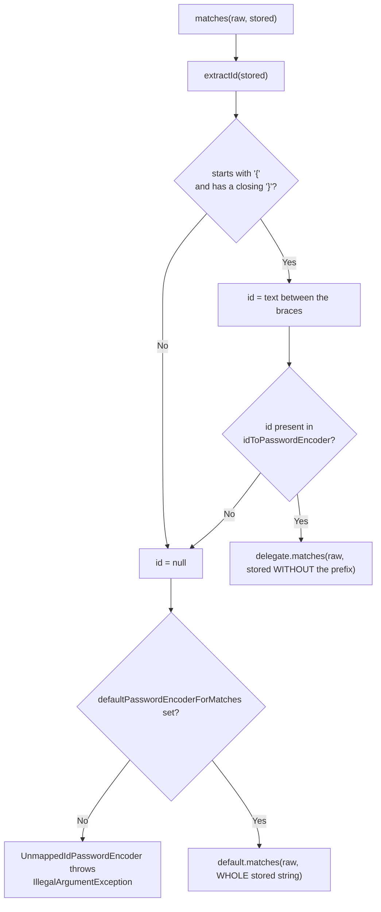
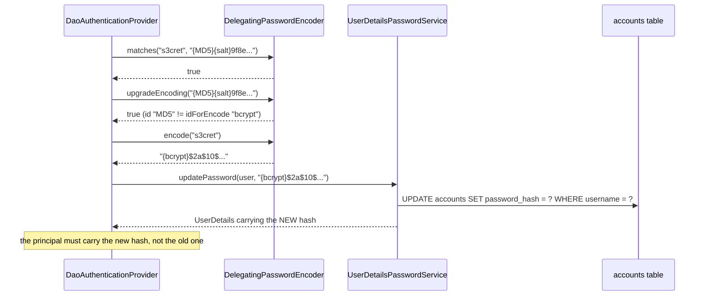

# 3.5 — Password Encoding in Spring Security

> **Module 3 · Topic 5** · Authentication
> Baseline: Spring Security 6.x on Boot 3.x, Java 17+
> New to this? Read **In Plain English** below first, then come back to the Version Matrix.

---

## Version Matrix

| Concern | Spring Security 5.x | **Spring Security 6.x (baseline)** | Spring Security 7.x |
|---|---|---|---|
| Default `PasswordEncoder` | `PasswordEncoderFactories.createDelegatingPasswordEncoder()` from 5.0 | **same; `{bcrypt}` is the encoding id** | same |
| `Argon2PasswordEncoder` construction | public constructor, plus `defaultsForSpringSecurity_v5_2/v5_8` | **`defaultsForSpringSecurity_v5_8()`; the raw constructor is deprecated** | factory methods only |
| `SCryptPasswordEncoder` construction | public constructor, plus `defaultsForSpringSecurity_v4_1/v5_8` | **`defaultsForSpringSecurity_v5_8()`** | factory methods only |
| `Pbkdf2PasswordEncoder` construction | public constructor, plus `defaultsForSpringSecurity_v5_5/v5_8` | **`defaultsForSpringSecurity_v5_8()` — 310,000 iterations** | factory methods only |
| `NoOpPasswordEncoder` | deprecated since 5.0 | **still deprecated, still present** | still present, still deprecated |
| Legacy digest encoders (`MessageDigestPasswordEncoder`, `LdapShaPasswordEncoder`, `StandardPasswordEncoder`) | deprecated | **deprecated; present only so historical hashes still match** | expected to be removed |
| `upgradeEncoding` hook | added in 5.0 with `UserDetailsPasswordService` | **same; requires `DaoAuthenticationProvider.setUserDetailsPasswordService`** | same |

---

## Why This Exists

`03_M1_T3_Cryptography.md` covers **why**: why a password is hashed and never encrypted, why a fast
hash such as SHA-256 is the wrong tool, what a salt does and how a pepper differs, and how to tune a
key-derivation function's cost. This file does not repeat any of that. It covers **how Spring
Security implements it** and, more usefully, the handful of places where the implementation surprises
people.

Three concrete problems shaped the design. First, a running system cannot re-hash its passwords on
demand, because it does not have the plaintext — so a format migration must happen gradually, one
successful login at a time. Second, a stored hash must be **self-describing**, or the application has
to remember out-of-band which algorithm produced each row and gets it wrong during exactly the
migration that motivated the question. Third, credential comparison must not leak information
through response time, and getting that right is not something every application team will do
unaided.

The answer is a two-character convention: every stored password begins with `{id}`. That prefix turns
the hash column into a self-describing format, makes `DelegatingPasswordEncoder` a pure dispatcher,
and makes the upgrade-on-login migration a comparison of two strings. Almost everything in this file
follows from it.

---

## In Plain English

**The one-line version:** Spring never stores a password, it stores a scrambled fingerprint of one,
and it writes a small label such as `{bcrypt}` on the front of every stored value so that it always
knows which scrambling recipe produced that particular row.

**An analogy.** Think of each account as a padlock rather than a written-down password. When somebody
chooses a password, you fit a lock that only their key opens. Later, when they turn up with a key, you
can test whether it opens the lock — but you cannot look at the lock and work out what the key looks
like. That one-way property is the entire reason passwords are "hashed" rather than encrypted, and it
is why "email me my password" is not a feature anyone can build.

Now add the detail that makes this file different from a general lesson about hashing. Locks come from
several manufacturers, each with its own test rig, and over the years your building has accumulated
locks from all of them. So every lock in your building is stamped on the front with its maker's name.
When a key arrives, you read the stamp, pick the matching test rig, and try the key in it. Fit only
new locks from your current preferred maker, and the old locks keep working because you kept the old
test rigs on the shelf. That stamp is the `{bcrypt}` or `{argon2}` label, and it is why one database
column can hold five generations of password format at the same time.

Two more consequences fall straight out of the picture. A lock with no stamp at all is a problem: you
are holding a key and you have no idea which rig to try, which is exactly the error message every
Spring developer eventually meets. And the only moment you can replace somebody's old lock with a
better one is the moment they are standing in front of you holding their key, because you need the
key to fit the new lock. That is why password upgrades happen one login at a time and can never be
done as an overnight batch job.

**How it actually works, step by step.**

The whole abstraction is one interface, `PasswordEncoder`, with two methods that matter. `encode`
takes the password the user typed and returns the value you store. `matches` takes the typed password
and the stored value and answers true or false. Notice what is absent: there is no `decode`. It does
not exist and cannot be added, so any requirement that says "show the user their password" is a
requirement to redesign the feature.

An important subtlety about `matches`: you must call it, and you must not try to do the comparison
yourself. Writing `encoder.encode(typed).equals(stored)` looks reasonable and is always wrong,
because every serious algorithm mixes a random value called a *salt* into each stored password. Two
people with the same password get different stored values, and encoding the same password twice
produces two different results. Only the encoder knows where the salt lives inside the stored string,
so only the encoder can verify it.

The encoder you actually get by default is a `DelegatingPasswordEncoder`, which does no scrambling at
all. It is a dispatcher holding a map from label to real encoder: `bcrypt` maps to the bcrypt encoder,
`argon2` to the Argon2 encoder, `noop` to a do-nothing encoder for demos, and so on. When you call
`encode`, it always writes one chosen label — `{bcrypt}` out of the box — followed by that encoder's
output. When you call `matches`, it reads the label out of the stored string, looks up the matching
encoder, strips the label off, and hands the rest over. So it *writes* one format while being able to
*read* many, which is precisely what a gradual migration needs.

That explains the error you will see sooner or later:
`There is no PasswordEncoder mapped for the id "null"`. The word `null` there is the label it read,
not a null reference. It means the stored value had no `{...}` on the front at all, which in practice
means the row came from an older system, or someone wrote a bare hash without going through the
delegating encoder, or a test fixture inserted plaintext.

In the login path the encoder is used in exactly three places, all inside
`DaoAuthenticationProvider`. Once to compare the typed password with the stored one, which is the
obvious use. Once on the "no such user" path, where the provider deliberately hashes a dummy password
anyway so that a login attempt for an unknown username takes just as long as one for a real username,
which stops an attacker measuring response times to discover which accounts exist. And once after a
successful login, to ask whether the stored value used an out-of-date recipe and, if so, to re-scramble
the password with the current one and save it. That third step only happens if you have provided a
`UserDetailsPasswordService`, which is a one-method interface that knows how to write a new hash to
your database.

Registration is the part Spring deliberately does not do for you. Nothing intercepts your database
save and hashes the password field, so your own code must call `encode` before saving — exactly once.
Calling it twice, which usually happens when one developer encodes in a service and another adds
encoding to an entity lifecycle callback, stores a scrambled version of an already-scrambled value.
The symptom is unmistakable: every new account registers successfully and then can never log in, with
an entirely ordinary "bad credentials" message.

Finally, the file covers password reset links, because a reset link is a temporary stand-in for the
password itself. They must be generated from `SecureRandom` rather than any ordinary random source,
stored only as a hash, usable once, and expired within the hour. One deliberate difference from
everything above: for a reset token a *fast* hash such as SHA-256 is the correct choice rather than
bcrypt, and the reasoning is spelled out in the section below.

**Why should a beginner care?** Every one of these mistakes is a real production incident somebody has
already had. Compare with `encode` instead of `matches` and nobody can ever log in. Encode twice and
every new user is locked out while your tests still pass, because the tests checked encoding and
verification separately. Store a bare hash with no label and the application throws an exception
instead of rejecting a password. Size the database column at sixty characters and the hash is
truncated, silently and permanently. And if you write your own login provider, the timing protection
and the automatic upgrade path both disappear without a single warning in the log.

**Words you will meet in this file**

| Term | In plain words |
|---|---|
| Hash | A scrambled fingerprint of a value that cannot be turned back into the original. |
| Salt | A random value mixed into each password before scrambling, so identical passwords do not produce identical stored values. |
| Pepper | An extra secret kept outside the database and mixed in for every password, so a stolen database alone is not enough. |
| `PasswordEncoder` | The interface with `encode` and `matches`. There is no `decode`, by design. |
| `encode` | Turn a typed password into the value you store. Produces a different result each time, because of the salt. |
| `matches` | Ask whether a typed password corresponds to a stored value. Always use this rather than comparing yourself. |
| `upgradeEncoding` | Ask whether a stored value used an out-of-date recipe and should be re-scrambled. |
| `DelegatingPasswordEncoder` | The default encoder. It scrambles nothing itself; it reads the `{...}` label and hands the work to the right encoder. |
| `{id}` prefix | The label at the start of every stored value naming the recipe used, such as `{bcrypt}` or `{argon2}`. |
| `PasswordEncoderFactories` | The helper that builds the standard delegating encoder with every known label already registered. |
| bcrypt | The long-standing default algorithm. Deliberately slow, and self-describing in its own output. |
| Strength / cost factor | The dial that makes bcrypt slower. Each step up doubles the work, which is the point. |
| Argon2 | The current recommended algorithm. Deliberately uses a lot of memory as well as time, which defeats specialised cracking hardware. |
| PBKDF2 | A pure-Java alternative, required in some regulated environments, and the only bundled one with built-in pepper support. |
| `{noop}` | The label meaning "not scrambled at all". Acceptable in a demo, never anywhere with real users. |
| `UserDetailsPasswordService` | The one-method interface you implement so a successful login can write a freshly re-scrambled password back to your database. |
| Double encoding | Calling `encode` twice on the same value. Registration appears to work and login fails forever. |
| `SecureRandom` | Java's unpredictable random-number source. The ordinary `Random` class is guessable and must never be used for secrets. |
| `MessageDigest.isEqual` | A comparison that always takes the same time, so an attacker cannot learn a secret by measuring how quickly it is rejected. |
| BouncyCastle | The third-party cryptography library that Argon2 and scrypt depend on, so it must be on the classpath. |

**If you remember only one thing:** always call `matches` rather than comparing hashes yourself, and
always store the `{id}` label, because that label is the only thing that makes changing algorithm
later possible without forcing every user to reset their password.

---

## Core Concepts

### 1. The `PasswordEncoder` Interface

**In simple terms:** The entire abstraction is one small interface that can scramble a password and
check a password, but deliberately cannot unscramble one, so the encoder must always be the thing
doing the comparison.

```java
// org.springframework.security.crypto.password.PasswordEncoder
public interface PasswordEncoder {

    String encode(CharSequence rawPassword);

    boolean matches(CharSequence rawPassword, String encodedPassword);

    default boolean upgradeEncoding(String encodedPassword) {
        return false;
    }
}
```

Three points the signatures make that people miss. **There is no `decode`**, by construction, so
"recover my password" is not implementable and any product requirement asking for it is a defect.
**`matches` takes the raw password and does the comparison itself**, because the encoder is the only
component that knows where the salt lives inside the encoded string — code that calls
`encode(raw).equals(stored)` is broken for every salted encoder, and it will pass a hand-written test
only if the developer reuses a fixed salt. **`upgradeEncoding` is advisory**: it returns `true` when a
stored hash was produced with weaker parameters than the encoder would use today, and it is the
caller's job to act on that.

Two operational details. `encode` is deliberately slow — a bcrypt hash at strength 10 costs roughly
50 to 100 milliseconds on server hardware, which is the entire point, but it also means a login
endpoint is not free and a naive load test will saturate the CPU. And `matches` returns `false`
rather than throwing when the stored value is `null` or empty, logging a warning about an empty
encoded password, so a row with a `NULL` hash produces a normal authentication failure rather than a
crash.

### 2. `DelegatingPasswordEncoder` and the `{id}` Prefix

**In simple terms:** This encoder scrambles nothing itself. It reads the `{...}` label on the front of
a stored password, hands the work to whichever real encoder that label names, and always writes just
one chosen label when creating new passwords.

```java
// org.springframework.security.crypto.password.DelegatingPasswordEncoder (simplified)
private static final String PREFIX = "{";
private static final String SUFFIX = "}";

@Override
public String encode(CharSequence rawPassword) {
    return PREFIX + this.idForEncode + SUFFIX
           + this.idToPasswordEncoder.get(this.idForEncode).encode(rawPassword);
}

@Override
public boolean matches(CharSequence rawPassword, String prefixEncodedPassword) {
    if (rawPassword == null && prefixEncodedPassword == null) {
        return true;
    }
    String id = extractId(prefixEncodedPassword);
    PasswordEncoder delegate = this.idToPasswordEncoder.get(id);
    if (delegate == null) {
        // Not stripped: the default encoder receives the WHOLE stored string.
        return this.defaultPasswordEncoderForMatches.matches(rawPassword, prefixEncodedPassword);
    }
    return delegate.matches(rawPassword, extractEncodedPassword(prefixEncodedPassword));
}

private String extractId(String prefixEncodedPassword) {
    if (prefixEncodedPassword == null) {
        return null;
    }
    int start = prefixEncodedPassword.indexOf(PREFIX);
    if (start != 0) {
        return null;                       // no leading '{' at all
    }
    int end = prefixEncodedPassword.indexOf(SUFFIX, start);
    if (end < 0) {
        return null;                       // '{' with no closing '}'
    }
    return prefixEncodedPassword.substring(start + 1, end);
}
```

`extractId` returns `null` in three distinct situations — the argument is `null`, the string does not
start with `{`, or there is no closing `}` — and all three land on the same default encoder. That
single fact explains the error message everybody eventually meets.

```java
// The default default: DelegatingPasswordEncoder.UnmappedIdPasswordEncoder
@Override
public boolean matches(CharSequence rawPassword, String prefixEncodedPassword) {
    String id = extractId(prefixEncodedPassword);
    throw new IllegalArgumentException("There is no PasswordEncoder mapped for the id \"" + id + "\"");
}
```

> `java.lang.IllegalArgumentException: There is no PasswordEncoder mapped for the id "null"`

The id is literally the string `null`, and it always means the same thing: **the stored hash has no
`{...}` prefix**. Not a missing bean, not a wrong algorithm. Either the row predates the
`DelegatingPasswordEncoder` convention, or something wrote a bare bcrypt hash with `BCrypt.hashpw` or
a bare `BCryptPasswordEncoder`, or a test fixture inserted plaintext. If the id is a real word —
`"bcrypt2"`, `"argon"` — the prefix exists but is not in the map, usually a typo or a hash written by
another system.

`encode` is unconditional: it always writes `{idForEncode}` in front. So an encoder can *read* every
format in its map while *writing* only one, which is exactly what a migration needs.



### 3. `PasswordEncoderFactories.createDelegatingPasswordEncoder()`

**In simple terms:** This one factory call gives you the encoder almost everybody uses: it writes new
passwords with bcrypt and can still read every older format the framework has ever supported, which is
why a migration is possible at all.

```java
public static PasswordEncoder createDelegatingPasswordEncoder() {
    String encodingId = "bcrypt";
    Map<String, PasswordEncoder> encoders = new HashMap<>();
    encoders.put(encodingId, new BCryptPasswordEncoder());
    encoders.put("ldap", new LdapShaPasswordEncoder());
    encoders.put("MD4", new Md4PasswordEncoder());
    encoders.put("MD5", new MessageDigestPasswordEncoder("MD5"));
    encoders.put("noop", NoOpPasswordEncoder.getInstance());
    encoders.put("pbkdf2", Pbkdf2PasswordEncoder.defaultsForSpringSecurity_v5_5());
    encoders.put("pbkdf2@SpringSecurity_v5_8", Pbkdf2PasswordEncoder.defaultsForSpringSecurity_v5_8());
    encoders.put("scrypt", SCryptPasswordEncoder.defaultsForSpringSecurity_v4_1());
    encoders.put("scrypt@SpringSecurity_v5_8", SCryptPasswordEncoder.defaultsForSpringSecurity_v5_8());
    encoders.put("SHA-1", new MessageDigestPasswordEncoder("SHA-1"));
    encoders.put("SHA-256", new MessageDigestPasswordEncoder("SHA-256"));
    encoders.put("sha256", new StandardPasswordEncoder());
    encoders.put("argon2", Argon2PasswordEncoder.defaultsForSpringSecurity_v5_2());
    encoders.put("argon2@SpringSecurity_v5_8", Argon2PasswordEncoder.defaultsForSpringSecurity_v5_8());
    return new DelegatingPasswordEncoder(encodingId, encoders);
}
```

Four things worth internalising.

**The encoding id is `"bcrypt"` with default parameters**, so out of the box every new password is
bcrypt at strength 10, and that has not changed across 5.x and 6.x.

**Most entries exist only to read old hashes.** `ldap`, `MD4`, `MD5`, `SHA-1`, `SHA-256`, `sha256`,
and `noop` are all deprecated. They are in the map so an application migrating from an old system can
verify historical rows and re-hash them on first login. Never select one as the encoding id.

**The `@SpringSecurity_vX_Y`-suffixed ids are how parameter changes are versioned.** Raising PBKDF2
from 185,000 to 310,000 iterations changes the output, so a new id was minted rather than silently
invalidating every existing `{pbkdf2}` row. This is the mechanism you imitate when you tune your own
cost factor.

**The `scrypt` and `argon2` entries are constructed eagerly**, and both are BouncyCastle-backed, so
`createDelegatingPasswordEncoder()` throws `NoClassDefFoundError` for `org.bouncycastle...` unless
`bcprov-jdk18on` is on the classpath. This surprises teams who never intended to use either
algorithm: simply accepting the default encoder pulls the dependency in.

### 4. Unprefixed Legacy Rows

**In simple terms:** If you inherit passwords with no `{...}` label on the front, you can nominate one
encoder as the fallback for unlabelled rows, but treat that as a temporary bridge while you add the
missing labels, because it also silences the error that would tell you a row is genuinely broken.

You inherit a table of bare bcrypt hashes. You cannot re-hash them, because you do not have the
plaintext. `setDefaultPasswordEncoderForMatches` is the supported answer:

```java
DelegatingPasswordEncoder encoder =
        (DelegatingPasswordEncoder) PasswordEncoderFactories.createDelegatingPasswordEncoder();
encoder.setDefaultPasswordEncoderForMatches(new BCryptPasswordEncoder());
```

New passwords are still written as `{bcrypt}...`; rows with no parsable prefix are handed, **whole and
unstripped**, to the default encoder. `BCryptPasswordEncoder.matches` parses `$2a$10$...` on its own,
so it works directly.

Two warnings. This is a **migration aid, not a configuration**: while it is installed, a genuinely
malformed row and a legacy row are indistinguishable, and a mistyped id such as `{bcyrpt}` is silently
routed to the default encoder instead of failing loudly. And it only helps if every legacy row uses
the *same* algorithm — a table with a mixture needs a one-off script that adds the correct prefix per
row, which is a pure string prepend and needs no plaintext. Prefer the script; keep the default
encoder only for the window in which the script is running.

### 5. The Bundled Encoders

**In simple terms:** Four of the shipped algorithms are real choices you might pick today, and the
rest exist only so that passwords inherited from an older system can still be verified once and then
replaced.

| Id | Class | Defaults in 6.x | Notes |
|---|---|---|---|
| `bcrypt` | `BCryptPasswordEncoder` | strength 10, version `$2a` | Default encoding id; 60-character output; considers only the first 72 bytes |
| `argon2@SpringSecurity_v5_8` | `Argon2PasswordEncoder` | Argon2id, 16-byte salt, 32-byte hash, parallelism 1, 16 MiB memory, 2 iterations | Needs BouncyCastle; memory-hard, so the best defence against GPU attack |
| `scrypt@SpringSecurity_v5_8` | `SCryptPasswordEncoder` | CPU cost 65536, memory cost 8, parallelisation 1, 32-byte key, 16-byte salt | Needs BouncyCastle; largely superseded by Argon2 |
| `pbkdf2@SpringSecurity_v5_8` | `Pbkdf2PasswordEncoder` | HMAC-SHA256, 310,000 iterations, 16-byte salt | Pure JDK, FIPS-friendly; not memory-hard; supports a `secret` (pepper) |
| `MD5`, `SHA-1`, `SHA-256` | `MessageDigestPasswordEncoder` | one pass, `{salt}hash` format | **Deprecated.** Read-only, for migration |
| `noop` | `NoOpPasswordEncoder` | plaintext comparison | **Deprecated.** Never outside a demo |

**bcrypt.** `strength` is the base-2 logarithm of the round count, from 4 to 31, default 10, so each
increment doubles the cost. The output encodes everything needed to verify it — `$2a$10$`, a
22-character salt, a 31-character hash — which is why the hash is self-contained even before the
`{bcrypt}` prefix. The version prefixes are historical: `$2a` is what Spring writes, `$2y` was PHP's
marker after a 2011 sign-extension bug, and `$2b` is OpenBSD's fix for a length-overflow bug.
`BCryptPasswordEncoder` verifies all three, so hashes imported from PHP or another stack match without
conversion. The 72-byte ceiling is inherent to the algorithm: a long passphrase gains no security past
that point, and the standard workaround — pre-hashing with SHA-256 — makes your hashes incompatible
with every other bcrypt implementation, so adopt it deliberately or not at all.

**Argon2 and scrypt.** Both come from `org.bouncycastle`, so `bcprov-jdk18on` is a hard requirement.
Argon2id is the current recommendation because memory-hardness is what defeats GPU and ASIC attack —
see 03_M1_T3 for the reasoning and for how to size the parameters against your own hardware. Note the
operational cost: 16 MiB per concurrent hash means two hundred simultaneous logins need over three
gigabytes of transient heap, so the parameters must be chosen together with a concurrency limit.

**PBKDF2.** Its distinguishing feature in Spring is the `secret` constructor argument, an
application-side pepper mixed into the HMAC key. That is the only bundled encoder with first-class
pepper support. It is also the only one that is purely JDK-based, which matters in FIPS-constrained
environments.

**The legacy encoders.** `MessageDigestPasswordEncoder` performs a single digest pass with an optional
random salt stored as a `{salt}` wrapper *inside* the value, producing the confusing
`{MD5}{saltvalue}hash` shape. It is deprecated, it is a fast hash, and the only correct use is
verifying an inherited row once, then re-hashing. `NoOpPasswordEncoder.getInstance()` is deprecated
and returns plaintext; it belongs in nothing that has users.

### 6. Where the Encoder Is Actually Invoked

**In simple terms:** The encoder is used in only three places during a login: to compare the typed
password, to burn the same amount of time when the username does not exist so nobody can measure which
accounts are real, and to re-scramble an out-of-date password after a successful check.

The whole `PasswordEncoder` abstraction is consumed in exactly **three** places in the authentication
path, all inside `DaoAuthenticationProvider`.

```java
// 1. Timing-attack mitigation, on the user-not-found path (retrieveUser)
private void prepareTimingAttackProtection() {
    if (this.userNotFoundEncodedPassword == null) {
        this.userNotFoundEncodedPassword = this.passwordEncoder.encode(USER_NOT_FOUND_PASSWORD);
    }
}

// 2. The actual credential comparison
@Override
protected void additionalAuthenticationChecks(UserDetails userDetails,
        UsernamePasswordAuthenticationToken authentication) throws AuthenticationException {
    if (authentication.getCredentials() == null) {
        throw new BadCredentialsException(this.messages.getMessage(
                "AbstractUserDetailsAuthenticationProvider.badCredentials", "Bad credentials"));
    }
    String presentedPassword = authentication.getCredentials().toString();
    if (!this.passwordEncoder.matches(presentedPassword, userDetails.getPassword())) {
        throw new BadCredentialsException(this.messages.getMessage(
                "AbstractUserDetailsAuthenticationProvider.badCredentials", "Bad credentials"));
    }
}

// 3. Re-hashing an outdated stored password, after a SUCCESSFUL match
@Override
protected Authentication createSuccessAuthentication(Object principal, Authentication authentication,
        UserDetails user) {
    boolean upgradeEncoding = this.userDetailsPasswordService != null
            && this.passwordEncoder.upgradeEncoding(user.getPassword());
    if (upgradeEncoding) {
        String presentedPassword = authentication.getCredentials().toString();
        String newPassword = this.passwordEncoder.encode(presentedPassword);
        user = this.userDetailsPasswordService.updatePassword(user, newPassword);
    }
    return super.createSuccessAuthentication(principal, authentication, user);
}
```

`additionalAuthenticationChecks` runs **after** the pre-authentication checks for locked, disabled,
and expired accounts, and **before** the post-authentication check for expired credentials. That
ordering is why a locked account never reveals whether the password was right.

The consequence for file 11 is direct: replace `DaoAuthenticationProvider` with a hand-written
provider and all three call sites vanish. The mitigation, the comparison, and the upgrade are yours to
rebuild, and the upgrade is the one that disappears silently.

### 7. `UserDetailsPasswordService` and Upgrade on Login

**In simple terms:** The only moment the server legitimately holds a user's real password is the
instant they successfully log in, so that is the only moment an old-format password can be
re-scrambled with a better algorithm and saved.

```java
// org.springframework.security.core.userdetails.UserDetailsPasswordService
public interface UserDetailsPasswordService {
    UserDetails updatePassword(UserDetails user, String newPassword);
}
```

Three conditions must all hold for an upgrade to happen: a `UserDetailsPasswordService` is wired into
the provider, `passwordEncoder.upgradeEncoding(storedHash)` returns `true`, and the password just
matched. The third is not optional — the plaintext only exists because the user supplied it and it was
verified, which is the entire reason re-hashing is possible without a password reset.

```java
// DelegatingPasswordEncoder.upgradeEncoding
@Override
public boolean upgradeEncoding(String prefixEncodedPassword) {
    String id = extractId(prefixEncodedPassword);
    if (!this.idForEncode.equalsIgnoreCase(id)) {
        return true;                                   // different algorithm -> upgrade
    }
    return this.idToPasswordEncoder.get(id)
               .upgradeEncoding(extractEncodedPassword(prefixEncodedPassword));
}
```

The first branch answers "is the stored id different from the one I write today", which makes
cross-algorithm migration a string comparison. The second delegates: `BCryptPasswordEncoder`
implements `upgradeEncoding` by parsing the strength out of the `$2a$10$` header and returning `true`
when it is below the configured strength, so raising strength from 10 to 12 also triggers re-hashing.

`updatePassword` **must return the updated `UserDetails`**, because the returned object becomes the
principal. Returning the stale argument puts an outdated hash in the session; returning `null` causes
a `NullPointerException` in `createSuccessAuthentication`. The method must also be idempotent and
must not throw: a failed upgrade should be logged and swallowed, because failing a login that already
succeeded is a worse outcome than deferring the migration by one attempt.



The migration is therefore driven entirely by user traffic: active users convert within days, and the
long tail is whoever has not logged in. Track the remaining count as a metric, and after an agreed
window either force a reset for the stragglers or delete the accounts. A migration with no deadline
never finishes.

### 8. Encoding at Registration, and the Double-Encoding Bug

**In simple terms:** Nothing in Spring hashes a password when you save a new user, so your own code
must do it exactly once, and doing it twice produces accounts that register happily and can never log
in again.

There is no framework hook for registration. Nothing intercepts a repository `save` and hashes the
password field, so your code must call `encode` exactly once before persisting — and **exactly once**
is the operative phrase.

```java
// The bug, in its usual two-layer form
public void register(RegistrationRequest request) {
    String hash = this.passwordEncoder.encode(request.password());   // once, here
    this.accounts.save(new Account(request.email(), hash));
}

@PrePersist                                                          // and again, here
void hashPassword() {
    this.passwordHash = ENCODER.encode(this.passwordHash);           // {bcrypt}{bcrypt}$2a$...
}
```

The stored value becomes the encoding of a hash. Verification fails permanently, because `matches`
compares the raw password against a hash of a hash. The symptom is unmistakable once you have seen it:
**registration succeeds and login always fails, for every new user, with a perfectly ordinary "Bad
credentials"**. The second symptom is the giveaway — the stored value contains the `{bcrypt}` prefix
twice, or begins with `{bcrypt}$2a$10$` where the remainder is itself 60 characters of bcrypt.

The defences are structural. Encode in exactly one place, a single application service that owns
credential changes. Never encode in an entity lifecycle callback or a setter, because those fire on
every persist including the one that follows an upgrade-on-login re-hash. Never call `encode` in a
controller. And add a cheap guard in the persistence path that rejects a value already matching
`^\{\w+}\{\w+}`, which turns a silent production defect into a failing integration test. The same
discipline applies to administrative password resets and to data-import scripts, which are the two
places where a second encode is most often introduced later.

Column width is the other registration-time trap. `{bcrypt}` plus a 60-character hash is 68
characters; `{argon2@SpringSecurity_v5_8}` plus its output comfortably exceeds 120. A `VARCHAR(60)`
column sized for bare bcrypt truncates silently on some databases and throws on others, and either way
the password can never be verified. Size the column at 255 and stop thinking about it.

### 9. Password Reset Tokens

**In simple terms:** A reset link is a temporary replacement for the password, so it has to be
unguessable, stored only as a fingerprint, valid once, and expired quickly — and unlike a password, a
fast hash is the right way to store it.

A reset token is a **bearer credential that fully substitutes for the password**, so its handling is
part of password security even though no `PasswordEncoder` is involved in generating it.

**Generate it with `SecureRandom`,** at least 32 bytes, rendered with a URL-safe base64 encoder.
`java.util.Random`, `Math.random()`, `UUID.randomUUID()` derived from a weak source, or anything
seeded from the clock are all predictable enough to enumerate.

**Store only a hash of the token,** never the token itself, so a read-only database leak does not hand
over every pending reset. Here — and this is the one point where this file and 03_M1_T3 appear to
disagree — a **fast hash such as SHA-256 is correct**, and bcrypt would be wrong. The reasoning in
03_M1_T3 is that a slow key-derivation function exists to compensate for the low entropy of
human-chosen passwords. A 256-bit random token has no entropy deficit to compensate for, so there is
nothing for a KDF to buy, and its cost would instead make the reset endpoint trivially easy to
overload.

**Make it single-use and short-lived.** Delete or mark the row the moment it is redeemed, inside the
same transaction that changes the password, so two concurrent redemptions cannot both succeed. Fifteen
to sixty minutes is the usual expiry. Invalidate every outstanding token for a user whenever the
password changes by any route, including a successful reset, an administrative reset, and a normal
change-password action.

**Compare in constant time.** The lookup pattern that makes this natural is a **selector plus a
verifier**: the emailed token carries a random selector used as the database key and a random verifier
that is hashed and stored. Look the row up by selector, then compare the verifier hash with
`MessageDigest.isEqual`. A naive `WHERE token_hash = ?` is usually fine because the database compares
opaque bytes, but as soon as someone loads candidates and compares them in Java with `String.equals`,
early-exit comparison leaks a prefix oracle.

**Do not reveal whether the email address exists.** "If an account exists for that address, we have
sent a link" is the only acceptable response, with the same status code and a similar response time in
both cases — otherwise the reset form is a user-enumeration endpoint. Finally, **invalidate the
victim's existing sessions** after a successful reset, because a reset is the recovery action after a
compromise and leaving the attacker's session alive defeats the point.

---

## Working Code

```java
package com.example.security;

import org.springframework.context.annotation.Bean;
import org.springframework.context.annotation.Configuration;
import org.springframework.security.crypto.argon2.Argon2PasswordEncoder;
import org.springframework.security.crypto.bcrypt.BCryptPasswordEncoder;
import org.springframework.security.crypto.password.DelegatingPasswordEncoder;
import org.springframework.security.crypto.password.MessageDigestPasswordEncoder;
import org.springframework.security.crypto.password.PasswordEncoder;

import java.util.Map;

@Configuration
public class PasswordEncoderConfig {

    /**
     * Writes {argon2@SpringSecurity_v5_8}; still reads every historical format.
     * Because the encoding id differs from the stored ids, upgradeEncoding() returns true
     * for legacy rows and upgrade-on-login re-hashes them.
     */
    @Bean
    PasswordEncoder passwordEncoder() {
        String encodingId = "argon2@SpringSecurity_v5_8";
        Map<String, PasswordEncoder> encoders = Map.of(
                encodingId, Argon2PasswordEncoder.defaultsForSpringSecurity_v5_8(),
                "bcrypt", new BCryptPasswordEncoder(),          // previous format
                "SHA-256", new MessageDigestPasswordEncoder("SHA-256"));  // inherited, read-only

        DelegatingPasswordEncoder encoder = new DelegatingPasswordEncoder(encodingId, encoders);
        // Rows imported before the {id} convention: bare bcrypt, no prefix.
        // Remove this once the backfill script has prefixed every legacy row.
        encoder.setDefaultPasswordEncoderForMatches(new BCryptPasswordEncoder());
        return encoder;
    }
}
```

```java
package com.example.security;

import org.springframework.security.core.userdetails.UserDetails;
import org.springframework.security.core.userdetails.UserDetailsPasswordService;
import org.springframework.security.core.userdetails.User;
import org.springframework.stereotype.Service;
import org.springframework.transaction.annotation.Transactional;

@Service
public class JdbcUserDetailsPasswordService implements UserDetailsPasswordService {

    private static final org.slf4j.Logger log =
            org.slf4j.LoggerFactory.getLogger(JdbcUserDetailsPasswordService.class);

    private final AccountRepository accounts;

    public JdbcUserDetailsPasswordService(AccountRepository accounts) {
        this.accounts = accounts;
    }

    /**
     * Called by DaoAuthenticationProvider AFTER a successful match, when the stored hash
     * is outdated. Must return UserDetails carrying the NEW hash, and must never throw:
     * a failed upgrade must not fail a login that has already succeeded.
     */
    @Override
    @Transactional
    public UserDetails updatePassword(UserDetails user, String newPassword) {
        try {
            int rows = this.accounts.updatePasswordHash(user.getUsername(), newPassword);
            if (rows != 1) {
                log.warn("Password upgrade affected {} rows for {}", rows, user.getUsername());
                return user;
            }
            return User.withUserDetails(user).password(newPassword).build();
        }
        catch (RuntimeException ex) {
            log.warn("Password upgrade failed for {}; will retry on next login", user.getUsername(), ex);
            return user;                          // login still succeeds with the old hash
        }
    }
}
```

```java
package com.example.security;

import org.springframework.security.crypto.password.PasswordEncoder;
import org.springframework.stereotype.Service;
import org.springframework.transaction.annotation.Transactional;

/** The ONLY class in the application permitted to call passwordEncoder.encode(). */
@Service
public class CredentialService {

    private final AccountRepository accounts;
    private final PasswordEncoder passwordEncoder;
    private final PasswordResetTokenService resetTokens;

    public CredentialService(AccountRepository accounts, PasswordEncoder passwordEncoder,
                             PasswordResetTokenService resetTokens) {
        this.accounts = accounts;
        this.passwordEncoder = passwordEncoder;
        this.resetTokens = resetTokens;
    }

    @Transactional
    public void register(String email, CharSequence rawPassword) {
        // Encoded here and nowhere else: no @PrePersist hook, no setter, no controller.
        this.accounts.save(new Account(email, this.passwordEncoder.encode(rawPassword)));
    }

    @Transactional
    public void changePassword(String email, CharSequence current, CharSequence replacement) {
        Account account = this.accounts.findByEmail(email).orElseThrow();
        if (!this.passwordEncoder.matches(current, account.getPasswordHash())) {
            throw new BadCredentialsException("Current password does not match");
        }
        account.setPasswordHash(this.passwordEncoder.encode(replacement));
        this.resetTokens.invalidateAllFor(email);   // any change invalidates pending resets
    }
}
```

```java
package com.example.security;

import org.springframework.stereotype.Service;
import org.springframework.transaction.annotation.Transactional;

import java.nio.charset.StandardCharsets;
import java.security.MessageDigest;
import java.security.NoSuchAlgorithmException;
import java.security.SecureRandom;
import java.time.Duration;
import java.time.Instant;
import java.util.Base64;
import java.util.Optional;

@Service
public class PasswordResetTokenService {

    private static final Duration TTL = Duration.ofMinutes(30);
    private static final Base64.Encoder B64 = Base64.getUrlEncoder().withoutPadding();

    private final SecureRandom random = new SecureRandom();
    private final ResetTokenRepository tokens;

    public PasswordResetTokenService(ResetTokenRepository tokens) {
        this.tokens = tokens;
    }

    /** Returns "selector.verifier" to email; only the verifier HASH is persisted. */
    @Transactional
    public String issue(String email) {
        byte[] selectorBytes = new byte[12];
        byte[] verifierBytes = new byte[32];            // 256 bits of entropy
        this.random.nextBytes(selectorBytes);
        this.random.nextBytes(verifierBytes);
        String selector = B64.encodeToString(selectorBytes);
        String verifier = B64.encodeToString(verifierBytes);

        this.tokens.deleteByEmail(email);               // one live token per account
        this.tokens.save(new ResetToken(selector, sha256(verifier), email, Instant.now().plus(TTL)));
        return selector + "." + verifier;
    }

    /** Single-use and constant-time. Returns the email on success. */
    @Transactional
    public Optional<String> redeem(String presented) {
        int dot = presented.indexOf('.');
        if (dot < 0) {
            return Optional.empty();
        }
        Optional<ResetToken> found = this.tokens.findBySelector(presented.substring(0, dot));
        if (found.isEmpty() || found.get().getExpiresAt().isBefore(Instant.now())) {
            return Optional.empty();
        }
        ResetToken token = found.get();
        // MessageDigest.isEqual does not exit early on the first differing byte.
        if (!MessageDigest.isEqual(token.getVerifierHash(), sha256(presented.substring(dot + 1)))) {
            return Optional.empty();
        }
        this.tokens.delete(token);                      // burned in the same transaction
        return Optional.of(token.getEmail());
    }

    @Transactional
    public void invalidateAllFor(String email) {
        this.tokens.deleteByEmail(email);
    }

    /** A fast hash is correct here: 256 random bits leave no entropy deficit for a KDF
     *  to compensate for. See 03_M1_T3_Cryptography.md. */
    private static byte[] sha256(String value) {
        try {
            return MessageDigest.getInstance("SHA-256").digest(value.getBytes(StandardCharsets.UTF_8));
        }
        catch (NoSuchAlgorithmException ex) {
            throw new IllegalStateException("SHA-256 is required by the JDK", ex);
        }
    }
}
```

```java
package com.example.security;

import org.junit.jupiter.api.Test;
import org.springframework.security.crypto.bcrypt.BCryptPasswordEncoder;
import org.springframework.security.crypto.factory.PasswordEncoderFactories;
import org.springframework.security.crypto.password.PasswordEncoder;

import static org.assertj.core.api.Assertions.assertThat;
import static org.assertj.core.api.Assertions.assertThatThrownBy;

class PasswordEncodingTests {

    private final PasswordEncoder encoder = PasswordEncoderFactories.createDelegatingPasswordEncoder();

    @Test
    void encodeIsSaltedSoTwoCallsNeverAgreeAndNeitherEqualsTheStoredValue() {
        String first = encoder.encode("correct horse battery staple");
        String second = encoder.encode("correct horse battery staple");

        assertThat(first).isNotEqualTo(second);                 // never assert on a literal hash
        assertThat(encoder.matches("correct horse battery staple", first)).isTrue();
        assertThat(encoder.matches("correct horse battery staple", second)).isTrue();
        assertThat(encoder.matches("wrong", first)).isFalse();
    }

    @Test
    void encodeWritesTheEncodingIdWhileMatchesReadsEveryMappedFormat() {
        assertThat(encoder.encode("pw")).startsWith("{bcrypt}$2a$10$");
        assertThat(encoder.matches("pw", "{noop}pw")).isTrue();  // legacy row still verifies
    }

    @Test
    void anUnprefixedHashFailsWithTheDiagnosticEveryoneEventuallySees() {
        String bare = new BCryptPasswordEncoder().encode("pw");  // no {bcrypt} prefix

        assertThatThrownBy(() -> encoder.matches("pw", bare))
                .isInstanceOf(IllegalArgumentException.class)
                .hasMessage("There is no PasswordEncoder mapped for the id \"null\"");
    }

    @Test
    void upgradeEncodingDetectsBothADifferentAlgorithmAndAWeakerCostFactor() {
        assertThat(encoder.upgradeEncoding("{noop}pw")).isTrue();            // different id
        assertThat(encoder.upgradeEncoding(encoder.encode("pw"))).isFalse(); // current format

        PasswordEncoder strong = new BCryptPasswordEncoder(12);
        assertThat(strong.upgradeEncoding(new BCryptPasswordEncoder(10).encode("pw"))).isTrue();
    }

    @Test
    void anAlreadyEncodedValueIsRejectedBeforeItReachesTheDatabase() {
        String doubled = encoder.encode(encoder.encode("pw"));

        assertThat(doubled).matches("^\\{\\w+}\\{\\w+}.*");   // the double-encoding fingerprint
        assertThat(encoder.matches("pw", doubled)).isFalse(); // and login can never succeed
    }
}
```

---

## Internals

### `BCryptPasswordEncoder.matches` and `upgradeEncoding`

```java
private static final Pattern BCRYPT_PATTERN = Pattern.compile("\\A\\$2([ayb])?\\$(\\d\\d)\\$[./0-9A-Za-z]{53}");

@Override
public boolean matches(CharSequence rawPassword, String encodedPassword) {
    if (encodedPassword == null || encodedPassword.length() == 0) {
        this.logger.warn("Empty encoded password");
        return false;
    }
    if (!BCRYPT_PATTERN.matcher(encodedPassword).matches()) {
        this.logger.warn("Encoded password does not look like BCrypt");
        return false;
    }
    return BCrypt.checkpw(rawPassword.toString(), encodedPassword);
}

@Override
public boolean upgradeEncoding(String encodedPassword) {
    // ... same two guards, then:
    int strength = Integer.parseInt(encodedPassword.substring(4, 6));
    return strength < this.version.getVersion() ? false : strength < this.strength;
}
```

Both malformed cases **log a warning and return `false`** rather than throwing, which is deliberate —
a corrupt row must not be distinguishable from a wrong password — but it also means an entire class of
data problems shows up only as `WARN` lines in a log nobody is reading. If logins are failing
inexplicably, grep for `Encoded password does not look like BCrypt` before anything else.
`upgradeEncoding` parses the two-digit strength straight out of the header, which is why raising
`strength` in configuration is enough to trigger re-hashing on every subsequent login.

### `Pbkdf2PasswordEncoder` and the pepper

```java
public static Pbkdf2PasswordEncoder defaultsForSpringSecurity_v5_8() {
    return new Pbkdf2PasswordEncoder("", 16, 310000, SecretKeyFactoryAlgorithm.PBKDF2WithHmacSHA256);
}

private byte[] encode(CharSequence rawPassword, byte[] salt) {
    PBEKeySpec spec = new PBEKeySpec(rawPassword.toString().toCharArray(),
            EncodingUtils.concatenate(salt, this.secret), this.iterations, this.hashWidth);
    // ... SecretKeyFactory.getInstance(algorithm).generateSecret(spec).getEncoded()
}

@Override
public boolean matches(CharSequence rawPassword, String encodedPassword) {
    byte[] digested = decode(encodedPassword);
    byte[] salt = EncodingUtils.subArray(digested, 0, this.saltGenerator.getKeyLength());
    return MessageDigest.isEqual(digested, encode(rawPassword, salt));
}
```

The `secret` is concatenated with the per-row salt, so it functions as an application-side pepper —
see 03_M1_T3 for why that is useful and why it must live outside the database. Two consequences.
Rotating the secret invalidates every existing hash, so rotation is a migration, not a configuration
change, and it needs a new `{id}` exactly as the framework did for its own parameter bumps. And the
final comparison is `MessageDigest.isEqual`, the constant-time primitive; every bundled encoder uses
it or an equivalent, which is one of the concrete things you forfeit by hand-rolling a comparison.

### Boot auto-configuration

`UserDetailsServiceAutoConfiguration` backs off entirely once any `AuthenticationProvider`,
`AuthenticationManager`, `UserDetailsService`, or `ClientRegistrationRepository` bean exists. Until
then it builds an in-memory user from `spring.security.user.*`, and `getOrDeducePassword` prepends
`{noop}` when the configured password does not already carry a `{...}` prefix — which is why
`spring.security.user.password=secret` works in a demo and why the same value in a real
`UserDetailsService` throws the "no PasswordEncoder mapped for the id null" error. The generated
password logged at startup follows the same path.

Separately, `InitializeUserDetailsBeanManagerConfigurer` is what injects your `PasswordEncoder` bean
and your `UserDetailsPasswordService` bean into the `DaoAuthenticationProvider` it creates — and it
returns immediately if the `AuthenticationManagerBuilder` is already configured. That is the link back
to file 11: calling `http.authenticationProvider(...)` suppresses it, and the most commonly-missed
casualty is the password service, so the migration stops with no error anywhere.

---

## Configuration Reference

| Option | Effect | Default |
|---|---|---|
| `PasswordEncoderFactories.createDelegatingPasswordEncoder()` | Multi-format encoder writing `{bcrypt}` | Boot's default when no `PasswordEncoder` bean exists |
| `new DelegatingPasswordEncoder(idForEncode, map)` | Chooses the write format and the readable set | — |
| `DelegatingPasswordEncoder.setDefaultPasswordEncoderForMatches(e)` | Handles rows whose id is `null` or unmapped; receives the **whole** string | `UnmappedIdPasswordEncoder`, which throws |
| `new BCryptPasswordEncoder(strength)` | Cost is `2^strength` rounds; 4 to 31 | `10` |
| `new BCryptPasswordEncoder(version, strength, secureRandom)` | Selects `$2a`, `$2b`, or `$2y` and the salt source | `$2A`, 10, default `SecureRandom` |
| `Argon2PasswordEncoder.defaultsForSpringSecurity_v5_8()` | Argon2id, 16 MiB, 2 iterations, parallelism 1 | requires BouncyCastle |
| `SCryptPasswordEncoder.defaultsForSpringSecurity_v5_8()` | CPU cost 65536, memory cost 8, parallelisation 1 | requires BouncyCastle |
| `Pbkdf2PasswordEncoder.defaultsForSpringSecurity_v5_8()` | HMAC-SHA256, 310,000 iterations, 16-byte salt | secret (pepper) is `""` |
| `Pbkdf2PasswordEncoder` constructor `secret` argument | Application-side pepper concatenated with the salt | `""` |
| `DaoAuthenticationProvider.setPasswordEncoder(e)` | The encoder used for comparison, timing parity, and re-hashing | delegating encoder |
| `DaoAuthenticationProvider.setUserDetailsPasswordService(s)` | Enables upgrade-on-login | `null`, so the feature is off |
| `PasswordEncoder.upgradeEncoding(hash)` | Advisory "this row is outdated" | `false` |
| `spring.security.user.password` | In-memory demo user; `{noop}` is prepended when unprefixed | randomly generated and logged |

---

## Production Concerns & Anti-Patterns

**Comparing with `encode` instead of `matches`.** `encoder.encode(raw).equals(stored)` is always false
for a salted encoder, because a fresh random salt produces a different output every time. It appears to
work only in a test that pins the salt, which is itself a defect.

**A bare `BCryptPasswordEncoder` bean.** It works until the day you want to change algorithm or
strength, at which point nothing in the stored rows says what produced them, `upgradeEncoding` has no
id to compare, and you are back to a forced reset for every user. Always expose the delegating encoder
even if the map has one entry; the cost is a prefix and the benefit is a migration path.

**Undersized hash columns.** `VARCHAR(60)` holds a bare bcrypt hash and nothing else. With the prefix
you need 68, and Argon2 needs well over 120. Size it at 255 now, because widening it later means
touching a table you would rather not touch.

**Tuning cost without measuring on production hardware.** A strength that is comfortable on a laptop
can be four times slower on a throttled container. Measure on the target, then divide the login
throughput you need by the measured cost and check the arithmetic — see 03_M1_T3 for how to choose the
target latency. Argon2's memory parameter needs the same treatment against the container memory limit,
because it is per concurrent hash, not per process.

**Treating the login endpoint as free.** Every attempt costs a deliberate hundred milliseconds of CPU,
which makes an unthrottled login form a denial-of-service amplifier: an attacker sends cheap requests
and you perform expensive hashing. Rate limiting per address and per account is not optional, and the
throttle must sit in front of the encoder rather than behind it.

**Logging the raw password or the hash.** A request-body logging filter on `POST /login` captures
plaintext, and `toString()` on a user entity captures the hash. Neither belongs in a log aggregator
with a broad retention policy, and both are routinely found there during audits.

**A reset token that is not single-use.** If redemption does not delete the row in the same transaction
as the password change, a leaked link in a browser history, a proxy log, or a forwarded email stays
valid for the rest of its lifetime — and an expiry check alone does not help, because the whole attack
happens inside the window.

---

## Debugging Playbook

| Symptom | Likely root cause | Fix |
|---|---|---|
| `IllegalArgumentException: There is no PasswordEncoder mapped for the id "null"` | The stored hash has no `{...}` prefix | Backfill the prefix, or set `setDefaultPasswordEncoderForMatches` during the migration |
| The same error with a real id, such as `"bcyrpt"` | A typo, or a prefix written by another system | Correct the rows, or add the id to the map |
| Registration succeeds, login always fails, for every new user | Double encoding: `encode` called in a service *and* in a `@PrePersist` or a setter | Encode in exactly one place; inspect a stored row for a repeated `{id}` |
| Login fails only for users imported from the old system | The legacy algorithm is not in the encoder map | Add a read-only entry for it and let upgrade-on-login re-hash |
| `WARN Encoded password does not look like BCrypt` and a failed login | The column truncated the hash, or the row holds plaintext | Widen the column to 255 and re-hash the affected accounts |
| Passwords never migrate off the old algorithm | `UserDetailsPasswordService` is not wired, or a custom provider replaced `DaoAuthenticationProvider` | Set `setUserDetailsPasswordService`; check whether configuring the builder suppressed the auto-wiring |
| Migration works but the user must log in twice | `updatePassword` returned the stale `UserDetails` | Return `User.withUserDetails(user).password(newPassword).build()` |
| `NoClassDefFoundError: org/bouncycastle/crypto/generators/...` | Argon2 or scrypt in use, or simply `createDelegatingPasswordEncoder()` | Add `bcprov-jdk18on` |
| Login latency jumped after a dependency upgrade | An encoder's default parameters changed, or the id moved to a `@SpringSecurity_vX_Y` variant | Pin the encoder and its parameters explicitly rather than relying on defaults |
| CPU saturates under a login flood | Unthrottled endpoint multiplied by a deliberately expensive hash | Rate limit before the encoder; consider a cheap challenge in front of it |
| A reset link works more than once | Redemption does not delete the row in the password-change transaction | Delete inside the same transaction and invalidate on every credential change |
| `matches` returns `false` for a hash that verifies in another tool | Trailing whitespace or a newline from a CSV import, or a `CHAR` column padding the value | Trim on import; use `VARCHAR`, never `CHAR` |

---

## Interview Q&A

### Q1. What does the `{id}` prefix do, and what exactly happens when it is missing?

<details>
<summary>Show answer</summary>

It makes the stored hash **self-describing**. `DelegatingPasswordEncoder.encode` writes
`"{" + idForEncode + "}"` in front of the delegate's output, and `matches` reads the id back out to
choose which delegate verifies the row. The application therefore never has to remember which
algorithm produced which row, and a table can hold several formats at once — which is the precondition
for migrating without a forced password reset.

When it is missing, `extractId` returns `null`. It returns `null` in three distinct cases: the stored
value is `null`, it does not begin with `{`, or it begins with `{` but has no closing `}`. All three
land on `defaultPasswordEncoderForMatches`, which by default is `UnmappedIdPasswordEncoder`, whose
`matches` throws `IllegalArgumentException("There is no PasswordEncoder mapped for the id \"null\"")`.
The word `null` in the message is the *id*, not a null reference, and it always means the same thing:
an unprefixed stored hash.

**Counter-question: you inherit ten million bare bcrypt rows. What do you do, and what is the risk of each option?**

Two options. `setDefaultPasswordEncoderForMatches(new BCryptPasswordEncoder())` sends unparsable rows,
**whole and unstripped**, to a plain bcrypt encoder, which parses `$2a$10$...` happily. It is one line
and it works immediately. The risk is that it is permanently forgiving: a genuinely corrupt row, a
plaintext row inserted by a bad script, and a mistyped prefix all silently route to the default
encoder instead of failing loudly, so you lose the diagnostic the exception was giving you.

The other option is a backfill: `UPDATE accounts SET password_hash = '{bcrypt}' || password_hash WHERE
password_hash NOT LIKE '{%}'`. It needs no plaintext, because it is a pure string prepend, and it
leaves the system in a state where an unprefixed row is once again a loud error. The risk is that it is
a large write over a hot table, so it must be batched, and the `NOT LIKE` predicate must be exactly
right or it runs twice and produces `{bcrypt}{bcrypt}`.

I would do both: install the default encoder, run the backfill in batches behind a progress metric,
then remove the default encoder in the next release. That ordering means no user is ever locked out
mid-migration.

**Counter-question: does `upgradeEncoding` also depend on the prefix?**

Yes, and this is the less obvious consequence. `DelegatingPasswordEncoder.upgradeEncoding` compares
`extractId(stored)` with `idForEncode`. For an unprefixed row the extracted id is `null`, which is
never equal to `"bcrypt"`, so it returns `true` and the row is re-hashed on the next successful login.
That is actually the desired behaviour — it converts legacy rows for free — but it only happens if a
`UserDetailsPasswordService` is wired in. Without one the row is read through the default encoder
forever and never gains a prefix, which is precisely how the "temporary" default encoder becomes
permanent.
</details>

### Q2. Trace the upgrade-on-login mechanism from the stored hash to the updated row.

<details>
<summary>Show answer</summary>

It lives in `DaoAuthenticationProvider.createSuccessAuthentication`, which runs only after
`additionalAuthenticationChecks` has verified the password and the post-authentication checks have
passed. The guard is `this.userDetailsPasswordService != null && this.passwordEncoder.upgradeEncoding(user.getPassword())`.
If both hold, the provider takes the plaintext out of the `Authentication` — the only moment in the
system where it legitimately has it — calls `encode` on it, and passes the result to
`userDetailsPasswordService.updatePassword(user, newPassword)`. The returned `UserDetails` becomes the
principal, then `super.createSuccessAuthentication` builds the authenticated token.

`upgradeEncoding` on the delegating encoder answers two different questions. First, is the stored id
different from the one I write today, which is a plain string comparison and catches cross-algorithm
migration. If the ids match, it delegates to the mapped encoder;`BCryptPasswordEncoder` parses the
two-digit strength out of the `$2a$10$` header and returns `true` when it is below the configured
strength, which catches cost-factor increases within the same algorithm.

**Counter-question: why can this only happen at login, and what does that imply operationally?**

Because re-hashing requires the plaintext, and the only moment the server holds a verified plaintext is
the instant a user authenticates. There is no batch job that can do it: a hash is one-way, so you
cannot convert `{MD5}...` to `{bcrypt}...` without the password.

Operationally, the migration is driven entirely by user traffic. Daily users convert within days,
monthly users within a quarter, and dormant accounts never. So the migration needs a **metric** — the
count of rows still on the old id — and a **deadline**. When the curve flattens, the remaining accounts
get a forced reset or are deleted. Without a deadline the old algorithm stays in the encoder map
forever, and five years later nobody remembers why `{MD5}` is still readable.

**Counter-question: what breaks if `updatePassword` returns the `UserDetails` it was given instead of a new one?**

The database row is updated but the principal in the `SecurityContext` still carries the old hash. For
plain form login the immediate request usually still succeeds, so it looks fine. It breaks where the
principal's password is read again: "remember me" token generation that keys on the password, an
explicit re-authentication, or a `changePassword` flow that compares against the principal rather than
the database. The failures are intermittent and appear unrelated to the migration. Returning `null` is
worse and simpler — `super.createSuccessAuthentication` dereferences it and you get a
`NullPointerException` on every upgraded login.

I also insist that `updatePassword` never throws. It runs after authentication has already succeeded,
so an exception converts a successful login into a 500. Catch, log, and return the original
`UserDetails`; the upgrade retries on the next login, which costs nothing.
</details>

### Q3. A developer reports that registration works but users can never log in. How do you diagnose it?

<details>
<summary>Show answer</summary>

The shape of the report is diagnostic on its own: **every new user, always, with an ordinary "Bad
credentials"**. That rules out account status, provider routing, and the `UserDetailsService`, all of
which would fail differently or intermittently. It points at the stored value.

I look at one row. The overwhelmingly likely cause is double encoding, and it has an unmistakable
fingerprint: the value starts with `{bcrypt}{bcrypt}`, or with `{bcrypt}$2a$10$` where what follows the
prefix is itself a complete 60-character bcrypt hash. Somebody called `encode` twice — typically once
in the service and once more in a `@PrePersist` callback, an entity setter, or a mapper — so the stored
value is the hash of a hash and `matches(raw, storedValue)` can never be true.

The other candidates, in order of likelihood: the column is too narrow and truncated the hash, which
shows up as `WARN Encoded password does not look like BCrypt`; the registration path uses a different
`PasswordEncoder` instance from the authentication path, which matters when one is a delegating encoder
and the other is bare; or the password is being trimmed, lower-cased, or otherwise normalised on one
path and not the other.

**Counter-question: how do you make this class of bug impossible rather than merely fixable?**

Structurally. **One class owns credential encoding** — a `CredentialService` that is the only code
permitted to call `encode` — and an ArchUnit rule or a simple build-time grep fails the build if
`PasswordEncoder.encode` appears anywhere else. **No encoding in persistence callbacks or setters**,
because those fire on every persist, including the one that follows an upgrade-on-login re-hash, which
is a particularly nasty variant: it works at registration and corrupts the row during migration. And a
**guard in the persistence path** that rejects a value matching `^\{\w+}\{\w+}`.

Then one integration test that registers and immediately logs in. It is three lines, it catches every
variant of this bug, and its absence is the real root cause — the unit tests passed because they
tested encoding and verification separately.

**Counter-question: the same symptom appears only for users migrated from the old system. Different diagnosis?**

Yes, and now it is the reverse problem — the stored value is fine and the encoder cannot read it.
Either the legacy algorithm is not in the map, giving "no PasswordEncoder mapped for the id" with the
legacy id, or the rows have no prefix, giving the same error with the id `null`.

The subtler variants are formatting. `MessageDigestPasswordEncoder` stores `{salt}hash` *inside* the
value, so an imported `{SHA-256}{abc123}9f8e...` is correct and confusing, while a hash exported
without its salt is unverifiable at any price. A CSV import commonly leaves trailing whitespace or a
newline, and a `CHAR` column pads with spaces — both make `matches` return false with no warning
whatsoever. I compare the byte length of a stored value against a freshly-encoded one before assuming
anything about the algorithm.
</details>

### Q4. Why is `MessageDigest.isEqual` used to compare hashes, and where does it matter in a login flow?

<details>
<summary>Show answer</summary>

Because it does not exit early on the first differing byte. `Arrays.equals` and `String.equals` return
as soon as they find a mismatch, so the time they take is proportional to the length of the matching
prefix. Over enough samples that is a measurable oracle, and an attacker can recover a secret byte by
byte — see 03_M1_T3 for the underlying reasoning. `MessageDigest.isEqual` accumulates differences with
a bitwise OR across the whole array and returns once at the end.

In a Spring login flow it matters in three places. Inside the encoders: `Pbkdf2PasswordEncoder.matches`
ends in `MessageDigest.isEqual`, and bcrypt, scrypt, and Argon2 use equivalent constant-time
comparisons internally. In `DaoAuthenticationProvider`, where timing parity between the user-found and
user-not-found paths is maintained by encoding a dummy password and running `matches` against it even
when the lookup failed. And in any code *you* write that compares a secret — most commonly a password
reset token, a "remember me" series token, or an API key.

**Counter-question: the comparison is constant-time but a bcrypt hash takes a hundred milliseconds. Does the comparison timing even matter?**

For the password comparison itself, not really, and this is worth saying out loud. The bcrypt work
dwarfs any nanosecond-scale difference in the final byte comparison, and the salt means an attacker
cannot control the inputs to that comparison anyway. Constant-time comparison inside the encoder is
correct hygiene rather than the load-bearing control.

What genuinely matters is **timing parity at the level of the whole request**, which is why
`mitigateAgainstTimingAttack` exists: an unknown username that skips hashing entirely returns in
microseconds while a known one takes a hundred milliseconds, and that difference survives network
jitter over enough samples. That is a username-enumeration oracle, and it is the vulnerability that
actually gets reported.

Where byte-level constant-time comparison *is* load-bearing is on tokens you hash with SHA-256 — reset
tokens, remember-me tokens, API keys. There the comparison is the only work being done, so its timing
is the signal, and an attacker can submit chosen values as fast as you will accept them.

**Counter-question: are there other observable differences besides time?**

Several, and they are usually easier to exploit. Different HTTP status codes or response bodies for
"unknown user" and "wrong password" — which is why Spring's `hideUserNotFoundExceptions` defaults to
`true`. Different error messages on a registration or reset form, where "an account already exists"
tells an attacker the address is registered. Different behaviour under rate limiting, where a known
account gets locked out and an unknown one does not, so the lockout response itself confirms existence.
And different response sizes, even when the message reads the same, from a hidden form field or a
correlation identifier. Auditing for enumeration means comparing the full response — status, headers,
body length, and latency distribution — not just the visible text.
</details>

### Q5. Design the password reset flow. Why must the token be single-use, short-lived, and generated with `SecureRandom`?

<details>
<summary>Show answer</summary>

The flow: a user submits an email address; the server responds identically whether or not the account
exists; if it exists, the server generates a token, stores a hash of it with an expiry, and emails a
link. Redemption validates the token, changes the password, deletes the token, invalidates every other
outstanding token for that user, terminates the user's existing sessions, and sends a notification to
the address on file.

**`SecureRandom`** because the token is a bearer credential equivalent to the password. `java.util.Random`
is a linear congruential generator whose entire future output is recoverable from a couple of
observations, and a timestamp-derived token is guessable outright. Thirty-two bytes of `SecureRandom`
output is not brute-forceable.

**Short-lived** because the window in which a leaked link is dangerous should be small, and reset links
leak constantly — browser history, `Referer` headers on outbound links from the reset page, corporate
mail archives, forwarded messages, shared mailboxes. Fifteen to sixty minutes is the usual range.

**Single-use** because expiry alone protects nothing against the attacker who already has the link;
they simply use it inside the window. Redemption must delete the row in the same transaction that
changes the password, so two concurrent redemptions cannot both succeed. And the token must be
invalidated by *any* credential change, so a user who remembers their password and logs in normally
does not leave a live reset link outstanding.

**Counter-question: do you hash the reset token in the database, and with what?**

Yes — a read-only database leak, a log-shipped query, or a backup on a laptop must not hand over every
pending reset. Store only the hash and compare the hash of what was presented.

And deliberately **not** bcrypt: **SHA-256 is the correct choice here**, which sounds like it
contradicts everything in 03_M1_T3 until you look at why a KDF is slow. A KDF's cost exists to
compensate for the low entropy of human-chosen passwords, where the attacker's search space is small
enough that raising the per-guess cost is the only lever. A 256-bit `SecureRandom` token has no entropy
deficit, so there is nothing for the cost to buy, and the cost is not free: bcrypt on the reset endpoint
makes it trivially easy to overload. The rule generalises — slow hashes for low-entropy human secrets,
fast hashes for high-entropy generated secrets.

**Counter-question: the reset endpoint says "no account with that email". What is wrong, and what is the alternative?**

It is a user-enumeration oracle, and an unauthenticated one on a public form, which makes it the
easiest account-discovery endpoint most applications expose. The harvested list feeds credential
stuffing and targeted phishing, and it is routinely written up in penetration tests.

The alternative is one response for both cases: "If an account exists for that address, we have sent a
link." Same status code, same body, and a comparable response time — which takes thought, because the
existing-account path sends an email. Send it asynchronously, or add a small compensating delay, or the
latency difference reintroduces the oracle you just closed in the text. The same reasoning applies to
registration, where "that email is already taken" is the same leak; the standard answer is to accept the
submission and send an email that either completes the signup or tells the existing owner that someone
tried.

**Counter-question: a user resets their password. What happens to the session the attacker already has?**

Nothing, unless you make it happen — and that is the failure that matters, because a reset is usually
the recovery action *after* a compromise. If the attacker's session survives, the user has changed the
lock while the intruder is still inside.

So the reset transaction must also terminate every existing session for that principal. With Spring
Session that is `findByPrincipalName` followed by deletion of each session; with the in-memory registry
it is `SessionRegistry.getAllSessions(principal, false)` and `expireNow()` on each, which requires
`sessionManagement` with a `SessionRegistry` configured. Persistent "remember me" tokens must be deleted
too, and any issued refresh tokens revoked. Finally, send a notification to the address on file: if the
user did not initiate the reset, that message is the only signal they will get that the account was
taken over.
</details>

### Q6. Design question — a fifteen-year-old system stores unsalted MD5 passwords for four million users. Plan the migration to Argon2.

<details>
<summary>Show answer</summary>

The constraint that shapes everything: **unsalted MD5 is not merely weak, it is already broken**. Any
copy of that table is effectively a list of plaintexts, because unsalted digests fall to rainbow tables
instantly and the same password produces the same digest for every user. So this is not a routine
upgrade; I treat it as a probable prior compromise and plan accordingly.

**Immediately, before anything else.** Deploy a `DelegatingPasswordEncoder` that reads `{MD5}` and
writes `{argon2@SpringSecurity_v5_8}`, with a `UserDetailsPasswordService` wired in, so every successful
login re-hashes that user. This is a one-release change and it starts converting the active population
on day one. Prefix the existing rows with `{MD5}` in a batched backfill, because they will not have the
prefix. And check the encoder map carefully: the `MD5` entry is deprecated and read-only, and nothing
must ever select it as the encoding id.

**Immediately, in parallel.** Because the digests should be assumed known, enable breach-password
checking so nobody can re-register a password that is already public, force reauthentication for
sensitive actions, and raise the priority of multi-factor authentication for administrative accounts. If
there is any evidence of an actual leak, the plan changes to a forced reset for everyone and the rest of
this answer is moot.

**The hardening layer.** Upgrade-on-login leaves dormant accounts on MD5 indefinitely, which is the part
most plans get wrong. The fix is a **layered hash**: run a batch job that computes
`argon2(existing_md5_digest)` for every unconverted row and stores it under a custom id such as
`{md5-then-argon2}`. This needs no plaintext, because the MD5 digest is the input. Implement it as a
small `PasswordEncoder` registered under that id, whose `matches` computes MD5 of the raw password and
feeds it to Argon2, and whose `upgradeEncoding` always returns `true` so the row converts to plain
Argon2 the next time that user logs in. Now every row is protected at Argon2 strength within days rather
than years, and the active-user path still cleans itself up.

**Parameters and capacity.** Argon2id with the 6.x defaults is 16 MiB per concurrent hash, so two
hundred concurrent logins need over three gigabytes of transient memory. I measure the actual cost on
production-shaped hardware, size the parameters for a target latency in the 200 to 500 millisecond range
per 03_M1_T3, and pair them with a concurrency limit on the login endpoint. The batch job is the bigger
capacity question: four million Argon2 hashes at 16 MiB each must be throttled and scheduled off-peak, or
it will contend with live logins for the same memory and CPU.

**Verification and closure.** A dashboard counting rows per `{id}` is the migration's progress bar, and
it is also the alert: if the `{MD5}` count stops falling, upgrade-on-login has broken — most likely
because someone replaced `DaoAuthenticationProvider` and silently removed the hook. When the curve
flattens, force a reset for the remainder, then **remove the `MD5` entry from the map entirely** so the
old format becomes unreadable rather than merely unused.

**Counter-question: the batch job would take two weeks at a safe rate. Is layered hashing worth the complexity?**

Yes, and the comparison makes it obvious. Without it, a dormant account is protected by unsalted MD5 —
which is to say, not at all — until its owner next logs in, and for a fifteen-year-old system a
substantial fraction of four million accounts will never log in again. Two weeks of batch work to remove
that exposure entirely is cheap.

The complexity is genuinely bounded: one extra `PasswordEncoder` implementation, one map entry, one
throttled job. The real cost is that the custom id must be maintained and documented until every last row
has converted, and a future developer who does not know why it exists may delete it. I mitigate that with
a comment pointing at the migration ticket and the dashboard.

The alternative — forcing a password reset for all four million users — is the option product management
will suggest. It is technically clean and operationally terrible: a mass reset email is indistinguishable
from a phishing campaign, support volume spikes for weeks, and a measurable fraction of users simply
churn. I keep it in reserve for the dormant tail, where the number is small and the users are
low-engagement anyway.

**Counter-question: two years later you want to raise Argon2's memory parameter. Same mechanism?**

Almost, and the difference is the interesting part. Changing parameters under the *same* id makes
`upgradeEncoding` the deciding vote, and here Spring's own behaviour is a caution:
`Argon2PasswordEncoder.upgradeEncoding` does parse the parameters out of the stored PHC string and
compares them, so it does work — but this is exactly why the framework minted
`argon2@SpringSecurity_v5_8` rather than quietly changing the defaults under `argon2`. A versioned id
makes the change explicit, keeps the old parameters readable, and means an operator can tell from the row
alone which generation it belongs to.

So I do the same: register `argon2@2027` with the new parameters, make it the encoding id, keep
`argon2@SpringSecurity_v5_8` readable, and let upgrade-on-login do its work. The dashboard is already
counting rows per id, so the migration is observable from day one with no new instrumentation. And the
layered-hash trick is not available this time — Argon2 of an Argon2 hash is pointless, because the
existing hash is already strong — so the dormant tail either converts on login or eventually gets a
forced reset. That is acceptable, because unlike the MD5 case the unconverted rows are not dangerously
weak, merely a generation behind.
</details>

---

## Quick Recall

```
PasswordEncoder
  String  encode(CharSequence raw)
  boolean matches(CharSequence raw, String encoded)     <- NEVER encode().equals()
  boolean upgradeEncoding(String encoded)               default false; ADVISORY only
  no decode(), by construction

DELEGATING ENCODER / {id} PREFIX
  encode  -> "{" + idForEncode + "}" + delegate.encode(raw)      always writes ONE format
  matches -> extractId -> map lookup -> delegate.matches(raw, value WITHOUT prefix)
  extractId returns null when: value null | no leading '{' | no closing '}'
  unmapped or null id -> defaultPasswordEncoderForMatches (gets the WHOLE string)
  default default = UnmappedIdPasswordEncoder ->
      IllegalArgumentException: There is no PasswordEncoder mapped for the id "null"
      ==> ALWAYS means: the stored hash has no {...} prefix
  setDefaultPasswordEncoderForMatches(...) = migration aid, not a permanent setting

createDelegatingPasswordEncoder() MAP        encodingId = "bcrypt"
  bcrypt | argon2 | argon2@SpringSecurity_v5_8 | scrypt | scrypt@SpringSecurity_v5_8
  pbkdf2 | pbkdf2@SpringSecurity_v5_8 | ldap | MD4 | MD5 | SHA-1 | SHA-256 | sha256 | noop
  everything except bcrypt/argon2/scrypt/pbkdf2 is DEPRECATED and read-only
  @SpringSecurity_vX_Y suffix = how a PARAMETER CHANGE is versioned - copy this pattern
  scrypt + argon2 constructed eagerly -> bcprov-jdk18on required even if unused

ENCODERS (6.x defaults)
  bcrypt   strength 10 (2^10 rounds), $2a/$2b/$2y all verified, 60 chars, 72-BYTE LIMIT
  argon2   v5_8: Argon2id, 16-byte salt, 32-byte hash, 16 MiB, 2 iterations, p=1   [BC]
  scrypt   v5_8: cpu 65536, mem 8, par 1, key 32, salt 16                          [BC]
  pbkdf2   v5_8: HMAC-SHA256, 310,000 iterations, 16-byte salt; SECRET = pepper
  MessageDigest / NoOp / LdapSha / Standard: deprecated, migration only

WHERE THE ENCODER IS CALLED (all in DaoAuthenticationProvider)
  1. prepareTimingAttackProtection() -> encode("userNotFoundPassword"), user-not-found path
  2. additionalAuthenticationChecks() -> matches(presented, stored)   <- the real check
  3. createSuccessAuthentication()   -> upgradeEncoding + encode + updatePassword
  order: preAuthChecks -> additionalAuthenticationChecks -> postAuthChecks -> success

UPGRADE ON LOGIN
  needs ALL THREE: UserDetailsPasswordService wired + upgradeEncoding true + match succeeded
  only possible at login (plaintext exists nowhere else) -> traffic-driven, needs a DEADLINE
  DelegatingPasswordEncoder.upgradeEncoding: id != idForEncode -> true,
      else delegate (bcrypt parses the strength out of $2a$10$)
  updatePassword MUST return UserDetails carrying the NEW hash, MUST NOT throw

REGISTRATION
  no framework hook - YOUR code encodes, exactly ONCE, in ONE class
  double encoding = {bcrypt}{bcrypt}... -> registration OK, login ALWAYS fails
  never encode in @PrePersist / setters (fires again on upgrade-on-login)
  column: VARCHAR(255). bcrypt+prefix = 68; argon2 > 120

RESET TOKENS
  SecureRandom >= 32 bytes; store only a HASH; single-use (delete in the same transaction)
  15-60 min TTL; invalidated by ANY credential change; MessageDigest.isEqual to compare
  SHA-256 is CORRECT here, not bcrypt: no entropy deficit for a KDF to compensate for
  same response for existing/absent email; kill sessions + remember-me after a reset

CROSS-REFERENCES
  03_M1_T3  why hashing not encryption, salt vs pepper, KDF cost tuning, timing theory
  11_M3_T4  a custom AuthenticationProvider removes all three encoder call sites
```

---

**Previous:** [`11_M3_T4_Custom_Authentication.md`](11_M3_T4_Custom_Authentication.md) ·
**Next:** [`13_M4_T1_Authorization_URL_Based.md`](13_M4_T1_Authorization_URL_Based.md)
