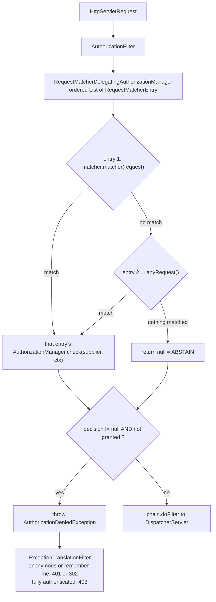

# 4.1 - URL-Based Authorization

> **Module 4 - Topic 1** - Authorization
> Baseline: Spring Security 6.x on Boot 3.x
> New to this? Read **In Plain English** below first, then come back to the Version Matrix.

## Version Matrix

| Concern | Spring Security 5.x | **Spring Security 6.x (baseline)** | Spring Security 7.x |
| --- | --- | --- | --- |
| DSL entry point | `authorizeRequests()`, deprecated in 5.8; `authorizeHttpRequests()` added in 5.5 | `authorizeHttpRequests()` only; `antMatchers()`, `mvcMatchers()`, and `regexMatchers()` are removed | `authorizeHttpRequests()`; the voter path is gone |
| Enforcement filter | `FilterSecurityInterceptor` | `AuthorizationFilter` | `AuthorizationFilter` |
| Decision engine | `AccessDecisionManager` with `WebExpressionVoter` and `RoleVoter` | `RequestMatcherDelegatingAuthorizationManager` | Same, via `AuthorizationManagerFactory` |
| Rule metadata | `FilterInvocationSecurityMetadataSource` producing `ConfigAttribute` instances | An ordered `List<RequestMatcherEntry<AuthorizationManager<RequestAuthorizationContext>>>` | Same shape |
| Matcher for a bare pattern | `AntPathRequestMatcher`, via `antMatchers` | `MvcRequestMatcher` when inference is unambiguous, otherwise a startup failure | `PathPatternRequestMatcher`, added in 6.5 |
| Dispatcher types authorized | `REQUEST` only | `REQUEST`, `ERROR`, and `ASYNC` | Same |
| Authentication resolution | Eager `Authentication` | `Supplier<Authentication>`; `permitAll()` never resolves it | `Supplier<Authentication>` |
| IP rules | `access("hasIpAddress('10.0.0.0/8')")` | No shorthand; a custom `AuthorizationManager` or `IpAddressMatcher` | Same |
| Denial exception and events | `AccessDeniedException`, no events | `AuthorizationDeniedException extends AccessDeniedException`, plus `AuthorizationEventPublisher` and `AuthorizationDeniedEvent` | Same |

## Why This Exists

URL-based authorization is the coarse, cheap, auditable outer gate. It is the only layer where the whole access policy of an application is visible in one file, and the only layer that can reject a request before Spring MVC deserialises a body, binds parameters, opens a transaction, or instantiates a controller.

`02_M1_T2_Authentication_Authorization.md` established what authorization is, that `GrantedAuthority` is the only type in the model, and that Spring Security 6 replaced the `AccessDecisionManager` and voter stack with `AuthorizationManager`. This file is about the mechanics of the servlet-layer implementation: how a rule list becomes a data structure, how a request is matched against it, and every way that matching goes wrong.

One sentence explains most production incidents in this area. The rule list is an ordered list, evaluated from top to bottom, and the first matching entry decides. No later entry is consulted, and nothing warns you when an earlier entry has made a later one unreachable. That is the opposite of `@RequestMapping` resolution, which picks the most specific mapping regardless of declaration order. Developers carry the MVC intuition into the security DSL and ship an open endpoint.

## In Plain English

**The one-line version:** This is the numbered list of rules that decides, before any of your own
code runs, whether a particular web address is allowed to be requested by a particular person.

**An analogy.** Picture a doorman holding a clipboard of numbered rules. Rule one might say "anything
whose address begins with /public, let them in". Rule two might say "anything beginning with /admin,
only people carrying an ADMIN badge". The doorman's method is the important part: he starts at the top
and stops at the very first rule that describes the request standing in front of him. He does not
hunt for the best-fitting rule, and he never reads further down once he has found one.

That single habit is behind most real incidents in this area. If somebody writes "anything at all,
let them in" as rule one, then rules two through twenty are decoration. They are still printed on the
clipboard, they still look like a security policy in a code review, and they are never consulted. And
the framework cannot warn you, because it has no way to know that "anything beginning with /api"
already covers "anything beginning with /api/admin".

The doorman has a second habit that is worse. If he reaches the bottom of the clipboard and no rule
described the request, he shrugs and lets it through. Silence means permission. So the last line of
the clipboard always has to be a catch-all that covers everything not mentioned above it.

One more thing worth noticing, because it is the source of the confusion. Spring's own web routing
works the *opposite* way: when deciding which controller method handles a request, the most specific
match wins no matter what order things were declared in. Two neighbouring parts of the same framework
resolve requests by opposite rules, and developers reasonably carry the routing intuition into the
security configuration.

**How it actually works, step by step.**

All of this lives in a single filter called `AuthorizationFilter`, positioned near the end of the
security filter chain — after the filters that work out who you are, and before Spring hands the
request to a controller. That position is the whole value of this layer: a rejected request never
reaches a controller, so nothing parses the request body, binds parameters, opens a database
transaction, or builds a response.

Your rules compile into one ordered list of pairs. The first half of each pair is a `RequestMatcher`,
which is simply a yes-or-no question about the request, such as "does the path start with `/admin`?"
The second half is an `AuthorizationManager`, which given a request and a user answers whether access
is allowed. The filter walks the list, finds the first matcher that says yes, asks that pair's manager
for a verdict, and returns it immediately.

A manager can give three answers, not two. It can grant, it can deny, or it can return nothing at all,
which means "I have no opinion" and is called abstaining. The filter only rejects a request when it
receives an explicit denial, so an abstain lets the request through. This matters because reaching the
end of the list with no matches is itself treated as an abstain. That is the mechanism behind the
"silence means permission" behaviour, and it is why every rule list must end with `anyRequest()`.

The verbs you write in each rule are small pre-built managers. `permitAll()` always grants and
`denyAll()` always denies. `authenticated()` grants to anybody who has logged in. `hasRole("ADMIN")`
looks for the permission string `ROLE_ADMIN` on the user, quietly adding the `ROLE_` part for you,
while `hasAuthority("ADMIN")` looks for exactly the string `ADMIN` with nothing added. Confusing those
two is common enough that a whole later file is devoted to it.

When a rule denies, the filter throws an exception which is caught by a filter sitting *earlier* in
the chain. Because Spring's web layer was never entered, your `@ControllerAdvice` exception handlers
never see it. That earlier filter then decides between two very different responses. If the caller was
never logged in, the right answer is "you need to identify yourself", which becomes a redirect to the
login page or an HTTP 401. If the caller was logged in and simply lacks the permission, the answer is
HTTP 403, meaning "we know who you are and you still may not do this". Learning to read those two
codes apart will save you hours: a 401 is an authentication problem, and a 403 is an authorization
problem.

One optimisation is worth understanding because it is easy to destroy by accident. The filter does not
hand the logged-in user to each manager; it hands a small function that *can fetch* the user if asked.
A `permitAll()` rule never asks, so on a public request Spring never looks in the session — and if your
sessions live in Redis, that is an entire network round trip saved on every public request. Add any
filter of your own that unconditionally reads the current user, and you have removed that saving across
the whole application, silently, with no test failing.

Finally, the honest limit of this layer. A URL rule can say "only administrators may reach this kind of
address". It cannot say "this particular order belongs to you", because the ownership answer lives in a
database row and checking it here would duplicate the lookup the service is about to do anyway. It also
protects only HTTP requests, so a scheduled job or a message listener calling the same service goes
completely unchecked. Both of those gaps are why the next file exists.

**Why should a beginner care?** The two failure modes here are silent and severe. Forget the final
catch-all rule and every path that nobody wrote a rule for is publicly reachable, which is a set you
cannot enumerate by reading the configuration and which grows every time a colleague adds a controller.
Put a broad rule above a narrow one and every logged-in user reaches your admin pages, while the
application behaves perfectly in every other respect. Neither mistake produces an error, a warning, or a
failing test — in fact the test most people write, checking that an administrator *can* get in, passes
just as happily when everyone can get in.

**Words you will meet in this file**

| Term | In plain words |
|---|---|
| Authorization | Deciding what an already-identified user is allowed to do, as opposed to working out who they are. |
| `authorizeHttpRequests` | The configuration block where you write the rule list. |
| `AuthorizationFilter` | The single filter that evaluates the rule list on every request, before any controller runs. |
| `RequestMatcher` | A yes-or-no question about a request, usually "does the path look like this?" |
| `AuthorizationManager` | The thing that decides whether a matched request is allowed. |
| `AuthorizationDecision` | The verdict: granted or denied. Returning nothing instead is a third option. |
| Abstain | Returning no verdict at all, which the filter treats as permission to continue. |
| `anyRequest()` | The catch-all final rule. It must come last, and it is what stops an unmatched request from being allowed. |
| `requestMatchers(...)` | How you select which requests a rule applies to. With only a path and no HTTP method, it covers every method. |
| `permitAll()` / `denyAll()` | Always allow, and always refuse. |
| `authenticated()` | Allow anybody who has logged in, without caring which permissions they hold. |
| `fullyAuthenticated()` | Allow only people who typed their password this session, excluding those restored from a "remember me" cookie. |
| `hasRole("X")` | Require the permission string `ROLE_X`. The `ROLE_` part is added for you. |
| `hasAuthority("X")` | Require exactly the permission string `X`, with nothing added. |
| `SecurityFilterChain` | One complete configuration: which requests it covers, how they log in, and what the rules are. |
| `ExceptionTranslationFilter` | The filter that catches a denial and turns it into either a login prompt or a 403. |
| 401 versus 403 | 401 means "identify yourself"; 403 means "we know who you are and the answer is still no". |
| `AntPathRequestMatcher` versus `MvcRequestMatcher` | Two ways of matching a path that compare against slightly different versions of the URL. They agree only in the common setup. |
| URI template variable | A named piece captured out of the path, so `/users/{username}` can be compared against the logged-in name. |
| Dispatcher type | How the server arrived at a request. `ERROR` is the internal re-entry that happens when something throws. |
| `StrictHttpFirewall` | The default guard that rejects suspicious URLs, such as encoded slashes, before any rule is evaluated. |
| `WebInvocationPrivilegeEvaluator` | A helper that answers "would this URL be allowed for this user?" without actually making a request, which is how you audit the whole list. |

**If you remember only one thing:** the rules are read top to bottom and the first match decides, and a
request that matches nothing is allowed — so put specific rules above broad ones and always finish with
`anyRequest().denyAll()` or `anyRequest().authenticated()`.

## Core Concepts

### 1. `authorizeHttpRequests` and the `AuthorizationFilter`

**In simple terms:** Everything you write in the rule block collapses into a single filter that
evaluates one ordered list, so there is no separate filter per rule and nothing in the chain to
inspect when a rule misbehaves.

`authorizeHttpRequests(...)` configures an `AuthorizeHttpRequestsConfigurer`, which does two things at build time. It assembles your rules into a `RequestMatcherDelegatingAuthorizationManager`, and it appends a single `AuthorizationFilter` holding that manager to the chain. There is no per-rule filter.

```java
// Simplified from org.springframework.security.web.access.intercept.AuthorizationFilter
@Override
public void doFilter(ServletRequest servletRequest, ServletResponse servletResponse,
        FilterChain chain) throws ServletException, IOException {

    HttpServletRequest request = (HttpServletRequest) servletRequest;

    // A METHOD REFERENCE, not a resolved value. This is the laziness.
    AuthorizationDecision decision =
            this.authorizationManager.check(this::getAuthentication, request);
    this.eventPublisher.publishAuthorizationEvent(this::getAuthentication, request, decision);

    if (decision != null && !decision.isGranted()) {
        throw new AuthorizationDeniedException("Access Denied", decision);
    }
    chain.doFilter(request, servletResponse);
}

private Authentication getAuthentication() {
    Authentication authentication =
            this.securityContextHolderStrategy.getContext().getAuthentication();
    if (authentication == null) {
        throw new AuthenticationCredentialsNotFoundException(
                "An Authentication object was not found in the SecurityContext");
    }
    return authentication;
}
```

Three facts fall straight out of that code, and each is interview material. The `decision != null` guard means a `null` decision is an abstain, and abstain means allow. `this::getAuthentication` is a `Supplier`, so nothing reads the `SecurityContext` until some manager calls `get()`. And the exception is caught by `ExceptionTranslationFilter`, which sits earlier in the chain and therefore outside on the call stack, so `@ControllerAdvice` never sees it, because `DispatcherServlet` has not been entered.

### 2. `RequestMatcherDelegatingAuthorizationManager`, the ordered list

**In simple terms:** This is the doorman with the clipboard: it walks your rules from top to bottom,
hands the decision to the first rule that matches, and returns no verdict at all if nothing matched —
which the filter reads as permission to proceed.

```java
package org.springframework.security.web.access.intercept;

public final class RequestMatcherDelegatingAuthorizationManager
        implements AuthorizationManager<HttpServletRequest> {

    private final List<RequestMatcherEntry<AuthorizationManager<RequestAuthorizationContext>>> mappings;

    @Override
    public AuthorizationDecision check(Supplier<Authentication> authentication,
            HttpServletRequest request) {

        for (RequestMatcherEntry<AuthorizationManager<RequestAuthorizationContext>> mapping
                : this.mappings) {

            RequestMatcher matcher = mapping.getRequestMatcher();
            MatchResult matchResult = matcher.matcher(request);
            if (matchResult.isMatch()) {
                AuthorizationManager<RequestAuthorizationContext> manager = mapping.getEntry();
                return manager.check(authentication,
                        new RequestAuthorizationContext(request, matchResult.getVariables()));
            }
        }
        this.logger.trace("Abstaining since did not find matching RequestMatcher");
        return null;              // ABSTAIN, which AuthorizationFilter treats as ALLOW
    }
}
```

Note `matcher.matcher(request)` rather than `matches(request)`. The richer `MatchResult` carries the URI template variables the matcher extracted, which is how `/users/{username}/**` can later be compared against `authentication.getName()`.

Abstain-means-allow is the most dangerous default in the servlet module. With no terminal `anyRequest()`, an unmatched request returns `null`, the `decision != null` gate is false, and the request reaches your controller. Always end the list with `anyRequest().authenticated()` or `anyRequest().denyAll()`.

### 3. First-match-wins, and the bugs it produces

**In simple terms:** Because the first matching rule decides, a broad rule written above a narrow one
makes the narrow one unreachable, and the framework cannot detect that, so admin pages end up open to
every logged-in user with no warning anywhere.

| Declared order | Effect |
| --- | --- |
| `/**` as `permitAll()`, then `/admin/**` as `hasRole("ADMIN")` | `/admin/x` matches `/**` first. Admin is public, with no warning. |
| `/api/**` as `authenticated()`, then `/api/admin/**` as `hasRole("ADMIN")` | Any logged-in user reaches the admin API. Privilege escalation. |
| `/admin/**` as `hasRole("ADMIN")`, then `/**` as `permitAll()` | Correct: specific first, broad last. |
| `anyRequest()` followed by another rule | Startup failure, the one case the DSL guards. |

```java
// org.springframework.security.config.annotation.web.AbstractRequestMatcherRegistry
protected final void checkAnyRequest() {
    Assert.state(!this.anyRequestConfigured, "Can't configure requestMatchers after anyRequest");
}
```

The dangerous version is the one the framework cannot detect: a broad pattern such as `/**`, `/api/**`, or `/*` above a narrower rule. The DSL cannot know that `/api/**` subsumes `/api/admin/**`, because a `RequestMatcher` is an opaque predicate over `HttpServletRequest`, so it stays silent and the narrower rule becomes dead code.

The discipline is to order strictly from most specific to least specific, never use `/**` for anything but `anyRequest()`, and write a test per protected prefix that asserts the denial. A test asserting that an administrator gets in passes in both the correct and the broken configuration, and is therefore worthless as a regression guard.

### 4. `requestMatchers` overloads

**In simple terms:** You can select requests by path, by HTTP method, or by both, and the trap is that
a rule written with a path alone applies to every method, so a `PATCH` added to a controller later
silently inherits whatever policy the `GET` had.

```java
public C requestMatchers(String... patterns);                    // any HTTP method
public C requestMatchers(HttpMethod method);                     // any path
public C requestMatchers(HttpMethod method, String... patterns);
public C requestMatchers(RequestMatcher... requestMatchers);
public C dispatcherTypeMatchers(DispatcherType... dispatcherTypes);
public C anyRequest();
```

The method-blind overload is a classic hole. `requestMatchers("/api/orders/**")` applies one policy to every verb, so adding `PATCH` support to the controller silently inherits the `GET` policy. If a path is method-sensitive, enumerate every mutating verb and put the restrictive verbs above the permissive ones. Conversely, a lone `requestMatchers(HttpMethod.POST, "/api/orders")` combined with a permissive catch-all leaves `PUT` and `PATCH` open.

Static factories let you bypass pattern inference entirely:

```java
import static org.springframework.security.web.util.matcher.AntPathRequestMatcher.antMatcher;
import static org.springframework.security.web.util.matcher.RegexRequestMatcher.regexMatcher;

.requestMatchers(antMatcher("/h2-console/**")).hasRole("DBA")
.requestMatchers(regexMatcher(HttpMethod.GET, "^/reports/\\d{4}$")).hasAuthority("report:read")
```

### 5. The `MvcRequestMatcher` versus `AntPathRequestMatcher` ambiguity

**In simple terms:** The two ways of matching a path compare your pattern against slightly different
versions of the URL, and because guessing wrong would silently switch a rule off, Spring Security 6
refuses to guess and fails at startup instead.

This is the most-reported Spring Security 6 upgrade failure:

```
java.lang.IllegalArgumentException:
This method cannot decide whether these patterns are Spring MVC patterns or not.
If this endpoint is a Spring MVC endpoint, please use requestMatchers(MvcRequestMatcher);
otherwise, please use requestMatchers(AntPathRequestMatcher).

This is because there is more than one mappable servlet in your servlet context: {...}.
```

The two matchers compare against different strings:

| Matcher | Matches against | Servlet-mapping aware |
| --- | --- | --- |
| `AntPathRequestMatcher` | `UrlUtils.buildRequestUrl(request)`, that is `servletPath + pathInfo`, with context path and query string stripped | No |
| `MvcRequestMatcher` | The path inside the `DispatcherServlet` mapping, resolved via `HandlerMappingIntrospector` | Yes, honours `spring.mvc.servlet.path` |
| `PathPatternRequestMatcher` (6.5+) | A pre-parsed `PathPattern` against the parsed `RequestPath` | Via an explicit `basePath` |

They agree only when `DispatcherServlet` is mapped at `/`. With `spring.mvc.servlet.path=/app` and a request for `/app/admin/panel`, `AntPathRequestMatcher("/admin/**")` sees `/app/admin/panel` and does not match, while `MvcRequestMatcher("/admin/**")` sees `/admin/panel` and does. Guessing wrong silently disables the admin rule, so Spring Security 6 refuses to guess whenever more than one servlet is mappable or `DispatcherServlet` is not at `/`. The typical triggers are an H2 console servlet, a Jersey or GraphQL servlet, or a separate management servlet.

Resolve it by being explicit per rule: `MvcRequestMatcher.Builder` for MVC endpoints, with `.servletPath("/app")` when `DispatcherServlet` is not at `/`, and `AntPathRequestMatcher.antMatcher(...)` for the other servlets, as the Working Code below shows. Do not blanket-convert every rule to `antMatcher(...)`. It starts, the tests pass, and it breaks the day someone sets `spring.mvc.servlet.path`.

There is a performance footnote worth knowing. On 6.0 and 6.1 each `MvcRequestMatcher` call invoked `HandlerMappingIntrospector.getMatchableHandlerMapping(request)`, so a thirty-rule list did that work thirty times per request. Spring Security 6.2 added `HandlerMappingIntrospector.createCacheFilter()` so the introspection happens once per request, and Boot registers it.

The eventual resolution is a single engine. Version 6.5 introduced `PathPatternRequestMatcher`, built on the same `PathPattern` implementation Spring MVC uses, and 7.x makes it the default, so there is no question to answer:

```java
PathPatternRequestMatcher.Builder patterns = PathPatternRequestMatcher.withDefaults();
.requestMatchers(patterns.matcher("/admin/**")).hasRole("ADMIN")
.requestMatchers(patterns.matcher(HttpMethod.POST, "/api/orders")).hasAuthority("order:create")
```

`Builder.basePath(...)` replaces `MvcRequestMatcher.Builder.servletPath(...)`. Two migration differences matter: `PathPattern` requires a leading slash, and `**` is legal only as the final segment, so `/a/**/b`, which `AntPathMatcher` accepts, is rejected.

### 6. The rule verbs and what each compiles to

**In simple terms:** Each verb you write, such as `permitAll()` or `hasRole("ADMIN")`, is just a
shorthand for a small pre-built decision object, and the two constant ones never bother to look up who
the user is at all.

| DSL verb | Underlying manager | Resolves `Authentication`? |
| --- | --- | --- |
| `permitAll()` | `(auth, ctx) -> new AuthorizationDecision(true)` | No |
| `denyAll()` | `(auth, ctx) -> new AuthorizationDecision(false)` | No |
| `authenticated()` | `AuthenticatedAuthorizationManager.authenticated()` | Yes |
| `fullyAuthenticated()` | `AuthenticatedAuthorizationManager.fullyAuthenticated()` | Yes |
| `anonymous()` | `AuthenticatedAuthorizationManager.anonymous()` | Yes |
| `rememberMe()` | `AuthenticatedAuthorizationManager.rememberMe()` | Yes |
| `hasRole("X")` | `AuthorityAuthorizationManager.hasRole("X")`, requiring authority `ROLE_X` | Yes |
| `hasAnyRole("X","Y")` | `AuthorityAuthorizationManager.hasAnyRole(...)` | Yes |
| `hasAuthority("x")` | The literal authority `x` | Yes |
| `hasAnyAuthority("x","y")` | Any listed authority, literal | Yes |
| `access(AuthorizationManager)` | Yours | Up to you |

The trust-level semantics, meaning `authenticated()` admitting a remember-me principal, `anonymous()` admitting only anonymous, and `isAuthenticated()` being true for an anonymous token, are covered in `02_M1_T2_Authentication_Authorization.md` §7. The mechanical point here is that all four trust verbs are the same class, `AuthenticatedAuthorizationManager`, parameterised by a strategy object: `AuthenticatedAuthorizationStrategy`, `FullyAuthenticatedAuthorizationStrategy`, `RememberMeAuthorizationStrategy`, or `AnonymousAuthorizationStrategy`. Every strategy delegates to an `AuthenticationTrustResolver`, so replacing that bean changes all four verbs at once.

### 7. Composition: `allOf`, `anyOf`, and `not`

**In simple terms:** You can combine requirements with "all of these", "any of these", and "not this",
and the catch is that a check which returns no opinion is skipped rather than counted as a refusal, so
a combination of nothing but no-opinions grants access.

```java
// org.springframework.security.authorization.AuthorizationManagers (simplified)
public static <T> AuthorizationManager<T> allOf(AuthorizationManager<T>... managers) {
    return (authentication, object) -> {
        for (AuthorizationManager<T> manager : managers) {
            AuthorizationDecision decision = manager.check(authentication, object);
            if (decision == null)      { continue; }          // abstain: SKIPPED
            if (!decision.isGranted()) { return decision; }    // short-circuit on first deny
        }
        return new AuthorizationDecision(true);                // all granted, or ALL ABSTAINED
    };
}

// anyOf is the mirror image: abstain continues, the first grant short-circuits,
//   and the fall-through result is new AuthorizationDecision(false).
// not passes a null straight through, and otherwise inverts isGranted().
```

Two subtleties separate a memorised answer from an understood one. An `allOf` containing nothing but abstainers grants access, so a custom manager written as a policy must always return a definite decision and never `null`. And short-circuiting is a feature to exploit: put the cheap check first, so `allOf(hasRole("USER"), ownershipCheck)` rejects anonymous traffic without touching the database.

The canonical composed rule is a role combined with a delegated OAuth2 scope, which is the intersection argument from `02_M1_T2_Authentication_Authorization.md` §5:

```java
.requestMatchers("/api/admin/**").access(AuthorizationManagers.allOf(
        AuthorityAuthorizationManager.hasRole("ADMIN"),
        AuthorityAuthorizationManager.hasAuthority("SCOPE_admin:write")))
```

### 8. `RequestAuthorizationContext` and a custom manager

**In simple terms:** When a rule matches, your check is given the request itself plus any named pieces
captured out of the path, which is enough to compare `/users/{username}` against the logged-in name,
and for anything more you write a small class of your own.

```java
public final class RequestAuthorizationContext {
    public HttpServletRequest getRequest();
    public Map<String, String> getVariables();   // from MatchResult.getVariables()
}
```

The variables map is how a URL rule reaches the object level without method security:

```java
.requestMatchers("/users/{username}/profile")
    .access(new WebExpressionAuthorizationManager("#username == authentication.name"))
```

That works when ownership is literally in the URL. It cannot express "this order belongs to you" when ownership lives in a database row, because the lookup in the filter layer duplicates the one the service will perform anyway. That case belongs to method or instance security.

`hasIpAddress()` was a SpEL function on the old engine and has no replacement shorthand, so you write the manager. It is about ten lines:

```java
package com.example.security.authz;

import java.util.Arrays;
import java.util.List;
import java.util.function.Supplier;

import org.springframework.security.authorization.AuthorizationDecision;
import org.springframework.security.authorization.AuthorizationManager;
import org.springframework.security.core.Authentication;
import org.springframework.security.web.access.intercept.RequestAuthorizationContext;
import org.springframework.security.web.util.matcher.IpAddressMatcher;

public final class IpAddressAuthorizationManager
        implements AuthorizationManager<RequestAuthorizationContext> {

    private final List<IpAddressMatcher> allowed;

    private IpAddressAuthorizationManager(List<IpAddressMatcher> allowed) {
        this.allowed = List.copyOf(allowed);
    }

    public static IpAddressAuthorizationManager hasIpAddress(String... cidrs) {
        return new IpAddressAuthorizationManager(
                Arrays.stream(cidrs).map(IpAddressMatcher::new).toList());
    }

    // 6.x contract; Spring Security 7 renames check(...) to authorize(...).
    @Override
    public AuthorizationDecision check(Supplier<Authentication> authentication,
            RequestAuthorizationContext context) {
        // A definite decision, never null, per the allOf abstain rule above.
        return new AuthorizationDecision(
                this.allowed.stream().anyMatch(m -> m.matches(context.getRequest())));
    }
}
```

`IpAddressMatcher` also implements `RequestMatcher`, so you could write `.requestMatchers(new IpAddressMatcher("10.0.0.0/8")).permitAll()`. The two forms are not equivalent:

| Form | If the IP does not match |
| --- | --- |
| `IpAddressMatcher` used as a `RequestMatcher` | The entry does not match, so evaluation falls through to later rules |
| Custom `AuthorizationManager` inside `access(...)` | The entry matched and the manager denies |

For a requirement such as "the actuator is reachable only from the office range" you need the manager form; the matcher form combined with a permissive later rule is a silent hole. And remember the caveat from `01_M1_T1_HTTP_Web_Basics.md`: behind a proxy, `getRemoteAddr()` returns the proxy address unless `server.forward-headers-strategy=framework` is set and the edge overwrites `X-Forwarded-For`. Otherwise the rule is attacker-controlled.

### 9. Laziness: why `permitAll()` avoids a session read

**In simple terms:** Spring hands each rule a way to fetch the current user rather than the user
itself, so a public rule that never asks means the session is never read — and any filter of your own
that always reads the current user throws that saving away for the whole application.

`SecurityContextHolderFilter` in 6.x calls `securityContextRepository.loadDeferredContext(request)` and hands the resulting `DeferredSecurityContext` to `securityContextHolderStrategy.setDeferredContext(...)` rather than loading a context eagerly. `HttpSessionSecurityContextRepository` only calls `request.getSession(false)` when that deferred supplier is dereferenced.

So for a public endpoint the chain is: `permitAll()` never calls `authentication.get()`, so nothing calls `SecurityContextHolder.getContext()`, so the deferred supplier is never dereferenced, so there is no session lookup and, with Spring Session backed by Redis, no network round trip. That is a real throughput difference on high-volume unauthenticated traffic. It is also why adding a logging or metrics filter that unconditionally reads `SecurityContextHolder.getContext().getAuthentication()` destroys the optimisation across the entire application.

### 10. `permitAll()` versus `WebSecurityCustomizer.ignoring()` versus a separate chain

**In simple terms:** These are three different ways to make something reachable: allow it through the
normal checks, skip security entirely and lose the protective headers and the login-form token, or
give a whole audience its own configuration because they need a different way of logging in.

| | `permitAll()` | `web.ignoring()` | Separate `SecurityFilterChain` |
| --- | --- | --- | --- |
| Security filters run | All | None | All, but a chain you designed |
| Security headers written | Yes | No | Yes |
| CSRF token available to a view | Yes | No | Yes |
| `SecurityContext` populated if a credential is present | Yes | No | Yes |
| Downstream method security works | Yes | No authentication to check | Yes |
| Correct for | Public application endpoints | Essentially nothing | Audiences with different authentication |

`ignoring()` registers a chain with zero filters inside `FilterChainProxy`, which is why headers vanish and why a `@PreAuthorize` reached through an ignored path sees no authentication at all. Spring Security 6 logs a warning telling you to use `permitAll()` instead. A separate chain is the right answer when two audiences need different authentication, such as a JSON API that must answer 401 alongside a browser UI that must redirect to `/login`, per `01_M1_T1_HTTP_Web_Basics.md` Q2. `FilterChainProxy` is also first-match-wins across chains, so `@Order` matters and the one chain without a `securityMatcher` must be last.

### 11. `shouldFilterAllDispatcherTypes` and the `/error` requirement

**In simple terms:** When your code throws, the server internally re-requests `/error`, and because
Spring Security 6 now checks those internal requests too, a token-based API can turn every crash into
a confusing 403 that hides the real failure.

Spring Security 6 authorizes every dispatcher type rather than only `REQUEST`, because a `FORWARD` or `ERROR` dispatch to an internal path used to bypass authorization entirely.

The cost is the `/error` trap. When a controller throws, the container performs an `ERROR` dispatch to `/error`, which re-enters the security chain. In a stateless API there is no session from which to reload the `SecurityContext`, so the dispatch is evaluated as anonymous, `anyRequest().authenticated()` denies it, and the client receives a 403 that has nothing to do with the real failure, which is swallowed.

```java
// Preferred: permit only the container-initiated dispatch, which is not externally reachable.
.dispatcherTypeMatchers(DispatcherType.ERROR, DispatcherType.ASYNC).permitAll()

// Weaker: also makes GET /error directly requestable, leaking your error-response shape.
.requestMatchers("/error").permitAll()
```

`.shouldFilterAllDispatcherTypes(false)` restores 5.x behaviour and reopens the forward-bypass hole, so treat it as a migration crutch rather than a fix. Separately, Boot registers an `ErrorPageSecurityFilter` that consults `WebInvocationPrivilegeEvaluator` before rendering an error page, which is an independent second gate and the one you are hitting if a 403 on `/error` survives the fix above.

### 12. Path-matching pitfalls

**In simple terms:** Your patterns only ever see the path, never the query string, a trailing slash
counts as a different path, and the default firewall rejects tricks such as an encoded slash before
any rule is evaluated — which is the only thing stopping a crafted URL from dodging a rule.

Neither matcher sees the query string, so `"/search?q=**"` is not a thing. `AntPathMatcher` does not treat `/admin` and `/admin/` as equal, and Spring Framework 6 turned trailing-slash matching off by default, so cover both forms. The serious pitfall is encoded path traversal: a request for `/admin/..%2Fpublic/x` could be normalised after matching on a permissive container. That is why `StrictHttpFirewall` is the default `HttpFirewall` in Spring Security 6; it rejects URLs containing `%2f`, backslashes, semicolons, double slashes, and non-normalised dot segments before any matcher runs. Swapping in `DefaultHttpFirewall` to allow a legitimate semicolon reopens matcher bypass, so configure the strict firewall narrowly instead, for example with `setAllowSemicolon(true)`.

### 13. Observability: `AuthorizationEventPublisher`

**In simple terms:** Out of the box a refused request produces no log line at all, so you register one
bean to turn every denial into an event you can log or alert on, and successful requests are
deliberately left out to avoid an event per request.

```java
// org.springframework.security.authorization.SpringAuthorizationEventPublisher
@Override
public <T> void publishAuthorizationEvent(Supplier<Authentication> authentication, T object,
        AuthorizationDecision decision) {
    if (decision == null || decision.isGranted()) {
        return;                       // grants are deliberately NOT published
    }
    this.publisher.publishEvent(new AuthorizationDeniedEvent<>(authentication, object, decision));
}
```

Publish that as a bean and both `AuthorizationFilter` and method security pick it up, which is the cheapest implementation of the third "A" from `02_M1_T2_Authentication_Authorization.md` §1. Granted events require your own implementation and emit one event per authorized request per rule, so enable them deliberately.

### 14. The request path, drawn

**In simple terms:** The diagram below follows one request through the whole mechanism, from the rule
list to the verdict to the difference between being asked to log in and being told no.



## Working Code

```java
package com.example.security;

import static org.springframework.security.web.util.matcher.AntPathRequestMatcher.antMatcher;

import jakarta.servlet.DispatcherType;

import org.springframework.context.ApplicationEventPublisher;
import org.springframework.context.annotation.Bean;
import org.springframework.context.annotation.Configuration;
import org.springframework.http.HttpMethod;
import org.springframework.security.authorization.AuthorityAuthorizationManager;
import org.springframework.security.authorization.AuthorizationDecision;
import org.springframework.security.authorization.AuthorizationEventPublisher;
import org.springframework.security.authorization.AuthorizationManagers;
import org.springframework.security.authorization.SpringAuthorizationEventPublisher;
import org.springframework.security.config.Customizer;
import org.springframework.security.config.annotation.web.builders.HttpSecurity;
import org.springframework.security.config.annotation.web.configuration.EnableWebSecurity;
import org.springframework.security.web.SecurityFilterChain;
import org.springframework.security.web.servlet.util.matcher.MvcRequestMatcher;
import org.springframework.web.servlet.handler.HandlerMappingIntrospector;

import com.example.security.authz.IpAddressAuthorizationManager;

@Configuration
@EnableWebSecurity
public class UrlAuthorizationConfig {

    @Bean
    SecurityFilterChain filterChain(HttpSecurity http, HandlerMappingIntrospector introspector)
            throws Exception {

        // Explicit matcher choice: no reliance on 6.x pattern inference.
        MvcRequestMatcher.Builder mvc = new MvcRequestMatcher.Builder(introspector);

        http
            .authorizeHttpRequests(authz -> authz

                // 1. Container-initiated dispatches. A dispatcher-type rule, not a path rule,
                //    so GET /error stays unreachable from outside.
                .dispatcherTypeMatchers(DispatcherType.ERROR, DispatcherType.ASYNC).permitAll()

                // 2. Truly public. permitAll never dereferences the Authentication supplier,
                //    so no session, and no Redis round trip, is touched for this traffic.
                .requestMatchers(mvc.pattern("/"), mvc.pattern("/login"),
                                 mvc.pattern("/public/**")).permitAll()

                // 3. MOST SPECIFIC FIRST. If /api/** came before /api/admin/**, every
                //    authenticated user would reach the admin endpoints.
                .requestMatchers(mvc.pattern("/api/admin/**")).access(AuthorizationManagers.allOf(
                        AuthorityAuthorizationManager.hasRole("ADMIN"),
                        AuthorityAuthorizationManager.hasAuthority("SCOPE_admin:write")))

                // 4. Verb-specific rules: restrictive above permissive, every mutating verb
                //    enumerated, because a bare pattern rule covers ALL methods.
                .requestMatchers(mvc.pattern(HttpMethod.DELETE, "/api/orders/**")).hasRole("MANAGER")
                .requestMatchers(mvc.pattern(HttpMethod.POST, "/api/orders/**"))
                    .hasAuthority("order:create")
                .requestMatchers(mvc.pattern(HttpMethod.PUT, "/api/orders/**"),
                                 mvc.pattern(HttpMethod.PATCH, "/api/orders/**"))
                    .hasAuthority("order:write")
                .requestMatchers(mvc.pattern(HttpMethod.GET, "/api/orders/**")).authenticated()

                // 5. URI template variable: ownership expressed directly in the path.
                .requestMatchers(mvc.pattern("/users/{username}/profile"))
                    .access((authentication, context) -> new AuthorizationDecision(
                            context.getVariables().get("username")
                                    .equals(authentication.get().getName())))

                // 6. Step-up: a stolen remember-me cookie must not change a password.
                .requestMatchers(mvc.pattern("/account/password")).fullyAuthenticated()

                // 7. Role AND network location. Manager form, not matcher form, so an
                //    off-network request is DENIED rather than falling through to rule 9.
                .requestMatchers(mvc.pattern("/actuator/**")).access(AuthorizationManagers.allOf(
                        AuthorityAuthorizationManager.hasRole("OPS"),
                        IpAddressAuthorizationManager.hasIpAddress("10.0.0.0/8", "127.0.0.1/32")))

                // 8. A non-MVC servlet: must be an Ant matcher, not an MVC pattern.
                .requestMatchers(antMatcher("/h2-console/**")).hasRole("DBA")

                // 9. Fail closed. An unmatched request abstains, and abstain means ALLOW.
                .anyRequest().denyAll()
            )
            .formLogin(Customizer.withDefaults())
            .rememberMe(Customizer.withDefaults());

        return http.build();
    }

    @Bean
    AuthorizationEventPublisher authorizationEventPublisher(ApplicationEventPublisher publisher) {
        return new SpringAuthorizationEventPublisher(publisher);
    }
}
```

The denial sink is a plain `@EventListener`:

```java
@Component
public class AuthorizationDenialAuditor {

    private static final Logger log = LoggerFactory.getLogger(AuthorizationDenialAuditor.class);

    @EventListener
    public void onDenied(AuthorizationDeniedEvent<?> event) {
        log.warn("authz-denied principal={} target={} decision={}",
                event.getAuthentication().get().getName(),
                event.getObject(), event.getAuthorizationDecision());
    }
}
```

The valuable assertions are the denials and the ordering, not the grants:

```java
package com.example.security;

import static org.springframework.security.test.web.servlet.request.SecurityMockMvcRequestPostProcessors.csrf;
import static org.springframework.test.web.servlet.request.MockMvcRequestBuilders.delete;
import static org.springframework.test.web.servlet.request.MockMvcRequestBuilders.get;
import static org.springframework.test.web.servlet.request.MockMvcRequestBuilders.post;
import static org.springframework.test.web.servlet.result.MockMvcResultMatchers.status;

import org.junit.jupiter.api.Test;
import org.springframework.beans.factory.annotation.Autowired;
import org.springframework.boot.test.autoconfigure.web.servlet.AutoConfigureMockMvc;
import org.springframework.boot.test.context.SpringBootTest;
import org.springframework.security.test.context.support.WithAnonymousUser;
import org.springframework.security.test.context.support.WithMockUser;
import org.springframework.test.web.servlet.MockMvc;

@SpringBootTest
@AutoConfigureMockMvc
class UrlAuthorizationConfigTests {

    @Autowired MockMvc mvc;

    @Test
    @WithAnonymousUser
    void anonymousIsChallengedNotForbidden() throws Exception {
        // Anonymous plus denial: ExceptionTranslationFilter starts authentication, not 403.
        mvc.perform(get("/api/orders/1")).andExpect(status().is3xxRedirection());
    }

    @Test
    @WithMockUser(roles = "USER")
    void adminApiIsNotReachableByPlainUser_orderingRegressionGuard() throws Exception {
        // THE test that catches a broad /api/** rule drifting above /api/admin/**.
        mvc.perform(get("/api/admin/tenants")).andExpect(status().isForbidden());
    }

    @Test
    @WithMockUser(roles = "ADMIN")
    void adminRoleAloneIsNotEnoughWithoutTheDelegatedScope() throws Exception {
        // allOf: the human is an admin, but the client app was not delegated admin:write.
        mvc.perform(get("/api/admin/tenants")).andExpect(status().isForbidden());
    }

    @Test
    @WithMockUser(authorities = { "ROLE_ADMIN", "SCOPE_admin:write" })
    void adminRoleWithDelegatedScopeIsAllowed() throws Exception {
        mvc.perform(get("/api/admin/tenants")).andExpect(status().isOk());
    }

    @Test
    @WithMockUser(username = "mallory", roles = "USER")
    void nonOwnerCannotReachAnotherProfile() throws Exception {
        // Same URL shape, same role, different template variable.
        mvc.perform(get("/users/alice/profile")).andExpect(status().isForbidden());
    }

    @Test
    @WithMockUser(authorities = "order:create")
    void verbSpecificRulesAreNotInterchangeable() throws Exception {
        mvc.perform(post("/api/orders").with(csrf())).andExpect(status().isOk());
        mvc.perform(delete("/api/orders/1").with(csrf())).andExpect(status().isForbidden());
        // And an unmapped path fails closed, because anyRequest() is denyAll().
        mvc.perform(get("/no/rule/covers/this")).andExpect(status().isForbidden());
    }
}
```

## Internals

`AuthorizeHttpRequestsConfigurer.AuthorizationManagerRequestMatcherRegistry` extends `AbstractRequestMatcherRegistry`. Each `requestMatchers(...)` call parks the matchers, and the terminal verb pairs them with a manager and appends a mapping to the list. At configure time the whole thing collapses into one filter:

```java
// AuthorizeHttpRequestsConfigurer (abridged)
static final AuthorizationManager<RequestAuthorizationContext> permitAllAuthorizationManager =
        (authentication, context) -> new AuthorizationDecision(true);

@Override
void configure(H http) {
    AuthorizationManager<HttpServletRequest> manager =
            this.registry.createRequestMatcherDelegatingAuthorizationManager();
    AuthorizationFilter filter = new AuthorizationFilter(manager);
    filter.setAuthorizationEventPublisher(getAuthorizationEventPublisher());
    filter.setShouldFilterAllDispatcherTypes(this.registry.shouldFilterAllDispatcherTypes);
    http.addFilter(postProcess(filter));
}
```

Because there is exactly one filter and one list, there is nothing in the filter chain to inspect when debugging a matcher problem. The ordering lives entirely in that `List`, which is why a `WebInvocationPrivilegeEvaluator`-based enumeration is the practical way to audit it.

Pattern inference is a small decision tree:

```java
// AbstractRequestMatcherRegistry (conceptual, 6.x)
private RequestMatcher resolve(HttpMethod method, String pattern) {
    if (!mvcPresent) {
        return new AntPathRequestMatcher(pattern, name(method));
    }
    Map<String, ? extends ServletRegistration> registrations =
            mappableServletRegistrations(servletContext);
    if (registrations.isEmpty()) {
        return new AntPathRequestMatcher(pattern, name(method));
    }
    if (registrations.size() == 1 && isDispatcherServlet(registrations)
            && mappedToRoot(registrations)) {
        return createMvcMatcher(method, pattern);      // unambiguous
    }
    throw new IllegalArgumentException("This method cannot decide whether these patterns ...");
}
```

The failure fires when either more than one servlet is mappable or `DispatcherServlet` is not mapped to `/`, which explains why adding the H2 console or a Jersey servlet to a working 6.x application suddenly breaks startup.

The leaf comparison is exact string matching:

```java
private static final String ROLE_PREFIX = "ROLE_";

public static <T> AuthorityAuthorizationManager<T> hasRole(String role) {
    return hasAnyRole(new String[] { role });
}

public static <T> AuthorityAuthorizationManager<T> hasAnyRole(String... roles) {
    return hasAnyRole(ROLE_PREFIX, roles);
}

private boolean isAuthorized(Authentication authentication) {
    for (GrantedAuthority grantedAuthority : getGrantedAuthorities(authentication)) {
        if (this.authorities.contains(grantedAuthority.getAuthority())) {
            return true;
        }
    }
    return false;
}
```

`getGrantedAuthorities` is where a `RoleHierarchy` is applied, if one was wired in, which `16_M4_T4_Role_Authority.md` §6 covers in detail. The comparison itself is exact and case-sensitive, and there is no normalisation anywhere in the stack, so an authority loaded from a database column with a trailing space silently never matches.

Finally, `WebInvocationPrivilegeEvaluator` exposes `isAllowed(String contextPath, String uri, String method, Authentication authentication)`, implemented in 6.x by `AuthorizationManagerWebInvocationPrivilegeEvaluator`. It answers "would this URL be permitted" without issuing a request, which is how Thymeleaf's `sec:authorize-url` and Boot's `ErrorPageSecurityFilter` work, and the cleanest way to write an enumerating assertion over an entire rule list.

## Configuration Reference

| Option | Effect | Default |
| --- | --- | --- |
| `authorizeHttpRequests(...)` | Installs `AuthorizationFilter` with a delegating manager | Boot's default chain applies `anyRequest().authenticated()` |
| Rule evaluation | First matching entry wins; no later entry is consulted | Declaration order |
| Unmatched request | The manager abstains with `null`, and the filter allows | Not applicable |
| `anyRequest()` position | Must be last; a later `requestMatchers` throws `IllegalStateException` | Not applicable |
| `.shouldFilterAllDispatcherTypes(boolean)` | Authorize `ERROR` and `ASYNC` as well as `REQUEST` | `true` in 6.x, was `false` in 5.x |
| `spring.security.filter.dispatcher-types` | Which dispatcher types reach `FilterChainProxy` | `ASYNC, ERROR, REQUEST` |
| Pattern inference | `MvcRequestMatcher` only when exactly one mappable servlet exists, it is the `DispatcherServlet`, and it is mapped at `/` | Not applicable |
| `MvcRequestMatcher.Builder.servletPath(String)` | Where `DispatcherServlet` is mapped | Context default |
| `PathPatternRequestMatcher.withDefaults()` | The 6.5+ single-engine matcher; `basePath(...)` for a non-root mapping | Not the default until 7.x |
| `HttpFirewall` | Rejects hostile URLs before matching | `StrictHttpFirewall` |
| `WebSecurityCustomizer.ignoring()` | Registers a zero-filter chain for those paths | Unused, and logs a warning |
| `AuthorizationEventPublisher` bean | Denial events from the filter and from method security | Absent, so a no-op |
| `AuthenticationTrustResolver` bean | Drives `authenticated()`, `fullyAuthenticated()`, `anonymous()`, `rememberMe()` | `AuthenticationTrustResolverImpl` |

## Production Concerns & Anti-Patterns

**Omitting `anyRequest()`.** The delegating manager abstains on an unmatched request and the filter treats abstain as allow. A list without a terminal rule does not mean "everything else is protected", it means "everything else is public". This is the single highest-severity misconfiguration in the topic because it is invisible: the application works, the tests pass, and only the paths nobody wrote a rule for are exposed.

**`anyRequest().permitAll()` as a development convenience.** It survives into production because nothing breaks, and every endpoint added afterwards is public by default. Insecure by default is not a configuration choice, it is a scheduled incident.

**A broad pattern above a narrow one.** `/api/**` declared before `/api/admin/**` is complete privilege escalation with no warning. Cover it with a test that asserts a 403 for the wrong role; a test that only asserts the administrator can get in passes even when everyone can. That asymmetry is worth stating explicitly in review guidance, because the instinct is to test the happy path.

**Verb-blind rules on mutating endpoints.** One bare pattern rule covers every method. Teams add `PATCH` support later and it inherits the `GET` policy. Enumerate verbs and keep `denyAll()` as the catch-all so a new verb on a known path fails closed. Equally, `web.ignoring()` on anything that matters gives you no security headers, no CSRF token, and no `SecurityContext`, so a `@PreAuthorize` reached through an ignored path sees no authentication at all.

**Treating URL rules as sufficient.** They cannot express "this row is yours", which is the confused-deputy and broken-object-level-authorization problem from `02_M1_T2_Authentication_Authorization.md` §6, and they do not protect a `@Scheduled` job, a Kafka listener, or a GraphQL resolver reaching the same service. Pair the outer gate with the method layer covered in `14_M4_T2_Method_Level_Security.md`.

**IP allowlists on `getRemoteAddr()` behind a proxy.** Without a forwarded-header strategy every request appears to come from the load balancer. With one, but without the edge overwriting `X-Forwarded-For`, the rule is attacker-controlled, which is worse than having no rule because it implies a boundary that does not exist. Similarly, swapping `StrictHttpFirewall` for `DefaultHttpFirewall` to allow a semicolon or an encoded slash reopens matcher bypass through normalisation differences between the firewall and the container.

**Forgetting the `ERROR` dispatch.** A stateless API with `anyRequest().authenticated()` turns every unhandled exception into a 403 on `/error`, hiding the real cause and producing a bug report that looks unfixable because the reported status has nothing to do with the actual failure.

**Rule order spread across multiple chain beans.** `FilterChainProxy` is also first-match-wins. A chain with no `securityMatcher` matches everything and must be last; an unreachable chain is silent dead code, and its authentication configuration dies with it, which is how an API ends up redirecting to a login page.

## Debugging Playbook

| Symptom | Likely root cause | Fix |
| --- | --- | --- |
| Startup fails with "cannot decide whether these patterns are Spring MVC patterns" | More than one mappable servlet, or `DispatcherServlet` is not at `/` | Use `MvcRequestMatcher.Builder` for MVC paths and `antMatcher(...)` for the rest; add `servletPath(...)` if needed |
| Admin endpoint reachable by a normal user | A broader pattern is declared above the admin rule | Reorder most-specific-first and add a denial test per prefix |
| `IllegalStateException: Can't configure requestMatchers after anyRequest` | `anyRequest()` is not last | Move it to the end |
| A path with no rule is publicly reachable | No `anyRequest()`, so the manager abstains and the filter allows | Add `anyRequest().denyAll()` |
| Every unhandled exception becomes a 403 | The `ERROR` dispatch is authorized as anonymous | `dispatcherTypeMatchers(DispatcherType.ERROR).permitAll()` |
| API returns 302 to `/login` instead of 401 | Authorization did deny, and an anonymous denial was upgraded to a challenge | Use a separate chain, or `HttpStatusEntryPoint(UNAUTHORIZED)` |
| 403 for a user who visibly has the role | Prefix mismatch, such as `ADMIN` stored where `ROLE_ADMIN` is required | See `16_M4_T4_Role_Authority.md`; log `getAuthorities()` |
| Rules work at `/` but not when deployed under `/shop` | Matching against the wrong string; the two matchers differ exactly here | Choose the matcher explicitly, and never hardcode a context path into a pattern |
| `PATCH` bypasses the rule covering `PUT` | A verb-specific rule with a missing verb and a permissive catch-all | Enumerate verbs and make the catch-all `denyAll()` |
| A rule using `IpAddressMatcher` denies nobody | It was used as a `RequestMatcher`, so a foreign address falls through to a later rule | Use the `AuthorizationManager` form inside `access(...)` |
| Handler-mapping lookups dominate a profile | `MvcRequestMatcher` re-introspecting per rule on 6.0 or 6.1 | Upgrade to 6.2+ for the `HandlerMappingIntrospector` cache filter |
| No log line at all for a denial | The default event publisher is a no-op | Publish `SpringAuthorizationEventPublisher`; temporarily set `logging.level.org.springframework.security=TRACE` |

## Interview Q&A

### Q1. Walk me through exactly what happens inside `AuthorizationFilter` for one request, and tell me what happens if the request matches no rule.

<details>
<summary>Show answer</summary>

`AuthorizationFilter` sits near the end of the filter chain, after the authentication filters, and holds exactly one `AuthorizationManager<HttpServletRequest>`. On each request it calls `check` on that manager, passing a `Supplier<Authentication>` built from a method reference rather than a resolved value, then publishes the decision to its `AuthorizationEventPublisher`, then applies the gate `if (decision != null && !decision.isGranted()) throw new AuthorizationDeniedException(...)`, and otherwise continues the chain.

The manager is a `RequestMatcherDelegatingAuthorizationManager`, which holds an ordered `List<RequestMatcherEntry<...>>`. It iterates that list, calling `matcher.matcher(request)` on each entry. The first entry whose `MatchResult` reports a match wins: its `AuthorizationManager` is invoked with a `RequestAuthorizationContext` carrying the request and the URI template variables the matcher captured, and whatever that manager returns is returned directly. No subsequent entry is consulted.

If no entry matches, the loop completes and the delegating manager returns `null`. That is an abstain, not a denial, and because the filter's gate requires `decision != null`, an abstain allows the request through to `DispatcherServlet`. So a configuration without a terminal `anyRequest()` does not mean "everything else is protected", it means "everything else is public". The fix is always to end the list with `anyRequest().authenticated()` or `anyRequest().denyAll()`.

The denial path is worth being precise about. `AuthorizationDeniedException` extends `AccessDeniedException` and is caught by `ExceptionTranslationFilter`, which is earlier in the chain and therefore outside on the call stack. `@ControllerAdvice` never sees it, because MVC was never entered. `ExceptionTranslationFilter` then consults the `AuthenticationTrustResolver`: if the principal is anonymous or remember-me, it treats the denial as a request to authenticate and invokes the `AuthenticationEntryPoint`, producing a 302 to a login page or a 401; if the principal is fully authenticated, it invokes the `AccessDeniedHandler` and produces a 403.

**Counter-question: why is `Supplier<Authentication>` rather than `Authentication`, and what breaks if application code defeats it?**

Because resolving the principal can be expensive and is unnecessary for some decisions. In 6.x `SecurityContextHolderFilter` installs a `DeferredSecurityContext` rather than loading eagerly, and `HttpSessionSecurityContextRepository` only calls `request.getSession(false)` when that deferred supplier is dereferenced. A `permitAll()` rule compiles to a lambda that ignores its authentication argument entirely, so nothing dereferences the supplier, so no session is touched. With Spring Session on Redis that is an eliminated network round trip on every public request, which on high-volume unauthenticated traffic is a real throughput difference.

What defeats it is any filter, interceptor, or logging component that unconditionally calls `SecurityContextHolder.getContext().getAuthentication()`. That dereferences the deferred supplier for every request including the public ones, and the optimisation disappears application-wide. It is a subtle regression because nothing fails; the only symptom is session-store load that nobody can attribute.

**Counter-question: abstain means allow at the filter layer. Is that true at the method layer too, and is the design defensible?**

It is the same at the method layer: `PreAuthorizeAuthorizationManager` returns `null` when the method carries no annotation, and the interceptor only throws on a non-null ungranted result, so an unannotated method is unprotected. The design is defensible as a composition primitive rather than as a policy default. An abstain means "I have no opinion", which is exactly what you need for managers to compose: `AuthorizationManagers.allOf` skips abstainers so a manager that is not applicable to a given request does not veto it. The mistake would be to read abstain as a safe default, and the framework's answer is that the terminal `anyRequest()` is where the policy default lives. The practical consequence is that a custom manager written as a policy must always return a definite decision, because returning `null` from a policy inside an `allOf` containing only abstainers grants access.

**Counter-question: how would you audit an existing rule list for unreachable entries?**

Not by reading it, because a `RequestMatcher` is an opaque predicate and subsumption is not decidable in general. I would do it empirically with `WebInvocationPrivilegeEvaluator`, which answers "would this URL and method be permitted for this principal" without issuing a request. Enumerate the actual endpoint set from the handler mappings, cross it with the roles the application defines, and assert the expected decision for each combination in a test. That turns the policy into a table you can review and gives you a regression guard that fails when an entry becomes unreachable. It also catches the endpoints nobody wrote a rule for at all, which is the other half of the problem.

</details>

### Q2. `requestMatchers("/api/**").authenticated()` is declared before `requestMatchers("/api/admin/**").hasRole("ADMIN")`. What happens, and why does the framework not stop you?

<details>
<summary>Show answer</summary>

A request for `/api/admin/tenants` is matched against the list in order. The first entry, `/api/**`, matches, so its manager runs and grants access to any authenticated principal. The admin entry is never reached. Every logged-in user, including a freshly self-registered one, has full access to the administrative API. That is complete horizontal and vertical privilege escalation, and the application behaves correctly in every other respect, so nothing surfaces it.

The framework does not stop you because it cannot. A `RequestMatcher` is an arbitrary predicate over `HttpServletRequest`; the registry holds objects, not patterns it can reason about. Deciding whether one matcher subsumes another would require deciding language inclusion over arbitrary predicates, which is not possible in general, and even restricting to Ant patterns it would produce false positives and negatives on regex and custom matchers. So the DSL guards only the one case it can detect syntactically: `anyRequest()` is recorded as a flag and `checkAnyRequest()` asserts that no `requestMatchers` call follows it, throwing `IllegalStateException` at configuration time.

The deeper reason people make this mistake is a mental model imported from Spring MVC. `@RequestMapping` resolution picks the most specific mapping regardless of declaration order, so `/api/admin/tenants` beats `/api/**` no matter which controller was registered first. The security DSL is the opposite: purely positional, first match wins. Two adjacent subsystems with opposite resolution semantics is a genuine design hazard, and it is why the rule "order most specific to least specific" has to be a reviewed invariant rather than something you rely on intuition for.

The mitigation that actually works is a denial test per protected prefix: assert that a principal with the wrong role receives 403. A test asserting that the administrator gets in passes in both the correct and the broken configuration, so it provides no protection at all. That asymmetry between grant tests and denial tests is the single most useful thing to internalise about testing URL rules.

**Counter-question: is there any way to make ordering mistakes structurally impossible rather than test-detectable?**

Not within one rule list, but you can shrink the surface. Splitting audiences into separate `SecurityFilterChain` beans with disjoint `securityMatcher` values means a mistake inside one chain cannot affect another, so the administrative API in its own chain is unreachable from the public API's rules no matter how they are ordered. Within a chain, deriving the rules from a single source of truth helps: a table of prefix, verb, and requirement that is sorted by descending path specificity before being applied, so the ordering is computed rather than hand-maintained. That is worth doing at a few hundred endpoints and is over-engineering at ten. Note that `FilterChainProxy` is itself first-match-wins across chains, so splitting moves the ordering problem up a level rather than eliminating it, and the chain without a `securityMatcher` must be last.

**Counter-question: the team wants a code-review checklist item for this. What exactly should it say?**

Something checkable rather than aspirational. I would phrase it as three concrete conditions: no pattern ending in `/**` appears above any pattern that starts with the same prefix; the last entry is `anyRequest()` and its verb is `authenticated()` or `denyAll()`, never `permitAll()`; and every newly added protected prefix arrives with a test asserting 403 for a principal lacking the requirement. The first condition is mechanically checkable for Ant patterns, so it is better implemented as a build-time assertion over the configured rule list than as a human checklist item. Anything a reviewer has to reason about will eventually be missed on a busy day.

**Counter-question: an ordering bug reached production. How would you detect it from telemetry rather than from a report?**

By watching what the policy is not denying. Publish a `SpringAuthorizationEventPublisher` bean and record every `AuthorizationDeniedEvent` with the principal, the target, and the decision. A protected prefix that has never produced a single denial for a non-privileged principal, despite receiving traffic from such principals, is a strong signal that its rule is unreachable. That inversion is the useful one, because the presence of denials is unremarkable and their total absence on a sensitive path is anomalous. The complementary signal is request volume on administrative paths broken down by the principal's roles, which makes an escalation visible as ordinary users appearing where only administrators should.

</details>

### Q3. You upgraded to Spring Security 6 and startup fails with "This method cannot decide whether these patterns are Spring MVC patterns or not". Explain the cause and the fixes.

<details>
<summary>Show answer</summary>

The message comes from `AbstractRequestMatcherRegistry` when it tries to infer which matcher implementation a bare `String` pattern should become. In 5.x you chose explicitly with `antMatchers` or `mvcMatchers`. In 6.x those methods are removed and there is one `requestMatchers(String...)`, so the registry has to infer, and it refuses to guess when guessing could be wrong.

The reason it can be wrong is that the two matchers compare the pattern against different strings. `AntPathRequestMatcher` matches against `UrlUtils.buildRequestUrl(request)`, which is the servlet path plus path info with the context path and query string stripped. `MvcRequestMatcher` asks `HandlerMappingIntrospector` for the path within the `DispatcherServlet` mapping, so it is servlet-mapping aware and honours `spring.mvc.servlet.path`. They agree only when `DispatcherServlet` is mapped at `/`. With `spring.mvc.servlet.path=/app` and a request for `/app/admin/panel`, an Ant matcher for `/admin/**` sees `/app/admin/panel` and does not match, while an MVC matcher for the same pattern sees `/admin/panel` and does. Guessing wrong therefore silently disables an admin rule, which is why a startup failure is the correct behaviour.

The inference succeeds only when Spring MVC is present, exactly one servlet is mappable, that servlet is the `DispatcherServlet`, and it is mapped to `/`. The failure therefore appears the moment a second mappable servlet is registered, typically the H2 console, a Jersey servlet, a GraphQL servlet, or a separate management servlet, or when `DispatcherServlet` is moved off the root.

The fix is to be explicit per rule rather than globally. Build an `MvcRequestMatcher.Builder` from the injected `HandlerMappingIntrospector`, calling `.servletPath("/app")` when the dispatcher is not at the root, and use it for MVC endpoints. Use the static `AntPathRequestMatcher.antMatcher(...)` for paths served by the other servlet. The important negative advice is not to blanket-convert every rule to `antMatcher(...)` to make the error go away: it starts, the tests pass, and it breaks the day someone sets a servlet path, because every MVC rule then matches against a string that includes the prefix.

**Counter-question: 6.5 added `PathPatternRequestMatcher` and 7.x makes it the default. Does that eliminate the whole problem, and what breaks when you adopt it?**

It eliminates the ambiguity, because there is a single matcher built on the same `PathPattern` engine Spring MVC uses, so there is no longer a choice for the registry to make. `Builder.basePath(...)` replaces `MvcRequestMatcher.Builder.servletPath(...)` for the non-root case. What breaks on adoption is pattern syntax, because `PathPattern` is stricter than `AntPathMatcher` in two ways: a pattern must start with a slash, and `**` is legal only as the final segment, so a pattern such as `/a/**/b` that `AntPathMatcher` accepted is rejected. Those are startup failures rather than silent behaviour changes, which is the right trade, but they do mean the migration is not purely mechanical if anyone used a mid-pattern wildcard.

**Counter-question: why is `MvcRequestMatcher` a performance concern at all, and what changed in 6.2?**

Because resolving the path within the mapping is not a string operation; it calls `HandlerMappingIntrospector.getMatchableHandlerMapping(request)`, which consults the handler mappings. On 6.0 and 6.1 that happened once per matcher evaluation, so a rule list of thirty entries did the introspection up to thirty times for a single request that fell through to a late rule. Spring Security 6.2 introduced `HandlerMappingIntrospector.createCacheFilter()`, registered by Boot, which performs the introspection once per request and caches it as a request attribute for every matcher to reuse. If you are profiling a 6.0 or 6.1 application and handler-mapping lookups dominate, that is the cause, and upgrading is the fix rather than restructuring the rules.

**Counter-question: you have a mixed application, MVC plus a Jersey servlet. Would you keep one chain or split it?**

I would split it, and the ambiguity error is the smaller reason. Two servlets serving two audiences almost always want different authentication behaviour: the MVC side redirects a browser to a login page, and the Jersey API side must return 401 with a `WWW-Authenticate` header rather than a redirect. That is a chain-level concern, not a rule-level one, so it belongs in separate `SecurityFilterChain` beans with `securityMatcher` values that correspond to the servlet mappings. Splitting also removes the matcher question from most rules, because within a chain scoped to the Jersey path an Ant matcher is unambiguously correct. The thing to get right when splitting is ordering: `FilterChainProxy` is first-match-wins across chains, so the chains need explicit `@Order` values and the one without a `securityMatcher` must be last, or it will swallow everything.

</details>

### Q4. Compare `permitAll()`, `WebSecurityCustomizer.ignoring()`, and a separate `SecurityFilterChain`. When is each correct?

<details>
<summary>Show answer</summary>

`permitAll()` is a rule inside a chain. The full filter chain still runs, so security headers are written, the CSRF token is available to a view, and if the request carries a credential the `SecurityContext` is populated. The authorization decision is simply "yes", and because the compiled manager ignores its authentication argument, the deferred context is never dereferenced and no session lookup occurs. This is the correct choice for genuinely public application endpoints.

`WebSecurityCustomizer.ignoring()` registers a chain with zero filters inside `FilterChainProxy` for the given paths. Nothing runs: no headers, no CSRF token, no `SecurityContext`. That last point has a consequence people rarely anticipate, which is that a `@PreAuthorize` on a service reached through an ignored path sees no authentication at all, so a method-level rule that would have granted access to a legitimate user now denies it, or a rule based on `isAnonymous()` behaves unexpectedly. Spring Security 6 logs a warning recommending `permitAll()` instead. The honest position is that `ignoring()` is correct for essentially nothing in a modern application; the historical justification was avoiding filter-chain cost on static resources, and that cost is negligible next to the value of the security headers you lose.

A separate `SecurityFilterChain` is the right answer when two audiences need different authentication rather than different authorization. The canonical case is a JSON API that must answer 401 with a `WWW-Authenticate` header alongside a browser UI that must redirect to `/login`, which is a difference in `AuthenticationEntryPoint` and cannot be expressed as a rule inside one chain. Other legitimate drivers are stateless versus session-based context repositories, CSRF enabled for the browser chain and disabled for a token-authenticated API, and different CORS configuration.

The decision rule I would state is: if the difference is which requirement applies, use rules in one chain; if the difference is how a caller authenticates or how a failure is communicated, use separate chains; and if you are reaching for `ignoring()`, you almost certainly want `permitAll()`.

**Counter-question: what specifically goes wrong when a login page or a static asset path is under `ignoring()`?**

For a login page, the CSRF token is not available, because `CsrfFilter` never runs to place the token in the request attributes, so the form renders without a token and the subsequent POST to `/login`, which does go through a chain, is rejected. That produces a login page that looks fine and never works, and the cause is in a different place from the symptom. For static assets the loss is the security headers: no `X-Content-Type-Options: nosniff`, no `Content-Security-Policy`, no `Strict-Transport-Security`, which matters most for exactly the content an attacker would like the browser to misinterpret. There is also a subtler issue with caching headers, since Spring Security's defaults for cache control no longer apply to those paths.

**Counter-question: with several chains, how is the chain for a request chosen, and what is the classic mistake?**

`FilterChainProxy` holds an ordered list of `SecurityFilterChain` instances and asks each in turn whether it matches the request, using the first one that does. Order comes from the beans' `@Order` values, or declaration order absent them. The classic mistake is a chain with no `securityMatcher`, which matches every request, placed before a more specific chain. Everything after it is dead code, and because the dead chain's authentication configuration dies with it, the symptom is usually not a 403 but a browser login redirect on an API path or the reverse. There is no warning. The rule is that exactly one chain may omit `securityMatcher` and it must be last, and the cheap guard is a test asserting the challenge behaviour of each audience, since that is what changes when a chain becomes unreachable.

**Counter-question: does `permitAll()` on a path mean the endpoint is safe to expose?**

No, and conflating the two is a common error. `permitAll()` is a statement about authorization only. The request still reaches your controller, so input validation, rate limiting, and the cost of whatever the endpoint does are all still your problem, and an unauthenticated endpoint is the most attractive target for abuse precisely because there is no credential to obtain first. It also means that anything downstream which assumes an authenticated principal will see an anonymous one, so a service method reached from a `permitAll()` endpoint needs to handle that rather than assume. `permitAll()` says "no authority is required here", not "this endpoint is harmless".

</details>

### Q5. Your team migrated to `authorizeHttpRequests()` and lost `hasIpAddress()`. How do you replace it, and what else would you audit in that migration?

<details>
<summary>Show answer</summary>

`hasIpAddress()` was a SpEL function on the `WebSecurityExpressionRoot`, evaluated by `WebExpressionVoter` in the old engine. The new engine has no DSL shorthand for it, so there are two replacements. The expression form still exists if you route the rule through `WebExpressionAuthorizationManager`, because that manager builds a `WebSecurityExpressionRoot` and `hasIpAddress` is still a method on it. The cleaner replacement is a small custom `AuthorizationManager<RequestAuthorizationContext>` wrapping one or more `IpAddressMatcher` instances, which is about ten lines and is typed, testable, and composable with `AuthorizationManagers.allOf`.

The subtlety worth raising unprompted is that `IpAddressMatcher` also implements `RequestMatcher`, so it is tempting to write `.requestMatchers(new IpAddressMatcher("10.0.0.0/8")).permitAll()`. That is not equivalent. As a `RequestMatcher`, a non-matching address means the entry does not match, so evaluation falls through to later rules and any permissive rule below will grant access. As an `AuthorizationManager` inside `access(...)`, the entry matches on the path and the manager denies. For a requirement like "the actuator is reachable only from the office range", only the manager form is correct; the matcher form plus a catch-all is a silent hole.

The second thing I would say about the IP rule itself is that it is only as trustworthy as the address it reads. `getRemoteAddr()` behind a proxy returns the proxy, so the rule allows everyone or nobody. Setting `server.forward-headers-strategy=framework` makes Spring honour `X-Forwarded-For`, but that is only safe if the edge overwrites the header rather than appending to a client-supplied value. If it appends, the rule is attacker-controlled, which is worse than having no rule because it implies a boundary that does not exist.

For the rest of the migration audit, the items I would work through are: that every rule list ends in `anyRequest()`, because abstain means allow; that no broad pattern sits above a narrower one, with a denial test per protected prefix; that the matcher choice is explicit per rule rather than relying on inference; that `ERROR` and `ASYNC` dispatches are permitted, since 6.x authorizes all dispatcher types and a stateless API otherwise turns every exception into a 403 on `/error`; that no rule depends on `shouldFilterAllDispatcherTypes(false)`, which reopens the forward-bypass hole; that any `web.ignoring()` usage is converted to `permitAll()`; that verb coverage is complete on method-sensitive paths; and that `StrictHttpFirewall` is still in place, narrowed with specific setters if a legitimate character was blocked rather than replaced with `DefaultHttpFirewall`.

**Counter-question: the actuator must be reachable from the office range and by an on-call engineer from anywhere. Express that.**

That is a disjunction nested inside a conjunction, and it is exactly what the composition helpers are for: require the operations role, and separately require either the network location or a stronger credential. Concretely, `allOf(hasRole("OPS"), anyOf(ipAddressManager, hasAuthority("ONCALL_MFA")))`. Two things to get right. Put the cheap check first, because `allOf` short-circuits on the first denial, so anonymous traffic is rejected without evaluating the address or looking anything up. And ensure the custom manager returns a definite decision rather than `null`, because `anyOf` treats an abstain as "continue" and an `allOf` of nothing but abstainers grants access; a policy that abstains is a policy that can silently vanish from a composition.

**Counter-question: would you put network restrictions in the application at all?**

Usually not as the only control, and often not in the application at all. A CIDR allowlist enforced by the load balancer, the security group, or the service mesh is enforced before the request reaches the process, cannot be bypassed by a forwarded-header mistake, and is managed by the people who actually know the network topology. The argument for having it in the application too is defence in depth and the fact that the application-level rule is visible in the same file as the rest of the policy, which matters for audit. What I would avoid is the situation where the application rule is the only control and it reads an attacker-controllable header, because that is a boundary that exists on paper and not in fact. If it is in the application, it should be tested against a request whose `X-Forwarded-For` is hostile.

**Counter-question: of that audit list, which item would you do first and why?**

The terminal `anyRequest()` check, because it is the only item whose failure mode is unbounded. An ordering mistake exposes a known prefix to a known set of principals; a missing verb exposes one method on one path. A missing `anyRequest()` exposes every path that nobody happened to write a rule for, which is a set you cannot enumerate by reading the configuration and which grows every time someone adds a controller. It is also the cheapest to fix and the easiest to assert: one test requesting a path that no rule covers and expecting a denial. I would do that before anything else, then the ordering audit with denial tests, then the dispatcher-type item, because that one produces a confusing symptom rather than an exposure and is therefore urgent for diagnosability rather than for security.

</details>

### Q6. Design question - you own a Boot 3 application with 400 endpoints, a browser UI, a public JSON API, a machine-to-machine API, and an actuator. Design the URL authorization layer and tell me how you keep it correct over three years.

<details>
<summary>Show answer</summary>

I would start by splitting on authentication rather than on authorization, because that is the difference a single rule list cannot express. Four audiences means four `SecurityFilterChain` beans with explicit `@Order` values and disjoint `securityMatcher` values: the browser UI on the root with form login, session-backed context, CSRF enabled, and a login redirect entry point; the public JSON API under `/api/**` with a bearer-token resource server, a stateless context repository, CSRF disabled, and an entry point returning 401 with `WWW-Authenticate`; the machine-to-machine API under a separate prefix with its own client authentication and no anonymous support at all; and the actuator under `/actuator/**` with its own credentials. The chain without a `securityMatcher`, if I keep one, is last and denies everything, so an unrouted request cannot fall into a permissive chain. That last detail matters because `FilterChainProxy` is itself first-match-wins across chains and an unreachable chain is silent dead code.

Within each chain the rules follow three invariants. Every list ends with `anyRequest().denyAll()` or `anyRequest().authenticated()`, never `permitAll()`, because abstain means allow and a missing terminal rule exposes the endpoints nobody wrote a rule for. Rules are ordered strictly most-specific to least-specific, and no pattern ending in `/**` appears above a pattern sharing its prefix. And matchers are explicit: an `MvcRequestMatcher.Builder` for MVC paths, `antMatcher(...)` for anything served by another servlet, with the intent to move to `PathPatternRequestMatcher` as soon as the baseline allows, since that removes the inference question entirely.

At 400 endpoints the rules stop being hand-maintainable, so I would derive them from a single declarative source: a table of path prefix, verb, and requirement, sorted by descending specificity before being applied to the DSL. That makes ordering computed rather than remembered, makes the whole policy reviewable as data, and lets me assert properties over it in a test, such as "no prefix appears twice" and "every requirement names an authority that the identity provider actually issues". It also gives the security team something to read that is not Java.

The policy content itself I would keep deliberately coarse at this layer. URL rules answer "may this kind of principal reach this kind of endpoint", and anything that depends on which row is being addressed goes to the method layer, because a filter-layer ownership check duplicates the load the service will perform anyway and cannot see non-HTTP callers. For the API chains I would require the intersection of a role and a delegated scope on every write, composed with `AuthorizationManagers.allOf` and with the cheap check first so short-circuiting does useful work. Verb coverage is enumerated on every method-sensitive path, with `denyAll()` as the catch-all so a newly supported verb fails closed rather than inheriting the `GET` policy.

Two operational pieces come next. Every chain permits the `ERROR` and `ASYNC` dispatcher types via `dispatcherTypeMatchers` rather than by exposing `/error` as a path, because 6.x authorizes all dispatcher types and a stateless chain otherwise converts every unhandled exception into a 403 that hides the real failure. And I publish a `SpringAuthorizationEventPublisher` bean with a listener that records the principal, the target, and the decision on every denial, because without it a denial produces no log line at all and `AuthorityAuthorizationDecision` is the only thing that can tell an operator which authority was actually required.

Keeping it correct over three years is a testing and automation problem, not a documentation problem. The load-bearing practice is a denial test per protected prefix asserting 403 for a principal lacking the requirement, because a grant test passes in both the correct and the broken configuration and therefore guards nothing. On top of that I would add an enumerating test built on `WebInvocationPrivilegeEvaluator`, which answers "would this URL be permitted for this principal" without issuing a request: take the endpoint inventory from the handler mappings, cross it with the defined roles, and assert the expected decision for every cell. That test fails when someone adds an endpoint with no rule, when an entry becomes unreachable, and when a requirement is changed without intent, which covers the three ways this layer decays. I would also add build-time assertions for the invariants above, and an alert on any sensitive prefix that receives traffic from non-privileged principals and has never produced a denial, since total absence of denials on a protected path is the telemetry signature of an unreachable rule.

What I would flag as needing a decision rather than deciding unilaterally: whether the machine-to-machine audience gets its own deployable rather than its own chain, which is a stronger boundary and a larger operational cost; and whether the actuator is exposed on the application port at all, since a separate management port removes it from this policy entirely and is usually the better answer.

**Counter-question: four chains means four places to make a mistake. Is that better or worse than one list?**

Better, because the mistakes are bounded and the alternative does not actually work. A single chain cannot express four different `AuthenticationEntryPoint` behaviours, so the browser redirect and the API 401 would have to be reconciled somehow, and every attempt to do that inside one chain ends in request-inspecting conditional logic that is harder to review than four explicit chains. Separation also means an error in the public API's rules cannot expose an administrative path, because that path is matched by a different chain entirely. The cost is a new failure mode at the chain-selection level, which is why the `@Order` values are explicit and why the challenge behaviour of each audience is asserted in a test: if a chain becomes unreachable, that test fails, and it is the only thing that would catch it.

**Counter-question: a team ships an endpoint under a prefix no rule covers. What happens, and how quickly do you find out?**

With `anyRequest().denyAll()` in the matching chain, it returns 403 for everyone including its intended callers, so the team discovers it immediately during their own testing. That is the whole point of the terminal rule: the failure is loud, attributable, and safe. Without it, the delegating manager abstains, the filter allows, and the endpoint is public with no symptom at all, which is discovered by whoever finds it first. The enumerating test closes the gap further by failing in CI, before the endpoint reaches an environment, with a message naming the uncovered path. That is the difference between a policy that fails closed with a fast feedback loop and one that fails open silently, and it is worth more than any amount of documentation about ordering discipline.

**Counter-question: the security team asks for a report of what each role can reach. How do you produce it?**

From `WebInvocationPrivilegeEvaluator`, which is the same mechanism the enumerating test uses. Take the endpoint inventory from the handler mappings, construct a synthetic `Authentication` per role, and ask for a decision on every path and verb combination, then emit the result as a table. That is generated from the running configuration rather than transcribed from it, so it cannot drift, and regenerating it on every build turns the report into a reviewable artifact and a diff. The caveat I would state explicitly is that it covers the URL layer only: anything enforced by method security or by a per-row ownership check does not appear, so the report describes the outer gate rather than the effective permissions. Presenting it as the whole policy would be misleading, and the honest version has a second section listing the method-layer rules.

</details>

## Quick Recall

```
STRUCTURE
  authorizeHttpRequests -> ONE AuthorizationFilter holding ONE
    RequestMatcherDelegatingAuthorizationManager
    -> ordered List<RequestMatcherEntry<AuthorizationManager<RequestAuthorizationContext>>>
  loop: matcher.matcher(request); FIRST MATCH WINS; no later entry consulted
  MatchResult carries URI template variables -> RequestAuthorizationContext.getVariables()
  nothing matched -> return null = ABSTAIN
  filter gate: if (decision != null && !decision.isGranted()) throw
    => ABSTAIN MEANS ALLOW. Always end with anyRequest().authenticated() or denyAll()

ORDERING
  most specific FIRST, broad LAST; /** only for anyRequest()
  anyRequest() must be last -> checkAnyRequest() throws IllegalStateException
  a broad PATTERN above a narrow one is NOT detected (RequestMatcher is opaque)
  MVC picks the most specific mapping; security is POSITIONAL. Opposite intuitions.
  test the DENIAL: a grant test passes in both the correct and the broken config

MATCHERS
  AntPathRequestMatcher    matches servletPath + pathInfo (context path stripped)
  MvcRequestMatcher        matches the path INSIDE the DispatcherServlet mapping
                           (HandlerMappingIntrospector, honours spring.mvc.servlet.path)
  PathPatternRequestMatcher 6.5+, default in 7.x; basePath(...) replaces servletPath(...)
                           needs a leading /, and ** only as the FINAL segment
  they agree ONLY when DispatcherServlet is mapped at /
  6.x refuses to infer when >1 mappable servlet OR dispatcher not at /
    -> "This method cannot decide whether these patterns are Spring MVC patterns"
    -> fix per rule: MvcRequestMatcher.Builder for MVC, antMatcher(...) for other servlets
    -> do NOT blanket-convert to antMatcher: breaks when spring.mvc.servlet.path is set
  6.0/6.1 re-introspected per matcher; 6.2 added HandlerMappingIntrospector.createCacheFilter()

VERBS
  permitAll / denyAll        constant lambdas, NEVER resolve Authentication
  authenticated / fullyAuthenticated / anonymous / rememberMe
                             all AuthenticatedAuthorizationManager + a strategy
                             all delegate to AuthenticationTrustResolver
  hasRole("X")               AuthorityAuthorizationManager -> authority ROLE_X
  hasAuthority("x")          literal x, no prefix
  access(AuthorizationManager) anything typed
  requestMatchers(String...) is VERB-BLIND -> one policy for every HTTP method

COMPOSITION (AuthorizationManagers)
  allOf: abstain SKIPPED, first deny short-circuits, all-abstain => GRANTED
  anyOf: abstain continues, first grant short-circuits, fall-through => DENIED
  not:   passes null through, otherwise inverts
  => a custom POLICY manager must return a definite decision, never null
  => put the cheap check first to exploit short-circuiting

LAZINESS
  SecurityContextHolderFilter installs a DeferredSecurityContext
  HttpSessionSecurityContextRepository calls getSession(false) only on dereference
  permitAll never calls authentication.get() -> NO session read, no Redis round trip
  any filter calling SecurityContextHolder.getContext() unconditionally destroys this

OPEN PATHS
  permitAll()      all filters run: headers, CSRF token, SecurityContext  <- use this
  web.ignoring()   ZERO filters: no headers, no CSRF token, no SecurityContext
                   -> @PreAuthorize downstream sees no authentication; 6.x logs a warning
  separate chain   for different AUTHENTICATION (401 + WWW-Authenticate vs 302 /login)
                   FilterChainProxy is ALSO first-match-wins; the chain without
                   securityMatcher must be LAST

DISPATCHER TYPES
  6.x authorizes REQUEST + ERROR + ASYNC (5.x was REQUEST only)
  stateless API + anyRequest().authenticated() -> every exception becomes 403 on /error
  fix: dispatcherTypeMatchers(DispatcherType.ERROR, DispatcherType.ASYNC).permitAll()
  weaker: requestMatchers("/error").permitAll() also makes GET /error requestable
  shouldFilterAllDispatcherTypes(false) reopens the FORWARD-bypass hole
  Boot's ErrorPageSecurityFilter is a SECOND gate, via WebInvocationPrivilegeEvaluator

PATH TRAPS
  no query string in patterns; /admin != /admin/ (trailing-slash matching off in Framework 6)
  StrictHttpFirewall is the default: rejects %2f, backslash, ;, //, non-normalised . and ..
    narrow it with setAllowSemicolon(true), do NOT swap in DefaultHttpFirewall
  IpAddressMatcher as a RequestMatcher = FALLS THROUGH on no match
  IpAddressMatcher inside a custom AuthorizationManager = DENIES
  getRemoteAddr() behind a proxy needs forward-headers AND an edge that OVERWRITES XFF

OBSERVABILITY
  @Bean SpringAuthorizationEventPublisher -> AuthorizationDeniedEvent
    grants are deliberately NOT published; denials only
    picked up by AuthorizationFilter AND method security
  AuthorityAuthorizationDecision carries the REQUIRED authorities -> log them
  WebInvocationPrivilegeEvaluator.isAllowed(contextPath, uri, method, auth)
    -> audit the whole rule list without issuing requests; also backs sec:authorize-url
```

**Previous:** [`12_M3_T5_Password_Encoding.md`](12_M3_T5_Password_Encoding.md) - **Next:** [`14_M4_T2_Method_Level_Security.md`](14_M4_T2_Method_Level_Security.md)
