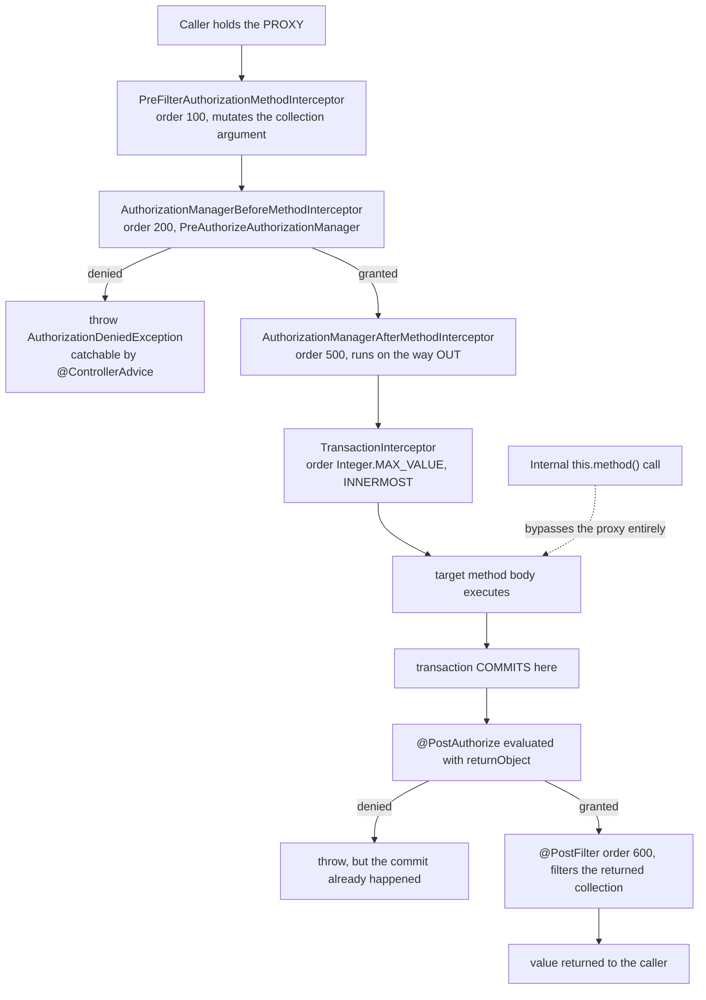

# 4.2 - Method-Level Security

> **Module 4 - Topic 2** - Authorization
> Baseline: Spring Security 6.x on Boot 3.x
> New to this? Read **In Plain English** below first, then come back to the Version Matrix.

## Version Matrix

| Concern | Spring Security 5.x | **Spring Security 6.x (baseline)** | Spring Security 7.x |
| --- | --- | --- | --- |
| Enabling annotation | `@EnableGlobalMethodSecurity` | `@EnableMethodSecurity`, the only option in 6.x | `@EnableMethodSecurity` |
| `prePostEnabled` default | `false`, so `@PreAuthorize` was silently ignored unless you set it | `true` | `true` |
| `securedEnabled` and `jsr250Enabled` | `false` and `false` | `false` and `false`, unchanged | Unchanged |
| Interception engine | `MethodSecurityInterceptor` with an `AccessDecisionManager` and `PreInvocationAuthorizationAdviceVoter` | `AuthorizationManagerBeforeMethodInterceptor` and `AuthorizationManagerAfterMethodInterceptor` | Same |
| Metadata source | `MethodSecurityMetadataSource` producing `ConfigAttribute` instances | One `AuthorizationManager` per annotation type, such as `PreAuthorizeAuthorizationManager` | Same |
| Advisor wiring | A single `MethodSecurityMetadataSourceAdvisor` | Several `Advisor` beans, one per annotation, ordered by `AuthorizationInterceptorsOrder` | Same, plus `AuthorizationAdvisorProxyFactory` for objects that are not beans |
| Duplicate annotation on interface and class | One silently won | `AnnotationConfigurationException` at the first invocation | Same |
| Denial exception | `AccessDeniedException` | `AuthorizationDeniedException`, a subclass of `AccessDeniedException`, from 6.1 | Same |
| Returning a value instead of throwing | Not possible | `@HandleAuthorizationDenied(handlerClass = ...)` from 6.3 | Same |
| Interceptor order tuning | `@EnableGlobalMethodSecurity(order = ...)` | `AuthorizationInterceptorsOrder` constants, plus `@EnableMethodSecurity(offset = ...)` from 6.3 | Same |
| Parameter-name discovery | `LocalVariableTableParameterNameDiscoverer` could read names from debug information | The `-parameters` compiler flag or `@P("name")`; the debug-information discoverer is deprecated | `-parameters` or `@P` |

## Why This Exists

URL rules, covered in `13_M4_T1_Authorization_URL_Based.md`, protect HTTP entry points. Method security protects code. The distinction matters for three concrete reasons.

Not every caller arrives over HTTP. A `@Scheduled` job, a `@KafkaListener`, a JMS listener, a GraphQL resolver, and a test all reach the same service bean without passing through `AuthorizationFilter`. URL rules cannot see any of them; a `@PreAuthorize` on the service can. Second, URL rules and controllers drift apart over time. Someone adds `@GetMapping("/v2/admin/export")` and forgets the matcher, and the new endpoint inherits whatever `anyRequest()` happens to say. An annotation travels with the method and cannot be forgotten independently of it. Third, and most important, method security can see the arguments and the return value, which URL rules cannot. That is what makes it the natural home for the instance-level checks that answer the confused-deputy and broken-object-level-authorization problem described in `02_M1_T2_Authentication_Authorization.md` §6.

The cost is that method security is invisible at the configuration level. You cannot audit the whole policy by reading one file, and it is bypassable in ways URL rules are not, most notably through self-invocation. The honest position is that the two layers are complementary: coarse URL rules describe the shape of the application, and method security protects anything sensitive or argument-dependent.

## In Plain English

**The one-line version:** Instead of writing access rules about web addresses, you write them as
annotations directly on your Java methods, so the check happens wherever that method is called from
and can inspect the actual arguments it was called with.

**An analogy.** Think of the previous topic, URL rules, as a security desk in the lobby of an office
building. Everyone who walks in through the front door passes it, and there is one printed list of
rules you can read to understand the whole policy. That is genuinely valuable.

But the lobby desk has two blind spots. Some people never come through the front door at all: the
cleaners who arrive through the loading bay, the overnight maintenance crew. Those are your scheduled
jobs, your message listeners, and your tests, all of which reach the same code without ever making an
HTTP request. And the desk can only check coarse things, like "are you allowed on the third floor". It
cannot check "are you allowed to open *that particular* filing drawer", because at the moment you walk
past the desk nobody knows which drawer you are heading for.

Method security is a lock on each cabinet. It catches the people who came in through the loading bay,
because the lock does not care how you entered the building. And it can check the specific drawer,
because by the time you are standing at the cabinet the request is concrete.

Now the peculiar part, and the source of the single most common complaint about this feature. The lock
is really a receptionist standing at the office door. Anybody approaching from the corridor has to
speak to the receptionist first, who checks their badge and then lets the request through. But if
somebody is *already inside the office* and simply walks across the room to the cabinet, they never go
past the door, so the receptionist never sees them. That is exactly what happens when one method of a
class calls another method of the same class: the annotation is still written there in plain sight, and
it is never evaluated.

**How it actually works, step by step.**

You write the rule as an annotation above the method. The common one is `@PreAuthorize`, which takes a
small expression in a language called SpEL, short for Spring Expression Language. For example
`@PreAuthorize("hasRole('ADMIN')")` requires the caller to hold the `ROLE_ADMIN` permission before the
method body runs at all. Because the expression is evaluated at call time, it can refer to the actual
arguments, which is what makes `@PreAuthorize("#invoiceId == ...")` style rules possible.

None of this happens unless you switch it on. You must put `@EnableMethodSecurity` on one of your
configuration classes yourself, because Spring Boot does not add it for you. A `@PreAuthorize` in an
application with no `@EnableMethodSecurity` anywhere produces no error, no warning, and no protection
whatsoever — the annotation is simply never read. That is the first thing to check whenever an
annotation appears to do nothing.

The mechanism is Spring's proxying. When you switch method security on, Spring notices which beans
have annotated methods and hands out a wrapper object — the receptionist — instead of your real object.
Anybody who asked the container for that bean actually holds the wrapper, so their calls are checked.
This is where the constraints come from: the object has to be a Spring-managed bean, the method cannot
be `private`, `static`, or `final`, and the call has to arrive from outside. Those three conditions
explain almost every report of the form "my annotation does nothing".

There is a second annotation, `@PostAuthorize`, that runs *after* the method has returned, so the rule
can look at the value the method produced. That is genuinely useful for a read: load the invoice, then
require that the caller owns it. It is a serious mistake on anything that writes, and the reason is
worth spelling out. By the time the rule is evaluated the method body has already finished, so any
payment has been sent, any email queued, and — because of the order in which Spring layers these
wrappers — the database transaction has already been committed. Throwing an "access denied" error at
that point changes the HTTP status code and undoes nothing at all.

Two more annotations filter collections. `@PostFilter` removes items from the list a method returned,
one at a time, and `@PreFilter` removes items from a collection you passed in. Both are convenient and
both are usually the wrong tool. `@PostFilter` in particular means the database already returned every
row and your application is throwing most of them away in Java, which breaks pagination in a way that
is easy to miss and turns a large table into an out-of-memory failure. The correct answer is nearly
always to put the condition into the database query.

One structural point deserves emphasis. If a method has no annotation, the mechanism has no opinion
about it, and no opinion means the call proceeds. So method security has no safe default: a sensitive
method that nobody remembered to annotate is completely open. That is precisely why you keep the URL
rules underneath as a net, since those *can* be made to deny everything not explicitly permitted.

Finally, a small but practical difference from URL rules. A method-level denial happens after Spring
has already entered its web machinery, so your `@ControllerAdvice` exception handlers can catch it and
shape the response. A URL-level denial happens before that, so they cannot. The same application can
therefore return two different "access denied" response bodies depending on which layer said no, and
aligning them is a decision you should make deliberately rather than discover from a bug report.

**Why should a beginner care?** Every failure mode here is silent. An annotation on a method called
from inside its own class does nothing, and looks correct in code review. An annotation in an
application that never enabled method security does nothing. A `@PostAuthorize` on a method that sends
money lets the money leave and then returns an error, which reads in the logs like the operation was
blocked. And a rule that references a parameter name will quietly evaluate to "no" if the build did not
record parameter names, producing a 403 that nothing in the logs explains.

**Words you will meet in this file**

| Term | In plain words |
|---|---|
| `@EnableMethodSecurity` | The switch that turns the whole feature on. You must add it yourself; Spring Boot does not. |
| `@PreAuthorize` | Check the rule before the method body runs. The one to use for anything that changes data. |
| `@PostAuthorize` | Check the rule after the method returns, so the rule can look at the returned value. Safe for reads only. |
| `@PreFilter` | Quietly remove items from a collection passed into the method before the body runs. |
| `@PostFilter` | Quietly remove items from the collection the method returned. |
| `@Secured` | An older, simpler annotation. It takes permission names literally, so you must write `ROLE_ADMIN` in full. |
| `@RolesAllowed` | The Java-standard equivalent. Unlike `@Secured`, it adds the `ROLE_` prefix for you. |
| SpEL | Spring Expression Language, the small expression syntax you write inside the annotation's quotes. |
| Bean | An object Spring creates and manages for you. Only beans can be protected this way. |
| Proxy | The wrapper object Spring hands out in place of your real object, which is where the check lives. |
| AOP | Aspect-Oriented Programming: the general Spring technique of wrapping methods to add behaviour such as security or transactions. |
| Interceptor | One layer of that wrapping. Several can be stacked around the same method. |
| Self-invocation | One method of a class calling another method of the same class, which skips the wrapper and therefore skips the check. |
| `TransactionInterceptor` | The wrapper that `@Transactional` installs. It sits *inside* the security wrappers, which is why a late denial cannot roll anything back. |
| `returnObject` | The name you use inside a `@PostAuthorize` expression to refer to what the method returned. |
| `filterObject` | The name you use inside a filter expression to refer to the one item currently being considered. |
| Abstain | Having no opinion, which is what happens for an unannotated method, and which results in the call being allowed. |
| `AuthorizationDeniedException` | The error thrown on refusal. It extends the older `AccessDeniedException`, so existing handlers still catch it. |
| `@ControllerAdvice` | Where you put shared exception handling for web requests. It can see method-level denials but not URL-level ones. |
| `@P("name")` | An annotation that pins the name a parameter is known by inside an expression, so it cannot break. |
| `-parameters` | The compiler flag that records real parameter names in the class file. Without it, `#id` in an expression resolves to nothing. |
| CGLIB versus JDK proxy | Two wrapping strategies. The first subclasses your class and can wrap any non-`final` method; the second only wraps methods declared on an interface. |

**If you remember only one thing:** put the rule on the method with `@PreAuthorize` before anything
happens, make sure the call comes in from another bean rather than from inside the same class, and keep
the URL rules underneath, because an unannotated method is not protected at all.

## Core Concepts

### 1. `@EnableMethodSecurity` and the default that changed

**In simple terms:** This is the switch that makes the annotations do anything, you have to add it
yourself, and the one attribute that used to have to be set by hand is now on by default.

```java
package org.springframework.security.config.annotation.method.configuration;

@Retention(RetentionPolicy.RUNTIME)
@Target(ElementType.TYPE)
@Import(MethodSecuritySelector.class)
public @interface EnableMethodSecurity {

    boolean prePostEnabled() default true;      // 5.x @EnableGlobalMethodSecurity: false
    boolean securedEnabled() default false;
    boolean jsr250Enabled() default false;
    boolean proxyTargetClass() default false;
    AdviceMode mode() default AdviceMode.PROXY;
    int offset() default 0;                     // 6.3+, shifts every interceptor order
}
```

The single most useful fact for a migration is the changed default. In 5.x you wrote `@EnableGlobalMethodSecurity(prePostEnabled = true)`, and if you forgot the attribute every `@PreAuthorize` in the application was silently ignored, which is the worst possible failure for a security feature. In 6.x `prePostEnabled` defaults to `true`, so `@EnableMethodSecurity` alone activates `@PreAuthorize`, `@PostAuthorize`, `@PreFilter`, and `@PostFilter`. `@Secured` and the JSR-250 annotations still require explicit opt-in.

Spring Boot does not enable method security for you. There is no auto-configuration that adds `@EnableMethodSecurity`, so you must place it on a `@Configuration` class yourself. A `@PreAuthorize` with no `@EnableMethodSecurity` anywhere in the application produces no error, no warning, and no protection; the annotation is simply never read. That is the first thing to check when an annotation appears to do nothing.

### 2. The annotation catalogue

**In simple terms:** There are seven annotations to choose from, they differ in whether they run before
or after the method and whether they accept an expression, and crucially two of them disagree about
whether `ROLE_` is added for you.

| Annotation | When it runs | Expression language | Prefix behaviour | Enabled by |
| --- | --- | --- | --- | --- |
| `@PreAuthorize` | Before the body | SpEL, sees arguments | None; you write `hasRole('ADMIN')` | `prePostEnabled`, default true |
| `@PostAuthorize` | After the body returns | SpEL, sees `returnObject` | None | `prePostEnabled` |
| `@PreFilter` | Before the body, mutates a collection argument | SpEL, `filterObject` per element | None | `prePostEnabled` |
| `@PostFilter` | After the body, filters the returned collection | SpEL, `filterObject` per element | None | `prePostEnabled` |
| `@Secured({"ROLE_ADMIN"})` | Before the body | No SpEL; literal authority names | None added; you write the full `ROLE_ADMIN` | `securedEnabled` |
| `@RolesAllowed({"ADMIN"})` | Before the body | No SpEL | `ROLE_` prepended | `jsr250Enabled` |
| `@PermitAll` and `@DenyAll` | Before the body | None | Not applicable | `jsr250Enabled` |

Two traps live in that table. `@Secured` takes the literal authority, so `@Secured("ADMIN")` looks for an authority named `ADMIN` and not `ROLE_ADMIN`. `@RolesAllowed`, from `jakarta.annotation.security` rather than `javax`, behaves like `hasRole` and does prepend the prefix, honouring `GrantedAuthorityDefaults`. Mixing the two conventions in one codebase guarantees a 403 that nobody can explain, which is why `16_M4_T4_Role_Authority.md` §2 tabulates every prefix site.

`@Secured` and JSR-250 exist for portability and for organisations that forbid SpEL in annotations. Absent such a constraint, use `@PreAuthorize` for everything: `@Secured` cannot express `or`, cannot reference arguments, and cannot call a bean.

### 3. How it works: AOP, not a filter

**In simple terms:** Spring hands out a wrapper object in place of your real one and puts the check in
the wrapper, which is why the object must be a Spring bean, the method must be overridable, and the
call must come in from outside.

`@EnableMethodSecurity` imports configuration that registers `Advisor` beans. Each advisor is both a `MethodInterceptor` and a `PointcutAdvisor` whose pointcut matches methods carrying the relevant annotation. Spring's auto-proxy creator then wraps every matching bean in a proxy.

```java
package org.springframework.security.authorization.method;

public final class AuthorizationManagerBeforeMethodInterceptor
        implements Ordered, MethodInterceptor, PointcutAdvisor, AopInfrastructureBean {

    private final Pointcut pointcut;
    private final AuthorizationManager<MethodInvocation> authorizationManager;
    private int order = AuthorizationInterceptorsOrder.PRE_AUTHORIZE.getOrder();

    public static AuthorizationManagerBeforeMethodInterceptor preAuthorize() {
        return preAuthorize(new PreAuthorizeAuthorizationManager());
    }

    @Override
    public Object invoke(MethodInvocation mi) throws Throwable {
        attemptAuthorization(mi);           // throws AuthorizationDeniedException on denial
        return mi.proceed();
    }

    private void attemptAuthorization(MethodInvocation mi) {
        AuthorizationResult result = this.authorizationManager.authorize(this::getAuthentication, mi);
        this.eventPublisher.publishAuthorizationEvent(this::getAuthentication, mi, result);
        if (result != null && !result.isGranted()) {
            throw new AuthorizationDeniedException("Access Denied", result);
        }
    }
}
```

`AuthorizationManagerAfterMethodInterceptor` is the mirror image. It calls `mi.proceed()` first, wraps the result in a `MethodInvocationResult`, and only then authorizes:

```java
@Override
public Object invoke(MethodInvocation mi) throws Throwable {
    Object result = mi.proceed();           // THE METHOD HAS ALREADY RUN
    return attemptAuthorization(mi, result);
}
```

`PrePostMethodSecurityConfiguration` registers four advisor beans: `PreFilterAuthorizationMethodInterceptor`, an `AuthorizationManagerBeforeMethodInterceptor` carrying `PreAuthorizeAuthorizationManager`, an `AuthorizationManagerAfterMethodInterceptor` carrying `PostAuthorizeAuthorizationManager`, and `PostFilterAuthorizationMethodInterceptor`. `SecuredMethodSecurityConfiguration` and `Jsr250MethodSecurityConfiguration` add advisors for `SecuredAuthorizationManager` and `Jsr250AuthorizationManager` when their flags are enabled. All of them are declared as `static @Bean` methods with infrastructure role, so they exist before the beans they must advise.

Because this is proxy-based AOP, every limitation of Spring AOP applies. The method must be visible through the proxy, the call must go through the proxy, and the bean must be a Spring bean. Those three constraints generate almost every report of the form "my `@PreAuthorize` does nothing".

### 4. Interceptor order, and why `@Transactional` matters

**In simple terms:** Several wrappers can surround the same method, and because the transaction wrapper
sits innermost, the database commit happens before an after-the-fact security check ever gets a chance
to refuse.

```java
package org.springframework.security.authorization.method;

public enum AuthorizationInterceptorsOrder {
    FIRST(Integer.MIN_VALUE),
    PRE_FILTER,          // 100
    PRE_AUTHORIZE,       // 200
    SECURED,             // 300
    JSR250,              // 400
    SECURE_RESULT(450),
    POST_AUTHORIZE(500),
    POST_FILTER(600),
    LAST(Integer.MAX_VALUE);
}
```

A lower order means higher precedence, which in an interceptor chain means positioned further out. So for a method carrying several annotations the nesting is `@PreFilter` outside `@PreAuthorize` outside `@Secured` outside JSR-250 outside the method body, and on the way back out `@PostAuthorize` then `@PostFilter`.

Now the part that catches people. `@Transactional` is advised by `TransactionInterceptor`, whose order defaults to `Ordered.LOWEST_PRECEDENCE`, that is `Integer.MAX_VALUE`, unless you set `@EnableTransactionManagement(order = ...)`. Compare that with `POST_AUTHORIZE` at 500 and the nesting is unambiguous:

```
outer   PRE_AUTHORIZE (200)
          POST_AUTHORIZE (500)
            TransactionInterceptor (Integer.MAX_VALUE)
              your method body
```

Two consequences follow, and both appear in production. First, `@PreAuthorize` runs outside the transaction. If the expression calls a bean that hits the database, that lookup runs in its own transaction, will not see uncommitted changes, and is a second physical query in addition to whatever the method itself does. Second, and far more serious, `@PostAuthorize` runs after the transaction has committed. The transaction interceptor is inside, so it commits on the way out before the `@PostAuthorize` interceptor regains control. Throwing `AuthorizationDeniedException` at that point rolls nothing back, and any write the method performed is permanent.

If you genuinely need a `@PostAuthorize` denial to roll back, the transaction advisor must be moved outside it, between `PRE_AUTHORIZE` and `POST_AUTHORIZE`:

```java
@EnableTransactionManagement(order = AuthorizationInterceptorsOrder.POST_AUTHORIZE.getOrder() - 1)
```

I would treat needing that as a design smell rather than a fix, because it changes transaction semantics globally to accommodate one misplaced annotation. The real rule is the one in §7: do not put `@PostAuthorize` on a method that writes.

### 5. The self-invocation problem

**In simple terms:** When one method of a class calls another method of the same class, the call never
leaves the object, so it never passes through the wrapper and the annotation is silently skipped.

```java
@Service
public class ReportService {

    public Report monthly(long tenantId) {
        return buildSensitiveReport(tenantId);      // plain 'this' call
    }

    @PreAuthorize("hasRole('AUDITOR')")
    public Report buildSensitiveReport(long tenantId) {
        return ...;
    }
}
```

The caller holds a proxy. The proxy's `monthly` delegates to the target instance's `monthly`, and inside the target `this` is the raw object, not the proxy. The call to `buildSensitiveReport` therefore never passes through any interceptor, and `@PreAuthorize` is never evaluated. Nothing warns you, and `monthly` is effectively public.

The fixes, best first. Move the protected method to another bean, so `ReportService` calls a separate `SensitiveReportBuilder` that is separately proxied; this is the only fix that is obvious to the next reader. Annotate the entry point instead, which is correct whenever `monthly` should carry the same requirement anyway. Inject a self-reference with `@Autowired @Lazy private ReportService self;` and call `self.buildSensitiveReport(...)`, which works but is a circular-dependency trick that reads as a mistake and breaks quietly if someone removes the `@Lazy`. Use `AopContext.currentProxy()` with `@EnableAspectJAutoProxy(exposeProxy = true)`, which works, couples business code to Spring AOP, and throws if the proxy is not exposed. Or switch to `mode = AdviceMode.ASPECTJ` with compile-time or load-time weaving, which is the only option that makes self-invocation genuinely work, because the advice is woven into the bytecode rather than applied by a proxy; the price is a weaving step in the build or a `-javaagent` at runtime, which most teams will not accept.

The structural lesson is that a security boundary should coincide with a bean boundary. When the annotated method and its internal caller live in the same class, the boundary is inside the class where the proxy cannot reach.

### 6. Annotations on interfaces versus implementations

**In simple terms:** You may put the annotation on the interface or on the class, but never on both,
because two competing annotations of the same type cause an error — and that error only appears the
first time the method is actually called.

Spring Security resolves the annotation against the most specific method:

```java
Method specificMethod = AopUtils.getMostSpecificMethod(mi.getMethod(), targetClass);
PreAuthorize annotation = AuthorizationAnnotationUtils
        .findUniqueAnnotation(specificMethod, PreAuthorize.class);
```

The search covers the method, then the declaring class, then the interface method, then the interface, so an annotation on either the interface or the implementation is found. But putting the same annotation in both places is an error in 6.x. `findUniqueAnnotation` throws `AnnotationConfigurationException` when it finds competing annotations of the same type:

```
org.springframework.core.annotation.AnnotationConfigurationException:
Found more than one annotation of type interface
org.springframework.security.access.prepost.PreAuthorize attributed to <method>
Please remove the duplicate annotations and publish a bean to handle your authorization logic.
```

In 5.x one silently won. The 6.x hard failure is better, but it surfaces at the first invocation of that method rather than at startup, so it can escape into production on a rarely called path. That timing is worth remembering: a smoke test that exercises every annotated entry point converts this into a build failure.

Prefer the interface when the contract is genuinely part of the API, and Spring Data repositories leave you no choice. Prefer the implementation when the authorization rule is an implementation detail. Pick one convention per codebase and enforce it, because the duplicate-annotation exception is the only feedback the framework gives you.

Proxy type matters too. With a JDK dynamic proxy, only methods declared on the proxied interfaces exist on the proxy, so a public method that is not on an interface cannot be intercepted, and an internal caller holding the interface type cannot even see it. With CGLIB the proxy is a subclass, so any method that is not `final`, `private`, or `static` is interceptable. Spring Boot sets `spring.aop.proxy-target-class=true`, making CGLIB the default in a Boot 3 application, and `@EnableMethodSecurity(proxyTargetClass = true)` forces it locally. The residual CGLIB traps are `final` classes and `final` methods, which cannot be overridden and therefore cannot be advised, silently.

### 7. `@PostAuthorize` - the method already ran

**In simple terms:** Because this check happens after the body has finished, refusing at that point
cannot undo anything the method did, so it belongs only on methods that read data and never on methods
that change it.

```java
@PostAuthorize("returnObject.ownerUsername == authentication.name")
public Invoice findById(Long id) {
    return invoiceRepository.findById(id).orElseThrow();
}
```

That is correct and useful for reads. The interceptor calls `mi.proceed()` first, so by the time the expression is evaluated the invoice has been loaded, mapped, and is sitting in memory. Denial throws it away and raises `AuthorizationDeniedException`.

Now the same annotation on a write:

```java
// WRONG. Do not do this.
@PostAuthorize("returnObject.ownerUsername == authentication.name")
@Transactional
public Invoice cancel(Long id) {
    Invoice invoice = invoiceRepository.findById(id).orElseThrow();
    invoice.setStatus(CANCELLED);
    paymentGateway.refund(invoice);          // money has left the building
    auditLog.record("cancelled", id);
    return invoice;
}
```

The refund happened. The audit entry was written. Any e-mail was sent. And because `TransactionInterceptor` sits inside the `@PostAuthorize` interceptor, as §4 established, the database transaction has already committed. The exception changes the HTTP status code and nothing else.

The rule is therefore that `@PostAuthorize` is for filtering what a caller may see, never for deciding whether an action may occur. Anything that mutates state, calls an external system, or emits an event must be gated with `@PreAuthorize`. If the decision genuinely needs data that only the method can load, split the method: a `@PreAuthorize`-gated public entry point that first performs a read-only ownership check and then calls the mutation.

The second cost of `@PostAuthorize` is information flow. The object existed in process memory, passed through your mapper, and may have been logged or placed in a cache before the check ran. For genuinely sensitive data, loading and then discarding is not the same as never loading.

### 8. `@PostFilter` and `@PreFilter` - filtering in the wrong place

**In simple terms:** These quietly drop the items a caller may not see, which sounds ideal until you
notice that the database already fetched everything, pagination now returns pages of unpredictable
size, and a bulk request can succeed while a third of it was ignored.

```java
// Loads every invoice in the table, then throws most of them away in Java.
@PostFilter("filterObject.ownerUsername == authentication.name")
public List<Invoice> findAll() {
    return invoiceRepository.findAll();
}
```

`@PostFilter` evaluates the expression once per element with `filterObject` bound to that element and removes non-matching elements. It is genuinely convenient and almost always the wrong tool, for three reasons. The whole collection is loaded, so on a table with a million rows this is an out-of-memory incident rather than a slow query. It does not compose with pagination: a `Page<Invoice>` requested with size twenty comes back with twenty rows of which perhaps three survive the filter, so the client sees a page of three, a total count of a million, and no way to reason about the next page. And filtering a `Stream` consumes it.

The correct fix is to push the predicate into the query so the database never returns rows the caller may not see:

```java
List<Invoice> findByOwnerUsername(String username);
Page<Invoice> findByOwnerUsername(String username, Pageable pageable);
```

`@PostFilter` is defensible for a small, bounded collection where the criterion cannot be expressed in the query, such as a handful of enumerated values or a result already limited by the domain.

`@PreFilter` is the argument-side mirror. It filters a collection argument before the body runs, which is how you accept a bulk request and silently drop the items the caller may not touch:

```java
@PreFilter(value = "filterObject.ownerUsername == authentication.name", filterTarget = "invoices")
public void bulkCancel(List<Invoice> invoices, String reason) { ... }
```

Two mechanical requirements apply. When the method has more than one argument you must set `filterTarget`, or you get an `IllegalArgumentException` about being unable to determine the target. And the collection is filtered in place:

```java
// DefaultMethodSecurityExpressionHandler.filter (simplified)
if (filterTarget instanceof Collection<?> collection) {
    List<Object> retain = new ArrayList<>(collection.size());
    for (Object element : collection) {
        ctx.setVariable("filterObject", element);
        if (ExpressionUtils.evaluateAsBoolean(expr, ctx)) {
            retain.add(element);
        }
    }
    collection.clear();                  // MUTATES THE CALLER'S COLLECTION
    collection.addAll(retain);
    return collection;
}
```

So passing `List.of(...)` throws `UnsupportedOperationException`, and passing a list the caller still holds a reference to mutates that list underneath them. Spring MVC's Jackson binding produces a mutable `ArrayList`, which is why this usually works in a controller and breaks in a unit test.

The deeper objection to `@PreFilter` is that silently dropping unauthorized items is usually the wrong product behaviour. A caller who submits fifty items and receives a 200 has no idea twelve were ignored. Explicit rejection with a per-item error report is nearly always better; `@PreFilter` is for the narrow case where "best effort over the items you own" is the specified contract.

### 9. Method security on Spring Data repositories

**In simple terms:** Annotations work on repository interfaces too, but a repository does not know
which business operation it is serving, so only very coarse rules can be expressed there and they are
best used as a backstop beneath the real rules on your services.

```java
public interface InvoiceRepository extends JpaRepository<Invoice, Long> {

    @PreAuthorize("hasAuthority('invoice:read')")
    Optional<Invoice> findById(Long id);

    @Query("select i from Invoice i where i.ownerUsername = ?#{authentication.name}")
    List<Invoice> findMine();
}
```

This works, because the repository bean is a proxy and the method-security advisor is applied to it like any other bean. Three things are worth knowing. The annotation must be on the interface, because for a derived query there is no implementation class to annotate. It is easy to turn into a performance problem, since a repository method is called from many places and a bean-calling SpEL expression on it multiplies that expression's cost by the call count. And repository-level authorization is usually the wrong layer: the repository does not know the business operation, so the only expressible rules are coarse ones, and a coarse rule at the data layer duplicates what the service layer should already have said. Use it as a backstop, for instance `hasAuthority('invoice:read')` to guarantee no code path reads invoices without some claim to do so, and put the real rules on the service.

The `?#{authentication.name}` form in the second method is Spring Data's SpEL extension, `SecurityEvaluationContextExtension` from `spring-security-data`. It pushes the ownership predicate into the query, which is exactly the pattern §8 argues for, and it requires that extension bean to be present.

### 10. Denial handling, and the `@ControllerAdvice` difference

**In simple terms:** A refusal here can be caught and reshaped by your ordinary web exception handlers,
unlike a refusal from the URL layer, so the same application can return two different "access denied"
responses unless you deliberately make them agree.

Method security runs inside the `DispatcherServlet` dispatch. That has a visible consequence, discussed in `01_M1_T1_HTTP_Web_Basics.md` §2: an `AuthorizationDeniedException` from `@PreAuthorize` is reachable by `@ControllerAdvice`, whereas the same logical denial from `AuthorizationFilter` is not, because that one is thrown before MVC is entered. The same application can therefore answer "access denied" with two different response bodies depending on which layer denied.

```java
@RestControllerAdvice
public class ApiExceptionHandler {

    @ExceptionHandler(AccessDeniedException.class)   // catches AuthorizationDeniedException too
    ProblemDetail denied(AccessDeniedException ex) {
        return ProblemDetail.forStatusAndDetail(HttpStatus.FORBIDDEN, "Not permitted");
    }
}
```

If you write that handler and also rely on an `AccessDeniedHandler` for filter-layer denials, align them deliberately rather than discovering the difference from a client bug report. And never let the advice swallow the exception into a 200; a denial that returns success is a vulnerability, not a nicety.

Since 6.3 you can also replace the throw with a fallback value:

```java
@Target({ ElementType.METHOD, ElementType.TYPE })
@Retention(RetentionPolicy.RUNTIME)
@HandleAuthorizationDenied(handlerClass = MaskingDeniedHandler.class)
public @interface Masked {
}
```

```java
@Component
public class MaskingDeniedHandler implements MethodAuthorizationDeniedHandler {

    @Override
    public Object handleDeniedInvocation(MethodInvocation mi, AuthorizationResult result) {
        return "****";                       // returned instead of throwing
    }

    @Override
    public Object handleDeniedInvocationResult(MethodInvocationResult mir,
            AuthorizationResult result) {
        return "****";                       // the @PostAuthorize case
    }
}
```

The default handler is `ThrowingMethodAuthorizationDeniedHandler`, which preserves pre-6.3 behaviour. Masking is powerful for report and API-projection use cases and dangerous when used to paper over a policy nobody has thought through, because a masked value is indistinguishable from a real one to a caller that does not expect it, and the returned type must be compatible or the call site gets a `ClassCastException`.

### 11. Parameter names: `#id`, `@P`, and the `-parameters` flag

**In simple terms:** Writing `#id` in an expression only works if the compiler recorded the real
parameter names, and when it did not, the expression sees nothing, the comparison is false, and the
caller gets a 403 that no log message explains.

`@PreAuthorize("@invoiceSecurity.isOwner(#id, authentication)")` needs to know the first parameter is called `id`, and Java records parameter names in the class file only when compiled with `-parameters`. Spring Security resolves them through `DefaultSecurityParameterNameDiscoverer`, a prioritised discoverer that tries `AnnotationParameterNameDiscoverer` for `@P("name")` and Spring Data's `@Param`, then `StandardReflectionParameterNameDiscoverer`, which reads the real names and requires the flag. Historically it also tried `LocalVariableTableParameterNameDiscoverer`, which read names out of debug information; that is deprecated in Spring Framework 6 and must not be relied on.

`spring-boot-starter-parent` sets `-parameters`, and the Gradle plugin does the equivalent, so in a standard Boot 3 project `#id` works. In a project with a hand-rolled compiler configuration, or an IDE build that disagrees with the Maven build, it does not, and the failure is quiet. An unresolvable SpEL variable evaluates to `null`, so `#id == authentication.name` becomes `null == "alice"`, which is `false`, and the caller receives a mysterious 403 with no error naming the missing parameter. Failing closed is the right direction, but the diagnosis is painful.

The robust form is explicit, using `org.springframework.security.core.parameters.P`:

```java
@PreAuthorize("@invoiceSecurity.isOwner(#invoiceId, authentication)")
public void cancel(@P("invoiceId") Long id) { ... }
```

Use it on anything where a 403 would be hard to diagnose, and otherwise rely on `-parameters` with a build check asserting it is set. `15_M4_T3_Expression_Based_Access_Control.md` §4 covers the discovery mechanism in more detail, including why the annotation and the `@P` must sit on the same declaration the interceptor reads.

### 12. The interceptor chain, drawn

**In simple terms:** The diagram below shows the wrappers stacked around one method, where the
transaction commit happens relative to each check, and the dotted line showing how an internal call
skips every one of them.



## Working Code

```java
package com.example.config;

import org.springframework.context.annotation.Bean;
import org.springframework.context.annotation.Configuration;
import org.springframework.security.access.expression.method.DefaultMethodSecurityExpressionHandler;
import org.springframework.security.access.expression.method.MethodSecurityExpressionHandler;
import org.springframework.security.access.hierarchicalroles.RoleHierarchy;
import org.springframework.security.access.hierarchicalroles.RoleHierarchyImpl;
import org.springframework.security.config.annotation.method.configuration.EnableMethodSecurity;

@Configuration
// prePostEnabled is true by default in 6.x. jsr250Enabled is opt-in and we leave it off so
// that only one prefix convention exists in this codebase.
@EnableMethodSecurity
public class MethodSecurityConfig {

    @Bean
    static RoleHierarchy roleHierarchy() {
        return RoleHierarchyImpl.withDefaultRolePrefix()
                .role("ADMIN").implies("AUDITOR")
                .build();
    }

    /** Static by necessity; see 15_M4_T3 section 7 for why a non-static bean fails quietly. */
    @Bean
    static MethodSecurityExpressionHandler methodSecurityExpressionHandler(RoleHierarchy hierarchy) {
        DefaultMethodSecurityExpressionHandler handler = new DefaultMethodSecurityExpressionHandler();
        handler.setRoleHierarchy(hierarchy);
        return handler;
    }
}
```

The ownership rule, in a named bean rather than in a string:

```java
package com.example.security;

import org.springframework.security.core.Authentication;
import org.springframework.stereotype.Component;
import org.springframework.transaction.annotation.Transactional;

import com.example.invoice.InvoiceRepository;

// Named explicitly so a class rename cannot break every expression referencing it.
@Component("invoiceSecurity")
public class InvoiceSecurity {

    private final InvoiceRepository invoices;

    public InvoiceSecurity(InvoiceRepository invoices) {
        this.invoices = invoices;
    }

    /**
     * Its own read-only transaction, because @PreAuthorize is intercepted OUTSIDE
     * TransactionInterceptor and therefore runs with no transaction of the caller's.
     */
    @Transactional(readOnly = true)
    public boolean isOwner(Long invoiceId, Authentication authentication) {
        if (invoiceId == null || authentication == null || !authentication.isAuthenticated()) {
            return false;
        }
        return this.invoices.findById(invoiceId)
                .map(invoice -> invoice.getOwnerUsername().equals(authentication.getName()))
                .orElse(false);              // unknown invoice denies and leaks nothing
    }
}
```

The service, showing the split-entry-point pattern that avoids both self-invocation and `@PostAuthorize` on a write:

```java
package com.example.invoice;

import java.util.List;

import org.springframework.data.domain.Page;
import org.springframework.data.domain.Pageable;
import org.springframework.security.access.prepost.PostAuthorize;
import org.springframework.security.access.prepost.PreAuthorize;
import org.springframework.security.core.parameters.P;
import org.springframework.stereotype.Service;
import org.springframework.transaction.annotation.Transactional;

@Service
public class InvoiceService {

    private final InvoiceRepository invoices;
    private final PaymentGateway payments;

    public InvoiceService(InvoiceRepository invoices, PaymentGateway payments) {
        this.invoices = invoices;
        this.payments = payments;
    }

    /**
     * WRITE path: gated BEFORE anything happens. @P pins the SpEL variable name so a
     * parameter rename or a build without -parameters cannot turn this into a silent 403.
     */
    @PreAuthorize("hasRole('ADMIN') or @invoiceSecurity.isOwner(#invoiceId, authentication)")
    @Transactional
    public void cancel(@P("invoiceId") Long invoiceId, String reason) {
        Invoice invoice = this.invoices.findById(invoiceId).orElseThrow();
        invoice.cancel(reason);
        this.payments.refund(invoice);       // safe: authorization already decided
    }

    /** READ path: @PostAuthorize is legitimate here because nothing was mutated. */
    @PostAuthorize("hasRole('ADMIN') or returnObject.ownerUsername == authentication.name")
    @Transactional(readOnly = true)
    public Invoice findById(Long invoiceId) {
        return this.invoices.findById(invoiceId).orElseThrow();
    }

    /**
     * Filtering in the QUERY, not with @PostFilter, so pagination stays meaningful and the
     * database never returns rows the caller may not see.
     */
    @PreAuthorize("isAuthenticated()")
    @Transactional(readOnly = true)
    public Page<Invoice> findMine(Pageable pageable, java.security.Principal principal) {
        return this.invoices.findByOwnerUsername(principal.getName(), pageable);
    }

    /**
     * Self-invocation guard: this entry point carries the SAME requirement as the work it
     * delegates to, so an internal 'this' call cannot weaken anything.
     */
    @PreAuthorize("hasRole('AUDITOR')")
    @Transactional(readOnly = true)
    public List<Invoice> auditAll() {
        return this.invoices.findAll();
    }
}
```

Tests, each targeting one specific failure mode:

```java
package com.example.invoice;

import static org.assertj.core.api.Assertions.assertThat;
import static org.assertj.core.api.Assertions.assertThatExceptionOfType;
import static org.springframework.test.web.servlet.request.MockMvcRequestBuilders.post;
import static org.springframework.test.web.servlet.result.MockMvcResultMatchers.status;

import org.junit.jupiter.api.Test;
import org.springframework.beans.factory.annotation.Autowired;
import org.springframework.boot.test.autoconfigure.web.servlet.AutoConfigureMockMvc;
import org.springframework.boot.test.context.SpringBootTest;
import org.springframework.security.access.AccessDeniedException;
import org.springframework.security.test.context.support.WithAnonymousUser;
import org.springframework.security.test.context.support.WithMockUser;
import org.springframework.test.web.servlet.MockMvc;

@SpringBootTest
@AutoConfigureMockMvc
class MethodSecurityTests {

    @Autowired InvoiceService service;
    @Autowired InvoiceRepository invoices;
    @Autowired MockMvc mvc;

    @Test
    @WithMockUser(username = "alice", roles = "USER")
    void ownerMayCancel() {
        service.cancel(1L, "duplicate");                 // invoice 1 belongs to alice
        assertThat(invoices.findById(1L).orElseThrow().isCancelled()).isTrue();
    }

    /** The decisive pair: a broken expression denies, so a deny test alone proves nothing. */
    @Test
    @WithMockUser(username = "mallory", roles = "USER")
    void nonOwnerMayNotCancel() {
        assertThatExceptionOfType(AccessDeniedException.class)
                .isThrownBy(() -> service.cancel(1L, "hijack"));
    }

    /** No side effect may survive a denial, which is why the rule is @PreAuthorize. */
    @Test
    @WithMockUser(username = "mallory", roles = "USER")
    void denialLeavesNoSideEffect() {
        assertThatExceptionOfType(AccessDeniedException.class)
                .isThrownBy(() -> service.cancel(1L, "hijack"));
        assertThat(invoices.findById(1L).orElseThrow().isCancelled()).isFalse();
    }

    /** Fails if the expression handler has no RoleHierarchy, or is a non-static @Bean. */
    @Test
    @WithMockUser(username = "root", roles = "ADMIN")
    void adminReachesAnAuditorRuleThroughTheHierarchy() {
        assertThat(service.auditAll()).isNotEmpty();
    }

    /** Method security protects non-HTTP callers too; there is no filter chain here. */
    @Test
    @WithAnonymousUser
    void anonymousIsDeniedAtTheMethodLayer() {
        assertThatExceptionOfType(AccessDeniedException.class)
                .isThrownBy(() -> service.auditAll());
    }

    /** @ControllerAdvice can shape a method-layer denial, unlike a filter-layer one. */
    @Test
    @WithMockUser(username = "mallory", roles = "USER")
    void methodDenialIsRenderedByControllerAdvice() throws Exception {
        mvc.perform(post("/api/invoices/1/cancel").with(csrf()))
           .andExpect(status().isForbidden());
    }
}
```

The pairing in `ownerMayCancel` and `nonOwnerMayNotCancel` is the part to copy. A denial assertion on its own passes even when the expression is completely broken, because a broken expression denies everyone. Only the grant assertion fails when `#invoiceId` stops resolving or the bean name changes, and only the pair together proves the rule actually discriminates between callers.

## Internals

`PreAuthorizeAuthorizationManager` holds a registry that caches the parsed expression per method and target class, and returns `null` to abstain when the method carries no annotation:

```java
package org.springframework.security.authorization.method;

public final class PreAuthorizeAuthorizationManager
        implements AuthorizationManager<MethodInvocation> {

    private final PreAuthorizeExpressionAttributeRegistry registry =
            new PreAuthorizeExpressionAttributeRegistry();

    @Override
    public AuthorizationDecision check(Supplier<Authentication> authentication,
            MethodInvocation mi) {

        ExpressionAttribute attribute = this.registry.getAttribute(mi);
        if (attribute == ExpressionAttribute.NULL_ATTRIBUTE) {
            return null;                     // no annotation: abstain
        }
        EvaluationContext ctx = this.registry.getExpressionHandler()
                .createEvaluationContext(authentication, mi);
        boolean granted = ExpressionUtils.evaluateAsBoolean(attribute.getExpression(), ctx);
        return new ExpressionAuthorizationDecision(granted, attribute.getExpression());
    }
}
```

Abstaining means allowing, exactly as it does at the URL layer, because `attemptAuthorization` only throws when `result != null && !result.isGranted()`. An unannotated method is therefore not protected at all, which is the reason method security cannot be the only layer: URL rules with a terminal `anyRequest().authenticated()` provide the fail-closed default that method annotations by construction cannot.

The returned `ExpressionAuthorizationDecision` carries the expression that produced the decision. Logging it from an `AuthorizationDeniedEvent` listener is the single highest-value observability change in this topic, because it converts "403 on some service call" into "this named rule rejected this principal".

The post-invocation side wraps the result so the expression can see it:

```java
public final class MethodInvocationResult {
    private final MethodInvocation methodInvocation;
    private final Object result;
}
```

`PostAuthorizeAuthorizationManager` binds that `result` as `returnObject` on the expression root, which is why `returnObject` exists for `@PostAuthorize` and `@PostFilter` and is `null` anywhere else.

Two registration details explain the startup behaviour. The advisor beans are declared as `static @Bean` methods and marked as infrastructure, so they are instantiated before the application beans they must advise and are themselves excluded from advising; `AuthorizationManagerBeforeMethodInterceptor` implements `AopInfrastructureBean` for the same reason. And from 6.3 `AuthorizationAdvisorProxyFactory` lets you apply the same advisors to objects that are not Spring beans, which is how method security can be applied to domain objects returned from a factory rather than only to container-managed beans.

## Configuration Reference

| Option | Effect | Default |
| --- | --- | --- |
| `@EnableMethodSecurity` | Registers the advisor beans. Not added by Boot auto-configuration. | Absent, so no method security at all |
| `prePostEnabled` | Enables `@PreAuthorize`, `@PostAuthorize`, `@PreFilter`, `@PostFilter`. | `true` in 6.x, was `false` in 5.x |
| `securedEnabled` | Enables `@Secured`, matched literally with no prefix. | `false` |
| `jsr250Enabled` | Enables `@RolesAllowed`, `@PermitAll`, `@DenyAll`. `@RolesAllowed` prepends the prefix. | `false` |
| `proxyTargetClass` | Forces CGLIB subclass proxies instead of JDK interface proxies. | `false` here, but Boot sets `spring.aop.proxy-target-class=true` globally |
| `mode` | `PROXY` or `ASPECTJ`. Only `ASPECTJ` fixes self-invocation. | `AdviceMode.PROXY` |
| `offset` (6.3+) | Shifts every security interceptor order by a constant. | `0` |
| `@EnableTransactionManagement(order = ...)` | Moves `TransactionInterceptor`; required if a `@PostAuthorize` denial must roll back. | `Ordered.LOWEST_PRECEDENCE` |
| `static @Bean MethodSecurityExpressionHandler` | Replaces the expression handler for all annotations. Exactly one permitted. | `DefaultMethodSecurityExpressionHandler` |
| `@PreFilter(filterTarget = "...")` | Names the argument to filter. Mandatory when the method has more than one argument. | Inferred from the single argument |
| `@HandleAuthorizationDenied(handlerClass = ...)` (6.3+) | Returns a fallback value instead of throwing. | `ThrowingMethodAuthorizationDeniedHandler` |
| `@P("name")` | Pins a SpEL variable name in source. | Absent |
| `-parameters` compiler flag | Makes `#paramName` resolvable by reflection. | Enabled by the Boot parent POM |

## Production Concerns & Anti-Patterns

**Method security as the only layer.** An unannotated method abstains, and abstain means allow. Method security therefore has no fail-closed default, and a service method someone forgot to annotate is wide open to anything that can reach it. Keep coarse URL rules with a terminal `anyRequest().authenticated()` as the safety net and use annotations for the sensitive and argument-dependent decisions. The two layers answer different questions and neither substitutes for the other.

**`@PostAuthorize` on a write.** The method body ran, external systems were called, and the transaction committed before the denial was raised, because `TransactionInterceptor` is nested inside. The exception changes the status code and nothing else. Treat every `@PostAuthorize` on a non-read method as a defect, and prefer splitting the method into a gated entry point and an unexported worker over reordering the transaction advisor globally.

**Self-invocation.** A security boundary that does not coincide with a bean boundary is not a boundary. An internal `this.protectedMethod()` call passes through no interceptor, silently. The durable fix is to put the annotated work in its own bean; the self-reference and `AopContext` tricks work but read as mistakes to the next maintainer, and AspectJ weaving is a build-level commitment most teams will decline.

**`@PostFilter` on anything unbounded.** It loads the entire collection and then discards most of it, evaluating the expression once per element. On a large table that is an out-of-memory incident. It also silently destroys pagination, producing pages of unpredictable size with a meaningless total count, which is the form teams usually discover in production rather than in review. Push the predicate into the query.

**`@PreFilter` as product behaviour.** Silently dropping the items a caller may not touch means a bulk request returns 200 while a third of it was ignored. That is almost never the contract anyone specified. Reject explicitly with a per-item report unless "best effort over the items you own" is genuinely the requirement.

**Database access in `@PreAuthorize`.** The expression runs outside the caller's transaction and before any caching the method does, so a bean call that queries adds a round trip to every invocation and cannot see uncommitted state. Give the security bean its own `@Transactional(readOnly = true)`, and where the check loads the same entity the method will load, consider folding the predicate into the method's own query instead, which removes both the duplicate query and the race between the two loads.

**Duplicate annotations and `final` methods.** Annotating both the interface and the implementation throws `AnnotationConfigurationException`, but only at the first invocation, so it can reach production on a cold path. A `final` class or method cannot be advised by a CGLIB proxy and is silently unprotected. Both are caught by a smoke test that invokes every annotated entry point once, which is a small amount of work for two classes of silent failure.

**Masking without a policy.** `@HandleAuthorizationDenied` returning a placeholder is useful for projections and reports, and dangerous when it hides a decision nobody made deliberately, because the caller cannot distinguish a masked value from a real one. Restrict it to types where the placeholder is unmistakable, and never use it on a boolean or a numeric field where the fallback reads as data.

## Debugging Playbook

| Symptom | Likely root cause | Fix |
| --- | --- | --- |
| `@PreAuthorize` is completely ignored everywhere | No `@EnableMethodSecurity` anywhere; Boot does not add it | Add it to a `@Configuration` class |
| Annotation ignored on one bean only | The bean is not a Spring bean, or is instantiated with `new` | Make it a managed bean, or use `AuthorizationAdvisorProxyFactory` |
| Annotation ignored on one method only | Called via `this` from inside the same bean, or the method is `final`, `private`, or `static` | Move it to another bean, or annotate the entry point |
| Annotation ignored after switching to interface-based proxies | JDK proxy exposes only interface methods | Set `proxyTargetClass = true`, or declare the method on the interface |
| Works in 6.x but was ignored in 5.x | `prePostEnabled` defaulted to `false` in 5.x | Nothing to fix; audit what the 5.x application was not enforcing |
| `AnnotationConfigurationException` on first call to a method | The same annotation on both the interface and the implementation | Remove one; pick a convention and enforce it |
| Mysterious 403 on a rule referencing `#id` | Parameter name not discoverable, so `#id` is `null` and the comparison is false | Add `@P("id")`, and enable `-parameters` |
| `@PostAuthorize` denied but the data still changed | Denial happened after the body and after transaction commit | Convert to `@PreAuthorize` with an identifier-based check |
| `UnsupportedOperationException` from a `@PreFilter` method | The collection argument is immutable and filtering mutates in place | Pass a mutable `List` or `Set` |
| `IllegalArgumentException` about determining the filter target | `@PreFilter` on a method with more than one argument | Add `filterTarget = "argName"` |
| Paginated endpoint returns pages of varying size | `@PostFilter` applied after the page was fetched | Filter in the query |
| `@Secured("ADMIN")` never grants access to a `ROLE_ADMIN` user | `@Secured` is literal and adds no prefix | Write `@Secured("ROLE_ADMIN")` |
| Filter-layer and method-layer denials return different bodies | Only the method-layer exception reaches `@ControllerAdvice` | Align the advice with the `AccessDeniedHandler` deliberately |

## Interview Q&A

### Q1. A `@PreAuthorize("hasRole('ADMIN')")` on a service method is being ignored. Walk me through your diagnosis.

<details>
<summary>Show answer</summary>

I would work from the cheapest and most global cause down to the most specific, because the global ones are the most common and are answered by reading one file.

First, is method security enabled at all? Spring Boot has no auto-configuration that adds `@EnableMethodSecurity`, so a project can carry hundreds of annotations that are never read, with no error and no warning. If it is enabled, is the right flag on for the annotation in use? `prePostEnabled` defaults to `true` in 6.x, so `@PreAuthorize` is live, but `@Secured` needs `securedEnabled` and `@RolesAllowed` needs `jsr250Enabled`, both of which default to `false`. An ignored `@Secured` is usually just a missing flag.

Second, is the object a Spring bean? Method security is proxy-based AOP, so an object created with `new`, or a domain entity returned from a factory, carries no proxy and no interceptor. From 6.3 `AuthorizationAdvisorProxyFactory` can advise non-bean objects, but that is opt-in.

Third, can the proxy intercept this specific method? With a CGLIB proxy, which is Boot's default because it sets `spring.aop.proxy-target-class=true`, a `final` class, a `final` method, a `private` method, or a `static` method cannot be advised, and the failure is silent. With a JDK dynamic proxy, only methods declared on the proxied interfaces exist on the proxy at all.

Fourth, and in my experience the most common cause once the first three are ruled out, is the call going through the proxy? If another method on the same bean calls it as `this.method()`, the invocation never leaves the target instance and no interceptor runs. This is the one that survives code review, because the annotation is plainly visible on the method.

To confirm rather than guess, I would set `org.springframework.security` to `TRACE` and look for an authorization decision on that invocation; its absence tells me the interceptor never ran, which distinguishes "not intercepted" from "intercepted and granted". Printing `AopUtils.isAopProxy(bean)` and `AopProxyUtils.ultimateTargetClass(bean)` at startup confirms whether the bean is proxied and with which strategy.

**Counter-question: the interceptor does run, the expression evaluates, and access is still granted when it should not be. Now what?**

Then the question shifts from interception to evaluation, and there are three candidates. The authority may actually be held: `hasRole('ADMIN')` is satisfied by `ROLE_ADMIN`, and a role hierarchy can grant it transitively, so a user holding a superior role legitimately passes. The expression may be trivially true: a typo like `hasRole('ADMIN') or true`, or more subtly an `or` clause whose bean call returns `true` on a null argument, which is the usual bug in a hand-written ownership check. Or the annotation resolved to a different attribute than the one you are reading, which happens when the interface and the implementation carry different annotations and the registry cached the one from the specific method. I would log the `ExpressionAuthorizationDecision` expression alongside the principal's authorities on every decision for the affected method; that single log line distinguishes all three cases immediately.

**Counter-question: you said abstain means allow. What is the practical consequence for a large service layer?**

That method security has no fail-closed default and therefore cannot be the only layer. `PreAuthorizeAuthorizationManager` returns `null` when the method carries no annotation, and the interceptor only throws when the result is non-null and not granted, so an unannotated method is completely unprotected. On a two-hundred-class service layer, the probability that every sensitive method was annotated is not high, and nothing reports the ones that were missed. The mitigation is structural: keep URL rules with a terminal `anyRequest().authenticated()` as the net beneath everything, and if you want stronger assurance, write an architecture test asserting that every public method on classes in designated packages carries one of an allowed set of annotations. That converts a silent omission into a build failure.

</details>

### Q2. Explain the self-invocation problem precisely, and rank the fixes.

<details>
<summary>Show answer</summary>

Spring's method security is implemented with proxy-based AOP. When a bean carries an advised method, the container hands out a proxy rather than the target instance, and the interceptor lives on the proxy. A caller that obtained the bean from the container therefore goes through the interceptor. But inside the target instance, `this` refers to the raw object, not the proxy, so `this.protectedMethod()` is a direct virtual call that no interceptor observes. The annotation is still there, still visible in code review, and simply never evaluated. If the outer method is reachable and unannotated, the protection is entirely absent.

Ranking the fixes, best first. Moving the protected method into a separate bean is the best fix, because the boundary then coincides with a bean boundary and the resulting code is obvious to the next reader; the proxy is involved by construction rather than by a trick. Annotating the entry point instead is equally good when the outer method should carry the same requirement anyway, which is often the case and is the cheapest change. Injecting a self-reference with `@Autowired @Lazy` and calling through it works but reads as a mistake, depends on the `@Lazy` to avoid a circular reference, and silently reverts to the broken behaviour if someone inlines the call. `AopContext.currentProxy()` with `exposeProxy = true` works, couples business logic to Spring AOP, and throws at runtime if the flag is not set. AspectJ weaving via `mode = AdviceMode.ASPECTJ` is the only option that genuinely makes self-invocation work, because the advice is woven into the bytecode and there is no proxy to bypass, but it requires either a compile-time weaving step or a `-javaagent`, which most teams decline for a single feature.

The general principle worth stating in an interview is that a security boundary should be a bean boundary. When the annotated method and its caller live in the same class, the boundary is inside the class, which is somewhere a proxy cannot reach.

**Counter-question: `@Transactional` has exactly the same problem and teams hit it far less often. Why?**

Because the failure announces itself. A `@Transactional` bypassed by self-invocation shows up as data not rolling back, a lazy-loading exception, or a connection acquired at the wrong time, all of which break a test or a feature quickly and visibly. A bypassed `@PreAuthorize` produces no symptom at all in normal operation: the code works, the tests pass, and the only observable difference is that an unauthorized caller also succeeds, which nobody is testing for. Security failures of this shape are silent by nature, which is why they need mechanical detection rather than reliance on ordinary testing.

**Counter-question: how would you detect existing self-invocation bypasses across a large codebase?**

Statically, in the build. For every class, collect the methods carrying a security annotation, then scan the class's own bytecode or source for invocations of those methods on `this` or on an implicit receiver, and fail the build on a hit. That is a genuinely tractable check and it catches the whole class of bug rather than instances of it. As a second layer, write a test per annotated method that invokes it through the container as an unauthorized principal and asserts denial, which catches bypasses arising from any cause including `final` methods and missing proxies. What does not work is code review, because the annotation is visible on the declaration and the call site looks ordinary.

**Counter-question: does the same problem exist for URL-based rules?**

No, and the difference is instructive. URL rules are enforced by `AuthorizationFilter`, which sits in the servlet filter chain, so every request that reaches the servlet has passed through it regardless of what the application code does internally. There is no equivalent of self-invocation because there is no proxy to bypass. The trade is the mirror image: URL rules cannot be bypassed from inside the application but also cannot see non-HTTP callers such as scheduled jobs and message listeners, and cannot see method arguments. That complementarity is the reason both layers exist.

</details>

### Q3. Why is `@PostAuthorize` dangerous on a method that writes, and what exactly happens to the transaction?

<details>
<summary>Show answer</summary>

`@PostAuthorize` is implemented by `AuthorizationManagerAfterMethodInterceptor`, whose `invoke` calls `mi.proceed()` first and authorizes afterwards, using the returned value bound as `returnObject`. So by the time the decision is made, the method body has fully executed. Every side effect has already happened: rows updated, a payment gateway called, an audit record written, an event published, an e-mail queued. Raising `AuthorizationDeniedException` at that point discards the return value and changes the HTTP status code. It does not undo anything.

The transaction detail makes it worse, and it follows from interceptor ordering. `AuthorizationInterceptorsOrder.POST_AUTHORIZE` is 500, while `TransactionInterceptor` defaults to `Ordered.LOWEST_PRECEDENCE`, that is `Integer.MAX_VALUE`. Lower order means further out, so the transaction interceptor is nested strictly inside the `@PostAuthorize` interceptor. On the way out, the transaction interceptor completes first and commits, and only then does the authorization interceptor evaluate the expression. The denial exception is thrown after the commit, so it cannot trigger a rollback; there is no active transaction left to roll back.

It is possible to reorder, by setting `@EnableTransactionManagement(order = AuthorizationInterceptorsOrder.POST_AUTHORIZE.getOrder() - 1)`, which places the transaction advisor outside the post-authorization interceptor so that the denial does roll back. I would treat needing that as a design smell rather than a solution, because it changes transaction semantics for the entire application to accommodate one misplaced annotation, and it leaves every non-database side effect, the refund and the e-mail, unaffected anyway.

The correct rule is that `@PostAuthorize` decides what a caller may see, never whether an action may occur. Anything that mutates state, calls an external system, or emits an event is gated with `@PreAuthorize`. When the decision genuinely depends on data only the method can load, split it: a `@PreAuthorize`-gated public entry point performs a read-only ownership check and then calls the mutation.

**Counter-question: reordering fixes the database rollback. Why is that still not good enough?**

Because a transaction only covers what the transaction manager controls. The refund that went to the payment provider, the message published to Kafka, the e-mail handed to an SMTP server, the file written to object storage, and the cache entry updated in Redis are all outside it and none of them roll back. Reordering converts a total failure into a partial one, which is arguably harder to reason about than either extreme, since the system is now in a state where the database says the cancellation never happened and the payment provider says it did. There is also the information-flow issue that persists regardless of ordering: the sensitive object was loaded into process memory, passed through a mapper, and may have been logged or cached before the check ran. For data where "never loaded" is the requirement, loading and discarding does not satisfy it.

**Counter-question: is `@PostAuthorize` ever the right choice, and how do you keep it from drifting onto a write method later?**

It is right for a read where the authorization criterion is a property of the loaded object and there is no cheap way to express it as an identifier-based check beforehand, which is exactly the single-entity fetch case: load the invoice, then require that the caller owns it or is an administrator. That is legitimate and idiomatic. Preventing drift is the harder half, because the danger is a method that is a read today and gains a side effect in six months, at which point the annotation is quietly wrong and nothing fails. I would enforce it structurally: a build-time rule rejecting `@PostAuthorize` on any method that is not `@Transactional(readOnly = true)`, which makes the constraint visible in the method's own signature and turns the drift into a compile-stage failure the moment someone removes `readOnly`.

**Counter-question: a colleague argues the `@PreAuthorize` ownership check duplicates the load the method performs anyway. How do you answer?**

They are right that it is a duplicate query, and the answer is not to accept `@PostAuthorize` but to remove the duplication differently. The best version pushes the ownership predicate into the method's own query, so the fetch is `findByIdAndOwnerUsername(id, name)` and a caller who does not own the row gets an empty result rather than a denial; one query, no race between the check and the load, and no window in which the entity exists in memory unauthorized. Where the rule is more complex than a predicate, the ownership check can be a small projection query selecting only the owner column, which is far cheaper than the full entity load and is cacheable per principal and identifier. Either way the cost is bounded and known, whereas `@PostAuthorize` on a write trades a query for the possibility of an unauthorized irreversible action, which is not a trade worth making.

</details>

### Q4. Compare `@PostFilter` with filtering in the query. When is `@PostFilter` acceptable?

<details>
<summary>Show answer</summary>

`@PostFilter` runs after the method returns. The handler's `filter` method obtains an iterator over the result, binds each element to `filterObject`, re-evaluates the same cached expression, and removes elements that fail. So the database returned every row, the ORM materialised every entity, and the application then discarded most of them in Java. Filtering in the query means the predicate becomes part of the SQL, so the database returns only rows the caller may see.

The differences are not stylistic. Memory and latency scale with the unfiltered result, so a table with a million rows is an out-of-memory incident rather than a slow endpoint. The expression is evaluated once per element, and if it calls a bean that queries, that is one query per element. Most importantly, `@PostFilter` is incompatible with pagination in a way that is easy to miss: a page requested with size twenty is fetched as twenty rows, filtered down to perhaps three, and returned as a page of three with a total count reflecting the unfiltered query. The client cannot compute how many pages there are, cannot rely on page size, and sees different totals from what it can actually retrieve. Teams generally discover this in production rather than in review, because a test fixture small enough to fit on one page hides it entirely. And filtering a `Stream` consumes it.

`@PostFilter` is acceptable when the collection is small and bounded by the domain rather than by user data, and when the criterion genuinely cannot be expressed in the query. A handful of enumerated configuration values, or a result set the domain already limits to a few items, is fine. The test I apply is whether I can state an upper bound on the collection size from the domain model alone; if I cannot, the filter belongs in the query.

**Counter-question: the criterion is a per-object access-control list in another system, so it cannot be a SQL predicate. Now what?**

Then the choice is between fetching the permitted identifiers first and filtering afterwards, and the decision hinges on cardinality. If the external system can answer "which invoice identifiers may this principal read", fetch that set and pass it into the query as an `in` clause, which keeps the database doing the filtering and pagination correctly; this works while the identifier set is small enough for a query parameter. If the permitted set is large but the candidate set is small, filtering afterwards is reasonable, which is really the bounded-collection case above. If both are large, neither approach works and the answer is to denormalise: materialise the access-control decision into a table the query can join against, refreshed when grants change. That is more infrastructure, and it is the only option that gives correct pagination at scale.

**Counter-question: how would you migrate a hundred existing `@PostFilter` methods safely?**

By classifying before changing. The ones on bounded collections stay, and I would document the bound so the next reader does not have to rediscover it. For the rest, the migration is a behaviour change in the data-access layer, so I would do it one repository method at a time with a test comparing the old and new result sets for a representative set of principals; that comparison is the actual safety mechanism, because a query predicate that is subtly wrong produces a wrong result rather than an error. I would prioritise by risk rather than by count: the paginated endpoints first, since those are actively returning incorrect pages today, then the ones over growing tables, then the rest. I would also remove the annotation and add the query predicate in the same commit, never leaving both in place, because a redundant `@PostFilter` over a correctly filtered query is a per-element expression evaluation that does nothing and will confuse whoever reads it next.

**Counter-question: does `@PreFilter` have the same objections?**

Different ones. The performance objection is weaker, because the collection is an argument the caller already constructed, so there is no unbounded fetch. Two mechanical traps replace it: `filterTarget` is mandatory once the method has more than one argument, and the filtering mutates the caller's collection in place, so an immutable `List.of(...)` throws `UnsupportedOperationException` and a caller holding a reference to the list sees it change underneath them. The Jackson binding in a controller produces a mutable `ArrayList`, which is why this typically works in production and fails in a unit test. But the real objection is about product behaviour rather than mechanics: silently dropping the items a caller may not touch means a bulk request of fifty items returns 200 with no indication that twelve were ignored. Explicit per-item rejection is almost always the correct contract, and `@PreFilter` fits only the narrow case where best-effort over the items you own is what was actually specified.

</details>

### Q5. Where does method security sit relative to the filter chain, and what practical differences does that create?

<details>
<summary>Show answer</summary>

The filter chain runs first, in the servlet container. `SecurityContextHolderFilter` establishes the `SecurityContext`, the authentication filters run, and `AuthorizationFilter` applies the URL rules near the end of the chain. Only then does the request reach `DispatcherServlet`, handler mapping, and the controller. Method security is AOP advice on beans, so it runs inside that dispatch, at whatever depth the annotated bean is invoked. A method-security denial therefore happens after MVC has been entered, and a URL-rule denial happens before.

The most visible practical consequence is exception handling. `AuthorizationDeniedException` thrown from `@PreAuthorize` propagates up through the controller, so it is reachable by `@ControllerAdvice` and `@ExceptionHandler`, and since it extends `AccessDeniedException` an existing handler for that type catches it. The same logical denial from `AuthorizationFilter` is thrown before MVC is entered, so no `@ControllerAdvice` sees it; it is handled by `ExceptionTranslationFilter` and an `AccessDeniedHandler`. The same application can therefore return two different bodies for "access denied", and the fix is to align them deliberately rather than learn about it from a client.

The second consequence is reach. Method security protects callers that never touch HTTP: scheduled tasks, message listeners, GraphQL resolvers, and tests. It reads the `SecurityContext` from `SecurityContextHolder`, so it works wherever a context has been established, which for a non-HTTP caller means something must establish one; a `@Scheduled` job with no context fails every `isAuthenticated()` check, which is safe but means the job needs a deliberate service identity via `RunAs`-style context population or an explicit `SecurityContextHolder` set.

The third is what each layer can see. `AuthorizationFilter` has the `HttpServletRequest` and can match on path, method, and headers, but knows nothing about which entity is being addressed beyond what is in the URI. Method security has the actual arguments and the return value, which is what makes instance-level checks possible.

The fourth is cost. The filter-layer decision happens once per request, before any handler work. A method-layer decision happens on every invocation of every annotated method, which on a call path that touches several annotated services means several evaluations per request. That is normally irrelevant and becomes relevant when an expression queries the database.

**Counter-question: a `@Scheduled` job calls an annotated service and fails. What is happening, and how do you fix it properly?**

The scheduler thread has no `SecurityContext`, because nothing authenticated on it; `SecurityContextHolder` uses a thread-local and the scheduler thread is not the thread that handled any request. So `Authentication` is null or anonymous, and `isAuthenticated()`, `hasRole`, and everything else fails. That is the correct default, since a job should not inherit whatever principal happened to be on the thread previously. The proper fix is to give the job an explicit service identity: construct an `Authentication` representing the job with exactly the authorities it needs, set it on the `SecurityContextHolder` for the duration of the run, and clear it in a `finally` block, ideally in one shared decorator rather than in every job. What I would avoid is annotating the job's entry point with `@PermitAll` or removing the annotations from the service, because that widens access for every caller in order to accommodate one, and it makes the job's privileges invisible.

**Counter-question: can method security replace URL rules entirely?**

No, for one structural reason and one practical one. Structurally, method security abstains on unannotated methods and abstain means allow, so there is no fail-closed default; forgetting an annotation leaves a method open, whereas forgetting a URL matcher leaves the endpoint governed by `anyRequest()`. Practically, the whole policy becomes invisible: there is no file you can read to know what the application protects, so an audit means walking every bean. URL rules give you a coarse, reviewable, deny-by-default outline in one place. The inverse is also false, since URL rules cannot see non-HTTP callers or method arguments. The two are complementary and a senior answer should say so explicitly rather than choosing.

**Counter-question: both layers deny. Which one does, and how would you find out in production?**

Whichever is reached first, which is the filter layer, so a request that fails a URL rule never reaches the method at all and the method annotation is never consulted. Finding out in production means making the two distinguishable, and the cheapest way is to give them different response bodies or different error codes in a `ProblemDetail`, so a client report identifies the layer without server access. Beyond that, both layers publish authorization events through an `AuthorizationEventPublisher`, and the decision object carries the reason: an `AuthorityAuthorizationDecision` names the required authorities at the URL layer, and an `ExpressionAuthorizationDecision` carries the expression at the method layer. Logging those two fields on denial is the single change that converts "user reports 403" into a named rule and a named principal, and it is worth doing before you need it.

</details>

### Q6. Design question - a 200-class service layer currently protected only by URL rules. Introduce method security without a big-bang change and without breaking production.

<details>
<summary>Show answer</summary>

I would treat this as a staged rollout where every intermediate state is at least as permissive as today, so no step can deny a request that currently succeeds. That constraint is what makes the work safe to do continuously rather than in a release window, and it is the opposite of the instinct to annotate everything and see what breaks.

The first stage is enabling the mechanism without changing any decision. Add `@EnableMethodSecurity` with no annotations anywhere. Because an unannotated method abstains and abstain means allow, this changes nothing functionally, but it exercises the proxying of the whole service layer, which is where the surprises are: `final` classes and methods that cannot be advised, beans created with `new` that carry no proxy, and any bean where switching to CGLIB proxies breaks a cast or a constructor assumption. Those are startup and wiring problems, not policy problems, and it is much better to hit them in isolation.

The second stage is inventory and prioritisation. I would enumerate the service methods and classify them by what an unauthorized call would cost: methods that move money or mutate state, methods that read personal data, and everything else. In parallel I would record which methods are reachable from callers other than HTTP, because those are the ones URL rules do not protect today and therefore represent current exposure rather than future hardening. Scheduled jobs and message listeners come first for that reason.

The third stage is annotating in shadow mode, which is the key to doing this safely. For each targeted method, add the rule in a form that logs rather than denies: the decision is computed, an `AuthorizationDeniedEvent` listener records the principal, the method, and the expression, and the invocation proceeds. That can be arranged with `@HandleAuthorizationDenied` pointing at a handler that logs and returns the real result during the observation window. Running that in production for a representative period produces the list of calls the new rule would have blocked, which is the only reliable way to discover that a rule is stricter than the system's actual behaviour. Anything appearing in that log is either a genuine finding or a rule that is wrong, and both need resolving before enforcement.

The fourth stage is enforcement, per rule, behind a flip that can be reverted quickly. Only rules with a clean observation window are flipped. Ordering matters: the highest-cost methods first, because those are where the exposure is, and the ones reachable from non-HTTP callers before the ones already covered by a URL rule, because the latter are defence in depth rather than new protection.

Throughout, I would apply a small number of conventions rather than letting two hundred classes each invent one. Every expression is a named meta-annotation or a call to a named bean pinned with `@Component("name")`, never a bare string repeated across methods, for the reasons in `15_M4_T3_Expression_Based_Access_Control.md` §6. Every referenced parameter carries `@P`. `@PostAuthorize` is permitted only on `@Transactional(readOnly = true)` methods, enforced by a build rule. `@PostFilter` is not permitted on anything without a domain-imposed size bound. And every annotated method gets a grant-and-deny test pair, because a denial test alone passes when the expression is broken.

Two things I would flag as needing a decision from the team. The scheduled jobs and listeners need a service identity before they can be subject to any rule, and deciding what authorities each job holds is a policy question rather than an engineering one. And the `@ControllerAdvice` difference means method-layer denials will render differently from the existing filter-layer ones unless the handlers are aligned, which is a client-visible change that should be made deliberately and communicated.

**Counter-question: shadow mode means computing a denial and proceeding anyway. Is that not dangerous in itself?**

It is a deliberate temporary risk, and the reason it is acceptable is that it changes nothing about the current exposure: the method was already callable, and shadow mode leaves it exactly as callable. The risk is operational rather than security: a shadow handler that is accidentally left in place after the observation window means the rule looks enforced and is not, which is the worst outcome in this whole plan. I would mitigate that mechanically rather than procedurally, with an expiry date asserted in code so the build fails once the window passes, and a test asserting that no production profile has a shadow handler registered. The alternative to shadow mode is enforcing immediately and finding the breakages from user reports, which is worse for anything with real traffic.

**Counter-question: how do you decide which of the two hundred classes get annotations at all, rather than annotating everything?**

By starting from the decisions that URL rules cannot express, not from a coverage target. Annotating everything produces two hundred rules that mostly restate `authenticated()`, which is noise that hides the ten rules that matter and doubles the maintenance surface. The methods that earn an annotation are those where the decision depends on an argument or the returned object, which is the instance-level ownership case URL rules structurally cannot handle; those reachable from non-HTTP callers, where there is no URL rule at all; and those whose cost if called incorrectly is high enough to justify defence in depth. Everything else stays with the URL layer. If the team wants a coverage guarantee, the right form is an architecture test asserting that methods in designated high-risk packages carry a rule, rather than a blanket requirement across the layer.

**Counter-question: three months in, someone reports the rollout made the application slower. How do you investigate?**

I would separate the three plausible mechanisms before measuring anything, because they have different fixes. Proxying the whole service layer adds an interceptor invocation per call, which is small and uniform and should not be visible; if it is, the cause is usually a change from JDK to CGLIB proxies affecting something other than security. Expression evaluation is interpreted and happens per invocation, which for `hasRole` is microseconds and irrelevant. The one that actually matters is expressions that call beans which query the database: those run outside the caller's transaction, on every invocation, and once per element inside a filter, so an annotation on a repository method or inside a loop multiplies into a real cost. I would profile by annotated method, look for security beans appearing in the query log, and fix by folding the predicate into the method's own query or caching per principal and resource with a deliberately chosen staleness window. The general rule is that method security itself is cheap and database access inside expressions is not.

</details>

## Quick Recall

```
ENABLING
  @EnableMethodSecurity on a @Configuration class. Boot does NOT add it.
  prePostEnabled  default TRUE  in 6.x (was FALSE in 5.x @EnableGlobalMethodSecurity)
  securedEnabled  default false -> @Secured
  jsr250Enabled   default false -> @RolesAllowed / @PermitAll / @DenyAll

ANNOTATIONS
  @PreAuthorize   before body, SpEL, sees args
  @PostAuthorize  after body,  SpEL, sees returnObject
  @PreFilter      before body, filters a collection ARGUMENT, mutates in place
  @PostFilter     after body,  filters the RETURNED collection
  @Secured("ROLE_ADMIN")   literal, NO prefix added, no SpEL
  @RolesAllowed("ADMIN")   PREPENDS ROLE_, honours GrantedAuthorityDefaults

MECHANISM
  proxy-based AOP; Advisor beans; AuthorizationManagerBefore/AfterMethodInterceptor
  AuthorizationInterceptorsOrder: PRE_FILTER 100, PRE_AUTHORIZE 200, SECURED 300,
    JSR250 400, SECURE_RESULT 450, POST_AUTHORIZE 500, POST_FILTER 600
  lower order = further OUT
  TransactionInterceptor default = Integer.MAX_VALUE = INNERMOST
    => @PreAuthorize runs OUTSIDE the tx (bean calls need their own @Transactional)
    => @PostAuthorize runs AFTER COMMIT -> denial does NOT roll back
    to change: @EnableTransactionManagement(order = POST_AUTHORIZE.getOrder() - 1)
  no annotation -> manager returns null -> ABSTAIN -> ALLOW (no fail-closed default)

WHY AN ANNOTATION IS IGNORED
  1. no @EnableMethodSecurity            5. self-invocation via this.method()
  2. wrong flag (@Secured / JSR-250)     6. final class / final method (CGLIB cannot advise)
  3. not a Spring bean (new)             7. private or static method
  4. JDK proxy + method not on interface 8. duplicate annotation -> AnnotationConfigurationException
                                            (thrown at FIRST INVOCATION, not startup)

SELF-INVOCATION FIXES, best first
  1. move the method to another bean          4. AopContext.currentProxy() + exposeProxy
  2. annotate the entry point instead         5. mode = AdviceMode.ASPECTJ (weaving)
  3. @Autowired @Lazy self-reference
  principle: a security boundary must be a BEAN boundary

@PostAuthorize
  body already ran: writes done, gateway called, events published, TX COMMITTED
  use for READS only; never on a method that mutates
  splitting the method is better than reordering the tx advisor globally
  enforce with a build rule: @PostAuthorize only on @Transactional(readOnly = true)

@PostFilter / @PreFilter
  @PostFilter loads the WHOLE collection, evaluates once per element, BREAKS PAGINATION
    (page of 20 fetched, 3 survive, total count still huge) and consumes a Stream
    acceptable only when the size is bounded by the DOMAIN
    fix: push the predicate into the query
  @PreFilter needs filterTarget when the method has >1 argument
    mutates the caller's collection IN PLACE -> List.of(...) throws UnsupportedOperation
    silently dropping items is usually the wrong product contract

DENIAL
  AuthorizationDeniedException extends AccessDeniedException (6.1+)
  thrown INSIDE the DispatcherServlet dispatch -> @ControllerAdvice CAN catch it
  filter-layer denial is thrown BEFORE MVC -> only AccessDeniedHandler sees it
  ExpressionAuthorizationDecision carries the expression -> LOG IT on denial
  6.3+: @HandleAuthorizationDenied(handlerClass=...) returns a value instead of throwing
        default is ThrowingMethodAuthorizationDeniedHandler

#paramName
  needs -parameters (Boot parent sets it) or @P("name")
  unresolved -> null -> comparison false -> silent 403, no error naming the variable
  LocalVariableTableParameterNameDiscoverer is deprecated in Framework 6

TEST IN GRANT+DENY PAIRS
  a broken expression DENIES, so deny-only tests pass while the rule is broken
```

**Previous:** [`13_M4_T1_Authorization_URL_Based.md`](13_M4_T1_Authorization_URL_Based.md) - **Next:** [`15_M4_T3_Expression_Based_Access_Control.md`](15_M4_T3_Expression_Based_Access_Control.md)
