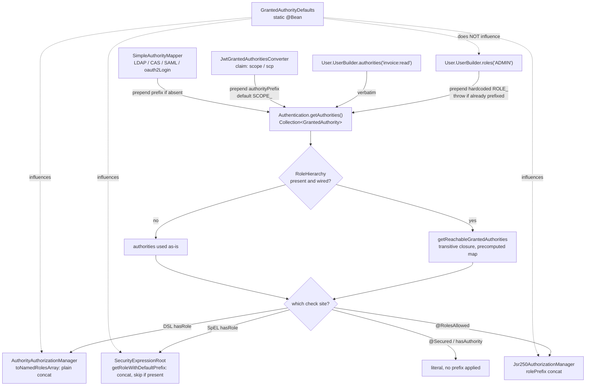

# 4.4 - Role vs Authority Deep Dive

> **Module 4 - Topic 4** - Authorization
> Baseline: Spring Security 6.x on Boot 3.x
> New to this? Read **In Plain English** below first, then come back to the Version Matrix.

## Version Matrix

| Concern | Spring Security 5.x | **Spring Security 6.x (baseline)** | Spring Security 7.x |
| --- | --- | --- | --- |
| Authority model | Single `GrantedAuthority` interface, one `getAuthority()` string. No separate role type. | Unchanged. `GrantedAuthority` is still one string, and a "role" is still only a naming convention. | Unchanged. The model has been stable since Acegi. |
| Role prefix in URL rules | `ExpressionUrlAuthorizationConfigurer.hasRole(String)` asserts the value does not start with `ROLE_`, then builds the SpEL string `hasRole('ROLE_X')`. | `AuthorizeHttpRequestsConfigurer.hasRole(String)` delegates to `AuthorityAuthorizationManager.hasAnyRole(rolePrefix, roles)`, which concatenates the prefix with no SpEL involved. | Same manager-based path. The SpEL-string route for URL rules is fully gone. |
| Role prefix in SpEL | `SecurityExpressionRoot.hasRole` calls `getRoleWithDefaultPrefix`, which **skips** the prefix if it is already present. | Identical behaviour, and this remains the only prefix site that tolerates an already-prefixed value. | Identical. |
| `RoleHierarchy` in method security | Wired by setting `DefaultMethodSecurityExpressionHandler.setRoleHierarchy(...)`. | Same, via a `static @Bean MethodSecurityExpressionHandler`. | Same. |
| `RoleHierarchy` in URL rules | Not applied by `authorizeRequests` unless you replaced the expression handler. A long-standing source of confusion. | `AuthorityAuthorizationManager.setRoleHierarchy(...)` exists, and from 6.3 the `authorizeHttpRequests` DSL looks up a `RoleHierarchy` bean and applies it. On earlier 6.x releases you must wire it yourself. | `RoleHierarchy` bean pickup is the documented default for both sites. |
| `RoleHierarchyImpl` construction | `new RoleHierarchyImpl()` plus `setHierarchy("ROLE_A > ROLE_B")`. | `setHierarchy` is deprecated in 6.3. Use `RoleHierarchyImpl.fromHierarchy(String)` or the fluent `RoleHierarchyImpl.withDefaultRolePrefix().role("ADMIN").implies("USER").build()`. | Deprecated members removed. Only the factory methods and the builder remain. |
| JWT scope conversion | `JwtGrantedAuthoritiesConverter` with `SCOPE_` prefix and the `scope`/`scp` well-known claims. | Same, plus `setAuthoritiesClaimDelimiter(String)` for non-whitespace-delimited string claims. | Same converter contract. |
| Prefix override bean | `GrantedAuthorityDefaults` bean, must be `static`. | Same, and still must be `static`. The requirement is a consequence of bean-definition ordering, not a bug. | Same. |

## Why This Exists

`02_M1_T2_Authentication_Authorization.md` §4 establishes the conceptual point: Spring Security has no role type, only `GrantedAuthority`, and `ROLE_` is a string convention that certain API surfaces apply on your behalf. That conceptual summary is enough to answer a screening question. It is not enough to debug the class of production incident that this topic actually produces, which sounds like this: a user holds `ROLE_ADMIN`, the URL rule says `hasRole("ADMIN")` and passes, the service method says `hasAuthority("ADMIN")` and throws, and nobody can explain why two lines that look identical disagree.

Every such incident traces back to one question: which code path added or removed the prefix, and did it compare literally or through the hierarchy. There are at least seven places in the framework that touch the prefix, and they do not all behave the same way. Two of them prepend unconditionally. One of them prepends but skips an existing prefix. One of them rejects an already-prefixed value with an exception. Two of them never touch the prefix at all. One of them uses a completely different prefix (`SCOPE_`). Knowing the specific list, and knowing which configuration bean influences which subset of it, is the difference between a five-minute fix and a day of guessing.

The second reason this topic exists is that the role model does not scale, and senior engineers are expected to know the shape of the wall before they hit it. A role is a bundle of permissions chosen at design time. When the product grows a matrix of resource types crossed with operations crossed with tenant-level exceptions, the number of bundles needed to express the policy grows combinatorially. Teams respond by minting more roles, and the authority set attached to every authentication grows with it. That set is serialised into a session or a token on every request, expanded transitively by the role hierarchy on every evaluation, and scanned linearly by every `hasRole` check. There is a real ceiling, and the exit path from it is a different authorization model, not a bigger list.

## In Plain English

**The one-line version:** Spring Security does not actually have roles; it has a single list of plain
text labels attached to each logged-in user, and a "role" is nothing more than a label that begins with
the four characters `ROLE_` — which various parts of the framework add, skip, reject, or ignore, and
that disagreement is what this whole topic is about.

**An analogy.** Picture a large hotel where every door is opened by the same kind of blank keycard. A
card that opens the manager's office and a card that opens the stationery cupboard are physically
identical; the only difference is the word printed on the front. There is no special "manager card"
type. There is just a card with a word on it, and every guard in the building does the same thing:
looks at the words you are carrying and checks whether the one they want is among them.

Over the years the hotel adopted a convention. Cards that stand for a job title get the letters
`STAFF-` printed in front of the word, so the manager's card reads `STAFF-MANAGER`, while cards that
stand for one specific permission are printed plainly, such as `stationery-cupboard`. Nothing enforces
this. It is a habit, and the entire building runs on everybody sharing the habit.

Here is where it falls apart, and this is the heart of the file. The hotel has seven different desks
that deal with these cards, and each one has its own habit about the `STAFF-` stamp. Ask one desk for
"the MANAGER card" and it stamps `STAFF-` on for you. Ask another and it also stamps it on, but if you
already said `STAFF-MANAGER` it notices and leaves it alone. A third refuses to serve you at all if
you already included the stamp. Two more never stamp anything and take your words completely
literally. And one deals with visitor passes and stamps a different word, `SCOPE-`, in front instead.
Every one of these desks is behaving reasonably on its own. The trouble is that two lines of your
configuration that look word-for-word identical may be talking to two different desks.

The last piece is the rule that says one card implies another — "anyone holding `STAFF-MANAGER` should
also be treated as holding `STAFF-USER`". That rule is a notice pinned up for the guards to read. The
classic production incident is that the notice gets pinned at the office-corridor guard post but not at
the front entrance, so the manager walks freely through the inner corridors and is turned away at the
front door, and both guards are following their instructions correctly.

**How it actually works, step by step.**

Spring Security stores one collection on every authenticated user, and each entry is an object with a
single method that returns a string. That interface is called `GrantedAuthority`. There is no second
interface for roles. `ROLE_ADMIN` and `invoice:read` are the same kind of object holding different
text, so "role versus authority" is a question about naming conventions, not about types.

Because the comparison is a string comparison, the only thing that can ever go wrong is that the string
you are looking for is not spelled the same as the string the user holds. The prefix is the usual
reason, and the file's central table lists all seven places the framework touches it. Two of them glue
`ROLE_` onto the front no matter what, so passing an already-prefixed value produces `ROLE_ROLE_ADMIN`
and matches nothing. One of them glues it on but checks first and leaves an already-prefixed value
alone. One of them throws an exception outright if you include the prefix yourself. Two of them never
touch it. And the one that turns a token's contents into authorities uses `SCOPE_` rather than `ROLE_`.

That explains the incident the file opens with. `hasRole("ADMIN")` in a URL rule and
`hasAuthority("ADMIN")` on a service method look like the same check to a reader, but the first one is
really looking for `ROLE_ADMIN` and the second is looking for the bare word `ADMIN`. The user holding
`ROLE_ADMIN` passes the first and fails the second, and neither line is wrong in isolation.

You can change the prefix from `ROLE_` to something else by publishing a small configuration object
called `GrantedAuthorityDefaults`. Two warnings come with it. It must be declared on a bean method
marked `static`, because the components that read it are built so early that a normal bean method can
be answered too late — and when it is answered too late the application starts perfectly and quietly
keeps using `ROLE_`. And it only changes the checking side. The builder you use to create users still
hardcodes `ROLE_`, so if you change the prefix you must also stop calling `.roles("ADMIN")` and start
spelling the authority out in full yourself.

A `RoleHierarchy` is a declaration that holding one authority automatically counts as holding others,
so you can say `ROLE_ADMIN` implies `ROLE_MANAGER` implies `ROLE_USER` and stop granting every user a
long list by hand. The expansion is worked out once when the hierarchy is built, so checking it at
request time is a cheap lookup rather than a search. The catch is that the two authorization engines
— the one for URLs and the one for annotated methods — read it separately. On Spring Security 6.3 and
later, simply publishing the bean is enough for both. On earlier 6.x releases only the method side
picked it up automatically, which is exactly the "works at one layer, 403 at the other" bug. Writing
one test at each layer, each asserting that a superior role satisfies a rule written for an inferior
one, is the whole defence.

Finally, an OAuth2 scope is a third thing that lands in the same list. A role says who the user is; a
scope says what a particular application was permitted to do on that user's behalf. Spring flattens
both into the same collection of strings, distinguished only by the `SCOPE_` prefix, so if you want the
answer to be "an actual manager, acting through an application that was granted write access", you have
to write that as two separate conditions joined together. Nothing computes that combination for you.

**Why should a beginner care?** Almost every "this user obviously has permission and is still getting
403" ticket in a Spring application is one of these string mismatches, and the framework gives you no
help finding it, because a label that does not match is not an error — it is simply a refusal. You will
also reach for `.roles("ROLE_ADMIN")` at some point, which throws an exception, and for
`hasRole("ROLE_ADMIN")` in a URL rule, which does not throw and instead silently searches for
`ROLE_ROLE_ADMIN`. Knowing which side of the framework adds the prefix turns both of these from a lost
afternoon into a one-line fix.

**Words you will meet in this file**

| Term | In plain words |
|---|---|
| `GrantedAuthority` | One permission label attached to a user. It holds a single piece of text and nothing else. |
| `SimpleGrantedAuthority` | The ordinary implementation of that label. Two of them are equal when their text is equal. |
| Authority | Any such label, whatever it is named. The only kind of permission object Spring Security has. |
| Role | A label that follows the convention of starting with `ROLE_`. It is not a separate type. |
| `ROLE_` prefix | The four characters that mark a label as a job title rather than a fine-grained permission. |
| `SCOPE_` prefix | The equivalent marker put in front of permissions that came out of an OAuth2 token. |
| `hasRole('X')` | Checks for the label `ROLE_X`. The prefix is added for you. |
| `hasAuthority('X')` | Checks for the label `X`, exactly as you typed it. Nothing is added. |
| `@Secured` | An older annotation whose value is matched literally, so you write the `ROLE_` prefix yourself. |
| `@RolesAllowed` | A standard Java annotation that, like `hasRole`, adds the prefix for you. |
| `User.UserBuilder.roles(...)` | Creates users with `ROLE_` added automatically, and throws if you include it yourself. |
| `User.UserBuilder.authorities(...)` | Creates users with the exact text you supply, prefix and all. |
| `GrantedAuthorityDefaults` | A small configuration object that changes the prefix used by the checking side only. |
| `static @Bean` | A bean declared on a static method. Required here, or the override is silently ignored. |
| `RoleHierarchy` | A declaration that one label automatically counts as holding others. |
| `RoleHierarchyImpl` | The built-in implementation, which works out every implied label once, up front. |
| Transitive expansion | Following those implications all the way down, so `ADMIN` reaches everything below it. |
| `AuthorityAuthorizationManager` | The component behind URL-rule checks. It adds the prefix by plain concatenation, with no check. |
| `SecurityExpressionRoot` | The component behind expression checks. It adds the prefix but skips it when already present. |
| `JwtGrantedAuthoritiesConverter` | Turns the permissions listed inside a token into labels, adding `SCOPE_` to each. |
| Claim | One named field inside a token, such as `scope` or `roles`. |
| `GrantedAuthoritiesMapper` | A hook for renaming labels that arrived from an external login system into your own convention. |
| `SimpleAuthorityMapper` | The ready-made mapper: adds a prefix only when missing, can force upper case, can grant a fallback label. |
| Scope | What an application was permitted to do on the user's behalf, as opposed to who the user is. |
| Role explosion | The point where expressing your policy needs so many role names that the model stops being workable. |

**If you remember only one thing:** there is one list of plain strings and every check is a string
comparison, so when a permission check fails unexpectedly, print the user's actual labels and print the
exact string the check is looking for, and the mismatch will be in front of you.

## Core Concepts

### 1. There is exactly one authority type

**In simple terms:** A role and a permission are the same object holding a different piece of text, so every permission check in Spring Security comes down to looking for one string in a list of strings.

```java
package org.springframework.security.core;

public interface GrantedAuthority extends Serializable {
    String getAuthority();
}
```

That is the entire contract. The framework's canonical implementation is a value wrapper:

```java
package org.springframework.security.core.authority;

public final class SimpleGrantedAuthority implements GrantedAuthority {

    private final String role;

    @Override
    public String getAuthority() {
        return this.role;
    }

    @Override
    public boolean equals(Object obj) {
        if (this == obj) {
            return true;
        }
        if (obj instanceof SimpleGrantedAuthority sga) {
            return this.role.equals(sga.getAuthority());
        }
        return false;
    }

    @Override
    public int hashCode() {
        return this.role.hashCode();
    }
}
```

Two consequences follow from the `equals` and `hashCode` implementations being derived from the string. First, a `Set<GrantedAuthority>` of `SimpleGrantedAuthority` deduplicates correctly, which matters because `RoleHierarchyImpl` and `SecurityExpressionRoot` both build sets internally. Second, if you write your own `GrantedAuthority` implementation and forget `equals` and `hashCode`, deduplication silently stops working, the reachable-authority set grows with duplicates, and set membership checks against a `SimpleGrantedAuthority` fail. Note also that `SimpleGrantedAuthority.equals` only accepts another `SimpleGrantedAuthority`, so a custom implementation is not interchangeable with it even if the strings match.

The practical rule is that "role" and "authority" are the same runtime object. The distinction exists only in how API surfaces treat the string, and the convention the industry settled on is that an authority whose string begins with `ROLE_` represents a coarse job function, and an authority without that prefix represents a fine-grained permission such as `invoice:read`.

### 2. The seven places the prefix is touched

**In simple terms:** Seven different parts of the framework decide for themselves whether to put `ROLE_` on the front of the name you wrote, and because they do not all decide the same way, two checks that read identically can look for two different strings.

This is the table to memorise, because it is the answer to almost every prefix bug.

| Site | Class and method | Prefix behaviour | On an already-prefixed input |
| --- | --- | --- | --- |
| URL rule `hasRole` | `AuthorityAuthorizationManager.hasAnyRole(String prefix, String[] roles)` | Prepends by plain string concatenation. | Produces a double prefix. There is no skip check inside the concatenation helper. |
| SpEL `hasRole` | `SecurityExpressionRoot.hasRole` via `getRoleWithDefaultPrefix` | Prepends, then applies `RoleHierarchy` to the user's authorities. | **Skips.** If the value already starts with the configured prefix it is used verbatim. |
| `@RolesAllowed` | `Jsr250AuthorizationManager` with its `rolePrefix` field | Prepends. | Produces a double prefix. |
| `@Secured` | `SecuredAuthorizationManager` | Never touches the prefix. The annotation value is matched literally. | Matched literally, which is usually what you want, since `@Secured("ROLE_ADMIN")` is the idiomatic form. |
| Building a user | `User.UserBuilder.roles(String...)` | Prepends `ROLE_`, hardcoded. | **Throws `IllegalArgumentException`.** |
| Building a user | `User.UserBuilder.authorities(...)` | Never touches the prefix. | Stored verbatim. |
| JWT conversion | `JwtGrantedAuthoritiesConverter` | Prepends `SCOPE_`, configurable. | Prepends anyway. The converter does not inspect the claim value. |

The `AuthorityAuthorizationManager` side looks like this in source:

```java
package org.springframework.security.authorization;

public final class AuthorityAuthorizationManager<T> implements AuthorizationManager<T> {

    private static final String ROLE_PREFIX = "ROLE_";

    private final AuthoritiesAuthorizationManager delegate = new AuthoritiesAuthorizationManager();

    public static <T> AuthorityAuthorizationManager<T> hasAnyRole(String rolePrefix, String[] roles) {
        return hasAnyAuthority(toNamedRolesArray(rolePrefix, roles));
    }

    private static String[] toNamedRolesArray(String rolePrefix, String[] roles) {
        String[] result = new String[roles.length];
        for (int i = 0; i < roles.length; i++) {
            result[i] = rolePrefix + roles[i];      // unconditional concatenation
        }
        return result;
    }

    public void setRoleHierarchy(RoleHierarchy roleHierarchy) {
        this.delegate.setRoleHierarchy(roleHierarchy);
    }
}
```

`toNamedRolesArray` is unconditional concatenation. Compare it with the SpEL side:

```java
package org.springframework.security.access.expression;

public abstract class SecurityExpressionRoot implements SecurityExpressionOperations {

    private String defaultRolePrefix = "ROLE_";

    private static String getRoleWithDefaultPrefix(String defaultRolePrefix, String role) {
        if (role == null || defaultRolePrefix == null || defaultRolePrefix.length() == 0) {
            return role;
        }
        if (role.startsWith(defaultRolePrefix)) {
            return role;                       // the skip: no double prefix here
        }
        return defaultRolePrefix + role;
    }

    private Set<String> getAuthoritySet() {
        if (this.roles == null) {
            Collection<? extends GrantedAuthority> userAuthorities = this.authentication.getAuthorities();
            if (this.roleHierarchy != null) {
                userAuthorities = this.roleHierarchy.getReachableGrantedAuthorities(userAuthorities);
            }
            this.roles = AuthorityUtils.authorityListToSet(userAuthorities);
        }
        return this.roles;
    }
}
```

Two asymmetries are visible. `getRoleWithDefaultPrefix` skips an existing prefix, and `getAuthoritySet` expands the user's authorities through the `RoleHierarchy` before comparing. The manager path does neither the skip nor, by itself, the expansion, unless a `RoleHierarchy` has been injected into it. `15_M4_T3_Expression_Based_Access_Control.md` §2 has the fuller listing of this class.

### 3. The user-building side rejects what the checking side tolerates

**In simple terms:** The code that creates a user throws an exception if you write the `ROLE_` prefix yourself, while several checking sites happily accept it, so the same text is an error in one place and fine in another.

```java
package org.springframework.security.core.userdetails;

public static final class UserBuilder {

    public UserBuilder roles(String... roles) {
        List<GrantedAuthority> authorities = new ArrayList<>(roles.length);
        for (String role : roles) {
            Assert.isTrue(!role.startsWith("ROLE_"),
                    () -> role + " cannot start with ROLE_ (it is automatically added)");
            authorities.add(new SimpleGrantedAuthority("ROLE_" + role));
        }
        return authorities(authorities);
    }

    public UserBuilder authorities(String... authorities) {
        return authorities(AuthorityUtils.createAuthorityList(authorities));
    }
}
```

The `"ROLE_"` literal here is hardcoded. It is **not** read from `GrantedAuthorityDefaults`. If you change the prefix to `PERM_` for the checking side and keep using `.roles("ADMIN")` to construct users, you produce `ROLE_ADMIN` authorities that no `hasRole` check will ever match, because the checks are now looking for `PERM_ADMIN`. When you change the prefix, you must change both sides, and the construction side means switching from `.roles(...)` to `.authorities("PERM_ADMIN")`.

`@WithMockUser` from `spring-security-test` mirrors the same split. Its `roles` attribute prepends `ROLE_` and throws if the value is already prefixed, its `authorities` attribute is literal, and `WithMockUserSecurityContextFactory` rejects an annotation that sets both attributes to non-default values. When you need a mixture of prefixed roles and unprefixed permissions in one test principal, you must express all of them through `authorities` and write the `ROLE_` prefix out by hand.

### 4. `GrantedAuthorityDefaults` and the `static` requirement

**In simple terms:** This is how you change the prefix from `ROLE_` to something else, and it must be declared on a `static` bean method, because otherwise the application starts normally and quietly carries on using `ROLE_`.

```java
package org.springframework.security.config.core;

public final class GrantedAuthorityDefaults {

    private final String rolePrefix;

    public GrantedAuthorityDefaults(String rolePrefix) {
        this.rolePrefix = rolePrefix;
    }

    public String getRolePrefix() {
        return this.rolePrefix;
    }
}
```

The bean is a one-field carrier. It is consumed by `AuthorizeHttpRequestsConfigurer` for the DSL's `hasRole`, by `DefaultMethodSecurityExpressionHandler.setDefaultRolePrefix`, by `Jsr250AuthorizationManager.setRolePrefix`, and by the web expression handler used for `WebExpressionAuthorizationManager`. It is not consumed by `User.UserBuilder`, by `@Secured`, or by `JwtGrantedAuthoritiesConverter`.

The `static` requirement has a concrete cause. The beans that read `GrantedAuthorityDefaults` are themselves created very early, in some cases while the security infrastructure is being registered as part of processing `@EnableMethodSecurity` or `@EnableWebSecurity`. If `GrantedAuthorityDefaults` is declared as an instance method on a `@Configuration` class, Spring must instantiate that configuration class to call the method. Instantiating the configuration class can pull in its other dependencies, including autowired beans, and this happens before the bean post-processing that the security registration relies on. The result is either a circular reference at startup or, worse, a silent case where the default `ROLE_` is used because the override bean was not available at the moment it was queried. A `static @Bean` method can be invoked without instantiating the enclosing configuration class, so it is always available when the early lookup happens.

```java
@Configuration
public class PrefixConfig {

    // Must be static. A non-static declaration can be resolved too late.
    @Bean
    static GrantedAuthorityDefaults grantedAuthorityDefaults() {
        return new GrantedAuthorityDefaults("PERM_");
    }
}
```

The same `static` rule applies for exactly the same reason to a `MethodSecurityExpressionHandler` bean, as covered in `15_M4_T3_Expression_Based_Access_Control.md` §6.

### 5. `RoleHierarchy` and transitive expansion

**In simple terms:** This lets you declare that holding one role automatically counts as holding the roles beneath it, so an administrator satisfies a rule written for an ordinary user without being granted that label explicitly.

```java
package org.springframework.security.access.hierarchicalroles;

public interface RoleHierarchy {
    Collection<? extends GrantedAuthority> getReachableGrantedAuthorities(
            Collection<? extends GrantedAuthority> authorities);
}
```

The contract is a set expansion. Given the authorities the user actually holds, it returns those plus everything they transitively imply. `RoleHierarchyImpl` performs the transitive closure once, at construction time, and stores the result in a map from each authority name to its full reachable set. Evaluation is then a map lookup per held authority rather than a graph walk, which is why the expansion cost is proportional to the number of authorities the user holds and not to the size of the hierarchy.

In 6.3 and later the construction API is the fluent builder or a static factory:

```java
RoleHierarchy hierarchy = RoleHierarchyImpl.withDefaultRolePrefix()
        .role("ADMIN").implies("MANAGER")
        .role("MANAGER").implies("STAFF")
        .role("STAFF").implies("USER")
        .build();
```

`withDefaultRolePrefix()` is shorthand for `withRolePrefix("ROLE_")`, and it prepends that prefix to every name you pass to `role(...)` and `implies(...)`, so the builder above declares `ROLE_ADMIN > ROLE_MANAGER > ROLE_STAFF > ROLE_USER`. If your authorities use a different prefix, use `withRolePrefix("PERM_")`. If they use no prefix at all, use `RoleHierarchyImpl.withRolePrefix("")` or the string form.

The string form remains available as a factory method:

```java
RoleHierarchy hierarchy = RoleHierarchyImpl.fromHierarchy("""
        ROLE_ADMIN > ROLE_MANAGER
        ROLE_MANAGER > ROLE_STAFF
        ROLE_STAFF > ROLE_USER
        """);
```

Both forms build the same precomputed map. Note two behaviours of the implementation. First, the relation is transitive, so a user holding only `ROLE_ADMIN` reaches all four names in the example. Second, a cycle in the declared relation is a configuration error, and `RoleHierarchyImpl` throws `CycleInRoleHierarchyException` rather than looping. Declaring `ROLE_A > ROLE_B` and `ROLE_B > ROLE_A` fails at startup, which is the correct behaviour but surprises people who were trying to express "these two roles are equivalent". Equivalence has to be expressed by granting both authorities, not by a cyclic hierarchy.

The 5.x and early-6.x form was a mutable setter, `new RoleHierarchyImpl()` followed by `setHierarchy("ROLE_ADMIN > ROLE_USER")`. That setter is deprecated in 6.3 in favour of the two forms above.

### 6. Wiring the hierarchy into both sites

**In simple terms:** URL rules and method annotations read the hierarchy separately, so on older releases it is easy to end up with it working in one place and not the other, which looks like an administrator being allowed through the service layer and refused at the web layer.

This is where the most common role-hierarchy bug lives. There are two independent authorization engines, and historically each needed its own wiring.

For **method security**, the hierarchy reaches `SecurityExpressionRoot.getAuthoritySet` through the expression handler:

```java
@Bean
static MethodSecurityExpressionHandler methodSecurityExpressionHandler(RoleHierarchy roleHierarchy) {
    DefaultMethodSecurityExpressionHandler handler = new DefaultMethodSecurityExpressionHandler();
    handler.setRoleHierarchy(roleHierarchy);
    return handler;
}
```

For **URL rules**, the path depends on the release. From 6.3, `AuthorizeHttpRequestsConfigurer` looks up a `RoleHierarchy` bean from the application context and applies it to the `AuthorityAuthorizationManager` instances it creates for `hasRole` and `hasAnyRole`, so publishing the bean is sufficient. On earlier 6.x releases the DSL did not perform that lookup, and a plain `hasRole("USER")` rule ignored the hierarchy entirely. The version-independent way to be certain is to either construct the manager yourself:

```java
AuthorityAuthorizationManager<RequestAuthorizationContext> manager =
        AuthorityAuthorizationManager.hasRole("USER");
manager.setRoleHierarchy(roleHierarchy);
// ...
.requestMatchers("/reports/**").access(manager)
```

or to route the rule through a SpEL expression evaluated by a `DefaultHttpSecurityExpressionHandler` that you configured with the hierarchy and handed to a `WebExpressionAuthorizationManager` via its `setExpressionHandler(...)` method.

The symptom of half-wiring is unmistakable once you know it: an administrator can call the service method directly, and the integration test for the service layer passes, but the same administrator gets 403 at the HTTP boundary, or the reverse. Whenever you introduce a hierarchy, write one test at each layer asserting that a strictly superior role reaches a strictly inferior rule. Those two tests are the entire defence against this bug.

A design alternative worth considering is to skip `RoleHierarchy` entirely and expand roles at authentication time, so that a user granted `ROLE_ADMIN` is loaded with all four authorities in their `Authentication`. This costs authority-set size but removes the dual-wiring problem, makes the effective permission set visible in logs and in the session, and means every check site behaves identically without configuration. For small hierarchies this is often the better trade.

### 7. Roles, authorities, and OAuth2 scopes

**In simple terms:** A role says who the user is and a scope says what an application was allowed to do on that user's behalf; both end up in the same list of strings, so if you want both conditions met you have to write both of them out yourself.

A scope is not a role. A role answers "who is this principal", and a scope answers "what did the resource owner permit this client to do on the principal's behalf". The effective permission must be the **intersection** of the two, a point established in `02_M1_T2_Authentication_Authorization.md` §5. Spring Security does not compute that intersection for you. It flattens both into the same authority collection, and it is your policy that has to require one of each:

```java
.requestMatchers(HttpMethod.POST, "/api/invoices/**")
    .access(AuthorizationManagers.allOf(
            AuthorityAuthorizationManager.hasAuthority("SCOPE_invoice:write"),
            AuthorityAuthorizationManager.hasRole("MANAGER")))
```

The prefix that makes scopes distinguishable comes from the converter:

```java
package org.springframework.security.oauth2.server.resource.authentication;

public final class JwtGrantedAuthoritiesConverter
        implements Converter<Jwt, Collection<GrantedAuthority>> {

    private static final String DEFAULT_AUTHORITY_PREFIX = "SCOPE_";

    private static final Collection<String> WELL_KNOWN_AUTHORITIES_CLAIM_NAMES =
            Arrays.asList("scope", "scp");

    private String authorityPrefix = DEFAULT_AUTHORITY_PREFIX;
    private String authoritiesClaimDelimiter = " ";
    private String authoritiesClaimName;            // null: use the well-known names

    @Override
    public Collection<GrantedAuthority> convert(Jwt jwt) {
        Collection<GrantedAuthority> grantedAuthorities = new ArrayList<>();
        for (String authority : getAuthorities(jwt)) {
            grantedAuthorities.add(new SimpleGrantedAuthority(this.authorityPrefix + authority));
        }
        return grantedAuthorities;
    }
}
```

Three configuration points matter. `setAuthoritiesClaimName("roles")` overrides the claim that is read, replacing the `scope` and `scp` search. `setAuthorityPrefix("")` removes the prefix, which is what you want when the claim already contains fully-formed authority strings. `setAuthoritiesClaimDelimiter(",")` handles a provider that packs a string claim with commas rather than spaces. If the claim is a `Collection` rather than a `String`, the delimiter is irrelevant and each element becomes one authority. Opaque-token setups behave analogously: `SpringOpaqueTokenIntrospector` also produces `SCOPE_`-prefixed authorities from the introspection response's scope field.

Keycloak is the common case that none of the configuration knobs cover, because its roles live at a nested path, `realm_access.roles`, rather than at a top-level claim. A nested claim requires a converter:

```java
package com.example.security.authority;

import java.util.Collection;
import java.util.List;
import java.util.Map;
import java.util.stream.Stream;

import org.springframework.core.convert.converter.Converter;
import org.springframework.security.core.GrantedAuthority;
import org.springframework.security.core.authority.SimpleGrantedAuthority;
import org.springframework.security.oauth2.jwt.Jwt;
import org.springframework.security.oauth2.server.resource.authentication.JwtGrantedAuthoritiesConverter;

public final class KeycloakAuthoritiesConverter
        implements Converter<Jwt, Collection<GrantedAuthority>> {

    private final JwtGrantedAuthoritiesConverter scopes = new JwtGrantedAuthoritiesConverter();

    @Override
    public Collection<GrantedAuthority> convert(Jwt jwt) {
        return Stream.concat(scopes.convert(jwt).stream(), realmRoles(jwt).stream()).toList();
    }

    @SuppressWarnings("unchecked")
    private List<GrantedAuthority> realmRoles(Jwt jwt) {
        Map<String, Object> realmAccess = jwt.getClaimAsMap("realm_access");
        if (realmAccess == null) {
            return List.of();
        }
        Object roles = realmAccess.get("roles");
        if (!(roles instanceof Collection<?> collection)) {
            return List.of();
        }
        return collection.stream()
                .map(String::valueOf)
                .map(role -> (GrantedAuthority) new SimpleGrantedAuthority("ROLE_" + role))
                .toList();
    }
}
```

The converter keeps the scope-derived `SCOPE_` authorities and adds `ROLE_`-prefixed realm roles, so both halves of the intersection remain expressible. Registering it requires wrapping it in a `JwtAuthenticationConverter`, shown in the Working Code section.

### 8. `GrantedAuthoritiesMapper` for federated identity

**In simple terms:** When permission names arrive from an outside login system such as an LDAP directory or a corporate sign-on provider, this is the place to rename them into the convention your own application uses.

```java
package org.springframework.security.core.authority.mapping;

public interface GrantedAuthoritiesMapper {
    Collection<? extends GrantedAuthority> mapAuthorities(
            Collection<? extends GrantedAuthority> authorities);
}
```

This is the hook for translating authorities that arrive from an external identity system into the naming convention your application uses. It is consulted by `LdapAuthenticationProvider`, `CasAuthenticationProvider`, `PreAuthenticatedAuthenticationProvider`, the SAML 2 provider, and the `oauth2Login` DSL's `userInfoEndpoint().userAuthoritiesMapper(...)`. It is not consulted by the resource-server JWT path, which uses a `Converter<Jwt, ...>` instead.

`NullAuthoritiesMapper` is the default and returns the input unchanged. `SimpleAuthorityMapper` is the useful one:

```java
package org.springframework.security.core.authority.mapping;

public class SimpleAuthorityMapper implements GrantedAuthoritiesMapper, InitializingBean {

    private GrantedAuthority defaultAuthority;
    private String prefix = "ROLE_";
    private boolean convertToUpperCase = false;

    private GrantedAuthority mapAuthority(String name) {
        if (this.convertToUpperCase) {
            name = name.toUpperCase(Locale.ROOT);
        }
        if (this.prefix.length() > 0 && !name.startsWith(this.prefix)) {
            name = this.prefix + name;       // added ONLY if absent
        }
        return new SimpleGrantedAuthority(name);
    }
}
```

It prepends a prefix only if absent, optionally normalises case, and can inject a `defaultAuthority` so that every successfully authenticated principal holds at least one authority. That last feature is more important than it looks: an `Authentication` with an empty authority collection passes `authenticated()` but fails every `hasRole` and `hasAuthority` check, which produces a user who can log in and then sees 403 on every page.

### 9. Where the prefix is applied, visually

**In simple terms:** This diagram shows every route a permission label can take into a user's list and every place the prefix is added or left alone, which is the map to consult when a check fails for no visible reason.



## Working Code

A single application showing both sides wired consistently: a hierarchy applied at the URL layer and the method layer, a custom prefix, a Keycloak-style JWT converter, and tests that would fail if only one side were wired.

```java
package com.example.security.config;

import org.springframework.context.annotation.Bean;
import org.springframework.context.annotation.Configuration;
import org.springframework.http.HttpMethod;
import org.springframework.security.access.expression.method.DefaultMethodSecurityExpressionHandler;
import org.springframework.security.access.expression.method.MethodSecurityExpressionHandler;
import org.springframework.security.access.hierarchicalroles.RoleHierarchy;
import org.springframework.security.access.hierarchicalroles.RoleHierarchyImpl;
import org.springframework.security.authorization.AuthorityAuthorizationManager;
import org.springframework.security.authorization.AuthorizationManagers;
import org.springframework.security.config.annotation.method.configuration.EnableMethodSecurity;
import org.springframework.security.config.annotation.web.builders.HttpSecurity;
import org.springframework.security.config.annotation.web.configuration.EnableWebSecurity;
import org.springframework.security.core.userdetails.User;
import org.springframework.security.core.userdetails.UserDetailsService;
import org.springframework.security.provisioning.InMemoryUserDetailsManager;
import org.springframework.security.web.SecurityFilterChain;
import org.springframework.security.web.access.intercept.RequestAuthorizationContext;

@Configuration
@EnableWebSecurity
@EnableMethodSecurity
public class AuthorityConfig {

    /**
     * ROLE_ADMIN implies ROLE_MANAGER implies ROLE_STAFF implies ROLE_USER.
     * Published as a bean so that 6.3+ picks it up for authorizeHttpRequests,
     * and so the method-security handler below can inject it.
     */
    @Bean
    RoleHierarchy roleHierarchy() {
        return RoleHierarchyImpl.withDefaultRolePrefix()
                .role("ADMIN").implies("MANAGER")
                .role("MANAGER").implies("STAFF")
                .role("STAFF").implies("USER")
                .build();
    }

    /** Must be static: resolved while method-security infrastructure is being registered. */
    @Bean
    static MethodSecurityExpressionHandler methodSecurityExpressionHandler(RoleHierarchy roleHierarchy) {
        DefaultMethodSecurityExpressionHandler handler = new DefaultMethodSecurityExpressionHandler();
        handler.setRoleHierarchy(roleHierarchy);
        return handler;
    }

    @Bean
    SecurityFilterChain api(HttpSecurity http, RoleHierarchy roleHierarchy) throws Exception {
        // Built explicitly with the hierarchy attached, so the rule behaves
        // identically on every 6.x release rather than depending on bean pickup.
        AuthorityAuthorizationManager<RequestAuthorizationContext> staffOrAbove =
                AuthorityAuthorizationManager.hasRole("STAFF");
        staffOrAbove.setRoleHierarchy(roleHierarchy);

        http
            .securityMatcher("/api/**")
            .csrf(csrf -> csrf.disable())
            .httpBasic(basic -> {})
            .authorizeHttpRequests(auth -> auth
                .requestMatchers("/api/public/**").permitAll()
                // Hierarchy-aware: ROLE_ADMIN reaches a ROLE_STAFF rule.
                .requestMatchers(HttpMethod.GET, "/api/reports/**").access(staffOrAbove)
                // Scope and role both required: neither alone is sufficient.
                .requestMatchers(HttpMethod.POST, "/api/invoices/**").access(
                        AuthorizationManagers.allOf(
                                AuthorityAuthorizationManager.hasAuthority("SCOPE_invoice:write"),
                                AuthorityAuthorizationManager.hasRole("MANAGER")))
                // Literal authority: no prefix, no hierarchy expansion applies.
                .requestMatchers("/api/exports/**").hasAuthority("invoice:export")
                .anyRequest().authenticated());
        return http.build();
    }

    @Bean
    UserDetailsService users() {
        return new InMemoryUserDetailsManager(
                // roles(...) prepends ROLE_ and would throw on "ROLE_ADMIN".
                User.withUsername("root").password("{noop}p").roles("ADMIN").build(),
                User.withUsername("clerk").password("{noop}p").roles("USER").build(),
                // Mixed principal: a prefixed role plus an unprefixed permission
                // plus a scope. Only authorities(...) can express all three.
                User.withUsername("exporter").password("{noop}p")
                        .authorities("ROLE_USER", "invoice:export", "SCOPE_invoice:write")
                        .build());
    }
}
```

The service layer relies on the same hierarchy through the expression handler:

```java
package com.example.security.report;

import java.util.List;

import org.springframework.security.access.prepost.PreAuthorize;
import org.springframework.stereotype.Service;

@Service
public class ReportService {

    /** SpEL hasRole: prefix applied with skip semantics, hierarchy applied. */
    @PreAuthorize("hasRole('STAFF')")
    public List<String> quarterly() {
        return List.of("Q1", "Q2", "Q3", "Q4");
    }

    /** hasAuthority: literal match. ROLE_ADMIN does NOT satisfy this. */
    @PreAuthorize("hasAuthority('invoice:export')")
    public String export() {
        return "csv";
    }

    /** Both halves of the intersection in one expression. */
    @PreAuthorize("hasAuthority('SCOPE_invoice:write') and hasRole('MANAGER')")
    public String write() {
        return "written";
    }
}
```

Registering the Keycloak converter on a resource server:

```java
@Bean
JwtAuthenticationConverter jwtAuthenticationConverter() {
    JwtAuthenticationConverter converter = new JwtAuthenticationConverter();
    converter.setJwtGrantedAuthoritiesConverter(new KeycloakAuthoritiesConverter());
    // Default principal name is the "sub" claim; override when the provider
    // puts the stable user identifier elsewhere.
    converter.setPrincipalClaimName("preferred_username");
    return converter;
}
```

Tests that specifically catch half-wiring and prefix mistakes:

```java
package com.example.security;

import static org.assertj.core.api.Assertions.assertThat;
import static org.assertj.core.api.Assertions.assertThatExceptionOfType;
import static org.assertj.core.api.Assertions.assertThatIllegalArgumentException;
import static org.springframework.test.web.servlet.request.MockMvcRequestBuilders.get;
import static org.springframework.test.web.servlet.result.MockMvcResultMatchers.status;

import java.util.List;

import org.junit.jupiter.api.Test;
import org.springframework.beans.factory.annotation.Autowired;
import org.springframework.boot.test.autoconfigure.web.servlet.AutoConfigureMockMvc;
import org.springframework.boot.test.context.SpringBootTest;
import org.springframework.security.access.AccessDeniedException;
import org.springframework.security.access.hierarchicalroles.RoleHierarchy;
import org.springframework.security.core.authority.SimpleGrantedAuthority;
import org.springframework.security.core.userdetails.User;
import org.springframework.security.test.context.support.WithMockUser;
import org.springframework.test.web.servlet.MockMvc;

import com.example.security.report.ReportService;

@SpringBootTest
@AutoConfigureMockMvc
class RoleAuthorityTests {

    @Autowired MockMvc mvc;
    @Autowired ReportService reports;
    @Autowired RoleHierarchy hierarchy;

    /** Web layer: a superior role must reach an inferior rule. */
    @Test
    @WithMockUser(roles = "ADMIN")
    void adminReachesStaffRuleAtWebLayer() throws Exception {
        mvc.perform(get("/api/reports/2024")).andExpect(status().isOk());
    }

    /** Method layer: the same assertion, independently wired. */
    @Test
    @WithMockUser(roles = "ADMIN")
    void adminReachesStaffRuleAtMethodLayer() {
        assertThat(reports.quarterly()).hasSize(4);
    }

    /** The hierarchy is one-directional. */
    @Test
    @WithMockUser(roles = "USER")
    void userDoesNotReachStaffRule() {
        assertThatExceptionOfType(AccessDeniedException.class)
                .isThrownBy(reports::quarterly);
    }

    /** hasAuthority is literal: no prefix, and hierarchy expansion adds nothing. */
    @Test
    @WithMockUser(roles = "ADMIN")
    void roleDoesNotSatisfyLiteralAuthority() {
        assertThatExceptionOfType(AccessDeniedException.class)
                .isThrownBy(reports::export);
    }

    /** Scope alone is not enough, and role alone is not enough. */
    @Test
    @WithMockUser(authorities = "SCOPE_invoice:write")
    void scopeWithoutRoleIsDenied() {
        assertThatExceptionOfType(AccessDeniedException.class)
                .isThrownBy(reports::write);
    }

    /** The asymmetry: the builder rejects what SpEL tolerates. */
    @Test
    void userBuilderRejectsPrefixedRole() {
        assertThatIllegalArgumentException()
                .isThrownBy(() -> User.withUsername("x").password("{noop}p")
                        .roles("ROLE_ADMIN").build());
    }

    /** Transitive closure, not a single step. */
    @Test
    void hierarchyExpandsTransitively() {
        var reachable = hierarchy.getReachableGrantedAuthorities(
                List.of(new SimpleGrantedAuthority("ROLE_ADMIN")));
        assertThat(reachable).extracting("authority")
                .containsExactlyInAnyOrder("ROLE_ADMIN", "ROLE_MANAGER", "ROLE_STAFF", "ROLE_USER");
    }
}
```

The pair of `adminReachesStaffRuleAtWebLayer` and `adminReachesStaffRuleAtMethodLayer` is the important detail. They assert the same policy intent at two layers that are configured independently, so a hierarchy wired into only one of them produces exactly one failure and names the layer that is missing it.

## Internals

`AuthoritiesAuthorizationManager` is the leaf that every role and authority check eventually reaches:

```java
package org.springframework.security.authorization;

public final class AuthoritiesAuthorizationManager
        implements AuthorizationManager<Collection<String>> {

    private RoleHierarchy roleHierarchy = new NullRoleHierarchy();

    @Override
    public AuthorizationDecision check(Supplier<Authentication> authentication,
            Collection<String> authorities) {
        boolean granted = isGranted(authentication.get(), authorities);
        return new AuthorityAuthorizationDecision(granted,
                AuthorityUtils.createAuthorityList(authorities));
    }

    private boolean isAuthorized(Authentication authentication, Collection<String> authorities) {
        for (GrantedAuthority granted : getGrantedAuthorities(authentication)) {
            for (String authority : authorities) {
                if (authority.equals(granted.getAuthority())) {   // exact String.equals
                    return true;
                }
            }
        }
        return false;
    }

    private Collection<? extends GrantedAuthority> getGrantedAuthorities(Authentication authentication) {
        return this.roleHierarchy.getReachableGrantedAuthorities(authentication.getAuthorities());
    }
}
```

Three details are worth internalising. The comparison is `String.equals`, so authority matching is case-sensitive and whitespace-sensitive; an authority loaded from a database column with a trailing space silently never matches. The default hierarchy is `NullRoleHierarchy`, whose `getReachableGrantedAuthorities` returns the input collection, which is why an unwired manager appears to work until someone relies on inheritance. And the loop is a nested linear scan over the user's reachable authorities crossed with the required authorities, so cost grows with the product of those two sizes. For the usual case of a handful of required authorities this is irrelevant; for a principal carrying thousands of authorities it becomes measurable on every request.

The failure decision is an `AuthorityAuthorizationDecision`, which carries the required authorities alongside the boolean. That is what allows a denial handler or an `AuthorizationDeniedEvent` listener to log what was actually required rather than a bare "denied", and it is the single most useful thing to surface in an audit log.

On the role-hierarchy side, `RoleHierarchyImpl` holds a precomputed map:

```java
package org.springframework.security.access.hierarchicalroles;

public final class RoleHierarchyImpl implements RoleHierarchy {

    private Map<String, Set<GrantedAuthority>> rolesReachableInOneOrMoreStepsMap;

    @Override
    public Collection<GrantedAuthority> getReachableGrantedAuthorities(
            Collection<? extends GrantedAuthority> authorities) {
        if (authorities == null || authorities.isEmpty()) {
            return AuthorityUtils.NO_AUTHORITIES;
        }
        Set<GrantedAuthority> reachable = new HashSet<>();
        for (GrantedAuthority authority : authorities) {
            reachable.add(authority);
            Set<GrantedAuthority> extra =
                    this.rolesReachableInOneOrMoreStepsMap.get(authority.getAuthority());
            if (extra != null) {
                reachable.addAll(extra);
            }
        }
        return new ArrayList<>(reachable);
    }
}
```

The transitive closure is computed once during construction by repeatedly following the declared one-step relation until no new reachable role is discovered, and a repetition count that exceeds the number of declared roles is what triggers `CycleInRoleHierarchyException`. At evaluation time the work is one map lookup and a set union per held authority, plus the allocation of a fresh `HashSet` and `ArrayList` on every call. That allocation is the reason expansion at authentication time can be cheaper than expansion at check time for a principal that is checked many times per request.

One last helper matters for performance reasoning. `AuthorityUtils.authorityListToSet` is what `SecurityExpressionRoot.getAuthoritySet` uses to flatten authorities into a `Set<String>` for constant-time membership checks, which is why SpEL role checks scale better with large authority sets than the nested-loop manager path does. `AuthorityUtils.createAuthorityList` is the reverse direction and is what builds the required-authority list carried on an `AuthorityAuthorizationDecision`.

## Configuration Reference

| Option | Effect | Default |
| --- | --- | --- |
| `GrantedAuthorityDefaults` bean (must be `static @Bean`) | Sets the role prefix used by the `authorizeHttpRequests` DSL `hasRole`, the method and web expression handlers, and `Jsr250AuthorizationManager`. | Absent, so `ROLE_` is used |
| `User.UserBuilder.roles(String...)` | Prepends a hardcoded `ROLE_`; throws `IllegalArgumentException` if the value already starts with it. Ignores `GrantedAuthorityDefaults`. | n/a |
| `User.UserBuilder.authorities(String...)` | Stores the strings verbatim as `SimpleGrantedAuthority`. | n/a |
| `AuthorityAuthorizationManager.setRoleHierarchy(RoleHierarchy)` | Expands the principal's authorities before the literal comparison. | `NullRoleHierarchy` (identity) |
| `RoleHierarchy` bean | From 6.3, picked up by the `authorizeHttpRequests` DSL for `hasRole` and `hasAnyRole`. On earlier 6.x, publish it and wire it manually. | Absent |
| `DefaultMethodSecurityExpressionHandler.setRoleHierarchy(...)` | Makes SpEL `hasRole` in method annotations hierarchy-aware. | Unset |
| `DefaultMethodSecurityExpressionHandler.setDefaultRolePrefix(...)` | Prefix used by SpEL `hasRole`/`hasAnyRole`. Set from `GrantedAuthorityDefaults` when that bean exists. | `"ROLE_"` |
| `RoleHierarchyImpl.withDefaultRolePrefix()` | Fluent builder that prepends `ROLE_` to every `role(...)` and `implies(...)` argument. | n/a |
| `RoleHierarchyImpl.withRolePrefix(String)` | Same builder with a custom prefix; pass `""` for unprefixed authorities. | n/a |
| `RoleHierarchyImpl.fromHierarchy(String)` | Parses the `A > B` newline-delimited text form. Replaces the deprecated `setHierarchy`. | n/a |
| `JwtGrantedAuthoritiesConverter.setAuthorityPrefix(String)` | Prefix prepended to each value read from the authorities claim. | `"SCOPE_"` |
| `JwtGrantedAuthoritiesConverter.setAuthoritiesClaimName(String)` | Claim to read instead of searching `scope` then `scp`. | `null` (well-known names) |
| `JwtGrantedAuthoritiesConverter.setAuthoritiesClaimDelimiter(String)` | Split token for a `String`-valued claim. Ignored for `Collection` claims. | `" "` |
| `JwtAuthenticationConverter.setJwtGrantedAuthoritiesConverter(...)` | Replaces the whole claim-to-authority mapping; the hook for nested claims such as `realm_access.roles`. | `JwtGrantedAuthoritiesConverter` |
| `SimpleAuthorityMapper.setPrefix(String)` | Prefix added to mapped authorities when not already present. | `"ROLE_"` |
| `SimpleAuthorityMapper.setDefaultAuthority(String)` | Authority granted to every principal that passes through the mapper. | None |
| `SimpleAuthorityMapper.setConvertToUpperCase(boolean)` | Uppercases authority names before prefixing. | `false` |
| `@WithMockUser(roles = ...)` | Prepends `ROLE_`; rejects an already-prefixed value; cannot be combined with `authorities`. | `"USER"` |
| `@WithMockUser(authorities = ...)` | Literal authorities; cannot be combined with `roles`. | Unset |

## Production Concerns & Anti-Patterns

**Mixing `hasRole` and `hasAuthority` for the same concept.** The single most common cause of a policy that passes review and fails in production is one rule written as `hasRole('ADMIN')` and another as `hasAuthority('ADMIN')`. The first looks for `ROLE_ADMIN`, the second looks for `ADMIN`, and there is no warning. Pick one convention per authority family and enforce it mechanically. The convention that ages best is that `hasRole` is used only for job functions and `hasAuthority` only for fine-grained permissions with a namespace separator such as `invoice:read`, because the separator makes it visually obvious that a `hasRole` check on it would be wrong.

**Wiring the role hierarchy into one layer only.** Because the URL layer and the method layer resolve the hierarchy through different objects, and because the URL layer's automatic bean pickup arrived only in 6.3, it is entirely possible to ship a hierarchy that works in the service layer and not at the HTTP boundary. The failure is asymmetric and confusing: privileged users are denied on some paths and allowed on others, depending on which layer holds the effective rule. The defence is the two-test pattern shown in the Working Code section, one assertion per layer, added at the same time as the hierarchy itself.

**Changing the role prefix.** Do not, unless you have a compelling external constraint. A custom prefix requires you to publish `GrantedAuthorityDefaults`, stop using `User.roles(...)` in favour of `User.authorities(...)`, rebuild the role hierarchy with `withRolePrefix`, audit every `@Secured` value because that annotation is literal, and remember that `@WithMockUser(roles = ...)` in your tests still hardcodes `ROLE_`. Every one of those is a place where a missed change fails silently by denying access. The benefit, a prettier authority string, is not worth it.

**Treating a scope as a role.** A token issued to a machine client with `SCOPE_invoice:write` and no user context must not be able to satisfy a rule that was written to mean "a human manager approved this". If your policy expresses only the scope, then any client that obtains that scope through a client-credentials grant has manager-level power. Require both halves explicitly, as the `AuthorizationManagers.allOf` example does. This is the mechanical form of the intersection argument in `02_M1_T2_Authentication_Authorization.md` §5.

**Role explosion.** Role counts grow when policy needs to distinguish cases that a single bundle cannot express. The recognisable symptoms are role names that encode a resource plus an operation plus a scope qualifier, such as `ROLE_INVOICE_APPROVER_EMEA_TIER2`, roles created per customer or per tenant, and roles whose only difference from another role is one permission. At that point the role has stopped being a job function and has become a row in a policy table, and a policy table is better represented as data. The migration path is to keep a small stable set of roles for coarse gating, move the resource-level decision into an `AuthorizationManager` or a `PermissionEvaluator` that queries an ownership or grant table, and stop encoding tuples in strings. The relationship-based checks in `14_M4_T2_Method_Level_Security.md` and the named-bean pattern in `15_M4_T3_Expression_Based_Access_Control.md` are both implementations of that path.

**The authority-set size ceiling.** The authority collection is carried on every authenticated request, so its size has costs at four separate points. It is serialised into the HTTP session, so a distributed session store pays it in bytes and deserialisation time on every request. If authorities are carried in a JWT, the token grows and eventually exceeds proxy header limits; a few thousand authorities at roughly twenty characters each puts the base64-encoded token well past the eight-kilobyte default request-header buffer that common reverse proxies ship with, and the failure mode is a 400 or 431 from the proxy with no application log entry at all. The role hierarchy allocates a fresh set on each evaluation proportional to the held-authority count. And `AuthoritiesAuthorizationManager.isAuthorized` scans linearly. In practice a principal holding tens of authorities is free, hundreds is fine, and thousands means the design has already failed and needs a lookup-based model where the permission is fetched for the specific resource being accessed rather than pre-loaded for all resources.

**Authorities loaded from a database without normalisation.** Because matching is `String.equals`, a value stored as `role_admin`, `ROLE_ADMIN `, or `Role_Admin` is a different authority from `ROLE_ADMIN`. Normalise at the boundary where authorities are loaded, either with a `GrantedAuthoritiesMapper` or in the query, and add a uniqueness or check constraint in the schema. Case-insensitive matching is not something you can enable in the framework.

**An empty authority collection.** A principal that authenticates successfully but ends up with zero authorities satisfies `authenticated()` and fails every other check. This happens when an external identity provider changes a claim name, when a group-to-role mapping table has no matching row, or when a `GrantedAuthoritiesMapper` filters everything out. Set `SimpleAuthorityMapper.setDefaultAuthority("ROLE_USER")` on federated paths, and assert a non-empty authority collection in the authentication success path so the problem surfaces at login rather than as a wall of 403 responses.

## Debugging Playbook

| Symptom | Likely root cause | Fix |
| --- | --- | --- |
| `hasRole('ADMIN')` passes but `hasAuthority('ADMIN')` fails for the same user | The user holds `ROLE_ADMIN`. `hasRole` prepends the prefix, `hasAuthority` matches literally. | Use `hasAuthority('ROLE_ADMIN')` or, better, change the rule to `hasRole('ADMIN')` and reserve `hasAuthority` for unprefixed permissions. |
| `IllegalArgumentException: ROLE_ADMIN cannot start with ROLE_` at startup | `User.UserBuilder.roles("ROLE_ADMIN")`, which prepends and rejects an already-prefixed value. | Pass `roles("ADMIN")`, or switch to `authorities("ROLE_ADMIN")` if you need the literal form. |
| Every `hasRole` check fails after introducing a custom prefix | `GrantedAuthorityDefaults` changed the checking side, but `User.roles(...)` still hardcodes `ROLE_` on the construction side. | Replace `roles(...)` with `authorities("PREFIX_NAME")` and rebuild the role hierarchy with `withRolePrefix`. |
| Role hierarchy works in services but not at the HTTP layer | The `RoleHierarchy` bean was only injected into `MethodSecurityExpressionHandler`, and this release does not auto-apply it to `authorizeHttpRequests`. | Construct the `AuthorityAuthorizationManager` explicitly and call `setRoleHierarchy`, or upgrade to 6.3+ and verify with a web-layer test. |
| `CycleInRoleHierarchyException` at startup | The declared relation contains a cycle, often from an attempt to express two equivalent roles. | Remove the cycle. Express equivalence by granting both authorities to the principal instead. |
| A JWT-authenticated caller has no authorities | The token's roles are at a nested claim such as `realm_access.roles`, which `JwtGrantedAuthoritiesConverter` cannot reach, and `scope`/`scp` are absent. | Supply a custom `Converter<Jwt, Collection<GrantedAuthority>>` and register it on `JwtAuthenticationConverter`. |
| A JWT caller has `SCOPE_admin` but rules expect `ROLE_admin` | The converter's default `authorityPrefix` is `SCOPE_`. | Either call `setAuthorityPrefix("ROLE_")`, or keep `SCOPE_` and write the rules against scopes. Do not change it if you also need roles, because both would then collide under one prefix. |
| Authenticated user gets 403 on every endpoint | The authority collection is empty, so only `authenticated()` rules pass. | Inspect `Authentication.getAuthorities()` at login. Add a default authority via `SimpleAuthorityMapper` and fix the group or claim mapping. |
| `@Secured("ADMIN")` never grants access to a `ROLE_ADMIN` user | `SecuredAuthorizationManager` matches literally and applies no prefix. | Write `@Secured("ROLE_ADMIN")`. |
| `@RolesAllowed("ROLE_ADMIN")` never matches | `Jsr250AuthorizationManager` prepends the prefix, producing `ROLE_ROLE_ADMIN`. | Write `@RolesAllowed("ADMIN")`. |
| Reverse proxy returns 400 or 431 with no application log line | The JWT carrying a very large authority list exceeded the proxy's request-header buffer. | Reduce carried authorities, move to opaque tokens with introspection, or fetch fine-grained permissions per resource instead of pre-loading them. |
| Two authorities that look identical in logs behave differently | Trailing whitespace or case difference in a database-loaded authority; matching is `String.equals`. | Normalise on load, add a schema constraint, and log authorities with delimiters so whitespace is visible. |

## Interview Q&A

### Q1. A user holds `ROLE_ADMIN`. Explain precisely why `hasRole("ADMIN")` in `authorizeHttpRequests` and `hasAuthority("ADMIN")` on a service method disagree, and name every place the framework touches the `ROLE_` prefix.

<details>
<summary>Show answer</summary>

There is only one authority type. `GrantedAuthority` has a single method, `getAuthority()`, returning a string, and `SimpleGrantedAuthority` is a value wrapper around that string with `equals` and `hashCode` derived from it. A "role" is not a distinct runtime concept; it is an authority whose string happens to begin with `ROLE_`. Every authorization check ultimately does `String.equals` between a required authority name and the names the principal holds.

`hasRole("ADMIN")` in the DSL resolves to `AuthorityAuthorizationManager.hasAnyRole(rolePrefix, new String[] {"ADMIN"})`, whose helper `toNamedRolesArray` concatenates the prefix with each name, producing the required authority `ROLE_ADMIN`. That matches. `hasAuthority("ADMIN")` resolves to `AuthorityAuthorizationManager.hasAuthority("ADMIN")`, which passes the string through untouched, so the required authority is literally `ADMIN`. The principal does not hold `ADMIN`, so it fails. The two lines look symmetric in source and are not symmetric in behaviour, and nothing in the framework warns about it.

The full list of prefix-touching sites is seven. On the checking side: `AuthorityAuthorizationManager.hasAnyRole` prepends by plain concatenation with no skip check; `SecurityExpressionRoot.hasRole` prepends via `getRoleWithDefaultPrefix`, which skips when the value already starts with the prefix, and additionally expands the principal's authorities through the `RoleHierarchy` before comparing; `Jsr250AuthorizationManager` prepends its `rolePrefix` for `@RolesAllowed`; `SecuredAuthorizationManager` never touches it, so `@Secured` values are literal; and `hasAuthority` on any of these paths is always literal. On the construction side: `User.UserBuilder.roles(...)` prepends a hardcoded `ROLE_` and throws `IllegalArgumentException` if the input already starts with it, `User.UserBuilder.authorities(...)` is verbatim, and `JwtGrantedAuthoritiesConverter` prepends `SCOPE_` by default with no inspection of the claim value. `SimpleAuthorityMapper` is an eighth if you count federated login paths; it prepends only when absent.

**Counter-question: `SecurityExpressionRoot.hasRole` skips an already-present prefix, but `AuthorityAuthorizationManager` does not. Does that mean `hasRole("ROLE_ADMIN")` in a URL rule silently looks for `ROLE_ROLE_ADMIN`?**

In the manager itself, yes. `toNamedRolesArray` is unconditional string concatenation, so the required authority becomes `ROLE_ROLE_ADMIN` and no principal will ever hold it. Whether you see an exception first depends on the configurer: Spring Security 5.x's `ExpressionUrlAuthorizationConfigurer.hasRole` asserted that the value does not begin with `ROLE_` and failed fast with a clear message. You should not rely on that assertion being present on the path you are using. The reliable habit is to never pass a prefixed value to any method named `hasRole` or `hasAnyRole`, and to pass prefixed values only to methods named `hasAuthority`, `hasAnyAuthority`, or `@Secured`. Writing one test that asserts a known-good principal reaches the rule catches the double-prefix case immediately, because the rule denies everyone rather than a subset.

**Counter-question: if a role is just an authority string, why does the framework maintain the distinction at all? Why not drop `hasRole`?**

Because the prefix carries two pieces of real behaviour beyond naming. First, it partitions the authority namespace, which is what makes it safe to flatten roles, fine-grained permissions, and OAuth2 scopes into one collection. Without distinct prefixes, a scope named `admin` and a role named `admin` would be indistinguishable, and a machine client holding a scope would satisfy a rule intended for a human administrator. Second, `RoleHierarchy` is defined over authority strings, and in practice hierarchies are declared over the prefixed role namespace only; the prefix is what tells you which authorities participate in inheritance and which are leaf permissions. `hasRole` is therefore a convenience that encodes the convention, and the cost of that convenience is exactly the asymmetry in the first part of this answer.

**Counter-question: how would you prevent this class of mistake mechanically rather than by convention?**

Stop writing raw strings at check sites. Define the permission namespace with a separator that makes a `hasRole` check obviously wrong, such as `invoice:read`, so the two families are visually distinct. Then replace scattered SpEL and DSL strings with a small number of named `AuthorizationManager` beans or named security beans referenced from annotations, as described in `15_M4_T3_Expression_Based_Access_Control.md` §4, so the prefix decision is made once inside Java code that the compiler and your tests cover. Finally, add an architecture test that scans for `hasAuthority` arguments starting with `ROLE_` and `hasRole` arguments containing a colon, and fails the build on either. The convention becomes enforced rather than remembered.

</details>

### Q2. You add a `RoleHierarchy` bean so that `ROLE_ADMIN` implies `ROLE_USER`. Service-layer tests pass, but administrators get 403 on a `hasRole('USER')` URL rule. Diagnose it, then explain the mechanism of the fix.

<details>
<summary>Show answer</summary>

There are two independent authorization engines and they resolve the hierarchy through different objects. At the method layer, SpEL is evaluated against a `SecurityExpressionRoot`, and `getAuthoritySet()` calls `roleHierarchy.getReachableGrantedAuthorities(...)` before flattening to a `Set<String>`. That `roleHierarchy` field is populated by the expression handler, so injecting the bean into a `DefaultMethodSecurityExpressionHandler` is sufficient for annotations. At the URL layer, the DSL's `hasRole` builds an `AuthorityAuthorizationManager`, which delegates to `AuthoritiesAuthorizationManager`. That class has its own `roleHierarchy` field, defaulting to `NullRoleHierarchy`, whose `getReachableGrantedAuthorities` returns the input collection unchanged. If nothing called `setRoleHierarchy` on the manager, the URL rule compares literally against `ROLE_ADMIN` only, finds no `ROLE_USER`, and denies.

Whether publishing the bean is enough depends on the release. From Spring Security 6.3 the `authorizeHttpRequests` configurer looks up a `RoleHierarchy` bean and applies it to the managers it creates, so a single bean covers both layers. On earlier 6.x releases the configurer performed no such lookup, which is exactly the gap that produces this symptom. The release-independent fix is to construct the manager explicitly, call `setRoleHierarchy(roleHierarchy)` on it, and pass it to `access(...)`. The alternative is to express the rule as a `WebExpressionAuthorizationManager` whose expression handler you configured with the hierarchy, which routes the URL check through the same `SecurityExpressionRoot` path the method layer uses.

Mechanically, both fixes do the same thing: they ensure that the expansion step runs before the literal comparison. `RoleHierarchyImpl` computed the transitive closure at construction, so the expansion is a map lookup per held authority. Once `ROLE_ADMIN` expands to the set containing `ROLE_USER`, the literal comparison against the required `ROLE_USER` succeeds.

**Counter-question: the diagnosis relies on knowing the default is `NullRoleHierarchy`. How would you confirm the hypothesis at runtime without reading framework source?**

Set the `org.springframework.security` logger to `TRACE` and compare the two layers on the same request. The `AuthorizationFilter` path logs the authorization decision, and an `AuthorizationDeniedEvent` listener registered through `AuthorizationEventPublisher` gives you the `AuthorizationDecision`; for this path it is an `AuthorityAuthorizationDecision`, which carries the required authorities. Seeing "required `ROLE_USER`" next to a principal that holds only `ROLE_ADMIN` confirms that expansion did not happen, because if it had, the held set logged by a debugger or an interceptor would contain `ROLE_USER`. A faster confirmation is a direct unit assertion: inject the `RoleHierarchy` bean into a test and assert `getReachableGrantedAuthorities(List.of(new SimpleGrantedAuthority("ROLE_ADMIN")))` contains `ROLE_USER`. If that passes, the hierarchy itself is correct and the problem is wiring, not declaration.

**Counter-question: is there a design that avoids the dual-wiring problem entirely?**

Yes: expand the roles at authentication time instead of at check time. When loading the principal, resolve the hierarchy once and grant the full reachable set, so a user assigned `ROLE_ADMIN` is issued `ROLE_ADMIN`, `ROLE_MANAGER`, `ROLE_STAFF`, and `ROLE_USER`. Every check site then behaves identically with no hierarchy configuration anywhere, the effective permission set is visible in the session and in audit logs rather than being implied by configuration, and you stop allocating a fresh reachable set on every evaluation. The costs are a larger authority collection carried on every request, and the fact that a hierarchy change no longer takes effect for already-authenticated sessions until they re-authenticate. For a shallow hierarchy over a handful of roles this trade is usually favourable. For a deep hierarchy that multiplies a large authority set it is not, because you run into the size ceiling.

**Counter-question: does `RoleHierarchy` affect `hasAuthority`?**

It affects the expansion step, which happens before the comparison, so technically yes: `AuthoritiesAuthorizationManager.getGrantedAuthorities` expands through the hierarchy regardless of whether the required names came from `hasRole` or `hasAuthority`. In practice it makes no difference, because hierarchies are declared over the prefixed role namespace and a fine-grained permission such as `invoice:read` appears nowhere in the closure map, so expansion adds nothing relevant. That said, nothing stops you from declaring a hierarchy over unprefixed permissions using `RoleHierarchyImpl.withRolePrefix("")`, and if you do, `hasAuthority` becomes hierarchy-aware. I would avoid it: a permission that implies other permissions is a policy rule, and encoding policy rules in the authority namespace is the first step toward role explosion.

</details>

### Q3. Why must `GrantedAuthorityDefaults` be declared as a `static @Bean`, and what does it fail to influence?

<details>
<summary>Show answer</summary>

`GrantedAuthorityDefaults` is a trivial immutable carrier for one string, the role prefix. The `static` requirement has nothing to do with the class and everything to do with when it is consumed. The beans that read it, including the `authorizeHttpRequests` configurer, `DefaultMethodSecurityExpressionHandler`, the web expression handler, and `Jsr250AuthorizationManager`, are created very early, during the registration of security infrastructure triggered by `@EnableWebSecurity` and `@EnableMethodSecurity`. Some of that registration happens in bean-factory post-processing, before ordinary singleton instantiation.

If `GrantedAuthorityDefaults` is an instance `@Bean` method, Spring must instantiate the enclosing `@Configuration` class to invoke it. Instantiating that class resolves its constructor arguments and any autowired fields, which can pull a substantial part of the context in early. The two observable outcomes are a startup failure from a circular reference, or the subtler and more dangerous case where the early lookup finds no usable `GrantedAuthorityDefaults`, falls back to `ROLE_`, and the application starts successfully with the wrong prefix. A `static @Bean` method can be invoked without instantiating the configuration class at all, so it is always resolvable at the moment the early lookup occurs. The same reasoning is why `MethodSecurityExpressionHandler` must also be a `static @Bean`.

What it does not influence is the entire authority-construction side. `User.UserBuilder.roles(...)` hardcodes the `"ROLE_"` literal and does not consult the bean. `@WithMockUser(roles = ...)` likewise hardcodes it. `@Secured` is literal by design. `JwtGrantedAuthoritiesConverter` has its own independent `authorityPrefix`, defaulting to `SCOPE_`. And a `RoleHierarchyImpl` built with `withDefaultRolePrefix()` uses `ROLE_`, not your custom prefix. So changing the prefix changes only how checks are written, not how authorities are produced, and every producer must be updated separately.

**Counter-question: given all that, is changing the role prefix ever justified?**

Rarely. The legitimate cases are an external constraint you do not control, such as an identity provider that emits authorities with a fixed non-`ROLE_` prefix that you cannot remap, or a migration where a legacy system's authority strings must be preserved verbatim in an audit trail. Even then, remapping at the boundary with a `GrantedAuthoritiesMapper` or a JWT converter is almost always cheaper than changing the framework-wide prefix, because remapping touches one class while the prefix change touches every producer, the hierarchy declaration, every `@Secured` value, and your entire test suite. And the failure mode of a missed spot is a silent denial, which is safe but very hard to attribute.

**Counter-question: how would you detect at startup that the prefix override is not taking effect?**

Assert it rather than hoping. Write a test that injects the `MethodSecurityExpressionHandler` bean, casts it to `DefaultMethodSecurityExpressionHandler`, and asserts the configured default role prefix, plus an integration test where a principal holding `PERM_ADMIN` reaches a `hasRole('ADMIN')` rule at both the web and method layers. The integration assertions are the ones that matter, because they fail if any part of the chain silently reverted to `ROLE_`. A cheaper smoke check is to grant a test principal only the custom-prefixed authority and assert that a `hasRole` rule denies a principal holding the old `ROLE_`-prefixed form; if both pass, something is applying both prefixes and the configuration is ambiguous.

</details>

### Q4. Distinguish roles, authorities, and OAuth2 scopes. Where do scopes come from in Spring Security, and how do you handle a provider whose roles are at a nested claim?

<details>
<summary>Show answer</summary>

Semantically they answer different questions. A role describes who the principal is, a fine-grained authority describes what operation is permitted, and a scope describes what the resource owner delegated to a particular client application. The scope is a ceiling on the client, not a grant to the user: a token with `invoice:write` means the client may attempt invoice writes on behalf of whoever authorised it, and it says nothing about whether that principal is allowed to write invoices. The effective permission is therefore the intersection, and getting this wrong is the practical form of the confused-deputy problem discussed in `02_M1_T2_Authentication_Authorization.md` §5.

Spring Security deliberately flattens all three into one `Collection<GrantedAuthority>` and relies on prefixes to keep them apart. On a resource server, `JwtGrantedAuthoritiesConverter` reads the `scope` claim, falling back to `scp`, splits a string value on whitespace, and prepends `SCOPE_` to each element, producing authorities such as `SCOPE_invoice:write`. Opaque-token setups behave the same way through `SpringOpaqueTokenIntrospector`. Because the framework does not compute the intersection, your policy must require one authority from each family explicitly, for example by composing `AuthorityAuthorizationManager.hasAuthority("SCOPE_invoice:write")` with `AuthorityAuthorizationManager.hasRole("MANAGER")` under `AuthorizationManagers.allOf`, or by writing `hasAuthority('SCOPE_invoice:write') and hasRole('MANAGER')` in a method annotation.

The converter has three knobs: `setAuthoritiesClaimName` to read a different top-level claim, `setAuthorityPrefix` to change or remove the prefix, and `setAuthoritiesClaimDelimiter` for a string claim that is not whitespace-delimited. None of them reach a nested claim, which is exactly the Keycloak case, where realm roles live at `realm_access.roles`. For that you implement `Converter<Jwt, Collection<GrantedAuthority>>` yourself, read the nested map with `jwt.getClaimAsMap("realm_access")`, map each role to a `SimpleGrantedAuthority` with the `ROLE_` prefix, and typically concatenate the result with the output of a stock `JwtGrantedAuthoritiesConverter` so that scopes are preserved too. You then register it by calling `setJwtGrantedAuthoritiesConverter` on a `JwtAuthenticationConverter` bean.

**Counter-question: why keep the `SCOPE_` prefix instead of setting `setAuthorityPrefix("")` so the rules read more naturally?**

Because removing the prefix destroys the namespace partition that makes the intersection expressible. With `SCOPE_` removed, a scope named `admin` produces the authority `admin`, and a fine-grained permission named `admin` produces the same string. A rule intended to require a user-level permission would then be satisfied by a client-credentials token that merely holds the scope, with no user involved at all. The prefix is the only thing distinguishing "the client may attempt this" from "this principal may do this". Remove it only when the claim already contains fully-qualified, unambiguous authority strings that your application mints and controls end to end.

**Counter-question: a machine-to-machine client uses the client-credentials grant, so there is no user and therefore no role. How should the policy be written?**

Recognise it as a distinct principal type rather than pretending it is a user with missing roles. In practice the token has no subject that maps to a person, so any rule requiring a role will correctly deny it. Give machine clients their own authority family, either by mapping a client-specific claim to authorities such as `ROLE_SERVICE_BILLING`, or by granting scopes that only machine clients ever receive and writing separate rules for them. Then split the policy: user-facing endpoints require a user role plus a scope, and service-to-service endpoints require a service authority plus a scope. Do not solve it by relaxing the user-facing rule to accept a scope alone, because that is precisely the hole the intersection was protecting.

**Counter-question: you mentioned concatenating your nested-claim roles with the stock scope converter. What breaks if you forget the concatenation and return only the roles?**

Every scope-based rule stops working, and it fails open or closed depending on how the rules were written. Rules of the form `hasAuthority('SCOPE_x')` deny everyone, which is noisy but safe. The dangerous case is a composed rule where the scope requirement was the only thing restricting a broad role: if you had `hasRole('USER') and hasAuthority('SCOPE_invoice:write')` and you drop the scopes, the rule denies, which is still safe. The genuinely dangerous variant is an `anyOf` composition, where losing one member does not change the outcome and a reviewer might conclude the scope requirement is redundant and delete it. This is one reason to prefer `allOf` for intersection semantics and to write an explicit test asserting that a principal with the role but without the scope is denied, as the Working Code section does.

</details>

### Q5. Explain role explosion concretely, and describe the performance ceiling on the authority set.

<details>
<summary>Show answer</summary>

A role is a fixed bundle of permissions chosen at design time. Explosion happens when the policy needs to distinguish cases that a single bundle cannot express, and the only tool available is minting another bundle. The classic driver is dimensionality: if a decision depends on resource type, operation, region, and customer tier, the number of distinct bundles needed to enumerate the policy is the product of those dimensions. Teams arrive there gradually, and the symptoms are recognisable. Role names start encoding tuples, such as `ROLE_INVOICE_APPROVER_EMEA_TIER2`. Roles get created per tenant or per customer. Two roles differ by exactly one permission. Nobody can answer "what can this role do" without reading a wiki page. At that point the role has stopped being a job function and has become a row in a policy table, and a policy table belongs in a database, not in a string namespace.

The performance ceiling arrives from the same direction, because explosion inflates the authority collection attached to every `Authentication`, and that collection is paid for on every request in four places. It is serialised into the HTTP session, so a distributed session store pays bytes and deserialisation cost per request. If authorities travel in a JWT, the token grows; a few thousand authorities at roughly twenty characters each produces a base64-encoded token well past the eight-kilobyte request-header buffer that common reverse proxies default to, and the failure is a 400 or 431 from the proxy with no application log line at all, which is a genuinely miserable thing to debug. `RoleHierarchyImpl.getReachableGrantedAuthorities` allocates a fresh `HashSet` and `ArrayList` sized to the held authorities on every evaluation. And `AuthoritiesAuthorizationManager.isAuthorized` is a nested linear scan over held authorities crossed with required authorities.

The orders of magnitude worth carrying: tens of authorities per principal is free and normal; hundreds is workable but the token-size question needs answering; thousands means the design has already failed. The exit is not a faster data structure. It is a different model: keep a small stable set of coarse roles for gating, and move the resource-level decision to a lookup that asks "may this principal perform this operation on this specific object" at the moment of access, implemented as a custom `AuthorizationManager` or a `PermissionEvaluator` backed by an ownership or grant table. The authority set then stops growing with the number of resources, because permissions are fetched per decision instead of pre-loaded for all possible decisions.

**Counter-question: at what point do you actually migrate, and how do you do it without a big-bang rewrite?**

The trigger is not a role count, it is a shape change: the first time a role name has to encode a resource identifier or a tenant, the model has broken, because that is an attribute pretending to be a role. Migrate incrementally. First, introduce the per-resource check alongside the existing role check, composed with `allOf`, so the new check can only deny and never widen access; run it in production and log its decisions. Second, once the per-resource check's decisions match the role-based ones for every observed request, remove the fine-grained roles from the role model and keep only the coarse gate. Third, stop issuing the removed authorities. Each step is independently revertible, and at no point is access widened, which is the property that makes the migration safe to do in production.

**Counter-question: does moving to per-request permission lookups just trade token size for database load?**

It trades a fixed per-request cost that grows with the whole permission universe for a variable per-decision cost that grows with the number of objects actually touched. That is usually a much better curve, because a request typically touches one or a few objects out of millions. It also makes the lookup cacheable at the right granularity, per principal and resource, with an eviction path when a grant changes, which a token cannot offer because the token is immutable until it expires. The real risks are latency added to the hot path and a new availability dependency on the authorization store. Both are addressed by caching with a short time-to-live and by keeping the coarse role gate in front, so the expensive lookup only runs for requests that already passed the cheap check.

**Counter-question: if you keep a role hierarchy, does it help or hurt the size problem?**

It helps the storage side and mildly hurts the evaluation side. A hierarchy lets you grant one authority and derive the rest, so the collection carried in the session or token stays small. The cost is that expansion runs on every check and allocates, and that the effective permission set is no longer visible by inspecting the principal, which makes audit logs and support investigations harder. The opposite choice, expanding at authentication time, gives you visibility and zero per-check expansion cost at the price of a larger carried set. Choose based on which cost you are actually constrained by: if tokens are near a header limit, keep the hierarchy; if you are debugging authorization incidents weekly, expand eagerly so the logs tell the truth.

</details>

### Q6. Design question - you are designing the authority model for a multi-tenant SaaS platform with roughly eighty thousand users across two thousand tenants, four user-facing applications, and a partner API. Design it.

<details>
<summary>Show answer</summary>

I would start by separating three things that teams routinely collapse into the authority collection: identity, tenancy, and permission. Identity is who the principal is. Tenancy is which tenant's data the request is operating within. Permission is what may be done to a specific object. Only the first belongs in the authority set at scale. The single decision that determines whether this design survives is refusing to encode tenant identifiers into authority strings, because that is the mechanism by which two thousand tenants multiply into an unbounded role namespace.

For identity I would define a small, fixed, global set of coarse roles, on the order of six to ten: `ROLE_TENANT_OWNER`, `ROLE_TENANT_ADMIN`, `ROLE_MEMBER`, `ROLE_BILLING`, `ROLE_SUPPORT`, `ROLE_PLATFORM_ADMIN`. These are job functions, they are the same strings for every tenant, and they are the only authorities that participate in a `RoleHierarchy`. That hierarchy would be shallow, two or three levels, declared with `RoleHierarchyImpl.withDefaultRolePrefix()`, and because the set is small I would seriously consider expanding it at authentication time instead of configuring a hierarchy, so that every check site behaves identically and audit logs show the effective set. If I did keep the hierarchy, I would wire it into both the method-security expression handler and the URL managers, and add the two-assertion test pair at each layer, because half-wiring is the defect this feature reliably produces.

Tenancy I would carry as a single claim, not as authorities. The token has one `tenant_id`, resolved into the request context by a filter, and every data-access path is tenant-scoped at the query or schema level rather than by an authorization rule. This is the most important structural decision in the design: tenant isolation enforced by rules is one forgotten annotation away from cross-tenant data exposure, whereas isolation enforced in the persistence layer fails closed. Authorization rules then only have to answer intra-tenant questions. A platform support user who must cross tenants gets an explicit, separately audited impersonation flow that mints a token scoped to one target tenant for a bounded period, rather than an authority that means "all tenants".

Permission at the object level I would not put in the authority set at all. It becomes a per-decision lookup against a grants table, exposed as a named Spring bean referenced from annotations, in the `@PreAuthorize("@invoiceSecurity.canWrite(#id, authentication)")` form described in `15_M4_T3_Expression_Based_Access_Control.md` §4, and as a custom `AuthorizationManager` for the URL rules that need it. This keeps the authority collection at roughly ten strings per principal regardless of how many objects exist, which puts token size and evaluation cost firmly in the free range, and it keeps the policy in Java code that the compiler and tests cover rather than in SpEL strings.

For the four applications and the partner API I would use scopes as a per-client ceiling, kept strictly separate from roles by the `SCOPE_` prefix. Each application gets the narrow set of scopes it actually needs, the partner API gets its own, and every write rule requires both a scope and a role under `AuthorizationManagers.allOf`. The partner API in particular is where the intersection earns its keep: a partner client obtaining `invoice:write` through client credentials must not thereby acquire the powers of a tenant administrator. Machine clients get their own authority family, `ROLE_SERVICE_*`, and their own rules, rather than being accommodated by weakening user-facing rules.

On the plumbing: identity comes from an external provider, so I would map its groups and claims at exactly one boundary, a `Converter<Jwt, Collection<GrantedAuthority>>` for the resource-server path and a `GrantedAuthoritiesMapper` for any federated login path, with `SimpleAuthorityMapper.setDefaultAuthority("ROLE_MEMBER")` so a claim-mapping regression cannot produce a principal with zero authorities who can log in and then sees 403 everywhere. Authority strings get normalised there, since matching is case- and whitespace-sensitive `String.equals`. Rules are expressed as named managers and named beans rather than scattered strings, with an architecture test rejecting `hasAuthority` arguments that start with `ROLE_` and `hasRole` arguments containing a colon.

The parts I would flag as needing validation before commitment: whether the coarse role set really stays at ten once four product teams start asking for exceptions, which is the moment to push back and route the exception into the grants table; whether the grants lookup latency is acceptable on the hottest endpoints, which decides whether a short-lived per-principal-per-resource cache is needed; and whether the identity provider can be relied upon to emit the tenant claim correctly, since that claim is now load-bearing for isolation and deserves its own validation and alerting.

**Counter-question: two thousand tenants each want to define their own roles. How do you accommodate that without reintroducing explosion?**

By giving them a tenant-scoped role definition that is data, not an authority string. A tenant-defined role is a row that names a set of permissions, and membership in it is another row. At authentication time the principal still receives only the coarse global roles; at decision time the grants lookup resolves the tenant-defined role to permissions for the specific object being accessed. The authority namespace stays global and small, the customisation lives in the database where it can be edited through a user interface and audited, and nothing about it grows the token. The thing to refuse is minting authorities named after tenant-defined roles, because that immediately couples the authority namespace to customer-controlled data and makes the size unbounded.

**Counter-question: platform support engineers need to investigate issues inside a tenant. How do you model that without a "superuser" authority that bypasses everything?**

As an explicit, time-bounded, audited impersonation grant rather than a standing authority. A support engineer holds `ROLE_SUPPORT`, which by itself grants no access to tenant data. To investigate, they open a session against a specific tenant, ideally tied to a support ticket, and the system mints a token whose `tenant_id` is that tenant and whose authorities are the minimum needed, typically read-only. The grant expires. Every request made under it is logged with both the real engineer identity and the impersonated context, which requires the audit record to carry two identities rather than one. The reason to avoid a bypass authority is that it defeats the tenant-scoping in the persistence layer, which is the one control that fails closed; once a code path can run unscoped, a bug in that path is a cross-tenant breach rather than an error.

**Counter-question: where exactly does the tenant check live, and how do you prevent a developer from forgetting it?**

Not in an authorization rule, because a forgotten annotation is invisible. It lives in the persistence layer, so that it is structurally impossible to express an unscoped query: a mandatory tenant predicate applied by the data-access layer, or row-level security in the database keyed on a session variable set from the request context, or schema-per-tenant where the connection itself determines visibility. The prevention mechanism is that the unscoped query does not compile or does not return rows, rather than a review checklist. I would add two backstops: a test that runs the full endpoint suite as tenant A and asserts zero rows from tenant B's fixtures, and an alert on any query executed without the tenant context set. Authorization rules then only handle intra-tenant questions, which is the class of question they are actually good at.

**Counter-question: how do you handle a permission change taking effect for a user who already holds a valid token?**

This is the unavoidable cost of carrying authority in a token, and the answer is to decide per authority family how stale it may be. The coarse roles are in the token and are therefore stale until it expires, so I would keep access-token lifetimes short, in the minutes, with refresh handled server-side where a revoked user can be rejected at refresh time. The object-level permissions are looked up per decision, so a grant revocation takes effect immediately, which is the right property for the decisions that matter most. For the case where a coarse role must be revoked instantly, such as a terminated employee, I would rely on a revocation check at the session or refresh layer rather than trying to make the token itself mutable. The general principle is that anything requiring immediate revocation must not be a token claim.

</details>

## Quick Recall

```
ONE TYPE
  GrantedAuthority { String getAuthority(); }
  SimpleGrantedAuthority: equals/hashCode on the string (custom impls must do the same)
  "role" = authority string starting with ROLE_ (convention only)

WHERE THE PREFIX IS TOUCHED
  AuthorityAuthorizationManager.hasAnyRole   prepend, PLAIN CONCAT (no skip -> double prefix)
  SecurityExpressionRoot.hasRole             prepend via getRoleWithDefaultPrefix, SKIPS if present
                                             + applies RoleHierarchy in getAuthoritySet()
  Jsr250AuthorizationManager (@RolesAllowed) prepend rolePrefix
  SecuredAuthorizationManager (@Secured)     LITERAL, no prefix
  hasAuthority / hasAnyAuthority             LITERAL, no prefix
  User.UserBuilder.roles(...)                prepend hardcoded ROLE_, THROWS if already prefixed
  User.UserBuilder.authorities(...)          verbatim
  JwtGrantedAuthoritiesConverter             prepend SCOPE_ (configurable)
  SimpleAuthorityMapper                      prepend ROLE_ only if absent
  @WithMockUser(roles=)                      prepend, throws if prefixed; cannot combine with authorities=

GrantedAuthorityDefaults
  static @Bean (early lookup; non-static may be resolved too late -> silent ROLE_ fallback)
  influences: DSL hasRole, method+web expression handlers, Jsr250
  does NOT influence: User.roles(), @WithMockUser, @Secured, JWT converter, hierarchy builder

ROLE HIERARCHY
  RoleHierarchy.getReachableGrantedAuthorities(authorities) -> expanded set
  RoleHierarchyImpl: transitive closure precomputed at construction; CycleInRoleHierarchyException
  6.3+: RoleHierarchyImpl.withDefaultRolePrefix().role("ADMIN").implies("MANAGER").build()
        RoleHierarchyImpl.fromHierarchy("ROLE_ADMIN > ROLE_USER")
        setHierarchy(...) deprecated
  WIRE BOTH SITES:
    method: static @Bean DefaultMethodSecurityExpressionHandler.setRoleHierarchy(h)
    web:    AuthorityAuthorizationManager.setRoleHierarchy(h) via access(...)
            or DefaultHttpSecurityExpressionHandler + WebExpressionAuthorizationManager
            6.3+ picks up a RoleHierarchy bean for authorizeHttpRequests
  default when unwired = NullRoleHierarchy (identity) -> silent no-inheritance
  alternative: expand at authentication time (bigger set, visible in logs, no dual wiring)

SCOPES
  scope != role. role = who, scope = what the client was delegated. Require BOTH.
  JwtGrantedAuthoritiesConverter: claims scope then scp, split on " ", prefix SCOPE_
    setAuthoritiesClaimName / setAuthorityPrefix / setAuthoritiesClaimDelimiter
  nested claim (Keycloak realm_access.roles) -> custom Converter<Jwt, Collection<GrantedAuthority>>
    register via JwtAuthenticationConverter.setJwtGrantedAuthoritiesConverter
    concat with stock converter or you lose all SCOPE_ authorities
  intersection: AuthorizationManagers.allOf(hasAuthority("SCOPE_x"), hasRole("MANAGER"))

MAPPERS
  GrantedAuthoritiesMapper.mapAuthorities(...)  LDAP / CAS / SAML2 / oauth2Login / pre-auth
  NullAuthoritiesMapper = default identity
  SimpleAuthorityMapper: prefix if absent, case convert, setDefaultAuthority (avoids empty set)
  NOT used by the resource-server JWT path

MATCHING AND SCALE
  AuthoritiesAuthorizationManager: String.equals, case- and whitespace-sensitive, nested scan
  decision object = AuthorityAuthorizationDecision (carries required authorities -> log it)
  SecurityExpressionRoot: AuthorityUtils.authorityListToSet -> Set<String>, O(1) lookups
  tens of authorities free / hundreds workable / thousands = design failed
  costs: session bytes, JWT size vs ~8KB proxy header buffer (400 or 431, no app log),
         hierarchy allocates per evaluation, manager scans linearly
  explosion signal: role name encodes a resource / tenant / tier tuple
  exit: coarse roles for gating + per-decision grants lookup

TOP BUGS
  hasRole('X') vs hasAuthority('X')            -> ROLE_X vs X
  hierarchy wired into one layer only          -> test at BOTH layers
  custom prefix + User.roles(...)              -> roles() hardcodes ROLE_
  @Secured("ADMIN")                            -> literal, needs ROLE_ADMIN
  @RolesAllowed("ROLE_ADMIN")                  -> double prefix
  empty authority set                          -> passes authenticated(), fails everything else
  DB authority with trailing space / wrong case -> String.equals never matches
```

**Previous:** [`15_M4_T3_Expression_Based_Access_Control.md`](15_M4_T3_Expression_Based_Access_Control.md) - **Next:** [`17_M5_T1_SecurityFilterChain_Bean.md`](17_M5_T1_SecurityFilterChain_Bean.md)
