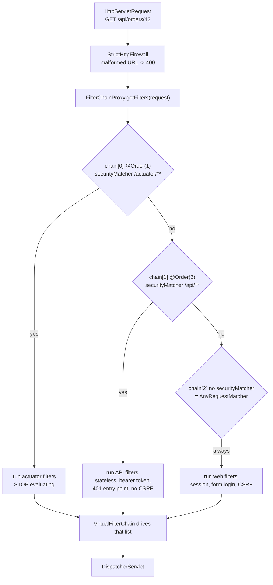

# 5.1 — The `SecurityFilterChain` Bean & Multiple Chains

> **Module 5 · Topic 1** · Modern Configuration
> Baseline: Spring Security 6.x on Boot 3.x
> New to this? Read **In Plain English** below first, then come back to the Version Matrix.

---

## Version Matrix

| Concern | Spring Security 5.x | **Spring Security 6.x (baseline)** | Spring Security 7.x |
|---|---|---|---|
| Configuration entry point | `WebSecurityConfigurerAdapter` (deprecated 5.7) **or** a `SecurityFilterChain` bean | **`SecurityFilterChain` bean only — the adapter was removed in 6.0** | `SecurityFilterChain` bean only |
| `@EnableWebSecurity` | required on your adapter subclass | **applied automatically by Boot's `WebSecurityEnablerConfiguration`; write it only outside Boot or for `debug = true`** | same |
| Scoping a chain to a URL subset | `http.requestMatchers()` / `http.antMatcher()` | **`http.securityMatcher(...)`** | `securityMatcher(...)` backed by `PathPatternRequestMatcher` |
| Matcher produced from a `String` | `AntPathRequestMatcher`, or `MvcRequestMatcher` with MVC present | **`MvcRequestMatcher` when a `HandlerMappingIntrospector` bean exists, else `AntPathRequestMatcher`** | `PathPatternRequestMatcher`; the other two are removed |
| Exposing `AuthenticationManager` | override `authenticationManagerBean()` | **`AuthenticationConfiguration.getAuthenticationManager()`, or publish a `ProviderManager` bean** | same |
| Catch-all chain declared before a specific one | silently unreachable | **startup failure since 6.2 when the `anyRequest` chain is not last** | startup failure |
| `WebSecurityCustomizer` + `web.ignoring()` | available, silent | **available, logs a warning recommending `permitAll`** | available, discouraged |
| Chain used when you declare none | adapter defaults | **Boot's `defaultSecurityFilterChain` at `SecurityProperties.BASIC_AUTH_ORDER`** | same |
| Ordering | `@Order` on the adapter class | **`@Order` on the `@Bean` method** | same |

---

## Why This Exists

Until 5.7 the canonical configuration was `class SecurityConfig extends WebSecurityConfigurerAdapter`.
It was deprecated in 5.7 and deleted in 6.0, and the reasons are worth knowing exactly, because
interviewers use this question to find out whether you understand composition versus inheritance.

**Java has one superclass, and the adapter spent it.** Your configuration class could not also
extend a shared internal base class.

**Multiple chains required multiple classes.** Securing `/api/**` differently from `/**` meant two
static nested classes, each extending the adapter, each annotated `@Order`. Nothing in the code
said "these are alternatives in a first-match-wins list".

**It mixed three unrelated concerns behind overridable methods.** `configure(HttpSecurity)` builds
one filter chain, `configure(AuthenticationManagerBuilder)` builds application-wide authentication,
and `configure(WebSecurity)` configures the servlet-level `FilterChainProxy`. Different scopes,
different lifetimes, one class shape implying they belonged together.

**Overriding hid intent.** `super.configure(http)` applied the framework defaults; omitting it
removed them. Whether you were extending or replacing depended on a `super` call in a method body.

**Internal state made `AuthenticationManager` unreachable.** The adapter cached a local
`AuthenticationManagerBuilder` that was never published as a bean, which is the entire reason the
`authenticationManagerBean()` override existed.

The replacement is component-based: **you publish beans and the framework consumes them.** A
`SecurityFilterChain` is a plain object you can create in a method, in a loop, conditionally on a
profile, or in a library another team imports.

---

## In Plain English

**The one-line version:** You write down your security rules as an ordinary Java object, Spring keeps a
list of those objects, and for each incoming web request it picks the first one in the list that says
"this request is mine" and applies only that one.

**An analogy.** Picture the entrance to a large conference centre with several doors, each with its own
security desk. One door is the staff entrance, one is the loading bay for delivery drivers, and one is
the main public entrance. Each desk has its own written procedure: the staff desk checks badges, the
loading bay checks a delivery docket, the main entrance signs people in at a visitor book.

The important part is how a person is routed. A single greeter stands at the kerb with a numbered list
of the desks. He walks down that list in order, asks each desk "is this person yours?", and sends the
person to the **first** desk that says yes. He does not compare the desks to find the best fit, and he
never sends anyone to two desks. If the loading bay desk is at the top of the list and its rule is
"anyone carrying anything", then a staff member holding a laptop bag goes to the loading bay and the
staff badge check never happens. And if no desk claims the person at all, the greeter simply lets them
walk in unchecked, because his job is only routing, not refusing.

That greeter is `FilterChainProxy`. Each desk with its own written procedure is a `SecurityFilterChain`.
The numbered list is what you control with `@Order`.

**How it actually works, step by step.**

A request arrives, for example a browser asking for `GET /api/orders/42`. Before anything else, Spring
Security runs the URL through a safety check called the firewall, which rejects deliberately malformed
addresses such as ones containing encoded `../` sequences used to escape out of a folder. A rejected
request gets an HTTP 400 response and goes no further.

The request then reaches `FilterChainProxy`. This is a single servlet filter (a piece of code the
servlet container runs before your controller) that Spring registers once for the whole application. It
holds a list of chains and asks each one, in list order, whether it matches. The first chain that
answers yes wins, and the rest are never consulted.

A chain is a very small thing. It is one matcher (a rule for "which URLs are mine", such as everything
starting with `/api/`) plus one ordered list of filters (the individual checks, such as "read the login
from the session", "verify the CSRF token", "decide whether this user is allowed"). Those two things
together are the whole `SecurityFilterChain` interface. The standard implementation that Spring builds
for you is called `DefaultSecurityFilterChain`.

You never construct that object by hand. Instead you write a method annotated `@Bean` that returns a
`SecurityFilterChain`, and Spring hands you a builder object called `HttpSecurity`. You call readable
methods on the builder, such as "these URLs are public, these need the `ADMIN` role, log in with a
form", and then call `http.build()`, which turns your instructions into the matcher-plus-filters pair.
The builder can only be built once, which is why Spring gives every one of your methods a brand-new
builder rather than sharing one.

If you declare more than one chain, you order them with `@Order(1)`, `@Order(2)`, and so on, where the
lower number runs first. You must put the narrowest rule first and the catch-all last, because the
first match wins. Exactly one chain is allowed to have no URL restriction at all, and since Spring
Security 6.2 the application refuses to start if that catch-all chain is not the last one. The subtler
trap, which nothing warns you about, is two chains whose URL patterns overlap, for example `/api/**`
first and `/api/admin/**` second: the second chain is then dead code that never runs.

Older tutorials show a completely different style, a class that extends `WebSecurityConfigurerAdapter`.
That class was deleted in Spring Security 6.0, so that code no longer compiles. The sections below
explain exactly why it was removed and how to translate it.

**Why should a beginner care?** The single most dangerous fact here is that when no chain matches a
request, the request is not blocked, it sails straight through to your controller with no login check
at all. If you get the ordering wrong, your admin endpoints can end up protected by the wrong rules, or
by none, and your application still starts cleanly and all your happy-path tests still pass. Equally
common is the opposite surprise: the first time you write your own chain, the login page you were
getting for free disappears, every page returns "denied", and it looks like the framework broke when in
fact you replaced its defaults.

**Words you will meet in this file**

| Term | In plain words |
|---|---|
| Filter | A small piece of code the server runs on a request before your controller sees it. Security is built almost entirely out of these. |
| `SecurityFilterChain` | One complete set of security rules: which URLs it covers, and the ordered list of checks to run on them. |
| `DefaultSecurityFilterChain` | The ordinary implementation of the above that Spring builds for you. Nothing more than a URL matcher plus a list of filters. |
| `FilterChainProxy` | The single traffic director that holds all your chains and picks the first one matching the request. |
| `HttpSecurity` | The builder object you configure in your `@Bean` method. You describe your rules on it, then call `build()` to produce a chain. |
| `@Bean` | A plain Spring annotation meaning "call this method once at startup and keep the returned object for the application to use". |
| `@Order(n)` | Sets a chain's position in the list. Lower numbers are checked first. Leave it off and the chain goes last. |
| `securityMatcher` | Answers "does this whole chain handle this URL at all?" It is checked before any filter runs. |
| `requestMatchers` | Answers "inside this chain, is this caller allowed to reach this URL?" It is checked near the end of the chain. |
| `RequestMatcher` | The generic idea of a yes-or-no rule about a request, usually a URL pattern such as `/admin/**`. |
| `AnyRequestMatcher` | The matcher that says yes to everything. A chain with no `securityMatcher` uses this, which is why it must be last. |
| `@EnableWebSecurity` | Switches on Spring Security's configuration machinery. Spring Boot applies it for you, so you rarely write it. |
| `AuthenticationManager` | The object that takes a username and password (or a token) and decides whether the credentials are genuine. |
| `ProviderManager` | The usual `AuthenticationManager`, which simply tries each configured way of checking credentials in turn. |
| `WebSecurityConfigurerAdapter` | The old pre-6.0 way of configuring security by extending a class. Removed from the framework; only relevant when reading old code. |
| `web.ignoring()` | Declares a URL pattern with zero filters, so those URLs skip security entirely. Almost always the wrong tool; use `permitAll()` instead. |
| `permitAll()` | Allows everyone through a rule, but the request still runs the full chain and still gets security headers. |

**If you remember only one thing:** the first chain whose URL pattern matches is the only chain that
runs, and a request matching no chain is not denied, it is simply unprotected.

---

## Core Concepts

### 1. `SecurityFilterChain` — the interface everything rests on

**In simple terms:** A chain is only two things put together, a rule saying which URLs it covers and an
ordered list of checks to run on them. Everything else in this file is machinery for producing that pair.

```java
package org.springframework.security.web;

public interface SecurityFilterChain {

    /** Does this chain handle the given request? */
    boolean matches(HttpServletRequest request);

    /** The ordered filters to run when it does. */
    List<Filter> getFilters();
}
```

Two methods; that is the whole contract. `FilterChainProxy` holds a `List<SecurityFilterChain>` and
takes **the first chain whose `matches` returns `true`**. Every rule about `@Order` and
`securityMatcher` serves that one sentence.

```java
package org.springframework.security.web;

public final class DefaultSecurityFilterChain implements SecurityFilterChain {

    private final RequestMatcher requestMatcher;
    private final List<Filter> filters;

    public RequestMatcher getRequestMatcher() { return this.requestMatcher; }

    @Override public List<Filter> getFilters() { return this.filters; }

    @Override public boolean matches(HttpServletRequest request) {
        return this.requestMatcher.matches(request);
    }
}
```

A chain is therefore just a pair: one `RequestMatcher`, one ordered `List<Filter>`.

### 2. `HttpSecurity` is a builder, and `build()` is terminal

**In simple terms:** `HttpSecurity` is the object you describe your rules on, and calling `build()`
finishes the job once and for all, which is why every configuration method is handed its own fresh copy.

```java
public final class HttpSecurity
        extends AbstractConfiguredSecurityBuilder<DefaultSecurityFilterChain, HttpSecurity>
        implements SecurityBuilder<DefaultSecurityFilterChain>, HttpSecurityBuilder<HttpSecurity> {

    private final List<OrderedFilter> filters = new ArrayList<>();
    private RequestMatcher requestMatcher = AnyRequestMatcher.INSTANCE;
    private FilterOrderRegistration filterOrders = new FilterOrderRegistration();

    @Override
    protected DefaultSecurityFilterChain performBuild() {
        this.filters.sort(OrderComparator.INSTANCE);
        List<Filter> sorted = new ArrayList<>(this.filters.size());
        for (Filter f : this.filters) {
            sorted.add(((OrderedFilter) f).getFilter());
        }
        return new DefaultSecurityFilterChain(this.requestMatcher, sorted);
    }
}
```

Three facts fall straight out of that, and each is an interview answer:

- The default matcher is `AnyRequestMatcher.INSTANCE`, so a chain with no `securityMatcher`
  matches everything.
- `build()` sorts filters by a **numeric order**, not by the order you called the DSL methods.
- `build()` can be called exactly once. `AbstractSecurityBuilder.build()` guards with an
  `AtomicBoolean` and throws `AlreadyBuiltException` on a second call, which is why the
  `HttpSecurity` bean is **prototype-scoped** — each `SecurityFilterChain` method gets a fresh
  builder.

### 3. The migration, side by side

**In simple terms:** This shows the same security configuration written the old way and the new way, so
that when you meet the old style in a tutorial or an existing project you can translate it line by line.

**Before — 5.x adapter:**

```java
@Configuration
@EnableWebSecurity
public class LegacySecurityConfig extends WebSecurityConfigurerAdapter {

    private final UserDetailsService userDetailsService;

    @Override                                    // Concern 1: how users authenticate
    protected void configure(AuthenticationManagerBuilder auth) throws Exception {
        auth.userDetailsService(this.userDetailsService).passwordEncoder(passwordEncoder());
    }

    @Override                                    // Concern 2: the HTTP filter chain
    protected void configure(HttpSecurity http) throws Exception {
        http
            .authorizeRequests()                            // removed in 7.x
                .antMatchers("/", "/public/**").permitAll() // removed in 7.x
                .antMatchers("/admin/**").hasRole("ADMIN")
                .anyRequest().authenticated()
                .and()                                     // removed in 7.x
            .formLogin().loginPage("/login").permitAll()
                .and()
            .logout().logoutSuccessUrl("/");
    }

    @Override                                    // Concern 3: the servlet-level wrapper
    public void configure(WebSecurity web) {
        web.ignoring().antMatchers("/css/**", "/js/**");
    }

    @Override @Bean   // ceremony that existed only because of the adapter's internal caching
    public AuthenticationManager authenticationManagerBean() throws Exception {
        return super.authenticationManagerBean();
    }
}
```

**After — 6.x beans:**

```java
package com.example.security;

import org.springframework.context.annotation.Bean;
import org.springframework.context.annotation.Configuration;
import org.springframework.security.authentication.AuthenticationManager;
import org.springframework.security.authentication.ProviderManager;
import org.springframework.security.authentication.dao.DaoAuthenticationProvider;
import org.springframework.security.config.annotation.web.builders.HttpSecurity;
import org.springframework.security.config.annotation.web.configuration.EnableWebSecurity;
import org.springframework.security.core.userdetails.UserDetailsService;
import org.springframework.security.crypto.bcrypt.BCryptPasswordEncoder;
import org.springframework.security.crypto.password.PasswordEncoder;
import org.springframework.security.web.SecurityFilterChain;

@Configuration
@EnableWebSecurity
public class SecurityConfig {

    @Bean
    SecurityFilterChain appSecurity(HttpSecurity http) throws Exception {
        http
            .authorizeHttpRequests(auth -> auth
                .requestMatchers("/", "/public/**").permitAll()
                .requestMatchers("/css/**", "/js/**").permitAll()   // was web.ignoring()
                .requestMatchers("/admin/**").hasRole("ADMIN")
                .anyRequest().authenticated()
            )
            .formLogin(form -> form.loginPage("/login").permitAll())
            .logout(logout -> logout.logoutSuccessUrl("/"));
        return http.build();
    }

    // A plain bean. HttpSecurity picks up a UNIQUE AuthenticationManager bean automatically.
    @Bean
    AuthenticationManager authenticationManager(UserDetailsService uds, PasswordEncoder encoder) {
        DaoAuthenticationProvider provider = new DaoAuthenticationProvider();
        provider.setUserDetailsService(uds);
        provider.setPasswordEncoder(encoder);
        return new ProviderManager(provider);
    }

    @Bean
    PasswordEncoder passwordEncoder() {
        return new BCryptPasswordEncoder();
    }
}
```

### 4. Multiple chains — the five rules

**In simple terms:** When you have several sets of rules, only the first one that matches the URL is
used, so putting them in the wrong order can leave part of your application guarded by the wrong rules.

**Rule 1 — first match wins, and only that chain runs.** Chains do not accumulate. If the API chain
matched, the web chain's `formLogin` does not exist for that request.

**Rule 2 — most specific matcher first.** This is the opposite of `@RequestMapping`, where Spring
MVC picks the *best* match regardless of declaration order. Spring Security picks the *first*.

**Rule 3 — exactly one chain may omit `securityMatcher`, and it must be last.** Since 6.2 the
framework fails at startup rather than letting you ship it:

```
java.lang.IllegalArgumentException: A filter chain that matches any request must be the last.
Ordered filter chains: [DefaultSecurityFilterChain [RequestMatcher=any request, Filters=[...]],
                        DefaultSecurityFilterChain [RequestMatcher=Ant [pattern='/api/**'], ...]]
```

**Rule 4 — an unreachable chain is a silent bug when both chains have matchers.** The 6.2 check
only catches `AnyRequestMatcher`. Declare `securityMatcher("/api/**")` at `@Order(1)` and
`securityMatcher("/api/admin/**")` at `@Order(2)` and the admin chain never runs. Nothing warns
you, and the admin endpoints are secured by the wrong chain with the wrong entry point.

**Rule 5 — `@Order` goes on the `@Bean` method, and absent `@Order` means last.** Spring sorts the
injected `List<SecurityFilterChain>` with `AnnotationAwareOrderComparator`; a bean with no `@Order`
is `Ordered.LOWEST_PRECEDENCE`. Two beans with the same order have an **undefined** relative order
that depends on bean registration order, which depends on classpath scanning. It will work in CI
and fail in production for reasons unrelated to the change that "caused" it.

### 5. Chain selection, drawn

**In simple terms:** The diagram traces one real request through the routing decision, showing each
chain being asked "is this yours?" until one says yes and everything after it is skipped.



### 6. `securityMatcher` versus `requestMatchers`

**In simple terms:** These two look alike but answer different questions, one picks which set of rules
applies to a URL and the other decides whether this particular caller is allowed through it.

| | `http.securityMatcher(...)` | `.authorizeHttpRequests(a -> a.requestMatchers(...))` |
|---|---|---|
| Question answered | "Does this **chain** handle the request at all?" | "Given this chain is handling it, is the caller **allowed**?" |
| Evaluated by | `FilterChainProxy`, before any filter runs | `AuthorizationFilter`, near the end of the chain |
| Scope | the whole chain — filters, headers, CSRF, entry point | one authorization rule |
| Non-match means | try the next chain | try the next rule |
| Repetition | repeated calls **replace**, they do not accumulate | as many rules as you like, top to bottom |

The two "no match" cases have **opposite defaults**, which is confusing until you see why. No chain
matches means *no security at all* (chain selection asks "is this mine?"). No rule matches means
*denied* (rule evaluation asks "is this allowed?").

### 7. `@EnableWebSecurity` — when you still need it

**In simple terms:** This annotation switches on all the behind-the-scenes wiring that turns your chain
beans into real security, and Spring Boot already applies it for you in almost every project.

```java
@Retention(RUNTIME) @Target(TYPE) @Documented
@Import({ WebSecurityConfiguration.class,
          SpringWebMvcImportSelector.class,
          OAuth2ImportSelector.class,
          HttpSecurityConfiguration.class })
@EnableGlobalAuthentication
public @interface EnableWebSecurity {
    boolean debug() default false;
}
```

- **`WebSecurityConfiguration`** collects every `SecurityFilterChain` and `WebSecurityCustomizer`
  bean and publishes the `FilterChainProxy` under the name `springSecurityFilterChain`.
- **`HttpSecurityConfiguration`** publishes the prototype `HttpSecurity` bean, pre-loaded with
  framework defaults, that your `@Bean` method receives.
- **`SpringWebMvcImportSelector`** registers `AuthenticationPrincipalArgumentResolver`,
  `CsrfTokenArgumentResolver`, and the `HandlerMappingIntrospector`-backed matcher builder.
- **`@EnableGlobalAuthentication`** imports `AuthenticationConfiguration`.

Boot applies the annotation for you through `SpringBootWebSecurityConfiguration`, whose nested
`WebSecurityEnablerConfiguration` is annotated `@EnableWebSecurity` and conditional on there being
no `springSecurityFilterChain` bean already. You write it explicitly for a non-Boot application, for
a test slice that excludes security auto-configuration, or to get
`@EnableWebSecurity(debug = true)` — which wraps `FilterChainProxy` in a `DebugFilter` that logs the
selected chain and its full filter list on every request. Debug mode logs request detail at `INFO`
and is documented as unsafe for production.

### 8. `WebSecurityCustomizer` and `web.ignoring()` — what it really removes

**In simple terms:** Telling Spring to "ignore" some URLs does not merely skip the login check, it
switches off every protection for those URLs, including any access rules you write for them elsewhere.

```java
@Bean
WebSecurityCustomizer ignoreStaticAssets() {
    return web -> web.ignoring().requestMatchers("/css/**", "/js/**");
}
```

```java
// WebSecurity.performBuild — simplified
for (RequestMatcher ignoredRequest : this.ignoredRequests) {
    // A chain with a matcher and ZERO filters, inserted FIRST.
    securityFilterChains.add(new DefaultSecurityFilterChain(ignoredRequest));
}
for (SecurityBuilder<? extends SecurityFilterChain> builder : this.securityFilterChainBuilders) {
    securityFilterChains.add(builder.build());
}
```

`FilterChainProxy` treats an empty filter list as "pass straight through to the application":

| Removed | Consequence |
|---|---|
| `HeaderWriterFilter` | no `nosniff`, no `X-Frame-Options`, no HSTS, no cache-control on those responses |
| `CsrfFilter` | no CSRF protection under that pattern, ever |
| `SecurityContextHolderFilter` | no `SecurityContext`; `@AuthenticationPrincipal` is `null` |
| `AuthorizationFilter` | authorization rules for that path are **never evaluated** |
| `ExceptionTranslationFilter` | downstream security exceptions are not translated to 401/403 |
| `CorsFilter` | no CORS headers |

Spring Security 6 logs a warning when you use it, recommending `permitAll` instead. The real danger
is drift: someone later adds `/images/upload` under an ignored `/images/**`, writes
`.requestMatchers("/images/upload").hasRole("ADMIN")` in the main chain, and that rule is never
evaluated because the request never reaches the chain containing it. The configuration reads as
secured. It is not.

### 9. `AuthenticationManager` in 6.x

**In simple terms:** This is the object that actually decides whether a submitted username and password
are genuine, and you need exactly one of it visible to Spring or your login checks are quietly skipped.

```java
// (a) expose the globally-configured one
@Bean
AuthenticationManager authenticationManager(AuthenticationConfiguration config) throws Exception {
    return config.getAuthenticationManager();
}

// (b) build your own and publish it
@Bean
AuthenticationManager authenticationManager(UserDetailsService uds, PasswordEncoder encoder) {
    DaoAuthenticationProvider dao = new DaoAuthenticationProvider();
    dao.setUserDetailsService(uds);
    dao.setPasswordEncoder(encoder);
    return new ProviderManager(List.of(dao, new OtpAuthenticationProvider()));
}

// (c) scope one to a single chain
http.authenticationManager(new ProviderManager(jwtProvider));
```

How `HttpSecurity` finds it:

```java
// HttpSecurity.beforeConfigure — simplified
if (this.authenticationManager != null) {
    setSharedObject(AuthenticationManager.class, this.authenticationManager);
}
else {
    ApplicationContext context = getSharedObject(ApplicationContext.class);
    AuthenticationManager manager = context.getBeanProvider(AuthenticationManager.class).getIfUnique();
    setSharedObject(AuthenticationManager.class,
            (manager != null) ? manager : getAuthenticationRegistry().build());
}
```

Note `getIfUnique()`. Publish **two** `AuthenticationManager` beans and neither is used — the chain
silently builds its own, your providers are never consulted, and every login fails with
`BadCredentialsException` for reasons that appear to make no sense.

---

## Working Code

Three chains: Actuator, a stateless JSON API, and a session-based UI.

```java
package com.example.security;

import org.springframework.boot.actuate.autoconfigure.security.servlet.EndpointRequest;
import org.springframework.context.annotation.Bean;
import org.springframework.context.annotation.Configuration;
import org.springframework.core.annotation.Order;
import org.springframework.http.HttpStatus;
import org.springframework.security.config.Customizer;
import org.springframework.security.config.annotation.web.builders.HttpSecurity;
import org.springframework.security.config.annotation.web.configuration.EnableWebSecurity;
import org.springframework.security.config.http.SessionCreationPolicy;
import org.springframework.security.web.SecurityFilterChain;
import org.springframework.security.web.authentication.HttpStatusEntryPoint;
import org.springframework.security.web.context.NullSecurityContextRepository;
import org.springframework.security.web.savedrequest.NullRequestCache;

@Configuration
@EnableWebSecurity
public class MultiChainSecurityConfig {

    /**
     * Chain 1 - Actuator. Narrowest matcher, therefore first.
     * EndpointRequest resolves the real management base path, so this survives
     * someone changing management.endpoints.web.base-path.
     */
    @Bean
    @Order(1)
    SecurityFilterChain actuatorChain(HttpSecurity http) throws Exception {
        http
            .securityMatcher(EndpointRequest.toAnyEndpoint())
            .authorizeHttpRequests(auth -> auth
                .requestMatchers(EndpointRequest.to("health", "info")).permitAll()
                .anyRequest().hasRole("OPS")
            )
            .httpBasic(Customizer.withDefaults())
            .csrf(csrf -> csrf.disable())
            .sessionManagement(s -> s.sessionCreationPolicy(SessionCreationPolicy.STATELESS));
        return http.build();
    }

    /** Chain 2 - stateless JSON API: bearer tokens, no session, no CSRF, 401 entry point. */
    @Bean
    @Order(2)
    SecurityFilterChain apiChain(HttpSecurity http) throws Exception {
        http
            .securityMatcher("/api/**")
            .authorizeHttpRequests(auth -> auth
                .requestMatchers("/api/public/**").permitAll()
                .requestMatchers("/api/admin/**").hasRole("ADMIN")
                .anyRequest().authenticated()
            )
            // Nothing survives the request: no session, no saved request, no persisted context.
            .sessionManagement(s -> s.sessionCreationPolicy(SessionCreationPolicy.STATELESS))
            .securityContext(ctx -> ctx.securityContextRepository(new NullSecurityContextRepository()))
            .requestCache(cache -> cache.requestCache(new NullRequestCache()))
            // Safe HERE and only here: the credential is an Authorization header,
            // which a browser never attaches automatically.
            .csrf(csrf -> csrf.disable())
            .oauth2ResourceServer(oauth2 -> oauth2.jwt(Customizer.withDefaults()))
            .exceptionHandling(ex -> ex
                .authenticationEntryPoint(new HttpStatusEntryPoint(HttpStatus.UNAUTHORIZED)));
        return http.build();
    }

    /** Chain 3 - browser UI. No securityMatcher, so it must be last. */
    @Bean
    @Order(3)
    SecurityFilterChain webChain(HttpSecurity http) throws Exception {
        http
            .authorizeHttpRequests(auth -> auth
                .requestMatchers("/", "/login", "/error", "/css/**", "/js/**").permitAll()
                .requestMatchers("/admin/**").hasRole("ADMIN")
                .anyRequest().authenticated()
            )
            .formLogin(form -> form
                .loginPage("/login")
                .defaultSuccessUrl("/dashboard", false)
                .permitAll()
            )
            .logout(logout -> logout
                .logoutSuccessUrl("/?loggedOut")
                .deleteCookies("JSESSIONID")
            )
            .sessionManagement(session -> session
                .sessionCreationPolicy(SessionCreationPolicy.IF_REQUIRED)
                .sessionFixation(fixation -> fixation.changeSessionId())
            );
        // csrf() is already on by default - do NOT disable it on this chain.
        return http.build();
    }
}
```

Tests that pin the chain boundaries. These catch ordering mistakes because each asserts a behaviour
**unique to one chain**, not merely "denied":

```java
package com.example.security;

import org.junit.jupiter.api.Test;
import org.springframework.beans.factory.annotation.Autowired;
import org.springframework.boot.test.autoconfigure.web.servlet.AutoConfigureMockMvc;
import org.springframework.boot.test.context.SpringBootTest;
import org.springframework.mock.web.MockHttpServletRequest;
import org.springframework.security.test.context.support.WithMockUser;
import org.springframework.security.web.FilterChainProxy;
import org.springframework.security.web.SecurityFilterChain;
import org.springframework.test.web.servlet.MockMvc;

import java.util.List;

import static org.assertj.core.api.Assertions.assertThat;
import static org.springframework.security.test.web.servlet.request.SecurityMockMvcRequestPostProcessors.csrf;
import static org.springframework.test.web.servlet.request.MockMvcRequestBuilders.get;
import static org.springframework.test.web.servlet.request.MockMvcRequestBuilders.post;
import static org.springframework.test.web.servlet.result.MockMvcResultMatchers.header;
import static org.springframework.test.web.servlet.result.MockMvcResultMatchers.status;

@SpringBootTest
@AutoConfigureMockMvc
class MultiChainSecurityConfigTests {

    @Autowired MockMvc mvc;
    @Autowired FilterChainProxy filterChainProxy;

    @Test
    void theLastChainIsTheCatchAll() {
        List<SecurityFilterChain> chains = this.filterChainProxy.getFilterChains();
        assertThat(chains).hasSize(3);
        assertThat(chains.get(2).matches(new MockHttpServletRequest("GET", "/anything"))).isTrue();
    }

    @Test
    void apiChainReturns401ButWebChainRedirects() throws Exception {
        mvc.perform(get("/api/orders")).andExpect(status().isUnauthorized());
        mvc.perform(get("/dashboard"))
           .andExpect(status().is3xxRedirection())
           .andExpect(header().string("Location", "http://localhost/login"));
    }

    @Test
    @WithMockUser
    void apiPostSucceedsWithoutACsrfTokenButWebPostDoesNot() throws Exception {
        // Proves each request really was handled by the chain we think it was.
        mvc.perform(post("/api/orders").contentType("application/json").content("{}"))
           .andExpect(status().isCreated());
        mvc.perform(post("/profile").param("name", "x")).andExpect(status().isForbidden());
        mvc.perform(post("/profile").param("name", "x").with(csrf()))
           .andExpect(status().is3xxRedirection());
    }

    @Test
    void actuatorHealthIsPublicButMetricsIsNot() throws Exception {
        mvc.perform(get("/actuator/health")).andExpect(status().isOk());
        mvc.perform(get("/actuator/metrics")).andExpect(status().isUnauthorized());
    }

    @Test
    @WithMockUser(roles = "USER")
    void authenticatedButWrongRoleGets403NotAChallenge() throws Exception {
        mvc.perform(get("/api/admin/orders")).andExpect(status().isForbidden());
    }
}
```

---

## Internals

The path from your `@Bean` method to the servlet container: `WebSecurityConfiguration` injects the
`@Order`-sorted `List<SecurityFilterChain>` and every `WebSecurityCustomizer`, feeds them into a
`WebSecurity`, and `WebSecurity.performBuild()` emits the `FilterChainProxy` bean named
`springSecurityFilterChain`. Boot's `SecurityFilterAutoConfiguration` then registers that bean with
the container behind a `DelegatingFilterProxyRegistrationBean` at order `-100`.

### `WebSecurityConfiguration` — how your beans are collected

```java
@Configuration(proxyBeanMethods = false)
public class WebSecurityConfiguration implements ImportAware, BeanClassLoaderAware {

    // Spring injects this list ALREADY SORTED by AnnotationAwareOrderComparator.
    // That is where @Order on your @Bean method takes effect - plain Spring,
    // not Spring Security code.
    @Autowired(required = false)
    void setFilterChains(List<SecurityFilterChain> securityFilterChains) {
        this.securityFilterChains = securityFilterChains;
    }

    @Bean(name = AbstractSecurityWebApplicationInitializer.DEFAULT_FILTER_NAME)
    public Filter springSecurityFilterChain() throws Exception {
        for (SecurityFilterChain chain : this.securityFilterChains) {
            this.webSecurity.addSecurityFilterChainBuilder(() -> chain);
        }
        for (WebSecurityCustomizer customizer : this.webSecurityCustomizers) {
            customizer.customize(this.webSecurity);
        }
        return this.webSecurity.build();
    }
}
```

### The defaults already applied before you see `HttpSecurity`

```java
// HttpSecurityConfiguration
@Bean(HTTPSECURITY_BEAN_NAME)
@Scope("prototype")
HttpSecurity httpSecurity() throws Exception {
    HttpSecurity http = new HttpSecurity(this.objectPostProcessor, authenticationBuilder, createSharedObjects());
    http
        .csrf(Customizer.withDefaults())
        .addFilter(new WebAsyncManagerIntegrationFilter())
        .exceptionHandling(Customizer.withDefaults())
        .headers(Customizer.withDefaults())
        .sessionManagement(Customizer.withDefaults())
        .securityContext(Customizer.withDefaults())
        .requestCache(Customizer.withDefaults())
        .anonymous(Customizer.withDefaults())
        .servletApi(Customizer.withDefaults())
        .apply(new DefaultLoginPageConfigurer<>());
    http.logout(Customizer.withDefaults());
    return http;
}
```

Notably **absent**: `formLogin` and `httpBasic`. Those come only from Boot's default chain, which
disappears the moment you declare a `SecurityFilterChain` bean — which is why a first custom chain
so often produces "everything is denied and there is no login page".

### `FilterChainProxy.getFilters` — first match, no accumulation

```java
private List<Filter> getFilters(HttpServletRequest request) {
    for (SecurityFilterChain chain : this.filterChains) {
        if (chain.matches(request)) {
            return chain.getFilters();      // returns immediately
        }
    }
    return null;
}
```

```java
List<Filter> filters = getFilters(firewallRequest);
if (filters == null || filters.isEmpty()) {
    firewallRequest.reset();
    chain.doFilter(firewallRequest, firewallResponse);   // straight to the application
    return;
}
```

No scoring, no specificity comparison, no merging. Declaration order is the entire policy, and an
unmatched request gets **no security at all**.

### The 6.2 startup guard

```java
// WebSecurity.performBuild
for (int i = 0; i < securityFilterChains.size(); i++) {
    SecurityFilterChain chain = securityFilterChains.get(i);
    if (chain instanceof DefaultSecurityFilterChain defaultChain
            && defaultChain.getRequestMatcher() instanceof AnyRequestMatcher
            && i < securityFilterChains.size() - 1) {
        throw new IllegalArgumentException(
            "A filter chain that matches any request must be the last. "
            + "Ordered filter chains: " + securityFilterChains);
    }
}
```

It fires only for `AnyRequestMatcher`; overlapping `securityMatcher` patterns remain undetected.

---

## Configuration Reference

| Option / API | Effect | Default |
|---|---|---|
| `@Bean SecurityFilterChain` | Declares one chain; the return value of `http.build()` | none — Boot supplies one if you declare zero |
| `@Order(n)` on the `@Bean` method | Position in `FilterChainProxy`'s list; lower runs first | `Ordered.LOWEST_PRECEDENCE` |
| `SecurityProperties.BASIC_AUTH_ORDER` | Order of Boot's `defaultSecurityFilterChain` | `Ordered.LOWEST_PRECEDENCE - 5` |
| `http.securityMatcher(String...)` | Restricts the **whole chain** to those paths | `AnyRequestMatcher.INSTANCE` |
| `http.securityMatcher(RequestMatcher...)` | Same, with an explicit matcher (e.g. `EndpointRequest`) | — |
| `http.build()` | Produces the `DefaultSecurityFilterChain`; callable once | — |
| `http.authenticationManager(am)` | Overrides the manager for this chain only | unique bean, else built locally |
| `@EnableWebSecurity` | Imports `WebSecurityConfiguration` + `HttpSecurityConfiguration` | applied automatically by Boot |
| `@EnableWebSecurity(debug = true)` | Wraps `FilterChainProxy` in `DebugFilter` | `false` |
| `@Bean WebSecurityCustomizer` | Hook into `WebSecurity` (`ignoring`, `debug`, `privilegeEvaluator`) | none |
| `web.ignoring().requestMatchers(...)` | Zero-filter chain inserted **first**; bypasses all security | none |
| `spring.security.filter.order` | Position of `springSecurityFilterChain` in the container chain | `-100` |
| `spring.security.filter.dispatcher-types` | Dispatch types the chain runs on | `ASYNC, ERROR, REQUEST` |
| `AuthenticationConfiguration.getAuthenticationManager()` | Returns the globally-configured manager | — |

---

## Production Concerns & Anti-Patterns

**Declaring the catch-all chain first.** Since 6.2 this fails at startup for an `anyRequest`
matcher, which is a gift. What still slips through is two overlapping `securityMatcher` patterns,
where the later chain is dead code and nothing tells you. Write a test per chain asserting something
unique to that chain — a status code, a CSRF requirement — because a denial proves nothing about
*which* chain denied it.

**Two `@Bean` methods with the same `@Order`.** The relative order then depends on bean registration
order, which depends on classpath scanning, which is not stable across machines. Give every chain a
distinct order. Relatedly, `@Order` on the configuration *class* has no effect on chain ordering —
it must be on the bean method.

**Using `web.ignoring()` for anything that could ever become dynamic.** It removes the path from the
security model permanently and invisibly, and any later authorization rule for that path is never
evaluated. Prefer `permitAll()`, or a dedicated minimal chain that keeps `HeaderWriterFilter`.

**Forgetting that no matching chain means no security.** There is no implicit deny at the chain
level. Always terminate with a catch-all, even if it is only `anyRequest().denyAll()`.

**Disabling CSRF on the chain that serves the browser.** `csrf(csrf -> csrf.disable())` is correct
for a bearer-token API and wrong for anything authenticating with a cookie. Splitting chains exists
so this decision can be made correctly per audience rather than globally.

**Reusing an `HttpSecurity` instance.** It is prototype-scoped because `build()` is single-use. Do
not cache it in a field or pass it between methods.

**Publishing two `AuthenticationManager` beans.** `getIfUnique()` returns `null`, the chain quietly
builds its own, and your providers are never consulted.

**Leaving `/error` outside every `permitAll`.** The `ERROR` dispatch re-enters the chain, and
`AuthorizationFilter` runs on all dispatcher types since 6.0. A denied error page turns every real
failure into a blank 403.

---

## Debugging Playbook

| Symptom | Likely root cause | Fix |
|---|---|---|
| `IllegalArgumentException: A filter chain that matches any request must be the last` | A chain without `securityMatcher` is not last | Give it a matcher, or raise its `@Order` |
| A chain's rules are ignored entirely | An earlier chain matched first | Print `filterChainProxy.getFilterChains()`, or use `@EnableWebSecurity(debug = true)` |
| API returns `302` to `/login` instead of `401` | The request fell through to the UI chain | Verify the API `securityMatcher`; set `HttpStatusEntryPoint(UNAUTHORIZED)` |
| `AlreadyBuiltException` | `build()` called twice, or `HttpSecurity` cached | One `build()` per injected builder |
| Ordering works locally, breaks after deploy | Two chains share the same `@Order` | Assign distinct orders |
| Static assets return 200 with no security headers | Matched by a `web.ignoring()` zero-filter chain | Replace with `permitAll()` or a dedicated chain |
| A `hasRole(...)` rule never denies anything | The path sits inside a `web.ignoring()` pattern | Remove the `ignoring()` entry |
| `@AuthenticationPrincipal` is `null` on some paths | No `SecurityContextHolderFilter` ran — ignored path | Same as above |
| Custom `AuthenticationProvider` never called | Two `AuthenticationManager` beans, so `getIfUnique()` returned `null` | Publish exactly one, or use `http.authenticationManager(...)` |
| Boot's default chain is active despite your own | Your `@Configuration` is not scanned, or excluded by a test slice | `@Import(YourSecurityConfig.class)` in slice tests |
| Request reaches the controller with no security | No chain matched | Add a catch-all chain |

---

## Interview Q&A

### Q1. `WebSecurityConfigurerAdapter` was deprecated in 5.7 and removed in 6.0. Why, specifically?

<details>
<summary>Show answer</summary>

Four structural problems. The Spring team's own deprecation note framed it as "encouraging users to
move towards a component-based security configuration".

**It consumed the single inheritance slot.** Your security configuration could not extend anything
else — not a shared internal base class, not a testing base. Composition has no such limit.

**Multiple chains were awkward.** Two audiences meant two classes, conventionally static nested
classes inside an outer configuration, each extending the adapter and annotated `@Order`. Nothing in
the code communicated that they were alternatives in a first-match-wins list. With beans, two
`@Bean` methods sit side by side and the `@Order` values are adjacent on the page.

**It mixed three unrelated concerns.** The three `configure` overloads built `HttpSecurity` (one
chain), `AuthenticationManagerBuilder` (application-wide authentication), and `WebSecurity` (the
servlet-level `FilterChainProxy`). Different scopes and lifetimes; one class shape implying
otherwise. People routinely configured a shared `AuthenticationManagerBuilder` from inside one of
several chain classes and were surprised by the result.

**Overriding hid intent.** `super.configure(http)` applied the framework defaults; omitting it
removed them. Whether your method extended or replaced behaviour depended on a `super` call buried
in a body — exactly the kind of thing that does not survive a refactor.

**Counter-question: why did `authenticationManagerBean()` exist, and what replaced it?**

It existed to work around the adapter's own internal state. The adapter held a *local*
`AuthenticationManagerBuilder`, used only if you had overridden
`configure(AuthenticationManagerBuilder)`. The resulting `AuthenticationManager` was local to that
adapter and **not** published as a bean, so it could not be injected anywhere else.
`authenticationManagerBean()` was a documented override whose sole purpose was to expose it.

In 6.x the hidden state is gone, so the workaround is gone. You inject `AuthenticationConfiguration`
and call `getAuthenticationManager()`, or — better — construct and publish a `ProviderManager`
yourself, which is then an ordinary bean you can inject and unit test. `HttpSecurity` picks up a
unique `AuthenticationManager` bean automatically.

**Counter-question: you are migrating an application with eight adapter subclasses. What order do you do the work in, and what do you expect to break?**

Mechanical translation first, improvement second, because mixing the two makes the diff
unreviewable. Each `configure(HttpSecurity)` becomes a `@Bean SecurityFilterChain` ending in
`return http.build()`; class-level `@Order` moves onto the method; `configure(WebSecurity)` becomes
a `WebSecurityCustomizer`; `configure(AuthenticationManagerBuilder)` becomes explicit
`AuthenticationProvider` beans. Then the renames the compiler finds for me: `authorizeRequests` to
`authorizeHttpRequests`, `antMatchers` to `requestMatchers`, `javax` to `jakarta`.

What I expect to break, in the order I expect to hit it:

*Authorization semantics.* `authorizeRequests` used `AccessDecisionManager` with voters and an
"abstain" outcome; `authorizeHttpRequests` uses `AuthorizationManager` and denies by default. Rules
that were accidentally passing because of an abstaining voter now fail.

*Context persistence.* 5.x had `SecurityContextPersistenceFilter`, which saved the context
automatically at the end of the request. 6.x has `SecurityContextHolderFilter`, which does **not**
save. Any code that logged a user in by calling `SecurityContextHolder.setContext(...)` directly —
typically a controller — silently stops persisting the login. This is the most common
post-migration bug and it presents as "login succeeds, next request is anonymous".

*Error dispatch authorization.* 6.x evaluates authorization on `ERROR` dispatches, so applications
that never permitted `/error` start returning blank 403s in place of real errors.

Only once all of that is green would I consolidate eight chains into the three they should have
been.

**Counter-question: is there any case where the adapter model was genuinely better?**

One, and it is honest to concede it: the adapter gave you a single obvious place to look. Bean-based
configuration can be scattered across several `@Configuration` classes in several packages, with no
compile-time signal tying them together. The mitigation is convention rather than framework — keep
all `SecurityFilterChain` beans in one package, name them after their audience, and add a test
asserting the expected chain count, so "how many chains does this application have?" becomes
something the build answers.
</details>

### Q2. Explain exactly how `FilterChainProxy` chooses a chain, and what happens if none matches.

<details>
<summary>Show answer</summary>

`FilterChainProxy` holds an ordered `List<SecurityFilterChain>`, iterates it calling
`chain.matches(request)`, and returns the filters of the **first** chain that answers `true`. No
specificity scoring, no merging. Declaration order is the entire policy.

If nothing matches, `getFilters` returns `null` and `doFilterInternal` continues the **container's**
filter chain — the request goes straight to `DispatcherServlet` with no authentication, no
authorization, no headers, no CSRF, no `SecurityContext`. **There is no implicit deny.**

This is why a catch-all chain is not optional. If every chain you declare carries a
`securityMatcher`, any URL you did not anticipate is completely unprotected. My habit is to end with
a chain that has no `securityMatcher` and, if the application genuinely serves nothing else,
`anyRequest().denyAll()`.

**Counter-question: this is the same code path as `web.ignoring()`. So is an ignored path identical to an unmatched path?**

Almost. `web.ignoring()` produces a chain with a real matcher and an **empty** filter list, inserted
before all of yours. It *matches*, `getFilters` returns an empty list, and the
`filters == null || filters.isEmpty()` condition sends it down the same pass-through path.

The difference is placement and intent. An ignored path is deliberately first, so it wins over
everything you declare — you cannot "fix" it by adding a rule to a later chain, because the later
chain is never consulted. An unmatched path is an accident. Both end up equally unprotected, which
is the point: `ignoring()` is a deliberate hole and deserves that level of seriousness.

**Counter-question: does anything run before chain selection?**

Yes, and it matters. `FilterChainProxy` wraps the request with an `HttpFirewall` before matching.
The default `StrictHttpFirewall` rejects URL-encoded path traversal, semicolons (path parameters,
historically used to smuggle past matchers), double slashes, backslashes, and non-printable ASCII,
throwing `RequestRejectedException` and producing a 400.

This runs before any chain is chosen, so it applies even to ignored paths. It is also the deeper
reason matcher-based security is safe at all: without normalisation guarantees, `/admin/..;/` style
tricks could make a path match a permissive matcher while the servlet dispatches it elsewhere.

**Counter-question: a request matches the API chain, but no `requestMatchers` rule in that chain covers the URL. What happens?**

It is denied. `AuthorizationFilter` asks `RequestMatcherDelegatingAuthorizationManager`; with no
matching entry it returns a deny and you get `AccessDeniedException`. Keep the two "no match" cases
straight, because their defaults are opposite. Chain selection with no match means *no security*;
rule evaluation with no match means *denied*. Chain selection asks "is this mine?"; rule evaluation
asks "is this allowed?", and the defaults follow from the questions.
</details>

### Q3. What does `web.ignoring()` actually remove, and when is `permitAll()` the right answer instead?

<details>
<summary>Show answer</summary>

It creates a `SecurityFilterChain` with your matcher and an **empty filter list**, inserted before
all declared chains. `FilterChainProxy` finds an empty list and hands the request straight to the
application. Concretely, all of this stops happening for those URLs: `HeaderWriterFilter` (no
`nosniff`, no `X-Frame-Options`, no HSTS), `CsrfFilter`, `SecurityContextHolderFilter` (so
`@AuthenticationPrincipal` is `null` and method security sees anonymous), `CorsFilter`,
`ExceptionTranslationFilter`, and critically `AuthorizationFilter` — **authorization rules under
that pattern are never evaluated**.

`permitAll()` is different in kind. The request still runs the entire chain, still gets headers,
still gets a `SecurityContext`, still passes through `AuthorizationFilter` — the authorization
manager simply returns "granted". You keep the whole security model and opt out of one decision.

The rule I apply: **`permitAll()` unless you have measured a problem.** Fifteen filters doing almost
nothing for a static file is real cost but small. `ignoring()` buys you that and costs you an
invisible hole.

**Counter-question: give me a case where `ignoring()` is genuinely the right call.**

High-traffic static assets — fonts, sprite sheets, bundled JavaScript — served from the same origin,
where profiling shows the chain is a measurable fraction of those responses, and where the path is
mapped to a resource handler and structurally cannot serve a dynamic endpoint. Even then I prefer a
dedicated chain:

```java
@Bean
@Order(0)
SecurityFilterChain assets(HttpSecurity http) throws Exception {
    http
        .securityMatcher("/assets/**")
        .authorizeHttpRequests(a -> a.anyRequest().permitAll())
        .requestCache(cache -> cache.disable())
        .securityContext(ctx -> ctx.disable())
        .sessionManagement(s -> s.disable())
        .csrf(csrf -> csrf.disable());
    return http.build();
}
```

That keeps `HeaderWriterFilter` while dropping the parts that cost something. It is visible in
configuration, testable, and if someone later mounts an endpoint there the authorization rules in
that chain still apply.

**Counter-question: you keep saying headers matter on static files. Give me the concrete attack.**

`X-Content-Type-Options: nosniff` is the important one. Without it some browsers apply content
sniffing — inspecting bytes and overriding the declared `Content-Type`. If an ignored path serves
user-uploaded files, and an attacker uploads a file whose content is HTML with a script tag but
whose extension suggests an image, a sniffing browser can decide it is HTML and execute the script
**in your origin**. That is stored cross-site scripting delivered through your static path, with
full access to same-origin cookies.

The second is `X-Frame-Options` or `frame-ancestors`. Anything renderable on an ignored path can be
framed, reopening clickjacking on that surface.

Neither applies to a build-time-generated CSS file. Both apply the moment "static assets" quietly
starts including anything a user can influence, which over a few years it usually does.

**Counter-question: does `ignoring()` bypass the `HttpFirewall` too?**

No, and that is the one protection that survives, because `FilterChainProxy` applies
`StrictHttpFirewall` before selecting a chain. Path-traversal and malformed-URL rejection still
apply. Everything downstream of chain selection is what you lose — a small consolation and not a
reason to relax about `ignoring()`.
</details>

### Q4. How do you split an application into an API chain and a UI chain, and what specifically differs between them?

<details>
<summary>Show answer</summary>

Two beans, narrower matcher first. The differences are not cosmetic; each follows from the client.

**Session policy.** `SessionCreationPolicy.STATELESS` on the API stops the chain creating an
`HttpSession`. A token-bearing client does not need one, and creating one per request on a
high-volume API is a memory leak in disguise. The UI needs a session, because that is where the
login lives.

**CSRF.** Disabled on the API because the credential is an `Authorization` header, which the browser
never attaches automatically and an attacker's page cannot cause to be sent. Enabled on the UI
because the credential is a cookie, which the browser *does* attach automatically. The principle is
not "API versus UI", it is **ambient versus explicit credentials**. Put the token in a cookie and
the API needs CSRF protection back.

**Entry point.** The UI chain's default is `LoginUrlAuthenticationEntryPoint`, installed by
`formLogin`, which redirects to `/login`. Correct for a browser, useless for a JSON client — a fetch
call receives a 302 followed by an HTML page and reports a parse error.
`HttpStatusEntryPoint(HttpStatus.UNAUTHORIZED)` gives the API a clean 401.

**Request cache.** The UI wants `HttpSessionRequestCache` so a user who requested `/orders/42` while
logged out lands back there after logging in. The API has nothing to redirect back to, and the
default cache would write a saved request into the session — creating one. `NullRequestCache`
prevents that.

**Authentication mechanism.** Resource server with JWT validation on the API; form login on the UI.
These are genuinely different filters, and running both on one chain is where most of the pain in
single-chain configurations comes from.

**Counter-question: why not keep one chain and branch inside a `DelegatingAuthenticationEntryPoint`?**

You can, and it is legitimate when you cannot split by path — an endpoint that must serve HTML or
JSON depending on `Accept`, for instance. You key the delegating entry point on a `RequestMatcher`,
typically a `MediaTypeRequestMatcher` for `application/json`.

But it only solves the entry point. You still have one session policy, one CSRF decision, one
request cache, and one set of authentication filters for both audiences. You end up creating
sessions for stateless callers and running CSRF checks you do not need, with the "which audience is
this" logic smeared across several handlers instead of declared once. I reach for it only when path
separation is genuinely impossible.

**Counter-question: does `SessionCreationPolicy.STATELESS` actually guarantee no session is created?**

No. It means *Spring Security* will not create or use one — the `SecurityContextRepository` becomes
a no-op and `HttpSessionRequestCache` is not consulted. It does not stop anything else calling
`request.getSession()`: a JSP, a `@SessionAttributes` controller, Spring Session, a third-party
library, or your own code.

If you need the guarantee, verify it: assert in an integration test that the response carries no
`Set-Cookie: JSESSIONID`, and monitor active session count in production.

**Counter-question: the API chain comes first. A request arrives for `/api/docs`, which you want served as HTML with form login. What goes wrong and how do you fix it?**

It is matched by the API chain, so the caller gets a bare 401 instead of a login redirect — the UI
chain never runs, so its `formLogin` is irrelevant.

Three fixes, best first. **Move the path** to `/docs` so the matchers do not overlap; the URL space
should reflect the audience, and this is the right answer nearly always. **Add a narrower chain
before the API chain** with `securityMatcher("/api/docs/**")` and form login — correct, but a third
chain for one page. **Exclude the path from the API matcher** with
`new AndRequestMatcher(apiMatcher, new NegatedRequestMatcher(docsMatcher))` — it works, but negated
matchers are hard to read and easy to get wrong when a fourth chain appears.
</details>

### Q5. Why is the `HttpSecurity` bean prototype-scoped, and what defaults does it already carry?

<details>
<summary>Show answer</summary>

**Prototype scope is a correctness requirement, not an optimisation.** `AbstractSecurityBuilder.build()`
guards with an `AtomicBoolean` and throws `AlreadyBuiltException` on a second call, because building
mutates and then freezes state. A singleton `HttpSecurity` would be built by the first
`SecurityFilterChain` method and blow up in the second. Prototype scope gives each method a fresh,
independently configurable builder.

**The defaults**, applied in `HttpSecurityConfiguration.httpSecurity()` before you see the object:
`csrf` (on, with `HttpSessionCsrfTokenRepository`), `WebAsyncManagerIntegrationFilter`,
`exceptionHandling`, `headers` (`nosniff`, `X-Frame-Options: DENY`, HSTS on secure requests,
cache-control, `X-XSS-Protection: 0`), `sessionManagement` (fixation protection via
`changeSessionId`), `securityContext`, `requestCache` (`HttpSessionRequestCache`), `anonymous`,
`servletApi` (which makes `request.getUserPrincipal()` work), `logout`, and
`DefaultLoginPageConfigurer`.

Notably **absent**: `formLogin` and `httpBasic`. Those come from Boot's `defaultSecurityFilterChain`,
which only exists while you have declared no chain. The moment you declare one you get the list
above and nothing more — which is why a first custom chain so often produces "everything is denied
and there is no login page".

**Counter-question: so if I declare a chain with only `authorizeHttpRequests`, do I have CSRF protection?**

Yes, and that surprises people. A form `POST` without a token returns 403 with a `CsrfException` in
the logs.

It also means `csrf(Customizer.withDefaults())` in your configuration is a no-op you may write for
documentation value. What is *not* a no-op is `csrf(csrf -> csrf.disable())`, which calls
`AbstractHttpConfigurer.disable()`, which does `getBuilder().removeConfigurer(CsrfConfigurer.class)`.
The configurer is removed from the builder's map entirely, so its `init()` and `configure()` never
run and `CsrfFilter` is never created.

**Counter-question: can I remove a default I do not want, and what breaks if I remove the wrong one?**

Yes, and on a stateless API chain `requestCache`, `securityContext`, `sessionManagement`, and
`anonymous` all do work with no value there.

The ones that hurt: disabling `anonymous` means the authentication is `null` rather than an
`AnonymousAuthenticationToken`, so any application code calling `authentication.getName()` without a
null check throws `NullPointerException`, and method security expressions referencing anonymous stop
behaving. Disabling `exceptionHandling` removes `ExceptionTranslationFilter`, so
`AccessDeniedException` escapes the chain to the container and becomes a raw 500 error page rather
than a 403 — almost never what you want. Disabling `securityContext` removes
`SecurityContextHolderFilter`, so nothing loads or persists the context, though `FilterChainProxy`
still clears in its own `finally` so the thread-leak risk is covered.

**Counter-question: `HttpSecurityConfiguration` calls `.apply(new DefaultLoginPageConfigurer<>())`. Isn't `apply` deprecated?**

Yes — `HttpSecurity.apply(...)` is deprecated in 6.2 in favour of `with(...)` and removed in 7.0.
Framework-internal usage lags the public deprecation because the internals are rewritten on their
own schedule.

For your own code the rule is simple: `http.with(myCustomDsl, Customizer.withDefaults())`. The
behavioural difference is real — `with` takes a `Customizer`, so you configure the DSL inside a
lambda and the method returns `HttpSecurity`, composing properly with the lambda style. `apply`
returned the configurer so you could chain `.and()` off it, which is exactly the pattern 7.0 removes.
</details>

### Q6. Design question — a monolith has one `SecurityFilterChain` covering a server-rendered UI, a mobile JSON API, a partner webhook receiver, and Actuator. Redesign the configuration and justify every boundary.

<details>
<summary>Show answer</summary>

Four chains. The justification for each boundary is that the four audiences have **different
credentials, different failure modes, and different state requirements** — which are precisely the
three things a `SecurityFilterChain` configures.

**Chain 1 — Actuator, `@Order(1)`, matcher `EndpointRequest.toAnyEndpoint()`.** I use
`EndpointRequest` rather than a literal `/actuator/**` so that changing
`management.endpoints.web.base-path` cannot silently unsecure it. Health and info are `permitAll`
because the load balancer polls them unauthenticated; everything else requires an operations role.
HTTP Basic with a generated, rotatable credential, because the caller is Prometheus, not a human.
Stateless, CSRF disabled, and ideally bound to a separate management port not exposed at the edge —
network isolation is the real control and the chain is defence in depth.

**Chain 2 — partner webhooks, `@Order(2)`, matcher `/webhooks/**`.** The chain people forget, and
the one with the strangest requirements. The credential is not a user; it is an HMAC signature over
the raw request body in a header. So: a custom authentication filter verifying the signature,
stateless, no CSRF (there is no cookie), no anonymous authentication, and an entry point returning a
bare 401 with no detail. Crucially the signature must be computed over the **raw bytes**, so this
chain needs a `ContentCachingRequestWrapper` or a filter that reads and re-exposes the body — a real
design constraint that a shared chain would make messy. I would also enforce a timestamp window to
prevent replay, and allowlist source addresses at the edge.

**Chain 3 — mobile JSON API, `@Order(3)`, matcher `/api/**`.** Bearer tokens via
`oauth2ResourceServer().jwt()`, validating issuer, audience, and signature against a cached JWKS.
Stateless with `NullSecurityContextRepository` and `NullRequestCache`, CSRF disabled because the
credential is explicit rather than ambient, and `HttpStatusEntryPoint(UNAUTHORIZED)` plus a JSON
`AccessDeniedHandler` emitting RFC 7807 problem details so the client gets a parseable body for both
401 and 403.

**Chain 4 — the server-rendered UI, no `securityMatcher`, last.** Session-based, form login with a
custom page, CSRF enabled, session fixation protection via `changeSessionId`, and `logout` with
`deleteCookies("JSESSIONID")`. The `HttpSessionRequestCache` default stays, because returning the
user to their original destination after login is a real requirement here and only here.

**What I would insist on alongside the split:** a test per chain asserting something *unique* to it,
not merely "denied", because ordering bugs are invisible to tests that only assert "not 200". And a
guard against URL-space drift — an ArchUnit or reflection test asserting every `@RequestMapping` path
falls under exactly one chain's matcher, so a controller mounted at an unanticipated path fails the
build rather than reaching production unsecured.

**Counter-question: four chains means four places to get security headers wrong. How do you keep them consistent?**

By extracting the shared parts into a reusable `Customizer` rather than copying lambdas:

```java
static Customizer<HeadersConfigurer<HttpSecurity>> standardHeaders() {
    return headers -> headers
        .httpStrictTransportSecurity(hsts -> hsts.includeSubDomains(true).maxAgeInSeconds(31536000))
        .contentSecurityPolicy(csp -> csp.policyDirectives("default-src 'self'; frame-ancestors 'none'"))
        .referrerPolicy(r -> r.policy(ReferrerPolicy.STRICT_ORIGIN_WHEN_CROSS_ORIGIN));
}
```

Every chain then writes `.headers(standardHeaders())`. A `Customizer<T>` is a `Consumer<T>`, so it
composes with `andThen`. For larger repeated blocks — "make this chain stateless" is four DSL calls
repeated three times — I would write a custom DSL extending `AbstractHttpConfigurer` applied with
`http.with(new StatelessApiDsl(), Customizer.withDefaults())`, which names the pattern and makes it
testable once. I would also add a test iterating every chain in the `FilterChainProxy` asserting the
header set, so consistency is enforced rather than hoped for.

**Counter-question: the mobile team says the API is slow and profiling points at the filter chain. What do you actually do?**

First establish scale, because the chain is usually not the problem — fifteen filters doing almost
nothing is tens of microseconds. The real candidates, in order of likelihood: a bcrypt verification
per request if anyone reintroduced Basic auth; a JWKS fetch that is not being cached; a
`UserDetailsService` database hit per request from a custom `JwtAuthenticationConverter`; or session
creation on a supposedly stateless chain. The JWKS one is the classic — `NimbusJwtDecoder` caches
the key set, but a misconfiguration causing a cache miss per request means an outbound HTTPS call
inside every request, which a naive profile reports as "the filter chain is slow".

Only after ruling those out would I trim filters, and the honest gain is small. I would measure
before and after and be prepared to report that it made no difference, because that is the likely
outcome and more useful than shipping a change that trades security posture for noise.

**Counter-question: a fifth audience appears — an internal admin tool reachable only from the corporate network. Where does it go?**

Not primarily in Spring Security. Network reachability is a network control: a separate listener, a
separate ingress, a private load balancer. Enforcing "corporate network only" with an IP check in
the application means trusting `X-Forwarded-For`, which is attacker-controlled unless the proxy
overwrites it, so a misconfigured proxy silently exposes the tool to the internet.

Inside the application I would still add a fifth chain, because defence in depth is cheap: matcher
on the admin hostname, requiring authentication and an admin authority, plus address checks via an
`AuthorizationManager` as a clearly-labelled **secondary** control. I would also require step-up
authentication for destructive operations, because the most likely attacker on an internal admin
tool is a compromised employee laptop, which is inside the network by definition.
</details>

---

## Quick Recall

```
THE MODEL
  @Bean SecurityFilterChain = the ONLY way in 6.x
  WebSecurityConfigurerAdapter: deprecated 5.7, REMOVED 6.0
  why: single inheritance, awkward multi-chain, mixed 3 concerns,
       super.configure() hid extend-vs-replace, hidden AuthenticationManagerBuilder

SecurityFilterChain: boolean matches(request) + List<Filter> getFilters()
  impl = DefaultSecurityFilterChain(RequestMatcher, List<Filter>)

HttpSecurity extends AbstractConfiguredSecurityBuilder<DefaultSecurityFilterChain, HttpSecurity>
  default matcher = AnyRequestMatcher.INSTANCE
  build() sorts filters by NUMERIC order, not DSL call order
  build() ONCE -> AlreadyBuiltException => bean is @Scope("prototype")

MULTIPLE CHAINS - THE 5 RULES
  1. FIRST match wins; only that chain runs; chains do NOT accumulate
  2. most specific matcher FIRST (opposite of @RequestMapping)
  3. exactly ONE chain may omit securityMatcher, and it must be LAST
     (6.2+ throws IllegalArgumentException at startup otherwise)
  4. two overlapping securityMatchers = SILENT dead chain, no warning
  5. @Order on the @BEAN METHOD; missing = LOWEST_PRECEDENCE
     duplicate @Order = undefined = green in CI, broken in prod
  NO chain matches -> ZERO security (no implicit deny)
  NO rule matches inside a chain -> DENIED

securityMatcher -> "is this chain mine?"     FilterChainProxy
requestMatchers -> "is this caller allowed?" AuthorizationFilter

@EnableWebSecurity imports WebSecurityConfiguration + HttpSecurityConfiguration
  + SpringWebMvcImportSelector + OAuth2ImportSelector + @EnableGlobalAuthentication
  Boot adds it; write it for non-Boot / excluded auto-config / debug=true (DEV ONLY)

DEFAULTS ALREADY ON THE INJECTED HttpSecurity
  csrf, exceptionHandling, headers, sessionManagement, securityContext, requestCache,
  anonymous, servletApi, logout, DefaultLoginPageConfigurer, WebAsyncManagerIntegrationFilter
  NOT included: formLogin, httpBasic (Boot's default chain only)

web.ignoring() -> chain with EMPTY filter list, inserted FIRST
  loses headers, CSRF, SecurityContext, CORS, AuthorizationFilter, ExceptionTranslationFilter
  later authorization rules for that path are NEVER evaluated
  StrictHttpFirewall still applies (runs before chain selection)
  prefer permitAll(), or a dedicated minimal chain

AuthenticationManager: AuthenticationConfiguration.getAuthenticationManager(),
  or publish a ProviderManager bean (found via getIfUnique - TWO beans = neither used),
  or http.authenticationManager(am) for one chain

API vs UI CHAIN
  API: STATELESS, NullSecurityContextRepository, NullRequestCache, csrf disabled,
       oauth2ResourceServer, HttpStatusEntryPoint(401)
  UI : session, HttpSessionRequestCache, csrf ON, formLogin, 302 -> /login
  real rule: AMBIENT credential (cookie) => CSRF needed
             EXPLICIT credential (header) => CSRF not needed
  STATELESS stops SPRING SECURITY creating a session, not request.getSession()

TESTING: assert something UNIQUE per chain (401 vs 302, csrf required vs not).
  "denied" proves nothing about WHICH chain denied.
```

---

**Previous:** [`16_M4_T4_Role_Authority.md`](16_M4_T4_Role_Authority.md) ·
**Next:** [`18_M5_T2_HttpSecurity_DSL.md`](18_M5_T2_HttpSecurity_DSL.md)
