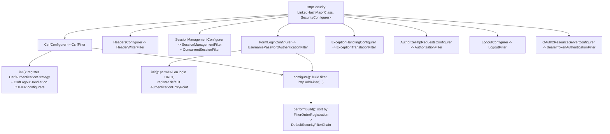

# 5.2 — `HttpSecurity` DSL Deep Dive

> **Module 5 · Topic 2** · Modern Configuration
> Baseline: Spring Security 6.x on Boot 3.x
> New to this? Read **In Plain English** below first, then come back to the Version Matrix.

---

## Version Matrix

| Concern | Spring Security 5.x | **Spring Security 6.x (baseline)** | Spring Security 7.x |
|---|---|---|---|
| DSL style | `.and()` chaining, lambdas available from 5.2 | **lambda DSL; `.and()` deprecated in 6.1** | **`.and()` removed — lambdas only** |
| Applying a custom DSL | `http.apply(dsl)` | **`http.with(dsl, Customizer.withDefaults())`; `apply` deprecated in 6.2** | `with(...)` only |
| Authorization configurer | `authorizeRequests()` (`AccessDecisionManager`) | **`authorizeHttpRequests()` (`AuthorizationManager`)** | `authorizeHttpRequests()` only |
| Context persistence configurer | `SecurityContextPersistenceFilter`, implicit save | **`securityContext()` builds `SecurityContextHolderFilter`; saving is explicit** | same |
| Removed configurers | `openidLogin()`, `apply()` | **`openidLogin()` gone; `oauth2*` is the replacement** | `AccessDecisionManager` support moved to `spring-security-access` |
| `Customizer.withDefaults()` | available from 5.2 | **the idiomatic way to enable a configurer** | same |
| Filter position registry | `FilterComparator` | **`FilterOrderRegistration` per `HttpSecurity`** | same |
| `AuthorizationManager#check` | — | **`check`** | renamed to `authorize` |

---

## Why This Exists

`HttpSecurity` looks like a fluent configuration API. It is actually a **builder holding a map of
`SecurityConfigurer` objects**, and every DSL method you call either creates or retrieves one of
them. Understanding that single fact explains almost every confusing behaviour in Spring Security
configuration:

- Why calling `.csrf(...)` twice does not create two `CsrfFilter` instances.
- Why the order in which you call DSL methods has no effect on filter order.
- Why `csrf(csrf -> csrf.disable())` removes the configurer entirely rather than setting a flag.
- Why `formLogin().permitAll()` can add authorization rules that you never wrote in
  `authorizeHttpRequests`.
- Why some configurers "see" each other — CSRF knows about logout, form login knows about exception
  handling — even though you configured them independently.

The answer to all five lives in a two-phase lifecycle (`init` then `configure`) and a bag of
**shared objects** that configurers use to communicate.

---

## In Plain English

**The one-line version:** The methods you chain together when configuring security are not doing the
work themselves, they are filling in an order form with one labelled section per security feature, and
the actual work happens later when Spring reads that form from top to bottom.

**An analogy.** Imagine fitting out a new office building. You do not install anything yourself. You
fill in a single order form that has one pre-printed section per trade: one for locks, one for the
camera system, one for the visitor sign-in desk, one for fire doors. Writing in the "locks" section
twice does not get you two lock companies, it just amends the same order. Crossing that section out
entirely does not mean "locks, but switched off", it means the locksmith is never called and no locks
are fitted at all.

Once the form is complete, two site meetings happen in a fixed order. At the first meeting every trade
turns up, announces what it needs, and pins useful notes on a shared noticeboard, for example the
locksmith writing down which master key system is in use so the camera installer can reference it. Only
at the second meeting does anyone actually install equipment. Two meetings rather than one is what lets
trades cooperate without caring who was written on the form first.

Finally, the installed equipment is arranged along the corridor from the front door in an order set by
the building code, not by the order you wrote things on the form. Writing the camera section before the
lock section does not put cameras before the door.

**How it actually works, step by step.**

`HttpSecurity` is the order form. Internally it holds a map, meaning a lookup table, whose keys are
feature types and whose values are the objects that know how to set that feature up. Those objects are
called configurers, so `CsrfConfigurer` is "the trade that installs CSRF protection" and
`FormLoginConfigurer` is "the trade that installs the login form".

Every DSL method, meaning every readable method you call such as `http.csrf(...)` or
`http.formLogin(...)`, does the same three things. It looks in the map for an existing configurer of
that type, creates and registers one if there is not, and then hands it to the small block of code you
wrote in the brackets. That block of code is a `Customizer`, which is just a one-method interface
taking the configurer and adjusting it. This is why calling `http.csrf(...)` five times still produces
exactly one CSRF check rather than five.

`Customizer.withDefaults()` is a pre-made block of code that does nothing. Passing it still causes the
configurer to be created and registered, so `http.httpBasic(Customizer.withDefaults())` means "turn on
HTTP Basic authentication and do not change any of its settings". Turning a feature on and customising
a feature are the same call, which is why there is no separate `enable` method.

When you finally call `http.build()`, Spring runs the two meetings. The first pass calls `init()` on
every configurer, and the second pass calls `configure()` on every configurer. The guarantee is that
every single `init()` has finished before the first `configure()` starts. That is what lets one feature
influence another. A concrete case: `CsrfConfigurer.init()` reaches over to the logout feature and adds
a handler that clears the CSRF token on logout, and it reaches over to the session feature and adds a
strategy that issues a fresh CSRF token when someone logs in. You never asked for either.

For the cases where features need to pass each other actual objects rather than call methods on each
other, there is a shared map keyed by type, called shared objects. One configurer writes the
`RequestCache`, meaning the store that remembers the page you were trying to reach before being sent to
the login screen, and another configurer later reads it out and wires it into the login success
handler. Neither had to know the other existed.

Filter position is decided separately and deliberately. Spring Security keeps a fixed table,
`FilterOrderRegistration`, mapping each known filter class to a number, spaced 100 apart. At build time
the filters you have accumulated are sorted by that number. The 100-wide gaps exist so that when you
add a filter of your own with `addFilterBefore` or `addFilterAfter`, there is room to slot it in
relative to a standard filter without disturbing anything else. One trap worth knowing early:
`addFilterAt` does not replace the existing filter, it gives your filter the same number, so both run.

**Why should a beginner care?** The two mistakes this knowledge prevents are expensive. The first is
calling `disable()` to make an error message go away, not realising it deletes a whole protection plus
the invisible cooperation that protection had with other features, for example that disabling CSRF also
changes logout to accept any HTTP method rather than just POST. The second is assuming that the order
you write your DSL calls in controls the order checks happen in, then spending hours rearranging the
configuration when the real lever is the filter order table. There is also a version trap: nearly every
tutorial older than Spring Security 6 uses `.and()` between sections, which no longer compiles in 7.x.

**Words you will meet in this file**

| Term | In plain words |
|---|---|
| DSL | Domain-Specific Language. Here it just means the readable chain of configuration methods you call on `HttpSecurity`. |
| `HttpSecurity` | The order form. It holds one entry per security feature you have asked for, and builds the real chain when you call `build()`. |
| `SecurityConfigurer` | The specialist that knows how to set up one feature. It has two methods, `init()` for announcing needs and `configure()` for building the filter. |
| `CsrfConfigurer`, `FormLoginConfigurer`, and similar | Individual specialists, one per feature. The name always tells you which DSL method creates it. |
| `Customizer<T>` | The small block of code you write inside the brackets of a DSL method. It receives the configurer and adjusts its settings. |
| `Customizer.withDefaults()` | A block of code that changes nothing. It means "switch this feature on and accept every default setting". |
| `getOrApply` | The internal helper that makes repeated DSL calls safe by reusing the existing configurer instead of adding a second one. |
| `init()` | First pass. A configurer announces what it needs and registers things on other configurers. No filters are built yet. |
| `configure()` | Second pass. A configurer builds its filter and adds it to the chain, reading anything the first pass published. |
| Shared object | An entry in a small type-keyed map that configurers use to hand each other objects without depending on each other directly. |
| `disable()` | Removes a feature's configurer from the form completely, so its setup never runs and its filter is never created. Not a switch you can flip back. |
| `.and()` | The old way of returning to the top level between configuration sections. Deprecated in 6.1 and removed in 7.0; lambdas replace it. |
| `with(dsl, customizer)` | How you plug in a configuration block you wrote yourself. It replaces the older `apply(dsl)`. |
| `AbstractHttpConfigurer` | The base class you extend to write your own reusable configuration block, so a repeated set of settings becomes one named thing. |
| `FilterOrderRegistration` | The fixed table deciding what position each filter occupies in the chain, spaced 100 apart to leave room for yours. |
| `addFilterBefore` / `addFilterAfter` / `addFilterAt` | Insert your own filter just before, just after, or at the same position as a named standard filter. `addFilterAt` does not remove the original. |
| `ObjectPostProcessor` | A hook that lets the framework and Spring Boot see and adjust each filter after it is created, for instance to register it for management. |

**If you remember only one thing:** every DSL method just reuses or creates one configurer for that
feature, so repeated calls amend a single setup while `disable()` deletes it outright.

---

## Core Concepts

### 1. `HttpSecurity` is a map of configurers

**In simple terms:** Behind the readable method calls is a simple lookup table holding one setup object
per feature, which is why configuring the same feature twice amends it rather than duplicating it.

```java
package org.springframework.security.config.annotation;

public abstract class AbstractConfiguredSecurityBuilder<O, B extends SecurityBuilder<O>>
        extends AbstractSecurityBuilder<O> {

    private final LinkedHashMap<Class<? extends SecurityConfigurer<O, B>>,
                                List<SecurityConfigurer<O, B>>> configurers = new LinkedHashMap<>();

    private final Map<Class<?>, Object> sharedObjects = new HashMap<>();

    private BuildState buildState = BuildState.UNBUILT;

    /** Adds a configurer, REPLACING any existing one of the same class (unless allowed to duplicate). */
    private <C extends SecurityConfigurer<O, B>> void add(C configurer) {
        Class<? extends SecurityConfigurer<O, B>> clazz =
                (Class<? extends SecurityConfigurer<O, B>>) configurer.getClass();
        synchronized (this.configurers) {
            if (this.buildState.isConfigured()) {
                throw new IllegalStateException("Cannot apply " + configurer + " to already built object");
            }
            List<SecurityConfigurer<O, B>> configs =
                    this.allowConfigurersOfSameType ? this.configurers.get(clazz) : null;
            if (configs == null) {
                configs = new ArrayList<>(1);
            }
            configs.add(configurer);
            this.configurers.put(clazz, configs);
            if (this.buildState.isInitializing()) {
                this.configurersAddedInInitializing.add(configurer);
            }
        }
    }

    public <C extends SecurityConfigurer<O, B>> C removeConfigurer(Class<C> clazz) {
        List<SecurityConfigurer<O, B>> configs = this.configurers.remove(clazz);
        return (configs == null) ? null : (C) configs.get(0);
    }

    public <C extends SecurityConfigurer<O, B>> C getConfigurer(Class<C> clazz) {
        List<SecurityConfigurer<O, B>> configs = this.configurers.get(clazz);
        return (configs == null) ? null : (C) configs.get(0);
    }
}
```

The key is `getOrApply`, which every DSL method funnels through:

```java
// HttpSecurity — the shape every DSL method shares
public HttpSecurity csrf(Customizer<CsrfConfigurer<HttpSecurity>> csrfCustomizer) throws Exception {
    ApplicationContext context = getContext();
    csrfCustomizer.customize(getOrApply(new CsrfConfigurer<>(context)));
    return this;
}

private <C extends SecurityConfigurerAdapter<DefaultSecurityFilterChain, HttpSecurity>> C getOrApply(C configurer) {
    C existingConfig = (C) getConfigurer(configurer.getClass());
    return (existingConfig != null) ? existingConfig : apply(configurer);
}
```

So `.csrf(...)` means "fetch the `CsrfConfigurer` if it already exists, otherwise create and
register one, then hand it to your lambda". Calling it five times configures **one** configurer
five times. There is exactly one `CsrfFilter` in the resulting chain no matter what you do.

### 2. `SecurityConfigurer` — the two-phase lifecycle

**In simple terms:** Setup happens in two complete passes rather than one, so that every feature has
already announced its needs before any feature starts building, letting them cooperate in any order.

```java
package org.springframework.security.config.annotation;

public interface SecurityConfigurer<O, B extends SecurityBuilder<O>> {

    /** Phase 1: register shared objects and talk to OTHER configurers. */
    void init(B builder) throws Exception;

    /** Phase 2: build and add the filters. */
    void configure(B builder) throws Exception;
}
```

```java
// AbstractConfiguredSecurityBuilder.doBuild
@Override
protected final O doBuild() throws Exception {
    synchronized (this.configurers) {
        this.buildState = BuildState.INITIALIZING;
        beforeInit();
        init();                       // EVERY configurer's init() runs first
        this.buildState = BuildState.CONFIGURING;
        beforeConfigure();
        configure();                  // THEN every configurer's configure() runs
        this.buildState = BuildState.BUILDING;
        O result = performBuild();    // sort filters, produce DefaultSecurityFilterChain
        this.buildState = BuildState.BUILT;
        return result;
    }
}
```

**Why two phases and not one?** Because configurers need to see each other, and a single pass would
make the result depend on declaration order. Splitting it gives a guarantee: *by the time any
`configure()` runs, every `init()` has already run.* So `init()` is where a configurer publishes
things others may need, and `configure()` is where it consumes them.

Three real examples from the framework:

```java
// CsrfConfigurer.init — reaches ACROSS to the session configurer so the CSRF token
// is rotated when the user logs in.
@Override
public void init(H http) {
    SessionManagementConfigurer<H> sessionConfigurer = http.getConfigurer(SessionManagementConfigurer.class);
    if (sessionConfigurer != null) {
        sessionConfigurer.addSessionAuthenticationStrategy(getSessionAuthenticationStrategy());
    }
    LogoutConfigurer<H> logoutConfigurer = http.getConfigurer(LogoutConfigurer.class);
    if (logoutConfigurer != null) {
        logoutConfigurer.addLogoutHandler(new CsrfLogoutHandler(this.csrfTokenRepository));
    }
}
```

```java
// AbstractAuthenticationFilterConfigurer.init — this is why formLogin().permitAll()
// can create authorization rules, and why an entry point appears without you asking.
@Override
public void init(B http) throws Exception {
    updateAuthenticationDefaults();              // derive failureUrl from loginPage, etc.
    updateAccessDefaults(http);                  // permitAll() on the login URLs
    registerDefaultAuthenticationEntryPoint(http); // tell ExceptionHandlingConfigurer
}
```

```java
// RequestCacheConfigurer.init — publishes a SHARED OBJECT for other configurers.
@Override
public void init(H http) {
    http.setSharedObject(RequestCache.class, getRequestCache(http));
}
```

That last one is exactly why `SavedRequestAwareAuthenticationSuccessHandler` ends up wired to the
same `RequestCache` that `RequestCacheAwareFilter` uses, without either configurer knowing about
the other directly.

### 3. Shared objects — the configurer message bus

**In simple terms:** A small noticeboard where one feature leaves an object and another picks it up,
which is how unrelated parts of your configuration end up correctly wired to each other.

```java
public <C> void setSharedObject(Class<C> sharedType, C object) {
    this.sharedObjects.put(sharedType, object);
}

public <C> C getSharedObject(Class<C> sharedType) {
    return (C) this.sharedObjects.get(sharedType);
}
```

`HttpSecurityConfiguration` seeds the map when it creates the prototype `HttpSecurity`, and
configurers add to it during `init()`.

| Shared object | Put there by | Consumed by |
|---|---|---|
| `ApplicationContext` | `HttpSecurityConfiguration` | nearly every configurer, to look up beans |
| `AuthenticationManagerBuilder` | `HttpSecurityConfiguration` | `init()` of authentication configurers |
| `AuthenticationManager` | `HttpSecurity.beforeConfigure()` | every authentication filter configurer |
| `UserDetailsService` | `UserDetailsServiceConfigurer` | `RememberMeConfigurer`, `DaoAuthenticationProvider` wiring |
| `SecurityContextRepository` | `SecurityContextConfigurer` | `AbstractAuthenticationFilterConfigurer`, logout |
| `RequestCache` | `RequestCacheConfigurer.init` | `SavedRequestAwareAuthenticationSuccessHandler`, `ExceptionHandlingConfigurer` |
| `SessionAuthenticationStrategy` | `SessionManagementConfigurer` | every authentication filter, for fixation protection |
| `RememberMeServices` | `RememberMeConfigurer` | authentication filters |
| `PortMapper` | `HttpSecurityConfiguration` | `LoginUrlAuthenticationEntryPoint`, `ChannelProcessingFilter` |

`AbstractAuthenticationFilterConfigurer.configure()` is the clearest demonstration — it is almost
entirely shared-object plumbing:

```java
@Override
public void configure(B http) throws Exception {
    PortMapper portMapper = http.getSharedObject(PortMapper.class);
    if (portMapper != null) {
        this.authenticationEntryPoint.setPortMapper(portMapper);
    }
    RequestCache requestCache = http.getSharedObject(RequestCache.class);
    if (requestCache != null) {
        this.defaultSuccessHandler.setRequestCache(requestCache);
    }
    this.authFilter.setAuthenticationManager(http.getSharedObject(AuthenticationManager.class));
    this.authFilter.setAuthenticationSuccessHandler(this.successHandler);
    this.authFilter.setAuthenticationFailureHandler(this.failureHandler);

    SessionAuthenticationStrategy strategy = http.getSharedObject(SessionAuthenticationStrategy.class);
    if (strategy != null) {
        this.authFilter.setSessionAuthenticationStrategy(strategy);
    }
    RememberMeServices rememberMe = http.getSharedObject(RememberMeServices.class);
    if (rememberMe != null) {
        this.authFilter.setRememberMeServices(rememberMe);
    }
    F filter = postProcess(this.authFilter);
    http.addFilter(filter);                     // <- the filter joins the chain HERE
}
```

### 4. `Customizer<T>` and `withDefaults()`

**In simple terms:** The code you write inside the brackets of a DSL method is just a block that
adjusts settings, and passing the do-nothing version still switches the feature on with its defaults.

```java
package org.springframework.security.config;

@FunctionalInterface
public interface Customizer<T> {

    void customize(T t);

    static <T> Customizer<T> withDefaults() {
        return (t) -> { };
    }
}
```

`Customizer<T>` is structurally a `Consumer<T>`. `withDefaults()` returns a lambda that does
nothing — which is the point. Calling `httpBasic(Customizer.withDefaults())` still runs
`getOrApply(new HttpBasicConfigurer<>())`, so the configurer is **registered** and its filter is
built; the empty lambda just declines to customise it. "Enable with defaults" and "customise" are
the same call.

Because it is a `Consumer`, customizers compose and can be extracted:

```java
static Customizer<HeadersConfigurer<HttpSecurity>> hardenedHeaders() {
    return headers -> headers
        .httpStrictTransportSecurity(hsts -> hsts.includeSubDomains(true).maxAgeInSeconds(31536000))
        .contentSecurityPolicy(csp -> csp.policyDirectives("default-src 'self'; frame-ancestors 'none'"))
        .frameOptions(frame -> frame.deny());
}

// used identically across every chain:
http.headers(hardenedHeaders());
```

### 5. Lambda DSL versus `.and()`

**In simple terms:** Older code separates configuration sections with `.and()`, which no longer exists
in Spring Security 7, so you need to recognise that style and know how to rewrite it using brackets.

**5.x, `.and()` chaining:**

```java
http
    .authorizeRequests()
        .antMatchers("/public/**").permitAll()
        .anyRequest().authenticated()
        .and()                                  // back up to HttpSecurity
    .formLogin()
        .loginPage("/login")
        .permitAll()
        .and()
    .logout()
        .logoutSuccessUrl("/")
        .and()
    .sessionManagement()
        .sessionFixation().changeSessionId();
```

**6.x, lambda DSL:**

```java
http
    .authorizeHttpRequests(auth -> auth
        .requestMatchers("/public/**").permitAll()
        .anyRequest().authenticated()
    )
    .formLogin(form -> form
        .loginPage("/login")
        .permitAll()
    )
    .logout(logout -> logout
        .logoutSuccessUrl("/")
    )
    .sessionManagement(session -> session
        .sessionFixation(fixation -> fixation.changeSessionId())
    );
```

`.and()` lives on `SecurityConfigurerAdapter` and simply returns the builder:

```java
public B and() {
    return getBuilder();
}
```

It was deprecated in 6.1 and **removed in 7.0**. The breakage is a compile error —
`cannot find symbol: method and()` — so it cannot reach production silently. Three reasons the
lambda form is better than "it is the new style":

**Scope is visible.** In the chained form, indentation is a lie: `.permitAll()` after
`.loginPage("/login")` is a `FormLoginConfigurer` method, but `.permitAll()` inside
`authorizeRequests()` is an authorization rule. They read identically and mean different things. In
the lambda form the parameter name tells you which object you are talking to.

**Misplaced `.and()` silently changes meaning.** One `.and()` too few and you are still configuring
the previous configurer; one too many and you are calling an `HttpSecurity` method. Both compile.
This is the single most common source of "I configured it and nothing happened" in 5.x.

**It matches the actual model.** Each lambda receives one configurer, which is exactly what the
builder holds. The chained form pretended the whole configuration was one fluent sentence.

### 6. The major configurers

**In simple terms:** This is the lookup table between the DSL method you write, the setup object it
creates, and the actual filter that ends up running on every request. Use it to translate in either
direction.



| DSL method | Configurer | Filter(s) produced | Options that matter |
|---|---|---|---|
| `authorizeHttpRequests` | `AuthorizeHttpRequestsConfigurer` | `AuthorizationFilter` | `requestMatchers`, `permitAll`, `hasRole`, `access(AuthorizationManager)`, `denyAll`; rules evaluated **top to bottom, first match wins** |
| `formLogin` | `FormLoginConfigurer` | `UsernamePasswordAuthenticationFilter` | `loginPage`, `loginProcessingUrl`, `defaultSuccessUrl`, `successHandler`, `failureHandler`, `permitAll` |
| `httpBasic` | `HttpBasicConfigurer` | `BasicAuthenticationFilter` | `realmName`, `authenticationEntryPoint`, `securityContextRepository` |
| `csrf` | `CsrfConfigurer` | `CsrfFilter` | `csrfTokenRepository`, `csrfTokenRequestHandler`, `ignoringRequestMatchers`, `disable` |
| `cors` | `CorsConfigurer` | `CorsFilter` | `configurationSource`; falls back to a `CorsConfigurationSource` bean |
| `sessionManagement` | `SessionManagementConfigurer` | `SessionManagementFilter`, `ConcurrentSessionFilter` | `sessionCreationPolicy`, `sessionFixation`, `maximumSessions`, `invalidSessionUrl` |
| `exceptionHandling` | `ExceptionHandlingConfigurer` | `ExceptionTranslationFilter` | `authenticationEntryPoint`, `accessDeniedHandler`, `defaultAuthenticationEntryPointFor` |
| `headers` | `HeadersConfigurer` | `HeaderWriterFilter` | `contentSecurityPolicy`, `httpStrictTransportSecurity`, `frameOptions`, `referrerPolicy`, `cacheControl` |
| `logout` | `LogoutConfigurer` | `LogoutFilter` | `logoutUrl`, `logoutSuccessUrl`, `logoutSuccessHandler`, `addLogoutHandler`, `deleteCookies` |
| `rememberMe` | `RememberMeConfigurer` | `RememberMeAuthenticationFilter` | `key`, `tokenRepository`, `tokenValiditySeconds`, `useSecureCookie` |
| `anonymous` | `AnonymousConfigurer` | `AnonymousAuthenticationFilter` | `principal`, `authorities`, `disable` |
| `requestCache` | `RequestCacheConfigurer` | `RequestCacheAwareFilter` | `requestCache` (use `NullRequestCache` when stateless) |
| `securityContext` | `SecurityContextConfigurer` | `SecurityContextHolderFilter` | `securityContextRepository`, `requireExplicitSave` |
| `servletApi` | `ServletApiConfigurer` | `SecurityContextHolderAwareRequestFilter` | makes `request.getUserPrincipal()` and `isUserInRole()` work |
| `oauth2Login` | `OAuth2LoginConfigurer` | `OAuth2AuthorizationRequestRedirectFilter`, `OAuth2LoginAuthenticationFilter` | `clientRegistrationRepository`, `userInfoEndpoint`, `authorizationEndpoint` |
| `oauth2ResourceServer` | `OAuth2ResourceServerConfigurer` | `BearerTokenAuthenticationFilter` | `jwt(...)`, `opaqueToken(...)`, `authenticationEntryPoint` |
| `oauth2Client` | `OAuth2ClientConfigurer` | `OAuth2AuthorizationCodeGrantFilter` | `authorizedClientRepository`, `authorizationCodeGrant` |
| `x509` | `X509Configurer` | `X509AuthenticationFilter` | `subjectPrincipalRegex`, `userDetailsService` |

### 7. Writing a custom DSL

**In simple terms:** When the same block of settings keeps getting copied into every configuration, you
can package it as one named, reusable, testable thing that others plug in with a single line.

Extend `AbstractHttpConfigurer` when you have a block of configuration repeated across chains, or a
feature that needs its own filter plus supporting wiring.

```java
package org.springframework.security.config.annotation.web.configurers;

public abstract class AbstractHttpConfigurer<T extends AbstractHttpConfigurer<T, B>,
                                             B extends HttpSecurityBuilder<B>>
        extends SecurityConfigurerAdapter<DefaultSecurityFilterChain, B> {

    /** Removes THIS configurer from the builder entirely. */
    @SuppressWarnings("unchecked")
    public B disable() {
        getBuilder().removeConfigurer(getClass());
        return getBuilder();
    }
}
```

```java
package com.example.security.dsl;

import org.springframework.security.authentication.AuthenticationManager;
import org.springframework.security.config.annotation.web.HttpSecurityBuilder;
import org.springframework.security.config.annotation.web.configurers.AbstractHttpConfigurer;
import org.springframework.security.web.authentication.UsernamePasswordAuthenticationFilter;
import org.springframework.security.web.context.SecurityContextRepository;

/**
 * Packages "authenticate with an X-API-Key header" as a named, reusable DSL.
 * Self-type parameter T lets the fluent setters return the concrete type.
 */
public final class ApiKeyDsl extends AbstractHttpConfigurer<ApiKeyDsl, HttpSecurity> {

    private String headerName = "X-API-Key";
    private ApiKeyService apiKeyService;

    public ApiKeyDsl headerName(String headerName) {
        this.headerName = headerName;
        return this;
    }

    public ApiKeyDsl apiKeyService(ApiKeyService apiKeyService) {
        this.apiKeyService = apiKeyService;
        return this;
    }

    /** Phase 1: look up collaborators and publish anything others may need. */
    @Override
    public void init(HttpSecurity http) {
        if (this.apiKeyService == null) {
            this.apiKeyService = http.getSharedObject(ApplicationContext.class)
                                     .getBean(ApiKeyService.class);
        }
    }

    /** Phase 2: build the filter and insert it. */
    @Override
    public void configure(HttpSecurity http) {
        AuthenticationManager authenticationManager = http.getSharedObject(AuthenticationManager.class);
        SecurityContextRepository repository = http.getSharedObject(SecurityContextRepository.class);

        ApiKeyAuthenticationFilter filter =
                new ApiKeyAuthenticationFilter(this.headerName, this.apiKeyService, authenticationManager);
        if (repository != null) {
            filter.setSecurityContextRepository(repository);
        }
        // postProcess lets ObjectPostProcessor beans (and Boot) see the filter.
        http.addFilterBefore(postProcess(filter), UsernamePasswordAuthenticationFilter.class);
    }
}
```

Applying it:

```java
http.with(new ApiKeyDsl(), apiKey -> apiKey.headerName("X-Tenant-Key"));

// or, with no customisation:
http.with(new ApiKeyDsl(), Customizer.withDefaults());
```

```java
// HttpSecurity.with — simplified
public <C extends SecurityConfigurerAdapter<DefaultSecurityFilterChain, HttpSecurity>>
        HttpSecurity with(C configurer, Customizer<C> customizer) throws Exception {
    configurer.addObjectPostProcessor(this.objectPostProcessor);
    configurer.setBuilder(this);
    customizer.customize(configurer);
    return (HttpSecurity) super.add(configurer);
}
```

`http.apply(configurer)` did the same registration but **returned the configurer**, so you could
chain `.and()` off it. It is deprecated in 6.2 and removed in 7.0. Use `with`.

### 8. How filter position is decided

**In simple terms:** The order checks run in comes from a fixed numbered table inside the framework,
not from the order you wrote your configuration, so rearranging your code changes nothing.

Filters are **not** ordered by the sequence of your DSL calls. `HttpSecurity` keeps a
`FilterOrderRegistration` mapping filter class name to an integer, and `performBuild()` sorts by it.

```java
// FilterOrderRegistration — the shape, abbreviated
final class FilterOrderRegistration {

    private static final int INITIAL_ORDER = 100;
    private static final int ORDER_STEP = 100;

    private final Map<String, Integer> filterToOrder = new HashMap<>();

    FilterOrderRegistration() {
        Step order = new Step(INITIAL_ORDER, ORDER_STEP);
        put(DisableEncodeUrlFilter.class, order.next());
        put(ForceEagerSessionCreationFilter.class, order.next());
        put(ChannelProcessingFilter.class, order.next());
        put(WebAsyncManagerIntegrationFilter.class, order.next());
        put(SecurityContextHolderFilter.class, order.next());
        put(HeaderWriterFilter.class, order.next());
        put(CorsFilter.class, order.next());
        put(CsrfFilter.class, order.next());
        put(LogoutFilter.class, order.next());
        // ... OAuth2/SAML redirect filters, X509, CAS ...
        put(UsernamePasswordAuthenticationFilter.class, order.next());
        put(DefaultLoginPageGeneratingFilter.class, order.next());
        put(ConcurrentSessionFilter.class, order.next());
        put(BearerTokenAuthenticationFilter.class, order.next());
        put(BasicAuthenticationFilter.class, order.next());
        put(RequestCacheAwareFilter.class, order.next());
        put(SecurityContextHolderAwareRequestFilter.class, order.next());
        put(RememberMeAuthenticationFilter.class, order.next());
        put(AnonymousAuthenticationFilter.class, order.next());
        put(SessionManagementFilter.class, order.next());
        put(ExceptionTranslationFilter.class, order.next());
        put(AuthorizationFilter.class, order.next());
        put(SwitchUserFilter.class, order.next());
    }
}
```

`ORDER_STEP = 100` leaves 99 insertion slots between any two standard filters.

```java
// HttpSecurity
public HttpSecurity addFilterBefore(Filter filter, Class<? extends Filter> beforeFilter) {
    return addFilterAtOffsetOf(filter, -1, beforeFilter);
}

public HttpSecurity addFilterAfter(Filter filter, Class<? extends Filter> afterFilter) {
    return addFilterAtOffsetOf(filter, 1, afterFilter);
}

public HttpSecurity addFilterAt(Filter filter, Class<? extends Filter> atFilter) {
    return addFilterAtOffsetOf(filter, 0, atFilter);
}

private HttpSecurity addFilterAtOffsetOf(Filter filter, int offset, Class<? extends Filter> registered) {
    Integer registeredOrder = this.filterOrders.getOrder(registered);
    if (registeredOrder == null) {
        throw new IllegalArgumentException(
            "The Filter class " + registered.getName() + " does not have a registered order");
    }
    int order = registeredOrder + offset;
    this.filters.add(new OrderedFilter(filter, order));
    this.filterOrders.put(filter.getClass(), order);   // now YOUR filter is a landmark too
    return this;
}
```

Three consequences worth knowing:

- **`addFilterAt` does not replace.** It assigns the *same* order number. Both filters run; their
  relative order is whatever the sort is stable on, which is insertion order. If you meant
  "replace", you must disable the configurer that adds the original.
- **`addFilter(filter)` without a reference class** looks the filter's own class up in the registry
  and throws `IllegalArgumentException` if it is not a known Spring Security filter type. This is
  why you cannot `addFilter(myCustomFilter)` directly.
- **Offsets of ±1 are cumulative.** Adding filter A before `UsernamePasswordAuthenticationFilter`
  then filter B before A gives B an order two below the landmark. The 100-step spacing is what makes
  this safe.

### 9. Disabling defaults

**In simple terms:** Calling `disable()` deletes a protection entirely rather than switching it off,
including the quiet help it was giving other features, so each one needs a real reason behind it.

```java
// AbstractHttpConfigurer
public B disable() {
    getBuilder().removeConfigurer(getClass());
    return getBuilder();
}
```

`disable()` is not a flag — it **removes the configurer from the map**, so its `init()` and
`configure()` never run and its filter is never constructed. That is why
`csrf(csrf -> csrf.disable())` also removes the `CsrfLogoutHandler` and the
`CsrfAuthenticationStrategy` that `CsrfConfigurer.init()` would have registered elsewhere, and why
`LogoutConfigurer` then falls back to matching `/logout` on **any** HTTP method rather than POST
only.

The blanket-disable anti-pattern:

```java
// Every one of these lines removes a real protection. Together they are
// a request to be exploited.
http
    .csrf(csrf -> csrf.disable())          // CSRF wide open if you use cookies
    .headers(headers -> headers.disable()) // no nosniff, no frame-options, no HSTS
    .cors(cors -> cors.disable())          // does NOT "allow all origins" - it removes CorsFilter
    .sessionManagement(s -> s.disable())   // no session fixation protection on login
    .anonymous(a -> a.disable());          // authentication becomes null, NPEs downstream
```

Each disable should be a deliberate, justified decision tied to a property of the client, not a way
to make an error message go away. The two that are genuinely defensible: `csrf().disable()` on a
chain whose credentials are never ambient, and `requestCache()`/`securityContext()` disabling on a
truly stateless chain.

---

## Working Code

```java
package com.example.security;

import org.springframework.context.annotation.Bean;
import org.springframework.context.annotation.Configuration;
import org.springframework.core.annotation.Order;
import org.springframework.http.HttpStatus;
import org.springframework.security.config.Customizer;
import org.springframework.security.config.annotation.web.builders.HttpSecurity;
import org.springframework.security.config.annotation.web.configuration.EnableWebSecurity;
import org.springframework.security.config.annotation.web.configurers.HeadersConfigurer;
import org.springframework.security.config.http.SessionCreationPolicy;
import org.springframework.security.web.SecurityFilterChain;
import org.springframework.security.web.authentication.HttpStatusEntryPoint;
import org.springframework.security.web.header.writers.ReferrerPolicyHeaderWriter.ReferrerPolicy;
import org.springframework.web.cors.CorsConfiguration;
import org.springframework.web.cors.CorsConfigurationSource;
import org.springframework.web.cors.UrlBasedCorsConfigurationSource;

import java.util.List;

import com.example.security.dsl.ApiKeyDsl;

@Configuration
@EnableWebSecurity
public class DslConfig {

    /** Extracted Customizer: one definition, reused by every chain. */
    static Customizer<HeadersConfigurer<HttpSecurity>> hardenedHeaders() {
        return headers -> headers
            .httpStrictTransportSecurity(hsts -> hsts
                .includeSubDomains(true).preload(true).maxAgeInSeconds(63072000))
            .contentSecurityPolicy(csp -> csp
                .policyDirectives("default-src 'self'; frame-ancestors 'none'; object-src 'none'"))
            .referrerPolicy(ref -> ref.policy(ReferrerPolicy.STRICT_ORIGIN_WHEN_CROSS_ORIGIN))
            .frameOptions(frame -> frame.deny());
    }

    @Bean
    @Order(1)
    SecurityFilterChain apiChain(HttpSecurity http) throws Exception {
        http
            .securityMatcher("/api/**")
            .authorizeHttpRequests(auth -> auth
                .requestMatchers("/api/public/**").permitAll()
                .requestMatchers("/api/admin/**").hasRole("ADMIN")
                .anyRequest().authenticated()
            )
            .headers(hardenedHeaders())
            .cors(Customizer.withDefaults())            // picks up the bean below
            .csrf(csrf -> csrf.disable())               // credentials are a header, not a cookie
            .sessionManagement(s -> s.sessionCreationPolicy(SessionCreationPolicy.STATELESS))
            .exceptionHandling(ex -> ex
                .authenticationEntryPoint(new HttpStatusEntryPoint(HttpStatus.UNAUTHORIZED)))
            // The custom DSL. Note with(...), not the deprecated apply(...).
            .with(new ApiKeyDsl(), apiKey -> apiKey.headerName("X-Tenant-Key"));
        return http.build();
    }

    @Bean
    @Order(2)
    SecurityFilterChain webChain(HttpSecurity http) throws Exception {
        http
            .authorizeHttpRequests(auth -> auth
                .requestMatchers("/", "/login", "/error").permitAll()
                .anyRequest().authenticated()
            )
            .headers(hardenedHeaders())
            .formLogin(form -> form.loginPage("/login").permitAll())
            .logout(logout -> logout.logoutSuccessUrl("/").deleteCookies("JSESSIONID"))
            // Selectively exempt a webhook path instead of disabling CSRF globally.
            .csrf(csrf -> csrf.ignoringRequestMatchers("/webhooks/**"))
            .sessionManagement(session -> session
                .sessionFixation(fixation -> fixation.changeSessionId())
                .maximumSessions(1).maxSessionsPreventsLogin(false)
            );
        return http.build();
    }

    @Bean
    CorsConfigurationSource corsConfigurationSource() {
        CorsConfiguration config = new CorsConfiguration();
        config.setAllowedOrigins(List.of("https://app.example.com"));
        config.setAllowedMethods(List.of("GET", "POST", "PUT", "DELETE"));
        config.setAllowedHeaders(List.of("Authorization", "Content-Type", "X-Tenant-Key"));
        config.setAllowCredentials(true);
        UrlBasedCorsConfigurationSource source = new UrlBasedCorsConfigurationSource();
        source.registerCorsConfiguration("/api/**", config);
        return source;
    }
}
```

Tests:

```java
package com.example.security;

import org.junit.jupiter.api.Test;
import org.springframework.beans.factory.annotation.Autowired;
import org.springframework.boot.test.autoconfigure.web.servlet.AutoConfigureMockMvc;
import org.springframework.boot.test.context.SpringBootTest;
import org.springframework.security.test.context.support.WithMockUser;
import org.springframework.security.web.FilterChainProxy;
import org.springframework.test.web.servlet.MockMvc;

import static org.assertj.core.api.Assertions.assertThat;
import static org.springframework.security.test.web.servlet.request.SecurityMockMvcRequestBuilders.formLogin;
import static org.springframework.security.test.web.servlet.request.SecurityMockMvcRequestBuilders.logout;
import static org.springframework.security.test.web.servlet.result.SecurityMockMvcResultMatchers.authenticated;
import static org.springframework.security.test.web.servlet.result.SecurityMockMvcResultMatchers.unauthenticated;
import static org.springframework.test.web.servlet.request.MockMvcRequestBuilders.get;
import static org.springframework.test.web.servlet.request.MockMvcRequestBuilders.post;
import static org.springframework.test.web.servlet.result.MockMvcResultMatchers.header;
import static org.springframework.test.web.servlet.result.MockMvcResultMatchers.status;

@SpringBootTest
@AutoConfigureMockMvc
class DslConfigTests {

    @Autowired MockMvc mvc;
    @Autowired FilterChainProxy chains;

    @Test
    void extractedCustomizerAppliesToEveryChain() throws Exception {
        mvc.perform(get("/api/public/ping"))
           .andExpect(header().string("X-Frame-Options", "DENY"))
           .andExpect(header().exists("Content-Security-Policy"));
        mvc.perform(get("/"))
           .andExpect(header().string("X-Frame-Options", "DENY"));
    }

    @Test
    void customDslFilterIsInsertedBeforeUsernamePassword() {
        // Chain 0 is the API chain; assert the custom filter really landed where we asked.
        var filters = chains.getFilterChains().get(0).getFilters();
        int apiKeyIndex = indexOfType(filters, "ApiKeyAuthenticationFilter");
        int authorizationIndex = indexOfType(filters, "AuthorizationFilter");
        assertThat(apiKeyIndex).isGreaterThan(-1);
        assertThat(apiKeyIndex).isLessThan(authorizationIndex);
    }

    @Test
    void formLoginPermitAllWasAppliedByTheConfigurerInitPhase() throws Exception {
        // We never wrote a rule for POST /login; FormLoginConfigurer.init() added it.
        mvc.perform(formLogin().user("alice").password("password"))
           .andExpect(authenticated().withUsername("alice"));
    }

    @Test
    void badCredentialsRedirectToTheConfiguredFailureUrl() throws Exception {
        mvc.perform(formLogin().user("alice").password("wrong"))
           .andExpect(unauthenticated())
           .andExpect(status().is3xxRedirection())
           .andExpect(header().string("Location", "/login?error"));
    }

    @Test
    @WithMockUser
    void logoutClearsAuthenticationAndTheSessionCookie() throws Exception {
        mvc.perform(logout())
           .andExpect(unauthenticated())
           .andExpect(status().is3xxRedirection());
    }

    @Test
    void csrfIgnoringMatcherAppliesToWebhooksOnly() throws Exception {
        mvc.perform(post("/webhooks/stripe").content("{}").contentType("application/json"))
           .andExpect(status().isOk());
        mvc.perform(post("/profile").param("name", "x"))
           .andExpect(status().isForbidden());
    }

    private static int indexOfType(java.util.List<jakarta.servlet.Filter> filters, String simpleName) {
        for (int i = 0; i < filters.size(); i++) {
            if (filters.get(i).getClass().getSimpleName().equals(simpleName)) {
                return i;
            }
        }
        return -1;
    }
}
```

---

## Internals

### `getOrApply` is why repeated DSL calls are idempotent

```java
private <C extends SecurityConfigurerAdapter<DefaultSecurityFilterChain, HttpSecurity>> C getOrApply(C configurer) {
    C existing = (C) getConfigurer(configurer.getClass());
    return (existing != null) ? existing : apply(configurer);
}
```

```java
http.csrf(csrf -> csrf.csrfTokenRepository(repoA));
http.csrf(csrf -> csrf.ignoringRequestMatchers("/hooks/**"));
// ONE CsrfConfigurer, configured twice. ONE CsrfFilter in the chain.
```

The corollary is that the **last write wins** for any single property. Two calls setting different
`csrfTokenRepository` values leave you with the second, silently.

### The build, end to end

```java
// AbstractConfiguredSecurityBuilder
private void init() throws Exception {
    for (SecurityConfigurer<O, B> configurer : getConfigurers()) {
        configurer.init((B) this);
    }
    for (SecurityConfigurer<O, B> configurer : this.configurersAddedInInitializing) {
        configurer.init((B) this);       // configurers added DURING init still get initialised
    }
}

private void configure() throws Exception {
    for (SecurityConfigurer<O, B> configurer : getConfigurers()) {
        configurer.configure((B) this);
    }
}
```

`configurersAddedInInitializing` exists because `init()` may register new configurers — for example,
`OAuth2LoginConfigurer.init()` adds an `OAuth2ClientConfigurer` if one is missing. Without that
second loop the newly-added configurer would never be initialised.

### `ObjectPostProcessor` and `postProcess`

```java
// SecurityConfigurerAdapter
protected <T> T postProcess(T object) {
    return (T) this.objectPostProcessor.postProcess(object);
}
```

Every filter and handler the framework constructs passes through `ObjectPostProcessor`. That is how
`AutowireBeanFactoryObjectPostProcessor` injects dependencies and registers lifecycle callbacks on
objects that were created with `new` rather than by the container. If you build a filter inside a
custom DSL and skip `postProcess`, its `@Autowired` fields stay null and its `DisposableBean`
callbacks never fire.

### `performBuild` — where DSL call order stops mattering

```java
@Override
protected DefaultSecurityFilterChain performBuild() {
    this.filters.sort(OrderComparator.INSTANCE);       // by FilterOrderRegistration value
    List<Filter> sortedFilters = new ArrayList<>(this.filters.size());
    for (Filter filter : this.filters) {
        sortedFilters.add(((OrderedFilter) filter).getFilter());
    }
    return new DefaultSecurityFilterChain(this.requestMatcher, sortedFilters);
}
```

---

## Configuration Reference

| API | Effect | Default |
|---|---|---|
| `Customizer.withDefaults()` | Registers the configurer, customises nothing | — |
| `http.with(configurer, customizer)` | Applies a custom DSL | replaces `apply()` (deprecated 6.2, removed 7.0) |
| `AbstractHttpConfigurer.disable()` | **Removes** the configurer from the builder's map | enabled |
| `http.getSharedObject(Class)` | Reads a collaborator published by another configurer | `null` if absent |
| `http.setSharedObject(Class, obj)` | Publishes a collaborator, normally from `init()` | — |
| `http.getConfigurer(Class)` | Retrieves another configurer during `init()` | `null` if absent |
| `http.addFilterBefore(f, X.class)` | Order = order(X) − 1 | — |
| `http.addFilterAfter(f, X.class)` | Order = order(X) + 1 | — |
| `http.addFilterAt(f, X.class)` | Order = order(X); **does not replace X** | — |
| `http.addFilter(f)` | Uses `f`'s own registered order; throws if unregistered | — |
| `FilterOrderRegistration.ORDER_STEP` | Gap between standard filters | `100` |
| `SecurityConfigurerAdapter.and()` | Returns the builder | deprecated 6.1, **removed 7.0** |
| `csrf.ignoringRequestMatchers(...)` | Skips CSRF for specific paths only | none |
| `securityContext.requireExplicitSave(...)` | Whether the context filter saves automatically | `true` in 6.x (explicit save required) |

---

## Production Concerns & Anti-Patterns

**Blanket disabling to silence an error.** `csrf().disable()` to fix a 403, `headers().disable()` to
fix a framing problem, `cors().disable()` in the belief it allows all origins. Each removes a
control. `cors(cors -> cors.disable())` in particular does not permit cross-origin requests — it
removes `CorsFilter`, so preflights are no longer answered and the browser blocks the call, which
usually leads someone to disable CSRF next.

**Assuming DSL call order controls filter order.** It does not; `FilterOrderRegistration` does.
Moving `.csrf(...)` above `.formLogin(...)` changes nothing. If you need a specific position, use
`addFilterBefore`/`addFilterAfter` with an explicit landmark class.

**Using `addFilterAt` expecting replacement.** Both filters run. To genuinely replace
`UsernamePasswordAuthenticationFilter`, disable `formLogin` and add your own.

**Configuring the same property twice in different lambdas.** Because `getOrApply` returns the same
configurer, the second call silently overwrites the first. This bites when configuration is split
across a base `Customizer` and a chain-specific lambda.

**Forgetting `postProcess` in a custom DSL.** The filter is added but never sees dependency
injection or lifecycle callbacks, and Boot's metrics and tracing instrumentation skip it.

**Reaching for another configurer in `configure()` instead of `init()`.** By `configure()` time the
other configurer may already have built its filter with the wrong collaborator. Cross-configurer
wiring belongs in `init()` — that is what the phase exists for.

**Writing a custom DSL when a `Customizer` would do.** If you are only grouping existing DSL calls,
extract a `static Customizer<HttpSecurity>` method. Reserve `AbstractHttpConfigurer` for cases that
add filters or need the two-phase lifecycle.

**Leaving `.and()` in a 6.x codebase.** It compiles today and breaks the 7.0 upgrade. Migrate while
it is a deprecation warning rather than under time pressure.

---

## Debugging Playbook

| Symptom | Likely root cause | Fix |
|---|---|---|
| A DSL setting appears to be ignored | A later call on the same configurer overwrote it | Search for every call to that DSL method on the chain; consolidate into one |
| Custom filter never runs | It was added to a chain whose `securityMatcher` does not match, or registered twice | Enable `logging.level.org.springframework.security=DEBUG` and read the startup filter list |
| `IllegalArgumentException: The Filter class ... does not have a registered order` | `addFilter(f)` used with a non-framework filter | Use `addFilterBefore`/`addFilterAfter` with a landmark class |
| Two copies of your filter in the chain | `addFilterAt` used expecting replacement, or the filter is also a `@Component` | Disable the original configurer; add a disabled `FilterRegistrationBean` |
| `@Autowired` field null inside a custom-DSL filter | `postProcess(...)` was skipped | Wrap the filter in `postProcess(...)` before adding it |
| Cross-origin calls fail after `cors().disable()` | `CorsFilter` removed, so preflights are unanswered | Re-enable `cors` and supply a `CorsConfigurationSource` |
| `logout` starts accepting `GET` | CSRF was disabled, so `LogoutConfigurer` widened the matcher | Keep CSRF enabled, or set `logoutRequestMatcher` explicitly |
| Login succeeds but the next request is anonymous | The authentication mechanism never saved the context | Ensure a `SecurityContextRepository` is set on the filter; see file 19 |
| `cannot find symbol: method and()` after upgrading | `.and()` removed in 7.0 | Convert to lambda DSL |
| `NullPointerException` on `authentication.getName()` | `anonymous()` was disabled, so the authentication is `null` | Re-enable `anonymous`, or null-check |
| Custom DSL settings ignored | `apply()` used and the configurer re-created, or `with()` called twice with new instances | One `with(...)` call per DSL type per chain |

---

## Interview Q&A

### Q1. Walk me through what actually happens when I call `http.formLogin(form -> form.loginPage("/login"))`.

<details>
<summary>Show answer</summary>

Three distinct things happen, at three different times.

**At DSL-call time**, `formLogin` calls `getOrApply(new FormLoginConfigurer<>())`. If a
`FormLoginConfigurer` is already in the builder's `LinkedHashMap`, that instance is returned;
otherwise a new one is created, registered under its class, and given the builder and the
`ObjectPostProcessor`. Then your lambda runs against it, so `loginPage("/login")` sets a field on
the configurer and marks `customLoginPage = true`. **No filter exists yet.**

**At `init()` time**, during `http.build()`, `AbstractAuthenticationFilterConfigurer.init()` runs:
`updateAuthenticationDefaults()` derives `loginProcessingUrl` and `failureUrl` from the login page
if you did not set them; `updateAccessDefaults(http)` applies `permitAll` to the login and failure
URLs if you called `permitAll()`; and `registerDefaultAuthenticationEntryPoint(http)` reaches into
`ExceptionHandlingConfigurer` and registers a `LoginUrlAuthenticationEntryPoint` pointing at
`/login`. That last step is why an unauthenticated request redirects to your login page even though
you never configured `exceptionHandling`.

**At `configure()` time**, the configurer builds the `UsernamePasswordAuthenticationFilter`, pulls
`AuthenticationManager`, `RequestCache`, `SessionAuthenticationStrategy`, `RememberMeServices`, and
`SecurityContextRepository` out of the shared-object map, wires them onto the filter, passes it
through `postProcess`, and calls `http.addFilter(filter)`. The filter is placed by its registered
order in `FilterOrderRegistration`, not by when you called the method.

Separately, `DefaultLoginPageConfigurer.configure()` checks whether a custom login page was set.
Because you set one, it does **not** add `DefaultLoginPageGeneratingFilter`, which is why supplying
a `loginPage` makes the generated page disappear.

**Counter-question: I called `formLogin` twice with different lambdas. What do I get?**

One `FormLoginConfigurer`, configured twice. `getOrApply` returns the existing instance, so the
second lambda mutates the same object. Settings you touched only in the first call survive;
settings touched in both take the **second** value. There is exactly one
`UsernamePasswordAuthenticationFilter` in the chain either way.

This is benign when intentional — a shared base `Customizer` plus a chain-specific override is a
legitimate pattern. It is a nasty bug when unintentional, because nothing warns you. If you find
yourself hunting for "why is my success handler not the one I configured", search the whole
configuration for every call to that DSL method on that chain.

**Counter-question: you said `init()` registers the entry point. What if I also configure `exceptionHandling` with my own entry point?**

Yours wins, and understanding why requires the distinction between the *default* entry point and the
*configured* one. `registerDefaultAuthenticationEntryPoint` calls
`ExceptionHandlingConfigurer.defaultAuthenticationEntryPointFor(entryPoint, matcher)`, which adds to
a map of matcher-to-entry-point used only when no explicit `authenticationEntryPoint(...)` was set.
An explicit call sets a field that takes precedence over the whole default map.

The subtle case is multiple authentication mechanisms. With both `formLogin` and `httpBasic`, two
defaults are registered with different matchers, and `ExceptionHandlingConfigurer` builds a
`DelegatingAuthenticationEntryPoint` that picks by request — typically Basic's
`WWW-Authenticate` challenge when the client sends `X-Requested-With: XMLHttpRequest` or does not
accept HTML, and the login redirect otherwise. That is why adding `httpBasic()` to a form-login
application can change the response an API client gets from a 302 to a 401 without you touching
`exceptionHandling` at all.

**Counter-question: why does `permitAll()` on `formLogin` work at all? I never wrote that rule.**

Because `updateAccessDefaults(http)` in `init()` reaches into the authorization configurer and
inserts rules for the login page URL, the login processing URL, and the failure URL. It does this
during `init()` precisely so the rules exist before `AuthorizeHttpRequestsConfigurer.configure()`
builds its `AuthorizationManager`.

Two practical consequences. First, if you forget `permitAll()` while using a custom `loginPage`, the
login page itself requires authentication, the entry point redirects to it, and you get an infinite
redirect loop. Second, the inserted rules are added to the same ordered rule list as yours, so a
broad `anyRequest().authenticated()` declared earlier in the list still wins — order still matters,
and `permitAll()` on the configurer is not magic that bypasses matcher ordering.
</details>

### Q2. Why does `SecurityConfigurer` have both `init()` and `configure()`?

<details>
<summary>Show answer</summary>

Because configurers need to collaborate, and a single pass would make the result depend on the order
you happened to call the DSL methods.

`AbstractConfiguredSecurityBuilder.doBuild()` runs **every** `init()` before **any** `configure()`.
That gives a hard guarantee: when a configurer builds its filters in `configure()`, every other
configurer has already published whatever it intends to publish. So the division is:

- `init()` — register shared objects, reach into other configurers via `http.getConfigurer(...)`,
  adjust defaults that others will read. Build nothing.
- `configure()` — construct filters and handlers, read shared objects, call `http.addFilter(...)`.

Concrete examples. `RequestCacheConfigurer.init()` publishes the `RequestCache` shared object, and
`AbstractAuthenticationFilterConfigurer.configure()` reads it to wire
`SavedRequestAwareAuthenticationSuccessHandler`. `CsrfConfigurer.init()` registers a
`CsrfAuthenticationStrategy` on `SessionManagementConfigurer` and a `CsrfLogoutHandler` on
`LogoutConfigurer`, so the CSRF token is rotated at login and cleared at logout — neither of which
`CsrfConfigurer` can do by itself.

Without the split, `csrf()` called after `logout()` would wire the logout handler, and `csrf()`
called before it would not. Configuration would be order-dependent in a way nobody could reason
about.

**Counter-question: what happens if `init()` adds a brand-new configurer?**

The builder handles it explicitly. `AbstractConfiguredSecurityBuilder.add()` checks
`buildState.isInitializing()` and, if so, records the new configurer in `configurersAddedInInitializing`.
The `init()` method then runs a second loop over that collection so late arrivals are initialised
too.

`OAuth2LoginConfigurer.init()` is the real case — it registers an `OAuth2ClientConfigurer` if one is
not already present, because OAuth2 login needs the client machinery. Without the second loop that
configurer's `init()` would be skipped and its shared objects would never be published.

Note the asymmetry: a configurer added during `configure()` throws `IllegalStateException`, because
by then the build state is past the point where it could be initialised.

**Counter-question: if I write a custom DSL, when should I put logic in `init()` versus `configure()`?**

`init()` for anything another configurer might need to see, and for looking up beans from
`ApplicationContext`. `configure()` for constructing your filter and reading shared objects.

The failure mode of getting it wrong is subtle and order-dependent. If your custom DSL registers a
`LogoutHandler` on `LogoutConfigurer` from `configure()`, whether it takes effect depends on whether
`LogoutConfigurer.configure()` has already run and built its `LogoutFilter`. The
`LinkedHashMap` iteration order is registration order, so it will work or not work depending on
where `with(...)` appears relative to `logout(...)` — exactly the fragility the two-phase design
exists to prevent.

My rule: if the line touches `http.getConfigurer(...)` or `http.setSharedObject(...)`, it belongs in
`init()`. If it touches `http.addFilter(...)` or `http.getSharedObject(...)`, it belongs in
`configure()`.
</details>

### Q3. What exactly does `csrf(csrf -> csrf.disable())` do, and what else changes as a side effect?

<details>
<summary>Show answer</summary>

`disable()` is defined on `AbstractHttpConfigurer`:

```java
public B disable() {
    getBuilder().removeConfigurer(getClass());
    return getBuilder();
}
```

It **removes the `CsrfConfigurer` from the builder's map entirely**. It is not a boolean flag on the
filter. Consequences:

- `CsrfConfigurer.init()` never runs, so the `CsrfAuthenticationStrategy` is never registered on
  `SessionManagementConfigurer` and the `CsrfLogoutHandler` is never added to `LogoutConfigurer`.
  The CSRF token is therefore not rotated on login and not cleared on logout — moot, since there is
  no token, but it matters if you later re-enable CSRF conditionally.
- `CsrfConfigurer.configure()` never runs, so no `CsrfFilter` is built or added.
- **`LogoutConfigurer` changes behaviour.** It asks `http.getConfigurer(CsrfConfigurer.class)`; if
  present it matches `POST /logout` only, and if absent it matches `/logout` on `GET`, `POST`, `PUT`,
  and `DELETE`. So disabling CSRF silently makes `GET /logout` work again.
- `RequestCacheConfigurer`'s default saved-request matcher is also built conditionally on CSRF being
  enabled, so which requests get cached for post-login replay changes.

That last set is the real lesson: a configurer is not an isolated feature toggle. Removing one
changes the behaviour of others that were inspecting it.

**Counter-question: when is disabling CSRF actually correct?**

When the credential is **not ambient** — when the browser will not attach it automatically to a
cross-site request. That means an `Authorization: Bearer` header, an `X-API-Key` header, or a
client certificate. An attacker's page cannot cause the victim's browser to add a custom header
without a CORS preflight your server will refuse.

It is **not** correct merely because the endpoint returns JSON, because the client is a single-page
application, or because you are getting 403s. If the session cookie is what authenticates the
request, CSRF protection is load-bearing regardless of the content type.

The trap worth naming: teams store a JWT in a cookie "for convenience" and keep
`csrf().disable()` from the header-based design. The credential is now ambient and the application
is fully CSRF-vulnerable, with a configuration line that still looks justified.

**Counter-question: I need CSRF on for the UI but off for one webhook path in the same chain. What do I do?**

`csrf(csrf -> csrf.ignoringRequestMatchers("/webhooks/**"))`. That keeps `CsrfFilter` in the chain
and narrows the matcher that decides which requests require a token. The rest of the application
keeps full protection, the logout matcher stays `POST`-only, and the request cache behaviour is
unchanged.

The alternative — a separate chain with `securityMatcher("/webhooks/**")` and CSRF disabled — is
better when the webhook also needs different authentication, different error responses, or no
session, which it usually does. `ignoringRequestMatchers` is the right tool when the *only*
difference is the CSRF requirement.

What I would not do is disable CSRF chain-wide and add a manual token check to the endpoints that
need it. That inverts the default from secure to insecure, and the next endpoint someone adds
inherits the insecure default.
</details>

### Q4. How does Spring Security decide where a filter goes in the chain, and what do `addFilterBefore`, `addFilterAfter`, and `addFilterAt` actually do?

<details>
<summary>Show answer</summary>

Each `HttpSecurity` holds a `FilterOrderRegistration`: a map from filter class name to an integer.
It is seeded with every standard Spring Security filter, starting at `INITIAL_ORDER = 100` and
incrementing by `ORDER_STEP = 100`. When a configurer calls `http.addFilter(f)`, the filter's own
class is looked up in that map and it is stored as an `OrderedFilter` carrying that number.
`performBuild()` sorts by the number and produces the `DefaultSecurityFilterChain`.

So **the order in which you call DSL methods is irrelevant** to filter order. It is fixed by the
registry.

`addFilterBefore(f, X.class)` looks up `order(X)` and stores `f` at `order(X) - 1`.
`addFilterAfter` uses `order(X) + 1`. `addFilterAt` uses `order(X)` exactly. All three then
**register your filter's own class in the map** at that number, so your filter becomes a landmark
that a later `addFilterBefore(g, YourFilter.class)` can reference.

`addFilter(f)` with no reference class throws `IllegalArgumentException` if `f`'s class is not
already registered, which is why you cannot add an arbitrary custom filter that way.

The 100-step spacing is what makes ±1 offsets safe: there is room for 99 filters between any two
standard ones.

**Counter-question: `addFilterAt` — does it replace the existing filter?**

No, and the name misleads everyone. It assigns the **same** order number to your filter. Both
filters are in the list and both execute. Their relative order comes down to sort stability, which
for `List.sort` means insertion order — an implementation detail you should not depend on.

If you genuinely want to replace `UsernamePasswordAuthenticationFilter`, you disable the configurer
that creates it (`formLogin(form -> form.disable())`, or simply never enable it) and add your own
filter. `addFilterAt` is for the case where you want to run *alongside* a known filter position and
you understand both will execute.

**Counter-question: where must a custom authentication filter go, and what is the real constraint?**

The convention is `addFilterBefore(myFilter, UsernamePasswordAuthenticationFilter.class)`, but that
class is just a recognisable landmark. The real constraint is a window with two edges:

- **After `SecurityContextHolderFilter`**, so the context has been loaded and the holder is
  initialised. Setting a context before that filter runs means it gets overwritten by the persisted
  (usually empty) one.
- **Before `AuthorizationFilter`**, so your authentication is present when the authorization rules
  are evaluated.

Anywhere in that window works. Placing it after `AuthorizationFilter` is the classic bug: every
request is evaluated as anonymous, you get a 403 with a perfectly valid credential, and your filter
logs show it running and succeeding — just too late to matter.

**Counter-question: can two filters end up with the same order legitimately, and does it matter?**

Yes, and usually it does not matter. `addFilterAt` produces it deliberately, and so does adding two
custom filters with the same offset from the same landmark. When the order numbers tie, the sort is
stable and preserves insertion order, which is the order the configurers ran — deterministic for a
given configuration but not something the framework documents as a contract.

Where it does matter is when both filters authenticate. If filter A sets a context and filter B
overwrites it, which identity survives depends on a tie-break you did not intend to rely on. The fix
is to give them explicit, different positions — chain the offsets, `addFilterBefore(b, A.class)`
after registering A — so the intent is in the code rather than in the sort.
</details>

### Q5. Write a custom DSL. When is it worth it, and what does `with()` do that `apply()` did not?

<details>
<summary>Show answer</summary>

You extend `AbstractHttpConfigurer<SelfType, HttpSecurity>` and implement `init` and `configure`:

```java
public final class ApiKeyDsl extends AbstractHttpConfigurer<ApiKeyDsl, HttpSecurity> {

    private String headerName = "X-API-Key";

    public ApiKeyDsl headerName(String headerName) {
        this.headerName = headerName;
        return this;
    }

    @Override
    public void configure(HttpSecurity http) {
        AuthenticationManager manager = http.getSharedObject(AuthenticationManager.class);
        ApiKeyAuthenticationFilter filter = new ApiKeyAuthenticationFilter(this.headerName, manager);
        http.addFilterBefore(postProcess(filter), UsernamePasswordAuthenticationFilter.class);
    }
}
```

```java
http.with(new ApiKeyDsl(), apiKey -> apiKey.headerName("X-Tenant-Key"));
```

**When it is worth it:** when you are adding filters, when you need cross-configurer wiring in
`init()`, or when you are packaging a security feature for other teams to consume — a company-wide
"internal service authentication" DSL that several applications apply with one line is a genuinely
good use.

**When it is not:** when you are only grouping existing DSL calls. For that, extract a
`static Customizer<HttpSecurity>` method. It is less code, needs no lifecycle knowledge, and reads
the same at the call site.

**`with()` versus `apply()`:** both register the configurer with the builder. The differences are
the signature and what comes back. `apply(configurer)` returned the **configurer**, so you
configured it by chaining methods off the return value and then called `.and()` to get back to
`HttpSecurity` — the pattern 7.0 removes. `with(configurer, customizer)` takes a `Customizer`, so
configuration happens inside a lambda, and it returns **`HttpSecurity`**, which composes naturally
with the rest of the lambda DSL. `apply` is deprecated in 6.2 and removed in 7.0.

**Counter-question: what does `postProcess` do, and what breaks if I skip it?**

`postProcess(object)` runs the object through the builder's `ObjectPostProcessor`. In a Spring
application that is `AutowireBeanFactoryObjectPostProcessor`, which autowires the object against the
bean factory, applies `BeanPostProcessor`s, and registers it for lifecycle callbacks.

Skip it and your filter is still added and still runs, so the failure is quiet. What silently does
not happen: `@Autowired` and `@Value` fields stay null; `InitializingBean.afterPropertiesSet` and
`@PostConstruct` never fire; `DisposableBean.destroy` never fires on shutdown; and anything that
instruments beans — Micrometer, Sleuth-style tracing, AOP advice — never sees the object.

The symptom is usually a `NullPointerException` on a field you were sure you injected, in a class
you were sure was a Spring bean. It is not: it was created with `new` inside your configurer.

**Counter-question: your DSL needs a bean. Do you inject it into the configurer's constructor or look it up?**

Look it up from the `ApplicationContext` shared object in `init()`, with a constructor or setter
override available for tests:

```java
@Override
public void init(HttpSecurity http) {
    if (this.apiKeyService == null) {
        this.apiKeyService = http.getSharedObject(ApplicationContext.class).getBean(ApiKeyService.class);
    }
}
```

The reason is that the DSL instance is created with `new` at configuration time, inside a `@Bean`
method, so there is no injection point. You *can* pass the dependency into the constructor because
the surrounding `@Bean` method can take it as a parameter, and for a single application that is
cleaner and more explicit. Lookup-with-override is better for a DSL shipped as a library, because
consumers then apply it with `Customizer.withDefaults()` and do not have to know what it needs.

What you should not do is hold a static reference or use a service locator that bypasses the
context — it breaks test isolation and makes the DSL impossible to use twice with different
collaborators.
</details>

### Q6. Design question — your organisation has fifteen Spring Boot services. Security configuration has drifted: different header policies, some with CSRF disabled, inconsistent 401 bodies. Design a fix.

<details>
<summary>Show answer</summary>

I would ship a **starter library containing opinionated DSLs and Customizers**, not a copy-paste
template and not a document. The goal is that the secure configuration is the shortest thing to
write, and that drift is detectable rather than invisible.

**Layer 1 — a shared starter with named building blocks.** A `security-starter` module publishing:

- `SecurityCustomizers.hardenedHeaders()` — a `Customizer<HeadersConfigurer<HttpSecurity>>` with the
  agreed HSTS, CSP, referrer, and frame-options policy.
- `ProblemDetailsDsl` — an `AbstractHttpConfigurer` that installs an `AuthenticationEntryPoint` and
  `AccessDeniedHandler` emitting RFC 7807 bodies with a correlation ID, so every service returns the
  same 401 and 403 shape.
- `StatelessApiDsl` — sets `SessionCreationPolicy.STATELESS`, `NullRequestCache`,
  `NullSecurityContextRepository`, and disables CSRF, as a single named decision rather than four
  scattered lines.
- `InternalServiceAuthDsl` — the mutual-TLS or signed-token mechanism used between services.

A service then writes:

```java
http
    .securityMatcher("/api/**")
    .authorizeHttpRequests(a -> a.anyRequest().authenticated())
    .headers(SecurityCustomizers.hardenedHeaders())
    .with(new StatelessApiDsl(), Customizer.withDefaults())
    .with(new ProblemDetailsDsl(), Customizer.withDefaults())
    .oauth2ResourceServer(o -> o.jwt(Customizer.withDefaults()));
```

The value is that `StatelessApiDsl` is reviewable once, versioned once, and fixed once. A CSP change
becomes a dependency bump rather than fifteen pull requests.

**Layer 2 — auto-configuration with an escape hatch.** The starter provides a
`@ConditionalOnMissingBean` default `SecurityFilterChain` so a service that does nothing gets the
correct posture. Overriding is allowed — a mandatory framework people cannot override gets forked —
but overriding is *visible*, because the service now has its own bean.

**Layer 3 — make drift detectable.** This is the part that actually holds the line. A shared test
fixture in the starter, applied by every service's build, that boots the context, walks
`FilterChainProxy.getFilterChains()`, and asserts the invariants: every chain emits the agreed
headers; no chain has CSRF disabled unless it is annotated with a documented exemption; the 401 body
matches the agreed schema. A failing build is a far better control than a wiki page.

**Layer 4 — fix the existing drift deliberately.** I would not big-bang it. Inventory first: a
script that starts each service and dumps its filter chains and header set, so we know the actual
current state rather than the assumed one. Then migrate in order of exposure — internet-facing
first. Each migration is its own change so a regression is attributable.

**What I would explicitly not do:** enforce this with a shared parent POM that services cannot
override, or with a runtime agent that rewrites configuration. Both remove the team's ability to
handle a legitimate exception, and the predictable result is that someone works around the framework
in a way nobody reviews.

**Counter-question: a team says the mandated CSP breaks their application. How do you handle it?**

I treat it as a signal that the shared policy is under-specified, not as a compliance problem.

First I would find out which directive breaks them. It is almost always inline scripts or styles
from a templating library, or a third-party widget. If the fix on their side is bounded — nonces for
inline scripts, adding a specific origin to `script-src` — I would help them do it, because a
working CSP is worth real effort.

If it is not bounded, I would add a **documented, expiring exemption mechanism**: the DSL takes a
`cspOverride` with a required justification and a review date, and the shared test asserts the
override is registered rather than failing the build. That way the exception is visible in a
dashboard instead of being a quiet `headers().disable()` nobody notices.

I would also add report-only mode to the starter. `Content-Security-Policy-Report-Only` lets a team
deploy the policy, collect violations from real traffic, and fix them before enforcing. Most CSP
rollouts fail because they go straight to enforcing, and the resulting outage teaches everyone that
CSP is dangerous rather than that the rollout was.

**Counter-question: how do you handle the service that genuinely needs CSRF disabled?**

By making the justification explicit and machine-checkable rather than by arguing case by case.

The rule is a property of the credential, not the service: if authentication is ambient — a cookie
or HTTP Basic — CSRF protection is required. If it is an explicit header or a client certificate, it
is not. So the starter's `StatelessApiDsl` disables CSRF *and* asserts at build time that the chain
it is applied to has no cookie-based authentication mechanism configured. The disable and its
justification travel together.

For the genuinely odd case — a legacy partner integration posting form-encoded data with a session
cookie and no token — I would not disable CSRF chain-wide. I would use
`ignoringRequestMatchers` on that one path, require a signature or a mutual-TLS client certificate
on it instead, and record it as technical debt with an owner. The important property is that the
exemption is one line, scoped to one path, and visible in the same place as the policy it deviates
from.
</details>

---

## Quick Recall

```
HttpSecurity IS A BUILDER HOLDING A MAP OF CONFIGURERS
  LinkedHashMap<Class<? extends SecurityConfigurer>, List<SecurityConfigurer>>
  every DSL method -> getOrApply(new XConfigurer())
  => calling .csrf(...) 5 times = ONE configurer, ONE CsrfFilter, LAST WRITE WINS

TWO-PHASE LIFECYCLE (AbstractConfiguredSecurityBuilder.doBuild)
  beforeInit -> init() on ALL -> beforeConfigure -> configure() on ALL -> performBuild
  init()      = publish shared objects, reach into OTHER configurers, build NOTHING
  configure() = construct filters, read shared objects, http.addFilter(...)
  why: guarantees every init() ran before any configure() => order-independent wiring
  configurers added DURING init are caught by configurersAddedInInitializing

REAL init() EXAMPLES
  CsrfConfigurer.init      -> CsrfAuthenticationStrategy on SessionManagementConfigurer
                              + CsrfLogoutHandler on LogoutConfigurer
  FormLogin (Abstract...FilterConfigurer).init
                           -> permitAll on login URLs + default AuthenticationEntryPoint
  RequestCacheConfigurer.init -> setSharedObject(RequestCache.class, ...)

SHARED OBJECTS (the configurer message bus)
  ApplicationContext, AuthenticationManagerBuilder, AuthenticationManager,
  UserDetailsService, SecurityContextRepository, RequestCache,
  SessionAuthenticationStrategy, RememberMeServices, PortMapper
  setSharedObject in init(), getSharedObject in configure()

Customizer<T>
  @FunctionalInterface void customize(T t);  static withDefaults() -> t -> {}
  withDefaults() STILL REGISTERS the configurer - the lambda just declines to customise
  it is a Consumer -> extract and reuse: http.headers(hardenedHeaders())

LAMBDA DSL vs .and()
  .and() = SecurityConfigurerAdapter.and() -> returns getBuilder()
  deprecated 6.1, REMOVED 7.0 -> compile error "cannot find symbol: method and()"
  lambda wins: scope visible, no silent misplaced-.and() bugs, matches the real model

FILTER ORDERING
  FilterOrderRegistration: Map<String,Integer>, INITIAL_ORDER=100, ORDER_STEP=100
  performBuild() sorts by that number -> DSL CALL ORDER IS IRRELEVANT
  addFilterBefore(f,X) -> order(X)-1 ; addFilterAfter -> order(X)+1
  addFilterAt(f,X)     -> order(X)   -> DOES NOT REPLACE X, both run
  addFilter(f)         -> f's own registered order, throws if unregistered
  your filter is then registered as a landmark too

CUSTOM DSL
  extend AbstractHttpConfigurer<Self, HttpSecurity>
  apply with http.with(dsl, Customizer.withDefaults())
  .apply() deprecated 6.2, REMOVED 7.0
  ALWAYS wrap constructed filters in postProcess(...) or @Autowired/@PostConstruct
    and lifecycle callbacks silently never happen
  only worth it for filters / cross-configurer wiring - otherwise extract a Customizer

disable() IS NOT A FLAG
  AbstractHttpConfigurer.disable() -> getBuilder().removeConfigurer(getClass())
  csrf().disable() side effects: no CsrfLogoutHandler, no CsrfAuthenticationStrategy,
    AND LogoutConfigurer widens /logout from POST-only to GET/POST/PUT/DELETE
  cors().disable() does NOT allow all origins - it removes CorsFilter entirely
  anonymous().disable() -> authentication becomes null -> NPEs
  prefer csrf.ignoringRequestMatchers("/webhooks/**") over a chain-wide disable
```

---

**Previous:** [`17_M5_T1_SecurityFilterChain_Bean.md`](17_M5_T1_SecurityFilterChain_Bean.md) ·
**Next:** [`19_M5_T3_Custom_Login_And_Handlers.md`](19_M5_T3_Custom_Login_And_Handlers.md)
