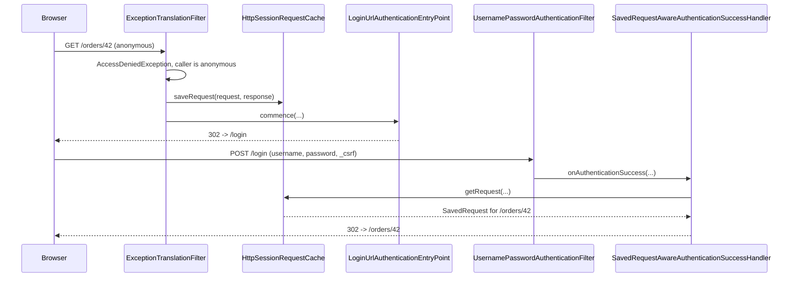

# 5.3 — Custom Login, Success/Failure Handlers, and Logout

> **Module 5 · Topic 3** · Modern Configuration
> Baseline: Spring Security 6.x on Boot 3.x
> New to this? Read **In Plain English** below first, then come back to the Version Matrix.

---

## Version Matrix

| Concern | Spring Security 5.x | **Spring Security 6.x (baseline)** | Spring Security 7.x |
|---|---|---|---|
| Saving the `SecurityContext` after login | `SecurityContextPersistenceFilter` saved it **automatically** at the end of the request | **`SecurityContextHolderFilter` does not save; the authentication mechanism must call `SecurityContextRepository.saveContext(...)`** | same |
| Default repository on `AbstractAuthenticationProcessingFilter` | none — persistence was the context filter's job | **`RequestAttributeSecurityContextRepository`** (request-scoped only) | same |
| Manual login from a controller | `SecurityContextHolder.setContext(...)` was enough | **`setContext(...)` **plus** an explicit `saveContext(...)`** | same |
| `logout` default HTTP method | `POST` when CSRF enabled | **`POST` when CSRF enabled; `GET`/`POST`/`PUT`/`DELETE` when disabled** | same |
| Generated login page | `DefaultLoginPageGeneratingFilter` | **same, plus `DefaultLogoutPageGeneratingFilter` for the `GET /logout` confirmation form** | same |
| `hideUserNotFoundExceptions` | `true` on `AbstractUserDetailsAuthenticationProvider` | **`true`** | `true` |
| `defaultSuccessUrl(url, true)` | supported | **supported** | supported |
| DSL style for handlers | `.successHandler(h).and()` | **`formLogin(form -> form.successHandler(h))`** | lambda only |
| Request cache replay gate | always replays the saved request | **`HttpSessionRequestCache.setMatchingRequestParameterName("continue")` available as an opt-in** | same |

---

## Why This Exists

Form login looks like one feature. It is actually five collaborating pieces, and almost every real
problem comes from not knowing which piece owns which decision:

1. **Where the login form lives** — `loginPage`, and the generated page that disappears when you
   supply your own.
2. **Where credentials are submitted** — `loginProcessingUrl`, matched by
   `UsernamePasswordAuthenticationFilter`, which is *not* a controller and has no
   `@RequestMapping`.
3. **What happens on success** — `AuthenticationSuccessHandler`, which owns the redirect *and*, in
   6.x, whether the login is persisted at all.
4. **What happens on failure** — `AuthenticationFailureHandler`, which owns the response and, more
   importantly, owns whether you leak which usernames exist.
5. **How the session ends** — `LogoutFilter` and its ordered list of `LogoutHandler`s.

The single most expensive thing to not know is the 6.x change in point 3: **the context filter no
longer saves the `SecurityContext` for you.** Code that worked in 5.x by calling
`SecurityContextHolder.setContext(...)` now authenticates the current request and forgets the user
on the next one.

---

## In Plain English

**The one-line version:** Logging in is not one feature but a short assembly line, with separate parts
owning where the form lives, where it is submitted, what happens when the password is right, what
happens when it is wrong, and how the user signs out again.

**An analogy.** Think of the reception desk of an office building. There is a sign-in sheet on the
counter, which is the login page. There is a clerk who takes the completed sheet and checks it against
the staff list, which is the filter that processes the submission. Crucially the clerk is not one of
the people who work in the building; a visitor cannot ask for the clerk by name or knock on a door
marked "clerk", because the clerk intercepts anyone walking up to the counter. That is exactly why the
login submission is not handled by a controller you can write.

When the details check out, someone escorts the visitor onward. The good receptionist remembers that
the visitor originally asked for the third-floor meeting room, and sends them there rather than
dumping everyone in the lobby. That memory of the original destination is the request cache.

When the details do not check out, what the clerk says out loud matters enormously. If the clerk says
"we have no Priya Sharma here" for one name and "that is the wrong pass number" for another, then
anyone standing at the counter can read out a list of names and learn which people work in the
building, without ever getting in. So the clerk is trained to give one identical answer for both cases.
The clerk is also trained to take the same amount of time either way, because pausing to check a pass
number while answering unknown names instantly leaks the same information through the clock.

Signing out has its own twist. The building requires a signed slip rather than accepting a shout across
the lobby, because otherwise a prankster could sign other people out by leaving a note. That is why
logging out is a POST rather than a simple link.

**How it actually works, step by step.**

An anonymous visitor asks for a protected page, for example `GET /orders/42`. The authorization check
refuses, and a filter called `ExceptionTranslationFilter` catches that refusal. Before doing anything
else it writes the original request into the request cache, which is by default stored in the user's
session. It then invokes the entry point, which for form login means sending the browser a redirect to
`/login`.

The user fills in the form and submits it. The submission goes to a URL watched by
`UsernamePasswordAuthenticationFilter`. This is a filter, not a controller, so there is no
`@RequestMapping` for it anywhere in your code and no `@ControllerAdvice` can catch its errors. It
pulls two request parameters out of the form, by default named `username` and `password`, and hands
them to the `AuthenticationManager` to be verified.

If verification succeeds, the filter does several things in a fixed order. It asks the container for a
new session identifier, which stops an attacker who planted a known session identifier from riding
along on the new login. It stores the authenticated user in the `SecurityContext`, which is simply the
holder for "who is logged in right now". It then saves that context so the next request still knows who
the user is, publishes an event for auditing, and finally calls the success handler, which looks in the
request cache, finds `/orders/42`, and redirects there.

That saving step is the biggest version trap in this file. In Spring Security 5 a filter wrote the
context into the session automatically at the end of every request, so any code that simply set the
current user was persisted for free. In Spring Security 6 that automatic save was removed. Whoever logs
the user in must now call `saveContext` themselves. Code copied from an older tutorial therefore appears
to work, because the current request is authenticated, and then the very next request is anonymous
again.

If verification fails, the failure handler runs instead. The default either sends a 401 status or
redirects back to the login page with an error marker. What you must not do here is improve the error
message by distinguishing a missing account from a wrong password. Spring Security actively prevents
this by converting "no such user" into the generic "bad credentials" before your handler ever sees it,
and by running a throwaway password hash even when the user does not exist so that both outcomes take
the same amount of time.

Logging out is handled by `LogoutFilter`. It runs an ordered list of small handlers, each doing one
cleanup job, such as invalidating the session, clearing the CSRF token, and expiring named cookies. It
then calls the logout success handler and stops, so the request never reaches your application. While
CSRF protection is switched on, logout only responds to POST. Switching CSRF off silently allows GET
logout again, which is a side effect people discover by accident and then come to rely on.

**Why should a beginner care?** Three concrete failures come straight out of not knowing this. Setting
a custom login page without also permitting it produces an endless redirect loop and a browser error
about too many redirects, which looks like a framework bug and is not. Writing your own login endpoint
in a controller on Spring Security 6 produces the maddening symptom where login appears to succeed and
the very next page says you are not logged in. And a well-intentioned "no account found with that email"
message hands an attacker a verified list of your users, which is the raw material for credential
stuffing and targeted phishing.

**Words you will meet in this file**

| Term | In plain words |
|---|---|
| `formLogin` | The configuration block that switches on username-and-password login through an HTML form. |
| `loginPage(url)` | The address where your own login form lives. Setting it also stops Spring generating a page for you. |
| `loginProcessingUrl(url)` | The address the form posts to. A filter intercepts it, so no controller method handles it. |
| `UsernamePasswordAuthenticationFilter` | The code that intercepts the login submission, reads the two form fields, and asks for them to be verified. |
| `AuthenticationManager` | The object that actually decides whether the submitted credentials are genuine. |
| `SecurityContext` | The small holder for "who is logged in for this request". |
| `SecurityContextRepository` | Where that holder is stored between requests, normally the session. Something must explicitly save into it. |
| `saveContext` | The call that writes the logged-in user somewhere durable. Required in Spring Security 6; it used to happen automatically. |
| `AuthenticationSuccessHandler` | The code that decides what the user sees after a successful login, usually a redirect. |
| `AuthenticationFailureHandler` | The code that decides what the user sees after a failed login, and therefore what you might accidentally reveal. |
| `SavedRequestAwareAuthenticationSuccessHandler` | The default success handler. It sends the user back to whatever page they originally asked for. |
| `RequestCache` | The store that remembers the page the user wanted before being sent to login. |
| `NullRequestCache` | A do-nothing request cache used on APIs, so that unauthenticated calls do not accidentally create sessions. |
| User enumeration | Working out which accounts exist by comparing the wording or the timing of failed login responses. |
| `BadCredentialsException` | The deliberately vague "those details are wrong" error. Missing users are converted into this on purpose. |
| `hideUserNotFoundExceptions` | The setting, on by default, that performs that conversion. Turning it off reintroduces the leak. |
| Session fixation | An attack where a session identifier is planted in advance and reused after login. Prevented by issuing a fresh identifier at login. |
| `LogoutFilter` | The code that handles the logout request by running a list of cleanup handlers and then responding. |
| `LogoutHandler` | One cleanup job that runs during logout, such as invalidating the session or clearing a cookie. |
| `DefaultLoginPageGeneratingFilter` | The built-in filter that renders a basic login page so a new project works with no template. It switches off once you supply your own page. |

**If you remember only one thing:** in Spring Security 6 nothing saves the logged-in user for you, so
whichever piece of code performs the login must also save the context, or the login lasts one request.

---

## Core Concepts

### 1. The `formLogin` configuration surface

**In simple terms:** These are every setting you can change about form-based login, and the one people
forget is permitting the login page itself, which otherwise causes an endless redirect loop.

```java
http.formLogin(form -> form
    .loginPage("/login")                       // GET: your page. Also sets the entry point target.
    .loginProcessingUrl("/perform-login")      // POST: handled by the FILTER, not a controller
    .usernameParameter("email")                // default "username"
    .passwordParameter("secret")               // default "password"
    .defaultSuccessUrl("/dashboard", false)    // false = only when there is no saved request
    .failureUrl("/login?error")                // default: loginPage + "?error"
    .successHandler(mySuccessHandler)          // MUTUALLY EXCLUSIVE with defaultSuccessUrl
    .failureHandler(myFailureHandler)          // MUTUALLY EXCLUSIVE with failureUrl
    .permitAll()                               // permits loginPage, processing URL, failure URL
);
```

| Option | Effect | Default |
|---|---|---|
| `loginPage(url)` | `GET url` renders your form; the `LoginUrlAuthenticationEntryPoint` redirects here | `/login` (generated) |
| `loginProcessingUrl(url)` | `POST url` is intercepted by `UsernamePasswordAuthenticationFilter` | same as `loginPage` |
| `usernameParameter(name)` | Form field read for the username | `username` |
| `passwordParameter(name)` | Form field read for the password | `password` |
| `defaultSuccessUrl(url)` | Installs a `SavedRequestAwareAuthenticationSuccessHandler` with that target | `/` |
| `defaultSuccessUrl(url, true)` | Same, with `alwaysUseDefaultTargetUrl = true` — ignores the saved request | `false` |
| `failureUrl(url)` | Installs a `SimpleUrlAuthenticationFailureHandler` redirecting there | `loginPage + "?error"` |
| `successHandler(h)` | Replaces the success handler entirely | `SavedRequestAwareAuthenticationSuccessHandler` |
| `failureHandler(h)` | Replaces the failure handler entirely | `SimpleUrlAuthenticationFailureHandler` |
| `permitAll()` | Adds `permitAll` rules for the login, processing, and failure URLs during `init()` | off |

**The classic mistake** is setting `loginPage("/login")` without permitting it:

```java
http
    .authorizeHttpRequests(auth -> auth.anyRequest().authenticated())
    .formLogin(form -> form.loginPage("/login"));       // no permitAll()
```

An anonymous request is denied, `ExceptionTranslationFilter` invokes
`LoginUrlAuthenticationEntryPoint`, which redirects to `/login`. `/login` is itself covered by
`anyRequest().authenticated()`, so it is denied, and the entry point redirects to `/login` again.
The browser reports `ERR_TOO_MANY_REDIRECTS`. Add `.permitAll()`, or an explicit
`.requestMatchers("/login").permitAll()` rule placed **before** `anyRequest()`.

A second, quieter version of the same bug: permitting `GET /login` but not the failure URL. Login
fails, the failure handler redirects to `/login?error`, and the query string does not change
matcher behaviour — so that one usually works. The version that does bite is a custom
`loginProcessingUrl` that is not permitted, which produces a 403 on submit instead of a login
attempt.

### 2. `DefaultLoginPageGeneratingFilter` and when it disappears

**In simple terms:** Spring gives a brand-new project a working login page for free, and this explains
the three ways you can accidentally switch that free page off and be left with nothing.

Spring Security generates a login page so that a new application works without a template. The
filter is added by `DefaultLoginPageConfigurer`:

```java
// DefaultLoginPageConfigurer.configure — simplified
@Override
public void configure(H http) {
    AuthenticationEntryPoint entryPoint = null;
    ExceptionHandlingConfigurer<?> exceptionConf = http.getConfigurer(ExceptionHandlingConfigurer.class);
    if (exceptionConf != null) {
        entryPoint = exceptionConf.getAuthenticationEntryPoint();
    }
    if (this.loginPageGeneratingFilter.isEnabled() && entryPoint == null) {
        http.addFilter(postProcess(this.loginPageGeneratingFilter));
        http.addFilter(postProcess(this.logoutPageGeneratingFilter));
    }
}
```

The page disappears in three situations, and knowing which one you are in saves a lot of time:

- **You called `loginPage("/login")`.** `AbstractAuthenticationFilterConfigurer.loginPage(...)` sets
  `customLoginPage = true`, which turns off generation for form login. You now own the template, and
  it must post `username`, `password`, and the CSRF token.
- **You set an explicit `authenticationEntryPoint`.** The condition above is `entryPoint == null`,
  so any explicit entry point suppresses both generated pages. This is why an API chain with
  `HttpStatusEntryPoint` has no generated login page even though `formLogin` is enabled.
- **You never enabled a login mechanism.** `isEnabled()` is true only when form login, OAuth2 login,
  or SAML2 login is configured.

`DefaultLogoutPageGeneratingFilter` is the companion: it renders a `GET /logout` page containing a
form that POSTs to `/logout` with a CSRF token. It exists precisely because logout is POST-only when
CSRF is enabled, and a bare link cannot do a POST.

### 3. `AuthenticationSuccessHandler`

**In simple terms:** This is the piece that decides where a user lands after logging in, and by default
it returns them to whatever page they were trying to reach before they were asked to log in.

```java
package org.springframework.security.web.authentication;

public interface AuthenticationSuccessHandler {

    default void onAuthenticationSuccess(HttpServletRequest request, HttpServletResponse response,
            FilterChain chain, Authentication authentication) throws IOException, ServletException {
        onAuthenticationSuccess(request, response, authentication);
        chain.doFilter(request, response);
    }

    void onAuthenticationSuccess(HttpServletRequest request, HttpServletResponse response,
            Authentication authentication) throws IOException, ServletException;
}
```

| Implementation | Behaviour |
|---|---|
| `SavedRequestAwareAuthenticationSuccessHandler` | **The default.** Redirects to the pre-login destination held in `RequestCache`, falling back to `defaultTargetUrl` |
| `SimpleUrlAuthenticationSuccessHandler` | Redirects to `defaultTargetUrl`; supports `targetUrlParameter` and `useReferer` |
| `ForwardAuthenticationSuccessHandler` | Server-side forward instead of a redirect — no `Location` header, the URL does not change |
| `HttpStatusReturningLogoutSuccessHandler` (logout equivalent) | Writes a status code with no redirect |

The default handler is the one to understand:

```java
// SavedRequestAwareAuthenticationSuccessHandler
private RequestCache requestCache = new HttpSessionRequestCache();

@Override
public void onAuthenticationSuccess(HttpServletRequest request, HttpServletResponse response,
        Authentication authentication) throws ServletException, IOException {

    SavedRequest savedRequest = this.requestCache.getRequest(request, response);
    if (savedRequest == null) {
        super.onAuthenticationSuccess(request, response, authentication);   // defaultTargetUrl
        return;
    }
    String targetUrlParameter = getTargetUrlParameter();
    if (isAlwaysUseDefaultTargetUrl()
            || (targetUrlParameter != null && StringUtils.hasText(request.getParameter(targetUrlParameter)))) {
        this.requestCache.removeRequest(request, response);
        super.onAuthenticationSuccess(request, response, authentication);
        return;
    }
    clearAuthenticationAttributes(request);
    getRedirectStrategy().sendRedirect(request, response, savedRequest.getRedirectUrl());
}
```

The `SavedRequest` was written earlier by `ExceptionTranslationFilter`, which calls
`requestCache.saveRequest(request, response)` before invoking the entry point. That is the mechanism
behind "I asked for `/orders/42`, was sent to login, and came back to `/orders/42`".

`defaultSuccessUrl("/dashboard", true)` sets `alwaysUseDefaultTargetUrl = true`, which discards the
saved request. Use `true` when you always want users to land on a dashboard; use `false` (the
default) when returning them to their original destination matters.

### 4. `AuthenticationFailureHandler` and user enumeration

**In simple terms:** This decides what a failed login says back to the user, and saying anything more
specific than "those details are wrong" lets an attacker discover which accounts exist on your system.

```java
package org.springframework.security.web.authentication;

public interface AuthenticationFailureHandler {

    void onAuthenticationFailure(HttpServletRequest request, HttpServletResponse response,
            AuthenticationException exception) throws IOException, ServletException;
}
```

| Implementation | Behaviour |
|---|---|
| `SimpleUrlAuthenticationFailureHandler` | With no `defaultFailureUrl`, sends **401**. With one, redirects (or forwards if `useForward`) and stores the exception in the session under `WebAttributes.AUTHENTICATION_EXCEPTION` |
| `ExceptionMappingAuthenticationFailureHandler` | Maps exception class name to URL — for example `CredentialsExpiredException` to `/password-expired` |
| `DelegatingAuthenticationFailureHandler` | Picks a handler by exception type, with a default |
| `ForwardAuthenticationFailureHandler` | Forwards to a view so the form can be re-rendered with the submitted values |

**The security rule: the message shown to the user must not distinguish "no such user" from "wrong
password".** If it does, an attacker submits a list of email addresses with a junk password and
learns which accounts exist. That list is then worth money, and it is the input to credential
stuffing and targeted phishing.

Spring Security defends this by default:

```java
// AbstractUserDetailsAuthenticationProvider
private boolean hideUserNotFoundExceptions = true;

try {
    user = retrieveUser(username, (UsernamePasswordAuthenticationToken) authentication);
}
catch (UsernameNotFoundException ex) {
    if (!this.hideUserNotFoundExceptions) {
        throw ex;
    }
    throw new BadCredentialsException(
        this.messages.getMessage("AbstractUserDetailsAuthenticationProvider.badCredentials",
                                 "Bad credentials"));
}
```

So `UsernameNotFoundException` is converted into `BadCredentialsException` before it reaches your
handler. **Do not set `hideUserNotFoundExceptions(false)`** to "improve the error message" — that is
exactly the leak.

Hiding the exception type is not sufficient on its own, because *timing* also leaks. A missing user
returns immediately; an existing user costs a bcrypt verification of roughly 100 ms.
`DaoAuthenticationProvider` handles that too:

```java
// DaoAuthenticationProvider
private void mitigateAgainstTimingAttack(UsernamePasswordAuthenticationToken authentication) {
    if (authentication.getCredentials() != null) {
        String presentedPassword = authentication.getCredentials().toString();
        this.passwordEncoder.matches(presentedPassword, this.userNotFoundEncodedPassword);
    }
}
```

When the user does not exist it still runs the encoder against a dummy hash, so both paths cost
about the same. A custom `AuthenticationProvider` that skips this reintroduces the leak.

Three more leaks that live outside Spring Security and are worth naming: a registration form that
says "email already taken", a password-reset form that says "no account with that email", and
different response *times* on your own `UserDetailsService` because a missing user skips a database
round trip.

### 5. JSON login — two designs

**In simple terms:** The built-in login only reads HTML form fields, so a JavaScript front end sending
JSON needs either a custom filter or a controller, and each choice hands you a different set of chores.

A browser form posts `application/x-www-form-urlencoded`.
`UsernamePasswordAuthenticationFilter.attemptAuthentication` calls
`obtainUsername(request)`, which is `request.getParameter("username")` — it cannot read a JSON body.
For a single-page application posting `{"username": "...", "password": "..."}` you need one of two
approaches.

#### Design A — a filter extending `AbstractAuthenticationProcessingFilter`

The filter sits in the chain, so you inherit the whole mechanism: session fixation protection,
remember-me, `SecurityContextRepository` saving, event publishing, and the success/failure handler
contract.

```java
// AbstractAuthenticationProcessingFilter.doFilter — what you inherit
if (!requiresAuthentication(request, response)) {
    chain.doFilter(request, response);
    return;
}
try {
    Authentication authenticationResult = attemptAuthentication(request, response);
    if (authenticationResult == null) {
        return;                                  // subclass is handling it (multi-step)
    }
    this.sessionStrategy.onAuthentication(authenticationResult, request, response);
    if (this.continueChainBeforeSuccessfulAuthentication) {
        chain.doFilter(request, response);
    }
    successfulAuthentication(request, response, chain, authenticationResult);
}
catch (InternalAuthenticationServiceException failed) {
    unsuccessfulAuthentication(request, response, failed);
}
catch (AuthenticationException ex) {
    unsuccessfulAuthentication(request, response, ex);
}
```

```java
// AbstractAuthenticationProcessingFilter.successfulAuthentication
protected void successfulAuthentication(HttpServletRequest request, HttpServletResponse response,
        FilterChain chain, Authentication authResult) throws IOException, ServletException {

    SecurityContext context = this.securityContextHolderStrategy.createEmptyContext();
    context.setAuthentication(authResult);
    this.securityContextHolderStrategy.setContext(context);
    this.securityContextRepository.saveContext(context, request, response);   // 6.x: explicit
    this.rememberMeServices.loginSuccess(request, response, authResult);
    if (this.eventPublisher != null) {
        this.eventPublisher.publishEvent(new InteractiveAuthenticationSuccessEvent(authResult, getClass()));
    }
    this.successHandler.onAuthenticationSuccess(request, response, authResult);
}
```

**The trap:** in 6.x the inherited `securityContextRepository` defaults to
`RequestAttributeSecurityContextRepository`, which keeps the context for the current request only.
If you want a session-based login you must set `HttpSessionSecurityContextRepository` explicitly.
`FormLoginConfigurer` does this for you; a hand-registered filter does not.

#### Design B — a `@RestController` calling `AuthenticationManager`

Simpler to read, works with `@Valid`, easy to return a rich JSON body — but you now own every step
the filter would have done for you.

```java
Authentication authentication = this.authenticationManager.authenticate(
        UsernamePasswordAuthenticationToken.unauthenticated(body.username(), body.password()));

SecurityContext context = this.securityContextHolderStrategy.createEmptyContext();
context.setAuthentication(authentication);
this.securityContextHolderStrategy.setContext(context);
this.securityContextRepository.saveContext(context, request, response);   // MANDATORY in 6.x
```

**Why `saveContext` is mandatory in 6.x.** In 5.x, `SecurityContextPersistenceFilter` read the
context on the way in and wrote it back to the session on the way out, so setting the holder was
enough. 6.x replaced it with `SecurityContextHolderFilter`, which **only reads**:

```java
// SecurityContextHolderFilter.doFilterInternal
Supplier<SecurityContext> deferredContext = this.securityContextRepository.loadDeferredContext(request);
try {
    this.securityContextHolderStrategy.setDeferredContext(deferredContext);
    chain.doFilter(request, response);
}
finally {
    this.securityContextHolderStrategy.clearContext();
    request.removeAttribute(FILTER_APPLIED);
}
```

There is no save. The change was deliberate: automatic saving meant every request paid a session
write even when nothing changed, and it hid *who* was responsible for persistence. Now the
authentication mechanism owns it. The cost is that manual-login code written for 5.x fails silently:
the current request is authenticated, the next one is anonymous.

**The second thing Design B loses is session fixation protection.** The filter would have called
`sessionStrategy.onAuthentication(...)`, which for the default `changeSessionId` strategy asks the
container for a new session identifier while keeping the session's attributes. A controller must do
it explicitly, before saving the context:

```java
this.sessionAuthenticationStrategy.onAuthentication(authentication, request, response);
```

Session fixation is covered properly in file 20; the point here is only that the filter does it for
you and a controller does not.

### 6. Logout

**In simple terms:** Logging out runs a list of small cleanup jobs rather than one action, and it only
accepts POST so that a hidden image or link on someone else's page cannot sign your users out.

```java
http.logout(logout -> logout
    .logoutUrl("/logout")                          // default
    .logoutSuccessUrl("/login?logout")             // default
    .logoutSuccessHandler(myHandler)               // mutually exclusive with logoutSuccessUrl
    .invalidateHttpSession(true)                   // default
    .clearAuthentication(true)                     // default
    .deleteCookies("JSESSIONID")                   // adds a CookieClearingLogoutHandler
    .addLogoutHandler(myLogoutHandler)             // appended to the list
    .permitAll()
);
```

```java
package org.springframework.security.web.authentication.logout;

public interface LogoutHandler {
    void logout(HttpServletRequest request, HttpServletResponse response, Authentication authentication);
}
```

`LogoutFilter` runs **every** registered handler in order, then calls the `LogoutSuccessHandler`:

```java
// LogoutFilter.doFilter — simplified
if (requiresLogout(request, response)) {
    Authentication auth = this.securityContextHolderStrategy.getContext().getAuthentication();
    this.handler.logout(request, response, auth);        // CompositeLogoutHandler
    this.logoutSuccessHandler.onLogoutSuccess(request, response, auth);
    return;                                              // chain NOT continued
}
chain.doFilter(request, response);
```

| Default handler | Added by | What it does |
|---|---|---|
| `SecurityContextLogoutHandler` | `LogoutConfigurer`, always | Invalidates the `HttpSession` (`invalidateHttpSession`), clears the authentication (`clearAuthentication`), clears the holder |
| `CsrfLogoutHandler` | `CsrfConfigurer.init()` when CSRF is enabled | Removes the saved CSRF token so a new one is issued after logout |
| `CookieClearingLogoutHandler` | `LogoutConfigurer` when you call `deleteCookies(...)` | Writes `Set-Cookie` with `Max-Age=0` for each named cookie |
| `LogoutSuccessEventPublishingLogoutHandler` | `LogoutConfigurer` | Publishes `LogoutSuccessEvent` for auditing |
| `Saml2LogoutBeanDefinitionParser` handlers, `OidcClientInitiatedLogoutSuccessHandler` | the relevant configurer | Propagate logout to the identity provider |

**Why logout is POST by default.** Logout changes state, so it must be CSRF-protected — otherwise
an `` on any page logs the victim out. That is a nuisance
on its own, and it is a building block for login-CSRF attacks where the attacker logs you out and
then logs you in as *them*, so your subsequent activity lands in their account.

```java
// LogoutConfigurer — the matcher depends on whether CSRF is enabled
private RequestMatcher getLogoutRequestMatcher(H http) {
    if (this.logoutRequestMatcher != null) {
        return this.logoutRequestMatcher;
    }
    if (http.getConfigurer(CsrfConfigurer.class) != null) {
        this.logoutRequestMatcher = createLogoutRequestMatcher("POST");
    }
    else {
        this.logoutRequestMatcher = createLogoutRequestMatcher("GET", "POST", "PUT", "DELETE");
    }
    return this.logoutRequestMatcher;
}
```

So `csrf(csrf -> csrf.disable())` silently makes `GET /logout` work again. That is a side effect
people discover by accident and then depend on.

### 7. `RequestCache`

**In simple terms:** This is the short-term memory that remembers which page a user wanted before being
sent to log in, so they land back there afterwards instead of on the home page.



The default `HttpSessionRequestCache` does not save everything.
`RequestCacheConfigurer` builds a matcher that excludes the favicon, `application/json`,
`multipart/form-data`, `text/event-stream`, and requests carrying
`X-Requested-With: XMLHttpRequest`, and — when CSRF is enabled — restricts saving to `GET` requests.
Without that, an unauthenticated XHR would be saved and replayed as a navigation after login, which
is both wrong and confusing.

For a stateless API, use `NullRequestCache`:

```java
http.requestCache(cache -> cache.requestCache(new NullRequestCache()));
```

`NullRequestCache.saveRequest(...)` is a no-op and `getRequest(...)` returns `null`. Without it,
`ExceptionTranslationFilter` writes a saved request into the session on every unauthenticated call —
which **creates a session**, defeating `SessionCreationPolicy.STATELESS` in the most common way
people hit it.

There is also an opt-in optimisation: `HttpSessionRequestCache.setMatchingRequestParameterName("continue")`
makes the cache replay the saved request only when the redirect carries that parameter, which avoids
a session lookup on every request.

---

## Working Code

```java
package com.example.security;

import com.fasterxml.jackson.databind.ObjectMapper;
import jakarta.servlet.http.HttpServletRequest;
import jakarta.servlet.http.HttpServletResponse;
import org.slf4j.Logger;
import org.slf4j.LoggerFactory;
import org.springframework.http.HttpStatus;
import org.springframework.http.MediaType;
import org.springframework.security.core.Authentication;
import org.springframework.security.core.AuthenticationException;
import org.springframework.security.core.GrantedAuthority;
import org.springframework.security.web.authentication.AuthenticationFailureHandler;
import org.springframework.security.web.authentication.AuthenticationSuccessHandler;

import java.io.IOException;
import java.time.Instant;
import java.util.List;
import java.util.Map;

/** Emits JSON instead of redirecting. Suitable for a single-page application. */
public class JsonAuthenticationSuccessHandler implements AuthenticationSuccessHandler {

    private final ObjectMapper objectMapper;

    public JsonAuthenticationSuccessHandler(ObjectMapper objectMapper) {
        this.objectMapper = objectMapper;
    }

    @Override
    public void onAuthenticationSuccess(HttpServletRequest request, HttpServletResponse response,
            Authentication authentication) throws IOException {

        response.setStatus(HttpStatus.OK.value());
        response.setContentType(MediaType.APPLICATION_JSON_VALUE);
        response.setCharacterEncoding("UTF-8");

        List<String> authorities = authentication.getAuthorities().stream()
                .map(GrantedAuthority::getAuthority).toList();

        this.objectMapper.writeValue(response.getWriter(), Map.of(
                "username", authentication.getName(),
                "authorities", authorities,
                "authenticatedAt", Instant.now().toString()));
    }
}

/**
 * Always the SAME body and status regardless of WHY authentication failed.
 * Distinguishing "unknown user" from "wrong password" is user enumeration.
 */
class JsonAuthenticationFailureHandler implements AuthenticationFailureHandler {

    private static final Logger log = LoggerFactory.getLogger(JsonAuthenticationFailureHandler.class);

    private final ObjectMapper objectMapper;

    JsonAuthenticationFailureHandler(ObjectMapper objectMapper) {
        this.objectMapper = objectMapper;
    }

    @Override
    public void onAuthenticationFailure(HttpServletRequest request, HttpServletResponse response,
            AuthenticationException exception) throws IOException {

        // Log the real reason server-side; never send it to the client.
        log.info("Authentication failed: {}", exception.getClass().getSimpleName());

        response.setStatus(HttpStatus.UNAUTHORIZED.value());
        response.setContentType(MediaType.APPLICATION_PROBLEM_JSON_VALUE);
        this.objectMapper.writeValue(response.getWriter(), Map.of(
                "type", "about:blank", "title", "Unauthorized", "status", 401,
                "detail", "Invalid username or password."));
    }
}
```

**Design A — the JSON login filter:**

```java
package com.example.security;

import com.fasterxml.jackson.databind.ObjectMapper;
import jakarta.servlet.http.HttpServletRequest;
import jakarta.servlet.http.HttpServletResponse;
import org.springframework.http.HttpMethod;
import org.springframework.http.MediaType;
import org.springframework.security.authentication.AuthenticationServiceException;
import org.springframework.security.authentication.UsernamePasswordAuthenticationToken;
import org.springframework.security.core.Authentication;
import org.springframework.security.core.AuthenticationException;
import org.springframework.security.web.authentication.AbstractAuthenticationProcessingFilter;
import org.springframework.security.web.util.matcher.AntPathRequestMatcher;

import java.io.IOException;

public class JsonUsernamePasswordAuthenticationFilter extends AbstractAuthenticationProcessingFilter {

    private final ObjectMapper objectMapper;

    public JsonUsernamePasswordAuthenticationFilter(ObjectMapper objectMapper) {
        super(new AntPathRequestMatcher("/api/login", HttpMethod.POST.name()));
        this.objectMapper = objectMapper;
    }

    public record LoginRequest(String username, String password) { }

    @Override
    public Authentication attemptAuthentication(HttpServletRequest request, HttpServletResponse response)
            throws AuthenticationException, IOException {

        if (request.getContentType() == null
                || !request.getContentType().startsWith(MediaType.APPLICATION_JSON_VALUE)) {
            throw new AuthenticationServiceException("Expected Content-Type: application/json");
        }

        LoginRequest body = this.objectMapper.readValue(request.getInputStream(), LoginRequest.class);
        if (body.username() == null || body.password() == null) {
            throw new AuthenticationServiceException("username and password are required");
        }

        UsernamePasswordAuthenticationToken token =
                UsernamePasswordAuthenticationToken.unauthenticated(body.username().trim(), body.password());
        setDetails(request, token);
        return getAuthenticationManager().authenticate(token);
    }

    private void setDetails(HttpServletRequest request, UsernamePasswordAuthenticationToken token) {
        token.setDetails(this.authenticationDetailsSource.buildDetails(request));
    }
}
```

**Design B — the controller, with every step the filter would have done:**

```java
package com.example.web;

import com.example.security.dto.LoginRequest;
import jakarta.servlet.http.HttpServletRequest;
import jakarta.servlet.http.HttpServletResponse;
import jakarta.validation.Valid;
import org.springframework.http.ResponseEntity;
import org.springframework.security.authentication.AuthenticationManager;
import org.springframework.security.authentication.UsernamePasswordAuthenticationToken;
import org.springframework.security.core.Authentication;
import org.springframework.security.core.AuthenticationException;
import org.springframework.security.core.GrantedAuthority;
import org.springframework.security.core.context.*;
import org.springframework.security.web.authentication.session.SessionAuthenticationStrategy;
import org.springframework.security.web.context.HttpSessionSecurityContextRepository;
import org.springframework.security.web.context.SecurityContextRepository;
import org.springframework.web.bind.annotation.*;

import java.util.List;
import java.util.Map;

@RestController
public class LoginController {

    private final AuthenticationManager authenticationManager;
    private final SessionAuthenticationStrategy sessionAuthenticationStrategy;

    // 6.x: the context filter no longer saves. WE must.
    private final SecurityContextRepository securityContextRepository =
            new HttpSessionSecurityContextRepository();

    private final SecurityContextHolderStrategy securityContextHolderStrategy =
            SecurityContextHolder.getContextHolderStrategy();

    public LoginController(AuthenticationManager authenticationManager,
                           SessionAuthenticationStrategy sessionAuthenticationStrategy) {
        this.authenticationManager = authenticationManager;
        this.sessionAuthenticationStrategy = sessionAuthenticationStrategy;
    }

    @PostMapping("/api/login")
    public ResponseEntity<?> login(@Valid @RequestBody LoginRequest body,
                                   HttpServletRequest request,
                                   HttpServletResponse response) {
        try {
            Authentication authentication = this.authenticationManager.authenticate(
                    UsernamePasswordAuthenticationToken.unauthenticated(body.username(), body.password()));

            // 1. Session fixation protection - the filter would have done this for us.
            this.sessionAuthenticationStrategy.onAuthentication(authentication, request, response);

            // 2. Put the authentication on the holder for THIS request.
            SecurityContext context = this.securityContextHolderStrategy.createEmptyContext();
            context.setAuthentication(authentication);
            this.securityContextHolderStrategy.setContext(context);

            // 3. Persist it so the NEXT request is authenticated. Omitting this is
            //    the single most common Spring Security 6 migration bug.
            this.securityContextRepository.saveContext(context, request, response);

            List<String> authorities = authentication.getAuthorities().stream()
                    .map(GrantedAuthority::getAuthority).toList();
            return ResponseEntity.ok(Map.of("username", authentication.getName(),
                                            "authorities", authorities));
        }
        catch (AuthenticationException ex) {
            // One response for every failure reason. No enumeration.
            return ResponseEntity.status(401)
                    .body(Map.of("title", "Unauthorized", "detail", "Invalid username or password."));
        }
    }
}
```

**Wiring it all together:**

```java
package com.example.security;

import com.fasterxml.jackson.databind.ObjectMapper;
import org.springframework.context.annotation.Bean;
import org.springframework.context.annotation.Configuration;
import org.springframework.core.annotation.Order;
import org.springframework.security.authentication.AuthenticationManager;
import org.springframework.security.config.annotation.web.builders.HttpSecurity;
import org.springframework.security.config.annotation.web.configuration.EnableWebSecurity;
import org.springframework.security.web.SecurityFilterChain;
import org.springframework.security.web.authentication.UsernamePasswordAuthenticationFilter;
import org.springframework.security.web.authentication.logout.HttpStatusReturningLogoutSuccessHandler;
import org.springframework.security.web.context.HttpSessionSecurityContextRepository;
import org.springframework.security.web.savedrequest.NullRequestCache;

@Configuration
@EnableWebSecurity
public class LoginConfig {

    @Bean
    @Order(1)
    SecurityFilterChain apiChain(HttpSecurity http, AuthenticationManager authenticationManager,
                                 ObjectMapper mapper) throws Exception {

        JsonUsernamePasswordAuthenticationFilter jsonLogin =
                new JsonUsernamePasswordAuthenticationFilter(mapper);
        jsonLogin.setAuthenticationManager(authenticationManager);
        jsonLogin.setAuthenticationSuccessHandler(new JsonAuthenticationSuccessHandler(mapper));
        jsonLogin.setAuthenticationFailureHandler(new JsonAuthenticationFailureHandler(mapper));
        // 6.x default is RequestAttributeSecurityContextRepository (this request only).
        // A session login MUST override it.
        jsonLogin.setSecurityContextRepository(new HttpSessionSecurityContextRepository());

        http
            .securityMatcher("/api/**")
            .authorizeHttpRequests(auth -> auth
                .requestMatchers("/api/login").permitAll()
                .anyRequest().authenticated()
            )
            .addFilterBefore(jsonLogin, UsernamePasswordAuthenticationFilter.class)
            .requestCache(cache -> cache.requestCache(new NullRequestCache()))
            .logout(logout -> logout
                .logoutUrl("/api/logout")
                .logoutSuccessHandler(new HttpStatusReturningLogoutSuccessHandler())
                .deleteCookies("JSESSIONID")
            )
            .csrf(csrf -> csrf.disable());   // token-based clients only
        return http.build();
    }

    @Bean
    @Order(2)
    SecurityFilterChain webChain(HttpSecurity http) throws Exception {
        http
            .authorizeHttpRequests(auth -> auth
                .requestMatchers("/", "/login", "/error", "/css/**").permitAll()
                .anyRequest().authenticated()
            )
            .formLogin(form -> form
                .loginPage("/login")
                .loginProcessingUrl("/perform-login")
                .usernameParameter("email")
                .defaultSuccessUrl("/dashboard", false)   // false: honour the saved request
                .failureUrl("/login?error")
                .permitAll()                              // WITHOUT THIS: redirect loop
            )
            .logout(logout -> logout
                .logoutUrl("/logout")                     // POST only, because CSRF is enabled
                .logoutSuccessUrl("/login?logout")
                .invalidateHttpSession(true)
                .clearAuthentication(true)
                .deleteCookies("JSESSIONID")
                .permitAll()
            );
        return http.build();
    }
}
```

**Tests:**

```java
package com.example.security;

import org.junit.jupiter.api.Test;
import org.springframework.beans.factory.annotation.Autowired;
import org.springframework.boot.test.autoconfigure.web.servlet.AutoConfigureMockMvc;
import org.springframework.boot.test.context.SpringBootTest;
import org.springframework.mock.web.MockHttpSession;
import org.springframework.security.test.context.support.WithMockUser;
import org.springframework.test.web.servlet.MockMvc;

import static org.assertj.core.api.Assertions.assertThat;
import static org.springframework.security.test.web.servlet.request.SecurityMockMvcRequestBuilders.*;
import static org.springframework.security.test.web.servlet.result.SecurityMockMvcResultMatchers.*;
import static org.springframework.test.web.servlet.request.MockMvcRequestBuilders.get;
import static org.springframework.test.web.servlet.request.MockMvcRequestBuilders.post;
import static org.springframework.test.web.servlet.result.MockMvcResultMatchers.*;

@SpringBootTest
@AutoConfigureMockMvc
class LoginConfigTests {

    @Autowired MockMvc mvc;

    @Test
    void formLoginUsesTheCustomProcessingUrlAndParameterNames() throws Exception {
        mvc.perform(formLogin("/perform-login").userParameter("email")
                                               .user("alice@example.com").password("password"))
           .andExpect(authenticated().withUsername("alice@example.com"))
           .andExpect(redirectedUrl("/dashboard"));
    }

    @Test
    void savedRequestIsReplayedAfterLogin() throws Exception {
        MockHttpSession session = new MockHttpSession();
        // Anonymous hit on a protected page: ExceptionTranslationFilter saves it.
        mvc.perform(get("/orders/42").session(session))
           .andExpect(status().is3xxRedirection())
           .andExpect(redirectedUrl("http://localhost/login"));

        mvc.perform(formLogin("/perform-login").userParameter("email")
                                               .user("alice@example.com").password("password")
                                               .session(session))
           .andExpect(authenticated())
           .andExpect(redirectedUrl("http://localhost/orders/42"));
    }

    @Test
    void unknownUserAndWrongPasswordAreIndistinguishable() throws Exception {
        var unknown = mvc.perform(formLogin("/perform-login").userParameter("email")
                                    .user("nobody@example.com").password("password"))
                         .andExpect(unauthenticated())
                         .andExpect(redirectedUrl("/login?error"))
                         .andReturn();

        var wrongPassword = mvc.perform(formLogin("/perform-login").userParameter("email")
                                    .user("alice@example.com").password("wrong"))
                               .andExpect(unauthenticated())
                               .andExpect(redirectedUrl("/login?error"))
                               .andReturn();

        assertThat(unknown.getResponse().getStatus())
                .isEqualTo(wrongPassword.getResponse().getStatus());
    }

    @Test
    void jsonLoginReturnsJsonAndAuthenticatesTheNextRequest() throws Exception {
        MockHttpSession session = new MockHttpSession();
        mvc.perform(post("/api/login").session(session)
                        .contentType("application/json")
                        .content("{\"username\":\"alice@example.com\",\"password\":\"password\"}"))
           .andExpect(status().isOk())
           .andExpect(jsonPath("$.username").value("alice@example.com"))
           .andExpect(authenticated());

        // Proves saveContext() worked: a SUBSEQUENT request is still authenticated.
        mvc.perform(get("/api/me").session(session)).andExpect(status().isOk());
    }

    @Test
    void jsonLoginFailureIsAlways401WithAGenericBody() throws Exception {
        mvc.perform(post("/api/login").contentType("application/json")
                        .content("{\"username\":\"alice@example.com\",\"password\":\"wrong\"}"))
           .andExpect(status().isUnauthorized())
           .andExpect(jsonPath("$.detail").value("Invalid username or password."));
    }

    @Test
    @WithMockUser
    void logoutIsPostOnlyAndClearsTheSessionCookie() throws Exception {
        mvc.perform(get("/logout")).andExpect(status().isNotFound());   // no GET mapping
        mvc.perform(logout("/logout"))
           .andExpect(unauthenticated())
           .andExpect(redirectedUrl("/login?logout"))
           .andExpect(cookie().maxAge("JSESSIONID", 0));
    }
}
```

---

## Internals

### `UsernamePasswordAuthenticationFilter` is not a controller

```java
// UsernamePasswordAuthenticationFilter
public static final String SPRING_SECURITY_FORM_USERNAME_KEY = "username";
public static final String SPRING_SECURITY_FORM_PASSWORD_KEY = "password";

private static final AntPathRequestMatcher DEFAULT_ANT_PATH_REQUEST_MATCHER =
        new AntPathRequestMatcher("/login", "POST");

@Override
public Authentication attemptAuthentication(HttpServletRequest request, HttpServletResponse response) {
    if (this.postOnly && !request.getMethod().equals("POST")) {
        throw new AuthenticationServiceException("Authentication method not supported: " + request.getMethod());
    }
    String username = obtainUsername(request);     // request.getParameter(usernameParameter)
    username = (username != null) ? username.trim() : "";
    String password = obtainPassword(request);
    password = (password != null) ? password : "";

    UsernamePasswordAuthenticationToken authRequest =
            UsernamePasswordAuthenticationToken.unauthenticated(username, password);
    setDetails(request, authRequest);
    return this.getAuthenticationManager().authenticate(authRequest);
}
```

`obtainUsername` uses `request.getParameter(...)`, which is why a JSON body yields `null` and the
request fails with bad credentials against an empty username. It is also why there is no
`@PostMapping("/login")` anywhere — the filter intercepts the request and never continues the chain,
so `DispatcherServlet` never sees it. Writing a controller mapped to `loginProcessingUrl` produces a
method that is never invoked.

### `unsuccessfulAuthentication` and where the exception goes

```java
// AbstractAuthenticationProcessingFilter
protected void unsuccessfulAuthentication(HttpServletRequest request, HttpServletResponse response,
        AuthenticationException failed) throws IOException, ServletException {
    this.securityContextHolderStrategy.clearContext();
    this.rememberMeServices.loginFail(request, response);
    this.failureHandler.onAuthenticationFailure(request, response, failed);
}
```

```java
// SimpleUrlAuthenticationFailureHandler
@Override
public void onAuthenticationFailure(HttpServletRequest request, HttpServletResponse response,
        AuthenticationException exception) throws IOException, ServletException {
    if (this.defaultFailureUrl == null) {
        response.sendError(HttpStatus.UNAUTHORIZED.value(), HttpStatus.UNAUTHORIZED.getReasonPhrase());
        return;
    }
    saveException(request, exception);        // -> session attribute, CREATING a session
    if (this.forwardToDestination) {
        request.getRequestDispatcher(this.defaultFailureUrl).forward(request, response);
    }
    else {
        this.redirectStrategy.sendRedirect(request, response, this.defaultFailureUrl);
    }
}
```

`saveException` stores the exception under `WebAttributes.AUTHENTICATION_EXCEPTION` — in a request
attribute when forwarding, otherwise in the session. That is how a login template renders "invalid
credentials" after a redirect, and it **creates a session for a failed login** unless
`allowSessionCreation` is false. On a public login page that is a cheap memory-allocation primitive
for an unauthenticated attacker.

### Why `@ControllerAdvice` cannot handle a login failure

`AbstractAuthenticationProcessingFilter` catches `AuthenticationException` itself and does not call
`chain.doFilter`, so nothing propagates to `DispatcherServlet`. The response is fully written inside
the filter layer. `@RestControllerAdvice` runs inside the MVC dispatch and never sees it. The
failure handler *is* the exception handler for this code path — which is also why Design B (the
controller) can use `@ControllerAdvice`, and why the two designs produce different response shapes
unless you deliberately align them.

---

## Configuration Reference

| Option | Effect | Default |
|---|---|---|
| `formLogin.loginPage(url)` | Custom page; suppresses `DefaultLoginPageGeneratingFilter` | `/login` (generated) |
| `formLogin.loginProcessingUrl(url)` | URL the filter intercepts for `POST` | same as `loginPage` |
| `formLogin.usernameParameter` / `passwordParameter` | Form field names | `username` / `password` |
| `formLogin.defaultSuccessUrl(url, alwaysUse)` | Installs `SavedRequestAwareAuthenticationSuccessHandler` | `/`, `alwaysUse = false` |
| `formLogin.failureUrl(url)` | Installs `SimpleUrlAuthenticationFailureHandler` | `loginPage + "?error"` |
| `formLogin.permitAll()` | Adds `permitAll` rules during `init()` | off |
| `logout.logoutUrl(url)` | Logout endpoint | `/logout` |
| `logout.logoutSuccessUrl(url)` | Redirect after logout | `/login?logout` |
| `logout.logoutSuccessHandler(h)` | Replaces the redirect entirely | `SimpleUrlLogoutSuccessHandler` |
| `logout.invalidateHttpSession(b)` | Calls `session.invalidate()` | `true` |
| `logout.clearAuthentication(b)` | Nulls the authentication on the context | `true` |
| `logout.deleteCookies(names...)` | Adds `CookieClearingLogoutHandler` | none |
| `logout.addLogoutHandler(h)` | Appends to the handler list | — |
| `requestCache.requestCache(c)` | Where the pre-login request is stored | `HttpSessionRequestCache` |
| `securityContext.securityContextRepository(r)` | Where the context is loaded from and saved to | `DelegatingSecurityContextRepository` |
| `DaoAuthenticationProvider.setHideUserNotFoundExceptions(b)` | Converts `UsernameNotFoundException` to `BadCredentialsException` | `true` — **leave it** |
| `AbstractAuthenticationProcessingFilter.setSecurityContextRepository(r)` | Where a custom login filter persists the context | `RequestAttributeSecurityContextRepository` |

---

## Production Concerns & Anti-Patterns

**A custom `loginPage` without `permitAll()`.** The entry point redirects to a page that requires
authentication, which redirects to itself. `ERR_TOO_MANY_REDIRECTS`, and the cause is one missing
call.

**Forgetting `saveContext` after a manual login in 6.x.** The current request is authenticated and
the next one is anonymous. It looks like a session or cookie problem and it is neither. Any code
that calls `SecurityContextHolder.setContext(...)` outside a framework authentication filter must
also call `SecurityContextRepository.saveContext(...)`.

**Leaving the default `RequestAttributeSecurityContextRepository` on a hand-registered login
filter.** The context survives the current request only, so a session-based login silently does not
persist. `FormLoginConfigurer` sets the session repository for you; a filter you register yourself
gets the request-scoped default.

**Telling the user which half of the credential was wrong.** "No account with that email" and
"incorrect password" are two different messages, and the difference is a free account-enumeration
oracle. Keep `hideUserNotFoundExceptions` at its default, return one message, and remember that
registration and password-reset forms leak the same information through a different door.

**A custom `AuthenticationProvider` that skips the timing mitigation.** Returning early when the
user does not exist makes the response measurably faster, which is enumeration by stopwatch. Run the
password encoder against a dummy hash on the not-found path, as `DaoAuthenticationProvider` does.

**Logging the submitted password, or the whole request body, on failure.** The most common way
production credentials end up in a log aggregator is a well-meaning debug statement on the login
path.

**Building a login endpoint that creates a session on every failed attempt.**
`SimpleUrlAuthenticationFailureHandler` stores the exception in the session, creating one if
`allowSessionCreation` is true. On a public login page that is an unauthenticated memory
allocation primitive. Set `allowSessionCreation` to false for API-style failure handlers.

**`GET /logout` because CSRF is disabled.** It works, and it means any page on the internet can log
your users out with an image tag. Keep logout as a `POST` and render the confirmation form.

**Not clearing the session cookie on logout.** `invalidateHttpSession(true)` destroys the
server-side session but the browser keeps sending the old `JSESSIONID` until it expires. Add
`deleteCookies("JSESSIONID")` so the client state matches the server state.

**Using `NullRequestCache` on a UI chain.** Users lose their destination after login and always land
on the default page. Use it on stateless API chains, where its real job is preventing
`ExceptionTranslationFilter` from creating a session.

---

## Debugging Playbook

| Symptom | Likely root cause | Fix |
|---|---|---|
| `ERR_TOO_MANY_REDIRECTS` on the login page | `loginPage` is not permitted | Add `.permitAll()` to `formLogin`, or a `requestMatchers("/login").permitAll()` rule before `anyRequest()` |
| `POST` to the login URL returns 403 | CSRF token missing from the form, or `loginProcessingUrl` not permitted | Include `${_csrf.token}` in the form; permit the processing URL |
| Login succeeds, next request is anonymous | `saveContext(...)` never called, or the filter uses `RequestAttributeSecurityContextRepository` | Call `saveContext`; set `HttpSessionSecurityContextRepository` on the filter |
| Custom login page never renders; the generated one appears | `loginPage(...)` not called, or called on a different chain | Verify which chain matches the URL |
| Generated login page disappeared unexpectedly | An explicit `authenticationEntryPoint` was set, suppressing `DefaultLoginPageConfigurer` | Supply your own page, or remove the explicit entry point |
| `@PostMapping` on the login URL never invoked | `UsernamePasswordAuthenticationFilter` intercepts and does not continue the chain | Use `loginProcessingUrl` and handlers, or a different URL for the controller |
| JSON login always fails with bad credentials | `obtainUsername` uses `request.getParameter`, which is `null` for a JSON body | Use a custom filter or a controller |
| Always redirected to `/` after login, never to the original page | `defaultSuccessUrl(url, true)`, or `NullRequestCache`, or the request was not cached (JSON/XHR/multipart) | Use `alwaysUse = false`; check the request-cache matcher |
| `GET /logout` works and you did not intend it | CSRF is disabled, so `LogoutConfigurer` widened the matcher | Re-enable CSRF, or set `logoutRequestMatcher` explicitly |
| User still appears logged in after logout | Session invalidated but the cookie not cleared, or a second authentication mechanism (remember-me) re-authenticates | `deleteCookies("JSESSIONID")`; add the remember-me logout handler |
| Sessions grow without bound on a stateless chain | `ExceptionTranslationFilter` saves a request on every 401 | `requestCache(cache -> cache.requestCache(new NullRequestCache()))` |
| Failure message differs for unknown users | `hideUserNotFoundExceptions(false)`, or a custom provider that throws `UsernameNotFoundException` | Restore the default; return one generic message |

---

## Interview Q&A

### Q1. Walk me through everything that happens between a user submitting the login form and the browser receiving a response.

<details>
<summary>Show answer</summary>

`UsernamePasswordAuthenticationFilter` — a subclass of `AbstractAuthenticationProcessingFilter` —
matches `POST` on the configured `loginProcessingUrl`. Because it matches, it does **not** call
`chain.doFilter`, so `DispatcherServlet` never sees this request.

`attemptAuthentication` reads `request.getParameter("username")` and
`request.getParameter("password")`, trims the username, builds an unauthenticated
`UsernamePasswordAuthenticationToken`, attaches `WebAuthenticationDetails` (remote address and
session id), and hands it to `AuthenticationManager.authenticate(...)`.

`ProviderManager` walks its `AuthenticationProvider` list. `DaoAuthenticationProvider` calls
`UserDetailsService.loadUserByUsername`, and if the user is missing it still runs the password
encoder against a dummy hash before throwing, so the timing matches. Otherwise it calls
`passwordEncoder.matches(raw, encoded)`, runs the `UserDetailsChecker` for locked, disabled, and
expired accounts, and returns an **authenticated** token carrying the principal and authorities but
with the credentials erased.

Back in the filter's `doFilter`, `sessionStrategy.onAuthentication(...)` runs — by default
`ChangeSessionIdAuthenticationStrategy`, which calls `request.changeSessionId()` so the pre-login
session identifier is invalid. Then `successfulAuthentication` creates a fresh `SecurityContext`,
sets it on the holder, **calls `securityContextRepository.saveContext(...)`**, notifies
`RememberMeServices`, publishes an `InteractiveAuthenticationSuccessEvent`, and invokes the
`AuthenticationSuccessHandler`.

The default handler is `SavedRequestAwareAuthenticationSuccessHandler`. It asks the `RequestCache`
for a `SavedRequest`; if one exists it redirects there, otherwise to `defaultTargetUrl`. The browser
follows the redirect, and on that next request `SecurityContextHolderFilter` loads the persisted
context from the session.

On failure, `unsuccessfulAuthentication` clears the holder, tells `RememberMeServices` about the
failure, and calls the `AuthenticationFailureHandler` — which by default stores the exception in the
session and redirects to `/login?error`.

**Counter-question: you said the filter does not continue the chain. What does that mean for `@ControllerAdvice`?**

It means a login failure can never be handled by `@ControllerAdvice`. The filter catches
`AuthenticationException` itself and writes the response from inside the filter layer.
`DispatcherServlet` is never invoked, so `HandlerExceptionResolver` — where `@ControllerAdvice` runs
— is never reached. The `AuthenticationFailureHandler` *is* the exception handler for this path.

This also explains a real inconsistency. If you additionally build a controller-based login
(Design B), failures there *are* catchable by `@ControllerAdvice`, so the same logical failure
produces two different response bodies depending on which endpoint the client used. If you ship both,
align them deliberately or you will get a bug report about it.

**Counter-question: where exactly did the `SavedRequest` come from?**

From `ExceptionTranslationFilter`, earlier and on a different request. When an anonymous user hit a
protected URL, `AuthorizationFilter` threw `AccessDeniedException`,
`ExceptionTranslationFilter` caught it, saw via `AuthenticationTrustResolver` that the caller was
anonymous, and called `requestCache.saveRequest(request, response)` before invoking the
`AuthenticationEntryPoint`.

The saved request is stored in the session under a well-known attribute by
`HttpSessionRequestCache`. It holds the URL, method, headers, parameters, and cookies, which is what
lets `RequestCacheAwareFilter` replay them.

It is also selective. `RequestCacheConfigurer` builds a matcher excluding the favicon,
`application/json`, `multipart/form-data`, `text/event-stream`, and `X-Requested-With: XMLHttpRequest`,
and when CSRF is enabled it restricts saving to `GET`. Without those exclusions an unauthenticated
background XHR would be saved and then replayed as a navigation after login, sending the user
somewhere they never asked to go — which is the real cause of the occasional complaint that
`defaultSuccessUrl(url, false)` lands people on an asset URL.
</details>

### Q2. In Spring Security 6, why does a manual login from a controller stop working, and what is the fix?

<details>
<summary>Show answer</summary>

Because the filter that used to save the `SecurityContext` no longer exists.

In 5.x, `SecurityContextPersistenceFilter` wrapped the whole chain: it loaded the context from the
`SecurityContextRepository` on the way in and **wrote it back on the way out**. So
`SecurityContextHolder.setContext(newContext)` anywhere in the request was enough — the filter
persisted whatever it found at the end.

In 6.x that is replaced by `SecurityContextHolderFilter`, which only loads:

```java
Supplier<SecurityContext> deferredContext = this.securityContextRepository.loadDeferredContext(request);
try {
    this.securityContextHolderStrategy.setDeferredContext(deferredContext);
    chain.doFilter(request, response);
}
finally {
    this.securityContextHolderStrategy.clearContext();
}
```

No save. Responsibility moved to the authentication mechanism, which is why every built-in
authentication filter now calls `securityContextRepository.saveContext(...)` in
`successfulAuthentication`.

The fix in a controller is to do the same thing explicitly:

```java
SecurityContext context = this.securityContextHolderStrategy.createEmptyContext();
context.setAuthentication(authentication);
this.securityContextHolderStrategy.setContext(context);
this.securityContextRepository.saveContext(context, request, response);
```

The symptom is characteristic: the login response itself looks correct and any data loaded during
that same request is authenticated, but the very next request is anonymous. People chase cookies and
CORS for hours.

**Counter-question: why did they make this change? Automatic saving sounds convenient.**

Two reasons, both about correctness and cost.

*Performance.* The old filter compared the context at the end of the request against what it loaded
and wrote to the session when they differed. For a stateless or read-only request that comparison
and the associated session access was pure overhead, paid on every request in the application. Now
only authentication events write.

*Explicitness.* With automatic saving, "who persists the login?" had no answer you could point at.
Anything that touched the holder could accidentally persist an identity, including code that set a
context temporarily for an internal call and forgot to restore it. Making the mechanism own the save
means persistence is a deliberate, greppable act.

It also made `SecurityContextRepository` pluggable per mechanism, which is what allows a stateless
chain to use `RequestAttributeSecurityContextRepository` while a session chain uses
`HttpSessionSecurityContextRepository`, in the same application.

**Counter-question: which `SecurityContextRepository` should the controller use?**

For a session-based login, `HttpSessionSecurityContextRepository`. For a stateless chain where the
context only needs to survive the current request and its async dispatches,
`RequestAttributeSecurityContextRepository`.

In practice I prefer `DelegatingSecurityContextRepository`, which is what the 6.x defaults use:

```java
new DelegatingSecurityContextRepository(
        new RequestAttributeSecurityContextRepository(),
        new HttpSessionSecurityContextRepository());
```

It saves to both, so the context is available immediately within the current request through the
request attribute — which matters for async dispatches and for anything downstream in the same
request — and persisted to the session for subsequent requests. It is also what `HttpSecurity`
injects as the `SecurityContextRepository` shared object, so taking it from there keeps a custom
mechanism consistent with the rest of the chain.

**Counter-question: is `saveContext` the only thing a controller-based login is missing?**

No, and this is the argument for Design A. The filter also runs `SessionAuthenticationStrategy`,
which for the default `changeSessionId` strategy rotates the session identifier so a
pre-authentication session fixation attack fails. A controller that skips it leaves the session id
unchanged across the privilege boundary, which is exactly the session fixation vulnerability.

The filter additionally calls `RememberMeServices.loginSuccess`, publishes an
`InteractiveAuthenticationSuccessEvent` that authentication auditing listens for, and routes failures
through `RememberMeServices.loginFail`.

So a correct controller login is four steps, not one: authenticate, run the session authentication
strategy, set the holder, save the context — plus publishing the event if you rely on auditing. If
I am writing more than a trivial login I use Design A precisely because these are easy to forget and
each omission is silent.
</details>

### Q3. Your failure handler shows "user not found" for unknown accounts. What is wrong with that, and what does Spring Security do about it?

<details>
<summary>Show answer</summary>

It is a **user enumeration** vulnerability. An attacker submits a list of email addresses with an
arbitrary password and records which ones say "user not found" versus "wrong password". The output
is a verified list of accounts on your system, which is the input to credential stuffing, targeted
phishing, and password spraying — and is itself a privacy disclosure if the mere fact that someone
has an account is sensitive.

Spring Security defends this by default. `AbstractUserDetailsAuthenticationProvider` has
`hideUserNotFoundExceptions = true`, and catches `UsernameNotFoundException` from `retrieveUser`,
replacing it with a `BadCredentialsException` carrying the generic "Bad credentials" message. Your
failure handler therefore cannot tell the two cases apart, which is the intent.

Hiding the exception type is not enough on its own, because response time also leaks. A missing user
would normally return immediately while an existing user costs a bcrypt verification of roughly
100 ms — a difference an attacker can measure over a few samples.
`DaoAuthenticationProvider.mitigateAgainstTimingAttack` runs the encoder against a stored dummy hash
on the not-found path so both cost about the same.

**Counter-question: so the login form is safe. Where else does the application leak the same information?**

Everywhere except the login form, usually. The login page is the one place people remember to fix.

*Registration.* "That email is already registered" is a direct oracle, and it is hard to remove
because the user genuinely needs to know. The standard mitigation is to accept the registration,
show "check your email", and send either a verification link or a "someone tried to register with
your address, here is a password reset" message. The outcome looks identical to an attacker.

*Password reset.* "No account with that email" is the same oracle. Always respond "if that address
matches an account, we have sent a link".

*Timing anywhere.* A registration check that short-circuits on a unique-index hit, or a reset flow
that only does work when the user exists, is measurable even when the message is generic.

*Rate limit and lockout behaviour.* If a real account starts returning "too many attempts" after
five tries and a non-existent one never does, the lockout message is the oracle.

*Response size or headers.* Different template branches can produce different content lengths even
when the visible text is the same.

**Counter-question: the product owner insists the login error should say "we do not recognise that email" because it is friendlier. How do you respond?**

I would name the trade explicitly rather than refuse. The friendliness buys a small reduction in
user confusion, and it costs an enumeration oracle on the entire user base. For a consumer product
where the existence of an account is sensitive — health, finance, dating, anything with a
reputational dimension — that is not a trade I would make, and I would say so plainly.

Then I would offer the alternatives that get most of the usability without the leak. Make the
generic message helpful: "We could not sign you in. Check your email and password, or reset your
password." Add a "forgot password" link right there. If the product genuinely needs
account-existence feedback, put it behind a step that costs the attacker something — a CAPTCHA or a
proof-of-work on repeated attempts — so bulk enumeration stops being cheap even though a single
honest user is unaffected.

I would also point out that some regulated contexts make this a compliance question rather than a
product one, which usually ends the discussion quickly.

**Counter-question: I wrote a custom `AuthenticationProvider`. What do I have to replicate?**

Three things, and all three are easy to miss.

*Do not let `UsernameNotFoundException` escape.* Catch it and throw `BadCredentialsException` with
the same generic message, or extend `AbstractUserDetailsAuthenticationProvider` and inherit the
behaviour.

*Equalise timing.* Run the password encoder against a dummy hash on the not-found path.
`DaoAuthenticationProvider` stores a pre-computed `userNotFoundEncodedPassword` for exactly this.
Skipping it means the fast path is the enumeration signal.

*Keep the account-state checks uniform.* `LockedException`, `DisabledException`, and
`AccountExpiredException` all imply the account exists. If your failure handler renders them
differently from bad credentials, you have reintroduced the oracle through a different exception
type. Either map them all to the same user-facing message or accept the disclosure deliberately —
telling a genuine user their account is locked is sometimes worth it, but it should be a decision,
not a leak.
</details>

### Q4. Design a JSON login endpoint for a single-page application. Show both approaches and tell me which you would ship.

<details>
<summary>Show answer</summary>

The reason you need one at all is that `UsernamePasswordAuthenticationFilter.obtainUsername` calls
`request.getParameter("username")`, which reads form-encoded parameters. A JSON body produces
`null`, and authentication fails against an empty username.

**Design A — a filter extending `AbstractAuthenticationProcessingFilter`.** You override
`attemptAuthentication` to deserialise the JSON body and return
`getAuthenticationManager().authenticate(token)`. Everything else is inherited: the session
authentication strategy runs, the context is saved through `SecurityContextRepository`, remember-me
is notified, the authentication event is published, and success and failure go through the standard
handler interfaces.

The one thing you must remember: in 6.x the inherited `securityContextRepository` defaults to
`RequestAttributeSecurityContextRepository`. For a session login you must call
`setSecurityContextRepository(new HttpSessionSecurityContextRepository())` — `FormLoginConfigurer`
does this for you, a hand-registered filter does not.

**Design B — a `@RestController` calling `AuthenticationManager`.** Easier to read, works with
`@Valid` and bean validation, trivial to return a rich body. But you now own the session
authentication strategy call, setting the holder, saving the context, and publishing the event. Miss
`saveContext` and the login does not persist; miss the session strategy and you have a session
fixation vulnerability.

**What I would ship:** Design A for anything long-lived, because the inherited behaviour is the part
that is easy to get wrong and hard to notice when it is wrong. Design B is reasonable for a small
internal application where the extra steps are visible in one short method and covered by a test
that asserts a *subsequent* request is authenticated.

The deciding question is usually whether the login is one endpoint or the beginning of a flow. If
multi-factor, device registration, or step-up is coming, Design A gives you a place to put it — you
can return `null` from `attemptAuthentication` to suspend the flow, which the filter explicitly
supports.

**Counter-question: your Design A filter reads the request body. What could go wrong?**

`getInputStream()` can only be consumed once. Once the filter has read it, anything downstream sees
an empty body.

In this specific case it is safe, because a matching login request never continues the chain — the
filter authenticates and writes the response. The danger is the near-miss: a filter that reads the
body on requests it does not handle, or a matcher slightly broader than intended, leaves controllers
with an empty `@RequestBody` and produces a deserialisation error that looks nothing like its cause.

Two guards. Match narrowly and check `requiresAuthentication` before touching the stream — the base
class already does this, so do not read the body in the constructor or in an overridden `doFilter`.
And bound the read: `objectMapper.readValue(request.getInputStream(), ...)` on an unbounded body is
a memory-exhaustion vector on a public endpoint, so cap request size at the container or with
`spring.servlet.multipart` / server limits, and cap password length before it reaches bcrypt.

**Counter-question: the SPA is on a different origin. What changes?**

Several things, and they interact.

*CORS* must allow the origin and, because the session cookie must be sent,
`allowCredentials = true` with an explicit origin list — the specification forbids `*` with
credentials. The `Access-Control-Allow-Headers` list must include `Content-Type`, otherwise the
`application/json` preflight fails.

*`SameSite`* is the harder problem. A cross-site cookie needs `SameSite=None; Secure`, which means
the browser will attach it to cross-site requests — restoring full CSRF exposure. So a cross-origin
SPA with cookie authentication **must** keep CSRF protection enabled, typically with
`CookieCsrfTokenRepository.withHttpOnlyFalse()` so the SPA can read the token and echo it in
`X-XSRF-TOKEN`.

At that point I would question the architecture rather than configure around it. Two options are
better. Serve the SPA from the same origin behind a reverse proxy, so it is same-site and all of this
disappears. Or adopt a backend-for-frontend: the BFF holds the session cookie with the browser and
holds tokens server-side, which is what the OAuth2 browser-based-apps guidance now recommends.

**Counter-question: should the JSON login endpoint be rate limited, and where?**

Yes, and at the edge rather than in the application, because the point is to stop the load before it
consumes application resources. Each attempt costs a deliberately slow bcrypt verification, so an
unauthenticated attacker can saturate your CPU with garbage credentials — the endpoint is a
denial-of-service amplifier as well as a credential-stuffing target.

I would layer it. A per-IP rate limit at the gateway to blunt volume. A per-account throttle with
exponential backoff in the application, because credential stuffing spreads across many IP addresses
and a per-IP limit alone does not see it. And a cap on submitted password length before it reaches
the encoder, since bcrypt on a very large input is far more expensive than on a normal password.

I would deliberately avoid a hard account lockout as the first control, because it converts a
credential-stuffing attack into an account-lockout denial of service against real users. Backoff
plus step-up verification is usually the better shape.
</details>

### Q5. Explain what happens on `POST /logout`, why it is POST, and what the default handlers do.

<details>
<summary>Show answer</summary>

`LogoutFilter` sits early in the chain — before the authentication filters — and matches the
configured logout request matcher. On a match it does **not** continue the chain:

```java
if (requiresLogout(request, response)) {
    Authentication auth = this.securityContextHolderStrategy.getContext().getAuthentication();
    this.handler.logout(request, response, auth);
    this.logoutSuccessHandler.onLogoutSuccess(request, response, auth);
    return;
}
```

`this.handler` is a `CompositeLogoutHandler` running each registered `LogoutHandler` in order. The
defaults:

- **`SecurityContextLogoutHandler`** — always present. Invalidates the `HttpSession` when
  `invalidateHttpSession` is true, nulls the authentication when `clearAuthentication` is true, and
  clears the `SecurityContextHolder`.
- **`CsrfLogoutHandler`** — added by `CsrfConfigurer.init()` when CSRF is enabled. Removes the saved
  token so a fresh one is issued for the post-logout session.
- **`CookieClearingLogoutHandler`** — added when you call `deleteCookies(...)`. Writes `Set-Cookie`
  with `Max-Age=0` for each name.
- **`LogoutSuccessEventPublishingLogoutHandler`** — publishes `LogoutSuccessEvent` for auditing.

Then `SimpleUrlLogoutSuccessHandler` redirects to `/login?logout` by default.

**Why POST.** Logout changes state, so it must be CSRF-protected. With `GET`, an
`` on any page logs the visitor out. That is a nuisance by
itself and a building block for login CSRF: log the victim out, then silently log them in as an
attacker-controlled account so their subsequent activity — searches, uploads, saved payment details
— lands in the attacker's account.

`LogoutConfigurer` decides the matcher by asking whether `CsrfConfigurer` is present. With CSRF
enabled it matches `POST` only; with CSRF disabled it matches `GET`, `POST`, `PUT`, and `DELETE`. So
disabling CSRF silently re-enables `GET /logout`.

This is also why `DefaultLogoutPageGeneratingFilter` exists — it renders a `GET /logout`
confirmation page containing a form that POSTs with a CSRF token, because a plain link cannot POST.

**Counter-question: `invalidateHttpSession(true)` is the default. Is the user definitely logged out?**

Server-side, yes: the session object is gone and the stored `SecurityContext` with it. Client-side,
not necessarily, and there are three ways a user comes back.

*The cookie survives.* The browser keeps sending the old `JSESSIONID` until it expires. The server
has no session for it so a new one is created — harmless, but it means the client and server states
disagree, and it confuses debugging. Add `deleteCookies("JSESSIONID")`.

*Remember-me re-authenticates.* If remember-me is enabled and its cookie is not cleared, the very
next request is authenticated again by `RememberMeAuthenticationFilter`. `RememberMeConfigurer`
registers a logout handler for this, but a hand-rolled remember-me implementation will not.

*Other sessions are untouched.* Logging out in one browser does not affect the user's other devices.
If "sign out everywhere" is a requirement, you need a session registry — `SessionRegistry` with
concurrent session control, or Spring Session with a shared store — and you must expire the other
sessions explicitly.

There is a fourth for token-based systems: a JWT already issued remains valid until it expires,
because logout is a server-side session concept and a self-contained token has no server-side state
to destroy. That is the revocation problem, and it is why short access-token lifetimes matter.

**Counter-question: you want to audit logouts. Where do you hook in?**

`LogoutSuccessEventPublishingLogoutHandler` already publishes a `LogoutSuccessEvent`, so an
`@EventListener` is the cheapest hook and it keeps the audit concern out of the security
configuration.

If I need the request as well as the authentication — source address, user agent, correlation id — I
add a custom `LogoutHandler` with `addLogoutHandler(...)`, which receives the request, the response,
and the `Authentication`. The ordering detail that matters: handlers run in registration order and
`SecurityContextLogoutHandler` is appended by the configurer, so a handler you add with
`addLogoutHandler` runs **before** the session is invalidated and still sees a non-null
`Authentication`. If you hook in somewhere that runs after invalidation, the principal is gone and
your audit record says "anonymous".

I would write the record to a dedicated append-only audit sink rather than the application log, and
capture the logout *reason* where it is distinguishable — explicit logout, session expiry, and
concurrent-session eviction are different events and conflating them makes the trail much less
useful.
</details>

### Q6. Design question — a banking web application needs a custom login with a security-team wish list: no user enumeration, account lockout, mandatory multi-factor for high-value operations, full audit, and "sign out everywhere". Design it.

<details>
<summary>Show answer</summary>

I would build it as a **multi-step authentication flow with a partially-authenticated state**, not
as one login endpoint with extra checks bolted on, because "logged in" and "logged in and verified a
second factor" are two different authorities and the authorization layer should be able to tell them
apart.

**The flow.** A custom filter extending `AbstractAuthenticationProcessingFilter` handles the first
step. On a correct password it does *not* return a fully authenticated token — it returns a
`PreAuthenticatedMfaToken` carrying the principal and a single authority such as
`ROLE_PRE_AUTH_MFA`, and the success handler returns a challenge response rather than a landing
page. A second endpoint verifies the one-time code, and only then is a token with the real
authorities placed in the context. `AbstractAuthenticationProcessingFilter` supports suspending the
flow by returning `null` from `attemptAuthentication`, which is the hook for this.

Authorization then expresses the distinction directly: normal pages require `ROLE_USER`, and
transfer endpoints require a fully authenticated token — either through a dedicated authority or
`isFullyAuthenticated()` combined with a recency check on the claim. The important property is that
a partially authenticated session cannot reach anything sensitive by accident, because the
authorization rules, not the login code, enforce it.

**No enumeration.** Keep `hideUserNotFoundExceptions` at its default. One failure message for every
cause, including locked and disabled accounts. Equalise timing by running the password encoder
against a dummy hash on the not-found path. Extend the same discipline to registration and password
reset, which are the doors people leave open. And crucially, **send the multi-factor challenge even
for an unknown username** — if a valid username produces a challenge and an invalid one does not,
the flow itself becomes the oracle.

**Lockout, carefully.** A hard lockout after N failures converts credential stuffing into an
account-lockout denial of service against real customers, which in banking is a support cost and a
reputational one. I would use exponential backoff per account plus a per-IP rate limit at the edge,
escalating to a CAPTCHA, and reserve a true lock for a clear attack signature. Implementation via
`AuthenticationFailureBadCredentialsEvent` and `AuthenticationSuccessEvent` listeners updating a
shared store, so the counter survives restarts and is consistent across instances. The failure
message when locked must be the same generic message, or the lock state is a new oracle.

**Audit.** `LogoutSuccessEvent` and the authentication events give most of it declaratively. I would
add a custom `LogoutHandler` and success and failure handlers that write to a dedicated append-only
sink — not the application log — capturing timestamp, correlation id, principal, authentication
method, whether the second factor was satisfied, source address from a trusted forwarded header,
and outcome. Never the password, and never the one-time code.

**Sign out everywhere.** This is the requirement that determines the session architecture, so I
would settle it first. It needs a server-side session registry: Spring Session backed by Redis, with
`SessionRegistry` so `maximumSessions` and programmatic expiry work across instances. "Sign out
everywhere" then enumerates the principal's sessions and expires each one. A purely stateless
token design cannot satisfy this without reintroducing server-side state, and I would say so
explicitly rather than pretend a denylist is equivalent.

**Counter-question: the mobile team wants the same login as a JSON API with tokens. Does your design survive?**

The *flow* survives; the *session* part does not, and that is the honest answer.

The two-step structure maps cleanly onto tokens: step one returns a short-lived, single-purpose MFA
challenge token instead of a partially-authenticated session; step two exchanges the challenge token
plus the one-time code for a real access and refresh token pair. Same states, same authorization
distinction, different carrier.

What breaks is "sign out everywhere", because there is no session to expire. I would keep the
refresh token server-side and opaque — stored, revocable, rotating on each use with reuse detection
— so "sign out everywhere" deletes the user's refresh tokens. Access tokens stay valid until they
expire, so I would keep them short, five to fifteen minutes, and be explicit with the security team
that this is the revocation window. If they require true immediate revocation, the honest answer is
that stateless validation is off the table and every access token needs a liveness check against a
shared store, at which point the design has become a session with extra steps.

I would also separate the chains: `/api/**` stateless with the resource-server configuration, the
browser application session-based, and the login endpoints shared at the service layer so the
lockout counters, audit records, and enumeration protections are identical for both. Duplicating
that logic per client type is how one channel ends up weaker than the other.

**Counter-question: how do you test that the enumeration protection actually holds?**

Behaviourally, not by reading the code, because enumeration leaks through channels the code does not
obviously expose.

*Response equivalence.* A parameterised test that submits an unknown username, a known username with
a wrong password, a locked account, and a disabled account, and asserts that the status code, the
response body, and the `Location` header are byte-identical across all four. Anything that differs
is an oracle.

*Timing.* A test measuring the distribution of response times for known and unknown usernames over
enough samples to be meaningful, asserting the medians are within a tolerance. This is inherently
flaky on shared CI, so I would run it as a separate, non-blocking job on a dedicated runner and
alert on a trend rather than failing a build on one sample.

*Flow equivalence.* Assert that an unknown username still produces an MFA challenge with the same
shape, so the second step does not become the oracle the first one avoided.

*The other doors.* The same equivalence tests against registration and password reset, which is
where the leak usually survives.

I would also treat this as a case for an external check rather than only self-testing: an
enumeration attempt is something a penetration test finds quickly, and a periodic scheduled test
against a staging environment catches regressions that a unit test written against today's code
path will not.
</details>

---

## Quick Recall

```
FORM LOGIN SURFACE
  loginPage           GET, your template; suppresses DefaultLoginPageGeneratingFilter
  loginProcessingUrl  POST, intercepted by the FILTER (NOT a controller - no @PostMapping works)
  usernameParameter / passwordParameter   default "username" / "password"
  defaultSuccessUrl(url, alwaysUse)       alwaysUse=true discards the saved request
  failureUrl          default loginPage + "?error"
  permitAll()         adds permitAll rules during init()
  custom loginPage WITHOUT permitAll = INFINITE REDIRECT LOOP

GENERATED LOGIN PAGE DISAPPEARS WHEN
  loginPage(...) set (customLoginPage=true), OR an explicit authenticationEntryPoint is set,
  OR no login mechanism is enabled
  DefaultLogoutPageGeneratingFilter renders GET /logout as a CSRF-carrying POST form

SUCCESS HANDLERS
  SavedRequestAwareAuthenticationSuccessHandler = DEFAULT
    reads RequestCache -> pre-login URL, else defaultTargetUrl
    the SavedRequest was written by ExceptionTranslationFilter before the entry point ran
  SimpleUrlAuthenticationSuccessHandler / ForwardAuthenticationSuccessHandler
  custom JSON: set status + content type, write the body, DO NOT redirect

FAILURE HANDLERS
  SimpleUrlAuthenticationFailureHandler: no failureUrl -> 401; with one -> redirect
    stores the exception in session (WebAttributes.AUTHENTICATION_EXCEPTION)
    -> CREATES A SESSION on failed login unless allowSessionCreation=false
  ExceptionMappingAuthenticationFailureHandler: exception class -> URL
  RULE: never distinguish unknown user from wrong password

USER ENUMERATION DEFENCE
  hideUserNotFoundExceptions = true (AbstractUserDetailsAuthenticationProvider)
    UsernameNotFoundException -> BadCredentialsException("Bad credentials")
  DaoAuthenticationProvider.mitigateAgainstTimingAttack
    runs the encoder against a dummy hash when the user is missing
  other doors: registration, password reset, lockout messages, timing
  a custom AuthenticationProvider must replicate BOTH

JSON LOGIN (obtainUsername = request.getParameter -> null for a JSON body)
  A: extend AbstractAuthenticationProcessingFilter
     inherits sessionStrategy, saveContext, rememberMe, events, handlers
     TRAP: 6.x default repo = RequestAttributeSecurityContextRepository
           set HttpSessionSecurityContextRepository for a session login
  B: @RestController + AuthenticationManager - YOU must do all four:
     authenticate -> sessionAuthenticationStrategy.onAuthentication
                  -> holder.setContext -> repository.saveContext   <-- MANDATORY

THE 6.x CHANGE THAT BREAKS MIGRATIONS
  5.x SecurityContextPersistenceFilter LOADED and SAVED
  6.x SecurityContextHolderFilter only LOADS
  => setContext() alone authenticates THIS request, forgets on the NEXT one
  why: no session write per request; persistence explicit and pluggable

LOGOUT
  LogoutFilter -> CompositeLogoutHandler -> LogoutSuccessHandler -> chain STOPS
  defaults: SecurityContextLogoutHandler (always), CsrfLogoutHandler (CSRF on),
            CookieClearingLogoutHandler (deleteCookies),
            LogoutSuccessEventPublishingLogoutHandler
  invalidateHttpSession=true, clearAuthentication=true
  POST-ONLY when CSRF enabled; GET/POST/PUT/DELETE when disabled
  why POST:  logs users out; enables login-CSRF
  still logged in? cookie not cleared / remember-me / other sessions / live JWT
  JSON logout: HttpStatusReturningLogoutSuccessHandler

REQUEST CACHE
  HttpSessionRequestCache default, written by ExceptionTranslationFilter
  matcher EXCLUDES favicon, application/json, multipart, text/event-stream,
    X-Requested-With: XMLHttpRequest ; GET-only when CSRF enabled
  NullRequestCache for stateless APIs - otherwise a 401 CREATES A SESSION

SESSION FIXATION (file 20): default changeSessionId, fired by the filter's sessionStrategy.
  A controller login must call it explicitly or the id survives the privilege change.
```

---

**Previous:** [`18_M5_T2_HttpSecurity_DSL.md`](18_M5_T2_HttpSecurity_DSL.md) ·
**Next:** [`20_M6_T1_Session_Management.md`](20_M6_T1_Session_Management.md)
