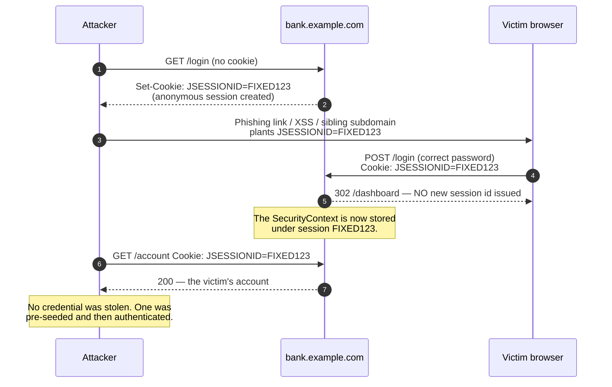
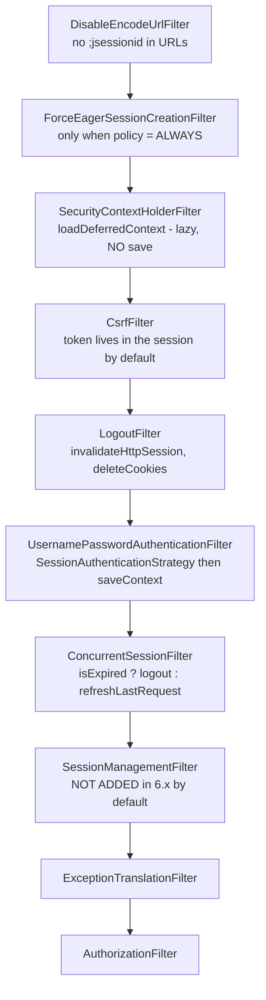

# 6.1 — Session Management

> **Module 6 - Topic 1** - Session, CSRF, CORS
> Baseline: Spring Security 6.x on Boot 3.x
> New to this? Read **In Plain English** below first, then come back to the Version Matrix.

---

## Version Matrix

| Concern | Spring Security 5.x | **Spring Security 6.x (baseline)** | Spring Security 7.x |
|---|---|---|---|
| Context persistence | `SecurityContextPersistenceFilter` — loads in, **saves automatically** out | **`SecurityContextHolderFilter`** — loads only; **saving is explicit**, owned by the authentication mechanism | same; the 5.x auto-save path is gone |
| `requireExplicitSave` | `false`, opt-in to `true` | **`true` by default** | always `true`, flag removed |
| `SessionManagementFilter` | Always added by `SessionManagementConfigurer` | **Not added** with the built-in authentication mechanisms (`requireExplicitAuthenticationStrategy = true`) — each authentication filter invokes the `SessionAuthenticationStrategy` itself | legacy path removed |
| Session fixation default | `changeSessionId` (Servlet 3.1+) | **`changeSessionId`** | `changeSessionId` |
| `STATELESS` policy | `HttpSessionSecurityContextRepository` with `allowSessionCreation=false` | **`NullSecurityContextRepository`** for persistence, `RequestAttributeSecurityContextRepository` within the request, plus `NullRequestCache` | same |
| Context loading | Eager `loadContext(HttpRequestResponseHolder)` | **`loadDeferredContext(request)`** returning a `DeferredSecurityContext` — the session is untouched until the authentication is read | deprecated `loadContext(...)` removed |
| Default repository | `HttpSessionSecurityContextRepository` | **`DelegatingSecurityContextRepository`** (session + request attribute) | same |
| Clustered registry | `SpringSessionBackedSessionRegistry` (Spring Session 2.x) | **`SpringSessionBackedSessionRegistry`** (Spring Session 3.x) | same |

---

## Why This Exists

[`01_M1_T1_HTTP_Web_Basics.md`](01_M1_T1_HTTP_Web_Basics.md) established the premise: HTTP
remembers nothing, so the server invents memory and hands the client an opaque pointer to it.
That file covered what a session cookie is and why it makes CSRF possible. This file is the
machinery on the server side of that pointer.

Session management is a topic at all, rather than "the container does it", because the session
identifier **is the credential** for the rest of the visit. After authentication, nothing about
the next thousand requests proves identity except a 32-character string in a cookie.

> After login, **the session id is as valuable as the password**, and it travels on every
> request, gets logged, gets cached, and lives in the browser for hours.

Three classes of problem follow: the attacker chooses the id before you authenticate it
(fixation); the id outlives its usefulness or is used from too many places at once (timeout and
concurrency); and the id points at memory on one machine, which is fine until there are six.

---

## In Plain English

**The one-line version:** The web forgets you between clicks, so after you log in the server keeps a
note about you in its own memory and gives your browser a numbered ticket that points at that note, and
this file is about protecting, expiring, limiting, and sharing those tickets.

**An analogy.** Picture the cloakroom at a theatre. You hand over your coat and receive a numbered
ticket. The cloakroom attendant does not remember your face and does not care who you are. Whoever
presents ticket 4471 gets the coat behind hook 4471. The ticket is not a reminder of who you are, the
ticket **is** the entire proof. That is what a session cookie is, and it means the cookie is every bit
as valuable as your password for the rest of your visit.

Now the attack. Suppose someone walks up to the empty cloakroom before you arrive, is handed ticket
4471 with nothing behind it, and then quietly slips a copy of ticket 4471 into your pocket. You arrive,
hand over your coat and your wallet, the attendant sees you already have a ticket and uses that hook,
and the attacker walks up with their copy and collects everything. No ticket was stolen. One was
planted in advance and then filled with something valuable. That is session fixation, and the fix is
simple and complete: the moment anything valuable is placed on a hook, the attendant tears up the old
ticket and issues a brand-new number.

The same cloakroom is where the other problems live. If the attendant never gets told when a coat is
collected, the tally of coats per person only ever goes up, and eventually a regular customer is turned
away because the book says they already have three coats checked in. And if the theatre opens a second
cloakroom on the other side of the building, a ticket issued at one desk means nothing at the other.

**How it actually works, step by step.**

An `HttpSession` is a small bag of data the server keeps for one visitor. The servlet container, for
example Tomcat, creates it and sends the browser a cookie named `JSESSIONID` containing a random
identifier. On every later request the browser sends that cookie back automatically, and the server
looks the bag up by the identifier.

Spring Security keeps one particular item in that bag: the `SecurityContext`, which is just the record
of who is logged in. `SessionCreationPolicy` is the setting that tells Spring Security how it should
relate to sessions. `IF_REQUIRED` is the default and means "make one when you need one". `STATELESS`
means "never store anything in a session and never read from one", which is what a token-based API
wants. There is a subtle third value, `NEVER`, which means "do not create one, but if something else
in the application creates one, still use it", and the gap between those two catches people out.

`STATELESS` is worth being precise about, because it is often misread as a guarantee. It only stops
Spring Security from using a session. It does not stop your own controller, a view template, or a
third-party library from calling `request.getSession()` and causing Tomcat to create one anyway. If you
need the guarantee, write a test that asserts no `JSESSIONID` cookie comes back.

Session fixation protection is on by default and uses a strategy called `changeSessionId`. At the
moment of login, Spring Security asks the container for a fresh identifier while keeping the contents
of the bag intact. Any identifier an attacker planted beforehand is now worthless. The alternatives,
`migrateSession` and `newSession`, do roughly the same thing by copying into a brand-new bag, and
`none` switches the protection off and should not be used.

Concurrent session control limits how many simultaneous logins one account may have. A component called
`SessionRegistry` keeps the tally. Two important details: when the limit is reached you choose between
kicking out the oldest session or refusing the new login, and expiring a session does not terminate it
immediately, it only marks it, so the affected user is actually logged out on their next request.

The registry only works if it is told when sessions end, and the servlet container does not tell Spring
by default. You have to publish a bean called `HttpSessionEventPublisher` to bridge the two. Forget it
and nothing throws an error, the tally simply never decreases, which is the "the book says you already
have three coats" failure described above.

Finally, the biggest version difference. In Spring Security 5 a filter automatically wrote the
`SecurityContext` back into the session at the end of every request. In Spring Security 6 that
automatic write was removed, so whichever piece of code logs a user in must now explicitly call
`saveContext`. The built-in login filters do this for you. Code you write yourself does not, and the
symptom is a login that works for exactly one request.

**Why should a beginner care?** Once a user logs in, the session identifier is the only thing standing
between an attacker and that user's account, so every weakness here is a full account takeover rather
than a cosmetic bug. On the operational side, these are the causes behind two of the most confusing
production complaints you will ever receive: "users are randomly logged out", which almost always means
sessions live in one server's memory while a load balancer spreads requests across several servers, and
"this user cannot log in at all any more", which is usually a session tally that only ever counts
upwards.

**Words you will meet in this file**

| Term | In plain words |
|---|---|
| `HttpSession` | The bag of data the server keeps for one visitor, looked up by the identifier in their cookie. |
| `JSESSIONID` | The name of the cookie holding that identifier. Losing control of it is equivalent to losing the password. |
| `SecurityContext` | The record of who is currently logged in. It is one of the things stored in the session bag. |
| `SecurityContextRepository` | The component that knows where to load and store that record, normally the session. |
| `SecurityContextHolderFilter` | The Spring Security 6 filter that loads the record at the start of a request. It deliberately does not save. |
| `saveContext` | The explicit call that writes the logged-in user back to storage. Required in Spring Security 6 if you log someone in yourself. |
| `SessionCreationPolicy` | The setting controlling whether Spring Security creates or uses sessions at all. |
| `STATELESS` | The policy meaning "never touch a session". Used for token-based APIs. It restrains Spring Security, not your other code. |
| `IF_REQUIRED` | The default policy, meaning "create a session only when one is needed". |
| Session fixation | An attack where the identifier is planted before login and then becomes valuable once the victim logs in. |
| `changeSessionId` | The default defence. At login, ask the container for a new identifier while keeping the session contents. |
| `SessionAuthenticationStrategy` | The generic idea of "something that must happen to the session at the moment of login". |
| Concurrent session control | Limiting how many simultaneous logins one account may have. |
| `SessionRegistry` | The running tally of which sessions belong to which user. |
| `maximumSessions` | The limit itself, for example one or two sessions per account. |
| `maxSessionsPreventsLogin` | Chooses the behaviour at the limit: either kick out the oldest session, or refuse the new login. |
| `ConcurrentSessionFilter` | The filter that notices a session has been marked as expired and logs that user out on their next request. |
| `HttpSessionEventPublisher` | The bean that forwards the container's "a session was destroyed" notifications to Spring. Without it the tally never drops. |
| Spring Session | A library that moves session storage out of one server's memory into a shared store such as Redis, so several servers can share it. |
| Sticky sessions | A load balancer setting that keeps one user pinned to one server. It masks the shared-storage problem rather than solving it. |

**If you remember only one thing:** after login the session identifier is the credential, so it must be
replaced with a fresh one at the moment of login and must be storable somewhere all your servers can
see.

---

## Core Concepts

### 1. `SessionCreationPolicy` — Four Values, Two Real Distinctions

**In simple terms:** This one setting decides whether Spring Security keeps any server-side memory of
your users at all, and picking the wrong value quietly turns an API you believed was stateless into one
that allocates memory for every caller.

```java
package org.springframework.security.config.http;

public enum SessionCreationPolicy {
    /** Always create an HttpSession */
    ALWAYS,
    /** Spring Security will never create an HttpSession, but will use the HttpSession if it already exists */
    NEVER,
    /** Spring Security will only create an HttpSession if required */
    IF_REQUIRED,
    /** Spring Security will never create an HttpSession and it will never use it to obtain the SecurityContext */
    STATELESS
}
```

Those are the actual source comments, and they are more precise than most explanations.

| Policy | Creates? | Reads an existing one? | Persists the context? | Mechanism |
|---|---|---|---|---|
| `ALWAYS` | **Yes, eagerly, every request** | Yes | Yes | Adds `ForceEagerSessionCreationFilter` |
| `IF_REQUIRED` (default) | Only when needed | Yes | Yes | `HttpSessionSecurityContextRepository`, `allowSessionCreation = true` |
| `NEVER` | **No** | **Yes** | Into a session someone else created | `allowSessionCreation = false` |
| `STATELESS` | No | **No** | No | `NullSecurityContextRepository`, `NullRequestCache` |

**`NEVER` versus `STATELESS` is the interview question.** `NEVER` means *Spring Security* will
not call `request.getSession(true)` — but if anything else creates a session (a controller,
`@SessionAttributes`, the default CSRF token repository, a view technology), Spring Security
reads the `SecurityContext` out of it and writes it back. You get stateful behaviour that appears
and disappears depending on what else ran. `STATELESS` means the session is never consulted even
if one exists; authentication is re-established from the request every time. `NEVER` exists for
"I may not create sessions, but the surrounding framework does and I should cooperate". For a
token API you want `STATELESS`.

### 2. What `STATELESS` Actually Changes — And What It Does Not

**In simple terms:** Choosing stateless only promises that Spring Security itself will not use a
session, it cannot stop your own code or another library from creating one behind its back.

```java
// SessionManagementConfigurer.init, simplified
boolean stateless = isStateless();
if (http.getSharedObject(SecurityContextRepository.class) == null) {
    if (stateless) {
        // Per-request only: survives ASYNC/ERROR dispatches, dies with the request.
        http.setSharedObject(SecurityContextRepository.class,
                new RequestAttributeSecurityContextRepository());
        this.sessionManagementSecurityContextRepository = new NullSecurityContextRepository();
    }
    else {
        HttpSessionSecurityContextRepository repo = new HttpSessionSecurityContextRepository();
        repo.setDisableUrlRewriting(true);
        repo.setAllowSessionCreation(isAllowSessionCreation());       // false for NEVER
        this.sessionManagementSecurityContextRepository = repo;
        http.setSharedObject(SecurityContextRepository.class,
                new DelegatingSecurityContextRepository(
                        repo, new RequestAttributeSecurityContextRepository()));
    }
}
if (http.getSharedObject(RequestCache.class) == null && stateless) {
    http.setSharedObject(RequestCache.class, new NullRequestCache());
}
```

**`STATELESS` is just `NullSecurityContextRepository`** — its `saveContext` is an empty method and
its `loadContext` returns an empty context. There is no magic stateless mode, only a repository
that does nothing. It **also installs `NullRequestCache`**, so a chain that still has `formLogin()`
sends the user to the default success URL rather than the page they asked for, because there is no
`SavedRequest`. And it **does not prevent a session being created**: a controller calling
`request.getSession()`, `@SessionAttributes`, or the default `HttpSessionCsrfTokenRepository` still
causes Tomcat to allocate one and emit `Set-Cookie: JSESSIONID=...`. If you want a guarantee,
assert it in a test rather than believe the configuration.

### 3. Session Fixation — The Attack

**In simple terms:** Instead of stealing your session identifier, the attacker gives you one of their
own in advance and then waits for your successful login to make it valuable.

The attacker **supplies** the session identifier rather than stealing it.



The attacker needs a way to plant the cookie. Historically the easiest was URL rewriting
(`https://bank.example.com/;jsessionid=FIXED123`), which is why Spring Security 6 adds
`DisableEncodeUrlFilter` first in the chain and sets `disableUrlRewriting = true`. The remaining
vectors are a cookie-writing XSS anywhere on the site, a compromised sibling subdomain (cookies are
scoped by registrable domain, so `blog.example.com` can set a cookie for `.example.com`), or
`Set-Cookie` injection through header splitting.

**The fix is one sentence: change the session identifier whenever privilege changes.**

### 4. The Four Session Fixation Strategies

**In simple terms:** Four ways of issuing the user a fresh session identifier at login, differing only
in how much of their existing session data survives the swap. The default is right for almost everyone.

```java
public interface SessionAuthenticationStrategy {
    void onAuthentication(Authentication authentication, HttpServletRequest request,
                          HttpServletResponse response) throws SessionAuthenticationException;
}
```

| DSL | Implementation | Behaviour | Use when |
|---|---|---|---|
| `sessionFixation(sf -> sf.changeSessionId())` | `ChangeSessionIdAuthenticationStrategy` | `request.changeSessionId()` — **same `HttpSession` object**, new id, attributes intact | **Default; correct for almost everyone** |
| `sessionFixation(sf -> sf.migrateSession())` | `SessionFixationProtectionStrategy`, `migrateSessionAttributes = true` | New session, every attribute copied, old one invalidated | Pre-Servlet-3.1 containers |
| `sessionFixation(sf -> sf.newSession())` | `SessionFixationProtectionStrategy`, `migrateSessionAttributes = false` | New session, **only** attributes named `SPRING_SECURITY_*` survive | Paranoid isolation |
| `sessionFixation(sf -> sf.none())` | `NullAuthenticatedSessionStrategy` | Nothing | **Never**, absent a written risk acceptance |

```java
// SessionFixationProtectionStrategy - "newSession discards everything" is not quite true
if (!this.migrateSessionAttributes && !key.startsWith("SPRING_SECURITY_")) {
    continue;                              // newSession(): drop application attributes
}
attributesToMigrate.put(key, session.getAttribute(key));
```

Both concrete strategies extend `AbstractSessionFixationProtectionStrategy`, which publishes a
`SessionFixationProtectionEvent` carrying the old and new identifiers — the hook you want for an
audit trail of privilege escalation. Note that `newSession()` silently drops the shopping cart, the
locale preference, and any wizard state, because none of those are named `SPRING_SECURITY_*`.

### 5. The Composite — What Runs on Authentication

**In simple terms:** Several session-related jobs happen at the moment of login, and they must run in a
specific order: count the existing sessions, then swap the identifier, then record the new one.

```java
// SessionManagementConfigurer.getSessionAuthenticationStrategy, simplified
if (isConcurrentSessionControlEnabled()) {
    SessionRegistry registry = getSessionRegistry(http);
    ConcurrentSessionControlAuthenticationStrategy concurrency =
            new ConcurrentSessionControlAuthenticationStrategy(registry);
    concurrency.setMaximumSessions(this.maximumSessions);
    concurrency.setExceptionIfMaximumExceeded(this.maxSessionsPreventsLogin);

    delegateStrategies.add(concurrency);                                     // 1. count / evict / reject
    delegateStrategies.add(this.sessionFixationAuthenticationStrategy);      // 2. rotate the id
    delegateStrategies.add(new RegisterSessionAuthenticationStrategy(registry)); // 3. record the NEW id
}
this.sessionAuthenticationStrategy = new CompositeSessionAuthenticationStrategy(delegateStrategies);
```

**The ordering is load-bearing.** Concurrency control runs first because it counts the sessions
already registered and must not see the one about to be created. Registration runs last so the
recorded id is the post-rotation one. Get it wrong and the registry accumulates stale identifiers
that are never removed.

### 6. Concurrent Session Control

**In simple terms:** This limits how many devices one account can be logged in on at once, and you must
choose whether reaching the limit kicks out the oldest login or blocks the newest one.

```java
public interface SessionRegistry {
    List<Object> getAllPrincipals();
    List<SessionInformation> getAllSessions(Object principal, boolean includeExpiredSessions);
    SessionInformation getSessionInformation(String sessionId);
    void refreshLastRequest(String sessionId);
    void registerNewSession(String sessionId, Object principal);
    void removeSessionInformation(String sessionId);
}
```

`SessionInformation.expireNow()` does **not** invalidate the session — it sets a boolean.
Termination happens on the victim session's *next* request, in `ConcurrentSessionFilter`:

```java
// org.springframework.security.web.session.ConcurrentSessionFilter
HttpSession session = request.getSession(false);
if (session != null) {
    SessionInformation info = this.sessionRegistry.getSessionInformation(session.getId());
    if (info != null) {
        if (info.isExpired()) {
            doLogout(request, response);
            this.sessionInformationExpiredStrategy.onExpiredSessionDetected(
                    new SessionInformationExpiredEvent(info, request, response, chain));
            return;                                        // chain NOT continued
        }
        this.sessionRegistry.refreshLastRequest(info.getSessionId());
    }
}
chain.doFilter(request, response);
```

Two consequences: the evicted user is not logged out until they next make a request, so a polling
tab lingers; and `refreshLastRequest` writes on **every** request, which is a shared-map write in
memory or a store round trip with Spring Session.

| `maxSessionsPreventsLogin` | At the limit | Symptom |
|---|---|---|
| `false` (default) | The **least recently used** session is expired; the new login wins | "I get logged out on my desktop when I use my phone" |
| `true` | The new login is rejected with `SessionAuthenticationException` | "I closed my laptop and now I cannot log in for 30 minutes" |

`true` is dangerous without an escape hatch: a browser crash leaves an orphaned session holding the
only slot until the idle timeout elapses.

### 7. `HttpSessionEventPublisher` — The Bean That Silently Breaks Everything

**In simple terms:** Spring is never told that a session ended unless you add this one bean, so without
it the count of active logins only ever rises and eventually locks people out of their own accounts.

`SessionRegistryImpl` holds two in-memory maps and learns about destruction only through Spring
events:

```java
public class SessionRegistryImpl implements SessionRegistry, ApplicationListener<AbstractSessionEvent> {

    private final ConcurrentMap<Object, Set<String>> principals;   // principal -> session ids
    private final Map<String, SessionInformation> sessionIds;

    @Override
    public void onApplicationEvent(AbstractSessionEvent event) {
        if (event instanceof SessionDestroyedEvent destroyed) {
            removeSessionInformation(destroyed.getId());
        }
        else if (event instanceof SessionIdChangedEvent changed) {
            String oldId = changed.getOldSessionId();
            if (this.sessionIds.containsKey(oldId)) {
                Object principal = this.sessionIds.get(oldId).getPrincipal();
                removeSessionInformation(oldId);
                registerNewSession(changed.getNewSessionId(), principal);
            }
        }
    }
}
```

Those events do not appear by themselves: the container knows a session was destroyed, Spring does
not. The bridge is `HttpSessionEventPublisher`, which implements `HttpSessionListener` and
`HttpSessionIdListener` and republishes each callback into the root application context.

**What silently breaks without it** — silently, with no exception, warning, or log line:

1. Sessions are registered and **never removed**. The registry grows without bound.
2. `maximumSessions(1)` with `maxSessionsPreventsLogin(true)` locks users out permanently: the
   registry still believes the destroyed session is alive. With the default `false` each login
   expires a phantom session, which mostly works and hides the leak.
3. Fixation rotation leaves a stale entry for the pre-authentication id, so `maximumSessions(2)`
   behaves like `maximumSessions(1)`.
4. Admin screens built on `getAllPrincipals()` report users who left hours ago.

With Spring Session you do **not** add it — Spring Session publishes its own events and you use
`SpringSessionBackedSessionRegistry`. Registering both double-counts.

### 8. Where Session Management Runs in 6.x

**In simple terms:** Spring Security 6 moved all the session work into the login filters themselves,
which means a login filter you write by hand receives none of that protection automatically.

In 5.x, `SessionManagementFilter` sat late in the chain and invoked the
`SessionAuthenticationStrategy` for any mechanism that had not done so itself. In 6.x that is
inverted:

```java
// SessionManagementConfigurer.configure, simplified
if (!this.requireExplicitAuthenticationStrategy) {          // 6.x default is TRUE
    http.addFilter(postProcess(new SessionManagementFilter(
            this.sessionManagementSecurityContextRepository, getSessionAuthenticationStrategy(http))));
}
if (isConcurrentSessionControlEnabled()) { http.addFilter(createConcurrencyFilter(http)); }
if (!this.enableSessionUrlRewriting)      { http.addFilter(new DisableEncodeUrlFilter()); }
if (this.sessionPolicy == SessionCreationPolicy.ALWAYS) {
    http.addFilter(new ForceEagerSessionCreationFilter());
}

// AbstractAuthenticationProcessingFilter.doFilter now does the work itself:
Authentication result = attemptAuthentication(request, response);
this.sessionStrategy.onAuthentication(result, request, response);         // fixation + concurrency
SecurityContext context = this.securityContextHolderStrategy.createEmptyContext();
context.setAuthentication(result);
this.securityContextHolderStrategy.setContext(context);
this.securityContextRepository.saveContext(context, request, response);   // EXPLICIT save
```

**A hand-written authentication filter gets none of this for free.** Setting the `SecurityContext`
directly opts you out of fixation protection, concurrency control, and context persistence at once
— and everything appears to work, because authorization succeeds for that one request.

### 9. `SecurityContextRepository` and the Explicit-Save Requirement

**In simple terms:** Spring Security 6 no longer stores the logged-in user automatically at the end of
a request, so whichever code performs the login must now save it or the login lasts one request only.

```java
public interface SecurityContextRepository {

    @Deprecated
    SecurityContext loadContext(HttpRequestResponseHolder requestResponseHolder);

    default DeferredSecurityContext loadDeferredContext(HttpServletRequest request) {
        Supplier<SecurityContext> supplier = () -> loadContext(new HttpRequestResponseHolder(request, null));
        return new SupplierDeferredSecurityContext(SingletonSupplier.of(supplier),
                SecurityContextHolder.getContextHolderStrategy());
    }

    void saveContext(SecurityContext context, HttpServletRequest request, HttpServletResponse response);
    boolean containsContext(HttpServletRequest request);
}

// SecurityContextHolderFilter - note what is MISSING
DeferredSecurityContext deferredContext = this.securityContextRepository.loadDeferredContext(request);
try {
    this.securityContextHolderStrategy.setDeferredContext(deferredContext);
    chain.doFilter(request, response);
}
finally {
    this.securityContextHolderStrategy.clearContext();
    // There is NO saveContext() here. That is the whole change.
}
```

**Deferred loading** means the session is not read until something calls `getAuthentication()`. On
a `permitAll()` endpoint whose rules never inspect the principal, the session is never touched,
which turns a Redis round trip into nothing. **Explicit save** means mutating the authentication
mid-request — a step-up elevation, a custom login endpoint — requires
`securityContextRepository.saveContext(context, request, response)`. Omitting it is the most common
5-to-6 migration bug: the user is authenticated for exactly one request and anonymous on the next.

---

## Working Code

A stateful, browser-facing chain with hardened session management:

```java
package com.example.security.session;

import org.springframework.context.annotation.Bean;
import org.springframework.context.annotation.Configuration;
import org.springframework.security.config.Customizer;
import org.springframework.security.config.annotation.web.builders.HttpSecurity;
import org.springframework.security.config.annotation.web.configuration.EnableWebSecurity;
import org.springframework.security.config.http.SessionCreationPolicy;
import org.springframework.security.core.session.SessionRegistry;
import org.springframework.security.core.session.SessionRegistryImpl;
import org.springframework.security.web.SecurityFilterChain;
import org.springframework.security.web.session.HttpSessionEventPublisher;

@Configuration
@EnableWebSecurity
public class WebSessionSecurityConfig {

    @Bean
    SecurityFilterChain webFilterChain(HttpSecurity http, SessionRegistry sessionRegistry) throws Exception {
        http
            .authorizeHttpRequests(auth -> auth
                .requestMatchers("/login", "/error", "/css/**").permitAll()
                .anyRequest().authenticated()
            )
            .sessionManagement(session -> session
                .sessionCreationPolicy(SessionCreationPolicy.IF_REQUIRED)
                // Already the default; stating it documents the intent for the next reader.
                .sessionFixation(fixation -> fixation.changeSessionId())
                .invalidSessionUrl("/login?invalid")
                .maximumSessions(2)
                    .maxSessionsPreventsLogin(false)   // expire the oldest rather than lock out
                    .expiredUrl("/login?expired")
                    .sessionRegistry(sessionRegistry)
            )
            .logout(logout -> logout
                .logoutUrl("/logout")                  // POST only, because CSRF is enabled
                .invalidateHttpSession(true)
                .clearAuthentication(true)
                .deleteCookies("JSESSIONID")
            )
            .formLogin(Customizer.withDefaults());

        return http.build();
    }

    /** In-memory. Correct for a SINGLE instance only - see ClusteredSessionConfig. */
    @Bean
    SessionRegistry sessionRegistry() {
        return new SessionRegistryImpl();
    }

    /**
     * MANDATORY alongside SessionRegistryImpl. Without it the registry never learns that a
     * session was destroyed: it leaks memory and maximumSessions() eventually locks users out.
     */
    @Bean
    HttpSessionEventPublisher httpSessionEventPublisher() {
        return new HttpSessionEventPublisher();
    }
}
```

A genuinely stateless API chain, ordered ahead of the web chain, plus the clustered registry:

```java
package com.example.security.session;

import org.springframework.context.annotation.Bean;
import org.springframework.context.annotation.Configuration;
import org.springframework.core.Ordered;
import org.springframework.core.annotation.Order;
import org.springframework.http.HttpStatus;
import org.springframework.security.config.Customizer;
import org.springframework.security.config.annotation.web.builders.HttpSecurity;
import org.springframework.security.config.annotation.web.configuration.EnableWebSecurity;
import org.springframework.security.config.http.SessionCreationPolicy;
import org.springframework.security.core.session.SessionRegistry;
import org.springframework.security.web.SecurityFilterChain;
import org.springframework.security.web.authentication.HttpStatusEntryPoint;
import org.springframework.security.web.context.NullSecurityContextRepository;
import org.springframework.session.FindByIndexNameSessionRepository;
import org.springframework.session.Session;
import org.springframework.session.data.redis.config.annotation.web.http.EnableRedisIndexedHttpSession;
import org.springframework.session.security.SpringSessionBackedSessionRegistry;

@Configuration
@EnableWebSecurity
// INDEXED, not @EnableRedisHttpSession: concurrency control needs the principal-name index
// so that "all sessions for this user" is answerable across the cluster.
@EnableRedisIndexedHttpSession(maxInactiveIntervalInSeconds = 1800)
public class StatelessApiSecurityConfig {

    @Bean
    @Order(Ordered.HIGHEST_PRECEDENCE)      // MUST precede the catch-all web chain
    SecurityFilterChain apiFilterChain(HttpSecurity http) throws Exception {
        http
            .securityMatcher("/api/**")
            .authorizeHttpRequests(auth -> auth
                .requestMatchers("/api/public/**").permitAll()
                .anyRequest().authenticated()
            )
            .sessionManagement(session -> session
                .sessionCreationPolicy(SessionCreationPolicy.STATELESS)
            )
            // Belt and braces: STATELESS already selects NullSecurityContextRepository, but
            // saying it here means a later edit cannot quietly reintroduce session storage.
            .securityContext(context -> context
                .securityContextRepository(new NullSecurityContextRepository())
            )
            // Token credentials are not ambient - see 21_M6_T2_CSRF_Protection.md.
            .csrf(csrf -> csrf.disable())
            .exceptionHandling(ex -> ex
                .authenticationEntryPoint(new HttpStatusEntryPoint(HttpStatus.UNAUTHORIZED))
            )
            .oauth2ResourceServer(oauth2 -> oauth2.jwt(Customizer.withDefaults()));

        return http.build();
    }

    /**
     * Replaces SessionRegistryImpl so maximumSessions() is enforced across every instance.
     * Do NOT also register HttpSessionEventPublisher: Spring Session publishes its own
     * SessionDestroyedEvent and the container publisher would double-count.
     */
    @Bean
    <S extends Session> SessionRegistry sessionRegistry(
            FindByIndexNameSessionRepository<S> sessionRepository) {
        return new SpringSessionBackedSessionRegistry<>(sessionRepository);
    }
}
```

```yaml
spring:
  session: { store-type: redis, timeout: 30m, redis: { namespace: myapp:session, flush-mode: on_save } }
server:
  servlet:
    session:
      cookie: { name: __Host-SESSION, http-only: true, secure: true, same-site: lax }
      timeout: 30m       # Spring Session's own timeout wins when it is active
```

Tests:

```java
package com.example.security.session;

import org.junit.jupiter.api.Test;
import org.springframework.beans.factory.annotation.Autowired;
import org.springframework.boot.test.autoconfigure.web.servlet.AutoConfigureMockMvc;
import org.springframework.boot.test.context.SpringBootTest;
import org.springframework.mock.web.MockHttpSession;
import org.springframework.security.core.session.SessionRegistryImpl;
import org.springframework.security.test.context.support.WithMockUser;
import org.springframework.security.web.session.HttpSessionDestroyedEvent;
import org.springframework.test.web.servlet.MockMvc;
import org.springframework.test.web.servlet.MvcResult;

import static org.assertj.core.api.Assertions.assertThat;
import static org.springframework.security.test.web.servlet.request.SecurityMockMvcRequestBuilders.formLogin;
import static org.springframework.security.test.web.servlet.response.SecurityMockMvcResultMatchers.authenticated;
import static org.springframework.test.web.servlet.request.MockMvcRequestBuilders.get;
import static org.springframework.test.web.servlet.result.MockMvcResultMatchers.status;

@SpringBootTest
@AutoConfigureMockMvc
class SessionManagementTests {

    @Autowired MockMvc mvc;

    @Test
    void sessionIdIsRotatedOnAuthentication() throws Exception {
        MockHttpSession preAuth = new MockHttpSession();
        String idBefore = preAuth.getId();

        MvcResult result = mvc.perform(formLogin("/login").user("alice").password("password")
                                  .session(preAuth))
                              .andExpect(authenticated())
                              .andReturn();

        // This assertion IS the session fixation protection test.
        assertThat(result.getRequest().getSession(false).getId()).isNotEqualTo(idBefore);
    }

    @Test
    @WithMockUser
    void statelessChainNeverCreatesASession() throws Exception {
        MvcResult result = mvc.perform(get("/api/orders")).andExpect(status().isOk()).andReturn();
        assertThat(result.getRequest().getSession(false))
                .as("a STATELESS chain must not allocate an HttpSession")
                .isNull();
    }

    @Test
    void statelessChainIgnoresAnExistingSessionCookie() throws Exception {
        MvcResult login = mvc.perform(formLogin("/login").user("alice").password("password"))
                             .andExpect(authenticated()).andReturn();
        MockHttpSession session = (MockHttpSession) login.getRequest().getSession(false);

        mvc.perform(get("/api/orders").session(session)).andExpect(status().isUnauthorized());
    }

    @Test
    void registryOnlyForgetsASessionWhenItReceivesTheDestroyedEvent() {
        SessionRegistryImpl registry = new SessionRegistryImpl();
        registry.registerNewSession("SESSION-1", "alice");
        assertThat(registry.getAllSessions("alice", false)).hasSize(1);

        // Without HttpSessionEventPublisher this event NEVER ARRIVES in a real application,
        // and the registry keeps reporting a session that no longer exists.
        registry.onApplicationEvent(
                new HttpSessionDestroyedEvent(new MockHttpSession(null, "SESSION-1")));

        assertThat(registry.getAllSessions("alice", false)).isEmpty();
    }
}
```

---

## Internals

### The session-related filters, in execution order



`ConcurrentSessionFilter` deliberately runs *after* the authentication filters, so the login request
itself proceeds and `ConcurrentSessionControlAuthenticationStrategy` can make the eviction decision.

### The eviction decision

```java
// ConcurrentSessionControlAuthenticationStrategy
int allowedSessions = getMaximumSessionsForThisUser(authentication);
if (allowedSessions == -1) return;                                          // unlimited
List<SessionInformation> sessions =
        this.sessionRegistry.getAllSessions(authentication.getPrincipal(), false);
if (sessions.size() < allowedSessions) return;
if (sessions.size() == allowedSessions) {
    HttpSession session = request.getSession(false);
    if (session != null) {
        for (SessionInformation si : sessions) {
            if (si.getSessionId().equals(session.getId())) return;          // already counted
        }
    }
}
// ...allowableSessionsExceeded either throws, or expires the least recently used session:
if (this.exceptionIfMaximumExceeded || sessions == null) {
    throw new SessionAuthenticationException(
            "Maximum sessions of " + allowableSessions + " for this principal exceeded");
}
leastRecentlyUsed.expireNow();     // flag only - the victim finds out on its NEXT request
```

**`getAllSessions` keys on `authentication.getPrincipal()`, so the principal must implement `equals`
and `hashCode` correctly.** A `UserDetails` implementation inheriting the identity-based defaults
from `Object` never matches the registered principal, the lookup returns empty, and concurrency
control silently does nothing. There is no diagnostic other than reading the source. Spring's own
`User` class implements both on the username.

### Why `SessionRegistryImpl` is wrong in a cluster

Its state is two `ConcurrentMap` fields in one heap. With three instances, `maximumSessions(1)` is
enforced per instance so a user quietly holds three sessions; `ConcurrentSessionFilter` on instance
B finds no entry for a session that instance A marked expired and skips the check entirely; and an
admin session list shows whichever instance answered.

`SpringSessionBackedSessionRegistry` delegates to `FindByIndexNameSessionRepository`, which keeps a
principal-name index in the store. Two caveats: it requires the **indexed** repository
(`@EnableRedisIndexedHttpSession`, not `@EnableRedisHttpSession`), and `getAllPrincipals()` throws
`UnsupportedOperationException`, because enumerating every principal would need a full store scan.

### Session timeout versus token expiry

| | `HttpSession` timeout | Access token expiry |
|---|---|---|
| Semantics | **Idle** — the clock resets on every request | **Absolute** — an `exp` claim fixed at issue time |
| Extending | Automatic, by using the application | Requires a refresh round trip |
| Revoking early | `session.invalidate()`, immediate | Not possible without server-side state |
| Granularity | Tomcat's reaper runs roughly once a minute | Exact, subject to clock skew allowance |

Neither `server.servlet.session.timeout` nor `spring.session.timeout` gives an **absolute**
lifetime — a user clicking every 29 minutes stays logged in indefinitely. For an absolute cap,
record the authentication instant as a session attribute at login and reject in a filter once the
age exceeds policy. There is no framework setting for it.

---

## Configuration Reference

| Option | Effect | Default |
|---|---|---|
| `sessionManagement().sessionCreationPolicy(...)` | Whether Spring Security creates or reads a session | `IF_REQUIRED` |
| `...sessionFixation().changeSessionId()` | Rotate via `request.changeSessionId()` | **active default** |
| `...sessionFixation().migrateSession()` | New session, all attributes copied | off |
| `...sessionFixation().newSession()` | New session, only `SPRING_SECURITY_*` kept | off |
| `...sessionFixation().none()` | No rotation | off |
| `...invalidSessionUrl(...)` / `invalidSessionStrategy(...)` | Handling of an unknown session id | none — the request proceeds |
| `...maximumSessions(n)` | Concurrent sessions per principal; `-1` is unlimited | control disabled |
| `...maxSessionsPreventsLogin(boolean)` | `true` rejects the new login, `false` expires the oldest | `false` |
| `...expiredUrl(...)` / `expiredSessionStrategy(...)` | Handling of an evicted session | `ResponseBodySessionInformationExpiredStrategy` |
| `...sessionRegistry(...)` | Which registry to use | a new `SessionRegistryImpl` |
| `...enableSessionUrlRewriting(true)` | Permit `;jsessionid=` in URLs | `false` (`DisableEncodeUrlFilter` added) |
| `securityContext().securityContextRepository(...)` | Where the context is persisted | `DelegatingSecurityContextRepository` |
| `securityContext().requireExplicitSave(...)` | 5.x compatibility switch | `true` |
| `logout().invalidateHttpSession(true)` | Call `session.invalidate()` | `true` |
| `logout().deleteCookies("JSESSIONID")` | Emit an expiring `Set-Cookie` | none |
| `server.servlet.session.timeout` | Container idle timeout | `30m` |
| `spring.session.store-type` | `redis`, `jdbc`, `hazelcast`, `mongodb`, `none` | classpath-detected |
| `spring.session.timeout` | Overrides the container value when Spring Session is active | falls back to the container |
| `HttpSessionEventPublisher` bean | Bridges container events to Spring events | **not registered — you must add it** |

---

## Production Concerns & Anti-Patterns

**Forgetting `HttpSessionEventPublisher` with `SessionRegistryImpl`.** The defining failure of
concurrent session control: no error, no warning, no log entry. The registry grows monotonically
and `maximumSessions` behaves erratically or locks users out. If your configuration contains
`maximumSessions(...)` and no publisher bean, the feature is broken. Treat them as one unit.

**Using `SessionRegistryImpl` on more than one instance.** Concurrency limits become per-instance
limits, expiry does not propagate, and admin views disagree. Migrate to
`SpringSessionBackedSessionRegistry` before the second replica, not after.

**Setting `STATELESS` and assuming no session exists.** The policy configures Spring Security, not
your controllers or third-party libraries. Assert it in a test.

**`maxSessionsPreventsLogin(true)` without a recovery path.** A browser crash leaves an orphaned
session holding the only slot and the user cannot log in until the idle timeout elapses. Either use
`false`, or ship a "terminate my other sessions" flow.

**Putting a JPA entity in the session as the principal.** Four distinct symptoms. Hibernate lazy
proxies serialise badly and explode with `LazyInitializationException` on the next request. The
entity transitively drags in half your object graph, turning a 200-byte session into 200 kilobytes.
The data is a snapshot, so a role revoked in the database has no effect until logout. And any
schema change invalidates every serialised session at once, logging out the entire user base on
deploy. Store a small immutable principal: id, username, authorities.

**Everything in the session must be `Serializable`.** With in-memory sessions you get away with
violations until Tomcat persists across a restart or you move to Redis. Then
`NotSerializableException` surfaces from inside a filter as an opaque 500. Audit session attributes
before introducing Spring Session, not during the incident.

**Session bloat.** Sessions are held for the whole idle timeout. Ten thousand users with a 50 kB
session is 500 MB of heap, or 500 MB of Redis plus 50 kB of network per request. Keep them under a
kilobyte.

**Building an admin screen on `getAllPrincipals()`.** It works with `SessionRegistryImpl` and throws
`UnsupportedOperationException` with the Spring Session registry, so it becomes a migration blocker.

**Not invalidating server-side on logout.** `deleteCookies` alone leaves a fully valid session for
anyone holding the id. The server-side `invalidate()` is the half that matters.

---

## Debugging Playbook

| Symptom | Likely root cause | Fix |
|---|---|---|
| Authenticated for one request, anonymous afterwards | Custom filter sets the context but never calls `saveContext(...)` — the 6.x explicit-save change | Call `saveContext`, or extend `AbstractAuthenticationProcessingFilter` |
| `maximumSessions(1)` locks the user out permanently | `HttpSessionEventPublisher` missing, so destroyed sessions are never removed | Register the bean |
| Concurrency control appears to do nothing | Principal lacks `equals`/`hashCode`, or Spring Session is non-indexed | Implement both; use `@EnableRedisIndexedHttpSession` |
| Random logouts after scaling out | No shared store; requests land on an instance that never saw the session | Spring Session with Redis or JDBC — stickiness is a workaround, not a fix |
| `NotSerializableException` after enabling Spring Session | A session attribute, usually the principal, is not `Serializable` | Replace it with a small serialisable value object |
| `LazyInitializationException` reading the principal | A JPA entity was stored as the principal | Map to a DTO at authentication time |
| `Set-Cookie: JSESSIONID` despite `STATELESS` | Something else called `request.getSession()` — a controller, `@SessionAttributes`, or the session CSRF repository | Breakpoint on session creation; assert `getSession(false) == null` |
| Post-login redirect goes to the home page | `STATELESS` installed `NullRequestCache` | Use `IF_REQUIRED` on the browser chain |
| Session id unchanged after login | `sessionFixation().none()`, or a custom filter bypassing the strategy | Restore `changeSessionId()`; invoke the strategy |
| Expiry far sooner or later than configured | `spring.session.timeout` overrides the container value; Tomcat's reaper has minute granularity | Set one value and verify it against the store TTL |
| Redis memory grows continuously | TTLs not refreshed, or very large sessions | Inspect key TTLs directly; shrink the payload |

---

## Interview Q&A

### Q1. Explain the difference between `SessionCreationPolicy.NEVER` and `STATELESS`.

<details>
<summary>Show answer</summary>

They differ on **reading**, not on creating. Both promise Spring Security will not call
`request.getSession(true)`.

`NEVER` installs an `HttpSessionSecurityContextRepository` with `allowSessionCreation = false`. That
repository still calls `request.getSession(false)` on the way in, and if a session exists it reads
`SPRING_SECURITY_CONTEXT` out of it and writes back on an explicit save. So if any other component
creates a session — a controller, `@SessionAttributes`, the CSRF token repository, a view
technology — the application becomes stateful and Spring Security cooperates.

`STATELESS` installs `NullSecurityContextRepository`, whose `loadContext` returns an empty context
and whose `saveContext` is empty. The session is never consulted even if one exists and contains a
valid context. It also installs `NullRequestCache`, so the post-login "return to where you were
going" behaviour disappears. `NEVER` is "I will not open the door, but I will walk through it if
you do"; `STATELESS` is "there is no door".

**Counter-question: does `STATELESS` guarantee no `HttpSession` is created?**

No. It configures Spring Security's behaviour, not the container's and not your application's. A
controller calling `request.getSession()`, flash attributes, `@SessionAttributes`, the default
`HttpSessionCsrfTokenRepository`, or any library touching the session all cause Tomcat to allocate
one and emit `Set-Cookie`. You then pay the memory cost and issue the cookie while Spring Security
ignores it — the worst of both designs. The way to guarantee it is to assert
`result.getRequest().getSession(false)` is null in a test, and in production to alert on a non-zero
`tomcat.sessions.active.current` for a supposedly stateless service.

**Counter-question: if `STATELESS` uses `NullSecurityContextRepository`, why is a `RequestAttributeSecurityContextRepository` also set as the shared object?**

Because stateless *across* requests is not stateless *within* one. A single HTTP request can pass
through the chain several times — an `ASYNC` dispatch for a `Callable` or `DeferredResult`, and an
`ERROR` dispatch when the container forwards to `/error` — and Spring Security runs on both by
default. Without somewhere to hold the context for the request's duration, the second dispatch
begins unauthenticated and `/error` renders as anonymous, which typically shows up as a 403 on the
error page instead of your 500. A request attribute lives exactly as long as the
`HttpServletRequest`, which spans all its dispatches and nothing more. That is also why it is the
right repository inside a hand-written stateless authentication filter.

**Counter-question: I use `STATELESS` but want "return to the requested page" after a token refresh. Options?**

`RequestCache` is unavailable, so every option is client-side or URL-based: the `state` parameter of
an OAuth2 authorization request (which the OAuth2 client support already does, and which is
tamper-resistant because it is matched against a stored value), a short-lived signed cookie, or the
SPA's own routing state. The last is usually correct — in a token architecture the client owns
navigation, and recreating server-side navigation memory is a signal the chain should have been
`IF_REQUIRED`.
</details>

### Q2. Walk me through a session fixation attack and explain exactly how `changeSessionId` defeats it.

<details>
<summary>Show answer</summary>

The attack inverts the usual direction: instead of stealing an authenticated session id, the
attacker chooses an unauthenticated one and waits for the victim to authenticate it.

The attacker visits the site anonymously and receives `Set-Cookie: JSESSIONID=FIXED123` — most
applications create a session for CSRF tokens or locale even before login. They plant that id in
the victim's browser, historically through a URL-rewritten link, today through a cookie-writing XSS
anywhere on the site, a compromised sibling subdomain, or response splitting. The victim then logs
in completely normally — correct password, possibly a second factor. If the server keeps the same
id, it writes the authenticated `SecurityContext` into session `FIXED123`, and the attacker, who
has held that string all along, is now the victim. Note what the attacker never needed: the
password, a stolen cookie, or any access to the victim's machine after planting.

`ChangeSessionIdAuthenticationStrategy` calls `request.changeSessionId()`, the Servlet 3.1 container
API. The container keeps the same `HttpSession` object and all its attributes, generates a fresh
identifier, remaps its internal table, and emits a new `Set-Cookie`. `FIXED123` is no longer
associated with anything. The principle generalises: rotate the id whenever the privilege level
changes — login, step-up authentication, and impersonation.

**Counter-question: why is `changeSessionId` the default rather than `migrateSession`, which also produces a new id?**

Because `changeSessionId` is a container operation and `migrateSession` is an application-level
imitation of one. `migrateSession` creates a new `HttpSession`, copies every attribute, and
invalidates the old one. That fires `HttpSessionListener` destruction and creation callbacks for
events that did not logically happen, confusing anything counting sessions; copies attributes
shallowly so two sessions briefly share objects; costs two writes and a delete against a clustered
store instead of one rename; and leaves a window where both exist. `changeSessionId` asks the
container to change one key. It has been available since Servlet 3.1 in 2013, and `migrateSession`
remains only for containers that predate it or implement it badly.

**Counter-question: does `SameSite=Lax` protect against session fixation?**

Not meaningfully, because `SameSite` governs when a cookie is **sent** and fixation is about how one
is **set**. Trace it: the attacker plants the cookie through XSS or a subdomain, which `SameSite`
does not restrict at all; the victim then navigates to the site themselves and logs in, which is a
same-site request, so the planted cookie is sent normally. `SameSite` never intervenes. The controls
that do apply are rotating the id on authentication, the `__Host-` cookie prefix (which forbids a
`Domain` attribute and so stops a subdomain planting a cookie for the parent), disabling URL
rewriting, and eliminating XSS.

**Counter-question: my custom authentication filter sets the `SecurityContext` directly. Am I protected?**

No, and nothing tells you so. In 6.x the `SessionAuthenticationStrategy` is invoked by the
framework's own authentication filters, not by a central `SessionManagementFilter`. A filter that
calls `setAuthentication` and continues the chain triggers no strategy: no rotation, no concurrency
control, and — because of the explicit-save change — no persistence either. Either inject the shared
`SessionAuthenticationStrategy` and call it, or extend `AbstractAuthenticationProcessingFilter` so
the base class performs the whole sequence. I prefer extending, because the sequence has three steps
and people reliably forget one.
</details>

### Q3. What does `HttpSessionEventPublisher` do, and what breaks without it?

<details>
<summary>Show answer</summary>

It bridges two event systems that do not know about each other. The servlet container announces
session creation, destruction, and id changes through `HttpSessionListener` and
`HttpSessionIdListener`; the Spring application context hears none of it.
`HttpSessionEventPublisher` implements both interfaces and republishes each callback as a Spring
`ApplicationEvent` into the root `WebApplicationContext`. `SessionRegistryImpl` is the consumer: on
`SessionDestroyedEvent` it removes the registration, and on `SessionIdChangedEvent` it moves the
registration from the old id to the new one, which keeps it consistent across fixation rotation.

Without the publisher the registry has a registration path and no removal path. Memory grows on
every login and is never reclaimed. `maximumSessions` counts every session the user has ever had,
so with `maxSessionsPreventsLogin(true)` and a limit of one the user logs in, logs out, and can
never log in again. Fixation rotation leaves an orphaned entry for the pre-authentication id,
halving the effective limit. And admin views list people who left hours ago. There is no exception,
warning, or log line for any of it, which is what makes this a good interview question: a
configuration omission with no diagnostic.

**Counter-question: I use Spring Session with Redis. Do I still need it?**

No, and adding it is wrong. Spring Session does not use the container's `HttpSession` at all —
`SessionRepositoryFilter` wraps the request and returns its own adapter backed by the store, so the
container never observes creation or destruction. Spring Session publishes its own
`SessionCreatedEvent`, `SessionDeletedEvent`, and `SessionExpiredEvent`, and the correct registry is
`SpringSessionBackedSessionRegistry`, which queries the repository directly and needs no events for
correctness. Registering both gives you two sources of truth that disagree.

**Counter-question: Redis keyspace notifications are disabled by default on many managed offerings. What is the consequence?**

`SessionExpiredEvent` is never published. The session key still disappears when its TTL elapses —
that part is unconditional — so authentication genuinely stops at the right moment. What you lose is
the notification: audit logging of expiry, cleanup of related resources, and WebSocket teardown
silently stop happening. The principal-name index entry is also not cleaned up, so
`findByPrincipalName` can return ids for sessions that no longer exist;
`RedisIndexedSessionRepository` defends by skipping ids that resolve to nothing, so concurrency
counts stay correct, but the index set grows. The remediation is `notify-keyspace-events Egx` on the
Redis instance. If the provider forbids it, use `@EnableJdbcHttpSession`, where a scheduled cleanup
task does the same job, or accept the loss and build nothing on expiry events.

**Counter-question: how would you verify the wiring in a test rather than in production?**

Two layers. A context test asserting both beans exist, because the failure is a missing bean rather
than a wrong value. Then a behavioural test against a real container — `@SpringBootTest` with
`WebEnvironment.RANDOM_PORT`, not `MockMvc`, because `MockMvc` does not run container session
listeners — that authenticates, asserts the registry reports one session, logs out, and asserts
zero. The second is what actually fails when the publisher is removed; a bean-presence assertion
alone cannot survive someone swapping the registry implementation.
</details>

### Q4. In Spring Security 6, what replaced `SecurityContextPersistenceFilter`, and why does it matter to application code?

<details>
<summary>Show answer</summary>

`SecurityContextHolderFilter` replaced it, and the difference is one word: **saving**. The old filter
loaded the context on the way in and, in a `finally` block, wrote whatever was on the holder back to
the repository, which made persistence implicit — any code anywhere that mutated
`SecurityContextHolder` was automatically persisted. The new filter only loads. It sets a
`DeferredSecurityContext` on the holder and clears it in `finally`. There is no save.

Two motivations. Performance, through deferred loading: `loadDeferredContext` returns a
supplier-backed object that does not touch the session until something calls `getAuthentication()`,
which on a Redis-backed store removes a network round trip from every request that does not need
identity. And correctness: implicit save wrote the session on requests that only read it, and
produced surprising behaviour when application code mutated the holder for non-authentication
reasons. For application code it means **any custom authentication must call
`SecurityContextRepository.saveContext(...)` explicitly**. A login endpoint that worked on 5.x by
calling `setAuthentication` now authenticates for exactly one request.

**Counter-question: show me the correct code for a custom `/api/login` controller under 6.x.**

```java
@PostMapping("/api/login")
public ResponseEntity<Void> login(@RequestBody LoginRequest body,
                                  HttpServletRequest request, HttpServletResponse response) {
    Authentication authentication = this.authenticationManager.authenticate(
            UsernamePasswordAuthenticationToken.unauthenticated(body.username(), body.password()));

    this.sessionStrategy.onAuthentication(authentication, request, response);  // rotate the id FIRST

    SecurityContext context = this.holderStrategy.createEmptyContext();        // never mutate the shared one
    context.setAuthentication(authentication);
    this.holderStrategy.setContext(context);

    // THE 6.x REQUIREMENT. Without this the login lasts exactly one request.
    this.securityContextRepository.saveContext(context, request, response);

    return ResponseEntity.noContent().build();
}
```

The repository here should be the same shared-object instance the chain uses, obtained from
`http.getSharedObject(SecurityContextRepository.class)` or exposed as a bean, so the controller and
the chain agree on where the context lives.

**Counter-question: what is a `DeferredSecurityContext`, and what happens if I call `SecurityContextHolder.getContext()` before `SecurityContextHolderFilter`?**

It is a `Supplier<SecurityContext>` with an extra `isGenerated()` method reporting whether the
context was loaded from the repository or manufactured empty. The holder strategy gained
`setDeferredContext` and `getDeferredContext`; the ordinary `getContext()` resolves the supplier, and
the session is read at that moment and not before. Called from a filter placed before
`SecurityContextHolderFilter`, you get an empty context because nothing has been deferred yet.
Worse, if you then call `setContext(...)`, the filter overwrites it moments later with the deferred
context from the repository, and your authentication vanishes with no error. That is the concrete
reason for the placement rule in [`04_M1_T4_Servlet_Basics.md`](04_M1_T4_Servlet_Basics.md): after
`SecurityContextHolderFilter`, before `AuthorizationFilter`.

**Counter-question: does deferred loading change anything for async requests?**

The supplier is wrapped in a `SingletonSupplier`, so the repository is read at most once per request
however many times the context is accessed. For servlet async,
`WebAsyncManagerIntegrationFilter` still captures and re-establishes the context around `Callable`
execution, and capture resolves the supplier, so that path is unchanged. For your own
`CompletableFuture.supplyAsync` on an arbitrary executor, nothing changes from 5.x — you still need
`DelegatingSecurityContextExecutor`. The one new hazard is a context resolved for the first time on
an async thread, where it would try to read the `HttpSession` from a thread whose request may
already be recycled; `RequestAttributeSecurityContextRepository` inside the default
`DelegatingSecurityContextRepository` covers that, which is precisely why the delegating repository
is the 6.x default rather than the session repository alone.
</details>

### Q5. Three instances behind a load balancer and users are randomly logged out. Diagnose and fix it properly.

<details>
<summary>Show answer</summary>

"Randomly" plus "after we scaled out" is almost always in-memory sessions. Each instance holds its
own session map. The load balancer distributes round-robin, so a user authenticated on instance A
sends the next request to B, which finds no session and treats it as anonymous. One request in three
works.

I would confirm rather than assume. Add an `X-Instance-Id` response header and check whether failures
correlate with a change of instance. Watch `tomcat.sessions.active.current` per instance — if the sum
is roughly three times the expected user count, each instance is creating its own session for the
same user. Two other causes give the same symptom: if stickiness *is* enabled, a rolling deploy logs
out everyone pinned to a restarting pod, which looks random but correlates with deploys; and
differing cookie names or context paths mean the cookie is not shared at all.

The fix is Spring Session with an external store. Three things go with it. **Audit
serialisability** — everything is serialised now, and a JPA entity as the principal is where the
migration actually hurts. **Replace `SessionRegistryImpl`** with `SpringSessionBackedSessionRegistry`
on the indexed repository, and remove the `HttpSessionEventPublisher` bean. **Treat Redis as a new
critical dependency**: replication with failover, a pool sized for peak, timeouts short enough that a
stall does not exhaust the Tomcat thread pool, and a written decision about failing closed.

**Counter-question: why not just enable sticky sessions? It is one configuration line.**

Because it converts a correctness problem into an availability problem and hides it. Every instance
restart logs out every user pinned to it, so a rolling deploy of three pods logs out your entire user
base in stages. Load distribution becomes uneven, since a long-lived session pins a user regardless
of instance load, and autoscaling cannot relieve a hot instance because existing users cannot move.
Deploys become user-visible events, which discourages deploying — an organisational cost far larger
than a Redis dependency. Stickiness is a reasonable stopgap for the afternoon you find the problem;
it is not a design.

**Counter-question: the team proposes Tomcat session replication instead. Argue it.**

Replication broadcasts every session change to every node. Its window of correctness is narrow: two
or three nodes, no external infrastructure permitted. Outside it, traffic grows with the square of
the node count; replication lag means a request arriving at node B microseconds after node A wrote
can see stale state, producing exactly the intermittent logouts you were fixing; it needs multicast
or a fixed membership list, which most container platforms make awkward; sessions still die on a full
cluster restart; and it couples nodes so a slow node slows everyone. Redis costs an external
dependency and buys genuinely stateless instances, survival across full restarts, an inspectable
store, and a queryable session view. Beyond three nodes I would not consider replication.

**Counter-question: you now depend on Redis for authentication. What is your posture when it is unavailable?**

Decided explicitly and written in the runbook, rather than left to emerge. The default is fail-closed
by accident — reads throw, requests error, nobody authenticates — which is the right security posture
and a poor availability one, so the work goes into making it rare and brief: replication with
automatic failover, a command timeout of a few hundred milliseconds so a stall fails fast instead of
holding Tomcat workers until the pool is exhausted, and a circuit breaker so a sustained outage
returns a clean maintenance response rather than a slow cascade. What I would not do is fall back to
local sessions: the fallback has different security properties, it is exercised only during incidents
so it is never tested, and returning to Redis leaves users inconsistent. If session-store availability
is unacceptable as a hard dependency, that is an argument for short-lived signed tokens with a
denylist — better availability, worse revocation, and a product decision as much as a technical one.
</details>

### Q6. Design question — session management for a banking application with a web portal, a mobile app, and a regulatory requirement that an administrator can terminate any user's sessions within five seconds.

<details>
<summary>Show answer</summary>

The five-second requirement determines everything else. It rules out any design whose only revocation
mechanism is token expiry: there must be a server-side record of liveness that an administrative
action mutates and that every request consults.

**Shape: a Backend-for-Frontend for the web, tokens for mobile, one shared session authority.** The
web portal uses a cookie session against the BFF — `__Host-` prefixed, `HttpOnly`, `Secure`,
`SameSite=Lax`, carrying nothing but an opaque identifier, backed by Spring Session on replicated
Redis, with CSRF protection on per [`21_M6_T2_CSRF_Protection.md`](21_M6_T2_CSRF_Protection.md). The
browser never holds a token, so there is no `localStorage` exfiltration risk and revocation is one
delete. Mobile uses access tokens of five to ten minutes with rotating server-side refresh tokens,
each access token carrying a `sid` claim referencing a server-side session record. Both channels
write to one store keyed by session id holding principal, channel, device fingerprint, source
address, creation instant, last-seen instant, and status; administrative termination sets the status.

**Meeting five seconds.** For the web it is automatic: the next request finds nothing in Redis. For
mobile I would deliberately not make the access token self-contained in the usual sense — each
request checks its `sid` against a Redis liveness set, a membership test that is sub-millisecond and
locally cacheable for a second or two, inside the budget. If a per-request lookup were genuinely
unaffordable I would keep tokens at sixty seconds and rely on refresh failure, but I would say plainly
that the guarantee is then "within one token lifetime".

**Timeouts.** Banking needs both, and they differ. An idle timeout of ten to fifteen minutes, which
the store gives us by refreshing the TTL. And an absolute cap of eight to twelve hours, which it does
not — a user clicking every nine minutes stays logged in forever. Record the authentication instant at
login and enforce the cap in a filter. This is the requirement people consistently miss, because no
framework setting expresses it.

**Concurrency, fixation, audit.** One active web session per principal with
`maxSessionsPreventsLogin(false)` so a new login evicts the old rather than locking the user out;
mobile counted separately, because phone plus laptop is normal. That makes the rule per channel,
which `ConcurrentSessionControlAuthenticationStrategy` cannot express, so a custom
`SessionAuthenticationStrategy` counting same-channel sessions from our store. `changeSessionId` on
login and again on step-up before a high-value transfer — the step-up rotation is the one that gets
forgotten. Every lifecycle event goes to an append-only audit sink with actor, reason, and correlation
id, and the administrator's termination is itself a privileged, audited operation.

If someone proposes pure stateless JWT for mobile to avoid the Redis dependency, the five-second
requirement cannot be met statelessly, so the state exists regardless — the only choice is whether it
lives in a purpose-built store or an unbounded denylist. Saying that explicitly is better engineering
than claiming the architecture is stateless.

**Counter-question: an administrator terminates a session mid-download. What happens, and what should happen?**

By default the download completes. The authorization decision was made when the request started, the
response is already streaming, and nothing re-checks mid-stream. The same is true of an open
server-sent-events stream or a WebSocket, which can outlive the session by hours. Whether that is
acceptable is a policy question, and the honest answer differs by resource: a half-delivered statement
PDF is usually fine, a bulk export of customer records is not. If it must be interrupted, the
mechanism has to be built — long responses check a cancellation flag between chunks, WebSocket
sessions are tracked in a registry keyed by the security session id and closed on termination, and the
termination action publishes an event those components subscribe to. `SessionRegistry` and the
WebSocket support give hooks; the wiring is application code. The key insight is that "terminate the
session" and "terminate work already in flight" are two requirements, and only the first is free.

**Counter-question: a Redis liveness check on every mobile request is a lot of load. How do you keep it from becoming the bottleneck?**

Cheapest levers first. Deferred context loading already helps more than expected, and serving static
content from a CDN rather than through the security chain removes a large fraction of traffic before
it arrives. The liveness data is tiny and the access pattern is a membership test, the cheapest thing
Redis does; a two-second local cache collapses bursts from one session into a single lookup, and I
would measure before adding it, because the cache creates a window in which a terminated session still
works and I want that to be a deliberate number. Keep sessions small: one kilobyte at ten thousand
requests per second is ten megabytes per second of network, fifty kilobytes is half a gigabyte, and
then bandwidth is the bottleneck rather than Redis. Beyond that, read replicas for the liveness check,
a pool sized against the Tomcat thread count, and `flush-mode: on_save`. The load test that matters is
not steady-state throughput but behaviour when Redis latency degrades from one millisecond to fifty —
that is where a small pool and generous timeouts combine to exhaust worker threads.

**Counter-question: regulators ask you to prove a terminated session cannot be resurrected. How do you demonstrate it?**

By making it structurally impossible and then testing the structure. Structurally: the session id is
opaque and carries no authority of its own, so the string is worthless once the record is gone;
remember-me is disabled entirely, because a persistent re-authenticating token is precisely a
resurrection mechanism; and refresh tokens are single-use and rotated, with a reused refresh token
invalidating the whole family on the assumption that reuse means theft. For evidence: an integration
test that terminates a session and then replays a previously captured, still-unexpired request with
the original cookie and the original access token, asserting both are rejected, plus a test that a
valid refresh token belonging to a terminated session cannot mint a new access token. That test is
the artefact I would hand an auditor, because it demonstrates the property directly rather than
describing the configuration.
</details>

---

## Quick Recall

```
SESSION CREATION POLICY
  ALWAYS      -> eager session every request (ForceEagerSessionCreationFilter)
  IF_REQUIRED -> DEFAULT, create only when needed
  NEVER       -> will NOT create, WILL read an existing one
  STATELESS   -> will NOT create, will NOT read
                 NullSecurityContextRepository + NullRequestCache (no saved-request redirect)
  STATELESS does NOT stop your controller calling request.getSession()

SESSION FIXATION
  attacker gets an anon session id -> plants it on the victim -> victim logs in
  -> that id is now authenticated.  Fix: rotate the id whenever privilege changes.
  changeSessionId  DEFAULT, Servlet 3.1, SAME HttpSession object, new id
  migrateSession   new session, ALL attributes copied
  newSession       new session, only SPRING_SECURITY_* attributes kept
  none             NullAuthenticatedSessionStrategy - never
  SameSite does NOT help: it controls SENDING; fixation is about SETTING

COMPOSITE STRATEGY ORDER (load-bearing)
  1 ConcurrentSessionControl (count / evict / reject)
  2 sessionFixation          (rotate the id)
  3 RegisterSession          (record the NEW id)

CONCURRENT SESSIONS
  maximumSessions(n), -1 = unlimited
  maxSessionsPreventsLogin=false -> expire the LEAST RECENTLY USED (default)
  maxSessionsPreventsLogin=true  -> SessionAuthenticationException on the new login
  expireNow() sets a FLAG; ConcurrentSessionFilter logs out on the victim's NEXT request
  registry keys on the principal -> principal MUST implement equals/hashCode
  *** HttpSessionEventPublisher @Bean MANDATORY with SessionRegistryImpl ***
      without it: no removal -> memory leak + permanent lockout, NO warning at all

6.x FILTER CHANGES
  SecurityContextPersistenceFilter -> SecurityContextHolderFilter
    loads a DeferredSecurityContext (lazy), DOES NOT SAVE
    => custom auth MUST call securityContextRepository.saveContext(...)
    => symptom of forgetting: authenticated for exactly ONE request
  SessionManagementFilter NOT added by default (requireExplicitAuthenticationStrategy=true)
    => authentication filters call SessionAuthenticationStrategy themselves
    => a hand-written auth filter gets NO fixation, NO concurrency, NO save

CLUSTER
  SessionRegistryImpl = 2 ConcurrentMaps in ONE heap -> wrong on >1 instance
  fix: Spring Session (Redis/JDBC) + SpringSessionBackedSessionRegistry
  needs @EnableRedisIndexedHttpSession (NOT @EnableRedisHttpSession)
  getAllPrincipals() throws UnsupportedOperationException
  do NOT register HttpSessionEventPublisher with Spring Session

TIMEOUT
  HttpSession timeout = IDLE, resets every request, NO absolute cap
  token exp           = ABSOLUTE, no extension without refresh
  absolute cap = record the auth instant at login + enforce it in a filter

SERIALISATION
  everything in the session must be Serializable
  JPA entity as principal = LazyInitializationException + bloat + stale roles
                          + every deploy logs out every user
  store a small immutable principal: id, username, authorities
```

---

**Previous:** [`19_M5_T3_Custom_Login_And_Handlers.md`](19_M5_T3_Custom_Login_And_Handlers.md) - **Next:** [`21_M6_T2_CSRF_Protection.md`](21_M6_T2_CSRF_Protection.md)
