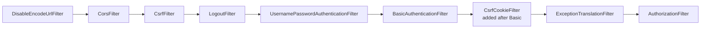

# 6.2 - CSRF Protection

> **Module 6 - Topic 2** - Session, CSRF, CORS
> Baseline: Spring Security 6.x on Boot 3.x
> New to this? Read **In Plain English** below first, then come back to the Version Matrix.

---

## Version Matrix

| Concern | Spring Security 5.x | **Spring Security 6.x (baseline)** | Spring Security 7.x |
|---|---|---|---|
| Token loading | Eager. `CsrfFilter` calls `tokenRepository.loadToken(request)` on every request and creates one if absent. | **Deferred.** The filter sets a `Supplier<CsrfToken>` request attribute; the repository is only touched when something calls `getToken()`. | Deferred, unchanged. |
| Token rendering | `CsrfToken` placed directly as a request attribute by `CsrfFilter`. | **`CsrfTokenRequestHandler`** strategy owns `handle` and `resolveCsrfTokenValue`. | Same strategy, unchanged. |
| Default request handler | None - raw token always. | **`XorCsrfTokenRequestAttributeHandler`** - the rendered value is XOR-masked per request (BREACH mitigation). | Same default. |
| `CookieCsrfTokenRepository` cookie path | Derived from context path, occasionally empty. | Explicit `setCookiePath`, and `setCookieCustomizer` for `SameSite`/`Secure`. | Same, plus richer SPA presets. |
| SPA configuration | Hand-rolled: custom repository plus a warm-up filter. | Hand-rolled: `CookieCsrfTokenRepository.withHttpOnlyFalse()` plus a `CsrfTokenRequestAttributeHandler` plus a materialisation filter. | **First-class SPA-oriented CSRF configuration** removing most of the boilerplate. |
| `CsrfWebFilter` (WebFlux) | Eager. | Deferred, with `ServerCsrfTokenRequestHandler`. | Same. |
| `csrf().disable()` | `HttpSecurity.csrf().disable()` | `http.csrf(csrf -> csrf.disable())` - lambda DSL only, the `.and()` chain is removed. | Same; `AbstractHttpConfigurer::disable` method reference idiom. |
| Logout + CSRF | `LogoutFilter` matches `POST /logout` when CSRF is enabled. | Unchanged, and still the reason a plain `<a href="/logout">` stops working. | Unchanged. |

---

## Why This Exists

Cross-Site Request Forgery exists because of a design decision baked into the web in 1994: the browser
attaches cookies to a request based on the **destination** of that request, never on the **origin** of the
code that triggered it. File `01_M1_T1_HTTP_Web_Basics.md` names this property *ambient authority*. CSRF
is simply the exploitation of ambient authority by a site the user did not intend to act on their behalf.

The practical consequence is that authentication alone is not enough. A correctly authenticated session,
over TLS, with `HttpOnly` and `Secure` cookies, is still fully exploitable, because none of those controls
answer the question CSRF actually poses: *did the user's own application generate this request, or did
somebody else's page generate it?* A CSRF token answers exactly that question and nothing else. It is an
**unpredictable value that only same-origin JavaScript or a same-origin rendered form can read**, so
presenting it proves the request originated from a context that was allowed to read the application's own
responses.

Everything else in this topic — the repository choice, the XOR masking, the deferred loading, the SPA
cookie-to-header dance — is plumbing in service of that single proof.

---

## In Plain English

**The one-line version:** Your browser automatically attaches your login cookie to any request aimed at
your bank, even when the request was triggered by a completely different website, so the server needs a
second secret that only your bank's own pages could have supplied.

**An analogy.** You check into a hotel and are given room 412. From then on, the kitchen will send food
to anyone who phones room service and says "this is room 412". The hotel is identifying the *room*, not
the *person*, because the room number is the only thing it ever asks for.

A prankster in the lobby now phones room service, says "this is room 412", and orders twenty bottles of
champagne on your bill. They never got into your room, never saw your key, and never learned anything
about you. They only had to know your room number and be able to reach the phone. Notice also that the
prankster does not need to hear the reply. The champagne is on your bill whether or not they are told it
worked, which is why nothing that merely stops them *listening* will help.

The hotel's fix is to print a fresh random code on a card that sits on the desk inside room 412, and to
require that code with every order. The prankster can still phone and still claim to be room 412, but
they cannot read a card that is inside a room they have never entered. That card is the CSRF token, and
the only thing it proves is that the request came from somebody who could see inside your room.

**How it actually works, step by step.**

After you log in, the server sends your browser a cookie. From then on, your browser attaches that
cookie to every single request whose destination is that site. It does this regardless of which page
caused the request. That property has a name, ambient authority, and it is the whole reason CSRF exists.

An attacker therefore does not need to steal anything. They put a hidden HTML form on their own page,
point it at your bank, and submit it with JavaScript as soon as the page loads. Your browser sees a
request heading for the bank, looks up the bank's cookies, attaches them, and sends it. The bank
receives a perfectly valid, correctly authenticated instruction.

The protection people usually assume covers this, the same-origin policy, does not. The same-origin
policy is a rule about *reading*, not about *sending*. Any page has always been allowed to cause
requests to other sites, which is how images, scripts and stylesheets from other domains work at all.
What the policy forbids is the attacker's JavaScript reading the response that comes back. For an
attack that changes something, the attacker does not care about the response, so the policy never
engages.

A CSRF token closes the gap. The server generates an unpredictable value and makes it available only to
its own pages, either as a hidden field inside the HTML form it rendered or as a cookie that only
same-origin JavaScript can read. Every request that changes something must echo that value back, either
in a form field named `_csrf` or in a header named `X-CSRF-TOKEN`. The attacker's page can still cause
the request, but it cannot read your bank's HTML or your bank's cookies, so it cannot supply the value,
and the server rejects the request with a 403 Forbidden response.

Spring Security implements this with a filter called `CsrfFilter`, which is on by default. It skips
checking on methods considered safe, which are GET, HEAD, TRACE and OPTIONS, and enforces the check on
everything else. That carries an implication worth noticing early: if you write a GET endpoint that
changes data, Spring Security will not protect it, and cannot, because it has been told that GET is
safe.

Where the token is kept is a choice. By default it lives in the user's session on the server, which is
right for traditional server-rendered pages. For a JavaScript front end you normally switch to keeping
it in a cookie named `XSRF-TOKEN`, readable by JavaScript, which the front end copies into a header on
every write. That copying trick is called double-submit, and it works precisely because the attacker's
site cannot read your cookies.

Two details catch almost everyone. First, the value rendered into your page is deliberately scrambled
differently on every response, using a technique that combines it with fresh random bytes, so the HTML
token, the cookie token, and the stored token are three different strings that all resolve to the same
secret. Comparing them directly, or caching one and reusing it, produces failures that look random.
Second, Spring Security 6 stopped creating the token unless something actually asks for it, which means
a JavaScript front end that used to receive the cookie automatically on its first page load now receives
nothing and fails on its first write.

**Why should a beginner care?** This is the one vulnerability where doing everything else right does not
save you. HTTPS, a strong password, an `HttpOnly` cookie, and a properly authenticated session are all
fully compatible with a successful CSRF attack, because the attack rides on a legitimate session rather
than breaking one. On the practical side, CSRF is the single most common reason a newcomer's POST
request returns 403 Forbidden, and the usual reaction, adding `csrf(csrf -> csrf.disable())` to make the
error go away, removes a real protection from a real cookie-based application.

**Words you will meet in this file**

| Term | In plain words |
|---|---|
| CSRF | Cross-Site Request Forgery. Another site causes your browser to send a real, logged-in request to your application. |
| Ambient authority | The browser's habit of attaching cookies based on where a request is going, never on which page triggered it. |
| Same-origin policy | The browser rule stopping one site from reading another site's responses. It does not stop requests being sent. |
| CSRF token | An unpredictable value the server issues and only its own pages can read, echoed back to prove a request came from them. |
| `CsrfFilter` | The Spring Security filter that checks that value on every request that changes something. |
| Safe methods | GET, HEAD, TRACE and OPTIONS. Assumed not to change anything, so the token is not checked on them. |
| `CsrfTokenRepository` | The component deciding where the token is kept, either in the session or in a cookie. |
| `HttpSessionCsrfTokenRepository` | The default. Stores the token on the server in the user's session. |
| `CookieCsrfTokenRepository` | Stores the token in a cookie instead, which suits JavaScript front ends and multiple servers. |
| `withHttpOnlyFalse()` | Makes that cookie readable by JavaScript, which the front end needs in order to copy it into a header. |
| Double-submit cookie | The pattern of sending the token as a cookie and requiring the client to echo it back in a header. |
| `_csrf` | The default form field name carrying the token in a server-rendered HTML form. |
| `X-CSRF-TOKEN` and `X-XSRF-TOKEN` | The header names used to carry the token on requests sent by JavaScript. |
| `CsrfTokenRequestHandler` | The component deciding how the token is exposed to the page and how it is read back off a request. |
| XOR masking | Scrambling the token with fresh random bytes on every render, so no two responses contain the same string. |
| BREACH | The compression-based attack that XOR masking exists to defeat. |
| Deferred token | The Spring Security 6 behaviour of not creating the token until something actually reads it. |
| `SameSite` | A cookie setting asking the browser not to send the cookie on cross-site requests. Useful, but enforced by the browser rather than by you. |
| `MissingCsrfTokenException` | No token was stored at all, usually an expired session or a lost cookie. Surfaces as 403. |
| `InvalidCsrfTokenException` | A token was stored but the submitted value did not match. Also surfaces as 403, and deserves a security log entry. |

**If you remember only one thing:** if the browser attaches your credential automatically, you need CSRF
protection, and if the credential is one your own JavaScript has to add by hand, you do not.

---

## Core Concepts

### 1. The attack, step by step

**In simple terms:** A page on the attacker's own site quietly submits a form to your bank, and your
browser helpfully attaches your login cookie because the request is addressed to the bank.

The victim is logged into `bank.example.com`; the session cookie lives in the browser's cookie jar. The
attacker hosts this page at `evil.example.com` and gets the victim to visit it (link in an email, an ad
slot, a comment on a forum, an embedded image on a compromised site).

```html
<!-- Served from https://evil.example.com/promo.html -->
<html>
  <body onload="document.forms[0].submit()">
    <form action="https://bank.example.com/transfer" method="POST">
      <input type="hidden" name="toAccount" value="ATTACKER-9931"/>
      <input type="hidden" name="amount"    value="5000"/>
    </form>
  </body>
</html>
```

There is no JavaScript reading anything, no XSS, no stolen cookie, and no interception. The form posts
itself; the browser sees a request to `bank.example.com`, looks up cookies scoped to that host, attaches
`JSESSIONID`, and the bank's server sees a perfectly valid authenticated request.

```mermaid
sequenceDiagram
    autonumber
    participant U as Victim browser
    participant E as evil.example.com
    participant B as bank.example.com

    U->>B: POST /login (username, password)
    B-->>U: 302 + Set-Cookie: JSESSIONID=ABC; HttpOnly
    Note over U: Session cookie now in the jar for bank.example.com

    U->>E: GET /promo.html
    E-->>U: HTML with an auto-submitting cross-site form
    U->>B: POST /transfer  toAccount=ATTACKER-9931&amount=5000<br/>Cookie: JSESSIONID=ABC  (attached automatically)
    B-->>U: 200 Transfer complete
    Note over U,B: The response is blocked from evil.example.com by the same-origin policy,<br/>but the side effect already happened. The attacker does not need to read it.
```

### 2. Why the same-origin policy does not save you

**In simple terms:** The browser rule everyone points to only stops the attacker reading the reply, and
an attack that moves money does not need to read the reply.

This is the single most misunderstood point, and it is a reliable interview discriminator. The same-origin
policy is a **read** restriction, not a **send** restriction. A page from origin A may freely *cause* the
browser to issue requests to origin B — that is how ``, `<script>`, `<link>`, `<iframe>` and
cross-site form posts have always worked. What the same-origin policy forbids is origin A's JavaScript
*inspecting the response*.

For a state-changing request the attacker does not care about the response. The transfer has happened. The
attack is **write-only, and write-only attacks are invisible to the same-origin policy**.

| Mechanism | Blocks the request being sent? | Blocks the response being read? | Stops CSRF? |
|---|---|---|---|
| Same-origin policy | No | Yes | No |
| CORS | No (it *relaxes* the read restriction) | It is the relaxation, not the block | No |
| `HttpOnly` cookie | No | Blocks JavaScript reading the cookie | No |
| TLS / `Secure` | No | No | No |
| `SameSite=Lax` | Yes, for cross-site POST | n/a | Mostly, but not completely |
| CSRF token | Effectively yes - the server rejects it | n/a | **Yes** |

### 3. `CsrfFilter` and `DefaultRequiresCsrfMatcher`

**In simple terms:** This is the actual piece of code that checks the token. It only bothers checking on
requests that change something, so reading a page is never blocked.

`CsrfFilter` is a `OncePerRequestFilter` sitting early in the chain, before the authentication filters and
before `AuthorizationFilter`. Simplified but faithful to the real `doFilterInternal`:

```java
public final class CsrfFilter extends OncePerRequestFilter {

    private final CsrfTokenRepository tokenRepository;
    private RequestMatcher requireCsrfProtectionMatcher = new DefaultRequiresCsrfMatcher();
    private CsrfTokenRequestHandler requestHandler = new XorCsrfTokenRequestAttributeHandler();

    @Override
    protected void doFilterInternal(HttpServletRequest request, HttpServletResponse response,
            FilterChain chain) throws ServletException, IOException {

        DeferredCsrfToken deferredCsrfToken = this.tokenRepository.loadDeferredToken(request, response);
        request.setAttribute(DeferredCsrfToken.class.getName(), deferredCsrfToken);
        this.requestHandler.handle(request, response, deferredCsrfToken::get);

        if (!this.requireCsrfProtectionMatcher.matches(request)) {
            chain.doFilter(request, response);       // safe method: nothing is validated
            return;
        }

        CsrfToken csrfToken = deferredCsrfToken.get();               // materialises here
        String actualToken = this.requestHandler.resolveCsrfTokenValue(request, csrfToken);

        if (!equalsConstantTime(csrfToken.getToken(), actualToken)) {
            AccessDeniedException exc = (!deferredCsrfToken.isGenerated())
                    ? new InvalidCsrfTokenException(csrfToken, actualToken)
                    : new MissingCsrfTokenException(actualToken);
            this.accessDeniedHandler.handle(request, response, exc);
            return;
        }
        chain.doFilter(request, response);
    }
}
```

`DefaultRequiresCsrfMatcher` is a three-line class and worth memorising:

```java
private static final class DefaultRequiresCsrfMatcher implements RequestMatcher {
    private final HashSet<String> allowedMethods = new HashSet<>(
            Arrays.asList("GET", "HEAD", "TRACE", "OPTIONS"));

    @Override
    public boolean matches(HttpServletRequest request) {
        return !this.allowedMethods.contains(request.getMethod());
    }
}
```

So `GET`, `HEAD`, `TRACE` and `OPTIONS` are exempt and everything else — `POST`, `PUT`, `PATCH`, `DELETE`,
and any non-standard verb — is protected. The exemption list is the HTTP notion of *safe* methods. It
follows that **a `GET` endpoint that changes state is a CSRF hole that Spring Security cannot close for
you**, which is one of the concrete reasons the HTTP method contract matters.

### 4. `CsrfToken` and the repository contract

**In simple terms:** The token is just a secret string plus the names of the field and header it travels
in, and the repository is the pluggable decision about where that secret is kept between requests.

```java
public interface CsrfToken extends Serializable {
    String getHeaderName();     // default "X-CSRF-TOKEN"
    String getParameterName();  // default "_csrf"
    String getToken();          // the secret value
}

public interface CsrfTokenRepository {
    CsrfToken generateToken(HttpServletRequest request);
    void saveToken(CsrfToken token, HttpServletRequest request, HttpServletResponse response);
    CsrfToken loadToken(HttpServletRequest request);
    default DeferredCsrfToken loadDeferredToken(HttpServletRequest req, HttpServletResponse res) {
        return new RepositoryDeferredCsrfToken(this, req, res);
    }
}
```

| Implementation | Where the token lives | Reads need a session? | Typical use |
|---|---|---|---|
| `HttpSessionCsrfTokenRepository` (default) | `HttpSession` attribute `HttpSessionCsrfTokenRepository.CSRF_TOKEN` | Yes - forces session creation on first token | Server-rendered applications (Thymeleaf, JSP) |
| `CookieCsrfTokenRepository` | Cookie `XSRF-TOKEN`, `HttpOnly` by default | No - stateless with respect to the session | SPA and clustered deployments |
| `CookieCsrfTokenRepository.withHttpOnlyFalse()` | Same cookie, readable by JavaScript | No | SPA doing cookie-to-header |
| Custom (Redis, signed value) | Wherever you put it | Depends | Multi-node with a shared-nothing front end |

The important asymmetry: the session repository binds the token to server state, so an expired session
invalidates the token. The cookie repository does not — the token is simply "a value the client must echo
back from a place only same-origin script can read". That is the **double-submit cookie** pattern, and it
is secure precisely because the same-origin policy prevents `evil.example.com` from reading the cookie.

### 5. `CsrfTokenRequestHandler` and the XOR masking

**In simple terms:** The token is deliberately scrambled differently every time it is written into a
page, so the string in your HTML never matches the one in the cookie and neither should be compared
directly.

Spring Security 6 splits *what the token is* (repository) from *how it is exposed and resolved on the
request* (handler):

```java
public interface CsrfTokenRequestHandler extends CsrfTokenRequestResolver {
    void handle(HttpServletRequest request, HttpServletResponse response, Supplier<CsrfToken> csrfToken);
    default String resolveCsrfTokenValue(HttpServletRequest request, CsrfToken csrfToken) { ... }
}
```

Two implementations ship:

- `CsrfTokenRequestAttributeHandler` — exposes the raw token and resolves the raw value from header or
  parameter. Predictable, and what SPAs generally want.
- `XorCsrfTokenRequestAttributeHandler` — **the 6.x default**. Each time the token is rendered it generates
  fresh random bytes, XORs them with the real token, and emits `base64(randomBytes || xorResult)`. Every
  render therefore produces a different string. On resolution it splits the decoded value, un-XORs it, and
  compares the recovered plaintext to the stored token.

The reason is **BREACH**, a compression side-channel. When a response is gzip-compressed and contains both
attacker-influenced text and a secret, the compressed length leaks information about how much the two
overlap; an attacker who can trigger many requests can recover the secret byte by byte. Randomising the
rendered form on every response removes the stable string that BREACH needs.

The practical fallout: **the value in the HTML and the value in the cookie are not the same string, and
neither matches what the server has stored.** Code that compares them, or that caches a rendered token and
reuses it across requests, is the usual source of "the token worked once and then stopped".

### 6. The 6.x deferred-token breaking change

**In simple terms:** Spring Security 6 no longer creates the token unless something actually reads it,
which is why a JavaScript front end that worked on version 5 suddenly gets 403 on its first write.

In 5.x, `CsrfFilter` called `loadToken` on *every* request, and if no token existed it generated and saved
one immediately. That meant the token cookie (or session attribute) existed after the first `GET` of any
page. It also meant every anonymous request to a static asset created an `HttpSession` — the reason a
brochure site would accumulate a hundred thousand sessions.

In 6.x the filter installs a `DeferredCsrfToken` and nothing more. `deferredCsrfToken.get()` is only
invoked when (a) the request requires CSRF protection, or (b) application code or a view actually reads the
token. On an unprotected `GET` that renders no token, **no token is generated and no cookie is set**.

This is where SPAs break on upgrade. The classic sequence:

1. The SPA boots and issues `GET /api/user` to discover who is logged in.
2. Under 5.x that request caused the `XSRF-TOKEN` cookie to be written; the SPA's HTTP client picked it up.
3. Under 6.x nothing reads the token during that `GET`, so no cookie is written.
4. The first `POST` has no header to send, `resolveCsrfTokenValue` returns `null`, and the user gets a 403.

The fix is to force materialisation on the requests that matter, with a filter whose only job is to call
`getToken()`:

```java
final class CsrfCookieFilter extends OncePerRequestFilter {
    @Override
    protected void doFilterInternal(HttpServletRequest request, HttpServletResponse response,
            FilterChain filterChain) throws ServletException, IOException {
        CsrfToken csrfToken = (CsrfToken) request.getAttribute(CsrfToken.class.getName());
        csrfToken.getToken();   // materialise, which triggers saveToken and writes the cookie
        filterChain.doFilter(request, response);
    }
}
```

Registered with `http.addFilterAfter(new CsrfCookieFilter(), BasicAuthenticationFilter.class)` so it runs
after authentication has completed but while the response is still uncommitted.

### 7. The SPA pattern in full

**In simple terms:** For a JavaScript front end the server puts the token in a readable cookie and the
front end copies it into a request header, and three separate settings have to agree for that to work.

The browser-side convention, which both Angular's `HttpClient` and Axios implement out of the box, is:
read the cookie named `XSRF-TOKEN` and send its value in the header `X-XSRF-TOKEN` on unsafe requests.
Angular does this automatically for same-origin requests. Axios does it via `xsrfCookieName` and
`xsrfHeaderName`, whose defaults are exactly those two names, though it only applies them when
`withCredentials` is true for cross-origin calls.

Three server-side pieces must line up:

1. `CookieCsrfTokenRepository.withHttpOnlyFalse()` so JavaScript can read the cookie. Dropping `HttpOnly`
   here is deliberate and safe: the token is not a credential, and if the attacker has script execution on
   your origin they can read the token from the DOM anyway.
2. A request handler that resolves the **raw** value from the header, because the cookie holds the raw
   value while `XorCsrfTokenRequestAttributeHandler` would try to un-XOR it.
3. A materialisation filter, as above.

Point 2 needs care, because a hybrid application also renders server-side forms that want the XOR-masked
value. The canonical hybrid handler delegates based on where the value came from:

```java
final class SpaCsrfTokenRequestHandler implements CsrfTokenRequestHandler {

    private final CsrfTokenRequestHandler plain  = new CsrfTokenRequestAttributeHandler();
    private final CsrfTokenRequestHandler xor    = new XorCsrfTokenRequestAttributeHandler();

    @Override
    public void handle(HttpServletRequest request, HttpServletResponse response,
            Supplier<CsrfToken> csrfToken) {
        this.xor.handle(request, response, csrfToken);   // render masked for forms
        request.getAttribute(CsrfToken.class.getName()); // and force the cookie to be written
    }

    @Override
    public String resolveCsrfTokenValue(HttpServletRequest request, CsrfToken csrfToken) {
        // Header present means the SPA read the raw cookie value: compare raw.
        // No header means a rendered form field: un-XOR it.
        return (StringUtils.hasText(request.getHeader(csrfToken.getHeaderName())))
                ? this.plain.resolveCsrfTokenValue(request, csrfToken)
                : this.xor.resolveCsrfTokenValue(request, csrfToken);
    }
}
```

### 8. When disabling CSRF is genuinely safe

**In simple terms:** Switching the protection off is only safe when nothing the browser attaches by
itself can authenticate a request, which depends on how the credential travels rather than what it is.

The precise rule, and it is worth being able to state it verbatim:

> CSRF protection is unnecessary **if and only if the application accepts no ambient credentials** — that
> is, if every authenticated request carries a credential the browser will not attach automatically.

"Automatically attached" covers cookies and HTTP Basic credentials cached by the browser, and it covers
Windows Integrated Authentication / Kerberos negotiation. It does **not** cover a bearer token that
JavaScript puts into an `Authorization` header, because `evil.example.com` cannot cause the browser to
attach that header to a cross-site request, and it cannot read your token out of another origin's storage.

The trap is that "we use JWT" is not the same as "we are safe". **A JWT stored in a cookie is ambient
authority and is fully CSRF-exploitable**, exactly like a session id. What matters is the transport, not
the token format. Similarly, disabling CSRF on a chain that also permits form login with a session cookie
re-opens the hole even if the main API is token-based — which is why the two should be separate
`SecurityFilterChain` beans with separate matchers, as in the Working Code below.

Non-browser clients are irrelevant to the decision. `curl` and server-to-server callers never had ambient
authority in the first place; CSRF is a browser-only problem, so "our API is called by services" is only an
argument for disabling CSRF if *no browser* is also a client.

### 9. `SameSite` as defence in depth, not a replacement

**In simple terms:** A cookie setting can ask the browser not to send cookies on requests from other
sites, which helps a great deal, but it is the browser doing the enforcing rather than your server.

File `01_M1_T1_HTTP_Web_Basics.md` covers the cookie attribute itself. The CSRF-specific reasoning:

- `SameSite=Lax` (the browser default for cookies that omit the attribute) suppresses the cookie on
  cross-site `POST`, which blocks the auto-submitting-form attack above. It does **not** suppress it on
  top-level cross-site `GET` navigation, so a state-changing `GET` remains exploitable.
- "Same-site" is registrable-domain scoped, not origin scoped. `evil.partner.example.com` is same-site with
  `app.example.com`. On a large organisation's shared domain that is a real gap.
- Enforcement is the browser's, not yours. Old browsers, embedded webviews, and some corporate proxies do
  not apply it. A server-side control you enforce is categorically different from a client-side control you
  hope for.

Use both. `SameSite=Lax` plus CSRF tokens is the correct posture; `SameSite` alone is a bet on the client.

### 10. Logout, and why it must be a `POST`

**In simple terms:** Once CSRF protection is on, a plain logout link stops working, because logging
somebody out is a change and therefore has to be submitted rather than merely clicked.

With CSRF enabled, `LogoutFilter`'s default matcher is `POST /logout` rather than any-method `/logout`. The
predictable consequence of upgrading into an enabled-CSRF configuration is that `<a href="/logout">` starts
returning 404 (no handler for `GET /logout`) or falling through to the login page.

Logout CSRF is a real, if low-severity, vulnerability — a denial of service that logs the user out
repeatedly — but the more serious variant is **login CSRF**, where the attacker forces the victim's browser
to log in *as the attacker*, so the victim's subsequent activity accrues to the attacker's account. That is
the reason Spring Security protects the login endpoint too, and why the login form needs a token even
though nobody is authenticated yet.

### 11. Multipart and the ordering problem

**In simple terms:** On a file upload the token is buried inside a body nobody has unpacked yet when the
CSRF check runs, so the check cannot see it and the upload is rejected.

For a multipart form post, the `_csrf` field is inside the multipart body. `CsrfFilter` reads it through
`request.getParameter("_csrf")`, and a plain `HttpServletRequest` does not parse multipart bodies — that is
`DispatcherServlet`'s `MultipartResolver`, which runs far later. So the parameter is invisible and the
request is rejected.

Two correct solutions:

1. **Put the token in the query string.** `action="/upload?_csrf=${_csrf.token}"`. Simple; the downside is
   the token appears in access logs and `Referer` headers.
2. **Register Spring's `MultipartFilter` before `springSecurityFilterChain`.** The body is then parsed
   before `CsrfFilter` runs and `getParameter` works. The security consequence is real and must be
   understood: the file is written to temporary storage *before* any authentication or authorisation check,
   so an unauthenticated caller can consume disk. Bound it with `spring.servlet.multipart.max-file-size`
   and an upstream size limit.

### 12. The exceptions and the status code

**In simple terms:** Both CSRF failures look identical to the user as a 403, but one means "your session
went away" and the other means "the value did not match", and only the second is worth alarming on.

| Exception | Raised when | Meaning |
|---|---|---|
| `MissingCsrfTokenException` | The repository had no stored token, so one was generated during this request | Usually an expired or brand-new session, or a lost cookie |
| `InvalidCsrfTokenException` | A stored token existed but the presented value did not match | Genuine mismatch: a real attack, a stale cached page, or a mangled SPA header |

Both extend `CsrfException`, which extends `AccessDeniedException`, so both are handled by
`AccessDeniedHandler` and both surface as **403 Forbidden**. Distinguishing them in a custom handler is
worthwhile: `MissingCsrfTokenException` usually deserves "your session expired, please reload", while
`InvalidCsrfTokenException` deserves a security log entry.

---

## Working Code

```java
package com.example.security.csrf;

import org.springframework.context.annotation.Bean;
import org.springframework.context.annotation.Configuration;
import org.springframework.core.Ordered;
import org.springframework.core.annotation.Order;
import org.springframework.security.config.Customizer;
import org.springframework.security.config.annotation.web.builders.HttpSecurity;
import org.springframework.security.config.annotation.web.configuration.EnableWebSecurity;
import org.springframework.security.config.http.SessionCreationPolicy;
import org.springframework.security.web.SecurityFilterChain;
import org.springframework.security.web.authentication.www.BasicAuthenticationFilter;
import org.springframework.security.web.csrf.CookieCsrfTokenRepository;

@Configuration
@EnableWebSecurity
public class CsrfSecurityConfig {

    /**
     * Chain 1 - bearer-token API. No ambient credentials are accepted here, so CSRF is
     * genuinely unnecessary. The narrow securityMatcher is what makes the claim true:
     * this chain never sees a cookie-authenticated request.
     */
    @Bean
    @Order(Ordered.HIGHEST_PRECEDENCE)
    SecurityFilterChain tokenApiChain(HttpSecurity http) throws Exception {
        return http
            .securityMatcher("/api/v1/**")
            .csrf(csrf -> csrf.disable())
            .sessionManagement(s -> s.sessionCreationPolicy(SessionCreationPolicy.STATELESS))
            .authorizeHttpRequests(auth -> auth.anyRequest().authenticated())
            .oauth2ResourceServer(oauth -> oauth.jwt(Customizer.withDefaults()))
            .build();
    }

    /**
     * Chain 2 - cookie-authenticated SPA. CSRF is mandatory. The three SPA pieces are the
     * HttpOnly-false cookie repository, the hybrid request handler, and the filter that
     * forces the token to materialise so the cookie is actually written.
     */
    @Bean
    SecurityFilterChain spaChain(HttpSecurity http) throws Exception {
        CookieCsrfTokenRepository repository = CookieCsrfTokenRepository.withHttpOnlyFalse();
        repository.setCookiePath("/");
        repository.setCookieCustomizer(c -> c.secure(true).sameSite("Lax"));

        return http
            .csrf(csrf -> csrf
                .csrfTokenRepository(repository)
                .csrfTokenRequestHandler(new SpaCsrfTokenRequestHandler())
                // Webhooks authenticate by HMAC signature, not by cookie, so they carry
                // no ambient authority and are correctly exempt.
                .ignoringRequestMatchers("/webhooks/**"))
            .addFilterAfter(new CsrfCookieFilter(), BasicAuthenticationFilter.class)
            .authorizeHttpRequests(auth -> auth
                .requestMatchers("/login", "/css/**", "/js/**").permitAll()
                .requestMatchers("/webhooks/**").permitAll()
                .anyRequest().authenticated())
            .formLogin(Customizer.withDefaults())
            // With CSRF enabled, logoutUrl produces a POST-only matcher, which is why
            // a plain <a href="/logout"> stops working the moment CSRF is switched on.
            .logout(logout -> logout
                .logoutUrl("/logout")
                .deleteCookies("XSRF-TOKEN"))
            .build();
    }
}
```

```java
package com.example.security.csrf;

import jakarta.servlet.FilterChain;
import jakarta.servlet.ServletException;
import jakarta.servlet.http.HttpServletRequest;
import jakarta.servlet.http.HttpServletResponse;
import java.io.IOException;
import java.util.function.Supplier;
import org.springframework.security.web.csrf.CsrfToken;
import org.springframework.security.web.csrf.CsrfTokenRequestAttributeHandler;
import org.springframework.security.web.csrf.CsrfTokenRequestHandler;
import org.springframework.security.web.csrf.XorCsrfTokenRequestAttributeHandler;
import org.springframework.util.StringUtils;
import org.springframework.web.filter.OncePerRequestFilter;

/** Forces the deferred CsrfToken to materialise so CookieCsrfTokenRepository writes the cookie. */
final class CsrfCookieFilter extends OncePerRequestFilter {

    @Override
    protected void doFilterInternal(HttpServletRequest request, HttpServletResponse response,
            FilterChain filterChain) throws ServletException, IOException {
        CsrfToken token = (CsrfToken) request.getAttribute(CsrfToken.class.getName());
        if (token != null) {
            token.getToken();
        }
        filterChain.doFilter(request, response);
    }
}

/** Raw value when the SPA sends a header; XOR-masked value when a rendered form posts a field. */
final class SpaCsrfTokenRequestHandler implements CsrfTokenRequestHandler {

    private final CsrfTokenRequestHandler plain = new CsrfTokenRequestAttributeHandler();
    private final CsrfTokenRequestHandler xor = new XorCsrfTokenRequestAttributeHandler();

    @Override
    public void handle(HttpServletRequest request, HttpServletResponse response,
            Supplier<CsrfToken> csrfToken) {
        this.xor.handle(request, response, csrfToken);
    }

    @Override
    public String resolveCsrfTokenValue(HttpServletRequest request, CsrfToken csrfToken) {
        return StringUtils.hasText(request.getHeader(csrfToken.getHeaderName()))
                ? this.plain.resolveCsrfTokenValue(request, csrfToken)
                : this.xor.resolveCsrfTokenValue(request, csrfToken);
    }
}
```

```java
package com.example.security.csrf;

import static org.assertj.core.api.Assertions.assertThat;
import static org.springframework.security.test.web.servlet.request.SecurityMockMvcRequestPostProcessors.csrf;
import static org.springframework.security.test.web.servlet.request.SecurityMockMvcRequestPostProcessors.jwt;
import static org.springframework.test.web.servlet.request.MockMvcRequestBuilders.get;
import static org.springframework.test.web.servlet.request.MockMvcRequestBuilders.post;
import static org.springframework.test.web.servlet.result.MockMvcResultMatchers.cookie;
import static org.springframework.test.web.servlet.result.MockMvcResultMatchers.status;

import jakarta.servlet.http.Cookie;
import org.junit.jupiter.api.Test;
import org.springframework.beans.factory.annotation.Autowired;
import org.springframework.boot.test.autoconfigure.web.servlet.AutoConfigureMockMvc;
import org.springframework.boot.test.context.SpringBootTest;
import org.springframework.http.MediaType;
import org.springframework.security.test.context.support.WithMockUser;
import org.springframework.test.web.servlet.MockMvc;
import org.springframework.test.web.servlet.MvcResult;

@SpringBootTest
@AutoConfigureMockMvc
class CsrfProtectionTests {

    @Autowired MockMvc mockMvc;

    @Test
    @WithMockUser
    void postWithoutATokenIsForbidden() throws Exception {
        mockMvc.perform(post("/profile").param("displayName", "Ada"))
               .andExpect(status().isForbidden());
    }

    @Test
    @WithMockUser
    void postWithTheCsrfPostProcessorSucceeds() throws Exception {
        // csrf() injects a valid token into the request using the configured repository,
        // which is why it works regardless of which repository or handler is in use.
        mockMvc.perform(post("/profile").param("displayName", "Ada").with(csrf()))
               .andExpect(status().isOk());
    }

    @Test
    @WithMockUser
    void theSpaCookieIsWrittenOnASafeRequestBecauseOfTheMaterialisationFilter() throws Exception {
        // Without CsrfCookieFilter this assertion fails under Spring Security 6 - the token
        // is deferred and a plain GET never touches the repository.
        mockMvc.perform(get("/profile"))
               .andExpect(cookie().exists("XSRF-TOKEN"))
               .andExpect(cookie().httpOnly("XSRF-TOKEN", false));
    }

    @Test
    @WithMockUser
    void theRawCookieValueIsAcceptedWhenSentAsAHeader() throws Exception {
        MvcResult primed = mockMvc.perform(get("/profile")).andReturn();
        Cookie xsrf = primed.getResponse().getCookie("XSRF-TOKEN");
        assertThat(xsrf).isNotNull();

        mockMvc.perform(post("/profile")
                    .param("displayName", "Ada")
                    .cookie(xsrf)
                    .header("X-XSRF-TOKEN", xsrf.getValue()))
               .andExpect(status().isOk());
    }

    @Test
    void theBearerTokenChainAcceptsPostsWithoutAnyToken() throws Exception {
        // csrf().useInvalidToken() proves the point: even a deliberately wrong token is
        // irrelevant on a chain where CsrfFilter is not registered at all.
        mockMvc.perform(post("/api/v1/orders").with(jwt()).with(csrf().useInvalidToken())
                    .contentType(MediaType.APPLICATION_JSON).content("{\"sku\":\"A-1\"}"))
               .andExpect(status().isCreated());
    }
}
```

---

## Internals

### Where `CsrfFilter` sits

`HttpSecurityConfiguration` orders filters through `FilterOrderRegistration`. The relevant ordering is:



Two consequences follow from `CsrfFilter` preceding the authentication filters. First, the login `POST` is
itself CSRF-protected, which is what defeats login CSRF. Second, a CSRF failure produces 403 *before*
authentication is attempted, so a 403 on `/login` with correct credentials is a token problem, never a
credentials problem.

### `SecurityContextHolderFilter` interaction

`CsrfFilter` runs before the security context is available in 6.x only in the sense that the context is
deferred; the token is not tied to the authentication. The important corollary is that
`HttpSessionCsrfTokenRepository` and the session-based security context share a session lifetime, so
`changeSessionId` during login preserves attributes and therefore preserves the token, while `newSession`
discards it and forces a fresh one. That is one reason `changeSessionId` is the default fixation strategy.

### Constant-time comparison

```java
private static boolean equalsConstantTime(String expected, String actual) {
    if (expected == actual) { return true; }
    if (expected == null || actual == null) { return false; }
    byte[] expectedBytes = Utf8.encode(expected);
    byte[] actualBytes = Utf8.encode(actual);
    return MessageDigest.isEqual(expectedBytes, actualBytes);
}
```

`MessageDigest.isEqual` does not short-circuit on the first differing byte, so response time does not leak
how many leading bytes the attacker guessed correctly. With XOR masking a timing oracle is already
impractical, but the defence is cheap and unconditional.

### `CsrfAuthenticationStrategy`

On successful authentication Spring Security runs `CsrfAuthenticationStrategy` as part of the
`SessionAuthenticationStrategy` composite. It deletes the existing token and saves a fresh one. Without it,
a token issued to the anonymous pre-login session would remain valid for the authenticated session — the
CSRF-token analogue of session fixation.

---

## Configuration Reference

| Option | Effect | Default |
|---|---|---|
| `http.csrf(Customizer.withDefaults())` | Enables `CsrfFilter` | Enabled for servlet chains |
| `http.csrf(csrf -> csrf.disable())` | Removes `CsrfFilter` entirely | n/a |
| `csrfTokenRepository(...)` | Where the expected token is stored | `HttpSessionCsrfTokenRepository` |
| `csrfTokenRequestHandler(...)` | How the token is rendered and resolved | `XorCsrfTokenRequestAttributeHandler` |
| `requireCsrfProtectionMatcher(...)` | Which requests are validated | `DefaultRequiresCsrfMatcher` (all but GET/HEAD/TRACE/OPTIONS) |
| `ignoringRequestMatchers(...)` | Exempts specific paths | none |
| `sessionAuthenticationStrategy(...)` | Token rotation on login | `CsrfAuthenticationStrategy` in the composite |
| `CookieCsrfTokenRepository.withHttpOnlyFalse()` | Cookie readable by JavaScript | `HttpOnly` is true otherwise |
| `setCookieName(...)` | Cookie name | `XSRF-TOKEN` |
| `setHeaderName(...)` | Expected request header | `X-XSRF-TOKEN` (cookie repo) / `X-CSRF-TOKEN` (session repo) |
| `setParameterName(...)` | Expected form field | `_csrf` |
| `setCookiePath(...)` | Cookie path | context path |
| `setCookieCustomizer(c -> ...)` | `SameSite`, `Secure`, `Max-Age`, domain | not set |
| `server.servlet.session.cookie.same-site` | `SameSite` for `JSESSIONID` | `lax` under Boot 3 |
| `spring.servlet.multipart.max-file-size` | Caps pre-auth upload size when `MultipartFilter` is first | `1MB` |

---

## Production Concerns & Anti-Patterns

**Disabling CSRF because the tests were failing.** `csrf.disable()` is the single most common insecure line
in Spring Security configurations, and it is almost always introduced to make a `MockMvc` test pass. The
correct fix is `.with(csrf())` on the test request. Treat any `csrf.disable()` in a chain that accepts
cookie authentication as a finding.

**Assuming "we use JWT" means CSRF does not apply.** It applies whenever the credential is transported
ambiently. A JWT in a cookie is ambient. A JWT the SPA reads from memory and sets on `Authorization` is
not. Audit the transport, not the token format.

**Exempting paths with `ignoringRequestMatchers` for convenience.** Every exemption is a hole unless the
exempt endpoint independently rejects ambient authority. Webhooks verified by HMAC qualify. "The mobile app
calls this one" does not, because a browser can call it too.

**Caching pages that embed a token.** A CDN or reverse proxy that caches an HTML page containing a `_csrf`
field will serve one user's token to another user. Under XOR masking the tokens differ per render, so the
symptom is intermittent 403s that correlate with cache hit ratio. Mark token-bearing pages `no-store`.

**Reading `csrfToken.getToken()` after the response is committed.** With the cookie repository the write
happens inside `saveToken`, which requires an uncommitted response. Materialise early — that is precisely
why `CsrfCookieFilter` is registered before the response-producing filters rather than at the end.

**Cookie path and domain mismatches.** The default cookie path follows the context path, so an application
deployed at `/app` writes a cookie scoped to `/app` while the SPA calls `/api`. The cookie is not sent, the
header is absent, and every write 403s. Set `setCookiePath("/")` explicitly.

**Load balancers stripping unknown headers.** Some appliances drop non-standard request headers by default.
`X-XSRF-TOKEN` then never reaches the application and every write fails in production while working
locally. Verify at the edge before debugging the application.

**Forgetting that logout is a `POST`.** Upgrading a project that had CSRF disabled and re-enabling it turns
every logout link into a dead link. Convert to a form post or a scripted fetch that includes the token.

---

## Debugging Playbook

| Symptom | Likely root cause | Fix |
|---|---|---|
| Every `POST` returns 403 with `MissingCsrfTokenException` | Session expired or the token was never stored | Reload the page; check the session timeout and the cookie path |
| Every `POST` returns 403 with `InvalidCsrfTokenException` | Value mismatch - stale cached page, or XOR value compared against the raw cookie | Use a handler matching the transport; mark token pages `no-store` |
| SPA worked on 5.x, 403s after upgrading to 6.x | Deferred token - no cookie written on `GET` | Add a filter that calls `csrfToken.getToken()` |
| `XSRF-TOKEN` cookie present but JavaScript cannot read it | `CookieCsrfTokenRepository` without `withHttpOnlyFalse()` | Use `withHttpOnlyFalse()` |
| Cookie exists but is never sent on the request | Cookie path scoped to the context path, or cross-origin without `withCredentials` | `setCookiePath("/")`; set `withCredentials` |
| Multipart upload 403s while other posts succeed | `_csrf` is inside the unparsed multipart body | Token in the query string, or `MultipartFilter` before the security chain |
| `GET /logout` returns 404 after enabling CSRF | `LogoutFilter` matches `POST /logout` | Use a form post with the token |
| Login form 403s with correct credentials | `CsrfFilter` rejects before authentication runs | Render `_csrf` in the login form |
| Intermittent 403s proportional to traffic | A reverse proxy caching token-bearing HTML | `Cache-Control: no-store` on those responses |
| Works in Postman, fails in the browser | Postman sends no cookie and the chain is token-based; the browser sends the session cookie | Confirm which chain matched with `securityMatcher` |
| 403 with an empty body and no stack trace | `AccessDeniedHandler` default behaviour | Register a handler distinguishing the two CSRF exceptions |
| Token valid on the first request only after login | `CsrfAuthenticationStrategy` rotated it | Re-read the token after authentication |

---

## Interview Q&A

### Q1. Explain how CSRF works and why a token stops it, without using the word "hacker".

<details>
<summary>Show answer</summary>

CSRF exploits ambient authority. The browser attaches cookies based on the destination host of a request,
not on the origin of the code that initiated it. So a page served from `evil.example.com` can cause the
browser to issue `POST https://bank.example.com/transfer`, and the browser will attach the victim's
`bank.example.com` session cookie to it, because from the browser's point of view this is simply a request
to `bank.example.com`.

The same-origin policy does not intervene, because it restricts *reading* responses, not *sending*
requests. The attacker's page is blocked from reading the transfer confirmation, but the transfer already
happened. State-changing attacks are write-only, and write-only attacks are outside the same-origin
policy's scope.

A CSRF token works because it converts an implicit property — "was this request generated by our own
application?" — into an explicit one the server can verify. The token is an unpredictable value that is
only obtainable by reading a response from the application's own origin, whether that is an HTML form the
application rendered or a cookie that only same-origin JavaScript can read. The attacker's page can cause
requests but cannot read responses, therefore cannot learn the token, therefore cannot forge a valid
request. The security property rests entirely on the same-origin *read* restriction that CSRF otherwise
bypasses.

**Counter-question: if the token is in a cookie, the browser attaches it automatically too. How is the
double-submit cookie pattern not trivially broken?**

Because the token must appear in *two* places: the cookie, which the browser attaches automatically, and a
header or form field, which it does not. The attacker's cross-site request will carry the cookie — that is
unavoidable — but the attacker cannot populate the header, because doing so requires reading the cookie
value, and the same-origin policy prevents `evil.example.com` from reading a cookie scoped to
`bank.example.com`. The server compares the two and rejects the mismatch.

The pattern does have a known weakness: it trusts that nothing else can write a cookie into your domain's
jar. A subdomain takeover, or an application on a sibling subdomain that sets a domain-scoped cookie, can
plant a known token value and then forge matching headers. Defences are to avoid `Domain`-scoped token
cookies, to use the `__Host-` cookie prefix which browsers only accept when the cookie is host-only, secure
and path `/`, and to treat subdomain hygiene as part of the threat model.

**Counter-question: why does Spring Security compare tokens with `MessageDigest.isEqual` instead of
`String.equals`?**

To avoid a timing side channel. `String.equals` returns as soon as it finds a differing character, so the
time taken correlates with how many leading characters matched. An attacker able to issue many requests and
measure response times could in principle recover the token one character at a time.
`MessageDigest.isEqual` compares all bytes unconditionally, so the duration does not depend on where the
first difference is.

In practice the XOR masking in `XorCsrfTokenRequestAttributeHandler` already makes this attack unrealistic,
because the attacker never sees a stable value to attack. But constant-time comparison costs nothing and
protects the configurations where masking is disabled.
</details>

### Q2. A team upgraded from Spring Security 5 to 6. Their Angular SPA now gets 403 on every write. Diagnose it.

<details>
<summary>Show answer</summary>

The near-certain cause is the deferred `CsrfToken`. In 5.x, `CsrfFilter` eagerly called
`tokenRepository.loadToken(request)` on every request and generated one if absent, so the `XSRF-TOKEN`
cookie was written on the very first `GET`. In 6.x the filter only installs a `DeferredCsrfToken` supplier;
the repository is touched only when something actually calls `getToken()`. An Angular application whose
bootstrap sequence is `GET /api/session` followed by a `POST` never causes anything to read the token, so
no cookie is written, so `HttpClient` finds no `XSRF-TOKEN` to copy into `X-XSRF-TOKEN`, so
`resolveCsrfTokenValue` returns null and `CsrfFilter` throws `MissingCsrfTokenException` — a 403.

Confirmation takes thirty seconds: open the network tab, look at the bootstrap `GET`, and check whether a
`Set-Cookie: XSRF-TOKEN=...` header is present. Under 5.x it was; under 6.x it is not.

The fix has two parts. Add a `OncePerRequestFilter` that reads the `CsrfToken` request attribute and calls
`getToken()` on it, forcing the repository's `saveToken` to run and the cookie to be written; register it
with `addFilterAfter(..., BasicAuthenticationFilter.class)` so it runs while the response is uncommitted.
Second, because the cookie now holds the raw token while the default handler expects an XOR-masked value
when resolving, install a handler that resolves the raw value when a header is present. The hybrid
`SpaCsrfTokenRequestHandler` in the Working Code section does exactly that.

**Counter-question: why was the change made at all, if it breaks SPAs?**

Because eager loading had a worse cost for the much larger population of applications: with the default
`HttpSessionCsrfTokenRepository`, calling `loadToken` on every request forced an `HttpSession` to be created
for every anonymous visitor, including crawlers and requests for static assets. On a public site that is a
memory and replication burden with no benefit. Deferring means the session is created only when a token is
genuinely needed. The SPA case is a smaller population and has a mechanical fix.

**Counter-question: they "fixed" it by switching to `CsrfTokenRequestAttributeHandler` globally instead of
the hybrid handler. What did they lose?**

BREACH resistance. `CsrfTokenRequestAttributeHandler` emits the raw token on every render, so a
gzip-compressed response that contains both the token and attacker-influenced content leaks length
information that can be used to recover the token over many requests. For a pure SPA that renders no HTML
containing the token, the exposure is close to zero and the trade is defensible. For a hybrid application
that server-renders any page containing the token, it is a real regression, and the hybrid handler is the
right answer precisely because it keeps masking for the rendered path.
</details>

### Q3. When is it genuinely safe to disable CSRF protection? State the rule precisely.

<details>
<summary>Show answer</summary>

The rule: CSRF protection is unnecessary if and only if the application accepts **no ambient credentials**
— that is, no credential that the browser attaches to a cross-site request automatically. In practice that
means no session cookie, no authentication cookie of any kind, no HTTP Basic credentials cached by the
browser, and no Integrated Windows Authentication or Kerberos negotiation.

The positive case is a bearer token that client-side code holds in memory or in `sessionStorage` and sets
explicitly on the `Authorization` header. A cross-site page cannot cause the browser to add that header
(any attempt triggers a preflight, which the server will not approve for an arbitrary origin), and it
cannot read the token out of another origin's storage. So there is nothing ambient to forge with.

Two qualifications matter. First, "we use JWT" is not the rule; **transport** is the rule. A JWT delivered
in a cookie is ambient authority and is exactly as CSRF-exploitable as `JSESSIONID`. Second, the claim must
hold for the whole filter chain, not for the endpoint you had in mind. If one `SecurityFilterChain` both
disables CSRF and permits form login, the cookie-authenticated paths in that chain are unprotected. That is
why the correct structure is two chains with disjoint `securityMatcher`s: a `STATELESS` bearer chain with
CSRF disabled, and a session chain with CSRF enabled.

**Counter-question: the API is only called by other backend services, never a browser. Does that change
anything?**

It makes the CSRF question moot rather than answering it. CSRF is a browser-only attack, because it depends
on a browser's automatic credential attachment. A server-side HTTP client has no cookie jar tied to a
user's identity, so there is no ambient authority to exploit. If you can genuinely guarantee no browser
ever authenticates against that chain, CSRF protection adds nothing.

The caution is that "no browser calls it" is a statement about today's clients, enforced by nothing. If the
chain also accepts a session cookie, a browser *could* call it, and then the guarantee is only a convention.
Make it structural: a chain that is `STATELESS` and only configures `oauth2ResourceServer` cannot be
cookie-authenticated, so the guarantee is enforced by configuration rather than by documentation.

**Counter-question: does `SameSite=Strict` on the session cookie let you disable CSRF?**

No, and this is the most tempting wrong answer in the topic. `SameSite` is enforced by the browser, not by
your server, so it is a control you hope for rather than one you apply. Old browsers, embedded webviews and
some intermediaries do not honour it. More importantly, "same-site" is scoped to the registrable domain,
not the origin, so a compromised or hostile application on a sibling subdomain — `intranet.example.com`
attacking `app.example.com` — is same-site and the cookie is attached normally. In a large organisation
sharing a corporate domain, that gap is not hypothetical.

Use `SameSite=Lax` as defence in depth alongside tokens. It genuinely blocks the classic auto-submitting
form from an unrelated domain, and it costs nothing. It just is not a substitute for a server-enforced
check.
</details>

### Q4. Why is the login endpoint CSRF-protected? Nobody is authenticated yet, so what is there to forge?

<details>
<summary>Show answer</summary>

The attack is **login CSRF**, and it inverts the usual direction. Instead of making the victim act as
themselves, the attacker makes the victim's browser log in as *the attacker*. A cross-site auto-submitting
form posts the attacker's own credentials to `bank.example.com/login`; the victim's browser now holds a
session authenticated as the attacker, and the victim, not noticing, continues using the site.

The damage depends on the application. On a payments site the victim may add their own card to the
attacker's account. On a search or document product, everything the victim does is recorded in the
attacker's history, which the attacker then reads at leisure. On any site with a linking flow, the victim
may connect a personal identity to an account the attacker controls.

Protecting login with a token defeats this because the attacker's page cannot obtain a valid token for the
victim's browser. Mechanically, `CsrfFilter` sits before `UsernamePasswordAuthenticationFilter` in the
chain, so the token check runs and fails before credentials are ever examined. That ordering is also why a
login attempt with perfectly correct credentials can return 403 rather than a failed-login redirect: the
request never reached the authentication filter.

**Counter-question: the pre-login token is stored against the anonymous session. After login, is it still
valid?**

No, and deliberately so. `CsrfAuthenticationStrategy` runs as part of the `SessionAuthenticationStrategy`
composite on successful authentication; it deletes the existing token and saves a freshly generated one.
Without that rotation, a token the attacker could have obtained before login — by visiting the site
themselves and planting the session, in a fixation-style setup — would remain valid afterwards. It is the
CSRF-token analogue of session fixation, and the mitigation is the same shape: rotate the secret at the
privilege transition.

**Counter-question: with `HttpSessionCsrfTokenRepository` and `changeSessionId` fixation protection, does
the token survive login?**

The *storage* survives, but the token is replaced anyway. `changeSessionId` changes the session identifier
while preserving the attributes, so the attribute holding the CSRF token is carried across. Then
`CsrfAuthenticationStrategy` overwrites it with a new value. With `newSession` the attribute would be
discarded outright and a new token generated on next use, so either way the post-login token differs from
the pre-login one. The practical implication for client code is the same: after login, re-read the token
rather than reusing the one from the login page.
</details>

### Q5. Walk through what breaks with multipart file uploads and CSRF, and evaluate the fixes.

<details>
<summary>Show answer</summary>

`CsrfFilter` resolves the submitted token with `request.getParameter("_csrf")` when no header is present.
For a `multipart/form-data` post, the `_csrf` field lives inside the multipart body, and a raw
`HttpServletRequest` does not parse multipart bodies. That parsing is done by Spring MVC's
`MultipartResolver`, invoked by `DispatcherServlet`, which runs *after* the entire security filter chain.
So at the moment `CsrfFilter` asks for the parameter, the answer is `null`, and the upload is rejected with
403 while ordinary form posts on the same application work fine.

The first fix is to move the token into the query string: `action="/upload?_csrf=${_csrf.token}"`. Query
parameters are parsed from the URI and are visible to `getParameter` without touching the body. It is
simple and requires no filter registration. Its cost is exposure: the token appears in access logs, in
browser history, and potentially in the `Referer` header sent to third parties from the resulting page.
Since the token is not a credential and is rotated on authentication, that exposure is usually tolerable,
but it should be a conscious decision.

The second fix is to register Spring's `MultipartFilter` ahead of `springSecurityFilterChain` in the
servlet container's filter order. The body is then parsed before the security filters run, so
`getParameter("_csrf")` works normally. The security consequence must be understood rather than waved
through: **the uploaded file is written to temporary storage before any authentication or authorisation
check has run**, so an entirely unauthenticated caller can consume disk and CPU. That is only acceptable
with hard limits — `spring.servlet.multipart.max-file-size`, `max-request-size`, and ideally a body-size
cap at the reverse proxy.

For an SPA the question usually disappears: the client sends the token in the `X-XSRF-TOKEN` header
alongside the multipart body, and headers are available to `CsrfFilter` without any body parsing.

**Counter-question: why not just add the upload endpoint to `ignoringRequestMatchers`?**

Because it removes protection from precisely the endpoint most worth protecting. An upload endpoint is
state-changing by definition, and often writes content that other users will later view — so a forged
upload can be a stored-XSS or malicious-content delivery vector, not merely nuisance data. Exempting it
converts an ordering inconvenience into a genuine vulnerability. Exemptions are defensible only where the
endpoint independently rejects ambient authority, such as a webhook verified by HMAC signature.

**Counter-question: if `MultipartFilter` runs first, does the file survive to the controller, or is it
parsed twice?**

It is parsed once. `MultipartFilter` wraps the request in a `MultipartHttpServletRequest` using the
`MultipartResolver` bean it looks up from the root application context, and that wrapper propagates down
the chain. When `DispatcherServlet` later checks whether the request is already a
`MultipartHttpServletRequest`, it finds that it is and does not re-resolve. The one configuration detail
that bites people is that `MultipartFilter` looks up a resolver bean named `filterMultipartResolver` in the
**root** context by default, so in a Boot application where the resolver is defined elsewhere you either
name the bean accordingly or set the filter's `multipartResolverBeanName`.
</details>

### Q6. Design question - you own a banking platform with a server-rendered admin portal, a public customer SPA, a native mobile app, and inbound payment webhooks from three partners. Design the CSRF posture end to end.

<details>
<summary>Show answer</summary>

The organising principle is that **CSRF posture follows the credential transport**, so the first design
decision is to split the application into filter chains whose credential transport is uniform, and then
decide CSRF per chain. Four chains, ordered by `@Order` with the most specific `securityMatcher` first.

**Chain 1 - webhooks (`/webhooks/**`).** Authentication is an HMAC signature over the raw body with a
per-partner shared secret, plus a timestamp and a replay cache. No cookies, no session. CSRF protection is
disabled, and it is genuinely safe because the chain accepts no ambient credential: a browser cannot
produce a valid signature. `SessionCreationPolicy.STATELESS`. The signature verification must read the raw
body, so it runs in a filter that wraps the request with a caching wrapper before any body consumption.

**Chain 2 - mobile and machine API (`/api/**`).** Authentication is an OAuth2 bearer token validated by
`oauth2ResourceServer`, `STATELESS`, CSRF disabled. The safety claim holds structurally, not by convention:
nothing in the chain configures form login or accepts a cookie, so no ambient credential can authenticate
here even if a browser calls it.

**Chain 3 - customer SPA (`/app/**` plus its `/bff/**` endpoints).** The SPA authenticates with a session
cookie issued by a backend-for-frontend, which is the right choice for a bank because it keeps tokens out
of JavaScript-reachable storage and gives server-side revocation. Cookie transport means ambient authority,
so CSRF protection is mandatory. Configuration: `CookieCsrfTokenRepository.withHttpOnlyFalse()` with
`setCookiePath("/")`, `secure(true)`, `sameSite("Lax")`; the hybrid `SpaCsrfTokenRequestHandler`; and a
materialisation filter so the cookie is written on the bootstrap `GET`. The SPA sends `X-XSRF-TOKEN`, which
Angular and Axios do by convention with no application code.

**Chain 4 - admin portal (`/admin/**`).** Server-rendered Thymeleaf, form login, session cookie. Default
CSRF configuration is exactly right: `HttpSessionCsrfTokenRepository` plus
`XorCsrfTokenRequestAttributeHandler`, with `th:action` emitting the hidden `_csrf` field automatically.
Because this chain handles the highest-privilege operations, add step-up re-authentication on destructive
actions, which is a stronger control than CSRF and covers the case where the session itself is compromised.

**Cross-cutting decisions.** Set `SameSite=Lax` on both `JSESSIONID` and `XSRF-TOKEN` as defence in depth,
never as the primary control. Mark every token-bearing HTML response `Cache-Control: no-store` so no proxy
can serve one customer's token to another. Use the `__Host-` prefix on the CSRF cookie so browsers reject
any attempt by a sibling subdomain to overwrite it — important at a bank where the corporate domain hosts
many applications. Register a custom `AccessDeniedHandler` that distinguishes `MissingCsrfTokenException`
(return a machine-readable "session expired, reload" body) from `InvalidCsrfTokenException` (same response
to the client, but a security event to the SIEM with the origin, referer and user id).

**Uploads.** Statement uploads in the SPA send the token as a header, so the multipart ordering problem does
not arise. The admin portal's bulk-import form uses the query-string token rather than `MultipartFilter`,
because accepting pre-authentication file writes on the highest-privilege chain is the wrong trade.

**Counter-question: the mobile team asks to store the bearer token in a cookie so their webview flows work.
How do you respond?**

I would agree to it only with CSRF protection enabled on that path, because the moment the token is in a
cookie it is ambient authority and the "bearer tokens do not need CSRF protection" argument evaporates
entirely. The token format is irrelevant; the browser's automatic attachment behaviour is what matters, and
a webview is a browser.

The better resolution is usually to give the webview flows the same backend-for-frontend treatment as the
SPA: session cookie, CSRF token, tokens held server-side. That gives the mobile team the cookie behaviour
they want for the webview, keeps a single well-understood posture for anything cookie-authenticated, and
avoids a third hybrid model. If they genuinely need a raw token in the native layer, that stays on the
bearer chain and never enters a cookie.

**Counter-question: an audit asks you to prove the CSRF control cannot be bypassed by an attacker who
controls `promo.bank-partner.example`. Walk through the argument.**

The attacker's page can cause the browser to issue any request to our origin, and the browser will attach
our cookies, so the session cookie and the `XSRF-TOKEN` cookie both arrive. What the attacker cannot do is
populate `X-XSRF-TOKEN` with the correct value, for two independent reasons. First, reading the cookie
requires same-origin script, and `promo.bank-partner.example` is a different origin, so the same-origin
policy blocks the read. Second, setting a custom header on a cross-origin request makes it non-simple and
triggers a CORS preflight, and our `CorsConfigurationSource` allows only our own SPA origins, so the
preflight is not approved and the browser never sends the real request.

The residual risks are the ones worth stating to the auditor rather than hiding. If the attacker could set
a cookie in our domain's jar from a sibling subdomain, they could plant a token they know and forge the
matching header; the `__Host-` prefix blocks that, because browsers only accept `__Host-` cookies that are
host-only. If the attacker achieves script execution on our own origin through XSS, every CSRF defence
falls, because their script is same-origin and can read anything we can — which is why the honest statement
is that CSRF controls are sound against cross-origin attackers and that cross-site scripting is a separate
control family with its own budget.
</details>

---

## Quick Recall

```
ATTACK
  Ambient authority: browser attaches cookies by DESTINATION, not by initiator origin
  Same-origin policy blocks READING the response, not SENDING the request
  State-changing requests are write-only -> SOP does not help

CsrfFilter
  Runs before authentication filters (so login CSRF is blocked)
  DefaultRequiresCsrfMatcher: exempt = GET, HEAD, TRACE, OPTIONS
  Compare with MessageDigest.isEqual (constant time)
  Fail -> AccessDeniedHandler -> 403
    MissingCsrfTokenException = nothing was stored (expired session / no cookie)
    InvalidCsrfTokenException = stored value did not match

REPOSITORIES
  HttpSessionCsrfTokenRepository  default, forces session, header X-CSRF-TOKEN
  CookieCsrfTokenRepository       cookie XSRF-TOKEN, header X-XSRF-TOKEN, HttpOnly by default
  .withHttpOnlyFalse()            required for SPA cookie-to-header

REQUEST HANDLERS (6.x)
  XorCsrfTokenRequestAttributeHandler  DEFAULT, masks per render, BREACH mitigation
  CsrfTokenRequestAttributeHandler     raw value
  Hybrid: raw when header present, XOR when form field

6.x BREAKING CHANGE
  Token is DEFERRED - repository untouched unless getToken() is called
  Symptom: SPA gets no XSRF-TOKEN cookie on bootstrap GET -> 403 on first POST
  Fix: OncePerRequestFilter calling csrfToken.getToken(), addFilterAfter(BasicAuthenticationFilter)

DISABLE ONLY IF
  No ambient credentials at all on that chain
  JWT in Authorization header = safe.  JWT in a COOKIE = still CSRF-vulnerable
  Enforce structurally: STATELESS + oauth2ResourceServer, separate securityMatcher

SAMESITE
  Lax blocks cross-site POST, NOT top-level GET
  Registrable-domain scoped -> sibling subdomains are same-site
  Browser-enforced -> defence in depth, never the primary control

OTHER
  Logout must be POST when CSRF is enabled
  CsrfAuthenticationStrategy rotates the token on login
  Multipart: token in query string, or MultipartFilter first (pre-auth disk writes!)
  Test: .with(csrf()) - never csrf().disable() to make tests pass
```

---

**Previous:** [`20_M6_T1_Session_Management.md`](20_M6_T1_Session_Management.md) - **Next:** [`22_M6_T3_CORS.md`](22_M6_T3_CORS.md)
