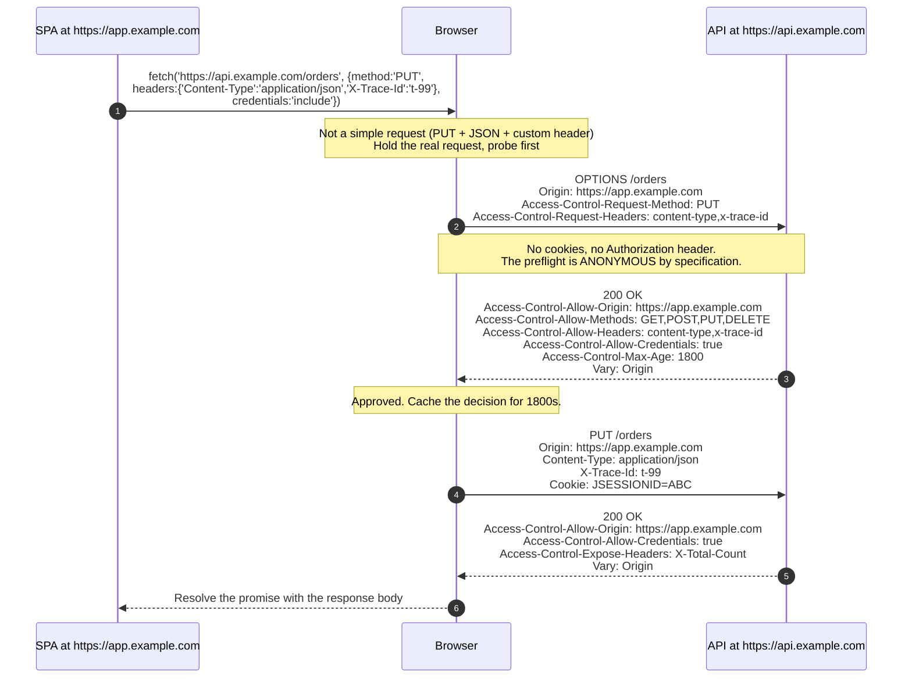
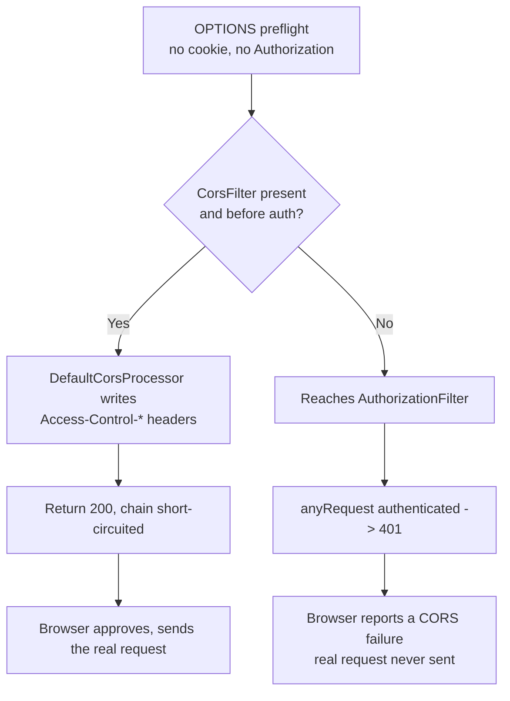
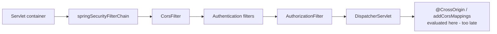

# 6.3 - CORS

> **Module 6 - Topic 3** - Session, CSRF, CORS
> Baseline: Spring Security 6.x on Boot 3.x
> New to this? Read **In Plain English** below first, then come back to the Version Matrix.

---

## Version Matrix

| Concern | Spring Security 5.x | **Spring Security 6.x (baseline)** | Spring Security 7.x |
|---|---|---|---|
| Enabling CORS | `http.cors()` then `.and()` | **`http.cors(Customizer.withDefaults())`** - lambda DSL, `.and()` removed | Same |
| Disabling CORS | `http.cors().disable()` | `http.cors(cors -> cors.disable())` or `http.cors(AbstractHttpConfigurer::disable)` | Same |
| Wildcard with credentials | `allowedOriginPatterns` added in 5.3 | **`allowedOriginPatterns`** is the only legal way to combine pattern matching with credentials | Same |
| Path matching in `UrlBasedCorsConfigurationSource` | `AntPathMatcher` | **`PathPattern`** based matching (Spring Framework 6), so `**` must be the last segment | Same |
| Default `allowedMethods` when unset | `GET`, `HEAD`, `POST` | `GET`, `HEAD`, `POST` - unchanged, and the usual cause of "my `PUT` is blocked" | Unchanged |
| Validation of illegal combinations | Runtime failure, sometimes silent | `CorsConfiguration.validateAllowCredentials()` throws `IllegalArgumentException` at configuration time | Same |
| `CorsFilter` placement | Before `CsrfFilter`, added by `CorsConfigurer` | **Unchanged** - `FilterOrderRegistration` places `CorsFilter` ahead of `CsrfFilter` and all authentication filters | Unchanged |
| Private Network Access preflight | Not modelled | Not modelled; browsers send `Access-Control-Request-Private-Network` which Spring does not answer | Expected to gain first-class support as the specification stabilises |

---

## Why This Exists

Two independent facts collide here. The first is the **same-origin policy**, a browser rule from the
mid-1990s that says script running on one origin may not read responses from a different origin. It exists
because the browser attaches ambient credentials automatically — the same property that makes CSRF work,
described in `01_M1_T1_HTTP_Web_Basics.md`. Without the read restriction, any page you visited could
silently read your webmail.

The second fact is that modern applications are deliberately split across origins: a single-page
application on `https://app.example.com` calling an API on `https://api.example.com`. Under the plain
same-origin policy that architecture is impossible, because the SPA could issue requests but never read the
answers.

CORS is the negotiated exception. It is a protocol by which **the server tells the browser which foreign
origins are permitted to read its responses**, and the browser — not the server — enforces the result. That
sentence contains the two things people most often get wrong: CORS *relaxes* a restriction rather than
adding one, and the enforcement point is the browser, which means a client that is not a browser is
entirely unaffected.

---

## In Plain English

**The one-line version:** Browsers stop JavaScript on one website from reading responses that came from a
different website, and CORS is the set of response headers by which the second website says "it is fine,
this particular site is allowed to read my replies".

**An analogy.** Picture two schools separated by a fence. A pupil in the first school is allowed to shout
a question across to the second school, and the second school will hear it and act on it. That has always
been permitted. What is not permitted is the pupil *listening to the answer*, unless the second school's
head teacher has written that pupil's name on a permission notice pinned by the gate.

Notice who enforces this. It is not the second school. The second school shouts its answer regardless.
The enforcement is done by the first pupil's own teacher, standing right next to them, covering their
ears unless the notice names them. That teacher is the browser. Which means somebody who is not a pupil
at all, an adult walking up to the second school's front door, simply hears the answer. No teacher, no
rule. This is why a request that a browser refuses will work perfectly from a command-line tool.

There is one more piece. For an ordinary question, the pupil just shouts and the teacher decides
afterwards whether to let them hear the answer. But for anything unusual, a strangely worded question or
one wrapped in an unusual envelope, the teacher first sends a short advance note over the fence asking
"may my pupil ask this particular question, using these particular words?" and waits for a signed reply.
That advance note is deliberately anonymous. It carries no name badge at all. If the second school's
policy is "we only answer people who identify themselves", the note is refused, and the real question is
never asked. The pupil is told only that the fence rule blocked them, which is a misleading message,
because the real problem was that an anonymous note was turned away.

**How it actually works, step by step.**

An origin is the combination of three things: the scheme (`http` or `https`), the host name, and the
port. All three must match exactly for two addresses to count as the same origin. So
`https://app.example.com` and `https://api.example.com` are different origins, and so are
`https://app.example.com` and `https://app.example.com:8443`. The path plays no part.

When JavaScript on one origin calls another, the browser adds an `Origin` header naming where the code
came from. The other server may respond with a header called `Access-Control-Allow-Origin`. If that
header names the calling origin, the browser hands the response to the JavaScript. If it does not, the
browser throws the response away and the JavaScript sees only an error. The server never learns that
anything was blocked, because the blocking happens entirely on the browser side.

Some calls get an extra step first. If the call is anything the old web could not have produced by
itself, the browser holds it back and sends a small probe request using the `OPTIONS` method. This probe
is called a preflight. It asks two questions, "which method do you permit" and "which headers do you
permit", and the server answers with `Access-Control-Allow-Methods` and `Access-Control-Allow-Headers`.
Only if the answers cover what the real call needs does the browser then send the real call.

Almost every realistic API call from a browser triggers a preflight, because sending a body of type
`application/json` is enough on its own, and so is adding an `Authorization` header. So the preflight
path is the normal path rather than an exotic case.

The preflight is required by specification to be anonymous. It carries no cookies and no `Authorization`
header. This produces by far the most common CORS bug in a Spring application. If the `OPTIONS` probe
reaches your authorization rules, it is an unauthenticated request to a protected path, so it is refused
with a 401, the browser concludes CORS failed, and the real request is never sent. Spring Security
handles this by putting `CorsFilter` very early in the chain, before any authentication filter, where it
answers the preflight itself and stops the request going any further.

There is one rule that catches everyone. You may reply with `Access-Control-Allow-Origin: *`, meaning
any site may read this, or you may reply with `Access-Control-Allow-Credentials: true`, meaning the
browser should include cookies. You may not do both. A response built from the victim's cookies that any
site is allowed to read would be a data leak by construction. Spring refuses that combination at startup
rather than letting you find out in the browser, and offers `allowedOriginPatterns` for the case where
you genuinely need pattern matching with cookies: Spring matches the incoming origin against the pattern
and echoes back the one concrete origin, so no wildcard is ever sent.

Finally, and this is the point most worth carrying away: CORS is not a protection for your server. It
loosens a browser restriction rather than adding a server one. Anything that is not a browser ignores it
entirely.

**Why should a beginner care?** The first time you build a JavaScript front end talking to a Spring
back end, this will be the thing that stops you, and the error message the browser prints actively points
in the wrong direction. It says CORS, so people add more CORS headers, when the real cause is usually
that an anonymous probe request was rejected by the security rules before anything could answer it. The
second reason is the reverse mistake: treating CORS as a security control and believing that a
restrictive policy protects your endpoints. It does not protect them from anything except other people's
web pages reading your replies.

**Words you will meet in this file**

| Term | In plain words |
|---|---|
| Origin | The scheme, host and port taken together. All three must match exactly for two addresses to count as the same origin. |
| Same-origin policy | The browser rule stopping JavaScript from reading responses that came from a different origin. |
| CORS | Cross-Origin Resource Sharing. The headers a server uses to grant specific other origins permission to read its responses. |
| Preflight | A small anonymous `OPTIONS` request the browser sends first, asking whether the real request is permitted. |
| Simple request | A request plain enough that no preflight is needed, meaning GET, HEAD or a POST with an old-fashioned content type. |
| `Origin` header | Added by the browser, naming which site the calling JavaScript came from. |
| `Access-Control-Allow-Origin` | The server's answer naming which origin may read the response. |
| `Access-Control-Allow-Methods` | Which HTTP methods the server permits from that origin. Defaults to only GET, HEAD and POST if you do not set it. |
| `Access-Control-Allow-Headers` | Which request headers the caller is permitted to send. |
| `Access-Control-Allow-Credentials` | Says the browser may include cookies. Cannot be combined with a wildcard origin. |
| `Access-Control-Expose-Headers` | Which response headers JavaScript is allowed to read. Without it, most custom headers are invisible to script. |
| `Access-Control-Max-Age` | How long the browser may remember a preflight answer instead of asking again. |
| `CorsFilter` | The Spring filter that answers preflights and writes the headers. It sits before authentication on purpose. |
| `CorsConfigurationSource` | The bean that decides which CORS rules apply to which paths. Spring Security looks for exactly one of these. |
| `CorsConfiguration` | The rules themselves: permitted origins, methods, headers, and whether cookies are allowed. |
| `allowedOriginPatterns` | Lets you write a pattern such as any subdomain, while still echoing one concrete origin so that cookies remain legal. |
| `@CrossOrigin` | A Spring MVC annotation for CORS. It runs too late to help, because security filters have already refused the preflight. |
| `Vary: Origin` | A response header telling caches that the answer differs per origin, so one origin's response is not served to another. |

**If you remember only one thing:** CORS is enforced by the browser and loosens a restriction rather than
adding one, so it protects your users from other websites and protects your server from nobody.

---

## Core Concepts

### 1. What an origin is

**In simple terms:** Two addresses only count as the same place if the protocol, the host name and the
port all match exactly, so a different port or a different subdomain is a different origin.

An origin is the triple **scheme + host + port**. Two URLs are same-origin only if all three match exactly.
There is no partial credit: no parent-domain matching, no scheme upgrade tolerance, no default-port
leniency beyond the scheme's own default.

| URL | Same origin as `https://app.example.com/dashboard`? | Why |
|---|---|---|
| `https://app.example.com/orders/17` | Yes | Path is not part of the origin |
| `http://app.example.com/dashboard` | No | Different scheme |
| `https://app.example.com:8443/dashboard` | No | Different port |
| `https://api.example.com/dashboard` | No | Different host |
| `https://example.com/dashboard` | No | Different host - a parent domain is still a different host |
| `https://APP.example.com/dashboard` | Yes | Host comparison is case-insensitive |

Note that **origin is stricter than "site"**, which is what the `SameSite` cookie attribute uses. `SameSite`
compares registrable domains, so `app.example.com` and `api.example.com` are the *same site* but *different
origins*. Conflating the two produces the reasoning error of "we are on the same domain, so CORS does not
apply" — it does apply, because ports and subdomains make different origins.

### 2. Simple requests versus preflighted requests

**In simple terms:** Plain requests go straight out, but anything a 1990s HTML page could not have sent
gets an advance permission check first, and sending JSON alone is enough to trigger one.

The browser only issues a preflight when the request could not have been produced by pre-CORS HTML. A
**simple request** is sent immediately and the browser applies the CORS decision to the *response*; a
**preflighted request** is held back until a separate `OPTIONS` probe has been approved.

A request is simple only if **all** of the following hold:

1. The method is `GET`, `HEAD`, or `POST`.
2. The only headers set by script are from the CORS-safelisted set: `Accept`, `Accept-Language`,
   `Content-Language`, `Content-Type` (with restrictions), `Range` (with restrictions), and the headers the
   user agent sets itself.
3. If `Content-Type` is present, its value is one of `application/x-www-form-urlencoded`,
   `multipart/form-data`, or `text/plain`.
4. No event listener is registered on the upload object of an `XMLHttpRequest`, and no `ReadableStream` is
   used as the body.

Anything else preflights. In practice that means the three triggers you will actually meet:

| Trigger | Concrete example | Why it is not simple |
|---|---|---|
| Method | `PUT`, `PATCH`, `DELETE` | Rule 1 |
| Content type | `Content-Type: application/json` | Rule 3 - JSON is not on the list |
| Custom header | `Authorization`, `X-XSRF-TOKEN`, `X-Requested-With`, `X-Trace-Id` | Rule 2 |

The consequence worth internalising: **essentially every JSON API call from a browser preflights**, because
`application/json` alone is enough, and a bearer token in `Authorization` guarantees it. So the preflight
path is the normal path, not an edge case.

An important subtlety about `Authorization`: it is not safelisted when *script* sets it, so it triggers a
preflight. But when the browser itself attaches credentials — cookies, or cached HTTP Basic credentials —
that is governed by the `credentials` mode rather than by the safelist, and does not by itself trigger a
preflight.

### 3. The preflight exchange in full

**In simple terms:** This traces the complete two-round-trip conversation, showing exactly which question
header the browser asks and which answer header the server must send back for each one.



The header pairs, stated plainly:

| Request header (preflight) | Response header that answers it | Notes |
|---|---|---|
| `Origin` | `Access-Control-Allow-Origin` | Must echo the exact origin, or be `*` |
| `Access-Control-Request-Method` | `Access-Control-Allow-Methods` | Comma-separated list |
| `Access-Control-Request-Headers` | `Access-Control-Allow-Headers` | Lower-cased, comma-separated |
| — | `Access-Control-Max-Age` | Seconds the browser may cache the approval; Chrome caps it at 7200 |
| — | `Access-Control-Allow-Credentials` | Only `true` is meaningful; omit it otherwise |
| — | `Access-Control-Expose-Headers` | Which **response** headers script may read - without it only the safelisted six are readable |

`Access-Control-Expose-Headers` is the one people forget. By default script can read only `Cache-Control`,
`Content-Language`, `Content-Length`, `Content-Type`, `Expires`, `Last-Modified` and `Pragma`. A pagination
header, a correlation id, or a `Location` after a create is invisible until you expose it explicitly — the
classic symptom being "the header is right there in the network tab but `response.headers.get(...)` returns
null".

### 4. The wildcard and credentials incompatibility

**In simple terms:** You can either let any site read your responses or let the browser send cookies, but
never both, because a response built from someone's cookies must not be readable by everyone.

This is the hardest rule in CORS and the one most worth memorising verbatim:

> `Access-Control-Allow-Origin: *` is **incompatible** with `Access-Control-Allow-Credentials: true`. When
> the request is made with credentials, the browser requires an exact origin echo and rejects a wildcard.

The reason is that the wildcard means "any origin may read this", and a credentialed response is
user-specific. Allowing any origin to read a response rendered with the victim's cookies would turn every
API into an open data leak — the exact failure mode the same-origin policy exists to prevent. The
specification therefore forbids the combination, and browsers enforce it by failing the request with a
message about the wildcard not being allowed when credentials mode is `include`.

The same restriction applies to `Access-Control-Allow-Headers: *` and `Access-Control-Allow-Methods: *` in
credentialed mode: the wildcard is treated as a literal header named `*` rather than as a wildcard.

Spring enforces this at configuration time rather than letting you discover it in the browser:

```java
// org.springframework.web.cors.CorsConfiguration
public void validateAllowCredentials() {
    if (this.allowCredentials == Boolean.TRUE
            && this.allowedOrigins != null && this.allowedOrigins.contains(ALL)) {
        throw new IllegalArgumentException(
            "When allowCredentials is true, allowedOrigins cannot contain the special value \"*\" "
            + "since that cannot be set on the \"Access-Control-Allow-Origin\" response header. "
            + "To allow credentials to a set of origins, list them explicitly "
            + "or consider using \"allowedOriginPatterns\" instead.");
    }
}
```

The escape hatch named in that message is `setAllowedOriginPatterns`. It accepts patterns such as
`https://*.example.com` or `https://app-*.example.com:[*]`, and at request time Spring **matches the
incoming `Origin` against the pattern and echoes the concrete origin back**. So the response never contains
a wildcard, credentials remain legal, and you still get pattern-based configuration. This is a Spring
feature, not a CORS specification feature — the browser only ever sees a concrete origin.

| Requirement | Use |
|---|---|
| Public, unauthenticated API readable by anyone | `allowedOrigins("*")`, `allowCredentials(false)` |
| Fixed, known SPA origins with cookies | `allowedOrigins("https://app.example.com", "https://admin.example.com")`, `allowCredentials(true)` |
| Many dynamic subdomains with cookies | `allowedOriginPatterns("https://*.example.com")`, `allowCredentials(true)` |
| Local development against many ports | `allowedOriginPatterns("http://localhost:[*]")`, `allowCredentials(true)`, dev profile only |

### 5. `CorsConfiguration` and `CorsConfigurationSource`

**In simple terms:** These two objects hold your CORS rules and decide which rules apply to which paths,
and the classic mistake is listing the permitted origins but forgetting to list the permitted methods.

```java
public interface CorsConfigurationSource {
    @Nullable CorsConfiguration getCorsConfiguration(HttpServletRequest request);
}
```

One method. `UrlBasedCorsConfigurationSource` is the standard implementation: it holds a map of path
patterns to `CorsConfiguration` and returns the first match, so registration order is the resolution order
and `/**` must be registered last if you want narrower rules to win.

```java
public class CorsConfiguration {
    public static final String ALL = "*";
    private List<String> allowedOrigins;
    private List<OriginPattern> allowedOriginPatterns;
    private List<String> allowedMethods;
    private List<String> allowedHeaders;
    private List<String> exposedHeaders;
    private Boolean allowCredentials;
    private Boolean allowPrivateNetwork;
    private Long maxAge;

    public CorsConfiguration applyPermitDefaultValues() { ... }  // "*" origins, GET/HEAD/POST, "*" headers
}
```

The single most common configuration bug is forgetting `allowedMethods`. If you set only `allowedOrigins`,
the default method list is `GET`, `HEAD`, `POST` — so the `GET` requests work, the team concludes CORS is
configured, and the first `PUT` or `DELETE` fails the preflight. Use `setAllowedMethods(List.of("*"))` or
list them explicitly.

### 6. CORS in Spring Security, and the ordering bug

**In simple terms:** The permission probe arrives with no login attached, so if your security rules see
it before the CORS filter does, it is refused and the browser blames CORS for an authentication problem.

`http.cors(Customizer.withDefaults())` adds `CorsFilter` to the security chain, configured from a bean of
type `CorsConfigurationSource` found in the application context. The filter looks like this:

```java
public class CorsFilter extends OncePerRequestFilter {
    private final CorsConfigurationSource configSource;
    private CorsProcessor processor = new DefaultCorsProcessor();

    @Override
    protected void doFilterInternal(HttpServletRequest request, HttpServletResponse response,
            FilterChain filterChain) throws ServletException, IOException {
        CorsConfiguration corsConfiguration = this.configSource.getCorsConfiguration(request);
        boolean isValid = this.processor.processRequest(corsConfiguration, request, response);
        if (!isValid || CorsUtils.isPreFlightRequest(request)) {
            return;     // preflight is ANSWERED HERE and the chain is not continued
        }
        filterChain.doFilter(request, response);
    }
}
```

The `return` on a preflight is the whole point. `CorsFilter` short-circuits the chain, so the `OPTIONS`
request never reaches `AuthorizationFilter` and is never evaluated for authentication.

Now the bug. **A preflight carries no cookies and no `Authorization` header** — the specification requires
it to be anonymous. If the preflight reaches `AuthorizationFilter` because `CorsFilter` is absent or placed
after authentication, it is an unauthenticated request to a protected path, so it is denied with 401 or
403. The browser sees a non-2xx preflight, declares the CORS check failed, and **never sends the real
request**. The developer sees a CORS error message in the console and starts adding CORS headers, but the
problem was never the headers — it was that the probe was rejected before anything could produce them.

The symptom set is distinctive: the endpoint works perfectly from `curl` and Postman, it works from the
browser when unauthenticated endpoints are called, and the network tab shows an `OPTIONS` with status 401
followed by no subsequent request.



There is a second, subtler variant. Even with `http.cors(...)` configured, `CorsFilter` only short-circuits
when `getCorsConfiguration` returns a non-null configuration for that request. If the preflight path does
not match any registered pattern, the filter falls through to `filterChain.doFilter` and the request lands
on `AuthorizationFilter` anyway. So a path typo in `registerCorsConfiguration` produces exactly the same
401 preflight.

The reflex fix people reach for is `.requestMatchers(HttpMethod.OPTIONS, "/**").permitAll()`. It does make
the 401 go away, but it is the wrong fix: it permits every `OPTIONS` request across the whole application
including ones your CORS policy would have rejected, and it does not cause any `Access-Control-*` headers
to be produced, so the preflight now returns 200 with no CORS headers and the browser still refuses. Fix
the `CorsConfigurationSource` and the filter placement instead.

### 7. Why `@CrossOrigin` and `addCorsMappings` are not enough

**In simple terms:** These two shortcuts live inside the web framework, which runs after the security
filters, so once Spring Security is protecting the path the request is refused before they ever execute.

Both of these are **Spring MVC** mechanisms. `@CrossOrigin` is read by `RequestMappingHandlerMapping`, and
`WebMvcConfigurer.addCorsMappings` populates the handler mapping's CORS configuration. Both therefore take
effect inside `DispatcherServlet`, which sits *downstream* of the entire security filter chain.



When Spring Security is on the classpath and a chain protects the path, the preflight is denied at
`AuthorizationFilter` and `DispatcherServlet` is never reached, so the annotation never runs. This is the
reason for the familiar sequence: the annotation works fine in a project without Spring Security, somebody
adds Spring Security, and CORS breaks with no change to the annotation.

There is one genuinely useful bridge. `WebMvcConfigurer.addCorsMappings` writes into an internal
`UrlBasedCorsConfigurationSource`, but Spring Security does not read it. The correct pattern is to define a
single `CorsConfigurationSource` bean and let both use it: Spring Security picks it up automatically via
`http.cors(Customizer.withDefaults())`, and MVC-level CORS handling becomes unnecessary because the filter
has already answered the preflight and set the headers on simple requests.

The one case where `@CrossOrigin` is legitimate is a chain where the path is `permitAll()` and no preflight
is ever denied — but even then, having two sources of CORS truth in one application is a maintenance
hazard. Centralise on the bean.

### 8. `DefaultCorsProcessor` - what actually writes the headers

**In simple terms:** This is the small piece of code that compares the incoming request against your
rules and puts the answer headers on the response, or leaves them off so the browser blocks the reply.

```java
public class DefaultCorsProcessor implements CorsProcessor {

    @Override
    public boolean processRequest(@Nullable CorsConfiguration config, HttpServletRequest request,
            HttpServletResponse response) throws IOException {

        Collection<String> varyHeaders = response.getHeaders(HttpHeaders.VARY);
        if (!varyHeaders.contains(HttpHeaders.ORIGIN)) {
            response.addHeader(HttpHeaders.VARY, HttpHeaders.ORIGIN);
            response.addHeader(HttpHeaders.VARY, HttpHeaders.ACCESS_CONTROL_REQUEST_METHOD);
            response.addHeader(HttpHeaders.VARY, HttpHeaders.ACCESS_CONTROL_REQUEST_HEADERS);
        }
        if (!CorsUtils.isCorsRequest(request)) {
            return true;                          // no Origin header: not our business
        }
        if (response.getHeader(HttpHeaders.ACCESS_CONTROL_ALLOW_ORIGIN) != null) {
            return true;                          // somebody upstream already handled it
        }
        boolean preFlightRequest = CorsUtils.isPreFlightRequest(request);
        if (config == null) {
            if (preFlightRequest) { rejectRequest(new ServletServerHttpResponse(response)); return false; }
            return true;
        }
        return handleInternal(new ServletServerHttpRequest(request),
                              new ServletServerHttpResponse(response), config, preFlightRequest);
    }
}
```

Three details in that method repay attention. The `Vary` headers are added **before** anything else and
unconditionally, because a shared cache that stored the response for origin A and replayed it to origin B
would break the policy; `Vary: Origin` tells the cache the response is origin-dependent. The
already-handled check means a duplicate CORS layer (an API gateway plus the application) results in the
first writer winning rather than duplicate headers, which browsers reject outright. And `rejectRequest`
produces **403 with the body `Invalid CORS request`** — so a 403 with that exact body is a CORS policy
rejection, not an authorisation failure, which is a useful thing to recognise in a log.

### 9. CORS is not a security control

**In simple terms:** CORS keeps other people's web pages from reading your users' data, but it stops
nothing from reaching your server and is ignored entirely by anything that is not a browser.

This framing is what separates a senior answer from a memorised one. CORS **relaxes** the same-origin
policy; it never adds a restriction that did not already exist. Specifically:

- CORS does not stop a request reaching your server. The browser sends simple requests immediately and only
  withholds the *response* from script. Even for preflighted requests, the preflight itself reaches you.
- CORS does not protect against anything that is not a browser. `curl`, Postman, a Python script, a mobile
  app, and a server-side integration ignore `Access-Control-Allow-Origin` entirely, because there is no
  origin to enforce against and nothing is enforcing.
- CORS does not authenticate or authorise. Those are `Authentication` and `AuthorizationManager`; CORS runs
  before both and knows nothing about identity.
- A permissive CORS policy is therefore not a vulnerability *in itself* — it becomes one when combined with
  cookie authentication, because `allowCredentials(true)` with a too-broad origin set lets a hostile origin
  read authenticated responses. That combination is the real finding, and it is why penetration test
  reports pair the two.

The one-line version: **CORS protects your users from other people's sites; it does not protect your server
from anyone.**

### 10. CORS versus CSRF

**In simple terms:** These two are often confused because both involve other websites and cookies, but
one controls who may read your replies and the other controls who may make you act.

They are constantly conflated because both involve cross-origin requests and cookies, but they answer
opposite questions.

| | CORS | CSRF protection |
|---|---|---|
| Question answered | May this foreign origin **read** my response? | Was this state-changing request **generated by my own application**? |
| Direction | Relaxes a default restriction | Adds a restriction |
| Enforced by | The browser | Your server (`CsrfFilter`) |
| Effective against non-browser clients | No - ignored entirely | Not applicable - they have no ambient authority |
| Triggered on | Any cross-origin request with an `Origin` header | Any request whose method is not `GET`/`HEAD`/`TRACE`/`OPTIONS` |
| Failure mode | Browser blocks the response; server already ran the handler | Server returns 403 and the handler never runs |
| Typical failure symptom | Console CORS message, promise rejects | 403 with `InvalidCsrfTokenException` or `MissingCsrfTokenException` |
| Relevant Spring class | `CorsFilter`, `CorsConfigurationSource` | `CsrfFilter`, `CsrfTokenRepository` |
| Disabling it | Makes cross-origin SPAs impossible; does not make you insecure | Removes a real protection whenever cookies are used |

The relationship worth stating: a **restrictive CORS policy makes some CSRF attacks harder**, because an
attack that needs a custom header will trigger a preflight your policy rejects. But it does not stop the
classic CSRF attack at all, because an auto-submitting HTML form produces a *simple* request that needs no
preflight and is sent regardless of your CORS policy. So CORS is not a CSRF defence; the token is.

---

## Working Code

```java
package com.example.security.cors;

import java.util.List;
import org.springframework.context.annotation.Bean;
import org.springframework.context.annotation.Configuration;
import org.springframework.context.annotation.Profile;
import org.springframework.core.Ordered;
import org.springframework.core.annotation.Order;
import org.springframework.security.config.Customizer;
import org.springframework.security.config.annotation.web.builders.HttpSecurity;
import org.springframework.security.config.annotation.web.configuration.EnableWebSecurity;
import org.springframework.security.config.http.SessionCreationPolicy;
import org.springframework.security.web.SecurityFilterChain;
import org.springframework.web.cors.CorsConfiguration;
import org.springframework.web.cors.CorsConfigurationSource;
import org.springframework.web.cors.UrlBasedCorsConfigurationSource;

@Configuration
@EnableWebSecurity
public class CorsSecurityConfig {

    /**
     * One CorsConfigurationSource bean. http.cors(Customizer.withDefaults()) finds it by type
     * and hands it to CorsFilter, which FilterOrderRegistration places before every
     * authentication filter - which is what stops the anonymous preflight being 401'd.
     *
     * Registration order is resolution order: the narrower "/api/public/**" must come first,
     * because UrlBasedCorsConfigurationSource returns the first pattern that matches.
     */
    @Bean
    CorsConfigurationSource corsConfigurationSource() {
        UrlBasedCorsConfigurationSource source = new UrlBasedCorsConfigurationSource();

        // Public, unauthenticated data. Wildcard origin is legal here only because
        // credentials are not allowed - the two are mutually exclusive.
        CorsConfiguration publicApi = new CorsConfiguration();
        publicApi.setAllowedOrigins(List.of("*"));
        publicApi.setAllowedMethods(List.of("GET", "HEAD", "OPTIONS"));
        publicApi.setAllowedHeaders(List.of("*"));
        publicApi.setAllowCredentials(false);
        publicApi.setMaxAge(3600L);
        source.registerCorsConfiguration("/api/public/**", publicApi);

        // Authenticated SPA traffic. Explicit origins are mandatory once credentials are on.
        CorsConfiguration app = new CorsConfiguration();
        app.setAllowedOrigins(List.of("https://app.example.com", "https://admin.example.com"));
        // Without this the defaults are GET, HEAD, POST only and every PUT/DELETE preflight fails.
        app.setAllowedMethods(List.of("GET", "POST", "PUT", "PATCH", "DELETE", "OPTIONS"));
        app.setAllowedHeaders(List.of("Authorization", "Content-Type", "X-XSRF-TOKEN", "X-Trace-Id"));
        // Response headers the SPA is allowed to read; without this they are invisible to script.
        app.setExposedHeaders(List.of("X-Total-Count", "Location", "X-Trace-Id"));
        app.setAllowCredentials(true);
        app.setMaxAge(1800L);
        source.registerCorsConfiguration("/api/**", app);

        return source;
    }

    @Bean
    @Order(Ordered.HIGHEST_PRECEDENCE)
    SecurityFilterChain apiChain(HttpSecurity http) throws Exception {
        return http
            .securityMatcher("/api/**")
            .cors(Customizer.withDefaults())
            .csrf(csrf -> csrf.disable())
            .sessionManagement(s -> s.sessionCreationPolicy(SessionCreationPolicy.STATELESS))
            .authorizeHttpRequests(auth -> auth
                .requestMatchers("/api/public/**").permitAll()
                // No OPTIONS permitAll rule: CorsFilter short-circuits the preflight
                // before AuthorizationFilter is ever consulted.
                .anyRequest().authenticated())
            .oauth2ResourceServer(oauth -> oauth.jwt(Customizer.withDefaults()))
            .build();
    }
}

/**
 * Development only. allowedOriginPatterns is the only legal way to combine a wildcard-style
 * origin with allowCredentials(true), because Spring echoes the matched concrete origin
 * rather than emitting "*" in Access-Control-Allow-Origin.
 */
@Configuration
@Profile("dev")
class DevCorsConfig {

    @Bean
    CorsConfigurationSource corsConfigurationSource() {
        CorsConfiguration dev = new CorsConfiguration();
        dev.setAllowedOriginPatterns(List.of("http://localhost:[*]", "http://127.0.0.1:[*]"));
        dev.setAllowedMethods(List.of("*"));
        dev.setAllowedHeaders(List.of("*"));
        dev.setExposedHeaders(List.of("*"));
        dev.setAllowCredentials(true);
        dev.setMaxAge(600L);

        UrlBasedCorsConfigurationSource source = new UrlBasedCorsConfigurationSource();
        source.registerCorsConfiguration("/**", dev);
        return source;
    }
}
```

```java
package com.example.security.cors;

import static org.springframework.test.web.servlet.request.MockMvcRequestBuilders.get;
import static org.springframework.test.web.servlet.request.MockMvcRequestBuilders.options;
import static org.springframework.test.web.servlet.request.MockMvcRequestBuilders.put;
import static org.springframework.test.web.servlet.result.MockMvcResultMatchers.header;
import static org.springframework.test.web.servlet.result.MockMvcResultMatchers.status;

import org.junit.jupiter.api.Test;
import org.springframework.beans.factory.annotation.Autowired;
import org.springframework.boot.test.autoconfigure.web.servlet.AutoConfigureMockMvc;
import org.springframework.boot.test.context.SpringBootTest;
import org.springframework.test.web.servlet.MockMvc;

@SpringBootTest
@AutoConfigureMockMvc
class CorsConfigurationTests {

    @Autowired MockMvc mockMvc;

    @Test
    void preflightFromAnAllowedOriginSucceedsWithoutAnyCredentials() throws Exception {
        // The absence of an Authorization header is the point: a real preflight is anonymous.
        mockMvc.perform(options("/api/orders/42")
                    .header("Origin", "https://app.example.com")
                    .header("Access-Control-Request-Method", "PUT")
                    .header("Access-Control-Request-Headers", "content-type,x-trace-id"))
               .andExpect(status().isOk())
               .andExpect(header().string("Access-Control-Allow-Origin", "https://app.example.com"))
               .andExpect(header().string("Access-Control-Allow-Credentials", "true"))
               .andExpect(header().stringValues("Vary",
                       org.hamcrest.Matchers.hasItem("Origin")));
    }

    @Test
    void preflightFromAnUnknownOriginIsRejectedWithTheCorsSpecificForbidden() throws Exception {
        // DefaultCorsProcessor.rejectRequest writes 403 with the body "Invalid CORS request".
        mockMvc.perform(options("/api/orders/42")
                    .header("Origin", "https://evil.example.com")
                    .header("Access-Control-Request-Method", "PUT"))
               .andExpect(status().isForbidden())
               .andExpect(header().doesNotExist("Access-Control-Allow-Origin"));
    }

    @Test
    void theWildcardOriginIsNeverEchoedOnTheCredentialedPath() throws Exception {
        mockMvc.perform(get("/api/orders/42").header("Origin", "https://evil.example.com"))
               .andExpect(header().doesNotExist("Access-Control-Allow-Origin"));
    }

    @Test
    void thePublicPathAllowsAnyOriginButNotCredentials() throws Exception {
        mockMvc.perform(get("/api/public/rates").header("Origin", "https://anything.example.org"))
               .andExpect(status().isOk())
               .andExpect(header().string("Access-Control-Allow-Origin", "*"))
               .andExpect(header().doesNotExist("Access-Control-Allow-Credentials"));
    }

    @Test
    void aCrossOriginRequestStillReachesTheHandlerBecauseCorsIsBrowserEnforced() throws Exception {
        // The response simply lacks Access-Control-Allow-Origin, so a browser would hide it
        // from script - but the server executed the request. curl would see the body.
        mockMvc.perform(get("/api/public/rates").header("Origin", "https://evil.example.org"))
               .andExpect(status().isOk());
    }

    @Test
    void anUnknownPathFallsThroughToAuthorizationAndIsRejected() throws Exception {
        // No registered CORS pattern matches /internal/**, so CorsFilter does not
        // short-circuit and the anonymous preflight is denied. This is the classic bug.
        mockMvc.perform(put("/internal/flush").header("Origin", "https://app.example.com"))
               .andExpect(status().isUnauthorized());
    }
}
```

---

## Internals

### Where `CorsFilter` sits, and why

`FilterOrderRegistration` assigns `CorsFilter` an order ahead of `CsrfFilter` and every authentication
filter. The resulting execution order in a default chain is:

```mermaid
flowchart LR
    A[DisableEncodeUrlFilter] --> B[WebAsyncManagerIntegrationFilter]
    B --> C[SecurityContextHolderFilter]
    C --> D[HeaderWriterFilter]
    D --> E[CorsFilter]
    E --> F[CsrfFilter]
    F --> G[LogoutFilter]
    G --> H[UsernamePasswordAuthenticationFilter]
    H --> I[ExceptionTranslationFilter]
    I --> J[AuthorizationFilter]
```



`CorsFilter` before `CsrfFilter` is also load-bearing: `OPTIONS` is exempt from CSRF anyway, but the
short-circuit means the preflight does not consume a CSRF token or touch the token repository.

### `CorsConfigurer` - how the bean is found

```java
public final class CorsConfigurer<H extends HttpSecurityBuilder<H>>
        extends AbstractHttpConfigurer<CorsConfigurer<H>, H> {

    private CorsConfigurationSource configurationSource;

    @Override
    public void configure(H http) {
        ApplicationContext context = http.getSharedObject(ApplicationContext.class);
        CorsFilter filter = getCorsFilter(context);
        if (filter == null) {
            throw new IllegalStateException("Please configure either a " + CORS_FILTER_BEAN_NAME
                    + " bean or a " + CORS_CONFIGURATION_SOURCE_BEAN_NAME + " bean.");
        }
        http.addFilter(filter);
    }
}
```

`getCorsFilter` resolves in a fixed precedence: a bean literally named `corsFilter` of type `CorsFilter`;
otherwise a bean named `corsConfigurationSource`; otherwise, if Spring MVC is present, the MVC handler
mapping introspector as a `CorsConfigurationSource`. That last fallback is why `addCorsMappings` sometimes
*appears* to work under Spring Security — but only when the introspector is resolvable and the path is
registered there, which makes it fragile. Define the bean.

### Preflight caching and its cost

`Access-Control-Max-Age` lets the browser skip the preflight for subsequent identical requests. Browsers
cap it: Chromium at 7200 seconds, Safari at 600. Setting it to zero or leaving it unset means **every
single write request costs two round trips**, which on a chatty SPA over a high-latency link is a
measurable user-facing regression. Setting it very high means a policy change takes effect slowly for
existing users. Thirty minutes is a reasonable default.

The cache key includes the origin, the URL, the method and the header list, so a client that varies its
custom headers per request defeats the cache entirely — a real cause of "why is every call preflighting
despite `maxAge`".

---

## Configuration Reference

| Option | Effect | Default |
|---|---|---|
| `http.cors(Customizer.withDefaults())` | Adds `CorsFilter` using the `CorsConfigurationSource` bean | Not added unless configured |
| `http.cors(cors -> cors.configurationSource(src))` | Uses an explicit source instead of bean lookup | bean lookup |
| `http.cors(AbstractHttpConfigurer::disable)` | Removes the filter | n/a |
| `setAllowedOrigins(List)` | Exact origins echoed in `Access-Control-Allow-Origin` | none |
| `setAllowedOriginPatterns(List)` | Pattern matching; the matched concrete origin is echoed | none |
| `setAllowedMethods(List)` | `Access-Control-Allow-Methods` | `GET`, `HEAD`, `POST` |
| `setAllowedHeaders(List)` | `Access-Control-Allow-Headers` | none - all non-safelisted headers rejected |
| `setExposedHeaders(List)` | `Access-Control-Expose-Headers` | none - only the seven safelisted response headers readable |
| `setAllowCredentials(Boolean)` | `Access-Control-Allow-Credentials: true`; forbids `*` origin | `null` (treated as false) |
| `setMaxAge(Long)` | `Access-Control-Max-Age` in seconds | `1800` when using `applyPermitDefaultValues()`, otherwise unset |
| `setAllowPrivateNetwork(Boolean)` | `Access-Control-Allow-Private-Network` | `null` |
| `applyPermitDefaultValues()` | `*` origins, `GET`/`HEAD`/`POST`, `*` headers, maxAge 1800 | n/a |
| `registerCorsConfiguration(pattern, config)` | Adds a path rule; first match wins | n/a |
| `combine(CorsConfiguration other)` | Merges two configurations, `other` taking precedence | n/a |
| `@CrossOrigin(origins = ...)` | MVC-level CORS, evaluated in `DispatcherServlet` | Insufficient alone when Spring Security protects the path |

---

## Production Concerns & Anti-Patterns

**Reflecting the `Origin` header back unconditionally.** Writing a filter that copies whatever arrived in
`Origin` into `Access-Control-Allow-Origin` and sets `Access-Control-Allow-Credentials: true` is
functionally equivalent to allowing every origin on earth to read your users' authenticated data. It passes
every functional test, it satisfies the front-end team, and it is a critical finding in any penetration
test. If you need breadth, use `allowedOriginPatterns` with a real pattern.

**Using `allowedOriginPatterns("*")` in production.** It is legal, it compiles, and it defeats the entire
purpose, because it matches every origin and echoes each one back. The pattern support exists for
`https://*.example.com`, not for `*`.

**Configuring CORS in an API gateway and in the application.** Two layers both writing
`Access-Control-Allow-Origin` produce a duplicated header, and browsers reject responses with more than one
value. `DefaultCorsProcessor` partly protects you by skipping when the header is already present, but that
only holds if the gateway writes first. Pick one layer and disable the other.

**Forgetting `setAllowedMethods`.** The default is `GET`, `HEAD`, `POST`. The `GET` calls work, everybody
declares victory, and the first `DELETE` fails a week later in a different team's feature.

**Forgetting `setExposedHeaders`.** Pagination totals, correlation ids and `Location` on a create are
invisible to script by default. The header is visible in developer tools, which makes this bug unusually
confusing to diagnose.

**Treating a CORS policy as an authorisation control.** Restricting origins does nothing to a non-browser
caller. If an endpoint should only be callable by a specific party, authenticate that party. CORS is
irrelevant to the threat.

**Leaving `maxAge` unset.** Every write becomes two round trips. On a mobile network with 150ms latency and
a form that issues eight calls, that is over a second of pure overhead.

**Missing `Vary: Origin` on responses you cache yourself.** Spring adds it in `DefaultCorsProcessor`, but a
custom CORS implementation or an aggressive CDN configuration can lose it, at which point a cache can serve
origin A's `Access-Control-Allow-Origin` to origin B and the failures look random.

**Pattern syntax drift after the Spring Framework 6 upgrade.** `UrlBasedCorsConfigurationSource` now uses
`PathPattern` rather than `AntPathMatcher`, so `**` is only valid as the final segment. A pattern like
`/api/**/orders` that worked in 5.x now throws at startup or silently stops matching.

---

## Debugging Playbook

| Symptom | Likely root cause | Fix |
|---|---|---|
| `OPTIONS` returns 401, real request never sent | `CorsFilter` absent, or the preflight path matches no registered pattern | Add `http.cors(Customizer.withDefaults())` and verify the pattern |
| Works in Postman, fails in the browser | CORS is browser-enforced only; Postman sends no `Origin` | Reproduce with `curl -H "Origin: https://app.example.com" -v` |
| Console says the wildcard is not allowed with credentials | `allowedOrigins("*")` plus `allowCredentials(true)` | List origins explicitly, or use `allowedOriginPatterns` |
| Startup fails with `IllegalArgumentException` about `allowCredentials` | `validateAllowCredentials()` caught the same combination at build time | Same fix, before deployment |
| `GET` works but `PUT` preflight fails | `allowedMethods` left at the `GET`/`HEAD`/`POST` default | Set the method list explicitly |
| Header visible in developer tools but `null` in script | Not listed in `Access-Control-Expose-Headers` | `setExposedHeaders(...)` |
| Cookies not sent cross-origin | `credentials: 'include'` missing on the client, or `allowCredentials` false, or `SameSite=Lax` on the cookie | Set all three; cross-site cookies need `SameSite=None; Secure` |
| 403 with the body `Invalid CORS request` | `DefaultCorsProcessor.rejectRequest` - the origin is not allowed | Add the origin; this is a CORS rejection, not an authorisation failure |
| Duplicate `Access-Control-Allow-Origin` | Gateway and application both writing it | Disable one layer |
| `@CrossOrigin` ignored | Evaluated in `DispatcherServlet`, downstream of the denial | Use a `CorsConfigurationSource` bean |
| Every request preflights despite `maxAge` | Header set varies per request, so the preflight cache key never matches | Send a stable header set |
| Intermittent CORS failures behind a CDN | Missing or lost `Vary: Origin` | Ensure `Vary: Origin` survives the cache layer |
| CORS fine in dev, broken in production | Dev profile used `allowedOriginPatterns("http://localhost:[*]")` | Configure real origins per environment |

---

## Interview Q&A

### Q1. Is CORS a security feature? Justify your answer precisely.

<details>
<summary>Show answer</summary>

CORS is a **relaxation** of a security feature, not a security feature in its own right. The security
feature is the same-origin policy, which prevents script on one origin from reading responses from another.
CORS is the protocol by which a server opts to waive that restriction for specific foreign origins. Every
CORS header you add makes the browser *more* permissive than it would otherwise be; there is no CORS
configuration that makes anything more restricted than the default.

The enforcement point is the browser, and that is decisive. `curl`, Postman, a Python script, a mobile
application and any server-to-server client simply ignore `Access-Control-Allow-Origin`, because there is
no origin concept to enforce and no enforcing agent. So CORS provides zero protection against any attacker
who is not constrained to run inside a victim's browser — which is to say, against the attacker you are
usually worried about when you think of your API being attacked.

The accurate framing is that **CORS protects your users from other people's websites; it does not protect
your server from anyone**. A misconfigured CORS policy is a vulnerability only in combination with
credentialed requests: `allowCredentials(true)` with an over-broad origin set means a hostile page can read
your users' authenticated responses, which is a genuine data exposure. But the exposure is of the user's
data to a foreign origin, not of the server to an unauthenticated caller.

**Counter-question: so if CORS does not stop the request reaching my server, what actually happens on a
blocked cross-origin `GET`?**

For a simple request, the browser sends it in full, your server authenticates it, runs the handler, commits
the side effects and returns the response. The browser then inspects the response for an acceptable
`Access-Control-Allow-Origin` and, finding none, refuses to hand the response to the calling script and
logs a CORS error. The work was done; only the *reading* was blocked.

That is why a cross-origin `GET` to a logging or counter endpoint still increments the counter, and why you
must never rely on a CORS failure to mean "the request did not happen". For preflighted requests the real
request genuinely is not sent, but the preflight `OPTIONS` still reached you.

**Counter-question: a penetration test report flags `Access-Control-Allow-Origin: *` on a public pricing
API as a high-severity finding. Do you agree?**

Not at high severity, and the reasoning matters. A wildcard origin is only exploitable in combination with
credentials, and the specification forbids that combination — a browser will refuse a credentialed request
against a wildcard response. So if that endpoint is genuinely unauthenticated and returns the same public
data to everybody, the wildcard exposes nothing that a direct `curl` would not already return.

What I would verify before dismissing it: that the endpoint truly accepts no cookies or `Authorization`
header, that it is on a filter chain which cannot be cookie-authenticated, and that its responses are not
user-specific in any way, including through an implicit tenant derived from the source address. If any of
those fail, the finding is real. And I would still narrow the policy where it costs nothing, because a
wildcard that outlives the endpoint's public status is a latent problem.
</details>

### Q2. A `PUT` from the SPA fails with a CORS error, but the same call works from Postman. Diagnose it end to end.

<details>
<summary>Show answer</summary>

Postman working tells you immediately that the server-side logic, authentication and routing are correct,
because Postman sends no `Origin` header and applies no CORS enforcement. The problem is confined to the
browser-only part of the exchange, which means the preflight.

`PUT` with a JSON body is not a simple request on three counts — the method, the `application/json` content
type and, if present, the `Authorization` header — so the browser first issues
`OPTIONS /api/orders/42` carrying `Origin`, `Access-Control-Request-Method: PUT` and
`Access-Control-Request-Headers`. That preflight is **anonymous by specification**: no cookies, no
`Authorization`. I would open the network tab and look at the status of that `OPTIONS`, which discriminates
between the three realistic causes.

If the `OPTIONS` returns 401 or 403 with no `Access-Control-*` headers, the preflight reached
`AuthorizationFilter`. Either `http.cors(Customizer.withDefaults())` is missing from the chain, or it is
present but `getCorsConfiguration` returned null for that path because the registered pattern does not
match, so `CorsFilter` fell through instead of short-circuiting. If it returns 200 but without
`Access-Control-Allow-Methods` containing `PUT`, the cause is `allowedMethods` left at its default of
`GET`, `HEAD`, `POST`. If it returns 200 with the methods but the browser still complains about a header,
the requested header is missing from `allowedHeaders`.

The fix is to define a single `CorsConfigurationSource` bean with the correct path patterns, explicit
methods and explicit headers, and to enable `http.cors(...)` on the chain so `CorsFilter` is placed ahead
of authentication by `FilterOrderRegistration`.

**Counter-question: a colleague fixes it with `.requestMatchers(HttpMethod.OPTIONS, "/**").permitAll()`.
Is that acceptable?**

No, on two grounds. Functionally it is usually insufficient: permitting `OPTIONS` stops the 401, but
nothing then writes the `Access-Control-*` headers unless a CORS layer exists, so the preflight returns a
bare 200 and the browser still rejects it. Teams that report this "working" normally have MVC-level CORS
underneath that is now reachable, which means two CORS mechanisms in one application.

Security-wise it blanket-permits `OPTIONS` across every path including ones the CORS policy would have
refused, and it removes the ability to reject a preflight from an untrusted origin — `CorsFilter` would
have returned 403 `Invalid CORS request`, whereas `permitAll` returns 200. It converts a configuration
problem into a permanently weaker chain.

**Counter-question: they add the bean and the preflight now succeeds, but the real `PUT` arrives with no
session cookie. Why?**

Because credentialed cross-origin requests need agreement on three separate points. The client must opt in
with `credentials: 'include'` on `fetch` or `withCredentials: true` on Axios, otherwise the browser sends
no cookies regardless of server configuration. The server must return `Access-Control-Allow-Credentials:
true`, which means `setAllowCredentials(true)` and, necessarily, explicit origins rather than a wildcard.
And the cookie itself must be sendable cross-site, which means `SameSite=None; Secure` — the Boot 3 default
of `Lax` suppresses it on a cross-site request even when CORS approves.

The last point is where most teams stall, because it looks like a CORS problem and is actually a cookie
attribute problem. It is also a good moment to ask whether a cross-origin cookie architecture is the right
choice at all; putting the SPA and the API on the same origin behind a reverse proxy removes CORS,
`SameSite` and much of the credential complexity in one move.
</details>

### Q3. Explain the wildcard-with-credentials rule and how `allowedOriginPatterns` gets around it.

<details>
<summary>Show answer</summary>

The rule is that `Access-Control-Allow-Origin: *` may not be combined with
`Access-Control-Allow-Credentials: true`. When a request is made in credentials mode, the browser requires
the response to name a single concrete origin and treats a wildcard as a failure.

The reasoning is direct. A credentialed response is rendered with the victim's identity, so its content is
user-specific and often sensitive. `*` means "any origin may read this". Allowing both would mean any
website the user visits could read their authenticated responses from your API — which is precisely the
attack the same-origin policy exists to prevent, reintroduced by configuration. The specification therefore
forbids it, and the same treatment applies to `*` in `Access-Control-Allow-Headers` and
`-Allow-Methods` under credentials mode, where the asterisk is read as a literal header name.

Spring catches this at configuration time rather than leaving it to the browser.
`CorsConfiguration.validateAllowCredentials()` throws `IllegalArgumentException` when `allowCredentials` is
true and `allowedOrigins` contains `*`, and the exception message itself points at the fix.

`setAllowedOriginPatterns` is a Spring-side feature with no counterpart in the specification. Patterns such
as `https://*.example.com` or `http://localhost:[*]` are matched against the incoming `Origin` header at
request time, and when a pattern matches, Spring writes **the concrete matched origin** into
`Access-Control-Allow-Origin`. The browser therefore never sees a wildcard, the credentials rule is
satisfied, and you keep pattern-based configuration. The trade is that origin validation now happens per
request against a pattern you wrote, so the pattern's precision is the whole of the control.

**Counter-question: `allowedOriginPatterns("*")` is legal and starts up fine. What is wrong with it?**

It matches every origin and echoes each one back, so the response contains a concrete origin and the
browser is satisfied — while the effective policy is "any website may read our users' authenticated data".
It is strictly worse than `allowedOrigins("*")`, because the latter at least fails loudly when combined
with credentials, whereas this silently succeeds.

It is the mechanised form of the reflect-the-origin anti-pattern, and I treat it as a critical finding in
review. `allowedOriginPatterns` is for `https://*.tenant.example.com`, not for `*`.

**Counter-question: we have a few hundred customer-branded domains that all need credentialed access. How
do you configure that safely?**

Not with a pattern, because customer domains do not share a suffix you control — a pattern broad enough to
match them would match hostile origins too. I would implement a custom `CorsConfigurationSource` that looks
the incoming `Origin` up in the tenant registry, and returns a `CorsConfiguration` with
`setAllowedOrigins(List.of(origin))` and `setAllowCredentials(true)` only on an exact match, returning null
otherwise so `DefaultCorsProcessor` rejects the preflight with 403.

The implementation details that matter are: cache the registry lookup, because it runs on every preflight
and every simple cross-origin request; compare the origin exactly, after normalising case on the host only,
never with `startsWith` or `contains`, since `https://app.example.com.evil.net` passes a naive suffix
check; and make domain registration an audited administrative action rather than something a tenant can
self-serve, because that lookup table is now a security boundary.
</details>

### Q4. Why does `@CrossOrigin` stop working when Spring Security is added, and what is the correct fix?

<details>
<summary>Show answer</summary>

`@CrossOrigin` is a Spring MVC mechanism. It is read by `RequestMappingHandlerMapping` when it resolves a
handler, which happens inside `DispatcherServlet`. `DispatcherServlet` is a servlet, and the entire
security filter chain runs before any servlet is invoked, so security decisions are made first.

When Spring Security protects the path, the anonymous preflight `OPTIONS` reaches `AuthorizationFilter`,
matches `anyRequest().authenticated()`, and is denied with 401. The chain never delegates to the servlet,
`DispatcherServlet` never runs, handler resolution never happens, and the annotation is never consulted.
From the browser's perspective the preflight failed, so the real request is not sent — and from the
developer's perspective an annotation that worked yesterday now does nothing.

The correct fix is to define a single `CorsConfigurationSource` bean and enable
`http.cors(Customizer.withDefaults())` on the chain. `CorsConfigurer` finds the bean, wraps it in a
`CorsFilter`, and `FilterOrderRegistration` places that filter ahead of every authentication filter. The
filter answers the preflight and returns without continuing the chain, so authorisation is never reached
for the `OPTIONS`, and it writes the `Access-Control-*` headers on ordinary cross-origin requests as they
pass through.

**Counter-question: `WebMvcConfigurer.addCorsMappings` is also MVC-level. Why does it sometimes appear to
work under Spring Security?**

Because of a fallback in `CorsConfigurer.getCorsFilter`. It looks for a `CorsFilter` bean named
`corsFilter`, then a `CorsConfigurationSource` bean named `corsConfigurationSource`, and finally — when
Spring MVC is on the classpath — the `HandlerMappingIntrospector`, which can act as a
`CorsConfigurationSource` and does expose the configuration registered through `addCorsMappings`.

So it can work, but only when `http.cors(...)` is enabled, the introspector is resolvable, and the path is
registered in the MVC mappings. That is three conditions that are easy to break silently, and the failure
mode is a 401 preflight with no obvious cause. Declaring the bean explicitly removes all three conditions
and makes the configuration visible in one place.

**Counter-question: is there any case where `@CrossOrigin` is the right tool alongside Spring Security?**

Only where no preflight can be denied — a path that is `permitAll()` on its chain, where the `OPTIONS`
reaches `DispatcherServlet` regardless. Even there I would avoid it, because having two sources of CORS
truth means a future change to the authorisation rules silently breaks CORS on endpoints nobody thought to
re-check.

The argument sometimes made for the annotation is locality: the policy sits next to the handler it governs.
That is real, but CORS policy is closer to infrastructure than to handler logic, it usually varies by
environment rather than by endpoint, and it needs to be reviewable as a whole. A bean gives you that; a
hundred annotations do not.
</details>

### Q5. Compare CORS and CSRF. Does a strict CORS policy give you CSRF protection?

<details>
<summary>Show answer</summary>

They answer opposite questions. CORS asks *may this foreign origin read my response*, and it relaxes a
default browser restriction. CSRF protection asks *was this state-changing request generated by my own
application*, and it adds a restriction your server enforces. CORS is enforced by the browser and is
invisible to non-browser clients; CSRF protection is enforced by `CsrfFilter` and rejects the request with
403 before the handler runs. CORS failures happen after your handler has already executed; CSRF failures
happen before it executes at all.

A strict CORS policy does **not** give you CSRF protection, and the reason is precise. The classic CSRF
attack is an auto-submitting HTML form posting
`application/x-www-form-urlencoded` to your endpoint. That is a **simple request**: the method is `POST`,
the content type is on the safelist, and no custom header is set. Simple requests are sent immediately with
no preflight, and your CORS policy is applied only to the response the attacker does not care about. The
transfer happens; the attacker's page is merely prevented from reading the confirmation.

What a strict CORS policy does do is raise the cost of the *non-simple* variants. An attack that needs
`Content-Type: application/json` or a custom header triggers a preflight, and a policy that does not list
the attacker's origin causes the browser to abandon the request. That is genuinely useful — it is part of
why a JSON-only API that rejects form-encoded bodies is harder to attack — but it is a side effect of the
preflight rule, not a CSRF control, and it evaporates the moment an endpoint accepts a form-encoded body.

**Counter-question: so if my API only accepts `application/json` and rejects everything else, am I safe
from CSRF without a token?**

It is a meaningful hardening measure and it is not a control I would rely on alone. The argument is sound
as far as it goes: a cross-site form cannot produce `Content-Type: application/json`, so any JSON request
must come from script, which must preflight, which your policy rejects.

The weaknesses are in the edges. Spring MVC will sometimes accept a body a strict reading would reject, so
the rejection must be verified rather than assumed — a `@PostMapping` without an explicit `consumes` is
more permissive than people expect. A single legacy endpoint that accepts form encoding, or a
`multipart/form-data` upload, breaks the invariant for the whole application. Browser and plugin behaviour
around content types has historically had gaps. And the property depends on a negative — "no endpoint
anywhere accepts a safelisted content type" — which is exactly the kind of invariant that decays as a
codebase grows. A CSRF token is a positive control that does not depend on that invariant holding.

**Counter-question: does enabling CORS for a trusted origin weaken CSRF protection?**

Not by itself, provided the token check remains in place, because the trusted origin is your own
application and it can read the token legitimately. The combination that does weaken you is a broad origin
policy plus `allowCredentials(true)`, because then a hostile origin can both read your responses — which
includes reading the CSRF token out of a response — and send credentialed requests. At that point the CSRF
token is no longer secret to the attacker and the control is defeated.

So the rule is that CORS and CSRF are independent controls, but a careless CORS policy can undermine a
correct CSRF implementation. They must be reviewed together, which is the honest reason they appear in the
same module.
</details>

### Q6. Design question - a multi-tenant SaaS where every tenant may bring a custom domain for their portal, all calling one shared API with cookie authentication. Design the CORS posture.

<details>
<summary>Show answer</summary>

The defining constraint is that the allowed origin set is **data, not configuration**: it changes when a
tenant onboards, and it is not knowable at build time. That rules out static `allowedOrigins`, and it rules
out `allowedOriginPatterns` too, because tenant-owned domains share no suffix I control and any pattern
broad enough to cover them would cover hostile origins.

**Core design: a registry-backed `CorsConfigurationSource`.** A single bean implements the one-method
interface, extracts the `Origin` header, and looks it up in a tenant-domain table. On an exact match it
returns a `CorsConfiguration` with `setAllowedOrigins(List.of(thatExactOrigin))`,
`setAllowCredentials(true)`, the explicit method and header lists, `setExposedHeaders` for the pagination
and correlation headers, and `setMaxAge(1800)`. On no match it returns null, which makes
`DefaultCorsProcessor.rejectRequest` answer the preflight with 403 `Invalid CORS request`.

**Making the lookup safe.** Comparison is exact string equality against a normalised origin — scheme, host
lower-cased, port — never `startsWith`, `endsWith` or `contains`, because `https://app.example.com.evil.net`
defeats a suffix check and `https://evil.com/?x=https://app.example.com` defeats a substring check. Only
`https` origins are accepted; a tenant registering an `http` origin is rejected at registration time.

**Making the lookup fast.** The source runs on every preflight and every cross-origin request, so a
database hit per call is unacceptable. A Caffeine cache keyed by origin string with a short time to live
and explicit invalidation on tenant-domain changes, backed by a negative cache so a flood of unknown
origins cannot become a database denial of service. `maxAge` of 1800 further reduces preflight volume.

**Domain verification as a security boundary.** The registry is now the authorisation list for reading
authenticated data, so adding a domain must require proof of control — a DNS `TXT` record or a
well-known-path challenge — and must be an audited administrative action, never tenant self-service
without verification. A tenant registering `https://app.competitor.example` should be impossible.

**Cookie strategy.** Cross-origin cookies require `SameSite=None; Secure`, which removes the `SameSite`
defence-in-depth layer entirely and makes the CSRF token the sole control against forged writes. So CSRF
protection is mandatory on this chain, with `CookieCsrfTokenRepository.withHttpOnlyFalse()` and the SPA
cookie-to-header pattern from `21_M6_T2_CSRF_Protection.md`, and `X-XSRF-TOKEN` must appear in
`allowedHeaders`. I would also set the tenant cookie on a per-tenant host where possible so that one
tenant's compromised portal cannot reach another's cookie jar.

**The alternative I would argue for first.** Give each tenant a subdomain of a domain I control —
`tenant.app.example.com` — and terminate both the portal and the API there behind a reverse proxy. Then
every call is same-origin, CORS disappears, `SameSite=Lax` works again, and the tenant-domain registry stops
being a security boundary. Custom domains then become a `CNAME` onto that subdomain with certificates
issued automatically. It is more infrastructure and less application-level risk, which is the right trade
for a shared multi-tenant API.

**Counter-question: a tenant reports that their portal works but file downloads fail to show the filename.
What is happening?**

The filename comes from `Content-Disposition`, which is not one of the seven CORS-safelisted response
headers, so cross-origin script cannot read it unless it is named in `Access-Control-Expose-Headers`. The
browser receives the header — it is visible in developer tools, which is what makes this so confusing — but
the Fetch response object filters it out.

The fix is to add `Content-Disposition` to `setExposedHeaders`. If the download is done by assigning to
`window.location` rather than by `fetch`, the browser handles it as a navigation and CORS does not apply at
all, which is often the simpler answer for large files since it also avoids buffering the body in memory.

**Counter-question: how would you roll out a change to the allowed method list without breaking tenants
mid-session?**

The relevant mechanism is the preflight cache. Browsers hold an approval for up to `maxAge` seconds keyed
by origin, URL, method and header list, so a tenant whose browser cached a permissive approval will keep
using it after I tighten the policy, and a tenant who cached a restrictive one will keep failing after I
loosen it. Neither is a correctness problem for an expanding change; both matter for a contracting one.

For an expanding change I deploy and accept that some clients see the new methods up to `maxAge` late. For
a contracting change, the sequence is to reduce `maxAge` to a small value and wait for the previous
`maxAge` window to elapse so every cached approval has expired, then apply the restriction, then restore
`maxAge`. Throughout, I monitor the rate of 403 responses carrying the `Invalid CORS request` body broken
down by origin, which is the signal that distinguishes a policy rejection from an authorisation failure and
tells me immediately which tenant is affected.
</details>

---

## Quick Recall

```
ORIGIN = scheme + host + port (all three must match exactly)
  Origin is STRICTER than "site" (SameSite uses registrable domain)
  app.example.com and api.example.com: same site, DIFFERENT origins

SIMPLE REQUEST (no preflight) requires ALL of:
  method in {GET, HEAD, POST}
  only CORS-safelisted headers set by script
  Content-Type in {x-www-form-urlencoded, multipart/form-data, text/plain}

PREFLIGHT TRIGGERS (any one)
  PUT / PATCH / DELETE
  Content-Type: application/json
  any custom header (Authorization set by script, X-XSRF-TOKEN, X-Requested-With)
  => essentially every JSON API call preflights

PREFLIGHT EXCHANGE
  -> OPTIONS  Origin / Access-Control-Request-Method / -Request-Headers
              ANONYMOUS: no cookies, no Authorization
  <- 200      Access-Control-Allow-Origin / -Allow-Methods / -Allow-Headers
              -Allow-Credentials / -Max-Age / Vary: Origin
  response headers readable by script only if in -Expose-Headers

THE HARD RULE
  Allow-Origin: *  is INCOMPATIBLE with  Allow-Credentials: true
  Spring throws IllegalArgumentException from validateAllowCredentials()
  Escape hatch: setAllowedOriginPatterns("https://*.example.com") -> echoes concrete origin
  allowedOriginPatterns("*") is legal and is an ANTI-PATTERN

SPRING SECURITY
  http.cors(Customizer.withDefaults()) -> CorsFilter from CorsConfigurationSource bean
  FilterOrderRegistration puts CorsFilter BEFORE CsrfFilter and all auth filters
  CorsFilter RETURNS on a preflight - chain short-circuited, AuthorizationFilter never runs
  THE classic bug: no CorsFilter (or path pattern typo) -> anonymous OPTIONS hits
    AuthorizationFilter -> 401 -> browser reports CORS error -> real request never sent
  Wrong fix: OPTIONS permitAll (no CORS headers written, and weakens every path)
  @CrossOrigin / addCorsMappings run in DispatcherServlet = downstream = too late

DEFAULTS THAT BITE
  allowedMethods default = GET, HEAD, POST  -> PUT/DELETE preflight fails
  exposedHeaders default = none -> X-Total-Count, Location, Content-Disposition invisible
  maxAge unset -> two round trips per write

CORS vs CSRF
  CORS  = may you READ my response   | browser-enforced | relaxation | after handler runs
  CSRF  = did MY app send this write | server-enforced  | restriction| before handler runs
  Strict CORS does NOT stop CSRF: the classic form POST is a SIMPLE request

FRAMING
  CORS protects your USERS from other sites. It does not protect your SERVER from anyone.
  curl / Postman / mobile / server-to-server ignore it completely.
```

---

**Previous:** [`21_M6_T2_CSRF_Protection.md`](21_M6_T2_CSRF_Protection.md) - **Next:** [`23_M7_T1_JWT_Fundamentals.md`](23_M7_T1_JWT_Fundamentals.md)
