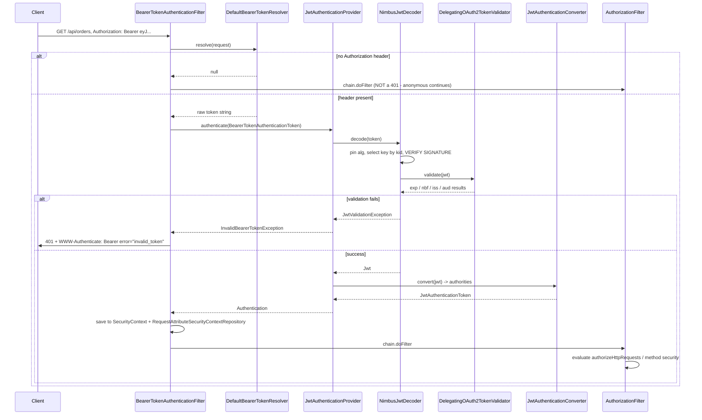

# 7.2 — Integrating JWT with Spring Security

> **Module 7 · Topic 2** · JWT
> Baseline: Spring Security 6.x on Boot 3.x, Java 17+
> New to this? Read **In Plain English** below first, then come back to the Version Matrix.

---

## Version Matrix

| Concern | Spring Security 5.x | **Spring Security 6.x (baseline)** | Spring Security 7.x |
|---|---|---|---|
| Resource server DSL | `.oauth2ResourceServer().jwt().and()` | **`.oauth2ResourceServer(o -> o.jwt(Customizer.withDefaults()))`** | lambda only; `and()` removed |
| URL authorization | `authorizeRequests` / `antMatchers` | **`authorizeHttpRequests` / `requestMatchers`** | same |
| Bearer filter | `BearerTokenAuthenticationFilter` | **same**, now saves via `RequestAttributeSecurityContextRepository` | same |
| Context persistence | `SecurityContextPersistenceFilter` saved implicitly | **`SecurityContextHolderFilter`** — the mechanism saves explicitly | same |
| Default validators | timestamps; issuer only if built from issuer | **same — audience is still NOT validated** | same |
| Audience by property | none | `spring.security.oauth2.resourceserver.jwt.audiences` (Boot 3.4+) | same |
| Lazy issuer resolution | discovery at startup only | **`NimbusJwtDecoder.withIssuerLocation(...)`** (6.1+), resolved on first use | same |
| `typ` validation | none | `JwtTypeValidator` / `JwtValidators.createAtJwtValidator()` in later 6.x | folded into defaults |
| Test support | `SecurityMockMvcRequestPostProcessors.jwt()` | **same**; `@MockBean JwtDecoder` | `@MockitoBean JwtDecoder` |
| Servlet namespace | `javax.servlet.*` | **`jakarta.servlet.*`** | `jakarta.servlet.*` |

---

## Why This Exists

There are exactly two ways to consume a JWT in a Spring Boot application, and engineers pick the
wrong one with remarkable consistency. The first is `spring-boot-starter-oauth2-resource-server`,
which is three lines of configuration and gives you a correct, hardened, well-tested
implementation. The second is a hand-written `OncePerRequestFilter` around `jjwt` or
`nimbus-jose-jwt`, which is a hundred lines, is the top search result for "Spring Boot JWT
tutorial", and reliably reproduces two or three of the attacks catalogued in
[`23_M7_T1_JWT_Fundamentals.md`](23_M7_T1_JWT_Fundamentals.md).

**The verdict, stated up front: approach (A) is the right default, and (B) is justified only
when your token is not a JWT at all** — a proprietary or legacy format you cannot change. If you
are verifying a standards-compliant JWT and writing your own filter, you are reimplementing
`NimbusJwtDecoder` with fewer eyes on it.

This topic covers both properly. You need (A) because it is what you should build, and you need
(B) because you will inherit it, be asked to review it, and be asked in an interview to name
precisely what it gives up. File 23 established the format and the attacks; file
[`04_M1_T4_Servlet_Basics.md`](04_M1_T4_Servlet_Basics.md) established the filter-placement
constraints that (B) must respect. This is where they meet the framework.

---

## In Plain English

**The one-line version:** Spring Boot can check incoming tokens for you with about three lines of
configuration, and this file is about using that properly rather than writing your own token-checking
code, which is what most online tutorials teach and what most real security bugs come from.

**An analogy.** Continuing the passport comparison from the previous file: an airport has two ways to
check documents at the gate.

The first is to install a certified document reader bought from a specialist vendor. It already knows
how to read the chip, it keeps an automatically updated list of every government's current signing
certificates, it quietly downloads a new certificate the first time it sees one it does not recognise,
it refuses documents past their printed expiry date, and it prints a rejection slip in the standard
format every airline already understands.

The second is to hand a member of staff a torch and a laminated instruction card. On an ordinary day
this works. It stops working on the day a government rotates its certificate, or someone presents a
document type the card does not mention, or the staff member is off sick and nobody else knows what the
watermark is supposed to look like. Crucially, it does not fail loudly. It fails by waving through
something it should have stopped.

Spring's resource server support is the certified reader. The hand-written filter is the torch. There is
one legitimate reason to choose the torch, which is that you are checking something that is not a
passport at all, some proprietary document format the reader was never built for.

**How it actually works, step by step.**

You add one dependency, the OAuth2 resource server starter, and one configuration property naming the
address of your login server, called the issuer. On startup, Spring visits a well-known address under
that issuer, reads a small discovery document, and learns from it where to fetch the login server's
public keys. It downloads and caches those keys.

In your security configuration you add one line, `oauth2ResourceServer(oauth2 -> oauth2.jwt(...))`, and
that installs a filter called `BearerTokenAuthenticationFilter`. Bearer here just means "whoever holds
this string is treated as the user".

On each request the filter looks for a header of the form `Authorization: Bearer eyJ...`. What it does
next is worth being precise about, because hand-written filters almost always get it wrong.

If there is no such header, the filter does nothing at all and lets the request continue. It does not
reject. Deciding whether this particular URL requires a login is somebody else's job, done later by the
authorization rules you wrote. A filter that rejects here breaks every public endpoint in your
application.

If there is a header but the token is expired, tampered with, or from the wrong issuer, the filter
rejects immediately with a 401 response, because the caller clearly meant to authenticate and failed.

If the token is good, the filter converts it into an authenticated user and stores it, and the request
carries on to the authorization rules. Those rules then decide whether this particular user may reach
this particular URL. If not, the answer is 403 rather than 401. The distinction is worth learning
properly: 401 means "I do not know who you are, try again with a credential", and 403 means "I know
exactly who you are and the answer is still no". A client seeing 401 should refresh its token; a client
seeing 403 should not bother.

Two details cause most of the confusion in practice.

The first is permissions. Spring reads the token's `scope` claim and turns each value into a permission
name with `SCOPE_` glued on the front, so a scope of `orders:read` becomes the authority
`SCOPE_orders:read`. Meanwhile the method `hasRole("ADMIN")` looks for an authority named `ROLE_ADMIN`.
Those two naming conventions never meet, which is why a token that visibly contains an admin role still
produces a 403. Keycloak makes this worse by not putting roles in `scope` at all but in a nested
structure, so a default setup sees none of them. The fix in both cases is a small converter that tells
Spring where to look and what prefix to use.

The second is the audience claim. As covered in the previous file, Spring checks the expiry and, if you
configured it from an issuer, the issuer, but it never checks `aud`, the field saying which service the
token was meant for. You add that check yourself. There is a sharp edge here: the method for setting
validators, `setJwtValidator`, replaces the whole list rather than adding to it, so if you set only your
audience check you have silently switched off the expiry and issuer checks. The change reads like adding
security and actually removes it.

**Why should a beginner care?** The most popular Spring Boot JWT tutorials on the internet teach you to
write your own filter, and those filters routinely reproduce two or three of the attacks catalogued in
the previous file: reading the algorithm out of the token instead of pinning it, skipping the audience
check, rejecting requests that have no token at all, and fetching keys freshly on every single request.
Knowing that three lines of configuration replace all of it, and knowing exactly what those three lines
give you, is the difference between shipping something secure and shipping something that merely passes
its tests.

**Words you will meet in this file**

| Term | In plain words |
|---|---|
| Resource server | Your API, in the role of "the service that receives tokens and checks them". |
| Authorization server | The separate service that logs users in and issues tokens. Often called the identity provider. |
| Bearer token | A credential where simply holding the string is enough. It travels in the `Authorization` header. |
| `issuer-uri` | The one property naming your login server. Spring uses it to discover everything else, including where the keys live. |
| `jwk-set-uri` | The address of the public keys. Setting this instead of the issuer works, but quietly skips issuer checking. |
| `BearerTokenAuthenticationFilter` | The filter that finds the token in the header and starts the checking process. |
| `JwtDecoder` | The object that verifies the signature and runs the validators, turning a raw string into trustworthy claims. |
| `NimbusJwtDecoder` | The standard implementation, built on the Nimbus library. It handles key fetching, caching and refresh. |
| `OAuth2TokenValidator` | One check applied to a decoded token, such as "is the expiry in the future" or "is my service in the audience". |
| `JwtTimestampValidator` | The built-in expiry and not-before check. Applied automatically. |
| `JwtIssuerValidator` | The check that the token came from the login server you expect. Applied only when you configured an issuer. |
| `DelegatingOAuth2TokenValidator` | A wrapper running several validators and collecting all their failures. |
| `setJwtValidator` | Replaces the whole set of checks rather than adding to it, so you must re-include the defaults. |
| Scope | A named permission carried in the token, for example `orders:read`. |
| `SCOPE_` prefix | What Spring puts in front of each scope when turning it into a permission name. |
| `ROLE_` prefix | What `hasRole(...)` looks for. It never matches a `SCOPE_` name, which is the usual cause of an unexplained 403. |
| `JwtAuthenticationConverter` | The small piece of configuration deciding which claim holds the permissions and what prefix to use. |
| `JwtAuthenticationToken` | The logged-in user object produced from a token. Its principal is the token itself, not a database record. |
| `@AuthenticationPrincipal Jwt` | How a controller method receives the verified token so it can read claims from it. |
| RFC 6750 | The standard saying that bearer-token errors go in a `WWW-Authenticate` response header rather than the body. |
| `WWW-Authenticate` | The response header carrying the reason a token was refused. |
| `permitAll()` | Marks a URL as needing no login. It only works if the token filter lets tokenless requests through. |

**If you remember only one thing:** use the built-in resource server support rather than writing your
own token filter, and remember that it still does not check the audience claim until you tell it to.

---

## Core Concepts

### 1. Approach A — The Resource Server, End to End

**In simple terms:** One dependency, one property and one line of configuration give you complete,
hardened token checking, and this shows exactly what each of those three pieces is doing.

```xml
<dependency>
  <groupId>org.springframework.boot</groupId>
  <artifactId>spring-boot-starter-oauth2-resource-server</artifactId>
</dependency>
```

```yaml
spring:
  security:
    oauth2:
      resourceserver:
        jwt:
          issuer-uri: https://idp.example.com/realms/acme
```

```java
@Bean
SecurityFilterChain api(HttpSecurity http) throws Exception {
    http
        .securityMatcher("/api/**")
        .csrf(csrf -> csrf.disable())                       // stateless bearer tokens, no cookies
        .sessionManagement(s -> s.sessionCreationPolicy(SessionCreationPolicy.STATELESS))
        .authorizeHttpRequests(auth -> auth
            .requestMatchers("/error", "/actuator/health").permitAll()
            .anyRequest().authenticated())
        .oauth2ResourceServer(oauth2 -> oauth2.jwt(Customizer.withDefaults()));
    return http.build();
}
```

That is the whole thing, and it already does more than most hand-rolled filters: OIDC discovery,
JWKS fetching with caching and rate-limited refresh on an unknown `kid`, algorithm pinning,
signature verification, `exp`/`nbf`/`iss` validation, scope-to-authority mapping, RFC 6750 error
responses, and correct filter placement.

**Choosing the property** is the first real decision:

| Property | What it does | Use when |
|---|---|---|
| `jwt.issuer-uri` | OIDC/OAuth2 discovery at startup; derives `jwk-set-uri` **and** registers `JwtIssuerValidator` | **The default.** You have a standards-compliant authorization server |
| `jwt.jwk-set-uri` | Fetch keys from this URL directly; **no issuer validation is registered** | Discovery is unavailable, or you must not call it at startup |
| `jwt.public-key-location` | A single static RSA public key on the classpath or filesystem | No JWKS at all; accepts rotation pain in exchange |
| `jwt.jws-algorithms` | Pin the accepted algorithms, e.g. `RS256,ES256` | Always worth setting explicitly |
| `jwt.audiences` (Boot 3.4+) | Require `aud` to contain one of these | **Always** — or add the validator yourself |

The trap in that table is row two. `jwk-set-uri` looks like the "simple, explicit" option and is
frequently chosen for that reason, but it silently drops issuer validation, because
`JwtIssuerValidator` is only registered when Spring knows the issuer. You then accept any token
signed by a key in that key set regardless of who claims to have minted it.

One startup consideration for `issuer-uri`: Boot resolves discovery eagerly when the decoder bean
is created, so if the authorization server is down at boot your application fails to start. That
is sometimes the behaviour you want. When it is not, `NimbusJwtDecoder.withIssuerLocation(...)`
(Spring Security 6.1+) defers resolution to the first request.

### 2. The Request Flow

**In simple terms:** This traces one request from the incoming header to an authenticated user, and the
key thing to notice is that a request with no token is allowed to continue rather than being refused.



Three behaviours in that diagram are worth naming because they are exactly what hand-rolled
filters get wrong.

**No header means continue, not reject.** `BearerTokenAuthenticationFilter` calls
`chain.doFilter` when the resolver returns `null`. Whether authentication is *required* is
`AuthorizationFilter`'s decision, driven by your `authorizeHttpRequests` rules. This is the rule
established in [`04_M1_T4_Servlet_Basics.md`](04_M1_T4_Servlet_Basics.md), and violating it
breaks every `permitAll()` endpoint.

**A malformed or invalid token means reject immediately.** The caller clearly intended to
authenticate and failed, so continuing as anonymous would be misleading.

**The filter sits immediately before `BasicAuthenticationFilter`** in Spring Security's
`FilterOrderRegistration`, which is comfortably inside the required window: after
`SecurityContextHolderFilter` and before `AuthorizationFilter`.

### 3. `NimbusJwtDecoder` and Its Builders

**In simple terms:** Four ways of telling Spring where to find the key that proves a token genuine,
ranging from fully automatic key discovery down to a single fixed key you deploy by hand.

`JwtDecoder` is a single-method interface, which is why it is easy to replace in tests:

```java
package org.springframework.security.oauth2.jwt;

@FunctionalInterface
public interface JwtDecoder {
    Jwt decode(String token) throws JwtException;
}
```

Four ways to build the Nimbus implementation:

```java
// 1. JWKS endpoint — the normal case. Cached, refreshed on unknown kid, rate limited.
NimbusJwtDecoder.withJwkSetUri("https://idp.example.com/protocol/openid-connect/certs")
        .jwsAlgorithm(SignatureAlgorithm.RS256)
        .jwsAlgorithm(SignatureAlgorithm.ES256)        // repeatable; PINS the accepted set
        .build();

// 2. Discovery, resolved lazily on first use (6.1+). Does not fail startup if the IdP is down.
NimbusJwtDecoder.withIssuerLocation("https://idp.example.com/realms/acme").build();

// 3. Static RSA public key. No rotation story — you redeploy to rotate.
NimbusJwtDecoder.withPublicKey(rsaPublicKey).signatureAlgorithm(SignatureAlgorithm.RS256).build();

// 4. Shared secret. Monolith only, for the reasons in file 23.
NimbusJwtDecoder.withSecretKey(new SecretKeySpec(secret, "HmacSHA256"))
        .macAlgorithm(MacAlgorithm.HS256).build();
```

And the discovery helper, which is what the `issuer-uri` property uses:

```java
JwtDecoder decoder = JwtDecoders.fromIssuerLocation("https://idp.example.com/realms/acme");
```

`JwtDecoders.fromIssuerLocation` fetches `/.well-known/openid-configuration` (falling back to the
OAuth2 authorization-server metadata paths), **verifies that the `issuer` field in the response
matches what you asked for**, and builds a decoder wired to the advertised `jwks_uri` with
`JwtValidators.createDefaultWithIssuer(issuer)`. That issuer cross-check is the reason to prefer
it over assembling the pieces by hand.

Defining a `JwtDecoder` `@Bean` overrides everything Boot would have auto-configured, which is
how you add validators, a custom cache, or a `RestOperations` with sane timeouts.

### 4. Authority Mapping — `SCOPE_` and the Keycloak Problem

**In simple terms:** Spring turns the token's permissions into names beginning with `SCOPE_`, while
`hasRole` looks for names beginning with `ROLE_`, and that mismatch is the usual cause of a puzzling 403.

```java
// org.springframework.security.oauth2.server.resource.authentication.JwtGrantedAuthoritiesConverter
private static final String DEFAULT_AUTHORITY_PREFIX = "SCOPE_";
private static final Collection<String> WELL_KNOWN_AUTHORITIES_CLAIM_NAMES =
        Arrays.asList("scope", "scp");
```

By default, a token with `"scope": "orders:read orders:write"` produces the authorities
`SCOPE_orders:read` and `SCOPE_orders:write`. The claim is split on whitespace, and `scope` and
`scp` are both recognised because different authorization servers emit different names.

The prefix matters because of how the authorization DSL works:

```java
.requestMatchers("/api/orders").hasAuthority("SCOPE_orders:read")   // matches exactly
.requestMatchers("/api/orders").hasAuthority("orders:read")         // does NOT match
.requestMatchers("/api/admin").hasRole("ADMIN")                     // looks for ROLE_ADMIN
```

`hasRole("ADMIN")` prepends `ROLE_`, so it never matches a `SCOPE_`-prefixed authority. That
mismatch is the single most common "my token is valid but I get 403" cause.

**Keycloak** does not put roles in `scope`. It nests them:

```json
{
  "scope": "openid profile email",
  "realm_access":    { "roles": ["admin", "orders-manager"] },
  "resource_access": { "orders-api": { "roles": ["orders:write"] } }
}
```

A default resource server therefore sees only `SCOPE_openid`, `SCOPE_profile`, and `SCOPE_email`,
and every role-based rule fails. The fix is a converter, shown in full in Working Code below.
The decision to make explicitly is whether to emit `ROLE_` or `SCOPE_` prefixes: `ROLE_` lets you
write `hasRole("ADMIN")` and matches what the rest of your Spring Security configuration probably
uses, so it is usually the better choice for realm roles.

### 5. Validators and the Audience Gap

**In simple terms:** Each check applied to a decoded token is a separate small object, and the check for
"was this token meant for my service" is the one you have to add yourself.

```java
package org.springframework.security.oauth2.core;

@FunctionalInterface
public interface OAuth2TokenValidator<T extends OAuth2Token> {
    OAuth2TokenValidatorResult validate(T token);
}
```

| Validator | Checks | Registered by default? |
|---|---|---|
| `JwtTimestampValidator` | `exp` and `nbf` with 60 s clock skew | **Yes** |
| `JwtIssuerValidator` | `iss` exact match | Only when built from an issuer location |
| `JwtClaimValidator<T>` | Any claim against a `Predicate` | No |
| `JwtTypeValidator` | `typ` header (later 6.x) | No, on this baseline |
| `DelegatingOAuth2TokenValidator` | Runs all delegates, **accumulates all errors** | Used as the container |

**There is no audience validator.** This is the gap from file 23, restated here because this is
where you close it:

```java
OAuth2TokenValidator<Jwt> audience = new JwtClaimValidator<List<String>>(
        JwtClaimNames.AUD, aud -> aud != null && aud.contains("orders-api"));

decoder.setJwtValidator(new DelegatingOAuth2TokenValidator<>(
        JwtValidators.createDefaultWithIssuer(issuerUri), audience));
```

Note `setJwtValidator` **replaces** the validator rather than adding to it, so you must include
`JwtValidators.createDefaultWithIssuer(...)` in the delegating list. Forgetting that silently
disables timestamp and issuer checking while appearing to add security — a change that makes the
system less safe and passes review because the diff reads as "added audience validation".

### 6. `JwtAuthenticationToken` — What Lands in the `SecurityContext`

**In simple terms:** The logged-in user in this flow is the verified token itself rather than a record
loaded from your database, so there is no user lookup happening unless you write one.

```java
public class JwtAuthenticationToken extends AbstractOAuth2TokenAuthenticationToken<Jwt> {
    public Map<String, Object> getTokenAttributes() { return getToken().getClaims(); }
    public String getName()                         { return this.name; }   // sub by default
}
```

`getPrincipal()` returns the `Jwt` itself, not a `UserDetails` and not a `String`. Three
consequences that surprise people:

```java
@GetMapping("/me")
public String me(@AuthenticationPrincipal Jwt jwt) {            // correct
    return jwt.getSubject();
}

@GetMapping("/broken")
public String broken(@AuthenticationPrincipal UserDetails user) {   // always null
    return user.getUsername();
}
```

There is no `UserDetailsService` in this flow at all — no database lookup, no `loadUserByUsername`.
If you need application-local user data, you load it yourself keyed on `(iss, sub)`, and you
should be deliberate about whether that lookup belongs on every request or behind a cache.

`JwtAuthenticationConverter.setPrincipalClaimName("preferred_username")` changes what `getName()`
returns, which is what shows up in audit logs and in `Authentication#getName`. The default is
`sub`, which is correct for correlation but unreadable for humans.

### 7. Error Responses — RFC 6750

**In simple terms:** When a token is refused the reason goes into a response header rather than the
body, and the choice between 401 and 403 tells the client whether retrying with a fresh token would help.

Spring Security implements the bearer-token error format from RFC 6750 §3, which puts the detail
in a **header**, not the body:

```http
HTTP/1.1 401 Unauthorized
WWW-Authenticate: Bearer error="invalid_token",
                  error_description="An error occurred while attempting to decode the Jwt:
                                     Jwt expired at 2026-09-16T11:02:00Z",
                  error_uri="https://tools.ietf.org/html/rfc6750#section-3.1"
```

| Situation | Handler | Status | `error` |
|---|---|---|---|
| No token, endpoint requires authentication | `BearerTokenAuthenticationEntryPoint` | 401 | none — bare `Bearer` challenge |
| Malformed `Authorization` header | entry point | **400** | `invalid_request` |
| Bad signature, expired, wrong issuer or audience | entry point | 401 | `invalid_token` |
| Valid token, insufficient authority | `BearerTokenAccessDeniedHandler` | **403** | `insufficient_scope` |

The 401-versus-403 distinction is exactly the authentication-versus-authorization split: 401
means "I do not know who you are, try again with a credential", 403 means "I know who you are and
the answer is no". Retrying a 403 with the same token is pointless, which is why clients treat
them differently — a 401 triggers a refresh attempt, a 403 does not.

Two operational notes. The verbose `error_description` is helpful in development and is
information disclosure in production, so consider replacing the entry point with one that logs
the detail and returns a coarse `invalid_token`. And if your API contract is RFC 7807
`application/problem+json`, you need a custom `AuthenticationEntryPoint` and
`AccessDeniedHandler`, because the defaults write the RFC 6750 shape with an empty body.

### 8. Approach B — The Hand-Rolled Filter

**In simple terms:** Writing the token check yourself is occasionally unavoidable, and this sets out the
five rules it must follow and the long list of things you become responsible for maintaining.

Sometimes you genuinely cannot use (A): a legacy token format that is not a JWS, a signature
scheme predating JOSE, or an upstream system you do not control. Written correctly, it looks like
the Working Code example below and respects five rules, all of which come from file 04:

1. **Pin the algorithm.** Never dispatch on the token's `alg`.
2. **Validate `exp`, `iss`, and `aud`**, and require them to be present.
3. **Do not reject when the header is absent** — continue the chain.
4. **Set the context through `SecurityContextHolderStrategy`** and persist it with
   `RequestAttributeSecurityContextRepository`, so async dispatches within the same request still
   see it. Do not clear it yourself; `FilterChainProxy` already does that in a `finally`.
5. **Place it before `UsernamePasswordAuthenticationFilter`**, which sits inside the valid window
   between `SecurityContextHolderFilter` and `AuthorizationFilter`.

What you give up compared with (A), assuming you write it as well as anyone reasonably can:

| Capability | (A) Resource server | (B) Hand-rolled |
|---|---|---|
| JWKS fetch, cache, rate-limited refresh on unknown `kid` | Built in | You build it, or you fetch per request |
| Zero-downtime key rotation | Automatic | Manual, usually a redeploy |
| OIDC discovery and the issuer cross-check | `JwtDecoders.fromIssuerLocation` | Absent |
| Algorithm pinning bound to key type | Structural in the key selector | A check you must remember |
| RFC 6750 `WWW-Authenticate` errors | `BearerTokenAuthenticationEntryPoint` | Hand-written |
| 401 versus 403 separation | Entry point plus access-denied handler | Usually conflated |
| `@AuthenticationPrincipal Jwt`, `JwtAuthenticationToken` | Standard types | Custom types nothing else understands |
| Opaque-token or multi-tenant issuer resolution later | One property change | A rewrite |
| Test support (`jwt()` post-processor) | Built in | You mint real tokens in tests |
| Security fixes | Arrive with a version bump | Yours to find |

The cost of (B) is not the hundred lines. It is that every one of those rows becomes a
maintenance obligation owned by a team whose job is not writing security libraries.

---

## Working Code

Complete configuration for approach (A), including the audience validator and Keycloak role
mapping:

```java
package com.example.api.security;

import com.nimbusds.jose.proc.SecurityContext;
import org.springframework.beans.factory.annotation.Value;
import org.springframework.context.annotation.Bean;
import org.springframework.context.annotation.Configuration;
import org.springframework.core.convert.converter.Converter;
import org.springframework.http.HttpStatus;
import org.springframework.http.MediaType;
import org.springframework.http.ProblemDetail;
import org.springframework.security.authentication.AbstractAuthenticationToken;
import org.springframework.security.config.Customizer;
import org.springframework.security.config.annotation.web.builders.HttpSecurity;
import org.springframework.security.config.annotation.web.configuration.EnableWebSecurity;
import org.springframework.security.config.http.SessionCreationPolicy;
import org.springframework.security.core.GrantedAuthority;
import org.springframework.security.core.authority.SimpleGrantedAuthority;
import org.springframework.security.oauth2.core.DelegatingOAuth2TokenValidator;
import org.springframework.security.oauth2.core.OAuth2TokenValidator;
import org.springframework.security.oauth2.jwt.*;
import org.springframework.security.oauth2.server.resource.authentication.*;
import org.springframework.security.web.SecurityFilterChain;

import java.util.*;
import java.util.stream.Collectors;

@Configuration
@EnableWebSecurity
public class ResourceServerConfig {

    @Value("${spring.security.oauth2.resourceserver.jwt.issuer-uri}")
    private String issuerUri;

    @Value("${app.security.audience}")
    private String audience;

    @Bean
    SecurityFilterChain api(HttpSecurity http) throws Exception {
        http
            .securityMatcher("/api/**")
            // No cookies are used for authentication, so there is no CSRF vector to protect.
            // This is only true because the token is read from a header, never from a cookie.
            .csrf(csrf -> csrf.disable())
            .sessionManagement(s -> s.sessionCreationPolicy(SessionCreationPolicy.STATELESS))
            .authorizeHttpRequests(auth -> auth
                .requestMatchers("/error", "/actuator/health").permitAll()
                .requestMatchers("/api/admin/**").hasRole("ADMIN")
                .requestMatchers("/api/orders/**").hasAuthority("SCOPE_orders:read")
                .anyRequest().authenticated())
            .oauth2ResourceServer(oauth2 -> oauth2
                .jwt(jwt -> jwt.jwtAuthenticationConverter(jwtAuthenticationConverter()))
                .authenticationEntryPoint(problemDetailEntryPoint())
                .accessDeniedHandler(problemDetailAccessDeniedHandler()));
        return http.build();
    }

    /**
     * Overriding the auto-configured decoder so that an AUDIENCE validator is registered.
     * Spring Security does not add one, and without it any token from this issuer — including
     * one minted for a different service — is accepted here.
     */
    @Bean
    JwtDecoder jwtDecoder() {
        NimbusJwtDecoder decoder = (NimbusJwtDecoder) JwtDecoders.fromIssuerLocation(this.issuerUri);

        OAuth2TokenValidator<Jwt> audienceValidator = new JwtClaimValidator<List<String>>(
                JwtClaimNames.AUD, aud -> aud != null && aud.contains(this.audience));

        OAuth2TokenValidator<Jwt> expiryRequired = new JwtClaimValidator<Instant>(
                JwtClaimNames.EXP, Objects::nonNull);

        // setJwtValidator REPLACES. The defaults must be included explicitly or timestamp
        // and issuer validation are silently lost.
        decoder.setJwtValidator(new DelegatingOAuth2TokenValidator<>(
                JwtValidators.createDefaultWithIssuer(this.issuerUri),
                audienceValidator,
                expiryRequired));

        return decoder;
    }

    /**
     * Keycloak puts realm roles in realm_access.roles and client roles in
     * resource_access.<client>.roles, neither of which the default converter reads.
     * Scopes keep the SCOPE_ prefix; realm roles get ROLE_ so hasRole(...) works.
     */
    @Bean
    Converter<Jwt, AbstractAuthenticationToken> jwtAuthenticationConverter() {
        JwtGrantedAuthoritiesConverter scopes = new JwtGrantedAuthoritiesConverter();  // SCOPE_

        JwtAuthenticationConverter converter = new JwtAuthenticationConverter();
        converter.setPrincipalClaimName("sub");
        converter.setJwtGrantedAuthoritiesConverter(jwt -> {
            Collection<GrantedAuthority> authorities = new HashSet<>(scopes.convert(jwt));
            authorities.addAll(realmRoles(jwt));
            authorities.addAll(clientRoles(jwt, "orders-api"));
            return authorities;
        });
        return converter;
    }

    @SuppressWarnings("unchecked")
    private static Collection<GrantedAuthority> realmRoles(Jwt jwt) {
        Map<String, Object> realmAccess = jwt.getClaimAsMap("realm_access");
        if (realmAccess == null) {
            return List.of();
        }
        Collection<String> roles = (Collection<String>) realmAccess.getOrDefault("roles", List.of());
        return roles.stream()
                .map(role -> new SimpleGrantedAuthority("ROLE_" + role.toUpperCase(Locale.ROOT)))
                .collect(Collectors.toUnmodifiableSet());
    }

    @SuppressWarnings("unchecked")
    private static Collection<GrantedAuthority> clientRoles(Jwt jwt, String clientId) {
        Map<String, Object> resourceAccess = jwt.getClaimAsMap("resource_access");
        if (resourceAccess == null || !(resourceAccess.get(clientId) instanceof Map<?, ?> client)) {
            return List.of();
        }
        Collection<String> roles =
                (Collection<String>) ((Map<String, Object>) client).getOrDefault("roles", List.of());
        return roles.stream()
                .map(role -> new SimpleGrantedAuthority("SCOPE_" + role))
                .collect(Collectors.toUnmodifiableSet());
    }

    /** RFC 7807 instead of an empty body, without leaking why verification failed. */
    private AuthenticationEntryPoint problemDetailEntryPoint() {
        BearerTokenAuthenticationEntryPoint delegate = new BearerTokenAuthenticationEntryPoint();
        return (request, response, ex) -> {
            delegate.commence(request, response, ex);      // keeps the WWW-Authenticate header
            writeProblem(response, HttpStatus.UNAUTHORIZED, "Authentication required",
                    request.getRequestURI());
        };
    }

    private AccessDeniedHandler problemDetailAccessDeniedHandler() {
        BearerTokenAccessDeniedHandler delegate = new BearerTokenAccessDeniedHandler();
        return (request, response, ex) -> {
            delegate.handle(request, response, ex);
            writeProblem(response, HttpStatus.FORBIDDEN, "Insufficient scope",
                    request.getRequestURI());
        };
    }

    private static void writeProblem(HttpServletResponse response, HttpStatus status,
                                     String title, String path) throws IOException {
        if (response.isCommitted()) {
            return;
        }
        ProblemDetail problem = ProblemDetail.forStatusAndDetail(status, title);
        problem.setInstance(URI.create(path));
        response.setStatus(status.value());
        response.setContentType(MediaType.APPLICATION_PROBLEM_JSON_VALUE);
        new ObjectMapper().writeValue(response.getOutputStream(), problem);
    }
}
```

```yaml
# application.yml
spring:
  security:
    oauth2:
      resourceserver:
        jwt:
          issuer-uri: https://idp.example.com/realms/acme
          jws-algorithms: RS256,ES256          # pin explicitly rather than relying on the default
          audiences: orders-api                # Boot 3.4+; otherwise use the validator above

app:
  security:
    audience: orders-api

logging:
  level:
    org.springframework.security.oauth2.server.resource: DEBUG   # non-production only
```

Approach (B), written correctly — the version to use when the token format genuinely is not a
JWS, and the version to compare an inherited filter against:

```java
package com.example.api.security;

import jakarta.servlet.FilterChain;
import jakarta.servlet.http.HttpServletRequest;
import jakarta.servlet.http.HttpServletResponse;
import org.springframework.http.MediaType;
import org.springframework.security.core.context.*;
import org.springframework.security.oauth2.jwt.*;
import org.springframework.security.oauth2.server.resource.authentication.JwtAuthenticationToken;
import org.springframework.security.web.context.*;
import org.springframework.web.filter.OncePerRequestFilter;

import java.io.IOException;

public class LegacyTokenAuthenticationFilter extends OncePerRequestFilter {

    private static final String PREFIX = "Bearer ";

    private final JwtDecoder decoder;      // pinned algorithm + all validators, built once

    // 6.x: take the strategy rather than calling the static holder, so it is testable and
    // works with non-default strategies.
    private final SecurityContextHolderStrategy contextHolderStrategy =
            SecurityContextHolder.getContextHolderStrategy();

    // Keeps the context for THIS request only, including async dispatches. Never the session.
    private final SecurityContextRepository contextRepository =
            new RequestAttributeSecurityContextRepository();

    public LegacyTokenAuthenticationFilter(JwtDecoder decoder) {
        this.decoder = decoder;
    }

    @Override
    protected void doFilterInternal(HttpServletRequest request, HttpServletResponse response,
                                    FilterChain chain) throws ServletException, IOException {

        String header = request.getHeader(HttpHeaders.AUTHORIZATION);

        // RULE 3: no credential presented is NOT an error. AuthorizationFilter decides whether
        // authentication is required; rejecting here breaks every permitAll() endpoint.
        if (header == null || !header.startsWith(PREFIX)) {
            chain.doFilter(request, response);
            return;
        }

        Jwt jwt;
        try {
            // RULE 1 + 2 live inside the decoder: pinned algorithm, exp/nbf/iss/aud validated.
            // Nothing below this line may read a claim before decode() has returned.
            jwt = this.decoder.decode(header.substring(PREFIX.length()).trim());
        }
        catch (JwtException ex) {
            // A credential WAS presented and is invalid: reject without continuing the chain.
            // Log the reason; do not return it.
            this.logger.debug("Token rejected", ex);
            writeUnauthorized(response, request.getRequestURI());
            return;
        }

        var authentication = new JwtAuthenticationToken(
                jwt, AuthorityMapping.from(jwt), jwt.getSubject());

        // RULE 4: set through the strategy, then persist for this request.
        SecurityContext context = this.contextHolderStrategy.createEmptyContext();
        context.setAuthentication(authentication);
        this.contextHolderStrategy.setContext(context);
        this.contextRepository.saveContext(context, request, response);

        // No try/finally clearing here — FilterChainProxy already clears in its own finally,
        // and it sits outside this filter on the call stack.
        chain.doFilter(request, response);
    }

    private static void writeUnauthorized(HttpServletResponse response, String path)
            throws IOException {
        response.setStatus(HttpServletResponse.SC_UNAUTHORIZED);
        response.setHeader(HttpHeaders.WWW_AUTHENTICATE, "Bearer error=\"invalid_token\"");
        response.setContentType(MediaType.APPLICATION_PROBLEM_JSON_VALUE);
        response.getWriter().write("""
            {"type":"about:blank","title":"Unauthorized","status":401,"instance":"%s"}"""
            .formatted(path));
    }
}
```

```java
// RULE 5: inside the window between SecurityContextHolderFilter and AuthorizationFilter.
http.addFilterBefore(new LegacyTokenAuthenticationFilter(decoder),
                     UsernamePasswordAuthenticationFilter.class);
```

Tests — the `jwt()` post-processor bypasses the decoder entirely, so no real token or
authorization server is needed:

```java
package com.example.api;

import org.junit.jupiter.api.Test;
import org.springframework.beans.factory.annotation.Autowired;
import org.springframework.boot.test.autoconfigure.web.servlet.WebMvcTest;
import org.springframework.boot.test.mock.mockito.MockBean;   // @MockitoBean in Boot 3.4+
import org.springframework.security.oauth2.jwt.Jwt;
import org.springframework.security.oauth2.jwt.JwtDecoder;
import org.springframework.test.web.servlet.MockMvc;

import java.time.Instant;

import static org.mockito.ArgumentMatchers.anyString;
import static org.mockito.BDDMockito.given;
import static org.springframework.security.test.web.servlet.request.SecurityMockMvcRequestPostProcessors.jwt;
import static org.springframework.test.web.servlet.request.MockMvcRequestBuilders.get;
import static org.springframework.test.web.servlet.result.MockMvcResultMatchers.*;

@WebMvcTest(OrderController.class)
@Import(ResourceServerConfig.class)
class OrderControllerSecurityTests {

    @Autowired MockMvc mvc;

    // The decoder is the only thing that would need a live authorization server.
    @MockBean JwtDecoder jwtDecoder;

    @Test
    void noTokenIsUnauthorized() throws Exception {
        mvc.perform(get("/api/orders"))
           .andExpect(status().isUnauthorized())
           .andExpect(header().string("WWW-Authenticate", "Bearer"));
    }

    @Test
    void correctScopeIsAllowed() throws Exception {
        mvc.perform(get("/api/orders")
                .with(jwt().jwt(j -> j.subject("u-8842").claim("scope", "orders:read"))))
           .andExpect(status().isOk());
    }

    @Test
    void wrongScopeIsForbiddenNotUnauthorized() throws Exception {
        // 403, because we know WHO they are and the answer is no. A retry would not help.
        mvc.perform(get("/api/orders")
                .with(jwt().jwt(j -> j.claim("scope", "profile:read"))))
           .andExpect(status().isForbidden())
           .andExpect(header().string("WWW-Authenticate",
                   org.hamcrest.Matchers.containsString("insufficient_scope")));
    }

    @Test
    void keycloakRealmRolesBecomeRoleAuthorities() throws Exception {
        mvc.perform(get("/api/admin/users")
                .with(jwt().jwt(j -> j.claim("realm_access", Map.of("roles", List.of("admin"))))))
           .andExpect(status().isOk());
    }

    @Test
    void anExpiredTokenIsRejectedByTheRealDecoder() throws Exception {
        // This test DOES exercise the decoder, so it stubs a failure rather than using jwt().
        given(this.jwtDecoder.decode(anyString()))
                .willThrow(new JwtValidationException("Jwt expired", List.of()));

        mvc.perform(get("/api/orders").header("Authorization", "Bearer expired.token.here"))
           .andExpect(status().isUnauthorized());
    }
}
```

The distinction in that last test matters: `jwt()` **replaces** the authentication rather than
running the decoder, so it verifies your authorization rules and authority mapping but proves
nothing about token validation. To test validation you either stub `JwtDecoder` or run the real
decoder against a locally generated key pair.

---

## Internals

### `BearerTokenAuthenticationFilter`

```java
// org.springframework.security.oauth2.server.resource.web.authentication
// .BearerTokenAuthenticationFilter#doFilterInternal (simplified)

String token;
try {
    token = this.bearerTokenResolver.resolve(request);
}
catch (OAuth2AuthenticationException invalid) {
    this.authenticationEntryPoint.commence(request, response, invalid);   // 400 invalid_request
    return;
}
if (token == null) {
    filterChain.doFilter(request, response);     // NO CREDENTIAL -> continue, do not reject
    return;
}

BearerTokenAuthenticationToken authenticationRequest = new BearerTokenAuthenticationToken(token);
authenticationRequest.setDetails(
        this.authenticationDetailsSource.buildDetails(request));
try {
    AuthenticationManager manager = this.authenticationManagerResolver.resolve(request);
    Authentication result = manager.authenticate(authenticationRequest);

    SecurityContext context = this.securityContextHolderStrategy.createEmptyContext();
    context.setAuthentication(result);
    this.securityContextHolderStrategy.setContext(context);
    this.securityContextRepository.saveContext(context, request, response);

    filterChain.doFilter(request, response);
}
catch (AuthenticationException failed) {
    this.securityContextHolderStrategy.clearContext();
    this.authenticationFailureHandler.onAuthenticationFailure(request, response, failed);
}
```

This is the reference implementation for approach (B): resolve, continue on absence, reject on
invalidity, set through the strategy, persist through a repository, never clear on the success
path. Note also `authenticationManagerResolver`, which is per request — that single indirection is
what makes multi-tenant issuer resolution a configuration change rather than a rewrite.

### `DefaultBearerTokenResolver`

```java
private static final Pattern authorizationPattern =
        Pattern.compile("^Bearer (?<token>[a-zA-Z0-9-._~+/]+=*)$", Pattern.CASE_INSENSITIVE);

private boolean allowFormEncodedBodyParameter = false;   // RFC 6750 §2.2 — off
private boolean allowUriQueryParameter        = false;   // RFC 6750 §2.3 — off
```

Both alternative locations default to off, and should stay off. A token in a query parameter is
written to access logs, browser history, and the `Referer` header of every outbound link on the
page. The regex is also why a token with unexpected characters produces a 400 `invalid_request`
rather than a 401: the header is malformed, so there is no credential to evaluate.

### `JwtAuthenticationProvider`

```java
public Authentication authenticate(Authentication authentication) throws AuthenticationException {
    BearerTokenAuthenticationToken bearer = (BearerTokenAuthenticationToken) authentication;
    Jwt jwt = getJwt(bearer);                                     // decode + validate
    AbstractAuthenticationToken token = this.jwtAuthenticationConverter.convert(jwt);
    token.setDetails(bearer.getDetails());
    return token;
}

private Jwt getJwt(BearerTokenAuthenticationToken bearer) {
    try {
        return this.jwtDecoder.decode(bearer.getToken());
    }
    catch (BadJwtException failed) {
        throw new InvalidBearerTokenException(failed.getMessage(), failed);
    }
    catch (JwtException failed) {
        throw new AuthenticationServiceException(failed.getMessage(), failed);
    }
}
```

The two catch clauses are a deliberate and useful distinction. A `BadJwtException` means *the
token* is bad, which is the client's problem and becomes a 401. A general `JwtException` — the
JWKS endpoint is unreachable, a network timeout — means *we* are broken, which becomes an
`AuthenticationServiceException` and a 500. Returning 401 for an infrastructure failure would
send every client into a refresh loop against an authorization server that is already struggling.

### `BearerTokenAuthenticationEntryPoint`

```java
public void commence(HttpServletRequest request, HttpServletResponse response,
                     AuthenticationException authException) {
    HttpStatus status = HttpStatus.UNAUTHORIZED;
    Map<String, String> parameters = new LinkedHashMap<>();
    if (this.realmName != null) {
        parameters.put("realm", this.realmName);
    }
    if (authException instanceof OAuth2AuthenticationException oauth2) {
        OAuth2Error error = oauth2.getError();
        parameters.put("error", error.getErrorCode());
        // ... error_description, error_uri ...
        if (error instanceof BearerTokenError bearerTokenError) {
            status = bearerTokenError.getHttpStatus();     // 400 / 401 / 403
        }
    }
    String wwwAuthenticate = computeWWWAuthenticateHeaderValue(parameters);
    response.addHeader(HttpHeaders.WWW_AUTHENTICATE, wwwAuthenticate);
    response.setStatus(status.value());
}
```

The status code comes from the `BearerTokenError`, not from the entry point, which is how one
handler produces 400, 401, and 403 depending on what went wrong. Note there is **no response
body** — everything is in the header, which is correct per RFC 6750 and surprising to anyone
expecting a JSON error object.

---

## Configuration Reference

| Option | Effect | Default |
|---|---|---|
| `spring.security.oauth2.resourceserver.jwt.issuer-uri` | Discovery; derives JWKS **and** registers `JwtIssuerValidator` | — |
| `...jwt.jwk-set-uri` | Direct JWKS URL; **no issuer validation** | — |
| `...jwt.public-key-location` | Static RSA public key resource | — |
| `...jwt.jws-algorithms` | Accepted algorithms | `RS256` |
| `...jwt.audiences` (Boot 3.4+) | Require `aud` to contain one of these | none |
| `oauth2ResourceServer(o -> o.jwt(...))` | Enable JWT bearer authentication | — |
| `.jwt(j -> j.decoder(...))` | Supply a `JwtDecoder` in the DSL | auto-configured |
| `.jwt(j -> j.jwtAuthenticationConverter(...))` | Claims to authorities and principal | `JwtAuthenticationConverter` |
| `.authenticationManagerResolver(...)` | Per-request manager — multi-tenant issuers | single manager |
| `.bearerTokenResolver(...)` | Where the token is read from | `Authorization: Bearer` header |
| `.authenticationEntryPoint(...)` | 401/400 response shape | `BearerTokenAuthenticationEntryPoint` |
| `.accessDeniedHandler(...)` | 403 response shape | `BearerTokenAccessDeniedHandler` |
| `JwtGrantedAuthoritiesConverter.setAuthorityPrefix` | Authority prefix | `SCOPE_` |
| `JwtGrantedAuthoritiesConverter.setAuthoritiesClaimName` | Claim to read | `scope`, then `scp` |
| `JwtAuthenticationConverter.setPrincipalClaimName` | What `getName()` returns | `sub` |
| `NimbusJwtDecoder.setJwtValidator(...)` | **Replaces** all validators | `JwtValidators.createDefault()` |
| `DefaultBearerTokenResolver.setAllowUriQueryParameter` | Accept `?access_token=` | `false` |
| `NimbusJwtDecoder...cache(Cache)` | Back the JWK set with a Spring `Cache` | Nimbus in-memory |

---

## Production Concerns & Anti-Patterns

**Using `jwk-set-uri` when `issuer-uri` would work.** It looks more explicit and it silently
drops issuer validation, because `JwtIssuerValidator` is only registered when Spring knows the
issuer. Any token signed by a key in that set is then accepted.

**Not adding an audience validator.** Restated from file 23 because this is where it is fixed.
Nothing warns you, nothing fails, and a token minted for another service is accepted.

**Calling `setJwtValidator` without including the defaults.** It replaces rather than appends, so
adding audience validation this way can silently remove expiry and issuer validation. Always
compose with `JwtValidators.createDefaultWithIssuer(...)` inside a
`DelegatingOAuth2TokenValidator`.

**`hasRole("ADMIN")` against `SCOPE_`-prefixed authorities.** `hasRole` prepends `ROLE_`, so it
can never match. Either map roles to a `ROLE_` prefix in your converter or use `hasAuthority`
with the full prefixed string — and be consistent across the codebase.

**Disabling CSRF reflexively.** It is correct for a stateless API whose token arrives in a header,
and wrong the moment any part of the application authenticates with a cookie. If you add a
session-based chain or move tokens into cookies later, this line becomes a vulnerability.

**Loading the user from the database on every request.** The point of a JWT is deciding without a
round trip. If you need local user data, cache it with a short time to live and be explicit about
the staleness window.

**Leaking `error_description` to clients.** The default text says exactly why verification failed —
useful in a log, an oracle for an attacker probing your configuration. Log the detail, return a
coarse `invalid_token`.

**Constructing a `JwtDecoder` per request.** It destroys JWKS caching and puts a network call on
the hot path. Decoders are thread-safe singletons.

**Writing a filter because a tutorial did.** Approach (B) is a maintenance obligation covering key
rotation, algorithm pinning, error formats, and future standards work. Justify it by the token
format, never by familiarity.

**Registering a custom filter as both a `@Component` and via `addFilterBefore`.** It runs twice,
and the container-level copy runs outside the security chain where `securityMatcher` does not
apply. Use a disabled `FilterRegistrationBean`, as file 04 describes.

---

## Debugging Playbook

| Symptom | Likely root cause | Fix |
|---|---|---|
| 401 with `WWW-Authenticate: Bearer` and no `error` | No token reached the resource server | Check the client sent `Authorization`, and that no proxy stripped it |
| 401 `invalid_token`, description says "expired" | Genuine expiry, or clock drift | Compare `exp` with server time; check NTP |
| 401 `invalid_token`, "no matching key(s) found" | `kid` not in the cached JWK set, or wrong `jwk-set-uri` | Fetch the JWKS and compare `kid`; confirm the decoder is a singleton |
| **403 with a perfectly valid token** | Authority prefix mismatch — `hasRole` versus `SCOPE_` | Log `getAuthorities()`; align the converter with the rules |
| 400 `invalid_request` | Malformed `Authorization` header — missing space, wrong scheme, stray characters | Inspect the raw header bytes |
| Token from another service is accepted | No audience validator | Add `JwtClaimValidator` on `aud` |
| Application fails to start, connection refused | `issuer-uri` discovery runs at startup and the IdP is unreachable | Use `withIssuerLocation` for lazy resolution, or fix reachability |
| `@AuthenticationPrincipal UserDetails` is null | The principal is a `Jwt`, not a `UserDetails` | Inject `Jwt`, or set a converter that produces your own type |
| Works in tests, 401 in production | Tests use `jwt()`, which bypasses the decoder entirely | Add a test that stubs `JwtDecoder` or uses a real key pair |
| 500 instead of 401 on a bad token | JWKS endpoint unreachable, surfacing as `AuthenticationServiceException` | Check egress and DNS to the IdP; that 500 is correct behaviour |
| Custom filter never runs | Not in the chain, or added to a chain whose `securityMatcher` does not match | Enable `DEBUG` on `org.springframework.security` and read the printed filter list |

---

## Interview Q&A

### Q1. What exactly does `spring-boot-starter-oauth2-resource-server` give you, and what does it deliberately not do?

<details>
<summary>Show answer</summary>

**What it gives you**, from three lines of configuration:

`BearerTokenAuthenticationFilter` positioned correctly in the chain — after
`SecurityContextHolderFilter` so the context exists and will be cleared, before
`AuthorizationFilter` so your authentication is present when rules are evaluated. A
`DefaultBearerTokenResolver` that reads `Authorization: Bearer` and refuses query parameters and
form bodies by default. A `NimbusJwtDecoder` with the accepted algorithm pinned, JWKS fetching
with a five-minute cache, a rate-limited forced refresh when an unknown `kid` arrives, and key
selection bound to key type so algorithm confusion is structurally impossible. Timestamp
validation with 60 seconds of clock skew and issuer validation when built from `issuer-uri`.
Scope-to-authority mapping. RFC 6750 error responses that correctly distinguish 400, 401, and
403. And test support through `SecurityMockMvcRequestPostProcessors.jwt()`.

**What it deliberately does not do:**

*Validate the audience.* The most important omission. Nothing checks that the token was minted
for this service, so every service trusting the issuer accepts every token that issuer produced.
There is no warning.

*Require `exp` to be present.* `JwtTimestampValidator` only fails a token whose `exp` is in the
past; a token with no `exp` passes.

*Any revocation.* A valid signature and an unexpired `exp` is acceptance, regardless of whether
the account was disabled thirty seconds ago.

*Load local user data.* There is no `UserDetailsService` in this flow. The principal is the `Jwt`.

*Understand your identity provider's role model.* Keycloak's `realm_access.roles`, Auth0's
namespaced claims, and Azure AD's `roles` all need a converter.

The design principle is that it implements the *specifications* completely and leaves *policy* to
you. Audience is policy, because only you know what this service is called.

**Counter-question: why would the framework leave audience validation off if it is that important?**

Because it cannot know the right value, and guessing would be worse than omitting.

The audience of a token is the resource server's identifier in the authorization server's
registry. Spring has no way to derive it — it is not the application name, not the hostname, not
the context path. Defaulting to any of those would break every correctly configured deployment
where they differ, which is most of them.

The alternative would be to fail startup unless an audience is configured. That is a defensible
design and it is what I would choose if I were building it today, because the current default
fails *open*: you get a working system with a security gap and no signal. But it would break
every existing application on upgrade, and there are legitimate deployments — a single-service
estate with one issuer — where audience genuinely adds nothing.

What Spring did do is add `spring.security.oauth2.resourceserver.jwt.audiences` in Boot 3.4, which
at least makes the correct configuration a property rather than a bean. On an earlier baseline
you write the validator, and in either case I would make it non-optional in a shared starter
rather than trusting each team to remember.

**Counter-question: your decoder bean adds an audience validator. What breaks if a colleague later sets `spring.security.oauth2.resourceserver.jwt.audiences` as well?**

Nothing breaks, but the property has no effect, and that is the dangerous part.

Boot's auto-configuration of `JwtDecoder` is conditional on no `JwtDecoder` bean existing. The
moment you define one, the entire auto-configuration backs off — including the property-driven
validators. Your explicit bean wins completely.

So a colleague adds `audiences: reporting-api` to the configuration, deploys, and reasonably
believes reporting tokens are now accepted. They are not, because your bean's validator still
requires `orders-api`. The failure is confusing precisely because the configuration reads as if
it should work.

The mitigations are to bind your validator's value from the same property rather than a separate
one, so the two cannot diverge; and to write a test that asserts a wrong-audience token is
rejected and a right-audience token is accepted, which fails loudly the moment someone changes one
without the other. In general, when I override an auto-configuration I try to consume the same
properties it would have, so the configuration surface stays honest.
</details>

### Q2. Explain the `SCOPE_` prefix. Why does `hasRole("ADMIN")` fail against a token that clearly contains an admin role?

<details>
<summary>Show answer</summary>

Spring Security has no concept of "role" as distinct from "authority". A role is simply an
authority whose name starts with a prefix, `ROLE_` by convention, and `hasRole("ADMIN")` is
literally `hasAuthority("ROLE_ADMIN")` after the prefix is prepended.

`JwtGrantedAuthoritiesConverter` uses `SCOPE_` rather than `ROLE_`, and that is a correct semantic
choice: an OAuth2 scope is not a role. A scope is a *delegation* — what the resource owner
permitted this client to do on their behalf. A role is a property of the user. A user who is an
administrator may still hold a token scoped only to `profile:read`, because they authorised a
third-party application to read their profile and nothing more. Collapsing the two would make it
impossible to express that, and it is exactly the confusion that leads to over-privileged tokens.

So a token with `"scope": "orders:read"` yields the authority `SCOPE_orders:read`, and
`hasRole("ADMIN")` looks for `ROLE_ADMIN`, which is not there. The mismatch is not subtle once you
know it and is maddening before you do, because the token visibly contains the word "admin" and
the log message is a bare 403.

The Keycloak case compounds it: roles are not in `scope` at all, they are in
`realm_access.roles`, which the default converter never reads. So the authority list contains
`SCOPE_openid`, `SCOPE_profile`, `SCOPE_email` and nothing else.

The fix is a `JwtAuthenticationConverter` with a custom authorities converter that reads both
claims and applies whichever prefixes your rules expect. My preference is `ROLE_` for realm roles
and `SCOPE_` for scopes, because it keeps the two concepts distinct and lets `hasRole` mean what
it means everywhere else in the application.

**Counter-question: a token has scope `orders:read` and realm role `admin`. The endpoint requires both. How do you express that?**

With `hasAuthority` for the scope and `hasRole` for the role, combined:

```java
.requestMatchers(HttpMethod.POST, "/api/orders/**")
    .access(allOf(hasAuthority("SCOPE_orders:write"), hasRole("ORDERS_MANAGER")))
```

or equivalently with `@PreAuthorize("hasAuthority('SCOPE_orders:write') and hasRole('ORDERS_MANAGER')")`.

The conceptual point is that this is the correct shape for OAuth2 authorization, and it is worth
saying explicitly in an interview. The scope answers "did the user permit this application to
write orders?" and the role answers "is this user allowed to write orders at all?" Both must be
true. Checking only the role means a third-party application with a read-only grant can write.
Checking only the scope means any user whose client asked for `orders:write` can write, regardless
of whether they are entitled to.

Most systems check only one, usually the role, and the gap does not show until they onboard a
third-party integration.

**Counter-question: should you strip the `SCOPE_` prefix entirely so rules read `hasAuthority("orders:read")`?**

You can — `setAuthorityPrefix("")` — and I would not.

The prefix carries information. Seeing `SCOPE_orders:read` next to `ROLE_ADMIN` in an authority
list or an audit log immediately tells you which is a delegated permission and which is a user
property. Strip it and you get a flat list of strings whose origin is unrecoverable, which matters
when you are trying to work out why a request was allowed.

There is also a collision risk. If scopes and roles share a namespace and the identity provider
later introduces a scope with the same name as a role, they become indistinguishable and one
silently grants the other's permissions.

The argument for stripping it is readability in the configuration, and I would rather solve that
with constants:

```java
public static final String SCOPE_ORDERS_READ = "SCOPE_orders:read";
```

That gives readable rules, compile-time safety against typos — which silently produce a rule that
can never match — and keeps the prefix in the authority itself. What I would *not* do is strip the
prefix in one service and keep it in another, because then a shared authorization library or a
copied configuration block behaves differently depending on where it lands.
</details>

### Q3. When does a resource server return 401 and when 403, and what does the response actually contain?

<details>
<summary>Show answer</summary>

The split is the authentication-versus-authorization split, and Spring implements it with two
different collaborators reached through two different paths.

**401 comes from an `AuthenticationEntryPoint`** and means "I do not know who you are". You get it
when no token was presented to an endpoint requiring authentication, or when a token was presented
and failed verification — bad signature, expired, wrong issuer, wrong audience, unknown `kid`.
Under the covers, `AuthorizationFilter` throws `AccessDeniedException`,
`ExceptionTranslationFilter` catches it, sees the authentication is anonymous, and calls the entry
point instead of the access-denied handler. The message to the client is "try again with a
credential", so a client should attempt a refresh.

**403 comes from an `AccessDeniedHandler`** and means "I know who you are and the answer is no".
The token verified fine, the principal is established, and the authorities do not satisfy the
rule. A retry with the same token is pointless, so a client must not refresh in a loop.

**400 `invalid_request`** is the third, less known case: the `Authorization` header itself is
malformed — wrong scheme, missing space, characters outside
`DefaultBearerTokenResolver`'s pattern. There is no credential to evaluate, so it is a protocol
error rather than an authentication failure.

**The content is a header, not a body.** RFC 6750 §3 defines the `WWW-Authenticate` challenge:

```http
HTTP/1.1 403 Forbidden
WWW-Authenticate: Bearer error="insufficient_scope",
                  error_description="The request requires higher privileges than provided by the access token.",
                  error_uri="https://tools.ietf.org/html/rfc6750#section-3.1"
```

The body is empty. Developers expecting a JSON error object find nothing and conclude the
framework is broken, when the information is in a header they did not look at.

**Counter-question: your API contract mandates RFC 7807 `application/problem+json` for every error. How do you deliver that without breaking RFC 6750?**

They are not in conflict, because one occupies a header and the other a body, so I would do both:
keep the `WWW-Authenticate` challenge and add a problem detail body.

Concretely, I would wrap rather than replace the defaults — delegate to
`BearerTokenAuthenticationEntryPoint` so the header and status are computed correctly, then write
the `ProblemDetail` body myself, checking `response.isCommitted()` first. Replacing the entry
point outright is the common approach and it usually loses the challenge header, which breaks
clients that key their refresh logic on it.

The body should be deliberately coarser than the header: `"title": "Authentication required"` and
a `type` URI, not the decoder's explanation of which check failed. That verbose description is
excellent in a log and is an oracle in a response — an attacker probing your configuration learns
whether you validate audience, whether the issuer matched, and how much clock skew you allow, one
request at a time.

I would also make sure the same shape comes out of both the entry point and the access-denied
handler, otherwise clients see two different error formats for what is, to them, the same class of
failure.

**Counter-question: a mobile client is stuck in a refresh loop. It gets 403, refreshes, gets 403 again. What went wrong and where?**

The client is treating 403 as "credential expired", which is a client bug, and the server may have
made it easy to commit.

A correct client refreshes on 401 only. A 403 means the token is valid and the authorities are
insufficient, so a new token issued to the same user with the same grant will have the same
authorities and fail identically. Looping is guaranteed, and at scale it is a self-inflicted
denial-of-service against the authorization server's token endpoint.

The fix on the client is to branch on the status code, and on `error="insufficient_scope"`
specifically, and to surface a permissions error to the user rather than retrying. I would also
insist on exponential backoff and a retry cap regardless, because the next bug like this should
degrade rather than melt.

The server side is worth examining too. If the resource server returns 403 in cases that are
really authentication failures, the client's confusion is partly earned. The classic instance is a
hand-rolled filter that sets no authentication when the token is invalid and lets
`AuthorizationFilter` produce a 403, when it should have rejected with 401 at the point of
verification failure. That is one of the concrete things approach (A) gets right for free, and it
is a good illustration of why the 401/403 distinction is not pedantry — client retry behaviour
depends on it.
</details>

### Q4. Review this inherited JWT filter. What is wrong with it?

```java
@Component
public class JwtFilter extends OncePerRequestFilter {
    @Value("${jwt.secret}") private String secret;

    protected void doFilterInternal(HttpServletRequest req, HttpServletResponse res,
                                    FilterChain chain) throws IOException, ServletException {
        String header = req.getHeader("Authorization");
        if (header == null) {
            res.sendError(401);
            return;
        }
        String token = header.replace("Bearer ", "");
        Claims claims = Jwts.parser().setSigningKey(secret).parseClaimsJws(token).getBody();
        String username = claims.getSubject();
        log.info("Request from {}", claims.get("email"));
        UserDetails user = userDetailsService.loadUserByUsername(username);
        SecurityContextHolder.getContext().setAuthentication(
            new UsernamePasswordAuthenticationToken(user, null, user.getAuthorities()));
        chain.doFilter(req, res);
    }
}
```

<details>
<summary>Show answer</summary>

There are eleven defects, and I would group them by severity rather than reading top to bottom.

**Security defects.**

*Rejecting when the header is absent.* `sendError(401)` on a missing header breaks every
`permitAll()` endpoint — health checks, the login endpoint, documentation — and it does so from a
place the security configuration cannot see. The filter's job is "if a credential is present,
authenticate it"; whether authentication is *required* belongs to `AuthorizationFilter`.

*Logging a claim before verification.* `log.info("Request from {}", claims.get("email"))` runs
after parsing but the ordering problem is worse than it looks: nothing here pins the algorithm, so
the claims may be attacker-authored. This is the sign-then-read mistake from file 23, and it also
writes an email address — personal data — into the application log on every request.

*`HS256` with a secret from configuration.* Symmetric signing means every service holding this
secret can forge tokens for every other. Combined with `@Value("${jwt.secret}")`, the secret is
almost certainly in `application.yml` and therefore in Git.

*No algorithm pinning.* Depending on the library version, `setSigningKey` on the older jjwt API
does not constrain `alg`, leaving the door open to confusion attacks. The accepted algorithm must
be stated server-side.

*No audience validation, no issuer validation.* Any token from anyone holding the secret is
accepted by this service.

**Correctness defects.**

*`header.replace("Bearer ", "")`* replaces **every** occurrence anywhere in the string, not just a
prefix. It also silently accepts a header with no scheme at all, so a bare token is treated as
valid input. It should be a prefix check followed by `substring`.

*Unhandled `JwtException`.* A malformed or expired token throws out of the filter, propagates past
`ExceptionTranslationFilter` (which handles only `AuthenticationException` and
`AccessDeniedException`), and becomes a 500 with a stack trace. The client cannot distinguish "my
token expired" from "the server is broken".

*A database lookup on every request.* `loadUserByUsername` reintroduces exactly the round trip the
JWT was meant to eliminate, and couples every request to the user store's availability.

**Framework defects.**

*`SecurityContextHolder.getContext().setAuthentication(...)`* mutates the existing context rather
than creating a new one, and uses the static holder rather than `SecurityContextHolderStrategy`.
The context is also never saved to a `SecurityContextRepository`, so an async dispatch within the
same request loses it.

*`UsernamePasswordAuthenticationToken` as the result.* Semantically wrong — no username and
password were presented — and it means nothing downstream can tell this request was
token-authenticated. `JwtAuthenticationToken` exists for this.

*`@Component` plus, almost certainly, `addFilterBefore`.* Boot auto-registers `Filter` beans with
the servlet container, so it runs twice, and the container-level copy runs outside the security
chain where `securityMatcher` does not apply.

**What I would actually do:** not fix it. Every defect above is something
`spring-boot-starter-oauth2-resource-server` handles, and the token is a standard JWS. I would
replace the filter with the starter and spend the saved effort on the audience validator and the
authority mapping, which are the parts the framework genuinely leaves to you.

**Counter-question: the team says they cannot migrate because the token has a custom `permissions` claim the resource server will not understand. Is that a valid objection?**

No, and it is the most common reason teams believe they are stuck.

`JwtAuthenticationConverter` exists precisely for this. You supply a `Converter<Jwt,
AbstractAuthenticationToken>` that reads whatever claims your issuer emits and produces whatever
authorities your rules expect. Reading a custom `permissions` array is about six lines, and it
runs *after* the decoder has verified the signature and validated the claims — which is a strict
improvement, because the current filter reads that claim with no such guarantee.

The objections that *would* be valid are narrow. If the token is not a JWS at all — a proprietary
binary format, an HMAC over a query string, something predating JOSE — then `NimbusJwtDecoder`
cannot decode it and you need your own filter. If the signature scheme is non-standard, same
answer. Those are genuine cases and they are rare.

There is also a middle path people forget: you can keep the resource server and supply a custom
`JwtDecoder`, or even a custom `AuthenticationProvider`, while retaining the filter, the bearer
token resolver, the error handling, and the test support. The all-or-nothing framing is usually
false.

**Counter-question: you replace the filter and now everything returns 403 with valid tokens. What happened?**

Almost certainly the authority prefix.

The old filter called `loadUserByUsername` and used `user.getAuthorities()`, which for most
`UserDetailsService` implementations returns `ROLE_`-prefixed authorities from a database. The
security rules were written as `hasRole("ADMIN")` to match. The resource server's default
converter produces `SCOPE_`-prefixed authorities from the `scope` claim instead, so `hasRole`
finds nothing and every rule denies.

The diagnosis takes one log line: print `authentication.getAuthorities()` inside a permitted
endpoint and compare with what the rules expect.

The fix is a converter that maps whichever claim carries roles to the `ROLE_` prefix. Which claim
that is depends on the issuer — `realm_access.roles` for Keycloak, a custom `roles` or
`permissions` claim elsewhere.

The broader lesson, and the reason I would have caught this before deploying, is that the
migration changed two things at once: where authorities come from and what they are named. I would
have run the new converter alongside the old path first, logging both authority sets and alerting
on any difference, before switching the decision over. Same verify-before-switch discipline as a
key rotation.
</details>

### Q5. How do you test JWT-secured endpoints without a running authorization server, and what does each technique actually prove?

<details>
<summary>Show answer</summary>

Three techniques, and the important part is that they test different things and are not
substitutes.

**1. `SecurityMockMvcRequestPostProcessors.jwt()`** — the default for controller tests.

```java
mvc.perform(get("/api/orders")
        .with(jwt().jwt(j -> j.subject("u-8842").claim("scope", "orders:read"))))
   .andExpect(status().isOk());
```

This builds a `Jwt` object and a `JwtAuthenticationToken` directly and installs it in the test
`SecurityContext`. No token string is produced and **the decoder never runs**. What it proves:
your `authorizeHttpRequests` rules, your method security, your authority mapping, and your
controller behaviour under a given identity. What it proves nothing about: signature verification,
expiry, issuer, or audience. Teams routinely mistake a green suite here for "JWT security is
tested".

**2. A stubbed `JwtDecoder` bean**, for testing the token-validation path and error handling.

```java
@MockBean JwtDecoder jwtDecoder;   // @MockitoBean on Boot 3.4+

given(jwtDecoder.decode(anyString()))
        .willThrow(new JwtValidationException("Jwt expired", List.of()));
```

Now a real `Authorization` header flows through `BearerTokenAuthenticationFilter` and
`JwtAuthenticationProvider`. What it proves: that a decode failure becomes a 401 with the right
`WWW-Authenticate` header rather than a 500, and that your custom entry point produces the shape
you promised.

**3. A real decoder against a locally generated key pair**, for testing your validator
composition.

Generate an RSA or EC key pair in the test, mint tokens with Nimbus, serve a JWK Set from a
`MockWebServer` or build the decoder with `withPublicKey`. What it proves — and only this proves
it — that your audience validator actually rejects a wrong-audience token, that an unsigned token
is refused, and that `setJwtValidator` did not accidentally drop the defaults. These are the exact
mistakes that cause real incidents, and they are invisible to techniques 1 and 2.

My standard is technique 1 for the bulk of controller tests because it is fast and expressive,
technique 2 for the error-handling contract, and a small number of technique 3 tests asserting
that expired, wrong-issuer, wrong-audience, and unsigned tokens are each rejected. That last set
is short and it is the one I would refuse to ship without.

**Counter-question: `@WebMvcTest` with `jwt()` passes and production returns 401. Where do you look?**

The gap is almost always something `jwt()` skipped, so I would work through what it bypasses.

First, is the decoder being reached at all? `jwt()` bypasses it, so any misconfiguration of
`issuer-uri` or `jwk-set-uri` is invisible in that test. In production the decoder runs and may be
pointed at the wrong environment's issuer — a staging URL in a production config is the classic.
The `WWW-Authenticate` header's `error_description` usually says which check failed.

Second, is `@WebMvcTest` even loading the real security configuration? It only includes
`SecurityFilterChain` beans if the configuration class is imported. A test that quietly falls back
to Boot's default chain is testing something that does not exist in production.

Third, is the token reaching the application? A proxy or an API gateway stripping or rewriting the
`Authorization` header produces a 401 that looks like a verification failure and is not. That is
worth ruling out early because it is cheap — log the presence and length of the header at the edge
of the application.

The general lesson is that `@WebMvcTest` with `jwt()` tests your *authorization policy* and
nothing about *token acceptance*. For the latter you want an integration test with the real filter
chain and a real decoder, or a smoke test against a deployed environment.

**Counter-question: how would you test that a token minted for another service is rejected, given that the test infrastructure will happily mint whatever you ask for?**

That is exactly why it has to be technique 3 — the test must produce a genuinely well-formed,
correctly signed token that differs *only* in audience, otherwise it proves nothing.

Concretely: generate one RSA key pair in the test fixture; build a `NimbusJwtDecoder` with
`withPublicKey` and the same validator composition as production, ideally by calling the same
factory method the production configuration uses rather than reassembling it; mint two tokens with
the private key, identical apart from `aud`; assert one decodes and the other throws
`JwtValidationException`.

The part that carries the value is sharing the validator construction with production code. If the
test builds its own `DelegatingOAuth2TokenValidator`, it is testing the test, and a change to the
production configuration that drops the audience validator will not fail it. I would extract the
validator assembly into a method that both the `@Bean` and the test call.

I would then add the mirror-image test — a token with the *correct* audience is accepted — because
a validator that rejects everything also passes the first test, and that failure mode is
surprisingly easy to introduce with a typo in the claim name.
</details>

### Q6. Design question — forty services each have a hand-rolled JWT filter with a shared `HS256` secret. Move them to the resource server pattern with no downtime.

<details>
<summary>Show answer</summary>

I would treat this as two separate migrations that people try to do as one: **changing the
verification code** and **changing the signing algorithm**. Doing both at once means any failure is
ambiguous, and with forty services you cannot afford ambiguity.

**Phase 0 — establish the ground truth.** Before changing anything, I need to know what the forty
filters actually do, because they will have diverged. I would write a conformance harness that
fires a set of deliberately bad tokens at every service: expired, unsigned, wrong issuer, wrong
audience, `alg:none`, and an algorithm-confusion attempt. Any service returning 200 is a live
vulnerability and jumps the queue. This also produces the acceptance criteria for the migration:
after it, all forty must reject all of them.

**Phase 1 — build the shared starter.** One internal Spring Boot starter that auto-configures the
resource server with the organisation's policy baked in: pinned algorithms, issuer validation,
audience validation bound to a required property, the `ROLE_`/`SCOPE_` converter matching the
identity provider, and the RFC 7807 error handlers. The property must be required, so a service
that forgets to set its audience fails to start rather than running without the check. This is the
piece that makes forty migrations tractable, because each service then changes a dependency and a
property rather than writing security code.

**Phase 2 — dual verification, per service.** Each service adopts the starter while keeping the
old filter, and runs both: the old filter continues to make the decision, and the new path runs in
shadow, logging agreement or disagreement. This catches the two things that will bite — authority
prefix changes and claim name assumptions — with no user impact. A service graduates when
disagreement is zero over a representative period, including its monthly and quarterly traffic
patterns if it has them.

**Phase 3 — cut over verification, per service.** The resource server becomes the decision maker;
the old filter is deleted. Still `HS256`, still the same secret, so nothing about token issuance
has changed and a rollback is a single deployment. Forty services do this independently, at their
own pace, which is the whole point of doing it before the algorithm change.

**Phase 4 — the algorithm migration**, once all forty are on the starter. Verify-before-sign, as
in file 23: publish an RSA or EC key pair and configure every resource server to accept both
`HS256` and the new asymmetric algorithm; confirm the rollout is complete on every instance; switch
the authorization server to sign asymmetrically; wait out the maximum token lifetime; then remove
`HS256` everywhere and destroy the shared secret. Because every service now reads the same starter
configuration, steps one and four are a version bump rather than forty code changes.

**Phase 5 — prove it.** Re-run the Phase 0 conformance harness and keep it running on a schedule.
A control that is not continuously verified is a control you are assuming.

**What I would watch throughout:** 401 and 403 rates per service with alerts on any step change,
authority-set disagreement in Phase 2, and the JWKS endpoint's request rate once Phase 4 starts —
forty services refreshing on an unknown `kid` at the same moment is precisely the thundering herd
the rate limiter exists to prevent, and I would rather confirm that than discover it.

**Counter-question: three services are on Spring Boot 2.7 and cannot upgrade this quarter. How does that change the plan?**

It changes the sequencing, not the plan, and I would not let it block the other thirty-seven.

`spring-security-oauth2-resource-server` exists on Spring Security 5.x, so those three can adopt
the same pattern with the 5.x DSL — `.oauth2ResourceServer().jwt()` with `and()`, `authorizeRequests`
and `antMatchers` instead of the 6.x equivalents. They need a 5.x-compatible build of the shared
starter, which is real cost but bounded, and it is worth paying because the alternative is three
services keeping hand-rolled filters through Phase 4.

The part that genuinely cannot be deferred is Phase 4. Retiring the `HS256` secret requires *every*
verifier to accept the new algorithm, so those three are on the critical path for the security
outcome that motivated the whole exercise. That makes their Boot upgrade a dependency of the
security programme, which is a useful thing to be able to say to a steering group — it converts
"we should upgrade Boot eventually" into a dated deliverable with a named consequence.

If the upgrade genuinely cannot happen, the fallback is to put those three behind a gateway that
terminates the token and forwards a mutually-authenticated internal call, so they never verify a
JWT themselves. That is more moving parts and I would treat it as a last resort, but it does
unblock retiring the shared secret.

**Counter-question: in Phase 2 you find one service where the old filter accepts tokens the new path rejects. How do you handle it?**

Carefully, because the disagreement is evidence and the instinct — relax the new path until it
matches — is usually exactly wrong.

First I would classify it. If the new path rejects tokens the old one accepted, the default
assumption is that the new path is *correct* and the old filter was accepting something it should
not have: a missing audience, an expired token passing because expiry was never checked, or a
signature that was never verified. That is a finding, not a blocker, and it means that service has
been running with a gap.

The case that needs real thought is a legitimate token being rejected — for instance, a
long-running batch client using tokens with no `aud` claim because nobody ever required one. Here
the correct sequence is to fix the *issuance* first: have the authorization server start emitting
the claim, wait out the maximum token lifetime so every circulating token carries it, and only then
enforce. Enforcing first breaks a live integration.

What I would avoid is a per-service exception in the shared starter. One service with audience
validation disabled "temporarily" is how a fleet-wide control quietly becomes a fleet-wide control
with a hole, and nobody remembers to close it. If an exception is genuinely needed, it goes in that
service's own configuration, with an expiry date and an owner, and it shows up in the conformance
report as a known deviation rather than silently passing.
</details>

---

## Quick Recall

```
THE VERDICT
  (A) spring-boot-starter-oauth2-resource-server  <- the default, always
  (B) hand-rolled OncePerRequestFilter            <- ONLY if the token is not a JWS

APPROACH A — THREE LINES
  http.oauth2ResourceServer(o -> o.jwt(Customizer.withDefaults()))
  spring.security.oauth2.resourceserver.jwt.issuer-uri: https://idp/realms/acme
  authorizeHttpRequests + requestMatchers   (never authorizeRequests / antMatchers)

PROPERTY CHOICE
  issuer-uri          discovery + registers JwtIssuerValidator   <- use this
  jwk-set-uri         keys only, NO issuer validation            <- the silent trap
  public-key-location single static key, no rotation story
  jws-algorithms      PIN explicitly (default is RS256 only)
  audiences           Boot 3.4+; otherwise write the validator

REQUEST FLOW
  BearerTokenAuthenticationFilter (just before BasicAuthenticationFilter)
    DefaultBearerTokenResolver  -> null? chain.doFilter (NOT a 401)
    JwtAuthenticationProvider   -> NimbusJwtDecoder.decode
                                -> DelegatingOAuth2TokenValidator
                                -> JwtAuthenticationConverter
    save to SecurityContext + RequestAttributeSecurityContextRepository
  then AuthorizationFilter decides

DECODER BUILDERS
  withJwkSetUri(uri).jwsAlgorithm(RS256)   normal case, cached + kid refresh
  withIssuerLocation(uri)                  6.1+, LAZY - startup survives an IdP outage
  withPublicKey(key) / withSecretKey(key)  static
  JwtDecoders.fromIssuerLocation(uri)      discovery + ISSUER CROSS-CHECK

AUTHORITIES
  JwtGrantedAuthoritiesConverter: prefix SCOPE_, claims "scope" then "scp", split on space
  hasRole("ADMIN") == hasAuthority("ROLE_ADMIN")  -> NEVER matches SCOPE_*
  Keycloak: realm_access.roles + resource_access.<client>.roles  -> custom converter
  scope = delegation (what the CLIENT may do)   role = user property   CHECK BOTH

VALIDATORS
  default          = JwtTimestampValidator (60 s skew) [+ issuer if issuer-built]
  AUDIENCE         = NOT registered. JwtClaimValidator on AUD. ALWAYS ADD IT.
  setJwtValidator REPLACES -> must wrap JwtValidators.createDefaultWithIssuer(...)

PRINCIPAL
  JwtAuthenticationToken; getPrincipal() is a Jwt (NOT UserDetails, NOT String)
  @AuthenticationPrincipal Jwt jwt         setPrincipalClaimName changes getName()
  no UserDetailsService in this flow at all

ERRORS — RFC 6750, detail is in the HEADER and the body is EMPTY
  no token / bad token   401 invalid_token       (AuthenticationEntryPoint)
  malformed header       400 invalid_request
  valid token, no scope  403 insufficient_scope  (AccessDeniedHandler)
  BadJwtException -> 401   other JwtException (JWKS down) -> 500, deliberately

APPROACH B — FIVE RULES
  1 pin the algorithm            2 validate exp / iss / aud, REQUIRE them present
  3 no header -> chain.doFilter  4 SecurityContextHolderStrategy +
                                   RequestAttributeSecurityContextRepository
  5 addFilterBefore(f, UsernamePasswordAuthenticationFilter.class)
  give up: JWKS cache + rotation, discovery, RFC 6750 errors, 401/403 split,
           standard principal types, test support, future security fixes

TESTING
  jwt() post-processor  -> bypasses the decoder; tests RULES + authority mapping only
  @MockBean JwtDecoder  -> tests the 401 path and error shape
  real key pair         -> the ONLY way to prove aud / exp / signature are enforced
```

---

**Previous:** [`23_M7_T1_JWT_Fundamentals.md`](23_M7_T1_JWT_Fundamentals.md) ·
**Next:** [`25_M7_T3_Token_Strategies.md`](25_M7_T3_Token_Strategies.md)
