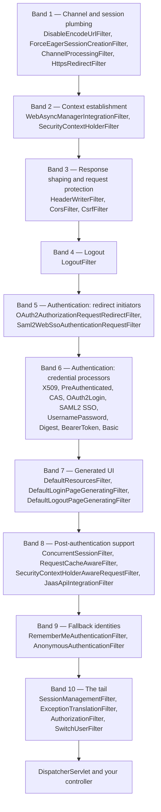

# 8.1 — The Default Filter Catalogue

> **Module 8 · Topic 1** · Filters Deep Dive
> Baseline: Spring Security 6.x on Boot 3.x
> New to this? Read **In Plain English** below first, then come back to the Version Matrix.

---

## Version Matrix

| Concern | Spring Security 5.x | **Spring Security 6.x (baseline)** | Spring Security 7.x |
|---|---|---|---|
| Context filter | `SecurityContextPersistenceFilter` — loads **and** saves | **`SecurityContextHolderFilter` — loads only, you must save** | `SecurityContextPersistenceFilter` removed |
| `SessionManagementFilter` | in the default chain | **not added by default**; mechanisms invoke `SessionAuthenticationStrategy` themselves | not added by default |
| URL authorization | `FilterSecurityInterceptor` | **`AuthorizationFilter`** (`FilterSecurityInterceptor` deprecated) | `FilterSecurityInterceptor` removed; only `AuthorizationFilter` |
| Dispatcher types authorized | `REQUEST` only by default | **all dispatcher types** (`shouldFilterAllDispatcherTypes = true`) | all dispatcher types |
| Channel security | `ChannelProcessingFilter` via `requiresChannel()` | **same**, plus `HttpsRedirectFilter` via `redirectToHttps()` from 6.5 | `ChannelProcessingFilter` removed; `HttpsRedirectFilter` only |
| Login page assets | inline CSS in the generated page | **`DefaultResourcesFilter` serves `/default-ui.css`** (6.2+) | same |
| `RequestCache` lookup | queried on every request | **only when the `continue` request parameter is present** | same |
| Newer mechanisms | — | **one-time token and passkey (WebAuthn) filters added in 6.4** | same, expanded |
| DSL style | `.and()` chaining and lambdas | **lambda DSL only in practice** | non-lambda overloads removed |

---

## Why This Exists

Every Spring Security question that starts with "why is my request being rejected" is answered
by knowing **which filters are actually in your chain, in what order, and what each one reads
and writes**. There is no other mechanism. The DSL is a builder whose only output is an ordered
`List<Filter>`; the annotations are a separate AOP concern that runs much later.

Three things follow, and they are the whole point of this topic:

1. **The list is not fixed.** It is computed from your configuration. Two applications on the
   same Spring Security version can have chains that differ by fifteen filters. Anyone who
   recites "the twenty Spring Security filters" from memory is reciting one particular
   configuration.
2. **Position is causation.** A filter can only see state that an earlier filter wrote, and can
   only catch exceptions thrown by a later one — because, as covered in
   [`04_M1_T4_Servlet_Basics.md`](04_M1_T4_Servlet_Basics.md), the chain is a call stack rather
   than a pipeline. "Earlier in the list" means "further out on the stack".
3. **You must be able to print your own chain.** The single most valuable skill in this topic is
   not memorisation, it is the two-minute habit of dumping the real chain before forming a
   hypothesis.

This file is a reference. Read it once end to end to learn the *shape*, then come back to
individual entries when a symptom points at one.

---

## In Plain English

**The one-line version:** Every web request to your application walks through a queue of small
inspectors before it reaches your code, and this file lists who those inspectors are, what order
they stand in, and what each one is looking for.

**An analogy.** Think of arriving at an airport. You do not walk straight to the aircraft. You
pass through a fixed series of checkpoints: the door staff who check that you are even at the
right terminal, the desk that looks up your booking, the bag scanner, the passport desk, the
boarding gate. Each checkpoint does exactly one job, each one can turn you back, and the order is
not decorative. The passport desk must come after the desk that found your booking, because it
needs to know who you claim to be. The bag scanner has to come before the gate, because by the
gate it is too late.

Spring Security is that series of checkpoints, and each checkpoint is called a **filter** (a small
piece of Java code that sees the request before your controller does, and can either pass it
along or stop it). The ordered set of filters is called the **filter chain**. Two more parts of
the analogy carry over exactly. First, not every airport has every checkpoint: a tiny regional
airport has no passport desk at all, and in the same way an application that has no login form
simply does not have a login filter. Second, some checkpoints are really standing *around* the
ones after them rather than in front of them, in the way a supervisor waits at the entrance to
catch anyone who is turned back further in. That is how error handling works here, and it is why
"earlier in the list" turns out to mean "on the outside".

**How it actually works, step by step.**

A request arrives from a browser or a mobile app. Before Spring's usual machinery sees it, a
single object called `FilterChainProxy` looks at the request and picks **one** list of filters to
run it through. Pick is the right word: if your application has defined several lists (for
example one for `/api/**` and one for everything else), the first list whose pattern matches the
URL is chosen and the other lists are never consulted for that request. This is the single most
common source of the confusion "my filter is not running" — it was in a list that was not chosen.

Inside the chosen list, the filters run in a fixed sequence. The early ones set the scene rather
than make decisions: one of them stops the servlet container from writing the session identifier
into URLs, another restores who you were on your previous request. That second one is
`SecurityContextHolderFilter`, and in plain words it is the filter that says "last time this
browser visited, it was logged in as alice, so let us put alice back on the desk where the rest
of the code can find her." The place it puts her is the `SecurityContextHolder`, which you can
think of as a labelled clipboard attached to the current thread of execution.

Next come the filters that shape and protect the response: one adds safety headers such as
`X-Frame-Options: DENY` (an instruction telling browsers not to display your page inside somebody
else's frame), one answers the browser's cross-origin permission question, and one checks the
CSRF token on any request that changes data. CSRF stands for cross-site request forgery, and the
token is a secret random string, for example `f47ac10b-58cc-4372`, that your own page includes in
its forms and an attacker's page cannot know.

Then comes the authentication band: a run of filters, each of which understands one way of
proving who you are. One understands a login form posted to `/login`, one understands an
`Authorization: Basic ...` header, one understands `Authorization: Bearer eyJhbGci...`, one
understands a redirect back from Google. Each one looks at the request, decides "this is not
mine" and steps aside, or decides "this is mine", works out who the caller is, and writes that
identity onto the clipboard. They are in a specific order, but in practice only one of them ever
claims a given request.

After that, two filters guarantee that the clipboard is never blank: a remember-me filter that
can revive an identity from a long-lived cookie, and an anonymous filter that writes a
placeholder identity named `anonymousUser` when nothing else has claimed the request. That
placeholder exists so that the rest of the code never has to handle an empty clipboard.

Finally the tail of the chain makes the actual decision. `AuthorizationFilter` reads the identity
from the clipboard, compares it against the rules you wrote (things like "anyone may see `/`, but
`/admin/**` needs the ADMIN role"), and either lets the request continue to your controller or
throws a refusal. Standing immediately outside it is `ExceptionTranslationFilter`, whose only job
is to catch that refusal and turn it into something the caller understands: a redirect to the
login page for a browser, or a bare `401` status code for an API.

**How to read the catalogue.** The long list further down this file is a reference, not a
narrative. Section 3 walks every filter the framework knows about, in the order they would sit if
they were all present — which they never are. For each one you get the job it does, what it reads,
what it writes, which line of configuration causes it to exist, and the symptom you see when it
misbehaves. Read it once to absorb the shape, then come back to a single entry when a bug points
you at it. The full picture of any individual filter is in its own entry and, for the important
ones, in its own file later in the series.

**Why should a beginner care?** Almost every Spring Security problem you will ever have is really
the question "which filter rejected my request, and why". Without a mental model of the chain you
end up changing configuration at random, and a random change that makes the error go away has
usually also removed a protection you needed. Concretely: developers who do not know that the
chain is chosen per request spend hours debugging a filter that never ran, and developers who do
not know that CSRF protection blocks unsafe methods respond by switching it off, which quietly
opens the application to having actions performed on a logged-in user's behalf by any other
website they visit.

**Words you will meet in this file**

| Term | In plain words |
|---|---|
| Filter | A small piece of code that sees every matching web request before your controller does, and can pass it on, change it, or stop it. |
| Filter chain | The ordered list of those filters that a request must walk through. |
| `FilterChainProxy` | The single gatekeeper that picks which one filter list a given request will use. The first matching list wins. |
| `SecurityFilterChain` | One such list, together with the URL pattern that says which requests it applies to. |
| `HttpSecurity` | The builder object you configure in Java. Its only output is one ordered list of filters. |
| DSL | "Domain-specific language" — here it just means the fluent, chained Java configuration style such as `http.formLogin(...).csrf(...)`. |
| Configurer | A framework class behind one DSL method. Calling `formLogin()` activates a configurer, and the configurer is what actually adds filters. |
| `SecurityContextHolder` | The per-request clipboard that holds the current identity, so any code can ask "who is calling?" without passing it around. |
| `SecurityContext` | What is written on that clipboard: essentially just the current `Authentication`. |
| `Authentication` | The object describing the caller: who they are, whether they are proven, and what they are allowed to do. |
| Authority / role | A short label attached to an identity, such as `ROLE_ADMIN` or `SCOPE_read`, that authorization rules are written against. |
| Authentication versus authorization | Authentication answers "who are you"; authorization answers "may you do this". Different filters, in that order. |
| `AuthenticationEntryPoint` | The thing that decides what an unauthenticated visitor sees: a redirect to a login page for a website, or a bare 401 for an API. |
| `AuthorizationFilter` | The filter at the end of the chain that compares the caller's identity against your URL rules and refuses if they do not match. |
| `ExceptionTranslationFilter` | The filter standing outside `AuthorizationFilter` that catches a security refusal and turns it into an HTTP response. |
| CSRF | Cross-site request forgery: another site making your logged-in browser submit a request. The `CsrfFilter` blocks it by demanding a secret token. |
| Dispatcher type | Why the container is running the request: a normal `REQUEST`, an internal forward to `/error` (`ERROR`), or asynchronous work (`ASYNC`). In 6.x all three are authorized. |
| `RequestMatcher` | A rule that answers "does this request match?", usually by URL pattern and HTTP method. Used to pick chains and to scope rules. |

**If you remember only one thing:** the filter chain is computed from your configuration rather
than fixed, so before you theorise about a security problem, print the chain your application
actually built.

---

## Core Concepts

### 1. The Shape of the Chain

**In simple terms:** The filters are not in a random order — they fall into groups that each do
one stage of the job, and learning the groups is far easier than memorising individual positions.

The ordered list is not arbitrary. It falls into bands, and the bands explain the order far
better than the individual positions do.



Read it as a sentence: *decide whether the connection is acceptable at all, restore who the
caller was last time, make the response safe and reject forged submissions, handle logout,
then give every authentication mechanism a chance to identify the caller, fall back to
remember-me and then to anonymous so that identity is never null, wrap the whole remainder in
an exception translator, and only then decide whether this identity may proceed.*

### 2. How the Framework Assigns Order

**In simple terms:** Spring gives every known filter a numbered seat and then sorts by seat
number, which is how your own filter can be slotted in next to a built-in one without you
knowing any of the numbers.

`HttpSecurity` does not keep a hand-maintained list. It keeps a registry that maps a filter
class to an integer, and sorts by that integer at build time.

```java
// org.springframework.security.config.annotation.web.builders.FilterOrderRegistration
final class FilterOrderRegistration {

    private static final int INITIAL_ORDER = 100;
    private static final int ORDER_STEP = 100;

    private final Map<String, Integer> filterToOrder = new HashMap<>();

    FilterOrderRegistration() {
        Step order = new Step(INITIAL_ORDER, ORDER_STEP);
        put(DisableEncodeUrlFilter.class, order.next());
        put(ForceEagerSessionCreationFilter.class, order.next());
        put(ChannelProcessingFilter.class, order.next());
        put(HttpsRedirectFilter.class, order.next());
        order.next();                                          // gh-8105: a deliberately reserved gap
        put(WebAsyncManagerIntegrationFilter.class, order.next());
        put(SecurityContextHolderFilter.class, order.next());
        put(SecurityContextPersistenceFilter.class, order.next());
        put(HeaderWriterFilter.class, order.next());
        put(CorsFilter.class, order.next());
        put(CsrfFilter.class, order.next());
        put(LogoutFilter.class, order.next());
        // ... optional modules registered by fully-qualified NAME, not by class,
        //     so the registry does not require spring-security-oauth2-client,
        //     spring-security-saml2-service-provider or spring-security-cas on the classpath:
        this.filterToOrder.put(
            "org.springframework.security.oauth2.client.web.OAuth2AuthorizationRequestRedirectFilter",
            order.next());
        // ...
        put(ExceptionTranslationFilter.class, order.next());
        put(FilterSecurityInterceptor.class, order.next());
        put(AuthorizationFilter.class, order.next());
        put(SwitchUserFilter.class, order.next());
    }

    void put(Class<?> filter, int position) {
        this.filterToOrder.putIfAbsent(filter.getName(), position);   // first registration wins
    }

    Integer getOrder(Class<?> clazz) {
        while (clazz != null) {                       // walks UP the superclass chain
            Integer result = this.filterToOrder.get(clazz.getName());
            if (result != null) {
                return result;
            }
            clazz = clazz.getSuperclass();
        }
        return null;
    }
}
```

Four details in that snippet matter in practice:

- **`INITIAL_ORDER = 100`, `ORDER_STEP = 100`.** The first slot is 100 and every subsequent slot
  is one hundred higher. The gap exists purely so that custom filters can be inserted between
  built-ins without renumbering anything. **Do not hard-code these integers** — they shift
  between minor releases every time a filter is inserted, which has happened repeatedly (the
  one-time-token and passkey filters in 6.4, `HttpsRedirectFilter` and `DefaultResourcesFilter`
  before them).
- **Optional filters are registered by string name.** `OAuth2LoginAuthenticationFilter`,
  `Saml2WebSsoAuthenticationFilter`, `CasAuthenticationFilter` and
  `BearerTokenAuthenticationFilter` live in modules you may not have on the classpath, so the
  registry stores their fully qualified class names and never loads the classes.
- **`getOrder` walks superclasses.** This is why `RequestHeaderAuthenticationFilter` gets the
  order of `AbstractPreAuthenticatedProcessingFilter` for free, and why a custom filter that
  extends `UsernamePasswordAuthenticationFilter` can be added with plain
  `http.addFilter(...)` — the registry resolves the parent's slot.
- **`putIfAbsent` means the first registration wins.** A position, once claimed, is stable for
  the life of that `HttpSecurity`.

`HttpSecurity` then converts the three public insertion methods into a single offset operation:

```java
// org.springframework.security.config.annotation.web.builders.HttpSecurity (simplified)
public HttpSecurity addFilterBefore(Filter filter, Class<? extends Filter> beforeFilter) {
    return addFilterAtOffsetOf(filter, -1, beforeFilter);
}

public HttpSecurity addFilterAfter(Filter filter, Class<? extends Filter> afterFilter) {
    return addFilterAtOffsetOf(filter, 1, afterFilter);
}

public HttpSecurity addFilterAt(Filter filter, Class<? extends Filter> atFilter) {
    return addFilterAtOffsetOf(filter, 0, atFilter);       // SAME slot - not a replacement
}

private HttpSecurity addFilterAtOffsetOf(Filter filter, int offset,
                                         Class<? extends Filter> registeredFilter) {
    int order = this.filterOrders.getOrder(registeredFilter) + offset;
    this.filters.add(new OrderedFilter(filter, order));
    this.filterOrders.put(filter.getClass(), order);       // your filter is now in the registry too
    return this;
}
```

The offset is **±1, not ±100**. With a step of 100 there is room for ninety-nine custom filters
between any two built-ins, and your filter lands unambiguously between slots. The exception is
`addFilterAt`, which uses offset `0` — covered in detail in
[`27_M8_T2_Custom_Filters.md`](27_M8_T2_Custom_Filters.md).

### 3. The Catalogue, In Order

**In simple terms:** This is the reference list of every filter the framework knows about, one
entry each, so that when something goes wrong you can look up the filter by name and find out
what it was trying to do.

Each entry below gives the job, what it reads, what it writes, which DSL configurer adds it,
when it is absent, and the symptom when it goes wrong.

#### 1. `DisableEncodeUrlFilter`

`org.springframework.security.web.session`

Wraps the response so that `HttpServletResponse.encodeURL(...)` and `encodeRedirectURL(...)`
return the URL untouched, which stops the container appending `;jsessionid=...` when the client
has no cookie.

- **Added by** `SessionManagementConfigurer`, unconditionally, unless you call
  `sessionManagement(s -> s.enableSessionUrlRewriting(true))`.
- **Reads** nothing. **Writes** a response wrapper.
- **Absent when** you deliberately enable URL rewriting.
- **Symptom if missing** session identifiers appear in URLs, and therefore in access logs,
  browser history, and the `Referer` header of every outbound link. That is full session
  hijacking material sitting in plain text.

#### 2. `ForceEagerSessionCreationFilter`

`org.springframework.security.web.session`

Calls `request.getSession()` on the way in, forcing a session to exist before anything else runs.

- **Added by** `SessionManagementConfigurer` **only** when
  `sessionCreationPolicy(SessionCreationPolicy.ALWAYS)`.
- **Absent** in every other policy, including the default `IF_REQUIRED`.
- **Symptom when present unintentionally** a `JSESSIONID` and a server-side session object for
  every crawler, health check, and anonymous visitor. On a public site this is a slow memory
  leak and a needless load on your session store.

#### 3. `ChannelProcessingFilter`

`org.springframework.security.web.access.channel`

Enforces transport requirements. It consults a `ChannelDecisionManager` holding a
`SecureChannelProcessor` and an `InsecureChannelProcessor`; if the request is on the wrong
scheme, a `ChannelEntryPoint` (`RetryWithHttpsEntryPoint` / `RetryWithHttpEntryPoint`) issues a
redirect and the chain stops.

- **Added by** `requiresChannel()`.
- **Reads** `request.isSecure()` and the server port mappings.
- **Absent** unless you configure `requiresChannel()`.
- **Symptom** an infinite redirect loop behind a TLS-terminating load balancer, because Tomcat
  sees plain HTTP. The fix is `server.forward-headers-strategy=framework`, as covered in
  [`01_M1_T1_HTTP_Web_Basics.md`](01_M1_T1_HTTP_Web_Basics.md).
- **Direction of travel** Spring Security 6.5 introduces `redirectToHttps()` backed by
  `HttpsRedirectFilter`, which sits at the next slot and is the supported replacement.

#### 4. `WebAsyncManagerIntegrationFilter`

`org.springframework.security.web.context.request.async`

Registers a `SecurityContextCallableProcessingInterceptor` with the request's `WebAsyncManager`,
so that a `Callable` or `WebAsyncTask` returned from a controller executes on the async thread
with the same `SecurityContext`.

- **Added by** the framework defaults in `HttpSecurityConfiguration`, before any configurer runs.
  There is no DSL switch for it.
- **Reads** the `SecurityContext` on the request thread. **Writes** it onto the async thread.
- **Scope limit** it covers `Callable` and `WebAsyncTask` return values only. It does **not**
  cover `CompletableFuture.supplyAsync(...)` on your own executor, or an `@Async` method. Those
  need `DelegatingSecurityContextExecutor`.
- **Symptom** `SecurityContextHolder.getContext().getAuthentication()` returns `null` inside
  asynchronous work.

#### 5. `SecurityContextHolderFilter`

`org.springframework.security.web.context`

The 6.x context filter. It loads a **deferred** (lazily evaluated) `SecurityContext` from the
`SecurityContextRepository`, places the supplier on the holder, and clears the holder in a
`finally` block. It never writes.

```java
// SecurityContextHolderFilter extends GenericFilterBean and guards itself (simplified)
private void doFilter(HttpServletRequest request, HttpServletResponse response,
                      FilterChain chain) throws ServletException, IOException {
    if (request.getAttribute(FILTER_APPLIED) != null) {
        chain.doFilter(request, response);
        return;
    }
    request.setAttribute(FILTER_APPLIED, Boolean.TRUE);
    Supplier<SecurityContext> deferredContext = this.securityContextRepository.loadDeferredContext(request);
    try {
        this.securityContextHolderStrategy.setDeferredContext(deferredContext);
        chain.doFilter(request, response);
    }
    finally {
        this.securityContextHolderStrategy.clearContext();
        request.removeAttribute(FILTER_APPLIED);
    }
}
```

- **Added by** `SecurityContextConfigurer` (`securityContext()`), on by default.
- **Reads** the repository — by default a `DelegatingSecurityContextRepository` wrapping
  `RequestAttributeSecurityContextRepository` and `HttpSessionSecurityContextRepository`.
- **Writes** the holder only.
- **Symptom** authentication that works within a request but is gone on the next one, because
  nothing saved it. That is not a bug; it is the 6.x contract.

#### 6. `SecurityContextPersistenceFilter` — the 5.x predecessor

`org.springframework.security.web.context`

In 5.x this filter both loaded the context on the way in and **saved it on the way out**, in its
own `finally` block:

```java
// SecurityContextPersistenceFilter.doFilter (5.x, simplified)
SecurityContext contextBeforeChainExecution = this.repo.loadContext(holder);
try {
    SecurityContextHolder.setContext(contextBeforeChainExecution);
    chain.doFilter(holder.getRequest(), holder.getResponse());
}
finally {
    SecurityContext contextAfterChainExecution = SecurityContextHolder.getContext();
    SecurityContextHolder.clearContext();
    this.repo.saveContext(contextAfterChainExecution, holder.getRequest(), holder.getResponse());
}
```

**The change and its consequence.** Automatic saving was convenient and expensive. Because the
filter could not know whether the context had changed, `HttpSessionSecurityContextRepository`
had to read the `HttpSession` on **every** request in order to compare, which in a clustered
setup with Spring Session means a network round trip per request even for anonymous traffic.
It was also ambiguous: any code anywhere that called `SecurityContextHolder.setContext(...)`
silently persisted a session.

Spring Security 6 flips the default to `requireExplicitSave = true`. The consequence you must
internalise:

> In 6.x, **setting the `SecurityContextHolder` no longer persists anything.** Whoever
> authenticates is responsible for calling
> `SecurityContextRepository.saveContext(context, request, response)`.

The built-in mechanisms already do this. Hand-written filters written against 5.x behaviour are
the classic breakage: the user appears logged in for exactly one request. Deprecated in 6.x,
removed in 7.x. An application must have `SecurityContextHolderFilter` **or**
`SecurityContextPersistenceFilter`, never both.

#### 7. `HeaderWriterFilter`

`org.springframework.security.web.header`

Holds a `List<HeaderWriter>` and applies all of them. By default it does **not** write eagerly;
it installs a `HeaderWriterResponse` wrapper that writes the headers when the response is about
to be committed, so the headers survive a downstream filter that commits early.

```java
public interface HeaderWriter {
    void writeHeaders(HttpServletRequest request, HttpServletResponse response);
}
```

Default writers and their output:

| `HeaderWriter` | Header | Default value |
|---|---|---|
| `XContentTypeOptionsHeaderWriter` | `X-Content-Type-Options` | `nosniff` |
| `XXssProtectionHeaderWriter` | `X-XSS-Protection` | `0` (deliberately disabled in 6.x) |
| `CacheControlHeadersWriter` | `Cache-Control`, `Pragma`, `Expires` | `no-cache, no-store, max-age=0, must-revalidate` |
| `HstsHeaderWriter` | `Strict-Transport-Security` | `max-age=31536000 ; includeSubDomains`, **secure requests only** |
| `XFrameOptionsHeaderWriter` | `X-Frame-Options` | `DENY` |

Available but **off** by default, because a correct value is application-specific:
`ContentSecurityPolicyHeaderWriter`, `ReferrerPolicyHeaderWriter`,
`PermissionsPolicyHeaderWriter`, `CrossOriginOpenerPolicyHeaderWriter`,
`CrossOriginEmbedderPolicyHeaderWriter`, `CrossOriginResourcePolicyHeaderWriter`,
`ClearSiteDataHeaderWriter` (typically wired into logout), and
`DelegatingRequestMatcherHeaderWriter` for per-path variation.

- **Added by** `HeadersConfigurer` (`headers()`), on by default.
- **Absent when** you call `headers(HeadersConfigurer::disable)` — almost never correct.
- **Symptom** missing HSTS is usually not a bug but a signal that `request.isSecure()` is false
  behind a proxy. Aggressive `Cache-Control` breaking static asset caching is the other common
  complaint; scope it with a `DelegatingRequestMatcherHeaderWriter` rather than disabling it.

#### 8. `CorsFilter`

`org.springframework.web.filter` — a Spring Framework class, not a Spring Security one.

Handles the CORS preflight `OPTIONS` request and adds `Access-Control-*` headers to actual
requests, using a `CorsConfigurationSource`.

- **Added by** `CorsConfigurer` (`cors()`). Its resolution order is: a bean named `corsFilter` of
  type `CorsFilter`; otherwise a `CorsConfigurationSource` bean; otherwise, if Spring MVC is on
  the classpath, a `HandlerMappingIntrospector`-backed source that reuses `@CrossOrigin` metadata.
- **Absent** if you never call `cors()` and publish no source bean.
- **Why it sits here** a preflight `OPTIONS` carries no credentials and no CSRF token by design.
  It must be answered **before** `CsrfFilter` and before the authentication filters, otherwise
  the browser sees a 401 or 403 on the preflight and reports a CORS error.
- **Symptom** "CORS error" in the browser console on a request that works in curl. Nine times
  out of ten the preflight is being rejected by a later filter because `cors()` was never enabled.

#### 9. `CsrfFilter`

`org.springframework.security.web.csrf`

Loads the expected `CsrfToken` from a `CsrfTokenRepository`, exposes it as request attributes,
and for unsafe methods compares it to the submitted value.

- **Added by** `CsrfConfigurer` (`csrf()`), on by default.
- **Reads** `CsrfTokenRepository` (default `HttpSessionCsrfTokenRepository`) plus the request
  parameter `_csrf` or header `X-CSRF-TOKEN`, via a `CsrfTokenRequestHandler` — in 6.x the
  default is `XorCsrfTokenRequestAttributeHandler`, which masks the token per request as a BREACH
  mitigation.
- **Writes** request attributes `_csrf` and the token's parameter name, and lazily persists a
  newly generated token.
- **Protected methods** everything except `GET`, `HEAD`, `TRACE`, `OPTIONS`.
- **Throws** `MissingCsrfTokenException` or `InvalidCsrfTokenException`, both subclasses of
  `CsrfException` and therefore of `AccessDeniedException`, which
  `ExceptionTranslationFilter` turns into a 403.
- **Symptom** a blanket 403 on every `POST` from a single-page application.

#### 10. `LogoutFilter`

`org.springframework.security.web.authentication.logout`

Matches the logout request, runs every registered `LogoutHandler`, then hands off to a
`LogoutSuccessHandler`. It **terminates the chain** when it matches.

- **Added by** `LogoutConfigurer` (`logout()`), on by default.
- **Matcher** `POST /logout` when CSRF protection is enabled; `GET`, `POST`, `PUT` and `DELETE`
  on `/logout` when CSRF is disabled.
- **Handlers** `SecurityContextLogoutHandler` (clears the context, invalidates the session),
  `LogoutSuccessEventPublishingLogoutHandler`, `CsrfLogoutHandler` when CSRF is on, plus
  `CookieClearingLogoutHandler` and `RememberMeServices` when configured.
- **Symptom** "logout does nothing" is almost always a `GET /logout` link against a CSRF-enabled
  application: the matcher does not match, so the request falls through to a 404 or your
  catch-all page while the session stays alive.

#### 11. `OAuth2AuthorizationRequestRedirectFilter`

`org.springframework.security.oauth2.client.web`

Starts the authorization code flow. On `/oauth2/authorization/{registrationId}` it builds an
`OAuth2AuthorizationRequest` (including the PKCE `code_challenge` for public clients), saves it
through an `AuthorizationRequestRepository` — session-backed by default — and redirects to the
provider.

- **Added by** `oauth2Login()` and `oauth2Client()`.
- **Absent** without `spring-security-oauth2-client`.
- **Symptom** `authorization_request_not_found` on the callback means the saved request could not
  be retrieved: a lost session, a `SameSite=Strict` cookie blocking the cross-site return
  navigation, or a load balancer without sticky sessions.

#### 12. `Saml2WebSsoAuthenticationRequestFilter`

`org.springframework.security.saml2.provider.service.web`

The SAML 2 equivalent. On `/saml2/authenticate/{registrationId}` it builds and signs an
`AuthnRequest` and dispatches it by redirect or POST binding.

- **Added by** `saml2Login()`. **Absent** without `spring-security-saml2-service-provider`.
- **Symptom** clock skew and signature failures dominate; both surface later, at the response
  filter, not here.

#### 13. `X509AuthenticationFilter`

`org.springframework.security.web.authentication.preauth.x509`

A pre-authenticated mechanism. It reads the `jakarta.servlet.request.X509Certificate` request
attribute that the container populates during the TLS handshake and extracts a principal with a
`X509PrincipalExtractor` — by default `SubjectDnX509PrincipalExtractor`, matching `CN=(.*?)(?:,|$)`.

- **Added by** `x509()`. Requires container-level client certificate configuration to be useful.
- **Symptom** a null principal when TLS terminates at the proxy, because the certificate never
  reaches Tomcat. You then have to trust a proxy-injected header instead, which is the next entry.

#### 14. `AbstractPreAuthenticatedProcessingFilter`

`org.springframework.security.web.authentication.preauth`

Not a filter you use directly — the base class for "someone upstream already authenticated this
caller". Subclasses implement two methods:

```java
protected abstract Object getPreAuthenticatedPrincipal(HttpServletRequest request);
protected abstract Object getPreAuthenticatedCredentials(HttpServletRequest request);
```

It builds a `PreAuthenticatedAuthenticationToken` and submits it to the `AuthenticationManager`,
where a `PreAuthenticatedAuthenticationProvider` loads authorities via an
`AuthenticationUserDetailsService`. Concrete subclasses: `RequestHeaderAuthenticationFilter`
(SiteMinder-style headers), `J2eePreAuthenticatedProcessingFilter` (container principal), and
`X509AuthenticationFilter`.

- **Added by** you, with `addFilterBefore`, or by `jee()` for the container variant.
- **The security warning** `RequestHeaderAuthenticationFilter` trusts a header. If any path to
  your application bypasses the proxy that sets it, anyone can send
  `SM_USER: admin` and become an administrator. This must be paired with network-level
  restriction and a proxy that unconditionally strips the header from inbound requests.

#### 15. `CasAuthenticationFilter`

`org.springframework.security.cas.web`

Processes the CAS service ticket on return from the CAS server and validates it out-of-band via
a `TicketValidator`. Extends `AbstractAuthenticationProcessingFilter`.

- **Added by** you, manually; there is no CAS DSL method. **Absent** without `spring-security-cas`.

#### 16. `OAuth2LoginAuthenticationFilter`

`org.springframework.security.oauth2.client.web`

Handles the provider callback at `/login/oauth2/code/{registrationId}`. It exchanges the
authorization code for tokens, loads the user via `OAuth2UserService` or `OidcUserService`,
produces an `OAuth2AuthenticationToken`, and stores the `OAuth2AuthorizedClient`.

- **Added by** `oauth2Login()`.
- **Symptom** `invalid_grant` here almost always means a `redirect_uri` mismatch or a reused code.

#### 17. `Saml2WebSsoAuthenticationFilter`

`org.springframework.security.saml2.provider.service.web.authentication`

Handles `/login/saml2/sso/{registrationId}`, validates the signature, conditions, audience and
timestamps of the assertion, and produces a `Saml2Authentication`.

- **Added by** `saml2Login()`.

#### 18. `UsernamePasswordAuthenticationFilter`

`org.springframework.security.web.authentication`

The canonical form-login mechanism, and the landmark everyone uses for `addFilterBefore`.

```java
// UsernamePasswordAuthenticationFilter.attemptAuthentication (simplified)
public Authentication attemptAuthentication(HttpServletRequest request, HttpServletResponse response) {
    if (this.postOnly && !"POST".equals(request.getMethod())) {
        throw new AuthenticationServiceException("Authentication method not supported: " + request.getMethod());
    }
    String username = obtainUsername(request);          // parameter "username"
    String password = obtainPassword(request);          // parameter "password"
    UsernamePasswordAuthenticationToken authRequest =
        UsernamePasswordAuthenticationToken.unauthenticated(username.trim(), password);
    setDetails(request, authRequest);
    return this.getAuthenticationManager().authenticate(authRequest);
}
```

- **Added by** `formLogin()`. **Absent** with `httpBasic()` or `oauth2ResourceServer()` alone.
- **Matcher** `POST /login`.
- **Inherits from** `AbstractAuthenticationProcessingFilter`, which supplies the success and
  failure handlers, `SessionAuthenticationStrategy`, `RememberMeServices`,
  `SecurityContextRepository` saving and event publishing. That inheritance is the reason
  [`27_M8_T2_Custom_Filters.md`](27_M8_T2_Custom_Filters.md) argues you should extend it rather
  than `OncePerRequestFilter` when building a login mechanism.

#### 19. `DefaultResourcesFilter`

`org.springframework.security.web.authentication.ui`

Added in 6.2. Serves `/default-ui.css` so the generated login page can be styled without inline
CSS, which lets a strict Content-Security-Policy remain in force.

- **Added by** `DefaultLoginPageConfigurer`, alongside the generated pages.

#### 20. `DefaultLoginPageGeneratingFilter`

`org.springframework.security.web.authentication.ui`

Renders an HTML login form at `GET /login` — including the CSRF hidden field, error and logout
messages, and buttons for every configured OAuth2 and SAML2 registration.

- **Added by** `DefaultLoginPageConfigurer` when `formLogin()`, `oauth2Login()` or `saml2Login()`
  is enabled **and** no custom `loginPage(...)` is set.
- **Absent** the moment you call `loginPage("/my-login")`. At that point `/my-login` is *your*
  responsibility, including making it `permitAll()`.
- **Symptom** a redirect loop to `/login`: you set a custom login page but did not permit it, so
  requesting it is itself denied, which redirects to it again.

#### 21. `DefaultLogoutPageGeneratingFilter`

`org.springframework.security.web.authentication.ui`

Renders a confirmation page at `GET /logout` containing a form that `POST`s to `/logout` with the
CSRF token. Its whole purpose is to make CSRF-protected logout reachable from a plain link.

- **Added by** the same configurer, when no custom logout success page is configured.

#### 22. `ConcurrentSessionFilter`

`org.springframework.security.web.session`

Runs on **every** request when concurrency control is enabled. It looks the current session up in
the `SessionRegistry`; if the `SessionInformation` is marked expired it invokes a
`SessionInformationExpiredStrategy` and logs the user out, otherwise it refreshes the
last-request timestamp.

- **Added by** `sessionManagement(s -> s.maximumSessions(n))`.
- **Requires** a `SessionRegistry` (`SessionRegistryImpl` by default) and, for the registry to be
  populated and pruned, an `HttpSessionEventPublisher` bean.
- **Symptom** "maximumSessions has no effect" is nearly always the missing
  `HttpSessionEventPublisher`: sessions are registered but never removed on expiry, so the count
  only ever grows and legitimate users get locked out.
- **Cost** a registry lookup on every request, and in a cluster the registry must be shared.

#### 23. `DigestAuthenticationFilter`

`org.springframework.security.web.authentication.www`

Implements HTTP Digest authentication with a nonce issued by `DigestAuthenticationEntryPoint`.

- **Added by** nobody — there is no DSL method. You add it manually along with its entry point.
- **The reason it is effectively dead** the server must be able to compute
  `MD5(username:realm:password)`, so passwords must be stored reversibly or pre-hashed with MD5.
  That is incompatible with modern password storage. Treat it as legacy interoperability only.

#### 24. `BearerTokenAuthenticationFilter`

`org.springframework.security.oauth2.server.resource.web.authentication`

The resource-server mechanism. A `BearerTokenResolver` (default `DefaultBearerTokenResolver`)
extracts the token from the `Authorization: Bearer` header — form and query-parameter extraction
are **disabled by default**, correctly, because a token in a query string leaks into logs. It
then builds a `BearerTokenAuthenticationToken` and resolves an `AuthenticationManager` through an
`AuthenticationManagerResolver`.

- **Added by** `oauth2ResourceServer(o -> o.jwt(...))` or `.opaqueToken(...)`.
- **Writes** the context through a `SecurityContextRepository` —
  `RequestAttributeSecurityContextRepository` by default, so nothing touches the session.
- **Failure** delegates to `BearerTokenAuthenticationEntryPoint`, which emits
  `WWW-Authenticate: Bearer error="invalid_token", error_description="..."` per RFC 6750.

#### 25. `BasicAuthenticationFilter`

`org.springframework.security.web.authentication.www`

Decodes `Authorization: Basic` with a `BasicAuthenticationConverter` and authenticates. On
failure it clears the context and invokes `BasicAuthenticationEntryPoint`, which sends
`WWW-Authenticate: Basic realm="Realm"`.

- **Added by** `httpBasic()`.
- **Note** `setSecurityContextRepository(...)` is how you make Basic authentication create a
  session (`HttpSessionSecurityContextRepository`) instead of re-authenticating every request.
  Left at the default it is genuinely stateless — and genuinely runs your password encoder on
  every single request, which is a denial-of-service consideration.

#### 26. `AuthenticationFilter`

`org.springframework.security.web.authentication`

The generic, composable mechanism introduced in 5.2: an `AuthenticationConverter` turns the
request into an unauthenticated `Authentication`, an `AuthenticationManagerResolver` picks the
manager, and success and failure handlers do the rest. If you need a new credential format, this
class plus a converter is often less code than a bespoke filter.

- **Added by** you.

#### 27. `RequestCacheAwareFilter`

`org.springframework.security.web.savedrequest`

After a successful login redirect, replays the original request: it asks the `RequestCache` for a
matching saved request and, if there is one, wraps the current request so the original method,
parameters and headers are visible to the controller.

- **Added by** `RequestCacheConfigurer` (`requestCache()`), on by default.
- **6.x change** the default `HttpSessionRequestCache` has
  `matchingRequestParameterName = "continue"`, so the cache is consulted **only** when that
  parameter is present. This avoids reading the session on every request. The saved-request
  redirect URL generated by Spring includes it.
- **Symptom** "after login the user lands on the right URL but the query parameters are gone" —
  usually a custom `AuthenticationSuccessHandler` that redirects to a fixed URL and therefore
  never consults the cache.

#### 28. `SecurityContextHolderAwareRequestFilter`

`org.springframework.security.web.servletapi`

Wraps the request so the Servlet API security methods work against Spring Security:
`getRemoteUser()`, `getUserPrincipal()`, `isUserInRole("ADMIN")`, and the Servlet 3
`authenticate()`, `login()` and `logout()` methods.

- **Added by** `servletApi()`, on by default.
- **Why it matters** Spring MVC's `Principal` argument type, JSP tag libraries, and any
  third-party library written against the Servlet API depend on it.
- **Note** `isUserInRole("ADMIN")` prefixes with `ROLE_` before checking, matching Spring
  Security's convention.

#### 29. `JaasApiIntegrationFilter`

`org.springframework.security.web.jaasapi`

If the current `Authentication` is a `JaasAuthenticationToken`, it runs the remainder of the
chain inside `Subject.doAs(...)` so that JAAS-aware code sees the right `Subject`.

- **Added by** you, in a JAAS integration. Irrelevant to almost every modern application, but it
  occupies a slot and shows up in the registry.

#### 30. `RememberMeAuthenticationFilter`

`org.springframework.security.web.authentication.rememberme`

If the context holds no `Authentication` after all the real mechanisms have run, it asks
`RememberMeServices.autoLogin(request, response)`. On success it authenticates the resulting
token through the `AuthenticationManager` and publishes an
`InteractiveAuthenticationSuccessEvent`.

- **Added by** `rememberMe()`.
- **Implementations** `TokenBasedRememberMeServices` (a signed cookie, no server state, cannot be
  revoked) and `PersistentTokenBasedRememberMeServices` (a series/token pair in a database, with
  theft detection when a token is reused).
- **Security posture** a remember-me identity is deliberately *weaker*. `isRememberMe()` is a
  first-class concept in `AuthenticationTrustResolver`, and
  `ExceptionTranslationFilter` will re-challenge a remember-me user rather than return 403.
  Guard sensitive operations with `fullyAuthenticated()` rather than `authenticated()`.

#### 31. `AnonymousAuthenticationFilter`

`org.springframework.security.web.authentication`

If the context still has no `Authentication`, it installs an `AnonymousAuthenticationToken` with
principal `anonymousUser` and authority `ROLE_ANONYMOUS`.

```java
// AnonymousAuthenticationFilter.doFilter (simplified)
SecurityContext context = this.securityContextHolderStrategy.getContext();
if (context.getAuthentication() == null) {
    Authentication anonymous = createAuthentication((HttpServletRequest) req);
    SecurityContext empty = this.securityContextHolderStrategy.createEmptyContext();
    empty.setAuthentication(anonymous);
    this.securityContextHolderStrategy.setContext(empty);
}
chain.doFilter(req, res);
```

- **Added by** `AnonymousConfigurer` (`anonymous()`), on by default.
- **Why it exists** so downstream code never has to null-check, and so that "anonymous" is an
  identity you can write rules about.
- **Does not save** to the `SecurityContextRepository`, so no session is created for anonymous
  callers.
- **The consequence of disabling it** with `anonymous(AbstractHttpConfigurer::disable)` the
  authentication becomes `null`, `AuthenticationTrustResolverImpl.isAnonymous(null)` returns
  `false`, and an `AccessDeniedException` therefore goes to the `AccessDeniedHandler` as a flat
  403 instead of triggering an authentication challenge. That is occasionally exactly what you
  want for a pure API, and it surprises everyone the first time.

#### 32. `OAuth2AuthorizationCodeGrantFilter`

`org.springframework.security.oauth2.client.web`

Handles the authorization code callback for the **client** use case — calling a downstream API on
the user's behalf, as opposed to logging in with the provider. It exchanges the code and stores
an `OAuth2AuthorizedClient` in the `OAuth2AuthorizedClientRepository`.

- **Added by** `oauth2Client()`.
- **Position note** it sits *after* `AnonymousAuthenticationFilter` because the user is already
  authenticated by some other mechanism; this flow attaches tokens to an existing identity.

#### 33. `SessionManagementFilter`

`org.springframework.security.web.session`

In 5.x this was the workhorse: on every request it compared the context against the repository,
and if it detected a newly authenticated user it invoked the `SessionAuthenticationStrategy`
(session fixation protection, concurrency registration). It also handled invalid session
identifiers through an `InvalidSessionStrategy`.

**In 6.x it is not added by default.** The reason is exactly the one behind the context filter
change: detecting "a user just authenticated" required reading the `HttpSession` on every
request. Instead, each authentication mechanism now invokes the `SessionAuthenticationStrategy`
itself — `AbstractAuthenticationProcessingFilter` calls
`this.sessionStrategy.onAuthentication(...)` before it saves the context.

- **Appears when** you configure something that genuinely needs it, such as
  `maximumSessions(...)` or `invalidSessionUrl(...)`. Configuring
  `requireExplicitAuthenticationStrategy(true)` alongside those options fails fast with
  `IllegalStateException: Invalid configuration that explicitly sets
  requireExplicitAuthenticationStrategy to true but implicitly requires it`.
- **The upgrade trap** a hand-written 5.x authentication filter relied on this filter to apply
  session fixation protection. In 6.x nothing applies it unless your filter does. Session
  fixation protection silently disappears — no error, no log line.

#### 34. `ExceptionTranslationFilter`

`org.springframework.security.web.access`

Does nothing on the way in. It wraps everything downstream in a `try` block and converts
`AuthenticationException` into an entry-point challenge and `AccessDeniedException` into either a
challenge or a 403, depending on whether the current identity is anonymous or remember-me.

Covered in full in
[`28_M9_T1_Security_Exception_Handling.md`](28_M9_T1_Security_Exception_Handling.md); the 401
versus 403 decision is introduced in
[`01_M1_T1_HTTP_Web_Basics.md`](01_M1_T1_HTTP_Web_Basics.md).

- **Added by** `ExceptionHandlingConfigurer` (`exceptionHandling()`), on by default.
- **Position** immediately before `AuthorizationFilter`, which is the only placement that lets it
  catch what that filter throws.

#### 35. `AuthorizationFilter`

`org.springframework.security.web.access.intercept`

The URL authorization decision. It delegates to an `AuthorizationManager<HttpServletRequest>` —
in practice a `RequestMatcherDelegatingAuthorizationManager` holding your
`authorizeHttpRequests` rules in declaration order.

```java
// AuthorizationFilter.doFilter (simplified)
if (this.observeOncePerRequest && isApplied(request)) {
    chain.doFilter(request, response);
    return;
}
if (skipDispatch(request)) { ... }
try {
    AuthorizationResult result = this.authorizationManager.authorize(this::getAuthentication, request);
    this.eventPublisher.publishAuthorizationEvent(this::getAuthentication, request, result);
    if (result != null && !result.isGranted()) {
        throw new AuthorizationDeniedException("Access Denied", result);
    }
    chain.doFilter(request, response);
}
finally {
    request.removeAttribute(alreadyFilteredAttributeName);
}
```

- **Added by** `authorizeHttpRequests(...)`.
- **`shouldFilterAllDispatcherTypes = true`** by default in 6.x, so `ERROR` and `ASYNC` dispatches
  are authorized too. This is why `/error` needs `permitAll()`.
- **Supplier-based authentication** the `Authentication` is passed as a `Supplier`, so a
  `permitAll()` rule never forces the deferred `SecurityContext` to be resolved — and therefore
  never touches the session.
- **Throws** `AuthorizationDeniedException`, a subclass of `AccessDeniedException`.

#### 36. `SwitchUserFilter`

`org.springframework.security.web.authentication.switchuser`

Administrative impersonation. `POST /login/impersonate?username=alice` replaces the context with
alice's authentication, keeping the original one as a `SwitchUserGrantedAuthority`
(`ROLE_PREVIOUS_ADMINISTRATOR`) so `/logout/impersonate` can restore it.

- **Added by** you, manually.
- **Position** last, so impersonation happens after authorization has confirmed the *real* user is
  allowed to impersonate.
- **Audit requirement** every switch and switch-back must be logged with both identities. An
  impersonated action is otherwise indistinguishable from the real user's action.

### 4. Printing Your Actual Chain

**In simple terms:** Rather than guessing which filters your application ended up with, you can
make it tell you, and doing that first turns most security debugging from speculation into
reading.

Three techniques, in increasing precision.

**a. Startup logging.** `DefaultSecurityFilterChain` logs its composition at `INFO` when it is
constructed:

```
INFO o.s.s.web.DefaultSecurityFilterChain : Will secure Ant [pattern='/api/**']
  with filters: DisableEncodeUrlFilter, WebAsyncManagerIntegrationFilter,
  SecurityContextHolderFilter, HeaderWriterFilter, CorsFilter, LogoutFilter,
  BearerTokenAuthenticationFilter, RequestCacheAwareFilter,
  SecurityContextHolderAwareRequestFilter, AnonymousAuthenticationFilter,
  ExceptionTranslationFilter, AuthorizationFilter
```

One line per chain, in the order the chains will be consulted. This alone answers most ordering
questions.

**b. Per-request DEBUG logging.**

```properties
logging.level.org.springframework.security=DEBUG
```

`FilterChainProxy` then logs `Securing GET /api/orders` followed by
`Invoking XFilter (3/12)` for each filter, and `Secured GET /api/orders` at the end. The
fraction tells you exactly where you are in the chain, and the last line before a rejection tells
you which filter rejected. Use `TRACE` on `org.springframework.security.web.access` to see the
authorization decision itself.

**c. Programmatic enumeration.** Inject `FilterChainProxy` and walk it. This is the technique to
reach for in a test, because it turns "the chain looks right" into an assertion.

---

## Working Code

A two-chain configuration and a component that prints the real, resolved chains at startup.

```java
package com.example.security;

import org.springframework.context.annotation.Bean;
import org.springframework.context.annotation.Configuration;
import org.springframework.core.annotation.Order;
import org.springframework.security.config.Customizer;
import org.springframework.security.config.annotation.web.builders.HttpSecurity;
import org.springframework.security.config.annotation.web.configuration.EnableWebSecurity;
import org.springframework.security.config.http.SessionCreationPolicy;
import org.springframework.security.web.SecurityFilterChain;
import org.springframework.security.web.authentication.HttpStatusEntryPoint;
import org.springframework.http.HttpStatus;

@Configuration
@EnableWebSecurity
public class TwoChainSecurityConfig {

    /**
     * API chain. Stateless, token-driven. Note what this configuration does NOT create:
     * no UsernamePasswordAuthenticationFilter, no DefaultLoginPageGeneratingFilter,
     * no RememberMeAuthenticationFilter, no SessionManagementFilter.
     */
    @Bean
    @Order(1)
    SecurityFilterChain apiChain(HttpSecurity http) throws Exception {
        http
            .securityMatcher("/api/**")
            .csrf(csrf -> csrf.disable())                     // no cookie credentials on this chain
            .sessionManagement(s -> s.sessionCreationPolicy(SessionCreationPolicy.STATELESS))
            .authorizeHttpRequests(auth -> auth
                .requestMatchers("/api/public/**").permitAll()
                .anyRequest().authenticated()
            )
            .oauth2ResourceServer(oauth2 -> oauth2.jwt(Customizer.withDefaults()))
            .exceptionHandling(ex -> ex
                .authenticationEntryPoint(new HttpStatusEntryPoint(HttpStatus.UNAUTHORIZED))
            );
        return http.build();
    }

    /**
     * Browser chain. Stateful, form login, remember-me, concurrency control.
     * This one DOES get the login page generators, RememberMeAuthenticationFilter,
     * ConcurrentSessionFilter and - because maximumSessions is set - SessionManagementFilter.
     */
    @Bean
    @Order(2)
    SecurityFilterChain webChain(HttpSecurity http) throws Exception {
        http
            .authorizeHttpRequests(auth -> auth
                .requestMatchers("/", "/css/**", "/error").permitAll()
                .anyRequest().authenticated()
            )
            .formLogin(Customizer.withDefaults())
            .rememberMe(Customizer.withDefaults())
            .sessionManagement(session -> session
                .sessionFixation(fixation -> fixation.changeSessionId())
                .maximumSessions(2)
            )
            .logout(Customizer.withDefaults());
        return http.build();
    }
}
```

The inspector. Keep this in the application; it costs nothing at runtime and pays for itself the
first time someone asks "is my filter in the chain".

```java
package com.example.security;

import jakarta.servlet.Filter;
import org.slf4j.Logger;
import org.slf4j.LoggerFactory;
import org.springframework.boot.context.event.ApplicationReadyEvent;
import org.springframework.context.event.EventListener;
import org.springframework.security.web.DefaultSecurityFilterChain;
import org.springframework.security.web.FilterChainProxy;
import org.springframework.security.web.SecurityFilterChain;
import org.springframework.stereotype.Component;

import java.util.List;

@Component
public class FilterChainInspector {

    private static final Logger log = LoggerFactory.getLogger(FilterChainInspector.class);

    private final FilterChainProxy filterChainProxy;

    // FilterChainProxy is the bean named "springSecurityFilterChain"; inject it by type.
    public FilterChainInspector(FilterChainProxy filterChainProxy) {
        this.filterChainProxy = filterChainProxy;
    }

    @EventListener(ApplicationReadyEvent.class)
    public void printChains() {
        List<SecurityFilterChain> chains = this.filterChainProxy.getFilterChains();
        log.info("Spring Security resolved {} filter chain(s), consulted in this order:", chains.size());

        for (int chainIndex = 0; chainIndex < chains.size(); chainIndex++) {
            SecurityFilterChain chain = chains.get(chainIndex);
            String matcher = (chain instanceof DefaultSecurityFilterChain defaultChain)
                    ? defaultChain.getRequestMatcher().toString()
                    : "any request";

            List<Filter> filters = chain.getFilters();
            log.info("  [{}] matcher={} ({} filters)", chainIndex, matcher, filters.size());

            // An EMPTY filter list means WebSecurityCustomizer.ignoring() - the request
            // bypasses Spring Security completely. That is worth shouting about.
            if (filters.isEmpty()) {
                log.warn("      !! NO FILTERS - these requests bypass Spring Security entirely");
                continue;
            }
            for (int i = 0; i < filters.size(); i++) {
                log.info("      {}. {}", i + 1, filters.get(i).getClass().getSimpleName());
            }
        }
    }
}
```

Tests that pin the chain composition, so that an accidental DSL change fails the build rather
than production.

```java
package com.example.security;

import jakarta.servlet.Filter;
import org.junit.jupiter.api.Test;
import org.springframework.beans.factory.annotation.Autowired;
import org.springframework.boot.test.context.SpringBootTest;
import org.springframework.security.oauth2.server.resource.web.authentication.BearerTokenAuthenticationFilter;
import org.springframework.security.web.FilterChainProxy;
import org.springframework.security.web.SecurityFilterChain;
import org.springframework.security.web.access.ExceptionTranslationFilter;
import org.springframework.security.web.access.intercept.AuthorizationFilter;
import org.springframework.security.web.authentication.AnonymousAuthenticationFilter;
import org.springframework.security.web.authentication.UsernamePasswordAuthenticationFilter;
import org.springframework.security.web.authentication.rememberme.RememberMeAuthenticationFilter;
import org.springframework.security.web.context.SecurityContextHolderFilter;
import org.springframework.security.web.context.SecurityContextPersistenceFilter;

import java.util.List;

import static org.assertj.core.api.Assertions.assertThat;

@SpringBootTest
class FilterChainCompositionTests {

    @Autowired
    FilterChainProxy filterChainProxy;

    private List<Class<?>> filterTypesOfChain(int index) {
        return this.filterChainProxy.getFilterChains().get(index).getFilters()
                .stream().map(Filter::getClass).map(c -> (Class<?>) c).toList();
    }

    @Test
    void apiChainIsFirstAndIsTokenOnly() {
        List<Class<?>> api = filterTypesOfChain(0);

        assertThat(api).contains(BearerTokenAuthenticationFilter.class);
        // A stateless API chain must not grow browser-login machinery by accident.
        assertThat(api).doesNotContain(
                UsernamePasswordAuthenticationFilter.class,
                RememberMeAuthenticationFilter.class);
    }

    @Test
    void browserChainHasFormLoginAndRememberMe() {
        List<Class<?>> web = filterTypesOfChain(1);

        assertThat(web).contains(
                UsernamePasswordAuthenticationFilter.class,
                RememberMeAuthenticationFilter.class);
    }

    @Test
    void exceptionTranslationAlwaysPrecedesAuthorization() {
        for (SecurityFilterChain chain : this.filterChainProxy.getFilterChains()) {
            List<Class<?>> types = chain.getFilters().stream()
                    .map(Filter::getClass).map(c -> (Class<?>) c).toList();
            int translation = types.indexOf(ExceptionTranslationFilter.class);
            int authorization = types.indexOf(AuthorizationFilter.class);

            // Only meaningful if both are present.
            if (translation >= 0 && authorization >= 0) {
                assertThat(translation)
                        .as("ExceptionTranslationFilter must wrap AuthorizationFilter")
                        .isLessThan(authorization);
            }
        }
    }

    @Test
    void anonymousIsInstalledBeforeAuthorizationOnEveryChain() {
        for (SecurityFilterChain chain : this.filterChainProxy.getFilterChains()) {
            List<Class<?>> types = chain.getFilters().stream()
                    .map(Filter::getClass).map(c -> (Class<?>) c).toList();
            int anonymous = types.indexOf(AnonymousAuthenticationFilter.class);
            int authorization = types.indexOf(AuthorizationFilter.class);
            if (anonymous >= 0 && authorization >= 0) {
                assertThat(anonymous).isLessThan(authorization);
            }
        }
    }

    @Test
    void weAreOnTheSixPointXContextFilterNotTheFivePointXOne() {
        for (SecurityFilterChain chain : this.filterChainProxy.getFilterChains()) {
            List<Class<?>> types = chain.getFilters().stream()
                    .map(Filter::getClass).map(c -> (Class<?>) c).toList();
            if (!types.isEmpty()) {
                assertThat(types).contains(SecurityContextHolderFilter.class);
                assertThat(types).doesNotContain(SecurityContextPersistenceFilter.class);
            }
        }
    }
}
```

---

## Internals

### From the DSL to an ordered list

`HttpSecurity` extends `AbstractConfiguredSecurityBuilder`. Building runs in phases: `init()` on
every configurer (which is where shared objects such as the `AuthenticationEntryPoint` and
`SecurityContextRepository` are registered), then `configure()` on every configurer (which is
where filters are actually added), then `performBuild()`:

```java
// HttpSecurity.performBuild (simplified)
@Override
protected DefaultSecurityFilterChain performBuild() {
    ExpressionUrlAuthorizationConfigurer<?> expressionConfigurer = ...;
    this.filters.sort(OrderedFilter.COMPARATOR);
    List<Filter> sortedFilters = new ArrayList<>(this.filters.size());
    for (Filter filter : this.filters) {
        sortedFilters.add(((OrderedFilter) filter).filter);
    }
    return new DefaultSecurityFilterChain(this.requestMatcher, sortedFilters);
}
```

`OrderedFilter.COMPARATOR` is `AnnotationAwareOrderComparator`, and `List.sort` is a **stable**
sort. Two filters with the same order therefore keep the relative order in which they were added
to `this.filters`, and that order is determined by the sequence in which configurers happened to
run. This is the mechanical reason `addFilterAt` has undefined relative ordering.

### `FilterChainProxy` selects exactly one chain

```java
// FilterChainProxy.getFilters (simplified)
private List<Filter> getFilters(HttpServletRequest request) {
    int count = 0;
    for (SecurityFilterChain chain : this.filterChains) {
        if (chain.matches(request)) {
            return chain.getFilters();      // FIRST match wins; chains never accumulate
        }
    }
    return null;
}
```

Consequences worth restating because they cause real outages:

- A catch-all chain declared at a lower `@Order` makes every later chain dead code. Spring
  Security logs a warning for an unreachable chain, and recent versions can fail startup.
- `WebSecurityCustomizer.ignoring()` produces a `DefaultSecurityFilterChain` with an **empty**
  filter list placed at the front. Those requests get no headers, no CSRF, no context and no
  authorization — not "permitAll", but "Spring Security was never here". This is why the
  inspector above warns on an empty chain.
- If no chain matches, `FilterChainProxy` simply continues the container chain, and the request
  reaches your application unsecured.

### The registry versus the chain

The registry (`FilterOrderRegistration`) knows about roughly three dozen filter classes. Your
chain will contain somewhere between eight and twenty-five of them. The registry is a *seating
plan*, not a guest list: it says where a filter sits **if** a configurer adds it.

A minimal Boot application with only `oauth2ResourceServer` and `authorizeHttpRequests` typically
resolves to about a dozen filters. Add `formLogin`, `rememberMe`, `oauth2Login` and
concurrency control and it passes twenty. This is precisely why the answer to "list the Spring
Security filters" should begin with "which configuration?".

---

## Configuration Reference

| DSL call | Filters it adds | Default |
|---|---|---|
| (framework defaults) | `WebAsyncManagerIntegrationFilter` | always |
| `securityContext()` | `SecurityContextHolderFilter` | on |
| `headers()` | `HeaderWriterFilter` | on |
| `csrf()` | `CsrfFilter` | on |
| `logout()` | `LogoutFilter` | on |
| `requestCache()` | `RequestCacheAwareFilter` | on |
| `servletApi()` | `SecurityContextHolderAwareRequestFilter` | on |
| `anonymous()` | `AnonymousAuthenticationFilter` | on |
| `exceptionHandling()` | `ExceptionTranslationFilter` | on |
| `authorizeHttpRequests()` | `AuthorizationFilter` | must be declared |
| `sessionManagement()` | `DisableEncodeUrlFilter`; `ForceEagerSessionCreationFilter` if `ALWAYS`; `ConcurrentSessionFilter` + `SessionManagementFilter` if `maximumSessions` | partly on |
| `formLogin()` | `UsernamePasswordAuthenticationFilter`, `DefaultResourcesFilter`, `DefaultLoginPageGeneratingFilter`, `DefaultLogoutPageGeneratingFilter` | off |
| `httpBasic()` | `BasicAuthenticationFilter` | off |
| `rememberMe()` | `RememberMeAuthenticationFilter` | off |
| `cors()` | `CorsFilter` | off |
| `requiresChannel()` | `ChannelProcessingFilter` | off |
| `redirectToHttps()` (6.5+) | `HttpsRedirectFilter` | off |
| `x509()` | `X509AuthenticationFilter` | off |
| `oauth2Login()` | `OAuth2AuthorizationRequestRedirectFilter`, `OAuth2LoginAuthenticationFilter`, page generators | off |
| `oauth2Client()` | `OAuth2AuthorizationRequestRedirectFilter`, `OAuth2AuthorizationCodeGrantFilter` | off |
| `oauth2ResourceServer()` | `BearerTokenAuthenticationFilter` | off |
| `saml2Login()` | `Saml2WebSsoAuthenticationRequestFilter`, `Saml2WebSsoAuthenticationFilter` | off |
| `oneTimeTokenLogin()` (6.4+) | `GenerateOneTimeTokenFilter`, `OneTimeTokenAuthenticationFilter`, submit page generator | off |
| `addFilterBefore/After/At(...)` | whatever you pass | — |
| `WebSecurityCustomizer.ignoring()` | **removes all filters** for those requests | none |

| Property | Effect | Default |
|---|---|---|
| `logging.level.org.springframework.security` | `DEBUG` prints per-filter invocation; `TRACE` prints authorization decisions | `INFO` |
| `spring.security.filter.order` | Position of `springSecurityFilterChain` in the container chain | `-100` |
| `spring.security.filter.dispatcher-types` | Dispatch types the chain runs on | `ASYNC, ERROR, REQUEST` |

---

## Production Concerns & Anti-Patterns

**Memorising the list instead of printing it.** The catalogue above is a map, not a territory.
Every real debugging session should begin by reading the chain your application actually built.
Teams that skip this step spend hours reasoning about a filter that is not present.

**Assuming `SecurityContextPersistenceFilter` semantics on 6.x.** This is the single most common
migration defect. Custom code sets the `SecurityContextHolder`, the request succeeds, and
everyone declares victory — but nothing was saved, so the next request is anonymous. Users report
"random logouts". Search your codebase for `SecurityContextHolder.setContext` and confirm every
call site either saves explicitly or is genuinely per-request.

**Relying on `SessionManagementFilter` being present.** Session fixation protection is applied by
the authentication mechanism in 6.x. A hand-written login filter that does not call a
`SessionAuthenticationStrategy` has no session fixation protection, and nothing will tell you.

**Using `WebSecurityCustomizer.ignoring()` as a convenience.** It removes the request from the
chain entirely: no security headers, no CSRF, no authorization even if you later add a rule. It
is the wrong tool for anything that could ever become dynamic. Use `permitAll()`, and accept the
tiny cost of the chain running.

**Ordering chains from general to specific.** A chain whose matcher is `/**` at `@Order(1)`
swallows everything. Order from most specific to least, and let the catch-all chain be the only
one without a `securityMatcher`.

**Disabling `anonymous()` without understanding the exception consequence.** It changes an
`AccessDeniedException` on an unauthenticated request from "challenge the caller" to "flat 403".
On an API that is often what you want; on a browser application it breaks login redirects.

**Enabling `maximumSessions` without `HttpSessionEventPublisher`.** The registry is never told
about session destruction, so counts only grow and users are eventually locked out of their own
account. In a clustered deployment you additionally need a shared `SessionRegistry`, typically
Spring Session's.

**Leaving `ForceEagerSessionCreationFilter` on by choosing `SessionCreationPolicy.ALWAYS`.** On a
public endpoint this creates a session per crawler request.

**Treating the order integers as API.** They move between minor versions. Always express position
relative to a filter class with `addFilterBefore` or `addFilterAfter`.

---

## Debugging Playbook

| Symptom | Likely root cause | Fix |
|---|---|---|
| "Which filters do I have?" | Unknown chain composition | Read the `Will secure ... with filters:` line at `INFO`, or inject `FilterChainProxy` and enumerate `getFilterChains()` |
| Custom filter never executes | Added to a chain whose `securityMatcher` does not match, or the request matched an earlier chain | Enumerate the chains; check chain *order* before checking filter order |
| Authentication works once, then the user is anonymous | 6.x explicit-save: nothing called `SecurityContextRepository.saveContext` | Save explicitly, or use a mechanism that extends `AbstractAuthenticationProcessingFilter` |
| Session fixation protection gone after upgrading to 6.x | `SessionManagementFilter` is no longer added and the custom filter never invokes `SessionAuthenticationStrategy` | Invoke the strategy from the mechanism, or configure the DSL so the filter is added |
| `maximumSessions` has no effect | Missing `HttpSessionEventPublisher` bean, or a non-shared `SessionRegistry` in a cluster | Publish the bean; use a distributed registry |
| Browser reports a CORS error, curl works | Preflight `OPTIONS` rejected by `CsrfFilter` or an authentication filter because `CorsFilter` is absent | Enable `cors()` and publish a `CorsConfigurationSource` |
| `GET /logout` does nothing | With CSRF enabled the matcher is `POST /logout` | Post a form with the CSRF token, or use the generated logout page |
| Redirect loop to a custom login page | `loginPage("/x")` set but `/x` is not `permitAll()` | Permit the login page and its assets |
| Blank 403 on every error | `AuthorizationFilter` runs on the `ERROR` dispatch and `/error` is not permitted | `.requestMatchers("/error").permitAll()` |
| Static assets have no security headers | The path is covered by `WebSecurityCustomizer.ignoring()` | Move it to a dedicated chain with `permitAll()` |
| `AccessDeniedException` returns 403 where you expected a login redirect | `anonymous()` disabled, so the authentication is `null` and `isAnonymous()` is `false` | Re-enable `anonymous()`, or set an explicit `AuthenticationEntryPoint` |
| Two filters appear to run in a random order | Both were added with `addFilterAt` at the same slot | Use `addFilterBefore` / `addFilterAfter` to make the order explicit |

---

## Interview Q&A

### Q1. Walk me through the default Spring Security 6 filter chain for a Boot application with form login, and tell me what each filter contributes.

<details>
<summary>Show answer</summary>

I would start by saying that "the default chain" is configuration-dependent, and that for form
login on Boot 3 the resolved chain is roughly fifteen filters. Walking it in order:

`DisableEncodeUrlFilter` stops the container writing `;jsessionid=` into URLs.
`WebAsyncManagerIntegrationFilter` makes the `SecurityContext` visible to `Callable` return
values. `SecurityContextHolderFilter` loads a deferred context from the repository and clears the
holder in a `finally` block — it loads only, it does not save. `HeaderWriterFilter` installs a
response wrapper that writes `nosniff`, `X-Frame-Options: DENY`, cache directives, HSTS on secure
requests, and `X-XSS-Protection: 0`. `CsrfFilter` loads the expected token and compares it for
any method outside `GET`, `HEAD`, `TRACE` and `OPTIONS`. `LogoutFilter` matches `POST /logout`
and terminates the chain when it does.

Then the authentication band: `UsernamePasswordAuthenticationFilter` on `POST /login`, and the
`DefaultResourcesFilter`, `DefaultLoginPageGeneratingFilter` and
`DefaultLogoutPageGeneratingFilter` that render the built-in pages.

Then the support band: `RequestCacheAwareFilter` replays the pre-login request,
`SecurityContextHolderAwareRequestFilter` makes `request.isUserInRole(...)` work.

Then fallback identity: `AnonymousAuthenticationFilter` installs `ROLE_ANONYMOUS` if nothing else
authenticated, so downstream code never sees `null`.

Finally the tail: `ExceptionTranslationFilter` wraps everything after it in a `try` block, and
`AuthorizationFilter` evaluates the `authorizeHttpRequests` rules and throws
`AuthorizationDeniedException` on denial — which the filter immediately outside it catches.

**Counter-question: which filters are absent from that list that a 5.x developer would expect, and why?**

Two, and both matter.

`SecurityContextPersistenceFilter` is replaced by `SecurityContextHolderFilter`. The 5.x filter
saved the context automatically in its `finally` block; the 6.x one does not save at all. The
motivation is performance and clarity — automatic saving forced a session read on every request
so the filter could detect a change, and it made any `SecurityContextHolder.setContext(...)` call
anywhere silently create a session.

`SessionManagementFilter` is not added by default. In 5.x it detected "this request just
authenticated" by comparing the holder with the repository, again requiring a session read per
request. In 6.x the authentication mechanisms invoke the `SessionAuthenticationStrategy`
themselves, so the detection is unnecessary. It comes back if you configure `maximumSessions` or
`invalidSessionUrl`, which genuinely need it.

**Counter-question: strip it down — what is the minimum chain for a pure JWT resource server, and what did you lose?**

Roughly: `DisableEncodeUrlFilter`, `WebAsyncManagerIntegrationFilter`,
`SecurityContextHolderFilter`, `HeaderWriterFilter`, `CorsFilter`, `LogoutFilter`,
`BearerTokenAuthenticationFilter`, `RequestCacheAwareFilter`,
`SecurityContextHolderAwareRequestFilter`, `AnonymousAuthenticationFilter`,
`ExceptionTranslationFilter`, `AuthorizationFilter`. Twelve or so, with `CsrfFilter` gone because
you disabled it and no login machinery because there is none.

What I would flag is that `LogoutFilter` and `RequestCacheAwareFilter` are still there doing
nothing useful for an API, and that `CsrfFilter` being absent is only safe because the credential
is a header rather than a cookie. If anyone later moves the token into a cookie, CSRF exposure
returns immediately and nothing in the configuration will warn them.

**Counter-question: where exactly does a custom filter of yours go, and how do you prove it landed there?**

The constraint is a window: after `SecurityContextHolderFilter`, so the holder is initialised and
guaranteed to be cleared, and before `AuthorizationFilter`, so the authentication exists when
rules are evaluated. `addFilterBefore(f, UsernamePasswordAuthenticationFilter.class)` sits in that
window and is the placement everyone recognises.

Proving it is the part people skip. I inject `FilterChainProxy` in a `@SpringBootTest`, pull
`getFilterChains().get(n).getFilters()`, and assert on the index of my filter relative to
`AuthorizationFilter`. That turns an ordering assumption into a build failure rather than a
production incident.
</details>

### Q2. `SecurityContextHolderFilter` versus `SecurityContextPersistenceFilter` — what changed, and what breaks?

<details>
<summary>Show answer</summary>

`SecurityContextPersistenceFilter` (5.x) loaded the `SecurityContext` from the repository on the
way in and **saved it back** in a `finally` block on the way out.
`SecurityContextHolderFilter` (6.x) loads a deferred context and clears the holder on the way
out. It never saves. That is the whole change, and it is controlled by
`requireExplicitSave`, which defaults to `true` in 6.x.

Two motivations. **Performance**: because the old filter had to decide whether the context had
changed, `HttpSessionSecurityContextRepository` read the `HttpSession` on every request — which
with Spring Session and Redis is a network round trip for every request including anonymous ones.
The new model reads lazily, and if no rule ever resolves the authentication (for example a
`permitAll()` path), the session is never touched. **Clarity**: previously, any code anywhere
that set the holder silently persisted a session. Now persistence is an explicit act.

What breaks is any custom code that authenticated by setting the holder and relied on the filter
to persist it. The symptom is characteristic: the authenticating request succeeds, the next
request is anonymous. Users describe it as "random logouts" or "it only works if I log in twice".

**Counter-question: what exactly is a "deferred" context, and why does deferring matter?**

`SecurityContextRepository.loadDeferredContext(request)` returns a `DeferredSecurityContext`,
which is a `Supplier<SecurityContext>` that has not read anything yet.
`SecurityContextHolderStrategy.setDeferredContext(supplier)` stores the supplier, and the read
happens the first time someone calls `getContext()`.

It matters because a large fraction of requests never need the authentication.
`AuthorizationFilter` passes a `Supplier<Authentication>` to the `AuthorizationManager`, and a
`permitAll()` rule returns granted without invoking it. For a high-traffic public endpoint on a
Redis-backed session store, that is the difference between one network call per request and zero.

The catch is that if you call `SecurityContextHolder.getContext().getAuthentication()` eagerly
anywhere early in the chain — a logging filter is the classic offender — you defeat the
optimisation for every request in the application.

**Counter-question: what is `DelegatingSecurityContextRepository` and why is it the 6.x default?**

It is a composite that delegates to an ordered list of repositories — by default
`RequestAttributeSecurityContextRepository` first, then `HttpSessionSecurityContextRepository`.
`saveContext` writes to both; `loadDeferredContext` returns the first non-empty result.

The reason is to make one configuration correct for two lifetimes. The request attribute makes the
context reliably available for the remainder of *this* request, including across `ASYNC` and
`ERROR` dispatches where the holder's `ThreadLocal` may not survive. The session copy makes it
available to *subsequent* requests. Before this existed you had to choose, and choosing the
session alone produced subtle async bugs.

**Counter-question: I want a stateless API. Which repository do I use, and is `SessionCreationPolicy.STATELESS` enough on its own?**

Use `RequestAttributeSecurityContextRepository`. It keeps the context for the current request only
and never touches the session.

`SessionCreationPolicy.STATELESS` is not equivalent and is widely misunderstood. It installs a
`NullSecurityContextRepository` and a request wrapper that refuses to create a session — but it
does not stop *other* code from creating one, and on its own it also means the context is not even
available across dispatches within the request. In practice, for a JWT API I set the session
policy to `STATELESS` **and** have the authentication mechanism save to
`RequestAttributeSecurityContextRepository`, which is exactly what
`BearerTokenAuthenticationFilter` does by default.
</details>

### Q3. Why is `ExceptionTranslationFilter` positioned immediately before `AuthorizationFilter`, and why is `AnonymousAuthenticationFilter` before both?

<details>
<summary>Show answer</summary>

Because the chain is a call stack. `ExceptionTranslationFilter` calls `chain.doFilter(...)` inside
a `try` block, so everything listed after it — `AuthorizationFilter`, the `DispatcherServlet`,
method security, your controller — executes *inside* that `try`. Being earlier in the list means
being further out on the stack, which is precisely what you need in order to catch something
thrown later. Reverse them and the filter would already have returned before the exception was
thrown.

`AnonymousAuthenticationFilter` must come before both because the authorization decision needs a
non-null `Authentication`, and because `ExceptionTranslationFilter`'s 401-versus-403 branch is
built on asking `AuthenticationTrustResolver` whether the current authentication is anonymous.
If there were no anonymous token, that question could not be answered meaningfully.

**Counter-question: what happens if you disable `anonymous()`?**

The authentication stays `null`. `AuthenticationTrustResolverImpl.isAnonymous(null)` returns
`false` — it null-checks and returns false rather than treating null as anonymous — and so does
`isRememberMe(null)`. `ExceptionTranslationFilter` therefore takes the else branch and calls the
`AccessDeniedHandler`, producing a flat 403 for an entirely unauthenticated caller.

For a pure API that is arguably the more honest response, though a 401 with a `WWW-Authenticate`
header is more correct per RFC 9110. For a browser application it breaks the login redirect
completely: unauthenticated users get 403 instead of being sent to `/login`. Either way, disabling
anonymous is a decision with a consequence three filters away, which is a good illustration of why
position matters.

**Counter-question: `@PreAuthorize` throws `AccessDeniedException` from inside the controller. Does `ExceptionTranslationFilter` catch that too?**

Yes, in principle — the method security interceptor runs inside the dispatch, which is inside
`chain.doFilter(...)`, so the exception propagates out through `ExceptionTranslationFilter`. The
filter also uses a `ThrowableAnalyzer` that unwraps `ServletException` root causes, so the
wrapping the container does along the way does not hide it.

The complication is that `DispatcherServlet` gets first refusal. Its
`HandlerExceptionResolver` chain runs before the exception ever escapes the dispatch, and that is
where `@ControllerAdvice` lives. If you have an `@ExceptionHandler(AccessDeniedException.class)`,
it handles the method-security denial and `ExceptionTranslationFilter` never sees it — so the same
logical denial produces two different response bodies depending on whether it came from the URL
rules or from an annotation. That misalignment is the subject of
[`28_M9_T1_Security_Exception_Handling.md`](28_M9_T1_Security_Exception_Handling.md).

**Counter-question: `AuthorizationFilter` is not last. `SwitchUserFilter` is after it. Why?**

Because impersonation must be authorized before it happens. `POST /login/impersonate` is an
ordinary URL; you protect it with a rule such as `hasRole("ADMIN")` in `authorizeHttpRequests`. If
`SwitchUserFilter` ran before `AuthorizationFilter`, the context would already have been swapped
to the *target* user by the time the rule was evaluated, so the rule would be checked against the
impersonated identity rather than the administrator. The ordering makes the check apply to the
real caller.
</details>

### Q4. How does Spring Security decide the order of filters, and what does `addFilterAt` actually do?

<details>
<summary>Show answer</summary>

`HttpSecurity` holds a `FilterOrderRegistration`, a `Map<String, Integer>` from filter class name
to an integer position, populated in a fixed sequence starting at `INITIAL_ORDER = 100` and
advancing by `ORDER_STEP = 100`. Optional filters from modules that may not be on the classpath —
the OAuth2, SAML2, CAS and resource-server filters — are registered by fully qualified name rather
than by class literal, so the registry never triggers a class load.

`getOrder(Class)` walks up the superclass chain, so a subclass inherits its parent's slot. That is
why `RequestHeaderAuthenticationFilter` automatically gets
`AbstractPreAuthenticatedProcessingFilter`'s position.

`addFilterBefore`, `addFilterAfter` and `addFilterAt` all funnel into `addFilterAtOffsetOf(filter,
offset, registeredFilter)` with offsets of `-1`, `+1` and `0`. Your filter's computed order is
registered too, so a later `addFilterAfter(other, yours.getClass())` works. At build time the list
is sorted with a stable sort and wrapped in a `DefaultSecurityFilterChain`.

`addFilterAt` **does not replace anything**. It inserts your filter at the same integer order as
the named filter. Both are then in the list with equal order values, and because the sort is
stable, their relative order is whatever order they happened to be added in — which depends on
configurer execution sequence, not on anything you wrote. So `addFilterAt(myLoginFilter,
UsernamePasswordAuthenticationFilter.class)` gives you *two* login filters at the same position in
an order you do not control.

**Counter-question: so how do you genuinely replace a built-in filter?**

You do not remove it; you stop it from being added. Disable the configurer that adds it, then add
yours. To replace form login: `http.formLogin(AbstractHttpConfigurer::disable)` and then
`addFilterBefore(myFilter, UsernamePasswordAuthenticationFilter.class)` — the named class is still
a valid position reference even though no instance of it is in the chain, because the position
comes from the registry, not from the list.

If you only want to change behaviour rather than replace the filter, the better move is usually to
configure the existing one: a custom `AuthenticationConverter`, `AuthenticationSuccessHandler`,
`AuthenticationFailureHandler` or `AuthenticationProvider`. Replacing the filter throws away a lot
of correct wiring.

**Counter-question: the order integers are 100 apart. Why not 1 apart, and does the gap ever run out?**

The gap exists so `addFilterBefore` and `addFilterAfter` can compute `slot ± 1` and land cleanly
between two built-ins, and so that chains of custom filters can be nested — you can add a filter
before your own filter, and again before that one. Ninety-nine insertions between any two
built-ins is far beyond anything realistic.

The source even contains explicitly reserved empty slots, marked `order.next(); // gh-8105`, where
the maintainers left room for future filters at specific points. If you ever exhausted the gap you
would collide with an adjacent built-in, and the stable sort would decide the outcome — another
reason never to depend on the absolute numbers.

**Counter-question: I have two custom filters that must run in a specific order relative to each other. How do you express that safely?**

Anchor the first to a built-in and the second to the first:

```java
http.addFilterBefore(correlationIdFilter, SecurityContextHolderFilter.class)
    .addFilterAfter(tenantResolvingFilter, correlationIdFilter.getClass());
```

Because `addFilterAtOffsetOf` registers each filter's computed order in the registry as it goes,
the second call resolves against the first. This is explicit, survives version upgrades that shift
the built-in numbers, and reads as a dependency rather than a magic number. I would also assert
the resulting indices in a test, because a refactor that moves one of these calls will not fail to
compile.
</details>

### Q5. Your production API intermittently returns 403 for requests carrying a valid token. Nothing in the application code changed. How do you use the filter chain to diagnose it?

<details>
<summary>Show answer</summary>

I would treat "which filter produced this response" as the first question and refuse to speculate
before answering it.

**Step one: enumerate the chains.** Not the filters — the chains. `FilterChainProxy` picks the
first matching `SecurityFilterChain` and never consults the others. Intermittent behaviour across
similar URLs very often means two chains whose matchers overlap, with requests landing in the
wrong one depending on a trailing slash, a path parameter, or an encoded character. I would print
`getFilterChains()` with each chain's `RequestMatcher` and the failing URLs side by side.

**Step two: turn on `DEBUG` for `org.springframework.security` on one instance.** The
`Invoking XFilter (n/m)` lines give an exact trace, and the last one before the 403 names the
culprit. If `BearerTokenAuthenticationFilter` does not appear at all, the request is on the wrong
chain. If it appears and `AuthorizationFilter` still denies, the token was rejected or produced no
authorities.

**Step three: distinguish the three 403 sources.** A 403 can come from `CsrfFilter`
(`MissingCsrfTokenException`), from `AuthorizationFilter` via the `AccessDeniedHandler`, or from
method security inside the dispatch. They look identical to the client unless you have made them
distinguishable. `TRACE` on `org.springframework.security.web.access` separates the first two;
an `AuthorizationDeniedEvent` listener separates them permanently.

**Step four: consider the dispatch type.** In 6.x `AuthorizationFilter` runs on `ERROR` dispatches.
An unrelated 500 inside the controller forwards to `/error`, which is authorized again, and if
`/error` is not permitted the client sees a 403 that has nothing to do with the original problem.
"Intermittent 403" plus "only under load" is a strong signature for this.

**Counter-question: the DEBUG logs show the token filter running and authenticating successfully, and `AuthorizationFilter` still denies. What now?**

Then it is an authorities problem, not an authentication problem. The three candidates, in order
of likelihood:

The `ROLE_` prefix. `hasRole("ADMIN")` checks for the authority `ROLE_ADMIN`. If your
`JwtAuthenticationConverter` maps a `roles` claim of `["ADMIN"]` without a prefix, the check fails
while the principal looks perfectly authenticated. The default `JwtGrantedAuthoritiesConverter`
reads the `scope` or `scp` claim and prefixes with `SCOPE_`, which catches people who expected
`ROLE_`.

Rule ordering. `authorizeHttpRequests` evaluates in declaration order and the first match wins. A
broad `anyRequest().authenticated()` placed above a specific rule makes the specific rule
unreachable; a broad `requestMatchers("/api/**").hasRole("USER")` above
`/api/admin/**` denies admins who lack `ROLE_USER`.

Token content drift. If it is genuinely intermittent, I would suspect two issuers or two key
identifiers behind a load balancer, or a claim that is present only for some users. Logging the
authorities on denial — never the token itself — settles it immediately.

**Counter-question: you cannot enable DEBUG in production because of volume. What then?**

Three options that do not require global DEBUG.

Enable it for a single logger and a single instance, behind a feature flag, for a short window.
`org.springframework.security.web.access.intercept` alone is a fraction of the volume of the whole
package.

Better, make the information permanent and cheap by publishing authorization events. Registering
an `AuthorizationEventPublisher` and listening for `AuthorizationDeniedEvent` gives you a
structured record of every denial — principal, authorities, matched rule — at whatever log level
you choose, with no per-request cost on the success path.

Best, put the answer in the response. A custom `AccessDeniedHandler` that emits an RFC 7807 body
containing a correlation identifier, with the full reason logged server-side under that
identifier, means support can diagnose from a ticket without reproducing anything and without the
response leaking policy detail.
</details>

### Q6. Design question — you own the security configuration for a platform with a browser application, a partner API, an internal service-to-service API, and an actuator surface. Design the chains and justify the composition.

<details>
<summary>Show answer</summary>

I would design four chains, ordered most specific to least, and be explicit that the ordering is
part of the design rather than an implementation detail.

**Chain 1 — Actuator, matcher `EndpointRequest.toAnyEndpoint()`.** Health and info permitted
(often further split so that liveness and readiness are open and full health detail is not),
everything else requiring a dedicated role. HTTP Basic with a generated secret rather than a
human password, because the caller is Prometheus. CSRF disabled — there are no cookie credentials
here. Stateless. This chain is first because actuator paths are easy to accidentally capture with
a broader matcher, and getting that wrong exposes heap dumps and environment variables.

**Chain 2 — Internal service-to-service, matcher `/internal/**`.** Mutual TLS if the platform
supports it, otherwise a bearer token from the internal issuer with a strict audience check.
Stateless, `RequestAttributeSecurityContextRepository`, CSRF disabled, no login machinery at all.
I would also enforce a network-level restriction, because a filter chain is the second line of
defence for an internal surface, not the first.

**Chain 3 — Partner API, matcher `/api/**`.** OAuth2 resource server with JWT validation.
Stateless. CSRF disabled — justified in writing, in a comment, by the fact that the credential is
an `Authorization` header and therefore not ambient. An explicit
`AuthenticationEntryPoint` producing RFC 7807 `application/problem+json` with 401 and a
`WWW-Authenticate: Bearer` header, and a matching `AccessDeniedHandler` for 403, so partners get a
machine-readable contract rather than an HTML login page. Rate limiting ahead of the chain at the
edge.

**Chain 4 — Browser application, no `securityMatcher`.** Form login or OIDC login, session-based,
CSRF **enabled** with `CookieCsrfTokenRepository` if there is a front-end framework, session
fixation protection with `changeSessionId`, concurrency control with a shared `SessionRegistry`,
security headers including a real Content-Security-Policy, and `HttpOnly`/`Secure`/`SameSite=Lax`
cookies. This is the catch-all and the only chain without a matcher.

**What I would additionally put in place, because the configuration alone is not enough:**

An architecture test asserting the chain count, the chain order, and the presence or absence of
specific filters per chain — `CsrfFilter` must be absent from chains 1 through 3 and present in
chain 4; `UsernamePasswordAuthenticationFilter` must appear only in chain 4. A new configurer
added by a well-meaning developer then fails the build instead of silently changing the security
posture.

The chain inspector logging at startup, so that every deployment records its own security topology
in the application log. When an incident happens six months later, that log line is the ground
truth about what was deployed.

An explicit rule that nobody uses `WebSecurityCustomizer.ignoring()`. Static assets get chain 4
with `permitAll()`, so they still receive security headers.

**Counter-question: four chains means four places to get `permitAll` wrong. How do you reduce that risk?**

By making the default deny and by testing the boundaries rather than the interiors.

Every chain ends with `anyRequest().authenticated()` or `anyRequest().denyAll()`, never with an
implicit fall-through. Each `permitAll()` is an enumerated exception with a comment saying why.

Then I write boundary tests, not coverage tests. For each pair of adjacent chains I take a URL
that should land in chain N and a near-miss — trailing slash, uppercase segment, `%2e%2e`, a
matrix parameter — and assert which chain handled it, using `MockMvc` for the response and the
`FilterChainProxy` for the routing. Those near-misses are where chain-selection bugs live, and
`StrictHttpFirewall` handles some but not all of them.

I would also add a test that enumerates every `@RequestMapping` path in the application and
asserts that each one is matched by exactly one chain and is covered by an explicit rule. That
catches the endpoint someone adds under a path prefix nobody thought about.

**Counter-question: a team wants to add a fifth chain for a new webhook endpoint that authenticates with an HMAC signature. What do you require before approving it?**

First, whether it needs a new chain at all. If the path sits cleanly under an existing matcher and
the only difference is the credential format, adding an `AuthenticationFilter` with a custom
`AuthenticationConverter` to the existing chain is less surface area than a fifth chain. A new
chain duplicates every cross-cutting decision — headers, CSRF, session policy, error format — and
duplication is where drift starts.

If it does need one, I require: a matcher narrow enough that it cannot capture anything else and
placed correctly in the order; constant-time signature comparison with `MessageDigest.isEqual`,
because `String.equals` on an attacker-supplied HMAC is a timing oracle; a timestamp or nonce in
the signed payload with a short acceptance window, otherwise a captured request is replayable
forever; a documented key rotation procedure with an overlap period; body handling that does not
break the controller, which means `ContentCachingRequestWrapper` with a size cap; and the same
RFC 7807 error contract as the other API chains.

And I require the chain composition test before merge, not after. A webhook endpoint is a
publicly reachable, unauthenticated-by-default surface, and it is exactly the kind of thing that
gets added quickly and reviewed lightly.
</details>

---

## Quick Recall

```
THE CHAIN IS COMPUTED, NOT FIXED
  the DSL builds an ordered List<Filter>; your chain has 8-25 of ~36 known filters
  ALWAYS print it: startup INFO "Will secure ... with filters: ..."
                   logging.level.org.springframework.security=DEBUG
                   inject FilterChainProxy -> getFilterChains() -> getFilters()

ORDER MECHANISM
  FilterOrderRegistration: INITIAL_ORDER=100, ORDER_STEP=100
  optional module filters registered by STRING name (no class load)
  getOrder() walks superclasses -> subclasses inherit the parent slot
  put() = putIfAbsent -> first registration wins
  addFilterBefore = offset -1, addFilterAfter = +1, addFilterAt = 0
  addFilterAt does NOT replace; same slot, stable sort, order you do not control
  NEVER hard-code the integers - they move between minor versions

BANDS, IN ORDER
  1 channel/session plumbing  DisableEncodeUrl, ForceEagerSessionCreation, ChannelProcessing
  2 context                   WebAsyncManagerIntegration, SecurityContextHolder
  3 protect + shape           HeaderWriter, Cors, Csrf
  4 logout                    Logout
  5 authn initiators          OAuth2AuthorizationRequestRedirect, Saml2AuthnRequest
  6 authn processors          X509, PreAuth, CAS, OAuth2Login, Saml2SSO,
                              UsernamePassword, Digest, BearerToken, Basic, AuthenticationFilter
  7 generated UI              DefaultResources, DefaultLoginPage, DefaultLogoutPage
  8 support                   ConcurrentSession, RequestCacheAware,
                              SecurityContextHolderAwareRequest, JaasApiIntegration
  9 fallback identity         RememberMe, Anonymous
 10 tail                      SessionManagement, ExceptionTranslation, Authorization, SwitchUser

6.x CHANGES THAT BITE
  SecurityContextHolderFilter LOADS ONLY -> you must call saveContext (explicit save)
  SecurityContextPersistenceFilter deprecated (6), removed (7)
  SessionManagementFilter NOT added by default -> mechanisms call SessionAuthenticationStrategy
  AuthorizationFilter replaces FilterSecurityInterceptor
  shouldFilterAllDispatcherTypes=true -> ERROR/ASYNC authorized -> /error needs permitAll
  RequestCache only consulted when the "continue" parameter is present

POSITION IS CAUSATION
  ExceptionTranslation BEFORE Authorization -> outside it on the stack -> can catch it
  Anonymous BEFORE both -> isAnonymous() drives the 401-vs-403 branch
  anonymous() disabled -> auth is null -> isAnonymous(null)=false -> flat 403
  SwitchUser AFTER Authorization -> impersonation is authorized against the REAL user

CHAIN SELECTION
  FilterChainProxy picks the FIRST matching chain; chains never accumulate
  catch-all at @Order(1) = every later chain is dead code
  WebSecurityCustomizer.ignoring() = a chain with ZERO filters = no security at all
```

---

**Previous:** [`25_M7_T3_Token_Strategies.md`](25_M7_T3_Token_Strategies.md) ·
**Next:** [`27_M8_T2_Custom_Filters.md`](27_M8_T2_Custom_Filters.md)
