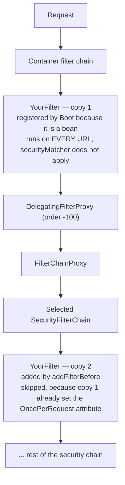
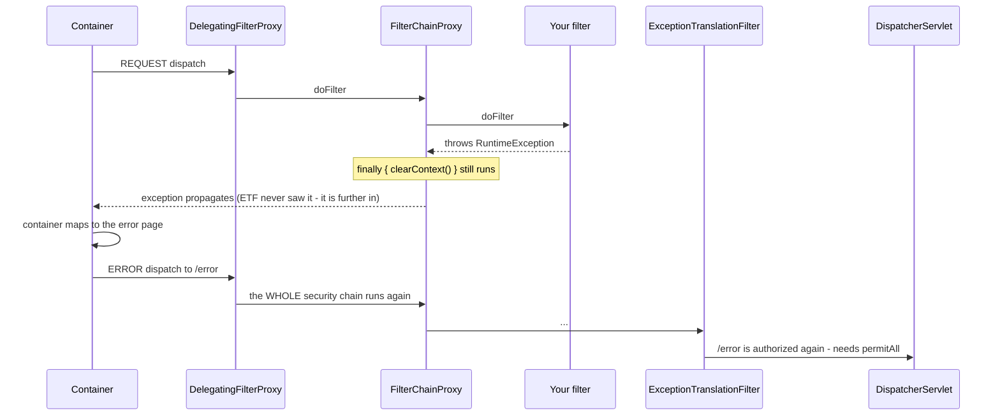

# 8.2 — Writing and Ordering Custom Filters

> **Module 8 · Topic 2** · Filters Deep Dive
> Baseline: Spring Security 6.x on Boot 3.x
> New to this? Read **In Plain English** below first, then come back to the Version Matrix.

---

## Version Matrix

| Concern | Spring Security 5.x | **Spring Security 6.x (baseline)** | Spring Security 7.x |
|---|---|---|---|
| Saving the `SecurityContext` | implicit — `SecurityContextPersistenceFilter` saved on the way out | **explicit — you call `SecurityContextRepository.saveContext(...)`** | explicit |
| Accessing the holder | `SecurityContextHolder` static methods | **inject `SecurityContextHolderStrategy`** (5.8+) | inject the strategy |
| Session fixation protection in a custom mechanism | applied for you by `SessionManagementFilter` | **your filter must invoke `SessionAuthenticationStrategy`** | same |
| Default `SecurityContextRepository` | `HttpSessionSecurityContextRepository` | **`DelegatingSecurityContextRepository`** (request attribute + session) | same |
| Per-request stateless storage | `RequestAttributeSecurityContextRepository` (5.7+) | **the normal choice for token filters** | same |
| Generic mechanism base class | `AuthenticationFilter` (5.2+) | **`AuthenticationFilter` + `AuthenticationConverter`** | same |
| Servlet namespace | `javax.servlet.*` | **`jakarta.servlet.*`** | `jakarta.servlet.*` |
| `addFilterAt` semantics | inserts at the same order, does not replace | **unchanged** | unchanged |
| Disabling a configurer | `http.formLogin().disable()` | **`http.formLogin(AbstractHttpConfigurer::disable)`** | lambda only |

---

## Why This Exists

Two mistakes dominate custom filter code, and they are opposite mistakes.

The first is writing a filter that should not exist. Spring Security has extension points for
almost every variation people reach for: a different credential format is an
`AuthenticationConverter`, a different user store is a `UserDetailsService`, a different
verification rule is an `AuthenticationProvider`, a different response is a handler. A filter is
the right answer only when the concern is genuinely transport-level and no existing mechanism owns
it.

The second is writing a filter that *should* exist but building it on the wrong base class. A
hand-rolled `OncePerRequestFilter` that performs login re-implements — badly, or not at all —
session fixation protection, context persistence, remember-me integration, event publishing, and
the success and failure handler contract. Every one of those is inherited free by extending
`AbstractAuthenticationProcessingFilter`.

This file assumes the call-stack model, `OncePerRequestFilter`, dispatcher types, and the JWT
placement window from [`04_M1_T4_Servlet_Basics.md`](04_M1_T4_Servlet_Basics.md), and the ordering
mechanism from [`26_M8_T1_Default_Filters.md`](26_M8_T1_Default_Filters.md). It goes deeper on
base-class choice, on the exact semantics of the three insertion methods, and on what a filter can
and cannot do with exceptions.

---

## In Plain English

**The one-line version:** Sometimes Spring Security does not have a checkpoint for the thing you
need, so you write your own small piece of code and tell the framework exactly where in the queue
of existing checkpoints it should stand.

**An analogy.** Imagine you run a building with a well-established reception process: a desk that
checks appointments, a badge scanner, a bag check. A new requirement arrives — visitors from one
particular partner now arrive with a signed letter instead of an appointment. You have two ways to
handle this. You can teach the existing desk to also accept signed letters, which is a small change
to something already working. Or you can install a brand new desk of your own in the lobby.

The first option is almost always better, and the first section below is a table that tells you
which existing desk to teach. The second option is what this file is really about, and the
important part is not writing the desk — it is placing it. Put your new desk after the badge
scanner and visitors get scanned before anyone has established who they are. Put it in the wrong
lobby entirely and it never sees a visitor. Install it twice, once by the front door and once in
the corridor, and the corridor copy quietly does nothing because the front-door copy already
stamped everyone's form. All three of those mistakes are extremely common, and all three are
described in detail below.

**How it actually works, step by step.**

A filter in Spring terms is a Java class with one method that receives the request, the response,
and a handle on "the rest of the queue" called the `FilterChain`. Your method can inspect the
request, and then it either calls `chain.doFilter(request, response)` to pass the request onward,
or it does not — and not calling it is how a filter stops a request dead. Forgetting to call it on
the success path produces an empty response for every request; forgetting to *not* call it after
rejecting produces the classic "my filter rejected the request and the controller ran anyway".

You rarely implement the bare interface. Instead you extend one of several base classes, and this
is the single most consequential choice in the file. `OncePerRequestFilter` is the general-purpose
base for concerns that are about the shape of the request rather than about identity: attaching a
correlation identifier for logging, working out which tenant a request belongs to. It guarantees
your code runs once per request even when the servlet container internally re-runs the request,
which it does for error pages and asynchronous work.

If what you are building is authentication — deciding who the caller is — you should extend
`AbstractAuthenticationProcessingFilter` for a login endpoint, or `AuthenticationFilter` for a
credential that arrives on every request. These base classes look like more machinery, but they
are actually less code, because they already do five things you would otherwise have to remember:
they change the session identifier at login (which defends against an attack called session
fixation, where an attacker pre-plants a session identifier and inherits your logged-in session),
they store the identity where the next request can find it, they issue the remember-me cookie,
they publish success and failure events that audit logs and account-lockout logic listen for, and
they route both outcomes through configurable handlers. In Spring Security 6 nothing else applies
session fixation protection for you, so a hand-written login filter loses it with no error and no
log line.

Once you have written the filter you register it, and you do so by naming a neighbour rather than
a number: `http.addFilterBefore(myFilter, UsernamePasswordAuthenticationFilter.class)` means "put
mine immediately in front of the built-in form-login filter". That particular placement is the one
you will see everywhere, because it lands inside the window where your filter is early enough for
the authorization rules to see the identity it established. There is a third method,
`addFilterAt`, that is widely believed to replace the named filter. It does not replace anything —
it puts yours at the same position and leaves the original there too, which is explained in
section 3.

Two runtime details cause most of the remaining surprises. First, in Spring Security 6 writing the
identity onto the per-request clipboard (`SecurityContextHolder`) no longer saves it anywhere, so
if you do not explicitly call `SecurityContextRepository.saveContext(...)` the user is
authenticated for exactly one request and anonymous on the next — which users report as random
logouts. Second, the filter that converts security failures into tidy HTTP responses sits near the
*end* of the chain, so a typical custom filter added near the front is outside its reach. Throwing
an exception from there does not produce a neat 401; it escapes to the servlet container and
becomes a generic 500. Section 7 covers what to do instead.

**Why should a beginner care?** A custom filter is the easiest place in a Spring application to
write code that looks correct, passes every test you think to write, and is quietly insecure. The
two signature failures are a login filter that has no session fixation protection, and a filter
that returns 401 whenever no credential is present — the second of which breaks every public page,
health check, and login endpoint in the application, for a reason that is invisible to anyone
reading the security configuration. Knowing which base class to extend and which extension point
to prefer removes both problems before you write a line.

**Words you will meet in this file**

| Term | In plain words |
|---|---|
| `Filter` | A class that sees a web request before your controller and can pass it on, alter it, or stop it. |
| `FilterChain` | The handle representing "everything after me". Calling `doFilter` on it lets the request continue. |
| `OncePerRequestFilter` | A base class that guarantees your code runs once per request, not once per internal re-run. Use it for non-authentication concerns. |
| `GenericFilterBean` | A simpler base class with Spring's bean lifecycle but no once-per-request guard. Rarely the right choice. |
| `AbstractAuthenticationProcessingFilter` | The base class for a login endpoint. It brings session fixation protection, context saving, events and handlers with it. |
| `AuthenticationFilter` | The base class for a credential that arrives on every request, such as a token in a header. |
| `AuthenticationConverter` | A small object that turns a raw request into an unverified identity claim. Usually all you need instead of a whole new filter. |
| `AuthenticationManager` | The component that actually verifies a credential. Your filter hands the claim to it rather than checking passwords itself. |
| `AuthenticationProvider` | One verification strategy behind the manager, for example "check this password against the database". |
| `SecurityContextRepository` | Where the established identity is stored so it can be found again: the session, or just this request. |
| Explicit save | The Spring Security 6 rule that setting the identity on the clipboard does not store it; you must call `saveContext` yourself. |
| `SessionAuthenticationStrategy` | The step that changes the session identifier at login. Skipping it removes session fixation protection. |
| Session fixation | An attack where somebody pre-plants a session identifier on your browser and then inherits your session once you log in. |
| `AuthenticationEntryPoint` | The application's single definition of what an unauthenticated caller sees: a login redirect, or a 401 with a header. |
| `addFilterBefore` / `addFilterAfter` / `addFilterAt` | The three ways to register your filter, by naming a neighbouring filter. The third does not replace the neighbour. |
| `FilterRegistrationBean` | Spring Boot's wrapper for registering a filter with the servlet container. Setting it disabled is how you stop a filter being installed twice. |
| Dispatch | One pass of the request through the servlet machinery. A single request can have several: the normal one, an error one, an asynchronous one. |
| `MockFilterChain` | A test double that records whether your filter called `doFilter`, which is how you prove a rejection actually stopped the request. |

**If you remember only one thing:** prefer the narrow extension point over a new filter, and if you
genuinely need a filter for authentication, extend `AbstractAuthenticationProcessingFilter` so that
session fixation protection and context saving come for free.

---

## Core Concepts

### 1. First, Decide Whether You Need a Filter

**In simple terms:** Most of the time the framework already has a small, purpose-built place to
plug in your change, and using it is far less code and far less risk than writing a filter.

| What you actually want to change | The right extension point | Filter needed? |
|---|---|---|
| Credentials arrive in a different format (JSON body, custom header, signature) | `AuthenticationConverter` on `AuthenticationFilter` | No |
| Credentials are verified against a different system | `AuthenticationProvider` | No |
| Users are loaded from somewhere else | `UserDetailsService` / `AuthenticationUserDetailsService` | No |
| The response after login success or failure | `AuthenticationSuccessHandler` / `AuthenticationFailureHandler` | No |
| The response to an unauthenticated or denied request | `AuthenticationEntryPoint` / `AccessDeniedHandler` | No |
| Authorities derived differently from a JWT | `JwtAuthenticationConverter` | No |
| Per-method or per-argument rules | `@PreAuthorize` and an `AuthorizationManager` | No |
| A whole new login endpoint with its own protocol | `AbstractAuthenticationProcessingFilter` | **Yes** |
| A credential presented on every request in a new format | `AuthenticationFilter` with a converter | **Yes**, but a supplied one |
| A cross-cutting transport concern (correlation identifiers, tenant resolution, request limits) | `OncePerRequestFilter` | **Yes** |

The test I apply: *is the concern about how the request is shaped, or about who the caller is and
what they may do?* The first is a filter. The second almost always has a narrower extension point.

### 2. Choosing a Base Class

**In simple terms:** Which class you extend decides how much correct security behaviour you get
for free, and picking the wrong one means silently re-implementing it badly or not at all.

| Base class | Gives you | Costs you | Use when |
|---|---|---|---|
| `jakarta.servlet.Filter` | Nothing beyond the contract | No dependency injection lifecycle, no dispatch guard, runs on every dispatch | Practically never in a Spring application |
| `GenericFilterBean` | Spring bean lifecycle, `initFilterBean()`, `Environment` and `ServletContext` awareness, a `logger` | Still runs once per **dispatch** | A framework-level filter that must see every dispatch |
| `OncePerRequestFilter` | All of the above plus a per-request guard, `shouldNotFilter`, `shouldNotFilterAsyncDispatch`, `shouldNotFilterErrorDispatch` | Nothing security-specific | Cross-cutting concerns that are **not** authentication |
| `AuthenticationFilter` | Converter-driven authentication, `AuthenticationManagerResolver`, success and failure handlers, `SecurityContextRepository` saving, entry-point-based failure | Slightly less familiar to most teams | A credential presented on **every** request in a custom format |
| `AbstractAuthenticationProcessingFilter` | Matcher-based activation, `AuthenticationManager` invocation, `SessionAuthenticationStrategy`, `SecurityContextRepository` saving, `RememberMeServices`, event publishing, success and failure handlers, context clearing on failure | Designed around a single login endpoint | A **login endpoint** with its own protocol |

**The rule that matters: if you are building an authentication mechanism, extend
`AbstractAuthenticationProcessingFilter`, not `OncePerRequestFilter`.**

Here is what the base class actually does, and therefore what you are choosing not to write:

```java
// AbstractAuthenticationProcessingFilter.doFilter (simplified, 6.x)
private void doFilter(HttpServletRequest request, HttpServletResponse response, FilterChain chain)
        throws IOException, ServletException {

    if (!requiresAuthentication(request, response)) {   // RequestMatcher, e.g. POST /login
        chain.doFilter(request, response);
        return;
    }
    try {
        Authentication authenticationResult = attemptAuthentication(request, response);
        if (authenticationResult == null) {
            return;                                     // subclass signalled "I am handling it"
        }
        this.sessionStrategy.onAuthentication(authenticationResult, request, response);
        if (this.continueChainBeforeSuccessfulAuthentication) {
            chain.doFilter(request, response);
        }
        successfulAuthentication(request, response, chain, authenticationResult);
    }
    catch (InternalAuthenticationServiceException failed) {
        this.logger.error("An internal error occurred while trying to authenticate the user.", failed);
        unsuccessfulAuthentication(request, response, failed);
    }
    catch (AuthenticationException ex) {
        unsuccessfulAuthentication(request, response, ex);
    }
}

protected void successfulAuthentication(HttpServletRequest request, HttpServletResponse response,
        FilterChain chain, Authentication authResult) throws IOException, ServletException {

    SecurityContext context = this.securityContextHolderStrategy.createEmptyContext();
    context.setAuthentication(authResult);
    this.securityContextHolderStrategy.setContext(context);
    this.securityContextRepository.saveContext(context, request, response);   // 6.x explicit save
    this.rememberMeServices.loginSuccess(request, response, authResult);
    if (this.eventPublisher != null) {
        this.eventPublisher.publishEvent(
            new InteractiveAuthenticationSuccessEvent(authResult, this.getClass()));
    }
    this.successHandler.onAuthenticationSuccess(request, response, authResult);
}

protected void unsuccessfulAuthentication(HttpServletRequest request, HttpServletResponse response,
        AuthenticationException failed) throws IOException, ServletException {

    this.securityContextHolderStrategy.clearContext();
    this.rememberMeServices.loginFail(request, response);
    this.failureHandler.onAuthenticationFailure(request, response, failed);
}
```

Read that list of inherited behaviour again, because each line is a defect you would otherwise ship:

- **`this.sessionStrategy.onAuthentication(...)`** — session fixation protection. In 6.x
  `SessionManagementFilter` is no longer in the chain, so if your filter does not call this,
  **nothing does**. An attacker who can fix a session identifier before login keeps it after login.
  There is no warning and no log line.
- **`securityContextRepository.saveContext(...)`** — without it the user is authenticated for
  exactly one request.
- **`rememberMeServices.loginSuccess(...)`** — the remember-me cookie is never issued.
- **`InteractiveAuthenticationSuccessEvent`** — your audit listeners, login counters and
  brute-force lockout never fire. Likewise the failure events on the other side.
- **`clearContext()` on failure** — a partially-populated context can otherwise leak into the rest
  of the request.
- **`successHandler` / `failureHandler`** — the configured response shape, the saved-request
  redirect, and the target URL logic all live here.

The one refinement: `AbstractAuthenticationProcessingFilter` models *a login endpoint* — it matches
a specific request and, by default, stops the chain on success. For a credential presented on
**every** request, such as a bearer token or a signed header, the right base is
`AuthenticationFilter`, which is built for that shape and also handles context saving and
entry-point-based failure. Reach for `OncePerRequestFilter` in an authentication context only when
you are doing something genuinely outside both models.

### 3. `addFilterBefore`, `addFilterAfter`, `addFilterAt`

**In simple terms:** These are the three ways to tell Spring where your filter stands, and the
third one is routinely misunderstood as "replace this filter" when it really means "stand in the
same spot alongside it".

All three call the same private method:

```java
private HttpSecurity addFilterAtOffsetOf(Filter filter, int offset,
                                         Class<? extends Filter> registeredFilter) {
    int order = this.filterOrders.getOrder(registeredFilter) + offset;   // -1, +1, or 0
    this.filters.add(new OrderedFilter(filter, order));
    this.filterOrders.put(filter.getClass(), order);
    return this;
}
```

| Method | Offset | Result |
|---|---|---|
| `addFilterBefore(f, X.class)` | `-1` | `f` sorts strictly before `X`; unambiguous |
| `addFilterAfter(f, X.class)` | `+1` | `f` sorts strictly after `X`; unambiguous |
| `addFilterAt(f, X.class)` | `0` | `f` sorts at **the same** order as `X`; relative order is a stable-sort accident |
| `addFilter(f)` | — | Uses `f`'s own registered order; throws `IllegalArgumentException` if the class (or a superclass) is not in the registry |

**The misconception about `addFilterAt`.** It is widely described as "replace the filter at that
position". It does not replace anything. `X` stays in the chain if a configurer added it, and now
two filters share an order value. `HttpSecurity.performBuild()` sorts with a **stable** sort, so
their relative order is the order in which they were added to the internal list — which is
determined by when configurers happened to run, not by anything in your configuration. You have
created a non-deterministic-looking ordering that will "work on my machine" and change the day
someone reorders two DSL calls.

To genuinely replace a built-in mechanism, disable the configurer that creates it and then insert
yours:

```java
http
    .formLogin(AbstractHttpConfigurer::disable)                       // stop UPAF being added
    .addFilterBefore(jsonLoginFilter, UsernamePasswordAuthenticationFilter.class);
```

`UsernamePasswordAuthenticationFilter.class` remains a valid *position reference* even though no
instance is in the chain, because the position comes from `FilterOrderRegistration`, not from the
list.

To order two of your own filters relative to each other, chain the anchors — each call registers
the computed order, so the second can refer to the first:

```java
http.addFilterBefore(correlationIdFilter, SecurityContextHolderFilter.class)
    .addFilterAfter(tenantResolvingFilter, CorrelationIdFilter.class);
```

### 4. The Double-Registration Trap

**In simple terms:** If you make your filter a Spring bean and also add it to the security chain,
Spring Boot installs it twice, and the copy that actually runs is the one outside the security
chain where none of your URL restrictions apply.

Spring Boot adapts **every** `Filter` bean in the application context into a servlet registration
through `ServletContextInitializerBeans`. If your filter is a `@Component` or a `@Bean` *and* you
add it with `addFilterBefore`, it exists twice:



The damage is worse than "it runs twice". Because `OncePerRequestFilter` guards with a request
attribute, the *container* copy runs first and sets the attribute, so the copy inside the security
chain is **skipped**. Your filter has effectively escaped its `securityMatcher` and now executes
for every URL in the application, outside the security chain, where the `SecurityContext` lifecycle
is not yet established.

Two fixes:

```java
// Fix A - keep the bean (for @Value, @Autowired, @ConfigurationProperties) but
// tell Boot not to register it with the container.
@Bean
FilterRegistrationBean<TenantResolvingFilter> disableContainerRegistration(TenantResolvingFilter filter) {
    FilterRegistrationBean<TenantResolvingFilter> registration = new FilterRegistrationBean<>(filter);
    registration.setEnabled(false);
    return registration;
}
```

```java
// Fix B - preferred. Do not make it a bean at all; construct it where it is registered.
@Bean
SecurityFilterChain chain(HttpSecurity http, TenantService tenants) throws Exception {
    http.addFilterAfter(new TenantResolvingFilter(tenants), SecurityContextHolderFilter.class);
    return http.build();
}
```

Fix B makes the single registration self-evident to the next reader. Use Fix A when the filter
genuinely needs bean semantics such as `@ConfigurationProperties` injection or AOP.

### 5. Do Not Reject When No Credential Is Present

**In simple terms:** Your filter's job is to check a credential if one was offered, not to insist
that one was offered, because otherwise every deliberately public page in the application starts
returning "not authenticated".

A filter's responsibility is narrow: **if a credential is presented, authenticate it.** Whether
authentication is *required* is a separate decision owned by `AuthorizationFilter` and your
`authorizeHttpRequests` rules.

| Credential state | Correct behaviour | Why |
|---|---|---|
| Absent | `chain.doFilter(...)` and return | `AnonymousAuthenticationFilter` will install an anonymous identity and the authorization rules decide. Rejecting here breaks every `permitAll()` endpoint — health checks, the login page, public documentation |
| Present and valid | Build the `Authentication`, set the context, save it, continue the chain | The normal path |
| Present and invalid (bad signature, expired, malformed) | Reject with 401 | The caller clearly intended to authenticate and failed. Silently downgrading to anonymous turns an expired token into a confusing 403 later, and hides client bugs |

The rejection-on-missing-credential mistake is particularly damaging because the rejection happens
somewhere your configuration cannot see it. Someone reading `authorizeHttpRequests` will find
`/actuator/health` permitted and have no idea why it returns 401.

There is one honest counter-argument to rejecting on an invalid credential: on a `permitAll()`
endpoint, a stale token from a background browser tab would now break a public page. If that
matters for your traffic shape, the compromise is to reject only on *malformed* credentials and
treat expired-but-well-formed ones as absent — but document it, because it makes token expiry
silent.

### 6. Setting the `SecurityContext` Correctly in 6.x

**In simple terms:** Recording who the caller is takes four steps rather than one, and the step
everybody forgets is the one that makes the identity survive into the next request.

```java
// The full, correct sequence.
SecurityContext context = this.securityContextHolderStrategy.createEmptyContext();
context.setAuthentication(authentication);
this.securityContextHolderStrategy.setContext(context);
this.securityContextRepository.saveContext(context, request, response);
```

Four points, each of which is a common defect on its own:

**Use the strategy, not the static holder.** `SecurityContextHolder.getContextHolderStrategy()`
returns the configured `SecurityContextHolderStrategy`; holding it in a field makes the filter
testable and correct under a non-default strategy. Calling
`SecurityContextHolder.getContext().setAuthentication(...)` mutates a shared context object and is
discouraged for exactly that reason — always create an empty context and set it.

**Save it, or accept one-request authentication.** This is the 6.x explicit-save contract from
[`26_M8_T1_Default_Filters.md`](26_M8_T1_Default_Filters.md).

**Pick the repository deliberately:**

| Repository | Lifetime | Touches the session | Use for |
|---|---|---|---|
| `RequestAttributeSecurityContextRepository` | the current request, across `ASYNC` and `ERROR` dispatches | No | **Stateless** token filters |
| `HttpSessionSecurityContextRepository` | subsequent requests | Yes | **Stateful** login mechanisms |
| `DelegatingSecurityContextRepository` | both | Yes | The 6.x default; a login mechanism that also needs async-safe access within the request |
| `NullSecurityContextRepository` | nothing | No | Deliberately discarding the context |

The request-attribute repository matters more than it looks. When servlet async processing resumes,
the chain runs again as an `ASYNC` dispatch; `SecurityContextHolderFilter` reloads from the
repository, and the request attribute is what makes the authentication survive. Save nowhere, and
async work on a token-authenticated request sees an anonymous identity.

**Do not clear the context in your own `finally`.** `FilterChainProxy` already clears it in its
own `finally` and sits outside every security filter on the stack. Adding your own clear, in the
wrong place relative to `chain.doFilter(...)`, wipes the authentication before
`AuthorizationFilter` reads it.

Finally, populate the details so that downstream code and audit logs see the remote address and
session identifier:

```java
authentication.setDetails(new WebAuthenticationDetailsSource().buildDetails(request));
```

### 7. Throwing an `AuthenticationException` Versus Writing the Response

**In simple terms:** The framework's tidy handler for security failures sits near the end of the
chain, so throwing an exception from a filter near the front produces an ugly 500 instead, and you
have to hand the failure to the right component yourself.

This is the subtlest point in the topic, and most articles get it wrong.

`ExceptionTranslationFilter` catches `AuthenticationException` and `AccessDeniedException` thrown
**inside** its `chain.doFilter(...)` call — that is, by filters that appear *after* it in the
ordered list. In `FilterOrderRegistration`, `ExceptionTranslationFilter` sits near the very end,
just before `AuthorizationFilter`. Almost every custom authentication filter is added with
`addFilterBefore(f, UsernamePasswordAuthenticationFilter.class)`, which is far earlier.

> Therefore: **an exception thrown from a typical custom authentication filter is *not* caught by
> `ExceptionTranslationFilter`.** Your filter is outside it on the call stack, so the exception
> propagates past `FilterChainProxy` to the container, which produces a generic 500 and an `ERROR`
> dispatch to `/error`.

Three ways to handle failure properly, in order of preference:

**a. Invoke the configured `AuthenticationEntryPoint` yourself.** This is what
`BasicAuthenticationFilter` does, and it gives one consistent response format across the whole
application:

```java
catch (AuthenticationException ex) {
    this.securityContextHolderStrategy.clearContext();
    this.authenticationEntryPoint.commence(request, response, ex);   // do NOT continue the chain
}
```

**b. Extend `AuthenticationFilter` or `AbstractAuthenticationProcessingFilter` and configure a
failure handler.** `AuthenticationFilter`'s default is `AuthenticationEntryPointFailureHandler`,
which does exactly (a) for you.

**c. Place the filter after `ExceptionTranslationFilter`.** Legal, and occasionally the cleanest
answer for a filter whose only job is to translate, but unusual enough that it needs a comment
explaining why — and it means your authentication runs after almost everything else.

Writing the response body directly from the filter is the option to avoid. It duplicates the error
contract, drifts from whatever the entry point produces, and means two places to change when the
error format changes. If you write directly, at minimum set the status, the content type, and
**return without calling `chain.doFilter(...)`** — forgetting that last part is the classic cause
of "my filter rejects the request and the controller runs anyway".

### 8. Filters and Async Dispatch

**In simple terms:** When a controller does work on a background thread, the servlet container
runs the request through the chain a second time, and your filter is skipped on that second pass —
so the identity only survives if you stored it properly the first time.

```java
// OncePerRequestFilter (Spring Framework) - the dispatch gate
private boolean skipDispatch(HttpServletRequest request) {
    if (isAsyncDispatch(request) && shouldNotFilterAsyncDispatch()) {
        return true;
    }
    if (request.getAttribute(WebUtils.ERROR_REQUEST_URI_ATTRIBUTE) != null
            && shouldNotFilterErrorDispatch()) {
        return true;
    }
    return false;
}

protected boolean shouldNotFilterAsyncDispatch() { return true; }   // default: SKIP async
protected boolean shouldNotFilterErrorDispatch() { return true; }   // default: SKIP error
```

Both defaults are `true`, meaning an `OncePerRequestFilter` does **not** run on `ASYNC` or `ERROR`
dispatches unless you override them. For an authentication filter that is the correct default: you
do not want to re-verify a token on every dispatch. It only works because the context was saved to
a `SecurityContextRepository` and `SecurityContextHolderFilter` reloads it on the new dispatch.

Two consequences:

- A token filter that sets the holder but **never saves** appears to work for synchronous requests
  and mysteriously loses the authentication for any controller returning `DeferredResult`,
  `Callable` or `CompletableFuture`.
- If your filter must genuinely participate in the async dispatch — for example a correlation
  identifier that has to be on the MDC of the async thread — override
  `shouldNotFilterAsyncDispatch()` to return `false`, and make the filter idempotent.

`WebAsyncManagerIntegrationFilter` covers `Callable` and `WebAsyncTask` return values only. Work
you hand to your own executor needs `DelegatingSecurityContextExecutor`.

### 9. Filters and Exception Handling

**In simple terms:** Your usual error-handling class cannot see an exception thrown from a filter,
because filters run outside the Spring MVC machinery entirely, and the error page the container
falls back to is itself sent through the security chain again.

A filter-layer exception is **not** catchable by `@ControllerAdvice`. `@ControllerAdvice` is Spring
MVC machinery invoked by `DispatcherServlet`'s `HandlerExceptionResolver` chain; a filter that
throws before the dispatch, or after it has returned, is outside that machinery entirely.

Where the exception actually goes:



Three things to take from this:

1. `FilterChainProxy` still clears the `SecurityContext` in its `finally`, so an exception cannot
   leak an identity onto a pooled thread.
2. The `ERROR` dispatch re-runs the entire security chain, and in 6.x `AuthorizationFilter` runs on
   `ERROR` dispatches. If `/error` is not `permitAll()`, your 500 becomes a confusing blank 403.
3. `ExceptionTranslationFilter` refuses to act if the response is already committed — it throws
   `ServletException("Unable to handle the Spring Security Exception because the response is
   already committed.")`. A filter that wrote part of a response and then failed produces that
   message, which is a strong hint about where to look.

### 10. Performance

**In simple terms:** Anything your filter does, it does on every single request, so a database
call or a body read that looks harmless in isolation becomes the slowest part of the application.

A security filter runs on every request in its chain, so its cost is multiplied by your entire
traffic volume.

- **`shouldNotFilter(request)` is the cheapest optimisation available.** A path prefix check costs
  nanoseconds and skips everything. Prefer it to an early `return` inside `doFilterInternal`,
  because it also documents the filter's scope.
- **Do not read the request body.** `getInputStream()` is single-consumption; reading it leaves the
  controller with nothing. If you genuinely must (a signed webhook payload),
  `ContentCachingRequestWrapper` buffers it — with a hard size cap, because an unbounded buffer on
  a large upload is an outage.
- **Do not make a database call per request.** A token filter that loads the user on every request
  turns your database into the bottleneck for every endpoint. Either make the credential
  self-contained (a signed token carrying the authorities) or cache the lookup with a short
  time-to-live, and be explicit about how long a revocation takes to take effect.
- **Do not resolve the authentication eagerly.** Calling
  `SecurityContextHolder.getContext().getAuthentication()` early — a logging filter is the usual
  culprit — forces the deferred `SecurityContext` to be loaded, which defeats the 6.x optimisation
  of never reading the session on `permitAll()` paths.
- **Hoist everything constant.** Compile `Pattern`s, build `RequestMatcher`s, and construct
  `ObjectMapper`s once in the constructor, never per request.
- **Do not log the request or response body by default.** It is the fastest way to put passwords
  and personal data into a log aggregator.

---

## Working Code

A JSON login mechanism — the most common legitimate reason to write an authentication filter,
because `UsernamePasswordAuthenticationFilter` reads form parameters and a single-page application
sends JSON.

```java
package com.example.security.login;

import com.fasterxml.jackson.databind.ObjectMapper;
import jakarta.servlet.http.HttpServletRequest;
import jakarta.servlet.http.HttpServletResponse;
import org.springframework.http.MediaType;
import org.springframework.security.authentication.AuthenticationManager;
import org.springframework.security.authentication.AuthenticationServiceException;
import org.springframework.security.authentication.UsernamePasswordAuthenticationToken;
import org.springframework.security.core.Authentication;
import org.springframework.security.core.AuthenticationException;
import org.springframework.security.web.authentication.AbstractAuthenticationProcessingFilter;
import org.springframework.security.web.authentication.WebAuthenticationDetailsSource;
import org.springframework.security.web.util.matcher.AntPathRequestMatcher;

import java.io.IOException;

/**
 * Accepts {"username":"...","password":"..."} on POST /api/login.
 *
 * Everything except body parsing is inherited: RequestMatcher activation,
 * AuthenticationManager invocation, SessionAuthenticationStrategy (session fixation
 * protection), SecurityContextRepository saving, RememberMeServices, event publishing,
 * and the success/failure handlers.
 */
public class JsonUsernamePasswordAuthenticationFilter extends AbstractAuthenticationProcessingFilter {

    private static final AntPathRequestMatcher MATCHER =
            new AntPathRequestMatcher("/api/login", "POST");

    private final ObjectMapper objectMapper;

    public JsonUsernamePasswordAuthenticationFilter(AuthenticationManager authenticationManager,
                                                    ObjectMapper objectMapper) {
        super(MATCHER, authenticationManager);
        this.objectMapper = objectMapper;   // constructed once, never per request
    }

    public record LoginRequest(String username, String password) {}

    @Override
    public Authentication attemptAuthentication(HttpServletRequest request, HttpServletResponse response)
            throws AuthenticationException, IOException {

        if (!MediaType.APPLICATION_JSON_VALUE.equalsIgnoreCase(request.getContentType())) {
            // AuthenticationServiceException is an AuthenticationException, so the
            // inherited failure handling deals with it consistently.
            throw new AuthenticationServiceException(
                    "Content-Type must be application/json");
        }

        LoginRequest body = this.objectMapper.readValue(request.getInputStream(), LoginRequest.class);
        if (body == null || body.username() == null || body.password() == null) {
            throw new AuthenticationServiceException("username and password are required");
        }

        UsernamePasswordAuthenticationToken authRequest =
                UsernamePasswordAuthenticationToken.unauthenticated(
                        body.username().trim(), body.password());
        authRequest.setDetails(new WebAuthenticationDetailsSource().buildDetails(request));

        // Delegate to the AuthenticationManager. Do NOT verify the password here.
        return getAuthenticationManager().authenticate(authRequest);
    }
}
```

Handlers that produce a JSON contract instead of redirects:

```java
package com.example.security.login;

import jakarta.servlet.http.HttpServletRequest;
import jakarta.servlet.http.HttpServletResponse;
import org.springframework.http.HttpStatus;
import org.springframework.http.MediaType;
import org.springframework.security.core.Authentication;
import org.springframework.security.core.AuthenticationException;
import org.springframework.security.web.authentication.AuthenticationFailureHandler;
import org.springframework.security.web.authentication.AuthenticationSuccessHandler;

import java.io.IOException;

public final class JsonLoginHandlers {

    private JsonLoginHandlers() {}

    public static AuthenticationSuccessHandler success() {
        return (HttpServletRequest request, HttpServletResponse response, Authentication authentication) -> {
            response.setStatus(HttpStatus.OK.value());
            response.setContentType(MediaType.APPLICATION_JSON_VALUE);
            response.getWriter().write("""
                    {"authenticated":true,"username":"%s"}"""
                    .formatted(authentication.getName()));
        };
    }

    public static AuthenticationFailureHandler failure() {
        return (HttpServletRequest request, HttpServletResponse response, AuthenticationException ex) -> {
            // RFC 7807. Note the deliberately generic detail: never reveal whether the
            // username exists. See 28_M9_T1_Security_Exception_Handling.md.
            response.setStatus(HttpStatus.UNAUTHORIZED.value());
            response.setContentType("application/problem+json");
            response.getWriter().write("""
                    {"type":"about:blank","title":"Unauthorized","status":401,\
                    "detail":"Invalid username or password"}""");
        };
    }
}
```

A per-request filter done correctly, using `OncePerRequestFilter` only because the concern is
transport-level, and delegating failure to the configured entry point:

```java
package com.example.security.webhook;

import jakarta.servlet.FilterChain;
import jakarta.servlet.ServletException;
import jakarta.servlet.http.HttpServletRequest;
import jakarta.servlet.http.HttpServletResponse;
import org.springframework.security.authentication.BadCredentialsException;
import org.springframework.security.core.Authentication;
import org.springframework.security.core.AuthenticationException;
import org.springframework.security.core.context.SecurityContext;
import org.springframework.security.core.context.SecurityContextHolder;
import org.springframework.security.core.context.SecurityContextHolderStrategy;
import org.springframework.security.web.AuthenticationEntryPoint;
import org.springframework.security.web.authentication.WebAuthenticationDetailsSource;
import org.springframework.security.web.context.RequestAttributeSecurityContextRepository;
import org.springframework.security.web.context.SecurityContextRepository;
import org.springframework.web.filter.OncePerRequestFilter;

import java.io.IOException;

public class SignedWebhookAuthenticationFilter extends OncePerRequestFilter {

    private static final String SIGNATURE_HEADER = "X-Signature";

    private final WebhookSignatureVerifier verifier;
    private final AuthenticationEntryPoint authenticationEntryPoint;

    private final SecurityContextHolderStrategy contextHolderStrategy =
            SecurityContextHolder.getContextHolderStrategy();

    // Stateless: this request only, no session, but visible across ASYNC/ERROR dispatches.
    private final SecurityContextRepository contextRepository =
            new RequestAttributeSecurityContextRepository();

    public SignedWebhookAuthenticationFilter(WebhookSignatureVerifier verifier,
                                             AuthenticationEntryPoint authenticationEntryPoint) {
        this.verifier = verifier;
        this.authenticationEntryPoint = authenticationEntryPoint;
    }

    /** Cheap opt-out: never pay the cost outside the webhook namespace. */
    @Override
    protected boolean shouldNotFilter(HttpServletRequest request) {
        return !request.getRequestURI().startsWith("/webhooks/");
    }

    @Override
    protected void doFilterInternal(HttpServletRequest request, HttpServletResponse response,
                                    FilterChain chain) throws ServletException, IOException {

        String signature = request.getHeader(SIGNATURE_HEADER);

        // No credential presented: continue. AuthorizationFilter decides whether that is allowed.
        if (signature == null || signature.isBlank()) {
            chain.doFilter(request, response);
            return;
        }

        try {
            // verifier uses MessageDigest.isEqual for constant-time comparison and
            // enforces a timestamp window to prevent replay.
            Authentication authentication = this.verifier.verify(request, signature);
            if (authentication == null) {
                throw new BadCredentialsException("Invalid webhook signature");
            }
            if (authentication instanceof org.springframework.security.authentication
                    .AbstractAuthenticationToken token) {
                token.setDetails(new WebAuthenticationDetailsSource().buildDetails(request));
            }

            SecurityContext context = this.contextHolderStrategy.createEmptyContext();
            context.setAuthentication(authentication);
            this.contextHolderStrategy.setContext(context);
            this.contextRepository.saveContext(context, request, response);   // 6.x explicit save

            // No try/finally clearing here: FilterChainProxy clears in its own finally,
            // and it sits outside this filter on the call stack.
            chain.doFilter(request, response);
        }
        catch (AuthenticationException ex) {
            // This filter runs BEFORE ExceptionTranslationFilter, so throwing would escape
            // the chain entirely. Invoke the entry point directly for one consistent format.
            this.contextHolderStrategy.clearContext();
            this.authenticationEntryPoint.commence(request, response, ex);
            // Deliberately NOT calling chain.doFilter - that is what terminates the request.
        }
    }
}
```

Registration, with the double-registration trap closed:

```java
package com.example.security;

import com.example.security.login.JsonLoginHandlers;
import com.example.security.login.JsonUsernamePasswordAuthenticationFilter;
import com.example.security.webhook.SignedWebhookAuthenticationFilter;
import com.example.security.webhook.WebhookSignatureVerifier;
import com.fasterxml.jackson.databind.ObjectMapper;
import org.springframework.boot.web.servlet.FilterRegistrationBean;
import org.springframework.context.annotation.Bean;
import org.springframework.context.annotation.Configuration;
import org.springframework.http.HttpStatus;
import org.springframework.security.authentication.AuthenticationManager;
import org.springframework.security.config.annotation.authentication.configuration.AuthenticationConfiguration;
import org.springframework.security.config.annotation.web.builders.HttpSecurity;
import org.springframework.security.config.annotation.web.configuration.EnableWebSecurity;
import org.springframework.security.config.annotation.web.configurers.AbstractHttpConfigurer;
import org.springframework.security.web.AuthenticationEntryPoint;
import org.springframework.security.web.SecurityFilterChain;
import org.springframework.security.web.authentication.HttpStatusEntryPoint;
import org.springframework.security.web.authentication.UsernamePasswordAuthenticationFilter;
import org.springframework.security.web.context.HttpSessionSecurityContextRepository;
import org.springframework.security.web.context.SecurityContextRepository;

@Configuration
@EnableWebSecurity
public class CustomFilterConfig {

    @Bean
    AuthenticationManager authenticationManager(AuthenticationConfiguration configuration) throws Exception {
        return configuration.getAuthenticationManager();
    }

    @Bean
    AuthenticationEntryPoint apiEntryPoint() {
        return new HttpStatusEntryPoint(HttpStatus.UNAUTHORIZED);
    }

    @Bean
    SecurityFilterChain chain(HttpSecurity http,
                              AuthenticationManager authenticationManager,
                              ObjectMapper objectMapper,
                              WebhookSignatureVerifier verifier,
                              AuthenticationEntryPoint entryPoint) throws Exception {

        SecurityContextRepository sessionRepository = new HttpSessionSecurityContextRepository();

        JsonUsernamePasswordAuthenticationFilter loginFilter =
                new JsonUsernamePasswordAuthenticationFilter(authenticationManager, objectMapper);
        loginFilter.setAuthenticationSuccessHandler(JsonLoginHandlers.success());
        loginFilter.setAuthenticationFailureHandler(JsonLoginHandlers.failure());
        // Stateful login: persist to the session so the next request is authenticated.
        loginFilter.setSecurityContextRepository(sessionRepository);

        http
            // Disable the configurer so UsernamePasswordAuthenticationFilter is never added.
            // The class is still a valid POSITION reference - the order comes from the registry.
            .formLogin(AbstractHttpConfigurer::disable)
            .csrf(csrf -> csrf.ignoringRequestMatchers("/webhooks/**"))
            .authorizeHttpRequests(auth -> auth
                .requestMatchers("/api/login", "/error").permitAll()
                .requestMatchers("/webhooks/**").hasAuthority("SCOPE_webhook")
                .anyRequest().authenticated()
            )
            .exceptionHandling(ex -> ex.authenticationEntryPoint(entryPoint))
            .addFilterBefore(loginFilter, UsernamePasswordAuthenticationFilter.class)
            .addFilterBefore(new SignedWebhookAuthenticationFilter(verifier, entryPoint),
                             UsernamePasswordAuthenticationFilter.class);

        return http.build();
    }

    /**
     * Only needed if a filter is ALSO a bean. Boot's ServletContextInitializerBeans adapts
     * every Filter bean into a container registration; disabling it keeps the filter inside
     * the Spring Security chain where securityMatcher applies.
     */
    @Bean
    FilterRegistrationBean<SignedWebhookAuthenticationFilter> disableContainerRegistration(
            SignedWebhookAuthenticationFilter filter) {
        FilterRegistrationBean<SignedWebhookAuthenticationFilter> registration =
                new FilterRegistrationBean<>(filter);
        registration.setEnabled(false);
        return registration;
    }
}
```

Tests — in isolation first, because a filter is a plain object and does not need a context:

```java
package com.example.security.webhook;

import org.junit.jupiter.api.BeforeEach;
import org.junit.jupiter.api.Test;
import org.springframework.http.HttpStatus;
import org.springframework.mock.web.MockFilterChain;
import org.springframework.mock.web.MockHttpServletRequest;
import org.springframework.mock.web.MockHttpServletResponse;
import org.springframework.security.authentication.TestingAuthenticationToken;
import org.springframework.security.core.context.SecurityContextHolder;
import org.springframework.security.web.authentication.HttpStatusEntryPoint;

import static org.assertj.core.api.Assertions.assertThat;
import static org.mockito.ArgumentMatchers.any;
import static org.mockito.ArgumentMatchers.anyString;
import static org.mockito.Mockito.mock;
import static org.mockito.Mockito.when;

class SignedWebhookAuthenticationFilterTests {

    WebhookSignatureVerifier verifier;
    SignedWebhookAuthenticationFilter filter;

    @BeforeEach
    void setUp() {
        this.verifier = mock(WebhookSignatureVerifier.class);
        this.filter = new SignedWebhookAuthenticationFilter(
                this.verifier, new HttpStatusEntryPoint(HttpStatus.UNAUTHORIZED));
        SecurityContextHolder.clearContext();
    }

    @Test
    void missingSignatureContinuesTheChain() throws Exception {
        MockHttpServletRequest request = new MockHttpServletRequest("POST", "/webhooks/orders");
        MockHttpServletResponse response = new MockHttpServletResponse();
        MockFilterChain chain = new MockFilterChain();

        this.filter.doFilter(request, response, chain);

        // The chain continued, so AuthorizationFilter gets to decide. No 401 from us.
        assertThat(chain.getRequest()).isNotNull();
        assertThat(response.getStatus()).isEqualTo(200);
    }

    @Test
    void invalidSignatureIsRejectedAndTheChainStops() throws Exception {
        when(this.verifier.verify(any(), anyString())).thenReturn(null);

        MockHttpServletRequest request = new MockHttpServletRequest("POST", "/webhooks/orders");
        request.addHeader("X-Signature", "not-a-real-signature");
        MockHttpServletResponse response = new MockHttpServletResponse();
        MockFilterChain chain = new MockFilterChain();

        this.filter.doFilter(request, response, chain);

        assertThat(response.getStatus()).isEqualTo(401);
        assertThat(chain.getRequest()).isNull();          // chain NOT continued
        assertThat(SecurityContextHolder.getContext().getAuthentication()).isNull();
    }

    @Test
    void validSignatureAuthenticatesAndSavesForAsyncDispatches() throws Exception {
        when(this.verifier.verify(any(), anyString()))
                .thenReturn(new TestingAuthenticationToken("partner-a", "n/a", "SCOPE_webhook"));

        MockHttpServletRequest request = new MockHttpServletRequest("POST", "/webhooks/orders");
        request.addHeader("X-Signature", "valid");
        MockHttpServletResponse response = new MockHttpServletResponse();
        MockFilterChain chain = new MockFilterChain();

        this.filter.doFilter(request, response, chain);

        assertThat(chain.getRequest()).isNotNull();
        // RequestAttributeSecurityContextRepository stores it on the request, which is
        // what makes the authentication survive an ASYNC or ERROR dispatch.
        assertThat(request.getAttributeNames().hasMoreElements()).isTrue();
    }

    @Test
    void filterIsSkippedOutsideTheWebhookNamespace() throws Exception {
        MockHttpServletRequest request = new MockHttpServletRequest("POST", "/api/orders");
        request.addHeader("X-Signature", "whatever");
        MockHttpServletResponse response = new MockHttpServletResponse();
        MockFilterChain chain = new MockFilterChain();

        this.filter.doFilter(request, response, chain);

        assertThat(chain.getRequest()).isNotNull();       // shouldNotFilter returned true
    }
}
```

And in context, where ordering and registration are what you are actually testing:

```java
package com.example.security;

import org.junit.jupiter.api.Test;
import org.springframework.beans.factory.annotation.Autowired;
import org.springframework.boot.test.context.SpringBootTest;
import org.springframework.http.MediaType;
import org.springframework.security.web.FilterChainProxy;
import org.springframework.security.web.authentication.UsernamePasswordAuthenticationFilter;
import org.springframework.test.web.servlet.MockMvc;

import java.util.List;

import static org.assertj.core.api.Assertions.assertThat;
import static org.springframework.test.web.servlet.request.MockMvcRequestBuilders.get;
import static org.springframework.test.web.servlet.request.MockMvcRequestBuilders.post;
import static org.springframework.test.web.servlet.result.MockMvcResultMatchers.jsonPath;
import static org.springframework.test.web.servlet.result.MockMvcResultMatchers.status;

@SpringBootTest
@org.springframework.boot.test.autoconfigure.web.servlet.AutoConfigureMockMvc
class CustomFilterIntegrationTests {

    @Autowired MockMvc mvc;
    @Autowired FilterChainProxy filterChainProxy;

    @Test
    void jsonLoginSucceedsAndReturnsJsonNotARedirect() throws Exception {
        this.mvc.perform(post("/api/login")
                        .contentType(MediaType.APPLICATION_JSON)
                        .content("""
                                {"username":"alice","password":"correct-horse"}"""))
                .andExpect(status().isOk())
                .andExpect(jsonPath("$.authenticated").value(true));
    }

    @Test
    void badCredentialsReturnProblemJsonWithoutRevealingWhichFieldWasWrong() throws Exception {
        this.mvc.perform(post("/api/login")
                        .contentType(MediaType.APPLICATION_JSON)
                        .content("""
                                {"username":"alice","password":"wrong"}"""))
                .andExpect(status().isUnauthorized())
                .andExpect(jsonPath("$.detail").value("Invalid username or password"));
    }

    @Test
    void anUnauthenticatedApiCallGets401NotARedirect() throws Exception {
        this.mvc.perform(get("/api/orders")).andExpect(status().isUnauthorized());
    }

    @Test
    void theRealFormLoginFilterWasReplacedNotDuplicated() {
        List<String> names = this.filterChainProxy.getFilterChains().get(0).getFilters()
                .stream().map(f -> f.getClass().getSimpleName()).toList();

        assertThat(names).contains("JsonUsernamePasswordAuthenticationFilter");
        assertThat(names).doesNotContain(UsernamePasswordAuthenticationFilter.class.getSimpleName());
    }

    @Test
    void customFiltersRunBeforeAuthorization() {
        List<String> names = this.filterChainProxy.getFilterChains().get(0).getFilters()
                .stream().map(f -> f.getClass().getSimpleName()).toList();

        assertThat(names.indexOf("SignedWebhookAuthenticationFilter"))
                .isLessThan(names.indexOf("AuthorizationFilter"));
    }
}
```

---

## Internals

### How your filter's position is computed

`HttpSecurity` keeps a `FilterOrderRegistration` mapping filter class names to integers
(`INITIAL_ORDER = 100`, `ORDER_STEP = 100`). `addFilterAtOffsetOf` looks up the anchor, applies the
offset, wraps your filter in an `OrderedFilter`, and **registers your filter's computed order** so
that later calls can anchor to it. At build time:

```java
// HttpSecurity.performBuild (simplified)
this.filters.sort(OrderedFilter.COMPARATOR);
List<Filter> sortedFilters = new ArrayList<>(this.filters.size());
for (Filter filter : this.filters) {
    sortedFilters.add(((OrderedFilter) filter).filter);
}
return new DefaultSecurityFilterChain(this.requestMatcher, sortedFilters);
```

`List.sort` is stable. Equal orders therefore preserve insertion order, and insertion order is
whatever sequence the configurers ran in. That is the whole mechanism behind `addFilterAt` being
non-deterministic from the configuration author's point of view.

### Why Boot registers your filter bean with the container

Boot's `ServletContextInitializerBeans` scans the context for `Filter` beans and adapts each one
into a `FilterRegistrationBean` mapped to `/*`. This is deliberate and useful for ordinary
application filters, and it is exactly what makes a `@Component` security filter run twice. A
`FilterRegistrationBean` explicitly declared for that filter takes precedence over the implicit
adaptation, so `setEnabled(false)` suppresses the container copy while leaving the bean available
for injection.

### `OncePerRequestFilter` guard names

The guard attribute is `getAlreadyFilteredAttributeName()`, which defaults to the concrete class
name plus `.FILTERED`. Two consequences: two distinct filter classes never interfere with each
other, and two *instances of the same class* do interfere — which is precisely the double
registration failure mode, and also a reason to be careful if you register the same filter class
on two chains in one application.

### What `FilterChainProxy` guarantees around your filter

```java
// FilterChainProxy.doFilter (simplified)
boolean clearContext = request.getAttribute(FILTER_APPLIED) == null;
if (!clearContext) {
    doFilterInternal(request, response, chain);
    return;
}
try {
    request.setAttribute(FILTER_APPLIED, Boolean.TRUE);
    doFilterInternal(request, response, chain);
}
catch (Exception ex) { ... }
finally {
    this.securityContextHolderStrategy.clearContext();
    request.removeAttribute(FILTER_APPLIED);
}
```

The `finally` runs no matter how your filter exits, which is why your own
`SecurityContextHolder.clearContext()` is unnecessary and potentially harmful.

---

## Configuration Reference

| API | Effect | Default |
|---|---|---|
| `http.addFilterBefore(f, X.class)` | Order `getOrder(X) - 1` | — |
| `http.addFilterAfter(f, X.class)` | Order `getOrder(X) + 1` | — |
| `http.addFilterAt(f, X.class)` | Order `getOrder(X)`; **does not replace** `X` | — |
| `http.addFilter(f)` | Uses `f`'s registered order; throws if unknown | — |
| `AbstractAuthenticationProcessingFilter.setSecurityContextRepository(...)` | Where the context is saved on success | `RequestAttributeSecurityContextRepository` |
| `AbstractAuthenticationProcessingFilter.setSessionAuthenticationStrategy(...)` | Session fixation protection and concurrency registration | `NullAuthenticatedSessionStrategy` on the raw class; the DSL wires a real one |
| `AbstractAuthenticationProcessingFilter.setAuthenticationSuccessHandler(...)` | Response on success | `SavedRequestAwareAuthenticationSuccessHandler` |
| `AbstractAuthenticationProcessingFilter.setAuthenticationFailureHandler(...)` | Response on failure | `SimpleUrlAuthenticationFailureHandler` |
| `AbstractAuthenticationProcessingFilter.setContinueChainBeforeSuccessfulAuthentication(true)` | Continue the chain before running the success handler | `false` |
| `AuthenticationFilter.setFailureHandler(...)` | Failure response | `AuthenticationEntryPointFailureHandler` |
| `OncePerRequestFilter.shouldNotFilter(request)` | Cheap per-request opt-out | `false` |
| `OncePerRequestFilter.shouldNotFilterAsyncDispatch()` | Skip `ASYNC` dispatches | `true` (skipped) |
| `OncePerRequestFilter.shouldNotFilterErrorDispatch()` | Skip `ERROR` dispatches | `true` (skipped) |
| `FilterRegistrationBean.setEnabled(false)` | Suppress Boot's container registration of a `Filter` bean | enabled |
| `http.formLogin(AbstractHttpConfigurer::disable)` | Stop the configurer adding its filters | enabled when configured |
| `spring.security.filter.dispatcher-types` | Dispatch types the whole security chain runs on | `ASYNC, ERROR, REQUEST` |

---

## Production Concerns & Anti-Patterns

**Building a login mechanism on `OncePerRequestFilter`.** You silently lose session fixation
protection (nothing else applies it in 6.x), context persistence, remember-me, and authentication
events. The filter appears to work in every manual test. Extend
`AbstractAuthenticationProcessingFilter`.

**Rejecting when no credential is present.** Every `permitAll()` endpoint breaks, and the reason is
invisible in the security configuration. The filter authenticates; `AuthorizationFilter` decides.

**Verifying the password inside the filter.** Credential verification belongs in an
`AuthenticationProvider`, behind the `AuthenticationManager`. Doing it in the filter bypasses the
provider chain, the `PasswordEncoder` upgrade path, account status checks
(`DisabledException`, `LockedException`, `CredentialsExpiredException`), and the failure events
that lockout logic listens to.

**Using `addFilterAt` expecting a replacement.** It inserts alongside. Disable the configurer
instead.

**Registering the filter twice.** The container copy runs outside the security chain, escapes
`securityMatcher`, and — because of the `OncePerRequestFilter` attribute — causes the *inside* copy
to be skipped. Disable the container registration or do not make it a bean.

**Setting the holder without saving.** The 6.x explicit-save contract. Symptom: authentication that
lasts exactly one request, reported by users as random logouts.

**Clearing the context in your own `finally`.** `FilterChainProxy` already does it from further out
on the stack. Your version can wipe the authentication before `AuthorizationFilter` reads it.

**Writing the error response by hand.** You now have two error formats that will drift. Invoke the
configured `AuthenticationEntryPoint` or `AccessDeniedHandler` instead.

**Throwing an `AuthenticationException` from a filter placed early in the chain and expecting
`ExceptionTranslationFilter` to catch it.** It cannot — your filter is outside it on the stack. The
exception escapes to the container and becomes a 500 plus an `ERROR` dispatch.

**Reading the request body.** The controller gets nothing. If you must, use
`ContentCachingRequestWrapper` with a size cap and exclude multipart and binary content types.

**Per-request database or network calls in a filter.** You have made your identity store a
dependency of every endpoint, including health checks. Cache with a bounded time-to-live, and state
the revocation lag explicitly.

**Mutable instance fields.** One filter instance serves all concurrent requests. A field holding
"the current user" is a cross-user data leak that only appears under load.

**Swallowing exceptions to "be safe".** A filter that catches `Exception` and calls
`chain.doFilter(...)` anyway converts an authentication failure into an anonymous request, which
downstream may treat as a public call. Fail closed.

---

## Debugging Playbook

| Symptom | Likely root cause | Fix |
|---|---|---|
| Filter never runs | Not on the chain that matched this request, or `shouldNotFilter` returned `true` | Enumerate `FilterChainProxy.getFilterChains()`; check chain selection before filter order |
| Filter runs twice, or the security-chain copy is skipped | Registered as a bean **and** via `addFilterBefore` | `FilterRegistrationBean.setEnabled(false)`, or do not make it a bean |
| 403 with a perfectly valid credential | Filter placed after `AuthorizationFilter` | `addFilterBefore(f, UsernamePasswordAuthenticationFilter.class)` |
| Authenticated for one request, anonymous on the next | Context set but never saved | `SecurityContextRepository.saveContext(...)` with a session-backed repository |
| Authentication is null inside `DeferredResult` / `Callable` | Context not saved, so the `ASYNC` dispatch reloads nothing | Save to `RequestAttributeSecurityContextRepository` |
| Controller executes even though the filter rejected | Missing `return` after writing the response, so `chain.doFilter(...)` still ran | Return immediately after the entry point or the write |
| Empty 200 on every request | The success path forgot `chain.doFilter(...)` | Continue the chain on success |
| Filter exception becomes a generic 500, then a blank 403 | Exception escaped to the container; the `ERROR` dispatch to `/error` was denied | Handle it in the filter; add `/error` to `permitAll()` |
| `ServletException: ... response is already committed` | Something wrote to the response before the security exception was handled | Find the filter that committed early; do not write partial responses |
| `@ControllerAdvice` never sees the filter's exception | Filters run outside `DispatcherServlet` | Use `AuthenticationEntryPoint` / `AccessDeniedHandler` |
| `IllegalArgumentException: The Filter class ... does not have a registered order` | `addFilter(...)` on a class that is not in the registry | Use `addFilterBefore` / `addFilterAfter` |
| Two custom filters run in an order you did not intend | Both added with `addFilterAt`, or anchored to the same class | Anchor the second to the first with `addFilterAfter` |
| Controller receives an empty `@RequestBody` | A filter consumed the input stream | `ContentCachingRequestWrapper`, or do not read the body |
| Session fixation protection silently absent after upgrading to 6.x | Custom mechanism never calls `SessionAuthenticationStrategy` | Extend `AbstractAuthenticationProcessingFilter`, or invoke the strategy explicitly |

---

## Interview Q&A

### Q1. You need a login endpoint that accepts JSON instead of form parameters. Which base class, and why not `OncePerRequestFilter`?

<details>
<summary>Show answer</summary>

`AbstractAuthenticationProcessingFilter`, overriding `attemptAuthentication` to parse the JSON body
and delegate to the `AuthenticationManager`. Roughly twenty lines.

The reason is everything the base class already does, each item of which is a defect if you write
the filter from scratch on `OncePerRequestFilter`:

It activates on a `RequestMatcher`, so it does not run on unrelated requests. It calls
`sessionStrategy.onAuthentication(...)` before saving the context, which is **session fixation
protection** — and in Spring Security 6 `SessionManagementFilter` is no longer in the default
chain, so if your filter does not call this, nothing does and the protection is silently gone. It
calls `securityContextRepository.saveContext(...)`, which is mandatory under 6.x explicit save. It
calls `rememberMeServices.loginSuccess(...)`. It publishes an
`InteractiveAuthenticationSuccessEvent` on success and the corresponding failure events, which is
what audit logging and brute-force lockout listen to. It clears the context on failure. And it
routes both outcomes through the configured success and failure handlers, so the response shape is
configuration rather than code.

The failure mode of getting this wrong is nasty: everything works in manual testing, and the
missing pieces are invisible until a security review or an incident.

**Counter-question: there is a subtlety about the session fixation call. Walk me through the attack it prevents and why the ordering inside the filter matters.**

Session fixation: the attacker obtains a session identifier — by visiting the site, or by planting
one via a URL parameter or a subdomain-scoped cookie — and induces the victim to use it. The victim
logs in, the server keeps the same session identifier, and the attacker's pre-known identifier is
now an authenticated session.

`SessionAuthenticationStrategy` prevents it by changing the identifier at the moment of
authentication. The default in 6.x is `ChangeSessionIdAuthenticationStrategy`, which calls the
Servlet 3.1 `request.changeSessionId()` — it keeps the session attributes and issues a new
identifier, which is cheaper and safer than the older migrate-session strategies.

The ordering inside `doFilter` is the part people miss: `sessionStrategy.onAuthentication(...)` runs
**before** `successfulAuthentication(...)`, which is what saves the context. If you saved the
context first and changed the session identifier afterwards, you would have written the
authentication into the old session and then abandoned it. The user would appear to log in
successfully and then be anonymous on the next request.

**Counter-question: your JSON filter needs the `AuthenticationManager`. How do you obtain it in Spring Security 6 without `WebSecurityConfigurerAdapter`?**

Three ways, in order of preference.

Expose it from `AuthenticationConfiguration`:
`@Bean AuthenticationManager authenticationManager(AuthenticationConfiguration c) { return c.getAuthenticationManager(); }`. This gives you the same manager the rest of the chain uses,
including every `AuthenticationProvider` Boot auto-configured.

Build one explicitly: `new ProviderManager(List.of(daoAuthenticationProvider))`. Clearer about what
is wired in, but you own keeping it in sync.

Use the shared object inside the DSL:
`http.getSharedObject(AuthenticationManagerBuilder.class).build()`. Correct but obscure, and it
couples your configuration method to build ordering.

What I would avoid is constructing a second, parallel `AuthenticationManager` with a subset of
providers, because you then have two authentication policies in one application and only one of
them gets reviewed.

**Counter-question: the single-page application wants the login response to contain the user's roles. Where does that go, and what would you push back on?**

It goes in the `AuthenticationSuccessHandler`, which already has the `Authentication` and the
response. That is precisely the extension point for "what does success look like on the wire", and
keeping it there means the filter stays about parsing and the response contract stays about
presentation.

What I would push back on is the assumption that the client should receive authorities in order to
make decisions. Returning them for *rendering* — hide a button the user cannot use — is fine and
good for user experience. Returning them as the basis for *enforcement* is not, and teams slide
from one to the other. Every authority sent to the client must still be enforced server-side on
every call. I would also keep the payload minimal: a role list is a description of your internal
policy model, and shipping it to the browser makes it part of your public contract.
</details>

### Q2. Explain precisely what `addFilterAt` does, and how you would actually replace a built-in filter.

<details>
<summary>Show answer</summary>

`addFilterAt(f, X.class)` computes `filterOrders.getOrder(X) + 0` and adds `f` to the list with
that order. It does not remove `X`, does not disable `X`, and does not check whether `X` is even
present. If a configurer added `X`, you now have two filters with the same integer order.

At build time `HttpSecurity.performBuild()` sorts the list with `OrderedFilter.COMPARATOR` using
`List.sort`, which is a stable merge sort. Equal keys preserve the order in which elements were
added to the list. Your filter was added when your configuration method ran; `X` was added when its
configurer's `configure()` phase ran. So the relative order is a consequence of the builder's
internal phase sequencing — not something expressed anywhere in your configuration, and not
something you should rely on.

To genuinely replace a mechanism, stop the configurer from adding it and then insert yours:

```java
http.formLogin(AbstractHttpConfigurer::disable)
    .addFilterBefore(jsonLoginFilter, UsernamePasswordAuthenticationFilter.class);
```

The named class is still a valid position reference because the order comes from
`FilterOrderRegistration`, which is populated at construction regardless of what is in the chain.

**Counter-question: so is `addFilterAt` ever the right call?**

Rarely, and only when the anchor is genuinely absent. If you have disabled `formLogin` and want
your filter to occupy exactly the form-login slot — perhaps because other filters are anchored
relative to it — `addFilterAt` expresses that intent more clearly than `addFilterBefore`. With no
competing filter at that order there is no ambiguity.

I would still prefer `addFilterBefore` in a code review, because it is unambiguous whether or not
the anchor is present, and because the next person to read it will not have to reason about
whether the anchor was disabled.

**Counter-question: `addFilter(myFilter)` throws `IllegalArgumentException` for my custom class. Why, and when does it work?**

`addFilter` looks the filter's order up in the registry with `getOrder(filter.getClass())` and
throws if the result is `null`, with the message "does not have a registered order and cannot be
added without a specified order. Consider using addFilterBefore or addFilterAfter instead."

It works when your class *extends* a registered one, because `getOrder` walks up the superclass
chain. A filter extending `UsernamePasswordAuthenticationFilter` or
`AbstractPreAuthenticatedProcessingFilter` inherits that slot and `addFilter` succeeds.

That inheritance is a double-edged detail. A subclass of `UsernamePasswordAuthenticationFilter`
added with `addFilterBefore(f, UsernamePasswordAuthenticationFilter.class)` while form login is
still enabled gives you two filters in adjacent slots, both matching `POST /login`, and the first
one wins. If you subclass, disable the parent's configurer.

**Counter-question: two custom filters, A must run before B. How do you express it so that it survives a Spring Security upgrade?**

Anchor A to a built-in and B to A:

```java
http.addFilterBefore(a, SecurityContextHolderFilter.class)
    .addFilterAfter(b, A.class);
```

`addFilterAtOffsetOf` registers A's computed order in the registry as a side effect, so B resolves
against it. The relationship is expressed as a dependency rather than as two independent guesses,
and it survives the built-in order integers shifting — which they do, every time the framework
inserts a new filter.

I would also write a test asserting the two indices, because moving one of those two lines in a
refactor will not fail to compile and will not fail any functional test until something subtle
breaks.
</details>

### Q3. Your custom filter throws `BadCredentialsException`. Where does it end up, and is that what you want?

<details>
<summary>Show answer</summary>

It depends entirely on where the filter sits, and the usual answer surprises people.

`ExceptionTranslationFilter` catches `AuthenticationException` and `AccessDeniedException` thrown
inside its `chain.doFilter(...)` call — that is, from filters *after* it in the ordered list. It
sits near the end of the chain, immediately before `AuthorizationFilter`. A custom authentication
filter added with `addFilterBefore(f, UsernamePasswordAuthenticationFilter.class)` is far earlier,
which means it is **outside** `ExceptionTranslationFilter` on the call stack.

So the exception is not translated. It propagates out through `FilterChainProxy` — whose `finally`
still clears the `SecurityContext`, so there is no identity leak — and reaches the container. The
container maps it to the error page, which is a new `ERROR` dispatch to `/error`, and the whole
security chain runs again. The client sees a 500, or a blank 403 if `/error` is not permitted.

That is not what you want. The three good options are: invoke the configured
`AuthenticationEntryPoint` directly from a `catch` block, which is what `BasicAuthenticationFilter`
does; extend `AuthenticationFilter`, whose default `AuthenticationEntryPointFailureHandler` does it
for you; or extend `AbstractAuthenticationProcessingFilter` and configure an
`AuthenticationFailureHandler`.

**Counter-question: why prefer the entry point over writing the response yourself?**

Because the entry point is the single place the application defines "what an unauthenticated
response looks like". If your filter writes its own body, you now have two error contracts. One of
them gets updated when the API adds a correlation identifier or moves to RFC 7807, and the other
does not. Clients then see two different shapes for the same condition depending on which filter
rejected them, which is a genuinely painful integration bug to diagnose from the outside.

Using the entry point also means a `DelegatingAuthenticationEntryPoint` keyed on `Accept` headers,
or a switch to `BearerTokenAuthenticationEntryPoint` with its `WWW-Authenticate` header, applies to
your filter automatically. You get the correct RFC 9110 behaviour without thinking about it.

**Counter-question: could you just place your filter after `ExceptionTranslationFilter` so that throwing works?**

Technically yes — the window for an authentication filter is "after `SecurityContextHolderFilter`,
before `AuthorizationFilter`", and `ExceptionTranslationFilter` is inside that window. Placed
there, throwing an `AuthenticationException` is caught and routed to the entry point exactly as you
would want.

I would not do it as a default. Your authentication would then run after logout handling, CSRF,
CORS, every other mechanism and the anonymous filter, which makes the chain harder to reason about
and means anonymous has already been installed before you authenticate. It is also a surprising
placement that the next reader will "fix". If I did it, it would be for a filter whose only job is
translation, with a comment explaining the positioning.

**Counter-question: what happens if your filter throws a plain `RuntimeException` rather than an `AuthenticationException`?**

`ExceptionTranslationFilter` would not handle it even if it were in scope — it uses a
`ThrowableAnalyzer` to search the cause chain for `AuthenticationException` first and
`AccessDeniedException` second, and rethrows anything else unchanged. So the behaviour is the same
propagation to the container, the same `ERROR` dispatch, and the same requirement that `/error` be
permitted.

The operational consequence is worth stating: a `NullPointerException` in a security filter does
not produce "authentication failed", it produces a 500 for every request that hits that code path,
and the error page itself goes through the security chain a second time. I treat any unexpected
exception in a filter as fail-closed — catch it, log it with a correlation identifier, and invoke
the entry point — rather than letting it escape into a code path that was designed for something
else.
</details>

### Q4. How do you test a custom security filter, and what should each level of test cover?

<details>
<summary>Show answer</summary>

Three levels, each answering a different question.

**Unit, with the servlet mocks.** A filter is a plain object.
`MockHttpServletRequest`, `MockHttpServletResponse` and `MockFilterChain` from `spring-test` are
enough, with the collaborators mocked. This is where I test the decision logic exhaustively:
credential absent continues the chain, credential present and valid sets and saves the context,
credential present and invalid writes 401 and does **not** continue, `shouldNotFilter` excludes the
paths it should. The key assertion people forget is `chain.getRequest()` — `MockFilterChain`
records whether `doFilter` was called, which is how you prove the filter terminated the request
rather than merely writing a status onto a response that then continued.

**Slice or integration, with `MockMvc`.** This answers "is the filter wired in, in the right place,
on the right chain, and does the application-level behaviour come out right". `@SpringBootTest`
with `@AutoConfigureMockMvc`, or `@WebMvcTest` with `@Import` of the security configuration. Here I
test the outcomes a client would see: 401 versus 403 versus 200, the response content type, the
`WWW-Authenticate` header, and that a `permitAll()` endpoint still works with no credential.
`spring-security-test` gives `@WithMockUser`, `SecurityMockMvcRequestPostProcessors.csrf()`, and
`jwt()` / `oauth2Login()` post-processors for the token cases.

**Structural, against `FilterChainProxy`.** Inject it and assert on the composition: my filter is
present, it appears before `AuthorizationFilter`, it appears exactly **once**, and the built-in it
replaces is absent. This is the only level that catches the double-registration trap and ordering
regressions, and it is the one almost nobody writes.

**Counter-question: `@WebMvcTest` does not pick up your security configuration by default. What exactly do you have to do, and what are you not testing?**

`@WebMvcTest` loads the MVC slice and Spring Boot's security auto-configuration, but not your
`@Configuration` class unless you `@Import` it, and not any `@Component` it depends on unless you
provide a `@MockBean`. So the minimum is `@WebMvcTest(OrderController.class)` plus
`@Import(CustomFilterConfig.class)` plus mocks for the services the filter needs.

What you are not testing is just as important. You are not testing the container-level filter
registration, so the double-registration trap does not reproduce — Boot's
`ServletContextInitializerBeans` adaptation is not in play in a `MockMvc` slice. You are not
testing real HTTP, so nothing about connection handling, header size limits, or
`StrictHttpFirewall` rejections at the connector level. And `MockMvc` does not run the servlet
container's error page machinery the way a real `ERROR` dispatch does, so `/error` behaviour needs
either `@SpringBootTest(webEnvironment = RANDOM_PORT)` with a real client or explicit verification.

For those I use a small number of full `@SpringBootTest` tests with `TestRestTemplate`, and keep
the fast slice tests for the behaviour matrix.

**Counter-question: how would you write a test that fails if someone accidentally makes the filter a `@Component`?**

Assert on the chain composition and on the registration count.

The direct test is to count occurrences in the security chain and assert exactly one, and to assert
that the application context contains no enabled container registration for that filter type. You
can inspect `FilterRegistrationBean` beans in the context, or assert that the filter class is not
among the beans of type `Filter` at all.

The stronger version is an ArchUnit rule: no class assignable to `jakarta.servlet.Filter` in the
security package may be annotated `@Component`. That catches the mistake at the source rather than
at its symptom, and the failure message can explain why.

**Counter-question: your filter behaves correctly in tests but breaks under concurrency in production. What would you look for, and can a test catch it?**

I would look for mutable instance state first. One filter instance serves every concurrent request,
so any field that is written per request — a cached principal, a reused `StringBuilder`, a
`SimpleDateFormat`, a non-thread-safe parser — is shared across users. That is a cross-user data
leak, and it is invisible in a sequential test.

Second, a `ThreadLocal` your filter sets and does not clear, because container threads are pooled
and the next request on that thread inherits it.

Third, anything stateful in a collaborator: a `Cipher`, a `Mac`, a `MessageDigest` instance held as
a field rather than created per use.

A test can catch it, and it is worth writing for a security filter: drive the filter from a fixed
thread pool with a few hundred concurrent invocations carrying different principals, and assert
that each invocation observes its own principal. It is not a proof — concurrency bugs are
probabilistic — but for the shared-field case it fails reliably and quickly. I would pair it with a
review rule that security filters have only `final` fields.
</details>

### Q5. Your filter needs the authenticated user inside a controller that returns `CompletableFuture`. It is null. Walk me through why and what you change.

<details>
<summary>Show answer</summary>

There are two independent causes, and both usually apply.

**Cause one: the `SecurityContextHolder` uses a `ThreadLocal`.** Work handed to
`CompletableFuture.supplyAsync(...)` runs on a `ForkJoinPool` thread that never went through the
filter chain, so `SecurityContextHolder.getContext()` there is empty. The fix is to propagate:
wrap your executor in `DelegatingSecurityContextExecutor`, which is the one-place fix that applies
everywhere, or use `DelegatingSecurityContextSupplier` for a one-off. Switching the holder strategy
to `MODE_INHERITABLETHREADLOCAL` is the blunt option and is wrong with pooled threads, because a
pooled thread inherits from whichever thread happened to create it, which may be an unrelated
request.

`WebAsyncManagerIntegrationFilter` does not help here. It installs a
`SecurityContextCallableProcessingInterceptor` that covers `Callable` and `WebAsyncTask` return
values only.

**Cause two: the servlet `ASYNC` dispatch.** When the future completes, the container re-dispatches
the request as `ASYNC` and the security chain runs again. `SecurityContextHolderFilter` reloads the
context from the `SecurityContextRepository` — and if your filter set the holder but never saved,
there is nothing to reload. Meanwhile your own filter is skipped on that dispatch, because
`OncePerRequestFilter.shouldNotFilterAsyncDispatch()` returns `true` by default. So the async leg of
the request runs anonymous.

The fix is to save the context, and for a stateless filter that means
`RequestAttributeSecurityContextRepository`. The context then lives on the request object, which
survives across dispatches, and the holder is repopulated on the `ASYNC` leg without touching a
session.

**Counter-question: why not just save to the session and be done with it?**

For a stateless API it would work and it would be wrong. You would be creating an `HttpSession` per
token-authenticated request, which defeats the entire point of stateless authentication: you now
have server-side state to size, replicate and expire, sticky sessions or a shared store to operate,
and a `JSESSIONID` cookie going back to a client that never asked for one. On a high-volume API
that is a real capacity problem.

It is also a security regression in a subtle way: once a session cookie exists, the caller has an
ambient credential, which means CSRF is relevant again on a chain where you almost certainly
disabled it.

`RequestAttributeSecurityContextRepository` gives you the dispatch-survival property with none of
that. The 6.x default `DelegatingSecurityContextRepository` is a composite of exactly these two,
which is why the default works for both stateful and stateless mechanisms out of the box.

**Counter-question: virtual threads are enabled in Boot 3.2+. Does any of this change?**

The propagation problem is unchanged. `ThreadLocal` works normally on virtual threads, and a
virtual thread created by `supplyAsync` still did not go through the filter chain, so the context
still has to be carried across. `DelegatingSecurityContextExecutor` remains the answer.

What changes is the pooled-thread leakage risk. A virtual thread is created per task and discarded,
never reused for a second request, so a leftover `ThreadLocal` cannot be observed by another user.
The clearing logic stays correct and harmless.

Two second-order effects are worth knowing. `ThreadLocal` memory cost matters more when you have
hundreds of thousands of concurrent virtual threads, which is part of the motivation for the
pluggable `SecurityContextHolderStrategy` and for the ongoing work on scoped values. And
`synchronized` blocks pin a virtual thread to its carrier; a blocking call inside `synchronized` in
an older JDBC driver or connection pool can starve the small carrier pool. Before enabling virtual
threads I would audit the driver and pool versions, not the security code.

**Counter-question: your filter is fine, but a downstream `@Async` service method sees an anonymous user. Same fix?**

Same principle, different wiring. `@Async` uses the `AsyncTaskExecutor` resolved by Spring, so I
would define the application's task executor as a `DelegatingSecurityContextAsyncTaskExecutor`
wrapping the real `ThreadPoolTaskExecutor`. That covers every `@Async` method at once.

I would also question the design. An `@Async` method that needs the caller's identity is doing
authorization work on a detached thread, after the HTTP response may already have been sent. If the
work is security-sensitive, I would prefer to capture the specific identity attributes the job
needs — user identifier, tenant, the authority actually being relied on — and pass them explicitly
as parameters. That makes the dependency visible in the method signature instead of hiding it in
thread-local plumbing, and it does not break when someone later moves the job onto a message queue.
</details>

### Q6. Design question — you must add per-tenant request throttling and tenant resolution to a multi-tenant platform. Where does it go, and how does it interact with the security chain?

<details>
<summary>Show answer</summary>

I would separate the requirement into three concerns, because they belong in different places and
conflating them is the usual mistake.

**Tenant resolution** — deciding which tenant this request belongs to. If the tenant comes from the
authenticated principal (a `tenant_id` claim, or a field on the `UserDetails`), it is *not* a filter
concern at all: it is derived from the `Authentication` and belongs in a request-scoped component or
a `ThreadLocal` populated immediately after authentication. If it comes from the transport — a
subdomain, a path prefix, a header — then a filter is right, and it must run **before** the
authentication filters because authentication itself may be tenant-scoped, for example a per-tenant
JWT issuer or a per-tenant user store.

**Throttling** — belongs at the edge for volumetric protection, and in the application only for
per-tenant fairness. I would say this explicitly, because teams often try to make an application
filter do a job that only the edge can do. An in-application filter cannot protect you from traffic
that exhausts the connection pool before reaching Java, and it consumes a request thread to reject
a request.

**Placement of the in-application throttle** — after authentication and before
`AuthorizationFilter`. After authentication, because a per-tenant limit needs the tenant, and
because unauthenticated traffic should be limited by a different, much tighter rule. Before
authorization, so that a throttled caller does not consume authorization evaluation, and so a
denial is cheap.

**The composition I would build:**

A `TenantResolvingFilter` extending `OncePerRequestFilter`, added with
`addFilterAfter(f, SecurityContextHolderFilter.class)` if the tenant is transport-derived. It puts
the tenant on a request attribute rather than a `ThreadLocal`, because request attributes travel
across dispatches and are discarded by the container without cleanup code.

A `TenantRateLimitFilter` added with `addFilterBefore(f, AuthorizationFilter.class)`, reading the
tenant from the principal if present and from the request attribute otherwise, checking a token
bucket in a shared store, and on rejection writing `429` with `Retry-After` — invoked through a
dedicated handler so the body matches the application's RFC 7807 contract.

An unauthenticated bucket keyed on the client address, much smaller, evaluated first, so that
credential-stuffing traffic cannot consume the tenant's quota.

**What I would insist on beyond the code:** both filters must be exempt from the `/error` and health
endpoints, or a throttled deployment cannot report its own health. Both must fail **open** on a
store outage for throttling — a Redis failure must not take the platform down — and fail **closed**
for tenant resolution, because an unresolved tenant is a data-isolation risk, not a
capacity one. That asymmetry is the most important decision in the design and I would document it.

**Counter-question: your throttle filter calls Redis on every request. Justify that, and tell me what happens when Redis is slow rather than down.**

A slow dependency is worse than a dead one, and a naive implementation turns a Redis latency spike
into a full outage: every request thread blocks on the rate-limit check, the Tomcat pool fills, and
the service stops accepting anything including health checks.

So the call must be bounded and degradable. A hard timeout of a few milliseconds, well below any
user-facing budget. A circuit breaker that trips after a small number of timeouts and short-circuits
to "allow" for a cooldown period, with a metric and an alert, because we are knowingly running
unprotected during that window. A local in-process bucket as a fallback, which is approximate under
multiple instances but bounds the damage far better than no limit. And no retries, because retrying
against a saturated dependency is how you turn a spike into a collapse.

I would also question the per-request cost. A token bucket can be maintained locally and
reconciled periodically rather than consulted synchronously, trading precision for resilience. For
fairness between tenants, approximate is almost always good enough; for a hard contractual quota it
is not, and that difference should drive the design rather than be discovered later.

**Counter-question: tenant resolution must fail closed. What does "fail closed" actually mean here, and how do you stop a bug from silently leaking data across tenants?**

Fail closed means that if the filter cannot determine a tenant with confidence, the request is
rejected — not defaulted, not left null, not "the first tenant". A null tenant that reaches a
repository which then omits the tenant predicate returns every tenant's data, and that is the
single worst failure mode in a multi-tenant system.

Rejecting in the filter is necessary but nowhere near sufficient, because the filter is one layer
and bugs live below it. The controls I would want, in order of how much they actually buy:

Enforcement at the data layer, not the application layer. A Hibernate filter or a mandatory
tenant predicate applied by the repository base class, or better, row-level security in the
database keyed on a session variable set from the resolved tenant. Then a missing tenant returns
nothing rather than everything, and a developer who forgets the predicate cannot leak data.

A non-nullable tenant type. If the resolved tenant is a value object that cannot be constructed
empty, and the data layer requires one, "forgot to set it" becomes a compile error or an immediate
exception rather than a silent full-table scan.

Tests that assert isolation rather than functionality: for each read endpoint, seed two tenants and
assert that tenant A's credential returns exactly A's rows. Generated from the endpoint list, so a
new endpoint without an isolation test fails the build.

And an alert on any query executed with a null tenant, which is the tripwire that tells you the
first three failed.
</details>

---

## Quick Recall

```
DO YOU EVEN NEED A FILTER?
  new credential FORMAT        -> AuthenticationConverter + AuthenticationFilter
  new credential VERIFICATION  -> AuthenticationProvider
  new user store               -> UserDetailsService
  new success/failure response -> Success/FailureHandler
  new 401/403 response         -> AuthenticationEntryPoint / AccessDeniedHandler
  new LOGIN ENDPOINT protocol  -> AbstractAuthenticationProcessingFilter  <-- a real filter
  transport cross-cutting      -> OncePerRequestFilter                    <-- a real filter

BASE CLASS
  Filter                -> never
  GenericFilterBean     -> runs per DISPATCH, no guard
  OncePerRequestFilter  -> per request; NOT for authentication
  AuthenticationFilter  -> credential presented on EVERY request
  AbstractAuthenticationProcessingFilter -> a LOGIN endpoint

WHAT AbstractAuthenticationProcessingFilter GIVES YOU FREE
  RequestMatcher activation
  AuthenticationManager invocation
  sessionStrategy.onAuthentication  <- SESSION FIXATION PROTECTION (nothing else does it in 6.x)
  securityContextRepository.saveContext  <- explicit save
  rememberMeServices.loginSuccess / loginFail
  InteractiveAuthenticationSuccessEvent + failure events
  clearContext() on failure
  success/failure handlers

ORDERING
  addFilterBefore = order-1   addFilterAfter = order+1   addFilterAt = order+0
  addFilterAt does NOT replace; same slot; stable sort; order you do not control
  replace properly: formLogin(AbstractHttpConfigurer::disable) then addFilterBefore
  chain your own: addFilterBefore(a, X.class) then addFilterAfter(b, A.class)
  addFilter(f) needs f (or a superclass) in FilterOrderRegistration

DOUBLE REGISTRATION
  @Component/@Bean Filter -> Boot's ServletContextInitializerBeans registers it too
  container copy runs FIRST, outside the chain, ignoring securityMatcher
  it sets the OncePerRequest attribute -> the in-chain copy is SKIPPED
  fix: FilterRegistrationBean.setEnabled(false), or do not make it a bean

CREDENTIAL STATES
  absent  -> chain.doFilter and return (permitAll endpoints exist)
  valid   -> set context, SAVE context, continue
  invalid -> reject 401, do NOT continue

SETTING THE CONTEXT (6.x)
  strategy.createEmptyContext() -> setAuthentication -> strategy.setContext -> repo.saveContext
  stateless -> RequestAttributeSecurityContextRepository
  stateful  -> HttpSessionSecurityContextRepository
  do NOT clear in your own finally (FilterChainProxy already does, from outside)

EXCEPTIONS
  ExceptionTranslationFilter sits NEAR THE END
  a filter added before UsernamePasswordAuthenticationFilter is OUTSIDE it
  => throwing AuthenticationException there is NOT translated -> 500 + ERROR dispatch
  do instead: entryPoint.commence(request, response, ex) and do not continue the chain
  @ControllerAdvice can never catch a filter exception

ASYNC
  OncePerRequestFilter skips ASYNC and ERROR dispatches BY DEFAULT
  context survives only because it was SAVED to the repository
  WebAsyncManagerIntegrationFilter covers Callable/WebAsyncTask only
  your own executor -> DelegatingSecurityContextExecutor

PERFORMANCE
  shouldNotFilter first; no body reads; no per-request DB calls
  do not call getAuthentication() eagerly (defeats deferred context loading)
  hoist Patterns/ObjectMappers into the constructor; only final fields
```

---

**Previous:** [`26_M8_T1_Default_Filters.md`](26_M8_T1_Default_Filters.md) ·
**Next:** [`28_M9_T1_Security_Exception_Handling.md`](28_M9_T1_Security_Exception_Handling.md)
