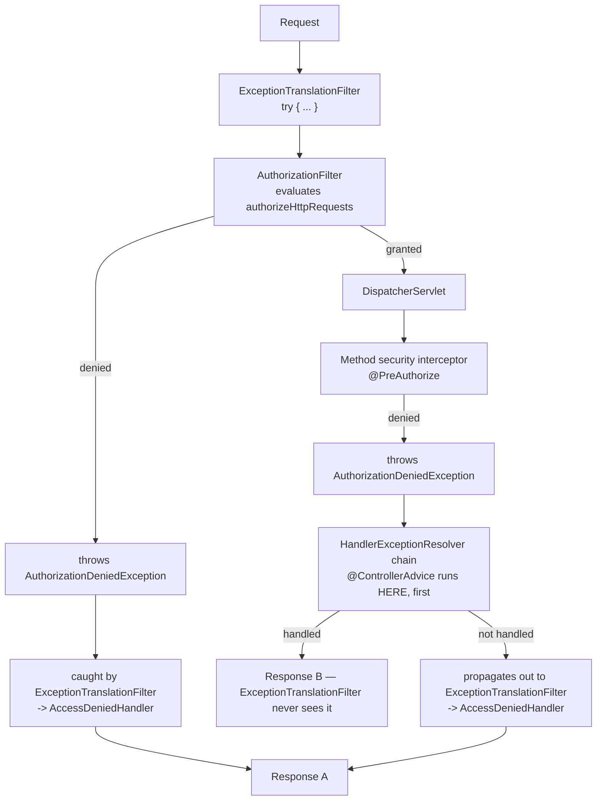

# 9.1 — Security Exception Handling

> **Module 9 · Topic 1** · Exception Handling
> Baseline: Spring Security 6.x on Boot 3.x
> New to this? Read **In Plain English** below first, then come back to the Version Matrix.

---

## Version Matrix

| Concern | Spring Security 5.x | **Spring Security 6.x (baseline)** | Spring Security 7.x |
|---|---|---|---|
| Method security denial type | `AccessDeniedException` | **`AuthorizationDeniedException`** (6.3+), carrying the `AuthorizationResult` | same |
| URL authorization denial | thrown by `FilterSecurityInterceptor` | **thrown by `AuthorizationFilter`** | `FilterSecurityInterceptor` removed |
| `sendStartAuthentication` | clears the context, saves the request, commences | **same, plus `setAuthenticationRequest(...)` on the synthesised exception** (6.3+) | same |
| RFC 7807 support | manual | **`ProblemDetail` / `ErrorResponse` from Spring Framework 6**; `spring.mvc.problemdetails.enabled` | same |
| Default entry point when nothing configures one | `Http403ForbiddenEntryPoint` | **`Http403ForbiddenEntryPoint`** | same |
| `hideUserNotFoundExceptions` | `true` | **`true`** | `true` |
| Timing-attack mitigation on unknown user | present in `DaoAuthenticationProvider` | **present** | present |
| Error page protection | `/error` needs `permitAll` | **same, plus Boot's `ErrorPageSecurityFilter`** re-checks the original request | same |
| `server.error.include-message` | `never` (Boot 2.3+) | **`never`** | `never` |
| Dispatch types authorized | `REQUEST` only | **all, so `ERROR` is authorized too** | all |

---

## Why This Exists

A security failure is the one code path in your application that is guaranteed to be exercised by
an attacker. It is also the path most likely to be written carelessly, because it is the path that
nobody's happy-case testing covers.

Three problems make it harder than it looks.

**The decision is not the one you think.** An `AccessDeniedException` does not reliably become a
403. Spring inspects the current identity and, for anonymous and remember-me callers, converts the
denial into an authentication challenge. This is covered at a high level in
[`01_M1_T1_HTTP_Web_Basics.md`](01_M1_T1_HTTP_Web_Basics.md); here we read the actual source and
follow every branch.

**The same logical denial happens in two layers with two different mechanisms.**
`AuthorizationFilter` throws in the servlet filter layer, where `@ControllerAdvice` cannot reach.
`@PreAuthorize` throws inside the dispatch, where it can. Left alone, your application returns two
different bodies for the same condition, and clients write two parsers.

**The error response is a disclosure surface.** "User not found" versus "wrong password" is a user
enumeration oracle. A stack trace names your framework versions and package structure. A 403 on a
resource that should be a 404 confirms the resource exists. Every byte you return on a failure path
is information you have chosen to give an attacker.

---

## In Plain English

**The one-line version:** When Spring Security refuses a request, this file is about how that
refusal is turned into an HTTP response, and about how to make that response helpful to honest
users without handing information to dishonest ones.

**An analogy.** Think of a members-only club with a doorman. Two completely different things can
go wrong when someone tries to walk in. Either the doorman does not recognise the person at all,
in which case the right move is to ask for their membership card — this is a *challenge*, and it
invites them to try again with proof. Or the doorman recognises them perfectly well, but the room
they are heading for is the directors' lounge and this member is not a director. That is a
*refusal*, and asking for a card again would be pointless because the card is not the problem.

Spring Security splits its entire error handling along exactly this line. "I do not know who you
are" is one family of failures, handled by a component called the `AuthenticationEntryPoint`. "I
know who you are and the answer is still no" is the other family, handled by the
`AccessDeniedHandler`. Almost every confusing security response you will ever debug comes from
these two being mixed up, or from a request landing in one family when you expected the other.

The analogy has one more useful wrinkle. Suppose someone walks in who has not shown a card at all
and heads for the directors' lounge. Technically that is a refusal, but the sensible doorman does
not say "you are not a director" — he says "may I see your card first", because the person may
well have one. Spring Security does the same thing: a refusal aimed at a caller who never proved
who they were is quietly converted into a challenge. This is the single most surprising behaviour
in the topic, and section 2 shows the exact code that does it.

**How it actually works, step by step.**

The two families are two Java exception types. `AuthenticationException` means "not identified",
and its subclasses name the specific reason: `BadCredentialsException` for a wrong password,
`LockedException` for a locked account, `InsufficientAuthenticationException` for "you need to be
properly logged in for this". `AccessDeniedException` means "identified but not permitted", and
its subclasses include `AuthorizationDeniedException` (a rule said no) and the CSRF exceptions (a
form was submitted without the expected secret token).

Standing near the end of the filter chain is a filter called `ExceptionTranslationFilter`. It does
nothing at all on the way in. Its whole job is to wrap everything after it in a `try` block, so
that when a later component throws one of these two exception types, it catches it. For an
`AuthenticationException` it calls the entry point. For an `AccessDeniedException` it first asks a
small helper, the `AuthenticationTrustResolver`, whether the current caller is anonymous or was
merely revived from a remember-me cookie — and if so it discards the refusal, builds a fresh
`InsufficientAuthenticationException`, and calls the entry point instead. Only a fully
authenticated caller gets a genuine 403.

Before it calls the entry point it does two more things that catch people out. It wipes the
current identity, which is why an entry point cannot log who was denied. And it saves a copy of
the request so that the user can be sent back to where they were after logging in — which, by
default, means creating an HTTP session. On an API that advertises itself as stateless, that is
where the unexpected `JSESSIONID` cookie on your 401 responses comes from.

Which entry point you get depends on what else is configured, and this explains the single most
reported Spring Security surprise. If form login is switched on, it registers an entry point that
redirects to the login page. If HTTP Basic is switched on, it registers one that returns 401 with
a `WWW-Authenticate` header. With more than one registered, Spring wraps them in a delegator that
picks based on the `Accept` header the client sent. So a JavaScript call to `/api/orders` with no
credential can receive a `302` redirect to an HTML login page — correct by the framework's logic,
useless to the caller — simply because form login was enabled on the same chain.

There is a second, independent complication. The exact same logical rule can be enforced in two
places: as a URL rule in `authorizeHttpRequests`, or as a `@PreAuthorize` annotation on a method.
The URL rule is checked by a filter, before Spring MVC has started, so your `@ControllerAdvice`
error class cannot see the failure. The annotation is checked inside the controller call, so your
advice *can* see it — and gets first refusal. The result is two different response bodies for one
condition. Section 7 explains how to align them, and the recommended answer is to deliberately not
handle `AccessDeniedException` in your advice at all.

The last strand of the topic is what you are allowed to say. A failure response is read by
attackers, so the guidance is that the body carries a stable error code plus an opaque correlation
identifier, and the real detail goes to the log under that identifier. The specific case worth
understanding on day one is user enumeration: if a wrong password and an unknown username produce
different responses, anybody can discover which of your users exist. Spring Security closes that
gap for you inside the login provider, both in the message and in the response time, and sections
8 and 9 describe the parts that are still your responsibility.

**Why should a beginner care?** The failure path is the part of an application that gets no manual
testing and all of the attacker's attention. If you do not understand it, three things happen that
are all common in real systems. Your single-page application receives HTML login redirects where
it expected JSON errors, and somebody "fixes" it by disabling security on that path. Your login
form tells the world which email addresses have accounts. And your unhandled exceptions turn into
blank 403 responses, because the error page is itself a request that must be permitted, which
makes every other bug much harder to diagnose.

**Words you will meet in this file**

| Term | In plain words |
|---|---|
| `AuthenticationException` | The "I do not know who you are" family of failures. |
| `AccessDeniedException` | The "I know who you are and you may not do this" family of failures. |
| `ExceptionTranslationFilter` | The filter near the end of the chain that catches both families and decides which handler deals with them. |
| `AuthenticationEntryPoint` | The component that decides what an unidentified caller sees: a redirect to a login page, or a 401 with a challenge header. |
| `AccessDeniedHandler` | The component that decides what an identified but unauthorised caller sees, normally a 403. |
| `AuthenticationFailureHandler` | A different component: it decides what somebody sees after a deliberate login attempt fails, such as a wrong password. |
| `AuthenticationTrustResolver` | The small helper that answers "is this caller anonymous, or only remembered from a cookie?" — which decides between a challenge and a refusal. |
| Anonymous caller | A placeholder identity Spring installs when nobody has logged in, so downstream code always has something to look at. |
| Remember-me | An identity revived from a long-lived cookie rather than a fresh login. Deliberately treated as weaker. |
| 401 versus 403 | 401 means "identify yourself" and must carry a `WWW-Authenticate` header. 403 means "identified, refused". |
| `WWW-Authenticate` | The response header that tells a client how to authenticate. The HTTP specification requires it on a 401. |
| `InsufficientAuthenticationException` | The exception Spring invents when it decides to challenge a caller instead of refusing them. |
| `RequestCache` | Where the original request is stored so the user can be returned to it after logging in. Uses the session by default. |
| CSRF token | A secret value your own pages include with form submissions. A missing one usually means an expired session; a wrong one is an attack signature. |
| User enumeration | Learning which usernames or email addresses exist by comparing responses. The reason login errors must be generic. |
| Timing attack | Learning the same thing from how long a response takes rather than what it says. |
| RFC 7807 / `ProblemDetail` | A standard JSON shape for error responses, with fields such as `type`, `title`, `status` and `detail`. |
| `@ControllerAdvice` | A Spring MVC class that handles exceptions from controllers. It cannot see exceptions thrown by filters. |
| `/error` dispatch | The internal second pass the servlet container makes to render an error page. It goes through the security chain again, so it must be permitted. |
| Correlation identifier | A random, meaningless-to-an-attacker value included in the response and in every log line, so support can join the two. |

**If you remember only one thing:** decide the 401-versus-403 question deliberately and in one
place, because Spring Security will convert a refusal into a challenge whenever the caller was
never properly identified, and everything else in this file follows from that branch.

---

## Core Concepts

### 1. The Two Exception Families

**In simple terms:** Every security failure is one of exactly two things — "I cannot tell who you
are" or "I can, and you are not allowed" — and which one it is decides the whole response.

Everything in Spring Security's error handling reduces to a single question:
**is this "I do not know who you are" or "I know, and the answer is no"?**

```mermaid
flowchart TD
    RE["RuntimeException"]
    RE --> AE["AuthenticationException<br/>(abstract) — org.springframework.security.core"]
    RE --> ADE["AccessDeniedException<br/>org.springframework.security.access"]

    AE --> BCE["BadCredentialsException"]
    AE --> UNFE["UsernameNotFoundException<br/>(core.userdetails)"]
    AE --> ASE["AccountStatusException (abstract)"]
    AE --> IAE["InsufficientAuthenticationException"]
    AE --> PNFE["ProviderNotFoundException"]
    AE --> ACNFE["AuthenticationCredentialsNotFoundException"]
    AE --> ASVC["AuthenticationServiceException"]
    AE --> SAE["SessionAuthenticationException"]
    AE --> OAE["OAuth2AuthenticationException<br/>(InvalidBearerTokenException)"]

    ASE --> DIS["DisabledException"]
    ASE --> LOC["LockedException"]
    ASE --> ACE["AccountExpiredException"]
    ASE --> CEE["CredentialsExpiredException"]

    ASVC --> IASE["InternalAuthenticationServiceException"]

    ADE --> AUTHDE["AuthorizationDeniedException<br/>(6.3+, carries AuthorizationResult)"]
    ADE --> CSRF["CsrfException"]
    ADE --> ASVE["AuthorizationServiceException"]
    CSRF --> MCT["MissingCsrfTokenException"]
    CSRF --> ICT["InvalidCsrfTokenException"]

    AE -.->|handled by| EP["AuthenticationEntryPoint"]
    ADE -.->|handled by| ADH["AccessDeniedHandler"]
```



| Exception | Thrown by | Means | Default outcome |
|---|---|---|---|
| `BadCredentialsException` | `AbstractUserDetailsAuthenticationProvider` | Wrong password, **or** unknown user when hiding is on | 401 / login page with an error |
| `UsernameNotFoundException` | `UserDetailsService` | No such user | Converted to `BadCredentialsException` by default |
| `DisabledException` | `DefaultPreAuthenticationChecks` | `UserDetails.isEnabled()` is false | 401 |
| `LockedException` | same | `isAccountNonLocked()` is false | 401 |
| `AccountExpiredException` | same | `isAccountNonExpired()` is false | 401 |
| `CredentialsExpiredException` | `DefaultPostAuthenticationChecks` | `isCredentialsNonExpired()` is false | 401 |
| `InsufficientAuthenticationException` | `ExceptionTranslationFilter` (synthesised) | Anonymous or remember-me hit a protected resource | Entry point challenge |
| `ProviderNotFoundException` | `ProviderManager` | **No provider supports this token type** — a configuration bug, not a credential problem | 401, but investigate the configuration |
| `AuthenticationCredentialsNotFoundException` | method security | No `Authentication` in the context at all | 401 |
| `AuthenticationServiceException` / `InternalAuthenticationServiceException` | any provider | The identity system itself failed (database down, LDAP timeout) | 401 to the client, **500-grade for your alerting** |
| `AuthorizationDeniedException` | `AuthorizationFilter`, method security | Authenticated, insufficient authority | 403 |
| `MissingCsrfTokenException` | `CsrfFilter` | No token submitted (often an expired session) | 403 |
| `InvalidCsrfTokenException` | `CsrfFilter` | Token submitted but wrong | 403 |

Two entries deserve emphasis because they are routinely mis-triaged.

`ProviderNotFoundException` means the `ProviderManager` found no `AuthenticationProvider` whose
`supports(Class)` accepted your token. It is not a bad password; it is a wiring mistake, typically a
custom token type with no matching provider. It reaches the client as an ordinary 401, so it hides
in the noise unless you alert on it specifically.

`InternalAuthenticationServiceException` exists to distinguish "the credential is wrong" from "we
could not check the credential". The base class logs it at `ERROR` rather than `DEBUG` for exactly
that reason. If your monitoring treats all authentication failures identically, a total outage of
your user store looks the same as a wave of typos.

### 2. `ExceptionTranslationFilter`, Line by Line

**In simple terms:** This is the filter that catches a security failure thrown further down the
chain and decides whether the caller is challenged to log in or simply told no.

This filter does nothing on the way in. Its entire purpose is the `try` block.

```java
// org.springframework.security.web.access.ExceptionTranslationFilter (6.x, condensed)
private void doFilter(HttpServletRequest request, HttpServletResponse response, FilterChain chain)
        throws IOException, ServletException {
    try {
        chain.doFilter(request, response);
    }
    catch (IOException ex) {
        throw ex;                                        // never swallow I/O problems
    }
    catch (Exception ex) {
        // The security exception may be buried inside a ServletException or a wrapper.
        Throwable[] causeChain = this.throwableAnalyzer.determineCauseChain(ex);
        RuntimeException securityException = (AuthenticationException) this.throwableAnalyzer
                .getFirstThrowableOfType(AuthenticationException.class, causeChain);
        if (securityException == null) {
            securityException = (AccessDeniedException) this.throwableAnalyzer
                    .getFirstThrowableOfType(AccessDeniedException.class, causeChain);
        }
        if (securityException == null) {
            rethrow(ex);                                 // not ours - let it propagate
        }
        if (response.isCommitted()) {
            throw new ServletException("Unable to handle the Spring Security Exception "
                    + "because the response is already committed.", ex);
        }
        handleSpringSecurityException(request, response, chain, securityException);
    }
}
```

Four observations before the branch logic:

- **`AuthenticationException` is searched for first.** If an exception chain somehow contains both,
  authentication wins and the caller is challenged rather than forbidden.
- **`ThrowableAnalyzer` unwraps `ServletException` root causes.** A security exception thrown from a
  controller and wrapped by the container is still found.
- **An already-committed response is fatal.** If some earlier filter wrote bytes and then something
  threw, the filter cannot produce a coherent response and says so explicitly. That exact message
  in your logs points at a filter that writes partial responses.
- **Anything that is not one of the two types is rethrown unchanged.** A `NullPointerException` in
  your controller is not this filter's business.

Now the branch that everyone gets wrong:

```java
private void handleAccessDeniedException(HttpServletRequest request, HttpServletResponse response,
        FilterChain chain, AccessDeniedException exception) throws ServletException, IOException {

    Authentication authentication = this.securityContextHolderStrategy.getContext().getAuthentication();
    boolean isAnonymous = this.authenticationTrustResolver.isAnonymous(authentication);

    if (isAnonymous || this.authenticationTrustResolver.isRememberMe(authentication)) {
        // The caller never really authenticated. Ask them to, instead of saying "no".
        AuthenticationException ex = new InsufficientAuthenticationException(
                this.messages.getMessage("ExceptionTranslationFilter.insufficientAuthentication",
                        "Full authentication is required to access this resource"));
        ex.setAuthenticationRequest(authentication);
        sendStartAuthentication(request, response, chain, ex);
    }
    else {
        // A real, fully authenticated user who lacks the authority. This is a genuine 403.
        this.accessDeniedHandler.handle(request, response, exception);
    }
}
```

> **An `AccessDeniedException` becomes a 403 only for a fully authenticated caller.** For anonymous
> and remember-me callers it is *upgraded* into an `InsufficientAuthenticationException` and sent to
> the `AuthenticationEntryPoint`.

Note what the entry point receives: **not** your original exception. It receives a freshly
constructed `InsufficientAuthenticationException` whose message is "Full authentication is required
to access this resource". An entry point that tries to inspect the original `AccessDeniedException`
will not find it.

And the method that actually starts authentication:

```java
protected void sendStartAuthentication(HttpServletRequest request, HttpServletResponse response,
        FilterChain chain, AuthenticationException reason) throws ServletException, IOException {

    // SEC-112: the existing Authentication is no longer considered valid.
    SecurityContext context = this.securityContextHolderStrategy.createEmptyContext();
    this.securityContextHolderStrategy.setContext(context);

    this.requestCache.saveRequest(request, response);     // so we can return here after login
    this.authenticationEntryPoint.commence(request, response, reason);
}
```

Three consequences that show up in production:

1. **The context is cleared before the entry point runs.** Your entry point cannot log "user X was
   denied", because by then there is no X. If you need the identity in the response or the log,
   capture it in the `AccessDeniedHandler` or in an `AuthorizationDeniedEvent` listener, not in the
   entry point.
2. **`requestCache.saveRequest(...)` writes to the `HttpSession` by default.** This is how a
   "stateless" API ends up issuing a `JSESSIONID` on its 401 responses. The fix is
   `exceptionHandling` with a `NullRequestCache`, or `requestCache(cache ->
   cache.requestCache(new NullRequestCache()))`.
3. **`commence` is expected to terminate the request.** The filter does not call `chain.doFilter`
   afterwards. An entry point that writes nothing produces an empty 200.

### 3. `AuthenticationTrustResolver` — the Actual Predicate

**In simple terms:** This tiny helper answers "did this caller really log in, or are they just a
placeholder?", and its answer is what tips a refusal into a login prompt.

```java
// AuthenticationTrustResolverImpl (condensed)
public boolean isAnonymous(Authentication authentication) {
    if (this.anonymousClass == null || authentication == null) {
        return false;                                     // null is NOT anonymous
    }
    return this.anonymousClass.isAssignableFrom(authentication.getClass());
}

public boolean isRememberMe(Authentication authentication) {
    if (this.rememberMeClass == null || authentication == null) {
        return false;
    }
    return this.rememberMeClass.isAssignableFrom(authentication.getClass());
}
```

The null handling is the trap. If you disable `anonymous()`, an unauthenticated request has a `null`
authentication, `isAnonymous(null)` is `false`, and an `AccessDeniedException` therefore goes
straight to the `AccessDeniedHandler` as a flat 403 — for a caller who never presented any
credential at all. Per RFC 9110 a 401 with `WWW-Authenticate` is the correct response there, so if
you disable anonymous on an API you should also set an explicit entry point and make sure denials
reach it.

### 4. `AuthenticationEntryPoint`

**In simple terms:** This is the one place your application defines what an unidentified visitor
sees, and choosing the wrong one is why an API call sometimes gets an HTML login page.

```java
package org.springframework.security.web;

public interface AuthenticationEntryPoint {
    void commence(HttpServletRequest request, HttpServletResponse response,
                  AuthenticationException authException) throws IOException, ServletException;
}
```

Semantics: *"this request is not authenticated; challenge the caller."*

| Implementation | Response | Use for |
|---|---|---|
| `LoginUrlAuthenticationEntryPoint` | `302` to the login form URL (or a `FORWARD` if `useForward` is set); can force HTTPS | Server-rendered web applications |
| `BasicAuthenticationEntryPoint` | `401` + `WWW-Authenticate: Basic realm="..."` | HTTP Basic |
| `DigestAuthenticationEntryPoint` | `401` + `WWW-Authenticate: Digest ...` with a nonce | Legacy digest |
| `BearerTokenAuthenticationEntryPoint` | `401` + `WWW-Authenticate: Bearer realm="...", error="invalid_token", error_description="..."` per RFC 6750 | Resource servers |
| `Http403ForbiddenEntryPoint` | `403`, empty body | **The default when no mechanism registers one** |
| `HttpStatusEntryPoint` | Any status you pass, empty body | Minimal APIs that want a bare `401` |
| `DelegatingAuthenticationEntryPoint` | Delegates by `RequestMatcher` | One chain serving both browsers and APIs |

`DelegatingAuthenticationEntryPoint` holds a `LinkedHashMap<RequestMatcher,
AuthenticationEntryPoint>` plus a default, and picks the first matcher that matches. Insertion order
is the evaluation order, which is why it is a `LinkedHashMap`.

This is also how the DSL builds its own default. `ExceptionHandlingConfigurer` collects entry points
registered by each mechanism through `registerDefaultEntryPoint(http, matcher, entryPoint)`:
`formLogin` registers `LoginUrlAuthenticationEntryPoint` behind a `MediaTypeRequestMatcher` for
`text/html`, `httpBasic` registers `BasicAuthenticationEntryPoint` behind matchers for the
non-HTML media types. Then:

- zero registrations produces `Http403ForbiddenEntryPoint`,
- one registration is used directly,
- two or more are wrapped in a `DelegatingAuthenticationEntryPoint`.

That is the mechanical explanation for the most-reported Spring Security behaviour of all: an API
call returning `302 /login` instead of `401`, because `formLogin` is on the same chain and the
request did not look like JSON.

### 5. `AccessDeniedHandler`

**In simple terms:** This decides what a known, logged-in user sees when they ask for something
they are not permitted to have, and it can vary its answer by the reason for the refusal.

```java
package org.springframework.security.web.access;

public interface AccessDeniedHandler {
    void handle(HttpServletRequest request, HttpServletResponse response,
                AccessDeniedException accessDeniedException) throws IOException, ServletException;
}
```

Semantics: *"we know who you are and you may not do this."*

| Implementation | Behaviour |
|---|---|
| `AccessDeniedHandlerImpl` | The default. Sends `403`; if `errorPage` is set, forwards to it after putting the exception on the request as `WebAttributes.ACCESS_DENIED_403` |
| `DelegatingAccessDeniedHandler` | Keyed on the **exception class** — `LinkedHashMap<Class<? extends AccessDeniedException>, AccessDeniedHandler>` plus a default |
| `RequestMatcherDelegatingAccessDeniedHandler` | Keyed on the **request** |
| `InvalidSessionAccessDeniedHandler` | Wraps an `InvalidSessionStrategy`; used for `MissingCsrfTokenException` so an expired session produces "your session expired, log in again" rather than a bare 403 |

The contrast is worth internalising for interviews: the entry point delegator keys on the
*request*, the access-denied delegator keys on the *exception type*. That reflects their different
jobs — a challenge depends on what the client can understand, a denial depends on why it was denied.

The `InvalidSessionAccessDeniedHandler` pairing is a genuinely good pattern. A user who leaves a
form open past the session timeout submits it without a valid CSRF token and gets a 403 with no
explanation. Routing `MissingCsrfTokenException` to a session-expired page turns a mystifying error
into an intelligible one, while `InvalidCsrfTokenException` — a token that was present and wrong,
which is the actual attack signature — still produces a hard 403.

### 6. RFC 7807 Problem Details From Both Handlers

**In simple terms:** There is a standard JSON shape for error responses, and the practical trick
is to build it in one shared component so that every failure path produces the same shape.

RFC 7807 (now obsoleted by RFC 9457) defines `application/problem+json` with the members `type`,
`title`, `status`, `detail` and `instance`, plus arbitrary extensions. Spring Framework 6 models it
as `ProblemDetail`.

The difficulty is that entry points and access-denied handlers run in the **filter layer**, where
there is no `HttpMessageConverter` machinery and no content negotiation. You write the response
yourself. The right move is to put that writing in one component and inject it into both handlers,
so the two paths cannot drift.

Enabling `spring.mvc.problemdetails.enabled=true` makes Spring MVC's own exception handling emit
problem details — but only for exceptions that reach the `DispatcherServlet` exception resolvers.
It does nothing for the filter layer, which is exactly why filter-layer and MVC-layer responses
diverge unless you align them deliberately.

### 7. The Key Insight — Two Layers, Two Mechanisms, One Logical Denial

**In simple terms:** The same rule enforced by a URL pattern and by an annotation produces two
different error responses, because only one of the two is visible to your usual error-handling
class.



`@ControllerAdvice` is Spring MVC machinery, invoked by `DispatcherServlet` through its
`HandlerExceptionResolver` chain. It therefore:

- **cannot** catch anything thrown by a filter — `AuthorizationFilter`, `CsrfFilter`, your custom
  authentication filter — because those either run before the dispatch or after it returned;
- **can** catch an `AccessDeniedException` from `@PreAuthorize`, because method security runs inside
  the dispatch.

So a single logical rule — "only administrators may delete an order" — enforced with
`requestMatchers(DELETE, "/orders/**").hasRole("ADMIN")` produces your `AccessDeniedHandler`'s
body, while the same rule enforced with `@PreAuthorize("hasRole('ADMIN')")` produces your
`@ControllerAdvice`'s body. Clients see two shapes for one condition.

**How to align them. Two options, and one is clearly better.**

**Option A — do not handle `AccessDeniedException` in `@ControllerAdvice` at all.** Let it propagate
out of the dispatch, out through the filters, and into `ExceptionTranslationFilter`, which routes it
to your `AccessDeniedHandler`. One code path, one format, and you keep the anonymous and
remember-me upgrade behaviour for method-security denials too. This is the option I recommend and
the one Spring Security's own documentation points toward.

**Option B — handle it in both places using the same writer component.** Necessary if you have an
existing advice you cannot remove, or if you need the handler method and arguments to build a richer
message. The discipline required is that the `@ExceptionHandler` and the `AccessDeniedHandler` must
share one `ProblemDetail` builder, not merely produce similar-looking JSON.

**What you lose with a careless Option B:** if your advice returns a flat 403, an anonymous caller
hitting a `@PreAuthorize` method gets 403 instead of being challenged, because the exception never
reaches `ExceptionTranslationFilter` and the anonymous-upgrade logic never runs. Your login redirect
breaks for exactly the endpoints protected by annotations.

A related gotcha: a broad `@ExceptionHandler(Exception.class)` catches `AccessDeniedException`
implicitly. Many teams have Option B without knowing it. If you take Option A, exclude
`AccessDeniedException` explicitly and add a test that proves it propagates.

### 8. `hideUserNotFoundExceptions` and the Login Error Message

**In simple terms:** A login failure must look identical whether the username does not exist or
the password was wrong, otherwise anyone can discover which accounts your system has.

```java
// AbstractUserDetailsAuthenticationProvider.authenticate (condensed)
try {
    user = retrieveUser(username, (UsernamePasswordAuthenticationToken) authentication);
}
catch (UsernameNotFoundException ex) {
    this.logger.debug("Failed to find user '" + username + "'");
    if (!this.hideUserNotFoundExceptions) {
        throw ex;
    }
    throw new BadCredentialsException(this.messages.getMessage(
            "AbstractUserDetailsAuthenticationProvider.badCredentials", "Bad credentials"));
}
```

The flag defaults to **`true`**, and it should stay that way. The reason is **user enumeration**: if
"no such user" and "wrong password" produce different responses, an attacker sends one request per
candidate address and learns which of your users exist. That list is then sold, credential-stuffed,
and phished. The account-existence fact is itself sensitive — consider a psychiatric clinic's
patient portal, where knowing an address has an account is the disclosure.

Hiding the exception type is necessary but not sufficient. `DaoAuthenticationProvider` also closes
the **timing** channel:

```java
// DaoAuthenticationProvider
private void prepareTimingAttackProtection() {
    if (this.userNotFoundEncodedPassword == null) {
        this.userNotFoundEncodedPassword = this.passwordEncoder.encode(USER_NOT_FOUND_PASSWORD);
    }
}

private void mitigateAgainstTimingAttack(UsernamePasswordAuthenticationToken authentication) {
    if (authentication.getCredentials() != null) {
        String presentedPassword = authentication.getCredentials().toString();
        this.passwordEncoder.matches(presentedPassword, this.userNotFoundEncodedPassword);
    }
}
```

Without this, an unknown user would return in microseconds while a known user would take the
hundred milliseconds that bcrypt deliberately costs — an enumeration oracle measurable over the
network. The provider runs the encoder against a dummy hash so both paths cost the same.

The remaining leaks are yours to close, and they are the ones that actually get exploited:

- **Registration** — "that email is already taken" is a perfect enumeration oracle. Send a
  confirmation email in both cases and say "if this address is new, check your inbox".
- **Password reset** — "no account with that address". Same treatment: always report that a message
  was sent if the address exists.
- **Rate limiting and lockout** — locking only real accounts means a locked response identifies a
  real account. Apply the counter to the submitted identifier regardless of whether it exists.
- **Response timing in your own code** — a user lookup that short-circuits before the password check
  reintroduces the timing channel the framework just closed.
- **Distinguishing account status on the login page** — "your account is locked" tells an attacker
  the account exists. Show the generic message on the login form and inform the real user by email.

The honest counter-argument is usability: users genuinely struggle with a generic message. The
usual compromise is a generic response on the public form and a specific one delivered out of band
to the address's owner, which gives the real user the information without giving it to a stranger.

### 9. Never Leak Internals

**In simple terms:** Anything you put in an error response is something you have chosen to tell
an attacker, so the response gets a stable code and the log gets the details.

The `server.error.*` properties control Boot's `BasicErrorController`, which renders `/error`. They
do **not** affect your `AuthenticationEntryPoint` or `AccessDeniedHandler` — those write whatever
you tell them to.

| Property | Effect | Default |
|---|---|---|
| `server.error.include-stacktrace` | Adds `trace` to the body | `never` |
| `server.error.include-message` | Adds the exception message | `never` |
| `server.error.include-binding-errors` | Adds validation failures | `never` |
| `server.error.include-exception` | Adds the exception class name | `false` |
| `server.error.whitelabel.enabled` | Boot's default HTML error page | `true` |
| `server.error.path` | The error dispatch path | `/error` |

All the safe defaults are already correct in Boot 3. The damage comes from someone turning
`include-stacktrace` to `always` while debugging and never turning it back, or from a custom
`@ExceptionHandler` that does `ex.getMessage()` into the response — which happily forwards an SQL
fragment, a file path, or an internal hostname to the caller.

The rule: **the response gets a stable code and a correlation identifier; the log gets the detail.**

### 10. The `/error` Dispatch

**In simple terms:** Rendering an error page is itself a request that goes through the security
chain, so if you have not permitted it every unexpected failure turns into a blank 403.

When an exception escapes to the container, Boot forwards to `/error` as a new `ERROR` dispatch, and
the security filter chain runs again — `spring.security.filter.dispatcher-types` includes `ERROR`,
and in 6.x `AuthorizationFilter` has `shouldFilterAllDispatcherTypes = true`.

```java
.authorizeHttpRequests(auth -> auth
    .requestMatchers("/error").permitAll()        // not optional in practice
    .anyRequest().authenticated()
)
```

Without it, an error on an unauthenticated request produces a denial on the error page itself, and
the client sees a blank 403 instead of the real problem.

There is a second mechanism worth knowing, because it produces a 403 on `/error` even when `/error`
is permitted. Spring Boot registers `ErrorPageSecurityFilter`, which consults a
`WebInvocationPrivilegeEvaluator` to check whether the current user was allowed to access the
**original** request path before rendering the error content. The intent is good — an error page
should not disclose information about a resource the caller could not reach — but it surprises
people who have permitted `/error` and still see a 403.

### 11. `AuthenticationFailureHandler` Versus `AuthenticationEntryPoint`

**In simple terms:** One of these responds when somebody arrives with no credential at all, and
the other responds when somebody deliberately tried to log in and got it wrong; changing only one
of them is why half your errors come back in the wrong format.

They are constantly confused, and they are not interchangeable.

| | `AuthenticationEntryPoint` | `AuthenticationFailureHandler` |
|---|---|---|
| Question it answers | "You are not authenticated. How do I challenge you?" | "You tried to log in and it did not work. What now?" |
| Triggered by | `ExceptionTranslationFilter`, when an unauthenticated caller reaches a protected resource | An authentication mechanism, when `attemptAuthentication` throws |
| Invoked on | A request that carried no usable credential | A deliberate authentication **attempt** |
| Typical response | `302` to the login page, or `401` + `WWW-Authenticate` | `302` to `/login?error`, or `401` with a failure body |
| Default | `Http403ForbiddenEntryPoint`, or one registered by a mechanism | `SimpleUrlAuthenticationFailureHandler` |
| Sees the identity | No — the context was cleared first | No — but it sees the real `AuthenticationException` |

The practical distinction: the entry point fires on `GET /orders` with no cookie; the failure
handler fires on `POST /login` with a wrong password. Setting a custom entry point does not change
what happens on a failed login, and setting a custom failure handler does not change what happens to
an unauthenticated API call. Teams that only change one of them report "half my errors are JSON and
half are redirects".

A useful bridge: `AuthenticationEntryPointFailureHandler` is an `AuthenticationFailureHandler` that
delegates to an entry point. It is the default in `AuthenticationFilter`, and it is how you make a
stateless mechanism's failure response identical to its challenge response.

### 12. Correlation Identifiers

**In simple terms:** Give every request a random reference number, put it in the response and in
every log line, and support can then find the real reason for a failure that the response itself
refuses to state.

The tension is real: support needs to know why a request failed, and the response must not say. The
resolution is an identifier that is meaningless to an attacker and a database key to you.

- Generate or accept a correlation identifier in an early filter — before authentication, so failed
  authentications have one too. Accept an inbound `X-Request-Id` only from trusted callers,
  otherwise generate.
- Put it on the MDC so every log line for the request carries it, and clear the MDC in a `finally`
  because threads are pooled.
- Echo it in a response header on **every** response, not only errors, so a client can quote it for
  a slow request as well as a failed one.
- Include it in the problem detail, conventionally as the `instance` member or an extension such as
  `traceId`.
- Log the real reason at the point of failure, keyed by that identifier — the authorities the
  principal actually had, the rule that denied them, the exception type.

Use a random UUID or the trace identifier from your tracing system. Do not use anything derived from
user data, and do not make it guessable, because the identifier is a key into your logs.

---

## Working Code

One writer, used by both handlers, so the two paths cannot diverge.

```java
package com.example.security.error;

import com.fasterxml.jackson.databind.ObjectMapper;
import jakarta.servlet.http.HttpServletRequest;
import jakarta.servlet.http.HttpServletResponse;
import org.springframework.http.HttpStatus;
import org.springframework.http.MediaType;
import org.springframework.http.ProblemDetail;
import org.springframework.stereotype.Component;

import java.io.IOException;
import java.net.URI;
import java.time.Instant;

/**
 * The single place that turns a security failure into an RFC 7807 response body.
 * Injected into the AuthenticationEntryPoint, the AccessDeniedHandler and the
 * @RestControllerAdvice so all three cannot drift apart.
 */
@Component
public class ProblemDetailWriter {

    public static final String CORRELATION_ATTRIBUTE = "com.example.correlationId";

    private final ObjectMapper objectMapper;

    public ProblemDetailWriter(ObjectMapper objectMapper) {
        this.objectMapper = objectMapper;
    }

    public ProblemDetail build(HttpServletRequest request, HttpStatus status,
                               String title, String detail) {
        ProblemDetail problem = ProblemDetail.forStatusAndDetail(status, detail);
        problem.setTitle(title);
        problem.setType(URI.create("https://errors.example.com/" + status.value()));
        problem.setInstance(URI.create(request.getRequestURI()));
        problem.setProperty("timestamp", Instant.now().toString());

        Object correlationId = request.getAttribute(CORRELATION_ATTRIBUTE);
        if (correlationId != null) {
            // The ONLY diagnostic detail in the body. Everything else is in the log.
            problem.setProperty("traceId", correlationId.toString());
        }
        return problem;
    }

    public void write(HttpServletRequest request, HttpServletResponse response,
                      HttpStatus status, String title, String detail) throws IOException {
        if (response.isCommitted()) {
            return;                       // nothing sensible left to do
        }
        response.setStatus(status.value());
        response.setContentType(MediaType.APPLICATION_PROBLEM_JSON_VALUE);
        response.setCharacterEncoding("UTF-8");
        this.objectMapper.writeValue(response.getOutputStream(),
                build(request, status, title, detail));
    }
}
```

The two filter-layer handlers:

```java
package com.example.security.error;

import jakarta.servlet.http.HttpServletRequest;
import jakarta.servlet.http.HttpServletResponse;
import org.slf4j.Logger;
import org.slf4j.LoggerFactory;
import org.springframework.http.HttpStatus;
import org.springframework.security.access.AccessDeniedException;
import org.springframework.security.core.Authentication;
import org.springframework.security.core.AuthenticationException;
import org.springframework.security.core.context.SecurityContextHolder;
import org.springframework.security.web.AuthenticationEntryPoint;
import org.springframework.security.web.access.AccessDeniedHandler;
import org.springframework.stereotype.Component;

import java.io.IOException;

@Component
public class ProblemDetailAuthenticationEntryPoint implements AuthenticationEntryPoint {

    private static final Logger log = LoggerFactory.getLogger(ProblemDetailAuthenticationEntryPoint.class);

    private final ProblemDetailWriter writer;

    public ProblemDetailAuthenticationEntryPoint(ProblemDetailWriter writer) {
        this.writer = writer;
    }

    @Override
    public void commence(HttpServletRequest request, HttpServletResponse response,
                         AuthenticationException authException) throws IOException {

        // RFC 9110 requires a challenge on a 401. Without this header the response is
        // technically malformed, and some clients will not retry.
        response.setHeader("WWW-Authenticate", "Bearer realm=\"api\"");

        // The real reason goes to the log, keyed by the correlation id. Note that
        // ExceptionTranslationFilter already cleared the context, so there is no
        // principal to log here - that is captured in the AccessDeniedHandler instead.
        log.info("Authentication challenge issued for {} {}: {}",
                request.getMethod(), request.getRequestURI(), authException.getClass().getSimpleName());

        this.writer.write(request, response, HttpStatus.UNAUTHORIZED,
                "Unauthorized", "Authentication is required to access this resource");
    }
}
```

```java
package com.example.security.error;

// imports as above

@Component
public class ProblemDetailAccessDeniedHandler implements AccessDeniedHandler {

    private static final Logger log = LoggerFactory.getLogger(ProblemDetailAccessDeniedHandler.class);

    private final ProblemDetailWriter writer;

    public ProblemDetailAccessDeniedHandler(ProblemDetailWriter writer) {
        this.writer = writer;
    }

    @Override
    public void handle(HttpServletRequest request, HttpServletResponse response,
                       AccessDeniedException ex) throws IOException {

        Authentication authentication = SecurityContextHolder.getContext().getAuthentication();

        // Log the authorities, never the credential, and never echo them to the client.
        log.warn("Access denied for principal={} authorities={} on {} {}: {}",
                (authentication != null ? authentication.getName() : "none"),
                (authentication != null ? authentication.getAuthorities() : "[]"),
                request.getMethod(), request.getRequestURI(), ex.getClass().getSimpleName());

        this.writer.write(request, response, HttpStatus.FORBIDDEN,
                "Forbidden", "You do not have permission to perform this action");
    }
}
```

Wiring, including a `DelegatingAuthenticationEntryPoint` for a chain that serves both browsers and
API clients, and a `DelegatingAccessDeniedHandler` that treats an expired session differently from a
forged token:

```java
package com.example.security;

import com.example.security.error.ProblemDetailAccessDeniedHandler;
import com.example.security.error.ProblemDetailAuthenticationEntryPoint;
import org.springframework.context.annotation.Bean;
import org.springframework.context.annotation.Configuration;
import org.springframework.http.MediaType;
import org.springframework.security.config.Customizer;
import org.springframework.security.config.annotation.web.builders.HttpSecurity;
import org.springframework.security.config.annotation.web.configuration.EnableWebSecurity;
import org.springframework.security.config.http.SessionCreationPolicy;
import org.springframework.security.web.AuthenticationEntryPoint;
import org.springframework.security.web.SecurityFilterChain;
import org.springframework.security.web.access.AccessDeniedHandler;
import org.springframework.security.web.access.DelegatingAccessDeniedHandler;
import org.springframework.security.web.authentication.DelegatingAuthenticationEntryPoint;
import org.springframework.security.web.authentication.LoginUrlAuthenticationEntryPoint;
import org.springframework.security.web.csrf.MissingCsrfTokenException;
import org.springframework.security.web.savedrequest.NullRequestCache;
import org.springframework.security.web.util.matcher.MediaTypeRequestMatcher;
import org.springframework.security.web.util.matcher.RequestMatcher;
import org.springframework.web.accept.HeaderContentNegotiationStrategy;

import java.util.LinkedHashMap;

@Configuration
@EnableWebSecurity
public class SecurityErrorHandlingConfig {

    @Bean
    AuthenticationEntryPoint delegatingEntryPoint(ProblemDetailAuthenticationEntryPoint apiEntryPoint) {
        MediaTypeRequestMatcher browserMatcher =
                new MediaTypeRequestMatcher(new HeaderContentNegotiationStrategy(), MediaType.TEXT_HTML);
        browserMatcher.setUseEquals(true);   // exactly text/html, not */*

        LinkedHashMap<RequestMatcher, AuthenticationEntryPoint> mappings = new LinkedHashMap<>();
        mappings.put(browserMatcher, new LoginUrlAuthenticationEntryPoint("/login"));

        DelegatingAuthenticationEntryPoint delegating = new DelegatingAuthenticationEntryPoint(mappings);
        delegating.setDefaultEntryPoint(apiEntryPoint);   // everything non-HTML gets problem+json
        return delegating;
    }

    @Bean
    AccessDeniedHandler delegatingAccessDeniedHandler(ProblemDetailAccessDeniedHandler defaultHandler,
                                                      SessionExpiredAccessDeniedHandler sessionExpired) {
        LinkedHashMap<Class<? extends org.springframework.security.access.AccessDeniedException>,
                AccessDeniedHandler> handlers = new LinkedHashMap<>();
        // A MISSING token usually means the session timed out - say so.
        // An INVALID token is the actual attack signature - keep the flat 403.
        handlers.put(MissingCsrfTokenException.class, sessionExpired);
        return new DelegatingAccessDeniedHandler(handlers, defaultHandler);
    }

    @Bean
    SecurityFilterChain apiChain(HttpSecurity http,
                                 AuthenticationEntryPoint entryPoint,
                                 AccessDeniedHandler accessDeniedHandler) throws Exception {
        http
            .securityMatcher("/api/**")
            .csrf(csrf -> csrf.disable())
            .sessionManagement(s -> s.sessionCreationPolicy(SessionCreationPolicy.STATELESS))
            .authorizeHttpRequests(auth -> auth
                .requestMatchers("/error").permitAll()
                .requestMatchers("/api/public/**").permitAll()
                .requestMatchers("/api/admin/**").hasRole("ADMIN")
                .anyRequest().authenticated()
            )
            .oauth2ResourceServer(oauth2 -> oauth2.jwt(Customizer.withDefaults()))
            .exceptionHandling(ex -> ex
                .authenticationEntryPoint(entryPoint)
                .accessDeniedHandler(accessDeniedHandler)
            )
            // Without this, sendStartAuthentication() calls HttpSessionRequestCache.saveRequest
            // and a "stateless" API starts issuing JSESSIONID cookies on its 401 responses.
            .requestCache(cache -> cache.requestCache(new NullRequestCache()));

        return http.build();
    }
}
```

The advice that deliberately does **not** handle `AccessDeniedException`:

```java
package com.example.web;

import com.example.security.error.ProblemDetailWriter;
import jakarta.servlet.http.HttpServletRequest;
import org.slf4j.Logger;
import org.slf4j.LoggerFactory;
import org.springframework.http.HttpStatus;
import org.springframework.http.ProblemDetail;
import org.springframework.web.bind.annotation.ExceptionHandler;
import org.springframework.web.bind.annotation.RestControllerAdvice;

@RestControllerAdvice
public class ApiExceptionHandler {

    private static final Logger log = LoggerFactory.getLogger(ApiExceptionHandler.class);

    private final ProblemDetailWriter writer;

    public ApiExceptionHandler(ProblemDetailWriter writer) {
        this.writer = writer;
    }

    /*
     * DELIBERATELY ABSENT:
     *
     *   @ExceptionHandler(AccessDeniedException.class)
     *
     * Handling it here would catch method-security denials inside the dispatch, so
     * @PreAuthorize failures would produce a different body from authorizeHttpRequests
     * failures - and anonymous callers would get a flat 403 instead of being challenged,
     * because ExceptionTranslationFilter would never see the exception.
     *
     * Letting it propagate means ONE code path: ExceptionTranslationFilter ->
     * ProblemDetailAccessDeniedHandler. Do not add a broad @ExceptionHandler(Exception.class)
     * either, because that would swallow it implicitly.
     */

    @ExceptionHandler(IllegalArgumentException.class)
    ProblemDetail handleBadInput(IllegalArgumentException ex, HttpServletRequest request) {
        // Note: ex.getMessage() is NOT echoed. It can contain internal detail.
        log.info("Rejected bad input on {} {}", request.getMethod(), request.getRequestURI(), ex);
        return this.writer.build(request, HttpStatus.BAD_REQUEST,
                "Bad Request", "The request could not be processed");
    }

    @ExceptionHandler(OrderNotFoundException.class)
    ProblemDetail handleNotFound(OrderNotFoundException ex, HttpServletRequest request) {
        // 404 rather than 403 for "exists but not yours" - existence is itself sensitive.
        return this.writer.build(request, HttpStatus.NOT_FOUND,
                "Not Found", "No such order");
    }
}
```

Tests that pin the whole contract, including the alignment between the two layers:

```java
package com.example.security;

import org.junit.jupiter.api.Test;
import org.springframework.beans.factory.annotation.Autowired;
import org.springframework.boot.test.autoconfigure.web.servlet.AutoConfigureMockMvc;
import org.springframework.boot.test.context.SpringBootTest;
import org.springframework.http.MediaType;
import org.springframework.test.web.servlet.MockMvc;

import static org.springframework.security.test.web.servlet.request.SecurityMockMvcRequestPostProcessors.jwt;
import static org.springframework.test.web.servlet.request.MockMvcRequestBuilders.get;
import static org.springframework.test.web.servlet.result.MockMvcResultMatchers.content;
import static org.springframework.test.web.servlet.result.MockMvcResultMatchers.header;
import static org.springframework.test.web.servlet.result.MockMvcResultMatchers.jsonPath;
import static org.springframework.test.web.servlet.result.MockMvcResultMatchers.status;

@SpringBootTest
@AutoConfigureMockMvc
class SecurityErrorContractTests {

    @Autowired MockMvc mvc;

    @Test
    void unauthenticatedApiCallGets401ProblemJsonWithAChallengeHeader() throws Exception {
        this.mvc.perform(get("/api/orders").accept(MediaType.APPLICATION_JSON))
                .andExpect(status().isUnauthorized())
                .andExpect(content().contentTypeCompatibleWith("application/problem+json"))
                .andExpect(header().exists("WWW-Authenticate"))
                .andExpect(jsonPath("$.status").value(401))
                .andExpect(jsonPath("$.title").value("Unauthorized"));
    }

    @Test
    void unauthenticatedBrowserCallIsRedirectedToTheLoginPage() throws Exception {
        this.mvc.perform(get("/api/orders").accept(MediaType.TEXT_HTML))
                .andExpect(status().is3xxRedirection());
    }

    @Test
    void authenticatedButUnauthorisedGets403ProblemJson() throws Exception {
        this.mvc.perform(get("/api/admin/audit")
                        .with(jwt().authorities(new org.springframework.security.core.authority
                                .SimpleGrantedAuthority("ROLE_USER"))))
                .andExpect(status().isForbidden())
                .andExpect(content().contentTypeCompatibleWith("application/problem+json"))
                .andExpect(jsonPath("$.title").value("Forbidden"));
    }

    /** The alignment test. Both layers must produce the SAME body for the same denial. */
    @Test
    void methodSecurityDenialProducesTheSameBodyAsUrlDenial() throws Exception {
        String urlLayerBody = this.mvc.perform(get("/api/admin/audit")
                        .with(jwt().authorities(new org.springframework.security.core.authority
                                .SimpleGrantedAuthority("ROLE_USER"))))
                .andExpect(status().isForbidden())
                .andReturn().getResponse().getContentAsString();

        // /api/reports is permitted by URL rules but protected by @PreAuthorize("hasRole('ADMIN')")
        String methodLayerBody = this.mvc.perform(get("/api/reports")
                        .with(jwt().authorities(new org.springframework.security.core.authority
                                .SimpleGrantedAuthority("ROLE_USER"))))
                .andExpect(status().isForbidden())
                .andReturn().getResponse().getContentAsString();

        org.assertj.core.api.Assertions.assertThat(stripVolatile(methodLayerBody))
                .isEqualTo(stripVolatile(urlLayerBody));
    }

    @Test
    void noResponseEverContainsAStackTraceOrAnInternalClassName() throws Exception {
        String body = this.mvc.perform(get("/api/boom")
                        .with(jwt()))
                .andReturn().getResponse().getContentAsString();

        org.assertj.core.api.Assertions.assertThat(body)
                .doesNotContain("java.lang", "com.example.internal", "at org.springframework");
    }

    private static String stripVolatile(String json) {
        return json.replaceAll("\"(timestamp|traceId|instance)\":\"[^\"]*\"", "");
    }
}
```

---

## Internals

### `ThrowableAnalyzer` and why a wrapped exception is still found

`ExceptionTranslationFilter` uses a `DefaultThrowableAnalyzer` that registers an extractor for
`ServletException`:

```java
private static final class DefaultThrowableAnalyzer extends ThrowableAnalyzer {
    @Override
    protected void initExtractorMap() {
        super.initExtractorMap();
        registerExtractor(ServletException.class, (throwable) -> {
            ThrowableAnalyzer.verifyThrowableHierarchy(throwable, ServletException.class);
            return ((ServletException) throwable).getRootCause();
        });
    }
}
```

`determineCauseChain` walks both `getCause()` and, for a `ServletException`, `getRootCause()`. That
is why an `AccessDeniedException` thrown from a controller and wrapped by the dispatch machinery
still reaches the right handler.

### How the default entry point is chosen

```java
// ExceptionHandlingConfigurer (condensed)
AuthenticationEntryPoint getAuthenticationEntryPoint(H http) {
    AuthenticationEntryPoint entryPoint = this.authenticationEntryPoint;
    if (entryPoint == null) {
        entryPoint = createDefaultEntryPoint(http);
    }
    return entryPoint;
}

private AuthenticationEntryPoint createDefaultEntryPoint(H http) {
    if (this.defaultEntryPointMappings.isEmpty()) {
        return new Http403ForbiddenEntryPoint();
    }
    if (this.defaultEntryPointMappings.size() == 1) {
        return this.defaultEntryPointMappings.values().iterator().next();
    }
    DelegatingAuthenticationEntryPoint entryPoint =
            new DelegatingAuthenticationEntryPoint(this.defaultEntryPointMappings);
    entryPoint.setDefaultEntryPoint(this.defaultEntryPointMappings.values().iterator().next());
    return entryPoint;
}
```

Each mechanism contributes via `registerDefaultEntryPoint(http, preferredMatcher, entryPoint)`
during its `init` phase. Three things follow: an explicit `authenticationEntryPoint(...)` beats
everything; a chain with no mechanism at all returns 403 rather than 401 for unauthenticated
requests, which confuses people writing a token filter by hand; and with several mechanisms the
outcome depends on content negotiation, which is why the same endpoint answers a browser and a
`curl` differently.

### `AccessDeniedHandlerImpl`

```java
public void handle(HttpServletRequest request, HttpServletResponse response,
        AccessDeniedException accessDeniedException) throws IOException, ServletException {
    if (response.isCommitted()) {
        return;
    }
    if (this.errorPage == null) {
        response.sendError(HttpStatus.FORBIDDEN.value(),
                HttpStatus.FORBIDDEN.getReasonPhrase());
        return;
    }
    request.setAttribute(WebAttributes.ACCESS_DENIED_403, accessDeniedException);
    response.setStatus(HttpStatus.FORBIDDEN.value());
    request.getRequestDispatcher(this.errorPage).forward(request, response);
}
```

Note `response.sendError(...)`: that triggers the container's error page mechanism, which is a
**new `ERROR` dispatch** through the whole security chain. A custom handler that writes the body
directly avoids that extra pass, which is one more reason to write your own.

### Where method security throws from

`AuthorizationManagerBeforeMethodInterceptor` evaluates `@PreAuthorize` and, on denial, throws
`AuthorizationDeniedException` — a subclass of `AccessDeniedException` that also carries the
`AuthorizationResult`, so a handler can inspect *why*. `@PostAuthorize` is evaluated by
`AuthorizationManagerAfterMethodInterceptor` after the method returns, which means the work was
already done and any side effects already committed. That is an argument for `@PreAuthorize`
wherever the check does not depend on the return value.

Since 6.3, `@HandleAuthorizationDenied` lets a denied invocation return a masked value instead of
throwing, which changes the error contract entirely for the methods that use it.

---

## Configuration Reference

| Option | Effect | Default |
|---|---|---|
| `exceptionHandling(e -> e.authenticationEntryPoint(...))` | Response to an unauthenticated request | Derived from the configured mechanisms; `Http403ForbiddenEntryPoint` if none |
| `exceptionHandling(e -> e.accessDeniedHandler(...))` | Response to a denied authenticated request | `AccessDeniedHandlerImpl` (403) |
| `exceptionHandling(e -> e.accessDeniedPage("/denied"))` | Forward to a page instead of a bare 403 | none |
| `exceptionHandling(e -> e.defaultAuthenticationEntryPointFor(ep, matcher))` | Per-matcher entry point | none |
| `exceptionHandling(e -> e.defaultAccessDeniedHandlerFor(h, matcher))` | Per-matcher denial handler | none |
| `requestCache(c -> c.requestCache(new NullRequestCache()))` | Stop `sendStartAuthentication` saving the request (and creating a session) | `HttpSessionRequestCache` |
| `formLogin(f -> f.failureHandler(...))` | Response to a failed login **attempt** | `SimpleUrlAuthenticationFailureHandler` → `/login?error` |
| `formLogin(f -> f.failureUrl("/login?error"))` | Simpler form of the above | `/login?error` |
| `DaoAuthenticationProvider.setHideUserNotFoundExceptions(false)` | Expose `UsernameNotFoundException` | `true` — **leave it** |
| `csrf(c -> c.csrfTokenRepository(...))` | Affects which `CsrfException` subtype you see | `HttpSessionCsrfTokenRepository` |
| `spring.mvc.problemdetails.enabled` | MVC exception handling emits `application/problem+json` | `false`; has **no effect** on filter-layer handlers |
| `server.error.include-stacktrace` | `trace` in the `/error` body | `never` |
| `server.error.include-message` | Exception message in the `/error` body | `never` |
| `server.error.include-exception` | Exception class name in the `/error` body | `false` |
| `server.error.path` | Error dispatch path | `/error` |
| `spring.security.filter.dispatcher-types` | Whether the chain runs on the `ERROR` dispatch | `ASYNC, ERROR, REQUEST` |
| `logging.level.org.springframework.security.web.access` | `TRACE` logs the 401-versus-403 decision | `INFO` |

---

## Production Concerns & Anti-Patterns

**Handling `AccessDeniedException` in `@ControllerAdvice` without realising it.** A broad
`@ExceptionHandler(Exception.class)` catches it implicitly. The result is that method-security
denials bypass `ExceptionTranslationFilter`, produce a different body from URL denials, and lose the
anonymous-to-challenge upgrade so unauthenticated users get 403 instead of a login redirect.

**Distinguishing unknown user from wrong password.** The single most common enumeration leak. Keep
`hideUserNotFoundExceptions` at its default, and extend the same discipline to registration,
password reset, lockout behaviour and response timing — the framework only closes the leaks inside
`AuthenticationProvider`.

**Echoing `ex.getMessage()` into the response.** Framework and driver messages contain SQL
fragments, file paths, hostnames and occasionally data. Return a fixed string per error class and
log the message.

**Returning 403 where 404 is correct.** For tenant-scoped or ownership-scoped resources, a 403
confirms the resource exists and invites enumeration. Return 404 for both "does not exist" and
"exists but not yours", and log the difference server-side.

**A 401 without `WWW-Authenticate`.** RFC 9110 requires the challenge header. Some HTTP clients and
proxies will not attempt re-authentication without it, and it is the difference between a
well-behaved API and one that needs client-side workarounds.

**Forgetting `/error` in `permitAll()`.** Every unhandled exception on an unauthenticated request
becomes a blank 403 instead of a diagnosable error.

**Leaving `HttpSessionRequestCache` on a stateless chain.** `sendStartAuthentication` saves the
request, which creates a session, which issues a `JSESSIONID` — on an API that advertises itself as
stateless. Use `NullRequestCache`.

**Logging the credential.** A well-meant "authentication failed for token X" puts a live bearer
token into your log aggregator, where it is readable by more people than the production database and
retained for months. Log the subject and the failure type, never the credential.

**Treating `InternalAuthenticationServiceException` as a login failure.** It means your identity
store is down. If it is bucketed with wrong passwords, a total outage looks like a busy Tuesday.
Alert on it separately.

**Returning different responses for a locked, disabled or expired account on the public form.**
Each one confirms the account exists. Show the generic message and tell the real owner by email.

**Writing the error body in three places.** The entry point, the denied handler and the advice will
drift. One writer component, injected everywhere, with a test asserting the bodies match.

---

## Debugging Playbook

| Symptom | Likely root cause | Fix |
|---|---|---|
| API returns `302 /login` instead of `401` | `formLogin` on the same chain registered `LoginUrlAuthenticationEntryPoint`, and the request did not look like JSON | Separate chains, or set an explicit `authenticationEntryPoint`, or use `DelegatingAuthenticationEntryPoint` |
| Unauthenticated request returns `403` with an empty body | No mechanism registered an entry point, so the default is `Http403ForbiddenEntryPoint` | Set an entry point explicitly |
| `AccessDeniedException` returns `401`/redirect, not `403` | The caller is anonymous or remember-me; `ExceptionTranslationFilter` upgraded it | Expected behaviour; use `fullyAuthenticated()` deliberately, or set an entry point that returns 401 |
| Anonymous caller gets a flat `403` instead of a challenge | `anonymous()` disabled, so `isAnonymous(null)` is `false` | Re-enable `anonymous()`, or set an entry point and route denials there |
| `@PreAuthorize` denial looks different from a URL denial | `@ControllerAdvice` is catching it inside the dispatch | Remove the handler and let it propagate, or share one writer |
| `@ControllerAdvice` never fires for a filter exception | Filters run outside `DispatcherServlet` | Use `AuthenticationEntryPoint` / `AccessDeniedHandler` |
| Stateless API sets a `JSESSIONID` on 401 | `HttpSessionRequestCache.saveRequest` inside `sendStartAuthentication` | `NullRequestCache` |
| `ServletException: ... response is already committed` | A filter wrote part of the response before the security exception | Find the filter that commits early |
| Blank 403 on every error | `AuthorizationFilter` runs on the `ERROR` dispatch and `/error` is denied | `.requestMatchers("/error").permitAll()` |
| `/error` permitted and still 403 | Boot's `ErrorPageSecurityFilter` re-checks the **original** request path | Expected; check the original path's rule |
| 403 on a `POST` after the user idled | `MissingCsrfTokenException` from an expired session | Route it to a session-expired handler with `DelegatingAccessDeniedHandler` |
| Login works for some users, `ProviderNotFoundException` for others | No `AuthenticationProvider` supports that token type | Fix the provider wiring; alert on this exception separately |
| Credential-stuffing succeeds against valid accounts only | Enumeration leak in registration, reset, lockout or timing | Make all four paths indistinguishable |
| Stack trace visible in a response | `server.error.include-stacktrace=always`, or an advice echoing `getMessage()` | Restore `never`; return fixed strings |
| Cannot tell why a user was denied | Detail only exists in the body, which you correctly stripped | Correlation identifier in the response, full detail in the log |

---

## Interview Q&A

### Q1. Walk me through exactly what `ExceptionTranslationFilter` does when `AuthorizationFilter` throws.

<details>
<summary>Show answer</summary>

`ExceptionTranslationFilter` did nothing on the way in — it called `chain.doFilter(request,
response)` inside a `try` block. Because the chain is a call stack, `AuthorizationFilter` and
everything after it execute inside that call, so the exception surfaces in the `catch`.

It first rethrows `IOException` unchanged. Then it runs a `ThrowableAnalyzer` over the cause chain,
looking for an `AuthenticationException` first and an `AccessDeniedException` second. The analyzer
also unwraps `ServletException.getRootCause()`, which is how an exception thrown from a controller
and wrapped by the dispatch is still found. If neither type is present, it rethrows the original.
If the response is already committed it throws a `ServletException` saying so, because there is
nothing coherent left to write.

For an `AccessDeniedException` it then asks the interesting question: it reads the current
`Authentication` and asks `AuthenticationTrustResolver` whether it is anonymous or remember-me. If
it is either, the caller has not genuinely authenticated, so instead of a flat 403 it constructs an
`InsufficientAuthenticationException` with the message "Full authentication is required to access
this resource" and calls `sendStartAuthentication`. Otherwise — a real, fully authenticated user who
simply lacks the authority — it calls the `AccessDeniedHandler`, which by default sends 403.

`sendStartAuthentication` does three things in order: it installs a fresh empty `SecurityContext`
because the existing authentication is no longer considered valid, it saves the request to the
`RequestCache` so the user can be returned here after logging in, and it calls
`authenticationEntryPoint.commence(...)`. It does not continue the chain.

**Counter-question: the context is cleared before the entry point runs. What does that cost you, and how do you work around it?**

It means the entry point cannot see who was denied. Any logging or response content that needs the
principal has to be captured elsewhere.

Three workarounds, in order of quality. Capture it in the `AccessDeniedHandler`, which runs on the
other branch and still has the context. Register an `AuthorizationEventPublisher` and listen for
`AuthorizationDeniedEvent`, which carries the `Authentication` supplier and the decision — this is
the cleanest because it is independent of which handler runs. Or stash the principal name on a
request attribute in an earlier filter, which works but is the kind of side channel that rots.

Since 6.3 the synthesised `InsufficientAuthenticationException` also carries the original
authentication via `setAuthenticationRequest(...)`, so an entry point can retrieve it from the
exception rather than the context — but I would not build on that without checking the version.

**Counter-question: what exactly does `requestCache.saveRequest(...)` do, and when is it harmful?**

The default `HttpSessionRequestCache` serialises a `SavedRequest` — the URL, method, headers,
parameters and cookies — into the `HttpSession`. After a successful login,
`SavedRequestAwareAuthenticationSuccessHandler` redirects there, and `RequestCacheAwareFilter`
replays the original request so the controller sees the original parameters.

It is harmful on a stateless API in two ways. It creates an `HttpSession` for a request that was
supposed to be stateless, so your 401 responses carry a `Set-Cookie: JSESSIONID`, and you now have
server-side state proportional to your unauthenticated traffic — which is trivially a
memory-exhaustion vector, since anyone can generate 401s. Second, it is pointless: an API client is
not going to be redirected back after logging in through a form.

The fix is `requestCache(cache -> cache.requestCache(new NullRequestCache()))` on the API chain. On
the browser chain, keep it.

**Counter-question: the same `AccessDeniedException` reaches the filter from `@PreAuthorize`. Does the anonymous-upgrade logic still apply?**

Yes, provided nothing inside the dispatch handled it first, and that is the important caveat.

The method security interceptor throws inside `DispatcherServlet`'s dispatch.
`DispatcherServlet` gives its `HandlerExceptionResolver` chain first refusal, which is where
`@ControllerAdvice` runs. If no advice handles it, the exception propagates out of the dispatch,
out through the filters, and `ExceptionTranslationFilter` applies the same anonymous-versus-fully-
authenticated logic.

So an anonymous caller hitting a `@PreAuthorize("hasRole('ADMIN')")` method is challenged, not
forbidden — as long as you have not added an `@ExceptionHandler(AccessDeniedException.class)`. Add
one, and that endpoint quietly loses its login redirect while the URL-protected endpoints keep it.
</details>

### Q2. Why can `@ControllerAdvice` catch an `AccessDeniedException` from `@PreAuthorize` but not from `AuthorizationFilter`, and how would you make both produce the same response?

<details>
<summary>Show answer</summary>

Because of where each one is thrown relative to `DispatcherServlet`.

`@ControllerAdvice` is Spring MVC machinery. `DispatcherServlet.processDispatchResult` invokes the
`HandlerExceptionResolver` chain, and `ExceptionHandlerExceptionResolver` is what finds your
`@ExceptionHandler` methods. That machinery only exists inside a dispatch.

`AuthorizationFilter` throws in the servlet filter layer, before the dispatch has begun. The
exception never enters `DispatcherServlet`, so no resolver ever sees it. It propagates up the filter
call stack to `ExceptionTranslationFilter`.

Method security is an AOP interceptor around a controller bean method, which is invoked *by* the
`HandlerAdapter` inside the dispatch. Its exception is therefore inside the dispatch and the
resolvers do see it.

To align them, I strongly prefer **not handling `AccessDeniedException` in the advice at all**.
Then the method-security exception propagates out of the dispatch and is handled by
`ExceptionTranslationFilter` exactly like the filter-layer one. One code path, one format, and the
anonymous upgrade keeps working. The discipline this requires is real: no
`@ExceptionHandler(Exception.class)` catch-all, because that swallows it implicitly.

The alternative is to handle it in both places using one shared writer component. I would only do
that if I needed the handler method or its arguments to build a richer message, and I would add a
test that asserts the two bodies are byte-identical after stripping the timestamp and correlation
identifier.

**Counter-question: your advice has `@ExceptionHandler(Exception.class)` as a safety net. Is that compatible with Option A?**

Not as written. `AccessDeniedException` is an `Exception`, so the catch-all claims it and your
`AccessDeniedHandler` is bypassed for every method-security denial.

Two ways to keep the safety net. Declare a more specific handler that rethrows:
`@ExceptionHandler(AccessDeniedException.class)` whose body simply `throw ex;` — Spring's resolver
treats an exception thrown from a handler method as unresolved and it propagates. That is explicit,
but it reads oddly and relies on resolver behaviour.

Cleaner: keep the catch-all narrow by excluding the security types, or drop the catch-all and rely
on Boot's `/error` handling for genuinely unexpected exceptions, which already produces a safe
response. I prefer the latter, because a catch-all that returns 500 with a generic body is
duplicating `BasicErrorController`.

**Counter-question: does the same split affect `AuthenticationException`?**

Yes, and it is worse, because there is no sensible way to handle it in the MVC layer.

An `AuthenticationException` from `BasicAuthenticationFilter` or a custom token filter never reaches
the dispatch. An `AuthenticationCredentialsNotFoundException` from method security does, and if an
advice catches it you have bypassed the entry point entirely — so the response has no
`WWW-Authenticate` header, no login redirect, and no consistency with the rest of the application.

My rule is that neither security exception family belongs in `@ControllerAdvice`. The entry point
and the denied handler are the application's single definition of what those failures look like.

**Counter-question: how do you actually prove the two layers are aligned, in a way that keeps working?**

A test that exercises both and compares the bodies, not the status codes. I set up two endpoints in
the test configuration: one protected only by `authorizeHttpRequests`, one permitted by URL rules
but protected by `@PreAuthorize`. I call both with the same insufficiently-privileged principal,
assert 403 on each, strip the volatile members — timestamp, correlation identifier, instance — and
assert the remaining JSON is equal.

That test fails the moment someone adds an advice handler or changes one writer without the other,
which is exactly the regression I want to catch. I would add the same test for the 401 path, with
an unauthenticated call to a filter-protected endpoint and to a `@PreAuthorize("isAuthenticated()")`
one.
</details>

### Q3. Your login form must never reveal whether a username exists. What does Spring Security do for you, and what is still your job?

<details>
<summary>Show answer</summary>

The framework closes two channels inside the authentication provider.

**The exception type.** `AbstractUserDetailsAuthenticationProvider` catches
`UsernameNotFoundException` from `retrieveUser` and, because `hideUserNotFoundExceptions` defaults
to `true`, rethrows it as a `BadCredentialsException` with the generic "Bad credentials" message. A
wrong password and an unknown user produce the identical exception and therefore the identical
response.

**The timing.** `DaoAuthenticationProvider` pre-computes an encoded dummy password at startup, and
when the user is not found it calls `passwordEncoder.matches(presentedPassword,
userNotFoundEncodedPassword)` purely to burn the same time. Without it, bcrypt's deliberate hundred
milliseconds on a real user versus a microsecond lookup miss on a fake one is a difference an
attacker can measure over the network and use to enumerate your entire user base.

What is still your job is everything outside the provider, and in practice that is where the leaks
actually are:

Registration — "that email is already registered" is a perfect oracle. Accept the registration, send
an email either way, and say "check your inbox". Password reset — same. Account lockout — if you
only lock accounts that exist, a "too many attempts" response identifies a real account; key the
counter on the submitted identifier regardless. Account status — "your account is disabled" confirms
existence; show the generic message and tell the owner by email. Your own code paths — a controller
that looks the user up before calling the `AuthenticationManager` reintroduces the timing channel
the provider just closed. And HTTP-level differences — a different status code, a different
redirect, even a different response length between the two cases.

**Counter-question: product says the generic message hurts conversion and users complain. What do you propose?**

I would separate the public channel from the authenticated one, because the constraint is about who
can observe the answer, not about whether the answer can be given.

On the login form, keep the generic message with a clear next step: "Invalid username or password"
plus prominent links to reset the password and to register. Most confused users are helped by the
links, not by the diagnosis.

Out of band, be specific. If someone fails to log in against an existing account several times,
email the account owner: "there were failed sign-in attempts on your account". That is genuinely
useful, only reaches the real owner, and doubles as a security notification.

If the risk appetite genuinely allows it — a consumer product with no sensitivity attached to
account existence, where "does this person have an account" is not a disclosure — then this is a
business decision, not a technical one. I would want it made explicitly by the product and security
owners and recorded, rather than made implicitly by a developer changing a message. I would still
keep rate limiting, because the value of enumeration scales with how fast you can do it.

**Counter-question: an attacker submits ten thousand addresses to your login endpoint. You are generic and constant-time. Are you safe?**

No. Enumeration is only one of the problems, and constant-time responses do not address the others.

Credential stuffing is the real threat: reused passwords mean a small percentage of those attempts
succeed regardless of what your error messages say. That needs rate limiting per address and per
identifier, credential breach checking against a compromised-password corpus, and multi-factor
authentication on anything valuable.

There is also a denial-of-service angle specific to a correct implementation: because you
deliberately run bcrypt even for unknown users, every garbage attempt costs you around a hundred
milliseconds of CPU. A few hundred concurrent requests saturate the machine. That must be rate
limited at the edge, before it reaches the application, and the submitted password length must be
capped — hashing a one-megabyte string is dramatically worse.

And I would watch the aggregate signal rather than the individual request: a spike in
`AuthenticationFailureBadCredentialsEvent` across many distinct usernames from a narrow address
range is a stuffing campaign, and it is visible in the events Spring Security already publishes.
</details>

### Q4. Design the error contract for a public REST API. What do you return, and what do you deliberately withhold?

<details>
<summary>Show answer</summary>

I would return RFC 7807 `application/problem+json` for every failure, from every layer, with a
fixed set of members and nothing else.

The members: `type`, a stable URI pointing at documentation for that error class; `title`, a short
human-readable summary that never varies for a given `type`; `status`, matching the HTTP status;
`detail`, a fixed string per error class rather than an exception message; `instance`, the request
path; and one extension, a correlation identifier. Timestamp if it helps clients, though they have
the `Date` header.

The critical property is that `detail` is **selected from a fixed set**, never interpolated from an
exception. The moment you write `problem.setDetail(ex.getMessage())` you have created an
uncontrolled disclosure channel that will eventually emit a SQL fragment or a hostname.

What I deliberately withhold: stack traces, exception class names, internal identifiers, which
specific authority was missing, which rule denied the request, whether the resource exists, and
whether the username exists. Each of those tells an attacker something about the shape of the system
that they would otherwise have to guess.

The status codes I would use: 401 for unauthenticated, always with `WWW-Authenticate`; 403 for
authenticated-but-denied; 404 rather than 403 where existence is sensitive, which for a multi-tenant
API is most single-resource endpoints; 400 for malformed input with no echo of the input; 409 for
state conflicts; 429 with `Retry-After`; and 500 with nothing but the correlation identifier.

Implementation-wise, one writer component injected into the `AuthenticationEntryPoint`, the
`AccessDeniedHandler` and the `@RestControllerAdvice`, plus a test that asserts the filter-layer and
MVC-layer bodies for a denial are identical.

**Counter-question: partners complain they cannot tell whether a 403 is a missing scope, an expired subscription, or a tenant mismatch. How do you respond without leaking?**

By distinguishing what the *client* legitimately needs to act on from what is internal policy, and
publishing the first as a contract.

A missing OAuth2 scope is not a secret — it is part of the authorization contract the partner
already agreed to, and RFC 6750 explicitly provides for it in the `WWW-Authenticate` header with
`error="insufficient_scope"` and a `scope` parameter. Telling a partner which scope they need is
helping them use the API correctly, not leaking. I would return that.

An expired subscription is a business state the partner owns, so a distinct `type` URI for it is
appropriate and useful.

A tenant mismatch is different: "this resource belongs to a different tenant" confirms the resource
exists. That one becomes a 404.

So the answer is a small, documented enumeration of `type` values that the partner can branch on,
covering the cases where the correct client behaviour differs, and a single opaque 403 for
everything that is internal policy. Then I would add the correlation identifier to the support
workflow so the remaining cases are answerable by a human in minutes.

**Counter-question: how do you keep the contract honest as the codebase grows?**

Three mechanisms, because documentation alone always drifts.

Centralise construction. If `ProblemDetail` can only be built through one component that takes an
enum of error types, a developer cannot invent a new shape without touching that enum, and the enum
is reviewable.

Test the negative. A test that walks a list of endpoints, triggers each failure mode, and asserts
the response body contains no stack trace, no package name, no SQL keyword and no exception class
name. It is crude and it catches real regressions.

Publish and diff. Generate the list of `type` URIs from the enum into the OpenAPI document at build
time, and fail the build if it changes without a corresponding documentation change. That turns the
error contract into a versioned artifact rather than an emergent property of the code.

I would also review error responses in the same way as API responses in code review, because they
are part of the public interface and are usually the part nobody reads.
</details>

### Q5. Explain the difference between `AuthenticationEntryPoint` and `AuthenticationFailureHandler`, and give a case where you need both configured differently.

<details>
<summary>Show answer</summary>

They fire on different events and answer different questions.

`AuthenticationEntryPoint.commence(...)` is invoked by `ExceptionTranslationFilter` when an
**unauthenticated** request reaches a protected resource — `GET /orders` with no cookie and no
token. The question is "how do I challenge this caller", and the answer is a 302 to a login page, or
a 401 with `WWW-Authenticate`.

`AuthenticationFailureHandler.onAuthenticationFailure(...)` is invoked by an authentication
mechanism when a deliberate **attempt** fails — `POST /login` with the wrong password, or a bearer
token that does not verify. The question is "the caller tried and failed, what do I tell them", and
the answer is a redirect to `/login?error` or a 401 body.

The distinction is why teams report "half my errors are JSON and half are redirects": they set a
custom entry point for their API, never touched the failure handler, and the failed login still
redirects to the default `/login?error`.

A case needing both configured differently: a server-rendered application whose login form is
submitted by JavaScript. Browsing to a protected page unauthenticated should redirect to the login
page — that is the entry point, and `LoginUrlAuthenticationEntryPoint` is correct. But submitting
the form asynchronously and getting a 302 to an HTML page is useless to the caller, which wants a
401 with a JSON body it can render inline without losing the typed username. So:
`LoginUrlAuthenticationEntryPoint` as the entry point, and a JSON-writing
`AuthenticationFailureHandler` on `formLogin`.

**Counter-question: is a failed bearer token a failure-handler case or an entry-point case?**

Formally it is a failure — the caller attempted to authenticate and the token did not verify — and
`BearerTokenAuthenticationFilter` handles it through an `AuthenticationFailureHandler`. But the
default handler is an `AuthenticationEntryPointFailureHandler` wrapping
`BearerTokenAuthenticationEntryPoint`, so the practical output is identical to the challenge path.

That is deliberate and correct for a stateless API: there is no meaningful difference between "you
sent nothing" and "you sent something invalid" from the client's point of view — both mean "obtain a
valid token and retry". The entry point does encode the distinction properly in the header, emitting
`WWW-Authenticate: Bearer realm="api"` for a missing token and adding `error="invalid_token"` with a
description for a bad one, which is exactly what RFC 6750 specifies.

For a browser application the two genuinely differ, which is why form login has distinct handling.

**Counter-question: where does `AccessDeniedHandler` sit relative to these two, and can one component implement all three?**

`AccessDeniedHandler` is the third leg: authenticated, identified, and not permitted. Entry point
means "I do not know you", access denied means "I know you and the answer is no", failure handler
means "you just tried to prove who you are and it did not work".

A single class can implement `AuthenticationEntryPoint`, `AuthenticationFailureHandler` and
`AccessDeniedHandler` — the interfaces do not conflict — and for a pure JSON API I have done it,
because all three produce the same shape with a different status.

I would still prefer three thin classes delegating to one writer. The three have genuinely different
inputs — the entry point has no principal because the context was cleared, the denied handler has
one, the failure handler has the real `AuthenticationException` — and the logging you want differs
accordingly. Collapsing them into one class tends to produce a method with three branches and a
comment explaining which caller is which, which is the same separation with worse names.
</details>

### Q6. Design question — you are asked to make security failures diagnosable by support without weakening the system. Design it end to end.

<details>
<summary>Show answer</summary>

The tension is that the caller must learn as little as possible and the operator must learn as much
as possible. The resolution is to split the information across two channels joined by an opaque key.

**The response channel** carries a stable error `type`, a fixed `title` and `detail`, the status,
and one correlation identifier. Nothing else. It is designed to be pasted into a support ticket and
to be useless to an attacker.

**The log channel** carries everything, keyed by that identifier: the principal name and
authentication method, the authorities actually held, the rule or annotation that denied the
request, the exception type and full message, the request method and path, the source address from a
trusted forwarded header, the user agent, and the client or tenant identifier. Never the credential
itself, never the request body by default.

**The plumbing.** A correlation filter placed very early — before authentication, so failed
authentications get one too — which accepts an inbound identifier only from trusted callers and
otherwise generates a UUID. It puts the value on a request attribute, on the MDC, and on a response
header for every response, and clears the MDC in a `finally` because threads are pooled. The
`ProblemDetail` writer reads it from the request attribute.

**The events.** Rather than scattering logging through handlers, I would register an
`AuthorizationEventPublisher` and listen for `AuthorizationDeniedEvent`, and listen for Spring
Security's authentication events — `AuthenticationSuccessEvent`,
`AuthenticationFailureBadCredentialsEvent`, `AuthenticationFailureDisabledEvent` and the rest. That
gives one place where every security outcome is observed, independent of which handler produced the
response, and it survives someone swapping a handler.

**The sink and retention.** Security events go to a separate stream from application logs, with its
own retention and its own access control. Support needs a lookup by correlation identifier; they do
not need shell access to production logs. I would build a narrow internal tool that takes an
identifier and returns a redacted summary, so the access is auditable and the redaction is enforced
in code rather than in policy.

**The aggregate view.** Individual failures are support's problem; patterns are security's. A spike
in bad-credentials events across many usernames from few addresses is credential stuffing. A spike
in `AuthorizationDeniedEvent` for one principal across many resources is either a broken client or
enumeration. A single `InternalAuthenticationServiceException` means the identity store is failing
and should page someone. Those three alerts are worth more than any amount of per-request logging.

**Counter-question: support says the correlation identifier is not enough — users do not quote it and they want to search by email address. How do you handle that?**

I would accept the requirement and change the mechanism rather than refuse it, because "search by
who it happened to" is a reasonable operational need.

Indexing security events by a stable **internal user identifier** is fine and does not weaken
anything, since the log is already access-controlled. What I would avoid is indexing by email
address in plain text, because it turns the log store into a personal-data store with all the
retention and deletion obligations that follow, and because a log aggregator is usually a much
softer target than the user database. A keyed hash of the address, computed with a secret the log
store does not hold, gives searchability without storing the address.

For the "users do not quote the identifier" problem, the fix is in the user interface rather than
the log: display it prominently on the error page, make it selectable, and include it automatically
in the in-product support form. Most of the time the user never has to read it.

I would also push back gently on one thing: if support frequently needs to search rather than look
up, that usually means the error responses are not actionable enough. The right response to "we get
lots of tickets about 403s" may be to add a documented error `type` that tells the user what to do,
not to make the logs easier to grep.

**Counter-question: a regulator asks you to prove that a specific user was denied access to a specific record on a specific date. Does your design answer that?**

Partly, and I would be honest about the gap rather than claim it does.

`AuthorizationDeniedEvent` gives me the principal, the request path and the decision, so a
URL-level denial is provable. What it does not reliably give me is the *record*. A denial at the
filter layer knows only the path, and a `@PostAuthorize` denial knows the object but happens after
the read has already occurred, which is a subtly different fact than "was denied access".

To actually answer the regulator's question I need domain-level audit at the point where the record
is resolved: the service method that loads the record emits an event with the record identifier, the
principal, and the outcome, inside the same transaction as the read. That is an application concern,
not a Spring Security one, and I would say so.

I would also flag the retention question, because it decides the answer more than the design does.
Proving a negative about a specific date requires that the events for that date still exist, are
tamper-evident, and are queryable. That means an append-only store with defined retention and
integrity protection, agreed with compliance up front — not application logs that roll over in
fourteen days.
</details>

---

## Quick Recall

```
TWO FAMILIES
  AuthenticationException -> AuthenticationEntryPoint  ("who are you?")
  AccessDeniedException   -> AccessDeniedHandler       ("I know, still no")

AuthenticationException subclasses
  BadCredentials, UsernameNotFound, InsufficientAuthentication,
  AuthenticationCredentialsNotFound, ProviderNotFound (CONFIG BUG),
  AuthenticationServiceException / InternalAuthenticationServiceException (STORE DOWN),
  AccountStatusException -> Disabled, Locked, AccountExpired, CredentialsExpired

AccessDeniedException subclasses
  AuthorizationDeniedException (6.3+, carries AuthorizationResult)
  CsrfException -> MissingCsrfTokenException (session expired), InvalidCsrfTokenException (attack)

ExceptionTranslationFilter
  try { chain.doFilter } catch:
    rethrow IOException
    ThrowableAnalyzer unwraps ServletException.getRootCause()
    AuthenticationException searched FIRST, then AccessDeniedException
    neither -> rethrow ; response committed -> ServletException
  AccessDenied branch:
    isAnonymous || isRememberMe -> NEW InsufficientAuthenticationException -> entry point
    else                        -> accessDeniedHandler (403)
  sendStartAuthentication:
    1. createEmptyContext + setContext   (SEC-112 - principal is GONE by entry-point time)
    2. requestCache.saveRequest          (creates a SESSION - use NullRequestCache on APIs)
    3. entryPoint.commence               (must terminate the request)

TRUST RESOLVER
  isAnonymous(null) == false, isRememberMe(null) == false
  anonymous() disabled -> auth is null -> flat 403 for a caller with NO credential

ENTRY POINTS
  LoginUrl (302), Basic (401 + WWW-Authenticate: Basic), Digest,
  BearerToken (401 + Bearer error="invalid_token"), Http403Forbidden (DEFAULT when none),
  HttpStatusEntryPoint, Delegating (keyed on RequestMatcher)
  DSL default: 0 mechanisms -> Http403Forbidden; 1 -> that one; 2+ -> Delegating by media type
  => this is why an API on a formLogin chain returns 302 /login

ACCESS DENIED HANDLERS
  AccessDeniedHandlerImpl (sendError 403 -> triggers an ERROR dispatch!)
  DelegatingAccessDeniedHandler       keyed on EXCEPTION CLASS
  RequestMatcherDelegatingAccessDeniedHandler  keyed on REQUEST
  InvalidSessionAccessDeniedHandler   for MissingCsrfTokenException

THE TWO-LAYER TRAP
  filter layer (AuthorizationFilter, CsrfFilter, your filter) -> NOT catchable by @ControllerAdvice
  method security (@PreAuthorize)                             -> IS catchable, and caught FIRST
  => same denial, two bodies
  FIX (preferred): do NOT handle AccessDeniedException in @ControllerAdvice; let it propagate
  FIX (alternative): handle in both places through ONE shared ProblemDetail writer
  beware @ExceptionHandler(Exception.class) - it catches AccessDeniedException implicitly
  careless advice also kills the anonymous -> login-redirect upgrade

USER ENUMERATION
  hideUserNotFoundExceptions = true (DEFAULT) -> UsernameNotFound becomes BadCredentials
  DaoAuthenticationProvider.mitigateAgainstTimingAttack -> encoder runs on a dummy hash
  STILL YOURS: registration, password reset, lockout, account status, your own timing
  login message must NEVER distinguish unknown user from wrong password

DISCLOSURE HYGIENE
  never echo ex.getMessage(); fixed detail strings per error type
  404 instead of 403 when existence itself is sensitive
  401 MUST carry WWW-Authenticate (RFC 9110)
  server.error.include-stacktrace/message/exception -> all safe by default; /error only
  /error MUST be permitAll (ERROR dispatch is authorized in 6.x)
  Boot's ErrorPageSecurityFilter re-checks the ORIGINAL path - can 403 a permitted /error

ENTRY POINT vs FAILURE HANDLER
  entry point   = unauthenticated request reached a protected resource
  failure handler = a deliberate login ATTEMPT failed
  AuthenticationEntryPointFailureHandler bridges the two (default in AuthenticationFilter)

CORRELATION
  id generated BEFORE authentication, on request attribute + MDC + response header
  response: status + type + title + fixed detail + id
  log: principal, authorities, rule, exception type, path, source - never the credential
```

---

**Previous:** [`27_M8_T2_Custom_Filters.md`](27_M8_T2_Custom_Filters.md) ·
**Next:** [`29_M10_T1_OAuth2_OIDC_Fundamentals.md`](29_M10_T1_OAuth2_OIDC_Fundamentals.md)
