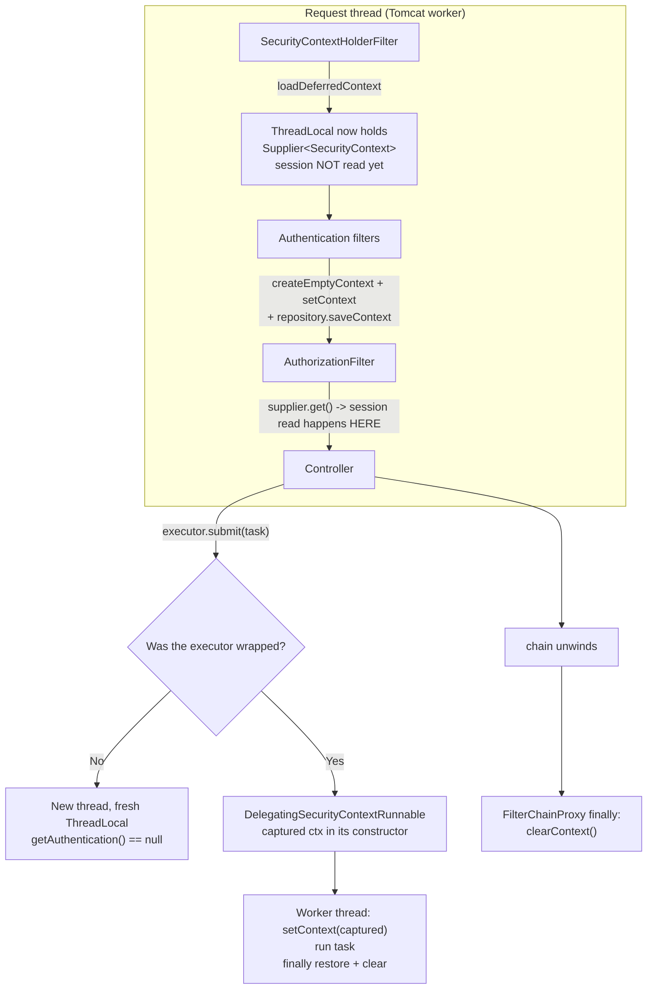
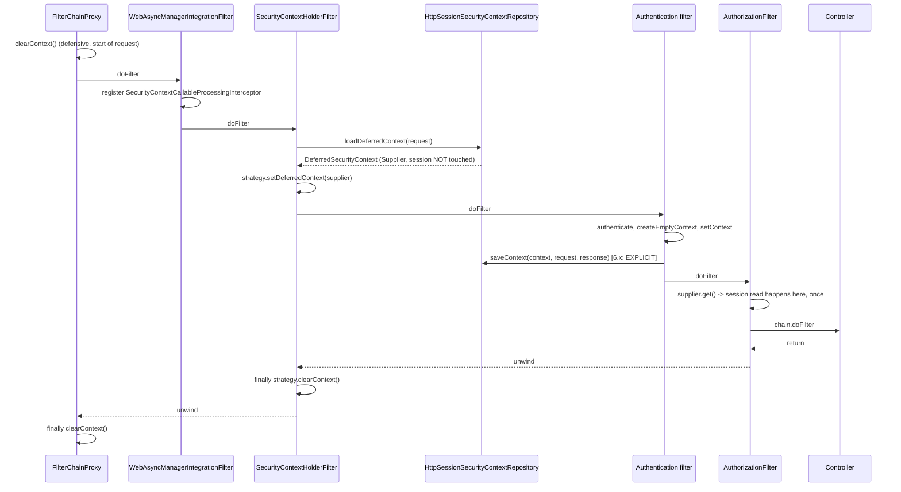

# 11.1 — SecurityContext Internals and Async Propagation

> **Module 11 · Topic 1** · Advanced Topics
> Baseline: Spring Security 6.x on Boot 3.x
> New to this? Read **In Plain English** below first, then come back to the Version Matrix.

---

## Version Matrix

| Concern | Spring Security 5.x | **Spring Security 6.x (baseline)** | Spring Security 7.x |
|---|---|---|---|
| Context filter | `SecurityContextPersistenceFilter` — loads **and** saves | **`SecurityContextHolderFilter`** — loads only, never saves | `SecurityContextHolderFilter` only; the persistence filter is gone |
| Saving the context | Implicit, on chain exit | **Explicit** — the authentication mechanism calls `SecurityContextRepository.saveContext(...)` | Explicit only; `requireExplicitSave` toggle removed |
| Session read | Eager — the session is touched on every request | **Deferred** — `loadDeferredContext` returns a `Supplier<SecurityContext>` | same |
| `ThreadLocal` payload | `ThreadLocal<SecurityContext>` | **`ThreadLocal<Supplier<SecurityContext>>`** | same |
| Strategy access | `SecurityContextHolder.getContext()` static calls everywhere | **`SecurityContextHolder.getContextHolderStrategy()` injected into components** | Components are built around the injected strategy; static access is legacy |
| Change observation | — (added 5.6) | **`SecurityContextChangedListener` + `ListeningSecurityContextHolderStrategy`** | same |
| Reactive holder | `ReactiveSecurityContextHolder` (Reactor `Context`) | same | same |
| Virtual threads | Not available | **Opt-in** via `spring.threads.virtual.enabled=true` (Boot 3.2+) | Expected default posture for new applications |

---

## Why This Exists

`SecurityContextHolder.getContext().getAuthentication()` is the single most-typed line in
Spring Security, and almost nobody knows what it actually does. It looks like a global
variable. It behaves like one in the happy path. And the moment you introduce a second
thread — an `@Async` method, a `CompletableFuture`, a `parallelStream()`, a scheduled job
kicked off from a request — it silently returns `null`, or worse, returns *somebody else's*
identity.

File 04 established the mechanism at the servlet level: one filter instance, many threads,
`ThreadLocal` for per-request state, mandatory cleanup in a `finally` block because
containers pool threads. This topic is what sits on top of that mechanism. Three things are
worth understanding precisely:

1. **`SecurityContextHolder` is not storage.** It is a static facade over a pluggable
   `SecurityContextHolderStrategy`, and the strategy you pick determines whether your
   application is correct, slow, or catastrophically broken under concurrency.
2. **Spring Security 6 changed how the context is loaded and saved**, and both changes
   (deferred loading, explicit saving) break applications that were written against 5.x
   assumptions in ways that produce no compile error and no startup warning.
3. **Propagation across threads is not automatic and never will be**, because a `ThreadLocal`
   is by definition not shared. Every cross-thread mechanism in Spring Security is the same
   trick — capture the context on the submitting thread, restore it on the executing thread,
   clear it in a `finally`.

---

## In Plain English

**The one-line version:** The line of code you use everywhere to ask "who is logged in?" reads a
note that was pinned to one specific worker, so the moment your code hands work to a second
worker, that note is either missing or belongs to somebody else.

**An analogy.** Imagine a passport office with a row of clerk desks. A visitor arrives, a clerk
takes their case, and the clerk clips the visitor's ID card to a board on the side of their own
desk. Any time the clerk needs to know who they are serving, they glance at their own board. That
board is the important part of the analogy: it is not a shared noticeboard on the wall, it is one
board per desk, visible only from that desk.

Now the clerk decides the case needs three checks done in parallel, and passes slips to three
colleagues. Each colleague looks at their own desk board, which is blank, and concludes there is
nobody to serve. Nothing broke loudly; the paperwork just comes back saying "no applicant". That
is what happens when you call a method marked `@Async` or start a `CompletableFuture` and then ask
who is logged in.

The analogy has one more turn, and it is the dangerous one. The desks are not assigned
permanently — clerks come and go, and a desk is reused by whoever sits there next. If a clerk
leaves the previous visitor's ID card clipped to the board, the next clerk at that desk starts the
day looking at a stranger's identity and believing it is their current visitor. That is the leak
this topic exists to prevent, and it is why the framework always clears the board at the end of a
request even though clearing looks unnecessary.

**How it actually works, step by step.**

The thing that holds the current identity is a `ThreadLocal`, which is a variable whose value is
private to one thread of execution — the desk board from the analogy. A thread is one worker
running one task at a time, and a web server keeps a pool of them, reusing each for request after
request. `SecurityContextHolder` is not itself the store; it is a thin static front door that
forwards every call to a **strategy** object, and the strategy is what actually chooses where the
identity lives. Swapping that strategy is the only way to change the storage behaviour, and two of
the three built-in strategies are wrong for a web application in ways described below.

Inside the box is a small nesting doll. The `SecurityContext` is a holder with one meaningful
slot in it, and that slot contains an `Authentication` — the object describing who the caller is
and what they are permitted to do. So the familiar
`SecurityContextHolder.getContext().getAuthentication()` reads three levels: ask the front door
for the strategy, ask the strategy for this thread's context, ask the context for the identity.

Spring Security 6 changed two things about this, and neither change produces a compiler error, so
applications written for version 5 break quietly. The first change is that the identity is no
longer fetched from the session at the start of the request. Instead the framework stores a
**supplier**, which is a small object that knows how to fetch the identity *if someone asks*. If
the request turns out to be a public one that never asks, the session is never read at all — and
for an application whose sessions live in Redis, that removes a network round trip from every
health check and every image request. The second change is that saving is now explicit: the
framework no longer writes the identity back to the session on the way out, so whatever code
authenticated the request must call `saveContext` itself. Custom login filters written for version
5 therefore appear to work — the current request is authenticated — and then the next request
arrives anonymous, because nothing was ever stored.

Getting the identity onto a second thread is always the same manoeuvre, and it is worth learning
once as a shape rather than as a list of class names. Read the identity on the thread that is
submitting the work, carry it across as an ordinary value, install it on the worker thread before
the task body runs, and put back whatever was there before once the task finishes. Spring Security
ships that wrapper for every kind of executor and task, all named `DelegatingSecurityContext`
something. The rule that saves you repeated bugs is to wrap the **executor** once, in
configuration, rather than wrapping individual tasks — because wrapping tasks is a discipline the
next developer will not know about.

There is one apparent shortcut that you will find recommended online and should not take. A
variant of the storage strategy called *inheritable* copies the identity into child threads, which
sounds like exactly the fix. The copy happens at the instant the child thread is *constructed*,
and a thread pool constructs its workers lazily, on whichever request happened to be running when
the pool needed to grow. So one worker is permanently stamped with the identity of the user whose
request triggered its creation, and every later task on that worker starts out believing it is
that user. It depends on pool warm-up order, so it passes every test and fails under production
load.

**Why should a beginner care?** The two failure modes here are the kind that survive code review.
The harmless one is a background or parallel task that finds no identity and either throws or
silently does nothing; you will meet that within a week of writing your first `@Async` method. The
serious one is the opposite — a request that runs with an identity left over from a previous user
on the same pooled thread, which means one customer's data returned to another. There is no
exception, no log line, and no failing test; the only defence is understanding why the identity is
per-thread and why it must be cleared.

**Words you will meet in this file**

| Term | In plain words |
|---|---|
| Thread | One worker executing one task at a time. A web server keeps a pool of them and reuses each for many requests. |
| `ThreadLocal` | A variable whose value belongs to one thread only. Other threads reading the same variable see nothing. |
| `SecurityContext` | The small holder that carries the current identity. Practically speaking it has one slot in it. |
| `Authentication` | The object describing who the caller is and what they are allowed to do. It lives inside the context. |
| `SecurityContextHolder` | The static front door everyone calls. It stores nothing itself and forwards every call to the strategy. |
| `SecurityContextHolderStrategy` | The component that decides where the identity is actually kept. Replaceable, which is the whole point of the design. |
| `MODE_THREADLOCAL` | The default and correct storage choice for a server: one identity per thread. |
| `MODE_INHERITABLETHREADLOCAL` | The tempting wrong choice. Copies the identity when a thread is created, which thread pools defeat unpredictably. |
| `MODE_GLOBAL` | One identity for the entire application. Fine for a desktop tool, catastrophic on a server. |
| Deferred loading | Storing a "fetch it if asked" instruction instead of the identity itself, so public requests never touch the session. |
| `Supplier` | A small object that produces a value when asked. Here it is what makes deferred loading possible. |
| `SecurityContextHolderFilter` | The filter that installs the deferred identity at the start of a request and clears it at the end. It never saves. |
| `SecurityContextRepository` | Where the identity is kept between requests, usually the session. The thing you must call `saveContext` on. |
| Explicit save | The version 6 rule that whoever authenticated a request must store the identity themselves. Forgetting it means only the current request is logged in. |
| `DelegatingSecurityContext...` | The family of wrappers that copies the identity onto another thread and cleans up afterwards. Wrap the executor, not the task. |
| `@Async` | An annotation that runs a method on a different thread. The identity does not follow unless the executor was wrapped. |
| `applicationTaskExecutor` | The thread pool Spring Boot gives `@Async` by default. Knowing its name is how you find out which pool to wrap. |
| `CompletableFuture` | A way to run work in the background. If you do not pass it a wrapped executor it uses a shared pool with no identity. |
| `WebAsyncManagerIntegrationFilter` | Covers one specific async style — a controller returning `Callable`. It does not cover futures you started yourself. |
| `ReactiveSecurityContextHolder` | The WebFlux equivalent. It carries the identity with the subscription rather than the thread, so thread hops are safe. |
| Virtual threads | Cheap threads created per task and thrown away, which removes the reuse that causes identity leaks. |
| Scoped values | A newer Java feature where a value is visible only inside a block and unbinds itself on exit, so there is nothing to forget to clear. |

**If you remember only one thing:** the current identity is stored per thread, so it never crosses
a thread boundary by itself and it must always be cleared, and every cross-thread fix in this file
is the same capture-install-restore pattern wearing a different class name.

---

## Core Concepts

### 1. `SecurityContextHolder` Is a Static Facade, Not a Store

**In simple terms:** The class everyone calls to get the current user keeps nothing itself — it
just forwards to a replaceable component, and that component is what decides the storage rules.

The class holds exactly one piece of mutable state: a reference to a strategy.

```java
package org.springframework.security.core.context;

public class SecurityContextHolder {

    public static final String MODE_THREADLOCAL = "MODE_THREADLOCAL";
    public static final String MODE_INHERITABLETHREADLOCAL = "MODE_INHERITABLETHREADLOCAL";
    public static final String MODE_GLOBAL = "MODE_GLOBAL";
    private static final String MODE_PRE_INITIALIZED = "MODE_PRE_INITIALIZED";
    public static final String SYSTEM_PROPERTY = "spring.security.strategy";

    private static String strategyName = System.getProperty(SYSTEM_PROPERTY);
    private static SecurityContextHolderStrategy strategy;

    static { initialize(); }

    public static SecurityContext getContext()               { return strategy.getContext(); }
    public static void setContext(SecurityContext context)   { strategy.setContext(context); }
    public static void clearContext()                        { strategy.clearContext(); }
    public static SecurityContext createEmptyContext()       { return strategy.createEmptyContext(); }

    /** Added in 5.8/6.0 — the method you should actually be using. */
    public static SecurityContextHolderStrategy getContextHolderStrategy() { return strategy; }

    public static void setContextHolderStrategy(SecurityContextHolderStrategy strategy) {
        Assert.notNull(strategy, "securityContextHolderStrategy cannot be null");
        SecurityContextHolder.strategyName = MODE_PRE_INITIALIZED;
        SecurityContextHolder.strategy = strategy;
        initializeCount++;
    }
}
```

Every static method is a one-line delegation. That is the whole class. The interesting
behaviour lives in the strategy:

```java
package org.springframework.security.core.context;

public interface SecurityContextHolderStrategy {

    void clearContext();

    SecurityContext getContext();

    default Supplier<SecurityContext> getDeferredContext() {
        return () -> getContext();
    }

    void setContext(SecurityContext context);

    default void setDeferredContext(Supplier<SecurityContext> deferredContext) {
        setContext(deferredContext.get());
    }

    SecurityContext createEmptyContext();
}
```

Note `createEmptyContext()`. It exists on the strategy rather than being
`new SecurityContextImpl()` inline because a custom strategy may need a custom
`SecurityContext` subtype — for example one carrying a tenant identifier alongside the
`Authentication`. Code that writes `new SecurityContextImpl()` directly compiles fine and
quietly defeats any such customisation. Always go through the strategy.

### 2. The Three Built-In Strategies and Their Exact Failure Modes

**In simple terms:** There are three places the identity can be kept, and for a web application
only one of them is correct — the other two either leak one user's identity to another or hand the
whole application a single shared identity.

| Strategy | `strategyName` | Storage | Correct for | Failure mode |
|---|---|---|---|---|
| `ThreadLocalSecurityContextHolderStrategy` | `MODE_THREADLOCAL` (default) | `ThreadLocal<Supplier<SecurityContext>>` | Every server-side application | Context does not cross threads — `null` in `@Async`, `CompletableFuture`, `parallelStream()` |
| `InheritableThreadLocalSecurityContextHolderStrategy` | `MODE_INHERITABLETHREADLOCAL` | `InheritableThreadLocal<Supplier<SecurityContext>>` | Code that spawns raw `new Thread(...)` per task and never pools | **Wrong with any thread pool** — a pooled thread inherits from whichever thread happened to construct it |
| `GlobalSecurityContextHolderStrategy` | `MODE_GLOBAL` | A single `private static SecurityContext` field | Standalone single-user clients (a desktop Swing application, a CLI) | One identity for the entire JVM — catastrophic on a server |

**`ThreadLocalSecurityContextHolderStrategy` — the default, and the correct one.**

```java
final class ThreadLocalSecurityContextHolderStrategy implements SecurityContextHolderStrategy {

    private static final ThreadLocal<Supplier<SecurityContext>> contextHolder = new ThreadLocal<>();

    @Override
    public void clearContext() {
        contextHolder.remove();          // remove(), not set(null) — avoids a stale entry
    }

    @Override
    public SecurityContext getContext() {
        return getDeferredContext().get();
    }

    @Override
    public Supplier<SecurityContext> getDeferredContext() {
        Supplier<SecurityContext> result = contextHolder.get();
        if (result == null) {
            SecurityContext context = createEmptyContext();
            result = () -> context;
            contextHolder.set(result);   // note: a READ installs a ThreadLocal entry
        }
        return result;
    }

    @Override
    public void setContext(SecurityContext context) {
        Assert.notNull(context, "Only non-null SecurityContext instances are permitted");
        contextHolder.set(() -> context);
    }

    @Override
    public SecurityContext createEmptyContext() {
        return new SecurityContextImpl();
    }
    // setDeferredContext wraps the supplier in a null-asserting one and stores that.
}
```

The single detail people miss: since 6.x the `ThreadLocal` holds a **`Supplier`**, not the
context itself. That is the whole deferred-loading mechanism, and it is why `getContext()`
can trigger a session read the first time it is called on a request that has not needed one
yet.

**`InheritableThreadLocalSecurityContextHolderStrategy` — the one that looks like the fix
and is not.**

It is the same class with `InheritableThreadLocal` substituted. `InheritableThreadLocal`
copies values from the parent thread into the child **at the moment `Thread` is constructed**
(`Thread.init` calls `ThreadLocal.createInheritedMap(parent.inheritableThreadLocals)`).

That single word — *constructed* — is the entire problem:

- A `ThreadPoolExecutor` creates its worker threads lazily, when a task arrives and the pool
  is below core size. The worker is constructed **by whichever request thread happened to
  submit the task that triggered the growth**. That worker permanently inherits Alice's
  `SecurityContext`.
- Every subsequent task on that worker, submitted by Bob, Carol, or a scheduler with no
  identity at all, starts with Alice's context already installed unless something explicitly
  overwrites it.
- Whether the bug shows up depends on pool warm-up order, so it passes every test and
  appears in production under load.

There is a second, less dramatic version: Tomcat creates its worker threads during startup
or during pool growth. If growth happens on a request thread, the new Tomcat worker inherits
that request's context as its *initial* value. `FilterChainProxy` clears the context in a
`finally`, so this self-corrects after the first request — but `clearContext()` calls
`remove()`, and `InheritableThreadLocal.remove()` on a child does not re-inherit, so the
window is narrow. The pool case above is the one that actually burns people.

**`GlobalSecurityContextHolderStrategy` — a single static field.**

```java
final class GlobalSecurityContextHolderStrategy implements SecurityContextHolderStrategy {

    private static SecurityContext contextHolder;   // one field. For the whole JVM.

    @Override public void clearContext()                      { contextHolder = null; }
    @Override public void setContext(SecurityContext context) { contextHolder = context; }
    @Override public SecurityContext createEmptyContext()     { return new SecurityContextImpl(); }

    @Override
    public SecurityContext getContext() {
        if (contextHolder == null) { contextHolder = createEmptyContext(); }
        return contextHolder;
    }
}
```

Its legitimate use is a standalone client — a Swing application, a JavaFX desktop tool, or a
command-line utility that authenticates once against a remote service and then makes calls on
whatever thread it likes. There is exactly one user, so one global slot is correct and
convenient. Setting `MODE_GLOBAL` in a web application means the last user to log in becomes
every user, which is not a subtle bug but is one that a single-developer smoke test will
never reveal.

### 3. The 6.x Move: Inject the Strategy, Do Not Call the Statics

**In simple terms:** Inside framework extension points you should hold a reference to the storage
component rather than calling the global shortcut, because that is what makes your class testable
and lets one filter chain use different storage from the rest of the application.

Spring Security 5.8 added `SecurityContextHolder.getContextHolderStrategy()` and then
systematically refactored the framework so that every component takes the strategy as a
field with a setter:

```java
public class BasicAuthenticationFilter extends OncePerRequestFilter {

    private SecurityContextHolderStrategy securityContextHolderStrategy =
            SecurityContextHolder.getContextHolderStrategy();

    public void setSecurityContextHolderStrategy(SecurityContextHolderStrategy strategy) {
        Assert.notNull(strategy, "securityContextHolderStrategy cannot be null");
        this.securityContextHolderStrategy = strategy;
    }
    // ... uses this.securityContextHolderStrategy.createEmptyContext() etc.
}
```

Two reasons, and both are real rather than stylistic.

**Testability.** Static state is global state. A test that calls
`SecurityContextHolder.setContext(...)` mutates a JVM-wide field that the next test in the
same JVM inherits unless it is cleaned up. With an injected strategy, a unit test constructs
the filter with a purpose-built strategy instance, asserts against it, and throws it away.
That is also why `@WithMockUser` is paired with a `TestExecutionListener` that clears the
context after each test method — the framework is working around the staticness on your
behalf.

**Correctness when a non-default strategy is installed.** If an application installs a
custom strategy — say one that delegates to a Micrometer `ThreadLocalAccessor`, or a
`ListeningSecurityContextHolderStrategy` that fires change events — then a component that
calls `SecurityContextHolder.getContext()` statically *still works*, because the facade
delegates. But a component that captured the strategy reference at construction time and a
component that calls the static both end up on the same object, so the real win is
different: it lets a **single** `SecurityFilterChain` run with a different strategy from the
rest of the JVM. Spring Security's own configurers do exactly this — when you publish a
`SecurityContextHolderStrategy` bean, `HttpSecurity` injects it into every filter it builds,
rather than the filters reaching out to a global.

The practical rule for your own code: in a filter, a provider, a success handler, or any
Spring Security extension point, declare the field. In ordinary application code (a service
method that just wants the current username), the static call is acceptable and universally
understood — though injecting it is still better if the class is unit tested.

### 4. Deferred Contexts — Why the Session Is Not Read Any More

**In simple terms:** Instead of fetching the logged-in user from the session at the start of every
request, the framework now stores an instruction to fetch it only if something asks, so public
requests cost nothing.

In Spring Security 5, `SecurityContextPersistenceFilter` read the `HttpSession` on **every**
request, at the very start of the chain, whether or not anything needed the result. On an
application whose session store is Redis, that is a network round trip on every request
including `permitAll()` health checks and static assets.

Spring Security 6 replaces it with `SecurityContextHolderFilter`, which installs a supplier:

```java
public class SecurityContextHolderFilter extends GenericFilterBean {

    private static final String FILTER_APPLIED = SecurityContextHolderFilter.class.getName() + ".APPLIED";

    private final SecurityContextRepository securityContextRepository;

    private SecurityContextHolderStrategy securityContextHolderStrategy =
            SecurityContextHolder.getContextHolderStrategy();

    private void doFilter(HttpServletRequest request, HttpServletResponse response, FilterChain chain)
            throws ServletException, IOException {

        if (request.getAttribute(FILTER_APPLIED) != null) {
            chain.doFilter(request, response);
            return;
        }
        request.setAttribute(FILTER_APPLIED, Boolean.TRUE);

        // NOT a SecurityContext — a Supplier. Nothing is read yet.
        Supplier<SecurityContext> deferredContext = this.securityContextRepository.loadDeferredContext(request);
        try {
            this.securityContextHolderStrategy.setDeferredContext(deferredContext);
            chain.doFilter(request, response);
        }
        finally {
            this.securityContextHolderStrategy.clearContext();
            request.removeAttribute(FILTER_APPLIED);
        }
    }
}
```

The supplier is `DeferredSecurityContext`:

```java
public interface DeferredSecurityContext extends Supplier<SecurityContext> {
    /** true when no context was found and an empty one was manufactured. */
    boolean isGenerated();
}
```

`SupplierDeferredSecurityContext` memoises: the first `get()` performs the session lookup,
caches the result, and every later `get()` on the same request returns the cached value.

The pay-off chains with the lazy `Supplier<Authentication>` covered in file 02. A
`permitAll()` rule never invokes the authentication supplier, the supplier never invokes the
deferred context, and the deferred context never touches the session. An entirely public
endpoint now performs **zero** session reads. That is the single largest throughput
improvement in the 6.0 release for session-backed applications.

The trap: `isGenerated()` matters because `HttpSessionSecurityContextRepository` must decide
whether saving is worthwhile. If the context was generated (empty, anonymous) and nothing
changed it, saving would create a session for an anonymous visitor — which is how
applications accidentally allocate a Redis entry for every crawler hit.

### 5. `SecurityContextRepository` and the Explicit-Save Requirement

**In simple terms:** Since version 6 nothing stores the logged-in user for you, so a custom login
filter that forgets to save will authenticate the current request and then be anonymous again on
the next one.

```java
package org.springframework.security.web.context;

public interface SecurityContextRepository {

    @Deprecated
    SecurityContext loadContext(HttpRequestResponseHolder requestResponseHolder);

    default DeferredSecurityContext loadDeferredContext(HttpServletRequest request) { ... }

    void saveContext(SecurityContext context, HttpServletRequest request, HttpServletResponse response);

    boolean containsContext(HttpServletRequest request);
}
```

| Implementation | Storage | Survives | Use for |
|---|---|---|---|
| `HttpSessionSecurityContextRepository` | `HttpSession` attribute `SPRING_SECURITY_CONTEXT` | Across requests | Form login, OAuth2 login, anything session-based |
| `RequestAttributeSecurityContextRepository` | Request attribute | The current request, including `ASYNC`/`ERROR` dispatches | Stateless JWT / API-key filters |
| `NullSecurityContextRepository` | Nothing | Nothing | Pure stateless where even async dispatch does not need it |
| `DelegatingSecurityContextRepository` | Composes several | Union | Write to both session and request attribute |

**The 6.x behaviour change.** `SecurityContextHolderFilter` has no `saveContext` call
anywhere. Saving became the responsibility of whatever authenticated the request. Built-in
mechanisms were all updated; **custom filters were not**, because they are your code.

```java
// 5.x: this was enough. The persistence filter saved on the way out.
SecurityContextHolder.getContext().setAuthentication(authentication);

// 6.x: this authenticates the CURRENT request only. The next request is anonymous again.
SecurityContext context = this.securityContextHolderStrategy.createEmptyContext();
context.setAuthentication(authentication);
this.securityContextHolderStrategy.setContext(context);
this.securityContextRepository.saveContext(context, request, response);   // <-- mandatory now
```

Note also that mutating the *existing* context in place —
`SecurityContextHolder.getContext().setAuthentication(auth)` — is discouraged even when you
do save. With deferred loading the object you mutate may be a freshly generated empty
context that the repository then declines to persist, and with a shared or cached context
object you would be mutating state another thread can observe. Always create a new context.

The escape hatch `http.securityContext(sc -> sc.requireExplicitSave(false))` restores 5.x
behaviour by reinstating `SecurityContextPersistenceFilter`. It is a migration aid with a
deprecation on it; treat it as a temporary bridge, not a configuration choice.

### 6. Propagating Across Threads — The `Delegating*` Family

**In simple terms:** These wrappers copy the current identity onto a background thread and put
back whatever was there when the task ends, and there is one wrapper for every kind of task or
thread pool you might use.

Every one of these classes implements the same three-line pattern. Here is the canonical one:

```java
package org.springframework.security.concurrent;

public class DelegatingSecurityContextRunnable implements Runnable {

    private final Runnable delegate;
    private final SecurityContext delegateSecurityContext;   // captured at CONSTRUCTION time
    private SecurityContext originalSecurityContext;

    private SecurityContextHolderStrategy securityContextHolderStrategy =
            SecurityContextHolder.getContextHolderStrategy();

    public DelegatingSecurityContextRunnable(Runnable delegate) {
        this(delegate, SecurityContextHolder.getContextHolderStrategy().getContext());
    }

    @Override
    public void run() {
        this.originalSecurityContext = this.securityContextHolderStrategy.getContext();
        try {
            this.securityContextHolderStrategy.setContext(this.delegateSecurityContext);
            this.delegate.run();
        }
        finally {
            SecurityContext emptyContext = this.securityContextHolderStrategy.createEmptyContext();
            if (emptyContext.equals(this.originalSecurityContext)) {
                this.securityContextHolderStrategy.clearContext();      // leave the thread clean
            }
            else {
                this.securityContextHolderStrategy.setContext(this.originalSecurityContext);
            }
            this.originalSecurityContext = null;                        // release the reference
        }
    }
}
```

Two details worth reading carefully. **The context is captured in the constructor**, which
runs on the submitting thread — that is why wrapping must happen at submission time and not
inside the task. And the `finally` block **restores** rather than blindly clearing, because
the executing thread may itself have had a context (it may be another request thread if you
used a caller-runs rejection policy).

| Class | Package | Wraps | When to use |
|---|---|---|---|
| `DelegatingSecurityContextRunnable` | `o.s.s.concurrent` | `Runnable` | One-off manual submission |
| `DelegatingSecurityContextCallable<V>` | `o.s.s.concurrent` | `Callable<V>` | One-off with a result |
| `DelegatingSecurityContextExecutor` | `o.s.s.concurrent` | `Executor` | The base wrapper — `execute` only |
| `DelegatingSecurityContextExecutorService` | `o.s.s.concurrent` | `ExecutorService` | `submit`, `invokeAll`, shutdown lifecycle |
| `DelegatingSecurityContextScheduledExecutorService` | `o.s.s.concurrent` | `ScheduledExecutorService` | `schedule`, `scheduleAtFixedRate` |
| `DelegatingSecurityContextTaskExecutor` | `o.s.s.task` | Spring's `TaskExecutor` | Spring abstractions |
| `DelegatingSecurityContextAsyncTaskExecutor` | `o.s.s.task` | Spring's `AsyncTaskExecutor` | `@Async`, `AsyncConfigurer` |
| `DelegatingSecurityContextTaskScheduler` | `o.s.s.scheduling` | Spring's `TaskScheduler` | `@Scheduled` triggered from a request context |

**Wrap the executor, not the task.** Wrapping the executor is one change in one place and
cannot be forgotten by the next developer. Wrapping individual tasks is a discipline, and
disciplines fail.

### 7. `@Async` — And the Bean Name Nobody Knows

**In simple terms:** Wrapping a thread pool only helps if it is the same pool `@Async` actually
uses, and most "I wrapped it and it still does not work" reports are a case of wrapping a
different one.

`@Async` does not run your method on a thread you chose. It runs it on the `Executor` that
Spring's `AsyncAnnotationBeanPostProcessor` resolved, which in Spring Boot 3 is the
auto-configured `ThreadPoolTaskExecutor` bean named **`applicationTaskExecutor`**. That
bean is also what MVC uses for `Callable` return values.

So "I wrapped my executor and `@Async` still loses the context" almost always means a second
`Executor` bean was created and `@Async` is still picking the Boot one, or the wrapping bean
is not the one `@Async` resolves. The reliable fix is to implement `AsyncConfigurer`, which
is the explicit contract for "this is the executor `@Async` uses":

```java
@Configuration
@EnableAsync
public class AsyncSecurityConfig implements AsyncConfigurer {

    private final ThreadPoolTaskExecutor delegate;

    AsyncSecurityConfig(@Qualifier("applicationTaskExecutor") ThreadPoolTaskExecutor delegate) {
        this.delegate = delegate;
    }

    @Override
    public Executor getAsyncExecutor() {
        return new DelegatingSecurityContextAsyncTaskExecutor(this.delegate);
    }
}
```

There is a second, older mechanism people still cite: `@EnableAsync` with a
`SecurityContextHolderStrategy` of `MODE_INHERITABLETHREADLOCAL`. Do not. See section 2 — the
pool defeats it, non-deterministically.

### 8. Servlet Async — `WebAsyncManagerIntegrationFilter` Covers Less Than You Think

**In simple terms:** Spring Security does carry the identity across one particular style of
asynchronous controller, but it cannot help with background work you started yourself, because by
then the work is already running.

Spring Security registers `WebAsyncManagerIntegrationFilter` as the **first** filter in the
chain. Its whole job is to register one interceptor:

```java
public final class WebAsyncManagerIntegrationFilter extends OncePerRequestFilter {

    private static final Object CALLABLE_INTERCEPTOR_KEY = new Object();

    @Override
    protected void doFilterInternal(HttpServletRequest request, HttpServletResponse response,
            FilterChain filterChain) throws ServletException, IOException {

        WebAsyncManager asyncManager = WebAsyncUtils.getAsyncManager(request);
        SecurityContextCallableProcessingInterceptor interceptor =
            (SecurityContextCallableProcessingInterceptor)
                asyncManager.getCallableInterceptor(CALLABLE_INTERCEPTOR_KEY);

        if (interceptor == null) {
            interceptor = new SecurityContextCallableProcessingInterceptor();
            interceptor.setSecurityContextHolderStrategy(this.securityContextHolderStrategy);
            asyncManager.registerCallableInterceptor(CALLABLE_INTERCEPTOR_KEY, interceptor);
        }
        filterChain.doFilter(request, response);
    }
}
```

And the interceptor is the same capture-restore pattern hung off Spring MVC's async
lifecycle callbacks:

```java
public final class SecurityContextCallableProcessingInterceptor implements CallableProcessingInterceptor {

    private volatile SecurityContext securityContext;

    @Override
    public <T> void beforeConcurrentHandling(NativeWebRequest request, Callable<T> task) {
        if (this.securityContext == null) {
            setSecurityContext(this.securityContextHolderStrategy.getContext());   // on the REQUEST thread
        }
    }

    @Override
    public <T> void preProcess(NativeWebRequest request, Callable<T> task) {
        this.securityContextHolderStrategy.setContext(this.securityContext);        // on the ASYNC thread
    }

    @Override
    public <T> void postProcess(NativeWebRequest request, Callable<T> task, Object result, Throwable t) {
        this.securityContextHolderStrategy.clearContext();
    }
}
```

**What this covers:** a controller returning `Callable<T>`, `WebAsyncTask<T>`, or anything
else routed through `WebAsyncManager.startCallableProcessing`. Spring MVC hands those to the
async task executor and the interceptor fires around them.

**What this does not cover:** a controller that returns `CompletableFuture<T>` produced by
your own `CompletableFuture.supplyAsync(...)`. That goes through
`startDeferredResultProcessing`, and the work has already been submitted to
`ForkJoinPool.commonPool()` by the time Spring MVC sees the returned object. There is no hook
because from the framework's perspective you handed it a future that was already running.
`DeferredResult` has the same characteristic. The fix is the same as everywhere else: submit
to an executor that has been wrapped.

```java
// Broken. commonPool, no wrapping, context is null inside supplyAsync.
@GetMapping("/broken")
public CompletableFuture<Report> broken() {
    return CompletableFuture.supplyAsync(() -> reportService.build());
}

// Correct. The executor propagates, so the lambda sees the caller's identity.
@GetMapping("/correct")
public CompletableFuture<Report> correct() {
    return CompletableFuture.supplyAsync(() -> reportService.build(), securityAwareExecutor);
}
```

### 9. Reactive as a Contrast — `ReactiveSecurityContextHolder`

**In simple terms:** The reactive stack attaches the identity to the work itself rather than to a
thread, which means it survives thread changes automatically but travels in a direction that
surprises everyone the first time.

WebFlux cannot use a `ThreadLocal` at all. A single reactive pipeline hops event-loop threads
freely between operators, so per-thread state is meaningless. Project Reactor solves it with
the **Reactor `Context`**, an immutable key-value map carried *with the subscription*, not
with the thread.

```java
package org.springframework.security.core.context;

public final class ReactiveSecurityContextHolder {

    static final Class<?> SECURITY_CONTEXT_KEY = SecurityContext.class;

    public static Mono<SecurityContext> getContext() {
        return Mono.deferContextual(ctx -> ctx.<Mono<SecurityContext>>getOrEmpty(SECURITY_CONTEXT_KEY)
                                              .orElse(Mono.empty()));
    }

    public static Context withSecurityContext(Mono<? extends SecurityContext> securityContext) {
        return Context.of(SECURITY_CONTEXT_KEY, securityContext);
    }

    public static Context withAuthentication(Authentication authentication) {
        return withSecurityContext(Mono.just(new SecurityContextImpl(authentication)));
    }
}
```

Two structural consequences. First, the context **propagates automatically** across thread
hops, `publishOn`, `subscribeOn`, and `flatMap` — no wrapping required, because it travels
with the `Subscription` rather than the thread. Second, it propagates **upstream only**:
`contextWrite` affects operators *above* it in the chain, because the context is assembled
during subscription, which flows from subscriber to publisher. That inversion is the single
most common reactive-security bug, and it is covered properly in file 45.

The bridge case — a blocking call inside a reactive pipeline that needs the servlet-style
`SecurityContextHolder` — is handled by Micrometer's `context-propagation` library, which
defines a `ThreadLocalAccessor` abstraction and lets Reactor copy values into and out of
`ThreadLocal` slots at scheduler boundaries. Spring Framework 6.1's
`ContextPropagatingTaskDecorator` applies the same library to a plain `TaskExecutor`. If you
need one mechanism that carries tracing, MDC, and security together, that is the direction
to look rather than hand-wrapping three separate concerns.

### 10. Virtual Threads and Scoped Values

**In simple terms:** Threads that are created for one task and then thrown away remove the reuse
that causes identity leaks, and a newer Java feature promises to remove the need to remember
cleanup at all.

Enabling `spring.threads.virtual.enabled=true` on Boot 3.2+ changes three things.

**The pooled-thread leak from file 04 disappears.** A virtual thread is created for a single
task and then discarded. It is never handed a second request, so a `SecurityContext` left
behind in a `ThreadLocal` cannot be observed by anyone. `FilterChainProxy`'s `finally` remains
correct and becomes cheap insurance rather than the load-bearing wall it is with platform
threads.

**The `ThreadLocal` footprint starts to matter.** With 200 platform threads, 200 copies of a
`SecurityContext` is nothing. With 200,000 concurrent virtual threads, each carrying a
`ThreadLocalMap` with a security context, a tracing span, an MDC map, and whatever else the
stack installed, the per-thread overhead becomes a real heap cost. This is one of the
motivations behind making the strategy pluggable rather than hard-coding `ThreadLocal`.

**`synchronized` pinning.** Before JDK 24, a virtual thread that blocks inside a
`synchronized` block pins its carrier thread for the duration. Older JDBC drivers and
connection pools are full of `synchronized` around blocking I/O, and the carrier pool
defaults to the number of CPUs. A handful of pinned carriers and throughput collapses or
deadlocks. JEP 491 in JDK 24 removed the pinning for `synchronized`; on JDK 21 you must audit
your drivers first and run with `-Djdk.tracePinnedThreads=full` under load.

**Scoped values** (JEP 506, finalised in JDK 25) are the intended long-term replacement for
this whole category of problem:

```java
private static final ScopedValue<SecurityContext> CONTEXT = ScopedValue.newInstance();

ScopedValue.where(CONTEXT, context).run(() -> {
    // CONTEXT.get() is visible here and in everything this calls,
    // including structured-concurrency child tasks — and NOWHERE else.
});
```

The properties that matter for security are immutability and bounded lifetime. A scoped value
cannot be reassigned by callee code, and it is unbound automatically when the block exits, so
there is no `clearContext()` to forget and no leak to leave behind. Combined with structured
concurrency (`StructuredTaskScope`), child tasks inherit the binding by construction — which
is exactly what `InheritableThreadLocal` promised and failed to deliver with pools. Spring
Security has not adopted it yet, but the pluggable `SecurityContextHolderStrategy` is what
makes adopting it a strategy swap rather than a rewrite.

---



---

## Working Code

A filter that does context handling correctly for Spring Security 6:

```java
package com.example.security.context;

import jakarta.servlet.FilterChain;
import jakarta.servlet.ServletException;
import jakarta.servlet.http.HttpServletRequest;
import jakarta.servlet.http.HttpServletResponse;
import org.springframework.security.authentication.AuthenticationManager;
import org.springframework.security.core.Authentication;
import org.springframework.security.core.context.SecurityContext;
import org.springframework.security.core.context.SecurityContextHolder;
import org.springframework.security.core.context.SecurityContextHolderStrategy;
import org.springframework.security.web.context.RequestAttributeSecurityContextRepository;
import org.springframework.security.web.context.SecurityContextRepository;
import org.springframework.util.Assert;
import org.springframework.web.filter.OncePerRequestFilter;

import java.io.IOException;

/**
 * Stateless token filter. Demonstrates the three 6.x rules:
 *   1. hold the strategy, do not call the statics
 *   2. createEmptyContext() from the strategy, never new SecurityContextImpl()
 *   3. saveContext() explicitly - SecurityContextHolderFilter will not do it for you
 */
public class TokenAuthenticationFilter extends OncePerRequestFilter {

    private final AuthenticationManager authenticationManager;

    private SecurityContextHolderStrategy securityContextHolderStrategy =
            SecurityContextHolder.getContextHolderStrategy();

    /**
     * RequestAttribute, not Null: the context must survive an ASYNC dispatch within the
     * same request, otherwise a Callable-returning controller loses its identity.
     */
    private SecurityContextRepository securityContextRepository =
            new RequestAttributeSecurityContextRepository();

    public TokenAuthenticationFilter(AuthenticationManager authenticationManager) {
        this.authenticationManager = authenticationManager;
    }

    public void setSecurityContextHolderStrategy(SecurityContextHolderStrategy strategy) {
        Assert.notNull(strategy, "securityContextHolderStrategy cannot be null");
        this.securityContextHolderStrategy = strategy;
    }

    @Override
    protected void doFilterInternal(HttpServletRequest request, HttpServletResponse response,
            FilterChain chain) throws ServletException, IOException {

        String header = request.getHeader("Authorization");
        if (header == null || !header.startsWith("Bearer ")) {
            chain.doFilter(request, response);       // no credential -> let authorization decide
            return;
        }

        Authentication result = this.authenticationManager
                .authenticate(new BearerTokenAuthenticationRequest(header.substring(7)));

        SecurityContext context = this.securityContextHolderStrategy.createEmptyContext();
        context.setAuthentication(result);
        this.securityContextHolderStrategy.setContext(context);
        this.securityContextRepository.saveContext(context, request, response);

        chain.doFilter(request, response);
        // No finally/clear here - FilterChainProxy sits outside us and clears already.
    }
}
```

Executor configuration — the one place that makes every asynchronous path correct:

```java
package com.example.security.context;

import org.springframework.beans.factory.annotation.Qualifier;
import org.springframework.context.annotation.Bean;
import org.springframework.context.annotation.Configuration;
import org.springframework.scheduling.annotation.AsyncConfigurer;
import org.springframework.scheduling.annotation.EnableAsync;
import org.springframework.scheduling.annotation.EnableScheduling;
import org.springframework.scheduling.concurrent.ThreadPoolTaskExecutor;
import org.springframework.scheduling.concurrent.ThreadPoolTaskScheduler;
import org.springframework.security.concurrent.DelegatingSecurityContextExecutorService;
import org.springframework.security.scheduling.DelegatingSecurityContextTaskScheduler;
import org.springframework.security.task.DelegatingSecurityContextAsyncTaskExecutor;

import java.util.concurrent.Executor;
import java.util.concurrent.ExecutorService;
import java.util.concurrent.Executors;

@Configuration
@EnableAsync
@EnableScheduling
public class SecurityAwareExecutorConfig implements AsyncConfigurer {

    private final ThreadPoolTaskExecutor applicationTaskExecutor;

    public SecurityAwareExecutorConfig(
            @Qualifier("applicationTaskExecutor") ThreadPoolTaskExecutor applicationTaskExecutor) {
        this.applicationTaskExecutor = applicationTaskExecutor;
    }

    /**
     * THE bean that @Async resolves. Boot's auto-configured applicationTaskExecutor is what
     * @Async and MVC Callable handling use by default; wrapping it here covers both.
     */
    @Override
    public Executor getAsyncExecutor() {
        return new DelegatingSecurityContextAsyncTaskExecutor(this.applicationTaskExecutor);
    }

    /** For explicit CompletableFuture.supplyAsync(..., executor) in application code. */
    @Bean
    ExecutorService securityAwareExecutor() {
        ExecutorService delegate = Executors.newFixedThreadPool(8);
        return new DelegatingSecurityContextExecutorService(delegate);
    }

    /**
     * @Scheduled normally has no context at all (nothing authenticated the tick). Wrapping the
     * scheduler only helps for tasks SUBMITTED from a request thread; a cron trigger still
     * starts anonymous, and that is correct - give those a dedicated service principal.
     */
    @Bean
    DelegatingSecurityContextTaskScheduler taskScheduler() {
        ThreadPoolTaskScheduler delegate = new ThreadPoolTaskScheduler();
        delegate.setPoolSize(4);
        delegate.initialize();
        return new DelegatingSecurityContextTaskScheduler(delegate);
    }
}
```

A listener that detects the cross-user leak in staging before a customer finds it in
production (imports omitted — all from `org.springframework.security.core.context`):

```java
package com.example.security.context;

@Configuration
public class ContextLeakDetectionConfig {

    private static final Logger log = LoggerFactory.getLogger(ContextLeakDetectionConfig.class);

    /**
     * Fires on every setContext / clearContext. An overwrite from principal A to principal B
     * WITHOUT an intervening clear means a thread carried identity across a boundary.
     */
    @Bean
    SecurityContextChangedListener leakDetector() {
        return event -> {
            var oldAuth = event.getOldContext() == null ? null : event.getOldContext().getAuthentication();
            var newAuth = event.getNewContext() == null ? null : event.getNewContext().getAuthentication();
            if (oldAuth != null && newAuth != null && !oldAuth.getName().equals(newAuth.getName())) {
                log.warn("SecurityContext replaced without a clear: {} -> {} on thread {}",
                        oldAuth.getName(), newAuth.getName(), Thread.currentThread().getName());
            }
        };
    }

    /**
     * Publishing a SecurityContextHolderStrategy bean makes HttpSecurity inject it into every
     * filter it builds, instead of those filters reaching for the JVM-global default.
     * Static and @Order(HIGHEST_PRECEDENCE) so it is built before anything consumes it.
     */
    @Bean
    @Order(org.springframework.core.Ordered.HIGHEST_PRECEDENCE)
    static SecurityContextHolderStrategy securityContextHolderStrategy(
            SecurityContextChangedListener listener) {
        SecurityContextHolderStrategy delegate = new ThreadLocalSecurityContextHolderStrategy();
        ListeningSecurityContextHolderStrategy listening =
                new ListeningSecurityContextHolderStrategy(delegate, listener);
        SecurityContextHolder.setContextHolderStrategy(listening);
        return listening;
    }
}
```

Tests that pin the behaviour — including one that *reproduces* the leak:

```java
package com.example.security.context;

import org.junit.jupiter.api.AfterEach;
import org.junit.jupiter.api.Test;
import org.springframework.security.authentication.UsernamePasswordAuthenticationToken;
import org.springframework.security.core.authority.AuthorityUtils;
import org.springframework.security.core.context.SecurityContext;
import org.springframework.security.core.context.SecurityContextHolder;
import org.springframework.security.concurrent.DelegatingSecurityContextExecutorService;

import java.util.concurrent.*;

import static org.assertj.core.api.Assertions.assertThat;

class SecurityContextPropagationTests {

    private final ExecutorService raw = Executors.newFixedThreadPool(1);

    @AfterEach
    void tearDown() {
        SecurityContextHolder.clearContext();
        raw.shutdownNow();
    }

    private static void authenticateAs(String username) {
        SecurityContext context = SecurityContextHolder.createEmptyContext();
        context.setAuthentication(new UsernamePasswordAuthenticationToken(
                username, "n/a", AuthorityUtils.createAuthorityList("ROLE_USER")));
        SecurityContextHolder.setContext(context);
    }

    @Test
    void plainExecutorLosesTheContext() throws Exception {
        authenticateAs("alice");

        String seen = raw.submit(() -> {
            var auth = SecurityContextHolder.getContext().getAuthentication();
            return auth == null ? "NONE" : auth.getName();
        }).get(2, TimeUnit.SECONDS);

        assertThat(seen).isEqualTo("NONE");
    }

    @Test
    void delegatingExecutorPropagatesTheContext() throws Exception {
        authenticateAs("alice");
        ExecutorService wrapped = new DelegatingSecurityContextExecutorService(raw);

        String seen = wrapped.submit(
                () -> SecurityContextHolder.getContext().getAuthentication().getName())
                .get(2, TimeUnit.SECONDS);

        assertThat(seen).isEqualTo("alice");
    }

    @Test
    void delegatingExecutorLeavesTheWorkerThreadClean() throws Exception {
        authenticateAs("alice");
        ExecutorService wrapped = new DelegatingSecurityContextExecutorService(raw);
        wrapped.submit(() -> SecurityContextHolder.getContext().getAuthentication()).get();

        // Same single-threaded pool, second task, NO context installed by the submitter.
        String seen = raw.submit(() -> {
            var auth = SecurityContextHolder.getContext().getAuthentication();
            return auth == null ? "NONE" : auth.getName();
        }).get(2, TimeUnit.SECONDS);

        assertThat(seen).isEqualTo("NONE");   // the finally block restored/cleared correctly
    }

    @Test
    void inheritableThreadLocalLeaksAcrossUsersInAPool() throws Exception {
        System.setProperty(SecurityContextHolder.SYSTEM_PROPERTY,
                SecurityContextHolder.MODE_INHERITABLETHREADLOCAL);
        SecurityContextHolder.setStrategyName(SecurityContextHolder.MODE_INHERITABLETHREADLOCAL);
        try {
            ExecutorService pool = Executors.newFixedThreadPool(1);

            // Alice submits first. The single worker thread is CONSTRUCTED here and
            // permanently inherits Alice's context.
            authenticateAs("alice");
            pool.submit(() -> SecurityContextHolder.getContext().getAuthentication()).get();
            SecurityContextHolder.clearContext();

            // Bob submits with NO context. The worker still has Alice's.
            String seen = pool.submit(() -> {
                var auth = SecurityContextHolder.getContext().getAuthentication();
                return auth == null ? "NONE" : auth.getName();
            }).get(2, TimeUnit.SECONDS);

            assertThat(seen).isEqualTo("alice");   // <-- the cross-user leak, demonstrated
            pool.shutdownNow();
        }
        finally {
            System.clearProperty(SecurityContextHolder.SYSTEM_PROPERTY);
            SecurityContextHolder.setStrategyName(SecurityContextHolder.MODE_THREADLOCAL);
        }
    }
}
```

The same boundary is worth pinning at the MVC level with three `MockMvc` tests using
`request().asyncStarted()` and `asyncDispatch(result)`: a controller returning `Callable`
keeps the principal, one returning `CompletableFuture.supplyAsync(fn)` reports anonymous, and
one returning `CompletableFuture.supplyAsync(fn, wrappedExecutor)` keeps it again.

---

## Internals

### The ordered path a context takes through one request



### Why `clearContext()` uses `remove()` and not `set(null)`

`ThreadLocal.set(null)` leaves an entry in the thread's `ThreadLocalMap` whose key is a
`WeakReference` to the `ThreadLocal` and whose value is `null`. The entry itself survives.
`ThreadLocal.remove()` deletes the entry. On a pooled platform thread that lives for the
lifetime of the JVM, the difference is a slow accumulation of dead map entries; in a
redeployed web application it is the classic classloader leak, because a stale value can pin
the old application's classloader and eventually produce `OutOfMemoryError: Metaspace`.

### `SecurityContextHolder.setStrategyName` versus `setContextHolderStrategy`

`setStrategyName(String)` re-runs `initialize()`, which constructs one of the three built-in
strategies by name, or reflectively instantiates a class if the name is a fully-qualified
class name with a no-argument constructor. `setContextHolderStrategy(strategy)` takes an
already-constructed instance and forces `strategyName` to the internal `MODE_PRE_INITIALIZED`
sentinel, so a later `initialize()` asserts rather than silently replacing your object.

The ordering hazard: both mutate JVM-wide static state, and `SecurityContextHolder`'s static
initialiser runs the first time *any* code touches the class. If a `@Bean` method installs a
custom strategy but some component has already captured
`SecurityContextHolder.getContextHolderStrategy()` into a field during an earlier phase of
context refresh, that component keeps the old object. This is why the bean that installs a
strategy should be `static` and highest precedence, exactly like `GrantedAuthorityDefaults`.

### `HttpSessionSecurityContextRepository` and the "do not create a session" rule

```java
// simplified
public void saveContext(SecurityContext context, HttpServletRequest request, HttpServletResponse response) {
    SecurityContext emptyContext = this.securityContextHolderStrategy.createEmptyContext();
    if (emptyContext.equals(context)) {
        HttpSession session = request.getSession(false);
        if (session != null) {
            session.removeAttribute(this.springSecurityContextKey);   // log out cleanly
        }
        return;                                                        // do NOT create a session
    }
    HttpSession session = request.getSession(this.allowSessionCreation);
    if (session != null) {
        session.setAttribute(this.springSecurityContextKey, context);
    }
}
```

Two operational facts fall out of this. An anonymous request never allocates a session, which
is what keeps your Redis session store from filling with crawler entries. And because the
context is stored as a serialised object graph, every type reachable from your
`Authentication` — the principal, the authorities, the `details` — must be `Serializable` and
must be serialisation-compatible across a rolling deployment. A field added to a custom
`UserDetails` without a `serialVersionUID` strategy is how a rolling restart logs everybody
out or, worse, throws `InvalidClassException` on half the instances.

---

## Configuration Reference

| Option / API | Effect | Default |
|---|---|---|
| `-Dspring.security.strategy=MODE_THREADLOCAL` | Selects the built-in strategy by name at class-initialisation time | `MODE_THREADLOCAL` |
| `SecurityContextHolder.setStrategyName(String)` | Rebuilds the strategy at runtime; accepts a fully-qualified class name | — |
| `SecurityContextHolder.setContextHolderStrategy(s)` | Installs a pre-built strategy; sets mode to `MODE_PRE_INITIALIZED` | — |
| `SecurityContextHolderStrategy` **bean** | `HttpSecurity` injects it into every filter it builds | none |
| `http.securityContext(sc -> sc.securityContextRepository(r))` | Repository used by `SecurityContextHolderFilter` and by built-in mechanisms | `DelegatingSecurityContextRepository(request-attribute, http-session)` |
| `http.securityContext(sc -> sc.requireExplicitSave(false))` | Reinstates `SecurityContextPersistenceFilter` (5.x implicit save) | `true` |
| `http.sessionManagement(s -> s.sessionCreationPolicy(STATELESS))` | Installs `NullSecurityContextRepository`; nothing persisted | `IF_REQUIRED` |
| `AsyncConfigurer.getAsyncExecutor()` | The executor `@Async` uses — wrap it | `applicationTaskExecutor` |
| `spring.task.execution.pool.core-size` | Size of Boot's `applicationTaskExecutor` | `8` |
| `spring.threads.virtual.enabled` | Serve requests and run `@Async` on virtual threads | `false` |
| `-Djdk.tracePinnedThreads=full` | Log virtual-thread pinning events (JDK 21) | off |
| `ListeningSecurityContextHolderStrategy(delegate, listeners...)` | Fires `SecurityContextChangedEvent` on every set/clear | not installed |

---

## Production Concerns & Anti-Patterns

**Switching to `MODE_INHERITABLETHREADLOCAL` to "fix" `@Async`.** This is the single most
common bad advice in Spring Security answers online. It appears to work because the first
test passes, and it is wrong for every pooled executor, which is every executor in a Spring
Boot application. The failure is not "the context is missing" — it is "the context belongs to
a different user", which is worse in every way: it produces no exception, no log line, and a
genuine data breach. Wrap the executor instead.

**Assuming `@Scheduled` and `@Async` are the same problem.** They are not. `@Async` starts
from a request thread that *has* an identity, so propagation is meaningful. A `@Scheduled`
cron tick has no originating user at all, and wrapping the scheduler gives it nothing. Give
scheduled jobs an explicit service principal with the narrowest possible authorities, install
it at the top of the job, and clear it in a `finally`. Running scheduled jobs with whatever
context happens to be lying around is how a nightly batch ends up running as the last user
who triggered a manual re-run.

**Mutating the context in place.** `SecurityContextHolder.getContext().setAuthentication(a)`
mutates an object that may be shared, may be a generated empty instance the repository will
refuse to save, and will not be seen by a `SecurityContextChangedListener`. Create a new
context with `createEmptyContext()` and call `setContext`.

**Forgetting `saveContext` in a custom authentication filter after upgrading to 6.x.** The
symptom is maddening: login appears to succeed, the response is correct, and the very next
request is anonymous. Nothing logs an error because nothing is wrong from the framework's
point of view — you simply never asked for the context to be persisted.

**Storing large objects in the principal.** The whole context is serialised into the session
on every save. A `UserDetails` implementation that eagerly loads a user's 4,000 permissions,
their organisation graph, and a cached avatar turns every login into a multi-hundred-kilobyte
Redis write and every request into a deserialisation of the same. Keep the principal small
and resolve the rest on demand.

**Reading `SecurityContextHolder` from a `@PostConstruct` or a bean initialiser.** There is no
request, so you get an empty context, and the code silently treats the application as
anonymous. This shows up as "my cache is populated with the anonymous user's data".

**Relying on `FilterChainProxy` to clear a `ThreadLocal` you introduced yourself.** It clears
the `SecurityContext` and nothing else. Your tenant holder, your correlation-ID holder, and
your MDC map are yours to clean up in a `finally`.

**Enabling virtual threads without auditing the driver stack.** On JDK 21, `synchronized`
around blocking I/O pins the carrier thread. An application that was healthy on 200 platform
threads can deadlock on a carrier pool the size of the CPU count. Verify with
`-Djdk.tracePinnedThreads=full` under representative load, or move to JDK 24+ where JEP 491
removed the pinning.

---

## Debugging Playbook

| Symptom | Likely root cause | Fix |
|---|---|---|
| `getAuthentication()` is `null` inside `@Async` | `@Async` resolved Boot's `applicationTaskExecutor`, which is not wrapped | Implement `AsyncConfigurer` and return a `DelegatingSecurityContextAsyncTaskExecutor` |
| `null` inside `CompletableFuture.supplyAsync` | Ran on `ForkJoinPool.commonPool()`; `WebAsyncManagerIntegrationFilter` does not cover it | Pass a `DelegatingSecurityContextExecutorService` as the second argument |
| Async task runs as the **wrong** user | `MODE_INHERITABLETHREADLOCAL` with a pooled executor | Revert to `MODE_THREADLOCAL` and wrap the executor |
| Every request in the JVM sees the same principal | `MODE_GLOBAL` set (often copied from a desktop-client sample) | Remove `spring.security.strategy`; it is server-fatal |
| Login succeeds, next request is anonymous | Custom filter never called `SecurityContextRepository.saveContext` | Add the explicit save, or `requireExplicitSave(false)` as a temporary bridge |
| Context present in the controller, gone after an async dispatch | `NullSecurityContextRepository` (from `SessionCreationPolicy.STATELESS`) | Use `RequestAttributeSecurityContextRepository` so it survives the dispatch |
| Session created for anonymous crawlers | Something calls `request.getSession()` or saves a non-empty context on public paths | Check for an eager `getSession()`; confirm the repository skips empty contexts |
| `InvalidClassException` on half the pods after a deploy | Session-stored `SecurityContext` graph changed shape between versions | Add `serialVersionUID`, or invalidate sessions as part of the release |
| `Callable` controller works, `CompletableFuture` controller does not | Exactly the documented coverage boundary of `SecurityContextCallableProcessingInterceptor` | Wrap the executor, or return `Callable`/`WebAsyncTask` |
| `OutOfMemoryError: Metaspace` after repeated redeploys | A `ThreadLocal` on a pooled thread pinning the old classloader | `remove()` in a `finally`; audit custom `ThreadLocal` usage |
| Throughput collapses after enabling virtual threads | `synchronized` pinning in a JDBC driver or pool on JDK 21 | `-Djdk.tracePinnedThreads=full`, upgrade the driver, or move to JDK 24+ |

---

## Interview Q&A

### Q1. Walk me through exactly what `SecurityContextHolder.getContext()` does in Spring Security 6.

<details>
<summary>Show answer</summary>

It is a one-line static delegation: `return strategy.getContext();`. `SecurityContextHolder`
holds no context at all — it holds a single static reference to a
`SecurityContextHolderStrategy`, chosen at class-initialisation time from the
`spring.security.strategy` system property, defaulting to
`ThreadLocalSecurityContextHolderStrategy`.

The strategy is where the interesting 6.x behaviour lives. In 6.x the `ThreadLocal` does not
hold a `SecurityContext` — it holds a `Supplier<SecurityContext>`. So `getContext()` calls
`getDeferredContext().get()`, and that `get()` is the point at which a session read may
actually happen for the first time on this request.

Concretely, on a session-based application: `SecurityContextHolderFilter` runs early and calls
`securityContextRepository.loadDeferredContext(request)`, which returns a memoising
`DeferredSecurityContext`. It installs that supplier via `setDeferredContext`. The `HttpSession`
has not been touched. If the request hits a `permitAll()` rule, `AuthorizationFilter` never
invokes the `Supplier<Authentication>`, which never invokes the deferred context, and the
session is never read. The first code that calls `getContext()` — your controller, a
`@PreAuthorize` expression, whatever — triggers the lookup, and the result is memoised for the
rest of the request.

If nothing was ever installed on this thread, `getDeferredContext()` manufactures an empty
`SecurityContextImpl`, caches it in the `ThreadLocal`, and returns it. That is why
`getContext()` never returns `null` but `getAuthentication()` frequently does.

**Counter-question: you said it caches an empty context in the `ThreadLocal` on a miss. Isn't that itself a leak?**

It is an entry that must be removed, yes, and that is precisely why `clearContext()` exists
and why `FilterChainProxy` calls it in a `finally`. The entry is small — a lambda closing over
an empty `SecurityContextImpl` — so the memory concern is minor. The correctness concern is
not: if the thread is pooled and the entry survives, the next request on that thread starts
with a context object that is not its own. It happens to be empty here, which is harmless, but
the mechanism is identical to the one that leaks a populated context.

The subtle part is that this write happens on a *read*. Somebody calling
`SecurityContextHolder.getContext()` from a background thread purely to check whether anyone
is authenticated has silently installed a `ThreadLocal` entry on that thread. On a long-lived
pooled thread that is never cleared by any framework code, it stays forever.

**Counter-question: why store a `Supplier` rather than just making the repository lazy internally?**

Because the laziness has to be visible at the `SecurityContextHolder` boundary, not just
inside one repository implementation. Many things read the holder — `AuthorizationFilter`,
method security, `@AuthenticationPrincipal` argument resolution, application code. If the
laziness lived inside `HttpSessionSecurityContextRepository`, then the *filter* would still
have to call `loadContext()` eagerly to have something to put in the `ThreadLocal`, which is
exactly the 5.x behaviour it was trying to remove.

Putting the `Supplier` in the `ThreadLocal` means the deferral survives all the way to the
actual reader. It also composes: `AuthorizationManager` takes a `Supplier<Authentication>`, and
that supplier wraps the deferred context, so a `permitAll()` rule short-circuits two layers of
laziness at once.

**Counter-question: does the deferral change observable behaviour, or is it purely a performance optimisation?**

It changes observable behaviour in one place that has bitten people during upgrades: the
timing of session access. In 5.x the session was touched at the very start of the chain, so
`HttpSession.getLastAccessedTime()` advanced on every request and session timeouts were
refreshed by any request at all. In 6.x a request that never resolves the context does not
touch the session, so it does not refresh the idle timeout.

For most applications that is invisible. For an application with a short session timeout and a
lot of polling on `permitAll()` endpoints — a health widget, a public status poller running in
the same browser tab — users can now be logged out while the page is clearly still active.
If that is your situation, the fix is not to disable deferral; it is to make the keepalive
endpoint one that actually requires authentication, so the session is legitimately touched.
</details>

### Q2. Someone fixes a missing context in `@Async` by setting `MODE_INHERITABLETHREADLOCAL`. Explain precisely why that is wrong.

<details>
<summary>Show answer</summary>

Because `InheritableThreadLocal` copies values at **thread construction time**, and a thread
pool constructs its threads at essentially arbitrary moments that have nothing to do with who
submits a given task.

The mechanism: `Thread.init` calls
`ThreadLocal.createInheritedMap(parent.inheritableThreadLocals)`, snapshotting the creating
thread's inheritable values into the new thread's map. That happens **once**, when the
`Thread` object is constructed. There is no ongoing relationship.

Now apply that to a `ThreadPoolExecutor`. A worker thread is created lazily when a task
arrives and the pool is below core size. Whichever request thread happened to submit that
particular task is the constructing thread, so the new worker permanently inherits that user's
`SecurityContext` as its initial value. Every subsequent task on that worker — submitted by
anyone, or by no one — begins with that identity installed unless something overwrites it.

So: Alice makes the request that warms the pool. The pool now has eight workers, several of
which inherited Alice. Bob submits an `@Async` task, it lands on one of those workers, and
`SecurityContextHolder.getContext().getAuthentication()` returns **Alice**. Bob's audit log
says Alice. Bob's tenant-scoped query returns Alice's tenant. No exception is thrown.

The reason this survives code review and testing is that the outcome depends on pool warm-up
order, which is a function of concurrency. A single-user integration test always passes: the
only user who ever warmed the pool is the only user in the test.

The correct fix is to wrap the executor — `DelegatingSecurityContextAsyncTaskExecutor` for
`@Async`, `DelegatingSecurityContextExecutorService` for explicit submission. Those capture
the context in the wrapper's constructor, which runs on the submitting thread at submission
time, install it on the worker inside `run()`, and restore the worker's previous state in a
`finally`.

**Counter-question: is `MODE_INHERITABLETHREADLOCAL` ever the right choice?**

Only where threads are created per task and never reused, and where you control that
creation. A batch tool that does `new Thread(task).start()` for each unit of work, or an
integration-test harness that spawns a thread per scenario, would work correctly.

Even then I would not use it, for two reasons. First, it is a JVM-wide setting that changes
behaviour for code you did not write — a library that internally creates a pool now inherits
your context into it. Second, it hides the propagation. A reader of the async code has no
local evidence that the context arrives; it works because of a system property set somewhere
else. The explicit wrapper is self-documenting at the point of submission.

**Counter-question: virtual threads are created per task and never reused. Does `MODE_INHERITABLETHREADLOCAL` become correct with `spring.threads.virtual.enabled=true`?**

It becomes *less catastrophic*, not correct, and the distinction matters.

Boot's virtual-thread support replaces the request executor and the `applicationTaskExecutor`
with virtual-thread-per-task executors, so there is no reuse and no inherited-at-construction
worker to carry a stale identity. In that specific setup, an `@Async` virtual thread would in
fact inherit the submitter's context.

But you have not removed any platform-thread pools from the JVM. `ForkJoinPool.commonPool()`
still exists and is still used by `parallelStream()` and by
`CompletableFuture.supplyAsync(fn)` without an executor argument. Connection-pool maintenance
threads, Kafka consumer threads, Netty event loops, scheduled executors from third-party
libraries — all still platform pools. Any of them can inherit a context at construction time
and hold it for the lifetime of the process.

So the setting would be "usually right, occasionally leaking someone else's identity into a
library's thread pool", which is not a property I would accept for an authorization decision.
The wrapper approach is correct under both threading models and requires no reasoning about
which pools exist.

**Counter-question: `FilterChainProxy` clears the context in a `finally`. Doesn't that clean up the inherited value anyway?**

It clears the context on the **request** thread, not on the pool worker. The worker is a
different thread with a different `ThreadLocalMap`; the request thread's `finally` cannot
reach it.

There is a narrower version of your point that is true: if a pooled worker itself runs a task
that goes through a `Delegating*` wrapper, that wrapper's `finally` restores or clears the
worker's context, so the inherited value gets overwritten. But that only helps for tasks that
were wrapped — and if you had wrapped everything, you would not have needed
`MODE_INHERITABLETHREADLOCAL` in the first place. The tasks that are *not* wrapped are exactly
the ones that see the stale value.
</details>

### Q3. What changed about saving the `SecurityContext` in Spring Security 6, and what breaks?

<details>
<summary>Show answer</summary>

Spring Security 5 used `SecurityContextPersistenceFilter`, which both loaded the context at
the start of the chain and **saved** it on the way out, unconditionally, from a `finally`
block. Any code anywhere in the request that mutated the context was persisted as a side
effect.

Spring Security 6 replaced it with `SecurityContextHolderFilter`, which loads (deferred) and
**never saves**. Saving is now the responsibility of the component that authenticated the
request. Every built-in mechanism — `UsernamePasswordAuthenticationFilter`,
`BasicAuthenticationFilter`, `BearerTokenAuthenticationFilter`, the OAuth2 login filters —
was updated to call `this.securityContextRepository.saveContext(context, request, response)`
explicitly.

What breaks is custom code, because nobody updated your filters for you:

```java
// Compiles on 6.x. Authenticates this request. Does not survive to the next one.
SecurityContextHolder.getContext().setAuthentication(authentication);
```

The symptom is that login appears to work — the login response is correct, the controller sees
the right principal — and the very next request is anonymous. There is no error and no
warning, because from the framework's perspective you simply did not ask for persistence.

Why the change was made: the implicit save was expensive and imprecise. It meant a session
write on requests that had not changed anything, it forced the context to be read eagerly so
there was something to write back, and it made "who persisted this?" unanswerable. Explicit
saving makes the write a deliberate act at a known point, which is also what enabled deferred
reading.

**Counter-question: I set `requireExplicitSave(false)` and everything works. Why not leave it?**

Because you have reinstated `SecurityContextPersistenceFilter`, and with it the eager session
read on every request — you lose the deferred-loading benefit entirely, including on
`permitAll()` endpoints. On a Redis-backed session store that is a network round trip per
request that you are paying for no reason.

It is also deprecated and scheduled for removal, so you are accumulating a migration you will
have to do anyway, on a deadline, instead of now. And the flag is global: it papers over the
one filter you forgot, which means you will never find out which filter that was.

The correct migration is to find every place your code writes to `SecurityContextHolder` and
add the explicit save, which is usually a handful of lines. I would grep for
`setAuthentication(` across the codebase as the first step.

**Counter-question: which repository should a stateless JWT filter use? `NullSecurityContextRepository` seems right.**

`RequestAttributeSecurityContextRepository`, not `NullSecurityContextRepository`, and the
reason is servlet async.

A stateless API genuinely does not want the context in a session, so "null" looks correct. But
a single HTTP request can produce several dispatches. If the controller returns a `Callable`
or a `DeferredResult`, the container starts an `ASYNC` dispatch, and Spring Security runs on
`ASYNC` dispatches by default. On that second dispatch, `SecurityContextHolderFilter` asks the
repository to load the context. With `NullSecurityContextRepository` there is nothing to load,
so the async dispatch is anonymous and your authorization rules deny it.

`RequestAttributeSecurityContextRepository` stores the context as a request attribute, which
travels with the request across dispatches and disappears when the request ends. It gives you
statelessness across requests and continuity within one. Note that
`SessionCreationPolicy.STATELESS` configures `NullSecurityContextRepository`, so this is a
real trap rather than a hypothetical one.

**Counter-question: your filter calls `saveContext` on every request, including ones where nothing changed. Is that a problem?**

With `HttpSessionSecurityContextRepository`, yes, and it is worth understanding what it does
to avoid it. That implementation compares the context against a freshly created empty one; if
they are equal it removes the attribute and explicitly does **not** create a session. If they
differ it calls `request.getSession(allowSessionCreation)` and writes.

So calling `saveContext` with an authenticated context on every request means a session write
on every request. With an in-memory session that is trivial. With Spring Session backed by
Redis or JDBC it is a network write per request, and under load it is the dominant cost.

The rule I apply: call `saveContext` exactly once, at the moment authentication transitions
from "not established" to "established" — inside the success path of the authentication
filter, not on every pass through it. A filter that re-authenticates a bearer token on every
request should either not save at all (request attribute only) or save only to the request
attribute, never to the session.
</details>

### Q4. `WebAsyncManagerIntegrationFilter` exists to propagate the context. So why does my `CompletableFuture` still lose it?

<details>
<summary>Show answer</summary>

Because `WebAsyncManagerIntegrationFilter` propagates the context for work that **Spring MVC
submits**, and `CompletableFuture.supplyAsync(...)` is work that **you** submitted before
Spring MVC ever saw it.

The filter registers a `SecurityContextCallableProcessingInterceptor` with the request's
`WebAsyncManager`. That interceptor implements `CallableProcessingInterceptor`, which is
Spring MVC's callback contract for the `startCallableProcessing` path. When a controller
returns a `Callable` or a `WebAsyncTask`, Spring MVC calls `beforeConcurrentHandling` on the
request thread — where the interceptor captures the context — then submits the `Callable` to
the async task executor, and calls `preProcess` on the executing thread, where the interceptor
installs the captured context. `postProcess` clears it.

A `CompletableFuture` returned from a controller goes through `startDeferredResultProcessing`
instead, and more importantly the work is **already running**. By the time your controller
method returns the future, `supplyAsync` has already handed the lambda to
`ForkJoinPool.commonPool()`. Spring MVC's only involvement is attaching a completion callback.
There is no point at which the framework could have installed anything, because the task began
executing before the framework was given the object.

So the boundary is not arbitrary — it follows from who owns the submission. The fix is
correspondingly simple: own the submission properly by passing a wrapped executor.

```java
return CompletableFuture.supplyAsync(() -> service.build(), securityAwareExecutor);
```

**Counter-question: the interceptor clears the context in `postProcess`. Why clear rather than restore, when `DelegatingSecurityContextRunnable` restores?**

Because the two run in different situations. `DelegatingSecurityContextRunnable` may execute
on a thread that legitimately already had a context — for example under a caller-runs
rejection policy, where the task executes on the submitting request thread, or on a pooled
thread that is itself running nested wrapped work. Blindly clearing there would wipe a context
that something outside is still relying on, so it snapshots and restores.

The MVC async interceptor runs on a thread that Spring MVC handed the `Callable` to for this
one purpose. In the normal case that thread had nothing before, so clearing is both correct
and the safer default — it guarantees the thread goes back to the pool clean, which is the
property that matters most for a pooled executor.

**Counter-question: `@Async` on a service method called from a controller. Is that covered by the interceptor?**

No, and this is the case people most often assume is covered. `@Async` has nothing to do with
`WebAsyncManager`. It is Spring AOP: `AsyncAnnotationBeanPostProcessor` proxies the bean, and
the interceptor submits the invocation to the `Executor` resolved from `AsyncConfigurer` or
from the application context. Spring MVC is not involved at all — the controller method
returns immediately and the request may well have completed before the async method runs.

That last point has a consequence worth stating: even if the context were propagated, the
*request* is over. Anything the async method does that depends on request-scoped state — a
request-scoped bean, the `HttpServletRequest`, a request-attribute-backed security context —
will fail or see recycled state. Propagating security context to `@Async` is fine because the
`SecurityContext` is a value object; propagating a request-scoped tenant holder is not.

**Counter-question: how would you propagate security context, tracing context, and MDC together without writing three wrappers?**

Use Micrometer's `context-propagation` library, which defines a `ThreadLocalAccessor<T>`
abstraction: each concern registers an accessor that knows how to read its `ThreadLocal`,
write it, and clear it. `ContextSnapshot.captureAll()` captures every registered accessor on
the submitting thread, and `snapshot.wrap(runnable)` or `setThreadLocals()` restores them all
on the executing thread.

Spring Framework 6.1 exposes this as `ContextPropagatingTaskDecorator`, which you set on a
`ThreadPoolTaskExecutor` via `setTaskDecorator(...)`. One decorator, all registered concerns,
and Reactor uses the same registry for `contextCapture()` — so the same accessors work for
reactive pipelines.

The trade-off is that you now depend on every concern registering an accessor correctly, and a
missing registration is silent. For a codebase with two or three concerns I would still use
the explicit Spring Security wrapper because it is obvious in a stack trace; for an
observability stack with tracing, logging, and tenancy already on `context-propagation`, I
would add security to that registry rather than run two mechanisms.
</details>

### Q5. Design a way to prove, in CI, that your application never leaks a `SecurityContext` across users.

<details>
<summary>Show answer</summary>

I would attack it from three angles, because no single one is sufficient: an observability
hook that makes the leak detectable, a targeted concurrency test that makes it reproducible,
and a static rule that makes reintroducing it hard.

**1. Instrument the holder.** Spring Security 5.6 added
`ListeningSecurityContextHolderStrategy`, which decorates any strategy and publishes a
`SecurityContextChangedEvent` on every `setContext` and `clearContext`. The event exposes
`getOldContext()`, `getNewContext()`, and `isCleared()`.

The invariant I care about is: *on a given thread, the context must never transition directly
from principal A to principal B without an intervening clear.* A legitimate flow always clears
— `FilterChainProxy` clears at both ends of every request, and every `Delegating*` wrapper
restores or clears in its `finally`. A leak is exactly an unclear transition. I install the
listener in the test and staging profiles and fail the build on a violation. I would not run
it in production hot paths without measuring, since it fires on every request.

**2. Write a test that actually reproduces the mechanism.** A single-threaded MockMvc test can
never catch this. The test has to submit work as user A, complete it, then submit work as user
B **to the same pool**, and assert B does not see A. For a thread pool of size one that is
deterministic, which is what makes it a usable CI test rather than a flaky one. I showed that
shape in the Working Code section above.

I would also run a second variant at the HTTP level: a fixed-size Tomcat thread pool, two
concurrent users hammering an endpoint that echoes `authentication.getName()`, and an assertion
that every response matches the credential that was sent. Run it for a few thousand
iterations. That catches leaks introduced by any layer, not just the ones I thought to unit
test.

**3. Make reintroduction hard.** An ArchUnit rule that forbids
`Executors.newFixedThreadPool` and friends outside a designated factory class, and forbids
`CompletableFuture.supplyAsync` with a single argument anywhere in the codebase. The
single-argument overload silently means `ForkJoinPool.commonPool()`, which is never what you
want in a request-scoped application — not only for security, but because the common pool is
shared with `parallelStream()` and has a default parallelism of CPU count minus one.

**Counter-question: your listener fires on every context change. In a high-throughput service, what does that cost, and would you run it in production?**

The listener itself is cheap — a couple of comparisons and, in the normal case, no logging.
The cost is the object allocation for `SecurityContextChangedEvent` on every set and clear,
which happens at least twice per request and more if any wrapper is involved. At a few
thousand requests per second that is a measurable allocation rate contributing to young-gen
pressure, though it is unlikely to dominate.

I would not enable it unconditionally in production. I would enable it in staging, in load
tests, and behind a feature flag in production that I can turn on for a window when
investigating a suspected leak. The point of the tool is diagnosis, and a leak that only
appears in production is exactly when you want to be able to turn it on — so the flag matters
more than the always-on behaviour.

**Counter-question: what about detecting the leak from outside the application, with no code changes?**

Correlate identity across layers. Every response should carry a correlation ID, every access
log line should carry the authenticated principal, and every downstream call should carry the
principal it acted as. A leak shows up as a mismatch: the access log says the request arrived
with Bob's token, and the audit record written during that request says Alice.

That reconciliation job is worth having regardless, because it also catches impersonation
bugs, caching bugs where a response is served from another user's cache entry, and
authorization mistakes where a service acts with elevated identity. It is slower feedback than
a unit test, but it tests the running system rather than the code you remembered to test.

A cruder version that has caught real bugs: log `Thread.currentThread().getName()` alongside
the principal, and alert when the same thread name appears with two principals inside a window
shorter than a request duration.

**Counter-question: you enable virtual threads. Does this whole class of test become unnecessary?**

The *pooled-reuse* variant becomes unnecessary for the threads Boot manages, because a virtual
thread serves one task and is discarded. That removes the classic "next request on the same
Tomcat worker" leak entirely.

It does not remove the class of bug. Three things survive. Platform-thread pools still exist
everywhere in the JVM — the common pool, driver threads, library executors — and a context
inherited or left on those still leaks. Mutable state on singleton beans is unaffected by the
threading model and is the same data breach it always was. And a caching bug, where a cache
key omits the user or tenant, produces exactly the same symptom with no threads involved at
all.

So I would keep the reconciliation check and the HTTP-level concurrency test, and I would
relax the specific single-threaded-pool unit test only if I had genuinely eliminated every
platform pool, which in practice nobody has.
</details>

### Q6. Design question — a reporting endpoint must fan out to six downstream services, aggregate, and return. Design the threading and security-context strategy.

<details>
<summary>Show answer</summary>

I will state the shape first and then defend the decisions, because the threading choice and
the identity-propagation choice are coupled and most designs get the coupling wrong.

**The shape.** The controller returns `CompletableFuture<Report>` (or a `Callable` if I want
MVC to own the submission). The six calls are submitted to a **dedicated, bounded, wrapped
executor** — not the common pool, not the shared `applicationTaskExecutor`. Each downstream
call carries the caller's identity as a token minted for that purpose, not the caller's
original token. Results are combined with `allOf` plus a per-call timeout, and the aggregate
is degraded rather than failed when a non-critical downstream is unavailable.

**Why a dedicated executor.** Three reasons. Bulkheading: if the reporting fan-out saturates a
shared executor, it takes down `@Async` email sending and everything else that shares it.
Sizing: the correct pool size for six blocking HTTP calls is nothing like the correct size for
CPU-bound work, and a shared pool cannot be both. And bounding: an unbounded queue turns a
downstream slowdown into an out-of-memory error, so I want an explicit bounded queue with a
rejection policy I chose deliberately — `CallerRunsPolicy` gives backpressure onto the request
thread, which is usually what I want here.

**Why wrapped, and what "wrapped" buys.** `DelegatingSecurityContextExecutorService` captures
the `SecurityContext` at submission time, on the request thread, and installs it on the worker.
That makes `SecurityContextHolder` correct inside each of the six tasks, which matters because
the code inside those tasks will contain `@PreAuthorize` annotations, tenant resolution, and
audit logging that all read the holder. Without it, every one of those either fails or, worse,
runs anonymously and skips a check.

**The decision people get wrong: do not forward the caller's bearer token.** It is tempting,
because it is free and it "just works". It is also token sprawl — the caller's credential,
with the caller's full scope set, is now in six more process memories, six more log risks, and
six more places it can be replayed from. The correct pattern is token exchange (RFC 8693) or a
service token carrying an on-behalf-of claim, so each downstream receives a credential scoped
to exactly what that downstream needs and audibly attributable to both the service and the
original user. That is more work and I would raise it explicitly as a cost.

**Would I use virtual threads instead?** For six blocking HTTP calls, yes, this is the ideal
case for structured concurrency: `StructuredTaskScope` with a virtual thread per call, a scope
timeout, and automatic cancellation of siblings on failure. The security question then becomes
easy in principle — structured concurrency propagates scoped values to child tasks by
construction. In practice Spring Security still uses `ThreadLocal`, and
`ThreadLocal` is *not* inherited by `StructuredTaskScope.fork()` unless it is inheritable, so
today I would still wrap each forked task or install the context explicitly at the top of each
one. I would call this out as a known rough edge that scoped-value adoption will fix.

**Counter-question: one downstream is slow. Walk me through what actually happens, end to end.**

With a bounded pool of, say, twelve threads and a bounded queue of fifty, a downstream that
degrades from 50 ms to 5 s does this: the twelve threads fill with calls waiting on that
downstream, the queue fills with the other five calls from every in-flight report, and then
the rejection policy fires. With `CallerRunsPolicy` the Tomcat request thread executes the task
inline, so Tomcat threads start blocking too, and once all 200 are blocked the server stops
accepting connections — including health checks, so the orchestrator kills the pod.

That cascade is the reason the per-call timeout is not optional. I would set a timeout
materially shorter than the request budget — if the endpoint must answer in 3 s, each
downstream gets 800 ms — and I would put a circuit breaker in front of each downstream so that
after a threshold of failures the calls fail immediately rather than occupying a thread.

I would also separate the health check onto its own connector or make it cheap enough that it
cannot be starved, because "the pod was healthy but could not answer" and "the pod was killed
during a downstream blip" are both bad outcomes and they have different fixes.

**Counter-question: the aggregation step needs to re-check authorization on each partial result. Where does that happen and on which thread?**

On whichever thread does the combining, and that is a real decision rather than an
implementation detail.

If I use `CompletableFuture.allOf(...).thenApply(...)`, the `thenApply` runs on whichever
thread completed the last future — one of my worker threads — or on the calling thread if the
futures were already complete. That thread's `SecurityContext` state is whatever the
`Delegating*` wrapper left, which after its `finally` is *cleared*. So a `@PostAuthorize` or a
`hasPermission` check in the combining step sees no authentication and denies.

Two fixes. Either use `thenApplyAsync(fn, securityAwareExecutor)` so the combining step is
itself a submitted task and gets the captured context, or do the combining on the request
thread by blocking on the futures with a timeout. For six calls with a hard request budget I
often prefer the second: `CompletableFuture.allOf(...).get(budget, MILLISECONDS)` on the
request thread keeps the security context, the request-scoped beans, and the MDC all intact,
and the only cost is holding one thread — which under virtual threads is free.

**Counter-question: the report is expensive, so you want to cache it. What does that do to your security model?**

It moves the entire authorization decision into the cache key, which is where most
multi-tenant data leaks actually come from — not from a missing `@PreAuthorize`, but from a
cache entry shared by two principals who should have seen different data.

The rule I enforce: if a computation's result depends on the caller's identity, tenant, or
permission set, every one of those must be in the key. Not the username alone — a user whose
permissions were revoked mid-cache-lifetime would still be served the privileged version. So
the key needs a permission-set version or generation counter that is bumped on any grant
change, or the cache entry must store the permission set it was computed under and be
revalidated on read.

I would also not use a `@Cacheable` SpEL key for this, because the key expression lives next
to the method and quietly stops being correct when someone adds a parameter. A custom
`KeyGenerator` that *always* appends the tenant and the authorization generation, applied
globally, fails safe when someone forgets — the key gets longer rather than wrong. And I would
add a test that calls the same method as two different principals and asserts the results
differ, which is the cheapest possible guard against the whole class.
</details>

---

## Quick Recall

```
SecurityContextHolder = STATIC FACADE, holds no context
  -> SecurityContextHolderStrategy (pluggable)
     clearContext / getContext / getDeferredContext
     setContext / setDeferredContext / createEmptyContext

THREE STRATEGIES
  MODE_THREADLOCAL             default, correct for servers
  MODE_INHERITABLETHREADLOCAL  inherits at THREAD CONSTRUCTION
                               -> pooled worker inherits whoever CREATED it
                               -> Bob's task runs as Alice. NEVER use with pools.
  MODE_GLOBAL                  one static field for the whole JVM
                               -> standalone Swing/CLI clients only

6.x CHANGES
  ThreadLocal holds Supplier<SecurityContext>, not SecurityContext
  SecurityContextPersistenceFilter (load+save) -> SecurityContextHolderFilter (load only)
  loadDeferredContext -> DeferredSecurityContext (memoising Supplier)
  permitAll => authentication supplier never called => session NEVER read
  SAVING IS EXPLICIT: repository.saveContext(ctx, req, res)
  inject SecurityContextHolder.getContextHolderStrategy(), do not call statics

REPOSITORIES
  HttpSessionSecurityContextRepository   session, across requests
  RequestAttributeSecurityContextRepository  this request incl. ASYNC dispatch
  NullSecurityContextRepository          nothing (SessionCreationPolicy.STATELESS)
  DelegatingSecurityContextRepository    composes several

CROSS-THREAD: capture on submit, install on run, restore in finally
  DelegatingSecurityContextRunnable / Callable
  DelegatingSecurityContextExecutor / ExecutorService / ScheduledExecutorService
  DelegatingSecurityContextTaskExecutor / AsyncTaskExecutor / TaskScheduler
  WRAP THE EXECUTOR, not the task

@Async
  uses the executor from AsyncConfigurer.getAsyncExecutor()
  Boot default bean name = applicationTaskExecutor  -> WRAP THAT ONE

SERVLET ASYNC
  WebAsyncManagerIntegrationFilter (first filter)
    registers SecurityContextCallableProcessingInterceptor
    beforeConcurrentHandling = capture, preProcess = install, postProcess = clear
  COVERS   Callable, WebAsyncTask
  MISSES   CompletableFuture.supplyAsync(fn)  -> commonPool, already running
  fix: supplyAsync(fn, wrappedExecutor)

REACTIVE CONTRAST (file 45)
  ReactiveSecurityContextHolder -> Reactor Context, key = SecurityContext.class
  travels with the SUBSCRIPTION, not the thread -> crosses thread hops for free
  contextWrite affects operators ABOVE it (assembly is upstream)

VIRTUAL THREADS
  no reuse -> no cross-request leak
  ThreadLocal footprint x200k threads matters
  synchronized pins the carrier (JDK<24); JEP 491 fixed it in 24
  -Djdk.tracePinnedThreads=full

SCOPED VALUES (JEP 506, JDK 25)
  immutable, bounded lifetime, auto-unbound -> nothing to clear
  inherited by StructuredTaskScope children by construction

LEAK DETECTION
  ListeningSecurityContextHolderStrategy + SecurityContextChangedListener
  invariant: never A -> B on one thread without a clear in between
```

---

**Previous:** [`31_M10_T3_Resource_Server.md`](31_M10_T3_Resource_Server.md) ·
**Next:** [`33_M11_T2_Multi_Step_Authentication.md`](33_M11_T2_Multi_Step_Authentication.md)
