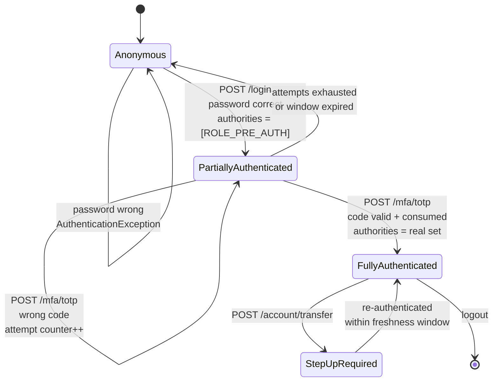
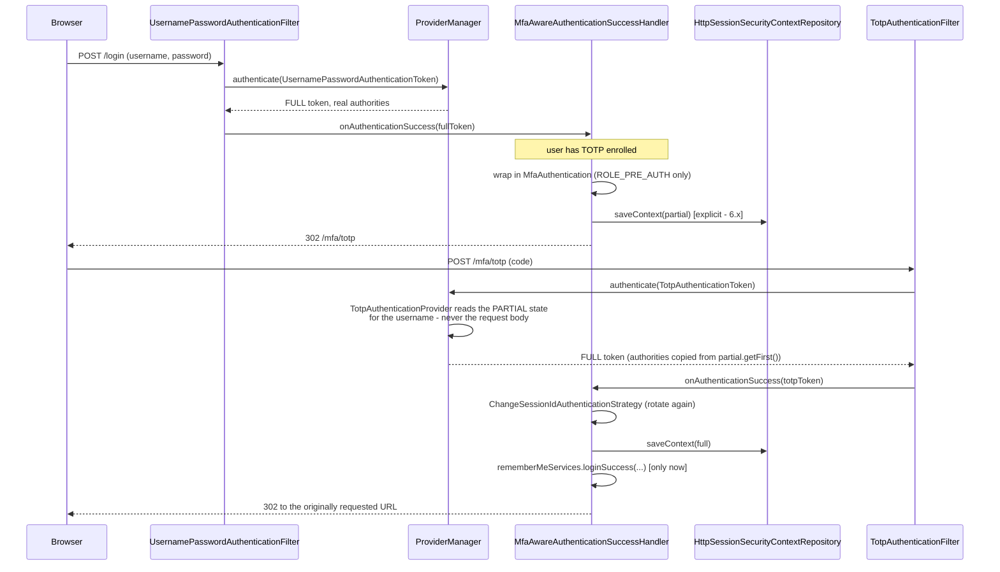

# 11.2 — Multi-Step Authentication, MFA, and Step-Up

> **Module 11 · Topic 2** · Advanced Topics
> Baseline: Spring Security 6.x on Boot 3.x
> New to this? Read **In Plain English** below first, then come back to the Version Matrix.

---

## Version Matrix

| Concern | Spring Security 5.x | **Spring Security 6.x (baseline)** | Spring Security 7.x |
|---|---|---|---|
| Multi-factor support | None — hand-rolled | **Still none built in** — partial-authentication pattern by hand | **First-class multi-factor authentication** is a headline feature |
| Authentication model | `AuthenticationProvider` — one call, one verdict | same | Extended so an authentication can be *incomplete* and require further factors |
| Saving the intermediate state | Implicit session save by `SecurityContextPersistenceFilter` | **Explicit `SecurityContextRepository.saveContext(...)`** — easy to forget between factors | Explicit only |
| One-time token login | — | **`oneTimeTokenLogin` DSL** (6.4+) — passwordless magic link, *not* a second factor | Carried forward and integrated with the factor model |
| WebAuthn / passkeys | Third-party only | **`webAuthn` DSL** (6.4+) | Expanded; the recommended strong factor |
| Step-up primitive | `fullyAuthenticated()` | same | same, plus factor-aware authorization |
| Authority mutation | Build a new token by hand | same | `Authentication.Builder` for merging authorities across factors |
| Authorization engine | `AccessDecisionManager` + voters | `AuthorizationManager` | `AuthorizationManager.authorize()`; `AuthorizationManagerFactory` |

Treat the 7.x column as direction rather than API. The multi-factor work is real and
announced, but the exact type names are still settling; what will not change is the shape —
an authentication that knows which factors it has satisfied, and authorization rules that can
require a specific set.

---

## Why This Exists

`AuthenticationManager` has one method and it returns a verdict:

```java
Authentication authenticate(Authentication authentication) throws AuthenticationException;
```

Success or exception. There is no third outcome meaning "correct so far, but I need more".
That single-shot signature is the reason multi-factor authentication does not drop into
Spring Security cleanly, and it is why every production implementation is some variation of
the same workaround: **issue a deliberately weak `Authentication` after the first factor, let
it reach only the endpoints that collect the second factor, and replace it with a real one
when the second factor succeeds.**

File 02 introduced the trust ladder — anonymous, remember-me, fully authenticated — and
`fullyAuthenticated()` as the primitive for gating sensitive operations. This topic extends
that ladder downward (a *partially* authenticated state that is weaker than remember-me) and
upward (a re-authenticated state that is stronger than a session established an hour ago).
Both directions are the same idea: **authentication is not a boolean, it is a level**, and the
framework only gives you three rungs out of the box.

---

## In Plain English

**The one-line version:** Logging in with a password and then a code from your phone is two
separate logins, and because Spring Security only understands "logged in" or "not logged in", you
have to build the in-between state yourself and make sure it can reach nothing except the page
that asks for the code.

**An analogy.** Think of an office building with a reception desk and, further in, a second
checkpoint. You show your staff card at reception, and reception does not let you into the
building — it gives you a temporary badge that opens exactly one door: the door to the second
checkpoint. Everything else in the building refuses that badge. At the second checkpoint you
produce something else, a fingerprint or a hardware token, and only then are you handed the real
badge that opens the offices you are entitled to.

The whole risk of this design lives in one place. If any door in the building is fitted with a
reader that says "accept any badge" rather than "accept real badges", the temporary badge opens it
— and a temporary badge is issued to anyone who knows a password, which is exactly the thing the
second checkpoint exists to compensate for. That single mistake, a door that checks only that you
are carrying *a* badge, is the number one way hand-built two-factor login is defeated.

The analogy also explains step-up, which is the other half of this topic. Being inside the
building since nine in the morning is not the same as being at the cash desk right now. A bank
does not ask who you are again when you walk to the counter, but it does ask you to sign again
before it moves a large sum, because the signature you gave on entry is stale evidence for a
decision being made seven hours later.

**How it actually works, step by step.**

The reason you have to build this yourself is one method signature. Spring Security's
`AuthenticationManager` takes a login attempt and either returns a successful identity or throws
an exception. There is no third answer meaning "correct so far, but I need more from you". So the
only way to express two steps is to run two complete authentications, one after the other, with
something in between that remembers that the first one succeeded.

The thing in between is called a **partial authentication**, and it is an ordinary identity object
that has been deliberately crippled. It carries the username, so the second step knows who is
being verified, but its permissions are a single placeholder — the convention is a role named
something like `ROLE_PRE_AUTH` — which is granted nowhere in the application except on the
endpoints that collect the second factor. The important subtlety is that this object still reports
itself as logged in, because as far as the framework is concerned it is a valid identity. That is
why a rule written as "any request must be authenticated", the rule everybody writes first, lets a
half-logged-in user everywhere. The fix that actually holds is to make the partial state a
*distinct type* of identity object and add a rule that denies that type outright, so that
forgetting a rule elsewhere results in a refusal rather than a bypass.

Between the two steps you also have to remember some state: who passed the first factor, when,
how many wrong codes they have entered, and what is still owed. There are two honest places to
put it. For a normal server-rendered site, the session, because cancelling a session is instant
and counting attempts there cannot be tampered with. For a mobile app or a single-page
application, a small signed token with a lifetime of about two minutes, an identifier recorded as
used the moment it is redeemed, and an audience restricted to the second-factor endpoint only. The
non-negotiable rule either way is that the username comes from the remembered state and never from
the request body, because an endpoint that accepts a username alongside a code lets anyone who can
generate one valid code log in as anybody.

The second factor itself is usually **TOTP**, the six digits an authenticator app shows and
changes every thirty seconds. It works because your server and the phone share a secret value at
enrolment, and both feed that secret plus the current thirty-second time slot through the same
one-way calculation, so both arrive at the same six digits without ever exchanging them. Three
consequences follow directly from that design and account for most TOTP bugs. The shared secret is
a live credential sitting in your database, so it must be encrypted with a key kept somewhere
else, and a database dump with plaintext secrets means the attacker can mint second factors
forever. Clocks disagree, so you accept the previous and next slot as well, and every extra slot
you accept widens the window for guessing. And a code must be accepted only once, recorded as
used, because otherwise a code glimpsed over a shoulder or captured by a phishing proxy stays
valid for the rest of its window.

Not all second factors are equally good, and the ranking is not a matter of taste. A code sent by
text message can be taken from you by convincing a phone shop to move your number to a new SIM,
which is an attack on the carrier that you cannot see or prevent. TOTP resists that but not
real-time phishing, because nothing in a six-digit code says which website it was typed into. A
passkey, which is the `webAuthn` mechanism, signs the address of the page asking for it, so a
convincing fake site simply cannot produce an answer the real site accepts — which is a difference
in kind rather than degree, and the reason passkeys are the right default for anything new.

Step-up authentication is the last piece and it is a separate question from how you logged in. It
means requiring recent, deliberate proof before a specific operation, not just a valid session.
The simple version is to record when the user authenticated and demand that it was within the last
few minutes for sensitive actions, which is what a "please confirm your password" dialog is. The
thorough version uses two standard token claims: one listing the methods actually used, and one
naming the assurance level achieved. If you ask your identity provider for a high level and it
returns a lower one, that is a successful login at the wrong strength, and code that only checks
whether a token arrived accepts it without complaint.

**Why should a beginner care?** Two-factor login is the feature most often added by hand, and the
common way of adding it creates a state that the framework considers fully logged in. One
overlooked "must be authenticated" rule means a user who typed only a password reaches the rest of
the application, which is worse than having no second factor at all because everyone believes the
protection is in place. The other beginner-level mistakes are just as concrete: issuing the
remember-me cookie after the first factor, so the second factor is skipped from then on; leaving
the same session identifier in place after the second factor, so a session captured during the
half-authenticated window becomes fully privileged; and no attempt limit on a six-digit code,
which is guessable in bulk.

**Words you will meet in this file**

| Term | In plain words |
|---|---|
| Factor | One piece of evidence about who you are. A password is one, a code from your phone is another. |
| Multi-factor authentication | Requiring more than one kind of evidence, so stealing a password alone is not enough. |
| `AuthenticationManager` | The single entry point that checks a login attempt. It can only succeed or fail, which is why two-step login needs building by hand. |
| `AuthenticationProvider` | One pluggable checker for one kind of credential. You add your own for the second factor. |
| `Authentication` | The object representing who the caller is and what they may do. Two-step login means replacing a weak one with a real one. |
| Partial authentication | A deliberately powerless identity issued after the first factor, able to reach only the second-factor endpoints. |
| `ROLE_PRE_AUTH` | The conventional placeholder permission on that partial identity. Granted nowhere else in the application. |
| `authenticated()` versus `fullyAuthenticated()` | The first accepts any identity including partial and remembered ones. The second demands a real, current login. |
| `AuthenticationSuccessHandler` | The code that runs after a factor succeeds and decides whether to finish the login or ask for more. |
| Session fixation | Reusing the same session identifier after privileges increase. Rotate it after the second factor, not just after the password. |
| TOTP | The six-digit code that changes every thirty seconds, computed from a shared secret and the current time. |
| Shared secret | The value your server and the user's app both hold so they can compute the same code. A credential, so encrypt it at rest. |
| Drift window | Accepting the code from the neighbouring time slots so a slightly wrong clock still works. Each extra slot makes guessing easier. |
| Consume-once | Recording a code as used so an observed or captured code cannot be replayed within its window. |
| Base32 and `otpauth://` | The text format and link used to hand the shared secret to an authenticator app, usually shown as a QR code. |
| WebAuthn / passkey | A login where the device signs the website's address, so a phishing site cannot produce a usable answer. |
| Recovery codes | One-time passwords for when the second factor is lost. Store them hashed like passwords and mark each as used. |
| Step-up authentication | Demanding fresh proof before a sensitive action, even though the user is already logged in. |
| Freshness | How recently the user actually authenticated, as opposed to whether they have a valid session. |
| `amr` | A token claim listing which authentication methods were actually used, such as password and one-time code. |
| `acr` | A token claim naming the assurance level reached. Ask for a level, then check you were given it. |
| `max_age` / `prompt=login` | The two ways to tell an identity provider to make the user authenticate again rather than reuse an existing session. |
| Remember-me | A long-lived cookie that restores a session with no factor presented. Not a factor, and it must not be issued until all factors are done. |
| Trust device | The feature users actually want: skip only the second factor on a known device. A separate, revocable, device-bound cookie. |
| Enumeration | Letting an attacker learn which accounts exist or have a second factor, by differences in responses or in how long they take. |

**If you remember only one thing:** the half-logged-in state still reports itself as
authenticated, so make it a distinct type that is denied by default and never rely on a rule that
merely asks whether someone is logged in.

---

## Core Concepts

### 1. Why MFA Does Not Fit `AuthenticationProvider`

**In simple terms:** A login check can only say yes or no, never "correct so far, keep going", and
that missing third answer is why two-step login has to be assembled out of two separate logins.

`ProviderManager` iterates its providers and asks each one whether it supports the token type:

```java
// ProviderManager.authenticate, simplified
for (AuthenticationProvider provider : getProviders()) {
    if (!provider.supports(toTest.getClass())) {
        continue;
    }
    try {
        result = provider.authenticate(authentication);
        if (result != null) {
            copyDetails(authentication, result);
            break;
        }
    }
    catch (AccountStatusException | InternalAuthenticationServiceException ex) {
        prepareException(ex, authentication);
        throw ex;                                    // fatal, stop immediately
    }
    catch (AuthenticationException ex) {
        lastException = ex;                          // remember, try the next provider
    }
}
```

The contract offers exactly three outcomes: return an authenticated token, return `null`
(meaning "not my token type, try someone else"), or throw. There is no "return a token that
is authenticated *for some purposes*". So the options are:

- **Chain providers inside one call.** Ask for password and OTP in the same request, verify
  both in a single provider. This works, and for a machine-to-machine client it is fine. For
  a human it is a bad user experience — the user must produce the OTP before learning whether
  the password was even correct — and it makes "remember this device" and "only prompt for a
  second factor on risky logins" impossible.
- **Two separate authentications with a state carrier between them.** This is the partial
  authentication pattern and it is what everybody actually builds.

### 2. The Partial Authentication Pattern

**In simple terms:** After the password succeeds you hand out an identity that is powerless
everywhere except the page asking for the second factor, and the safe way to do that is to make it
a distinct type that your rules refuse by default.

The core idea in one sentence: after factor one succeeds, put an `Authentication` in the
context whose authorities are *deliberately useless* except for reaching the second-factor
endpoints.



Two ways to represent the partial state, and the choice matters.

**Option A — a restricted authority.** Issue an ordinary
`UsernamePasswordAuthenticationToken` whose only authority is `ROLE_PRE_AUTH`.

*Advantages:* nothing custom, works with every existing mechanism, trivially understood.
*Danger:* it is a fully-formed `Authentication` and `isAuthenticated()` is `true`. Any rule
written as `.authenticated()` — which is the default anyone reaches for — lets it through. A
single `anyRequest().authenticated()` and your partially-authenticated user has the run of the
application with no second factor. The pattern only holds if **every** rule is explicit about
the authority, and that is a discipline, not a guarantee.

**Option B — a distinct `Authentication` type that wraps the first-factor result.**

```java
public class MfaAuthentication extends AbstractAuthenticationToken {

    private final Authentication first;                 // the completed first factor
    private final Set<String> remainingFactors;         // e.g. {"totp"}

    public MfaAuthentication(Authentication first, Set<String> remainingFactors) {
        super(AuthorityUtils.createAuthorityList("ROLE_PRE_AUTH"));
        this.first = first;
        this.remainingFactors = Set.copyOf(remainingFactors);
        setAuthenticated(true);     // it IS authenticated - as a partial state
    }

    @Override public Object getPrincipal()   { return this.first.getPrincipal(); }
    @Override public Object getCredentials() { return null; }

    public Authentication getFirst()            { return this.first; }
    public Set<String> getRemainingFactors()    { return this.remainingFactors; }
}
```

*Advantages:* the type is checkable. You can write an `AuthorizationManager` that denies any
`MfaAuthentication` outright, register it as the global default, and then the failure mode of
forgetting a rule is *denial* rather than *bypass*. That fail-closed property is the whole
argument for Option B, and it is why I use it.

In practice I use both: a distinct type **and** a restricted authority, so the authority
handles the ordinary rules and the type handles the catch-all.

### 3. Wiring It — Three Components

**In simple terms:** You need only three pieces — something to carry the submitted code,
something to verify it, and something to decide whether the login is now finished — and the third
piece is where the mistakes happen.

```java
// 1. A token for the second factor.
public class TotpAuthenticationToken extends AbstractAuthenticationToken {
    private final Object principal;
    private final String code;
    // unauthenticated constructor: super(null) + setAuthenticated(false)
    // authenticated constructor:   super(authorities) + setAuthenticated(true)
}

// 2. A provider that verifies it.
public class TotpAuthenticationProvider implements AuthenticationProvider {
    public Authentication authenticate(Authentication authentication) { ... }
    public boolean supports(Class<?> a) { return TotpAuthenticationToken.class.isAssignableFrom(a); }
}

// 3. A success handler that decides: complete, or continue.
public class MfaAwareAuthenticationSuccessHandler implements AuthenticationSuccessHandler {
    public void onAuthenticationSuccess(HttpServletRequest req, HttpServletResponse res,
                                        Authentication authentication) { ... }
}
```

The success handler is the decision point, and getting it right is the crux of the pattern.
After the **first** factor it must ask "does this user have a second factor enrolled?" and
either finish normally or downgrade the authentication to the partial state and redirect. After
the **second** factor it must build the full authentication, save it, and honour the saved
request so the user lands where they were originally going.

The step people forget, every single time, is **session fixation on completion**. Logging in
rotates the session identifier via `ChangeSessionIdAuthenticationStrategy`. Completing the
second factor is a privilege escalation on the same session, and it should rotate again — the
identifier that existed during the partially-authenticated window must not be the one that
carries full privileges.

### 4. Where the Intermediate State Lives

**In simple terms:** Something has to remember who passed the first factor and how many wrong
codes they have tried, and the choice between keeping that on the server or handing it to the
client decides whether you can cancel it and count attempts honestly.

Between factor one and factor two you must remember: who passed factor one, when, how many
attempts have been made, and which factors remain. Two designs.

| | Server session | Short-lived signed token |
|---|---|---|
| Storage | `HttpSession` (in-memory, Redis, JDBC) | Nothing server-side; the client holds it |
| Revocation | Immediate — invalidate the session | Hard — you need a deny list, which is server state again |
| Attempt counting | Trivial, authoritative | Needs a server-side counter anyway, or it is forgeable |
| Horizontal scaling | Needs sticky sessions or a shared store | Stateless |
| Expiry | Session timeout, coarse | Exact — put `exp` two minutes out |
| Replay | Bound to the session cookie | Must include a nonce and be consumed once |
| Native app / SPA | Awkward — cookie handling | Natural — it is just a value in the response |
| Leak impact | Cookie theft during a two-minute window | Token in a URL, browser history, referrer, or logs |

For a server-rendered application with a session store I use the **session**: revocation and
attempt counting are correct by construction, and the state genuinely is per-session. For a
public API or a mobile client I use a **short-lived signed token** with `exp` around 120
seconds, a `jti` recorded as consumed on use, an audience restricted to the second-factor
endpoint, and a claim naming the factor that has been satisfied.

The mistake I have seen in production: a signed intermediate token with a 15-minute expiry and
no `jti` tracking, returned in a redirect URL. It ended up in the CDN access log, the browser
history, and the `Referer` header sent to a third-party analytics script. Anyone with any of
those could complete a login with only the second factor.

Whichever you choose, the intermediate state must carry the **user identifier**, not a
user-supplied one. An endpoint that accepts `POST /mfa/verify {"username": "...", "code":
"..."}` without binding the username to the intermediate state lets an attacker who knows any
valid OTP-generating secret log in as anybody.

### 5. TOTP Mechanics — RFC 6238

**In simple terms:** The six digits in an authenticator app come from a secret shared at
enrolment combined with the current thirty-second time slot, which is why the secret must be
encrypted, the clock tolerance kept narrow, and every accepted code recorded as used.

TOTP is HOTP (RFC 4226) with a clock as the counter.

```
HOTP(K, C) = Truncate(HMAC-SHA1(K, C))
TOTP(K, T) = HOTP(K, floor((unixTime - T0) / X))     T0 = 0, X = 30 seconds
```

The moving factor `C` is a 64-bit big-endian counter. For HOTP it increments on each use; for
TOTP it is the number of 30-second steps since the Unix epoch. Everything else is identical.

**Dynamic truncation** turns the 20-byte HMAC into a 6-digit number:

```java
byte[] hash = mac.doFinal(counterBytes);          // 20 bytes for HMAC-SHA1
int offset = hash[hash.length - 1] & 0x0F;        // low nibble of the last byte = 0..15
int binary = ((hash[offset]     & 0x7F) << 24)    // 0x7F masks the sign bit
           | ((hash[offset + 1] & 0xFF) << 16)
           | ((hash[offset + 2] & 0xFF) <<  8)
           | ((hash[offset + 3] & 0xFF));
int otp = binary % 1_000_000;                      // 6 digits
```

The offset is data-dependent, which is what makes truncation non-trivial to invert.

**Facts that matter in practice:**

- **The shared secret is a symmetric key.** Both sides can generate valid codes. That makes it
  a *credential at rest* in your database, and it must be encrypted with a key that is not in
  the same database. A database dump containing plaintext TOTP secrets means the attacker can
  generate valid second factors for every user forever. You cannot hash it, because you need
  the original to recompute — so this is encryption, not hashing, and key management is the
  whole problem.
- **The drift window.** Clocks disagree. Accepting only step `T` rejects users whose phone is
  a few seconds off. The convention is `T-1`, `T`, `T+1` — a ±30 second tolerance, giving an
  effective 90-second validity. Every extra step you accept multiplies the brute-force
  surface: a 6-digit code has a 1-in-1,000,000 chance per guess per step, and a window of
  seven steps makes that 7-in-1,000,000 per guess. Keep the window at one step and fix clock
  synchronisation with NTP instead.
- **Consume-once is mandatory.** Without it, a code observed over the shoulder, in a
  screenshot, or in a phishing proxy is replayable for the whole window. Record the last
  accepted time step per user and reject any code whose step is less than or equal to it. This
  must be an atomic compare-and-set, not a read-then-write, or two concurrent requests both
  succeed.
- **Base32, not Base64.** The secret is exchanged with authenticator apps as Base32 in an
  `otpauth://` URI: `otpauth://totp/Acme:alice@acme.com?secret=JBSWY3DPEHPK3PXP&issuer=Acme&
  algorithm=SHA1&digits=6&period=30`. Base32 because it survives being read aloud and typed
  by hand. Most authenticator apps ignore the `algorithm`, `digits`, and `period` parameters
  and assume SHA1/6/30, so deviating from the defaults breaks compatibility even though the
  RFC permits it.
- **TOTP is not phishing-resistant.** A proxy phishing page relays the code in real time. The
  code is valid for the real site because nothing in the protocol binds it to the origin.

### 6. The Factor Comparison That Decides Your Design

**In simple terms:** Second factors are not interchangeable — a text message can be stolen from
your phone company, a six-digit code can be relayed by a fake site in real time, and a passkey can
be neither.

| Factor | Phishing-resistant | Common attacks | Recovery burden | Verdict |
|---|---|---|---|---|
| **WebAuthn / passkey** | **Yes** — the assertion is bound to the origin | Device loss; platform account compromise | Needs a second passkey or a fallback | The right default for new systems |
| **TOTP** | No | Real-time phishing proxy; secret theft from the database; shoulder surfing | Re-enrolment | Acceptable; the pragmatic baseline |
| **Push approval** | Partially — until fatigue | MFA fatigue / prompt bombing | Low | Only with number matching |
| **SMS OTP** | No | **SIM swap**, SS7 interception, malware reading the message, carrier insider | Low | Weakest; avoid as a primary factor |
| **Email OTP** | No | Email account is often the same thing being protected | Low | Circular; weakest unless the email is a separate trust domain |
| **Recovery codes** | No | Screenshotted, stored in plaintext, shared | — | A credential — hash it like a password |

**Why SMS is genuinely weak, stated precisely.** A SIM swap is a social-engineering attack on
the carrier's retail channel, not on you, and you have no control over it and no visibility
into it. SS7 interception allows message redirection at the network layer. Both mean an
attacker can receive the second factor without touching the user's device. NIST SP 800-63B
formally deprecated SMS as a restricted authenticator for exactly this reason. The argument
for keeping it is reach — some users have no smartphone — and the honest answer is to offer it
as a *fallback that is recorded as lower assurance*, and to require step-up with a stronger
factor for anything sensitive when SMS was the factor used.

**WebAuthn is different in kind, not degree.** The browser signs a challenge together with the
**origin** of the page making the request. A phishing site at `acme-login.com` cannot produce
an assertion that validates against `acme.com`, because the origin is part of what was signed
and the private key never leaves the authenticator. That single property eliminates credential
phishing, which is the root cause of most real account takeovers. Spring Security 6.4 added a
`webAuthn` DSL; file 47 covers registration ceremonies, attestation, resident keys, and the
user-verification flag in detail.

**Recovery codes are a credential.** They are single-use passwords with no expiry. Store them
hashed with the same password encoder you use for passwords, mark each as consumed on use,
show them exactly once at generation, and regenerate the whole set when any one is used.
Storing them in plaintext "so support can read them back to the user" converts your recovery
mechanism into a database-dump-to-account-takeover pipeline.

### 7. Step-Up Authentication

**In simple terms:** Being logged in since this morning is weak evidence for a money transfer
this afternoon, so sensitive operations should demand proof that is both recent and strong enough.

Step-up is the recognition that a session established at 09:00 is not sufficient evidence for
a wire transfer at 16:00. Three levels of sophistication:

**Level 1 — `fullyAuthenticated()`.** The built-in primitive, covered in file 02. It excludes
anonymous and remember-me. It says nothing about *when* or *how strongly* the user
authenticated, so it is necessary but rarely sufficient.

**Level 2 — freshness.** Record the authentication instant and require it to be recent for
sensitive operations. This is what "please confirm your password" dialogs implement.

```java
@Component("freshness")
public class FreshnessChecker {
    public boolean within(Authentication authentication, long seconds) {
        if (!(authentication.getDetails() instanceof AuthenticationMetadata meta)) {
            return false;                               // unknown -> deny
        }
        return meta.authenticatedAt().isAfter(Instant.now().minusSeconds(seconds));
    }
}
```

```java
@PreAuthorize("isFullyAuthenticated() and @freshness.within(authentication, 300)")
public void transfer(TransferRequest request) { ... }
```

**Level 3 — factor-aware, via `acr` and `amr`.** In OpenID Connect:

- **`amr`** (Authentication Methods References, RFC 8176) is an array of what was actually
  used: `["pwd", "otp"]`, `["hwk"]`, `["pwd", "mfa"]`. Registered values include `pwd`, `otp`,
  `sms`, `hwk` (hardware key), `swk` (software key), `mfa`, `face`, `fpt`, `pin`, `user`.
- **`acr`** (Authentication Context Class Reference) is a single string naming a policy level,
  such as `urn:mace:incommon:iap:silver` or an issuer-defined `aal2`. It is an *assertion
  about strength*, not a list of mechanisms.
- **`auth_time`** is when the end user authenticated, which is what freshness is measured
  against — note it does not change when a token is merely refreshed.

The relying party asks for a level with the `acr_values` request parameter, or more precisely
with the `claims` request parameter marking `acr` as essential. The authorization server is
then expected to prompt for whatever it needs and return the achieved `acr`. **You must verify
the returned value**: asking for `aal2` and receiving `aal1` is a successful login at the wrong
assurance level, and code that only checks "did I get a token?" accepts it silently.

The forcing mechanism when the user already has a session at the identity provider is
`prompt=login` (always re-authenticate) or `max_age=300` (re-authenticate if `auth_time` is
older than 300 seconds). `max_age` is the better tool because it does not annoy a user who
authenticated thirty seconds ago.

### 8. Remember-Me and MFA

**In simple terms:** A "keep me signed in" cookie restores a session without the user presenting
anything, so issuing it after the password step quietly cancels the second factor from then on.

Remember-me is a long-lived bearer cookie that produces a `RememberMeAuthenticationToken`
without the user presenting any factor. That interacts with MFA in three ways, and all three
are commonly got wrong.

**Do not issue the remember-me cookie until every factor is complete.** The
`RememberMeServices.loginSuccess(...)` call is normally triggered by the authentication
filter's success handler. In an MFA flow, that filter fires after factor *one*. If you leave
the default wiring, the user gets a remember-me cookie for passing only the password — and
next time they skip the second factor entirely. Move the `loginSuccess` call into the handler
that runs after the final factor.

**Remember-me is not a second factor, and it is not a first factor either.** It re-establishes
a session, and `authenticated()` accepts it. Every rule that matters must be
`fullyAuthenticated()`. This is the same trust-ladder point from file 02, and MFA makes the
gap wider: a remember-me session represents *zero* factors presented in this browser session.

**"Remember this device" is a different feature from remember-me, and it is the right one.**
What users actually want is to skip the *second* factor on a device they have used before,
while still entering their password. Implement it as a separate, device-bound, signed cookie
that records "this browser completed MFA for user X at time T", check it after factor one, and
give it a hard expiry measured in weeks. It must be revocable from the account page, it must
be invalidated on password change, and it must record the device so the user can see and
remove it. Crucially it must **not** be honoured for a step-up check — the point of step-up is
a fresh proof of presence.

### 9. Rate Limiting, Enumeration, and Audit

**In simple terms:** Six digits can be guessed in bulk, so the code-entry step needs a hard
attempt limit per user, responses that give nothing away about which accounts exist, and a record
of every factor added or removed.

A 6-digit code has one million possibilities. With no rate limit and a ±1 step window, a
determined attacker who knows the username succeeds in a few hundred thousand requests, which
at a hundred requests per second is under an hour.

The controls, in order of importance:

1. **Per-user attempt counter on the intermediate state**, not per IP. A distributed attacker
   rotates IPs trivially. Five failures invalidates the partial authentication entirely and
   sends the user back to the password step. This is the control that actually works.
2. **Consume-once**, so a captured code cannot be replayed.
3. **Per-IP and global rate limits** as a secondary layer against credential stuffing across
   many accounts.
4. **Exponential backoff** on repeated failures for the same user, so the attacker's cost
   grows even if they reset the flow.

**Enumeration.** The second-factor step leaks information if you let it. Responses must not
differ between "this user has no MFA enrolled", "this user does not exist", and "the code was
wrong". Nor may the *timing* differ — a fast rejection for an unknown user and a slow one for a
real user with an HMAC computation is a measurable oracle. Perform the same work in both
paths, including a dummy HMAC against a fixed secret when there is no real one, exactly as a
good password check performs a dummy encode against a fixed hash.

There is a related leak specific to MFA: if `POST /login` returns "MFA required" for users with
MFA and "logged in" for users without, the attacker learns both that the password was correct
and the account's MFA status. That first part is unavoidable — the user needs to know — but it
is a reason to be strict about rate limiting the *password* endpoint too.

**Audit every factor separately.** Spring's `AuthenticationEventPublisher` gives you
`AuthenticationSuccessEvent` and the `AbstractAuthenticationFailureEvent` hierarchy for
anything that goes through `ProviderManager`, which includes your custom factor provider once
the provider is registered. Publish an explicit application event for the transitions the
framework does not model: partial authentication issued, second factor attempted, second
factor succeeded, partial authentication expired or exhausted, recovery code used, factor
enrolled, factor removed.

The two that matter most for incident response are **factor enrolled** and **factor removed**,
because adding an attacker-controlled factor is how account takeover is made persistent. Both
should be a step-up-protected operation *and* should send an out-of-band notification the
attacker does not control.

---

## Working Code

The partial authentication token:

```java
package com.example.security.mfa;

import org.springframework.security.authentication.AbstractAuthenticationToken;
import org.springframework.security.core.Authentication;
import org.springframework.security.core.authority.AuthorityUtils;

import java.time.Instant;
import java.util.Set;

/**
 * The partially-authenticated state. Deliberately a distinct TYPE so that a global
 * AuthorizationManager can deny it by default - a forgotten rule then fails CLOSED.
 */
public class MfaAuthentication extends AbstractAuthenticationToken {

    public static final String PRE_AUTH_AUTHORITY = "ROLE_PRE_AUTH";

    private final Authentication first;
    private final Set<String> remainingFactors;
    private final Instant firstFactorAt;

    public MfaAuthentication(Authentication first, Set<String> remainingFactors) {
        super(AuthorityUtils.createAuthorityList(PRE_AUTH_AUTHORITY));
        this.first = first;
        this.remainingFactors = Set.copyOf(remainingFactors);
        this.firstFactorAt = Instant.now();
        setAuthenticated(true);
    }

    @Override
    public Object getPrincipal() {
        return this.first.getPrincipal();
    }

    @Override
    public Object getCredentials() {
        return null;                       // first-factor credential is already erased
    }

    public Authentication getFirst()             { return this.first; }
    public Set<String> getRemainingFactors()     { return this.remainingFactors; }
    public Instant getFirstFactorAt()            { return this.firstFactorAt; }

    public boolean isExpired(long windowSeconds) {
        return this.firstFactorAt.plusSeconds(windowSeconds).isBefore(Instant.now());
    }
}
```

The TOTP verifier — RFC 6238, with the drift window and consume-once handled:

```java
package com.example.security.mfa;

import org.springframework.stereotype.Component;

import javax.crypto.Mac;
import javax.crypto.spec.SecretKeySpec;
import java.nio.ByteBuffer;
import java.security.MessageDigest;
import java.time.Instant;

@Component
public class TotpVerifier {

    private static final long TIME_STEP_SECONDS = 30L;
    private static final int  DIGITS            = 6;
    private static final int  MODULUS           = 1_000_000;
    /** +/- one step. Widening this multiplies the brute-force surface linearly. */
    private static final int  DRIFT_STEPS       = 1;

    private final TotpSecretStore secrets;      // decrypts on read, encrypted at rest
    private final ConsumedStepStore consumed;   // atomic compare-and-set per user

    public TotpVerifier(TotpSecretStore secrets, ConsumedStepStore consumed) {
        this.secrets = secrets;
        this.consumed = consumed;
    }

    public boolean verify(String username, String submittedCode) {
        if (submittedCode == null || submittedCode.length() != DIGITS) {
            return false;
        }
        byte[] key = this.secrets.secretFor(username);      // never null: dummy key if unenrolled
        long currentStep = Instant.now().getEpochSecond() / TIME_STEP_SECONDS;

        boolean matched = false;
        long matchedStep = -1;
        // Check every step in the window unconditionally - no early return, so the
        // execution time does not reveal WHICH step matched, or whether any did.
        for (long step = currentStep - DRIFT_STEPS; step <= currentStep + DRIFT_STEPS; step++) {
            String candidate = generate(key, step);
            if (constantTimeEquals(candidate, submittedCode)) {
                matched = true;
                matchedStep = step;
            }
        }
        if (!matched || !this.secrets.isEnrolled(username)) {
            return false;
        }
        // CONSUME-ONCE: atomically refuse any step at or below the last accepted one.
        // Must be a compare-and-set; a read-then-write races and lets a replay through.
        return this.consumed.tryConsume(username, matchedStep);
    }

    String generate(byte[] key, long step) {
        try {
            Mac mac = Mac.getInstance("HmacSHA1");
            mac.init(new SecretKeySpec(key, "HmacSHA1"));
            byte[] hash = mac.doFinal(ByteBuffer.allocate(8).putLong(step).array());

            int offset = hash[hash.length - 1] & 0x0F;               // dynamic truncation
            int binary = ((hash[offset]     & 0x7F) << 24)
                       | ((hash[offset + 1] & 0xFF) << 16)
                       | ((hash[offset + 2] & 0xFF) <<  8)
                       | ((hash[offset + 3] & 0xFF));
            return String.format("%0" + DIGITS + "d", binary % MODULUS);
        }
        catch (Exception ex) {
            throw new IllegalStateException("HmacSHA1 unavailable", ex);
        }
    }

    private static boolean constantTimeEquals(String a, String b) {
        return MessageDigest.isEqual(a.getBytes(java.nio.charset.StandardCharsets.UTF_8),
                                     b.getBytes(java.nio.charset.StandardCharsets.UTF_8));
    }
}
```

The second-factor token and provider:

```java
package com.example.security.mfa;

import org.springframework.security.authentication.AbstractAuthenticationToken;
import org.springframework.security.core.GrantedAuthority;

import java.util.Collection;

public class TotpAuthenticationToken extends AbstractAuthenticationToken {

    private final Object principal;
    private String code;

    /** Unauthenticated - what the filter builds from the submitted form. */
    public TotpAuthenticationToken(Object principal, String code) {
        super(null);
        this.principal = principal;
        this.code = code;
        setAuthenticated(false);
    }

    /** Authenticated - only the provider may build this. */
    public TotpAuthenticationToken(Object principal, Collection<? extends GrantedAuthority> authorities) {
        super(authorities);
        this.principal = principal;
        this.code = null;
        super.setAuthenticated(true);
    }

    @Override public Object getPrincipal()   { return this.principal; }
    @Override public Object getCredentials() { return this.code; }

    @Override
    public void eraseCredentials() {
        super.eraseCredentials();
        this.code = null;
    }
}
```

```java
package com.example.security.mfa;

import org.springframework.security.authentication.AuthenticationProvider;
import org.springframework.security.authentication.BadCredentialsException;
import org.springframework.security.core.Authentication;
import org.springframework.security.core.AuthenticationException;
import org.springframework.security.core.context.SecurityContextHolder;
import org.springframework.security.core.context.SecurityContextHolderStrategy;
import org.springframework.stereotype.Component;

@Component
public class TotpAuthenticationProvider implements AuthenticationProvider {

    private static final long PARTIAL_WINDOW_SECONDS = 300L;
    private static final int  MAX_ATTEMPTS = 5;

    private final TotpVerifier verifier;
    private final MfaAttemptCounter attempts;

    private final SecurityContextHolderStrategy securityContextHolderStrategy =
            SecurityContextHolder.getContextHolderStrategy();

    public TotpAuthenticationProvider(TotpVerifier verifier, MfaAttemptCounter attempts) {
        this.verifier = verifier;
        this.attempts = attempts;
    }

    @Override
    public Authentication authenticate(Authentication authentication) throws AuthenticationException {
        TotpAuthenticationToken request = (TotpAuthenticationToken) authentication;

        // The identity comes from the SERVER-SIDE partial state, never from the request body.
        Authentication current = this.securityContextHolderStrategy.getContext().getAuthentication();
        if (!(current instanceof MfaAuthentication partial)) {
            throw new BadCredentialsException("Invalid verification code");
        }
        if (partial.isExpired(PARTIAL_WINDOW_SECONDS)) {
            throw new MfaWindowExpiredException("Verification window expired, sign in again");
        }
        String username = partial.getName();

        if (this.attempts.increment(username) > MAX_ATTEMPTS) {
            this.securityContextHolderStrategy.clearContext();
            throw new MfaAttemptsExhaustedException("Too many attempts, sign in again");
        }

        if (!this.verifier.verify(username, (String) request.getCredentials())) {
            // Identical message and shape for wrong code / not enrolled / unknown user.
            throw new BadCredentialsException("Invalid verification code");
        }

        this.attempts.reset(username);

        // The FULL authority set, taken from the first factor's result.
        return new TotpAuthenticationToken(partial.getPrincipal(), partial.getFirst().getAuthorities());
    }

    @Override
    public boolean supports(Class<?> authentication) {
        return TotpAuthenticationToken.class.isAssignableFrom(authentication);
    }
}
```

The success handler that decides whether to complete or continue:

```java
package com.example.security.mfa;

import jakarta.servlet.ServletException;
import jakarta.servlet.http.HttpServletRequest;
import jakarta.servlet.http.HttpServletResponse;
import org.springframework.context.ApplicationEventPublisher;
import org.springframework.security.core.Authentication;
import org.springframework.security.core.context.SecurityContext;
import org.springframework.security.core.context.SecurityContextHolder;
import org.springframework.security.core.context.SecurityContextHolderStrategy;
import org.springframework.security.web.authentication.AuthenticationSuccessHandler;
import org.springframework.security.web.authentication.SavedRequestAwareAuthenticationSuccessHandler;
import org.springframework.security.web.authentication.RememberMeServices;
import org.springframework.security.web.authentication.session.ChangeSessionIdAuthenticationStrategy;
import org.springframework.security.web.authentication.session.SessionAuthenticationStrategy;
import org.springframework.security.web.context.HttpSessionSecurityContextRepository;
import org.springframework.security.web.context.SecurityContextRepository;

import java.io.IOException;
import java.util.Set;

public class MfaAwareAuthenticationSuccessHandler implements AuthenticationSuccessHandler {

    private final MfaEnrolmentService enrolments;
    private final RememberMeServices rememberMeServices;
    private final ApplicationEventPublisher events;

    private final AuthenticationSuccessHandler completed =
            new SavedRequestAwareAuthenticationSuccessHandler();

    private final SecurityContextHolderStrategy securityContextHolderStrategy =
            SecurityContextHolder.getContextHolderStrategy();

    private final SecurityContextRepository securityContextRepository =
            new HttpSessionSecurityContextRepository();

    private final SessionAuthenticationStrategy sessionStrategy =
            new ChangeSessionIdAuthenticationStrategy();

    public MfaAwareAuthenticationSuccessHandler(MfaEnrolmentService enrolments,
                                                RememberMeServices rememberMeServices,
                                                ApplicationEventPublisher events) {
        this.enrolments = enrolments;
        this.rememberMeServices = rememberMeServices;
        this.events = events;
    }

    @Override
    public void onAuthenticationSuccess(HttpServletRequest request, HttpServletResponse response,
            Authentication authentication) throws IOException, ServletException {

        boolean secondFactorDone = authentication instanceof TotpAuthenticationToken;

        if (!secondFactorDone && this.enrolments.requiresSecondFactor(authentication.getName())) {
            // DOWNGRADE: replace the fully-authorised token with the partial one.
            MfaAuthentication partial =
                    new MfaAuthentication(authentication, Set.of("totp"));

            SecurityContext context = this.securityContextHolderStrategy.createEmptyContext();
            context.setAuthentication(partial);
            this.securityContextHolderStrategy.setContext(context);
            // 6.x: without this explicit save, the next request is anonymous.
            this.securityContextRepository.saveContext(context, request, response);

            this.events.publishEvent(new MfaChallengeIssuedEvent(authentication.getName(), "totp"));
            response.sendRedirect(request.getContextPath() + "/mfa/totp");
            return;
        }

        // COMPLETE. Rotate the session id again - the partially-authenticated window used
        // a different privilege level on this same session.
        this.sessionStrategy.onAuthentication(authentication, request, response);

        SecurityContext context = this.securityContextHolderStrategy.createEmptyContext();
        context.setAuthentication(authentication);
        this.securityContextHolderStrategy.setContext(context);
        this.securityContextRepository.saveContext(context, request, response);

        // Remember-me is issued ONLY here, after every factor - never after factor one.
        this.rememberMeServices.loginSuccess(request, response, authentication);

        this.events.publishEvent(new MfaCompletedEvent(authentication.getName(), Set.of("pwd", "otp")));
        this.completed.onAuthenticationSuccess(request, response, authentication);
    }
}
```

The security configuration:

```java
package com.example.security.mfa;

import org.springframework.context.annotation.Bean;
import org.springframework.context.annotation.Configuration;
import org.springframework.security.authorization.AuthorizationDecision;
import org.springframework.security.authorization.AuthorizationManager;
import org.springframework.security.config.annotation.web.builders.HttpSecurity;
import org.springframework.security.config.annotation.web.configuration.EnableWebSecurity;
import org.springframework.security.web.SecurityFilterChain;
import org.springframework.security.web.access.intercept.RequestAuthorizationContext;

@Configuration
@EnableWebSecurity
public class MfaSecurityConfig {

    /** Denies any partially-authenticated caller. Used as the catch-all so a forgotten rule fails closed. */
    static AuthorizationManager<RequestAuthorizationContext> notPartiallyAuthenticated() {
        return (authentication, context) -> {
            var auth = authentication.get();
            boolean ok = auth != null
                    && auth.isAuthenticated()
                    && !(auth instanceof MfaAuthentication);
            return new AuthorizationDecision(ok);
        };
    }

    @Bean
    SecurityFilterChain filterChain(HttpSecurity http,
                                    MfaAwareAuthenticationSuccessHandler successHandler,
                                    TotpAuthenticationFilter totpFilter) throws Exception {
        http
            .authorizeHttpRequests(auth -> auth
                .requestMatchers("/", "/login", "/error", "/css/**").permitAll()

                // The ONLY endpoints a partially-authenticated caller may reach.
                .requestMatchers("/mfa/totp", "/mfa/recovery", "/logout")
                    .hasAuthority(MfaAuthentication.PRE_AUTH_AUTHORITY)

                // Sensitive operations need a fresh, full authentication.
                .requestMatchers("/account/password", "/account/mfa/**", "/payments/transfer")
                    .fullyAuthenticated()

                // Catch-all denies the partial state by type, not by authority.
                .anyRequest().access(notPartiallyAuthenticated())
            )
            .formLogin(form -> form
                .loginPage("/login")
                .successHandler(successHandler)
            )
            .addFilterAfter(totpFilter,
                    org.springframework.security.web.authentication.UsernamePasswordAuthenticationFilter.class)
            .rememberMe(remember -> remember
                .rememberMeServices(persistentRememberMeServices())
            )
            .logout(logout -> logout.logoutUrl("/logout").invalidateHttpSession(true));

        return http.build();
    }
}
```

Tests:

```java
package com.example.security.mfa;

import org.junit.jupiter.api.Test;
import org.springframework.beans.factory.annotation.Autowired;
import org.springframework.boot.test.autoconfigure.web.servlet.AutoConfigureMockMvc;
import org.springframework.boot.test.context.SpringBootTest;
import org.springframework.test.web.servlet.MockMvc;
import org.springframework.test.web.servlet.MvcResult;
import org.springframework.mock.web.MockHttpSession;

import static org.assertj.core.api.Assertions.assertThat;
import static org.springframework.security.test.web.servlet.request.SecurityMockMvcRequestBuilders.formLogin;
import static org.springframework.test.web.servlet.request.MockMvcRequestBuilders.get;
import static org.springframework.test.web.servlet.request.MockMvcRequestBuilders.post;
import static org.springframework.test.web.servlet.result.MockMvcResultMatchers.redirectedUrl;
import static org.springframework.test.web.servlet.result.MockMvcResultMatchers.status;

@SpringBootTest
@AutoConfigureMockMvc
class MfaFlowTests {

    @Autowired MockMvc mvc;
    @Autowired TotpVerifier verifier;
    @Autowired TotpSecretStore secrets;

    @Test
    void correctPasswordAloneDoesNotGrantAccess() throws Exception {
        MvcResult login = mvc.perform(formLogin("/login").user("alice").password("correct"))
                             .andExpect(redirectedUrl("/mfa/totp"))
                             .andReturn();

        MockHttpSession session = (MockHttpSession) login.getRequest().getSession(false);

        // The partial state must not reach anything else.
        mvc.perform(get("/dashboard").session(session)).andExpect(status().isForbidden());
        mvc.perform(get("/payments/transfer").session(session)).andExpect(status().isForbidden());
    }

    @Test
    void secondFactorCompletesTheLoginAndRotatesTheSession() throws Exception {
        MvcResult login = mvc.perform(formLogin("/login").user("alice").password("correct")).andReturn();
        MockHttpSession partialSession = (MockHttpSession) login.getRequest().getSession(false);
        String partialId = partialSession.getId();

        String code = verifier.generate(secrets.secretFor("alice"),
                java.time.Instant.now().getEpochSecond() / 30);

        MvcResult verified = mvc.perform(post("/mfa/totp").param("code", code)
                                         .session(partialSession).with(csrf()))
                                .andExpect(redirectedUrl("/dashboard"))
                                .andReturn();

        assertThat(verified.getRequest().getSession(false).getId()).isNotEqualTo(partialId);
        mvc.perform(get("/dashboard").session(partialSession)).andExpect(status().isOk());
    }

    @Test
    void aCodeCannotBeUsedTwice() throws Exception {
        long step = java.time.Instant.now().getEpochSecond() / 30;
        String code = verifier.generate(secrets.secretFor("alice"), step);

        assertThat(verifier.verify("alice", code)).isTrue();
        assertThat(verifier.verify("alice", code)).isFalse();   // consume-once
    }

    @Test
    void attemptsAreExhaustedAndThePartialStateIsDestroyed() throws Exception {
        MvcResult login = mvc.perform(formLogin("/login").user("alice").password("correct")).andReturn();
        MockHttpSession session = (MockHttpSession) login.getRequest().getSession(false);

        for (int i = 0; i < 6; i++) {
            mvc.perform(post("/mfa/totp").param("code", "000000").session(session).with(csrf()));
        }
        // Even a CORRECT code now fails - the partial authentication is gone.
        String code = verifier.generate(secrets.secretFor("alice"),
                java.time.Instant.now().getEpochSecond() / 30);
        mvc.perform(post("/mfa/totp").param("code", code).session(session).with(csrf()))
           .andExpect(status().isForbidden());
    }

    @Test
    void responseIsIdenticalForUnenrolledAndUnknownUsers() throws Exception {
        // No enumeration oracle: same status, same body, same shape.
        assertThat(verifier.verify("no-such-user", "123456")).isFalse();
        assertThat(verifier.verify("enrolled-nobody", "123456")).isFalse();
    }
}
```

---

## Internals

### Where the partial authentication actually lives during the request



### The `UsernamePasswordAuthenticationFilter` hook points

`AbstractAuthenticationProcessingFilter` is the base class, and its `doFilter` is the template
every login mechanism follows:

```java
// AbstractAuthenticationProcessingFilter, simplified
private void doFilter(HttpServletRequest request, HttpServletResponse response, FilterChain chain) {
    if (!requiresAuthentication(request, response)) {
        chain.doFilter(request, response);
        return;
    }
    try {
        Authentication authenticationResult = attemptAuthentication(request, response);
        if (authenticationResult == null) {
            return;                                        // subclass is still working
        }
        this.sessionStrategy.onAuthentication(authenticationResult, request, response);
        if (this.continueChainBeforeSuccessfulAuthentication) {
            chain.doFilter(request, response);
        }
        successfulAuthentication(request, response, chain, authenticationResult);
    }
    catch (InternalAuthenticationServiceException failed) {
        unsuccessfulAuthentication(request, response, failed);
    }
    catch (AuthenticationException ex) {
        unsuccessfulAuthentication(request, response, ex);
    }
}

protected void successfulAuthentication(HttpServletRequest request, HttpServletResponse response,
        FilterChain chain, Authentication authResult) throws IOException, ServletException {
    SecurityContext context = this.securityContextHolderStrategy.createEmptyContext();
    context.setAuthentication(authResult);
    this.securityContextHolderStrategy.setContext(context);
    this.securityContextRepository.saveContext(context, request, response);   // 6.x explicit
    this.rememberMeServices.loginSuccess(request, response, authResult);
    this.eventPublisher.publishEvent(new InteractiveAuthenticationSuccessEvent(authResult, getClass()));
    this.successHandler.onAuthenticationSuccess(request, response, authResult);
}
```

Read that carefully, because it contains the trap. `successfulAuthentication` saves the
**full** authentication and calls `rememberMeServices.loginSuccess` **before** your success
handler runs. So by the time your handler downgrades to `MfaAuthentication`, the filter has
already persisted the full token and already issued a remember-me cookie for a user who has
presented one factor.

Your handler overwrites the saved context, which fixes the first half. The remember-me cookie
is not overwritten, which is why the configuration must not let the filter issue it — either
leave `rememberMeServices` at its no-op default on the login filter and issue the cookie
yourself in the completion path, or supply a `RememberMeServices` implementation that refuses
to issue when the authentication is an `MfaAuthentication`.

This is the kind of detail that only shows up when you read the base class, and it is exactly
why hand-rolled MFA implementations are so often subtly broken.

### `AuthenticationTrustResolver` and what `fullyAuthenticated()` actually checks

```java
// AuthenticationTrustResolverImpl
public boolean isAnonymous(Authentication authentication) {
    return this.anonymousClass.isAssignableFrom(authentication.getClass());
}
public boolean isRememberMe(Authentication authentication) {
    return this.rememberMeClass.isAssignableFrom(authentication.getClass());
}
```

It is a **type check**, nothing more. `fullyAuthenticated()` means "not an
`AnonymousAuthenticationToken` and not a `RememberMeAuthenticationToken`". An
`MfaAuthentication` is neither, so **`fullyAuthenticated()` returns true for a
partially-authenticated user**. That is the single most dangerous fact in this whole topic and
the reason the catch-all rule in the configuration above checks the type explicitly rather
than relying on `fullyAuthenticated()`.

If you want `fullyAuthenticated()` to do the right thing, supply a custom
`AuthenticationTrustResolver` bean that also treats `MfaAuthentication` as untrusted. Spring
Security picks up an `AuthenticationTrustResolver` bean and uses it in
`ExceptionTranslationFilter` and in the authorization managers, so this is a single bean that
fixes every rule at once — a much better lever than auditing every matcher.

### Why the second-factor provider must not trust the request body

The provider deliberately ignores `request.getPrincipal()` from the submitted token and reads
the username out of the `MfaAuthentication` in the context. If it trusted the body, then
`POST /mfa/totp {"username":"admin","code":"123456"}` from a fresh session would let anyone
who can produce a valid code for any account log in as that account, with no password. The
binding between "who passed factor one" and "who is presenting factor two" is the entire
security of the pattern, and it must be server-side.

---

## Configuration Reference

| Option / API | Effect | Default |
|---|---|---|
| `.requestMatchers(...).hasAuthority("ROLE_PRE_AUTH")` | The only rule that admits the partial state | — |
| `.anyRequest().access(notPartiallyAuthenticated())` | Catch-all that fails closed on the partial type | — |
| `.fullyAuthenticated()` | Excludes anonymous and remember-me **only** — not a partial state | — |
| `AuthenticationTrustResolver` bean | Redefines what counts as untrusted across all rules | `AuthenticationTrustResolverImpl` |
| `formLogin(f -> f.successHandler(h))` | Replaces the post-first-factor behaviour | `SavedRequestAwareAuthenticationSuccessHandler` |
| `ChangeSessionIdAuthenticationStrategy` | Rotates the session identifier on privilege change | applied on login |
| `rememberMe(r -> r.rememberMeServices(s))` | Where the cookie is issued — keep it out of the first factor | `TokenBasedRememberMeServices` |
| `rememberMe(r -> r.tokenValiditySeconds(n))` | Cookie lifetime | `1209600` (14 days) |
| TOTP time step | `X` in RFC 6238 | 30 seconds |
| TOTP drift window | Steps accepted either side of now | ±1 recommended |
| TOTP digits | Code length | 6 |
| Partial-state window | How long the user has to complete factor two | 120–300 seconds |
| Max second-factor attempts | Failures before the partial state is destroyed | 5 |
| OIDC `max_age` | Forces re-authentication if `auth_time` is older | not sent |
| OIDC `prompt=login` | Forces re-authentication unconditionally | not sent |
| OIDC `acr_values` | Requests an assurance level — **verify what comes back** | not sent |
| `oneTimeTokenLogin` (6.4+) | Passwordless magic-link login — a *first* factor, not a second | not enabled |

---

## Production Concerns & Anti-Patterns

**Relying on `authenticated()` or `fullyAuthenticated()` to exclude the partial state.** Both
return true for a custom `Authentication` type carrying `ROLE_PRE_AUTH`. The partial state must
be excluded by an explicit rule, by a custom `AuthenticationTrustResolver`, or by a
type-checking catch-all. A single `anyRequest().authenticated()` anywhere in a chain that
handles the MFA flow is a complete bypass of your second factor.

**Issuing the remember-me cookie after the first factor.** The base filter does this before
your success handler runs. The user then skips MFA entirely on their next visit, which means
you have built an MFA system that is optional after the first login. Read
`AbstractAuthenticationProcessingFilter.successfulAuthentication` and neutralise the
`rememberMeServices` call on the first-factor filter.

**Trusting the username in the second-factor request.** The second factor must be bound to the
server-side record of who passed the first. Accepting a username from the body turns a valid
OTP into a complete authentication bypass for any account.

**Storing TOTP secrets in plaintext.** It is a symmetric key, so a database dump is a permanent
ability to mint second factors for every user. Encrypt with a key held in a key management
service, and treat rotation as a real requirement. Storing them hashed does not work, because
verification requires the original.

**Not consuming the code.** Without an atomic per-user "last accepted step" check, a code seen
by a phishing proxy, a screen-sharing session, or a shoulder surfer remains valid for the whole
drift window. Make the check a compare-and-set; a read-then-write races and both concurrent
requests succeed.

**Widening the drift window to reduce support tickets.** Every extra step is a linear increase
in brute-force success probability and in replay validity. A window of ±5 steps means a code is
valid for five and a half minutes. Fix the clocks instead.

**Rate limiting per IP only.** Six digits is one million possibilities; a distributed attacker
rotates addresses trivially. The control that works is a per-user attempt counter that destroys
the partial authentication, not a per-IP throttle.

**Leaking enrolment status.** Different responses, different status codes, or different
response *times* for "no such user", "not enrolled", and "wrong code" build an oracle. Do the
same work in all three paths, including a dummy HMAC against a fixed secret.

**Plaintext recovery codes.** They are single-use passwords with no expiry and no rate limit
attached to them by default. Hash them with your password encoder, mark them consumed, and
regenerate the set when any is used.

**No step-up on factor management.** If a session obtained with a stolen password can add an
attacker-controlled authenticator, MFA provides no persistence guarantee at all. Enrolment and
removal of factors must require a fresh, strong authentication and must trigger an out-of-band
notification the attacker cannot suppress.

**SMS as the primary factor for high-value accounts.** SIM swap is an attack on the carrier,
outside your control and invisible to you. Where reach forces you to offer it, record it as a
lower assurance level and require step-up with a stronger factor for sensitive operations.

---

## Debugging Playbook

| Symptom | Likely root cause | Fix |
|---|---|---|
| User reaches the dashboard after only a password | A rule says `authenticated()` or `fullyAuthenticated()`, both of which admit the partial token | Add the type-checking catch-all, or supply a custom `AuthenticationTrustResolver` |
| Second factor is skipped on the next visit | Remember-me cookie was issued after factor one by `AbstractAuthenticationProcessingFilter` | Neutralise `rememberMeServices` on the first-factor filter; issue only on completion |
| Second factor page loads, then the user is anonymous | Partial context set on the holder but `saveContext` never called (6.x explicit save) | Call `securityContextRepository.saveContext(...)` in the success handler |
| Valid code rejected for some users | Client clock drift beyond the accepted window, or the server's own clock is wrong | Verify NTP on the server first; do not widen the window as the fix |
| Valid code rejected intermittently for everyone | Code lands on a step boundary and the consume-once store already recorded that step from a retry | Check the compare-and-set logic; make retries idempotent |
| The same code works twice | Consume-once is a read-then-write and is racing, or is missing | Atomic compare-and-set on the last accepted step |
| Attacker enumerates valid usernames at `/mfa` | Different response or timing for unknown/unenrolled/wrong-code | Constant work and identical responses in all three paths |
| Codes from a colleague's phone work | Secret was generated once and shared, or a fixed test secret leaked into production seed data | Per-user random secret, minimum 160 bits; audit seed data |
| `ClassCastException` in the second-factor provider | The context holds a `UsernamePasswordAuthenticationToken`, not the partial type — the user skipped step one | `instanceof` check that throws `BadCredentialsException`, never a cast |
| Step-up prompt never appears with an OIDC provider | `max_age` or `prompt` not sent, or the returned `acr` is not verified | Send `max_age`, and assert the returned `acr`/`auth_time` meet the requirement |
| MFA works locally, fails behind a load balancer | Partial state in a session with no sticky routing or shared store | Shared session store, or move to a signed short-lived intermediate token |

---

## Interview Q&A

### Q1. Spring Security has no built-in MFA. Design the flow, and explain why the framework cannot do it for you.

<details>
<summary>Show answer</summary>

The framework cannot do it because `AuthenticationManager.authenticate` has exactly two
outcomes: return an authenticated `Authentication`, or throw an `AuthenticationException`.
There is no representation of "the credential was correct but authentication is incomplete".
`ProviderManager` iterates providers looking for one that both `supports` the token type and
returns a non-null result, and the first success ends the loop. Multi-factor is inherently
multi-request, and the interface is single-shot.

The workaround is **partial authentication**. After the first factor succeeds, I replace the
fully-authorised token that the provider returned with a deliberately weak one — a custom
`MfaAuthentication` type carrying only `ROLE_PRE_AUTH` and holding the real first-factor result
inside it. That partial token goes into the `SecurityContext` and is saved to the repository,
so it survives to the next request. Authorization rules admit it to `/mfa/**` and nowhere else.

The second factor is its own filter, its own token type, and its own `AuthenticationProvider`.
Critically, that provider reads the username from the `MfaAuthentication` already in the
context, never from the request body — that binding is the entire security of the scheme. On
success it builds a token carrying the authorities it copied out of the stored first-factor
result, the success handler rotates the session identifier, saves the new context, issues
remember-me if applicable, and honours the saved request.

The decision point that ties it together is the `AuthenticationSuccessHandler`. It runs after
every factor and answers one question: is this user done, or do they owe me another factor?

**Counter-question: why a custom `Authentication` type rather than just a `ROLE_PRE_AUTH` authority on a normal token?**

Because of the failure mode when somebody forgets a rule.

With only an authority, the partial token is an ordinary `UsernamePasswordAuthenticationToken`
whose `isAuthenticated()` is `true` and which is neither anonymous nor remember-me. That means
it satisfies `authenticated()` **and** `fullyAuthenticated()`. The first time anyone writes
`anyRequest().authenticated()` — which is the default everyone reaches for — the entire second
factor is bypassed. The security depends on every single matcher being written correctly,
forever, by everyone.

With a distinct type I can write one `AuthorizationManager` that denies any `MfaAuthentication`
and install it as the catch-all, or better, supply a custom `AuthenticationTrustResolver` bean
so that `fullyAuthenticated()` itself starts returning false for it. Then a forgotten rule
denies instead of permitting. That fail-closed property is worth the extra class.

In practice I use both: the authority for the ordinary `/mfa/**` rule, and the type for the
catch-all.

**Counter-question: where do you store the state between factor one and factor two, and what are the trade-offs?**

Two viable designs.

The **session** is right for server-rendered applications. Revocation is immediate (invalidate
the session), the attempt counter is authoritative and cannot be forged, expiry is
straightforward, and the state is bound to a cookie the attacker must steal. The costs are a
shared session store or sticky routing, and awkwardness for native clients.

A **short-lived signed token** is right for APIs and mobile clients. Two-minute expiry, a `jti`
recorded as consumed, an audience restricted to the second-factor endpoint, and a claim naming
the satisfied factor. It is stateless and scales trivially. The costs are that revocation
requires a deny list — which is server state again, so the stateless benefit is partly
illusory — and that a token is far easier to leak than a cookie, because it ends up in URLs,
logs, browser history, and `Referer` headers.

The attempt counter is the deciding factor for me. With a session it is free and correct. With
a token you need server-side storage anyway to count attempts, at which point you have
reintroduced the state you were avoiding. So: session for browsers, token for APIs, and never
a token in a URL.

**Counter-question: what happens if the user closes the browser between the two factors?**

Nothing bad, and this is worth checking deliberately because it is where a badly designed
implementation leaves a hole.

The partial state is in the session; closing the browser drops the session cookie if it is a
session cookie, and the state is unreachable. The user starts over from the password. The
server-side session eventually expires on its own.

The hole to avoid is a partial state with a long or absent expiry that is keyed on something
the user can present again. If your intermediate token has a fifteen-minute expiry and lands
in the browser history, reopening that URL resumes a half-authenticated session. That is why I
set the window to around two minutes, bind it to a cookie or a request body value rather than a
URL, and treat window expiry as a hard reset to the password step rather than a retry.
</details>

### Q2. Explain TOTP precisely. What is the shared secret, why the drift window, and why must a code be consumed once?

<details>
<summary>Show answer</summary>

TOTP (RFC 6238) is HOTP (RFC 4226) with time as the counter.

`HOTP(K, C) = Truncate(HMAC-SHA1(K, C))` where `K` is a shared secret and `C` is a 64-bit
counter. TOTP defines `C = floor((currentUnixTime - T0) / X)` with `T0 = 0` and `X = 30`
seconds. Both sides compute the same HMAC over the same counter and compare the truncated
result.

Truncation is dynamic: the low nibble of the last byte of the 20-byte HMAC gives an offset from
0 to 15, four bytes are read from that offset, the top bit is masked off to avoid sign issues,
and the resulting 31-bit integer is taken modulo one million for a 6-digit code.

**The shared secret is a symmetric key**, and that is the most important operational fact.
Both the server and the authenticator can generate valid codes, which means the server's copy
is a credential capable of impersonating the second factor. You cannot hash it, because
verification requires recomputing the HMAC from the original. So it must be encrypted at rest
with a key managed outside the database. A dump with plaintext secrets is a permanent,
undetectable ability to defeat MFA for every user.

**The drift window** exists because clocks disagree. A phone a few seconds fast produces the
next step's code; a server whose NTP has drifted produces the wrong expectation. Accepting
`T-1`, `T`, and `T+1` gives ±30 seconds of tolerance, so a code is effectively valid for about
90 seconds. Each additional step accepted linearly increases both the brute-force probability
per guess and the replay validity period, so ±1 is the right default and clock synchronisation
is the right fix for complaints.

**Consume-once** is necessary because the code is valid for the whole window regardless of how
many times it is presented. A real-time phishing proxy, a screen-share, a shoulder surfer, or
a logged request body all yield a code that still works. Recording the last accepted time step
per user and rejecting anything at or below it closes that. It must be an atomic
compare-and-set — a read-then-write lets two concurrent submissions both pass, which is exactly
what an attacker racing the legitimate user would do.

**Counter-question: an attacker has the database. What can they do, and what does it depend on?**

It depends entirely on whether the TOTP secrets are encrypted and where the key lives.

Plaintext secrets: the attacker can generate a valid second factor for every user, forever,
undetectably. Combined with password hashes they can crack offline, that is full account
takeover at scale. There is no remediation short of forcing every user to re-enrol, which is a
support catastrophe.

Encrypted with a key in the same database or in the application's configuration file that was
dumped alongside it: identical outcome, one extra step.

Encrypted with a key held in a key management service, where the application calls out to
decrypt: the dump alone is useless. The attacker needs code execution in the application or
credentials for the key service. That is a meaningfully higher bar, and it is also auditable —
a spike in decrypt operations is a detectable signal.

This asymmetry is why I treat the TOTP secret differently from the password hash. A password
hash is designed to survive disclosure; a TOTP secret is not designed to survive anything.

**Counter-question: why HMAC-SHA1 in 2026? Isn't SHA1 broken?**

SHA-1 is broken for **collision resistance**, which matters for signatures and certificates
where an attacker wants two inputs with the same hash. HMAC-SHA1 relies on SHA-1 as a
pseudorandom function, and no practical attack exists against that construction. NIST still
permits HMAC-SHA1. So it is not a real weakness here.

The reason it persists is interoperability. RFC 6238 permits SHA-256 and SHA-512 and the
`otpauth://` URI has an `algorithm` parameter, but a large proportion of authenticator apps
ignore that parameter and assume SHA-1, 6 digits, and a 30-second period. Choosing SHA-256
therefore produces a system where enrolment appears to succeed and every code is rejected, with
the user blaming you.

If I were designing for a controlled client — our own mobile app — I would use SHA-256. For
generic authenticator apps I would stay on the defaults and put the effort into a stronger
factor instead, which brings me to the honest answer: the algorithm is not where TOTP's
weakness is. Phishability is.

**Counter-question: how do you enrol a user, and what can go wrong in the enrolment ceremony?**

Generate at least 160 bits from a `SecureRandom`, encode as Base32, and present it as a QR code
encoding an `otpauth://totp/...` URI plus the text secret for manual entry. Then — and this is
the step that is often skipped — **require the user to submit a valid code before you activate
the factor**. Without that confirmation you have users who believe they are enrolled and cannot
log in, because the QR scan failed or they scanned into an app on a device they then wiped.

Things that go wrong. Storing the secret as active before confirmation locks users out.
Generating the secret server-side and logging the URI (it contains the secret) puts it in your
log aggregator. Reusing a secret across a re-enrolment means an old device still works.
Allowing enrolment without a fresh authentication lets a session-hijacker add their own
authenticator. And not showing recovery codes at enrolment guarantees a support queue when
phones are lost.

I would also require step-up for enrolment and send an out-of-band notification on every
factor added or removed, because factor management is how an attacker makes access persistent.
</details>

### Q3. What is step-up authentication and how do you implement it in Spring Security?

<details>
<summary>Show answer</summary>

Step-up is requiring a stronger or fresher proof of identity for a specific operation than was
required to establish the session. A user who logged in at nine in the morning has a session;
that session is adequate evidence for reading their dashboard and inadequate evidence for
transferring money at four in the afternoon.

Three implementations, increasing in fidelity.

**The built-in primitive is `fullyAuthenticated()`.** It excludes anonymous and remember-me,
which is the minimum bar for anything destructive. It is a type check performed by
`AuthenticationTrustResolverImpl`, so it says nothing about when or how the user
authenticated.

**Freshness** is the next level and covers most real requirements. Record the authentication
instant in the `Authentication`'s details or in a custom token, and write the rule as
`@PreAuthorize("isFullyAuthenticated() and @freshness.within(authentication, 300)")`. When it
fails, the response must not be a flat 403 — it must drive the user into a re-authentication
flow and then return them to what they were doing, which means a custom `AccessDeniedHandler`
that stores the pending operation and redirects to a confirm-password page.

**Factor and assurance awareness** is the third level, and with an external identity provider
it is the OIDC mechanism. The relying party requests a level with `acr_values`, or more
precisely with the `claims` parameter marking `acr` as essential, and forces re-authentication
with `max_age` or `prompt=login`. The identity provider returns `acr`, `amr`, and `auth_time`
in the ID token. The relying party then **verifies** that what came back meets what was asked
for. Requesting `aal2` and silently accepting `aal1` is a very common bug — the login
succeeded, so the code proceeds.

In a self-contained application I model the same thing by keeping the satisfied factors on the
`Authentication` and writing rules against them, which is precisely what Spring Security 7's
multi-factor work is formalising.

**Counter-question: the user fails the step-up check halfway through a wizard. What does the user experience look like, and what does it mean for your design?**

This is where step-up implementations usually fall down, and the answer determines the design.

A flat 403 is unacceptable: the user loses their work and receives an error that reads like a
bug. What must happen is that the denial is caught, the in-progress operation is stashed
server-side, the user is sent to a re-authentication page, and on success they are returned to
exactly where they were with their state intact.

Mechanically: a custom `AccessDeniedHandler` (or a `@ControllerAdvice` for method-security
denials, remembering from file 02 that those are two different paths and must be aligned)
detects that the denial was a freshness failure rather than a permissions failure, stores the
pending request, and redirects. Spring's `HttpSessionRequestCache` and
`SavedRequestAwareAuthenticationSuccessHandler` already implement the save-and-return pattern
for login; step-up is the same shape with a different trigger.

The design consequence is that **the step-up boundary must be at the start of the sensitive
flow, not at the commit step**. Asking for the password before showing the transfer form is
good; asking for it after the user has typed everything and pressed confirm is where you lose
their work and where the re-entry logic gets complicated. I would place the check on entry to
the flow and re-verify freshness at commit, so the second check almost never fails.

**Counter-question: how does this work when the identity provider owns authentication and you are just a relying party?**

You delegate the strength requirement and then verify the answer.

On the authorization request you send `acr_values` with the level you need, or the `claims`
parameter with `acr` marked essential, which is the stricter form because the provider is
expected to fail rather than downgrade. You add `max_age=N` so a session older than N seconds
forces re-authentication, and `prompt=login` when you want unconditional re-authentication.

On the response you validate the ID token as usual and then assert three things: the `acr`
matches what you required, the `amr` contains the method you expected, and `auth_time` is
within your freshness budget. If any fails, you treat the login as insufficient rather than
successful.

Two practical wrinkles. First, `acr` values are issuer-specific unless you use a standard set,
so the mapping from "our policy requires strong authentication" to "this issuer's string" is
configuration you must own and test. Second, a refresh token exchange does **not** change
`auth_time` — the user has not re-authenticated — so freshness must be measured against
`auth_time` from the ID token, not against when you received the current access token. Getting
that wrong makes a six-hour-old session look fresh after every refresh.

**Counter-question: does step-up protect against session hijacking or an XSS-stolen token?**

Partially, and the distinction is worth being precise about.

Against a stolen session cookie or bearer token, step-up helps: the attacker has a session but
cannot produce a fresh password or a fresh second factor, so the sensitive operation is blocked.
That is a genuine and valuable mitigation, and it is the main argument for step-up over a
simple long session.

Against **active** XSS it does not help at all. Code running in the page can wait for the user
to complete the step-up themselves and then issue the sensitive request from inside the
now-elevated session. It can also capture the password as the user types it into your
re-authentication form. Step-up raises the cost and narrows the window, but a determined
attacker with script execution in your origin wins.

What actually defeats that class is binding the authorisation to the transaction rather than to
the session — showing the transaction details on a separate device or in a separate trusted
context and having the user sign *those specific details*. WebAuthn with a transaction-signing
extension, or a banking app confirmation showing the amount and the payee, are the real
answers. Step-up in the browser is a mitigation, not a solution, and I would say so rather than
oversell it.
</details>

### Q4. How does remember-me interact with MFA, and what goes wrong by default?

<details>
<summary>Show answer</summary>

Three interactions, and the default wiring gets all three wrong.

**The cookie is issued after the wrong factor.** `AbstractAuthenticationProcessingFilter.successfulAuthentication`
calls `this.rememberMeServices.loginSuccess(request, response, authResult)` **before** invoking
your `AuthenticationSuccessHandler`. In an MFA flow, that filter completes after factor one. So
the framework issues a remember-me cookie for a user who has presented only a password, and
your handler's subsequent downgrade to a partial state does not retract it. The next visit,
`RememberMeAuthenticationFilter` silently establishes a session and the second factor is never
requested. You have built optional MFA.

The fix is to keep `rememberMeServices` off the first-factor filter — leave it as the no-op
default — and call `loginSuccess` yourself in the handler that runs after the final factor. Or
supply a `RememberMeServices` that refuses to issue when the authentication is an
`MfaAuthentication`.

**Remember-me is a zero-factor authentication.** It produces a `RememberMeAuthenticationToken`
from a cookie with no user interaction at all. It passes `authenticated()` and fails
`fullyAuthenticated()`. In an MFA system that gap is wider than in a password-only system,
because the session it establishes represents no factors presented in this browser session at
all. Every rule that matters must be `fullyAuthenticated()` at minimum.

**"Remember this device" is what users actually want, and it is a different feature.** Users
want to skip the *second* factor on a familiar device while still entering their password.
That is a separate, device-bound, signed cookie recording "browser B completed MFA for user U
at time T". It is checked after factor one, it has a hard expiry in weeks, it is listed and
revocable on the account page, it is invalidated on password change, and it must **not**
satisfy a step-up check.

**Counter-question: is remember-me acceptable at all in a system that mandates MFA? Compliance says MFA on every login.**

It depends on what the requirement actually means, and I would ask before implementing.

If the requirement is "a user must never obtain a session without presenting two factors",
then remember-me is out entirely, and so is "remember this device", because both establish
access without a fresh second factor. Long sessions with idle timeout are the compliant answer
for usability.

If the requirement is the more common "authentication must be multi-factor", then a trusted
device cookie can be argued as a possession factor — the device itself is something the user
has — provided the password is still required. That is the model most large consumer services
use. But it is an argument, and it needs to be made explicitly to the compliance owner rather
than assumed, because if they disagree after you have shipped it, the remediation is forcing
every user to re-enrol.

What I would refuse in either interpretation is classic remember-me, which skips *both*
factors. That is not MFA with a convenience feature; it is single-factor authentication with a
long-lived bearer token on disk.

**Counter-question: which remember-me implementation would you choose and why does it matter here?**

`PersistentTokenBasedRememberMeServices` over the default `TokenBasedRememberMeServices`,
and in an MFA system the reason is sharper than usual.

The token-based default derives the cookie from `username:expiry:password-hash:key`. It is
stateless, which means it cannot be revoked individually — you can only invalidate all cookies
for a user by changing their password or the server key. It also cannot detect theft.

The persistent variant stores series and token pairs in a database and rotates the token on
every use. If an old token for a live series is presented, that means two parties hold cookies
from the same series, which is evidence of theft — Spring Security throws
`CookieTheftException` and invalidates the entire series, logging the user out everywhere.

In an MFA system that detection matters more, because the whole point of the second factor is
to make a stolen credential insufficient. A remember-me cookie that cannot be revoked or
detected as stolen undermines that. It also gives you the per-device listing and revocation UI
that "remember this device" needs anyway, so you are building the table regardless.

**Counter-question: the user changes their password. What should happen to trusted devices and active sessions?**

Everything should be invalidated, and this is worth being deliberate about because the default
only partly does it.

`TokenBasedRememberMeServices` gets this for free, since the password hash is an input to the
cookie value — a password change invalidates every cookie automatically. The persistent variant
does **not**: the series and token rows are independent of the password, so old cookies keep
working unless you delete them explicitly. Most people do not, and that is a real hole, because
password change is the action a user takes when they suspect compromise.

So on password change I would: delete every persistent remember-me row for the user, delete
every trusted-device record, invalidate every active session (Spring Session's
`FindByIndexNameSessionRepository` makes this straightforward, or `SessionRegistry` with
concurrent session control), and send an out-of-band notification.

I would **not** invalidate the TOTP enrolment, because forcing re-enrolment on every password
change is hostile and pushes users away from MFA. But I would require a step-up before allowing
the password change in the first place, so the user who changed it demonstrably had the second
factor.
</details>

### Q5. The OTP verification endpoint is a brute-force target. How do you protect it without breaking legitimate users?

<details>
<summary>Show answer</summary>

Start from the arithmetic. A 6-digit code is one million possibilities. With a ±1 step drift
window, three of those are valid at any moment, so a blind guess succeeds with probability
three in a million. Unthrottled at 100 requests per second, the expected time to success is a
few hours for a targeted account. With a wider window it is proportionally faster.

The controls in order of effectiveness.

**A per-user attempt counter attached to the partial authentication state.** Five failures and
the partial authentication is destroyed entirely — the user goes back to the password step, and
the attacker must re-supply the password to get another five attempts. This is the control that
actually works, because it is bound to the thing being attacked rather than to a network
property the attacker controls. It also converts the attack from "guess the OTP" into "guess the
OTP *and* know the password", which is the whole point of the second factor.

**Consume-once**, so a captured code cannot be replayed and so a valid code cannot be reused
across a racing pair of requests.

**Per-IP and global limits** as a second layer. These do not stop a distributed attacker against
one account, but they do stop a single source spraying many accounts, which is the more common
shape.

**Exponential backoff per user across flow restarts**, so an attacker who re-supplies the
password to reset the counter still faces growing cost.

The reason this does not hurt legitimate users is that real users fail an OTP once or twice —
mistyped, or a code that expired while they were reading it. Five attempts per password entry
is generous for a human and brutal for a machine. The users who do hit the limit are usually
suffering clock drift, and the correct response to that is a diagnostic message and an NTP fix,
not a wider window.

**Counter-question: your throttling is in-memory. Three pods behind a load balancer. What breaks?**

The limit becomes three times weaker than intended, and worse, it becomes non-deterministic.
With a round-robin balancer and an in-memory counter per pod, five attempts per pod means
fifteen attempts before any pod trips. An attacker who notices can deliberately spread requests.

The partial-state counter does not suffer from this if the partial state itself is in a shared
session store, because the counter lives with the state rather than in a separate structure.
That is another argument for the session-based design.

For counters that genuinely must be shared — per-IP limits, global limits — they need to be in
Redis with an atomic increment and a TTL, or enforced at the edge by the API gateway or WAF
before the request reaches any pod. Edge enforcement is generally better for the crude limits
because it sheds load before it costs you anything, and application enforcement is better for
the per-user limit because only the application knows who the user is.

The failure mode to design for: what happens when Redis is unavailable? Failing open means no
rate limiting during an outage, which is when you are least able to notice an attack. Failing
closed means nobody can log in. For the per-user MFA counter I fail closed, because the blast
radius of an authentication outage is smaller than the blast radius of undetected MFA
brute-forcing.

**Counter-question: how do you keep the endpoint from leaking whether a username exists or has MFA enabled?**

By making the response and the timing identical across all the cases, and by structuring the
flow so the endpoint does not take a username at all.

The structural fix is the strongest: `/mfa/totp` takes only a code, and the username comes from
the server-side partial state. An attacker with no partial state gets the same rejection
regardless of what username they were curious about, because they never got to supply one.

Within the flow, the three cases — user does not exist, user exists but is not enrolled, user
exists and the code is wrong — must produce the same status, the same body, and the same
elapsed time. Timing is the one people miss. A real user triggers a secret decryption and three
HMAC computations; an unknown user triggers an early return. That difference is measurable over
enough samples. The fix is the same as for password checks: when there is no real secret,
compute against a fixed dummy secret so the work is identical, and only then return false.

At the password step you cannot fully hide MFA status, because a user with MFA gets redirected
to `/mfa/totp` and one without gets a session. That is inherent to the user experience. It is
also an argument for rate limiting the password endpoint, since the information is only useful
to someone who already has a valid password.

**Counter-question: a user has locked themselves out — lost phone, no recovery codes. What is the process, and what is the security risk?**

The recovery path is the weakest link in every MFA system, and it is almost always where real
attacks succeed. If the help desk can reset MFA on a phone call, then your MFA is only as
strong as the help desk's ability to resist social engineering, which historically is not very
strong.

What I would build: recovery codes generated and shown at enrolment, hashed like passwords,
single-use, with the whole set regenerated when one is used. That handles the majority of cases
with no human involvement. A second enrolled factor — a second passkey, a backup TOTP on a
different device — handles most of the rest.

For genuine lockout, the process must be slow and multi-party rather than fast and
single-agent. Identity verification against information the attacker is unlikely to have,
approval by a second person, a mandatory delay of 24 to 72 hours before the reset takes effect,
and an out-of-band notification to every contact method on file during that delay so a
legitimate user can cancel a fraudulent request. The delay is the control that does most of the
work, because it turns a silent takeover into one the victim is told about while it is still
reversible.

And every step of it must be audited with the identity of the operator, because the recovery
path is exactly what an insider would use.
</details>

### Q6. Design question — add MFA to an existing Spring Boot application with two million users, a React SPA, a mobile app, and a partner API.

<details>
<summary>Show answer</summary>

Four client types with different constraints, an existing user base that cannot be forced to
change overnight, and a machine channel where MFA is meaningless. I would separate those
concerns before designing anything.

**Establish the channels first.** The partner API uses client credentials; there is no human,
so MFA does not apply and pretending otherwise is theatre. That channel gets its own
`SecurityFilterChain` with its own `securityMatcher`, its own audience validation, and short
token lifetimes with per-client scopes — the separation argument from file 02. Everything that
follows is about the two human channels.

**Choose the factors.** WebAuthn/passkeys as the primary and recommended factor, because it is
the only phishing-resistant option and phishing is how account takeover actually happens; the
browser signs the origin, so a proxy phishing page cannot produce a valid assertion. TOTP as
the universally-supported fallback. Recovery codes, hashed, for lockout. SMS only if the
business insists on reach, recorded as a lower assurance level, and never sufficient on its own
for a sensitive operation. That last point is the one I would fight for, because SIM swap is an
attack on a carrier I have no relationship with and no visibility into.

**Choose the state mechanism per channel.** The SPA and the mobile app both want a token rather
than a cookie flow, so I would use a short-lived signed intermediate token: two-minute expiry,
a `jti` recorded as consumed, an audience restricted to the second-factor endpoint, and a claim
naming the satisfied factor. Returned in the response body, never in a URL. The per-user attempt
counter lives in Redis keyed on the user, not on the token, so restarting the flow does not
reset it.

If any server-rendered surface remains, it uses the session-based partial authentication, and
both paths share the same `AuthenticationProvider` for the factor itself so there is one place
where a code is verified.

**Roll out in stages, because two million users cannot be flag-day migrated.** Opt-in first,
with real incentive and a visible security-settings page. Then mandatory for privileged and
internal accounts, where the risk is concentrated and the population is small enough to support.
Then mandatory for all new accounts. Then a staged, communicated enforcement for existing users
with a grace period and an in-product prompt. Measure support load at each stage before
proceeding — the enrolment support cost is the thing that kills these programmes, not the
engineering.

**Enforce with a type-checked catch-all, not with matchers.** A custom `AuthenticationTrustResolver`
bean that treats the partial state as untrusted, so every existing `fullyAuthenticated()` rule
in the application starts doing the right thing without anyone editing it. Plus a catch-all
`AuthorizationManager` that denies the partial type. That way the migration does not depend on
auditing every matcher in an application I did not write.

**Counter-question: the mobile app holds a refresh token and silently renews for months. Where does MFA fit?**

This is the question that determines whether the whole programme is worth anything, because a
long-lived refresh token converts a one-time MFA login into indefinite unauthenticated access.

Three things. First, MFA is completed at the point the refresh token is **issued**, and the
token records the factors and the authentication time — either in a claim or, better, in the
server-side record the refresh token maps to. Second, a refresh exchange does not re-establish
freshness: `auth_time` does not move, so any step-up check measured against it correctly fails
after the freshness window. Third, the refresh token must be revocable per device, listed in
the account UI, and invalidated on password change, on factor change, and on any reported
compromise.

I would also bind the refresh token to the device — a key held in the platform keystore,
proof-of-possession on refresh — so that exfiltrating the token from the device is not enough.
Otherwise the refresh token is a bearer credential with a months-long lifetime, which is
strictly worse than the password it replaced.

The honest trade-off to state: users will not tolerate re-authenticating in a mobile app every
week. So the design is a long-lived, device-bound, revocable session for ordinary use, plus
mandatory step-up with a real factor for anything sensitive. The long session is not the
security control; the step-up is.

**Counter-question: an executive's account is compromised despite MFA. Walk me through how that happened.**

The most likely paths, roughly in order of how often they actually occur.

**Real-time phishing.** The victim visits a proxy that relays the login to the real site. They
enter the password and the TOTP code; the proxy replays both within the drift window and
captures the resulting session cookie. TOTP does not prevent this because nothing binds the
code to the origin. This is why WebAuthn matters and why I would push executives onto passkeys
specifically.

**Session token theft after the fact.** Malware or a malicious browser extension exfiltrates the
session cookie. MFA was completed correctly and is simply not in the path any more. Mitigated
by short sessions, device binding, and step-up on sensitive operations — not by MFA itself.

**Recovery path abuse.** The attacker calls the help desk, passes an identity check built on
publicly available information, and has MFA reset. This is the most common path for
high-profile targets and the one organisations under-invest in. It is why I want a mandatory
delay, a second approver, and out-of-band notification on any factor reset.

**MFA fatigue**, if push approval is enabled without number matching. Repeated prompts at three
in the morning until the victim taps approve.

**A factor the attacker enrolled.** They got in once, added their own authenticator, and now
have persistent access that survives a password reset. This is why factor enrolment must
require step-up and must notify out of band.

Notice that only the first is a weakness in the second factor itself. The rest are failures of
session management, recovery process, and factor lifecycle. That is the point I would make to
the executive: MFA is necessary and it is not sufficient, and the money after MFA goes into
phishing-resistant factors, session binding, and a recovery process that cannot be talked past.

**Counter-question: how do you know the rollout is working? What do you measure?**

Enrolment coverage segmented by factor type and by user tier, because an aggregate of ninety
per cent hides the fact that the privileged accounts are in the other ten. Enrolment completion
rate, because abandonment during enrolment is the leading indicator of support load.

On the operational side: second-factor failure rate — a rising baseline usually means clock
drift or a broken client, not attacks — recovery-code usage rate, help-desk MFA reset volume
with reason codes, and the count of accounts where a factor was added or removed. That last one
is the persistence signal and should be alertable.

On the security side, the number that actually matters is **account takeover incidents per
million accounts per month, segmented by whether the account had MFA and which factor**. That
is the only measurement that tells you whether the programme achieved anything, and it requires
the audit events to be in place from day one. I would insist on that instrumentation before the
first rollout stage, because retrofitting it means you can never prove the before-and-after.
</details>

---

## Quick Recall

```
WHY MFA IS NOT BUILT IN
  AuthenticationManager.authenticate -> token | null | throw
  no "correct so far, need more" outcome. Single shot. MFA is multi-request.

PARTIAL AUTHENTICATION PATTERN
  factor 1 OK -> replace the full token with a WEAK one
     custom type MfaAuthentication + authority ROLE_PRE_AUTH
     wraps the real first-factor result (authorities kept inside)
  rules: /mfa/** -> hasAuthority(ROLE_PRE_AUTH); anyRequest -> deny the TYPE
  factor 2 OK -> build the full token, ROTATE SESSION ID, saveContext, then remember-me

WHY A CUSTOM TYPE, NOT JUST AN AUTHORITY
  partial token isAuthenticated() == true
  and it is NOT anonymous and NOT remember-me
  => it passes authenticated() AND fullyAuthenticated()
  a distinct type lets a catch-all deny it -> forgotten rule fails CLOSED
  best lever: custom AuthenticationTrustResolver bean (fixes every rule at once)

THE BASE-CLASS TRAP
  AbstractAuthenticationProcessingFilter.successfulAuthentication
    saveContext(full)  THEN  rememberMeServices.loginSuccess  THEN  successHandler
  => remember-me cookie is issued after FACTOR ONE unless you stop it

SECOND-FACTOR PROVIDER RULE
  username comes from the SERVER-SIDE partial state, NEVER the request body
  otherwise a valid OTP = login as anyone

STATE STORAGE
  session   revocable, authoritative counter, needs shared store   -> browsers
  signed token  exp ~120s, jti consumed once, audience-restricted  -> SPA / mobile
  never in a URL (history, Referer, CDN logs)

TOTP = HOTP WITH A CLOCK   (RFC 6238 / RFC 4226)
  C = floor(unixTime / 30);  HMAC-SHA1(K, C); dynamic truncation; mod 1e6
  offset = last byte & 0x0F; 4 bytes from offset; mask 0x7F on the first
  SECRET IS SYMMETRIC -> encrypt at rest, key outside the DB, cannot be hashed
  drift window +/-1 step (90s effective). Wider = linearly more brute force.
  CONSUME-ONCE, atomic compare-and-set on the last accepted step
  Base32 in otpauth:// URI; apps assume SHA1 / 6 digits / 30s
  NOT phishing-resistant: a real-time proxy relays the code

FACTOR STRENGTH
  WebAuthn/passkey  origin-bound signature -> PHISHING RESISTANT  (file 47)
  TOTP              pragmatic baseline
  push              only with number matching (fatigue attacks)
  SMS / email       SIM swap, SS7 -> weakest, lower assurance, never alone
  recovery codes    a credential: HASH them, single use, regenerate the set

STEP-UP
  L1 fullyAuthenticated()            excludes anonymous + remember-me only
  L2 freshness: auth instant within N seconds, custom AccessDeniedHandler + return-to
  L3 OIDC: acr (assurance level), amr (methods, RFC 8176), auth_time
     request: acr_values / claims(acr essential), max_age=N, prompt=login
     VERIFY what comes back - asking aal2 and getting aal1 is a silent downgrade
     refresh token exchange does NOT move auth_time

REMEMBER-ME
  zero factors presented -> passes authenticated(), fails fullyAuthenticated()
  issue ONLY after the last factor
  "remember this device" is a DIFFERENT feature: skip factor 2, keep the password
     device-bound, revocable, weeks not months, killed on password change,
     never satisfies a step-up check
  PersistentTokenBasedRememberMeServices: rotates, detects theft (CookieTheftException)
     but is NOT invalidated by a password change - delete the rows yourself

RATE LIMIT / ENUMERATION
  6 digits = 1e6; 3 valid per moment with +/-1 window
  PER-USER counter on the partial state (5 -> destroy it), not per IP
  shared store or the limit multiplies by pod count
  identical status, body, AND timing for unknown / unenrolled / wrong code
  dummy HMAC against a fixed secret when unenrolled

AUDIT
  AuthenticationEventPublisher covers ProviderManager outcomes
  publish yourself: partial issued, factor attempted, factor passed, window expired,
     attempts exhausted, recovery code used, FACTOR ENROLLED, FACTOR REMOVED
  enrolment/removal = persistence mechanism -> step-up + out-of-band notification
```

---

**Previous:** [`32_M11_T1_SecurityContext_Internals.md`](32_M11_T1_SecurityContext_Internals.md) ·
**Next:** [`34_M11_T3_Multi_Tenancy.md`](34_M11_T3_Multi_Tenancy.md)
