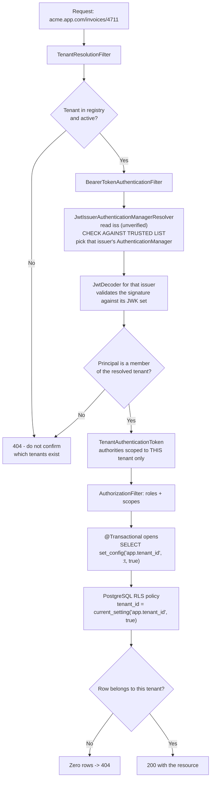
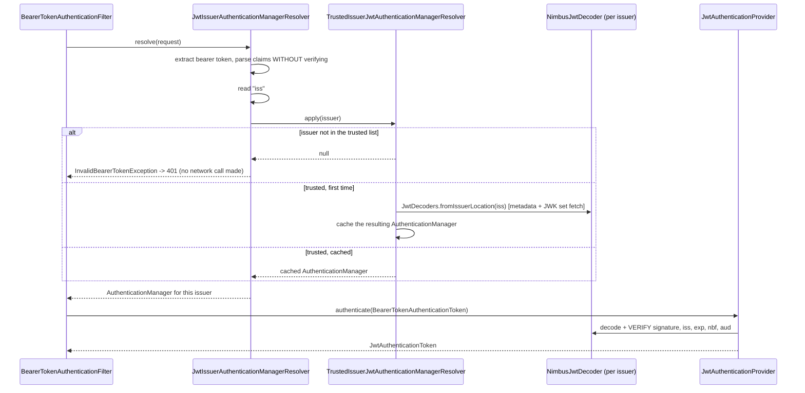

# 11.3 — Multi-Tenancy Security

> **Module 11 · Topic 3** · Advanced Topics
> Baseline: Spring Security 6.x on Boot 3.x
> New to this? Read **In Plain English** below first, then come back to the Version Matrix.

---

## Version Matrix

| Concern | Spring Security 5.x | **Spring Security 6.x (baseline)** | Spring Security 7.x |
|---|---|---|---|
| Per-tenant issuer resolution | `JwtIssuerAuthenticationManagerResolver` (5.3+), issuer allowlist added in 5.5 | **`JwtIssuerAuthenticationManagerResolver` with a trusted-issuer list, plus `TrustedIssuerJwtAuthenticationManagerResolver`** | same; resolver remains the Spring-native answer |
| Generic resolution hook | `AuthenticationManagerResolver<C>` (5.2+) | same | same |
| DSL | `.oauth2ResourceServer().authenticationManagerResolver(r)` with `.and()` | **`.oauth2ResourceServer(o -> o.authenticationManagerResolver(r))`** | lambda DSL only |
| Authorization engine | `AccessDecisionManager` + voters | **`AuthorizationManager`** — composable, so tenant checks compose with role checks | `AuthorizationManager.authorize()` |
| Hibernate discriminator | `@Filter` / `@FilterDef`, or `@Where` (Hibernate 5) | **`@TenantId` (Hibernate 6.x), `@Filter`, `@SQLRestriction`** (`@Where` deprecated) | Hibernate 7 direction unchanged |
| Session-per-tenant | `CurrentTenantIdentifierResolver` + `MultiTenantConnectionProvider` | same (Hibernate 6 signatures are generic: `CurrentTenantIdentifierResolver<String>`) | same |
| Tenant on the `Authentication` | Hand-built custom token | same | `Authentication.Builder` makes merging tenant authorities cleaner |

---

## Why This Exists

Multi-tenancy is the point at which authorization stops being about *what* and starts being
about *whose*. Every control covered so far — roles, authorities, scopes, method security —
answers "may this caller perform this operation?". None of them answer "may this caller
perform this operation *on this row*?", and in a multi-tenant system that second question is
the only one that matters, because every tenant's users have identical roles.

File 02 modelled the design: a role is a property of the `(user, organisation)` pair, not of
the user; resolve the tenant per request; enforce at the data layer because policy-layer rules
will eventually be forgotten. This topic is the implementation, and it takes a harder line on
one point in particular.

**Application-layer tenant filtering always eventually leaks.** Not because developers are
careless, but because the filter is an *addition* that must be remembered at every query, and
the number of query sites grows monotonically while the number of people who remember the rule
does not. A native query written during an incident, a `findAll()` behind a new admin screen, a
Spring Data derived method that matched what someone wanted, a cache key that omitted the
tenant, a Kafka consumer that never had a request to derive the tenant from — each is one line
of code and a cross-tenant data breach. The only control that fails safe is one where
*forgetting* produces zero rows rather than everyone's rows, and in practice that means the
database.

---

## In Plain English

**The one-line version:** When one application serves many separate customer companies out of the
same code and often the same tables, every single piece of data access has to be limited to the
customer the current request belongs to, and the only version of that rule which survives is one
enforced by the database rather than remembered by developers.

**An analogy.** Picture a shared warehouse used by twenty different companies. Every crate has an
owner's name written on the side, and the crates sit on the same shelves, in the same aisles. A
clerk fetching a crate is supposed to check the name before handing it over. On a good day that
works perfectly.

The problem is that this arrangement depends on remembering. There are forty clerks, new ones
arrive every month, and the number of reasons to fetch a crate keeps growing — a stock count, an
urgent request at midnight, a new inventory screen, a report someone wrote by hand. Each one is a
separate opportunity to skip the check, and skipping it does not fail noisily; it hands over
somebody else's property and looks like a successful day's work.

The change that actually fixes it is to stop relying on clerks. Fit the aisle with a gate that
reads a card saying which company this errand is for, and make the shelves physically present only
that company's crates. Now a clerk who forgets to mention the company finds an empty aisle instead
of everybody's goods. The failure has been inverted: forgetting produces nothing rather than
everything. That inversion is the entire argument of this file, and in software the gate is the
database rather than your Java code.

**How it actually works, step by step.**

The first decision is how far apart to keep the customers' data. You can give each customer their
own database, which is the strongest separation and the most expensive; or one database with a
separate schema, which is a namespace inside a database, per customer; or one shared set of tables
where every row carries a column naming its owner. Almost everyone builds the third, because a
thousand small customers cannot each justify a database, and it is also the weakest — a single
condition in a query is all that stands between one customer's data and another's. Recognising
that trade-off honestly is what makes the rest of the file matter.

Next, every request has to say which customer it is for. That answer must come from the request
itself: the subdomain in the address, a segment of the path, or a signed claim inside the token.
What it must *not* come from is a stored "currently selected customer" value on the session,
because a browser sends several requests at once and a user with two tabs open on two different
customers will have those requests interleave. One will read data using the other's identifier.
There is no lock that fixes this, because the two requests genuinely disagree, and a session can
only hold one answer. When the answer travels on each request, the problem cannot occur at all.

Working out which customer a request claims is not the same as being allowed to act for them, and
two separate checks follow. Does this customer exist and is the account active? And is the logged
in user actually a member of that customer? Skipping the second is the classic breach in this
category: a user of one company edits the subdomain to another company's name, presents their
perfectly valid session cookie, and the application happily serves the other company's data.

Once both checks pass, the permissions handed to the request must be the permissions this user
holds *at this customer only*. If you merge every membership together, a user who administers one
small customer administers all of them, which is the failure that makes naive designs dangerous.
In practice that means building the identity object per request, with the customer recorded on it
and only that customer's roles attached.

Large organisations then add one more wrinkle: each customer often brings their own login system.
Spring Security handles that with a resolver — a component that looks at the incoming request,
reads which identity provider issued its token, and picks the matching set of validation rules.
The one rule you cannot bend is that the provider must be chosen from a list you trust in advance.
The name of the issuer is read from a token that has not been verified yet, so a resolver that
will build rules for whatever issuer happens to arrive lets an attacker point at a server they
control and sign their own tokens.

Finally, the enforcement itself, which comes in three strengths. The weakest is discipline: every
query is written to include the customer. It is a convention, not a control. The middle option is
having the persistence framework add the condition for you, which is a genuine improvement but
still an *addition* — it does not cover raw SQL, it does not cover reporting tools or background
jobs or a support engineer with a database client, and if the customer value is missing it quietly
does the wrong thing. The strongest is a rule inside the database itself, PostgreSQL's row level
security, where each connection announces which customer it is acting for and the database refuses
to return anything else no matter what SQL was written. Its crucial property is that when nobody
announces a customer, the result is zero rows. That is the warehouse gate.

Two practical traps come with that database-level rule, and both are worth knowing before you meet
them. The announcement must be scoped to the current transaction rather than the connection,
because connections are reused and a value left behind leaks the previous request's customer to
the next one. And the database account your application uses must not be exempt from the rule —
the owner of a table ignores its own policies unless you explicitly force them, which produces a
system that looks protected and is not.

The last thing to know is where leaks actually come from in practice. More often than missing
permission checks, it is caching. A cache sits outside every control you built, so a result stored
under the key "logo" is returned to whoever asks for "logo" next, regardless of company. The
durable fix is not to write more careful cache keys by hand but to generate every key with the
customer identifier built in, and to refuse to produce a key at all when no customer is known.

**Why should a beginner care?** This is the category where a single forgotten condition is a data
breach involving other people's customers, not a bug you fix quietly. The specific mistakes are
all beginner-reachable: trusting a customer identifier sent in a header, storing the selected
customer on the session, combining a user's roles across companies, writing one native SQL query
for a report, or adding a cache without the company in the key. Understanding why the enforcement
belongs in the database is what stops you relying on remembering, and remembering is what fails.

**Words you will meet in this file**

| Term | In plain words |
|---|---|
| Tenant | One customer organisation using your application. Their data must never be visible to another. |
| Multi-tenancy | One running application serving many separate customer organisations at once. |
| Isolation model | How far apart the tenants' data is kept: separate databases, separate schemas, or one shared set of tables. |
| Schema | A named grouping of tables inside a database. Giving each tenant one is a middle-ground isolation choice. |
| Discriminator column | The column on every row naming which tenant owns it. In a shared design this is the only separation there is. |
| Tenant resolution | Working out which tenant the current request is for, from the subdomain, the path, or a token claim. |
| `Host` header | The address the browser asked for. Usable for subdomain resolution only if checked against a registry of real tenants. |
| Tenant registry | Your authoritative list of tenants and whether each is active. Resolution must be validated against it. |
| Membership | The record that a user belongs to a tenant and what they may do there. Roles belong to the pair, not to the user. |
| `Authentication` | The object holding who the caller is and what they may do. Here it must also record which tenant is active. |
| `AuthenticationManagerResolver` | The component that picks which login rules to apply based on the request, used when each tenant has its own identity provider. |
| Trusted issuer list | The fixed set of identity providers you accept tokens from. Choosing a provider from the token instead is a complete bypass. |
| `iss` claim | The part of a token naming who issued it. Read before verification, so it may only select from a trusted list. |
| `SecurityFilterChain` | One configured set of security rules. Having one per tenant works for a few tenants and not for thousands. |
| `@TenantId` | A marker telling the persistence framework to add the tenant condition for you. Helpful, but it does not cover raw SQL. |
| Row level security | A database rule that hides rows belonging to other tenants regardless of the query. Forgetting yields no rows rather than all rows. |
| `SET LOCAL` / `set_config` | The ways to tell the database which tenant this transaction is for. Must be transaction-scoped, because connections are reused. |
| `FORCE ROW LEVEL SECURITY` | The setting that makes the rule apply to the table's owner too. Without it the protection is on paper only. |
| `BYPASSRLS` | A database privilege that ignores the rules entirely. Your application's account must not have it. |
| Connection pool | A reusable set of database connections. Reuse is why any per-request database setting must reset itself. |
| `AbstractRoutingDataSource` | Spring's way of choosing a different database per request, used when large tenants get their own. |
| `KeyGenerator` | The component that builds cache keys. Make it always include the tenant, and fail when the tenant is unknown. |
| Platform role | A permission that deliberately crosses tenants, for support or billing. Kept narrow, time-limited, and logged. |
| Impersonation | Support acting as a named user inside a tenant, so the audit trail records both the operator and the identity used. |
| IDOR | Changing an identifier in a request to reach someone else's record. In a multi-tenant system that someone is another customer. |
| Bi-temporal | Recording both when a permission was in force and when you learned about it, so "who had access last March" is answerable. |

**If you remember only one thing:** enforce tenant separation where forgetting it returns zero
rows instead of everybody's rows, which means the database, because every control that has to be
remembered at each query will eventually be forgotten at one of them.

---

## Core Concepts

### 1. The Three Isolation Models

**In simple terms:** You can keep each customer's data in its own database, in its own namespace
inside one database, or mixed together in shared tables with an owner column — and the cheapest
option is the one almost everyone picks and the one with the least protection.

| | Separate database | Separate schema | Shared schema + discriminator |
|---|---|---|---|
| Isolation strength | **Strongest** — separate credentials, separate files, separate backups | Strong — one connection, but schema-qualified | **Weakest** — one `WHERE` clause between tenants |
| Blast radius of a bug | One tenant | One tenant, unless the search path is wrong | **All tenants** |
| Cost per tenant | High — connection pool, memory, backup, monitoring each | Medium | Near zero |
| Tenants supported | Tens to low hundreds | Hundreds to low thousands | Effectively unlimited |
| Schema migration | N migrations, partial-failure states | N migrations, usually scripted | One migration |
| Noisy neighbour | Impossible | Partial | Real — one tenant's query plan affects everyone |
| Per-tenant backup and restore | Trivial | Straightforward | **Hard** — restoring one tenant means surgical row extraction |
| Per-tenant encryption keys | Natural | Possible | Awkward |
| Regulatory "physically separated" | Satisfies it | Argues it | Does not satisfy it |
| Cross-tenant reporting | Hard | Hard | Trivial |

The honest summary: shared schema is what almost everyone builds, because the economics of
thousands of small tenants leave no alternative, and it is the model with the weakest intrinsic
isolation. That mismatch is why the data-layer enforcement discussion below matters so much.

A **hybrid** is common and worth knowing: shared schema by default, with a migration path to a
dedicated database for large or regulated tenants. It requires the tenant resolution and the
connection routing to be abstracted from day one, which is cheap to do early and expensive to
retrofit.

There is also a distinction people blur: **data isolation** versus **key isolation**. Separate
databases with the same encryption key still means one leaked key exposes everyone. If the
requirement is really "tenant A's data must be cryptographically inaccessible to an operator
with tenant B's credentials", then per-tenant keys are the requirement, and that pushes you
toward separate databases regardless of the row-count economics.

### 2. Tenant Resolution — Derive It From the Request

**In simple terms:** Each request must carry its own answer to "which customer is this for",
because storing that answer on the session means two browser tabs can make one request read the
other's data.

| Strategy | Example | Bookmarkable | Works for APIs | Spoofable | Notes |
|---|---|---|---|---|---|
| Subdomain | `acme.app.com` | Yes | Yes | No, if TLS and the host header are validated | Wildcard certificate; validate `Host` against a registry |
| Path prefix | `/orgs/acme/invoices` | Yes | Yes | No | Simplest; makes the tenant explicit in every log line |
| Custom header | `X-Tenant-ID: acme` | No | Yes | **Yes, unless authorised** | Fine for internal service-to-service, never for browsers |
| JWT claim | `"tid": "acme"` | No | Yes | No — signed | The right answer when an identity provider owns tenancy |
| Session attribute | `session.setAttribute("tenant", t)` | No | No | No | **Avoid** — see below |

**Derive the tenant from the request, never from mutable session state.** This is the single
most important design rule in the topic, and the reason is a class of race condition rather
than a single bug.

If the active tenant is a mutable field on the session, then a request that switches tenants
and a request that reads data are two concurrent operations against shared state. Browsers
happily issue six parallel requests. A user with two tabs open — Acme in one, Globex in the
other — generates interleaved reads and writes of that field, and the result is that a query
authorised for Acme executes with Globex's identifier, or vice versa. There is no lock you can
add that fixes this, because the two requests genuinely disagree about what the current tenant
is, and the session can only hold one answer.

When the tenant comes from the request — a subdomain, a path segment, or a signed claim — each
request carries its own answer, the two tabs never interfere, and "switching tenants" is just
navigation. The entire race disappears by construction rather than by synchronisation.

The secondary benefit is auditability. A tenant in the URL appears in the access log, the
trace, and the error report. A tenant in the session appears nowhere, and reconstructing which
tenant a request operated against during an incident becomes guesswork.

**Validate the resolved tenant against a registry and against the authentication.** Resolution
tells you which tenant the caller *claims*; it is not authorisation. Two separate checks
follow: does this tenant exist and is it active, and is the authenticated principal a member of
it? Skipping the second is the classic multi-tenant vulnerability — user from Acme changes the
subdomain to `globex.app.com`, presents a perfectly valid Acme session cookie, and the
application resolves the tenant to Globex and queries Globex's data.

### 3. Making the `Authentication` Tenant-Aware

**In simple terms:** The identity object must record which customer this request is acting for and
carry only that customer's permissions, otherwise an administrator of one customer becomes an
administrator of all of them.

Two approaches.

**A custom `Authentication` type** carrying the tenant and tenant-scoped authorities. Explicit,
type-checkable, and it means `hasRole("ADMIN")` naturally reads as "admin of the active
tenant", because the authority set was built for that tenant only.

```java
public class TenantAuthenticationToken extends AbstractAuthenticationToken {

    private final Object principal;
    private final String tenantId;

    public TenantAuthenticationToken(Object principal, String tenantId,
                                     Collection<? extends GrantedAuthority> authorities) {
        super(authorities);
        this.principal = principal;
        this.tenantId = tenantId;
        setAuthenticated(true);
    }

    public String getTenantId() { return this.tenantId; }
    @Override public Object getPrincipal()   { return this.principal; }
    @Override public Object getCredentials() { return null; }
}
```

**Tenant-qualified authorities** as an alternative or a complement: `ACME:ROLE_ADMIN`,
`GLOBEX:ROLE_VIEWER`. This lets one `Authentication` span several tenants, which is useful for
a tenant-switcher UI that must know what the user can switch *to*. It requires a custom
`AuthorizationManager` or SpEL helper to evaluate, because `hasRole("ADMIN")` will not match a
qualified string. I use qualified authorities for the *membership list* and a per-request
resolved set for the *active* tenant, which gives both properties without the combinatorial
role names that file 02 warns about.

The rule either way: **authorities must be scoped to one tenant at the moment of the
authorization decision**. A flat union of every tenant's authorities means a user who is an
admin somewhere is an admin everywhere, which is the failure mode that makes naive
multi-tenancy dangerous.

### 4. Per-Tenant Identity Providers — `AuthenticationManagerResolver`

**In simple terms:** When every customer brings their own login system, this component reads who
issued the incoming token and picks the matching validation rules — and it is only safe because it
chooses from a list of providers you trusted in advance.

This is the Spring-native answer when each tenant has its own identity provider, which is the
normal enterprise requirement — Acme uses Okta, Globex uses Azure AD, Initech runs Keycloak.

```java
package org.springframework.security.authentication;

@FunctionalInterface
public interface AuthenticationManagerResolver<C> {
    AuthenticationManager resolve(C context);
}
```

The context type varies by layer: `HttpServletRequest` for servlet, `ServerWebExchange` for
WebFlux, `String` for issuer-based resolution. `BearerTokenAuthenticationFilter` accepts a
resolver instead of a fixed `AuthenticationManager`, so the token's issuer selects the
validation rules.

Spring Security ships the JWT specialisation:

```java
package org.springframework.security.oauth2.server.resource.authentication;

public final class JwtIssuerAuthenticationManagerResolver
        implements AuthenticationManagerResolver<HttpServletRequest> {

    public JwtIssuerAuthenticationManagerResolver(String... trustedIssuers) { ... }
    public JwtIssuerAuthenticationManagerResolver(Collection<String> trustedIssuers) { ... }
    public JwtIssuerAuthenticationManagerResolver(
            AuthenticationManagerResolver<String> issuerAuthenticationManagerResolver) { ... }

    @Override
    public AuthenticationManager resolve(HttpServletRequest request) {
        // 1. read the bearer token WITHOUT validating the signature
        // 2. extract the "iss" claim
        // 3. delegate to the issuer resolver, which caches an AuthenticationManager per issuer
        // 4. that manager was built from the issuer's JWK set - the signature is validated there
    }
}
```

**The security property that makes this safe.** The issuer is read from an *unverified* token,
which sounds alarming. It is safe only because the resolver checks the issuer against a
**trusted list** before building anything, and because the signature is then validated by the
`JwtDecoder` that the trusted issuer's metadata produced. Constructing the resolver with an
open-ended lambda that builds a decoder from whatever issuer arrives is a complete
authentication bypass: an attacker points `iss` at a server they control, your application
fetches their JWK set, and their self-signed token validates perfectly. The allowlist is not
optional.

**What the resolver caches.** Each trusted issuer's `AuthenticationManager` is created once, on
first use, and retained — `TrustedIssuerJwtAuthenticationManagerResolver` holds a map. The
underlying `NimbusJwtDecoder` performs the OpenID provider metadata lookup and then caches the
JWK set, refreshing on an unknown key identifier. So the first request for a tenant pays a
network round trip and the rest do not. With hundreds of tenants that map grows, and it has no
eviction by default, which is a bounded but real memory consideration.

### 5. Per-Tenant `SecurityFilterChain` Versus One Chain With Dynamic Resolution

**In simple terms:** Giving each customer its own set of security rules is readable and works up
to a few dozen customers, but adding a customer without a restart means one shared rule set that
looks up the differences at runtime.

| | One chain per tenant | One chain, dynamic resolution |
|---|---|---|
| Tenants known at | **Startup** | **Runtime** |
| Onboarding a tenant | Restart or refresh the context | Insert a row |
| Configuration visibility | Each tenant's rules are readable in isolation | One rule set, parameterised |
| Chain selection cost | Linear scan of chains per request (`FilterChainProxy` picks the first match) | Constant |
| Per-tenant policy differences | **Natural** — different session policy, different CSRF, different login page | Awkward — conditionals inside one rule set |
| Scales to | Tens | Thousands |

`FilterChainProxy` evaluates chains in order and uses the **first** whose `RequestMatcher`
matches, so a hundred tenants means up to a hundred matcher evaluations per request. That is
cheap individually but it is per request, and more importantly it means chain ordering becomes
a correctness concern: a broad matcher early in the list makes every later chain unreachable.

My rule: **one chain, dynamic resolution, for the tenant population**; separate chains only for
genuinely different *channels* — a `/internal/**` chain for machine traffic, an `/actuator/**`
chain for operations, a `/partner/**` chain with different token audiences. Those are few,
stable, and known at startup, which is exactly what per-chain configuration is good at.

### 6. Enforcing Isolation at the Data Layer

**In simple terms:** This is where the separation is either real or imaginary, and the only
version that holds is the one where forgetting the customer condition returns nothing instead of
everyone's rows.

This is the section that decides whether your system leaks.

**Level 1 — discipline.** Every repository method takes a tenant parameter. It works until
someone writes a query that does not. It is not a control; it is a convention.

**Level 2 — Hibernate discriminator filtering.** Hibernate 6 provides `@TenantId`, which marks
a field as the tenant discriminator and makes Hibernate add the predicate automatically:

```java
@Entity
public class Invoice {

    @Id @GeneratedValue
    private Long id;

    @TenantId
    private String tenantId;      // Hibernate populates on insert, filters on select
    ...
}
```

The tenant comes from `CurrentTenantIdentifierResolver`, which Hibernate consults per session.
Alternatively `@FilterDef`/`@Filter` with `session.enableFilter("tenantFilter").setParameter(...)`
gives explicit control at the cost of having to enable the filter on every session.

This is a genuine improvement over discipline, and it is also **not sufficient**, for reasons
worth stating precisely:

- Hibernate filters apply to entity loads and HQL. They do **not** apply to native SQL, and
  native SQL is what people write for reports, bulk operations, and anything the JPA criteria
  API makes painful.
- `@Filter` does not apply to `session.get()` / `find()` by primary key in all cases, which is
  exactly the path an IDOR attack uses.
- A second-level cache hit can return an entity loaded under a different tenant's session if
  the cache region is not tenant-partitioned.
- Anything that does not go through Hibernate at all — `JdbcTemplate`, a reporting tool, a
  data pipeline, a database migration script, a support engineer with a SQL client — is
  completely unfiltered.
- Most importantly, it is still *additive*: if the tenant resolver returns null or the wrong
  value, the filter silently does the wrong thing.

**Level 3 — PostgreSQL row level security.** The database itself refuses to return rows that do
not belong to the current tenant, regardless of what SQL was written or which tool wrote it.

```sql
ALTER TABLE invoice ENABLE ROW LEVEL SECURITY;
ALTER TABLE invoice FORCE ROW LEVEL SECURITY;    -- applies to the table owner too

CREATE POLICY tenant_isolation ON invoice
    USING       (tenant_id = current_setting('app.tenant_id', true))
    WITH CHECK  (tenant_id = current_setting('app.tenant_id', true));
```

`USING` filters reads (and the rows visible to `UPDATE`/`DELETE`); `WITH CHECK` validates rows
being written, which is what stops a caller inserting a row into another tenant. The `true`
second argument to `current_setting` makes it return `NULL` rather than error when the setting
is absent — and since `tenant_id = NULL` is `NULL`, not `TRUE`, **an unset variable yields zero
rows**. That is the fail-safe property that no application-layer mechanism has.

Four operational facts that decide whether it works:

1. **The application's database role must not bypass the policy.** Superusers and roles with
   `BYPASSRLS` ignore policies entirely, and the table *owner* ignores them unless you add
   `FORCE ROW LEVEL SECURITY`. An application connecting as the owner without `FORCE` has
   RLS enabled and completely ineffective, which is the worst possible state because it looks
   protected.
2. **Use `SET LOCAL`, not `SET`.** Connections are pooled. `SET` persists on the connection and
   leaks the previous request's tenant to the next borrower. `SET LOCAL` is scoped to the
   transaction and reverts on commit or rollback. This means every tenant-scoped operation must
   run inside a transaction, which is a real constraint worth designing for.
3. **Set it as a parameter, not by string concatenation.** `SET LOCAL app.tenant_id = 'x'` does
   not accept a bind parameter, so use `SELECT set_config('app.tenant_id', ?, true)` with the
   third argument `true` meaning transaction-local. Concatenating a caller-supplied tenant
   identifier into a `SET` statement is SQL injection into your isolation mechanism.
4. **Indexes matter.** The policy predicate is added to every query, so `tenant_id` must be the
   leading column of your indexes or every query degrades to a scan-then-filter.

The cost is real: a Postgres dependency, a transaction requirement, and a migration for every
table. The benefit is that forgetting the filter returns nothing instead of everything, and
that is the only property that survives five years of team turnover.

### 7. Platform Roles That Legitimately Cross Tenants

**In simple terms:** Support and billing genuinely do need to look across customers, so the design
question is how to make that access narrow, temporary, and impossible to do quietly rather than
how to forbid it.

Support engineers need to see a customer's data to answer a ticket. Billing needs to aggregate
across tenants. A migration job touches everything. These are legitimate, and the design
question is how to make them **narrow, loud, and auditable** rather than how to prevent them.

- **A distinct authority, never a tenant role.** `ROLE_PLATFORM_SUPPORT` is not
  `ROLE_ADMIN` with a wider scope; it is a different thing with a different lifecycle,
  different approval, and different logging.
- **Time-bounded and ticket-bound.** Cross-tenant access is granted for a window, against a
  specific ticket, and expires. A standing grant is a standing risk.
- **Impersonation rather than bypass.** Where possible, support acts *as* a specific user in
  the tenant, using Spring Security's `SwitchUserFilter` or an equivalent, so the audit trail
  records both the real operator and the effective identity. Bypassing the tenant filter
  entirely gives you a log line that says "support looked at something".
- **Separate the read path from the write path.** Most support work needs read access. A
  cross-tenant *write* should require a second approver.
- **Notify the tenant.** For anything beyond routine, the customer should be able to see that
  their data was accessed, by whom, and why. This is increasingly a contractual requirement and
  it is a strong deterrent against casual browsing.
- **In the database:** a separate role with a policy that permits cross-tenant reads when a
  second session variable is set, so that the bypass is itself an explicit, greppable,
  auditable act rather than "connect as the owner".

### 8. The Cross-Tenant Test Harness

**In simple terms:** Rather than writing one test per endpoint, ask the framework for the list of
every endpoint it has and check them all, so a new endpoint that forgets about customers fails a
test instead of passing review.

The test that matters is not "tenant A can see tenant A's data". It is "**every** endpoint,
called with tenant A's identity against tenant B's resource identifier, returns 404". The word
that does the work is *every*, and the only way to keep that true as the application grows is to
enumerate the endpoints rather than list them.

Spring MVC exposes the mapping registry, so reflection over
`RequestMappingHandlerMapping.getHandlerMethods()` gives you the complete set of paths and
methods at runtime. A parameterised test over that set fails automatically when someone adds an
endpoint and does not handle tenancy — which is exactly the failure you cannot catch by review.

Two refinements make it usable. Path variables need plausible values, so seed tenant B with
known identifiers and substitute them into the template. And some endpoints are legitimately
tenant-agnostic (`/login`, `/actuator/health`), so there must be an explicit, reviewed
exclusion list — the point being that adding to that list is a visible act in a pull request
rather than a silent omission.

Expect **404**, not 403, per the existence-disclosure argument in file 02. A 403 confirms that
resource 4711 exists in some tenant, which is an enumeration oracle across your whole customer
base.

### 9. Tenant-Scoped Caching — Where the Leaks Actually Happen

**In simple terms:** A cache sits outside every check you wrote, so a stored result keyed without
the customer is handed straight to the next customer who asks for the same thing.

More multi-tenant data leaks come from caches than from missing `@PreAuthorize` annotations,
because a cache sits *outside* every control you built.

```java
// The bug. Two tenants, one key.
@Cacheable(value = "settings", key = "#name")
public Setting findSetting(String name) { ... }
```

Tenant A calls `findSetting("logo")`, the result is cached under `"logo"`, and tenant B gets
tenant A's logo — or their API endpoint, or their feature flags, or their pricing.

The fix is **not** to write better key expressions. SpEL keys live next to the method and
silently stop being correct when someone adds a parameter or copies the annotation. The fix is
a global `KeyGenerator` that *always* prefixes the tenant, applied by default, so that
forgetting produces a longer key rather than a wrong one:

```java
@Component("tenantKeyGenerator")
public class TenantAwareKeyGenerator implements KeyGenerator {

    private final TenantContext tenantContext;

    @Override
    public Object generate(Object target, Method method, Object... params) {
        String tenant = this.tenantContext.requireTenantId();   // throws if absent - fail closed
        return tenant + "|" + target.getClass().getSimpleName() + "#" + method.getName()
                + "|" + Arrays.deepHashCode(params);
    }
}
```

Three further points. Prefer **separate cache regions per tenant** over a shared region with
composite keys where the cache provider supports it, because eviction and memory limits then
work per tenant and a noisy tenant cannot evict everyone else's entries. Remember that the
**second-level Hibernate cache** is a cache too and needs the same treatment. And add a test
that calls the same method under two tenants and asserts the results differ — it costs nothing
and it catches the entire class.

### 10. Connection Pooling Per Tenant

**In simple terms:** Database connections are expensive and reused, so giving every customer their
own set does not scale, and sharing them means any per-request setting must undo itself before the
next borrower.

With separate-database or separate-schema isolation you must decide how connections are
allocated, and the arithmetic bites quickly.

**A pool per tenant** gives clean isolation and per-tenant limits, and it multiplies: 500
tenants times a modest pool of 10 is 5,000 connections, far beyond what a Postgres instance
will accept (the practical ceiling is in the hundreds; each backend is a process). It also
means 500 pools' worth of idle connections and heap.

**A shared pool with per-connection switching** — `SET search_path` for schema-per-tenant, or
`set_config` for RLS — is the scalable answer. The hazard is that the switch is connection
state and connections are recycled. Anything that sets state must reset it, which is exactly
why `SET LOCAL` inside a transaction is the right primitive: the reset is automatic and
cannot be forgotten. Tools that leave state on a connection — a `SET ROLE` outside a
transaction, an advisory lock, a temp table — will leak that state to the next borrower.

**A hybrid** matches the hybrid isolation model: a shared pool for the long tail on shared
schema, and dedicated pools for the handful of large tenants on their own databases. Spring's
`AbstractRoutingDataSource` routes by a lookup key resolved per request, which is the standard
way to implement this, though note it resolves the key at `getConnection()` time, so it must be
able to see the tenant context from whatever thread is calling — the propagation problem from
file 32 applies directly.

### 11. Bi-Temporal Membership for Historical Audit

**In simple terms:** If you overwrite permission records when they change, you can answer who has
access now but not who had access last March, which is the question an auditor will actually ask.

File 02 raised the question an auditor eventually asks: *"who had access to Acme's invoices on
3 March?"* A mutable `memberships` table answers "who has access now" and has destroyed the
information needed to answer the real question.

The fix is to append rather than update:

```sql
CREATE TABLE membership (
    id               bigserial PRIMARY KEY,
    user_id          uuid        NOT NULL,
    tenant_id        text        NOT NULL,
    role             text        NOT NULL,
    valid_from       timestamptz NOT NULL,          -- when the grant took EFFECT
    valid_to         timestamptz,                   -- NULL = still in effect
    recorded_at      timestamptz NOT NULL DEFAULT now(),   -- when we LEARNED it
    recorded_by      text        NOT NULL,
    reason           text
);
```

Two time axes, hence *bi-temporal*. **Valid time** (`valid_from`/`valid_to`) is when the grant
was in force in the real world. **Transaction time** (`recorded_at`) is when the system was told
about it. They differ whenever something is backdated — an access revocation entered on Tuesday
that legally took effect on the previous Friday — and an auditor asking "what did you believe on
Monday?" needs the second axis. Answering "who had access on 3 March" is then a query, not an
archaeology project:

```sql
SELECT user_id, role
FROM   membership
WHERE  tenant_id = 'acme'
  AND  valid_from <= timestamptz '2026-03-03'
  AND  (valid_to IS NULL OR valid_to > timestamptz '2026-03-03');
```

This must be designed in from the start. Retrofitting history onto a table that has been
updated in place for two years is not possible — the information is simply gone.

---



---

## Working Code

Tenant context and resolution filter:

```java
package com.example.tenancy;

import jakarta.servlet.FilterChain;
import jakarta.servlet.ServletException;
import jakarta.servlet.http.HttpServletRequest;
import jakarta.servlet.http.HttpServletResponse;
import org.springframework.web.filter.OncePerRequestFilter;

import java.io.IOException;

/**
 * Derives the tenant from the REQUEST (subdomain), never from session state.
 * Runs before authentication so the authentication machinery can use it.
 */
public class TenantResolutionFilter extends OncePerRequestFilter {

    public static final String TENANT_ATTRIBUTE = TenantResolutionFilter.class.getName() + ".TENANT";

    private final TenantRegistry registry;

    public TenantResolutionFilter(TenantRegistry registry) {
        this.registry = registry;
    }

    @Override
    protected void doFilterInternal(HttpServletRequest request, HttpServletResponse response,
            FilterChain chain) throws ServletException, IOException {

        String host = request.getServerName();                 // validated by the container/proxy
        int dot = host.indexOf('.');
        String candidate = (dot > 0) ? host.substring(0, dot) : null;

        if (candidate == null || !this.registry.isActive(candidate)) {
            // 404, not 403: do not confirm which tenant subdomains exist.
            response.setStatus(HttpServletResponse.SC_NOT_FOUND);
            return;
        }

        // Request attribute, not a ThreadLocal we have to remember to clear, and not a
        // session attribute two tabs would race on. It travels across dispatches for free.
        request.setAttribute(TENANT_ATTRIBUTE, candidate);
        chain.doFilter(request, response);
    }
}
```

Per-tenant identity providers with `JwtIssuerAuthenticationManagerResolver`:

```java
package com.example.tenancy;

import org.springframework.context.annotation.Bean;
import org.springframework.context.annotation.Configuration;
import org.springframework.security.authentication.AuthenticationManager;
import org.springframework.security.authentication.AuthenticationManagerResolver;
import org.springframework.security.authentication.ProviderManager;
import org.springframework.security.config.annotation.web.builders.HttpSecurity;
import org.springframework.security.config.annotation.web.configuration.EnableWebSecurity;
import org.springframework.security.oauth2.jwt.JwtDecoder;
import org.springframework.security.oauth2.jwt.JwtDecoders;
import org.springframework.security.oauth2.jwt.JwtValidators;
import org.springframework.security.oauth2.jwt.NimbusJwtDecoder;
import org.springframework.security.oauth2.server.resource.authentication.JwtAuthenticationProvider;
import org.springframework.security.oauth2.server.resource.authentication.JwtIssuerAuthenticationManagerResolver;
import org.springframework.security.web.SecurityFilterChain;

import jakarta.servlet.http.HttpServletRequest;
import java.util.Map;
import java.util.concurrent.ConcurrentHashMap;

@Configuration
@EnableWebSecurity
public class MultiTenantResourceServerConfig {

    /**
     * One AuthenticationManager per trusted issuer, created lazily and cached.
     *
     * SECURITY: the issuer is read from an UNVERIFIED token. That is only safe because
     * resolveTrusted() consults a registry first. Building a decoder from an arbitrary
     * issuer is a complete authentication bypass - the attacker hosts the JWK set.
     */
    @Bean
    AuthenticationManagerResolver<HttpServletRequest> authenticationManagerResolver(
            TenantRegistry registry) {

        Map<String, AuthenticationManager> cache = new ConcurrentHashMap<>();

        AuthenticationManagerResolver<String> byIssuer = issuer -> {
            if (!registry.isTrustedIssuer(issuer)) {
                return null;                 // resolver returns null -> 401, no lookup performed
            }
            return cache.computeIfAbsent(issuer, iss -> {
                // Metadata lookup + JWK set fetch happen once per issuer.
                JwtDecoder decoder = JwtDecoders.fromIssuerLocation(iss);
                ((NimbusJwtDecoder) decoder).setJwtValidator(
                        JwtValidators.createDefaultWithIssuer(iss));

                JwtAuthenticationProvider provider = new JwtAuthenticationProvider(decoder);
                provider.setJwtAuthenticationConverter(
                        new TenantAwareJwtAuthenticationConverter(registry));
                return new ProviderManager(provider);
            });
        };

        return new JwtIssuerAuthenticationManagerResolver(byIssuer);
    }

    @Bean
    SecurityFilterChain filterChain(HttpSecurity http,
                                    AuthenticationManagerResolver<HttpServletRequest> resolver,
                                    TenantRegistry registry) throws Exception {
        http
            .securityMatcher("/api/**")
            .addFilterBefore(new TenantResolutionFilter(registry),
                    org.springframework.security.web.context.SecurityContextHolderFilter.class)
            .authorizeHttpRequests(auth -> auth
                .requestMatchers("/api/public/**").permitAll()
                .requestMatchers("/api/platform/**").hasAuthority("ROLE_PLATFORM_SUPPORT")
                .anyRequest().authenticated()
            )
            .oauth2ResourceServer(oauth2 -> oauth2.authenticationManagerResolver(resolver))
            .sessionManagement(session -> session
                .sessionCreationPolicy(
                    org.springframework.security.config.http.SessionCreationPolicy.STATELESS))
            .csrf(csrf -> csrf.disable());     // stateless bearer-token API

        return http.build();
    }
}
```

The converter that binds the token to the resolved tenant — the check people forget:

```java
package com.example.tenancy;

import org.springframework.core.convert.converter.Converter;
import org.springframework.security.authentication.AbstractAuthenticationToken;
import org.springframework.security.core.GrantedAuthority;
import org.springframework.security.core.authority.SimpleGrantedAuthority;
import org.springframework.security.oauth2.jwt.Jwt;
import org.springframework.security.oauth2.server.resource.InvalidBearerTokenException;
import org.springframework.web.context.request.RequestContextHolder;
import org.springframework.web.context.request.ServletRequestAttributes;

import java.util.List;
import java.util.Set;
import java.util.stream.Collectors;

public class TenantAwareJwtAuthenticationConverter
        implements Converter<Jwt, AbstractAuthenticationToken> {

    private final TenantRegistry registry;

    public TenantAwareJwtAuthenticationConverter(TenantRegistry registry) {
        this.registry = registry;
    }

    @Override
    public AbstractAuthenticationToken convert(Jwt jwt) {
        String requestTenant = currentRequestTenant();
        String tokenTenant = jwt.getClaimAsString("tid");

        // THE CHECK. A valid Acme token presented at globex.app.com must fail here.
        // Without it, resolution alone lets any authenticated user pick a tenant.
        if (tokenTenant == null || !tokenTenant.equals(requestTenant)) {
            throw new InvalidBearerTokenException("Token is not valid for this tenant");
        }
        if (!this.registry.isMember(jwt.getSubject(), requestTenant)) {
            throw new InvalidBearerTokenException("Principal is not a member of this tenant");
        }

        // Authorities scoped to THIS tenant only - never a union across memberships.
        Set<String> roles = this.registry.rolesFor(jwt.getSubject(), requestTenant);
        List<GrantedAuthority> authorities = roles.stream()
                .map(r -> (GrantedAuthority) new SimpleGrantedAuthority("ROLE_" + r))
                .collect(Collectors.toList());
        jwt.getClaimAsStringList("scope")
           .forEach(s -> authorities.add(new SimpleGrantedAuthority("SCOPE_" + s)));

        return new TenantAuthenticationToken(jwt, requestTenant, authorities);
    }

    private String currentRequestTenant() {
        var attributes = (ServletRequestAttributes) RequestContextHolder.currentRequestAttributes();
        Object tenant = attributes.getRequest().getAttribute(TenantResolutionFilter.TENANT_ATTRIBUTE);
        if (tenant == null) {
            throw new InvalidBearerTokenException("No tenant resolved for this request");
        }
        return (String) tenant;
    }
}
```

PostgreSQL row level security, set per transaction:

```sql
-- Schema. tenant_id leads every index because the RLS predicate is on every query.
CREATE TABLE invoice (
    id         bigserial PRIMARY KEY,
    tenant_id  text        NOT NULL,
    number     text        NOT NULL,
    amount     numeric(19,2) NOT NULL,
    created_at timestamptz NOT NULL DEFAULT now()
);
CREATE INDEX idx_invoice_tenant_created ON invoice (tenant_id, created_at DESC);

ALTER TABLE invoice ENABLE ROW LEVEL SECURITY;
-- FORCE matters: without it the TABLE OWNER bypasses the policy entirely, and an
-- application connecting as the owner would look protected while being wide open.
ALTER TABLE invoice FORCE ROW LEVEL SECURITY;

CREATE POLICY invoice_tenant_isolation ON invoice
    USING      (tenant_id = current_setting('app.tenant_id', true))
    WITH CHECK (tenant_id = current_setting('app.tenant_id', true));

-- A separate, audited path for platform support. The bypass is explicit and greppable.
CREATE POLICY invoice_platform_read ON invoice
    FOR SELECT
    USING (current_setting('app.platform_override', true) = 'on');

-- The application role must NOT be the owner, must NOT be superuser, must NOT have BYPASSRLS.
CREATE ROLE app_runtime LOGIN;
GRANT SELECT, INSERT, UPDATE, DELETE ON invoice TO app_runtime;
ALTER ROLE app_runtime NOBYPASSRLS;
```

```java
package com.example.tenancy;

import org.aspectj.lang.ProceedingJoinPoint;
import org.aspectj.lang.annotation.Around;
import org.aspectj.lang.annotation.Aspect;
import org.springframework.core.annotation.Order;
import org.springframework.jdbc.core.JdbcTemplate;
import org.springframework.stereotype.Component;
import org.springframework.transaction.support.TransactionSynchronizationManager;

/**
 * Sets the RLS session variable for the CURRENT TRANSACTION.
 *
 * set_config(..., true) is transaction-local, so it reverts on commit or rollback and
 * cannot leak to the next borrower of a pooled connection. A plain SET would leak.
 *
 * Ordered to run INSIDE the transaction interceptor - the transaction must already be
 * open, or set_config would apply to a different connection than the queries use.
 */
@Aspect
@Component
@Order(200)
public class RowLevelSecurityAspect {

    private final JdbcTemplate jdbc;
    private final TenantContext tenantContext;

    public RowLevelSecurityAspect(JdbcTemplate jdbc, TenantContext tenantContext) {
        this.jdbc = jdbc;
        this.tenantContext = tenantContext;
    }

    @Around("@annotation(org.springframework.transaction.annotation.Transactional)")
    public Object applyTenant(ProceedingJoinPoint pjp) throws Throwable {
        if (!TransactionSynchronizationManager.isActualTransactionActive()) {
            throw new IllegalStateException(
                    "Tenant-scoped work must run inside a transaction for RLS to apply");
        }
        // Bind parameter, never string concatenation - this is SQL injection into the
        // isolation mechanism itself.
        this.jdbc.queryForObject("SELECT set_config('app.tenant_id', ?, true)",
                String.class, this.tenantContext.requireTenantId());
        return pjp.proceed();
    }
}
```

Tenant-scoped caching:

```java
package com.example.tenancy;

import org.springframework.cache.annotation.CachingConfigurer;
import org.springframework.cache.interceptor.KeyGenerator;
import org.springframework.context.annotation.Bean;
import org.springframework.context.annotation.Configuration;

import java.lang.reflect.Method;
import java.util.Arrays;

@Configuration
public class TenantCacheConfig implements CachingConfigurer {

    private final TenantContext tenantContext;

    public TenantCacheConfig(TenantContext tenantContext) {
        this.tenantContext = tenantContext;
    }

    /**
     * Applied by default to every @Cacheable that does not specify a key. Forgetting the
     * tenant now produces a LONGER key, not a wrong one - the failure mode is a cache miss
     * rather than another tenant's data.
     */
    @Bean
    @Override
    public KeyGenerator keyGenerator() {
        return (Object target, Method method, Object... params) -> {
            String tenant = this.tenantContext.requireTenantId();   // throws if absent
            return tenant + "|" + target.getClass().getSimpleName()
                          + "#" + method.getName()
                          + "|" + Arrays.deepHashCode(params);
        };
    }
}
```

The cross-tenant test harness:

```java
package com.example.tenancy;

import org.junit.jupiter.api.Test;
import org.junit.jupiter.params.ParameterizedTest;
import org.junit.jupiter.params.provider.MethodSource;
import org.springframework.beans.factory.annotation.Autowired;
import org.springframework.boot.test.autoconfigure.web.servlet.AutoConfigureMockMvc;
import org.springframework.boot.test.context.SpringBootTest;
import org.springframework.http.HttpMethod;
import org.springframework.test.web.servlet.MockMvc;
import org.springframework.web.servlet.mvc.method.RequestMappingInfo;
import org.springframework.web.servlet.mvc.method.annotation.RequestMappingHandlerMapping;

import java.util.List;
import java.util.Set;
import java.util.stream.Stream;

import static org.assertj.core.api.Assertions.assertThat;
import static org.springframework.test.web.servlet.request.MockMvcRequestBuilders.request;

@SpringBootTest
@AutoConfigureMockMvc
class CrossTenantIsolationTests {

    @Autowired MockMvc mvc;
    @Autowired static RequestMappingHandlerMapping handlerMapping;
    @Autowired TestTenantFixtures fixtures;   // seeds acme + globex with known ids

    /** Endpoints that are legitimately tenant-agnostic. Adding one is a VISIBLE act in a PR. */
    private static final Set<String> EXEMPT = Set.of(
            "/login", "/logout", "/error", "/actuator/health", "/api/public/**");

    /**
     * Enumerate every controller mapping by reflection, so a NEW endpoint is covered the
     * moment it is written. This is the property a hand-maintained list can never have.
     */
    static Stream<Endpoint> allEndpoints() {
        return handlerMapping.getHandlerMethods().keySet().stream()
                .flatMap(CrossTenantIsolationTests::expand)
                .filter(e -> !EXEMPT.contains(e.pattern()));
    }

    private static Stream<Endpoint> expand(RequestMappingInfo info) {
        List<String> patterns = info.getPathPatternsCondition() == null
                ? List.of()
                : info.getPathPatternsCondition().getPatternValues().stream().toList();
        Set<org.springframework.web.bind.annotation.RequestMethod> methods =
                info.getMethodsCondition().getMethods();
        return patterns.stream().flatMap(p -> methods.isEmpty()
                ? Stream.of(new Endpoint(HttpMethod.GET, p))
                : methods.stream().map(m -> new Endpoint(HttpMethod.valueOf(m.name()), p)));
    }

    @ParameterizedTest(name = "{0} must not expose another tenant''s data")
    @MethodSource("allEndpoints")
    void tenantACannotReachTenantBResources(Endpoint endpoint) throws Exception {
        String path = fixtures.substituteTenantBIds(endpoint.pattern());

        int status = mvc.perform(request(endpoint.method(), path)
                        .header("Host", "acme.app.com")
                        .header("Authorization", "Bearer " + fixtures.acmeUserToken())
                        .with(org.springframework.security.test.web.servlet.request
                                .SecurityMockMvcRequestPostProcessors.csrf()))
                .andReturn().getResponse().getStatus();

        // 404 not 403: a 403 confirms the resource exists somewhere and is an
        // enumeration oracle across the entire customer base.
        assertThat(status)
                .as("%s %s leaked tenant B's data to tenant A", endpoint.method(), path)
                .isIn(404, 401);
    }

    @Test
    void cacheIsNotSharedBetweenTenants() {
        String acme = fixtures.asTenant("acme", () -> settings.findSetting("logo"));
        String globex = fixtures.asTenant("globex", () -> settings.findSetting("logo"));
        assertThat(acme).isNotEqualTo(globex);   // catches the whole cache-key class
    }

    @Test
    void rowLevelSecurityBlocksAQueryThatForgotTheFilter() {
        fixtures.asTenant("acme", () -> {
            // Deliberately unfiltered native SQL - what a report or an incident fix looks like.
            List<Long> ids = jdbc.queryForList("SELECT id FROM invoice", Long.class);
            assertThat(ids).containsExactlyInAnyOrderElementsOf(fixtures.acmeInvoiceIds());
            return null;
        });
    }

    record Endpoint(HttpMethod method, String pattern) {}
}
```

---

## Internals

### How `JwtIssuerAuthenticationManagerResolver` decides



The ordering is what makes it safe: the trusted-list check happens **before** any network
call, so an attacker cannot even make your service fetch a URL they control, let alone have a
token accepted. An implementation that calls `JwtDecoders.fromIssuerLocation(iss)` first and
validates the issuer afterwards is server-side request forgery in addition to an
authentication bypass.

### `FilterChainProxy` chain selection with many tenants

```java
// FilterChainProxy.getFilters, simplified
private List<Filter> getFilters(HttpServletRequest request) {
    int count = 0;
    for (SecurityFilterChain chain : this.filterChains) {
        if (chain.matches(request)) {
            return chain.getFilters();      // FIRST match wins; chains do NOT accumulate
        }
    }
    return null;                            // no chain -> Spring Security does nothing
}
```

Two consequences for a chain-per-tenant design. The scan is linear and runs on every request,
so a thousand tenants is a thousand matcher evaluations in the worst case. And the chains are
fixed at context refresh — a new tenant needs a restart or a context refresh, which is not a
property an onboarding flow can live with. That is the concrete reason dynamic resolution wins
for the tenant population and per-chain configuration is reserved for channels.

### What `@TenantId` actually generates

With Hibernate 6, a field annotated `@TenantId` is populated from
`CurrentTenantIdentifierResolver.resolveCurrentTenantIdentifier()` on insert and added as a
predicate on select:

```sql
-- what you wrote:  session.find(Invoice.class, 4711)
select i.id, i.tenant_id, i.number, i.amount
from   invoice i
where  i.id = ? and i.tenant_id = ?
```

That is genuinely useful and it is exactly why it lulls teams into thinking they are done. The
predicate appears for entity loads and HQL. It does **not** appear for:

```java
jdbcTemplate.query("SELECT * FROM invoice WHERE number = ?", ...);        // no predicate
entityManager.createNativeQuery("SELECT * FROM invoice").getResultList(); // no predicate
```

and it does not apply to a second-level cache hit, to a Flyway migration, to a
`COPY ... TO STDOUT` from a data pipeline, or to a support engineer with `psql`. Row level
security applies to all of them, because it is enforced by the server rather than by the
object-relational mapper generating the SQL.

### Why `SET LOCAL` and not `SET`

```java
// WRONG. Persists on the pooled connection after the request ends.
jdbc.execute("SET app.tenant_id = 'acme'");
// The next borrower of this connection is now operating as acme, whoever they are.

// RIGHT. Third argument true = transaction-local, reverted on commit or rollback.
jdbc.queryForObject("SELECT set_config('app.tenant_id', ?, true)", String.class, tenant);
```

This is the same category of bug as the pooled-`ThreadLocal` leak in file 04 and file 32 —
state left on a reusable resource, observed by the next unrelated user — moved one layer down
into the connection pool. The mitigation is also the same in spirit: make the cleanup automatic
rather than remembered. Transaction scoping gives you that; a connection-level `SET` plus a
`finally` does not, because a connection can be abandoned without the `finally` running.

HikariCP's `connectionInitSql` is sometimes proposed as the place to set the tenant. It is not:
it runs once when the connection is created, not per borrow, so it would pin a connection to
whichever tenant happened to trigger pool growth — precisely the
`InheritableThreadLocal` failure mode from file 32, re-implemented in the data layer.

---

## Configuration Reference

| Option / API | Effect | Default |
|---|---|---|
| `AuthenticationManagerResolver<HttpServletRequest>` bean | Per-request selection of the authentication manager | none |
| `JwtIssuerAuthenticationManagerResolver(Collection<String>)` | Trusted-issuer allowlist; unknown issuers rejected without a network call | — |
| `.oauth2ResourceServer(o -> o.authenticationManagerResolver(r))` | Wires the resolver into `BearerTokenAuthenticationFilter` | fixed manager |
| `http.securityMatcher(...)` | Which requests a chain handles; first matching chain wins | all |
| `@TenantId` (Hibernate 6) | Discriminator populated on insert, predicated on select | — |
| `CurrentTenantIdentifierResolver<String>` bean | Supplies the tenant to Hibernate per session | none |
| `@Filter` + `session.enableFilter(...)` | Explicit HQL/entity-load predicate | disabled per session |
| `@SQLRestriction` | Static predicate on an entity (replaces deprecated `@Where`) | — |
| `ALTER TABLE ... ENABLE ROW LEVEL SECURITY` | Policies apply to non-owner, non-superuser roles | disabled |
| `ALTER TABLE ... FORCE ROW LEVEL SECURITY` | Policies apply to the table **owner** too | not forced |
| `set_config('app.tenant_id', ?, true)` | Transaction-local session variable for the policy | unset yields **zero rows** |
| `ALTER ROLE app NOBYPASSRLS` | Prevents the application role from ignoring policies | inherited |
| `AbstractRoutingDataSource.determineCurrentLookupKey()` | Routes to a per-tenant `DataSource` | — |
| `spring.datasource.hikari.maximum-pool-size` | Per-pool connection cap — multiply by tenant count | `10` |
| `CachingConfigurer.keyGenerator()` | Default cache key for every `@Cacheable` without an explicit key | `SimpleKeyGenerator` |
| `SwitchUserFilter` | Audited impersonation for support, preserving the real operator | not enabled |

---

## Production Concerns & Anti-Patterns

**Resolving the tenant from mutable session state.** Two browser tabs on two tenants, six
parallel requests each, one shared field. The request that reads data and the request that
switches tenants race, and a query authorised for one tenant executes against another. No lock
fixes it, because the two requests legitimately disagree. Derive the tenant from the request —
subdomain, path, or signed claim — and the race cannot exist.

**Resolving the tenant and calling that authorization.** Resolution says which tenant the
caller *claims*. It must be followed by two checks: the tenant exists and is active, and the
authenticated principal is a member of it. Without the second check, changing the subdomain is
a complete cross-tenant breach with a perfectly valid session.

**Trusting an `X-Tenant-ID` header from a browser.** It is caller-supplied and unsigned.
Acceptable between internal services behind a boundary that strips the header from external
traffic; never acceptable from a user agent. And "the gateway strips it" must be verified, not
assumed — a direct pod address or a second ingress path bypasses the stripping.

**Building a `JwtDecoder` from whatever issuer arrives.** The issuer is read from an unverified
token. Without a trusted-issuer allowlist checked first, an attacker sets `iss` to a server
they control, your application fetches their JWK set, and their token validates. This is both
an authentication bypass and server-side request forgery.

**Unioning authorities across tenant memberships.** A user who is an admin of one small tenant
becomes an admin everywhere. Authorities must be resolved for the *active* tenant at the moment
the authentication is constructed.

**Believing Hibernate filters are sufficient.** They cover entity loads and HQL and nothing
else. Native SQL, `JdbcTemplate`, second-level cache hits, migrations, reporting tools, and
anyone with a SQL client are all unfiltered. They are a useful defence in depth and a dangerous
sole control.

**Enabling row level security while connecting as the table owner.** The owner bypasses
policies unless `FORCE ROW LEVEL SECURITY` is set. The table reports RLS enabled, every review
passes, and nothing is enforced. Verify with a real query as the application role, not by
reading the DDL.

**Using `SET` instead of `SET LOCAL`/`set_config(..., true)`.** Connection state outlives the
request in a pooled environment and leaks the tenant to the next borrower. Similarly,
`connectionInitSql` pins a tenant to a connection at creation time, which is worse.

**Cache keys without the tenant.** The most common source of real cross-tenant leaks, because
the cache sits outside every control you built. Use a global `KeyGenerator` that always
includes the tenant and throws when it is absent, rather than per-method SpEL keys that drift.

**A pool per tenant.** Five hundred tenants at ten connections each is five thousand backend
processes, well past what the database will accept. Use a shared pool with transaction-scoped
switching, and reserve dedicated pools for the handful of tenants that justify them.

**Returning 403 for another tenant's resource.** It confirms the resource exists, which lets an
attacker enumerate identifiers across your entire customer base and infer volume, growth, and
timing. Return 404 and log the real distinction server-side.

**Standing cross-tenant access for support.** A permanent `ROLE_PLATFORM_SUPPORT` on twenty
engineers is twenty accounts whose compromise exposes every customer. Time-bound it, bind it to
a ticket, prefer audited impersonation over filter bypass, and notify the tenant.

**A mutable membership table.** It answers "who has access now" and destroys the ability to
answer "who had access on 3 March". Append with validity intervals from day one; it cannot be
retrofitted.

---

## Debugging Playbook

| Symptom | Likely root cause | Fix |
|---|---|---|
| A user sees another tenant's data intermittently | Tenant held in session or a `ThreadLocal` and raced by parallel requests | Derive per request; if a `ThreadLocal` is unavoidable, clear it in `finally` |
| A valid token from tenant A works on tenant B's subdomain | Tenant resolved but never checked against the token claim and membership | Add both checks in the `JwtAuthenticationConverter` |
| Cross-tenant leak only on cached endpoints | Cache key omits the tenant | Global `KeyGenerator` including the tenant; per-tenant cache regions |
| RLS is enabled but queries return everything | Connecting as the table owner or a `BYPASSRLS`/superuser role | `ALTER TABLE ... FORCE ROW LEVEL SECURITY`; run as a dedicated non-owner role |
| RLS returns zero rows for everything | `app.tenant_id` never set, or set outside the transaction the query uses | `set_config(..., true)` inside the transaction; assert a transaction is active |
| Tenant leaks to the next request in the same pod | `SET` instead of `SET LOCAL`, or `connectionInitSql` | Transaction-local `set_config` |
| 401 for a legitimate tenant's tokens | Issuer missing from the trusted list, or issuer string differs by a trailing slash | Compare the `iss` claim byte for byte against the registry entry |
| First request per tenant is slow, then fast | Metadata and JWK set fetched lazily and cached per issuer | Expected; pre-warm on tenant activation if the latency matters |
| Memory grows with tenant count | The per-issuer `AuthenticationManager` cache has no eviction | Bound the cache; evict on tenant deactivation |
| New endpoint leaks across tenants | Added after the isolation tests were written | Enumerate mappings by reflection so new endpoints are covered automatically |
| Queries slow after enabling RLS | The policy predicate is not index-covered | Make `tenant_id` the leading index column |
| `@Async` or Kafka consumer operates on the wrong tenant | No request to derive the tenant from; context not propagated | Pass the tenant explicitly in the message or task; never inherit ambiently (file 32) |
| Auditor cannot be told who had access historically | Membership rows are updated in place | Bi-temporal membership table; cannot be reconstructed after the fact |

---

## Interview Q&A

### Q1. Compare the three multi-tenant isolation models and tell me which you would choose.

<details>
<summary>Show answer</summary>

**Separate database per tenant** gives the strongest isolation: separate credentials, separate
files, separate backups, and a bug in one tenant's query cannot possibly touch another's data.
It also gives per-tenant restore, per-tenant encryption keys, and a clean answer to a regulator
who asks for physical separation. The costs are linear in tenant count and they are steep — a
connection pool, memory, backup schedule, monitoring, and a migration run per tenant. It stops
being viable somewhere in the low hundreds.

**Separate schema** is a middle point. One connection, one instance, schema-qualified access,
and the tenant switch is a `search_path` change. Isolation is good but not absolute: a mistake
in the search path or a schema-qualified query written by hand crosses the boundary. Migrations
are still N runs, with the partial-failure problem that implies.

**Shared schema with a discriminator column** is one `WHERE` clause between tenants. It is
essentially free per tenant, scales to any number, has a single migration, and makes
cross-tenant reporting trivial. It is also the weakest: any query that omits the predicate
returns everyone's data, a query-plan problem for one tenant affects all of them, and restoring
one tenant means surgically extracting rows.

**What I would choose:** shared schema for the general population, because for a SaaS with
thousands of tenants the economics leave no alternative, combined with **PostgreSQL row level
security** so that the discriminator is enforced by the database rather than by every developer
who writes a query. Plus a designed migration path to a dedicated database for large or
regulated tenants, which means abstracting tenant resolution and connection routing from day
one — cheap early, very expensive later.

I would make the weakness explicit rather than hide it: shared schema means the isolation
boundary is a predicate, so the engineering investment goes into making that predicate
impossible to omit.

**Counter-question: a prospective customer's security team demands "physical separation". How do you respond?**

I would establish what they actually need before answering, because "physical separation" is
usually shorthand rather than a literal requirement.

Sometimes it means a specific regulatory clause, in which case there is a document I can read
and map to concrete controls. Sometimes it means data residency — the data must not leave a
jurisdiction — which is about region placement and has nothing to do with the isolation model.
Sometimes it means "we do not trust your application code", which is a fair concern and is
answered by showing that isolation is enforced in the database, with the policy definitions and
a demonstration that a query omitting the filter returns nothing.

Often what they actually want is per-tenant encryption keys, so that an operator or an attacker
with one tenant's key cannot read another's. That is a real and separable requirement, and it
is worth distinguishing because it changes the design: shared schema with per-tenant
application-level encryption for sensitive columns can satisfy it without moving to separate
databases.

If after all that they genuinely require a dedicated database, I would price it as a distinct
tier. That is an honest commercial answer, and it is why the routing abstraction needs to exist
from the start.

**Counter-question: shared schema, and one tenant runs a query that tables-scans a billion rows. What happens and what do you do about it?**

Everyone suffers. The scan evicts the shared buffer cache, so every other tenant's working set
is pushed out and their queries start hitting disk. It consumes I/O bandwidth and a connection
from the shared pool. If it holds a long transaction, it blocks vacuum, and dead tuples
accumulate across the whole table for every tenant.

The mitigations, roughly in order of how much they help. `statement_timeout` set conservatively
so nothing can run away — this is the single highest-value setting and is often unset.
Per-tenant query concurrency limits at the application layer, so one tenant cannot occupy the
whole pool. Partitioning large tables by tenant so a scan is confined to one partition, which
also makes per-tenant deletion cheap. A separate read replica for reporting so analytical
queries never touch the transactional instance. And monitoring that attributes query cost per
tenant, because without it you cannot tell who is causing the problem.

The structural answer is the hybrid: once a tenant is large enough to be a noisy neighbour,
they are large enough to pay for their own database, and the routing abstraction makes moving
them an operational task rather than a project.
</details>

### Q2. How do you support per-tenant identity providers in Spring Security?

<details>
<summary>Show answer</summary>

With `AuthenticationManagerResolver`, which is the Spring-native answer and exists precisely
for this.

`BearerTokenAuthenticationFilter` can be configured with an
`AuthenticationManagerResolver<HttpServletRequest>` instead of a fixed `AuthenticationManager`.
Each request resolves its own manager, so a token from Okta and a token from Azure AD are
validated with different keys, different issuer checks, and different claim converters.

For JWTs, Spring ships `JwtIssuerAuthenticationManagerResolver`. It reads the bearer token,
parses the `iss` claim **without verifying the signature**, checks it against a trusted-issuer
list, and returns a cached `AuthenticationManager` built for that issuer — created on first use
from the issuer's OpenID provider metadata and JWK set.

```java
@Bean
SecurityFilterChain filterChain(HttpSecurity http,
        AuthenticationManagerResolver<HttpServletRequest> resolver) throws Exception {
    http.oauth2ResourceServer(oauth2 -> oauth2.authenticationManagerResolver(resolver));
    return http.build();
}
```

The part that must be said out loud in an interview: **reading the issuer from an unverified
token is only safe because of the allowlist**. If you construct the resolver with a lambda that
calls `JwtDecoders.fromIssuerLocation(issuer)` for whatever arrives, an attacker sets `iss` to a
server they control, your application obligingly fetches their JWK set, and their self-signed
token validates perfectly. That is a total authentication bypass and, as a bonus, server-side
request forgery. The trusted list must be consulted before any network call.

**Counter-question: a new tenant is onboarded at three in the morning. Does your application need a restart?**

Not with the resolver approach, and that is the main reason to prefer it over
chain-per-tenant.

The resolver is a function evaluated per request. If it consults a registry — a database table,
a configuration service — then adding a row is all that onboarding requires. The first request
for the new tenant pays a metadata and JWK set fetch, and everything after that is a map
lookup.

A `SecurityFilterChain` per tenant would need a restart or a context refresh, because the chain
list is built at context refresh and `FilterChainProxy` holds it. That is disqualifying for a
self-service onboarding flow.

Two details I would build in. The per-issuer cache needs eviction on tenant deactivation, or a
deactivated tenant's tokens keep working until the process restarts. And the registry lookup is
on the hot path for every request, so it needs its own short-lived cache with a bounded size —
otherwise you have moved a network call from JWK fetching to tenant lookup.

**Counter-question: two tenants use the same identity provider, say the same Keycloak instance with different realms. Does issuer-based resolution still work?**

Yes, because different Keycloak realms have different issuer URLs — `.../realms/acme` and
`.../realms/globex` — so they resolve to different managers with different JWK sets. That is
the clean case.

The case that does not work is two tenants sharing a single realm, where the issuer is
identical and only a claim distinguishes them. Issuer-based resolution cannot help, because
there is nothing to resolve on. There the tenant comes from a claim (`tid`) or from the request,
and the check moves into the `JwtAuthenticationConverter`: verify the claim matches the tenant
resolved from the request, and verify the subject is a member.

I would treat that as the general case and always do the converter-level check, even when
issuer resolution is in play. Issuer resolution proves *which provider* signed the token. It
does not prove the token is for the tenant whose subdomain the request arrived on, and
conflating those is exactly how the cross-tenant bug gets in.

**Counter-question: one tenant's identity provider is down, and its JWK endpoint times out. What happens to the other tenants?**

It depends on your timeouts and on whether the fetch happens on a request thread, which it
does.

`NimbusJwtDecoder` fetches the JWK set through a `RestOperations` whose default timeouts may be
effectively infinite. A tenant whose provider is hanging means every request for that tenant
occupies a servlet thread until it gives up. With two hundred Tomcat threads and enough traffic
from that tenant, the pool fills and **every** tenant stops being served. One tenant's provider
outage becomes a full platform outage.

The fixes: explicit short connect and read timeouts on the decoder's `RestOperations` — a few
seconds at most; a circuit breaker per issuer so repeated failures fail fast instead of
occupying a thread; a longer JWK set cache so a brief outage is invisible; and a bulkhead
limiting concurrent requests per tenant so no single tenant can consume the whole thread pool.

Virtual threads change the arithmetic — a blocked virtual thread is cheap — but not the
conclusion, because the requests still pile up and the user experience is still a hang. The
timeout and the circuit breaker are the real controls.
</details>

### Q3. Why is application-layer tenant filtering insufficient, and what would you use instead?

<details>
<summary>Show answer</summary>

Because application-layer filtering is *additive*: the tenant predicate is something a
developer must add, and the failure mode of forgetting is returning everyone's data. Over the
life of a system, the number of query sites grows monotonically and the number of people who
remember the rule does not. It is not a question of whether someone forgets; it is a question
of when, and whether you find out before a customer does.

The specific holes, concretely. Hibernate's `@TenantId` and `@Filter` apply to entity loads and
HQL, so they miss every native query — and native queries are exactly what gets written for
reports, bulk operations, and incident fixes under time pressure. They miss `JdbcTemplate`
entirely. They miss a second-level cache hit if the region is not tenant-partitioned. They miss
Flyway migrations, data pipelines, reporting tools, and a support engineer with `psql`. And
they silently do the wrong thing if the tenant resolver returns null.

**What I would use instead is PostgreSQL row level security**, with the application-layer
filtering kept as defence in depth rather than removed.

```sql
ALTER TABLE invoice ENABLE ROW LEVEL SECURITY;
ALTER TABLE invoice FORCE ROW LEVEL SECURITY;
CREATE POLICY tenant_isolation ON invoice
    USING      (tenant_id = current_setting('app.tenant_id', true))
    WITH CHECK (tenant_id = current_setting('app.tenant_id', true));
```

The property that makes it different in kind: if the session variable is not set,
`current_setting` returns `NULL`, `tenant_id = NULL` evaluates to `NULL` rather than `TRUE`, and
the query returns **zero rows**. Forgetting produces nothing instead of everything. That is the
only enforcement model that survives team turnover, and it applies to every client of the
database, not just the ones that go through your ORM.

The costs are honest ones: a Postgres dependency, the requirement that tenant-scoped work runs
inside a transaction, a migration per table, and index design that puts `tenant_id` first
because the predicate is now on every query.

**Counter-question: give me three ways to enable RLS and still have it not work.**

All three are real and all three look correct in a code review.

**Connect as the table owner without `FORCE`.** Policies do not apply to the owner. The DDL
says `ENABLE ROW LEVEL SECURITY`, the policy exists, and nothing is enforced. This is the worst
of the three because every artefact suggests protection. The application must run as a
dedicated role that is not the owner, not a superuser, and does not have `BYPASSRLS`.

**Use `SET` instead of a transaction-local `set_config`.** The variable persists on the pooled
connection after the request ends. The next borrower — a different tenant, or a background job
— inherits it. Rows are returned, just the wrong tenant's, and the symptom is intermittent
cross-tenant data that correlates with load rather than with any code path.

**Write a policy with only `USING` and no `WITH CHECK`.** Reads are isolated; writes are not.
A caller can insert or update a row with another tenant's identifier, which is a cross-tenant
*write* — arguably worse than a read, because it corrupts the other tenant's data and the audit
trail attributes it to them.

A fourth worth mentioning: a policy that references `current_user` or a role rather than a
session variable, combined with connection pooling that reuses a single database user. The
policy then evaluates identically for everyone.

**Counter-question: your queries got slower after enabling RLS. Why, and what do you do?**

Because the policy predicate is now on every query, including ones whose indexes were designed
without it. A lookup that was an index seek on `number` becomes a seek followed by a filter on
`tenant_id`, or worse, the planner chooses differently and scans.

The fix is index design: `tenant_id` must be the leading column on every index that supports a
tenant-scoped query, so the predicate is satisfied by the index rather than by a filter step.
That is the same shape you would want anyway for a discriminator-based design, so it is rarely
wasted work.

Two further levers. Partitioning by tenant means the planner can prune entire partitions, which
turns the predicate from a filter into a partition selection — very effective for large tenants
and it also makes per-tenant deletion and archival cheap. And marking the policy function
appropriately matters: `current_setting` is stable within a statement, so it is evaluated once
rather than per row, but a policy that calls a user-defined function without the right
volatility marking can be evaluated per row and is catastrophically slow.

I would measure with `EXPLAIN (ANALYZE, BUFFERS)` before and after, per query shape, rather
than guess — the regression is usually concentrated in two or three queries, not spread evenly.

**Counter-question: you are not on Postgres. MySQL, or a document store. Now what?**

Then you do not get a database-enforced guarantee and you must be honest about that rather than
pretend the ORM filter is equivalent.

MySQL has no row level security. The closest approximations are views with a predicate
referencing a session variable, granting the application access only to the views and never to
the base tables — which works but is fragile, because `CREATE VIEW` for every table is a large
surface and anything with `GRANT` on the base table bypasses it. A proxy layer that rewrites
queries is another option, and it is a significant piece of infrastructure to own.

For document stores the usual answer is a database or collection per tenant, which converts the
problem into the separate-database model and inherits its scaling limits.

Where none of those work, I would layer what I can and invest heavily in detection instead of
relying on prevention: the reflection-driven cross-tenant test harness, a static analysis rule
that flags any native query against a tenant-scoped table, mandatory review by a second person
for any such query, and a runtime canary that periodically asserts a query as tenant A cannot
return tenant B's seeded rows. That is weaker than RLS and I would say so — and it would be one
of the strongest arguments I could make for choosing Postgres.
</details>

### Q4. A support engineer needs to view a customer's data. Design that.

<details>
<summary>Show answer</summary>

The goal is not to prevent it — support genuinely needs it — but to make it **narrow, explicit,
time-bounded, and loud**.

**Not a tenant role.** `ROLE_PLATFORM_SUPPORT` is a distinct authority with its own lifecycle,
its own approval path, and its own logging. It must never be `ROLE_ADMIN` with a wider
matcher, because then a tenant admin and a platform operator are indistinguishable in the code
and in the audit trail.

**Impersonation, not bypass.** Where possible the operator acts *as* a specific user in the
tenant — Spring Security's `SwitchUserFilter` implements this, wrapping the original
authentication in a `SwitchUserGrantedAuthority` so the real operator remains recoverable. The
audit record then reads "operator Dave, acting as user alice in tenant acme", which is what an
investigation needs. A filter bypass produces "someone with platform support looked at
something", which is close to useless.

**Time-bounded and ticket-bound.** Access is granted for a window against a specific ticket and
expires automatically. A standing grant on twenty engineers is twenty accounts whose compromise
exposes every customer, and it removes the signal — if everyone always has access, an access
event means nothing.

**Read and write separated.** Most support work is read-only. A cross-tenant write should
require a second approver, because that is the action that can destroy a customer's data or
forge a record.

**Enforced at the database too.** A separate policy that permits cross-tenant reads only when a
second session variable is set, so the bypass is an explicit, greppable, auditable act rather
than a consequence of which role the connection used.

**Visible to the tenant.** For anything beyond routine, the customer should be able to see who
accessed their data and why. It is increasingly contractual, and it is the most effective
deterrent against casual browsing, because the person doing it knows the customer will see it.

**Counter-question: how do you stop the support engineer from browsing customer data out of curiosity?**

Technical controls alone do not, so the design has to combine several weaker measures rather
than look for one strong one.

The ticket binding is the primary control: access is granted for a specific tenant, for a
window, tied to a ticket number, and a request with no ticket is simply refused. That turns
curiosity into an act that requires fabricating a ticket, which is both harder and more
obviously deliberate.

Then reduce what is reachable. Most support questions are answered by metadata — account state,
subscription, error history, the last ten actions — not by the customer's actual content.
Building a support view that exposes the metadata without the content means the high-volume
path never touches sensitive data at all, and access to content becomes rare enough to be
worth reviewing individually.

Then detection. Alert on volume anomalies — an engineer who viewed forty tenants today when the
median is three — on access with no corresponding ticket activity, and on access to high-profile
accounts, which is where curiosity actually manifests. Several well-known breaches at large
companies were exactly this: employees looking up celebrities.

And then the human layer: the customer-visible access log, periodic review of access records by
someone outside the support organisation, and a clear policy with real consequences. I would
state plainly in an interview that this is a place where process does more work than code, and
that pretending otherwise is how organisations end up surprised.

**Counter-question: the support engineer needs to reproduce a bug that only occurs with the customer's data. Read-only impersonation is not enough.**

This is the genuinely hard case and it deserves a different answer rather than a widening of
the existing one.

The best option is to not use production data at all: a reproduction environment seeded with
**anonymised** or synthetic data that preserves the shape, volume, and edge cases that trigger
the bug. Most "only happens with their data" bugs are actually "only happens with this shape of
data", and once you have identified the shape you can reproduce it without the content. Getting
there requires investment in a data-shape extraction tool, and that investment is usually worth
it because it also unblocks performance testing.

Where production data is unavoidable, the pattern I would use is a time-boxed, isolated clone:
a snapshot of that tenant's data restored into an isolated environment, with the sensitive
columns masked, accessible only to the named engineers, destroyed on a schedule. That keeps the
blast radius bounded and keeps production untouched.

Writing to production to reproduce something is where I would draw a hard line. If it is truly
necessary — a data-correction script, say — it goes through the same path as a deployment:
written, reviewed, approved by a second person, executed with a dry run first, and the
before-and-after state captured. Not an engineer at a console.

And the customer should be asked. For many organisations, consent for support to access their
data for a specific incident is both a legal requirement and an easy conversation.
</details>

### Q5. How do you prove, continuously, that no endpoint leaks across tenants?

<details>
<summary>Show answer</summary>

By enumerating the endpoints rather than listing them, so that coverage is a property of the
harness rather than of anyone's diligence.

The harness has four parts.

**Seed two complete tenants** with known identifiers — Acme and Globex — each with a user, and
resources of every type the application manages. The fixtures must expose the identifiers so
the test can substitute them into path templates.

**Enumerate every mapping by reflection.** `RequestMappingHandlerMapping.getHandlerMethods()`
returns the complete registry of paths and HTTP methods at runtime. A parameterised test over
that set means a newly added controller method is covered the moment it is written, which is
precisely the failure a hand-maintained list cannot catch.

**Assert 404, not 403,** when tenant A's identity reaches tenant B's resource. A 403 confirms
the resource exists somewhere, which is an enumeration oracle across the entire customer base.

**Maintain an explicit exemption list** for genuinely tenant-agnostic endpoints — `/login`,
`/error`, health checks. The point of the list is that adding to it is a visible change in a
pull request that a reviewer must justify, rather than a silent omission.

I would add three checks beyond the endpoint sweep, because the endpoint sweep does not cover
everything. A cache test that calls the same method under two tenants and asserts the results
differ, which catches the cache-key class that endpoint tests miss because the first call warms
the cache with the correct tenant. A row level security test that runs deliberately unfiltered
native SQL as one tenant and asserts it returns only that tenant's rows, which verifies the
database-level control is actually active rather than merely declared. And a production canary
that periodically performs the same cross-tenant probe against the real system, because the
thing you most want to know is whether the deployed configuration is correct, not whether the
test configuration is.

**Counter-question: your sweep needs path variable values. How do you generate them, and what does it miss?**

Substitution from the fixtures: the test knows Globex's invoice identifiers, user identifiers,
and so on, and fills the template from a type-aware map keyed on the variable name — `{id}` in
`/invoices/{id}` gets a Globex invoice identifier.

What it misses is everything that is not addressed by a path variable. A search endpoint that
takes a query parameter, a bulk endpoint that takes a list of identifiers in the body, a
GraphQL endpoint where the entire query is a single POST body, a WebSocket subscription, a file
download where the identifier is in a header. For those, path substitution produces a request
that is syntactically valid and semantically meaningless, and it passes trivially.

The mitigation is to make the harness type-aware where it can be and to require an explicit
per-endpoint isolation test where it cannot. Concretely: the sweep covers path-addressed
endpoints automatically, and any endpoint whose signature indicates identifiers arrive some
other way is added to a list that *requires* a hand-written isolation test, with the build
failing if the test is absent. That converts "someone must remember" into "the build tells
you".

It also matters that the sweep tests both the 404 and the *positive* case — that tenant B's own
identity does reach the resource. Otherwise an endpoint that is broken for everyone passes the
isolation test, and you have a green build proving nothing.

**Counter-question: the sweep is green and you still have a leak. Where would you look first?**

At everything that does not arrive as an HTTP request, because that is where the sweep has no
visibility at all.

Background work is the first place: a `@Scheduled` job, a Kafka consumer, an event handler, a
batch import. None of them have a request to derive a tenant from, so either the tenant is
carried explicitly in the message or the code picks up whatever ambient value is lying around —
which is the propagation problem from file 32, with a data breach as the outcome instead of a
missing authentication.

Second: the cache, for the reason above. Third: anything that aggregates — a report, an export,
a webhook payload assembled from several queries where one of them forgot the predicate. Fourth:
error responses and logs, which leak by accident rather than by query; a stack trace or a
validation message that echoes another tenant's data is a leak the sweep will never see because
the status code was correct.

And fifth, the one people find last: a second entry point into the same data. An admin
interface, a GraphQL endpoint alongside the REST API, a direct database export feeding a data
warehouse, a legacy service still reading the same tables. The sweep covers one application's
controllers; the data has more than one door.

**Counter-question: how do you run this in production without becoming the leak you are testing for?**

Carefully, with dedicated synthetic tenants rather than real ones.

Two canary tenants that exist only for this purpose, seeded with obviously fake data, with real
credentials managed like any other production secret. The canary authenticates as tenant A and
probes tenant B's known identifiers, asserting 404. Nothing real is touched, and a leak between
two synthetic tenants is a signal with no consequence.

The constraints I would put on it: the canary's credentials are narrowly scoped and rotated;
its traffic is tagged so it is excluded from business metrics; it runs at a low frequency so it
is not a load source; and the alert on failure goes to a security channel rather than the
general on-call queue, because a cross-tenant failure is a different kind of incident from a
latency regression.

The reason this is worth the effort over trusting the CI sweep: CI tests the code, and the
leaks that actually reach production usually come from configuration — a role granted
`BYPASSRLS` during a migration, a policy not applied to a newly created table, a cache
configured differently in the production profile. Only a probe against the real system catches
those.
</details>

### Q6. Design question — a single-tenant Spring Boot application with 400 customers must become multi-tenant, with no downtime and no data migration window.

<details>
<summary>Show answer</summary>

Four hundred customers means each currently has their own deployment and their own database.
That is already the strongest isolation model, and the reason to change is almost certainly
cost and operational load rather than anything else — so the first thing I would do is confirm
the actual goal, because "become multi-tenant" could mean consolidating onto shared
infrastructure or merely sharing a control plane.

Assuming the goal is consolidation onto a shared schema, here is the shape.

**Phase 0 — abstract before you move anything.** Introduce tenant resolution, a tenant-aware
`Authentication`, and a routing `DataSource` into the existing single-tenant deployments, where
the resolver always returns that deployment's single tenant. Nothing behaves differently, but
every code path now carries a tenant, and the abstraction is exercised in production by all 400
deployments before it has to be correct for a shared one. This phase is where the real work is
and it is invisible to customers, which is exactly what you want.

**Phase 1 — add the discriminator.** Add `tenant_id` to every table with a default of the
deployment's own tenant, backfill it, make it `NOT NULL`, and rebuild indexes with `tenant_id`
leading. All of this is online with the usual care — add nullable, backfill in batches, add the
constraint with `NOT VALID` then validate, create indexes concurrently. Still one tenant per
database, so nothing can leak yet.

**Phase 2 — enforce isolation before consolidating.** Enable row level security with
`FORCE`, switch the application to a non-owner role, and set `app.tenant_id` per transaction.
In a single-tenant database this is a no-op functionally — every row matches — but it proves
the mechanism works under production traffic while the blast radius of getting it wrong is
still one customer. This ordering is the single most important decision in the plan: **the
isolation mechanism must be proven before there is anything to isolate from.**

**Phase 3 — consolidate, a few tenants at a time.** Move tenants into a shared database in
small batches, smallest and most tolerant first. Each move is a logical replication or a
dump-and-load into the shared instance with the tenant identifier already present, then a
cutover of that tenant's routing. The routing abstraction from phase 0 means the cutover is a
configuration change, and rollback is the same change reversed. No global migration window,
because each tenant migrates independently.

**Phase 4 — retire the per-tenant deployments** once traffic is zero, keeping the routing
abstraction so that moving a large tenant back out is still a supported operation.

Throughout, the cross-tenant test harness runs in CI, and a production canary runs against the
shared instance from the moment the second tenant lands on it.

**Counter-question: you are three tenants into phase 3 and discover a cross-tenant leak. What now?**

Stop, contain, assess, then decide — and the order matters because the instinct to roll back
immediately can destroy the evidence you need.

Contain first: disable the leaking path if it is one endpoint, or move the affected tenants
back to their own databases if it is systemic. The routing abstraction makes that a
configuration change per tenant, which is precisely why it was built in phase 0 — rollback is a
first-class operation, not an emergency improvisation.

Assess before resuming: determine from the logs and audit trail whether the leak was merely
*possible* or actually *exercised*, and by whom. Those are very different disclosure
obligations. This is where the audit trail earns its cost, and where a system without one is in
serious trouble — "we cannot tell whether anyone saw it" is an answer that forces you to assume
the worst.

Then root cause, and be honest about the category. If the leak was in application code that RLS
should have caught, the real finding is that RLS was not actually enforcing — probably one of
the three failure modes: owner without `FORCE`, `SET` instead of transaction-local, or a policy
missing `WITH CHECK`. If the leak was outside the database — a cache key, an error message, a
background job — then RLS was never in that path and the finding is that the inventory of paths
was incomplete.

Only resume migration after the root cause is fixed and the harness has a test that would have
caught it. And notify affected customers, which is a legal question as much as a technical one
and should involve the people whose job that is.

**Counter-question: one customer's contract says their data must never share infrastructure with another customer. Does that break the plan?**

No, and this is exactly why the routing abstraction exists rather than being a nicety.

That customer stays on a dedicated database. The application code is identical — tenant
resolution, tenant-aware authentication, `tenant_id` on every row, RLS enabled — and only the
`DataSource` routing differs. From the code's perspective there is one model; from the
infrastructure's perspective there are two tiers.

I would formalise it as a product tier rather than an exception, because the moment one
customer has it contractually, others will ask, and "isolated deployment" priced as a tier is a
much better conversation than a bespoke arrangement maintained by whoever remembers it.

The operational cost is real and should be acknowledged: schema migrations now run against N+1
targets, monitoring and backup are per instance, and a release is not complete until every
dedicated instance has it. That argues for keeping the dedicated tier small and expensive, and
for automating the migration runner across targets from the start.

**Counter-question: after consolidation, what is the single largest remaining risk, and how do you manage it?**

The blast radius of a single mistake. Before consolidation, the worst outcome of a bad query or
a bad deployment was one customer affected. After consolidation it is all four hundred, and
that change is not incremental — it is a step change in the consequence of every operation.

Concretely, the risks that matter are a schema migration that locks a table for everyone, a
query without a bound that saturates the shared instance, a deployment that breaks and takes
down all tenants at once, and a data-corrupting bug that writes across tenants.

Managing it is about reintroducing partial failure deliberately. Shard the shared instance so
that four hundred tenants live across several databases rather than one — the routing
abstraction already supports it, and it caps the blast radius at a fraction of the customer
base. Deploy progressively, with the first cell taking the release for a bake period before the
rest. Set `statement_timeout` and per-tenant concurrency limits so no tenant can monopolise the
instance. Run migrations online with the usual discipline, tested against a production-sized
copy. And keep per-tenant backup and restore working, which is genuinely harder on a shared
schema and is the capability people discover they lack at the worst possible moment.

The honest framing for a stakeholder is that consolidation trades isolation for economics, and
the engineering investment after consolidation goes into buying back the isolation properties
that mattered — through sharding, progressive delivery, and resource limits — rather than into
new features.
</details>

---

## Quick Recall

```
THREE ISOLATION MODELS
  separate DB       strongest, per-tenant keys/backup/restore, cost is LINEAR -> ~100s
  separate schema   middle, N migrations, search_path is the weak point
  shared + column   near-zero cost, unlimited scale, ONE WHERE CLAUSE between tenants
  hybrid: shared by default, dedicated DB as a priced tier - abstract routing DAY ONE
  data isolation != KEY isolation (same key across DBs = one leak exposes all)

TENANT RESOLUTION - FROM THE REQUEST, NEVER SESSION STATE
  subdomain  acme.app.com        bookmarkable, validate Host against a registry
  path       /orgs/acme/...      explicit in every log line
  header     X-Tenant-ID         internal service-to-service ONLY (spoofable)
  JWT claim  "tid"               signed; right answer when the IdP owns tenancy
  session attribute -> TWO TABS RACE. No lock fixes it. The requests genuinely disagree.

RESOLUTION IS NOT AUTHORIZATION - three checks
  1. tenant exists and is active           (else 404, do not confirm existence)
  2. token/claim matches the resolved tenant
  3. principal is a MEMBER of that tenant
  authorities scoped to the ACTIVE tenant only - never a union across memberships

PER-TENANT IDP
  AuthenticationManagerResolver<HttpServletRequest>  (generic hook)
  JwtIssuerAuthenticationManagerResolver             (JWT specialisation)
    reads "iss" from an UNVERIFIED token
    SAFE ONLY BECAUSE OF THE TRUSTED-ISSUER ALLOWLIST, checked BEFORE any network call
    no allowlist => attacker hosts the JWK set => total bypass + SSRF
    caches one AuthenticationManager per issuer (evict on tenant deactivation)
  .oauth2ResourceServer(o -> o.authenticationManagerResolver(r))

CHAIN PER TENANT vs ONE CHAIN
  FilterChainProxy: FIRST matching chain wins, linear scan, fixed at context refresh
  chain-per-tenant => restart to onboard. Use it for CHANNELS (internal/actuator/partner).
  one chain + dynamic resolution => onboard by inserting a row. Use it for TENANTS.

DATA LAYER - THREE LEVELS
  L1 discipline            a convention, not a control
  L2 @TenantId / @Filter   entity loads + HQL ONLY
       misses: native SQL, JdbcTemplate, 2nd-level cache, migrations, psql, pipelines
  L3 POSTGRES ROW LEVEL SECURITY  <- the only one that fails SAFE
       USING = reads, WITH CHECK = writes (omit it and cross-tenant WRITES are allowed)
       current_setting('app.tenant_id', true) unset -> NULL -> ZERO ROWS
       FORCE ROW LEVEL SECURITY or the TABLE OWNER bypasses everything
       role must be non-owner, non-superuser, NOBYPASSRLS
       set_config(..., true) = TRANSACTION-local. Plain SET leaks to the next borrower.
       connectionInitSql runs once per CONNECTION -> pins a tenant. Never use it.
       tenant_id must LEAD every index

PLATFORM / SUPPORT ACCESS
  distinct authority (ROLE_PLATFORM_SUPPORT), never a wide tenant role
  time-bounded + ticket-bound, expires automatically
  IMPERSONATE (SwitchUserFilter) so the audit names operator AND effective user
  read path separate from write path; write needs a second approver
  separate DB policy gated on a second variable -> the bypass is greppable
  tenant-visible access log = the real deterrent

CROSS-TENANT TEST HARNESS
  seed TWO full tenants with known ids
  enumerate RequestMappingHandlerMapping.getHandlerMethods() by REFLECTION
    -> a new endpoint is covered the moment it is written
  assert 404 (not 403 - 403 is an enumeration oracle)
  explicit exemption list = a visible act in a PR
  also test: cache differs per tenant, unfiltered native SQL returns only your rows
  production canary with SYNTHETIC tenants (config bugs never reach CI)

CACHING - WHERE LEAKS ACTUALLY COME FROM
  @Cacheable(key="#name") -> tenant A's value served to tenant B
  fix = global KeyGenerator that ALWAYS prefixes the tenant and THROWS if absent
       (forgetting then gives a longer key = a miss, not another tenant's data)
  per-tenant cache regions > shared region + composite key
  the Hibernate 2nd-level cache is a cache too

CONNECTION POOLING
  pool per tenant: 500 x 10 = 5000 backends. Postgres will not have it.
  shared pool + transaction-scoped switching is the scalable answer
  AbstractRoutingDataSource resolves the key at getConnection() - needs the tenant
    visible on that thread (see file 32)

BI-TEMPORAL MEMBERSHIP
  valid_from / valid_to   = when the grant was IN FORCE
  recorded_at             = when we LEARNED it (backdating, "what did you believe then?")
  append, never update. CANNOT be retrofitted - the information is gone.
```

---

**Previous:** [`33_M11_T2_Multi_Step_Authentication.md`](33_M11_T2_Multi_Step_Authentication.md) ·
**Next:** [`35_M11_T4_Method_Security_Internals_ACL.md`](35_M11_T4_Method_Security_Internals_ACL.md)
