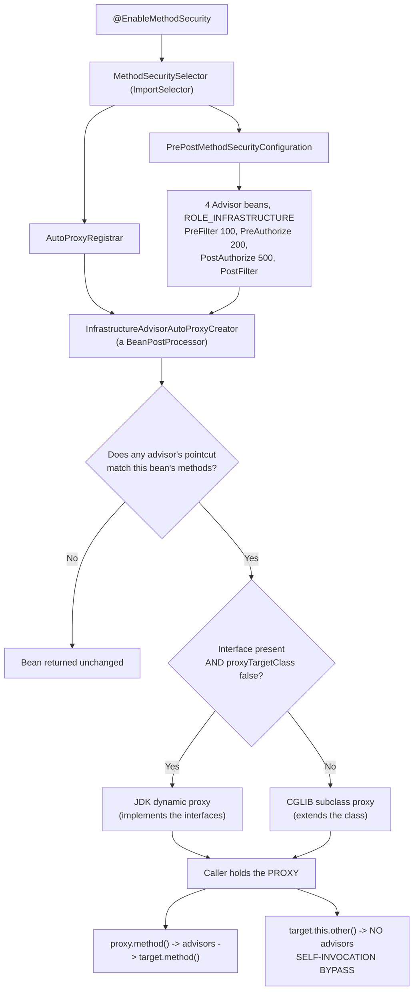
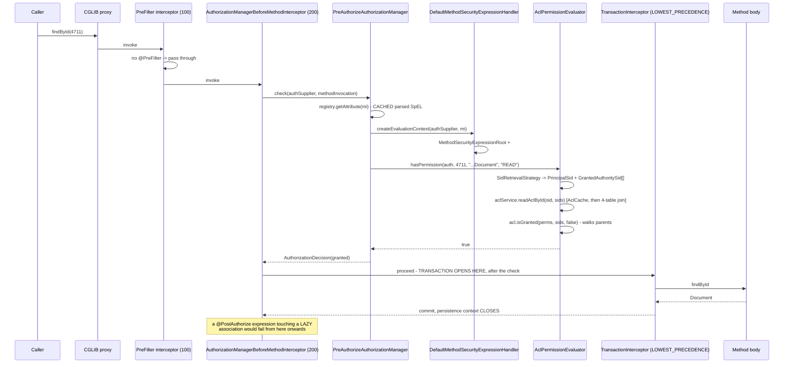

# 11.4 — Method Security Internals and ACLs

> **Module 11 · Topic 4** · Advanced Topics
> Baseline: Spring Security 6.x on Boot 3.x
> New to this? Read **In Plain English** below first, then come back to the Version Matrix.

---

## Version Matrix

| Concern | Spring Security 5.x | **Spring Security 6.x (baseline)** | Spring Security 7.x |
|---|---|---|---|
| Enabling annotation | `@EnableGlobalMethodSecurity(prePostEnabled = true)` | **`@EnableMethodSecurity`** (pre/post enabled by default) | `@EnableMethodSecurity`; the global variant is removed |
| Decision engine | `MethodSecurityInterceptor` + `AccessDecisionManager` + voters | **`AuthorizationManager<MethodInvocation>`** per-annotation interceptors | `AuthorizationManager.authorize()`; `check()` removed |
| Advice model | One interceptor, many metadata sources | **Four separate `Advisor` beans with explicit `getOrder()`** | same structure |
| Return-value handling | `@PostAuthorize` throws only | **`@HandleAuthorizationDenied` (6.3+) can return a masked value** | expanded, `@AuthorizeReturnObject` matured |
| Denial exception | `AccessDeniedException` | **`AuthorizationDeniedException extends AccessDeniedException`** | same |
| Proxy creation | `AutoProxyRegistrar` → `InfrastructureAdvisorAutoProxyCreator` | same | same |
| Interceptor ordering | fixed | **`AuthorizationInterceptorsOrder` enum**; `@EnableMethodSecurity(offset = n)` from 6.3 | same |
| ACL caching | `EhCacheBasedAclCache` (EhCache 2) or `SpringCacheBasedAclCache` | **`SpringCacheBasedAclCache` only** — EhCache 2 support removed | `SpringCacheBasedAclCache` |
| ACL module status | Maintained | **Maintained, effectively feature-frozen** | Unchanged; no modernisation planned |

---

## Why This Exists

`@PreAuthorize("hasRole('ADMIN')")` is four words that hide a bean post-processor, an
auto-proxy creator, four ordered advisors, a SpEL expression handler with a custom root object,
and an `AuthorizationManager`. Most developers can use it and cannot explain why it is silently
ignored when called from the same class, why it sometimes runs outside the transaction it
appears to be inside, or why `@PostFilter` on a large collection is a production incident
waiting to happen.

ACLs sit at the far end of the same spectrum. URL rules answer "may you reach this path".
Method rules answer "may you invoke this method". Neither can answer "may *you* read
*document 4711*", which is the question a document-management system, a shared-folder product,
or anything with per-object permissions actually needs — the Broken Object Level Authorization
problem from file 02, generalised.

Spring Security's ACL module answers it, in full generality, with inheritance and auditing. It
is also heavyweight, awkward, dated, and wrong for most of the teams that reach for it. Being
able to say *when* it is right — and what to use instead the rest of the time — is a senior
answer rather than a framework-trivia answer.

---

## In Plain English

**The one-line version:** This file is about putting the permission check directly on the method that does
the work, and then about the harder question of whether one specific person is allowed to touch one
specific record.

**An analogy.** Think of a hospital. The front door and the corridor signs are one kind of security: if you
are not staff, you never get past reception. That is URL security, and it is what earlier files covered.
Inside the building there is a second kind: the drug cabinet in every ward has its own lock, and only a
nurse with the right key can open it, no matter how they got into the ward. That second lock is *method
security* — the check sits on the thing being protected rather than on the path you took to reach it.

Now imagine the patient records room. Being a doctor is not enough to read any file you like; you may only
read the files of *your own* patients. No sign on the door can express that, because the answer depends on
which folder you picked up. Somebody has to keep a register of who is allowed to open which folder. That
register is an **ACL** (Access Control List), and the rest of this file is about the register Spring ships
with, when it is worth using, and when keeping a simple "owner" column on each record is the saner choice.

**How it actually works, step by step.**

You write `@PreAuthorize("hasRole('ADMIN')")` on a method. On its own an annotation does nothing at all — it
is just a label attached to the code. Something has to notice the label and act on it. That something is
switched on by `@EnableMethodSecurity` on one of your configuration classes.

When the application starts, Spring builds your beans (a *bean* is simply an object Spring created and
manages for you, such as your `OrderService`). Method security installs a startup hook that inspects each
bean and asks: does any method on this class carry a security annotation? If yes, Spring does not hand out
your real object. It hands out a **proxy** — a stand-in object of the same shape that wraps the real one.
Every caller in the application is holding the stand-in without knowing it.

When someone calls a method, the call lands on the stand-in first. The stand-in runs a short chain of
checks before passing the call inwards. There are four of these checks and they run in a fixed order:
`@PreFilter` (trim the incoming list) at order 100, `@PreAuthorize` (may you call this at all?) at 200,
then after the method returns, `@PostAuthorize` (may you see this result?) at 500, and `@PostFilter` (trim
the outgoing list) last. Lower number means further out, so filtering the input happens before the
authorization check, and the check happens before your method body ever executes.

The check itself is an expression written in **SpEL** (Spring Expression Language — a tiny scripting
language Spring can evaluate against an object at runtime). The string `"hasRole('ADMIN')"` is parsed once,
cached against that method, and then evaluated on every call against a little context object that knows who
the caller is, what the method arguments were, and — for `@PostAuthorize` — what the method returned. That
is why you can write `@PreAuthorize("#id == authentication.name")` and have `#id` refer to the actual
argument value.

The one consequence you must internalise: because the guard lives on the stand-in, a method that calls
another method *of the same class* never goes through the stand-in, so the annotation on the inner method
is silently skipped. This is called **self-invocation**, and the fix is almost always to move the guarded
method into a different bean.

For per-record questions, SpEL offers `hasPermission(document, 'READ')`. Spring calls the thing behind it
a `PermissionEvaluator`. It is simply a hook where you answer one question in your own code: is *this*
user allowed to do *this* action to *this* record? Spring ships an implementation backed by four database
tables (the ACL module), which stores one row per grant — "user alice may READ document 4711" — and can
inherit grants from a parent folder. The sections below make an honest case that for most applications a
single `owner_id` column, or your own small permissions table behind a custom `PermissionEvaluator`, beats
the shipped ACL module.

**Why should a beginner care?** The two most common real-world security holes in a Spring application both
live here. The first is a method whose annotation never runs because it was called from inside the same
class, which means a check you can see in the source code is not actually happening. The second is an
endpoint like `GET /documents/4711` that checks you are logged in, checks you have the `USER` role, and
never checks that document 4711 is yours — so changing the number in the URL hands you someone else's data.
Both look correct in code review if you do not know what to look for.

**Words you will meet in this file**

| Term | In plain words |
|---|---|
| Bean | An object that Spring creates and manages for you, such as your `OrderService`. |
| Proxy | A stand-in object Spring hands out instead of your real object, so it can run checks before and after each call. |
| CGLIB / JDK proxy | The two ways Spring builds that stand-in: by subclassing your class, or by implementing its interface. A `final` class cannot be subclassed, so its annotations are ignored. |
| Self-invocation | One method calling another method of the same class directly, which skips the stand-in and therefore skips the security check. |
| SpEL | Spring Expression Language: the mini-language inside the annotation quotes, for example `hasRole('ADMIN')`. |
| `@EnableMethodSecurity` | The switch that turns the annotations from decoration into enforcement. |
| `@PreAuthorize` | Decide before the method runs whether the caller may run it at all. |
| `@PostAuthorize` | Let the method run, then decide whether the caller may see what it returned. |
| `@PreFilter` / `@PostFilter` | Remove items the caller is not allowed to see from a collection going in, or coming out. `@PostFilter` loads everything first, which is why it is slow. |
| `AuthorizationManager` | The component that takes "who is asking" plus "what they are asking for" and returns granted or denied. |
| `PermissionEvaluator` | Your own code answering: may this specific user perform this specific action on this specific record? |
| ACL | Access Control List: a stored list of who may do what to which object, rather than a rule you compute. |
| `ObjectIdentity` | How the ACL names a record: its type plus its id, for example `(Document, 4711)`. |
| `Sid` | "Security identity" in ACL terms: either one named user, or everyone holding a given role. |
| `AccessControlEntry` (ACE) | One row of the register: this identity is granted (or denied) this permission on this object. |
| Permission bit mask | ACL stores permissions as single bits in a number: read is 1, write is 2, create is 4, and so on. |

**If you remember only one thing:** the annotation is only enforced when the call arrives through Spring's
stand-in object, and no role check can answer "is this particular record yours" — that always needs a
per-record decision.

---

## Core Concepts

### 1. What `@EnableMethodSecurity` Actually Wires

**In simple terms:** One annotation on a configuration class quietly installs the machinery that notices
your security annotations and wraps the affected beans, which is why the annotations do nothing at all
without it.

```java
@Retention(RetentionPolicy.RUNTIME)
@Target(ElementType.TYPE)
@Import(MethodSecuritySelector.class)
public @interface EnableMethodSecurity {
    boolean prePostEnabled() default true;      // @PreAuthorize/@PostAuthorize/@PreFilter/@PostFilter
    boolean securedEnabled() default false;     // @Secured
    boolean jsr250Enabled() default false;      // @RolesAllowed/@PermitAll/@DenyAll
    boolean proxyTargetClass() default false;   // force CGLIB
    AdviceMode mode() default AdviceMode.PROXY; // PROXY or ASPECTJ
    int offset() default 0;                     // 6.3+: shift all interceptor orders
}
```

`MethodSecuritySelector` is an `ImportSelector`. It imports `AutoProxyRegistrar` unconditionally
and then, depending on the flags, `PrePostMethodSecurityConfiguration`,
`SecuredMethodSecurityConfiguration`, and `Jsr250MethodSecurityConfiguration`.

`PrePostMethodSecurityConfiguration` declares four `Advisor` beans, each marked
`ROLE_INFRASTRUCTURE`:

```java
@Configuration(proxyBeanMethods = false)
@Role(BeanDefinition.ROLE_INFRASTRUCTURE)
final class PrePostMethodSecurityConfiguration {

    @Bean
    @Role(BeanDefinition.ROLE_INFRASTRUCTURE)
    static PreFilterAuthorizationMethodInterceptor preFilterAuthorizationMethodInterceptor(...) { ... }

    @Bean
    @Role(BeanDefinition.ROLE_INFRASTRUCTURE)
    static AuthorizationManagerBeforeMethodInterceptor preAuthorizeAuthorizationMethodInterceptor(...) {
        return AuthorizationManagerBeforeMethodInterceptor.preAuthorize(manager);
    }

    @Bean
    @Role(BeanDefinition.ROLE_INFRASTRUCTURE)
    static AuthorizationManagerAfterMethodInterceptor postAuthorizeAuthorizationMethodInterceptor(...) {
        return AuthorizationManagerAfterMethodInterceptor.postAuthorize(manager);
    }

    @Bean
    @Role(BeanDefinition.ROLE_INFRASTRUCTURE)
    static PostFilterAuthorizationMethodInterceptor postFilterAuthorizationMethodInterceptor(...) { ... }
}
```

Two details that matter. The beans are **`static`**, because they are consumed by a
`BeanPostProcessor` and must be instantiable before the enclosing configuration class is fully
initialised — the same constraint as `GrantedAuthorityDefaults` in file 02. And they are marked
`ROLE_INFRASTRUCTURE`, which is what makes `InfrastructureAdvisorAutoProxyCreator` willing to
consider them.

### 2. The Order Values and Why Pre-Filter Runs Before Pre-Authorize

**In simple terms:** The four checks run in a fixed sequence, and the sequence is deliberate: the incoming
collection is trimmed to what the caller may touch before the authorization rule is asked whether the call
is allowed.

Order comes from an enum:

```java
public enum AuthorizationInterceptorsOrder {
    FIRST(Integer.MIN_VALUE),
    PRE_FILTER,        // 100
    PRE_AUTHORIZE,     // 200
    SECURED,           // 300
    JSR250,            // 400
    SECURE_RESULT(450),
    POST_AUTHORIZE(500),
    POST_FILTER,
    LAST(Integer.MAX_VALUE);

    private static final int INTERVAL = 100;
    private final int order;

    AuthorizationInterceptorsOrder()          { this.order = ordinal() * INTERVAL; }
    AuthorizationInterceptorsOrder(int order) { this.order = order; }

    public int getOrder()               { return this.order; }
    public int getOrder(int offset)     { return this.order + offset; }
}
```

Lower order means further **out** in the advice stack, so it runs first on the way in and last
on the way out. Read the exact constants from your version's enum before relying on a specific
number; what is stable is the relative sequence.

```
in ->  PRE_FILTER -> PRE_AUTHORIZE -> SECURED -> JSR250 -> [ METHOD BODY ]
out <- POST_FILTER <- POST_AUTHORIZE <-------------------- [ METHOD BODY ]
```

**Why pre-filter must run before pre-authorize.** `@PreFilter` mutates a collection argument in
place, removing elements the caller may not act on. `@PreAuthorize` may need to evaluate an
expression against that argument. If pre-authorize ran first, it would inspect the unfiltered
collection — so an expression like `@PreAuthorize("#ids.size() <= 100")` would be checking the
size the caller *submitted* rather than the size that will actually be processed. Filtering
first makes the authorization check operate on the real working set.

The symmetry on the way out is the same reasoning inverted. `@PostAuthorize` decides whether
the caller may see the result at all; `@PostFilter` then trims what they may see. Authorize the
whole first, then reduce.

`@Secured` and JSR-250 sit between them and are mutually independent — they are alternative
annotation dialects, not a pipeline, and enabling all three simply means all three run.

### 3. `AuthorizationManager<MethodInvocation>`

**In simple terms:** This is the single small component that turns "who is calling" plus "what they are
calling" into a yes, a no, or a shrug meaning "I have no rule for this", and it is the same component that
guards URLs.

Method security uses the same interface as URL security, parameterised differently:

```java
@FunctionalInterface
public interface AuthorizationManager<T> {
    default void verify(Supplier<Authentication> authentication, T object) {
        AuthorizationDecision decision = check(authentication, object);
        if (decision != null && !decision.isGranted()) {
            throw new AuthorizationDeniedException("Access Denied", decision);
        }
    }
    @Nullable AuthorizationDecision check(Supplier<Authentication> authentication, T object);
}
```

`@PreAuthorize` uses `AuthorizationManager<MethodInvocation>`; `@PostAuthorize` uses
`AuthorizationManager<MethodInvocationResult>`, because it needs the return value.

```java
public final class PreAuthorizeAuthorizationManager
        implements AuthorizationManager<MethodInvocation> {

    private final PreAuthorizeExpressionAttributeRegistry registry =
            new PreAuthorizeExpressionAttributeRegistry();

    private MethodSecurityExpressionHandler expressionHandler =
            new DefaultMethodSecurityExpressionHandler();

    @Override
    public AuthorizationDecision check(Supplier<Authentication> authentication, MethodInvocation mi) {
        ExpressionAttribute attribute = this.registry.getAttribute(mi);
        if (attribute == ExpressionAttribute.NULL_ATTRIBUTE) {
            return null;                          // no annotation -> no opinion, fall through
        }
        EvaluationContext ctx = this.expressionHandler.createEvaluationContext(authentication, mi);
        boolean granted = ExpressionUtils.evaluateAsBoolean(attribute.getExpression(), ctx);
        return new ExpressionAuthorizationDecision(granted, attribute.getExpression());
    }
}
```

Three things to notice. The registry **caches the parsed SpEL expression per method**, so
parsing is a one-time cost rather than per invocation. Returning `null` means "no opinion",
which is how an unannotated method passes through without cost. And the `Supplier<Authentication>`
is lazy, exactly as in file 02 — an expression that never references `authentication` never
resolves it.

`MethodInvocationResult` is a small carrier:

```java
public final class MethodInvocationResult {
    private final MethodInvocation methodInvocation;
    private final Object result;
    public MethodInvocation getMethodInvocation() { return this.methodInvocation; }
    public Object getResult()                     { return this.result; }
}
```

### 4. `MethodSecurityExpressionHandler` and the Expression Root

**In simple terms:** This is what decides which names you are allowed to write inside the annotation's
quotes, such as `authentication`, `hasRole(...)`, or `#id`, and what each of those names actually resolves
to when the expression is evaluated.

```java
public interface MethodSecurityExpressionHandler extends SecurityExpressionHandler<MethodInvocation> {
    Object filter(Object filterTarget, Expression filterExpression, EvaluationContext ctx);
    void setReturnObject(Object returnObject, EvaluationContext ctx);
}
```

`DefaultMethodSecurityExpressionHandler` builds the evaluation context by creating a
`MethodSecurityExpressionRoot` (package-private, extending `SecurityExpressionRoot`) and adding
argument variables:

```java
// DefaultMethodSecurityExpressionHandler, simplified
public EvaluationContext createEvaluationContext(Supplier<Authentication> authentication,
                                                 MethodInvocation mi) {
    MethodSecurityExpressionOperations root = createSecurityExpressionRoot(authentication, mi);
    StandardEvaluationContext ctx = new MethodBasedEvaluationContext(
            root, getSpecificMethod(mi), mi.getArguments(), getParameterNameDiscoverer());
    ctx.setBeanResolver(this.beanResolver);      // enables @beanName.method(...)
    return ctx;
}
```

What the root object provides — these are the names available inside the expression string:

| Expression | Backed by | Notes |
|---|---|---|
| `authentication` | the `Supplier<Authentication>` | resolved lazily on first reference |
| `principal` | `authentication.getPrincipal()` | type varies by mechanism (file 02) |
| `hasRole('X')` | `SecurityExpressionRoot.hasRole` | adds `ROLE_` unless already prefixed |
| `hasAuthority('x')` | literal authority match | no prefix |
| `hasAnyRole` / `hasAnyAuthority` | as above | |
| `permitAll()` / `denyAll()` | constants | |
| `isAnonymous()` / `isRememberMe()` / `isFullyAuthenticated()` | `AuthenticationTrustResolver` | type checks |
| `hasPermission(target, perm)` | **`PermissionEvaluator`** | this is the ACL hook |
| `hasPermission(id, type, perm)` | `PermissionEvaluator` | by identifier and type |
| `#paramName` | `MethodBasedEvaluationContext` | needs `-parameters` or `@P`/`@Param` |
| `#root.args`, `#root.method`, `#root.target` | the invocation | |
| `returnObject` | set by `setReturnObject` | `@PostAuthorize` only |
| `filterObject` | current element | `@PreFilter`/`@PostFilter` only |
| `@beanName.method(...)` | the `BeanResolver` | your own security beans |

**The `#paramName` trap.** Java discards parameter names unless the class is compiled with
`-parameters`. Spring Boot's Maven and Gradle plugins enable it, but a module built outside
that configuration, or code compiled by an IDE with different settings, silently loses the
names — and a SpEL reference to `#id` then evaluates to `null` rather than failing. A
`@PreAuthorize("#id == authentication.name")` that compares `null` to a username is a denial,
which is at least fail-closed; `@PreAuthorize("hasRole('ADMIN') or #id == authentication.name")`
is a subtle behaviour change. Use `@P("id")` or `@Param` when the build is not under your
control.

### 5. Proxy Creation and the Self-Invocation Consequence

**In simple terms:** The checks live on a stand-in object that Spring puts in front of your bean, so a call
that never passes through that stand-in — most commonly one method of a class calling another method of the
same class — is never checked, and nothing warns you.



`InfrastructureAdvisorAutoProxyCreator` is deliberately narrow: it only considers advisor beans
whose bean definition role is `ROLE_INFRASTRUCTURE`. That keeps method security independent of
application-level AOP configuration, so an application that defines its own advisors does not
accidentally reorder or interfere with security advice.

**JDK proxy versus CGLIB.** With `proxyTargetClass = false` (the default on the annotation) and
the bean implementing at least one interface, Spring creates a JDK dynamic proxy implementing
those interfaces. Otherwise it creates a CGLIB subclass. Spring Boot's `AopAutoConfiguration`
sets `spring.aop.proxy-target-class=true` by default, so in a Boot application CGLIB is the
norm — which is generally what you want, because a JDK proxy can only be injected into a field
typed as the interface, and `@Autowired MyServiceImpl` fails with a `BeanNotOfRequiredTypeException`.

CGLIB has its own constraints that produce silent failures: a `final` class cannot be
subclassed, and a `final` or `private` method cannot be overridden, so security annotations on
them are **ignored without any warning**. A Kotlin class is `final` by default, which is why
Kotlin services need `open` or the all-open plugin.

**Self-invocation.** The advisors live on the proxy. A call from one method of a bean to
another method of the same bean goes through `this`, which is the target, not the proxy — so no
advice runs and the annotation is silently ignored.

```java
@Service
public class ReportService {

    public Report generate(Long id) {
        return loadSensitive(id);        // BYPASSES @PreAuthorize - this != proxy
    }

    @PreAuthorize("hasRole('AUDITOR')")
    public Report loadSensitive(Long id) { ... }
}
```

The fixes, in order of preference: **move the secured method to a different bean**, so the call
crosses a proxy boundary and the design reflects the trust boundary; inject the bean into
itself (`@Lazy` self-reference) — works, but is a smell that the class is doing two things;
`AopContext.currentProxy()` with `exposeProxy = true` — works, and couples your code to Spring
AOP; or switch to `AdviceMode.ASPECTJ` with load-time or compile-time weaving, which removes
the limitation entirely at the cost of build complexity.

### 6. Interaction With `@Transactional`

**In simple terms:** The security check wraps around the database transaction rather than sitting inside
it, which is good news before the method runs and a trap afterwards, because by the time a post-check
looks at the returned object the database session has already closed.

`@EnableTransactionManagement` defaults its advisor order to `Ordered.LOWEST_PRECEDENCE`
(`Integer.MAX_VALUE`). Method security's interceptors are at 100 to 700. Lower order is further
out, so:

```
proxy
 -> PreFilter (100)
   -> PreAuthorize (200)
     -> TransactionInterceptor (LOWEST_PRECEDENCE)   <- transaction OPENS here
       -> method body
     <- transaction COMMITS here
   <- PostAuthorize (500)
 <- PostFilter
```

Two consequences, one good and one dangerous.

**Good:** `@PreAuthorize` runs *before* the transaction is opened. A denied call never starts a
transaction and never takes a connection from the pool. That is the right default — an
unauthorised caller should not be able to consume database resources.

**Dangerous:** `@PostAuthorize` and `@PostFilter` run *after* the transaction has committed and
the persistence context has closed. An expression that touches a lazily-loaded association —
`@PostAuthorize("returnObject.owner.username == authentication.name")` where `owner` is
`FetchType.LAZY` — throws `LazyInitializationException`. It works in a test where an
`@Transactional` test method keeps the context open, and fails in production. The fix is to
fetch what the expression needs eagerly, or to project it onto the returned object, not to
widen the transaction boundary.

There is a third consequence for `@PostAuthorize` on a mutating method: the transaction has
already committed when authorization is evaluated, so the denial does **not** roll back the
write. `@PostAuthorize` on a method with side effects is a design error — it controls what the
caller sees, not what the system does.

### 7. Spring Security 6.3+ — Denial Without an Exception

**In simple terms:** Sometimes the right answer to "you may not see this" is not an error page but a
partially hidden value, such as showing only the last four digits of an account number, and newer versions
let you return that instead of throwing.

Before 6.3, a denied `@PostAuthorize` threw, and the caller received a 403 for a resource they
were allowed to know existed. Sometimes the correct behaviour is to return a redacted value
instead.

```java
public @interface HandleAuthorizationDenied {
    Class<? extends MethodAuthorizationDeniedHandler> handlerClass()
            default ThrowingMethodAuthorizationDeniedHandler.class;
}
```

```java
public interface MethodAuthorizationDeniedHandler {
    @Nullable Object handleDeniedInvocation(MethodInvocation methodInvocation,
                                            AuthorizationResult authorizationResult);

    @Nullable default Object handleDeniedInvocationResult(MethodInvocationResult methodInvocationResult,
                                                          AuthorizationResult authorizationResult) {
        return handleDeniedInvocation(methodInvocationResult.getMethodInvocation(), authorizationResult);
    }
}
```

The default handler throws `AuthorizationDeniedException`, which extends `AccessDeniedException`
so all existing handling still works. A custom handler returns a value:

```java
@HandleAuthorizationDenied(handlerClass = MaskingDeniedHandler.class)
@PostAuthorize("hasAuthority('account:read-full')")
public String accountNumber(Long id) { ... }   // returns "****1234" when denied
```

Two cautions. Returning a masked value means the caller cannot distinguish "denied" from
"legitimately this value", which is fine for display masking and wrong for anything the caller
will act on. And `null` is a valid return from a handler, so a denied call can produce an NPE
downstream unless the contract is documented.

The related 6.3 addition `@AuthorizeReturnObject` applies authorization to the *fields* of a
returned object by proxying it, which is a cleaner way to express "this caller sees the object
but not every property".

### 8. ACLs — The Domain Object Security Model

**In simple terms:** Instead of working out from rules whether you may open a particular record, an ACL
keeps a written register of every grant — this person may read that document — and answers by looking the
answer up.

An ACL answers "may principal P perform permission M on object O?" by storing the answer,
rather than deriving it.

| Concept | Type | Meaning |
|---|---|---|
| `ObjectIdentity` | `ObjectIdentityImpl` | The secured object: `(type, identifier)`, e.g. `(com.example.Document, 4711)` |
| `Sid` | `PrincipalSid`, `GrantedAuthoritySid` | "Security identity" — either a specific user or any holder of an authority |
| `Permission` | `BasePermission`, `CumulativePermission` | A single bit in a 32-bit mask |
| `AccessControlEntry` | `AccessControlEntryImpl` | One row: this `Sid` is granted (or denied) this `Permission` on this object |
| `Acl` / `MutableAcl` | `AclImpl` | The whole entry list for one object, plus its owner and parent |
| `AclService` / `MutableAclService` | `JdbcMutableAclService` | Reads and writes ACLs |
| `PermissionGrantingStrategy` | `DefaultPermissionGrantingStrategy` | Walks the entries and the parent chain to a verdict |
| `AclAuthorizationStrategy` | `AclAuthorizationStrategyImpl` | Who may *modify* an ACL |

`BasePermission` bit masks:

```java
public class BasePermission extends AbstractPermission {
    public static final Permission READ           = new BasePermission(1 << 0, 'R');   //  1
    public static final Permission WRITE          = new BasePermission(1 << 1, 'W');   //  2
    public static final Permission CREATE         = new BasePermission(1 << 2, 'C');   //  4
    public static final Permission DELETE         = new BasePermission(1 << 3, 'D');   //  8
    public static final Permission ADMINISTRATION = new BasePermission(1 << 4, 'A');   // 16
}
```

Five defined bits out of thirty-two. Custom permissions extend `BasePermission` and claim
higher bits — `1 << 5` for `SHARE`, `1 << 6` for `PUBLISH`. Note that `AclImpl` matches an entry
by **exact mask equality by default**, not by bitwise containment, so a `CumulativePermission`
of `READ | WRITE` stored as mask 3 does not satisfy a query for `READ` alone unless you use a
`PermissionGrantingStrategy` that does bitwise matching. This surprises everyone once.

`MutableAclService`:

```java
public interface AclService {
    List<ObjectIdentity> findChildren(ObjectIdentity parentIdentity);
    Acl readAclById(ObjectIdentity object) throws NotFoundException;
    Acl readAclById(ObjectIdentity object, List<Sid> sids) throws NotFoundException;
    Map<ObjectIdentity, Acl> readAclsById(List<ObjectIdentity> objects) throws NotFoundException;
    Map<ObjectIdentity, Acl> readAclsById(List<ObjectIdentity> objects, List<Sid> sids);
}

public interface MutableAclService extends AclService {
    MutableAcl createAcl(ObjectIdentity objectIdentity) throws AlreadyExistsException;
    void deleteAcl(ObjectIdentity objectIdentity, boolean deleteChildren) throws ChildrenExistException;
    MutableAcl updateAcl(MutableAcl acl) throws NotFoundException;
}
```

**Inheritance.** An `ObjectIdentity` may have a parent, and `entries_inheriting` controls
whether the child consults it. A folder-document hierarchy expresses "grant read on the folder,
every document inherits" with one entry. `DefaultPermissionGrantingStrategy` walks the chain:
check this object's entries for a matching `Sid` and `Permission`; if none matched and the ACL
inherits and has a parent, recurse. A **denying** entry (`granting = false`) at the child level
beats an inherited grant, which is how you express an exception to an inherited rule.

**`AclPermissionEvaluator`** is the bridge into SpEL:

```java
public class AclPermissionEvaluator implements PermissionEvaluator {

    public boolean hasPermission(Authentication authentication, Object domainObject, Object permission) {
        ObjectIdentity oid = this.objectIdentityRetrievalStrategy.getObjectIdentity(domainObject);
        return checkPermission(authentication, oid, permission);
    }

    public boolean hasPermission(Authentication authentication, Serializable targetId,
                                 String targetType, Object permission) {
        ObjectIdentity oid = this.objectIdentityGenerator.createObjectIdentity(targetId, targetType);
        return checkPermission(authentication, oid, permission);
    }

    private boolean checkPermission(Authentication authentication, ObjectIdentity oid, Object permission) {
        List<Sid> sids = this.sidRetrievalStrategy.getSids(authentication);
        List<Permission> required = resolvePermission(permission);
        try {
            Acl acl = this.aclService.readAclById(oid, sids);
            return acl.isGranted(required, sids, false);
        }
        catch (NotFoundException nfe) {
            return false;                     // no ACL -> deny, do not leak existence
        }
    }
}
```

`SidRetrievalStrategyImpl` returns one `PrincipalSid` for the username plus one
`GrantedAuthoritySid` per authority, including authorities expanded by a `RoleHierarchy`. That
is why granting `ROLE_EDITOR` read on a document works without naming every editor.

**Caching.** `AclCache` sits in front of `LookupStrategy`. `EhCacheBasedAclCache` was removed
in 6.0 along with EhCache 2 support; `SpringCacheBasedAclCache` wraps any Spring `Cache`. The
cache stores whole `AclImpl` graphs, which are mutable object trees — so a distributed cache
requires serialising them, and an entry must be evicted whenever the ACL *or any ancestor*
changes. Getting that eviction right across a hierarchy is the fiddliest part of running ACLs
in production.

`BasicLookupStrategy` batches parent lookups (default batch size 50) to limit the number of
round trips when resolving a deep hierarchy.

### 9. An Honest Assessment of Spring ACL

**In simple terms:** Spring's ACL module does everything the register above promises, but it is heavy and
dated, so this section explains the narrow situations where it earns its cost and the simpler options that
serve most applications better.

It is genuinely powerful: arbitrary per-object permissions, per-principal and per-authority
grants, explicit denies, inheritance, ownership, and a built-in audit flag per entry. Nothing
else in the Spring ecosystem gives you that out of the box.

It is also, for most teams, the wrong tool:

- **The schema is awkward.** Four tables, `object_id_identity` stored as `varchar`, an
  `ace_order` column you must maintain, and vendor-specific identity-retrieval queries that must
  be overridden for PostgreSQL because the defaults assume `SCOPE_IDENTITY()`.
- **It does not scale to millions of objects.** Every secured object needs a row in
  `acl_object_identity` and at least one in `acl_entry`. Ten million documents with five grants
  each is fifty million ACE rows, and the read path is a join across all four tables per check.
- **Filtering is the killer.** `@PostFilter("hasPermission(filterObject, 'READ')")` loads the
  entire result set and then discards most of it. There is no way to express the ACL as a
  predicate in the original query, so pagination is wrong — page one after filtering may contain
  three rows — and memory is proportional to the unfiltered set.
- **The caching is dated.** Mutable object graphs, manual eviction across hierarchies, and the
  EhCache 2 integration removed rather than replaced.
- **The API is verbose.** Creating one grant is `createAcl`, `insertAce`, `updateAcl`, each
  transactional, with `NotFoundException` control flow.
- **It is effectively feature-frozen.** It is maintained, not developed.

**What most teams should use instead:**

1. **An ownership column.** `findByIdAndOwnerId(id, currentUserId)`. Covers the majority of
   real requirements, is enforced by the database, is indexable, and composes with pagination.
2. **A custom `PermissionEvaluator`** over a small, purpose-built permissions table. All the
   integration benefits of ACL (`hasPermission` works in SpEL) with a schema you designed for
   your access patterns and a query you can push into the data layer.
3. **An external policy engine** when the rules are genuinely complex or shared across
   services: Open Policy Agent (Rego, general-purpose policy), AWS Cedar (a purpose-built
   authorization language with formal analysis tooling), or OpenFGA / Zanzibar-style
   relationship-based systems (Google's design for Drive-scale sharing, which crucially
   supports a **reverse index** — "list every object this user can read" — as a first-class
   query).

**When Spring ACL genuinely is right:** a document-management system with per-object sharing,
a moderate object count (hundreds of thousands rather than tens of millions), a folder
hierarchy where inheritance saves you from denormalising grants, per-object *denies* as
exceptions to inherited grants, an existing relational stack with no appetite for another
service, and a per-entry audit requirement. A corporate document repository, a case-management
system, or a contract-management application fits that shape precisely — and there, ACL saves
you from building the same thing worse.

---

## Working Code

Enabling method security with an ACL-backed `PermissionEvaluator`:

```java
package com.example.security.method;

import org.springframework.beans.factory.config.BeanDefinition;
import org.springframework.cache.Cache;
import org.springframework.cache.CacheManager;
import org.springframework.context.annotation.Bean;
import org.springframework.context.annotation.Configuration;
import org.springframework.context.annotation.Role;
import org.springframework.security.access.expression.method.DefaultMethodSecurityExpressionHandler;
import org.springframework.security.access.expression.method.MethodSecurityExpressionHandler;
import org.springframework.security.acls.AclPermissionCacheOptimizer;
import org.springframework.security.acls.AclPermissionEvaluator;
import org.springframework.security.acls.domain.*;
import org.springframework.security.acls.jdbc.*;
import org.springframework.security.acls.model.AclCache;
import org.springframework.security.acls.model.PermissionGrantingStrategy;
import org.springframework.security.config.annotation.method.configuration.EnableMethodSecurity;
import org.springframework.security.core.authority.SimpleGrantedAuthority;

import javax.sql.DataSource;   // javax.sql is Java SE, not Jakarta EE - correct on Boot 3

@Configuration
@EnableMethodSecurity           // prePostEnabled is true by default in 6.x
public class MethodSecurityConfig {

    /**
     * Publishing this bean REPLACES the default expression handler used by
     * PreAuthorizeAuthorizationManager and friends. Must be static: it is consumed by
     * infrastructure beans created before this configuration class is fully initialised.
     */
    @Bean
    @Role(BeanDefinition.ROLE_INFRASTRUCTURE)
    static MethodSecurityExpressionHandler methodSecurityExpressionHandler(
            AclPermissionEvaluator permissionEvaluator,
            AclPermissionCacheOptimizer cacheOptimizer) {

        DefaultMethodSecurityExpressionHandler handler = new DefaultMethodSecurityExpressionHandler();
        handler.setPermissionEvaluator(permissionEvaluator);   // wires hasPermission(...) to the ACL
        handler.setPermissionCacheOptimizer(cacheOptimizer);   // batch-loads ACLs before @PostFilter
        return handler;
    }

    @Bean
    AclPermissionEvaluator aclPermissionEvaluator(JdbcMutableAclService aclService) {
        return new AclPermissionEvaluator(aclService);
    }

    /** Pre-loads every ACL a @PostFilter will need in one round trip instead of N. */
    @Bean
    AclPermissionCacheOptimizer aclPermissionCacheOptimizer(JdbcMutableAclService aclService) {
        return new AclPermissionCacheOptimizer(aclService);
    }

    @Bean
    AclAuthorizationStrategy aclAuthorizationStrategy() {
        // Who may change ownership / auditing / general ACL details.
        return new AclAuthorizationStrategyImpl(
                new SimpleGrantedAuthority("ROLE_ACL_ADMIN"),
                new SimpleGrantedAuthority("ROLE_ACL_ADMIN"),
                new SimpleGrantedAuthority("ROLE_ACL_ADMIN"));
    }

    @Bean
    PermissionGrantingStrategy permissionGrantingStrategy() {
        return new DefaultPermissionGrantingStrategy(new ConsoleAuditLogger());
    }

    @Bean
    AclCache aclCache(CacheManager cacheManager,
                      PermissionGrantingStrategy grantingStrategy,
                      AclAuthorizationStrategy authorizationStrategy) {
        Cache cache = cacheManager.getCache("aclCache");
        return new SpringCacheBasedAclCache(cache, grantingStrategy, authorizationStrategy);
    }

    @Bean
    LookupStrategy lookupStrategy(DataSource dataSource, AclCache aclCache,
                                  AclAuthorizationStrategy authorizationStrategy,
                                  PermissionGrantingStrategy grantingStrategy) {
        BasicLookupStrategy strategy = new BasicLookupStrategy(
                dataSource, aclCache, authorizationStrategy, grantingStrategy);
        strategy.setBatchSize(50);       // parent lookups per round trip
        return strategy;
    }

    @Bean
    JdbcMutableAclService aclService(DataSource dataSource, LookupStrategy lookupStrategy,
                                     AclCache aclCache) {
        JdbcMutableAclService service = new JdbcMutableAclService(dataSource, lookupStrategy, aclCache);
        // PostgreSQL: the defaults assume SQL Server / HSQL identity retrieval. This is
        // exactly the kind of awkwardness that makes the module feel dated.
        service.setClassIdentityQuery("select currval(pg_get_serial_sequence('acl_class', 'id'))");
        service.setSidIdentityQuery("select currval(pg_get_serial_sequence('acl_sid', 'id'))");
        return service;
    }
}
```

The ACL schema (PostgreSQL):

```sql
-- ---------------------------------------------------------------------------
-- acl_sid : every security identity that can appear in an entry.
--   principal = true  -> a specific user, sid holds the username
--   principal = false -> an authority, sid holds e.g. 'ROLE_EDITOR'
-- ---------------------------------------------------------------------------
CREATE TABLE acl_sid (
    id        bigserial    NOT NULL PRIMARY KEY,
    principal boolean      NOT NULL,
    sid       varchar(100) NOT NULL,
    CONSTRAINT unique_uk_1 UNIQUE (sid, principal)
);

-- ---------------------------------------------------------------------------
-- acl_class : the fully-qualified type of each secured domain class.
--   class_id_type lets the identifier be something other than Long
--   (e.g. java.util.UUID). Added in 4.2; omit it and UUID keys will not work.
-- ---------------------------------------------------------------------------
CREATE TABLE acl_class (
    id            bigserial    NOT NULL PRIMARY KEY,
    class         varchar(255) NOT NULL,
    class_id_type varchar(255),
    CONSTRAINT unique_uk_2 UNIQUE (class)
);

-- ---------------------------------------------------------------------------
-- acl_object_identity : one row per SECURED OBJECT INSTANCE.
--   object_id_identity is varchar, so the primary key is stringified
--   parent_object drives inheritance
--   entries_inheriting = false stops the walk at this node
-- ---------------------------------------------------------------------------
CREATE TABLE acl_object_identity (
    id                 bigserial    NOT NULL PRIMARY KEY,
    object_id_class    bigint       NOT NULL,
    object_id_identity varchar(36)  NOT NULL,
    parent_object      bigint,
    owner_sid          bigint,
    entries_inheriting boolean      NOT NULL,
    CONSTRAINT unique_uk_3 UNIQUE (object_id_class, object_id_identity),
    CONSTRAINT foreign_fk_1 FOREIGN KEY (parent_object)   REFERENCES acl_object_identity (id),
    CONSTRAINT foreign_fk_2 FOREIGN KEY (object_id_class) REFERENCES acl_class (id),
    CONSTRAINT foreign_fk_3 FOREIGN KEY (owner_sid)       REFERENCES acl_sid (id)
);

-- ---------------------------------------------------------------------------
-- acl_entry : the actual grants. One row per (object, order) pair.
--   mask     = bitmask, BasePermission.READ = 1, WRITE = 2, CREATE = 4,
--              DELETE = 8, ADMINISTRATION = 16
--   granting = false is an explicit DENY and beats an inherited grant
--   ace_order must be maintained by the caller; the unique constraint enforces it
-- ---------------------------------------------------------------------------
CREATE TABLE acl_entry (
    id                  bigserial NOT NULL PRIMARY KEY,
    acl_object_identity bigint    NOT NULL,
    ace_order           int       NOT NULL,
    sid                 bigint    NOT NULL,
    mask                integer   NOT NULL,
    granting            boolean   NOT NULL,
    audit_success       boolean   NOT NULL,
    audit_failure       boolean   NOT NULL,
    CONSTRAINT unique_uk_4 UNIQUE (acl_object_identity, ace_order),
    CONSTRAINT foreign_fk_4 FOREIGN KEY (acl_object_identity) REFERENCES acl_object_identity (id),
    CONSTRAINT foreign_fk_5 FOREIGN KEY (sid)                 REFERENCES acl_sid (id)
);

-- The read path joins all four tables on every permission check. Index accordingly.
CREATE INDEX idx_acl_entry_oid    ON acl_entry (acl_object_identity, ace_order);
CREATE INDEX idx_acl_entry_sid    ON acl_entry (sid);
CREATE INDEX idx_acl_oid_parent   ON acl_object_identity (parent_object);
```

A service using method security and ACLs:

```java
package com.example.documents;

import org.springframework.security.access.prepost.PostAuthorize;
import org.springframework.security.access.prepost.PostFilter;
import org.springframework.security.access.prepost.PreAuthorize;
import org.springframework.security.access.prepost.PreFilter;
import org.springframework.security.authorization.method.HandleAuthorizationDenied;
import org.springframework.stereotype.Service;
import org.springframework.transaction.annotation.Transactional;

import java.util.List;

@Service
public class DocumentService {

    private final DocumentRepository documents;

    public DocumentService(DocumentRepository documents) {
        this.documents = documents;
    }

    /** Instance-level check by identifier - no load needed before the decision. */
    @PreAuthorize("hasPermission(#id, 'com.example.documents.Document', 'READ')")
    @Transactional(readOnly = true)
    public Document findById(Long id) {
        return this.documents.findById(id).orElseThrow(DocumentNotFoundException::new);
    }

    /**
     * Check on the RETURNED object. Note the expression must not touch a LAZY association:
     * @PostAuthorize runs AFTER the transaction interceptor has committed.
     */
    @PostAuthorize("hasPermission(returnObject, 'READ')")
    @Transactional(readOnly = true)
    public Document load(Long id) {
        return this.documents.findById(id).orElseThrow(DocumentNotFoundException::new);
    }

    /**
     * ANTI-PATTERN, shown deliberately. This loads every document and then discards most
     * of them. Pagination is wrong (page 1 may contain 3 rows), memory is proportional to
     * the UNFILTERED set, and the ACL lookups are N round trips without the cache optimizer.
     * Use a repository query that joins the permission table instead.
     */
    @PostFilter("hasPermission(filterObject, 'READ')")
    @Transactional(readOnly = true)
    public List<Document> findAllSlowly() {
        return this.documents.findAll();
    }

    /** Correct alternative: push the permission into the query. */
    @Transactional(readOnly = true)
    public List<Document> findReadable(String username, int page, int size) {
        return this.documents.findReadableBy(username, PageRequest.of(page, size));
    }

    /** PreFilter trims the argument BEFORE PreAuthorize sees it - hence order 100 vs 200. */
    @PreFilter("hasPermission(filterObject, 'WRITE')")
    @PreAuthorize("#ids.size() <= 500")
    @Transactional
    public void archiveAll(List<Long> ids) {
        this.documents.archive(ids);
    }

    /** 6.3+: return a masked value instead of throwing. */
    @HandleAuthorizationDenied(handlerClass = MaskingDeniedHandler.class)
    @PostAuthorize("hasPermission(#id, 'com.example.documents.Document', 'ADMINISTRATION')")
    @Transactional(readOnly = true)
    public String auditTrail(Long id) {
        return this.documents.auditTrail(id);
    }
}
```

```java
package com.example.documents;

import org.aopalliance.intercept.MethodInvocation;
import org.springframework.security.authorization.AuthorizationResult;
import org.springframework.security.authorization.method.MethodAuthorizationDeniedHandler;
import org.springframework.stereotype.Component;

@Component
public class MaskingDeniedHandler implements MethodAuthorizationDeniedHandler {

    @Override
    public Object handleDeniedInvocation(MethodInvocation methodInvocation,
                                         AuthorizationResult authorizationResult) {
        // Contract: callers MUST treat this as opaque. Never return null here - a denied
        // call that produces null causes an NPE somewhere unrelated.
        return "[redacted]";
    }
}
```

Managing ACL entries:

```java
package com.example.documents;

import org.springframework.security.acls.domain.BasePermission;
import org.springframework.security.acls.domain.GrantedAuthoritySid;
import org.springframework.security.acls.domain.ObjectIdentityImpl;
import org.springframework.security.acls.domain.PrincipalSid;
import org.springframework.security.acls.model.*;
import org.springframework.stereotype.Service;
import org.springframework.transaction.annotation.Transactional;

@Service
public class DocumentAclService {

    private final MutableAclService aclService;

    public DocumentAclService(MutableAclService aclService) {
        this.aclService = aclService;
    }

    /** Called when a document is created. Must be in the same transaction as the insert. */
    @Transactional
    public void createAclFor(Document document, String ownerUsername, Long parentFolderId) {
        ObjectIdentity oid = new ObjectIdentityImpl(Document.class, document.getId());
        MutableAcl acl = this.aclService.createAcl(oid);

        acl.setOwner(new PrincipalSid(ownerUsername));
        acl.insertAce(acl.getEntries().size(), BasePermission.READ,
                      new PrincipalSid(ownerUsername), true);
        acl.insertAce(acl.getEntries().size(), BasePermission.WRITE,
                      new PrincipalSid(ownerUsername), true);
        acl.insertAce(acl.getEntries().size(), BasePermission.ADMINISTRATION,
                      new PrincipalSid(ownerUsername), true);

        if (parentFolderId != null) {
            ObjectIdentity parent = new ObjectIdentityImpl(Folder.class, parentFolderId);
            acl.setParent(this.aclService.readAclById(parent));
            acl.setEntriesInheriting(true);        // folder grants flow down
        }
        this.aclService.updateAcl(acl);
    }

    /** Share with an individual. */
    @Transactional
    public void grant(Long documentId, String username, Permission permission) {
        mutate(documentId, acl ->
            acl.insertAce(acl.getEntries().size(), permission, new PrincipalSid(username), true));
    }

    /** Share with everyone holding an authority - this is why role grants scale. */
    @Transactional
    public void grantToAuthority(Long documentId, String authority, Permission permission) {
        mutate(documentId, acl ->
            acl.insertAce(acl.getEntries().size(), permission,
                          new GrantedAuthoritySid(authority), true));
    }

    /**
     * An explicit DENY. granting = false beats an inherited grant, which is how you
     * express "everyone in the folder except this one person".
     */
    @Transactional
    public void deny(Long documentId, String username, Permission permission) {
        mutate(documentId, acl ->
            acl.insertAce(acl.getEntries().size(), permission, new PrincipalSid(username), false));
    }

    @Transactional
    public void revoke(Long documentId, String username, Permission permission) {
        mutate(documentId, acl -> {
            Sid sid = new PrincipalSid(username);
            // Remove by index, descending, so earlier indices stay valid while iterating.
            for (int i = acl.getEntries().size() - 1; i >= 0; i--) {
                var ace = acl.getEntries().get(i);
                if (ace.getSid().equals(sid) && ace.getPermission().equals(permission)) {
                    acl.deleteAce(i);
                }
            }
        });
    }

    private void mutate(Long documentId, java.util.function.Consumer<MutableAcl> change) {
        ObjectIdentity oid = new ObjectIdentityImpl(Document.class, documentId);
        MutableAcl acl;
        try {
            acl = (MutableAcl) this.aclService.readAclById(oid);
        }
        catch (NotFoundException ex) {
            acl = this.aclService.createAcl(oid);
        }
        change.accept(acl);
        this.aclService.updateAcl(acl);
    }
}
```

Tests:

```java
package com.example.documents;

import org.junit.jupiter.api.Test;
import org.springframework.beans.factory.annotation.Autowired;
import org.springframework.boot.test.context.SpringBootTest;
import org.springframework.security.access.AccessDeniedException;
import org.springframework.security.acls.domain.BasePermission;
import org.springframework.security.test.context.support.WithMockUser;
import org.springframework.transaction.annotation.Transactional;

import static org.assertj.core.api.Assertions.assertThat;
import static org.assertj.core.api.Assertions.assertThatThrownBy;

@SpringBootTest
@Transactional
class DocumentSecurityTests {

    @Autowired DocumentService documents;
    @Autowired DocumentAclService acls;
    @Autowired SelfInvokingService selfInvoking;

    @Test
    @WithMockUser("alice")
    void ownerCanRead() {
        Document doc = createDocumentOwnedBy("alice");
        assertThat(documents.findById(doc.getId())).isNotNull();
    }

    @Test
    @WithMockUser("mallory")
    void nonOwnerIsDenied() {
        Document doc = createDocumentOwnedBy("alice");
        assertThatThrownBy(() -> documents.findById(doc.getId()))
                .isInstanceOf(AccessDeniedException.class);
    }

    @Test
    @WithMockUser("bob")
    void explicitGrantWorks() {
        Document doc = createDocumentOwnedBy("alice");
        acls.grant(doc.getId(), "bob", BasePermission.READ);
        assertThat(documents.findById(doc.getId())).isNotNull();
    }

    @Test
    @WithMockUser(username = "carol", authorities = "ROLE_EDITOR")
    void authorityGrantAppliesToEveryHolderOfThatAuthority() {
        Document doc = createDocumentOwnedBy("alice");
        acls.grantToAuthority(doc.getId(), "ROLE_EDITOR", BasePermission.READ);
        assertThat(documents.findById(doc.getId())).isNotNull();
    }

    @Test
    @WithMockUser("dave")
    void childInheritsFromTheParentFolder() {
        Folder folder = createFolder();
        acls.grantToAuthority(folder.getId(), "ROLE_STAFF", BasePermission.READ);
        Document doc = createDocumentIn(folder, "alice");
        // dave holds ROLE_STAFF -> inherited read
        assertThat(documents.findById(doc.getId())).isNotNull();
    }

    @Test
    @WithMockUser("dave")
    void anExplicitDenyOnTheChildBeatsAnInheritedGrant() {
        Folder folder = createFolder();
        acls.grantToAuthority(folder.getId(), "ROLE_STAFF", BasePermission.READ);
        Document doc = createDocumentIn(folder, "alice");
        acls.deny(doc.getId(), "dave", BasePermission.READ);

        assertThatThrownBy(() -> documents.findById(doc.getId()))
                .isInstanceOf(AccessDeniedException.class);
    }

    @Test
    @WithMockUser("mallory")
    void selfInvocationBypassesTheAnnotation() {
        Document doc = createDocumentOwnedBy("alice");
        // The annotated method is called through `this`, so no advisor runs.
        // This test documents the bypass so a refactor cannot reintroduce it silently.
        assertThat(selfInvoking.leakyEntryPoint(doc.getId())).isNotNull();
    }

    @Test
    @WithMockUser("mallory")
    void handleAuthorizationDeniedReturnsAMaskedValueInsteadOfThrowing() {
        Document doc = createDocumentOwnedBy("alice");
        assertThat(documents.auditTrail(doc.getId())).isEqualTo("[redacted]");
    }
}
```

---

## Internals

### One `@PreAuthorize` call, end to end



### How the interceptor is applied — `AuthorizationManagerBeforeMethodInterceptor`

```java
public final class AuthorizationManagerBeforeMethodInterceptor
        implements Ordered, MethodInterceptor, PointcutAdvisor, AopInfrastructureBean {

    private final Pointcut pointcut;
    private final AuthorizationManager<MethodInvocation> authorizationManager;
    private int order = AuthorizationInterceptorsOrder.FIRST.getOrder();

    public static AuthorizationManagerBeforeMethodInterceptor preAuthorize(
            PreAuthorizeAuthorizationManager manager) {
        AuthorizationManagerBeforeMethodInterceptor interceptor =
                new AuthorizationManagerBeforeMethodInterceptor(
                        AuthorizationMethodPointcuts.forAnnotations(PreAuthorize.class), manager);
        interceptor.setOrder(AuthorizationInterceptorsOrder.PRE_AUTHORIZE.getOrder());
        return interceptor;
    }

    @Override
    public Object invoke(MethodInvocation mi) throws Throwable {
        attemptAuthorization(mi);
        return mi.proceed();
    }

    private void attemptAuthorization(MethodInvocation mi) {
        AuthorizationResult result = this.authorizationManager.authorize(this::getAuthentication, mi);
        this.eventPublisher.publishAuthorizationEvent(this::getAuthentication, mi, result);
        if (result != null && !result.isGranted()) {
            throw new AuthorizationDeniedException("Access Denied", result);
        }
    }
}
```

It is simultaneously a `MethodInterceptor` (the advice) and a `PointcutAdvisor` (the advice
plus where it applies), which is why one bean is enough. `AopInfrastructureBean` marks it so
that auto-proxy creators never try to proxy *it*.

Note `publishAuthorizationEvent`: since 6.x, method security publishes
`AuthorizationDeniedEvent` and optionally `AuthorizationGrantedEvent`. Registering an
`AuthorizationEventPublisher` bean gives you a single place to audit every method-level denial,
which is the "third A" from file 02 applied at the method layer.

### `@PostFilter` and why it is dangerous

```java
// PostFilterAuthorizationMethodInterceptor, simplified
@Override
public Object invoke(MethodInvocation mi) throws Throwable {
    Object returnedObject = mi.proceed();          // the whole result set is already in memory
    PostFilterExpressionAttributeRegistry.PostFilterExpressionAttribute attribute =
            this.registry.getAttribute(mi);
    if (attribute == ExpressionAttribute.NULL_ATTRIBUTE) {
        return returnedObject;
    }
    EvaluationContext ctx = this.expressionHandler.createEvaluationContext(this::getAuthentication, mi);
    return this.expressionHandler.filter(returnedObject, attribute.getExpression(), ctx);
}
```

`DefaultMethodSecurityExpressionHandler.filter` iterates the collection, sets `filterObject`
for each element, evaluates, and removes non-matching elements with `Iterator.remove()`. The
consequences follow directly from that code:

- The **entire** unfiltered result is materialised before any filtering. A query returning a
  million rows uses a million rows of heap regardless of how few survive.
- The collection must be mutable and support `Iterator.remove()`. `List.of(...)` throws
  `UnsupportedOperationException`, and so does the list returned by some Spring Data methods.
- **Pagination is broken.** `findAll(PageRequest.of(0, 20))` returns twenty rows, filtering
  removes seventeen, the caller receives three, and the reported total is still the unfiltered
  count. Every page is a different size and no page number means anything.
- Without a `PermissionCacheOptimizer`, each element triggers its own ACL lookup —
  N round trips. `AclPermissionCacheOptimizer` batches them into one, which turns a fatal
  pattern into a merely bad one.

`@PostFilter` is acceptable on a small, bounded collection — a handful of child objects on an
aggregate. It is never acceptable on a repository result set. The correct shape is a query that
joins the permission table and applies both the filter and the pagination in the database.

### Why `MethodSecurityExpressionHandler` beans must be `static`

The four advisor beans are `static` `@Bean` methods, created by the container early because a
`BeanPostProcessor` (`InfrastructureAdvisorAutoProxyCreator`) depends on them. If your
`MethodSecurityExpressionHandler` bean method is not static, resolving it forces early
instantiation of the whole enclosing `@Configuration` class, which drags in every dependency
that class declares — typically a `DataSource`, which drags in the data-source auto-configuration
before it is ready. The symptom is a startup failure with a long chain of "is not eligible for
getting processed by all BeanPostProcessors" warnings, or worse, a handler that is created but
never wired because the advisors were built first with the default.

The same constraint applies to `GrantedAuthorityDefaults` (file 02) and to a
`RoleHierarchy` bean consumed by method security, for exactly the same reason.

---

## Configuration Reference

| Option / API | Effect | Default |
|---|---|---|
| `@EnableMethodSecurity(prePostEnabled)` | `@PreAuthorize`/`@PostAuthorize`/`@PreFilter`/`@PostFilter` | `true` |
| `@EnableMethodSecurity(securedEnabled)` | `@Secured` | `false` |
| `@EnableMethodSecurity(jsr250Enabled)` | `@RolesAllowed`, `@PermitAll`, `@DenyAll` | `false` |
| `@EnableMethodSecurity(proxyTargetClass)` | Force CGLIB for method-security proxies | `false` |
| `@EnableMethodSecurity(mode)` | `PROXY` or `ASPECTJ` (removes self-invocation limits) | `PROXY` |
| `@EnableMethodSecurity(offset)` (6.3+) | Shift all interceptor orders, for multiple configurations | `0` |
| `spring.aop.proxy-target-class` | Boot-wide CGLIB preference | `true` |
| `MethodSecurityExpressionHandler` bean (**static**) | Replaces the default handler | `DefaultMethodSecurityExpressionHandler` |
| `handler.setPermissionEvaluator(...)` | Backs `hasPermission(...)` | `DenyAllPermissionEvaluator` |
| `handler.setPermissionCacheOptimizer(...)` | Batch-loads ACLs before filtering | none |
| `handler.setRoleHierarchy(...)` | Role implication in expressions | none |
| `handler.setDefaultRolePrefix(...)` | Prefix `hasRole` adds | `ROLE_` |
| `AuthorizationEventPublisher` bean | Publishes granted/denied method authorization events | denied only |
| `@HandleAuthorizationDenied(handlerClass)` (6.3+) | Return a value instead of throwing | `ThrowingMethodAuthorizationDeniedHandler` |
| `AuthorizationInterceptorsOrder` | Canonical order constants | see enum |
| `BasicLookupStrategy.setBatchSize(n)` | ACL parent lookups per round trip | `50` |
| `JdbcMutableAclService.setClassIdentityQuery(...)` | Vendor-specific identity retrieval | SQL Server / HSQL style |
| `JdbcMutableAclService.setSidIdentityQuery(...)` | As above, for `acl_sid` | as above |
| `AclAuthorizationStrategyImpl(a1, a2, a3)` | Authorities for changing ownership, auditing, general ACL details | — |
| `acl.setEntriesInheriting(boolean)` | Whether the parent ACL is consulted | `true` on create |

---

## Production Concerns & Anti-Patterns

**Self-invocation.** A call from one method to another in the same bean goes through `this`,
not the proxy, so the annotation is silently ignored. No warning, no log line. Move the secured
method to another bean, so the trust boundary is a real object boundary; a self-reference or
`AopContext.currentProxy()` works but advertises that the class is doing two jobs.

**`final` classes and methods with CGLIB.** A `final` class cannot be subclassed and a `final`
or `private` method cannot be overridden, so security annotations on them are silently
inactive. This is the default state for Kotlin classes. An ArchUnit rule asserting that no
`@PreAuthorize`-annotated method is `final` or `private` costs nothing and catches it.

**`@PostFilter` on a repository result.** It materialises the full result set, breaks
pagination, requires a mutable collection, and issues one ACL lookup per element without a
cache optimizer. Push the filter into the query.

**`@PostAuthorize` on a mutating method.** The transaction has already committed when the check
runs, so denial does not undo the write. It controls what the caller sees, never what the system
does.

**`@PostAuthorize` expressions touching lazy associations.** The persistence context has closed
by the time the interceptor runs, so `returnObject.owner.username` throws
`LazyInitializationException` — in production, but not in an `@Transactional` test where the
context stays open. Fetch eagerly or project the needed field.

**Missing `-parameters`.** `#id` in a SpEL expression evaluates to `null` when parameter names
were not retained. Depending on the expression, that is either a denial or a silent behaviour
change. Use `@P("id")` where the build configuration is not yours.

**Method security as the only control.** It runs inside the MVC dispatch, after the request body
has been read and deserialised, so an unauthorised caller has already exercised your
deserialiser. Keep a coarse URL-level gate in front, per file 04.

**Divergent denial responses.** `AuthorizationFilter` denials reach `ExceptionTranslationFilter`;
method-security denials reach `HandlerExceptionResolver` and therefore `@ControllerAdvice`. The
same logical failure produces two different response bodies unless you deliberately align them.

**Adopting Spring ACL because "we need per-object permissions".** Most systems need an
ownership column. Evaluate the simplest thing that works before taking on four tables, a cache
you must evict across hierarchies, and a filtering model that cannot paginate.

**Not creating the ACL in the same transaction as the domain object.** A document inserted
without its `acl_object_identity` row is invisible to its own owner, and the failure appears
long after the deploy that caused it. Create both in one transaction, and reconcile
periodically.

**Forgetting to delete ACLs with the object.** `acl_object_identity` and `acl_entry` rows are
not cascaded from your domain table. They accumulate, and — worse — if identifiers are reused,
a new object can inherit a deleted object's grants. Call `deleteAcl(oid, true)` on removal.

**Caching ACLs without correct eviction.** `AclCache` stores whole `AclImpl` graphs. Changing a
parent's entries must evict every descendant, not just the parent. Getting this wrong means
revocations that do not take effect, which is the worst kind of authorization bug because it is
invisible until audited.

---

## Debugging Playbook

| Symptom | Likely root cause | Fix |
|---|---|---|
| `@PreAuthorize` silently ignored | Self-invocation, or the class/method is `final`, or `@EnableMethodSecurity` is missing | Move the method to another bean; remove `final`; add the annotation |
| Annotation ignored only in Kotlin | Kotlin classes are `final` by default, so CGLIB cannot subclass | `open` the class and method, or use the all-open compiler plugin |
| `BeanNotOfRequiredTypeException` after adding method security | A JDK proxy was created and the injection point is typed as the implementation class | Inject the interface, or set `proxyTargetClass = true` |
| `#paramName` is always `null` | Class compiled without `-parameters` | Enable the compiler flag, or annotate with `@P("name")` |
| `LazyInitializationException` inside a `@PostAuthorize` expression | The interceptor runs outside the transaction (order 500 versus `LOWEST_PRECEDENCE`) | Fetch the association eagerly or project the field |
| Denial does not roll back a write | `@PostAuthorize` on a mutating method; the commit already happened | Move the check to `@PreAuthorize` |
| Different 403 bodies for the same logical denial | Filter denials go to `ExceptionTranslationFilter`; method denials go to `@ControllerAdvice` | Align both paths, or do not handle `AccessDeniedException` in the advice |
| `@PostFilter` throws `UnsupportedOperationException` | The returned collection is immutable | Return a mutable copy, or filter in the query |
| Paginated results have wrong page sizes | `@PostFilter` removes elements after paging | Push the permission predicate into the repository query |
| `hasPermission` always returns false | No `PermissionEvaluator` configured — the default is `DenyAllPermissionEvaluator` | Set one on a **static** `MethodSecurityExpressionHandler` bean |
| `AccessDeniedException` for an object the user just created | The ACL row was not created, or was created in a different transaction that rolled back | Create the ACL in the same transaction as the domain insert |
| ACL check is slow and issues many queries | No `AclCache`, or `@PostFilter` without `AclPermissionCacheOptimizer` | Configure both; increase `BasicLookupStrategy` batch size |
| A revoked permission still works | Stale `AclCache` entry, or a parent changed without evicting descendants | Evict the whole subtree on any ancestor change |
| `JdbcMutableAclService` fails on insert with PostgreSQL | Default identity-retrieval queries assume SQL Server / HSQL | `setClassIdentityQuery` / `setSidIdentityQuery` with `currval(pg_get_serial_sequence(...))` |
| A new object inherits a deleted object's grants | ACL rows were not deleted and the identifier was reused | `deleteAcl(oid, true)` on removal; do not reuse identifiers |
| `CumulativePermission` of `READ|WRITE` does not satisfy a `READ` check | Default matching is exact mask equality, not bitwise containment | Insert separate entries, or use a bitwise `PermissionGrantingStrategy` |

---

## Interview Q&A

### Q1. Walk me through everything that happens between `@EnableMethodSecurity` and a `@PreAuthorize` denial.

<details>
<summary>Show answer</summary>

`@EnableMethodSecurity` is `@Import(MethodSecuritySelector.class)`. The selector is an
`ImportSelector`, so it runs during configuration parsing and returns class names to register.
It always registers `AutoProxyRegistrar`, and registers
`PrePostMethodSecurityConfiguration`, `SecuredMethodSecurityConfiguration`, and
`Jsr250MethodSecurityConfiguration` according to the flags.

`AutoProxyRegistrar` registers `InfrastructureAdvisorAutoProxyCreator`, a `BeanPostProcessor`
that proxies beans whose methods match an advisor — but only advisors whose bean definition
role is `ROLE_INFRASTRUCTURE`. That narrowness is deliberate: it keeps method security
independent of any application-level AOP the team configures.

`PrePostMethodSecurityConfiguration` declares four `static`, `ROLE_INFRASTRUCTURE` advisor
beans: `PreFilterAuthorizationMethodInterceptor` at order 100,
`AuthorizationManagerBeforeMethodInterceptor.preAuthorize(...)` at 200,
`AuthorizationManagerAfterMethodInterceptor.postAuthorize(...)` at 500, and
`PostFilterAuthorizationMethodInterceptor` after that. Each is both a `MethodInterceptor` and a
`PointcutAdvisor`, so one bean carries both the advice and the rule for where it applies.

At bean creation, the auto-proxy creator asks each advisor's pointcut whether it matches any
method on the bean. A `@PreAuthorize` anywhere on the class means yes, and the bean is replaced
by a proxy — CGLIB in a Boot application, since `spring.aop.proxy-target-class` defaults to
true.

At call time, the proxy runs the interceptor chain in order. The pre-authorize interceptor asks
`PreAuthorizeAuthorizationManager.authorize(authenticationSupplier, methodInvocation)`. That
manager looks up the parsed SpEL from a per-method cache, builds a `MethodBasedEvaluationContext`
whose root is a `MethodSecurityExpressionRoot` and whose variables are the method arguments, and
evaluates. The result is an `AuthorizationDecision`. The interceptor publishes an authorization
event either way, and on denial throws `AuthorizationDeniedException`, which extends
`AccessDeniedException`.

Because the throw happens inside the MVC dispatch, `HandlerExceptionResolver` sees it first, so
`@ControllerAdvice` can handle it — unlike a denial from `AuthorizationFilter`.

**Counter-question: why are those advisor beans declared `static`?**

Because they are consumed by a `BeanPostProcessor`, and bean post-processors must exist before
the beans they process. A non-static `@Bean` method requires an instance of its enclosing
`@Configuration` class, so resolving it forces that class to be instantiated very early —
dragging in every dependency the configuration class declares, typically a `DataSource`, before
the corresponding auto-configuration is ready.

The visible symptom is a cascade of "is not eligible for getting processed by all
BeanPostProcessors" warnings at startup, and in the bad case a bean that is created but never
post-processed. A `static` `@Bean` method needs no instance, so the container can create it in
isolation.

The same rule applies to `GrantedAuthorityDefaults`, to a `MethodSecurityExpressionHandler` you
publish, and to a `RoleHierarchy` consumed by method security. Forgetting it produces either a
startup failure or, worse, a silently unused bean — and "my custom `PermissionEvaluator` is
never called" is almost always this.

**Counter-question: I want method security applied twice, with different rules at different orders. Possible?**

Yes, and that is what the `offset` attribute added in 6.3 exists for. Two
`@EnableMethodSecurity` configurations with different offsets shift their whole block of
interceptor orders, so one set runs strictly outside the other rather than interleaving
unpredictably.

The realistic use case is a framework or platform layer that wants its own authorization pass
in addition to whatever the application declares — a multi-tenancy check that must run before
any application rule, for instance.

Before 6.3 the way to achieve this was to register your own `AuthorizationManagerBeforeMethodInterceptor`
with an explicit order, which is still the more flexible option when you want one extra
interceptor rather than a whole second set. I would reach for that first, because a second full
set of interceptors doubles the per-invocation cost on every annotated method.

**Counter-question: how much does an unannotated method cost once method security is enabled?**

Close to nothing, and the reason is worth knowing because people assume otherwise.

If a bean has no security annotations on any method, no advisor pointcut matches, the
auto-proxy creator leaves the bean alone, and there is no proxy at all — zero overhead.

If a bean has an annotation on one method, the whole bean is proxied, so every method pays the
proxy dispatch. For the unannotated methods the interceptors still run, but
`PreAuthorizeAuthorizationManager` looks up the attribute, finds `NULL_ATTRIBUTE`, and returns
`null` immediately, which the interceptor treats as "no opinion". That is a cached map lookup
per interceptor, which is negligible.

The real cost is in the expressions themselves. SpEL parsing is cached per method, so that is
paid once. But evaluation is not free, and an expression that calls into a bean —
`@orderSecurity.isOwner(#id, authentication)` — performs whatever that bean does, typically a
database query, on every single invocation. That, not the proxy machinery, is what shows up in
a profile.
</details>

### Q2. Why does `@PreFilter` have a lower order than `@PreAuthorize`, and what would break if they were swapped?

<details>
<summary>Show answer</summary>

`AuthorizationInterceptorsOrder` places `PRE_FILTER` at 100 and `PRE_AUTHORIZE` at 200. In
Spring AOP, lower order means further out in the advice stack, so pre-filter's "before" code
runs first.

The reason is that the two annotations operate on the same data with different roles.
`@PreFilter` **mutates a collection argument in place**, removing elements the caller is not
permitted to act on. `@PreAuthorize` evaluates a predicate that may reference that same
argument.

If pre-authorize ran first, it would see the collection exactly as the caller submitted it,
before filtering. So:

```java
@PreFilter("hasPermission(filterObject, 'WRITE')")
@PreAuthorize("#ids.size() <= 500")
public void archiveAll(List<Long> ids) { ... }
```

With the current order, the size check applies to the elements that will actually be processed
— which is what a resource-protection rule means. With the order swapped, a caller could submit
ten thousand identifiers of which they may write five hundred, the size check would reject it,
and the legitimate five hundred would never be processed. Or, in the opposite shape, a caller
could pass the size check with a small list and the filter would be irrelevant.

The general principle is: **reduce to the real working set, then authorize the working set.**
The symmetry on the return path is the same principle inverted — `@PostAuthorize` decides
whether the caller may see the result at all, and only then does `@PostFilter` trim what they
see. Authorizing after trimming would mean authorizing a result that is not what the method
produced.

**Counter-question: `@PreFilter` mutates the argument in place. What are the consequences of that?**

Several, and they are the reason I use `@PreFilter` sparingly.

The collection must be mutable and its iterator must support `remove()`. `List.of(...)` throws
`UnsupportedOperationException`, and so do several Spring Data return types. That turns into a
runtime failure on a path that may be rarely exercised.

The caller's object is modified. If the caller passed a list it still holds a reference to and
later inspects, it has silently shrunk. That is surprising action-at-a-distance, and it is
invisible at the call site because the annotation is on the callee.

It only works on the first collection-typed argument by default; with more than one you must
name it with `filterTarget`, and forgetting produces an exception rather than silent wrong
behaviour, which is at least the better failure mode.

And each element is evaluated independently, so an ACL-backed expression means one permission
lookup per element unless a cache optimizer is configured.

My preference is to do the filtering explicitly in the service and keep `@PreAuthorize` for the
verdict, because then the mutation is visible in the code that performs it.

**Counter-question: where do `@Secured` and JSR-250 `@RolesAllowed` sit, and can you use all three together?**

`SECURED` is at 300 and `JSR250` at 400, between pre-authorize and post-authorize. You can
enable all three, and if all three annotations are present on one method, all three checks run
and all three must pass — they are conjunctive, not alternative.

I would not do that. Three dialects for the same concept means a reader must know all three and
must check for all three to understand a method's policy, and they have different capabilities:
`@Secured` and `@RolesAllowed` take plain authority names with no expressions, while
`@PreAuthorize` takes SpEL. There is nothing the first two can do that the third cannot.

Where I have seen all three is a codebase that migrated twice and never cleaned up. The
practical risk is not that the checks conflict — they cannot, since all must pass — but that
someone removing one annotation believes they have removed the restriction when another still
applies, or vice versa.

So: pick `@PreAuthorize`, enable only `prePostEnabled`, and add an ArchUnit rule forbidding the
others. The exception is a library whose annotations you do not control, which is the one
legitimate reason to enable `jsr250Enabled`.
</details>

### Q3. Explain self-invocation, and give me the full set of options for dealing with it.

<details>
<summary>Show answer</summary>

Spring AOP is proxy-based. When a bean has advised methods, the container hands callers a proxy
— a CGLIB subclass in a Boot application — and the proxy holds the interceptor chain. The target
object inside the proxy has no knowledge of it.

A call from one method of the bean to another goes through `this`, which is the target, not the
proxy. The interceptor chain is never entered, so `@PreAuthorize` on the callee is silently
ignored.

```java
@Service
public class ReportService {
    public Report generate(Long id) {
        return loadSensitive(id);     // this.loadSensitive -> no advice
    }

    @PreAuthorize("hasRole('AUDITOR')")
    public Report loadSensitive(Long id) { ... }
}
```

There is no warning, no log line, and no test failure unless someone thought to test the
indirect path. It is an authorization bypass created by a refactoring that looked like tidying
up.

The options, in the order I would consider them:

**Move the secured method into a different bean.** This is the right answer almost always,
because the proxy boundary should coincide with a trust boundary. If `loadSensitive` needs
protection, it is a different responsibility from `generate`, and separating them makes the
policy visible in the object graph.

**Inject the bean into itself**, either with `@Lazy` on a constructor parameter or via
`ApplicationContext.getBean`. Calling `self.loadSensitive(id)` goes through the proxy and works.
It is also a clear statement that the class has two responsibilities, and I treat it as a
marker for a refactor rather than a solution.

**`AopContext.currentProxy()`** with `@EnableAspectJAutoProxy(exposeProxy = true)`. Works, and
couples your business code to Spring AOP internals with a cast. Acceptable in a pinch,
unpleasant in a codebase.

**Switch to `AdviceMode.ASPECTJ`.** With load-time or compile-time weaving, the advice is woven
into the bytecode of the method itself, so self-invocation, `final` methods, and non-Spring-managed
objects are all advised. It removes the limitation entirely. The cost is a weaving agent or a
build-time weaving step, slower builds, and a class of debugging problem most teams are not set
up for. For a system where method security is the primary control and bypasses are
unacceptable, it is a legitimate choice.

**Counter-question: your team refactors a public annotated method into a private helper called internally. What happens and how do you prevent it?**

The protection disappears, silently.

Two things happen at once. The call becomes self-invocation, so no advice runs. And the method
becomes `private`, which CGLIB cannot override at all, so even a call through the proxy would
not be advised. The annotation is now decoration.

Prevention is automated checking, because code review will not reliably catch it. An ArchUnit
rule asserting that no method annotated with `@PreAuthorize`, `@PostAuthorize`, `@PreFilter`, or
`@PostFilter` is `private`, `final`, or `static`, and that no class containing such a method is
`final`. That is a few lines and it runs on every build.

I would add a second, more valuable rule: a test that calls each secured service method through
its *public entry points* as an unauthorised principal and asserts denial. That tests the
reachable behaviour rather than the annotation's presence, so it catches the refactor by its
effect. Enumerating entry points by reflection, as in the cross-tenant harness in file 34, keeps
it current as the service grows.

**Counter-question: does `@Transactional` have the same problem, and does it interact?**

Yes, identically — `@Transactional` is also proxy-based advice, so a self-invoked
`@Transactional` method runs with whatever transaction state the caller had, which is usually
none.

The interaction is worse than either alone. Consider a public unannotated method calling a
private method that carries both `@PreAuthorize` and `@Transactional`. Neither applies: the call
is unauthorised *and* non-transactional. A partial write can occur on a call that should have
been denied, and there is no rollback because there was no transaction.

That combination is also why the two problems tend to be discovered together: a team debugging
"why did this not roll back?" finds the self-invocation, and only then realises the security
annotation was equally inert. If I find one proxy-bypass bug in a codebase I go looking for the
rest, because the cause is a coding habit rather than a one-off.
</details>

### Q4. Explain the Spring ACL data model and how a permission check resolves.

<details>
<summary>Show answer</summary>

Four tables and five concepts.

**`acl_sid`** holds every security identity that can appear in a grant. `principal = true`
means the `sid` column is a username; `principal = false` means it is an authority such as
`ROLE_EDITOR`. That single boolean is what lets you grant to an individual or to everyone
holding a role using the same mechanism.

**`acl_class`** holds the fully-qualified class name of each secured type, plus a
`class_id_type` column so the identifier can be something other than `Long` — a `UUID`, for
instance. The column was added in 4.2 and omitting it from your schema is why UUID-keyed
entities fail.

**`acl_object_identity`** is one row per **secured object instance**: a foreign key to
`acl_class`, the stringified identifier, an optional `parent_object` for inheritance, an
`owner_sid`, and `entries_inheriting`.

**`acl_entry`** is the grants themselves: the object, an `ace_order` you must maintain, the
`sid`, a 32-bit `mask`, a `granting` boolean (false is an explicit **deny**), and two audit
flags.

Permissions are bits. `BasePermission` defines `READ` = 1, `WRITE` = 2, `CREATE` = 4,
`DELETE` = 8, `ADMINISTRATION` = 16, leaving twenty-seven bits for custom permissions.

Resolution, when SpEL evaluates `hasPermission(#id, 'com.example.Document', 'READ')`:

1. `DefaultMethodSecurityExpressionHandler` delegates to the configured `PermissionEvaluator`,
   which for ACLs is `AclPermissionEvaluator`.
2. It builds an `ObjectIdentity` from the type and identifier.
3. `SidRetrievalStrategyImpl` converts the `Authentication` into a list of `Sid`s: one
   `PrincipalSid` for the username plus one `GrantedAuthoritySid` per authority, including any
   expanded by a `RoleHierarchy`.
4. `AclService.readAclById(oid, sids)` consults the `AclCache` and, on a miss,
   `BasicLookupStrategy` issues the four-table join and populates the cache.
5. `acl.isGranted(permissions, sids, false)` runs `DefaultPermissionGrantingStrategy`, which
   walks the entries in `ace_order` looking for one whose `sid` and `mask` match. A matching
   entry with `granting = false` denies. If nothing matched and the ACL inherits and has a
   parent, it recurses up the chain.
6. `NotFoundException` — no ACL row at all — is caught and returns false, so a missing ACL
   denies rather than leaking the object's existence through an error.

**Counter-question: a document is in a folder, the folder grants read to `ROLE_STAFF`, and one specific person must not see that document. How do you express it?**

An explicit deny on the child. Insert an entry on the document's ACL with that user's
`PrincipalSid`, the `READ` permission, and `granting = false`.

The resolution order makes this work: `DefaultPermissionGrantingStrategy` checks the object's
own entries **before** consulting the parent. It finds the denying entry, matches on the
`PrincipalSid`, and returns denied without ever walking up to the folder. The inherited grant is
never reached.

This is one of the genuinely valuable things Spring ACL gives you, and it is awkward to
retrofit onto a hand-rolled permissions table — you need an explicit precedence rule and a
query that expresses it, which is more work than it first appears.

The detail to be careful about is `ace_order`. Entries are evaluated in that order, and the
first match wins, so a granting entry ahead of the denying entry for the same sid and permission
would win instead. The API makes you supply the index, and `acl.insertAce(acl.getEntries().size(), ...)`
appends — so if you have both grants and denies on the same object for the same principal, the
order is load-bearing and needs a deliberate convention.

**Counter-question: `@PostFilter("hasPermission(filterObject, 'READ')")` over ten thousand documents. What happens?**

It is an outage, in three compounding ways.

The method returns all ten thousand documents first — `PostFilterAuthorizationMethodInterceptor`
calls `mi.proceed()` and only then filters — so ten thousand entities are materialised into the
persistence context and the heap regardless of how few survive.

Then each element is evaluated independently. Without `AclPermissionCacheOptimizer`, that is
ten thousand `readAclById` calls, each a four-table join, each potentially walking a parent
chain. The optimizer batches them into far fewer round trips, which is the difference between
catastrophic and merely bad, and it is configured by calling
`setPermissionCacheOptimizer` on the expression handler — a step almost everyone misses.

And if there is any pagination involved, the results are simply wrong. Twenty rows fetched,
seventeen filtered out, three returned, total count still ten thousand. No page number means
anything and the user sees pages of varying size with no way to reach the end.

The correct shape is to express the permission as a predicate in the query — a join against the
ACL tables or, better, against a purpose-built permissions table — so that filtering and paging
both happen in the database. That is also the point at which many teams conclude Spring ACL is
not paying for itself, because the thing they most need to do is the thing it is worst at.

**Counter-question: a user's access is revoked but they can still read the document. Where do you look?**

The `AclCache`, first and almost always.

`SpringCacheBasedAclCache` stores whole `AclImpl` object graphs keyed by `ObjectIdentity` and by
primary key. `JdbcMutableAclService.updateAcl` evicts the entry for the ACL it changed — but if
the revocation was made on a **parent**, every descendant's cached graph still contains the old
inherited state, and those are not evicted. Inheritance and caching interact badly, and this is
the single most common ACL bug in production.

The fix is to evict the subtree: after changing any ACL, use `findChildren` to walk down and
evict each descendant. That is O(subtree) per change, which is acceptable because changes are
rare relative to reads, but it must be written deliberately because nothing does it for you.

Second place to look: whether the revocation actually deleted the entry or added a second one.
`deleteAce(index)` removes; inserting a `granting = false` entry *after* an existing granting
entry does not, because the first match in `ace_order` wins.

Third: the `Sid` the grant was made under. A grant to `GrantedAuthoritySid("ROLE_EDITOR")`
cannot be revoked by deleting the user's `PrincipalSid` entry — the user still holds the
authority. Revocation has to happen at whichever level the grant was made, and a UI that only
shows per-user grants will hide the authority-level ones.
</details>

### Q5. Spring ACL versus a custom `PermissionEvaluator` versus an external policy engine. Choose.

<details>
<summary>Show answer</summary>

I would start by asking what the actual permission model is, because the answer falls out of
that rather than out of a general preference.

**An ownership column** covers a surprising majority of real requirements. "You may act on
things you own" becomes `findByIdAndOwnerId(id, currentUserId)`. It is enforced by the database,
it is indexable, it composes with pagination, and there is no code path that retrieves without
it. If the requirement is genuinely this, anything more is over-engineering.

**A custom `PermissionEvaluator`** over a purpose-built permissions table is where I land most
often when ownership is not enough. You implement one interface, wire it into
`DefaultMethodSecurityExpressionHandler`, and `hasPermission(...)` works in SpEL exactly as it
would with ACLs — so you keep the integration benefits. But the schema is one table you designed
for your access patterns, the queries are yours, and crucially you can express the same
predicate in a repository query so that listing and paging work in the database instead of in
memory. That last point is what Spring ACL cannot give you.

**Spring ACL** earns its place when you need the full generality: arbitrary per-object grants to
both individuals and roles, explicit denies as exceptions, inheritance through a hierarchy, per
object ownership, and per-entry audit flags. A document-management system with folders and
sharing is exactly that shape, and there ACL saves you from building the same thing worse. The
preconditions are a moderate object count — hundreds of thousands, not tens of millions — and
tolerance for the filtering limitation.

**An external policy engine** when the rules are complex, change independently of deployments,
or must be shared across services. Open Policy Agent gives you Rego and a general-purpose
decision service. AWS Cedar is a purpose-built authorization language with formal analysis
tooling, so you can prove properties about a policy set. OpenFGA and other Zanzibar-derived
systems model *relationships* rather than permissions and — this is the differentiator —
support a reverse index, so "list every document this user can read" is a first-class query
rather than a full scan.

**Counter-question: what specifically does Spring ACL not scale to, and what is the number?**

Two distinct limits, and the numbers depend on shape rather than being universal.

The **storage** limit is the row count. Every secured object needs a row in
`acl_object_identity` and at least one in `acl_entry`. Ten million documents with five grants
each is ten million plus fifty million rows. That is large but a relational database will hold
it; the problem is that the read path is a four-table join per check, and the `AclCache` holds
whole object graphs so it cannot cache a meaningful fraction of them.

The **query** limit is the one that actually bites, and it bites far earlier. "Show me the
documents I can read" cannot be answered by the ACL API at all — there is no reverse index.
Your options are to load candidates and filter in memory, which is `@PostFilter` and is
unbounded, or to hand-write a join against `acl_entry` from your own query, at which point you
have stopped using the ACL API and are just using its tables.

So the practical ceiling is wherever "list what I can see" stops being answerable by loading
everything. For most applications that is tens of thousands of objects per query scope, not
millions. If your primary access pattern is a list view over a large corpus, Spring ACL is the
wrong choice at almost any size.

**Counter-question: sell me on OpenFGA over a database table. What does relationship-based access control actually buy?**

Three things, and the first is the one that matters.

**The reverse index.** Zanzibar-derived systems maintain both directions: "can user U read
object O?" and "which objects can user U read?". The second query is what every list view needs
and what both Spring ACL and a naive permissions table are bad at. Getting that right yourself
means materialising and maintaining a denormalised index, with all the invalidation problems
that implies.

**Transitive relationships without recursive queries.** "Alice is a member of the engineering
team, the engineering team is an editor of the project, the document belongs to the project,
therefore Alice may edit the document." Expressing that as a relationship graph is natural;
expressing it in SQL means recursive CTEs that get slow and hard to reason about as the model
grows. The authorization model is a configuration artefact you can read, review, and version,
rather than logic spread across queries.

**Consistency semantics for a distributed system.** Zanzibar's original problem was that a
permission revocation must not be visible after a subsequent read elsewhere — the "new enemy"
problem. The tokens these systems expose let you say "evaluate this check against at least the
state that existed when I made that change", which is a guarantee you would find very hard to
build yourself across services.

What it costs: another service on the request path, so latency and an availability dependency
on your authorization decisions; a new model to learn; and the data-synchronisation problem of
keeping relationship tuples in step with your domain. For a single application with a simple
model that is a bad trade. For a platform with many services sharing a sharing model, it is
usually the right one.

**Counter-question: you inherit a system using Spring ACL badly. Migrate or fix in place?**

I would fix in place first, and only migrate if the measurements say I have to — because
migrating an authorization model is the most dangerous refactor there is. A bug in the new model
is a data breach, not a broken feature.

The fixes that usually recover most of the value: configure an `AclCache` if it is missing, add
`AclPermissionCacheOptimizer` so filtering batches its lookups, replace `@PostFilter` on
repository results with queries that join `acl_entry` directly, and add subtree eviction so
revocations take effect. Those four changes address the common complaints without touching the
model.

If after that the object count or the list-view pattern is genuinely beyond it, I would migrate
incrementally with a **shadow mode**: the new engine evaluates every decision alongside the old
one, both results are logged, and nothing switches until the divergence rate is zero over real
production traffic for a meaningful period. Divergences are the whole point — they will reveal
that the old system's behaviour was not what anyone believed, and that discovery is what makes
the migration safe.

Then switch read paths first, keep the old system authoritative for writes until confidence is
established, and keep the ability to revert as a configuration change rather than a deployment.
</details>

### Q6. Design question — a document collaboration platform: owners, shared users, per-document and per-folder permissions, public links, and an audit requirement.

<details>
<summary>Show answer</summary>

Let me separate the requirements, because they are not one problem and modelling them as one is
the mistake that makes these systems unmanageable.

There are really four access paths. **Ownership**, which is a single column and by far the
highest-volume check. **Explicit sharing**, per user or per group, which is the relationship
model. **Inherited folder permissions**, which is the hierarchy. And **public links**, which are
not user permissions at all — they are bearer credentials that happen to grant access to one
object.

**Public links are the one to get right first**, because they are the most commonly
mis-modelled. A link is a capability: possession is the authorization. It should be an
unguessable high-entropy token, stored **hashed** because it is a credential, with its own
expiry, its own permission level (usually view-only), an optional password, an access counter,
and independent revocation. It must never be modelled as an ACL entry for an "anonymous" SID,
because then revoking it, expiring it, and auditing its use all become special cases inside a
model designed for something else. It gets its own table and its own filter, and the audit
record for a link access says "via link L" rather than naming a user.

**For the other three**, my choice depends on scale, and I would say so rather than pick
dogmatically.

At small to moderate scale — hundreds of thousands of documents — **Spring ACL genuinely fits
this shape**. It is one of the few cases where it does: folder hierarchy maps onto parent
`ObjectIdentity`, group sharing maps onto `GrantedAuthoritySid`, per-user sharing onto
`PrincipalSid`, an exception to an inherited grant onto a `granting = false` entry, and the
per-entry audit flags cover part of the audit requirement. Building that by hand means
reimplementing inheritance and precedence, which is more subtle than it looks.

At larger scale, or where list views dominate, I would use **OpenFGA or an equivalent
relationship model**, because "show me every document I can access" is the query the product is
built around and it is exactly what ACL cannot answer.

**Regardless of the engine, three things stay constant.** The ownership check stays a column,
because it handles most traffic and should never involve a join. Every check publishes an audit
event with the subject, object, permission, decision, and the reason — which grant allowed it —
because "it was allowed" without "why" is useless in an investigation. And the membership and
sharing tables are append-only with validity intervals, so the auditor's historical question
from file 02 and file 34 is answerable.

**Counter-question: "show me all documents I can access" across ten million documents. How?**

Not by loading and filtering, which is the trap. A reverse index is required, and the only
question is whether you build it or buy it.

If the engine provides one — OpenFGA's list-objects operation — use it, and accept that the
result is eventually consistent unless you pass a consistency token.

If not, build a materialised permissions table: one row per `(user, document, permission)` that
the user can reach by *any* path, including inherited ones. Reads become a single indexed query
that joins cleanly with pagination and filtering. The cost moves to writes: sharing a folder
with a thousand users and ten thousand documents is ten million rows to insert, which cannot be
done synchronously on the request.

So that write path is asynchronous, idempotent, and monitored, and the user interface must
reflect it — "sharing in progress" rather than a lie. The failure mode to design for is a
partially-applied expansion after a crash, which means the expansion must be resumable and
there must be a reconciliation job that recomputes and compares. I would also keep the
authoritative grant table separate from the materialised index, so the index can always be
rebuilt from truth.

If the product can tolerate it, a much cheaper alternative is to constrain the query: list views
are almost always scoped to a folder, a search term, or a recency window. "Everything I can
access, globally, unfiltered" is often a requirement nobody actually needs, and pushing back on
it can remove the entire problem.

**Counter-question: a user is removed from a group that had access to ten thousand documents. Walk me through what has to happen.**

Four things, and the ordering matters for correctness.

**Revoke authoritatively and immediately.** The group membership row gets its `valid_to` set —
not deleted, because the audit requirement needs the history. That single write is the moment
the revocation is true, and everything else is propagation.

**Invalidate anything cached.** Any cached decision, any cached ACL graph, any session-embedded
authority set. This is where revocations silently fail. If group membership was expanded into
`GrantedAuthority` objects at login, the user keeps the group until their session or token
expires — so either authorities are re-resolved per request, or tokens are short-lived, or there
is an explicit session invalidation on membership change. I would choose to re-resolve per
request with a short-lived cache keyed on a membership generation counter, so a bump to the
counter invalidates everything at once.

**Propagate to the materialised index** asynchronously, and here is the subtlety: you cannot
simply delete the ten thousand rows for that user, because they may retain access to some of
those documents through another path — direct sharing, another group, ownership. The correct
operation is to recompute their access for the affected set and write the difference. Getting
this wrong in the deleting direction removes legitimate access; getting it wrong in the other
direction leaves a revoked user with access, which is the serious one.

**Handle in-flight work.** A download already streaming, an export job queued under the old
permissions, a pre-signed URL issued minutes ago. Each needs a decision, and the honest answer
is usually "short-lived credentials so the window is small" rather than "cancel everything",
because tracking every in-flight operation is rarely worth it. But it has to be a decision, and
the window has to be stated, because "revoked" meaning "revoked within five minutes" is
something the compliance owner needs to agree to rather than discover.

And throughout: the revocation, the propagation completion, and any access that occurred during
the window all go into the audit trail, because the question after an incident is always "was
anything accessed after the revocation?" and only a record answers it.
</details>

---

## Quick Recall

```
@EnableMethodSecurity WIRING
  @Import(MethodSecuritySelector)  ->  AutoProxyRegistrar
                                        + PrePostMethodSecurityConfiguration
  AutoProxyRegistrar -> InfrastructureAdvisorAutoProxyCreator (a BeanPostProcessor)
     considers ONLY advisors with bean role ROLE_INFRASTRUCTURE
  4 advisor beans, all STATIC (consumed by a BeanPostProcessor -> must exist early)
     same static rule as GrantedAuthorityDefaults and RoleHierarchy

ORDER (AuthorizationInterceptorsOrder) - lower = further OUT
  PRE_FILTER 100 -> PRE_AUTHORIZE 200 -> SECURED 300 -> JSR250 400 -> [BODY]
  [BODY] -> POST_AUTHORIZE 500 -> POST_FILTER
  pre-filter FIRST so pre-authorize sees the real working set
  post-authorize FIRST so you authorize the whole, then trim
  6.3 offset = n shifts the whole block (multiple configurations)

MANAGERS
  @PreAuthorize  -> AuthorizationManager<MethodInvocation>
  @PostAuthorize -> AuthorizationManager<MethodInvocationResult>  (needs returnObject)
  parsed SpEL is CACHED per method; null decision = no opinion, falls through
  Supplier<Authentication> is lazy - an expression not referencing it never resolves it

EXPRESSION ROOT
  authentication principal hasRole hasAuthority permitAll denyAll
  isAnonymous/isRememberMe/isFullyAuthenticated  (AuthenticationTrustResolver type checks)
  hasPermission(...)  -> PermissionEvaluator   (default = DenyAllPermissionEvaluator!)
  #paramName  needs -parameters or @P("name"), else NULL
  returnObject (@PostAuthorize), filterObject (@Pre/@PostFilter), @beanName.method()

PROXY
  Boot sets spring.aop.proxy-target-class=true -> CGLIB
  final class / final method / private method -> annotation SILENTLY IGNORED
     (Kotlin classes are final by default)
  SELF-INVOCATION: this.method() misses the proxy entirely
     fix order: move to another bean > @Lazy self-inject > AopContext > ASPECTJ weaving

@Transactional INTERACTION
  tx advisor order = LOWEST_PRECEDENCE -> tx is INSIDE the security interceptors
  @PreAuthorize runs BEFORE the tx opens        (good: denied calls take no connection)
  @PostAuthorize runs AFTER commit + context close
     -> LazyInitializationException in the expression (passes in @Transactional tests)
     -> denial does NOT roll back a write. Never @PostAuthorize a mutating method.

6.3+ @HandleAuthorizationDenied(handlerClass = X.class)
  MethodAuthorizationDeniedHandler -> return a MASKED value instead of throwing
  default = ThrowingMethodAuthorizationDeniedHandler -> AuthorizationDeniedException
  AuthorizationDeniedException extends AccessDeniedException
  related: @AuthorizeReturnObject proxies the returned object's accessors

@PostFilter IS DANGEROUS
  mi.proceed() runs FIRST -> the WHOLE result set is in memory
  collection must be mutable (List.of throws)
  PAGINATION IS BROKEN - page of 20 becomes 3, total count is the unfiltered count
  N ACL lookups without AclPermissionCacheOptimizer
  correct shape = push the predicate into the query

ACL: FOUR TABLES
  acl_sid              principal=true -> username; false -> authority (ROLE_EDITOR)
  acl_class            FQCN + class_id_type (needed for UUID keys, added 4.2)
  acl_object_identity  one row PER OBJECT: class, id(varchar), parent_object,
                       owner_sid, entries_inheriting
  acl_entry            acl_object_identity, ace_order, sid, mask, granting,
                       audit_success, audit_failure

  BasePermission  READ 1  WRITE 2  CREATE 4  DELETE 8  ADMINISTRATION 16  (27 bits free)
  default matching is EXACT MASK EQUALITY, not bitwise containment

RESOLUTION
  hasPermission -> AclPermissionEvaluator
    -> ObjectIdentityImpl(type, id)
    -> SidRetrievalStrategy: PrincipalSid + one GrantedAuthoritySid per authority
       (RoleHierarchy expansion included)
    -> AclCache, else BasicLookupStrategy 4-table join (batchSize 50)
    -> DefaultPermissionGrantingStrategy: own entries in ace_order, FIRST MATCH WINS
       granting=false is an explicit DENY and beats an INHERITED grant
       no match + entriesInheriting + parent -> recurse up
    -> NotFoundException caught -> DENY (does not leak existence)

ACL OPERATIONAL TRAPS
  create the ACL in the SAME transaction as the domain insert
  deleteAcl(oid, true) on delete, or a reused id inherits old grants
  AclCache eviction must cover the whole SUBTREE when a PARENT changes
     (this is why "revocation did not take effect")
  PostgreSQL: setClassIdentityQuery / setSidIdentityQuery with
     currval(pg_get_serial_sequence(...)) - defaults assume SQL Server/HSQL
  EhCacheBasedAclCache REMOVED in 6.0 -> SpringCacheBasedAclCache

HONEST ACL VERDICT
  powerful: per-object grants, user OR authority sids, explicit denies,
            inheritance, ownership, per-entry audit flags
  but: awkward schema, no REVERSE INDEX ("what can I see?" is unanswerable),
       filtering cannot paginate, dated caching, verbose API, feature-frozen
  MOST TEAMS SHOULD USE
    1. an ownership column  (findByIdAndOwnerId - DB-enforced, indexable, paginates)
    2. a custom PermissionEvaluator over a purpose-built table
       (keeps hasPermission() in SpEL, lets you push the predicate into the query)
    3. an external engine: OPA (Rego), Cedar (formal analysis),
       OpenFGA/Zanzibar (relationships + REVERSE INDEX + consistency tokens)
  ACL IS RIGHT FOR: document management, per-object sharing, folder inheritance,
       explicit denies as exceptions, 100k-scale not 10M-scale, relational stack,
       per-entry audit requirement
```

---

**Previous:** [`34_M11_T3_Multi_Tenancy.md`](34_M11_T3_Multi_Tenancy.md) ·
**Next:** [`36_M12_T1_Security_Headers_HTTPS.md`](36_M12_T1_Security_Headers_HTTPS.md)
