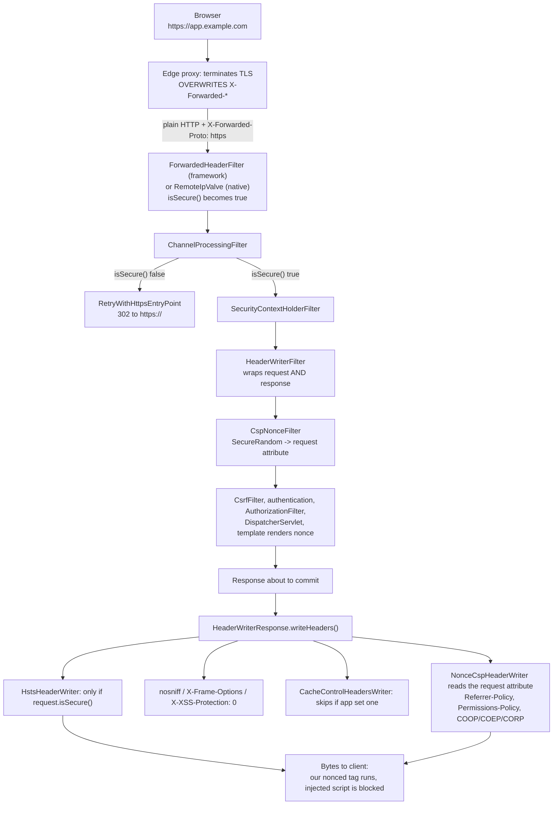

# 12.1 - Security Headers and HTTPS Enforcement

> **Module 12 - Topic 1** - Production Hardening
> Baseline: Spring Security 6.x on Boot 3.x
> New to this? Read **In Plain English** below first, then come back to the Version Matrix.

---

## Version Matrix

| Concern | Spring Security 5.x | **Spring Security 6.x (baseline)** | Spring Security 7.x |
|---|---|---|---|
| Header writer signatures | `javax.servlet.*` | **`jakarta.servlet.*`** | `jakarta.servlet.*` |
| `X-XSS-Protection` default | `1; mode=block` | **`0`** (`XXssProtectionHeaderWriter.HeaderValue.DISABLED`) | `0` |
| Headers DSL | `.headers().frameOptions().sameOrigin().and()` | **lambda `Customizer` only; `.and()` removed** | lambda only |
| `Content-Security-Policy` | opt-in | **opt-in — never a default** | opt-in |
| COOP / COEP / CORP writers | added in 5.7, opt-in | **available, opt-in** | available, opt-in |
| `featurePolicy(String)` | deprecated in 5.5 for `permissionsPolicy(...)` | **deprecated** | removed |
| HSTS default | `max-age=31536000 ; includeSubDomains`, secure requests only | **same** | same |
| `X-Frame-Options` default | `DENY` | **`DENY`** | `DENY` |
| TLS key material | `server.ssl.*` only (Boot 2) | **plus SSL bundles `spring.ssl.bundle.*` (Boot 3.1+)** | bundles preferred |
| Actuator web exposure | `health`, `info` (Boot 2) | **`health` only (Boot 3)** | `health` only |

---

## Why This Exists

Authentication and authorization answer "who are you" and "may you". Security headers answer a different question:
**what is the browser allowed to do with the bytes I just sent it?**

That matters because most attacks in this file never touch your server. Clickjacking, MIME confusion, SSL stripping,
referrer leakage and cross-site scripting all execute inside the victim's browser, using your perfectly
authenticated, perfectly authorized response as raw material. Your logs show nothing unusual. The only lever you have
is to instruct the browser, in the response itself, to refuse.

File [`01_M1_T1_HTTP_Web_Basics.md`](01_M1_T1_HTTP_Web_Basics.md) listed the headers Spring writes by default and
explained the `X-XSS-Protection: 0` decision. This file goes a level down: the filter and abstraction that write them,
each writer's exact default string, the headers Spring deliberately does **not** write and why, and the channel layer
that ensures the response travelled over TLS at all.

> **Spring Security's defaults are exactly the headers safe to apply to any application without knowing anything about
> it.** Everything that needs application knowledge — Content-Security-Policy, Permissions-Policy, the cross-origin
> isolation triad — is off, because a wrong value breaks the site rather than securing it.

---

## In Plain English

**The one-line version:** Every response your application sends can carry a set of short instructions telling the
browser what it is and is not allowed to do with that page, and this file is about which instructions to send and
how to make sure the page travelled over an encrypted connection in the first place.

**An analogy.** Think of shipping a parcel. Authentication and authorization are the checks at the warehouse: who
are you, and are you allowed to collect this box? Security headers are the printed instructions on the outside of
the parcel once it leaves your hands — "this way up", "do not stack", "do not open in a shared room", "only this
named courier may carry it". You cannot supervise the parcel any more, so the labels are the only control you have
left. A courier that ignores the labels is an old browser; a courier that follows them is a modern one.

HTTPS enforcement is the sealed, tamper-evident bag you put the parcel in. Without it, anyone handling the parcel
between you and the recipient can read the contents or swap them for their own. And the interesting twist: a lot of
the labels only make sense inside the sealed bag. There is no point printing "only the named courier may carry this"
on an open box, because whoever intercepts it can simply peel the label off. That is exactly why Spring refuses to
send the HTTPS-only instruction on a plain, unencrypted request.

**How it actually works, step by step.**

A **header** is a short name-and-value line that travels with an HTTP response before the page content, for example
`X-Frame-Options: DENY`. Your application never prints it in the HTML; it is metadata the browser reads and obeys.

Spring Security has one filter for this, `HeaderWriterFilter`, and a list of small objects called *header writers*.
Each writer is responsible for exactly one header. By default the filter does not write them when the request
arrives; it waits until the response is about to be sent back, so that your own controller gets the chance to set a
value first. If the controller already set `Cache-Control`, the cache writer stands down and leaves it alone.

Five headers are switched on out of the box, because they are safe for any application: `Strict-Transport-Security`
(only ever talk to this site over HTTPS), `X-Content-Type-Options: nosniff` (believe the content type I declared,
do not guess from the bytes), `X-Frame-Options: DENY` (nobody may display my page inside their own page),
`Cache-Control: no-cache, no-store, ...` (do not keep a copy of this authenticated page on disk), and
`X-XSS-Protection: 0` (explicitly turn off an old browser feature that turned out to cause more problems than it
solved).

The powerful ones are deliberately off. **Content-Security-Policy** (CSP) is a list of exactly which sources of
scripts, images, styles and connections the page is allowed to use. Spring cannot guess that list — it does not know
whether you load jQuery from a CDN or embed a payment widget — and a wrong list produces a blank white page rather
than a secure one. The single most valuable rule in a CSP is `script-src`, because unauthorised script execution
(cross-site scripting) is the attack CSP was invented for. The single most common mistake is adding
`'unsafe-inline'` to make an old application work, which hands back the exact capability the attacker needs.

**HSTS**, the `Strict-Transport-Security` header, tells the browser to remember for a year that this hostname speaks
only HTTPS. From then on, typing `http://app.example.com` never leaves the machine as plaintext; the browser
upgrades it locally. Spring writes it only when the request actually arrived over HTTPS.

That last point is where the most common production incident in this file starts. In real deployments TLS usually
ends at a load balancer, which then forwards plain HTTP to your application. Your application therefore believes the
request was insecure, refuses to send HSTS, and — if you enabled `requiresChannel().requiresSecure()` — redirects
the browser to HTTPS, which the load balancer terminates again, forever. The fix is to let the application trust the
`X-Forwarded-Proto` header the proxy adds, which is only safe when the proxy overwrites whatever the client sent
rather than passing it through.

**Why should a beginner care?** You can build an application with flawless login and role checks and still lose
customer accounts to attacks that never reach your server. An attacker can put your real, logged-in page inside an
invisible frame on their site and steal a click on your "Confirm transfer" button, and your CSRF token will not help
because the real page with the real token is what is being clicked. A password-reset URL can leak to an analytics
provider through the `Referer` header. A user on cafe Wi-Fi can be silently downgraded to plain HTTP and have their
session cookie read off the wire. Each of those is prevented by one line of configuration you would never think to
add unless you knew the header existed.

**Words you will meet in this file**

| Term | In plain words |
|---|---|
| HTTP header | A short name-and-value line sent alongside a response, read by the browser rather than displayed. |
| `HeaderWriterFilter` | The one Spring component that adds all the security headers to each response. |
| `HeaderWriter` | A small object responsible for one specific header, such as the one that writes `X-Frame-Options`. |
| HSTS | An instruction saying "for the next year, only ever reach this site over HTTPS". |
| `max-age` | How many seconds the browser should remember that instruction. A year is 31536000. |
| `preload` | Asking browser vendors to ship the HTTPS-only rule inside the browser itself. Very hard to undo. |
| CSP | Content-Security-Policy: a list of which sources of scripts, images and styles the page may use. |
| `script-src` | The part of that list covering JavaScript. It is the rule that actually stops script injection. |
| `'unsafe-inline'` | Permission for script written directly inside the page. Convenient, and it removes most of CSP's value. |
| Nonce | A fresh random value generated per response, put both in the policy and on your own script tags, so only your script runs. |
| XSS (cross-site scripting) | An attacker getting the browser to run JavaScript that your server did not write. |
| Clickjacking | Loading your real page invisibly on top of bait, so the victim's click lands on your button. |
| `X-Frame-Options` / `frame-ancestors` | Two ways of saying who is allowed to display your page inside their page. |
| `nosniff` | "Trust the content type I declared; do not inspect the bytes and guess." |
| Report-only mode | Run a policy, collect the violations it would have caused, but block nothing. How you introduce CSP safely. |
| `requiresChannel` | The Spring setting that redirects any plain-HTTP request to HTTPS. |
| TLS termination | The load balancer decrypting HTTPS and forwarding plain HTTP to your application. |
| `X-Forwarded-Proto` | The header a proxy adds to tell your application the original request really was HTTPS. |
| Actuator | Spring Boot's built-in management endpoints. Several of them reveal secrets if left open. |

**If you remember only one thing:** the browser is the one enforcing these rules, so your job is to send clear and
correct instructions in every response — and none of it holds up unless the application genuinely knows whether the
request arrived over HTTPS.

---

## Core Concepts

### 1. `HeaderWriterFilter` and the `HeaderWriter` Abstraction

**In simple terms:** One filter holds a list of small single-purpose objects, each of which stamps one header onto
the response just before it is sent, which is why your own controller can set a value first and have it respected.

The whole subsystem is one filter and one single-method interface.

```java
// org.springframework.security.web.header.HeaderWriter
public interface HeaderWriter {
    void writeHeaders(HttpServletRequest request, HttpServletResponse response);
}
```

```java
// org.springframework.security.web.header.HeaderWriterFilter (simplified)
public class HeaderWriterFilter extends OncePerRequestFilter {
    private final List<HeaderWriter> headerWriters;
    private boolean shouldWriteHeadersEagerly = false;         // false = write on response commit

    @Override
    protected void doFilterInternal(HttpServletRequest request, HttpServletResponse response,
                                    FilterChain filterChain) throws ServletException, IOException {
        if (this.shouldWriteHeadersEagerly) { doHeadersBefore(request, response, filterChain); }
        else                                { doHeadersAfter(request, response, filterChain); }
    }

    private void doHeadersAfter(HttpServletRequest request, HttpServletResponse response,
                                FilterChain filterChain) throws IOException, ServletException {
        HeaderWriterResponse res = new HeaderWriterResponse(request, response);
        HeaderWriterRequest req = new HeaderWriterRequest(request, res);
        try { filterChain.doFilter(req, res); }
        finally { res.writeHeaders(); }                         // idempotent backstop
    }

    void writeHeaders(HttpServletRequest request, HttpServletResponse response) {
        for (HeaderWriter writer : this.headerWriters) { writer.writeHeaders(request, response); }
    }
}
```

Three consequences, all of which appear in interviews. **Headers are written at commit time by default** —
`HeaderWriterResponse` extends `OnCommittedResponseWrapper`, so writers run as the response is about to flush. That
is deliberate: it lets the application set a header first, and lets each writer decide whether to defer.
**A streaming response can miss them** if the container commits before the wrapper can act (Server-Sent Events,
`StreamingResponseBody`, asynchronous dispatch), which is what eager mode exists for. **A forward does not lose
them**, because the request is wrapped too and its `getRequestDispatcher` flushes headers before forwarding, so an
error-page forward still carries them.

Two utilities cover most custom needs without writing a class: `StaticHeadersWriter` (fixed name/value pairs, which
most default writers delegate to) and `DelegatingRequestMatcherHeaderWriter` (invokes a wrapped writer only when a
`RequestMatcher` matches — how you apply a strict policy to `/app/**` and a relaxed one to `/embed/**`). Both are
reachable via `headers(h -> h.addHeaderWriter(writer))`.

### 2. Every Writer, With Its Exact Default

**In simple terms:** This is the full catalogue of headers Spring can send, exactly what each one says, and which
ones you get for free versus which ones you have to ask for because a wrong value would break your site.

| Writer class | Header | Default value | On by default | DSL method |
|---|---|---|---|---|
| `HstsHeaderWriter` | `Strict-Transport-Security` | `max-age=31536000 ; includeSubDomains` | **Yes**, secure requests only | `httpStrictTransportSecurity(...)` |
| `XContentTypeOptionsHeaderWriter` | `X-Content-Type-Options` | `nosniff` | **Yes** | `contentTypeOptions(...)` |
| `XFrameOptionsHeaderWriter` | `X-Frame-Options` | `DENY` | **Yes** | `frameOptions(...)` |
| `CacheControlHeadersWriter` | `Cache-Control`, `Pragma`, `Expires` | `no-cache, no-store, max-age=0, must-revalidate` / `no-cache` / `0` | **Yes** | `cacheControl(...)` |
| `XXssProtectionHeaderWriter` | `X-XSS-Protection` | **`0`** | **Yes** | `xssProtection(...)` |
| `ReferrerPolicyHeaderWriter` | `Referrer-Policy` | `no-referrer` when enabled | No | `referrerPolicy(...)` |
| `ContentSecurityPolicyHeaderWriter` | `Content-Security-Policy` | `default-src 'self'` if no directives given | No | `contentSecurityPolicy(...)` |
| `PermissionsPolicyHeaderWriter` | `Permissions-Policy` | none; you supply directives | No | `permissionsPolicy(...)` |
| `FeaturePolicyHeaderWriter` | `Feature-Policy` | none | No, **deprecated** | `featurePolicy(String)` |
| `CrossOriginOpenerPolicyHeaderWriter` | `Cross-Origin-Opener-Policy` | `unsafe-none` | No | `crossOriginOpenerPolicy(...)` |
| `CrossOriginEmbedderPolicyHeaderWriter` | `Cross-Origin-Embedder-Policy` | `unsafe-none` | No | `crossOriginEmbedderPolicy(...)` |
| `CrossOriginResourcePolicyHeaderWriter` | `Cross-Origin-Resource-Policy` | `same-origin` when enabled | No | `crossOriginResourcePolicy(...)` |

`XContentTypeOptionsHeaderWriter` is literally `extends StaticHeadersWriter` with `("X-Content-Type-Options",
"nosniff")`. That value makes the browser trust your `Content-Type` instead of guessing from the bytes; without it a
user-uploaded file served as `text/plain` that begins with `<html>` can be sniffed as HTML and executed in your
origin. It also enables cross-origin read blocking for `script` and `style` requests whose declared type mismatches.

`CacheControlHeadersWriter` is the one that cooperates with the application:

```java
// org.springframework.security.web.header.writers.CacheControlHeadersWriter (simplified)
@Override
public void writeHeaders(HttpServletRequest request, HttpServletResponse response) {
    if (hasHeader(response)) { return; }                  // the application already decided
    this.delegate.writeHeaders(request, response);        // a StaticHeadersWriter
}
private boolean hasHeader(HttpServletResponse response) {
    return response.getHeader("Cache-Control") != null || response.getHeader("Expires") != null
        || response.getHeader("Pragma") != null;
}
```

That guard is why static resources keep the long `max-age` from `spring.web.resources.cache.cachecontrol.max-age`:
`ResourceHttpRequestHandler` sets it during the dispatch and by commit time the writer stands down. Flipping
`shouldWriteHeadersEagerly` to `true` breaks it. `Pragma` and `Expires` exist only for HTTP/1.0 intermediaries.

```java
// XXssProtectionHeaderWriter
public enum HeaderValue { DISABLED("0"), ENABLED("1"), ENABLED_MODE_BLOCK("1; mode=block"); }
private HeaderValue headerValue = HeaderValue.DISABLED;   // Spring Security 6 default
```

Expanding on file 01: the legacy XSS auditor compared request parameters against the response body, so an attacker
who could reflect a *fragment* of an existing legitimate inline script could make the auditor suppress it —
selectively disabling the page's own defences, and with `mode=block` turning any page into a denial of service by
making the browser refuse to render. Chrome removed the auditor in 78; `0` opts out of anything that still has one.

`ReferrerPolicyHeaderWriter` defaults to `NO_REFERRER` *when enabled*. The threat is
`https://app.example.com/reset?token=abc` appearing in the `Referer` of every outbound request the resulting page
makes, including analytics and font CDNs. Configure `STRICT_ORIGIN_WHEN_CROSS_ORIGIN` explicitly — full URL
same-origin, origin only cross-origin, nothing on an HTTPS-to-HTTP downgrade — rather than relying on the browser
default, because explicit configuration survives a browser policy change. `PermissionsPolicyHeaderWriter` writes
`Permissions-Policy: geolocation=(), camera=()`, disabling capabilities you never use so an injected script cannot
either: `feature=()` means nobody, `(self)` this origin, `(self "https://maps.example.com")` a named third party.
That structured syntax genuinely differs from `Feature-Policy`'s space-separated allow-list, which is why the writer
and DSL method were renamed.

| Header | Values | Effect |
|---|---|---|
| `Cross-Origin-Opener-Policy` (COOP) | `unsafe-none`, `same-origin-allow-popups`, `same-origin` | Severs `window.opener` between your document and cross-origin documents — kills tabnabbing and cross-window probing |
| `Cross-Origin-Embedder-Policy` (COEP) | `unsafe-none`, `require-corp` | Refuses any cross-origin subresource that has not explicitly opted in |
| `Cross-Origin-Resource-Policy` (CORP) | `same-site`, `same-origin`, `cross-origin` | Declares who may embed *your* resource — the opt-in COEP looks for, and the main defence against Spectre-style cross-origin reads |

COOP `same-origin` plus COEP `require-corp` puts the document into a **cross-origin isolated** state, which unlocks
`SharedArrayBuffer` and high-resolution timers. COEP is the disruptive one: every CDN image, script, font and iframe
must send CORP or CORS headers or it silently fails to load. Roll it out with
`Cross-Origin-Embedder-Policy-Report-Only` first, exactly as with CSP.

### 3. Content-Security-Policy In Depth

**In simple terms:** You give the browser a precise list of where scripts, styles and images are allowed to come
from, so that even if an attacker manages to inject code into your page, the browser refuses to run it.

**Why Spring does not enable it.** A CSP is a whitelist, and a whitelist needs knowledge the framework cannot have:
whether your templates contain inline script, whether you use a CDN, whether a payment provider frames you. Any
default is either so permissive it protects nothing, or it white-screens the application on the first request after
upgrade. The writer exposes `ContentSecurityPolicyHeaderWriter.DEFAULT_SRC_SELF_POLICY = "default-src 'self'"`, used
only when you enable it bare — a starting point, not a default.

| Directive | Controls | Hardened value |
|---|---|---|
| `default-src` | Fallback for every `*-src` you omit | `'self'` |
| `script-src` | JavaScript sources. **The directive that actually stops XSS** | `'self' 'nonce-…' 'strict-dynamic'` |
| `style-src` / `img-src` / `font-src` | Stylesheets, images, web fonts | `'self'`, `'self' data:`, `'self'` |
| `connect-src` | `fetch`, `XMLHttpRequest`, WebSocket, EventSource targets | `'self' https://api.example.com` |
| `frame-ancestors` | Who may embed **you** | `'none'` or `'self'` |
| `object-src` | `<object>`, `<embed>`, `<applet>` — legacy plugin script execution | **`'none'`, always** |
| `base-uri` | What `<base href>` may be set to | **`'self'`, always** |
| `form-action` | Where forms may submit | `'self'` |
| `upgrade-insecure-requests` | Rewrites `http://` subresource URLs to `https://` | set during an HTTPS migration |
| `report-uri` / `report-to` | Violation reporting endpoint | your collector |

Two are routinely forgotten and both are documented bypasses. Without **`object-src 'none'`** an injected
`<embed src="data:…">` or legacy plugin object executes script even when `script-src` is tight. Without
**`base-uri 'self'`** an injected `<base href="https://evil.example">` rewrites every *relative* script URL on the
page, and because the browser resolves the relative URL before matching it, your `script-src 'self'` is satisfied by
a resource that loads from the attacker.

**Why `'unsafe-inline'` defeats the point.** Cross-site scripting is mechanically the attacker getting the browser to
execute script the server did not author, and almost every real payload is inline: `<script>fetch('//evil')</script>`,
``, `<a href="javascript:…">`. `script-src 'self' 'unsafe-inline'` grants exactly the capability
the attacker needs, leaving only the minority of payloads that load an external file. `'unsafe-eval'` is the sibling,
re-enabling `eval`, `new Function` and `setTimeout("string")`. The trap is that `'unsafe-inline'` is the easy way to
make a legacy application pass, after which the CSP is a compliance checkbox with no security value.

**Nonces and hashes** are the two supported ways to allow *your* inline script while blocking the attacker's. A
**nonce** is a fresh unguessable value per response, placed in the policy as `'nonce-<value>'` and on each of your
own `<script nonce="…">` tags; an injected script cannot learn it because it is chosen after the payload was stored
and changes every response. A **hash** lists `'sha256-<digest>'` of the exact script body — no per-request work and
fully cacheable, but every whitespace edit changes the hash. Three nonce rules people get wrong: it must come from
`SecureRandom` with at least 128 bits; it must be **per-response**, never per-session and never cached; and adding a
nonce to `script-src` implicitly disables `'unsafe-inline'` on CSP Level 2+ browsers, so you may keep
`'unsafe-inline'` purely as an ancient-browser fallback.

`'strict-dynamic'` makes nonces practical: script created programmatically by your nonced script inherits trust, so
third-party loaders work without enumerating hosts — and **host allow-lists are ignored**, which is a feature,
because they are the weakest part of CSP. One JSONP endpoint or one script-gadget library on an allowed CDN re-opens
arbitrary execution. Spring Security has **no built-in nonce support**; `ContentSecurityPolicyHeaderWriter` takes a
static string, so you wire it yourself with a filter plus a custom `HeaderWriter` (see Working Code) and the
framework's job is to provide the extension point.

**Report-only and staged rollout.** `Content-Security-Policy-Report-Only` makes the browser evaluate the policy,
report every violation and enforce nothing — the only sane way to introduce CSP to an existing application. Both
headers can be sent together: a permissive enforced policy plus a strict report-only candidate, so you tighten
against real traffic while the site stays up. `report-uri` is the CSP-native mechanism (the browser POSTs JSON with
`Content-Type: application/csp-report`); `report-to` is the Reporting API version referencing an endpoint group
declared in a separate `Reporting-Endpoints` header. Send both, and budget for noise — browser extensions generate
enormous volumes of unfixable violations, so filter by `blocked-uri` scheme before anyone sees a dashboard. The
endpoint itself is unauthenticated and attacker-callable: rate limit it, cap the body size, never reflect it.

**`frame-ancestors` supersedes `X-Frame-Options`.** It accepts an origin list with wildcards, applies uniformly to
`frame`, `iframe`, `object`, `embed` and `applet`, and carries no `ALLOW-FROM` legacy. The CSP specification says a
browser supporting `frame-ancestors` **must ignore `X-Frame-Options`**. So send both: `frame-ancestors` is the real
control and `X-Frame-Options: DENY` is a free fallback for anything that does not implement CSP.

### 4. HSTS In Detail

**In simple terms:** One header makes the browser remember, for as long as you specify, that this site is
HTTPS-only, so a plain-HTTP request is upgraded before it ever leaves the user's machine and cannot be intercepted.

```java
// org.springframework.security.web.header.writers.HstsHeaderWriter (simplified)
private RequestMatcher requestMatcher = new SecureRequestMatcher();
private long maxAgeInSeconds = 31536000;
private boolean includeSubDomains = true;
private boolean preload = false;

@Override
public void writeHeaders(HttpServletRequest request, HttpServletResponse response) {
    if (!response.containsHeader("Strict-Transport-Security") && this.requestMatcher.matches(request)) {
        response.setHeader("Strict-Transport-Security", this.hstsHeaderValue);
    }
}
private String createHeaderValue(long maxAgeInSeconds, boolean includeSubDomains, boolean preload) {
    String value = "max-age=" + maxAgeInSeconds;
    if (includeSubDomains) { value += " ; includeSubDomains"; }
    if (preload)           { value += " ; preload"; }
    return value;
}
private static final class SecureRequestMatcher implements RequestMatcher {
    @Override public boolean matches(HttpServletRequest request) { return request.isSecure(); }
}
```

`Strict-Transport-Security` tells the browser that for `max-age` seconds this host speaks only HTTPS. Two behaviours
follow: the browser rewrites `http://` to `https://` **before any packet leaves the machine** (defeating SSL
stripping), and certificate errors become non-bypassable — there is no "proceed anyway" button.

**The `SecureRequestMatcher` is the detail to memorise.** Spring writes HSTS only when `request.isSecure()`, which is
correct rather than an oversight: a plaintext HSTS header is worthless because an attacker who can modify plain HTTP
can strip it, and writing it from `http://localhost:8080` would pin `localhost` to HTTPS in your browser for a year.
If HSTS is missing in production the cause is almost always that TLS terminates at a proxy and `isSecure()` is
`false` — a channel problem, not a headers problem.

| Parameter | Meaning | Cost of getting it wrong |
|---|---|---|
| `max-age` | Seconds the browser remembers; `0` clears the pin | A broken subdomain stays broken that long |
| `includeSubDomains` | Applies to every subdomain, including forgotten ones | An internal plain-HTTP `legacy.example.com` becomes unreachable |
| `preload` | Consent to be baked into browser binaries via hstspreload.org | **Effectively irreversible** |

Preload requires `max-age` ≥ 31536000, `includeSubDomains`, `preload`, and valid apex HTTPS. The benefit is real — it
closes the one gap plain HSTS cannot, the very first request from a brand-new browser profile. The cost is that
removal means a request, an audit, then waiting for browser release trains to reach users — **months to years** —
during which every name under your apex must serve valid HTTPS, including the ones owned by marketing, by an acquired
company, and by a vendor-hosted status page. Treat it as a one-way door.

### 5. Clickjacking and `X-Frame-Options`

**In simple terms:** This header stops another website from displaying your page invisibly inside theirs and
tricking a logged-in user into clicking your buttons without realising it.

The attacker loads your authenticated page in an invisible iframe, overlays bait UI, and the victim's click lands on
your "Confirm transfer" button. Cookies are attached because the browser sees a normal request, and **CSRF tokens do
not help** — the real page with the real token is what is being clicked.

`XFrameOptionsMode` is `DENY` (Spring's default, correct for almost everything), `SAMEORIGIN` (needed for the H2
console and some Swagger configurations, set with `frameOptions(frame -> frame.sameOrigin())`), and `ALLOW_FROM`.
`ALLOW-FROM` was implemented only by legacy Internet Explorer and old Firefox, and browsers that did not recognise
the value fell back to **no protection at all** — it fails open, which is why any allow-list belongs in
`frame-ancestors`. Note that `SAMEORIGIN` stops a different origin framing you but says nothing about the more
interesting attack: a subdomain takeover combined with a cookie scoped `Domain=.example.com`. That is a cookie
problem, solved by the `__Host-` prefix and DNS hygiene, not a framing problem.

### 6. HTTPS Enforcement: `requiresChannel` and `ChannelProcessingFilter`

**In simple terms:** Spring can redirect any request that arrived unencrypted to the HTTPS address instead, but it
only works if the application can tell whether the request really was encrypted, which is the hard part behind a
load balancer.

`http.requiresChannel(channel -> channel.anyRequest().requiresSecure())` installs `ChannelProcessingFilter`, which
sits third in the chain — after `DisableEncodeUrlFilter` and `ForceEagerSessionCreationFilter`, and crucially
**before** `SecurityContextHolderFilter` and `HeaderWriterFilter`. Running early is the point: there is no value in
loading a session or writing headers for a request you are about to redirect.

```java
// org.springframework.security.web.access.channel.ChannelProcessingFilter (simplified)
FilterInvocation fi = new FilterInvocation(request, response, chain);
Collection<ConfigAttribute> attrs = this.securityMetadataSource.getAttributes(fi);
if (attrs != null) {
    this.channelDecisionManager.decide(fi, attrs);
    if (fi.getResponse().isCommitted()) { return; }        // a processor redirected; stop here
}
fi.getChain().doFilter(fi.getRequest(), fi.getResponse());
```

`ChannelDecisionManagerImpl` consults `SecureChannelProcessor` (keyword `REQUIRES_SECURE_CHANNEL`; on
`!request.isSecure()` it delegates to `RetryWithHttpsEntryPoint`, which rebuilds the URL with scheme `https` and a
mapped port and redirects) and `InsecureChannelProcessor` (`REQUIRES_INSECURE_CHANNEL` via `RetryWithHttpEntryPoint`,
rarely useful). `ANY_CHANNEL` means no constraint. Ports come from `PortMapperImpl`, defaulting to `80 -> 443` and
`8080 -> 8443`; a non-standard pair needs `portMapper(...)` or the redirect lands on the wrong port.

**The TLS-terminating-proxy problem.** Your load balancer terminates TLS and forwards plain HTTP, so Tomcat sees
scheme `http` and `request.isSecure()` is `false`. The browser requests `https://app.example.com/dashboard`, the
proxy forwards `http://app-pod:8080/dashboard`, `SecureChannelProcessor` redirects to
`https://app.example.com/dashboard`, and the loop repeats until the browser gives up with `ERR_TOO_MANY_REDIRECTS`.
Simultaneously and silently: HSTS is missing, absolute URLs and password-reset links are built as
`http://app-pod:8080/…`, `getRemoteAddr()` returns the proxy, OAuth2 `redirect_uri` values are rejected as
unregistered, and `Secure` cookies may be dropped. All five share one root cause — **the application does not know
it is behind TLS.** The fix is to make forwarded headers authoritative: `X-Forwarded-Proto`, `-Host`, `-Port`,
`-For`, or the RFC 7239 `Forwarded: for=…;proto=https;host=…`.

| Strategy | What Boot installs | Trust model |
|---|---|---|
| `none` (default) | nothing | Forwarded headers ignored entirely |
| `framework` | `org.springframework.web.filter.ForwardedHeaderFilter` | **Trusts them unconditionally** — no notion of a trusted proxy |
| `native` | Tomcat's `RemoteIpValve`, Jetty's `ForwardedRequestCustomizer` | Honours them only when the TCP peer matches the `internalProxies` regex |

Boot's default is `none`, except that it switches to `native` when it detects a known cloud platform. `native` is
more defensible in a self-managed deployment precisely because `internalProxies` is a trust boundary.
`ForwardedHeaderFilter` normally rewrites `getScheme`, `getServerName`, `getServerPort`, `isSecure`, `getRequestURL`
and `getContextPath`, then removes the forwarded headers so nothing downstream double-applies them;
`setRemoveOnly(true)` strips without applying, which is what you want on an application that is *not* behind a proxy
but might be reached directly.

> **Honouring `X-Forwarded-*` is only safe if the edge proxy overwrites client-supplied values.**

If the proxy passes a client value through, an attacker sending `X-Forwarded-Proto: https` over plain HTTP makes
`isSecure()` return `true`: channel security bypassed, `Secure` cookies issued over cleartext, HSTS written on a
plaintext response. Spoofing `X-Forwarded-For` defeats every IP allowlist, every per-IP rate limit (file 37) and
every audit record of a source address (file 38). nginx should use `proxy_set_header X-Forwarded-Proto $scheme;`,
which replaces. With two proxies the application must take the **rightmost-trusted** `X-Forwarded-For` entry, never
`getHeader("X-Forwarded-For").split(",")[0]`, because the leftmost is entirely client-supplied. `RemoteIpValve`
implements that walk correctly; hand-written code does not. When you control the proxy but not the container
configuration, scope the channel rule to the header instead, which cannot loop:

```java
.requiresChannel(channel -> channel
    .requestMatchers(request -> "http".equals(request.getHeader("X-Forwarded-Proto")))
    .requiresSecure())
```

### 7. TLS Configuration Basics

**In simple terms:** These are the settings that decide how strong the encrypted connection itself is: which
versions of the protocol you accept, which certificates you present, and where the private key is kept.

| Concern | Guidance |
|---|---|
| Protocol versions | TLS 1.3 and 1.2 only. TLS 1.0/1.1 deprecated by RFC 8996; SSLv3 is broken (POODLE) |
| Cipher suites | TLS 1.3 suites are all AEAD — leave them. On TLS 1.2 require forward secrecy (ECDHE) and AEAD (GCM); exclude CBC, RC4, 3DES, `NULL`, `EXPORT` |
| Certificates | ECDSA P-256 is smaller and faster than RSA-2048; short lifetimes with ACME automation |
| Key storage | PKCS#12 or PEM mounted as a secret — never in the image, never in Git |
| Other | Disable TLS compression (CRIME) and renegotiation; enable OCSP stapling at the terminating layer |

Boot 3.1 introduced **SSL bundles**, decoupling key material from server configuration and supporting hot reload. One
bundle name can be referenced by `server.ssl.bundle`, `RestClient`, `WebClient` and Kafka, so one rotation updates
every consumer. `client-auth: need` is where mutual TLS begins: the client certificate becomes the credential, turned
into an `Authentication` by `X509AuthenticationFilter` and a `SubjectDnX509PrincipalExtractor`. That mechanism,
revocation, and `PreAuthenticatedAuthenticationProvider` wiring are file 40.

### 8. The Actuator Endpoints That Leak

**In simple terms:** Spring Boot ships a set of diagnostic URLs that are extremely useful in development and hand
out database passwords, API keys and even a full memory snapshot if you leave them open in production.

| Endpoint | What an unauthenticated caller learns |
|---|---|
| `/actuator/env`, `/actuator/configprops` | Every property: datasource URLs and credentials, API keys, signing secrets |
| `/actuator/heapdump` | A full heap image: session contents, in-flight passwords, decrypted secrets, signing keys. **The worst by a wide margin** |
| `/actuator/threaddump` | Stack traces revealing internal structure, sometimes parameters |
| `/actuator/mappings` | Every URL served, including the admin paths you hoped nobody would guess |
| `/actuator/beans` | The bean graph, so your architecture and library versions |
| `/actuator/loggers` | **Writable** — a `POST` can enable `DEBUG` on `org.springframework.security` and fill a disk |
| `/actuator/shutdown` | Stops the application. Disabled by default; keep it that way |

Boot 3 helps by exposing only `health` over HTTP and sanitising values in `/env` and `/configprops` unless you set
`management.endpoint.env.show-values`. The failure mode is a team adding `exposure.include: "*"` to debug staging and
shipping it. Defence in depth: expose the minimum, bind the management port to an internal interface, and require a
role on the whole namespace with `EndpointRequest.toAnyEndpoint()`.

---

## Architecture



---

## Working Code

```java
package com.example.hardening;

import org.springframework.context.annotation.Bean;
import org.springframework.context.annotation.Configuration;
import org.springframework.security.config.Customizer;
import org.springframework.security.config.annotation.web.builders.HttpSecurity;
import org.springframework.security.config.annotation.web.configuration.EnableWebSecurity;
import org.springframework.security.web.SecurityFilterChain;
import org.springframework.security.web.header.HeaderWriterFilter;
import org.springframework.security.web.header.writers.CrossOriginEmbedderPolicyHeaderWriter.CrossOriginEmbedderPolicy;
import org.springframework.security.web.header.writers.CrossOriginOpenerPolicyHeaderWriter.CrossOriginOpenerPolicy;
import org.springframework.security.web.header.writers.CrossOriginResourcePolicyHeaderWriter.CrossOriginResourcePolicy;
import org.springframework.security.web.header.writers.ReferrerPolicyHeaderWriter.ReferrerPolicy;
import org.springframework.security.web.header.writers.XXssProtectionHeaderWriter;
import org.springframework.security.web.util.matcher.AntPathRequestMatcher;

@Configuration
@EnableWebSecurity
public class SecurityHeadersConfig {

    @Bean
    SecurityFilterChain appChain(HttpSecurity http) throws Exception {
        http
            // Behind a TLS-terminating proxy this REQUIRES server.forward-headers-strategy,
            // otherwise request.isSecure() is false and every request redirects forever.
            .requiresChannel(channel -> channel
                // Kubernetes probes arrive on the pod IP over plain HTTP; they must not redirect.
                .requestMatchers(new AntPathRequestMatcher("/actuator/health/**")).requiresInsecure()
                .anyRequest().requiresSecure())
            .headers(headers -> headers
                .httpStrictTransportSecurity(hsts -> hsts
                    .maxAgeInSeconds(63072000)                  // two years
                    .includeSubDomains(true)
                    .preload(true))                             // only after auditing every subdomain
                .frameOptions(frame -> frame.deny())            // fallback; frame-ancestors is the real control
                .contentTypeOptions(Customizer.withDefaults())
                .xssProtection(xss -> xss.headerValue(XXssProtectionHeaderWriter.HeaderValue.DISABLED))
                .referrerPolicy(ref -> ref.policy(ReferrerPolicy.STRICT_ORIGIN_WHEN_CROSS_ORIGIN))
                .permissionsPolicy(p -> p.policy(
                    "geolocation=(), camera=(), microphone=(), payment=(), usb=(), accelerometer=()"))
                .crossOriginOpenerPolicy(coop -> coop.policy(CrossOriginOpenerPolicy.SAME_ORIGIN))
                // COEP is disruptive: every cross-origin subresource must send CORP or CORS.
                .crossOriginEmbedderPolicy(coep -> coep.policy(CrossOriginEmbedderPolicy.REQUIRE_CORP))
                .crossOriginResourcePolicy(corp -> corp.policy(CrossOriginResourcePolicy.SAME_ORIGIN))
                // Replaces contentSecurityPolicy(...) entirely: that one takes a static string.
                .addHeaderWriter(new NonceCspHeaderWriter()))
            // The nonce attribute must exist before HeaderWriterFilter's wrapper commits,
            // and be visible to the template during the dispatch.
            .addFilterBefore(new CspNonceFilter(), HeaderWriterFilter.class)
            .authorizeHttpRequests(auth -> auth
                .requestMatchers("/", "/login", "/css/**", "/js/**", "/csp-report").permitAll()
                .anyRequest().authenticated())
            .formLogin(Customizer.withDefaults());
        return http.build();
    }
}
```

```java
package com.example.hardening;

import jakarta.servlet.FilterChain;
import jakarta.servlet.ServletException;
import jakarta.servlet.http.HttpServletRequest;
import jakarta.servlet.http.HttpServletResponse;
import org.springframework.security.web.header.HeaderWriter;
import org.springframework.web.filter.OncePerRequestFilter;

import java.io.IOException;
import java.security.SecureRandom;
import java.util.Base64;

/** One 128-bit nonce per request, exposed as a REQUEST ATTRIBUTE so that the view and the
 *  header writer see the same value even when the commit happens on another thread. */
final class CspNonceFilter extends OncePerRequestFilter {

    static final String ATTRIBUTE = "cspNonce";

    private static final SecureRandom RANDOM = new SecureRandom();
    private static final Base64.Encoder ENCODER = Base64.getUrlEncoder().withoutPadding();

    @Override
    protected void doFilterInternal(HttpServletRequest request, HttpServletResponse response,
                                    FilterChain chain) throws ServletException, IOException {
        byte[] bytes = new byte[16];
        RANDOM.nextBytes(bytes);
        request.setAttribute(ATTRIBUTE, ENCODER.encodeToString(bytes));
        chain.doFilter(request, response);
    }
}

/**
 * Nonce-based CSP. 'strict-dynamic' lets script created by our nonced script inherit trust,
 * so no CDN host list is needed. 'unsafe-inline' is kept deliberately: CSP Level 2+ browsers
 * ignore it whenever a nonce is present, so it only ever applies to ancient browsers.
 */
final class NonceCspHeaderWriter implements HeaderWriter {

    private static final String ENFORCE = "Content-Security-Policy";
    private static final String REPORT_ONLY = "Content-Security-Policy-Report-Only";

    @Override
    public void writeHeaders(HttpServletRequest request, HttpServletResponse response) {
        if (response.containsHeader(ENFORCE)) {
            return;                                     // never override a deliberate value
        }
        Object nonce = request.getAttribute(CspNonceFilter.ATTRIBUTE);
        if (nonce == null) {
            // Static resource outside the filter: still block inline rather than relax.
            response.setHeader(ENFORCE, baseline() + "; script-src 'self'");
            return;
        }
        response.setHeader(ENFORCE, baseline()
            + "; script-src 'self' 'nonce-" + nonce + "' 'strict-dynamic' 'unsafe-inline'");
        response.setHeader(REPORT_ONLY, "default-src 'none'; script-src 'nonce-" + nonce
            + "' 'strict-dynamic'; style-src 'self'; img-src 'self'; connect-src 'self';"
            + " report-uri /csp-report");                // tighter candidate: observed, not enforced
    }

    private String baseline() {
        return "default-src 'self'"
             + "; base-uri 'self'"            // blocks <base href> relative-URL hijacking
             + "; object-src 'none'"          // blocks legacy plugin script execution
             + "; frame-ancestors 'none'"     // supersedes X-Frame-Options
             + "; form-action 'self'"
             + "; style-src 'self'; img-src 'self' data:; font-src 'self'; connect-src 'self'"
             + "; upgrade-insecure-requests; report-uri /csp-report";
    }
}
```

```html
<!-- src/main/resources/templates/dashboard.html -->
<script th:attr="nonce=${#request.getAttribute('cspNonce')}">
  document.getElementById('total').textContent = window.__BOOTSTRAP__.total;
</script>
```

```java
package com.example.hardening;

import org.springframework.boot.actuate.autoconfigure.security.servlet.EndpointRequest;
import org.springframework.boot.actuate.health.HealthEndpoint;
import org.springframework.boot.actuate.info.InfoEndpoint;
import org.springframework.context.annotation.Bean;
import org.springframework.context.annotation.Configuration;
import org.springframework.core.annotation.Order;
import org.springframework.security.config.Customizer;
import org.springframework.security.config.annotation.web.builders.HttpSecurity;
import org.springframework.security.config.http.SessionCreationPolicy;
import org.springframework.security.web.SecurityFilterChain;

@Configuration
class ActuatorSecurityConfig {

    /** Ordered ahead of the application chain: only the FIRST matching chain runs, so a
     *  catch-all declared earlier would make this dead code. */
    @Bean
    @Order(1)
    SecurityFilterChain actuatorChain(HttpSecurity http) throws Exception {
        http.securityMatcher(EndpointRequest.toAnyEndpoint())
            .authorizeHttpRequests(auth -> auth
                .requestMatchers(EndpointRequest.to(HealthEndpoint.class, InfoEndpoint.class)).permitAll()
                .anyRequest().hasRole("OPS"))
            .httpBasic(Customizer.withDefaults())
            .csrf(csrf -> csrf.disable())                 // machine clients, no ambient credentials
            .sessionManagement(s -> s.sessionCreationPolicy(SessionCreationPolicy.STATELESS));
        return http.build();
    }
}
```

The violation sink is a plain `@PostMapping("/csp-report")` accepting
`consumes = { "application/csp-report", MediaType.APPLICATION_JSON_VALUE }`, returning `204`, and logging the
`csp-report` object with structured logging rather than interpolation. It is anonymous, attacker-callable and high
volume, so rate limit it at the edge, cap the body size, and never reflect the payload anywhere.

```yaml
server:
  # 'native' preferred over 'framework': RemoteIpValve enforces a trusted-proxy check,
  # ForwardedHeaderFilter trusts X-Forwarded-* unconditionally.
  forward-headers-strategy: native
  tomcat:
    remoteip:
      protocol-header: x-forwarded-proto
      remote-ip-header: x-forwarded-for
      internal-proxies: "10\\.\\d{1,3}\\.\\d{1,3}\\.\\d{1,3}"
  servlet:
    session:
      cookie: { name: __Host-SESSION, http-only: true, secure: true, same-site: lax }
  ssl:                                     # only when the JVM itself terminates TLS
    bundle: internal
    enabled-protocols: TLSv1.3,TLSv1.2
    client-auth: none
spring:
  ssl:
    bundle:
      pem:
        internal:
          keystore: { certificate: "file:/etc/tls/tls.crt", private-key: "file:/etc/tls/tls.key" }
          truststore: { certificate: "file:/etc/tls/ca.crt" }
          reload-on-update: true           # hot certificate rotation
management:
  server:
    port: 9090                             # internal network only
  endpoints:
    web:
      exposure:
        include: health,info,prometheus
        exclude: env,heapdump,threaddump,configprops,beans,mappings,loggers
  endpoint:
    health: { show-details: when-authorized }
    env: { show-values: never }            # Boot 3 default; never relax it
    configprops: { show-values: never }
```

```java
package com.example.hardening;

import org.junit.jupiter.api.Test;
import org.springframework.beans.factory.annotation.Autowired;
import org.springframework.boot.test.autoconfigure.web.servlet.AutoConfigureMockMvc;
import org.springframework.boot.test.context.SpringBootTest;
import org.springframework.test.web.servlet.MockMvc;

import static org.assertj.core.api.Assertions.assertThat;
import static org.springframework.test.web.servlet.request.MockMvcRequestBuilders.get;
import static org.springframework.test.web.servlet.result.MockMvcResultMatchers.header;
import static org.springframework.test.web.servlet.result.MockMvcResultMatchers.redirectedUrlPattern;
import static org.springframework.test.web.servlet.result.MockMvcResultMatchers.status;

@SpringBootTest
@AutoConfigureMockMvc
class SecurityHeadersConfigTests {

    @Autowired MockMvc mvc;

    @Test
    void plainHttpIsRedirectedToHttpsButTheHealthProbeIsNot() throws Exception {
        mvc.perform(get("/login"))
           .andExpect(status().is3xxRedirection())
           .andExpect(redirectedUrlPattern("https://**"));
        mvc.perform(get("/actuator/health")).andExpect(status().isOk());
    }

    @Test
    void headersArePinnedToExactValues() throws Exception {
        mvc.perform(get("/login").secure(true))
           .andExpect(header().string("Strict-Transport-Security",
                                      "max-age=63072000 ; includeSubDomains ; preload"))
           .andExpect(header().string("X-Content-Type-Options", "nosniff"))
           .andExpect(header().string("X-Frame-Options", "DENY"))
           .andExpect(header().string("X-XSS-Protection", "0"))
           .andExpect(header().string("Referrer-Policy", "strict-origin-when-cross-origin"))
           .andExpect(header().string("Cross-Origin-Opener-Policy", "same-origin"))
           .andExpect(header().string("Cache-Control",
                                      "no-cache, no-store, max-age=0, must-revalidate"));
    }

    @Test
    void cspIsNonceBasedAndTheNonceIsFreshEveryResponse() throws Exception {
        String first = csp(), second = csp();
        assertThat(first).contains("'strict-dynamic'").contains("object-src 'none'")
                         .contains("base-uri 'self'").contains("frame-ancestors 'none'");
        assertThat(first).isNotEqualTo(second);
        String nonce = first.substring(first.indexOf("'nonce-") + 7);
        // base64url without padding: 16 random bytes -> 22 characters
        assertThat(nonce.substring(0, nonce.indexOf('\''))).hasSize(22);
    }

    @Test
    void leakyActuatorEndpointsAreNotAnonymouslyReachable() throws Exception {
        mvc.perform(get("/actuator/env").secure(true)).andExpect(status().isUnauthorized());
        mvc.perform(get("/actuator/heapdump").secure(true)).andExpect(status().isUnauthorized());
    }

    private String csp() throws Exception {
        return mvc.perform(get("/login").secure(true)).andReturn()
                  .getResponse().getHeader("Content-Security-Policy");
    }
}
```

---

## Internals

### How `HeadersConfigurer` assembles the writer list

```java
// org.springframework.security.config.annotation.web.configurers.HeadersConfigurer (simplified)
private HeaderWriterFilter createHeaderWriterFilter() {
    List<HeaderWriter> writers = getHeaderWriters();
    if (writers.isEmpty()) {
        throw new IllegalStateException("Headers security is enabled but no writers were configured");
    }
    HeaderWriterFilter filter = new HeaderWriterFilter(writers);
    filter.setShouldWriteHeadersEagerly(this.shouldWriteHeadersEagerly);
    return filter;
}

private List<HeaderWriter> getHeaderWriters() {
    List<HeaderWriter> writers = new ArrayList<>();
    addIfNotNull(writers, this.contentTypeOptions.writer);       // then xssProtection, cacheControl,
    addIfNotNull(writers, this.hsts.writer);                     // frameOptions, referrerPolicy,
    addIfNotNull(writers, this.contentSecurityPolicy.writer);    // featurePolicy, permissionsPolicy,
    addIfNotNull(writers, this.crossOriginOpenerPolicy.writer);  // COEP and CORP in the same shape
    writers.addAll(this.headerWriters);                          // everything from addHeaderWriter(...)
    return writers;
}
```

Each nested config's `writer` field stays `null` until you touch it — that is how "opt-in" is implemented, and why
`.referrerPolicy(Customizer.withDefaults())` is what materialises the writer. And `headers(h -> h.disable())` removes
the filter entirely, taking `nosniff`, `X-Frame-Options` and the cache headers with it; the targeted form is
`headers(h -> h.cacheControl(cache -> cache.disable()))`.

### Why the nonce must be a request attribute, not a `ThreadLocal`

`HeaderWriterResponse.writeHeaders()` can run on a different thread from the one that rendered the body when
asynchronous dispatch is involved. The request is the only context that reliably spans the exchange, and the
`HttpServletRequestWrapper` that `HeaderWriterFilter` passes down reaches the same underlying attributes. A
`ThreadLocal` nonce works synchronously and produces a mysteriously blank nonce under `DeferredResult`.

### What `ForwardedHeaderFilter` rewrites

```java
// org.springframework.web.filter.ForwardedHeaderFilter — ForwardedHeaderExtractingRequest overrides
//   getScheme()      <- Forwarded "proto" or X-Forwarded-Proto
//   getServerName()  <- Forwarded "host"  or X-Forwarded-Host
//   getServerPort()  <- host header or X-Forwarded-Port
//   isSecure()       <- "https".equals(getScheme())
//   getRequestURL()  <- rebuilt from the above
//   getContextPath() <- adjusted for X-Forwarded-Prefix
//   getRemoteAddr()  <- FIRST (leftmost) entry of X-Forwarded-For
// then REMOVES Forwarded and every X-Forwarded-* header from the wrapped request.
```

The removal stops a downstream component applying the translation twice. `getRemoteAddr()` is the dangerous one: the
leftmost entry is client-supplied unless the edge overwrites the header. `RemoteIpValve` instead walks from the
right, discarding entries matching `internalProxies`, and assigns the first address it cannot attribute to trusted
infrastructure. That difference is the entire security argument for `native`.

### The redirect `SecureChannelProcessor` builds

```java
// SecureChannelProcessor + AbstractRetryEntryPoint.commence (simplified)
Integer redirectPort = getMappedPort(this.portResolver.getServerPort(request));   // 80 -> 443
String url = this.scheme + request.getServerName() + ":" + redirectPort
           + request.getContextPath() + request.getServletPath()
           + (request.getQueryString() != null ? "?" + request.getQueryString() : "");
response.sendRedirect(response.encodeRedirectURL(url));
```

The query string is preserved, so a secret already sent in the clear on the first plaintext request is sent again. A
redirect is damage control, not protection — the plaintext request already happened, which is precisely the gap HSTS
preloading closes.

---

## Configuration Reference

| Option | Effect | Default |
|---|---|---|
| `headers(h -> h.httpStrictTransportSecurity(...))` | HSTS on secure requests | on, `max-age=31536000 ; includeSubDomains` |
| `hsts.maxAgeInSeconds(long)` | HSTS lifetime | `31536000` |
| `hsts.includeSubDomains(boolean)` | Apply to subdomains | `true` |
| `hsts.preload(boolean)` | Emit the `preload` token | `false` |
| `hsts.requestMatcher(RequestMatcher)` | When HSTS is written | `request.isSecure()` |
| `headers(h -> h.contentTypeOptions(...))` | `X-Content-Type-Options: nosniff` | on |
| `headers(h -> h.frameOptions(f -> f.deny()))` | `X-Frame-Options` | on, `DENY` |
| `headers(h -> h.cacheControl(...))` | No-store headers unless the app set one | on |
| `headers(h -> h.xssProtection(...))` | `X-XSS-Protection` | on, value `0` |
| `headers(h -> h.referrerPolicy(...))` | `Referrer-Policy` | **off**; `no-referrer` when enabled |
| `headers(h -> h.contentSecurityPolicy(...))` | `Content-Security-Policy` | **off**; `default-src 'self'` when enabled bare |
| `csp.reportOnly()` | Use the `-Report-Only` header | enforce |
| `headers(h -> h.permissionsPolicy(...))` | `Permissions-Policy` | **off** |
| `headers(h -> h.crossOriginOpenerPolicy(...))` | COOP | **off**; `unsafe-none` |
| `headers(h -> h.crossOriginEmbedderPolicy(...))` | COEP | **off**; `unsafe-none` |
| `headers(h -> h.crossOriginResourcePolicy(...))` | CORP | **off**; `same-origin` |
| `headers(h -> h.addHeaderWriter(w))` | Append a custom writer | - |
| `headers(h -> h.disable())` | Remove `HeaderWriterFilter` entirely | enabled |
| `requiresChannel(c -> c.anyRequest().requiresSecure())` | `ChannelProcessingFilter` + HTTPS redirect | off |
| `server.forward-headers-strategy` | `none` / `native` / `framework` | `none` (`native` on a detected cloud platform) |
| `server.tomcat.remoteip.internal-proxies` | Which peers may set `X-Forwarded-*` | private-range regex |
| `server.ssl.enabled-protocols` | TLS versions offered | container default |
| `server.ssl.client-auth` | `none` / `want` / `need` (mTLS) | `none` |
| `server.ssl.bundle` | Name of a `spring.ssl.bundle.*` bundle | - |
| `spring.ssl.bundle.pem.<n>.reload-on-update` | Hot-reload rotated certificates | `false` |
| `management.endpoints.web.exposure.include` | Web-exposed endpoints | `health` |
| `management.endpoint.env.show-values` | `never` / `always` / `when-authorized` | `never` |
| `management.server.port` | Separate management port | application port |

---

## Production Concerns & Anti-Patterns

**Disabling the whole headers block to fix one header.** `headers(h -> h.disable())` is the fastest way to silence a
caching or framing complaint, and it removes `nosniff`, `X-Frame-Options` and the cache headers too. Disable the
single writer and leave a comment saying why.

**A CSP with `'unsafe-inline'` presented as XSS mitigation.** It blocks almost nothing, because almost every real
payload is inline. If a legacy application cannot remove inline script, record the gap honestly and still ship the
directives that do not depend on `script-src` — `object-src 'none'`, `base-uri 'self'`, `frame-ancestors`,
`form-action` — which are free and close real bypasses. Forgetting `object-src` and `base-uri` is the most common
omission: one token each, both documented bypasses.

**A nonce that is not per-response.** Generated per session, cached in a CDN, derived from the session id, or
produced by `java.util.Random`. Any of these makes the nonce obtainable or predictable, and the CSP becomes
decoration that still scores well in a scan.

**Enabling HSTS preload before auditing subdomains.** `includeSubDomains` plus `preload` covers names you have not
inventoried, and removal takes months. Roll out with a short `max-age`, raise in stages, and submit only when every
subdomain provably does TLS — use certificate transparency logs to find the ones nobody documented.

**`requiresChannel` without forwarded headers.** Guaranteed redirect loop behind a TLS-terminating proxy, with a
missing HSTS header alongside it. Recognise that pairing instantly.

**`forward-headers-strategy: framework` with a proxy that passes client headers through.** `isSecure()`,
`getServerName()` and `getRemoteAddr()` become attacker-controlled, breaking channel security, IP allowlists,
absolute reset URLs and audit logs at once. Use `native` with a tight `internalProxies`, or verify at the edge that
the header is replaced rather than appended — and never trust the leftmost `X-Forwarded-For` entry, because the list
is client-prefixed and hand-rolled `split(",")[0]` is the standard bug.

**Actuator exposure widened "temporarily".** `exposure.include: "*"` added during an incident and never reverted.
`/actuator/heapdump` alone hands over session contents and signing keys. Bind management to an internal port,
require a role on `EndpointRequest.toAnyEndpoint()`, and assert in a test that `/actuator/env` is not anonymously
reachable.

**Header configuration without verification.** The regression — somebody adds a filter chain that matches first and
configures no headers — is invisible in code review. Pin exact strings in a test.

**Assuming TLS termination means TLS everywhere.** The hop from load balancer to pod is often plaintext on a shared
network. For anything regulated, terminate again at the pod or run a mesh with mutual TLS, and stop describing the
system as encrypted in transit until you have.

---

## Debugging Playbook

| Symptom | Likely root cause | Fix |
|---|---|---|
| `ERR_TOO_MANY_REDIRECTS` after enabling `requiresChannel` | TLS terminated at the proxy; `request.isSecure()` is `false` | Set `server.forward-headers-strategy`; confirm the proxy sets `X-Forwarded-Proto`, or scope `requiresChannel` to that header |
| `Strict-Transport-Security` missing in production | `HstsHeaderWriter`'s `SecureRequestMatcher` sees an insecure request | Same fix; verify with an endpoint echoing `request.isSecure()` |
| HSTS pinned `localhost` and the browser now forces HTTPS there | HSTS written on a non-secure request via a custom matcher, or a faked proxy header in development | Clear the pin in browser HSTS settings; never override `requestMatcher` to `AnyRequestMatcher` |
| Static resources are never cached | `CacheControlHeadersWriter` ran before the resource handler set `Cache-Control` | Leave `shouldWriteHeadersEagerly` at `false`, or disable `cacheControl` on the resource chain |
| Inline scripts blocked though the nonce is in the policy | Missing `nonce` attribute, stale cached page, or the template reads a different attribute name | Compare header and rendered tag in the *same* response; check CDN and `spring.thymeleaf.cache` |
| CSP works locally, breaks in production | Assets served from a CDN host absent from the policy | Add the host, or move to `'strict-dynamic'` |
| Everything breaks after enabling COEP | Cross-origin subresources send neither CORP nor CORS headers | Revert to `Cross-Origin-Embedder-Policy-Report-Only`; fix or proxy each resource |
| `X-Frame-Options: DENY` blocks the H2 console or Swagger | Chain-wide default | `frameOptions(frame -> frame.sameOrigin())` on a chain matching only those paths |
| A third party still frames you despite `X-Frame-Options` | A CSP `frame-ancestors` is present and supersedes it, or a proxy strips the header | Make `frame-ancestors` authoritative and keep both values consistent |
| Rate limits and IP allowlists behave randomly | `getRemoteAddr()` is the proxy, or spoofed `X-Forwarded-For` is trusted | `native` strategy with `internalProxies`; never key security on an unverified header |
| Headers absent on error pages only | The error path is outside the matched chain, or `spring.security.filter.dispatcher-types` excludes `ERROR` | Ensure `ERROR` is included (it is by default) and the error path matches the chain |
| Headers missing on a Server-Sent Events stream | The response committed before the writers ran | A `HeaderWriterFilter` with `setShouldWriteHeadersEagerly(true)` for those paths |
| Secrets visible in `/actuator/env` | `show-values` relaxed, or a custom `SanitizingFunction` overrode the default | Reset to `never` and audit sanitisers |

---

## Interview Q&A

### Q1. Walk me through `HeaderWriterFilter`. When exactly are the headers written, and why does the timing matter?

<details>
<summary>Show answer</summary>

`HeaderWriterFilter` is an `OncePerRequestFilter` holding an ordered `List<HeaderWriter>`, where `HeaderWriter` is a
single-method interface taking the request and response. By default it does **not** write on the way in. It wraps the
response in a `HeaderWriterResponse` (a subclass of `OnCommittedResponseWrapper`) and the request in a
`HeaderWriterRequest`, calls the rest of the chain, and writes the headers when the response is about to commit —
with a `finally`-block call as a backstop for responses that never commit explicitly.

The timing creates a cooperative contract with the application. Several writers check whether the header is already
present and stand down. `CacheControlHeadersWriter` is the clearest case: it returns immediately if `Cache-Control`,
`Expires` or `Pragma` is set. That is why `ResourceHttpRequestHandler` can put a one-year `max-age` on static assets
and have it survive, even though the security default is `no-store`. Eager writing would make security win and every
static asset uncacheable. Commit-time writing also means headers land on responses from paths you did not write —
error-page forwards — because the wrapped request's `getRequestDispatcher` flushes them before forwarding.

**Counter-question: so when would you set `shouldWriteHeadersEagerly` to `true`?**

When the response commits in a way the wrapper cannot intercept in time. Streaming is the practical case:
Server-Sent Events, a `StreamingResponseBody`, or a large download where you write straight to the output stream and
the container flushes as the buffer fills. The client may already have headers by the time the writers would
normally run.

The cost is exactly the cooperation described above: eager mode runs the writers before the handler, so
`CacheControlHeadersWriter` sees no existing header, writes `no-store`, and your static assets and streamed media
become uncacheable. I would scope it to those paths with a separate filter chain rather than flipping it globally.

**Counter-question: I add a custom `HeaderWriter` that sets a header the application also sets. Who wins?**

Whoever calls `setHeader` last, which by default is the writer, because it runs at commit time after the controller.
A custom writer calling `setHeader` unconditionally will silently override a deliberate application value.

The framework convention is to guard, and you should follow it: check `response.containsHeader(name)` first, as
`HstsHeaderWriter` and `ContentSecurityPolicyHeaderWriter` both do, and use `addHeader` when the header is
legitimately multi-valued. If the writer should apply only to some requests, do not put the condition inside the
writer — wrap it in `DelegatingRequestMatcherHeaderWriter`, which exists for exactly that and keeps the matching
logic visible in configuration where a reviewer will see it.

**Counter-question: does any of this apply to WebFlux?**

The concepts are identical, the names parallel but different. WebFlux uses `ServerHttpHeadersWriter`, a reactive
interface returning `Mono<Void>`, with implementations like `StrictTransportSecurityServerHttpHeadersWriter` and
`ContentSecurityPolicyServerHttpHeadersWriter`, assembled by `HttpHeaderWriterWebFilter`. The defaults match the
servlet stack, including `X-XSS-Protection: 0`. The structural difference is that there is no response wrapper
committing in a `finally` block; writers run via `beforeCommit` on the `ServerHttpResponse`. And for a per-request
CSP nonce there is no request attribute, so you use `ServerWebExchange` attributes, the direct analogue.
</details>

### Q2. Content-Security-Policy is not enabled by default. Defend that, then describe rolling one out onto a large existing application.

<details>
<summary>Show answer</summary>

The decision is correct because a CSP is a whitelist and a whitelist requires knowledge the framework cannot have.
Spring does not know whether your templates contain inline script, whether you load fonts from a CDN, whether an
analytics tag injects further scripts at runtime, or whether a payment provider needs to frame you. Any concrete
default is either so loose it protects nothing, or it white-screens the application on the first request after
upgrade.

Contrast the headers Spring *does* default. `nosniff`, `X-Frame-Options: DENY` and no-store cache headers are safe
for essentially every application because they forbid behaviours almost nobody relies on. HSTS is defaulted but
gated on `request.isSecure()` — the same instinct applied to a riskier header. CSP has no universally safe value, so
the framework ships the writer and leaves the policy to you.

The rollout is the part that matters. **Observe:** ship `Content-Security-Policy-Report-Only` with the policy you
want, plus `report-uri` and `report-to`; nothing is enforced, you are gathering data. Filter out
`chrome-extension:` and `moz-extension:` violations, which are voluminous and unfixable, before anyone sees a
dashboard. **Triage:** group by `violated-directive` and `blocked-uri`; each group is a legitimate dependency, an
inline script to refactor, or an actual finding — this is where you discover the analytics snippet pasted into the
footer three years ago. **Enforce the cheap wins:** `object-src 'none'`, `base-uri 'self'`, `frame-ancestors 'self'`,
`form-action 'self'`, which are real controls that break essentially nothing, keeping the strict candidate in
report-only. **Fix inline script:** externalise what you can, nonce what remains — the expensive stage and where the
value is, because `script-src` is the directive that stops XSS. **Enforce `script-src`** with nonces and
`'strict-dynamic'`, canaried on a fraction of traffic, keeping the report endpoint permanently because a violation
spike is a genuine security signal.

**Counter-question: your policy is `script-src 'self' https://cdn.example.com`. Why is that weaker than it looks?**

Because a host allow-list trusts *everything* on that host, and you rarely control everything on a CDN. Three
concrete bypasses. If the CDN hosts a JSONP endpoint, an attacker injects
`<script src="https://cdn.example.com/jsonp?callback=alert(1)">` and the CDN reflects their payload inside a valid
response from an allowed host, satisfying the policy. If the CDN hosts a library with a known script gadget — older
AngularJS, some template engines — the attacker loads it from the allowed host and uses HTML injection to trigger
its own evaluation machinery, needing no new script source. And `'self'` includes any endpoint on your own origin
that reflects user input with a script-ish content type, which file upload and download paths often do.

The fix is `'strict-dynamic'`, which makes browsers **ignore host allow-lists entirely** and trust only
nonce-or-hash-marked scripts plus whatever those scripts create programmatically. That inversion — trust propagated
from your own code rather than from a hostname — is the point of CSP Level 3, and it is why a modern policy reads
`script-src 'nonce-…' 'strict-dynamic'` with no hosts at all.

**Counter-question: can you have a strict CSP with no nonce and no hash?**

Yes, if you have no inline script whatsoever, so `script-src 'self'` is genuinely strict, needs no per-request work,
and stays fully cacheable. That is the cleanest end state and worth aiming for.

The practical obstacle is bootstrap data: server-rendered applications love
`<script>window.__STATE__ = {…}</script>`. The workaround that avoids both a nonce and inline script is to emit the
data in `<script type="application/json" id="state">`, which is **not executable** and therefore not governed by
`script-src`, and read it from an external file with `JSON.parse(document.getElementById('state').textContent)`. That
removes the last inline script from most applications and gets you a cacheable strict policy.
</details>

### Q3. You enable `requiresChannel().requiresSecure()` and the site breaks with a redirect loop. Diagnose it, then tell me what else is broken that nobody has noticed.

<details>
<summary>Show answer</summary>

The loop comes from a disagreement between what the browser sees and what the JVM sees.

The browser requests `https://app.example.com/dashboard`. The ingress terminates TLS and forwards plain HTTP to the
pod on port 8080, so Tomcat builds a request whose scheme is `http` and `request.isSecure()` returns `false`.
`ChannelProcessingFilter` runs third in the chain, `SecureChannelProcessor` sees an insecure request, and
`RetryWithHttpsEntryPoint` sends a `302` to `https://app.example.com/dashboard`. The browser follows, the proxy
terminates TLS again, and we are back at the start.

The fix is to make the application aware of the original scheme: `server.forward-headers-strategy: native` (Tomcat's
`RemoteIpValve`, honouring `X-Forwarded-Proto` only from peers matching `internalProxies`) or `framework` (Spring's
`ForwardedHeaderFilter`, unconditional).

The more interesting half is what else the same root cause breaks, none of which raises an error. **HSTS is
missing**, because `HstsHeaderWriter` silently skips insecure requests — so the site that most needs HTTPS pinning is
the one not sending it. **Absolute URLs are wrong**: `ServletUriComponentsBuilder.fromCurrentRequest()` and anything
built from `getRequestURL()` produce `http://app-pod:8080/…`, leaking internal hostnames and generating
password-reset links that do not work or that downgrade the user to plaintext. **`getRemoteAddr()` is the proxy**, so
every rate limiter, IP allowlist, geo rule and audit entry records the load balancer — the rate limiter effectively
throttles all users as one bucket. **OAuth2 `redirect_uri` mismatches**, because Spring builds it from the current
request and the authorization server rejects the `http://` form as unregistered, a confusing failure far from its
cause. And **`Secure` cookies may be dropped** by containers that refuse to set them on a response they believe is
plaintext.

**Counter-question: you chose `native` over `framework`. Justify it.**

Because `native` has a trust boundary and `framework` does not. `ForwardedHeaderFilter` applies `X-Forwarded-Proto`,
`-Host`, `-For` and `-Prefix` from whoever sent them, with no concept of a trusted proxy. If the application is ever
reachable directly — a misconfigured service, a port-forward, an internal scan, a second ingress path — a client can
send `X-Forwarded-Proto: https` over plain HTTP and be believed.

`RemoteIpValve` checks the actual TCP peer against `internalProxies` before honouring anything, and walks
`X-Forwarded-For` from the right discarding known-proxy hops, so `remoteAddr` becomes the first address it cannot
attribute to trusted infrastructure. That is the correct algorithm and genuinely hard to reproduce by hand. I would
pick `framework` when the container is not Tomcat and native support is weaker, or when I need `X-Forwarded-Prefix`
handling the valve does not provide — compensating by making the pod unreachable except through the ingress and
setting `setRemoveOnly(true)` wherever forwarded headers should never appear.

**Counter-question: the platform team says the ingress "passes through" `X-Forwarded-For` to preserve the client chain. Problem?**

It depends entirely on whether it *appends* to or *replaces* the client-supplied value, and that deserves a test
rather than a conversation.

Appending is correct and fine: the proxy adds the real peer as the rightmost entry, a right-to-left walk with a
trusted-proxy list lands on the true client, and anything the client invented sits harmlessly to the left — exactly
what `RemoteIpValve` is built for. Passing the client header through untouched, or reading the leftmost entry, is
broken. The client then dictates its own apparent source address: IP allowlists are decorative, per-IP rate limits
are evaded by rotating a header value, and the audit trail records fiction, which is worse than recording nothing
because an investigation will trust it.

The verification I would actually run: send a request through the ingress carrying `X-Forwarded-For: 1.2.3.4` and log
what the application resolves, then repeat directly against the pod IP. If either resolves to `1.2.3.4`, every
IP-based control in files 37 and 38 is void.
</details>

### Q4. Explain HSTS precisely, including why Spring only sends it on secure requests and what `preload` commits you to.

<details>
<summary>Show answer</summary>

`Strict-Transport-Security: max-age=31536000 ; includeSubDomains` tells the browser that for `max-age` seconds this
host speaks only HTTPS, and two behaviours follow that are stronger than they sound. First, the browser performs an
**internal** upgrade: a user who types `app.example.com` or clicks an `http://` link never emits a plaintext request
at all, because the rewrite happens before any packet leaves the machine. That is what defeats SSL stripping, where
an attacker intercepts the initial plaintext request and proxies HTTPS upstream while serving HTTP down. Second,
certificate errors become **non-bypassable** — no "proceed anyway" button, which removes the user's ability to click
through an attacker's self-signed certificate.

Spring guards the write with a `SecureRequestMatcher` returning `request.isSecure()`, for two reasons. A plaintext
HSTS header is worthless, because an attacker who can modify a plain-HTTP response can simply remove it, so sending
it there buys nothing against the threat it exists to stop. And it would be actively harmful in development: writing
HSTS from `http://localhost:8080` pins `localhost` to HTTPS in your browser for a year, across every project on that
port, and the only remedy is hunting through browser internals to delete the pin.

`preload` is a different category of decision. The token signals consent to submit the domain to hstspreload.org,
which bakes the pin into shipped browser binaries. Requirements are `max-age` of at least a year,
`includeSubDomains`, `preload`, and valid HTTPS on the apex. The benefit is real — it closes the one gap plain HSTS
cannot, the very first request a brand-new browser profile makes. The commitment is that removal is irreversible on
any timescale that matters: you submit a removal request, it is processed, then you wait for the change to ride
browser release trains to users, which is months plus a long tail of years for users who do not update. Throughout
that window every name under your apex must serve valid HTTPS — including ones owned by marketing, by an acquired
company, by a vendor-hosted status page, and the internal tool nobody remembers.

**Counter-question: how do you back out of HSTS without preload?**

Serve `Strict-Transport-Security: max-age=0`, which browsers treat as an instruction to drop the pin.

The catch is delivery: only a client that successfully completes an HTTPS request receives it, and a client whose
HTTPS is broken — usually the reason you are backing out — cannot. So un-pinning only reaches users while HTTPS still
works, meaning you must decide to back out *before* the certificate expires, not after. That is why staged `max-age`
matters: at `max-age=300` a mistake self-heals in five minutes with no action at all. Note also that `max-age=0` on
the apex does not clear pins subdomains recorded independently — each host has its own entry, so you may have to
serve the reset from several names.

**Counter-question: does HSTS protect the very first request?**

No, and that is exactly the gap preloading fills. HSTS is trust-on-first-use: the browser must receive the header
once over a valid HTTPS connection before it knows anything. Until then a user typing `app.example.com` emits a
plaintext request an attacker on the network can strip. The window is one request per browser profile, but it is
precisely the request a captive-portal or public-Wi-Fi attacker is waiting for. Partial mitigations where preload is
too heavy: a `301` to HTTPS at the edge, which at least fixes the honest case; HTTPS-only browser modes, out of your
control; and serving nothing on port 80, which yields a connection error users read as "the site is down".

**Counter-question: is `includeSubDomains` always right?**

It is the right goal and often the wrong first step. It is required for preload and it closes a real attack: a cookie
scoped `.example.com` can be injected by anything that can man-in-the-middle a plaintext subdomain, so pinning only
the apex leaves the session reachable through `legacy.example.com`.

But it applies to names you have not inventoried, and in a large organisation that set is bigger than anyone
believes. The sequence is: enumerate every name under the apex using certificate transparency logs rather than the
zone file (the zone file will not show what a vendor created), confirm each serves valid HTTPS, ship
`includeSubDomains` with a short `max-age`, watch support tickets, then raise `max-age`. Skipping the inventory is how
you take an internal tool offline for a year.
</details>

### Q5. `frame-ancestors` and `X-Frame-Options` do the same thing. Which do you send, and how do browser and framework behave when both are present?

<details>
<summary>Show answer</summary>

**Send both.** `frame-ancestors` is the real control and `X-Frame-Options: DENY` is a free fallback, because Spring
sends it by default.

The CSP specification is explicit that a browser supporting `frame-ancestors` **must ignore** `X-Frame-Options`. So
in every current browser the CSP directive is authoritative, and `X-Frame-Options` only matters for clients that do
not implement CSP framing controls. There is no conflict-resolution subtlety beyond keeping the two values
consistent, because an inconsistency produces behaviour that differs by browser and will waste someone's day.

`frame-ancestors` is more capable in three ways. It accepts a source list with scheme, port and wildcard support, so
`frame-ancestors 'self' https://*.partner.example` is expressible where `X-Frame-Options` has no syntax for it. It
applies uniformly to `frame`, `iframe`, `object`, `embed` and `applet`. And it carries no `ALLOW-FROM` legacy:
`X-Frame-Options: ALLOW-FROM https://partner.example` was implemented only by legacy Internet Explorer and old
Firefox, and browsers that did not recognise the value fell back to **no protection at all** rather than to `DENY`.
The one case where you would want `X-Frame-Options` to express an allow-list is the case where it fails open.

On the Spring side, `frameOptions(frame -> frame.deny())` is the default, `frame.sameOrigin()` the common override
for the H2 console and some Swagger setups, and `frame.disable()` something to do only when a CSP with
`frame-ancestors` is definitely present, preferably on a chain scoped to the paths that need framing.

**Counter-question: `SAMEORIGIN` is set. Can a subdomain frame me?**

Not under an origin comparison: `app.example.com` and `evil.example.com` are different origins, so `SAMEORIGIN`
blocks it, as does `frame-ancestors 'self'`.

The question is worth taking seriously because the interesting version of the attack does not need framing. If your
session cookie is scoped `Domain=.example.com`, any subdomain can read and write it. A subdomain takeover — an
abandoned CNAME pointing at a deprovisioned cloud bucket is the classic — gives the attacker a same-site position
from which to set a session cookie, read a CSRF token out of a non-`HttpOnly` cookie, or satisfy `SameSite=Lax`
restrictions. Framing was never the weak link. So framing controls are one layer, and the others are: no wide cookie
`Domain`, the `__Host-` prefix (browser-enforced `Secure`, `Path=/`, no `Domain`), and DNS monitoring for dangling
records.

**Counter-question: a partner needs to embed one page of your application. Design it.**

I would refuse to relax the global policy and build a deliberately narrow surface instead, because "one page is
embeddable" and "the application is embeddable" are very different risk statements.

Concretely: a second `SecurityFilterChain` ordered before the main one with `securityMatcher("/embed/**")`, carrying
`frame-ancestors https://partner.example` in its CSP and `frameOptions(frame -> frame.disable())` — `SAMEORIGIN`
would block the partner and `ALLOW-FROM` is not a usable mechanism. Everything else keeps `frame-ancestors 'none'`.

Then the controls that make embedding survivable. The embedded page should be read-only or have its own narrow
authorization, because an invisible page is the ideal clickjacking target. Its cookie must be `SameSite=None; Secure`,
since a framed document is a third-party context — which means CSRF protection must be genuinely enabled and
verified rather than assumed away. If the page takes any action, require an in-frame confirmation that cannot be
pre-clicked, or break out to a top-level window. Better still, pass a signed, short-lived, single-purpose token in
the embed URL rather than relying on the ambient session, so the frame cannot act as the user beyond its narrow job.

I would also write down that the partner's origin is now part of my attack surface: if `partner.example` is
compromised or its domain lapses, they can frame my page. Pinning the exact host rather than a wildcard, and
reviewing the list periodically, is part of the design rather than an afterthought.
</details>

### Q6. Design question - you own a Boot 3 application behind a CDN and an ingress, serving a server-rendered admin console and a JSON API to mobile clients. Design the header and transport posture, and say what you would deliberately not do.

<details>
<summary>Show answer</summary>

I would start by refusing to apply one policy to both audiences, because the surfaces have different threat models
and breakage risks. A browser-rendered console needs CSP, framing controls, referrer control and cookie hardening. A
JSON API consumed by a mobile client needs almost none of that — no DOM, no framing, no referrer — and needs
`Cache-Control: no-store`, CORS correctness and transport hardening instead. So two `SecurityFilterChain` beans, the
API one ordered first with `securityMatcher("/api/**")` and the console as the catch-all. Getting the order wrong
makes one of them dead code, since only the first matching chain runs.

**Transport, outside in.** TLS 1.3 and 1.2 only at CDN and ingress, forward-secret AEAD suites, OCSP stapling.
HTTP-to-HTTPS redirect at the edge rather than in the application, so it costs no thread. Inside the cluster I still
want `requiresChannel().requiresSecure()` as a backstop, excluding the health probe path, because the pod is
reachable on its own IP and I will not depend on the ingress being the only path. That needs
`forward-headers-strategy: native` with a tight `internalProxies`, verified by sending a spoofed `X-Forwarded-For`
both through the ingress and directly at the pod and checking what the application resolves in each case.

**HSTS.** Staged: `max-age=300`, then a day, then a year with `includeSubDomains`. Before `includeSubDomains` I
enumerate every name under the apex from certificate transparency logs, not the zone file, because the zone file will
not list what a vendor created. Preload only after that inventory is clean and someone senior has accepted a
multi-year commitment — explicitly not in the first release.

**Console CSP.** Report-only first, then enforce the non-`script-src` directives immediately because they are free:
`object-src 'none'`, `base-uri 'self'`, `frame-ancestors 'none'`, `form-action 'self'`. Then per-request nonces with
`'strict-dynamic'` and no host list. The CDN interaction is the thing to get right: the HTML document must be
`no-store` at the CDN while fingerprinted assets cache for a year. If I cannot guarantee that, I use hashes for the
small fixed set of inline scripts and keep the page cacheable.

**API headers.** `Cache-Control: no-store` set deliberately rather than relying on the security default, because a
controller that sets its own `Cache-Control` disables the writer. `nosniff`. No CSP, no framing, no referrer policy,
because they are meaningless without a DOM and their presence implies a control that does not exist. CORS with an
explicit origin list, never a wildcard pattern together with credentials — which Spring refuses anyway.

**Cookies for the console.** `__Host-SESSION`, `HttpOnly`, `Secure`, `SameSite=Lax`, no `Domain`. The prefix is
browser-enforced so it cannot silently drift. CSRF stays on for the console; for the mobile API it is genuinely
unnecessary because the credential is a bearer header rather than an ambient cookie — and that reasoning goes in a
comment beside the `csrf.disable()` call, because the next engineer will otherwise copy it onto the console chain.

**Actuator.** Separate management port bound internally, `health` and `prometheus` exposed, everything else excluded,
and a role required on `EndpointRequest.toAnyEndpoint()` as defence in depth, with a test asserting `/actuator/env`
and `/actuator/heapdump` are not anonymously reachable.

**Verification as part of the design.** MockMvc tests pinning every header value, a test asserting the nonce differs
between two responses, a test asserting the health probe is not redirected, and an external header scan in the
pipeline so a CDN or ingress change that strips a header fails the build.

**What I would deliberately not do.** Not enable COEP `require-corp` unless something actually needs cross-origin
isolation, because it breaks every cross-origin subresource that has not opted in and buys nothing for an application
that does not use `SharedArrayBuffer` — COOP and CORP are cheap and I would still set them. Not add
`'unsafe-inline'` to make the CSP pass; if inline script cannot be fixed this quarter I ship the other directives and
record the gap. Not use `forward-headers-strategy: framework` here, because the pod is directly reachable. Not put
the HTTP-to-HTTPS redirect only in the application. And not submit to the preload list in the first release, no
matter how good the rest of the posture looks.

**Counter-question: the CDN caches your HTML. What breaks, and how do you keep nonces?**

The nonce breaks, silently and in the worst direction. If the CDN caches a document containing `<script nonce="abc">`
along with `Content-Security-Policy: script-src 'nonce-abc'`, every subsequent visitor gets the same nonce. A nonce
shared across users and time is a value the attacker reads from their own copy of the page and reuses, so the policy
now permits their injected script. The page keeps working, the header still looks strict in a scan, and the control
is gone.

Three fixes in the order I would try them. Mark the document `Cache-Control: private, no-store` at the origin and
have the CDN honour it while still caching fingerprinted assets — correct for an authenticated admin console, which
should not be in a shared cache at all, and the document is a small fraction of bytes. If it must be cached, drop
nonces for **hashes**: `script-src 'sha256-…'` is a property of the script content, not the response, so it caches
perfectly, and build tooling can compute the hashes so they never drift from the markup. If it must be cached *and*
has dynamic inline content, eliminate inline script entirely with a non-executable
`<script type="application/json">` block read by an external file, after which `script-src 'self'` is both strict and
cacheable. The fix I would reject is generating nonces at the CDN edge unless the edge also rewrites the script tags
— an edge function doing HTML rewriting on every request is a large, fragile, security-critical component to own for
a benefit the first fix already delivers.

**Counter-question: six months in, a pentest says your headers are perfect but the API returns stack traces on 500. Does any of this hardening help?**

No, and that is the honest answer. Response headers govern what the browser does with the response; they say nothing
about what is *in* it. A stack trace leaks framework versions, package structure, file paths, sometimes SQL fragments
and parameter values, and it is read by tooling rather than by a browser enforcing a policy.

The fix belongs to a different layer: `server.error.include-stacktrace: never` and `include-message: never` asserted
rather than assumed, a `@RestControllerAdvice` mapping every unexpected exception to a generic `ProblemDetail`
carrying only a correlation identifier, the real detail logged server-side against that identifier, and a test that a
deliberately-thrown exception yields a body with no `trace` field — because this regresses whenever someone adds a
debug profile.

There is a Spring-specific trap that completes the picture. As file 01 established, `@ControllerAdvice` cannot catch
exceptions thrown by `AuthorizationFilter`, because they happen in the filter layer before `DispatcherServlet`. So a
complete posture needs an `AccessDeniedHandler` and an `AuthenticationEntryPoint` producing the same sanitised body
shape as the MVC advice; otherwise the same logical failure leaks differently depending on which layer rejected it,
and the sanitised path is the one you tested. The broader point: a clean header scan measures one control family. It
says nothing about authorization logic, insecure deserialization, mass assignment, injection, or error handling. I
would rather have a slightly imperfect CSP and correct error handling than the reverse.
</details>

---

## Quick Recall

```
HEADER PIPELINE
  HeaderWriter = writeHeaders(request, response) | HeaderWriterFilter = ordered List<HeaderWriter>
  DEFAULT: written at response COMMIT (HeaderWriterResponse extends OnCommittedResponseWrapper)
    -> app may set a header first; guarded writers stand down
  shouldWriteHeadersEagerly=true -> for SSE/streaming, BREAKS static-resource caching
  StaticHeadersWriter (fixed pairs) | DelegatingRequestMatcherHeaderWriter (scope to a matcher)

ON BY DEFAULT (5)
  Strict-Transport-Security: max-age=31536000 ; includeSubDomains   ONLY if request.isSecure()
  X-Content-Type-Options: nosniff        X-Frame-Options: DENY      X-XSS-Protection: 0
  Cache-Control: no-cache, no-store, max-age=0, must-revalidate (+ Pragma, Expires)
    -> SKIPPED if the app already set Cache-Control/Expires/Pragma
  (5.x sent X-XSS-Protection: 1; mode=block -- the auditor was itself an XSS vector)

OFF BY DEFAULT
  Referrer-Policy (no-referrer when enabled; USE strict-origin-when-cross-origin)
  Content-Security-Policy (DEFAULT_SRC_SELF_POLICY only if enabled bare)
  Permissions-Policy (featurePolicy deprecated -> removed in 7.x)
  COOP unsafe-none|same-origin-allow-popups|same-origin   COEP unsafe-none|require-corp
  CORP same-site|same-origin|cross-origin
  COOP same-origin + COEP require-corp = cross-origin isolated (SharedArrayBuffer)

CSP
  off by default: a whitelist needs app knowledge the framework cannot have
  script-src is THE directive that stops XSS; 'unsafe-inline' defeats it (payloads are inline)
  ALWAYS: object-src 'none' | base-uri 'self' | form-action 'self' | frame-ancestors
  base-uri missing -> <base href> rewrites RELATIVE script URLs -> 'self' bypass
  frame-ancestors SUPERSEDES X-Frame-Options (browsers must ignore XFO) -> send BOTH
  nonce: SecureRandom >=128 bit, PER RESPONSE, never cached, never java.util.Random
         a nonce in script-src implicitly disables 'unsafe-inline' on CSP2+
  hash 'sha256-...': cacheable, breaks on whitespace change
  'strict-dynamic': trust propagates from nonced script, HOST ALLOW-LISTS IGNORED
         (JSONP endpoint or script gadget on an allowed CDN = bypass)
  rollout: Report-Only + report-uri/report-to -> triage -> enforce cheap dirs -> fix inline
  Spring has NO nonce support: CspNonceFilter + custom HeaderWriter;
    nonce must be a REQUEST ATTRIBUTE (commit may run on another thread)

HSTS
  written only when request.isSecure() (SecureRequestMatcher)
    -> missing HSTS == isSecure() false == forwarded-header problem, not a headers problem
  back out with max-age=0, but it only reaches clients whose HTTPS still works
  does NOT cover the first-ever request (trust on first use) -> that is what preload fixes
  preload needs max-age>=31536000 + includeSubDomains + preload + valid apex HTTPS
  preload removal = MONTHS TO YEARS; audit subdomains via certificate transparency logs

CLICKJACKING
  DENY (default) | SAMEORIGIN (H2 console, Swagger) | ALLOW-FROM fails OPEN, never use
  CSRF tokens do NOT help: the real page with the real token is what gets clicked

HTTPS ENFORCEMENT
  requiresChannel -> ChannelProcessingFilter (3rd, BEFORE context + header filters)
  SecureChannelProcessor / REQUIRES_SECURE_CHANNEL -> RetryWithHttpsEntryPoint -> 302
  PortMapperImpl: 80->443, 8080->8443
  TLS at proxy -> isSecure() false -> redirect -> proxy -> LOOP
  same cause ALSO breaks: HSTS, absolute/reset URLs, getRemoteAddr(),
                          OAuth2 redirect_uri, Secure cookies
  forward-headers-strategy: none | framework (trusts blindly) | native (internalProxies) <- PREFER
  ForwardedHeaderFilter.setRemoveOnly(true) -> strip without applying
  SAFE ONLY IF the edge OVERWRITES client X-Forwarded-*
  use the RIGHTMOST-TRUSTED X-Forwarded-For entry, never split(",")[0]

TLS
  TLS 1.3 + 1.2 only; ECDHE + GCM; no CBC/RC4/3DES; no compression (CRIME)/renegotiation
  Boot 3.1+ SSL bundles: spring.ssl.bundle.pem|jks + server.ssl.bundle=name
  reload-on-update: true -> hot rotation; client-auth: need -> mTLS (file 40)

ACTUATOR LEAKS
  /heapdump -> sessions, passwords, signing keys   <- WORST
  /env /configprops -> secrets (show-values: never is the Boot 3 default)
  /threaddump /mappings /beans -> internals + URL inventory
  /loggers -> WRITABLE, POST can enable DEBUG and fill a disk
  /shutdown -> disabled by default, keep it
  Boot 3 exposes only health; separate management.server.port;
  EndpointRequest.toAnyEndpoint() + hasRole("OPS"); ASSERT IT IN A TEST
```

---

**Previous:** [`35_M11_T4_Method_Security_Internals_ACL.md`](35_M11_T4_Method_Security_Internals_ACL.md) - **Next:** [`37_M12_T2_Brute_Force_Protection.md`](37_M12_T2_Brute_Force_Protection.md)
