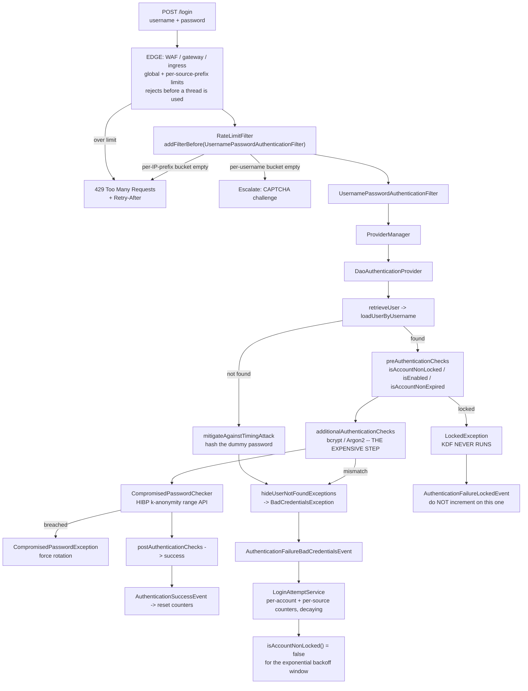
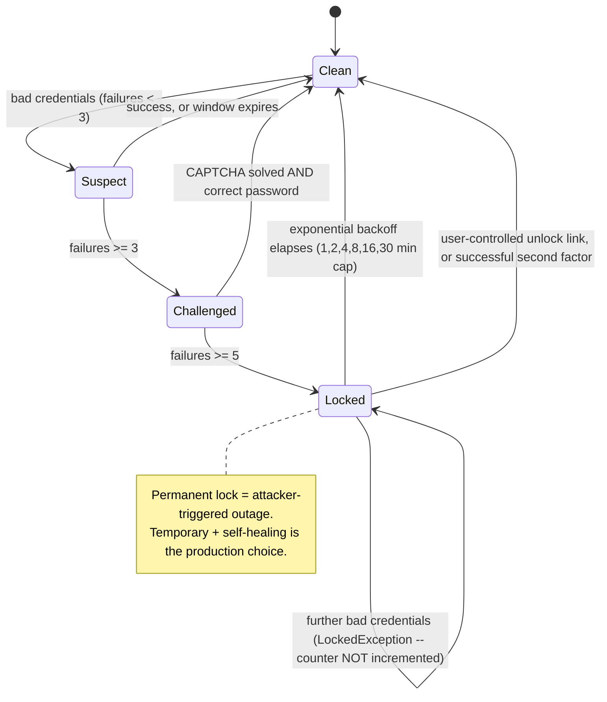

# 12.2 - Brute Force, Lockout, and Rate Limiting

> **Module 12 - Topic 2** - Production Hardening
> Baseline: Spring Security 6.x on Boot 3.x
> New to this? Read **In Plain English** below first, then come back to the Version Matrix.

---

## Version Matrix

| Concern | Spring Security 5.x | **Spring Security 6.x (baseline)** | Spring Security 7.x |
|---|---|---|---|
| Account lockout | no built-in store; `UserDetails.isAccountNonLocked()` + events | **same — you own the counter** | same |
| Breached-password check | nothing built in | **`CompromisedPasswordChecker` + `HaveIBeenPwnedRestApiPasswordChecker` (added 6.3)** | same API, still opt-in |
| Rate limiting | not in the framework | **not in the framework** | not in the framework |
| Timing mitigation for unknown users | `DaoAuthenticationProvider.mitigateAgainstTimingAttack` dummy hash | **same** | same |
| `hideUserNotFoundExceptions` default | `true` | **`true`** | `true` |
| Event publisher bean | `DefaultAuthenticationEventPublisher` auto-configured | **same, from `SecurityAutoConfiguration`** | same |
| Filter servlet API for a custom limiter | `javax.servlet.*` | **`jakarta.servlet.*`** | `jakarta.servlet.*` |
| `DaoAuthenticationProvider` wiring | `new DaoAuthenticationProvider()` + `setUserDetailsService(...)` | **same; a `UserDetailsService` constructor arrives late in 6.x** | constructor form preferred |
| Authorization/authentication metrics | Micrometer by hand | **`spring.security.authentications` observations (6.0+)** | same |

---

## Why This Exists

Password authentication has an irreducible property: **the attacker gets unlimited attempts unless you take them
away.** Every other control in this course — hashing, TLS, headers, CSRF — assumes the credential itself is secret.
Brute force attacks the assumption directly, and they are cheap: a residential proxy pool costs a few dollars an
hour, and breach corpora containing billions of real username and password pairs are free.

There is a second, less obvious reason this topic matters in a Spring interview. File
[`03_M1_T3_Cryptography.md`](03_M1_T3_Cryptography.md) established that a password hash must be deliberately slow,
targeting 250 to 1000 milliseconds. That deliberate slowness is a **denial-of-service amplifier**: an unauthenticated
attacker sending garbage credentials spends nothing and makes you spend half a second of CPU per attempt. So the same
control — a rate limiter in front of the authentication path — defends both the credential and the server, and it has
to sit *before* the key derivation function runs to do either job.

The framing to carry into an interview:

> **Spring Security gives you the integration points for lockout — a flag on `UserDetails`, a dedicated exception,
> and a full event stream — but it ships no counter, no store, and no rate limiter.** That is a deliberate boundary:
> the policy is application-specific and the state has to live somewhere the framework cannot choose for you.

---

## In Plain English

**The one-line version:** A password is only secret if the attacker gets a limited number of guesses, so this file
is about counting failed logins, slowing down or blocking whoever is guessing, and doing it without accidentally
letting an attacker lock out all of your real users.

**An analogy.** Think of a bank card and its four-digit PIN. Four digits is ten thousand combinations, which a
machine would crack instantly — yet the card is safe, and not because the PIN is strong. It is safe because the cash
machine swallows the card after three wrong attempts. The limit on attempts, not the secret, is what makes the
system work.

Now push the analogy further, because this is where the interesting problems are. Suppose a thief does not want your
money but wants to cause chaos: they walk down the street putting three wrong PINs into every card they find, and
now nobody in the neighbourhood can buy groceries. That is lockout turned into a denial-of-service attack, and it is
why permanent locks are a bad design. Suppose instead the thief knows that a lot of people pick `1234`, so they try
that one PIN on ten thousand different cards. No individual card ever reaches three failures, so the machine never
swallows anything. That is **password spraying**, and per-account counting is completely blind to it. And suppose
the thief already bought a list of real card-and-PIN pairs stolen from somewhere else: now every attempt *succeeds*,
and nothing about the attempt looks wrong at all. That is **credential stuffing**.

**How it actually works, step by step.**

Spring Security deliberately ships no lockout counter and no rate limiter. What it ships is the set of places to
plug yours in, because where you store the count, and what your policy is, are decisions only your application can
make.

The plug-in point for lockout is a single method on the user record. When Spring loads a user during login it gets a
`UserDetails` object, which carries the username, the stored password hash, the roles, and four true-or-false status
flags. One of those flags is `isAccountNonLocked()`. Return `false` and Spring throws a `LockedException`, produces
the standard "user account is locked" message, and fires an event — all without you writing any interception code.
The valuable detail is the *order*: that flag is checked before the stored password is compared, so a locked account
never pays the cost of the password check.

To know when to count, you listen to events. Spring publishes an application event for every authentication outcome:
`AuthenticationFailureBadCredentialsEvent` when a password is wrong, `AuthenticationSuccessEvent` when a login
works, and separate events for locked, disabled and expired accounts. You write a small listener that increments a
counter on the bad-credentials event and clears it on success. Two traps live here. Failing to log into an
already-locked account also produces a failure event, so a listener that counts *every* failure will keep extending
the lock and the legitimate owner never gets back in. And "no such username" and "wrong password" deliberately
produce the *same* event, so you cannot use the event stream to learn whether a user exists.

Rate limiting is the second half. It means refusing to process more than N requests in a given period for a given
key. The key matters more than the algorithm: counting per IP address misses distributed attacks and unfairly
punishes a whole office sharing one address, while counting per submitted username misses spraying across many
accounts. The production answer is several counters at once — per account, per source, and one global ceiling on the
login endpoint — with the most specific consulted first.

There is one placement rule that is easy to get wrong and expensive to get wrong. Password hashing is *designed* to
be slow, taking a few hundred milliseconds on purpose. That means every junk login attempt costs the attacker one
cheap HTTP request and costs you half a second of processor time. If your rate limiter runs after Spring has already
started checking the password, you have paid the bill before refusing. The limiter must be installed *before*
`UsernamePasswordAuthenticationFilter` in the chain.

Finally, two controls that are about information rather than counting. **Uniform responses** mean an unknown
username and a wrong password must produce the same message *and* take the same amount of time, otherwise the login
page becomes a tool for discovering who has an account. Spring already does this by hashing a dummy password when
the user does not exist. **Breached-password checking** means refusing passwords that already appear in public
breach data, which is the only control that genuinely helps against credential stuffing, because it removes the
credential from the attacker's list rather than slowing the attacker down.

**Why should a beginner care?** Without a limit on attempts, every weak password in your database is effectively
public; an attacker with a cheap script will find them overnight and your logs will show nothing but ordinary login
traffic. Get the limit wrong in the other direction and you have built a way for anyone to lock your whole customer
base out of their accounts with no credentials at all. And the quiet version of the problem is availability: a few
hundred fake login attempts per second can pin your processors at one hundred percent purely because password
hashing is supposed to be slow.

**Words you will meet in this file**

| Term | In plain words |
|---|---|
| Brute force | Trying many passwords against one account until one works. |
| Password spraying | Trying one very common password against thousands of accounts, so no single account looks attacked. |
| Credential stuffing | Replaying username and password pairs stolen from some other site, where most attempts actually succeed. |
| User enumeration | Working out which usernames exist on your system, usually as preparation for one of the attacks above. |
| Account lockout | Temporarily refusing all logins for an account after too many failures. |
| `UserDetails` | The object Spring loads to represent a user: name, password hash, roles, and status flags. |
| `isAccountNonLocked()` | The flag on that object that means "this account is not currently locked". Return false to lock. |
| `LockedException` | The specific error Spring raises when that flag is false. |
| Authentication event | A notification Spring publishes after each login attempt, which your code can listen to. |
| `AuthenticationSuccessEvent` | The event that always fires on a successful login. The right place to reset counters. |
| Rate limiting | Allowing only so many requests per period for a given key, and refusing the rest. |
| Token bucket | A rate-limiting scheme with a refillable allowance, permitting short bursts but a fixed long-run rate. |
| Fixed and sliding window | Two simpler rate-limiting schemes. Fixed windows allow a double burst across the boundary. |
| Bucket4j | The standard Java rate-limiting library, able to share one limit across instances via Redis. |
| KDF (key derivation function) | The deliberately slow password-hashing algorithm, such as bcrypt or Argon2. |
| Timing attack | Learning a secret from how long a response takes rather than what it says. |
| `hideUserNotFoundExceptions` | The Spring setting, on by default, that makes "no such user" indistinguishable from "wrong password". |
| `CompromisedPasswordChecker` | The Spring hook that rejects passwords known to appear in public breach data. |
| k-anonymity | Sending only the first five characters of a password's hash to a breach service, so it cannot tell which password you asked about. |
| CAPTCHA escalation | Adding a human challenge after several failures instead of blocking outright. |
| 429 Too Many Requests | The HTTP status code meaning "you are over the limit", usually sent with a `Retry-After` header. |

**If you remember only one thing:** limit the number of attempts rather than trusting the password, key the limit on
more than just the IP address, and make sure the limit is applied before the expensive password hashing runs.

---

## Core Concepts

### 1. The Threat Taxonomy

**In simple terms:** Four different attacks get lumped together under "brute force", and telling them apart matters
because the defence that stops one of them does nothing at all against the others.

These four attacks are constantly conflated, and the distinction is the whole reason per-account lockout is not a
complete answer.

| Attack | Shape | What per-account lockout does | Detection signal |
|---|---|---|---|
| **Password brute force** | Many passwords against **one** account | Stops it — this is the one case lockout was designed for | Many failures for one username |
| **Password spraying** | **One** common password (`Winter2026!`) against **many** accounts | **Nothing.** Each account sees one or two failures, far under any threshold | Many *distinct usernames* failing from one source, in a short window |
| **Credential stuffing** | Breached username/password **pairs** replayed | Nothing, and worse — most attempts *succeed* | Distributed sources, high success rate, logins from new devices and geographies |
| **User enumeration** | Probing which usernames exist, before the real attack | Nothing; it is reconnaissance, not authentication | Attempts against a high proportion of non-existent usernames |

Two consequences worth stating plainly.

**Password spraying is invisible to account-scoped counters.** An attacker with a list of ten thousand usernames and
three popular passwords makes thirty thousand attempts and never exceeds two failures per account. Every per-account
threshold in the industry is set at five or ten. You need a counter keyed by **source** (and a global counter) to see
it at all: "one IP address produced failures against 400 distinct usernames in two minutes" is the signal, and no
per-account view will ever produce it.

**Credential stuffing is the hardest, because every individual attempt looks like a legitimate login.** The
username exists, the password is correct, the request is well-formed. Nothing in the authentication path is anomalous
— the anomaly is contextual: an unfamiliar device, a new country, an impossible travel velocity, an unusual time of
day, or a distributed pattern of first-time-successful logins across many accounts at once. That is why the real
defences are multi-factor authentication, breached-password rejection, and risk-based escalation rather than
counting. Rate limiting only raises the attacker's cost per identity tried.

### 2. Account Lockout Done Properly

**In simple terms:** Instead of bolting on your own blocking code, you flip the "account is locked" flag that Spring
already understands, so the whole framework behaves consistently and the lock is checked before the slow password
comparison runs.

The wrong implementation is a servlet filter that inspects `POST /login`, counts failures in a map, and returns
`429`. It duplicates framework machinery, bypasses `AuthenticationManager`, does not apply to Basic authentication,
remember-me, or a second filter chain, and it is invisible to every audit listener.

The right implementation uses two things Spring Security already has.

**First, `UserDetails.isAccountNonLocked()`.** This is one of four status flags on the contract:

```java
// org.springframework.security.core.userdetails.UserDetails
public interface UserDetails extends Serializable {
    Collection<? extends GrantedAuthority> getAuthorities();
    String getPassword();
    String getUsername();
    default boolean isAccountNonExpired()     { return true; }
    default boolean isAccountNonLocked()      { return true; }   // <-- lockout lives here
    default boolean isCredentialsNonExpired() { return true; }
    default boolean isEnabled()               { return true; }
}
```

**Second, the checks that read it.** `AbstractUserDetailsAuthenticationProvider` runs a `UserDetailsChecker` before
and after the password comparison:

```java
// AbstractUserDetailsAuthenticationProvider.DefaultPreAuthenticationChecks (simplified)
public void check(UserDetails user) {
    if (!user.isAccountNonLocked()) {
        throw new LockedException(this.messages.getMessage(
            "AbstractUserDetailsAuthenticationProvider.locked", "User account is locked"));
    }
    if (!user.isEnabled())            { throw new DisabledException(...); }
    if (!user.isAccountNonExpired())  { throw new AccountExpiredException(...); }
}
// DefaultPostAuthenticationChecks: !isCredentialsNonExpired() -> CredentialsExpiredException
```

Returning `false` from `isAccountNonLocked()` therefore produces a `LockedException`, which flows through
`ProviderManager`, becomes an `AuthenticationFailureLockedEvent`, reaches your
`AuthenticationFailureHandler`, and is rendered by the standard message bundle. You have integrated with the
framework instead of bolting onto it.

There is a performance and security bonus that is easy to miss and excellent interview material: **the lock check
runs before the password comparison.** Look at the order in `authenticate`:

```java
// AbstractUserDetailsAuthenticationProvider.authenticate (simplified)
UserDetails user = retrieveUser(username, (UsernamePasswordAuthenticationToken) authentication);
this.preAuthenticationChecks.check(user);                 // locked / disabled / expired
additionalAuthenticationChecks(user, authentication);     // <-- bcrypt runs HERE
this.postAuthenticationChecks.check(user);                // credentials expired
```

So a locked account never reaches the key derivation function. Lockout is simultaneously a credential control and a
CPU control.

### 3. Consuming the Authentication Event Stream

**In simple terms:** Spring announces the outcome of every login attempt, so you can count failures and clear the
count on success by listening rather than by intercepting requests yourself.

You need to know *when* to increment and reset the counter, and Spring Security publishes exactly that.
`ProviderManager` holds an `AuthenticationEventPublisher`; Boot auto-configures
`DefaultAuthenticationEventPublisher` as a bean in `SecurityAutoConfiguration`, so the events flow with no
configuration at all.

```java
// org.springframework.security.authentication.DefaultAuthenticationEventPublisher (constructor, abridged)
addMapping(BadCredentialsException.class.getName(),      AuthenticationFailureBadCredentialsEvent.class);
addMapping(UsernameNotFoundException.class.getName(),    AuthenticationFailureBadCredentialsEvent.class);
addMapping(AccountExpiredException.class.getName(),      AuthenticationFailureExpiredEvent.class);
addMapping(ProviderNotFoundException.class.getName(),    AuthenticationFailureProviderNotFoundEvent.class);
addMapping(DisabledException.class.getName(),            AuthenticationFailureDisabledEvent.class);
addMapping(LockedException.class.getName(),              AuthenticationFailureLockedEvent.class);
addMapping(CredentialsExpiredException.class.getName(),  AuthenticationFailureCredentialsExpiredEvent.class);
addMapping(AuthenticationServiceException.class.getName(), AuthenticationFailureServiceExceptionEvent.class);
```

Three details that decide whether your lockout logic is correct:

1. **`UsernameNotFoundException` and `BadCredentialsException` map to the same event.** Combined with
   `hideUserNotFoundExceptions = true` (the default), which converts the former into the latter *inside*
   `AbstractUserDetailsAuthenticationProvider`, you **cannot distinguish "no such user" from "wrong password" from
   the event stream.** That is deliberate and good — it is the same anti-enumeration decision described in section 6
   — but it means a per-account counter cannot be keyed on users who do not exist, so spraying against invented
   usernames is only visible to a source-keyed counter.
2. **A locked account still emits a failure event** (`AuthenticationFailureLockedEvent`). A naive listener that
   increments on *any* `AbstractAuthenticationFailureEvent` will keep extending the lock every time the legitimate
   owner tries to log in, turning a fifteen-minute lock into a permanent one. Listen for
   `AuthenticationFailureBadCredentialsEvent` specifically.
3. **`AuthenticationSuccessEvent` comes from `ProviderManager`; `InteractiveAuthenticationSuccessEvent` comes from
   `AbstractAuthenticationProcessingFilter.successfulAuthentication`.** A form login produces both. A Basic
   authentication or per-request token validation produces only the first. Reset the counter on
   `AuthenticationSuccessEvent`, because that is the one that always fires.

```java
@Component
class LoginAttemptListener {
    @EventListener
    void onFailure(AuthenticationFailureBadCredentialsEvent event) { /* increment */ }

    @EventListener
    void onSuccess(AuthenticationSuccessEvent event) { /* reset */ }
}
```

If you need to intercept publication itself rather than observe it — to enrich every event with a correlation
identifier, or to suppress a category — implement `AuthenticationEventPublisher` and declare it as a bean, which
replaces the default because the auto-configuration is `@ConditionalOnMissingBean`.

### 4. The Denial-of-Service Problem With Lockout

**In simple terms:** A lock that anyone can trigger with wrong passwords is a weapon, because an attacker with only
a list of usernames can lock out every customer you have, so locks need to expire by themselves.

Lockout converts a confidentiality risk into an availability risk, and an attacker will happily make that trade on
your behalf.

If your policy is "five failures locks the account permanently until an administrator intervenes", then an attacker
with a username list needs five deliberately wrong passwords per account to **lock out your entire user base**. It
costs them nothing, requires no valid credential, and generates a support queue you cannot drain. This has been used
as a targeted attack — lock one executive out before a deadline — and as a mass outage.

The mitigations, in the order I would apply them:

| Mitigation | Mechanism | Trade-off |
|---|---|---|
| **Temporary, exponential lockout** | 1 min, 2, 4, 8, 16, capped at 30 min, counter decaying after a quiet period | Does not stop a patient attacker, but makes brute force uneconomic while self-healing for real users |
| **Lock the source, not the account** | Per-IP or per-ASN throttling and blocking | Shared NAT means collateral damage; a botnet sidesteps it |
| **CAPTCHA escalation** | After N failures, require a challenge instead of refusing | Keeps the account usable; adds a third-party dependency and accessibility burden |
| **Unlock channels the user controls** | Emailed unlock link, or unlock on successful multi-factor authentication | Moves the cost to the account owner, not the help desk |
| **Multi-factor authentication** | A stolen or guessed password stops being sufficient | The actual fix; everything above is compensating control |

Two subtleties. **Do not reveal the lock state to the caller.** If a locked account returns "Account temporarily
locked" and an unknown one returns "Invalid credentials", you have built an oracle: the attacker learns which
usernames exist by locking them and reading the difference. Return the same message and log the real reason
server-side. **Count in a decaying window rather than for all time.** A counter that only resets on success means a
user who mistypes twice a month for a year eventually locks out.

### 5. Rate Limiting: Where, How, and Keyed By What

**In simple terms:** Capping how many attempts are allowed per period is only as good as the thing you count them
against, so this section covers where the cap belongs, how the counting works, and why one counter is never enough.

**Where.** At the edge first: a WAF, API gateway, ingress rate-limit annotation, or CDN rule. Three reasons, and they
are decisive. The edge rejects the request before it consumes a connection, a thread, a database lookup, or a
key-derivation cycle in your JVM. It sees all instances, so one shared limit rather than N independent ones. And it
stays up when the application is already saturated, which is exactly when you need it. Application-level limiting is
a **fallback and a second layer**, valuable because it can key on things the edge cannot see — the submitted username,
the tenant, the authenticated principal — but it should never be the only layer.

**How.** Three algorithms you should be able to compare:

| Algorithm | State | Behaviour | Weakness |
|---|---|---|---|
| **Fixed window** | one counter per window | 100 per minute, reset on the minute boundary | Boundary burst: 100 at 11:59:59 and 100 at 12:00:00 is 200 in one second |
| **Sliding window** | timestamps, or weighted adjacent windows | Smooth, accurate | Exact form stores one entry per request, so memory grows with traffic |
| **Token bucket** | `tokens`, `lastRefill` | Capacity plus a refill rate; allows a controlled burst then settles to the rate | Needs care to make the refill atomic under concurrency |

Token bucket is the usual production choice because it models real traffic — a legitimate user does burst — while
bounding the sustained rate, and its state is two numbers per key rather than a list. Bucket4j is the standard Java
implementation and supports distributed buckets over Redis, Hazelcast, Infinispan and JDBC through a `ProxyManager`
that performs an atomic compare-and-swap on the bucket state, so every instance shares one limit.

**Keyed by what.** This is the question that separates a working limiter from a decorative one.

- **By source IP alone.** Breaks in two directions. Corporate NAT and carrier-grade NAT put thousands of legitimate
  users behind one address, so a tight limit locks out an entire office or mobile network. Meanwhile IPv6 gives an
  attacker a `/64` — eighteen quintillion addresses — so a per-address limit is trivially evaded. For IPv6 you must
  bucket by prefix (`/64`, sometimes `/48`), not by address. And the value is only trustworthy if the edge
  overwrites `X-Forwarded-For`; as established in file 36, otherwise the key is attacker-chosen and the limiter is
  bypassed by rotating a header.
- **By account (submitted username).** Catches distributed brute force against one account, which is what IP keying
  misses. But it is attacker-controllable input, so normalise it (trim, lower-case) or an attacker cycles
  `Alice`, `alice`, `ALICE ` to get three buckets; and never let it create unbounded keys, or the limiter itself
  becomes a memory-exhaustion vector.
- **Globally, on the login endpoint.** A blunt circuit breaker. If unauthenticated login attempts across the whole
  system exceed a level you have never legitimately seen, something is wrong and shedding load is correct.
- **Both, plus global.** The real answer: three buckets consulted per request, with the most specific one first.
  Different limits per tier — generous per account (a real user retries), tighter per source prefix, and a global
  ceiling.

### 6. The Key-Derivation Denial-of-Service Vector

**In simple terms:** Password hashing is slow on purpose, which means every junk login attempt is free for the
attacker and expensive for you, so the limiter has to reject the request before the hashing starts.

File 03 established that bcrypt at cost 12 or Argon2id with 16 MB of memory is *supposed* to take hundreds of
milliseconds. Now consider an unauthenticated attacker posting garbage credentials:

- Each attempt costs them one HTTP request and nothing else.
- Each attempt costs you 250 to 500 milliseconds of a CPU core, or with Argon2, 16 MB of transient heap.
- A few hundred concurrent attempts saturate your CPU, or exhaust the container memory limit and take the pod down.

This is not theoretical, and it is worse than an ordinary flood because you cannot fix it by making the hash faster —
that would weaken the credential. Four mitigations:

1. **Rate limit before the KDF runs.** Concretely, in Spring, that means the limiter filter must execute *before*
   `UsernamePasswordAuthenticationFilter`, because the moment that filter calls `AuthenticationManager` the hash is
   already committed: `http.addFilterBefore(rateLimitFilter, UsernamePasswordAuthenticationFilter.class)`. Placing
   it after is the classic mistake — the limiter returns `429` having already paid for the hash.
2. **Cap the submitted password length.** bcrypt truncates past 72 bytes anyway, but Argon2 and PBKDF2 do not: a one
   megabyte password field turns one request into seconds of work. Reject anything over a few hundred characters at
   the binding layer, and note that this is a *denial-of-service* control, not a password policy.
3. **Do not skip the hash for unknown users.** Tempting, and it creates the timing oracle described next.
   `DaoAuthenticationProvider` deliberately hashes a dummy value instead. The right place to shed load is the
   limiter, not a conditional hash.
4. **Authenticate once, then use a session or token.** This is the strongest argument against HTTP Basic for user
   traffic, from file 01: Basic re-runs the KDF on every single request, so normal traffic looks like the attack.

### 7. Timing-Based Enumeration and the Uniform-Response Rule

**In simple terms:** If a wrong username answers faster than a wrong password, the login page quietly tells an
attacker who has an account here, so every branch must return the same message in roughly the same time.

If an unknown username returns in 3 milliseconds (no user found, no hash computed) and a known one returns in 300
milliseconds (hash computed and rejected), the response time *is* a user database. Spring Security closes this in
`DaoAuthenticationProvider`:

```java
// org.springframework.security.authentication.dao.DaoAuthenticationProvider (simplified)
private static final String USER_NOT_FOUND_PASSWORD = "userNotFoundPassword";
private volatile String userNotFoundEncodedPassword;

@Override
protected final UserDetails retrieveUser(String username, UsernamePasswordAuthenticationToken authentication) {
    prepareTimingAttackProtection();                       // encode the dummy once, lazily
    try {
        UserDetails loadedUser = getUserDetailsService().loadUserByUsername(username);
        if (loadedUser == null) { throw new InternalAuthenticationServiceException(...); }
        return loadedUser;
    }
    catch (UsernameNotFoundException ex) {
        mitigateAgainstTimingAttack(authentication);       // burn the same CPU as a real check
        throw ex;
    }
}

private void mitigateAgainstTimingAttack(UsernamePasswordAuthenticationToken authentication) {
    if (authentication.getCredentials() != null) {
        String presentedPassword = authentication.getCredentials().toString();
        this.passwordEncoder.matches(presentedPassword, this.userNotFoundEncodedPassword);
    }
}
```

The paired control is `hideUserNotFoundExceptions`, `true` by default, which rewrites `UsernameNotFoundException` as
`BadCredentialsException` so the *response* is identical too. Both halves are needed: identical messages with
different timing still leaks, and identical timing with different messages leaks more loudly.

Authentication is only one of four enumeration surfaces, and the other three are usually wide open:

| Surface | The leak | Correct uniform behaviour |
|---|---|---|
| **Login** | Different message or timing for unknown user | One message, one timing — Spring's defaults, left alone |
| **Registration** | "That email is already registered" | Accept the submission, always respond "check your inbox", and send either a verification mail or a "someone tried to register with your address" mail |
| **Password reset** | "No account with that email" | Always respond "if that address exists we have sent a link", always take the same time, and send nothing for unknown addresses |
| **Error and validation detail** | A `404` versus `403`, a stack trace, or a distinguishable validation error | Identical status and body; log the real reason with a correlation identifier |

The reset flow has a second trap: if you send the email synchronously, the unknown-address branch returns
noticeably faster. Enqueue the send and return immediately in both branches.

There is a real usability cost here, and a good answer acknowledges it. Uniform registration responses confuse users
who genuinely forgot they had an account, and support cannot tell them why. That is the accepted trade-off for a
public service; for an internal tool where the user directory is not secret, it is reasonable to relax it
deliberately and write the decision down.

### 8. Breached-Password Checks and Risk-Based Escalation

**In simple terms:** Refusing passwords that already appear in public breach lists removes the attacker's ammunition
instead of merely slowing them down, and it can be checked without ever sending the password anywhere.

Rate limiting raises the attacker's cost. Rejecting known-breached passwords removes the credential from the attack
corpus entirely, which is the only control that actually helps against credential stuffing.

Have I Been Pwned exposes this without you sending the password anywhere, using **k-anonymity**: SHA-1 the password,
send only the first five hex characters of the digest, and receive every suffix sharing that prefix along with a
breach count. Roughly eight hundred hashes come back per prefix, so the service cannot tell which one you asked
about, and the password never leaves your process.

```
SHA-1("P@ssw0rd")  = 21BD12DC183F740EE76F27B78EB39C8AD972A757
GET https://api.pwnedpasswords.com/range/21BD1
-> 2ABBF4E81F2F8B8AA4F2A18CD0A1E67E9B4:12
   2DC183F740EE76F27B78EB39C8AD972A757:83988      <-- our suffix, seen 83,988 times
   ...
```

Spring Security 6.3 made this first-class:

```java
// org.springframework.security.authentication.password
public interface CompromisedPasswordChecker {
    CompromisedPasswordDecision check(String password);
}
// Implementation: HaveIBeenPwnedRestApiPasswordChecker
// Declaring one as a @Bean wires it into DaoAuthenticationProvider, which throws
// CompromisedPasswordException (extends AccountStatusException) AFTER the password matches.
```

Note *when* it runs: after a successful password comparison. So the login-time check answers "this user's correct
password is in a breach corpus, force a rotation", which is a remediation flow, not a rejection. The prevention flow
is calling the same checker at **registration and password-change** time, where it stops the weak credential ever
being stored. Do both, and treat the network call carefully: it is an external dependency on your login path, so
give it a short timeout and decide explicitly whether a failure means allow or deny. I would fail **open** at login
(do not lock users out because a third party is down) and fail **closed** at registration (refuse to store a
password you could not vet).

Risk-based escalation is the umbrella these controls sit under: instead of one binary decision, score each attempt
on device familiarity, source reputation, geographic plausibility, time of day, and recent failure history, and
escalate proportionally — allow, then challenge with a CAPTCHA, then require a second factor, then refuse. CAPTCHA
specifically should be an **escalation, not a gate**: shown after N failures or on an elevated score, verified
server-side against the provider (never trust a client-side score), and never the only control, because solving
services are cheap.

---

## Architecture





---

## Working Code

```java
package com.example.bruteforce;

import java.time.Duration;
import java.time.Instant;
import java.util.concurrent.TimeUnit;

import com.github.benmanes.caffeine.cache.Cache;
import com.github.benmanes.caffeine.cache.Caffeine;
import org.springframework.stereotype.Service;

/**
 * Failed-attempt store with exponential, self-healing lockout.
 *
 * Single-instance version for clarity: swap the Caffeine cache for Redis (SETEX / INCR with
 * TTL) in a clustered deployment, otherwise each pod counts independently and the effective
 * threshold is N x pods.
 */
@Service
public class LoginAttemptService {

    private static final int CHALLENGE_THRESHOLD = 3;
    private static final int LOCK_THRESHOLD = 5;
    private static final Duration MAX_LOCK = Duration.ofMinutes(30);
    /** Failures decay after a quiet period so an occasional typo never accumulates. */
    private static final Duration WINDOW = Duration.ofHours(1);

    private record Attempts(int count, Instant lockedUntil) {}

    private final Cache<String, Attempts> byAccount =
        Caffeine.newBuilder().expireAfterWrite(WINDOW).maximumSize(200_000).build();
    private final Cache<String, Integer> distinctAccountsPerSource =
        Caffeine.newBuilder().expireAfterWrite(5, TimeUnit.MINUTES).maximumSize(200_000).build();

    /** Called from the AuthenticationFailureBadCredentialsEvent listener only. */
    public void recordFailure(String username, String sourceKey) {
        String key = normalise(username);
        Attempts previous = this.byAccount.getIfPresent(key);
        int count = (previous == null ? 0 : previous.count()) + 1;
        Instant lockedUntil = count >= LOCK_THRESHOLD ? Instant.now().plus(backoff(count)) : null;
        this.byAccount.put(key, new Attempts(count, lockedUntil));

        // Spraying signal: one source failing against many DIFFERENT accounts.
        this.distinctAccountsPerSource.asMap()
            .merge(sourceKey, 1, Integer::sum);
    }

    public void recordSuccess(String username) {
        this.byAccount.invalidate(normalise(username));
    }

    /** Read by the UserDetailsService to drive UserDetails.isAccountNonLocked(). */
    public boolean isLocked(String username) {
        Attempts attempts = this.byAccount.getIfPresent(normalise(username));
        return attempts != null && attempts.lockedUntil() != null
            && attempts.lockedUntil().isAfter(Instant.now());
    }

    public boolean requiresCaptcha(String username) {
        Attempts attempts = this.byAccount.getIfPresent(normalise(username));
        return attempts != null && attempts.count() >= CHALLENGE_THRESHOLD;
    }

    public int distinctAccountFailuresFrom(String sourceKey) {
        Integer value = this.distinctAccountsPerSource.getIfPresent(sourceKey);
        return value == null ? 0 : value;
    }

    /** 1, 2, 4, 8, 16 minutes, capped at 30. Temporary, so an attacker cannot cause an outage. */
    private Duration backoff(int failures) {
        long minutes = 1L << Math.min(failures - LOCK_THRESHOLD, 5);
        Duration candidate = Duration.ofMinutes(minutes);
        return candidate.compareTo(MAX_LOCK) > 0 ? MAX_LOCK : candidate;
    }

    /** Without normalisation an attacker cycles Alice / alice / ALICE for three buckets. */
    private String normalise(String username) {
        return username == null ? "" : username.trim().toLowerCase();
    }
}
```

```java
package com.example.bruteforce;

import org.slf4j.Logger;
import org.slf4j.LoggerFactory;
import org.springframework.context.event.EventListener;
import org.springframework.security.authentication.event.AuthenticationFailureBadCredentialsEvent;
import org.springframework.security.authentication.event.AuthenticationFailureLockedEvent;
import org.springframework.security.authentication.event.AuthenticationSuccessEvent;
import org.springframework.security.web.authentication.WebAuthenticationDetails;
import org.springframework.stereotype.Component;

@Component
public class LoginAttemptListener {

    private static final Logger log = LoggerFactory.getLogger(LoginAttemptListener.class);

    private final LoginAttemptService attempts;

    public LoginAttemptListener(LoginAttemptService attempts) {
        this.attempts = attempts;
    }

    /**
     * ONLY bad credentials. hideUserNotFoundExceptions=true means an unknown username also
     * arrives here, which is intentional: we must not distinguish the two cases.
     */
    @EventListener
    public void onBadCredentials(AuthenticationFailureBadCredentialsEvent event) {
        String username = event.getAuthentication().getName();
        String source = sourceOf(event);
        this.attempts.recordFailure(username, source);
        // Never log event.getAuthentication().getCredentials() -- that is the password.
        log.warn("auth_failure username={} source={} distinct_accounts_from_source={}",
                 username, source, this.attempts.distinctAccountFailuresFrom(source));
    }

    /**
     * A locked account keeps producing failure events. Incrementing here would extend the
     * lock every time the legitimate owner retried, making a temporary lock permanent.
     */
    @EventListener
    public void onLocked(AuthenticationFailureLockedEvent event) {
        log.warn("auth_locked_attempt username={}", event.getAuthentication().getName());
    }

    /** ProviderManager publishes this for every mechanism; the Interactive variant only for filters. */
    @EventListener
    public void onSuccess(AuthenticationSuccessEvent event) {
        this.attempts.recordSuccess(event.getAuthentication().getName());
    }

    private String sourceOf(AuthenticationFailureBadCredentialsEvent event) {
        Object details = event.getAuthentication().getDetails();
        if (details instanceof WebAuthenticationDetails web) {
            return web.getRemoteAddress();   // truthful ONLY if the edge overwrites X-Forwarded-For
        }
        return "unknown";
    }
}
```

```java
package com.example.bruteforce;

import org.springframework.security.core.userdetails.User;
import org.springframework.security.core.userdetails.UserDetails;
import org.springframework.security.core.userdetails.UserDetailsService;
import org.springframework.security.core.userdetails.UsernameNotFoundException;
import org.springframework.stereotype.Service;

/**
 * The lock decision is expressed through the framework contract, so it produces a
 * LockedException, an AuthenticationFailureLockedEvent, and the standard message -- and it is
 * evaluated in preAuthenticationChecks, BEFORE the expensive password hash runs.
 */
@Service
public class LockAwareUserDetailsService implements UserDetailsService {

    private final UserRepository users;
    private final LoginAttemptService attempts;

    public LockAwareUserDetailsService(UserRepository users, LoginAttemptService attempts) {
        this.users = users;
        this.attempts = attempts;
    }

    @Override
    public UserDetails loadUserByUsername(String username) throws UsernameNotFoundException {
        UserAccount account = this.users.findByUsername(username)
            .orElseThrow(() -> new UsernameNotFoundException("not found"));
        return User.withUsername(account.username())
                   .password(account.passwordHash())
                   .authorities(account.authorities())
                   .accountLocked(this.attempts.isLocked(username))   // <-- the integration point
                   .disabled(!account.enabled())
                   .build();
    }
}
```

```java
package com.example.bruteforce;

import java.io.IOException;
import java.time.Duration;
import java.util.function.Supplier;

import io.github.bucket4j.Bandwidth;
import io.github.bucket4j.Bucket;
import jakarta.servlet.FilterChain;
import jakarta.servlet.ServletException;
import jakarta.servlet.http.HttpServletRequest;
import jakarta.servlet.http.HttpServletResponse;
import org.springframework.http.HttpHeaders;
import org.springframework.http.HttpStatus;
import org.springframework.http.MediaType;
import org.springframework.security.web.util.matcher.AntPathRequestMatcher;
import org.springframework.security.web.util.matcher.RequestMatcher;
import org.springframework.web.filter.OncePerRequestFilter;

/**
 * Registered with addFilterBefore(..., UsernamePasswordAuthenticationFilter.class) so that a
 * rejected request never reaches AuthenticationManager and therefore never pays for bcrypt.
 *
 * Three buckets are consulted: per source prefix, per submitted username, and a global
 * ceiling. In a cluster, replace the local Bucket with a Bucket4j ProxyManager backed by
 * Redis so all instances share one limit.
 */
public class LoginRateLimitFilter extends OncePerRequestFilter {

    private static final RequestMatcher LOGIN = new AntPathRequestMatcher("/login", "POST");
    private static final int MAX_PASSWORD_LENGTH = 256;   // DoS control, not a password policy

    private final BucketRegistry buckets;

    public LoginRateLimitFilter(BucketRegistry buckets) {
        this.buckets = buckets;
    }

    @Override
    protected void doFilterInternal(HttpServletRequest request, HttpServletResponse response,
                                    FilterChain chain) throws ServletException, IOException {
        if (!LOGIN.matches(request)) {
            chain.doFilter(request, response);
            return;
        }
        String password = request.getParameter("password");
        if (password != null && password.length() > MAX_PASSWORD_LENGTH) {
            reject(response, HttpStatus.BAD_REQUEST, 0);   // Argon2 on a 1 MB string is seconds
            return;
        }
        String sourceKey = SourceKeys.of(request);                       // IPv6-prefix aware
        String accountKey = normalise(request.getParameter("username"));

        // Most specific first, so a single abusive account does not consume the global budget.
        if (!tryConsume(() -> this.buckets.forAccount(accountKey))
            || !tryConsume(() -> this.buckets.forSource(sourceKey))
            || !tryConsume(this.buckets::global)) {
            reject(response, HttpStatus.TOO_MANY_REQUESTS, 60);
            return;
        }
        chain.doFilter(request, response);
    }

    private boolean tryConsume(Supplier<Bucket> bucket) {
        return bucket.get().tryConsume(1);
    }

    private void reject(HttpServletResponse response, HttpStatus status, int retryAfterSeconds)
            throws IOException {
        response.setStatus(status.value());
        if (retryAfterSeconds > 0) {
            response.setHeader(HttpHeaders.RETRY_AFTER, String.valueOf(retryAfterSeconds));
        }
        response.setContentType(MediaType.APPLICATION_JSON_VALUE);
        // Deliberately uniform: never reveal which bucket was exhausted.
        response.getWriter().write("{\"error\":\"too_many_requests\"}");
    }

    private String normalise(String username) {
        return username == null ? "" : username.trim().toLowerCase();
    }

    /** Bucket4j 8.10+ builder form; earlier releases use Bandwidth.classic(n, Refill.greedy(...)). */
    static Bandwidth perMinute(int capacity, int refill) {
        return Bandwidth.builder()
                        .capacity(capacity)
                        .refillGreedy(refill, Duration.ofMinutes(1))
                        .build();
    }
}
```

```java
package com.example.bruteforce;

import jakarta.servlet.http.HttpServletRequest;

/**
 * The keying rules that make or break an IP-based limiter.
 *
 * IPv4: one address may be a corporate or carrier-grade NAT gateway for thousands of real
 * users, so the per-address limit must be generous and the tight limit must be per account.
 * IPv6: an attacker typically controls a whole /64 (2^64 addresses), so a per-address bucket
 * is free to evade -- bucket by the /64 prefix (the first four hextets) instead.
 */
final class SourceKeys {

    private SourceKeys() {}

    static String of(HttpServletRequest request) {
        // Truthful only when forward-headers-strategy is configured AND the edge overwrites
        // X-Forwarded-For. Reading the header directly here would let the client pick its key.
        String address = request.getRemoteAddr();
        if (address == null || !address.contains(":")) {
            return address;
        }
        String[] parts = address.split(":");
        return String.join(":", java.util.Arrays.copyOf(parts, Math.min(4, parts.length))) + "::/64";
    }
}
```

```java
package com.example.bruteforce;

import org.springframework.context.annotation.Bean;
import org.springframework.context.annotation.Configuration;
import org.springframework.security.authentication.dao.DaoAuthenticationProvider;
import org.springframework.security.authentication.password.CompromisedPasswordChecker;
import org.springframework.security.authentication.password.HaveIBeenPwnedRestApiPasswordChecker;
import org.springframework.security.config.annotation.web.builders.HttpSecurity;
import org.springframework.security.config.annotation.web.configuration.EnableWebSecurity;
import org.springframework.security.core.userdetails.UserDetailsService;
import org.springframework.security.crypto.bcrypt.BCryptPasswordEncoder;
import org.springframework.security.crypto.password.PasswordEncoder;
import org.springframework.security.web.SecurityFilterChain;
import org.springframework.security.web.authentication.UsernamePasswordAuthenticationFilter;

@Configuration
@EnableWebSecurity
public class BruteForceConfig {

    @Bean
    SecurityFilterChain filterChain(HttpSecurity http, BucketRegistry buckets) throws Exception {
        http
            // BEFORE the authentication filter: a 429 must cost us no key-derivation cycles.
            .addFilterBefore(new LoginRateLimitFilter(buckets), UsernamePasswordAuthenticationFilter.class)
            .authorizeHttpRequests(auth -> auth
                .requestMatchers("/login", "/register", "/password/reset").permitAll()
                .anyRequest().authenticated())
            .formLogin(form -> form
                .loginPage("/login")
                // One uniform destination: never "user locked" versus "bad password".
                .failureUrl("/login?error"));
        return http.build();
    }

    @Bean
    PasswordEncoder passwordEncoder() {
        return new BCryptPasswordEncoder(12);          // ~250-400 ms: the DoS amplifier
    }

    /** Spring Security 6.3+: picked up automatically and wired into DaoAuthenticationProvider. */
    @Bean
    CompromisedPasswordChecker compromisedPasswordChecker() {
        return new HaveIBeenPwnedRestApiPasswordChecker();
    }

    @Bean
    DaoAuthenticationProvider authenticationProvider(UserDetailsService users,
                                                     PasswordEncoder encoder,
                                                     CompromisedPasswordChecker checker) {
        DaoAuthenticationProvider provider = new DaoAuthenticationProvider();
        provider.setUserDetailsService(users);
        provider.setPasswordEncoder(encoder);
        provider.setCompromisedPasswordChecker(checker);
        // Leave hideUserNotFoundExceptions at its default true: it is an anti-enumeration control.
        return provider;
    }
}
```

```yaml
spring:
  data:
    redis:
      host: redis
      port: 6379
app:
  brute-force:
    lock-threshold: 5
    challenge-threshold: 3
    max-lock: 30m
    failure-window: 1h
  rate-limit:
    login-per-account-per-minute: 10      # generous: real users retry
    login-per-source-prefix-per-minute: 30
    login-global-per-minute: 600          # circuit breaker, well above observed peak
    breached-password-timeout: 700ms      # fail OPEN at login, CLOSED at registration
management:
  endpoints:
    web:
      exposure:
        include: health,info,prometheus
  metrics:
    tags:
      application: ${spring.application.name}
logging:
  level:
    # Never DEBUG in production: it logs enough to help an attacker calibrate.
    org.springframework.security: INFO
```

```java
package com.example.bruteforce;

import org.junit.jupiter.api.Test;
import org.springframework.beans.factory.annotation.Autowired;
import org.springframework.boot.test.autoconfigure.web.servlet.AutoConfigureMockMvc;
import org.springframework.boot.test.context.SpringBootTest;
import org.springframework.test.web.servlet.MockMvc;

import static org.assertj.core.api.Assertions.assertThat;
import static org.springframework.security.test.web.servlet.request.SecurityMockMvcRequestBuilders.formLogin;
import static org.springframework.test.web.servlet.result.MockMvcResultMatchers.redirectedUrl;
import static org.springframework.test.web.servlet.result.MockMvcResultMatchers.status;

@SpringBootTest
@AutoConfigureMockMvc
class BruteForceProtectionTests {

    @Autowired MockMvc mvc;
    @Autowired LoginAttemptService attempts;

    @Test
    void fiveBadPasswordsLockTheAccountThroughTheUserDetailsFlag() throws Exception {
        for (int i = 0; i < 5; i++) {
            mvc.perform(formLogin().user("alice").password("wrong" + i))
               .andExpect(redirectedUrl("/login?error"));
        }
        assertThat(attempts.isLocked("alice")).isTrue();
        // Even the CORRECT password now fails, and it fails without running bcrypt,
        // because preAuthenticationChecks precedes additionalAuthenticationChecks.
        mvc.perform(formLogin().user("alice").password("correct-password"))
           .andExpect(redirectedUrl("/login?error"));
    }

    @Test
    void lockStateIsNotRevealedToTheCaller() throws Exception {
        for (int i = 0; i < 6; i++) {
            mvc.perform(formLogin().user("carol").password("wrong"));
        }
        // Locked, unknown user, and wrong password must be indistinguishable.
        mvc.perform(formLogin().user("carol").password("wrong"))
           .andExpect(redirectedUrl("/login?error"));
        mvc.perform(formLogin().user("does-not-exist").password("wrong"))
           .andExpect(redirectedUrl("/login?error"));
    }

    @Test
    void sprayingIsVisibleOnlyThroughTheSourceKeyedCounter() {
        for (int i = 0; i < 300; i++) {
            attempts.recordFailure("user" + i, "203.0.113.7");   // one failure each: no lock fires
        }
        assertThat(attempts.isLocked("user7")).isFalse();
        assertThat(attempts.distinctAccountFailuresFrom("203.0.113.7")).isGreaterThan(100);
    }

    @Test
    void rateLimiterRejectsBeforeTheKeyDerivationFunctionRuns() throws Exception {
        long start = System.nanoTime();
        int rejected = 0;
        for (int i = 0; i < 60; i++) {
            if (mvc.perform(formLogin().user("dave").password("wrong"))
                   .andReturn().getResponse().getStatus() == 429) {
                rejected++;
            }
        }
        long elapsedMs = (System.nanoTime() - start) / 1_000_000;
        assertThat(rejected).isPositive();
        // 60 bcrypt-12 hashes would be ~18 s; rejected requests must be far cheaper.
        assertThat(elapsedMs).isLessThan(15_000);
    }

    @Test
    void passwordsLongerThanTheCapAreRejectedWithoutHashing() throws Exception {
        mvc.perform(formLogin().user("erin").password("a".repeat(1_000_000)))
           .andExpect(status().isBadRequest());
    }
}
```

---

## Internals

### The exact order inside `AbstractUserDetailsAuthenticationProvider.authenticate`

```java
// simplified, but the ordering is faithful
String username = determineUsername(authentication);
boolean cacheWasUsed = true;
UserDetails user = this.userCache.getUserFromCache(username);
if (user == null) {
    cacheWasUsed = false;
    try {
        user = retrieveUser(username, (UsernamePasswordAuthenticationToken) authentication);
    }
    catch (UsernameNotFoundException ex) {
        if (this.hideUserNotFoundExceptions) {
            throw new BadCredentialsException(this.messages.getMessage(
                "AbstractUserDetailsAuthenticationProvider.badCredentials", "Bad credentials"));
        }
        throw ex;
    }
}
try {
    this.preAuthenticationChecks.check(user);                  // LOCKED / disabled / expired
    additionalAuthenticationChecks(user, (UsernamePasswordAuthenticationToken) authentication);
}
catch (AuthenticationException ex) {
    if (!cacheWasUsed) { throw ex; }
    // a stale cached user may have caused it; reload once and retry
    cacheWasUsed = false;
    user = retrieveUser(username, (UsernamePasswordAuthenticationToken) authentication);
    this.preAuthenticationChecks.check(user);
    additionalAuthenticationChecks(user, (UsernamePasswordAuthenticationToken) authentication);
}
this.postAuthenticationChecks.check(user);                     // credentials expired
```

Three things to take from this. The lock check genuinely precedes the hash, so lockout is a CPU control as well as a
credential control. `hideUserNotFoundExceptions` is applied at the `retrieveUser` boundary, which is why the
exception the rest of the system sees — and therefore the event that gets published — is `BadCredentialsException`
for both an unknown user and a wrong password. And a `UserCache` is consulted first, which matters for lockout: if
you enable caching, a user cached as unlocked will stay unlocked until eviction, so the lock flag must either be
read fresh or the cache entry invalidated when you lock. This is the most common reason a correct-looking lockout
does not take effect.

### How `ProviderManager` publishes, and why you sometimes see no events

```java
// org.springframework.security.authentication.ProviderManager.authenticate (abridged)
if (result != null) {
    if (this.eraseCredentialsAfterAuthentication && result instanceof CredentialsContainer container) {
        container.eraseCredentials();
    }
    if (parentResult == null) {
        this.eventPublisher.publishAuthenticationSuccess(result);   // only the TOP-level manager
    }
    return result;
}
...
if (parentException == null) {
    prepareException(lastException, authentication);                // -> publishAuthenticationFailure
}
throw lastException;
```

The `parentResult == null` and `parentException == null` guards exist so that a child `ProviderManager` delegating to
a parent does not publish a duplicate event for the same attempt. If you build a nested `AuthenticationManager`
hierarchy by hand and wonder why an event fires once rather than twice, this is why — and conversely, if you replace
the top-level manager with a bare `ProviderManager` constructed without an `ApplicationEventPublisher`, you get no
events at all and your lockout silently stops counting.

Also note `eraseCredentialsAfterAuthentication`, on by default: the raw password is wiped from the token after a
successful authentication. That is why a success listener cannot see the password even if it wanted to, and it is a
reason success events are safer to log than failure events, where `getCredentials()` may still hold the attempted
password.

### Where the compromised-password check sits

```java
// DaoAuthenticationProvider.additionalAuthenticationChecks (simplified, 6.3+)
String presentedPassword = authentication.getCredentials().toString();
if (!this.passwordEncoder.matches(presentedPassword, userDetails.getPassword())) {
    throw new BadCredentialsException(...);                 // wrong password: stop here
}
if (this.compromisedPasswordChecker != null
        && this.compromisedPasswordChecker.check(presentedPassword).isCompromised()) {
    throw new CompromisedPasswordException("The provided password is compromised, "
        + "please change your password");
}
```

The check runs only on a **correct** password, which is the only sensible place — you do not want to send an
attacker's guesses to a third-party service, and the decision you are making is "this valid credential is known to
be breached, force a rotation". `CompromisedPasswordException` extends `AccountStatusException`, so it reaches your
`AuthenticationFailureHandler` as a distinct type and you can redirect to a forced-change flow rather than showing a
generic error.

---

## Configuration Reference

| Option | Effect | Default |
|---|---|---|
| `UserDetails.isAccountNonLocked()` | `false` produces `LockedException` in `preAuthenticationChecks` | `true` |
| `User.withUsername(...).accountLocked(boolean)` | Builder form of the flag | `false` (not locked) |
| `DaoAuthenticationProvider.setHideUserNotFoundExceptions` | Rewrites `UsernameNotFoundException` as `BadCredentialsException` | `true` — **leave it on** |
| `DaoAuthenticationProvider.setUserCache` | Caches `UserDetails`; can mask a fresh lock | `NullUserCache` |
| `DaoAuthenticationProvider.setCompromisedPasswordChecker` | Rejects breached passwords after a successful match (6.3+) | none |
| `CompromisedPasswordChecker` bean | Auto-wired into `DaoAuthenticationProvider` | none |
| `ProviderManager.setAuthenticationEventPublisher` | Replaces the event publisher | `DefaultAuthenticationEventPublisher` (Boot auto-config) |
| `ProviderManager.setEraseCredentialsAfterAuthentication` | Wipes the raw password after success | `true` |
| `AuthenticationEventPublisher` bean | Overrides the Boot default (`@ConditionalOnMissingBean`) | `DefaultAuthenticationEventPublisher` |
| `formLogin().failureUrl(...)` | Uniform failure destination | `/login?error` |
| `formLogin().failureHandler(...)` | Branch on exception type server-side while keeping one response | `SimpleUrlAuthenticationFailureHandler` |
| `http.addFilterBefore(limiter, UsernamePasswordAuthenticationFilter.class)` | Limiter runs before the KDF | - |
| `Bandwidth.builder().capacity(n).refillGreedy(n, Duration)` | Token-bucket limit (Bucket4j 8.10+) | - |
| `server.tomcat.max-http-form-post-size` | Caps the login form body | `2MB` |
| `server.forward-headers-strategy` | Makes `getRemoteAddr()` truthful for source keying | `none` |
| `logging.level.org.springframework.security` | `DEBUG` reveals calibration detail to anyone reading logs | `INFO` |

---

## Production Concerns & Anti-Patterns

**Per-account lockout presented as brute-force protection.** It stops exactly one of the four attacks. Password
spraying stays under every per-account threshold by design, and credential stuffing does not fail at all. If the
only counter you have is account-scoped, you are blind to the two attacks that actually happen at scale.

**Permanent lockout.** An attacker with a username list locks out your entire user base for the cost of five wrong
passwords each, and your help desk cannot drain the queue. Temporary exponential lockout with a decaying counter is
the production choice; permanent locks belong only behind a deliberate, documented policy with a self-service
unlock.

**Incrementing the counter on every failure event.** `AuthenticationFailureLockedEvent` fires while the account is
already locked, so a listener bound to `AbstractAuthenticationFailureEvent` extends the lock every time the real
owner retries. Bind to `AuthenticationFailureBadCredentialsEvent`.

**Counting in a local map behind a load balancer.** With five pods and an in-memory counter, the effective threshold
is twenty-five, and a pod restart forgives everything. Lockout and rate-limit state must be shared — Redis is the
normal answer — and that store becomes a dependency of your login path, so decide in advance whether its failure
means fail-open or fail-closed.

**Rate limiting after the authentication filter.** The `429` is returned having already paid for bcrypt, so the
denial-of-service vector is untouched and you have only protected the credential. Order matters more than the
algorithm.

**Keying a limiter on a header the client controls.** Reading `X-Forwarded-For` directly lets the attacker pick
their own bucket by rotating a value, which makes the limiter decorative. Use `getRemoteAddr()` with
`forward-headers-strategy` configured, and verify at the edge that the header is overwritten — the verification from
file 36 applies verbatim.

**A per-IPv6-address bucket.** An attacker usually has a whole `/64`. Bucket by prefix. Symmetrically, a tight
per-IPv4-address bucket locks out entire offices and mobile carriers behind NAT.

**Unnormalised account keys.** `Alice`, `alice` and `ALICE ` become three buckets and three failure counters unless
you trim and case-fold. Also cap key cardinality, or the limiter store is itself a memory-exhaustion target.

**Disabling `hideUserNotFoundExceptions` for better error messages.** It converts your login form into a user
directory. If product wants friendlier errors, give them a friendlier *uniform* message.

**Enumeration left open on registration and password reset** while login is carefully hardened. These are the easier
targets and they are usually forgotten. Both need a uniform response *and* uniform timing, which means enqueuing the
email rather than sending it inline.

**Treating CAPTCHA as the control.** Solving services are cheap and it punishes legitimate users, particularly those
using assistive technology. Use it as escalation on an elevated risk score, verify it server-side, and never let a
client-supplied score be authoritative.

**No monitoring.** All of this is invisible without the signals in the playbook below. The single most valuable
metric is *distinct usernames failing per source per minute*, because it is the only one that sees spraying.

---

## Debugging Playbook

| Symptom | Likely root cause | Fix |
|---|---|---|
| Lockout never triggers | Listener bound to the wrong event, or no `AuthenticationEventPublisher` on a hand-built `ProviderManager` | Bind to `AuthenticationFailureBadCredentialsEvent`; pass the publisher to `ProviderManager` |
| Lock flag is set in the store but login still succeeds | `UserCache` is returning a stale `UserDetails`, or `loadUserByUsername` does not read the store | Invalidate the cache entry on lock, or read the flag fresh in `loadUserByUsername` |
| A temporary lock became permanent | The counter increments on `AuthenticationFailureLockedEvent` too | Increment only on bad credentials |
| Lockout threshold behaves as `N x pods` | Counter held in a local map or cache | Move the counter to Redis or another shared store |
| Every user suddenly locked out | Spraying, or an attacker walking a username list to cause an outage | Switch to temporary exponential lockout; add source-keyed throttling and CAPTCHA escalation |
| One office cannot log in at all | Per-IP limit applied to a NAT gateway | Raise the per-address limit, key on account as well, and allowlist known corporate egress ranges |
| Attacker throughput unchanged despite limits | Limiter keyed on individual IPv6 addresses, or on a client-controlled header | Bucket by `/64` prefix; key on `getRemoteAddr()` with forwarded headers configured |
| CPU pinned at 100 % during a login flood | Limiter registered after `UsernamePasswordAuthenticationFilter`, so the KDF still runs | `addFilterBefore(limiter, UsernamePasswordAuthenticationFilter.class)`; cap password length |
| Login latency differs between existing and unknown users | A custom `AuthenticationProvider` that skips hashing when the user is absent | Replicate `mitigateAgainstTimingAttack`: hash a dummy value on the not-found path |
| Registration reveals existing accounts | Uniqueness violation surfaced to the client | Always respond "check your inbox"; send an "attempted registration" mail to the existing owner |
| Password reset reveals accounts through timing | Email sent synchronously only on the known-address branch | Enqueue the send; return the same response at the same speed in both branches |
| Valid users rejected with "password is compromised" after upgrading to 6.3+ | A `CompromisedPasswordChecker` bean was added and is auto-wired into `DaoAuthenticationProvider` | Intended; route `CompromisedPasswordException` to a forced-change flow rather than a generic error |
| Login fails for everyone after enabling the breached-password check | The HIBP call is timing out and failing closed | Short timeout, fail open at login, cache negative results, keep fail-closed for registration |
| `429` responses tell an attacker which limit they hit | Distinct bodies or headers per bucket | One uniform body and status; record the specific bucket server-side only |

---

## Interview Q&A

### Q1. Implement account lockout in Spring Security. Then tell me why a filter that counts failures and returns 429 is the wrong design.

<details>
<summary>Show answer</summary>

The framework already has the integration points, so the implementation is small: a failed-attempt store, two event
listeners, and one flag.

The store keeps a decaying count per normalised username plus the time a lock expires. A listener on
`AuthenticationFailureBadCredentialsEvent` increments; a listener on `AuthenticationSuccessEvent` clears. Then
`loadUserByUsername` reads the store and builds the `UserDetails` with `accountLocked(true)` when the lock is
active. That is all — `AbstractUserDetailsAuthenticationProvider.DefaultPreAuthenticationChecks` calls
`isAccountNonLocked()` and throws `LockedException` for you.

The filter approach is wrong for five concrete reasons. It only sees the requests it matches, so Basic
authentication, remember-me, a second `SecurityFilterChain`, and any programmatic `AuthenticationManager` call
bypass it entirely. It duplicates a decision the framework already makes, so the two can disagree. It produces a
non-standard response and a non-standard exception, so your `AuthenticationFailureHandler`, your message bundle and
your audit listeners never see a lock event. It has no access to `UserDetails`, so it cannot combine the lock with
`isEnabled` or expiry. And it usually ends up counting requests rather than *authentication outcomes*, so a
malformed request or a CSRF rejection is counted as a failed login.

**Counter-question: the lock flag is correct in Redis but the user still logs in. What did you miss?**

Almost certainly `UserCache`. `AbstractUserDetailsAuthenticationProvider` consults the cache *before* calling
`retrieveUser`, so if a `UserDetails` was cached while the account was unlocked, `isAccountNonLocked()` is read from
the stale copy and the lock has no effect until eviction. The fix is to invalidate the cache entry at the moment you
lock, or not to cache `UserDetails` at all when the lock flag is dynamic.

The second candidate is that `loadUserByUsername` is not the code path being used — for example a custom
`AuthenticationProvider`, or an OAuth2 or JWT chain where `DaoAuthenticationProvider` is not involved at all. The
status flags only apply where a `UserDetailsChecker` runs, and the way to confirm which is which is to check whether
you see a `LockedException` or a `BadCredentialsException`.

**Counter-question: where exactly in the authentication sequence is the lock evaluated, and why does that placement matter?**

In `preAuthenticationChecks`, which runs after `retrieveUser` and **before** `additionalAuthenticationChecks` — and
`additionalAuthenticationChecks` is where `DaoAuthenticationProvider` calls `passwordEncoder.matches`, the expensive
key-derivation step.

That ordering means a locked account never pays for bcrypt or Argon2. Lockout is therefore doing two jobs: it stops
credential guessing, and it sheds the CPU cost of guesses against accounts already under attack. It is a small
detail that shows you have read the class rather than the blog post, and it connects directly to the
denial-of-service discussion — if you had implemented the lock check *after* the password comparison, you would have
a working lockout with none of the CPU benefit.

**Counter-question: your listener logs the failed username. Is there anything you must be careful not to log?**

Yes, and it is the reason to write the listener by hand rather than logging the whole event. The
`Authentication` on a failure event is the **unauthenticated** token, and `getCredentials()` may still hold the
submitted password. `ProviderManager.eraseCredentialsAfterAuthentication` only erases on *success*, so a failure
event is precisely the case where the raw password is still present.

So a convenient `log.warn("auth failed: {}", event.getAuthentication())` can print a plaintext password into your
log aggregator, where it is indexed, replicated, and retained for a year. And because users mistype their password
by one character, your logs then contain near-misses of real passwords. Log `getName()` and the details, never the
token or the credentials — and as file 38 covers, back that up with a test that greps the captured log output.
</details>

### Q2. Password spraying and credential stuffing are not the same as brute force. Explain the differences and what actually defends against each.

<details>
<summary>Show answer</summary>

**Brute force** is many passwords against one account. It is loud, account-scoped, and the one attack per-account
lockout was designed for. Anything with a threshold stops it.

**Password spraying** inverts the loop: one or two very common passwords against thousands of accounts. The
arithmetic is what matters — with ten thousand usernames and three passwords the attacker makes thirty thousand
attempts while no single account exceeds three failures, so every per-account threshold in the industry (five, ten)
is untouched. Spraying works because in any population of ten thousand users, some will have chosen `Winter2026!`.
The only way to see it is a counter keyed by **source** or a global counter: "one address produced failures against
400 distinct usernames in two minutes" is unmistakable, and no account-scoped view will ever produce that number.
The defences are source-keyed rate limiting, a global anomaly alert on distinct-usernames-failing, and — the real
fix — a password policy that rejects the passwords being sprayed, which is a breached-password check rather than a
composition rule.

**Credential stuffing** is the hardest, because it replays username and password pairs from other companies'
breaches. Every individual attempt looks like a legitimate login: the user exists, the password is correct, the
request is well-formed. Nothing in the authentication path is anomalous. A typical campaign is distributed across
thousands of residential proxies at a low rate per address, precisely to stay under any threshold. What gives it
away is contextual and statistical: an unusual *rate of first-time successful logins* across many accounts at once,
new devices, new geographies, impossible travel, and a success ratio that differs from your baseline. The defences
are multi-factor authentication (which makes the stolen password insufficient), breached-password rejection at
registration and change time (which removes the credential from the corpus), device fingerprinting with step-up
challenges, and monitoring for the aggregate pattern rather than the individual attempt.

**User enumeration** underpins all three: a validated username list makes spraying and stuffing far more efficient,
so closing the enumeration surfaces reduces the effectiveness of the others.

**Counter-question: you said rate limiting does not stop credential stuffing. So is it worth doing?**

Yes, but for a different reason than people assume, and it is worth being precise because overselling it is how
teams end up with a false sense of safety.

Rate limiting does not *stop* stuffing, because the attacker's budget is measured in credential pairs, not in
requests per second, and a botnet can spread a million attempts over a day at one request per address per hour and
never trip anything. What rate limiting does is raise the cost per identity tried and force the attacker into a
shape you can detect: to stay under the limits they must distribute, and distribution needs proxy infrastructure
that costs money and has observable characteristics such as known hosting ranges, absent or odd `User-Agent`
strings, and no cookies.

It also does something more important operationally: it protects *you*. A stuffing campaign at full speed is
indistinguishable from a load test, and without a limiter the first symptom is your login service falling over —
which is an outage caused by an attack that was not even successful.

So the honest framing is: rate limiting is an availability control and a cost multiplier that pushes the attack into
a detectable shape. Multi-factor authentication and breached-password rejection are the controls that make stuffing
*fail*.

**Counter-question: product refuses multi-factor authentication because of conversion impact. What do you propose?**

I would stop arguing for blanket multi-factor authentication and propose **risk-based step-up**, which is usually
what they actually want.

Concretely: no second factor on a recognised device from a plausible location, and a challenge only on an elevated
score — new device, new country, impossible travel, an IP in a hosting range, a login following recent failures, or
a sensitive action such as changing the email address or payment details. In most consumer products that challenges
a small single-digit percentage of logins, which is a conversion cost product can usually accept, and it covers the
stuffing case because a stolen password almost always arrives from an unfamiliar device.

Alongside that I would push three things that cost no conversion at all. Reject breached passwords at registration
and change time using the k-anonymity range API, so the credential never enters the corpus. Notify the user of a
login from a new device, which turns the user into a detector. And offer passkeys as an *option* — they are
phishing-resistant, they remove the password from the equation for users who adopt them, and they typically improve
conversion rather than harming it, which reframes the conversation from cost to benefit.

If product still refuses everything, I would make the residual risk explicit in writing: the expected outcome is
successful account takeovers proportional to password reuse in our user base, and the cost lands on support,
chargebacks, and reputation rather than on the login funnel.
</details>

### Q3. Account lockout can be turned into a denial-of-service attack. Explain the mechanism and how you would design around it.

<details>
<summary>Show answer</summary>

The mechanism is simple enough to be embarrassing. If the policy is "five failed attempts locks the account", then
an attacker who knows or can guess your usernames submits five deliberately wrong passwords per account and locks
out the entire user base. They need no valid credential, no privileged position, and no unusual volume. The cost to
them is five HTTP requests per victim; the cost to you is an outage plus a support queue nobody can drain, because
every unlock requires identity verification.

It is used in two shapes. Targeted: lock out one specific person — an executive before a board meeting, a trader at
market open, an administrator during an incident. And mass: lock everyone, which is a cheap, reliable outage that
looks like an application failure rather than an attack.

The design that avoids it rests on one principle: **the automated response must be temporary and self-healing, and
anything permanent must require a human decision.**

Concretely, I would use exponential temporary lockout — one minute, then two, four, eight, sixteen, capped at
thirty — with the failure counter decaying after a quiet period rather than only on success. That is enough to make
online brute force uneconomic, since it caps an attacker at a handful of guesses per hour per account, while a real
user who mistyped is back in within a minute and never contacts support.

Then I would shift weight off the account and onto the source and the challenge. Source-prefix rate limiting and
reputation handle the volume without touching the account. CAPTCHA escalation after three failures keeps the account
*usable* — the legitimate owner can still get in by solving a challenge, which an automated attacker cannot cheaply
do at scale — instead of refusing them outright. That single change removes most of the denial-of-service value,
because locking someone out is no longer achievable by failing on their behalf.

I would give the user a recovery path they control: an unlock link to their verified email, or immediate unlock on a
successful second factor. And I would keep the lock state invisible in the response, so the attacker cannot confirm
that their denial-of-service worked, which removes the feedback loop.

**Counter-question: temporary lockout means the attacker still gets, say, five guesses an hour forever. Is that acceptable?**

For a password of any reasonable entropy, yes, and the arithmetic is the argument. Five guesses an hour is about
forty-four thousand a year. Against even a mediocre eight-character password that is a negligible fraction of the
keyspace, and against the top-ten-thousand password list it is a real threat — which tells you where the effort
belongs: not in tightening the lockout further, but in making sure the password is not in that list. A
breached-password check at registration does more than any threshold I could choose.

The residual risk is the account whose password is genuinely guessable, and the mitigations there are the ones that
do not depend on counting: reject known-breached and top-list passwords, require a second factor, and alert on
successful logins that follow a long run of failures — because "many failures then a success" is the signature of a
brute force that worked, and it is a far more actionable signal than any individual failure.

I would also say plainly that a permanent lock does not actually solve this. It converts "attacker eventually guesses
a weak password" into "attacker trivially causes an outage", and the second is the more likely event.

**Counter-question: you suggested locking the source instead. What breaks?**

Two things, in opposite directions, and both are why source-only limiting cannot stand alone.

Shared egress. Corporate NAT, university networks, and carrier-grade NAT put hundreds or thousands of legitimate
users behind one address. A limit tight enough to matter locks out an entire office, and because the failures come
from many different real users, it looks exactly like an attack. The mitigations are generous per-address limits
combined with per-account limits so the tight constraint is on the identity rather than the network, allowlisting
known corporate egress ranges, and treating a source block as an escalation to CAPTCHA rather than a refusal.

Address abundance. An IPv6 attacker typically controls a `/64` — eighteen quintillion addresses — so a per-address
bucket is free to evade; you must bucket by prefix. And on IPv4, residential proxy pools give tens of thousands of
addresses for a few dollars an hour, so per-address limits merely set the width of the distribution.

The third problem is that the key is only as trustworthy as the edge. If the proxy does not overwrite
`X-Forwarded-For`, the attacker picks their own bucket by rotating a header value and the limiter is decorative. So:
key on `getRemoteAddr()` with forwarded headers properly configured, bucket IPv6 by prefix, and always combine
source with account and a global ceiling.
</details>

### Q4. Walk me through the ways a Spring application leaks which usernames exist, and what Spring Security already does about it.

<details>
<summary>Show answer</summary>

There are two leaks at the login endpoint and Spring closes both, and then there are three more surfaces that Spring
knows nothing about and which are usually wide open.

**Timing at login.** Without mitigation, an unknown username returns as soon as the database says "no rows" — a few
milliseconds — while a known username costs a full bcrypt or Argon2 verification, hundreds of milliseconds. That
difference is measurable over the internet with a handful of samples and it turns your login form into a user
directory. `DaoAuthenticationProvider` fixes it in `retrieveUser`: it lazily encodes a constant dummy password once,
and on the `UsernameNotFoundException` path calls `mitigateAgainstTimingAttack`, which runs
`passwordEncoder.matches(presentedPassword, userNotFoundEncodedPassword)`. The result is discarded; the point is to
burn the same CPU.

**Message and status at login.** `hideUserNotFoundExceptions` is `true` by default, and
`AbstractUserDetailsAuthenticationProvider` uses it to rewrite `UsernameNotFoundException` as
`BadCredentialsException` at the `retrieveUser` boundary. So both cases produce the same exception, the same message
key, the same event type, and the same redirect. Both halves are necessary: identical messages with different timing
still leaks, and identical timing with different messages leaks more obviously.

The surfaces Spring does not cover:

**Registration.** "That email address is already registered" is a membership oracle with no rate limit and no
credential required. The uniform behaviour is to accept the submission, always respond "check your inbox", and then
branch in the *email*: a verification link to a new address, or a "someone tried to register with your address"
notice to an existing one. The existing owner is informed, the attacker learns nothing.

**Password reset.** "No account found with that email" is the same oracle. Always respond "if that address exists we
have sent a link". The trap is timing again — if you send the email synchronously, the unknown-address branch returns
noticeably faster — so enqueue the send and return immediately in both branches.

**Error and validation detail.** A distinguishable validation error, a `409 Conflict` from a unique constraint, a
`403` where a `404` belongs, or a stack trace naming the constraint. These leak the same fact through a different
channel.

**Counter-question: product says the uniform registration flow generates support tickets. How do you respond?**

I would take it seriously rather than quoting a standard at them, because the cost is real: a user who forgot they
had an account gets no explanation, tries again, and calls support.

First I would check whether the leak actually matters for this product. If the user directory is not secret — an
internal tool, a service where identities are public, a B2B product where email addresses are already on the
website — then enumeration protection is protecting nothing, and I would relax it deliberately, write the decision
down with its reasoning, and spend the effort on lockout and breached-password checks instead. Blanket application
of a control whose threat does not apply is how security loses credibility.

If it does matter — consumer, dating, health, finance, anywhere the mere existence of an account is sensitive — then
I would reduce the support cost without reopening the oracle. Make the confirmation email in the
already-registered branch genuinely helpful: "you already have an account, here is a sign-in link and a reset link",
which resolves the user's problem in the channel the attacker cannot see. Put a prominent "already have an account?"
link next to the form so the common case is self-service. And give support a tool that looks the account up
internally, so the answer exists for humans and not for the endpoint.

**Counter-question: the login endpoint is uniform, but a custom `AuthenticationProvider` was added for a legacy directory. What would you check?**

Whether it reintroduces both leaks, because a hand-written provider almost always does.

Specifically: does it hash on the not-found path? The natural implementation returns early when the directory has no
such user, which restores the timing oracle even though `DaoAuthenticationProvider` elsewhere is careful. It needs
the same dummy-hash treatment, or a deliberate constant-time delay.

Does it throw a distinguishable exception? A `UsernameNotFoundException` escaping a custom provider is not covered
by `hideUserNotFoundExceptions`, which is a setting on `AbstractUserDetailsAuthenticationProvider` and does nothing
for a provider that does not extend it. It will map to `AuthenticationFailureBadCredentialsEvent` by the publisher's
mapping, but the exception reaching your failure handler and any message it carries can still differ.

Does the legacy directory itself leak? An LDAP bind against a non-existent DN often fails faster and with a
different result code than a bind with a wrong password, and that difference propagates through your provider
regardless of what you do in Java.

The way I would verify rather than reason: a test that measures response latency for a known and an unknown username
over many samples and asserts the distributions overlap, plus a test asserting both produce byte-identical
responses. Enumeration is one of the few security properties you can pin down mechanically, and it regresses
silently whenever someone touches the authentication path.
</details>

### Q5. Explain the relationship between password-hashing cost and denial of service, and where exactly a rate limiter must sit in a Spring Security filter chain.

<details>
<summary>Show answer</summary>

A password hash is deliberately slow. File 03 established the target: 250 to 1000 milliseconds per verification on
production hardware, achieved with bcrypt cost 12 or Argon2id with meaningful memory. That slowness is what makes
offline cracking of a stolen database uneconomic.

Online, the same property is an amplifier pointing at you. An unauthenticated attacker posts a form with any
username and any password. Their cost is one HTTP request. Your cost is a third to half a second of a CPU core, or
with Argon2 at sixteen megabytes, a transient allocation per concurrent attempt. A few hundred concurrent requests
saturate your CPU; on a container with a two-gigabyte memory limit, a few hundred concurrent Argon2 hashes are an
out-of-memory kill. And you cannot fix it by making the hash faster, because that weakens the credential — which is
what makes this a genuinely interesting trade-off rather than a configuration mistake.

**Where the limiter must sit.** Before `UsernamePasswordAuthenticationFilter`. The moment that filter builds a token
and calls `AuthenticationManager`, the hash is committed — `DaoAuthenticationProvider` will call
`passwordEncoder.matches` inside `additionalAuthenticationChecks`. So:

```java
http.addFilterBefore(rateLimitFilter, UsernamePasswordAuthenticationFilter.class);
```

Registering it after is the classic mistake: the `429` is returned having already paid for bcrypt, so the credential
is protected and the server is not. The filter also has to run after `SecurityContextHolderFilter` so the context
lifecycle is intact, which `addFilterBefore` on the authentication filter gives you naturally — the same reasoning
file 01 applies to placing a JWT filter.

Three further mitigations belong with it. **Cap the submitted password length** — bcrypt truncates past 72 bytes,
but Argon2 and PBKDF2 hash everything you give them, so a one-megabyte password field turns one request into
seconds of work; a few hundred characters is a generous cap and it is a denial-of-service control rather than a
password policy. **Do not skip the hash for unknown users**, tempting though it is, because that is the timing
oracle. **Authenticate once and issue a session or token**, which is the strongest argument against HTTP Basic for
user traffic: Basic re-runs the key derivation function on every single request, so ordinary traffic has the shape of
the attack.

**Counter-question: the edge already rate limits. Why bother in the application?**

Because they see different things and fail at different times, so they are layers rather than duplicates.

The edge is the more important layer and should carry the volume, because it rejects before a connection, a thread,
a database round trip or a hash is spent, and it sees traffic across all instances. But it generally cannot see the
*submitted username*, so it cannot express "ten attempts per account per minute", which is the limit that actually
constrains distributed brute force against one person. It also cannot see the tenant, the authenticated principal
for post-login limits, or your own risk score.

The application layer also survives edge misconfiguration. Rules get relaxed during incidents, a new ingress route
appears without the rule set, someone reaches the service directly inside the cluster. An in-application limiter is
the control that is deployed with the code and versioned with it.

What I would not do is rely on the application layer alone, and I would be explicit about why: under a real flood,
the application is already the thing that is failing, and a limiter that needs the application to be healthy is not
much of a limiter.

**Counter-question: your limiter's state lives in Redis and Redis goes down. Fail open or fail closed?**

I would decide this at design time and make it configurable, because both answers are defensible and the wrong
default is discovered during an incident.

My default is **fail open with a local fallback**, not fail open naively. If the shared store is unreachable, fall
back to a per-instance in-memory bucket with a proportionally tighter limit — the global budget divided by the
expected instance count. That keeps login working, keeps *some* limit in force, and degrades rather than collapsing.
Combine it with a circuit breaker so you are not adding Redis timeouts to every login request and making the outage
worse, and alert loudly, because "the rate limiter is degraded" is exactly the window an attacker would want.

Failing closed on the limiter means a Redis outage becomes a total login outage, which is a self-inflicted denial of
service triggered by a dependency. I would only choose it for a small, high-value administrative surface where
refusing all logins for ten minutes is clearly preferable to running unlimited.

The important asymmetry is with the *lockout* store, which I would treat differently. A failure there means you
cannot tell whether an account is locked, and the safer answer for a high-value system is to fail closed for that
specific account rather than to treat it as unlocked — because failing open there means a brute force in progress
suddenly has no ceiling at all.
</details>

### Q6. Design question - a consumer product with two million users is under a credential-stuffing campaign right now. Ten thousand login attempts a minute, thousands of residential IP addresses, and a success rate of about two percent. Design the response.

<details>
<summary>Show answer</summary>

Two percent of ten thousand attempts a minute is two hundred account takeovers a minute, so the first thing I would
say is that this is an active incident, not a hardening exercise, and the response splits into what I do in the next
hour and what I do in the next month.

**Immediately, while the attack is running.** Rate limit at the edge first, because that is the only layer that can
absorb ten thousand requests a minute without the application feeling it. Even a crude global ceiling above our
observed legitimate peak buys breathing room. Then turn on a CAPTCHA or managed challenge for **all** logins
temporarily. That is a real conversion cost and I would say so out loud, but two hundred takeovers a minute is worse
than a dip in sign-in rate, and a challenge is the one control that degrades an automated campaign immediately
without needing to identify individual attackers. Blocking by IP address is close to useless here — thousands of
residential addresses, and the pool rotates — so I would not spend the hour building an address blocklist, though
blocking obvious hosting and datacentre ranges is cheap and worth doing.

The other immediate action is containment of the accounts already taken. Two percent of the attempts are
succeeding, which means the attacker holds valid sessions right now. I would invalidate sessions created during the
window from suspicious sources, force a password reset on those accounts, and freeze the actions that monetise a
takeover — changing the email address, changing payment details, withdrawals — behind a re-authentication or a second
factor. Stopping the attack without containing the successful logins leaves the damage in place.

**Within days.** Turn the blanket challenge into risk-based escalation so normal users stop seeing it: challenge on
a new device, a new country, impossible travel, a hosting-range source, or an elevated failure history, and let a
recognised device through. Add the source-keyed and account-keyed limiters in the application so we have a limit the
edge cannot express, keyed on `getRemoteAddr()` with forwarded headers verified. Add breached-password rejection at
login using the k-anonymity range API, which turns every successful stuffed login into a forced rotation — this is
the control that directly attacks the campaign's economics, because the credentials being replayed are by definition
in the corpus. And notify users of logins from new devices, which recruits two million people as detectors.

**Within weeks.** Multi-factor authentication or passkeys, offered prominently and required for sensitive actions,
because that is the control that makes a stolen password insufficient and therefore ends this class of attack rather
than throttling it. Breached-password rejection at registration and password change, so the corpus stops being
useful for our users going forward. A campaign against the existing two million accounts to rotate passwords known
to be breached. And the monitoring I wish had existed: distinct usernames failing per source per minute, first-time
successful logins per minute against a baseline, success ratio by source reputation, and an alert on
many-failures-then-success per account.

**What I would explicitly not do.** Not tighten per-account lockout, because it does nothing here — the attacker
gets the password right on the first try, so no account accumulates failures. Not build an IP blocklist as the
primary control. Not rely on a composition policy such as "one symbol and one digit", because the passwords being
replayed already satisfy it. And not quietly widen the limits back afterwards without keeping the detection in
place, because the campaign will return.

**Counter-question: the breached-password check calls an external service from your login path. Justify that on the day you are already overloaded.**

I would not turn it on at peak during the incident, and that is the honest answer — adding an outbound HTTP call
with a network timeout to a login path that is already saturated is how you convert an attack into an outage.

What makes it safe afterwards is a handful of specific properties. The k-anonymity design means the call is a simple
`GET` on a five-character prefix, so responses are small, highly cacheable, and served from a CDN; caching prefix
responses locally removes most of the traffic outright. It runs only after a **successful** password match, so it is
proportional to real logins rather than to the attack volume — the ten thousand failing attempts per minute never
reach it. It gets a short timeout, in the hundreds of milliseconds, and it **fails open** at login, because refusing
to let users in when a third party is slow is a self-inflicted outage.

And if the dependency is still unacceptable — a regulated environment, an air-gapped deployment, a hard latency
budget — the answer is to stop calling the service and host the corpus: download the full hash list, load the
prefixes into a Bloom filter or a local key-value store, and do the lookup in-process. It costs disk and a periodic
refresh, and it removes the external call entirely. That is the option I would choose for anything where login
latency is contractually bounded.

**Counter-question: a month later, attempts are down but takeovers continue at a lower rate. What are you missing?**

That the attacker has adapted to the controls rather than left, and the controls I built are all measuring the wrong
thing now.

The likely adaptations, in order of probability. The attacker has slowed down and spread out to stay under every
threshold — the limiters are working exactly as designed and are therefore silent, which is why volume-based alerts
went quiet while the outcome did not. They have moved to residential proxies that geolocate near the victim, so the
new-country and impossible-travel signals stop firing. They have begun replaying session cookies or refresh tokens
obtained by phishing or infostealer malware, which bypasses the login endpoint entirely — and everything I built
protects the login endpoint. Or they are going through a surface I did not harden: a mobile API path, a legacy
endpoint, a password-reset flow, an OAuth2 token endpoint, or a support-impersonation tool.

So the response is to stop measuring attempts and start measuring outcomes. The metric that matters is takeovers per
day, detected from the actions that follow a login — email changes, payment-detail changes, withdrawal attempts,
mass data export — not from authentication telemetry. I would inventory every path that can produce an authenticated
session and confirm each one goes through the same controls, because a single unprotected mobile endpoint explains
this pattern completely. I would look at whether the successful logins present a valid session cookie rather than a
password, which distinguishes stuffing from session replay and points at a completely different fix. And I would
check the reset and recovery flows, since once login is hard, account recovery becomes the cheapest way in — it is
the surface teams harden last and attackers try second.
</details>

---

## Quick Recall

```
THREAT TAXONOMY (the reason lockout is not enough)
  brute force         many passwords -> ONE account     per-account lockout WORKS
  password spraying   ONE common password -> many accts lockout sees NOTHING (1-2 fails each)
                      -> detect: distinct USERNAMES failing per SOURCE per minute
  credential stuffing breached user:pass pairs replayed every attempt LOOKS LEGITIMATE
                      -> defences: MFA, breached-password rejection, device/geo risk scoring
  enumeration         which usernames exist            recon that makes the other three cheap

LOCKOUT, DONE RIGHT
  UserDetails.isAccountNonLocked() == false -> LockedException
    thrown by AbstractUserDetailsAuthenticationProvider.DefaultPreAuthenticationChecks
    pre-checks: locked -> disabled -> accountExpired ; post-check: credentialsExpired
  *** preAuthenticationChecks runs BEFORE additionalAuthenticationChecks (the KDF) ***
      -> a locked account never pays for bcrypt: lockout is also a CPU control
  User.withUsername(..).accountLocked(true)  <- the builder hook
  WRONG: a filter counting failures and returning 429 (misses Basic/remember-me/other chains,
         no UserDetails, no LockedException, invisible to audit listeners)
  GOTCHA: UserCache is consulted BEFORE retrieveUser -> a stale entry masks a fresh lock

EVENTS (Boot auto-configures DefaultAuthenticationEventPublisher)
  BadCredentialsException   -> AuthenticationFailureBadCredentialsEvent
  UsernameNotFoundException -> AuthenticationFailureBadCredentialsEvent  (the SAME event)
  LockedException           -> AuthenticationFailureLockedEvent
  also Disabled / Expired / CredentialsExpired / ProviderNotFound / ServiceException
  success: AuthenticationSuccessEvent            <- ProviderManager, ALWAYS fires
           InteractiveAuthenticationSuccessEvent <- AbstractAuthenticationProcessingFilter only
  INCREMENT on BadCredentials ONLY (LockedEvent keeps firing -> would make the lock permanent)
  RESET on AuthenticationSuccessEvent
  ProviderManager publishes only when parentResult/parentException == null (no duplicates)
  NEVER log event.getAuthentication(): eraseCredentials runs on SUCCESS only, so a FAILURE
  event may still carry the plaintext password

LOCKOUT AS A DoS
  permanent lock + username list = every user locked for 5 wrong passwords each, free
  fixes: TEMPORARY EXPONENTIAL (1,2,4,8,16, cap 30 min) + DECAYING counter
         lock the SOURCE not the account | CAPTCHA escalation (keeps the account usable)
         user-controlled unlock (email link, successful MFA) | MFA is the actual fix
  never reveal lock state in the response: it is a membership oracle AND a DoS receipt

RATE LIMITING
  WHERE: edge/gateway FIRST (no thread, no DB, no KDF; shared across instances; survives
         saturation). Application = fallback, and can key on what the edge cannot see.
  fixed window  -> boundary burst (2x across the boundary)
  sliding window-> accurate, memory grows with traffic
  token bucket  -> capacity + refill, 2 numbers per key   <- usual choice
  Bucket4j + ProxyManager over Redis = atomic CAS on bucket state, one shared limit
    Bandwidth.builder().capacity(n).refillGreedy(n, Duration.ofMinutes(1)).build()  (8.10+)
  KEYS: IPv4 -> NAT/CGNAT: one address = thousands of real users (collateral damage)
        IPv6 -> attacker owns a /64 = 2^64 addresses, so BUCKET BY PREFIX
        account -> attacker-controlled: TRIM + LOWERCASE or Alice/alice/ALICE = 3 buckets
        global -> circuit breaker above observed peak
        BEST: account + source-prefix + global, most specific consumed first
  trustworthy only if the edge OVERWRITES X-Forwarded-For (file 36)

THE KDF DoS VECTOR
  bcrypt-12 ~ 250-400 ms of YOUR cpu per attempt, ~0 cost to the attacker
  Argon2 16 MB x concurrency -> container OOM
  1. LIMIT BEFORE THE KDF: addFilterBefore(limiter, UsernamePasswordAuthenticationFilter.class)
     (after it = a 429 returned having already paid for the hash)
  2. cap password length (~256): bcrypt truncates at 72 bytes, Argon2/PBKDF2 do NOT
  3. do NOT skip hashing for unknown users -> that IS the timing oracle
  4. authenticate once, then session/token (why Basic is wrong for user traffic)

ENUMERATION
  timing:  DaoAuthenticationProvider.mitigateAgainstTimingAttack hashes a constant dummy
           ("userNotFoundPassword", encoded lazily once) on the not-found path
  message: hideUserNotFoundExceptions = TRUE by default -> UsernameNotFound becomes
           BadCredentials at the retrieveUser boundary. BOTH halves are required.
  surfaces Spring does NOT cover:
    registration   -> always "check your inbox"; branch in the EMAIL, not the response
    password reset -> always "if that address exists..."; ENQUEUE the mail (sync send leaks)
    errors         -> identical status and body; 404 not 403 when existence is sensitive
  a CUSTOM AuthenticationProvider re-opens both leaks: hideUserNotFoundExceptions is a setting
  on AbstractUserDetailsAuthenticationProvider, inert for a provider that does not extend it

BREACHED PASSWORDS (HIBP k-anonymity)
  SHA-1(password) -> send the FIRST 5 HEX CHARS ONLY
  GET api.pwnedpasswords.com/range/21BD1 -> ~800 lines of SUFFIX:COUNT
  the service never learns which password; the password never leaves the process
  6.3+: CompromisedPasswordChecker / CompromisedPasswordDecision
        HaveIBeenPwnedRestApiPasswordChecker
        CompromisedPasswordException extends AccountStatusException
  runs AFTER a successful match -> a FORCED-ROTATION flow, not a rejection
  prevention = call the same checker at REGISTRATION and PASSWORD CHANGE
  fail OPEN at login, fail CLOSED at registration; air-gapped -> host the corpus in a Bloom filter

CAPTCHA / RISK-BASED
  escalation, never a gate; verify SERVER-SIDE; never trust a client-supplied score
  score on device familiarity, source reputation, geo plausibility, impossible travel,
  time of day, recent failures.  Ladder: allow -> CAPTCHA -> second factor -> refuse

MONITORING (the signals that matter)
  distinct usernames failing per source per minute    <- THE spraying signal
  distinct sources per account                        <- distributed brute force
  first-time-successful logins per minute vs baseline <- stuffing
  many failures THEN a success, per account            <- a brute force that worked
  lockouts/min; attempts against non-existent users; failure:success ratio
  measure TAKEOVERS (email/payment changes, exports), not just attempts
```

---

**Previous:** [`36_M12_T1_Security_Headers_HTTPS.md`](36_M12_T1_Security_Headers_HTTPS.md) - **Next:** [`38_M12_T3_Auditing_And_Monitoring.md`](38_M12_T3_Auditing_And_Monitoring.md)
