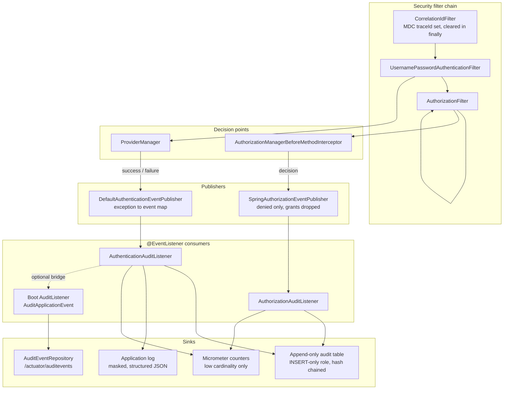
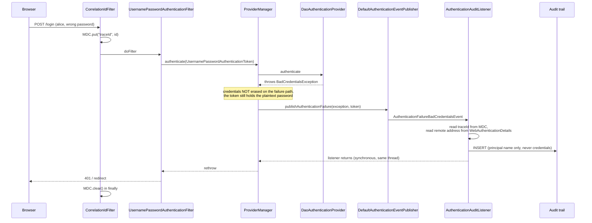

# 12.3 - Security Auditing and Monitoring

> **Module 12 - Topic 3** - Production Hardening
> Baseline: Spring Security 6.x on Boot 3.x
> New to this? Read **In Plain English** below first, then come back to the Version Matrix.

## Version Matrix

| Concern | Spring Security 5.x | **Spring Security 6.x (baseline)** | Spring Security 7.x |
| --- | --- | --- | --- |
| Authentication events | `DefaultAuthenticationEventPublisher` with a fixed exception-to-event map | Same publisher, auto-configured by Boot; `InvalidBearerTokenException` maps to `AuthenticationFailureBadCredentialsEvent` | Unchanged; still the canonical authentication audit hook |
| Authorization events | `AuthorizationFailureEvent` published by `AbstractSecurityInterceptor` in the voter model | `AuthorizationEventPublisher` / `SpringAuthorizationEventPublisher`, with `AuthorizationDeniedEvent` and `AuthorizationGrantedEvent` | Voter model removed entirely; the publisher interface is the only authorization audit hook |
| Granted-authorization events | Not modelled | `AuthorizationGrantedEvent` exists but is **not** published by the default publisher | Same deliberate default; opt in with your own bean |
| Authorization decision payload | `AuthorizationDecision` | `AuthorizationDecision`; `AuthorizationResult` added in 6.4 and the `AuthorizationDecision` overload deprecated | `AuthorizationResult` only |
| Method-security audit point | `AfterInvocationManager` plus voters | `AuthorizationManagerBeforeMethodInterceptor` / `AuthorizationManagerAfterMethodInterceptor` publish through the bean | Same interceptors |
| Actuator audit storage | `InMemoryAuditEventRepository`, which you must declare yourself | Identical, and `/actuator/auditevents` is conditional on an `AuditEventRepository` bean existing | Identical |
| Trace correlation in logs | Spring Cloud Sleuth populates the MDC | Micrometer Tracing (Sleuth is gone); `traceId` and `spanId` land in the MDC and in the default log pattern | Micrometer Tracing |
| Structured log output | Hand-written encoder or a third-party library | Boot 3.4 and later ship `logging.structured.format.console` with ECS, Logstash, and GELF formats | Built in |
| JPA auditing | `AuditorAware<T>` returning `Optional<T>` | Unchanged, but `SecurityContextHolder` now defaults to a strategy that does not inherit into child threads without help | Unchanged |

## Why This Exists

Authentication and authorization decide whether a request proceeds. Auditing decides whether
you can ever answer the question that follows a breach: *who did what, to which resource, from
where, and when*. The two are independent. A perfectly secured application with no audit trail
fails every incident response, every regulatory examination, and every insider-threat
investigation, because the evidence was never written down.

The specific thing that makes this a Spring Security topic rather than a logging topic is that
the framework already emits a structured event for every security-relevant decision it makes,
and almost every codebase ignores them and writes ad-hoc `log.info` calls inside controllers
instead. Spring Security publishes an `ApplicationEvent` when authentication succeeds, when it
fails (with a distinct event subclass per *reason*), when a user logs out, when a session is
destroyed, when a session identifier is changed to defeat fixation, and when authorization is
denied. Those events are the audit trail. Consuming them gives you complete coverage of every
authentication path in the application - form login, HTTP Basic, remember-me, OAuth 2.0
resource server, a custom provider - without touching a single controller.

Three distinctions run through this topic and are worth fixing before anything else:

- **An application log is not an audit trail.** The application log is high-volume, mutable by
  anyone with shell access, retained for days, and readable by the whole engineering team. An
  audit trail is append-only, access-controlled, retained for years, and ideally tamper-evident.
  They have different consumers and therefore different storage.
- **Entity history is not a security audit trail.** Hibernate Envers tells you that row 42
  changed. It does not tell you who read it, which is usually the exfiltration question, and it
  lives in the same database the attacker already compromised.
- **Logging more is not auditing better.** Every field you add is a field that might contain a
  password, a bearer token, or a carriage return that forges a log line. Auditing is as much
  about what you deliberately refuse to record as about what you capture.

File 36 covers the response headers and channel security that sit in front of all of this, and
file 37 covers the brute-force and lockout counters whose *signals* this topic turns into alerts.

## In Plain English

**The one-line version:** Your application already knows every time somebody logs in, fails to log in, logs out, or
is refused access to something, and this file is about capturing those moments as permanent, trustworthy records
that can answer "who did what, to what, from where, and when" long after the fact.

**An analogy.** A hotel keycard system does not stop a theft. If somebody walks into room 412 and takes a laptop,
the lock does not know that. What the system does have is a record: card 0083, issued to the guest in 410, opened
the door of 412 at 02:14, and again at 02:19. That record is worthless as prevention and decisive afterwards. It
tells the investigator which card was used, and therefore which desk clerk issued it, and therefore which camera to
review.

Two more things about that hotel system matter here. First, the log is kept by the building, not by the room — if
the record of who entered room 412 were stored inside room 412, anyone who got in could erase it. That is why a
security audit trail should not live in the same database as the data it protects. Second, the keycard log records
door openings, not what happened inside the room. The equivalent trap in software is assuming a table of row changes
is an audit trail: it tells you what was edited, and says nothing at all about who *read* thousands of customer
records, which is exactly what a data theft looks like.

**How it actually works, step by step.**

Spring publishes an **application event** for security-relevant moments. An event is just a small object handed to
anyone who has registered interest; your code does not have to sit in the request path to receive one. Spring
Security publishes events for authentication success, for each distinct *reason* authentication failed, for logout,
and for authorization denials. Because these come from the framework's own decision points, listening to them covers
every way into the application at once — form login, HTTP Basic, remember-me, an OAuth 2.0 token, a custom provider
— without adding a single line to any controller.

You consume them by writing a small class with a method annotated `@EventListener` that takes the event type you
care about. There is one trap worth learning immediately. There are two success events. `AuthenticationSuccessEvent`
fires on every successful authentication, including once for every request on a stateless API where the credential
is re-checked each time. `InteractiveAuthenticationSuccessEvent` fires only for a real login through a login form or
similar. Neither is a subclass of the other, so picking the wrong one either misses API clients entirely or reports
millions of daily logins for a hundred users.

Authorization events work slightly differently and the difference is deliberate. Spring publishes an event when
access is **denied** and, by default, nothing when access is **granted**. Authorization runs on every request and on
every secured method call inside it, so publishing a "yes" each time would bury the interesting records under an
enormous volume of routine ones. If a regulator needs a record of successful privileged access, you replace the
publisher with your own and publish grants narrowly — only for specific methods, or only for administrative roles.

Spring Boot adds a thin generic layer on top called Actuator auditing: an `AuditEvent` is a timestamp, a principal,
a type string, and a bag of extra data, stored through an `AuditEventRepository`. The built-in repository keeps the
last four thousand events in memory and is a development convenience, not a production store. It is also not
switched on for you; if you never declare the bean, the whole feature and its endpoint simply do not exist.

Then there is the question of what to write down. A useful record needs a timestamp, a correlation identifier that
links it to the other log lines from the same request, who the caller was, where they came from, what they were
trying to do, and whether it succeeded. The prohibitions are stricter than the requirements. The most dangerous one
is specific to Spring: on a *failed* login the authentication object still contains the plaintext password, because
Spring only wipes credentials after success. A listener that helpfully logs the whole object writes real user
passwords into your log system.

Finally, monitoring. Audit records are for investigating something after it happened. **Metrics** — simple counters
such as "authentication failures" or "authorization denials" — are for noticing it while it is happening. The rule
that makes metrics work is to keep the labels small and fixed: never tag a counter with a username or an IP address,
because that creates an unbounded number of distinct series and will overwhelm the metrics system.

**Why should a beginner care?** The first serious question after any security incident is "what exactly did they
access?", and if nobody built the trail in advance there is no way to answer it, which usually means assuming the
worst and notifying every customer. Meanwhile the opposite mistake, logging everything indiscriminately, creates its
own breach: passwords, session cookies and bearer tokens sitting in a log aggregator that far more people can read
than can read the production database.

**Words you will meet in this file**

| Term | In plain words |
|---|---|
| Application event | A small notification object Spring hands to any interested listener when something happens. |
| `@EventListener` | The annotation that marks one of your methods as wanting to receive a particular event type. |
| Audit trail | A permanent, append-only record of security-relevant actions, kept for years and hard to alter. |
| Application log | The ordinary day-to-day log. High volume, short retention, easy to change. Not an audit trail. |
| `AuthenticationSuccessEvent` | Fires on every successful credential check, including once per request on token APIs. |
| `InteractiveAuthenticationSuccessEvent` | Fires only for a genuine interactive login, such as submitting a login form. |
| `AbstractAuthenticationFailureEvent` | The family of failure events, with a separate type for each reason such as wrong password, locked, or disabled. |
| `AuthenticationEventPublisher` | The component that turns an authentication outcome into the matching event. |
| `AuthorizationDeniedEvent` | The event fired when a user is refused access to a URL or a method. |
| `AuthorizationGrantedEvent` | The matching "allowed" event, which exists but is deliberately not published by default. |
| `HttpSessionEventPublisher` | A listener you must register yourself before session creation and destruction become Spring events. |
| Session fixation | Reusing the same session identifier before and after login. Spring changes the identifier and announces the change. |
| `AuditEvent` / `AuditEventRepository` | Spring Boot's generic audit record and the place it gets stored. |
| `AuditorAware` | The hook that tells Spring Data JPA who to stamp into the "created by" and "modified by" columns. |
| Hibernate Envers | A library that keeps a full history of row changes. Useful, but it records writes only, never reads. |
| Log injection | An attacker putting a newline into a value you log, letting them forge an entire extra log line. |
| Structured logging | Writing logs as JSON rather than plain lines, which makes forged newlines impossible. |
| Correlation identifier / `traceId` | A shared identifier attached to every log line from one request, so they can be joined together. |
| MDC | A per-thread map of values that the logging framework automatically adds to each line. It must be cleared afterwards. |
| Cardinality | How many distinct label values a metric has. Usernames and IP addresses create far too many. |
| Hash chaining | Storing in each record a fingerprint of the previous one, so removing or editing any record is detectable. |

**If you remember only one thing:** listen to the events Spring already publishes rather than scattering log
statements through your controllers, and be as deliberate about what you refuse to record as about what you keep.

## Core Concepts

### 1. The Authentication Event Hierarchy

**In simple terms:** Spring announces every login outcome as an object, with a different type for each reason a
login failed, so your audit code can react to exactly the cases it cares about.

Every event descends from `AbstractAuthenticationEvent`, which carries the `Authentication`
object that the decision was made about:

```java
package org.springframework.security.authentication.event;

public abstract class AbstractAuthenticationEvent extends ApplicationEvent {

    public AbstractAuthenticationEvent(Authentication authentication) {
        super(authentication);
    }

    public Authentication getAuthentication() {
        return (Authentication) super.getSource();
    }
}
```

Two events mean success, and confusing them is a classic interview trap:

| Event | Published by | Fires for |
| --- | --- | --- |
| `AuthenticationSuccessEvent` | `ProviderManager.authenticate` | **Every** successful authentication, including per-request HTTP Basic, remember-me, and programmatic calls |
| `InteractiveAuthenticationSuccessEvent` | `AbstractAuthenticationProcessingFilter.successfulAuthentication` | Only *interactive* logins through a processing filter, once per login rather than once per request. Carries `getGeneratedBy()`, the filter class that produced it |

They are siblings, not parent and child: `InteractiveAuthenticationSuccessEvent` does **not**
extend `AuthenticationSuccessEvent`. If you count logins with the interactive event you will
miss API clients entirely; if you count them with `AuthenticationSuccessEvent` on a
stateless HTTP Basic API you will record one "login" per request and your dashboard will show
millions of daily logins for a hundred users.

Failures all descend from `AbstractAuthenticationFailureEvent`, which additionally carries the
exception:

```java
public abstract class AbstractAuthenticationFailureEvent extends AbstractAuthenticationEvent {

    private final AuthenticationException exception;

    public AuthenticationException getException() {
        return this.exception;
    }
}
```

The complete set of failure subclasses, and the exception each one is mapped from:

| Event | Mapped from | Means |
| --- | --- | --- |
| `AuthenticationFailureBadCredentialsEvent` | `BadCredentialsException`, `UsernameNotFoundException`, `InvalidBearerTokenException` | Wrong password, unknown user, or an unusable bearer token |
| `AuthenticationFailureLockedEvent` | `LockedException` | `UserDetails.isAccountNonLocked()` returned false |
| `AuthenticationFailureDisabledEvent` | `DisabledException` | `isEnabled()` returned false |
| `AuthenticationFailureExpiredEvent` | `AccountExpiredException` | `isAccountNonExpired()` returned false |
| `AuthenticationFailureCredentialsExpiredEvent` | `CredentialsExpiredException` | `isCredentialsNonExpired()` returned false - password rotation is due |
| `AuthenticationFailureProviderNotFoundEvent` | `ProviderNotFoundException` | No `AuthenticationProvider` supported the token type. A configuration bug, not an attack |
| `AuthenticationFailureServiceExceptionEvent` | `AuthenticationServiceException` | The backing store failed. Treat as an availability incident |
| `AuthenticationFailureProxyUntrustedEvent` | `ProxyUntrustedException` | Untrusted proxy ticket in a CAS deployment |

The most important consequence of that table: `UsernameNotFoundException` and
`BadCredentialsException` map to the **same** event. That is the event-stream half of the
anti-enumeration design from file 37. You cannot distinguish "no such user" from "wrong
password" by listening to events, and you should not want to, because any audit record that
distinguishes them becomes an enumeration oracle the moment a log-viewing role is granted too
widely. If you genuinely need that distinction for operational reasons, derive it inside your
`UserDetailsService` and emit a *separate, coarse* metric, never a per-attempt log line.

### 2. Who Publishes, and the Empty-Stream Failure Mode

**In simple terms:** Only one component actually sends these events, so if you have replaced or hand-assembled that
component your audit trail goes completely silent without anything reporting an error.

`AuthenticationEventPublisher` is a two-method interface:

```java
package org.springframework.security.authentication;

public interface AuthenticationEventPublisher {

    void publishAuthenticationSuccess(Authentication authentication);

    void publishAuthenticationFailure(AuthenticationException exception, Authentication authentication);
}
```

`DefaultAuthenticationEventPublisher` implements it with a `Map<Class<? extends
AuthenticationException>, Constructor<? extends AbstractAuthenticationFailureEvent>>` populated
in its constructor, and two extension points:

- `setAdditionalExceptionMappings(Map<Class<? extends AuthenticationException>, Class<? extends AbstractAuthenticationFailureEvent>>)`
  to map your own exception types.
- `setDefaultAuthenticationFailureEvent(Class<? extends AbstractAuthenticationFailureEvent>)`
  so that unmapped exceptions still produce an event instead of being silently dropped. Without
  it, a custom `AuthenticationException` subclass logs a warning and publishes nothing, and your
  audit trail quietly loses a whole failure category.

Spring Boot auto-configures a `DefaultAuthenticationEventPublisher` bean, and
`AuthenticationConfiguration` hands it to the `ProviderManager` it builds. Two situations break
that wiring and are the usual reason a team reports "no events are firing":

1. **A hand-built `ProviderManager`.** If you construct `new ProviderManager(provider)` yourself
   and expose it as the `AuthenticationManager`, you must call
   `setAuthenticationEventPublisher(publisher)` on it. Nothing else will.
2. **A custom `AuthenticationProvider` that swallows the exception.** Events are published by
   `ProviderManager`, not by providers. A provider that catches its own failure and returns
   `null` produces no failure event at all.

There is also a deliberate duplicate-suppression rule inside `ProviderManager`: when a parent
`AuthenticationManager` is configured, the child only publishes if the parent did not already
produce a result or an exception. That is why a delegating setup emits one event per attempt
rather than one per manager in the chain.

### 3. Logout and Session Lifecycle Events

**In simple terms:** Recording how a session ended is as important as recording how it began, and the events for
session creation and destruction only exist if you register one extra bean yourself.

Authentication events cover the way in. Sessions need their own stream.

`LogoutSuccessEvent` lives in `org.springframework.security.authentication.event` and is
published by `LogoutSuccessEventPublishingLogoutHandler`, which `LogoutConfigurer` adds to the
`LogoutFilter` handler list. It only fires when the `Authentication` being logged out is
non-null, so an anonymous request to `/logout` produces nothing. This event is the only reliable
way to record a *deliberate* session end, and its absence before a `SessionDestroyedEvent` is
what distinguishes "the user left" from "the session timed out".

Session events require an explicit registration, because they originate in the servlet
container rather than in Spring Security's filter chain:

```java
@Bean
ServletListenerRegistrationBean<HttpSessionEventPublisher> httpSessionEventPublisher() {
    return new ServletListenerRegistrationBean<>(new HttpSessionEventPublisher());
}
```

`HttpSessionEventPublisher` is a `jakarta.servlet.http.HttpSessionListener` that translates
container callbacks into Spring events: `HttpSessionCreatedEvent` and
`HttpSessionDestroyedEvent`, the latter extending the abstract
`org.springframework.security.core.session.SessionDestroyedEvent` and exposing
`getSecurityContexts()` so a listener can see which principals were attached. The same bean is
what keeps `SessionRegistry` accurate, so concurrent-session control and session auditing share
one prerequisite. Forgetting it produces two symptoms at once: a session registry that grows
forever and an audit trail with logins but no logouts.

`SessionFixationProtectionEvent` completes the picture. `AbstractSessionFixationProtectionStrategy`
publishes it when it migrates a session to a new identifier at login, carrying the old and new
identifiers. Recording it lets you stitch pre-login and post-login activity for the same browser
together during an investigation, which is otherwise impossible because the session identifier
changed by design.

### 4. Authorization Events in 6.x

**In simple terms:** Spring tells you when somebody was refused access but stays silent when they were allowed,
because "allowed" happens on every request and would drown the trail in noise.

The 5.x voter model published `AuthorizationFailureEvent` from `AbstractSecurityInterceptor`.
That machinery is deprecated in 6.x and removed in 7.x. The replacement is a single-method
interface:

```java
package org.springframework.security.authorization;

public interface AuthorizationEventPublisher {

    <T> void publishAuthorizationEvent(Supplier<Authentication> authentication,
                                       T object,
                                       AuthorizationDecision decision);
}
```

The `Supplier<Authentication>` matters: authorization is frequently evaluated for requests where
resolving the principal is itself expensive, so the decision path stays lazy and only your
listener pays the cost of calling `get()`. In 6.4 an overload taking `AuthorizationResult` was
added and the `AuthorizationDecision` variant deprecated; in 7.x only the result-based form
remains. Write listeners against the event types rather than against the publisher signature and
the migration costs nothing.

The default implementation is `SpringAuthorizationEventPublisher`, and its behaviour is the
single most-asked detail in this area:

```java
public final class SpringAuthorizationEventPublisher implements AuthorizationEventPublisher {

    private final ApplicationEventPublisher eventPublisher;

    @Override
    public <T> void publishAuthorizationEvent(Supplier<Authentication> authentication,
                                              T object, AuthorizationDecision decision) {
        if (decision == null || decision.isGranted()) {
            return;   // granted decisions are deliberately dropped
        }
        this.eventPublisher.publishEvent(new AuthorizationDeniedEvent<>(authentication, object, decision));
    }
}
```

`AuthorizationGrantedEvent` exists in the same package and is never published by this class. The
reason is volume: authorization runs on every request and, with method security enabled, on every
secured method call inside every request. Publishing a granted event for each one would add an
object allocation and a synchronous listener dispatch to the hottest path in the framework, and
would produce an audit stream in which the interesting records are buried under a millionfold
excess of "yes". The framework's position is that *denials are anomalies worth recording, grants
are the normal case and should be sampled deliberately*.

Opting in means replacing the bean, and the correct way to do it is to filter narrowly rather
than to publish everything:

- Restrict by target. For method security the event's source object is the `MethodInvocation`
  (or `MethodInvocationResult` for post-authorization), so you can match on the declaring class
  and method name and publish grants only for the handful of operations a regulator cares about.
- Restrict by authority. Publishing grants only when the principal holds an administrative or
  break-glass authority captures privileged access without touching ordinary traffic.

A single `AuthorizationEventPublisher` bean is picked up by the method-security interceptors
(`AuthorizationManagerBeforeMethodInterceptor` and `AuthorizationManagerAfterMethodInterceptor`)
and, when present, by request-level authorization as well, so the source object type varies by
enforcement point. Listeners must therefore be defensive about the generic payload: match on
`MethodInvocation` for method security and on the request-context type for the filter, and ignore
anything unrecognised rather than casting blindly.

One subtlety that trips people up: `AuthorizationDeniedEvent` fires for a *denial*, which
includes the very common case of an anonymous user hitting a protected URL and being redirected
to the login page. That is not an attack, it is the login flow. Filter anonymous principals out
of the audit stream, or your denial dashboard will be dominated by unauthenticated first visits.

### 5. Spring Boot Actuator Auditing

**In simple terms:** Boot offers a ready-made place to put audit records and a URL to read them back, but it stores
them in memory, loses them on restart, and does not switch itself on unless you declare the storage bean.

Boot has a small, deliberately generic audit abstraction that sits above Spring Security's events.

```java
package org.springframework.boot.actuate.audit;

public interface AuditEventRepository {

    void add(AuditEvent event);

    List<AuditEvent> find(String principal, Instant after, String type);
}
```

An `AuditEvent` is an immutable `(Instant timestamp, String principal, String type,
Map<String, Object> data)` tuple. You publish one by wrapping it in an `AuditApplicationEvent`
and handing it to the `ApplicationEventPublisher`; Boot's `AuditListener` (an
`AbstractAuditListener` subclass) receives it and calls `repository.add(...)`.

Boot ships `InMemoryAuditEventRepository`, a fixed-size circular buffer with a default capacity
of 4000 events that overwrites its oldest entry when full. Two facts about it are exam-grade:

1. **It is not auto-configured.** You must declare an `AuditEventRepository` bean yourself.
   `/actuator/auditevents` is conditional on that bean, so with no bean the endpoint does not
   exist and the whole feature is silently absent.
2. **It is not production-grade.** The buffer is per-instance, unbounded in retention terms
   (meaning it has none), lost on restart, and invisible to every other replica. It is a
   development convenience. Production means an implementation that writes to a durable,
   append-only sink.

When the repository bean is present, Boot also registers bridges from Spring Security's events:
`AuthenticationAuditListener` maps authentication events to `AuditEvent` types
`AUTHENTICATION_SUCCESS`, `AUTHENTICATION_FAILURE`, and `AUTHENTICATION_SWITCH` (the last from
`SwitchUserFilter`), and `AuthorizationAuditListener` maps authorization denial to
`AUTHORIZATION_FAILURE`. Both extend abstract base classes you can replace to change what ends
up in the `data` map.

Exposing the endpoint is an explicit act, since only `health` is web-exposed by default:

```yaml
management:
  endpoints:
    web:
      exposure:
        include: health,info,auditevents
```

`/actuator/auditevents` accepts `principal`, `after`, and `type` query parameters. Treat it as
a sensitive endpoint on a separate management port with an administrative authority requirement,
exactly as file 36 describes for `/env` and `/heapdump` - an audit endpoint that anyone can read
is an enumeration oracle listing every username that has ever failed a login.

### 6. Persistence-Layer Auditing: JPA and Envers

**In simple terms:** The database layer can stamp each row with who created and last changed it, and can even keep
the full history of every version, but none of that records who merely *read* the data.

Spring Data JPA auditing answers "who last touched this row" with four annotations and one bean:

```java
@Entity
@EntityListeners(AuditingEntityListener.class)
public class Payment {

    @CreatedDate   private Instant createdAt;
    @CreatedBy     private String createdBy;
    @LastModifiedDate private Instant updatedAt;
    @LastModifiedBy   private String updatedBy;
}
```

`AuditingEntityListener` fills those fields from `AuditorAware<T>`:

```java
public interface AuditorAware<T> {
    Optional<T> getCurrentAuditor();
}
```

The return type is `Optional` for a reason, and the pitfall it points at is the one worth
remembering. A scheduled job, an `@Async` method, a Kafka consumer, a Flyway callback, and a
startup data loader all write rows with **no** `SecurityContext` on the thread, so a naive
implementation returns `Optional.empty()` and the `@CreatedBy` column is left null. If the column
is `NOT NULL`, the insert fails and a background job starts failing in a way that looks nothing
like an auditing problem. Three rules follow:

- Return a sentinel such as `"system"` rather than empty when there is no authentication, so the
  audit field always says something truthful.
- Reject `AnonymousAuthenticationToken` explicitly. Recording the literal string
  `anonymousUser` as the author of a row is worse than recording `system`, because it looks like
  a real principal.
- If you *want* the caller's identity on an asynchronous write, propagate it deliberately with
  `DelegatingSecurityContextAsyncTaskExecutor` or `DelegatingSecurityContextExecutorService`
  rather than relying on thread inheritance, which the default `SecurityContextHolder` strategy
  does not provide.

Hibernate Envers goes further and keeps full row history. Adding the `hibernate-envers`
dependency and `@Audited` to an entity creates a shadow `_AUD` table per entity plus a shared
`REVINFO` table, and every insert, update, and delete writes a revision row. `AuditReaderFactory`
and `AuditQuery` read it back, and Spring Data Envers adds a `RevisionRepository<T, ID, N>`
interface with `findRevisions(id)`.

Envers does not know about Spring Security, so out of the box a revision records *when* but not
*who*. The fix is a custom revision entity annotated `@RevisionEntity(UserRevisionListener.class)`
whose `RevisionListener` stamps the principal from `SecurityContextHolder` onto the revision row.

Even then, Envers is not a security audit trail, for three structural reasons: it captures writes
only and is blind to the reads that constitute data exfiltration; it lives in the same schema as
the data, so anyone who can tamper with the data can tamper with its history; and it records
entity state rather than intent, so it cannot tell you *which API call or business operation*
caused a change. Use it for "what did this record look like last Tuesday", and keep a separate
security audit sink for "who accessed this customer".

### 7. What to Log, What Never to Log, and Log Injection

**In simple terms:** A good record carries enough to reconstruct the event and nothing that would itself be a
credential if leaked, and any value the user typed must be escaped so it cannot forge a line of its own.

A security audit record needs enough context to reconstruct an event without joining against
five other systems, and nothing more:

| Field | Source | Note |
| --- | --- | --- |
| Timestamp | `Instant.now()` at record time | UTC, with the precision the sink supports. Never a local-zone string |
| Correlation / trace identifier | MDC `traceId` | The join key across services and log lines |
| Principal identifier | `Authentication.getName()` | An opaque user identifier is better than an email address |
| Authentication method | `Authentication` implementation type or a JWT claim | Distinguishes password, token, and remember-me |
| Source address | `getRemoteAddr()` after a trusted forwarded-header filter | Only meaningful under the trust boundary from file 36 |
| HTTP method and path | `HttpServletRequest` | Path template, not the raw URI, if identifiers appear in the path |
| Outcome | Your own enumeration | `SUCCESS`, `FAILURE`, `DENIED` |
| Authorization decision | `AuthorizationDecision` / event type | Which rule denied, not the whole expression |
| Resource identifier | The domain object key | The "which customer" that makes the record actionable |

The prohibitions matter more, because each is a real incident pattern:

- **Passwords.** `Authentication.getCredentials()` is not blanked on the failure path.
  `ProviderManager` only calls `eraseCredentials` after a *successful* authentication, so a
  failure event frequently still carries the plaintext password. A listener that logs
  `event.getAuthentication()` writes user passwords to your log aggregator, where they are
  retained, replicated, and broadly readable. Log `getName()` and nothing else from the token.
- **Tokens and full `Authorization` headers.** A logged bearer token is a live credential for
  its remaining lifetime. Log the JWT `jti` or a truncated hash if you need correlation.
- **Session identifiers and cookies.** Equivalent to a password for the session's duration.
- **Card numbers, national identifiers, and free-text PII.** Log a stable surrogate key and
  resolve it in a system that has the access controls and retention rules for that data class.

Log injection is the third leg. Any user-controlled value written into a line-oriented log can
contain `\r\n`, letting an attacker append a forged log line - a fabricated
`AUTHENTICATION_SUCCESS` for an administrator, for example - and destroy the evidentiary value
of the whole file. Two mitigations, in order of preference:

1. **Structured logging.** A JSON encoder escapes newlines inside the field, so injection becomes
   impossible by construction. Boot 3.4 and later provide this with
   `logging.structured.format.console=ecs`.
2. **Sanitise at the boundary.** Strip control characters from every user-controlled value before
   it reaches the logger, and add a Logback `%replace` as a backstop for code you do not control.

The same converter layer is the right place to enforce masking of token-shaped and
password-shaped substrings, because it catches the accidental `log.debug(request)` in a library
that no code review of yours will ever see.

### 8. Correlation, Metrics, and Tamper-Evidence

**In simple terms:** Give every request a shared identifier so its records can be stitched together, count the
things you want to be alerted about, and make the trail itself hard to quietly edit.

**Correlation.** Every audit record and every log line needs a shared identifier. With Micrometer
Tracing on the classpath, Boot puts `traceId` and `spanId` into the SLF4J MDC and into the default
log pattern, and propagates them over HTTP through `W3C traceparent` headers. Without tracing, a
small `OncePerRequestFilter` that accepts an inbound correlation header or mints a UUID, puts it
in the MDC, echoes it in a response header, and - critically - **removes it in a `finally`
block** does the job. The removal is not optional: servlet threads are pooled, so a leaked MDC
entry will label the next unrelated request with the previous request's identifier, which is both
misleading and a small information leak. The MDC is a `ThreadLocal`, so crossing a thread boundary
requires the same deliberate propagation as the `SecurityContext`: wrap the executor, or capture
and restore the context map explicitly.

**Metrics.** Audit records are for investigation; metrics are for detection. The set worth
emitting is small:

| Metric | Tags | Detects |
| --- | --- | --- |
| `security.authentication` counter | `outcome`, `method`, `failure_reason` | Credential attacks, and provider outages via a spike in service-exception failures |
| `security.authorization.denied` counter | `endpoint`, `authenticated` | Probing for broken object-level authorization, and broken deployments |
| `security.token.validation.failure` counter | `reason` (expired, signature, issuer, audience) | Clock skew, key-rotation breakage, and token forgery attempts |
| `security.lockouts` counter | none | The lockout-as-denial-of-service pattern from file 37 |
| `security.audit.write.failure` counter | `sink` | The audit pipeline itself failing, which is otherwise invisible |

The cardinality rule is absolute: never tag a metric with a username, a session identifier, or a
raw IP address. Those are unbounded dimensions that will exhaust your metrics backend. Per-user
detail belongs in the audit sink, which is built for high cardinality and low query rate.

**Alerts.** Alert on ratios and on derivatives, not on absolute counts, because absolute
thresholds either fire constantly at peak or never fire at night. The high-value alerts are: the
failure-to-success ratio crossing a baseline multiple; distinct usernames failing per source per
minute (the password-spraying signal); a denial-rate spike concentrated on one endpoint; token
validation failures jumping right after a deployment; and, most neglected, the audit sink write
failure rate rising above zero.

**Tamper-evidence.** In a regulated environment the audit trail must be demonstrably unaltered.
Three mechanisms, which compose:

- **Restricted privileges.** The application's database role holds `INSERT` on the audit table
  and not `UPDATE` or `DELETE`. This costs nothing and stops the most likely tampering path,
  which is a bug or a careless operator rather than an adversary.
- **Hash chaining.** Each record stores a hash over its own canonical content plus the previous
  record's hash. Altering or removing any record breaks the chain from that point onward, so
  tampering is detectable by a verification job even though it is not prevented. Publishing a
  periodic signed checkpoint of the latest hash to a separate system makes truncation of the
  chain's tail detectable too.
- **Write-once storage.** Shipping records to object storage with an immutability lock, or to a
  dedicated append-only logging service, moves the guarantee out of the application's blast
  radius entirely. This is the only mechanism that survives full compromise of the application
  host.

## Architecture



The second diagram traces one failed login through the pipeline, which is where the
credential-leak hazard and the request-context problem both appear:



## Working Code

The audit record, deliberately a flat immutable carrier so that serialising it cannot
accidentally drag an entity graph or a credential along:

```java
package com.example.audit;

import java.time.Instant;

/**
 * One security-relevant fact. Every field is either a timestamp, an identifier, or an
 * enumerated outcome; there is deliberately no field that could hold a credential.
 */
public record SecurityAuditRecord(
        Instant occurredAt,
        String traceId,
        String eventType,
        String principal,
        String authenticationMethod,
        String sourceAddress,
        String httpMethod,
        String path,
        String outcome,
        String resource,
        String detail) {

    public static final String SUCCESS = "SUCCESS";
    public static final String FAILURE = "FAILURE";
    public static final String DENIED = "DENIED";

    /** Canonical form used as the hash-chain input. Field order is part of the contract. */
    public String canonical() {
        return String.join("|",
                String.valueOf(this.occurredAt), n(this.traceId), n(this.eventType),
                n(this.principal), n(this.authenticationMethod), n(this.sourceAddress),
                n(this.httpMethod), n(this.path), n(this.outcome), n(this.resource), n(this.detail));
    }

    private static String n(String value) {
        return value == null ? "" : value;
    }
}
```

```java
package com.example.audit;

public interface AuditTrail {

    void record(SecurityAuditRecord auditRecord);
}
```

The hash-chained JDBC implementation. The application's database role has `INSERT` only, so the
chain is a detection mechanism layered on top of a prevention mechanism:

```java
package com.example.audit;

import java.nio.charset.StandardCharsets;
import java.security.MessageDigest;
import java.security.NoSuchAlgorithmException;
import java.util.HexFormat;
import java.util.concurrent.locks.ReentrantLock;

import org.slf4j.Logger;
import org.slf4j.LoggerFactory;
import org.springframework.jdbc.core.JdbcTemplate;
import org.springframework.stereotype.Repository;

@Repository
public class HashChainedAuditTrail implements AuditTrail {

    private static final Logger log = LoggerFactory.getLogger(HashChainedAuditTrail.class);
    private static final String GENESIS = "0".repeat(64);

    private final JdbcTemplate jdbc;
    private final io.micrometer.core.instrument.Counter writeFailures;
    /** Serialises chain computation within one instance; see the note on clustering below. */
    private final ReentrantLock lock = new ReentrantLock();

    public HashChainedAuditTrail(JdbcTemplate jdbc, io.micrometer.core.instrument.MeterRegistry registry) {
        this.jdbc = jdbc;
        this.writeFailures = io.micrometer.core.instrument.Counter
                .builder("security.audit.write.failure").tag("sink", "jdbc").register(registry);
    }

    @Override
    public void record(SecurityAuditRecord auditRecord) {
        this.lock.lock();
        try {
            String previous = this.jdbc.query(
                    "SELECT record_hash FROM security_audit ORDER BY id DESC FETCH FIRST 1 ROWS ONLY",
                    rs -> rs.next() ? rs.getString(1) : GENESIS);
            String hash = sha256(previous + auditRecord.canonical());

            this.jdbc.update("""
                    INSERT INTO security_audit (occurred_at, trace_id, event_type, principal,
                        auth_method, source_address, http_method, path, outcome, resource,
                        detail, previous_hash, record_hash)
                    VALUES (?,?,?,?,?,?,?,?,?,?,?,?,?)""",
                    java.sql.Timestamp.from(auditRecord.occurredAt()), auditRecord.traceId(),
                    auditRecord.eventType(), auditRecord.principal(), auditRecord.authenticationMethod(),
                    auditRecord.sourceAddress(), auditRecord.httpMethod(), auditRecord.path(),
                    auditRecord.outcome(), auditRecord.resource(), auditRecord.detail(),
                    previous, hash);
        }
        catch (RuntimeException ex) {
            // An audit write must never fail the business request, but silence is worse than
            // noise: count it so the gap is visible, and fall back to the application log.
            this.writeFailures.increment();
            log.error("audit sink unavailable, event type {} outcome {}",
                    auditRecord.eventType(), auditRecord.outcome(), ex);
        }
        finally {
            this.lock.unlock();
        }
    }

    static String sha256(String input) {
        try {
            MessageDigest digest = MessageDigest.getInstance("SHA-256");
            return HexFormat.of().formatHex(digest.digest(input.getBytes(StandardCharsets.UTF_8)));
        }
        catch (NoSuchAlgorithmException ex) {
            throw new IllegalStateException("SHA-256 is mandated by the JDK", ex);
        }
    }
}
```

Correlation identifier propagation. Note the `finally` block and the inbound-header validation,
which prevents a caller from injecting a control character into every subsequent log line:

```java
package com.example.audit;

import java.io.IOException;
import java.util.UUID;
import java.util.regex.Pattern;

import jakarta.servlet.FilterChain;
import jakarta.servlet.ServletException;
import jakarta.servlet.http.HttpServletRequest;
import jakarta.servlet.http.HttpServletResponse;

import org.slf4j.MDC;
import org.springframework.core.Ordered;
import org.springframework.core.annotation.Order;
import org.springframework.stereotype.Component;
import org.springframework.web.filter.OncePerRequestFilter;

@Component
@Order(Ordered.HIGHEST_PRECEDENCE)
public class CorrelationIdFilter extends OncePerRequestFilter {

    public static final String MDC_KEY = "traceId";
    private static final String HEADER = "X-Correlation-Id";
    /** Inbound identifiers are user-controlled: accept only a safe, bounded alphabet. */
    private static final Pattern SAFE = Pattern.compile("[A-Za-z0-9._-]{8,64}");

    @Override
    protected void doFilterInternal(HttpServletRequest request, HttpServletResponse response,
            FilterChain chain) throws ServletException, IOException {

        String inbound = request.getHeader(HEADER);
        String traceId = (inbound != null && SAFE.matcher(inbound).matches())
                ? inbound
                : UUID.randomUUID().toString().replace("-", "");

        MDC.put(MDC_KEY, traceId);
        response.setHeader(HEADER, traceId);
        try {
            chain.doFilter(request, response);
        }
        finally {
            // Servlet threads are pooled: a leaked MDC entry mislabels the next request.
            MDC.remove(MDC_KEY);
        }
    }
}
```

Request context is not available on the event itself, so the listener reaches for it defensively:

```java
package com.example.audit;

import jakarta.servlet.http.HttpServletRequest;

import org.slf4j.MDC;
import org.springframework.security.core.Authentication;
import org.springframework.security.web.authentication.WebAuthenticationDetails;
import org.springframework.web.context.request.RequestContextHolder;
import org.springframework.web.context.request.ServletRequestAttributes;

/**
 * Authentication events are decoupled from the servlet request, so HTTP context must be
 * recovered from the request-bound thread state. It is absent for scheduled work, messaging
 * listeners, and async dispatches, and every accessor here tolerates that.
 */
final class AuditContext {

    private AuditContext() {}

    static String traceId() {
        String traceId = MDC.get(CorrelationIdFilter.MDC_KEY);
        return traceId != null ? traceId : "none";
    }

    private static HttpServletRequest request() {
        return RequestContextHolder.getRequestAttributes() instanceof ServletRequestAttributes attrs
                ? attrs.getRequest() : null;
    }

    static String method() {
        HttpServletRequest request = request();
        return request != null ? request.getMethod() : "-";
    }

    static String path() {
        HttpServletRequest request = request();
        return request != null ? request.getRequestURI() : "-";
    }

    static String sourceAddress(Authentication authentication) {
        // WebAuthenticationDetails captured the address at token-creation time, which is the
        // most accurate source for form login and HTTP Basic.
        if (authentication != null
                && authentication.getDetails() instanceof WebAuthenticationDetails details) {
            return details.getRemoteAddress();
        }
        HttpServletRequest request = request();
        // Trustworthy only because ForwardedHeaderFilter runs behind an edge that overwrites
        // X-Forwarded-For; see file 36 for the trust boundary.
        return request != null ? request.getRemoteAddr() : "unknown";
    }

    /** Strips CR, LF, and TAB so a user-controlled value cannot forge a log line. */
    static String safe(String value) {
        return value == null ? null : value.replaceAll("[\\r\\n\\t]", "_");
    }
}
```

The authentication listener. This is the class where the credential-leak mistake is normally
made, so the comment is load-bearing:

```java
package com.example.audit;

import java.time.Instant;

import io.micrometer.core.instrument.MeterRegistry;
import org.springframework.context.event.EventListener;
import org.springframework.security.authentication.event.AbstractAuthenticationFailureEvent;
import org.springframework.security.authentication.event.AuthenticationSuccessEvent;
import org.springframework.security.authentication.event.LogoutSuccessEvent;
import org.springframework.security.core.Authentication;
import org.springframework.security.web.session.HttpSessionDestroyedEvent;
import org.springframework.stereotype.Component;

@Component
public class AuthenticationAuditListener {

    private final AuditTrail trail;
    private final MeterRegistry registry;

    public AuthenticationAuditListener(AuditTrail trail, MeterRegistry registry) {
        this.trail = trail;
        this.registry = registry;
    }

    @EventListener
    public void onSuccess(AuthenticationSuccessEvent event) {
        Authentication authentication = event.getAuthentication();
        write("AUTHENTICATION", authentication, SecurityAuditRecord.SUCCESS, null);
        count(SecurityAuditRecord.SUCCESS, method(authentication), "none");
    }

    @EventListener
    public void onFailure(AbstractAuthenticationFailureEvent event) {
        Authentication authentication = event.getAuthentication();
        // Record the exception TYPE, never event.getAuthentication() itself: credentials are
        // erased only on the success path, so this token may still hold the plaintext password.
        String reason = event.getException().getClass().getSimpleName();
        write("AUTHENTICATION", authentication, SecurityAuditRecord.FAILURE, reason);
        count(SecurityAuditRecord.FAILURE, method(authentication), reason);
    }

    @EventListener
    public void onLogout(LogoutSuccessEvent event) {
        write("LOGOUT", event.getAuthentication(), SecurityAuditRecord.SUCCESS, "user_initiated");
    }

    @EventListener
    public void onSessionDestroyed(HttpSessionDestroyedEvent event) {
        // Fires for timeout and for invalidation alike; a preceding LogoutSuccessEvent with the
        // same trace identifier is what distinguishes a deliberate logout from an expiry.
        event.getSecurityContexts().forEach(context ->
                write("SESSION_END", context.getAuthentication(), SecurityAuditRecord.SUCCESS, "destroyed"));
    }

    private void write(String type, Authentication authentication, String outcome, String detail) {
        this.trail.record(new SecurityAuditRecord(
                Instant.now(),
                AuditContext.traceId(),
                type,
                AuditContext.safe(authentication != null ? authentication.getName() : "unknown"),
                method(authentication),
                AuditContext.sourceAddress(authentication),
                AuditContext.method(),
                AuditContext.path(),
                outcome,
                null,
                detail));
    }

    private void count(String outcome, String authMethod, String reason) {
        this.registry.counter("security.authentication",
                "outcome", outcome, "method", authMethod, "failure_reason", reason).increment();
    }

    /** Bounded, low-cardinality tag value derived from the token type. */
    private static String method(Authentication authentication) {
        return authentication != null ? authentication.getClass().getSimpleName() : "unknown";
    }
}
```

Authorization auditing, with the selective granted-event publisher:

```java
package com.example.audit;

import java.util.Set;
import java.util.function.Supplier;

import org.aopalliance.intercept.MethodInvocation;
import org.springframework.context.ApplicationEventPublisher;
import org.springframework.security.authorization.AuthorizationDecision;
import org.springframework.security.authorization.AuthorizationEventPublisher;
import org.springframework.security.authorization.event.AuthorizationDeniedEvent;
import org.springframework.security.authorization.event.AuthorizationGrantedEvent;
import org.springframework.security.core.Authentication;

/**
 * Replaces SpringAuthorizationEventPublisher so that GRANTED decisions are published for a
 * narrow allow-list of privileged operations only. Publishing all grants would add an
 * allocation and a synchronous dispatch to the hottest path in the framework.
 */
public class SelectiveAuthorizationEventPublisher implements AuthorizationEventPublisher {

    private static final Set<String> AUDITED_GRANTS = Set.of(
            "AdminUserService.resetPassword",
            "AdminUserService.impersonate",
            "PayoutService.approve");

    private final ApplicationEventPublisher publisher;

    public SelectiveAuthorizationEventPublisher(ApplicationEventPublisher publisher) {
        this.publisher = publisher;
    }

    @Override
    public <T> void publishAuthorizationEvent(Supplier<Authentication> authentication,
            T object, AuthorizationDecision decision) {

        if (decision == null) {
            return;
        }
        if (!decision.isGranted()) {
            this.publisher.publishEvent(new AuthorizationDeniedEvent<>(authentication, object, decision));
            return;
        }
        if (object instanceof MethodInvocation invocation && AUDITED_GRANTS.contains(signature(invocation))) {
            this.publisher.publishEvent(new AuthorizationGrantedEvent<>(authentication, object, decision));
        }
    }

    static String signature(MethodInvocation invocation) {
        return invocation.getMethod().getDeclaringClass().getSimpleName()
                + "." + invocation.getMethod().getName();
    }
}
```

```java
package com.example.audit;

import java.time.Instant;

import io.micrometer.core.instrument.MeterRegistry;
import org.aopalliance.intercept.MethodInvocation;
import org.springframework.context.event.EventListener;
import org.springframework.security.authentication.AnonymousAuthenticationToken;
import org.springframework.security.authorization.event.AuthorizationDeniedEvent;
import org.springframework.security.authorization.event.AuthorizationEvent;
import org.springframework.security.authorization.event.AuthorizationGrantedEvent;
import org.springframework.security.core.Authentication;
import org.springframework.stereotype.Component;

@Component
public class AuthorizationAuditListener {

    private final AuditTrail trail;
    private final MeterRegistry registry;

    public AuthorizationAuditListener(AuditTrail trail, MeterRegistry registry) {
        this.trail = trail;
        this.registry = registry;
    }

    @EventListener
    public void onDenied(AuthorizationDeniedEvent<?> event) {
        Authentication authentication = event.getAuthentication().get();
        boolean anonymous = authentication == null
                || authentication instanceof AnonymousAuthenticationToken;

        // An anonymous denial is the login redirect, not an attack. Count it, do not store it,
        // or the denial trail becomes a list of first-time visitors.
        this.registry.counter("security.authorization.denied",
                "endpoint", endpoint(event), "authenticated", String.valueOf(!anonymous)).increment();
        if (!anonymous) {
            write(event, authentication, "AUTHORIZATION", SecurityAuditRecord.DENIED, "decision_denied");
        }
    }

    /** Only fires for the operations allow-listed by SelectiveAuthorizationEventPublisher. */
    @EventListener
    public void onGranted(AuthorizationGrantedEvent<?> event) {
        write(event, event.getAuthentication().get(), "PRIVILEGED_ACCESS",
                SecurityAuditRecord.SUCCESS, "grant_audited");
    }

    private void write(AuthorizationEvent event, Authentication authentication,
            String type, String outcome, String detail) {
        this.trail.record(new SecurityAuditRecord(
                Instant.now(), AuditContext.traceId(), type,
                AuditContext.safe(authentication.getName()),
                authentication.getClass().getSimpleName(),
                AuditContext.sourceAddress(authentication),
                AuditContext.method(), AuditContext.path(),
                outcome, endpoint(event), detail));
    }

    /** Bounded label: the method signature for method security, the path otherwise. */
    private static String endpoint(AuthorizationEvent event) {
        return event.getSource() instanceof MethodInvocation invocation
                ? SelectiveAuthorizationEventPublisher.signature(invocation)
                : AuditContext.path();
    }
}
```

The auditor bean for JPA, handling the three cases that a naive implementation gets wrong:

```java
package com.example.audit;

import java.util.Optional;

import org.springframework.data.domain.AuditorAware;
import org.springframework.security.authentication.AnonymousAuthenticationToken;
import org.springframework.security.core.Authentication;
import org.springframework.security.core.context.SecurityContextHolder;
import org.springframework.stereotype.Component;

@Component("auditorAware")
public class SpringSecurityAuditorAware implements AuditorAware<String> {

    static final String SYSTEM = "system";

    @Override
    public Optional<String> getCurrentAuditor() {
        Authentication authentication = SecurityContextHolder.getContext().getAuthentication();

        // No authentication: a scheduled job, an @Async method, a messaging listener, or a
        // startup data load. Returning Optional.empty() leaves a NOT NULL column unset and
        // fails the insert somewhere that looks nothing like an auditing problem.
        if (authentication == null || !authentication.isAuthenticated()) {
            return Optional.of(SYSTEM);
        }
        // "anonymousUser" looks like a real principal in a report. It is not.
        if (authentication instanceof AnonymousAuthenticationToken) {
            return Optional.of(SYSTEM);
        }
        return Optional.of(authentication.getName());
    }
}
```

Configuration. The audit filter chain, the publisher override, the Actuator repository, and the
executor decoration that carries both the security context and the MDC across thread boundaries:

```java
package com.example.audit;

import java.util.Map;
import java.util.concurrent.Executor;

import org.slf4j.MDC;
import org.springframework.boot.actuate.audit.AuditEventRepository;
import org.springframework.boot.actuate.audit.InMemoryAuditEventRepository;
import org.springframework.boot.web.servlet.ServletListenerRegistrationBean;
import org.springframework.context.ApplicationEventPublisher;
import org.springframework.context.annotation.Bean;
import org.springframework.context.annotation.Configuration;
import org.springframework.data.jpa.repository.config.EnableJpaAuditing;
import org.springframework.scheduling.annotation.EnableAsync;
import org.springframework.scheduling.concurrent.ThreadPoolTaskExecutor;
import org.springframework.security.authorization.AuthorizationEventPublisher;
import org.springframework.security.config.annotation.method.configuration.EnableMethodSecurity;
import org.springframework.security.config.annotation.web.builders.HttpSecurity;
import org.springframework.security.config.annotation.web.configurers.AbstractHttpConfigurer;
import org.springframework.security.core.context.DelegatingSecurityContextExecutor;
import org.springframework.security.web.SecurityFilterChain;
import org.springframework.security.web.session.HttpSessionEventPublisher;

@Configuration
@EnableAsync
@EnableMethodSecurity
@EnableJpaAuditing(auditorAwareRef = "auditorAware")
public class AuditingConfig {

    @Bean
    SecurityFilterChain appChain(HttpSecurity http) throws Exception {
        return http
            .authorizeHttpRequests(authorize -> authorize
                .requestMatchers("/login", "/css/**").permitAll()
                .requestMatchers("/admin/**").hasRole("ADMIN")
                .anyRequest().authenticated())
            .formLogin(form -> form.loginPage("/login").permitAll())
            .logout(logout -> logout.logoutSuccessUrl("/login?logout"))
            .csrf(AbstractHttpConfigurer::disable)   // enabled in the real application
            .build();
    }

    /** Overrides SpringAuthorizationEventPublisher for both method and request authorization. */
    @Bean
    AuthorizationEventPublisher authorizationEventPublisher(ApplicationEventPublisher publisher) {
        return new SelectiveAuthorizationEventPublisher(publisher);
    }

    /** Required for HttpSessionDestroyedEvent and for an accurate SessionRegistry. */
    @Bean
    ServletListenerRegistrationBean<HttpSessionEventPublisher> httpSessionEventPublisher() {
        return new ServletListenerRegistrationBean<>(new HttpSessionEventPublisher());
    }

    /** Not auto-configured: without this bean /actuator/auditevents does not exist at all. */
    @Bean
    AuditEventRepository auditEventRepository() {
        return new InMemoryAuditEventRepository(4000);
    }

    /**
     * Neither the SecurityContext nor the MDC crosses a thread boundary by itself.
     * Decorating the executor is the only reliable way to keep async writes attributable.
     */
    @Bean
    Executor auditAwareExecutor() {
        ThreadPoolTaskExecutor executor = new ThreadPoolTaskExecutor();
        executor.setCorePoolSize(4);
        executor.setTaskDecorator(task -> {
            Map<String, String> parentMdc = MDC.getCopyOfContextMap();
            return () -> {
                if (parentMdc != null) {
                    MDC.setContextMap(parentMdc);
                }
                try {
                    task.run();
                }
                finally {
                    MDC.clear();
                }
            };
        });
        executor.initialize();
        return new DelegatingSecurityContextExecutor(executor);
    }
}
```

```sql
-- schema.sql. The application role is granted INSERT and SELECT only:
--   GRANT INSERT, SELECT ON security_audit TO app_role;
-- No UPDATE and no DELETE, so the chain cannot be rewritten through the application.
CREATE TABLE security_audit (
    id             BIGINT GENERATED ALWAYS AS IDENTITY PRIMARY KEY,
    occurred_at    TIMESTAMP(6) NOT NULL,
    trace_id       VARCHAR(64),
    event_type     VARCHAR(32)  NOT NULL,
    principal      VARCHAR(255) NOT NULL,
    auth_method    VARCHAR(64),
    source_address VARCHAR(64),
    http_method    VARCHAR(10),
    path           VARCHAR(512),
    outcome        VARCHAR(16)  NOT NULL,
    resource       VARCHAR(512),
    detail         VARCHAR(255),
    previous_hash  CHAR(64)     NOT NULL,
    record_hash    CHAR(64)     NOT NULL
);
CREATE INDEX ix_audit_principal ON security_audit (principal, occurred_at);
```

```yaml
spring:
  application:
    name: audit-demo
  jpa:
    properties:
      org.hibernate.envers:
        audit_table_suffix: _AUD
        store_data_at_delete: true   # keep the final state of a deleted row

management:
  endpoints:
    web:
      exposure:
        include: health,info,metrics,auditevents
  endpoint:
    auditevents:
      access: read_only
  server:
    port: 9090                        # separate management port, see file 36
  tracing:
    sampling:
      probability: 1.0                # audit correlation needs every trace, not a sample

logging:
  # Boot's default level pattern already carries the trace and span identifiers when
  # Micrometer Tracing is present; %X{traceId} makes the dependency explicit.
  pattern:
    level: "%5p [${spring.application.name:},%X{traceId:-},%X{spanId:-}]"
  structured:
    format:
      console: ecs                    # JSON output: newlines inside a field cannot forge a line
  level:
    org.springframework.security: INFO
```

Masking as a backstop for third-party code that logs something it should not:

```xml
<!-- logback-spring.xml, used when structured logging is not enabled -->
<configuration>
  <property name="MASK" value="(?i)(password|passwd|secret|authorization|set-cookie)=[^,\s}]+"/>
  <appender name="CONSOLE" class="ch.qos.logback.core.ConsoleAppender">
    <encoder>
      <!-- Outer %replace removes CR and LF so a user value cannot forge a log line;
           the inner one redacts credential-shaped key/value pairs. -->
      <pattern>%d{ISO8601} %5p [%X{traceId:-}] %logger{36} - %replace(%replace(%msg){'${MASK}','$1=***'}){'[\r\n]','_'}%n</pattern>
    </encoder>
  </appender>
  <root level="INFO"><appender-ref ref="CONSOLE"/></root>
</configuration>
```

Tests. The first is the one that actually matters, because it is the regression guard against
writing a password into the audit trail:

```java
package com.example.audit;

import java.time.Instant;
import java.util.List;

import org.junit.jupiter.api.Test;
import org.springframework.beans.factory.annotation.Autowired;
import org.springframework.boot.test.context.SpringBootTest;
import org.springframework.jdbc.core.JdbcTemplate;
import org.springframework.test.web.servlet.MockMvc;

import static org.assertj.core.api.Assertions.assertThat;
import static org.springframework.security.test.web.servlet.request.SecurityMockMvcRequestBuilders.formLogin;
import static org.springframework.test.web.servlet.request.MockMvcRequestBuilders.get;
import static org.springframework.test.web.servlet.result.MockMvcResultMatchers.status;

@SpringBootTest
@org.springframework.boot.test.autoconfigure.web.servlet.AutoConfigureMockMvc
class AuthenticationAuditTest {

    @Autowired MockMvc mvc;
    @Autowired JdbcTemplate jdbc;

    @Test
    void failedLoginIsAuditedWithoutEverStoringTheSubmittedPassword() throws Exception {
        mvc.perform(formLogin().user("alice").password("Sup3rSecret!wrong"))
           .andExpect(status().is3xxRedirection());

        List<java.util.Map<String, Object>> rows =
                jdbc.queryForList("SELECT * FROM security_audit WHERE event_type = 'AUTHENTICATION'");

        assertThat(rows).hasSize(1);
        assertThat(rows.get(0)).containsEntry("PRINCIPAL", "alice")
                               .containsEntry("OUTCOME", "FAILURE")
                               .containsEntry("DETAIL", "BadCredentialsException");
        // The whole point of the test: no column anywhere holds the submitted secret.
        assertThat(rows.get(0).values().stream().map(String::valueOf))
                .noneMatch(value -> value.contains("Sup3rSecret"));
    }

    @Test
    void anonymousDenialIsCountedButNotStored() throws Exception {
        mvc.perform(get("/admin/users")).andExpect(status().is3xxRedirection());

        Integer stored = jdbc.queryForObject(
                "SELECT count(*) FROM security_audit WHERE event_type = 'AUTHORIZATION'", Integer.class);
        assertThat(stored).isZero();
    }

    @Test
    void tamperingWithAnyRowBreaksTheChainFromThatPointOn() {
        jdbc.update("INSERT INTO security_audit (occurred_at, event_type, principal, outcome,"
                + " previous_hash, record_hash) VALUES (?,?,?,?,?,?)",
                java.sql.Timestamp.from(Instant.now()), "AUTHENTICATION", "bob", "SUCCESS",
                "0".repeat(64), HashChainedAuditTrail.sha256("0".repeat(64) + "tampered"));

        String previous = jdbc.queryForObject(
                "SELECT previous_hash FROM security_audit ORDER BY id DESC FETCH FIRST 1 ROWS ONLY",
                String.class);
        assertThat(HashChainedAuditTrail.sha256(previous + "different-content"))
                .isNotEqualTo(jdbc.queryForObject(
                        "SELECT record_hash FROM security_audit ORDER BY id DESC FETCH FIRST 1 ROWS ONLY",
                        String.class));
    }
}
```

```java
package com.example.audit;

import java.util.Optional;

import org.junit.jupiter.api.AfterEach;
import org.junit.jupiter.api.Test;
import org.springframework.security.authentication.AnonymousAuthenticationToken;
import org.springframework.security.core.authority.AuthorityUtils;
import org.springframework.security.core.context.SecurityContextHolder;

import static org.assertj.core.api.Assertions.assertThat;

class SpringSecurityAuditorAwareTest {

    private final SpringSecurityAuditorAware auditor = new SpringSecurityAuditorAware();

    @AfterEach
    void clear() {
        SecurityContextHolder.clearContext();
    }

    @Test
    void anEmptyContextYieldsTheSystemSentinelSoNotNullColumnsStillInsert() {
        assertThat(auditor.getCurrentAuditor()).isEqualTo(Optional.of("system"));
    }

    @Test
    void anonymousIsNeverRecordedAsAPrincipal() {
        SecurityContextHolder.getContext().setAuthentication(new AnonymousAuthenticationToken(
                "key", "anonymousUser", AuthorityUtils.createAuthorityList("ROLE_ANONYMOUS")));
        assertThat(auditor.getCurrentAuditor()).isEqualTo(Optional.of("system"));
    }

    @Test
    void controlCharactersInAPrincipalNameCannotForgeALogLine() {
        String injected = "alice\r\n2026-01-01 INFO AUTHENTICATION_SUCCESS principal=admin";
        assertThat(AuditContext.safe(injected)).doesNotContain("\r").doesNotContain("\n");
    }
}
```

## Internals

### `DefaultAuthenticationEventPublisher` and its exception map

The publisher is a lookup table plus reflection. Simplified to the parts that matter:

```java
public class DefaultAuthenticationEventPublisher
        implements AuthenticationEventPublisher, ApplicationEventPublisherAware {

    private final Map<String, Constructor<? extends AbstractAuthenticationFailureEvent>>
            exceptionMappings = new HashMap<>();

    public DefaultAuthenticationEventPublisher(ApplicationEventPublisher publisher) {
        this.applicationEventPublisher = publisher;
        addMapping(BadCredentialsException.class.getName(), AuthenticationFailureBadCredentialsEvent.class);
        addMapping(UsernameNotFoundException.class.getName(), AuthenticationFailureBadCredentialsEvent.class);
        addMapping(AccountExpiredException.class.getName(), AuthenticationFailureExpiredEvent.class);
        addMapping(LockedException.class.getName(), AuthenticationFailureLockedEvent.class);
        addMapping(DisabledException.class.getName(), AuthenticationFailureDisabledEvent.class);
        addMapping(CredentialsExpiredException.class.getName(), AuthenticationFailureCredentialsExpiredEvent.class);
        addMapping(ProviderNotFoundException.class.getName(), AuthenticationFailureProviderNotFoundEvent.class);
        addMapping(AuthenticationServiceException.class.getName(), AuthenticationFailureServiceExceptionEvent.class);
        // plus the CAS ProxyUntrustedException and the resource-server InvalidBearerTokenException
    }

    @Override
    public void publishAuthenticationFailure(AuthenticationException exception, Authentication authentication) {
        Constructor<? extends AbstractAuthenticationFailureEvent> constructor =
                this.exceptionMappings.get(exception.getClass().getName());
        AbstractAuthenticationFailureEvent event = null;
        if (constructor != null) {
            event = constructor.newInstance(authentication, exception);   // try/catch elided
        }
        if (event != null) {
            if (this.applicationEventPublisher != null) {
                this.applicationEventPublisher.publishEvent(event);
            }
        }
        else {
            // No mapping and no default event class: the failure is silently unaudited.
            logger.debug("No event was found for the exception " + exception.getClass().getName());
        }
    }
}
```

Three things fall out of that code. The lookup is on the **exact** class name, not on
`isAssignableFrom`, so a subclass of `BadCredentialsException` gets no event unless you register
it. `setDefaultAuthenticationFailureEvent` is the safety net that turns the silent `else` branch
into a generic event. And the publisher is a no-op when `applicationEventPublisher` is null,
which is exactly what happens when you construct the publisher yourself outside the container.

### Where `ProviderManager` publishes from

```java
public Authentication authenticate(Authentication authentication) throws AuthenticationException {
    // ... iterate providers, result / parentResult / lastException as usual ...
    if (result != null) {
        if (this.eraseCredentialsAfterAuthentication && result instanceof CredentialsContainer container) {
            container.eraseCredentials();          // SUCCESS PATH ONLY
        }
        if (parentResult == null) {
            this.eventPublisher.publishAuthenticationSuccess(result);
        }
        return result;
    }
    if (lastException == null) {
        lastException = new ProviderNotFoundException(/* ... */);
    }
    if (parentException == null) {
        prepareException(lastException, authentication);   // -> publishAuthenticationFailure
    }
    throw lastException;
}
```

The `eraseCredentials` call sits inside the success branch. On the failure path the
`Authentication` handed to `publishAuthenticationFailure` is the original token with
`getCredentials()` still populated. That single asymmetry is why "log the whole event" is a
password-disclosure bug rather than merely verbose.

The `parentResult == null` and `parentException == null` guards exist so that a `ProviderManager`
with a parent does not emit a second event for a decision its parent already published.

### The Actuator bridge

```java
package org.springframework.boot.actuate.audit.listener;

public abstract class AbstractAuditListener implements ApplicationListener<AuditApplicationEvent> {

    @Override
    public void onApplicationEvent(AuditApplicationEvent event) {
        onAuditEvent(event.getAuditEvent());
    }

    protected abstract void onAuditEvent(AuditEvent event);
}
```

`AuditListener` extends it and delegates to `AuditEventRepository.add`. Boot's
`AuthenticationAuditListener` extends `AbstractAuthenticationAuditListener` and converts Spring
Security's events into `AuditEvent` instances with types `AUTHENTICATION_SUCCESS`,
`AUTHENTICATION_FAILURE`, and `AUTHENTICATION_SWITCH`, putting details such as the failure
message into the `data` map. `AuthorizationAuditListener` does the same for denial, producing
`AUTHORIZATION_FAILURE`. Subclassing either base class replaces the default bridge, which is the
supported way to change the recorded detail without writing your own listener from scratch.

### Envers revision attribution

```java
@Entity
@RevisionEntity(UserRevisionListener.class)
public class UserRevisionEntity extends DefaultRevisionEntity {
    private String modifiedBy;
    // getter and setter
}

public class UserRevisionListener implements RevisionListener {
    @Override
    public void newRevision(Object revisionEntity) {
        Authentication authentication = SecurityContextHolder.getContext().getAuthentication();
        ((UserRevisionEntity) revisionEntity).setModifiedBy(
                authentication != null ? authentication.getName() : "system");
    }
}
```

`newRevision` runs on the flushing thread inside the transaction, so the same missing-context
problem as `AuditorAware` applies, and the same sentinel answer.

## Configuration Reference

| Option | Effect | Default |
| --- | --- | --- |
| `AuthenticationEventPublisher` bean | Source of all authentication events | `DefaultAuthenticationEventPublisher`, auto-configured by Boot |
| `ProviderManager.setAuthenticationEventPublisher` | Required when you build the manager yourself | No publisher, therefore no events |
| `setDefaultAuthenticationFailureEvent(Class)` | Event for unmapped `AuthenticationException` types | None, so unmapped failures publish nothing |
| `setAdditionalExceptionMappings(Map)` | Map custom exceptions to failure events | Empty |
| `eraseCredentialsAfterAuthentication` | Blanks credentials on the **success** path only | `true` |
| `AuthorizationEventPublisher` bean | Source of authorization events | `SpringAuthorizationEventPublisher`, denials only |
| `AuthorizationGrantedEvent` | Successful authorization record | Never published; requires a custom publisher |
| `ServletListenerRegistrationBean<HttpSessionEventPublisher>` | Enables `HttpSessionCreated`/`DestroyedEvent` and an accurate `SessionRegistry` | Not registered |
| `AuditEventRepository` bean | Backing store for Actuator audit events | **Not auto-configured**; no bean means no `/actuator/auditevents` |
| `new InMemoryAuditEventRepository(capacity)` | Circular in-memory buffer | Capacity 4000, per instance, lost on restart |
| `management.endpoints.web.exposure.include` | Which endpoints are reachable over HTTP | `health` only |
| `management.endpoint.auditevents.access` | Endpoint access level | `read_only` when enabled |
| `management.server.port` | Moves Actuator to its own port | Same port as the application |
| `management.tracing.sampling.probability` | Fraction of requests that get a trace identifier | `0.1` |
| `logging.pattern.level` | Where `traceId` and `spanId` appear | Includes them when Micrometer Tracing is present |
| `logging.structured.format.console` | `ecs`, `logstash`, or `gelf` JSON output | Unset, plain text |
| `@EnableJpaAuditing(auditorAwareRef)` | Activates `@CreatedBy` / `@LastModifiedBy` | Disabled; looks for a single `AuditorAware` bean |
| `AuditorAware.getCurrentAuditor()` | Supplies the audit principal | Your implementation; `Optional.empty()` leaves the column null |
| `@Audited` plus `hibernate-envers` | Row-level entity history in `_AUD` tables | Disabled |
| `org.hibernate.envers.store_data_at_delete` | Keeps the final state of a deleted row | `false`, which records only the identifier |

## Production Concerns & Anti-Patterns

**Logging the event object.** `log.info("auth failure: {}", event.getAuthentication())` is the
single most common auditing bug in Spring applications, and it writes plaintext passwords into
the log aggregator because credentials are erased only on the success path. Every audit listener
should extract a fixed, explicit list of fields, and the code review rule should be that no
`Authentication` and no `AuthenticationException` is ever passed to a logger as a whole object.

**Auditing inside controllers and services.** Hand-written audit calls in business code are
incomplete by construction: they miss every authentication path you did not think about, they
are omitted from every new endpoint, and they disappear during refactoring. The event stream is
complete by construction. Business-level audit records - "this payout was approved" - do belong
in the service layer, but they are a separate, additive concern to the framework-level trail.

**Synchronous audit writes on the login path.** `@EventListener` is synchronous and runs on the
request thread, so a slow audit sink becomes login latency and a broken audit sink becomes a
failed login. Either keep the write genuinely cheap, or hand the record to a bounded queue and
drain it asynchronously - accepting, and documenting, that a crash may lose the queued tail. Do
not make the audit write part of the business transaction unless a regulator requires that a
failed audit abort the operation; if one does, that is a deliberate availability trade you must
state explicitly.

**`@Async` on the listener without context propagation.** Moving a listener to `@Async`
immediately breaks it: the new thread has no `SecurityContext`, no MDC, and no
`RequestContextHolder`, so principal, trace identifier, and source address all become null.
Capture everything you need on the publishing thread, pass it as an immutable value object, and
decorate the executor as shown above.

**Letting the audit trail live in the application log.** Application logs are mutable by anyone
with host access, retained for days, and readable by the whole engineering organisation. That
makes them useless as evidence and dangerous as a store of principal-linked activity. Route
audit records to a separate sink with `INSERT`-only privileges, an explicit retention period
measured in years, and an access-control list that is auditable in its own right.

**Unbounded metric cardinality.** Tagging a counter with a username, an IP address, or a session
identifier creates one time series per distinct value and will take down the metrics backend
before it takes down your application. Metrics answer "how many"; the audit sink answers "which".

**Alerting on absolute counts.** A fixed threshold of "100 failures per minute" is noise at peak
and blind at three in the morning. Alert on the failure-to-success ratio, on distinct usernames
per source, and on rate-of-change against a rolling baseline.

**Forgetting to audit the audit system.** Two failure modes are invisible without explicit
instrumentation: the sink rejecting writes, and reads of the audit trail itself. Count write
failures as a first-class metric, and record who queried the audit data, because insider
investigation of an investigation is precisely the scenario the trail exists for.

**Treating Envers or JPA auditing as a security trail.** Both are write-oriented, live in the
application's own database, and say nothing about reads. They complement a security audit trail
and cannot replace it.

**Hash chaining without a checkpoint, or across instances.** A chain whose head is only in the
same table can be truncated silently; publish a signed head periodically to an independent
system. And a chain computed per instance serialises poorly and interleaves incorrectly across
replicas - either partition the chain per instance and verify each partition, or move the
tamper-evidence guarantee to write-once storage, which is the more honest answer at scale.

## Debugging Playbook

| Symptom | Likely root cause | Fix |
| --- | --- | --- |
| No authentication events at all | A hand-built `ProviderManager` with no publisher, or a publisher instantiated outside the container | Call `setAuthenticationEventPublisher`, or let `AuthenticationConfiguration` build the manager |
| Success events fire, failures do not | A custom `AuthenticationProvider` catching its own exception and returning `null` | Let the `AuthenticationException` propagate to `ProviderManager` |
| One specific failure reason is never audited | A custom `AuthenticationException` with no entry in the exception map | `setAdditionalExceptionMappings`, or set a default failure event |
| Millions of "logins" per day for a hundred users | Counting `AuthenticationSuccessEvent` on a stateless HTTP Basic API, which authenticates per request | Count `InteractiveAuthenticationSuccessEvent`, or distinguish by token type |
| Interactive success event never fires for API clients | It is published only by `AbstractAuthenticationProcessingFilter` | Expected; use `AuthenticationSuccessEvent` for non-interactive paths |
| Passwords visible in the log aggregator | A listener logging `event.getAuthentication()` on the failure path | Extract `getName()` only; add the no-plaintext regression test |
| Two events per login attempt | A parent `AuthenticationManager` plus a listener bound to both the specific and the abstract event type | Bind to one level of the hierarchy; the `parentResult` guard handles the manager chain |
| No logout or session-end records | `HttpSessionEventPublisher` not registered as a servlet listener | Add the `ServletListenerRegistrationBean` |
| `/actuator/auditevents` returns 404 | No `AuditEventRepository` bean, so the endpoint is not created | Declare the bean and add `auditevents` to the exposure list |
| Audit events vanish after a restart or differ per pod | `InMemoryAuditEventRepository` is a per-instance circular buffer | Implement `AuditEventRepository` over a durable sink |
| Denial dashboard dominated by `/login` traffic | `AuthorizationDeniedEvent` fires for anonymous users hitting protected URLs | Filter `AnonymousAuthenticationToken` out of the stored trail |
| No granted-authorization records | `SpringAuthorizationEventPublisher` deliberately drops grants | Supply a publisher that allow-lists the operations you must record |
| `@CreatedBy` null on rows written by a scheduled job | No `SecurityContext` on that thread, so `AuditorAware` returned empty | Return a `"system"` sentinel; decorate executors when the real principal is needed |
| `anonymousUser` appearing as a row author | `AuditorAware` not filtering `AnonymousAuthenticationToken` | Treat anonymous as no principal |
| `traceId` missing from audit records | Listener running on a different thread, or the MDC cleared too early | Read the trace identifier on the publishing thread and pass it through |
| Every request logged with the previous request's `traceId` | MDC entry not removed, and the servlet thread was reused | Remove the key in a `finally` block |
| A log line that looks forged | CRLF injection through a user-controlled value | Structured JSON output, plus sanitisation at the boundary and a `%replace` backstop |
| Metrics backend degrading after a release | A counter tagged with username or IP address | Remove the unbounded tag; move the detail to the audit sink |

## Interview Q&A

### Q1. Walk me through Spring Security's authentication event model. Which component publishes, what exactly does it publish, and what is the one thing a listener must never do?

<details>
<summary>Show answer</summary>

The publisher is `AuthenticationEventPublisher`, a two-method interface with
`publishAuthenticationSuccess(Authentication)` and
`publishAuthenticationFailure(AuthenticationException, Authentication)`. The default
implementation, `DefaultAuthenticationEventPublisher`, is auto-configured by Spring Boot and
injected into the `ProviderManager` that `AuthenticationConfiguration` builds.

The crucial architectural point is *who* calls it. Events come from `ProviderManager`, not from
individual `AuthenticationProvider` implementations. `ProviderManager` iterates its providers; if
one returns a result, it erases credentials and publishes `AuthenticationSuccessEvent`, and if
all of them fail it publishes a failure event derived from the last exception. That single
choke-point is why consuming events gives complete coverage: form login, HTTP Basic, remember-me,
a resource-server bearer token, and a bespoke provider all funnel through the same manager.

For failures, the publisher holds a map from exception class name to a failure-event constructor.
`BadCredentialsException` and `UsernameNotFoundException` both map to
`AuthenticationFailureBadCredentialsEvent`; `LockedException`, `DisabledException`,
`AccountExpiredException`, `CredentialsExpiredException`, `ProviderNotFoundException`, and
`AuthenticationServiceException` each have their own event. The lookup is on the exact class
name, so a subclass of a mapped exception is not matched, and an unmapped exception publishes
nothing at all unless you call `setDefaultAuthenticationFailureEvent`.

The thing a listener must never do is log or serialise the `Authentication` object from a failure
event. `ProviderManager` calls `eraseCredentials()` only inside the success branch, so on the
failure path the token still holds the plaintext password the user submitted. Logging the event
object writes user passwords into your log aggregator, where they are retained, replicated, and
widely readable. Extract `getName()`, the exception class name, and the request context, and
nothing else.

**Counter-question: Why is `AuthenticationSuccessEvent` the wrong thing to count if you want a login metric on a stateless API?**

Because on a stateless API there is no login - there is an authentication per request. HTTP Basic
and bearer-token authentication run the full `AuthenticationManager` on every single call, so
`AuthenticationSuccessEvent` fires once per request. Counting it gives you a request counter
wearing a login counter's label, and it destroys the alerting value of the metric, because a
traffic spike is indistinguishable from a credential-attack success spike.

`InteractiveAuthenticationSuccessEvent` is published by
`AbstractAuthenticationProcessingFilter.successfulAuthentication`, so it fires once per
interactive login through a processing filter and carries `getGeneratedBy()` identifying the
filter class. For a session-based application it is the correct login signal. For a stateless
API the honest answer is that "login" happens at the token-issuing endpoint, which is a different
application, and what you should count locally is token validations and their failures.

**Counter-question: A colleague binds a listener to `AbstractAuthenticationFailureEvent` to drive a lockout counter. What breaks?**

The lock becomes permanent. `AbstractAuthenticationFailureEvent` is the parent of
`AuthenticationFailureLockedEvent`, so once an account is locked, every subsequent attempt throws
`LockedException`, publishes a locked event, matches the broad listener, and increments the
counter again. If the lock duration is derived from the counter, each retry - including the
user's own innocent retry - extends the lock, and the account never recovers. The counter must be
bound specifically to `AuthenticationFailureBadCredentialsEvent`, with locked, disabled, and
expired events handled separately as *status* signals rather than as attempt signals. This is the
same trap covered from the lockout side in file 37.

**Counter-question: You define a custom `AuthenticationException` and your audit trail shows nothing for it. Two ways to fix it, and which do you prefer?**

Either register a specific mapping with `setAdditionalExceptionMappings`, pairing your exception
class with a failure-event class, or call `setDefaultAuthenticationFailureEvent` so that anything
unmapped still produces a generic event.

I would do both, and I would consider the default the more important of the two. A specific
mapping is better data, but it only helps for the exceptions you remembered. The default event is
a structural guarantee that no authentication failure is ever silently unaudited, including
failures introduced by a library upgrade or by a teammate next quarter. Auditing gaps are
dangerous precisely because they are invisible, so the safety net matters more than the
precision.
</details>

### Q2. In Spring Security 6, authorization denials are published as events but grants are not. Explain the reasoning, and describe how you would audit privileged access despite that default.

<details>
<summary>Show answer</summary>

The publishing interface is `AuthorizationEventPublisher`, with a single generic method taking a
`Supplier<Authentication>`, the source object, and the decision. The default implementation,
`SpringAuthorizationEventPublisher`, returns immediately when the decision is null or granted and
publishes `AuthorizationDeniedEvent` otherwise. `AuthorizationGrantedEvent` exists in the same
package and is never published by it.

The reasoning is volume and hot-path cost. Authorization runs at least once per request at the
`AuthorizationFilter`, and with method security enabled it runs again on every secured method
call inside that request, which for a service-layer-annotated codebase can be dozens of
evaluations per request. Publishing a granted event for each one means an event allocation plus a
synchronous listener dispatch on the framework's hottest path. Worse than the cost is the
signal-to-noise ratio: an audit stream in which 99.99 percent of records say "yes" buries the
denials that actually indicate probing, and it costs real money to store.

The framework's position is that denials are anomalies worth recording unconditionally, while
grants are the normal case and must be sampled deliberately. So auditing privileged access means
replacing the bean with a publisher that always publishes denials and allow-lists grants. The two
practical filters are by target and by authority. For method security the source object is the
`MethodInvocation`, so you can match on the declaring class and method name and publish grants
only for the handful of operations that matter - password resets, impersonation, payout approval,
data export. Alternatively, publish grants only when the principal holds an administrative or
break-glass authority, which captures privileged *actors* rather than privileged *operations*.

One more piece is needed for a complete answer: even with grant auditing, an event tells you the
authorization succeeded, not what the operation did. Business-level audit records belong in the
service layer, recording the resource identifier and the outcome. The framework event proves the
access check happened and who passed it; the business record proves what followed.

**Counter-question: Your denial dashboard is dominated by `/login` and `/dashboard` hits. Why, and what do you do?**

Because `AuthorizationDeniedEvent` fires for anonymous users hitting protected URLs, which is the
ordinary login redirect. A first-time visitor requesting `/dashboard` is denied, the
`ExceptionTranslationFilter` converts that into a redirect to the login page, and the user never
notices. Those denials are the login flow, not an attack.

The fix is to filter on the principal: resolve the supplier, and if the authentication is null or
an `AnonymousAuthenticationToken`, count it as a low-cardinality metric and do not write an audit
record. A denial for an *authenticated* principal is the interesting case - it means someone with
a valid session tried to reach something they are not entitled to, which is exactly the
broken-object-level-authorization probing pattern you want to alert on.

**Counter-question: Why does the interface take a `Supplier<Authentication>` rather than an `Authentication`?**

Because resolving the principal can be expensive and is frequently unnecessary. Authorization
rules are often decidable without the principal at all - a `permitAll` rule, or a rule that only
inspects the request. Deferring resolution behind a supplier means the decision path does not pay
for deserialising a session, hitting a token introspection endpoint, or loading a `UserDetails`
unless something actually asks for the principal. Since events are published only for denials by
default, that cost lands on the rare path rather than the common one. The consequence for a
listener author is that calling `get()` is not free and should be done once, after you have
decided the event is worth recording.

**Counter-question: Does replacing the `AuthorizationEventPublisher` bean affect request-level authorization as well as method security, and what does that mean for your listener?**

A single `AuthorizationEventPublisher` bean is picked up by the method-security interceptors,
`AuthorizationManagerBeforeMethodInterceptor` and `AuthorizationManagerAfterMethodInterceptor`,
and by request-level authorization when the bean is present. That means the same publisher sees
source objects of different types: a `MethodInvocation` or `MethodInvocationResult` from method
security, and a request-oriented context from the filter.

For the listener, the implication is that the event's generic payload must be handled
defensively. Use `instanceof` pattern matching for the types you understand, derive a bounded
endpoint label from each, and ignore anything unrecognised rather than casting and throwing.
Since listeners are synchronous and run on the request thread, an exception thrown from a
listener propagates into the authorization path, so a `ClassCastException` in an audit listener
can turn into a failed request - the audit layer must never be able to break the security layer.
</details>

### Q3. Design the storage for a security audit trail. Why is the application log not enough, and how would you make the trail tamper-evident?

<details>
<summary>Show answer</summary>

The application log fails as an audit trail on four counts. It is mutable: anyone with host or
log-pipeline access can edit or delete lines, so it has no evidentiary weight. Its retention is
wrong: logs are kept for days or weeks because of volume, while audit obligations run to years.
Its access control is wrong: engineers need broad log access to debug, but principal-linked
activity records are sensitive and should be narrowly readable. And its schema is wrong: audit
queries are "everything principal X did to resource Y in March", which is a structured query
against indexed fields, not a text search.

So the design is a separate sink with four properties. **Append-only**, enforced at the
privilege level - the application's database role is granted `INSERT` and `SELECT` on the audit
table and explicitly not `UPDATE` or `DELETE`, so no application bug and no careless operator can
rewrite history. **Access-controlled**, with reads restricted to a named audit role and those
reads themselves audited, because investigating the investigators is the insider-threat case the
trail exists for. **Long-retention**, with the period written down and enforced by the storage
layer rather than by a cron job. And **structured**, with the fields from the what-to-log list -
timestamp, trace identifier, principal, authentication method, source address, method and path,
outcome, authorization decision, resource identifier - as indexed columns.

Tamper-evidence layers on top, and the honest framing is that it detects rather than prevents.
Hash chaining stores, with each record, a hash over that record's canonical content concatenated
with the previous record's hash. Changing or deleting any record invalidates every hash from that
point forward, so a verification job detects tampering even though it cannot stop it. Chaining
alone does not protect the tail: an attacker can truncate the chain and continue it consistently.
The countermeasure is a periodic signed checkpoint - publish the current head hash and record
count to an independent system, so a missing tail becomes detectable.

The strongest mechanism is write-once storage: ship records to object storage with an
immutability lock, or to a dedicated append-only logging service in a different trust domain.
That is the only option that survives full compromise of the application host, because the
guarantee no longer depends on any component the attacker controls. For a regulated environment I
would use restricted privileges plus hash chaining inside the primary store, and mirror to
write-once storage for the retention copy.

**Counter-question: Your audit sink goes down. Does the login still succeed?**

That is a deliberate policy decision, and the right answer is usually yes, with the failure made
loud. For authentication and read operations, failing the request because the audit sink is
unavailable converts an observability outage into a full application outage, which is a poor
trade and an attractive denial-of-service target. So the write is wrapped, the exception is
swallowed, a `security.audit.write.failure` counter is incremented, and the record is emitted to
the application log as a degraded fallback. The counter must have an alert on any non-zero value,
because an unaudited window is exactly the window an attacker wants.

The exception is a genuinely regulated operation - a financial transfer, a controlled-substance
prescription - where the obligation is that the action must not occur unless it was recorded. For
those specific operations, the audit write joins the business transaction and a failed write
rolls the operation back. That is a per-operation decision, documented as such, not a global
default.

**Counter-question: You have twelve replicas writing to one hash-chained table. What goes wrong?**

Chaining serialises. Each record needs the previous record's hash, so twelve instances contend on
reading the current head and inserting the next link, and either they block on a lock or they
race and produce records whose `previous_hash` does not match the actual predecessor - a chain
that the verifier reports as broken even though nothing was tampered with.

Three ways out. Partition the chain per instance or per shard, with an instance identifier in the
record, and verify each partition independently - this keeps the property and removes the
contention, at the cost of not proving global ordering. Move the chaining to a single
asynchronous writer that drains a queue, so exactly one thread computes the chain, accepting that
a crash loses the queued tail. Or drop in-database chaining entirely and rely on write-once
storage for the tamper guarantee, which is the answer I would default to at that scale because it
is both stronger and simpler than maintaining a distributed chain.

**Counter-question: What do you audit about the audit system itself?**

Three things, all commonly missed. First, write failures, as a counter with an alert on any
non-zero rate, because a silently unaudited window is the worst possible failure mode. Second,
reads of the audit trail: who queried it, for which principal, and over what period - an insider
checking whether their activity was recorded is a high-signal event, and an auditor needs to prove
the trail was not trawled inappropriately. Third, configuration changes to the audit pipeline
itself: someone disabling a listener, lowering a log level, or shortening a retention period is
either an operational mistake or an attacker covering tracks, and in both cases you want the
change recorded somewhere the change itself cannot suppress.
</details>

### Q4. Enumerate what a security audit record must contain and what must never appear in one. Then tell me how you would enforce the prohibitions in code.

<details>
<summary>Show answer</summary>

A record must let you reconstruct the event without joining five other systems. The required
fields are: a UTC timestamp at the precision the sink supports; a correlation or trace identifier
that joins the record to log lines and to records in other services; the principal identifier,
preferably an opaque user key rather than an email address; the authentication method, so
password, token, and remember-me are distinguishable; the source address, taken from the request
only after a trusted forwarded-header filter has run; the HTTP method and path, using the path
template rather than the raw URI when identifiers appear in the path; the outcome as a small
enumeration; the authorization decision, specifically which rule denied rather than the whole
expression; and the resource identifier, which is what turns "someone read a customer" into
"someone read *this* customer" and makes the record actionable.

The prohibitions are passwords, tokens and full `Authorization` headers, session identifiers and
cookies, card numbers and national identifiers, and free-text personal data beyond an identifier.
Each is a real incident pattern rather than a theoretical concern: a logged password is a
credential in a system with the wrong access controls and the wrong retention; a logged bearer
token is a live credential for its remaining lifetime; a logged session identifier is a password
equivalent for the session's duration.

Enforcement has to be structural, because a prohibition maintained by code review decays. Four
layers, in order of reliability. First, make the audit record a flat immutable type whose fields
are only timestamps, identifiers, and enumerations - if there is no field that could hold a
credential, none can be stored. Second, add a regression test that performs a real failed login
with a distinctive password and asserts that no column of the resulting record contains that
string; this is the test that catches the day someone "temporarily" adds the token to the record.
Third, put masking in the logging appender - a `%replace` over credential-shaped key-value pairs,
or a custom converter - so that third-party code you do not control is covered too. Fourth,
prefer structured JSON output, which eliminates the log-injection half of the problem entirely.

**Counter-question: Explain log injection concretely and show me the payload.**

In a line-oriented log, one line is one record. If a user-controlled value reaches the log
unescaped and contains a carriage return and line feed, the attacker writes additional lines.
Register or attempt a login with a username such as
`alice\r\n2026-01-01 12:00:00 INFO AUTHENTICATION_SUCCESS principal=admin source=10.0.0.1`
and the log now contains a syntactically perfect, entirely fictional successful administrator
login. The consequences are worse than cosmetic: a forged line can mislead an investigation, it
can trigger an automated response keyed on log patterns, and it can be used to hide real activity
by flooding a log parser with fabricated records. In the same class of bug, a `%` or `{}` in a
user value can confuse a naive formatter, and a very long value can truncate the real record.

Two mitigations, in order. Structured JSON output makes the attack impossible by construction,
because a newline inside a field is escaped by the encoder and the record boundary is the JSON
object rather than the line. Where plain text is unavoidable, strip control characters from every
user-controlled value at the boundary where it enters the audit or logging layer, and add a
`%replace(...){'[\r\n]','_'}` in the appender pattern as a backstop.

**Counter-question: Where does the source IP address come from, and when is it a lie?**

For form login and HTTP Basic, the most accurate source is
`WebAuthenticationDetails.getRemoteAddress()` on the `Authentication`, captured when the token
was created. Otherwise it is `HttpServletRequest.getRemoteAddr()`, reached through
`RequestContextHolder` because the event itself carries no request.

It is a lie whenever the application sits behind a proxy and you have not configured forwarded
header handling, in which case every record shows the load balancer's address. It is a *worse*
lie if you read `X-Forwarded-For` directly in application code, because then the client chooses
what you record - an attacker sets the header and every audit record attributes their activity to
an address of their choosing, which is evidence poisoning. The value is trustworthy only when
`server.forward-headers-strategy` is configured and the edge proxy *overwrites* rather than
appends the client-supplied header, which is the trust boundary from file 36. If you cannot
guarantee that, record the immediate peer address and label it honestly rather than recording a
forgeable value as if it were fact.

**Counter-question: A `traceId` is missing from records written by an `@Async` listener. Why, and what is the general rule?**

The MDC is backed by a `ThreadLocal`, so it does not cross a thread boundary. The same is true of
`SecurityContextHolder` under its default strategy and of `RequestContextHolder`. An `@Async`
listener therefore starts with an empty MDC, no principal, and no request, so the trace
identifier, principal, and source address are all null.

The general rule is: capture context on the publishing thread and pass it as data, never rely on
the consuming thread to find it. Concretely, build the immutable record - including trace
identifier, principal name, and source address - synchronously in the listener, then hand *that
object* to the executor. Where you genuinely need ambient context on the other side, decorate the
executor with a task decorator that copies the MDC map and wrap it in
`DelegatingSecurityContextExecutor` for the security context, and clear both in a `finally` block
so pooled threads do not leak context into the next task.
</details>

### Q5. What must be registered, beyond the defaults, before you can claim full authentication and session audit coverage in a Boot 3 application? Name each missing piece and what it costs you.

<details>
<summary>Show answer</summary>

Boot gives you less than people assume. Five things need explicit registration.

**`HttpSessionEventPublisher`.** Session lifecycle events originate in the servlet container, not
in the filter chain, so Spring Security needs a registered `HttpSessionListener` to translate
them. Without a
`ServletListenerRegistrationBean<HttpSessionEventPublisher>` you get no
`HttpSessionCreatedEvent` and no `HttpSessionDestroyedEvent`, which means an audit trail with
logins and no session ends, and - the same root cause - a `SessionRegistry` that never evicts, so
concurrent-session control silently stops working and memory grows.

**An `AuditEventRepository` bean.** Boot does *not* auto-configure one.
`/actuator/auditevents` is conditional on the bean existing, so with no bean the endpoint does not
exist, and Boot's `AuthenticationAuditListener` and `AuthorizationAuditListener` bridges are not
active either. Declaring `new InMemoryAuditEventRepository(4000)` switches the feature on, but
that store is a per-instance circular buffer lost on restart and invisible to other replicas, so
production means your own implementation over a durable sink.

**Endpoint exposure and placement.** Only `health` is web-exposed by default, so `auditevents`
must be added to `management.endpoints.web.exposure.include` - and then secured, because an audit
endpoint readable by anyone is an enumeration oracle listing every username that has ever failed
a login. Separate management port, administrative authority required.

**A default failure event, and mappings for custom exceptions.**
`DefaultAuthenticationEventPublisher` looks up the exact exception class name, so any custom
`AuthenticationException` publishes nothing. Calling `setDefaultAuthenticationFailureEvent`
guarantees no failure category is silently unaudited.

**Trace correlation, and sampling set appropriately.** Micrometer Tracing puts `traceId` and
`spanId` in the MDC, but the default sampling probability is a fraction, not one. A sampled-out
request has no trace identifier, so the audit record cannot be joined to anything. For security
auditing you either set sampling to 1.0, or you mint your own correlation identifier
independently of the tracing sampler - which is the more robust choice, since the identifier then
exists whether or not tracing is enabled.

A sixth item is not a registration but a verification: if you built the `AuthenticationManager`
yourself, confirm the event publisher was set on it, because a hand-built `ProviderManager`
publishes nothing.

**Counter-question: You register `HttpSessionEventPublisher` and now see a `SessionDestroyedEvent` you cannot attribute. Why, and what is the fix?**

Because a session can be destroyed by timeout, by container shutdown, or by explicit
invalidation, and the container callback carries no reason. `HttpSessionDestroyedEvent` does
expose `getSecurityContexts()`, so you can recover which principals were attached, but not why it
ended.

The attribution comes from correlating with `LogoutSuccessEvent`. A deliberate logout produces
both events within the same request and the same trace identifier; a timeout produces only the
destroyed event, typically with no request context at all because it fires from a container
reaper thread. So the rule is: record both events with the trace identifier, and at query time
treat "destroyed with a preceding logout in the same trace" as a user-initiated logout and
"destroyed alone" as an expiry. That distinction matters in an investigation, because a session
that ended without a logout and was immediately followed by activity from a different address is
a session-hijacking signal.

**Counter-question: Why is `InMemoryAuditEventRepository` acceptable in development and disqualifying in production, in specific terms?**

Four specific reasons. It is a fixed-capacity circular buffer, default 4000, so the 4001st event
silently destroys the first - retention is not short, it is adversary-controlled, since anyone can
generate 4000 events to evict the record of their activity. It is per-instance, so an
investigation must query every replica and correlate by hand, and an autoscaled replica that has
gone away takes its records with it. It is lost on restart, and a deployment is a restart. And it
is in-heap, so it competes with the application for memory and appears in a heap dump, which is
itself a data-exposure concern.

In development none of that matters, because you want to see the events flowing with zero
infrastructure. The line to draw is that `InMemoryAuditEventRepository` is a *demonstration* of
the `AuditEventRepository` contract, and the contract - `add` plus `find(principal, after, type)`
- is the part you keep, backed by a durable append-only store.

**Counter-question: Boot's `AuthenticationAuditListener` already bridges Spring Security events to `AuditEvent`. Why write your own listener at all?**

Because the bridge is deliberately generic and loses the fields that make a record actionable.
An `AuditEvent` is a principal, a type from a small fixed set - `AUTHENTICATION_SUCCESS`,
`AUTHENTICATION_FAILURE`, `AUTHENTICATION_SWITCH`, `AUTHORIZATION_FAILURE` - and an untyped
`Map<String, Object>`. It has no place for the trace identifier, the source address, the request
path, or the resource identifier, and the untyped map means no schema, no indexes, and no
guarantee about what a downstream consumer will find.

There are three legitimate choices. Use Boot's bridge with an `AuditEventRepository`
implementation of your own if you want the `/actuator/auditevents` query surface. Subclass
`AbstractAuthenticationAuditListener` or `AbstractAuthorizationAuditListener` to enrich the `data`
map while keeping the bridge. Or consume the Spring Security events directly into your own typed
record, which is what I would do for a real audit obligation, because the schema is the
deliverable - and then optionally publish an `AuditApplicationEvent` as well so the Actuator
endpoint still works for operators.
</details>

### Q6. Design question - a payments platform must satisfy an external auditor who will ask, for any customer record, who accessed it and what changed, going back seven years. Twenty microservices, roughly 40,000 requests per second at peak. Design the auditing and monitoring architecture, and be explicit about your trade-offs.

<details>
<summary>Show answer</summary>

I would separate four concerns that teams usually conflate, because they have different volumes,
retention requirements, and consumers.

**Framework-level security events.** Every service consumes Spring Security's authentication and
authorization events through `@EventListener` and emits a typed record. This is cheap, complete
by construction, and the same code in every service, so it ships as an internal starter with the
listeners, the correlation filter, the masking configuration, and the no-plaintext regression
test. Standardising this as a library rather than a wiki page is the single highest-leverage
decision, because twenty teams will otherwise produce twenty schemas and three password leaks.

**Business-level access and change records.** The auditor's question - who accessed *this
customer* - cannot be answered by framework events, which know about endpoints and not about
domain objects. So the data-owning services emit an explicit record at the repository or service
boundary for reads and writes of regulated entities, carrying the resource identifier, the
operation, and the outcome. This is the expensive part and the part that must be designed, not
retrofitted. I would scope it tightly: full read auditing for customer and payment entities only,
because auditing reads of everything at 40,000 requests per second is a data-volume problem
larger than the production database.

**Entity history.** Hibernate Envers with a custom `@RevisionEntity` stamping the principal gives
"what did this row look like in March 2021" cheaply, inside the owning service's database. I would
use it for the regulated entities and be explicit with the auditor that it is a change history,
not an access log, and that it lives in the same database as the data - which is why it
complements rather than replaces the audit trail.

**Metrics.** Low-cardinality Micrometer counters for detection: authentication outcomes by method
and failure reason, denials by endpoint and whether the principal was authenticated, token
validation failures by reason, lockouts, and audit write failures. Never tagged by user or IP.

The pipeline: each service writes audit records to a local durable buffer and a shipper forwards
them to a central append-only store, partitioned by month, with a hot tier of ninety days for
investigation and a cold tier in object storage with an immutability lock for the remaining seven
years. Records are hash-chained per service partition with a signed head checkpoint published
hourly to an independent system, which gives tamper-evidence without requiring a globally
serialised chain across twenty services. The application's credentials grant insert only.

Correlation is the piece that makes cross-service queries possible: W3C trace context propagated
on every hop, sampling forced to 1.0 for authentication and payment paths, and the trace
identifier in every audit record and every log line. Without that, "who accessed this record" is
answerable only within one service.

The trade-offs I would state explicitly to the auditor and to my own leadership. First,
availability over completeness for authentication: a failed audit write does not fail a login,
but it does raise an alert, and I accept a bounded unaudited window in exchange for not having a
logging outage become a payments outage. The exception is money movement, where the audit write
joins the transaction and a failed write aborts the transfer. Second, read auditing is scoped to
regulated entities, because universal read auditing is unaffordable; I would document the scope
and the reasoning rather than pretend to full coverage. Third, tamper-evidence is detection, not
prevention, and the real guarantee comes from write-once storage in a separate trust domain.
Fourth, seven-year retention creates a schema-evolution obligation: records must be
self-describing and readable by code written years later, which argues for a versioned,
append-only schema and against storing anything resembling a serialised Java object.

**Counter-question: At 40,000 requests per second, read auditing dominates your storage. Where exactly do you draw the line?**

By data classification rather than by endpoint, and the line has to be drawn with the auditor
rather than by engineering alone. Full read auditing applies to entities whose exposure is the
regulated harm - customer identity, payment instruments, transaction detail. Everything else gets
framework-level records only: the authentication, the authorization decision, and the endpoint.

Then three techniques keep the regulated slice affordable. Aggregate a bulk read into one record
with a count and a query descriptor rather than one record per row returned, because a report that
reads 50,000 customers is one access event by a human, not 50,000. Record the query, not the
result set, for list and search operations. And distinguish the interactive-user path, which is
low volume and fully audited, from machine-to-machine batch traffic, which is high volume and
audited at the job level with the job's parameters and row counts. If, after all that, volume is
still unaffordable, the honest move is to reduce the scope of who can read the regulated data at
all, which shrinks the audit problem and improves the security posture at the same time.

**Counter-question: Six months in, the auditor asks you to prove the trail is complete - that no security event was dropped. How do you answer?**

Not with "we consume the framework events", because that is an argument rather than evidence.
Four pieces of evidence, in increasing strength.

Sequence continuity: records are numbered per service partition and hash-chained, so a gap or a
break in the chain is detectable by a verification job whose results are themselves recorded. Run
it continuously and keep the output, so the answer is a report rather than an assertion.

Reconciliation against an independent source: the count of authentication records must agree,
within a tolerance, with the edge proxy's count of requests to authentication endpoints. Two
systems with different owners and different storage disagreeing is a strong signal, and agreeing
is real evidence.

Synthetic probes: a scheduled job performs a known failed login and a known denied authorization
in production, then queries the audit store for those specific records. This is end-to-end proof
that the pipeline works *right now*, not that it worked when it was built, and it converts
"auditing is broken" from a silent failure into an alert.

Instrumented failure accounting: the `security.audit.write.failure` counter, with an alert on any
non-zero value and a retained history, lets me state precisely which windows were degraded rather
than claiming none were. An auditor trusts a system that can name its own gaps far more than one
that claims perfection.

**Counter-question: One team proposes making all audit writes fully synchronous and transactional everywhere, for correctness. Argue the other side.**

Their instinct is right about money movement and wrong as a blanket policy, for three reasons.

It converts an observability dependency into an availability dependency across the whole
platform. The audit store becomes a single point of failure for twenty services, and its worst
outage now takes down authentication, which means nobody can log in to fix anything. That is a
strictly worse failure mode than a bounded gap in the trail.

It is a denial-of-service amplifier. If every authentication attempt requires a synchronous
durable write, an attacker generating failed logins saturates the audit store, and the audit
store's saturation refuses legitimate logins. File 37's lesson about doing expensive work before
rate limiting applies directly: a synchronous audit write on the pre-authentication path is the
same class of mistake as an unthrottled key-derivation call.

It buys less than it appears to. "Transactional" only means the record and the business change
commit together in *one* database; the moment the record is shipped to a central store, delivery
is asynchronous and at-least-once anyway, so the end-to-end guarantee is eventual regardless.
What you actually gain is a local durable record, which a local write-ahead buffer provides at a
fraction of the coupling.

So: synchronous and transactional for money movement and for privilege changes, where the
requirement is genuinely that the action must not occur unless recorded. Asynchronous with a
local durable buffer, a failure counter, and an alert everywhere else. And the decision recorded
per operation class in the design document, so the auditor sees a reasoned policy rather than an
inconsistency.
</details>

## Quick Recall

```
AUTHENTICATION EVENTS (all extend AbstractAuthenticationEvent, carry getAuthentication())
  AuthenticationSuccessEvent            <- ProviderManager, EVERY success (per REQUEST on Basic)
  InteractiveAuthenticationSuccessEvent <- AbstractAuthenticationProcessingFilter only,
                                           per LOGIN, has getGeneratedBy(); NOT a subclass of
                                           AuthenticationSuccessEvent (they are siblings)
  AbstractAuthenticationFailureEvent.getException() + subclasses:
    BadCredentials   <- BadCredentialsException AND UsernameNotFoundException AND
                        InvalidBearerTokenException   (same event = no enumeration oracle)
    Locked / Disabled / Expired / CredentialsExpired / ProviderNotFound /
    ServiceException / ProxyUntrusted
  *** NEVER log event.getAuthentication(): eraseCredentials runs on SUCCESS ONLY, so a
      FAILURE event still holds the plaintext password ***

PUBLISHER
  AuthenticationEventPublisher: publishAuthenticationSuccess / publishAuthenticationFailure
  DefaultAuthenticationEventPublisher = Map<exception CLASS NAME, event constructor>
    EXACT class-name lookup: a subclass of a mapped exception is NOT matched
    setAdditionalExceptionMappings(..) | setDefaultAuthenticationFailureEvent(..)  <- safety net
    unmapped + no default = SILENTLY UNAUDITED
  published by ProviderManager, NOT by providers
    hand-built ProviderManager -> setAuthenticationEventPublisher or NO EVENTS AT ALL
    provider that swallows its exception -> no failure event
    parentResult/parentException == null guards prevent duplicates in a manager chain

SESSION / LOGOUT
  LogoutSuccessEvent <- LogoutSuccessEventPublishingLogoutHandler (LogoutConfigurer),
                        only when the logged-out Authentication is non-null
  HttpSessionCreatedEvent / HttpSessionDestroyedEvent require an explicit
    ServletListenerRegistrationBean<HttpSessionEventPublisher>
    forgetting it = no logout records AND a SessionRegistry that never evicts
  HttpSessionDestroyedEvent.getSecurityContexts(); extends core SessionDestroyedEvent
  timeout vs logout: destroyed ALONE = expiry; destroyed + LogoutSuccess same trace = logout
  SessionFixationProtectionEvent = old+new session id, stitches pre/post-login activity

AUTHORIZATION EVENTS (6.x replaces the 5.x voter-model AuthorizationFailureEvent)
  AuthorizationEventPublisher:
    <T> void publishAuthorizationEvent(Supplier<Authentication>, T object, AuthorizationDecision)
    Supplier = laziness: principal resolution is expensive and often unnecessary
    6.4 adds an AuthorizationResult overload and deprecates the decision one; 7.x result only
  SpringAuthorizationEventPublisher: if (decision == null || decision.isGranted()) return;
    -> AuthorizationDeniedEvent only. AuthorizationGrantedEvent EXISTS, NEVER PUBLISHED.
    why: once per request + once per secured method call = allocation + sync dispatch on the
         hottest path, and 99.99% of records would say "yes"
  opt in = your own bean: always publish denied, allow-list grants by MethodInvocation
    signature or by privileged authority
  source object varies by enforcement point (MethodInvocation / MethodInvocationResult for
    method security, request context for the filter) -> instanceof, never a blind cast
  ANONYMOUS DENIAL = the login redirect, not an attack: count it, do not store it

ACTUATOR AUDITING
  AuditEventRepository: void add(AuditEvent); List<AuditEvent> find(principal, after, type)
  AuditEvent = (Instant, principal, type, Map<String,Object> data)
  publish AuditApplicationEvent -> AuditListener (AbstractAuditListener) -> repository.add
  *** NO repository is auto-configured; /actuator/auditevents is @ConditionalOnBean(repo) ***
  InMemoryAuditEventRepository(4000) = circular buffer: attacker-evictable, per instance,
    lost on restart, in-heap. Development only.
  bridges: AuthenticationAuditListener -> AUTHENTICATION_SUCCESS / _FAILURE / _SWITCH
           AuthorizationAuditListener  -> AUTHORIZATION_FAILURE
  expose: management.endpoints.web.exposure.include=auditevents  (only health by default)
    then SECURE it: an audit endpoint is a list of every username that ever failed a login

JPA / ENVERS
  @EnableJpaAuditing + @EntityListeners(AuditingEntityListener.class)
  @CreatedDate @CreatedBy @LastModifiedDate @LastModifiedBy
  AuditorAware<T>: Optional<T> getCurrentAuditor()
    async / scheduled / messaging / startup = NO SecurityContext -> Optional.empty()
      -> NOT NULL column insert FAILS somewhere unrelated. Return "system" instead.
    reject AnonymousAuthenticationToken: "anonymousUser" looks like a real principal
    want the real caller? DelegatingSecurityContextExecutor(Service) + MDC task decorator
  Envers: @Audited -> <entity>_AUD + REVINFO; AuditReaderFactory / AuditQuery;
    RevisionRepository (Spring Data Envers); @RevisionEntity(listener) + RevisionListener
    stamps the principal = the only way Envers records WHO
  NOT a security trail: writes only (blind to READS), same DB as the data, state not intent

WHAT TO LOG / NEVER LOG
  log: UTC timestamp | traceId | principal id | auth method | source addr (trusted fwd header)
       | method + path template | outcome | which rule denied | RESOURCE ID
  never: passwords | tokens | full Authorization header | session ids / cookies | card numbers
         | free-text PII beyond an identifier
  enforce: flat record type with no credential-shaped field | regression test asserting the
           submitted password appears in NO column | appender masking for 3rd-party code |
           structured JSON output
  LOG INJECTION: "alice\r\n<timestamp> INFO AUTHENTICATION_SUCCESS principal=admin"
    -> JSON encoder makes it impossible; else strip [\r\n] at the boundary + %replace backstop
  source IP is a LIE if you read X-Forwarded-For in app code: the client picks your evidence

CORRELATION / METRICS / ALERTS
  MDC is a ThreadLocal: put in a filter, REMOVE IN finally (pooled threads mislabel the next
    request). Micrometer Tracing (not Sleuth) fills traceId/spanId; default sampling < 1.0,
    so a sampled-out request has NO id -> force 1.0 or mint your own.
  metrics: security.authentication{outcome,method,failure_reason}
           security.authorization.denied{endpoint,authenticated}
           security.token.validation.failure{reason} | security.lockouts
           security.audit.write.failure{sink}   <- alert on ANY non-zero
  NEVER tag by username / IP / session id: unbounded cardinality kills the backend
  alert on RATIOS and derivatives: failure:success vs baseline | distinct usernames per source
    | denial spike on ONE endpoint | token failures right after a deploy

AUDIT TRAIL != APPLICATION LOG
  app log: mutable, days of retention, broadly readable, text search  -> no evidentiary weight
  trail:   append-only (GRANT INSERT, SELECT only - no UPDATE, no DELETE), narrow ACL,
           years of retention, structured + indexed, reads of it are themselves audited
  TAMPER-EVIDENCE (detection, not prevention):
    hash chain: record_hash = SHA256(previous_hash || canonical(record))
      breaks from the tamper point onward; does NOT protect the TAIL -> publish a signed
      head checkpoint to an independent system
      12 replicas + one chain = lock contention or bogus links -> partition per instance,
      or single async writer, or drop chaining for WORM
    WORM / object-lock in a different trust domain = the only guarantee that survives full
      host compromise
  sink down: swallow, COUNT, alert, degrade to the log -- do NOT fail the login
    exception: money movement / privilege change = audit write joins the transaction
```

---

**Previous:** [`37_M12_T2_Brute_Force_Protection.md`](37_M12_T2_Brute_Force_Protection.md) - **Next:** [`39_M13_T1_Gateway_Security.md`](39_M13_T1_Gateway_Security.md)
