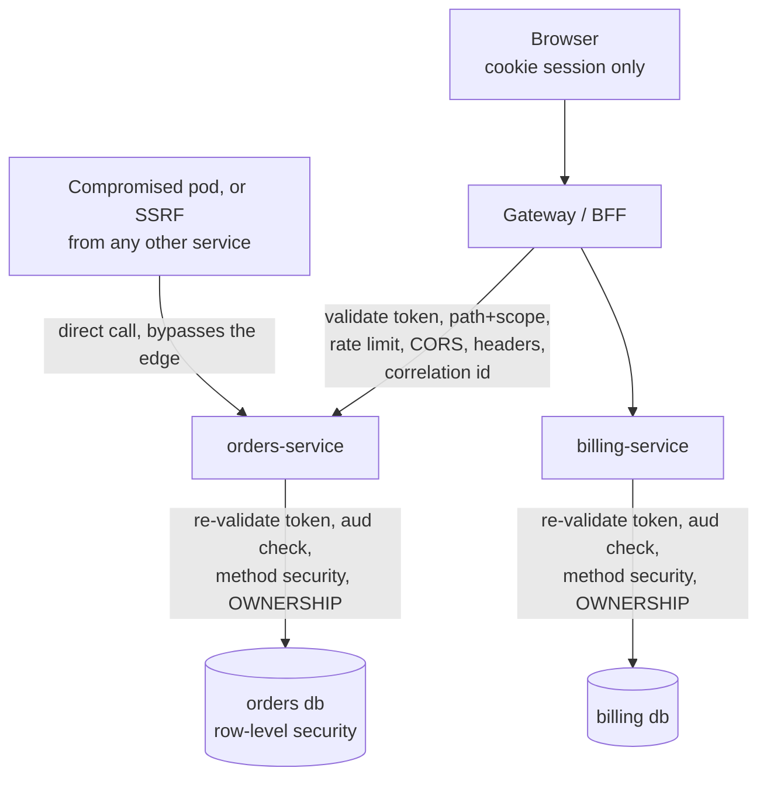

# 13.1 — API Gateway Security

> **Module 13 · Topic 1** · Microservices Security
> Baseline: Spring Security 6.x on Boot 3.x
> New to this? Read **In Plain English** below first, then come back to the Version Matrix.

---

## Version Matrix

| Concern | Spring Security 5.x | **Spring Security 6.x (baseline)** | Spring Security 7.x |
|---|---|---|---|
| Gateway runtime | Spring Cloud Gateway 3.x, WebFlux only | **Gateway 4.x on WebFlux, plus Gateway MVC (`spring-cloud-gateway-mvc`) as a servlet option** | artifacts renamed `spring-cloud-gateway-server-webflux` / `-webmvc`; both first-class |
| Reactive DSL | `ServerHttpSecurity` with `.and()` | **`ServerHttpSecurity` lambda DSL, `authorizeExchange(...)`** | lambda DSL only; `.and()` removed |
| `TokenRelay` filter | lived in `spring-cloud-security` | **ships in Spring Cloud Gateway, auto-configured when a `ReactiveOAuth2AuthorizedClientManager` bean exists** | same |
| Token exchange at the edge (RFC 8693) | not supported | **`AuthorizationGrantType.TOKEN_EXCHANGE` from 6.3** | supported; `RestClient`-based token response clients only |
| Authorized-client store for a BFF | `WebSessionServerOAuth2AuthorizedClientRepository` | **same, plus `R2dbcReactiveOAuth2AuthorizedClientService` for a shared store** | same |
| CSRF for a cookie-session BFF | `CookieServerCsrfTokenRepository` | **same, with the BREACH-safe `XorServerCsrfTokenRequestAttributeHandler` as default** | SPA-friendly CSRF configuration, so the XOR/cookie combination stops being a manual recipe |
| Reactive authorization engine | `ReactiveAuthorizationManager.check()` | **`check()` returning `Mono<AuthorizationDecision>`** | `authorize()` replaces `check()`, mirroring the servlet side |

---

## Why This Exists

In a monolith there is one process, one filter chain, and one place where identity is
established. In a microservices estate there are twenty processes, and the question becomes
*where* authentication happens. Doing it in all twenty duplicates the effort and the bugs; doing
it in none is a breach. So almost every real architecture puts an **API gateway** at the edge
and makes it the authentication boundary.

> **The gateway turns "who is this caller?" from a question every service asks into a question
> one component answers.** It does not, and cannot, answer "may this caller touch *this
> object*?"

That second sentence is the whole topic. A gateway is excellent at coarse, request-shaped
decisions: is there a valid token, is it from our issuer, is this path allowed for these scopes,
is this caller sending four thousand requests a second. It is structurally incapable of the
decision that actually causes breaches — whether invoice 4711 belongs to the caller. The gateway
does not know what an invoice is. Everything below follows from that split.

---

## In Plain English

**The one-line version:** When an application is split into many small services, you put one component at the front
door to check everybody's identity once, and this file is about what that front door can and cannot do for you.

**An analogy.** Think of a large office building shared by a dozen companies. There is one reception desk in the
lobby. You show your identity document once, reception confirms it is genuine, and you are given a visitor badge.
That is the gateway: a single place where "are you really who you say you are" gets answered, instead of every
company on every floor running its own identity check.

But notice what reception cannot do. Reception has no idea whose desk is whose, which filing cabinet belongs to the
finance team, or whether you are allowed to open a particular drawer. It can say "the third floor is staff only",
and that is about the limit. The company on the third floor still has to lock its own cabinets. If it does not, then
anybody who gets past reception — or who finds a fire escape and never passes reception at all — can take whatever
they like.

That fire escape is the crucial part. In a cloud cluster, by default, every service can reach every other service
directly over the network. So a design where the services trust anything that reaches them has no security at all
the moment one other service is compromised, or somebody opens a debugging tunnel, or a bug in an unrelated service
can be tricked into making requests on an attacker's behalf.

**How it actually works, step by step.**

An **API gateway** is a service that sits in front of all the others. Every request from the outside world arrives
at it first. It checks the caller's **token** (a signed piece of data proving who they are, issued by a login
server), it can refuse obviously bad traffic, it can limit how many requests one caller makes per minute, and it
then forwards the request on to whichever service should handle it.

There are exactly three ways of telling the downstream service who the caller is, and they are not equally safe. The
first is for the gateway to add a plain header like `X-User-Id: alice` and have the service believe it. This is the
tempting one and it is the classic disaster, because a header is just text: anyone who can open a connection to that
service directly can send `X-User-Id: admin`. The second, and the sensible default, is to forward the original
signed token and have each service verify the signature itself. Verifying a signature costs microseconds of local
work after the signing keys have been fetched once, and in exchange every service independently *knows* who the
caller is rather than taking somebody's word for it. The third is for the gateway to trade the incoming token for a
narrower one, scoped to a single downstream service; it is the strongest option and the most operational work, and
it is the subject of the next file.

For browser-based applications there is an additional pattern called **BFF**, short for Backend for Frontend. The
problem it solves is that there is nowhere safe in a browser to keep a token: anything JavaScript can read, injected
JavaScript can steal. With a BFF the browser holds only an ordinary session cookie marked `HttpOnly`, which
JavaScript cannot read at all, and the tokens stay on the server keyed to that session. The gateway attaches the
real token when it forwards the request. The trade-off is that cookies are sent automatically by the browser, which
brings back cross-site request forgery as a concern, and that has a standard, well-understood fix.

One practical wrinkle: Spring Cloud Gateway is usually built on WebFlux, Spring's non-blocking stack. There, no
single thread owns a request, so the familiar `SecurityContextHolder` — which stores the current user in a
thread-local variable — does not work. It compiles and returns nothing useful, which makes it a confusing bug rather
than an obvious one. In the reactive world the current user travels along the data pipeline instead, reached through
`ReactiveSecurityContextHolder`. There is also a servlet-based gateway option where the familiar approach works
normally.

**Why should a beginner care?** The very first microservices architecture most people build is "the gateway checks
the token, the services trust a header", and it is a system with no real security boundary between the internet and
your database once any single component is compromised. Understanding the split — the gateway proves *who you are*,
the service decides *what you may touch* — is what prevents that. It also explains why an endpoint like
`/api/orders/4711` needs an ownership check inside the orders service: the gateway can tell that you are a valid
customer, but it has no idea whose order 4711 is.

**Words you will meet in this file**

| Term | In plain words |
|---|---|
| API gateway | A service at the front door that all external requests pass through before reaching the real services. |
| Edge | Shorthand for that outermost layer where traffic first arrives. |
| Downstream service | Any of the internal services the gateway forwards requests to. |
| Token / JWT | A signed piece of data proving who the caller is, which anyone holding the public key can verify. |
| JWKS | The published set of public keys used to check that a token's signature is genuine. |
| Audience (`aud`) | The claim inside a token saying which service the token was meant for. |
| Trusted header | Passing identity as plain text, which only works if nothing but the gateway can reach the service. |
| Token relay | The gateway attaching the stored token to the request it forwards onwards. |
| Token exchange | Swapping one token for a narrower one intended for a single service. |
| BFF (Backend for Frontend) | Keeping tokens on the server and giving the browser only a cookie session. |
| `HttpOnly` cookie | A cookie the browser will not let JavaScript read, so injected script cannot steal it. |
| CSRF | An attack where another site makes the browser send a request using your cookie. Relevant again once you use cookies. |
| WebFlux / reactive | Spring's non-blocking stack, where a request is not tied to one thread. |
| `SecurityWebFilterChain` | The reactive equivalent of the familiar servlet filter chain. |
| `ReactiveSecurityContextHolder` | How you get the current user in reactive code, since thread-local storage does not apply. |
| Rate limiting | Capping how many requests a caller may make in a period. Needs a shared view, which only the edge has. |
| Token bucket | The usual rate-limiting scheme: a refillable allowance permitting short bursts. |
| TLS termination | The point where the encrypted connection is decrypted, usually the load balancer or gateway. |
| `X-Forwarded-For` / `-Proto` | Headers a proxy adds describing the original client and scheme. Only trustworthy if the edge overwrites them. |
| Service mesh / mutual TLS | Infrastructure that encrypts and authenticates connections between services automatically. |
| Defence in depth | Assuming any one layer can fail, so each layer checks what it can independently. |

**If you remember only one thing:** the gateway answers "is this a valid caller" once for everyone, and each service
must still answer "may this caller touch this particular record" for itself, because the gateway has no idea what
your data means.

---

## Core Concepts

### 1. What the Edge Buys You, and What It Does Not

**In simple terms:** The front door is very good at checking identity and shaping traffic for everyone at once, and
completely incapable of judging whether a particular record belongs to a particular caller.

| Concern | Solved at the gateway? | Why |
|---|---|---|
| Token signature and issuer validation | **Yes** | One JWKS cache, one configuration, one upgrade path |
| Rejecting unauthenticated traffic early | **Yes** | Garbage never consumes a service thread |
| Rate limiting, request-size caps | **Yes** | Needs a global view of the caller, which no service has |
| CORS preflight, security response headers | **Yes** | The browser sees one origin; uniform and unforgettable |
| Correlation-ID origination | **Yes** | The first hop is the only place an ID can be *minted* |
| Coarse path and scope authorization | **Partly** | "`/admin/**` needs `SCOPE_admin`" is expressible; more is not |
| Object-level ownership, tenant isolation | **No** | No domain model, no database; these are query predicates |
| Business input validation, auditing *what changed* | **No** | It should not parse your bodies, and it sees requests rather than resulting state |

The honest summary: **the gateway is an authentication and traffic boundary, not an authorization
boundary.**

### 2. The Three Topologies

**In simple terms:** There are only three ways to tell a downstream service who the caller is, and the easiest one —
passing the username in a plain header — is forgeable by anything that can reach the service directly.

There are exactly three ways to get identity from the edge to a downstream service, and they are
not equally good.

**(a) Gateway authenticates, downstream trusts a header.** The gateway validates the token and
injects `X-User-Id: alice` and `X-User-Roles: ADMIN`; the service has no security configuration
and believes the header.

This is the **trusted header** pattern and it is the classic failure. The header is a plain-text
assertion with no integrity protection, so anyone who can open a TCP connection to the service
sends `X-User-Id: admin` and becomes an administrator. The whole model reduces to one claim:
*nothing except the gateway can reach the service.* In a Kubernetes cluster with default
networking that claim is false on day one, because every pod can reach every other pod. It also
decays — somebody port-forwards to debug, a batch job lands in the same namespace, a second
gateway appears for mobile, or a server-side request forgery flaw in any unrelated service lets
an external attacker issue requests from inside.

There is a quieter failure too: the gateway must **strip inbound copies** of those headers
unconditionally. If a client can also send `X-User-Id` and the gateway appends rather than
replaces, the service sees two values and picks one, often the client's.

It is defensible only when the network genuinely prevents direct access *and* you prove it
continuously — mutual TLS where the service checks the gateway's certificate subject, or a mesh
with `PeerAuthentication` in `STRICT` mode plus an `AuthorizationPolicy` pinning the gateway's
workload identity. Note that you have then deployed mutual TLS anyway, which makes option (b)
nearly free.

**(b) Gateway authenticates, forwards the original token, downstream re-validates.** Each
service is itself an OAuth2 resource server, verifying the signature against the issuer's JWKS
and checking `iss`, `aud`, and `exp`. The duplicated verification sounds wasteful and is not:
after the first key fetch it is local CPU work in the tens of microseconds with no network call.
What you buy is that every service holds a cryptographically verified identity, so every service
can do object-level authorization and a directly reachable pod is not a vulnerability. **This is
the pragmatic default**, and the design to propose unless there is a specific reason not to.

**(c) Gateway performs token exchange into an internal token.** The gateway exchanges the
external token at the authorization server (RFC 8693) for one that is audience-restricted to a
single downstream service and scope-reduced to what that service needs. Strongest option,
highest operational cost; covered in depth in the next file.

| | (a) Trusted header | (b) Forward the token | (c) Token exchange |
|---|---|---|---|
| Downstream validation work | none | signature + claims | signature + claims |
| Safe if a pod is directly reachable | **No — forgeable** | Yes | Yes |
| Verified user identity downstream | No | Yes | Yes |
| Object-level authorization possible | No | Yes | Yes |
| Audience correctness | not applicable | **wrong** — one token for every service | correct per service |
| Blast radius of a compromised service | whole estate | every service the user can reach | that service's audience only |
| Extra latency at the edge | none | none | one exchange per audience, cacheable |
| Operational complexity | lowest | low | highest — needs RFC 8693 support |

### 3. The BFF (Backend for Frontend) Pattern

**In simple terms:** Keep the tokens on the server and give the browser only a cookie it cannot read with
JavaScript, so a script-injection flaw cannot walk away with a credential it can reuse elsewhere.

For a browser client the interesting question is not "session or token" but **where the token
lives**. If a token is reachable by JavaScript, one cross-site scripting flaw exfiltrates it and
the attacker uses it from their own machine until it expires. No token hygiene fixes that,
because the browser has no safe storage location.

The Backend for Frontend pattern removes the token from the browser entirely. The browser holds
only an `HttpOnly`, `Secure`, `SameSite=Lax` cookie session with the BFF. The BFF is the OAuth2
**client**: it runs authorization code with PKCE and keeps the access and refresh tokens
**server-side**, keyed by that session. On `/bff/api/orders` it resolves the session, attaches
the stored access token outbound, proxies downstream, and returns the response. Refresh happens
server-side and the browser never notices a token exists.

This is the architecture the OAuth 2.0 for Browser-Based Applications best-current-practice
document now recommends for first-party browser apps. A cross-site scripting flaw is still bad —
the attacker can act as the user while the page is open — but it is *bounded* and *observable*,
because no credential leaves the browser and killing the session ends it. The price is that
cookies are ambient credentials, so CSRF exposure returns, and that is a solved problem with a
standard mitigation. In Spring the gateway *is* the natural BFF:
`spring-boot-starter-oauth2-client` with `oauth2Login()` gives you the session and the stored
`OAuth2AuthorizedClient`, and `TokenRelay` attaches it outbound.

### 4. Spring Cloud Gateway and `TokenRelay`

**In simple terms:** This is the piece that takes the token the gateway is holding for the logged-in user and
attaches it to the request being forwarded, and it silently does nothing if one required bean is missing.

The WebFlux gateway is built on Spring WebFlux, so its security is `SecurityWebFilterChain` and
`ServerHttpSecurity`, not `SecurityFilterChain` and `HttpSecurity`. `TokenRelay` is a
`GatewayFilter` factory that reads the `OAuth2AuthorizedClient` for the current principal and
sets `Authorization` on the proxied request.

Three details trip people up. `TokenRelay=` with an empty value means "use the registration the
principal authenticated with"; a value (`TokenRelay=keycloak`) names one. The filter is only
auto-configured when a `ReactiveOAuth2AuthorizedClientManager` bean exists, so
`spring-boot-starter-oauth2-client` must be present with at least one `ClientRegistration` — and
without it the route forwards silently with no `Authorization` header. Recent Spring Cloud
releases also moved the gateway properties under `spring.cloud.gateway.server.webflux.*`, so
copy configuration from documentation matching your version rather than an old blog post.

Route-level authorization is expressed in the security chain, not the route definition:
`authorizeExchange(e -> e.pathMatchers("/api/admin/**").hasAuthority("SCOPE_admin:write"))`.
Keep it to paths and scopes, because that is all the edge can honestly evaluate.

### 5. `ReactiveSecurityContextHolder` — the Gateway Is Not a Servlet

**In simple terms:** In the reactive gateway no single thread owns a request, so the usual way of asking "who is the
current user" returns nothing instead of failing loudly, which makes it a confusing bug rather than an obvious one.

The WebFlux gateway has no thread that owns a request, so the `ThreadLocal` model cannot work.
The `SecurityContext` lives in the **Reactor `Context`**, an immutable map travelling down the
subscription chain:

```java
// org.springframework.security.core.context.ReactiveSecurityContextHolder
public static Mono<SecurityContext> getContext() {
    return Mono.deferContextual(Mono::just)
        .filter((c) -> c.hasKey(SECURITY_CONTEXT_KEY))
        .flatMap((c) -> c.<Mono<SecurityContext>>get(SECURITY_CONTEXT_KEY));
}
```

`ReactorContextWebFilter` puts it there, reading from the `ServerSecurityContextRepository`.
Consequences: `SecurityContextHolder.getContext()` compiles, does not throw, and returns nothing
useful, which is the most common reactive security bug and presents as "authentication is broken"
rather than "wrong API"; identity is obtained by composition, through `exchange.getPrincipal()` or
`ReactiveSecurityContextHolder` flat-mapped into your pipeline; breaking the chain with
`.block()`, your own executor, or a separate subscription loses the context; and blocking
input/output is a correctness problem rather than merely a performance one, because it stalls
every request multiplexed onto that event-loop thread. The mechanics are covered in
[`45_M18_T1_Reactive_WebFlux_Security.md`](45_M18_T1_Reactive_WebFlux_Security.md).

### 6. Gateway MVC — the Servlet Alternative

**In simple terms:** There is a gateway option built on the ordinary servlet stack where everything you already know
about filter chains still applies, which is usually the better choice for a team that does not know Reactor well.

Newer Spring Cloud versions ship a servlet-stack gateway (`spring-cloud-gateway-mvc`, renamed to
`spring-cloud-gateway-server-webmvc`) built on `RouterFunction` and `RestClient` proxying, where
filter functions such as `TokenRelayFilterFunctions.tokenRelay()` replace the `GatewayFilter`
factories. Security then becomes ordinary `SecurityFilterChain` and `HttpSecurity`, and
`SecurityContextHolder` behaves as you expect, which removes an entire class of reactive-context
mistakes. With virtual threads on Java 21 the throughput argument for the reactive gateway is much
weaker than it was; the cost is losing the back-pressure story and some reactive ecosystem
integration. Choose the servlet gateway if your team is a servlet team — a reactive gateway
maintained by people who do not understand Reactor contexts is a security liability, not a
performance win.

### 7. Edge Traffic Controls

**In simple terms:** Limits on how fast and how large requests may be belong at the front door, because only the
front door sees all of a caller's traffic rather than the slice that happened to reach one replica.

Rate limiting belongs at the edge because it needs a **global view of the caller**: a limit of
100 requests per minute enforced independently by five replicas is really a limit of 500.
`RequestRateLimiter` with `RedisRateLimiter` implements a token bucket in a Lua script, so the
read-modify-write is atomic server-side.

| Parameter | Meaning |
|---|---|
| `replenishRate` | Sustained requests per second |
| `burstCapacity` | Bucket size — the maximum instantaneous burst |
| `requestedTokens` | Tokens consumed per request; raise it to make expensive routes cost more |

The `KeyResolver` decides *what* is limited. The default `PrincipalNameKeyResolver` keys on the
authenticated principal, which is right for authenticated traffic and useless for the login
endpoint — there you key on the client address taken from a *trusted* `X-Forwarded-For`. The
`RequestSize` filter rejects bodies over `maxSize` with 413 before they stream downstream; without
it a single client can make your services allocate arbitrary heap. Cap header size at the
container too: a token carrying thousands of authorities exceeds a typical 8 KB header limit and
produces a confusing 431 or 400 from a proxy you do not control.

### 8. TLS Termination and Re-establishment

**In simple terms:** Encryption usually ends at the gateway, so the services behind it believe they are serving
plain HTTP, and the traffic between them really is plain unless you deliberately encrypt it again.

TLS from the browser normally terminates at the load balancer or gateway, and a *new* connection
is made inward. So `request.isSecure()` is false inside the gateway and inside every service, and
HSTS emission, `requiresChannel()`, and `Secure`-cookie decisions all misbehave; set
`server.forward-headers-strategy=framework` so the forwarded-header filter rewrites scheme, host,
and port from `X-Forwarded-*`. Those headers are **only trustworthy if the edge overwrites them**
— if your proxy appends to a client-supplied `X-Forwarded-For`, every address-based control you
build is decorative.

The segment between gateway and services is not safe merely because it is "internal". Plain HTTP
inside the cluster means bearer tokens are readable by anything with packet capture on the node,
so re-establish TLS inward, explicitly per service or transparently via a mesh. Certificate
lifecycle is the real work: a four-hour mesh-issued certificate that rotates automatically is both
safer and less burdensome than a one-year certificate a human remembers to replace.

### 9. Defence in Depth — Why Downstream Must Still Authorise

**In simple terms:** If taking the gateway out of the path removes all security, then one compromised component
owns everything, so each layer has to make the decisions it is actually capable of making.



The `Attacker` edge is the entire argument. Any design where removing the gateway from the path
removes *all* authentication has a single point of compromise. The gateway is a filter, not a
wall. The division of labour is therefore: the gateway decides whether the token is valid and
whether the path is permitted for these scopes; the service filter chain decides whether the
token is for *this* audience and which coarse rules apply; method security decides whether the
operation needs a role or permission; and the repository decides whether this **row** belongs to
this caller or tenant.

---

## Working Code

### The gateway: BFF session with the browser, coarse authorization, token relay outbound

```java
package com.example.gateway;

import org.springframework.context.annotation.Bean;
import org.springframework.context.annotation.Configuration;
import org.springframework.http.HttpMethod;
import org.springframework.http.HttpStatus;
import org.springframework.security.config.Customizer;
import org.springframework.security.config.annotation.web.reactive.EnableWebFluxSecurity;
import org.springframework.security.config.web.server.ServerHttpSecurity;
import org.springframework.security.web.server.SecurityWebFilterChain;
import org.springframework.security.web.server.authentication.HttpStatusServerEntryPoint;
import org.springframework.security.web.server.csrf.CookieServerCsrfTokenRepository;
import org.springframework.security.web.server.header.XFrameOptionsServerHttpHeadersWriter;
import org.springframework.web.cors.CorsConfiguration;
import org.springframework.web.cors.reactive.CorsConfigurationSource;
import org.springframework.web.cors.reactive.UrlBasedCorsConfigurationSource;

import java.util.List;

@Configuration
@EnableWebFluxSecurity
public class GatewaySecurityConfig {

    @Bean
    SecurityWebFilterChain springSecurityFilterChain(ServerHttpSecurity http) {
        http
            .authorizeExchange(exchange -> exchange
                .pathMatchers("/actuator/health/**", "/login/**", "/oauth2/**").permitAll()
                .pathMatchers(HttpMethod.OPTIONS, "/**").permitAll()
                // Route-level coarse authorization. This is all the edge can honestly do.
                .pathMatchers("/api/admin/**").hasAuthority("SCOPE_admin:write")
                .pathMatchers(HttpMethod.GET, "/api/orders/**").hasAuthority("SCOPE_orders:read")
                .pathMatchers("/api/orders/**").hasAuthority("SCOPE_orders:write")
                .anyExchange().authenticated()              // nothing public by accident
            )
            // The browser gets a cookie session; the OAuth2 tokens stay server-side.
            .oauth2Login(Customizer.withDefaults())
            .oauth2Client(Customizer.withDefaults())
            .logout(logout -> logout.logoutUrl("/bff/logout"))
            // A cookie session means ambient credentials, so CSRF is live again.
            // withHttpOnlyFalse() lets the SPA read the token and echo it as a header.
            .csrf(csrf -> csrf.csrfTokenRepository(CookieServerCsrfTokenRepository.withHttpOnlyFalse()))
            .cors(cors -> cors.configurationSource(corsConfigurationSource()))
            .headers(headers -> headers
                .contentSecurityPolicy(csp -> csp
                    .policyDirectives("default-src 'self'; frame-ancestors 'none'; object-src 'none'"))
                .hsts(hsts -> hsts.includeSubdomains(true).maxAgeInSeconds(31536000))
                .frameOptions(frame -> frame.mode(XFrameOptionsServerHttpHeadersWriter.Mode.DENY))
            )
            // API callers want a status code. Browser paths live on a separate, lower-priority
            // SecurityWebFilterChain that keeps the redirect entry point.
            .exceptionHandling(ex -> ex
                .authenticationEntryPoint(new HttpStatusServerEntryPoint(HttpStatus.UNAUTHORIZED)));

        return http.build();
    }

    /** One CORS policy for the estate. allowCredentials is required for the BFF cookie. */
    @Bean
    CorsConfigurationSource corsConfigurationSource() {
        CorsConfiguration config = new CorsConfiguration();
        config.setAllowedOrigins(List.of("https://app.example.com"));
        config.setAllowedMethods(List.of("GET", "POST", "PUT", "PATCH", "DELETE"));
        config.setAllowedHeaders(List.of("Content-Type", "X-XSRF-TOKEN"));
        config.setAllowCredentials(true);
        config.setMaxAge(3600L);
        UrlBasedCorsConfigurationSource source = new UrlBasedCorsConfigurationSource();
        source.registerCorsConfiguration("/**", config);
        return source;
    }
}
```

### Routes, header hygiene, and rate limiting

```yaml
spring:
  cloud:
    gateway:
      default-filters:
        # Strip any client attempt to impersonate. Unconditional, on every route.
        - RemoveRequestHeader=X-User-Id
        - RemoveRequestHeader=X-User-Roles
        - DedupeResponseHeader=Access-Control-Allow-Origin Access-Control-Allow-Credentials
      routes:
        - id: orders
          uri: http://orders-service:8080
          predicates: [ Path=/api/orders/** ]
          filters:
            - TokenRelay=
            - RemoveRequestHeader=Cookie            # the cookie is for the BFF, not downstream
            - name: RequestSize
              args: { maxSize: 1MB }
            - name: RequestRateLimiter
              args:
                redis-rate-limiter.replenishRate: 50
                redis-rate-limiter.burstCapacity: 100
                key-resolver: "#{@principalKeyResolver}"
        - id: login-throttled
          uri: http://auth-service:8080
          predicates: [ Path=/api/auth/login ]
          filters:
            - name: RequestRateLimiter
              args:
                redis-rate-limiter.replenishRate: 1
                redis-rate-limiter.burstCapacity: 5
                key-resolver: "#{@ipKeyResolver}"   # no principal yet, so key on address
server:
  forward-headers-strategy: framework
  servlet:
    session:
      cookie: { name: __Host-BFFSESSION, http-only: true, secure: true, same-site: lax }
```

### Rate-limit keys and correlation-ID origination

```java
package com.example.gateway;

import org.springframework.cloud.gateway.filter.GlobalFilter;
import org.springframework.cloud.gateway.filter.ratelimit.KeyResolver;
import org.springframework.context.annotation.Bean;
import org.springframework.context.annotation.Configuration;
import org.springframework.core.Ordered;
import org.springframework.core.annotation.Order;
import org.springframework.web.server.ServerWebExchange;
import reactor.core.publisher.Mono;

import java.security.Principal;
import java.util.Optional;
import java.util.UUID;

@Configuration
public class GatewayInfrastructureConfig {

    /** Authenticated traffic: limit per principal so one user cannot starve the rest. */
    @Bean
    KeyResolver principalKeyResolver() {
        return exchange -> exchange.getPrincipal().map(Principal::getName).defaultIfEmpty("anonymous");
    }

    /** Unauthenticated traffic: only meaningful because the edge overwrites X-Forwarded-For. */
    @Bean
    KeyResolver ipKeyResolver() {
        return exchange -> Mono.just(Optional.ofNullable(exchange.getRequest().getRemoteAddress())
            .map(addr -> addr.getAddress().getHostAddress()).orElse("unknown"));
    }

    /**
     * The edge is the only place a correlation ID can be originated. An inbound value is
     * attacker-controlled and lands in log lines, so validate its shape or replace it —
     * an unvalidated value is a log-injection vector via embedded newlines.
     */
    @Bean
    @Order(Ordered.HIGHEST_PRECEDENCE)
    GlobalFilter correlationIdFilter() {
        return (exchange, chain) -> {
            String in = exchange.getRequest().getHeaders().getFirst("X-Correlation-Id");
            String id = (in != null && in.length() <= 64 && in.matches("[A-Za-z0-9._-]+"))
                ? in : UUID.randomUUID().toString();
            ServerWebExchange mutated = exchange.mutate()
                .request(r -> r.headers(h -> h.set("X-Correlation-Id", id))).build();
            mutated.getResponse().getHeaders().set("X-Correlation-Id", id);
            return chain.filter(mutated);
        };
    }
}
```

### The downstream service — option (b), and it still authorises

Audience validation is what makes a directly reachable pod safe: a token minted for another
service is rejected here even though its signature is perfectly valid. Boot exposes it as a
property (`spring.security.oauth2.resourceserver.jwt.audiences: orders-service`); for anything
more complex, build a `NimbusJwtDecoder` and give it a `DelegatingOAuth2TokenValidator`
containing `JwtValidators.createDefaultWithIssuer(issuer)` plus your own `JwtClaimValidator`.

```java
package com.example.orders;

import org.springframework.context.annotation.Bean;
import org.springframework.context.annotation.Configuration;
import org.springframework.security.access.prepost.PreAuthorize;
import org.springframework.security.config.Customizer;
import org.springframework.security.config.annotation.method.configuration.EnableMethodSecurity;
import org.springframework.security.config.annotation.web.builders.HttpSecurity;
import org.springframework.security.config.annotation.web.configuration.EnableWebSecurity;
import org.springframework.security.config.http.SessionCreationPolicy;
import org.springframework.security.core.annotation.AuthenticationPrincipal;
import org.springframework.security.oauth2.jwt.Jwt;
import org.springframework.security.web.SecurityFilterChain;
import org.springframework.web.bind.annotation.GetMapping;
import org.springframework.web.bind.annotation.PathVariable;
import org.springframework.web.bind.annotation.RequestMapping;
import org.springframework.web.bind.annotation.RestController;

@Configuration
@EnableWebSecurity
@EnableMethodSecurity
class OrdersSecurityConfig {

    @Bean
    SecurityFilterChain filterChain(HttpSecurity http) throws Exception {
        http
            .sessionManagement(s -> s.sessionCreationPolicy(SessionCreationPolicy.STATELESS))
            .csrf(csrf -> csrf.disable())           // no cookies, so no ambient credentials
            .authorizeHttpRequests(auth -> auth
                .requestMatchers("/actuator/health/**").permitAll()
                .anyRequest().authenticated()
            )
            .oauth2ResourceServer(oauth2 -> oauth2.jwt(Customizer.withDefaults()));
        return http.build();
    }
}

@RestController
@RequestMapping("/api/orders")
class OrderController {

    private final OrderRepository orders;

    OrderController(OrderRepository orders) {
        this.orders = orders;
    }

    /**
     * The gateway already checked SCOPE_orders:read. It could not check ownership, because it
     * has no idea which orders belong to whom. Ownership goes in the query, so there is no
     * window in which the wrong row exists in memory, and a miss is a 404 rather than a 403.
     */
    @GetMapping("/{id}")
    @PreAuthorize("hasAuthority('SCOPE_orders:read')")
    Order get(@PathVariable Long id, @AuthenticationPrincipal Jwt jwt) {
        return orders.findByIdAndOwnerSubject(id, jwt.getSubject())
                     .orElseThrow(OrderNotFoundException::new);
    }
}
```

---

## Internals

### How `TokenRelay` actually attaches the token

```java
// org.springframework.cloud.gateway.filter.factory.TokenRelayGatewayFilterFactory (simplified)
public GatewayFilter apply(Config config) {
    String defaultClientRegistrationId = config.getDefaultClientRegistrationId();
    return (exchange, chain) -> exchange.getPrincipal()
        .filter(principal -> principal instanceof OAuth2AuthenticationToken)
        .cast(OAuth2AuthenticationToken.class)
        .flatMap(authentication -> authorizedClient(defaultClientRegistrationId, exchange, authentication))
        .map(OAuth2AuthorizedClient::getAccessToken)
        .map(token -> withBearerAuth(exchange, token))
        .defaultIfEmpty(exchange)
        .flatMap(chain::filter);
}
```

Three things fall out of reading that. The `instanceof OAuth2AuthenticationToken` filter is why
token relay does nothing when the gateway authenticated the caller as a **resource server**
(`JwtAuthenticationToken`) rather than as an **OAuth2 client** — `TokenRelay` is for the client
case. `defaultIfEmpty(exchange)` means **failure is silent**: no principal, no authorized
client, or the wrong token type forwards the request with no `Authorization` header and no log
line, so the symptom is a 401 from downstream and a perfectly healthy-looking gateway. And
`authorizedClient(...)` goes through the `ReactiveOAuth2AuthorizedClientManager`, which uses the
stored refresh token to renew an expired access token transparently — which is why a BFF keeps
working for hours while the browser does nothing.

### The reactive chain the request passes through

`WebFilterChainProxy` is the reactive counterpart of `FilterChainProxy` and picks the first
matching `SecurityWebFilterChain` — same first-match-wins rule, same trap of a catch-all chain
first making later chains dead code.

| Reactive filter | Servlet counterpart | Job |
|---|---|---|
| `ReactorContextWebFilter` | `SecurityContextHolderFilter` | Puts the `SecurityContext` into the Reactor `Context` |
| `HttpHeaderWriterWebFilter` | `HeaderWriterFilter` | Security response headers |
| `CsrfWebFilter` | `CsrfFilter` | Token load and comparison |
| `AuthenticationWebFilter` | authentication filters | One instance per mechanism |
| `ExceptionTranslationWebFilter` | `ExceptionTranslationFilter` | Maps exceptions to 401/403/redirect |
| `AuthorizationWebFilter` | `AuthorizationFilter` | Evaluates `authorizeExchange` rules |

Gateway routing happens *after* the security chain, in `RoutePredicateHandlerMapping` and
`FilteringWebHandler`. That ordering is why a route filter such as `TokenRelay` can rely on a
principal already being present.

### Where the rate limiter's atomicity comes from

`RedisRateLimiter` ships a Lua script (`request_rate_limiter.lua`) so the bucket update is a
single atomic server-side operation; a Java-side read followed by a write would let two replicas
both observe 99 requests and both allow the hundredth. On a decision it sets
`X-RateLimit-Remaining`, `X-RateLimit-Burst-Capacity`, `X-RateLimit-Replenish-Rate` and
`X-RateLimit-Requested-Tokens`, and on denial short-circuits with 429. Note `deny-empty-key`,
default `true`: setting it to `false` turns a `KeyResolver` bug into "rate limiting silently
off". And note what has no mechanism at all — `X-User-Id: alice` carries no signature, so the
only thing between an attacker and that header is network reachability, a configuration property
that drifts, whereas a signature is mathematics that does not.

---

## Configuration Reference

| Option | Effect | Default |
|---|---|---|
| `filters: TokenRelay=` | Attaches the stored access token to the proxied request | not applied |
| `spring.cloud.gateway.default-filters` | Filters applied to every route — the place for header stripping | empty |
| `RemoveRequestHeader=<name>` | Deletes an inbound header before proxying | not applied |
| `RequestSize` `maxSize` | Rejects larger bodies with 413 | `5000000` bytes when present |
| `redis-rate-limiter.replenishRate` / `.burstCapacity` / `.requestedTokens` | Token-bucket rate, bucket size, cost per request | required / equals rate / `1` |
| `...request-rate-limiter.deny-empty-key` | Deny when the `KeyResolver` yields nothing | `true` |
| `spring.cloud.gateway.httpclient.ssl.use-insecure-trust-manager` | Disables downstream certificate validation | `false` — never enable outside a laptop |
| `server.forward-headers-strategy` | Honour `X-Forwarded-*` so scheme and host are truthful | `none` |
| `server.ssl.client-auth` | Require or request a client certificate | `none` |
| `CookieServerCsrfTokenRepository.withHttpOnlyFalse()` | CSRF cookie readable by the SPA | repository defaults to `HttpOnly` |
| `spring.security.oauth2.client.registration.*` | Makes the gateway an OAuth2 client, enabling `TokenRelay` | none |
| `spring.security.oauth2.resourceserver.jwt.audiences` | Adds audience validation downstream | none |

---

## Production Concerns & Anti-Patterns

**Trusting a header because "only the gateway can reach us".** The assertion is a network
statement, and networks change without anyone revisiting the security design. If you must do it,
enforce it with mutual TLS or a mesh policy pinning the caller's workload identity — and then
notice you could have forwarded a token for almost nothing. Related: adding `X-User-Id` at the
gateway is only half the job, so put `RemoveRequestHeader` in `default-filters` where it also
covers routes people add later without thinking about it.

**Disabling security downstream because "the gateway does it".** Every service must be
independently safe to expose. The test is simple and worth automating: call the service directly,
bypassing the gateway, with no credential. A 200 is the bug.

**Treating the gateway as an authorization engine.** Teams start with a scope check, then add path
regular expressions that encode ownership, and end up with a routing table holding business rules
the domain owns. Route predicates are not a policy language.

**Ignoring the single point of failure.** Run replicas across zones, keep the dependency graph
tiny, bound every downstream timeout and connection pool so one slow service cannot take the edge
down, and make sure the JWKS cache survives a brief identity-provider outage instead of failing
every request closed.

**Ignoring the single point of compromise.** The gateway holds the client secret and, in a BFF,
every user's refresh token, making it the highest-value host you operate. Distroless non-root
image, a service account that can reach only what it routes to, secret rotation, an encrypted
session store, and alerting on refresh and exchange spikes.

**Terminating TLS at the edge and shrugging at the inside.** Tokens in plain text between pods
are readable by anything with packet capture on the node. Re-establish TLS and verify it rather
than assuming the platform team did.

**Blocking calls inside reactive gateway filters.** A `RestTemplate` or JDBC call in a
`GlobalFilter` stalls an event-loop thread and degrades every concurrent request. Make the lookup
reactive and cached, or move to the servlet gateway where blocking is expected. Similarly, let
each hop *propagate* the correlation ID rather than mint its own — the identifier's whole value
is that it is identical from browser to database.

---

## Debugging Playbook

| Symptom | Likely root cause | Fix |
|---|---|---|
| Downstream 401, gateway logs look clean | `TokenRelay` matched no `OAuth2AuthenticationToken` and forwarded silently | Confirm the gateway is an OAuth2 *client* with a `ClientRegistration`; log outbound header presence in a `GlobalFilter` |
| Downstream 401 with a valid-looking token | Audience mismatch — the token names the public API, not this service | Relax `aud` deliberately, or move to token exchange so each service gets its own token |
| `SecurityContextHolder.getContext()` empty in a gateway filter | Reactive stack; the context lives in the Reactor `Context` | Use `exchange.getPrincipal()` or `ReactiveSecurityContextHolder`, never `.block()` |
| Login loop between gateway and identity provider | Session cookie not stored: `Secure` set but served over HTTP, or `SameSite=Strict` blocking the return redirect | `forward-headers-strategy=framework`, `SameSite=Lax`, verify the cookie is set |
| 403 on every `POST` from the SPA | BFF has CSRF on and the SPA does not echo the token | `CookieServerCsrfTokenRepository.withHttpOnlyFalse()`, send `X-XSRF-TOKEN` |
| Rate limiting appears to do nothing, or a 100/min limit behaves like 300/min | `KeyResolver` returns empty with `deny-empty-key: false`, Redis unreachable, or the limiter is per-replica | Log the resolved key, alert on Redis, keep `deny-empty-key: true`, use `RedisRateLimiter` |
| HSTS header missing | Gateway sees plain HTTP because TLS terminated upstream | Forwarded-headers strategy plus a proxy that sets `X-Forwarded-Proto` |
| Browser reports a CORS error on a 200 response | Gateway *and* service both emit `Access-Control-Allow-Origin` | Centralise CORS at the edge, remove downstream, add `DedupeResponseHeader` |
| Service returns 403 when a test calls it directly | Working as designed; a **200** here is the real bug | Add an integration test asserting direct unauthenticated calls fail |
| Sporadic 431 or 400 from the proxy under real load | Token exceeded the header size limit because authorities were embedded | Stop enumerating authorities in the token; resolve them per service |

---

## Interview Q&A

### Q1. Your gateway validates the JWT. Should the downstream services validate it again?

<details>
<summary>Show answer</summary>

Yes, and not out of paranoia — the alternative makes network reachability the only thing
protecting your data.

If a service does not validate, its security posture is the statement "nothing but the gateway
can open a connection to me". In a typical Kubernetes cluster that is false on day one, because
every pod can reach every other pod. It also degrades over time: someone port-forwards to debug,
a batch job lands in the same namespace, a second gateway appears for mobile traffic, or a
server-side request forgery flaw in an unrelated service lets an external attacker make requests
*from inside*. Any one of those turns "not validating" into "unauthenticated admin access".

The cost is smaller than people assume. After the first JWKS fetch the key is cached —
`NimbusJwtDecoder` caches the key set and refreshes on an unknown `kid` — so verification is
local CPU work in the tens of microseconds, not a network call. In exchange every service holds
a cryptographically verified `Authentication`, which is the precondition for object-level
authorization, and that is where the breaches actually are.

**Counter-question: if every service validates the same token, the audience claim is identical everywhere. Why does that bother you?**

Because `aud` is meant to answer "who is this token for?", and if the answer is "all twelve of
our services" the claim carries no information and the token is a universal key. If the reviews
service is compromised, the attacker holds live tokens belonging to real users and the payments
service accepts them too, so the compromise of the least important service becomes a compromise
of the most important one. That is precisely what RFC 8693 token exchange fixes.

I would state the trade-off rather than pretend the default is perfect: forwarding is right for
most estates because it is simple and the blast radius is acceptable; exchange is right when
services have genuinely different trust levels, or when a regulator wants least privilege
demonstrated between internal components.

**Counter-question: how would you actually enforce that a service cannot be reached directly, if you chose to rely on that?**

Not with a Kubernetes `NetworkPolicy` alone — that is allow-listing by label, labels are
editable, and it is a reachability rule rather than an identity check. The credible mechanisms
are transport-level: mutual TLS where the service accepts only the gateway's certificate
subject, or a mesh with `PeerAuthentication` in `STRICT` mode plus an `AuthorizationPolicy`
naming the gateway's workload identity, enforced in the sidecar so no application code is
involved. Then the punchline: with mutual TLS in place, forwarding the token costs almost
nothing, so the reason for trusting a header has evaporated.

**Counter-question: is there any legitimate case for the gateway asserting identity in a header?**

Two. Protocols that cannot carry a bearer token — a legacy service with a fixed wire format, or
an internal hop where mutual TLS is already established and the header is an *additional*
attribute rather than the credential. And derived data the gateway computed that services should
not recompute, such as a normalised tenant identifier. The rule is that a header may carry
*attributes*, never the *authentication decision*, unless the transport authenticated the peer.
</details>

### Q2. Explain the Backend for Frontend pattern and why current guidance prefers it for browser apps.

<details>
<summary>Show answer</summary>

The Backend for Frontend pattern makes a server component the OAuth2 client on behalf of a
browser application, so no OAuth2 token ever reaches the browser. The browser holds only an
`HttpOnly`, `Secure`, `SameSite=Lax` session cookie with the BFF; the BFF runs authorization code
with PKCE and stores the access and refresh tokens server-side, keyed by that session. When the
browser calls `/bff/api/orders` the BFF resolves the session, attaches the token to the outbound
request, proxies downstream, and returns the response, refreshing server-side as needed.

Current best-current-practice guidance for browser-based applications prefers this because **the
browser has no safe place to store a token**. `localStorage` and `sessionStorage` are readable by
any script on the origin, so one cross-site scripting flaw in any dependency exfiltrates the token
and the attacker uses it from their own machine until it expires — invisibly to you. An
in-memory-only token is better but dies on every page reload, pushing people back to storage.

With a BFF the same flaw is still bad — the attacker can act as the user while the page is open —
but it is *bounded* and *observable*: no credential leaves the browser and killing the session
ends it. The price is that cookies are ambient credentials, so CSRF exposure returns, and that is
a solved problem with a standard mitigation. You have swapped an unsolved problem for a solved one.

**Counter-question: doesn't the BFF make you stateful again, and wasn't statelessness the point of tokens?**

It makes the *edge* stateful and leaves the services stateless, which is the right place for the
state. The BFF needs an external store — Spring Session with Redis, or an
`OAuth2AuthorizedClientService` backed by a shared database — so any replica can serve any
request: one dependency at one tier, one sub-millisecond lookup. And you get real revocation for
it, because logout is a delete that invalidates the refresh token too. With a browser-held token,
logout is a hopeful client-side delete that does nothing to a token an attacker already copied.

**Counter-question: the mobile team cannot use a BFF. Does the architecture fall apart?**

No, because the threat model differs and the answer should differ. A native app has no document
object model, no third-party script injection, and real credential storage in the Keychain or
Android Keystore, hardware-backed and access-controlled. So mobile does OAuth2 directly:
authorization code with PKCE in a system browser session rather than an embedded web view, tokens
in platform storage, refresh-token rotation with reuse detection, no client secret. Two client
profiles against one identity provider is normal; the mistake is picking one storage strategy for
both and forcing the browser to accept the mobile model.

**Counter-question: where exactly do the tokens live in a Spring Cloud Gateway BFF, and what happens on a rolling restart?**

In an `OAuth2AuthorizedClient` held by a `ServerOAuth2AuthorizedClientRepository`. The default is
`WebSessionServerOAuth2AuthorizedClientRepository`, which stores it in the `WebSession` — and the
default web session is in the gateway's memory, so a rolling restart logs every user out and with
more than one replica a request routed elsewhere finds no session at all. The fix is external
session storage: Spring Session with Redis, or an `OAuth2AuthorizedClientService`-backed
repository writing to a shared store such as the R2DBC implementation. Note that the store then
holds every user's refresh token, so it is a top-tier secret — encrypt at rest and treat
unexpected direct reads as an incident.
</details>

### Q3. Walk me through the reactive implications of doing security in Spring Cloud Gateway.

<details>
<summary>Show answer</summary>

The WebFlux gateway has no thread that owns a request — several event-loop threads handle one
request over its lifetime — so the `ThreadLocal` model underpinning servlet security cannot
work. Spring Security's reactive stack stores the `SecurityContext` in the **Reactor `Context`**,
which travels with the subscription, and `ReactorContextWebFilter` puts it there by reading from
the `ServerSecurityContextRepository`.

The practical consequences are these. `SecurityContextHolder.getContext()` returns nothing
useful; it compiles and does not throw, so the bug presents as "authentication is not working"
rather than "wrong API". Identity is obtained by composition, through `exchange.getPrincipal()`,
an `@AuthenticationPrincipal` parameter, or `ReactiveSecurityContextHolder` flat-mapped in. The
context flows down the subscription and not across arbitrary boundaries, so handing work to your
own executor, calling `.block()`, or subscribing separately makes the principal disappear.
Blocking is a correctness problem rather than merely a performance one, because a blocking call
on an event-loop thread stalls every request multiplexed onto it. And every name differs:
`SecurityWebFilterChain`, `ServerHttpSecurity`, `authorizeExchange`, `pathMatchers`,
`@EnableWebFluxSecurity`, `ReactiveAuthorizationManager`, `ServerAuthenticationEntryPoint`.

**Counter-question: I need to look up tenant configuration from a database inside a gateway filter. How, without blocking?**

Three layers, and I would use all three. Use a reactive client — R2DBC or a reactive Redis
client — so the lookup returns a `Mono` you compose into the chain. Cache aggressively, because
tenant configuration changes rarely and is read on every request, which is the textbook profile
for an in-process cache with a short time-to-live; that removes the network call from the hot
path entirely.

If the only available client is blocking, do not pretend: wrap it in
`Mono.fromCallable(...).subscribeOn(Schedulers.boundedElastic())` so the blocking work happens on
a pool designed for it. That is a mitigation, not a solution — `boundedElastic` has a ceiling and
you have turned a throughput problem into a queueing problem. If the gateway genuinely needs
blocking lookups on every request, the servlet-stack Gateway MVC is the more honest choice.

**Counter-question: how do you propagate the principal into a Kafka producer call from a gateway filter?**

You do not propagate a `SecurityContext`; you propagate a deliberate *claim about identity*.
Extract what you need inside the reactive chain and put it in the message.

The important part is trust, not plumbing. A consumer reading `X-User-Id: alice` from a Kafka
header cannot verify who wrote it, because any producer with topic access can write any value. If
the consumer will make authorization decisions on that identity, the assertion must be
verifiable: carry a short-lived signed token or a detached signature over the payload and verify
it exactly as a resource server would. Otherwise restrict the header to audit metadata and
document that in the schema, so nobody later builds an authorization rule on an unverifiable
field.
</details>

### Q4. What should be centralised at the gateway, and what must not be?

<details>
<summary>Show answer</summary>

Centralise what is **uniform across the estate** and benefits from a global view. Keep locally
what depends on **domain knowledge** the gateway does not have.

At the edge: token validation, so there is one JWKS cache and one place to rotate; TLS
termination for the public name; CORS, because the browser sees one origin; security response
headers, so no service can forget them; rate limiting and request-size caps, because only the
edge sees one caller hitting eight services; correlation-ID origination, because the first hop is
the only place an identifier can cover the whole request; and coarse path-and-scope authorization
as a cheap early filter.

Not at the edge: **object-level authorization**, because the gateway would have to query the
orders database, and a gateway that queries your databases is a monolith with network hops in the
middle; **tenant isolation**, which is a query predicate or a row-level-security policy;
**business input validation**, because then every schema change is a gateway deployment; **domain
rules** such as "an order may be cancelled within 30 minutes"; and **auditing what changed**,
because a 200 on `PATCH /orders/1` tells you nothing about the resulting state.

The failure mode to watch for is centralisation creep. It starts with a scope check, then a path
regular expression encoding ownership, then a header the gateway computes by calling a service,
and eventually the gateway is a distributed monolith every team must change and nobody may break.

**Counter-question: the security team wants all authorization in one place so they can audit the policy. Response?**

I would accept the goal and reject the mechanism. The goal is legitimate: nobody should read
twelve repositories to answer "who can approve an invoice?". The mechanism fails because the
gateway cannot access the data fine-grained decisions need, so you get either a gateway calling
every service on every request, or rules that silently do not work.

The third option is to centralise the **policy**, not the **enforcement point**. An externalised
decision engine — Open Policy Agent, Cedar, or equivalent — lets policy live in one versioned,
reviewable, testable repository while evaluation happens inside each service, where the resource
attributes are. The security team gets one place to audit; each service keeps the context needed
for the answer to be correct. I would also give them what the gateway genuinely can provide: a
machine-readable inventory of routes and their required scopes, generated from configuration.

**Counter-question: you centralise CORS. What breaks when a downstream service also sets CORS headers?**

The browser sees `Access-Control-Allow-Origin` twice and rejects the response, because the
specification permits exactly one value. The request succeeded, the data came back, and the
browser refuses to hand it to your script — hence the maddening symptom of a 200 in the network
tab and a CORS error in the console. Spring Cloud Gateway ships `DedupeResponseHeader` because
this is so common, but that is a sticking plaster; the correct fix is deleting CORS configuration
from services that are never called by a browser directly. The broader point seniors get right is
that CORS is not a security control at all — it tells the *browser* it may share a cross-origin
response with a script, protects nothing against a non-browser client, and `curl` ignores it.

**Counter-question: a client sends its own correlation ID. Do you honour it?**

Conditionally, never blindly. Honouring it is valuable, because a mobile client that generates the
identifier can correlate its own logs with your trace. But an inbound header is attacker-controlled
input and that value ends up in log lines, so validate it against a strict pattern and a short
maximum length: an unvalidated value is a log-injection vector, since embedded newlines let an
attacker forge whole log entries. On failure, mint your own. I would record both — the client's
value in a distinct `client-request-id` field, plus a server-side identifier I trust — so a
malicious client can pollute only its own field. For tracing specifically, prefer the W3C
`traceparent` header with Micrometer Tracing over inventing a parallel scheme.
</details>

### Q5. The gateway is a single point of failure and a single point of compromise. How do you manage both?

<details>
<summary>Show answer</summary>

They are different problems pulling in different directions, so I would treat them separately.

**As a single point of failure**, its availability is the estate's availability ceiling. Run
several replicas across zones behind health checks that reflect readiness, not just liveness. Keep
the dependency graph small, because every synchronous dependency multiplies the gateway's failure
probability by that dependency's. Cache what it needs to survive outages — the JWKS cache in
particular must not fail every request closed because the identity provider had a thirty-second
blip. Bound everything: connect and read timeouts, per-route connection pools, circuit breakers.
Treat route configuration as code with review and fast rollback, because a bad predicate is an
outage. And have a documented answer for total gateway failure, as a decision rather than a
surprise.

**As a single point of compromise**, it holds the client secret and, in a BFF, every active user's
refresh token. Minimise the image: distroless, non-root, read-only root filesystem. Give it a
service account that can reach what it routes to and nothing else. Rotate the client secret, and
prefer a private-key JWT client assertion over a shared symmetric secret. Encrypt the session
store. Monitor the signals specific to this compromise: spikes in refresh or exchange operations,
requests bearing identity headers that should have been stripped, outbound connections to hosts
not in the route table. And keep fine-grained decisions downstream, so a compromised gateway can
present tokens but services still evaluate ownership.

**Counter-question: a compromised BFF gateway holds every user's refresh token. Isn't that strictly worse than browser-held tokens?**

For that single catastrophic scenario, yes, and I would say so plainly rather than defend the
pattern uniformly. It is a concentration of risk.

But compare the *distributions*, not the worst cases. Cross-site scripting in a front-end
dependency is a common, recurring event; full compromise of a hardened, minimal, closely
monitored server you control is rare and loud. The BFF trades many likely small breaches for one
unlikely large one, and it makes the remaining risk something you can invest in defending — you
cannot patch the browser's lack of secure storage, but you can harden a server. There are also
mitigations specific to the concentration: refresh-token rotation with reuse detection makes a
stolen token single-use and detectable, sender-constrained tokens (mutual-TLS bound or DPoP
bound) make a stolen token unusable without the private key, and one revocation action
invalidates everything, which browser-held tokens can never offer.

**Counter-question: how do you test that your estate survives the gateway being bypassed?**

Continuously, because this property decays silently. In the integration suite, for every service,
assert that a request with no token and a request with a token for the wrong audience both fail,
against a real endpoint rather than a health check.

In the deployed environment, run a scheduled job from inside the cluster but outside the gateway
path that calls each service directly with no credential and alerts on any 2xx. That catches the
case where somebody adds `permitAll()` to fix a local problem and ships it. I would also add the
sweep that catches the cause rather than the symptom: a test enumerating every controller mapping
by reflection and asserting each is covered by an authorization rule, plus a test over the
configured `SecurityFilterChain` list, because an unreachable chain caused by matcher ordering is
the other way services end up open.

One related deployment requirement falls out of this: patching the gateway must not log everyone
out, or the organisation will learn to resist patching. That is only true if the web session and
authorized clients live in an external store rather than the gateway's memory — the strongest
practical argument for externalising session state, over and above scaling.

</details>

### Q6. Design question — design the security architecture for twelve services behind one gateway, serving a browser SPA, a mobile app, and third-party API clients.

<details>
<summary>Show answer</summary>

I would refuse to give the three client types one answer, because their threat models differ and
one mechanism will be wrong for at least two of them.

**Client tiers.** The browser SPA gets a Backend for Frontend: the gateway is the OAuth2 client,
the browser holds only a `__Host-` prefixed `HttpOnly`, `Secure`, `SameSite=Lax` session cookie,
and CSRF protection is on with a cookie repository the SPA echoes as a header. The mobile app does
OAuth2 directly — authorization code with PKCE in a system browser session, tokens in platform
storage, refresh rotation with reuse detection, no client secret. Third-party clients use client
credentials, or authorization code where a user is genuinely involved; they are a separate
audience with separate scopes and rate limits, on a distinct hostname and a distinct
`SecurityFilterChain` so the policy split is visible in configuration rather than buried in
matchers.

**Edge responsibilities.** Token validation against one cached JWKS; TLS termination; CORS for the
SPA origin only; security headers including a real Content-Security-Policy; rate limiting keyed on
principal for authenticated traffic and on a trusted client address for login; request-size caps;
correlation-ID origination with shape validation; coarse path-and-scope authorization; and
unconditional stripping of every internal identity header in `default-filters`.

**Inter-service identity, phased.** Phase one, forward the token and make all twelve services
resource servers validating issuer, signature, expiry, and audience — this immediately makes every
service independently safe to expose. Phase two, mutual TLS between services delivered by a mesh
so certificates rotate without application changes; transport identity and user identity are then
two separately verified facts, which is the mature pattern. Phase three, token exchange for the
hops that need it: anything crossing a trust boundary, anything touching payments, anything
involving a service I would not want holding a universally valid token. Phasing matters, because
proposing phase three on day one guarantees the project stalls in authorization-server
configuration while every service is still unauthenticated. Machine-to-machine calls use client
credentials on a separate `SecurityFilterChain` matched to `/internal/**` with its own audience,
so machine rules and human rules never share a rule set.

**Authorization layering and observability.** The gateway does scopes and paths; each service
re-validates and applies method security; each service applies ownership and tenancy in the query
itself, with database row-level security so a forgotten predicate returns zero rows rather than
another tenant's data, and not-yours returns 404 wherever existence is sensitive. Correlation ID
runs from edge to database, authentication events are shipped, and authorization denials are
counted per endpoint and alerted on. Audit records are written by the services, because only they
know what changed.

**Counter-question: a team wants their own gateway for a new product line. Yes or no?**

Usually yes, and I would treat the request as a signal rather than a nuisance: a single gateway
becomes a coordination bottleneck where every route change queues behind another team's review.

My condition is that security-critical behaviour is not re-implemented. Issuer and audience
validation, header stripping, security headers, correlation-ID origination, and the CORS posture
must come from a shared library or base configuration both gateways import, with product routes
layered on top. Otherwise the second gateway is a second, weaker boundary, and attackers find the
weaker one. I would also insist that adding a gateway does not change the downstream contract, so
a new ingress is not a new bypass. If the answer to "can we have our own gateway?" is "no, because
services trust the gateway's headers", the header design was the real problem all along.

**Counter-question: third parties need different token lifetimes and rate limits than your SPA. Where does that land?**

Separated at the top level rather than branched inside handlers. At the identity provider, distinct
clients with distinct audiences and lifetimes — short for the SPA because the BFF can refresh
silently, longer for a third party polling on a schedule where refresh chatter is pure cost. At the
gateway, a separate hostname and `SecurityFilterChain` with its own `securityMatcher`, its own
entry point (401 with `WWW-Authenticate`, not a login redirect), no CORS at all, and rate limits
keyed on the client identifier rather than the user.

The part people forget: scopes issued to third parties must be a strict subset of first-party
scopes, so a third-party app acting for a user who happens to be an administrator does not gain
administrative powers. The effective permission is the intersection of the user's roles and the
client's delegated scopes, never the union.

**Counter-question: how do you migrate an estate that currently uses trusted headers, without a big-bang cutover?**

Incrementally, in an order where every intermediate state is no worse than the start. Start
forwarding the token alongside the existing headers — invisible and reversible. Then make one
service a resource server in permissive mode: validate the token if present, log the outcome, but
still serve based on the old header, and alert on any mismatch between the two identities, because
mismatches are exactly the bugs you want to find before enforcing. Flip that service to enforce
the token behind a feature flag with a fast rollback, then repeat service by service, least
critical first.

Delete the header injection only after every service enforces tokens, and keep the
`RemoveRequestHeader` stripping forever — it costs nothing and protects against a regression
reintroducing the trust. Add mutual TLS afterwards as an independent workstream. Throughout, the
direct-call test is the acceptance criterion for each service, which turns "we migrated" from an
opinion into an assertion that runs on every build.
</details>

---

## Quick Recall

```
THE EDGE
  gateway = AUTHENTICATION + TRAFFIC boundary, NOT an authorization boundary
  can answer: valid token? path+scope ok? is this caller abusing us?
  cannot answer: does order 4711 belong to Alice?  (no domain model, no db)
  centralise: token validation, TLS, CORS, security headers, rate limit, correlation id
  keep local: object authz, tenant isolation, input validation, audit of state change

THREE TOPOLOGIES
  (a) trusted header   X-User-Id: alice, downstream believes it
      FORGEABLE by anything that can reach the service directly
      only ok with mTLS / mesh policy pinning the caller
      MUST strip inbound copies unconditionally (default-filters)
  (b) forward token    downstream re-validates sig + iss + aud
      PRAGMATIC DEFAULT; verify = microseconds vs a cached JWKS
      weakness: one audience for all services = universal key
  (c) token exchange   RFC 8693, per-audience scope-reduced internal token
      strongest, most operational work, act/may_act record delegation

BFF  (OAuth2 browser-based-apps BCP preference)
  browser -> HttpOnly Secure SameSite=Lax cookie session ONLY
  gateway -> holds access + refresh tokens SERVER SIDE
  XSS cannot exfiltrate a credential; damage bounded and observable
  cost: ambient cookie credential -> CSRF live -> enable CSRF protection
  needs EXTERNAL session store or a rolling restart logs everyone out

SPRING CLOUD GATEWAY
  WebFlux: SecurityWebFilterChain / ServerHttpSecurity / authorizeExchange / pathMatchers
  Gateway MVC (server-webmvc): plain SecurityFilterChain, SecurityContextHolder works
  TokenRelay= attaches the stored OAuth2AuthorizedClient access token
    fires ONLY for OAuth2AuthenticationToken (client), not JwtAuthenticationToken
    defaultIfEmpty(exchange) => FAILS SILENTLY; symptom is a downstream 401
  RequestRateLimiter + RedisRateLimiter: replenishRate / burstCapacity / requestedTokens
    default KeyResolver = PrincipalNameKeyResolver; use IP for login endpoints
    atomic via a Lua script; keep deny-empty-key = true
  RequestSize maxSize -> 413 before the body streams onward

REACTIVE CONTEXT
  ReactiveSecurityContextHolder -> Reactor Context, NOT ThreadLocal
  SecurityContextHolder.getContext() is EMPTY and does not throw  <- top reactive bug
  .block() / own executor / separate subscribe => context lost
  blocking IO on the event loop = self-inflicted denial of service

TLS: terminate at edge -> request.isSecure() false inside
  server.forward-headers-strategy=framework; proxy MUST overwrite X-Forwarded-*
  re-establish TLS inward; short auto-rotated mesh certs beat annual manual ones

DEFENCE IN DEPTH
  edge -> token valid, path + scope, rate limit, size cap
  service -> aud check, coarse rules, method security
  domain -> ownership IN THE QUERY, tenant row-level security, 404 not 403
  test -> call the service DIRECTLY with no token; a 200 is the bug

SPOF: multi-zone replicas, tiny dependency graph, cached JWKS, bounded timeouts
SPOC: holds client secret + every refresh token -> distroless non-root,
      minimal service account, secret rotation, encrypted session store,
      alert on refresh/exchange spikes
```

---

**Previous:** [`38_M12_T3_Auditing_And_Monitoring.md`](38_M12_T3_Auditing_And_Monitoring.md) ·
**Next:** [`40_M13_T2_Service_To_Service.md`](40_M13_T2_Service_To_Service.md)
