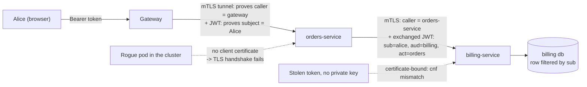

# 13.2 — Service-to-Service Security

> **Module 13 · Topic 2** · Microservices Security
> Baseline: Spring Security 6.x on Boot 3.x
> New to this? Read **In Plain English** below first, then come back to the Version Matrix.

---

## Version Matrix

| Concern | Spring Security 5.x | **Spring Security 6.x (baseline)** | Spring Security 7.x |
|---|---|---|---|
| Machine-identity plumbing | `OAuth2AuthorizedClientManager` (from 5.2), `ClientCredentialsOAuth2AuthorizedClientProvider` | **same, unchanged and stable** | same |
| Token endpoint client | `DefaultClientCredentialsTokenResponseClient` (built on `RestTemplate`) | **6.4 deprecates it in favour of `RestClientClientCredentialsTokenResponseClient`** | the `Default*` variants are removed |
| Token exchange (RFC 8693) | not supported | **6.3 adds `AuthorizationGrantType.TOKEN_EXCHANGE` and `TokenExchangeOAuth2AuthorizedClientProvider`** | supported, `RestClient`-based only |
| `RestClient` integration | not applicable (`RestClient` arrives in Framework 6.1) | **6.4 adds `OAuth2ClientHttpRequestInterceptor` for `RestClient` and `RestTemplate`** | the preferred blocking path |
| X.509 / mutual TLS | `http.x509()`, `SubjectDnX509PrincipalExtractor` | **same, plus `SubjectX500PrincipalExtractor` for RFC 2253 parsing** | same |
| Sender-constrained tokens | none | **6.5 adds DPoP (RFC 9449) support; certificate-bound tokens (RFC 8705) via the authorization server** | expanded |
| Resource-owner password grant | available | deprecated | **removed outright** |

---

## Why This Exists

The gateway solved one problem: who the *user* is at the edge. The moment
`orders-service` calls `billing-service`, three new questions appear that the gateway cannot
answer.

> **Who is calling?** (the service's own identity)
> **On whose behalf?** (the user's identity, if any)
> **How does the callee know either claim is true?**

Answering only the second question is the common mistake — you forward the user's token and
never establish which *service* is calling. Answering only the first is also common, and then no
downstream service can enforce ownership because it has no user. A mature estate answers both,
with two different mechanisms, because they are two different facts.

Everything below is a variation on that split: **transport-level peer identity** for "who is
calling", and **token-level subject identity** for "on whose behalf".

---

## In Plain English

**The one-line version:** When one of your own services calls another, the receiving service needs to know two
separate things — which service is on the line, and which human, if any, that service is acting for — and this file
is about proving both.

**An analogy.** Imagine a solicitor's office phoning a bank to move money from a client's account. The bank has to
satisfy itself about two completely different facts before it will act. First: is this really the solicitor's
office, or somebody who looked up the number and is pretending? That is established by *how the call arrives* — a
verified line, a callback to a known number, something the caller cannot fake by simply saying words. Second: is
this solicitor actually authorised by the client whose money is being moved, and authorised for *this* transaction
rather than everything the client owns? That is established by *what the caller presents* — a signed letter of
authority naming the client, the solicitor, and the specific instruction.

The two facts need different mechanisms because they can fail independently. A genuine solicitor's office can ask
for something no client ever authorised. Someone impersonating the office can wave a letter they stole from a bin.
A bank that checks only one of the two has a hole. The verified line is **mutual TLS**; the letter of authority is
the **token**; and the detail naming both the client and the solicitor acting for them is what RFC 8693 token
exchange adds.

**How it actually works, step by step.**

Start with the simplest case: a service acting purely for itself, such as a nightly job that rebuilds a report. No
human is involved. The service authenticates to the login server with its own identifier and secret and receives a
token that represents the service itself. This is the **client credentials** grant. Two things follow. The token's
subject is the service, not a person, so any rule written as "the record must belong to the logged-in user" makes no
sense here. And no refresh token is issued, because re-requesting is cheap.

Spring handles the mechanics through three pieces that are easy to keep straight once named. An
`OAuth2AuthorizedClientManager` is the thing you ask for a usable token. It delegates to an
`OAuth2AuthorizedClientProvider`, which knows how to perform one particular grant. And an
`OAuth2AuthorizedClientService` stores the result. Caching comes free from this arrangement: the manager looks in
storage first and only fetches a new token when the stored one is expired or about to expire, using a small safety
margin that defaults to sixty seconds.

Now the harder case: a service handling Alice's request needs to call another service. If it calls with its own
service token, the receiving service knows a trusted service is calling but has no idea it is for Alice, so it
cannot check that the invoice in question is hers. The usual answer is **token propagation** — forwarding Alice's
original token unchanged. That works, and it has a real cost: the token is accepted by every service Alice can
reach, so compromising the least important service gives an attacker a live credential for the most important one.

**Token exchange** is the proper fix. The calling service hands its token to the login server and asks for a
replacement that is valid at exactly one destination, carries only the permissions needed for that one call, and
records who is acting for whom. The resulting token effectively says "Alice, as acted upon by the orders service",
which is both narrower and more honest. The cost is an extra call to the login server, and a login server that
actually implements the standard.

Underneath all of this sits the question of *how the receiving service knows the caller is who it claims to be*. A
token is a string: anyone who obtains a copy can present it. **Mutual TLS** is different in kind. Both sides of the
connection present a certificate and prove they hold the matching private key, and that key never travels over the
network. So a stolen certificate file is useless without the key, and a captured connection cannot be replayed. The
hard part of mutual TLS is not configuring it but keeping certificates current across dozens of services, which is
why the industry automates it with tooling such as SPIFFE and SPIRE, or hides it entirely inside a service mesh.

The mature pattern combines both: the connection proves which service is calling, and the token inside it proves
which user the call is for. Then a service can write a rule as precise as "accept this write only if the caller is
the orders service and the token's subject owns the target row".

**Why should a beginner care?** The two failure modes here are both common and both severe. If you always forward
the user's token, one compromised service hands an attacker working credentials for your entire estate. If you
always call with the service's own credentials, then the receiving service has no user to check ownership against,
and it will happily act on whatever record identifier the caller supplies — which means any service can read any
customer's data by asking. Knowing which of the two a given call should use is the whole skill.

**Words you will meet in this file**

| Term | In plain words |
|---|---|
| Client credentials grant | A service logging in as itself, with no user involved, to get a token representing the service. |
| `sub` (subject) | The "who is this about" field in a token. A person for user tokens, the service itself for machine tokens. |
| Scope | A named permission attached to a token, such as `billing:write`. |
| `aud` (audience) | The field naming which service the token was issued for. Meaningless if every service accepts every token. |
| `OAuth2AuthorizedClientManager` | The Spring component you ask for a usable token for an outbound call. |
| `OAuth2AuthorizedClientProvider` | The part that actually performs one type of grant. |
| `OAuth2AuthorizedClientService` | Where the obtained token is stored so it can be reused until it expires. |
| Clock skew | The safety margin before expiry at which Spring fetches a fresh token instead of risking a rejection. |
| Token propagation / token relay | Forwarding the user's original token unchanged to the next service. |
| Token exchange (RFC 8693) | Swapping a token for a narrower one aimed at one destination, recording who is acting for whom. |
| `act` claim | The part of an exchanged token naming the service acting on the user's behalf. |
| `may_act` claim | A restriction saying which services are allowed to exchange this token at all. |
| Bearer token | A credential that works for whoever holds it, like cash. Replayable if stolen. |
| Mutual TLS (mTLS) | Both ends of a connection proving identity with a private key that never crosses the network. |
| X.509 certificate | The document binding an identity to a public key, which the private key proves ownership of. |
| Distinguished Name (DN) | The structured name inside a certificate, from which Spring extracts the caller's identity. |
| SPIFFE / SPIRE | A standard and its implementation for giving each workload a short-lived, automatically rotated identity. |
| Service mesh | Infrastructure such as Istio that adds mutual TLS between services without changing application code. |
| Sender-constrained token | A token tied to a key, so a stolen copy is useless on its own. DPoP and certificate binding both do this. |
| Confused deputy | A trusted component being tricked into doing something on an attacker's behalf because it lost track of who asked. |
| Zero trust | The principle that being inside the network grants no privileges; every hop is authenticated on its own merits. |

**If you remember only one thing:** "which service is calling" and "which user is this for" are two different facts
needing two different proofs, and a service that only establishes one of them has a gap an attacker can walk
through.

---

## Core Concepts

### 1. Machine Identity — the Client Credentials Grant

**In simple terms:** When there is no human involved at all, a service logs in with its own identifier and secret
and gets a token that represents the service itself rather than a person.

When a scheduled job, a queue consumer, or a service acting for itself calls another service,
there is no user. The OAuth2 **client credentials** grant exists for exactly that: the client
authenticates to the token endpoint with its own credential and receives an access token
representing *itself*.

```
POST /oauth2/token
Authorization: Basic base64(client-id:client-secret)
Content-Type: application/x-www-form-urlencoded

grant_type=client_credentials&scope=billing:write
```

Three consequences follow, and interviewers probe all three:

- **The `sub` is the client identifier**, not a person. There is no resource owner, because the
  client *is* the resource owner, and therefore no delegation and no consent.
- **Only scopes are meaningful.** Roles describe what a human may do; there is no human. An
  authorization rule like `#username == authentication.name` silently compares a username to a
  client identifier and either fails confusingly or, worse, accidentally matches.
- **There is no refresh token.** The grant is cheap to repeat, so the specification says not to
  issue one. You re-request when the token nears expiry.

Machine traffic therefore deserves its own `SecurityFilterChain` with its own
`securityMatcher` and its own audience, so that rules written for humans never evaluate a
machine token.

### 2. Spring's Authorized-Client Machinery

**In simple terms:** Three small components cooperate to fetch a token, remember it, and quietly fetch a fresh one
shortly before it expires, so your calling code never has to think about token lifetimes.

The whole client-side model is three collaborating interfaces.

```java
// org.springframework.security.oauth2.client.OAuth2AuthorizedClientManager
public interface OAuth2AuthorizedClientManager {
    OAuth2AuthorizedClient authorize(OAuth2AuthorizeRequest authorizeRequest);
}

// org.springframework.security.oauth2.client.OAuth2AuthorizedClientProvider
public interface OAuth2AuthorizedClientProvider {
    OAuth2AuthorizedClient authorize(OAuth2AuthorizationContext context);
}
```

| Component | Job | Which implementation |
|---|---|---|
| `OAuth2AuthorizedClientManager` | Entry point; resolves registration, delegates, saves the result | `DefaultOAuth2AuthorizedClientManager` (needs a servlet request) or **`AuthorizedClientServiceOAuth2AuthorizedClientManager`** (no request — jobs, listeners, startup) |
| `OAuth2AuthorizedClientProvider` | Performs one grant type | `ClientCredentialsOAuth2AuthorizedClientProvider`, `RefreshTokenOAuth2AuthorizedClientProvider`, `TokenExchangeOAuth2AuthorizedClientProvider` |
| `OAuth2AuthorizedClientService` | Stores the resulting token | `InMemoryOAuth2AuthorizedClientService`, `JdbcOAuth2AuthorizedClientService` |

The **caching** is not a feature you add — it falls out of this design. The manager asks the
service for an existing `OAuth2AuthorizedClient` first, and
`ClientCredentialsOAuth2AuthorizedClientProvider` only performs a fresh grant when the stored
token is expired *or within the clock skew of expiring*. The skew defaults to 60 seconds and is
adjustable with `setClockSkew(Duration)`. Raising it to a few minutes is a good idea when the
token endpoint is occasionally slow, because it means renewal happens before any request would
have failed.

For the servlet-based manager the choice of `AuthorizedClientServiceOAuth2AuthorizedClientManager`
matters: it uses an `OAuth2AuthorizedClientService`, not a request-scoped repository, so the
token is shared across all threads in the application rather than stored per HTTP session. That
is exactly right for machine identity and exactly wrong for a user's token.

### 3. Wiring It Into `RestClient` and `WebClient`

**In simple terms:** This is how you attach that token to your actual outbound HTTP calls, and where you choose
between calling as the service itself or as the logged-in user.

Spring Security 6.4 added `OAuth2ClientHttpRequestInterceptor` for the blocking clients, which is
now the idiomatic path:

```java
RestClient client = RestClient.builder()
    .baseUrl("http://billing-service:8080")
    .requestInterceptor(new OAuth2ClientHttpRequestInterceptor(authorizedClientManager))
    .build();
```

The interceptor asks a `ClientRegistrationIdResolver` which registration to use. The default,
`RequestAttributeClientRegistrationIdResolver`, reads a per-request attribute, so you select the
registration at the call site with
`.attributes(clientRegistrationId("billing-service"))`.

For `WebClient` the equivalents are `ServletOAuth2AuthorizedClientExchangeFilterFunction` in a
servlet application and `ServerOAuth2AuthorizedClientExchangeFilterFunction` in a reactive one.
Two settings on the servlet filter function are worth knowing precisely:

- `setDefaultClientRegistrationId("billing-service")` — always use this registration, which is
  the machine-identity case.
- `setDefaultOAuth2AuthorizedClient(true)` — use the *current user's* authorized client, which is
  the delegated case, and which requires a `SecurityContext` to be present.

Those two settings are the code-level expression of the "as itself" versus "on behalf of"
distinction in section 6.

### 4. Token Propagation and Its Precise Trade-off

**In simple terms:** Passing the user's own token onwards keeps their identity alive across the hop so ownership can
be checked, at the price of handing every service a credential that works everywhere the user can reach.

Token propagation, or the TokenRelay pattern, means forwarding the user's access token unchanged
to the next service. It is the default in most estates and it has one real benefit and three
real costs.

The benefit is decisive: **the user identity survives the hop**, so `billing-service` can
enforce object-level authorization. Without it, `billing-service` knows only that
`orders-service` called, and no amount of scope checking can express "this invoice belongs to
Alice".

The costs, stated honestly:

1. **A compromised downstream service holds a universally usable credential.** The token it
   received is valid at every service the user can reach. Compromise the least important service
   and you have live tokens for the most important one.
2. **The audience is wrong.** `aud` is meant to name the intended recipient. If every service
   accepts the same value, the claim is decorative, and RFC 9068 guidance on audience validation
   cannot be followed meaningfully.
3. **Scope is not reduced.** The token carries every scope the user granted the original client,
   including scopes the downstream service has no business holding.

There is also a lifetime problem. A long-running asynchronous workflow may still be executing
when the user's token expires, and the propagating service usually has no refresh token for it.

### 5. RFC 8693 Token Exchange — the Correct Answer

**In simple terms:** Swap the user's broad token for one that works at exactly one destination, carries only the
permissions that one call needs, and states plainly which service is acting on the user's behalf.

Token exchange lets a service present the token it received and receive a *different*, narrower
token for one specific downstream call.

```
POST /oauth2/token
grant_type=urn:ietf:params:oauth:grant-type:token-exchange
&subject_token=<the user's token>
&subject_token_type=urn:ietf:params:oauth:token-type:access_token
&audience=billing-service
&scope=billing:write
```

The issued token differs in three ways that matter:

- **`aud` names one service**, so it is useless anywhere else. That directly fixes cost 1 and 2
  of section 4.
- **Scopes are reduced** to what this call needs, which fixes cost 3.
- **Delegation is recorded.** The `act` (actor) claim names who is acting, so the token says
  "Alice, as acted upon by orders-service" rather than merely "Alice". The subject token may
  carry a `may_act` claim naming which actors are permitted to exchange it, which lets the
  authorization server refuse an exchange by a service that was never meant to delegate.

```json
{
  "sub": "alice",
  "aud": "billing-service",
  "scope": "billing:write",
  "act": { "sub": "orders-service" }
}
```

Spring Security 6.3 added first-class support: `AuthorizationGrantType.TOKEN_EXCHANGE`, a
`TokenExchangeOAuth2AuthorizedClientProvider` you register through
`OAuth2AuthorizedClientProviderBuilder.builder().tokenExchange()`, and a token response client
(`DefaultTokenExchangeTokenResponseClient` in 6.3, `RestClientTokenExchangeTokenResponseClient`
from 6.4). The provider resolves the subject token from the current `Authentication` by default,
which is why it composes naturally with a resource server.

The cost is real and should be stated: every distinct (caller, audience) pair is an extra call to
the authorization server unless cached, and your authorization server must actually implement
RFC 8693 — many deployments do not, or do so only in a paid tier.

### 6. "On Behalf Of" versus "As Itself"

**In simple terms:** Every outbound call is either work for a specific person or work the service is doing for its
own reasons, and choosing wrongly either runs a job with someone's privileges or loses the user entirely.

Every outbound call must make this choice explicitly, and getting it wrong is an authorization
bug rather than a style preference.

| | On behalf of the user | As itself |
|---|---|---|
| Token subject | the user | the calling service |
| Grant | propagation or token exchange | client credentials |
| Downstream can check ownership | **yes** | no |
| Right for | user-initiated work | scheduled jobs, cache warming, internal reconciliation |
| Failure mode if chosen wrongly | a job runs with a stale user's privileges | a user request bypasses ownership checks entirely |

The second failure mode is the dangerous one. If `orders-service` calls `billing-service` with
its own service token while handling Alice's request, then `billing-service` sees a caller with
broad service scopes and no user, so it cannot scope the query to Alice — and the natural
implementation returns whatever identifier the caller supplied. That is the confused deputy
problem, reintroduced at the service boundary.

### 7. Mutual TLS — What It Actually Proves

**In simple terms:** A token is a string anyone who copies it can reuse, whereas a client certificate proves the
caller holds a private key that never travelled over the network and therefore cannot be replayed.

A bearer token proves possession of a string. Mutual TLS proves possession of a **private key**
that never crosses the network, because the peer signs handshake data with it. The properties
differ in kind, not degree:

| Property | Bearer token | Client certificate (mTLS) |
|---|---|---|
| What is transmitted | the credential itself | a public certificate plus a signature over handshake data |
| Replayable if captured | **Yes**, until expiry | **No** — sender-constrained by the key |
| Proves | "I hold this string" | "I hold the private key for this identity" |
| Layer | application | transport |
| Identifies | usually the user | always the peer (the service) |
| Revocation | expiry, denylist, introspection | certificate revocation list, OCSP, or short lifetimes |

In Spring Boot, requiring a client certificate is container configuration, and Boot 3.1+ SSL
bundles make it tidy:

```yaml
spring:
  ssl:
    bundle:
      jks:
        server:
          keystore: { location: classpath:orders.p12, password: "${KEYSTORE_PASSWORD}", type: PKCS12 }
          truststore: { location: classpath:internal-ca.p12, password: "${TRUSTSTORE_PASSWORD}" }
server:
  ssl:
    bundle: server
    client-auth: need          # need = reject without a certificate; want = optional
```

Turning that certificate into an `Authentication` is Spring Security's `x509` configurer, which
installs `X509AuthenticationFilter`. That filter reads
`jakarta.servlet.request.X509Certificate` from the request attributes, extracts a principal name
with an `X509PrincipalExtractor` — `SubjectDnX509PrincipalExtractor` applies a regular expression
to the distinguished name, defaulting to `CN=(.*?)(?:,|$)`, while the newer
`SubjectX500PrincipalExtractor` parses the `X500Principal` properly — and hands a
`PreAuthenticatedAuthenticationToken` to `PreAuthenticatedAuthenticationProvider`, which resolves
authorities through a `UserDetailsService`.

**The hard part is not the configuration, it is the lifecycle.** Certificates expire, and a
certificate that expires at 03:00 on a Sunday takes a service down. Private keys must be
distributed without ending up in a Git repository. Rotation must be possible without a
synchronised restart of the whole estate, which means trusting both the old and the new
certificate authority during an overlap window. This is why manual mutual TLS between dozens of
services usually fails, and why the industry moved to automation.

### 8. SPIFFE, SPIRE, and Service Meshes

**In simple terms:** Since the genuinely hard part of certificates is keeping them fresh across dozens of services,
these tools hand each workload a short-lived identity automatically and replace it before it expires.

**SPIFFE** standardises workload identity as a URI: `spiffe://prod.example.com/ns/orders/sa/api`.
The identity is the trust domain plus a path describing the workload, and it is delivered as an
**SVID** — an X.509 certificate (or JWT) fetched from a local Workload API socket rather than
from a file baked into an image. **SPIRE** is the reference implementation: an agent on each node
attests the workload (which node, which Kubernetes service account, which container image) and
issues a short-lived SVID, typically valid for an hour, rotated automatically.

A **service mesh** applies the same idea transparently. Istio gives each workload a SPIFFE
identity, and its Envoy sidecars terminate and originate TLS on the application's behalf, so
mutual TLS happens without a line of application code. `PeerAuthentication` in `STRICT` mode
rejects plain-text traffic; `AuthorizationPolicy` allows specific peer identities, so "only the
gateway may call orders-service" becomes a declarative rule. Linkerd does the equivalent with
its own identity system and automatic mutual TLS by default.

The trade-off worth naming: the mesh moves the certificate lifecycle problem to people who
specialise in it, at the cost of an extra network hop per call, a second thing to debug when
latency spikes, and a control plane whose compromise is estate-wide.

### 9. The Mature Pattern — mTLS for Transport, JWT for User

**In simple terms:** Use the connection to prove which service is calling and the token to prove which user it is
for, because neither one can answer the other's question.

Neither mechanism subsumes the other, and the combination is what senior designs use.



- The **certificate** answers "which service is calling?" and cannot be replayed.
- The **token** answers "on whose behalf?" and carries the scopes.
- Together they let a service write a rule such as "accept this write only if the peer
  certificate is `orders-service` *and* the token subject owns the target row".

RFC 8705 goes one step further by binding the token to the certificate: the access token carries
a `cnf` claim with the `x5t#S256` thumbprint of the client certificate, so a stolen token is
unusable without the matching private key. DPoP (RFC 9449), which Spring Security added support
for in 6.5, achieves the same sender-constraining without mutual TLS by having the client sign a
proof for each request.

### 10. Asynchronous and Event-Driven Propagation

**In simple terms:** A message sitting on a queue has no handshake behind it, so a username written into it is
just text that any producer could have written, and the consumer has no way to check.

Identity propagation over Kafka or a message broker has a trust problem that HTTP does not.

Putting `X-User-Id: alice` in a Kafka header is trivial and is what most teams do. The problem is
that the consumer **cannot verify who produced it**. Any producer with write access to the topic
can write any value, there is no handshake, and there is no counterpart to a TLS peer identity in
the message itself. If a consumer makes an authorization decision on that header, any
topic-writer can impersonate any user.

There are three honest options:

1. **Treat the header as audit metadata only.** Document it in the schema as untrusted, and make
   the consumer authorise using data it can verify — typically because the command itself was
   already authorised when it was produced, and the consumer is only completing work.
2. **Carry a verifiable assertion.** Put a short-lived signed token in the message and have the
   consumer validate it exactly as a resource server would. The difficulty is lifetime: a message
   may be consumed hours later, after any sane access token has expired. In practice you use a
   purpose-specific token with a longer lifetime and a very narrow audience and scope.
3. **Sign the message.** A detached JWS over the payload proves which producer wrote it and that
   the payload is unmodified, which is stronger than trusting broker access control. Key
   distribution and rotation become your problem.

The design rule: **authorise at the point where the user is present**, record that the decision
was made, and treat the downstream consumer as executing an already-authorised command rather
than making a fresh decision on an unverifiable identity.

### 11. The Zero-Trust Framing

**In simple terms:** Being inside the company network earns a caller nothing, so every service checks every caller
on every request rather than assuming somebody upstream already did.

"Zero trust", in the sense of NIST SP 800-207, is the assertion that **network location confers
no trust**. Being inside the perimeter means nothing; every request is authenticated and
authorised on its own merits.

Translated into this topic, it is four concrete requirements: every service authenticates its
callers rather than assuming the network filtered them; every service validates the token it
received, including audience; identity is per-workload and short-lived rather than per-network
segment; and every hop is authorised, not just the first one. The trusted-header topology from
the previous file is precisely the thing zero trust rejects.

---

## Working Code

### Machine identity: client credentials into a `RestClient`

```java
package com.example.orders.client;

import org.springframework.context.annotation.Bean;
import org.springframework.context.annotation.Configuration;
import org.springframework.security.oauth2.client.AuthorizedClientServiceOAuth2AuthorizedClientManager;
import org.springframework.security.oauth2.client.ClientCredentialsOAuth2AuthorizedClientProvider;
import org.springframework.security.oauth2.client.OAuth2AuthorizedClientManager;
import org.springframework.security.oauth2.client.OAuth2AuthorizedClientProvider;
import org.springframework.security.oauth2.client.OAuth2AuthorizedClientProviderBuilder;
import org.springframework.security.oauth2.client.OAuth2AuthorizedClientService;
import org.springframework.security.oauth2.client.registration.ClientRegistrationRepository;
import org.springframework.security.oauth2.client.web.client.OAuth2ClientHttpRequestInterceptor;
import org.springframework.security.oauth2.client.web.client.RequestAttributeClientRegistrationIdResolver;
import org.springframework.web.client.RestClient;

import java.time.Duration;

@Configuration
public class MachineClientConfig {

    /**
     * The service-context manager: no HttpServletRequest involved, so it works from a
     * @Scheduled job, a Kafka listener, or application startup. The token is stored in the
     * OAuth2AuthorizedClientService and shared by every thread, which is what you want for
     * a machine identity and emphatically not what you want for a user's token.
     */
    @Bean
    OAuth2AuthorizedClientManager authorizedClientManager(
            ClientRegistrationRepository registrations,
            OAuth2AuthorizedClientService clientService) {

        ClientCredentialsOAuth2AuthorizedClientProvider clientCredentials =
            new ClientCredentialsOAuth2AuthorizedClientProvider();
        // Renew this far before real expiry. Default is 60s; a slow token endpoint under
        // load is the usual reason to widen it.
        clientCredentials.setClockSkew(Duration.ofSeconds(120));

        OAuth2AuthorizedClientProvider providers = OAuth2AuthorizedClientProviderBuilder.builder()
            .provider(clientCredentials)
            .refreshToken()
            .build();

        AuthorizedClientServiceOAuth2AuthorizedClientManager manager =
            new AuthorizedClientServiceOAuth2AuthorizedClientManager(registrations, clientService);
        manager.setAuthorizedClientProvider(providers);
        return manager;
    }

    @Bean
    RestClient billingClient(OAuth2AuthorizedClientManager manager) {
        OAuth2ClientHttpRequestInterceptor interceptor =
            new OAuth2ClientHttpRequestInterceptor(manager);
        return RestClient.builder()
            .baseUrl("https://billing-service:8443")
            .requestInterceptor(interceptor)
            .defaultRequest(request -> request.attributes(
                RequestAttributeClientRegistrationIdResolver.clientRegistrationId("billing-machine")))
            .build();
    }
}
```

```yaml
spring:
  security:
    oauth2:
      client:
        registration:
          billing-machine:                       # acting AS ITSELF
            client-id: orders-service
            client-secret: ${ORDERS_CLIENT_SECRET}
            authorization-grant-type: client_credentials
            scope: billing:reconcile
          billing-exchange:                      # acting ON BEHALF OF the user
            client-id: orders-service
            client-secret: ${ORDERS_CLIENT_SECRET}
            authorization-grant-type: urn:ietf:params:oauth:grant-type:token-exchange
            scope: billing:write
        provider:
          keycloak:
            issuer-uri: https://idp.example.com/realms/prod
```

### On behalf of the user: RFC 8693 token exchange through `WebClient`

```java
package com.example.orders.client;

import org.springframework.context.annotation.Bean;
import org.springframework.context.annotation.Configuration;
import org.springframework.security.oauth2.client.DefaultOAuth2AuthorizedClientManager;
import org.springframework.security.oauth2.client.OAuth2AuthorizedClientManager;
import org.springframework.security.oauth2.client.OAuth2AuthorizedClientProvider;
import org.springframework.security.oauth2.client.OAuth2AuthorizedClientProviderBuilder;
import org.springframework.security.oauth2.client.registration.ClientRegistrationRepository;
import org.springframework.security.oauth2.client.web.OAuth2AuthorizedClientRepository;
import org.springframework.security.oauth2.client.web.reactive.function.client.ServletOAuth2AuthorizedClientExchangeFilterFunction;
import org.springframework.web.reactive.function.client.WebClient;

@Configuration
public class DelegatedClientConfig {

    /**
     * Request-scoped manager: the token exchange provider resolves the SUBJECT token from the
     * current Authentication, so this only works inside a request that has one.
     */
    @Bean
    OAuth2AuthorizedClientManager delegatedClientManager(
            ClientRegistrationRepository registrations,
            OAuth2AuthorizedClientRepository authorizedClients) {

        OAuth2AuthorizedClientProvider providers = OAuth2AuthorizedClientProviderBuilder.builder()
            .tokenExchange()        // Spring Security 6.3+
            .build();

        DefaultOAuth2AuthorizedClientManager manager =
            new DefaultOAuth2AuthorizedClientManager(registrations, authorizedClients);
        manager.setAuthorizedClientProvider(providers);
        return manager;
    }

    @Bean
    WebClient billingWebClient(OAuth2AuthorizedClientManager manager) {
        ServletOAuth2AuthorizedClientExchangeFilterFunction oauth2 =
            new ServletOAuth2AuthorizedClientExchangeFilterFunction(manager);
        // The exchanged token is audience-restricted to billing-service and scope-reduced,
        // and its act claim records that orders-service performed the delegation.
        oauth2.setDefaultClientRegistrationId("billing-exchange");

        return WebClient.builder()
            .baseUrl("https://billing-service:8443")
            .apply(oauth2.oauth2Configuration())
            .build();
    }
}
```

### Mutual TLS: proving which service is calling, alongside the user's token

```java
package com.example.billing.config;

import org.springframework.context.annotation.Bean;
import org.springframework.context.annotation.Configuration;
import org.springframework.security.authorization.AuthorityAuthorizationManager;
import org.springframework.security.authorization.AuthorizationManagers;
import org.springframework.security.config.Customizer;
import org.springframework.security.config.annotation.web.builders.HttpSecurity;
import org.springframework.security.config.annotation.web.configuration.EnableWebSecurity;
import org.springframework.security.config.http.SessionCreationPolicy;
import org.springframework.security.core.authority.SimpleGrantedAuthority;
import org.springframework.security.core.userdetails.User;
import org.springframework.security.core.userdetails.UserDetailsService;
import org.springframework.security.core.userdetails.UsernameNotFoundException;
import org.springframework.security.web.SecurityFilterChain;
import org.springframework.security.web.authentication.preauth.x509.SubjectX500PrincipalExtractor;

import java.util.List;
import java.util.Map;

@Configuration
@EnableWebSecurity
public class BillingSecurityConfig {

    /** Which peer certificates we accept, and what each one may do at the transport level. */
    private static final Map<String, String> PEERS = Map.of(
        "orders-service", "PEER_ORDERS",
        "edge-gateway",   "PEER_GATEWAY");

    @Bean
    SecurityFilterChain filterChain(HttpSecurity http) throws Exception {
        http
            .sessionManagement(s -> s.sessionCreationPolicy(SessionCreationPolicy.STATELESS))
            .csrf(csrf -> csrf.disable())
            // Transport identity: the peer proved possession of a private key.
            .x509(x509 -> x509
                .x509PrincipalExtractor(new SubjectX500PrincipalExtractor())
                .userDetailsService(peerDetailsService()))
            // Subject identity: the token says on whose behalf the peer is acting.
            .oauth2ResourceServer(oauth2 -> oauth2.jwt(Customizer.withDefaults()))
            .authorizeHttpRequests(auth -> auth
                .requestMatchers("/actuator/health/**").permitAll()
                // Both facts are required: the right calling peer AND the right delegated scope.
                .requestMatchers("/internal/invoices/**").access(AuthorizationManagers.allOf(
                    AuthorityAuthorizationManager.hasAuthority("PEER_ORDERS"),
                    AuthorityAuthorizationManager.hasAuthority("SCOPE_billing:write")))
                .anyRequest().authenticated()
            );
        return http.build();
    }

    @Bean
    UserDetailsService peerDetailsService() {
        return commonName -> {
            String authority = PEERS.get(commonName);
            if (authority == null) {
                throw new UsernameNotFoundException("unknown peer certificate: " + commonName);
            }
            return new User(commonName, "", List.of(new SimpleGrantedAuthority(authority)));
        };
    }
}
```

---

## Internals

### How the client-credentials token gets cached

```java
// ClientCredentialsOAuth2AuthorizedClientProvider (simplified)
public OAuth2AuthorizedClient authorize(OAuth2AuthorizationContext context) {
    ClientRegistration registration = context.getClientRegistration();
    if (!AuthorizationGrantType.CLIENT_CREDENTIALS.equals(registration.getAuthorizationGrantType())) {
        return null;                                  // not my grant type -> next provider
    }
    OAuth2AuthorizedClient authorizedClient = context.getAuthorizedClient();
    if (authorizedClient != null && !hasTokenExpired(authorizedClient.getAccessToken())) {
        return null;                                  // still valid -> no new token, reuse it
    }
    OAuth2AccessTokenResponse response = getTokenResponse(registration);
    return new OAuth2AuthorizedClient(registration, context.getPrincipal().getName(),
            response.getAccessToken());
}

private boolean hasTokenExpired(OAuth2Token token) {
    return this.clock.instant().isAfter(token.getExpiresAt().minus(this.clockSkew));
}
```

Two behaviours to be able to explain. Returning `null` means "no opinion", which is how the
provider chain composes — the manager keeps the existing client. And the renewal decision is
`expiresAt` minus the clock skew, so the token is replaced *before* it would fail, which is why a
correctly configured client never produces a 401 from an expired machine token.

### How the token exchange grant is expressed

Spring models each grant as a request object plus a response client. For exchange, the request is
a `TokenExchangeGrantRequest` carrying the `ClientRegistration` and the subject token, and
`TokenExchangeOAuth2AuthorizedClientProvider` builds it by resolving the subject token from the
current `Authentication` — by default when its credentials are an `OAuth2Token`. The response
client posts `grant_type=urn:ietf:params:oauth:grant-type:token-exchange` and reads
`issued_token_type` and `access_token` from the response.

The practical consequence is that exchange fails with a confusing "unable to resolve the subject
token" when invoked outside a request that has an `OAuth2Token`-bearing authentication — from a
`@Scheduled` method, for instance, where you wanted client credentials instead.

### How a certificate becomes an `Authentication`

`X509AuthenticationFilter` extends `AbstractPreAuthenticatedProcessingFilter`, so it follows the
pre-authenticated pattern: the container has already established the identity, and Spring merely
converts it.

1. Tomcat completes the TLS handshake and stores the chain in the request attribute
   `jakarta.servlet.request.X509Certificate`.
2. `X509AuthenticationFilter.getPreAuthenticatedPrincipal` reads that attribute and calls the
   `X509PrincipalExtractor`. `SubjectDnX509PrincipalExtractor` matches a regular expression
   against the distinguished name (`CN=(.*?)(?:,|$)` by default);
   `SubjectX500PrincipalExtractor` parses the `X500Principal` instead of pattern-matching a
   string, which is more robust for names containing commas.
3. The filter builds a `PreAuthenticatedAuthenticationToken` whose principal is that name and
   whose credentials are the certificate.
4. `PreAuthenticatedAuthenticationProvider`, wrapping your `UserDetailsService` in a
   `UserDetailsByNameServiceWrapper`, loads authorities for that name.

Note what is *not* checked here: certificate validity, chain trust, and revocation are the TLS
layer's job, done by the container against the trust store before any filter runs. If
`client-auth` is `want` rather than `need`, a request with no certificate simply arrives with no
attribute and the filter does nothing — which is how "mutual TLS is configured but not enforced"
happens silently.

---

## Configuration Reference

| Option | Effect | Default |
|---|---|---|
| `spring.security.oauth2.client.registration.<id>.authorization-grant-type` | `client_credentials`, `authorization_code`, or the token-exchange URN | none |
| `ClientCredentialsOAuth2AuthorizedClientProvider.setClockSkew` | How long before expiry a token is renewed | `60s` |
| `AuthorizedClientServiceOAuth2AuthorizedClientManager` | Manager for non-request contexts (jobs, listeners) | not auto-configured |
| `ServletOAuth2AuthorizedClientExchangeFilterFunction.setDefaultClientRegistrationId` | Always act **as itself** with this registration | unset |
| `...setDefaultOAuth2AuthorizedClient(true)` | Act **on behalf of** the current user | `false` |
| `OAuth2ClientHttpRequestInterceptor` | Adds the bearer token to `RestClient`/`RestTemplate` calls | not registered |
| `OAuth2AuthorizedClientProviderBuilder.tokenExchange()` | Enables the RFC 8693 grant (6.3+) | not enabled |
| `server.ssl.client-auth` | `need` rejects certificate-less connections, `want` makes them optional | `none` |
| `server.ssl.bundle` / `spring.ssl.bundle.jks.*` | Key and trust material for the connector | none |
| `http.x509()` | Installs `X509AuthenticationFilter` | not configured |
| `SubjectDnX509PrincipalExtractor.setSubjectDnRegex` | Which part of the DN becomes the principal | `CN=(.*?)(?:,\|$)` |
| `spring.security.oauth2.resourceserver.jwt.audiences` | Rejects tokens not intended for this service | none |

---

## Production Concerns & Anti-Patterns

**Propagating the user's token everywhere and calling it done.** It is the right default, but you
must know what you have accepted: one token accepted by every service, so the compromise of the
least important service yields live credentials for the most important one. Say this out loud in
design reviews rather than discovering it during an incident.

**Using client credentials while handling a user request.** The downstream service then sees a
service identity with broad scopes and no user, so it cannot scope anything to the caller, and
the natural implementation trusts an identifier from the request body. That is the confused
deputy problem at the service boundary.

**Fetching a fresh token on every outbound call.** The machinery caches for you; bypassing it by
building a manager per request turns every business call into two network calls and hammers the
token endpoint, which is usually the least horizontally scalable component you own.

**Storing machine tokens in the user's session.** Using a `DefaultOAuth2AuthorizedClientManager`
with a request-scoped repository for a client-credentials registration ties a machine identity to
an HTTP session, so it disappears outside a request and is duplicated per user. Use
`AuthorizedClientServiceOAuth2AuthorizedClientManager`.

**Client secrets in configuration files and container images.** A shared symmetric secret that
never rotates is the weakest link in an otherwise sound design. Prefer a private-key JWT client
assertion, or mutual TLS client authentication (RFC 8705), so there is no reusable secret to
steal.

**Configuring `client-auth: want` and believing mutual TLS is enforced.** Requests without a
certificate are simply unauthenticated at the transport layer and continue to the filter chain.
Use `need`, and add a test that a connection without a client certificate fails.

**Ignoring certificate expiry until it causes an outage.** Monitor remaining validity as a metric
with alerting well before expiry, prefer short automatically rotated certificates over long
manual ones, and trust both the old and the new certificate authority during a rotation window.

**Trusting an identity header on a Kafka message.** Any producer with topic access can write any
value and the consumer cannot tell. Either make the assertion verifiable with a signature, or
document the header as audit-only and authorise where the user was actually present.

**Assuming a service mesh removes the need for tokens.** A mesh authenticates the *workload*. It
knows nothing about which user the request is for, so object-level authorization still needs the
token. Conversely, a token says nothing about which service is calling.

---

## Debugging Playbook

| Symptom | Likely root cause | Fix |
|---|---|---|
| `IllegalArgumentException` mentioning an unresolved `HttpServletRequest` from a scheduled job | `DefaultOAuth2AuthorizedClientManager` used outside a request | Switch to `AuthorizedClientServiceOAuth2AuthorizedClientManager` |
| Machine calls return 401 intermittently, always near a round interval | Token expiring in flight because the clock skew is too small, or clocks drift between hosts | Raise `setClockSkew`, and run NTP on every host |
| Token endpoint traffic scales with business traffic | A new manager or provider per call, so nothing is cached | Build the manager once as a bean; verify the `OAuth2AuthorizedClientService` is shared |
| `invalid_client` from the token endpoint | Wrong client authentication method — the server expects `client_secret_post` and Spring sent Basic, or the secret rotated | Set `client-authentication-method` explicitly; confirm the secret |
| Token exchange fails with an unresolved subject token | No `OAuth2Token`-bearing `Authentication` in context, because the call is not user-initiated | Use client credentials for that path, or resolve the subject token explicitly |
| Downstream 403 after introducing exchange | The exchanged token's reduced scopes no longer satisfy a downstream rule | Align the requested `scope` with what the callee actually checks |
| Downstream 401 with a valid signature | Audience mismatch — the exchanged token names a different service | Request the correct `audience`; check `spring.security.oauth2.resourceserver.jwt.audiences` |
| Mutual TLS "works" but anyone can call | `client-auth: want`, or the trust store contains a public certificate authority so any valid certificate is accepted | Use `need`, and a trust store containing **only** your internal issuer |
| `X509AuthenticationFilter` finds no certificate | TLS terminated at the load balancer or mesh sidecar, so the application sees plain HTTP | Pass the certificate through as a header from a trusted proxy, or terminate mutual TLS in the application |
| Authentication succeeds but authorities are empty | `PreAuthenticatedAuthenticationProvider` resolved a `UserDetails` with no authorities for that common name | Map every expected peer common name in the `UserDetailsService` |
| Everything breaks at the same moment across services | A certificate or the intermediate authority expired | Alert on remaining validity; automate rotation |
| Kafka consumer authorises the wrong user | Identity header trusted without verification | Sign the assertion, or authorise upstream |

---

## Interview Q&A

### Q1. Explain the client credentials grant and what a role means inside a client-credentials token.

<details>
<summary>Show answer</summary>

Client credentials is the grant for a caller acting as *itself*. The client authenticates to the
token endpoint with its own credential — a secret, or better a private-key JWT assertion or a
client certificate — and receives an access token whose subject is the client identifier. There
is no resource owner, no user interaction, no consent, and no refresh token, because re-running
the grant is cheap and the specification says not to issue one.

A role means **nothing** in that token, and that is the important part of the answer. Roles
describe what a human is permitted to do; there is no human. The only meaningful authority is
scope, describing what this service account may do. So authorization rules for machine traffic
must be written against scopes.

The concrete failure this causes: an endpoint annotated
`@PreAuthorize("#username == authentication.name")` compares a username against a client
identifier. It either denies confusingly or, if someone named a service account after a user,
matches accidentally. Machine traffic should therefore get its own `SecurityFilterChain` with its
own `securityMatcher` and its own audience, so rules written for humans never see a machine token.

**Counter-question: how do you distinguish a machine token from a user token at runtime?**

The cleanest answer is not to detect it at all but to separate it structurally. Issue machine
tokens with a different `aud` and validate that audience on a dedicated filter chain matched to
`/internal/**`. Then the two populations never share a rule set and there is nothing to confuse.

If you must detect it in one chain, the reliable signals in order of preference are a dedicated
claim or scope the authorization server adds for service accounts, then the absence of any
user-derived role, then the `azp` claim. What I would not do is infer it from the shape of `sub`,
because that is a convention nobody documented and it breaks the day someone renames a client.

**Counter-question: the client secret has to live somewhere. How do you avoid a long-lived shared secret?**

Two better options exist and both are supported. The first is a **private-key JWT client
assertion**: the client signs a short-lived JWT with its private key and sends it as
`client_assertion`, so no reusable secret ever crosses the network and the authorization server
holds only a public key. The second is **mutual TLS client authentication** under RFC 8705, where
the TLS client certificate authenticates the client to the token endpoint — attractive because you
probably want certificates for transport identity anyway, so it is one credential doing two jobs.

If a secret is unavoidable, it should come from a secrets manager at runtime rather than from
configuration baked into the image, and it should rotate on a schedule with an overlap window so
rotation does not need synchronised restarts.
</details>

### Q2. You forward the user's token to downstream services. State the trade-off precisely.

<details>
<summary>Show answer</summary>

The benefit is that **the user identity survives the hop**, which is the precondition for
object-level authorization downstream. Without it, `billing-service` knows only that
`orders-service` called and cannot express "this invoice belongs to Alice". Since broken
object-level authorization is consistently the top API vulnerability, this benefit is not
cosmetic.

The costs are three, and I would state them in this order.

First, **a compromised downstream service now holds a credential usable against every other
service the user can reach**. The token it received is not scoped to it. So compromising the
least important service in the estate — a reviews service, an image resizer — yields live tokens
for the payments service. The blast radius is the whole estate rather than one component.

Second, **the audience is wrong**. The `aud` claim is meant to name the intended recipient, and
if every service accepts the same value then the claim conveys no information and audience
validation becomes theatre.

Third, **scope is not reduced**. The token carries every scope the user granted the original
client, so a service that needs only `billing:write` holds `payments:write` as well.

There is also a lifetime problem: a long-running workflow may outlive the token, and the
propagating service has no refresh token for a token it did not obtain.

**Counter-question: so is propagation wrong? Should everyone use token exchange?**

No, and answering "always exchange" would be the wrong instinct. Propagation is the right default
for most estates because it is simple, adds no latency, needs no special authorization-server
capability, and the blast radius — every service that user could already reach — is often an
acceptable risk for a uniformly trusted set of first-party services.

I would reach for exchange when the trust levels genuinely differ: a service written by another
team or a vendor, anything touching payments or personal data, anything where a regulator expects
least privilege between internal components demonstrated rather than asserted. And I would apply
it per hop rather than everywhere, because each exchanged audience is operational work.

**Counter-question: the workflow outlives the token. What do you actually do?**

I would refuse to solve it by extending the user's access-token lifetime, because that weakens
every other property of the system to fix one workflow.

The correct framing is that once a request becomes asynchronous, you are no longer acting *with*
the user — you are executing a command that was already authorised while they were present. So
authorise at that moment, record the decision and its inputs durably with the work item, and let
the worker execute as itself with client credentials plus a reference to the recorded
authorisation. The worker's own scopes bound what it can do; the recorded decision provides the
audit trail.

Where a genuinely delegated call must happen later, use token exchange to mint a
purpose-specific token with a longer lifetime, a single narrow audience, and one scope — a much
smaller grant than extending the user's general-purpose token.
</details>

### Q3. Walk me through RFC 8693 token exchange and what the `act` and `may_act` claims are for.

<details>
<summary>Show answer</summary>

Token exchange is a grant type where a client presents a token it holds and receives a different
token with different properties. The request posts
`grant_type=urn:ietf:params:oauth:grant-type:token-exchange` with `subject_token` and
`subject_token_type`, plus the `audience` and `scope` it wants; the response returns
`access_token` and `issued_token_type`.

What comes back differs in three ways that map exactly onto the costs of plain propagation. The
`aud` names one service, so the token is useless anywhere else and a compromise of that service
does not yield credentials for others. The scopes are reduced to what this specific call needs.
And the delegation is recorded rather than erased.

That last point is what `act` is for. The exchanged token keeps `sub` as the user — so downstream
ownership checks still work — and adds an `act` (actor) claim naming the service that performed
the exchange. Semantically it reads "Alice, as acted upon by orders-service". Nesting is allowed,
so a second exchange records a chain of actors, which is exactly what an auditor asking "who
actually made this call?" needs.

`may_act` is the complement and lives in the *subject* token: it names which actors are permitted
to exchange that token. It lets the authorization server refuse an exchange requested by a service
that was never meant to delegate, which turns delegation from an implicit capability of anyone
holding the token into an explicit, centrally controlled policy.

In Spring Security 6.3 and later this is `AuthorizationGrantType.TOKEN_EXCHANGE` with
`TokenExchangeOAuth2AuthorizedClientProvider`, registered through
`OAuth2AuthorizedClientProviderBuilder.builder().tokenExchange()`. The provider resolves the
subject token from the current `Authentication`, which is why it composes naturally inside a
resource server and fails outside a request.

**Counter-question: doesn't an exchange on every hop add a round trip to the authorization server on every request?**

It would if you did it naively, and that is the main objection to raise before someone else does.

The mitigation is that exchanged tokens are cacheable on the same axis everything else is: per
(subject, audience, scope). Spring's `OAuth2AuthorizedClientService` already stores the result
keyed by registration and principal, so a user making ten calls to the same downstream service
within the token's lifetime pays for one exchange. With a shared store such as
`JdbcOAuth2AuthorizedClientService`, that holds across replicas too.

What remains is a cold-start cost per (user, audience) pair and a hard dependency on the
authorization server's availability and latency on that path. So it needs to be a genuinely
highly available component, with a circuit breaker and a deliberate decision about whether to
fail open (never, for this) or fail closed with a clear error.

**Counter-question: your authorization server does not support RFC 8693. What now?**

I would first check honestly whether it does, because several products support it only in a
commercial tier or behind a feature flag, and discovering that late is a common project stall.

If it genuinely cannot, the options in order of preference are: get the capability, because it is
a standards-based feature and worth pushing for; issue multiple audiences at login when the set of
downstream services is known and small, so the token is at least restricted to a few named
recipients rather than everything; or put mutual TLS between services so that although the token
is broad, the *caller* is cryptographically identified and each service can refuse calls from
peers that have no business making them. That last option does not fix the audience problem, but
it makes a stolen token much less useful, because using it requires being a trusted peer.

What I would not do is build a home-grown internal token format with a custom signer. You end up
maintaining a private OAuth2 implementation with none of the review the standard received.
</details>

### Q4. What does mutual TLS prove that a bearer token does not?

<details>
<summary>Show answer</summary>

It proves **possession of a private key that never crosses the network**. During the handshake
the peer signs handshake data with its private key, and the callee verifies that signature
against the certificate. The credential itself is never transmitted.

A bearer token is the opposite: the credential *is* the thing on the wire. Anyone who captures it
can replay it, which is what "bearer" means. So mutual TLS gives you a **sender-constrained**
credential, and that is a difference in kind rather than degree. Capturing the traffic, reading a
log that recorded a header, or dumping a proxy's memory yields a token you can use and a
certificate you cannot.

The second difference is *what* is identified. Mutual TLS identifies the **peer**, which in a
microservices estate is the calling service. A token normally identifies the **user**. These are
different facts and neither substitutes for the other, which is why the mature pattern runs both:
the certificate answers "which service is calling?", the token answers "on whose behalf?".

In Spring, the transport half is container configuration — `server.ssl.client-auth=need` with a
trust store containing only your internal issuer — and the application half is
`http.x509(...)`, which installs `X509AuthenticationFilter`, extracts a principal with a
`SubjectDnX509PrincipalExtractor` or `SubjectX500PrincipalExtractor`, and resolves authorities
through `PreAuthenticatedAuthenticationProvider`.

**Counter-question: you said certificate lifecycle is the hard part. Why, specifically?**

Because it is a distributed expiry problem with a hard deadline and no graceful degradation. Four
specific difficulties. Certificates expire simultaneously for everything issued in the same batch,
so a single missed renewal is a multi-service outage at a time nobody chose. Private keys must
reach every workload without being committed to a repository or baked into an image. Rotating the
issuing authority requires a window in which both the old and the new authority are trusted,
which means two coordinated changes in the right order across every service. And revocation
barely works in practice — certificate revocation lists and OCSP are unreliable enough that the
real mitigation is short lifetimes.

Which is exactly why the answer is automation rather than diligence. Hour-long certificates
rotated by an agent are both safer and less work than annual certificates rotated by a human with
a calendar reminder, because the renewal path is exercised constantly instead of once a year.

**Counter-question: how do SPIFFE and a service mesh change that?**

SPIFFE standardises the identity: a URI like `spiffe://prod.example.com/ns/orders/sa/api`,
delivered as an SVID which the workload fetches from a local Workload API socket rather than
reading from a file. SPIRE implements it — a node agent *attests* the workload, checking which
node, which Kubernetes service account, and which container image, and only then issues a
short-lived SVID that it rotates automatically. The key never touches a config file and identity
becomes a property of the workload rather than of a deployment artefact.

A mesh applies this transparently. Istio assigns SPIFFE identities and its Envoy sidecars
terminate and originate TLS for the application, so mutual TLS needs no application code;
`PeerAuthentication` in `STRICT` mode rejects plain text and `AuthorizationPolicy` allows named
peer identities, so "only the gateway may call orders-service" becomes declarative. Linkerd does
the equivalent with its own identity system, on by default.

The honest trade-off: you have moved the certificate problem to specialists, and gained an extra
hop per call, another component to debug during a latency incident, and a control plane whose
compromise is estate-wide. For more than a handful of services it is still clearly the right
call.

**Counter-question: if mutual TLS is sender-constrained, can I get that property for tokens too?**

Yes, and this is where the two mechanisms combine most elegantly. Under RFC 8705 the
authorization server binds the access token to the client certificate by putting the certificate
thumbprint in a `cnf` claim as `x5t#S256`. The resource server then checks that the presenting
peer's certificate matches the thumbprint, so a stolen token is useless without the private key —
the token has become sender-constrained.

DPoP (RFC 9449) achieves the same without mutual TLS: the client holds a key pair and sends a
signed proof per request, bound to the method and URI, and the token carries the corresponding key
thumbprint. Spring Security added DPoP support in 6.5, which makes it a realistic option for
public clients such as mobile applications where certificate provisioning is impractical.

The framing I would offer is that bearer tokens are the weakest link in an otherwise
cryptographically strong design, and both RFC 8705 and DPoP exist to remove that weakness.
</details>

### Q5. How do you propagate identity through Kafka, and how does the consumer know the claim is true?

<details>
<summary>Show answer</summary>

The mechanical part is easy and it is what almost everyone does: put the user identifier, tenant,
and correlation identifier in Kafka record headers and read them in the consumer.

The security part is that **the consumer cannot verify who produced the header**. There is no
handshake to bind the message to a producer identity, so any producer with write access to the
topic can write any value. Broker-level access control tells you *that* a producer was authorised
to write to the topic, not *which* identity it claimed inside the message. So if a consumer makes
an authorization decision on `X-User-Id`, any topic-writer can impersonate any user — including a
compromised, otherwise low-privilege producer.

Three honest options.

Treat the header as **audit metadata only**. Document it in the schema as untrusted, and design
the consumer so it does not need to make an authorization decision — which is usually achievable,
because the command was already authorised when the user was present and the consumer is merely
completing the work.

Carry a **verifiable assertion**: a short-lived signed token in the message that the consumer
validates exactly as a resource server would. The difficulty is lifetime, because a message may
be consumed long after any sane access token expires, so in practice this means a
purpose-specific token with a longer life, a single audience, and one scope.

**Sign the message**: a detached JWS over the payload proves which producer wrote it and that the
payload is unmodified — stronger than trusting broker access control, at the cost of owning key
distribution and rotation.

My default is the first, with the design rule stated explicitly: **authorise where the user is
present**, persist the decision with the work item, and treat the consumer as executing an
already-authorised command.

**Counter-question: persisting the decision sounds like it could go stale. The user's permission is revoked while the message sits in the topic. Then what?**

That is the real weakness of the approach and it deserves a direct answer rather than hand-waving.

It depends on whether the operation is a *promise* or a *query*. For a promise — the user
submitted an order and we told them it was accepted — executing it after their permission changes
is usually correct, because we already committed and reversing it is a business decision, not a
security one. For anything that *reads* or *grants* on the user's behalf, staleness is a real
vulnerability and the permission must be re-checked at execution time.

So I would classify message types deliberately. For the re-check case, store the identity and the
authorisation inputs, then have the consumer re-evaluate against current permissions before
acting — which requires the consumer to be able to ask "may this subject still do this?", meaning
a policy service or a permission lookup rather than a token. That is one of the strongest
arguments for externalising authorization decisions rather than freezing them into tokens.

I would also bound the exposure with a time-to-live on the work item, so a message that has sat
for a suspiciously long time is failed and re-driven rather than executed on assumptions from
last week.

**Counter-question: the consumer needs to call a downstream HTTP service to finish the work. Whose identity does it use?**

Its own, as itself, with a client-credentials token — and the downstream service authorises the
*operation*, not the user. This is the honest position: there is no live user, so there is no user
credential to present, and manufacturing one would be the consumer asserting an identity it cannot
prove. What travels alongside is the user identifier as data, in the command payload and in the
audit record, so the action is attributable even though it is not user-authenticated.

If the downstream operation genuinely requires user-scoped authorization rather than
service-scoped authorization, that is a signal the work was queued too early. The fix is to move
the authorization decision back to the synchronous edge where the user's token existed, persist
the decision, and reduce the consumer's job to executing an already-authorised command. The
alternative — having the producer mint a long-lived delegated token and put it in the message — is
worse on every axis: the token sits in a durable log, its lifetime has to cover worst-case queue
depth, and it is replayable by anyone with topic read access. If you must do something in that
direction, RFC 8693 token exchange performed by the *consumer* against a stored, narrowly-scoped
subject token is the least-bad variant, and it still needs an authorization server willing to
issue tokens outside a live user session.
</details>

### Q6. Design question — design service-to-service security for a regulated estate where some services are operated by other teams and one by a vendor.

<details>
<summary>Show answer</summary>

The requirement that changes the design is that **trust is not uniform**. With one team and
uniformly trusted services, propagating the user's token is fine. A vendor-operated service means
one component whose compromise I must assume, and a regulator means I need to *demonstrate* least
privilege rather than assert it.

**Identity, in two independent layers.** Transport identity comes from mutual TLS with SPIFFE
identities issued by SPIRE or a mesh, certificates valid for about an hour and rotated
automatically, and a trust store containing only the internal issuer — never a public certificate
authority, which would accept any valid certificate on the internet. Subject identity comes from
JWTs, validated for issuer, signature, expiry, and audience by every service. Neither layer
substitutes for the other, and I would say so explicitly, because "we have a mesh, so we do not
need tokens" is a common and serious mistake.

**Token strategy, graded by trust.** Between first-party services in the same trust zone, forward
the token: simple, no latency, acceptable blast radius. Crossing a team boundary or touching
payments or personal data, exchange the token under RFC 8693 so the downstream token names one
audience, carries one or two scopes, and records the delegation in `act`. For the vendor service,
exchange without exception, plus the tightest possible scope, a short lifetime, and `may_act` on
the subject token so only the one service permitted to delegate to the vendor can do so.
Machine-initiated work uses client credentials with a per-service registration, authenticating
with a private-key JWT assertion or mutual TLS rather than a shared secret.

**Enforcement in every service.** A `/internal/**` filter chain with its own audience, separate
from human traffic. Authorization rules that require both facts where it matters — the peer
certificate identifies an allowed caller *and* the token carries the delegated scope. Ownership
and tenancy enforced in the query, with database row-level security beneath it so a forgotten
predicate returns zero rows. Not-yours returns 404 where existence is sensitive.

**Containment around the vendor.** It gets its own network segment, its own audience, egress
restricted to exactly what it needs, and no ability to call anything except through an interface I
control. I would also assume its credentials will leak and design so that the leaked credential
buys one narrow capability.

**Evidence, because this is regulated.** `act` chains give the auditor a verifiable answer to "who
actually made this call, acting for whom?". Per-service scopes and audiences are a machine-readable
least-privilege statement. Authorization denials are counted per endpoint and alerted on.
Certificate validity is a monitored metric. And the negative tests — no token, wrong audience,
wrong peer, another tenant's resource — run on every build, so the control is demonstrated
continuously rather than at audit time.

**Counter-question: the vendor cannot do mutual TLS. What do you accept and what do you refuse?**

I would accept it as a constraint and compensate, rather than pretend it is fine or block the
integration.

What I would refuse is putting them inside the trust zone. Instead they talk to a dedicated
gateway or adapter that I operate and that *does* speak mutual TLS inward, so the vendor's reach
stops at one component with one narrow interface. Their credential becomes a client-credentials
token with one scope and one audience, short-lived, issued to a client I can disable in one
action.

What I would compensate with: much tighter rate limits, strict schema validation on everything
they send, allow-listing their source addresses as a supporting control, separate logging and
alerting on their traffic pattern, and no propagation of user tokens to them at all — only
exchanged tokens with a single scope. I would also make the adapter's outbound calls into my
estate use its own identity plus an exchanged token, so a compromise of the adapter does not yield
a usable user credential.

And I would write the residual risk down, with the compensating controls named, because in a
regulated environment an accepted risk that nobody recorded is an audit finding on its own.

**Counter-question: an auditor asks you to prove that the vendor's service could never have read another customer's data. Can you?**

Only if it was designed for that question, which is why I would raise it at design time rather
than discover it during the audit.

What makes it provable is a chain of independent evidence rather than a single claim. The audience
restriction means tokens presented to the vendor's interface were only ever valid there. The scope
restriction means those tokens carried no read capability beyond the one operation. The `act` claim
means every call the vendor made is attributable to a specific delegating service and subject.
Row-level security in the database means a query without a tenant predicate returns nothing, so
even a flawed query could not cross tenants. And the access log, correlated by the identifier
minted at the edge, lets me show the actual set of rows returned to that interface.

What would *not* be provable is the same architecture with propagated broad-scope tokens and
ownership enforced only in application code, because then the honest answer is "our code checks
it, and we tested some of the paths". The difference between those two positions is decided
months earlier, when someone chose whether to pay for token exchange and row-level security.
</details>

---

## Quick Recall

```
THE TWO QUESTIONS
  who is calling?       -> TRANSPORT identity  -> mTLS / SPIFFE / mesh
  on whose behalf?      -> TOKEN subject       -> JWT (propagated or exchanged)
  mature pattern = BOTH. neither substitutes for the other.

CLIENT CREDENTIALS (acting AS ITSELF)
  no user, no consent, NO refresh token
  sub = client id; ROLES ARE MEANINGLESS, only scopes matter
  #username == authentication.name silently compares user to client id
  give machine traffic its own SecurityFilterChain + own aud

SPRING PLUMBING
  OAuth2AuthorizedClientManager.authorize(OAuth2AuthorizeRequest)
    DefaultOAuth2AuthorizedClientManager           needs a servlet request
    AuthorizedClientServiceOAuth2AuthorizedClientManager  jobs / listeners / startup
  OAuth2AuthorizedClientProvider = one grant type, returns null = "no opinion"
    ClientCredentialsOAuth2AuthorizedClientProvider  setClockSkew default 60s
    renew when now > expiresAt - clockSkew   => caching is automatic
  OAuth2AuthorizedClientService = the store (InMemory / Jdbc)
  RestClient  -> OAuth2ClientHttpRequestInterceptor            (6.4+)
  WebClient   -> Servlet/ServerOAuth2AuthorizedClientExchangeFilterFunction
    setDefaultClientRegistrationId(...)   = as itself
    setDefaultOAuth2AuthorizedClient(true)= on behalf of the user

PROPAGATION (TokenRelay) TRADE-OFF
  + user identity survives -> object-level authz possible downstream
  - compromised service holds a token valid at EVERY service
  - aud is wrong (one value for all services = decorative claim)
  - scope not reduced
  - workflow may outlive the token, and you hold no refresh token

TOKEN EXCHANGE  RFC 8693  (Spring Security 6.3+)
  grant_type=urn:ietf:params:oauth:grant-type:token-exchange
  subject_token + subject_token_type + audience + scope
  result: aud = ONE service, scopes reduced, sub still the user
  act      = who is acting (nestable -> delegation chain, auditor gold)
  may_act  = in the SUBJECT token, names who MAY exchange it
  TokenExchangeOAuth2AuthorizedClientProvider; builder().tokenExchange()
  resolves subject token from current Authentication -> fails outside a request
  cache per (subject, audience, scope) or you add a round trip per call

mTLS
  proves possession of a PRIVATE KEY that never crosses the wire
  => SENDER-CONSTRAINED, cannot be replayed   (bearer token can)
  identifies the PEER (service), not the user
  server.ssl.client-auth = need (want = silently optional!)
  trust store = internal issuer ONLY, never a public CA
  http.x509() -> X509AuthenticationFilter (AbstractPreAuthenticatedProcessingFilter)
    jakarta.servlet.request.X509Certificate attribute
    SubjectDnX509PrincipalExtractor  regex CN=(.*?)(?:,|$)
    SubjectX500PrincipalExtractor    parses X500Principal properly
    -> PreAuthenticatedAuthenticationToken -> PreAuthenticatedAuthenticationProvider
  HARD PART = lifecycle: expiry, key distribution, CA rotation overlap, revocation
  SPIFFE id  spiffe://trust-domain/ns/x/sa/y ; SVID from the Workload API
  SPIRE attests workload then issues short-lived auto-rotated SVIDs
  Istio PeerAuthentication STRICT + AuthorizationPolicy on peer identity
  RFC 8705 cnf/x5t#S256 = token BOUND to the certificate
  DPoP RFC 9449 = sender-constrained without mTLS (Spring Security 6.5)

ASYNC / KAFKA
  header X-User-Id is UNVERIFIABLE: any topic-writer can write any value
  options: audit-metadata only | signed short-lived token | detached JWS on payload
  rule: AUTHORISE WHERE THE USER IS PRESENT, persist the decision,
        consumer executes an already-authorised command
  staleness: promises may proceed; reads/grants must re-check at execution

ZERO TRUST (NIST SP 800-207)
  network location confers NO trust
  authenticate callers, validate aud, per-workload short-lived identity,
  authorise EVERY hop - which is exactly what a trusted header does not do
```

---

**Previous:** [`39_M13_T1_Gateway_Security.md`](39_M13_T1_Gateway_Security.md) ·
**Next:** [`41_M14_T1_Testing_Spring_Security.md`](41_M14_T1_Testing_Spring_Security.md)
