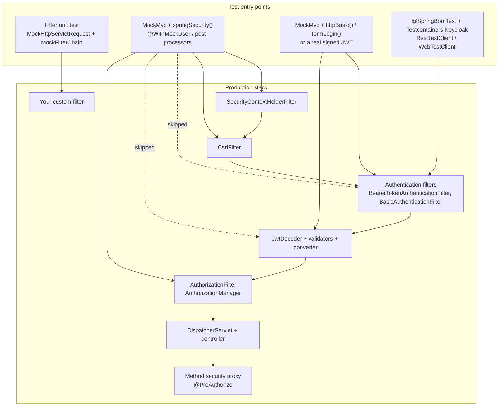

# 14.1 — Testing Spring Security

> **Module 14 · Topic 1** · Testing
> Baseline: Spring Security 6.x on Boot 3.x
> New to this? Read **In Plain English** below first, then come back to the Version Matrix.

---

## Version Matrix

| Concern | Spring Security 5.x | **Spring Security 6.x (baseline)** | Spring Security 7.x |
| --- | --- | --- | --- |
| Test artifact | `spring-security-test` | `spring-security-test`, same coordinates, managed by the Boot BOM | Unchanged |
| `@WithMockUser` semantics | `roles` prepends `ROLE_`, `authorities` does not, mixing throws | Identical; still backed by `WithMockUserSecurityContextFactory` | Identical |
| `setupBefore` attribute | Added in 5.1 on `@WithUserDetails` and `@WithSecurityContext` | Present, default `TestExecutionEvent.TEST_METHOD` | Present |
| Resource-server post-processors | `jwt()` and `opaqueToken()` added in 5.2 | Fully supported, `jwt()` short-circuits your `JwtDecoder` | Supported |
| Client and login post-processors | `oauth2Client()`, `oauth2Login()`, `oidcLogin()` added in 5.3 | Supported | Supported |
| Method security under test | `@EnableGlobalMethodSecurity` with a pre-post advice chain | `@EnableMethodSecurity` (pre-post enabled by default) is the annotation you import into tests | `@EnableGlobalMethodSecurity` removed, only `@EnableMethodSecurity` |
| Authorization enforcement point | `FilterSecurityInterceptor` by default, `AuthorizationFilter` opt-in | `AuthorizationFilter` with `AuthorizationManager`, so denials surface as `AuthorizationDeniedException` | `AuthorizationFilter` only |
| Bean-replacement annotation | `@MockBean` (Boot 2) | `@MockBean` still works; `@MockitoBean` from Framework 6.2 / Boot 3.4 is the replacement | `@MockitoBean` and `@MockitoSpyBean` only |
| Reactive test configurer | `SecurityMockServerConfigurers` since 5.0 | `WebTestClient.mutateWith(mockUser())`, `mockJwt()`, `csrf()` | Unchanged |
| X.509 post-processor | `x509(...)` reading a classpath certificate | `x509(...)` plus `certificate(X509Certificate)` | Unchanged |
| Matcher DSL used in test config | `antMatchers`, `mvcMatchers` | `requestMatchers` only, lambda DSL only | `requestMatchers` only |

---

## Why This Exists

Security code is the one part of an application where the happy path passing tells you almost nothing. A test that logs in as an administrator and asserts a `200` proves that the endpoint works; it does not prove that a non-administrator is refused, and refusing the non-administrator is the entire point. The defects that reach production are not "the feature does not work" but "the feature works for people it should not work for": a `@PreAuthorize` that was never evaluated because the bean was mocked, a `requestMatchers` rule shadowed by an earlier `permitAll()`, a new controller method added to a class whose base path was never covered by any rule, a tenant identifier read from a request parameter instead of from the authentication.

There is a second, sharper reason. Spring Security is a filter chain, and filter chains are easy to accidentally not run. `MockMvcBuilders.standaloneSetup(controller)` instantiates a dispatcher around one controller with no Spring context and therefore no `springSecurityFilterChain`. Every security assertion in such a test is vacuous: `@WithMockUser` sets a thread-local that nothing reads, unauthenticated requests succeed, and the suite is green. Teams discover this only when a penetration test finds an open endpoint that had "full test coverage". Knowing exactly which test setup wires the real filter chain, and which does not, is the single most valuable fact in this topic.

The third reason is layering. `spring-security-test` gives you two different kinds of tool that are easy to confuse. Annotations such as `@WithMockUser` populate the `SecurityContext` directly and thereby *skip* authentication — they are for testing authorization decisions. Request builders such as `formLogin()` and post-processors such as `httpBasic()` feed credentials through the real authentication mechanism — they are for testing authentication itself. Reaching for the wrong one gives you a test that passes while the mechanism you meant to verify is bypassed.

---

## In Plain English

**The one-line version:** This file is about writing automated tests that prove the wrong people are actually kept
out, and about the ways such tests can pass while testing nothing at all.

**An analogy.** Imagine testing the locks on a new office by walking around with the master key and confirming every
door opens. Every door opens, the report says "all doors functional", and it is completely worthless — you have
proved the building works for someone who is already allowed everywhere. The test that matters is walking around
*without* a key and confirming the doors stay shut.

Now imagine a subtler version of the same mistake. The building inspector shows up, tests every door, and files a
perfect report. Later it turns out the inspector was testing a scale model in the lobby rather than the building
itself. That is exactly what happens with `standaloneSetup` in Spring: you build a miniature web environment around
one controller, the real security machinery is not in it, and every security assertion you write is quietly
meaningless. The suite is green, the coverage report looks excellent, and the endpoints are open.

**How it actually works, step by step.**

Testing Spring Security requires an extra library, `spring-security-test`, which is not included in the usual Spring
Boot test starter. Adding it gives you two distinct families of tools, and the most common source of confusion is
not realising they are different.

The first family **skips** authentication. `@WithMockUser` simply places a pretend logged-in user into Spring's
current-user holder before your test method runs, as if a login had already succeeded. You use it when the thing you
are testing is an authorization rule: given a user with this role, is this endpoint allowed or refused? It is fast
and it never touches your password checking, your token decoding, or your user lookup.

The second family **exercises** authentication for real. `formLogin()` posts an actual username and password to your
actual login endpoint, `httpBasic("alice", "password")` adds a real authorization header so your real password
checking runs, and `csrf()` attaches a genuine CSRF token. You use these when the mechanism itself is what you want
to verify.

There are a few details in `@WithMockUser` worth learning once rather than rediscovering. If you write
`roles = "ADMIN"`, Spring prepends `ROLE_` and you get the authority `ROLE_ADMIN`. If you write
`authorities = "ROLE_ADMIN"`, you get exactly that string with no prefixing. Writing `roles = "ROLE_ADMIN"` throws
an error, because it would produce `ROLE_ROLE_ADMIN`. And the pretend user is Spring's own generic user type, so a
controller expecting your own custom user class will get a null and fail with an unrelated-looking error.

For real user records there is `@WithUserDetails`, which actually calls your user-loading code and produces your
real principal. Because it runs before `@BeforeEach` by default, a test that creates the user in `@BeforeEach` will
fail with "user not found" until you change the timing with the `setupBefore` attribute.

Then there is the single most important practical point in the file. Spring Security is implemented as a servlet
filter, and a test only enforces security if that filter is actually installed in the test's request path. With
`@WebMvcTest` or `@SpringBootTest` combined with `@AutoConfigureMockMvc`, Boot installs it for you. With
`standaloneSetup`, there is no application context at all and therefore no filter, so nothing is enforced. The cheap
insurance is one test in the suite that sends an unauthenticated request to a protected path and asserts a 401; if
that test passes, you know the machinery is live.

Method-level annotations such as `@PreAuthorize` have their own version of the same trap. They work through a
stand-in object Spring wraps around your bean, and a mocked bean has no such wrapper, so those annotations are
simply not present in a slice test that mocks the service. Testing them needs the real bean in a real context, and
a denial shows up as a thrown `AuthorizationDeniedException` rather than as an HTTP status code.

**Why should a beginner care?** The failure this prevents is specific and common: a team ships an application with
thorough-looking security tests and a penetration test later finds endpoints anyone can reach. That happens because
the tests only ever checked that permitted users get in, or because the filter chain was never wired into the test
at all. Learning which setup genuinely runs the security machinery, and writing the negative cases deliberately, is
what turns a green suite into actual evidence.

**Words you will meet in this file**

| Term | In plain words |
|---|---|
| `spring-security-test` | The extra test library that provides all the tools in this file. Not included by default. |
| MockMvc | A way to send fake HTTP requests to your application inside a test, without starting a real server. |
| Filter chain | The ordered list of filters every request passes through. Spring Security lives entirely inside one of them. |
| `springSecurity()` | The one line that installs that filter chain into MockMvc. Without it, nothing is enforced. |
| `standaloneSetup` | A MockMvc setup with no Spring context, and therefore no security at all. The classic false-confidence trap. |
| `@WebMvcTest` | A test that loads only the web layer. Wires security in, but does not create your service beans. |
| `@SpringBootTest` | A test that loads the whole application context, which is what method-level security needs. |
| `@WithMockUser` | Pretend a user with a given name and roles is already logged in, skipping authentication. |
| `@WithAnonymousUser` | Pretend nobody is logged in, useful for overriding a class-level default on one method. |
| `@WithUserDetails` | Load a real user through your real user-loading code, so you get your real principal type. |
| Authority versus role | An authority is any permission string; a role is an authority that conventionally starts with `ROLE_`. |
| Post-processor | Something attached to a test request with `.with(...)`, such as `csrf()` or `httpBasic(...)`. |
| `formLogin()` / `logout()` | Test request builders that drive your real login and logout endpoints. |
| `authenticated()` / `unauthenticated()` | Assertions about who ended up logged in, rather than about the response body. |
| `jwt()` post-processor | Fabricates a decoded token directly, skipping your token decoder and its validation rules. |
| `@MockitoBean` | Replaces a real bean with a Mockito mock. A mock has no security proxy, so its annotations do not apply. |
| `AuthorizationDeniedException` | The error thrown when a method-level rule refuses a call. |
| Testcontainers | A library that starts real infrastructure, such as a real login server, in a container for a test. |

**If you remember only one thing:** a security test is only real if the security filter chain is actually running in
it, so prove that once with an explicit unauthenticated-request test and write the negative cases as carefully as
the positive ones.

---

## Core Concepts

### 1. The Dependency and the Listener That Makes Annotations Work

**In simple terms:** One extra test dependency brings in every tool in this file, and a listener inside it is what
quietly puts the pretend user in place before your test runs and clears it afterwards.

```xml
<dependency>
    <groupId>org.springframework.security</groupId>
    <artifactId>spring-security-test</artifactId>
    <scope>test</scope>
</dependency>
```

`spring-boot-starter-test` does **not** include it; you add it explicitly, and the Boot BOM supplies the version. The artifact contributes three things: the `@With...` annotation family, the MockMvc integration (`SecurityMockMvcConfigurers`, `SecurityMockMvcRequestBuilders`, `SecurityMockMvcRequestPostProcessors`, `SecurityMockMvcResultMatchers`), and the reactive equivalent (`SecurityMockServerConfigurers`).

The annotations are driven by `WithSecurityContextTestExecutionListener`, a `TestExecutionListener` registered through `spring-security-test`'s `META-INF/spring.factories`, so any test using `SpringExtension` — which `@SpringBootTest` and `@WebMvcTest` both imply — picks it up with no configuration. It searches for an annotation on the test method, then the test class, then enclosing classes, and finally on the annotation's own meta-annotations; that last step is what makes custom composed annotations work. Its contract is four methods:

```java
public class WithSecurityContextTestExecutionListener extends AbstractTestExecutionListener {

    // Resolves the @WithSecurityContext meta-annotation, builds the SecurityContext,
    // and either installs it now (TEST_METHOD) or stashes it on the TestContext.
    public void beforeTestMethod(TestContext testContext) { /* ... */ }

    // Installs a stashed SecurityContext (TEST_EXECUTION), i.e. after @BeforeEach.
    public void beforeTestExecution(TestContext testContext) { /* ... */ }

    public void afterTestMethod(TestContext testContext) {
        TestSecurityContextHolder.clearContext();
    }

    public int getOrder() { return 10_000; }
}
```

`TestSecurityContextHolder` writes through to the real `SecurityContextHolder` and additionally makes the context discoverable by the MockMvc integration. The `afterTestMethod` clear is why tests do not leak an authentication into each other — but it clears the *holder*, not any HTTP session you created, and not a `ThreadLocal` on another thread such as an `@Async` executor.

### 2. `@WithMockUser` — and the Exact Source That Explains Its Rules

**In simple terms:** This annotation pretends somebody is already logged in so you can test the rules that follow,
and its odd behaviour around roles and authorities is fully explained by twenty lines of its source.

```java
@WithMockUser                                          // user / password / ROLE_USER
@WithMockUser("alice")                                 // value attribute
@WithMockUser(username = "alice", roles = {"ADMIN"})   // authority ROLE_ADMIN
@WithMockUser(username = "svc", authorities = {"SCOPE_orders:read"})
```

The behaviour everyone half-remembers is fully explained by `WithMockUserSecurityContextFactory`:

```java
public SecurityContext createSecurityContext(WithMockUser withUser) {
    String username = StringUtils.hasLength(withUser.username()) ? withUser.username() : withUser.value();
    if (username == null) {
        throw new IllegalArgumentException(withUser + " cannot have null username on both username and value properties");
    }
    List<GrantedAuthority> grantedAuthorities = new ArrayList<>();
    for (String authority : withUser.authorities()) {
        grantedAuthorities.add(new SimpleGrantedAuthority(authority));
    }
    if (grantedAuthorities.isEmpty()) {
        for (String role : withUser.roles()) {
            if (role.startsWith("ROLE_")) {
                throw new IllegalArgumentException("roles cannot start with ROLE_ Got " + role);
            }
            grantedAuthorities.add(new SimpleGrantedAuthority("ROLE_" + role));
        }
    }
    else if (!(withUser.roles().length == 1 && "USER".equals(withUser.roles()[0]))) {
        throw new IllegalStateException("You cannot define roles attribute " + Arrays.asList(withUser.roles())
                + " with authorities attribute " + Arrays.asList(withUser.authorities()));
    }
    User principal = new User(username, withUser.password(), true, true, true, true, grantedAuthorities);
    Authentication authentication = UsernamePasswordAuthenticationToken.authenticated(principal,
            principal.getPassword(), principal.getAuthorities());
    SecurityContext context = SecurityContextHolder.createEmptyContext();
    context.setAuthentication(authentication);
    return context;
}
```

Four rules fall out of those twenty lines. `authorities` are used verbatim and take precedence. `roles` are only consulted when `authorities` is empty, and each role gets `ROLE_` prepended. Writing `roles = {"ROLE_ADMIN"}` throws `IllegalArgumentException`, because you would have produced `ROLE_ROLE_ADMIN`. And specifying both attributes throws `IllegalStateException` — unless `roles` still holds its default single value `"USER"`, which is how the factory distinguishes "the developer set roles" from "the developer left roles alone".

The principal is a `org.springframework.security.core.userdetails.User`. If your controller takes `@AuthenticationPrincipal MyCustomUser`, argument resolution yields `null` and you get a `NullPointerException` rather than a security failure. That is the trigger for a custom annotation (§4).

### 3. `@WithAnonymousUser` and `@WithUserDetails`

**In simple terms:** One of these pretends nobody is logged in, and the other loads a genuine user through your real
user-loading code, which makes the timing of when the test data is created suddenly matter.

`@WithAnonymousUser` installs an `AnonymousAuthenticationToken` with authority `ROLE_ANONYMOUS`. Its real use is overriding a class-level `@WithMockUser` on a single method, so you can keep the authenticated default and still write the "no credentials" negative case in the same class.

`@WithUserDetails` is categorically different: it resolves a `UserDetailsService` bean from the application context and calls `loadUserByUsername`. It therefore needs a Spring context containing that bean, it exercises your real user-loading code including any database access, and it produces your real principal type. This makes it an integration-level annotation, not a unit-level one.

```java
@WithUserDetails("alice@example.com")
@WithUserDetails(value = "alice@example.com", userDetailsServiceBeanName = "jdbcUserDetailsService")
@WithUserDetails(value = "alice@example.com", setupBefore = TestExecutionEvent.TEST_EXECUTION)
```

The `setupBefore` attribute exists because of a lifecycle ordering problem. The default, `TestExecutionEvent.TEST_METHOD`, resolves the user during `beforeTestMethod`, which Spring runs **before** any `@BeforeEach` method. If `@BeforeEach` is what inserts the user into the database, the lookup happens first and fails with `UsernameNotFoundException`. Switching to `TestExecutionEvent.TEST_EXECUTION` defers resolution to `beforeTestExecution`, which runs after all `@BeforeEach` methods and immediately before the test body. The inverse case also exists: if your `@BeforeEach` seeds data through a service guarded by `@PreAuthorize`, you *want* the default so the context is already populated.

| Annotation | Runs your `UserDetailsService` | Principal type | Needs a Spring context | Typical use |
| --- | --- | --- | --- | --- |
| `@WithMockUser` | No | `User` | No (annotation alone) | Authorization slice tests |
| `@WithAnonymousUser` | No | `String` `"anonymousUser"` | No | Overriding a class-level default |
| `@WithUserDetails` | Yes | Whatever you return | Yes | End-to-end tests of real accounts |
| Custom `@WithSecurityContext` | Your choice | Your choice | Optional | Custom `Authentication` types |

### 4. Custom Annotations With `@WithSecurityContext`

**In simple terms:** When your code reads a login object the built-in annotations cannot produce, you write your own
annotation that builds exactly the one your application uses.

When the `Authentication` your code actually reads is a `JwtAuthenticationToken`, an `OAuth2AuthenticationToken`, or a tenant-aware token of your own, none of the built-in annotations can produce it. `@WithSecurityContext` plus a `WithSecurityContextFactory<A>` is the supported extension point, and it is the right answer to the interview question "how do you test a controller that reads a custom principal".

```java
@Target({ElementType.METHOD, ElementType.TYPE})
@Retention(RetentionPolicy.RUNTIME)
@WithSecurityContext(factory = WithMockTenantUserSecurityContextFactory.class)
public @interface WithMockTenantUser {
    String subject() default "alice";
    String tenant() default "acme";
    String[] scopes() default {"orders:read"};
    TestExecutionEvent setupBefore() default TestExecutionEvent.TEST_METHOD;
}
```

The factory receives the annotation instance, so annotation attributes become test parameters. Declaring `setupBefore` on your own annotation is optional but recommended, because the listener honours an attribute of that exact name and type — without it your annotation is stuck on the default timing.

### 5. `SecurityMockMvcRequestPostProcessors` in Full

**In simple terms:** These are the per-request helpers you attach with `.with(...)`, and they split into ones that
fake the end result of logging in and ones that genuinely send credentials through the real machinery.

Post-processors are applied with `MockMvcRequestBuilders.get("/x").with(...)` and come from a single static-import-friendly class. They divide into two families with very different meanings.

**Family one — install an `Authentication`, skipping authentication entirely:**

| Post-processor | What it puts in the `SecurityContext` |
| --- | --- |
| `user("alice")` / `user("alice").roles("ADMIN")` | `UsernamePasswordAuthenticationToken` over a `User`; the per-request equivalent of `@WithMockUser` |
| `user(UserDetails)` | Same, but with your own principal object |
| `authentication(Authentication)` | Exactly the token you construct — the escape hatch for any custom type |
| `securityContext(SecurityContext)` | A whole context, for testing context-derived behaviour |
| `anonymous()` | `AnonymousAuthenticationToken`; overrides an annotation on the method |
| `jwt()` | `JwtAuthenticationToken`; defaults to header `alg: none`, claims `sub: user` and `scope: read`, giving authority `SCOPE_read` |
| `opaqueToken()` | `BearerTokenAuthentication` backed by an `OAuth2AuthenticatedPrincipal`, same `sub`/`scope` defaults |
| `oauth2Login()` / `oidcLogin()` | `OAuth2AuthenticationToken` with an `OAuth2User` / `OidcUser`, plus a registered `OAuth2AuthorizedClient` |
| `oauth2Client("registration-id")` | Only an `OAuth2AuthorizedClient` in the client service, for code that injects `@RegisteredOAuth2AuthorizedClient` |
| `testSecurityContext()` | Copies whatever `TestSecurityContextHolder` holds into the request; applied automatically by `springSecurity()` |

**Family two — send real credentials or tokens through the filter chain:**

| Post-processor | Effect |
| --- | --- |
| `httpBasic("alice", "password")` | Adds a real `Authorization: Basic ...` header, so `BasicAuthenticationFilter` and your `AuthenticationProvider` genuinely run |
| `csrf()` | Adds a valid CSRF token as the `_csrf` request parameter |
| `csrf().asHeader()` | Sends it as the `X-CSRF-TOKEN` header instead, which is what a JavaScript client does |
| `csrf().useInvalidToken()` | Sends a deliberately wrong token; the positive test for CSRF protection being active |
| `x509("cert.pem")` / `certificate(X509Certificate)` | Populates the `jakarta.servlet.request.X509Certificate` attribute so `X509AuthenticationFilter` runs |
| `digestAuth("alice", "password")` | Computes a digest `Authorization` header |

The distinction matters. `jwt()` never touches your `JwtDecoder`, your issuer or audience validators, or your `JwtAuthenticationConverter`; it fabricates the end product. `httpBasic(...)` does the opposite and drives the real mechanism. Choose deliberately, and cover the decoder path separately (§10 in Working Code).

Note also that `oauth2Login()` and friends require the corresponding filter chain to exist. On a pure resource server, `oauth2Login()` will install a token that `AuthorizationFilter` happily evaluates, but you are then testing authorization with an authentication type your production code never sees.

### 6. `SecurityMockMvcRequestBuilders` and `SecurityMockMvcResultMatchers`

**In simple terms:** These drive a real login or logout and then let you assert on who ended up logged in, which
catches the case where a login appears to succeed but no session was actually stored.

These exist to test authentication mechanisms rather than authorization rules.

```java
mvc.perform(formLogin().user("alice").password("password"))
   .andExpect(status().is3xxRedirection())
   .andExpect(redirectedUrl("/"))
   .andExpect(authenticated().withUsername("alice").withRoles("USER"));

mvc.perform(formLogin("/api/session").userParameter("email").user("alice@example.com").password("bad"))
   .andExpect(redirectedUrl("/login?error"))
   .andExpect(unauthenticated());

mvc.perform(logout()).andExpect(unauthenticated());
```

`formLogin()` defaults to posting `username` and `password` to `/login` with a valid CSRF token already attached; `logout()` posts to `/logout`, also with CSRF. Both have fluent overrides (`loginProcessingUrl`, `userParameter`, `passwordParameter`, `logoutUrl`) for customised endpoints.

`SecurityMockMvcResultMatchers` asserts on the resulting `SecurityContext` rather than on the response body: `authenticated()` with the chainable `withUsername`, `withRoles`, `withAuthorities`, `withAuthenticationName` and `withAuthenticationPrincipal`, and `unauthenticated()`. These are the only matchers that will catch "the login returned 302 to the success URL but no authentication was stored", a real failure mode when a custom `AuthenticationSuccessHandler` forgets the `SecurityContextRepository` — mandatory in Spring Security 6, where the context is no longer saved implicitly.

### 7. The Setup Requirement That Decides Whether Any of This Is Real

**In simple terms:** Unless the security filter is actually installed into your test's request path, every security
assertion you write is checking nothing, and the suite will still be green.

MockMvc does not run servlet filters unless you register them. Spring Security's entire enforcement lives in one filter, `springSecurityFilterChain` (a `FilterChainProxy`). `SecurityMockMvcConfigurers.springSecurity()` is the `MockMvcConfigurer` that looks that bean up in the `WebApplicationContext`, adds it to the MockMvc filter list, and registers `testSecurityContext()` as a default request post-processor.

| Setup | Filter chain runs | Security actually enforced |
| --- | --- | --- |
| `@WebMvcTest` or `@SpringBootTest` with `@AutoConfigureMockMvc` | Yes — Boot applies `springSecurity()` for you | Yes |
| `MockMvcBuilders.webAppContextSetup(ctx).apply(springSecurity()).build()` | Yes — explicit | Yes |
| `MockMvcBuilders.webAppContextSetup(ctx).build()` | No | **No** |
| `MockMvcBuilders.standaloneSetup(new OrderController()).build()` | No (there is no context at all) | **No** |

Boot's automatic wiring comes from `MockMvcSecurityConfiguration`, an auto-configuration activated by `@AutoConfigureMockMvc` that contributes a `MockMvcBuilderCustomizer` applying `springSecurity()` when `spring-security-test` is on the classpath. `@WebMvcTest` includes `@AutoConfigureMockMvc`, which is why the slice test works. A `standaloneSetup` has no `WebApplicationContext`, so `springSecurity()` cannot even be applied — and that is the origin of "all my security tests pass but security is not actually running". The cheap insurance is one test per suite asserting that an unauthenticated request to a protected path yields `401`; if that test passes, the chain is live.

A related trap is `@WebMvcTest(properties = "spring.security.enabled=false")`-style disabling, or `@AutoConfigureMockMvc(addFilters = false)`. The latter is occasionally legitimate — testing pure serialisation of a controller — but it silently removes every filter, so never use it in a class that also makes security assertions.

### 8. Method Security Needs More Than a Web Slice

**In simple terms:** Annotations on service methods only work through the stand-in object Spring wraps around a real
bean, so a test that replaces that bean with a mock is testing a version with no security on it.

`@PreAuthorize`, `@PostAuthorize`, `@PreFilter`, `@PostFilter` and `@Secured` are implemented by AOP. `@EnableMethodSecurity` registers `AuthorizationManagerBeforeMethodInterceptor` and `AuthorizationManagerAfterMethodInterceptor` as advisors; the annotation is enforced only when the call goes through the resulting proxy.

Two consequences dominate testing. First, `@WebMvcTest` does not instantiate `@Service` beans — you supply them as `@MockitoBean`, and a Mockito mock is not proxied by the method-security advisors, so service-layer annotations are simply absent. Testing service-layer method security therefore requires `@SpringBootTest` (or a narrower `@SpringBootTest(classes = {...})` / explicit `@Import` of the method-security configuration together with the real bean). Second, self-invocation still does not go through the proxy, so an annotated private or internally-called method is not protected; a test that calls the service bean from outside will not reveal that, but a test that exercises the public entry point which internally delegates will.

The correct assertion shape for a denied method call is an exception, not a status code:

```java
assertThatExceptionOfType(AuthorizationDeniedException.class)
        .isThrownBy(() -> orderService.deleteOrder(1L));
```

`AuthorizationDeniedException` extends `AccessDeniedException`, which is what Spring Security 6 throws from the `AuthorizationManager` path. Asserting on `AccessDeniedException` is the version-tolerant choice.

### 9. Where Each Technique Sits in the Stack

**In simple terms:** Each testing tool enters the stack at a different point, so this map shows which parts of the
real request path a given tool exercises and which parts it quietly steps over.



The dotted edges are the point: the convenient tools buy speed by skipping authentication, so something else in your suite must cover the skipped boxes.

### 10. Reactive and Real-Infrastructure Testing

**In simple terms:** The reactive stack has the same tools under different names, and when the login mechanism
itself is what you are testing, a real login server in a container beats any amount of faking.

For WebFlux, `SecurityMockServerConfigurers` mirrors the servlet API. You apply `springSecurity()` when building the client and then mutate per request:

```java
WebTestClient client = WebTestClient.bindToApplicationContext(context)
        .apply(SecurityMockServerConfigurers.springSecurity())
        .configureClient()
        .build();

client.mutateWith(mockUser("alice").roles("ADMIN"))
      .mutateWith(csrf())
      .post().uri("/orders").exchange().expectStatus().isCreated();
```

`mutateWith` returns a new client, leaving the original untouched, which is why it composes safely across tests. `mockJwt()`, `mockOpaqueToken()`, `mockOAuth2Login()`, `mockOidcLogin()`, `mockAuthentication()` and `mockUser()` cover the same ground as their servlet counterparts, and they work by writing into the Reactor `Context` rather than a thread-local — an annotation-based `@WithMockUser` also works here because `spring-security-test` bridges it into the subscriber context.

Where the mechanism itself is the subject — issuer discovery, JWKS rotation, the authorization-code flow, refresh-token handling — mocks are the wrong tool and a real authorization server in a container is the right one. `dasniko/testcontainers-keycloak` gives a `KeycloakContainer` you point Spring at with `@DynamicPropertySource`. These tests are slow (several seconds of container start) and belong in a separate, smaller suite, not in the per-commit fast loop.

---

## Working Code

### The production code under test

```java
package com.example.orders.web;

import com.example.orders.service.OrderService;
import org.springframework.http.ResponseEntity;
import org.springframework.security.core.annotation.AuthenticationPrincipal;
import org.springframework.security.oauth2.jwt.Jwt;
import org.springframework.web.bind.annotation.DeleteMapping;
import org.springframework.web.bind.annotation.GetMapping;
import org.springframework.web.bind.annotation.PathVariable;
import org.springframework.web.bind.annotation.PostMapping;
import org.springframework.web.bind.annotation.RequestMapping;
import org.springframework.web.bind.annotation.RestController;

import java.net.URI;

@RestController
@RequestMapping("/api/orders")
public class OrderController {

    private final OrderService orders;

    public OrderController(OrderService orders) {
        this.orders = orders;
    }

    @GetMapping("/{id}")
    public ResponseEntity<OrderView> get(@PathVariable long id, @AuthenticationPrincipal Jwt jwt) {
        // Ownership is enforced in the query, so a foreign order is indistinguishable from a
        // missing one. The test suite asserts 404, not 403, for another tenant's order.
        return orders.findForOwner(id, jwt.getSubject())
                .map(ResponseEntity::ok)
                .orElseGet(() -> ResponseEntity.notFound().build());
    }

    @PostMapping
    public ResponseEntity<Void> create(@AuthenticationPrincipal Jwt jwt) {
        long id = orders.create(jwt.getSubject(), jwt.getClaimAsString("tenant"));
        return ResponseEntity.created(URI.create("/api/orders/" + id)).build();
    }

    @DeleteMapping("/{id}")
    public ResponseEntity<Void> delete(@PathVariable long id) {
        orders.deleteOrder(id);   // guarded by @PreAuthorize on the service
        return ResponseEntity.noContent().build();
    }

    public record OrderView(long id, String owner, String tenant, String status) { }
}
```

```java
package com.example.orders.config;

import org.springframework.context.annotation.Bean;
import org.springframework.context.annotation.Configuration;
import org.springframework.security.config.Customizer;
import org.springframework.security.config.annotation.method.configuration.EnableMethodSecurity;
import org.springframework.security.config.annotation.web.builders.HttpSecurity;
import org.springframework.security.config.annotation.web.configuration.EnableWebSecurity;
import org.springframework.security.config.http.SessionCreationPolicy;
import org.springframework.security.web.SecurityFilterChain;

@Configuration
@EnableWebSecurity
@EnableMethodSecurity   // registers the AuthorizationManager method interceptors
public class SecurityConfig {

    @Bean
    SecurityFilterChain api(HttpSecurity http) throws Exception {
        http
            .securityMatcher("/api/**", "/actuator/**")
            .sessionManagement(s -> s.sessionCreationPolicy(SessionCreationPolicy.STATELESS))
            .csrf(csrf -> csrf.disable())            // stateless bearer-token API
            .authorizeHttpRequests(auth -> auth
                .requestMatchers("/actuator/health").permitAll()
                .requestMatchers("/api/orders/**").hasAuthority("SCOPE_orders:read")
                .anyRequest().authenticated()
            )
            .oauth2ResourceServer(oauth2 -> oauth2.jwt(Customizer.withDefaults()));
        return http.build();
    }
}
```

`OrderService` is an ordinary `@Service` whose `deleteOrder(long)` carries `@PreAuthorize("hasRole('ADMIN')")`, while `findForOwner(long, String)` and `create(String, String)` are unannotated — object-level ownership is enforced by the query, not by an expression.

### Web slice tests: positive, negative, and CSRF

```java
package com.example.orders.web;

import com.example.orders.config.SecurityConfig;
import com.example.orders.service.OrderService;
import org.junit.jupiter.api.Test;
import org.springframework.beans.factory.annotation.Autowired;
import org.springframework.boot.test.autoconfigure.web.servlet.WebMvcTest;
import org.springframework.context.annotation.Import;
import org.springframework.test.context.bean.override.mockito.MockitoBean;
import org.springframework.test.web.servlet.MockMvc;

import static org.mockito.ArgumentMatchers.anyLong;
import static org.mockito.ArgumentMatchers.anyString;
import static org.mockito.BDDMockito.given;
import static org.springframework.security.test.web.servlet.request.SecurityMockMvcRequestPostProcessors.csrf;
import static org.springframework.security.test.web.servlet.request.SecurityMockMvcRequestPostProcessors.jwt;
import static org.springframework.test.web.servlet.request.MockMvcRequestBuilders.get;
import static org.springframework.test.web.servlet.request.MockMvcRequestBuilders.post;
import static org.springframework.test.web.servlet.result.MockMvcResultMatchers.status;

@WebMvcTest(OrderController.class)
@Import(SecurityConfig.class)   // slice tests do not pick up @Configuration by default
class OrderControllerSecurityTest {

    @Autowired MockMvc mvc;
    @MockitoBean OrderService orders;
    @MockitoBean org.springframework.security.oauth2.jwt.JwtDecoder jwtDecoder;

    @Test
    void anonymousRequestIsUnauthorized() throws Exception {
        // The canary test: if this fails with 200, springSecurity() is not wired.
        mvc.perform(get("/api/orders/1"))
           .andExpect(status().isUnauthorized());
    }

    @Test
    void wrongScopeIsForbidden() throws Exception {
        mvc.perform(get("/api/orders/1").with(jwt().jwt(j -> j.claim("scope", "profile"))))
           .andExpect(status().isForbidden());
    }

    @Test
    void correctScopeReachesTheController() throws Exception {
        given(orders.findForOwner(anyLong(), anyString()))
                .willReturn(java.util.Optional.of(new OrderController.OrderView(1L, "alice", "acme", "NEW")));

        mvc.perform(get("/api/orders/1")
                        .with(jwt().jwt(j -> j.subject("alice").claim("scope", "orders:read"))))
           .andExpect(status().isOk());
    }

    @Test
    void anotherTenantsOrderIsIndistinguishableFromMissing() throws Exception {
        given(orders.findForOwner(anyLong(), anyString())).willReturn(java.util.Optional.empty());

        mvc.perform(get("/api/orders/1")
                        .with(jwt().jwt(j -> j.subject("bob").claim("scope", "orders:read"))))
           .andExpect(status().isNotFound());   // not 403 — do not confirm existence
    }

    @Test
    void publicHealthEndpointStaysPublic() throws Exception {
        mvc.perform(get("/actuator/health")).andExpect(status().isOk());
    }

    @Test
    void writeStillRequiresAuthentication() throws Exception {
        mvc.perform(post("/api/orders").with(csrf()))
           .andExpect(status().isUnauthorized());
    }
}
```

On a session-based application the CSRF cases become assertions in their own right. Note that the third one is the only one that proves protection is *enabled*: a passing `csrf()` test is equally consistent with CSRF having been disabled.

```java
@Test
void csrfBehaviour() throws Exception {
    var alice = user("alice").roles("USER");
    mvc.perform(post("/web/orders").with(alice))
       .andExpect(status().isForbidden());                                  // no token
    mvc.perform(post("/web/orders").with(alice).with(csrf().asHeader()))
       .andExpect(status().isFound());                                      // X-CSRF-TOKEN
    mvc.perform(post("/web/orders").with(alice).with(csrf().useInvalidToken()))
       .andExpect(status().isForbidden());                                  // tampered token
}
```

### A custom annotation for a tenant-aware `JwtAuthenticationToken`

```java
package com.example.orders.test;

import org.springframework.security.core.authority.SimpleGrantedAuthority;
import org.springframework.security.core.context.SecurityContext;
import org.springframework.security.core.context.SecurityContextHolder;
import org.springframework.security.oauth2.jwt.Jwt;
import org.springframework.security.oauth2.server.resource.authentication.JwtAuthenticationToken;
import org.springframework.security.test.context.support.TestExecutionEvent;
import org.springframework.security.test.context.support.WithSecurityContext;
import org.springframework.security.test.context.support.WithSecurityContextFactory;

import java.lang.annotation.ElementType;
import java.lang.annotation.Retention;
import java.lang.annotation.RetentionPolicy;
import java.lang.annotation.Target;
import java.time.Instant;
import java.util.Arrays;
import java.util.List;
import java.util.stream.Collectors;

@Target({ElementType.METHOD, ElementType.TYPE})
@Retention(RetentionPolicy.RUNTIME)
@WithSecurityContext(factory = WithMockTenantUser.Factory.class)
public @interface WithMockTenantUser {

    String subject() default "alice";

    String tenant() default "acme";

    String[] scopes() default {"orders:read"};

    TestExecutionEvent setupBefore() default TestExecutionEvent.TEST_METHOD;

    class Factory implements WithSecurityContextFactory<WithMockTenantUser> {

        @Override
        public SecurityContext createSecurityContext(WithMockTenantUser annotation) {
            Jwt jwt = Jwt.withTokenValue("test-token")
                    .header("alg", "RS256")
                    .subject(annotation.subject())
                    .claim("tenant", annotation.tenant())
                    .claim("scope", String.join(" ", annotation.scopes()))
                    .issuedAt(Instant.now())
                    .expiresAt(Instant.now().plusSeconds(300))
                    .build();

            List<SimpleGrantedAuthority> authorities = Arrays.stream(annotation.scopes())
                    .map(scope -> new SimpleGrantedAuthority("SCOPE_" + scope))
                    .collect(Collectors.toList());

            SecurityContext context = SecurityContextHolder.createEmptyContext();
            context.setAuthentication(new JwtAuthenticationToken(jwt, authorities, annotation.subject()));
            return context;
        }
    }
}
```

```java
@Test
@WithMockTenantUser(subject = "alice", tenant = "acme", scopes = {"orders:read", "orders:write"})
void tenantAwarePrincipalIsAvailableToTheController() throws Exception {
    mvc.perform(get("/api/orders/1")).andExpect(status().isOk());
}
```

### Method security, which needs the real proxy

```java
package com.example.orders.service;

import org.junit.jupiter.api.Test;
import org.springframework.beans.factory.annotation.Autowired;
import org.springframework.boot.test.context.SpringBootTest;
import org.springframework.security.access.AccessDeniedException;
import org.springframework.security.authentication.AuthenticationCredentialsNotFoundException;
import org.springframework.security.test.context.support.WithAnonymousUser;
import org.springframework.security.test.context.support.WithMockUser;

import static org.assertj.core.api.Assertions.assertThatCode;
import static org.assertj.core.api.Assertions.assertThatExceptionOfType;

@SpringBootTest   // @WebMvcTest would give a Mockito mock, which carries no advisors
class OrderServiceMethodSecurityTest {

    @Autowired OrderService orders;

    @Test
    @WithMockUser(roles = "ADMIN")
    void adminMayDelete() {
        assertThatCode(() -> orders.deleteOrder(1L)).doesNotThrowAnyException();
    }

    @Test
    @WithMockUser(roles = "USER")
    void nonAdminIsDenied() {
        assertThatExceptionOfType(AccessDeniedException.class)
                .isThrownBy(() -> orders.deleteOrder(1L));
    }

    @Test
    @WithAnonymousUser
    void anonymousIsDenied() {
        assertThatExceptionOfType(AccessDeniedException.class)
                .isThrownBy(() -> orders.deleteOrder(1L));
    }

    @Test
    void noSecurityContextAtAllAlsoFails() {
        // No annotation: the interceptor finds no Authentication.
        assertThatExceptionOfType(AuthenticationCredentialsNotFoundException.class)
                .isThrownBy(() -> orders.deleteOrder(1L));
    }
}
```

### A custom filter, tested in isolation

```java
package com.example.orders.web;

import jakarta.servlet.ServletException;
import jakarta.servlet.http.HttpServletRequest;
import org.junit.jupiter.api.Test;
import org.springframework.mock.web.MockFilterChain;
import org.springframework.mock.web.MockHttpServletRequest;
import org.springframework.mock.web.MockHttpServletResponse;

import java.io.IOException;

import static org.assertj.core.api.Assertions.assertThat;

class TenantHeaderFilterTest {

    private final TenantHeaderFilter filter = new TenantHeaderFilter();

    @Test
    void stripsClientSuppliedTenantHeader() throws ServletException, IOException {
        MockHttpServletRequest request = new MockHttpServletRequest("GET", "/api/orders/1");
        request.addHeader("X-Tenant-Id", "victim-tenant");   // forged by the caller
        MockHttpServletResponse response = new MockHttpServletResponse();
        MockFilterChain chain = new MockFilterChain();

        filter.doFilter(request, response, chain);

        // The filter must have passed a wrapper downstream with the header removed.
        var forwarded = (HttpServletRequest) chain.getRequest();
        assertThat(forwarded.getHeader("X-Tenant-Id")).isNull();
        assertThat(response.getStatus()).isEqualTo(200);
    }

    @Test
    void rejectsMalformedCorrelationIdWithoutContinuing() throws ServletException, IOException {
        MockHttpServletRequest request = new MockHttpServletRequest("GET", "/api/orders/1");
        request.addHeader("X-Correlation-Id", "../../etc/passwd");
        MockHttpServletResponse response = new MockHttpServletResponse();
        MockFilterChain chain = new MockFilterChain();

        filter.doFilter(request, response, chain);

        assertThat(response.getStatus()).isEqualTo(400);
        assertThat(chain.getRequest()).isNull();   // the chain was never continued
    }
}
```

`MockFilterChain` records the request and response it was called with, and leaves them `null` if the filter short-circuited. Asserting `chain.getRequest()` is `null` is the precise way to prove a filter blocked a request rather than merely writing a status alongside continuing.

### A real signed token against a test JWKS

```java
package com.example.orders.web;

import com.nimbusds.jose.JWSAlgorithm;
import com.nimbusds.jose.JWSHeader;
import com.nimbusds.jose.crypto.RSASSASigner;
import com.nimbusds.jose.jwk.RSAKey;
import com.nimbusds.jose.jwk.gen.RSAKeyGenerator;
import com.nimbusds.jwt.JWTClaimsSet;
import com.nimbusds.jwt.SignedJWT;
import org.junit.jupiter.api.BeforeAll;
import org.junit.jupiter.api.Test;
import org.springframework.beans.factory.annotation.Autowired;
import org.springframework.boot.test.autoconfigure.web.servlet.AutoConfigureMockMvc;
import org.springframework.boot.test.context.SpringBootTest;
import org.springframework.context.annotation.Bean;
import org.springframework.context.annotation.Import;
import org.springframework.boot.test.context.TestConfiguration;
import org.springframework.security.oauth2.core.OAuth2TokenValidator;
import org.springframework.security.oauth2.jwt.Jwt;
import org.springframework.security.oauth2.jwt.JwtClaimNames;
import org.springframework.security.oauth2.jwt.JwtClaimValidator;
import org.springframework.security.oauth2.jwt.JwtDecoder;
import org.springframework.security.oauth2.jwt.JwtValidators;
import org.springframework.security.oauth2.jwt.NimbusJwtDecoder;
import org.springframework.test.web.servlet.MockMvc;

import java.time.Instant;
import java.util.Date;
import java.util.List;

import static org.springframework.test.web.servlet.request.MockMvcRequestBuilders.get;
import static org.springframework.test.web.servlet.result.MockMvcResultMatchers.status;

@SpringBootTest
@AutoConfigureMockMvc
@Import(RealJwtResourceServerTest.TestKeys.class)
class RealJwtResourceServerTest {

    private static RSAKey rsaKey;

    @BeforeAll
    static void generateKey() throws Exception {
        rsaKey = new RSAKeyGenerator(2048).keyID("test-key").generate();
    }

    @TestConfiguration
    static class TestKeys {

        private static final String ISSUER = "https://issuer.example.com";

        // Replaces the discovery-based decoder so no network call is made, while still
        // exercising signature verification, expiry, issuer and audience validation.
        @Bean
        JwtDecoder jwtDecoder() throws Exception {
            NimbusJwtDecoder decoder = NimbusJwtDecoder.withPublicKey(rsaKey.toRSAPublicKey()).build();

            OAuth2TokenValidator<Jwt> audience = new JwtClaimValidator<List<String>>(
                    JwtClaimNames.AUD, aud -> aud != null && aud.contains("orders-api"));
            OAuth2TokenValidator<Jwt> issuer = new JwtClaimValidator<String>(
                    JwtClaimNames.ISS, ISSUER::equals);

            // createDefaultWithValidators keeps the built-in timestamp validator.
            decoder.setJwtValidator(JwtValidators.createDefaultWithValidators(audience, issuer));
            return decoder;
        }
    }

    @Autowired MockMvc mvc;

    private static String token(String audience, String scope, Instant expiry) throws Exception {
        JWTClaimsSet claims = new JWTClaimsSet.Builder()
                .subject("alice")
                .issuer("https://issuer.example.com")
                .audience(List.of(audience))
                .claim("scope", scope)
                .issueTime(Date.from(Instant.now().minusSeconds(10)))
                .expirationTime(Date.from(expiry))
                .build();
        SignedJWT jwt = new SignedJWT(
                new JWSHeader.Builder(JWSAlgorithm.RS256).keyID(rsaKey.getKeyID()).build(), claims);
        jwt.sign(new RSASSASigner(rsaKey.toPrivateKey()));
        return jwt.serialize();
    }

    @Test
    void validTokenIsAccepted() throws Exception {
        mvc.perform(get("/api/orders/1").header("Authorization",
                        "Bearer " + token("orders-api", "orders:read", Instant.now().plusSeconds(300))))
           .andExpect(status().isNotFound());   // through security, into the controller
    }

    @Test
    void expiredTokenIsRejected() throws Exception {
        mvc.perform(get("/api/orders/1").header("Authorization",
                        "Bearer " + token("orders-api", "orders:read", Instant.now().minusSeconds(60))))
           .andExpect(status().isUnauthorized());
    }

    @Test
    void tokenForAnotherAudienceIsRejected() throws Exception {
        // This is the test that jwt() can never write, and the bug it catches is real.
        mvc.perform(get("/api/orders/1").header("Authorization",
                        "Bearer " + token("billing-api", "orders:read", Instant.now().plusSeconds(300))))
           .andExpect(status().isUnauthorized());
    }

    @Test
    void malformedTokenIsRejected() throws Exception {
        mvc.perform(get("/api/orders/1").header("Authorization", "Bearer not.a.jwt"))
           .andExpect(status().isUnauthorized());
    }
}
```

### The systematic sweep: no endpoint is accidentally public

```java
package com.example.orders.web;

import org.junit.jupiter.api.DynamicTest;
import org.junit.jupiter.api.TestFactory;
import org.springframework.beans.factory.annotation.Autowired;
import org.springframework.boot.test.autoconfigure.web.servlet.AutoConfigureMockMvc;
import org.springframework.boot.test.context.SpringBootTest;
import org.springframework.http.HttpMethod;
import org.springframework.test.web.servlet.MockMvc;
import org.springframework.web.servlet.mvc.method.RequestMappingInfo;
import org.springframework.web.servlet.mvc.method.annotation.RequestMappingHandlerMapping;

import java.util.Set;
import java.util.stream.Stream;

import static org.springframework.test.web.servlet.request.MockMvcRequestBuilders.request;
import static org.springframework.test.web.servlet.result.MockMvcResultMatchers.status;

@SpringBootTest
@AutoConfigureMockMvc
class NoAccidentallyPublicEndpointTest {

    /** Deliberate exceptions. Adding to this set must be a reviewed decision. */
    private static final Set<String> INTENTIONALLY_PUBLIC = Set.of(
            "GET /actuator/health",
            "GET /actuator/info",
            "POST /auth/token");

    @Autowired MockMvc mvc;
    @Autowired RequestMappingHandlerMapping handlerMapping;

    @TestFactory
    Stream<DynamicTest> everyMappingRejectsAnonymousAccess() {
        return handlerMapping.getHandlerMethods().keySet().stream()
                .flatMap(NoAccidentallyPublicEndpointTest::expand)
                .filter(endpoint -> !INTENTIONALLY_PUBLIC.contains(endpoint))
                .distinct()
                .map(endpoint -> DynamicTest.dynamicTest(endpoint, () -> {
                    String[] parts = endpoint.split(" ", 2);
                    mvc.perform(request(HttpMethod.valueOf(parts[0]), concrete(parts[1])))
                       .andExpect(status().isUnauthorized());
                }));
    }

    /** One "METHOD /path" string per (verb, pattern) pair declared by the mapping. */
    private static Stream<String> expand(RequestMappingInfo info) {
        Set<String> patterns = info.getPathPatternsCondition() != null
                ? info.getPathPatternsCondition().getPatternValues()
                : info.getPatternsCondition().getPatterns();
        Set<org.springframework.web.bind.annotation.RequestMethod> methods =
                info.getMethodsCondition().getMethods();
        Stream<String> verbs = methods.isEmpty()
                ? Stream.of("GET", "POST", "PUT", "PATCH", "DELETE")
                : methods.stream().map(Enum::name);
        return verbs.flatMap(verb -> patterns.stream().map(pattern -> verb + " " + pattern));
    }

    /** Replace path variables with a harmless literal so routing resolves. */
    private static String concrete(String pattern) {
        return pattern.replaceAll("\\{[^/}]+}", "1").replaceAll("\\*\\*?", "x");
    }
}
```

Three design notes. The assertion is `isUnauthorized()` rather than "not 2xx", because a `400` from argument binding would otherwise look like a pass while proving nothing about security. A session-based application asserts `status().isFound()` and `redirectedUrl("**/login")` instead. And the exclusion set is the deliverable: it turns "is this endpoint meant to be public?" from an invisible property of a config class into a reviewable list in source control that fails the build when someone adds a mapping without thinking.

### Testcontainers with a real Keycloak

```java
package com.example.orders.integration;

import dasniko.testcontainers.keycloak.KeycloakContainer;
import org.junit.jupiter.api.Test;
import org.springframework.beans.factory.annotation.Autowired;
import org.springframework.boot.test.autoconfigure.web.servlet.AutoConfigureMockMvc;
import org.springframework.boot.test.context.SpringBootTest;
import org.springframework.test.context.DynamicPropertyRegistry;
import org.springframework.test.context.DynamicPropertySource;
import org.springframework.test.web.servlet.MockMvc;
import org.testcontainers.junit.jupiter.Container;
import org.testcontainers.junit.jupiter.Testcontainers;

import static org.springframework.test.web.servlet.request.MockMvcRequestBuilders.get;
import static org.springframework.test.web.servlet.result.MockMvcResultMatchers.status;

@SpringBootTest
@AutoConfigureMockMvc
@Testcontainers
class KeycloakResourceServerIT {

    @Container
    static KeycloakContainer keycloak = new KeycloakContainer("quay.io/keycloak/keycloak:26.0")
            .withRealmImportFile("test-realm.json");

    @DynamicPropertySource
    static void issuer(DynamicPropertyRegistry registry) {
        registry.add("spring.security.oauth2.resourceserver.jwt.issuer-uri",
                () -> keycloak.getAuthServerUrl() + "/realms/orders");
    }

    @Autowired MockMvc mvc;

    @Test
    void tokenFromTheRealAuthorizationServerIsAccepted() throws Exception {
        // KeycloakTokens is a small helper performing a real client-credentials request.
        String accessToken = KeycloakTokens.clientCredentials(
                keycloak.getAuthServerUrl(), "orders", "orders-client", "secret", "orders:read");

        mvc.perform(get("/api/orders/1").header("Authorization", "Bearer " + accessToken))
           .andExpect(status().isNotFound());
    }
}
```

This is the only shape of test that verifies issuer discovery, JWKS fetching, key-rotation tolerance and the realm's actual scope-to-claim mapping. Keep a handful of them; do not rewrite the whole suite this way.

---

## Internals

### How `springSecurity()` installs the chain

```java
public final class SecurityMockMvcConfigurers {

    public static MockMvcConfigurer springSecurity() {
        return new SecurityMockMvcConfigurer();
    }

    public static MockMvcConfigurer springSecurity(Filter springSecurityFilterChain) {
        return new SecurityMockMvcConfigurer(springSecurityFilterChain);
    }
}
```

`SecurityMockMvcConfigurer.afterConfigurerAdded(ConfigurableMockMvcBuilder<?> builder)` adds the security filter (looked up from the `WebApplicationContext` by the well-known bean name `springSecurityFilterChain` when not supplied explicitly) and calls `builder.defaultRequest(...)`-style registration of `testSecurityContext()` as a default post-processor. That registration is why `@WithMockUser` works without any per-request `.with(...)`: the annotation fills `TestSecurityContextHolder`, and `testSecurityContext()` transfers it into the request.

### How a post-processor reaches the filter chain

Post-processors do **not** simply set `SecurityContextHolder`, because MockMvc executes the filter chain on the same thread and `SecurityContextHolderFilter` would immediately overwrite the holder with whatever the repository returns. Instead, `SecurityContextRequestPostProcessorSupport` stores the `SecurityContext` as a request attribute and installs a test `SecurityContextRepository` into the request, so that when `SecurityContextHolderFilter` runs it loads exactly that context. The practical implication: post-processors integrate with the real chain rather than bypassing it, which is why `AuthorizationFilter`, `@PreAuthorize` on controllers, and `SecurityMockMvcResultMatchers` all observe them correctly.

### How the `jwt()` post-processor is built

`JwtRequestPostProcessor` constructs a `Jwt` with header `alg: none` and claims `sub: user` and `scope: read`, derives authorities with a `JwtGrantedAuthoritiesConverter` (producing `SCOPE_read`), wraps them in a `JwtAuthenticationToken`, and delegates to `authentication(...)`. The `jwt(Consumer<Jwt.Builder>)` overload mutates the builder, `.authorities(...)` replaces the derived authorities entirely, and `.jwt(Jwt)` supplies a fully-formed token. Because the `Jwt` is fabricated, `JwtDecoder`, `OAuth2TokenValidator` instances and any custom `Converter<Jwt, AbstractAuthenticationToken>` are all bypassed.

### How method security is enforced under test

`@EnableMethodSecurity` imports configuration registering `AuthorizationManagerBeforeMethodInterceptor.preAuthorize()` and `AuthorizationManagerAfterMethodInterceptor.postAuthorize()` as `Advisor` beans, matched by `AuthorizationMethodPointcuts`. Beans with matching annotations are wrapped by an `InfrastructureAdvisorAutoProxyCreator`. A denial produces `AuthorizationDeniedException` (a subclass of `AccessDeniedException`), and a missing `Authentication` produces `AuthenticationCredentialsNotFoundException` from `AuthorizationInterceptorsOrder`-ordered interceptors. Neither is an HTTP concern, which is why method-security tests assert exceptions and web tests assert statuses.

---

## Configuration Reference

| Option | Effect | Default |
| --- | --- | --- |
| `@WithMockUser(value/username)` | Principal username | `"user"` |
| `@WithMockUser(roles)` | Authorities with `ROLE_` prefixed | `{"USER"}` |
| `@WithMockUser(authorities)` | Authorities used verbatim; overrides `roles` | empty |
| `@WithMockUser(password)` | Principal password (rarely relevant) | `"password"` |
| `@WithUserDetails(userDetailsServiceBeanName)` | Which `UserDetailsService` bean to call | the single available bean |
| `setupBefore` (on `@WithUserDetails` / custom) | `TEST_METHOD` = before `@BeforeEach`; `TEST_EXECUTION` = after | `TEST_METHOD` |
| `SecurityMockMvcConfigurers.springSecurity()` | Adds `springSecurityFilterChain` to MockMvc | applied by `@AutoConfigureMockMvc`, not by `standaloneSetup` |
| `@AutoConfigureMockMvc(addFilters)` | `false` removes every filter, including security | `true` |
| `csrf()` | Valid token as the `_csrf` parameter | — |
| `csrf().asHeader()` | Valid token as `X-CSRF-TOKEN` | parameter form |
| `csrf().useInvalidToken()` | Deliberately wrong token | — |
| `jwt()` defaults | `alg: none`, `sub: user`, `scope: read` → `SCOPE_read` | — |
| `opaqueToken()` defaults | `sub: user`, `scope: read` → `SCOPE_read` | — |
| `formLogin()` | POST `username`/`password` to `/login` with CSRF | overridable per parameter |
| `WebTestClient.mutateWith(...)` | Per-request mutation, returns a new client | original client unchanged |
| `spring.security.oauth2.resourceserver.jwt.issuer-uri` | Set via `@DynamicPropertySource` for Testcontainers | — |

---

## Production Concerns & Anti-Patterns

**Green security tests that never ran security.** The dominant failure. `MockMvcBuilders.standaloneSetup(...)`, a `webAppContextSetup` without `.apply(springSecurity())`, and `@AutoConfigureMockMvc(addFilters = false)` all produce suites where every unauthenticated request succeeds and every `@WithMockUser` is decoration. Defend with one non-negotiable test per web test class: an unauthenticated request to a protected path must be rejected. If that assertion is impossible to write, the chain is not wired.

**Only positive tests.** A suite consisting of "admin can delete" and "user can read" will pass forever while "user can also delete" is true. For every authorization rule, write the mirror-image denial. The three negatives that catch real bugs are: no credentials yields `401`, wrong authority yields `403`, and another tenant's resource yields `404` rather than `403` (returning `403` leaks existence, which is itself a finding).

**Mocking the bean whose security you are testing.** `@MockitoBean OrderService` in a `@WebMvcTest` removes the method-security proxy, so `@PreAuthorize` on that service is untested. Worse, a developer then adds `@WithMockUser(roles = "USER")` to the delete test, sees green, and concludes the rule works. Service-layer authorization belongs in a `@SpringBootTest` with the real bean.

**Testing only with `jwt()` on a resource server.** `jwt()` never exercises your decoder, so audience validation, issuer validation, clock-skew configuration, algorithm restrictions and custom authority conversion are all uncovered. A token minted for another service will be accepted in production and no test will have noticed. Keep a small class of real signed-token tests covering at minimum: valid, expired, wrong audience, wrong issuer, wrong signature.

**Asserting status codes for method security and exceptions for filter security.** Method-security denials are `AccessDeniedException` at the point of call; they only become `403` if the call happens inside a web request with the exception-translation filter in the chain. Mixing these up produces tests that fail for reasons unrelated to the rule.

**Leaking authentication between tests.** The listener clears `TestSecurityContextHolder` after each method, but a `MockHttpSession` you reuse across tests, a `SecurityContext` written on an `@Async` thread, or a `@BeforeAll` that populates the holder will survive. Prefer a fresh session object per test and never populate security state in `@BeforeAll`.

**Over-reliance on Testcontainers.** A suite where every security test starts Keycloak is a suite developers stop running. Use the pyramid: fast slice tests with post-processors for authorization rules, a focused set of signed-token tests for the decoder, and a handful of container-backed tests for the protocol.

**Not testing the negative path of custom filters.** Filters that short-circuit are the easiest place to introduce a bypass, typically an early `return` on a path prefix check that also matches `/api/orders/../admin`. Test the filter directly with `MockFilterChain` and assert `chain.getRequest()` is `null` for blocked requests, plus at least one path-traversal and one case-variation input.

---

## Debugging Playbook

| Symptom | Likely root cause | Fix |
| --- | --- | --- |
| Unauthenticated request returns `200` in a test | `springSecurity()` not applied (`standaloneSetup`, or `webAppContextSetup` without `.apply`) | Use `@WebMvcTest`/`@AutoConfigureMockMvc`, or add `.apply(springSecurity())` |
| `@WithMockUser` appears ignored | `springSecurity()` missing, so `testSecurityContext()` is never applied; or a `.with(...)` post-processor on the request overrides it | Fix the builder; remove the conflicting post-processor |
| `IllegalStateException: You cannot define roles attribute ... with authorities attribute` | Both `roles` and `authorities` set on `@WithMockUser` | Use one; put `ROLE_`-prefixed values in `authorities` if you need both kinds |
| `IllegalArgumentException: roles cannot start with ROLE_` | `roles = {"ROLE_ADMIN"}` | Use `roles = {"ADMIN"}` or `authorities = {"ROLE_ADMIN"}` |
| `UsernameNotFoundException` with `@WithUserDetails` | User created in `@BeforeEach`, which runs after the default `TEST_METHOD` resolution | `setupBefore = TestExecutionEvent.TEST_EXECUTION` |
| `NullPointerException` on `@AuthenticationPrincipal` | Principal type mismatch — `@WithMockUser` yields `User`, not your custom type | Custom `@WithSecurityContext` annotation, or `authentication(...)` |
| `403` on every `POST` in a session-based test | CSRF token missing | Add `.with(csrf())` or `.with(csrf().asHeader())` |
| `@PreAuthorize` never denies in a service test | Bean is a Mockito mock, or the context lacks `@EnableMethodSecurity` | `@SpringBootTest` with the real bean and the configuration imported |
| Method-security test throws `AuthenticationCredentialsNotFoundException`, not `AccessDeniedException` | No `Authentication` at all in the context | Add `@WithMockUser`/`@WithAnonymousUser` for the case you meant |
| `401` with a hand-built real JWT | Signature, `exp`, issuer or audience mismatch; wrong `kid` | Enable `logging.level.org.springframework.security.oauth2=TRACE` and read the `OAuth2Error` description |
| `WebTestClient` ignores the mocked user | `SecurityMockServerConfigurers.springSecurity()` not applied when building the client | Apply it, then `mutateWith(...)` |
| Tests pass individually, fail as a suite | Security or session state leaking across tests | Fresh `MockHttpSession` per test; `@DirtiesContext` only as a last resort |

---

## Interview Q&A

### Q1. Explain precisely what `@WithMockUser(roles = "ADMIN")` does, and what it does not do.

<details>
<summary>Show answer</summary>

It is a test-scoped annotation processed by `WithSecurityContextTestExecutionListener`, which resolves the `@WithSecurityContext` meta-annotation on it and calls `WithMockUserSecurityContextFactory`. The factory builds a `org.springframework.security.core.userdetails.User` principal named `"user"` (the default) with password `"password"`, converts each entry of `roles` into a `SimpleGrantedAuthority` with `ROLE_` prepended — so `"ADMIN"` becomes `ROLE_ADMIN` — wraps it in an authenticated `UsernamePasswordAuthenticationToken`, and installs that into `TestSecurityContextHolder`, which writes through to `SecurityContextHolder`. The listener clears the holder in `afterTestMethod`.

What it does not do is authenticate. No `AuthenticationManager`, no `AuthenticationProvider`, no `UserDetailsService`, no password encoder, no authentication filter is involved. It fabricates the *output* of authentication. That makes it the correct tool for testing authorization — filter-chain rules and method-security expressions — and the wrong tool for testing an authentication mechanism. If you want to know whether your `DaoAuthenticationProvider` and `PasswordEncoder` work, you need `httpBasic("alice", "password")` or `formLogin()`, which send real credentials into the real chain.

The second non-obvious limitation is the principal type. Because the principal is always a `User`, a controller parameter `@AuthenticationPrincipal CustomUser user` resolves to `null` and the test fails with a `NullPointerException` in application code rather than a security failure. The same applies to a resource server: production code that reads `@AuthenticationPrincipal Jwt` sees no `Jwt` under `@WithMockUser`.

**Counter-question: What exactly happens if you write `@WithMockUser(roles = "ADMIN", authorities = "SCOPE_read")`, and why is the behaviour asymmetric?**

It throws `IllegalStateException` with a message naming both attributes. The factory populates authorities from `authorities` first; if that list is non-empty, it then checks whether `roles` still holds exactly its single default value `"USER"`. If `roles` has been changed to anything else, it concludes that you set both attributes deliberately and refuses. The asymmetry exists because annotation attributes always have values — there is no "unset" — so the default `{"USER"}` is the only signal the factory has, and it must treat "left at default" as "not specified". A corollary: `@WithMockUser(roles = "USER", authorities = "SCOPE_read")` does *not* throw, and silently ignores `roles`.

**Counter-question: How do you give a mock user both a role and a scope?**

Put everything in `authorities` and write the prefixes yourself: `@WithMockUser(authorities = {"ROLE_ADMIN", "SCOPE_orders:read"})`. This works because `hasRole('ADMIN')` is defined as `hasAuthority('ROLE_ADMIN')` after applying the configured role prefix, and `hasAuthority('SCOPE_orders:read')` is a literal comparison. If your application customises the role prefix through a `GrantedAuthorityDefaults` bean, the literal you write must match that prefix, which is a good reason to test role checks through a `@SpringBootTest` that includes the bean rather than relying on the default.

**Counter-question: Does `@WithMockUser` work for a `@Scheduled` job or an `@Async` method?**

Not reliably. `SecurityContextHolder` uses a `ThreadLocalSecurityContextHolderStrategy` by default, so a context installed on the test thread is invisible to a task executed on another thread. For `@Async`, the production fix is a `DelegatingSecurityContextAsyncTaskExecutor` (or the `MODE_INHERITABLETHREADLOCAL` strategy), and the test must exercise that same propagation rather than assume it. For `@Scheduled`, there is no inbound authentication at all, so production code should establish an explicit context — and the test should verify the job fails safely when no context exists.

</details>

### Q2. A colleague says "all our security tests pass". What would you check first, and why is that the first thing?

<details>
<summary>Show answer</summary>

I would check how `MockMvc` is constructed, because the single most common cause of a green security suite is that Spring Security was never in the request path. Spring Security is implemented as one servlet filter, `springSecurityFilterChain`, a `FilterChainProxy`. MockMvc only runs filters it has been given. `SecurityMockMvcConfigurers.springSecurity()` is the configurer that looks up that bean and adds it, and it is applied automatically by `@AutoConfigureMockMvc` (which `@WebMvcTest` includes) but not by a hand-rolled builder.

So three constructions are suspect. `MockMvcBuilders.standaloneSetup(controller).build()` has no `WebApplicationContext`, therefore no security bean, therefore no enforcement — and no way to add it. `MockMvcBuilders.webAppContextSetup(context).build()` without `.apply(springSecurity())` has the bean available but never registers it. And `@AutoConfigureMockMvc(addFilters = false)` explicitly strips all filters. In all three, `@WithMockUser` still populates the holder and requests without any credentials return `200`, so tests that assert `status().isOk()` for an authorised user pass, and there are usually no tests asserting anything else.

The diagnostic is a single test: perform a request to a protected path with no authentication and assert `401` (or `302` to the login page for a session-based application). If that test passes, the chain is live and the rest of the suite means something. If it fails with `200`, every security assertion in that class is worthless. I would add that canary test to every web test class and treat its absence as a review comment.

**Counter-question: Suppose the canary test passes but a specific `@PreAuthorize` on a service is still untested. How would that happen and how do you detect it?**

It happens in a `@WebMvcTest`, where the service is supplied as a `@MockitoBean`. The filter chain is real, so the canary passes, but the service is a Mockito proxy with none of Spring Security's method-security advisors, so `@PreAuthorize` is inert. Detection is structural rather than behavioural: grep for `@PreAuthorize`/`@PostAuthorize`/`@PreFilter`/`@PostFilter` across the codebase and require that each annotated class has a corresponding test in a `@SpringBootTest` context. You can automate this with an ArchUnit rule, or with a reflective test that scans beans for method-security annotations and fails when a class has no matching test class. Coverage tools will not help, because the annotated method *is* executed — just without enforcement.

**Counter-question: Is there a legitimate use for `addFilters = false`?**

Yes, narrowly. If you are testing serialisation shape, validation messages, or content negotiation for a controller and security is irrelevant noise, disabling filters makes the test smaller and faster. The rule is that such a class must contain no security assertions at all, and ideally its name should say so. The danger is a mixed class where someone later adds a security test next to the serialisation tests and gets a false pass. Keeping the two concerns in separate classes removes the hazard.

</details>

### Q3. When would you write a custom `@WithSecurityContext` annotation instead of using `authentication(...)` on the request?

<details>
<summary>Show answer</summary>

Both produce an arbitrary `Authentication`, so the choice is about scope and reuse rather than capability. The `authentication(Authentication)` post-processor is per-request and inline, which is ideal when a single test needs one unusual token and the construction is short. A custom annotation is declarative, applies at method or class level, is parameterised by annotation attributes, and — critically — works outside MockMvc: it populates the `SecurityContext` itself, so it also governs direct service-bean calls in method-security tests, `@Async` propagation tests, and repository-level tests of a `@PreFilter`. A post-processor only affects an HTTP request.

The concrete trigger in most codebases is a custom principal. On a resource server the production code reads `@AuthenticationPrincipal Jwt` or `JwtAuthenticationToken`, and often a tenant claim inside it; in a multi-tenant application there may be a `TenantAwareAuthenticationToken` carrying tenant, roles and entitlements. `@WithMockUser` cannot produce any of these. Writing `@WithMockTenantUser(subject = "alice", tenant = "acme", scopes = {"orders:read"})` once, backed by a `WithSecurityContextFactory` that builds the real token type, gives every test in the codebase a readable, consistent way to say who is calling. It also centralises the shape of the token, so when a claim is added you change one factory instead of two hundred test methods.

The mechanics are small: annotate your annotation with `@WithSecurityContext(factory = ...)`, keep `@Retention(RUNTIME)`, target `METHOD` and `TYPE`, and implement `WithSecurityContextFactory<YourAnnotation>` returning a populated `SecurityContext`. Declare a `setupBefore` attribute of type `TestExecutionEvent` if you want callers to control timing, because the listener honours an attribute with exactly that name and type.

**Counter-question: Your factory needs a bean from the application context — say a `JwtEncoder` or a tenant repository. Can it get one?**

Yes. The factory is instantiated by the listener, but if it implements `ApplicationContextAware` (or declares a constructor taking `ApplicationContext`) Spring's test support supplies the context, and you can pull beans from it. That is exactly how `WithUserDetailsSecurityContextFactory` resolves your `UserDetailsService`. The caveat is that doing so converts your annotation from a context-free unit-test tool into one that requires a loaded Spring context, so it will fail in a plain JUnit test with no `@SpringBootTest`. Keep a context-free default path if you want the annotation usable everywhere.

**Counter-question: How do you make the custom annotation compose with `@WithMockUser`-style defaults at class level and overrides at method level?**

The listener resolves annotations method-first, then class, then enclosing class, then meta-annotations, and uses the first match — it does not merge. So a class-level `@WithMockTenantUser` provides the default and any method-level `@WithMockTenantUser(...)`, `@WithAnonymousUser` or `@WithMockUser` fully replaces it for that method. You cannot inherit some attributes and override others; if you need that, give the annotation sensible attribute defaults and repeat only the attribute you are changing, which reads the same as inheritance at the call site.

</details>

### Q4. On a resource server, `jwt()` makes tests easy. What does it leave uncovered, and what do you write instead?

<details>
<summary>Show answer</summary>

`jwt()` fabricates the finished product of token processing. `JwtRequestPostProcessor` builds a `Jwt` object in memory with header `alg: none` and claims `sub: user` and `scope: read`, derives authorities through a `JwtGrantedAuthoritiesConverter`, wraps them in a `JwtAuthenticationToken`, and installs it. Consequently your `JwtDecoder` is never called, so nothing tests signature verification, key resolution by `kid`, JWKS retrieval, algorithm restriction, `exp`/`nbf` handling with your configured clock skew, issuer validation, audience validation, or any custom `OAuth2TokenValidator`. Nor is a custom `Converter<Jwt, AbstractAuthenticationToken>` exercised, so if your authority mapping reads a `realm_access.roles` array rather than `scope`, the tests using `jwt()` prove nothing about it.

The gap that actually bites is audience. A microservice estate where every service trusts every token from the issuer is one compromised service away from lateral movement, and the defence is audience validation — which is precisely the thing `jwt()` cannot test. The same applies to issuer validation in a multi-tenant or multi-realm deployment.

So I keep `jwt()` for authorization-rule tests, where the subject of the test is `hasAuthority("SCOPE_orders:read")` and fabricating the token is the point, and I add one focused class that mints real tokens. Generate an RSA key pair with Nimbus's `RSAKeyGenerator` in `@BeforeAll`, expose a `JwtDecoder` built with `NimbusJwtDecoder.withPublicKey(...)` via `@TestConfiguration` so no network call is needed, carry the real validator stack including audience, and then sign tokens with `SignedJWT` plus `RSASSASigner`. That class needs perhaps six tests — valid, expired, not-yet-valid, wrong audience, wrong issuer, wrong signature — and it is the only place those rules are verified.

**Counter-question: Why not just mock `JwtDecoder` with Mockito instead?**

Mocking `JwtDecoder` sits between the two options and gets the worst of both. It does exercise `BearerTokenAuthenticationFilter`, the authentication converter, and your `Converter<Jwt, AbstractAuthenticationToken>`, which is genuinely useful when authority mapping is the subject. But because you stub `decode(...)` to return a `Jwt`, the validator chain configured on the real decoder is skipped, so audience, issuer, expiry and signature remain untested — and a stub that throws `JwtException` tests your error handling rather than your validation logic. Use it deliberately for authority-conversion tests; do not mistake it for coverage of token validation.

**Counter-question: Does the `alg: none` default in `jwt()` mean your application accepts unsigned tokens?**

No, and this is worth stating clearly in a review. The `alg: none` header exists only in the fabricated in-memory `Jwt`; no token is ever parsed or verified, so the header is inert metadata. `NimbusJwtDecoder` in production restricts algorithms — by default to the `RS256` family for a JWKS-backed decoder, and to whatever you configure via `jwsAlgorithms(...)` — and an unsigned token is rejected. The presence of `alg: none` in test output sometimes triggers a false alarm; the way to settle it is a real-token test asserting that an unsigned or `HS256`-signed token gets a `401`.

</details>

### Q5. How would you prove that no endpoint in a large application is accidentally public?

<details>
<summary>Show answer</summary>

Reading the security configuration does not scale and does not stay true. The rules live in `authorizeHttpRequests`, and endpoints are added by developers in controllers; the two drift apart the moment someone creates a controller under a path prefix nobody anticipated, or relies on `anyRequest().authenticated()` while an earlier broad `permitAll()` for static resources shadows it. The reliable approach is to enumerate the endpoints the framework actually knows about and assert the invariant against each one.

Spring MVC already holds that list. `RequestMappingHandlerMapping.getHandlerMethods()` returns a map from `RequestMappingInfo` to `HandlerMethod` for every mapping in the loaded context. From each `RequestMappingInfo` I read the patterns — `getPathPatternsCondition().getPatternValues()` under Boot 3's default `PathPatternParser`, falling back to `getPatternsCondition()` if the application still uses `AntPathMatcher` — and the HTTP methods from `getMethodsCondition().getMethods()`, treating an empty set as "all verbs". Path variables are substituted with a literal so routing resolves. Then a JUnit 5 `@TestFactory` emits one `DynamicTest` per endpoint that performs an unauthenticated request and asserts `401`. Anything intentionally public lives in an explicit `Set<String>` of `"VERB /path"` entries.

Two details make it trustworthy. The assertion must be a specific status, not "not 2xx": if a substituted path variable causes a `400`, a "not 2xx" assertion passes while proving nothing, so `isUnauthorized()` (or `isFound()` plus a redirect to `/login` for form login) is required. And the exclusion set is the real product of the exercise. It converts an invisible property of a configuration class into a reviewable list; adding a genuinely public endpoint becomes a diff that a reviewer sees, and forgetting to secure a new endpoint becomes a build failure with the endpoint name in the test title.

**Counter-question: The sweep proves every endpoint requires authentication. What class of vulnerability does it still miss entirely?**

Object-level authorization, which is the most commonly exploited API weakness. The sweep proves that a caller must be authenticated; it says nothing about whether an authenticated caller can read another user's or another tenant's object. `GET /api/orders/1` with Alice's token returning Bob's order passes the sweep with a `200`. That needs a different, per-resource pattern: create a resource owned by tenant A, request it as tenant B, and assert `404`. It also misses authorization on the *response* — a correctly-scoped caller receiving fields they should not see, such as another user's email inside an order payload — and mass-assignment, where an authorised `PATCH` lets the caller set `status` or `ownerId`. I pair the sweep with a small per-aggregate cross-tenant test and explicit assertions on the serialised fields.

**Counter-question: How do you extend the sweep to Actuator endpoints and WebFlux?**

Actuator endpoints are not `@RequestMapping` handlers, so `RequestMappingHandlerMapping` does not list all of them; they are exposed through Boot's `WebMvcEndpointHandlerMapping` (or `WebFluxEndpointHandlerMapping`). Injecting that mapping and iterating it the same way covers them, and it is worth doing because a misconfigured `management.endpoints.web.exposure.include=*` combined with a `permitAll()` on `/actuator/**` is a classic real-world exposure of `/actuator/env` and `/actuator/heapdump`. For WebFlux the equivalent is `RequestMappingHandlerMapping` from `org.springframework.web.reactive.result.method.annotation` plus `WebTestClient` instead of `MockMvc`; functional routes registered as `RouterFunction` beans are not enumerable this way, so those need explicit tests.

</details>

### Q6. Design question — you inherit a Spring Boot application with two hundred endpoints, a nine-thousand-line test suite, and a penetration-test finding that two endpoints were publicly reachable. Design the testing strategy you would put in place.

<details>
<summary>Show answer</summary>

I would treat this as three separate problems: establish that security runs at all, make the invariant machine-checked so the finding cannot recur, and then build layered coverage that developers will actually keep running.

**Step one — verify the harness.** Before writing any new test I would audit how `MockMvc` and `WebTestClient` are built across the suite, because a nine-thousand-line suite with two publicly reachable endpoints very often turns out to contain classes where security never ran. I would grep for `standaloneSetup`, for `webAppContextSetup` without `.apply(springSecurity())`, and for `addFilters = false`, and I would add to every web test class a single canary test asserting that an unauthenticated request to a protected path is rejected. That is cheap, and it tells me how much of the existing suite is load-bearing.

**Step two — make the invariant executable.** The reflective sweep over `RequestMappingHandlerMapping.getHandlerMethods()` plus `WebMvcEndpointHandlerMapping`, emitting one `DynamicTest` per verb-and-pattern pair and asserting `401` for unauthenticated access, with a reviewed `INTENTIONALLY_PUBLIC` allow-list. This directly closes the penetration-test finding and, more importantly, closes it permanently: the next endpoint added without a rule fails the build with its own name in the failure message. I would land this first because it is the highest-value single test in the estate and it needs no cooperation from feature teams.

**Step three — a deliberate pyramid.** At the base, fast `@WebMvcTest` slices per controller using `jwt()`/`user()` post-processors, and for every positive authorization assertion a mirrored negative one: no credentials yields `401`, insufficient authority yields `403`. One tier up, `@SpringBootTest` classes for every class carrying `@PreAuthorize` or `@PostAuthorize`, with the real bean rather than a `@MockitoBean`, asserting `AccessDeniedException` for denials — enforced by an ArchUnit rule that fails when an annotated class has no such test. One tier up again, a single focused class minting real Nimbus-signed tokens against a `@TestConfiguration` decoder, covering valid, expired, wrong audience, wrong issuer and bad signature; this is where audience validation gets proven, and in a microservice estate it is the test that prevents lateral movement. At the top, a handful of Testcontainers integration tests against a real Keycloak verifying issuer discovery, JWKS fetch and the realm's scope mapping — these run in CI, not on every developer save.

**Step four — the coverage the sweep cannot give.** For every aggregate with an owner or tenant, a cross-tenant test: create as tenant A, fetch as tenant B, assert `404` rather than `403`, because `403` confirms existence. For every write endpoint, a mass-assignment test asserting that a request body attempting to set `ownerId` or `status` is ignored or rejected. For every custom filter, isolation tests with `MockHttpServletRequest`/`MockFilterChain` including path-traversal and case-variation inputs, asserting `chain.getRequest()` is `null` when the filter blocks. And CSRF tests on the session-based surface using `csrf().useInvalidToken()`, because a passing `csrf()` test does not prove protection is enabled.

**Step five — shared vocabulary and guardrails.** A small set of custom `@WithSecurityContext` annotations — `@WithMockTenantUser`, `@WithMockServiceAccount` — so tests express identity consistently and the token shape lives in one factory. Tests as a required status check, with the sweep and the ArchUnit rules non-skippable. And a habit I would push hard in review: every pull request that adds an endpoint or an authorization rule adds at least one denial test, because the denial is the requirement and the success is merely the feature.

The explicit trade-off is runtime against fidelity. I accept that the base of the pyramid skips authentication entirely, and I pay for that with a small, deliberately maintained set of real-token and real-issuer tests rather than by making every test slow. If I had to keep only three things from all of the above, they would be the canary test, the reflective sweep with its allow-list, and the cross-tenant `404` tests — those three catch the failure modes that actually reach production.

**Counter-question: The team objects that adding a denial test for every rule doubles the test count. How do you answer that, and is there a cheaper alternative?**

The denial test is not a duplicate of the success test; it is the only test that encodes the requirement. "Administrators can delete orders" is a feature and will be noticed if it breaks, because someone will file a bug. "Non-administrators cannot delete orders" is a security property and will never be noticed if it breaks, because nothing visibly fails. So the two tests have entirely different value, and dropping the second is dropping the one that cannot be discovered any other way. On cost: parameterised tests make it nearly free — a single `@ParameterizedTest` over a list of `(role, expectedStatus)` pairs covers the whole matrix for an endpoint in one method, and a `@TestFactory` over `(endpoint, role)` pairs covers a controller. The real objection is usually runtime, and the answer there is that these are `@WebMvcTest` slices sharing one cached application context, so hundreds of them cost seconds.

**Counter-question: Which parts of this would you not automate, and why?**

Two things. First, the decision about what *should* be authorised — the allow-list of public endpoints, the mapping of roles to operations, whether a given field is safe to return to a given caller. Tests can assert that a decision holds; they cannot tell you the decision is correct, so those belong in a threat model and a review, with the tests as the enforcement mechanism afterwards. Second, adversarial exploration: chained requests, race conditions between an authorisation check and a state change, token replay after logout, and business-logic abuse such as applying someone else's discount code. These need a human or a dedicated penetration test, because they depend on understanding intent rather than on comparing a status code. What I would automate is the invariant: once a penetration test finds something, the fix always ships with a test that would have caught it, so the finding can never recur silently.

</details>

---

## Quick Recall

```
DEPENDENCY  spring-security-test (test scope) -- NOT in spring-boot-starter-test
            Driven by WithSecurityContextTestExecutionListener (spring.factories)

ANNOTATIONS -- skip authentication, populate SecurityContext
  @WithMockUser      defaults user / password / ROLE_USER; principal is User
    roles       -> ROLE_ prefixed; "ROLE_X" throws IllegalArgumentException
    authorities -> verbatim, wins over roles
    both set    -> IllegalStateException (unless roles still default {"USER"})
  @WithAnonymousUser AnonymousAuthenticationToken / ROLE_ANONYMOUS
  @WithUserDetails   CALLS your UserDetailsService -> needs a Spring context
    setupBefore TEST_METHOD    (default) = before @BeforeEach
    setupBefore TEST_EXECUTION           = after  @BeforeEach (user made in setup)
  Custom: @WithSecurityContext(factory = X) + WithSecurityContextFactory<A>
          -> the answer for JwtAuthenticationToken / tenant-aware principals

POST-PROCESSORS  .with(...)  SecurityMockMvcRequestPostProcessors
  install auth: user() user(UserDetails) authentication() securityContext()
                anonymous() testSecurityContext()
                jwt() opaqueToken() oauth2Login() oidcLogin() oauth2Client()
  real creds:   httpBasic() digestAuth() x509() certificate()
  csrf:         csrf() / csrf().asHeader() / csrf().useInvalidToken()
  jwt() default alg=none sub=user scope=read -> SCOPE_read
  jwt() BYPASSES JwtDecoder + validators + authority converter

BUILDERS / MATCHERS
  formLogin().user(..).password(..)  POST /login + CSRF ; logout() POST /logout
  authenticated().withUsername(..).withRoles(..).withAuthorities(..)
  unauthenticated()

SETUP -- DECIDES WHETHER ANY OF IT IS REAL
  @WebMvcTest / @SpringBootTest + @AutoConfigureMockMvc -> springSecurity() auto
  webAppContextSetup(ctx).apply(springSecurity())        -> yes
  webAppContextSetup(ctx) alone                          -> NO
  standaloneSetup(controller)                            -> NO (no context)
  @AutoConfigureMockMvc(addFilters = false)              -> NO (filters gone)
  CANARY: unauthenticated request to a protected path must be 401

METHOD SECURITY  needs the AOP proxy -> @SpringBootTest with the REAL bean
  @MockitoBean has no advisors -> @PreAuthorize is inert
  denial -> AuthorizationDeniedException extends AccessDeniedException
  no auth -> AuthenticationCredentialsNotFoundException

FILTER IN ISOLATION  MockHttpServletRequest + Response + MockFilterChain
  chain.getRequest() == null proves the filter short-circuited

RESOURCE SERVER FOR REAL
  RSAKeyGenerator -> NimbusJwtDecoder.withPublicKey() via @TestConfiguration
  SignedJWT + RSASSASigner -> valid / expired / wrong aud / wrong iss / bad sig
  Mocking JwtDecoder tests the converter, NOT the validators

REACTIVE  bindToApplicationContext(ctx).apply(springSecurity())
  mutateWith(mockUser("a").roles("ADMIN")) / mockJwt() / mockOpaqueToken()
  mockOAuth2Login() mockOidcLogin() mockAuthentication() csrf()

REAL INFRA  Testcontainers KeycloakContainer + @DynamicPropertySource issuer-uri
  Only way to test discovery / JWKS / rotation / realm claim mapping

STRATEGY -- NEGATIVES CATCH BUGS
  no auth 401 | wrong role 403 | other tenant 404 (403 leaks existence)
  bad CSRF token 403 via csrf().useInvalidToken()
  SWEEP: RequestMappingHandlerMapping.getHandlerMethods()
         + WebMvcEndpointHandlerMapping
         @TestFactory DynamicTest per verb+pattern, assert 401
         reviewed INTENTIONALLY_PUBLIC allow-list
         assert a SPECIFIC status, not "not 2xx" (400 would false-pass)
  Sweep misses object-level authz / mass assignment / response-field leakage
```

---

**Previous:** [`40_M13_T2_Service_To_Service.md`](40_M13_T2_Service_To_Service.md) ·
**Next:** [`42_M15_T1_RBAC_ABAC_Patterns.md`](42_M15_T1_RBAC_ABAC_Patterns.md)
