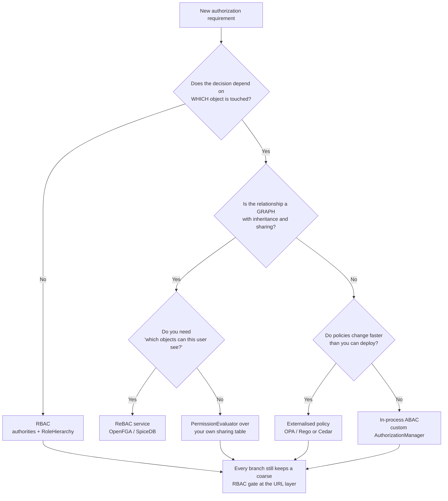

# 15.1 — RBAC, ABAC, and Real-World Permission Patterns

> **Module 15 · Topic 1** · Real-World Patterns
> Baseline: Spring Security 6.x on Boot 3.x (Jakarta namespace, Java 17+)
> New to this? Read **In Plain English** below first, then come back to the Version Matrix.

---

## Version Matrix

| Concern | Spring Security 5.x | **Spring Security 6.x (baseline)** | Spring Security 7.x |
|---|---|---|---|
| Authorization engine | `AccessDecisionManager` + voters | **`AuthorizationManager<T>`** | `AccessDecisionManager` removed to `spring-security-access` |
| Decision method | `decide(...)`, throws on deny | **`check(Supplier<Authentication>, T)`** | `authorize(...)`; `check(...)` removed |
| `PermissionEvaluator` | `org.springframework.security.access.PermissionEvaluator` | **unchanged — consulted by `DefaultMethodSecurityExpressionHandler`** | unchanged |
| Role hierarchy construction | `setHierarchy("ROLE_A > ROLE_B")` | **`fromHierarchy(...)` / `withDefaultRolePrefix()` builder (6.3+)** | builder only |
| Hierarchy in URL rules | needs a custom `SecurityExpressionHandler` | **`AuthorityAuthorizationManager.setRoleHierarchy(...)` (6.3+), or expand at authentication time** | `AuthorizationManagerFactory`, application-wide |
| Method security | `@EnableGlobalMethodSecurity` | **`@EnableMethodSecurity` + `AuthorizationManagerBeforeMethodInterceptor`** | same |
| Domain-object ACLs | `spring-security-acl` | **unchanged; maintained but rarely the right answer** | unchanged |
| Composition | voter consensus strategies | **`AuthorizationManagers.allOf()` / `anyOf()` / `not()`** | adds `AllAuthoritiesAuthorizationManager` |

---

## Why This Exists

Role checks are the first thing everyone learns and the first thing that fails in a real product.
`hasRole("ADMIN")` is a decision made entirely from one string attached to the caller. It cannot look at
the resource, the clock, the network, or the relationship between the caller and the thing being touched.
The moment a product manager says "regional admins see only their own region", or "contractors cannot
export after 18:00", or "the owner can share a document, and so can anyone they shared it with as an
editor", the role string has run out of expressive power.

> **RBAC** answers *"what kind of user is this?"*
> **ABAC** answers *"do the attributes of this request satisfy a policy?"*
> **ReBAC** answers *"is there a path in the relationship graph from this subject to this object?"*

Almost every candidate can configure `hasRole`. Very few can say *when* it stops working, what replaces
it, and how to get there without a rewrite.

---

## In Plain English

**The one-line version:** There are three fundamentally different ways of deciding whether somebody is allowed to do
something — by what kind of person they are, by the facts of the situation, or by their relationship to the thing
they are touching — and this file is about knowing which one your requirement actually needs.

**An analogy.** Think of a hospital again, but now about who may open which door.

The simplest scheme is a badge colour. Blue badges are nurses and open the ward doors; green badges are pharmacists
and open the dispensary. Nobody looks at *who* you are, only at *what kind* of person you are. That is **RBAC**,
role-based access control, and it works beautifully until the rules stop being about kinds of people. Then somebody
asks for "nurses, but only on their own ward, and only during their shift", and the natural reaction is to print
more badge types: blue-ward-3-nightshift. Print enough of those and you have a badge for nearly every individual,
which is the point at which the whole scheme has quietly stopped working. That is **role explosion**.

The second scheme keeps one blue badge and puts a small computer on the door. When you swipe, it looks at several
facts at once: your badge says nurse, the roster says you are on shift, the door belongs to ward 3, and your
assignment says ward 3. Permit. The decision is computed from the facts of the moment rather than pre-printed on a
card. That is **ABAC**, attribute-based access control. It is far more expressive, and the price is that you can no
longer answer "who can open this door?" by reading a list — you would have to run the computation against every
possible person.

The third scheme is for questions that are really about connections. "You may read this file because it is in a
folder that was shared with a team you belong to." No badge colour and no list of facts captures that; what you need
is to walk the chain of relationships and see whether it leads from you to the file. That is **ReBAC**,
relationship-based access control, and it is how Google Drive-style sharing actually works.

**How it actually works, step by step.**

In Spring, RBAC shows up as **authorities**: strings attached to the logged-in user, such as `ROLE_ADMIN` or
`invoice:approve`. A check like `hasRole('ADMIN')` is nothing more than a string comparison against that list. Two
conventions matter. Spring's `hasRole` helper silently adds the prefix `ROLE_` for you, which is why storing the
prefix in your database leads to someone writing `hasRole('ROLE_ADMIN')` and getting a denial that looks like a bug.
And it is worth separating roles, which reflect job titles, from permissions, which reflect capabilities, so that
reorganising the company does not force you to rewrite every check.

A **role hierarchy** lets you say that one role implies another — an administrator automatically counts as a
manager — so you do not have to list every role in every rule. The catch that surprises everyone is that publishing
the hierarchy as a bean does not make it apply everywhere; it only takes effect in the components you explicitly
hand it to. The version-proof alternative is to expand the roles once at login, so the user simply carries the full
set from then on.

When roles run out, ABAC means writing a decision as a small function over four groups of facts: something about the
subject (who is asking), something about the resource (what they are touching), the action (what they want to do),
and the environment (time, network, device). Spring's hook for this is the `PermissionEvaluator`. It is the place
where the expression `hasPermission(document, 'READ')` ends up in your own code, and you answer the one question
that a role string cannot: may *this* user do *this* to *this* record. One detail catches everybody: until you
register your own evaluator, Spring uses one that denies everything and logs a warning, so a brand-new
`hasPermission` expression refusing every request is usually a missing bean rather than a wrong expression.

There is also a vocabulary worth knowing because interviewers use it. The place that intercepts a request and
enforces the answer is the **enforcement point**; the thing that works out the answer is the **decision point**; the
thing that supplies extra facts the request did not carry is the **information point**; and the place policies are
authored is the **administration point**. The useful discipline in those names is simply to keep the deciding
separate from the enforcing, so the decision can be unit-tested and reused outside a web request.

**Why should a beginner care?** Almost every application starts with role checks, and almost every application
eventually gets a requirement that roles cannot express. Recognising that moment is what stops you from encoding
regions and departments into role names, which is a decision that is cheap on the first day and extremely expensive
two years later. The other half is the security consequence: an application that only checks roles will happily let
one customer fetch another customer's invoice, because both callers are perfectly valid users of type "customer".

**Words you will meet in this file**

| Term | In plain words |
|---|---|
| RBAC | Deciding by what kind of user someone is, using roles. |
| ABAC | Deciding by the facts of the request: who, what, which action, and under what conditions. |
| ReBAC | Deciding by whether a chain of relationships connects the user to the thing. |
| Authority | A plain string attached to the logged-in user representing something they may do. |
| Role | An authority representing a job function, which Spring conventionally prefixes with `ROLE_`. |
| Permission | A finer-grained capability such as `invoice:approve`, usually granted to a role rather than a person. |
| `hasRole` versus `hasAuthority` | The first adds the `ROLE_` prefix for you; the second compares the string exactly as written. |
| Role hierarchy | A rule saying one role automatically includes another, so you need not list them all. |
| Role explosion | The mess that results from encoding regions, modes and departments into role names. |
| `PermissionEvaluator` | Your own code answering whether this user may perform this action on this specific record. |
| `hasPermission(...)` | The expression inside an annotation that calls that code. Denies everything until you register a bean. |
| `DenyAllPermissionEvaluator` | The default that refuses everything, which is why an unregistered evaluator looks like a bug. |
| `AuthorizationManager` | Spring 6's component that takes a request and returns granted or denied. |
| Separation of duty | A rule such as "whoever submits an expense may not approve it", which no single role string can express. |
| PEP / PDP / PIP / PAP | Enforcement point, decision point, information point, administration point. Vocabulary for who does what. |
| OPA / Cedar | External policy engines, used when rules change faster than you can deploy code. |
| OpenFGA / SpiceDB / Zanzibar | Relationship-based authorization services, modelled on the system behind Google Drive sharing. |
| Reverse query | Asking "which objects can this user see?" rather than "may this user see this object?". Much harder than it sounds. |

**If you remember only one thing:** if the answer depends on *which record* is being touched, no role string will
ever be enough, and the sooner you move that decision into a real policy the less painful it is.

---

## Core Concepts

### 1. RBAC — The Model, The Schema, The Levels

**In simple terms:** People get roles, roles get permissions, and the check asks about permissions, so reorganising
the company and changing what the product can do stay independent of each other.

Users are assigned roles, roles are granted permissions, the enforcement point checks permissions. The
indirection exists because roles change at the speed of the organisation chart while permissions change at
the speed of the product, and neither should force you to touch the other.

```sql
CREATE TABLE users       (id BIGINT PRIMARY KEY, username VARCHAR(100) UNIQUE NOT NULL,
                          password VARCHAR(100) NOT NULL, enabled BOOLEAN NOT NULL DEFAULT TRUE);
CREATE TABLE roles       (id BIGINT PRIMARY KEY, name VARCHAR(64) UNIQUE NOT NULL);  -- ADMIN, no prefix
CREATE TABLE permissions (id BIGINT PRIMARY KEY, name VARCHAR(128) UNIQUE NOT NULL); -- invoice:approve
CREATE TABLE user_roles       (user_id BIGINT REFERENCES users(id),
                               role_id BIGINT REFERENCES roles(id), PRIMARY KEY (user_id, role_id));
CREATE TABLE role_permissions (role_id BIGINT REFERENCES roles(id),
                               permission_id BIGINT REFERENCES permissions(id),
                               PRIMARY KEY (role_id, permission_id));
```

Two decisions there are worth defending out loud. **The `ROLE_` prefix is not stored** — it is added
exactly once, where `GrantedAuthority` objects are constructed, in the `UserDetailsService` or the
`JwtAuthenticationConverter`. Storing `ROLE_ADMIN` leaks a Spring convention into your data model and
guarantees somebody eventually writes `hasRole("ROLE_ADMIN")` and gets a silent denial. **Permissions are
granted to roles, never directly to users** — a `user_permissions` table gives you two sources of truth
for one question and undocumented precedence. If one user needs one capability, create a role holding
that one permission; that is auditable, a direct grant is not.

The NIST levels are RBAC<sub>0</sub> flat (`GrantedAuthority` and `hasAuthority`), RBAC<sub>1</sub>
hierarchical (`RoleHierarchy`), RBAC<sub>2</sub> constrained (separation of duty, mutual exclusion,
cardinality limits) and RBAC<sub>3</sub> symmetric. Spring supports the first two; nearly every
application lives there. Separation of duty ("the person who submits an expense cannot approve it") has no
framework support because the constraint concerns a *pair* of actions on a *specific* object over *time*,
which no authority string can carry.

### 2. Role Hierarchies

**In simple terms:** Declaring that one role automatically includes another saves you from listing every role in
every rule, but it only applies where you explicitly plug it in rather than everywhere at once.

```java
public interface RoleHierarchy {
    Collection<? extends GrantedAuthority> getReachableGrantedAuthorities(
            Collection<? extends GrantedAuthority> authorities);
}
```

The contract is pure expansion: given what the user holds, return the transitive closure.
`RoleHierarchyImpl` precomputes that closure at construction, so the runtime cost is a hash lookup per
authority rather than a graph walk — and the hierarchy is therefore **immutable after construction**,
which rules it out for a product where administrators edit the role graph in a UI.

```java
RoleHierarchy hierarchy = RoleHierarchyImpl.withDefaultRolePrefix()   // prepends ROLE_
        .role("ADMIN").implies("MANAGER")
        .role("MANAGER").implies("VIEWER")
        .build();

// Equivalent text form; both replace the deprecated setHierarchy(String)
RoleHierarchy fromText = RoleHierarchyImpl.fromHierarchy("ROLE_ADMIN > ROLE_MANAGER");
```

**The trap that catches everyone:** publishing a `RoleHierarchy` bean does not make the hierarchy apply
everywhere. It is consulted only by components that were handed it, so you set it on
`DefaultMethodSecurityExpressionHandler` for method security and on `AuthorityAuthorizationManager` (6.3+)
for URL rules; Spring Security 7's `AuthorizationManagerFactory` finally lets you configure it once. The
version-proof alternative is expanding at authentication time, with `RoleHierarchyAuthoritiesMapper`
(`org.springframework.security.access.hierarchicalroles`) or inside your `UserDetailsService` — a larger
authority set in the session in exchange for no per-check expansion, which is the better trade for a
shallow hierarchy and the worse one for hundreds of roles.

### 3. Role Explosion — The Failure Mode That Ends RBAC

**In simple terms:** Once you start packing regions and modes into role names, the number of roles multiplies out of
control, and that is the signal that the decision really depends on facts rather than on job titles.

```
ROLE_ADMIN   ROLE_ADMIN_EU   ROLE_ADMIN_EU_READONLY   ROLE_ADMIN_APAC_FINANCE_READONLY
```

Each name encodes attributes — a region, a mode, a business unit — into a string the engine treats as
opaque. It cannot parse `EU` out of `ROLE_ADMIN_EU`; it can only compare whole strings. So every new
region, mode, and department multiplies the roles you create, assign, audit, and write matchers for. The
count is a Cartesian product: six job functions across twelve regions, two access modes, and eight
business units is 1,152 roles for what is conceptually six jobs.

The symptoms in order of appearance: role names acquire underscores that mean something to humans and
nothing to the engine; one user is assigned twenty roles because their real permission set is an
intersection no single role expresses; somebody writes `auth.getAuthority().endsWith("_READONLY")`, which
is the moment you have built a policy language with no parser and no specification; adding a region
becomes a release with a data migration; and nobody can answer "who can approve invoices in EMEA?"
without a spreadsheet.

**The insight to state in an interview:** role explosion is not a naming problem that better names fix. It
is the signal that the decision depends on *attributes of the request*, and attributes must be evaluated
at decision time rather than pre-compiled into the subject's identity. That is ABAC.

### 4. ABAC — Attributes Evaluated At Decision Time

**In simple terms:** Instead of pre-printing the answer on the user, you work it out at the moment of the request
from facts about the person, the record, the action, and the surrounding circumstances.

| Category | Examples | Where Spring gets it |
|---|---|---|
| **Subject** | user id, department, clearance, employment type, tenant | `Authentication` — principal, authorities, `getDetails()`, JWT claims |
| **Resource** | owner, classification, region, state, amount | loaded from the database, or a method argument |
| **Action** | read, update, approve, export, share | method name, HTTP verb, or a `Permission` enum |
| **Environment** | time of day, source IP, geo, device posture, MFA freshness | `HttpServletRequest`, `Clock`, `amr` / `auth_time` claims |

A policy is then a pure function, `decide(subject, resource, action, environment)`, returning permit or
deny. You are **forced** into ABAC by requirements of exactly five shapes, and interviewers pick from this
list: **time or calendar restrictions**, because nothing about the user changes at 18:01; **geographic or
network restrictions**, where the attribute is on the request rather than the subject; **resource
ownership**, where the answer depends on a row you have not loaded yet, which is the confused-deputy
problem from Module 1 and the most common real reason teams reach for ABAC; **data classification**, where
"clearance CONFIDENTIAL may read CONFIDENTIAL or below" compares a subject attribute against a resource
attribute rather than testing membership; and **delegation**, where "Bob may approve for Alice, up to
£10,000, until the 14th" uses all four categories and the grant is temporary.

Name ABAC's costs unprompted. "Who can do X?" now means evaluating a policy against every possible input
instead of reading a join, so the audit story is weaker; you cannot render a UI menu without asking the
decision point about every item; and every attribute the policy reads is a potential query on the hot path.

### 5. ReBAC — Google Zanzibar, OpenFGA, SpiceDB

**In simple terms:** Some questions are really about connections — you may see this file because of the folder it
sits in and the team you belong to — so the answer comes from following a chain of relationships.

ReBAC stores authorization as a graph of tuples of the form `object#relation@subject` and answers a check
by asking whether a path exists. Google's Zanzibar paper (2019) described the system behind Drive, Docs,
YouTube, and Cloud IAM, and is the direct ancestor of **OpenFGA** (CNCF, from Auth0/Okta) and **SpiceDB**
(AuthZed).

```
type document
  relations
    define parent: [folder]
    define owner:  [user]
    define editor: [user] or owner or editor from parent
    define viewer: [user] or editor or viewer from parent

document:roadmap#owner@user:alice     document:roadmap#parent@folder:eng
folder:eng#viewer@group:engineering#member
```

Three mechanisms do the heavy lifting, and naming them distinguishes someone who read the paper from
someone who read a blog post. **Userset rewrites** let one relation imply another, so storing `editor`
also answers `viewer`. **Tupleset traversal** (`viewer from parent`) inherits permissions down a
containment hierarchy without a tuple per descendant. **Consistency tokens** ("zookies") carry a snapshot
timestamp so a check is evaluated at or after a known write, solving the *new enemy* problem where a
replica that has not seen a revocation would otherwise answer permit.

Document sharing and organisational hierarchies are inherently about paths between entities. "Bob can see
this file because it sits in a folder shared with a group he belongs to, nested under a team drive" is a
multi-hop traversal. As roles it needs one role per (object, relation) pair, which is role explosion with
extra steps; as ABAC it needs recursive queries on the hot path against indexes nobody designed. A ReBAC
service stores the graph, indexes the closure, and also answers the **reverse query** — `list-objects` in
OpenFGA, `LookupResources` in SpiceDB — which is what renders a file list and which neither RBAC nor
naive ABAC does efficiently.

### 6. A Decision Framework

**In simple terms:** A short set of questions that tells you which of the three models a new requirement actually
needs, so you do not reach for heavy machinery when a role check would do, or the reverse.



| | RBAC | ABAC | ReBAC |
|---|---|---|---|
| Decision input | subject's authorities | attributes of subject, resource, action, environment | tuples in a graph |
| Expresses ownership | no | yes | yes |
| Inheritance through containment | only over roles | awkwardly, recursive queries | natively |
| "What can this user see?" | trivial | very hard | `list-objects` |
| Operational cost | a few tables | policy bundle plus tests | a distributed service with its own datastore |
| Fails when | attributes get encoded into role names | you need reverse queries or deep hierarchies | the domain really is just job functions |

The pragmatic answer for most systems: **RBAC at the URL layer for the coarse shape, ABAC or ReBAC at the
object layer for anything with an identifier in the path.** The coarse gate keeps obviously-wrong traffic
away from your deserialisers; the fine gate answers what the coarse gate structurally cannot.

### 7. The XACML Vocabulary — PEP, PDP, PIP, PAP

**In simple terms:** Standard names for the four jobs in any authorization system — enforcing the answer, working it
out, supplying the facts, and writing the rules — and the discipline of keeping the first two apart.

| Acronym | Role | Spring Security equivalent |
|---|---|---|
| **PEP** — Policy Enforcement Point | Intercepts, asks, enforces | `AuthorizationFilter`, `AuthorizationManagerBeforeMethodInterceptor` |
| **PDP** — Policy Decision Point | Evaluates policy, returns permit or deny | `AuthorizationManager`, `PermissionEvaluator`, a remote OPA/Cedar/OpenFGA call |
| **PIP** — Policy Information Point | Supplies attributes the request did not carry | `UserDetailsService`, repositories, a holiday calendar |
| **PAP** — Policy Administration Point | Where policy is authored and published | your admin UI, a Git repo of Rego, the bundle server |
| **PRP** — Policy Retrieval Point | Stores and serves policy to the PDP | the bundle server or policy database |

XACML itself is effectively dead, but the vocabulary survives and interviewers use it freely. It buys one
discipline: **separating the PEP from the PDP.** Decision logic inlined in a controller cannot be
unit-tested without a servlet environment, cannot be reused by a scheduled job, and cannot be externalised.

### 8. `PermissionEvaluator` — The Full Interface

**In simple terms:** This is the hook where you answer, in your own code, whether one particular user may perform
one particular action on one particular record, and it comes in two shapes depending on whether the record is
already loaded.

```java
package org.springframework.security.access;

import java.io.Serializable;
import org.springframework.aop.framework.AopInfrastructureBean;
import org.springframework.security.core.Authentication;

public interface PermissionEvaluator extends AopInfrastructureBean {

    boolean hasPermission(Authentication authentication, Object targetDomainObject, Object permission);

    boolean hasPermission(Authentication authentication, Serializable targetId, String targetType,
            Object permission);
}
```

The two overloads map onto the two annotation positions. The **object** form fits
`@PostAuthorize("hasPermission(returnObject, 'READ')")`, where the object was fetched anyway so the check
is free; its hazard is that a denial already paid the query and already caused any side effects of
loading. The **id-plus-type** form fits `@PreAuthorize("hasPermission(#id, 'Document', 'DELETE')")`,
deciding before anything loads; it costs an extra lookup on the success path but fails closed earlier and
is the only form usable when the target does not exist yet.

`permission` is `Object` deliberately, so the ACL module can pass its bitmask `Permission` type while
application code passes a SpEL string literal — normalise all forms in one place rather than scattering
`instanceof` checks. `AopInfrastructureBean` is a marker telling the auto-proxy creator never to proxy
this bean, which would otherwise let method security recurse into the component it is consulting.

### 9. Wiring `hasPermission` Into SpEL

**In simple terms:** The expression inside the annotation is just a method call that forwards to whichever evaluator
bean you registered, and the default one refuses everything, which is why a new check denies every request.

The SpEL function is not magic. It is a method on `SecurityExpressionRoot` delegating to a field the
expression handler injected:

```java
// org.springframework.security.access.expression.SecurityExpressionRoot (simplified)
public final boolean hasPermission(Object target, Object permission) {
    return this.permissionEvaluator.hasPermission(getAuthentication(), target, permission);
}
```

That field defaults to `DenyAllPermissionEvaluator`, which returns `false` and logs a warning. **This is
why a fresh `hasPermission(...)` expression denies everything until you register your evaluator**, and why
people hunt for a configuration typo when the real cause is a bean they never published. Registration
goes through a `static` `MethodSecurityExpressionHandler` bean — the same rule as
`GrantedAuthorityDefaults`, because the method-security infrastructure is assembled by bean
post-processors before an ordinary `@Configuration` instance is ready.

---

## Working Code

An action enum, a per-domain-type strategy registry, and the evaluator that dispatches to it.

```java
package com.example.authz;

import java.io.Serializable;
import java.time.Clock;
import java.time.LocalTime;
import java.util.List;
import java.util.Map;
import java.util.function.Function;
import java.util.stream.Collectors;
import org.slf4j.Logger;
import org.slf4j.LoggerFactory;
import org.springframework.security.access.PermissionEvaluator;
import org.springframework.security.core.Authentication;
import org.springframework.stereotype.Component;
import com.example.document.Document;
import com.example.document.DocumentRepository;

public enum Permission {
    READ, WRITE, DELETE, SHARE, APPROVE;

    /** Normalise SpEL string literals and enum values in exactly one place. */
    public static Permission from(Object raw) {
        if (raw instanceof Permission permission) {
            return permission;
        }
        if (raw instanceof String name) {
            return Permission.valueOf(name.trim().toUpperCase());
        }
        throw new IllegalArgumentException("Unsupported permission literal: " + raw);
    }
}

/** One strategy per protected type, instead of a growing if/else inside the evaluator. */
interface PermissionStrategy<T> {

    String targetType();             // the name used in SpEL: hasPermission(#id, 'Document', 'READ')

    Class<T> domainType();

    T loadById(Serializable id);

    boolean isAllowed(Authentication authentication, T target, Permission permission);
}

@Component
class DocumentPermissionStrategy implements PermissionStrategy<Document> {

    private final DocumentRepository documents;
    private final Clock clock;

    DocumentPermissionStrategy(DocumentRepository documents, Clock clock) {
        this.documents = documents;
        this.clock = clock;
    }

    @Override public String targetType()          { return "Document"; }
    @Override public Class<Document> domainType() { return Document.class; }

    @Override
    public Document loadById(Serializable id) {
        return this.documents.findById((Long) id).orElse(null);
    }

    @Override
    public boolean isAllowed(Authentication authentication, Document target, Permission permission) {
        if (target == null || !target.getTenantId().equals(TenantContext.currentTenantId())) {
            return false;            // unknown object or wrong tenant: deny without leaking existence
        }
        String user = authentication.getName();
        boolean owner = user.equals(target.getOwnerUsername());
        boolean editor = target.getEditors().contains(user);
        return switch (permission) {
            case READ -> owner || editor || target.getViewers().contains(user);
            case WRITE -> owner || editor;
            case DELETE, SHARE -> owner;
            // Environment attribute: approvals only inside business hours.
            case APPROVE -> owner && inBusinessHours();
        };
    }

    private boolean inBusinessHours() {
        LocalTime now = LocalTime.now(this.clock);
        return !now.isBefore(LocalTime.of(9, 0)) && now.isBefore(LocalTime.of(18, 0));
    }
}

@Component
public class DomainPermissionEvaluator implements PermissionEvaluator {

    private static final Logger log = LoggerFactory.getLogger(DomainPermissionEvaluator.class);

    private final Map<Class<?>, PermissionStrategy<?>> byClass;
    private final Map<String, PermissionStrategy<?>> byTypeName;

    public DomainPermissionEvaluator(List<PermissionStrategy<?>> strategies) {
        this.byClass = strategies.stream()
                .collect(Collectors.toMap(PermissionStrategy::domainType, Function.identity()));
        this.byTypeName = strategies.stream()
                .collect(Collectors.toMap(PermissionStrategy::targetType, Function.identity()));
    }

    @Override
    public boolean hasPermission(Authentication authentication, Object target, Object permission) {
        if (!usable(authentication) || target == null) {
            return false;
        }
        PermissionStrategy<Object> s = strategy(this.byClass.get(target.getClass()),
                target.getClass().getName());
        return s != null && s.isAllowed(authentication, target, Permission.from(permission));
    }

    @Override
    public boolean hasPermission(Authentication authentication, Serializable id, String targetType,
            Object permission) {
        if (!usable(authentication) || id == null) {
            return false;
        }
        PermissionStrategy<Object> s = strategy(this.byTypeName.get(targetType), targetType);
        return s != null && s.isAllowed(authentication, s.loadById(id), Permission.from(permission));
    }

    @SuppressWarnings("unchecked")
    private PermissionStrategy<Object> strategy(PermissionStrategy<?> found, String description) {
        if (found == null) {
            // An unregistered type is a missing strategy, not a public resource. Fail closed, loudly.
            log.warn("No PermissionStrategy registered for {}", description);
        }
        return (PermissionStrategy<Object>) found;
    }

    private boolean usable(Authentication authentication) {
        return authentication != null && authentication.isAuthenticated();
    }
}
```

An ABAC decision at the request layer, where every attribute is environmental:

```java
package com.example.authz;

import java.time.Clock;
import java.time.DayOfWeek;
import java.time.ZonedDateTime;
import java.util.function.Supplier;
import org.springframework.security.authorization.AuthorizationDecision;
import org.springframework.security.authorization.AuthorizationManager;
import org.springframework.security.core.Authentication;
import org.springframework.security.web.access.intercept.RequestAuthorizationContext;
import org.springframework.security.web.util.matcher.IpAddressMatcher;

/** In 6.x the SPI method is check(...); Spring Security 7 renames it to authorize(...). */
public class ContractorWindowAuthorizationManager
        implements AuthorizationManager<RequestAuthorizationContext> {

    private final IpAddressMatcher corporateNetwork = new IpAddressMatcher("10.20.0.0/16");
    private final Clock clock;

    public ContractorWindowAuthorizationManager(Clock clock) {
        this.clock = clock;
    }

    @Override
    public AuthorizationDecision check(Supplier<Authentication> authentication,
            RequestAuthorizationContext context) {
        Authentication auth = authentication.get();
        if (auth == null || !auth.isAuthenticated()) {
            return new AuthorizationDecision(false);
        }
        boolean contractor = auth.getAuthorities().stream()
                .anyMatch(a -> "ROLE_CONTRACTOR".equals(a.getAuthority()));
        if (!contractor) {
            return new AuthorizationDecision(true);
        }
        ZonedDateTime now = ZonedDateTime.now(this.clock);
        boolean weekday = now.getDayOfWeek() != DayOfWeek.SATURDAY
                && now.getDayOfWeek() != DayOfWeek.SUNDAY;
        boolean inHours = now.getHour() >= 9 && now.getHour() < 18;
        return new AuthorizationDecision(
                this.corporateNetwork.matches(context.getRequest()) && weekday && inHours);
    }
}
```

```java
package com.example.config;

import java.time.Clock;
import org.springframework.context.annotation.Bean;
import org.springframework.context.annotation.Configuration;
import org.springframework.security.access.PermissionEvaluator;
import org.springframework.security.access.expression.method.DefaultMethodSecurityExpressionHandler;
import org.springframework.security.access.expression.method.MethodSecurityExpressionHandler;
import org.springframework.security.access.hierarchicalroles.RoleHierarchy;
import org.springframework.security.access.hierarchicalroles.RoleHierarchyImpl;
import org.springframework.security.config.Customizer;
import org.springframework.security.config.annotation.method.configuration.EnableMethodSecurity;
import org.springframework.security.config.annotation.web.builders.HttpSecurity;
import org.springframework.security.config.annotation.web.configuration.EnableWebSecurity;
import org.springframework.security.web.SecurityFilterChain;
import com.example.authz.ContractorWindowAuthorizationManager;

@Configuration
@EnableWebSecurity
@EnableMethodSecurity                            // prePostEnabled is true by default in 6.x
public class PermissionModelConfig {

    @Bean
    Clock systemClock() {
        return Clock.systemDefaultZone();
    }

    @Bean
    static RoleHierarchy roleHierarchy() {
        return RoleHierarchyImpl.withDefaultRolePrefix()
                .role("ADMIN").implies("MANAGER")
                .role("MANAGER").implies("VIEWER")
                .build();
    }

    /** static: consumed by bean post-processors before this class would otherwise be ready. */
    @Bean
    static MethodSecurityExpressionHandler methodSecurityExpressionHandler(
            PermissionEvaluator permissionEvaluator, RoleHierarchy roleHierarchy) {
        DefaultMethodSecurityExpressionHandler handler = new DefaultMethodSecurityExpressionHandler();
        handler.setPermissionEvaluator(permissionEvaluator);
        handler.setRoleHierarchy(roleHierarchy);
        return handler;
    }

    @Bean
    SecurityFilterChain filterChain(HttpSecurity http, Clock clock) throws Exception {
        http
            .authorizeHttpRequests(auth -> auth
                .requestMatchers("/login", "/error").permitAll()
                // Coarse RBAC gate: cheap, and it keeps unauthorised traffic away from deserialisation.
                .requestMatchers("/admin/**").hasRole("ADMIN")
                .requestMatchers("/reports/export").hasAuthority("report:export")
                .requestMatchers("/payroll/**").access(new ContractorWindowAuthorizationManager(clock))
                .anyRequest().authenticated()
            )
            .formLogin(Customizer.withDefaults());

        return http.build();
    }
}
```

The service layer shows both annotation positions, and why list endpoints must filter in the query:

```java
package com.example.document;

import java.util.List;
import org.springframework.security.access.prepost.PostAuthorize;
import org.springframework.security.access.prepost.PreAuthorize;
import org.springframework.stereotype.Service;

@Service
public class DocumentService {

    private final DocumentRepository documents;

    public DocumentService(DocumentRepository documents) {
        this.documents = documents;
    }

    @PreAuthorize("hasPermission(#id, 'Document', 'DELETE')")     // decide before loading
    public void delete(Long id) {
        this.documents.deleteById(id);
    }

    @PostAuthorize("hasPermission(returnObject, 'READ')")         // reuse the fetch
    public Document find(Long id) {
        return this.documents.findById(id).orElseThrow();
    }

    /** @PostFilter here would load every row and discard most of them. */
    public List<Document> visible(String username, String tenantId) {
        return this.documents.findAllVisibleTo(username, tenantId);
    }
}
```

Unit tests pin the policy matrix with a **fixed** `Clock`. The `@SpringBootTest` pins the *wiring*, and it
is the only test that catches a missing expression handler, a `#id` that resolved to `null` because
`-parameters` was not enabled, or a self-invocation that bypassed the proxy.

```java
package com.example.authz;

import java.time.Clock;
import java.time.Instant;
import java.time.ZoneId;
import java.util.List;
import java.util.Optional;
import java.util.Set;
import org.junit.jupiter.api.BeforeEach;
import org.junit.jupiter.api.Test;
import org.springframework.beans.factory.annotation.Autowired;
import org.springframework.boot.test.context.SpringBootTest;
import org.springframework.security.access.AccessDeniedException;
import org.springframework.security.authentication.UsernamePasswordAuthenticationToken;
import org.springframework.security.core.Authentication;
import org.springframework.security.core.authority.AuthorityUtils;
import org.springframework.security.test.context.support.WithMockUser;
import com.example.document.Document;
import com.example.document.DocumentRepository;
import com.example.document.DocumentService;

import static org.assertj.core.api.Assertions.assertThat;
import static org.assertj.core.api.Assertions.assertThatExceptionOfType;
import static org.mockito.ArgumentMatchers.anyLong;
import static org.mockito.Mockito.mock;
import static org.mockito.Mockito.when;

class DomainPermissionEvaluatorTests {

    private static final Clock TEN_AM = Clock.fixed(Instant.parse("2026-03-04T10:00:00Z"), ZoneId.of("UTC"));
    private static final Clock TEN_PM = Clock.fixed(Instant.parse("2026-03-04T22:00:00Z"), ZoneId.of("UTC"));

    private DocumentRepository repository;
    private Document doc;

    private Authentication as(String username, String... roles) {
        return new UsernamePasswordAuthenticationToken(username, "n/a",
                AuthorityUtils.createAuthorityList(roles));
    }

    private DomainPermissionEvaluator evaluator(Clock clock) {
        return new DomainPermissionEvaluator(List.of(new DocumentPermissionStrategy(this.repository, clock)));
    }

    @BeforeEach
    void setUp() {
        this.repository = mock(DocumentRepository.class);
        this.doc = new Document(1L, "tenant-a", "alice", Set.of("bob"), Set.of("carol"));
        when(this.repository.findById(anyLong())).thenReturn(Optional.of(this.doc));
        TenantContext.setCurrentTenantId("tenant-a");
    }

    @Test
    void editorMayWriteButNotDelete() {
        DomainPermissionEvaluator evaluator = evaluator(TEN_AM);
        Authentication bob = as("bob", "ROLE_VIEWER");
        assertThat(evaluator.hasPermission(bob, this.doc, "WRITE")).isTrue();
        assertThat(evaluator.hasPermission(bob, this.doc, "DELETE")).isFalse();
    }

    @Test
    void environmentAttributeDeniesApprovalOutsideBusinessHours() {
        Authentication alice = as("alice", "ROLE_MANAGER");
        assertThat(evaluator(TEN_AM).hasPermission(alice, this.doc, "APPROVE")).isTrue();
        assertThat(evaluator(TEN_PM).hasPermission(alice, this.doc, "APPROVE")).isFalse();
    }

    @Test
    void crossTenantAccessIsDeniedEvenForTheOwner() {
        TenantContext.setCurrentTenantId("tenant-b");
        assertThat(evaluator(TEN_AM).hasPermission(as("alice", "ROLE_ADMIN"), this.doc, "READ")).isFalse();
    }

    @Test
    void unregisteredTypeFailsClosed() {
        assertThat(evaluator(TEN_AM).hasPermission(as("alice"), "a-string", "READ")).isFalse();
    }
}

@SpringBootTest
class DocumentServiceSecurityTests {

    @Autowired DocumentService service;

    @Test
    @WithMockUser(username = "mallory", roles = "VIEWER")
    void nonOwnerIsDeniedBeforeTheDeleteQueryRuns() {
        assertThatExceptionOfType(AccessDeniedException.class)
                .isThrownBy(() -> this.service.delete(1L));
    }
}
```

---

## Internals

### How `@PreAuthorize("hasPermission(...)")` reaches your evaluator

1. `@EnableMethodSecurity` registers `AuthorizationManagerBeforeMethodInterceptor.preAuthorize(...)` as an
   `Advisor`, backed by `PreAuthorizeAuthorizationManager`.
2. That manager asks its `PreAuthorizeExpressionAttributeRegistry` for this method's attribute. The
   registry extends `AbstractExpressionAttributeRegistry`, which caches parsed expressions in a
   `Map<MethodClassKey, ExpressionAttribute>`, so SpEL is parsed **once per method**, not per call.
3. `DefaultMethodSecurityExpressionHandler.createEvaluationContext(...)` builds a
   `MethodSecurityExpressionRoot` and pushes in the `AuthenticationTrustResolver`, the `RoleHierarchy`,
   the `PermissionEvaluator`, and the default role prefix.
4. Method arguments become SpEL variables, resolved through a `ParameterNameDiscoverer`. That is what
   makes `#id` work, and why it silently resolves to `null` when the class was compiled without
   `-parameters` and there is no `@P("id")` annotation.
5. `hasPermission(...)` lands on `SecurityExpressionRoot`, which calls your evaluator. A `false` becomes an
   `AuthorizationDeniedException` (a subclass of `AccessDeniedException`) thrown **inside** the MVC
   dispatch — which is why `@ControllerAdvice` catches this one but never catches an `AuthorizationFilter`
   denial.

### The `spring-security-acl` schema, and why it is usually the wrong tool

`acl_sid` holds security identities (principals and granted authorities), `acl_class` the fully-qualified
names of protected types, `acl_object_identity` one row per protected instance with an optional parent for
inheritance, and `acl_entry` the grants as a 32-bit permission mask plus a granting flag and an order. You
get inheritance, bitmask permissions, and an audit trail. You also get a row per object per principal, a
`MutableAclService` you must call on every create and delete, and a model capped at 32 permissions. For a
document product with millions of objects and group-based sharing, that tuple count and write
amplification are exactly why Google built Zanzibar instead.

### Externalised policy: OPA and Cedar

```rego
package authz.documents
import rego.v1

default allow := false                      # always declare it, or the result is "undefined"

allow if input.resource.owner == input.subject.username

allow if {
    input.action in {"READ", "WRITE"}
    input.subject.username in input.resource.editors
}

allow if {                                  # clearance must dominate classification
    input.action == "READ"
    levels := {"PUBLIC": 0, "INTERNAL": 1, "CONFIDENTIAL": 2, "SECRET": 3}
    levels[input.subject.clearance] >= levels[input.resource.classification]
}

deny if {
    "CONTRACTOR" in input.subject.roles
    not net.cidr_contains("10.20.0.0/16", input.environment.source_ip)
}
```

```cedar
permit (principal, action in [Action::"read", Action::"write"], resource)
when { resource.owner == principal || principal in resource.editors };

forbid (principal in Role::"contractor", action, resource)
unless { context.source_ip.isInRange(ip("10.20.0.0/16")) };
```

**What you gain.** Policy becomes data. A security team changes an authorization rule through a policy
pipeline rather than a code release, which matters enormously where a deploy needs change approval and a
bundle push does not. You get one policy language across services written in different languages, plus
policy unit tests, coverage, and a decision log you can replay for an auditor.

**What you pay.** A network hop per decision, which forces caching and therefore cache-invalidation
correctness problems. A second language that fewer engineers can review or debug — Rego is a declarative
logic language that does not reward Java intuition. Harder local reasoning, because your endpoint's
behaviour is no longer determined by anything in your repository. And a new availability dependency: when
the decision point is unreachable you choose fail-closed (an outage) or fail-open (a breach).

**Policy testing** is what makes externalisation viable. OPA has a first-class framework — `*_test.rego`
files with rules prefixed `test_`, run by `opa test --coverage`; Cedar ships a validator plus
property-based testing. The rule to hold to is that **policy is code**: version control, tests with
coverage gates, two reviewers, promotion through environments. A bundle that can be hot-pushed to
production unreviewed is a remote code execution channel for your authorization layer.

### Permission caching and invalidation

Three layers, safest first. **Request-scoped memoisation** of `(subject, type, id, permission)` is nearly
free and completely safe, because permissions cannot change inside one request in any way you are entitled
to observe. **A short-lived shared cache** of 30 to 60 seconds trades bounded staleness for a large
hit-rate win on list endpoints. **A long-lived cache** is correct only if every grant, revoke, ownership
transfer, group change, and role edit evicts the affected keys in *every* instance, which means a
distributed cache or a pub/sub invalidation topic rather than a local map.

The correctness rule is that **the cache key must contain every attribute the decision depends on**: the
moment a policy reads the clock, the source address, or MFA freshness, a key of `(subject, object, action)`
will serve an in-hours permit at 22:00. Either exclude environment-dependent permissions from caching or
bucket the environment attribute into the key. And state the revocation position honestly — cached
authorization is eventually consistent, and the staleness window is a security parameter you choose
deliberately and write down.

---

## Configuration Reference

| Knob | Effect | Default |
|---|---|---|
| `@EnableMethodSecurity` | Registers the `@PreAuthorize` / `@PostAuthorize` interceptors | `prePostEnabled = true`, `securedEnabled = false`, `jsr250Enabled = false` |
| `MethodSecurityExpressionHandler` bean | Replaces the default handler; where the evaluator and hierarchy are injected | `DefaultMethodSecurityExpressionHandler` |
| `setPermissionEvaluator(...)` | Backs the `hasPermission(...)` expression | `DenyAllPermissionEvaluator` — denies and warns |
| `setRoleHierarchy(...)` | Expands roles for `hasRole` inside annotations | none |
| `setDefaultRolePrefix(...)` | Prefix `hasRole` prepends | `ROLE_` |
| `GrantedAuthorityDefaults` bean (`static`) | Changes the prefix globally for expressions | `ROLE_` |
| `RoleHierarchyImpl.withDefaultRolePrefix()` | Builder for the role graph (6.3+) | — |
| `AuthorityAuthorizationManager.setRoleHierarchy(...)` | Makes `hasRole` in URL rules honour the hierarchy (6.3+) | none |
| `.access(AuthorizationManager)` | Arbitrary programmatic decision at the URL layer | — |
| `AuthorizationManagers.allOf` / `anyOf` / `not` | Composition, replacing voter strategies | — |

---

## Production Concerns & Anti-Patterns

**Encoding attributes into role names.** `ROLE_ADMIN_EU_READONLY` is the canonical smell. The engine cannot
read the parts, so every combination becomes a new role, matcher, and audit row. The moment you catch
yourself writing `authority.startsWith("ROLE_ADMIN_")`, stop — you have invented a policy language with no
parser and no specification.

**Granting permissions directly to users alongside roles.** Two sources of truth for one question, with
precedence rules nobody wrote down.

**Returning `true` from a `PermissionEvaluator` for unknown types.** Fail closed, loudly. The version of
this bug that reaches production is a `default` branch returning `true` so the tests pass.

**Checking permissions only in the controller.** Every scheduled job, message listener, GraphQL resolver,
and admin CLI reaching the same service bypasses the check. Annotate the service method, where the code
paths converge.

**`@PostAuthorize` on a mutating method, or `@PostFilter` on a large collection.** The first has already run
the body, so depending on where the exception lands relative to the transaction boundary the write may
already be committed. The second loads ten thousand rows to return the forty the user may see, and the
database did work on rows the caller was never entitled to touch. Use `@PostAuthorize` for reads, and
filter in the query.

**Caching decisions without an invalidation path, or treating a remote decision point as always
available.** A revoked administrator who keeps access for the cache lifetime is a finding in every audit,
and fail-closed or fail-open must be chosen, implemented behind a circuit breaker, and tested before the
incident rather than during it.

**Forgetting the reverse query.** Teams design a clean `check(subject, object, action)` API and then
discover the home page needs "everything I can see". If that calls `check` once per row the design has
failed, and it is the biggest discriminator between "a `PermissionEvaluator` is enough" and "you need a
ReBAC service".

---

## Debugging Playbook

| Symptom | Likely root cause | Fix |
|---|---|---|
| `hasPermission(...)` always denies, no error | No evaluator registered, so `DenyAllPermissionEvaluator` is in use | Publish a `MethodSecurityExpressionHandler` bean calling `setPermissionEvaluator(...)` |
| `#id` in SpEL is `null` | Compiled without `-parameters` and no `@P("id")` | Enable the compiler flag or annotate the parameter |
| Hierarchy works in `@PreAuthorize` but not in URL rules | The `RoleHierarchy` was set only on the method-security handler | Set it on `AuthorityAuthorizationManager` (6.3+) or expand at authentication time |
| `BeanCurrentlyInCreationException` after adding the handler | Non-`static` `@Bean` forcing early instantiation of the configuration class | Make the method `static` and inject only the evaluator |
| `@PreAuthorize` ignored on some methods | Self-invocation bypasses the proxy, or the method is `private`/`final` | Split into another bean |
| Permission change applies only after re-login | Authorities snapshotted into the session or token | Re-resolve per request, or shorten token lifetime |
| Denials appear at 18:01 only | An environment attribute is in the policy but not in the cache key | Add the time bucket to the key, or exclude that permission |
| Permitted on one instance, denied on another | Local cache without distributed eviction, or a bundle mid-rollout | Shared cache with pub/sub eviction; roll bundles atomically |
| ACL grants exist but access is denied | Missing `acl_object_identity` row, or the sid stored as a principal when the grant was to an authority | Inspect all four ACL tables for the object identity and sid type |
| Policy-service timeouts produce 500s, not 403s | No circuit breaker and no explicit fail-closed path | Wrap the call, map failure to `AccessDeniedException`, alert |
| OPA returns `undefined` rather than `false` | No `default allow := false` in the module | Always declare the default decision |

---

## Interview Q&A

### Q1. When does RBAC stop being enough, and what exactly do you replace it with?

<details>
<summary>Show answer</summary>

RBAC stops being enough at the precise moment the decision depends on something other than the identity of
the caller. A role is a property of the subject; if the answer also depends on *which* object, *when*, or
*from where*, no authority string can carry that information.

The observable symptom is role explosion. Names grow qualifiers like `ROLE_ADMIN_EU_READONLY` because
somebody needed to express a region and a mode and the only vocabulary available was the role name. Since
the engine treats authority strings as opaque, every combination becomes its own role, and the count is the
Cartesian product of job functions, regions, modes, and business units.

What I replace it with is not a wholesale swap. I keep RBAC for the coarse shape — URL rules saying only
administrators reach `/admin/**` — because it is cheap, auditable by reading a table, and it keeps
unauthorised traffic away from request deserialisation. Then I add an attribute-based layer at the object
level, as a `PermissionEvaluator` or a custom `AuthorizationManager`, where the decision can see the
resource, the clock, and the request.

**Counter-question: give me the concrete refactoring. I have `ROLE_ADMIN_EU_READONLY` in production today.**

The name decomposes into three independent facts. `ADMIN` stays a role, because it really is a job function.
`EU` becomes a subject attribute — a `region` column on the membership row, surfaced as a claim or in
`Authentication.getDetails()`. `READONLY` becomes a permission set: the role maps to permissions, and a
read-only administrator holds the read permissions and not the write ones. Enforcement then reads
`@PreAuthorize("hasAuthority('invoice:approve') and @regionPolicy.sameRegion(#invoiceId, authentication)")`,
with `hasRole('ADMIN')` kept as the coarse URL gate. Adding a region is now a data change with no new roles,
matchers, or deployment.

**Counter-question: your ABAC layer needs the resource's region, which is a query per request. How do you keep that acceptable?**

Three things in order. Prefer pushing the predicate into the query the application was going to run anyway —
`findByIdAndRegion(id, region)` costs nothing extra and closes the window in which the wrong row exists in
memory. When a separate check is unavoidable, memoise it for the request, because the same permission is
frequently evaluated more than once on one path. Only if the endpoint is genuinely hot, add a short-lived
shared cache keyed on every attribute the decision reads. What I would not do is cache the resource's
attributes indefinitely, because a document reclassified from INTERNAL to SECRET must take effect promptly,
and that is exactly the change a cache silently swallows.

**Counter-question: is there a case where you would keep the qualified role names?**

Yes, when the combinatorics are bounded and stable. Two regions, two modes, and four job functions is
sixteen roles — ugly but manageable, and free at runtime. The trigger for refactoring is not aesthetics; it
is when adding a region requires a release, or when the assignment matrix stops fitting in a human's head.
</details>

### Q2. Walk me through the `PermissionEvaluator` interface and explain why it has two `hasPermission` methods.

<details>
<summary>Show answer</summary>

It lives in `org.springframework.security.access`, extends `AopInfrastructureBean`, and declares an object
overload — `hasPermission(Authentication, Object targetDomainObject, Object permission)` — and an identifier
overload — `hasPermission(Authentication, Serializable targetId, String targetType, Object permission)`.

They map onto the two annotation positions. `@PostAuthorize("hasPermission(returnObject, 'READ')")` runs
after the method, so the object exists and the first overload reuses a fetch you already paid for.
`@PreAuthorize("hasPermission(#id, 'Document', 'DELETE')")` runs before the method, so nothing is loaded and
only the second is usable.

The trade-off is not stylistic. The post form means a denied request still executed the method body: you
paid the query, you may have triggered lazy loading, and any side effects of loading — an access-log row, a
view counter, a state transition — already happened. The pre form denies earlier and cheaper on the failure
path but costs an extra lookup on the success path. My default is the pre form for anything mutating and the
post form for reads where the object was going to be fetched regardless.

**Counter-question: I registered my evaluator as a `@Component` and `hasPermission` still denies everything. Why?**

Because the SpEL function does not resolve the evaluator from the application context. It calls
`SecurityExpressionRoot.hasPermission`, which delegates to a `PermissionEvaluator` *field* on the expression
root, populated by the expression handler. Its default value is `DenyAllPermissionEvaluator`, which returns
`false` and logs a warning. Publishing the bean is necessary and not sufficient: you must also publish a
`MethodSecurityExpressionHandler` bean and call `setPermissionEvaluator(...)` on the
`DefaultMethodSecurityExpressionHandler` you return — in a `static` `@Bean` method, because the
infrastructure is assembled by bean post-processors before an ordinary `@Configuration` instance is ready.

**Counter-question: the `permission` parameter is `Object`. Is that a design flaw?**

It is deliberate looseness so the ACL module can pass its bitmask `Permission` type while application code
passes a SpEL string literal. The cost is that type safety lives in your implementation rather than the
signature. I handle it with a single static `Permission.from(Object)` that accepts the enum or a string and
throws on anything else. That turns a typo in a SpEL literal — `'DELET'` — from a silent `false` into a loud
failure, which matters because a silent `false` in an authorization expression is indistinguishable from a
legitimate denial and can sit in production for months.

**Counter-question: how do you test a `PermissionEvaluator` properly?**

Two levels, both necessary. Unit tests construct the evaluator with a mocked repository and a **fixed**
`Clock`, then assert the full matrix of relationship against permission, including the null target and
wrong-tenant cases; a policy with a time attribute tested against the real clock is a test that fails at
18:01. Integration tests then verify the wiring, which unit tests structurally cannot: a `@SpringBootTest`
with `@WithMockUser` calling the annotated method and asserting `AccessDeniedException`. That is the test
that catches the missing expression handler, the `-parameters` flag that makes `#id` null, and the
self-invocation that bypasses the proxy — all three ship regularly, and none is detectable from unit tests
of the evaluator.
</details>

### Q3. Explain ReBAC and the Zanzibar model. Why not just use ABAC?

<details>
<summary>Show answer</summary>

ReBAC stores authorization as a graph of relationship tuples — `object#relation@subject`, for example
`document:roadmap#editor@user:bob` — and answers a check by asking whether a path exists from subject to
object.

Three mechanisms from the Zanzibar paper make it work at scale. **Userset rewrites** let one relation imply
another, so storing `editor` also answers `viewer`. **Tupleset traversal**, written `viewer from parent`,
inherits permissions down a containment hierarchy, so a folder shared with a group grants access to every
document inside without a tuple per document. And **consistency tokens** carry a snapshot timestamp so a
check is evaluated at or after a known write, solving the *new enemy* problem where a replica that has not
seen a revocation would otherwise answer permit.

Why not ABAC? Because ABAC evaluates a policy over attributes you supply, and the attribute I need is "is
there a path through five levels of nested folders and two group memberships?" Computing that attribute *is*
the hard part, and a policy that does it must issue recursive queries on the hot path against indexes nobody
designed for it. The more decisive reason is the reverse query: rendering a file list needs "which documents
may Bob view?", and inverting an ABAC policy means enumerating every resource and evaluating once each — ten
thousand evaluations to draw one page.

**Counter-question: what does ReBAC cost you that RBAC does not?**

A distributed system with its own datastore, availability target, and on-call rotation. Every check becomes
a network call, so you need caching, and caching an authorization answer reintroduces staleness. You now
have two sources of truth — your database has the documents, the tuple store has who can see them — and
keeping them consistent needs an outbox or a reconciliation job. Dual writes that can partially fail are the
standard way these deployments go wrong: the document is deleted, the tuples are not, and a reused
identifier inherits stale grants. There is also a debugging cost, because "why can Bob see this?" becomes a
graph explain query rather than a join.

**Counter-question: how do you keep the tuple store and your application database consistent?**

I make the tuple write part of the domain transaction with a transactional outbox: the business write and an
outbox row commit atomically in the application database, and a relay publishes the tuple change with
at-least-once delivery. Tuples are naturally idempotent — writing the same tuple twice is a no-op — which
makes at-least-once safe. I also run a reconciliation job that walks the domain model and asserts the tuples
that should exist, because over a long enough period a relay drops something. And deletion is authoritative
in the right direction: deleting a document deletes its tuples, and a check against a nonexistent object is
a denial rather than a lookup failure.

**Counter-question: your ReBAC service is down. What happens to your application?**

That is a design-time decision written into the runbook, not something discovered during the incident. For
anything sensitive I fail closed: the circuit breaker opens, checks deny, and the application degrades to
read-only or an error page. Failing open on an authorization outage is how an availability incident becomes
a data breach. What makes fail-closed survivable is a local cache with a stale-while-error window longer
than its normal lifetime: during an outage, serve the last known decision for a bounded period while
alerting loudly, so already-active users keep working through a short blip and nothing new is granted.
</details>

### Q4. Implement "export only during business hours, from the corporate network, and only for your own region".

<details>
<summary>Show answer</summary>

That requirement carries attributes from three categories, which is why no role expresses it: business hours
and the corporate network are environment attributes, and the region is a comparison between a subject
attribute and a resource attribute.

I would enforce it in two places for different reasons. At the URL layer, a custom
`AuthorizationManager<RequestAuthorizationContext>` handles the environment attributes, because that is
where the `HttpServletRequest` is available and where I can reject before any deserialisation — an
`IpAddressMatcher` for the network plus arithmetic on an injected `Clock`, wired with
`.requestMatchers("/exports/**").access(exportWindowManager)`.

At the service layer, the region comparison goes into a `PermissionEvaluator` reached from
`@PreAuthorize("hasPermission(#datasetId, 'Dataset', 'EXPORT')")`, because the subject's region comes from
the authentication and the dataset's region comes from the database, and only the service layer holds both.
Putting it there also covers a scheduled export job and an admin CLI, which a URL rule cannot.

Two details I would insist on. The clock is an injected `Clock`, never `LocalTime.now()`, so the policy is
testable with a fixed instant. And the time zone is chosen deliberately, because "business hours" in
Singapore is not the same wall-clock window as in Dublin — either the policy uses the user's zone from their
profile, or the requirement is about the data centre's zone, and that ambiguity is resolved with the business
before any code is written.

**Counter-question: `IpAddressMatcher` reads the remote address. You are behind two load balancers. Is your network check real?**

No, not by default. Behind a proxy `request.getRemoteAddr()` is the proxy's address, so every request passes
or fails uniformly. The fix is `server.forward-headers-strategy=framework`, installing
`ForwardedHeaderFilter` to rewrite the request from `X-Forwarded-For`. That fix is sound only if the
outermost proxy **overwrites** the client-supplied header rather than appending to it; if it appends, an
attacker sends `X-Forwarded-For: 10.20.0.5` and your corporate-network check becomes a formality they
control. With two proxies you also need to know how many hops to trust, because the real client address sits
at a fixed offset from the right-hand end while naive parsing takes the left-most entry — precisely the
attacker-controlled one. My honest assessment is that address-based restrictions are a weak control I
implement when asked but never rely on; mutual TLS is the real answer if the network boundary matters.

**Counter-question: the rule now needs to respect public holidays per country. Does your design hold?**

The shape holds, the attribute source changes. "Is this a working moment for this user?" becomes a question
for a Policy Information Point — a holiday calendar service or table — rather than arithmetic on a
`ZonedDateTime`. I would factor it behind `BusinessCalendar.isWorkingTime(ZonedDateTime, String countryCode)`
so the policy does not grow calendar logic, and cache the calendar aggressively since it changes annually.
This is also where I would seriously evaluate externalising the policy, because once rules include holidays,
regional variations, and per-customer contractual exceptions they change faster than my release cadence.

**Counter-question: how do you stop this policy from silently locking everyone out at 18:00 on release day?**

By treating it as a change with a blast radius. Unit tests with a fixed clock at the boundaries — 08:59,
09:00, 17:59, 18:00, and both weekend days — because an off-by-one on an inclusive bound is the most likely
defect. A shadow mode first, where the manager logs the decision it *would* have made without enforcing it,
run for a full week so I see the real distribution of export times. A feature flag, so enabling it is not a
deploy and disabling it is not a rollback. And a metric on denial counts with an alert on a spike, so a wrong
time zone surfaces in minutes rather than from the support queue.
</details>

### Q5. What do PEP, PDP, PIP, and PAP mean, and where are they in a Spring Boot application?

<details>
<summary>Show answer</summary>

The **Policy Enforcement Point** intercepts the access attempt, asks for a decision, and enforces it. In
Spring that is `AuthorizationFilter` at the URL layer and `AuthorizationManagerBeforeMethodInterceptor` at
the method layer; it contains no policy. The **Policy Decision Point** evaluates policy and returns permit or
deny: an `AuthorizationManager`, a `PermissionEvaluator`, or a remote call to OPA, Cedar, or OpenFGA. The
**Policy Information Point** supplies attributes the request did not carry — your `UserDetailsService`, your
repositories, a holiday calendar. The **Policy Administration Point** is where policy is authored and
published: your admin UI, or the Git repository and bundle server holding your Rego.

The practical value is that the vocabulary makes one separation explicit. Decision logic inlined in a
controller cannot be unit-tested without a servlet environment, cannot be reused by a scheduled job, and
cannot be externalised later. A thin annotation delegating to a named bean keeps all three possible.

**Counter-question: where does the PIP go wrong in practice?**

It becomes an uninstrumented, unbounded source of latency. The policy needs the user's department, so it
queries the user table; then the resource's classification, so it queries the resource; then group
membership, so it queries a third table. Nobody planned this, because each attribute arrived in a different
sprint, and no single place shows that one decision now costs four queries. Three things I insist on:
instrument the decision point as a unit with a timer, so its cost is visible rather than smeared across
repositories; pass attributes into the decision where the caller already holds them; and memoise per
request, because several checks on one path typically read the same attribute.

**Counter-question: XACML itself is basically dead. Why did it fail, and what replaced it?**

It failed on ergonomics, not concepts. Policies are verbose XML with combining algorithms that are hard to
reason about, authoring and review needed specialist knowledge, and the tooling was enterprise-vendor
tooling. The conceptual model was sound, which is why the acronyms outlived the standard. What replaced it is
the same architecture with usable languages: Rego with OPA as a sidecar, Cedar with a verifiable type system,
and Zanzibar-style services for the graph-shaped subset — all keeping PEP and PDP separate and adding what
XACML lacked, which is testability, a decision log, and a deployment story that is not an appliance.

**Counter-question: if the decision point is remote, what belongs in the request you send it?**

Everything the policy needs and nothing more, and I would be strict, because it is both a performance and a
privacy boundary. In practice: a subject block with the identifier, roles, and only the attributes policies
actually use; an action; a resource block with type, identifier, and the specific attributes referenced; and
an environment block with time, source address, and authentication method and freshness. What must not go in
is the full user record or the whole domain entity "just in case" — that makes the payload large on a hot
path, couples your internal model to the policy contract so a schema change breaks policies, and puts
personal data into the decision log. I would define the input schema explicitly, version it, and validate it.
</details>

### Q6. Design question — you own a five-year-old application with 40 roles, `hasRole` checks in 200 places, and a new requirement for per-object sharing. Design the migration.

<details>
<summary>Show answer</summary>

Before designing anything I would establish four facts, because they decide whether this is a six-week job or
a two-quarter programme. First, **the real target model**: not "add sharing" but who can share, whether shared
users can re-share, whether there is inheritance through folders, and whether the UI needs "everything I can
see" as a query — that last one alone decides between a permission table and a relationship store. Second,
**where the 200 checks are**: how many are matchers versus annotations, how many are duplicated, and how many
are dead because the endpoint is unreachable or the role unassigned; in my experience a third can be deleted
rather than migrated. Third, **what must never break**, and what the audit obligations are for permission
history. Fourth, **the rollback story**: if the new model denies something it should permit, is reverting a
deploy or a flag?

**The decision.** I would not replace RBAC. I would introduce a permission layer underneath it, leave the role
vocabulary intact, and add an object-level layer beside it. First, **roles become bundles of permissions**: I
add `permissions` and `role_permissions` tables, map each existing role to the permissions it implies, and
have the `UserDetailsService` grant both the existing `ROLE_*` authorities and the expanded fine-grained
ones. Nothing breaks, because every existing check still finds its authority — the first structural change is
purely additive with no behavioural effect, which is the property that makes the rest of the plan safe.
Second, **new and changed checks are written against permissions**, while existing ones migrate
opportunistically when the code is touched for another reason, because there is no sprint called "migrate 200
checks". Third, **object sharing goes in as a separate concern** with its own table of resource type, resource
identifier, subject, and relation, reached through a `PermissionEvaluator` behind `hasPermission(...)`; a
resource with no sharing rows behaves exactly as it does today.

**Trade-offs I accept explicitly.** Authority sets grow, so I monitor session and token size with a fallback
of carrying only identity and resolving permissions per request if tokens approach proxy header limits. Two
vocabularies coexist for a long time, so the convention goes into a written guideline and a lint rule rather
than tribal memory. And full migration may never finish; that is acceptable if *new* work is uniform, because
a half-migrated system is only dangerous when nobody knows which half they are in.

**Rollout mechanics, which is where the design earns its keep.** Shadow mode first: evaluate both the old role
check and the new permission check, enforce the old one, and log every disagreement with endpoint, user, and
both answers. Run it for a full billing cycle so month-end behaviour is included. Then flip endpoint by
endpoint behind a flag, highest-traffic-lowest-risk first, watching a per-endpoint denial-rate metric with an
alert on any step change. Roles are removed last, after a period with zero references in the logs.

**Failure modes I design against.** A permission mapping that omits a capability, producing silent denials for
a subset of users — caught by shadow mode, which is the entire reason for it. The mapping drifting as the
product changes — prevented by generating the effective permission set in a test and asserting it against a
checked-in snapshot, so any change shows up as a reviewable diff. Cross-tenant leakage through the new sharing
table — prevented by making tenancy a hard gate checked before any sharing logic and enforced with database
row-level security. And performance regression on list endpoints — prevented by refusing to ship `@PostFilter`.

**Counter-question: shadow mode evaluates every decision twice. Is that acceptable?**

For a bounded period, yes, and I would make the cost visible rather than hide it. The new check is usually the
expensive one because it touches the database, so I run it asynchronously where semantics allow — the old
check is authoritative, so the new one need not be on the response path. Submitting the comparison to a
bounded executor with a drop-on-full policy means shadow evaluation degrades under load instead of degrading
the user's request. I would also sample on the hottest endpoints: a one-percent sample of a million daily
requests is ten thousand comparisons, plenty to find systematic disagreements. What sampling misses is rare
users with unusual role combinations, so I complement it with an offline job replaying every (user, endpoint)
pair from the access logs through both models in a batch environment where cost does not matter.

**Counter-question: an auditor asks who could access a document six months ago. Can your design answer that?**

Not as described, and this is the requirement teams discover too late. Both the role assignments and the
sharing table are mutable rows: they answer "who can access it now" and destroy every previous answer. I would
make both append-only and bi-temporal from day one, with `valid_from` and `valid_to` columns, where a
revocation writes a new row instead of deleting one; reconstructing access at a past instant then becomes a
query with a timestamp predicate. That is nearly free if designed in at the start and effectively impossible
to retrofit after two years of in-place updates. And that only answers "who *could*" — "who *did*" is a
separate obligation needing an access log emitted from the enforcement point, retained for the audit period.

**Counter-question: two years in, the sharing model needs nested folders and group-based sharing. Did you build the wrong thing?**

No, but I built something with a known ceiling and I would have said so at the time. A flat sharing table
answers "is there a row for this subject and object" efficiently. It cannot answer "is this object inside a
folder shared with a group this user belongs to", because that is a recursive traversal with no index, and it
cannot answer the reverse query at all without a full scan.

The design is still sound because the `PermissionEvaluator` is a seam: the application calls
`hasPermission(...)` and knows nothing about the table behind it. Moving to OpenFGA or SpiceDB becomes a new
implementation of that interface plus a backfill of tuples, validated in shadow mode against the old evaluator
using exactly the comparison harness the first migration already built, and the 200 call sites do not change.
What I would revisit honestly is the reverse query, because no seam saves you from that: if the UI has been
rendering lists by calling `check` per row, those endpoints need rewriting against `list-objects`.
</details>

---

## Quick Recall

```
THE THREE MODELS
  RBAC  decision from the SUBJECT's authorities       hasRole / hasAuthority
  ABAC  subject + resource + action + environment     AuthorizationManager / PermissionEvaluator
  ReBAC a PATH in a relationship graph                OpenFGA / SpiceDB (Zanzibar)

RBAC SCHEMA
  users - user_roles - roles - role_permissions - permissions
  never store the ROLE_ prefix; add it once where authorities are built
  never grant permissions directly to users -> two sources of truth
  NIST 0 flat / 1 hierarchical / 2 constrained (SoD) / 3 symmetric; Spring gives 0 and 1
  SoD ("submitter != approver") is NOT expressible as an authority

ROLE EXPLOSION = the RBAC exit signal
  ROLE_ADMIN_EU_READONLY -> attributes encoded into an opaque string
  count = jobs x regions x modes x units ; tell-tale: code that parses authority names
  fix: the qualifier leaves the name and becomes an attribute evaluated at decision time

WHEN ABAC IS FORCED
  time of day | geo or network | resource ownership | data classification | delegation

ZANZIBAR ESSENTIALS
  tuple           object#relation@subject
  userset rewrite editor implies viewer
  tupleset        viewer from parent (inheritance without materialising)
  zookie          snapshot token, solves the NEW ENEMY problem
  reverse query   list-objects / expand  <- what RBAC and ABAC cannot do

XACML VOCABULARY
  PEP enforce  AuthorizationFilter, method interceptor
  PDP decide   AuthorizationManager, PermissionEvaluator, OPA/Cedar/OpenFGA
  PIP supply   UserDetailsService, repositories, calendars
  PAP author   admin UI, git repo of policy

PermissionEvaluator  (org.springframework.security.access)
  hasPermission(auth, Object target, Object perm)          -> @PostAuthorize(returnObject)
  hasPermission(auth, Serializable id, String type, perm)  -> @PreAuthorize(#id)
  default is DenyAllPermissionEvaluator -> everything denies until you wire it
  wire via a STATIC MethodSecurityExpressionHandler bean + setPermissionEvaluator

ROLE HIERARCHY
  getReachableGrantedAuthorities(...) = transitive closure, precomputed, immutable
  6.3+  RoleHierarchyImpl.withDefaultRolePrefix().role("ADMIN").implies("USER").build()
  a RoleHierarchy bean is NOT global - hand it to each component that checks

EXTERNALISED POLICY
  gain  policy is data, changed without redeploy; one language; testable; decision log
  cost  network hop, second language, harder local reasoning, new availability dependency
  always declare a default decision (Rego: default allow := false)

CACHING
  the key MUST contain every attribute the decision reads, including a clock bucket
  request-scoped memoisation free and safe; short TTL = written-down staleness window
  long-lived cache -> every write path must evict, in every instance

MIGRATION  RBAC -> permissions
  1 add permissions + role_permissions, grant BOTH -> zero behaviour change
  2 write new checks against permissions, migrate old ones opportunistically
  3 shadow mode: evaluate both, enforce old, log disagreements
  4 flip per endpoint behind a flag, watch the denial rate
  5 remove roles last, after zero log references
  make grant tables bi-temporal on day one or you cannot answer the auditor
```

---

**Previous:** [`41_M14_T1_Testing_Spring_Security.md`](41_M14_T1_Testing_Spring_Security.md) ·
**Next:** [`43_M16_T1_Performance_Optimization.md`](43_M16_T1_Performance_Optimization.md)
