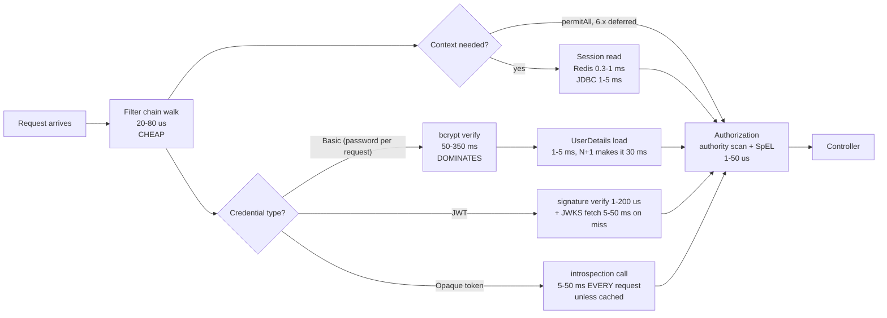

# 16.1 — Spring Security Performance

> **Module 16 · Topic 1** · Performance
> Baseline: Spring Security 6.x on Boot 3.x (Jakarta namespace, Java 17+)
> New to this? Read **In Plain English** below first, then come back to the Version Matrix.

---

## Version Matrix

| Concern | Spring Security 5.x | **Spring Security 6.x (baseline)** | Spring Security 7.x |
|---|---|---|---|
| Context loading | `SecurityContextPersistenceFilter` reads the session on **every** request | **`SecurityContextHolderFilter` + `DeferredSecurityContext` — the session is read only when the context is actually touched** | same |
| Context saving | written on every response | **`requireExplicitSave(true)` by default — saved once, explicitly, by the authentication mechanism** | same |
| Authentication in authorization | `Authentication` resolved eagerly | **`Supplier<Authentication>` — `permitAll()` never resolves it** | same |
| Static resources | `WebSecurity.ignoring()` was the idiom | **a separate minimal `SecurityFilterChain` with `permitAll()` is the recommendation; `ignoring()` logs a warning** | same |
| `UserDetails` caching | `EhCacheBasedUserCache` shipped | **EhCache support removed; `SpringCacheBasedUserCache` + `CachingUserDetailsService`** | same |
| Observability | none | **Micrometer `ObservationRegistry` integration for the filter chain, authentications, and authorizations** | adds `SecurityObservationSettings` for finer control |
| JWKS caching | `RemoteJWKSet` with Nimbus `DefaultJWKSetCache` | **Nimbus `JWKSourceBuilder` — cached with refresh-ahead, rate limiting, and outage tolerance; or `withJwkSetUri(...).cache(Cache)`** | same |
| Opaque introspection | `NimbusOpaqueTokenIntrospector` | **`SpringOpaqueTokenIntrospector` (6.3+); neither caches — you must** | same |
| Password encoder defaults | bcrypt strength 10 | **bcrypt 10; `Pbkdf2PasswordEncoder.defaultsForSpringSecurity_v5_8()` = 310,000 iterations; `Argon2PasswordEncoder.defaultsForSpringSecurity_v5_8()` = 16 MiB, 2 iterations, parallelism 1** | same |

---

## Why This Exists

Most Spring Security performance advice on the internet is folklore: "the filter chain is slow",
"disable security for static resources", "cache everything". All three are wrong or dangerous in the
form they are usually stated. The filter chain is a linear walk over roughly fifteen objects and costs
tens of microseconds; the things that cost milliseconds are the ones performing input and output, and
the one that costs hundreds of milliseconds is deliberately slow by design.

> **The rule:** in a secured request, everything that touches the network, the database, or a key
> derivation function dominates. Everything else is noise. Optimise in that order, and measure before
> you touch anything.

This file is also the one that separates candidates in interviews, because it requires knowing *numbers*
and not just names. Being able to say "bcrypt at strength 12 is roughly 300 milliseconds of pure CPU, so
HTTP Basic on every request caps a four-core box at about thirteen authenticated requests per second"
is a far stronger signal than any amount of configuration recall.

---

## In Plain English

**The one-line version:** Security adds time to every request, but almost all of that time comes from a small number
of specific things — hashing a password, calling another server, reading a session from a database — and everything
else is too small to be worth worrying about.

**An analogy.** Think about how long it takes to get through an airport. People complain about the number of
checkpoints, as though the problem were the count of desks you walk past. It is not. Showing your boarding pass to
someone who glances at it takes three seconds. What actually eats the hour is the queue for the security scanner and
the shuttle ride to the far terminal. Adding two more boarding-pass glances would change nothing; removing one scan
would change everything.

Spring Security's filter chain is the row of boarding-pass desks. Fifteen of them, a few microseconds each, and
people spend enormous effort trying to shorten that row. The scanner is password hashing, which is *deliberately*
slow — it is slow for the same reason the scanner is thorough, and making it fast would defeat its purpose. The
shuttle ride is any call over the network: fetching a session from a shared store, asking another server whether a
token is still valid, downloading the keys needed to check a signature.

**How it actually works, step by step.**

A request coming into a secured Spring application walks through a chain of filters. That walk itself is cheap:
roughly fifteen small objects, each doing a quick check and passing the request along, adding something in the
region of twenty to eighty microseconds in total. For comparison, a single ordinary database query in your business
logic is typically one to five milliseconds, which is fifty times more.

The expensive things fall into three groups. The first and biggest is **password hashing**. Verifying a password
with bcrypt takes roughly fifty to eighty milliseconds at Spring's default setting, and around three hundred
milliseconds at a stronger setting. That is not waiting on anything; it is the processor working flat out, by
design, so that an attacker who steals your password database cannot try billions of guesses per second. The
consequence is architectural: HTTP Basic authentication sends the password on every single request, so the server
re-hashes on every single request, and a four-core machine can then serve only around a dozen requests per second.
The answer is to check the password once at login and then carry something cheap, such as a session cookie or a
signed token.

The second group is **network calls hidden inside security**. If your sessions live in Redis, reading one costs
roughly a millisecond of round trip. If you use opaque tokens, your service asks the login server on every request
whether the token is still valid, which costs tens of milliseconds unless you cache it. If you use signed tokens
instead, checking the signature is a few microseconds, but fetching the public keys the first time is another
network call — one that a good setup caches, refreshes in the background, and keeps serving from during an outage.

The third group is **database work you did not realise security was doing**. Loading a user often means one query
for the user, another for their roles, and one more per role for permissions. With three roles nobody notices; with
thirty it becomes slow, and it also occupies a database connection for longer, so your ordinary application queries
start queuing behind authentication.

Spring Security 6 made one change here that is worth understanding because it is free performance. In version 5, the
current user was loaded from the session at the start of every request, even on a public health-check endpoint. In
version 6 it is loaded lazily, only if something actually asks who the user is. A public endpoint therefore never
touches the session store at all, which removes a network round trip per request for applications with a lot of
public traffic.

**Why should a beginner care?** Two mistakes come from not knowing where the time goes. The first is optimising the
wrong thing: shaving filters, or switching endpoints to a mode that bypasses security entirely, in pursuit of
microseconds while a thirty-millisecond network call sits untouched. The second is worse, because the obvious way to
make a secured application faster is to weaken the security — lowering the password hashing cost, caching user
details for an hour so that revoking somebody's access does nothing for an hour, or turning off checks for
"performance". Knowing the real numbers lets you fix the actual bottleneck instead.

**Words you will meet in this file**

| Term | In plain words |
|---|---|
| Filter chain | The ordered list of small components every request walks through. Cheap; not usually your problem. |
| Microsecond versus millisecond | A millisecond is a thousand microseconds. Most security work is microseconds; the problems are milliseconds. |
| bcrypt / Argon2 / PBKDF2 | Password hashing algorithms, all deliberately slow so guessing is expensive. |
| Strength / cost factor | The setting controlling how slow bcrypt is. Each step up doubles the work. |
| Memory-hard | Argon2's property of needing a lot of memory as well as time, which multiplies under concurrency. |
| HTTP Basic | Sending username and password on every request, which forces a full password hash every time. |
| `SecurityContext` | The object holding who the current user is for this request. |
| Deferred loading | Spring 6 only reading the session when something actually asks for the user, rather than always. |
| `permitAll()` | Marking a path as open while still running the security chain, so headers and cleanup still happen. |
| `ignoring()` | Excluding a path from security entirely. Faster, and one typo away from exposing a real endpoint. |
| Spring Session | Storing sessions outside the application, usually in Redis, so any instance can serve any user. |
| JWT | A signed token whose signature can be checked locally in microseconds. |
| JWKS | The published public keys used to check those signatures, fetched over the network and cached. |
| Opaque token | A token your service cannot read, so it must ask the login server about it on every request. |
| Introspection | That per-request question to the login server. Must be cached or it dominates your latency. |
| Authorities | The list of permission strings on the user, scanned on each check. Thousands of them cause other problems. |
| SpEL parsing versus evaluation | The expression in an annotation is parsed once and cached, but evaluated afresh every call. |
| `@PostFilter` | Fetching everything and then discarding what the user may not see. Slow, and it breaks pagination. |
| N+1 queries | Loading one thing, then issuing a separate query per related item. Invisible in development, painful in production. |
| Connection pool | The fixed set of database connections shared by the application. Slow security queries starve it. |
| Micrometer observations | Built-in timing measurements Spring Security publishes, so you can see the cost rather than guess. |

**If you remember only one thing:** measure before you change anything, and expect the answer to be password
hashing or a network call rather than the filter chain.

---

## Core Concepts

### 1. Where The Time Actually Goes

**In simple terms:** These are the real numbers for each step of a secured request, and they differ by a factor of
thousands, so knowing them tells you immediately which parts are worth your attention.

Order-of-magnitude costs for one authenticated request on a modern server core. Treat these as shapes
to reason with, and measure your own — they move with hardware, network topology, and payload size.

| Stage | Typical cost | Why |
|---|---|---|
| Filter chain traversal (no IO) | **20–80 µs** | ~15 objects, each doing a matcher check and a delegation |
| Response header writing | 5–15 µs | `HeaderWriterFilter` plus the response wrapper |
| Session read, in-memory | < 10 µs | a `ConcurrentHashMap` lookup in the container |
| Session read, Redis | **0.3–1 ms** | one round trip plus deserialisation |
| Session read, JDBC | **1–5 ms** | a query plus connection acquisition |
| `UserDetails` load from the database | **1–5 ms** | one query, often two with an authorities join |
| **bcrypt verify, strength 10** | **≈ 50–80 ms** | deliberately slow; 2^10 rounds of Blowfish key setup |
| **bcrypt verify, strength 12** | **≈ 250–350 ms** | each increment doubles the work |
| Argon2 verify (16 MiB, 2 iterations) | ≈ 30–50 ms **and 16 MiB of RAM** | memory-hard by design |
| PBKDF2-SHA256, 310,000 iterations | ≈ 100–200 ms | the 5.8 Spring default |
| JWT signature verify, HMAC-SHA256 | **1–5 µs** | one hash over a short string |
| JWT signature verify, RSA-2048 | 30–80 µs | fast: the public exponent is small |
| JWT signature verify, ECDSA P-256 | 100–200 µs | slower to *verify* than RSA, faster to sign |
| **JWKS fetch on a cache miss** | **5–50 ms** | a network call to the authorization server |
| **Opaque token introspection** | **5–50 ms, every request** | a network call with no caching by default |
| Authority containment check | < 1 µs for tens, tens of µs for thousands | a linear scan of the authority collection |
| SpEL evaluation, expression already parsed | 1–10 µs | parsing is cached per method |

The shape to notice: **there are three orders of magnitude between the cheapest and the most expensive
row, and the expensive rows are password hashing and network calls.** Nothing you do to the filter chain
will matter if you are running bcrypt or introspecting a token on every request.

How to profile it, in the order I would actually reach for the tools:

1. **Turn on the framework's own observability.** Spring Security 6 publishes Micrometer observations
   for filter chain execution, authentications, and authorizations when an `ObservationRegistry` bean is
   present, which Boot provides. That gives you named timers without writing any code.
2. **Log the chain.** `logging.level.org.springframework.security=TRACE` prints which
   `SecurityFilterChain` matched and every filter it walked. This is how you discover that your API
   requests are hitting the form-login chain.
3. **Flame-graph it.** An async-profiler wall-clock profile under load shows bcrypt, JWKS fetches, and
   Redis round trips immediately, because they are wide plateaus rather than spikes.
4. **Compare a secured and an unsecured endpoint.** Two endpoints, identical bodies, one `permitAll()`
   and one `authenticated()`, hammered with `wrk` or `k6`. The difference is your security overhead, and
   it is usually far smaller than people expect — unless you have an IO problem, in which case it is
   enormous and obvious.

### 2. The Filter Chain Cost, And What Is Actually Worth Optimising

**In simple terms:** The number of filters is almost never the problem, so the only chain-level change worth making
is keeping static files such as images and stylesheets out of the full authentication path.

`FilterChainProxy` selects the **first** matching `SecurityFilterChain` and then walks its filters
through an inner `VirtualFilterChain`. There is no reflection, no proxying, and no allocation-heavy work;
each filter does a matcher test and either acts or delegates.

**So the filter count is not your problem.** Fifteen filters at a few microseconds each is a rounding
error next to a single database query. The filters that cost real time are exactly the ones doing input
and output: `SecurityContextHolderFilter` if it reads a remote session store, the authentication filters
if they load a user or fetch a JWK set, and `AuthorizationFilter` if your `AuthorizationManager` queries
something.

The one genuinely useful chain-level optimisation is **serving static resources through a separate,
minimal chain** rather than the full one. A page with forty assets sends forty requests that each walk
CSRF handling, session lookup, logout matching, and authentication filters for nothing:

```java
@Bean
@Order(0)
SecurityFilterChain staticResources(HttpSecurity http) throws Exception {
    http
        .securityMatcher(PathRequest.toStaticResources().atCommonLocations())
        .authorizeHttpRequests(auth -> auth.anyRequest().permitAll())
        .requestCache(RequestCacheConfigurer::disable)
        .securityContext(context -> context.requireExplicitSave(true))
        .sessionManagement(session -> session.sessionCreationPolicy(SessionCreationPolicy.STATELESS))
        .csrf(csrf -> csrf.disable())
        .headers(headers -> headers.cacheControl(cache -> cache.disable()));
    return http.build();
}
```

This chain still writes security headers and still clears the `SecurityContextHolder`, which is the whole
reason to prefer it over `WebSecurity.ignoring()`. In practice the win is modest on a single server and
significant behind a slow session store, and the honest answer in an interview is "put the assets on a
CDN or a separate origin, and then the question disappears".

### 3. Deferred `SecurityContext` Loading — The 6.x Change That Matters Most

**In simple terms:** Spring 6 only looks up who the user is when something actually asks, so a public endpoint no
longer pays for a session lookup it never needed.

In Spring Security 5, `SecurityContextPersistenceFilter` read the `SecurityContext` from the
`SecurityContextRepository` at the start of **every** request and wrote it back at the end. A
`permitAll()` health check touched the session store.

Spring Security 6 replaced it with `SecurityContextHolderFilter`, which installs a `DeferredSecurityContext`
— a supplier that loads on first access and memoises the result:

```java
// org.springframework.security.web.context.SecurityContextHolderFilter (simplified)
private void doFilter(HttpServletRequest request, HttpServletResponse response, FilterChain chain) {
    if (request.getAttribute(FILTER_APPLIED) != null) {
        chain.doFilter(request, response);
        return;
    }
    request.setAttribute(FILTER_APPLIED, Boolean.TRUE);
    DeferredSecurityContext deferredContext = this.securityContextRepository
            .loadDeferredContext(request);
    try {
        this.securityContextHolderStrategy.setDeferredContext(deferredContext);
        chain.doFilter(request, response);
    }
    finally {
        this.securityContextHolderStrategy.clearContext();
        request.removeAttribute(FILTER_APPLIED);
    }
}
```

Two things follow, and both are measurable. **A `permitAll()` endpoint no longer reads the session**,
because nothing ever calls `getContext()` — `AuthorizationManager` receives a `Supplier<Authentication>`
that a `permitAll()` decision never invokes. And **the context is no longer written on every response**:
`requireExplicitSave(true)` is the default, so `SecurityContextRepository.saveContext` is called once, by
the authentication mechanism, at the moment authentication succeeds.

For an application behind Redis-backed Spring Session with a high proportion of public traffic, this alone
removed one Redis round trip per request on the 5.x-to-6.x upgrade. It is also why "it got faster after the
migration and nobody knows why" is a common report.

The corresponding hazard: code that sets the context manually in a filter must now save it explicitly.
`SecurityContextHolder.setContext(...)` alone no longer persists anything across requests.

### 4. `permitAll()` Versus `ignoring()`

**In simple terms:** Both make a path public, but one still runs the security machinery while the other skips it
entirely, and skipping it saves microseconds while risking a typo that leaves a real endpoint wide open.

| | `authorizeHttpRequests(a -> a.requestMatchers("/x").permitAll())` | `WebSecurityCustomizer` → `web.ignoring().requestMatchers("/x")` |
|---|---|---|
| Filter chain runs | yes, fully | **no — the request never enters Spring Security** |
| Security headers written | yes | **no** |
| `SecurityContextHolder` cleared | yes | **no** |
| CSRF token available to the response | yes | no |
| Authentication available if credentials are presented | yes | no |
| Cost | the chain walk, minus the session read | zero |
| Risk | none | **a matcher mistake makes a real endpoint completely unprotected** |

The framework's own guidance since 6.x is to prefer `permitAll()` and treat `ignoring()` as a last resort;
recent versions log a warning when `ignoring()` is used on anything that looks like a real endpoint. The
reasoning is a risk-versus-reward judgement: you are buying tens of microseconds and paying with a
configuration path where a single wrong pattern silently disables everything. I use `ignoring()` for
nothing, and a separate minimal chain when the asset volume genuinely warrants it.

### 5. Password Hashing — Usually The Single Largest Cost

**In simple terms:** Checking a password is slow on purpose, so any design that re-checks it on every request
collapses under load, and the fix is to authenticate once and then carry something cheap.

A password encoder is *designed* to be slow. That is its security property, and it is also the largest
single number in your request budget.

| Encoder | Spring default | Approximate verify cost | Memory per concurrent verify |
|---|---|---|---|
| `BCryptPasswordEncoder` | strength **10** | 50–80 ms | ~4 KiB |
| `BCryptPasswordEncoder` | strength 12 | **250–350 ms** | ~4 KiB |
| `Pbkdf2PasswordEncoder.defaultsForSpringSecurity_v5_8()` | 310,000 iterations, SHA-256 | 100–200 ms | negligible |
| `SCryptPasswordEncoder.defaultsForSpringSecurity_v5_8()` | N = 65,536, r = 8, p = 1 | 80–150 ms | **~64 MiB** |
| `Argon2PasswordEncoder.defaultsForSpringSecurity_v5_8()` | 16 MiB, 2 iterations, parallelism 1 | 30–50 ms | **16 MiB** |

**Why this makes HTTP Basic on every request a scaling disaster.** Basic authentication sends the raw
password on every single request, so the server must verify it on every single request. At strength 12,
one verification is about 300 ms of pure CPU that cannot be parallelised away — it is not waiting on
anything, it is computing. A four-core container therefore tops out around 4 ÷ 0.3, roughly **thirteen
authenticated requests per second**, with the CPU fully saturated and every other request queued behind
it. The same box serving session cookies or JWTs handles thousands. This is also an unauthenticated
denial-of-service vector: garbage credentials cost the server the full hash before they fail.

The fix is architectural, not a tuning knob: authenticate once, then carry a cheap credential. A session
cookie costs a map or Redis lookup; a JWT costs a signature verification in microseconds. Reserve Basic
for machine-to-machine calls with a high-entropy generated secret, where you can legitimately use a fast
hash because the secret is not a human-chosen password and is not guessable.

**The Argon2 memory trap.** Argon2's cost is memory as well as time, and memory multiplies by
concurrency. At the Spring 5.8 defaults each in-flight verification holds about 16 MiB. Two hundred
concurrent logins is roughly 3.2 GiB of transient allocation. In a container with a 1 GiB memory limit the
kernel's out-of-memory killer terminates the process, and because the allocation is native to the Argon2
implementation rather than the Java heap, a heap dump shows nothing useful and `-Xmx` does not protect
you. If you raise Argon2 parameters toward the OWASP recommendation of 19 MiB with two iterations, you
must also bound concurrent authentication attempts — a semaphore around the login path, or rate limiting
at the edge — and size the container for parameters multiplied by that bound.

### 6. Caching `UserDetails`

**In simple terms:** Keeping the loaded user in memory saves a database query, and it also means a revoked role, a
disabled account, or a changed password keeps working until the cached copy is thrown away.

```java
public interface UserCache {
    UserDetails getUserFromCache(String username);
    void putUserInCache(UserDetails user);
    void removeUserFromCache(String username);
}
```

Implementations that ship today are `NullUserCache` (the default, caching nothing) and
`SpringCacheBasedUserCache`, which delegates to a Spring `Cache` so you get Caffeine, Redis, or whatever
your `CacheManager` provides. The EhCache-based implementation was removed in 6.0.

Two wiring options. `CachingUserDetailsService` decorates a delegate `UserDetailsService` and consults the
cache before delegating, which is the cleaner choice because the caching is visible in your configuration.
Alternatively `AbstractUserDetailsAuthenticationProvider` — the superclass of `DaoAuthenticationProvider`
— accepts a `UserCache` directly through `setUserCache(...)`.

**The correctness hazard, stated precisely: a cached `UserDetails` does not see a revoked role until the
entry is evicted.** `UserDetails` is an immutable snapshot of username, password hash, authorities, and
account flags. If an administrator removes `ROLE_ADMIN`, or disables the account, or the user changes their
password, the cache keeps serving the old snapshot for the remainder of its lifetime. Three consequences
worth naming: a disabled account can still authenticate; a revoked authority still grants access; and a
changed password still verifies against the cached hash, so the old password keeps working.

That gives three defensible positions. Use a short time-to-live, 30 to 60 seconds, and write the staleness
window down as an accepted security parameter. Or evict explicitly from every write path that touches a
user — role change, disable, password change, group membership — which is correct but requires distributed
eviction so every instance drops the entry. Or do not cache `UserDetails` at all and instead cache the
expensive *part* of loading it, which is usually the authorities join, with a much shorter lifetime.

My default is not to cache `UserDetails` in a session-based application, because the load happens once per
login rather than once per request and the cache buys almost nothing while carrying real risk. It earns
its place when something forces a load per request — HTTP Basic, or a token flow that re-resolves
authorities from the database on every call.

### 7. Session Storage Cost And Payload Size

**In simple terms:** Where you keep sessions decides how long each lookup takes, and how much you stuff into the
session decides how much has to be serialised and sent across the wire on every one of those lookups.

| Store | Read cost | Survives restart | Scales horizontally | Notes |
|---|---|---|---|---|
| Container in-memory | < 10 µs | no | only with sticky sessions | the default; a restart logs everybody out |
| Spring Session + Redis | 0.3–1 ms | yes | yes | the standard production answer |
| Spring Session + JDBC | 1–5 ms | yes | yes | competes with your application for the connection pool |
| Spring Session + Hazelcast | 0.1–1 ms | depends on configuration | yes | embedded, so no extra hop but shared heap |

Payload size matters as much as store latency, because every read deserialises the whole thing. A
`SecurityContext` holding a `UserDetails` with four thousand authorities is hundreds of kilobytes, and you
pay serialisation on write and deserialisation on read, per request. Keep the principal small: an
identifier and the authorities you actually check, never the full user entity with its lazy associations.

Two Spring Session settings are worth knowing. `spring.session.redis.save-mode` defaults to
`ON_SET_ATTRIBUTE`, which writes only changed attributes rather than the whole session; `ALWAYS` is
correct if you mutate objects held in the session in place, and considerably more expensive.
`spring.session.redis.flush-mode` defaults to `ON_SAVE`, deferring the write to the end of the request
rather than issuing one per attribute change.

### 8. Token Validation Cost — JWT And Introspection

**In simple terms:** Checking a signed token locally takes microseconds, whereas asking the login server about an
opaque token takes a network call on every single request unless you cache the answer.

For a JWT resource server the signature check is genuinely cheap. HMAC-SHA256 is a single hash over a
short string, a few microseconds. RSA-2048 *verification* is also fast, tens of microseconds, because the
public exponent is small — it is RSA *signing* that is slow, and that happens at the authorization server,
not in your service. ECDSA on P-256 is the interesting case: signing is fast but verification is slower
than RSA verification, still only hundreds of microseconds.

**The real cost is the JWKS fetch on a cache miss**, which is a network call to the authorization server
costing 5 to 50 milliseconds — and on a cold start, with every in-flight request arriving at once, it can
be a thundering herd against an endpoint that may rate-limit you.

`NimbusJwtDecoder.withJwkSetUri(...)` delegates to Nimbus's `JWKSourceBuilder`, which by default caches the
key set with a time-to-live of five minutes, refreshes ahead of expiry on a background thread so requests
do not block on a refresh, rate-limits refreshes so an unknown `kid` cannot be used to hammer the
authorization server, and tolerates an outage by serving the last known key set beyond its normal lifetime.
You can also hand it a Spring `Cache` with `withJwkSetUri(uri).cache(cache)` to share the key set across
instances or to survive a restart.

What you must not do is disable the cache, or build a new `JwtDecoder` per request — a surprisingly common
bug in hand-rolled filters, and one that turns every request into a JWKS fetch.

**Opaque token introspection (RFC 7662) is the opposite trade.** `SpringOpaqueTokenIntrospector` calls the
authorization server's introspection endpoint to validate the token, which means **a network call on every
single request** and neither Spring's implementation caches it. At 30 ms per call, an endpoint that served
2,000 requests per second now serves far fewer and your authorization server receives your entire traffic
volume. Introspection must be cached, keyed on a hash of the token — never the token itself, so it does not
appear in cache keys, logs, or metrics — with a time-to-live bounded by the token's own `exp` and short
enough that revocation is meaningful. That is the honest cost of opaque tokens: you bought instant
revocation and paid for it with a network hop you then have to partially undo.

### 9. Authorization Evaluation Cost

**In simple terms:** The permission check itself is fast, but the database work behind it — loading roles one query
at a time, or fetching ten thousand rows to hand back forty — is where the time actually disappears.

**Authority set size.** `AuthorityAuthorizationManager` performs a linear scan of the authority collection
for each rule, with exact, case-sensitive string comparison. Tens of authorities is free; four thousand is
tens of microseconds per check, repeated for the URL rule plus every method annotation on the call path.
The scan is rarely the real problem — the real problems are the token size and the session payload that
four thousand authorities imply, and nginx refusing a request whose header block exceeds its 8 KiB default.

**SpEL cost.** Parsing an expression is expensive relative to evaluating it, which is why the framework
caches it: `PreAuthorizeAuthorizationManager` uses a `PreAuthorizeExpressionAttributeRegistry` extending
`AbstractExpressionAttributeRegistry`, which keys parsed expressions by `MethodClassKey`. So SpEL is parsed
once per method, ever. What is *not* cached is evaluation: a fresh `EvaluationContext` and expression root
per invocation, plus parameter-name discovery and any bean references the expression makes. A
`@PreAuthorize` that calls `@someBean.check(...)` costs whatever that bean costs, every time.

**`@PostFilter` is the genuine pathology.** It loads the entire collection, then evaluates the expression
per element and discards the failures. Returning forty rows out of ten thousand means the database read ten
thousand rows, the ORM materialised ten thousand entities, and the JVM allocated all of them — and the
database did work on rows the caller was never entitled to see. Pagination makes it worse, not better,
because page sizes are computed before filtering, so a page of twenty can come back with three items.
**The only real fix is filtering in the query**, so visibility is a predicate the database evaluates with
an index.

**N+1 on authority loading.** The classic JPA shape: `User` has an `@ElementCollection` or a lazy
`@ManyToMany` to roles, each role lazily holds permissions, and loading one user issues one query for the
user, one for the roles, and one per role for the permissions. It is invisible in development with three
roles and brutal in production with thirty. Fix it with an `@EntityGraph` or an explicit `join fetch` in
the `UserDetailsService` query, and assert the query count in a test so it cannot regress.

**Connection pool pressure.** Every per-request authentication query takes a connection from HikariCP for
its duration. At 500 requests per second with a 3 ms query, that is 1.5 connections of steady-state
occupancy — fine. At 500 requests per second with a 30 ms query because of the N+1 above, it is 15
connections, which is the whole default pool, and now your *application* queries are queuing behind
authentication. The symptom presents as slow business endpoints and connection-timeout exceptions, and the
cause is in the security layer.

### 10. The Request Budget, Visually

**In simple terms:** One diagram showing every branch a secured request can take and what each branch costs, so you
can see at a glance which choice dominates your latency.



---

## Working Code

Two chains, so static assets never walk the authentication filters, and a resource server whose token
validation is cached.

```java
package com.example.perf;

import org.springframework.boot.autoconfigure.security.servlet.PathRequest;
import org.springframework.context.annotation.Bean;
import org.springframework.context.annotation.Configuration;
import org.springframework.core.annotation.Order;
import org.springframework.security.config.Customizer;
import org.springframework.security.config.annotation.web.builders.HttpSecurity;
import org.springframework.security.config.annotation.web.configuration.EnableWebSecurity;
import org.springframework.security.config.annotation.web.configurers.CsrfConfigurer;
import org.springframework.security.config.annotation.web.configurers.RequestCacheConfigurer;
import org.springframework.security.config.http.SessionCreationPolicy;
import org.springframework.security.web.SecurityFilterChain;

@Configuration
@EnableWebSecurity
public class PerformanceSecurityConfig {

    /**
     * Static assets: a deliberately minimal chain. Still writes headers and still clears the
     * SecurityContextHolder, which is why this is preferred over WebSecurity.ignoring().
     */
    @Bean
    @Order(0)
    SecurityFilterChain staticResources(HttpSecurity http) throws Exception {
        http
            .securityMatcher(PathRequest.toStaticResources().atCommonLocations())
            .authorizeHttpRequests(auth -> auth.anyRequest().permitAll())
            .sessionManagement(session -> session.sessionCreationPolicy(SessionCreationPolicy.STATELESS))
            .requestCache(RequestCacheConfigurer::disable)
            .csrf(CsrfConfigurer::disable);
        return http.build();
    }

    /**
     * API: stateless, so no session is created or read at all. permitAll on the health endpoint
     * never resolves the Authentication thanks to the 6.x Supplier-based AuthorizationManager.
     */
    @Bean
    @Order(1)
    SecurityFilterChain api(HttpSecurity http) throws Exception {
        http
            .securityMatcher("/api/**", "/actuator/health")
            .sessionManagement(session -> session.sessionCreationPolicy(SessionCreationPolicy.STATELESS))
            .csrf(CsrfConfigurer::disable)                 // safe: no cookie-based credential
            .authorizeHttpRequests(auth -> auth
                .requestMatchers("/actuator/health").permitAll()
                .anyRequest().authenticated()
            )
            .oauth2ResourceServer(oauth2 -> oauth2.jwt(Customizer.withDefaults()));
        return http.build();
    }
}
```

```java
package com.example.perf;

import org.springframework.beans.factory.annotation.Value;
import org.springframework.cache.Cache;
import org.springframework.cache.CacheManager;
import org.springframework.context.annotation.Bean;
import org.springframework.context.annotation.Configuration;
import org.springframework.security.oauth2.jwt.JwtDecoder;
import org.springframework.security.oauth2.jwt.JwtValidators;
import org.springframework.security.oauth2.jwt.NimbusJwtDecoder;

@Configuration
public class TokenValidationConfig {

    /**
     * One decoder bean for the whole application. Building a decoder per request is the classic
     * hand-rolled-filter bug: it turns every request into a JWKS fetch.
     *
     * Handing it a Spring Cache shares the key set across instances and survives a restart, on top
     * of Nimbus's own in-memory cache with refresh-ahead and refresh rate limiting.
     */
    @Bean
    JwtDecoder jwtDecoder(CacheManager cacheManager,
            @Value("${app.issuer-uri}") String issuerUri,
            @Value("${app.jwk-set-uri}") String jwkSetUri) {
        Cache jwkCache = cacheManager.getCache("jwk-set");
        NimbusJwtDecoder decoder = NimbusJwtDecoder.withJwkSetUri(jwkSetUri)
                .cache(jwkCache)
                .build();
        decoder.setJwtValidator(JwtValidators.createDefaultWithIssuer(issuerUri));
        return decoder;
    }
}
```

```java
package com.example.perf;

import java.nio.charset.StandardCharsets;
import java.time.Duration;
import java.time.Instant;
import java.util.HexFormat;
import java.security.MessageDigest;
import java.security.NoSuchAlgorithmException;
import com.github.benmanes.caffeine.cache.Cache;
import com.github.benmanes.caffeine.cache.Caffeine;
import org.springframework.security.oauth2.core.OAuth2AuthenticatedPrincipal;
import org.springframework.security.oauth2.server.resource.introspection.OpaqueTokenIntrospector;

/**
 * Introspection is a network call per request. Caching it is mandatory, not an optimisation.
 * The key is a digest of the token so the raw credential never reaches cache keys, heap dumps,
 * or metrics labels.
 */
public class CachingOpaqueTokenIntrospector implements OpaqueTokenIntrospector {

    private final OpaqueTokenIntrospector delegate;
    private final Cache<String, OAuth2AuthenticatedPrincipal> cache;

    public CachingOpaqueTokenIntrospector(OpaqueTokenIntrospector delegate, Duration ttl) {
        this.delegate = delegate;
        this.cache = Caffeine.newBuilder()
                .maximumSize(50_000)
                .expireAfterWrite(ttl)                    // bounds the revocation window
                .build();
    }

    @Override
    public OAuth2AuthenticatedPrincipal introspect(String token) {
        return this.cache.get(digest(token), key -> {
            OAuth2AuthenticatedPrincipal principal = this.delegate.introspect(token);
            // Never cache beyond the token's own expiry, whatever the configured TTL says.
            Instant expiry = principal.getAttribute("exp");
            if (expiry != null && expiry.isBefore(Instant.now())) {
                throw new IllegalStateException("token already expired");
            }
            return principal;
        });
    }

    private static String digest(String token) {
        try {
            byte[] hash = MessageDigest.getInstance("SHA-256")
                    .digest(token.getBytes(StandardCharsets.UTF_8));
            return HexFormat.of().formatHex(hash);
        }
        catch (NoSuchAlgorithmException ex) {
            throw new IllegalStateException(ex);
        }
    }
}
```

```java
package com.example.perf;

import org.springframework.cache.CacheManager;
import org.springframework.context.annotation.Bean;
import org.springframework.context.annotation.Configuration;
import org.springframework.context.event.EventListener;
import org.springframework.security.authentication.CachingUserDetailsService;
import org.springframework.security.core.userdetails.UserCache;
import org.springframework.security.core.userdetails.UserDetailsService;
import org.springframework.security.core.userdetails.cache.SpringCacheBasedUserCache;
import org.springframework.stereotype.Component;

@Configuration
class UserDetailsCachingConfig {

    @Bean
    UserCache userCache(CacheManager cacheManager) {
        // Caffeine with expireAfterWrite=60s configured on the CacheManager: the staleness window
        // is an accepted security parameter, written down and reviewed.
        return new SpringCacheBasedUserCache(cacheManager.getCache("user-details"));
    }

    @Bean
    UserDetailsService cachingUserDetailsService(JdbcUserDetailsRepositoryService delegate,
            UserCache userCache) {
        CachingUserDetailsService caching = new CachingUserDetailsService(delegate);
        caching.setUserCache(userCache);
        return caching;
    }
}

/**
 * A cached UserDetails does not see a revoked role until eviction. Every write path that changes
 * authorities, enablement, or the password must evict - and in every instance, which is why the
 * cache must be distributed or the eviction must be published.
 */
@Component
class UserCacheInvalidation {

    private final UserCache userCache;

    UserCacheInvalidation(UserCache userCache) {
        this.userCache = userCache;
    }

    @EventListener
    void onUserChanged(UserChangedEvent event) {
        this.userCache.removeUserFromCache(event.username());
    }
}
```

Tests that pin the two most valuable performance properties — that public endpoints create no session,
and that the password encoder's cost is what you think it is:

```java
package com.example.perf;

import java.time.Duration;
import java.time.Instant;
import org.junit.jupiter.api.Test;
import org.springframework.beans.factory.annotation.Autowired;
import org.springframework.boot.test.autoconfigure.web.servlet.AutoConfigureMockMvc;
import org.springframework.boot.test.context.SpringBootTest;
import org.springframework.security.crypto.bcrypt.BCryptPasswordEncoder;
import org.springframework.test.web.servlet.MockMvc;
import org.springframework.test.web.servlet.MvcResult;

import static org.assertj.core.api.Assertions.assertThat;
import static org.springframework.test.web.servlet.request.MockMvcRequestBuilders.get;
import static org.springframework.test.web.servlet.result.MockMvcResultMatchers.status;

@SpringBootTest
@AutoConfigureMockMvc
class PerformanceInvariantsTests {

    @Autowired MockMvc mvc;

    @Test
    void publicEndpointCreatesNoSession() throws Exception {
        MvcResult result = this.mvc.perform(get("/actuator/health"))
                .andExpect(status().isOk())
                .andReturn();
        // Deferred loading plus STATELESS: nothing should have touched the session store.
        assertThat(result.getRequest().getSession(false)).isNull();
    }

    @Test
    void staticResourcesUseTheMinimalChain() throws Exception {
        this.mvc.perform(get("/css/app.css"))
                .andExpect(status().isOk())
                .andExpect(result -> assertThat(result.getResponse().getHeader("Set-Cookie")).isNull());
    }

    @Test
    void bcryptStrengthIsBudgeted() {
        BCryptPasswordEncoder encoder = new BCryptPasswordEncoder(10);
        String hash = encoder.encode("correct-horse-battery-staple");

        Instant start = Instant.now();
        assertThat(encoder.matches("correct-horse-battery-staple", hash)).isTrue();
        Duration elapsed = Duration.between(start, Instant.now());

        // Not a benchmark - a regression guard. Someone raising strength to 14 should fail here
        // rather than discover it from a production latency alert.
        assertThat(elapsed).isLessThan(Duration.ofMillis(250));
    }
}
```

---

## Internals

### Why `Supplier<Authentication>` matters

```java
@FunctionalInterface
public interface AuthorizationManager<T> {
    default void verify(Supplier<Authentication> authentication, T object) { /* throws on deny */ }
    @Nullable AuthorizationDecision check(Supplier<Authentication> authentication, T object);
}
```

The parameter is a supplier, not an `Authentication`. `AuthorizationFilter` builds it from
`SecurityContextHolder.getDeferredContext()`, so the chain is lazy end to end: if the matched rule is
`permitAll()`, nothing ever calls `get()`, the `DeferredSecurityContext` never resolves, and the
`SecurityContextRepository` never reads the session. In Spring Security 5 the equivalent code path resolved
the authentication before consulting the voters, so the session read happened regardless.

`AuthorizationFilter` also exposes `setObserveOncePerRequest(false)`, the 6.x default, which means the
filter runs on every dispatch — including `ERROR` and forward dispatches — rather than only the first. That
is a correctness improvement and a small cost, and it is why error pages are also authorized.

### The authority check itself

```java
// AuthorityAuthorizationManager (simplified)
private boolean isAuthorized(Authentication authentication) {
    for (GrantedAuthority grantedAuthority : getAuthorities(authentication)) {
        if (this.authorities.contains(grantedAuthority.getAuthority())) {
            return true;
        }
    }
    return false;
}
```

A linear scan with exact, case-sensitive comparison, and `getAuthorities` optionally routes through a
`RoleHierarchy` first, which expands the set before scanning. Two practical consequences: there is no
normalisation anywhere, so `ROLE_Admin` never matches `ROLE_ADMIN`; and expanding a deep hierarchy per
check trades allocation for the smaller stored set, which is why expanding once at authentication time is
often the better trade.

### Where SpEL is cached and where it is not

`AbstractExpressionAttributeRegistry` holds a `Map<MethodClassKey, T>` of parsed attributes, populated on
first invocation of each method. So the parse — the expensive part, comfortably the largest single cost in
method security — happens once per method for the lifetime of the application.

Evaluation is not cached, and cannot be: it depends on the arguments. Each invocation builds a
`MethodSecurityEvaluationContext`, resolves parameter names through a `ParameterNameDiscoverer`, creates a
`MethodSecurityExpressionRoot`, and evaluates. That is microseconds of framework cost plus the entire cost
of whatever your expression calls. An expression referencing a bean that queries the database costs a
database query per invocation, and no framework caching will help you.

### What Nimbus does for your JWK set

Spring's `NimbusJwtDecoder.withJwkSetUri(...)` builds a Nimbus `JWKSource` through `JWKSourceBuilder`,
whose defaults give you a cached key set with a five-minute lifetime, a refresh-ahead thread so a request
does not block on expiry, a minimum interval between refreshes so an unknown `kid` cannot be used to hammer
the authorization server, and an outage-tolerance window during which a stale key set is served rather than
failing every request. Adding `.cache(springCache)` layers a shared cache on top, which is what you want in
a horizontally scaled deployment so a rolling restart does not produce one JWKS fetch per instance.

---

## Configuration Reference

| Setting | Effect | Default |
|---|---|---|
| `sessionManagement(s -> s.sessionCreationPolicy(STATELESS))` | No session is created or read | `IF_REQUIRED` |
| `securityContext(c -> c.requireExplicitSave(...))` | Context saved only by the authentication mechanism | `true` in 6.x |
| `securityContext(c -> c.securityContextRepository(...))` | Where the context lives | `DelegatingSecurityContextRepository` over session and request-attribute repositories |
| `@Order` on a `SecurityFilterChain` | Chain selection order; first match wins | declaration order |
| `securityMatcher(...)` | Scopes a chain to a path set | the chain matches everything |
| `WebSecurityCustomizer` → `web.ignoring()` | Bypasses Spring Security entirely | not used; prefer `permitAll()` |
| `BCryptPasswordEncoder(strength)` | Work factor; each increment doubles cost | `10` |
| `Argon2PasswordEncoder.defaultsForSpringSecurity_v5_8()` | 16 MiB, 2 iterations, parallelism 1 | — |
| `Pbkdf2PasswordEncoder.defaultsForSpringSecurity_v5_8()` | 310,000 iterations, SHA-256 | — |
| `CachingUserDetailsService` + `setUserCache(...)` | Caches `UserDetails` | `NullUserCache` |
| `NimbusJwtDecoder.withJwkSetUri(uri).cache(cache)` | Shared JWK set cache | Nimbus in-memory, 5-minute lifetime |
| `spring.session.redis.save-mode` | `ON_SET_ATTRIBUTE` writes only changed attributes | `ON_SET_ATTRIBUTE` |
| `spring.session.redis.flush-mode` | `ON_SAVE` defers the write to end of request | `ON_SAVE` |
| `server.tomcat.threads.max` | Concurrency ceiling, and therefore the hashing memory multiplier | `200` |
| `management.observations.enable.spring.security` | Toggles Spring Security's Micrometer observations | enabled when a registry is present |
| `logging.level.org.springframework.security=TRACE` | Prints chain selection and every filter invoked | `INFO` |

---

## Production Concerns & Anti-Patterns

**HTTP Basic with a real password encoder on a high-traffic API.** The single most expensive mistake in
this file. Every request pays the full key-derivation cost, the CPU saturates at low throughput, and an
unauthenticated attacker can trigger it at will. Authenticate once; carry a session or a token.

**Raising bcrypt strength without measuring.** Strength 14 sounds four times as secure as 12 and is
sixteen times the work, roughly 1.2 seconds per verification. At a hundred concurrent logins you have
exhausted your thread pool with computation and your load balancer is timing out. Pick the strength from a
measurement on production-like hardware, targeting a login budget you have agreed — 250 to 500 ms is a
common choice — and re-measure annually as hardware improves.

**Argon2 at aggressive parameters without bounding concurrency.** Memory cost multiplies by in-flight
requests, the allocation is native rather than heap, and the container out-of-memory killer gives you no
diagnostics. Bound concurrent authentications and size the container for parameters times that bound.

**Caching `UserDetails` with a long lifetime and no eviction.** A disabled account still authenticates, a
revoked role still grants, and an old password still verifies, for the whole cache lifetime. Either the
window is short and documented, or every write path evicts in every instance.

**Introspecting an opaque token on every request without a cache.** You have added a network call to every
request and pointed your entire traffic volume at the authorization server. Cache on a token digest with a
lifetime bounded by `exp`.

**Constructing a `JwtDecoder`, `PasswordEncoder`, or `RestClient` per request.** All are designed to be
singletons. A decoder per request means a JWKS fetch per request; a `BCryptPasswordEncoder` per request is
harmless but signals that someone does not know what the object is.

**`@PostFilter` on anything unbounded, and `@PostAuthorize` on anything transactional.** The first loads
everything to discard most of it and quietly breaks pagination; the second has already executed the body.

**Putting four thousand authorities in a token.** Multi-kilobyte headers on every request, rejected by
proxies with an 8 KiB header limit, and a session payload to match. Carry identity and resolve
fine-grained permissions on demand.

**N+1 authority loading.** Invisible with three roles in development, thirty times the cost in production,
and it consumes the connection pool so your business queries queue behind authentication. Use an
`@EntityGraph` or a `join fetch`, and assert the query count in a test.

**Optimising the filter chain because it has fifteen filters.** It costs tens of microseconds. Measure
before you remove anything, because most of those filters are load-bearing security controls and the
"optimisation" is a downgrade.

---

## Debugging Playbook

| Symptom | Likely root cause | Fix |
|---|---|---|
| CPU pinned at 100% with low throughput, no database load | Password hashing per request, usually HTTP Basic | Move to sessions or tokens; verify the encoder strength |
| Login latency spikes under concurrency but a single login is fast | Hashing memory pressure, or a thread pool saturated by computation | Bound concurrent authentications; check for container out-of-memory kills |
| Container killed with no heap dump and no `OutOfMemoryError` | Argon2 or scrypt native memory times concurrency exceeded the cgroup limit | Reduce parameters or bound concurrency; size the container for the product |
| Every request shows a Redis round trip even for public endpoints | A non-`STATELESS` chain touching the context, or code calling `getContext()` unconditionally | Split chains; rely on deferred loading; stop eagerly reading the context |
| Latency spike every five minutes on a resource server | JWKS cache expiry with a synchronous refresh, or one fetch per instance | Rely on Nimbus refresh-ahead; add a shared `Cache`; pre-warm on startup |
| Authorization server complains about your request volume | Opaque token introspection uncached, or a decoder built per request | Cache on a token digest; make the decoder a singleton |
| A revoked role keeps working for about a minute | `UserDetails` cache lifetime, or authorities snapshotted into a session or token | Evict on change; shorten the token lifetime; document the window |
| `HikariPool - Connection is not available` under normal traffic | Per-request authentication query holding connections, amplified by N+1 | Fix the N+1; cache the authorities join; size the pool to measured occupancy |
| A list endpoint returns three items on a page of twenty | `@PostFilter` applied after pagination | Filter in the query |
| 431 or 400 from the proxy on authenticated requests only | Token or cookie header too large — an oversized authority set | Trim claims; resolve permissions server-side |
| Static assets slow, with a `Set-Cookie` on each | Assets are traversing the full chain and creating sessions | Separate `@Order(0)` chain with `STATELESS`, or a CDN |
| Method security dominates a flame graph | `@PreAuthorize` calling a bean that queries the database, evaluated per invocation | Memoise per request; push the predicate into the query |

---

## Interview Q&A

### Q1. A secured endpoint is slower than the same endpoint unsecured. Walk me through how you find out why.

<details>
<summary>Show answer</summary>

I would refuse to guess and go straight to a decomposition, because the plausible causes span three orders
of magnitude and picking the wrong one wastes days.

First I establish the size of the gap with two endpoints that differ only in their security rule, hammered
with the same load generator. If the delta is tens of microseconds it is the filter chain walk and there is
nothing to fix. If it is a millisecond it is almost certainly one input/output operation — a session read or
a user load. If it is hundreds of milliseconds it is a key derivation function or a network call, and I
already know roughly which one from the credential type the endpoint uses.

Then I attribute it. Spring Security 6 publishes Micrometer observations for filter chain execution,
authentications, and authorizations when an `ObservationRegistry` bean is present, so the timers exist
without writing code. Alongside that I take a wall-clock profile with async-profiler under load, because
bcrypt, a JWKS fetch, and a Redis round trip all appear as wide plateaus rather than spikes and are
unmistakable. Finally I turn on `logging.level.org.springframework.security=TRACE` on one instance to
confirm which chain matched and which filters ran — that is how you discover your API requests are hitting
the form-login chain and creating sessions.

What I do not do is start removing filters. The chain is tens of microseconds; the filters are load-bearing
security controls.

**Counter-question: the profile shows most of the time inside `HttpSessionSecurityContextRepository`. What now?**

That means something is resolving the `SecurityContext`, and each resolution is a session-store read. On
6.x that should not happen for a `permitAll()` endpoint, because `SecurityContextHolderFilter` installs a
`DeferredSecurityContext` and `AuthorizationManager` receives a `Supplier<Authentication>` that a
`permitAll()` decision never invokes. So I look for what is forcing it: application code calling
`SecurityContextHolder.getContext().getAuthentication()` unconditionally — a logging interceptor or an
auditing aspect is the usual culprit — or a chain that is not `STATELESS` for an endpoint that should be.

The fixes, in order: make the API chain `STATELESS` so there is no repository to read; move unconditional
context reads behind a check on whether the endpoint is authenticated at all; and if the session store is
genuinely needed on a hot path, reduce the payload, because every read deserialises the whole
`SecurityContext` and a principal carrying thousands of authorities is hundreds of kilobytes.

**Counter-question: you keep saying "measure". What specifically would you assert in a test so this does not regress?**

Three invariants that are cheap to assert and catch the expensive mistakes. That a public endpoint creates
no session — `result.getRequest().getSession(false)` must be `null` — which catches an accidental
non-stateless chain. That the number of queries issued during one authentication is what you expect, using
a datasource proxy that counts statements, which catches the N+1 on authority loading. And a coarse ceiling
on password-encoder time, not as a benchmark but as a tripwire, so a colleague raising bcrypt strength from
10 to 14 fails a build rather than discovering it from a production latency alert.

None of these is a performance test. They are regression guards on the specific decisions that cost orders
of magnitude, which is the only kind of performance assertion worth having in a unit test suite.
</details>

### Q2. Why is bcrypt deliberately slow, and what does that mean for your architecture?

<details>
<summary>Show answer</summary>

Bcrypt is a key derivation function, and its slowness is the security property. An attacker who steals your
password table wants to try billions of candidate passwords; if verification takes 100 milliseconds instead
of a microsecond, their throughput drops by five orders of magnitude, and a dictionary attack that would
have taken an hour takes a decade. The `strength` parameter is a base-two logarithm, so each increment
doubles the work — strength 10 is roughly 50 to 80 milliseconds on current hardware, strength 12 roughly 250
to 350, and strength 14 over a second. Spring's default is 10.

The architectural consequence is that **you can afford this cost once per session, never once per request.**
That single sentence rules out HTTP Basic for user-facing traffic. Basic sends the raw password on every
request, so the server must run the key derivation on every request. At 300 milliseconds a verification,
four cores support something like thirteen authenticated requests per second, fully saturated, with no
capacity left for the application. The same box serving session cookies handles thousands, because the
per-request cost drops to a map or Redis lookup.

So the design is: authenticate once with the expensive credential, then issue a cheap one — a session
identifier backed by a store, or a signed token verified in microseconds. Every authentication mechanism
Spring ships other than Basic follows that shape.

**Counter-question: you said Basic is a denial-of-service vector. Explain the mechanics and the mitigation.**

The cost is paid *before* the credential is known to be wrong. An unauthenticated attacker sends requests
with garbage passwords; each one forces a full key derivation, and a few hundred concurrent requests
saturate your CPU with work that produces nothing. No login is required, so rate limiting by account does
not help.

Mitigations, in order of effectiveness. Rate-limit unauthenticated requests at the edge, before they reach
the application, because that is the only layer that can drop them for free. Cap the submitted password
length — bcrypt over a one-megabyte string is far worse than over twenty characters, and there is no
legitimate reason to accept it; note also that bcrypt truncates input at 72 bytes, so long inputs buy
nothing but cost. Prefer a design where the key derivation runs once per session. And bound concurrent
authentication attempts with a semaphore, so hashing cannot consume the whole thread pool and starve
authenticated traffic.

**Counter-question: your security team wants Argon2id instead of bcrypt. What changes operationally?**

The time cost is comparable or lower at Spring's 5.8 defaults — roughly 30 to 50 milliseconds — but Argon2
adds a *memory* cost, and memory multiplies by concurrency in a way CPU time does not. At 16 MiB per
verification, two hundred concurrent logins is about 3.2 GiB of transient allocation. That allocation is
native to the Argon2 implementation rather than on the Java heap, so `-Xmx` does not bound it, a heap dump
shows nothing, and the container out-of-memory killer terminates the process with no Java-level diagnostic.

So switching is a capacity exercise, not a one-line change. I would bound concurrent authentications
explicitly, size the container for parameters multiplied by that bound with headroom, load-test the login
path specifically at that concurrency, and only then migrate. Migration itself is easy because
`DelegatingPasswordEncoder` stores an `{argon2}` prefix alongside existing `{bcrypt}` hashes and upgrades
each password on next successful login, so there is no big-bang rehash and no forced password reset.
</details>

### Q3. What changed about `SecurityContext` loading in 6.x, and why does it matter for performance?

<details>
<summary>Show answer</summary>

Spring Security 5 used `SecurityContextPersistenceFilter`, which read the `SecurityContext` from the
`SecurityContextRepository` at the start of every request and wrote it back at the end of every response.
That is one session-store read and one write per request, regardless of whether the request needed an
identity at all.

Spring Security 6 replaced it with `SecurityContextHolderFilter`, which installs a
`DeferredSecurityContext` — a memoising supplier — and never resolves it itself. Combined with
`AuthorizationManager` receiving a `Supplier<Authentication>` instead of an `Authentication`, the entire
path is lazy: a `permitAll()` rule never calls the supplier, so the repository is never read. And
`requireExplicitSave(true)` became the default, so the context is written once, by the authentication
mechanism at the moment authentication succeeds, rather than on every response.

The measurable effect on an application with Redis-backed sessions and a lot of public traffic — health
checks, static assets, anonymous pages — is one fewer Redis round trip per public request, which is why
"it got faster after the 6.x migration and nobody knows why" is a common report.

**Counter-question: what breaks because of `requireExplicitSave(true)`?**

Any code that authenticated a request by mutating the holder and relied on the framework to persist it.
The 5.x idiom of calling `SecurityContextHolder.getContext().setAuthentication(token)` inside a custom
filter and expecting the session to be updated no longer works: the context now lives only for that
request. For a stateless token filter that is exactly right and nothing needs to change. For anything
establishing a session — a custom login endpoint, a one-time-token flow, an impersonation feature — you
must now call `SecurityContextRepository.saveContext(context, request, response)` explicitly.

The failure mode is nasty because it is invisible in a single-request test: authentication appears to work,
the response is correct, and the user is anonymous again on the next request. It looks like a cookie or
CORS problem, and people spend a long way down the wrong path.

**Counter-question: does deferred loading interact badly with anything?**

Two things. First, code that reads the context unconditionally defeats it entirely. An auditing aspect or a
logging filter that calls `getAuthentication()` on every request resolves the deferred context on every
request, and you are back to a session read per request with the added confusion that it is no longer
visible in the security configuration. Read the context where you need it, not centrally.

Second, thread hand-off. The deferred context is held by the `SecurityContextHolderStrategy`, which is
thread-local by default, so resolving it on another thread does not work. If you dispatch to an executor,
the context must be propagated with `DelegatingSecurityContextExecutor` or captured before the hand-off.
That was true in 5.x as well, but laziness widens the window in which the context has not yet been
resolved, so the failure surfaces more often — and it surfaces as an anonymous authentication on the worker
thread rather than as an exception, which is worse.
</details>

### Q4. How would you make a resource server's token validation fast without weakening it?

<details>
<summary>Show answer</summary>

It depends entirely on whether the tokens are self-contained or opaque, because the two have opposite cost
profiles.

**For JWTs the signature check is already cheap.** HMAC-SHA256 is a few microseconds; RSA-2048 verification
is tens of microseconds because the public exponent is small; ECDSA on P-256 is hundreds of microseconds,
slower to verify than RSA though faster to sign. None of that is worth optimising. The real cost is the
JWKS fetch when the key set is not cached, which is a network call of 5 to 50 milliseconds, and on a cold
start every in-flight request can pile onto it.

So the work is all in the key-set lifecycle. `NimbusJwtDecoder.withJwkSetUri(...)` already gives you
Nimbus's caching with a five-minute lifetime, a refresh-ahead thread so no request blocks on expiry, a
minimum interval between refreshes so an unknown `kid` cannot be used to hammer the authorization server,
and outage tolerance that serves a stale key set rather than failing every request. I add a shared Spring
`Cache` with `.cache(...)` so a rolling restart does not produce one fetch per instance, make the decoder a
singleton — building one per request is the classic hand-rolled-filter bug — and validate issuer and
audience, because a fast signature check on a token minted for a different service is worse than no check.

**For opaque tokens the cost is structural.** `SpringOpaqueTokenIntrospector` calls the authorization
server on every request and does not cache, so at 30 milliseconds a call you have added a network hop to
every request and pointed your whole traffic volume at the authorization server. Caching is mandatory: key
on a SHA-256 digest of the token rather than the token itself, so the raw credential never lands in cache
keys, heap dumps, or metrics labels; bound the entry by the token's own `exp`; and choose a lifetime short
enough that revocation still means something.

**Counter-question: caching introspection undoes the revocation guarantee that was the reason to choose opaque tokens. How do you defend that?**

I defend it by making it a number rather than a hand-wave. Uncached introspection gives revocation within
one request. A 30-second cache gives revocation within 30 seconds. The question for the business is whether
30 seconds of residual access is acceptable, and for almost every system it is — it is far shorter than the
time it takes a human to notice and act on a compromise.

If it genuinely is not, the answer is not to remove the cache, because that makes the authorization server a
single point of failure for every request in the estate. It is to keep a short cache and add a revocation
*push*: the authorization server publishes revocation events to a topic, every resource server consumes
them and evicts the affected digest immediately. Now the common path is a cache hit and revocation is
effectively immediate, at the cost of a messaging dependency. That is the design I would propose, and I
would say plainly that if we cannot build it, we should have used short-lived JWTs instead.

**Counter-question: your authorization server is unreachable for two minutes. What happens to your resource server, and what should happen?**

With Nimbus's defaults a JWT resource server survives it, because the cached key set is served through the
outage-tolerance window and keys rotate on the order of days, not minutes. That is the right behaviour: a
validation key being temporarily unfetchable is not evidence that a token is invalid.

An opaque-token resource server fails every request whose token is not already cached, and that is also the
right behaviour, because it cannot verify the token at all. What must not happen is failing open. I would
put a circuit breaker on the introspection call, extend the cache's stale-while-error window so
already-active users continue to work, fail closed for everything else with a clear error, and alert on the
breaker opening. The important part is that this is decided and rehearsed before the incident, because the
temptation to fail open at three in the morning is exactly how an availability incident becomes a breach.
</details>

### Q5. Your login endpoint is fine but every authenticated request is slow. Where do you look?

<details>
<summary>Show answer</summary>

The asymmetry is the clue. A fast login and slow authenticated requests means the expensive work is not in
establishing identity but in *re-establishing* it, so I look for what runs per request.

Four candidates, in the order I would check them. The session read: if the context comes from Redis or JDBC
on every request, that is 0.3 to 5 milliseconds plus deserialisation of the whole `SecurityContext`, and it
scales with the payload, so a principal carrying thousands of authorities is hundreds of kilobytes per
read. A per-request `UserDetails` load: some setups re-resolve the user from the database on every request
to pick up permission changes, which is 1 to 5 milliseconds at best and far worse with an N+1 on the
authorities join. Token validation: an uncached introspection call, or a `JwtDecoder` built per request
causing a JWKS fetch per request. And method security: a `@PreAuthorize` whose expression calls a bean that
queries the database, evaluated on every invocation on the call path, which a flame graph shows immediately.

Then I check the second-order effect, which is usually what makes it feel catastrophic rather than merely
slow: every one of those per-request queries holds a connection from the pool for its duration. At 500
requests per second with a 30-millisecond authentication query you are occupying about fifteen connections,
which is the entire HikariCP default pool, so your business queries queue behind authentication and the
symptom presents as "everything is slow" rather than "security is slow".

**Counter-question: you find an N+1 loading authorities. Walk me through the fix and how you keep it fixed.**

The shape is a `User` with a lazy collection of roles, each role lazily holding permissions, so one user
load issues one query for the user, one for the roles, and one per role for the permissions. Twenty-two
queries where one would do, and invisible in development with three roles.

The fix is to fetch the graph in one statement — an `@EntityGraph` on the repository method used by the
`UserDetailsService`, or an explicit `join fetch` in a JPQL query, being careful about the Cartesian
product if you fetch two collections at once, in which case two queries with a `Set` collection type is
better than one with a cross join. I would also stop returning a JPA entity as the `UserDetails` at all:
project into a small immutable record with exactly the username, the password hash, the flags, and the
authority strings, which removes lazy loading from the picture entirely and makes the object cheap to
serialise into a session.

Keeping it fixed is the part people skip. I add a test that counts statements — a datasource proxy such as
datasource-proxy or Hibernate's statistics — and asserts that loading a user with five roles issues a fixed
number of queries. That test fails the moment somebody adds an association, which is the only reliable
defence, because the regression is invisible in every functional test.

**Counter-question: would you cache `UserDetails` to fix this instead?**

Only as a second choice, and with the hazard stated. A cached `UserDetails` is an immutable snapshot, so
until the entry is evicted a disabled account still authenticates, a revoked authority still grants access,
and the old password still verifies — password changes included, because the cached hash is the old one.

If the underlying load is genuinely per-request and cannot be avoided, I would cache with a short
time-to-live of 30 to 60 seconds, treat that window as a documented security parameter, and evict
explicitly from every write path that changes authorities, enablement, or the password — which requires a
distributed cache or a published eviction, or instances disagree. But I would fix the N+1 first, because a
cache over a badly-shaped query hides the defect and makes the eventual cold-start or eviction storm worse.
</details>

### Q6. Design question — an API must serve 5,000 requests per second with per-request authorization, p99 under 50 ms. Design the security layer.

<details>
<summary>Show answer</summary>

I would clarify five things first, because each one changes the design materially. What is the credential
population — first-party web, mobile, or third-party machine clients? What is the revocation requirement in
seconds, stated as a number rather than "immediate"? How fine-grained is the authorization — role checks,
or per-object decisions? Is this one service or a fleet that all need to verify identity? And what is the
read/write mix, since writes usually tolerate more latency than reads.

**The decision, assuming a mixed client population, a fleet, and role-plus-ownership authorization.**

Credentials are **short-lived JWTs**, five to fifteen minutes, verified locally. This is the only choice
that meets 5,000 requests per second without a network call per request: signature verification is
microseconds, and there is no shared store on the hot path. I would use RS256 or ES256 rather than HS256,
because a shared secret across a fleet means every service can mint tokens, and one compromised service
compromises the estate. Refresh tokens are opaque, stored server-side, and rotated with reuse detection —
that is where revocation lives.

Chains are **split by audience**: a `STATELESS` chain for `/api/**` with the resource server, and a
separate minimal chain for static assets and health. Nothing on the API path touches a session, so there is
no session store in the request budget at all.

The **JWKS lifecycle** is the one network dependency, and it is off the hot path: Nimbus's refresh-ahead
caching means no request blocks on a key fetch, a shared Spring `Cache` means a rolling restart does not
produce one fetch per instance, and I pre-warm the decoder on startup so the first request after a deploy
is not the one that pays.

Authorization is **two-layer**: coarse authority checks at the URL layer, which are a linear scan over a
deliberately small authority set and cost microseconds, plus object-level ownership pushed into the query
rather than evaluated as a separate check. The rule I would enforce in review is that no authorization
decision on this path issues its own database query — if it needs data, it is a predicate on the query the
endpoint was already running.

**Trade-offs I accept explicitly.** Revocation is bounded by the access-token lifetime rather than
immediate, and I would write the number down and get it agreed. Authorities in the token means a permission
change takes effect on the next refresh, so I keep the token's authority set small and coarse and resolve
anything fine-grained server-side. And the token adds 500 bytes to 2 kilobytes to every request, so I cap
claim content and monitor header size against the proxy's limit.

**Failure modes I design against.** A JWKS thundering herd on cold start, handled by pre-warming and a
shared cache. Key rotation breaking validation, handled by supporting multiple keys by `kid` and rotating
with an overlap window. Clock skew causing spurious `exp` failures, handled by a small configured leeway
rather than by widening token lifetime. A compromised refresh token, handled by rotation with reuse
detection that revokes the whole family. And latency regression from someone adding a database-backed
`@PreAuthorize`, handled by the review rule above plus a query-count assertion in the test suite.

**Counter-question: 50 ms p99 is mostly your application, not security. What is your actual security budget, and how do you defend it?**

I would budget security at **under 2 milliseconds p99**, which is about four percent, and I can account for
every part of it: signature verification in microseconds, authority checks in microseconds, no session
read, no user load, no policy query. There is essentially nothing there, and that is the point of the
design.

I defend it by making the expensive operations structurally impossible on that path rather than merely
discouraged. `STATELESS` means there is no session repository to read. No `UserDetailsService` participates
in request handling at all, so nobody can add a per-request user load without adding a component that
visibly does not belong. Authorization managers on this chain take no repository dependency. And I put a
Micrometer timer on the filter chain with an alert on the p99, so a regression is caught by monitoring
rather than by a customer.

The corollary I would state plainly: if a requirement later demands per-request revocation checks or
per-request policy evaluation, the p99 budget must be renegotiated. Those are not optimisable into
microseconds, and pretending otherwise is how teams end up with a cache that silently breaks the guarantee
the requirement was asking for.

**Counter-question: how do you load-test this so the numbers mean something?**

With realistic tokens and realistic cardinality, because both dominate the result. Synthetic benchmarks
usually reuse one token for every virtual user, which means one cache entry, one key, and a hit rate of
100 percent — beautiful numbers that tell you nothing. I would generate a token per virtual user with a
realistic claim set and a realistic authority count, so serialisation size and scan cost are represented.

The scenarios that actually matter: steady state at target throughput; cold start, where every instance
needs the key set at once, which is where the thundering herd shows up; key rotation mid-test, to confirm
that a new `kid` does not stall traffic; the authorization server unreachable, to confirm cached validation
survives it; and an expired-token storm, because rejection paths are often slower than success paths and
are exactly what an attacker will send.

I would drive it with k6 or Gatling from outside the cluster so the network is in the measurement, report
percentiles rather than means because p99 is the requirement, and always run a baseline with security
disabled so the security cost is a measured delta rather than an assumption. And I would keep the test, run
it in the pipeline at reduced scale, and treat a p99 regression as a failing build.
</details>

---

## Quick Recall

```
THE ONLY RULE
  network + database + key derivation dominate; everything else is noise
  measure before you touch anything

ORDER OF MAGNITUDE (per request, one core)
  filter chain walk        20-80 us     <- NOT your problem
  session read Redis       0.3-1 ms
  session read JDBC        1-5 ms
  UserDetails load         1-5 ms   (N+1 makes it 30 ms)
  bcrypt strength 10       50-80 ms
  bcrypt strength 12       250-350 ms   <- usually the single largest cost
  argon2 16 MiB t=2        30-50 ms + 16 MiB PER CONCURRENT HASH
  pbkdf2 310k iterations   100-200 ms
  HMAC verify              1-5 us
  RSA-2048 verify          30-80 us   (verify is the FAST direction)
  ECDSA P-256 verify       100-200 us (slower to verify than RSA)
  JWKS fetch on miss       5-50 ms
  introspection            5-50 ms EVERY REQUEST unless cached

6.x DEFERRED CONTEXT
  SecurityContextHolderFilter installs a DeferredSecurityContext (memoising supplier)
  AuthorizationManager takes Supplier<Authentication> -> permitAll never reads the session
  requireExplicitSave(true) is the default -> save once, by the authn mechanism
  breakage: setting the holder in a filter no longer persists; call saveContext yourself

permitAll vs ignoring()
  permitAll  chain runs, headers written, holder cleared, costs a cheap walk
  ignoring() nothing runs, no headers, no clearing, one bad matcher = wide open
  prefer permitAll; use a separate @Order(0) STATELESS chain for static assets; or a CDN

PASSWORD HASHING = ARCHITECTURE, NOT TUNING
  HTTP Basic re-hashes per request -> 4 cores / 0.3 s = ~13 req/s, CPU pinned
  also an unauthenticated DoS: garbage credentials cost the full hash
  authenticate ONCE, then carry a session id or a signed token
  argon2/scrypt memory x concurrency -> native allocation -> container OOM kill, no heap dump
  bound concurrent authentications; size the container for params x bound

UserDetails CACHING
  UserCache: getUserFromCache / putUserInCache / removeUserFromCache
  NullUserCache (default), SpringCacheBasedUserCache; EhCache support removed in 6.0
  wire: CachingUserDetailsService(delegate) + setUserCache, or provider.setUserCache
  HAZARD: a cached snapshot does not see a revoked role, a disabled account, or a
          changed password until eviction -> short documented TTL, or evict everywhere

TOKENS
  JWT: verification is microseconds; the cost is the JWKS fetch on a miss
  Nimbus JWKSourceBuilder: 5-min cache, refresh-ahead, refresh rate limit, outage tolerance
  add .cache(springCache); the decoder MUST be a singleton, or every request fetches JWKS
  opaque: introspection is a network call per request and nothing caches it for you
  cache on a SHA-256 DIGEST of the token, bounded by exp; that is the price of revocation

AUTHORIZATION COST
  AuthorityAuthorizationManager = linear scan, exact + case sensitive
  4,000 authorities: the scan is tens of us, the TOKEN/SESSION payload is the real damage
  SpEL parse cached per method (AbstractExpressionAttributeRegistry / MethodClassKey)
  SpEL evaluation NOT cached -> a bean call in @PreAuthorize costs its query every time
  @PostFilter loads everything then discards; breaks pagination; filter in the QUERY
  N+1 authorities -> holds pool connections -> business queries queue behind authentication

BENCHMARKING
  two endpoints differing only in the rule; report p99, not means
  Micrometer observations (6.x) + async-profiler wall clock + security TRACE logging
  scenarios: steady state, cold start, key rotation, authz server down, expired-token storm
  a realistic token per virtual user, or your cache hit rate is a fiction
  assert invariants in tests: no session on public endpoints, query count, encoder ceiling
```

---

**Previous:** [`42_M15_T1_RBAC_ABAC_Patterns.md`](42_M15_T1_RBAC_ABAC_Patterns.md) ·
**Next:** [`44_M17_T1_Interview_Deep_Dive.md`](44_M17_T1_Interview_Deep_Dive.md)
