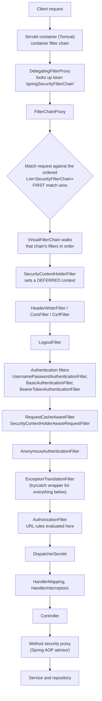
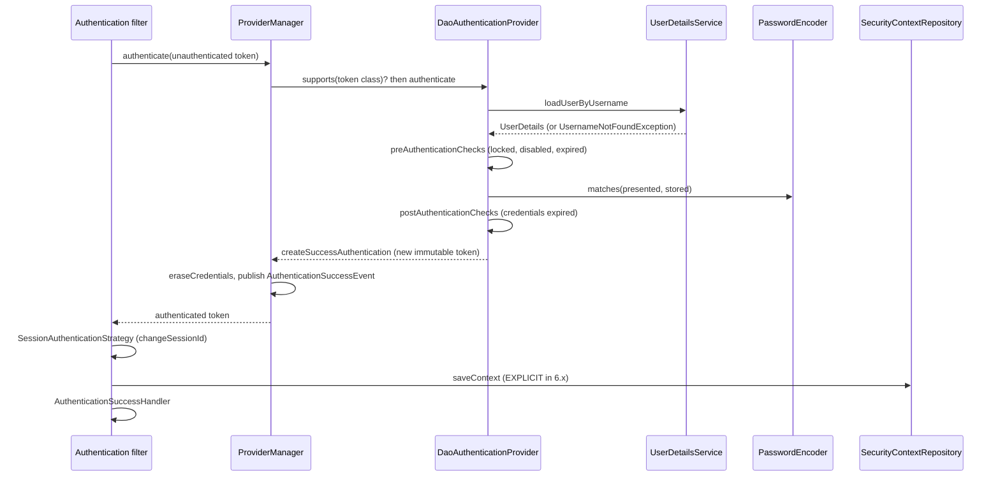

# 17.1 Cross-Topic Interview Deep Dive

> **Module 17 - Topic 1** - Interview Deep Dive
> Baseline: Spring Boot 3.2+, Spring Security 6.2+, Java 17+, `jakarta.*` namespace, lambda DSL only.
> This is the capstone. It assumes Modules 1 to 16. If a term here is unfamiliar, look it up in
> `00A_Start_Here_Beginner_Primer.md` or the module that introduced it.

Every other file in this set teaches one mechanism at a time. This file assumes you have read them and tests something different: **synthesis**. A senior interview rarely asks "what does `CsrfFilter` do". It asks "a valid token arrives for a user deleted five minutes ago - what happens", and the answer requires the filter chain, the resource server, the `SecurityContext`, method security, and your revocation design at once.

Three things are true about senior Spring Security interviews. First, the interviewer is probing for the boundary of your knowledge, so they will keep asking counter-questions until you say "I do not know" - say it early and cleanly rather than inventing an API. Second, almost every hard question is really a question about **where state lives** and **which thread is holding it**. Third, the answers that impress are the ones that name the class and then name the failure mode; naming only the class sounds like documentation recall, and naming only the failure mode sounds like folklore.

Use this file as a rehearsal script. Read a question, answer it out loud before opening the `<details>`, and mark the ones where you paused.

---

## How To Use This File

Everything else in this set explains one mechanism at a time, and you can read any of those files on its own. This one cannot be read that way, because it does not test whether you remember a topic - it tests whether you can combine several topics under pressure to answer a question that belongs to none of them. Almost every answer below reaches across three or four modules at once, which is why it sits at the end. If you are early in the material, treat this file as the target you are working towards rather than the place you start: read it once to see what the finish line looks like, then come back to it when the individual modules feel solid.

**Suggested order**

1. Read the ten whiteboard answers out loud, repeatedly, until you can deliver each one without notes.
2. Use the rapid-fire comparison tables as flashcards - cover one column and reconstruct it.
3. Attempt the twelve hardest questions with the answers still collapsed, saying your answer out loud before you open the `<details>` block.
4. Work through the three system design walkthroughs, sketching each one as you talk.
5. Finally, check yourself against the red flags and be honest about which ones you have said in a real interview.

One thing to notice about the writing. Every answer here is phrased the way you would actually say it in the room - connected prose, with a structure you can draw on a whiteboard while you talk - rather than the way you would write documentation. That is deliberate, and it is why reading them aloud is the recommended way to practise. An answer that reads well silently and falls apart when spoken is not yet ready.

---

## The Ten Whiteboard Answers

These are the ten diagrams and explanations listed in [`00_Spring_Security_Planning.md`](00_Spring_Security_Planning.md). Each answer below is written the way you should actually say it - as connected prose with a structure you can draw while talking, not as a bullet dump.

### 1. The full request path, naming every component

> "A request arrives at the servlet container. Spring Security is a single servlet `Filter` registered with the container, and everything it does happens before your `DispatcherServlet` ever sees the request."

Draw it as three nested boxes: container, security filter, application.



The spoken version, in order:

1. The container invokes its own filter chain. Spring Boot registers Spring Security there as one filter, ordered at `SecurityProperties.DEFAULT_FILTER_ORDER` (-100), which is deliberately early so it runs before most other filters.
2. That one filter is `DelegatingFilterProxy`. It exists because the container instantiates filters, not Spring, so the proxy looks up the real filter from the `ApplicationContext` by the bean name `springSecurityFilterChain` on first use.
3. That bean is a `FilterChainProxy`. It holds an **ordered list** of `SecurityFilterChain` objects, each one a `RequestMatcher` plus a `List<Filter>`. It walks the list, and the **first chain whose matcher matches wins** - the rest are never consulted. This is the single most common configuration bug: an earlier broad chain swallowing requests intended for a later one.
4. The winning chain is executed through a private `VirtualFilterChain`, which is what lets Spring Security's filters behave like a nested chain and then hand control back to the container chain when finished.
5. Inside that chain the order is intentional. `DisableEncodeUrlFilter` first, so the session identifier is never appended to URLs. `SecurityContextHolderFilter` next, which in 6.x installs a `DeferredSecurityContext` rather than eagerly reading the session. Then response-shaping and pre-authentication concerns: `HeaderWriterFilter`, `CorsFilter`, `CsrfFilter`, `LogoutFilter`. Then the authentication filters for whatever mechanisms you enabled. Then `AnonymousAuthenticationFilter`, which guarantees the context is never null from here on.
6. `ExceptionTranslationFilter` sits immediately above `AuthorizationFilter` and is effectively a `try`/`catch` around it, which is exactly why 401 and 403 are decided there and nowhere else.
7. `AuthorizationFilter` (which replaced `FilterSecurityInterceptor` in 6.0) evaluates the URL rules from `authorizeHttpRequests`. If it passes, `DispatcherServlet` finally runs, and method security applies later still, as AOP advice around your beans.

The sentence that lands: **URL security is a filter, method security is a proxy, and everything between them is ordinary Spring MVC.**

### 2. The authentication lifecycle

> "Authentication is a conversion: an unauthenticated `Authentication` object carrying credentials goes in, and a fully authenticated `Authentication` object carrying authorities comes out. Everything else is plumbing around that conversion."



1. An authentication filter recognises the request shape - a form post to `/login`, a `Basic` header, a `Bearer` header - and extracts credentials.
2. It builds an **unauthenticated** `Authentication` token, for example `UsernamePasswordAuthenticationToken.unauthenticated(username, password)`, whose `isAuthenticated()` is false.
3. It calls `AuthenticationManager.authenticate(token)`. The standard implementation is `ProviderManager`, which holds a `List<AuthenticationProvider>` and an optional parent manager.
4. `ProviderManager` asks each provider `supports(token.getClass())` and calls the first one that says yes. A provider may return null to abstain, in which case iteration continues; only a thrown `AuthenticationException` stops it, and even then `ProviderManager` remembers the exception and tries the parent before giving up.
5. For `DaoAuthenticationProvider` the work is: `retrieveUser` calls `UserDetailsService.loadUserByUsername`, which must throw `UsernameNotFoundException` rather than return null; `preAuthenticationChecks` runs the `UserDetailsChecker` for locked, disabled and expired accounts; `additionalAuthenticationChecks` calls `PasswordEncoder.matches(presented, stored)`; `postAuthenticationChecks` checks credential expiry. If the encoder reports `upgradeEncoding`, the provider re-hashes through the `UserDetailsPasswordService` when one is configured.
6. On success the provider calls `createSuccessAuthentication`, producing a **new, immutable, authenticated** token holding the principal and the `Collection<? extends GrantedAuthority>`. You never mutate the incoming token.
7. `ProviderManager` then erases credentials if `eraseCredentialsAfterAuthentication` is true (the default), which is why the password is null when you inspect the token later, and publishes an `AuthenticationSuccessEvent`.
8. Control returns to the filter, which does the session work: `SessionAuthenticationStrategy` runs, and for form login that includes `ChangeSessionIdAuthenticationStrategy` - session fixation protection by rotating the session identifier while keeping the attributes.
9. The filter builds a new `SecurityContext`, sets it on `SecurityContextHolder`, and then **explicitly** calls `SecurityContextRepository.saveContext`. In 6.x that explicit save is mandatory because `requireExplicitSave` is true by default.
10. Finally `AuthenticationSuccessHandler` decides the response - a redirect to the saved request for form login, nothing at all for stateless mechanisms.

On failure: the provider throws an `AuthenticationException`, the filter clears the `SecurityContextHolder`, publishes an `AuthenticationFailureBadCredentialsEvent`, and delegates to `AuthenticationFailureHandler`. Note that this failure path belongs to the **authentication filter**, not to `ExceptionTranslationFilter` - a distinction interviewers like to test.

### 3. Why 401 and 403 come from different code paths

> "They are different because they answer different questions. 401 means 'I do not know who you are, try again'. 403 means 'I know exactly who you are and you still may not do this'. The second one is final; retrying with the same identity is pointless."

`ExceptionTranslationFilter` is the only place that makes this decision, and it does it by exception type:

| Thrown | Meaning | Handled by | Typical response |
|---|---|---|---|
| `AuthenticationException` | No or bad credentials | `AuthenticationEntryPoint.commence` | 401 with `WWW-Authenticate`, or a 302 to the login page |
| `AccessDeniedException` while anonymous or remember-me only | Identity is too weak to judge | `AuthenticationEntryPoint.commence` | 401 or 302 - **upgraded**, not 403 |
| `AccessDeniedException` while fully authenticated | Known identity, insufficient rights | `AccessDeniedHandler.handle` | 403 |

Three details that separate a good answer from an excellent one. First, before commencing the entry point the filter stores the current request in the `RequestCache`, which is how you land on the page you originally asked for after logging in. Second, the anonymous-to-401 upgrade is why an unauthenticated call to a protected endpoint gives you 401 even though the actual exception thrown by `AuthorizationFilter` was an `AccessDeniedException`. Third, `AuthenticationFailureHandler` is a fourth, separate thing: it handles a **failed login attempt**, whereas the entry point handles a **missing** login. Mixing those two up is a common stumble.

And the operational caveat: if the response has already been committed - because a controller started streaming, or a filter below wrote bytes - neither handler can change the status code, and you will see a 200 with a truncated body instead of a 403.

### 4. CSRF versus CORS

> "They are not two solutions to one problem. CSRF is an attack that CORS does not prevent, and CORS is a relaxation of a browser rule that has nothing to do with authentication."

**CSRF** works because browsers attach ambient credentials automatically. If you are logged in to `bank.example` with a cookie and you visit `evil.example`, a form there can post to `bank.example` and the browser will attach your cookie. The server sees a perfectly valid authenticated request. The defence is a value the attacker cannot obtain: a token that the server issues and that must be echoed in the request body or a header, which same-origin rules prevent the attacker's page from reading. In Spring Security this is `CsrfFilter` plus a `CsrfTokenRepository` - `HttpSessionCsrfTokenRepository` by default, or `CookieCsrfTokenRepository.withHttpOnlyFalse()` when a SPA must read the value with JavaScript. In 6.x the token is loaded **lazily** through a `CsrfTokenRequestHandler`, with `XorCsrfTokenRequestAttributeHandler` as the default so the per-response encoding defeats the BREACH compression attack.

**CORS** is the opposite direction. The browser will happily *send* a cross-origin request; what the same-origin policy blocks is your JavaScript *reading the response*. CORS headers are the server saying "this particular origin may read this". It is enforced entirely in the browser, so it protects your users' data from a malicious page, and it protects your API from nothing at all - `curl` and any server-side client ignore it completely.

Ordering matters and interviewers check it: `CorsFilter` must run before `CsrfFilter` and before authentication, because a CORS preflight is an `OPTIONS` request carrying no credentials and no CSRF token, and it must be answered rather than rejected.

The rule for disabling CSRF, which you must be able to state in one sentence: **CSRF protection is only unnecessary when the application never authenticates a request using a credential the browser attaches automatically.** A bearer token placed in the `Authorization` header by your own script qualifies. A JWT stored in a cookie does not - it is a session identifier with extra steps, and it needs CSRF protection exactly as much as `JSESSIONID` does.

### 5. Role versus authority, and where `ROLE_` is added and stripped

> "There is no role type in Spring Security. There is only `GrantedAuthority`, which wraps a string. A role is an authority that follows a naming convention, and the framework's only involvement is adding a prefix for you in some places."

- `hasAuthority("ADMIN")` compares the string `ADMIN` exactly, case sensitively.
- `hasRole("ADMIN")` prepends the configured prefix, default `ROLE_`, and compares `ROLE_ADMIN`.

Where the prefix is **added**:

| Place | Behaviour |
|---|---|
| `AuthorityAuthorizationManager.hasRole(...)` | Prepends the prefix from the `GrantedAuthorityDefaults` bean, default `ROLE_` |
| `SecurityExpressionRoot.hasRole(...)` | Same, via the expression handler's role prefix |
| `User.withUsername(...).roles("ADMIN")` | Stores `ROLE_ADMIN`, and **throws** if you pass a value already starting with `ROLE_` |
| `User.withUsername(...).authorities("ROLE_ADMIN")` | Stores exactly what you give it, no prefixing |
| `RoleHierarchyImpl.withDefaultRolePrefix()` | Lets you write hierarchy rules without repeating the prefix |

Where it is **not** added, and this is where bugs live: the JDBC authorities table stores whatever string is in the column, so a row containing `ADMIN` will never satisfy `hasRole("ADMIN")`. And for resource servers, `JwtGrantedAuthoritiesConverter` defaults to reading the `scope` or `scp` claim and prefixing with `SCOPE_`, not `ROLE_`, so a token full of roles produces authorities like `SCOPE_read` unless you call `setAuthoritiesClaimName("roles")` and `setAuthorityPrefix("ROLE_")`.

The prefix is never "stripped" at runtime. There is no normalisation step, no trimming, no case folding. The comparison in `AuthorityAuthorizationManager` is a linear scan of `getAuthority()` strings with `equals`. If you want a different convention everywhere, publish one `GrantedAuthorityDefaults` bean - and note that it must be `static` when declared in a `@Configuration` class, because it is consumed by infrastructure before the configuration class is fully initialised.

### 6. Session versus token, and the revocation trade-off

> "This is not a question about which is modern. It is a question about where you are willing to pay: a lookup on every request, or a window during which a revoked user still works."

| | Server session | Self-contained token |
|---|---|---|
| Where state lives | Server store, client holds an opaque reference | Entirely in the token the client holds |
| Per-request cost | A store read (in-memory, Redis, JDBC) | A signature verification, microseconds |
| Revocation | Immediate - delete the record | Not possible without reintroducing state |
| Horizontal scale | Needs a shared store or sticky routing | Trivially stateless |
| Cross-domain and mobile | Awkward - cookies are origin-bound | Natural - a header travels anywhere |
| Browser attack surface | CSRF applies, cookie can be `HttpOnly` | XSS applies if stored where script can read it |
| Payload growth | Irrelevant, it is an identifier | Every claim ships on every request |

The honest conclusion, and the one to say out loud: **a stateless token buys you scale by giving up revocation, and every mitigation you add buys revocation back by giving up statelessness.** The mitigations, in increasing cost: short access-token lifetimes measured in minutes with a rotating refresh token that detects reuse; a denylist keyed on the `jti` claim, checked per request, which is a lookup and therefore no longer stateless; or opaque tokens plus introspection, which is a network call per request and the strongest revocation you can get. Choose deliberately and be able to state the resulting revocation window in seconds.

### 7. JWT structure, and what the signature does and does not protect

> "A JWT is three Base64URL segments separated by dots. Base64URL is an encoding, not encryption - anyone holding the token can read every claim in it, and you should assume they will."

- **Header**: `alg` (the signing algorithm), `kid` (which key), `typ`.
- **Payload**: registered claims `iss`, `sub`, `aud`, `exp`, `nbf`, `iat`, `jti`, plus whatever you add.
- **Signature**: computed over the ASCII string `base64url(header) + "." + base64url(payload)`.

What the signature **does** protect: integrity, so no claim can be altered; and authenticity, so you know which key signed it - which for asymmetric algorithms means you know the issuer specifically.

What it **does not** protect:

1. **Confidentiality.** Nothing in the payload is hidden. No personal data, no internal identifiers you would not print in a log. If you need secrecy, that is JWE, a different construction.
2. **Replay.** A stolen token is a valid token. Your defences are transport security, a short `exp`, audience restriction, and optionally `jti` tracking or sender-constrained tokens (mTLS-bound or DPoP).
3. **Freshness of authorization.** The claims were true when minted. Roles revoked since then are still in the token.
4. **Algorithm confusion.** Historically, accepting `alg: none`, or accepting an `HS256` token verified with an RSA public key as the HMAC secret. Never let the token choose the algorithm - `NimbusJwtDecoder` pins it, and you should validate `iss` and `aud` explicitly, because `JwtValidators.createDefault()` only checks timestamps.

The line to deliver: **the signature tells you the token was not tampered with; it tells you nothing about whether it should still be honoured.**

### 8. Where method security sits, and what that means for `@PostAuthorize`

> "Method security is Spring AOP. It is not a filter, it runs inside the `DispatcherServlet`, and it sees the `SecurityContext` from whatever thread is calling the method."

`@EnableMethodSecurity` registers `AuthorizationManagerBeforeMethodInterceptor` and `AuthorizationManagerAfterMethodInterceptor` as advisors, which are woven into your beans as proxies. Five consequences follow directly from that, and they are the whole point of the question:

1. **It is thread-bound.** The interceptor reads `SecurityContextHolder`, which is a `ThreadLocal` by default. Hand the call to an `@Async` method, an executor, a `CompletableFuture`, or a reactive scheduler and the context is gone - you need `DelegatingSecurityContextExecutor`, `DelegatingSecurityContextAsyncTaskExecutor`, or `MODE_INHERITABLETHREADLOCAL`.
2. **It only applies through the proxy.** A method calling another annotated method on `this` bypasses the interceptor entirely, because self-invocation never leaves the object. No warning is logged.
3. **`@PostAuthorize` runs after the method has already executed.** The query ran, the entity loaded, and any side effects happened. It is a safe filter for reads and an unsafe guard for writes.
4. **Ordering against transactions is the trap.** The security interceptors are ordered by `AuthorizationInterceptorsOrder` in the hundreds; `@Transactional` defaults to `Ordered.LOWEST_PRECEDENCE`. Lower order means higher precedence means **outer**, so security advice wraps transaction advice. By the time `@PostAuthorize` throws `AccessDeniedException`, the transaction has already committed. If you need the denial to roll back, you must either raise the transaction advice's precedence above the security interceptor's order or, better, not authorize a write after the fact.
5. **The exception escapes into MVC first.** An `AccessDeniedException` thrown by method security is thrown inside the `DispatcherServlet`, so `HandlerExceptionResolver` and any `@ControllerAdvice` see it before `ExceptionTranslationFilter` does. A broad `@ExceptionHandler(Exception.class)` will quietly turn your 403 into a 500.

And `@PostFilter`: it loads the entire collection, then removes elements. Combined with pagination it is actively wrong - page one of ten items can return three, and the total count lies. The only real fix is to filter in the query.

### 9. Securing a microservices estate at the edge, service to service, and at the data layer

> "Three layers, three different identity problems. The edge authenticates a human. Service to service authenticates a machine. The data layer enforces what the human is allowed to see. Getting any one of them from a header is how breaches happen."

**Edge (gateway).** Terminate TLS. Validate the external token fully - signature, issuer, audience, expiry - so bad traffic never reaches the estate. Enforce coarse-grained rules that are cheap and global: is this a known client, is the token for this audience, is this route public. Rate limit here. Critically: **strip any inbound identity headers**, because if a downstream service trusts `X-User-Id`, an external client that can reach the gateway can set it.

**Service to service.** Two separate identities travel together, and confusing them is the classic error. The **channel** identity is the calling workload, established with mTLS - a service mesh or SPIFFE/SPIRE issuing short-lived workload certificates. The **acting** identity is the user on whose behalf the call is made, carried as a token. Either propagate the original token where the audience permits, or use token exchange (RFC 8693) to mint a per-hop token whose audience is the next service and whose lifetime is seconds. Each service validates the token itself; the perimeter is a filter, not a trust boundary.

**Data layer.** Tenancy and ownership are enforced **in the query**, never by loading rows and discarding them afterwards. The tenant discriminator comes from the validated token, is put into a request-scoped holder, and is applied by a Hibernate filter, a repository specification, or database row-level security. Each service gets its own database credentials with least privilege, and no service writes another's schema. Encrypt at rest and keep the audit trail out of the application's own writable store.

The sentence to close with: **authorize at every layer and assume the layer above you was bypassed.**

### 10. Migrating Boot 2.7 and Security 5.7 to Boot 3 and Security 6 without downtime

> "The trick is that almost none of the work needs to happen during the upgrade. Spring Security 5.7 and 5.8 already support the new style, so you do the risky behavioural changes on the old version, where you can roll back cheaply, and the actual jump becomes a namespace and platform change."

Phase one, still on 2.7 and 5.7/5.8:

1. Delete every `WebSecurityConfigurerAdapter` and replace it with `SecurityFilterChain` beans. Available since 5.4, so there is no reason to do it under upgrade pressure.
2. Move to `authorizeHttpRequests` and `requestMatchers`. Both exist in 5.8; both are the only option in 6.0.
3. Turn on `requireExplicitSave(true)` and the `SecurityContextHolderFilter` behaviour explicitly. This is the biggest *behavioural* break in 6.0 - the context is no longer saved implicitly at the end of the request - so flushing it out on the old version means the upgrade itself cannot surprise you.
4. Replace `@EnableGlobalMethodSecurity` with `@EnableMethodSecurity`. Note the default changed: `prePostEnabled` is true by default now, and the implementation moved from `AccessDecisionManager` voters to `AuthorizationManager`, so any custom voter or metadata source needs a rewrite rather than a rename.

Phase two, the platform jump: Java 17 baseline, `javax.*` to `jakarta.*` across servlet, validation and persistence, Hibernate 6, and the removed APIs (`antMatchers`, `mvcMatchers`, `authorizeRequests`, EhCache-based `UserCache`).

The two things that actually cause downtime, which is what the question is really about:

- **Trailing-slash matching.** Spring Framework 6 stopped matching a trailing slash by default. A rule written for `/api/users` no longer matches `/api/users/`, and depending on how your rules are ordered that either 404s or falls through to a different, possibly permissive, rule. Audit every matcher, and prefer explicit patterns over relying on the old leniency.
- **Session representation.** During a rolling deploy both versions serve traffic. If old and new nodes cannot read each other's sessions, users bounce to the login page at random. Your options, in order of preference: run stateless so it does not matter; use a shared store with an explicitly configured JSON serializer that both versions produce and consume identically; make routing sticky and drain each node; or, as a last resort, accept a forced re-login in a low-traffic window with communications prepared.

Then deploy as a canary with a hard abort criterion - authentication success rate and 401/403 rates per route - and keep `logging.level.org.springframework.security=TRACE` available behind a config change on the canary only.

---

## Rapid-Fire Comparisons

These are the tables interviewers fire in sequence to see how fast your recall is. Aim for one sentence per row, no hedging.

**Filter versus `HandlerInterceptor` versus AOP**

| | Servlet `Filter` | `HandlerInterceptor` | Spring AOP advice |
|---|---|---|---|
| Runs | Before `DispatcherServlet` | Inside `DispatcherServlet`, around handler resolution | Around any Spring bean method |
| Sees | `ServletRequest`/`ServletResponse` | Handler object, `ModelAndView` | Method arguments and return value |
| Knows the target method | No | Yes, the `HandlerMethod` | Yes, with typed arguments |
| Can short-circuit | Yes, by not calling `doFilter` | Yes, `preHandle` returning false | Yes, by throwing |
| Used by Spring Security for | URL authorization, all mechanisms | Nothing | `@PreAuthorize`, `@PostAuthorize`, `@Secured` |

**`hasRole` versus `hasAuthority`**

| | `hasRole("ADMIN")` | `hasAuthority("ADMIN")` |
|---|---|---|
| Compares | `ROLE_ADMIN` | `ADMIN` |
| Prefix source | `GrantedAuthorityDefaults` bean, default `ROLE_` | None |
| Fails when | The stored string lacks the prefix | The stored string has a prefix you forgot |
| Use for | Coarse identity buckets | Fine-grained permissions such as `document:write` |

**`permitAll()` versus `WebSecurity.ignoring()`**

| | `permitAll()` | `ignoring()` |
|---|---|---|
| Filter chain | Runs fully | Skipped entirely |
| Security headers | Written | Not written |
| CSRF, CORS | Applied | Not applied |
| `SecurityContext` | Available if a credential was presented | Never populated |
| Cost | A chain walk, tens of microseconds | Zero |
| Risk | Negligible | Any endpoint matched is completely unprotected, forever |

**`authenticated()` versus `fullyAuthenticated()`**

| | `authenticated()` | `fullyAuthenticated()` |
|---|---|---|
| Accepts remember-me | Yes | No |
| Accepts anonymous | No | No |
| Typical use | Ordinary protected pages | Password change, payment, account settings |

**`STATELESS` versus `NEVER`**

| | `SessionCreationPolicy.STATELESS` | `SessionCreationPolicy.NEVER` |
|---|---|---|
| Spring Security creates a session | No | No |
| Spring Security uses an existing session | No - the context is never read from it | Yes, if one already exists |
| Something else creates one | Still possible (for example JSP or `HttpSession` access in a controller) | Same |
| Use for | Token APIs | Rare; legacy apps where another component owns the session |

**JWT versus session**

| | Session cookie | Self-contained JWT |
|---|---|---|
| What the client holds | An opaque identifier | The claims themselves |
| Server lookup per request | Yes, from the session store | None |
| Revocation | Immediate | Only at expiry, unless you add state back |
| Scaling | Shared store or sticky routing | Stateless |
| Size on the wire | Tens of bytes | Hundreds to thousands, every request |
| Primary browser risk | CSRF, mitigated by tokens and `SameSite` | XSS, if stored where script can read it |
| Claim staleness | None, state is read fresh | The whole lifetime of the token |

**HS256 versus RS256**

| | HS256 (HMAC-SHA256) | RS256 (RSA-SHA256) |
|---|---|---|
| Key model | One shared secret | Private key signs, public key verifies |
| Anyone who can verify can also mint | Yes - this is the decisive problem | No |
| Speed | Microseconds | Verification tens of microseconds, signing far slower |
| Key distribution | Every verifier needs the secret | Publish a JWKS endpoint |
| Rotation | Coordinated across all parties | Add a new `kid`, verifiers pick it up |
| Choose when | One service signs and verifies its own tokens | Any time more than one party verifies |

ES256 is the sensible modern alternative to RS256: same asymmetric property, much smaller keys and signatures.

**`@PreAuthorize` versus `@PostAuthorize`**

| | `@PreAuthorize` | `@PostAuthorize` |
|---|---|---|
| Runs | Before the method | After the method returns |
| Can see | Arguments, via `#paramName` | The return value, via `returnObject` |
| Method body executed on denial | No | Yes - it already ran |
| Transaction on denial | Not started by this call | Already committed under default ordering |
| Safe for | Anything, including writes | Reads only |

**`AuthenticationEntryPoint` versus `AccessDeniedHandler` versus `AuthenticationFailureHandler`**

| | Triggered by | Meaning | Default behaviour |
|---|---|---|---|
| `AuthenticationEntryPoint` | `AuthenticationException` in `ExceptionTranslationFilter`, or a denial while anonymous | "Authenticate first" | Redirect to login, or 401 with `WWW-Authenticate` |
| `AccessDeniedHandler` | `AccessDeniedException` while fully authenticated | "You are known and refused" | 403 |
| `AuthenticationFailureHandler` | An authentication **attempt** that failed, inside the authentication filter | "Those credentials are wrong" | Redirect to `/login?error` |

**CSRF versus CORS**

| | CSRF protection | CORS |
|---|---|---|
| Is it | A defence against an attack | A relaxation of the same-origin policy |
| Enforced by | Your server, per request | The browser, on reading the response |
| Protects | Your users from forged state changes | Your users' data from a malicious origin |
| Protects the server from | Forged authenticated requests | Nothing |
| Spring Security component | `CsrfFilter`, `CsrfTokenRepository` | `CorsFilter` plus a `CorsConfigurationSource` |
| Applies when | A credential is attached automatically | A browser makes a cross-origin request |
| Irrelevant when | The credential is a script-set header | The client is not a browser |

**Access token versus ID token versus refresh token**

| | Access token | ID token | Refresh token |
|---|---|---|---|
| Defined by | OAuth 2.0 | OpenID Connect | OAuth 2.0 |
| Audience | The resource server | The **client** | The authorization server |
| Answers | "May this request proceed" | "Who signed in, and how" | "Give me a new access token" |
| Format | Opaque or JWT; the client must not parse it | Always a JWT | Opaque |
| Lifetime | Minutes | Single sign-in event | Days to months, ideally rotating |
| Common mistake | Sending the ID token to the API | Using it for authorization | Storing it where script can read it |

---

## The Twelve Hardest Questions

### Q1. A valid JWT arrives, but the user was deleted five minutes ago. Trace exactly what happens.

<details>
<summary>Show answer</summary>

Nothing stops it, and that is the correct, uncomfortable answer.

`BearerTokenAuthenticationFilter` extracts the token and calls `AuthenticationManager`, which reaches `JwtAuthenticationProvider`. That calls `JwtDecoder.decode`, which verifies the signature against the cached JWKS, then runs the `OAuth2TokenValidator` chain - timestamps, issuer, audience. All of those pass, because deleting a database row does not alter a signed token or its expiry. `JwtAuthenticationConverter` turns the claims into a `JwtAuthenticationToken` with authorities derived from the `scope` or a roles claim. The context is populated, `AuthorizationFilter` sees an authenticated principal with the right authorities, and the request proceeds.

The request then fails, if it fails at all, somewhere in your own code - the first query joining on the user identifier returns nothing, and depending on how you wrote it you get a `NoSuchElementException`, a null, or a 500. In a well-designed system that is the only signal. In a badly designed one, a shared-nothing endpoint that never touches the user row succeeds completely, five minutes after the account was deleted.

The window is exactly the remaining lifetime of the token, which is why access-token lifetime is a security parameter you choose, not a default you accept. If your requirement is faster revocation, you have three options and each costs statelessness: check a denylist keyed on `jti` per request; switch that client to opaque tokens with cached introspection, where the cache TTL becomes your window; or keep JWTs but make the resource server load the user on every request, at which point you have a session with extra cryptography.

**Counter-question: would introducing a `jti` denylist actually fix it, and what does that cost?**

It shrinks the window to the denylist's propagation and cache time, not to zero. You now need a store every resource server reads on every request - typically Redis - with entries expiring at the token's own `exp`, so the store size is bounded by issuance rate times token lifetime rather than growing forever. The costs are real: a network read on the hot path, a new availability dependency (decide now whether a Redis outage means fail-open or fail-closed, and be able to defend the choice), and the loss of the property that made JWTs attractive. It is a reasonable design; it is not a free fix.

**Counter-question: the user was not deleted but had `ROLE_ADMIN` revoked. Does anything change?**

Only for the worse. Deletion is at least likely to surface as a failed query. A revoked role is pure authorization data living in the token, so the endpoint works perfectly and the audit log records a legitimate-looking admin action by someone who is no longer an admin. That asymmetry is the strongest practical argument for keeping authorization claims coarse in tokens and resolving fine-grained permissions server-side, where revocation is immediate.

**Counter-question: how would you detect that this had happened in production?**

Emit an authorization event carrying the token's `jti`, `sub` and issuance time, and reconcile it against the identity store's deletion and role-change log. Any request whose token was minted before a revocation affecting that subject is a post-revocation use. That reconciliation is also the evidence you need to justify a specific access-token lifetime to a security reviewer, since it turns "the window is theoretically fifteen minutes" into "we observed forty-one post-revocation requests last month".
</details>

### Q2. Your application returns a 302 to `/login` for API calls and a 403 for UI calls. You want the opposite. Fix both.

<details>
<summary>Show answer</summary>

Both symptoms come from the same root cause: one `SecurityFilterChain` serving two client types, so one `AuthenticationEntryPoint` is being applied to both. The 302 is `LoginUrlAuthenticationEntryPoint` doing exactly what form login configures it to do, and the API client - which wanted a 401 - follows the redirect and receives an HTML login page with status 200, which is the worst possible outcome because the client's error handling never triggers.

The 403 on UI calls has a different cause, and you must diagnose it rather than assume. If the user is genuinely anonymous you would get the redirect, not a 403, because `ExceptionTranslationFilter` upgrades denials for anonymous principals to the entry point. A 403 for a browser therefore means one of: the user is authenticated but lacks the authority, which is correct behaviour and not a bug; or `CsrfFilter` rejected the request with an `AccessDeniedException` because the form or fetch call did not send the token; or a request that should have been authenticated was not, and the session was lost. In practice on a form-login application, an unexpected 403 on a POST is a missing CSRF token far more often than anything else.

The fix is two chains selected by `securityMatcher`, not one chain with conditional logic:

```java
@Bean
@Order(1)
SecurityFilterChain apiChain(HttpSecurity http) throws Exception {
    http
        .securityMatcher("/api/**")
        .authorizeHttpRequests(auth -> auth.anyRequest().authenticated())
        .sessionManagement(session ->
            session.sessionCreationPolicy(SessionCreationPolicy.STATELESS))
        .csrf(csrf -> csrf.disable())
        .oauth2ResourceServer(oauth2 -> oauth2.jwt(Customizer.withDefaults()))
        .exceptionHandling(ex -> ex
            .authenticationEntryPoint(
                new HttpStatusEntryPoint(HttpStatus.UNAUTHORIZED))
            .accessDeniedHandler((request, response, denied) ->
                response.sendError(HttpStatus.FORBIDDEN.value())));
    return http.build();
}

@Bean
@Order(2)
SecurityFilterChain uiChain(HttpSecurity http) throws Exception {
    http
        .authorizeHttpRequests(auth -> auth
            .requestMatchers("/", "/login", "/css/**").permitAll()
            .anyRequest().authenticated())
        .formLogin(form -> form.loginPage("/login").permitAll())
        .exceptionHandling(ex -> ex
            .accessDeniedPage("/error/403"));
    return http.build();
}
```

Note that CSRF is disabled only on the chain that authenticates from an `Authorization` header, and the UI chain keeps it. The ordering matters: the API chain must come first because the UI chain has no `securityMatcher` and therefore matches everything.

**Counter-question: the requirement is one chain and a `Accept` header decision. How?**

`DelegatingAuthenticationEntryPoint`, which holds a `LinkedHashMap<RequestMatcher, AuthenticationEntryPoint>` and a default. Map a `MediaTypeRequestMatcher` for `application/json`, or a header matcher for `X-Requested-With`, to an `HttpStatusEntryPoint(HttpStatus.UNAUTHORIZED)`, and leave `LoginUrlAuthenticationEntryPoint` as the default. It works, and it is what Spring Security itself does internally to choose between a login redirect and a 401. I would still prefer two chains, because the entry point is not the only thing that differs - session policy, CSRF and the authentication mechanism all differ too, and encoding all of that in matchers inside one chain is harder to read and easier to get wrong.

**Counter-question: after the fix the API returns 401 with no body and the frontend team complains. What do you return?**

A small, stable JSON error object, and nothing that leaks. Implement `AuthenticationEntryPoint` directly, set the status, set `Content-Type`, and write a body with a machine-readable code and a correlation identifier - never the exception message, which for a resource server can disclose whether the token was expired, malformed or had the wrong audience. If the client legitimately needs to distinguish "expired, refresh and retry" from "invalid, log the user out", use the standard `WWW-Authenticate` header with `error="invalid_token"` and `error_description`, which is what RFC 6750 defines and what `BearerTokenAuthenticationEntryPoint` already emits.

**Counter-question: why does following the 302 produce a 200 rather than an error, and why is that so damaging?**

Because a redirect is a successful HTTP exchange. The client requests `/api/orders`, gets a 302, transparently requests `/login`, and receives a 200 with an HTML body. Client libraries follow redirects by default, so the application code sees `status == 200` and attempts to parse HTML as JSON. The failure surfaces as a parse error at a completely unrelated place in the code, minutes of debugging away from the authentication problem that actually caused it. That indirection is why "API calls must never be redirected" is worth treating as an architectural rule.
</details>

### Q3. Enumerate every place identity can be lost between the HTTP request and a `@Scheduled` job.

<details>
<summary>Show answer</summary>

The unifying principle: `SecurityContextHolder` uses `MODE_THREADLOCAL` by default, so identity lives on exactly one thread and every thread boundary is a place to lose it.

Walking outward from the request:

1. **Before `SecurityContextHolderFilter` runs.** Any container filter ordered before Spring Security's (anything with an order lower than -100) executes with an empty context.
2. **Servlet async dispatch.** Returning a `Callable` or `DeferredResult` moves work to another thread. `WebAsyncManagerIntegrationFilter` exists precisely to propagate the context for `Callable`, but only for the Spring MVC async mechanisms - not for a raw thread you started.
3. **`@Async`.** A different thread from the task executor. Fix with `DelegatingSecurityContextAsyncTaskExecutor`, or globally by returning a `DelegatingSecurityContextExecutor` wrapping your executor from `AsyncConfigurer.getAsyncExecutor()`.
4. **Any `ExecutorService`, `CompletableFuture.supplyAsync`, or parallel stream.** `parallelStream` is the sneakiest: it silently uses the common ForkJoin pool, so a `@PreAuthorize`-annotated method called inside a parallel stream sees no authentication.
5. **`ThreadPoolTaskExecutor` reuse.** Worse than an empty context - a pooled thread can retain a *stale* context from a previous request if something set it without clearing it. This is one of the genuine mechanisms behind cross-user data leaks.
6. **Reactive code.** WebFlux does not use a `ThreadLocal` at all; the context lives in the Reactor `Context` and is read via `ReactiveSecurityContextHolder`. Bridging blocking and reactive code in either direction loses it unless you propagate explicitly.
7. **Manual `SecurityContextHolder.clearContext()`** in a filter's `finally`, or a custom filter that clears too early.
8. **`@Scheduled` itself.** This is the end of the line. A scheduled method runs on a scheduler thread with no request, no session and no context at all. There is no identity to propagate, because there was never a user - the trigger is a clock.

So for the scheduled job you do not "restore" identity, you **establish** it. Two acceptable patterns. Either set a deliberate technical principal for the duration of the job, using `SecurityContextHolder.setContext` in a try/finally that clears it (or `SecurityContextHolder.getContextHolderStrategy()` for testability), with a dedicated service account whose authorities are the minimum the job needs. Or - better where the job acts for specific users, such as sending each tenant a digest - persist the initiating user's identifier with the work item and re-establish that user's authorities per item, so the job's authorization is the same as the user's would have been. What you must not do is annotate the job's service method with `@PreAuthorize` and then disable method security on that path, or run the job as a principal with every authority because it was easier.

**Counter-question: why is `MODE_INHERITABLETHREADLOCAL` not the general answer?**

Because inheritance happens at thread *creation*, and thread pools create threads once and reuse them forever. The first task to run on a pooled thread may pass its context to nothing, and a thread created during request A keeps request A's context for the life of the pool. It works for code that spawns fresh threads, which is exactly the code you should not be writing. The correct tool is the `DelegatingSecurityContext*` wrappers, which capture the context at *submission* time and clear it after the task, so pooling is safe.

**Counter-question: how would you prove in a test that a scheduled job is not silently running with a stale context?**

Assert on the context rather than on behaviour. In the job's own code, capture the principal at entry and log it with the job name. In tests, submit work through the real executor after `@WithMockUser` has populated a context, and assert inside the task that the principal is the technical account and not the test user. For pooled-thread contamination specifically, run two tasks sequentially on a single-threaded executor, set a context in the first without clearing, and assert the second sees `null` - if that test passes you have proven the clearing discipline, and if it fails you have found a real leak.

**Counter-question: does a `TaskDecorator` solve this, and is it equivalent?**

A `TaskDecorator` on `ThreadPoolTaskExecutor` is the general mechanism and can absolutely copy the `SecurityContext` from the submitting thread into the task and clear it afterwards - it is how you would propagate MDC values too. It is equivalent in effect to the delegating wrappers when written correctly, and its advantage is that it applies to everything submitted to that executor rather than requiring each call site to wrap. The pitfall is forgetting the clear step in the `finally` block, which converts a propagation feature into the stale-context leak described above.
</details>

### Q4. You see intermittent cross-user data in production. Enumerate every possible cause in Spring Security terms and say how you would confirm each.

<details>
<summary>Show answer</summary>

Intermittent plus cross-user means shared mutable state keyed on something that is not the user. There are six families of cause, and I would rule them out in order of likelihood.

1. **A pooled thread retaining a `SecurityContext`.** A `TaskDecorator`, a custom filter, or an async wrapper that sets the context and does not clear it in a `finally`. Confirm by logging the principal at both entry and exit of the pooled work with the thread name, and looking for a thread whose exit principal on task *N* matches the entry principal on task *N+1*. The definitive test is the single-threaded-executor test described above.
2. **Singleton state holding per-user data.** A field on a `@Service`, a static map, a `@Component` caching "the current tenant". Confirm by auditing every non-final field on singleton-scoped beans; anything user-derived is a bug. A request-scoped bean or an explicit parameter is the fix.
3. **A cache keyed incompletely.** `@Cacheable` on a method whose result depends on the caller but whose key does not include the caller - the single most common cause in my experience. Also a permission cache keyed on the user but not the tenant, or a `UserCache` keyed on a username that is only unique within a tenant. Confirm by reading every cache key expression and asking whether every input the method's result depends on appears in the key.
4. **Session identity confusion.** Session fixation if `ChangeSessionIdAuthenticationStrategy` was disabled, so two users share a session identifier. A misconfigured shared session store where the key namespace collides between applications. A load balancer or reverse proxy caching authenticated responses because `Cache-Control` was permissive - which produces exactly this symptom and is not a Spring Security bug at all, though Spring Security's default `no-store` headers are what normally prevent it. Confirm by checking `Vary` and `Cache-Control` on the affected responses and by looking for one session identifier associated with two principals in the session store.
5. **Authorization that filters after loading.** `@PostFilter` on a paginated query returns the wrong rows but also, combined with a cached page, can serve one user's page to another. More commonly, a repository method that omits the tenant predicate and relies on a `@PostAuthorize` that a code path bypassed. Confirm by enabling SQL logging and grepping for queries against tenant-scoped tables with no tenant predicate.
6. **The tenant resolved from the wrong place.** A header, a query parameter, or a subdomain that the client controls, rather than from the validated token or session. Confirm by reading the tenant-resolution code and asking whether a client can change its value; if it can, you do not have a leak, you have an authorization bypass.

My actual first move in production, before any of that, is to add a correlation identifier plus the authenticated principal to every log line and every response header, so the next occurrence produces evidence instead of a report. Without that, you are guessing among six equally plausible causes.

**Counter-question: which of these would a load test never reproduce?**

Most of them. A load test with one user, or with users that all see the same data, cannot detect a keying bug. Thread contamination needs enough concurrency and enough principal variety to collide. Cache keying bugs need two users whose results genuinely differ. The reverse-proxy caching cause needs the real proxy, which staging usually lacks. Designing the load test with distinct users holding distinct data, and asserting that every response belongs to the requesting user, is what turns these from unreproducible into reproducible - and that assertion is cheap to add.

**Counter-question: how do you make the `@Cacheable` keying bug structurally impossible rather than fixing the instances?**

Stop letting the key be written by hand at each call site. Provide a `KeyGenerator` that always incorporates the authenticated principal and tenant from the request-scoped holder, register it as the default, and let the cache abstraction do it. The trade-off is that caches become per-user and their hit rate falls, so you apply it only to caches whose values are genuinely user-scoped - and the discipline that makes this work is separating caches of user-independent reference data from caches of user-scoped results, with a naming convention that makes the difference visible in review.

**Counter-question: the symptom disappears when you scale to one instance. What does that tell you?**

It points at anything shared or replicated across instances rather than at thread-local state, which would follow the load. That narrows it to the session store, a distributed cache, or a key-namespace collision between instances - for example two applications sharing a Redis database without distinct key prefixes, so `spring:session:sessions:...` entries from one application are readable by the other. It also, importantly, does not rule out thread contamination: with a single instance you may simply have reduced concurrency below the threshold where collisions are visible. So I would treat it as a strong hint about the distributed layer, not as a proof.
</details>

### Q5. `@PostAuthorize` denied the call, the client got a 403, and the row was still written. Explain and fix.

<details>
<summary>Show answer</summary>

Two independent mechanisms produced this, and you need both to explain it.

First, `@PostAuthorize` runs after the method body. That is its definition - it exists to inspect the return value. So the write happened before any authorization decision was made.

Second, the transaction committed because of advisor ordering. Both method security and `@Transactional` are AOP advice on the same bean, and the outer advice is the one with the lower order value. The security interceptors are ordered by `AuthorizationInterceptorsOrder`, whose values are in the low hundreds; `@Transactional` defaults to `Ordered.LOWEST_PRECEDENCE`. Security is therefore the **outer** advice, so the call sequence is: security advice starts, transaction advice starts, method runs and writes, transaction advice **commits**, security advice evaluates `@PostAuthorize` and throws. The `AccessDeniedException` propagates through advice that has already finished its work. The client sees 403 and the data is durable.

Do not fix this by reordering advisors. You can - raising `@EnableTransactionManagement(order = ...)` above the security interceptor's order makes the transaction outer, so the denial rolls it back - but it means every authorization failure now performs the work and rolls it back, you have made a global change to satisfy one method, and you have created a denial-of-service shape where unauthorized requests still consume database work.

The correct fix is to stop authorizing a write after the fact. Load whatever the decision needs first, decide, then write. Concretely: split the method, put `@PreAuthorize("hasPermission(#id, 'Document', 'WRITE')")` on the public entry point with a `PermissionEvaluator` that loads the document and applies the rule, and leave the write in a second method that is only reachable once the decision has been made. The extra read is the price of deciding before acting, and it is almost always cheaper than the alternative.

**Counter-question: is `@PostAuthorize` ever the right choice?**

Yes, for reads where the decision genuinely depends on the loaded object and you cannot know it from the arguments. `findById` returning an entity whose owner you must compare against the caller is the canonical case: `@PostAuthorize("returnObject.ownerId == authentication.name")`. It is correct there because the only side effect was a read. The moment the method mutates anything, or calls anything that does, `@PostAuthorize` is the wrong tool.

**Counter-question: the denial also means the response body is discarded, but the method sent an email. Same class of problem?**

The same class and strictly worse, because there is no rollback available at all. A transaction can at least be rolled back if you reorder; an email cannot be unsent, and neither can a message published to Kafka or a call made to a payment provider. This is the general argument for keeping external side effects out of methods guarded only after the fact, and for publishing events inside the transaction so that a rollback also discards them - Spring's `@TransactionalEventListener` with `AFTER_COMMIT` exists exactly for that.

**Counter-question: how would you catch this in a test?**

Assert on persistence, not on the status code. Call the method as an unauthorized user, expect `AccessDeniedException`, and then, in a *separate* transaction or after flushing and clearing the persistence context, query for the row and assert it is absent. The reason the bug survives most test suites is that the assertion stops at the exception, and the reason it must be a separate transaction is that a test-managed rolling-back transaction hides the commit you are trying to detect.
</details>

### Q6. A team disabled CSRF for `/api/**`. The API authenticates with a JWT stored in a cookie. Is that exploitable?

<details>
<summary>Show answer</summary>

Yes, completely, and the token format is irrelevant.

CSRF is about **how the credential reaches the server**, not what the credential contains. A cookie is attached by the browser automatically on any request to the matching origin, including one triggered by a page the attacker controls. So `evil.example` can cause the victim's browser to issue `POST /api/transfers` to your origin, the browser attaches the JWT cookie, your `BearerTokenAuthenticationFilter` equivalent reads it, the signature verifies, the user is authenticated, and the transfer happens. The attacker never sees the response - CORS prevents that - but for a state-changing request not seeing the response costs them nothing.

Storing a JWT in a cookie is a legitimate design; it gets you `HttpOnly`, which protects against exfiltration by XSS. But it makes the cookie a session identifier in every respect that matters to CSRF, so it needs the same protections: CSRF tokens enabled, plus `SameSite=Lax` or `Strict` as defence in depth (not as the only defence, because `SameSite` behaviour varies across clients and does not cover every navigation case).

The fix, in order: re-enable `csrf` on that chain; if the API is called by a SPA, use `CookieCsrfTokenRepository.withHttpOnlyFalse()` so the script can read the token and echo it in the `X-XSRF-TOKEN` header, and set the request handler correctly for 6.x deferred tokens; set `SameSite` on the authentication cookie; and verify `Origin`/`Referer` at the gateway as an additional signal. Alternatively, change the transport: if the client is script and can hold the token in memory and set `Authorization: Bearer`, then the credential is no longer ambient, CSRF genuinely does not apply, and disabling it becomes correct. That is the trade you are actually choosing between - `HttpOnly` protection from XSS with CSRF protection required, or header-based tokens with CSRF irrelevant and XSS exposure to manage.

**Counter-question: in 6.x, enabling CSRF for a SPA is not just re-enabling it. What else changes?**

The token is now loaded lazily and the default `XorCsrfTokenRequestAttributeHandler` encodes it per response to defeat BREACH. For a server-rendered form that is transparent. For a SPA that reads the cookie, the value it reads must be the raw token while the value the server compares must handle the XOR encoding, so you configure `CsrfTokenRequestAttributeHandler` with `setCsrfRequestAttributeName(null)` to restore eager resolution of the attribute, and you ensure something actually causes the token to be generated on the first request - typically a filter that calls `CsrfToken.getToken()`. Getting this wrong produces a 403 on every mutating request, which is the single most frequently reported 6.x migration symptom.

**Counter-question: does `SameSite=Strict` alone make CSRF protection unnecessary?**

No, and treating it as sufficient is a red flag. It substantially reduces the attack surface for modern browsers, but it is a browser-enforced behaviour rather than a server-enforced check, its treatment of top-level navigations and of subdomains is subtle, and any client that does not implement it exactly leaves you exposed. Defence in depth means the server verifies something the attacker cannot produce, and `SameSite` is a helpful additional barrier rather than that verification.

**Counter-question: the team argues their API is only called from their own SPA, so there is no risk. Respond.**

The origin of legitimate calls is irrelevant; CSRF is defined by a request the *attacker's* page causes the *victim's* browser to make. "Only our SPA calls it" describes the traffic you intend, not the traffic that is possible. The question to ask them is simply: can a logged-in user's browser be induced to send a state-changing request to this endpoint with the cookie attached? If the credential is a cookie, the answer is yes regardless of who the intended caller is.
</details>

### Q7. Login succeeds, then the very next request returns 401 from a different node. Enumerate the causes.

<details>
<summary>Show answer</summary>

The symptom is that authentication state did not survive the hop between nodes, so the question is where that state was supposed to live.

1. **Session-backed context with no shared store and no sticky routing.** The default `HttpSessionSecurityContextRepository` writes to the local `HttpSession`. Node A has it, node B does not. Fix by adding Spring Session with a shared store, enabling session replication, or - only as a stopgap - sticky sessions at the load balancer.
2. **A shared store that is configured but not actually used.** Spring Session must be enabled (`@EnableRedisHttpSession` or the Boot property `spring.session.store-type`), and the serializer must be able to handle Spring Security's classes; a `SerializationException` on write is silently a lost session.
3. **The context was never saved.** On 6.x with `requireExplicitSave` true, a custom authentication filter that sets `SecurityContextHolder` but never calls `SecurityContextRepository.saveContext` authenticates exactly one request. The tell is that it fails on the *same* node too, which distinguishes it from the distributed causes.
4. **Cookie scope or attributes.** A `Secure` cookie on a plain-HTTP hop, a `Domain` or `Path` that does not cover the second request, or `SameSite=Strict` on a cross-site navigation. The cookie is simply not sent, so the server correctly sees an anonymous request.
5. **Key mismatch across nodes.** For remember-me, the `key` must be identical on every node or the token fails to validate; if you did not set it, Spring Security generates a random one per instance. For a JWT signed with a symmetric key, the same applies to the secret.
6. **Clock skew.** For tokens, an `exp` or `nbf` evaluated against a node whose clock differs. `JwtTimestampValidator` allows 60 seconds by default, so this needs meaningful skew, but it happens.
7. **Concurrent session control.** `maximumSessions(1)` with `maxSessionsPreventsLogin(false)` expires the older session, so a second login elsewhere invalidates the one you are using. With a shared store and a `SessionRegistry` that is not shared, this misfires unpredictably.
8. **A stateless chain matching the request unintentionally.** If chain ordering means the follow-up request is matched by a `STATELESS` API chain rather than the UI chain, the session exists and is simply never consulted.

The fastest discriminator: reproduce against a single node. If it works there, it is distributed state - causes 1, 2, 5, 7. If it fails there too, it is a save or cookie problem - causes 3, 4, 8.

**Counter-question: sticky sessions make the symptom disappear. Have you fixed it?**

No, you have hidden it. Stickiness means a node restart or a scale-in event logs those users out, deploys become user-visible, and load distributes unevenly. It is an acceptable short-term mitigation while you add a shared store, and it is a reasonable long-term choice only if you have decided that session loss on deploy is tolerable - which for most consumer-facing applications it is not. Say explicitly which of the two you are doing.

**Counter-question: you move to Redis-backed sessions. What new failure modes have you accepted?**

Redis is now on the authentication path, so its availability is your login availability and its latency is added to every authenticated request that reads the context - typically well under a millisecond, but non-zero and subject to tail latency. You have taken on serialization compatibility as a deployment concern, which is precisely what bites during a Boot 3 upgrade if old and new nodes serialize differently. Session payload size now matters, because large authority sets are read and written on every request. And you must decide behaviour when Redis is unreachable: failing closed logs everyone out, failing open is not an option for session data, so in practice you plan for a degraded read-only mode or accept the outage.

**Counter-question: how does this look different if the application is stateless with JWTs?**

Node-to-node session state disappears as a cause entirely, which is the main operational appeal. What replaces it is key distribution: every node must resolve the same JWKS, so a node with a cold or failed JWKS fetch returns 401 for every request until it succeeds. The symptom is then "one node rejects everything" rather than "requests alternate between working and failing", and you diagnose it by checking JWKS fetch metrics per instance rather than by looking at the session store.
</details>

### Q8. A user's newly granted role does not take effect until they log out and back in. Enumerate every layer that could be caching it.

<details>
<summary>Show answer</summary>

Authorities are copied, not referenced, at several points, and each copy is a cache.

1. **The `Authentication` object itself.** Authorities were resolved once at authentication and stored in an immutable token. That token lives in the `SecurityContext` for the life of the session. This is the usual answer and it is not really a cache - it is a snapshot by design.
2. **The session store.** With session-backed contexts, the serialized `Authentication` in Redis or the database holds the old authorities even if the in-memory copy were refreshed.
3. **A JWT or opaque token.** Claims were minted at issuance. Nothing short of reissuance changes them.
4. **`UserCache` behind `CachingUserDetailsService`.** A cached `UserDetails` snapshot is returned to subsequent authentications, so even a fresh login can see stale authorities until eviction.
5. **A second-level or query cache in the persistence layer.** Hibernate's second-level cache over the authorities table, or a `@Cacheable` repository method returning the role list.
6. **`RoleHierarchy` expansion done at authentication.** If you expand the hierarchy once and store the reachable authorities in the token, a change to the hierarchy itself needs reauthentication too.
7. **A permission or policy cache.** The decision cache described in [`42_M15_T1_RBAC_ABAC_Patterns.md`](42_M15_T1_RBAC_ABAC_Patterns.md), or an external policy decision point caching decisions or the data it pulled from a policy information point.
8. **An HTTP-level cache.** A response cached by a proxy or the browser still shows the pre-change page even though authorization now permits more.

Fixing it means choosing where authorities are authoritative. Either accept the snapshot and provide an explicit reauthentication path - which in practice means forcing the affected sessions to re-login, which for session-backed applications you can do precisely via `SessionRegistry.getAllSessions(principal, false)` and expiring them, and for tokens means shortening lifetimes. Or make authorities dynamic: keep the token coarse, resolve fine-grained permissions per request through an `AuthorizationManager` or `PermissionEvaluator` that reads current state, and cache that with an explicit invalidation hook on every write path. The second is more work and it is the only approach that gives you sub-second effect.

**Counter-question: can you refresh the current session's authorities in place without a re-login?**

Yes, and it is the pragmatic middle ground. Build a new `Authentication` with the fresh authorities, set it on the context, and - critically on 6.x - call `SecurityContextRepository.saveContext` so the session copy is updated too; simply calling `SecurityContextHolder.setContext` affects the current request only. The caveats are that it only touches the session you are currently serving, so other sessions of the same user and other nodes are untouched, and that you must not trust anything from the old token when constructing the new one. Doing it for all of a user's sessions requires the session store and a deliberate sweep.

**Counter-question: which of these layers would you delete rather than fix?**

The `UserCache`, in most systems. It caches the object that carries credentials and authorities, so it is the layer whose staleness has the worst security consequence - a disabled account and a changed password are both invisible until eviction - and its benefit is only a saved query on authentication, which for a token-based or session-based application happens once per login rather than once per request. If authentication load is genuinely the bottleneck, I would rather cache the reference data the `UserDetailsService` joins against, or move to a token, than cache the user snapshot.

**Counter-question: the requirement is "revoked access must take effect within five seconds". What design meets it?**

Nothing snapshot-based does, so authorization must be resolved per request against current state, with a cache whose TTL is below the budget - two or three seconds - or with explicit invalidation that propagates faster than the budget. Concretely: coarse claims in the token, fine-grained decisions from an `AuthorizationManager` backed by a shared cache with a short TTL, and a revocation write path that evicts the affected keys on every instance through a pub/sub invalidation message. Then measure the actual propagation, because a five-second requirement is a claim you will be asked to prove.
</details>

### Q9. `hasRole("ADMIN")` returns false although the database clearly grants the user `ADMIN`. Walk the whole path.

<details>
<summary>Show answer</summary>

Almost always the prefix, but there are five distinct places the string can diverge and you should check them in order rather than guessing.

1. **The stored value.** `hasRole("ADMIN")` compares against the authority string `ROLE_ADMIN`. If the `authorities` table row says `ADMIN`, it will never match. Either store `ROLE_ADMIN` or use `hasAuthority("ADMIN")` - but be consistent, because mixing conventions across a codebase is how this bug recurs.
2. **How the authority was constructed.** `User.builder().roles("ADMIN")` produces `ROLE_ADMIN`; `User.builder().authorities("ADMIN")` produces `ADMIN`. A custom `UserDetailsService` mapping rows straight to `SimpleGrantedAuthority` does whatever the column says.
3. **Token-to-authority conversion.** For a resource server, the default `JwtGrantedAuthoritiesConverter` reads `scope`/`scp` and prefixes with `SCOPE_`. A `roles` claim containing `ADMIN` produces no authority at all unless you configure `setAuthoritiesClaimName("roles")` and `setAuthorityPrefix("ROLE_")`. For an OIDC login, the `OidcUserService` gives you `OIDC_USER` and `SCOPE_*`, and role claims need a `GrantedAuthoritiesMapper`.
4. **The configured prefix.** A `GrantedAuthorityDefaults` bean with a different or empty prefix changes what `hasRole` prepends - and if it is declared non-`static` in a `@Configuration` class it may not be picked up by the infrastructure that needs it, so `hasRole` silently uses `ROLE_` while you believe it uses something else.
5. **Case and whitespace.** The comparison is `equals` on the authority string. `role_admin`, `Role_Admin` and `ROLE_ADMIN ` with a trailing space from a CSV import are all different authorities. There is no normalisation anywhere in the framework.

The five-second diagnosis: log `SecurityContextHolder.getContext().getAuthentication().getAuthorities()` at the point of failure, or set `logging.level.org.springframework.security=TRACE` and read what `AuthorityAuthorizationManager` actually compared. The authority set is the ground truth; everything upstream is a theory about how it got that way.

**Counter-question: the authorities list contains `ROLE_ADMIN` and `hasRole("ADMIN")` still fails. Now what?**

Then either you are not looking at the same request, or the check is not running where you think. Possibilities: the context you logged belongs to a different chain or a different thread from the one evaluating the rule; a stale or duplicated authority string that only looks identical (a non-breaking space, a Cyrillic character in a copied value); method security not applying at all because of self-invocation, so the failure is coming from a different rule than the annotation you are reading; or a `RoleHierarchy` configured on one expression handler but not on the URL-level `AuthorizationManager`, so `ROLE_SUPER_ADMIN` implies `ROLE_ADMIN` in method security but not in `authorizeHttpRequests`. Comparing the string byte by byte and confirming which component produced the denial resolves it.

**Counter-question: you want to move the whole codebase from roles to fine-grained authorities. How, without a flag day?**

Grant both during the transition. Keep issuing `ROLE_*` authorities exactly as before, and additionally issue the fine-grained ones derived from the same role assignments - a role becomes a named bundle of permissions. Then migrate call sites from `hasRole` to `hasAuthority` incrementally, since both work simultaneously. Once no `hasRole` remains, stop issuing the role authorities. The mechanism is described in the migration section of [`42_M15_T1_RBAC_ABAC_Patterns.md`](42_M15_T1_RBAC_ABAC_Patterns.md); the essential property is that the two representations coexist so no single deploy has to be atomic.

**Counter-question: does `RoleHierarchy` apply automatically to both URL rules and method security?**

No, and this asymmetry catches people. The `RoleHierarchy` bean must be reachable by whatever evaluates the check. For method security it is set on the `MethodSecurityExpressionHandler`; for web expressions on the `DefaultWebSecurityExpressionHandler`; and `AuthorityAuthorizationManager.hasRole(...)` used directly in `authorizeHttpRequests` does not consult a hierarchy at all unless you supply one via `setRoleHierarchy`. In recent 6.x versions publishing a `RoleHierarchy` bean wires it into more places than it used to, but the safe answer in an interview is that you verify each evaluation point rather than assuming one bean covers everything.
</details>

### Q10. A CORS preflight returns 401. Explain why, give two fixes, and say which is safer.

<details>
<summary>Show answer</summary>

A preflight is an `OPTIONS` request that the browser sends *before* the real request, and by specification it carries **no credentials** - no cookies, no `Authorization` header. If something in your chain requires authentication before the CORS response is produced, the preflight is rejected, the browser never sends the real request, and the frontend reports a CORS error that has nothing to do with your CORS configuration.

The root cause is almost always ordering or filter registration. Spring Security's `CorsFilter` is added by `http.cors(...)` and sits early in the chain, before authentication, precisely so preflights are answered. You get a 401 when the CORS handling is not in the Spring Security chain at all - for example a `@CrossOrigin` annotation or a `WebMvcConfigurer` CORS registration, both of which live in the `DispatcherServlet` and therefore run *after* `AuthorizationFilter` has already rejected the request - or when a custom authentication filter is registered before the CORS filter.

Fix one: configure CORS inside Spring Security, by declaring a `CorsConfigurationSource` bean and calling `http.cors(Customizer.withDefaults())`. The filter is then correctly positioned, the preflight is answered with a 200 and the appropriate `Access-Control-*` headers, and the real request that follows carries credentials and is authenticated normally.

Fix two: permit `OPTIONS` explicitly, with `auth.requestMatchers(HttpMethod.OPTIONS, "/**").permitAll()`.

Fix one is safer and is the one to recommend. Fix two works, but it opens every `OPTIONS` request on every path to unauthenticated callers, which leaks the fact that a path exists and, on frameworks that respond to `OPTIONS` with an `Allow` header, enumerates the methods each endpoint supports. It also does nothing to make the CORS response correct - you can end up with a permitted preflight that still lacks the headers the browser needs, which produces the same frontend error and a more confusing investigation. Use the framework's filter and let it own the whole preflight.

**Counter-question: CORS is configured correctly and the browser still blocks the response. What else?**

Several things that are not authentication. If the client sends credentials, `allowCredentials` must be true and `allowedOrigins` must not be `*` - the specification forbids the wildcard with credentials, and Spring will reject that combination at startup; use `allowedOriginPatterns` if you need patterns. Any non-simple request header the client sends must appear in `allowedHeaders`, and any response header the script needs to read must appear in `exposedHeaders`, which is easy to forget for things like `Location` or a pagination header. And if an error response is produced by a path that bypasses the CORS filter - a container-level error page, for instance - it will lack the headers even though the success path has them.

**Counter-question: does answering preflights without authentication weaken security?**

Not in itself. A preflight is a metadata question about policy, it changes no state, and its answer is the same for everyone because CORS policy is per-origin rather than per-user. What would weaken security is a permissive policy - `allowedOrigins("*")` with credentials, or reflecting the request's `Origin` header back unconditionally, which is equivalent to allowing every origin and is the genuinely dangerous misconfiguration. The preflight being unauthenticated is normal and required; the policy it announces is where the risk lives.

**Counter-question: your API is called only by server-side clients. Do you need CORS at all?**

No. CORS exists for browsers, and a server-side client ignores it entirely. Configuring it for a non-browser API adds no protection and creates a false impression of one. The related point worth making: because CORS is browser-enforced, it is never a server-side access control, so "we are protected because our CORS policy only allows our own origin" is a wrong answer regardless of the client mix.
</details>

### Q11. Someone put `/actuator/**` into `WebSecurity.ignoring()`. The security team objects. Explain the precise risk and what you would do instead.

<details>
<summary>Show answer</summary>

`ignoring()` does not mean "allow anyone". It means the request never enters the Spring Security filter chain, so **nothing** happens: no authentication, no authorization, no CSRF, no CORS, and no security headers. There is no `SecurityContext`, so a downstream `@PreAuthorize` cannot save you either - it sees an anonymous or null authentication and denies, which at least fails closed, but URL-level protection is simply absent.

For actuator that is severe. `/actuator/env` and `/actuator/configprops` disclose configuration including, depending on sanitisation settings, credential-shaped values. `/actuator/heapdump` hands over process memory, which contains session identifiers, tokens and decrypted secrets. `/actuator/threaddump` leaks request data. `/actuator/loggers` is writable and lets an attacker turn on debug logging to amplify disclosure. `/actuator/shutdown`, if enabled, is a one-request outage. And because the pattern is a prefix wildcard, every endpoint added in future - by you or by a dependency - is unprotected by default and nobody will notice.

There is also a subtle correctness problem beyond the disclosure: because ignored requests never reach the chain, `logging.level.org.springframework.security=TRACE` shows nothing for them, so the endpoint's exposure is invisible in exactly the diagnostic you would use to audit it.

What I would do instead, in layers. Bind actuator to a separate management port with `management.server.port` so the endpoints are not reachable on the public listener at all, and restrict that port at the network level. Expose only what is needed with `management.endpoints.web.exposure.include`, which by default is health and info, and never add `heapdump`, `env` or `shutdown` to a public surface. Then secure what remains inside the filter chain with a dedicated, ordered `SecurityFilterChain` using `EndpointRequest.toAnyEndpoint()` as the `securityMatcher`, permitting `EndpointRequest.to(HealthEndpoint.class)` unauthenticated if your load balancer needs it, and requiring an authority for everything else. That gives you `permitAll` where you truly want anonymous access and real authorization everywhere else, with all of it visible to audit and to security logging.

The general rule to state: **`ignoring()` is for static assets that contain nothing and need nothing - and even then, a minimal separate chain costs tens of microseconds and keeps the endpoint inside your security model.**

**Counter-question: the health endpoint must be anonymous for the load balancer. How do you scope that safely?**

Permit only the health endpoint, not the whole actuator prefix, using `EndpointRequest.to(HealthEndpoint.class)` in the actuator chain. Then limit what it discloses: `management.endpoint.health.show-details=when-authorized` so anonymous callers get `UP` or `DOWN` and nothing about which dependency failed, since component-level detail maps your internal topology for an attacker. If the probe supports it, prefer the liveness and readiness groups over the aggregate endpoint, and if the load balancer can authenticate, have it do so and drop the anonymous exception entirely.

**Counter-question: is there a performance argument for `ignoring()` that ever wins?**

Rarely, and you should quantify it before accepting it. A chain walk for a request with no session read and no authorization work is tens of microseconds, dominated by the response write. For a very high-volume static asset path served by the application rather than a CDN it is measurable in aggregate, and that is the one case where the trade is defensible - a path containing only public, non-sensitive bytes. The better answer to the same problem is a minimal dedicated chain, which recovers nearly all of the cost while keeping headers and auditability. If someone proposes `ignoring()` for an API path on performance grounds, the answer is no.

**Counter-question: how would you detect other `ignoring()` entries that predate you?**

Read the `FilterChainProxy` bean's chain list at startup - Spring Security logs the constructed chains at INFO on startup in 6.x, and `WebSecurityCustomizer`/`ignoring()` entries appear as a chain with no filters at all, which is the signature to look for. Complement that with a test that asserts the set of ignored patterns matches an approved allowlist, so adding one becomes a deliberate, reviewed change rather than a line in a configuration class nobody reads. An external scan for security headers on every route also finds them, since ignored paths return none.
</details>

### Q12. One application must serve both a session-based UI and a token-based API. Design the chains, and say what breaks if you use one.

<details>
<summary>Show answer</summary>

Two `SecurityFilterChain` beans, ordered, selected by `securityMatcher`, because the two clients disagree on almost every setting.

```java
@Bean
@Order(1)
SecurityFilterChain apiChain(HttpSecurity http) throws Exception {
    http
        .securityMatcher("/api/**")
        .authorizeHttpRequests(auth -> auth
            .requestMatchers("/api/public/**").permitAll()
            .anyRequest().hasAuthority("SCOPE_api.read"))
        .sessionManagement(session ->
            session.sessionCreationPolicy(SessionCreationPolicy.STATELESS))
        .csrf(csrf -> csrf.disable())
        .cors(Customizer.withDefaults())
        .oauth2ResourceServer(oauth2 -> oauth2.jwt(Customizer.withDefaults()))
        .exceptionHandling(ex -> ex.authenticationEntryPoint(
            new BearerTokenAuthenticationEntryPoint()));
    return http.build();
}

@Bean
@Order(2)
SecurityFilterChain uiChain(HttpSecurity http) throws Exception {
    http
        .authorizeHttpRequests(auth -> auth
            .requestMatchers("/", "/login", "/assets/**").permitAll()
            .anyRequest().authenticated())
        .formLogin(form -> form.loginPage("/login").permitAll())
        .logout(logout -> logout.logoutSuccessUrl("/"))
        .sessionManagement(session -> session
            .sessionFixation(fixation -> fixation.changeSessionId())
            .maximumSessions(2));
    return http.build();
}
```

The API chain is first because the UI chain has no matcher and therefore matches everything; reverse the order and the API chain is dead code, which is the single most common two-chain mistake.

What breaks with one chain. The session policy has to be one value, so either the API creates sessions - undoing statelessness and putting session-store load on your highest-volume traffic - or the UI cannot hold a session and form login stops working. CSRF has to be on or off for everything, so either the API requires tokens it has no way to obtain, or you disable CSRF on the cookie-authenticated UI and hand attackers the vulnerability in Q6. There is one `AuthenticationEntryPoint`, so you get Q2's problem: redirects for API clients or bare 401s for browsers. Both authentication mechanisms run on every request, so `BasicAuthenticationFilter` or the bearer filter inspects UI requests and the form-login filter is in the path for API requests, which is wasted work and an unnecessary surface. And CORS, security headers and the request cache all have to be configured identically for two client types with genuinely different needs - notably, the request cache saving an API request and then redirecting a browser to it after login.

The one thing to be careful about with two chains is that method security is **global**. `@PreAuthorize` rules on shared services apply to calls arriving through either chain, so the authorities must mean the same thing in both. If the API produces `SCOPE_*` authorities and the UI produces `ROLE_*`, a shared service annotated for one will reject the other. Either normalise at the edge - map both token and session authentication onto one authority vocabulary with a `GrantedAuthoritiesMapper` or a custom `JwtAuthenticationConverter` - or express shared rules in terms that both satisfy. Normalising is the better answer, because it keeps the domain layer unaware of how the caller authenticated.

**Counter-question: how does the shared service know which client it is serving, if it needs to?**

Ideally it does not, and needing to know is usually a design smell - the authorization vocabulary should carry everything the decision needs. Where it genuinely matters, for example applying a stricter rate limit or refusing an operation to a machine client, put the distinction in the authority set or in a claim at the edge and let the service read it as data: check for an authority such as `CHANNEL_API`, or read a request-scoped value populated by the chain. What you must not do is inspect the servlet path or sniff for the presence of a header deep in the service layer, because that couples the domain to transport details and it is trivially wrong for a request that arrives by an unexpected route.

**Counter-question: the UI needs to call the API. Same-origin fetch with the session cookie, or a token?**

If they are the same deployment and the same origin, the simplest correct answer is to let the UI call its own server-rendered or session-authenticated endpoints and keep `/api/**` for external and mobile clients. If the SPA must call `/api/**` directly, do not authenticate it by cookie - that turns the stateless chain into a cookie-authenticated one and re-introduces the CSRF requirement you disabled. Instead have the UI backend obtain a token for the user, either through the backend-for-frontend pattern where the server holds the token and the browser holds only a session, or via an authorization code flow with PKCE in the SPA. The backend-for-frontend option is generally the safer one because the token never reaches script.

**Counter-question: what does the two-chain setup do to your testing?**

It doubles the surface that must be tested and makes the matcher itself a test target. I would assert, with `MockMvc` or `WebTestClient`, that an unauthenticated `/api/**` request returns 401 with no `Location` header, that an unauthenticated UI request returns a redirect to `/login`, and - most importantly - that a request to `/api/**` is served by the API chain, which you verify behaviourally by confirming no session is created. That last assertion catches chain-ordering regressions, which are otherwise silent and only surface as strange authentication behaviour in production.
</details>

---

## Three System Design Walkthroughs

Each of these follows the same shape, and you should follow it too: clarify requirements first, state the decision, name the trade-off you accepted, and name the failure mode you designed against. Jumping straight to "I would use JWTs" is what a junior candidate does.

### (a) Authentication and authorization for a B2B multi-tenant SaaS

**What I would clarify first.** Is tenancy a hard boundary or a soft one - can one human belong to more than one tenant, and can one request touch two tenants' data? Do tenants bring their own identity provider, and how many will? Are there tenant-specific authorization rules, or one model with tenant-scoped data? What is the data isolation requirement - separate databases, separate schemas, or a discriminator column - and is it contractual? What is the revocation requirement in seconds? Is there an admin capability for your own staff to act inside a tenant, and does it need consent and audit?

**The decision.** Identity federated per tenant through OpenID Connect, with tenant resolution from the authenticated token rather than from the request. Each tenant maps to an issuer; a user's home tenant is part of their identity, and cross-tenant membership is modelled as separate principals rather than one principal with many tenants, because a single principal spanning tenants makes every downstream authorization check take a tenant parameter and the first time someone forgets it you have a cross-tenant leak. Authorization is RBAC within a tenant - a small, fixed set of roles that tenants can assign - plus ABAC for the rules that cannot be expressed as roles, such as resource ownership and data classification. Tenant isolation is enforced at the data layer with a discriminator applied by the persistence layer, not by application code remembering to add a predicate.

Mechanically, in Spring Security: a resource server with multi-tenant issuer resolution, using `JwtIssuerAuthenticationManagerResolver` so each tenant's issuer maps to its own `JwtDecoder` with its own JWKS, all cached. A filter after authentication extracts the tenant from the validated token into a request-scoped holder. A Hibernate filter or a repository base class applies the discriminator. Fine-grained rules go through a `PermissionEvaluator` as described in [`42_M15_T1_RBAC_ABAC_Patterns.md`](42_M15_T1_RBAC_ABAC_Patterns.md).

**Trade-offs I accepted.** Per-tenant issuers mean per-tenant key material and per-tenant JWKS caches, so onboarding a tenant is an operational step rather than a database row, and a tenant's identity provider outage is that tenant's outage. I accepted that because the alternative - one issuer for all tenants - makes the tenant a claim that your own authorization server asserts, and then a bug there is a cross-tenant breach rather than a single-tenant one. I also accepted that shared-schema isolation is weaker than separate databases; I would only choose it when the cost model requires it, and I would compensate with database row-level security so the guarantee does not depend solely on application code.

**Failure modes I designed against.** Tenant taken from a header, a subdomain or a request parameter that the client controls - the single most common multi-tenant vulnerability, and the reason resolution reads only the validated token. A missing tenant predicate on a query, addressed by enforcing it in the persistence layer and by a test that runs every repository method as tenant A and asserts it cannot see tenant B's seeded rows. Caches keyed on user but not tenant, addressed with a `KeyGenerator` that always includes the tenant. And staff impersonation without audit, addressed by making impersonation issue a distinct token with an `act` claim so every log line records both the acting staff member and the impersonated user.

### (b) Security architecture for a microservices estate with a web SPA and mobile clients

**What I would clarify first.** How many services, and are they all yours, or are some third-party? Is there a service mesh, or would introducing mTLS be a project in itself? What is the acceptable added latency per hop? Do mobile clients need offline or long-lived sessions? Is there a requirement to revoke a specific device? What is the compliance position on tokens crossing service boundaries - is a downstream service allowed to see the user's full claim set?

**The decision.** One authorization server issuing tokens, and the clients differ in how they obtain them rather than in what they present. The SPA uses a backend-for-frontend: the browser holds a session cookie, the BFF holds the tokens, and the browser never sees a token. Mobile uses authorization code with PKCE and a refresh token in platform-secure storage, with device-bound refresh tokens so a single device can be revoked. Access tokens are JWTs with a lifetime of five to fifteen minutes and an audience naming the specific service. At the gateway, full validation plus coarse authorization plus rate limiting plus stripping of all inbound identity headers. Between services, mTLS for workload identity and token exchange (RFC 8693) to mint a per-hop token whose audience is the callee, so a compromised service cannot replay the token it received against a third service. Every service validates issuer, audience and expiry itself.

**Trade-offs I accepted.** The BFF is an extra component and an extra hop, and it makes the SPA stateful - which is exactly what token-based architectures are supposed to avoid. I accepted it because the alternative puts tokens where script can reach them, and every XSS then becomes a credential theft. Token exchange adds a call to the authorization server on service-to-service paths, which is real latency and a real dependency; I would apply it on boundaries that cross a trust or compliance line and propagate the original token on boundaries within one trust domain, rather than applying it uniformly. And short access-token lifetimes mean more refresh traffic, which the authorization server must be sized for.

**Failure modes I designed against.** A service trusting `X-User-Id` because the gateway sets it, which is why the gateway strips it and why each service validates a token rather than reading a header - the perimeter-only model fails completely the moment anything inside is compromised or the gateway is bypassed by an internal caller. A JWKS outage taking down the estate, addressed with long-lived caches, refresh-ahead and outage tolerance as described in [`43_M16_T1_Performance_Optimization.md`](43_M16_T1_Performance_Optimization.md), so an authorization server outage degrades new logins rather than existing traffic. Confused-deputy calls, addressed by audience-restricting every token to exactly one callee. And silent authorization drift across services, addressed by keeping the authority vocabulary in one shared definition and asserting it in contract tests, because the same scope meaning two different things in two services is a bug nobody notices until it is exploited.

### (c) Zero-downtime migration from a session-based monolith to a token-based distributed system

**What I would clarify first.** What exactly must never break - active user sessions, or just availability? Is there a mobile client already, and what does it use today? How long may the two systems coexist, and who pays for running both? Are there server-rendered pages that depend on a session, or is the frontend already a SPA? What does the monolith use as its session store, and is it shared today? Is a forced re-login for all users acceptable in a maintenance window, and if not, why not?

**The decision.** A strangler pattern with a shared identity layer, in five phases, where every phase is independently deployable and reversible.

1. **Externalise the session.** Move the monolith to a shared session store with Spring Session, so it is horizontally scalable and so sessions survive a node restart. This changes no user-visible behaviour and it is the prerequisite for everything else.
2. **Introduce the authorization server, issuing to nobody yet.** Stand it up, back it with the same user store, and validate that it issues tokens that a test resource server accepts. No traffic depends on it.
3. **Put a gateway in front of the monolith.** Initially it only proxies. Then it learns to accept either credential: a session cookie, which it exchanges for a token against the authorization server, or a bearer token directly. This dual-credential gateway is the pivot of the whole migration - it means a request's credential type and its destination become independent.
4. **Extract services behind the gateway.** Each extracted service is a resource server validating tokens. Route by path at the gateway, so moving an endpoint out of the monolith is a routing change and can be reverted in seconds. The monolith remains session-based throughout and does not need to understand tokens.
5. **Migrate clients, then retire.** New clients use tokens from the start. The SPA moves to a backend-for-frontend or to PKCE. When no traffic presents a session cookie, remove the exchange path and the session store.

**Trade-offs I accepted.** For the duration, two authentication models run simultaneously, which is more surface to secure and to reason about, and the cookie-to-token exchange at the gateway is a component whose compromise is total. I accepted that because the alternatives are worse: a big-bang cutover cannot be rolled back once clients hold new credentials, and a forced global re-login is a user-visible outage in everything but name. I also accepted that the coexistence period costs money and attention, and I would put a deadline on it in writing, because migrations without an end date become permanent.

**Failure modes I designed against.** Session serialization incompatibility during rolling deploys, which is the classic cause of random logouts - addressed by pinning an explicit JSON serializer before any upgrade and by testing a mixed-version deployment rather than assuming it works. A revocation gap opening up as sessions become tokens: a logout that deletes a session no longer revokes a token that was exchanged from it, so the gateway must also revoke exchanged tokens on logout, and access-token lifetimes must be short enough that the residual window is defensible. Authority vocabulary drift between the monolith's roles and the new tokens' scopes, addressed by mapping both onto one vocabulary at the gateway during coexistence. And the migration stalling with both systems in production indefinitely, addressed by extracting the highest-traffic bounded context second - after one small, low-risk one has proven the pipeline - so the value lands early enough to keep the work funded.

---

## Red Flags That Fail Candidates

These are not trick questions. They are statements that, once made, change the interviewer's assessment for the rest of the conversation, because each one implies a misunderstanding rather than a gap.

**"JWTs are encrypted, so the claims are safe."** A signed JWT is Base64URL-encoded, not encrypted. Anyone holding it reads every claim. The correct statement is that the signature provides integrity and authenticity, not confidentiality, and that encryption of a token is a different construction called JWE. The reason this fails candidates is that it usually comes with a design putting personal data or internal identifiers in claims.

**"Base64 makes it hard to read."** Base64 is a transport encoding with no security property whatsoever. Saying otherwise suggests you cannot distinguish encoding from encryption from hashing, and that distinction underlies every other topic in the interview.

**"I would encrypt the passwords."** Encryption is reversible, so an attacker with the key gets every password in cleartext - and your application needs that key at runtime, so it is on the same machine. Passwords are **hashed** with a deliberately slow, salted, adaptive function: bcrypt, scrypt, Argon2, or PBKDF2 where a standard requires it. Use `DelegatingPasswordEncoder` so the stored value records its own algorithm and you can migrate. The word "encrypt" in this sentence is the whole problem.

**"CORS protects the API."** CORS is enforced by the browser and controls whether *script on another origin* may read your response. It stops nothing sent by `curl`, a mobile app, a script, or a server. Treating it as access control usually pairs with having disabled CSRF on the grounds that CORS covers it, which is a real vulnerability rather than merely a wrong sentence.

**"I disabled CSRF because it was breaking things."** Disabling CSRF is sometimes correct - but only with the rule stated: it is unnecessary exactly when the application never authenticates a request using a credential the browser attaches automatically. If you cannot state that rule, the interviewer has to assume you disabled it on a cookie-authenticated application, which is the vulnerability in Q6. Saying "I disabled it because the API is stateless and authenticates from the `Authorization` header" is a completely different, and correct, answer.

**Confusing 401 and 403.** 401 means the identity is missing or unusable, and retrying with better credentials makes sense. 403 means the identity is established and insufficient, and retrying is pointless. They come from different handlers - `AuthenticationEntryPoint` and `AccessDeniedHandler` - reached from different exception types in `ExceptionTranslationFilter`. Getting this wrong signals that you have not looked inside the framework at all.

**"Stateless JWTs let you revoke access immediately."** These two properties are mutually exclusive by construction. A self-contained token is honoured until it expires because nothing is consulted, and the moment you consult something - a denylist, an introspection endpoint, a user lookup - you are no longer stateless. The strong answer states the trade-off and then states your chosen window in seconds.

**"Method security protects everything."** It protects calls that pass through the proxy. Self-invocation bypasses it, a different thread loses the context it reads, and `@PostAuthorize` runs after the work is done and, under default advisor ordering, after the transaction has committed.

**"We put it in `ignoring()` so it is public."** `ignoring()` is not "public", it is "absent from the security model" - no headers, no CSRF, no CORS, no context, and invisible to security logging. `permitAll()` is how you express public.

**Naming classes without mechanisms, or mechanisms without classes.** Reciting the default filter order with no idea why `CorsFilter` precedes `CsrfFilter` reads as memorisation. Describing "the thing that handles logins" without naming `AuthenticationManager` or `ProviderManager` reads as never having debugged it. Senior answers do both: the class, then what it actually does, then what happens when it is misconfigured.

**Refusing to say "I do not know".** Every interviewer at this level is deliberately pushing past your boundary. Inventing an API is the one unrecoverable error, because it makes everything you said earlier unverifiable. "I have not used that - my understanding of the mechanism is X, and I would confirm against the reference documentation" is a strong answer, not a weak one.

---

## Quick Recall

```
REQUEST PATH
  container filter chain -> DelegatingFilterProxy ("springSecurityFilterChain")
  -> FilterChainProxy -> FIRST matching SecurityFilterChain wins
  -> VirtualFilterChain walks: DisableEncodeUrl, SecurityContextHolderFilter(deferred),
     HeaderWriter, Cors, Csrf, Logout, auth filters, RequestCacheAware,
     Anonymous, ExceptionTranslation, AuthorizationFilter
  -> DispatcherServlet -> interceptors -> controller -> AOP method security -> service
  URL security = FILTER. Method security = PROXY.

AUTH LIFECYCLE
  filter extracts -> unauthenticated token -> AuthenticationManager (ProviderManager)
  -> provider.supports() -> retrieveUser (UserDetailsService, throws UsernameNotFound)
  -> pre/post checks (UserDetailsChecker) -> PasswordEncoder.matches
  -> createSuccessAuthentication (NEW immutable token) -> eraseCredentials
  -> SessionAuthenticationStrategy (changeSessionId) -> holder.setContext
  -> repository.saveContext EXPLICITLY (6.x) -> SuccessHandler

401 vs 403   (ExceptionTranslationFilter, by exception type)
  AuthenticationException          -> AuthenticationEntryPoint  -> 401 / 302
  AccessDenied + anonymous/rememberMe -> AuthenticationEntryPoint (UPGRADED)
  AccessDenied + fullyAuthenticated   -> AccessDeniedHandler    -> 403
  AuthenticationFailureHandler = a failed ATTEMPT, a different path entirely
  committed response = neither handler can change the status

CSRF vs CORS
  CSRF: browser attaches ambient credential -> need a value the attacker cannot read
        CsrfFilter + CsrfTokenRepository; 6.x deferred + XorCsrfTokenRequestAttributeHandler
        RULE: safe to disable ONLY if no request is authenticated by an automatic credential
        JWT in a cookie IS an automatic credential
  CORS: browser decides if SCRIPT may READ the response; protects the server from nothing
        CorsFilter BEFORE Csrf and auth; preflight OPTIONS carries no credentials

ROLE vs AUTHORITY
  only GrantedAuthority exists; role = prefix convention
  hasRole("X") -> "ROLE_X" (GrantedAuthorityDefaults, STATIC bean)
  hasAuthority("X") -> exact, case sensitive, no normalisation ANYWHERE
  roles("ADMIN") stores ROLE_ADMIN and rejects an already-prefixed value
  JwtGrantedAuthoritiesConverter default: scope/scp claim, SCOPE_ prefix

SESSION vs TOKEN
  session: store read per request, revocation = delete, needs shared store, CSRF applies
  token:   signature check, no lookup, NO revocation, claims ship every request
  you pay a lookup per request OR accept a revocation window - state yours in seconds

JWT
  base64url(header).base64url(payload).signature over the first two joined by "."
  signature => integrity + authenticity.  NOT confidentiality, NOT replay, NOT freshness
  pin alg, validate iss and aud (createDefault checks TIMESTAMPS ONLY)
  HS256: verifier can mint.  RS256/ES256: publish JWKS, rotate by kid

METHOD SECURITY
  AuthorizationManagerBefore/AfterMethodInterceptor as AOP advisors
  thread-bound ThreadLocal; self-invocation bypasses; @PostAuthorize runs AFTER the body
  AuthorizationInterceptorsOrder ~hundreds vs @Transactional LOWEST_PRECEDENCE
    => security is OUTER => transaction ALREADY COMMITTED when @PostAuthorize denies
  AccessDeniedException is seen by @ControllerAdvice BEFORE ExceptionTranslationFilter
  @PostFilter loads then discards -> breaks pagination -> filter in the QUERY

LOSING IDENTITY
  filters ordered before -100 | async dispatch | @Async | any executor | parallelStream
  pooled thread retaining a STALE context | reactive boundary | @Scheduled (never had one)
  fix: DelegatingSecurityContext{Executor,AsyncTaskExecutor} or a TaskDecorator that CLEARS
  INHERITABLETHREADLOCAL is wrong for pools: inheritance is at creation, pools reuse

CROSS-USER DATA - the six families
  pooled-thread context | singleton field | incomplete cache key | session/proxy caching
  | filtering after loading | tenant read from a client-controlled input

MULTI-CHAIN
  order matters: the chain WITHOUT a securityMatcher matches everything, put it LAST
  API chain: STATELESS, csrf disabled, bearer, HttpStatusEntryPoint
  UI chain: formLogin, session, csrf ON, accessDeniedPage
  method security is GLOBAL -> normalise the authority vocabulary at the edge

permitAll vs ignoring
  permitAll: chain runs, headers written, csrf/cors applied, ~tens of microseconds
  ignoring: NOTHING runs, no context, no headers, invisible to security TRACE logging

UPGRADE 2.7/5.7 -> 3.x/6.x
  do it on 5.7/5.8 first: SecurityFilterChain beans, authorizeHttpRequests,
    requestMatchers, requireExplicitSave(true), @EnableMethodSecurity
  then jakarta.*, Java 17, Hibernate 6
  downtime causes: TRAILING SLASH matching change, and session serialization across versions

RED FLAGS
  "JWT is encrypted" | "Base64 is security" | "encrypt passwords" | "CORS protects the API"
  "disabled CSRF" with no rule | 401 vs 403 confusion | "stateless JWT revokes instantly"
  "method security protects everything" | "ignoring() makes it public" | inventing an API
```

---

**Previous:** [`43_M16_T1_Performance_Optimization.md`](43_M16_T1_Performance_Optimization.md) - **Next:** [`45_M18_T1_Reactive_WebFlux_Security.md`](45_M18_T1_Reactive_WebFlux_Security.md)
