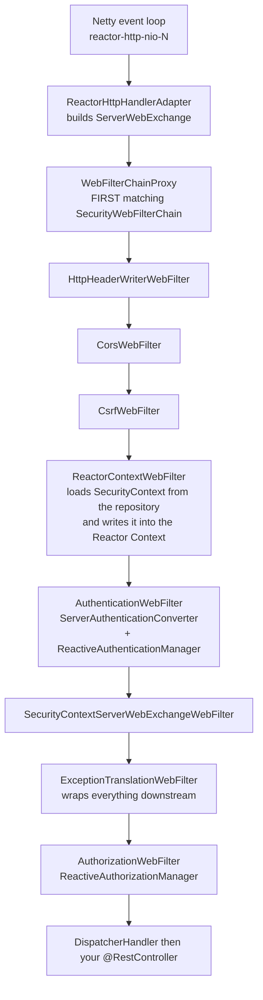

# 18.1 - Reactive (WebFlux) Security

> **Module 18 - Topic 1** - Modern and Adjacent
> Baseline: Spring Security 6.x on Boot 3.x
> New to this? Read **In Plain English** below first, then come back to the Version Matrix.

---

## Version Matrix

| Concern | Spring Security 5.x | **Spring Security 6.x (baseline)** | Spring Security 7.x |
|---|---|---|---|
| Entry annotation | `@EnableWebFluxSecurity` | **`@EnableWebFluxSecurity`** (unchanged) | `@EnableWebFluxSecurity` |
| DSL style | `ServerHttpSecurity` with `.and()` chaining | **lambda DSL; `.and()` deprecated in 6.1** | `.and()` removed |
| Reactive method security | `@EnableReactiveMethodSecurity` with `PrePostAdviceReactiveMethodInterceptor` | **`AuthorizationManager`-based by default (`useAuthorizationManager = true`)** | the `useAuthorizationManager` switch is gone |
| Authorization contract | `ReactiveAuthorizationManager.check(...)` returning `Mono<AuthorizationDecision>` | **`check(...)` primary; `authorize(...)` returning `Mono<AuthorizationResult>` added in 6.4** | `authorize(...)` only |
| Reactive resource server | `ReactiveJwtDecoder`, `NimbusReactiveJwtDecoder` | **same, plus `ReactiveJwtDecoders.fromIssuerLocation(...)`** | same |
| Context propagation | Reactor Context only | **Reactor Context plus `context-propagation` for Micrometer and MDC bridging** | same, more automatic |
| Throughput rationale | WebFlux is the only way to get non-blocking scale on the JVM | **virtual threads from Boot 3.2 - the scale argument weakens sharply** | virtual threads are the default recommendation for blocking workloads |

---

## Why This Exists

Everything in Module 1 Topic 4 rests on one sentence: Spring Security is a servlet filter, and
per-request identity lives in a `ThreadLocal` cleared in a `finally` block. That is true for Spring
MVC and completely false for Spring WebFlux.

In the servlet model one request occupies one thread from the first byte to the last, so "the current
thread" and "the current request" are synonyms. In the reactive model that identity breaks in both
directions:

> **One request is processed by many threads**, because each operator resumes on whichever event-loop
> or scheduler thread is free when the next signal arrives.
>
> **One thread processes many requests**, because a small event-loop pool (one thread per CPU core by
> default) multiplexes thousands of concurrent in-flight requests.

So "who is the current user on this thread?" is not a meaningful question. There is no current user on
a thread; there is a current user on a **subscription**. Spring Security's reactive half exists to
answer that reframed question, and every type in it is a servlet type with the blocking return value
replaced by a `Mono` or `Flux` and thread-scoped storage replaced by the Reactor Context.

The second reason this file matters is interview reality. Most candidates have never deliberately
shipped WebFlux, but many have shipped something that *is* WebFlux: Spring Cloud Gateway is a WebFlux
application, so putting a gateway in front of your services inherits every rule here.

---

## In Plain English

**The one-line version:** In a normal Spring application one worker stays with your request from start
to finish and can keep a note of who you are in their pocket, but in a reactive application the
workers are constantly swapped, so the note about who you are has to travel with the request itself
instead.

**An analogy.** Think of two restaurants. In the first, the traditional one, a waiter is assigned to
your table the moment you sit down and stays with you until you leave. That waiter can write your name
on a notepad and keep it in their own apron pocket, because for the whole time you are in the
building, "the notepad in this waiter's pocket" and "the information about this table" mean the same
thing. That is the ordinary Spring MVC model, and the apron pocket is the `ThreadLocal`.

The second restaurant runs differently. There are only four waiters for two hundred tables, and no
waiter is ever assigned to anyone. A waiter picks up whatever task is ready right now - deliver these
drinks, take that order, carry this plate - and then immediately moves to the next task, which
probably belongs to a completely different table. In that restaurant, a name in a waiter's apron is
useless and actively dangerous: useless because the next task for your table will almost certainly be
done by a different waiter, and dangerous because the name left in that pocket now belongs to the
wrong table entirely. The fix that real restaurants use is the order ticket. Your name is written on a
slip of paper that is clipped to your order and physically travels with the food, so whichever waiter
picks the job up next reads the ticket and knows exactly whose meal this is. That travelling ticket is
what Reactor calls the **Context**, and it is where the logged-in user lives in a reactive Spring
application.

**How it actually works, step by step.**

A reactive application does not give each request its own worker. Instead it runs a very small pool of
threads - usually one per processor core - called the **event loop**, and those threads jump between
thousands of half-finished requests, doing the next small piece of whatever is ready. A thread is just
a worker that can do one thing at a time, and the whole point of this design is to never let a worker
sit idle waiting for a database or a remote service to reply.

Because of that, the request is not described by "the code running on this thread right now". It is
described by a **subscription**: the ongoing, named piece of work that starts when somebody asks for
the result and ends when the response has been written. The subscription is the order ticket, and it
is the only thing in the system that lasts exactly as long as one request.

Spring Security therefore attaches the logged-in user to the subscription rather than to a thread. The
attachment point is the **Reactor Context**, a small read-only map of extra information that rides
along with the subscription and is readable from every step of the work, no matter which thread
happens to be running that step. You read it through a class called `ReactiveSecurityContextHolder`,
which is the reactive twin of the familiar `SecurityContextHolder`. Using the familiar one in a
reactive application compiles perfectly and always returns nothing, which is why it causes so much
confusion.

The rest of Spring Security is then translated the same way, name by name. The list of security rules
is called the `SecurityWebFilterChain`: it is the same list of rules as the normal one, just written
for the non-blocking style of application. The builder you configure it with is `ServerHttpSecurity`
instead of `HttpSecurity`. The individual rule steps are called `WebFilter` instead of `Filter`. And
every method that used to hand back an answer immediately now hands back a `Mono` - a promise of at
most one answer that will arrive later - or a `Flux`, a promise of a stream of answers.

There is one rule that governs everything else here: never make one of those few event-loop threads
wait. Waiting is called **blocking**, and it happens whenever code sits still until something
finishes - a database call over JDBC, a password check with BCrypt, a plain HTTP call. Blocking one of
four threads for a tenth of a second does not delay one request by a tenth of a second; it freezes every
one of the thousands of requests that thread was juggling. The full picture, including exactly how to
hand blocking work to a different pool of threads that is allowed to wait, is below.

**Why should a beginner care?** The failures in this model are quiet rather than loud. Reading the
user the wrong way does not throw an error that names the problem - it returns an empty result, and
your endpoint answers with a successful, blank response while you hunt for a serialisation bug.
Putting `@PreAuthorize` on the wrong kind of method does not fail at startup - the annotation simply
does nothing and an administrator-only method is open to everyone. And you may inherit all of this
without choosing it, because Spring Cloud Gateway is a reactive application, so anyone running a
gateway is already running reactive Spring Security in the most security-critical position they have.

**Words you will meet in this file**

| Term | In plain words |
|---|---|
| Blocking | Code that sits and waits for something to finish before it will do anything else. |
| Non-blocking | Code that says "call me back when the answer arrives" and lets the worker do something else meanwhile. |
| Event loop | The handful of threads, roughly one per processor core, that run a reactive application. |
| `Mono` | A promise of at most one value that will arrive later. |
| `Flux` | A promise of a stream of values that will arrive later. |
| Subscription | The one live piece of work that starts when somebody asks for a result and ends when it is delivered; it lasts exactly one request. |
| Reactor Context | A small read-only map of extra information carried by the subscription, readable from any thread. |
| `ThreadLocal` | A storage slot attached to one thread, which is the thing that stops working here. |
| `ReactiveSecurityContextHolder` | Where you ask "who is logged in?" in a reactive application. It answers with a `Mono`. |
| `SecurityWebFilterChain` | The list of security rules for a reactive application; the twin of `SecurityFilterChain`. |
| `ServerHttpSecurity` | The builder you use to write those rules; the twin of `HttpSecurity`. |
| `WebFilter` | One step in that list of rules; the twin of a servlet `Filter`. |
| `ServerWebExchange` | One object holding the incoming request and the outgoing response together. |
| `Schedulers.boundedElastic()` | A separate, larger pool of threads that is allowed to sit and wait, so blocking work can be sent there. |
| Backpressure | The built-in ability to tell a fast sender to slow down because the receiver cannot keep up. |
| Virtual threads | A newer Java feature that makes ordinary waiting code cheap, and therefore the main alternative to going reactive. |

**If you remember only one thing:** in a reactive application the identity of the logged-in user
belongs to the request's subscription, not to the thread, so you read it with
`ReactiveSecurityContextHolder` and you never make an event-loop thread wait.

---

## Core Concepts

### 1. `@EnableWebFluxSecurity` and `SecurityWebFilterChain`

**In simple terms:** This is how you switch security on and write your rules in a reactive
application. It is the same idea as the ordinary setup, with one annotation and one bean, but the
annotation and the types have different names.

```java
package org.springframework.security.web.server;

public interface SecurityWebFilterChain {
    Mono<Boolean> matches(ServerWebExchange exchange);   // servlet: boolean matches(HttpServletRequest)
    Flux<WebFilter> getWebFilters();                     // servlet: List<Filter> getFilters()
}
```

`matches` returning `Mono<Boolean>` is not decoration. Chain selection itself may be asynchronous - a
matcher can do I/O, for example a tenant lookup, before deciding whether this chain applies. Nothing
in the servlet API allows that.

```java
@Configuration
@EnableWebFluxSecurity
public class ReactiveSecurityConfig {

    @Bean
    SecurityWebFilterChain springSecurityFilterChain(ServerHttpSecurity http) {
        return http
            .authorizeExchange(exchanges -> exchanges
                .pathMatchers("/actuator/health").permitAll()
                .pathMatchers(HttpMethod.GET, "/api/articles/**").permitAll()
                .pathMatchers("/api/admin/**").hasRole("ADMIN")
                .anyExchange().authenticated()
            )
            .httpBasic(Customizer.withDefaults())
            .build();
    }
}
```

Three naming differences interviewers probe: `authorizeExchange` not `authorizeHttpRequests`,
`pathMatchers` not `requestMatchers`, `anyExchange` not `anyRequest`. And `build()` declares no
checked exception, because no reactive builder method does.

### 2. The Complete Servlet-to-Reactive Mapping

**In simple terms:** Almost nothing new has been invented here. This is a translation table from the
names you already know to the reactive names for the same jobs.

| Concern | Servlet (Spring MVC) | Reactive (Spring WebFlux) | What actually changed |
|---|---|---|---|
| Unit of interception | `jakarta.servlet.Filter` | `org.springframework.web.server.WebFilter` | `void doFilter(...)` becomes `Mono<Void> filter(...)` |
| Configuration | `@EnableWebSecurity`, `HttpSecurity` | `@EnableWebFluxSecurity`, `ServerHttpSecurity` | `build()` has no checked exception |
| Chain | `SecurityFilterChain` | `SecurityWebFilterChain` | `matches` returns `Mono<Boolean>` |
| Chain dispatcher | `FilterChainProxy` | `WebFilterChainProxy` | still picks the **first** matching chain only |
| Request abstraction | `HttpServletRequest` / `HttpServletResponse` | `ServerWebExchange` | one object, immutable request, attributes map |
| Identity storage | `SecurityContextHolder` (`ThreadLocal`) | `ReactiveSecurityContextHolder` (Reactor Context) | **subscriber-scoped**; returns `Mono<SecurityContext>` |
| Context persistence | `SecurityContextRepository`, `HttpSessionSecurityContextRepository` | `ServerSecurityContextRepository`, `WebSessionServerSecurityContextRepository` | `load` / `save` return `Mono`; stateless is `NoOpServerSecurityContextRepository` |
| User lookup | `UserDetailsService` | `ReactiveUserDetailsService` | `Mono<UserDetails> findByUsername(String)`; in-memory is `MapReactiveUserDetailsService` |
| Authentication | `AuthenticationManager` | `ReactiveAuthenticationManager` | `Mono<Authentication> authenticate(Authentication)` |
| Username/password | `DaoAuthenticationProvider` in a `ProviderManager` | `UserDetailsRepositoryReactiveAuthenticationManager` composed by `DelegatingReactiveAuthenticationManager` | **no `AuthenticationProvider` chain at all**; first non-empty `Mono` wins |
| Authorization | `AuthorizationManager<T>` in `AuthorizationFilter` | `ReactiveAuthorizationManager<T>` in `AuthorizationWebFilter` | `Mono<AuthorizationDecision> check(Mono<Authentication>, T)` |
| Request matching | `RequestMatcher`, `AntPathRequestMatcher` | `ServerWebExchangeMatcher`, `ServerWebExchangeMatchers.pathMatchers(...)` | `Mono<MatchResult> matches(...)`; reactive has **always** used `PathPattern` |
| 401 handling | `AuthenticationEntryPoint` | `ServerAuthenticationEntryPoint` | `Mono<Void> commence(...)` |
| 403 handling | `AccessDeniedHandler` | `ServerAccessDeniedHandler` | `Mono<Void> handle(...)` |
| Exception translation | `ExceptionTranslationFilter` | `ExceptionTranslationWebFilter` | identical branching logic |
| Credential extraction | `AbstractAuthenticationProcessingFilter` | `AuthenticationWebFilter` + `ServerAuthenticationConverter` | conversion is an injectable strategy |
| CSRF | `CsrfFilter`, `CsrfTokenRepository` | `CsrfWebFilter`, `ServerCsrfTokenRepository` | the token is a `Mono`, which creates a real gotcha |
| Token validation | `JwtDecoder`, `OpaqueTokenIntrospector` | `ReactiveJwtDecoder`, `ReactiveOpaqueTokenIntrospector` | JWKS fetch and introspection become non-blocking |
| Outbound HTTP | `RestClient` interceptors | `WebClient` + `ServerOAuth2AuthorizedClientExchangeFilterFunction` | token attach is an exchange filter |
| Method security | `@EnableMethodSecurity` | `@EnableReactiveMethodSecurity` | **only applies to methods returning `Mono` or `Flux`** |
| Test client | `MockMvc` + `SecurityMockMvcRequestPostProcessors` | `WebTestClient` + `SecurityMockServerConfigurers` | `.with(...)` becomes `.mutateWith(...)` |

If you know the servlet name you can usually guess the reactive one by prefixing `Server` or
`Reactive`. The exceptions worth memorising outright are `WebFilter`, `ServerWebExchange`,
`ServerWebExchangeMatcher`, and `MapReactiveUserDetailsService`.

### 3. Why `ThreadLocal` Reasoning Collapses

**In simple terms:** Storing the logged-in user on the current thread only works when one thread
serves one request from beginning to end, and here it does not. One request uses many threads, and one
thread serves many requests.

This is the central point of the topic.

Netty runs a small event-loop group - by default `Runtime.getRuntime().availableProcessors()` threads,
minimum two - and each multiplexes thousands of connections. A single request touches several of them:
an event-loop thread reads the socket and emits `onNext`; your handler calls a database and the driver
releases that thread immediately; the response signal arrives on whichever thread the driver's
connection belongs to; a `publishOn` for CPU work involves a third.

A `SecurityContext` placed in a `ThreadLocal` on the first thread is invisible on all the others and -
far worse - is still sitting on the first thread while it serves a *different user's* request. The
servlet-era `finally` discipline cannot save you, because there is no single point at which the
request is done with a thread. So the context moves onto the thing that does have request lifetime,
the **subscription**.

> **The Reactor Context** is an immutable key-value map carried by a subscription. It propagates
> **upstream** from the subscriber towards the source, and is visible to every operator in the chain
> regardless of which thread that operator executes on.

Two properties surprise people. It is **immutable** - `contextWrite` returns a new assembly-time
decoration that supplies a modified context upstream; you cannot "set" a value and have already-run
code see it. And it flows **upstream, not downstream** - writing the context at the end of a chain
makes it visible to operators declared before it, which reads backwards until you internalise that the
subscription travels from subscriber to source and the context rides along with it.

### 4. `ReactiveSecurityContextHolder` - The Real Source

**In simple terms:** This is the class you call to ask "who is logged in?". The whole class is about
twenty lines, and reading it explains every surprise people hit with it.

```java
package org.springframework.security.core.context;

public final class ReactiveSecurityContextHolder {

    private static final Class<?> SECURITY_CONTEXT_KEY = SecurityContext.class;

    public static Mono<SecurityContext> getContext() {
        return Mono.deferContextual(Mono::just)
                .filter(context -> context.hasKey(SECURITY_CONTEXT_KEY))
                .flatMap(context -> context.<Mono<SecurityContext>>get(SECURITY_CONTEXT_KEY));
    }

    public static Context withSecurityContext(Mono<? extends SecurityContext> securityContext) {
        return Context.of(SECURITY_CONTEXT_KEY, securityContext);
    }

    public static Context withAuthentication(Authentication authentication) {
        return withSecurityContext(Mono.just(new SecurityContextImpl(authentication)));
    }
}
```

Everything important is visible here. The key is literally the `SecurityContext.class` object. The
stored value is a `Mono<SecurityContext>`, not a `SecurityContext`, because authentication may not
have happened when the context is written - what is stored is the *promise* of a context. And
`getContext()` returns an **empty `Mono`** when no key is present: not `null`, not an anonymous token,
empty.

That last point is the number one source of confusion. An empty `Mono` silently skips every downstream
`map` and `flatMap`, so your handler produces no output and the request completes with a 200 and an
empty body. No exception tells you the user was missing. The defensive idiom to write reflexively:

```java
return ReactiveSecurityContextHolder.getContext()
        .map(SecurityContext::getAuthentication)
        .switchIfEmpty(Mono.error(new AccessDeniedException("No authentication in context")))
        .map(Authentication::getName);
```

### 5. Staying Inside the Reactive Chain

**In simple terms:** The identity of the user travels with the reactive pipeline, so the moment you
step outside that pipeline - by waiting for a result, or by handing work to your own threads - the
identity does not come with you.

> **The `SecurityContext` is only reachable from inside the reactive chain.** Leave it - by blocking,
> by starting a plain thread, by handing work to an `ExecutorService` Reactor does not know about -
> and the context does not follow you.

This compiles, because `spring-security-core` is a shared dependency, and returns `null` every time:

```java
@GetMapping("/broken")
public Mono<String> broken() {
    // The SERVLET holder. In WebFlux nothing populates it, because no servlet filter ran.
    Authentication auth = SecurityContextHolder.getContext().getAuthentication();
    return Mono.just(auth.getName());   // NullPointerException, with no hint at the real cause
}
```

The three correct interactions:

```java
// 1. READ.
Mono<String> username = ReactiveSecurityContextHolder.getContext()
        .map(SecurityContext::getAuthentication)
        .map(Authentication::getName);

// 2. WRITE - supply a context to everything upstream. Used in filters and tests.
Mono<String> result = service.doWork()
        .contextWrite(ReactiveSecurityContextHolder.withAuthentication(token));

// 3. READ THE RAW CONTEXT - when you also need a tenant or trace id another filter wrote.
Mono<String> tenant = Mono.deferContextual(ctx -> Mono.just(ctx.getOrDefault("tenantId", "unknown")));
```

`transformDeferredContextual` handles the case where the *shape* of the pipeline depends on the
context rather than a value inside it; the `Deferred` matters because the transformation then runs at
subscription time, when the context exists, rather than at assembly time when it does not.

**The `.block()` trap** does two bad things at once: it parks an event-loop thread, and it starts a
*new* subscription whose context is empty. Reactor helps with the first half by throwing
`IllegalStateException: block()/blockFirst()/blockLast() are blocking, which is not supported in
thread reactor-http-nio-N`, but only on threads it recognises as non-blocking. Block on a
`boundedElastic` thread and it is permitted, and the context loss is silent.

### 6. The Reactive Filter Chain, In Order

**In simple terms:** This is the running order of the security steps a request passes through, from
the network socket to your controller. It is the same sequence as the ordinary filter chain, with
reactive names.



The shape mirrors the servlet chain and the same reasoning applies: `ExceptionTranslationWebFilter` is
declared before `AuthorizationWebFilter` so that it is *outside* it in the composition, which is how
it converts the `AccessDeniedException` into a 401 or 403. One reactive-specific point: there is no
`finally` clearing anything and none is needed, because the context dies with the subscription.
Cleanup is structural rather than disciplinary.

`ReactorContextWebFilter` is what makes the whole model work, and it is four lines:

```java
// org.springframework.security.web.server.context.ReactorContextWebFilter (simplified)
@Override
public Mono<Void> filter(ServerWebExchange exchange, WebFilterChain chain) {
    return chain.filter(exchange)
            .contextWrite(context -> context.hasKey(SecurityContext.class)
                    ? context
                    : context.putAll(this.repository.load(exchange)
                            .as(ReactiveSecurityContextHolder::withSecurityContext)));
}
```

Read the placement: `contextWrite` is applied to `chain.filter(exchange)` - the whole rest of the
pipeline - which is the upstream-propagation rule in action.

### 7. The Event-Loop Blocking Rule

**In simple terms:** There are only a handful of threads running the whole application, so any code
that sits and waits must be moved to a separate pool of threads that is allowed to wait.

> **Never block an event-loop thread.** There are only as many as you have CPU cores, and each serves
> thousands of connections. Blocking one for 100 milliseconds does not slow one request; it stalls
> every request multiplexed onto that thread.

Four cores means four event-loop threads. Four concurrent bcrypt verifications at the default strength
- roughly 100 milliseconds each - and the server is unresponsive, including the health endpoint.

| Blocking operation | Why | Correct handling |
|---|---|---|
| `BCryptPasswordEncoder.matches(...)` | Deliberately expensive CPU work | `Mono.fromCallable(...).subscribeOn(Schedulers.boundedElastic())` |
| JDBC, JPA, Hibernate | The JDBC API is synchronous by specification | R2DBC, or offload to `boundedElastic` |
| A blocking `UserDetailsService` | Same, hidden behind a reactive-looking adapter | Wrap the blocking call, not the whole manager |
| `RestTemplate`, legacy SDK clients | Synchronous HTTP | `WebClient` |
| File and stream I/O | Synchronous filesystem access | `boundedElastic` |
| `.block()`, `toFuture().get()`, `CountDownLatch.await()` | Explicit parking | Restructure the chain |
| `synchronized` around slow work | Parks the thread; pins the carrier under virtual threads | `ReentrantLock` or a lock-free design |

The canonical idiom, needed by every reactive username/password application:

```java
public Mono<Boolean> verify(String rawPassword, String encodedPassword) {
    return Mono.fromCallable(() -> this.encoder.matches(rawPassword, encodedPassword))
               .subscribeOn(Schedulers.boundedElastic());
}
```

`subscribeOn` versus `publishOn`, stated precisely because it is asked constantly: **`subscribeOn`**
controls where the subscription and source emission happen and its position barely matters - use it to
move a blocking *source* off the event loop. **`publishOn`** controls where the operators declared
after it execute, and its position is everything.

`Schedulers.boundedElastic()` creates threads on demand, caps them at ten times the CPU count by
default, and queues beyond that. It is a bulkhead that confines damage to a pool allowed to stall, not
a licence to block freely. **BlockHound** turns the rule from a discipline into a guarantee: added as
a test dependency with `BlockHound.install()`, it instruments the JVM and throws
`BlockingOperationError` the moment blocking code runs on a thread marked non-blocking, including
calls buried three libraries deep that no code review would catch.

### 8. Reactive Method Security and the Mono/Flux Rule

**In simple terms:** Annotations such as `@PreAuthorize` still work here, but only on methods that
return a `Mono` or a `Flux`. On any other method the annotation is quietly ignored and the method is
left unprotected.

```java
@Configuration
@EnableReactiveMethodSecurity
public class MethodSecurityConfig { }
```

> **Reactive method security only applies to methods whose return type is `Mono` or `Flux`** (or, in
> Kotlin, a suspending function).

```java
@PreAuthorize("hasRole('ADMIN')")
public Mono<Void> delete(String id) { return repository.deleteById(id); }   // ENFORCED

@PreAuthorize("hasRole('ADMIN')")
public void deleteBlocking(String id) { repository.deleteById(id).block(); } // SILENTLY NOT ENFORCED
```

The reason is mechanical. The interceptor must read the authentication, and reading it produces a
`Mono`. Enforcing the check on a synchronous method would mean blocking on that `Mono` - the one thing
the stack forbids. So rather than block, the framework declines to intercept.

**The failure mode is the danger: no error, no warning at startup.** The annotation is inert and a
method you believe is protected is public. An ArchUnit rule asserting that every `@PreAuthorize` sits
on a method returning a `Publisher` is worth writing.

`@PreFilter` and `@PostFilter` have historically had much weaker reactive support than the
authorisation pair, so the safe posture is to rely on `@PreAuthorize` and `@PostAuthorize` and do
collection filtering explicitly with `Flux.filterWhen`. Denials throw `AccessDeniedException` as an
error signal, surfacing through `ExceptionTranslationWebFilter` exactly like URL-level denials.

### 9. Reactive Resource Server and `ReactiveJwtDecoder`

**In simple terms:** This is how an API that accepts bearer tokens checks them here. The job is
identical to the ordinary version, except that fetching the issuer's public keys over the network is
now done without making a thread wait.

```java
public interface ReactiveJwtDecoder {
    Mono<Jwt> decode(String token) throws JwtException;
}
```

A resource server validating an `RS256` token must fetch the issuer's JWKS to get the public key, and
refresh it on an unknown `kid`. The servlet `NimbusJwtDecoder` does that with a blocking HTTP call,
acceptable on a worker thread; `NimbusReactiveJwtDecoder` performs it through `WebClient` instead.

```java
@Bean
SecurityWebFilterChain resourceServer(ServerHttpSecurity http) {
    return http
        .authorizeExchange(exchanges -> exchanges
            .pathMatchers("/api/**").hasAuthority("SCOPE_api.read")
            .anyExchange().authenticated())
        .oauth2ResourceServer(oauth2 -> oauth2.jwt(Customizer.withDefaults()))
        .csrf(ServerHttpSecurity.CsrfSpec::disable)
        .securityContextRepository(NoOpServerSecurityContextRepository.getInstance())
        .build();
}
```

`NoOpServerSecurityContextRepository.getInstance()` is the reactive equivalent of
`SessionCreationPolicy.STATELESS`. Without it the default `WebSessionServerSecurityContextRepository`
creates a `WebSession` per request - overhead for a token-authenticated API, and a correctness problem
across instances. A servlet `Converter<Jwt, Collection<GrantedAuthority>>` can be reused through
`ReactiveJwtGrantedAuthoritiesConverterAdapter` rather than rewritten.

Setting `spring.security.oauth2.resourceserver.jwt.issuer-uri` makes Boot build the decoder through
`ReactiveJwtDecoders.fromIssuerLocation(...)`, which fetches the discovery document **at startup** and
validates the discovered issuer. That startup fetch is one of the few places a reactive application
legitimately blocks: once, on the main thread, before accepting traffic.

### 10. CSRF in WebFlux and the Subscription Gotcha

**In simple terms:** The cross-site request forgery token is only created when something actually asks
for it, and a plain JSON API never asks. The token is then never sent to the browser, so every POST is
rejected even though the configuration looks correct.

`CsrfWebFilter` mirrors `CsrfFilter` and supports `CookieServerCsrfTokenRepository.withHttpOnlyFalse()`,
but it has a reactive-only failure mode. The token is placed on the exchange as a **`Mono<CsrfToken>`**,
deferred so requests that never read it do not pay for generation. **A `Mono` nobody subscribes to
never executes.** A server-rendered template subscribes implicitly; a pure JSON API does not. So the
cookie is never written, the single-page application has nothing to send, and every POST returns 403
with a CSRF configuration that looks perfect.

```java
@Bean
WebFilter csrfCookieWebFilter() {
    return (exchange, chain) -> exchange
            .<Mono<CsrfToken>>getAttributeOrDefault(CsrfToken.class.getName(), Mono.empty())
            .doOnSuccess(token -> { /* subscribing is the point; the repository writes the cookie */ })
            .then(chain.filter(exchange));
}
```

The general principle worth stating in an interview: **nothing happens until you subscribe**. A `Mono`
you construct and discard is not a side effect performed and ignored - it is a side effect that never
happened.

### 11. Spring Cloud Gateway Inherits All of This

**In simple terms:** If you run a Spring Cloud Gateway, you are already running a reactive
application, so every rule in this file applies to you whether or not you ever decided to use WebFlux.

Spring Cloud Gateway is built on WebFlux and Reactor, with no servlet container and no
`DispatcherServlet`. Everything above applies without exception: security is configured with
`@EnableWebFluxSecurity` and `SecurityWebFilterChain`; `SecurityContextHolder` is empty inside a
`GatewayFilter`; a custom `GlobalFilter` that blocks - to call an authorisation service with
`RestTemplate`, to verify a signature synchronously - blocks the event loop for every route on that
thread; and `TokenRelay` is backed by `ReactiveOAuth2AuthorizedClientManager`. So if you run a gateway,
you run a reactive Spring Security application in the most security-critical position in your
architecture, whether or not you ever chose WebFlux.

### 12. When to Choose WebFlux at All

**In simple terms:** Reactive programming solves one specific problem, running out of threads, and
modern Java offers a much cheaper way to solve that same problem. This section is about deciding
honestly which one you actually need.

WebFlux solves one problem: the servlet model needs one platform thread per in-flight request, those
threads cost roughly a megabyte of stack each, and a 200-thread Tomcat pool therefore caps you at 200
concurrent *blocked* requests regardless of how idle the CPU is. Virtual threads, generally available
in Java 21 and enabled in Boot 3.2 with `spring.threads.virtual.enabled=true`, attack the same problem
from the opposite direction - keep thread-per-request and make threads cheap.

| Dimension | WebFlux | Virtual threads (Boot 3.2+) |
|---|---|---|
| Concurrency ceiling | Very high | Very high |
| Programming model | Reactive operators; a different language | Ordinary blocking code |
| Debuggability | Operator-frame stack traces; needs `checkpoint()` | Ordinary, readable stack traces |
| Security context | Reactor Context, subscriber-scoped | `ThreadLocal`, unchanged |
| Blocking JDBC | Forbidden without offloading | Fine - the virtual thread unmounts |
| Backpressure | Built in, end to end | **Not provided** - needs explicit limits |
| Streaming semantics | Native (`Flux`, server-sent events) | Awkward |
| Team learning cost | High, and permanent | Near zero |

**Choose WebFlux when** you need streaming or server-sent events, real end-to-end backpressure against
a fast producer, or you are writing a proxy or gateway that is almost entirely I/O forwarding - or
when the team already writes reactive code fluently. **Choose virtual threads when** the driver is
throughput on a blocking-I/O workload, which is most services: you get most of the scalability with
readable stack traces and your existing `ThreadLocal` security, MDC logging, and transaction
management intact.

The trap to name explicitly: **virtual threads give you no backpressure**. WebFlux refuses work it
cannot handle; virtual threads accept a million concurrent requests and then exhaust your connection
pool or heap. "We would have chosen WebFlux in 2019 and we would choose virtual threads today, unless
we need streaming or backpressure" is the answer that shows you have tracked the platform.

---

## Working Code

A complete reactive application with a blocking user store, correctly offloaded.

```java
package com.example.reactive.config;

import com.example.reactive.user.BlockingUserRepository;
import org.springframework.context.annotation.Bean;
import org.springframework.context.annotation.Configuration;
import org.springframework.http.HttpMethod;
import org.springframework.http.HttpStatus;
import org.springframework.security.authentication.ReactiveAuthenticationManager;
import org.springframework.security.authentication.UserDetailsRepositoryReactiveAuthenticationManager;
import org.springframework.security.config.Customizer;
import org.springframework.security.config.annotation.method.configuration.EnableReactiveMethodSecurity;
import org.springframework.security.config.annotation.web.reactive.EnableWebFluxSecurity;
import org.springframework.security.config.web.server.ServerHttpSecurity;
import org.springframework.security.core.userdetails.ReactiveUserDetailsService;
import org.springframework.security.core.userdetails.User;
import org.springframework.security.crypto.bcrypt.BCryptPasswordEncoder;
import org.springframework.security.crypto.password.PasswordEncoder;
import org.springframework.security.web.server.SecurityWebFilterChain;
import org.springframework.security.web.server.authentication.HttpStatusServerEntryPoint;
import org.springframework.security.web.server.authorization.HttpStatusServerAccessDeniedHandler;
import reactor.core.publisher.Mono;
import reactor.core.scheduler.Schedulers;

@Configuration
@EnableWebFluxSecurity
@EnableReactiveMethodSecurity
public class ReactiveSecurityConfig {

    @Bean
    SecurityWebFilterChain springSecurityFilterChain(ServerHttpSecurity http) {
        return http
            .authorizeExchange(exchanges -> exchanges
                .pathMatchers("/actuator/health", "/login").permitAll()
                .pathMatchers(HttpMethod.GET, "/api/articles/**").permitAll()
                .pathMatchers(HttpMethod.POST, "/api/articles/**").hasRole("AUTHOR")
                .pathMatchers("/api/admin/**").hasRole("ADMIN")
                .anyExchange().authenticated()
            )
            .httpBasic(Customizer.withDefaults())
            .exceptionHandling(ex -> ex
                .authenticationEntryPoint(new HttpStatusServerEntryPoint(HttpStatus.UNAUTHORIZED))
                .accessDeniedHandler(new HttpStatusServerAccessDeniedHandler(HttpStatus.FORBIDDEN)))
            .build();
    }

    /**
     * The user store is a legacy blocking repository. Mono.just(blockingCall()) would evaluate
     * eagerly, during assembly, on the event loop - reactive-looking and exactly as broken.
     */
    @Bean
    ReactiveUserDetailsService userDetailsService(BlockingUserRepository repository) {
        return username -> Mono
            .fromCallable(() -> repository.findByUsername(username))
            .subscribeOn(Schedulers.boundedElastic())
            .map(account -> User.withUsername(account.username())
                    .password(account.passwordHash())
                    .roles(account.roles())
                    .disabled(!account.enabled())
                    .build());
    }

    /** BCrypt is slow CPU work; without setScheduler, four concurrent logins stall four cores. */
    @Bean
    ReactiveAuthenticationManager authenticationManager(ReactiveUserDetailsService users,
                                                        PasswordEncoder encoder) {
        var manager = new UserDetailsRepositoryReactiveAuthenticationManager(users);
        manager.setPasswordEncoder(encoder);
        manager.setScheduler(Schedulers.boundedElastic());
        return manager;
    }

    @Bean
    PasswordEncoder passwordEncoder() {
        return new BCryptPasswordEncoder();
    }
}
```

Correct context access, and the Mono/Flux rule in a service:

```java
package com.example.reactive.web;

import org.springframework.security.access.AccessDeniedException;
import org.springframework.security.access.prepost.PreAuthorize;
import org.springframework.security.core.Authentication;
import org.springframework.security.core.context.ReactiveSecurityContextHolder;
import org.springframework.security.core.context.SecurityContext;
import org.springframework.stereotype.Service;
import org.springframework.web.bind.annotation.GetMapping;
import org.springframework.web.bind.annotation.RestController;
import reactor.core.publisher.Mono;

@RestController
class ProfileController {

    /** Explicit read, with the silent-empty case turned into a real error. */
    @GetMapping("/me")
    Mono<String> me() {
        return ReactiveSecurityContextHolder.getContext()
                .map(SecurityContext::getAuthentication)
                .map(Authentication::getName)
                .switchIfEmpty(Mono.error(new AccessDeniedException("no authentication")));
    }

    /** Argument injection also resolves from the Reactor Context, not from a ThreadLocal. */
    @GetMapping("/me/injected")
    Mono<String> meInjected(Mono<Authentication> authentication) {
        return authentication.map(Authentication::getName);
    }
}

@Service
class ArticleService {

    private final ArticleRepository repository;

    ArticleService(ArticleRepository repository) {
        this.repository = repository;
    }

    @PreAuthorize("hasRole('ADMIN')")
    public Mono<Void> delete(String id) {            // ENFORCED: returns Mono
        return this.repository.deleteById(id);
    }

    /** NOT ENFORCED - neither Mono nor Flux. No startup warning. Effectively public. */
    @PreAuthorize("hasRole('ADMIN')")
    public int countBlocking() {
        return this.repository.count().block();
    }
}
```

```yaml
spring:
  main:
    web-application-type: reactive        # forces WebFlux even if spring-webmvc is present
  security:
    oauth2:
      resourceserver:
        jwt:
          issuer-uri: https://auth.example.com

reactor:
  netty:
    ioWorkerCount: 8                      # defaults to the CPU count, minimum 2

logging:
  level:
    org.springframework.security: DEBUG
```

```java
package com.example.reactive;

import org.junit.jupiter.api.Test;
import org.springframework.beans.factory.annotation.Autowired;
import org.springframework.boot.test.autoconfigure.web.reactive.AutoConfigureWebTestClient;
import org.springframework.boot.test.context.SpringBootTest;
import org.springframework.security.authentication.UsernamePasswordAuthenticationToken;
import org.springframework.security.core.authority.SimpleGrantedAuthority;
import org.springframework.security.core.context.ReactiveSecurityContextHolder;
import org.springframework.test.web.reactive.server.WebTestClient;
import reactor.test.StepVerifier;

import java.util.List;

import static org.springframework.security.test.web.reactive.server.SecurityMockServerConfigurers.csrf;
import static org.springframework.security.test.web.reactive.server.SecurityMockServerConfigurers.mockJwt;
import static org.springframework.security.test.web.reactive.server.SecurityMockServerConfigurers.mockUser;

@SpringBootTest
@AutoConfigureWebTestClient
class ReactiveSecurityTests {

    @Autowired
    WebTestClient client;

    @Test
    void anonymousReadIsPublicButWriteIsNot() {
        this.client.get().uri("/api/articles/1").exchange().expectStatus().isOk();
        this.client.mutateWith(csrf())
                .post().uri("/api/articles").exchange().expectStatus().isUnauthorized();
    }

    @Test
    void wrongRoleIsForbidden() {
        // mutateWith is the reactive counterpart of MockMvc's .with(user(...)); it installs
        // the authentication into the exchange's Reactor Context.
        this.client.mutateWith(mockUser("alice").roles("AUTHOR")).mutateWith(csrf())
                .delete().uri("/api/articles/1").exchange().expectStatus().isForbidden();
    }

    @Test
    void jwtScopeIsEnforcedOnTheResourceServer() {
        this.client.mutateWith(mockJwt().authorities(new SimpleGrantedAuthority("SCOPE_api.read")))
                .get().uri("/api/secure").exchange().expectStatus().isOk();
    }

    @Test
    void contextIsReadFromTheReactorContextAndIsEmptyWithoutOne() {
        var auth = new UsernamePasswordAuthenticationToken("alice", "n/a", List.of());
        StepVerifier.create(ReactiveSecurityContextHolder.getContext()
                        .map(ctx -> ctx.getAuthentication().getName())
                        .contextWrite(ReactiveSecurityContextHolder.withAuthentication(auth)))
            .expectNext("alice")
            .verifyComplete();

        // The failure mode to internalise: not an exception, just nothing.
        StepVerifier.create(ReactiveSecurityContextHolder.getContext()
                        .map(ctx -> ctx.getAuthentication().getName()))
            .verifyComplete();   // completed EMPTY, not errored
    }
}
```

---

## Internals

`@EnableWebFluxSecurity` imports `WebFluxSecurityConfiguration`, which collects every
`SecurityWebFilterChain` bean and builds one `WebFilterChainProxy`, registered as a `WebFilter` at
order `-100` (`WebFluxSecurityConfiguration.WEB_FILTER_CHAIN_FILTER_ORDER`) - the analogue of
`SecurityProperties.DEFAULT_FILTER_ORDER`.

```java
// org.springframework.security.web.server.WebFilterChainProxy (simplified)
@Override
public Mono<Void> filter(ServerWebExchange exchange, WebFilterChain chain) {
    return Flux.fromIterable(this.filters)
            .filterWhen(securityWebFilterChain -> securityWebFilterChain.matches(exchange))
            .next()                                                  // FIRST match only
            .switchIfEmpty(chain.filter(exchange).then(Mono.empty())) // no chain matched
            .flatMap(securityWebFilterChain -> securityWebFilterChain.getWebFilters().collectList())
            .map(filters -> new DefaultWebFilterChain(chain::filter, filters))
            .flatMap(securityChain -> securityChain.filter(exchange));
}
```

`.next()` is the reactive spelling of "first match only", so the servlet warning applies unchanged: a
chain with a broad matcher declared first makes every later chain unreachable.

| Class | Role |
|---|---|
| `WebFluxSecurityConfiguration` | Collects chains, builds and orders `WebFilterChainProxy` |
| `WebFilterChainProxy` | Selects the first matching `SecurityWebFilterChain` |
| `DefaultWebFilterChain` | Drives the filter list; the analogue of `VirtualFilterChain` |
| `ReactorContextWebFilter` | Loads the `SecurityContext` into the Reactor Context |
| `SecurityContextServerWebExchangeWebFilter` | Decorates the exchange so `getPrincipal()` resolves |
| `AuthenticationWebFilter` | Converter, `ReactiveAuthenticationManager`, and handlers |
| `AuthorizationWebFilter` | Runs `ReactiveAuthorizationManager<ServerWebExchange>` |
| `ExceptionTranslationWebFilter` | Maps security exceptions to entry point or denied handler |
| `WebSessionServerSecurityContextRepository` / `NoOpServerSecurityContextRepository` | Default and stateless persistence |
| `DelegatingReactiveAuthenticationManager` | Reactive `ProviderManager` equivalent |
| `NimbusReactiveJwtDecoder` | Non-blocking JWKS fetch through `WebClient` |
| `ServerOAuth2AuthorizedClientExchangeFilterFunction` | Attaches OAuth2 tokens to `WebClient` calls |

**The Reactor Context is not a `ThreadLocal` replacement everywhere.** SLF4J's MDC is a `ThreadLocal`,
so a correlation id set at the start of a reactive request is absent when the log statement executes
on another thread. The fixes are to put the value in the Reactor Context and read it explicitly, or to
rely on `io.micrometer:context-propagation`, which Boot 3.x wires so that registered
`ThreadLocalAccessor` implementations bridge between the Reactor Context and thread-local storage at
operator boundaries.

---

## Configuration Reference

| Option | Effect | Default |
|---|---|---|
| `@EnableWebFluxSecurity` | Imports the reactive configuration, builds `WebFilterChainProxy` | off until declared |
| `@EnableReactiveMethodSecurity` | `@PreAuthorize` / `@PostAuthorize` on `Mono`/`Flux` methods | off |
| `ServerHttpSecurity.authorizeExchange()` | URL authorisation rules | Boot's default requires authentication |
| `ServerHttpSecurity.securityMatcher(...)` | Which exchanges this chain handles | all |
| `ServerHttpSecurity.securityContextRepository(...)` | Where the context is persisted | `WebSessionServerSecurityContextRepository` |
| `NoOpServerSecurityContextRepository.getInstance()` | Stateless; no `WebSession` created | not default |
| `ServerHttpSecurity.csrf()` | CSRF for unsafe methods | **enabled** |
| `CookieServerCsrfTokenRepository.withHttpOnlyFalse()` | Token in a JS-readable cookie | `WebSessionServerCsrfTokenRepository` |
| `ServerHttpSecurity.exceptionHandling()` | Entry point and denied handler | Basic entry point or login redirect |
| `spring.main.web-application-type` | `reactive`, `servlet`, or `none` | inferred from the classpath |
| `reactor.netty.ioWorkerCount` | Event-loop thread count | CPU count, minimum 2 |
| `reactor.schedulers.defaultBoundedElasticSize` | Cap on `boundedElastic` threads | 10 x CPU count |
| `spring.security.oauth2.resourceserver.jwt.issuer-uri` | Builds a `ReactiveJwtDecoder` from discovery | unset |
| `spring.threads.virtual.enabled` | Virtual threads - **servlet stack only**, irrelevant here | `false` |
| `Hooks.onOperatorDebug()` | Assembly-time stack capture | off; expensive, development only |
| `BlockHound.install()` | Fails on blocking calls from non-blocking threads | not installed |

---

## Production Concerns & Anti-Patterns

**Calling `SecurityContextHolder.getContext()` in a WebFlux application.** The class is on the
classpath, the code compiles, and it returns an empty context forever because no servlet filter ever
ran. The symptom is a `NullPointerException` on `getAuthentication()` pointing at your code rather
than at the cause. Make the rule mechanical: in reactive modules `SecurityContextHolder` is banned,
enforced by an ArchUnit rule or a forbidden-import check.

**Blocking anywhere on the request path.** One blocking call in a shared library, one JDBC
`DataSource`, one `RestTemplate` in a `GlobalFilter`, and effective concurrency drops to the core
count. The damage is non-linear and invisible under low load - fine in staging, over at production
traffic. The related trap is `Mono.just(repository.findById(id))`, which evaluates eagerly during
assembly on the event loop: it looks reactive and is exactly as blocking as the original. Install
BlockHound in tests; it is the only reliable detection.

**`@PreAuthorize` on a non-reactive method.** Silently inert, with no startup failure and no log line.
Audit for it; do not assume the annotation means the method is protected.

**Forgetting `NoOpServerSecurityContextRepository` on a token-authenticated API.** The default creates
a `WebSession` per request - wasted memory, and inconsistent state across instances without affinity.

**Assuming the Reactor Context survives `.block()` or a manual `ExecutorService`.** Both start a fresh
subscription with an empty context. Use `Schedulers.fromExecutor(...)` inside the chain, or pass the
authentication explicitly as a parameter. Equally, treating an empty `Mono` as success produces a 200
with an empty body where you expected a 401, so always terminate context reads with `switchIfEmpty`.

**Caching a `WebClient` response across users.** A `Mono` cached with `.cache()` captures the first
subscriber's result including anything derived from that subscriber's identity, so a second user gets
the first user's data. This is the reactive analogue of a mutable field on a singleton filter.

**Not subscribing to the CSRF token `Mono` in a JSON API.** The cookie is never written, every POST
returns 403, and the configuration looks perfect.

**Adopting WebFlux for throughput alone in 2024 or later.** The cost is a permanent tax on everyone
who touches the codebase. Unless you need streaming or backpressure, virtual threads deliver most of
the benefit at near-zero cost. Choosing WebFlux is defensible; choosing it without being able to name
which of streaming, backpressure, or proxy workload applies is not.

---

## Debugging Playbook

| Symptom | Likely root cause | Fix |
|---|---|---|
| `NullPointerException` on `getAuthentication()` in a handler | Used `SecurityContextHolder`, not `ReactiveSecurityContextHolder` | Use the reactive holder; ban the servlet one in reactive modules |
| 200 with an empty body instead of a principal | `getContext()` was empty and short-circuited the chain | Add `.switchIfEmpty(Mono.error(...))` |
| `@PreAuthorize` has no effect | The method does not return `Mono` or `Flux` | Change the return type, or move the check into the chain |
| Throughput collapses to roughly the core count | Something blocks the event loop | Install BlockHound; look for JDBC, bcrypt, `RestTemplate`, `.block()` |
| `IllegalStateException: block()... not supported in thread reactor-http-nio-3` | Explicit `.block()` on an event-loop thread | Restructure into the chain |
| Every POST returns 403 with CSRF configured | The `CsrfToken` `Mono` was never subscribed, so no cookie was written | Add a `WebFilter` that subscribes to the attribute |
| Authentication lost in a downstream call | Context not propagated across `.block()` or a manual executor | Stay in the chain, or pass the principal explicitly |
| MDC or correlation id missing from logs | MDC is a `ThreadLocal`; operators run on other threads | Reactor Context, or `context-propagation` with a `ThreadLocalAccessor` |
| A `SecurityWebFilterChain` never runs | An earlier chain's matcher already matched | Reorder with `@Order`; catch-all last |
| Stack traces full of operator frames | Reactive assembly hides the origin | Add `.checkpoint("...")`; `Hooks.onOperatorDebug()` in development only |
| `WebTestClient` is authenticated when it should not be | `mutateWith` applied to the shared client | `mutateWith` returns a new client; build one per test |
| Resource server rejects a valid token | JWKS unreachable, or `kid` rotated with a stale cache | Check egress to the issuer; confirm `issuer-uri` and clock skew |

---

## Interview Q&A

### Q1. In a WebFlux application, why can the `SecurityContext` not live in a `ThreadLocal`, and where does it live instead?

<details>
<summary>Show answer</summary>

Because the relationship between threads and requests is many-to-many in both directions, so "the
current thread" stops being a usable proxy for "the current request".

Downwards: one request is handled by several threads. It arrives on a Netty event-loop thread; the
moment it awaits I/O that thread is released to serve other connections; the response signal arrives
on whichever thread the driver's connection belongs to; a `publishOn` moves later operators elsewhere
again. A value stored on the arrival thread is invisible everywhere afterwards.

Upwards: one event-loop thread serves thousands of concurrent requests. Even if you could write the
context onto that thread, it would be simultaneously wrong for every other in-flight request sharing
it - and the servlet-era `finally` discipline has no equivalent hook, because there is no single
moment at which a request finishes with a thread.

So the context attaches to the thing that does have request lifetime: the **subscription**. The
Reactor Context is an immutable key-value map carried by the subscription, propagated upstream from
subscriber to source, visible to every operator regardless of thread. `ReactiveSecurityContextHolder`
is a thin facade over it - the key is the `SecurityContext.class` object and the stored value is a
`Mono<SecurityContext>`.

**Counter-question: the Reactor Context propagates upstream. Doesn't that make `contextWrite` at the end of a chain useless for the operators at the start?**

It is the opposite - upstream propagation is exactly why it works. When you call `subscribe()`, the
subscription request travels from the subscriber back through every operator to the source, and the
context rides along with it, so every operator declared *earlier* in the chain sees a context written
*later*. That is why a filter can write
`chain.filter(exchange).contextWrite(withAuthentication(auth))` and everything the rest of the
application eventually executes sees the authentication; `ReactorContextWebFilter` does precisely this.

The corollary that catches people is the reverse: writing the context and then trying to read it in an
operator declared *after* the `contextWrite` does not work. `contextWrite` is not an assignment
executed in source order; it is a decoration of the subscription.

**Counter-question: the context holds a `Mono<SecurityContext>`, not a `SecurityContext`. Why the extra layer?**

Because when `ReactorContextWebFilter` writes the key, authentication has not happened and may never
happen. The repository `load` is itself asynchronous - for a session-backed repository it might hit
Redis. Storing a `Mono` defers that work until somebody asks for the context, so unauthenticated
public endpoints never pay for a session lookup at all. It also composes correctly: because the stored
value is a publisher, `getContext()` is a pure composition of `deferContextual`, `filter`, and
`flatMap` with no blocking. If the stored value were a materialised `SecurityContext`, something would
have had to block to produce it.

**Counter-question: what exactly does `getContext()` return when nobody is authenticated, and why is that dangerous?**

An **empty `Mono`** - it completes without emitting. Not `null`, not an anonymous token, not an error.
That is dangerous because an empty `Mono` silently skips every downstream `map` and `flatMap`. Your
handler returns nothing, WebFlux serialises nothing, and the client receives a 200 with an empty body.
No exception, no log line, no stack trace pointing at the missing authentication, so developers spend
hours looking at serialisation before they look at the context.

The habit to build is to terminate every context read with `switchIfEmpty(Mono.error(...))`, turning
the silent empty into a loud `AccessDeniedException` that `ExceptionTranslationWebFilter` converts
into a proper 401 or 403.
</details>

### Q2. Map the servlet security model onto the reactive one. What changed beyond the names?

<details>
<summary>Show answer</summary>

The mapping is mechanical - each type keeps its role and replaces blocking returns with publishers.
`SecurityFilterChain` becomes `SecurityWebFilterChain`; `HttpSecurity` becomes `ServerHttpSecurity`
with `authorizeExchange`, `pathMatchers`, and `anyExchange`; `FilterChainProxy` becomes
`WebFilterChainProxy`; `UserDetailsService`, `AuthenticationManager`, `AuthorizationManager`,
`SecurityContextRepository`, `AuthenticationEntryPoint`, and `AccessDeniedHandler` all gain a
`Reactive` or `Server` prefix and return `Mono`; `RequestMatcher` becomes `ServerWebExchangeMatcher`.

What changed beyond names, which is where depth shows:

**Chain selection can do I/O.** `matches` returning `Mono<Boolean>` means a matcher may consult a
remote service before deciding. Nothing in the servlet API permits that.

**There is no `AuthenticationProvider` chain.** The servlet side has `ProviderManager` iterating
providers with a `supports(Class)` method. The reactive side has no `ReactiveAuthenticationProvider`
at all - you compose `ReactiveAuthenticationManager` instances with
`DelegatingReactiveAuthenticationManager`, which tries each in order and takes the first that emits.
"Does this provider support this token type" becomes "does this manager return an empty `Mono`".

**Matching has always been `PathPattern`.** The reactive stack never had `antMatchers`, so the whole
Ant-to-`PathPattern` migration story that dominates servlet upgrades does not exist here.

**Cleanup is structural.** No `finally` block clears anything, because the context dies with the
subscription rather than outliving it on a pooled thread.

**Counter-question: give me a case where asynchronous chain selection actually earns its complexity.**

Multi-tenant routing where a tenant's security posture is data rather than configuration. If each
tenant chooses between SAML, OIDC, or API-key authentication and that choice lives in a database, a
matcher can resolve the tenant from the host header and asynchronously look up its configuration to
decide which chain applies, without blocking. A second genuine case is a policy or feature-flag
service: route a path through a stricter chain only while an incident flag is set, keeping the
decision in one place rather than duplicating it inside every filter.

I would add the caveat that I have rarely needed it. The realistic value of the asynchronous signature
is that it does not *force* a blocking call into the one place where blocking would be most damaging,
since chain selection runs for every single request.

**Counter-question: how do you do stateless session management reactively, and what happens if you forget?**

You set `NoOpServerSecurityContextRepository.getInstance()` as the chain's
`securityContextRepository` - the counterpart of `SessionCreationPolicy.STATELESS`.

Forget it and the default `WebSessionServerSecurityContextRepository` creates a `WebSession` for every
authenticated request. For a token-authenticated API that is per-request state nothing ever reads - a
memory cost proportional to traffic, and a slow leak until sessions time out. The worse failure is
across instances: the default `WebSession` store is in-memory per instance, so if any code path starts
relying on session state, behaviour depends on which instance served the request. That produces
intermittent bugs that never reproduce on a single local node.
</details>

### Q3. Why must you never block an event-loop thread, and how do you integrate a blocking `UserDetailsService` or JDBC call correctly?

<details>
<summary>Show answer</summary>

Because the event-loop pool is tiny and heavily multiplexed. Reactor Netty creates one thread per CPU
core by default, minimum two, and each drives thousands of connections. Blocking one for 100
milliseconds does not delay one request by 100 milliseconds - it stalls every request multiplexed onto
that thread, including health checks. The arithmetic is brutal on small instances: four cores, four
event-loop threads, four concurrent bcrypt verifications at strength 10, and the server is effectively
down. The same workload in the servlet model would have consumed four of two hundred worker threads
unnoticed.

The correct integration confines blocking work to a scheduler allowed to block:

```java
@Bean
ReactiveUserDetailsService userDetailsService(BlockingUserRepository repository) {
    return username -> Mono.fromCallable(() -> repository.findByUsername(username))
                           .subscribeOn(Schedulers.boundedElastic())
                           .map(this::toUserDetails);
}
```

Two details matter. `Mono.fromCallable` rather than `Mono.just`, because `Mono.just(repository.find(...))`
evaluates the blocking call eagerly during assembly on the event loop. And `subscribeOn` rather than
`publishOn`, because the blocking is in the *source*. For bcrypt specifically,
`UserDetailsRepositoryReactiveAuthenticationManager.setScheduler(Schedulers.boundedElastic())` is the
built-in hook; the framework anticipated this and gives you a supported switch.

**Counter-question: `boundedElastic` caps at ten times the CPU count. On four cores that is forty threads, against Tomcat's two hundred. Haven't you built a worse servlet container?**

For a fully blocking workload, yes, and that is the honest answer. If every request ends up on
`boundedElastic`, you have paid the entire cost of the reactive model and kept a thread-per-request
ceiling, only lower and with worse stack traces. That is strictly worse than Spring MVC.

The pattern is sound only when blocking is a *minority* of the work - one legacy user lookup inside an
otherwise non-blocking request, or a password check once per session rather than once per request.
Then forty threads is plenty, because each request occupies one only briefly.

If blocking is the bulk of the work, there are two defensible responses. Move to genuinely
non-blocking drivers - R2DBC for the database, `WebClient` for HTTP. Or accept that this service is
not a good fit for WebFlux and run it on the servlet stack with virtual threads, which handles exactly
this shape far better. Raising `reactor.schedulers.defaultBoundedElasticSize` is a stopgap and never
safe without a matching downstream limit - a forty-thread pool hitting a ten-connection HikariCP pool
just moves the queue.

**Counter-question: how do you actually find blocking calls buried in a transitive dependency?**

BlockHound, installed in tests. It instruments the JVM, marks Reactor's non-blocking threads, and
throws `BlockingOperationError` the instant a known-blocking JDK call - socket read, file read,
`Object.wait`, `Thread.sleep`, park - runs on one. The stack trace points at the exact line, including
inside third-party libraries. It is the only reliable method, because code review cannot see through
an interface: a method called `Mono<Config> loadConfig()` may internally call `Files.readAllBytes` on
the event loop and nothing in the signature reveals it.

Practically: add `blockhound-junit-platform` as a test dependency and run the full integration suite,
expecting an uncomfortable number of findings first time. Some are legitimate - class loading, certain
logging appenders - and `allowBlockingCallsInside` exists for those; the discipline is keeping that
list short. In production the complementary signal is a thread-state metric: alert if any
`reactor-http-nio` thread spends meaningful time `BLOCKED` or `TIMED_WAITING`.
</details>

### Q4. Explain reactive method security. Why does `@PreAuthorize` only work on methods returning `Mono` or `Flux`, and what is the risk?

<details>
<summary>Show answer</summary>

`@EnableReactiveMethodSecurity` makes `@PreAuthorize` and `@PostAuthorize` apply to beans, with SpEL
evaluated against the authentication taken from the Reactor Context.

The restriction is mechanical. To evaluate `hasRole('ADMIN')` the interceptor must obtain the current
`Authentication`, and obtaining it produces a `Mono<SecurityContext>`. If the method returned a plain
`String`, the interceptor would have to *block* on that `Mono` before invoking the method - possibly
on an event-loop thread, which is exactly what the stack forbids. So the framework composes rather
than blocks: for a `Mono` or `Flux` return it prepends the check as another asynchronous stage of the
same pipeline. For any other return type there is nowhere to put the check, so the interceptor does
not apply.

**The risk is that the failure is silent.** No startup error, no warning, no runtime exception. The
annotation is inert and a method the author believed was locked to administrators is callable by
anyone who can reach it. This is worse than an ordinary bug, because the code looks correct in review
and the annotation gives false assurance to every subsequent reader.

**Counter-question: how would you stop this class of mistake reaching production?**

Automated enforcement, because human review reliably misses it. An ArchUnit test is the direct answer:
assert that every method annotated with `@PreAuthorize`, `@PostAuthorize`, `@PreFilter`, or
`@PostFilter` in the reactive modules has a return type assignable to `Publisher`. A handful of lines,
and it fails the build. I would pair it with a negative integration test per protected method - call
it unauthenticated through `WebTestClient` and assert 401 or 403 - because that tests deployed
behaviour rather than the annotation, so it also catches the case where the bean is not proxied at all.

The architectural mitigation is to prefer URL-level rules in `authorizeExchange` for anything
expressible there. Those are enforced by `AuthorizationWebFilter` regardless of return types, they are
visible in one auditable place, and a refactor that changes a signature cannot silently disable them.
Method security is then reserved for checks that genuinely need arguments or return values.

**Counter-question: self-invocation defeats method security in the servlet world. Are there reactive-specific bypasses?**

Self-invocation is identical, because the mechanism is identical - Spring AOP proxies, and a call
through `this` does not pass the proxy. The reactive-specific hazard is subtler. The check can only be
enforced as part of the returned publisher's pipeline, so a method that performs a side effect
*eagerly* before returning is unprotected:

```java
@PreAuthorize("hasRole('ADMIN')")
public Mono<Void> deleteAll() {
    repository.hardDeleteEverything();        // executes at CALL time, not at subscribe time
    return Mono.empty();
}
```

The framework intends to run the check as part of subscribing to the returned `Mono`, but the damage
was done when the body executed. So a method under reactive method security must be free of eager side
effects - all work deferred into the returned publisher with `Mono.fromRunnable`, `Mono.fromCallable`,
or `Mono.defer`. That is good reactive hygiene anyway; here it is a security requirement.

**Counter-question: can you rely on `@PreFilter` and `@PostFilter` reactively?**

I would not build a security control on them. `@PreAuthorize` and `@PostAuthorize` are the
well-established reactive support and what the documentation and the bulk of production usage
exercise. The filtering annotations have a thinner and later reactive story, and their semantics over
an unbounded `Flux` are genuinely ambiguous - filtering a stream that never completes is not the same
operation as filtering a `List`.

I do collection filtering explicitly with `filterWhen` against a `ReactiveAuthorizationManager` or a
domain permission check. A few more lines, unambiguous semantics, works on infinite streams, and
visible to a reader rather than hidden in an annotation whose reactive behaviour I would have to
verify per version.
</details>

### Q5. You are writing a WebFlux gateway that calls three downstream services on behalf of the caller. How does identity travel, and where is it lost?

<details>
<summary>Show answer</summary>

Identity travels in the Reactor Context inbound and in an `Authorization` header outbound, and the
engineering is at the boundary.

**Inbound**, `ReactorContextWebFilter` loads the `SecurityContext` into the Reactor Context, and
because context propagates upstream, everything downstream in execution order sees it. For a
token-authenticated gateway I would use `NoOpServerSecurityContextRepository` and let
`AuthenticationWebFilter` with `ServerBearerTokenAuthenticationConverter` populate it per request.

**Outbound**, each call uses `WebClient` with `ServerOAuth2AuthorizedClientExchangeFilterFunction`,
which pulls the authorized client from the repository, refreshes an expired token, and sets the
header. Spring Cloud Gateway packages the same behaviour as `TokenRelay`. Fanning out with `Mono.zip`
subscribes to all three with the same context, so all three carry the caller's identity - three
concurrent I/O operations occupying no threads while they wait, which is the case WebFlux does well.

**Where identity is lost, in the order I would look:**

1. **Any `.block()`** - a new subscription with an empty context. The exchange filter finds no
   authorized client and sends the request unauthenticated, surfacing as a downstream 401 that looks
   like a token problem.
2. **A bare `ExecutorService` or `CompletableFuture.supplyAsync`** - Reactor knows nothing about it.
   Use `Schedulers.fromExecutor(...)` inside the chain instead.
3. **Caching a `WebClient` response across users.** `.cache()` captures the first subscriber's result,
   including anything derived from that subscriber's identity. A cross-user data leak.
4. **MDC and correlation ids** - the same `ThreadLocal` failure, fixed by the Reactor Context or the
   `context-propagation` bridge.

**Counter-question: should the gateway forward the caller's token downstream, or exchange it?**

It depends on the trust boundary, and I would name that explicitly rather than pick a default.

Straight relay is simplest and preserves end-user identity so downstream services can apply per-user
authorisation. Its weakness is audience: the token was issued for the gateway, so forwarding makes
every downstream service a valid holder of a credential that is also valid at the gateway and at every
sibling. A compromised downstream can replay it anywhere, and if `aud` is checked strictly relay may
not work at all.

Token exchange, RFC 8693, is the rigorous answer: the gateway presents the caller's token to the
authorisation server and receives one scoped to a single downstream audience with reduced scopes. A
compromised downstream then holds a credential useful only against itself. The costs are a round trip
per exchange, which needs caching, and an authorisation server that supports the grant.

My default is relay inside a single trust domain where the same team operates every service and the
audience covers them, and exchange when crossing a team, tenant, or vendor boundary. In either case
the downstream must validate the token itself rather than trusting a header the gateway set, because
"the gateway checked it" is exactly the assumption that turns one bypassed route into a full
compromise.

**Counter-question: one downstream service is slow. What does that do to the gateway, and how does that differ from a servlet gateway?**

On a servlet gateway a slow downstream holds a worker thread for the whole call. Two hundred
concurrent slow requests exhaust the pool and the gateway stops accepting anything - including
requests to fast, healthy routes, and including health checks. One slow dependency takes down the
whole gateway.

On a WebFlux gateway a request waiting on a slow downstream occupies no thread, and ten thousand of
them occupy no threads. The event loop keeps serving the fast routes, and degradation is confined to
callers of the slow route. That is the honest, specific argument for WebFlux at the gateway, and a
much better one than raw throughput.

It is not free. Those waiting requests still hold memory, connection-pool slots, and buffered bodies,
so "does not exhaust threads" becomes "exhausts heap" without limits. I would still add per-route
concurrency limits, a `ConnectionProvider` with a bounded pool and a pending-acquire timeout, a
response timeout, and a circuit breaker. WebFlux changes the failure mode from immediate total outage
to gradual partial degradation; it does not remove the need for bulkheads.
</details>

### Q6. Design question - a team proposes rewriting a Spring MVC service in WebFlux "for performance". You are the reviewer. How do you evaluate it?

<details>
<summary>Show answer</summary>

I would treat "for performance" as an unfinished sentence, because the word covers at least four
different problems and WebFlux solves one of them.

**Establish which number is unacceptable.** Latency, throughput per instance, cloud cost, or instance
count at peak? WebFlux does not make an individual request faster - a lightly loaded reactive endpoint
is marginally slower because of operator overhead. It changes behaviour under *concurrency*, when
threads are the binding constraint.

**Find the actual constraint, with a profile before a rewrite.** Are Tomcat worker threads saturated
at peak with CPU well below capacity? That is the one symptom WebFlux addresses. Is the CPU saturated?
Then WebFlux changes nothing and adds overhead. Is the database the bottleneck - pool exhaustion, slow
queries, N+1 access? WebFlux makes it *worse*, because it removes the thread-pool backpressure that
was accidentally protecting the database. Is it one slow downstream call that should be cached or
parallelised? That is a one-day fix. The last two are far more common than the first.

**If threads really are the constraint, compare against virtual threads first.** Since Boot 3.2,
`spring.threads.virtual.enabled=true` on Java 21 removes the ceiling while keeping the code, the
`ThreadLocal` security context, MDC logging, `@Transactional` semantics, and readable stack traces - a
configuration change measured in hours against a rewrite measured in quarters. If it reaches the
required concurrency, the WebFlux proposal has lost its only justification. The caveats stated
honestly: no backpressure, so explicit limits are needed at the edge, and `synchronized` blocks around
blocking calls pin the carrier thread, so older drivers and pools need checking.

**Name the reasons that would genuinely justify WebFlux**, because I do not want to be the reviewer
who only says no: genuine streaming or server-sent events; real end-to-end backpressure; an
overwhelmingly I/O-forwarding workload such as a gateway, where one slow downstream degrading only its
own callers is a real operational win; or an already-fluent team in a reactive estate.

**Price the cost honestly.** The rewrite is not the expensive part - the permanent tax is. Operator
stack traces, `checkpoint()` discipline, every library needing a non-blocking option or quarantine,
`JdbcTemplate` and JPA off the table, harder hiring and onboarding.

**What I would propose.** Measure first and write down the specific number and constraint. If threads
are the constraint, try virtual threads and add concurrency limits - a spike, not a project. If that
is insufficient, or streaming or backpressure is a real requirement, pilot WebFlux on *one* bounded,
I/O-heavy service, ideally the edge gateway where the fit is best, and measure the operational
experience as well as the throughput over a quarter. And I would say plainly: if the honest motivation
is that the team wants to learn reactive programming, that is legitimate, but it should be argued as a
skills investment with a training budget and a low-risk pilot, not disguised as a performance
requirement.

**Counter-question: they run the benchmark and WebFlux shows three times the throughput. Does that settle it?**

No, and I would want the benchmark's shape first. Three times is the signature of a run where the
servlet configuration was thread-starved - the default two-hundred-thread pool against an endpoint
that sleeps or calls a slow stub. That measures the thread ceiling, not the frameworks, and raising
the pool or enabling virtual threads usually closes most of the gap.

The questions: what was CPU utilisation on the servlet run at its maximum, because thirty percent
means it was thread-bound and the comparison is unfair; was a real database with a real connection
pool in the loop, because both stacks converge on the pool size; was the servlet side tested with
virtual threads; and what happened to p99 latency and error rate at the limit rather than the mean,
because WebFlux under overload queues and degrades, which looks like throughput while users experience
timeouts.

Even if three times survives all that, the decision is throughput against a permanent increase in the
cost of every future change. If it means three fewer instances, I would compute what those instances
cost and compare honestly against a year of reduced engineering velocity. For most services the
instances are cheaper.

**Counter-question: suppose you approve the pilot. What would make you stop it and roll back?**

I would agree the stopping conditions in writing before the work starts, otherwise sunk cost decides
for us: BlockHound findings that cannot be resolved without wrapping most of the request path in
`boundedElastic`, because at that point we have paid the full reactive cost and kept a
thread-per-request ceiling; a required library with no non-blocking equivalent; mean time to diagnose
a production incident going up rather than down after a full quarter; measured improvement materially
short of the number that justified the pilot; and the team-level signal that reviewers other than the
two enthusiasts still cannot confidently review the reactive code.

I would also require the servlet implementation to stay deployable behind a flag for the duration, so
rollback is a configuration change rather than a second rewrite. If that is impractical, the pilot
scope is too large and should be cut until it is practical.
</details>

---

## Quick Recall

```
THE CENTRAL FACT
  servlet: 1 request = 1 thread for its whole life  -> ThreadLocal is valid
  reactive: 1 request = MANY threads, 1 thread = MANY requests -> ThreadLocal is WRONG
  => the context lives on the SUBSCRIPTION, in the Reactor Context

REACTOR CONTEXT
  immutable key-value map carried by the subscription; propagates UPSTREAM
  key = SecurityContext.class, value = Mono<SecurityContext>
  write: .contextWrite(ReactiveSecurityContextHolder.withAuthentication(auth))
  read:  ReactiveSecurityContextHolder.getContext() -> Mono<SecurityContext>
  EMPTY when unauthenticated -> silently skips everything -> ALWAYS switchIfEmpty

SERVLET -> REACTIVE
  Filter -> WebFilter                     FilterChainProxy -> WebFilterChainProxy
  SecurityFilterChain -> SecurityWebFilterChain (matches -> Mono<Boolean>)
  HttpSecurity -> ServerHttpSecurity      SecurityContextHolder -> ReactiveSecurityContextHolder
  SecurityContextRepository -> ServerSecurityContextRepository
  UserDetailsService -> ReactiveUserDetailsService
  AuthenticationManager -> ReactiveAuthenticationManager
  AuthorizationManager -> ReactiveAuthorizationManager
  RequestMatcher -> ServerWebExchangeMatcher
  AuthenticationEntryPoint -> ServerAuthenticationEntryPoint
  AccessDeniedHandler -> ServerAccessDeniedHandler
  authorizeHttpRequests -> authorizeExchange   requestMatchers -> pathMatchers
  anyRequest -> anyExchange    MockMvc .with(...) -> WebTestClient .mutateWith(...)
  NO reactive AuthenticationProvider: DelegatingReactiveAuthenticationManager composes managers

BLOCKING RULE
  event-loop threads = CPU count (min 2), each serving thousands of connections
  offenders: bcrypt, JDBC/JPA, RestTemplate, File I/O, .block(), synchronized
  fix: Mono.fromCallable(...).subscribeOn(Schedulers.boundedElastic())
  NEVER Mono.just(blockingCall()) - evaluates eagerly on the event loop
  subscribeOn -> where the SOURCE runs;  publishOn -> where DOWNSTREAM runs
  boundedElastic cap = 10 x CPU -> a bulkhead, not a licence
  detection: BlockHound.install() in tests

METHOD SECURITY
  @EnableReactiveMethodSecurity works ONLY on Mono/Flux returns - else SILENTLY INERT
  no eager side effects: defer all work into the returned publisher
  prefer authorizeExchange rules; enforce the Mono/Flux rule with ArchUnit

STATELESS + CSRF
  securityContextRepository(NoOpServerSecurityContextRepository.getInstance())
     default is WebSessionServerSecurityContextRepository (creates a WebSession!)
  CsrfToken is a Mono on an exchange attribute; a JSON API never subscribes
     -> cookie never written -> 403 on every POST -> add a subscribing WebFilter

SPRING CLOUD GATEWAY
  it IS WebFlux -> every rule applies; SecurityContextHolder is empty in a GatewayFilter
  a blocking GlobalFilter blocks every route on that event-loop thread

WEBFLUX vs VIRTUAL THREADS (Boot 3.2+)
  virtual threads: blocking code, same ThreadLocal security, readable traces, NO backpressure
  webflux: streaming, real backpressure, gateway/proxy workloads
  2019 -> WebFlux; today -> virtual threads unless streaming or backpressure is real
```

---

**Previous:** [`44_M17_T1_Interview_Deep_Dive.md`](44_M17_T1_Interview_Deep_Dive.md) - **Next:** [`46_M18_T2_Spring_Authorization_Server.md`](46_M18_T2_Spring_Authorization_Server.md)
