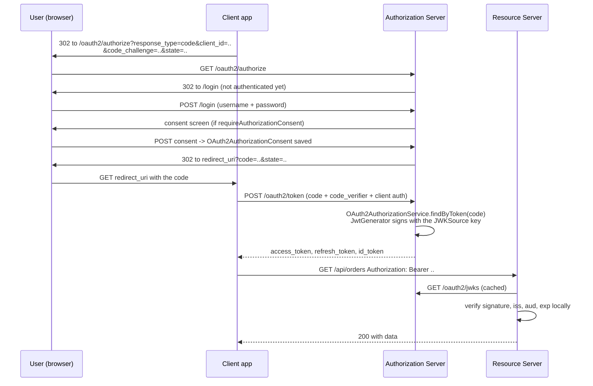
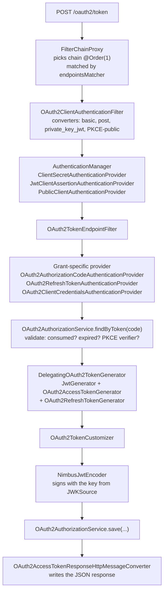

# 18.2 - Spring Authorization Server

> **Module 18 - Topic 2** - Modern and Adjacent
> Baseline: Spring Security 6.x on Boot 3.x
> New to this? Read **In Plain English** below first, then come back to the Version Matrix.

---

## Version Matrix

| Concern | Spring Security 5.x | **Spring Security 6.x (baseline)** | Spring Security 7.x |
|---|---|---|---|
| Where the authorization server lives | nowhere in Spring Security; the legacy `spring-security-oauth2` project, in maintenance and then end-of-life | **a separate artifact, `spring-security-oauth2-authorization-server` 1.x, with Boot's `spring-boot-starter-oauth2-authorization-server`** | folded into Spring Security itself; 1.5.x is the final standalone generation |
| Version pairing | legacy 2.x Spring Security OAuth, no alignment | **1.0 with Security 6.0, 1.2 with 6.2, 1.4 with 6.4, 1.5 with 6.5** | new features land in Spring Security 7.0 directly |
| Client half of OAuth2 | absorbed into Spring Security 5.0 as `oauth2Login` / `oauth2Client` | **same, `spring-security-oauth2-client`** | same |
| Resource server half | absorbed into Spring Security 5.1 as `oauth2ResourceServer` | **same, `spring-security-oauth2-resource-server`** | same |
| Applying the configurer | `http.apply(configurer)` | **`http.with(configurer, Customizer.withDefaults())`; `apply(...)` deprecated in 6.2 and removed later** | `with(...)` only |
| Minimum Java | 8 for legacy, 11 for Security 5.8 | **17** | 17 |
| Notable protocol additions | - | **device authorization grant (1.1), OIDC logout (1.1), pushed authorization requests (1.4), DPoP (1.5)** | continues in Spring Security |

Dependency, and you should let Boot manage the version:

```xml
<dependency>
    <groupId>org.springframework.boot</groupId>
    <artifactId>spring-boot-starter-oauth2-authorization-server</artifactId>
</dependency>
```

---

## Why This Exists

Spring's OAuth2 story has a discontinuity in the middle of it, and knowing that discontinuity is
most of what an interviewer is checking.

The original `spring-security-oauth2` project (Spring Security OAuth, versions 1.x and 2.x) provided
all three OAuth2 roles in one library: client, resource server, and **authorization server**. It was
enormously widely used, and it was configured with annotations such as
`@EnableAuthorizationServer` and `AuthorizationServerConfigurerAdapter`.

When Spring Security 5 arrived, the team rewrote OAuth2 support into the core framework - but only
two of the three roles. `oauth2Login` and `oauth2Client` landed in 5.0; `oauth2ResourceServer` landed
in 5.1. The authorization server role was **deliberately left out**, and the team stated at the time
that they did not intend to build one, on the reasoning that running an identity provider is a
specialist product concern better served by dedicated products.

That left a real gap. The legacy project was declared end-of-life, so `@EnableAuthorizationServer`
was a dead end on an unmaintained library, and there was no supported Spring-native replacement. The
community pushed back hard enough that in 2020 the team reversed the decision and started
**Spring Authorization Server** as a separate community-driven project, reaching 1.0 in November
2022 aligned with Spring Security 6.0.

So the practical mapping to carry into an interview:

| If you need | Use |
|---|---|
| To log users in via Google, Okta, or an internal identity provider | `spring-security-oauth2-client`, `http.oauth2Login(...)` - in Spring Security core |
| To validate incoming bearer tokens on an API | `spring-security-oauth2-resource-server`, `http.oauth2ResourceServer(...)` - in Spring Security core |
| To **issue** tokens, run `/oauth2/authorize` and `/oauth2/token`, be the identity provider | **Spring Authorization Server** - a separate artifact |
| Anything with `@EnableAuthorizationServer` | Legacy, end-of-life. Migrate. |

The final twist, and a good thing to know because it is recent: in September 2025 the project
announced that it is **moving into Spring Security 7.0**. The 1.5.x line is the last standalone
generation, and from Spring Security 7 onwards the authorization server is part of the framework
proper. That closes the circle that opened when it was left out of Spring Security 5.

---

## In Plain English

**The one-line version:** Most applications are the ones asking for a login, but this file is about
being the thing that *hands out* the logins - the service that checks a user's password and then
issues the tokens every other application trusts.

**An analogy.** Think of a passport office. You, the traveller, go there in person and prove who you
are. The office checks you, then issues a passport: a document that says who you are, when it expires,
and which countries it is good for, stamped with the office's official seal. From then on you do not
have to prove your identity again at every border. You show the passport, the border guard checks that
the seal is genuine, and you are let through in seconds. The guard has never met you and does not need
to - all the guard trusts is the seal.

That split is exactly the OAuth2 split. Spring Authorization Server is the passport office: it runs
the login page, checks the password, and issues the token. Your ordinary APIs are the border guards:
they never see a password, they just check the seal on the token. The travel agency that books your
trip and needs to act on your behalf is the "client" application.

The analogy keeps paying off for the awkward parts. The office publishes a specimen of its seal so
that every border guard can recognise a genuine one - that published specimen is the JWKS endpoint.
If the office quietly makes itself a brand new seal every morning, every passport issued yesterday is
refused today, which is exactly what happens when the signing key is generated fresh at startup. If
you open three branch offices and each makes its own seal, roughly two thirds of travellers are turned
away at random, which is exactly what happens when you run three replicas with in-memory keys. And
before any of this, there is the real question: the world already has passport offices. Running your
own is allowed, but you should be able to say why you are not just using one that already exists.

**How it actually works, step by step.**

There are four parties. The **user** is a person. The **client** is the application acting on that
person's behalf, such as your web front end or mobile app. The **authorization server** is the passport
office, which is what you build in this file. The **resource server** is any API that accepts the
resulting token.

The normal flow runs like this. The client sends the user's browser to the authorization server's
`/oauth2/authorize` address. The authorization server notices the user is not logged in yet, shows a
login page, and possibly a consent screen asking "do you allow this application to read your orders?".
Once the user agrees, the authorization server sends the browser back to the client with a short-lived
one-time code called an **authorization code**. The client then calls `/oauth2/token` directly, machine
to machine, trades that code for tokens, and is done. The code exists so that the tokens themselves
never travel through the browser's address bar.

The tokens come in three kinds. The **access token** is the key you present to APIs. The **refresh
token** is a longer-lived voucher used to get a new access token without asking the user to log in
again. The **ID token** describes who the user is and is meant for the client application, not for
APIs. A **scope** is a named permission such as `orders.read` that limits what the access token is good
for.

To let an application in at all, you record it in advance. Spring calls that record a
`RegisteredClient`: it holds the client's public identifier, its secret if it has one, the exact web
addresses it is allowed to be sent back to, and which grants and scopes it may use. This is the same
act as "create an application" in a hosted identity product's console, written as Java instead.

Signing is the other half. The authorization server owns a private key it signs tokens with, and
publishes the matching public key at `/oauth2/jwks` so that APIs can verify signatures locally without
calling back. Spring gets the key from a bean called a `JWKSource`. Every sample in the world generates
that key in memory at startup, and that single line is the most common way a real deployment breaks.

**Why should a beginner care?** This is the service whose failure logs everybody out of everything at
once, so understanding it is the difference between a five-minute fix and a company-wide outage. It is
also the piece most commonly built when it should have been bought - the protocol part is small and
looks easy, while the account recovery, multi-factor, and abuse-prevention parts are large and are
what actually gets people breached. Knowing what is in the other eighty-five percent is the point.

**Words you will meet in this file**

| Term | In plain words |
|---|---|
| Authorization server | The service that logs users in and hands out tokens. This is the thing you are building here. |
| Resource server | An ordinary API that accepts those tokens and checks them. |
| Client | The application acting on the user's behalf, such as a web or mobile front end. |
| Access token | The key the client presents to an API on every call. |
| Refresh token | A longer-lived voucher used to get a new access token without another login. |
| ID token | A token that describes who the user is, meant for the client rather than for APIs. |
| Scope | A named permission, such as `orders.read`, that limits what a token can do. |
| Authorization code | A short-lived, one-time value the browser carries back, which the client trades for tokens. |
| PKCE | An extra proof that the application finishing the login is the same one that started it, so a stolen code is useless. |
| `RegisteredClient` | The stored record of one application that is allowed to ask for tokens. |
| `JWKSource` | The bean that supplies the signing key used to stamp tokens. |
| JWKS | The published list of public keys, so that APIs can verify a token's signature themselves. |
| `kid` | The key identifier written into a token, saying which key signed it. |
| Issuer | The public web address of your authorization server, written into every token it signs. |
| Discovery document | The page at `/.well-known/openid-configuration` that tells client libraries where everything else lives. |
| OpenID Connect (OIDC) | A thin layer on top of OAuth2 that adds "who is this user", including the ID token and `/userinfo`. |
| Introspection | Asking the authorization server "is this token still valid?", needed when tokens are opaque rather than self-describing. |
| Consent | The screen where a user agrees to let an application have particular scopes, and the stored record of that agreement. |

**If you remember only one thing:** the authorization server is the one service that issues the
credentials everything else trusts, so its signing key must be persisted, shared by every instance,
and rotated with an overlap - and before you build one, be able to say why buying one was wrong.

---

## Core Concepts

### 1. Build Versus Buy - The Answer That Matters Most

**In simple terms:** Before learning how to run your own identity provider, be honest about whether
you should. For most teams the right answer is to pay for one that already exists.

Before any configuration, the senior question: should you run this at all?

**For most teams, the correct answer is to buy.** Keycloak, Auth0, Okta, Microsoft Entra ID, and
Amazon Cognito all solve the problem, and they solve parts of it you will underestimate: account
recovery flows, multi-factor enrolment, breached-password detection, bot and credential-stuffing
defence, audit logs auditors will accept, SCIM provisioning, SAML for the enterprise customers who
demand it, administrator user interfaces, and a security team whose entire job is this. Building the
protocol endpoints is perhaps fifteen percent of an identity provider. The other eighty-five percent
is the part that gets you breached.

The legitimate reasons to self-host, stated plainly:

**Data residency and regulatory control.** If credentials and identity data cannot leave your
infrastructure or your jurisdiction - certain public-sector, defence, healthcare and banking
contexts - a hosted provider may be disqualified outright regardless of price.

**Deep customisation of the token and consent flow.** If tokens must carry claims derived from your
own domain model with complex logic, if consent must be recorded in a domain-specific way, if you
need an unusual grant or an unusual step-up flow, a hosted product's extension points may not reach.
Spring Authorization Server puts a Java bean at every decision point.

**Cost at very high volume.** Per-monthly-active-user pricing is comfortable at ten thousand users
and can become the single largest line item at ten million. The break-even arrives later than people
expect - you must price the engineering and on-call cost of self-hosting honestly against it - but
it does arrive.

**Embedding an identity provider inside a product you ship.** If you sell software that customers
deploy themselves, you cannot depend on a SaaS identity provider. The authorization server has to be
part of the artifact.

What is *not* a good reason: "we do not want another vendor", "it looked easy in the sample", or
"we already know Spring". The sample application is genuinely about eighty lines. Production is not
the sample.

### 2. The Two Filter Chain Pattern

**In simple terms:** This one application serves two very different audiences - machines calling
protocol endpoints, and humans using a login page - so it needs two separate sets of security rules,
and the machine-facing one has to be checked first.

An authorization server is two applications wearing one process: a set of machine-facing protocol
endpoints, and a human-facing login and consent user interface. They need different security
configuration, so they get different `SecurityFilterChain` beans, ordered.

```java
@Bean
@Order(1)
SecurityFilterChain authorizationServerSecurityFilterChain(HttpSecurity http) throws Exception {
    OAuth2AuthorizationServerConfigurer configurer =
            OAuth2AuthorizationServerConfigurer.authorizationServer();

    http
        .securityMatcher(configurer.getEndpointsMatcher())
        .with(configurer, server -> server
            .oidc(Customizer.withDefaults())      // enables OIDC: discovery, /userinfo, id_token
        )
        .authorizeHttpRequests(auth -> auth.anyRequest().authenticated())
        .exceptionHandling(ex -> ex
            .defaultAuthenticationEntryPointFor(
                new LoginUrlAuthenticationEntryPoint("/login"),
                new MediaTypeRequestMatcher(MediaType.TEXT_HTML)))
        // The authorization server is also a resource server for its own /userinfo endpoint.
        .oauth2ResourceServer(rs -> rs.jwt(Customizer.withDefaults()));

    return http.build();
}

@Bean
@Order(2)
SecurityFilterChain defaultSecurityFilterChain(HttpSecurity http) throws Exception {
    http
        .authorizeHttpRequests(auth -> auth
            .requestMatchers("/assets/**", "/error").permitAll()
            .anyRequest().authenticated())
        .formLogin(Customizer.withDefaults());
    return http.build();
}
```

The older and still extremely common form of the first chain uses a static helper:

```java
// org.springframework.security.oauth2.server.authorization.config.annotation.web.configuration
//        .OAuth2AuthorizationServerConfiguration
public static void applyDefaultSecurity(HttpSecurity http) throws Exception {
    OAuth2AuthorizationServerConfigurer authorizationServerConfigurer =
            new OAuth2AuthorizationServerConfigurer();
    RequestMatcher endpointsMatcher = authorizationServerConfigurer.getEndpointsMatcher();

    http
        .securityMatcher(endpointsMatcher)
        .authorizeHttpRequests(authorize -> authorize.anyRequest().authenticated())
        .csrf(csrf -> csrf.ignoringRequestMatchers(endpointsMatcher))
        .with(authorizationServerConfigurer, Customizer.withDefaults());
}
```

Reading that source answers three questions at once:

- **Why `@Order(1)`.** The chain is scoped by `securityMatcher(endpointsMatcher)` to exactly the
  protocol endpoints. `FilterChainProxy` selects the first matching chain only, so the protocol chain
  must be declared before the catch-all login chain. Reverse the order and the login chain swallows
  `/oauth2/token`, which then returns an HTML login page to a machine client - a confusing failure
  that shows up as a JSON parse error in the client.
- **Why CSRF is disabled on those endpoints.** `/oauth2/token`, `/oauth2/introspect` and
  `/oauth2/revoke` are `POST` endpoints called by machines that authenticate with client credentials,
  not with a session cookie. There is no ambient authority to exploit, so there is nothing for CSRF
  to protect, and demanding a token would simply break every conformant client.
- **Why the entry point is conditional on `text/html`.** `/oauth2/authorize` is reached by a browser
  and must redirect an unauthenticated user to `/login`. `/oauth2/token` is reached by a machine and
  must return a JSON error, not a redirect. `defaultAuthenticationEntryPointFor` with a
  `MediaTypeRequestMatcher` branches on what the caller said it accepts.

The `.oidc(Customizer.withDefaults())` call is not optional if you want OpenID Connect. Without it
you have a bare OAuth2 authorization server: no `id_token`, no `/userinfo`, and no
`/.well-known/openid-configuration`. Since almost every modern client library discovers configuration
through that document, omitting `oidc(...)` is a common first-day failure.

### 3. `RegisteredClient` and `RegisteredClientRepository`

**In simple terms:** Every application allowed to ask for tokens has to be written down in advance.
This is that record, and the place you keep those records.

A `RegisteredClient` is the authorization server's record of an application permitted to request
tokens. It is the equivalent of "creating an application" in the Auth0 or Okta console.

```java
package org.springframework.security.oauth2.server.authorization.client;

public interface RegisteredClientRepository {
    void save(RegisteredClient registeredClient);
    RegisteredClient findById(String id);
    RegisteredClient findByClientId(String clientId);
}
```

Two implementations ship: `InMemoryRegisteredClientRepository` and `JdbcRegisteredClientRepository`.

```java
RegisteredClient webClient = RegisteredClient.withId(UUID.randomUUID().toString())
    .clientId("storefront-web")
    .clientSecret("{bcrypt}$2a$10$...")                   // stored ENCODED, like a user password
    .clientName("Storefront Web")
    .clientAuthenticationMethod(ClientAuthenticationMethod.CLIENT_SECRET_BASIC)
    .authorizationGrantType(AuthorizationGrantType.AUTHORIZATION_CODE)
    .authorizationGrantType(AuthorizationGrantType.REFRESH_TOKEN)
    .redirectUri("https://storefront.example.com/login/oauth2/code/storefront-web")
    .postLogoutRedirectUri("https://storefront.example.com/")
    .scope(OidcScopes.OPENID)
    .scope(OidcScopes.PROFILE)
    .scope("orders.read")
    .clientSettings(ClientSettings.builder()
        .requireAuthorizationConsent(true)
        .requireProofKey(true)
        .build())
    .tokenSettings(TokenSettings.builder()
        .accessTokenFormat(OAuth2TokenFormat.SELF_CONTAINED)
        .accessTokenTimeToLive(Duration.ofMinutes(15))
        .refreshTokenTimeToLive(Duration.ofDays(30))
        .reuseRefreshTokens(false)
        .idTokenSignatureAlgorithm(SignatureAlgorithm.RS256)
        .build())
    .build();
```

Points that matter and get asked:

- `withId(...)` is the internal primary key and is unrelated to `clientId`, which is the public
  identifier the client sends. People routinely conflate them.
- **The client secret is stored encoded**, with the same `PasswordEncoder` mechanism used for user
  passwords. A plaintext secret in the repository fails authentication with a message that does not
  obviously say "you forgot to encode this". `{noop}` works for local development and must never
  reach production.
- Grant types and redirect URIs are both allow-lists. Redirect URI matching is **exact string
  comparison**, not prefix and not wildcard. A trailing slash difference is a rejected request. This
  strictness is deliberate: loose redirect matching is the classic authorization-code interception
  vulnerability.
- A public client - a single-page application or a mobile app - has no secret. It uses
  `ClientAuthenticationMethod.NONE` and **must** use PKCE, so `requireProofKey(true)` is mandatory
  rather than advisory.

### 4. Client Settings and Token Settings

**In simple terms:** These are the dials on each client record - whether a consent screen is shown,
how long its tokens last, and whether tokens are self-describing or opaque. Two of the defaults are
not what you want in production.

| `ClientSettings` option | Effect | Default |
|---|---|---|
| `requireProofKey(boolean)` | Force PKCE (RFC 7636) on the authorization code grant | `false` - **turn it on** |
| `requireAuthorizationConsent(boolean)` | Show the consent screen and persist an `OAuth2AuthorizationConsent` | `false` |
| `jwkSetUrl(String)` | Where to fetch the client's keys for `private_key_jwt` client authentication | unset |
| `tokenEndpointAuthenticationSigningAlgorithm(...)` | Expected algorithm for a client assertion | `RS256` |

| `TokenSettings` option | Effect | Default |
|---|---|---|
| `accessTokenFormat(...)` | `SELF_CONTAINED` (a JWT) or `REFERENCE` (an opaque token) | `SELF_CONTAINED` |
| `accessTokenTimeToLive(Duration)` | Access token lifetime | 5 minutes |
| `refreshTokenTimeToLive(Duration)` | Refresh token lifetime | 60 minutes |
| `reuseRefreshTokens(boolean)` | Return the same refresh token on refresh, or rotate it | `true` - **set it to `false`** |
| `authorizationCodeTimeToLive(Duration)` | Authorization code lifetime | 5 minutes |
| `deviceCodeTimeToLive(Duration)` | Device code lifetime for the device grant | 5 minutes |
| `idTokenSignatureAlgorithm(...)` | `id_token` signing algorithm | `RS256` |
| `x509CertificateBoundAccessTokens(boolean)` | Bind the token to the client's mTLS certificate | `false` |

The two defaults worth arguing about:

**`accessTokenFormat`.** `SELF_CONTAINED` produces a JWT that resource servers validate locally by
checking a signature against the JWKS - fast, no network call, and completely unrevocable until it
expires. `REFERENCE` produces an opaque random string that resource servers must validate by calling
`/oauth2/introspect` - revocable instantly, at the cost of a network round trip per request and a
hard availability dependency on the authorization server. This is the stateless-versus-stateful
trade-off from Module 1 reappearing at the protocol level, and the right answer depends entirely on
your revocation requirement.

**`reuseRefreshTokens`.** The default of `true` means the same refresh token is returned every time.
Setting it to `false` enables **refresh token rotation**: each refresh issues a new refresh token and
invalidates the old one. Rotation matters because it makes theft detectable - if a stolen refresh
token is used after the legitimate client has already rotated, the server sees a replay of a consumed
token and can invalidate the entire token family. For a public client that cannot keep a secret, the
OAuth2 security best current practice effectively requires rotation, so `false` should be your
default and `true` should require justification.

### 5. `AuthorizationServerSettings` and the Endpoints

**In simple terms:** These are the web addresses your authorization server answers on, and the one
setting you must not leave to chance is the issuer, which is the public name every token is stamped
with.

```java
@Bean
AuthorizationServerSettings authorizationServerSettings() {
    return AuthorizationServerSettings.builder()
        .issuer("https://auth.example.com")
        .build();
}
```

If you declare nothing, defaults apply and the issuer is derived from the incoming request, which is
convenient in development and dangerous in production (see Production Concerns).

| Endpoint | Default path | Purpose |
|---|---|---|
| Authorization | `/oauth2/authorize` | Browser-facing; starts the authorization code flow |
| Token | `/oauth2/token` | Machine-facing; exchanges a code, refresh token, or client credentials for tokens |
| JWK Set | `/oauth2/jwks` | Publishes public keys so resource servers can verify signatures |
| Token introspection | `/oauth2/introspect` | RFC 7662; validates opaque tokens for resource servers |
| Token revocation | `/oauth2/revoke` | RFC 7009; revokes an access or refresh token |
| Device authorization | `/oauth2/device_authorization` | RFC 8628; for televisions and input-constrained devices |
| Device verification | `/oauth2/device_verification` | The "enter this code" page |
| Pushed authorization request | `/oauth2/par` | RFC 9126; the client pushes the request server-side first |
| OIDC provider configuration | `/.well-known/openid-configuration` | Discovery document clients read to find everything else |
| OAuth2 server metadata | `/.well-known/oauth-authorization-server` | RFC 8414; the non-OIDC equivalent |
| OIDC user info | `/userinfo` | Returns claims about the authenticated user |
| OIDC client registration | `/connect/register` | RFC 7591 dynamic registration; **disabled by default** |
| OIDC logout | `/connect/logout` | RP-initiated logout |

Every path is overridable on the builder (`.tokenEndpoint("/oauth2/v2/token")` and so on), but the
strong advice is **do not change them**. Clients discover paths from the discovery document, so
custom paths are technically fine, but every piece of tooling, every tutorial, and every debugging
session assumes the defaults, and the only thing you gain is obscurity that is not security.



### 6. The `JWKSource` Bean, and the Production Point That Matters Most

**In simple terms:** This bean holds the key that stamps every token. The sample code makes a brand
new key each time the application starts, which quietly logs every user out on every deployment - this
is the single most important production detail in the file.

The authorization server signs tokens, so it needs a key pair. The contract is Nimbus's:

```java
@Bean
JWKSource<SecurityContext> jwkSource() {
    RSAKey rsaKey = generateRsa();
    JWKSet jwkSet = new JWKSet(rsaKey);
    return new ImmutableJWKSet<>(jwkSet);
}

private static RSAKey generateRsa() {
    KeyPair keyPair = generateRsaKey();
    RSAPublicKey publicKey = (RSAPublicKey) keyPair.getPublic();
    RSAPrivateKey privateKey = (RSAPrivateKey) keyPair.getPrivate();
    return new RSAKey.Builder(publicKey)
            .privateKey(privateKey)
            .keyID(UUID.randomUUID().toString())
            .build();
}
```

A trap on the very first line: the type parameter is
`com.nimbusds.jose.proc.SecurityContext`, **not**
`org.springframework.security.core.context.SecurityContext`. They have the same simple name, the
import completion offers the wrong one, and the resulting compile error is not obviously about
imports.

Now the critical production point, stated as bluntly as it deserves:

> **The sample code generates a fresh RSA key pair at startup, in memory. That is correct for a
> sample and catastrophic in production.**

Two independent failures follow from it:

**Every restart invalidates every token.** The new key has a new `kid`, and every previously issued
access token and `id_token` was signed with a key that no longer exists. Resource servers fetch the
JWKS, do not find the `kid`, and reject everything. Every user is logged out on every deployment.
With rolling deployments several times a day, this is not a theoretical concern - it is a
user-visible outage on every release.

**Every instance has a different key.** Run three replicas and you have three unrelated key pairs.
The JWKS endpoint returns whichever instance's key the load balancer happened to route to, so a
resource server caches one key and then receives tokens signed by the other two. Roughly two thirds
of requests fail signature validation, intermittently, with no pattern - which is close to the worst
possible production symptom because it looks like flakiness rather than a configuration error.

The fix has two parts:

**Persist the key.** Load it from a keystore file, a secret manager, a hardware security module, or a
database table shared by all instances. The private key must never be in the source repository or the
container image.

```java
@Bean
JWKSource<SecurityContext> jwkSource(KeyStoreProperties properties) throws Exception {
    KeyStore keyStore = KeyStore.getInstance("PKCS12");
    try (InputStream in = properties.location().getInputStream()) {
        keyStore.load(in, properties.storePassword().toCharArray());
    }
    RSAKey rsaKey = RSAKey.load(keyStore, properties.alias(),
            properties.keyPassword().toCharArray());
    return new ImmutableJWKSet<>(new JWKSet(rsaKey));
}
```

**Rotate it, with an overlap.** Key rotation is not "replace the key". It is:

1. Generate a new key with a new `kid` and publish it in the JWKS **alongside** the current one.
2. Wait longer than your JWKS cache lifetime plus your maximum access token lifetime, so every
   resource server has certainly seen the new key.
3. Switch signing to the new key. Tokens signed with the old key are still verifiable because the old
   public key is still published.
4. After all tokens signed with the old key have expired, remove it from the JWKS.

A `JWKSet` holds a list of keys precisely to make step 1 possible, and resource servers select by
`kid`. A rotation that skips the overlap window causes exactly the same outage as a restart with an
in-memory key - which is how most teams discover that rotation is a four-step process rather than a
one-step one.

### 7. `OAuth2TokenCustomizer` - Adding Claims

**In simple terms:** This is how you put your own information, such as roles or a tenant name, into
the tokens you issue. Remember that anyone holding the token can read everything you put in it.

Real applications need claims beyond the standard set: roles, a tenant identifier, an internal user
id. The hook is a single bean.

```java
@Bean
OAuth2TokenCustomizer<JwtEncodingContext> jwtCustomizer(UserProfileService profiles) {
    return context -> {
        if (OAuth2TokenType.ACCESS_TOKEN.equals(context.getTokenType())) {
            Authentication principal = context.getPrincipal();
            Set<String> roles = principal.getAuthorities().stream()
                    .map(GrantedAuthority::getAuthority)
                    .filter(a -> a.startsWith("ROLE_"))
                    .map(a -> a.substring(5))
                    .collect(Collectors.toSet());
            context.getClaims()
                   .claim("roles", roles)
                   .claim("tenant", profiles.tenantOf(principal.getName()));
        }
        if (OidcParameterNames.ID_TOKEN.equals(context.getTokenType().getValue())) {
            // The id_token describes WHO the user is. It is for the client, not for APIs.
            context.getClaims().claim("email", profiles.emailOf(context.getPrincipal().getName()));
        }
    };
}
```

For opaque (`REFERENCE`) tokens the parallel bean is
`OAuth2TokenCustomizer<OAuth2TokenClaimsContext>`, because the claims are stored server-side rather
than encoded into the token.

Two discipline points. First, **the access token is a public document**. It is a signed JWT, not an
encrypted one; anyone holding it can read every claim. Never put anything in it you would not put in
a log file - no national identifiers, no email addresses you are not comfortable exposing, no
internal hostnames. Second, **every claim you add is paid for on every request by every service**.
Putting a user's forty group memberships into the token adds two kilobytes to every HTTP request in
the estate, and some proxies have an eight-kilobyte header limit that you will discover the hard way.

### 8. Persisting Authorizations and Consents

**In simple terms:** The record of every login you granted, and of every consent a user gave, has to
live in a database rather than in memory, or it disappears on restart and is invisible to your other
instances.

Three pieces of state must survive a restart and be shared across instances. Clients are one; the
other two are authorizations and consents.

```java
package org.springframework.security.oauth2.server.authorization;

public interface OAuth2AuthorizationService {
    void save(OAuth2Authorization authorization);
    void remove(OAuth2Authorization authorization);
    OAuth2Authorization findById(String id);
    OAuth2Authorization findByToken(String token, @Nullable OAuth2TokenType tokenType);
}

public interface OAuth2AuthorizationConsentService {
    void save(OAuth2AuthorizationConsent authorizationConsent);
    void remove(OAuth2AuthorizationConsent authorizationConsent);
    OAuth2AuthorizationConsent findById(String registeredClientId, String principalName);
}
```

`OAuth2Authorization` is the aggregate for one grant: which client, which principal, the authorization
code and whether it has been consumed, the access token, the refresh token, the `id_token`, the
granted scopes, and the attributes. It is the record that makes revocation and introspection possible.

In-memory implementations exist for both and are fine for tests. In production you use the JDBC ones:

```java
@Bean
OAuth2AuthorizationService authorizationService(JdbcTemplate jdbcTemplate,
                                                RegisteredClientRepository clients) {
    return new JdbcOAuth2AuthorizationService(jdbcTemplate, clients);
}

@Bean
OAuth2AuthorizationConsentService consentService(JdbcTemplate jdbcTemplate,
                                                 RegisteredClientRepository clients) {
    return new JdbcOAuth2AuthorizationConsentService(jdbcTemplate, clients);
}
```

The schemas ship on the classpath and you apply them yourself:

```
org/springframework/security/oauth2/server/authorization/oauth2-authorization-schema.sql
org/springframework/security/oauth2/server/authorization/oauth2-authorization-consent-schema.sql
org/springframework/security/oauth2/server/authorization/client/oauth2-registered-client-schema.sql
```

Two operational notes the schemas do not tell you. The `oauth2_authorization` table has several
`blob`/`text` columns holding serialised metadata, and it grows with every single authorization
issued - **there is no automatic cleanup**. A busy authorization server accumulates rows at the rate
of its login volume, and you need a scheduled job deleting rows whose tokens have all expired.
Second, `findByToken` is called on every introspection and every refresh, so the token columns need
indexes; without them, token-endpoint latency degrades linearly with table size and the degradation
is gradual enough to be blamed on everything else first.

### 9. Federated Identity - Logging Into Your Authorization Server With Google

**In simple terms:** Your authorization server can itself let users sign in with Google or a corporate
provider instead of a local password. It issues your tokens, but somebody else checks the person.

A frequent requirement: your authorization server is the identity provider for your own APIs, but
users should sign in with Google or a corporate identity provider rather than a local password.

The authorization server then plays two roles simultaneously. It is an **authorization server** to
your clients, and an **OAuth2 client** to Google. Both are just configuration on the second
(`@Order(2)`) filter chain:

```java
@Bean
@Order(2)
SecurityFilterChain defaultSecurityFilterChain(HttpSecurity http,
        AuthenticationSuccessHandler federatedHandler) throws Exception {
    http
        .authorizeHttpRequests(auth -> auth
            .requestMatchers("/assets/**", "/error").permitAll()
            .anyRequest().authenticated())
        .formLogin(form -> form.loginPage("/login"))
        .oauth2Login(oauth2 -> oauth2
            .loginPage("/login")
            .successHandler(federatedHandler));
    return http.build();
}
```

The success handler is where the real work lives, and it is application code rather than framework
code - the reference sample calls it `FederatedIdentityAuthenticationSuccessHandler`, but it is a
pattern, not a shipped class. Its job is **just-in-time provisioning**: on first login through Google,
create a local user record keyed by the external subject identifier, attach local roles, and from
then on treat that record as the principal whose claims go into your tokens.

Two design points worth stating in an interview. Key the local record on the identity provider's
`sub` claim, never on the email address - emails get reassigned and change, `sub` is stable and
unique per provider. And decide explicitly what happens when the same person arrives via two
providers; automatic account linking by matching email addresses is a well-known account-takeover
vector if the second provider does not verify email ownership.

### 10. The Operational Burden

**In simple terms:** This is the ongoing work of actually running the thing once it is live, which is
the part nobody estimates and the reason section 1 recommends buying.

This is the part that separates an engineer who has read the documentation from one who has run the
thing.

**The authorization server becomes the most critical service you own.** If it is down, nobody can log
in anywhere, and as tokens expire over the following minutes every existing session fails too. It
needs a higher availability target than anything it protects, which usually means more replicas,
multi-availability-zone deployment, and its own on-call rotation.

**Key management is a continuing process.** Keys must be persisted, shared across instances, rotated
on a schedule with an overlap window, protected in a secret store or hardware security module, and
recoverable. "Who can read the signing key?" is an access-control question with a very short correct
answer, because whoever holds it can mint a token for any user with any role.

**Client lifecycle is unglamorous and constant.** Onboarding new clients, rotating client secrets on
a schedule, retiring clients when a project is decommissioned, and reviewing redirect URIs. Without a
process, a repository accumulates clients nobody recognises with secrets nobody has rotated in three
years and redirect URIs pointing at domains the company no longer owns - which is a live account
takeover path.

**Storage grows and needs pruning.** Authorizations and consents accumulate. Cleanup jobs need
writing, testing, and monitoring.

**Availability of the JWKS endpoint is a hidden dependency.** Every resource server fetches it. If it
is unreachable when a resource server restarts with a cold cache, that resource server rejects all
traffic. Cache behaviour and failure modes need deliberate testing, not assumption.

**You now own the login user interface and the flows around it.** Password reset, account lockout,
multi-factor enrolment and recovery, suspicious-login notification, and the accessibility and
localisation of all of it. None of this is protocol work and all of it is required.

**Upgrades are security-critical and cannot be deferred.** A vulnerability in the authorization
server is a vulnerability in every application behind it.

None of this is an argument against self-hosting. It is the honest cost estimate that should sit
next to the vendor invoice when the decision is made.

---

## Working Code

A complete, minimal-but-production-shaped authorization server.

```java
package com.example.authserver;

import com.nimbusds.jose.jwk.JWKSet;
import com.nimbusds.jose.jwk.RSAKey;
import com.nimbusds.jose.jwk.source.ImmutableJWKSet;
import com.nimbusds.jose.jwk.source.JWKSource;
import com.nimbusds.jose.proc.SecurityContext;      // Nimbus, NOT Spring Security
import org.springframework.context.annotation.Bean;
import org.springframework.context.annotation.Configuration;
import org.springframework.core.annotation.Order;
import org.springframework.http.MediaType;
import org.springframework.jdbc.core.JdbcTemplate;
import org.springframework.security.config.Customizer;
import org.springframework.security.config.annotation.web.builders.HttpSecurity;
import org.springframework.security.core.GrantedAuthority;
import org.springframework.security.core.Authentication;
import org.springframework.security.crypto.bcrypt.BCryptPasswordEncoder;
import org.springframework.security.crypto.password.PasswordEncoder;
import org.springframework.security.oauth2.core.AuthorizationGrantType;
import org.springframework.security.oauth2.core.ClientAuthenticationMethod;
import org.springframework.security.oauth2.core.OAuth2TokenType;
import org.springframework.security.oauth2.core.oidc.OidcScopes;
import org.springframework.security.oauth2.jwt.JwtDecoder;
import org.springframework.security.oauth2.server.authorization.JdbcOAuth2AuthorizationConsentService;
import org.springframework.security.oauth2.server.authorization.JdbcOAuth2AuthorizationService;
import org.springframework.security.oauth2.server.authorization.OAuth2AuthorizationConsentService;
import org.springframework.security.oauth2.server.authorization.OAuth2AuthorizationService;
import org.springframework.security.oauth2.server.authorization.client.JdbcRegisteredClientRepository;
import org.springframework.security.oauth2.server.authorization.client.RegisteredClient;
import org.springframework.security.oauth2.server.authorization.client.RegisteredClientRepository;
import org.springframework.security.oauth2.server.authorization.config.annotation.web.configuration.OAuth2AuthorizationServerConfiguration;
import org.springframework.security.oauth2.server.authorization.config.annotation.web.configurers.OAuth2AuthorizationServerConfigurer;
import org.springframework.security.oauth2.server.authorization.settings.AuthorizationServerSettings;
import org.springframework.security.oauth2.server.authorization.settings.ClientSettings;
import org.springframework.security.oauth2.server.authorization.settings.OAuth2TokenFormat;
import org.springframework.security.oauth2.server.authorization.settings.TokenSettings;
import org.springframework.security.oauth2.server.authorization.token.JwtEncodingContext;
import org.springframework.security.oauth2.server.authorization.token.OAuth2TokenCustomizer;
import org.springframework.security.web.SecurityFilterChain;
import org.springframework.security.web.authentication.LoginUrlAuthenticationEntryPoint;
import org.springframework.security.web.util.matcher.MediaTypeRequestMatcher;
import org.springframework.security.web.util.matcher.RequestMatcher;

import java.security.KeyPair;
import java.security.KeyPairGenerator;
import java.security.interfaces.RSAPrivateKey;
import java.security.interfaces.RSAPublicKey;
import java.time.Duration;
import java.util.Set;
import java.util.UUID;
import java.util.stream.Collectors;

@Configuration
public class AuthorizationServerConfig {

    /**
     * Chain 1: the protocol endpoints. Scoped by the configurer's own endpoint matcher,
     * so it MUST be ordered before the catch-all login chain.
     */
    @Bean
    @Order(1)
    SecurityFilterChain authorizationServerSecurityFilterChain(HttpSecurity http) throws Exception {
        OAuth2AuthorizationServerConfiguration.applyDefaultSecurity(http);

        http.getConfigurer(OAuth2AuthorizationServerConfigurer.class)
            .oidc(Customizer.withDefaults());       // without this: no id_token, no discovery

        http
            // Browsers get redirected to the login page; machines get a JSON error.
            .exceptionHandling(ex -> ex
                .defaultAuthenticationEntryPointFor(
                    new LoginUrlAuthenticationEntryPoint("/login"),
                    new MediaTypeRequestMatcher(MediaType.TEXT_HTML)))
            // /userinfo is a bearer-token endpoint, so the AS is its own resource server.
            .oauth2ResourceServer(rs -> rs.jwt(Customizer.withDefaults()));

        return http.build();
    }

    /** Chain 2: the human-facing login user interface. */
    @Bean
    @Order(2)
    SecurityFilterChain defaultSecurityFilterChain(HttpSecurity http) throws Exception {
        http
            .authorizeHttpRequests(auth -> auth
                .requestMatchers("/assets/**", "/webjars/**", "/error").permitAll()
                .anyRequest().authenticated())
            .formLogin(form -> form.loginPage("/login").permitAll());
        return http.build();
    }

    @Bean
    RegisteredClientRepository registeredClientRepository(JdbcTemplate jdbcTemplate) {
        return new JdbcRegisteredClientRepository(jdbcTemplate);
    }

    @Bean
    OAuth2AuthorizationService authorizationService(JdbcTemplate jdbcTemplate,
                                                    RegisteredClientRepository clients) {
        return new JdbcOAuth2AuthorizationService(jdbcTemplate, clients);
    }

    @Bean
    OAuth2AuthorizationConsentService authorizationConsentService(JdbcTemplate jdbcTemplate,
                                                                  RegisteredClientRepository clients) {
        return new JdbcOAuth2AuthorizationConsentService(jdbcTemplate, clients);
    }

    @Bean
    AuthorizationServerSettings authorizationServerSettings(
            @org.springframework.beans.factory.annotation.Value("${app.issuer}") String issuer) {
        // Pin the issuer. Deriving it from the request lets a spoofed Host header
        // produce tokens with an attacker-controlled iss claim.
        return AuthorizationServerSettings.builder().issuer(issuer).build();
    }

    /**
     * PRODUCTION: load the key from a keystore or secret manager so it survives restarts
     * and is identical on every instance. The generated key below is DEVELOPMENT ONLY.
     */
    @Bean
    JWKSource<SecurityContext> jwkSource() {
        RSAKey rsaKey = generateRsa();
        return new ImmutableJWKSet<>(new JWKSet(rsaKey));
    }

    private static RSAKey generateRsa() {
        KeyPair keyPair = generateRsaKey();
        RSAPublicKey publicKey = (RSAPublicKey) keyPair.getPublic();
        RSAPrivateKey privateKey = (RSAPrivateKey) keyPair.getPrivate();
        return new RSAKey.Builder(publicKey)
                .privateKey(privateKey)
                .keyID(UUID.randomUUID().toString())
                .build();
    }

    private static KeyPair generateRsaKey() {
        try {
            KeyPairGenerator generator = KeyPairGenerator.getInstance("RSA");
            generator.initialize(2048);
            return generator.generateKeyPair();
        }
        catch (Exception ex) {
            throw new IllegalStateException(ex);
        }
    }

    /** The AS validates its own tokens at /userinfo, so it needs a decoder. */
    @Bean
    JwtDecoder jwtDecoder(JWKSource<SecurityContext> jwkSource) {
        return OAuth2AuthorizationServerConfiguration.jwtDecoder(jwkSource);
    }

    @Bean
    OAuth2TokenCustomizer<JwtEncodingContext> jwtCustomizer() {
        return context -> {
            if (OAuth2TokenType.ACCESS_TOKEN.equals(context.getTokenType())) {
                Authentication principal = context.getPrincipal();
                Set<String> roles = principal.getAuthorities().stream()
                        .map(GrantedAuthority::getAuthority)
                        .filter(authority -> authority.startsWith("ROLE_"))
                        .map(authority -> authority.substring("ROLE_".length()))
                        .collect(Collectors.toSet());
                context.getClaims().claim("roles", roles);
            }
        };
    }

    @Bean
    PasswordEncoder passwordEncoder() {
        return new BCryptPasswordEncoder();
    }
}
```

Seeding a confidential client and a public single-page-application client:

```java
package com.example.authserver;

import org.springframework.boot.CommandLineRunner;
import org.springframework.context.annotation.Bean;
import org.springframework.context.annotation.Configuration;
import org.springframework.security.crypto.password.PasswordEncoder;
import org.springframework.security.oauth2.core.AuthorizationGrantType;
import org.springframework.security.oauth2.core.ClientAuthenticationMethod;
import org.springframework.security.oauth2.core.oidc.OidcScopes;
import org.springframework.security.oauth2.server.authorization.client.RegisteredClient;
import org.springframework.security.oauth2.server.authorization.client.RegisteredClientRepository;
import org.springframework.security.oauth2.server.authorization.settings.ClientSettings;
import org.springframework.security.oauth2.server.authorization.settings.OAuth2TokenFormat;
import org.springframework.security.oauth2.server.authorization.settings.TokenSettings;

import java.time.Duration;
import java.util.UUID;

@Configuration
public class ClientSeeding {

    @Bean
    CommandLineRunner seedClients(RegisteredClientRepository repository, PasswordEncoder encoder) {
        return args -> {
            if (repository.findByClientId("storefront-web") == null) {
                repository.save(RegisteredClient.withId(UUID.randomUUID().toString())
                    .clientId("storefront-web")
                    .clientSecret(encoder.encode("change-me-in-production"))
                    .clientAuthenticationMethod(ClientAuthenticationMethod.CLIENT_SECRET_BASIC)
                    .authorizationGrantType(AuthorizationGrantType.AUTHORIZATION_CODE)
                    .authorizationGrantType(AuthorizationGrantType.REFRESH_TOKEN)
                    .redirectUri("https://storefront.example.com/login/oauth2/code/storefront-web")
                    .postLogoutRedirectUri("https://storefront.example.com/")
                    .scope(OidcScopes.OPENID)
                    .scope(OidcScopes.PROFILE)
                    .scope("orders.read")
                    .clientSettings(ClientSettings.builder()
                        .requireProofKey(true)
                        .requireAuthorizationConsent(true)
                        .build())
                    .tokenSettings(TokenSettings.builder()
                        .accessTokenFormat(OAuth2TokenFormat.SELF_CONTAINED)
                        .accessTokenTimeToLive(Duration.ofMinutes(15))
                        .refreshTokenTimeToLive(Duration.ofDays(30))
                        .reuseRefreshTokens(false)          // rotation enables theft detection
                        .build())
                    .build());
            }

            if (repository.findByClientId("storefront-spa") == null) {
                repository.save(RegisteredClient.withId(UUID.randomUUID().toString())
                    .clientId("storefront-spa")
                    // Public client: no secret can be kept, so NONE + mandatory PKCE.
                    .clientAuthenticationMethod(ClientAuthenticationMethod.NONE)
                    .authorizationGrantType(AuthorizationGrantType.AUTHORIZATION_CODE)
                    .authorizationGrantType(AuthorizationGrantType.REFRESH_TOKEN)
                    .redirectUri("https://spa.example.com/callback")
                    .scope(OidcScopes.OPENID)
                    .scope("orders.read")
                    .clientSettings(ClientSettings.builder()
                        .requireProofKey(true)              // NOT optional for a public client
                        .requireAuthorizationConsent(false)
                        .build())
                    .tokenSettings(TokenSettings.builder()
                        .accessTokenTimeToLive(Duration.ofMinutes(5))
                        .refreshTokenTimeToLive(Duration.ofHours(8))
                        .reuseRefreshTokens(false)
                        .build())
                    .build());
            }
        };
    }
}
```

`application.yml`:

```yaml
app:
  issuer: https://auth.example.com          # pinned; never derived from the request

spring:
  application:
    name: authorization-server
  datasource:
    url: jdbc:postgresql://db:5432/authserver
    username: ${DB_USER}
    password: ${DB_PASSWORD}
  sql:
    init:
      mode: always
      schema-locations:
        - classpath:org/springframework/security/oauth2/server/authorization/oauth2-authorization-schema.sql
        - classpath:org/springframework/security/oauth2/server/authorization/oauth2-authorization-consent-schema.sql
        - classpath:org/springframework/security/oauth2/server/authorization/client/oauth2-registered-client-schema.sql

  security:
    oauth2:
      client:                               # federated login into the AS itself
        registration:
          google:
            client-id: ${GOOGLE_CLIENT_ID}
            client-secret: ${GOOGLE_CLIENT_SECRET}
            scope: openid,profile,email

server:
  port: 9000
  forward-headers-strategy: framework       # behind a TLS-terminating proxy

logging:
  level:
    org.springframework.security: INFO
    org.springframework.security.oauth2: DEBUG
```

Tests:

```java
package com.example.authserver;

import org.junit.jupiter.api.Test;
import org.springframework.beans.factory.annotation.Autowired;
import org.springframework.boot.test.autoconfigure.web.servlet.AutoConfigureMockMvc;
import org.springframework.boot.test.context.SpringBootTest;
import org.springframework.test.web.servlet.MockMvc;

import static org.springframework.test.web.servlet.request.MockMvcRequestBuilders.get;
import static org.springframework.test.web.servlet.request.MockMvcRequestBuilders.post;
import static org.springframework.test.web.servlet.result.MockMvcResultMatchers.jsonPath;
import static org.springframework.test.web.servlet.result.MockMvcResultMatchers.status;

@SpringBootTest
@AutoConfigureMockMvc
class AuthorizationServerEndpointTests {

    @Autowired
    MockMvc mvc;

    @Test
    void discoveryDocumentIsPublicAndAdvertisesTheEndpoints() throws Exception {
        this.mvc.perform(get("/.well-known/openid-configuration"))
            .andExpect(status().isOk())
            .andExpect(jsonPath("$.issuer").value("https://auth.example.com"))
            .andExpect(jsonPath("$.token_endpoint").value("https://auth.example.com/oauth2/token"))
            .andExpect(jsonPath("$.jwks_uri").value("https://auth.example.com/oauth2/jwks"));
    }

    @Test
    void jwkSetIsPublicAndContainsOnlyPublicKeyMaterial() throws Exception {
        this.mvc.perform(get("/oauth2/jwks"))
            .andExpect(status().isOk())
            .andExpect(jsonPath("$.keys[0].kty").value("RSA"))
            .andExpect(jsonPath("$.keys[0].n").exists())      // modulus - public
            .andExpect(jsonPath("$.keys[0].d").doesNotExist()); // private exponent - MUST NOT leak
    }

    @Test
    void clientCredentialsGrantIssuesAnAccessToken() throws Exception {
        this.mvc.perform(post("/oauth2/token")
                .param("grant_type", "client_credentials")
                .param("scope", "orders.read")
                .with(org.springframework.test.web.servlet.request.SecurityMockMvcRequestPostProcessors
                        .httpBasic("service-client", "service-secret")))
            .andExpect(status().isOk())
            .andExpect(jsonPath("$.access_token").exists())
            .andExpect(jsonPath("$.token_type").value("Bearer"));
    }

    @Test
    void tokenEndpointRejectsAnUnknownClientWithJsonNotARedirect() throws Exception {
        this.mvc.perform(post("/oauth2/token")
                .param("grant_type", "client_credentials")
                .with(org.springframework.test.web.servlet.request.SecurityMockMvcRequestPostProcessors
                        .httpBasic("nobody", "wrong")))
            .andExpect(status().isUnauthorized());
    }

    @Test
    void authorizeEndpointRedirectsAnAnonymousBrowserToLogin() throws Exception {
        this.mvc.perform(get("/oauth2/authorize")
                .param("response_type", "code")
                .param("client_id", "storefront-web")
                .param("redirect_uri", "https://storefront.example.com/login/oauth2/code/storefront-web")
                .param("scope", "openid")
                .accept("text/html"))
            .andExpect(status().is3xxRedirection());
    }
}
```

A test that pins the redirect-URI strictness, which is the control most often weakened by accident:

```java
@Test
void unregisteredRedirectUriIsRejected() throws Exception {
    this.mvc.perform(get("/oauth2/authorize")
            .param("response_type", "code")
            .param("client_id", "storefront-web")
            // one character different from the registered value
            .param("redirect_uri", "https://storefront.example.com/login/oauth2/code/storefront-web/")
            .param("scope", "openid")
            .accept("text/html"))
        // The server must NOT redirect to an unregistered URI, even to report the error.
        .andExpect(status().isBadRequest());
}
```

---

## Internals

### The request path through the protocol chain



### Classes worth naming

| Class | Role |
|---|---|
| `OAuth2AuthorizationServerConfigurer` | The `HttpSecurity` configurer; owns `getEndpointsMatcher()` |
| `OAuth2AuthorizationServerConfiguration` | Static helpers: `applyDefaultSecurity`, `jwtDecoder` |
| `AuthorizationServerSettings` | Issuer and endpoint paths |
| `OAuth2AuthorizationEndpointFilter` | Handles `/oauth2/authorize`, consent, and the code redirect |
| `OAuth2TokenEndpointFilter` | Handles `/oauth2/token` |
| `OAuth2ClientAuthenticationFilter` | Authenticates the *client*, before the grant is processed |
| `OAuth2TokenIntrospectionEndpointFilter` | Handles `/oauth2/introspect` |
| `OAuth2TokenRevocationEndpointFilter` | Handles `/oauth2/revoke` |
| `NimbusJwkSetEndpointFilter` | Serves `/oauth2/jwks` from the `JWKSource` |
| `OidcProviderConfigurationEndpointFilter` | Serves `/.well-known/openid-configuration` |
| `OAuth2AuthorizationServerMetadataEndpointFilter` | Serves `/.well-known/oauth-authorization-server` |
| `OidcUserInfoEndpointFilter` | Serves `/userinfo` |
| `OAuth2AuthorizationCodeRequestAuthenticationProvider` | Validates the `/oauth2/authorize` request, including redirect URI and PKCE challenge |
| `OAuth2AuthorizationCodeAuthenticationProvider` | Exchanges the code, verifies the PKCE `code_verifier`, detects code replay |
| `OAuth2RefreshTokenAuthenticationProvider` | Refresh grant, including rotation |
| `ClientSecretAuthenticationProvider` | `client_secret_basic` and `client_secret_post` |
| `JwtClientAssertionAuthenticationProvider` | `private_key_jwt` client authentication |
| `PublicClientAuthenticationProvider` | Public clients; requires PKCE |
| `DelegatingOAuth2TokenGenerator` | Picks `JwtGenerator`, `OAuth2AccessTokenGenerator`, or `OAuth2RefreshTokenGenerator` |
| `JwtGenerator` | Builds the JWT, invokes the `OAuth2TokenCustomizer`, encodes it |

### Authorization code replay detection

`OAuth2AuthorizationCodeAuthenticationProvider` does more than look the code up. When it finds a code
that has already been marked as invalidated, it does not simply reject that one request - it
**invalidates the whole `OAuth2Authorization`**, including the access and refresh tokens already
issued from it.

The reasoning is that a replayed authorization code means one of two things: a broken client, or an
attacker who intercepted the code and is racing the legitimate client. The server cannot tell which,
so it assumes compromise and revokes. This is required behaviour in the OAuth2 specification and it
is worth knowing because it explains a confusing production symptom: a client with a retry bug that
resubmits the code logs the user out entirely rather than just failing the retry.

The same protective reasoning drives refresh token rotation. With `reuseRefreshTokens(false)`, a
replayed old refresh token is evidence that either the client or the attacker is out of step, and the
correct response is to invalidate the family.

---

## Configuration Reference

| Option | Effect | Default |
|---|---|---|
| `AuthorizationServerSettings.issuer(String)` | The `iss` claim and the base of the discovery document | derived from the request - **pin it** |
| `AuthorizationServerSettings.authorizationEndpoint(...)` | Path of `/oauth2/authorize` | `/oauth2/authorize` |
| `AuthorizationServerSettings.tokenEndpoint(...)` | Path of `/oauth2/token` | `/oauth2/token` |
| `AuthorizationServerSettings.jwkSetEndpoint(...)` | Path of the JWK set | `/oauth2/jwks` |
| `AuthorizationServerSettings.tokenIntrospectionEndpoint(...)` | Introspection path | `/oauth2/introspect` |
| `AuthorizationServerSettings.tokenRevocationEndpoint(...)` | Revocation path | `/oauth2/revoke` |
| `AuthorizationServerSettings.oidcUserInfoEndpoint(...)` | User info path | `/userinfo` |
| `ClientSettings.requireProofKey(boolean)` | Mandatory PKCE | `false` |
| `ClientSettings.requireAuthorizationConsent(boolean)` | Consent screen and persisted consent | `false` |
| `TokenSettings.accessTokenFormat(...)` | `SELF_CONTAINED` (JWT) or `REFERENCE` (opaque) | `SELF_CONTAINED` |
| `TokenSettings.accessTokenTimeToLive(Duration)` | Access token lifetime | 5 minutes |
| `TokenSettings.refreshTokenTimeToLive(Duration)` | Refresh token lifetime | 60 minutes |
| `TokenSettings.reuseRefreshTokens(boolean)` | Rotation off or on | `true` - **set `false`** |
| `TokenSettings.authorizationCodeTimeToLive(Duration)` | Code lifetime | 5 minutes |
| `TokenSettings.idTokenSignatureAlgorithm(...)` | `id_token` algorithm | `RS256` |
| `OAuth2AuthorizationServerConfigurer.oidc(...)` | Enables OIDC discovery, `/userinfo`, `id_token` | **off unless called** |
| `JWKSource<SecurityContext>` bean | Signing key material | none - you must supply it |
| `OAuth2TokenCustomizer<JwtEncodingContext>` bean | Adds claims to JWTs | none |
| `OAuth2AuthorizationService` bean | Grant persistence | `InMemoryOAuth2AuthorizationService` |
| `OAuth2AuthorizationConsentService` bean | Consent persistence | `InMemoryOAuth2AuthorizationConsentService` |
| `RegisteredClientRepository` bean | Client persistence | none - you must supply it |

---

## Production Concerns & Anti-Patterns

**Generating the signing key in memory at startup.** The single most damaging mistake, and it is in
every sample. Every restart invalidates every outstanding token, and every replica signs with a
different key so signature validation fails for a random fraction of requests. Load the key from a
keystore, a secret manager, or a hardware security module, share it across instances, and rotate it
with an overlap window.

**Rotating a key without an overlap window.** Replacing the published key immediately breaks every
token signed with the old one, including those a resource server is about to validate from a cached
JWKS. Publish both keys, wait longer than the cache lifetime plus the maximum token lifetime, then
switch signing, then retire the old key.

**Leaving the issuer derived from the request.** If `issuer` is not pinned, the value comes from the
incoming request's host. Behind a proxy that does not sanitise headers, a spoofed `Host` produces
tokens with an attacker-chosen `iss`, and a resource server validating `iss` against a value it also
derived dynamically will accept them. Pin the issuer to a constant and make sure it matches exactly -
including scheme, port, and trailing slash - what resource servers are configured to expect.

**Storing client secrets in plaintext.** The `clientSecret` field goes through a `PasswordEncoder`
exactly like a user password. `{noop}` in production means a database read discloses every client
credential.

**Long-lived access tokens.** A self-contained JWT cannot be revoked. A one-hour access token means a
compromised token is usable for up to an hour no matter what you do. Keep access tokens to five to
fifteen minutes and put the lifetime in the refresh token, which *is* revocable because it is checked
against `OAuth2AuthorizationService` on every use.

**`reuseRefreshTokens(true)` for public clients.** Without rotation, a stolen refresh token is a
permanent credential and theft is undetectable. Rotation turns a replay into a signal.

**Loose redirect URI registration.** Wildcards, `localhost` entries left over from development, or
URIs on domains you no longer control are all authorization-code interception paths. Registration is
exact-match by design; keep it that way and review the list as part of client lifecycle management.

**Putting sensitive data in access token claims.** A JWS is signed, not encrypted. Every claim is
readable by every party the token passes through, and tokens end up in logs, proxies, and browser
developer tools.

**No cleanup job for `oauth2_authorization`.** The table grows with every login forever. Delete rows
whose tokens have all expired, on a schedule, and monitor the table size.

**No indexes on the token columns.** `findByToken` runs on every refresh and every introspection.
Without indexes, the token endpoint slows down in proportion to historical volume, gradually enough
that nobody connects the two.

**Treating it as a normal service for availability purposes.** It is the dependency of every login in
the estate. It needs a higher availability target, more replicas, and its own runbook than anything
it protects.

**Running one in the first place without having priced the alternative.** The protocol endpoints are
the easy part. Password reset, multi-factor enrolment and recovery, credential-stuffing defence,
audit trails, administrative tooling, and the on-call burden are the expensive part, and a hosted
provider has already built all of it.

---

## Debugging Playbook

| Symptom | Likely root cause | Fix |
|---|---|---|
| `/oauth2/token` returns an HTML login page | The catch-all chain is matching first | Give the protocol chain `@Order(1)` and the login chain `@Order(2)` |
| `invalid_client` on a correct secret | The secret is stored unencoded, or the client authentication method does not match what the client sends | Encode with the `PasswordEncoder`; check `CLIENT_SECRET_BASIC` against `CLIENT_SECRET_POST` |
| `invalid_grant` on the authorization code | Code already used, expired, or the PKCE `code_verifier` does not match the challenge | Check for a client retry loop; remember a replayed code invalidates the whole authorization |
| `invalid_redirect_uri` with a URI that looks right | Matching is exact - a trailing slash, port, or scheme difference | Register the exact string the client sends |
| No `id_token` in the response | `oidc(Customizer.withDefaults())` was not called, or `openid` was not in the requested scopes | Enable the OIDC configurer; request the `openid` scope |
| `/.well-known/openid-configuration` returns 404 | The OIDC configurer is not enabled | Call `.oidc(...)` on the configurer |
| Resource servers reject tokens after a deploy | In-memory key regenerated at startup | Persist the key; rotate with an overlap |
| Roughly two thirds of validations fail with three replicas | Each instance generated its own key | Share one key across instances |
| `iss` claim does not match what the resource server expects | Issuer derived from the request, or a mismatched trailing slash | Pin `AuthorizationServerSettings.issuer(...)`; compare strings exactly |
| Token endpoint latency grows over months | `oauth2_authorization` has grown and the token columns are unindexed | Add indexes; add a cleanup job |
| Consent screen appears on every login | Consent is being saved to the in-memory service and lost, or the client scopes changed | Use `JdbcOAuth2AuthorizationConsentService`; re-consent is expected when scopes change |
| Compile error on `JWKSource<SecurityContext>` | Imported Spring Security's `SecurityContext` instead of Nimbus's | Import `com.nimbusds.jose.proc.SecurityContext` |
| Everything works on HTTP locally and breaks behind the load balancer | Issuer and redirect URIs are `https` but the app sees `http` | `server.forward-headers-strategy=framework` and ensure the proxy sets `X-Forwarded-Proto` |
| Users are logged out unexpectedly and the logs show a code replay | The client retried the token exchange with the same code | Fix the client; the specification requires invalidating the authorization |

---

## Interview Q&A

### Q1. What happened to `@EnableAuthorizationServer`, and what is the correct replacement in Spring Boot 3?

<details>
<summary>Show answer</summary>

`@EnableAuthorizationServer` belonged to the legacy `spring-security-oauth2` project, which provided
all three OAuth2 roles - client, resource server, and authorization server - in one library. That
project was placed in maintenance and then declared end-of-life.

When Spring Security 5 rewrote OAuth2 support into the core framework, only two of the three roles
came across. `oauth2Login` and `oauth2Client` arrived in 5.0; `oauth2ResourceServer` arrived in 5.1.
The authorization server role was deliberately excluded, with the team's stated position at the time
being that running an identity provider is a product concern better served by dedicated software.

That left users of `@EnableAuthorizationServer` with no supported upgrade path, and the community
pushed back hard enough that the decision was reversed. Spring Authorization Server was started in
2020 as a separate, community-driven project and reached 1.0 in November 2022, aligned with Spring
Security 6.0.

So the correct replacement is the separate artifact
`org.springframework.security:spring-security-oauth2-authorization-server`, or Boot's
`spring-boot-starter-oauth2-authorization-server`, and the configuration model is entirely different -
`SecurityFilterChain` beans and an `OAuth2AuthorizationServerConfigurer` rather than an
`AuthorizationServerConfigurerAdapter`. It is a rewrite, not a version bump.

The recent development worth knowing: as of September 2025 the project announced it is moving into
Spring Security 7.0, with the 1.5.x line being the last standalone generation. From Spring Security 7
onward the authorization server is part of the framework again, which closes the gap that opened in 5.0.

**Counter-question: if the client and resource server halves were absorbed but the authorization server was not, what does that tell you about the difficulty of each?**

It tells you the team's assessment of where the risk lies, and I think that assessment was correct.

Being a client or a resource server is bounded work with a clear specification. A resource server
validates a signature, checks `iss`, `aud`, and `exp`, and maps claims to authorities. A client
performs a redirect dance and stores a token. Both are well-defined, easy to test against a
conformance suite, and hard to get catastrophically wrong once the library exists.

An authorization server is the opposite. It holds the credentials. It is the root of trust for
everything behind it. A flaw in redirect URI validation is account takeover for every user of every
client. Beyond the protocol, a real deployment needs password reset, account recovery, multi-factor
enrolment, credential-stuffing defence, breached-password checks, administrative tooling, and audit
trails - and none of that is in any specification. The team's original reasoning was essentially that
shipping the protocol part alone would encourage people to build the rest badly.

The reversal does not contradict that. The project exists because the alternative - people continuing
to run an end-of-life library - was worse. But the reasoning is still the best available argument for
buying rather than building, and I would say so in the same breath as recommending the project.

**Counter-question: a team is on Spring Boot 2.7 with `@EnableAuthorizationServer` and needs to get to Boot 3. What is your migration plan?**

I would treat it as building a new service rather than upgrading one, because the configuration model
shares nothing with the old one.

First, question whether to migrate at all. This is the moment when the build-versus-buy decision is
cheapest to revisit, because a rewrite is happening either way. If a hosted provider fits, migrating
clients to it is comparable work with far less long-term ownership.

If self-hosting is right, the plan: stand up a new Spring Authorization Server alongside the existing
one, on a different host, sharing nothing. Port the client registrations, which is mostly mechanical -
client id, secret, grant types, redirect URIs, scopes - but note that redirect URI matching is
stricter in the new project, so anything relying on loose matching needs fixing rather than porting.
Reproduce the token claims exactly using an `OAuth2TokenCustomizer`, because downstream resource
servers depend on claim names and shapes that the legacy project produced; this is where migrations
usually break.

Then migrate clients one at a time rather than cutting over. Point one low-risk client at the new
issuer, verify that resource servers accept its tokens, and proceed. Resource servers need to trust
both issuers during the transition, which means running two `JwtDecoder` instances selected by issuer,
or using a multi-issuer `AuthenticationManagerResolver`.

Finally, plan for the fact that there is no session continuity between the two servers. Users
authenticated against the old one will have to log in again against the new one. Schedule the cutover
accordingly and communicate it.

The thing I would refuse to do is a big-bang switch. The authorization server is the one component
where a failed cutover means nobody in the company can log in to anything.
</details>

### Q2. Explain the two `SecurityFilterChain` beans in a Spring Authorization Server configuration. Why two, and why does the order matter?

<details>
<summary>Show answer</summary>

Because an authorization server is really two applications sharing a process, with opposite security
requirements.

The first is the set of **protocol endpoints** - `/oauth2/authorize`, `/oauth2/token`,
`/oauth2/jwks`, `/oauth2/introspect`, `/oauth2/revoke`, the discovery documents, `/userinfo`. These
are mostly called by machines. They authenticate with client credentials rather than a session
cookie, they must return JSON errors rather than HTML, and CSRF protection is meaningless for them
because there is no ambient authority to exploit.

The second is the **human-facing login and consent user interface**. That needs form login, sessions,
CSRF protection, static assets, and HTML error pages - an entirely ordinary web application.

So the first chain is declared `@Order(1)` and scoped with
`securityMatcher(configurer.getEndpointsMatcher())`, which restricts it to exactly the protocol
endpoints the configurer owns. The second is `@Order(2)` with no `securityMatcher`, making it the
catch-all.

Order matters because `FilterChainProxy` selects the **first matching chain only** - chains do not
accumulate. If the catch-all were first, it would match `/oauth2/token` and the protocol chain would
be unreachable dead code. The symptom is memorable: a machine client posting to `/oauth2/token`
receives a 302 to `/login` followed by an HTML page, and reports a JSON parsing error. Nothing in the
message mentions filter chain ordering.

The other detail inside `applyDefaultSecurity` is
`csrf(csrf -> csrf.ignoringRequestMatchers(endpointsMatcher))`. It is scoped to those endpoints, not
global - the login chain keeps CSRF protection, because that one genuinely is a cookie-authenticated
browser flow.

**Counter-question: why is it safe to disable CSRF on the token endpoint but not on the login page?**

Because CSRF exploits **ambient authority** - credentials the browser attaches automatically without
the page having to know them. Cookies and HTTP Basic are ambient; an `Authorization` header set
deliberately by a client is not.

`/oauth2/token` is authenticated by client credentials that the calling application supplies
explicitly. An attacker's page cannot make a victim's browser add a client secret it does not know,
and even if the victim's browser had a session with the authorization server, that session is
irrelevant to the token endpoint - it does not authenticate the request. So there is no way to forge
a meaningful request, and demanding a CSRF token would simply break every conformant OAuth2 client,
none of which send one.

The login page is the opposite. It is a browser form, authenticated by a session cookie that the
browser sends automatically. Without CSRF protection, a malicious page could submit a login form -
login CSRF, which sounds harmless until you realise it lets an attacker log a victim into the
*attacker's* account, so the victim's subsequent activity is recorded under an account the attacker
controls.

The consent endpoint deserves specific mention because it is the sharpest case. Consent is
"yes, give this application access to my data", authenticated by a session cookie. Without CSRF
protection, a malicious page could submit the consent form on the victim's behalf and silently grant
an attacker-registered client access to the victim's account. That is a complete account compromise
through a single forged POST, and it is precisely why the CSRF exemption is scoped to the endpoint
matcher rather than applied globally.

**Counter-question: the protocol chain configures `oauth2ResourceServer`. Why does the authorization server need to be a resource server?**

Because of `/userinfo`. The OpenID Connect user info endpoint is called by a client with an access
token in an `Authorization: Bearer` header, exactly like any other API. The authorization server has
to validate that bearer token before returning claims - so for that one endpoint it is acting as a
resource server, and it happens to be validating tokens it issued itself.

That is also why the configuration declares a `JwtDecoder` bean built from the same `JWKSource` that
signs the tokens, via `OAuth2AuthorizationServerConfiguration.jwtDecoder(jwkSource)`. It verifies its
own signatures with its own public key.

If you enable OIDC and forget the resource server configuration, `/userinfo` returns 401 for every
valid token, and the error gives no hint that a decoder is missing.

The same pattern recurs if you add administrative APIs to the authorization server - a client
management API, for instance. Those are bearer-token APIs and belong on their own chain with their
own `securityMatcher`, ordered between the protocol chain and the login chain.
</details>

### Q3. Walk me through key management for a production Spring Authorization Server. What is wrong with the sample configuration?

<details>
<summary>Show answer</summary>

The sample declares a `JWKSource<SecurityContext>` bean that generates a fresh 2048-bit RSA key pair
in memory at startup with a random `kid`. For a sample that is exactly right - it runs with no setup.
In production it produces two independent outages.

**Restart invalidates everything.** The new key has a new `kid`, and every token already issued was
signed with a key that no longer exists anywhere. Resource servers fetch the JWKS, fail to find the
`kid`, and reject every outstanding token. Every user is logged out of every application on every
deployment. With continuous delivery that is a user-visible outage several times a day.

**Every replica has a different key.** Three instances means three unrelated key pairs. A resource
server fetches the JWKS from whichever instance the load balancer chose and caches one public key,
then receives tokens signed by the other two. Roughly two thirds of requests fail signature
validation, intermittently and with no discernible pattern - which is close to the worst production
symptom possible, because it presents as flakiness rather than as a configuration error, and teams
chase network problems for days.

The production configuration has three parts.

**Persist the key outside the application.** A PKCS12 keystore mounted as a secret, a key in a secret
manager, or a hardware security module. `RSAKey.load(keyStore, alias, password)` gives you the
Nimbus `RSAKey` directly. The private key must never be in the repository or baked into the image.

**Share it across instances.** All replicas load the same key material, so the JWKS is identical
regardless of routing.

**Rotate with an overlap window**, which is a four-step process, not a replacement:

1. Generate a new key with a new `kid` and publish it in the `JWKSet` **alongside** the existing one.
   Both public keys are now in the JWKS.
2. Wait longer than the resource servers' JWKS cache lifetime plus the maximum access token lifetime.
   Now every resource server has certainly seen both keys.
3. Switch signing to the new key. Tokens signed with the old key remain verifiable because its public
   half is still published.
4. Once every token signed with the old key has expired, remove it from the JWKS and destroy the
   private key.

`JWKSet` holds a list precisely to make step 1 possible, and resource servers select by `kid`. Skip
the overlap and you reproduce exactly the restart outage.

**Counter-question: how does a resource server learn about the new key, and what happens if it has cached the old JWKS?**

`NimbusJwtDecoder` caches the JWK set and, on encountering a token whose `kid` is not in the cache,
refetches the JWKS from the configured `jwks_uri`. So in the normal case rotation is self-healing:
the first token signed with the new key triggers a refresh, the new key is found, and validation
succeeds.

Two things spoil that. First, the refetch is rate-limited so a flood of unknown-`kid` tokens cannot be
turned into a denial-of-service against the authorization server - which means during the very first
moments after a signing switch, some tokens can be rejected while the refresh is throttled. That is
survivable if it is brief, and it is another argument for the overlap window: with the overlap, the
resource server already has the new key before any token uses it, so no refetch is needed at all.

Second, and much worse, if the JWKS endpoint is unreachable when the refetch happens, validation
fails. This is the hidden availability dependency: every resource server depends on the authorization
server's JWKS endpoint being reachable, and a resource server restarting with a cold cache during an
authorization server outage rejects all traffic.

Mitigations I would put in place: keep the JWKS endpoint trivially cacheable and serve it through a
content delivery network or a caching proxy, since it is public data with no secrets; monitor JWKS
fetch failures as a first-class alert; and make sure the overlap window is longer than any plausible
cache lifetime so that rotation never depends on a timely refetch.

**Counter-question: the security team wants to rotate signing keys every 24 hours. Is that reasonable?**

It is technically achievable and I would push back on the value.

The arithmetic has to work. The overlap window must exceed the JWKS cache lifetime plus the maximum
access token lifetime. With fifteen-minute access tokens and a five-minute JWKS cache, a one-hour
overlap is comfortable, so daily rotation fits easily. The mechanics are fine.

My objection is about risk balance. Every rotation is an opportunity for an operational mistake, and
the failure mode of a botched rotation is a total authentication outage. Doing it daily means doing it
365 times a year, and the probability of a bad one is not zero. Meanwhile the benefit of frequent
rotation is limited: rotation bounds the damage from a *leaked* key, but a leaked signing key is a
catastrophic event you would respond to with an immediate emergency rotation, not by waiting for the
scheduled one. Rotating daily reduces the exposure window from, say, ninety days to one - but only
for a leak you never detected, which is a narrow scenario.

What I would propose instead: rotate on a quarterly schedule, fully automated and tested in a
lower environment first, with the emergency rotation path exercised regularly so it is known to work.
Put the effort into *detecting* key compromise and into protecting the key - a hardware security
module, where the private key cannot be extracted at all, removes far more risk than frequent
rotation of an extractable key.

If they insist on daily, my condition is that it must be fully automated with no human step, monitored
with an alert on rotation failure, and validated end to end in staging on the same schedule. A manual
daily rotation is a worse risk than no rotation.
</details>

### Q4. Compare `SELF_CONTAINED` and `REFERENCE` access token formats. When would you choose each, and what do you lose either way?

<details>
<summary>Show answer</summary>

`SELF_CONTAINED` is the default and produces a signed JWT. Every claim the resource server needs -
subject, scopes, expiry, audience, whatever the `OAuth2TokenCustomizer` added - is inside the token.
A resource server validates it locally by checking the signature against the cached JWKS and checking
`iss`, `aud`, and `exp`. There is no network call to the authorization server on the request path.

`REFERENCE` produces an opaque random string with no structure. The resource server cannot learn
anything from it, so it must call `/oauth2/introspect` (RFC 7662), authenticating as a client, and
receives the claims and an `active` boolean.

| | `SELF_CONTAINED` (JWT) | `REFERENCE` (opaque) |
|---|---|---|
| Validation | Local signature check | Network call to `/oauth2/introspect` |
| Latency per request | Microseconds | A round trip, plus authorization server processing |
| Revocation | **Impossible until expiry** | **Immediate** - introspection returns `active: false` |
| Availability coupling | Only for JWKS, cached and rarely fetched | Hard dependency on every request |
| Information leakage | Every claim readable by anyone holding the token | Nothing readable; claims stay server-side |
| Token size | 500 bytes to 2 kilobytes in every request header | ~40 bytes |
| Scales to many services | Yes, trivially | Authorization server load grows with total request volume |

**Choose `SELF_CONTAINED`** for the common case: many resource servers, high request volume, a
tolerance for a bounded revocation window, and a desire not to make the authorization server a
per-request dependency. Keep the lifetime short - five to fifteen minutes - so the revocation window
is bounded, and put the long lifetime in the refresh token, which *is* revocable because it is
checked against `OAuth2AuthorizationService` on every use.

**Choose `REFERENCE`** when immediate revocation is a hard requirement - regulated environments where
disabling an account must take effect now, or high-value operations - or when the token must not
disclose its claims to intermediaries, or when there are few enough resource servers and low enough
volume that the introspection cost is irrelevant.

What you lose either way is the honest part. With `SELF_CONTAINED` you lose revocation. With
`REFERENCE` you lose independence: the authorization server is now on the critical path of every
single API request in the estate, so its availability and latency become everyone's availability and
latency, and you have essentially reinvented a session lookup with more moving parts.

**Counter-question: the security team demands immediate revocation but you have fifty resource servers and forty thousand requests per second. Now what?**

Then straight introspection is off the table - forty thousand introspections per second would require
an authorization server tier larger than the services it protects - and I would say that plainly
rather than pretend the requirement is free.

The options, roughly in the order I would propose them:

**Shorten the access token dramatically.** Sixty seconds rather than fifteen minutes. The revocation
window is then shorter than the time it takes a human to act on a revocation decision, which in
practice satisfies "immediate" for most auditors. The cost is a refresh every sixty seconds per active
session, which is real load but far smaller than per-request introspection, and it lands on the token
endpoint where it can be scaled independently.

**Distribute a revocation signal rather than querying for one.** When a token or a session is revoked,
publish the `jti` or the session identifier to a topic that every resource server consumes into a
local cache. Resource servers still validate locally, and additionally check a small in-memory
denylist. The list stays small because entries can be discarded once the token would have expired
anyway. This gets close to immediate revocation with no per-request network call. The trade-off is
eventual consistency - there is a propagation delay measured in milliseconds - and a new piece of
infrastructure to operate.

**Introspection with a short-lived cache.** Resource servers introspect but cache the result for, say,
thirty seconds. This reduces load by a factor of the cache hit rate, at the cost of reintroducing a
bounded revocation window - which means you have conceded the original requirement, so it is only
worth proposing if the team will accept thirty seconds.

**A hybrid.** Self-contained tokens for ordinary reads, and mandatory introspection only for
high-value operations - transfers, administrative actions, data export. That concentrates the cost
where the risk is, and it is usually what the security team actually wanted when they said
"immediate".

I would present the second and fourth together as the recommendation, and I would be explicit that
option one alone often satisfies the real requirement once "immediate" is defined in seconds rather
than as an absolute.

**Counter-question: with `SELF_CONTAINED`, what stops a resource server accepting a token that was issued for a different service?**

The `aud` claim, and the resource server actually validating it - which is the part that gets skipped.

Every access token carries an audience identifying which resource servers it is intended for. A
resource server must reject a token whose `aud` does not include its own identifier. If it does not
check, then a token issued for the low-value public API is equally valid at the payments API, and a
compromised low-value service becomes a path into a high-value one.

In Spring Security this is an explicit validator; `JwtValidators` provides the default set covering
`iss` and timestamps, and audience validation is added deliberately:

```java
decoder.setJwtValidator(new DelegatingOAuth2TokenValidator<>(
        JwtValidators.createDefaultWithIssuer(issuer),
        new JwtClaimValidator<List<String>>("aud", aud -> aud != null && aud.contains("payments-api"))));
```

The related failure is on the issuing side: if every token is issued with an audience covering every
service, `aud` validation passes everywhere and provides no isolation at all. Audiences have to be
granular to mean anything, which means the authorization server needs to know which resource server a
token is for - usually derived from the requested scopes, or from an explicit `resource` or
`audience` parameter on the token request.

This is also the strongest argument for RFC 8693 token exchange at trust boundaries: instead of
forwarding a broadly-scoped token, a service exchanges it for one narrowly scoped to exactly the
downstream it is calling.
</details>

### Q5. What is PKCE, why does `requireProofKey(true)` matter, and why must a public client use it?

<details>
<summary>Show answer</summary>

PKCE - Proof Key for Code Exchange, RFC 7636 - closes the authorization code interception attack.

The attack it closes: in the authorization code flow, the code comes back to the client through the
*browser*, as a query parameter on a redirect. Anything that can observe or intercept that redirect
can steal the code. On mobile this was concrete and severe - a malicious application could register
the same custom URL scheme as the legitimate one and receive the redirect. In a browser the code can
leak through referrer headers, browser history, or a compromised extension.

For a confidential client this is survivable, because exchanging the code at the token endpoint also
requires the client secret, which the attacker does not have. For a **public** client - a
single-page application or a mobile application - there is no secret, because anything shipped to the
user's device is not a secret. So a stolen code is directly exchangeable for tokens.

PKCE adds a per-request secret that never travels through the browser in usable form:

1. The client generates a random `code_verifier`, at least 43 characters of high-entropy data.
2. It computes `code_challenge = BASE64URL(SHA256(code_verifier))` and sends that on the
   authorization request with `code_challenge_method=S256`.
3. The authorization server stores the challenge against the issued code.
4. When the client exchanges the code at the token endpoint, it sends the original `code_verifier`.
5. The server hashes it and compares with the stored challenge. No match, no tokens.

The attacker who intercepted the code saw only the challenge, which is a hash. Without the verifier
the code is worthless.

`ClientSettings.builder().requireProofKey(true)` makes the authorization server *reject* an
authorization request from that client that does not include a `code_challenge`. Without it, PKCE is
optional - a client may use it, and an attacker replaying a stolen code simply omits it. Enforcement
has to be server-side to be a control at all.

For a public client, `PublicClientAuthenticationProvider` requires PKCE, because it is the only thing
standing between an intercepted code and a token. The OAuth2 security best current practice now
recommends PKCE for **all** clients including confidential ones, as defence in depth, so
`requireProofKey(true)` should be your default everywhere.

**Counter-question: the specification allows `code_challenge_method=plain`. Why should you refuse it?**

Because `plain` sends the verifier itself as the challenge, so the challenge and the verifier are the
same value. An attacker who intercepts the authorization request - which is exactly the position PKCE
assumes an attacker may occupy - now has the verifier and can complete the exchange. It provides no
protection against the attack it exists to prevent.

`plain` is in the specification only for devices genuinely incapable of computing SHA-256, which in
practice means nothing you will deploy to. Every modern platform has SHA-256 in its standard library.

The practical posture: require `S256` and reject `plain`. Be aware that a client library defaulting to
`plain` is a red flag about that library generally. And note that `S256` is only as good as the
verifier's entropy - a `code_verifier` generated from `Math.random()` or a short string is guessable,
which is why the specification mandates a minimum length and a cryptographically secure source.

**Counter-question: PKCE protects the code exchange. What protects against the authorization *response* being delivered to the wrong place?**

Exact redirect URI matching, plus the `state` parameter, and they defend different things.

Redirect URI matching is the primary control. The authorization server will only send the code to a
URI registered for that client, compared as an exact string - not a prefix, not a wildcard. This is
why loose redirect registration is such a serious misconfiguration: a wildcard entry, or a leftover
`localhost` registration, or a URI on a domain the company let expire, each lets an attacker cause the
code to be delivered to a location they control. And critically, when the redirect URI does not match,
the server must report the error *on its own page* rather than redirecting to the unregistered URI -
redirecting to report the error would defeat the whole control.

The `state` parameter defends a different attack: cross-site request forgery against the redirect. The
client generates a random `state`, ties it to the user's session, and verifies it on the callback.
Without it, an attacker can start an authorization flow with their own account, capture the resulting
code, and trick the victim's browser into visiting the victim's client callback with the *attacker's*
code - so the victim's client session becomes linked to the attacker's account. That is the mirror
image of the usual theft: instead of stealing the victim's identity, the attacker injects their own,
and the victim then does work inside the attacker's account. Spring Security's `oauth2Client` handles
`state` automatically through `HttpSessionOAuth2AuthorizationRequestRepository`, which is one good
reason to use it rather than hand-rolling the flow.

For OpenID Connect there is also `nonce`, which binds the `id_token` to the specific authorization
request and prevents an `id_token` obtained elsewhere from being replayed into this flow.

Pushed Authorization Requests, RFC 9126, strengthen all of this by having the client submit the whole
authorization request to the server directly over a back channel first, receiving a short opaque
reference to put in the browser URL. Nothing meaningful about the request travels through the browser
at all, so it cannot be tampered with in transit. Spring Authorization Server added support for it in
1.4, and it is worth adopting for high-value clients.
</details>

### Q6. Design question - your company has eight microservices, a web application, a mobile application, and three enterprise customers who want single sign-on. Should you run Spring Authorization Server?

<details>
<summary>Show answer</summary>

My default recommendation for this shape of organisation is **no** - buy an identity provider - and I
would want to be able to defend that against the obvious objections rather than just assert it.

**Why buying is my default here.** The described estate is entirely conventional. Eight services, two
first-party applications, and enterprise single sign-on is exactly the problem every commercial
identity provider was built for. There is nothing in it that needs a custom token flow or a custom
consent model. And critically, the mention of enterprise customers wanting single sign-on means SAML
is coming - large enterprises still mandate it - and building a SAML identity provider on top of
building an OAuth2 authorization server is a second substantial project.

**What buying gets you that you would otherwise build.** The protocol endpoints are maybe fifteen
percent of an identity provider. The rest is password reset that is not itself an account-takeover
vector, multi-factor enrolment *and recovery* (recovery is the hard half), breached-password
detection, credential-stuffing and bot defence, an administrative interface your support team can use
without a deployment, audit logs your enterprise customers' auditors will accept, SCIM provisioning
which those same customers will ask for within a year, SAML alongside OIDC, and a security team whose
entire job is this one product. Each item is weeks to months of work and several are ongoing.

**What I would need to know before finalising.** Total user count and growth, because pricing is
usually per monthly active user and the calculus changes by an order of magnitude at ten million.
Whether any regulatory constraint forbids identity data leaving your infrastructure or your
jurisdiction. Whether anything about the token or consent flow is genuinely unusual. Whether the
product is ever shipped for customers to self-host. And the size and on-call maturity of the team who
would own it.

**When I would change my answer.** Data residency rules that disqualify hosted providers. A
self-hosted product distribution where a SaaS dependency is impossible. Genuinely unusual
requirements - a bespoke consent model, a custom grant, step-up authentication tied to domain logic -
that a commercial product's extension points cannot reach. Or a volume where per-user pricing has
grown past the fully-loaded cost of a team owning the service, honestly calculated including on-call.

**The middle option I would actually push hardest for.** Self-hosted Keycloak. It gives most of what a
commercial provider gives - administrative interface, SAML and OIDC together, multi-factor,
user federation, an existing operational community - while keeping identity data on your own
infrastructure. It occupies exactly the gap between "pay per user" and "build it ourselves", and
teams reaching for Spring Authorization Server for data-residency reasons have very often not
evaluated it.

**If the decision is to build anyway**, my non-negotiable list before launch: signing keys persisted
outside the application, identical on every instance, with a tested rotation procedure including the
overlap window. Issuer pinned to a constant. JDBC-backed client, authorization, and consent
repositories, with indexes on the token columns and a scheduled cleanup job. PKCE required for all
clients. Refresh token rotation on. Access tokens at fifteen minutes or less. Exact redirect URI
registration with a review process. A defined client lifecycle covering onboarding, secret rotation,
and retirement. A higher availability target than anything it protects, with multi-zone deployment
and a dedicated runbook. And the login user interface, password reset, and multi-factor flows treated
as a real product with a real owner, not as an afterthought bolted onto the protocol work.

**The architecture, whichever way the decision goes.** The web application should be a
backend-for-frontend holding a cookie session with the browser and the OAuth2 tokens server-side, so
no token ever reaches browser JavaScript. The mobile application talks OAuth2 directly as a public
client with PKCE and rotating refresh tokens. The eight services are resource servers validating
JWTs locally with strict `aud` checking, not calling introspection per request. Enterprise customers
get SAML or OIDC federation into the identity provider, with per-customer configuration, so that
their identity provider is the authority for their users and my system never holds their credentials.
That design is identical whether the identity provider is Spring Authorization Server, Keycloak, or
Okta - which is itself an argument for deferring the build-versus-buy decision until the architecture
is settled, because it is reversible in a way that most architectural decisions are not.

**Counter-question: the team argues that self-hosting avoids vendor lock-in. Is that a good argument?**

It is a real concern stated imprecisely, and I would try to sharpen it rather than dismiss it.

Lock-in with an identity provider is genuine and it is worse than with most infrastructure, because
migration means re-authenticating every user and repointing every client. Password hashes are
sometimes exportable and sometimes not. So caring about it is correct.

But building your own does not remove lock-in; it converts vendor lock-in into lock-in to your own
code, which is usually harder to escape. A commercial provider at least has a migration path, export
tooling, and other customers who have done it. A bespoke authorization server that has accumulated
four years of custom claims logic and undocumented client behaviour has none of that, and the people
who wrote it have left.

The effective mitigation for lock-in is standards conformance and architectural discipline, not
ownership. If every client uses standard OIDC discovery rather than provider-specific SDKs, if every
resource server validates standard JWT claims rather than proprietary ones, if the issuer is a
hostname you control with a DNS name you can repoint, and if user provisioning goes through SCIM,
then swapping providers is a substantial project rather than an impossible one. Those properties are
achievable with any provider and they are what I would insist on regardless of the decision.

I would also point out the asymmetry: if a commercial provider disappoints you, you migrate. If your
own authorization server has a vulnerability at 2 a.m., you are the one fixing it, and every
application in the company is down until you do.

**Counter-question: two years in, self-hosting was chosen and it is working. What does "working" hide, and what would you audit?**

"Working" for an authorization server means "nobody has attacked it yet", and the things that decay
are invisible in normal operation.

The audit I would run: **client registrations**, looking for clients nobody recognises, secrets not
rotated since the initial seeding, redirect URIs pointing at domains the company no longer owns or at
`localhost` left over from development, and clients with grant types they never use. This list rots
faster than anything else and every entry is a potential path in.

**Key management**, specifically whether rotation has ever actually been performed since launch, or
whether the procedure exists only as a document. An untested rotation procedure is not a procedure.
And who can read the signing key - the correct answer is a very short list, and it should be
enforced, not assumed.

**The `oauth2_authorization` table**, which has been growing for two years with no cleanup, is now
large enough to affect token endpoint latency, and contains a historical record of every login that
nobody decided to retain deliberately.

**Token lifetimes**, because they drift upward. Someone extends the access token to an hour to fix a
flaky integration, and the revocation window silently quadruples.

**Dependency currency.** Spring Authorization Server and Spring Security releases carry security
fixes, and this is the one component where being two minor versions behind is a live risk rather than
technical debt.

**Whether resource servers actually validate `aud`.** Two years of new services means at least one
was copied from a template that skipped it.

**Disaster recovery**, tested rather than documented: if the database is lost, what happens, and has
anyone tried restoring it? If the authorization server region fails, is there a second one, and has a
failover been rehearsed? Every login in the company depends on the answer.

And the organisational one: **who owns it now?** Frequently the two engineers who built it have moved
on, nobody has touched it in a year because it works, and there is no one who could confidently
respond to a vulnerability disclosure. That is the risk that actually materialises, and it is the
strongest argument for buying that I can give from experience rather than from theory.
</details>

---

## Quick Recall

```
HISTORY
  spring-security-oauth2 (legacy) = client + resource server + AUTHORIZATION SERVER
  Spring Security 5.0 absorbed the CLIENT, 5.1 absorbed the RESOURCE SERVER
  the AUTHORIZATION SERVER was deliberately left out -> legacy went EOL -> gap
  2020: Spring Authorization Server started; 1.0 GA Nov 2022 with Security 6.0
  Sept 2025: moving INTO Spring Security 7.0; 1.5.x is the last standalone line
  @EnableAuthorizationServer = legacy, dead, full rewrite to migrate

ARTIFACT
  spring-boot-starter-oauth2-authorization-server
  org.springframework.security:spring-security-oauth2-authorization-server (1.x)
  1.0->6.0  1.2->6.2  1.4->6.4  1.5->6.5

BUILD vs BUY
  default = BUY (Keycloak / Auth0 / Okta / Entra / Cognito)
  protocol endpoints are ~15% of an IdP; the rest is reset, MFA + RECOVERY,
    credential stuffing defence, audit, admin UI, SCIM, SAML
  build only for: data residency, deep token/consent customisation,
                  cost at very high volume, embedding in shipped product
  middle option people forget: self-hosted Keycloak

TWO FILTER CHAINS
  @Order(1) protocol endpoints  -> securityMatcher(configurer.getEndpointsMatcher())
                                   csrf ignored there, JSON errors, client auth
  @Order(2) login/consent UI    -> formLogin, sessions, CSRF ON
  FIRST MATCH ONLY -> reversed order = /oauth2/token returns an HTML login page
  .oidc(withDefaults()) REQUIRED for id_token, /userinfo, discovery
  AS is also a resource server (for /userinfo) -> needs a JwtDecoder bean

REGISTERED CLIENT
  withId() = internal PK;  clientId() = public identifier
  clientSecret is ENCODED via PasswordEncoder (never {noop} in production)
  redirectUri matching is EXACT STRING - no prefix, no wildcard
  public client -> ClientAuthenticationMethod.NONE + requireProofKey(true)

SETTINGS
  ClientSettings: requireProofKey (PKCE), requireAuthorizationConsent
  TokenSettings: accessTokenFormat SELF_CONTAINED | REFERENCE
                 accessTokenTimeToLive   default 5 min
                 refreshTokenTimeToLive  default 60 min
                 reuseRefreshTokens      default TRUE -> SET IT FALSE (rotation)
                 idTokenSignatureAlgorithm default RS256
  AuthorizationServerSettings: issuer + all endpoint paths

ENDPOINTS (defaults - do not change them)
  /oauth2/authorize  /oauth2/token  /oauth2/jwks
  /oauth2/revoke     /oauth2/introspect  /oauth2/par
  /oauth2/device_authorization  /oauth2/device_verification
  /.well-known/openid-configuration   /.well-known/oauth-authorization-server
  /userinfo   /connect/logout   /connect/register (off by default)

KEYS - THE CRITICAL PRODUCTION POINT
  JWKSource<SecurityContext>  <- Nimbus SecurityContext, NOT Spring's
  sample generates RSA in memory at startup:
     restart  -> new kid -> EVERY existing token invalid -> everyone logged out
     3 replicas -> 3 different keys -> ~2/3 of validations fail intermittently
  fix: persist (keystore / secret manager / HSM), share across instances
  ROTATION IS 4 STEPS:
     1 publish new key alongside old   2 wait > JWKS cache + max token TTL
     3 switch signing                   4 retire old key after tokens expire

CLAIMS
  OAuth2TokenCustomizer<JwtEncodingContext>       -> JWTs
  OAuth2TokenCustomizer<OAuth2TokenClaimsContext> -> REFERENCE tokens
  JWS = SIGNED not encrypted -> every claim is world-readable
  every claim is paid for on every request by every service

PERSISTENCE
  RegisteredClientRepository            Jdbc... / InMemory...
  OAuth2AuthorizationService            findByToken() on every refresh/introspect
  OAuth2AuthorizationConsentService
  schemas on the classpath under org/springframework/security/oauth2/server/authorization/
  NO automatic cleanup -> write a pruning job; INDEX the token columns

PKCE
  code_challenge = BASE64URL(SHA256(code_verifier)), method S256
  requireProofKey(true) makes the SERVER reject a request without a challenge
  plain method = verifier sent as challenge = no protection; refuse it
  mandatory for public clients; recommended for ALL clients now
  redirect_uri exact match + state (CSRF) + nonce (id_token binding) are separate controls
  replayed authorization code -> the WHOLE OAuth2Authorization is invalidated

OPERATIONAL BURDEN
  it is now the most critical service you own; higher SLO than anything it protects
  key rotation, client lifecycle + secret rotation, storage pruning,
  JWKS availability (every resource server depends on it),
  login UI + reset + MFA enrolment AND recovery, urgent security upgrades
```

---

**Previous:** [`45_M18_T1_Reactive_WebFlux_Security.md`](45_M18_T1_Reactive_WebFlux_Security.md) - **Next:** [`47_M18_T3_Modern_Auth_Mechanisms.md`](47_M18_T3_Modern_Auth_Mechanisms.md)
