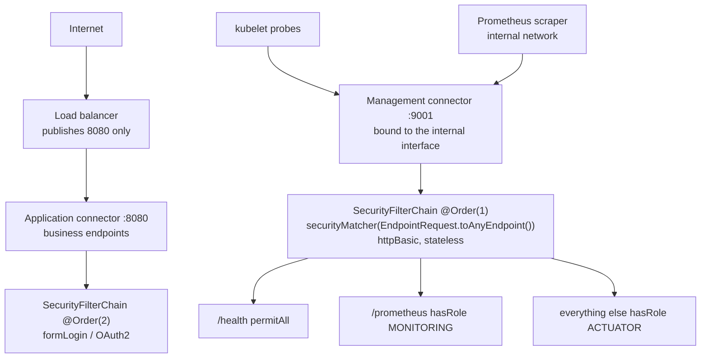

# 18.3 - Passkeys, One-Time Tokens, Remember-Me, LDAP, SAML2, and Actuator Security

> **Module 18 - Topic 3** - Modern and Adjacent
> Baseline: Spring Security 6.x on Boot 3.x
> New to this? Read **In Plain English** below first, then come back to the Version Matrix.

---

## Version Matrix

| Concern | Spring Security 5.x | **Spring Security 6.x (baseline)** | Spring Security 7.x |
|---|---|---|---|
| WebAuthn / passkeys | not supported; third-party libraries only | **first-class from 6.4 via `http.webAuthn(...)`; JDBC-backed credential repositories added in 6.5** | supported, continuing to mature |
| One-time token login | not supported; hand-rolled magic links | **`http.oneTimeTokenLogin(...)` from 6.4, with `InMemoryOneTimeTokenService` and `JdbcOneTimeTokenService`** | supported |
| Remember-me digest algorithm | MD5 only | **SHA-256 by default; MD5 retained for matching legacy cookies** | SHA-256 |
| Remember-me construction | `new TokenBasedRememberMeServices(key, userDetailsService)` | **the two-argument constructor is deprecated; pass a `RememberMeTokenAlgorithm` explicitly** | algorithm-explicit constructor only |
| LDAP configuration style | `AuthenticationManagerBuilder.ldapAuthentication()` on a `WebSecurityConfigurerAdapter` | **component beans: `LdapBindAuthenticationManagerFactory`, `EmbeddedLdapServerContextSourceFactoryBean`** | component beans only |
| SAML2 service provider | `spring-security-saml2-service-provider` from 5.2, OpenSAML 3 then 4 | **OpenSAML 4 and, from 6.3, OpenSAML 5 via the `OpenSaml5*` classes** | OpenSAML 5 |
| Actuator default web exposure | `health` | **`health` only - `/info` is *not* exposed over HTTP by default** | `health` |
| Actuator endpoint matcher | `EndpointRequest.toAnyEndpoint()` | **same, `org.springframework.boot.actuate.autoconfigure.security.servlet.EndpointRequest`** | same |
| Disabling an endpoint | `management.endpoint.<id>.enabled` | **`management.endpoint.<id>.access` (`none`, `read-only`, `unrestricted`) from Boot 3.4; `enabled` deprecated** | `access` |

---

## Why This Exists

The classic Spring Security syllabus stops at form login, JWT, and OAuth2. Real systems contain more
than that, and a senior interview will probe the edges: the enterprise mechanisms you inherit
(LDAP, SAML2), the convenience mechanisms that carry subtle risk (remember-me, magic links), the
mechanism that is actually replacing passwords (passkeys), and the one that is quietly the most
common real-world Spring Boot exposure (Actuator).

These do not share a theme beyond being expected knowledge, so this file is a survey rather than a
deep single-topic treatment. Each section is deliberately self-contained: enough to configure it
correctly, enough to explain its threat model, and enough to say honestly when you should not use it.

One thread does run through all six, and it is worth stating up front because it is the answer to
several of the interview questions below: **every authentication mechanism has a weakest link that is
not the cryptography.** Passkeys are phishing-resistant but their recovery flow is not. Magic links
are as strong as the email inbox. Remember-me is a credential with a two-week lifetime sitting on a
laptop. LDAP sends a password to a directory over a connection you must remember to encrypt. SAML
assertions are XML you must validate ruthlessly. And Actuator does not need any of them to be broken -
it just needs to be exposed.

---

## In Plain English

**The one-line version:** This file covers the ways people get into a system other than typing a
password into your login form - a fingerprint, a link in an email, a cookie that remembers them, a
company directory, a sign-in handed over from another organisation - plus the diagnostic pages that
let somebody in without logging in at all.

**An analogy.** Picture an office building with several entrances rather than one. The main entrance
has a lock and a key, which is the password. A second entrance has a fingerprint reader wired to a
sealed device that only works at this building; even if a criminal builds a convincing fake reception
desk across the road, your finger will not open their door, because the reader is physically part of
this building. That is a passkey. A third entrance issues single-use visitor passes, printed on demand
and posted to your home address - that is the emailed magic link. A fourth is the staff car park, where
a sticker on your windscreen raises the barrier without anyone checking who is driving; that is
remember-me. A fifth entrance has no lock of its own at all: the guard telephones your employer's
personnel department and asks whether you work there, which is what LDAP and SAML do, one for a
directory you run and one for an organisation you do not.

Now look at where each of these actually fails, because it is never the lock. The fingerprint reader
is essentially unbeatable, but if you cut your hand the receptionist will let you in another way, and
a determined intruder simply attacks that other way instead - passkey security is really recovery
security. The posted visitor pass is only as trustworthy as your letterbox, so anyone who can read your
post can enter. The car park sticker is a credential sitting unattended in a vehicle for a fortnight.
And then there is the service door at the back, marked "maintenance only", which needs no lock picking
whatsoever because somebody propped it open with a fire extinguisher while they were working. That is
Spring Boot Actuator, and it is the way real Spring applications are most often breached.

**How it actually works, step by step.**

A **passkey** is a pair of matching numbers. One of them, the private key, is created inside your
phone or laptop's secure hardware and never leaves it. The other, the public key, is sent to your
server and stored. To log in, your server sends a random puzzle, the device solves it with the private
key after you touch a fingerprint sensor or enter a device PIN, and your server checks the answer
against the stored public key. The reason this defeats phishing is that the web address you are
actually visiting is folded into the answer by the browser itself, so a signature produced for a
lookalike site is rejected, and there are no digits for a human to be tricked into reading aloud.
Spring Security calls this feature WebAuthn, and you turn it on with `http.webAuthn(...)`.

A **one-time token**, usually experienced as a magic link, is simpler: you type your email address,
the server generates a random single-use value, and emails you a link containing it. Spring Security
generates and checks the token and leaves the sending to you. The value must be random, short-lived,
usable once, and compared in a way that does not leak information through timing.

**Remember-me** issues a long-lived cookie so that closing the browser does not log you out. Spring
Security has two versions of it. The stateless one puts a signed value in the cookie and keeps no
record, so you cannot revoke a single device. The stateful one stores a row per remembered device and
swaps the secret value on every use, which means that if a stolen cookie and the real one are both
used, the server can tell that a copy exists and log the account out everywhere.

**LDAP** is a company directory such as Active Directory. Rather than storing passwords yourself, your
application asks the directory to check them - an operation called a *bind* - and reads the user's
group memberships to work out their roles. **SAML 2.0** solves a related problem between organisations:
another company's identity system authenticates the user and sends you a signed XML document, called
an assertion, vouching for them. In Spring terms your application is the *service provider* and theirs
is the *identity provider*.

**Actuator** is not authentication at all. It is Spring Boot's set of built-in diagnostic web pages -
health, configuration, metrics, and, most dangerously, a full memory dump of the running application.
The defaults are safe; the danger is that somebody widens them to debug a problem and the setting ships
to production.

**Why should a beginner care?** These are the mechanisms you inherit rather than choose, so you will
meet them in a codebase before you meet them in a tutorial. More importantly, each one shifts the real
security boundary somewhere unexpected - to an email inbox, to a laptop left on a train, to a
certificate that silently expires, to a port you forgot was published - and if you cannot say where the
boundary moved to, you cannot tell whether a system is safe. The Actuator section in particular
describes a single misconfigured line that hands an attacker every password in memory.

**Words you will meet in this file**

| Term | In plain words |
|---|---|
| WebAuthn | The web standard behind passkeys, supported directly by Spring Security from 6.4. |
| Passkey | A pair of matching numbers replacing a password, where the secret half never leaves your device. |
| Authenticator | The thing holding that secret half - a phone, a laptop's secure chip, or a plug-in security key. |
| Relying party (`rpId`) | Your site, identified by its domain, which a passkey is permanently tied to. |
| Phishing-resistant | Cannot be relayed to a fake site, because the real web address is built into the proof. |
| TOTP | The six-digit code from an authenticator app, which a human can be talked into typing anywhere. |
| Discoverable credential | A passkey that remembers which account it is for, allowing sign-in with no username typed. |
| One-time token | A random single-use value, normally emailed as a link, that logs the user in instead of a password. |
| Remember-me | A long-lived cookie that keeps a user signed in after the browser closes. |
| Series and token | The two halves of the stateful remember-me cookie; rotating the token is what reveals theft. |
| `fullyAuthenticated()` | A rule meaning "logged in just now", which deliberately refuses a remember-me cookie. |
| LDAP | The protocol for querying a company directory such as Active Directory. |
| Bind | Asking the directory to verify a username and password, so your application never sees the stored password. |
| Distinguished name (DN) | A user's full address inside the directory tree, such as `uid=alice,ou=people`. |
| SAML 2.0 | An older single sign-on standard that exchanges signed XML documents instead of tokens. |
| Assertion | The signed XML statement from an identity provider saying who the user is. |
| Service provider / identity provider | Your application, and the system that actually authenticates the user. |
| Actuator | Spring Boot's built-in diagnostic endpoints, which are safe by default and dangerous when widened. |
| `EndpointRequest` | The correct way to write security rules for Actuator, because its paths are configurable. |

**If you remember only one thing:** every one of these mechanisms has a weakest link that is not the
cryptography, so ask where the real boundary sits - the inbox, the recovery flow, the laptop, the
certificate, or the open port - rather than how strong the algorithm is.

---

## Core Concepts

### 1. WebAuthn and Passkeys

**In simple terms:** A passkey replaces the password with a secret that never leaves the user's own
device, so there is nothing for them to type into a fake site and nothing for you to store and lose.

Spring Security 6.4 added first-class WebAuthn support. Before that you integrated a third-party
library by hand; now it is one DSL method backed by the WebAuthn4J library.

```java
http.webAuthn(webAuthn -> webAuthn
    .rpName("Example Storefront")
    .rpId("example.com")
    .allowedOrigins("https://example.com")
);
```

**The FIDO2 model.** A passkey is an asymmetric key pair. During registration the *authenticator* -
a platform authenticator such as Touch ID, Windows Hello, or an Android device, or a roaming
authenticator such as a YubiKey - generates a key pair scoped to one relying party. The **public key
is sent to your server**; the **private key never leaves the authenticator** and in most
implementations cannot be extracted at all, because it lives in a secure enclave or on a hardware
token. Authentication is a challenge-signature exchange: the server sends a random challenge, the
authenticator signs it after a local user gesture (a fingerprint, a face, a PIN, a touch), and the
server verifies the signature against the stored public key.

**Why this is phishing-resistant in a way TOTP is not.** This is the central point and it is the one
worth being precise about.

A time-based one-time password is a shared secret rendered as six digits. The user can read those
digits and type them anywhere, including into a convincing replica of your login page. A phishing
site collects the password and the TOTP code and relays both to the real site in real time. The user
did everything right and the attacker is in. Every credential a human can read and retype is
relay-able.

WebAuthn breaks the relay because the **origin is bound into what gets signed**. The browser - not
your JavaScript, the browser itself - constructs the client data containing the actual origin it is
talking to, and the authenticator signs over a hash of that client data together with a hash of the
relying party identifier. Three consequences follow:

- The authenticator will only produce an assertion for a credential whose relying party identifier
  matches the current origin's domain. On `examp1e.com`, the passkey registered for `example.com`
  is simply not offered - the browser will not select it.
- Even if an attacker could induce a signature, the signed client data contains
  `"origin":"https://examp1e.com"`, and your server rejects it because the origin does not match
  `allowedOrigins`.
- There is nothing for the user to read out or retype, so there is no channel for a human to be
  socially engineered into relaying the credential.

The protection is enforced by the browser and the authenticator, not by user vigilance. That is why
it is categorically different from TOTP and from SMS codes rather than merely stronger.

**Two ceremonies.**

*Registration (attestation).* The server issues `PublicKeyCredentialCreationOptions` containing a
challenge, the relying party identifier and name, the user entity, and the acceptable algorithms.
The browser calls `navigator.credentials.create(...)`. The authenticator generates the key pair and
returns an attestation object with the public key and, optionally, a statement about what kind of
authenticator produced it. The server verifies and stores the credential identifier, the public key,
and a signature counter.

*Authentication (assertion).* The server issues `PublicKeyCredentialRequestOptions` with a fresh
challenge. The browser calls `navigator.credentials.get(...)`. The authenticator signs, and the
server verifies the signature against the stored public key and checks the challenge, the origin, and
the relying party identifier hash.

**Relying party identifier and origin configuration.** `rpId` is a domain, and it must be the origin's
domain or a registrable parent of it. A passkey registered with `rpId=example.com` works on
`app.example.com` and `www.example.com`; one registered with `rpId=app.example.com` does not work on
`www.example.com`. This is a decision you make once and effectively cannot change, because changing
`rpId` orphans every registered passkey. Choose the broadest domain you actually control, and never
set it to a public suffix such as `co.uk` - browsers reject that.

`allowedOrigins` is the full origin including scheme and port, and it is what the server compares
against the origin in the signed client data.

**The two repositories you must supply.**

```java
package org.springframework.security.web.webauthn.management;

public interface PublicKeyCredentialUserEntityRepository {
    PublicKeyCredentialUserEntity findById(Bytes id);
    PublicKeyCredentialUserEntity findByUsername(String username);
    void save(PublicKeyCredentialUserEntity userEntity);
    void delete(Bytes id);
}

public interface UserCredentialRepository {
    CredentialRecord findByCredentialId(Bytes credentialId);
    List<CredentialRecord> findByUserId(Bytes userId);
    void save(CredentialRecord credentialRecord);
    void delete(Bytes credentialId);
}
```

The defaults are map-backed (`MapPublicKeyCredentialUserEntityRepository`,
`MapUserCredentialRepository`), which means every passkey is forgotten on restart - fine for a demo,
useless in production. JDBC-backed implementations arrived in a 6.x maintenance release; if you are
on an earlier version you implement the two interfaces against your own schema, which is
straightforward because both are small.

The `PublicKeyCredentialUserEntity` deserves a design note. Its `id` is an opaque byte array that the
specification says must not contain personally identifying information, because it is stored on the
authenticator and may be visible in credential pickers. Do not use the email address or the username
as the user handle; use a random identifier and map it to your user internally.

**Discoverable credentials and usernameless login.** A *discoverable* credential (previously called a
resident key) stores the user handle on the authenticator itself. That allows the server to send a
request with an empty `allowCredentials` list, and the authenticator presents the user with a picker
of the accounts it holds for that relying party. The user selects one and authenticates - **no
username is typed at all**. This is what makes the modern "Sign in" button with a fingerprint prompt
possible, and it is the experience that makes passkeys feel better than passwords rather than merely
safer.

**The recovery problem, which is where passkey projects actually fail.** A passkey is bound to
authenticators. Users lose phones, wipe laptops, and switch ecosystems. If the only credential is a
passkey on a device that no longer exists, the user is locked out permanently unless you built a
recovery path.

And the recovery path becomes the real security boundary. If losing a phone is recoverable by
emailing a magic link, then your phishing-resistant authentication is protected by an email inbox -
which is exactly the credential passkeys were supposed to replace. An attacker will not attack the
passkey; they will attack recovery.

The defensible designs: encourage registration of **multiple** passkeys across devices, which is the
single most effective measure; rely on synchronised passkeys where the platform backs the key up
across the user's devices (iCloud Keychain, Google Password Manager), which solves loss for the common
case at the cost of trusting the platform's account security; issue one-time recovery codes at
registration to be stored offline; and for high-value accounts, make recovery a deliberately
high-friction, human-verified process rather than a self-service link. What you must not do is build
a frictionless recovery flow and then claim the system is phishing-resistant.

### 2. One-Time Token Login (Magic Links)

**In simple terms:** Instead of a password, the user receives a single-use link by email and clicking
it signs them in. Spring Security creates and checks the token; sending the email is your job.

Also new in Spring Security 6.4:

```java
http.oneTimeTokenLogin(ott -> ott
    .tokenGenerationSuccessHandler(this::sendMagicLink)
);
```

The model: the user submits an identifier, the server generates a single-use token, the token is
delivered out of band (normally by email), and following the link authenticates the user. There is
no password.

```java
package org.springframework.security.authentication.ott;

public interface OneTimeTokenService {
    OneTimeToken generate(GenerateOneTimeTokenRequest request);
    OneTimeToken consume(OneTimeTokenAuthenticationToken authenticationToken);
}
```

`GenerateOneTimeTokenRequest` carries the username and, in later 6.x versions, an explicit expiry.
Implementations are `InMemoryOneTimeTokenService` and `JdbcOneTimeTokenService`; the default token
lifetime is five minutes.

The default endpoints are `POST /ott/generate` to request a token, and `GET`/`POST /login/ott` to
present and submit it. The filters are `GenerateOneTimeTokenFilter` and
`OneTimeTokenAuthenticationFilter`, with `OneTimeTokenAuthenticationProvider` doing the verification.

**Delivery is deliberately out of scope for the framework.** Spring Security generates and verifies
the token and hands it to your `OneTimeTokenGenerationSuccessHandler`; sending the email or the SMS
is your code. This is the right boundary - the framework has no business owning your mail
infrastructure - but it means the most security-sensitive step is yours to get right.

The security properties that must hold, and which the framework gives you if you do not fight it:

- **Single use.** `consume` removes the token. A link in an email that can be used twice is a link
  that works after it has been forwarded, archived, or scanned.
- **Short expiry.** Five minutes is the default and a reasonable value. Email links end up in
  long-lived archives; a token valid for a day is a standing credential sitting in an inbox.
- **Generated with `SecureRandom`**, with enough entropy to make guessing infeasible. A token derived
  from a timestamp or a counter is enumerable.
- **Compared in constant time.** A token the attacker supplies and can vary is exactly the case where
  `String.equals` leaks information through response timing. `MessageDigest.isEqual(byte[], byte[])`
  is the correct comparison.
- **No user enumeration.** The response to "send me a link" must be identical whether the account
  exists or not. Otherwise the endpoint is a free account-existence oracle.
- **Rate limited.** Without a limit the endpoint is both an enumeration tool and a way to use your
  mail server to send unsolicited mail to arbitrary addresses.

**The honest assessment: the email inbox becomes the security boundary.** Anyone who can read the
user's email can log in as them, which means your authentication is exactly as strong as their mail
provider's authentication and no stronger. For a low-value consumer account that is a reasonable
trade for removing password reuse and password storage entirely. For anything privileged it is a
downgrade, because you have replaced a credential you control with one you do not.

A second, subtler point worth raising in an interview: magic links are not phishing-resistant. A
phishing page can ask for the email address, trigger a real link to be sent, and then ask the user to
paste the code or the link into the fake page. The user receives a genuine email from you, which makes
the phishing *more* convincing rather than less.

### 3. Remember-Me

**In simple terms:** This is the "keep me signed in" cookie. There are two versions, and the
difference is whether the server keeps a record, which decides whether you can log out one stolen
device or notice that a cookie was copied at all.

Remember-me issues a long-lived cookie so that a user who closes the browser is still recognised days
later. There are two implementations with genuinely different security properties.

**`TokenBasedRememberMeServices` - signed, stateless.** The cookie is a base64-encoded value
containing the username, an expiry timestamp, the digest algorithm name, and a signature. The
signature is a hash over the username, the expiry, **the user's stored password hash**, and a
server-side key. In Spring Security 6 the default algorithm is SHA-256, with MD5 retained only so that
cookies issued by older versions still validate.

```
cookie = base64( username + ":" + expiryTime + ":" + algorithmName + ":" +
                 hash(username + ":" + expiryTime + ":" + password + ":" + key) )
```

Including the password hash in the signature produces a useful property for free: **changing the
password invalidates every outstanding remember-me cookie**, on every device, automatically. There is
no server-side state to clear because the old signature no longer verifies.

Its weakness is equally structural. There is no server-side record, so a stolen cookie is a valid
credential until it expires - the default validity is two weeks - and you cannot revoke an individual
one. Your only lever is a password change, which revokes all of them.

**`PersistentTokenBasedRememberMeServices` - stateful, with theft detection.** The cookie holds a
**series** identifier and a **token** value. The server stores the pair.

```java
package org.springframework.security.web.authentication.rememberme;

public interface PersistentTokenRepository {
    void createNewToken(PersistentRememberMeToken token);
    void updateToken(String series, String tokenValue, Date lastUsed);
    PersistentRememberMeToken getTokenForSeries(String seriesId);
    void removeUserTokens(String username);
}
```

```sql
create table persistent_logins (
    username  varchar(64) not null,
    series    varchar(64) primary key,
    token     varchar(64) not null,
    last_used timestamp   not null
);
```

On every use, the series is looked up and the token value is **rotated** - a new random token is
stored and returned in a refreshed cookie. The series stays constant for the life of that "remembered
device".

That rotation is what enables **theft detection**. Suppose an attacker steals the cookie. Either the
attacker or the legitimate user will use it first; whoever uses it second presents a token value that
no longer matches the stored one for that series. The server now knows, with certainty, that two
parties hold cookies for the same series - which can only happen if one was copied. Spring Security
throws `CookieTheftException` and removes every token for that user, logging them out everywhere.

```java
// PersistentTokenBasedRememberMeServices.processAutoLoginCookie (simplified)
PersistentRememberMeToken token = this.tokenRepository.getTokenForSeries(series);
if (token == null) {
    throw new RememberMeAuthenticationException("No persistent token found for series " + series);
}
if (!presentedToken.equals(token.getTokenValue())) {
    // Series matched but the token value did not: the cookie was cloned.
    this.tokenRepository.removeUserTokens(token.getUsername());
    throw new CookieTheftException("Invalid remember-me token (series/token) mismatch. "
            + "Implies previous cookie theft attack.");
}
```

It also gives you per-device revocation, because each remembered device is a row you can delete.

| | `TokenBasedRememberMeServices` | `PersistentTokenBasedRememberMeServices` |
|---|---|---|
| Server state | None | One row per remembered device |
| Revoke one device | Not possible | Delete the row |
| Revoke all devices | Change the password | `removeUserTokens(username)` |
| Theft detection | None | **Yes** - replay of a rotated token is detected |
| Password change effect | Invalidates all cookies automatically | No automatic effect - handle it yourself |
| Operational cost | Zero | A table, plus cleanup of stale rows |

**The filter and the provider.** `RememberMeAuthenticationFilter` sits after the normal authentication
filters and only acts when nothing else has authenticated. It produces a `RememberMeAuthenticationToken`,
which `RememberMeAuthenticationProvider` validates by comparing a hash of the configured key - which
is why setting an explicit, stable `key` matters. If you do not set one, Spring generates a random key
at startup, so every restart invalidates every remember-me cookie and, with multiple instances, each
instance rejects the others' cookies.

**Why remember-me must fail `fullyAuthenticated()`.** A remember-me authentication asserts "this
browser presented a cookie we issued a while ago". It does not assert "this person just proved who
they are". The laptop may have changed hands.

So `AuthenticationTrustResolver.isRememberMe(...)` returns true for these tokens, and
`fullyAuthenticated()` excludes them, exactly as it excludes anonymous:

```java
.authorizeHttpRequests(auth -> auth
    .requestMatchers("/account/**").fullyAuthenticated()   // remember-me NOT sufficient
    .requestMatchers("/dashboard/**").authenticated()      // remember-me IS sufficient
    .anyRequest().authenticated()
)
```

The pattern is a two-tier session: browsing, reading, and viewing your dashboard are fine on a
remembered cookie; changing the password, changing the email address, adding a payment method, or
viewing sensitive data require a fresh login. `ExceptionTranslationFilter` cooperates with this -
when a remember-me authenticated user is denied, it starts authentication rather than returning a
flat 403, so the user is prompted to log in again rather than shown an error.

### 4. LDAP

**In simple terms:** Instead of storing passwords yourself, you ask the company directory to check
them and to tell you which groups the person belongs to. You will almost always inherit this rather
than choose it.

`spring-security-ldap` authenticates against a directory - Active Directory, OpenLDAP, or another
LDAP v3 server. It is inherited far more often than it is chosen, and it remains common in large
enterprises.

**Two authentication strategies, and the difference matters.**

*`BindAuthenticator`* attempts an LDAP **bind** as the user with the supplied password. The directory
performs the verification; your application never sees the stored password. This is the correct
default. It also means the directory's own policies - account lockout, password expiry, password
complexity - are enforced, because the directory is making the decision.

*`PasswordComparisonAuthenticator`* binds as a service account, reads the `userPassword` attribute,
and compares locally. It requires the directory to expose password material to the service account,
bypasses directory-side lockout policy, and moves password comparison into your process. Use it only
when the directory genuinely cannot support user binds.

**The connection.** `DefaultSpringSecurityContextSource` holds the URL and the manager credentials:

```java
@Bean
DefaultSpringSecurityContextSource contextSource() {
    var contextSource = new DefaultSpringSecurityContextSource("ldaps://directory.example.com:636/dc=example,dc=com");
    contextSource.setUserDn("cn=service-account,ou=services,dc=example,dc=com");
    contextSource.setPassword(System.getenv("LDAP_SERVICE_PASSWORD"));
    return contextSource;
}
```

Note `ldaps://`. A plain `ldap://` bind sends the user's password to the directory **in clear text**.
This is the single most common LDAP misconfiguration and it is invisible until someone captures
traffic. Use LDAPS on port 636, or StartTLS on 389, and never plain LDAP outside a test container.

**Finding the user: two approaches.**

```java
factory.setUserDnPatterns("uid={0},ou=people");     // direct: build the DN from the username
```

`userDnPatterns` constructs the distinguished name by substitution. It is fast - one bind, no search -
and it works when every user sits at a predictable place in the tree. You may supply several patterns
and they are tried in order.

```java
factory.setUserSearchBase("ou=people");
factory.setUserSearchFilter("(uid={0})");           // search: find the DN, then bind
```

`userSearchFilter` with `FilterBasedLdapUserSearch` performs a search as the manager account to locate
the user's distinguished name, then binds as that DN. It is necessary when users live in different
subtrees, or when login is by an attribute other than the one in the DN - logging in with `mail` while
the DN uses `uid` is the usual case. Active Directory typically needs a search, with a filter such as
`(sAMAccountName={0})` or `(userPrincipalName={0})`.

**Authorities come from group membership.** `DefaultLdapAuthoritiesPopulator` searches for groups that
contain the user's distinguished name:

```java
var authorities = new DefaultLdapAuthoritiesPopulator(contextSource, "ou=groups");
authorities.setGroupSearchFilter("(uniqueMember={0})");   // {0} is the user's DN
authorities.setGroupRoleAttribute("cn");                  // which attribute becomes the role name
authorities.setRolePrefix("ROLE_");
authorities.setConvertToUpperCase(true);
```

A group `cn=developers` becomes the authority `ROLE_DEVELOPERS`. The defaults are
`(uniqueMember={0})`, `cn`, `ROLE_`, and uppercase conversion - Active Directory uses `member` rather
than `uniqueMember`, which is the first thing to change when roles come back empty against AD.

**The 6.x configuration style** uses factory beans rather than
`AuthenticationManagerBuilder.ldapAuthentication()`:

```java
@Bean
AuthenticationManager ldapAuthenticationManager(BaseLdapPathContextSource contextSource) {
    var factory = new LdapBindAuthenticationManagerFactory(contextSource);
    factory.setUserDnPatterns("uid={0},ou=people");
    factory.setUserDetailsContextMapper(new PersonContextMapper());
    return factory.createAuthenticationManager();
}
```

`LdapPasswordComparisonAuthenticationManagerFactory` is the parallel for the comparison strategy.

**Testing with embedded UnboundID.** Add `com.unboundid:unboundid-ldapsdk` as a test dependency and
Spring Security can start an in-process directory seeded from an LDIF file:

```java
@Bean
EmbeddedLdapServerContextSourceFactoryBean contextSource() {
    var factory = EmbeddedLdapServerContextSourceFactoryBean.fromEmbeddedLdapServer();
    factory.setPort(0);                                   // random free port
    return factory;
}
```

With `src/test/resources/users.ldif` on the classpath this gives real LDAP behaviour in a unit test -
real binds, real searches, real group membership - with no container and no network. It is one of the
better testing stories in Spring Security and it removes the usual excuse for not testing directory
integration.

### 5. SAML2

**In simple terms:** Another organisation logs the user in and sends you a signed XML document
vouching for them. It is older and more awkward than OpenID Connect, and you support it because large
customers require it.

`spring-security-saml2-service-provider` makes your application a SAML 2.0 **service provider**. The
framework does not implement an identity provider; if you need one, that is Keycloak, ADFS, Okta, or
similar.

**The roles.** The *service provider* is your application, which needs to know who the user is. The
*identity provider* - called the asserting party in the Spring API - authenticates the user and issues
a signed **assertion**. The user's browser carries messages between them, normally by auto-submitting
form POSTs.

**How SAML differs from OpenID Connect**, which is the comparison an interviewer is looking for:

| | SAML 2.0 | OpenID Connect |
|---|---|---|
| Message format | XML assertions, XML Digital Signature | JSON, JWT (JWS) |
| Typical transport | HTTP POST binding with auto-submitting forms; also Redirect and Artifact | Redirects with query parameters, then a back-channel token request |
| What you receive | An assertion describing an authentication event and attributes | `id_token`, plus an `access_token` for APIs |
| Calling APIs | **Nothing is issued for API calls** - SAML is single sign-on only | `access_token` is designed exactly for that |
| Mobile and single-page applications | Poor fit | Designed for it |
| Discovery | Metadata XML exchange | `/.well-known/openid-configuration` |
| Complexity | High - XML canonicalisation, signature wrapping, encryption | Moderate |
| Where you meet it | Enterprise and government | Everything else |

The most practically important row is "calling APIs". SAML gives you an authenticated session and
nothing else. If your microservices need bearer tokens, SAML does not produce them - you authenticate
the user with SAML at the edge and then issue your own tokens, which is precisely the pattern where
Spring Authorization Server with SAML federation makes sense.

**`RelyingPartyRegistration`** is the configuration object holding one identity provider relationship:
the registration identifier, your entity identifier, the assertion consumer service location, the
identity provider's single sign-on URL, its verification certificates, and your signing and decryption
credentials.

```java
@Bean
RelyingPartyRegistrationRepository relyingPartyRegistrations() {
    RelyingPartyRegistration okta = RelyingPartyRegistrations
            .fromMetadataLocation("https://idp.example.com/metadata")
            .registrationId("okta")
            .entityId("https://app.example.com/saml2/service-provider-metadata/okta")
            .signingX509Credentials(c -> c.add(signingCredential()))
            .decryptionX509Credentials(c -> c.add(decryptionCredential()))
            .build();
    return new InMemoryRelyingPartyRegistrationRepository(okta);
}
```

`RelyingPartyRegistrations.fromMetadataLocation(...)` parses the identity provider's metadata XML and
fills in the endpoints and certificates, which removes most of the copying-values-by-hand that makes
SAML integrations error-prone.

**Metadata exchange is bidirectional.** The identity provider also needs *your* metadata - your entity
identifier, your assertion consumer service URL, and your certificates. `Saml2MetadataFilter` publishes
it at `/saml2/service-provider-metadata/{registrationId}`, and handing that URL to the customer's
identity administrator is normally how an integration begins.

**Credentials serve two distinct purposes.** Signing credentials prove that authentication requests
and logout messages came from you. Decryption credentials decrypt assertions or name identifiers the
identity provider encrypted for you. They can be the same key pair but usually should not be, and both
are long-lived certificates that **expire** - a diarised renewal is part of the integration, because
an expired certificate is a total single sign-on outage for that customer with an error message deep
in the identity provider's logs rather than yours.

**Configuration by property** covers most cases without Java:

```yaml
spring:
  security:
    saml2:
      relyingparty:
        registration:
          okta:
            entity-id: https://app.example.com/saml2/service-provider-metadata/okta
            assertingparty:
              metadata-uri: https://idp.example.com/metadata
            signing:
              credentials:
                - private-key-location: classpath:saml/sp-private.key
                  certificate-location: classpath:saml/sp-certificate.crt
```

**The filters.** `Saml2WebSsoAuthenticationRequestFilter` handles `/saml2/authenticate/{registrationId}`
and builds the authentication request. `Saml2WebSsoAuthenticationFilter` handles
`/login/saml2/sso/{registrationId}` - the assertion consumer service - and is where the assertion
arrives and is validated by `OpenSaml4AuthenticationProvider` (or `OpenSaml5AuthenticationProvider` on
newer versions), producing a `Saml2Authentication` whose principal is a `Saml2AuthenticatedPrincipal`
carrying the attributes. `Saml2LogoutRequestFilter` and `Saml2LogoutResponseFilter` implement single
logout.

**The honest guidance:** use SAML when enterprise customers require it, and OpenID Connect otherwise.
SAML is not better, and for anything greenfield it is worse - more complex, worse mobile support, an
XML signature model with a genuinely nasty history of signature-wrapping vulnerabilities, and no
tokens for API calls. But a large customer whose identity team supports SAML and not OIDC is a
commercial fact, not a technical debate, and "we support SAML" is frequently a line item in an
enterprise procurement checklist. Supporting both is normal: `RelyingPartyRegistrationRepository` for
the SAML customers, `ClientRegistrationRepository` for the OIDC ones.

### 6. Actuator Security

**In simple terms:** These are Spring Boot's built-in diagnostic pages. The defaults are safe, but one
line added to debug a problem can publish your entire configuration and a downloadable copy of
everything in memory.

Spring Boot Actuator is, in practice, the most commonly exposed sensitive surface in a Spring Boot
application - not because it is insecure by design, but because someone sets
`management.endpoints.web.exposure.include=*` to debug something and it reaches production.

**Which endpoints are sensitive, and why.**

| Endpoint | Risk |
|---|---|
| `/env` | Every environment property and system property. Even with sanitisation, it maps your entire configuration surface, internal hostnames, and database URLs |
| `/configprops` | Every `@ConfigurationProperties` bean and its values - the same exposure from a different angle |
| `/heapdump` | **Downloads the entire JVM heap.** Every password, token, session, and piece of customer data currently in memory. This is a complete compromise in one HTTP GET |
| `/threaddump` | Stack traces revealing internal structure, and sometimes parameter values |
| `/loggers` | **Writable.** A POST changes log levels at runtime - an attacker can set the root logger to `TRACE` and cause the application to log request bodies and credentials, or set it to `OFF` to blind your monitoring before attacking |
| `/shutdown` | Stops the application. Disabled by default, and it should stay that way |
| `/mappings` | The complete list of endpoints, including any you believed were unlisted |
| `/beans` | The whole application context - a precise map of your internals |
| `/httpexchanges` | Recent request and response metadata, including headers |
| `/metrics` | Usually benign, but it can leak business volumes and endpoint names |
| `/health` with full details | Internal hostnames, database and broker addresses, and which dependencies are failing |

`/heapdump` and `/loggers` deserve particular emphasis. A heap dump is not an information leak, it is
*the* information leak - everything the process holds. And `/loggers` is the one people forget is a
write operation, because "logging" sounds like an observability concern rather than a control plane.

**The defaults are good; the problem is people overriding them.** In Spring Boot 3.x,
`management.endpoints.web.exposure.include` defaults to **`health`** and nothing else. The `/info`
endpoint is *not* exposed over HTTP by default - a detail worth being precise about, because many
tutorials and much folklore claim otherwise, and `management.endpoint.health.show-details` defaults to
`never` so even `/health` returns only a status. Nearly every real Actuator incident starts with
someone widening that.

The correct posture is to include exactly what you need:

```yaml
management:
  endpoints:
    web:
      exposure:
        include: health,info,prometheus,metrics
  endpoint:
    health:
      show-details: when-authorized
      show-components: when-authorized
```

**`EndpointRequest` is the correct matcher.** Actuator paths are configurable - the base path can be
changed, and the management server can run on a different port - so hard-coding
`requestMatchers("/actuator/**")` is fragile. `EndpointRequest` resolves the real paths from the
Actuator configuration:

```java
import org.springframework.boot.actuate.autoconfigure.security.servlet.EndpointRequest;

.authorizeHttpRequests(auth -> auth
    .requestMatchers(EndpointRequest.to(HealthEndpoint.class)).permitAll()
    .requestMatchers(EndpointRequest.to("prometheus")).hasRole("MONITORING")
    .requestMatchers(EndpointRequest.toAnyEndpoint()).hasRole("ADMIN")
    .anyRequest().authenticated()
)
```

The variants: `toAnyEndpoint()` matches every exposed endpoint; `to(...)` matches specific ones by
class or by identifier; `toLinks()` matches the discovery page at the base path; and
`.excluding(...)` / `.excludingLinks()` narrow `toAnyEndpoint()`. Note that the order is significant -
`toAnyEndpoint()` would also match `health`, so the specific rules must come first.

**A dedicated filter chain** keeps management concerns out of the application's security configuration
and lets you use a different authentication mechanism - typically HTTP Basic for a scraper, while the
application uses form login or OAuth2:

```java
@Bean
@Order(1)
SecurityFilterChain actuatorFilterChain(HttpSecurity http) throws Exception {
    http
        .securityMatcher(EndpointRequest.toAnyEndpoint())
        .authorizeHttpRequests(auth -> auth
            .requestMatchers(EndpointRequest.to(HealthEndpoint.class)).permitAll()
            .anyRequest().hasRole("ACTUATOR"))
        .httpBasic(Customizer.withDefaults())
        .csrf(csrf -> csrf.disable())          // machine clients, no ambient authority
        .sessionManagement(s -> s.sessionCreationPolicy(SessionCreationPolicy.STATELESS));
    return http.build();
}
```

**Separating the management port is the strongest control**, because it is a network control rather
than an application one:

```yaml
management:
  server:
    port: 9001
    address: 127.0.0.1        # or the internal interface only
```

Actuator then listens on a completely separate connector. Do not publish that port at the load
balancer or in the Kubernetes `Service`, and the endpoints are unreachable from the internet no matter
what the application's security configuration says. This is defence in depth done properly: a
misconfigured `requestMatchers` rule stops being an internet-facing vulnerability and becomes an
internal one.

Two caveats. `EndpointRequest` still works with a separate port and remains the correct matcher.
And a Kubernetes liveness or readiness probe needs to reach the management port, so the container
must expose it to the kubelet even though the `Service` does not expose it externally.



---

## Working Code

One compact, realistic example per mechanism.

**Passkeys with a persistent credential store:**

```java
package com.example.mechanisms;

import org.springframework.context.annotation.Bean;
import org.springframework.context.annotation.Configuration;
import org.springframework.security.config.Customizer;
import org.springframework.security.config.annotation.web.builders.HttpSecurity;
import org.springframework.security.config.annotation.web.configuration.EnableWebSecurity;
import org.springframework.security.web.SecurityFilterChain;

@Configuration
@EnableWebSecurity
public class PasskeyConfig {

    @Bean
    SecurityFilterChain passkeyFilterChain(HttpSecurity http) throws Exception {
        http
            .authorizeHttpRequests(auth -> auth
                .requestMatchers("/login/**", "/webauthn/**", "/error").permitAll()
                .anyRequest().authenticated())
            .formLogin(Customizer.withDefaults())      // keep a fallback during rollout
            .webAuthn(webAuthn -> webAuthn
                .rpName("Example Storefront")
                // rpId is effectively permanent: changing it orphans every passkey.
                .rpId("example.com")
                .allowedOrigins("https://example.com", "https://www.example.com"));
        return http.build();
    }

    // In production, supply JDBC-backed implementations of
    // PublicKeyCredentialUserEntityRepository and UserCredentialRepository.
    // The map-backed defaults lose every passkey on restart.
}
```

**One-time token login with real delivery:**

```java
package com.example.mechanisms;

import jakarta.servlet.http.HttpServletRequest;
import jakarta.servlet.http.HttpServletResponse;
import org.springframework.context.annotation.Bean;
import org.springframework.context.annotation.Configuration;
import org.springframework.jdbc.core.JdbcTemplate;
import org.springframework.mail.SimpleMailMessage;
import org.springframework.mail.javamail.JavaMailSender;
import org.springframework.security.authentication.ott.JdbcOneTimeTokenService;
import org.springframework.security.authentication.ott.OneTimeToken;
import org.springframework.security.authentication.ott.OneTimeTokenService;
import org.springframework.security.config.annotation.web.builders.HttpSecurity;
import org.springframework.security.web.SecurityFilterChain;
import org.springframework.security.web.authentication.ott.OneTimeTokenGenerationSuccessHandler;
import org.springframework.security.web.util.UrlUtils;
import org.springframework.web.util.UriComponentsBuilder;

@Configuration
public class OneTimeTokenConfig {

    @Bean
    SecurityFilterChain ottFilterChain(HttpSecurity http,
                                       OneTimeTokenGenerationSuccessHandler handler) throws Exception {
        http
            .authorizeHttpRequests(auth -> auth
                .requestMatchers("/login/**", "/ott/**", "/error").permitAll()
                .anyRequest().authenticated())
            .oneTimeTokenLogin(ott -> ott.tokenGenerationSuccessHandler(handler));
        return http.build();
    }

    /** Persisted so tokens survive a restart and work across instances. */
    @Bean
    OneTimeTokenService oneTimeTokenService(JdbcTemplate jdbcTemplate) {
        return new JdbcOneTimeTokenService(jdbcTemplate);
    }

    /**
     * Delivery is deliberately outside the framework. Note what is NOT done here:
     * the token is never logged, and the response is identical whether or not the
     * account exists, so this endpoint is not an account-enumeration oracle.
     */
    @Bean
    OneTimeTokenGenerationSuccessHandler magicLinkSender(JavaMailSender mailSender,
                                                         UserEmailLookup emails) {
        return (HttpServletRequest request, HttpServletResponse response, OneTimeToken token) -> {
            String link = UriComponentsBuilder.fromHttpUrl(UrlUtils.buildFullRequestUrl(request))
                    .replacePath(request.getContextPath() + "/login/ott")
                    .replaceQuery(null)
                    .queryParam("token", token.getTokenValue())
                    .toUriString();

            emails.findEmail(token.getUsername()).ifPresent(address -> {
                var message = new SimpleMailMessage();
                message.setTo(address);
                message.setSubject("Your sign-in link");
                message.setText("Sign in: " + link + "\nThis link expires in 5 minutes and works once.");
                mailSender.send(message);
            });

            // Same response either way.
            response.setStatus(HttpServletResponse.SC_OK);
            response.setContentType("application/json");
            response.getWriter().write("{\"status\":\"If the account exists, a link has been sent.\"}");
        };
    }
}
```

**Remember-me with theft detection and a two-tier session:**

```java
package com.example.mechanisms;

import javax.sql.DataSource;

import org.springframework.context.annotation.Bean;
import org.springframework.context.annotation.Configuration;
import org.springframework.security.config.Customizer;
import org.springframework.security.config.annotation.web.builders.HttpSecurity;
import org.springframework.security.core.userdetails.UserDetailsService;
import org.springframework.security.web.SecurityFilterChain;
import org.springframework.security.web.authentication.rememberme.JdbcTokenRepositoryImpl;
import org.springframework.security.web.authentication.rememberme.PersistentTokenRepository;

@Configuration
public class RememberMeConfig {

    @Bean
    SecurityFilterChain rememberMeFilterChain(HttpSecurity http,
                                              PersistentTokenRepository tokenRepository,
                                              UserDetailsService userDetailsService) throws Exception {
        http
            .authorizeHttpRequests(auth -> auth
                .requestMatchers("/login", "/error").permitAll()
                // A remembered cookie is enough to browse.
                .requestMatchers("/dashboard/**").authenticated()
                // It is NOT enough to change credentials or spend money.
                .requestMatchers("/account/password", "/account/email", "/payments/**")
                    .fullyAuthenticated()
                .anyRequest().authenticated())
            .formLogin(Customizer.withDefaults())
            .rememberMe(rememberMe -> rememberMe
                // A STABLE key. Omit it and Spring generates a random one per startup,
                // so every restart invalidates every cookie and instances reject each other's.
                .key("${REMEMBER_ME_KEY}")
                .tokenRepository(tokenRepository)     // persistent => theft detection
                .userDetailsService(userDetailsService)
                .tokenValiditySeconds(14 * 24 * 60 * 60)
                .rememberMeParameter("remember-me")
                .rememberMeCookieName("REMEMBER_ME")
                .useSecureCookie(true));
        return http.build();
    }

    @Bean
    PersistentTokenRepository persistentTokenRepository(DataSource dataSource) {
        var repository = new JdbcTokenRepositoryImpl();
        repository.setDataSource(dataSource);
        // repository.setCreateTableOnStartup(true);   // development only
        return repository;
    }
}
```

**LDAP with a bind authenticator and group-derived authorities:**

```java
package com.example.mechanisms;

import org.springframework.context.annotation.Bean;
import org.springframework.context.annotation.Configuration;
import org.springframework.ldap.core.support.BaseLdapPathContextSource;
import org.springframework.security.authentication.AuthenticationManager;
import org.springframework.security.config.annotation.authentication.configuration.EnableGlobalAuthentication;
import org.springframework.security.config.ldap.LdapBindAuthenticationManagerFactory;
import org.springframework.security.ldap.DefaultSpringSecurityContextSource;
import org.springframework.security.ldap.userdetails.DefaultLdapAuthoritiesPopulator;
import org.springframework.security.ldap.userdetails.PersonContextMapper;

@Configuration
@EnableGlobalAuthentication
public class LdapConfig {

    @Bean
    DefaultSpringSecurityContextSource contextSource() {
        // ldaps:// - a plain ldap:// bind sends the user's password in clear text.
        var contextSource = new DefaultSpringSecurityContextSource(
                "ldaps://directory.example.com:636/dc=example,dc=com");
        contextSource.setUserDn("cn=service-account,ou=services,dc=example,dc=com");
        contextSource.setPassword(System.getenv("LDAP_SERVICE_PASSWORD"));
        return contextSource;
    }

    @Bean
    AuthenticationManager ldapAuthenticationManager(BaseLdapPathContextSource contextSource) {
        var factory = new LdapBindAuthenticationManagerFactory(contextSource);

        // Direct DN construction - one bind, no search. Use setUserSearchFilter instead
        // when users live in multiple subtrees or log in with an attribute not in the DN.
        factory.setUserDnPatterns("uid={0},ou=people");

        var authorities = new DefaultLdapAuthoritiesPopulator(contextSource, "ou=groups");
        authorities.setGroupSearchFilter("(uniqueMember={0})");   // Active Directory: (member={0})
        authorities.setGroupRoleAttribute("cn");
        authorities.setRolePrefix("ROLE_");
        authorities.setConvertToUpperCase(true);

        factory.setLdapAuthoritiesPopulator(authorities);
        factory.setUserDetailsContextMapper(new PersonContextMapper());
        return factory.createAuthenticationManager();
    }
}
```

**SAML2 service provider:**

```java
package com.example.mechanisms;

import org.springframework.context.annotation.Bean;
import org.springframework.context.annotation.Configuration;
import org.springframework.security.config.Customizer;
import org.springframework.security.config.annotation.web.builders.HttpSecurity;
import org.springframework.security.saml2.provider.service.registration.RelyingPartyRegistrationRepository;
import org.springframework.security.web.SecurityFilterChain;

@Configuration
public class Saml2Config {

    @Bean
    SecurityFilterChain saml2FilterChain(HttpSecurity http,
                                         RelyingPartyRegistrationRepository registrations) throws Exception {
        http
            .authorizeHttpRequests(auth -> auth
                .requestMatchers("/saml2/**", "/login/**", "/error").permitAll()
                .anyRequest().authenticated())
            .saml2Login(Customizer.withDefaults())
            .saml2Logout(Customizer.withDefaults())
            // Publishes our metadata at /saml2/service-provider-metadata/{registrationId}
            // for the customer's identity administrator to consume.
            .saml2Metadata(Customizer.withDefaults());
        return http.build();
    }
}
```

**Actuator on a separate port with its own chain:**

```java
package com.example.mechanisms;

import org.springframework.boot.actuate.autoconfigure.security.servlet.EndpointRequest;
import org.springframework.boot.actuate.health.HealthEndpoint;
import org.springframework.boot.actuate.info.InfoEndpoint;
import org.springframework.context.annotation.Bean;
import org.springframework.context.annotation.Configuration;
import org.springframework.core.annotation.Order;
import org.springframework.security.config.Customizer;
import org.springframework.security.config.annotation.web.builders.HttpSecurity;
import org.springframework.security.config.http.SessionCreationPolicy;
import org.springframework.security.web.SecurityFilterChain;

@Configuration
public class ActuatorSecurityConfig {

    @Bean
    @Order(1)
    SecurityFilterChain actuatorFilterChain(HttpSecurity http) throws Exception {
        http
            // EndpointRequest resolves the real paths from Actuator configuration,
            // so this keeps working if the base path or the management port changes.
            .securityMatcher(EndpointRequest.toAnyEndpoint())
            .authorizeHttpRequests(auth -> auth
                // Specific rules FIRST: toAnyEndpoint() would also match these.
                .requestMatchers(EndpointRequest.to(HealthEndpoint.class, InfoEndpoint.class)).permitAll()
                .requestMatchers(EndpointRequest.to("prometheus")).hasRole("MONITORING")
                .anyRequest().hasRole("ACTUATOR"))
            .httpBasic(Customizer.withDefaults())
            .csrf(csrf -> csrf.disable())
            .sessionManagement(session -> session
                .sessionCreationPolicy(SessionCreationPolicy.STATELESS));
        return http.build();
    }

    @Bean
    @Order(2)
    SecurityFilterChain applicationFilterChain(HttpSecurity http) throws Exception {
        http
            .authorizeHttpRequests(auth -> auth
                .requestMatchers("/", "/login", "/error").permitAll()
                .anyRequest().authenticated())
            .formLogin(Customizer.withDefaults());
        return http.build();
    }
}
```

`application.yml`:

```yaml
management:
  server:
    port: 9001                      # separate connector, not published externally
    address: 127.0.0.1
  endpoints:
    web:
      exposure:
        include: health,info,prometheus,metrics    # never "*"
  endpoint:
    health:
      show-details: when-authorized
      show-components: when-authorized
      probes:
        enabled: true               # /health/liveness and /health/readiness
    env:
      show-values: when-authorized
    configprops:
      show-values: when-authorized
    shutdown:
      access: none                  # Boot 3.4+; previously enabled: false

spring:
  security:
    saml2:
      relyingparty:
        registration:
          acme-corp:
            entity-id: https://app.example.com/saml2/service-provider-metadata/acme-corp
            assertingparty:
              metadata-uri: https://idp.acme-corp.com/federationmetadata.xml
            signing:
              credentials:
                - private-key-location: file:/run/secrets/saml-sp.key
                  certificate-location: file:/run/secrets/saml-sp.crt
```

Tests:

```java
package com.example.mechanisms;

import org.junit.jupiter.api.Test;
import org.springframework.beans.factory.annotation.Autowired;
import org.springframework.boot.test.autoconfigure.web.servlet.AutoConfigureMockMvc;
import org.springframework.boot.test.context.SpringBootTest;
import org.springframework.security.test.context.support.WithMockUser;
import org.springframework.test.web.servlet.MockMvc;

import static org.assertj.core.api.Assertions.assertThat;
import static org.springframework.security.test.web.servlet.request.SecurityMockMvcRequestPostProcessors.csrf;
import static org.springframework.security.test.web.servlet.request.SecurityMockMvcRequestPostProcessors.httpBasic;
import static org.springframework.test.web.servlet.request.MockMvcRequestBuilders.get;
import static org.springframework.test.web.servlet.request.MockMvcRequestBuilders.post;
import static org.springframework.test.web.servlet.result.MockMvcResultMatchers.status;

@SpringBootTest
@AutoConfigureMockMvc
class MechanismSecurityTests {

    @Autowired
    MockMvc mvc;

    @Test
    void healthIsPublicButEnvIsNot() throws Exception {
        this.mvc.perform(get("/actuator/health")).andExpect(status().isOk());
        this.mvc.perform(get("/actuator/env")).andExpect(status().isUnauthorized());
    }

    @Test
    void heapdumpRequiresTheActuatorRole() throws Exception {
        this.mvc.perform(get("/actuator/heapdump").with(httpBasic("ops", "wrong")))
            .andExpect(status().isUnauthorized());
    }

    @Test
    @WithMockUser(roles = "USER")
    void loggersCannotBeWrittenByAnOrdinaryUser() throws Exception {
        // /loggers is a WRITE endpoint - TRACE on the root logger leaks request bodies.
        this.mvc.perform(post("/actuator/loggers/root")
                .contentType("application/json")
                .content("{\"configuredLevel\":\"TRACE\"}")
                .with(csrf()))
            .andExpect(status().isForbidden());
    }

    @Test
    void magicLinkResponseIsIdenticalForUnknownAccounts() throws Exception {
        var known = this.mvc.perform(post("/ott/generate")
                .param("username", "alice@example.com").with(csrf()))
            .andReturn().getResponse();
        var unknown = this.mvc.perform(post("/ott/generate")
                .param("username", "nobody@example.com").with(csrf()))
            .andReturn().getResponse();

        // No account-enumeration oracle.
        assertThat(known.getStatus()).isEqualTo(unknown.getStatus());
        assertThat(known.getContentAsString()).isEqualTo(unknown.getContentAsString());
    }

    @Test
    void rememberMeIsNotSufficientForSensitiveOperations() throws Exception {
        // A RememberMeAuthenticationToken fails fullyAuthenticated(), so the user is
        // challenged to log in again rather than shown a flat 403.
        this.mvc.perform(get("/account/password")
                .with(org.springframework.security.test.web.servlet.request
                        .SecurityMockMvcRequestPostProcessors.authentication(
                            new org.springframework.security.authentication.RememberMeAuthenticationToken(
                                "key", "alice", java.util.List.of()))))
            .andExpect(status().is3xxRedirection());
    }
}
```

An LDAP test against the embedded UnboundID server:

```java
package com.example.mechanisms;

import org.junit.jupiter.api.Test;
import org.springframework.beans.factory.annotation.Autowired;
import org.springframework.boot.test.context.SpringBootTest;
import org.springframework.security.authentication.AuthenticationManager;
import org.springframework.security.authentication.BadCredentialsException;
import org.springframework.security.authentication.UsernamePasswordAuthenticationToken;
import org.springframework.security.core.Authentication;

import static org.assertj.core.api.Assertions.assertThat;
import static org.assertj.core.api.Assertions.assertThatThrownBy;

@SpringBootTest(properties = "spring.ldap.embedded.ldif=classpath:users.ldif")
class LdapAuthenticationTests {

    @Autowired
    AuthenticationManager authenticationManager;

    @Test
    void bindsAndDerivesAuthoritiesFromGroupMembership() {
        Authentication result = this.authenticationManager.authenticate(
                new UsernamePasswordAuthenticationToken("bob", "bobspassword"));

        assertThat(result.isAuthenticated()).isTrue();
        assertThat(result.getAuthorities())
            .extracting(Object::toString)
            .contains("ROLE_DEVELOPERS");     // cn=developers under ou=groups
    }

    @Test
    void rejectsAWrongPassword() {
        assertThatThrownBy(() -> this.authenticationManager.authenticate(
                new UsernamePasswordAuthenticationToken("bob", "wrong")))
            .isInstanceOf(BadCredentialsException.class);
    }
}
```

---

## Internals

### Filters and providers by mechanism

| Mechanism | Filters | Provider / service |
|---|---|---|
| WebAuthn registration | `PublicKeyCredentialCreationOptionsFilter`, `WebAuthnRegistrationFilter` | `WebAuthnRelyingPartyOperations` (`Webauthn4JRelyingPartyOperations`) |
| WebAuthn authentication | `PublicKeyCredentialRequestOptionsFilter`, `WebAuthnAuthenticationFilter` | `WebAuthnAuthenticationProvider` |
| One-time token | `GenerateOneTimeTokenFilter`, `OneTimeTokenAuthenticationFilter` | `OneTimeTokenAuthenticationProvider`, `OneTimeTokenService` |
| Remember-me | `RememberMeAuthenticationFilter` | `RememberMeAuthenticationProvider`, `RememberMeServices` |
| LDAP | (none - runs through `UsernamePasswordAuthenticationFilter`) | `LdapAuthenticationProvider`, `BindAuthenticator` or `PasswordComparisonAuthenticator` |
| SAML2 | `Saml2WebSsoAuthenticationRequestFilter`, `Saml2WebSsoAuthenticationFilter`, `Saml2MetadataFilter`, `Saml2LogoutRequestFilter`, `Saml2LogoutResponseFilter` | `OpenSaml4AuthenticationProvider` / `OpenSaml5AuthenticationProvider` |
| Actuator | (no dedicated filter - ordinary chain plus `EndpointRequest`) | - |

### Where `RememberMeAuthenticationFilter` sits and why

It runs **after** the normal authentication filters and does nothing if the `SecurityContext` already
holds an authentication. Remember-me is a fallback, not a primary mechanism - if the user just logged
in or presented a token, that takes precedence. It then calls
`RememberMeServices.autoLogin(request, response)`, and on a non-null result hands the resulting
`RememberMeAuthenticationToken` to the `AuthenticationManager`.

`RememberMeAuthenticationProvider` validates by comparing `token.getKeyHash()` with the hash of its
own configured key. That is the only check on the token object itself - the cookie's integrity was
already established by `RememberMeServices`. This is why a stable, secret `key` is essential: it is
what binds the token to this application.

### How `AuthenticationTrustResolver` creates the three tiers

```java
// AuthenticationTrustResolverImpl (simplified)
public boolean isAnonymous(Authentication authentication) {
    return authentication != null
        && AnonymousAuthenticationToken.class.isAssignableFrom(authentication.getClass());
}

public boolean isRememberMe(Authentication authentication) {
    return authentication != null
        && RememberMeAuthenticationToken.class.isAssignableFrom(authentication.getClass());
}
```

`fullyAuthenticated()` is implemented as "authenticated and not anonymous and not remember-me", which
produces three tiers of trust from two type checks. `ExceptionTranslationFilter` uses the same resolver
to decide whether a denial becomes a 403 or an authentication challenge - anonymous and remember-me
users get challenged, fully authenticated users get 403.

### `EndpointRequest` resolution

`EndpointRequest.toAnyEndpoint()` returns a lazily-initialised `RequestMatcher` that resolves against
the `PathMappedEndpoints` bean at first use, not at configuration time. That is why it correctly
follows `management.endpoints.web.base-path` and works on a separate management port - it reads the
actual resolved paths rather than guessing `/actuator/**`. It also automatically includes the
`/actuator` links page unless you call `.excludingLinks()`.

---

## Configuration Reference

| Option | Effect | Default |
|---|---|---|
| `http.webAuthn().rpId(String)` | Relying party identifier; the domain a passkey is bound to | none - required |
| `http.webAuthn().rpName(String)` | Human-readable name shown in the authenticator prompt | none - required |
| `http.webAuthn().allowedOrigins(String...)` | Origins accepted in the signed client data | none - required |
| `PublicKeyCredentialUserEntityRepository` bean | Maps usernames to opaque user handles | `MapPublicKeyCredentialUserEntityRepository` (in memory) |
| `UserCredentialRepository` bean | Stores credential identifiers and public keys | `MapUserCredentialRepository` (in memory) |
| `http.oneTimeTokenLogin()` | Enables magic-link authentication | off |
| `OneTimeTokenService` bean | Token generation and single-use consumption | `InMemoryOneTimeTokenService` |
| One-time token lifetime | Validity window | 5 minutes |
| `http.rememberMe().key(String)` | Server secret binding cookies to this application | **random per startup** - always set it |
| `http.rememberMe().tokenRepository(...)` | Switches to the persistent, theft-detecting strategy | token-based (signed, stateless) |
| `http.rememberMe().tokenValiditySeconds(int)` | Cookie lifetime | 1209600 (14 days) |
| `http.rememberMe().rememberMeParameter(String)` | Request parameter that opts in | `remember-me` |
| `http.rememberMe().useSecureCookie(boolean)` | `Secure` attribute on the cookie | derived from `request.isSecure()` |
| `http.rememberMe().alwaysRemember(boolean)` | Issue the cookie without the user opting in | `false` - leave it |
| `DefaultLdapAuthoritiesPopulator` group filter | Which groups contain the user | `(uniqueMember={0})` - Active Directory needs `(member={0})` |
| `DefaultLdapAuthoritiesPopulator` role attribute | Attribute that becomes the authority name | `cn` |
| `DefaultLdapAuthoritiesPopulator` role prefix | Prefix added to the authority | `ROLE_` |
| `LdapBindAuthenticationManagerFactory.setUserDnPatterns(...)` | Build the distinguished name directly | none |
| `LdapBindAuthenticationManagerFactory.setUserSearchFilter(...)` | Search for the distinguished name first | none |
| `spring.security.saml2.relyingparty.registration.<id>.assertingparty.metadata-uri` | Import identity provider metadata | none |
| `http.saml2Metadata()` | Publish service provider metadata | off |
| `management.endpoints.web.exposure.include` | Endpoints exposed over HTTP | **`health`** |
| `management.endpoint.health.show-details` | Health detail visibility | `never` |
| `management.endpoint.env.show-values` | Property value visibility | sanitised |
| `management.endpoint.shutdown.access` | Shutdown endpoint availability | `none` |
| `management.server.port` | Separate management connector | same as the application port |
| `management.server.address` | Interface the management connector binds to | all interfaces |
| `management.endpoints.web.base-path` | Base path for endpoints | `/actuator` |

---

## Production Concerns & Anti-Patterns

**Shipping passkeys without a recovery plan.** Users lose devices. If the passkey is the only
credential and it is gone, the account is gone. Encourage multiple registered passkeys, lean on
platform-synchronised passkeys where appropriate, and design recovery deliberately - because whatever
recovery you build becomes the real security boundary and the thing an attacker will target.

**Changing `rpId` after launch.** Every existing passkey is bound to the relying party identifier it
was registered with. Changing it orphans all of them with no migration path. Decide once, choose the
broadest domain you actually control, and treat it as permanent.

**Leaving the map-backed WebAuthn repositories in production.** Every passkey is lost on restart and
each instance has its own set. Supply persistent implementations.

**Treating magic links as strong authentication.** They are exactly as strong as the user's email
account, and they are not phishing-resistant - a phishing page can trigger a genuine link and ask the
user to paste it back, which makes the attack *more* convincing because the email is real. Acceptable
for low-value consumer accounts, a downgrade for anything privileged.

**Leaking account existence from the magic-link endpoint.** If "send me a link" responds differently
for known and unknown addresses, it is a free account-enumeration oracle. Return an identical response
and rate-limit it, or it also becomes a way to relay unsolicited mail through your infrastructure.

**Long-lived one-time tokens.** Email is archived, forwarded, scanned by security products, and
synchronised to multiple devices. A token valid for hours is a standing credential sitting in an
inbox. Keep the default five minutes and enforce single use.

**Not setting an explicit remember-me `key`.** Spring generates a random one at startup, so every
deployment logs out every remembered user, and with multiple instances each rejects cookies issued by
the others. This presents as intermittent forced logins that nobody can reproduce.

**Using remember-me for sensitive operations.** A remembered cookie proves the browser was used
before, not that the person at the keyboard is the account owner. Put credential changes, payment
details, and sensitive data behind `fullyAuthenticated()`.

**`alwaysRemember(true)`.** It issues a two-week credential to every user without consent, including
on shared and public machines. The opt-in checkbox is the control.

**Plain `ldap://` in production.** The user's password is sent to the directory in clear text on every
login. Use `ldaps://` or StartTLS. This is invisible in application logs and is one of the most common
real findings in an enterprise Spring application.

**A broadly privileged LDAP service account.** The manager account used for searches needs read access
to the user and group subtrees and nothing more. A domain administrator account in a configuration file
turns any application compromise into a directory compromise.

**Ignoring SAML certificate expiry.** Signing and decryption certificates expire, and the failure is a
complete single sign-on outage for that customer, usually reported first by the customer. Track expiry
dates and diarise renewal as part of onboarding.

**`management.endpoints.web.exposure.include=*`.** This is the single most common serious
misconfiguration in Spring Boot deployments. It exposes `/heapdump`, which is a full dump of process
memory containing every credential, token, and piece of customer data currently held - a complete
compromise in one GET request. It also exposes the writable `/loggers`, which lets an attacker turn on
request-body logging or turn your monitoring off.

**Hard-coding `/actuator/**` as a matcher.** The base path is configurable and the management port may
differ. Use `EndpointRequest`, which resolves the actual paths.

**Ordering `toAnyEndpoint()` before the specific endpoint rules.** `authorizeHttpRequests` rules are
evaluated in declaration order and the first match wins, so a leading `toAnyEndpoint()` rule makes the
`permitAll()` on health unreachable - typically breaking load balancer health checks after a security
change.

**Exposing the management port externally.** The strongest control is network-level. Bind the
management connector to an internal interface, do not publish it at the load balancer or in the
service definition, and a misconfigured authorization rule stops being an internet-facing
vulnerability.

---

## Debugging Playbook

| Symptom | Likely root cause | Fix |
|---|---|---|
| Passkey registration fails with an origin or relying party error | `rpId` is not the origin's domain or a registrable parent, or the origin is missing from `allowedOrigins` | Set `rpId` to the parent domain; add every origin including `www` |
| Passkeys work in development but not in production | Development ran on `localhost` (exempt from the secure-context rule); production is not on HTTPS | WebAuthn requires a secure context outside `localhost` |
| Every passkey stops working after a deployment | Map-backed credential repositories lose state on restart | Supply persistent `UserCredentialRepository` and `PublicKeyCredentialUserEntityRepository` |
| The passkey picker shows nothing on the login page | The credential is not discoverable, or the user handle does not match | Register with a discoverable credential; verify the stored user handle |
| Magic link says the token is invalid immediately | The token was already consumed - the mail client or a security scanner prefetched the link | Require a POST to complete sign-in rather than authenticating on a bare GET |
| Magic links work on one instance and fail on another | `InMemoryOneTimeTokenService` | Use `JdbcOneTimeTokenService` |
| Users are logged out on every deployment | No explicit remember-me `key`, so a new random one is generated | Set a stable `key` from configuration |
| Remember-me cookies from one instance rejected by another | Same cause - different random keys per instance | Same fix |
| `CookieTheftException` and a user logged out everywhere | A series token was replayed - a genuinely cloned cookie, or the same cookie used concurrently from two tabs after a failed response | Investigate; the behaviour is correct and deliberate |
| Remember-me works but sensitive pages redirect to login | `fullyAuthenticated()` is doing its job | This is intended - do not weaken it to `authenticated()` |
| LDAP authenticates but all authorities are empty | Wrong group search filter - Active Directory uses `member`, not `uniqueMember` | Set `setGroupSearchFilter("(member={0})")` and check `groupSearchBase` |
| LDAP works for some users and not others | `userDnPatterns` assumes one subtree | Switch to `userSearchFilter` with an appropriate `userSearchBase` |
| Passwords visible in a packet capture during login | Plain `ldap://` | Use `ldaps://` or StartTLS |
| SAML login loops back to the identity provider | Assertion consumer service URL mismatch, or the session is not being established because of a cookie `SameSite` setting | Compare the registered URL exactly; POST-binding responses are cross-site, so a `Strict` session cookie breaks them |
| SAML fails with a signature validation error | Identity provider rotated its certificate, or the metadata is stale | Refresh from `metadata-uri`; check certificate expiry on both sides |
| `/actuator/health` returns 401 after a security change | `toAnyEndpoint()` rule declared before the specific `permitAll()` rule | Put specific rules first; rule order is significant |
| Actuator endpoints reachable but the security rules seem right | They are being served on the management port, which bypasses the application chain's matcher | `EndpointRequest` plus a dedicated chain; restrict the port at the network level |
| `/actuator/env` shows sanitised values but the deployment still fails an audit | Exposure itself is the finding - the property names map the configuration surface | Do not expose `env` and `configprops` outside an internal network |

---

## Interview Q&A

### Q1. Explain why WebAuthn passkeys are phishing-resistant and TOTP is not. Be precise about the mechanism.

<details>
<summary>Show answer</summary>

The difference is that a passkey's signature is **bound to the origin by the browser**, and a TOTP
code is a string a human can read and retype anywhere.

With TOTP, the credential is a shared secret rendered as six digits. Nothing in the protocol ties
those digits to a website. A phishing page that looks like your login form collects the username, the
password, and the current TOTP code, and relays all three to the real site within the thirty-second
window. The user did everything correctly and the attacker now has a session. Any credential a human
can read out is relay-able, which is why SMS codes and push-notification approvals have the same
weakness.

WebAuthn removes the human from the loop entirely. During authentication the browser - not your
JavaScript, the browser itself, which the phishing page cannot influence - constructs a client data
structure containing the **actual origin** it is connected to. The authenticator signs over a hash of
that client data together with a hash of the relying party identifier. Three things follow:

1. The authenticator will only produce an assertion for a credential whose relying party identifier
   matches the current origin's domain. On `examp1e.com`, a passkey registered for `example.com` is
   not offered at all - the browser will not even present it in the picker. The attack fails before
   any cryptography runs.
2. Even if a signature were somehow produced, the signed client data contains
   `"origin":"https://examp1e.com"`, and your server rejects it because the origin is not in
   `allowedOrigins`.
3. There is no code, no string, and nothing displayed for a user to be talked into copying somewhere
   else. The credential never exists in a form a human can transcribe.

The protection is enforced by the browser and the authenticator rather than by user vigilance, which
is why it is a categorical difference rather than a quantitative one. And the private key never leaves
the authenticator - it is typically in a secure enclave or on a hardware token and cannot be extracted
- so there is nothing on your server for an attacker to steal either. A breach of your credential
database yields public keys, which are useless.

**Counter-question: an attacker proxies the entire session in real time - a reverse-proxy phishing kit like Evilginx. Does WebAuthn still hold?**

Yes, for the authentication step, and this is exactly the attack that has made passkeys urgent.

A reverse-proxy kit defeats TOTP completely. It sits between the user and the real site, forwards
every request, and relays the password and the one-time code as they are typed. The user sees the real
site's content because it is the real site's content. The attacker captures the resulting session
cookie.

Against WebAuthn it fails at the first step. The user's browser is connected to the attacker's domain,
so the origin in the client data and the relying party identifier check both reflect the attacker's
domain, not yours. The authenticator will not produce an assertion for your relying party identifier
at the attacker's origin, and if one somehow reached your server, the origin check rejects it. The
proxy has nothing to relay.

Two honest caveats. First, this protects the *authentication*, not everything afterwards. If the user
is already authenticated and the attacker steals the session cookie by another route - malware, a
cross-site scripting flaw - the passkey is irrelevant, because authentication already happened. Token
binding and device-bound session credentials aim at that gap and are not yet widely deployed.

Second, and this is the practical one: **if you keep a password or a one-time-code fallback on the
same account, the attacker simply targets the fallback.** A phishing page offers "having trouble with
your passkey? Sign in with a code instead" and the whole benefit evaporates. Phishing resistance is a
property of the weakest enabled mechanism, not of the strongest. Realising that changes how you plan a
rollout - the goal is not "add passkeys", it is "remove the phishable fallbacks", and the second half
is the hard half.

**Counter-question: what is the `rpId`, what happens if you choose it badly, and can you change it later?**

`rpId` is a domain that scopes the credential. It must be the origin's effective domain or a
registrable parent of it. A passkey registered with `rpId=example.com` is usable on
`app.example.com`, `www.example.com`, and `example.com`. One registered with `rpId=app.example.com` is
usable only under `app.example.com`.

Choosing it too narrowly is the common mistake. Register with `rpId=www.example.com` and every user
who later arrives at `app.example.com` finds their passkey is not offered, which presents as "passkeys
do not work" with no error to debug.

Choosing it too broadly is not really possible in a harmful way, because browsers reject a `rpId` that
is a public suffix - you cannot register for `co.uk`. But setting it to a domain that hosts untrusted
content, such as a shared subdomain platform, does widen the trust boundary meaningfully.

You effectively **cannot change it later**. The relying party identifier is part of what the
authenticator stores and part of what is hashed into every signature. Change it and every existing
passkey stops matching - there is no migration, no re-signing, and no way to rewrite what is on the
user's device. The only recovery is to have every user register again, which for a large user base is
not a realistic operation.

So it is a one-time, effectively permanent decision, and the safe choice is the broadest domain you
genuinely control and trust - usually the registrable apex, `example.com`. I would write it down as an
architectural decision record, because it is exactly the sort of value someone changes casually during
a domain reorganisation two years later.
</details>

### Q2. Compare `TokenBasedRememberMeServices` and `PersistentTokenBasedRememberMeServices`. Why does the persistent one enable theft detection?

<details>
<summary>Show answer</summary>

`TokenBasedRememberMeServices` is stateless. The cookie contains the username, an expiry timestamp,
the algorithm name, and a signature computed over the username, the expiry, **the user's stored
password hash**, and a server-side key. In Spring Security 6 the default digest is SHA-256, with MD5
retained only to validate cookies issued by older versions. Validation recomputes the signature; if it
matches and the expiry is in the future, the user is recognised. Nothing is stored on the server.

Including the password hash in the signature gives one property free: **changing the password
invalidates every outstanding cookie on every device**, because the old signatures no longer verify.
No server-side cleanup is needed.

Its weakness follows from the same statelessness. A stolen cookie is a valid credential until it
expires - two weeks by default - and there is no way to revoke an individual one or even to know it
exists. Your only lever is forcing a password change, which revokes all of them.

`PersistentTokenBasedRememberMeServices` stores a **series** and a **token** pair per remembered
device in a `PersistentTokenRepository`. The series identifies the device and stays constant; the
token value is **rotated on every use** - a new random value is generated, stored, and sent back in a
refreshed cookie.

That rotation is precisely what makes theft detectable. A cookie is a single value that is supposed to
be held by exactly one party. Once it is cloned, two parties hold it. Whichever of them uses it first
causes the stored token to rotate; when the second one presents its copy, the series is found but the
token value does not match what is stored. There is no innocent explanation for that combination -
a series that exists with a stale token value can only mean a copy was made.

Spring Security's response is deliberately aggressive: it throws `CookieTheftException` and calls
`removeUserTokens(username)`, invalidating every remembered device for that user, not just the
mismatching one. The reasoning is that it cannot tell which party is the attacker, so it revokes both.

| | Token-based | Persistent |
|---|---|---|
| Server state | None | One row per device |
| Revoke a single device | Impossible | Delete the row |
| Theft detection | None | Yes |
| Password change | Invalidates all cookies automatically | No automatic effect |
| Cost | Zero | A table plus cleanup of stale rows |

For anything with real value, the persistent implementation is the right choice, with the caveat that
you must handle password changes yourself - call `removeUserTokens` when the password changes, because
the automatic invalidation you got for free in the token-based implementation is not there.

**Counter-question: give me a false positive for theft detection - a case where `CookieTheftException` fires and nothing was stolen.**

The classic one is a lost response. The user's browser sends the remember-me cookie; the server
validates it, rotates the token, stores the new value, and sends the refreshed cookie back - and that
response is lost. A dropped connection, a mobile network handover, a browser tab closed mid-request, or
a proxy that timed out. The server has rotated; the browser still holds the old value. The next
request presents a stale token against a valid series and looks exactly like a theft.

Concurrency produces the same shape. A page that fires several requests in parallel at the moment the
session has expired means two requests present the same cookie simultaneously. One rotates first, the
second arrives with what is now a stale value.

Cookie synchronisation across devices - some browser profile syncing, or a user restoring a device
backup that includes cookies - also reproduces it, because two devices genuinely do hold the same
cookie without any attacker involved.

The consequence is that the user is logged out of all devices with an alarming security event, and
support cannot distinguish it from a real attack. Mitigations used in practice: a short grace period
where the immediately previous token value is also accepted for a few seconds, which covers the lost
response and the concurrency cases without meaningfully weakening detection; and alerting rather than
mass revocation on the first occurrence, with revocation on a repeat.

I would also note that whether this matters depends on your threat model. For a banking application,
logging the user out on an ambiguous signal is the right trade. For a content site it is an
availability problem masquerading as a security feature.

**Counter-question: why must a remember-me authentication fail `fullyAuthenticated()`? Give me the concrete attack.**

Because the cookie proves that *this browser* was authenticated at some point in the past, not that
*this person* is the account owner right now. Those are different claims and the gap between them is
where the attack lives.

The concrete scenario: a user logs into a shared or work laptop and ticks "remember me". They walk
away. Two weeks of validity remain. Anyone who sits down at that machine is silently authenticated as
that user. There is no credential prompt, no notification, and nothing on screen to indicate a
different human is present. The same applies to a stolen laptop, a device sold without wiping, or a
family member on a home computer.

`fullyAuthenticated()` draws the line. Browsing, reading, and viewing a dashboard are fine on a
remembered cookie - the risk is bounded and the convenience is the whole point of the feature. But
changing the password, changing the email address, adding a payment method, or viewing sensitive data
requires a fresh credential presentation.

The email address case is the sharpest: if a remembered cookie lets someone change the account email,
they can then trigger a password reset to their own address and take over the account permanently. A
two-week convenience feature becomes a full account takeover, and the user has no way to detect or
undo it.

`ExceptionTranslationFilter` cooperates with this correctly. When a remember-me authenticated user is
denied, `AuthenticationTrustResolver.isRememberMe` returns true, so the filter starts authentication
rather than returning a flat 403 - the user sees a login prompt and can continue after proving
themselves, rather than an error page. That is the right user experience for a re-authentication
requirement, and it is a good example of the framework's three-tier trust model doing something useful
rather than merely being a taxonomy.
</details>

### Q3. When would you use one-time token login rather than passwords or passkeys, and what makes it dangerous?

<details>
<summary>Show answer</summary>

One-time token login - magic links - removes passwords from the system entirely. The user submits an
identifier, receives a single-use link, and following it authenticates them. Spring Security 6.4 added
`http.oneTimeTokenLogin(...)` with `OneTimeTokenService`, `InMemoryOneTimeTokenService`, and
`JdbcOneTimeTokenService`, generating and verifying the token while leaving delivery to your code.

**Where it genuinely fits.** Low-frequency consumer applications where users log in rarely and would
otherwise create a weak password or forget it. You eliminate password storage, password reuse, and
credential stuffing in one move, because there is no password to stuff. It is also good as a *recovery*
mechanism, and as a first-login or invitation flow where the user has no credential yet. And it
removes an entire category of support burden - password reset requests.

**Where it does not fit.** Anything accessed frequently, because waiting for an email on every login
is worse than typing a password. Anything privileged, for the reason below. And anything where email
delivery latency or reliability is unacceptable - spam filters, corporate mail gateways that rewrite
links, and greylisting all turn a five-minute token into an expired one.

**What makes it dangerous.** The email inbox becomes the security boundary and it is not a boundary
you control. Anyone who can read the user's email can log into your application as them. Your
authentication is exactly as strong as their mail provider's, and if the user's email is protected by
a reused password with no second factor, so is your application. You have delegated your most important
security decision to a third party you have not assessed.

The second danger is that magic links are **not phishing-resistant**, which surprises people who
assume passwordless means phishing-proof. A phishing page asks for the email address, triggers a
genuine link from your real system, and then asks the user to paste the link or the code into the fake
page. The user receives an authentic email from you, which makes the phishing *more* convincing rather
than less. Any credential the user can read and retype is relay-able, and a magic link is exactly that.

The properties that must hold: single use, short expiry (five minutes is the default and is right),
generated from `SecureRandom` with sufficient entropy, compared in constant time with
`MessageDigest.isEqual`, an identical response whether or not the account exists, and rate limiting.

**Counter-question: your magic links are being consumed before the user clicks them. What is happening?**

Something automated is following the link. The usual culprits, in order of likelihood:

Corporate email security products that fetch every URL in every message to check it for malware. This
is extremely common in enterprise environments and it will consume a single-use token every time.
Similarly, mail clients and chat applications generate link previews by fetching the URL, and some
antivirus browser extensions prefetch links on the page.

The fix is the one from Module 1 restated: **do not perform a state-changing action on a GET**.
Following the link should render a page with a "Sign in" button that submits a POST carrying the
token; only the POST consumes it. A scanner performing a GET sees the page and consumes nothing. This
is why Spring Security's default flow presents a form at `/login/ott` rather than authenticating
directly on the incoming GET.

Additional hardening: bind the token to the requesting session or device where the user experience
allows it, so that a token fetched from a different context is rejected outright. And log the
consuming user agent, because the pattern - consumed within milliseconds of sending, by a data-centre
address, with a scanner user agent - is diagnostic once you look for it.

**Counter-question: would you use magic links for an administrator account?**

No, and I would push back firmly if asked to.

An administrator account is the highest-value target in the system. Making it accessible to anyone who
can read one email inbox means the security of the entire application reduces to the security of that
inbox - a system with different owners, different policies, and no assessment by you. If the
administrator's email is protected by a reused password, so is your production environment.

It is also not phishing-resistant, and administrators are precisely who gets spear-phished.

For administrator access I would want phishing-resistant authentication - a passkey or a hardware
security key - with no phishable fallback on that account, because a fallback is what an attacker
targets. I would add network restriction where feasible: administrative functions reachable only from
a corporate network or through a device-attested connection. Short sessions with re-authentication for
destructive operations. And full audit logging of administrative actions to an append-only sink.

If magic links appear anywhere near an administrator account, it should be as one factor among
several, never as the sole credential.

The broader principle I would state: authentication strength should be proportional to what the
account can do, and a single mechanism rarely fits an entire user base. Magic links for a low-value
consumer tier and passkeys for administrators is a perfectly coherent design; using the same mechanism
for both because it is simpler is how the weakest requirement ends up governing the strongest asset.
</details>

### Q4. A company acquires yours. Their identity team supports SAML but not OIDC, and their users live in Active Directory. What do you build?

<details>
<summary>Show answer</summary>

Two separate integrations for two separate populations, and the first thing I would do is establish
which population is which, because conflating them is the usual mistake.

**Their employees, through SAML.** Their identity provider - typically ADFS or Entra ID fronting
Active Directory - is the authority for their users. My application becomes a SAML **service
provider** using `spring-security-saml2-service-provider`.

The integration is a metadata exchange. I consume theirs with
`RelyingPartyRegistrations.fromMetadataLocation(...)`, which fills in the single sign-on URL and the
verification certificates. I publish mine with `Saml2MetadataFilter` at
`/saml2/service-provider-metadata/{registrationId}`, and their identity administrator consumes it.
I supply signing credentials to prove my authentication requests came from me, and decryption
credentials if they encrypt assertions. Attributes in the assertion - group memberships, department,
employee identifier - map to authorities through a `Converter` on the authentication provider.

Crucially, **SAML gives me an authenticated session and nothing else**. There is no token for API
calls. If my microservices need bearer tokens, I authenticate the user with SAML at the edge and then
issue my own - which is precisely the pattern where an authorization server with SAML federation
makes sense, and it connects this topic to the previous one.

**Direct Active Directory binding, only where it is genuinely appropriate.** `spring-security-ldap`
with `LdapBindAuthenticationManagerFactory` and `BindAuthenticator` authenticates against the
directory directly. But I would resist this for the acquisition scenario and be explicit about why: it
requires my application to receive the user's corporate password, which means I am now a credential
handler for their organisation. It bypasses their identity provider's multi-factor authentication,
conditional access policies, and session controls. Their security team will object, and they will be
right.

Direct LDAP binding is appropriate for internal service accounts, for batch systems that cannot do a
browser redirect, and for legacy internal tools already inside the trust boundary. It is not
appropriate as the primary human login path when a federation option exists.

**What I would build, concretely.** A `RelyingPartyRegistrationRepository` supporting multiple
registrations, keyed per organisation, because one acquisition is rarely the last. A home-realm
discovery step that routes a user to the right identity provider based on their email domain. My
existing authentication retained for my own users, on its own filter chain. A mapping layer that turns
assertion attributes into my application's roles, with the mapping stored as configuration rather than
code so onboarding the next organisation does not need a release. And metadata refresh and certificate
expiry monitoring, because an expired certificate is a total single sign-on outage for that customer
and the error surfaces first in their logs, not mine.

**Counter-question: they also want their group memberships to become roles in your application. What are the pitfalls?**

Several, and they compound.

**Group explosion.** A large enterprise user can be in hundreds of Active Directory groups. If every
one becomes a `GrantedAuthority`, the authentication object becomes enormous, and if you then encode
them into a JWT you can exceed proxy header limits. I would map only the groups my application cares
about, through an explicit allow-list, and discard the rest.

**Naming coupling.** If my authorization rules reference their group names, their directory
reorganisation breaks my application. Every enterprise reorganises its directory. I would map their
group names to *my* application roles in a configuration layer - `CN=ACME-App-Admins` becomes
`ROLE_ADMIN` - so their changes are a configuration update, not a code change, and my authorization
rules never mention their naming.

**Stale membership.** SAML attributes reflect group membership at the moment of authentication. A user
removed from a group keeps their elevated role until their session expires. With a long session that
could be all day, and "we removed their access immediately" will not be true. I would keep sessions
short for privileged roles and re-evaluate on re-authentication.

**Authority inflation.** Their group structure was designed for their purposes, not mine. Mapping
`CN=All-Engineering` to `ROLE_ADMIN` because it was convenient during onboarding is how a thousand
engineers get administrator rights. The mapping needs review by someone who understands both the
group's meaning and the role's power.

**Attribute format surprises.** Group memberships arrive as distinguished names, or as display names,
or as security identifiers, depending on how their identity provider is configured, and the format
changes if they reconfigure. I would parse defensively and fail loudly on an unexpected format rather
than silently assigning no roles - because silently assigning no roles presents as "the application is
broken for everyone" and takes a day to trace.

**Counter-question: they say SAML is more secure than OIDC because assertions are signed XML. Respond.**

I would not accept the premise, while being careful not to turn it into a fight, because the decision
to use SAML here is commercial rather than technical and I do not need to win the argument.

Both protocols sign their assertions. SAML uses XML Digital Signature; OIDC uses JWS. Both provide
integrity and authenticity, and both support encryption when the payload must be confidential. There
is no security property SAML has that OIDC lacks.

Where they differ is in the *fragility* of the signature model, and here SAML is worse rather than
better. XML Digital Signature allows signing a subtree rather than the whole document, and it requires
canonicalisation before verification. That combination has produced a long history of **XML signature
wrapping** vulnerabilities, where an attacker restructures the document so the verifier checks the
signature over the original, legitimate element while the application reads attacker-supplied values
from a different element. These have been found repeatedly in mature, widely-deployed SAML
implementations, including well-known ones. JWS has no equivalent class because a JWS signs a single
opaque compact string with no internal structure to rearrange.

SAML also has a broader attack surface generally - XML parsing brings external entity expansion and
denial-of-service risks that a JSON parser does not have.

So the accurate statement is that SAML is not less secure in principle, is harder to implement
correctly in practice, and has a worse historical record. The practical implication for me is to use a
maintained library and never hand-roll assertion validation - which is exactly what
`spring-security-saml2-service-provider` with OpenSAML gives me.

Then I would move the conversation to where it belongs: we are using SAML because their identity team
supports SAML, and that is a perfectly good reason. I do not need them to agree it is less elegant.
</details>

### Q5. Which Actuator endpoints are dangerous, what are the defaults in Spring Boot 3, and how do you secure them properly?

<details>
<summary>Show answer</summary>

The defaults are good; almost every incident comes from someone overriding them.

In Spring Boot 3.x, `management.endpoints.web.exposure.include` defaults to **`health` and nothing
else**. `/info` is not exposed over HTTP by default, despite widespread folklore to the contrary, and
`management.endpoint.health.show-details` defaults to `never`, so even `/health` returns only a status
string. `/shutdown` is unavailable by default.

The dangerous ones, roughly by severity:

**`/heapdump`** is the worst. It downloads the entire JVM heap - every password in flight, every
token, every session, every piece of customer data currently in memory, and the contents of any
configuration properties. It is a complete compromise delivered in a single GET request, and no
sanitisation applies to it.

**`/loggers`** is dangerous because it is **writable**. A POST changes log levels at runtime. An
attacker sets the root logger to `TRACE` and your application starts writing request bodies and
credentials into logs they may be able to read, or sets it to `OFF` to blind your monitoring before
doing something else. People overlook it because "logging" sounds like read-only observability.

**`/env` and `/configprops`** expose the entire configuration surface. Values are sanitised by
default, but the property *names*, internal hostnames, database URLs, and service topology are a map
of your infrastructure.

**`/threaddump`** reveals internal structure and sometimes parameter values. **`/beans`** and
**`/mappings`** enumerate your internals and every endpoint including ones you assumed were unlisted.
**`/httpexchanges`** holds recent request and response metadata. **`/health`** with full details
discloses internal hostnames and which dependencies are failing - useful reconnaissance for timing an
attack.

**Securing them properly, in layers:**

*Expose only what you need.* `include: health,info,prometheus,metrics`. Never `*`.

*Use `EndpointRequest`, not a path string.* The base path is configurable and the management server
may be on another port, so `requestMatchers("/actuator/**")` is fragile. `EndpointRequest.toAnyEndpoint()`
and `EndpointRequest.to(...)` resolve the actual paths from the Actuator configuration.

*Give them a dedicated `SecurityFilterChain`* with `securityMatcher(EndpointRequest.toAnyEndpoint())`,
ordered before the application chain. This lets you use HTTP Basic for a scraper while the application
uses form login or OAuth2, and keeps the two concerns separate.

*Order the rules correctly.* Specific rules before `toAnyEndpoint()`, because the first matching rule
wins and a leading `toAnyEndpoint()` makes the `permitAll()` on health unreachable - which breaks load
balancer health checks and is usually discovered in production.

*Separate the management port.* `management.server.port=9001` with `management.server.address` bound
to an internal interface. Do not publish it at the load balancer or in the Kubernetes service. This is
the strongest control because it is a network control - a mistake in an authorization rule stops being
an internet-facing vulnerability.

**Counter-question: you have moved Actuator to port 9001 and not published it. Do you still need authentication on it?**

Yes, and I would treat anyone who says otherwise as describing a flat network they do not have.

The port restriction protects against the internet. It does not protect against anything already
inside: a compromised pod in the same namespace, a server-side request forgery vulnerability in your
own application that lets an attacker make the application call `http://localhost:9001/actuator/heapdump`,
a misconfigured network policy, a developer's port-forward left running, or a malicious or compromised
internal service.

Server-side request forgery is the one I would emphasise, because it is common and it defeats the
network control completely. A URL parameter your application fetches - a webhook, an image importer, a
PDF renderer - becomes a path for an external attacker to reach `localhost:9001`, which is the most
trusted address there is. The network restriction provides no defence because the request genuinely
originates inside.

So: authentication on the management chain regardless of port, authorisation by role so that
`/health` for the load balancer and `/prometheus` for the scraper do not require the same privilege as
`/heapdump`, and the network restriction on top. Defence in depth means each layer assumes the others
have failed.

I would make one pragmatic exception: `/health/liveness` and `/health/readiness` usually have to be
`permitAll()` because the kubelet cannot authenticate. They are designed to return minimal
information, which is why the probe-specific endpoints exist separately from the full `/health`.

**Counter-question: Prometheus needs to scrape `/actuator/prometheus` every fifteen seconds. How do you authenticate that without it becoming the weak point?**

The scraper needs a credential, so the question is which kind and how it is managed.

My preference, in order:

**Network-level authentication first.** In Kubernetes, a network policy allowing traffic to the
management port only from the monitoring namespace does most of the work, and a service mesh with
mutual TLS does it properly - the scraper presents a workload identity certificate, and the
application verifies it. The credential is then issued and rotated by the platform, and there is no
secret in a configuration file anywhere.

**If that is unavailable, HTTP Basic with a dedicated, narrowly-scoped account.** A `ROLE_MONITORING`
principal that can reach `/prometheus` and `/health` and nothing else - specifically not `/heapdump`,
not `/env`, and not the writable `/loggers`. This is the reason to use
`EndpointRequest.to("prometheus")` with a distinct role rather than putting everything behind one
`ROLE_ACTUATOR`: if the scraper credential leaks, the blast radius is metrics, not a heap dump.

The credential comes from a secret manager, not from `application.yml`, and it is rotated on the same
schedule as any other service credential.

Two details that matter operationally. The management chain should be **stateless** -
`SessionCreationPolicy.STATELESS` - because a scrape every fifteen seconds across many instances
otherwise creates a session per scrape and slowly consumes memory. And CSRF is correctly disabled on
that chain, because the clients are machines presenting explicit credentials with no ambient
authority.

The thing I would avoid is the common shortcut of leaving `/prometheus` as `permitAll()` "because
metrics are not sensitive". Metrics frequently are: endpoint names reveal your API surface, request
counts reveal business volumes, and error rates tell an attacker when their probing is working and
when you are already under stress.
</details>

### Q6. Design question - a ten-year-old Spring application uses LDAP login, remember-me, and has Actuator fully exposed. You are asked to modernise authentication. What is your plan?

<details>
<summary>Show answer</summary>

I would separate this into an urgent security fix and a longer authentication modernisation, because
they have completely different risk profiles and timelines, and treating them as one project means the
urgent thing waits for the slow thing.

**Week one: the Actuator exposure, treated as an incident, not a project.**

A fully exposed Actuator means `/heapdump` is reachable, and a heap dump contains every credential,
token, and piece of customer data in memory. If it is reachable from the internet, I would assume
compromise until proven otherwise rather than assume safety - which means checking access logs for
requests to `/actuator/heapdump`, `/actuator/env`, and `/actuator/loggers`, and rotating any
credential that would have been in memory if there is any evidence of access.

The fix itself is small and needs no rewrite: set `management.endpoints.web.exposure.include` to the
specific list actually in use, move Actuator to a separate port bound to an internal interface, add a
dedicated `SecurityFilterChain` with `securityMatcher(EndpointRequest.toAnyEndpoint())` and HTTP Basic
with a `ROLE_ACTUATOR` requirement, keep only the probe endpoints public, and confirm the load
balancer and service definitions do not publish the management port. Then verify from outside the
network rather than trusting the configuration.

This ships in days and is independent of everything below.

**Also early: the LDAP transport.** I would check immediately whether the connection uses `ldap://`
or `ldaps://`, because a plain connection means every user's corporate password has been crossing the
network in clear text for ten years. That is a one-line configuration change to `ldaps://` plus
certificate trust, and it is worth doing before any architectural work.

**Month one to three: assess before changing anything about authentication.**

What I would establish: who the users actually are (employees only, or customers too); whether an
identity provider already exists in the organisation, because in a ten-year-old enterprise there is
almost always an Entra ID or Okta tenant that this application predates; what the client mix is (a
server-rendered web application only, or mobile and API consumers as well); the compliance constraints;
and how the remember-me implementation is configured, specifically whether it is the token-based or
persistent variant and whether a stable `key` is set.

I would also ask what problem the business is actually trying to solve, because "modernise
authentication" is usually a proxy for something specific - an audit finding, a request for
single sign-on, a multi-factor requirement, or password-related support load. The right plan differs
for each, and building the wrong modernisation is worse than building none.

**The target architecture I would expect to land on.**

Move the application from being an authentication *implementer* to an authentication *consumer*. If a
corporate identity provider exists, the application becomes an OIDC relying party with
`http.oauth2Login(...)`, and the identity provider handles multi-factor, conditional access, session
policy, and password lifecycle. Direct LDAP binding goes away entirely, and with it the application's
role as a handler of corporate passwords - which is a significant reduction in both risk and audit
scope.

If no identity provider exists and one must be built, that is the previous topic's build-versus-buy
decision, and my default there is to buy.

For customer-facing users, if there are any, passkeys with `http.webAuthn(...)` as an *additional*
credential rather than a replacement - registered voluntarily, with the password retained during
adoption - and then a staged removal of the password once passkey adoption is high enough. The order
matters: adding passkeys while keeping a phishable fallback yields almost no security benefit, so the
project is only finished when the fallback is gone, and I would say so at the start rather than let
the team declare victory at the halfway point.

**Remember-me specifically.** I would not simply delete it, because users will notice and the
complaint lands on support. The plan: confirm it uses `PersistentTokenBasedRememberMeServices` with a
stable `key` from configuration, so theft detection works and restarts do not log everyone out. Reduce
validity from two weeks to something defensible. Put every sensitive operation behind
`fullyAuthenticated()` - credential changes, email changes, anything financial - which is likely the
biggest single security improvement available for a small amount of work, and can ship independently
of everything else. Then, once single sign-on is in place, remember-me becomes redundant because the
identity provider owns session lifetime, and it can be removed quietly.

**Sequencing and why.** Actuator first because it is an active exposure with a trivial fix. LDAPS
second for the same reason. `fullyAuthenticated()` on sensitive operations third, because it is cheap,
independent, and high-value. Single sign-on fourth, because it is the largest change and benefits from
the assessment. Passkeys last, and only if there is a customer-facing population that justifies them.

**What I would push back on.** A big-bang replacement of authentication in a ten-year-old application.
Authentication touches everything, the failure mode is that nobody can log in, and ten years of
accumulated behaviour includes integrations nobody remembers - a mobile application on an old
endpoint, a partner using HTTP Basic, a batch job with a service account. I would insist on running the
old and new mechanisms in parallel behind a flag, migrating a cohort at a time, and keeping the
rollback a configuration change rather than a deployment.

And I would push back on "modernise" as a goal without a stated problem. Replacing LDAP with OIDC
because OIDC is newer is not a reason. Replacing it because the security team requires multi-factor
authentication that LDAP binding cannot provide is a reason, and it also tells you when you are done.

**Counter-question: you propose removing direct LDAP binding. The batch jobs and the partner integration still use HTTP Basic against it. What happens to them?**

They need a different answer from the human users, and this is exactly the kind of detail that derails
authentication projects discovered late, so I would inventory it in the assessment rather than meet it
during the cutover.

Machine clients should not be authenticating with a human's directory password at all - which is often
what is actually happening, with a real employee's account embedded in a batch configuration. That is
a finding in its own right: it means the job breaks when that person changes their password or leaves,
and their credential is sitting in a configuration file.

The target is the OAuth2 client credentials grant, with each machine client having its own
registration, its own rotatable secret, and its own scopes. That gives per-client revocation, an audit
trail that identifies the client rather than a person, and a secret that is not a human credential. If
an authorization server is being introduced anyway as part of the single sign-on work, this comes
almost free.

If that is too large a change for a partner who cannot modify their integration, the intermediate step
is a dedicated service account in the directory - not a human's account - with a long random password
from a secret manager, restricted to the specific endpoints it needs, and with the LDAP transport
secured. That is not good, but it is much better than the status quo and it can be done without the
partner changing anything.

The general principle I would state: machine-to-machine authentication and human authentication should
never share a mechanism, because they have different lifecycles, different revocation needs, and
different audit requirements. A project that migrates humans and forgets machines discovers the
machines at the worst possible moment.

**Counter-question: six months in, single sign-on is live, but users complain they now log in more often than before. What went wrong?**

Almost certainly a session lifetime mismatch, and it is a predictable consequence of the change rather
than a bug.

Before, the application owned session lifetime, and remember-me gave a two-week window with no
re-authentication. After, the identity provider owns it, and corporate identity providers commonly
enforce much shorter sessions - eight hours, or a working day - with re-authentication policies driven
by conditional access rules the application cannot see. The users are not wrong; they genuinely do log
in more often, because a security control that previously did not exist now does.

The first thing I would establish is whether the new behaviour is *intended*. If the security team
required multi-factor authentication and shorter sessions, then this is the feature working, and the
correct response is to communicate it rather than to weaken it. Quietly extending sessions to stop the
complaints would undo the thing the project was for.

If it is unintended, the specific things to look at: whether the application's own session timeout is
now shorter than the identity provider's, so the application expires first and forces a redirect;
whether silent re-authentication is working, because if the identity provider session is still valid
the redirect should be invisible to the user and complete without a prompt; whether `prompt=login` is
being sent unnecessarily, which forces a credential prompt even when a valid session exists; and
whether the session cookie's `SameSite` attribute is interfering with the redirect flow, which can
silently break session continuation and present as a repeated login.

The most common single cause I would check first is that remember-me was removed at the same time as
single sign-on went live, so the two-week convenience window disappeared in the same release as the
shorter identity provider session. Two changes landing together make the difference feel much larger
than either alone, which is an argument for sequencing them apart - and a reminder that the
user-visible impact of an authentication change is part of the design, not an afterthought to be
handled by the support team.
</details>

---

## Quick Recall

```
WEBAUTHN / PASSKEYS  (Spring Security 6.4, http.webAuthn(...))
  asymmetric key pair on the AUTHENTICATOR; private key NEVER leaves the device
  server stores only the PUBLIC key -> a credential DB breach yields nothing useful
  PHISHING-RESISTANT because the BROWSER binds the ORIGIN into the signed client data
     -> authenticator will not sign for example.com at examp1e.com
     -> nothing for a human to read and retype (this is why TOTP/SMS fail here)
     -> defeats real-time reverse-proxy phishing (Evilginx)
     -> BUT: a phishable fallback on the same account destroys the benefit
  ceremonies: REGISTRATION = attestation (create), AUTHENTICATION = assertion (get)
  rpId = domain, must be the origin's domain or a registrable parent
         EFFECTIVELY PERMANENT - changing it orphans every passkey
  allowedOrigins = full origin incl. scheme and port
  repositories: PublicKeyCredentialUserEntityRepository + UserCredentialRepository
                defaults are MAP-BACKED = lost on restart
  user handle must be OPAQUE - never the email or username
  discoverable credential (resident key) -> usernameless login, account picker
  RECOVERY IS THE REAL BOUNDARY: multiple passkeys, synced passkeys,
       offline recovery codes; a magic-link recovery undoes phishing resistance

ONE-TIME TOKEN LOGIN  (6.4, http.oneTimeTokenLogin(...))
  OneTimeTokenService: generate(GenerateOneTimeTokenRequest) / consume(...)
  InMemoryOneTimeTokenService | JdbcOneTimeTokenService; default TTL 5 min
  POST /ott/generate  ->  GET+POST /login/ott
  DELIVERY IS YOUR CODE (framework does not send email)
  must be: single use, short expiry, SecureRandom, constant-time compare
           (MessageDigest.isEqual), no user enumeration, rate limited
  THE EMAIL INBOX BECOMES THE SECURITY BOUNDARY
  NOT phishing-resistant - a real email makes the phish more convincing
  tokens consumed before the click = mail security scanners prefetching
     -> never authenticate on a bare GET; require the POST

REMEMBER-ME
  TokenBased (stateless):
     cookie = b64(username : expiry : algorithm : hash(username:expiry:PASSWORD:key))
     SHA-256 default in 6.x (MD5 kept for legacy cookies)
     password change invalidates ALL cookies FREE
     no revocation of one device, no theft detection
  PersistentTokenBased (stateful):
     series + token in PersistentTokenRepository (JdbcTokenRepositoryImpl)
     token ROTATED on every use
     stale token + valid series = cookie was CLONED -> CookieTheftException
        -> removeUserTokens(username): logs the user out EVERYWHERE
     false positives: lost response, parallel requests, cookie sync/backup restore
  ALWAYS set an explicit stable key() - otherwise random per startup
     -> every restart logs everyone out; instances reject each other's cookies
  RememberMeAuthenticationFilter runs AFTER normal authn (fallback only)
  MUST fail fullyAuthenticated():
     the cookie proves the BROWSER was authenticated, not that the PERSON is present
     attack: shared/stolen laptop -> change email -> password reset -> takeover
  default validity 14 days; avoid alwaysRemember(true)

LDAP
  BindAuthenticator (bind AS the user - directory verifies, policies apply) <- DEFAULT
  PasswordComparisonAuthenticator (read userPassword, compare locally) <- last resort
  DefaultSpringSecurityContextSource: URL + manager DN + password
  USE ldaps:// (or StartTLS) - plain ldap:// sends the password in CLEAR TEXT
  find the user: userDnPatterns "uid={0},ou=people"   (fast, one subtree)
             or  userSearchFilter "(uid={0})" + userSearchBase  (AD, multi-subtree)
  AD filters: (sAMAccountName={0}) or (userPrincipalName={0})
  DefaultLdapAuthoritiesPopulator: groupSearchFilter default (uniqueMember={0})
     AD USES (member={0}) <- #1 cause of empty authorities
     groupRoleAttribute cn, rolePrefix ROLE_, uppercase
  6.x style: LdapBindAuthenticationManagerFactory.createAuthenticationManager()
  tests: EmbeddedLdapServerContextSourceFactoryBean + unboundid-ldapsdk + .ldif

SAML2  (spring-security-saml2-service-provider - SERVICE PROVIDER only)
  SP = your app; IdP/asserting party = Keycloak, ADFS, Okta
  XML assertions + XML DSig, POST binding via auto-submitting forms
  ** NO TOKENS FOR API CALLS ** - SSO only; issue your own tokens after
  RelyingPartyRegistration(+Repository), RelyingPartyRegistrations.fromMetadataLocation
  metadata exchange is BIDIRECTIONAL - Saml2MetadataFilter publishes yours
  signing credentials (prove requests are yours) vs decryption credentials
  certificates EXPIRE -> total SSO outage for that customer; diarise renewal
  filters: Saml2WebSsoAuthenticationRequestFilter -> /saml2/authenticate/{id}
           Saml2WebSsoAuthenticationFilter        -> /login/saml2/sso/{id}
           Saml2MetadataFilter, Saml2Logout*Filter
  provider: OpenSaml4AuthenticationProvider (OpenSaml5 from 6.3)
  XML signature WRAPPING is a real historical class - never hand-roll validation
  USE IT WHEN ENTERPRISE CUSTOMERS REQUIRE IT; OIDC OTHERWISE

ACTUATOR
  BOOT 3 DEFAULT EXPOSURE = health ONLY  (/info is NOT exposed by default)
  health.show-details default = never; shutdown access = none
  DANGEROUS: /heapdump  = THE ENTIRE JVM HEAP - total compromise in one GET
             /loggers   = WRITABLE - TRACE leaks bodies, OFF blinds monitoring
             /env /configprops = full configuration surface
             /threaddump /beans /mappings /httpexchanges
  NEVER exposure.include=*
  matcher: EndpointRequest.toAnyEndpoint() / .to(...) / .toLinks() / .excluding(...)
     NOT requestMatchers("/actuator/**") - base path and port are configurable
  ORDER MATTERS: specific rules BEFORE toAnyEndpoint() or permitAll(health) is dead
  dedicated SecurityFilterChain: securityMatcher(EndpointRequest.toAnyEndpoint())
     httpBasic + STATELESS + csrf disabled (machine clients, no ambient authority)
  management.server.port + management.server.address = the STRONGEST control
     but STILL authenticate: SSRF reaches localhost and defeats the network control
  probes (/health/liveness, /health/readiness) usually permitAll for the kubelet
```

---

**Previous:** [`46_M18_T2_Spring_Authorization_Server.md`](46_M18_T2_Spring_Authorization_Server.md)

**Back to index:** [`00_Spring_Security_Planning.md`](00_Spring_Security_Planning.md)
